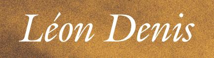

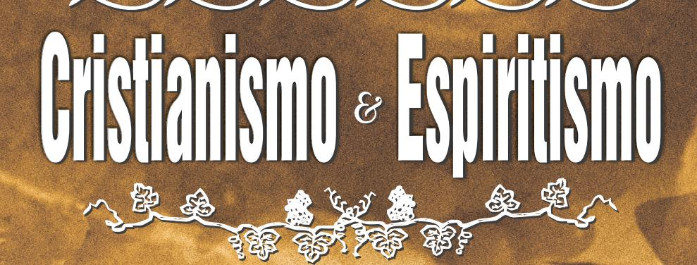

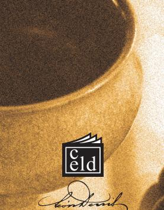

# Cristianismo e Espiritismo

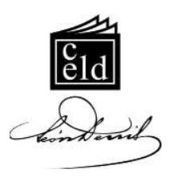

### Outras obras do autoreditadas pelo CELD:

- *Depois da Morte*
- *Espíritos e Médiuns*
- *No Invisível*
- *O Além e a Sobrevivência do Ser*
- *O Espiritismo na Arte*
- *O Gênio Céltico e o Mundo Invisível*
- *O Grande Enigma*
- *O Mundo Invisível e a Guerra*
- *O Problema do Ser e do Destino*
- *O Progresso*
- *Socialismo e Espiritismo*

### CIP - BRASIL - CATALOGAÇÃO-NA-FONTESINDICATO NACIONAL DOS EDITORES DE LIVROS, RJ.

Denis, Léon, 1846-1927D459c

> Cristianismo e Espiritismo / Léon Denis; tradução de Albertina Escudeiro Sêco. — 2. ed. — Rio de Janeiro: CELD, 2012.

344p.; 14x21cm

ISBN 978-85-7297-425-7

- 1. Bíblia e Espiritismo. 2. Espiritismo.
- I. Título.

08-2845. CDD 133.9CDU 133.7

# LÉON DENIS

# **PROVAS EXPERIMENTAIS DA SOBREVIVÊNCIA**

**RELAÇÕES COM OS ESPÍRITOS DOS MORTOSA DOUTRINA SECRETAA NOVA REVELAÇÃO**

Tradução de Albertina Escudeiro Sêco

2a Edição

CELDRio de Janeiro, 2012

### CRISTIANISMO E ESPIRITISMO

LÉON DENIS

Título do original francês:*CHRISTIANISME ET SPIRITISME* a Edição: agosto de 2008;do 1o ao 3o milheiro.2a Edição: agosto de 2012;do 4o ao 5o milheiro.

### L3470808

*Tradução:*Albertina Escudeiro Sêco*Revisão:*Barbara Santos*Capa:*José Ricardo Novaes Batista*Diagramação:*Rogério Mota*Composição e Arte-fi nal:*Márcio Almeida

Para pedidos de livros, dirija-se aoCentro Espírita Léon Denis(Distribuidora)Rua João Vicente, 1.445, Bento Ribeiro,Rio de Janeiro, RJ. CEP 21610-210

**Telefax (21) 2452-7700***E-mail*: distribuidora@leondenis.com.br*Site*: www.leondenis.com.br

Centro Espírita Léon Denis(Livraria João de Deus)Rua Abílio dos Santos, 137, Bento Ribeiro,Rio de Janeiro, RJ. CEP 21331-290CNPJ 27.921.931/0001-89IE 82.209.980

**Tel. (21) 2452-1846**

*E-mail*: livraria@leondenis.com.br*Site*: www.celd.org.br

Remessa via Correios e transportadora.

Todo produto desta edição é destinado à manutenção das obras sociais do Centro Espírita Léon Denis.

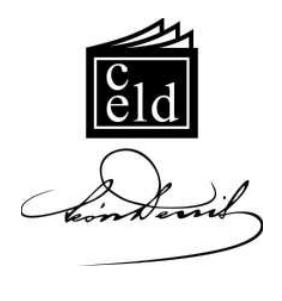

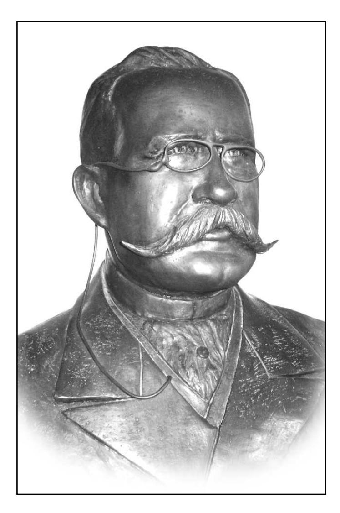

**LÉON DENIS**(1846-1927)

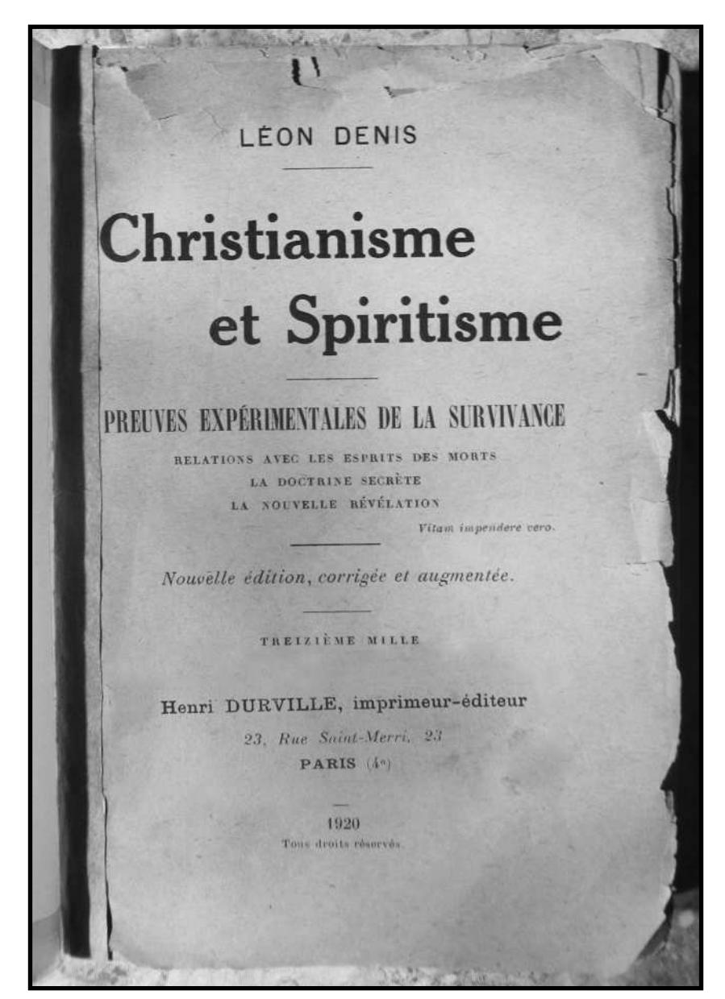

Fac-símile do original francês.

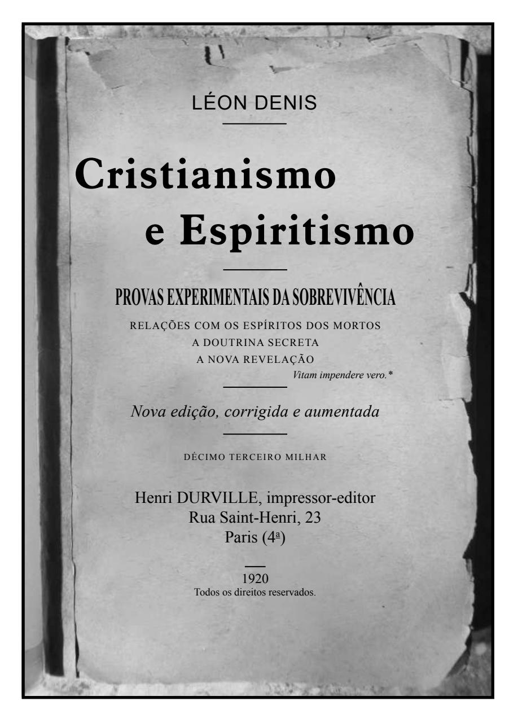

*Tradução do original.*

**Consagrar sua vida à verdade:** palavras do poeta latino Décimo Júnio Juvenal (60 – 140 d.C.) em *Sátiras* (IV, 91), obra em que ataca os vícios de sua época. Dessas palavras, Jean-Jacques Rousseau fez a sua divisa. (Nota da tradutora. Suas outras notas trarão apenas as iniciais **N.T.**)

# **SUMÁRIO**

| Ã I N T R O D U Ç O                                                                 | 1 5         |
|-------------------------------------------------------------------------------------------------------------------------------------------------------------------------------------------------------------------------------------|-------------------------------------|
| Á Ã P R E F C I O D A S E G U N D A E D I Ç O                                                   | 2 3         |
| I O ig d E l h e e r m o s v a n g o s –                                                     | 3 5         |
| ic i d d d l h I I A E te t n a e o s a n g e o s u v –                                | 4 1         |
| i d lt d l h I I I S O E t e n o c o o s a n g e o s u v –                          | 4 9         |
| in I V A D S tr ta o a e c re u –                                                               | 5 9         |
| la it d V R õ E ír M rt e ç e s c o m o s sp o s o s o o s –                                          | 6 9            |
| lt d is ia is V I A ã C O D t e ra ç o o r n m o s o g m a s –                                        | 8 7         |
| ( in ), lt V I I O D ã S C t to s o g m a s c o n a ç o o s a c ra m e n s, o o u u –              | 1 0 1       |
| d ia d is ia is V I I I D ê C t e c a n c o r n m o –                                     | 1 3 1       |
| la ir it is i ia I X A N R ã O E C ê o a e e ç o sp m o e a n c v v –                                          | 1 7 9       |
| la in d it X A N R ã A D E ír tr o a e e ç o o a o s sp o s v v u –                                         | 2 4 1          |
| X I R ã e n o a ç o v –                                                                | 2 6 9       |
| N O T A S C O M P L E M E N T A R E S                                                        | 2 9 3          |
| b i d d d í b l ig d N 1 S B A T o to ia ig t ta o re a a r a e a e a s o r e n s o u n o e s m | 2 9 3 to e n      |
| b ig d l h N 2 S E o o re a o r e m o s a n g e o s v                                     | 3 0 0          |
| b ic i d d d l h N 3 S E o te t o re a a n a e o s a n g e o s u v                     | 3 0 3          |
| b i d lt d l h N 4 S E o t o re o s e n o o c u o o s v a n g e o s                    | 3 0 4       |
| b N 5 S ã o o re a r e e n c a rn a ç o                                                | 3 0 6       |

| N 6 S b la õ d im ir is ã ír it o t o re a s re ç e s o s p r e o s c r o s c o m o s e sp o s                                                                                                                                                      | 3 1 0   |
|-----------------------------------------------------------------------------------------------------------------------------------------------------------------------------------------------------------------------------------------------------------------------------------------------------------------------------------------------------------------------------------------------|---------------------|
| N 7 O fe ô ír it B í b l ia o s n m e n o s e sp a s n a                                                                                                                                                                                      | 3 2 1   |
| N 8 S b ig i f i d i b í d à la D d ô io o tr o re o s n c a o a u o s p a v ra s e u s e e m n s                                                                                                                                             | 3 2 8   |
| N 9 S b is ír it i l; in i ã d P is d Ig j o t o re o p e r p o o u c o rp o s u o p o o s a a re a                                                                                                                                                 | 3 2 9   |
| N 1 0 G l i le ã d In d o a u e a c o n g re g a ç o o ex                                                                                                                                                                                     | 3 3 3   |
| N 1 1 P io X M d is o e o o e rn m o                                                                                                                                                                                                             | 3 3 6   |
| N 1 2 O fe ô ír it ân o te s n m en o s e sp a s c o n m p o r e o s; d i d i d d d it ír t p ro v a s e e n a e o s e sp o s                       | 3 3 7   |

"Espíritas, amai-vos, eis o primeiro ensinamento; instruí-vos, eis o segundo. Todas as verdades se encontram no Cristianismo; os erros que nele criaram raízes são de origem unicamente humana; e eis que do outro lado do túmulo, onde acreditáveis que nada existia, vozes vos gritam: 'Irmãos, nada morre! Jesus Cristo é o vencedor do mal, sede os vencedores da impiedade'." (O Espírito de Verdade. Paris, 1860.)

Kardec, Allan. *O Evangelho Segundo o Espiritismo*. Cap. 6, item 5.

# **INTRODUÇÃO**

Não foi um sentimento de hostilidade ou de malevolência que ditou estas páginas. Não temos sentimento de malevolência por nenhuma ideia, por nenhuma pessoa. Quaisquer que sejam os erros ou as faltas daqueles que invocam o testemunho do nome de Jesus e da sua doutrina, eles não podem diminuir o profundo respeito e a sincera admiração que temos pelo pensamento do Cristo. Educado na religião cristã, sabemos tudo o que ela encerra de poesia e de grandeza. Se abandonamos o domínio da fé católica pelo da fi losofi a espírita, não esquecemos por isso as lembranças da nossa infância, o altar ornado de fl ores diante do qual se curvava nossa fronte juvenil, a grande harmonia dos órgãos sucedendo aos cantos graves e profundos, e a luz peneirada pelos vitrais pintados que se jogava sobre as lajes entre os fi éis prosternados. Não esquecemos que a cruz austera estende seus braços sobre a tumba daqueles que mais amamos neste mundo. Se existe uma imagem, entre todas, venerável e sagrada para nós, esta é a do suplício do Calvário, do mártir pregado sobre o madeiro da infâmia, ferido, coroado de espinhos e que, agonizante, perdoa aos seus algozes.

Ainda hoje é com uma comovida emoção que ouvimos a chamada dos sinos, com as vozes de bronze indo despertar os ecos sonoros dos vales e dos bosques. E, nas horas de tristeza, gostamos de meditar na igreja solitária e silenciosa, sob a infl uência penetrante que as preces, as aspirações, as lágrimas de tantas gerações ali acumularam.

Entretanto, uma questão se apresenta: toda essa solenidade que impressiona os sentidos e toca o coração, todas essas manifestações da arte, a pompa do rito romano, e o fausto das cerimônias não são como um véu brilhante que esconde a pobreza da ideia e a insufi ciência do ensinamento? Não foi o sentimento da sua impotência em satisfazer as altas faculdades da alma, que conduziu a Igreja na estrada das manifestações exteriores e materiais?

O protestantismo, ele pelo menos é mais moderado. Se ele menospreza as formas, os adornos, é para melhor fazer ressaltar a grandeza da ideia. Ele estabelece a autoridade única da consciência e o culto do pensamento, e, de graus em graus, de consequências em consequências, tende logicamente ao livre exame, quer dizer, à fi losofi a.

Sabemos tudo o que a doutrina do Cristo encerra de sublime; sabemos que ela é, por excelência, a doutrina do amor, a religião da piedade, da misericórdia, da fraternidade entre os homens. É essa a doutrina que a Igreja romana ensina? A palavra do Nazareno nos chegou pura e sem mistura, e a interpretação que a Igreja nos dá dessa palavra está isenta de qualquer elemento estranho ou parasita?

Não existe questão mais grave, mais digna da meditação dos pensadores e da atenção de todos aqueles que amam e buscam a verdade. É isso que nos propomos a examinar na primeira parte desta obra, com a ajuda e a inspiração dos nossos guias do Espaço, afastando tudo o que poderia inquietar as consciências e fomentar a divisão entre os homens.

Esse trabalho, é verdade, outros o empreenderam antes de nós. Mas sua meta, seus meios de investigação e de controle diferiram dos nossos. Eles procuraram menos edifi car do que destruir, enquanto nós desejamos, antes de tudo, fazer obra de reconstituição e de síntese. Temos nos interessado em resgatar da sombra das idades, da confusão dos textos e dos fatos, o pensamento mestre, o pensamento de vida que é ao mesmo tempo a fonte pura, o foco intenso e radioso do Cristianismo, e a explicação dos fenômenos estranhos que caracterizam suas origens. Esses fenômenos se renovam a cada dia sob nossos olhos e podem ser explicados pelas leis naturais. Nesse pensamento oculto, nesses fenômenos até aqui inexplicáveis, mas que uma ciência nova observa e registra, nós achamos a solução dos problemas que se detêm, há tantos séculos, acima da razão humana.

Uma das mais fortes objeções endereçadas pela crítica moderna ao Cristianismo é que sua moral e sua doutrina da imortalidade repousam sobre um conjunto de fatos, ditos "miraculosos", que o homem, esclarecido sobre a ação das leis da natureza, não poderia admitir atualmente.

A questão, porém, vai se iluminar com uma luz possante, se for possível estabelecer que esses fatos se produziram em todos os tempos, que eles são o resultado de causas livres, invisíveis, perpetuamente atuantes, mas submissas a leis imutáveis. É precisamente esse um dos objetivos do Espiritismo. Por um estudo aprofundado das manifestações de além-túmulo, ele demonstra que esses fatos tiveram lugar em todas as épocas, que quase todos os grandes missionários, os fundadores de seitas e de religiões foram médiuns inspirados; que uma comunhão permanente une duas humanidades, ligando os habitantes do Espaço aos do mundo terrestre.

Esses fatos se reproduzem em torno de nós com uma intensidade renovada. Há cinquenta anos, formas aparecem, vozes se fazem ouvir, mensagens nos chegam por via tiptológica1 ou de

1 **Via tiptológica:** mensagens ditadas pelos espíritos através de uma linguagem convencional por pancadas, ruídos ou batimentos, por exemplo, uma batida signifi ca *sim*, duas batidas, *não*. As batidas também podem indicar as letras do alfabeto que, reunidas, formam palavras e frases. A *tiptologia* é uma forma de comunicação muito imperfeita devido à sua lentidão, que não permite os mesmos resultados que os obtidos pela *psicografi a* (que é a escrita feita pelos espíritos, impulsionando a mão do médium) e pela *psicofonia* (fenômeno que possibilita a um espírito falar através do aparelho fonador de um médium). (**N.T.**)

incorporação, assim como por escrita automática. Provas de identidade vêm em massa nos revelar a presença de nossos próximos, daqueles que amamos sobre a Terra, que foram nossa carne e nosso sangue, e cuja morte nos havia momentaneamente separado. Por seus cuidados, seus ensinos, nós aprendemos a conhecer esse além misterioso, objeto de tantos sonhos, de disputas e de contradições. As condições da vida futura se expõem com clareza em nosso entendimento. O passado e o futuro se esclarecem até nos seus secretos detalhes.

Assim, o Espiritismo, trazendo-nos as provas naturais e tangíveis da imortalidade, nos remete às puras doutrinas cristãs, à própria essência do *Evangelho*, que a obra do catolicismo e a lenta edifi cação de dogmas recobriram de tantos elementos despropositados e estranhos. Por seu estudo escrupuloso do corpo fl uídico (ou perispírito), ele torna mais compreensíveis, mais aceitáveis, os fenômenos de aparição e de materialização sobre os quais o Cristianismo se apoia.

Essas considerações farão ressaltar melhor a importância dos problemas levantados no decorrer desta obra, e dos quais apresentamos a solução apoiando-nos, ao mesmo tempo, nas declarações de sábios imparciais e esclarecidos e nos resultados de experiências pessoais, postas em prática há mais de trinta anos.

Aliás, nunca a necessidade de esclarecimento sobre questões vitais — às quais se liga de uma forma estreita a sorte das sociedades — se fez sentir de uma forma mais imperiosa. Cansado dos dogmas obscuros, das teorias interesseiras, das afi rmações sem provas, o pensamento humano, depois de muito tempo, deixou-se levar pela dúvida. Uma crítica implacável passou todos os sistemas pelo crivo da censura. A fé secou em sua fonte; o ideal religioso se encobriu. Ao mesmo tempo que os dogmas, as altas doutrinas fi losófi cas perderam seu prestígio. O homem esqueceu, simultaneamente, o caminho dos templos e o dos pórticos da sabedoria.

A crítica e a ciência materialista restringiram os horizontes da vida. Elas juntaram às tristezas da hora presente a negação sistemática, a ideia insuportável do nada. E por isso agravaram todas as misérias humanas, tiraram do homem, com suas armas morais mais seguras, o sentimento de suas responsabilidades. Elas abalaram, até em seu âmago, as próprias bases do "eu".

Assim, de pouco em pouco, os caracteres se abateram, a venalidade cresceu, a imoralidade se estendeu como uma chaga imensa.

Contra essas doutrinas de negação e de morte, hoje falam os fatos. Uma experimentação metódica, prolongada, nos conduz a esta certeza: o ser humano sobrevive à morte, e seu destino é obra sua.

Os fenômenos se multiplicaram, inumeráveis, trazendo dados novos sobre a natureza da vida e a evolução não interrompida do ser. A ciência os tem constatado devidamente. Agora, importa interpretá-los, esclarecê-los e principalmente deles deduzir a lei, as consequências, tudo o que deles pode provir para a vida individual e social.

Esses fatos vão despertar, no fundo das consciências, as verdades adormecidas. Eles devolverão a esperança ao homem, com o elevado ideal que esclarece e fortifi ca. Provando que nós não morremos inteiramente, eles dirigirão os pensamentos e os corações para essas vidas ulteriores, onde a justiça encontra a sua realização.

Dessa forma, todos compreenderão que a existência tem um objetivo, que a lei moral é uma realidade e que ela tem uma sanção; que não existem sofrimentos inúteis, trabalho sem proveito, provas sem compensação, que tudo é pesado na balança do Divino Justiceiro.

Em lugar desse campo fechado2 da vida onde os fracos sucumbem fatalmente, em lugar dessa cega e gigantesca máquina do mundo que tritura as existências, e da qual nos falam as fi losofi as negativas, o novo espiritualismo fará aparecer, aos olhos daqueles que se esforçam e daqueles que sofrem, a poderosa visão de um mundo de equidade, de justiça e de amor, onde tudo é regulado com ordem, sabedoria, harmonia.

Então o sofrimento será atenuado, o progresso do homem será assegurado, seu trabalho santifi cado; a vida revestir-se-á de mais dignidade e grandeza.

Porque o homem tem necessidade de uma crença, tanto quanto de uma pátria, tanto quanto de um lar, é o que explica que formas religiosas, caducas e envelhecidas, ainda tenham seus partidários. Existem no coração humano tendências e necessidades que nenhum sistema negativo jamais poderá satisfazer. Apesar da dúvida que a atinge, desde que a alma sofre, instintivamente ela se volta para o céu. Seja o que for que ele faça, o homem reencontra o pensamento de Deus nos cantos que o embalaram, nos sonhos de sua infância, como nas meditações silenciosas de sua idade madura. Em certas horas, o cético mais endurecido não pode contemplar o infi nito estrelado, o trajeto de milhões do sóis que se realiza na imensidão, nem passar diante da morte sem respeito e sem inquietação.

Acima das polêmicas vãs, das disputas estéreis, existe uma coisa que foge a todas as críticas, é essa aspiração da alma humana a um ideal eterno que a sustenta em suas lutas, a consola em suas provas, a inspira nas horas das grandes resoluções; é essa intuição de que, por trás do palco onde se desenrolam os dramas da vida e o espetáculo grandioso da natureza, oculta-se uma força, uma causa suprema, que deles regulou as fases sucessivas e traçou as linhas da evolução.

2 **Campo fechado:** em francês *champ clos*, na Idade Média, terreno cercado de barreiras para a realização de **torneios** que eram festas guerreiras onde os cavalheiros combatiam, a cavalo, uns contra os outros rivalizando em força e destreza. (**N.T.**)

No entanto, onde o homem encontrará o caminho seguro que o levará a Deus? De onde extrairá a sólida convicção que o guiará de etapas em etapas, através dos tempos e do espaço, em direção ao objetivo supremo das existências? Em uma palavra, qual será a fé do futuro?

As formas materiais e transitórias da religião passam; porém, a ideia religiosa, a crença pura, liberta de todas as formas inferiores, é indestrutível em sua essência. O ideal religioso evoluirá, como todas as manifestações do pensamento. Ele não poderia fugir à lei do progresso que governa os seres e as coisas.

A fé do futuro, que já surge do meio das sombras, não será nem católica nem protestante; ela será a crença universal das almas, aquela que reina em todas as sociedades avançadas do espaço, e pela qual cessará o antagonismo que separa a ciência atual da religião. Visto que, com ela, a ciência tornar-se-á religiosa, e a religião tornar-se-á científi ca. Ela irá apoiar-se sobre a observação, sobre a experiência imparcial, sobre fatos mil vezes repetidos. Mostrandonos as realidades objetivas do mundo dos espíritos, ela dissipará todas as dúvidas, expulsará as incertezas e abrirá para todos as perspectivas infi nitas sobre o futuro.

Em certas épocas da História, passam pelo mundo correntes de ideias que vêm retirar a Humanidade do seu torpor. Emanações do Alto elevam a grande onda humana, e, por meio delas, as verdades esquecidas na noite dos séculos saem das sombras. Elas surgem das mudas profundezas onde dormem os tesouros das forças escondidas, onde se combinam os elementos renovadores, onde se elabora a obra misteriosa e divina. Elas se manifestam sob formas inesperadas; reaparecem e revivem. Como fantasmas, inspiram espanto, pavor às inteligências de curta visão. Dir-se-ia a alma das antigas tradições, os espíritos dos deuses, dos heróis, dos profetas que saem da escuridão. Inicialmente são desconhecidas, ridicularizadas pela multidão, mas prosseguem seu caminho, impassíveis, serenas. E chega um dia em que se é obrigado a reco nhecer que essas verdades, desprezadas, desdenhadas, vêm oferecer o pão da vida, a taça da esperança para todas as almas sofredoras e despedaçadas; que elas nos trazem uma nova base de ensino e talvez também um meio de reerguimento moral.

Esta é a situação do espiritualismo moderno, em que renascem tantas verdades esquecidas há séculos. Ele resume em si as crenças dos sábios e dos antigos iniciados, a fé dos primeiros cristãos e a dos nossos pais, os celtas; ele reaparece sob formas mais poderosas, para dirigir uma etapa nova e ascendente da marcha da Humanidade.

# **PREFÁCIO DA SEGUNDA EDIÇÃO**

No início da nossa edição de fevereiro de 1910, escrevemos: Desde a publicação desta obra, 10 anos são decorridos. A história desenrolou sua trama e acontecimentos consideráveis ocorreram em nosso país. A Concordata3 foi denunciada. O Estado rompeu o laço que o unia à Igreja romana. Salvo em algumas cidades, foi com uma espécie de indiferença que a opinião pública acolheu as medidas de rigor tomadas pelo poder civil contra as instituições católicas.

De onde vem esse estado de espírito, essa desafeição, não somente local mas quase geral, dos franceses para com a Igreja? Do fato de a Igreja não ter concretizado nenhuma das esperanças que ela havia feito nascer. Ela não soube compreender, nem desempenhar seu papel e seus deveres de educadora e de condutora das almas.

3 **Concordata:** tratado entre o papa e um governo sobre assuntos religiosos. Acreditamos que Denis se refi ra à Concordata entre Bonaparte e Pio VII, concluída em 15 de julho de 1811, e que regulou as relações da França com a Santa Sé e do Estado com a Igreja até a lei de 9 de dezembro de 1905. O chefe do governo nomeava os arcebispos e os bispos, que recebiam do papa a investidura canônica. Os bispos, que prestavam juramento ao governo, nomeavam os curas sem ferir a aprovação ministerial. O papa abandonava toda espécie de reivindicação sobre a venda dos bens eclesiásticos e, em compensação, o Estado se comprometia a conceder uma remuneração aos bispos e aos curas. (**N.T.**, segundo o *Dictionnaire Le Robert* e o *Dictionnaire Nouveau Petit Larousse Illustré*.)

Há um século, a Igreja católica atravessava uma das crises mais temíveis da sua história. Na França, a separação veio acentuar esse estado de coisas, tornando-o mais agudo.

Renegada pela sociedade moderna, abandonada pela elite intelectual, em confl ito perpétuo com o novo direito que ela jamais aceitou e, portanto, em contradição, sobre quase todos os pontos essenciais, com as leis civis de todos os países, desconhecida e odiada por uma parte do povo, e sobretudo pelo operariado, nada mais resta de adeptos à Igreja a não ser entre as mulheres, as crianças, os velhos. O futuro não lhe pertence mais, pois que a educação da juventude lhe foi arrancada, não sem alguma brutalidade, pelas leis da república francesa.

Eis o balanço da Igreja romana no início do século 20. Nós queremos, em um estudo imparcial, respeitoso mesmo, procurar as causas profundas desse eclipse do poder eclesiástico, eclipse ainda parcial, mas que ameaça tornar-se total e defi nitivo em um futuro pouco distante.

Como a Igreja católica chegou a esse ponto? É que ela negligenciou muito a causa do povo. A Igreja foi verdadeiramente democrática e popular apenas em suas origens, quando o espírito de Jesus estava com ela, durante as épocas apostólicas, período de perseguição e de martírio; é o que então explicava sua força de proselitismo,4 a rapidez de suas conquistas, o seu poder de persuasão e de extensão. Desde o dia em que foi reconhecida ofi cialmente pelo Império, a partir da conversão de

4 **Proselitismo:** zelo em fazer *prosélitos* que, antigamente, para os hebreus, era o pagão que havia abraçado a religião judaica; atualmente, *prosélito* é o novo convertido a uma fé religiosa. (**N.T.**)

Constantino,5 ela tornou-se a amiga dos Césares,6 a aliada e, algumas vezes, a cúmplice dos poderosos. Ela entrou na era estéril das argúcias teológicas, das querelas bizantinas, e a partir desse momento sempre ou quase sempre tomou o partido do mais forte. Feudal na Idade Média e essencialmente aristocrática durante o período de Luiz XIV,7 para a Revolução8 fez apenas concessões forçadas e tardias. Todas as emancipações intelectuais e sociais foram feitas contra a vontade da Igreja; era lógico, fatal, que estas se voltassem contra ela.

Por muito tempo ligada à França pela Concordata, a Igreja esteve incessantemente em luta não declarada e sistemática com o Estado. Essa união forçada, que durava há um século, deveria, necessariamente, acabar em divórcio. A lei da separação o pronunciou. O primeiro uso que a Igreja fez da sua liberdade reconquistada foi jogar-se nos braços dos partidos reacionários, provando, com esse gesto, que depois de um século nada aprendeu, nada esqueceu.

5 **Constantino:** trata-se de Constantino I, o Grande, imperador romano (Naísso, entre 270 e 288 – Nicomédia, 337). Sua vitória contra Maxêncio junto aos muros de Roma, em 312, determinou o triunfo do Cristianismo; em 313, o Edito de Milão estabeleceu a liberdade de religião. Em 325, Constantino afastou Licínio, estabelecendo assim a unidade imperial. No mesmo ano convocou um concílio ecumênico em Niceia. Em 330 fundou uma nova Roma: Constantinopla. Em seu reinado, o Império tomou a forma de uma monarquia de direito divino. (**N.T.**, segundo o *Dicionário Enciclopédico Koogan Houaiss*.)

6 **Césares:** César era um sobrenome romano transformado em título em homenagem a Júlio César. Até a morte de Domício, em 96, foi título dos imperadores romanos; a partir daí, foi tratamento reservado ao herdeiro do trono. (**N.T.**)

7 **Luís XIV, o Grande:** nasceu em Saint-Germain-en-Laye, em 1638, e morreu em Versailles, em 1715. Foi rei de França de 1643 a 1715. Filho de Luís XIII e Ana da Áustria. (**N.T.**)

8 **Revolução Francesa:** (1789–1799) conjunto dos movimentos revolucionários que puseram fi m ao Antigo Regime e abriu a era dos governos democráticos. O reinado imoral e esbanjador de Luís XV fi zera o povo francês, esmagado por impostos e privado de todas as liberdades, perder a afeição e o respeito pela realeza. Uma data marcante da Revolução é 14 de julho de 1789, dia em que a Bastilha foi tomada pelo povo. A Bastilha era uma fortaleza construída em Paris que se tornou uma prisão do Estado e depois se transformou no símbolo do absolutismo real. (**N.T.**, segundo o *Dicionário Enciclopédico Koogan Houaiss*.)

Tornando-se solidária a partidos políticos ultrapassados, a Igreja católica, principalmente a da França, condena-se, por tal razão, a morrer no mesmo dia e da mesma morte que eles: a da impopularidade. Um papa genial, Leão XIII,9 tentou, certa ocasião, livrá-la de todo comprometimento direto ou indireto com o elemento reacionário, mas ele não foi escutado nem obedecido.

Seu sucessor, Pio X,10 retomando a tradição de Pio IX,11 acreditou não haver nada melhor para fazer do que aplicar as doutrinas do *Syllabus*12 e da infalibilidade. Sob a imprecisa designação de *modernismo*, ele julgou a propósito amaldiçoar a sociedade moderna e rebater qualquer tentativa de reconciliação ou de conciliação com ela.13 A guerra religiosa está prestes a se estender aos quatro cantos do país. O prestígio de grandeza que Leão XIII dera à Igreja, pela força do gênio diplomático, dissipou-se em alguns anos. O catolicismo, limitado ao domínio da consciência individual e privada, parece que não deverá mais viver da vida ofi cial e pública.

Ainda uma vez, qual é a causa profunda do enfraquecimento da mais poderosa instituição do universo? Os políticos, os fi lósofos, os sábios acreditam encontrá-la nas circunstâncias

9 **Leão XIII, Vincenzo Gioacchino Pecci**, (Carpineto Romano, 1810 – Roma, 1903). Foi papa de 1878 a 1903. Preconizou na França uma política de conciliação e, numa série de encíclicas de grande repercussão na sociedade moderna, encorajou o catolicismo social e a penetração religiosa no mundo operário. (**N.T.**)

10 **Pio X, (São), Giuseppe Melchiorre Sarto**, (Riese, 1835 – Roma, 1914). Foi papa de 1903 a 1914. Condenou o modernismo e reinstituiu o canto gregoriano; foi canonizado em 1954. (**N.T.**)

11 **Pio IX, Giovanni Maria Mastai-Ferretti**, (Senigallia, 1792 – Roma, 1878). Foi papa de 1846 a 1878. Apesar de eleito como liberal, recusou-se a encabeçar, em 1848, o movimento unitário italiano. Proclamou o dogma da Imaculada Conceição e o da infalibilidade do papa. (**N.T.**)

12 **Syllabus:** lista dos erros condenados pelo papa; foi promulgado por Pio IX, em 1864, é uma coletânea de 80 proposições latinas que contém os principais erros fi losófi cos, políticos, morais, doutrinários, etc., condenados pela Igreja. (**N.T.** segundo o*Dicionário Lello Universal*, vol. 4.)

13 Ver, no fi m deste livro, nota complementar no 11. (Nota do Autor. Suas notas sequentes conterão apenas as iniciais **N.A.**)

exteriores, em razões de ordem sociológica. Nós a procuramos no próprio coração da Igreja. É de um mal orgânico que ela perece; nela, o foco da vida foi atingido.

A vida da Igreja era o espírito de Jesus nela. O sopro do Cristo, esse sopro divino de fé, de caridade, de fraternidade universal; ali estava o motor desse vasto organismo, a peça matriz do seu funcionamento vital. Ora, desde muito tempo, o espírito de Jesus parece haver abandonando a Igreja. Não é mais a luz do Pentecostes14 que irradia nela e em torno dela; essa chama generosa se extinguiu.

No entanto, a Igreja da França foi grande e bela outrora. Ela foi o asilo dos mais elevados espíritos, das mais nobres inteligências. Nos tempos bárbaros, ela era, ao mesmo tempo, a ciência e a fi losofi a, a arte e a beleza, a fé e a oração. Os grandes monastérios, as célebres abadias tornaram-se os refúgios do pensamento. Lá se conservavam os tesouros intelectuais, os restos do mundo antigo. No século 13, ela inspirou uma bela parte do que o espírito humano produziu de mais notório. Ela domava todos esses homens rudes, esses bárbaros a custo civilizados; com um gesto ela os curvava em atitude de prece.

E agora ela não vive, apenas reluz com o refl exo da sua grandeza do passado. Onde estão, hoje em dia, na Igreja, os pensadores e os artistas, os verdadeiros padres e os santos? Os pesquisadores das verdades divinas, os grandes místicos adoradores do belo, os sonhadores do infi nito nela deram lugar aos políticos belicosos e aos comerciantes. A casa do Senhor foi transformada em banco e em tribuna. A Igreja tem um reino que é deste mundo, nada mais que deste mundo. Não é mais o sonho divino que a alimenta, mas ambições terrestres; uma orgulhosa pretensão de tudo dominar, tudo dirigir.

14 **Pentecostes:** festa cristã que se celebra cinquenta dias após a Páscoa, em comemoração à descida do Espírito Santo sobre os apóstolos. (**N.T.**)

As encíclicas15 e os cânones16 substituíram o sermão sobre a montanha; e os fi lhos do povo, as gerações que se sucedem, têm por guia apenas um catecismo extravagante, cheio de noções incompreensíveis, e que não serviria de socorro efi caz nas horas difíceis da existência. Daí vem a irreligião da maioria. O culto de uma certa Nossa Senhora rendeu até dois milhões por ano, porém não existe uma única edição popular do *Evangelho* entre as mãos dos católicos.

Todas as tentativas para fazer penetrar na Igreja um pouco de ar e de luz, como um sopro dos novos tempos, têm sido abafadas, reprimidas. Lamennais,17 H. Loyson,18 Didon19 foram constrangidos a se retratarem ou a deixar o meio.20 O abade Loisy foi expulso da sua cátedra. Há séculos curvada sob o jugo de Roma, a Igreja perdeu toda a iniciativa, toda a força viril, toda a pretensão de independência. A organização do catolicismo é tal que nenhuma decisão pode ser tomada, nenhum ato realizado sem o consentimento ou o sinal do poder romano. E Roma está petrifi cada na sua pose hierática21 como a estátua do passado.

15 **Encíclica:** carta solene, dogmática ou doutrinária, dirigida pelo papa ao clero do mundo católico, ou somente aos bispos de uma mesma nação. (**N.T.**)

16 **Cânones:** decretos, leis eclesiásticas concernentes à fé, à disciplina religiosa. (**N.T.**)

17 **Lamennais, Félicité Robert de:** escritor francês (Saint-Malo, 1782 – Paris, 1854). Ordenou-se, porém, em 1832, rompeu com a Igreja e inclinou-se para um humanismo socializante e místico. (**N.T.**)

18 **Loyson, Charles:** chamado **Padre Hyacinthe** (Jacinto), pregador e teólogo francês, nasceu em Orléans (1827 – 1912); rompeu com a Igreja católica, casou-se e fundou um culto católico **galicano**. (**N.T.**)

● **Galicano:** diz-se da Igreja francesa, de seu ritual e suas leis; o partidário das liberdades da Igreja francesa. (**N.T.**)

19 **Didon:** Acreditamos tratar-se do padre Henri Didon (1840–1900), dominicano, pregador francês, que nasceu em Touvet. É autor de uma obra sobre Jesus Cristo. (**N.T.**)

20 No original francês, a palavra empregada foi "giron" (meio que oferece um refúgio); acreditamos que o autor se refere ao "giron d'Église" (congregação dos fi éis católicos.) (**N.T.**)

21 **Hierática:** referente às coisas sagradas; solene. (**N.T.**)

O cardeal Meignan, falando do Sacro Colégio, dizia um dia a um de meus amigos:

> Eles estão lá, setenta anciãos, curvados, não sob o peso dos anos, mas sob o das responsabilidades, vigiando para que nem um iota22 seja suprimido do depósito sagrado, para que nem um iota seja acrescentado.

Em tais condições, a Igreja católica não é mais, moralmente, uma instituição ativa; não é mais um corpo em que a vida circule; é um túmulo, um sepulcro no qual o pensamento está como enterrado.

> \*\* \*

Há longos séculos, a Igreja não era mais que um poder polí tico, admiravelmente hierarquizado, organizado; enchia a História com a fama de suas lutas retumbantes com os imperadores e os reis, partilhando com eles a hegemonia do mundo. Ela concebera um plano grandioso: a cristandade, ou seja, o conjunto dos povos católicos concentrados, unidos como um exército colossal em torno do papa romano, senhor soberano e ponto culminante da feudalidade. Era grandioso, mas puramente humano.

A Igreja substituiu o império romano, minado pelos bárbaros, pelo império do Ocidente, vasta e poderosa instituição em torno da qual gravitou toda a Idade Média. Tudo desaparecia nessa confederação política e religiosa, da qual emergiam unicamente duas cabeças: o papa e o imperador, "essas duas metades de Deus".

Jesus não havia criado a religião do Calvário para dominar os povos e os reis, mas para arrancar as almas do jugo da matéria e pregar, pela palavra e pelo exemplo, o único dogma redentor: o Amor.

22 **Iota:** a 9a letra do alfabeto grego; "sem faltar um iota" quer dizer "sem faltar nada". (**N.T.**)

Passemos sobre os despotismos solidários da Igreja e dos reis; esqueçamos a Inquisição e suas vítimas, e voltemos aos tempos atuais.

Uma das maiores faltas da Igreja romana no século 19 foi a defi nição do dogma da infalibilidade pessoal do pontífi ce romano. Um tal dogma, imposto como artigo de fé, foi uma provocação lançada à sociedade moderna e ao espírito humano.

Proclamar no século 20, diante de uma geração agitada, atormentada pela afl ição do infi nito, diante de homens e de povos que buscam a verdade sem poder atingi-la, que procuram a justiça, a liberdade, como o cervo cheio de sede deseja e procura a água da fonte e a nascente do curso d'água; proclamar, dizemos nós, em um mundo em trabalho de criação, que um só homem sobre a Terra possui toda a verdade, toda a luz, toda a ciência, não é, nós o repetimos, lançar uma provocação à Humanidade inteira, a essa Humanidade condenada, sobre a Terra, à sede de Tântalo,23 ao despedaçamento de Prometeu?24

A Igreja católica difi cilmente se reabilitará dessa falta grave. No dia em que ela divinizou um homem, mereceu a censura, por idolatria, que lhe fazia Montalembert,25 quando, explicando em seu leito de morte a defi nição de infalibilidade pontifi cial, exclamou:

23 **Tântalo:** (mitologia) rei da Lídia (região da Ásia Menor, no mar Egeu, entre a Mísia e a Cária). Tendo recebido uma visita dos deuses, mandou servir-lhes os membros do corpo de seu próprio fi lho, Pélope. Zeus (deus supremo dos gregos) precipitou-o no Tártaro (região mais profunda dos infernos), condenando-o a padecer eternamente de fome e de sede atrozes. (**N.T.**)

24 **Prometeu:** (mitologia), deus ou gênio do fogo. Aparece na mitologia clássica como o iniciador da primeira civilização humana. Depois de ter formado o homem com argila, para dar-lhe uma alma, roubou o fogo do céu. Zeus, para punilo, mandou que ele fosse acorrentado no Cáucaso (cadeia de montanhas da Rússia), onde uma águia lhe devorava o fígado, que sempre se renovava. (**N.T.**)

25 **Montalembert, Charles Forbes, conde de:** publicista e político francês (Londres, 1810 – Paris, 1870), defensor do catolicismo liberal. Pertenceu à Academia Francesa. (**N.T.**)

"Jamais adorarei o ídolo do Vaticano!" A palavra ídolo é exagerada? Como os Césares romanos a quem se ofereceu um culto, o papa desejou que o chamassem pontífi ce e rei. Quem é ele senão o sucessor dos imperadores de Roma e de Bizâncio? Sua própria roupa, seus gestos, sua atitude, a etiqueta antiquada e o fausto da sua cúria, tudo lembra as pompas cesareanas dos mais nocivos dias, e não foi o eloquente orador espanhol, o religioso Emílio Castelar,26 que exclamou um dia, vendo Pio IX conduzido sobre a *sedia*,27 quando ia, em procissão, para São Pedro: "Aquele não é o pescador da Galileia, é um sátrapa28 do Oriente!"

A causa profunda da decadência e da impopularidade da Igreja romana está neste ponto: ela pôs o papa no lugar de Deus. O espírito do Cristo afastou-se dela. Perdendo a virtude do Alto, que a sustentava, a Igreja sucumbiu ao poder da política humana. Ela não é mais uma instituição de ordem divina; o pensamento de Jesus não a inspira mais, e os dons maravilhosos que o espírito de Pentecostes lhe havia comunicado desapareceram.

Além disso, atacada de cegueira, como os sacerdotes da Sinagoga29 antiga, à vinda de Jesus, a Igreja esqueceu o sentido profundo da sua liturgia e de seus mistérios. Seus sacerdotes não conhecem mais o sentido oculto das coisas; perderam o segredo da iniciação. Seus gestos tornaram-se estéreis; suas bênçãos não abençoam mais, suas maldições não amaldiçoam mais. Foram rebaixadas ao nível comum, e o povo, compreendendo que o

26 **Emílio Castelar:** político republicano e escritor espanhol, nasceu em Cadix. (**N.T.**)

27 **Sedia:** palavra italiana, signifi ca cadeira; *sedia gestatória*, cadeira sobre a qual se leva o Papa em certas cerimônias. (**N.T.**)

28 **Sátrapa:** governador de província, na Pérsia antiga; pessoa que leva vida faustosa; grande senhor; déspota. (**N.T.**)

29 **Sinagoga:** templo onde os judeus se reúnem para o exercício de seu culto. (**N.T.**)

seu poder é falso, que seu ministério é ilusório, voltou-se em direção a outros poderes e incensou outros deuses.

Na Igreja, a teologia matou o *Evangelho*, como na Sinagoga antiga o *Talmude*30 havia desnaturado a *Lei*. São os partidários da letra que hoje a dirigem. Uma coletividade de fanáticos rigorosos e violentos acabará por retirar da Igreja os últimos sinais da sua grandeza, por consumar a sua impopularidade. Assis tiremos, provavelmente, à ruína progressiva dessa instituição que foi, durante vinte séculos, a educadora do mundo, mas que parece haver infringido a sua verdadeira vocação.

Resulta daí que o futuro religioso da Humanidade esteja irrevogavelmente perdido, que o mundo inteiro deva afundar no materialismo como em um mar lodoso? Longe disso. O reinado da letra se acabou, o do espírito começa. O fogo do Pente costes, que abandona o candelabro de ouro da Igreja, vem acender outros castiçais. A verdadeira revelação se estabelece no mundo pela virtude do invisível. Quando o fogo sagrado se extingue sobre um ponto, é para se avivar em outra parte. Jamais a noite total encobre o mundo com suas trevas. Sempre brilha alguma estrela no fi rmamento.

A alma humana, por sua origem, mergulha no infi nito. O homem não é mais um átomo isolado no grande turbilhão. Seu espírito está sempre em relação com a causa eterna; seu destino faz parte integrante das harmonias divinas e da vida universal. Pela força dos acontecimentos, o homem se aproximará de Deus.

Assistimos hoje em dia ao crepúsculo das Igrejas formalistas, mas já podemos pressentir a aurora inicial de um astro que nasce: o do espiritualismo moderno.

30 **Talmude:** (palavra hebraica que signifi ca "estudo"), coleção de tradições rabínicas que interpretam a lei de Moisés e onde se podem distinguir duas partes: a *Mixina*, codifi cação das tradições orais, e a *Gemara*, comentário delas. (**N.T.**)

Na hora perturbada em que estamos, um grande combate se trava entre a luz e a noite.

*Sursum corda!*31 É a vida eterna que se abre radiosa, ilimitada diante de nós! Do mesmo modo que no infi nito milhares de mundos são arrastados por seus sóis em direção ao incomensurável, em um curso harmonioso, ritmado como uma dança antiga, e que nenhum astro, nenhum planeta jamais passa por um mesmo ponto, assim as almas, levadas pela atração magnética de seu centro invisível, prosseguem sua evolução no espaço, incessantemente atraídas por um Deus do qual elas sempre se aproximam sem nunca alcançá-lo.

Reconhecemos, aliás, que essa doutrina é mais ampla que os dogmas exclusivos das Igrejas agonizantes, e que, se o futuro pertence a alguma coisa ou a alguém, é verdadeiramente ao espiritualismo universal, a este *Evangelho* do infi nito e da eternidade!

31 *Sursum corda***:** frase latina que signifi ca "elevai os corações". Cita-se como exortação a sentimentos elevados. (**N.T.**)

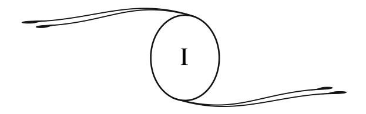

### **ORIGEM DOS EVANGELHOS**

Há aproximadamente um século, trabalhos importantes, realizados nos diversos países cristãos por homens ocupando altas posições nas Igrejas e universidades, permitiram reconstituir as verdadeiras origens e a evolução da tradição evangélica em suas fases sucessivas.

Foi principalmente nos centros de religião protestante que esses trabalhos foram elaborados, tão notáveis por sua erudição e seu caráter minucioso, e que lançaram intensas luzes sobre as origens do Cristianismo, sobre os fundamentos, a forma, o alcance social das doutrinas do *Evangelho*.32

São os resultados desses trabalhos que aqui exporemos rapi damente, sob uma forma que nos esforçaremos em tornar mais simples que o dos exegetas33 protestantes.

32 Esses trabalhos estão reunidos na *Enciclopédia das Ciências Religiosas*, de F. Lichtenberger, decano da Faculdade de Teologia Protestante de Paris, e podem ser consultados com proveito por todos aqueles que se interessem pelos estudos de **exegese**e de crítica sagrada. Além disso, pode-se-lhes recomendar a *História da Teologia Cristã no Século Apostólico*, por Édouard Reuss, professor de teologia em Strasbourg (Paris, Treuttel e Würtz, 1852), e a *Essência do Cristianismo*, de Harnack, traduzido por A. Bertrand (Paris, Fischbacker). (**N.A.**)

● **Exegese:** comentário ou dissertação que tem por objetivo esclarecer ou interpretar minuciosamente um texto ou uma palavra. Aplica-se de modo especial em relação à *Bíblia*, à gramática, às leis. (**N.T.**)

33 **Exegeta:** indivíduo que realiza exegese. (**N.T.**)

O Cristo nada escreveu. Suas palavras, propagadas ao longo dos caminhos, foram transmitidas de boca em boca, depois transcritas em épocas diversas, muito tempo após a sua morte. Uma tradição religiosa popular se formou pouco a pouco, tradição que sofreu uma evolução constante até o quarto século.

Durante esse período de trezentos anos, a tradição cristã jamais fi cou estacionária nem semelhante a si mesma. Ao afas tar-se do seu ponto de partida, através dos tempos e dos lugares, ela se enriqueceu e diversifi cou. Um poderoso trabalho de imaginação se realizou, e, conforme as formas que revestiram as diversas narrativas evangélicas, segundo sua origem hebraica ou grega, pôde- se estabelecer, seguramente, a ordem em que essa tradição se desenvolveu, e fi xar a data e a importância dos documentos que a representam.

Durante cerca de meio século após a morte de Jesus, a tradição cristã, oral e viva, foi como uma água corrente da qual toda gente pôde se servir. Ela se propagou pelas pregações, pelos ensinamentos dos apóstolos, homens simples, iletrados,34 mas que o pensamento do Mestre iluminava.

Somente do ano 60 ao ano 80 é que apareceram as primeiras narrações escritas, inicialmente a de Marcos, que é a mais antiga, depois as primeiras narrativas atribuídas a Mateus e a Lucas, todas escritos fragmentários e que foram aumentando com adições sucessivas, como todas as obras populares.35

Somente no fi m do primeiro século, entre 80 e 98, é que apareceu o *Evangelho de Lucas*, assim como o primitivo *Evangelho de Mateus*, atualmente perdido; por último, entre o ano 98 e o 110, apareceu, em Êfeso, o *Evangelho de João*.

34 Com exceção de Paulo, que era versado em letras. (**N.A.**)

35 **A. Sabatier**, diretor da seção de estudos superiores na Sorbonne, em *Os Evangelhos Canônicos*, p. 5. A Igreja sentiu difi culdade em encontrar os verdadeiros autores dos evangelhos. Daí, a fórmula adotada por ela: *Evangelho segundo...* (**N.A.**)

Ao lado desses evangelhos, os únicos reconhecidos posteriormente pela Igreja, um grande número de outros surgiu. Conhece-se, atualmente, uma vintena deles, mas, no terceiro século, Orígenes36 citava um número mais elevado. Lucas37 a isso se refere no primeiro versículo da obra que traz o seu nome.

Por que razão esses numerosos documentos foram declarados apócrifos e rejeitados? Muito provavelmente porque eles se tornaram embaraçosos para aqueles que, no segundo e no terceiro séculos, imprimiram ao Cristianismo uma direção que devia afastá-lo mais e mais de suas formas primitivas, e, após haver repelido mil sistemas religiosos, qualifi cados de heresias, esta ação devia tender para a criação de três grandes religiões nas quais o pensamento do Cristo está escondido, enterrado, sob os dogmas e as práticas, como em um túmulo.38

Os primeiros apóstolos se limitavam a ensinar a paternidade de Deus e a fraternidade humana. Eles demonstravam a necessidade da penitência, isto é, da reparação dos nossos erros. Essa purifi cação era simbolizada pelo batismo, prática adotada pelos essênios, iniciadores de Jesus, aos quais os apóstolos atribuíam, ainda, a crença na imortalidade e na ressurreição, isto é, ao retorno da alma à vida espiritual, à vida do espaço.

Daí, uma moral e um ensinamento que atraíram numerosos prosélitos em torno dos discípulos do Cristo, visto nada conterem que não pudesse se aliar a certas doutrinas judaicas pregadas no templo e nas sinagogas.

Com Paulo, e depois dele, novas correntes se estabeleceram e doutrinas confusas surgiram no meio das comunidades cristãs. Sucessivamente, a predestinação e a graça, a divindade do

36 **Orígenes:** exegeta e teólogo (Alexandria, 185 – Tiro, 254). Apologista de grande valor, abusou, na interpretação da *Bíblia*, do método alegórico e tentou uma fusão entre o Cristianismo e o platonismo. (**N.T.** segundo o *Dicionário Lello Universal*, vol. III.)

37 Lucas 1:1 a 5. (**N.T.**)

38 Ver notas complementares nos 2, 3 e 4 no fi m deste volume. (**N.A.**)

Cristo, a queda e a redenção, a crença em Satanás e no inferno, serão lançadas nos espíritos e virão alterar a pureza e a simplicidade do ensino do fi lho de Maria.

Esse estado de coisas vai prosseguir e se agravar, ao mesmo tempo em que convulsões políticas e sociais agitarão a infância do mundo cristão.

Os primeiros evangelhos nos reportam à época agitada em que a Judeia, revoltada contra os romanos, viu a ruína de Jerusalém e a dispersão do povo judeu (ano 70). Foi no meio do sangue e das lágrimas que eles foram escritos e as esperanças que eles exprimem parecem brotar de um abismo de dores, ainda que, nas almas entristecidas, o novo ideal desperte a aspiração por um mundo melhor, chamado "reino dos céus", onde serão corrigidas todas as injustiças atuais.

Nessa época, todos os apóstolos, menos João e Felipe, esta vam mortos; o laço que unia os cristãos ainda era bem frágil. Eles formavam grupos isolados uns dos outros, que recebiam o nome de igrejas (*ecclesia*, assembleia), dirigidos cada um por um bispo ou zelador nomeado por eleição.

Cada igreja estava entregue às suas próprias inspirações; tinha, para se orientar, somente uma tradição incerta, fi xada em alguns manuscritos que resumiam mais ou menos fi elmente os atos e as palavras de Jesus, e que cada bispo interpretava à sua vontade.

Acrescentemos a essas difi culdades tão grandes, aquelas provenientes da fragilidade dos pergaminhos, em uma época em que a imprensa era desconhecida, a falta de inteligência de certos copistas,39 todos os males que a ausência de direção e de controle pode fazer nascer, e compreenderemos facilmente que a unidade de doutrina e de crença não tenha podido se manter em épocas tão tormentosas.

39 **Copista:** pessoa que copia; aquele que copiava os pergaminhos. (**N.T.**)

Os três evangelhos sinópticos40 estão fortemente impregnados do pensamento judeu-cristão dos apóstolos, porém, o de João se inspira em uma outra infl uência. Nele se percebe um refl e xo da fi losofi a grega, rejuvenescida pelas doutrinas da escola de Alexandria.

Ao fi nal do primeiro século, os discípulos dos grandes fi ló sofos gregos haviam aberto escolas em todas as cidades impor tantes do Oriente. Os cristãos estavam em contato com eles e discussões frequentes surgiam entre os partidários das diversas doutrinas. Recrutados nas classes inferiores da população, em sua maioria pouco instruídos, os cristãos estavam mal preparados para essas lutas de pensamento. Por sua vez, os teóricos gregos fi caram vivamente impressionados com a grandeza e a elevação moral do Cristianismo. Daí uma aproximação, uma penetração das doutrinas, que se produziu sobre certos pontos. O Cristianismo nascente sofria pouco a pouco a infl uência grega, que o levava a fazer do Cristo, o Verbo,41o*Logos*42 de Platão.

40 Assim se designam os evangelhos de Marcos, Lucas e Mateus. (**N.A.**)

● **Sinópticos:** com a variante sinótico, do grego *synoptikós*, que signifi ca "de um só golpe de vista abrange várias coisas". Os evangelhos de Marcos, Lucas e Mateus são assim chamados porque permitem uma visão do conjunto, dada a semelhança de suas versões. (**N.T.**)

41 **Verbo:** a sabedoria eterna; a palavra de Deus ou o próprio Deus, segundo a *Bíblia*. (**N.T.**)

42 **Logos:** o princípio de inteligibilidade; a razão. Segundo Platão (fi lósofo grego, 429-347 a.C.), Deus como fonte das ideias. (**N.T.**, segundo os dicionários *Lello Universal*, vol. III, e *Koogan Houaiss*.)

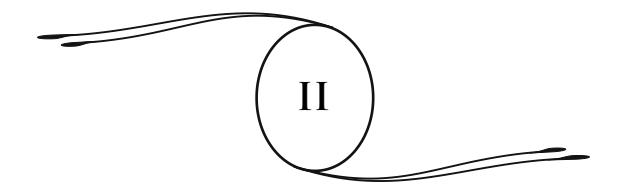

### **AUTENTICIDADE DOS EVANGELHOS**

Nos tempos passados, bem antes da vinda de Jesus, a palavra dos profetas, como um raio encoberto da verdade, preparava os homens para os ensinamentos mais profundos do *Evangelho*.

Porém, já deturpado pela versão dos Setenta,43o*Antigo Testamento* não dava mais, nos últimos séculos antes de Cristo, senão uma vaga intuição das verdades superiores.44

> "As verdades eternas, que são os pensamentos de Deus", nos diz uma eminente individualidade do espaço, "foram comunicadas ao mundo em todas as épocas, levadas a todos os meios, postas ao alcance das inteligências com uma bondade paternal. Mas o homem muitas vezes não as tem reconhecido. Desdenhoso dos princípios ensinados, levado por suas paixões, ele sempre passou perto de grandes coisas sem as ver. Esse descuido da nobre moral, causa de decadência e de corrupção, levaria as nações à sua perda, se a mão da adversidade e as grandes comoções da História, agitando profundamente as almas, não tornassem a trazê-las em direção à verdade".

43 **Versão dos Setenta:** nome dado à tradução grega do *Antigo Testamento*, feita em Alexandria, na ilha de Faro, por setenta e dois judeus do Egito e por ordem de Ptolomeu Filadelfo. É a mais antiga (283 ou 282 a.C.) e a mais célebre de todas as traduções. Também é denominada *Versão Alexandrina*. (**N.T.**, segundo o *Dicionário Lello Universal*, volume 4.)

44 Ver nota complementar no 1, no fi m deste volume. (**N.A.**)

Veio Jesus, espírito poderoso, missionário divino, médium inspirado. Ele veio, encarnando entre os humildes, a fi m de dar a todos o exemplo de uma vida simples e, no entanto, cheia de grandeza, vida de abnegação e de sacrifício, que devia deixar traços indeléveis sobre a Terra.

A nobre fi gura de Jesus ultrapassa todas as concepções do pensamento. Eis por que ela não pôde ser criada pela imaginação. Nessa alma, de uma serenidade celeste, não se vê nenhuma mancha, nenhuma sombra. Nela todas as perfeições se fundem com uma harmonia tão perfeita que ela nos aparece como o ideal realizado.

Sua doutrina, toda de amor e de luz, dirige-se especialmente aos humildes e aos pobres, a essas mulheres, a esses homens do povo curvados para a terra, a essas inteligências rebaixadas sob o peso da matéria e que esperam, na prova e no sofrimento, a palavra de vida que deve consolá-los e reanimá-los.

E essa palavra lhes é dada com uma tão penetrante doçura, exprime uma fé tão comunicativa, que expulsa todas as suas dúvidas e os leva a seguir os passos do Cristo.

O que Jesus denominava "pregar aos simples o *Evangelho*do reino dos céus" era colocar ao alcance de todos o conhecimento da imortalidade e do Pai comum, do Pai do qual se ouve a voz na paz do coração, na tranquilidade da consciência.

 Pouco a pouco essa doutrina, transmitida oralmente nos primeiros tempos do Cristianismo, se altera e se complica sob a infl uência das correntes contrárias que agitam a sociedade cristã.

Os apóstolos, escolhidos por Jesus para continuar sua missão, souberam compreendê-lo bem; receberam o impulso da sua vontade e da sua fé. Mas seus conhecimentos eram limitados e eles só puderam conservar devotamente, pela memória do coração, as tradições, as ideias morais e o desejo de regeneração que Jesus lhes havia feito sentir.

Em seu percurso pelo mundo, os apóstolos se limitam, portanto, a criar, de cidade em cidade, grupos de cristãos a quem revelam os princípios essenciais, depois, prematuramente, vão levar a "boa-nova" a outras regiões.

Os *Evangelhos*, escritos em meio às convulsões que marcam a agonia do mundo judaico, depois sob a infl uência das discussões que assinalaram os primeiros tempos do Cristianismo, se ressentem das paixões, dos preconceitos da época e da perturbação dos espíritos. Cada grupo de fi éis, cada comunidade tem seus *Evangelhos*, que diferem ou mais ou menos dos outros.45 Grandes disputas dogmáticas agitam o mundo cristão e provocam perturbações sanguinolentas no Império, até que Teodósio,46 dando a supremacia ao papado, impõe a opinião do bispo de Roma à cristandade. Desde então o pensamento, muito fecundo criador de diversos sistemas, será oprimido.

Para colocar um fi m a essas divergências de opinião, na mesma época em que vários concílios acabavam de discutir sobre a natureza de Jesus, uns aceitando, outros não admitindo sua divindade, o papa Dâmaso47 entrega a São Jerônimo,48 em 384, a tarefa de redigir uma tradução latina do *Antigo* e do *Novo Testamento*. Esta tradução deverá, para o futuro, ser a única considerada como ortodoxa e tornar-se a regra das doutrinas da Igreja; essa tradução recebeu o nome de *Vulgata*.49

45 Ver nota complementar no 3. (**N.A.**)

46 **Teodósio I, o Grande:** (Cauca, Galícia, 347 – Milão, 395) imperador romano de 379 a 395, favoreceu o triunfo do Cristianismo sobre o paganismo. (**N.T.**)

47 **Dâmaso I, São:** morreu em Roma no ano de 384 d.C.; foi Papa de 366 a 384. (**N.T.**)

48 **Jerônimo, São:** doutor da Igreja latina, (Stridon, por volta de 347 – Belém, 420). Apologista vigoroso a quem se deve a tradução da *Bíblia* em língua latina, denominada *Vulgata*, tratados e *Cartas*. (**N.T.**)

49 *Vulgata***:** palavra latina que signifi ca "que é do uso público". Foi o Concílio de Trento, realizado na cidade de Trento, Itália, de 1545 a 1553, que declarou essa tradu ção de uso comum na Igreja. (**N.T.**)

Esse trabalho apresenta grandes difi culdades. São Jerônimo achava-se, assim ele mesmo o disse, diante de tantos exemplares quanto de cópias. Essa variedade infi nita de textos impunha-lhe uma escolha e manuseamentos intensos. É isso que, atemorizado com as responsabilidades a que fi cou sujeito, ele expõe nos prefácios da sua obra, prefácios reunidos em um livro célebre. Eis aqui, por exemplo, o que ele endereçou ao papa Dâmaso, no início da sua tradução latina dos evangelhos:

De uma antiga obra, vós me obrigais a fazer uma nova. Vós quereis que eu me coloque, de alguma forma, como árbitro entre os exemplares das Escrituras que estão espalhados por todo o mundo, e, como eles diferem entre si, que eu distinga aqueles que estão de acordo com o verdadeiro texto grego. Esta é uma piedosa tarefa, mas também é uma perigosa ousadia de parte daquele que deve ser julgado por todos, a de julgar ele mesmo os outros, querer mudar a língua de um ancião e tornar a trazer para a infância o mundo já velho.

Qual é, realmente, o sábio e mesmo o ignorante que, no momento em que tiver em mãos um exemplar (novo), e após o haver percorrido somente uma vez, vendo que esse exemplar encontra-se em desacordo com aquele que ele está acostumado a ler, não se ponha logo a dar gritos, afi rmando que sou um sacrílego, um falsário, porque ousei acrescentar, mudar, corrigir alguma coisa nos livros antigos?50 (*Me clamitans esse sacrilegum qui audeam aliquid in veteribus libris addere, mutare, corrigere*).

Um duplo motivo me consola dessa acusação. O primeiro é que vós, que sois o soberano pontífi ce, me ordenastes a fazê-lo; o segundo é que a verdade não poderia existir nas coisas que diferem, ainda mesmo que houvesse para elas a aprovação dos maus.

50 A obra de São Jerônimo foi, de fato, desde quando ele ainda estava vivo, motivo das mais ardentes críticas; polêmicas injuriosas foram trocadas entre ele e seus detratores. (**N.A.**)

### São Jerônimo termina assim:

Este curto prefácio se aplica somente aos quatro evangelhos, cuja ordem é a seguinte: Mateus, Marcos, Lucas e João. Após haver comparado um certo número de exemplares gregos, mas dos antigos, que não se afastavam muito da versão itálica, nós os combinamos de tal forma (*ita calamo temperavimus*) que, corrigindo apenas o que nos parecia alterar o sentido, mantivemos o resto tal como estava. (*Obras de São Jerônimo*, edição dos Beneditinos, 1693, T.I, col. 1425.)

Assim, é segundo uma primeira tradução do hebraico para o grego, pelas cópias trazendo os nomes de Marcos e de Mateus; é, num ponto de vista mais geral, segundo numerosos textos dos quais cada cópia difere das outras (*tot sunt enim exemplaria quot codices*) que se constitui a *Vulgata*, tradução corrigida, aumentada, modifi cada, como o reconhece o autor, de manuscritos antigos.

Essa tradução ofi cial, que devia ser defi nitiva na ideia daque le que havia ordenado a sua execução, foi, no entanto, modi fi cada em diversas épocas por ordem dos pontífi ces romanos. O que parecera bom do ano 386 ao ano 1586, o que havia sido aprovada no ano de 1546 pelo Concílio Ecumênico de Trento, foi declarado insufi ciente e errado por Sisto V51 em 1590. Uma nova revisão foi feita por sua ordem; a edição que daí resultou e que levava seu nome foi modifi cada por Clemente VIII.52 Esta é a edição, em uso hoje em dia, segundo a qual foram feitas as traduções francesas dos livros canônicos, submetidos a tantas modifi cações através dos séculos.

No entanto, apesar de todas essas vicissitudes, não hesitamos em admitir a autenticidade dos evangelhos nos seus textos

51 **Sisto V, Felice Peretti:** foi papa de 1585 a 1590. Nasceu em Grottammare, em 1520, e morreu em Roma, em 1590. (**N.T.**)

52 **Clemente VIII, Hipólito Aldobrandini:** foi papa de 1592 a 1605. Nasceu em Fano em 1536 e morreu em Roma em 1605. (**N.T.**)

primitivos. A palavra do Cristo ali sobressai com autoridade; toda dúvida se dissipa sob a radiação da sua personalidade sublime, sob o sentido alterado ou oculto, vê-se despontar a força da ideia primitiva. A mão do grande semeador ali se revela; na profundeza desses ensinamentos, unida à beleza moral e ao amor, sente-se a obra de um enviado celeste.

Porém, ao lado dessa mão poderosa, a frágil mão do homem deslizou por essas páginas, nelas introduzindo fracas concep ções; mal ligadas às primeiras ideias, e, ao lado dos arrebatamentos da alma, provocam a incredulidade.

Se os evangelhos são aceitáveis em muitos pontos, convém submeter o conjunto ao controle da razão. Todas as palavras, todos os fatos que ali estão consignados, não poderiam ser atribuídos ao Cristo.

Durante o tempo que separa a morte de Jesus da redação defi nitiva dos *Evangelhos*, muitos pensamentos sublimes foram esquecidos, muitos fatos contestáveis aprovados como reais, muitas regras de proceder, mal interpretadas desnaturaram o ensinamento primitivo. Para benefi ciar uma causa, os mais belos, os mais fortes ramos dessa árvore da vida foram podados. Asfi xiaram, antes da sua eclosão, os princípios fortifi cantes que teriam levado os povos para a verdadeira crença, aquela que ainda hoje eles buscam.

O pensamento do Cristo subsiste no ensinamento da Igreja e nos textos sagrados, porém misturado a opiniões posteriores, a diversos elementos introduzidos pelos papas e pelos concílios, cuja fi nalidade era assegurar, fortifi car, tornar inquebrantável a autoridade da Igreja. Este foi o objetivo perseguido através dos séculos, o pensamento que inspirou todas as modifi cações feitas nos documentos primitivos.

Apesar de tudo, o que resta na Igreja de espírito evangélico, verdadeiramente cristão, foi sufi ciente para gerar obras admiráveis, obras de caridade que fi zeram a glória das Igrejas

cristãs e que destoam ao se acharem associadas a tantos empreendimentos ambiciosos, inspirados pelo amor ao domínio e aos bens materiais.

Um grande trabalho seria necessário para separar o verdadeiro pensamento do Cristo dos elementos estranhos contidos nos evangelhos, trabalho possível, embora árduo, para os inspirados, guiados por uma intuição segura, porém tarefa impossível para aqueles que só as próprias faculdades os dirigem nesse labirinto, onde as fi cções se misturam às realidades, o profano ao sacro, a verdade ao erro.

Em todos os séculos, certos homens, impelidos por uma força superior, consagraram-se a essa tarefa, procurando libertar o supremo pensamento das sombras acumuladas em torno dele.

Sustentados, esclarecidos por essa centelha divina que brilha somente de uma forma intermitente para os homens, mas cujo foco não se apaga jamais, eles suportaram todas as acusações, todos os suplícios, para afi rmar o que pensavam ser a verdade. Tais foram os apóstolos da Reforma.53 Eles morreram labutando, e, do seio do espaço, ainda sustentam e inspiram aqueles que lutam pela emancipação das almas. Graças a tantos esforços, a noite começa a se dissipar nas almas diante da aurora de uma revelação mais poderosa.

Com a ajuda dos conhecimentos trazidos por essa nova revelação, ao mesmo tempo científi ca e fi losófi ca, já espalhada no mundo inteiro sob o nome de Espiritismo ou Espiritualismo Moderno, é que procuraremos livrar a doutrina de Jesus das sombras com que o trabalho dos séculos a envolveu. Chegaremos, assim, a concluir que essa doutrina e a dos espíritos são idênticas, que o Espiritismo é simplesmente o retorno ao Cristianismo

53 **Reforma:** movimento religioso que, no século 16, subtraiu à obediência do papa uma parte da Europa e deu nascimento às Igrejas Protestantes. Teve por causa principal a convicção, de seus chefes e seguidores, de que o Cristianismo devia voltar à sua pureza primitiva, submetendo as decisões e as tradições eclesiásticas ao controle da *Sagrada Escritura*. (**N.T.**, segundo o *Dicionário Koogan Houaiss*.)

primitivo, sob formas mais precisas, com um cortejo grandioso de provas experimentais que tornará impossível todo monopólio ulterior, todo retorno das causas que desnaturaram o pensamento do Cristo.

### **SENTIDO OCULTO DOS EVANGELHOS**

Uma certa escola atribui ao Cristianismo em geral, e aos evangelhos em particular, um sentido alegórico e oculto. Certos pensadores e fi lósofos chegam mesmo a negar a existência de Jesus; veem nele, em suas palavras, nos fatos da sua vida, uma ideia fi losófi ca, uma abstração, à qual se dá um corpo para satisfazer a tradição que anunciava um salvador, um messias ao povo judeu.

Segundo eles, a história de Jesus seria apenas um drama poético, representando o nascimento, a morte, a ressurreição da ideia libertadora no meio do escravizado povo hebreu, ou então uma série de fi guras imaginadas para tornar sensível ao povo o lado prático e social do Cristianismo, a união dos tipos divino e humano em um modelo de perfeição apresentado à admiração dos homens.

Se essa tese fosse aceita, os *Evangelhos* deveriam ser considerados como invenções; fábulas. O poderoso movimento do Cristianismo teria tido como ponto de partida uma impostura. Existe aí um exagero evidente. Se a vida de Jesus é apenas uma fi cção, como pôde ser aceita primeiro por seus contemporâneos e depois por uma longa série de gerações?

Portanto, quais seriam os verdadeiros fundadores do Cristianismo? Os apóstolos? Eles eram incapazes de tais concepções. Com exceção de Paulo, que encontrou uma doutrina já formada, a incapacidade deles era notória. A eminente personalidade de Jesus destaca-se expressivamente do fundo de mediocridade dos seus discípulos. A menor comparação faria realçar a impossibilidade de uma tal hipótese.

Pôde-se distinguir nos *Evangelhos* os acréscimos dos cristãos-judeus que revelam claramente sua origem e formam um contraste gritante com as palavras e a doutrina de Jesus.54 Disso resulta um fato evidente, é que autores imbuídos, sobre esse ponto, de opiniões estreitas e supersticiosas, eram incapazes de inventar uma personalidade, uma doutrina, uma vida, uma morte como as do Cristo.

Nesse mundo judaico, sombrio e exclusivo, onde reinavam o egoísmo e o ódio, a doutrina de fraternidade e de amor só poderia provir de uma inteligência sem igual.

Se as *Escrituras* fossem em seu conjunto apenas um amontoado de alegorias, uma obra de imaginação, a doutrina de Jesus não se poderia ter mantido através dos séculos no meio de correntes diversas que agitaram a sociedade cristã. Construção sem base, ela se teria desagregado, desfeito sob o sopro dos tempos. No entanto, ela está de pé e domina os séculos, apesar das alterações sofridas, apesar de tudo o que os homens fi zeram para desfi gurá-la, para afogá-la nas ondas de uma interpretação errônea.

A crença em um mito não seria sufi ciente para inspirar aos primeiros cristãos o espírito de sacrifício, o heroísmo diante da morte; ela não lhes teria fornecido os meios de fundar uma religião que dura há vinte séculos. Apenas a verdade pode desafi ar o tempo e conservar sua força, sua moral, sua grandeza, apesar dos esforços da sapa55 que procura arruiná-la. Jesus é, indubitavelmente, a pedra angular do Cristianismo, a alma da nova revelação. Ele é toda a sua originalidade.

54 Ver notas complementares no 2 e no 3. (**N.A.**)

55 **Sapa:** buraco escavado ao pé de um muro, de uma obra, etc., para derrubá-los; sapar signifi ca minar os alicerces. (**N.T.**)

Além disso, as testemunhas históricas da existência de Jesus, embora em pequeno número, não faltam.

Suetônio,56 na história dos primeiros Césares, fala do suplício de "Christus". Tácito57 e ele mencionam a existência da seita cristã entre os judeus antes da tomada de Jerusalém por Tito.58

O *Talmude* fala da morte de Jesus sobre a cruz, e todos os rabinos israelitas reconhecem o grande valor desse testemunho.59

Se necessário, o *Evangelho* sozinho bastaria para nos favorecer a prova moral da existência e da alta missão do Cristo. Se uma quantidade de fatos apócrifos nele foram introduzidos mais tarde, se superstições judaicas nele se encontram sob a forma de narrações fantasistas e de teorias antiquadas, nele subsistem duas coisas que não puderam ser inventadas e que trazem em si mesmas um caráter de autenticidade que impõe respeito: é o drama sublime do Calvário, e a doce e profunda doutrina de Jesus.

Essa doutrina era simples e clara em seus princípios essen ciais; eles se dirigiam ao povo, principalmente aos humildes e aos deserdados. Tudo, nela, era feito para sensibilizar os corações, para conduzir as almas ao entusiasmo, esclarecendo, fortifi cando as consciências. Ela, no entanto, contém os traços de um ensinamento secreto. Jesus muitas vezes fala por parábolas. Seu pensamento, habitualmente tão luminoso, por vezes se afoga em

56 **Suetônio:** historiador latino, nasceu em Óstia ou Hipona, por volta de 69 d.C. e morreu cerca de 125. Escreveu *Vidas dos doze Césares* (de César a Domiciano), antologia de fatos históricos pitorescos. (**N.T.**, segundo o *Dicionário Koogan Houaiss*.)

57 **Tácito**, **Públio Cornélio:** historiador latino (Roma, cerca de 55 – *idem*, cerca de 120 d.C.); autor de *Anais*; *Histórias*; *Sobre a origem e posição da Germânia* e *Diálogo sobre os oradores*. (**N.T.**, *idem*.)

58 **Tito:** imperador romano de 79 a 81 d.C. (Roma, 39 – Aquae Cutiliae, Sabina, 81), fi lho de Vespasiano. Durante o reinado de seu pai, Tito tomou e arrasou Jerusalém, no ano 70. Foi em seu reinado que se deu a célebre erupção do vulcão Vesúvio, no ano 70, que destruiu numa noite as cidades de Pompeia e Herculano. (**N.T.**, *idem*.)

59 Ver *Os Deicidas*, por Cahen, membro do Consistório israelita. (**N.A.**)

uma semiobscuridade. Não se percebe, então, mais que os vagos contornos de uma grande ideia, dissimulada sob o símbolo.

É o que ele mesmo explica quando, citando *Isaías* (6:9), acrescenta:

> Eu lhes falo por parábolas porque a vós é dado conhecer os mistérios do reino dos céus, mas a eles não lhes é dado. (*Mateus*, 13:10 e 11.)

É evidente que havia duas doutrinas no Cristianismo primitivo: aquela destinada ao povo, e apresentada sob formas acessíveis a todos, e uma doutrina oculta, reservada aos discípulos e aos iniciados. Aliás, era o que existia em todas as fi losofi as e religiões da Antiguidade.60

A prova da existência desse ensino secreto se encontra nas palavras já citadas e naquelas que seguem a *Parábola do semeador*, incluída nos três evangelhos sinóticos. Os discípulos perguntam a Jesus o sentido dessa parábola e ele lhes responde:

> A vós é dado conhecer o mistério do reino de Deus; mas para aqueles que estão de fora, todas essas coisas se dizem por parábolas.

> De sorte que, vendo, eles vejam e não percebam; e que ouvindo, eles ouçam e não compreendam. (*Marcos*, 4:11 e 12; *Lucas*, 8:10.)

São Paulo o confi rma em sua *Primeira Epístola aos Coríntios*, capítulo 3, quando distingue a linguagem que se deve ter com homens *carnais* ou com os homens *espirituais*, isto é, com os profanos ou com os iniciados.

A iniciação, sem dúvida, era gradual. Aqueles que a recebiam eram *ungidos* e, após receberem a unção, entravam na *comunhão dos santos*. É o que torna compreensível estas palavras de João:

60 Ver minha obra *Depois da Morte*, 1a parte, "Crenças e negações". (**N.A.**)

E vós recebestes a unção da parte do Santo, e conheceis todas as coisas. Portanto, eu vos tenho escrito, não como para pessoas que ignoram a verdade, mas como para pessoas que a conhecem. (*I João*, 2:20, 21 e 27.)61

À época de sua controvérsia com Celso,62 Orígenes defendia energicamente o Cristianismo. Em sua calorosa apologia, muitas vezes ele fala dos ensinos secretos da nova religião. Tendo Celso censurado o caráter misterioso da nova religião, Orígenes refuta essas críticas provando-lhe que, se em certos pontos especiais só os iniciados recebiam um ensino completo, por outro lado, a doutrina cristã, em seu sentido geral, era colocada ao alcance de todos. E a prova disso é, diz ele, que o mundo inteiro, ou pouco falta para isso, tem mais conhecimento dessa doutrina que das opiniões favoritas dos fi lósofos. Esse duplo sistema de ensino — continua ele, em resumo — é, aliás, comum em todas as escolas. Por que fazer dele um motivo de censura unicamente à doutrina cristã? Os numerosos mistérios celebrados na Grécia e em outros países não são admitidos como verdadeiros por todos?

O fundador do Cristianismo não separava a ideia religiosa da sua aplicação social. O "reino dos céus" era, para ele, essa socie dade perfeita dos espíritos cuja imagem ele queria concretizar na Terra. Mas ele devia contrariar os interesses estabelecidos e dar origem, à sua volta, a mil obstáculos, mil perigos. Daí uma nova razão para esconder, sob o mito da parábola, do mistério,

61 Ver também a nota complementar no 4. (**N.A.**)

62 **Celso:** fi lósofo platônico que viveu em Roma na época dos **Antoninos**(século 2), célebre por seus ataques ao Cristianismo.

● **Antoninos:** nome dado a sete imperadores romanos (Nerva, Trajano, Adriano, Antonino, Marco Aurélio, Vero e Cômodo), que reinaram de 96 a 192 d.C. (**N.T.**, segundo o *Dicionário Koogan Houaiss*.)

aquilo que, em sua doutrina, ia chocar as ideias reinantes e ameaçar as instituições políticas ou religiosas.

As ausências de clareza do *Evangelho*, portanto, são calculadas, intencionais. As verdades superiores nele se escondem sob véus simbólicos. Nele se ensina ao homem o que lhe é necessário para se conduzir moralmente na prática da vida; mas o sentido profundo, o sentido fi losófi co da doutrina, está reservado a um pequeno número.

Nisso consistia a "comunhão dos santos", a comunhão dos pensamentos elevados, das altas e puras aspirações. Essa comunhão dura pouco. As paixões terrestres, as ambições, o egoísmo logo a destruíram. A política se introduziu no sacerdócio. Os bispos, de humildes adeptos, de modestos "vigilantes" que eram no princípio, tornaram-se poderosos e autoritários. A teocracia se reconstituiu, achou vantajoso colocar a luz sob o alqueire e a luz se apagou. O pensamento profundo desapareceu. Os símbolos materiais, apenas eles, permaneceram. Essa obscuridade tornava mais fácil governar o povo. Preferiu-se deixar o povo mergulhado na ignorância, em lugar de elevá-lo em direção às alturas intelectuais. Os mistérios cristãos não foram mais explicados à gente da igreja.63 Perseguiram-se, como heréticos, os pensadores, os pesquisadores sinceros, que se esforçavam para se apoderarem novamente das verdades perdidas. A noite se fez mais e mais espessa sobre o mundo, após a dissolução do império romano. A crença em Satã e no inferno tomou um lugar preponderante na fé cristã. Em lugar da religião de amor pregada por Jesus, o que se teve foi a religião do medo.

63 Em francês *gens d'église*: padres, monges, etc. (**N.T.**, segundo o *Dictionnaire Nouveau Petit Larousse Illustré* e *Dicionário Francês-Português*, de Antonio Dória.)

A invasão dos bárbaros64 havia contribuído poderosamente para fazer nascer esse estado de coisas. Ela reconduziu a sociedade ao estado de infância, porque os invasores, sob o ponto de vista da razão, não eram mais que crianças. Do seio das vastas estepes e das fl orestas profundas, o mundo bárbaro se lançava com ímpeto sobre a civilização.

Todas essas multidões, ignorantes e grosseiras, que o Cristianismo trouxe até ele, causaram no mundo pagão em decadência e no novo meio onde elas penetravam, um rebaixamento intelectual.

O Cristianismo conseguiu dominá-las, submetê-las, mas com o seu próprio prejuízo. O ideal divino se ocultou; o culto tornou-se material. Para impressionar vivamente a imaginação das multidões, voltou-se às práticas idólatras, dignas das primeiras épocas da Humanidade. A fi m de dominar essas almas e de conduzi-las pelo medo ou pela esperança, reuniram-se dogmas estranhos. Não se fez mais questão de realizar no mundo esse reino de Deus e de justiça, que havia sido o ideal dos primeiros cristãos. Depois, o anúncio do fi m do mundo e do julgamento fi nal tomados ao pé da letra, as preocupações da salvação individual exploradas pelos padres, mil causas afastaram o Cristianismo do seu verdadeiro caminho e afogaram o pensamento de Jesus sob uma onda de superstições.

No entanto, ao lado desses males, é preciso relembrar os serviços prestados pela Igreja à causa da Humanidade. Sem sua hierarquia e sua forte organização, sem o papado que opôs o poder da ideia, ainda que obscurecida e desnaturada, ao poderio da espada, pode-se perguntar em que teria se transformado a vida moral, a consciência da Humanidade. Em meio a séculos

64 **Invasão dos bárbaros:** os gregos e os romanos chamavam *bárbaros*atodos os povos que fi cavam fora da sua civilização. A História conservou esse nome para designar os bandos armados que, do século 3 ao século 4 da era cristã, invadiram o império romano, destronaram os imperadores do Ocidente e fundaram, sobre as ruínas do seu império, estados mais ou menos duráveis. Foram os godos, vândalos, burgúndios, suevos, ávaros, francos, etc. que, impelidos pelos hunos, realizaram essa invasão. (**N.T.**, segundo o *Dictionnaire Nouveau Petit Larousse Illustré*.)

de violência e de trevas, a fé cristã animou os povos bárbaros com um novo ardor que os levou a obras generosas, como as cruzadas, a fundação da cavalaria, a criação das artes da Idade Média. No silêncio e na obscuridade dos claustros, o pensamento encontrou um refúgio. A vida moral, graças às instituições cristãs, não se extinguiu, apesar dos costumes brutais da época. São esses os serviços cuja importância é preciso atribuir à Igreja, quaisquer que sejam os meios de que ela se serviu para se assegurar do domínio das almas.

Em resumo, a doutrina do grande crucifi cado, em suas formas populares, queria a conquista da vida eterna pelo sacrifício do tempo presente. Religião da salvação, da elevação da alma pela dominação da matéria, o Cristianismo constituía uma reação necessária contra o politeísmo grego e romano, pleno de vida, de poesia, de luz, mas que era apenas um foco de sensualismo e de corrupção. O Cristianismo tornava- se uma etapa indispensável na marcha da Humanidade, cujo destino é elevar-se, incessantemente, de crenças em crenças, de concepções em concepções, em direção a sínteses sempre mais amplas e mais fecundas.

Com seus doze séculos de dores e de trevas, o Cristianismo não foi uma era de felicidade para a raça humana; porém, o objetivo da vida terrestre não é a felicidade, é a elevação pelo trabalho, pelo estudo e pelo sofrimento; em uma palavra, é a educação da alma, e a via dolorosa conduz à perfeição mais seguramente que a dos prazeres.

Portanto, o Cristianismo representa uma fase da história da Humanidade que, incontestavelmente, foi proveitosa para ela; a Humanidade não teria sido capaz de realizar as obras sociais que assegurarão seu futuro se não tivesse se impregnado do pensamento e da moral evangélicos.

A Igreja, no entanto, tornou-se culpada, trabalhando para prolongar indefi nidamente o estado de ignorância da sociedade. Após haver alimentado e protegido a criança, ela quis mantê-la em estado de submissão e de servilismo intelectual. Ela preservou a consciência apenas para melhor oprimi-la.

A Igreja romana não soube conservar a luz divina de que era depositária, e, por um castigo do Alto, ou antes, por um justo retorno das coisas, a noite que ela queria para os outro fez-se nela mesma. A Igreja não parou de opor obstáculos ao desenvolvimento das ciências e da fi losofi a, até proibir, do alto da cadeira de São Pedro, "o progresso — essa lei eterna — o liberalismo e a civilização moderna" (artigo 80 do *Syllabus*).65

Foi assim que, com exceção da Igreja, e mesmo contra ela, a partir de um certo momento da História, realizou-se todo o movimento, toda a evolução do espírito humano. Séculos de esforços foram precisos para dissipar a obscuridade que recaía sobre o mundo à saída da Idade Média. Foram indispensáveis a renascença das letras, a reforma religiosa do século 16, a fi losofi a, todas as conquistas da ciência, que prepararam o terreno para a nova revelação, para essas vozes de além-túmulo que vêm, aos milhares e sobre todos os pontos da Terra, chamar os homens para os puros ensinamentos do Cristo, restabelecer sua doutrina, tornar compreensíveis, para todos, as verdades superiores ocultas sob a sombra dos tempos.

65 Ver nota de rodapé no 12, na página 26. (**N.T.**)

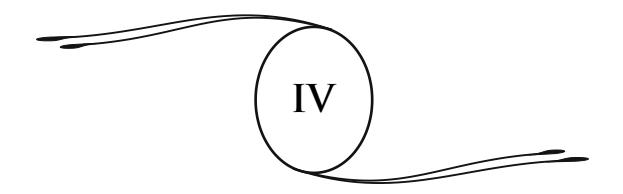

### **A DOUTRINA SECRETA**

Qual é a verdadeira doutrina do Cristo? Seus princípios essen ciais estão claramente enunciados no *Evangelho*. É a universal paternidade de Deus e a fraternidade dos homens, com as consequências morais que daí decorrem; é a vida imortal aberta a todos e permitindo a cada um concretizar em si "o reino de Deus", isto é, a perfeição, pelo desprendimento dos bens materiais, o perdão das injúrias e o amor ao próximo.

Amar, para Jesus é, em uma só palavra, toda a religião, toda a fi losofi a:

> Amai vossos inimigos; fazei o bem àqueles que vos perseguem e vos caluniam, para que sejais os fi lhos de vosso Pai que está nos céus, que faz seu Sol erguer-se sobre os bons e sobre os maus, e faz chover sobre os justos e os injustos. Pois, se amardes apenas os que vos amam, que recompensa tereis disso? (*Mateus*, 5:44 e ss.)

Deus, ele mesmo, nos dá o exemplo desse amor porque os seus braços estão abertos para o pecador: "Assim, vosso Pai que está nos céus não quer que um só destes pequenos pereça." (*Mateus*, 18:14.)

O sermão sobre a montanha resume, em traços indeléveis, o ensino popular de Jesus. A lei moral ali é expressa sob uma forma que nunca foi igualada. Os homens nele aprendem que os mais seguros meios de elevação são as virtudes humildes e escondidas. Felizes os pobres de espírito (isto é, os espíritos simples e íntegros) porque o reino dos céus é deles. — Felizes os que choram, porque serão consolados. — Felizes os que têm fome e sede de justiça, porque serão saciados. — Felizes aqueles que são misericordiosos, porque obterão misericórdia. — Felizes os que têm o coração puro, porque eles verão Deus. (*Mateus*, 5:1 a 12; *Lucas*, 6:20 a 25.)

O que Jesus quer não é um culto pomposo; não é uma religião sacerdotal, rica em cerimônias e em práticas que asfi xiam o pensamento, não; é um culto simples e puro, todo de sentimento, consistindo na relação direta, sem intermediário, da consciência humana com Deus, seu Pai:

> Chegou o tempo em que os verdadeiros crentes adorarão o Pai em espírito e em verdade porque são esses os adoradores que o Pai procura. Deus é espírito, e é preciso que aqueles que o adorem, o adorem em espírito e em verdade.

O ascetismo66 é coisa vã. Jesus se limita a orar e a meditar nos lugares solitários, nesses templos naturais que têm como colu nas as montanhas, como cúpula a abóbada dos céus, e de onde o pensamento se eleva mais livremente em direção ao Criador.

Àqueles que creem se salvar pelo jejum e a abstinência, ele diz: "Não é o que entra pela boca que suja a alma, mas o que por ela sai". (*Mateus*, 15:11.)

Aos partidários das longas orações: "Vosso Pai sabe do que tendes necessidade antes de vós lho pedirdes". (*Mateus*, 6:8.)

Ele impõe apenas a caridade, a bondade, a simplicidade:

Não julgueis e não sereis julgados. Perdoai e sereis perdoados. — Sede misericordiosos, como vosso Pai celeste é misericordioso. Dar é mais doce do que receber. (*Mateus*, 8:1 e 2; *Lucas*, 6:36.)

66 **Ascetismo:** conjunto de práticas de abstinência com fi ns espirituais ou reli giosos; vida austera. (**N.T.**)

Aquele que se humilha será elevado; aquele que se eleva será humilhado. (*Lucas*, 14:11.)

Que tua mão esquerda não saiba o que faz a direita, a fi m de que tua esmola fi que em segredo; e então teu Pai, que vê no segredo, te recompensará. (*Mateus*, 6:3 e 4.)

E tudo se resume nestas palavras, de uma eloquente concisão:

> Amai vosso próximo como a vós mesmos e sede perfeitos como vosso Pai celeste é perfeito. Eis aí toda a lei e os profetas. (*Mateus*, 22:39; 5:48 e 7:12.)

Sob a doce e suave palavra de Jesus, toda impregnada do sentimento da natureza, essa doutrina reveste um encanto penetrante, irresistível. Ela é plena de terna solicitude pelos fracos e os deserdados. É a glorifi cação, é a exaltação da pobreza, da simplicidade. Os bens materiais nos tornam escravos, aprisionam o homem à Terra. A riqueza é um obstáculo, ela detém os progressos da alma e a retém longe do "reino de Deus". A renúncia, a humildade, desatam esses laços e facilitam nossa ascensão em direção à luz.

É por isso que a doutrina evangélica continuou a ser, através dos séculos, a mais alta expressão do espiritualismo, o supremo remédio para os males terrestres, a consolação das almas atormentadas nesta travessia da vida, semeada de tantas angústias e de lágrimas. É ela que ainda faz, apesar dos elementos estranhos que lhe foram misturados, toda a grandeza, todo o poder moral do Cristianismo.

> \*\* \*

A doutrina secreta ia mais longe. Sob o véu das parábolas e das fi cções, escondia considerações profundas. Dessa imortalidade prometida a todos, ela lhe defi nia as formas afi rmando a sucessão das vidas terrestres, nas quais a alma, reencarnada em novos corpos, sofria as consequências de suas existências anteriores e preparava as condições do seu futuro destino. Ela ensinava a pluralidade dos mundos habitados, as alternações de vida de cada ser, no mundo terrestre onde ele reaparece ao nascer, no mundo espiritual para onde ele retorna ao morrer, recolhendo em um e em outro desses meios os frutos bons ou maus do seu passado. Ela ensinava a estreita união e a solidariedade desses dois mundos e, em consequência, a comunicação possível do homem com os espíritos dos mortos que povoam o espaço.

Daí, o amor ativo, não somente por aqueles que sofrem no círculo da existência terrestre, mas também pelas almas que vagueiam em torno de nós, perseguidas por dolorosas lembranças. Daí, a dedicação pelas duas humanidades, visível e invisível, a lei de fraternidade na vida e na morte, e a celebração do que se chamava "os mistérios", a comunhão pelo pensamento e pelo coração com aqueles espíritos, bons ou medíocres, inferiores ou elevados, que compõem esse mundo invisível que nos rodeia, e sobre o qual se abrem duas passagens por onde passam, alternativamente, todos os seres: o berço e o túmulo.

A lei da reencarnação está indicada em várias passagens do *Evangelho*. Ela deve ser considerada sob dois aspectos diferentes: o retorno à carne, dos espíritos em via de aperfeiçoamento, e a reencarnação dos espíritos enviados à Terra em missão.

Em sua conversa com Nicodemos, assim se exprime Jesus:

Em verdade, vos digo que se alguém não nasce de novo, não pode ver o reino de Deus. Nicodemos contrapôs: "Como um homem pode renascer, tendo se tornado velho?" Jesus responde: "Em verdade, vos digo que se um homem não renasce da água e do espírito, ele não pode entrar no reino de Deus. O que nasceu da carne é carne, e o que nasceu do espírito é espírito. Não te admires do que eu te disse: É preciso que volteis a nascer. O vento sopra onde quer, e tu ouves o seu barulho, mas não sabes de onde ele vem nem para onde vai. Assim é todo aquele que é nascido do espírito". (*João*, 3:3 a 8.)

Jesus acrescenta estas signifi cativas palavras: "Tu és mestre em Israel e ignoras estas coisas?"

O que demonstra que não se tratava do batismo, que era conhecido dos judeus e de Nicodemos, mas sim da reencarnação já ensinada pelo *Zohar*, livro sagrado dos hebreus.67

Esse *vento*, ou *esse espírito que sopra onde quer*, é a alma que escolhe um novo corpo, uma nova morada, sem que os homens saibam *de onde ela vem nem para onde vai*. É a única explicação satisfatória.

Na *Cabala*68 hebraica, *a água* era a matéria primária, o elemento fecundo. Quanto à expressão *Espírito Santo*, que se acha no texto e que o torna incompreensível, é preciso observar que a palavra *Santo*, a princípio, não fi gurava no texto e que nele foi introduzida muito tempo depois, assim como em muitos outros casos.69 É preciso, portanto, ler: *renascer da matéria e do espírito*.

Em outra ocasião, com relação a um cego de nascença encontrado na estrada, os discípulos perguntam a Jesus: "Mestre, quem foi que pecou? Foi este homem, ou seu pai, ou sua mãe, para que ele tenha nascido cego?" (*João*, 9:1 e 2.)

Em primeiro lugar, a pergunta indica que os discípulos atribuíam a cegueira a uma expiação. Em seu pensamento, a falta precedeu a punição; ela foi a sua causa original. É a lei da consequência dos atos fi xando as condições do destino. Neste caso, trata-se de um cego de nascença; a falta somente se pode explicar por uma existência anterior.

67 Ver nota complementar no 5. (**N.A.**)

68 **Cabala:** em francês "*Kabbale*" ou "*Cabale*", do hebraico *qabbalah*, tradição. Interpretação judaico-esotérica e simbólica do texto da *Bíblia*, da qual o livro clássico é o *Zohar*, ou *Livro do Esplendor*, escrito em aramaico, provavelmente por Moïse de Léon, que teria redigido a sua maior parte em 1270 e 1300; exerceu infl uência muito importante sobre o pensamento judeu. (**N.T.**)

69 Ver Bellemare, *Espírita e Cristão*. Página 351 e seguintes. (**N.A.**)

Daí, essa ideia da penitência, que ressurge a cada instante nas *Escrituras*: "Fazei penitência", dizem elas incessantemente, isto é, fazei a reparação que é o objetivo da vossa nova vida; retifi cai o vosso passado, espiritualizai-vos, porque só saireis do domínio terrestre, do círculo das provações após "haverdes pago até o último ceitil".70 (*Mateus*, 5:26.)

Inutilmente os teólogos procuraram explicar essa passagem do *Evangelho* de uma outra forma que não fosse pela reencarnação. Eles caíram em raciocínios pelo menos estranhos. Foi assim que o Sínodo71 de Amsterdã só pôde sair da difi culdade com esta declaração: "O cego de nascença havia pecado no seio de sua mãe".72

Nessa época também havia uma opinião acreditada: a de que espíritos eminentes vinham, em novas encarnações, continuar, concluir missões interrompidas pela morte. Por exemplo, Elias havia retornado à Terra na pessoa de João Batista. Jesus o afi rma dirigindo-se à multidão nestes termos:

> Que fostes ver? Um profeta? Sim, vos digo eu, e mais que um profeta; — E se quereis entender, ele é o próprio Elias que devia vir. — Que aquele que tem ouvidos para ouvir, ouça. (*Mateus*, 9:9, 14 e 15.)

Mais tarde, após João Batista ser decapitado, Jesus o repete aos seus discípulos:

> E seus discípulos o interrogam, dizendo: Por que então os escribas dizem que é necessário que Elias venha primeiro? — E ele, respondendo, lhes disse: Elias, efetivamente, devia vir e restabelecer todas as coisas. Mas eu vos digo que Elias já veio, eles não o

70 **Ceitil:** antiga moeda portuguesa, de muito pouco valor; ninharia, insignifi cância. (**N.T.**)

71 **Sínodo:** assembleia periódica de bispos de todo o mundo, presidida pelo papa, que se reúne para tratar de assuntos ou problemas relativos à Igreja universal; assembleia regular de párocos convocada pelo bispo. (**N.T.**)

72 Ver nota complementar no 5. (**N.A.**)

reconheceram e lhe fi zeram o que quiseram. — Então seus discípulos compreenderam que era de João Batista que ele falava. (*Mateus*, 17:10 a 13.)

Assim, para Jesus como para seus discípulos, Elias e João Batista eram uma só e única individualidade. Ora, tendo essa individualidade revestido sucessivamente dois corpos, um tal fato não se pode explicar senão pela lei da reencarnação.

Em uma circunstância memorável, Jesus pergunta aos seus discípulos: "Que dizem do fi lho do homem?" E eles lhe respondem: "Uns dizem: É João Batista; outros, Elias; outros, Jeremias ou um dos profetas". (*Mateus*, 16:13 e 14; *Marcos*, 8:27 e 28.)

Jesus não protesta contra essa opinião como doutrina, assim como não protestara no caso do cego de nascença. Além disso, a ideia da pluralidade das vidas, das escalas sucessivas a percorrer para se elevar em direção à perfeição, não se acha implicitamente contida nestas célebres palavras "Sede perfeitos como vosso Pai celeste é perfeito"? Como a alma humana poderia alcançar esse estado de perfeição em uma única existência?

Reencontramos a doutrina secreta, dissimulada sob véus mais ou menos transparentes, nas obras dos apóstolos e dos Pais da Igreja dos primeiros séculos. Eles não podiam falar abertamente sobre ela, daí a falta de clareza da sua linguagem.

# Barnabé escrevia aos primeiros fi éis:

Tanto quanto pude, creio ter-me explicado simplesmente e não ter omitido nada do que pode contribuir para a vossa instrução e a vossa salvação, no que diz respeito às coisas presentes, porque se eu vos escrevesse referindo-me às coisas futuras, vós não compreenderíeis, porque elas são expostas em parábolas. (*Epístola Católica de São Barnabé*, 18:1, 5.)

É seguindo esta regra que um discípulo de São Paulo, Hermas, descreve a lei das reencarnações sob a fi gura de "pedras brancas, quadradas e lapidadas", tiradas da água para servirem na construção de um edifício espiritual. (*Livro do Pastor*, III, 16:3, 5.)

> Por que foram essas pedras tiradas de um lugar profundo, e empregadas a seguir na estrutura dessa torre, visto que elas já estavam animadas pelo espírito? — Era necessário, diz-me o Senhor, que antes de serem admitidas no edifício, elas fossem elevadas por meio da água. Não poderiam entrar no reino de Deus a não ser despojando-se da imperfeição da sua primeira vida.

Evidentemente, essas pedras são as almas dos homens; as águas73 são as regiões obscuras, inferiores, as vidas materiais, vidas de provação e de dor, durante as quais as almas são lapidadas, polidas, lentamente preparadas, a fi m de, um dia, tomarem lugar no edifício da vida superior, da vida celeste. Isso é bem um símbolo da reencarnação, cuja ideia ainda era admitida no século 3 e propagada entre os cristãos.

Dentre os Pais da Igreja,74 Orígenes é um dos que se pronunciaram mais eloquentemente em favor da pluralidade das existências. São Jerônimo o considera, "depois dos apóstolos, como o grande mestre da Igreja, verdade, diz ele, que só a ignorância poderia negar". São Jerônimo tem uma tal admiração por Orígenes que receberia, escreve ele, todas as calúnias que foram dirigidas contra Orígenes, contanto que, por esse preço, ele, Jerônimo, pudesse ter a sua profunda ciência das *Escrituras*.

Em seu célebre livro, *Dos Princípios*, Orígenes desenvolve os mais poderosos argumentos que mostram na preexistência e

73 Essa parábola adquire uma força maior porque, para os judeus cabalistas, a água era a representação da matéria, o elemento primário, o que hoje chamaríamos de éter cósmico. (**N.A.**)

74 **Pais da Igreja:** em francês *Pères de l'Église*, os doutores (escritores da Antiguidade cristã, séculos 1 a 6) cujos escritos servem de regra em matéria de fé. Neste sentido, recebe iniciais maiúsculas. (**N.T.**, segundo os dicionários *Le Robert, Nouveau Petit Larousse Illustré* e *Le Petit Larousse 2003*.)

sobrevivência das almas em outros corpos, em uma palavra, na sucessão das vidas, o corretivo necessário à aparente desigualdade das condições humanas. Ele vê nisso uma compensação ao mal físico como ao mal moral que parecem reinar sobre o mundo, se não se admite mais que uma existência terrestre para cada alma.

Orígenes, entretanto, erra sobre um ponto. É quando supõe que a união do espírito ao corpo sempre é uma punição. Ele não percebe a necessidade da educação das almas e a trabalhosa realização do progresso.

Um conceito errado se introduziu em muitos meios, a respeito das doutrinas de Orígenes em geral e da pluralidade das existências em particular, que as considera como tendo sido condenadas, primeiro pelo concílio de Calcedônia, e, mais tarde, pelo quinto concílio de Constantinopla. Ora, se remontamos às fontes,75 constatamos que esses concílios rejeitaram não a crença na pluralidade das vidas da alma, mas simplesmente a preexistência, tal como o ensinava Orígenes, sob a forma particular de que os homens eram anjos decaídos, e que, para todos eles, o ponto de partida tinha sido a natureza angélica.

Na realidade, a questão da pluralidade das existências da alma jamais foi tratada claramente pelos concílios. Ela permanece aberta às resoluções da Igreja no futuro, e esse é um ponto que convém estabelecer.

Como a lei dos renascimentos, a pluralidade dos mundos é indicada no *Evangelho* sob a forma de parábola:

> Há muitas moradas na casa de meu Pai. Eu vou preparar-vos o lugar e, depois que eu me for e tiver vos preparado o lugar, voltarei, e vos levarei comigo, a fi m de que lá, onde eu estiver, vós também estejais. (*João*, 14:2 e 3.)

A casa do Pai é o céu infi nito; as moradas prometidas são os mundos que percorrem o espaço, esferas de luz perto das quais

75 Ver Pezzani, *A pluralidade das existências*, pp. 187 a 190. (**N.A.**)

nossa pobre Terra é apenas um obscuro e insignifi cante planeta. É para esses mundos que Jesus guiará as almas que se ligarão a ele e à sua doutrina. Esses mundos são familiares a Jesus, que neles saberá nos preparar um lugar de acordo com os nossos méritos.

Orígenes comenta essas palavras em termos precisos:

O Senhor faz alusão às diferentes estações que as almas devem ocupar, após terem se despojado dos seus corpos atuais e tiverem se revestido de novos corpos.

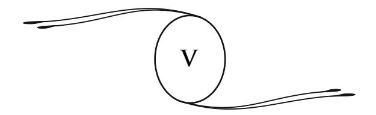

# **RELAÇÕES COM OSESPÍRITOS DOS MORTOS**

Os primeiros cristãos se comunicavam com os espíritos dos mortos e deles recebiam ensinamentos. Nenhuma dúvida é possível sobre esse ponto, porque as provas são abundantes. Essas provas resultam dos próprios textos dos livros canônicos, textos que puderam escapar, não se sabe como, das vicissitudes dos tempos, e cuja autenticidade não apresenta dúvidas76 para nós.

O Cristianismo se apoia inteiramente sobre fatos de aparição e manifestação dos mortos. Ele fornece numerosas provas da existência do mundo invisível e das almas que o povoam.

Essas provas são igualmente numerosas no *Antigo* e no *Novo Testamento*. Tanto em um como no outro, encontram-se aparições de anjos,77 dos espíritos dos justos, avisos e revelações dados pelas almas dos mortos, o dom da profecia78 e o dom de curar.79 Encontrar-se-ão em o *Novo Testamento* as aparições do próprio Jesus, após seu suplício e sepultamento.

76 Ver nota no 6, no fi m deste volume. (**N.A.**)

77 Em hebraico, como em grego, o verdadeiro sentido da palavra anjo, *melach*, é mensageiro. (**N.A.**)

78 O dom de profecia não consistia somente em predizer o futuro, porém, de um modo mais extenso, em falar e dar ensinamentos sob a infl uência dos espíritos. (**N.A.**)

79 Ver, para o conjunto desses fenômenos, a nota complementar no 7, sobre os *Fatos espíritas na Bíblia*, no fi m deste volume. (**N.A.**)

A existência do Cristo não havia sido senão uma comunhão constante com o mundo invisível. O fi lho de Maria era dotado de faculdades que lhe permitiam conversar com os espíritos. Muitas vezes eles se tornavam visíveis ao seu lado. Um dia, seus discípulos, espantados, o viram conversar com Moisés e Elias80 no alto do monte Tabor.

Nos momentos difíceis, quando uma questão o embaraça, como no caso da mulher adúltera, ele evoca as almas superiores, e seu dedo traça sobre a areia a resposta a dar, como o médium dos nossos dias, movido por uma força estranha, traça caracteres sobre a ardósia.

Esses fatos são conhecidos, mencionados, porém muitos outros, referindo-se a esse intercâmbio contínuo de Jesus com o invisível, permaneceram ignorados pelos homens, mesmo daqueles que o cercavam.

As relações do Cristo com o mundo dos espíritos se confi rmam pelo amparo constante que esse enviado divino recebeu do Além.

Às vezes, apesar da sua coragem, apesar da abnegação que inspira seus atos, perturbado pela grandeza da sua tarefa, ele eleva sua alma a Deus; ele pede, implora novas forças e é atendido. Uma forte inspiração passa por sua mente. Sob um impulso irresistível, ele reproduz os pensamentos sugeridos; sente-se socorrido, reconfortado.

Nas horas de solidão, seus olhos distinguem letras de fogo que traçam as vontades do Alto;81 vozes murmuram aos seus ouvidos, trazendo a resposta para suas ardentes preces. É a transmissão direta dos ensinamentos que ele deve difundir, dos preceitos

80 Jesus havia escolhido seus discípulos, não entre homens instruídos, mas entre sensitivos e videntes, dotados de faculdades medianímicas. (**N.A.**)

81 Estes detalhes, que talvez causem admiração ao leitor, não são um produto da nossa imaginação. Eles nos foram comunicados por um espírito elevado, cuja vida esteve ligada à do Cristo. O mesmo acontece em várias passagens desta obra. (**N.A.**)

regeneradores para cuja propagação ele veio à Terra. As vibrações do pensamento supremo que anima o universo são sensíveis para Jesus; elas lhe incutem esses princípios eternos que ele propagará e que jamais se apagarão da memória dos homens. Ele percebe celestes melodias, e seus lábios repetem as palavras ouvidas, sublime revelação, mistério ainda para muitos seres humanos, mas, para ele, confi rmação absoluta dessa proteção constante e das intuições que lhe chegam dos mundos superiores.

E, quando essa grande vida foi concluída, quando o sacrifício foi consumado, quando Jesus foi posto na cruz e depois desceu ao túmulo, seu espírito se afi rma por novas manifestações. Essa alma poderosa, que nenhum túmulo podia deter, aparece àqueles que ela havia deixado sobre a Terra, tristes, abatidos, desencorajados. Ela lhes diz que a morte nada é. Com sua presença, lhe restitui a energia e a força moral necessárias para cumprirem a missão que lhes foi confi ada.

As aparições do Cristo são conhecidas e tiveram numerosas testemunhas. Elas apresentam analogias impressionantes com as que constatamos em nossos dias, em todos os graus, desde a forma etérea, sem consistência, que apareceu à Maria Madalena, e que não teria suportado nenhum contato, até a materialização completa, tal como a que viu Tomé, que pôde tocar as chagas do Cristo com a mão.82 Daí estes contrastes nas palavras de Jesus: "Não me toques", disse ele a Maria Madalena, enquanto que convida Tomé a colocar o dedo sobre a ferida feita pelos pregos: "Aproxima também a tua mão e mete-a no meu lado".

Jesus aparece e desaparece instantaneamente. Penetra em uma casa com as portas fechadas. Em Emaús, conversa com dois dos seus discípulos que não o reconhecem, depois desaparece de repente.83 Ele está de posse desse corpo fl uídico, etéreo, que se encontra em cada um de nós, desse corpo sutil, invólucro

82 *João*, 20:14 a 17 e 24 a 29. (**N.A.**)

83 *Lucas*, 24:13 a 35. (**N.T.**)

inseparável de cada alma, que um espírito elevado como o seu sabe dirigir, modificar, condensar, dissociar à vontade.84 E ele o condensa a tal ponto que se torna visível e tangível aos assistentes.

As aparições de Jesus após a sua morte são a própria base, o ponto vital da doutrina cristã; essa é a razão por que São Paulo disse: "Se o Cristo não ressuscitou, vossa fé é vã."85 No Cristianismo, a imortalidade não é uma esperança, é um fato natural, um fato apoiado sobre o testemunho dos sentidos. Os apóstolos não apenas acreditavam na ressurreição, estavam convictos dela.

Assim sendo, sua pregação tomava esse tom caloroso e penetrante que inspira uma convicção ardente. Pelo suplício de Jesus, o Cristianismo foi atingido no coração. Os discípulos, consternados, estavam prestes a se dispersarem. Mas o Cristo lhes apareceu, e a fé que tinham nele tornou-se tão profunda que, para proclamá-la, eles afrontavam todos os tormentos. As aparições do Cristo após a sua morte garantiram a persistência da ideia cristã, dando-lhe por base todo um conjunto de fatos.

É verdade que os homens lançaram a confusão sobre esses fenômenos, atribuindo-lhes um caráter miraculoso. O milagre é uma derrogação das leis eternas, deliberadas e fi xadas por Deus, e seria pouco digno do poder supremo sair da sua própria natureza e variar em seus decretos.

Segundo a Igreja, Jesus teria ressuscitado com seu corpo carnal. Isso é contrário ao texto primitivo do *Evangelho*. Aparições repentinas, com mudança de forma, produzindo-se em lugares fechados, não podem ser senão manifestações espíritas, fl uídicas e naturais. Jesus ressuscitou como todos nós ressuscitaremos, quando nosso espírito abandonar sua prisão de carne.

84 Ver nota no 9, sobre o perispírito ou corpo fl uídico. (**N.A.**)

85 *I Coríntios*, 15:17. (**N.T.**)

Em *Marcos* e *Mateus*, e na descrição de Paulo (*I Coríntios*, 15), essas aparições são descritas da maneira mais concisa. Segundo Paulo, o corpo do Cristo é incorruptível; ele não tem nem carne nem sangue. Essa opinião decorre da tradição mais antiga. A materialidade só veio mais tarde, com *Lucas*. A narrativa então se complica e se guarnece de detalhes maravilhosos com o objetivo evidente de impressionar o leitor.86

Essa maneira de ver, como em geral toda a teoria do milagre, resulta de uma falsa interpretação das leis do universo. Ocorre o mesmo com a ideia do sobrenatural, que corresponde a uma concepção insufi ciente da ordem do mundo e das regras da vida. Na realidade, não existe nada fora da natureza, que é a obra divina em seu majestoso desenvolvimento. O erro do homem provém da ideia pouco desenvolvida que ele faz da natureza e das formas da vida, limitadas por ele ao círculo traçado pelos seus sentidos. Ora, nossos sentidos abrangem apenas uma porção muito restrita do domínio das coisas. Além dos limites que eles nos impõem, a vida se desenvolve sob aspectos ricos e variados, sob formas sutis, quintessenciadas, que se graduam, se multiplicam e se renovam ao infi nito.

A esse domínio do invisível pertence o mundo fl uídico; ele é povoado pelos espíritos dos homens que habitaram a Terra e se despiram do seu invólucro grosseiro. Eles subsistem sob essa forma sutil, da qual acabamos de falar, forma ainda material, embora etérea, porque a matéria tem muitos estados que não nos são familiares. Essa forma é a imagem ou antes o esboço dos corpos carnais que esses espíritos animaram nas suas vidas sucessivas.

86 Clemente de Alexandria relata uma tradição que ainda circulava no seu tempo, segundo a qual João enterrara sua mão no corpo de Jesus, e ela o teria atravessado sem encontrar resistência. (*Jesus de Nazareth*, por Albert Réville, 2o volume, nota da página 470.) (**N.A.**)

● **Clemente de Alexandria:** escritor e doutor cristão (Atenas, cerca de 150 – entre 211 e 216). Mestre de Orígenes foi um dos grandes apologistas do século 3. (**N.T.**)

Eles passam, mas a forma permanece, como o espírito do qual é o organismo indestrutível.

Os espíritos ocupam posições variadas, em relação à sua elevação moral. Sua irradiação, seu brilho, seu poder, são tanto maiores quanto mais alto houverem chegado na escala das virtudes, das perfeições, e quanto mais tenham servido com dedicação à causa do Bem e da Humanidade. São esses seres, ou espíritos, que se manifestam em todas as épocas da História e em todos os meios, por intermédio de pessoas especialmente dotadas que, de acordo com as épocas, se denominam adivinhos, sibilas, profetas ou médiuns.

As aparições que marcam os primeiros tempos do Cristianismo, bem como as épocas bíblicas mais distantes, não são fenômenos isolados, mas a manifestação de uma lei universal, eterna, que sempre regulou as relações entre os habitantes dos dois mundos, o mundo da matéria grosseira, ao qual pertencemos, e o mundo fl uídico, invisível, povoado pelos espíritos daqueles que chamamos tão impropriamente os mortos.87

Foi somente em uma época recente que esta ordem de manifestações pôde ser estudada pela ciência. Graças às observações de numerosos sábios, a existência do mundo dos espíritos foi estabelecida de maneira positiva e as leis que o regem foram determinadas com uma certa precisão.

Pôde-se constatar a presença, em cada ser humano, de um duplo fl uídico que sobrevive à morte e, nesse duplo fl uídico, reconheceu-se o invólucro imperecível do espírito. Esse duplo, que já se desprende no sono e no êxtase, que se transporta e age à distância durante a vida, torna-se, após a separação defi nitiva do corpo carnal, e de uma forma mais completa, o servidor fi el e o centro das forças ativas do espírito.

87 Ver minhas outras obras, especialmente *Depois da Morte* e *No Invisível: Espiritismo e Mediunidade*. (**N.A.**)

É por meio desse invólucro fl uídico que o espírito preside essas manifestações de além-túmulo, que já não são segredo para ninguém, desde que comissões científi cas estudaram seus múltiplos aspectos, chegando até a pesar e fotografar os espíritos, como o fi zeram William Crookes com o espírito Katie King, Russel Wallace e Alexander Aksakof com os espíritos Abdullah e John King.88

É assim que fenômenos, sem dúvida estranhos, até aqui pouco estudados, mas perfeitamente naturais, porquanto são produzidos por espíritos, isto é, por seres semelhantes a nós em seu princípio essencial de vida, entraram pouco a pouco no domínio da observação e passaram na ordem dos fatos estabelecidos.

É provável que o dom das línguas, transmitido aos apóstolos, apresentasse analogias com o fenômeno que hoje conhecemos sob o nome de xenoglossia.89 A luz ódica de Reichenbach90

**W. Crookes**, *Pesquisas sobre os Fenômenos Espíritas*; **Russel Wallace**, *O Moderno Espiritualismo*; **Aksakof**, *Animismo e Espiritismo*. Ver, para toda uma série de fenômenos análogos e mais recentes: Léon Denis, *No Invisível: Espiritismo e Mediunidade*, cap. 20. (**N.A.**)

● **William Crookes:** físico e químico inglês (Londres, 1832 – *id.*, 1919). Descobriu os raios catódicos e o elemento químico Tálio. Recebeu o Prêmio Nobel em 1907. Estudou os fenômenos espíritas e publicou suas descobertas nessa área de conhecimento; propôs a existência da força psíquica, analisada a partir de observações feitas diante da atuação de vários médiuns. (**N.T.**)

● **Wallace, Alfred-Russel:** naturalista inglês (Usk, 1823 – Broadstone, 1913). Concebeu, ao mesmo tempo que Darwin, o princípio da seleção natural (1858), e desenvolveu ideias sobre o papel da fragmentação dos continentes na distribuição atual das faunas e em sua evolução. (**N.T.**)

● **Aksakof, Alexander:** membro da nobreza russa, doutor em Filosofi a, mestre da Academia de Leipzig, na Alemanha (Repievka, Rússia, 1832 – São Petersburgo, Leningrado, 1903). Empenhou-se no campo da investigação psíquica e mediúnica, realizando experiências com diversos médiuns do século 19. Sua contribuição ao Movimento Espírita Mundial foi enorme, sendo autor de inúmeras obras. (**N.T.**)

89 **Xenoglossia:** é o uso de uma língua (escrita ou falada) que se não aprendeu e que se não conhece em condições normais. O médium, infl uenciado por um espírito, fala uma língua estrangeira que lhe é completamente desconhecida. (**N.T.**, segundo o *Dicionário de Filosofi a Espírita*, de L. Palhano Jr.)

90 **Reichenbach, Hans:** fi lósofo e lógico judeu alemão (Hamburgo, 1891 – Los Angeles, 1953), um dos fundadores do Círculo de Viena e do neopositivismo alemão. (**N.T.**)

e a matéria radiante explicam a auréola dos santos; as chamas ou "línguas de fogo", que apareceram no dia de Pentecostes, 91 se reencontram em nossa época nos fatos assinalados no Congresso Espiritualista de 1900, pelo Dr. Bayol, senador de Bouches-du-Rhône. 92 Enfim, as visões dos mártires são fenômenos da mesma ordem que os constatados, em nossos dias, no momento da morte de certas pessoas. 93 Do mesmo modo, o desaparecimento do corpo do Cristo do sepulcro pode ser explicado pela desagregação da matéria, observada há alguns anos no decorrer de sessões de experimentação psíquica. 94

Durante muito tempo, os homens viram nisso apenas fatos miraculosos, provocados pelo próprio Deus ou por seus anjos, opinião cuidadosamente sustentada pelos padres, a fim de impressionarem a imaginação das massas e de torná-las mais flexíveis ao seu poder.

Encontramos nas *Escrituras* frequentes exemplos de enganos dos quais esses fenômenos foram o alvo. Em Patmos, 95 João vê aparecer um gênio que ele, inicialmente, quer adorar, mas que lhe afirma ser o espírito de um de seus irmãos, os profetas. 96 Nesse caso, o engano foi desfeito, pois o espírito deu a conhecer a sua identidade, mas em quantos outros o engano não persistiu? Ocorre o mesmo com a intervenção tão frequente dos anjos na *Bíblia*. É preciso nos prevenirmos quanto à tendência dos judeus e dos cristãos em atribuir a Deus e aos seus anjos fenômenos produzidos pelos espíritos dos mortos, fenômenos estes que cabia à nossa época esclarecer, repondo-os em sua verdadeira categoria.

&lt;sup>91 Ver Atos dos Apóstolos, 2:1 a 4. (N.T.)

92 Ver No Invisível: Espiritismo e Mediunidade, p. 332. (N.A.)

&lt;sup>93 Ver a morte de Estevão, *Atos*, 7:55 e 56. (**N.A.**)

94 Ver *No Invisível*, p. 346. (**N.A.**)

95 Patmos: uma das ilhas Espórades, ilhas gregas do mar Egeu, para onde o apóstolo João foi banido; em Patmos ele escreveu o Apocalipse. (N.T.)

&lt;sup>96 Apocalipse, 19:10. (**N.A.**)

Na época de Jesus, a crença na imortalidade estava enfraquecida. Os judeus se encontravam divididos a respeito da vida futura. Os céticos saduceus aumentavam em número e em infl uência. Jesus vem. Ele alarga as vias que comunicam o mundo terrestre com o mundo espiritual. Aproxima os invisíveis dos humanos a tal ponto que eles podem se corresponder novamente. Com sua mão poderosa, ele levanta o véu da morte e, no interior da sombra, aparecem visões; em meio ao silêncio, vozes se fazem ouvir; e essas visões e essas vozes vêm assegurar ao homem a imortalidade da sua vida.

O Cristianismo primitivo, portanto, tem essa característica particular de haver aproximado as duas humanidades: terrestre e celeste; ele tornou mais intensas as relações entre o mundo visível e o mundo invisível. Efetivamente, em cada grupo cristão, como atualmente em cada grupo espírita, dedicavam-se a evocações, possuíam médiuns falantes, inspirados, de efeitos físicos, como é dito no capítulo 12 da *1a Epístola de Paulo aos Coríntios*. Então, como hoje, certos médiuns possuíam o dom da profecia, o dom de curar, o de afastar os maus espíritos.97

Na *Epístola* citada, Paulo também fala do corpo espiritual, incorruptível, imponderável:

> O homem é colocado na terra como um corpo animal e ressuscitará como um corpo espiritual; assim como há um corpo animal, há um corpo espiritual. (*I Coríntios*, 15:44.)

A aparição de Jesus na estrada de Damasco, que fez de Paulo um cristão,98 fora um fenômeno espírita. Paulo não havia conhecido o Cristo e, no momento dessa visão que decidiu o seu destino, ele estava longe de se encontrar preparado para a sua futura tarefa: "E ainda respirando somente ameaças e matança

97 *Atos*, 21:11; 27:22 a 24; 3:3 a 8; 5:12 a 16; 8:7; 9:33 e 34; 14:8 e ss.; 19:11, 12, etc. (**N.A.**)

98 *Atos*, 9:1 a 18. (**N.A.**)

contra os discípulos do Senhor", e munido de cartas de prisão contra eles, dirigia-se a Damasco para persegui-los. Aqui, não se alegará, como se poderia fazer em relação aos apóstolos, um fenômeno de alucinação, provocado pela lembrança constante do seu Mestre. Aliás, essa visão não foi isolada, em todo o decorrer posterior da sua existência, Paulo manteve-se em constante ligação com o invisível e notadamente com o Cristo, de quem recebia as instruções indispensáveis à sua missão. Ele mesmo nos declara que recebia suas inspirações nas conversas secretas com o fi lho de Maria.

Paulo não foi assistido somente por espíritos de luz dos quais ele era o intérprete, o porta-voz;99 espíritos inferiores às vezes o importunavam, e ele devia resistir à sua infl uência.100 É assim que em todos os meios, para a educação do homem e o desenvolvimento da sua razão, a luz e a sombra, a verdade e o erro se misturam. Ocorre o mesmo no âmbito do moderno espiritualismo, onde se encontram manifestações de toda ordem, desde mensagens do mais elevado caráter até fenômenos grosseiros produzidos por espíritos atrasados. Estes, porém, também têm sua utilidade, sob o ponto de vista dos elementos de observação e dos casos de identidade que eles fornecem à ciência.

Paulo conhecia essas coisas. Ensinado pela experiência, ele advertia os profetas,101 seus irmãos, para que se mantivessem em guarda contra armadilhas. E acrescentava como consequência: "Os espíritos dos profetas estão submissos aos profetas" (*I Coríntios*, 14:32), isto é, não é preciso aceitar cegamente as instruções dos espíritos, mas submetê-las ao exame da razão.

No mesmo sentido, João dizia: "Meus bem-amados, não acrediteis em todos os espíritos, mas provai se os espíritos são de Deus". (*I Epístola de João*, 4:1.)

99 *II Coríntios*, 12:2 a 4. (**N.A.**)

100*Idem*, 12:7 a 9; *Efésios*, 6:12. (**N.A.**)

101 Nessa época, os médiuns eram denominados profetas. (**N.A.**)

Os *Atos dos Apóstolos* fornecem numerosas indicações sobre as relações dos discípulos de Jesus com o mundo invisível. Ali se vê, seguindo os ensinamentos dos espíritos,102 como os apóstolos adquirem maior amplitude de visão. Eles chegaram a não mais fazer distinção entre as carnes, a abrir a barreira que separava os judeus dos gentios, a substituir a circuncisão pelo batismo.103

As comunicações dos cristãos com as almas dos defuntos eram algo tão frequente nos primeiros séculos que, entre eles, circulavam instruções precisas sobre esse assunto.

Hermas, discípulo dos apóstolos, o mesmo que Paulo manda saudar de sua parte em sua *Epístola aos Romanos* (16:14), indica, por sua vez, em seu *Livro do Pastor*,104 os meios de distinguir os bons dos maus espíritos.

Nas linhas seguintes, escritas há mil e oitocentos anos, acredita-se ler a descrição fi el das sessões de evocações tais como se praticam hoje em dia em muitos meios:

> O espírito que vem da parte de Deus é pacífi co e humilde; ele se afasta de toda malícia e de todo desejo vão deste mundo e coloca- se acima de todos os homens. Não responde a todos aqueles que o interrogam, nem às pessoas em particular, porque o espírito vindo de Deus não fala ao homem quando o homem quer, mas quando Deus o permite. Portanto, quando um homem que tem um espírito vindo de Deus vem à assembleia dos fi éis, e que se fez a prece, o espírito ocupa inteiramente esse homem que fala na assembleia como Deus quer. (É o médium falante.)

102 Na versão grega dos *Evangelhos* e dos *Atos*, a palavra *espírito* muitas vezes está isolada. São Gerônimo acrescenta-lhe a palavra *santo*, e foram os tradutores franceses da *Vulgata* que daí criaram o termo Espírito Santo. (Ver, de Bellemare, *Espírita e Cristão*, pp. 270 e seguintes.) (**N.A.**)

103 *Atos dos Apóstolos*, 10:10 a 16, 28, 29, 44 a 48; 16:6 a 10; 21:4; *Epístola aos Romanos*, 14:14; *I Coríntios*, 12 e 14. Ver também nota no 6. (**N.A.**)

104 Esse *Livro do Pastor* era lido nas igrejas, como atualmente são lidos os *Evangelhos* e as *Epístolas*, até o século 5. Clemente de Alexandria e Orígenes falam sobre ele com respeito. O *Livro do Pastor* fi gura no mais antigo catálogo de livros canônicos recebidos pela Igreja Romana e publicado por Caio cerca de 220. (**N.A.**)

Ao contrário, reconhece-se o espírito terrestre, fútil, sem sabedoria e sem força, naquele que se agita, se levanta e toma o primeiro lugar. Ele é importuno, tagarela e não profetiza sem recompensa. Um profeta de Deus não age assim.

Os espíritos, então, manifestavam sua presença de mil maneiras, seja tornando-se visíveis,105 ou desagregando a matéria, como o fi zeram para libertar Pedro de suas correntes e retirá-lo da sua prisão,106 seja, ainda, provocando casos de levitação.107 Esses fenômenos eram, às vezes, tão impressionantes que até mágicos eram sensibilizados por eles a ponto de se converterem.108

Animados por esse espírito de caridade, de abnegação que o Cristo lhes transmitia, os primeiros cristãos viviam em uma rigorosa solidariedade. "Eles possuíam tudo em comum" e "eram estimados por todo o povo".109

A revelação dos espíritos prosseguiu por muito tempo após o período apostólico. Durante os séculos 1 e 3, os cristãos se dirigiam diretamente às almas dos mortos para decidir pontos de doutrina.

São Gregório, o taumaturgo, bispo de Neocesareia, declara "haver recebido de João Evangelista, em uma visão, o símbolo da fé, pregado por ele em sua igreja".110

Orígenes, esse sábio que São Gerônimo considerava como o grande mestre da Igreja depois dos apóstolos, fala muitas vezes das manifestações dos mortos em suas obras.

105 *Atos*, 7:55 e 56; 9:10 a 12; 16:9, etc. (**N.A.**)

106 *Atos*, 7:7 a 10. Ver também 5:19 e 16:26. (**N.A.**)

107 *Atos* 8:39 e 40. (**N.A.**)

108 *Atos*, 8:9 a 13. (**N.A.**)

109 *Atos*, 2:44 a 47; 4:32 a 36. (**N.A.**)

110 *Resumo da História Eclesiástica*, pelo abade Racine. São Gregório de Nissa, em sua *Vida de São Gregório, o Taumaturgo*, relata essa visão. Ver *Obras de São Gregório de Nissa*, edição de 1638, tomo 3, pp. 545 e 546. (**N.A.**)

● **São Gregório, o Taumaturgo:** teólogo da Igreja ortodoxa grega (Neocesareia, Ponto, 213 – *id.*, 270). Bispo de Neocesareia, tornou-se famoso por seus milagres e conversões. (**N.T.**)

### Em sua controvérsia com Celso, ele diz:

Não duvido que Celso escarneça de mim, mas as zombarias não me impedirão de dizer que muitas pessoas têm abraçado o Cristianismo; que, contra a vontade delas, seu coração foi de tal forma repentinamente transformado por algum espírito — seja por uma aparição, seja em um sonho — que, em lugar da aversão que tinham pela nossa fé, essas pessoas a amaram a ponto de morrer por ela. Tomo Deus por testemunha da verdade do que digo; ele sabe que eu não quero tornar recomendável a doutrina de Jesus Cristo por histórias fabulosas, mas pela verdade de fatos incontestáveis.111

O imperador Constantino era dotado de faculdades medianímicas e sofria a infl uência dos espíritos. Os principais acontecimentos da sua vida, sua conversão ao Cristianismo, a fundação de Bizâncio, etc., foram marcados por intervenções ocultas. Delas encontramos a demonstração nos seguintes fatos, obtidos na narrativa do Sr. Albert de Broglie, historiador imparcial e severo, pouco inclinado ao misticismo:112

> No momento de atacar Roma, um sentimento interior incita Constantino a se recomendar a algum poder sobrenatural, e a pedir a proteção divina com a ajuda das forças humanas. Mas a confusão era grande para um romano piedoso daquela época... Ele pergunta a si mesmo, com ansiedade, de qual Deus ia implorar a assistência. Caiu, então, em uma profunda meditação sobre as vicissitudes políticas das quais ele mesmo fora testemunha.

Ele constata que colocar a sua confi ança *na multidão dos deuses* traz infelicidade, enquanto que seu pai, Constâncio, secreto adorador do Deus único, havia terminado seus dias em paz.

111 **Orígenes**, edição beneditina de 1733, tomo 1, pp. 361 e 362. (**N.A.**)

112 Albert de Broglie, *A Igreja e o Império Romano no século IV*, tomo 1, pp. 214 e seguintes. (**N.A.**)

● **Albert de Broglie:** duque, descendente de uma família nobre originária de Piemonte, França; político e historiador (1821-1901); membro da Academia Francesa. Além da obra citada, publicou uma série de trabalhos sobre a diplomacia de Luís XV. (**N.T.**, segundo o *Dicionário Lello Universal*, volume 1.)

Constantino decidiu-se a rogar ao Deus de seu pai que prestasse assistência ao seu empreendimento.

A resposta a essa prece foi uma visão miraculosa que ele mesmo, muitos anos depois, narrava ao historiador Eusébio, atestando-a por juramento e com os seguintes detalhes: uma tarde, durante uma marcha que ele fazia à frente de suas tropas, percebeu no céu, acima do Sol já inclinado para ocaso, uma cruz luminosa com esta inscrição: *In hoc signo vinces* (com este sinal vencerás). Todo o seu exército e muitos espectadores que o cercavam viram, estupefatos como ele, esse prodígio. Constantino fi cou muito afl ito para saber o que signifi cava aquela aparição. A noite ainda o encontrou na mesma perplexidade. Porém, durante seu sono, o próprio Cristo lhe apareceu com a cruz que se fi zera ver no céu e ordenou-lhe que mandasse fazer, por aquele modelo, um estandarte militar do qual ele se utilizaria como proteção nos combates. Ao amanhecer, Constantino levantou-se e comunicou a revelação aos seus confi dentes. Imediatamente, ourives foram chamados e o imperador lhes deu suas instruções para que a cruz misteriosa fosse reproduzida em ouro e pedras preciosas.

Mais adiante, a respeito da adoção de Bizâncio como capital do império, o mesmo autor relata: Quando os olhos de Constantino se detiveram sobre Bizâncio, ela não apresentava mais que os destroços de uma grande cidade. Na escolha que ele fez dessa cidade, Constantino acreditou que a intervenção divina não lhe havia faltado. Por uma confi dência miraculosa, ele soube, dizia-se, que em Roma o império não estaria em segurança. Para essa escolha também se falava de um sonho, etc. Filostórgio relata que:

> ...Enquanto ele (Constantino) traçava, lança na mão, os novos limites da cidade, aqueles que o seguiam, vendo que ele avançava sempre de maneira a abranger um espaço imenso, perguntaram-lhe, respeitosa

mente, até onde pretendia ir. Irei, respondeu ele, até o lugar em que se detenha aquele que vai adiante de mim.113

É provável que Constantino recebesse, sem o saber, a infl uência dos invisíveis para tudo o que devia favorecer o estabelecimento da nova religião, muitas vezes em detrimento do bem do Estado e de seus próprios interesses. Seu caráter, sua vida íntima, não foram de maneira alguma modifi cados. Constantino permaneceu sempre cruel e velhaco, refratário à moral evangélica. Isso demonstra que ele foi, em tudo mais, um instrumento nas mãos das nobres entidades cuja missão era fazer triunfar o Cristianismo.

Sobre a questão que nos ocupa, o célebre bispo de Hipona, Santo Agostinho, não é menos afi rmativo. Em suas *Confi ssões*114 ele fala dos seus infrutíferos esforços para renunciar à sua vida de desregramento. Um dia em que rogava a Deus com fervor que o iluminasse, ouviu subitamente uma voz lhe dizer repetidas vezes estas palavras: *tolle et lege* (toma e lê). Tendo se certifi cado de que essas palavras não provinham de um ser vivo, fi cou convencido de que era uma ordem divina dizendo-lhe que abrisse as santas *Escrituras* e lesse a primeira passagem que caís se sob seus olhos. Essa passagem foi a dos conselhos de Paulo sobre a pureza dos costumes.

Nas suas cartas, o mesmo autor menciona "aparições de mortos, indo e vindo em sua morada habitual, fazendo predições que os acontecimentos realizam".115

113 Filostórgio, 2:9. Ver *A Igreja e o império romano no século IV*, de Albert de Broglie, tomo 2, p. 153. (**N.A.**)

114 *Confi ssões*, livro 8, capítulo 12. (**N.A.**)

● **Agostinho, Santo:** (Tagasta, 354 – *id.* 430), fi lho de Santa Mônica. Um dos mais célebres padres da Igreja latina; foi o "doutor da graça". Principais obras: *A Cidade de Deus*, *As confi ssões* e o *Tratado da Graça*. Teólogo, fi lósofo, moralista, dialético, procurou conciliar o platonismo e o dogma cristão, a inteligência e a fé. É fundamental a sua infl uência sobre a teologia ocidental. (**N.T.**)

115 *Carta a Evodius*, Ep. 159, edição dos Beneditinos, tomo 2, col. 562, e *De cura pro mortuis*, tomo 6, col. 523. (**N.A.**)

Seu tratado *De cura pro mortuis* fala nestes termos das manifestações dos mortos:

> Os espíritos dos mortos podem ser enviados aos vivos; podem desvendar-lhes o futuro que eles mesmos conhecem, seja por outros espíritos, seja pelos anjos, seja por uma revelação divina.116

Em sua *Cidade de Deus*, a propósito do corpo lúcido, etéreo, aromal, que é o perispírito dos espíritas, ele fala das operações teúrgicas, que o tornam apropriado a se comunicar com os espíritos e os anjos e a receber visões.

São Clemente de Alexandria, São Gregório de Nissa,117 em seu *Discurso catequético*, o próprio São Jerônimo em sua famosa controvérsia com Vigilantius, o gaulês, se pronunciam no mesmo sentido.

São Tomás de Aquino,118o"anjo da escolástica", nos diz o abade Poussin, professor do Seminário de Nice, em sua obra *O Espiritismo perante a Igreja* (1866),

> ... comunicava-se com os habitantes do outro mundo, com mortos que lhe relatavam o estado das almas pelos quais ele se interessava, com santos que o reconfortavam e lhe abriam os tesouros da ciência divina.119

A Igreja, pelo parecer dos concílios, julgou correto condenar as práticas espíritas quando, de democrática e popular que era em sua origem, tornou-se despótica e autoritária. Quis possuir, sozinha, o privilégio das comunicações ocultas e o direito de

116*De cura pro mortuis*, edição beneditina, tomo 6, col. 527. (**N.A.**)

117 **Gregório de Nissa (São):** um dos padres da Igreja grega (Cesareia da Capadócia, 335 – Nissa 395), irmão de São Basílio e bispo de Nissa. Lutou contra os arianos e assistiu aos concílios de Antioquia e de Constantinopla. (**N.T.**)

118 **Tomás de Aquino (São):** denominado Doutor da Igreja (castelo de Roccasecca, 1225 – Fossanova, 1274), ensinou principalmente em Paris. Escreveu *Suma contra os gentios* e *Suma teólogica*, que tem como tema central a harmonia entre a fé e a razão. O tomismo tornou-se um modelo para o pensamento cristão. (**N.T.** segundo o dicionário *Lello Universal*, vol. 4.)

119 Lê-se na *Suma* (I, q. 89, 8, 2m): "O espírito (*anima separata*) pode aparecer aos vivos." (**N.A.**)

interpretá-la. Todos os leigos, comprovada a sua relação com os mortos, foram perseguidos como feiticeiros e queimados.

Mas esse monopólio das relações com o mundo invisível, apesar dos seus julgamentos e suas condenações, apesar das execuções em massa, a Igreja nunca pôde obter. Ao contrário, a partir desse momento, as manifestações mais brilhantes se produzem fora do seu âmbito. A fonte das altas inspirações, fechada para os clérigos, permanece aberta para os hereges. A História o confi rma. São as vozes de Joana d'Arc, são os gênios familiares de Tasso e de Jerônimo Cardan, os fenômenos macabros da Idade Média produzidos por espíritos de ordem inferior, os convulsionários de Saint-Médard, depois os pequenos profetas inspirados das Cévennes, Swedenborg e sua escola; mil outros fatos ainda formam uma cadeia ininterrupta que, desde as manifestações da mais remota Antiguidade, nos levam ao moderno espiritualismo.

Entretanto, em uma época recente, dentro da Igreja, alguns raros pensadores ainda investigavam o problema do invisível. Sob o título *Do discernimento dos espíritos*, o cardeal Bona, esse Fénelon da Itália, consagrava uma obra ao estudo das diferentes categorias de espíritos que se podem manifestar aos homens.

> Tem-se motivo para estranhar, diz ele, que se pudesse encontrar homens de bom senso que tenham ousado negar inteiramente as aparições e as comunicações das almas com os vivos, ou atribuí-las a uma imaginação enganosa ou ainda a artifícios do demônio.

Esse cardeal não previa os anátemas dos padres católicos contra o Espiritismo.120

É preciso, então, reconhecer: os dignitários da Igreja que, do alto da sua cátedra, explodiam em ameaças contra as práticas espíritas, se extraviaram. Eles não souberam compreender que as manifestações das almas são uma das bases do Cristianismo, que o movimento espírita, a vinte séculos de distância, é a reprodução

120 Ver nota complementar no 6, no fi nal deste volume. (**N.A.**)

do movimento cristão em sua origem. Não souberam se lembrar, em tempo, que negar a comunicação com os mortos, ou atribuí-la à intervenção dos demônios, é colocar-se em contradição com os Pais da Igreja e com os próprios apóstolos. Os sacerdotes de Jerusalém já acusavam Jesus de agir sob a infl uência de Belzebu. A teoria do demônio teve a sua época, hoje não é mais admissível.

Na realidade, o Espiritismo se encontra em todos os meios, não como uma superstição, mas como uma lei fundamental da natureza.

As relações entre os homens e os espíritos sempre existiram, com mais ou menos intensidade. Por esse meio, uma revelação contínua se propagou pelo mundo. Espalha-se, através dos tempos, uma grande corrente de poder espiritual cuja fonte é o mundo invisível. Por vezes essa corrente se oculta na penumbra; ela se dissimula sob a abóbada dos templos da Índia e do Egito, nos misteriosos santuários da Gália e da Grécia; é conhecida apenas pelos sábios, pelos iniciados. Mas, às vezes, em épocas desejadas por Deus, ela também sai dos lugares escondidos, reaparece à luz do dia, à vista de todos; traz para a Humanidade esses tesouros, essas riquezas esquecidas que vêm embelezá-la, enriquecê-la, regenerá-la.

É assim que as verdades superiores se revelam através dos séculos, para facilitar, estimular a evolução dos seres. Elas se manifestam entre nós, com a ajuda de médiuns poderosos, pela intervenção de espíritos geniais que viveram na Terra, que ali sofreram pelo bem e pela justiça. Esses espíritos de elite retornaram à vida no espaço, mas não deixaram de velar pela Humanidade nem de se comunicar com ela.

Em certos momentos da História, um sopro do alto passa pelo mundo; as brumas que envolvem o pensamento humano se dissipam; as superstições, as dúvidas, as quimeras se desfazem; as grandes leis do destino se revelam, a verdade aparece!

Felizes, então, aqueles que a sabem reconhecer e acolher!

# **ALTERAÇÃO DO CRISTIANISMO. OS DOGMAS**

Como pequenas lâminas de ouro nas ondas turvas de um rio, a Igreja mistura, em seu ensino, a pura moral evangélica ao vazio das suas próprias concepções.

Acabamos de ver que após a morte do Mestre os primeiros cristãos ainda possuíam, em suas relações com o mundo invisível, uma fonte fecunda de inspirações. Eles a utilizavam abertamente. Mas as instruções dos espíritos nem sempre estavam em harmonia com os projetos do sacerdócio nascente, que, se encontrava uma ajuda nessas relações, muitas vezes nelas também achava um controle severo e, às vezes, até uma condenação.

Pode-se ler no livro do padre de Longueval,121 à medida que se edifi ca a obra dogmática da Igreja nos primeiros séculos, como os espíritos se afastam pouco a pouco dos cristãos ortodoxos, para inspirar aqueles que, então, se designavam sob o nome de heresiarcas.122

121 *História da Igreja Galicana*, tomo 1, p. 84. (**N.A.**)

122 **Heresiarca:** chefe de uma seita herética, isto é, condenada pela Igreja como contrária aos seus dogmas. (**N.T.**)

Montanus, diz também o abade Fleury,123 tinha duas profetisas, duas senhoras nobres e ricas, chamadas Priscila e Maximila. Cérinthe igualmente obtinha revelações.124 Apolônio de Tiana125 encontrava-se entre esses homens favorecidos pelo céu, que são assistidos por um "espírito sobrenatural".126 Quase todos os mestres da escola de Alexandria eram inspirados por gênios superiores.

Todos esses espíritos, apoiando-se na declaração de Paulo: "O que temos agora de conhecimento e de profecia é muito incompleto" (*Coríntios*, 13:9), traziam, diziam eles, uma revelação que vinha confi rmar e completar a de Jesus.

Desde o século 3 eles afi rmavam que os dogmas impostos pela Igreja como um desafi o à razão não eram mais que um obscurecimento do pensamento do Cristo. Combatiam o fausto já excessivo e escandaloso dos bispos, manifestando-se com energia contra o que era, aos seus olhos, um relaxamento da moral.127

Essa oposição crescente tornava-se intolerável aos olhos da Igreja. Os "heresiarcas", aconselhados e dirigidos pelos espíritos, entraram em luta aberta contra ela. Interpretavam o *Evangelho* com uma amplitude de visão que a Igreja não podia admitir sem arruinar seus interesses materiais. Quase todos se tornavam neoplatônicos, aceitando a sucessão das vidas do homem e o que Orígenes denominava "os castigos medicinais", isto é, punições proporcionais aos erros da alma, reencarnada em novos corpos para resgatar seu passado e purifi car-se pela dor. Essa doutrina,

123 *História Eclesiástica*, livro 4, 6. (**N.A.**)

● **Fleury, Claude:** padre francês nascido em Paris (1640-1723). Confessor de Luís XV, autor de *História Eclesiástica*, obra apreciada pelos seus contemporâneos. (**N.T.**)

124 *História Eclesiástica*, livro 2, 3. (**N.A.**)

125 **Apolônio de Tiana:** fi lósofo da Ásia menor (Tiana, Capadócia, 4 – Éfeso, 97 d.C.), moralista e mago. Seus supostos milagres foram comparados, pelos pagãos, com os de Jesus Cristo. (**N.T.**, segundo o *Dicionário Koogan Houaiss*.)

126 *História Eclesiástica*, livro 1, 9. (**N.A.**)

127 Padre de Longueval, *História da Igreja Galicana*, tomo 1, p. 84. (**N.A.**)

ensinada pelos espíritos, e da qual Orígenes e muitos Pais da Igreja encontraram, como vimos, confi rmação nas *Escrituras*, era mais semelhante à justiça e à misericórdia divinas. Deus não pode condenar as almas a suplícios eternos, depois de uma única vida, mas deve fornecer-lhes os meios de se elevarem por existências laboriosas, por provas aceitas com resignação, suportadas com coragem.

Essa doutrina de esperança e de progresso não inspirava, aos olhos dos chefes da Igreja, bastante terror ao pecado e à morte. Não permitia assentar sobre bases bem sólidas a autoridade do sacerdote. O homem, podendo resgatar a si mesmo de suas faltas, não tinha necessidade do padre. O dom da profecia, a comunicação constante com os espíritos eram forças que minavam, sem cessar, o poder da Igreja. Esta, assustada, e sob pretexto dos abusos que essas práticas geravam, resolveu pôr um fi m nessa luta reprimindo o profetismo. Ela impôs silêncio a todos aqueles, invisíveis ou humanos, que, com o objetivo de espiritualizar o Cristianismo, sustentavam ideias cuja elevação a assustava.

Após ter visto, durante três séculos, no dom da profecia ou da mediunidade, que todos podem adquirir, segundo a promessa dos apóstolos, um excelente meio para elucidar os problemas religiosos e fortifi car a lei, a Igreja veio declarar que tudo o que provinha dessa fonte era pura ilusão ou obra do demônio. Asseverou, do alto da sua autoridade, ser ela mesma a única profecia viva, a única revelação perpétua e permanente. Tudo o que não emanava dela foi condenado, aviltado. Todo esse lado grandioso do *Evangelho* do qual temos falado, toda a obra dos profetas que o completava e esclarecia, foi lançado no esquecimento. E não se tratou mais dos espíritos nem da elevação dos seres na escola das existências e dos mundos; nem de resgate das faltas cometidas; nem de progressos realizados e de trabalhos contínuos através do infi nito dos espaços e do tempo.

Perderam-se de vista todos esses ensinamentos; esqueceu-se a verdadeira natureza dos dons da profecia, a tal ponto que os modernos comentaristas das *Escrituras* dizem que "a profecia não era mais que o dom de explicar aos fi éis os mistérios da religião".128 Em sua opinião, os profetas eram "o bispo e o padre que julgavam, pelo dom do discernimento e pelas regras das *Escrituras*, se o que é dito vem do espírito de Deus ou do espírito do demônio". Contradição absoluta com a opinião dos primeiros cristãos, que viam nos profetas os inspirados, não de Deus, mas dos espíritos, como o diz João na passagem já citada da sua primeira *Epístola* (4:1).

Em um certo momento, pôde-se acreditar que a doutrina de Jesus, aliada às considerações profundas dos fi lósofos alexandrinos, ia prevalecer sobre as tendências do misticismo judeucristão e lançar a Humanidade na larga estrada do progresso, em direção à fonte das altas inspirações espirituais. Mas os homens desinteressados, amando a verdade pela própria verdade, não eram bastante numerosos nos concílios. Doutrinas mais bem adaptadas aos interesses terrestres da Igreja foram elaboradas por essas célebres assembleias, que não cessaram de imobilizar e materializar a religião. Foi por esses concílios, e sob a infl uência soberana dos pontífi ces romanos, que se elevou, através dos séculos, esse amontoado de dogmas bizarros, que nada têm de comum com o *Evangelho* e são muito posteriores a ele; o pensamento humano, semelhante a uma águia cativa, impotente para desdobrar suas asas e não vendo mais que uma nesga do céu, esteve encerrado durante muito tempo como em um túmulo.

Essa construção maciça, que obstrui o caminho para a Humanidade, surgiu na Terra em 325, com o concílio de Niceia, e se

128 Lemaistre de Sacy. *Comentários de São Paulo*, cap. 1:3, 22 e 29. (**N.A.**)

● **Sacy** ou **Saci** (**Louis-Isaac Lemaistre de**)**:** escritor e teólogo francês (Paris, 1613 – Pomponne, 1684), fez uma tradução da *Bíblia* que suscitou violentas polêmicas. (**N.T.**)

concluiu em 1870, com o último concílio de Roma. Ela tem como alicerce o pecado original e como remate a imaculada conceição e a infalibilidade papal.

É por essa obra monstruosa que o homem aprende a conhecer esse Deus impiedoso e vingador, esse inferno sempre escancarado, esse paraíso fechado a tantas almas valorosas, a tantas inteligências nobres, e facilmente conquistado por uma vida de alguns dias, terminada após o batismo, ou por uma confi ssão *in extremis*,129 concepções que impeliram tantos seres humanos para o ateísmo e para o desespero.

> \*\* \*

Examinemos os principais dogmas e mistérios cujo conjunto constitui o ensino das Igrejas cristãs. Nós o encontramos enunciado em todos os catecismos ortodoxos.

Primeiro é esta estranha concepção do Ser Divino que conduz ao mistério da Trindade, um só Deus em três pessoas: o Pai, o Filho e o Espírito Santo.

Jesus trouxera ao mundo uma noção da divindade desconhecida pelo judaísmo. O Deus de Jesus não é mais o déspota parcial e ciumento que protege Israel contra os outros povos; é o Deus pai da Humanidade. Todas as nações, todos os homens são seus fi lhos. É o Deus em quem tudo vive, se agita e respira, imanente na natureza e na consciência humana.

Para o mundo pagão como para os judeus, essa noção de Deus continha toda uma revolução moral. Para os homens que eram chegados a tudo divinizar e a temer tudo o que haviam divinizado, a doutrina de Jesus revelava a existência de um só Deus, Criador e Pai, por quem todos os homens são irmãos e em nome de quem eles devem assistência e afeição uns aos outros. Ela tornava possível a comunhão com o Pai, pela união fraterna dos membros

129 *In extremis***:** é o mesmo que *in articulo mortis*, em artigo de morte, isto é, no momento de morrer. (**N.T.**)

da família humana. Ela abria a todos o caminho da perfeição pelo amor ao próximo e o devotamento à Humanidade.

Essa doutrina, simples e grande ao mesmo tempo, devia elevar o espírito humano até a alturas majestosas, até esse foco divino do qual cada homem pode sentir em si a irradiação. Como essa ideia tão pura da divindade, que podia regenerar o mundo, foi transformada a ponto de se tornar irreconhecível?

Isso é o resultado das paixões e dos interesses materiais que entraram em ação no mundo cristão após a morte de Jesus.

A noção da Trindade, tirada de uma lenda hindu que era a expressão de um símbolo, veio obscurecer e desnaturar essa alta ideia de Deus. A inteligência humana podia se elevar até essa concepção do Ser eterno que abraça o Universo e dá a vida a todas as criaturas. Ela não pode explicar como três pessoas se unem para constituir um só Deus. A questão da consubstancialidade em nada elucida o problema. Em vão nos fi zeram observar que o homem não pode conhecer a natureza de Deus. Aqui, não se trata dos atributos divinos, mas da lei dos números e da medida, lei que tudo regula no Universo, mesmo as relações que ligam a razão humana à razão suprema das coisas.

No entanto, essa concepção trinitária, tão obscura, tão incompreensível, tinha uma grande vantagem aos olhos da Igreja. Ela lhe permitia fazer de Jesus Cristo um Deus. Dava ao poderoso espírito que ela nomeava seu fundador uma autoridade, um prestígio cujo brilho recaía sobre ela e assegurava seu poder. Aí está o segredo da sua adoção pelo concílio de Niceia. As discussões e as perturbações que essa questão levantou agitaram os espíritos durante três séculos; eles só cessaram com a proscrição dos bispos arianos, ordenada pelo imperador Constâncio, e o banimento do papa Libério, que recusara sancionar a decisão do concílio.130

130 Ver, para os detalhes desse fato, E. Bellemare em "*Espírita e Cristão*", p. 212. (**N.A.**)

A divindade do Cristo, rejeitada por três concílios, entre os quais o mais importante foi o de Antioquia, em 269, foi proclamada pelo concílio de Niceia, em 325, nestes termos:

> A Igreja de Deus, católica e apostólica, anatematiza aqueles que dizem que havia um tempo em que o Filho não existia, ou que não existia antes de haver sido gerado.

Esta declaração está em contradição formal com as opiniões dos apóstolos. Quando todos acreditavam o Filho criado pelo Pai, os bispos do século 4 proclamam o Filho igual ao Pai, "eterno como ele, gerado e não criado", dando assim um desmentido ao próprio Cristo, que dizia e repetia: "Meu Pai é maior do que eu".

Para justifi car essa afi rmação, a Igreja se apoia sobre certas palavras do Cristo que, se são exatas, foram mal compreendidas, mal interpretadas. Por exemplo, em *João*, 10:33 está escrito: "Nós te apedrejamos porque, sendo homem, tu te fazes Deus".

A resposta de Jesus destrói essa acusação e revela seu pensamento íntimo: "Não está escrito na vossa lei: Eu disse: vós sois deuses?" (*João*, 10:34.)131

"Se ela (a lei) chamou deuses àqueles a quem a palavra de Deus foi dirigida..." (*João*, 10:35.)

Todos sabem que os anciãos, latinos e orientais, chamavam *deuses* a todos que, por um motivo qualquer, se elevavam acima do comum dos homens.132 O Cristo, a essa qualifi cação abusiva, preferia a de fi lho de Deus para designar aqueles que buscavam e observavam os ensinamentos divinos. É o que ele explica no seguinte versículo:

131 Essas palavras referem-se à seguinte passagem do *Salmo* 82, v. 6: "Eu disse: vós sois deuses e todos vós sois fi lhos do Altíssimo". (**N.A.**)

132 Ver nota complementar no 8. (**N.A.**)

"Felizes os que promovem a paz, porque serão chamados fi lhos de Deus." (*Mateus*, 5:9.)

Os apóstolos davam o mesmo sentido a esta expressão: "Todos aqueles que são conduzidos pelo espírito de Deus são fi lhos de Deus". (São Paulo, *Epístola aos romanos*, 8:14.)

Jesus o confi rma em muitas circunstâncias: "Dizeis que blasfemo, eu que o Pai santifi cou e que enviou ao mundo, porque eu disse que sou o fi lho de Deus?" (*João*, 10:36.)133

Jesus responde a um israelita: "Por que me chamas bom? Ninguém é bom, senão Deus". (*Lucas*, 18:19.) "Por mim mesmo, nada posso fazer. Eu não procuro fazer a minha vontade, mas a vontade do Pai que me enviou." (*João*, 5:30.)

As palavras a seguir são mais explícitas ainda: "Vós procurais me matar, a mim, que sou um homem, que vos tem dito a verdade que tem ouvido de Deus". (*João*, 8:40.)

"... Se vós me amásseis, fi caríeis alegres por eu ir para meu Pai, porque meu Pai é maior que eu." (*João*, 14:28.)

Jesus diz à Madalena: "... vai para meus irmãos e dize-lhes que eu subo para meu Pai e vosso Pai, para meu Deus e vosso Deus". (*João*, 20:17.)

Assim, bem longe de enunciar a ideia sacrílega de que ele era Deus, em todas as circunstâncias Jesus fala do Ser infi nito como a criatura deve falar do Criador, ou melhor, como um subordinado fala do seu senhor.

Sua própria mãe não acreditava em sua divindade, no entanto quem foi mais autorizado que ela para admiti-la? "Não recebera a visita do anjo anunciando-lhe a vinda do fi lho, abençoado

133 Se, em sua linguagem por parábolas, Jesus por vezes se denomina fi lho de Deus, ele se designa bem mais frequentemente como *fi lho do homem*. Esta expressão se encontra setenta e seis vezes nos evangelhos. (**N.A.**)

pelo Altíssimo e concebido por sua graça?" (*Lucas*, 1:26 a 33.) "Por que, então, ela procura embaraçar a sua obra, imaginando que ele perdera o juízo?" (*Marcos*, 3:21.) Existe aí uma contradição evidente.

Por sua vez, os apóstolos não viam em Jesus mais que um missionário, um enviado do Alto, um espírito superior, sem dúvida, por seu saber e suas virtudes, porém, um espírito humano. Sua atitude com o Cristo, sua linguagem, o provam claramente. Se eles o tivessem considerado como um deus, não teriam se prosternado diante dele, não seria de joelhos que lhe dirigiriam a palavra? No entanto, sua deferência e seu respeito não ultrapassavam o que se deve a um mestre, a um homem eminente. Aliás, é o título de mestre (em hebreu *rabi*), que eles habitualmente lhe concediam. Os evangelhos o demonstram. Quando eles o chamam Cristo, veem nessa qualifi cação apenas o sinônimo de enviado de Deus: "Pedro respondeu: Tu és o Cristo!" (*Marcos*, 8:29.)

O pensamento dos apóstolos se encontra explicado, esclarecido por certas passagens dos *Atos* (2:22). Pedro se dirige à multidão:

> Homens israelitas, escutai minhas palavras. Jesus, o Nazareno, foi um homem (em latim: *virum*) aprovado por Deus dentre vós, pelos efeitos do seu poder, pelos milagres que Deus por ele fez no meio de vós.

Encontra-se o mesmo pensamento enunciado em *Lucas*(24:19): "Jesus, o Nazareno, foi um profeta poderoso em obras e em palavras diante de Deus e diante de todo o povo".

Se os primeiros cristãos houvessem acreditado na divindade do Cristo, se dele tivessem feito um deus, é muito provável que sua religião desaparecesse na multidão daquelas que o império romano admitia, cada uma exaltando divindades particulares. O ardor do entusiasmo que animava os apóstolos, a energia invencível dos mártires, tinham sua fonte na ressurreição de Jesus. Considerando-o como um homem semelhante a eles, viam nessa ressurreição a prova evidente da sua própria imortalidade. Paulo (*I Coríntios*, 15:13 a 16) confirma muito claramente essa opinião, quando diz:

> Se os mortos não ressuscitam, Jesus Cristo também não ressuscitou. E se Cristo não ressuscitou, nossa pregação é vã e vossa fé também é vã. E se acharia mesmo que somos falsas testemunhas em relação a Deus, porque temos testemunhado que ele ressuscitou Jesus Cristo; ora ele não o ressuscitou, se os mortos não ressuscitam.

Assim, para os discípulos de Jesus, como para todos aqueles que estudam atentamente e sem paixão o problema dessa maravilhosa existência, o Cristo, segundo a expressão que ele aplica a si próprio, é apenas o "profeta" de Deus, isto é, o intérprete, o porta-voz de Deus, um espírito dotado de faculdades especiais, de poderes excepcionais e não superiores à natureza humana. Sua clarividência, suas inspirações, o dom de curar, que ele possuía em um grau tão elevado, encontram-se em diferentes épocas e em diversos graus em outros homens.

Pode-se constatar a existência dessas faculdades entre os médiuns de hoje, não agrupadas, reunidas, de forma a constituir uma personalidade poderosa como a do Cristo, mas dispersas, distribuídas entre um grande número de indivíduos. As curas de Jesus não são milagres,134 elas são os efeitos de um poder fl uídico e magnético que nós encontramos, mais ou menos desenvolvido, em certos curadores da nossa época. Esses poderes estão sujeitos a variações, a intermitências que constatamos no próprio Cristo, como o provam estes versículos do *Evangelho de Marcos* (6:4 e 5): "E Jesus lhes disse: Um profeta só é desprezado em sua pátria, em sua casa e na sua família. E não pode fazer ali nenhum milagre".

134 O que se denomina *milagres* são fenômenos produzidos pela ação de forças desconhecidas, que, cedo ou tarde, a ciência descobre. Não pode existir milagre no sentido de infração às leis naturais. (**N.A.**)

Todos aqueles que têm observado de perto os fenômenos do Espiritismo, do magnetismo e da sugestão, e remontaram dos efeitos à causa que os produz, todos esses sabem que existe uma grande analogia entre as curas operadas pelo Cristo e aquelas que nossos curadores modernos obtêm. Como ele, porém, com menos força e sucesso, os curadores espíritas tratam os casos de obsessão e de possessão, e com a ajuda de passes, de toques, pela imposição das mãos, livram os doentes dos males causados pela infl uência dos espíritos impuros, daqueles que as *Escrituras*designam sob o nome de demônios:

> E tendo chegado a tarde, apresentaram-lhe muitos endemoninhados dos quais ele expulsou os maus espíritos com a sua palavra, e curou todos aqueles que estavam doentes. (*Mateus*, 8:16.)

A maior parte das doenças nervosas provém das perturbações causadas por infl uências estranhas no nosso organismo fl uídico ou perispírito. A medicina, que simplesmente estuda o corpo material, não pôde descobrir a causa desses males e os remédios aplicáveis a eles. Assim, ela quase sempre é impotente para curá-los.

A ação fl uídica de certos homens, sustentada pela vontade, a prece e a assistência dos espíritos elevados, pode fazer essas perturbações cessarem, restituir ao invólucro fl uídico dos doentes as suas vibrações normais, e obrigar os maus espíritos a se retirarem. É o que obtinham facilmente Jesus e, depois dele, os apóstolos e os santos.

> \*\* \*

Os conhecimentos propagados entre os homens pelo moderno espiritualismo nos permite melhor compreender, melhor defi nir a sublime personalidade do Cristo. Jesus era um divino missionário, dotado de grandes poderes, e um médium incomparável. Ele mesmo o afi rma: "Eu não tenho falado de mim mesmo, mas aquele que me enviou, o Pai, ele me determinou o que direi e do que falarei." (*João*, 12:49.)

A todas as raças humanas, em todas as épocas importantes da História, Deus enviou seus missionários, espíritos superiores, que alcançaram, por seus esforços e seus méritos, o mais alto grau da hierarquia espiritual. Pode-se seguir, através dos tempos, os rastos dos seus passos. Suas mentes dominam do alto a multidão dos humanos que eles têm por tarefa conduzir para os cumes intelectuais. O céu os armou para as lutas do pensamento: dele receberam coragem e poder.

Jesus é um desses missionários divinos, e é o maior de todos. Despojado da falsa auréola da sua divindade, ele nos parece mais imponente. Seus sofrimentos, seus desfalecimentos, sua resignação, nos deixam quase insensíveis vindos de um deus, mas nos sensibilizam profundamente em um irmão. Jesus é, de todos os fi lhos dos homens, o mais digno de admiração. Ele é notável quando ensina sobre a montanha,135 entre a multidão dos humildes. Ele é mais notável ainda no Calvário, quando a sombra da sua cruz se estende sobre o mundo, na tarde do suplício.

Nele vemos o homem que chegou ao ponto fi nal da sua evolução, e é neste sentido que se pode chamá-lo deus, conciliando assim os partidários da sua divindade com aqueles que a negam. A Humanidade e a divindade do Cristo representam os pontos extremos da sua individualidade, como o são para todo o ser humano. Ao fi nal da sua evolução, cada um de nós tornar-se-á um "Cristo" e não será mais que um com o Pai; e terá chegado ao estado divino.

A passagem de Jesus pela Terra, seus ensinamentos, seus exemplos, deixaram traços indeléveis, e sua infl uência estender-se-á pelos séculos que virão. Ainda hoje, ele preside os destinos do globo no qual viveu, amou, sofreu. Governador espiritual deste

135 Referência ao chamado *sermão da montanha*. (**N.T.**)

mundo, ele veio conduzi-lo, com o seu exemplo, no caminho do bem. E é assim, sob sua direção oculta, com o seu apoio, que se produz essa nova revelação, que, sob o nome de espiritualismo moderno, vem restabelecer sua doutrina, restituir aos homens o sentimento de seus deveres, o conhecimento de sua natureza e de seus destinos.

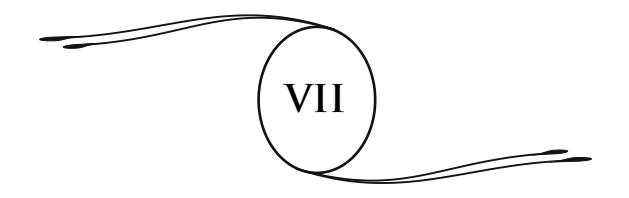

# **OS DOGMAS (continuação), OS SACRAMENTOS, O CULTO**

O pecado original é o dogma fundamental sobre o qual está estabelecido todo o edifício dos dogmas cristãos. Ideia verdadeira, na essência, mas falsa na forma e desnaturada pela Igreja. Verdadeira, no sentido de que o homem sofre pela intuição que conserva das faltas cometidas em suas vidas anteriores e das consequências que elas lhe acarretam. No entanto, esse sofrimento é pessoal e merecido. Ninguém é responsável pelas faltas dos outros, se nelas não teve participação. Apresentado sob seu aspecto dogmático, o pecado original — que pune toda a posteridade de Adão, isto é, a Humanidade inteira, pela desobediência do primeiro casal, para salvá-la, a seguir, por meio de uma iniquidade maior: a imolação de um justo — é um ultraje à razão e à moral, consideradas em seus princípios essenciais: a justiça e a bondade. Ele tem contribuído mais para afastar o homem da crença em Deus que todas as críticas da fi losofi a.

De fato, não é mais impunemente que se tenta separar, no pensamento e na consciência, a ideia de Deus e a da Justiça. Por esse meio, lança-se a perturbação nas almas e provoca-se um trabalho mental que, forçosamente, resulta na destruição de uma das duas ideias. Ora, foi a ideia de Deus que esteve prestes a morrer, porque o homem só pode ver em Deus a mais alta personifi cação da justiça, da sabedoria e do amor. Todas as perfeições devem se encontrar reunidas no Ser Eterno.

Do seu passado culposo, o homem perdeu a lembrança exata, mas dele conservou uma vaga consciência. Daí veio essa concepção do pecado original, que se encontra em várias religiões, e da expiação que ele necessita. Essa concepção errônea deu origem às da queda, do resgate e da redenção pelo sangue do Cristo, aos mistérios da encarnação da virgem mãe, da imaculada concepção, em uma palavra, em todo o fundamento do catolicismo.136

Todos esses dogmas constituem uma verdadeira negação da razão e da justiça divina, se os admitirmos ao pé da letra, como a Igreja quer, e no seu sentido material.

Não é admissível que Deus tenha criado o homem e a mulher com a condição de que eles não se instruíssem. É menos admissível ainda que ele tenha, por uma única desobediência, condenado sua posterioridade e a Humanidade inteira à morte e ao inferno.

> Que se pensaria, diz com razão E. Bellemare, de um juiz que condenasse um homem sob o pretexto de que, há milhares de anos, um dos seus ancestrais cometeu um crime?

É esse, no entanto, o odioso papel que o catolicismo atribui ao Juiz Supremo, a Deus.

É por tais argumentos que se justifi cam o afastamento e a aversão que certos pensadores conceberam pela ideia de Deus. É isso que explica, sem a desculpar, a veemente acusação de um célebre escrito: Deus é o mal.

136 "A perda da Humanidade em Adão, diz o abade de Noirlieu em seu *Catecismo fi losófi co para uso das pessoas do mundo*, e sua reparação em Jesus Cristo são os dois grandes fatos sobre os quais o Cristianismo está estabelecido. Sem o dogma do pecado original não se concebe mais a necessidade do Redentor. Assim, nada é ensinado mais explicitamente pela Igreja que a culpa de Adão e suas funestas consequências para todos os seus descendentes." (**N.A.**)

● **Pessoas do mundo:** entenda-se esta expressão como os indivíduos leigos, que não estão sujeitos a ordens religiosas, que não pertencem à vida eclesiástica. (**N.T.**)

Se considerarmos o dogma do pecado original e da culpa pelo que ele realmente é, ou seja, como um mito, uma lenda oriental, assim como as que se encontram em todas as cosmogonias137 antigas; se o vento soprar sobre essas quimeras, logo todo o edifício dos dogmas se desmorona. Que restará, então, do Cristianismo? Podem me perguntar. Restará o que ele tem em si de verdadeiramente grande, de vivo, de racional, quer dizer, tudo o que é suscetível de elevar e de fortifi car a Humanidade.

\* \*

Retomemos o nosso exame. A soberania de Deus, nos dizem os teólogos, manifesta-se pela predestinação e pela redenção. Sendo Deus soberano absoluto, sua vontade é a causa fi nal e decisiva de tudo o que se realiza no universo. Agostinho é o autor desse dogma, que ele instituiu em sua luta contra os maniqueus,138 partidários de dois princípios opostos: o bem e o mal, e contra Pelágio,139 que reivindicava os direitos da liberdade humana. Agostinho, porém, para defender seu dogma, referese à autoridade de Paulo, verdadeiro criador da doutrina e da predestinação, cujo enunciado, pouco concludente para nós, encontra-se no capítulo 9 da *Epístola aos Romanos*.

Segundo Paulo, cuja teoria foi retomada sucessivamente por Agostinho, pelos reformadores do século 16, Jansênio,140

137 **Cosmogonia:** teoria da formação do universo; ciência que trata da formação dos objetos celestes (planetas, estrelas, sistemas de estrelas, etc.). (**N.T.**, segundo o *Dicionário Koogan Houaiss*.)

138 **Maniqueus:** partidários do maniqueísmo, religião fundada por Maniqueu, Mani ou Manés (Pérsia, início do Séc. 3 d.C. – ?, 273) e que atribuía a criação a dois princípios em luta um contra o outro: um, essencialmente bom, simbolizado pela luz; o outro, essencialmente mau, fi gurado pelas trevas. (**N.T.**, *id.*)

139 **Pelágio:** acreditamos tratar-se de Pelágio (Grã-Bretanha, c. 360 – Egito, c. 422), um heresiarca (vide nota no 122). Sua doutrina (o *pelagianismo*), que negava a efi cácia da graça e o pecado original, teve a condenação de Roma. (**N.T.**, *id.*)

140 **Jansênio (Cornélio Jansen):** teólogo holandês, bispo de Ypres (Acquoy, 1585 – Ypres, 1638). Sua grande obra póstuma, o *Augustinus*, na qual expunha, sob o seu ponto de vista, as doutrinas de Santo Agostinho sobre a graça, o livre-arbítrio e a predestinação, deu lugar ao *jansenismo*. (**N.T.**, *id.*)

Pascal,141 etc., o homem não pode salvar-se por suas próprias obras; sua natureza o arrasta invencivelmente para o mal.

Essa inclinação funesta é o resultado do pecado do primeiro homem e da corrupção que dele provém para a humanidade inteira; essa corrupção tornou-se a herança de todos os fi lhos de Adão. É pela concepção que se transmite o pecado aos fi lhos. Este dogma chama-se *traducianismo*, e as igrejas cristãs parecem não notar que, por essa afi rmação monstruosa, elas se fazem aliadas do materialismo, que proclama a mesma teoria sob o nome de *lei da hereditariedade*.

Todos os homens, perdidos pelo pecado de Adão, seriam consagrados à condenação eterna, se Deus, na sua misericórdia, não encontrasse um meio de salvá-los. Esse meio é a redenção. O fi lho de Deus se faz homem. Em sua vida terrestre, ele realizou a vontade de seu Pai e satisfez a sua justiça, oferecendo-se em holocausto para a salvação de todos aqueles que se ligam à sua Igreja.

Desse dogma resulta que os fi éis não são salvos por um exercício da sua livre vontade, nem por seus próprios méritos, porque não há livre-arbítrio em face da soberania de Deus, mas por efeito de uma graça que Deus concede aos seus eleitos. Conduzindo esse argumento a todas as suas consequências lógicas, poder-se-ia dizer: é Deus quem atrai os eleitos; é Deus quem torna insensíveis os pecadores. Tudo se faz pela predestinação divina. Adão, portanto, não pecou por seu livre-arbítrio. Foi Deus, soberano absoluto, quem o predestinou ao pecado.

141 **Pascal, Blaise:** matemático, físico, fi lósofo e escritor francês. (Clermont, Auvergne, 1623 – Paris, 1662.) Até 1652 consagrou-se a numerosos trabalhos científi cos. Desde 1646 estabelecera relações com os jansenistas. "Converteu-se" em 23 de novembro de 1654 e retirou-se para Port-Royal-des-Champs, onde viveu asceticamente. Tomou o partido dos jansenistas e em sua obra *Provinciais* (1656–1657) atacou violentamente seus adversários, os jesuítas. Morreu antes de terminar *Apologia da religião cristã*, cujos fragmentos foram publicados sob o título de *Pensamentos*. (**N.T.**, *id.*)

Esse dogma conduz a resultados tão deploráveis que o próprio Calvino,142 que o afi rmou com todas as suas consequências, chama-o de "um decreto horrível" (*decretum horribile*), falando dos homens predestinados à eterna condenação. "Mas Deus falou, acrescenta ele, e a razão deve submeter-se."

Deus falou! Onde e por quem ele falou?

Nos textos obscuros, obra de uma imaginação perturbada.

E, para impor tais projetos, para fi xá-los nos espíritos, Calvino não recuou diante do emprego da violência. A fogueira de Servet143 nos atesta isso.

Lógica terrível que, procedendo de verdades mal compreendidas, como dissemos mais acima, confunde-se em seus próprios sofi smas e recorre ao ferro e ao fogo para se impor e resolver questões que não se podem deslindar, para elucidar um imbróglio144 criado pela ignorância e pelas paixões.

"Como, retruca Pelágio para Agostinho, Deus nos perdoa nossos próprios pecados e nos atribuiria os dos outros?"

> \*\* \*

142 **Calvino (Jean Calvin):** reformador francês (Noyon, Picardia, 1509 – Genebra, 1564), propagador da Reforma na França e na Suíça; morreu em Genebra, onde organizara uma república protestante. O sistema religioso de Calvino, *calvinismo*, difere das outras doutrinas protestantes pela origem democrática que ele atribuiu à autoridade religiosa; a supressão completa das cerimônias; a negação absoluta da tradição; o dogma da predestinação; a redução dos sacramentos ao batismo e à eucaristia. Na França, dá-se o nome de *huguenotes* aos discípulos de Calvino. (**N.T.**, segundo o *Dictionnaire Nouveau Petit Larousse Illustré*.)

143 **Servet, Michel:** médico e teólogo espanhol (Tudela ou Villanueva de Sigena, 1511 – Genebra, 1553). Foi queimado vivo por instigação de Calvino. (**N.T.**, segundo o *Dicionário Koogan Houaiss*.)

144 **Imbróglio:** confusão, trapalhada, mixórdia; em teatro, termo depreciativo: dramalhão de enredo confuso, mal elaborado. (**N.T.**)

"Existe um só Deus, diz Paulo,145 e um só *mediador*146 entre Deus e os homens: Jesus Cristo, homem."

Mediador, quer dizer intermediário, médium incomparável, traço de união entre a Humanidade e Deus, eis Jesus! Mediador e não redentor, porque a ideia de redenção não suporta exame. Ela é contrária à justiça divina; ela é contrária à ordem majestosa do Universo. Entre os mundos que giram no espaço, a Terra não é o único lugar de dor. Existem outros lugares de sofrimentos onde as almas, cativas na matéria, aprendem, como neste mundo, a dominar seus vícios e a adquirir qualidades que lhe facilitarão o acesso a mundos felizes.

Se o sacrifício de Jesus fosse necessário para salvar a humanidade terrestre, Deus deveria a mesma ajuda às outras humanidades infelizes. Porém, sendo ilimitado o número de mundos inferiores onde dominam as paixões materiais, o fi lho de Deus seria condenado, por isso mesmo, a sofrimentos e sacrifícios semfi m. Uma tal hipótese é inadmissível.

Com o seu sacrifício, dizem outros teólogos, Jesus "venceu o pecado e a morte, porque a morte é o salário do pecado e uma terrível desordem na criação".147

No entanto, morre-se desde a vinda de Jesus como se morria antes dele. A morte, considerada por certos cristãos como uma consequência do pecado e uma punição do ser, é, portanto, uma lei natural e uma transformação necessária ao progresso e à elevação da alma. Ela não pode ser um elemento de desordem no Universo. Julgá-la dessa forma não é avaliar mal a sabedoria divina? É assim que, partindo de um ponto de vista errôneo, os homens da Igreja chegam às concepções mais estranhas.

145 *I Epístola a Timóteo*, 2:5. (**N.A.**)

146 Esta expressão, "mediador", também é aplicada três vezes a Jesus pelo autor da *Epístola aos Hebreus*. (**N.A.**)

147 De Pressensé, *Jesus Cristo, seu tempo, sua vida, sua obra*, página 654. Encontra-se essa opinião em vários autores católicos. (**N.A.**)

Quando dizem que, por sua morte, Jesus se ofereceu à Deus em holocausto para o resgate da Humanidade, isso não equivale a dizer, para aqueles que creem na divindade do Cristo, que ele se ofereceu a si mesmo? E de que ele terá resgatado os homens? Não foi das penas do inferno, porquanto diariamente nos repetem que os homens que morrem em estado de pecado mortal são condenados às penas eternas.

A palavra pecado não exprime, em si mesma, mais que uma ideia confusa. A violação da lei provoca em cada ser um amesquinhamento moral, uma revolta da consciência, que é uma causa de sofrimento íntimo e uma diminuição das percepções anímicas. Assim, o ser pune a si mesmo. Deus não intervém; ele não pode ser nem atingido nem ofendido, porque Deus é infi nito e absoluto; nenhum ser poderia lhe causar qualquer dano.

Se o sacrifício de Jesus resgatou os homens do pecado, por que ainda se batizam? Essa redenção, em todos os casos, não pode se estender senão unicamente aos cristãos, àqueles que aceitaram a doutrina do Nazareno. Ela teria, então, deixado fora da sua esfera de ação a maior parte da Humanidade? Ainda hoje existem sobre a Terra milhões de homens que vivem fora das Igrejas cristãs, na ignorância de suas leis, privados desse ensino sem a observação do qual, dizem, "não há salvação". Que pensar de opiniões tão opostas aos verdadeiros princípios de justiça e de amor que regem os mundos?

Não, a missão do Cristo não era a de resgatar pelo seu sangue as faltas da Humanidade. O sangue, mesmo de um Deus, não poderia resgatar ninguém. Somos nós mesmos que devemos nos resgatar da ignorância e do mal; nada de exterior a nós o poderia. Eis o que os espíritos, aos milhares, afi rmam em todos os pontos do mundo. Das esferas de luz onde tudo é paz e serenidade, o Cristo desceu em nossas regiões obscuras e perturbadas, para nos mostrar o caminho que conduz a Deus: tal é o seu sacrifício. A efusão de amor que ele derrama sobre os homens, sua identifi cação com eles em suas alegrias como em suas afl ições, essa é a redenção que ele nos oferece e que depende de nós aceitar. Outros, antes dele, impeliram os homens para o caminho do bem e da verdade. Nenhum o fez com essa requintada doçura, com essa ternura profunda que caracteriza o ensino de Jesus. Nenhum soube, como ele, nos ensinar a praticar as virtudes modestas e escondidas. Aí se encontra o poder, a grandeza moral do *Evangelho*; o elemento vital do Cristianismo, que se curva sob o peso dos dogmas bizarros dos quais está sobrecarregado.

\* \*

O dogma das penas eternas deve prender nossa atenção. Arma temível nas mãos do padre nas épocas de comprovação de fé, ameaça suspensa sobre a cabeça do homem, ele foi para a Igreja um meio incomparável de dominação.

De onde veio essa concepção de Satanás e do inferno? Unicamente das falsas noções da ideia de Deus que o passado nos legou. Toda a Humanidade primitiva acreditou nos deuses do mal, nos poderes das trevas, e essa crença se traduz em lendas aterrorizantes, em imagens terríveis, que se transmitiram de gerações em gerações e inspiraram um grande número de mitos religiosos. As forças misteriosas da natureza, em suas manifestações, lançavam o terror no espírito dos primeiros homens. Por toda a parte ao redor deles, na sombra, eles acreditavam ver formas ameaçadoras, prontas a agarrá-los, a apertá-los.

Esses poderes nocivos foram personifi cados, individualizados pelo homem, e, dessa forma, ele criou os deuses do mal. E essas tradições remotas, herança das raças desaparecidas, perpetuadas de época em época, ainda se encontram nas religiões atuais.

Daí Satanás, o eterno revoltado, o eterno inimigo do bem, mais poderoso que o próprio Deus, porquanto reina como senhor no mundo, e as almas, criadas para a felicidade, e que em sua maior parte caem sob o seu domínio; Satanás, a astúcia, a perfídia em pessoa, e depois o inferno e suas torturas refi nadas, cuja descrição enlouquece os espíritos simples.

É assim que, em todos os domínios do pensamento, o homem terrestre substituiu as puras luzes da razão, que Deus lhe deu como um guia seguro, pelas quimeras da sua imaginação perturbada.

É verdade que nossa época, descrente e escarnecedora, quase não acredita no diabo, mas, por esse motivo, os padres não deixaram de ensinar sua existência e a do inferno. De tempos em tempos, pode-se ouvir, do alto dos púlpitos, a descrição dos castigos reservados aos condenados ou a dos delitos de Satanás. E não se trata aqui de modestos púlpitos de aldeias, sob as abóbadas de Notre-Dame de Paris o padre Janvier pronunciou estas palavras, por ocasião da quaresma de 1907:

> Grande número de espíritos imagina que o demônio não é mais que um símbolo, uma fi gura literária não correspondendo a nada na criação, uma poética fi cção, uma palavra que serve para designar o mal e as paixões: é um erro. O demônio é, na doutrina católica, um ser real, tendo sua vida própria, seu domínio, sua ação... Porém, o que é infi nitamente mais temível é a ação comum, contínua, exercida por Satanás sobre a criação, sua intervenção real e oculta na marcha das coisas, no curso das estações, na germinação das plantas, no desencadeamento dos ventos e das tempestades.148

Assim a Igreja se afunda nas doutrinas do passado. Ela continua a banir a ciência e o conhecimento, a introduzir o demônio em todas as coisas, até no domínio da moderna psicologia; ameaça com as chamas eternas todo homem que busca se libertar de um *credo* que sua razão e sua consciência rejeitam. Entre suas mãos, o *Evangelho* do amor tornou-se um instrumento de terror.

148 Padre Janvier. *Explicação do método católico. O vício e o pecado*. Ver também *A livre palavra*, de 3 de novembro de 1907. (**N.A.**)

Sem dúvida, a Igreja tem boas razões ao recomendar prudência aos seus fi éis, mas está errada ao lhes proibir as práticas espíritas, sob o pretexto de que elas provêm do demônio. É um demônio o espírito que confessa o seu arrependimento e pede preces? É um demônio aquele que nos incita à caridade, ao perdão? Na maioria dos casos, Satanás, em vez de ser esse personagem cheio de astúcia e de malícia descrito pela Igreja, seria totalmente desprovido de bom senso, ao não perceber que trabalha contra ele mesmo.

Se existem maus espíritos, aos quais, com justiça, se poderia aplicar a palavra demônio, é preciso não esquecer também que esses demônios são suscetíveis de se aperfeiçoarem. São, por exemplo, os criminosos que a pena de morte envia para outra vida, blasfêmias na boca e ódio no coração. Esses espalham sempre as suas más infl uências sobre os humanos; com muito mais razão essa infl uência será sentida se eles se apresentam em sessões espíritas em que não haja, para os repelir, um conjunto de vontades enérgicas.

Não é sufi ciente refl etir, considerar por um instante a obra divina para rejeitar toda a crença no demônio? Como admitir que o foco supremo do bem e do belo, que a fonte inesgotável de bondade, de misericórdia, tenha criado esse ser horrendo e malfazejo? Como acreditar que Deus lhe tenha dado, com o conhecimento do mal, todo o poder sobre o mundo, e entregue, como uma presa fácil, toda a família humana? Não, Deus não pode ter criado a imensa maioria dos seus fi lhos para os perder, para fazer a sua eterna infelicidade; Deus não deu o poder àquele que mais deve abusar desse poder, ao mais cruel, ao mais perverso. Isso é inaceitável, indigno de uma alma que crê na justiça, na bondade do Criador. Admitir Satanás e o inferno eterno, é injuriar a Divindade. De duas coisas uma: ou Deus tem presciência e soube, de antemão, quais seriam os resultados de sua obra e, realizando-a, tornou-se o carrasco de suas criaturas, ou então não previu esse resultado, não tem presciência, é falível como sua obra; e, neste caso, proclamando a infalibilidade do papa, a Igreja o elevou acima de Deus. É com tais afi rmações que se induz os povos ao ceticismo, ao materialismo. Com esse ponto capital, a Igreja romana se expõe às mais graves responsabilidades.

Quanto aos castigos reservados aos culpados como punição e para assegurar o cumprimento da lei de justiça, não há necessidade de se procurar os imaginários. Se lançarmos o olhar à nossa volta, veremos que por toda parte, sobre a Terra, a dor nos espreita. Não é necessário sair deste mundo para encontrar sofrimentos proporcionais a todos os erros, condições expiatórias para todos os culpados. Por que procurar o inferno em regiões quiméricas? O inferno está em torno de nós. Qual é o verdadeiro sentido dessa palavra? Lugar inferior! Ora, a Terra é um dos mundos do Universo. O destino do homem aqui é muitas vezes bastante difícil, e a soma de seus males muito grande, sem que as perspectivas do futuro sejam obscurecidas por concepções fantásticas. Tais opiniões são um ultraje a Deus. Não pode haver sofrimentos eternos, mas somente sofrimentos temporários, apropriados às necessidades da lei de progresso e de evolução. O princípio das reencarnações sucessivas é mais justo que a noção do inferno eterno; ele realiza a justiça e a harmonia no Universo. É no decorrer de novas e penosas existências terrestres que o culpado resgata suas faltas passadas. Cada um de nós tece a lei do destino sobre a trama das próprias ações, boas e más, que repercutem através dos tempos com suas consequências felizes ou funestas. Assim, cada um prepara o seu céu ou o seu inferno.

A alma, na parte inferior da sua evolução, contida no círculo das vidas terrestres, hesitante, incerta, agitada entre atrações diversas, ignorante dos grandes destinos que a esperam e do objetivo da criação, erra, fraqueja, entrega-se às paixões, às correntes materiais que a arrastam. Porém, pouco a pouco, pelo desenvolvimento de suas forças psíquicas, de seus conhecimentos, de sua vontade, a alma se eleva, liberta-se das infl uências inferiores e paira nas regiões divinas.

Tempo virá em que o mal não será mais a condição desta existência; em que seres, purifi cados pelo sofrimento, após terem recebido a longa educação dos séculos, deixarão a rota obscura para avançar em direção à eterna luz. As Humanidades, unidas pelos laços de uma estreita solidariedade e de uma profunda afeição, caminharão de progresso em progresso, de perfeições em perfeições, em direção ao grande foco, em direção ao objetivo supremo que é Deus, realizando assim essa obra do Pai, que não quer a perdição, mas a felicidade e a elevação de todos os seus fi lhos.

> \*\* \*

O principal argumento dos defensores da teoria do inferno é que a ofensa feita pelo homem, ser fi nito, a Deus, ser infi nito, é, por consequência, infi nita e merece uma pena eterna. Ora, todo matemático nos dirá que a relação de uma quantidade fi nita ao infi nito é nula. Poder-se-ia apresentar o argumento sob outro aspecto e dizer que o homem, ignorante e fi nito, não poderia ofender o infi nito e que sua ofensa é nula em relação a este. O homem só pode fazer mal a ele mesmo, retardando sua elevação e atraindo os sofrimentos que todo ato culposo produz.

Os chefes da Igreja estão realmente convencidos da existência do inferno eterno, ou não verão nele antes um espantalho ilusório, mas necessário à conduta da Humanidade? É o que se poderia crer, comentando as palavras do tradutor da *Vulgata*, São Jerônimo:

> ...Tais são os motivos sobre os quais se apoiam aqueles que querem fazer compreender que, após os suplícios e os tormentos, haverá consolações, o que se deve ocultar, quanto ao presente, àqueles a quem o receio é útil, a fi m de que, temendo os suplícios, eles se abstenham de pecar. (*Quae nunc abscondenda sunt ab his quibus timor est utilis,ut, dum supplicia reformidant, peccare desistant.*)149

149 São Jerônimo, *Obras*, edição beneditina de 1704, t. 3, col. 514. São Jerônimo cita os seguintes textos: *Romanos*, 11:25, 26 e 32; *Miqueias*, 7:9, 19, etc. (**N.A.**)

É verdade que São Jerônimo não receou fazer fi gurar no texto do *Evangelho segundo Mateus* estas expressões: "o fogo eterno, o suplício eterno". Mas as palavras hebraicas que assim foram traduzidas não parecem, de modo algum, ter o sentido que os latinos lhes atribuíram.150

Tal não pode ser o pensamento daquele que disse: "Deus não quer que nenhum desses pequeninos pereça". Essas palavras são confi rmadas por estas dos apóstolos:

> Deus quer que todos os homens sejam salvos e cheguem ao conhecimento da verdade. (São Paulo, *I Timóteo*, 2:4.)

Deus é o salvador de todos os homens. (Paulo, *I Timóteo*, 4:10.)

Deus não quer que nenhum homem pereça, mas que todos venham para a penitência. (São Pedro, *II Epístola*, 3:9.)

150 A palavra *eterno*, que frequentemente se encontra nas *Escrituras*, não parece que deve ser tomada ao pé da letra, mas como uma dessas expressões enfáticas e hiperbólicas habituais aos orientais. Nós erramos em esquecer que tudo são imagens e símbolos nos seus escritos. Quantas promessas pretensamente *eternas*, feitas ao povo hebreu ou aos seus chefes, tiveram uma realização limitada! Onde está essa terra que os israelitas deviam possuir *eternamente? — in aeternum —* (*Pentateuco*, em diversas passagens). Onde estão essas pedras do Jordão que Deus anunciava deverem ser, para o seu povo, um monumento *eterno*? (*Josué*, 6:7.) Onde está essa descendência de Salomão, que devia reinar *eternamente* em Israel? (*I Paralipomènes*, 22:10) e tantas outras promessas idênticas.

Em todos esses casos, a palavra *eterno* parece signifi car simplesmente de longa duração. O termo hebraico *ôlam*, traduzido por *eterno*, tem por raiz o verbo *âlam*, ocultar. Exprime um período do qual o fi m é desconhecido. Ocorre o mesmo com a palavra grega *aîon* e a latina *aeternitas*. Esta tem por raiz *aetas*, idade. Eternidade, no sentido em que a entendemos hoje, dir-se-ia em grego *aidios* e em latim *sempiternus*, de *semper*, sempre. (Ver abade J. Petit, *Résurrection*, do mês de abril de 1903.)

As penas eternas então signifi cariam: sem duração limitada. Para quem não lhes vê o termo, elas são eternas. As mesmas formas de linguagem são usadas pelos poetas latinos Horácio, Virgílio, Estácio e outros. Todos os monumentos imperiais dos quais falam devem ser, dizem eles, de *eterna* duração. (**N.A.**)

● *Paralipomènes:* nome que a *Vulgata* dá a dois livros históricos da *Bíblia*que são como o complemento dos *Livros dos Reis*. Os fatos são narrados desde as origens até o fi m do cativeiro da Babilônia. (**N.T.**, segundo o *Dictionnaire Nouveau Petit Larousse Illustré*.)

Muitos entre os Pais da Igreja seguem a mesma opinião. Primeiro é o mestre de Orígenes, Clemente de Alexandria, quem diz:

> O Cristo salvador opera fi nalmente a salvação de todos, e não somente a de alguns privilegiados. O soberano Mestre dispôs tudo, seja no conjunto, seja nos detalhes, para que esse objetivo defi nitivo fosse alcançado.151

Em seguida é São Gregório de Nissa que se pronuncia da maneira mais formal contra a eternidade das penas. Para ele:

> Há necessidade de que a alma imortal seja purifi cada de suas máculas e curada de todas as suas doenças. As provas terrestres têm por objetivo realizar essa cura, que se completa após a morte quando não pôde ser concluída nesta vida. Quando Deus faz sofrer o pecador, não é por espírito de ódio nem de vingança; Deus quer reconduzir a alma até ele, que é a fonte de toda felicidade. O fogo da purifi cação dura somente por um tempo conveniente, e o único objetivo de Deus é tornar, defi nitivamente, todos os homens participantes dos bens que constituem sua essência.152

Em nossos dias, é monsenhor Méric, diretor do seminário de Saint-Sulpice, que expõe muito longamente, em suas obras, a teoria da mitigação das penas.153 E a Igreja, sentindo talvez que a ideia de um inferno eterno teve a sua época, não se opôs à divulgação dessa tese.

A noção do purgatório, meio-termo adotado pela Igreja, provém das mesmas preocupações. Ela recuou diante da desproporção das penas eternas, aplicadas a certas faltas leves. A questão do purgatório é da mais alta importância, porque ela pode constituir um laço, um traço de união entre as doutrinas católicas e a do moderno espiritualismo. No pensamento da Igreja romana,

151 Extraído de *O exame crítico das doutrinas da religião cristã*, de Patrice Laroque. As palavras são citadas em grego. (**N.A.**)

*Idem*, *ibidem*. (**N.A.**)

153 Monsenhor Méric. *A outra vida*, t. 2, apêndice. (**N.A.**)

o purgatório é um lugar não defi nido, indeterminado. Nada impede o católico de conceber as penas purifi cadoras da alma sob a forma de vidas planetárias ulteriores, enquanto que o protestante ortodoxo, para adotar a noção das vidas sucessivas, é obrigado a suprimir radicalmente suas crenças, onde o purgatório não tem nenhum lugar.

Na maior parte dos casos, o purgatório é a vida terrestre e as provas que ela encerra. Isso os primeiros cristãos não ignoravam. A Igreja da Idade Média descartou essa explicação, que trouxe consigo a afi rmação da pluralidade das existências da alma e a ruína da instituição das indulgências, fonte de grandes ganhos para os pontífi ces romanos. Sabe-se quantos abusos daí surgiram.

> \*\* \*

Na realidade, Satanás não é mais que uma alegoria. Satanás é o símbolo do mal. Mas o mal não é, na Terra, um princípio eterno, coexistente com o bem. Ele passará. O mal é o estado transitório dos seres em via de evolução.

Não há nem lacuna nem imperfeição no Universo. A obra divina é harmônica e perfeita. Dessa obra, o homem vê apenas um fragmento, no entanto ele quer julgá-la de acordo com as suas restritas percepções. O homem, por sua vida presente, não é mais que um ponto no tempo e no espaço. Para julgar a criação, seria preciso abrangê-la inteiramente, avaliar a cadeia de mundos que ele é chamado a percorrer, e a sucessão das existências que o aguardam no seio dos séculos futuros. Esse vasto conjunto escapa às suas percepções; daí os seus erros; daí a imperfeição dos seus julgamentos.

Quase sempre o que chamamos o mal é apenas o sofrimento; este, porém, é necessário, porque somente ele conduz à compreensão. Pelo sofrimento, o homem aprende a diferençar, a analisar suas sensações.

A alma é uma centelha saída do eterno foco criador. É pelo sofrimento que ela chega à plenitude do seu brilho, à consciência plena de si mesma. A dor é como a sombra que faz a luz sobressair e ser apreciada. Sem a noite, nós contemplaríamos as estrelas? A dor quebra a corrente das fatalidades materiais e abre para a alma oportunidades em direção à vida superior.

Sob o ponto de vista físico, o mal, o sofrimento frequentemente são coisas relativas e de pura convenção. As sensações variam ao infi nito, segundo as pessoas; agradáveis para uns, elas serão dolorosas para outros. Há mundos muito diferentes do meio terrestre, onde tudo seria penoso para nós, enquanto que outros homens neles poderiam viver comodamente.

Se não levarmos em consideração o estreito meio em que vivemos, o mal não nos aparecerá mais como uma causa fi xa, um princípio imutável, mas como efeitos passageiros, variando segundo os indivíduos, transformando-se e se atenuando com o aperfeiçoamento deles.

O homem, ignorante no início da sua caminhada, deve desenvolver sua inteligência e sua vontade por esforços constantes. Na sua luta contra a natureza, sua energia se fortalece, seu ser moral se afi rma e se desenvolve. É graças a essa luta que o progresso se realiza, que prossegue a evolução da Humanidade subindo de etapa em etapa, de degrau em degrau, em direção ao bem e ao melhor, conquistando ela mesma sua preponderância sobre o mundo material.

Se o homem fosse criado feliz e perfeito, ele fi caria confundido na perfeição divina; não teria podido individualizar o princípio espiritual que existe nele. Não teria havido nem trabalho, nem esforços, nem progresso no Universo; nada, a não ser a imobilidade, a inércia. A evolução dos seres seria substituída por uma sombria e monótona perfeição. Isto seria o paraíso católico.

Sob o chicote da necessidade, sob o aguilhão da pobreza e da dor, o homem caminha, avança, eleva-se, e, de vidas em vidas, de progresso em progresso, chega a colocar sobre o mundo a marca da sua inteligência e da sua dominação.

Ocorre o mesmo com o mal moral. Como o mal físico, este não é mais que um aspecto passageiro, uma forma transitória da vida universal. O homem faz o mal por ignorância, por fraqueza, e os seus atos reagem contra ele mesmo. O mal é a luta que se produz entre as potências inferiores da matéria e as potências superiores que constituem o ser pensante, seu verdadeiro "eu". Porém, do mal e do sofrimento, um dia nascerão a felicidade e a virtude. Quando a alma houver vencido as infl uências materiais, para ela será como se o mal nunca tivesse existido.

Portanto, não é o inferno que luta contra Deus; não é Satanás que lança suas redes sobre o mundo. Não... é a alma humana que busca seu caminho na sombra, é ela que se esforça para se afi rmar em sua personalidade crescente, e, após muitas fraquezas, quedas e reerguimentos, domina seus vícios, conquista a força moral e a verdadeira luz. É assim que, lentamente, de geração em geração, através do fl uxo e refl uxo das paixões, o progresso se acentua, o bem se realiza.

O império do mal são os mundos inferiores, tenebrosos; é a multidão de almas retrógradas que se agitam nas estradas do erro e do crime, turbilhonando no círculo das existências materiais, e, sob o choque das provações, sob o chicote da dor, emergem lentamente desse abismo de sombra, de egoísmo e de miséria, para se iluminarem com os raios da ciência e da caridade. Satanás é a ignorância, é a matéria e suas rudes infl uências; Deus é o conhecimento, é a claridade sublime, da qual um refl exo clareia toda consciência humana.

A marcha da Humanidade prosseguirá em direção aos altos cumes. O espírito moderno libertar-se-á cada vez mais dos preconceitos do passado. A vida perderá o aspecto feroz dos séculos de ferro, para se tornar o campo pacífi co e fecundo onde o homem trabalhará para o desenvolvimento de suas faculdades e qualidades morais.

Ainda não chegamos lá: o mal não está extinto sobre a Terra, a luta não terminou. Os vícios, as paixões estão latentes no fundo da alma humana. Deve-se temer confl itos tremendos, tempestades sociais. Por toda parte, surdos murmúrios, reivindicações ardentes se fazem ouvir. A luta é necessária nos mundos da matéria, necessária para afastar o homem do seu torpor, dos seus prazeres grosseiros, para preparar a vinda de uma nova sociedade. Assim como do choque entre as pedras brilha a centelha, do choque das paixões pode surgir um novo ideal, uma forma mais elevada da justiça, pela qual a Humanidade modelará suas instituições.

O homem moderno já sente aumentar em si a consciência do seu papel e do seu valor. Logo ele se sentirá ligado ao Universo, participando da sua imensa vida; para sempre ele se reconhecerá cidadão do céu. Por sua inteligência, por sua alma, o homem saberá agir, colaborar com a obra universal; por sua vez, ele se tornará criador, operário de Deus.

A nova revelação ter-lhe-á ensinado a se conhecer, a conhecer a natureza da alma, seu papel e seus destinos. Ela lhe mostrará o duplo poder que ele possui sobre o mundo da matéria e sobre o mundo do espírito. Todas as incoerências, todas as contradições aparentes da obra divina esclarecer-se-ão para ele. O que ele chamava o mal físico e o mal moral, tudo o que lhe aparecia como a negação do bem, do belo, do justo, tudo se unifi cará nas linhas de uma obra poderosa e forte, na harmonia de leis sábias e profundas.

O homem verá se dissipar o sonho assustador, o pesadelo da condenação; ele elevará sua alma para o espaço que o pensamento divino preenche, para o espaço de onde desce o perdão de todas as faltas, o resgate de todos os crimes, a consolação para todas as dores, para o espaço radiante onde reina a eterna misericórdia.

Os poderes do inferno desaparecerão para sempre; o reino de Satanás terá seu fi m; a alma, liberta dos seus terrores, rirá dos fantasmas que, durante tanto tempo, a apavoraram.

\* \*

Falaremos da ressurreição da carne, dogma segundo o qual os átomos do nosso corpo carnal, espalhados, dispersos em mil novos corpos, devem se reunir um dia, reconstituir nosso invólucro e tomar parte no juízo fi nal.

As leis da evolução material, a circulação incessante da vida, a ação das moléculas que passam em inúmeras correntes de formas em formas, de organismos em organismos, tornam essa teo ria inadmissível. O corpo humano se modifi ca constantemente; os elementos que o compõem se renovam inteiramente em alguns anos. Nenhum dos átomos atuais da nossa carne reencontrar-se-á por ocasião da morte, por pouco que a nossa vida se prolongue, e aqueles que então constituírem nosso invólucro carnal serão dispersos aos quatro ventos do céu.

A maior parte dos Pais da Igreja o entendiam de outra forma. Eles conheciam a existência do perispírito, desse corpo fl uídico, sutil, imponderável, que é o invólucro permanente da alma, antes, durante e após a vida terrestre; eles o chamavam corpo espiritual. Paulo, Orígenes e os sacerdotes de Alexandria afi rmavam sua existência. Para eles, os corpos dos anjos e dos eleitos, formados desse elemento sutil, eram "incorruptíveis, leves, tênues e soberanamente ágeis".154

Também atribuíam a ressurreição apenas a esse corpo espiritual, que resume em sua substância quintessenciada todos

154 Ver nota complementar no 9. (**N.A.**)

os invólucros grosseiros, perecíveis que a alma revestiu, depois abandonou, em suas peregrinações pelos mundos.

O perispírito, penetrando com sua energia todas as matérias passageiras da vida terrestre, é, efetivamente, o corpo essencial.

A questão estava, por isso, simplifi cada. Essa crença dos primeiros Pais da Igreja no corpo espiritual lançava, além disso, conhecimentos bastante importantes sobre o problema das manifestações ocultas.

Tertuliano155 diz (em *De Carne Christi*, cap. 6):

Os anjos têm um corpo que lhes é próprio e que pode se transfi gurar em carne humana; eles podem, por um tempo, se fazer visíveis aos homens e se comunicarem visivelmente com eles.

Que se estenda aos espíritos dos mortos o poder que Tertuliano atribui aos anjos, e ali teremos o fenômeno das materializações e das aparições explicado!

Por outro lado, se consultarmos as *Escrituras* com atenção, perceberemos que o sentido grosseiro atribuído à ressurreição, em nossos dias, pela Igreja, de modo algum é justifi cado. Nelas não encontraremos os termos ressurreição da carne, mas sim ressuscitar dentre os mortos (*a mortuis resurgere*), e, em um sentido mais geral, a ressurreição dos mortos (*resurrectio mortuorum*). A diferença é grande.

**Tertuliano, Quinto Septímio Florente:** apologista cristão (Cartago, cerca de 155 – *idem*, cerca de 220), gênio poderoso, absoluto e sombrio. Adotou as ideias de Montanus e lançou-se numa polêmica contra os cristãos displicentes. (**N.T.**)

● **Montanus:** sacerdote de **Cibele**, convertido ao Cristianismo e fundador da seita dos montanistas, por volta de 160 ou 170 da nossa era. A todos os ensinos dogmáticos da Igreja, Montanus acrescentava a crença na intervenção do Espírito Santo, de quem se dizia profeta. (**N.T.**)

● **Cibele:** fi lha do Céu, deusa da Terra e dos animais, esposa de Saturno, mãe de Júpiter, Netuno, Plutão, etc. (**N.T.**)

De acordo com os textos, a ressurreição, tomada no sentido espiritual, é o renascimento na vida do além-túmulo, a espiritualização da forma humana para aqueles que são dignos dela, e não a operação química que reconstituiria elementos materiais; é a depuração da alma e de seu perispírito, esboço fl uídico pelo qual o corpo material é formado para o tempo da vida terrestre.

É o que o apóstolo se esforçava para fazer entender:

O homem é semeado na corrupção, ele se reconstrói na incorruptibilidade; é semeado na ignomínia, ele se reconstrói na glória; é semeado na imperfeição, ele se reconstrói na virtude. *Ele é semeado corpo animal, e se reconstrói corpo espiritual*... Eu vos digo, meus irmãos, a carne e o sangue não podem herdar o reino de Deus, nem a corrupção herdar a incorruptibilidade.156

Muitos teólogos adotam essa interpretação, dando aos corpos ressuscitados propriedades desconhecidas à matéria carnal, fazendo-os "luminosos, ágeis como espíritos, sutis como o éter, e impassíveis".157

Tal é o verdadeiro sentido da ressurreição dos mortos, como o entendiam os primeiros cristãos. Se vemos, em uma época posterior, aparecer em certos documentos, e em particular no símbolo apócrifo dos apóstolos, as palavras ressurreição da carne, é sempre no sentido de reencarnação158 — isto é, de retorno à vida material — ato pelo qual a alma reveste uma nova carne para percorrer o campo de suas existências terrestres.

> \*\* \*

156 *I Epístola aos Coríntios*, 15:42 a 44 e 50 (traduzido do texto grego); ver também 15:52 a 56; *Epístola aos Filipenses*, 3:21; depois, *João*, 5:28 e 29; Santo Inácio, *Epístola aos Trallianos*, 9:1. (**N.A.**)

Abade Petit. *A renovação religiosa*, páginas 48 a 53. Ver também a nota no 9 no fi m deste volume. (**N.A.**)

158 Abade Petit, obra citada, página 53. (**N.A.**)

O Cristianismo, portanto, sob o tríplice aspecto que revestiu em nossos dias, catolicismo romano, protestantismo ortodoxo, ou religião grega, não se constituiu inteiramente em um só momento como alguns o acreditam, mas lentamente, através dos séculos, por meio de tentativas, de lutas obstinadas, dilacerações profundas. Cada dogma, edifi cando-se sobre um outro, vinha afi rmar o que as épocas passadas haviam negado. O próprio século 19 viu serem promulgados dois dos dogmas mais contestados, mais controversos, o da imaculada conceição e o da infabilidade papal, dos quais um padre católico de grande valor pôde dizer: "Eles inspiram pouca veneração, quando se viu como são feitos".159

No entanto, essa obra dos séculos, de que a tradição eclesiástica fez uma doutrina ininteligível, poderia ter se tornado a vestimenta de uma religião racional, conforme aos dados da ciência e às exigências do senso comum, se, em lugar de tomar cada dogma ao pé da letra, neles tivessem querido ver uma imagem, um símbolo transparente. Despojando-os do seu caráter sobrenatural, quase sempre neles poder-se-ia encontrar uma ideia fi losófi ca, um substancial ensinamento.

Por exemplo, a Trindade, defi nida pela Igreja como "um só Deus em três pessoas", seria, nesse ponto de vista, apenas um conceito do espírito representando a Divindade sob três aspectos essenciais. A Lei, viva e imutável, é o Pai; a Razão ou sabedoria eterna é o Filho; o Amor, potência criadora e fecundante, é o Espírito Santo.

A encarnação do Cristo é a divina sabedoria descendente do céu na Humanidade, nela tomando corpo, para formar um tipo de perfeição moral oferecido como exemplo aos homens, que ele inicia na grande lei do sacrifício.

O pecado original, as faltas pelas quais o homem é responsável, são as de suas vidas anteriores, que ele deve

159 Padre Marchal. *O espírito consolador*, página 24. (**N.A.**)

procurar resgatar pelo seu mérito, sua coragem e sua resignação nas provações.

Assim poder-se-ia explicar, de uma forma simples, clara, racional, todos os antigos dogmas do Cristianismo, aqueles que provêm da doutrina secreta ensinada nos primeiros séculos e dos quais se perdeu a explicação e o sentido fi cou desconhecido.

Quanto aos dogmas modernos, neles não se pode ver mais que um produto da ambição sacerdotal. Eles foram promulgados apenas para tornar mais completa a dependência das almas.

Entretanto, por mais profundo que seja o pensamento fi losófi co escondido sob o símbolo, ele não seria, para o futuro, sufi ciente para uma restauração das crenças humanas. As leis superiores e os destinos das almas nos são reveladas por vozes mais autorizadas que as dos pensadores da Antiguidade; são as vozes dos seres que habitam o espaço e vivem dessa vida fl uídica que um dia será a nossa.

Essa revelação servirá de base às crenças do futuro, porque ela fornece uma demonstração notória desse Além do qual a alma tem sede, desse mundo espiritual a que ela aspira, e que as religiões lhe têm apresentado até aqui sob formas tão incompletas ou tão quiméricas.

> \*\* \*

A explicação racional dos dogmas pode se estender aos sacramentos, instituições respeitáveis, se os considerarmos como fi guras simbólicas, como meios de arrebatamento moral e de disciplina religiosa, mas que não se poderia tomar ao pé da letra, no sentido imposto pela Igreja.

O que dissemos do pecado original nos leva a considerar o batismo como uma simples cerimônia de iniciação ou de consagração, porque a água é impotente para livrar a alma de suas máculas.

A confi rmação ou imposição das mãos era o ato de transmissão dos dons fl uídicos, do poder do apóstolo a uma outra pessoa, que ele assim colocava em relação com o invisível.160 Esse poder se justifi cava por méritos adquiridos no decorrer de vidas anteriores.

A penitência e a remissão dos pecados deram origem à confi ssão que a princípio era pública e feita a outros cristãos ou diretamente a Deus, depois, auricular, na Igreja Católica, e dirigida ao padre. Este, transformado em árbitro único, julgou esse meio indispensável para se esclarecer e discernir os casos em que a absolvição era merecida. Mas ele sempre pode se pronunciar com fi rmeza? A contrição do penitente, nos diz a Igreja, é necessária. E essa contrição, como provar que ela é real e sufi ciente? A decisão do padre decorre da confi ssão das faltas; é sempre certo que essa confi ssão seja completa?

Se consultarmos todos os textos sobre os quais se baseia a instituição da confi ssão,161 neles encontraremos apenas uma coisa: que o homem deve admitir seus erros com o próximo; que ele deve confessar suas faltas diante de Deus. Desses textos antes se depreende esta consideração: a consciência individual é sagrada; ela depende diretamente de Deus. Nada aí vem justifi car a pretensão do padre em se instituir juiz.

Que diz *Paulo*, falando da comunhão e daqueles que são dignos dela?

"Que cada um examine a si mesmo." (*1a Epístola aos Coríntios*, 11:28.)

Ele fi ca calado no que se refere à confi ssão, considerada, em nossos dias, como indispensável em igual circunstância.

160*Atos*, 8:17; 19:6, etc. (**N.A.**)

161 *Mateus*, 3:6; *Lucas*, 18:13; *Epístola de Tiago*, 5:16; *I Epístola de João*, 1:9; etc. (**N.A.**)

São João Crisóstomo, em um caso semelhante, exclama:

Revelai vossa vida a Deus; confessai vossos pecados a Deus; confessai-os ao vosso juiz, rogando-lhe, se não com a voz, pelo menos mentalmente, e suplicai-lhe de tal modo que ele vos perdoe. (Homilia 31 sobre a *Epístola aos Hebreus*.)

A confi ssão auricular jamais foi praticada nos primeiros tempos do Cristianismo; ela não veio de Jesus Cristo, mas dos homens.

Quanto à remissão dos pecados, deduzida destas palavras do Cristo: "O que é ligado sobre a Terra será ligado nos céus", parece que esta forma de linguagem aplica-se antes aos hábitos, às preferências materiais contraídas pelo espírito durante a vida terrestre, e que o prendem fl uidicamente à Terra após sua morte.

Depois vem a Eucaristia, ou presença real do corpo e do sangue de Jesus Cristo, a hóstia consagrada, o sacrifício da cruz renovado todos os dias, à voz do padre, sobre os milhares de altares da catolicidade, e a absorção pelos fi éis do corpo vivo e sangrento do Cristo, segundo a fórmula do catecismo do concílio de Trento:

> Não é somente o corpo de Jesus Cristo que está contido na Eucaristia, com tudo o que constitui um corpo verdadeiro, como os ossos e os nervos; é Jesus Cristo todo inteiro.

De onde vem esse mistério afi rmado pela Igreja? De palavras de Jesus, tomadas ao pé da letra, e que tinham um caráter puramente simbólico. Esse caráter, aliás, está nitidamente indicado pela frase que ele acrescenta: "Fazei isto em memória de mim".162 Com isso o Cristo afasta qualquer ideia de presença real. Evidentemente, ele só quis falar do seu corpo espiritual, personifi cando o homem regenerado pelo espírito de caridade e de amor. A comunhão entre o ser humano e a natureza divina se opera pela união moral com Deus; ela se realiza por enérgicos impulsos da

162 *Lucas*, 22:19; *I Coríntios*, 9:23 a 25. (**N.A.**)

alma para seu Pai, por aspirações constantes para o foco divino. Toda cerimônia material é vã, se ela não corresponde a um estado elevado do pensamento e do coração. Essas condições estando cumpridas, ela estabelece, ao contrário, como no princípio, uma relação misteriosa entre o homem fervoroso e o mundo invisível. Infl uências magnéticas descem sobre esse homem e sobre a assembleia da qual ele faz parte, e muitos sentem seus benefícios.

> \*\* \*

O culto religioso é uma legítima homenagem prestada à Onipotência; é a elevação da alma em direção ao seu Criador, a relação natural e essencial do homem com Deus. As práticas desse culto são úteis; as aspirações que elas suscitam, a poesia consoladora que daí emana, são um sustentáculo para o homem, uma proteção contra suas paixões. No entanto, para falar ao espírito e ao coração do crente, o culto deve ser discreto em suas manifestações; deve renunciar a um aparato de riqueza material sempre nocivo ao recolhimento e à prece. Não deve deixar nenhum lugar para as superstições pueris. Simples e grande em suas formas, ele deve dar a impressão da divina majestade.

Nas épocas distantes, o culto exterior quase sempre ultrapassou os limites que uma fé pura e elevada lhe determina. Levado pelo seu fanatismo religioso resultante da sua ignorância e da sua inferioridade moral, o homem ofertou à divindade sacrifícios sangrentos; o padre encerrou o espírito das gerações em uma rede de cerimônias terrifi cantes.

Os tempos mudaram; a inteligência se desenvolveu; os costumes se abrandaram; mas a opressão sacerdotal ainda se manifesta em nossos dias, nesses ritos sob os quais a ideia de Deus se encobre e obscurece, nesse cerimonial em que o luxo e o esplendor seduzem os sentidos e desviam o pensamento do elevado objetivo que ele deve atingir. Não se percebe sob esse fausto, sob essas pompas brilhantes do catolicismo, um espírito de dominação que busca tudo invadir, tudo enlaçar, e, sob essas diversas formas, por essas práticas exteriores, afasta-se cada vez mais do verdadeiro ideal cristão?

É necessário, é urgente que o culto rendido a Deus torne a ser simples, austero em seu princípio como em suas manifestações. Quantos progressos se realizariam se o culto, praticado na família, permitisse a todos os seus membros, reunidos e concentrados, elevar em um mesmo arrebatamento de fé seus pensamentos e seus corações em direção ao Eterno; se, em épocas determinadas, todos os crentes se reunissem para ouvir, de uma boca autorizada, a palavra da verdade! Então, a doutrina de Jesus, melhor compreendida, seria amada e praticada; o culto, voltando a ser simples e sincero, exerceria uma ação efi caz sobre as almas.

Apesar de tudo, o culto romano se obstina em conservar formas tiradas das antigas religiões orientais, formas que nada mais dizem ao coração e que, para os fi éis, são um hábito rotineiro, sem infl uência sobre sua vida moral. Ele persiste, há dois mil anos, em se dirigir a Deus numa linguagem que não mais se compreende, com palavras que os lábios murmuram, mas cujo sentido já não se sabe.

Todas essas manifestações tendem a afastar o homem do estudo aprofundado e da refl exão, para desenvolver nele a vida contemplativa. As longas preces, o cerimonial brilhante ocupam os sentidos, conservam a ilusão e habituam o pensamento a funcionar mecanicamente, sem a participação da razão.

Todas as formas do culto romano são um legado do passado. Suas cerimônias, seus vasos de ouro e de prata, seus cânticos, suas procissões, a água lustral,163 são uma herança do paganismo. Do bramanismo tomaram o altar, a chama sagrada que nele arde, o pão e o licor de soma164 consagrados à Divindade. Do budismo

163**Água lustral:** água sagrada dos antigos; água do batismo. (**N.T.**)

164 **Soma:**planta da Índia, de cujas folhas se extrai bebida embriagadora e sagrada; bebida feita dessa planta, tida pelos hindus como capaz de curar todas as enfermidades, de fortalecer o corpo e o espírito, de dar coragem ao guerreiro e imortalidade aos justos. (**N.T.**, segundo o *Dicionário Koogan Houaiss*.)

copiaram o celibato dos padres e a hierarquia sacerdotal. A casula165 foi copiada dos sacerdotes do Sol; a sotaina166 negra, dos sacrifi cadores de Mitra;167 a casula dourada era usada nos templos egípcios; a mitra168 vem dos magos da Caldeia169 e o báculo170 dos adivinhos romanos.

Uma lenta substituição se produziu, na qual se encontram os vestígios das crenças desaparecidas. Os deuses pagãos tornaram-se demônios. As divindades dos fenícios e dos assírios, Baal-Zebud (Belzebu), Astarot e Lúcifer, foram transformadas em potências infernais. Os demônios do platonismo, que eram espíritos familiares, tornaram-se diabos. Heróis e personagens reverenciados na Gália, na Itália, na Grécia, fi zeram santos. Conservaram as festas religiosas dos povos antigos, dando-lhes apenas formas diferentes, como a dos mortos. Por toda parte enxertaram um culto novo sobre o culto antigo, que deste era a reprodução sob outros nomes. Os próprios dogmas cristãos se encontram na Índia e na Pérsia.171

165 **Casula:** paramento religioso que o sacerdote coloca sobre a **alva** para celebrar a missa.

● **Alva:** longa vestidura branca que os padres usam para a celebração de ofícios litúrgicos. (**N.T.**)

166 **Sotaina:** vestimenta, batina usada pelos padres. (**N.T.**)

167 **Mitra:** grande divindade dos persas, gênio dos elementos da natureza e juiz dos mortos. Tornou-se o núcleo de uma religião de mistérios que se expandiu na Grécia e no Império Romano. (**N.T.**, segundo o *Dicionário Koogan Houaiss.*)

168 **mitra:** (com inicial minúscula) coifa ou espécie de chapéu que os bispos usam quando vão ofi ciar. (**N.T.**)

169 **Caldeia:** denominação dada primeiramente a uma parte da Suméria, na baixa Mesopotâmia, e depois à Babilônia. Na *Bíblia*, a Caldeia é citada como o equivalente da Babilônia, tendo sido ocupada pelos caldeus, povo de origem semítica, que atacaram a região desde o século 11 a.C. (**N.T.**, segundo o *Dicionário Koogan Houaiss*.)

170 **Báculo:** bastão episcopal; cajado; bordão alto. (**N.T.**)

171 **Pérsia:** atual Irã, situado no sudoeste da Ásia. (**N.T.**)

O Zend Avesta,172 como a doutrina cristã, contém as teorias da queda e da redenção, a dos anjos bons e anjos maus, a desobediência inicial do homem e a necessidade da salvação pela graça.

Sob essa quantidade de formas materiais e de concepções antiquadas, no meio dessa penosa herança de religiões desaparecidas que constitui o Cristianismo moderno, tem-se difi culdade em reconhecer os pensamentos do fundador. Certamente, os autores do *Evangelho* não haviam previsto nem os dogmas, nem o culto, nem o sacerdócio. Nada de semelhante se encontra no pensamento evangélico. Ninguém foi menos imbuído do espírito sacerdotal que Jesus; ninguém foi menos apegado às formas, às práticas exteriores. Tudo nele é sentimento, elevação do pensamento, simplicidade e pureza de coração.

Sobre esse ponto, seus sucessores fi ngiram desconhecer completamente suas intenções. Levados pelos instintos materiais que predominam na Humanidade, sobrecarregaram a religião cristã de um grande aparato, sob o qual a ideia-mãe foi sufocada.

"Não permitais que vos chamem mestres",173 dissera Jesus, e os papas se fazem chamar Santidade e se deixam incensar! Eles esqueceram o exemplo do apóstolo Pedro, dizendo ao centurião Cornélio, prosternado aos seus pés: "Levanta-te, sou apenas um homem!"174 Não pensam mais que, semelhantes ao Mestre, eles deveriam permanecer mansos e humildes de coração; o orgulho os invadiu. Na Igreja se constituiu uma imponente hierarquia, fundamentada não mais sobre os dons espirituais, como nos primeiros tempos, mas sobre uma autoridade puramente humana.

Emílio Burnouf, *A ciência das religiões*, página 222. (**N.A.**)

● *Zend Avesta* ou *Avesta***:** nome dado ao conjunto dos textos masdeistas (livros sagrados dos antigos persas) atribuídos a Zoroastro (Zaratustra), que nasceu no século 7 ou 6 a.C., na Média, antiga região da Ásia. (**N.T.**, segundo o *Dicionário Koogan Houaiss*.)

*Mateus*, 23:8. (**N.A.**)

174 *Atos*, 10:26. (**N.A.**)

A infl uência do Alto, a única que dirigia a Igreja primitiva, foi sendo substituída, pouco a pouco, pelo princípio de obediência passiva às regras fi xadas. No entanto, mais cedo ou mais tarde o pensamento do Mestre, restabelecido em sua pureza original, brilhará com um novo esplendor. As formas religiosas passarão; as instituições desmoronarão; a palavra do Cristo viverá eternamente para vivifi car as almas e regenerar as sociedades.

# **DECADÊNCIA DO CRISTIANISMO**

Passaram-se dezenove séculos175 desde os tempos de Cristo, dezenove séculos de autoridade para a Igreja, dos quais doze de poder absoluto. Quais são, atualmente, as consequências do seu ensino?

O Cristianismo tinha por missão recolher, explicar, propagar a doutrina de Jesus, dela fazer a regra de uma sociedade melhor e mais feliz. Ele soube realizar essa grande tarefa? "Julga-se a árvore por seus frutos", diz a *Escritura*. Observai a árvore do cristianismo. Ela se curva sob o peso de frutos de esperança e de amor?

A árvore, sem dúvida, é sempre gigantesca, porém, entre seus ramos, quantos galhos foram cortados, mutilados; quantos outros não secaram, quantos não fi caram infecundos! O peregrino da vida se detém, cansado, sob sua sombra, e é em vão que ele procura o repouso da alma, a confi ança, a força moral necessária para retomar seu caminho. Ele anseia por sombras mais salutares; deseja um alimento mais saboroso; instintivamente seu olhar explora o horizonte.

Atualmente, neste século de progresso, o homem ainda não sabe nada do futuro, nada da sorte que o aguarda ao fi m da etapa terrestre. A fé na imortalidade é bem fraca em muitos

175 *Cristianismo e Espiritismo* veio a público em agosto de 1898, fi nal do século 19. (**N.T.**)

daqueles que se dizem os discípulos do Cristo; às vezes, suas esperanças vacilam sob o sopro gelado do ceticismo. Os fi éis deitam seus mortos no caixão, e, com as marteladas que dão no esquife, a dúvida sombria cai sobre suas almas e os constrange.

O padre conhece sua fraqueza; ele sabe que é frágil, sujeito ao erro como aqueles que têm a pretensão de dirigir, e, se a sua situação material e a sua dignidade não estivessem em causa, ele reconheceria a sua incapacidade, e deixaria de ser um cego condutor de cegos. Porque aquele que, nada sabendo da vida futura e de suas verdadeiras leis, se arvora em condutor dos outros, tornase o homem de que fala o *Evangelho*: "Se um cego conduz outro cego, os dois cairão num buraco". (*Mateus*, 15:14.)

A obscuridade se fez no santuário. Não há um bispo que pareça saber, sobre as condições da vida de além-túmulo, o que sabia o mais simples iniciado dos antigos tempos, o mais humilde diácono da primitiva Igreja.

Do lado de fora, reinam a dúvida, a indiferença, o ateísmo. O ideal cristão perdeu sua infl uência sobre o povo; a vida moral se enfraqueceu. A sociedade, ignorante do elevado objetivo da existência, lança-se com frenesi à conquista dos prazeres materiais. Um período de perturbação e de decomposição se iniciou, período que tenderia ao abismo e à ruína, se já, indistintamente, um novo ideal não começasse a aparecer e esclarecer as inteligências.

De onde vem esse atual estado de coisas?

Durante doze séculos a Igreja dominou, modelou a seu modo a alma humana e a sociedade inteira. Todos os poderes estavam em sua mão. Todas as autoridades estavam nela ou dela provinham. A Igreja reinava sobre os espíritos e sobre os corpos; reinava pela palavra e pelo livro, pelo ferro e pelo fogo. Era a senhora absoluta no mundo cristão: nenhum freio, nenhum marco limitava sua ação. O que ela fez dessa sociedade? Queixa-se da sua corrupção, do seu ceticismo, dos seus vícios. Ela leva em consideração que acusando-a, acusa-se a si mesma? Essa sociedade é sua obra; a verdade é que a Igreja foi impotente para dirigi-la e melhorá-la. A sociedade cética e corrompida do século 18 saiu de suas mãos. Foram os abusos, os excessos, os erros do sacerdócio que geraram o seu estado de espírito. Foi a impossibilidade de crer nos dogmas da Igreja que empurraram a Humanidade para a dúvida e a negação.

O materialismo penetrou o corpo social até a medula. Mas de quem é a culpa? Se as almas tivessem encontrado na religião, na forma em que ela lhes fora ensinada, a força moral, as consolações, a direção espiritual de que tinham necessidade, elas se teriam afastado dessas Igrejas que embalaram tantas gerações em suas mãos poderosas? Teriam deixado de crer, de esperar e de amar?

A verdade é que o ensino da Igreja não conseguiu satisfazer as inteligências e as consciências. Não pôde dominar os costumes; lançou por toda parte a incerteza, a perturbação do pensamento, de onde veio a hesitação quanto ao dever e, para muitos, a destruição de toda esperança.

Se, no auge do seu poder, a Igreja não pôde regenerar a Humanidade, como poderia fazê-lo hoje? Ah! talvez se ela abandonasse seus palácios, suas riquezas, seu culto luxuoso e teatral, o ouro e a púrpura; se, cobertos de burel,176 crucifi xo na mão, os bispos, os príncipes da Igreja, renunciando aos seus bens materiais e tornando-se, como Cristo, vagabundos sublimes, fossem pregar para as multidões o verdadeiro *Evangelho* de paz e de amor, então, talvez, a Humanidade acreditasse neles. A Igreja romana não parece disposta a desempenhar esse papel. O espírito do Cristo parece abandoná-la cada vez mais. Nela nada resta senão uma forma exterior, uma aparência, sob a qual repousa o cadáver de uma grande ideia.

176 **Burel:** estofo de lã, grosso, de cor escura; roupa feita com esse tecido, e usada por frades e freiras. (**N.T.**)

As Igrejas cristãs, em seu conjunto, subsistem apenas pelo que nelas resta de moral evangélica; sua concepção do mundo, da vida, do destino, tornou-se letra morta. Que pensar, efetivamente, de um ensino que forçou os homens a crer, a afi rmar, durante séculos, a imobilidade da Terra e a criação do mundo em seis dias? O que pensar de uma doutrina que vê na ressurreição da carne o único meio de restituir os mortos à vida? Que dizer dessa crença segundo a qual os átomos do nosso corpo, há tanto tempo espalhados, devam um dia se reunir? Diante dos novos dados que, a cada dia, vêm esclarecer o problema da sobrevivência, tudo isso não é mais que um sonho de criança.

Ocorre o mesmo com a ideia de Deus. A mais grave censura que se pode fazer ao ensino das Igrejas é a de haver falseado, desnaturado a ideia de Deus e, em consequência, torná-la odiosa a muitos espíritos. A Igreja romana sempre impôs às multidões o temor a Deus. Esse era um sentimento necessário para realizar o seu plano de dominação, para curvar a Humanidade semibárbara sob o princípio da autoridade, mas um sentimento perigoso porque, após haver feito escravos, por muito tempo, acabou por fazer revoltados; um sentimento nocivo, esse, o do medo, que, depois de haver levado o homem a temer, levou-o a odiar. No supremo poder ele viu apenas o Deus dos castigos horríveis e das penas eternas, o Deus em cujo nome se ergueram os cadafalsos e as fogueiras, em cujo nome o sangue correu nas salas de tortura. Daí saiu essa reação violenta, essa negação furiosa, esse ódio à ideia de Deus, do Deus déspota e carrasco, ódio traduzido por esse grito que ressoa em todas as partes hoje em dia, em nossas casas, em nossas praças, em nossos jornais: *Nem Deus, nem Senhor!* 

E se a isso acrescentarmos a terrível disciplina imposta aos fi éis pela Igreja da Idade Média, os jejuns, as macerações, os escrúpulos exagerados, o medo perpétuo da condenação, com um olhar, um pensamento, uma palavra culpada sendo passíveis das penas do inferno, vós compreendereis que sombrio ideal, que regime de terror a Igreja fez, durante séculos, pesar sobre o mundo, impelindo-o à renúncia de tudo o que constitui a civilização, a vida social, para pensar apenas na salvação pessoal, desprezando as leis naturais, que são as leis divinas.

Ah! não era isso que Jesus ensinava, quando falava do Pai, quando afi rmava o único, o verdadeiro princípio do Cristianismo: o amor, sentimento que fecunda a alma, que a reergue de todo abatimento, que abre uma saída para as potências afetivas que ela contém, sentimento de onde ainda pode sair a renovação, a regeneração da Humanidade.

Porque só podemos conhecer Deus e dele nos aproximar pelo amor, só o amor atrai e vivifi ca. Deus é todo amor e para compreendê-lo é preciso desenvolver em nós esse princípio divino. É preciso deixar de viver na esfera do "eu", para viver na esfera do divino que abrange todas as criaturas. Deus está em todo homem que sabe amar. Amar e cultivar o que existe de divino em nós e na Humanidade, eis aí o segredo de todo progresso, de toda elevação. Foi dito: "Ama Deus acima de todas as coisas e teu próximo como a ti mesmo".

É assim que as grandes almas cristãs são elevadas a sublimes alturas. Foi assim que os Vicente de Paulo, os Francisco de Assis e outros puderam realizar obras que obtiveram a admiração dos séculos. Sua ardente caridade não era inspirada pelo dogma católico, foi no *Evangelho* que esses nobres espíritos obtiveram a fé e o amor de que estavam animados.

Se os preceitos evangélicos tivessem prevalecido, o Cristianismo estaria no apogeu do seu poder e da sua glória. Por isso será necessário voltar aos puros ensinamentos do Cristo, se quiserem reerguer e salvar a religião, porque, se a religião do poder tem sua grandeza, maior é a do amor; se a religião da justiça é grande, maior é a do perdão e da misericórdia. São esses os verdadeiros princípios e a base real do Cristianismo.

Com a concepção do mundo e da vida ocorreu o mesmo que com a ideia de Deus. Durante muito tempo a Igreja impôs às inteligências essa velha teoria que fazia da Terra o corpo central mais importante do Universo; do sol e dos astros, dependentes que se agitam em torno dela. Os céus eram como uma abóbada sólida; acima dominava o Eterno, cercado dos exércitos celestes; abaixo da Terra, os lugares profundos, inferiores, os infernos. O mundo, criado a seis mil anos, devia ter um fi m próximo; daí, uma ameaça permanente sobre a Humanidade. Com o fi m do mundo coincidirá o julgamento terrível, defi nitivo, universal, que verá todos os mortos saírem dos túmulos, revestidos dos seus corpos carnais, para comparecerem diante do tribunal de Deus.

A Astronomia moderna destruiu essas concepções. Ela demonstra que nosso globo é um simples membro da grande família dos corpos celestes, que as profundezas do céu são povoadas de astros em número infi nito. Por toda parte terras, sóis, esferas em via de formação, de desenvolvimento ou de decadência, nos contam as maravilhas de uma criação incessante, eterna, onde as formas de vida se multiplicam, se sucedem e se renovam como criações de um pensamento soberano.

Entre esses mundos que rolam na imensidão dos céus, nossa Terra é um grão de areia, um átomo perdido no espaço. Esse átomo, a Igreja persiste em crer que é o único habitado. Mas a ciência, a fi losofi a, a revelação dos espíritos nos mostram a vida se expandindo na superfície desses mundos e se elevando de grau em grau, através de lentas transformações, em direção a um ideal de beleza e de perfeição. Por toda parte, povos, raças, Humanidades inumeráveis prosseguem em seus destinos, no meio da harmonia universal.

A Igreja ensina que um primeiro homem apareceu na Terra, há seis mil anos, em um estado de felicidade do qual ele saiu em consequência do seu pecado. A antropologia pré-histórica recua a existência da Humanidade para épocas muito mais longínquas. Ela nos mostra o homem, primeiro no estado selvagem, do qual saiu pouco a pouco para se elevar em uma progressão constante até a civilização atual.

O globo terrestre não foi criado em seis dias; é um organismo que se desenvolveu através dos tempos. Nas camadas superpostas que se estendem até a superfície, a geologia vê as fases sucessivas da sua formação. A observação científi ca, estudo paciente e perseverante das leis da vida, fez reconhecer a ação de uma vontade que dispôs todas as coisas em um plano determinado. Em virtude desse plano, os seres possuem em si seu princípio de existência e se elevam por gradações comedidas, de forma em forma, de espécie em espécie, em direção a tipos sempre mais perfeitos. Em parte alguma aparecem os traços de uma criação arbitrária ou miraculosa, mas sim o lento trabalho de uma criação que se realiza pelos esforços de cada um e em proveito de todos. Por toda parte se revela a ação de leis sábias e profundas, a manifestação de uma ordem universal, de um pensamento divino, que deixou ao ser a liberdade e os meios de desenvolver a si mesmo, a custa do tempo, do trabalho e das provas.

A Igreja que, durante tantos séculos, ensinou, governou, conduziu o mundo, na realidade sempre ignorou as verdadeiras leis do universo e da vida. Ainda assim, aí estão as obras daquele que ela diz representar, em cujo nome ela pretende falar e ensinar. Essas obras, ela as desconheceu e as desconhece ainda. Suas explicações sobre a ordem e a estrutura do Universo, sobre a vida da alma e seu futuro, sobre os poderes psíquicos do ser, sempre foram errôneas.

Foram necessários os repetidos esforços do livre pensamento e da ciência para sondar esse imenso domínio da natureza, do qual a Igreja dizia ter a guarda e a interpretação. Só a ciência é que a levou a se retifi car em inúmeros pontos, e a distinguir no Cristianismo as verdades essenciais das fi cções alegóricas.

A Igreja, por muito tempo, considerou como hereges os sábios que afi rmavam o movimento da Terra. Galileu foi condenado à prisão por haver ensinado que o globo terrestre se move.177 O monge irlandês Virgílio foi excomungado, pelo papa Zacarias, por haver afi rmado que existem antípodas.178

Tomando ao pé da letra o que não passava de símbolos, a Igreja não podia crer na esfericidade do globo, enquanto várias passagens das *Escrituras* parecem lhe impor quatro cantos. Agora, ela declara que, falando da imobilidade da Terra no centro do mundo, as *Escrituras* se colocavam no ponto de vista da ignorância antiga, e ela aderiu, em certos casos, ao sistema de Galileu e de Descartes. Mas isto não ocorreu sem longas hesitações, porque as obras de Galileu e de Copérnico só foram retiradas do *Index* em 1835. Assim, a Igreja chegou, insensivelmente, a considerar como uma simples fi cção o que, outrora, para ela, era um dogma. Portanto, sobre esse ponto, foi a ciência que a ajudou a compreender a *Bíblia*.

O mesmo ocorreu com as suas opiniões sobre a criação. A enorme Antiguidade de nosso planeta e sua lenta formação, estabelecidas pela ciência, foram durante muito tempo condenadas pela Igreja como contrárias à narrativa do *Gênesis*. Hoje ela cede à pressão dos estudos geológicos e não vê nessa narrativa mais que um quadro simbólico da obra da natureza, desenvolvendo-se através dos tempos segundo um plano divino.

A Igreja se deterá aí? Não será obrigada a se inclinar diante da História e da exegese, como o fez perante a astronomia e a geologia? Não libertará a personalidade do Cristo e sua elevada missão moral de todas as hipóteses estabelecidas sobre sua origem e natureza divinas?179

Ver, na nota no 10, o texto da condenação de Galileu, em 1615. (**N.A.**)

178 **Antípodas:** habitante de um lugar da Terra diametralmente oposto ao de outro lugar; os japoneses são nossos antípodas. (**N.T.**)

179 Ela não parece se dispor a isso. Ainda em 1908, excomungou o abade Loisy por ele haver dito, em suas obras, que a divindade do Cristo não é, historicamente, demonstrável. (**N.A.**)

Após haver combatido e renegado a Ciência, a Igreja deverá, inevitavelmente, se quiser viver, submeter-se a ela e assimilar suas descobertas. E com isso, seus erros seculares não deixarão de ser uma testemunha da sua impotência em se elevar por si mesma ao conhecimento das leis universais. E perguntamos — tendo a Igreja se enganado assim sobre coisas físicas, sempre verifi cáveis — que crédito podemos conceder-lhe no que se refere a doutrinas místicas que continuam até o momento fora de todo controle?

Tudo nos demonstra que essa parte do seu ensino não é menos defeituosa. Já as manifestações dos espíritos dos mortos, em se multiplicando, nos abrem uma fonte de esclarecimentos sobre as condições da vida de além-túmulo, de novas apreciações que vêm destruir as afi rmações do dogma.

Não podíamos mais acreditar em um mundo, em um universo criado do nada e que Deus governa pelo milagre e pela graça. Não podemos mais acreditar que a vida seja uma obra de salvação pessoal; o trabalho, uma desonra, um castigo, com o inferno eterno por perspectiva, ou então um purgatório de onde não se pode sair senão com orações pagas, ou ainda um paraíso melancólico e monótono onde seríamos condenados a viver sem atividade, sem objetivo, talvez para sempre separados daqueles que amamos. Não podemos mais acreditar no pecado de Adão recaindo sobre a Humanidade inteira, nem no resgate pela imolação de um Deus sobre a cruz.

O pensamento moderno cada vez mais se liberta desses mitos, desses espantalhos pueris; ele despedaça essas teias de aranha que quiseram estender entre ele e a Verdade. Ele se eleva a cada dia e, no espetáculo dos mundos, no grande livro da natureza cujas páginas se desenrolam em torno dele, no quadro maravilhoso da vida em suas perpétuas evoluções, nessa lei de progresso inscrita no céu e sobre a Terra, na lei de liberdade e de amor gravada no coração do homem, ele vê a obra de um Ser que não é o Deus caprichoso da *Bíblia*, mas a soberana majestade, princípio eterno de justiça, lei viva do bem, do belo e do verdadeiro, que preenche o infi nito e paira acima dos tempos.

Chega-se a perguntar como o alimento dogmático da Igreja pôde ser servido durante séculos às inteligências populares, enquanto que o menor estudo do universo, o menor olhar lançado sobre o espaço nos dão da vida sempre renascente, da causa suprema e de suas leis, uma ideia tão imponente, tão fecunda em grandes ensinamentos, em poderosas inspirações.

A essa ideia vem se juntar a noção clara e precisa do objetivo da existência, do objetivo que todos os seres pretendem alcançar em sua marcha, resgatando-se a si mesmos desse fundo de egoísmo e de barbárie, único pecado original, conquistando passo a passo essa perfeição da qual Deus neles colocou o germe, e que eles devem desenvolver pelo retorno à carne, na sucessão de suas vidas futuras.

Assim se revela o pensamento de Deus. Porque Deus, sendo a justiça absoluta, não poderia querer a condenação, nem mesmo a salvação pela graça ou pelos méritos de um salvador, mas a salvação do homem pelas suas próprias obras e a satisfação para nós de realizarmos nós mesmos, com sua ajuda, nossa elevação e nossa felicidade.

Infelizmente, essa concepção do mundo e da vida, indispensável ao desenvolvimento das sociedades humanas, ainda é partilhada apenas por pequeno número. A grande maioria vagueia pelos atalhos da existência, ignorante das leis da natureza, tendo como alimento moral apenas o catecismo ensinado às crianças em todos os países cristãos, incompreensível, ininteligível para a maior parte, deixando nos espíritos bem poucas lembranças.

É uma necessidade imperiosa, no entanto, que todos os homens possuam uma noção exata do objetivo da vida; que todos saibam o que são, de onde vêm, para onde vão, como e por que devem agir.

Essa noção, esse conhecimento, quando são seguros e elevados, podem guiá-los, ampará-los nas horas difíceis, prepará- los para inevitáveis lutas. Sem o conhecimento do objetivo da existência não há fi rmeza de alma, nem solidariedade entre os membros de uma mesma sociedade. É a ideia única que une os homens, é a base comum dos princípios e das crenças que faz a unidade moral na sociedade, na nação, na Humanidade.

Só a Igreja, até aqui, teve o monopólio dessa concepção do mundo, da vida e do seu objetivo; ela a ensina a todos pelo catecismo. Por insufi cientes, por obscuros, por ultrapassados que sejam os princípios desse ensino popular, em que a moral cristã se mistura a dogmas caducos, eles fazem, ainda em nossa época, a força da Igreja e a sua superioridade sobre a sociedade leiga. Esta ainda não soube colocar nada em lugar do catecismo, e, na sua hesitação ou sua impotência em dar à criança, ao homem, uma síntese, uma ideia exata de suas relações com o Universo, com ele mesmo, com seus semelhantes e com Deus, ela abandona a direção moral do povo a uma instituição que não representa mais que um ideal agonizante, incapaz de regenerar as nações. Encontram-se nos novos manuais de ensino leigo algumas páginas consagradas às questões morais, a Deus, à alma imortal, mas essas noções são muito negligenciadas na prática. O preceptor, quase sempre na impossibilidade de satisfazer as exigências de um programa sobrecarregado, faltando convicção a ele mesmo na maior parte dos casos, menospreza ou negligencia esse lado essencial do ensino.

Daí resulta, como dizíamos, que o catecismo permanece o único meio de educação moral posto ao alcance de todos. É por ele, pelas noções de conjunto que ele dá, que a sociedade cristã se formou e se mantém, e por ele se perpetua o poder da Igreja. Mas esse ensino é todo superfi cial, todo de memória; as noções incompletas que ele inculca na criança são aprendidas de cor; não são sentidas, não penetram sua alma e não resistem nada às infl uências exteriores que ele é obrigado a experimentar, nem ao desenvolvimento da própria razão. Quando o fi lho do pobre, obrigado a se entregar cedo ao trabalho, e tendo para se guiar apenas os ensinos do catecismo, chega a não acreditar mais neles, é o desmoronamento, é o vazio que se faz em seu pensamento e em sua consciência. Incapaz de se elevar por si mesmo a uma concepção mais alta da vida, dos seus direitos e seus deveres, tendo rejeitado, com a crença nos dogmas, tudo o que possuía de noções morais, ele fi ca entregue a todas as correntes do materialismo e da negação, sem proteção contra os apetites grosseiros, sem defesa contra as sugestões do suicídio ou da depravação nos dias de miséria.

> \*\* \*

Desde os tempos da fé cega, a sociedade cristã, portanto, está constrangida a viver de um ideal atrasado, de uma concepção do Universo e da vida inconciliável, em muitos pontos, com as descobertas da ciência e as aspirações da Humanidade. Daí, uma perturbação profunda nas inteligências e nas consciên cias; daí, uma alteração de todas as condições necessárias à harmonia social.

Um sopro de liberdade passou pelo mundo; o pensamento se libertou dos entraves que o continham, a fé se enfraqueceu. Mas os povos latinos conservam a marca indelével do ensino católico que, durante doze séculos, os instruiu a seu modo, alimentou neles as qualidades e os defeitos que os caracterizam, e esses defeitos precipitam sua decadência.

A doutrina católica, dando ao homem uma ideia errada do seu papel, contribuiu para obscurecer a razão, para torcer o julgamento das gerações. Ela só pôde se sustentar com a ajuda de argumentos sagazes e capciosos, cujo uso repetido fez perder o hábito de raciocinar e de julgar integramente as coisas. Pouco a pouco chegou-se a aceitar, a considerar como infalíveis sistemas falsos, em oposição às leis naturais e às elevadas faculdades da alma.

Esta maneira de ver e de julgar devia, forçosamente, refl etir-se sobre os atos da vida social e as obras da civilização. Assim, muitas vezes se tem visto povos católicos, por excesso de confi ança neles mesmos, perderem o senso prático e se apaixonarem por empreendimentos sem proveitos e sem futuro.

É o que se patenteia em todas as obras políticas, fi nanceiras e de colonização, nas quais eles se mostram sensivelmente inferiores às nações protestantes, mais bem preparadas, por sua educação religiosa e o espírito de livre exame, para tudo o que exige a ordem, a previdência, o discernimento, a perseverança no trabalho. Em compensação, os católicos sobressaem-se nas artes e nas letras; mas isso é uma compensação insufi ciente.

Os povos latinos, em quem a educação católica desenvolveu o sentimento e a imaginação em detrimento da razão, entusiasmam-se facilmente, adotam certas ideias sem amadurecê-las, prosseguem em sua execução com um ardor e um exagero que, muitas vezes, conduzem ao fracasso e à ruína. As paixões sempre mais vivas, quando a razão não as vem refrear, levam esses povos à mudança; os costumes, as ideias, os gostos neles variam frequentemente, a custa de obras sólidas e duradouras.

Assim, veem-se as nações anglo-saxônicas e de religião protestante terem êxito onde as outras fracassam. Cada vez mais, a iniciativa nas obras de progresso, a conquista e a colonização do globo passam às mãos dos povos do norte, que crescem e se fortifi cam sem cessar, em prejuízo das nações latinas e católicas.

A infl uência sobre os costumes não é menos importuna. O caráter latino, o espírito francês em particular, moldado durante séculos pelo catolicismo, tornou-se pouco próprio às coisas sérias e profundas. Na França, as conversações frequentemente são fúteis; a maledicência, a crítica maligna, o hábito da difamação, desempenham um grande papel nas conversações; destroem, pouco a pouco, o espírito de benevolência e de tolerância que liga os membros de uma mesma sociedade; fomentam entre os homens o espírito de malícia, a inveja e o rancor.

Esses defeitos não se encontram no mesmo grau nas sociedades protestantes. Nelas a instrução é mais desenvolvida; as conversações geralmente são mais sérias e a maledicência mais atenuada. São mais ligadas à religião e praticam-na com mais escrúpulo. Ao contrário, na maioria dos católicos, a religião tornouse uma questão de forma, uma questão política antes que convicção, a moral evangélica é cada vez menos observada. Os critérios sérios tornam-se raros, cada um quer satisfazer suas tendências, sobressair e usufruir.

Parece que a Igreja romana, em seus ensinamentos, dedicase a ocupar o espírito, a desencaminhá-lo nas vias do sentimento, para fazê-lo esquecer o real objetivo do estudo, que é a conquista da verdade. Ela oferece às inteligências apenas um alimento inefi caz, uma doutrina ilusória, aliás perfeitamente adaptada aos seus interesses materiais.

As pompas do culto, as festas numerosas, as cerimônias prolongadas, afastam os fi éis das árduas pesquisas, do trabalho produtivo, e os levam à ociosidade. Para eles, todo trabalho é um constrangimento em lugar de uma benéfi ca necessidade; eles o suportam sem gostar dele. Assim, vê-se mais ignorância e miséria entre as nações latinas que entre os povos do Norte.

Sem dúvida, seria injusto atribuir à Igreja todas as imperfeições da nossa raça; o caráter francês é, por si mesmo, superfi cial, impressionável, pouco refl etido; mas o catolicismo agravou essas imperfeições, aniquilando, com a sua doutrina, o uso da razão e o espírito de observação, exigindo de seus fi éis uma credulidade cega em relação a afi rmações desprovidas de provas.

Não é impunemente que, durante séculos, se esmaga a razão sob os pés, essa faculdade mestra dada por Deus ao homem para guiá-lo nos caminhos do destino. Desse modo, fatalmente se prepara o rebaixamento das nações.

Em muitos casos, o catolicismo não se apresenta a nós somente como uma doutrina religiosa, mas também como um poder temporal, misturado a todas as questões deste mundo, acompanhado do desejo de adquirir uma autoridade absoluta e de pretenso direito divino. Esse duplo aspecto tem contribuído largamente para tirar do catolicismo a dignidade serena, o desinteresse das coisas materiais que deveriam fazer o prestígio das religiões. Não parece que seja para ele que Jesus disse: "Meu reino não é deste mundo."

Em todos os tempos, o catolicismo se acompanhou de um partido político, pronto a sustentar os esforços da reação contra a corrente de ideias modernas. Sob esse ponto de vista, pode-se dizer que a educação católica desenvolve o espírito de intolerância e conduz à resistência ao progresso; mantém na nação um instinto de luta, um estado de antagonismo e de discórdia, pelo qual se consomem e se anulam muitos recursos intelectuais e morais.

A sociedade se encontra, por esse motivo, dividida em dois campos inimigos; a oposição se perpetua entre as duas metades da nação, uma querendo caminhar para a frente, a outra tendendo a retroceder em direção ao passado; elas gastam, assim, suas forças vivas em detrimento da prosperidade e da paz gerais.

A Igreja romana, que durante quinze séculos sufocou o pensamento, oprimiu a consciência em nome da unidade da fé, que se associou a todos os despotismos quando tinha interesse em fazê-lo, reivindica hoje em dia o princípio de liberdade. Seria uma reivindicação muito legítima se, por liberdade, ela não entendesse privilégio; mas é preciso observar que jamais o catolicismo pôde se conciliar com o espírito de liberdade. Este só começou a se manifestar no mundo no dia em que o poder da Igreja diminuiu. O progresso de um sempre esteve em proporção exata com a diminuição do outro, enquanto que os protestantes modernos, habituados por sua religião ao uso da liberdade, souberam aplicá-la à vida civil e política.

Ainda agora, a Igreja não condena a liberdade do pensamento, como condena o livre exame aplicado à interpretação das *Escrituras*? Não proíbe a todos os seus raciocinar e discutir a religião? E é isso ainda o que nos mostra quanto as opiniões da Igreja romana se afastaram dos princípios do verdadeiro Cristianismo.

# Eis o que Paulo dizia:

"Examinai todas as coisas e retende o que é bom."

(*I Tessalonicenses*, 5:21.)

"Onde está o espírito do Senhor, aí está a liberdade." (*II Ep. aos Coríntios*, 3:17.)

A doutrina de Jesus, tal como é revelada nos evangelhos e nas epístolas, é uma doutrina de liberdade. A afi rmação dessa liberdade moral e da soberania da consciência se repete em quase todas as páginas do *Novo Testamento*.

Por terem esquecido esse fato é que os chefes da Igreja fi zeram o Cristianismo se desviar e oprimiram as consciências. Impuseram a fé em lugar de requerê-la à vontade livre e esclarecida do homem, e assim eles fi zeram da história do catolicismo o calvário da Humanidade.

Pode-se dizer o mesmo da razão, tão ultrajada pelos sacerdotes daquele que foi a Razão personifi cada, o Verbo, a Palavra.

Esqueceram que a razão, "essa luz — diz S. João — com a qual todo homem vem a este mundo", é uma; que a razão humana, centelha desprendida da razão divina, só difere dela em poder e em extensão, e que obedecer às suas leis é obedecer a Deus.

"Ó Razão! — dizia Fénelon em um momento de profunda intuição — não és tu o Deus que eu procuro?"

Se a Igreja tivesse compreendido a própria essência do Cristianismo, ela se teria abstido de lançar anátema ao racionalismo e de sacrifi car a liberdade e a ciência no altar das superstições romanas.

O direito de pensar é o que há de mais nobre e mais importante em nós. Ora, a Igreja sempre se esforçou em impedir o homem de usar esse direito. Ela lhe disse: "Crê e não raciocina! Ignora e submete-te! Fecha os olhos e recebe o jugo!" Isso não é impor que renunciemos ao nosso privilégio divino?

A razão, desdenhada pela Igreja, efetivamente é o mais seguro meio que o homem recebeu de Deus para descobrir a verdade. Desconhecê-la é desconhecer o próprio Deus, que é a sua fonte; é por ela que o homem esclarece e resolve todos os problemas da vida política, social, familiar. E desejariam que ele a repelisse quando se trata de verdades religiosas que ele não pode penetrar sem a sua ajuda?

Relativa e falível por si mesma, a razão humana se retifi ca e se completa, remontando à sua fonte divina, comunicando com essa Razão absoluta, que se conhece, se refl ete, se possui, e que é Deus.

Podem ser necessárias faculdades bastante elevadas para inventar e expressar sistemas errôneos, para defendê-los e propagá-los. A verdade, simples e clara, é alcançada e compreendida pelos espíritos mais humildes, quando eles sabem se socorrer da razão, enquanto que os sofi stas que a repelem afastam-se cada vez mais da verdade, para se perderem num labirinto de teorias, de dogmas, de afi rmações onde eles se perdem. Para reencontrarem o caminho seguro, é necessário que destruam o que penosamente construíram, e retornem a essa razão desprezada, que, sozinha, lhes dará o sentido real da vida e o conhecimento das leis divinas.

Assim se confi rmam estas palavras das *Escrituras*: "Foi oculto aos sábios o que foi revelado aos pequeninos."180

Acabamos de ressaltar as consequências da educação religiosa em nosso país. Sua infl uência, frequentemente tão lamentável na prática da vida, persiste após a morte e prepara, para as almas crédulas, profundas e cruéis decepções. Quantos católicos, que retornaram ao mundo espiritual, nos têm descrito, em numerosas mensagens mediúnicas, suas angústias, quando, contando com as recompensas prometidas, imbuídos das ideias de paraíso e de redenção, encontraram-se no espaço vazio, melancólico, imenso, vagando durante anos à procura de uma felicidade quimérica e não compreendendo nada desse novo meio, tão diferente daquele que se lhes havia tantas vezes louvado. Suas percepções restritas, sua compreensão encoberta por uma doutrina e práticas abusivas, não lhes permitiam alcançar as belezas do universo fl uídico.

E quando, em suas pesquisas e suas peregrinações extraterrestres, eles reencontram os padres, seus educadores religiosos, restituídos como eles ao estado de espíritos, suas queixas, suas censuras só encontram nesses padres a perturbação e a ansiedade das quais eles mesmos são vítimas.

Triste efeito de um ensino que não serve para dispor as almas aos combates e às realidades do destino.

> \*\* \*

No decorrer deste estudo, várias vezes aconteceu compararmos as doutrinas da Igreja romana às do protestantismo, e fazer sobressair, em certos pontos, a superioridade destas últimas. Daí resulta que consideramos o protestantismo como a mais perfeita das religiões? Tal não é o nosso pensamento.

O protestantismo, em seu culto e em seu ensinamento, aproxima-se mais, é verdade, da simplicidade e dos desígnios dos primeiros cristãos. Ele não desdenha da razão, como o catolicismo

180*Mateus*, 11:25 e *Lucas*, 10:21. (**N.T.**)

o faz, ao contrário, ele a respeita e nela se apoia. Sua moral é muito pura e sua organização sem fausto e sem aparato. Suprime a hierarquia sacerdotal, o culto à Virgem e aos santos, as práticas fastidiosas, as longas orações, os rosários, os amuletos, todo o arsenal pueril da devoção católica. O pastor é apenas um professor de moral, encarregado de presidir as cerimônias religiosas, a comunhão, a prédica, abençoar casamentos, assistir os pobres, os doentes e os moribundos.

O protestantismo estabelece o livre exame, a livre interpretação das *Escrituras*. Por esse meio, desenvolve a apreciação e favorece a instrução, considerada em todos os tempos como perigosa pela Igreja romana. O protestante, portanto, permanece livre e aprende a se governar por si mesmo, enquanto que o católico deixa sua razão e sua liberdade entre as mãos do sacerdote.

No entanto, por maior que seja a obra da Reforma do século 16, ela não seria sufi ciente para as necessidades atuais do pensamento. O protestantismo conservou, da bagagem da Idade Média, muitas coisas inaceitáveis. À autoridade do papa, subsistiu a de um livro; ora, a *Bíblia*, interpretada pelo livre exame, não pode mais ser considerada como de inspiração divina.181 As consciências que escaparam ao jugo de Roma não poderiam se colocar sob o de uma obra, por certo respeitável e que convém levar em conta, mas de origem puramente humana, semeada de fi cções e de alegorias, sob as quais o pensamento fi losófi co se dissimula e frequentemente desaparece.

Lutero proclamava a divindade de Jesus e seu nascimento miraculoso; Calvino impõe os dogmas da trindade e da predestinação. Os artigos da *Confi ssão de Augsburgo*182 e da *Declaração* 

Ver nota complementar no 1, no fi m deste volume. (**N.A.**)

182 **Confi ssão de Augsburgo**: célebre formulário, redigido por **Melanchthon**, que contém, em 28 artigos, a profi ssão de fé dos luteranos; ela foi apresentada à Dieta de Augsburgo em 1530. (**N.T.**)

● **Melanchthon, Philipp Schwarzerdt:** sábio teólogo alemão (Bretten, 1497 — Wittenberg, 1560). (**N.T.**)

*de la Rochelle* afi rmam o pecado original, o resgate pelo sangue de Cristo, as penas eternas, a condenação das crianças mortas sem batismo.

Entre os protestantes, mesmo ortodoxos, quantos existem atualmente que concordam com essas afi rmações e aceitam em seu conjunto o símbolo dos apóstolos, lido em todos os templos, e que os apóstolos jamais conheceram?

Ao lado da ortodoxia protestante, um grande partido se formou sob o nome de protestantismo liberal. Ele repele os dogmas que acabamos de enumerar e se limita a reconhecer a grandeza moral de Jesus e de seus ensinamentos. Esse partido conta, em suas fi leiras, com espíritos muito esclarecidos, animados de um louvável sentimento de tolerância e de um grande amor, homens dignos de simpatia e admiração.

Mas os protestantes liberais colocaram-se em uma situação delicada e falsa. Eles persistem em fi car na Igreja reformada, após terem rejeitado, um a um, quase todos os pontos de doutrina. Participaram, consideravelmente, dos importantes trabalhos dos quais falamos no início desta obra, trabalhos empreendidos sobre as origens do Cristianismo e a autenticidade dos livros sagrados. Eles passaram pelo crivo de uma crítica rigorosa todos os documentos em que se fundamenta a tradição cristã. A aplicação do livre exame os levou a pesquisas constantes, em consequência das quais os dogmas, os milagres e numerosos fatos históricos perderam toda credibilidade aos seus olhos. Desse exame, apenas uma coisa fi cou de pé: a moral evangélica.

Os protestantes liberais foram levados a colocar o princípio da liberdade e da soberania da consciência acima da unidade da fé; agindo assim, romperam os laços religiosos que os ligavam à Igreja reformada. Na realidade, não são mais protestantes, antes são cristãos livres-pensadores.

● **Dieta**: assembleia política onde se discutem assuntos públicos de diversas nações nela representadas. (**N.T.**)

Também é uma anomalia vê-los praticar em todas as suas formas um culto que responde tão pouco às suas próprias aspirações. Parece-nos que poderiam fazer melhor nas assembleias religiosas dos "protestantes liberais" do que ler e comentar somente a*Bíblia*, cantar salmos em árias antiquadas, falar de um "Deus forte e ciumento", ou recomendar aos habitantes de Paris, como o fazem todos os domingos no templo do Oratório, que não cobicem "nem o boi, nem o asno de seu próximo". Um tal culto e tais exortações poderiam convir aos povos pastores da Antiguidade; elas não respondem mais às necessidades, às ideias, às esperanças dos cristãos de hoje em dia.

Às aspirações modernas são necessárias outras infl exões, outras formas, outras manifestações religiosas. São necessários uma linguagem e cantos que falem à alma, que a arrebatem, comovam, que façam vibrar suas cordas mais profundas. Permanecendo simples e sombrio, o culto deve se inspirar mais na arte musical contemporânea e se esforçar em elevar o pensamento em direção às esferas divinas, em direção às puras regiões do ideal.

Em resumo, o protestantismo, em seu conjunto, pode ser considerado como superior ao catolicismo, no sentido em que ele se aproxima mais do verdadeiro pensamento do Cristo. Porém, muito ligado ainda à forma e à letra, ele não poderia satisfazer as necessidades da alma contemporânea.

O protestantismo faria um trabalho útil abandonando a herança da Reforma para se inspirar, exclusivamente, nos preceitos evangélicos. O espírito da Reforma tinha sua razão de ser no século 16, ao fi nal de um longo período de despotismo e de trevas; ele só pode oferecer ao mundo moderno fantasias teológicas e motivos de divisão entre os membros da grande família cristã.

O que é necessário, atualmente, à Humanidade, não é uma crença, uma fé decorrente de um sistema ou de uma religião particular, inspirada por textos respeitáveis, mas de uma autenticidade duvidosa, onde a verdade e o erro se misturam e se confundem. O que é preciso é uma crença apoiada em provas, em fatos; é uma certeza fundamentada no estudo e na experiência, de onde se distinguem um ideal de justiça, uma noção precisa do destino, uma causa de aperfeiçoamento, suscetíveis de regenerar os povos e de unir os homens de todas as raças e de todas as religiões.

Não há dúvida de que muitos laços históricos e religiosos ligam a alma moderna à ideia cristã para que ela possa desinteressar-se dela. Existem, no Cristianismo, elementos de progresso, germes de vida social e de moralidade que, ao se desenvolverem, podem produzir grandes coisas. A doutrina do Cristo contém muitos ensinamentos que fi caram incompreendidos, que, sob infl uências mais esclarecidas, podem produzir frutos de sabedoria e de amor, resultados poderosos para o bem geral. Sejamos cristãos, mas nos elevando acima das diversas confi ssões até a fonte pura de onde saiu o *Evangelho*. Amemos o Cristo, mas vamos colocá-lo acima das seitas intolerantes, acima das Igrejas que se excluem umas às outras e se excomungam. O Cristo não pode ser nem jesuíta, nem jansenista, nem huguenote; seus braços estão abertos inteiramente a toda a Humanidade.

> \*\* \*

Vimos acima quais foram as consequências da educação religiosa em nosso país. Se a educação católica, em particular, é incompleta e semeada de ilusões, deve o ensino laico, por essa razão, ser o preferido?

O ensino laico produz efeitos opostos àqueles que nós indicamos. Ele dá aos homens o espírito de independência; ele os liberta da tutela governamental e religiosa, mas, ao mesmo tempo, enfraquece a disciplina moral, sem a qual não há sociedade forte.

Esse ensinamento não é, como pretendem seus detratores, inteiramente desprovido de princípios, entretanto, ele não soube dar uma elevada fi nalidade à vida e nada pôde colocar no lugar do ideal cristão; afrouxou os laços de solidariedade que devem unir os homens e conduzi-los a um objetivo comum.

Eis por que o espírito de família e a autoridade paterna se enfraqueceram em nosso país. Nele os pais parecem subordinados aos seus fi lhos, em quem não se acha mais esses sentimentos respeitosos que fazem a força da família e asseguram ao adulto a autoridade necessária. Essas causas de enfraquecimento parecem invadir, pouco a pouco, todo o corpo social. Por quase toda parte se contraem hábitos novos e uma maneira de viver da qual são excluídas as coisas sérias, as únicas capazes de fortifi car o espírito, de orientá-lo em direção à prática constante do dever.

O ensino primário não dá mais que uma instrução apenas esboçada e muito cedo abandonada, uma instrução prematura, desprovida de vínculo, de encadeamento e, principalmente, de acabamento. Ela não é complementada por este elemento indispensável que é o ensino moral. Ela deixa a criança e, por consequência, o homem, sem conhecimento das coisas mais essenciais, as grandes leis da vida.

Quando, de doze a quatorze anos, o aluno das escolas primárias, munido do seu certifi cado de estudos primários, é lançado no confl ito de interesses, na grande batalha social, falta-lhe essa base sólida, esse conhecimento da verdade e do dever, que é o supremo apoio, a arma mais necessária para as lutas da vida.

Tudo o que lhe disseram sobre os deveres do homem — e isso se reduz a muito pouca coisa — foi-lhe dito em uma idade em que ele não podia entender o valor do que ouvia. E tudo isso vai se fragmentar, dissipar, sem deixar vestígios.

Porém, poderão dizer se a instrução primária é insufi ciente, mal exposta, mal assimilada, mais adiante, no ensino superior e clássico, o jovem deve encontrar uma ampla colheita de princípios, de noções essenciais para a obtenção de um objetivo elevado?

Pois bem, isso ainda é uma ilusão. Sobre esse ponto eu me reporto à opinião de um escritor competente, Francisque Sarcey, que declarou em uma das suas crônicas no *Petit Journal* de 7 de março de 1894:

> Dos meus estudos clássicos, da minha passagem nas classes de fi losofi a, não surgiu para mim nenhuma noção precisa sobre os destinos da alma humana.

Isso nos faz recordar esta conhecida apreciação de um bom juiz na matéria: "A fi losofi a clássica não é mais que a história das contradições do espírito humano".

O materialismo e o positivismo reinam quase exclusivamente nas altas esferas políticas, povoadas de inteligências moldadas pelo ensino superior. A infl uência dessas teorias refl ete-se sobre toda a vida política e social, e, juntamente com as doutrinas do catolicismo, contribui para abater os caracteres e as vontades.

Quando se vai ao fundo das coisas, apesar de algumas leves aparências de espiritualismo, somos obrigados a reconhecer que o ensino laico, em todos os graus, está impregnado de ceticismo, inspirado pelas fi losofi as negativas. Daí, sua impotência em inculcar profundas noções de moralidade na criança.

É em vão que se preconiza a moral independente de qualquer crença, de qualquer religião; a experiência nos demonstra que, quanto mais as concepções materialistas e ateístas se espalham, mais as consciências se esquivam dos princípios de moralidade e, por consequência, dos deveres que eles impõem. A desmoralização coincide com a destruição das crenças.183

É verdade que nos falam muito de altruísmo, mas o altruísmo é apenas uma palavra vazia, uma teoria desprovida de

183 Um escritor materialista de renome, Émile Ferrière, confessa, em sua obra *A causa primária* (Alcan, 1897), que a ciência materialista é incapaz de estabelecer um plano lógico de moral. Diz ele: "Quanto às conclusões morais, as trevas são de tal forma espessas, e as contradições tão fortes, que se está reduzido ao único partido fi losófi co que seja sensato, a saber resignar-se à ignorância". (**N.A.**)

base e de confi rmação. É uma semente lançada sobre a rocha e condenada a morrer; porque não basta semear, é necessário ainda preparar o terreno. As sábias noções de altruísmo não poderiam comover e moralizar pessoas impregnadas da ideia de que a luta das necessidades e dos interesses é a lei suprema da existência, convencidos de que todas as esperanças, todos os impulsos generosos conduzem ao nada.

O materialismo, reação vigorosa e inevitável contra o dogma e a superstição, introduziu-se em todas as camadas da sociedade francesa. Entre os espíritos cultos, ele ostenta o nome de positivismo. Quaisquer que sejam as denominações com que se enfeitem as fi losofi as negativas e as diferenças que caracterizam seus métodos, suas pesquisas se limitando às coisas concretas, ao domínio da matéria e das forças elementares, conduzem aos mesmos resultados. Eis por que podemos, sem injustiça, reuni-las em uma apreciação comum.

O materialismo teve sua hora de triunfo. Em dado momento, suas teorias dominaram a ciência. Em suas lutas contra uma opressão secular, em seus esforços para libertar a consciência e dar um livre impulso ao pensamento, ele muito o mereceu da Humanidade. Porém, com grande poder para destruir, nada pôde edifi car. Se ele livra a alma humana da rede de superstições que a embaraça, é para, em seguida, deixá-la vaguear ao acaso, sem guia e sem apoio. Ignora ou quer ignorar a verdadeira natureza do homem, suas necessidades, suas aspirações, porque ele se sente incapaz de satisfazê-las. Derriba o edifício das crenças antiquadas, edifício pequeno que não era mais sufi ciente para abrigar o pensamento e a consciência, e, em lugar de uma construção mais espaçosa, mais bem iluminada, é o espaço vazio que ele lhe oferece, é um abismo de desesperança e miséria moral. Assim, todas as almas sofredoras, todas as inteligências animadas pelo ideal que respondeu aos seus apelos acabam, cedo ou tarde, por abandoná-lo.

Se as correntes de ideias materialistas penetraram das altas regiões políticas até as camadas profundas da sociedade, em compensação, no domínio da ciência, eles perderam muito a infl uência. As experiências da moderna psicologia demonstraram, sobejamente, que tudo não é somente matéria ou força, como o afi rmavam Büchner,184 Carl Vogt,185 Jules Soury e outros; elas provaram que a vida não é uma propriedade dos corpos, se dissipando com eles.186 Após as experiências do Dr. Luys,187 de Baraduc,188 de Rochas,189 Myers,190 Richet,191 etc., não se ousaria mais dizer com Carl Vogt que "o cérebro segrega o pensamento, como o fígado segrega a bílis". As secreções do corpo humano se pesam, mas quem, então, pesou o pensamento? A própria teoria atomista caiu em descrédito. O átomo, base essencial do universo, nos diziam os materialistas, é daqui em diante considerado pelos químicos como uma pura abstração. É o que diz Berthelot192 em suas *Origens da Química*, página 320:

> O éter dos físicos e o átomo dos químicos se dissipam, para dar lugar a concepções mais altas que tendem a tudo explicar só pelos fenômenos do movimento.

**Büchner, Eduard:** químico alemão (Munique, 1860 – Focsani, Romênia, 1917). Prêmio Nobel de 1907. (**N.T.**)

185 **Vogt, Carl:** naturalista alemão (Giessen, 1817 – Genebra, 1895). (**N.T.**)

186Ver *Depois da Morte*, cap. 8. (**N.A.**)

**Dr. Luys, Jules:** médico alienista francês, nasceu em Paris em 1828 e morreu em 1895. (**N.T.**)

188 **Baraduc, Hippolyte:** médico francês (1850-1909); alcançou merecido renome do campo do hipnotismo e publicou vários livros sobre o assunto. (**N.T.**)

189 **de Rochas, Eugène Auguste Albert de Rochas d'Aiglun:** engenheiro, tenente-coronel francês (Saint Firmin, Hautes Alpes, 1837 – Versailles, 1914). Fez grandes estudos no campo do Espiritismo e do Magnetismo e importantes trabalhos científi cos. (**N.T.**)

190 **Myers, Frederic William Henry:** literato inglês, poeta (1843-1901). Professor da Universidade de Cambridge; foi um dos fundadores da Sociedade para Pesquisas Psíquicas e seu presidente em 1900. (**N.T.**)

191 **Richet, Charles:** fi siologista francês (Paris, 1850 – *id.*, 1935). Professor da Faculdade de Medicina de Paris; fez contínuos estudos e observações sobre fenômenos espíritas: materialização, incorporação, dupla vista, transporte, voz direta, etc. Prêmio Nobel de 1913. (**N.T.**)

192 **Berthelot, Marcelin:** químico e político francês (Paris, 1827 – *id.*, 1907); fez inúmeros trabalhos sobre a síntese dos corpos orgânicos e sobre termoquímica. (**N.T.**)

W. Ostwald,193 professor de Física na Universidade de Leipzig, em seu estudo intitulado "A derrota do atomismo" (*Revista Geral das Ciências*, de novembro de 1895), exprime-se a respeito do átomo e da teoria mecânica do universo, a qual abrange ao mesmo tempo a mecânica celeste e os fenômenos da vida orgânica, nestes termos: "É uma invenção bastante imperfeita. A tentativa não tem nem mesmo o valor de uma hipótese auxiliar. É um erro puro e simples".

O Sr. Ostwald, como Newton,194 acredita que devem existir "princípios mais elevados" que aqueles conhecidos atualmente.

Dessas apreciações dos homens mais competentes resulta que os materialistas construíram o edifício da ciência sobre a base mais fácil que se possa imaginar.

O materialismo vê apenas o primeiro plano das coisas; alcança apenas um só lado da realidade. Não há dúvidas de que a matéria é um mundo magnífi co, quando a consideramos na majestosa unidade de suas leis. Mas a matéria, mesmo se pudéssemos conhecê-la em sua essência, não é tudo. Ela não representa senão o aspecto inferior do mundo e da vida.

A fi losofi a que a isso se une apoia suas conclusões sobre o testemunho exclusivo dos sentidos; ora, nossos sentidos são limitados e insufi cientes, muitas vezes nos enganam. Não é com os sentidos físicos, nem com instrumentos de precisão ou retortas que se descobrem as leis e as causas superiores. Somente a razão pode conhecer a razão suprema das coisas.

Pelo seu aplicado estudo das formas físicas, os materialistas acreditaram penetrar todos os segredos da natureza. Dela consideravam, realmente, apenas o aspecto menos sutil; eles não

193 **Ostwald, Wilhelm:** químico alemão (Riga, 1853 – Grossbothen, perto de Leipzig, 1932). Autor de trabalhos sobre os eletrólitos. Prêmio Nobel de 1909. (**N.T.**)

194 **Newton, Isaac:** matemático, físico, astrônomo e filósofo inglês (Woolsthorpe, Lincolnshire, 1642 – Kensington, 1727). Formulou uma teoria da decomposição da luz branca e descobriu as leis da atração universal. (**N.T.**)

levavam em consideração todo um conjunto de forças e de causas, sem o conhecimento dos quais toda explicação do universo é impossível.

Os materialistas fi zeram como o mineiro que cava o seu fi lão sob a terra. A cada passo, ele descobre tesouros, novas riquezas; aconteceu o mesmo à ciência positiva, façamos-lhe justiça; mas, à medida que ele prossegue mais adiante o seu trabalho, o mineiro perde de vista a luz do dia, o domínio esplêndido da vida, para se entranhar nas regiões da noite, do silêncio e da morte. Assim procedeu o materialismo.

Nas altas esferas intelectuais, a derrota do materialismo esteve a ponto de ocasionar a da ciência. Incriminaram-na, como se ela pudesse ser responsável pelas teorias apresentadas em seu nome. Em vibrantes artigos, acusaram a ciência de não haver dado ao espírito humano tudo o que ele estava no direito de receber.

O Sr. Séailles, em seu discurso pronunciado na abertura da Faculdade de Letras, em 1894, dizia que "A ciência moderna conduz à confusão do pensamento, que se perde no mundo que ela havia aberto diante dele, e sepulta-se em sua vitória".

Outros asseguravam, com o Sr. Brunetière, que a ciência havia feito bancarrota. Evidentemente, o termo era exagerado e inexato. O que fez bancarrota, na realidade, não foi a ciência em seu conjunto, mas certas teorias baseadas no materialismo e no positivismo.

Se desafi am a ciência, não é que desconheçam os serviços que ela prestou e que presta, todos os dias, à Humanidade. Ninguém ousaria afi rmar que ela não contribuiu de forma considerável para o desenvolvimento do progresso material e da civilização. Vimos acima que foi graças à ciência, às suas descobertas, que as concepções errôneas da teologia foram retifi cadas.

No entanto, tem-se o direito de fi car admirado quando se observa sua impotência para fornecer ao homem o conhecimento real de si mesmo e das leis que regem o seu destino. Ora, sente-se vagamente que a ciência poderia ter chegado a esses resultados se, em vez de isolar-se no estudo da matéria, tivesse querido explorar sincera e assiduamente todos os domínios da vida. Sob a pressão das doutrinas negativas, ela se perdeu na análise, no estudo fragmentário da natureza física. Mas a poeira da ciência não é a ciência, a poeira da verdade não é a verdade.

A Humanidade, cansada das concepções metafísicas e dos sistemas teológicos, voltara seus olhares e suas esperanças para a ciência. Ela lhe pedia o segredo da existência, uma crença, uma nova fé para substituir aquela dos templos, que se destrói. Ela lhe pedia a solução desses problemas da vida que a dominam, oprimem, envolvem em sua profundidade.

Diante desses repetidos apelos, a ciência permaneceu muda, ou antes, se, às vezes, propôs uma solução, a ideia dominante que dela se destacava era a ideia do nada. Daí a decepção, a irritação de certos pensadores; daí as acusações que se levantaram; mas essas acusações devem recair unicamente sobre as escolas materialista e positivista. A ciência em seu conjunto, desde que se tenha libertado, saberá se completar com concepções mais elevadas e esclarecidas, que ela já começa a entrever. Sociedades ofi cialmente constituídas — como o Instituto Geral Psicológico, sob a sucessiva direção do Dr. Duclaux e do Prof. d'Arsonval têm empreendido pesquisas em um novo domínio, o do psiquismo. E se a conclusão do relatório, publicado em 1909 por esse Instituto, ainda não é defi nitiva, a atenção de seus membros, levada agora para essas questões essenciais, não poderia mais delas se afastar. Suas experiências, prosseguidas em melhores condições, lhes provarão a existência de um mundo mantido até agora fora de suas investigações, e do qual, cedo ou tarde, será necessário reconhecer a realidade.

> \*\* \*

Uma coisa sempre nos tem surpreendido muito: é que, entre os homens liberais que dirigem os destinos da República, muitos se creem, se dizem materialistas e ateus. Como não compreenderam que o materialismo, apoiando-se na fatalidade cega e consagrando o direito da força, não pode fazer homens livres? Os democratas de 89 e de 48 tinham outros desígnios!195

Segundo as teorias materialistas, o homem é apenas uma máquina governada pelos instintos. Ora, para uma máquina não pode haver nem liberdade, nem responsabilidade, nem leis morais, porque a moral é uma lei do espírito. E sem lei moral, em que se transforma a ideia do dever? Ela se desfaz, e com ela toda a ordem estabelecida. Uma sociedade só pode viver, desenvolver-se e progredir apoiando-se na ideia do dever, em outras palavras, na virtude e na justiça. Estas são as únicas bases possíveis da ordem social. Eis por que a ordem social jamais pôde se conciliar com o ateísmo e o materialismo: do mesmo modo que a superstição e a idolatria nos levam ao arbítrio e ao despotismo, o ateísmo e o materialismo nos conduzem logicamente à depreciação das forças sociais, muitas vezes à anarquia e ao niilismo.196

O materialismo, pela ideia inteiramente mecânica que faz do universo e da vida, lançou no domínio do pensamento uma noção opressiva do nosso futuro. Para o materialismo, o homem não é mais que um joguete da sorte, uma simples peça da grande máquina cega do mundo; a existência é apenas a luta áspera, selvagem, onde a força domina, onde os fracos fatalmente sucumbem. Quem não conhece a doutrina do *struggle for life*,197 pela qual a vida se torna um campo de batalha sinistro, onde os seres

Certamente o autor refere-se a duas das quatro revoluções ocorridas na França. A primeira é a de 14 de julho de 1789, no reinado de Louis XVI, chamada *Revolução Francesa*, e a outra é a de 24 de fevereiro de 1848, no reinado de Louis-Philippe, e que deu origem à II República. (**N.T.**, segundo o *Dictionnaire Nouveau Petit Larousse Illustré*.)

196 **Niilismo**: redução a nada; aniquilamento; descrença absoluta; doutrina segundo a qual nada existe de absoluto. (**N.T.**)

Luta pela vida. (**N.T.**)

passam, se sucedem, se impulsionam para serem tragados pelos abismos do nada?

Por tais teorias difundidas nas massas é que o materialismo se transformou num verdadeiro perigo social. Por esse meio, tornou mais pesada ao homem a carga de suas misérias, mais sombrio o quadro da existência; diminuiu a energia humana, empurrou os infelizes para a tristeza, o desespero ou a revolta.

Por conseguinte, como se estranhar se os infanticídios, os suicídios, os casos de alienação mental se multiplicam? Em nossos dias, como um sinal dos tempos, muitas vezes se veem jovens de ambos os sexos, quase crianças, recorrer ao suicídio por motivos fúteis.198 Crimes de adolescentes são frequentes. O exército do vício e do assassínio aumenta em proporções assustadoras.

Com as teorias da escola materialista, a responsabilidade moral se destrói. O homem não é livre, dizem-nos Büchner e seus discípulos, ele é escravo do seu meio. O crime se explica pelo atavismo e pela hereditariedade. É um fenômeno natural; é o efeito necessário de uma causa, a consequência de uma fatalidade inexorável. Defi nitivamente, não há nem bem nem mal! E por isso se desculpam as faltas mais graves, se entorpece a consciência, destrói-se toda ideia de sanção moral e de justiça. Com efeito, se o crime é fatal, ele é involuntário, não é culpável, não é desonroso. Se a paixão é irresistível, para que tentar combatê-la? Tais opiniões, propagadas em todos os meios, tiveram por consequência sobre-excitar ao mais alto ponto os desejos, desenvolver o sensualismo e os instintos egoístas. Nas classes abastadas, muitas não têm mais que um objetivo: suprimir os deveres e as lutas austeras da vida, fazer da existência uma eterna festa, uma espécie de embriaguez, mas uma embriaguez da qual o despertar poderia ser terrível.

198 De acordo com as estatísticas, o número dos mortos voluntários se elevou de 300% nos últimos 50 anos. (**N.A.**)

Negam o livre-arbítrio e a sobrevivência do ser; nega-se Deus, o dever, a justiça, todos os princípios em que estão estabelecidas as sociedades humanas, sem se preocuparem com o que pode resultar dessas negações. Não veem que infl uência deplorável elas exercem sobre as multidões, levando-as aos excessos. É assim que, pouco a pouco, os caracteres se enfraquecem, a dignidade humana se amesquinha, as sociedades perdem sua virilidade e sua grandeza.

Uma literatura inspirada pelo desgosto da vida surgiu e se espalhou por toda a parte, uma literatura cuja intensidade cresce, se estende, ameaça atingir toda a fl ama, sufocar no âmago da alma humana as esperanças generosas, os santos entusiasmos, submergir o pensamento nas águas do mais negro pessimismo.

Lede, por exemplo, *O confl ito social*, de Clemenceau.199 Detei vossa atenção no prefácio dessa obra, onde tudo fala de decrepitude invasora, de morte do pensamento e da consciência, sobretudo do nada para o qual o autor acredita que "todas as coisas rolam ou se arrastam".

O Sr. Clemenceau descrevia as últimas fases da vida na Terra:

> Nossas cidades desmoronadas, entre informes vestígios humanos, as últimas ruínas caídas sobre a vida agonizante, todo o pensamento, toda a arte dissipados na grande morte crescente. Toda a obra humana sob a derradeira viscosidade da vida.

> E depois, a última manifestação de vida terrestre, por sua vez, será destruída. Inutilmente, o globo frio e nu passeará sua indiferença pelos estéreis caminhos do espaço. Então, se concluirá o ciclo dos últimos planetas irmãos, alguns, talvez, mortos desde agora. E o Sol

199 **Clemenceau, Georges:** político francês (Mouilleron-en-Pareds, 1841 – Paris, 1929). Deputado e chefe da esquerda radical; cognominado o *Derrubador de Ministérios* e o *Tigre*. Foi presidente do Conselho, negociou o Tratado de Versailles. (**N.T.**)

extinto, seguido de seu fúnebre cortejo, precipitará na noite a sua incalculável jornada em direção ao desconhecido.

O autor ignorava, então, que a vida é eterna? Se universos se extinguem ao fundo dos céus, outros se iluminam e resplandecem; se há túmulos no espaço, também há berços. Nada pode ser destruído, nem uma molécula, nem um princípio de vida; para cada ser como para cada mundo, a morte não é mais que uma passagem, o crepúsculo que precede a aurora de um eterno recomeço! O universo é o campo de educação do espírito imortal, e a vida o seu meio de ascensão para um estado mais belo, iluminado pelos raios da justiça e do amor.

Em defi nitivo, de tantas lutas, de tantos males e vicissitudes, o que se tira é o bem fi nal dos seres. Infeliz daquele que não o sabe compreender.

Escutemos agora o Sr. Jules Soury, em um artigo de *A Justiça*, de 10 de maio de 1895, no qual analisa a obra mencionada:

> O que é o belo, a verdade, o bem senão puros conceitos, abstrações de abstrações? Ora, um conceito não corresponde a nada de objetivo. Na natureza não há nem bem nem mal, nem verdade nem erro, nem beleza nem fealdade. Esses fantasmas só perseguem o nosso espírito; eles se dissipam com o último homem.

> Nós sempre ignoraremos de que elementos é feito este mundo. Jamais saberemos se há outra coisa no universo além de mecanismos. E lá onde reinam as leis da mecânica, não há Deus, não há alma, não há religião nem metafísica.

 É o mesmo autor que nos dizia:200 "A vida é um sonho sinistro, uma alucinação dolorosa, em comparação com ela o nada seria um bem".

Outros vão mais longe ainda. Um jornalista bem conhecido, Edmond Lepelletier, escrevia a respeito do naufrágio da *Utopia*:

*Filosofi a natural*, página 210. (**N.A.**)

Todas as vantagens na existência pertencem àqueles que são os mais bem armados para triunfar da concorrência vital, e o mais bem armado é o mais egoísta, o menos acessível aos sentimentos de dor, de humanidade e também de justiça.

É esta necessidade de luta e esta fatalidade da vitória da força, sem se importar com o direito, com a justiça, com a humanidade, que faz todo o vigor das sociedades e a salvação das civilizações.201

O que é bom? — diz Friedrich Nietzsche202 — O poder! O que é mau? A fraqueza! O que é a felicidade? O sentimento de que o poder aumenta, de que uma resistência foi superada. Não o contentamento, porém mais poder; não a paz antes de tudo, mas a guerra; não a virtude, mas o valor.

Morram os fracos e os fracassados! E que ainda os ajudemos a desaparecer. Que existe de mais nocivo que não importa qual vício? A piedade pelos desclassifi cados e os fracos!203

Eis aí o que os escritores e fi lósofos materialistas difundem nos jornais. Têm eles, verdadeiramente, consciência das responsabilidades em que incorrem? Pensam na colheita que uma tal semente dará? Sabem que propagando essas doutrinas iníquas e desesperadoras colocam na mão dos deserdados a tocha dos incêndios e os instrumentos de morte?

Ah! essas doutrinas... elas parecem insignifi cantes, inofensivas aos felizes, aos satisfeitos, aos gozadores céticos que

Os acontecimentos de 1914 a 1918 infl igiram a essas teorias um brilhante desmentido. (**N.A.**)

**Friedrich Nietzsche**: fi lósofo alemão (Rökken, perto de Lutzen, 1844 – Weimar, 1900). Sua moral é baseada na cultura da energia vital e na *vontade de poder*que eleva o homem até a categoria de "super-homem", tema desenvolvido em *Assim falou Zaratustra*. (**N.T.**, segundo o *Dictionnaire Petit Larousse Illustré*.)

203 *O Anticristo*, por Friedrich Nietzsche. Temos aí uma amostra dos princípios que conduziram a Alemanha a uma guerra feroz e, fi nalmente, à queda e à ruína. (**N.A.**)

● O Autor refere-se à Primeira Guerra Mundial, 1914-1918, em que a Alemanha foi derrotada. (**N.T.**)

possuem o necessário com o supérfl uo, e dos quais elas justifi cam todos os apetites, desculpam todos os vícios; porém, aqueles que a sorte afl ige, os que padecem e sofrem, que uso, que aplicação farão dessas doutrinas? Exemplos que deixamos de relembrar o demonstram muito bem.

Ó ciência da matéria! Com tuas implacáveis afi rmações, com tuas leis inexoráveis do atavismo e da hereditariedade, quando tu ensinas que a fatalidade e a força regem o mundo, tu destróis toda a força, toda a energia moral nos fracos e nos feridos pela vida; tu fazes penetrar o desespero no lar de inumeráveis famílias; tu destilas teus venenos até no ânimo das sociedades.

Ó materialistas! apagastes o nome de Deus do coração do povo; vós lhes dissestes que tudo se resumia nos prazeres da Terra; que todos os desejos eram legítimos e que a vida era uma sombra de um instante.

E o povo acreditou; as vozes interiores, que lhe falavam de justiça e de esperança, se calaram. As almas fecharam-se à fé para se abrirem às más paixões. O egoísmo baniu o desinteresse, a piedade, a fraternidade!

Sem ideal na sua triste vida, sem fé no futuro, sem luz moral, o homem tornou a descer para o estado bestial; sentiu seus instintos ferozes despertarem; entregou-se à cobiça, à inveja, aos arrebatamentos furiosos. E agora, as feras rugem na sombra, o ódio e a raiva no coração, prestes a despedaçar, a destruir, a amontoar ruínas sobre ruínas.

A sociedade foi atingida por males profundos. O espetáculo das corrupções, da falta de pudor que se expõem em torno de nós, a febre das riquezas, o luxo insólito, o frenesi da especulação que, em sua avidez, chega a esgotar, a secar em pouco tempo as fontes naturais da produção, tudo isso enche o pensador de tristeza.

E como tudo se encadeia na ordem das coisas, como tudo tem seus frutos, o mal, semeado em profusão, provoca a dor e a tempestade. Nós conhecemos e conheceremos horas sombrias.

Infelicidade para aqueles que sufocaram as vozes da consciência, que assassinaram o ideal puro e desinteressado, que ensinaram ao povo que tudo é matéria e que a morte é o nada! Infelicidade para aqueles que não quiseram compreender que todo ser humano tem direito à existência, ao esclarecimento e mais ainda à vida espiritual, para aqueles que dão o exemplo da imoralidade, do egoísmo, do sensualismo! Porque não é sem perigo que se comprime a alma humana, que se detém a evolução moral do mundo, encerrando o pensamento no círculo de ferro do ceticismo e do negativismo. Dia virá em que esse pensamento retornará com violência, em que as camadas sociais serão sacudidas por assustadoras convulsões.

Porém, levanta tua cabeça, homem, e faz voltar a esperança. Um novo raio de luz vai descer dos espaços e iluminar teu caminho. Tudo o que te ensinaram até agora era incompleto e estéril. Os materialistas viram apenas a superfície e a aparência das coisas. Da vida infi nita só conhecem os seus aspectos inferiores. O sonho deles é um pesadelo.

Certamente, se considerarmos o espetáculo da vida sobre a Terra, é preciso reconhecer que o que nela domina, nas regiões inferiores da natureza, é a luta ardente, o combate sem trégua, a guerra perpétua pela qual cada ser procura obter um lugar ao Sol. Sim, os seres se oprimem e as forças universais se chocam em uma luta gigantesca; mas, defi nitivamente, o que resulta dessa luta não é a confusão, o caos, como se poderia esperar de forças cegas, é o equilíbrio e a harmonia. Por toda a parte a destruição dos seres e das coisas é apenas o prelúdio de reconstruções, de novos nascimentos.

E que importa a morte aparente, se a vida é imortal, se o ser é imperecível na sua essência, se até essa morte é uma das condições, uma das fases da sua elevação!

É necessário que não se veja somente a evolução material: ela é apenas uma face das coisas. A destruição dos organismos não prova nada: são construções passageiras, o corpo não é mais que uma veste. A realidade viva está no ser psíquico, no espírito. É ele que anima essas formas materiais. O espírito se reconhece inteiramente no além-túmulo, com as qualidades adquiridas e os méritos acumulados, pronto para novas ascensões. Ele se reencontra revestido desse invólucro sutil, desse corpo fl uídico de que é inseparável, que existia antes do nascimento, subsiste atualmente em cada um de nós e sobreviverá à morte; a existência desse corpo sutil é demonstrada por experiências cotidianas de desdobramento, de exteriorização da sensibilidade, pela aparição, à distância, dos fantasmas de pessoas vivas durante o sono, assim como a aparição de mortos.204

Sobre outros pontos, as teorias materialistas não são mais felizes. Elas nos dizem que tudo o que caracteriza o espírito humano: atitudes, faculdades, virtudes e vícios, tudo se explica pela lei de hereditariedade e a infl uência do meio. Olhai em torno de vós, vereis nos fatos um desmentido a essa afi rmação. Sim, a infl uência das condições materiais é poderosa; às vezes ela curva alguns espíritos sob o seu jugo. Porém, quantos outros, graças à perseverança, à coragem, conseguiram erguer-se da situação mais obscura, das classes mais inferiores, até às alturas em que brilha o gênio! Quantos pensadores, sábios, fi lósofos, nascidos na pobreza, souberam, por seus esforços, atingir os primeiros lugares! É necessário nomeá-los? Lembremos somente que Copérnico205

Ver *No Invisível*, "Espiritismo e Mediunidade", cap. 20. (**N.A.**)

**Copérnico, Nicolau:** astrônomo polonês (Torun, 1473 – Frauenburg, 1543). Demonstrou os dois movimentos dos planetas: sobre si mesmos e em torno do Sol. Autor do célebre trabalho *Das revoluções dos mundos celestes*. (**N.T.**)

era fi lho de um padeiro; Kepler,206 fi lho de um taberneiro, ele mesmo foi garçom de taberna na sua juventude; d'Alembert,207 criança abandonada, recolhido em uma noite de inverno à porta de uma igreja, foi educado pela mulher de um vidraceiro; Newton e Laplace208 eram descendentes de pobres camponeses; Humphry Davy,209 criado de um farmacêutico; Faraday,210 operário encadernador; Franklin,211 aprendiz de impressor. Todos esses, e milhares de outros, souberam reagir contra as condições mais desfavoráveis, triunfar dos maiores obstáculos, conquistar uma reputação inabalável.

Consequentemente, não é a condição, nem a origem, que dão o talento. Um pai ilustre pode ter descendência medíocre. Dois irmãos podem se parecer fi sicamente, nutrir-se com os mesmos alimentos, receber a mesma educação, sem terem por isso as mesmas aptidões, as mesmas faculdades.

Em sentido oposto às teorias negativas, tudo demonstra que a inteligência, o gênio, a virtude, não são os resultados das condições materiais, mas, ao contrário, se afi rmam como um poder superior a essas condições que, muitas vezes, as domina, as governa.

206 **Kepler, Johannes:** astrônomo alemão (perto de Weil, Württemberg, 1571 – Ratisbonne, 1630). Fez um estudo preciso e sistemático de Marte e enunciou as leis conhecidas por *leis de Kepler*. (**N.T.**)

207 **Alembert, Jean de Rond d':** escritor, fi lósofo e matemático francês (Paris, 1717 – *id.*, 1783). Foi colaborador da *Encyclopédie*, escreveu, entre outras obras, *Elogios acadêmicos* e o *Tratado de dinâmica*. (**N.T.**)

208 **Laplace, Pierre Simon, marquês de:** astrônomo, matemático e físico francês (Beaumont-en-Auge, 1749 – Paris, 1827). (**N.T.**)

209 **Davy, Humphry:** químico e físico inglês (Penzance, 1778 – Genebra, 1829). Entre outros trabalhos, descobriu o arco elétrico e inventou a lâmpada de segurança para os mineiros. (**N.T.**)

210 **Faraday, Michael:** físico e químico inglês (Newington, Surrey, 1791 – Hampton Court, 1867). Conseguiu liquefazer quase todos os gases, descobriu o benzeno e a indução eletromagnética; escreveu a teoria da infl uência eletrostática e enunciou as leis da eletrólise. (**N.T.**)

211 **Franklin, Benjamin:** fi lósofo, físico, jornalista e político norte-americano (Boston, 1706 – Filadélfi a, 1790). Foi impressor na Filadélfi a, um dos fundadores da independência das colônias inglesas da América; foi à França negociar a aliança de Luis XVI com a nova república (1778); inventou o para-raios. (**N.T.**)

Sim, indubitavelmente, de um modo geral, a matéria pesa arduamente sobre o espírito e embaraça seu progresso, mas também, às vezes, a vontade se reergue e domina as resistências da carne até no meio das torturas mais cruéis. Não vemos isso em todos aqueles que sofreram e morreram por uma grande causa, em todos os mártires que deram sua vida pela verdade? É Giordano Bruno, preferindo o suplício à retratação; Campanella, que sofre sete vezes a tortura, e recomeça sete vezes suas amargas sátiras contra os inquisidores; Joana d'Arc, que morre na fogueira; é Sócrates, que prefere beber cicuta a renegar suas doutrinas. É Pierre Ramus, Arnauld de Brescia, Jean Huss, Jerônimo de Praga, Savonarole.

Em todos esses grandes supliciados, vemos se afi rmar a brilhante superioridade do espírito sobre a matéria. O corpo, mortifi cado pelo sofrimento, se torce e geme; mas lá está a alma, que se impõe e domina as convulsões da carne.

Tudo isso nos demonstra que recurso imenso é a vontade, faculdade máter, cujo uso constante e esclarecido tão alto pode elevar o homem. A vontade é a arma por excelência que ele precisa aprender a utilizar, a estimular incessantemente. Aqueles que, por seus sofi smas, procuram diminuí-la, enfraquecê-la, cometem a ação mais funesta.

Não é bem doloroso ser obrigado a constatar que as doutrinas mais difundidas entre nós, o catolicismo de um lado, o materialismo de outro, concorrem as duas para aniquilar ou, pelo menos, difi cultar o exercício das potências ocultas no ser humano: razão, vontade, liberdade, potências pelas quais o homem poderia realizar tão grandes coisas e criar para si um maravilhoso futuro?

Como nos admirarmos, depois disso, de que a nossa civilização apresente ainda tantas pragas vergonhosas, quando o homem ignora a si mesmo e ignora a extensão das riquezas que a mão divina nele colocou para sua elevação e sua felicidade?

\* \*

A Humanidade, no círculo da vida, inquieta-se entre dois erros: um que afi rma e outro que nega; um que diz ao homem: Crê sem compreender! O outro que lhe grita: Morre sem esperar!

De um lado, a idolatria; porque é um ídolo, esse Deus que parece ainda desejar o sangue outrora derramado em seu nome; que se levanta como um obstáculo entre o homem e a ciência; que combate o progresso e a liberdade; sombria divindade que não se pode professar sem encobrir a face do Cristo, sem calcar sob os pés a razão e a consciência.

De outro lado, o nada, a morte de toda esperança, de toda aspiração na direção do além, a destruição de toda ideia de solidariedade, de fraternidade entre os homens; se eles podem se sentir ligados por uma crença, mesmo cega, não o podem por negações.

A França, em particular, está presa como em um torno entre essas duas concepções opostas, ambas dogmáticas à sua maneira, ambas procurando se impor ao país inteiro, para nele implantar o reino da teocracia ou do ateísmo.

Se o materialismo e o negativismo apenas tivessem sido os inimigos da superstição e da idolatria, neles teríamos podido ver os agentes de uma transformação necessária; mas eles não se contentavam em combater os dogmas religiosos. Condenaram tudo o que faz a grandeza da alma, despedaçaram suas energias morais, destruíram sua confi ança em si mesma e em Deus; preconizaram esse abandono à fatalidade, essa dedicação exclusiva às coisas materiais, que lentamente nos desarma, nos enfraquece, nos prepara para a derrota e a queda.

A alma humana recuou diante desse abismo. Os progressos do materialismo suas consequências sociais e semearam o pavor em um grande número de espíritos. Diante da obra de destruição realizada pela crítica materialista, diante da ausência de todo ensinamento suscetível de elevar e fortifi car a alma das democracias, lembraram-se do poder da ideia religiosa e voltaram-se para a Igreja, como para o único refúgio, a única autoridade fi rme e segura. Daí uma recuperação de vitalidade, um retorno de prestígio ao catolicismo. Este, aproveitando os erros de seus adversários, faz vigorosos esforços para disputar, aos livres pensadores, a direção das massas e reapoderar-se da infl uência perdida.

Entretanto, como vimos, a Igreja romana não poderia satisfazer a necessidade de ideal e de luz que atrai para ela certos espíritos. O que ela traz em suas entranhas não é o futuro, é o passado com suas sombras, suas intolerâncias, seus rancores, seus motivos de divisão, de perpétua discórdia entre os homens. Esse retorno das coisas que a favorecem não pode deixar de ser efêmero. A incapacidade da Igreja rapidamente aparecerá aos olhos de uma geração esclarecida, ávida de fatos e de realidades.

A própria Igreja se encarregou de dissuadir aqueles que nela depositavam algumas esperanças de progresso e de renovação.

Por sua encíclica *Satis cognitum*, publicada em agosto de 1896, Leão XIII torna a mergulhar nas doutrinas do passado, nas afi rmações mais intransigentes. Diz ele:

> É na Igreja romana que se perpetua a missão constante e imutável de ensinar tudo o que o próprio Jesus Cristo ensinou. Para todos subsiste a obrigação constante e imutável de aceitar e de professar toda a doutrina assim ensinada.

A Igreja e os Santos padres sempre viram como excluído da comunhão católica e fora da Igreja, quem quer que se separe, mesmo pouco, do mundo da doutrina ensinada pelo magistério autêntico.

Portanto, todas as vezes que a palavra desse magistério, instituído por Jesus Cristo na Igreja, declara que tal ou tal verdade faz parte do conjunto da doutrina divinamente revelada, cada um deve crer com certeza que isso é verdade.

Depois, então, Pio X, por suas instruções sobre o modernismo, ainda acentuou esse estado de espírito.212

Assim, mais que nunca, os papas pretendem decidir o destino das almas. Suas encíclicas não são mais que reedições, em outros termos, da famosa afi rmativa: "Fora da Igreja não há salvação!" Eles condenam todas as doutrinas que não aceitam a sua supremacia. Cavam mais profundamente o fosso que separa o pensamento moderno, o livre e claro espiritualismo, do dogmatismo romano. Aniquilam as ilusões daqueles que haviam acreditado em um possível retorno do catolicismo em direção a horizontes mais amplos e mais iluminados, à conciliação entre os crentes de todas as ordens, unindo seus esforços para combater o ateísmo e a desmoralização.

\* \*

Apesar dos ataques que sofreu nos últimos séculos, a Igreja pôde resistir e se manter. Sua força, nós o relembramos, estava no fato de ela possuir uma concepção geral do mundo e da vida, ainda que falsa, para opor ao vazio e à esterilidade das doutrinas materialistas. O que nela resta de moral evangélica, junto à sua poderosa organização hierárquica, à sua rigorosa disciplina, às suas obras de benevolência e às virtudes de um certo número de seus sacerdotes, foi sufi ciente para facilitar sua resistência, para assegurar sua vida no meio de um mundo que se esforçava para escapar à sua opressão.

Porém, seria pueril acreditar que a fé do passado pode renascer; o laço religioso que unia os homens à Igreja romana para sempre se afrouxou. O catolicismo, temos dito, não está mais em condições de fornecer às sociedades modernas o alimento necessário à sua vida espiritual, à sua elevação moral. Não vemos isso à nossa volta? Os crentes dos nossos dias, tomados em seu conjunto,

Ver nota complementar no 11, no fi m deste volume. **(N.A.)**

não são nem menos materiais, nem menos apaixonados pela fortuna ou pelos prazeres que os livres pensadores.

Entre eles, quantos indiferentes, que praticam parcialmente, sem crer, sem jamais refl etir nos problemas religiosos sobre o Universo, o homem e a vida! Todos os erros do passado, todos os vícios do velho mundo, o farisaísmo judeu, as superstições e a idolatria pagãs, reapareceram na sociedade dita cristã, de tal forma que se pode perguntar se a civilização que se enfeita com esse nome é superior às outras sociedades humanas.

O Cristianismo era uma fé viva e radiante; o catolicismo não é mais que uma doutrina seca e sombria, inconciliável com os preceitos do *Evangelho*, não tendo para opor aos argumentos da crítica racional mais que as afi rmações de um dogma insufi ciente para provar e convencer.

Todas as declarações, todas as encíclicas pontifi cais nada podem sobre isso. Será preciso mudar ou morrer. A Igreja romana não retomará o governo do mundo.

Atualmente, não há renovação moral possível senão fora do dogmatismo das Igrejas. O que nossas sociedades reclamam é uma concepção religiosa em harmonia com o Universo e a Ciência, e que satisfaça a razão. Toda restauração dogmática seria estéril. Os povos não se enganariam mais com isso. O dogma, para eles, é a Igreja. E a Igreja, aliando-se a todas as opressões, tornou-se, segundo as palavras de J. Jaurès, "uma das formas de exploração humana". Suas afi rmações perderam todo crédito no espírito das massas. O povo, hoje, quer a verdade, toda a verdade!

No entanto, a sociedade moderna ainda se prende, se não à Igreja, pelo menos ao Cristianismo, por certos laços, os laços de todo um passado, lentamente formado através dos séculos. Ela permanece ligada à ideia cristã porque os princípios do *Evangelho* entraram, talvez sem que o percebesse e sob novos nomes, em seu pensamento e em seu coração.

Existem na Igreja princípios há muito tempo incompreendidos, germes ocultos, como a semente sob a terra, e que, após muitos sofrimentos, após uma lenta e dolorosa fermentação, apenas querem despontar, crescer, produzir frutos. Para isso é preciso um novo impulso, uma orientação diferente do pensamento neocristão, estimulada por espíritos sinceros e desinteressados.

O Cristianismo trouxera ao mundo, mais que todas as outras religiões, o amor ativo por todo aquele que sofre, a dedicação à Humanidade indo até ao sacrifício, a ideia da fraternidade na vida e na morte, aparecendo pela primeira vez na história sob a fi gura do Crucifi cado, do Cristo morrendo por todos.

Foi esse grande pensamento que, apesar dos procedimentos da Igreja e da falsifi cação das doutrinas primitivas, penetrou nas sociedades ocidentais e levou as raças brancas, de etapas em etapas, para formas sociais mais de acordo com o espírito de justiça e de fraternidade, estimulando-as a dar aos humildes um lugar mais amplo à luz da vida. É preciso que um novo movimento de ideias, provindo não do santuário, mas do exterior, venha completar e esclarecer esses preceitos, essas verdades ocultas, nelas mostrar o princípio das leis que regem os seres tanto em uma como em outra vida. Será esse o papel do espiritualismo moderno.

A nova revelação, os ensinamentos dos espíritos, as provas que eles dão da sobrevivência, da imortalidade do ser e da justiça eterna, nos ensinam a distinguir o que há de vivo ou de morto no Cristianismo. Se os homens de fé querem se convencer do poder desses ensinamentos e aceitar seus frutos, neles poderão encontrar a vida esgotada, o ideal agonizante. Esse ideal, que as vozes do mundo invisível proclamam, não é diferente do ideal dos fundadores do Cristianismo. Trata-se sempre de realizar sobre a Terra o "reino de Deus e de sua justiça", de purifi car a alma humana de seus vícios, de reerguê-la de suas quedas, e, dando-lhe o conhecimento das leis superiores e de seus verdadeiros destinos, nela desenvolver esse espírito de sabedoria e de amor sem o qual não há nem paz social nem elevação.

O Cristianismo, para renascer e brilhar, deverá vivifi car-se nessa fonte onde se saciavam os primeiros cristãos. Será preciso transformar-se, livrar-se de todo caráter sobrenatural e miraculoso, voltar a ser simples, claro e racional, sem deixar de ser um elo, uma relação entre o homem, o mundo invisível e Deus. Sem essa relação, não há crença forte, nem fi losofi a elevada, nem religião ativa.

Libertando-se das velhas formas, a religião deve-se inspirar nas modernas descobertas, nas Leis da Natureza e nas prescrições da razão. Deve familiarizar o espírito humano com essa lei do destino que multiplica suas existências, coloca-o alternadamente nos dois mundos, material e fl uídico, e lhe permite, assim, completar-se, desenvolver-se, conquistar sua felicidade. Ela deve fazê-lo compreender que uma estreita solidariedade une os membros das duas humanidades, a da Terra e a do espaço, aqueles que vivem na carne e aqueles que aspiram nela renascer, para trabalhar pelo seu progresso e o de seus semelhantes. Deve mostrar--lhe, acima de tudo, essa regra de soberana justiça em virtude da qual cada um colhe, através dos tempos, tudo o que semeou de bem e de mal, de germes de felicidade e de sofrimento.

Essas noções, essas leis, mais bem compreendidas, fornecerão uma nova base de educação, um princípio de reabilitação, um laço religioso entre os homens. Porque o laço de solidariedade que os congrega estende-se ao passado como ao futuro, abrange todos os séculos, liga-os a todos os mundos. Membros de uma mesma imensa família, solidários através de suas existências, no vasto campo de seus destinos, saídos do mesmo ponto para alcançar os mesmos crimes, todos os homens são irmãos e devem se auxiliar mutuamente, sustentarem-se em sua marcha através dos tempos para um ideal de sabedoria, de ciência e de virtude.

O Cristo disse: "A letra mata e o espírito vivifica". Entretanto, os homens da letra sempre têm procurado subjugar o espírito. Prenderam o pensamento em uma rede de dogmas, da qual ele só pode sair por um rasgão. De tanto reprimir a verdade, as Igrejas acabaram por desconhecer o seu poder. Porém, cedo ou tarde chega o dia em que ela explode com uma força invencível, abalando até em suas bases as instituições que, durante muito tempo, a subjugaram.

É isso que ameaça as Igrejas. No entanto, os avisos não lhe têm faltado. Mesmo entre os cristãos mais sinceros, vozes proféticas se têm levantado. Que dizia de Maistre,213 desde a primeira metade do século 19?

Parece a vós, Igreja cristã, que um tal estado de coisas possa durar, e que esta grande apostasia214 não seja ao mesmo tempo a causa e o presságio de um memorável julgamento? Vede se os iluminados erraram ao considerar como mais ou menos próxima uma terceira explosão da bondade de Deus para com os homens? Eu não terminaria, se quisesse juntar todas as provas que se reúnem para justificar essa grande espera. É preciso que nos preparemos para um imenso acontecimento na ordem divina. Não há mais religião sobre a Terra. Aliás, temíveis oráculos anunciam que os tempos são chegados.

As previsões desse escritor se realizam. A Humanidade atravessa uma crise intensa sob os pontos de vista filosófico, religioso e social. As potências divinas estão trabalhando. Todos aqueles que, no silêncio, quando os ruídos da Terra se calam, têm

Maistre, Joseph, Conde de: escritor e filósofo Francês (Chambéry, 1753
Tunis, 1821). Condenou a Revolução Francesa, sustentou a autoridade do rei e do papa e opôs a fé e a intuição à razão. Autor de Os Serões de São Petersburgo. (N.T., segundo o Dicionário Koogan Houaiss.)

&lt;sup>214 **Apostasia:** ato de apostatar; abandono público de uma religião por outra; abjuração; abandono de uma doutrina, de um partido; deserção. (**N.T.**, *idem*.)

ouvido suas vozes; todos aqueles que estudam as correntes, os sopros misteriosos que passam pelo mundo, esses sabem que um trabalho de fermentação se opera nas profundezas do pensamento e na própria ciência. Uma renovação se prepara. Nosso século verá o desabrochar de uma grande ideia.

Eis por que dizemos aos sacerdotes de todos os cultos e de todas as religiões: se quereis que vossas Igrejas vivam, voltai vossos olhos para a nova luz que Deus envia à Humanidade. Dexai-a penetrar o sombrio edifício das vossas concepções; deixai-a entrar em abundância nas inteligências a fi m de que, ao se esclarecerem, os homens se emendem; a fi m de que o ideal religioso renasça, aqueça os corações, vivifi que as sociedades.

Alarguem vossos horizontes; procurai o que aproxima as almas e não o que as divide. Não lanceis anátema àqueles que não pensam como vós, porque ireis preparar, para vós mesmos, cruéis decepções no Além. Que vossa fé não seja exclusiva nem intolerante.

Aprendei a discernir, a separar as coisas imaginárias das reais. Deixai de combater a ciência e de renegar a razão, porque a razão é Deus em nós, e nossa consciência é seu santuário.

Podereis objetar: mas isso não será mais a *nossa* religião!

Sem dúvida, o novo espiritualismo não é uma religião; mas ele aparece no mundo, empunhando uma tocha cuja luz vai iluminar ao longe e fecundar todas as religiões. O espiritualismo moderno é uma crença baseada em fatos, em realidades sensíveis, uma crença que se desenvolve, progride com a Humanidade e pode unir todos os seres, elevando-os para uma concepção sempre mais alta de Deus, do destino e do dever. Através dele, cada um de nós aprenderá a comunicar-se com o supremo autor das coisas, com esse Pai de todos que é vosso Deus e nosso Deus, e que todas as razões que pensam e todos os corações que adoram, procuram desde a origem dos tempos.

Não soliciteis mais o laço moral e religioso a uma doutrina de opressão e de pavor. Deixai ao espírito humano seu livre impulso para a luz e o espaço. Todo raio de luz do alto é uma emanação de Deus, o sol eterno das almas.

Quando a Humanidade for libertada das superstições e dos fantasmas do passado, vereis desabrochar os germes de amor e de bem que a mão divina nela depositou, e conhecereis a verdadeira religião, aquela que se eleva acima das diversas crenças e não amaldiçoa nenhuma.

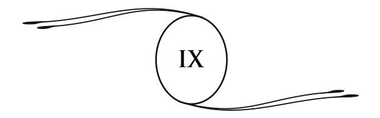

# **A NOVA REVELAÇÃO. O ESPIRITISMO E A CIÊNCIA**

A nova revelação apresenta-se sob formas inesperadas, ou, antes, sob formas esquecidas, porém idênticas àquelas que revestiram as primeiras manifestações do Cristianismo.

Este havia começado pelo milagre. É sobre a prova material da sobrevivência que a religião do Cristo está fundada.215 O espiritualismo moderno revela-se com a ajuda do fenômeno. Ora, milagre e fenômeno são duas palavras para um só e mesmo fato. O sentido diferente que se lhe atribui dá a medida do caminho percorrido, em vinte séculos, pelo espírito humano. O milagre é superior à lei natural; o fenômeno a ela é submetido. É apenas o efeito de uma causa, a resultante de uma lei. A experiência e a razão demonstraram que o milagre é impossível. As leis da natureza, que são as leis divinas, não poderiam ser violadas, porque são elas que regulam e mantêm a harmonia do Universo. Deus não pode se desmentir.

Os fenômenos de além-túmulo encontram-se na base de todas as grandes doutrinas do passado; em todos os tempos, relações uniram o mundo invisível ao mundo dos vivos. Na Índia, no Egito, na Grécia, o seu estudo era privilégio de um pequeno

Ver o capítulo V. (**N.A.**)

número de pesquisadores e de iniciados; os resultados obtidos eram mantidos cuidadosamente ocultos.

Para tornar essas pesquisas acessíveis a todos, para fazer conhecer as verdadeiras leis que regem o mundo invisível, para ensinar os homens a ver nesses fenômenos não mais uma ordem sobrenatural de coisas, mas um lado ignorado da natureza e da vida, seria preciso o imenso trabalho dos séculos, todas as descobertas da ciência, todas as conquistas do espírito humano sobre a matéria. Seria preciso que o homem conhecesse seu verdadeiro lugar no Universo, que aprendesse a avaliar a fraqueza dos seus sentidos, sua impotência para explorar, por eles mesmos e sem ajuda, todos os domínios da natureza.

A ciência, com suas invenções, atenuou essa imperfeição dos nossos órgãos. O telescópio abriu aos nossos olhos os abismos do espaço; o microscópio nos revelou o infi nitamente pequeno. A vida nos apareceu por toda a parte, no mundo dos infusórios como na superfície dos globos gigantes que giram na profundeza dos céus. A física descobriu a transformação das forças, a radioatividade dos corpos e das leis que asseguram o equilíbrio universal; a química nos fez conhecer as combinações da substância. O vapor e a eletricidade vieram revolucionar a face do globo, facilitar as relações dos povos e as manifestações do pensamento, a fi m de que a ideia brilhe e se propague sobre todos os pontos da esfera terrestre.

O espírito humano pôde lançar seus olhares nessa grande bíblia da natureza, nesse livro divino que ultrapassa, em toda a sua majestade, as bíblias humanas. Nele leu facilmente as fórmulas e as leis que presidem as evoluções da vida, a marcha do Universo.

Agora, o estudo do mundo invisível vem completar essa magnífi ca ascensão do pensamento e da ciência. O problema do Além ergue-se diante do espírito humano com um poder, uma autoridade, uma insistência tais que talvez nada de semelhante tenha se produzido na História. Porque jamais se tinha visto um conjunto de fatos, de fenômenos, considerados a princípio como impossíveis, e que não despertavam no pensamento da maioria dos nossos contemporâneos mais que antipatia e desdém, acabar por se impor à atenção e ao exame dos mais competentes e dos mais autorizados.

Em meados do último século, o homem, enganado por todas as teorias contraditórias, por todos os sistemas incompletos com que se desejou alimentar seu pensamento, deixava-se levar pela dúvida; perdia cada vez mais a noção da vida futura. Foi então que o mundo invisível veio até ele e o perseguiu até suas casas. Por diversos meios, os mortos se manifestaram aos vivos. As vozes do Além falaram. Os mistérios dos santuários orientais, os fenômenos ocultos da Idade Média, após um longo silêncio, se renovaram, o Espiritismo nasceu.

Foi além dos mares, em um mundo novo, rico em energia vital, em expansão ardente, menos subjugado ao espírito de rotina e aos preconceitos do passado que a velha Europa; foi na América do Norte que se produziram as primeiras manifestações do moderno espiritualismo. De lá, elas se espalharam por toda a Terra. Essa escolha era profundamente judiciosa. A livre América era bem o meio mais propício a uma obra de difusão e de renovação. Assim, nela se contam hoje vinte milhões de "modernos espiritualistas".

Porém, de um lado como do outro do Atlântico, ainda que com intensidades diferentes, as fases de progresso da ideia espírita foram as mesmas.

Sobre os dois continentes, o estudo do magnetismo e dos fl uidos havia preparado certos espíritos para a observação do mundo invisível.

Primeiro, fatos estranhos se manifestaram de todos os lados, fatos dos quais não se ousava falar a não ser em voz baixa, na intimidade. Depois, pouco a pouco, o tom se elevou. Homens de talento, sábios, cujos nomes são garantias de honorabilidade e de sinceridade, ousaram falar bem alto desses fatos e confi rmálos. A questão do hipnotismo, da sugestão, depois vieram a telepatia, os casos de levitação e todos os fenômenos do Espiritismo.

Mesas se agitavam em uma dança louca; objetos se deslocavam sem contato, pancadas ressoavam nas paredes e nos móveis. Todo um conjunto de manifestações se produzia, vulgares na aparência, mas perfeitamente adaptadas às exigências do meio terrestre, ao estado de espírito positivo e cético das sociedades modernas.

O fenômeno falava aos sentidos, porque os sentidos são como as aberturas por onde o fato penetrará até o entendimento. As impressões produzidas sobre o organismo despertam a surpresa, provocam a pesquisa, conduzem à convicção.

Após uma primeira fase material e grosseira, as manifestações tomaram um novo aspecto. As pancadas vibradas se regularizaram e tornaram-se um modo de comunicação inteligente e consciente. A possibilidade de relações entre o mundo visível e o mundo invisível apareceu como um fato muito importante, arruinando as ideias recebidas, abalando os ensinamentos habituais, mas abrindo para a vida futura uma passagem que o homem ainda hesitava em transpor, deslumbrado diante das perspectivas que a ele se ofereciam.

À medida que se propagava, o Espiritismo via dirigiremse contra ele numerosas oposições. Como todas as novas concepções, ele teve que se defrontar com o desprezo, a calúnia, a perseguição moral. Tal como a ideia cristã em seu começo, ele foi sobrecarregado de amargura e de injúrias. É sempre assim. Quando aspectos ignorados da verdade aparecem aos homens, sempre provocam a desconfi ança e a hostilidade.

Isso é fácil de compreender. A Humanidade esgotou as velhas formas do pensamento e da crença, e quando essas formas inesperadas da verdade se revelam, elas parecem corresponder pouco ao antigo ideal que está enfraquecido e não morto. Assim, é preciso um período bastante longo de exame, de refl exão, de incubação, para que a nova ideia faça o seu caminho nos espíritos. Daí as incertezas e os sofrimentos da primeira hora.

As formas que o novo espiritualismo reveste têm sido muito ridicularizadas. Mas as potências invisíveis que velam pela Humanidade são melhores juízes que nós dos meios de ação e de atração que convém adotar, segundo as épocas e os lugares, para conduzir o homem à percepção do seu papel e de seus destinos, sem entravar seu livre-arbítrio. Porque isso é o essencial, é preciso que a liberdade do homem permaneça sem restrições.

A vontade superior sabe apropriar, às necessidades de uma época e de uma raça, todas as formas da eterna revelação. É ela que suscita no meio das sociedades os pensadores, os experimentadores, os sábios, que indicarão o caminho a seguir e colocarão os primeiros marcos. Sua obra desenvolveu-se lentamente. Os resultados, de início, são fracos e insensíveis, porém, a ideia penetra pouco a pouco nas inteligências. O movimento, por ser imperceptível, não deixa, às vezes, de ser mais seguro e mais profundo.

Em nossa época, a ciência tornou-se a mestra soberana, a diretora do movimento intelectual. Cansada das especulações metafísicas e dos dogmas religiosos, a Humanidade reivindicava provas sensíveis, bases sólidas sobre as quais ela pudesse assentar suas convicções. Ela se apegava ao estudo experimental, à observação dos fatos, como a uma tábua de salvação. Daí, o grande crédito dos homens de ciência no momento em que nos encontramos. Do mesmo modo, a revelação tomou um caráter científi co. Foi por manifestações materiais que se chamou a atenção dos homens, tornando-se eles mesmos materiais.

Os fenômenos misteriosos que se encontram disseminados na história do passado são renovados e multiplicados à nossa volta; eles se sucedem em uma ordem progressiva, que parece indicar um plano preconcebido, a execução de um pensamento, de uma vontade.

Efetivamente, à medida que o novo espiritualismo ganhava terreno, os fenômenos se transformavam. As manifestações grosseiras do início se aperfeiçoavam, revestiam um caráter mais elevado. Médiuns recebiam, pela escrita, de maneira mecânica ou intuitiva, mensagens, inspirações de origem estranha. Instrumentos de música tocavam sem que com eles se tivesse contato. Ouviam-se vozes e cantos; melodias penetrantes pareciam descer do céu e perturbavam os mais incrédulos. A escrita direta se produzia no interior de ardósias justapostas e lacradas. Fenômenos de incorporação permitiam aos desencarnados tomar posse do organismo de um médium adormecido e conversar com aqueles que os haviam conhecido na Terra. Gradualmente, e como consequência de um desenvolvimento calculado, os médiuns videntes, falantes, curadores, apareciam.

Enfi m, os habitantes do espaço, revestindo invólucros temporários, vinham se misturar aos humanos e viver um instante de sua vida material e terrestre, deixando-se ver, tocar, fotografar, dando as impressões de suas mãos, de seus rostos, para desaparecerem a seguir e retomarem sua vida etérea.

Foi assim que todo um encadeamento de fatos se produziu, desde os mais inferiores e os mais vulgares, até os mais sutis, segundo o grau de elevação das inteligências que intervinham; toda uma ordem de manifestações se desenvolveu sob o olhar de observadores atentos.

Assim, apesar das difi culdades de experimentação, apesar dos casos de impostura e as formas de exploração das quais esses fenômenos algumas vezes foram o pretexto, a apreensão e a desconfi ança diminuíram pouco a pouco; o número de examinadores foi crescendo.

Há setenta anos, em todo o país, o fenômeno espírita tem sido objeto de frequentes sindicâncias, empreendidas e dirigidas por comissões científicas. Sábios céticos, professores célebres, pertencentes a todas as grandes universidades do mundo,

submeteram esses fatos a um exame rigoroso e profundo. Sua intenção era, inicialmente, esclarecer o que eles acreditavam ser o resultado de fraudes ou alucinações. Mas todos, de incrédulos que eram, após anos de estudo consciencioso e de experimentações repetidas, abandonaram suas prevenções e se inclinaram diante da realidade dos fatos.

Quanto mais se examinou e pesquisou o problema, mais numerosos e mais instados se revelaram os casos de identidade, as provas da persistência da personalidade humana além do túmulo. As manifestações espíritas, constatadas aos milhares sobre todos os pontos da Terra, demonstraram que um mundo invisível se agita à nossa volta, ao nosso alcance, um mundo onde vivem, em estado fl uídico, todos aqueles que nos precederam sobre a Terra, que nela lutaram e sofreram e constituem para além da morte uma segunda Humanidade.

O nosso espiritualismo apresenta-se hoje com um acompanhamento de provas, com um conjunto de testemunhos de tal modo grandioso que a dúvida não é mais possível para os pesquisadores de boa-fé. É o que, nestes termos, dizia o professor Challis, da Universidade de Cambridge:

> Os atestados têm sido tão abundantes e tão perfeitos, os depoimentos vieram de tantas fontes independentes umas das outras e de um número tão grande de testemunhas que é preciso ou admitir as manifestações tais como se as descreve, ou renunciar à possibilidade de certifi car um fato, qualquer que seja, mediante um depoimento humano.216

Assim, o movimento de propagação acentuou-se cada vez mais. Atualmente, assistimos a um verdadeiro desabrochar da ideia espírita. A crença no mundo invisível espalhou-se por toda a superfície da Terra. Por toda a parte o Espiritismo tem suas sociedades de experimentação, os seus divulgadores, os seus jornais.

216 Russel Wallace, *O Moderno Espiritualismo*, página 139. (**N.A.**)

\* \*

Voltemos a um ponto essencial. O erro ou o ceticismo do homem, no que toca à existência do mundo invisível, devia-se a uma causa única: a incapacidade do seu organismo para lhe fornecer uma ideia completa das formas e das possibilidades da vida.

Perdeu-se de vista que nossos sentidos, ainda que se tenham desenvolvido e apurado, desde a origem da Humanidade, só percebem ainda as formas mais rudimentares da matéria; seus estados sutis lhes escapam completamente. Daí a opinião geralmente difundida de que a vida só era possível sob as formas e com organismos semelhantes àqueles que nossos olhares alcançam. Daí a falsa ideia de que a vida era, por toda parte, apenas uma imitação, uma reprodução do que vemos em torno de nós.

Desde o dia em que, com a ajuda de possantes instrumentos de óptica, o infi nitamente grande e o infi nitamente pequeno se revelaram, foi necessário reconhecer que nossos sentidos, reduzidos a si mesmos, não alcançavam mais que um círculo muito restrito do domínio das coisas, um campo muito limitado da natureza; que, defi nitivamente, nós não sabíamos quase nada da vida universal.

Em uma época muito mais recente, só conhecíamos, da matéria, os seus três estados mais elementares: os sólidos, os líquidos e os gases. Nada sabíamos das inúmeras transformações de que ela é suscetível.

Somente há uns trinta anos é que o quarto estado da matéria, o radiante, tornou-se conhecido dos sábios. Willliam Crookes, o acadêmico inglês, foi o primeiro a constatar-lhe a existência, e suas experiências espíritas, realizadas durante três anos, não foram estranhas a essa descoberta. Ele pôde demonstrar que a matéria, tornada invisível, reduzida a quantidades infi nitesimais, adquire energias, poderes incalculáveis e que essas energias aumentam incessantemente, à medida que a matéria se rarefaz.

Mais recentemente, as pesquisas de numerosos sábios vieram confi rmar essas descobertas. Pouco a pouco, a ciência abordou o domínio do invisível, do intangível, do imponderável. Ela teve que reconhecer que o estado radiante não é o último que a matéria possa revestir; além desse, a matéria lhe apareceu sob aspectos mais e mais sutis e quintessenciados, rarefazendose quase ao infi nito, sem deixar de ser a forma possível, a forma necessária da vida.

O que a ciência apenas começa a entrever, os espíritas sabiam há muito tempo pela revelação dos espíritos. Eles aprenderam que o mundo invisível é apenas uma ínfi ma porção do Universo, que fora do que é evidente, a matéria, a força, a vida se apresentam sob formas variadas, sob aspectos inumeráveis; que nós estamos cercados, envolvidos por radiações invisíveis para nós, em razão da grosseria dos nossos órgãos.

Todas essas noções, as experiências científi cas vêm hoje demonstrar. A constatação dessas formas de energia, a existência desses estados sutis da matéria, fornecem ao mesmo tempo a explicação racional dos fenômenos espíritas. É aí que os invisíveis haurem as forças de que se servem em suas manifestações físicas; é de elementos da matéria imponderável que são constituídos seus invólucros, seus organismos.

Os pesquisadores de boa-fé não tardaram a reconhecê-lo. Desde a descoberta da matéria radiante, a ciência avançou passo a passo nesse vasto domínio do desconhecido. Todos os dias ela vem confi rmar, por novas experiências, o que o espírito humano, mais clarividente que nossos sentidos, havia pressentido há muito tempo.

A ciência havia começado por fotografar os raios invisíveis do espectro solar, os raios ultravioleta e infravermelhos, que não impressionam nossa retina. Depois, ela obteve a reprodução, sobre a placa sensível, de um grande número de mundos estelares, de estrelas distantes, de astros perdidos nas profundezas do espaço, em uma distância tal que suas radiações luminosas escapam, não somente ao nosso olhar, mas, por vezes, até ao telescópio.

Sabe-se que as sensações de luz, como as de som, de calor, etc., são produzidas por uma quantidade determinada de vibrações do éter.

A retina, órgão da vista, percebe, em certos limites, as ondas luminosas.217 Além desses limites, um grande número de vibrações lhe escapam. Ora, essas vibrações, incompreensíveis para nós, podem ser percebidas pela placa fotográfi ca, mais sensível que o olho humano, o que permite dizer que a objetiva fotográfi ca é como um olhar aberto sobre o invisível.

Disso ainda temos uma nova prova pela aplicação dos raios X, dos raios obscuros de Roentgen, à fotografi a. Ainda que invisíveis, eles têm o poder de atravessar certos corpos opacos, tais como o estofo, a carne, a madeira, e permitem reproduzir objetos ocultos a todos os olhos, como o conteúdo de uma bolsa, de uma carta, etc. Penetram nas profundezas do organismo humano, e os menores detalhes da nossa anatomia não têm mais segredos para eles.

A utilização dos raios X tende a se generalizar cada vez mais; ela nos mostra que considerável partido a ciência do

217 A retina, que é o mais perfeito dos nossos órgãos, percebe as ondulações etéreas desde 400 trilhões por segundo até 790 trilhões, isto é, tudo o que constitui a gama das cores, do vermelho, em uma das extremidades do espectro solar, ao violeta, na outra extremidade. Fora daí, a sensação é nula. O professor Stokes, no entanto, conseguiu tornar visíveis os raios ultravioleta, fazendo-os atravessar um papel embebido em uma solução de sulfato de quinino, que reduz o número das vibrações. Do mesmo modo, o professor Tyndall tornou visíveis, por meio do calor, os raios infravermelhos, invisíveis no estado normal.

Partindo desses dados, podemos admitir, cientifi camente, uma sequência ininterrupta de vibrações invisíveis, e daí deduzir que se nossos órgãos fossem suscetíveis de receber as suas impressões, poderíamos distinguir uma variedade inimaginável de cores ignoradas, e também de inumeráveis formas, substâncias, organismos, que não nos aparecem agora, em consequência da imperfeição dos nossos sentidos. (**N.A.**)

futuro poderá tirar das formas sutis da matéria, quando souber armazená-las e dirigi-las.

A descoberta da matéria luminosa e de suas aplicações tem um alcance incalculável. Não só nos prova que formas da matéria se dispõem além dos nossos sentidos, formas perceptíveis somente por aparelhos registradores, mas também que essas formas e essas radiações adquirem mais força e penetração à medida que aumentam sua sutileza. Habituamo-nos, assim, a estudar a natureza sob seus aspectos mais ocultos, que são os do seu maior poder.

Nessas manifestações ainda mal defi nidas da energia, encontramos a explicação científi ca de uma grande quantidade de fenômenos, como as aparições, a passagem dos espíritos através dos corpos sólidos, etc. A aplicação dos raios Roentgen na fotografi a nos faz compreender o fenômeno da dupla vista dos médiuns e o da fotografi a espírita. Realmente, se placas podem ser infl uenciadas por raios invisíveis, por radiações da matéria imponderável que penetram os corpos opacos, com mais forte razão os fl uidos quintessenciados, de que se compõe o invólucro invisível dos espíritos, podem, em certas condições, impressionar a retina dos médiuns, aparelho mais delicado e mais complexo, o que a placa de vidro não é.

É assim que o Espiritismo se fortifi ca, a cada dia, pelo acréscimo de argumentos tirados das descobertas da ciência e que acabarão por abalar os céticos mais endurecidos.

A fotografi a das radiações do pensamento veio abrir um novo campo aos pesquisadores.

Numerosos experimentadores218 conseguiram fi xar sobre a placa sensível as radiações do pensamento e as vibrações da vontade. Suas pesquisas demonstraram que existe em cada ser

218 Ver, entre outras, a obra do Dr. Baraduc: *A alma humana, seus movimentos, suas luzes*. (**N.A.**)

humano um centro de radiações invisíveis, um foco de luzes que escapam à vista, mas podem impressionar as placas fotográfi cas.

Seja apoiando os dedos sobre o lado da placa revestido de gelatina, seja aplicando, na obscuridade, o lado vítreo junto ao cérebro, obtêm-se, sobre a placa, ondas, vibrações que variam de aspecto e de intensidade sob a infl uência das disposições mentais do operador. Uniformes, regulares em seu estado normal, essas ondas formam-se em turbilhões, em espirais, nos casos de excitação, estendem-se em extensas camadas, em grandes efl úvios no êxtase e se elevam em colunas majestosas durante a prece, como vapores de incenso.

Tem-se até podido reproduzir sobre as placas o duplo fluídico do homem, centro de suas radiações. O coronel de Rochas e o doutor Barlemont obtiveram, em casa de Nadar, a fotografi a simultânea do corpo de um médium e de seu duplo, momentaneamente separados.219

Como um prelúdio a tantas outras provas objetivas que assinalaremos mais adiante, a fotografi a, portanto, vem nos revelar a existência desse corpo fl uídico, que duplica e sustenta nosso corpo físico, desse invólucro etéreo, que é a forma radiante do espírito, inseparável dele durante a vida como após a morte.

As placas fotográfi cas não são impressionadas somente pelas vibrações fl uídicas do ser humano, elas o são igualmente por formas que pertencem ao mundo invisível, por seres que existem, vivem e se agitam em torno de nós, presidindo a todo um

219 Ver *Revista Espírita*, novembro de 1894, com o fac-símile, e as obras do coronel de Rochas: *Exteriorização da Sensibilidade* e *Exteriorização da Motricidade*.

Resultados análogos se encontram no caso do médium Herrod, e no caso narrado pelo juiz Carter (Aksakof, *Animismo e Espiritismo*, p. 78 e 79), assim como nos testemunhos do Sr. Gleendinning (*Borderland* de julho de 1896).

Ver também Gabriel Delanne, *Aparições Materializadas dos Vivos e dos Mortos*, e Hector Durville, *O Fantasma dos Vivos*. (**N.A.**)

conjunto de manifestações que vamos passar em revista e que só podem ser explicadas pela sua presença e sua ação.

Esses seres, libertos das necessidades e das misérias da natureza humana pela morte, continuam a agir com a ajuda do corpo fl uídico, imperecível, formado desses elementos muito sutis da matéria de que acabamos de falar, e que escapam, até agora, aos nossos sentidos em seu estado normal.

\* \*

A questão do corpo fl uídico, ou perispírito, ainda que já tratada por nós em outras páginas,220 necessita de novas explicações porque ela nos faz compreender melhor a vida no espaço e o modo de ação dos espíritos sobre a matéria.

Todos sabem que as moléculas do nosso corpo físico são submetidas a constantes mutações. Diariamente o nosso invólucro carnal elimina um certo número de elementos e, novamente, assimila outros. O corpo inteiro, desde as partes moles do cérebro até as partes mais duras do esqueleto, renova-se durante o espaço de alguns anos. Em meio a essas correntes contínuas, subsiste em nós uma forma fl uídica original, compressível e expansível, que se mantém e se perpetua. É nela, sobre o desenho invisível que ela apresenta, que vêm se incorporar, fi xar, as moléculas da matéria grosseira. O perispírito é como o modelo, o esboço fl uídico do ser humano. Eis por que, quando a separação se realiza, por ocasião da morte, o corpo material abate-se imediatamente, degrada-se e se decompõe.

O perispírito é o invólucro permanente do espírito; nosso corpo físico é um invólucro temporário, uma roupa emprestada, que vestimos para realizar a nossa peregrinação terrestre. O perispírito existia antes do nascimento e sobrevive à morte. Ele constitui em sua união íntima com o espírito, o elemento essencial

220 Ver capítulos 5 e 8; *Depois da Morte*, cap. 21 e *No Invisível*, caps. 3 e 12. (**N.A.**)

e persistente da nossa individualidade, através das existências múltiplas que nos é dado percorrer.221

É pela existência desse corpo fl uídico, pelo seu desprendimento durante o sono natural ou provocado, que se explicam as aparições dos fantasmas dos vivos e, por extensão, as dos espíritos dos mortos.

Já se havia podido constatar, em muitos casos, que o duplo fl uídico de pessoas vivas se destacava, em certas condições, do corpo material, para aparecer e se manifestar à distância. Esses fenômenos são conhecidos sob o nome de fatos telepáticos.

Desde então, torna-se evidente que, se durante a vida, a forma fl uídica pode agir fora e sem o concurso do corpo, a morte não podia mais ser o fi m da sua atividade.

No estudo especial dos fenômenos de exteriorização da sensibilidade e da motricidade, o coronel de Rochas e, com ele, o professor Charles Richet, o doutor Dariex e os senhores de Grammont e de Watteville, haviam abordado o domínio das provas experimentais, de onde saiu a certeza da ação do duplo fl uídico a distância. Por seu lado, os sábios ingleses constataram numerosos casos em que formas fl uídicas de espíritos desencarnados tornaram-se visíveis, por meio de condensação ou, antes, de materialização, assim como o vapor d'água, espalhado em estado invisível na atmosfera, pode, por transformações sucessivas, tornar-se visível e tangível, no estado de gelo.

221 Segundo Gabriel Delanne, que se dedicou a um estudo consciencioso e aprofundado do corpo fl uídico, o perispírito é um verdadeiro organismo fl uídico, um modelo sobre o qual a matéria se concreta e o corpo físico se organiza. É ele que dirige automaticamente todas as ações que concorrem para a manutenção da vida. Sob o infl uxo da força vital, ele dispõe as moléculas materiais seguindo um desenho, um plano determinado, que representa todos os grandes aparelhos do organismo: respiração, circulação, sistema nervoso, etc., que dele são as linhas de força.

É esse modelo, esse "desenho ideal invisível, pressentido por Claude Bernard", que mantém a estabilidade do ser no meio da renovação integral da matéria organizada; a ação vital poderia tomar todas as formas, o que não se verifi ca. (**N.A.**)

O perispírito é invisível para nós em seu estado comum: sua essência sutil produz um número de vibrações que ultrapassa o campo de percepção da nossa vista. Para se materializar, o espírito é obrigado a tomar dos médiuns, ou de outras pessoas presentes, fl uidos mais grosseiros que mistura aos seus, a fi m de adaptar o número de vibrações do seu invólucro à capacidade do nosso sentido visual. A operação é delicada, cheia de difi culdades. No entanto, os casos de aparições de espíritos são numerosos e se apoiam em testemunhos respeitáveis.

O mais célebre é o do espírito Katie King, que se manifestou durante três anos em casa de William Crookes, acadêmico inglês, com a ajuda da médium Florence Cook. *Sir* William Crookes descreveu essas experiências em uma obra muito divulgada.222 Katie King e Florence Cook foram vistas lado a lado. Eram de estatura e fi sionomia diferentes e se distinguiam uma da outra sob muitos aspectos.

O relato de Sir William Crookes é confi rmado pelos testemunhos dos doutores Gully e Sexton, do príncipe de Sayn-Wittgenstein, de Harrison, de B. Coleman, de Sergeant Cox, de Varley, engenheiro-eletricista, da Sra. Florence Marryat, etc., que assistiram às aparições de Katie em diferentes lugares.

Foi em vão que procuraram, inúmeras vezes, insinuar que Sir Crookes havia se retratado de suas afi rmações. Em 7 de fevereiro de 1909, W. Stead, diretor da *Review of Reviews*, escrevia ao *New York American*: "Estive com Sir Charles William Crookes no *Gost Club*, onde fora jantar, e ele me autoriza a dizer o seguinte: Depois das minhas experiências em matéria de espiritualismo, que comecei há 30 anos, não vejo nenhuma razão para modifi car minha opinião de outrora".

Além disso, a *Revue Scientifi que et Morale du Spiritisme*, de maio de 1919, publicava a seguinte carta, assinada pelo próprio Crookes:

"*Pesquisas sobre os fenômenos do espiritualismo*", Leymarie, editor. (**N.A.**)

Respondendo a vossa pergunta, não vejo nenhuma objeção em estabelecer minha posição a respeito do que se denomina fenômenos psíquicos e em afi rmar novamente, como há 40 anos, quando empreendi minhas pesquisas, que permaneço fi el ao que escrevi e nada tenho a retirar... Em minha opinião, esses fenômenos dão ainda mais força às opiniões de muitos de meus colegas e amigos da Sociedade para as Pesquisas Psíquicas, que veem nesses fatos a prova de que uma existência de uma outra ordem segue a existência humana e que, em certas circunstâncias, podem existir comunicações entre um mundo e o outro.

Um caso não menos célebre é o do espírito Abdullah, relatado por Aksakof, conselheiro de Estado russo, em sua obra *Animismo e Espiritismo*. O espírito era de tipo oriental, e sua forma tinha mais de 1,80 de altura, enquanto que o médium, Eglinton, era de pequena estatura e de tipo anglo-saxão muito acentuado.

Um sábio americano, Robert Dale Owen, antigo embaixador dos Estados Unidos em Nápoles, consagrou seis anos às experiências de materializações. Ele declarou ter visto centenas de formas de espíritos. Em uma sessão realizada pela *Sociedade de Pesquisas Psíquicas*, dos Estados Unidos, a qual o renomado pregador, reverendo Savage, assistia, trinta espíritos materializados apareceram diante dos assistentes, que neles reconheceram parentes e amigos falecidos. Essas manifestações são frequentes na América.223

O professor Lombroso,224 da Universidade de Turin, conhecido no mundo inteiro por seus trabalhos de fi siologia criminalista, também fala sobre várias aparições que se produziram em sua

223 Ver minha obra *No Invisível*, cap. 20. (**N.A.**)

224 **Lombroso, Cesare:** médico e criminologista italiano de origem judaica (Verona, 1835 – Turim, 1909). Evolucionou a criminologia ao sustentar a opinião de que o criminoso é mais um doente do que um culpado (*O Homem Criminoso*, 1874). Em *O Homem de Gênio*, tentou provar a ligação entre a genialidade, a loucura e a epilepsia. (**N.T.**, segundo o *Dicionário Koogan Houaiss*.)

presença com a ajuda da médium Eusapia Palladino. Eis como ele conta, em seu livro póstumo *Pesquisas sobre Fenômenos Hipnóticos e Espíritas*, a primeira aparição de sua mãe:

> Gênova, 1902; a médium estava em estado de semi-inconsciência e eu não esperava obter fenômeno importante. Antes da sessão, eu lhe havia pedido que deslocasse, em plena luz, um pesado tinteiro de vidro. Ela me respondeu com o seu tom usual: "Por que te ocupas com essas tolices? Sou capaz de coisa bem diferente; sou capaz de te fazer ver tua mãe. Eis em que deverias pensar!"

> Impressionado por essa promessa, após meia hora de sessão, fui tomado por um desejo muito grande de vê-la realizada, e a mesa respondeu com três batidas ao meu pensamento. De repente eu vi (nós estávamos em uma semiobscuridade com a luz vermelha) sair do gabinete uma forma bem pequena, como era a de minha mãe. (Deve- se observar que a estatura de Eusapia é pelo menos dez centímetros superior à de minha mãe.) O fantasma estava envolto em um véu; fez uma volta completa em torno da mesa, até chegar perto de mim, murmurando palavras que muitos entenderam, mas que minha semis surdez não me permitia compreender. Enquanto que, fora de mim pela emoção, eu lhe suplicava que as repetisse, ela me disse: "Cesare, mio fi o!" O que, eu o reconheço, não estava entre seus hábitos. Com efeito, ela era veneziana e tinha o costume local de me dizer: mio fi ol! Pouco depois, a meu pedido, levantou seu véu por um instante e me deu um beijo.

Na página 93 da obra acima citada, pode-se ler que a mãe do autor ainda lhe apareceu umas vinte vezes, no decorrer das sessões de Eusapia.225

A objeção favorita dos incrédulos, referente a esse gênero de fenômenos, é que eles se produzem na obscuridade, tão favorável a trapaças. Existe uma parte de verdade nessa objeção,

*Revista Científi ca e Moral do Espiritismo*; dezembro de 1909 e janeiro de 1910. (**N.A.**)

e nós mesmos não temos hesitado em assinalar fraudes escandalosas; mas é preciso observar que a obscuridade é indispensável às aparições luminosas, as mais numerosas de todas. A luz exerce uma ação dissolvente sobre os fl uidos, e inúmeras manifestações só podem ter sucesso com a ausência da luz. No entanto, existem casos em que certos espíritos puderam aparecer à luz fosfórea. Outros se desmaterializam em plena luz. Sob as irradiações de três bicos de gás, viu-se Katie King fundir-se pouco a pouco, dissolver-se e desaparecer.226

A esses testemunhos temos o dever de acrescentar o nosso, relatando um fato que nos é pessoal.

Durante dez anos prosseguimos nesta ordem de estudos com a ajuda de um médico de Tours, o doutor A..., e do capitão arquivista da 9a corporação. Por intermédio de um deles, adormecido em sono magnético, os invisíveis nos prometiam, há muito tempo, uma materialização, quando, uma tarde, reunidos no consultório do nosso amigo, as portas cuidadosamente fechadas, e a claridade penetrando ainda o sufi ciente pela alta janela para nos permitir ver muito distintamente os menores objetos, ouvimos três batidas ressoarem sobre um ponto da parede. Era o sinal combinado.

Com os nossos olhares voltados para esse lado, vimos surgir, de uma parede inteira, sem nenhuma solução de continuidade, uma forma humana, de estatura média. Ela aparecia de perfi l; o ombro e a cabeça mostraram-se primeiro, depois, gradualmente, todo o corpo apareceu. A parte superior era bem delineada; os seus contornos eram nítidos e precisos. A parte inferior, mais vaporosa, formava apenas uma massa confusa. A aparição não caminhava, ela deslizava. Após ter atravessado lentamente a sala, a dois passos de nós, ela foi se entranhar e desapareceu na parede oposta, em lugar que não apresentava nenhuma saída. Pudemos

Ver *O Psiquismo Experimental*, por Erny, página 145. (**N.A.**)

observá-la durante três minutos mais ou menos, e nossas impressões, comparadas a seguir, foram reconhecidamente idênticas.

Acrescentaremos aqui um fenômeno do mesmo gênero, mais recente, obtido em Londres, em maio de 1912, e relatado pelos *Anais das Ciências Psíquicas*, no número de junho do mesmo ano.

Trata-se de uma manifestação de W. Stead,227 o grande publicista inglês, vítima da catástrofe do *Titanic*. As testemunhas foram o diplomata Sr. Miyatovich, ministro da Sérvia, seu amigo Hinkovitch, doutor em direito, e a médium senhora Wriedt. Citamos textualmente:

> ...Um instante depois apareceu, atrás da médium, uma luz fraca, que se deslocou da esquerda para a direita da cabine, como se tivesse sido transportada lentamente por uma brisa suave. Lá, naquela claridade que se deslocava lentamente, encontrava-se o espírito, ou antes, a própria pessoa do meu amigo William T. Stead, vestido com sua roupa habitual. Meu amigo Hinkovitch, que só conhecia Stead por fotografi as, disse: "Sim, é o senhor Stead!" O espírito de Stead fez-me um gesto amistoso e desapareceu. Um meio minuto depois, apareceu novamente, deteve-se diante de mim, olhando-me e inclinando-se. Mostrou-se uma terceira vez, de uma forma ainda mais nítida. Ouvimos, então, estas palavras: "Sim, sou Stead; William Thomas Stead. Meu querido amigo Miyatovich, estou muito feliz por vê-lo aqui; vim para lhe dar uma nova prova de que existe uma vida após a morte, e que o Espiritismo é uma verdade".

As materializações e aparições de espíritos encontram, como vimos, difi culdades que, forçosamente, limitam o seu número. Ocorre o contrário com certos fenômenos de ordem física

**Stead, William Thomas:** jornalista e grande publicista inglês (1849-1912). Estudioso dos fenômenos espíritas, faleceu no naufrágio do navio *Titanic*. Em 21 de maio de 1912, comunicou-se pela médium, Sra. Hervy, relatando as emoções dos seus últimos minutos de vida. (**N.T.**, segundo o livro *Espíritos e Médiuns*, de Léon Denis.)

e de natureza muito variada, que se propagam e se multiplicam mais e mais em torno de nós.

Vamos examinar sucintamente esses fatos, em sua ordem progressiva, sob o ponto de vista do interesse que eles apresentam e da certeza que deles resulta em relação à vida livre do espírito.

Em primeiro lugar vem o fenômeno, tão conhecido hoje em dia, das casas mal-assombradas. São habitações frequentadas por espíritos de ordem inferior, lugares em que eles se entregam a manifestações ruidosas. Pancadas, sons de toda ordem, desde os mais fracos até os mais possantes, fazem vibrar os soalhos, os móveis, as paredes, o próprio ar. A louça é deslocada e quebrada; pedras são lançadas do exterior para dentro dos aposentos.

Os jornais trazem frequentemente o relato de fenômenos desse gênero. Mal param de ocorrer num ponto, reproduzem- se em outros, seja na França, seja no estrangeiro, despertando a atenção pública. Em certos lugares, como em Valence-en-Brie, em Yzeures (Indre-et-Loire), em Ath (Brabant), em Agen, em Turin, etc., eles duraram meses inteiros, sem que os mais hábeis policiais tivessem conseguido descobrir uma causa humana para essas manifestações.

Eis o testemunho de Lombroso a esse respeito. Ele escreveu em *La Lettura*:

> Os casos de casas mal-assombradas, nas quais, durante anos, se reproduzem aparições ou ruídos em concordância com o relato de mortes trágicas, e observados sem a presença de médiuns, falam a favor da ação dos falecidos. "— Tratam-se, frequentemente, de casas desabitadas, onde esses fenômenos se produzem, às vezes, durante várias gerações e mesmo durante séculos."228

Ver *Anais das Ciências Psíquicas*, de fevereiro de 1908. (**N.A.**)

O doutor Maxwell, então advogado geral na Corte de Apelação de Bordeaux, encontrou embargos de diversos parlamentos,229 no século dezoito, rescindindo arrendamentos por causa de os lugares serem mal-assombrados.230

Esses fatos se explicam pela ação malfazeja de seres invisíveis que satisfazem, *post mortem*, ódios nascidos, sobre a Terra, de más relações anteriores, de danos causados por certas famílias ou indivíduos, que, em razão disso, se expõem à infl uência nefasta desses desencarnados. Assim, no plano geral da evolução, mesmo a liberdade do mal, a obra das paixões interiores atraindo, pela produção desses fenômenos, a atenção pública sobre um mundo ignorado, concorrem para a instrução e o progresso de todos.

Apesar das repugnâncias da ciência em geral, para ocupar-se desses fatos, a cada dia vemos acrescentar-se o número de pesquisadores conscienciosos que, afastando-se dos caminhos percorridos, se entregam à observação paciente do mundo invisível. Não há mês, semana, que não se registre um novo resultado no domínio experimental.

Os fenômenos de ordem física, a levitação de corpos pesados e o seu transporte à distância, sem contato, provocam muito especialmente a observação de certos sábios.

Falamos em outras obras231 das experiências dirigidas por homens de ciência de diferentes nações, realizadas em Nápoles e em Milão, em 1892. Os processos verbais,232 por eles redigidos, reconhecem a intervenção de forças e vontades desconhecidas na produção desses fenômenos.

229 **Parlamento:** corte provincial de justiça e administrativa da Idade Média e do Antigo Regime, instituição associada ao poder do rei. (**N.T.**)

230J. Maxwell, *Fenômenos Psíquicos*, página 260. (**N.A.**)

*Depois da Morte* e *No Invisível*, obras de Léon Denis. (**N.T.**)

**Processo verbal:** relato ofi cial, redigido por uma autoridade competente, que constata um fato ou o que foi dito ou feito em uma reunião, assembleia, etc. (**N.T.**, segundo o *Le Robert*, *Dictionnaire de la Langue Française*.)

Experiências análogas foram realizadas depois em Roma, em Varsóvia, em casa do Dr. Ochorowicz,233 na ilha de Roubaud, em casa do Sr. Richet, professor da Academia de Medicina de Paris, em Bordeaux, em Agnélas, perto de Voiron (Isère), em casa do coronel de Rochas. Citamos ainda as experiências do professor Botazzi, diretor do Instituto de Fisiologia na Universidade de Nápoles, em maio de 1907, com a assistência do professor Cardarelli, senador, de Galeotti, de Pausini, de Scarpa, de Amicis, etc.

Essas experiências foram dirigidas de uma maneira rigorosamente científi ca. Como, evidentemente, os sentidos podem enganar, empregaram-se aparelhos registradores que permitem estabelecer não somente a realidade, a objetividade do fenômeno, mas ainda o gráfi co da força física em ação.

Eis as medidas tomadas pelo grupo de sábios designados acima, tendo como médium Eusapia Palladino:

Na extremidade da sala, por trás de uma cortina, antecipadamente foi colocada uma mesa com duas partes sobrepostas, pesando 21 quilos, ocupando todo o espaço do gabinete, e a mais ou menos 20 centímetros de distância da cortina.

Sobre essa mesa foram colocados:

1o) Um cilindro coberto de papel fumê, que se move em torno de um eixo, sobre o qual está fi xada uma espécie de caneta cuja ponta toca a superfície do cilindro; dando-se um movimento de rotação ao cilindro, a caneta nele registra uma linha horizontal;

# 2o) Uma balança de pesar cartas;

233 **Ochorowicz, Julien:** professor de Psicologia da Universidade de Lemberg, Ucrânia (1850-1918). Abraçando o Espiritismo, escreveu *De la Sugestion Mentale*. Presenciou, na Itália, os fenômenos produzidos pela médium Eusapia Palladino e fez constar sua opinião favorável no *Correio de Varsóvia* e na *Gazeta Semanal Ilustrada*. (**N.T.**, segundo *Afi nal quem somos?* De Pedro Granja, EDICEL.)

- 3o) Um metrônomo234 elétrico Zimmermann (o contato é estabelecido por uma ponta de platina que, a cada dupla oscilação da vareta, mergulha em um pequeno tubo de mercúrio), posto em comunicação com um assinalador Desprez, situado em um quarto ao lado;
- 4o) Um teclado telegráfi co, junto a um outro assinalador Desprez;
- 5o) Uma pera de borracha ligada por meio de um longo tubo, também de borracha, através da parede, com um manômetro de mercúrio de François Franck, situado no aposento contíguo.

Nessas condições é que todos os aparelhos designados foram impressionados, à distância, estando as mãos de Eusapia seguras por dois experimentadores, e todos os assistentes formando um círculo em torno dela.

Por toda parte constata-se o deslocamento de móveis, de instrumentos de música, sem contato, a levitação de corpos humanos, o levantamento de cadeiras com as pessoas que as ocupavam. O professor Lombroso, em um dos seus relatórios, fala de um guarda-louça "que avançava como um paquiderme".

Todas essas manifestações poderiam se explicar, mais ou menos, por causas exclusivamente materiais, pela ação de forças inconscientes. A força psíquica, exteriorizada pelo médium, bastaria, por exemplo, para explicar o movimento de mesas e outros objetos à distância e, por extensão, todos os fenômenos que não demonstrem a ação de uma outra inteligência que não a dos assistentes.

Porém, o que complica o fenômeno e torna essa explicação insufi ciente é que, na maior parte das sessões de que falamos, aos

234 **Metrônomo:** instrumento que serve para regular os diversos graus de rapidez do andamento musical; foi inventado pelo mecânico alemão Johann Maelzel (1772-1838). (**N.T.**)

movimentos de objetos e aos deslocamentos de pessoas, unem-se toques, aparições de mãos luminosas e de formas humanas, que não são as dos experimentadores.

Os *Anais das Ciências Psíquicas* de 1o de fevereiro de 1903 relatam os seguintes fatos, observados pelo Dr. Venzano:

> Em uma sessão em Milão, quando Eusapia estava no máximo do seu transe, vimos, eu e aqueles que estavam perto de mim, uma forma de mulher bem delicada, que me disse uma palavra confusa: "tesouro", assim me pareceu. Ao centro encontrava-se Eusapia adormecida, perto de mim, e acima a cortina se enfunou várias vezes; ao mesmo tempo, à esquerda, uma mesa movia-se no gabinete e, de lá, um pequeno objeto era transportado para a mesa do centro.

> Em Gênova, o Dr. Imoda observou que, enquanto o fantasma tirava da mão e devolvia uma pena ao Sr. Becker, um outro fantasma apoiava-se sobre a fronte de Imoda. Uma outra vez, enquanto eu era acariciado por um fantasma, a princesa Ruspoli sentia sua cabeça ser tocada por uma mão, e Imoda sentia sua mão ser apertada com força por uma outra mão.

> Ora, como explicar que a força psíquica de um médium agisse ao mesmo tempo em três direções e com três objetivos diferentes? É possível concentrar a atenção bem fortemente para obter fenômenos plásticos em três direções diferentes?

Às vezes, árias são executadas em pianos fechados; vozes e cantos são ouvidos, e, como em Roma, nas experiências do Dr. Sant'Angelo, melodias penetrantes, que nada têm de terrestre, mergulham os assistentes em um arrebatamento que chega ao êxtase.

Todos esses fenômenos têm sido obtidos em presença de médiuns que se tornaram célebres, entre outros Jesse Stephard e Eusapia Palladino. Aqui, algumas explicações sobre a natureza e o verdadeiro papel da mediunidade nos parecem indispensáveis.

Nossos sentidos, dissemos anteriormente, só nos deixam conhecer um domínio restrito do universo. No entanto, o círculo dos nossos conhecimentos está se alargando pouco a pouco, e ainda crescerá, à medida que nossas formas de sensação se aperfeiçoarem.

\* \*

Bastaria termos um sentido a mais, uma nova faculdade psíquica, para ver abrirem-se diante de nós alguns dos domínios ignorados da vida, para ver descortinarem-se ao nosso alcance as maravilhas do mundo invisível.

Ora, esses novos sentidos, essas faculdades que no futuro serão partilhadas por todos, há pessoas que já as possuem agora, em diversos graus; são as que designamos sob o nome de médiuns.

Aliás, é preciso observar que, em todos os tempos, existiram pessoas dotadas de faculdades especiais que lhes permitiam comunicarem-se com o invisível. A história, os livros sacros de todos os povos, deles fazem menção quase a cada página. Os videntes da Gália, os oráculos e pitonisas da Grécia, as sibilas do mundo pagão, os profetas, grandes e pequenos, da Judeia, eram simplesmente os médiuns dos nossos dias. As potências superiores sempre se utilizaram desses intermediários para fazer os homens ouvirem seus ensinos e suas exortações. Só os nomes mudam; os fatos permanecem os mesmos, com a única ressalva de que os fatos se mostram mais numerosos, sob formas mais variadas, quando, para a Humanidade, chega a hora de começar uma etapa, uma nova ascensão em direção aos pontos mais elevados do pensamento que são o objetivo da sua trajetória.

Acrescentemos que os espíritos elevados não são os únicos a se manifestar; espíritos de toda ordem gostam de entrar em relação com os homens, desde que encontrem os meios para isso. Daí a necessidade de distinguir, nas comunicações ocultas, o que vem do alto e o que vem de baixo; o que emana dos espíritos de luz e o que é produzido por espíritos atrasados. Há espíritos de todo caráter e de toda elevação; em torno de nós, há muito mais espíritos inferiores que elevados. São os que produzem os fenômenos físicos, as manifestações ruidosas, tudo o que é de ordem vulgar, entretanto, manifestações úteis, como nós o demonstramos, porquanto elas nos trazem o conhecimento de todo um mundo esquecido.

Nesses fenômenos, os médiuns desempenham um papel comparável ao das pilhas em eletricidade. São produtores, acumuladores de fl uidos em que os espíritos obtêm as forças necessárias para agir sobre a matéria. Encontra-se essa categoria de médium um pouco por toda parte, mesmo nos meios menos esclarecidos. Seu concurso é principalmente material; suas atitudes são antes um privilégio físico que um índice de elevação. Muito diferente é a parte do médium nos fenômenos intelectuais, os mais interessantes de todos, em que melhor se revela a personalidade das inteligências invisíveis. É por eles que nos chegam os ensinos, as revelações que fazem do Espiritismo, não somente um campo de explorações científi cas, mas ainda, segundo a expressão de Russel Wallace, "um verbo, uma palavra".

Vamos passar em revista alguns desses fenômenos:

O da escrita direta é o que primeiro atrai a nossa atenção. Em certas circunstâncias, vê-se aparecerem papéis cobertos de uma escrita de origem não humana.235 Nós mesmos temos assistido à produção de vários fatos desse gênero. Um dia, entre outros, em Orange, no decorrer de uma sessão de Espiritismo, vimos descer no espaço, acima de nossa cabeça, um pedaço de papel que parecia sair do teto e que veio lentamente cair em nosso chapéu, colocado sobre a mesa, perto de nós. Duas linhas de uma delicada escrita, dois versos, nele estavam escritos. Exprimiam um aviso, uma predição que nos dizia respeito, e que mais tarde se realizou.

Ver *No Invisível*, cap. 18. (**N.A.**)

A maior parte das vezes, esse fenômeno se produz em ardósias duplas, fechadas, seladas, carimbadas, no interior das quais coloca-se um fragmento de lápis. A mensagem é escrita em presença dos assistentes, às vezes até em língua estrangeira, desconhecida do médium e de outras pessoas presentes, e responde a perguntas por estas formuladas.

O Dr. Gibier236 estudou esse gênero de manifestação em trinta e três sessões, com a ajuda do médium Slade.237 Censuraram este último por experimentar fora das vistas dos assistentes, colocando as ardósias debaixo da mesa. Citaremos então, de preferência, o caso do médium Eglinton, relatado na obra do professor Stainton Moses, da Universidade de Oxford, intitulada *Psychografy*. Aí, o fenômeno se produzia em plena luz, à vista de todos.

Nessa obra, o autor fala de uma sessão assistida pelo Sr. Gladstone. O grande estadista inglês escreve uma pergunta sobre uma ardósia, que ele vira imediatamente adaptando-a a uma outra; um pedaço de lápis é colocado no intervalo. Amarram-se as duas ardósias, sobre as quais o médium coloca a extremidade dos dedos para estabelecer a comunicação fl uídica. Pouco depois, ouve-se o ranger do lápis. O olhar penetrante do Sr. Gladstone não se afasta do médium. Nessas condições de rigoroso controle, as respostas foram obtidas em diversas línguas, das quais algumas ignoradas pelo médium, respostas em concordância perfeita com as perguntas formuladas.

**Gibier, Paul:** médico francês (1851-1900), naturalista do Museu de História Natural de Paris, discípulo predileto de Pasteur. Convidado pelo governo americano, foi diretor do Instituto Pasteur de New York. Em 1900, enviou ao Congresso Internacional Ofi cial de Psicologia, reunido em Paris, um memorial relatando numerosas materializações de espíritos observadas em seu próprio laboratório, em Nova York, em presença de inúmeras testemunhas. Escreveu *Le Spiritisme ou Fakirisme Occidental* e *Analyse des Choses*. (**N.T.**, segundo *Les Pionniers du Spiritisme en France*, de J. Malgras.)

Ver *Espiritismo ou Faquirismo Ocidental*, pelo Dr. Gibier. (**N.A.**)

A *Revista Espírita* do mês de abril de 1907 relata as experiências de escrita direta observadas pelo Dr. Roman Uricz, médico-chefe do hospital de Bialy-Kamien, na Galícia.

### Ele se exprime nestes termos:

Muito tempo me ocupei de Espiritismo. Atualmente tenho um médium com quem, durante três meses, fi z experiências, duas vezes por semana, e do qual obtive fenômenos verdadeiramente muito interessantes.

Esse médium é uma camponesa de quatorze anos, totalmente ignorante. Frequentou a escola da sua vila por apenas dois anos; lê com difi culdade e escreve mal. Está empregada como criada de quarto em casa da Sra. R., em Bialy-Kamien. Às sessões, realizadas em minha casa, além de mim e da médium, estão presentes essa Sra. R. e um dos meus amigos, o Dr. W. Obtivemos a escrita direta. O que há de notável e de novo, que eu saiba, é a maneira pela qual a obtivemos. Tenho visto muitas vezes a escrita produzida entre duas ardósias ou sobre o papel, com um lápis, num aposento escuro; mas as precauções que tomamos foram tais que excluem totalmente toda possibilidade de fraude, não somente da parte da médium, mas também de qualquer outra pessoa. Eu quis ver, sem dúvida possível, como a escrita se produz. Então, fi z construir, com o consentimento da Inteligência diretora, o seguinte aparelho:

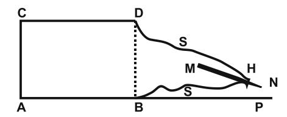

Uma pequena caixa de madeira, ABCD, possui, em lugar da face anterior, BD, um saco em forma de funil, SS, confeccionado em um tecido de seda escura, fl exível, porém encorpado, de 50 centímetros de comprimento.

Na extremidade desse saco está fi xado um pequeno tubo, H, no qual um lápis, MN, é inserido de tal forma que a ponta plana do lápis, e o lápis quase todo, esteja na caixa, e a ponta aguçada do lápis, N, saindo do tubo, H, e se apoiando sobre uma folha de papel, P. O interior da caixa é inteiramente escuro e o saco não constrange em nada os movimentos do lápis.

Com essa disposição conseguimos obter, em plena luz, muito rapidamente e com toda segurança, comunicações escritas por um processo visível aos olhos de todo mundo. O médium coloca suas mãos sobre a face superior, CD, e, ao fi nal de alguns minutos, começa a escrita, enquanto a parte inferior do saco se entumece como se uma mão houvesse se introduzido em seu interior.

É em tais condições, e por esse único meio, que agora nos comunicamos com a Inteligência invisível. Quanto ao conteúdo das mensagens, frequentemente muito longas, são bem superiores à inteligência do médium e, muitas vezes, ultrapassam o alcance dos outros assistentes, porque muitas vezes recebemos comunicações em alemão e em francês — o médium não fala senão o dialeto eslavo — e um dia recebemos uma mensagem de cinco páginas em inglês, língua que nenhum de nós conhece. As mensagens são às vezes muito engenhosas e sugestivas; assim, certa noite, indaguei se os espíritos eram imateriais. "Sim, em um certo sentido", foi-me respondido. "Então, estais fora do tempo e do espaço", repliquei. "Não", foi a resposta. "Como?", perguntei. "Um ponto geométrico é imaterial também, pois que ele não tem dimensões, e no entanto ele está no espaço. Isto que eu disse representa apenas uma comparação, porque nós, espíritos, temos dimensões, mas não como vós." Uma camponesa ignorante, de quatorze anos, seria capaz de dar uma tal resposta?

Um dia, recebemos uma prova de identidade indubitável. Durante a sessão, o lápis escreveu, em caracteres totalmente novos para nós: "Eu vos agradeço pela injeção que me fi zestes quando estava em meu leito de morte. Vós me aliviastes. Caroline C." Perguntei a quem eram endereçadas essas palavras. "A vós", respondeu-me a inteligência. "Quando esse fato se passou e quem sois vós?", perguntei. O lápis escreveu: "No dia 18 de setembro de 1900, no hospital de Lemberg". Nesse ano eu ainda era estudante e trabalhava nesse hospital como ajudante na clínica. Era tudo o que eu me lembrava a esse respeito.

Alguns dias após essa sessão tive a oportunidade de ir a Lemberg. Dirigi-me ao hospital e encontrei no registro de 1900 o nome em questão. Era de uma mulher de 56 anos, doente de um câncer no estômago e que lá morreu. Fui então ao escritório de informações da polícia e perguntei se havia em Lemberg alguém com o nome de C. Informaram-me terem encontrado uma professora com esse nome. Fui vê-la no mesmo dia e, como me dissesse que havia perdido sua mãe em 1900, mostrei-lhe a mensagem que recebera por escrita direta. Com grande espanto, essa senhora reconheceu, imediatamente, a letra e a assinatura de sua mãe, e mostrou-me cartas escritas pela falecida, que provavam, sem dúvida possível, a autenticidade da escrita. A senhora deu-me, com prazer, uma dessas cartas. No entanto, não me lembro de haver dado uma injeção de morfi na em Carolina C.

Muito mais comum que o precedente é o fenômeno da escrita mediúnica. O médium, sob um impulso oculto, traça sobre o papel comunicações, mensagens, em cuja redação seu pensamento e sua vontade tiveram apenas uma fraca participação. Essa faculdade apresenta aspectos muito variados. Puramente mecânica em certos médiuns que ignoram, no momento em que escrevem, a natureza e o sentido das mensagens obtidas, — a ponto de alguns poderem falar enquanto estão escrevendo, desviar sua atenção e trabalhar na obscuridade, — na maior parte deles ela é semimecânica, neste caso, o braço e o cérebro são igualmente infl uenciados; as palavras se apresentam no pensamento do médium no mesmo momento em que o lápis as escreve. Às vezes é puramente intuitiva e, em consequência, de natureza menos convincente e mais difícil de se certifi car.

As mensagens por esses diversos procedimentos apresentam uma grande variedade de estilo e são de valor muito desigual. Muitas contêm apenas banalidades, mas outras são notáveis pela beleza da forma e a elevação do pensamento.

Daremos a seguir alguns exemplos obtidos por diferentes médiuns.

### **— A prece —**

(Médium: Sra. Forget)

"É chegado o momento em que a inteligência, bastante desenvolvida no homem, pode compreender a ação, o sentido e o alcance da prece. Certo de ser compreendido, então eu posso dizer: Não mais incredulidade, não mais fanatismo, mas a segurança completa da força que Deus concede a todos os seres, quando o pensamento se eleva até ele.

Na prece, no pensamento voltado a esse Pai, fonte inesgotável de bondade e de caridade, longe de vós essas palavras aprendidas, que os lábios pronunciam por hábito, deixando o coração frio nesses apelos. Que vossos corações, reanimados e atraídos para o Pai pelo conhecimento da verdade, pela fé profunda e a verdadeira luz, enviem ao Eterno, em um pensamento de amor, de respeito, de confi ança e abandono, em um impulso, enfi m, de todo ser, esse arrebatamento poderoso, único, que pode ser chamado prece!

Desde o início, a alma, que pela prece se eleva em direção ao infi nito, experimenta um renascimento do pensamento que, nas diversas circunstâncias da existência, a conduz ao objetivo preciso que lhe está destinado.

A prece preserva na criança essa inocência em que ainda sentis a pureza, refl exo do repouso que a alma desfrutou no espaço. Para o adolescente, ela é a barreira de contenção do arrebata mento que nele surge como um fl uxo poderoso; seiva geradora se é guiada, perda certa se existe fraqueza, porém, resgate, se ela pode e sabe se retemperar na prece.

Depois, na idade em que, na plenitude de sua força e de suas faculdades, o homem sente em si a energia que muitas vezes deve conduzi-lo às grandes coisas, o recolhimento que assegura seu pensamento, esse grito da consciência que dirige suas ações não é ainda a prece?

E, poderoso amparo do fraco, a prece não é a consolação, a luz que o ajuda a se dirigir, como o prisma do farol indica ao náufrago a praia salvadora?

No perigo, por estas duas palavras pronunciadas com fé: 'Meu Deus!' o homem envia ao Criador sua prece. Esse grito, esse apelo ao Todo-Poderoso, não é, pela lembrança, o instinto do socorro que ele espera receber?

O marinheiro, exposto aos perigos, afastado de qualquer socorro em meio aos elementos desencadeados, em sua fé profunda formula um voto: é prece, cuja sinceridade sobe radiosa em direção àquele que pode salvá-lo.

E quando sobre a Terra ruge a tempestade, grandes e pequenos tremem pensando em sua fraqueza e, sob essa voz poderosa que repercute nas profundezas da Terra, eles oram e confi antes dizem estas palavras: 'Deus, preserva-nos de todo perigo!' — Abandono completo, na prece, àquele que tudo pode por sua vontade.

Quando chega a idade em que a força desaparece em nós, em que os anos nos pesam difi cilmente, em que a alma entristecida pelos sofrimentos, pela fraqueza que a invade, sente-se incapaz de reagir, quando o ser, enfi m, sente a inação pesar sobre ele, a prece, fonte aliviadora, vem acalmar e fortifi car as últimas horas que deve passar sobre a Terra.

Em qualquer idade, quando as provas vos cercam, quando o corpo sofre, e sobretudo quando o coração amargurado não deixa mais o pensamento repousar feliz no que, na Terra, atrai e consola, é à prece, somente à prece, que a alma, o coração, o pensamento pedem a calma que não conhecem mais.

Quando o encarnado, na plenitude de suas forças, inspirado pelo desejo do grande e do belo, leva suas aspirações sobre tudo o que o cerca, ele pratica o bem, torna-se útil, ajuda os infelizes e, prece celeste, força do pensamento, nas suas ações ele é ajudado pelo fl uido poderoso que do além une-se a ele, cadeia constante e invisível do encarnado com os desencarnados e, para mim, prece!

Direi pois a todos aqueles que a bondade inspira, àqueles que sentem, neste século em que o pensamento inquieto procura sem fi rmeza, a necessidade de uma fé profunda e regeneradora: Desde o berço, ensinai a prece à criança! Todo ser, mesmo no desvio das paixões, conserva a lembrança da impressão recebida no início da vida e reencontra, ao fi nal da existência percorrida, como consolação, o encanto ainda presente dos anos benditos em que a criança, iniciando-se na vida, respira sem temor, vive sem inquietação, pronunciando nos braços de sua mãe este nome tão grande e tão doce: 'Deus!' que ela o faz murmurar.

Tirando força e convicção dessa piedosa lembrança ele repetirá com confi ança, no último adeus à Terra, a prece aprendida no primeiro sorriso.

 *Jerônimo de Praga*

# **— O céu estrelado. Os mundos —**

(Médium: Srta. M. L.)

"Claridades siderais, caminhos do céu! Vós que traçais para as almas as linhas ideais da sua evolução, vós vos estendeis nas profundezas dos espaços! Planetas, de onde as almas vos contemplam, não sois mais que poeira de ouro, rastros luminosos no sombrio céu do verão. Porém, para aquelas que o túmulo da carne não aprisiona mais, ó planetas, ó estrelas!, vós sois os verdadeiros mensageiros do pensamento divino, escreveis no misterioso e divino livro da criação os salmos gloriosos com que Deus quis marcar sua obra! Vós sois a perpétua admiração dos seres e vossas luzes sempre lhes darão as sensações vertiginosas do infi nito. Ó nebulosas, Vias Lácteas, constelações inumeráveis! Vós sois como bacantes238 que o pensamento do deus embriaga! Acelerais vossos trajetos eternos em torno dos sóis, como as antigas sacerdotisas em volta do carro do deus. Vossas vibrações harmônicas acompanham o hino sagrado das almas, e nunca vosso trajeto melodioso parece mais belo aos nossos olhos que na hora em que, terminando o percurso que Deus vos destinou, ou tendo acabado vossa tarefa de pátria das almas em evolução, ides vos despedaçar sobre o obstáculo indicado por Deus, projetando, através dos espaços assombrados com o vosso desaparecimento, as partículas dessa matéria que vos formava, e que retornará ao seio de Deus para reconstituir outros universos.

Passai, estrelas e planetas; ide, rápidos e diferentes, e vosso curso, vossas órbitas imensas parecem o símbolo da eternidade; sois belos e deslumbrais os olhos humanos, mas que sois para a alma? Lugares de passagem, cada hospedaria onde nos demoramos uma noite a ouvir os sons melodiosos que as árvores cantam ao vento. Mas o viajante partiu, a casa encheu-se de fendas, desabou, só restam suas velhas pedras, douradas pelo sol do verão, metade cobertas pelas vivas ervas invasoras.

Assim vós vos destruireis, estrelas e planetas; não sereis mais que uma poeira de astros, errantes pelo céu. Mas a alma

238 **Bacante:** sacerdotisa de Baco (deus romano do vinho), mulher consagrada aos mistérios dessa fi gura mitológica. (**N.T.**)

permanecerá fi el à vossa lembrança, e, quando um desses bólidos passar perto dela, a alma reconhecerá alguma coisa da antiga morada que Deus lhe havia destinado.

Terra, tu que me viste passar, que recebeste em teu seio as lágrimas que vertia o homem enfraquecido pela dor, tu vais te desmoronar diante de teu Senhor. A alma já prevê o tempo em que tu não serás mais que um planeta sem vida, e nós receamos mesmo o teu desaparecimento. Assim é a lei. Ó Terra, ó minha mãe! Tu morrerás, mas os milhões de almas embrionárias que constituíam tua matéria serão então liberados e retomarão em outro lugar a sua evolução. Portanto, não lamentemos a tua sorte, ela é nobre, é grande, está em harmonia com a Lei de Deus. E quando, alcançadas outras alturas morais, meus olhos contemplarem, encantados, as constelações resplandecentes na profundeza dos espaços, procurarei o lugar em que devias passar, radiante de pensamentos que tua vestimenta divina agita.

Nada mais verei que uma lembrança, encontrarei outras estrelas em formação; o espaço ainda será imutável, outros planetas serão outras Terras para almas como as que tu trazes hoje em dia. Mas o que foram tuas montanhas, teus vales benditos onde ressoa o apelo da Humanidade, não será nem mesmo uma poeira no meio dos fi rmamentos. Nada mais restará da tua antiga forma. Mas, orgulha-te, ó Terra! Terás cumprido o teu dever, graças a ti as almas serão levadas a outros lugares, nos espaços onde constantemente passam os pensamentos do amor impenetrável, que são a vida e a existência das almas fascinadas por esse foco incessantemente renascente.

A Deus, Terra, ao teu Senhor tu deves amor e reconhecimento, e eu sei que lhe rendes homenagem, porque ouço, encantado, os melodiosos cantos que tua atmosfera, passando pelo eterno éter, clama como as almas conscientes da verdade.

Estrelas, inclinai-vos sobre vossas orbes radiosas; deixai no fi rmamento, eternamente, os feixes de luz que vos revelam. Estais no seio daquele que é!

 *R.*"

## **— A reencarnação —**(Médium: J. D.)

"Meus irmãos, somente a grande ideia da reencarnação é capaz de revivifi car a sociedade decadente que é a nossa. Somente ela pode reprimir esse egoísmo invasor que desagrega família, pátria, sociedade, e que substitui a generosa ideia do dever por essa concepção feroz de uma individualidade que deve se afi rmar a qualquer preço.

O materialismo, que destruiu a crença na vida futura, e os dogmas incompletos, que desnaturam o sublime princípio das religiões, secaram na alma humana essas fl ores admiráveis de um ideal superior para as baixas contingências da vida material, e os brutais impulsos dos instintos.

É preciso, meus irmãos, que algo venha despertar o sentido da vida espiritual nas almas.

Ainda que a ciência multiplique suas maravilhas, por mais que o homem empregue as admiráveis faculdades da sua inteligência e do seu gênio, todos os seus esforços permanecem estéreis se ele não tem em si as fontes vivas da vida espiritual, se não sente palpitar em si essa vida imperecível que assegura sua imortalidade e que o torna consciente desse universo do qual ele é uma das vivas e eternas partículas.

Não, não, meus irmãos, o homem não é esse ser anônimo e efêmero, poeira transitória de vida que não dura mais que um instante para sofrer e morrer.

O homem é a vida, a vida eterna, individualizada na substância para tomar consciência de si mesmo, e para adquirir a plenitude da felicidade pela plenitude do conhecimento.

Sim, o homem é grande, grande porque ele é o agente da sua própria grandeza; o homem é grande porque pelo seu próprio esforço cria sua personalidade futura, porque todas as aquisições da sua inteligência, da sua razão e do seu coração, ele as deve ao seu trabalho e à sua experiência.

Ó divina reencarnação! Por ti o bruto inconsciente torna-se o ser genial; por ti o mau adquire a suprema bondade, o ignorante, o conhecimento de todas as coisas.

Por ti, o homem gradualmente toma consciência de si mesmo; cada vida lhe traz uma experiência, cada existência, uma nova força e um novo poder; por ti, cada dor e cada prova têm um objetivo; cada alegria é uma recompensa. Por ti, a solidariedade mais profunda liga todas as criaturas, e o progresso, a realização de uma sociedade melhor, é a obra secular e comum.

Quando a ideia da reencarnação de novo se tornar senhora da mentalidade humana, o progresso social dará um passo enorme. As misérias e as provações do homem lhe parecerão menos dolorosas, porque terão para ele um sentido exato. Ele gozará suas alegrias com mais segurança porque sentirá sua vida tornarse permanente por sua imortalidade. O universo não lhe parecerá mais como uma máquina implacável, cujas engrenagens despedaçam impiedosamente todas as criaturas, sem se importar com seus gritos e seu estertor.

O homem então compreenderá que existe um grande foco cuja luz aquece e anima todo o Universo, e do qual ele é convidado a se tornar um raio consciente e fecundo, após ter aprendido, durante a série de suas existências sucessivas, o segredo da vida eterna, isto é, a inteligência que sabe, a consciência que age e o amor que ama.

Pastor B."

### **A natureza**

(Médium: Senhorita M. L.)

"Estive muitas vezes em vosso belo país quando meu marido morava às margens do Loire, e sei bem qual é o encanto da primavera para vós. Nele eu vi o pássaro responder à sua ninhada, quando seus primeiros pios reclamam imperiosamente uma alimentação mais abundante. Não tendes o calor ardente do meio-dia, mas vosso céu é mais suave ao olhar; a luz dos vossos pores do sol se diversifi ca e se multiplica de nuvem em nuvem, e prolonga o crepúsculo.

Escutei muitas vezes, como vós mesmos poderíeis fazer, o cair abafado dos fl ocos brancos e penugentos da neve. Os ninhos se balançam vazios e esquecidos nas extremidades dos ramos de árvores, despojados de suas folhas. A natureza parece morta, mas, como toda verdadeira obra de Deus, ela esconde a esperança das primaveras que virão. Minha alma é irmã do inverno: suas lembranças dormem nela; mas eu sei que minha vontade pode ressuscitar esse passado de ontem e me dar, com a permissão de Deus, a ilusão das vidas desaparecidas e a certeza de uma melhoria sempre desejada. A natureza é nossa grande educadora; ela nos ensinou a balbuciar o nome divino; ela cantou nas noites o hino universal, que a Humanidade ouve com o coração comovido. É ela que verte a alegria nos nossos corações, que nos faz ver a verdade, porque ela é a grande mediadora. Se soubéssemos escutar sua voz, seríamos mais que homens: teríamos adivinhado a palavra divina.

*Sra. Michelet*"

### **Invocações**

(Médium: Senhorita B. R.)

"Ó Deus, tu que enches, ao mesmo tempo, de grande terror e de soberana admiração aqueles que pronunciam teu nome, digna-te de inundar com tua resplandecente luz os fracos que se dirigem a ti num grito de angústia e de amor!

Em direção a ti, meu Deus, lentamente meu pensamento se eleva. Em teu foco de amor, minh'alma busca se abrasar. Faz descer sobre a criatura humana tua ardente inspiração; faz cair o véu que cega meus olhos e me esconde teus imensos horizontes; revela ao meu ser os teus esplendores infi nitos; murmura ao meu coração palavras de vida; fala-me, ó tu que eu sinto vibrar em todo o meu ser!

Deus, ser majestoso de grandeza e de simplicidade, foco sempre ardente de vida, de luz e de amor! Tu que em uma eternidade sabes conter o infi nito! Tu, o receptor ao mesmo tempo de meus lamentos e de minhas alegres expansões; tu ainda, — que com teus radiosos meteoros cuja rápida passagem ilumina meu sombrio asilo, me guia, — sustenta-me, consola-me! Tu, enfi m, cujo sopro ardente reanima em mim a chama mortiça, detém tua piedade um instante sobre mim; faz renascer em mim a centelha extraída do teu braseiro de amor! Escuta a minha prece! Envia, como tua resposta, um raio da tua pura claridade, e faz com que, em teu nome, meu ser inteiro, num transporte sublime, se arremesse até junto a ti!

 *I. Iriac*

Os sábios experimentadores ingleses imaginaram, sob o nome de *cross-correspondence*,239 um novo procedimento de comunicação com o invisível que seria muito próprio para provar a identidade dos espíritos cujas manifestações se produzem por meio da escrita mediúnica. Ele foi descrito por *Sir* Oliver Lodge, em 30 de janeiro de 1908, durante uma reunião da *Sociedade de Pesquisas Psíquicas* de Londres. Disse ele:

> A *cross-correspondence*, quer dizer, a recepção de uma parte da comunicação por um médium, e da outra parte por um outro médium, cada uma dessas partes não podendo ser compreendida sem a ajuda

239 *Cross-correspondence***:** expressão inglesa, pode-se traduzi-la por correspondência cruzada. (**N.T.**)

da outra, é uma boa prova de que uma mesma inteligência age sobre os dois médiuns. Se, além disso, a mensagem traz a característica de um desencarnado e é aceito por essa razão por pessoas que não o conhecem intimamente, pode-se ver aí a prova da persistência da atividade intelectual do desaparecido. E se obtemos um trecho de crítica literária inteiramente de acordo com sua maneira de pensar, e que não poderia ser imaginada por uma terceira pessoa, eu digo que a prova é convincente. Tais são as espécies de provas que a Sociedade pode comunicar sobre esse ponto.

Após haver falado sobre os esforços empreendidos nesse sentido, pelos espíritos Gurney, Hodgson e Myers, em particular, o orador acrescenta:

> Nós achamos que suas respostas a questões especiais são feitas de uma forma que caracteriza sua personalidade e revela conhecimentos que eram de sua competência.

> A divisão que separa os encarnados dos desencarnados, diz ele para concluir, ainda se mantém fi rme, porém, ela se acha enfraquecida em muitas partes. Como os trabalhadores de um túnel, nós ouvimos, em meio ao barulho das águas e outros ruídos, as batidas das picaretas dos nossos camaradas do outro lado.

Os ingleses não se contentaram com isso. Eles estabeleceram um escritório de comunicações regulares com o outro mundo. Foi o valente escritor William Stead, morto depois na catástrofe do *Titanic*, que o fundou em Londres, sob as instâncias de uma amiga desaparecida, Srta. Júlia Ames, daí o nome *escritório Júlia*. Esse espírito deseja vir em ajuda a todos os desencarnados que buscam entrar em comunicação com os vivos deixados por eles para trás, da mesma forma que aos encarnados atingidos pela perda de um ser muito saudoso. Para ser admitido para solicitar uma comunicação, Júlia, que dirige as sessões, requer apenas duas coisas: uma afeição sincera e lícita entre o vivo e o morto, assim como um estudo prévio da questão espírita. Nenhuma retribuição é tolerada por Júlia. O solicitante, sua petição levada em consideração, é enviado a três médiuns diferentes e todos os resultados são registrados.

Desde sua fundação esse escritório pôde estabelecer numerosas comunicações com o invisível. "Ele construiu uma ponte de uma extremidade à outra do túmulo", diz Stead com alguma razão.

No decorrer do primeiro trimestre de sua existência, centenas de solicitações lhe foram endereçadas, cuja maior parte foi aceita por Júlia. W. Stead calcula que pelo menos 75% daqueles que passaram pela tripla prova dos médiuns receberam respostas concludentes e, na metade dos casos, os solicitantes afi rmaram, da forma mais absoluta, terem obtido por um ou outro dos médiuns, ou por todos, provas fora de qualquer contradição.240

> \*\* \*

O mundo dos espíritos sendo, em grande parte, composto por almas que viveram na Terra, e as inteligências de elite, em um meio como no outro, sendo em pequeno número, compreendemos facilmente que a maioria das comunicações de além-túmulo sejam desprovidas de grandeza e originalidade. Quase todas, entretanto, têm um caráter moral incontestável e denotam louváveis intenções. Quantas pessoas chorosas puderam, por esse meio, receber daqueles que haviam amado e acreditavam perdidos, encorajamento e consolações! Quantas almas hesitantes no caminho obscuro do dever foram reconfortadas, afastadas do suicídio, fortifi cadas contra a paixão, por estímulos vindos do Além!

Acima dessas manifestações, cuja utilidade é tão evidente e o efeito moral tão intenso, é preciso colocar certas mensagens extraordinárias, assinadas por nomes modestos ou termos alegóricos, mas animadas por uma inspiração poderosa e que trazem, por sua forma e seus ensinamentos, a marca dos espíritos verdadeiramente superiores. É por meio de documentos dessa natureza

240Ver o *International Review*, de setembro de 1909. (**N.A.**)

que foi constituída a doutrina do Espiritismo. Allan Kardec deles recolheu um grande número. Depois dele, essas fontes do pensamento super-humano não mais se esgotaram; elas continuaram a se derramar sobre a Humanidade.

Os fenômenos de escrita direta ou automática são rematados e confi rmados pelos fatos de incorporação.241 Aqui os espíritos não se contentam mais em escrever ou fazer escrever; eles falam! Eles falam por meio dos órgãos de um médium adormecido. Este, mergulhado por eles no sono magnético, entrega seu envoltório a personalidades invisíveis, que dele se apoderam para conversar com os assistentes. Por esse meio, conversas sugestivas se estabelecem entre os habitantes do espaço e os parentes ou amigos que eles deixaram sobre a Terra.

Já nas manifestações de escrita mecânica, a identidade dos espíritos se determina pela forma dos caracteres traçados, pela analogia das assinaturas, pela presença de expressões e até de erros de ortografi a habituais nesses espíritos, e que se encontram em suas mensagens. Nos fenômenos de incorporação essa identidade é mais evidente ainda. Por suas atitudes, seus gestos, seus conceitos, o espírito se revela tal qual era sobre a Terra. Aqueles que o conheceram em sua precedente encarnação o reconhecem inteiramente; sua individualidade reaparece nas suas locuções características, nas expressões que lhe eram familiares, em mil detalhes psicológicos, pouco suscetíveis de análise e que somente as pessoas versadas no estudo desses fenômenos podem apreciar. Nada mais comovente, por exemplo, que escutar uma mãe vir, do outro lado do túmulo, incentivar e encorajar seus fi lhos deixados neste mundo. Nada mais curioso que ver espíritos de diversas ordens virem animar sucessivamente o envoltório do médium, e se manifestarem aos assistentes pela palavra e pelo gesto. A cada um deles, a fi sionomia do médium se transforma, a voz muda, a expressão fi sionômica se modifi ca. Pela linguagem e a atitude, a

241 Ver *No Invisível*, cap. 19. (**N.A.**)

personalidade do espírito se revela, antes mesmo que se identifi que pelo nome.

Possuímos, há muito tempo, em um círculo de experimentação do qual presidimos os trabalhos, duas senhoras médiuns de incorporação. Uma servia de voz aos espíritos protetores do grupo. Quando um deles a animava, os traços de seu rosto tomavam uma expressão angélica, sua voz se suavizava, tornava-se melodiosa. A linguagem revestia formas de uma pureza, de uma poesia, de uma elevação bem acima das faculdades pessoais da médium. Seu olhar parecia penetrar até o fundo do coração dos assistentes. Ela lia seus pensamentos; endereçava, alternadamente, a cada um deles, avisos, advertências referentes à sua situação moral e sua vida particular, que denotavam, mesmo na primeira entrevista, um conhecimento perfeito do seu caráter e do seu estado de consciência. Ela lhes falava de coisas íntimas, conhecidas somente por eles. Seu ar majestoso, tanto quanto a sabedoria e a suavidade de suas palavras, impunha-se a todos. A impressão produzida era profunda. Tudo parecia vibrar e se iluminar em torno desse espírito. Após sua partida, sentíamos que alguma coisa de grande havia se passado entre nós.

Quase sempre, um segundo espírito, de uma certa elevação, mas de característica diferente, o sucedia no corpo da médium. Esse espírito tinha a palavra breve e forte, o gesto enérgico e dominador. Sua ciência era vasta. Ele aceitara a incumbência de dirigir os estudos fi losófi cos e morais do grupo e sabia resolver os problemas mais árduos. Havíamos tomado por ele grande veneração e gostávamos de obedecê-lo. Porém, para todos os que eram novos no ambiente, era um espetáculo estranho ver se sucederem, no frágil corpo de uma senhora de maneiras tímidas e de modesto saber, dois espíritos de um caráter tão elevado e tão desigual.

Nossa segunda médium não apresentava, nas manifestações de que era a agente, o mínimo interesse. Era uma senhora elegante e instruída, esposa de um ofi cial superior, e que parecia,

desde o primeiro instante, reunir as melhores condições para fenômenos de uma ordem transcendente. Mas, na prática, era justamente o contrário que se produzia. Essa senhora, habitualmente, servia de intérprete a espíritos pouco avançados, que ocuparam na Terra situações muito diversas. Era algo esquisito de se ouvir, por exemplo, um mercador de legumes de Amiens falar em dialeto picardo242 pela boca de uma pessoa de maneiras distintas, e que jamais foi à Picardia. A linguagem da médium, correta e distinta na vigília, tornava-se confusa, empastada, permeada de lapsos e de expressões terrenas durante o sono magnético, quando o espírito Sophie intervinha nas sessões. Desde que este se afastasse, outros espíritos tomavam seu lugar, desfi lando, por assim dizer, no envoltório da médium e nos apresentando, sucessivamente, os tipos mais absurdos: um velho sacristão com sua palavra untuosa e monótona, emitida em um tom baixo, como em uma igreja; um ex-procurador, com gesto arrogante, em tom zombador, com a palavra dura e cortante, etc.

De outras vezes, produziam-se cenas tocantes, que arrancavam lágrimas aos assistentes. Amigos de além-túmulo vinham lhes trazer lembranças da infância, os serviços prestados, os erros cometidos, expor sua maneira de viver no espaço, falar das alegrias e dos sofrimentos morais colhidos no além, de acordo com seu modo de existência na Terra. Assistimos a animadas conversas entre espíritos, a dissertações comoventes sobre os mistérios da vida e da morte, sobre todos os grandes problemas do universo, e cada vez nossas almas fi cavam abaladas e fortifi cadas. Essa comunhão íntima com o mundo invisível abria perspectivas infi nitas ao nosso pensamento; ela infl uenciava todos os nossos atos; iluminava com uma viva luz esse caminho da existência ainda tão obscuro e tão tortuoso para a imensa maioria daqueles que o percorrem. Dia virá em que a Humanidade

242 **Dialeto picardo:** dialeto da Picardia, antiga província da França, capital Amiens. Formou o departamento de Somme e uma parte dos departamentos de Pas-de-Calais, de Aisne e de Oise. (**N.T.**)

conhecerá o preço desses ensinamentos e deles participará. Nesse dia, a cara do mundo será renovada.

> \*\* \*

Após ter passado em revista os principais fenômenos que servem de base ao espiritualismo moderno, nosso resumo seria incompleto se não disséssemos algumas palavras das objeções apresentadas e das teorias contrárias, com a ajuda das quais se tem procurado explicá-los.

Inicialmente há a negação absoluta. O Espiritismo, dizem alguns, não é mais que um conjunto de fraudes, de embustes. Todos os fatos extraordinários sobre os quais ele se apoia são fatos simulados.

É verdade que impostores procuraram imitar esses fenômenos; seus embustes foram facilmente descobertos, e os espíritos foram os primeiros a assinalá-los. Em quase todos os casos citados acima: levitação, aparições, materialização de espíritos, os médiuns são presos, amarrados à sua cadeira; habitualmente, seus pés e suas mãos são seguros pelos experimentadores. Por vezes eles até são colocados em gaiolas especialmente preparadas para esse fi m, gaiolas fechadas, cuja chave fi ca nas mãos dos operadores, colocados ao redor do médium. É em tais condições que numerosas materializações de espíritos se produzem.

Em suma, os impostores têm sido quase todos desmascarados, e muitos fenômenos jamais foram imitados pelo fato de que escapam a toda imitação.

Os fenômenos espíritas foram observados, verifi cados, controlados, por sábios céticos que passaram por todos os graus de incredulidade, e cuja convicção só se obteve pouco a pouco, sob a pressão contínua dos fatos.

Esses sábios eram homens de laboratório, físicos e químicos experientes, médicos e magistrados. Possuíam todas as qualidades requeridas, toda a competência necessária para desmascarar as fraudes mais hábeis, para desfazer as tramas mais bem urdidas. Seus nomes estão entre aqueles que a Humanidade inteira respeita e reverencia. Ao lado desses homens ilustres, todos aqueles que se entregaram a um estudo paciente, consciencioso e perseverante desses fenômenos vêm afirmar a sua realidade, enquanto a crítica e a negação emanam de pessoas cujo julgamento, baseado em noções insuficientes, provém, principalmente, de uma opinião preconcebida.

Aconteceu com alguns deles o que acontece frequentemente aos observadores inconstantes. Eles só puderam obter frágeis resultados, por vezes até resultados negativos, e daí se tornaram ainda mais céticos. Não quiseram levar em conta uma coisa essencial: o fenômeno espírita é regido por leis, submetido a condições que é preciso conhecer e observar.243 Sua paciência se cansa muito rápido. As provas que eles exigem não se obtêm em alguns dias. William Crookes, Russell Wallace, Zollner,244 Aksakof, Dale Owen, Robert Hare, Myers, Lombroso, Oliver Lodge245 e muitos outros sábios estudaram a questão durante muitos anos. Eles não se contentaram em assistir a algumas seções mais ou menos bem dirigidas e providas de bons médiuns. Eles se deram ao trabalho de pesquisar os fatos, de agrupá-los, de analisá-los; eles foram ao fundo das coisas. Assim, sua perseverança foi coroada de sucesso e

Ver *No Invisível*, capítulos 9 e 10. (**N.A.**)

244 **Zollner, Friedrich:** astrofísico alemão (Berlim, 1834 – Leipzig, 1882). Realizou estudos fotométricos do céu e dos astros; em 1861 organizou o primeiro catálogo fotométrico das estrelas. (**N.T.**, segundo a *Grande Enciclopédia Larousse Cultural*.)

245 **Oliver Lodge:** físico inglês (Penkhull, Staffordshire, 1851 – Lake, perto de Salisbury, 1940). Precursor da radiocomunicação, estudou as ondas eletromagnéticas e a telegrafi a sem fi o. Foi reitor da Universidade de Birmingham e um dos mais conhecidos educadores da sua geração. Dedicou-se ao estudo dos fenômenos mediúnicos, publicando inúmeros livros relacionados às suas pesquisas; um dos mais famosos é *Raymond*. Participou das investigações sobre as faculdades mediúnicas da Sra. Piper e de Eusapia Palladino. (**N.T.**, segundo a *Grande Enciclopédia Larousse Cultural* e *Os Sábios e a Sra. Piper*, de Antônio Cesar Perri de Carvalho, Ed. O Clarim.)

seu método de investigação pode ser dado como exemplo a todo pesquisador sério.

Entre as teorias apresentadas para explicar os fenômenos espíritas, a da alucinação tem sempre o maior destaque. Entretanto, ela perdeu toda razão de ser diante das fotografi as de espíritos obtidas por Aksakof, Crookes, Volpi,246 Ochorowicz, William Stead e tantos outros. Não se fotografam alucinações.

Os invisíveis impressionam não só as placas fotográfi cas, mas também instrumentos de precisão, como os registradores Marey;247 eles erguem objetos materiais, os decompõem e recompõem; deixam as impressões na parafi na quente. Essas são provas contra a teoria da alucinação, seja individual, seja coletiva.

Certos críticos acusam os fenômenos espíritas de vulgaridade, grosseria, trivialidade; eles os consideram ridículos. Essas apreciações provam sua incompetência. As manifestações, vindas do mesmo espírito, não podem ser diferentes das que teriam ocorrido quando ele vivia na Terra. A morte não nos muda e, no Além, somos apenas o que fomos durante esta vida. Daí a inferioridade de tantos seres desencarnados.

Por outro lado, essas manifestações triviais e grosseiras têm sua utilidade: são elas que revelam melhor a identidade do espírito. Elas têm convencido numerosos experimentadores da realidade da sobrevivência e os têm levado, pouco a pouco, a observar, a estudar fenômenos de uma ordem mais elevada. Porque, nós o temos visto, os fatos se encadeiam e se ligam em uma ordem graduada, em virtude de um plano que parece indicar a ação de uma força, de uma vontade superior, procurando arrancar a Humanidade da sua indiferença, conduzi-la para o estudo e a pesquisa de seus destinos. Os fenômenos físicos: mesas falantes,

246 **Volpi, Ernesto:** espírita italiano, grande defensor da teoria reencarnacionista, diretor do *Vessillo Spiritista*. (**N.T.**, segundo *Afi nal quem somos?*, de Pedro Granja, Edicel.)

247 Ver *Anais das Viências Psíquicas*, agosto, setembro e novembro de 1907, e fevereiro de 1909. (**N.A.**)

casas frequentadas por espíritos, eram necessários para chamar a atenção dos homens, mas não convém ver nesses fatos mais que meios preliminares, um encaminhamento a domínios mais elevados do conhecimento.

Durante muito tempo o Espiritismo foi considerado como uma coisa ridícula; durante muito tempo os espíritas foram ridicularizados, injuriados, acusados de loucura. Não ocorreu o mesmo com todos aqueles que trouxeram uma ideia, uma força, uma nova verdade? Não foram todos tratados de loucos? Louco, se disse de Galileu; loucos, Giordano Bruno, Galvani, Watt, Palissy, Salomão de Caus!

O caminho do progresso frequentemente é muito rude para os inovadores. Ele foi regado por muitas lágrimas e muito sangue. Aqueles dos quais acabamos de citar os nomes tiveram que caminhar em meio a interesses conjurados. Eram desprezados por uns e odiados e perseguidos por outros. Eles lutaram e sofreram, e, comparativamente a eles, aqueles que se limitam a ser ridicularizados hoje em dia podem considerar seu destino bem indulgente. É inspirando-se nesses grandes exemplos que os espíritas aprenderam a suportar seus males com paciência. Uma coisa os tem consolado de todos os sarcasmos, é a certeza de que eles também trazem um benefício, uma força, uma luz para a Humanidade.

A cada século, a história retifi ca seus julgamentos. O que parecia grande torna-se pequeno, e o que parecia pequeno se engrandece. Hoje já se começa a compreender que o Espiritismo é um dos acontecimentos mais importantes dos tempos modernos, uma das formas mais notáveis da evolução do pensamento, o germe de uma das maiores revoluções morais que o mundo conheceu.

Quaisquer que sejam as zombarias das quais ele é o objeto, é preciso reconhecer que é ao Espiritismo que a nova ciência psíquica deve a luz; sem ele, sem o impulso que ele deu, todas as descobertas que se referem a essa ciência ainda estariam por vir.

No que diz respeito ao estudo das manifestações dos espíritos, os espíritas sabem que têm boa companhia. Os nomes ilustres de Russel Wallace, de Crookes, de Robert Hare, de Mapes, de Zollner, de Aksakof, de Boutlerof, de Flammarion,248 de Myers, de Lombroso foram muitas vezes citados. Veem-se também sábios como os professores Barlett, Hyslop,249 Morselli, Botazzi, William James,250 da Universidade de Harvard, Lodge, reitor da Universidade Birmingham, o professor Richet, o coronel de Rochas, etc., que não consideram esses estudos indignos deles. Que pensar depois disso das acusações de ridículo, de loucura? O que elas provam senão uma coisa dolorosa: que o reinado da rotina cega persiste em certos meios. O homem é propenso, frequentemente, a julgar os fatos de acordo com o estreito horizonte dos seus preconceitos e dos seus conhecimentos. É preciso elevar mais alto, estender mais longe seus olhares e avaliar sua fraqueza em face do Universo. Dessa forma se aprenderá a ser modesto, a nada rejeitar nem condenar sem averiguação.

> \*\* \*

Procurou-se explicar todos os fenômenos do Espiritismo pela sugestão e pela dupla personalidade. Nas experiências, dizem, os médiuns sugestionam a si mesmos, ou então sofrem a infl uência dos assistentes.

A sugestão mental, que não é outra coisa que a transmissão de pensamento, apesar das difi culdades que ela apresenta, pode se compreender e estabelecer entre dois cérebros organizados, por

**Flammarion, Camille:** astrônomo francês (Montgny-le-Roi, 1847 – Juvisysur-Orge, 1925). Autor de numerosas obras de vulgarização científi ca, entre elas: *Pluralidade dos Mundos Habitados*, *Astronomia Popular*, etc. (**N.T.**, segundo a *Enciclopédia e Dicionário Koogan Houaiss*.)

249 **Hyslop, James Hervey:** foi professor de Lógica e de Ética na Universidade de Colúmbia, em Nova York, de 1889 a 1902, tendo vivido nos Estados Unidos entre 1854 e 1920. Fundador da Sociedade Americana para Pesquisas Psíquicas e grande propagandista da sobrevivência da alma; autor de inúmeros livros sobre o assunto. (**N.T.**, segundo *Os Sábios e a Sra. Piper*, de Antonio César Perri de Carvalho, Ed. O Clarim.)

250 **William James:** fi lósofo norte-americano (Nova-York, 1842 – Chocorua, New Hampshire, 1910), um dos fundadores do pragmatismo; autor de *Princípios de Psicologia, Experiência Religiosa*, etc. (**N.T.**, segundo a *Enciclopédia e Dicionário Koogan Houaiss*.)

exemplo, entre o magnetizador e a pessoa a quem ele magnetiza. Porém, pode-se acreditar que objetos inanimados sejam aptos a receber e reproduzir as impressões dos assistentes?

Não se poderia explicar por essa teoria os casos de identidade, as revelações de fatos, de datas, ignorados pelo médium e pelos assistentes, que se produzem muito frequentemente nas experiências, não mais que as manifestações contrárias à vontade de todos os espectadores. Muitas vezes, detalhes absolutamente desconhecidos de todo ser vivo sobre a Terra foram revelados por médiuns, depois verifi cados e reconhecidos exatos. Deles encontram-se notáveis exemplos na obra de Aksakof, *Animismo e Espiritismo*, e na de Russel Wallace, *O Moderno Espiritualismo*, assim como casos de mediunidade constatados entre crianças de baixa idade que, não mais que os precedentes, não poderiam ser explicados pela sugestão.251

Segundo os senhores Pierre Janet252 e Ferret — e essa é uma explicação da qual se servem, frequentemente, os adversários do Espiritismo — deve-se comparar um médium escritor a um sujeito hipnotizado, ao qual se sugere uma personalidade durante o sono, e que perdeu, ao despertar, a lembrança dessa sugestão. O sujeito escreve de maneira inconsciente uma carta, uma narrativa reportando-se a esse personagem imaginário. Está aí, dizem, a origem de todas as mensagens espíritas.

Todos aqueles que têm qualquer experiência do Espiritismo sabem que essa explicação é inadmissível. Os médiuns escrevem de maneira automática, não são lançados antecipadamente no sono hipnótico. Geralmente é em seu estado de vigília, na plenitude de suas faculdades e do seu "eu" consciente, que os médiuns escrevem sob o impulso dos espíritos. Nas experiências do Sr. Janet, havia sempre um hipnotizador em ligação magnética com o sujeito. Não ocorre o mesmo nas sessões espíritas; nem o evocador, nem

Ver, como prova de identidade, nossa obra *O Mundo Invisível e a Guerra*, cap. XXV. (**N.A.**)

252 Pierre Janet, *O Automatismo Psicológico*. (**N.A.**)

os assistentes agem sobre o médium; este ignora completamente o caráter do espírito que vai intervir. Muitas vezes, mesmo, as questões são apresentadas aos espíritos por incrédulos mais dispostos a combater a manifestação do que a facilitá-la.

O fenômeno da comunicação gráfi ca não consiste somente no caráter automático da escrita, mas principalmente nas provas inteligentes, nas identidades que ela fornece. Ora, as experiências do Sr. Janet não apresentam nada de semelhante. As comunicações sugeridas aos sujeitos hipnotizados são sempre de uma banalidade desesperante, enquanto as mensagens dos espíritos nos trazem, frequentemente, indicações, revelações com passagens da vida presente ou passada, de seres que nós conhecemos na Terra, que foram nossos amigos ou nossos parentes, detalhes ignorados pelo médium dos quais o caráter de certeza os distingue totalmente das experiências do hipnotismo.

Não se poderia, pela sugestão, fazer analfabetos escreverem, nem se receber de uma mesa poesias como aquelas recolhidas pelo Sr. Jaubert, presidente do Tribunal de Carcassone, e que obtiveram prêmios nos Jogos Florais de Toulouse. Não se saberia também, por esse meio, suscitar a aparição de mãos, de formas humanas, tampouco a escrita com que se cobrem as ardósias trazidas por observadores sem que eles delas tenham se despojado.

É preciso lembrar que a doutrina dos espíritos foi constituída com a ajuda de numerosas mensagens, obtidas por médiuns escritores a quem esses ensinamentos eram absolutamente estranhos. Quase todos tinham sido acalentados, desde a infância, pelo ensinamento da Igreja, pelos ideais de paraíso e de inferno. Suas convicções religiosas, suas noções sobre a vida futura, estavam em oposição gritante com as considerações expostas pelos espíritos. Não existia neles nenhuma ideia prévia da reencarnação, nem de vidas sucessivas da alma, nem da verdadeira situação do espírito após a morte, todos esses assuntos expostos nas mensagens obtidas. Existe aí uma objeção irrefutável à teoria da sugestão: a realidade objetiva das comunicações ressalta tão mais fortemente, porquanto os médiuns não estavam de forma alguma preparados, pela sua educação e por pontos de vista pessoais, para as concepções expressas pelos espíritos.

É evidente que, entre a enorme quantidade de fatos espíritas registrados, encontram-se alguns fracos, pouco concludentes; outros podem ser explicados pela sugestão ou pela exteriorização do médium. Em certos grupos espíritas costuma-se aceitar tudo como emanando dos espíritos, e não se leva muito em conta os fenômenos duvidosos. Mas, por maior que seja essa parte, resta um conjunto grandioso de manifestações inexplicáveis pela sugestão, o inconsciente, a alucinação ou outras teorias análogas.

Os críticos procedem sempre da mesma forma em relação ao Espiritismo. Eles se dirigem somente a um gênero especial de fenômenos, e afastam do propósito da discussão tudo o que eles não podem compreender nem refutar. Desde que acreditam ter encontrado a explicação de alguns fatos isolados, eles se apressam em concluir pelo absurdo da totalidade. Ora, quase sempre sua explicação é inexata, ela deixa no esquecimento as provas mais marcantes da existência dos espíritos e de sua intervenção nas coisas humanas.

Uma outra teoria, frequentemente invocada pelos contraditores da ideia espírita, é a do inconsciente. Numerosos sistemas, obscuros e complicados, com ela têm conexão.

De acordo com essa teoria, dois seres coexistiriam em nós: um, consciente, que se conhece e se possui; o outro, inconsciente ou subconsciente, que ignora a si mesmo como é ignorado por nós e, no entanto, possui faculdades superiores às nossas, visto que se lhe atribuem todos os fenômenos do Magnetismo e do Espiritismo. E haveria não somente um segundo "eu", mas um terceiro, um quarto e ainda mais, porque certos teóricos admitem a existência no homem de um grande número de personalidades,

de consciências diversas. Esse sistema é conhecido pelo nome de *policonsciência*.

Assim como o demonstrou Charles Richet, em seu livro *O Homem e a Inteligência*; *o Sonambulismo Provocado*, o que se chama de dupla personalidade representa simplesmente os diversos estados de uma só e mesma personalidade. Da mesma forma, o inconsciente nada mais é que uma forma da memória, o despertar em nós de faculdades, de poderes, de lembranças adormecidas.253 Os teóricos do inconsciente pretendem, por esse meio, combater o maravilhoso, e inventam um sistema mais fantástico e mais complicado que tudo o que eles visam. A sua teoria não é só incompreensível, ela também não explica completamente todos os fenômenos espíritas, porque não se pode compreender como o inconsciente poderia produzir formas de pessoas mortas, comunicações inteligentes por sons ou batidas, e todos os outros fatos atentados por experimentadores de todos os países.

Tem-se assim querido atribuir as mensagens ditadas em sessão a uma espécie de consciência coletiva se desprendendo do conjunto dos assistentes, uma completa concepção ilógica.

Eis, entre mil, um fato que refuta todas as objeções que acabamos de passar em revista; nós o encontramos na notável obra de Sir William Barret, membro da *Sociedade Real*, professor de física experimental no Colégio das ciências da Irlanda, intitulada *On The Threshold of the Unsen*.254

Barret explica, inicialmente, que se servia frequentemente da *oui-jà*255 ou prancheta americana, tomando todas as precauções para evitar as fraudes ou a ação inconsciente do médium. Primeiro ele lhe vendava os olhos, o que não impedia que

253 Ver *O Problema do Ser e do Destino*, cap. 5. (**N.A.**)

254*No Limiar do Invisível*. (**N.T.**)

*Oui-jà:* expressão francesa para designar a prancheta utilizada nos primitivos processos mediúnicos de comunicação entre os espíritos e os encarnados. (**N.T.**)

as letras se sucedessem com a mesma rapidez que antes. Sem o prevenir, revirava a prancheta, de forma a apresentar as letras em sentido inverso ao lado do médium, depois a substituía por uma tabela onde letras e números, em vez de seguirem a ordem habitual, estavam completamente misturados. Todas essas precauções eram tomadas sem o conhecimento do médium que, com os olhos sempre vendados, continuava a dar respostas corretas.

Foi nessas condições que se produziu a seguinte manifestação:

"No mesmo dia em que se publicou o torpedeamento do navio inglês *Lusitânia*, o Sr. Lennox Robinson e eu estávamos ocupados em interrogar a *oui-jà*, com o reverendo Saville Hicks anotando as letras indicadas, quando foram soletradas as palavras: 'Rogai pela alma de Hugh Lane'.

Eu perguntei: 'Quem está aí? Quem sois vós?' 'Eu sou Hugh Lane', respondeu a *oui-jà*, e deu então a notícia detalhada do naufrágio, no qual não podíamos nos resignar a crer, tão monstruoso considerávamos semelhante atentado, e ele acrescentou: 'Esse foi o pacífi co fi m de uma vida agitada'.

Considerávamos o Sr. Hugh na América e não podíamos imaginar que ele tivesse embarcado no *Lusitânia*.

Nesse momento ouvi, do lado de fora, o grito de um vendedor anunciando os jornais da tarde. O Sr. Robinson correu para a rua e trouxe um jornal que dava todos os detalhes da catástrofe, assim como os nomes das vítimas conhecidas, à frente dos quais estava o de *Sir* Hugh Lane.

Nós nos dirigimos à *oui-jà*, para indagá-lo, mas o espírito se limitou a confi rmar a narrativa do naufrágio acrescentando: 'Eu não sofri. Fui afogado e nada senti'."

Quase sempre se confunde o subconsciente, seja com o duplo fl uídico, que não é um ser mas um organismo, seja com o espírito familiar, preposto à guarda de toda alma encarnada neste mundo.

Pode-se perguntar em virtude de qual acordo universal esses inconscientes escondidos no homem, que se ignoram entre eles e se ignoram a si mesmos, são unânimes, no decorrer de manifestações ocultas, ao se dizerem os espíritos dos mortos.

Pelo menos é o que pudemos constatar nas inumeráveis experiências nas quais tomamos parte, durante mais de trinta anos, em tantos pontos diferentes, na França e no estrangeiro. Em nenhuma parte os seres invisíveis se apresentam como o inconsciente ou o "eu" superior dos médiuns e outras pessoas presentes. Eles sempre se anunciam como personalidades diferentes, gozando da plenitude de sua consciência, como individualidades livres, tendo vivido na Terra, — conhecidas dos assistentes na maior parte dos casos — com todas as características do ser humano, suas qualidades e seus defeitos, suas fraquezas e suas grandezas, e frequentemente dão provas da sua identidade.256

Cremos que o que há de mais notável nisso é a engenhosidade, a fecundidade de certos pensadores, sua habilidade em arquitetar teorias fantasistas, com o objetivo de fugir de realidades que os desagradam e constrangem.

Sem dúvida, eles não previram todas as consequências de seus sistemas; fecharam os olhos para os resultados que deles se podem esperar. Não se deram conta de que essas doutrinas funestas aniquilam a consciência e a personalidade ao desuni-las; esses sistemas tendem logicamente, fatalmente, à negação da liberdade, da responsabilidade e, por consequência, à destruição de toda lei moral.

Efetivamente, com essa hipótese, o homem seria uma dualidade ou uma pluralidade mal equilibrada, em que cada

256 Ver nota complementar no 12 e "Identidade dos espíritos" no cap. 21 de *No Invisível*. (**N.A.**)

consciência agiria a seu modo, sem se preocupar com os outros. São tais noções que, penetrando nas almas, tornam-se para elas uma convicção, um argumento, impelindo-as para todos os excessos.

Resumimos: tudo na natureza e no homem é simples, claro, harmônico. É o espírito de sistema257 que complica e obscurece tudo.

Do exame atento, do estudo constante e aprofundado do ser humano, resulta uma coisa, a existência em nós de três elementos: o corpo físico, o corpo fl uídico ou perispírito e, fi nalmente, a alma ou espírito. O que se chama o *inconsciente*, a *segunda pessoa*, o *eu superior*, a *policonsciência*, etc., é tudo simplesmente o espírito que, em certas condições de desprendimento e de clarividência, vê produzir-se nele como uma manifestação de poderes ocultos, um conjunto de recursos que suas existências anteriores acumularam nele e que estavam momentaneamente dissimuladas sob o véu da carne.

É certo que o homem não tem várias consciências. A unidade psíquica do ser é a condição essencial da sua liberdade e da sua responsabilidade. Mas existem nele vários estados de consciência. À medida que o espírito se desliga da matéria e se liberta do seu envoltório carnal, suas faculdades e suas percepções se ampliam, suas lembranças despertam, a radiação da sua personalidade se desenvolve. É o que se produz, algumas vezes, no estado de transe, no sono magnético. Nesse estado o véu da matéria cai, a alma se liberta e os poderes latentes nela reaparecem. Daí certas manifestações de uma mesma inteligência, que pôde fazer crer numa dupla personalidade, em uma pluralidade de consciências.

Entretanto, isso não basta para explicar os fenômenos espíritas; na maior parte dos casos, a intervenção de entidades estranhas, de vontades livres e autônomas, se impõe como a única explicação racional.

**Espírito de sistema:** tendência para reduzir tudo a sistema, para atuar com juízo preconcebido. (**N.T.**)

Citaremos, apenas por lembrança, a teoria que atribui essas manifestações aos demônios. Esse é um argumento bem antigo, porque dele se tem feito uso em todos os tempos e contra quase todas as inovações. "Deve-se julgar a árvore por seus frutos", diz a *Escritura*. Ora, se avaliarmos todo o bem moral que o Espiritismo já realizou neste mundo, se considerarmos quantos céticos, indiferentes, sensuais, foram por ele guiados para uma concepção mais elevada e mais íntegra da vida, da justiça e do dever, quantos ateus foram conduzidos para a ideia de Deus, é necessário concluir que o demônio, se é ele o autor dos fenômenos de além-túmulo, trabalha contra ele mesmo, em detrimento de seus próprios interesses. O que dissemos em outra obra258 sobre o inferno e os demônios nos dispensa de insistir no assunto. Satanás é apenas um mito. Nenhum ser está eternamente voltado para o mal.

Se a maior parte das críticas dirigidas ao Espiritismo são injustas e erradas, é preciso reconhecer que entre elas também existem as que têm fundamento. Muitos abusos são obstáculos à marcha e ao desenvolvimento do moderno espiritualismo. Esses abusos devem ser atribuídos não à ideia em si mesma, mas à má aplicação que dela é feita em certos meios. Não é assim com todas as coisas humanas? Não existe nenhuma ideia, por mais santa, mais respeitável que ela seja, que não tenha gerado abusos; é a consequência inevitável da inferioridade do nosso mundo. No que se refere ao Espiritismo, é preciso assinalar primeiro a mediunidade venal, que arrasta muitos indivíduos à simulação dos fenômenos; depois, as deploráveis práticas em uso em alguns grupos desprovidos de saber, de preparação e de direção. Muitas pessoas fazem do Espiritismo um jogo frívolo e, pelo que se chamou "a dança das mesas", atraem para elas espíritos inferiores e levianos, que não têm nenhum escrúpulo em mistifi car, em travar com essas pessoas relações que podem levar até a obsessão.

Ver *Depois da Morte*, cap. 36. (**N.A.**)

Outras se entregam sem controle à escrita mediúnica; obtêm, em abundância, mensagens falsamente assinadas por nomes célebres, obras medíocres, desprovidas de estilo e de originalidade, destinadas, frequentemente, a captar sua confi ança, com o objetivo de as desencaminhar.

Existe, assim, um Espiritismo de baixa categoria, domínio exclusivo dos espíritos inferiores, maculado muitas vezes por fraudes, trapaças, falsidades, e contra o qual não se saberia bem resguardar.

São essas práticas que fi zeram crer na intervenção de demônios, quando se tratava apenas de entidades vulgares e atrasadas. Basta adquirir alguma experiência dessas coisas para distinguir a natureza dos seres invisíveis e se livrar das ciladas dos espíritos atrasados.

Os abusos de que falamos foram muitas vezes anunciados e mesmo exagerados com prazer. Serviram-se deles para combater o moderno espiritualismo. Seria um grave erro ver no uso do Espiritismo apenas esses inconvenientes e, sob o pretexto de evitá-los, procurar privar a Humanidade das vantagens reais e consideráveis que ela pode retirar de um estudo sério, de uma prática sábia e refl etida da mediunidade.

Quanto aos perigos que o Espiritismo apresenta, pode-se facilmente evitá-los, afastando das sessões todo pensamento frívolo, todo objetivo interesseiro, fazendo as evocações com um sentimento piedoso e elevado. "Os semelhantes se atraem", nos diz um provérbio. Nada é mais verdadeiro no domínio dos estudos ocultos. As questões banais e as fáceis brincadeiras em uso em certos meios atraem os espíritos mistifi cadores. Ao contrário, as disposições sérias, os pensamentos sérios e elevados agradam as inteligências superiores.

É perigoso trabalhar sozinho, sem controle, sem proteção efi caz, é perigoso entregar-se isoladamente às evocações espíritas. Para evitar as más infl uências e as manifestações grosseiras, devemos nos unir a um pequeno número de pessoas esclarecidas, dirigidas ao bem, sob a direção de um crente experimentado. Nessas condições, rogai a Deus, com um coração sincero, que permita a um espírito elevado vos prestar seu apoio, que afaste os espíritos das sombras, que facilite o acesso do vosso grupo àqueles que amais e dos quais lamentais a partida; pedi às inteligências superiores que vos tragam seus ensinamentos, que vos guiem nesse caminho fecundo da comunicação espiritual.

Se vossos sentimentos são desinteressados, se procurais nesses estudos apenas um meio de aperfeiçoamento, eles fi carão felizes em responder aos vossos apelos, e o Espiritismo tornar-se-á para vós uma fonte de luz e de altas inspirações.

\* \*

Resulta da nossa exposição que chegamos a uma hora decisiva da história da ciência.

A ciência experimental transpôs o limite que separa dois mundos, o visível e o invisível. Ela se acha em presença de um infi nito vivo. É o que dizia o professor Charles Richet, da Academia de Medicina de Paris, em sua narrativa sobre as sessões espíritas de Milão: "É um novo mundo que se abre para nós". Depois de meio século, lenta mas seguramente, a ciência se encaminha, de descoberta em descoberta, para um conhecimento da vida fl uídica, da vida invisível, em perfeito acordo com o ensinamento do espiritualismo moderno; dessa concordância vai resultar a mais fi rme certeza que o homem jamais possuiu da sobrevivência da alma e da sua indestrutibilidade.

Atualmente, essa questão, perseguida durante anos, resolvida por numerosos sábios, não o foi ainda pela ciência ofi cial, sempre hesitante; mas seu veredicto não poderia tardar. Acima das questões interesseiras, acima das rivalidades, dos sofi smas, das argúcias, das contradições, o problema se coloca de uma maneira imperiosa diante do tribunal do pensamento. Em face dos fatos espíritas, da sua persistência, de sua renovação incessante e de sua prodigiosa variedade, é preciso se pronunciar e dizer se a morte é o nada, ou se existe um destino humano.

Esse é um debate verdadeiramente grave e solene. Todas as negações e todas as esperanças estão em jogo. Todas as escolas estão interessadas na solução do problema, interessadas em saber se existe, como nós estabelecemos, uma prova objetiva da sobrevivência do ser, livre de todo caráter místico.

As escolas materialistas de um lado, as Igrejas de outro, se inquietam e se atormentam porque veem nisso, para elas, uma causa de decadência e de diminuição, enquanto que, na realidade, essa constatação da sobrevivência seria um meio de aproximação e de conciliação. Daí também todas as repressões, todas as reclamações que se manifestam. Porém, quaisquer que sejam a indecisão da ciência, a oposição das escolas, a obstinação com a qual se combate a nova ideia e as descobertas que a fi zeram nascer, os poderes invisíveis que agem no mundo não empregarão menos energia e tenacidade para defendê-las e propagá-las. Mas alto que os interesses das escolas, mais alto que as teorias e os sistemas, há uma coisa que deve triunfar e se impor: a verdade.

O mundo invisível — calcado há muito tempo em suas profundezas, seja pelo materialismo que lhe nega a existência, seja pela Igreja que, sob o pretexto de bruxaria, dela afastava as manifestações — há séculos se recolhia. Hoje ele entra de novo em ação. As manifestações ocultas se produzem sob todas as formas, desde as mais banais até as mais refi nadas, segundo o grau de elevação das inteligências que intervêm. Elas se desenvolvem segundo um plano majestoso, cujo objetivo aparece claramente; esse objetivo é o de demonstrar ao homem que ele não é somente matéria perecível, que ele tem em si uma essência que sobrevive ao corpo e pode entrar em comunicação com outros seres humanos após a morte, uma individualidade convocada a se desenvolver livremente através do infi nito do tempo e da imensidão dos espaços.

O invisível tem feito, pouco a pouco, incursão no mundo visível e, apesar do desdém, das hostilidades, das resistências, é evidente que sua ação vai se estender e se multiplicar mais e mais, até que esse homem chegue, enfi m, a conhecer-se melhor, a discernir a lei da sua vida e de seus destinos.

Há, portanto, na observação desses fatos, o germe de uma revolução que abrangerá, pouco a pouco, todo o domínio dos conhecimentos humanos.

Sob o ponto de vista científi co, esses fatos logo nos abrem todo um mundo de forças, de infl uências, de formas de vida, no qual somos lançados sem suspeitar da sua existência, um mundo cuja grandeza, riqueza, energias em reserva desafi am todo cálculo, toda previsão. Eles também nos ensinam a ver no homem a sede de faculdades, de poderes escondidos, cuja utilização e desenvolvimento podem nos elevar a alturas grandiosas.

A vida nos aparece agora sob um duplo aspecto: ela é, ao mesmo tempo, corporal e fl uídica. A existência do homem é alternadamente terrestre e extraterrestre. Ela se realiza alternativamente sobre a Terra, na carne, depois na atmosfera ou no espaço, sempre sob a forma humana, mas impalpável e imponderável. Esses dois modos de vida se alternam e se sucedem em um ritmo harmônico, como o dia sucede à noite, o despertar ao sono e o verão ao inverno.

Sob o ponto de vista fi losófi co e moral, as consequências do fenômeno espírita não são menos consideráveis.

Há mais de cinquenta anos constataram-se os fatos; quando, desses fatos, desejou-se remontar às causas que os produzem, quando, do conjunto dos fenômenos, procurou-se distinguir a lei que os rege, a pessoa se encontrou em presença de uma ordem de coisas que, forçosamente, ocasiona uma nova concepção do universo e da vida. Não somente foi obrigada a reconhecer a existência de seres invisíveis que são os espíritos dos mortos, mas também que esses seres estão ligados por laços de uma estreita solidariedade e que evoluem para um objetivo comum, para estados sempre mais elevados.

Por essa concepção, todas as ideias de lei, todas as noções de progresso, de justiça, de dever, se iluminam com uma nova luz. O sentimento das responsabilidades morais aumenta. Vislumbra-se o remédio esperado, o remédio possível aos desfalecimentos, às misérias que desolam e enfraquecem a Humanidade. Porquanto, coisa providencial, essa revelação chega na hora precisa em que todas as doutrinas se vergam sob o peso do tempo, na hora em que os sistemas religiosos se fendem, em que o homem parecia reduzido a procurar seu caminho nas trevas. Ela chega na hora em que a sociedade é atormentada por imensas forças destrutivas; em que multidões elevam ao céu um grito de sofrimento e de desespero. É nesse momento que nos chegam as mensagens de paz, de esperança e de amor que as potências do espaço, os espíritos de luz, trazem para a pobre Humanidade perturbada.

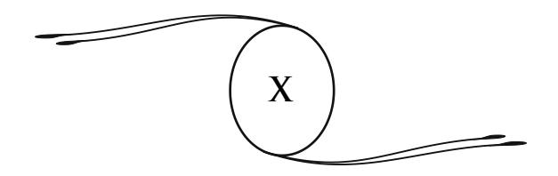

# **A NOVA REVELAÇÃO. A DOUTRINA DOS ESPÍRITOS**

O espiritualismo moderno, temos dito, é uma nova forma da eterna revelação.

Para nós, revelação signifi ca simplesmente a ação de tirar um véu, de descobrir coisas escondidas.

Sob esse ponto de vista, todas as ciências são revelações, mas entre elas uma é maior: a das verdades morais, que nos chega por intermédio de missionários celestes e, mais frequentemente, pelas aspirações da consciência.

Todos os tempos e todos os povos tiveram sua parcela de revelação. Esta não é mais, como alguns acreditam, um fato realizado em uma época, em um meio determinado, e para sempre. Ela é perpétua, incessante; é a obra do espírito humano em seus esforços para se elevar, sob a infl uência do espírito divino, em direção ao conhecimento integral das leis e das coisas. Essa infl uência muitas vezes se produz sem o homem o saber. É por meios humanos que Deus age sobre a Humanidade, assim como no domínio dos fatos históricos, no domínio do pensamento e no da ciência.

À medida que os fatos se desenrolam, à medida que, através dos séculos, se desenvolve a imensa caravana da Humanidade, uma luz mais viva se faz em nós e em torno de nós. A potência invisível que, do meio dos espaços, segue essa marcha, nos concede, segundo nosso grau de evolução e de compreensão, notícias sobre o grande problema do universo e da vida.

As revelações dos séculos passados fi zeram seu trabalho. Todas elas realizaram um progresso, umas sobre as outras, marcando assim as etapas sucessivas da Humanidade; porém elas não mais respondem às necessidades da hora presente, porque a lei do progresso trabalha incessantemente e, à medida que o homem avança e se eleva, seus horizontes devem se ampliar. Eis por que uma distribuição mais completa que as outras hoje se derrama sobre o mundo.

É necessário também lembrar uma coisa: se cada grande época teve seus reveladores, se poderosos espíritos vieram trazer aos homens, de acordo com os tempos e os lugares, elementos de verdade e de progresso, os germes que eles semearam muitas vezes fi caram estéreis. Suas doutrinas, mal compreendidas, deram nascimento a religiões que se excluem e se condenam injustamente, porque todos são irmãos e repousam sobre duas bases comuns: Deus e a imortalidade. Cedo ou tarde elas se lançarão em uma grande unidade, quando as sombras que envolvem o pensamento humano serão dissipadas ao sol da verdade.

Ao lado das mensagens divinas, surgiram muitos falsos profetas. Pretensos reveladores buscaram se impor às multidões; doutrinas confusas e contraditórias se espalharam, em proveito aparente de alguns e, na realidade, em detrimento de outros.

Assim, para se prevenir de tais abusos, a nova revelação revestiu todo um outro caráter. Ela não é mais uma obra individual e não se produz em um meio circunscrito. Ela é dada, sobre todos os pontos do globo, àqueles que a procuram, por intermédio de pessoas de todas as idades, de todas as condições, de todas as nacionalidades, por meio de mensagens inumeráveis cujo valor foi submetido ao controle mais rigoroso. Obra dos grandes espíritos do espaço, que vêm, aos milhares, instruir e moralizar a Humanidade, ela apresenta um caráter impessoal e universal. Sua missão é esclarecer, coordenar todas as revelações do passado, contidas nos livros sacros das diferentes raças humanas e encobertas sob o símbolo da parábola.

A nova revelação, liberta de toda forma material, manifesta-se diretamente à Humanidade, cuja evolução intelectual torna-se sufi ciente para abordar os altos problemas do destino. Preparada pelos trabalhos das ciências naturais, sobre os quais ela se apoia, e pelos conhecimentos que o espírito humano lentamente tem adquirido, ela fecunda esses trabalhos e esses conhecimentos; ela os religa entre si e deles forma um sólido todo.

A revelação cristã havia sucedido à revelação mosaica. A dos espíritos vem completar as duas. O Cristo a anunciou,259 e pode-se acrescentar que ele mesmo preside esse novo impulso do pensamento.

Como esta revelação não ocorreu pelo canal da ortodoxia, vemos as Igrejas estabelecidas desconhecê-la; foi o mesmo com a revelação cristã diante do sacerdócio judeu. O clero cristão achase, hoje em dia, na mesma situação que os sacerdotes de Israel, há dois mil anos, em relação ao Cristianismo. Essa aproximação histórica deve levá-los a refl etir.

A nova revelação se manifesta fora e acima das Igrejas. Seu ensinamento se dirige a todas as raças da Terra. Por toda parte os espíritos proclamam os princípios sobre os quais ele se apoia. Sobre todas as regiões da Terra passa a grande voz que chama o homem para o pensamento de Deus e da vida futura. Acima das agitações estéreis e das inúteis discussões de facções, acima das lutas de interesses e do confl ito das paixões, a voz profunda desce do espaço e vem oferecer a todos, com o ensino da palavra, a divina esperança e a paz do coração.

É a revelação dos tempos preditos. Para ela, todos os ensinamentos do passado, parciais, restritos, limitados em sua

259 "E eu rogarei ao Pai, que vos dará outro consolador, para que ele fi que eternamente convosco; o espírito de Verdade que o mundo não pode receber ainda, porque não o vê nem o conhece." (*João*, 14:16 e 17.) (**N.A.**)

ação, estão superados, encobertos. Ela utiliza os materiais que eles ajuntaram: ela os reúne, os cimenta, para com eles formar um grande edifício em que o pensamento poderá se desdobrar à vontade. Ela abre uma fase nova e decisiva para a ascensão da Humanidade.

> \*\* \*

Entretanto, não se pode deixar de mencionar as numerosas objeções formuladas contra a doutrina dos espíritos. Apesar do caráter imponente da nova revelação, nela muitos viram somente um sistema a mais, uma teoria especulativa. Mesmo entre aqueles que admitem a realidade dos fenômenos, existem aqueles que reprovam os espíritos por haverem edifi cado sobre esses fatos uma doutrina prematura e terem, assim, apequenado o caráter positivo do espiritualismo moderno.

Aqueles que têm essa linguagem não compreenderam a verdadeira natureza do espiritualismo moderno. Ele não é, como pretendem, uma doutrina prematuramente elaborada, ainda menos uma teoria preconcebida; é apenas a consequência lógica dos fatos, sua necessária conclusão.

Há mais de meio século, as comunicações estabelecidas com o mundo invisível não deixaram de nos fornecer indicações, tão numerosas quanto precisas, sobre as condições da vida no Além. Os espíritos, nas mensagens que eles nos dirigem em abundância, seja pela escrita automática, seja pelos ditados tiptológicos,260 ou ainda durante as comunicações no estado de transe, em uma palavra, por todos os meios à sua disposição, os espíritos de todas as ordens dão descrições muito detalhadas do seu modo de existência após a morte. Eles descrevem suas impressões na separação do corpo, as decepções ou as satisfações

260 **Ditado tiptológico:** comunicação feita pelos espíritos através de pancadas, ruídos ou batimentos, com os quais se formava uma linguagem própria; por exemplo, uma batida queria dizer *sim*, duas signifi cava *não*. A *tiptologia* é um fenômeno mediúnico de efeitos físicos e necessita de médiuns específi cos para a sua realização. (**N.T.**)

que tiveram, de acordo com o seu gênero de vida sobre a Terra. De todas essas descrições, comparadas umas às outras, controladas umas pelas outras, resulta um conhecimento muito claro da vida futura e das leis que a regem.

Os espíritos nobres, em suas relações mediúnicas com os homens, vêm completar essas indicações. Eles confi rmam as informações dadas pelos espíritos menos avançados; mais elevados, eles nos expõem suas considerações, suas opiniões sobre todos os grandes problemas da vida e da morte, sobre a evolução geral dos seres, sobre as leis superiores do universo. Todas essas revelações concordam e se unem para formar uma importante fi losofi a.

Pensaram haver certas divergências de opiniões no ensinamento dos espíritos; essas divergências são muito mais aparentes que reais. Elas consistem o mais frequentemente na forma, na expressão das ideias, e não atingem a essência do assunto. Tais divergências desaparecem diante de um judicioso exame. Temos um exemplo disso no que diz respeito à doutrina das reencarnações sucessivas da alma.

Fizeram dessa questão uma arma contra o espiritismo, porque certos espíritos, em país anglo-saxão, pareciam negar a reencarnação das almas sobre a Terra. Temos que observar que, por toda parte, os espíritos afi rmam o princípio das existências sucessivas, com essa única restrição, no meio bastante circunscrito do qual falamos, e que a reencarnação se realizaria, não na Terra, mas em outros mundos. Portanto, existe aí apenas uma diferença de lugar, o princípio permanece intacto.

Se os espíritos, em alguns países povoados por aferrados preconceitos, no início, deixaram fi car sob o silêncio alguns pontos do seu ensinamento, não foi, como eles mesmos reconheceram, para poupar certas vaidades de raça ou de cor? O que provaria isso é que o número dos espiritualistas antirreencarnacionistas, na América como na Inglaterra, vai diminuindo dia a dia, enquanto que os partidários da reencarnação não param de crescer.

Ainda objetam que os espíritos que se manifestam para nós não são todos de uma ordem elevada. Alguns apresentam opiniões muito limitadas, conhecimentos muito imperfeitos sobre todas as coisas. Outros ainda estão imbuídos de preconceitos terrestres; suas concepções trazem o refl exo dos meios em que viveram.

A morte, como o dissemos, não nos muda nada.261 Não há, em nossa caminhada infi nita, nenhuma transformação brusca. Só lentamente, como consequência de numerosas existências, é que o espírito se liberta de suas paixões, de seus erros, de suas fraquezas, e se eleva em direção à sabedoria e à luz.

Desse estado de coisas resulta, necessariamente, uma grande variedade, uma grande diversidade de situações entre os invisíveis. As comunicações dos habitantes do espaço, como os seus autores, são de valor muito desigual e sujeitas à verifi cação. Devem ser passadas pelo crivo da razão e do julgamento.

O espiritualismo moderno também não dogmatiza nem imobiliza. Não tem nenhuma pretensão à infalibilidade. Ainda que superior àqueles que o precederam, o ensinamento espírita é progressivo como os próprios espíritos. Ele se desenvolve e se completa, à medida que, pela experiência, o progresso se realiza nas duas humanidades, a da Terra e a do Espaço, humanidades que se fundem uma na outra, e das quais cada um de nós deve fazer parte alternadamente.

Os princípios do moderno espiritualismo foram apresentados, estabelecidos, fi xados por numerosos documentos, emanando das mais diversas fontes mediúnicas, e de uma perfeita concordância entre eles. Allan Kardec e, depois dele, todos os escritores espíritas, entregavam-se a um longo e minucioso exame das mensagens de além-túmulo. Foi agrupando-as, coordenando-as pelo que elas tinham em comum, que reuniram os elementos de um ensinamento racional, fornecendo uma explicação satisfatória

Ver cap. 9. (**N.A.**)

para os problemas que permaneciam insolúveis antes dele. Aliás, esse ensinamento sempre é verifi cável, porquanto a fonte de onde ele emana não seca nunca. A comunicação estabelecida entre os homens e os espíritos é permanente e universal; ela se afi rmará mais e mais com o progresso da Humanidade.

Se é verdade que os espíritos obscuros e atrasados existem em abundância à nossa volta, é preciso não esquecer que as almas elevadas, provindas das esferas de luz, também vêm trazer à Terra esses sublimes ensinamentos que não mais se esquecem desde que os ouvimos. Às suas infl exões ninguém poder-se-ia se enganar. Todos aqueles que tiveram a dádiva de receber suas instruções, durante muito tempo delas guardam a impressão e a lembrança. É fácil compreender que sua linguagem não é deste mundo, que vem de mais Alto.

A esses espíritos radiosos muitas vezes se juntam as almas dos nossos próximos, daqueles que amamos aqui na Terra e cujo destino não nos pode deixar indiferentes. Desde que a identidade desses seres tão queridos é estabelecida aos nossos olhos, desde que sua personalidade se afi rma de mil maneiras, não cresce em nós um imperioso desejo de conhecer as condições da sua nova vida?

Como fi car surdos, insensíveis à voz daqueles que nos embalaram, nos carregaram em seus braços, daqueles que foram nossa carne e nosso sangue? Essa afeição que nos une aos nossos mortos, esse sentimento que nos eleva acima das poeiras terrestres e nos distingue do animal, não faz para nós um dever recolher devotamente, examinar, propagar tudo o que eles nos revelam dizendo respeito aos graves problemas do destino, suspensos há tantos séculos acima do pensamento humano?

Aqueles que não querem ver no moderno espiritualismo mais que o lado experimental, o fato físico, que menosprezam as suas consequências, não preferem a casca à noz, a encadernação ao conteúdo do livro? Desconhecem o sábio conselho de Rabelais262 que diz: "Quebrar os ossos, e sugar o tutano"? Tutano fortifi cante, efetivamente, é esse ensinamento! Ele nos cura do medo da morte; ele nos arma para lutas fecundas, para a conquista dos altos cumes intelectuais.

O Espiritismo tem todo um lado científi co; está apoiado em provas sensíveis, em fatos inegáveis, mas são principalmente suas consequências morais que interessam a grande maioria dos homens. A experimentação, a análise minuciosa dos fatos, não está ao alcance de todos. Mesmo que não falte tempo, são necessários os agentes, os meios de ação e de controle. Os humildes, os pequenos, aqueles que formam a maioria do povo, não dispõem nunca do que é necessário para o estudo dos fenômenos, e são precisamente aqueles que têm mais necessidade de conhecer todos os seus frutos, todo o seu alcance.

> \*\* \*

A doutrina dos espíritos pode se resumir em três pontos essenciais: a natureza do ser, seus destinos, as leis superiores do Universo. Nós os abordaremos sucessivamente.

O estudo mais necessário para nós é: nós mesmos. O que nos importa saber, antes de tudo, é o que nós somos. Ora, esse problema é, de todos, aquele que permanece mais obscuro até aqui. Hoje, o conhecimento da natureza íntima do homem resulta tanto das comunicações ditadas pelos espíritos, quanto da observação direta dos fenômenos do Espiritismo e do sonambulismo.

O homem tem dois corpos: um de matéria grosseira, que o põe em relação com o mundo físico; o outro, fl uídico, pelo qual entra em relação com o mundo invisível.

262 **Rabelais, François:** escritor francês (La Divinière, perto de Chinon, por volta de 1494 – Paris, 1553). Beneditino, médico, professor de anatomia, depois vigário de Meudon, autor de *Gargântua* e de *Pantagruel*, obras clássicas da literatura francesa. (**N.T.**, segundo o *Dictionnaire Nouveau Petit Larousse Illustré*.)

O corpo físico é perecível e, com a morte, desaparece; é uma vestimenta usada enquanto dura a nossa viagem terrestre. O corpo fl uídico é indestrutível, e mais se purifi ca e aperfeiçoa com os progressos da alma, da qual é o invólucro permanente, inseparável. Nele deve-se ver o corpo verdadeiro, o modelo da criação corporal, o esboço sobre o qual se desenvolve o plano da vida física. É sobre ele que se modelam os órgãos, que se agrupam as células; é ele que lhes assegura o funcionamento. O perispírito ou corpo fl uídico é o agente de todas as manifestações da vida, tanto na Terra, para o homem, quanto no espaço, para o espírito. Ele contém a soma de vitalidade necessária ao ser para renascer e se desenvolver.

Os conhecimentos acumulados no decorrer das nossas vidas anteriores, as lembranças de nossas existências passadas, se capitalizam e se registram no perispírito. Isento das mutações constantes sofridas pelo corpo material, ele é o abrigo imperecível da memória e assegura sua conservação. O plano admirável da vida revela-se na constituição íntima do ser humano. Destinado a habitar alternadamente dois mundos diferentes, seu organismo devia conter todos os elementos suscetíveis de o colocar em relação com esses mundos, e de neles facilitar sua obra de progresso. Não somente nossos sentidos são chamados a se desenvolver, além disso o perispírito encerra os germes de novos sentidos, que eclodirão e manifestar-se-ão no decorrer de nossas existências futuras; eles alargarão mais e mais o campo das nossas sensações.

Nossos modos de percepção estão em relação com nosso grau de adiantamento e em relação direta com o meio que habitamos. Tudo se encaixa e se harmoniza na natureza física como na ordem moral das coisas. Um organismo superior ao nosso não teria tido razão de ser em um mundo onde o homem vem ensaiar seus primeiros passos, percorrer as primeiras etapas da sua rota infi nita. Entretanto, nossos sentidos são suscetíveis de um aperfeiçoamento ilimitado. O homem atual possui todos os elementos da sua grandeza futura; por um progresso crescente ele verá manifestar-se à sua volta, em todas as coisas, propriedades, qualidades que lhe são desconhecidas. Aprenderá a conhecer forças, propriedades das quais nem supõe a existência, porquanto não existem relações possíveis entre elas e o organismo imperfeito do qual dispõe hoje em dia.

O estudo do perispírito nos mostra, desde agora, como o homem pode viver simultaneamente a vida física e a vida livre do espaço. Os fenômenos do sonambulismo, do desdobramento, da visão, da ação à distância, são modos dessa vida exterior da qual não temos nenhuma consciência durante a vigília. O espírito na carne é como um prisioneiro em seu cárcere; o estado de sonambulismo e de mediunidade dela o fazem sair, permitem-lhe estender, mais ou menos, o círculo de suas percepções, mantendo-o sempre ligado por um laço263 ao seu invólucro. A morte é sua completa libertação.

A essas diversas formas de vida correspondem graus diversos de consciência e de conhecimento, tanto mais elevados quanto mais a alma é livre e adiantada na escala das perfeições.

É observando assiduamente esses diferentes aspectos da existência que se chegará ao conhecimento perfeito do ser. O homem deixará de ser, para si mesmo, um intenso mistério; não mais será, como o é ainda hoje, desprovido de noções precisas sobre sua natureza íntima e seu futuro.

A ciência ofi cial tem o dever de estudar as origens profundas da vida; quanto mais ela limitar suas observações ao corpo físico, que da vida é simplesmente a manifestação exterior, superfi cial, a fi siologia e a medicina permanecerão marcados pela impotência e a esterilidade.

Temos visto, por certas experiências de fotografi a e de materialização, como o corpo fl uídico emite vibrações, radiações

263 Espécie de cordão, tênue, prateado, que liga o perispírito desdobrado ao corpo físico, nas pessoas ainda encarnadas. Também chamado *laço fl uídico*, *cordão fl uídico* e *fi o de prata*. (**N.T.**)

que variam de forma e de intensidade, segundo o estado mental do agente. É a demonstração positiva do fato afi rmado pelas mensagens de além-túmulo: o poder de irradiação do espírito, o alcance de suas percepções, são sempre proporcionais ao seu grau de elevação. A pureza, a transparência do invólucro fl uídico são, no Espaço, as testemunhas irrecusáveis do valor da alma; a afi nação de seus elementos constitutivos, a amplidão de suas vibrações aumentam com o seu aperfeiçoamento. À medida que a moralidade se desenvolve, novas condições físicas aparecem no corpo fl uídico.

Os pensamentos, as ações do ser reagem constantemente sobre seu invólucro, e, segundo sua natureza, o tornam mais espesso ou mais sutil. O estudo perseverante, a prática do bem, o cumprimento do dever em todas as condições sociais, são outros tantos fatores que favorecem a ascensão da alma, ampliam o campo de suas sensações e a soma de seus prazeres. Por um treinamento intelectual e moral prolongado, por vidas meritórias, por aspirações generosas e de grandes sacrifícios, a irradiação do espírito se estende gradualmente; suas vibrações perispirituais se ativam; seu brilho torna-se mais vivo, ao mesmo tempo em que a densidade do seu invólucro diminui.

Esses fenômenos se produzem em sentido inverso nos seres inclinados às paixões violentas ou aos prazeres sensuais; seu modo de vida determina, no corpo fl uídico, um aumento de densidade, uma redução das velocidades vibratórias, de onde vêm o obscurecimento dos sentidos e a diminuição das percepções na vida do espaço. Persistindo no mal, o espírito vicioso pode, então, fazer do seu organismo um verdadeiro túmulo no qual ele se encontrará como sepultado após a morte, até uma nova encarnação.

O poder, a felicidade, a irradiação do espírito dependem da depuração do seu invólucro, que é, ele mesmo, a consequência do seu adiantamento moral, por conseguinte se compreenderá como o ser humano é o autor da própria infelicidade ou felicidade, do seu rebaixamento ou da sua elevação. O homem, ele mesmo, por seus atos, cria o seu destino: a distribuição das faculdades e das virtudes é apenas o resultado matemático dos méritos, dos esforços, dos longos trabalhos de cada um de nós.

Dissemos que o homem tem dois corpos, mas esses corpos são apenas invólucros, vestimentas; um sutil e persistente, o outro grosseiro e de curta duração. É a alma do homem que é o seu "eu" pensante e consciente.

Nós chamamos de *espírito* à alma revestida do seu corpo fl uídico. A alma é o centro de vida do perispírito, assim como o perispírito é o centro de vida do organismo físico. É ela que sente, pensa e quer; o corpo físico, junto ao corpo fl uídico, constitui o duplo organismo com a ajuda do qual ela age no mundo da matéria.

A morte é a operação pela qual esses elementos se separam. O corpo físico se desagrega e retorna à terra. A alma, revestida da sua forma fl uídica, encontra-se livre, independente, tal como se ela tivesse formado a si mesma, intelectualmente e moralmente, ao curso das existências percorridas. A morte não muda a alma, ela somente lhe restitui, com a sua liberdade, a plenitude de suas faculdades, de seus conhecimentos, e a lembrança de suas vidas anteriores. Ela lhe abre os campos do espaço. O espírito se arremessa, e se eleva tão mais alto quanto mais sua essência é depurada, menos carregada dos elementos impuros que nela acumulam as paixões terrestres e os hábitos materiais.

Existem pois, para o espírito humano, três estados de vida: a vida na carne, o estado de desligamento ou de desencarnação parcial no sono e a vida livre do espaço. Esses estados correspondem aos meios nos quais a alma deve trabalhar para o seu progresso constante: o mundo material e o mundo fl uídico ou superior. É percorrendo-os através de inumeráveis séculos que ela persegue a realização do belo, do bem, da verdade, nela e em torno dela, e conquista o amor que a aproxima de Deus.

A lei do destino — as considerações anteriores nos fazem compreendê-la — consiste no desenvolvimento progressivo da alma, que edifi ca sua personalidade moral e cria, ela mesma, seu próprio futuro: é a evolução racional de todos os seres, saídos do mesmo ponto para chegar aos mesmos graus elevados, às mesmas perfeições. Essa evolução prossegue alter nadamente no espaço e na superfície dos mundos, através de existências inumeráveis, ligadas entre si pela lei de causa e efeito. A vida presente é, para cada um de nós, a herança do passado e a elaboração do futuro; é uma escola e um campo de trabalho; a vida no espaço, que a sucede, é a sua resultante. O espírito ali recolhe, na luz, o que semeou na sombra e muitas vezes na dor.

\* \*

O espírito se reencontra no Além com suas aquisições intelectuais e morais, suas qualidades e seus defeitos, suas tendências, suas inclinações naturais, suas afeições. O que somos moralmente neste mundo, nós o somos ainda no outro; disso vem a nossa felicidade ou nosso sofrimento. Nossas satisfações são tão mais intensas quanto melhor estivermos preparados para essa vida no Espaço, onde o espírito é tudo e a matéria, pouca coisa; onde não há mais necessidades físicas para satisfazer nem outras alegrias que as da inteligência e do coração.

Para as almas atraídas para a matéria, a vida no Espaço é uma vida de privações e de miséria; é a ausência de tudo o que pode lhe agradar. Os espíritos que souberam se libertar dos hábitos materiais e viver para as altas faculdades da alma ali encontram, ao contrário, um meio de acordo com os seus gostos, um vasto campo aberto à sua atividade. Na realidade, existe ali apenas uma ampla aplicação da lei das atrações e das afi nidades, nada além das consequências naturais dos nossos atos, que recaem sobre nós.

O desenvolvimento gradual do ser abre nele fontes cada vez mais abundantes de impressões e de sensações. A cada conquista sobre o mal, a cada novo progresso, seu círculo de ação se amplia, o horizonte de sua vida se alarga. Após sombrias regiões terrestres onde reinam os vícios, as paixões, os ódios, abrem-se para ele as profundezas estreladas, os mundos de luz com seus encantamentos, seus esplendores, suas inebriantes harmonias. Após as vidas de provações, de lágrimas, de sacrifícios, a vida feliz, a alegria das divinas afeições, as missões abençoadas a serviço do eterno Criador.

Pelo contrário, o mau uso das nossas faculdades, a busca dos prazeres físicos, das satisfações egoístas, restringe nossos horizontes, acumula a sombra em nós e em torno de nós. Nessas condições, a vida no espaço nos oferece apenas trevas, constrangimentos, inquietude, com a visão vaga e confusa das almas felizes, o espetáculo de uma felicidade que nós não soubemos merecer.

A alma, após um tempo de repouso no espaço, renasce na condição humana; ela traz consigo as reservas e as aquisições de suas vidas anteriores. Por aí se explicam as desigualdades intelectuais e morais que diferenciam os habitantes do nosso mundo. A superioridade nativa de certos homens decorre das suas obras passadas. Nós somos espíritos mais jovens ou mais velhos; trabalhamos mais ou menos; adquirimos mais ou menos virtudes e saber. Assim, a variedade infi nita dos caracteres, das aptidões e dos gostos deixa de ser um enigma.

Entretanto, a alma reencarnada não pode sempre utilizar, em sua plenitude, seus poderes e suas faculdades. Ela dispõe aqui na Terra de um organismo muito imperfeito, de um cérebro que não registrou nenhuma lembrança de outros tempos. Neles ela não pode encontrar todos os recursos necessários para a manifestação de suas energias ocultas. No entanto, o passado permanece nela; suas intuições e suas tendências são a revelação sensível desse passado.

As faculdades inatas em certas crianças, os jovens prodígios: artistas, músicos, pintores, sábios, são testemunhos notórios da existência dessa lei. Às vezes, almas geniais e orgulhosas renascem em corpos enfermos, fracos, para se humilharem e adquirirem as virtudes que lhes faltam: paciência, submissão, resignação.

Todas as existências penosas, as vidas de luta e de sofrimento se explicam pelas mesmas razões. São formas transitórias, mas necessárias, da vida imortal; cada alma, a seu turno, as conhece. A prova e o sofrimento são meios de reparação, de educação, de elevação; é por eles que o ser resgata um passado culpado e recupera o tempo perdido. Por eles se fortifi cam os caracteres, adquire-se a experiência, o homem se prepara para novas ascensões. A alma que sofre procura Deus, refl ete ao lhe suplicar, e, por isso mesmo, se aproxima dele.

Voltando a este mundo, cada ser humano perde a lembrança do seu passado; este, registrado no perispírito, desaparece momentaneamente sob o envoltório carnal. É uma necessidade física; é também uma das condições morais da provação terrestre que o espírito vem novamente encarar; de volta ao estado livre, liberto da matéria, ele reencontra a lembrança das numerosas etapas percorridas.

Esse esquecimento temporário de nossas existências anteriores, essas alternâncias de luz e de obscuridade que se produzem em nós, por mais estranhas que pareçam à primeira vista, explicam-se facilmente. Se a memória atual não nos permite lembrar nossos primeiros anos, não é de espantar que tenhamos esquecido de vidas separadas entre si por uma longa estada no espaço. Os estados de vigília e de sono, pelos quais passamos todos os dias, assim como as experiências de sonambulismo e de hipnotismo, nos provam que se pode esquecer momentaneamente nossa existência normal sem por isso perder a personalidade. Portanto, ausências da mesma natureza ligadas às nossas existências passadas não têm nada de inverossímil. Nossa memória desaparece e se recupera através do encadeamento de nossas vidas, como durante a sucessão dos dias e das noites que compõem a existência atual.

Sob o ponto de vista moral, a lembrança de nossas vidas precedentes causaria, aqui na Terra, profundas perturbações. Todos os criminosos que renascem para se remirem seriam reconhecidos, rejeitados, desprezados; eles mesmos seriam amedrontados e como hipnotizados por suas próprias lembranças. A reparação do passado tornar-se-ia impossível e a existência, insuportável. Aconteceria o mesmo, em diversos graus, a todos aqueles cujo passado está desonrado. As lembranças anteriores introduziriam na vida social motivos de ódio, elementos de discórdia, que agravariam a situação da Humanidade e tornariam toda reparação irrealizável. O pesado fardo de erros e de faltas, a visão dos atos vergonhosos inscritos nas páginas da sua história, abateriam a alma e paralisariam sua iniciativa. Naqueles que a cercam ela poderia reconhecer inimigos, perseguidores, rivais; nela sentiria despertar e se infl amar as más paixões que sua nova existência tem por objetivo destruir ou pelo menos diminuir.

O conhecimento das existências passadas perpetuaria em nós não somente a sucessão dos fatos que as compõem, mas ainda os hábitos rotineiros, as considerações mesquinhas, as manias pueris, obstinadas, que pertencem às diversas épocas e que opõem um grande obstáculo ao progresso da Humanidade. Deles ainda se encontram os traços em muitos encarnados. Que aconteceria sem o esquecimento que nos liberta momentaneamente desses entraves e permite, com uma nova educação, nos reformarmos, nos prepararmos para tarefas mais elevadas?

Quando se considera ponderadamente todas as coisas, reconhece-se que o esquecimento temporário do passado é indispensável ao trabalho de reparação, e que a Providência, privando-nos neste mundo de longínquas lembranças, tudo dispôs com profunda sabedoria.

As almas se atraem em razão das suas afi nidades; elas formam grupos ou famílias cujos membros se seguem e ajudam mutuamente no decorrer das suas encarnações sucessivas. Laços poderosos as unem; numerosas vidas, percorridas em comum, lhes acarretam essas analogias de opiniões e de caráter que se encontram em tantas famílias. Existem exceções. Certos espíritos às vezes mudam de meio para progredir mais rapidamente. Neste, como em todos os atos importantes da vida, há uma parte reservada à livre vontade do ser, que pode, em uma certa medida, e segundo seu grau de elevação, escolher a condição em que renascerá; há também a parte do destino ou da Lei Divina que, do alto, fi xa a ordem dos renascimentos.

> \*\* \*

A pluralidade das existências da alma e sua ascensão na escala dos mundos constituem o ponto essencial dos ensinamentos do moderno espiritualismo. Nós vivemos antes do nascimento e viveremos após a morte. Nossas vidas são as etapas sucessivas da grande viagem que realizamos em nossa caminhada para o bem, para a verdade, para a eterna beleza.

Pela doutrina das preexistências e das reencarnações, tudo se liga, se compreende; a justiça divina aparece; a harmonia se faz no Universo e no destino.

A alma não é mais formada inteiramente por um Deus caprichoso, que distribui, ao acaso da sua vontade arbitrária, o vício ou a virtude, o gênio ou a imbecilidade; criado simples e ignorante, ela se eleva por suas próprias obras, enriquece a si mesma colhendo no presente os frutos de suas vidas anteriores, e semeia para suas vidas futuras.

A alma, portanto, constrói seu próprio destino; de grau em grau ela sobe do estado inferior e rudimentar até a mais alta personalidade, da inconsciência do selvagem até a superioridade desses seres sublimes que iluminam o caminho da história e passam sobre a Terra como um raio divino.

Assim considerada, a reencarnação torna-se uma verdade consoladora e fortifi cante, um símbolo de paz entre os homens; ela mostra a todos o caminho do progresso, a grande equidade de um Deus que não pune eternamente, mas permite ao culpado resgatar-se pela dor. Ainda que infl exível, essa lei sabe proporcionar a reparação da falta e, após o resgate, ela nos mostra a reabilitação. Ela estreita a fraternidade humana, ensinando àqueles que poderiam fi car chocados pelas desigualdades sociais e as diferenças de condições que, na realidade, todos os homens têm a mesma origem e o mesmo futuro. Não há nem deserdados nem favorecidos porquanto o resultado fi nal será o mesmo para todos, se todos souberem conquistá-lo.

A lei da reencarnação põe um freio nas paixões, mostrando-nos as consequências dos nossos atos, das nossas palavras, dos nossos pensamentos, refl etindo-se sobre nossa vida presente e sobre nossas vidas futuras, nelas semeando germes de infortúnio ou de felicidade. Por essa lei, cada um aprende a vigiar a si mesmo, a prestar atenção, a preparar cuidadosamente o seu futuro.

O homem que compreendeu toda a grandeza dessa doutrina não poderá mais acusar Deus de injustiça e de parcialidade. Ele saberá que cada um está em seu lugar neste mundo, que toda alma está sujeita às provas que ela mereceu ou desejou. Ele agradecerá ao Eterno por lhe dar, pelos renascimentos, o meio de reparar suas faltas e de adquirir, por um trabalho constante, uma parcela do seu poder, um refl exo da sua sabedoria, uma centelha do seu amor.

Tal é o destino da alma humana, nascida na fraqueza, na penúria das faculdades e dos meios de ação, mas chamada, em se erguendo, a realizar a vida em sua plenitude, a conquistar todas as riquezas da inteligência, todas as delicadezas do sentimento, a tornar-se um dia colaboradora de Deus.

É esse o papel do ser e seu fi m grandioso; colaborador de Deus, isto é, destinado a realizar em torno de si, por missões mais e mais importantes, a ordem, a justiça, a harmonia; a atrair para junto dele seus irmãos inferiores, a levá-los consigo em direção aos cumes divinos, a subir com eles, de círculo em círculo, em direção ao objetivo supremo, para Deus, para o Ser Perfeito, lei viva e consciente do Universo, foco eterno de amor e de vida.

Essa participação na obra infi nita é inicialmente bem inconsciente; o ser colabora sem o saber, e muitas vezes sem o querer, para a ordem universal. Depois, à medida que percorre seu caminho, essa colaboração torna-se mais e mais consciente. Pouco a pouco sua razão se esclarece, a alma percebe a harmonia profunda das coisas, compreende suas leis e, por seus atos, a ela se associa estreitamente. As suas faculdades se desenvolvem mais, crescem as suas qualidades afetivas, e a sua participação na divina sinfonia dos seres e dos mundos mais se afi rma e acentua.

Essa ascensão da alma, ela mesma edifi cando seu futuro e conquistando seus graus, esse espetáculo da vida individual e coletiva que se desenrola de etapas em etapas na superfície das terras264 do Espaço, progredindo e se aperfeiçoando sempre para se elevar em direção a Deus, nos fazem compreender melhor a utilidade da luta, a necessidade da dor para a educação e a depuração dos seres.

Todas as almas que vivem nas regiões materiais estão mergulhadas em uma espécie de letargia. Sua inteligência dormita enfraquecida, ou melhor, indiferente; ela fl utua em todos os ventos da paixão. Muito pouco elas entreveem o objetivo. É necessário, portanto, que essas almas despertem para a verdade, que essas inteligências se abram às sensações do bem e do belo. Todas devem atingir as mesmas alturas, despontar e desabrochar sob os raios do sol divino. Ora, o que seria uma existência única, isolada,

264 No original francês *terre*: terra, solo, chão, Terra (planeta), etc. (**N.T.**)

para a realização de semelhante trabalho? Daí a necessidade de numerosas etapas, de vidas de difi culdades e de provas, a fi m de que essas almas se purifi quem e que os poderes nelas adormecidos despertem, entrem em ação.

É pelo aguilhão das lutas e das necessidades, pela alegria e pela dor, pelas inquietações, os desgostos, os remorsos com que a vida humana é tecida, é através das quedas e dos reerguimentos, dos recuos e ascensões, o bater de asas pelo azul dos céus e as descidas bruscas no abismo, é por todas essas alternativas que a alma se desenvolve, que as humanidades saem da sua ganga de bestialidade e de ignorância. Pelo sofrimento as almas se depuram, se enobrecem, se elevam à alta concepção das leis e das coisas, se abrem à piedade, à bondade.

Assim se resolve o problema do mal. O mal é apenas um efeito de contraste; ele não tem existência própria. O mal é para o bem o que a sombra é para a luz. Só apreciamos a luz após sermos privados dela; da mesma forma, sem a afl ição não poderíamos conhecer a alegria; sem a privação não poderíamos verdadeiramente apreciar o bem adquirido, as satisfações obtidas.

Tudo se explica e se esclarece na obra divina quando a consideramos *do alto*. A lei do progresso rege a vida infi nita e faz o esplendor do Universo. As lutas do espírito contra a matéria, sua ascensão pela dor, tal é a epopeia grandiosa que os céus contam para a Terra, e que a voz dos invisíveis repete a todos aqueles que têm sede da verdade. É o ensinamento que é preciso divulgar, a fi m de mostrar a todos o encadeamento dos efeitos e das causas e, com ele, a solidariedade dos seres e o amor divino que envolve toda a criação.

Considerado assim, o problema do destino é apenas a aplicação lógica e a consagração dessa lei de evolução da qual tantos pensadores, em nossa época, tiveram, segundo o seu estado de espírito, a intuição confusa ou a clara visão. É a lei superior que rege todas as coisas.

O plano geral do Universo patenteou-se no que foi exposto. Vamos apenas precisar seus pontos essenciais.

\* \*

O ensinamento dos espíritos nos mostra por toda parte a unidade de lei e de substância. Por essa unidade, a ordem e a harmonia reinam na obra eterna.

O mundo invisível distingue-se do mundo visível somente em relação aos nossos sentidos. O invisível é a continuação, o prolongamento natural do visível. Em sua unidade, eles formam um todo inseparável; mas é no invisível que é preciso procurar o mundo das causas, o foco de todas as atividades, de todas as forças sutis do Cosmos.

A força ou energia, diz-nos a ciência, move a matéria e dirige os astros em seu curso. O que é a força? De acordo com a nova revelação, ela não é mais que o agente, o modo de ação de uma vontade superior. É o pensamento de Deus, que dá o movimento e a vida ao Universo! Todos aqueles que mergulharam seus lábios na fonte do espiritualismo moderno sabem que os grandes espíritos do espaço são unânimes em reconhecer, em proclamar a Inteligência Suprema que governa os mundos. Eles acrescentam que essa Inteligência se revela mais brilhante à medida que se galgam os degraus da vida espiritual. Se eles emitem concepções diferentes, mais ou menos extensas sobre o Ser Divino, é porque os espíritos, como os homens, são desigualmente desenvolvidos e não podem todos ver da mesma maneira.

Todos os escritores e fi lósofos espíritas, desde Allan Kardec até nossos dias, afi rmam a existência de uma causa imanente no Universo.

"Não há efeito sem causa" — disse Kardec — "e todo efeito inteligente tem, forçosamente, uma causa inteligente".

É o axioma sobre o qual o Espiritismo repousa inteiramente. Aplicado às manifestações de além-túmulo ele demonstra a existência dos espíritos. Da mesma forma, se nós o aplicarmos no estudo do mundo e das leis universais, ele demonstrará a necessidade de uma causa inteligente. Eis por que a existência de Deus constitui um dos pontos essenciais do ensinamento espírita. Basta constatar que existe inteligência e consciência nos seres criados, para reencontrá-los na fonte criadora, nessa unidade suprema que não é a causa primeira, como o dizem uns, nem uma causa fi nal, como outros pensam, mas a causa eternamente atuante de onde emana toda vida.

A solidariedade que liga todos os seres não tem outro centro que essa unidade universal e divina; todas as relações nela vêm confi nar para ali se fundirem e se harmonizarem. Somente por ela podemos conhecer o objetivo da vida e suas leis; porquanto ela é a razão de ser e a lei viva do universo. Ela é, ao mesmo tempo, a base e a sanção de toda moral. Desde que se estuda o problema do Além, a situação do espírito após a morte, encontramo-nos em presença de um estado de coisas regulado por uma lei de justiça, que se cumpre por si mesma, sem tribunal e sem julgamento, mas da qual não escapa nenhum dos nossos pensamentos, nenhum dos nossos atos. E essa lei, que revela uma inteligência diretora do mundo moral, é, ao mesmo tempo, a fonte de toda vida, de toda luz, de toda perfeição.

A ideia de lei é inseparável da ideia de inteligência. Sem essa noção, as leis universais seriam desprovidas de ponto de apoio. Muitas vezes nos falam das leis cegas da natureza. Que signifi ca essa expressão? Leis cegas não poderiam agir senão ao acaso. O acaso é a ausência de plano, de direção inteligente; é a própria negação de toda lei. O acaso é incapaz de realizar a unidade e a harmonia; ele produz somente a incoerência e a confusão. Assim, uma lei não pode ser mais que a manifestação de uma inteligência soberana, a obra de um pensamento superior.

Só o pensamento é que pôde dispor, combinar todas as coisas no Universo. E o pensamento exige a existência de um ser que é o seu gerador.

As leis universais não poderiam repousar sobre uma coisa tão móvel e inconstante como o acaso. Elas devem, necessariamente, se apoiar sobre um princípio imutável, ordenador e regulador. Privadas da cooperação de uma vontade diretora, essas leis seriam cegas, no sentido dos materialistas; elas iriam à deriva, não seriam mais leis.

Tudo, as forças e os seres, os mundos e as humanidades, tudo é governado pela inteligência. A ordem é a majestade do Universo; a justiça, o amor, a liberdade, tudo repousa sobre leis eternas, e não há leis eternas sem uma razão superior, fonte de tudo. Eis por que nenhum ser, nenhuma sociedade pode se desenvolver e progredir sem a ideia de Deus, isto é, sem justiça nem amor, sem liberdade nem razão, porque Deus, representando a eternidade e a perfeição, é a base essencial de tudo o que faz a beleza, a grandeza da vida, a magnifi cência do Universo. Muitos equívocos dividiram o mundo sobre essas questões; o espiritualismo moderno vem dissipá-los. Até aqui, os materialistas procuravam o segredo da vida onde ele não está: nos efeitos; os cristãos, por seu lado, o procuravam fora da natureza. Compreendemos hoje em dia que a causa eterna do mundo não é exterior ao mundo; ela lhe é interior; ela é a sua alma, o foco, como nossa alma é o foco da vida em nós.

A ignorância dessas coisas é a principal causa dos nossos erros; ela impele o homem e a sociedade a atos dos quais as consequências acumuladas os esmagam.

Durante muito tempo, considerou-se a obra divina e as leis superiores sob o estreito ponto de vista da vida presente e do quadro restrito da Terra, sem compreender que é no encadeamento de nossas vidas sucessivas e na coletividade dos mundos que se revelam a universal harmonia, a absoluta justiça e a grande lei de evolução dos seres para Deus, o bem perfeito.

A obra divina não poderia ser mensurada nem no tempo, nem na extensão. Ela se expande nos céus em feixes de sóis, e se manifesta na Terra tanto na humilde fl orzinha quanto nas gigantescas fl orestas. Deus é infi nito; a criação é eterna. Não se pode fi gurar a criação saída do nada, porque o nada não existe! Deus nada pôde tirar de um impossível nada, nem criar nada fora da sua infi nidade. A criação é incessante; o Universo, imutável no seu todo, está em via de transformação constante em suas partes.

Com todos os seus mundos visíveis e invisíveis, seus espaços celestes, suas populações planetárias e siderais, o Universo nos representa um imenso atelier, onde tudo o que se move e respira trabalha para a produção, a conservação e o desenvolvimento da vida. Cada globo girando no infi nito é a morada de uma sociedade humana. A Terra é apenas um dos mais insignifi cantes planetas da grande hierarquia dos mundos; a sociedade terrestre, uma das mais inferiores. Porém ela mesma se aperfeiçoará, e nossa esfera tornar-se-á uma feliz morada. As mais nobres aspirações guiarão a Humanidade nos caminhos da renovação gradual e do progresso moral.

Tudo se transforma e se renova pelo ritmo incessante da vida e da morte. Enquanto astros se extinguem, outros se alumiam no meio dos espaços. É o que faz o poeta dizer que "há berços e túmulos no céu". Como o homem, os mundos nascem, vivem e morrem; os universos se dissolvem, todas as formas passam e se dissipam, mas a vida infi nita subsiste em seu eterno esplendor.

Do mesmo modo, a corrente de nossas existências estende, na sequência dos séculos, seus elos embaciados ou brilhantes. Seguem-se os acontecimentos, sem ligação aparente, no entanto a infalível justiça fi xa seus cursos de acordo com regras imutáveis. Tudo se liga, no domínio moral como na ordem material.

Um plano admirável se realiza: só Deus conhece a sua totalidade. Dele vemos apenas algumas linhas, e essa visão é um deslumbramento. A compreensão das coisas divinas aumenta com o nosso progresso, à medida que nossas faculdades e nossos sentidos, em se desenvolvendo, nos abrirem novas perspectivas sobre os mundos superiores.

Comparai as concepções do passado: a Terra, centro do Universo, único planeta habitado; a única e curta vida do homem, perdida no infi nito dos tempos e depois da qual ele é julgado, e sua sorte fi xada para a eternidade; comparai-as a esta revelação dos espaços, a este Universo sem limites, povoado de sóis, com seus cortejos de mundos secundários, as cidades, os povos, as humanidades inumeráveis que os cobrem, com as variadas civilizações e as obras maravilhosas que o espírito neles concebe. Pensai nesse futuro da alma, destinada a renascer de vidas em vidas sobre esses mundos, a alcançá-los um a um, como os degraus de uma colossal ascensão, participando de estados sociais de tal forma superiores aos nossos que nada, em nossas fracas concepções terrestres, pode nos dar uma ideia sobre eles. E a alma, em suas peregrinações infi nitas, sempre adquire novas qualidades, crescentes poderes, que a tornam apta a desempenhar um papel cada vez mais elevado.

Assim, nem eleitos nem condenados. A Humanidade não se divide em duas partes: os que estão salvos e os que estão perdidos. O caminho da salvação pelo progresso está aberto a todos. Todos o percorrem de etapas em etapas, de vidas em vidas; todos se elevam em direção à paz e à felicidade, pelo trabalho e pela provação. Todas as almas são suscetíveis de aperfeiçoamento e de educação; elas devem percorrer os mesmos caminhos e elevar-se da vida inferior à plenitude da erudição, da sabedoria e da virtude. Elas não são adiantadas igualmente, mas todas subirão, cedo ou tarde, as árduas ladeiras que conduzem aos cumes radiosos banhados pela eterna luz.

O pensamento divino preside essa ordem majestosa; ele vigia o cumprimento de suas leis, a evolução da vida renascente. Acima de tudo, reina a potência infi nita que anima o Universo com a sua inspiração e o aquece com o seu amor.

> \*\* \*

Muitos homens fecham sua alma à concepção de Deus; eles se recusam a ver, a admitir o eterno poder que se irradia através da natureza inteira. Outros, muitas vezes, nos objetam que existem lacunas, tentativas, erros mesmo na obra universal. Estamos dispostos a crer que isso é sobretudo uma consequência da nossa incompreensão ou nossa ignorância, e que esses erros aparentes desaparecem diante de um conhecimento mais aprofundado das coisas.

O Sol brilha sobre as águas; seus raios oscilantes acariciam a onda adormecida. Do céu, ele vem iluminar o mar aquietado; acende milhões de faíscas na crista das ondas. Todo ser que se move no seio das águas pode percebê-lo. Basta-lhe que se esforce para deixar as profundezas e se banhar em seus raios. Se ele recusa deixar sua sombria morada, se ele se compraz em suas terras, o raio, por causa disso, deixará de existir?

Também é assim com o grande foco divino. Sem o pensamento de Deus que ilumina as profundezas do Cosmos, sem essa luz imperecível, tudo fi caria mergulhado na sombra. Mas esse pensamento só aparece em todo o seu esplendor aos seres que se tornaram dignos de compreendê-lo, àqueles cujo senso íntimo se abriu à grande voz do infi nito, a esse sopro que passa sobre os mundos, fecunda as almas e os universos.

Deus, em sua pura essência, nos dizem os espíritos, é como um oceano de luz. Deus não tem forma, mas pode revestir uma para aparecer a seus eleitos. É a recompensa concedida às grandes abnegações, às existências de sacrifício e de renúncia. Existe aí uma espécie de materialização, bem diferente de tudo o que podemos supor. Mesmo sob esse aspecto sensível, é tão grande a majestade de Deus que os mais puros espíritos podem apenas aguentar o seu brilho: eles têm o privilégio de contemplar a Divindade sem véu, e declaram que a linguagem humana é muito pobre para permitir fazer uma descrição, por mais fraca que seja, do foco divino.

Deus tudo vê, tudo conhece, até os mais secretos pensamentos. Como o espírito está por toda parte no corpo, Deus está por toda parte no Universo em relação com todos os elementos da criação. Seu amor envolve e liga todos os seres, dos quais ele tem feito, chamando-os para a vida, os artesãos de sua eterna obra. Sua solicitude se estende até aos mais humildes e aos mais obscuros, porque todos são saídos dele. Assim todos, na falta de uma alta inteligência e de um bom senso exercido, podem conhecer e sentir Deus pelos poderes do coração.

O que principalmente caracteriza a alma humana, é o sentimento. Por ele o homem se liga ao que é bom, belo e elevado, ao que se tornará seu sustentáculo na dúvida, sua força na luta, sua consolação nas provações. E tudo isso revela Deus. O belo e o bem encontram-se em nós apenas em estado parcial e limitado; eles só podem existir com a condição de reconhecer sua fonte, seu princípio, sua plenitude em um Ser que os possui no estado superior, no estado infi nito. É o que sentiram instintivamente todas as gerações, todas as multidões que repousam sob a poeira dos tempos. Os impulsos de seus pensamentos elevaram-se, em todas as épocas, em direção a esse espírito Divino que plana acima de todas as religiões e de todos os sistemas, para essa Alma do Mundo, venerada sob tantos nomes diferentes, Causa Única, de onde tudo emana, para onde tudo retorna, eternamente.

Deus é a grande Alma Universal, da qual toda alma humana é uma irradiação, uma centelha. Cada um de nós possui, em estado latente, forças emanadas do foco divino, e pode desenvolvê-las unindo-se estreitamente à causa da qual é o efeito. Pela elevação dos nossos pensamentos em direção a Deus, pela prece brotando das profundezas do ser e religando a criatura ao Criador, produz-se uma penetração contínua, uma fecundação moral, um desabrochar das riquezas ocultas em nós. Mas a alma humana ignora a si mesma; por falta de conhecimento e de vontade, ela deixa seus poderes interiores adormecidos. Em lugar de comandar a matéria, ela, muitas vezes, sofre a sua dominação; aí está a fonte de seus males, de suas provações, de suas fraquezas.

Eis por que o moderno espiritualismo vem dizer a todos: "Homens, elevai-vos pelo pensamento acima das coisas terrestres; elevai-vos bastante alto para compreender que vós sois os fi lhos de Deus, bastante alto para sentir que estais ligados a ele, à sua obra imensa, destinados a um objetivo perto do qual todos os outros são secundários; e esse objetivo é a entrada na grande comunhão, na santa harmonia dos seres e dos mundos, que se realiza apenas em Deus e por Deus!"

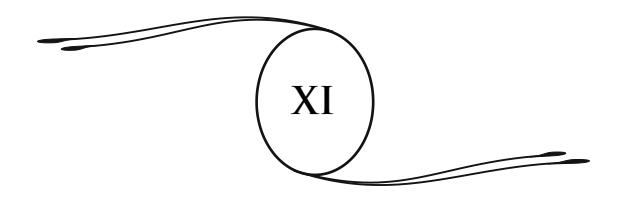

# **RENOVAÇÃO**

Como acreditamos haver demonstrado nas páginas precedentes, o moderno espiritualismo está estabelecido sobre testemunhos universais. Ele se apoia em casos de experiências, observados sobre todos os pontos do globo, por homens de todas as condições, entre os quais sábios pertencentes a todas as grandes universidades e a inúmeras célebres academias. É graças a eles, graças aos seus esforços, que a ciência contemporânea, apesar das suas hesitações e das suas repugnâncias, foi levada pouco a pouco a se interessar pelo estudo do mundo invisível.

De ano a ano, o número de experimentadores aumentou. Investigações sucederam a investigações e sempre os resultados demonstraram a exatidão das afi rmações anteriores. Dessas observações, multiplicadas ao infi nito, surgiu uma certeza: a da sobrevivência do ser humano e, com ela, noções mais precisas sobre as condições da vida futura.

Pelo estudo atento dos fenômenos, pela comunicação permanente estabelecida com o Além, o Espiritismo veio confi rmar as grandes tradições do passado, os ensinamentos de todas as religiões, de todas as fi losofi as elevadas que dizem respeito à imortalidade do ser e à existência de uma causa ordenadora do Universo. Ele lhes deu uma ratifi cação defi nitiva. O que, até agora, não era mais que hipótese e especulação do pensamento, tornou-se um fato reconhecido sem contestação. A vida futura se mostra em sua realidade surpreendente; a morte perdeu seu aspecto assustador; o céu se aproximou da Terra.

O espiritualismo fez mais. Desse conjunto de estudos e constatações, dessa investigação que prossegue há um meio século, de todas as revelações que daí decorrem ele constituiu um novo ensinamento, liberto de toda forma obscura ou simbólica, facilmente acessível, mesmo aos mais humildes, e que abre aos eruditos e aos pensadores vastas perspectivas sobre os altos graus do conhecimento, sobre a concepção de um ideal superior.

Esse ensinamento pode dar satisfação a todos, aos espíritos mais refi nados como aos mais modestos, mas ele se dirige principalmente àqueles que sofrem, àqueles que vergam sob uma árdua tarefa ou penosas provações, a todos aqueles que têm necessidade de uma fé vigorosa que os sustente na sua marcha, nos seus trabalhos, nas suas dores. Ele se dirige à multidão dos humanos, a essa massa que se tornou incrédula e desconfi ada em relação a todo dogma, a toda crença religiosa, porque ela reconhece que foi iludida durante séculos. No entanto, nela sempre subsistem aspirações confusas para o bem, uma necessidade inata de progresso, de liberdade e de luz que facilitará a eclosão do novo pensamento e sua ação regeneradora.

O espiritualismo experimental responde a essas necessidades inatas da alma humana, que nenhuma outra doutrina havia podido satisfazer inteiramente. Pela lei das existências sucessivas, ele nos mostra a justiça regulando o destino de todos os seres. Com ela, não mais graças particulares nem privilégios, não mais redenção pelo sangue de um justo, nem deserdados nem favorecidos. Todos os espíritos que povoam a imensidão, disseminados no Espaço ou nos mundos materiais, são fi lhos de suas obras; todas as almas que animam corpos de carne ou esperam novas encarnações são da mesma origem e chamadas ao mesmo futuro. Somente os méritos, as virtudes adquiridas, os distinguem, mas todos podem se elevar por seus esforços e percorrer o caminho do aperfeiçoamento infi nitos. Os espíritos em marcha para um objetivo comum formam uma mesma família, subdividida em numerosos agrupamentos simpáticos, em associações espirituais, das quais a família humana é apenas um refl exo, uma redução, em que todos os membros se seguem e se ajudam mutuamente através das suas múltiplas existências, vivendo alternadamente da vida terrestre ou da vida livre dos espaços e que, cedo ou tarde, voltam a se reunir.

A morte perde assim o caráter lúgubre, terrifi cante que se lhe atribui até agora. Ela não é mais o "maior dos terrores", mas antes um renascimento, uma das condições do crescimento, do desenvolvimento da vida. Todas as nossas existências se ligam e formam um conjunto. A morte não é mais que a passagem de uma a outra; para o prudente, para o homem de bem, é a porta de ouro que se abre sobre horizontes mais belos.

Quando os preconceitos que frequentam nossos cérebros se dissiparem, o homem compreenderá a beleza serena e a majestade da morte. É um erro crer que ela nos afaste daqueles que nos são queridos. Graças ao Espiritismo, temos o consolo de saber que os seres amados que nos antecederam no Além velam por nós e nos guiam na obscura estrada da existência. Frequentemente estão ao nosso lado, invisíveis, prontos a nos ajudarem na angústia, a nos socorrerem na desgraça. Essa certeza nos dá a calma de espírito, a força moral na prova. Suas comunicações, suas mensagens, amenizam para nós as amarguras do presente, as tristezas de uma separação que é apenas aparente. Os ensinamentos dos espíritos desenvolvem nossos conhecimentos e nossos sentimentos elevados. Eles tendem a nos tornar melhores, mais confi antes no futuro e na bondade de Deus.

Assim se realiza e se revela aos nossos olhos a lei de fraternidade e de solidariedade que liga todos os seres, e da qual a Humanidade sempre teve a intuição. Não mais salvação pessoal, julgamento inexorável, que fi xa para sempre a alma longe daqueles que lhe são queridos, mas a reparação sempre possível, com a assistência dos nossos irmãos do Espaço, a união dos seres na sua ascensão coletiva e eterna.

Os recursos que essa revelação vem oferecer nos garantem contra as fraquezas, as tentações, os maus pensamentos que poderiam nos assaltar, e dos quais nos guardaremos com muito cuidado porquanto eles seriam um motivo de afl ição para os membros da nossa família espiritual, para os nossos amigos invisíveis.

Com o materialismo, a fraternidade não era mais que uma palavra, o altruísmo uma teoria sem raízes e sem alcance. Privado de fé no futuro, o homem concentrava forçosamente toda a sua atenção no presente e nos prazeres que ele pode conter. Apesar de todas as solicitações dos teóricos e dos sofi stas, ele se sentia pouco disposto a sacrifi car sua personalidade, seus interesses ou seus gostos, para o proveito de uma coletividade passageira, a qual o ligam laços formados ontem e que amanhã se desfarão. Se a morte é o fi m de tudo, pensava ele, por que se impor privações que nada conseguirá compensar? Para que a virtude e o sacrifício, se tudo deve acabar no nada?

O resultado inevitável de tais doutrinas era o desenvolvimento do egoísmo, a procura ardente de riquezas, a preocupação exclusiva com prazeres materiais; era o desencadear das paixões, dos apetites furiosos, das ardorosas ambições. E daí, segundo o grau de educação, os ambiciosos ou os malfeitores. Sob a ação dessas inspirações destruidoras, a sociedade balança em suas bases e, com ela, as noções de moralidade, de fraternidade, que o novo espiritualismo veio, no momento próprio, restaurar e consolidar.

Disse Platão: "A crença na imortalidade é o vínculo de toda sociedade; quebrai esse vínculo, e a sociedade dissolver-se-á".

Nossa época, levada à dúvida e à negação por exageros teológicos, perdeu de vista essa ideia salutar. O espiritualismo experimental o faz recobrar a fé desaparecida, apoiando-a em bases novas e indestrutíveis.

A superioridade moral da doutrina dos espíritos se afi rma sob todos os pontos. Com ela desaparece a ideia injusta do pecado de um só homem recaindo sobre todos. Não mais existe decaída, queda coletiva; as responsabilidades são pessoais. Qualquer que seja a sua condição neste mundo, que tenha nascido na miséria e no sofrimento, ou desprovido de vantagens físicas e de brilhantes faculdades, o homem sabe que não sofreu um destino imerecido, mas simplesmente as consequências de seus procedimentos anteriores. Por vezes, também, os males que ele sofre são o resultado de sua livre escolha, quando ele os aceita como um meio mais rápido de adiantamento.265

Por consequência, a sabedoria consiste em aceitar nossa sorte sem murmúrios, em cumprir fi elmente nossa tarefa, em nos prepararmos assim para situações que irão melhorando à medida que, por nosso progresso, conseguirmos acesso a mundos melhores, libertos das submissões que pesam sobre as sociedades terrestres.

Pela doutrina dos espíritos, o homem compreende, enfi m, o objetivo da existência e nela vê um meio de educação e de reparação. Ele para de maldizer o destino e de acusar Deus; ele se acha livre, ao mesmo tempo, dos pesadelos do nada e do inferno, assim como das ilusões de um paraíso ocioso. A vida futura, para ele, não é mais uma beata e inútil contemplação, a eterna imobilidade dos eleitos ou o suplício sem-fi m dos condenados. É a evolução gradual, é, após o círculo das provas e das transmigrações, o círculo da felicidade; é sempre a vida ativa, a conquista pelo trabalho de uma soma crescente de ciência, de poder e de virtude, é uma participação progressiva na obra divina, sob a forma de missões variadas, missões de abnegação e de ensino, a serviço das humanidades.

> \*\* \*

265 Ver *O Problema do Ser e do Destino*. (**N.A.**)

Todo mundo hoje em dia reconhece a necessidade de uma educação moral, suscetível de regenerar a sociedade e de arrancar a França de um estado de decadência que, em se acentuando, ameaçaria chegar à queda e à ruína.

Acreditou-se durante muito tempo ter-se feito bastante propagando a instrução; mas a instrução sem o ensino moral é insufi ciente e infrutífera. Antes de tudo, é preciso fazer do menino um homem, um homem compreendendo seus deveres como ele compreende seus direitos. Não basta desenvolver as inteligências, é preciso formar os caracteres, fortifi car as almas e as consciências. Os conhecimentos devem ser completados por luzes que esclareçam o futuro e designem o destino do ser. Para renovar uma sociedade, são necessários homens novos e melhores. Sem isso, todas as reformas econômicas, todas as combinações políticas, todos os progressos intelectuais serão insufi cientes. A ordem social nunca saberá o que nós mesmos valemos.

Mas esta educação necessária, sobre que se apoiará? Não é sobre teorias negativas; elas causaram em parte os males do presente. Não será mais sobre dogmas antiquados, sobre doutrinas mortas, sobre crenças de superfície e de aparência, que não têm mais raízes nas almas.

Não! A Humanidade não quer mais símbolos, lendas, mistérios, verdades encobertas. Falta-lhe a grande luz, a magnífi ca eclosão da verdade que o novo espiritualismo vem lhe proporcionar.

Só ele pode fornecer à moral uma base defi nitiva, e dar ao homem moderno as forças necessárias para suportar dignamente suas provas, delas distinguindo as causas, e reagir contra elas, cumprindo inteiramente o seu dever.

Com essa doutrina, o homem vê para onde vai; seu passo torna-se mais fi rme, mais seguro. Ele sabe que a justiça governa o mundo, que tudo se encadeia, que cada um dos seus atos, bom ou mau, recairá sobre ele através dos tempos. Nesse pensamento ele acha um freio para o mal, um estimulante poderoso para o bem.

As mensagens dos espíritos, a comunhão de vivos e mortos, têm-lhe mostrado o futuro de além-túmulo em sua viva realidade; ele sabe que sorte o espera, que responsabilidades lhe cabem, que qualidades ele deve adquirir para ser feliz.

Com efeito, desde que as condições da vida futura são conhecidas, o objetivo da existência se determina, a norma da vida presente se coloca de uma forma imperiosa diante de todo espírito inquieto com o seu futuro. Ele compreende que não veio a este mundo para procurar prazeres frívolos, para satisfazer vãs e pueris ambições, mas para desenvolver suas qualidades superiores, corrigir seus defeitos, pôr em ação tudo o que possa contribuir para sua elevação.

O estudo do Espiritismo nos ensina que a vida é um combate pela luz; a luta e a prova cessarão somente pela conquista do bem moral. Esse pensamento fortifi ca as almas; ele as prepara para as grandes tarefas, para as nobres ações. Com o senso da verdade, ele desperta em nós a confi ança. Fortifi cados com esses preceitos, não mais temeremos a adversidade nem a morte. Com um coração intrépido, em meio aos golpes da sorte, avançaremos na rota traçada; sem fraqueza, sem pesar, alcançaremos a outra margem quando a hora chegar.

A infl uência moralizadora do Espiritismo também penetra pouco a pouco nos mais diversos meios, desde os mais cultivados até os mais obscuros e os mais degradados.

Disso temos a prova no seguinte fato: em 1888, os forçados266 do desterro de Tarragona, Espanha, enviaram ao Congresso

266 **Forçados:** condenados a trabalhos forçados, isto é, à pena de trabalhos públicos a eles imposta. **Tarragona** fi ca na Catalunha, Espanha, no litoral do Mar Mediterrâneo. Possui ruínas romanas (aqueduto), uma catedral do século 12 e um rico museu arqueológico. (**N.T.**)

Espírita Internacional de Barcelona uma mensagem tocante, fazendo conhecer toda a extensão do socorro moral que o conhecimento do Espiritismo lhes havia proporcionado.267

Pode-se constatar também nos centros operários onde o Espiritismo se propagou, um abrandamento sensível dos costumes, uma resistência mais fi rme a todos os excessos em geral e às teorias anarquistas em particular. Graças aos conselhos dos espíritos, muitos hábitos viciosos foram reformados, muitas consciências perturbadas tornaram-se calmas. Seus ensinamentos fi zeram renascer, nesses meios, virtudes que se tornaram raras hoje em dia.

É um espetáculo reconfortante, por exemplo, ver todos os domingos afl uírem a Jumet, Bélgica, de todos os pontos da bacia do Charleroi, numerosas famílias de mineiros espíritas. Elas se reúnem em uma ampla sala, onde, após as preliminares habituais, ouvem, com recolhimento, as instruções que seus guias invisíveis lhes fazem ouvir pela boca dos médiuns em transe. Era por um deles, simples operário mineiro, pouco letrado, exprimindo-se em dialeto valão,268 que se manifestava o espírito do cônego Xavier Mouls, padre de grande valor e elevada virtude, a quem se deve a propagação do magnetismo e do Espiritismo nas "*corons*"269 da bacia. Mouls, após cruéis provas e duras perseguições, deixou a Terra, mas seu espírito cuida sempre dos seus queridos mineiros. Todos os domingos ele tomava posse dos órgãos do seu médium favorito e, após uma citação dos textos sagrados, com uma eloquên cia toda sacerdotal, ele desenvolvia diante deles, em puro francês, durante uma hora, o tema escolhido, falando ao coração e à inteligência de seus ouvintes, exortando-os ao dever, à submis são às leis divinas. Assim, a impressão produzida sobre essas honradas pessoas era grande. Ocorria o mesmo em todos os meios em que o Espiritismo era praticado de maneira séria pelos humildes deste mundo.

267 Ver o Relatório do Congresso Espírita de Barcelona, 1888. Livraria das Ciências Psíquicas, Paris. (**N.A.**)

268**Valão:** francês falado na Bélgica. (**N.T.**)

*Corons***:** habitações dos mineiros belgas. (**N.A.**)

Às vezes, espíritos de mineiros, conhecidos dos assistentes dos quais partilharam a existência laboriosa, vinham se manifestar a eles. Reconhecia-se facilmente a sua linguagem, as suas expressões familiares, mil detalhes psicológicos que são igualmente provas de identidade. Eles descreviam sua maneira de viver no espaço, as sensações experimentadas na morte, os sofrimentos morais resultantes de um passado mau, de hábitos perniciosos contraídos, de propensões à mendicância ou ao alcoolismo, e essas descrições emocionantes, plenas de vivacidade e originalidade, exercem sobre o auditório um grande efeito moral, uma viva e salutar impressão. Daí, uma transformação sensível nas ideias e nos costumes.

Considerando-se esses fatos, já numerosos, e que se multiplicam a cada dia, pode-se calcular, desde agora, o número considerável de pobres almas que o Espiritismo tem consolado e reconfortado. Ele resguardou do suicídio muitos desesperados; provando-lhes a realidade da sobrevivência e o destino que os aguardaria, ele lhes devolveu a coragem e o gosto pela vida.

Não cometemos nenhum exagero dizendo que milhares de seres humanos, pertencentes a diferentes doutrinas religiosas, católicos e protestantes, e mesmo representantes ofi ciais dessas religiões, abatidos por suas provas ou pela morte de seus próximos, encontraram na comunhão com os mortos, em lugar de uma fé vaga, uma convicção exata, uma confi ança inabalável na imortalidade.

Eis o que escreveu um pastor protestante a Russel Wallace, acadêmico inglês, após ter constatado a realidade dos fenômenos espíritas:

> A morte agora é para mim uma coisa inteiramente diferente do que foi em tempos passados; após ter sofrido um grande abatimento depois da morte de meus fi lhos, atualmente estou pleno de confi ança e de alegria; *eu sou um outro homem*.270

Russel Wallace, *O Moderno Espiritualismo*, p. 225. (**N.A.**)

Contra esses testemunhos, tão eloquentes em sua simplicidade, poder-se-ia objetar, é verdade, as fraudes, os hábitos de embuste, o charlatanismo e a mediunidade venal, em uma palavra, todos os abusos engendrados em muitos casos por uma nociva prática experimental do Espiritismo, e da qual já falei.

Aqueles que se entregam a esses procedimentos provam, por isso mesmo, a sua falta de conhecimento do Espiritismo. Se compreendessem os seus preceitos e as suas leis, saberiam o que lhes preparam os atos que são o mesmo que profanações. Saberiam a que se arriscam ao fazer de uma coisa respeitável e sagrada, em que não se deve tocar senão com recolhimento e devoção, um meio vulgar de exploração, um comércio descarado.

Lembraremos também a infl uência dos maus espíritos, as comunicações apócrifas assinadas por nomes famosos, os casos de obsessão e de possessão. Mas essas infl uências se exerceram, esses fatos se produziram em todos os tempos; os homens sempre foram expostos — muitas vezes sem conhecer as causas — às más ações dos invisíveis de ordem inferior. O estudo do Espiritismo vem, precisamente, nos fornecer os meios de afastar essas infl uências, de agir sobre os espíritos malignos, de reconduzi-los ao bem pela evocação e pela prece.

Efetivamente, a ação salutar do Espiritismo não se exerce somente sobre os homens, ela se estende aos habitantes do espaço. Por meio das relações estabelecidas entre os dois mundos, os adeptos esclarecidos podem agir sobre os espíritos inferiores e, com palavras de consolação e piedade, com sábios conselhos, arrancá-los do mal, do ódio, do desespero.

E isso é um dever imperioso, o dever de todo ser superior com seus irmãos atrasados, que pertencem a um mundo ou a outro; é o dever do homem de bem, que o Espiritismo eleva à dignidade de educador e de guia dos espíritos ignorantes ou perversos, enviados para ele para serem instruídos, esclarecidos, melhorados. Ao mesmo tempo, nenhum meio é mais seguro para purifi car fl uidicamente as proximidades da Terra, o meio onde vive e se agita a Humanidade.

É com esse objetivo que todo círculo espírita, de qualquer importância, consagra uma parte de suas sessões à instrução e à moralização das almas culpadas. Pela solicitude que lhes é testemunhada, pelos caridosos conselhos e, principalmente, por meio de preces fervorosas que recaem sobre eles em efl úvios magnéticos, não é raro ver os espíritos mais endurecidos conduzidos a sentimentos melhores, pondo eles mesmos um fi m às penosas obsessões com as quais assediam suas vítimas.

Por sua concepção errada da vida de além-túmulo, por sua doutrina de condenação eterna, a Igreja por muito tempo difi cultou o cumprimento desse dever. Ela havia proibido toda ligação entre os homens e os espíritos, e cavou entre eles um abismo. Todos aqueles que, deixando a Terra, eram considerados como condenados por suas faltas, viam se fechar do lado dos homens qualquer saída, dissipar-se toda possibilidade de aproximação e, em consequência, toda esperança de consolação e de socorro moral.

Ocorria o mesmo do lado do céu, porque os espíritos elevados, pela natureza sutil do seu envoltório e pelos seus fl uidos etéreos, pouco em harmonia com os dos espíritos inferiores, experimentam mais difi culdades que os homens em se comunicar com eles, em razão da diferença de afi nidades. As pobres almas errantes, dilaceradas pela angústia, atacadas pelas lembranças pungentes do passado, estavam abandonadas a si mesmas, sem que um pensamento amigo, como um raio de sol, pudesse clarear suas trevas. Imbuídas, em sua maior parte, de preconceitos inveterados; frequentemente impregnadas, por uma falsa educação, da ideia das penas eternas que elas acreditavam sofrer, sua situação tornava-se horrível e por vezes nelas suscitava pensamentos de raiva e de furor, uma necessidade de vingança que procuravam saciar nos homens fracos ou inclinados ao mal.

A ação maléfi ca desses espíritos aumentava pelo próprio fato do seu abandono. Retidos pelos seus fl uidos grosseiros na atmosfera terrestre, em contato permanente com os humanos acessíveis à sua infl uência, e podendo fazê-los sentir essa infl uência, eles não tinham mais que um objetivo: fazer os homens partilharem dos tormentos que eles sofriam.

Eis por que, durante toda a Idade Média, época em que as relações com o mundo invisível foram proibidas, consideradas como culpadas e passíveis da pena do fogo, viam-se multiplicar, durante longos séculos, os casos de obsessão, de possessão, e estender-se a infl uência perniciosa dos espíritos do mal. Em vez de procurar trazê-los para si com preces e exortações benevolentes, a Igreja só tem para eles anátemas e maldições; age apenas por exorcismos, meio, aliás, impotente, do qual o resultado é irritar os espíritos maus, provocar suas respostas cínicas e ímpias, e os atos indecentes ou odiosos que eles sugerem às suas vítimas.

Perdendo de vista as puras tradições cristãs, sufocando as vozes do mundo invisível pela ameaça de torturas e da fogueira, a Igreja desconheceu a grande lei de solidariedade que une todas as criaturas de Deus na sua ascensão comum, e impôs aos mais avançados a obrigação de trabalhar para instruir e melhorar seus irmãos inferiores. Durante séculos, ela privou o homem dos auxílios, das luzes, dos recursos inapreciáveis que a ligação com os espíritos elevados proporciona. Ela privou gerações dessas trocas de ternura com os seres amados que nos precederam na outra vida, trocas que são a alegria, a suprema consolação dos afl itos, dos isolados na Terra, de todos aqueles que sofrem as angústias da separação. Ela privou a Humanidade dessa onda de espiritualidade que, descendo dos espaços, retempera as almas, reergue os corações enfraquecidos e entristecidos.

Assim, a obscuridade se fez pouco a pouco nos cérebros e nas doutrinas; as verdades mais brilhantes foram encobertas; concepções infantis ou odiosas surgiram, fora de todo controle. E a dúvida se espalhou, o espírito de ceticismo e de negação invadiu o mundo.271

O Espiritismo vem restabelecer essa comunhão das almas, que é uma fonte de força e de luz. Fazendo-nos conhecer a vida futura sob seus verdadeiros aspectos, ele nos liga a todas as potências do infi nito e nos torna aptos a receber suas inspirações. Os ensinamentos dos espíritos superiores, os conselhos de nossos amigos do além-túmulo exercem sobre nós uma impressão mais profunda que todas as exortações saídas dos púlpitos, ou as lições da mais alta fi losofi a.

Ao nos mostrar nos espíritos maus almas desencaminhadas, suscetíveis de retorno ao bem; ao nos fornecer os meios de agir sobre eles, de melhorar sua sorte, de preparar sua reabilitação, o Espiritismo faz cessar um antagonismo deplorável; ele torna

271 A Igreja, pela boca de seus teólogos mais considerados, acreditou poder afi rmar que nenhum sentimento de piedade e de caridade persistiria no coração dos crentes e dos bem-aventurados, com relação àqueles que puderam ser seus pais, seus próximos, seus companheiros de existência nesse mundo:

&quot;Os eleitos, no céu, não conservam nenhum sentimento de amizade e de amor pelos reprovados; não têm por eles nenhuma compaixão e até gostam do suplício de seus amigos e de seus próximos.

Os eleitos gostam disso, no sentido de que se sentem isentos de torturas, e de que, por outro lado, toda compaixão neles estará morta, porque admirarão a justiça divina." (*Suma Teológica* de Santo Tomás de Aquino. Suplemento da 3a parte, questão 95, artigos 1, 2 e 3, edição de Lyon, 1685, tomo II, página 425.)

É também a opinião de São Bernardo (*Tratado De Diligendo Deo*, cap. 15, 40; edição Mabillon, tomo I, col. 601).

Daí, a consequência tirada por certos autores místicos.

&quot;Para chegar, deste mundo, à vida perfeita, é preciso não guardar nenhum sentimento culposo; portanto se um pai, uma mãe, um esposo ou uma esposa, etc., morreram notoriamente criminosos e em estado de pecado mortal, convém arrancar do coração toda lembrança deles, pois que são odiados perpetuamente por Deus, e não se poderia amá-los sem ser ímpio."

Doutrina monstruosa, destruidora de toda ideia familiar e bem diferente dos ensinamentos do Espiritismo, que fortifi cam o espírito de família, mostrando-nos os laços que ligam seus membros, preexistentes e persistentes na vida do espaço. Nenhuma alma é odiada por Deus; o Amor infi nito não pode odiar. A alma culpada expia, corrige-se, reabilita-se cedo ou tarde, com a ajuda de suas irmãs mais avançadas. (**N.A.**)

impossível o retorno de cenas de possessão das quais o passado está repleto. Ele inspira aos homens a única atitude que convém em relação aos espíritos elevados que são seus mestres e seus guias, em relação aos espíritos inferiores que são seus irmãos. Ele o prepara para cumprir dignamente o papel que lhe impõe a lei de solidariedade e de caridade que liga todos os seres.

O Espiritismo, percebe-se isso, exerce em todos os meios sua infl uência benéfi ca.

No Espaço, ele melhora o estado das almas atrasadas, permitindo aos homens esclarecidos trabalharem para a sua reabilitação. Na Terra, ele introduz na ordem social elementos poderosos de moralização, de conciliação e de progresso. Fazendo a luz sobre os obscuros problemas da vida, ele oferece um remédio efi caz para as utopias perigosas, as ambições desregradas, as teorias destruidoras. Ele pacifi ca os ódios, acalma as paixões ardentes e restabelece a disciplina moral, sem a qual não poderia existir paz nem harmonia entre os homens.

Aos gritos ameaçadores, às reivindicações tumultuosas que por vezes se levantam das multidões, aos aplausos à violência, às maldições contra o destino, a voz dos espíritos vem responder: Homens, entrai em vós mesmos, aprendei a vos conhecer, a discernir as leis que regem as sociedades e os mundos. Falais sem cessar dos vossos direitos; fi cai sabendo que possuís unicamente aqueles que o vosso valor moral e o vosso grau de adiantamento vos conferem. Não desejeis a riqueza; ela impõe grandes deveres e pesadas responsabilidades. Não procureis a vida ociosa e luxuosa; o trabalho e a simplicidade são os melhores instrumentos do nosso progresso e de nossa felicidade no futuro. Tudo é regulado com equidade; nada é deixado ao acaso. A situação do homem, no mundo, é aquela que ele preparou para si mesmo. Suportai, pois, com paciência os males necessários, escolhidos por vós mesmos. A dor é um meio de elevação; o sofrimento do presente repara os erros de outrora e cria as felicidades futuras.

A existência terrestre não é mais que uma página do grande livro da vida, uma curta passagem ligando duas imensidões, a do passado e a do futuro. O mundo que habitais é um simples ponto no Espaço, uma morada inferior, um lugar de educação, de preparação para destinos mais elevados. Portanto, não julgueis, não mensureis a obra divina com régua pequena e no círculo limitado do presente. Compreendei que a justiça eterna não é a justiça dos homens; ela só pode ser defi nida por suas relações com o conjunto de nossas vidas e a universalidade dos mundos. Confi ai-vos à suprema sabedoria; desempenhai o papel que ela vos destina e que, livremente, haveis aceitado antes de nascer. Trabalhai com coragem e consciência para melhorar vossa sorte e a dos vossos semelhantes; esclarecei nossa inteligência; desenvolvei vossa razão e vossas faculdades. Quanto mais árdua for a vossa tarefa, mais rápido será o vosso adiantamento. A fortuna e o prazer são apenas obstáculos para quem quer se elevar. Deste mundo não se levam bens nem honrarias, mas somente as qualidades adquiridas e os aperfeiçoamentos realizados; essas são as riquezas imperecíveis contra as quais a morte nada pode.

Elevai vossos olhares acima da Terra. Com a ajuda dos invisíveis, dos vossos guias espirituais, dos quais o socorro não vos faltará, se vós os chamardes com fervor, avançai resolutamente no caminho da vida. Amai vossos irmãos; praticai com todos a caridade e a justiça. Lembrai-vos de que formais apenas uma grande família saída de Deus, e que errar com vossos irmãos é errar com a eterna bondade de Deus, nosso Pai comum; é errar convosco mesmos que, com eles, sois apenas um no pensamento criador daquele a quem tudo devemos. Porque a única felicidade, a única harmonia possível neste mundo só é realizável pela união com nossos semelhantes, a união pelo pensamento e pelo coração, enquanto que da divisão decorrem todos os males: a desordem, a confusão, a perda de tudo o que constitui a força e a grandeza das sociedades.

\* \*

Frequentemente apresentam esta questão: o espiritualismo moderno é uma ciência ou uma religião?

Até aqui, essas duas linhas traçadas pelo espírito humano na sua busca secular pela verdade conduziu a resultados opostos, sinal manifesto do estado de inferioridade do pensamento oprimido, subjugado, limitado em seu campo de ação. Mas, prosseguindo sua marcha, forçosamente deve vir um dia — esse dia está próximo — em que ele chegará a um domínio comum para essas duas formas de opinião; aí elas se unirão, se fundirão em uma síntese, em uma concepção da vida e do mundo que abrangerá o presente e o futuro e fi xará as leis do destino.

O espiritualismo moderno, ou espiritualismo integral, será o terreno onde essa aproximação realizar-se-á. Nenhuma outra doutrina pode fornecer à Humanidade essa concepção geral que, desde as camadas mais baixas da vida inferior, eleva o pensamento até os mais altos graus da criação, até Deus, e liga todos os seres em uma corrente sem-fi m.

Quando essa concepção houver penetrado nas almas, quando se tornar o princípio da educação, o alimento intelectual, o pão da vida de todos os fi lhos dos homens, não haverá mais possibilidade de separar a ciência da religião, e ainda menos de combater uma em nome da outra. Então, a ciência, confi nada até aqui no círculo da vida terrestre e do mundo material, terá reconhecido o invisível e levantará o véu que esconde a vida fl uídica; ela terá investigado o Além para lhe determinar as formas e lhe designar as leis. E a existência futura, a ascensão da alma em suas moradas inumeráveis, não será mais uma hipótese, uma especulação despida de provas, será a realidade viva e laboriosa.

Não mais será possível combater a religião em nome da ciência, porque a religião não será mais o dogma limitado, exclusivo, o culto material que tivermos conhecido. Ela será o coroamento de todas as conquistas, de todas as aspirações do espírito humano; será o impulso do pensamento que se apoia sobre a certeza experimental, sobre a constatação do mundo invisível, sobre a posse de suas leis, e, fortalecida nessa base sólida, eleva-se em direção à Causa das causas, em direção à Inteligência Soberana que preside a ordem do universo, para abençoá-la por lhe haver dado a possibilidade de penetrar suas obras e de a ela se associar.

Então, cada um compreenderá que ciência e religião não eram mais que palavras necessárias para designar tentativas do pensamento em seus primeiros ensaios infantis, o estado transitório do espírito em sua evolução em direção à verdade. Esse estado em breve dissipar-se-á com as sombras da ignorância, da superstição, para dar lugar ao *conhecimento*, ao conhecimento real da alma e do seu futuro, do Universo e de suas leis; com esse conhecimento virão a luz e a força, que, enfi m, permitirão à alma humana tomar o seu legítimo lugar e desempenhar o seu verdadeiro papel na obra da criação.

A ciência sempre é glorifi cada por suas conquistas e seu orgulho é justifi cado. No entanto, incompleta e inconstante, ela é apenas o conjunto de concepções de um século que a ciência do século seguinte ultrapassa e submerge. Apesar de suas obcecadas negações e de sua mesquinha obstinação, a cada dia os sábios se veem desmentidos sobre algum ponto. As teorias penosamente arquitetadas desabam para dar lugar a outras teorias. Através da sucessão dos tempos, o pensamento se desenvolve e avança, mas, em sua marcha, quantas hesitações, quantos períodos de desaparecimento, e mesmo de retrocesso!

É considerando os preconceitos e as rotinas da ciência que certos escritores se manifestaram contra ela com veemência e a acusaram de impotência e fracasso. Era uma acusação injusta. Como nós o temos demonstrado, a "falência" atingiu apenas os sistemas materialistas e positivistas. Em sentido oposto, a teologia e a escolástica, impelindo os espíritos ao misticismo, haviam provocado uma reação inevitável.

O misticismo e o materialismo tiveram o seu tempo. O futuro pertence à nova ciência, à ciência psíquica que estuda todos os fenômenos, pesquisando-lhes as causas, reconhece a existência de um mundo invisível, e, de todas as análises que ela possui, realizará uma síntese magnífi ca da vida e do Universo, para espalhar o conhecimento dessa síntese na Humanidade.

Ela destruirá a noção do sobrenatural, mas abrirá, às pesquisas, domínios desconhecidos da natureza, que ocultam inesgotáveis riquezas.

É sob a infl uência do espiritualismo experimental que essa evolução científi ca já se produz. É a ele, seja lá o que se diga, que a nova ciência deve a vida, porque, sem o impulso que ele deu ao pensamento, essa ciência ainda estaria para nascer.

O Espiritismo leva a cada ciência os elementos de uma verdadeira renovação. Pela constatação dos fenômenos, ele conduz a física à descoberta das formas sutis da matéria. Ele esclarece todos os problemas da fi siologia pelo conhecimento do corpo fl uídico. Sem a existência deste, era impossível explicar o agrupamento, na forma orgânica, sobre um plano determinado, das inumeráveis moléculas que constituem nosso invólucro terrestre, assim como a conservação da individualidade e a da memória, através das constantes mutações do corpo humano.

Graças ao Espiritismo, a psicologia não é mais detida por tantas questões obscuras, particularmente a das personalidades múltiplas, que se sucedem sem se conhecerem, no mesmo indivíduo. As experiências espíritas fornecem à patologia os meios de curar a obsessão, a possessão, e os inumeráveis casos de loucura e de alucinação que a eles se ligam. A prática do magnetismo, a utilização dos fl uidos curativos revoluciona e transforma a terapêutica.

O espiritualismo integral nos faz conhecer melhor a evolução da vida, mostrando-nos seu princípio nos progressos psíquicos do ser, que constrói e aperfeiçoa ele mesmo suas formas através dos tempos.

Essa evolução, em que nossas vidas terrestres não são mais que uma fase transitória, simples etapas da nossa grande viagem ascensional através dos mundos, vem confi rmar as opiniões da astronomia, que estabelece a pequena importância do nosso planeta no conjunto do Universo, e conclui pela habitabilidade de outras terras do Espaço.

É assim que o Espiritismo vem enriquecer e fecundar os domínios mais diversos do pensamento e da ciência. Esta estava limitada ao estudo do mundo sensível, do mundo inferior da matéria. O Espiritismo, ao lhe demonstrar a existência de um mundo fl uídico, que daquele é o prolongamento, o complemento, abrelhe horizontes sem limites, prepara seu desenvolvimento e seu impulso. E, como esses dois mundos se ligam e reagem constantemente um sobre o outro, o conhecimento de um sendo incompleto sem o conhecimento do outro, o Espiritismo, ao aproximálos, ao uni-los, vai tornar possíveis a explicação dos fenômenos da vida e a solução dos múltiplos problemas diante dos quais a ciência permanecia até aqui impotente e muda. Ele vai, enfi m, liberar a Humanidade dos sistemas restritos, das rotinas obstinadas, para fazê-la participar da vida ampla, da vida infi nita.

A obra é grande e imponente. O novo espiritualismo convida todas as inteligências, todos os espíritos generosos, todas as almas ávidas de ideal e de luz. O campo de ação que ele lhes abre, as riquezas que ele lhes traz são ilimitadas. Sábios, pensadores, artistas, poetas, todos aqueles que são apaixonados pela ciência profunda, pela beleza ideal, pela divina harmonia, nele encontrarão uma fonte inesgotável de inspirações.

A doutrina das transmigrações, a magnífi ca epopeia da vida imortal desenrolando-se na superfície dos mundos, criará obras-primas que irão superar em grandeza as concepções geniais do passado.

Essa ação renovadora se fará sentir igualmente sobre as religiões, ainda que mais lentamente, mais difi cilmente. Entre as instituições humanas, efetivamente, não existem outras mais refratárias a toda reforma, a todo movimento para frente; entretanto, como todas as coisas, elas estão submissas à lei divina do progresso.

No plano superior de evolução, cada símbolo, cada forma religiosa deve dar lugar a concepções mais elevadas e mais puras. O Cristianismo não pode desaparecer porque seus princípios contêm o germe de renascimentos infi nitos; mas ele deve despir-se das diversas formas vestidas no decurso dos tempos, regenerar-se nas fontes da nova revelação, apoiar-se sobre a ciência dos fatos e tornar a ser uma fé viva.

Nenhuma concepção religiosa, nenhuma forma cultual é imutável. Um dia virá em que os dogmas e os cultos atuais irão reunir os restos dos cultos antigos, mas o ideal religioso não mais deixará de existir; os preceitos do *Evangelho* sempre dominarão as consciências, como a elevada fi gura do Crucifi cado dominará o curso dos séculos.

Em uma determinada avaliação, as crenças, as diversas religiões, tomadas em sua ordem sucessiva, podem ser consideradas como os degraus que o pensamento sobe penosamente em sua ascensão para as concepções mais e mais vastas da vida futura e do ideal divino. Sob esse ponto de vista, elas têm sua razão de ser; no entanto, sempre chega uma hora em que as mais perfeitas tornam-se insufi cientes, uma hora em que o espírito humano, em seus anseios e suas aspirações, eleva-se além do círculo das crenças usuais, para buscar uma forma mais completa de conhecimento.

Então ele percebe o encadeamento que liga todas as religiões. Ele compreende que elas se prendem umas às outras por um fundo de princípios comuns, as verdades imperecíveis, enquanto que todo o resto, formas, ritos, símbolos, são coisas mutáveis, acidentes passageiros da história.

Sua atenção se desligando dessas formas, dessas expressões religiosas, transporta-se para o futuro. Lá, ele vê elevar-se acima de todos os templos, acima de religiões exclusivas, uma religião mais ampla, que a todos abraçará, que não terá mais ritos, nem dogmas, nem barreiras, mas dará testemunho aos fatos e às verdades universais, uma Igreja que, acima de todas as seitas, de todas as Igrejas, estenderá suas mãos poderosas para proteger e para abençoar. Ele vê se elevar um templo onde a Humanidade inteira, recolhida e prosternada, unirá seus pensamentos e suas crenças em uma mesma comunhão de amor, em uma mesma confi ssão de fé, resumida nestas palavras: "Pai nosso que estás no céu!"

Tal será a religião do futuro, a religião universal. Ela não mais será uma instituição fechada, uma ortodoxia regida por regras restritas, mas uma fusão dos espíritos e dos corações. O moderno espiritualismo, pelo movimento de ideias que provoca, prepara o seu advento. Sua ação crescente arrancará as Igrejas atuais da sua imobilidade, e as forçará a se voltarem para a luz que sobe no horizonte.

É verdade que, diante dessa luz, diante das profundezas que ela ilumina, muitas almas ligadas ao passado tremem ainda mais e sentem-se tomadas de vertigem. Elas temem por sua fé, por seu antigo ideal e fi cam hesitantes; essa luz tão viva as deslumbra. Não é Satanás, dizem elas, que faz brilhar aos olhos dos homens uma miragem enganosa? Isso não é obra de um espírito do mal?

Acalmai-vos, pobres almas, não há outro espírito do mal senão a ignorância. Esse clarão é a chamada de Deus; Deus quer que vos aproximeis dele, que deixeis as regiões obscuras para planar nas esferas luminosas.

As Igrejas cristãs não devem se alarmar com esse movimento. A nova revelação não vem para destruí-las, mas esclarecê-las, fecundá-las, regenerá-las. Se elas souberem compreendêla e aceitá-la, nela encontrarão uma ajuda inesperada contra o materialismo que incessantemente lhes atinge as bases com suas ondas retumbantes; nela encontrarão um novo poder de vida.

Vós já vistes essas grutas ornadas de estalactites e de brancos cristais, e as galerias subterrâneas de minas de prata? Todas as suas riquezas estão mergulhadas na sombra. Nada revela o seu esplendor oculto. Mas quando a luz nelas penetra logo tudo se ilumina; os cristais e o precioso mineral cintilam; as abóbadas, as paredes, tudo resplandece com brilhos deslumbrantes.

Essa luz, o novo espiritualismo a fornece às Igrejas. Sob seus raios, todas as riquezas ocultas do *Evangelho*, todas as joias da doutrina secreta do Cristianismo, enterradas sob a densidade do dogma, e todas as verdades ocultas saem da noite dos séculos, reaparecem em seu esplendor. Eis aí o que a nova revelação vem oferecer às religiões. É uma ajuda do céu, uma ressurreição das coisas mortas e esquecidas que elas guardam em seu âmago. É um novo fl orescimento do pensamento do Mestre, embelezado, enriquecido, reconduzido em luz pelo desvelo dos espíritos celestes.

As Igrejas compreenderão isso? Sentirão o poder da verdade que se manifesta e a grandeza do papel que ainda lhes cabe desempenhar, se elas souberem reconhecê-la e assimilá-la? Nós não sabemos. Mas em vão elas tentariam combatê-la, entravar sua marcha, deter seu progresso: "A vontade de Deus aí está, dizem as vozes do espaço, aqueles que se elevarem contra ela serão despedaçados e dispersados. Nenhuma força humana, nenhum dogma, nenhuma perseguição poderia impedir a nova distribuição, complemento necessário do ensinamento do Cristo, anunciado e dirigido por ele". Ele disse: "Quando os tempos chegarem, espalharei meu espírito sobre toda a carne; vossos fi lhos e vossas fi lhas profetizarão; vossos jovens terão sonhos e vossos velhos terão visões".

Esse tempo é chegado. A evolução física e o desenvolvimento intelectual da Humanidade fornecem aos espíritos

superiores instrumentos bastante fl exíveis, organismos bastante afi nados para lhes permitir manifestar sua presença e propagar suas instruções. Esse é o sentido dessas palavras.

As potências do espaço estão em trabalho, e por toda a parte sua ação se faz sentir. Mas, essas potências, quais são elas? — perguntar-nos-ão.

Membros e representantes das Igrejas deste mundo, escutai e gravai isto em vossa memória:

Acima da Terra, nos vastos campos do espaço, vive, pensa e age *uma Igreja invisível* que vela pela Humanidade. Ela é formada pelos apóstolos, pelos discípulos do Cristo e todos os gênios dos tempos cristãos. Perto deles vós também encontrareis os espíritos elevados de todas as raças, de todas as grandes almas que viveram neste mundo segundo a lei de amor e de caridade. Porque os julgamentos do céu não são os julgamentos da Terra. Nos espaços etéreos não se pede às almas dos homens informações sobre sua raça, nem sobre sua religião, mas sobre suas obras e o bem que elas realizaram.

Essa é a Igreja universal; ela não é limitada como as Igrejas convencionais da Terra; ela reúne os espíritos de todos aqueles que sofreram pela verdade.

São suas decisões, inspiradas por Deus, que regem o mundo; é sua vontade que levanta, em horas escolhidas, as grandes ondas do pensamento e impulsionam a Humanidade para o porto, por entre os rochedos e as tempestades. É ela que dirige a marcha do moderno espiritualismo e protege o seu desenvolvimento. Os espíritos que a compõem combatem por ele; uns, do âmago do espaço, infl uenciando seus defensores — porque não há distâncias para o espírito, cujo pensamento vibra através do infi nito — outros descendo sobre a Terra, ou por vezes renascendo no meio dos homens, ou ainda para exercer o papel de missionários divinos.

Deus mantém em reserva outras forças ocultas, outras almas de elite para a hora da renovação. Essa hora é anunciada por grandes crises e acontecimentos dolorosos. É preciso que as sociedades sofram; é preciso que o homem seja vivamente impressionado para entrar em si mesmo, sentir o pouco que ele é, abrir seu coração às infl uências do alto.

A Terra acaba de viver muitos dias sombrios, muitos dias de luto; outras tempestades estourarão.272

Para que o trigo germine, são necessárias as quedas de neve e a triste incubação do inverno. Ventos possantes virão dissipar os nevoeiros da ignorância e os miasmas da corrupção. As tempestades passarão; o céu azul reaparecerá. A obra divina desenvolver-se-á em uma nova eclosão. A fé renascerá nas almas, e o pensamento do Cristo de novo se irradiará, mais resplandecente, sobre o mundo regenerado.

272 Essas linhas, escritas em 1898 (1a edição), foram confi rmadas pelos acontecimentos. (**N.A.**)

### **NOTAS COMPLEMENTARES**

# **No 1. Sobre a autoridade da** *Bíblia* **e as origens do** *Antigo Testamento*

Para a maioria das Igrejas cristãs, a *Bíblia* é a autoridade suprema; os setenta livros que compõem o *Antigo* e o *Novo Testamento* eram a expressão da "palavra de Deus".

Nós, fi lhos curiosos do vigésimo século, nos perguntamos: por que precisamente setenta livros? Por que não mais ou menos?

Os livros do *Antigo Testamento* foram escolhidos, entre muitos outros, por rabinos judeus que permaneceram desconhecidos. O valor desses livros, aliás, é inegável. Por exemplo, o segundo livro dos *Macabeus* é muito superior ao de *Ester*; o livro da *Sabedoria* supera o *Eclesiastes*.

Ocorre o mesmo com o *Novo Testamento*, composto segundo um princípio que os cristãos do primeiro século não conheciam. O *Apocalipse* foi escrito no ano 68 depois de Cristo. O quarto *Evangelho* apareceu somente no fi nal do primeiro século, no ano 140, afi rmam alguns; um e outro trazem o nome de *São João*, mas esses dois livros são animados de um sentido bem diferente. O primeiro é a obra de um cristão judeu; o outro foi escrito por um cristão da escola fi losófi ca de Alexandria, que não só havia rompido com a dogmática judaica, mas dedicava-se a combatê-la.

Compreende-se facilmente que os reformadores protestantes, baseando-se no princípio de que a *Bíblia* reproduz a "palavra de Deus", tenham se confrontado com difi culdades insuperáveis. Foram eles, principalmente, que deram à *Bíblia* essa autoridade absoluta que devia causar tantos abusos; mas não conviria julgá-los somente segundo os resultados da teologia que eles edifi caram. As necessidades da época os constrangeram a se opor à autoridade da Igreja romana, ao abuso das indulgências, ao culto dos santos, às obras mortas de uma religião em que as práticas vãs haviam substituído a fé vivifi cante, a soberania de Deus e a autoridade de sua palavra, expressa pela *Bíblia*.

Apesar da desigualdade dos elementos que compõem essa obra, não se poderia contestar a grande importância e a inspiração por vezes muito elevada. Um rápido exame, no entanto, mostrará que ela não pode ter a origem que se lhe atribui.

*Gênese*. Se lermos com atenção os primeiros capítulos da *Gênese*, observaremos que eles incluem duas narrações distintas da Criação. Os capítulos 1 e 2, versículos 1 a 3, contêm um primeiro relato, mas no capítulo 2, versículo 4, uma outra narração recomeça; essas duas narrativas nos revelam o pensamento de dois autores diferentes. Um, falando de Deus, o chama de *Eloim*, isto é, "os deuses". Segundo certos intérpretes, esse termo designaria as forças, os seres divinos, os espíritos colaboradores do Único. Essa opinião é confi rmada por várias passagens do livro sagrado. "Eis Adão, que se tornou como um de nós", lê-se, por exemplo, na *Gênese*.273 "Eu sou o Javé de vossos deuses", diz o *Levítico*.274 No livro de Daniel, falando desse profeta, a mulher de Baltazar assegura que ele possui o espírito dos deuses santos.275 Com o plural Eloim, exprimindo a coletividade, o verbo deve se pôr no singular: os deuses *criou*, enquanto que, essas forças falando

273 Cap. 3:22. (**N.A.**)

274 Cap. 19:3. (**N.A.**)

*Daniel*, cap. 5:11. (**N.A.**)

delas mesmas, o verbo está no plural. Eloim disse: "Façamos o homem à nossa imagem".

O outro autor da *Gênese* serve-se do nome de Jeová — Javé, segundo os modernos orientalistas — nome particular do Deus de Israel. Essa diferença é constante e se encontra em toda a obra, a tal ponto que os seus exegetas chegaram a distinguir esses dois autores, designando-os sob os nomes de autor eloísta276 e autor jeovista.

Cada um deles tem suas opiniões particulares. O primeiro, por exemplo, esforçou-se em dar uma sanção divina à instituição do Sabá,277 alegando que Deus teria repousado no sétimo dia. O segundo explica o problema do sofrimento humano, diz que ele provém do pecado, e que o pecado resulta da queda de Adão. Terrível encadeamento de consequências dogmáticas, que devia oprimir pesadamente o pensamento humano e deter o seu progresso. Renan278 proclama esse autor o maior dos fi lósofos. Essa é uma estranha apreciação. Não se poderia negar, sem dúvida, que suas opiniões tenham inspirado São Paulo, Santo Agostinho, Lutero, Calvino, Pascal; mas em que labirintos assustadores não terão elas perdido a razão humana!

No capítulo 4 da *Gênese*, uma estranha contradição aparece. Após a morte de Abel, Caim foi para um país distante, ali encontrou homens, casou-se e fundou uma cidade. Essa contradição traz um grave dano à narrativa da criação e à teoria da origem única das raças humanas.

276 Nos textos do autor eloísta, Deus aparece com o nome de Eloim; nos do autor jeovista, aparece com o nome de Jeová. (**N.T.**)

**Sabá:** descanso religioso que, conforme a legislação mosaica, os judeus devem observar no sábado, consagrado a Deus. (**N.T.**)

278 **Renan, Ernest:** sábio, fi lólogo e historiador francês (Treguier, 1823 – Paris, 1892). Escritor de uma habilidade maravilhosa, historiador audacioso, autor de obras notáveis, entre elas *O Futuro da Ciência* e *Origens do Cristianismo*, cujo primeiro volume é *A Vida de Jesus*. (**N.T.**, segundo o *Dictionnaire Nouveau Petit Larousse Illustré*.)

*Deuteronômio*. Analisemos agora o quinto livro do *Antigo Testamento*. É dito no capítulo 1, versículo 1, que ele é obra de Moisés. Ali está um primeiro exemplo dessas fraudes piedosas que consistem em publicar um escrito sob o nome de um autor venerado, para lhe dar mais autoridade. Somos informados sobre a origem desse livro pela narração de *II Reis*, cap. 22, versículos 8 e 10. Ele foi achado no Templo, no reinado de Josias, um dos últimos reis de Judá, cinco séculos depois de Moisés, em uma época em que o brilho da dinastia de Judá já pendia para o seu declínio. O autor verdadeiro evidentemente o havia colocado no Templo para que fosse descoberto e apresentado ao rei, homem piedoso, que levou o livro a sério, acreditou que ele vinha de Moisés e usou sua autoridade para aplicar as reformas que ele reivindicava. Os judeus encontravam-se, então, mergulhados na idolatria; os preceitos do Decálogo estavam de tal forma esquecidos que o autor do *Deuteronômio*, um reformador bem intencionado, tendo se obstinado em recolocá-los na memória de todos, provocou um verdadeiro terror nos espíritos e pôde fazer seu livro ser aceito como uma nova revelação.

Observamos a esse respeito, em *Deuteronômio*, capítulo 28, que as sedutoras promessas e as assustadoras ameaças pelas quais o autor se esforça para restaurar o culto de Jeová se referem exclusivamente à vida terrestre. Ele parece não ter nenhuma noção da imortalidade.

É assim em todo o Pentateuco, conjunto de obras atribuído a Moisés. Em nenhuma parte o grande legislador judeu, nem aqueles que falam em seu nome, fazem menção da alma como entidade sobrevivente ao corpo. Para eles, a vida do homem, criatura efêmera, se desenrola no círculo restrito da Terra, sem perspectiva aberta para o céu, sem esperança e sem futuro.

A maioria dos livros do *Antigo Testamento* só fala do futuro do homem com a mesma dúvida, com o mesmo sentimento de tristeza desesperada.

### Salomão disse (*Eclesiastes*, 3:17 e seguintes):

Quem sabe se o espírito do homem sobe para as alturas? Meditando sobre a condição dos homens, eu vi que ela era a mesma que a dos animais. Seu fi m é o mesmo; o homem morre como o animal; o que resta de um não é mais do que o que resta do outro; tudo é vaidade.279

É isso então a "palavra de Deus"? Pode-se admitir que ele tenha deixado o seu povo predileto ignorar os destinos da alma e a vida futura, enquanto que esse princípio essencial de toda doutrina espiritualista era, há muito tempo, familiar à Índia, ao Egito, à Grécia e à Gália?

A *Bíblia* estabelece em princípio o monoteísmo mais absoluto. Não existe a questão da Trindade. Javé, antes de tudo, não é mais que um deus nacional, oposto às divindades consideradas por outros povos. Somente mais tarde os hebreus alcançaram a compreensão desse poder único, supremo, que rege o Universo. Os anjos só se apresentam de tempos em tempos como mensageiros do Eterno. Nenhum lugar para as almas dos homens nesses céus vazios e sombrios.

Sob o ponto de vista moral, Deus é apresentado na *Bíblia* sob aspectos múltiplos e contraditórios. Ela o diz o melhor dos pais, e o apresenta sem piedade por seus fi lhos culpados. Atribui-lhe a onipotência, a bondade infi nita, a soberana justiça, e o rebaixa ao nível das paixões humanas mostrando-o, a nós, terrível, parcial, implacável. Estabelece-o criador de tudo o que existe, dá-lhe a presciência e depois o diz arrependendo-se de sua obra:

> Ele se arrependeu de haver feito o homem sobre a Terra, e teve grande desgosto em seu coração. E o Eterno disse: Exterminarei da face da Terra os seres que criei, desde os homens até os animais,

"Tudo é nada", diz o texto hebreu. (**N.A.**)

dos que rastejam até as aves do céu, porque eu me arrependo de os ter feito.280

Sozinhos, Noé e sua família ganharam a benevolência do Eterno. O que viriam a ser, após essa narrativa, o poder e a previdência de Deus?

Entretanto, observamos: a noção da Divindade se purifi ca à medida que o povo evolui. Os profetas, esses homens inspirados, rejeitam, em nome do Senhor, os sacrifícios sangrentos, primeiras homenagens dos hebreus a Javé; eles reprovam o jejum e os sinais de humilhação, nos quais o pensamento não é nada.

"Quando vós me ofereceis os holocaustos de vossos gordos animais, não tenho nisso nenhum prazer", exclama o Eterno, pela boca de Amós. "O que eu quero é que a equidade seja como uma corrente de água e a justiça como uma torrente que nunca se esgota."281

> Vós não jejuais como é preciso, escreve Isaías. Curvar a cabeça como um junco e se deitar sobre o saco e a cinza é o jejum a que chamais agradável ao Senhor? Eis o jejum que eu aprecio: quebrai as correntes da maldade, desfazei os laços da servidão, tornai livres os oprimidos. Partilhai vosso pão com aquele que tem fome, fazei entrar em vossa casa os infelizes a quem falta um abrigo; vesti aqueles que estão desprovidos de roupas, não vos afasteis dos vossos semelhantes. Então, a luz despontará como a aurora, a justiça caminhará à frente de vós e a glória do Eterno vos acompanhará.282

> O que o Eterno reclama de ti, diz Miqueias, é que tu pratiques a justiça, que ames a misericórdia e que caminhes humildemente com o teu Deus.283

280*Gênese*, cap. 6:6 e 7. (**N.A.**)

281 *Amós*, 5:22 e 24. (**N.A.**)

282*Isaías*, 58:4 a 8. (**N.A.**)

*Miqueias*, 6:8. (**N.A.**)

Em sua obra *Em redor de um pequeno livro*, respondendo às críticas suscitadas pelo seu trabalho sobre o *Evangelho* e a Igreja, o abade Loisy manifesta a opinião de que os livros do *Antigo Testamento*, em seu conjunto, não têm outro objetivo que a instrução religiosa e a edifi cação moral do povo. "A exatidão bibliográfi ca ali é desconhecida, acrescenta ele; o cuidado com o fato material e com a história objetiva nele está ausente."

Esse é também o nosso parecer. Dele resulta que a *Bíblia*não poderia ser considerada como a "palavra de Deus", nem como uma revelação sobrenatural. Nela é preciso ver uma compilação de narrativas históricas ou lendárias, de ensinamentos sublimes ao lado de detalhes por vezes vulgares.

Em certos casos, os autores do Pentateuco parecem se inspirar em revelações mais antigas, como Swedenborg observou, com provas para lhes servirem de confi rmação. Os iniciados julgam o *Antigo Testamento* como puramente simbólico, e acreditam ali descobrir todas as verdades por meio da Cabala. Para nós também ele pode revestir a forma de um símbolo. Do mesmo modo que nele vemos o encaminhamento do povo hebreu para o advento do Cristianismo, sob a direção de Moisés e dos profetas, aos quais ele se mostra por vezes tão rebelde, do mesmo modo esse livro pode nos representar a marcha do espírito humano em direção à perfeição para onde o arrastam os espíritos superiores de um e de outro mundo.

O *Antigo Testamento* parece estar destinado a servir de laço entre a raça semítica e a raça ariana. Jesus não nos parece, realmente, mais ariano que judeu? Sua doçura infi nita, a clareza serena do seu pensamento, não se opõem aos rígidos, aos sombrios aspectos do judaísmo?

Essa obra não remonta a uma data tão antiga quanto se agradou fazer acreditar. Em todo caso ela foi mais ou menos modifi cada muito tempo após o retorno da Babilônia, porque, de longe em longe, nela se encontram alusões à escravidão dos judeus nesse país.284 Ela é bem a obra dos homens, o testemunho de sua fé, de suas aspirações, de seu saber e também de suas superstições, de seus erros. Os profetas nela introduziram a palavra vibrante que lhes era inspirada; os videntes traçaram as imagens das realidades invisíveis que lhes apareciam; os escritores nele descreveram cenas da vida social e os costumes da época.

É com o objetivo de dar a esses ensinamentos tão diversos mais peso, mais autoridade, que eles foram apresentados como emanando do poder soberano que rege os mundos.

# **No 2. Sobre a origem dos Evangelhos**

O *Antigo Testamento* é o livro sagrado de um povo, o povo hebreu; o *Evangelho* é o livro sagrado da Humanidade. As verdades essenciais que ele contém se ligam às tradições de todos os povos e de todas as épocas. Porém, a essas verdades muitos elementos inferiores vieram se juntar.

Nesse ponto de vista, o *Evangelho* é comparável a um vaso precioso onde, entre a poeira e as cinzas, encontram-se pérolas e diamantes. A reunião dessas pedras preciosas constitui a pura doutrina cristã.

Quanto à sua verdadeira origem, admitindo-se que os evangelhos canônicos sejam obra dos autores dos quais eles trazem os nomes, é preciso observar que dois entre eles, Marcos e Lucas, limitaram-se a transcrever o que lhes havia sido narrado pelos discípulos. Os dois outros, Mateus e João, viveram junto a Jesus e recolheram seus ensinamentos. Seus evangelhos, porém, só foram escritos quarenta ou sessenta anos após a morte do Mestre.

A seguinte passagem de *Mateus* (23:35) — a não ser que ali se veja uma interpolação bem verossímil — prova que esta obra é posterior à tomada de Jerusalém (ano 70). Jesus dirige esta censura veemente aos fariseus:

284 Por volta do ano 700 antes da nossa era. (**N.A.**)

Para que todo sangue inocente que foi derramado sobre a terra recaia sobre vós, desde o sangue de Abel até o sangue de Zacarias, fi lho de Baraquias, que matastes entre o templo e o altar.

Ora, segundo todos os historiadores, e em particular Flávio Josefo,285 essa morte ocorreu no ano 67, ou seja, 34 anos após a morte de Jesus.

Se atribuíram ao Cristo a menção de um fato que ele não pôde conhecer, o que não terão ousado sobre outros pontos!

Os evangelhos não estão de acordo sobre os fatos mais consideráveis atribuídos ao Cristo. Assim, cada um deles narra diferentemente suas últimas palavras. Segundo *Mateus* e *Marcos*, elas teriam sido: "Meu Deus, meu Deus, por que me abandonaste?"286 Segundo *Lucas*, o Cristo, expirando, teria dito: "Pai, em tuas mãos entrego meu espírito",287 testemunho expressivo de amor fi lial que o unia a Deus. Finalmente, *João* coloca-lhe nos lábios estas palavras: "Tudo está terminado".288

Ocorre o mesmo quanto à primeira aparição de Jesus; aqui os evangelistas ainda não estão de acordo. Mateus fala de duas mulheres que, juntas, o teriam visto. Para Lucas, foi aos dois discípulos que se dirigiam a Emaús que o Cristo apareceu em primeiro lugar. Marcos e João anunciam apenas Maria Madalena como testemunha da sua primeira aparição.289

Constatamos uma nova divergência no que se refere à Ascensão: Mateus e João, os únicos companheiros de Jesus que tinham escrito sua vida, nada falam a respeito. Marcos a coloca em

285 Flávio Josefo, *Guerra dos Judeus contra os Romanos*, tradução de Arnaud d'Andilly, edição de 1838, de Buchon, livro IV, capítulo 19, página 704. (**N.A.**)

● **Flávio Josefo:** historiador judeu (Jerusalém, 37 d.C. – Roma, 100), autor de "*Antiguidades Judaicas*". (**N.T.**)

286*Mateus*, 27:46; *Marcos*, 15:34. (**N.A.**)

287 *Lucas*, 23:46. (**N.A.**)

288 *João*, 19:30. (**N.A.**)

289 *Mateus*: 28:9; *Marcos*, 16:9; *Lucas*: 24:15 e *João*, 20:14. (**N.A.**)

Jerusalém (16:19), e Lucas declara que ela aconteceu em Betânia (24:50, 51), no mesmo dia da sua ressurreição, enquanto que os *Atos dos Apóstolos* a colocam 40 dias mais tarde (1:2 e 3).

Por outro lado, é evidente que o último capítulo do *Evangelho de João* não é do mesmo autor que o dos precedentes. A obra, primitivamente, terminava no versículo 31 do capítulo 20, e o primeiro versículo que o segue indica um acréscimo.

Teria João ousado se dizer "o discípulo que Jesus amava"? Teria sido capaz de afi rmar que o mundo inteiro não poderia conter os livros que seria possível escrever sobre muitas outras ações de Jesus (*Jo*, 21:25)? Se reconhecemos que um capítulo inteiro foi acrescentado a este evangelho, somos levados a concluir que numerosas interpolações puderam igualmente se produzir.

Nós falamos do grande número de evangelhos apócrifos. Fabrícius enumerava 35. Esses evangelhos, hoje desprezados, não eram, entretanto, sem valor aos olhos da Igreja pois foi em um deles, dito de Nicodemos, que ela hauriu sua crença na descida de Jesus aos infernos, crença imposta a todo cristão pelo símbolo290 do concílio de Niceia, e do qual nenhum dos evangelhos canônicos fala.

Em resumo, segundo A. Sabatier, decano da Faculdade de Teologia Protestante de Paris,291 os manuscritos originais dos evangelhos desapareceram sem deixar nenhuma pista certa na História. Provavelmente foram destruídos quando ocorreu a proscrição geral dos livros cristãos ordenada pelo imperador Diocleciano292 (édito imperial de 303). Os escritos sagrados que escaparam à destruição são apenas cópias.

**Símbolo:** (religião) enunciado dos artigos de fé nas Igrejas cristãs para uso da comunidade; fórmula na qual a Igreja resume sua fé. (**N.T.**)

*Enciclopédia das Ciências Religiosas*, de L. Lichtenberguer. (**N.A.**)

292 **Diocleciano, Caio Aurélio Valério:** imperador romano de 284 a 305. Nasceu perto de Salona, Dalmácia, em 245, e morreu em 313. Grande perseguidor dos cristãos. (**N.T.**)

Primitivamente, esses documentos eram desprovidos de pontuação, mas cedo foram divididos em perícopes,293 para a comodidade da leitura em público; divisões muitas vezes arbitrárias e diferindo entre elas. A divisão atual apareceu pela primeira vez na edição de 1551.

Apesar de todas as pesquisas, o que a crítica pôde estabelecer cientifi camente de mais antigo foram os textos dos séculos IV e V. Ela só pôde ir além dessa época por conjecturas sempre sujeitas a polêmicas.

Orígenes já se queixava amargamente do estado dos manuscritos do seu tempo. Irénée294 relata que povos inteiros acreditaram em Jesus sem o intermédio do papel e da tinta. Não se escrevia imediatamente porque se esperava o retorno do Cristo.

# **No 3. Sobre a autenticidade dos Evangelhos**

Um exame atento dos textos demonstra que no meio de discussões e perturbações que agitaram o mundo cristão nos primeiros séculos, não se receava, para se criar argumentos, desnaturar fatos, deturpar o sentido real do *Evangelho*. Celso, já no século 2, em *O Discurso Verdadeiro*, fazia aos cristãos a acusação de retocar incessantemente os evangelhos e de apagar no dia seguinte o que havia sido inserido na véspera.

Muitos fatos parecem imaginários e acrescentados mais tarde. Tais são, por exemplo, o nascimento de Jesus de Nazaré em Belém, o massacre dos inocentes, do qual a História não faz nenhuma menção, a fuga para o Egito, a dupla genealogia, considerados como pontos contraditórios, de Mateus e de Lucas.

Como crer também na tentação de Jesus, que a Igreja admite nesse mesmo livro em que ela acreditou encontrar as provas

293 **Perícope:** (do grego *perikopé*, "ação de cortar em volta", "secção".) Extrato de um livro usado para transcrição ou para outro fi m. Restritivamente: trecho da *Bíblia* escolhido para leitura durante o culto, ou como tema de sermão. (**N.T.**, segundo o *Dicionário Aurélio da Língua Portuguesa*.)

294 **Irénée, Santo:** bispo de Lyon, mártir por volta do ano 200. (**N.T.**)

da sua divindade? Satanás leva Jesus para a montanha e lhe oferece o império do mundo, se o Cristo se submeter a ele. Se Jesus é Deus, Satanás pôde ignorá-lo? E se conhecia a sua natureza divina, como esperava infl uenciá-lo?

A ressurreição de Lázaro, o maior dos milagres de Jesus, é mencionada somente no quarto evangelho, mais de sessenta anos após a morte do Cristo, enquanto que suas mais pequenas curas são citadas pelos três primeiros.

Com o quarto evangelho e Justino Mártir,295 a crença cristã concluiu a mudança que consiste em substituir a ideia de um homem, tornado divino, pela ideia de um ser divino que se tornou homem.

Após a proclamação da divindade do Cristo, no século 4, após a introdução no sistema eclesiástico do dogma da Trindade, no século 7, modifi caram-se muitas passagens do *Novo Testamento*, a fi m de fazê-las expressar as novas doutrinas (Ver *João*, 1:5 a 7). "Nós vimos, disse Leblois,296 na Biblioteca Nacional, na Biblioteca de Santa Genoveva e na Biblioteca do Monastério de Saint-Gall, manuscritos em que o dogma da Trindade está acrescentado somente à margem. Mais tarde, o intercalaram no texto, onde ainda se encontra."

## **No 4. Sobre o sentido oculto dos Evangelhos**

Entre os Pais da Igreja, vários afi rmam que os evangelhos contêm um sentido oculto.

## Orígenes disse:

As *Escrituras* são de pouca utilidade para aqueles que as aceitam como foram escritas. A origem de muitos males está no fato de se prenderem à sua parte carnal e exterior.

295 **Justino, São:** nasceu em Flávia Neápolis, Samaria, por volta do ano 100, e morreu em Roma, por volta do ano 165. Autor, principalmente, de duas *Apologias* da religião cristã; foi martirizado em Roma. (**N.T.**)

296 *As Bíblias e os Iniciadores Religiosos da Humanidade*, por Leblois, pastor em Estrasburgo, França. (**N.A.**)

Procuremos, pois, o espírito e os frutos substanciais da Palavra, que são ocultos e misteriosos.

Tertuliano e Denys, o Areopagita,297 também falam de um esoterismo cristão.

Santo Hilário298 declara por diversas vezes que é necessário, para a compreensão dos evangelhos, admitir-lhes um sentido oculto, uma interpretação espiritual.299

Santo Agostinho segue a mesma opinião:

Nas obras e milagres do nosso Salvador, existem mistérios ocultos que não se pode interpretar imprudentemente e segundo a letra, sem que caiamos no erro e cometamos faltas grosseiras.

São Jerônimo, em sua *Epístola a Paulino*, declara com insistência:

Toma cuidado, meu irmão, no caminho que seguirás na santa Escritura. Tudo o que lemos na palavra santa é luminoso e irradia também exteriormente, mas a parte interior é ainda mais doce. Aquele que quer comer a noz deve quebrar a casca.

Sobre esse mesmo assunto, formou-se uma viva discussão teológica entre Bossuet300 e Fénelon.301 Este afirmava que existia

&lt;sup>297 **Denys (Santo), o Areopagita:** juiz do Areópago, tribunal supremo de Atenas, encarregado das questões criminais mais graves e que alcançou reputação de equidade e sabedoria. Convertido por São Paulo, foi bispo de Atenas, sendo martirizado no fim do século 1. (**N.T.**, segundo o *Dictionnaire Nouveau Petit Larousse Illustré*.)

&lt;sup>298 **Santo Hilário:** bispo de Poitiers, um dos Pais da Igreja, morto em 367. (**N.T.**, *idem*.)

&lt;sup>299 Ver, a esse respeito, o prefácio dos beneditinos ao comentário do *Evangelho Segundo São Mateus. Obras de Santo Hilário*, col. 599-600. (**N.A.**)

300 **Bossuet, Jacques Bénigne:** prelado francês, escritor e orador sacro (Dijon, 1627 – Paris, 1704). Foi bispo de Condom (1669), bispo de Meaux (1681), daí o seu cognome *Águia de Meaux*; condenou o quietismo de Fénelon, combateu os protestantes e é considerado um dos grandes escritores clássicos. (**N.T.**, segundo a *Enciclopédia e Dicionário Koogan/Houaiss*.)

&lt;sup>301 **Fénelon, François de Salignac de la Mothe:** prelado e escritor francês (Périgord, 1651 – Cambrai, 1715). Escreveu entre outras obras: *As Aventuras de Telêmaço*, cheia de críticas indiretas a Luís XIV, o que o fez cair em desgraça, e

um sentido secreto das *Escrituras*, transmitido somente aos iniciados, uma gnose católica vedada ao povo.302

De todos esses signifi cados ocultos, a Igreja primitiva conhecia o sentido, ela, porém, o dissimulava com cuidado e, pouco a pouco, ele se perdeu.

## **No 5. Sobre a reencarnação**

Em suas obras, o historiador Josefo declara sua fé na reencarnação; ele narra que essa era a crença dos fariseus. O padre Didon o confi rma, nestes termos, na sua *Vida de Jesus*: "Acreditava-se então, entre o povo (judeu) e mesmo nas escolas, no retorno da alma dos mortos nos vivos".

É o que explica, em vários casos, as perguntas feitas a Jesus, por seus discípulos.

Com relação ao cego de nascença, o Cristo responde a uma dessas interrogações: "Não é porque ele tenha pecado, nem aqueles que o puseram no mundo, é para que as obras do poder de Deus se manifestem nele".

Os discípulos acreditavam que se podia ter pecado antes de nascer, ou seja, em uma vida anterior. Jesus partilhava sua crença, porque, vindo para ensinar a verdade, ele não teria deixado de retifi car essa opinião, se ela estivesse errada. Ao contrário, ele lhes responde, explicando o caso que os preocupa.

O sábio beneditino Dom Calmet assim se exprime em seu *Comentário* sobre esta passagem das *Escrituras*:

> Muitos doutores judeus creem que as almas de Adão, de Abraão, de Fineias, animaram sucessivamente muitos homens de sua nação. Portanto, não é de modo algum estranho que os apóstolos tenham raciocinado como parecem raciocinar aqui sobre a doença desse cego,

*Máximas dos Santos*, favorável à doutrina quietista, condenada pela Igreja. Foi arcebispo de Cambrai. (**N.T.**, *idem*).

Ver Jules Bois em *O Mundo Invisível*, p. 62. (**N.A.**)

e que tenham acreditado que fosse ele que, por algum pecado secreto, cometido antes do nascimento, tenha atraído para si essa desgraça.

Com respeito à conversa de Jesus com Nicodemos, um pastor da Igreja holandesa nos escreveu nestes termos:

> É claro que a reencarnação é o verdadeiro nascimento para uma vida melhor. É um ato voluntário do espírito, e não o resultado exclusivo do trato carnal dos pais. Ela provém da dupla resolução da alma de tomar um corpo material e tornar-se um homem melhor.

> Observemos como São João (1:13) nega abertamente a participação dos pais no nascimento da alma, quando ele diz que: "Não nasceram de sangue, nem da carne, nem da vontade do homem, mas de Deus.

> Todos esses pontos obscuros se iluminam com uma intensa luz quando são considerados sob o ponto de vista espírita.

Na conversa entre Jesus e Nicodemos, este, ouvindo o Cristo falar de renascimento, não compreende como ele pode se produzir. Diante dessa estreiteza de espírito, Jesus fi ca embaraçado. Seu pensamento não pode se estender nem se desenvolver. Para ele, a reencarnação não é mais que o primeiro elo de uma série das mais altas verdades. Ela já era conhecida dos homens daquele tempo. E eis um doutor em Israel que não compreende nada sobre o assunto! Daí, a censura de Jesus: "Se vós não compreendeis as coisas terrestres, como eu poderia vos explicar as coisas celestes, aquelas que se referem à minha missão particular!"

A admiração de Jesus efetivamente se explica porque os livros sagrados dos hebreus são afi rmativos sobre a questão dos renascimentos.

O *Talmude* ensina que a alma de Abel passa no corpo de Seth e, mais tarde, no de Moisés. O *Zoar* diz: "Todas as almas estão submetidas às provas da transmigração", e a *Cabala* afi rma: "São os renascimentos que permitem ao homem purifi car-se".

De todos os Pais da Igreja, Orígenes é aquele que afi rmou da maneira mais precisa, em numerosas passagens de seus *Princípios* (livro 1o), a reencarnação ou renascimento das almas. Sua tese é esta: "A justiça do Criador deve aparecer em todas as coisas". Eis em que termos o abade Bérault-Bercastel resume sua opinião:

> Segundo esse doutor da Igreja, a desigualdade das criaturas humanas não é mais que o efeito do seu próprio mérito, porque todas as almas foram criadas simples, livres, ingênuas e inocentes por sua própria ignorância, e todas, também por isso, absolutamente iguais. A grande maioria cai no pecado, e, de acordo com a proporção de suas faltas, elas foram encerradas em corpos mais ou menos grosseiros, expressamente criados para lhes servir de prisão. Daí as diversas maneiras de agir da família humana. Porém, por mais grave que seja a queda, ela nunca ocasiona o retorno do espírito culpado ao estado bruto; ela somente o obriga a recomeçar novas existências, seja na Terra, seja em outros mundos, até que, cansada de sofrer, ele se submeta à lei do progresso e melhore. Todos os espíritos estão sujeitos a passar do bem para o mal e do mal para o bem. As penas decretadas pelo Bom Deus são apenas medicinais, e os próprios demônios um dia deixarão de ser os inimigos do bem e o objeto da severidade do Eterno. (*História da Igreja*, pelo abade Bérault-Bercastel.)

São Jerônimo, por seu lado, afi rma que a transmigração das almas fazia parte dos ensinamentos revelados a um certo número de iniciados.

Em suas *Confi ssões* (tomo I, p. 28), Santo Agostinho nos diz:

> Minha infância não sucedeu a um outro ancião morto antes dela?... Mesmo antes dessa época, eu estive em um lugar indeterminado? Eu era alguém?

Ainda no século 15, o cardeal Nicolau de Cusa303 sustentou em pleno Vaticano a teoria da pluralidade das existências da alma e dos mundos habitados, não somente com a aprovação, mas com o encorajamento sucessivo de dois papas: Eugênio IV e Nicolau V.304

O Sr. I. Calderone, diretor de *A Filosofi a da Ciência*, de Palermo,305 que abriu uma vasta enquete sobre nossos contemporâneos a respeito da reencarnação, publicou algumas cartas trocadas entre o Monsenhor Luis Passavalli, arcebispo-vigário da Basílica Patriarcal de São Pedro, em Roma, e o Sr. Tancredi Canonico, senador do reino, ministro da justiça, presidente do Supremo Tribunal na Itália e católico convicto.

Eis duas passagens da carta de monsenhor Passavalli:

A partir deste momento, vejo desaparecer de meu espírito essas difi culdades que me perturbavam quando Stanislas, "de santa memória" (monsenhor Fialkowsky, morto na Cracóvia em 18 de janeiro de 1885), a cujo espírito eu atribuo em grande parte essa nova luz que me alumia, me anunciou, pela primeira vez, a doutrina da pluralidade das vidas do homem. Estou muito feliz por ter podido ver o efeito salutar dessa verdade sobre a alma do meu irmão.

Assinado: Luis, arcebispo.

### Outra carta:

Parece-me que se pudéssemos propagar a ideia *da pluralidade das existências do homem*, tanto neste mundo quanto em outros — como um meio de realizar os desígnios misericordiosos de Deus na expiação e na purifi cação do homem, no objetivo de torná-lo, enfi m, digno

**Nicolau de Cusa, Nikolaus Krebs ou Chrypffs:** teólogo alemão (Kues, diocese de Trier, 1401 – Todi, Úmbria, 1464). Secundou a ação dos papas na Alemanha. Deixou importante obra exegética e fi losófi ca. (**N.T.**, segundo a *Enciclopédia e Dicionário Koogan Houaiss*.)

304 Ver *Meditações sobre a Lei do Progresso: a estatística moral e a verdade religiosa*, pelo coronel Dusaert. Paris, Didier e Cie., 1882. (**N.A.**)

*A Filosofi a da Ciência*, Via Bosco, 47, Palermo. (**N.A.**)

de Deus e da vida imortal dos céus — já se teria dado um grande passo, porque isso bastaria para resolver os problemas mais complicados, mais árduos que atualmente agitam as inteligências humanas. Quanto mais eu penso nesta verdade, mais ela me parece grande e fecunda em consequências práticas para a religião e a sociedade.

Assinado: Luis, arcebispo

Resulta da correspondência de Tancredi Canonico, publicada recentemente em Turin, que ele mesmo havia sido iniciado na crença da reencarnação pelo monsenhor. Towiansky, escritor católico bem conhecido. Em uma longa carta, datada de 31 de dezembro de 1884, ele expõe as razões pelas quais julga que essa crença nada tem de contrário à religião católica, apoiando-a em várias citações tiradas da *Escritura.*

# **No 6. Sobre as relações dos primeiros cristãos com os espíritos**

Na linguagem fi losófi ca grega, a palavra demônio (*daimónion*) era sinônimo de gênio ou de espírito. Como o demônio de Sócrates.306 Diferençavam-se os bons e os maus demônios; o próprio Platão dá a Deus o nome de *todo-poderoso demônio*. O Cristianismo adotou esses termos em parte, mas deles trocou o sentido.307 Aos bons demônios ele deu o nome de *anjos*, e os maus tornaram-se os *demônios*, sem adjetivo. A palavra espírito (*pneuma*) tornou-se a expressão usada para designar uma inteligência privada do corpo carnal.

306 **Sócrates:** fi lósofo grego (Alópece, Ática, 470 a.C. – Atenas, 399 a.C.), fi lho do escultor Sofronisco. Não praticava o magistério regular e não escreveu livro algum. A enorme infl uência que exercia sobre a juventude aristocrática e a hostilidade que votava à tirania de Crícias valeram-lhe a acusação de impiedade, sendo condenado a envenenar-se tomando cicuta. Os dados a seu respeito chegaram até nós por intermédio dos *Diálogos*, de seu discípulo Platão, de *Nuvens*, de Aristófanes e das *Memórias de Sócrates*, de Xenofonte. (**N.T.**, segundo a *Enciclopédia e Dicionário Koogan Houaiss*.)

307 Ver, a esse respeito, São Justino em *Apologética*, 1, 18, passagem citada mais adiante na nota no 8. (**N.A.**)

Esse termo *pneuma*, São Jerônimo o traduziu por *spiritus*, reconhecendo, com os evangelistas, que existem bons e maus espíritos. A ideia de divinizar o espírito só surgiu no século 2. Somente após a *vulgata*308 é que a palavra *sanctus* foi constantemente unida à palavra *spiritus*, essa combinação, a maior parte do tempo, resultou apenas em tornar o seu sentido mais obscuro e por vezes até incompreensível. Os tradutores franceses dos livros canônicos foram ainda mais longe nesse ponto, contribuindo para desnaturar o sentido primitivo. Eis um exemplo, entre muitos outros, que se lê em *Lucas*, 11 (texto grego):

> 10. Aquele que pede obtém; aquele que procura encontra; abrir-se-á àquele que bate. 13. Se pois vós, ainda que sendo maus, sabeis dar boas coisas aos vossos fi lhos, com muito mais razão vosso Pai enviará do céu um bom espírito àqueles que lho pedirem.

As traduções francesas trazem: *o Espírito Santo*. É um contrassenso. Na *Vulgata*, tradução do grego em latim, é dito *spiritum bonum*, palavra a palavra espírito bom; a *Vulgata* não fala, de maneira alguma, do Espírito Santo. O texto grego primitivo é ainda mais preciso, e nem poderia ser de outra forma, pois o Espírito Santo, como terceira pessoa da Trindade, só foi imaginado no fi m do século 2.

No entanto, convém observar que, em certos casos, a *Bíblia* fala sobre o Espírito Santo, mas sempre no sentido de espírito familiar, de espírito ligado a uma pessoa. Assim, no *Antigo Testamento* (*Daniel*, 13:45),309 é dito: "O Senhor suscita o Espírito Santo de um jovem chamado Daniel".

**Vulgata:** versão latina das *Sagradas Escrituras*, feita por São Jerônimo, usada pela Igreja católica e declarada autêntica pelo Concílio de Trento (concílio ecumênico, realizado entre 1545 e 1563, na cidade italiana de Trento, que procedeu a uma grande reformulação do catolicismo, em resposta à Reforma protestante, e restaurou a disciplina na Igreja romana). (**N.T.**, segundo a *Enciclopédia e Dicionário Koogan Houaiss*.)

309 Em certas bíblias, esse capítulo fi gura à parte com o título de "História de Suzana". (**N.A.**)

A respeito da comunicação dos primeiros cristãos com os espíritos, as passagens a seguir, das *Escrituras*, ainda merecem prender nossa atenção: *Atos*, 21:4. "E eles disseram a Paulo, *sob a infl uência do espírito,* que ele não fosse a Jerusalém."

Certas traduções francesas trazem Espírito Santo.

*I Coríntios*, 14:30 e 31.

Trata-se de estabelecer ordem nas reuniões dos fi éis: Se um daqueles que estão sentados (no templo) tem uma revelação, que o primeiro se cale. Porque todos vós podeis profetizar, um depois do outro, a fi m de que todos aprendam e todos sejam exortados.

Dessa instrução resulta que profetizar não era outra coisa que transmitir um ensinamento; é ainda o papel do médium falando ou em incorporações.

*Atos*, 23:6 a 9. Paulo se dirige a uma assembleia dizendo:

É por causa da esperança de uma outra vida e da ressurreição dos mortos que querem me condenar... Eleva-se grande vozearia, e alguns dos fariseus contestavam, dizendo: Não achamos mal nenhum neste homem; quem sabe se não lhe falou um espírito ou um anjo?

*Atos*, 16:16 a 18. Paulo havia sido avisado, em sonho, para ir à Macedônia com Timóteo; versículo 9.

> Eles encontraram uma jovem serva que, tendo um espírito de píton,310 dava um grande lucro aos seus amos adivinhando. Ela se pôs a seguilos durante vários dias gritando: Estes homens são servos do Altíssimo, que vos anunciam o caminho da salvação.

A expressão "espírito de píton" designa, na linguagem daquele tempo, um mau espírito. Ele era empregado pelos judeus ortodoxos, que somente admitiam o profetismo ofi cial, reconhecido, garantido pela autoridade sacerdotal, quando seus ensinamentos eram conformes aos seus; ao contrário, eles condenavam

**Piton:** na Antiguidade, adivinho que previa o futuro; mago; nigromante. (**N.T.**)

o profetismo popular, praticado principalmente por mulheres que dele tiravam partido, como ainda o fazem, em nossos dias, certos médiuns remunerados. Mas esta qualifi cação de "espírito de píton" muitas vezes era arbitrária. Disso nós encontramos a prova no fato de que a vidente ou a "pitonisa" de Endor, que servia de intermediária a Saul para se comunicar com o espírito de Samuel, possuía, ela também, segundo a expressão bíblica, um "espírito de píton". No entanto, não é possível confundir o espírito do profeta Samuel com espíritos de ordem inferior. A cena descrita pela *Bíblia* é de uma grandeza imponente; ela apresenta todas as características de uma manifestação elevada.311

No caso da jovem serva, citado anteriormente a respeito de Paulo, se admitimos que os maus espíritos podiam pregar o *Evangelho* conforme os apóstolos, torna-se difícil distinguir a fonte das inspirações.

É ao que se aplicavam em todas as circunstâncias nas assembleias dos fi éis. Disso encontramos a afi rmação em um documento célebre, do qual fazemos aqui a análise:

O *Didaquê*, pequeno tratado descoberto em 1873 na biblioteca do patriarca de Jerusalém, em Constantinopla, foi composto provavelmente no Egito entre os anos 120 e 160, espalhando uma nova luz sobre a organização da Igreja Cristã no começo do século 2, sobre o seu culto e sua fé; ele compreende várias partes: a primeira, essencialmente moral, abrange seis capítulos destinados à instrução dos catecúmenos.312 O que impressiona sobretudo nesse catecismo é a ausência completa de todo elemento dogmático. A segunda parte trata do culto, isto é, do batismo, da prece e da comunhão; a terceira contém uma liturgia e uma disciplina. Ela recomenda a observação do domingo; *ela fornece* 

Ver *I Samuel*, 28:6 e seguintes. (**N.A.**)

**Catecúmeno:** aquele que se prepara e instrui para receber o batismo; aquele que acaba de ser admitido em determinada instituição e está cheio de entusiasmo; neófi to. (**N.T.**)

*regras para distinguir os verdadeiros profetas (leiam médiuns) dos falsos*; ela indica as condições exigidas para ser bispo ou diácono, e termina com um capítulo sobre as coisas fi nais e a *Parousie* ou o retorno do Cristo.

Essa obra apresenta um quadro da Igreja primitiva bem diferente daquele que habitualmente se imagina.313 Os cristãos da época conheciam perfeitamente as práticas necessárias para entrar em relação com os espíritos, e não deixavam de a eles recorrer. Eis dois exemplos absolutamente notáveis:

O Papa São Leão escrevera a Flaviano, bispo de Constantinopla, uma carta célebre sobre a heresia de Eutíquio e de Nestório, mas, antes de remetê-la, depositou-a no túmulo de São Pedro, que ele mandara abrir, e junto do qual se pôs a rezar e a jejuar durante quatro dias, suplicando ao príncipe dos apóstolos que corrigisse ele mesmo o que pudesse ter escapado à sua prudência, ou por sua falta de talento, de contrário à fé e aos interesses da sua Igreja. Ao fi m de quatro dias, o príncipe dos apóstolos lhe apareceu e lhe disse: "Eu li e corrigi". O papa mandou abrir o túmulo e encontrou efetivamente o escrito corrigido.314

Mas eis melhor ainda. Segundo Gregório de Cesareia315 e depois dele Nicéforo,316 um concílio inteiro teria evocado os espíritos:

> Enquanto o concílio ainda realizava suas seções, e antes que os Pais (da Igreja) pudessem assinar as decisões, dois piedosos bispos, Chrysanthus e Mysonius, morreram. O concílio, após ter dado sua sentença, lastimando vivamente não ter podido juntar os votos deles a todos os outros, dirige-se em conjunto ao túmulo e um dos Pais

Tradução francesa por Paul Sabatier, doutor em Teologia. Paris, Fischbacher, 1885. (**N.A.**)

314*Sofronius*, cap. 147. (**N.A.**)

Em Lipoman, tomo 4 de *Discursos sobre o Sínodo de Niceia*. (**N.A.**)

316 Livro 8, cap. 23. (**N.A.**)

toma a palavra: "Santíssimos pastores, disse ele, temos todos, simultaneamente, aperfeiçoado nossa carreira e combatido os combates do Senhor; se nosso trabalho lhes é agradável, queriam nos dizer, nele apondo suas assinaturas". Imediatamente a deliberação foi lacrada e depositada no túmulo, sobre o qual se aplicou o sinete do concílio. Após terem passado toda a noite em preces, na manhã seguinte, ao raiar do dia, quebraram os mesmos sinetes, e encontraram na parte inferior do manuscrito as seguintes linhas cobertas de rubricas e as assinaturas dos defuntos consultados: "Nós, Chrysanthus e Mysonius, que demos consentimento, com todos os pais, ao primeiro e santo Concílio Ecumênico, ainda que no presente despojados dos nossos corpos, subscrevemos, com nossas próprias mãos, a sua deliberação". A Igreja, acrescenta Nicéforo, considera esta manifestação como um triunfo notável e positivo sobre os seus inimigos.317

Esses são dois fatos de escrita direta, fenômeno constatado também em nossos dias.318

Da mesma forma que os fariseus acusavam certos profetas de serem animados de "espíritos de píton", entre os padres católicos de nossos dias existem os que atribuem as manifestações espíritas aos demônios ou espíritos infernais: "São os demônios", diz o arcebispo de Toulouse, na sua pastoral da Páscoa de 1875, "já que não é permitido consultar os mortos; Deus lhes recusa a faculdade de satisfazer as nossas vãs curiosidade".

No entanto, ele não recusa a Samuel, no caso relatado acima, satisfazer a curiosidade de Saul em Endor.

Porém, todos os padres católicos não partilham essa opinião. No meio do clero, espíritos perspicazes compreenderam a importância das manifestações espíritas e seu verdadeiro caráter.

O padre Lacordaire escrevia, em 20 de junho de 1853, à Senhora Svetchine, em relação às mesas girantes:

317 Ver a *Revista Científi ca e Moral do Espiritismo*, de fevereiro de 1900. (**N.A.**)

318 Ver *No Invisível: Espiritismo e Mediunidade*, cap. 18. (**N.A.**)

Talvez também, por essa divulgação, Deus queira proporcionar o desenvolvimento das forças espirituais ao desenvolvimento das forças materiais, a fi m de que o homem não esqueça, em presença das maravilhas da mecânica, que há dois mundos inseridos um no outro, o mundo dos corpos e o mundo dos espíritos.

O padre P. Le Brum, do Oratório, em sua obra intitulada *História das Práticas Supersticiosas*, tomo VI, página 358, assim se exprime:

> As almas que desfrutam da bem-aventurança eterna, todas abismadas na contemplação da glória de Deus, não deixam de ainda se interessar pelo que diz respeito aos homens dos quais elas sofreram as misérias; e, como alcançarão a felicidade dos anjos, todos os escritores sacros lhes atribuem o privilégio de poderem, sob corpos aéreos, se tornar visíveis aos seus irmãos que ainda estão na Terra, para consolá-los e lhes ensinar as vontades divinas.

O eminente prelado inglês monsenhor Benson, fi lho do falecido arcebispo de Cantorbery, convertido à religião católica, e que faz parte da diocese de Westminster, em Londres, expõe, no *Daily Express*,319 sua maneira de ver sobre o Espiritismo:

> Estou convencido, diz ele, de que certas manifestações psíquicas nos permitem relações com a alma dos mortos...

> Toda a raça humana sente em torno dela, há séculos, a presença real das almas. Têm-se registrado manifestações dos espíritos e falado de casas assombradas. O fenômeno tem um fundo absoluto de verdade (...) Pelo que me diz respeito, imagino que o mundo dos espíritos se agita em torno de nós, exercendo seu poder, mas que alguns desses espíritos, em casos cujas condições exatas nos escapam, aparecem verdadeiramente.

Em suas *Cartas a Senhorita Th. V.*,320 o padre Didon escreve estas palavras, a respeito de uma pessoa que acabou de morrer:

319 Reproduzido pelo *Le Matin*, de 15 de abril de 1912. (**N.A.**)

320 4 de outubro de 1875, 4 de agosto de 1876. (**N.A.**)

(...) Eu que creio na ação constante dos espíritos e dos mortos sobre nós, creio com prazer que esse ser desaparecido vos guarda e vos assiste invisivelmente.

### E mais adiante, nós lemos:

Creio na infl uência divina que os mortos e os santos exercem misteriosamente sobre nós. Vivo em comunhão profunda com esses invisíveis e experimento com deleite os benefícios de sua secreta proximidade.

O Dr. Joseph Lapponi, médico de dois papas: Leão XIII e Pio X, relata em sua obra *O Hipnotismo e o Espiritismo*, numerosos fenômenos espíritas, dos quais admite a autenticidade.

Assim, na Igreja católica, de um lado condena-se o Espiritismo como contrário às leis de Deus e da Igreja, do outro o consideram como um auxiliar da religião. Em presença de tais contradições, grande deve ser a perplexidade dos crentes.

Ocorre o mesmo no meio das Igrejas protestantes. Muitos pastores, não menos eminentes, vêm para o Espiritismo sem subterfúgios. O pastor Bénezech, de Montauban, nos escreveu em fevereiro de 1905, a respeito dos fenômenos observados por ele mesmo:

> Eu pressinto que o Espiritismo bem poderia se tornar uma religião positiva, não à maneira das religiões reveladas, mas na qualidade de religião estabelecida sobre as provas da experimentação e plenamente de acordo com o racionalismo e a ciência. Coisa estranha! Em nossa época de materialismo, em que as Igrejas parecem estar no momento de se desorganizarem e de se dissolverem, o pensamento religioso volta a nós pelos sábios, acompanhado do maravilhoso dos tempos antigos. Mas esse maravilhoso que eu diferencio do milagre, já que ele é de um caráter superior e raro, não estará mais a serviço de uma Igreja particularmente honrada de favores da divindade; ela será propriedade da Humanidade, sem distinção de cultos. Como isto é mais importante e mais moral!

Em Londres, o reverendo Haweis pregava recentemente a "doutrina dos mortos" na igreja de Marylebone, e convidava seus ouvintes a passarem na sacristia, após o sermão, para examinarem fotografi as de espíritos.

Mais recentemente ainda, na igreja de Saint-Jacques, o mesmo orador pregava sobre "as tendências do espiritualismo moderno", e concluía dizendo que "os fatos espíritas estão em perfeita concordância com o mecanismo geral e as teorias da religião cristã". (Traduzido da revista *Light*, de Londres, de 7 de agosto de 1897.)

Um certo número de pastores americanos entrava nessa ordem de ideias.

O *Neue Spiritualistische Bläter*, de 16 de março de 1893, publica a tradução de um artigo do Sr. Savage, pastor da Igreja Unitária de Boston, no qual esse pensador, escritor de mérito bem conhecido nos Estados Unidos, relata suas pesquisas no domínio psíquico, e conta de que maneira foi levado a crer nos fatos espíritas.

# Reproduzimos aqui uma parte desse artigo:

A respeito dessas questões, eu era como outrora a gente honesta de Jerusalém, de Corinto e de Roma em relação ao Cristianismo; ele parecia-me uma superstição contagiosa. Uma vez, apoiando-me em minha ignorância invencível, fi z contra essas ideias um discurso em quatro partes, após o qual muito me admirei que ainda houvesse, entre meus conhecidos, pessoas esclarecidas persistindo, do mesmo modo, em nele acreditar... Reconheço que era meu dever estudar conscientemente esses fenômenos, até que eu tivesse uma opinião inteligente sobre seu valor. Foram esses, principalmente, os motivos que me levaram a longas pesquisas.

Segui o método científi co nessas pesquisas, o único que, segundo penso, conduz ao conhecimento. Por uma observação minuciosa,

sempre me esforcei em descobrir, para me convencer, se eu estava em relação com um fato real, e não concedi minha atenção a nenhuma das manifestações que se produzissem nas trevas, ou em condições em que eu não pudesse estar seguro do objeto da minha ocupação. Sem pretender que as manifestações obtidas em condições semelhantes sejam necessariamente devidas à fraude, eu não lhes atribuía nenhum valor; além disso, ainda que eu reconhecesse muito bem que uma coisa reproduzida em outras condições não é uma simples imitação, estudei minuciosamente a arte dos fraudadores, que para mim tornou-se bastante familiar. A maior parte das manifestações que me foi necessário reconhecer como reais e que tiveram como efeito me convencer, aconteceram em presença de alguns amigos em que se pode ter confi ança e sem médium de profi ssão.

Uma vez certo de estar em relação com um fato, chamei, em minha ajuda, todas as teorias possíveis para explicá-lo, sem haver recorrido à dos espíritos. Eu não disse: sem haver recorrido a uma explicação sobrenatural, mas, sem haver recorrido à teoria dos espíritos, porque eu não acreditava em nada sobrenatural. Se existem espíritos, nossa incapacidade de vê-los não os torna mais sobrenaturais, assim como não o é, para a ciência, o átomo que não vemos.

*Ora, tenho descoberto fatos que provam que o "eu" não morre e que após o que nós chamamos de morte, ele é capaz, em certas condições, de ainda entrar em comunicação conosco.* 

O reverendo J. Page Hopps, em uma reunião de pastores em Manchester, afi rmava "a comunhão dos espíritos no visível e no invisível", e propunha a fundação de uma Igreja cujos caminhos seriam "as mensagens do alto". (*Aurora*, julho, 1893.)

Em um artigo do *Pontefract Express*, de 29 de janeiro de 1898, o reverendo C. Ware, ministro da Igreja metodista, fala longamente dos *Atos dos Apóstolos*. Ele exorta os cristãos "a fazerem um estudo aprofundado desse livro, sob o ponto de vista dos inumeráveis e maravilhosos fatos que ele relata e que não são mais que fenômenos espíritas". Ele faz observar que "no início do estabelecimento do Cristianismo, duas classes de cooperadores se acham constantemente em contato: são os espíritos desencarnados e os encarnados". O reverendo Ware menciona "todos os fenômenos extraordinários que acompanharam a pregação dos discípulos, após as línguas de fogo terem sido espalhadas sobre suas cabeças, e o ardente fervor comunicado aos primeiros cristãos por esses fenômenos, que se reproduzem todos atualmente nas sessões espíritas".

O pastor holandês Beversluis, no Congresso Espiritualista realizado em Paris, em 1900, pronunciou estas palavras:

> Adquiri a certeza de que o Espiritismo é verdadeiro... Essa luz celeste fez desaparecer o temor do inferno, de satanás e desse Deus terrível do calvinismo que odeia suas criaturas e as condena a uma punição eterna. Em lugar desse terror, o Espiritismo faz nascer uma confi ança de fi lho e uma terna devoção ao Deus de amor.

Enfi m, em uma carta publicada em 1 de fevereiro de 1906 pelo *Daily Mail*, o venerável arquidiácono Colley exprime-se nestes termos:

> Eu sou espírita há mais de 30 anos e posso dizer que nunca vi, ou muito raramente, que o Espiritismo tenha produzido outra coisa que o bem, mostrando uma força para a elevação intelectual e moral de si mesmo, para o melhoramento humano, um alívio no sofrimento, uma causa de satisfação na existência... O Espiritismo é, além do mais, uma cura para a falta de fé, principalmente porque ele fornece uma prova científi ca da continuação da vida além do túmulo.

E ele prossegue dizendo que, em sua opinião, o Espiritismo é como o coroamento de tudo o que existe de mais precioso em cada religião.321

321 Ver *Anais das Ciências Psíquicas*, de fevereiro de 1906, página 120. (**N.A.**)

# **No 7. Os fenômenos espíritas na** *Bíblia*

Muito se tem insistido sobre as proibições de Moisés contidas no *Êxodo*, no *Levítico*, no *Deuteronômio*.

Inspirando-se nessas proibições é que certos teólogos condenam o estudo e a prática dos fatos espíritas. Mas aqueles que Moisés condena são os mágicos, os adivinhos, os presságios, em uma palavra, tudo o que constitui a magia; é o que também faz o próprio espiritualismo moderno. Essas práticas alteram a consciência do povo, quebram sua iniciativa; nele obscurecem a ideia divina, enfraquecendo a fé nesse Ser Supremo e Todo-Poderoso que o povo hebreu tinha a missão de proclamar, razão por que os profetas não deixam de o prevenir contra os "encantamentos e os sortilégios" que o perdem.322

As interdições de Moisés e dos profetas só tinham um objetivo: preservar os hebreus da idolatria dos povos vizinhos. Talvez também visassem apenas o abuso, o mau uso das evocações, porque, apesar dessas proibições, os fenômenos espíritas existem em abundância na *Bíblia*. O papel dos videntes, dos oráculos, das pitonisas, dos inspirados de toda ordem nela é considerável. Não vemos, por exemplo, Daniel provocar pela prece fatos mediúnicos? (*Daniel*, 9:21) O livro que traz o seu nome, no entanto, é considerado como inspirado.

Como as proibições de Moisés poderiam servir de argumento aos crentes de nossos dias se, durante os três primeiros séculos da nossa era, os cristãos não viram nelas nenhum obstáculo às suas relações com o mundo invisível?

São João dizia: "Não acrediteis em todo espírito, mas examinai os espíritos para saber se eles vêm de Deus". (*I João*, 4:1) Isso não é uma proibição, ao contrário.

Os hebreus, cuja crença geral era que a alma do homem, após a morte, vai para a *região das trevas* para de lá não mais sair

322 Ver, por exemplo: *Isaías*: 47:12 a 15. (**N.A.**)

(*Jó*, 10:21 e 22), não hesitavam em atribuir ao próprio Deus todas essas manifestações. Deus intervém a cada instante na *Bíblia*, epor vezes mesmo em circunstâncias pouco dignas dele.

Era hábito consultar os videntes sobre todos os fatos da vida íntima, sobre os objetos perdidos, as uniões, os empreendimentos de toda ordem. Em *I Samuel*, 9:9, lê-se:

> Antigamente, quando se ia consultar Deus, dizia-se: Vinde, vamos encontrar o vidente! Porque aqueles que hoje se chamam profetas, chamavam-se então videntes.

 O próprio sumo sacerdote fazia juízos ou oráculos por meio de um objeto, cuja natureza permaneceu desconhecida, chamado *urim*, colocado sobre seu peito. (*Ex*., 28:30; *Núm*., 27:21; *I Sam*., 14:41; *Esdr*., 2:63; *Ne*., 7:65.)

Por uma contradição singular entre aqueles que negavam as manifestações das almas, alguns chegavam, muitas vezes, a evocar os mortos, admitindo, portanto, os fatos, após terem negado a causa que os produzia. É assim que Saul evoca o espírito de Samuel pela pitonisa de Endor. (*I Samuel*, 28:7 a 14.)323

Dessas narrativas resulta que, apesar da ausência de qualquer noção sobre a alma e a vida futura, apesar das proibições de Moisés, com toda certeza, entre os hebreus, acreditavase na sobrevivência e na possibilidade de comunicação com os mortos. Daí para explicar a desigualdade de inspiração dos profetas e seus frequentes erros pela inspiração de espíritos mais ou menos esclarecidos, não havia mais que um passo. Por que os autores judeus não o superaram? Não há, entretanto, outra explicação. Sendo Deus a sabedoria infi nita, não é possível considerar como vinda dele uma doutrina que negligencia fi xar o homem sobre um ponto tão essencial como o dos seus destinos de além-túmulo; enquanto que os espíritos não são mais que as almas dos homens desencarnados, mais ou menos puras e

323 Ver também o fantasma do *Livro de Jó* em 4:12 a 16. (**N.A.**)

esclarecidas, e possuindo sobre todas as coisas apenas um saber limitado. Sua inspiração, estendendo-se sobre os profetas, devia necessariamente traduzir-se por ensinamentos ora poderosos e elevados, ora vulgares e maculados de erros.

Em muitos casos mesmo, eles demoraram a levar em consideração, nas suas revelações, as necessidades do tempo e do estado atrasado do povo ao qual se dirigiam.

Pouco a pouco, as crenças dos judeus se estenderam e se completaram no contato com outros povos mais adiantados em civilização. A ideia da sobrevivência e das existências sucessivas da alma penetra do Egito e da Índia até a Judeia. Os saduceus censuravam os fariseus por terem recebido dos orientais a crença nas vidas renascentes da alma. Esse fato é afi rmado pelo historiador Josefo (*Ant. Jud.*, 1. 18). Os essênios e os terapeutas324 professavam a mesma doutrina. Talvez existisse mesmo, desde essa época, na Judeia, como foi provado mais tarde, ao lado da doutrina ofi cial, uma doutrina secreta mais completa, reservada às inteligências de elite.325

Em todos os casos, voltemos aos fatos espíritas mencionados na *Bíblia* e que estabelecem as relações dos hebreus com os espíritos dos mortos em condições análogas às que observamos atualmente.

Como em nossos dias, seus médiuns, que eles chamavam profetas, eram reconhecidos como tal por causa de uma faculdade especial (*Números*, 12:6), por vezes latente e exigindo um desenvolvimento particular, semelhante àquele que ainda é usado nos grupos espíritas. É o que vemos com Josué, que Moisés "ensi na" pela imposição das mãos (*Números*, 27:18 a 23). Esse fato se encontra várias vezes na história dos apóstolos.

324 **Terapeutas:** nome dado a monges judeus espalhados no Egito, e que provavelmente tinha conexão com a seita dos essênios. (**N.T.**)

Ver *Depois da Morte*, cap. 1. (**N.A.**)

Semelhante à lucidez dos nossos médiuns, a dos profetas era intermitente. "Os profetas mais esclarecidos" — diz Le Maistre Sacy em seu comentário do livro I dos *Reis* — "não têm sempre a faculdade arrebatadora na profecia". (Ver também *Isaías*, 29:10.)

Do mesmo modo que hoje em dia, as relações mediúnicas por vezes tardavam a se estabelecer; Jeremias espera dez dias por uma resposta à sua súplica (*Jeremias*, 42:7).

Outros exploravam sua pretensa lucidez para fazer dela comércio e profi ssão. Em *Ezequiel*, 13:2, 3 e 6, lemos:

> Filho do homem, profetiza contra os profetas em Israel que pre veem segundo seu próprio coração. Ai dos profetas insensatos que só ouvem a voz do seu próprio espírito! Só têm visões de vaidade e adivinhações de mentiras, dizendo falar o Eterno, que não os enviou. Eles, porém, dão esperanças de que o acontecimento se realize! (Ver também *Miqueias*, 3:11 e *Jeremias*, 5:31.)

Na Antiguidade judaica, muitas vezes se recorria à música para favorecer a prática da mediunidade; Eliseu pede um tocador de harpa para poder profetizar (*II Reis*, 3:15), e a escuridão era considerada como propícia a esse tipo de fenômeno. "O Eterno vem habitar na escuridão", diz Salomão, falando do lugar santo, no momento da consagração do templo (*II Crônicas*, 6:1), e realmente é no santuário que muitas vezes as manifestações acontecem: a "nuvem escura" nele se apresenta (*II Crônicas*, 5:13, 14), e Zacarias vê nesse lugar o anjo que lhe prediz o nascimento de seu fi lho (*Lucas*, 1:10 a 25).

A música também era usada igualmente para acalmar as pessoas atormentadas por qualquer mau espírito, como vemos com Saul, que sentia alívio quando o jovem Davi tocava sua harpa (*I Samuel*, 16:14 a 23.)

Percebendo o valor do dom da mediunidade, dedicavamse, então, como hoje em dia, a fazê-la nascer; porém, o que se faz atualmente de forma limitada entre os espíritas, outrora praticavase em maior escala. Moisés, esse grande iniciado, já havia comunicado, no deserto, o dom da profecia à setenta anciãos de Israel (*Números*, 11:24 e 25), e mais tarde, na Judeia, contavam-se várias escolas de profetas, aliás chamados de médiuns, em Betel, Jericó, Gálgala, etc.

A vida que ali se levava, toda de recolhimento, de prece, de meditação, predispunha às infl uências espirituais. Certos profetas prediziam o futuro; outros, falando ao povo por inspiração, reavivavam seu zelo religioso e o exortavam a uma vida moral.

As expressões de que se serviam para indicar sua apropriação pelo espírito lembram a maneira pela qual esses fenômenos continuam a se produzir em nossos dias. "O fardo, ou o Verbo do Senhor está sobre mim, dizem eles. A mão do Senhor tombou sobre mim. O espírito do Senhor entrou em mim. Eu vi, e eis o que diz o Senhor." Lembremos que naquela época considerava-se toda inspiração como provindo diretamente da Divindade. "O espírito se precipitou sobre ele", diz ainda a *Escritura*a respeito de Sansão, cuja mediunidade tinha por característica a impetuosidade (*Juízes*, 15:14).

Quanto aos próprios fenômenos, um exame um pouco atento das narrativas bíblicas provar-nos-á que eles eram da mesma natureza dos que testemunhamos hoje em dia.

Vamos passá-los rapidamente em revista, começando por aqueles fenômenos, os primeiros de nossos dias, que, tendo chamado a atenção sobre o mundo invisível, simbolizam ainda, aos olhos de certos observadores muito superfi ciais ou pouco iniciados, o próprio fato espírita: vamos falar dos movimentos de objetos sem contato. A *Bíblia* (*II Reis*, 6:5, 6) nos conta que Eliseu fez voltar à superfície, jogando um pedaço de madeira na água, o ferro de um machado que nela havia caído.

Pela levitação, esse mesmo Eliseu foi levado para junto dos deportados que habitavam perto do Rio Cobar (*Ezequiel*, 3:14 e 15); Filipe, que desapareceu subitamente aos olhos do etíope e se encontrou em Azoto (*Atos*, 3:39 e 40), são exemplos notáveis.

Pode-se citar, a propósito da escrita mediúnica, o exemplo das Tábuas da Lei (*Êxodo*, 32:15 e 16; 34:27 e 28). Todas as circunstâncias em que essas tábuas foram obtidas provam, em abundância, a intervenção do mundo invisível.

Não menos convincente é a inscrição traçada por uma mão materializada, sobre o muro do palácio, durante uma festa que o Rei Baltasar dava (*Daniel*, cap. 5).

Poder-se-ia considerar como fenômenos de transporte a mão que alimentou os israelitas durante sua marcha para Canaã, o pão e a vasilha com água colocados junto de Elias, ao seu despertar, quando fugiu para o deserto (*I Reis*, 19:5 e 6), etc.

Todos os fenômenos luminosos observados hoje em dia têm igualmente seus semelhantes na *Bíblia*, desde a irradiação perispiritual constatada em Moisés (*Êxodo*, 24:29 e 30) e no Cristo (transfi guração), a produção de luzes (*Atos*, 2:3 e 9:3), até as aparições completas que nem se contam na *Bíblia*, de tão frequentes que são.326

A mediunidade auditiva tem numerosos exemplos na Judeia: os apelos reiterados endereçados ao jovem Samuel (*I Samuel*, 3:1 a 21), a voz que fala a Moisés (*Êxodo*, 19:19), a que se faz ouvir no momento do batismo do Cristo (*Lucas*, 3:22), assim como a que o glorifi ca um pouco antes da sua morte (*João*, 12:28) são, do mesmo modo, fatos espíritas.

As curas magnéticas são inumeráveis. Ora a prece e a fé sustentam a ação fl uídica, como no caso da fi lha de Jairo (*Lucas*, 8:41 e 42; 49 a 56); ora a força magnética intervém sozinha, sem conhecimento da vontade (*Marcos*, 5:24 e 25); ou ainda a cura se

326 Ver, entre outros fatos, no 2o livro dos *Macabeus* (15:12 a 15), a aparição do profeta Jeremias e do sumo sacerdote Onias a Judas Macabeu. (**N.A.**)

obtém por imposição das mãos, ou por meio de objetos magnetizados (*Atos*, 19:11 e 12).

A mediunidade com copo de água encontra-se igualmente nas narrativas antigas. O que é, de fato, a taça da qual José se servia (*Gênese*, 44:5) "para adivinhar" senão o comum copo de água, ou a bola de cristal, ou qualquer outro objeto apresentando uma superfície polida, onde os médiuns atuais veem se desenhar quadros que só eles percebem?

Na *Bíblia*, podem-se constatar ainda casos de clarividência, compreendendo, naquela época como hoje, sonhos, intuições, pressentimentos, formas ou derivados da mediunidade que, em todos os tempos, foram muito numerosos e se reproduzem sob nossos olhos.

Dizemos ainda uma palavra: inspiração, esse afl uxo de elevados pensamentos que vêm do além e dão às nossas palavras algo de sobre-humano. Moisés, em quem se encontram todos os gêneros de mediunidade, canta para o Eterno, em diferentes lugares, cânticos inspirados, como o do capítulo 32 do *Deuteronômio*.

Um caso notável, narrado nas *Escrituras*, é o de Balaão. Esse mago caldeu cede às solicitações reiteradas do rei de Moab, Balac, e vem do interior da Mesopotâmia para maldizer os israelitas. Sob a infl uência de Jeová, ele é constrangido, por diversas vezes, a celebrar e abençoar esse povo, para decepção crescente de Balac.327

Os homens da Judeia, esses profetas com a alma ardente, experimentaram também os benefícios da inspiração, e é graças a esse dom, a essa força que anima seus discursos, que a antiga *Bíblia* hebraica deve ter sido considerada, por muito tempo, como o produto de uma revelação divina. Têm procurado ignorar as numerosas máculas que nela se tornam evidentes aos olhos de um observador sem prevenções, a insufi ciência, a puerilidade dos

327 Ver *Números*, capítulos 22, 23 e 24. (**N.A.**)

conselhos ou dos ensinamentos pedidos a Deus (*Gênese*, 25:22; *I Samuel*, 9:6; *II Reis*, 1:2; *I Samuel*, 30:1 a 8), enquanto que nos fariam, com razão, uma censura por discutir essas coisas nos grupos espíritas. Esquecem as crueldades aprovadas, até mesmo comandadas por Jeová, os detalhes escabrosos, enfi m, tudo o que, nesse livro, nos revolta ou merece nossa reprovação, para ver apenas as belezas morais que ele encerra, e sobretudo a expressão de uma fé viva e apaixonada que espera o reino da justiça, se não for para a geração presente, que só a esperança consola e sustenta, pelo menos para as do futuro.

# **No 8. Sobre o signifi cado atribuído às palavras Deus e demônios**

Toda a Antiguidade admitiu a existência dos *deuses*, palavra pela qual se denominavam os espíritos puros e elevados, e dos *semideuses* ou heróis, assim como pelas palavras *demônios*ou *gênios* ela entendia os espíritos em geral.

Os próprios cristãos serviam-se dessas denominações.

São Paulo (*I Coríntios*, 8:5 e 6) diz:

Porque, ainda que haja alguns que sejam chamados deuses, seja no céu, seja na Terra, nós temos, contudo, um só Deus, que é o Pai, de quem são todas as coisas.

Em seus *Comentários sobre São João* (livro II, no 2), Orígenes assim se manifesta:

> O Deus eterno tem direito a mais homenagens; só ele tem direito à adoração verdadeira e não os outros deuses que vivem com ele e são seus ministros e seus subordinados, sendo ele mesmo seu Deus e seu Criador.

Santo Agostinho diz (*De Civitate Dei*, I. 8, c. 24): "Os demônios (maus espíritos) não podem ser amigos dos deuses plenos de bondade que nós chamamos santos anjos".

É no mesmo sentido que São Justino, em seu *Discurso aos gregos*, no 5, diz:

> Seguindo bem a fé, podemos "nos tornar deuses", e Santo Irineu de Lyon (*Adversus Haereses*, L. 4, cap. 38) afi rma: "nós ainda somos apenas homens, mas um dia seremos deuses".

O mesmo São Justino (*Apologética*, 1, 18), edição dos Beneditinos de 1742, página 54, escreve isto a respeito das manifestações dos mortos.

> A necromancia, as evocações das almas humanas... vos demonstrarão que as almas, mesmo após a morte, são dotadas de sentimento; aqueles que *são possuídos pelos espíritos dos mortos* são chamados por todos de *demoníacos* e *furiosos* (*et qui ab animabus mortuorum correpti projiciuntur, daemoniaci et furiosi ab omnibus appellati*).

# **No 9. Sobre o perispírito ou corpo sutil; opinião dos Pais da Igreja**

Às citações contidas no nosso estudo sobre a ressurreição dos mortos (cap. 7), acrescentaremos as opiniões de alguns Pais da Igreja.

Tertuliano declara que a corporalidade da alma é afi rmada pelos evangelhos: *Corporalitas animae in ipso Evangelio relucescit*, porque — explica ele — se a alma não tivesse um corpo, "a imagem da alma não teria a imagem do corpo". (Tratado *De Anima*, caps. 7, 8 e 9, edição de 1657, p. 8.)

São Basílio fala do corpo espiritual como fez Tertuliano. Em seu tratado sobre o Espírito Santo, ele assegura que os anjos se tornam visíveis pelas qualidades de seu próprio corpo, aparecendo àqueles que são dignos disso. (São Basílio, *Líber de Spiritu Sancto*, cap. 16, edição Beneditinos de 1730, tomo III, p. 32.)

Essa doutrina era também a de São Gregório, São Cirilo de Alexandria e de Santo Ambrósio. Este último assim se exprime:

> Não imaginamos que algum ser seja isento de matéria em sua composição, com a única exceção da substância da adorável Trindade. (*Abraham*, lib. 2, § 58; edição Beneditinos de 1686, tomo I, col. 338.)

### São Cirilo de Jerusalém escreve:

O nome espírito é um nome genérico e comum, tudo o que não tem um corpo denso e pesado é, de uma forma geral, chamado de espírito. (*Catechesis*, 16, edição Beneditinos de 1720, p. 251 e 252.)

Em outras passagens, São Cirilo atribui, seja aos anjos, seja aos demônios, seja às almas dos defuntos, corpos mais sutis que o corpo terrestre: *Catechesis* 12, § 14; *idem* 18, § 19. (Obra citada, p. 252. Nota do Beneditino dom A. Toutée.)

Evode, bispo de Uzale, escreveu em 414 a Santo Agostinho para interrogá-lo sobre a natureza e a causa de aparições das quais ele lhe deu muitos exemplos, e para lhe perguntar se, após a morte:

> quando a alma deixou este corpo grosseiro e terrestre, essa substância incorpórea não permanece unida a algum outro corpo, não composto dos quatro elementos como este, porém, mais sutil, e que tem a natureza do ar ou do éter.

### E ele termina assim a sua carta:

Eu creio, portanto, que a alma não poderia existir sem algum corpo. (*Obras de Santo Agostinho*, edição Beneditinos de 1679, tomo II, carta 158, col. 560 e seguintes.)

Ver também a carta de Santo Agostinho a Nébride, escrita por volta de 390, na qual o bispo de Hipona assim se exprime:

> É necessário que tu te lembres que frequentemente temos debatido, em discussões que nos deixam ofegantes e exaltados, essa questão de saber se a alma não tem para habitar alguma espécie de corpo,

ou alguma coisa análoga a um corpo, que algumas pessoas, como tu sabes, chamam seu veículo. (Santo Agostinho, obra citada, tomo II, carta 14, col. 16 e 17.)

Enfi m, São João de Tessalônica resume a questão nestes termos, na sua declaração no 2o Concílio de Niceia (787), que aprovou suas opiniões:

> Sobre os anjos, os arcanjos e sobre os poderes, e eu acrescento também sobre as almas, a Igreja decide que esses seres são na verdade espirituais, mas não completamente privados do corpo, e dotados ao contrário de um corpo *tênue, aéreo, ou ígneo*. Nós sabemos que é assim que muitos santos Pais da Igreja pensaram, entre eles Basílio, denominado o grande, o bem-aventurado Atanásio, Metódio, e os que estão colocados junto a eles. Que seja imaterial e sem forma, não existe senão Deus. Quanto às criaturas espirituais, elas não são, de modo nenhum, imateriais. (*História Universal da Igreja Católica*, pelo abade Rohrbacher, doutor em teologia, tomo XI, pp. 209, 210.)

Um concílio realizado em Dauphini, Viena, em 3 de abril de 1312, durante o pontifi cado de Clemente V, declarou heréticos aqueles que não admitissem a materialidade da alma. (*O Espiritualismo na História*, por Rossi de Giustiniani.)

Acreditamos que devemos lembrar essas opiniões porque elas constituem, igualmente, afi rmações em favor da existência do perispírito. Este não é, na verdade, outra coisa senão esse corpo sutil, invólucro inseparável da alma, tão indestrutível quanto ela, entrevisto pelas autoridades eclesiásticas de todos os tempos.

Essas afi rmações são rematadas pelos testemunhos da ciência atual. As enquetes sucessivas da Sociedade de Pesquisas Psíquicas, de Londres, estabeleceram 1.600 casos de aparições de "fantasmas" dos vivos e dos mortos. A existência do perispírito é provada, igualmente, por numerosas moldagens de mãos e de rostos fl uídicos materializados; pelos fenômenos de exteriorização e de desdobramento dos vivos; pela visão dos médiuns e sonâmbulos; por fotografi as de desencarnados, em uma palavra, por um imponente conjunto de fatos devidamente constatados.328 (Ver nota no 12.)

Certos escritores católicos confundem facilmente a ação do perispírito e suas manifestações após a separação do corpo humano com a idéia da "ressurreição da carne". Nós já fi zemos observar que esta expressão pouco se encontra nas *Escrituras*, nelas achamos de preferência a expressão "ressurreição dos mortos". (Ver, para exemplo, *I Coríntios*, 15:12 e seguintes.)

A ressurreição da carne torna-se impossível pelo fato de que as moléculas que compõem nosso corpo atual pertenceram no passado a milhares de corpos humanos, como pertencerão a milhares de outros corpos no futuro. No dia do julgamento (fi nal), qual desses corpos poderia reivindicar a posse dessas moléculas errantes?

A ressurreição é um fato espírita que só o Espiritismo torna compreensível. Para explicá-lo, os católicos são obrigados a recorrer ao milagre, isto é, à violação, por Deus, das leis materiais por ele mesmo estabelecidas.

Como, sem a existência do perispírito, sem a dupla corporalidade do homem, poder-se-ia explicar os numerosos casos de bilocação relatados nos anais do catolicismo?

Alphonse de Liguori foi canonizado por se ter mostrado simultaneamente em dois lugares diferentes.

Santo Antonio defendeu seu pai de uma acusação de morte diante do tribunal de Pádua, e denunciou o verdadeiro culpado, no mesmo momento em que pregava na Espanha, perante numerosos fi éis.

São Francisco Xavier mostra-se várias vezes, à mesma hora, em lugares muito afastados um do outro.

328 Ver: Albert de Rochas, *Exteriorização da Sensibilidade* e *Exteriorização da Motricidade*; Gabriel Delanne, *Aparições Materializadas dos Vivos e dos Mortos*; Hector Durville, *O Fantasma dos Vivos*. (**N.A.**)

É possível ver nesses fatos outra coisa além de casos de desdobramento do ser humano e a ação, à distância, do seu invólucro fl uídico?

Ocorre o mesmo com numerosas aparições de mortos mencionadas pelas *Escrituras*. Elas só são explicáveis pela existência de uma forma semelhante àquela que o espírito possuía na Terra, porém mais sutil e mais tênue, e sobrevivente à destruição do corpo carnal. Sem perispírito, sem forma, como os espíritos poderiam se fazer reconhecer aos homens? Como poderiam se reconhecer entre eles no espaço?

# **No 10. Galileu e a congregação do** *Index*329

Eis um extrato do texto da condenação de Galileu em 1633, fotografada nos arquivos do Vaticano por um fervoroso católico, o conde Henri de l'Epinois:

Foste denunciado em 1615 ao Santo Ofício:

Porque defendias como verdadeira uma doutrina falsa que muitos espalhavam, a saber: "que o Sol está imóvel no centro do mundo e que a Terra tem um movimento diurno".

Porque tu ensinavas essa doutrina aos teus discípulos; porque tu mantinhas a esse respeito uma correspondência com matemáticos da Alemanha; porque tu publicavas cartas sobre as manchas solares, nas quais apresentavas essa doutrina como a verdade; porque às objeções que te endereçavam, tu respondias explicando a santa *Escritura* de acordo com o teu pensamento (...).

O tribunal quis impedir os inconvenientes e prejuízos que daí provinham e se agravavam em detrimento da fé.

**Congregação do Index:** tribunal fundado em Roma no século 16 (1571) em cumprimento a um decreto do Concílio de Trento e que tinha por objetivo examinar os livros que a autoridade eclesiástica lhe submetia e interditá-los, se fossem julgados perigosos, por intermédio do *Index*, catálogo dos livros cuja leitura e mesmo a posse eram proibidos. O *Index* dependeu da Congregação até 1917, depois do Santo Ofício sendo suprimido em 1966. (**N.T.**, segundo o *Dictionnaire Nouveau Petit Larousse Illustré*.)

De acordo com a ordem do papa e dos cardeais, os teólogos encarregados dessa missão assim qualifi caram as duas proposições:

"O Sol está no centro do mundo e é imóvel."

Proposição absurda, falsa em fi losofi a e herética na sua expressão, porque ela é contrária à santa *Escritura*.

A Terra não é o centro do mundo; ela não é imóvel, mas se move por um movimento diurno.

Proposição igualmente absurda e falsa em filosofia, e, considerada sob o ponto de vista teológico, errada na fé (...).

Nós declaramos que tu te tornaste fortemente suspeito de heresia.

Porque tu creste e sustentaste uma doutrina falsa e contrária às santas e divinas *Escrituras*, a saber: que o Sol é o centro do universo e não se move de maneira alguma do Oriente para o Ocidente; que a Terra se move e não é o centro do mundo.

Porque tu creste que podias sustentar, como provável, uma opinião que foi declarada contrária à santa *Escritura*.

Em consequência, declaramos que tu mereceste todas as censuras e penas aplicadas pelos sagrados cânones e outras constituições gerais e particulares contra aqueles que desobedecem os regulamentos e outros decretos promulgados.

De tais censuras nos agradaria te absolver, contanto que, previamente, com um coração sincero e uma fé real, tu abjures diante de nós, tu maldigas e abomines, seguindo a fórmula que nós te apresentamos, os ditos erros e heresias, e todo outro erro e heresia contrários à Igreja católica, apostólica, romana.

E, a fi m de que teu grave e pernicioso erro e tua desobediência não fi quem impunes; a fi m de que no futuro tu sejas mais reservado e que sirvas de exemplo aos outros para que eles evitem esses delitos:

Nós declaramos que, por édito público, o livro *Diálogos* de Galileu está proibido.

Nós te condenamos à prisão comum deste Santo Ofício por um período que estará limitado à nossa vontade; a título de penitência salutar, nós te ordenamos recitar durante três anos, uma vez por semana, os sete salmos da penitência.

Reservando a nós o poder de moderar, de mudar e de perdoar tudo ou parte das penas e penitências acima.

Um teólogo ditou, há 15 anos, ao Sr. Henri Lasserre, as linhas seguintes, que o autor de *Nossa Senhora de Lourdes* e da *Nova Tradução dos Evangelhos* (esta última obra também condenada pelo *Index*), relata em suas *Memórias à sua Santidade*:

> Esse decreto, que anatematizou a admirável descoberta do grande astrônomo e que o pune com a prisão, foi um duplo e completo erro.

> Foi um erro incidente e secundário sobre a astronomia; foi, antes de tudo, um erro principal sobre a doutrina.

Coisa notável: por todas as palavras do decreto a Sagrada Congregação havia condenado a si mesma.

Qualifi cando de absurdo, isto é, de contrário à razão o que lhe é conforme, a Sagrada Congregação se tinha convencido de estar fora da razão e oposta à razão.

Qualifi cando de falso, isto é, contrário à verdade o que lhe é conforme, ela se tinha convencido de estar fora da verdade e oposta à verdade.

Qualifi cando de heresia, isto é, de contrário à ortodoxia o que é uma lei divina do universo visível, ela se tinha convencido de estar fora da ortodoxia e oposta à ortodoxia, porque, se é uma heresia libertar-se da crença em um dogma da Igreja, não é menor heresia querer impor como dogma o que não é um dogma, e particularmente o erro, o qual, em si, é como a antinomia de todos os dogmas.

Qualifi cando de contrário às *Escrituras* uma maravilhosa ordem do Criador, a Sagrada Congregação se tinha convencido de estar fora da ciência das *Escrituras* e oposta à sua verdadeira interpretação.

Cada um em Roma, em particular, na íntima confi ança da conversa familiar, não tardou em confessar e deplorar a falta cometida pelos eminentíssimos juízes.

Entretanto, o que ainda foi deplorável, é que, apesar das queixas e reclamações, apesar das provas e das evidências, apesar das ordens de Bento XIV e uma sentença de cancelamento que esse papa criou em 10 de maio de 1754, apesar de um segundo decreto da mesma natureza, emitido por Pio VII em 25 de setembro de 1822, a repugnância em desdizer a si mesma, ou em ser desmentida pelo papa, foi tão grande na Congregação romana que, durante mais de dois séculos e em sentido oposto à verdade conhecida, esse tribunal manteve seu decreto no catálogo do *Index librorum prohibitorum*. (Índice dos livros proibidos.)

As obras contendo as descobertas de Galileu e de Copérnico, condenadas em 23 de agosto de 1635 com as qualifi cações absurdas de falsas, heréticas, contrárias às santas e divinas *Escrituras*, só foram apagadas no *Index* na edição de 1835. Elas ali permaneceram 200 anos.

### **No 11. Pio X e o modernismo**

O decreto *Lamentabili sane exitu* (de 3 de julho de 1907) tem por objetivo:

> Os escritores que, saindo dos limites fi xados pelos Pais da Igreja e a própria Igreja, buscam obter um desenvolvimento dos dogmas sob o pretexto de melhor compreendê-los e em nome de pesquisas históricas, mas em realidade os corrompem.

### Entre as proposições condenadas fi guram:

11o – A inspiração divina não se estende de tal forma a toda a Santa Escritura que a preserve de todo erro em todas e em cada uma de suas partes.

Assim a ideia da estabilidade da Terra e todos os erros científi cos da *Bíblia* seriam inspirados, e é proibido dizer o contrário.

> 22o – Os dogmas que a Igreja propõe como revelados não são verdades descidas do céu, mas sim uma certa interpretação dos fatos religiosos que o espírito humano adquiriu por um laborioso esforço.

Da condenação dessa proposição resulta que o espírito humano é impotente para descobrir a menor verdade na ordem religiosa e para se elevar por si mesmo à concepção da existência de Deus e da imortalidade da alma.

> 53o – A constituição orgânica da Igreja não é imutável, mas a sociedade cristã fi ca sujeita, como toda sociedade humana, a uma evolução perpétua.

Assim, atada por seus próprios ensinamentos, a Igreja nada pode modifi car, mesmo na sua "constituição orgânica". Ora, resulta de fatos evidentes que ela, muitas vezes e amplamente, tem mudado. Quem puder que explique essa anomalia. Não se pode lançar uma condenação mais temerária.

Inútil fazer observar que esses diversos regulamentos nos levam aos tempos da Inquisição, pelo fato de que eles se impõem às consciências em razão de um pretenso poder divino.

# **No 12. Os fenômenos espíritas contemporâneos; provas de identidade dos espíritos**

Graças ao espiritualismo experimental, o problema da sobrevivência, cujas consequências filosóficas e morais são incalculáveis, recebeu uma solução defi nitiva. A alma tornou-se

objetiva, por vezes tangível, sua existência se revelou, após a morte como durante a vida, por manifestações de toda ordem.

Os fenômenos físicos oferecem no início apenas uma base insufi ciente de argumentação; mas depois os fatos revestiram um caráter inteligente. Eles se acentuaram a ponto de toda negação tornar-se impossível.

Pelas provas positivas é que a questão da existência da alma e de sua imortalidade foi resolvida. As irradiações do pensamento são fotografadas; o espírito revestido de seu corpo fl uídico, de seu invólucro imperecível, aparece sobre a chapa fotográfi ca. Sua existência tornou-se tão certa quanto a do corpo físico.

A identidade dos espíritos é estabelecida por fatos inumeráveis; cremos ser um dever citar alguns deles.

O Sr. Oxon (aliás Stainton Moses), professor na Universidade de Oxford, em seu livro *Spirit Identity*, conta o caso em que a mesa faz uma narrativa longa e circunstanciada da morte, da idade, até o número de meses, e os nomes de batismo (quatro para um deles e três para um outro) de três pequenos seres, fi lhos de um mesmo pai, de quem eles tinham sido levados subitamente pela morte.

> Nenhum de nós tinha conhecimento desses nomes pouco comuns. Eles tinham morrido na Índia, e, quando a mensagem nos foi dada, não tínhamos nenhum meio aparente de verifi cação.

Essa revelação, no entanto, foi examinada e reconhecida mais tarde como exata, pelo testemunho da mãe dessas crianças, a quem, posteriormente, o Sr. Oxon conheceu.

O mesmo autor cita o caso de um chamado Abraham Florentine, morto nos Estados Unidos, inteiramente desconhecido dos experimentadores, cuja identidade foi rigorosamente constatada.

A história de Siegwart Lekebusch, jovem alfaiate que morreu esmagado por um trem da via férrea, prova ainda que é contrário à verdade afi rmar que as personalidades que se manifestam pela mesa sejam sempre conhecidas dos assistentes.

Segundo *Animismo e Espiritismo*, de Aksakoff, a identidade póstuma dos espíritos se prova:

1o – Pelas comunicações da personalidade na sua língua materna, ignorada pelo médium (ver na p. 538, o caso da senhorita Edmonds, do senhor Turner, da senhorita Scongall e da senhora Corvin, que conversavam com um assistente por meio de gestos utilizados no alfabeto dos surdos-mudos, que era desconhecido pelo médium fora do transe mediúnico).

2o – Por meio de comunicações dadas no estilo característico do desencarnado, ou com expressões que lhe eram familiares, recebidas na ausência de pessoas que o tinham conhecido (p. 543). Término de um romance de Dickens, *Edwin Drood*, por um jovem operário iletrado, sendo impossível determinar onde acaba o manuscrito original e onde começa a comunicação mediúnica.

Ver, por exemplo, a história de Luis XI, escrita por Hermance Dufaux, com a idade de 14 anos. (*Revista Espírita*, 1858.) Essa história, muito documentada, contém esclarecimentos inéditos até então.

3o – Por fenômenos de escrita onde se reconhece a do desencarnado (p. 345). Carta da senhora Livermore, escrita por ela mesma após sua morte. Esse espírito demonstrou sua identidade mostrando-se, escrevendo e conversando como durante sua vida. Fato notável: o espírito também escreveu em francês, língua ignorada pela médium, Kate Fox. O caso em que o Sr. Owen obteve uma assinatura do espírito que foi reconhecida perfeitamente igual por um banqueiro (ver Guldenstubbe, *A Realidade dos Espíritos*). Escrita direta de uma parente do autor, reconhecida idêntica à sua escrita quando viva. (Esses fatos foram obtidos numerosas vezes em nosso próprio círculo de experiências.)

- 4o Por comunicações contendo um conjunto de detalhes relativos à vida do desencarnado, e recebidos na ausência de qualquer pessoa que o tenha conhecido (ver p. 436). Pela mediunidade da senhora Conant, um grande número de espíritos desconhecidos da médium foram identifi cados como pessoas que viverem em diferentes países (pp. 559 e seguintes). O caso do velho Chamberlain, o de Violette, de Robert Dale Owen, etc.
- 5o Pela comunicação de fatos que só podiam ser conhecidos pelo desencarnado e que somente ele pode comunicar (ver p. 466). O caso do fi lho do Dr. Davey, envenenado e jogado ao mar, fato reconhecido como verdadeiro posteriormente; descoberta do testamento do barão Korff, o espírito Jack, que indica o que deve e o que lhe é devido, etc.
- 6o Por comunicações que não são espontâneas, como as precedentes, mas provocadas por apelos diretos ao desencarnado, e recebidas na ausência de pessoas que o conheceram (ver p. 585). Respostas, pelos espíritos, a cartas fechadas (médium Mansfi eld). Escrita direta dando resposta a uma pergunta desconhecida do médium, Sr. Watkins.
- 7o Por comunicações recebidas na ausência de qualquer pessoa que tivesse conhecido o desencarnado, que deixassem perceber certos estados psíquicos ou provocassem sensações físicas que lhe eram próprias (p. 597). O espírito de uma louca, ainda perturbado no espaço. O caso do Sr. Elie Pond, de Woonsoket, etc.

(Esses fenômenos se produziram um número considerável de vezes nas sessões que nós mesmos dirigimos.)

8o – Pela aparição da forma terrena do desencarnado (p. 605).

Por vezes, os espíritos se utilizam dos defeitos naturais do seu organismo material para se fazerem reconhecer após sua morte, reproduzindo-os nas materializações. Ora é uma mão com dois dedos recurvados em direção à palma, em consequência de uma queimadura, ora é uma com o indicador dobrado sobre a segunda falange, etc.

Poderíamos alongar indefi nidamente essa lista de identidade de espíritos. Um certo número de casos fi gura também em nosso livro *No Invisível*, cap. 21. Ver em nossa última obra *O Mundo Invisível e a Guerra*, no cap. 25, os casos Wilkinson e Mérou.

Cremos dever acrescentar os três casos seguintes, que nos parecem característicos e estão apoiados em testemunhos importantes.

O primeiro, narrado por Myers em sua obra sobre a *Conscience Subliminale*, refere-se a uma pessoa bem conhecida do autor, Sr. Brown, do qual ele garante a perfeita sinceridade. Um dia esse senhor encontrou um negro no qual reconheceu um cafre,330 ele lhe fala na língua do seu país e o convida a visitá-lo. No momento em que esse negro se apresenta em sua casa, a família do Sr. Brown dedicava-se a experiências espíritas. Fazendo entrar o visitante, perguntam se haveria amigos seus presentes na sessão. Imediatamente a fi lha da família, que não conhecia uma palavra de cafre, escreveu vários nomes nessa língua. Lidos para o negro, nele provocaram um grande espanto. Depois veio uma mensagem em língua cafre, da qual ele compreendeu imediatamente a leitura, com exceção de uma palavra, desconhecida do Sr. Brown. Em vão este a pronunciou de diversas formas, mas o visitante não compreendeu seu signifi cado. De repente, a médium escreve: "Faça estalar a língua". Então, o Sr. Brown subitamente se lembrou do estalar característico da língua que acompanha o som da letra *t*, no alfabeto cafre. Ele assim pronunciou a palavra e se fez compreender imediatamente.

Os cafres ignoram a arte de escrever e o Sr. Brown admirava-se por receber uma mensagem escrita. Foi-lhe respondido que essa mensagem havia sido ditada, a pedido dos amigos do cafre, por um de seus amigos que falava correntemente essa língua. O

330 **Cafre:** natural ou habitante da Cafraria, antigo nome dado à parte da África habitada por não muçulmanos, e que hoje designa duas regiões da África do Sul. (**N.T.**, segundo o *Novo Dicionário Aurélio da Língua Portuguesa*.)

cafre parecia terrifi cado com o pensamento de que os mortos estavam ali, invisíveis.

O segundo caso é relativo à aparição de um espírito, chamado Nephentès, em uma sessão ocorrida em Cristiânia,331 na casa do professor E., com Madame d'Espérance como médium. O espírito fez o molde da sua mão na parafi na. Esse modelo oco, levado a um profi ssional para que ele lhe fi zesse o relevo, causou o seu espanto e o dos seus operários: eles compreendiam muito bem que mão humana não poderia tê-lo produzido, porque ela teria quebrado o molde ao se retirar dele, e declararam que aquilo era uma obra de feitiçaria.

Uma outra vez, Nephentès escreveu sobre a agenda do professor E. caracteres gregos. Traduzidos na manhã seguinte, do grego antigo para linguagem moderna, as palavras gregas diziam: "Eu sou Nephentès, teu amigo. Quando tua alma estiver oprimida com muita dor, invoca-me, Nephentès, e eu te acudirei prontamente para aliviar tuas penas".

Enfi m, o terceiro caso é certifi cado como autêntico pelo Sr. Chedo Mijatovich, ministro plenopotenciário da Sérvia em Londres, e de modo nenhum espírita em 1908, data da sua comunicação ao *Light*. Convidado por espíritas húngaros a conversar com um médium, para resolver certa questão relativa a um antigo soberano sérvio, morto em 1350, ele foi à casa do Sr. Vango, de quem se falava muito naquela época e que antes ele nunca vira. Em transe, o médium anuncia a presença de um homem jovem, muito desejoso de se fazer entender, mas de quem ele não compreendia a língua. No entanto, ele acabou por reproduzir algumas de suas palavras, começando, coisa curiosa, cada uma delas pela última sílaba, para repeti-la a seguir na ordem desejada, voltando até a primeira. Assim: "lim, molim; te, shite, pishite; liyi, taliyi, Nataliyi; etc". Era sérvio, do qual eis a tradução: "Eu te peço para escreveres à minha mãe Nathalie, dizendo-lhe que eu imploro

331 **Cristiânia:** antigo nome de Oslo, capital da Noruega. (**N.T.**)

seu perdão". O espírito era do jovem rei Alexandre. O Sr. Chedo Mijatovich duvidou ainda menos quando novas provas de identidade logo se juntaram à primeira: a descrição de sua aparência pelo médium e seu arrependimento por não ter seguido um conselho confi dencial que lhe dera, dois anos antes do seu assassinato, o diplomata consultante. (Ver, para esses três casos, os *Anais das Ciências Psíquicas*, de 1o e 16 de janeiro de 1910, pp. 7 e seguintes.)

Nesta obra, Léon Denis faz uma comparação entre o Cristianismo e o Espiritismo. Por meio do relato histórico da trajetória do Cristianismo, explica a maneira pela qual a simplicidade e os ensinamentos do Cristo foram esquecidos, como a prática mediúnica e a tese reencarnacionista foram abolidas e como os rituais estabeleceram-se no culto cristão.

ISBN 978-85-7297-425-7

9 7 8 8 5 7 2 9 7 4 2 5 7

www.leondenis.com.br