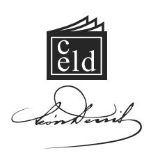
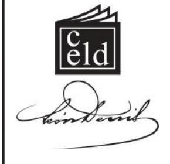
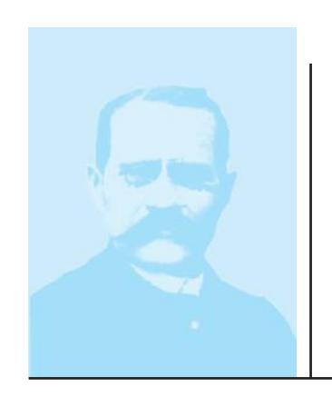
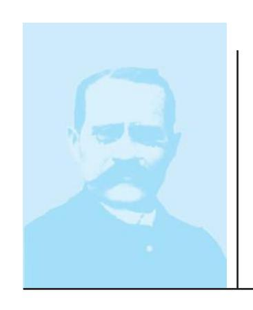
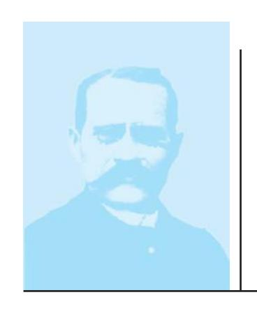
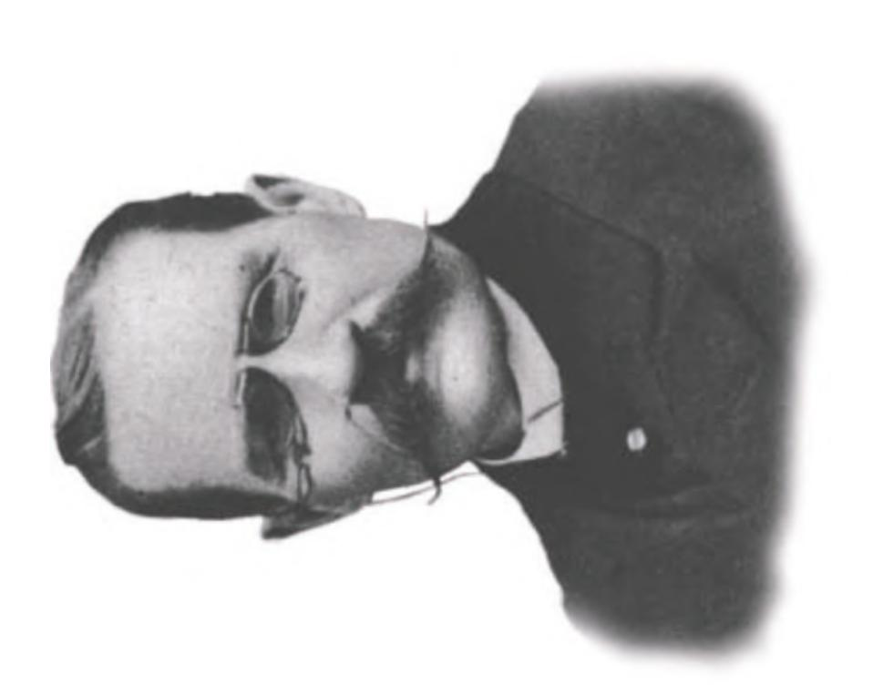

Outras obras do autor editadas pelo CELD:

- · Depois da Morte
- · Espíritos e Médiuns
- No Invisível
- O Além e a Sobrevivência do Ser
- O Espiritismo e o Clero Católico
- · O Espiritismo na Arte
- O Gênio Céltico e o Mundo Invisível
- O Mundo Invisível e a Guerra
- O Porquê da Vida
- O Progresso
- Socialismo e Espiritismo

# CIP - BRASIL - CATALOGAÇÃO-NA-FONTE SINDICATO NACIONAL DOS EDITORES DE LIVROS

#### D459p Denis, Léon, 1846-1927.

O Problema do Ser e do Destino: (os testemunhos, os fatos, as leis): estudos experimentais sobre os aspectos ignorados do ser humano; as personalidades duplas; a consciência profunda; a renovação da memória; as vidas anteriores e sucessivas, etc. / Léon Denis; [tradução Homero Dias de Carvalho]. 1.ed. — Rio de Janeiro: CELD, 2011.

456 p.; 14 x 21cm. ISBN 978-85-7297-503-2

Tradução de: Le problème de l'être et de la destinée

1. Espiritismo. 2. Reencarnação. I. Título

CDD 133.9 11-4821. CDU 133.7

# O Problema do Ser e do Destino

#### **O PROBLEMA DO SER E DO DESTINO**

Léon Denis

Título do original francês:Le problème de l'être et de la destinée

> a Edição: agosto de 2011;a tiragem, do 1o ao 3o milheiro.

> > L 3810811

*Tradução:*Homero Dias de Carvalho

> *Revisão:*Teresa Cunha

*Capa e diagramação:*Marcelo Domingues

*Arte-fi nal:*Luiz de Almeida Júnior

Centro Espírita Léon Denis(Distribuidora)Rua João Vicente, 1.445, Bento Ribeiro,Rio de Janeiro, RJ. CEP 21610-210**Telefax (21) 2452-7700**E-mail: grafi ca@leondenis.com.brSite: leondenis.com.br

Para pedidos de livros, dirija-se ao

Rua Abílio dos Santos, 137, Bento Ribeiro,Rio de Janeiro, RJ. CEP 21331-290CNPJ 27.291.931/0001-89IE 82.209.980

> **Tel. (21) 2452-1846**E-mail: editora@celd.org.brSite: www.celd.org.br

Centro Espírita Léon Denis

Remessa via Correios e transportadora.

Todo produto desta edição é destinado à manutenção das obras sociais do Centro Espírita Léon Denis.

# O Problema do Ser e do Destino

Crescit Eundo.

(OS TESTEMUNHOS; OS FATOS; AS LEIS.)

ESTUDOS EXPERIMENTAIS SOBRE ASPECTOS IGNORADOS DO SER HUMANO

As duplas personalidades — a consciência profunda A renovação da memória

AS VIDAS ANTERIORES E SUCESSIVAS, ETC.

CELD Rio de Janeiro, 2011

#### NOTA EXPLICATIVA AOS LEITORES

A Editora Celd sempre buscou concentrar-se na valorização dos clássicos, focando sua energia em traduções e reedições de obras centrais, ora desconhecidas no meio espírita brasileiro, ora muito bem propagadas, mas sempre necessitadas de um tratamento do ponto de vista da tradução, que lhes confira uma linguagem adequada à modernidade.

Como esta que, agora, lhes entregamos e sentimo-nos regozijados, pois é um ciclo cumprido em torno dos livros de nosso patrono Denis, que aqui nos acolhe com o que há de mais fecundo em seu pensamento.

O Problema do Ser e do Destino, publicado tanto originalmente quanto nas mais recentes edições francesas sob este mesmo título, dispensa qualquer tipo de apresentação, bem como seu autor, tão conhecido dos espíritas, já que se trata de leitura obrigatória a todos nós, discípulos de Allan Kardec. Contudo, sentimo-nos obrigados à explicação da estratégia estabelecida pela Editora no que tange à traducão.

Após algumas pesquisas e longos anos de leitura, certificamo-nos de que Léon Denis trouxe a lume este livro, pela primeira vez, em 1908, após os acirrados debates do Congresso de Liège¹, reeditando ainda a obra por mais de três vezes ao longo do primeiro quartel do século 20, com pequenas alterações de conteúdos e títulos. Vimo-nos, portanto, obrigados à definição de qual edição selecionarmos para nosso empreendimento, tendo sido eleita a edição francesa, datada de 1922², revista e ampliada pelo autor. Observamos que tal edição em nada perdia para as demais, havendo, aliás, acréscimos de notas e citações, bem como atualizações de Denis. Apesar de o vocábulo dor aparecer em diversas obras em francês, reservamo-nos o direito de interpretarmos a ausência de tal palavra no título desta edição como sinal de que o autor reavaliou o título e optou pelo original *O Problema do Ser e do Destino* como ideal.

Aliás, se ele, Denis, nos permite uma ousadia maior, diríamos que do ponto de vista doutrinário parece mesmo mais coerente tal título, uma vez que na parte primeira da obra temos "O Problema do Ser"; na segunda, "O Problema do Destino" e na terceira, "As Potências da Alma", que dentre outras, inclui a dor como importante mecanismo de crescimento espiritual do ser humano. À dor foi reservado um simples capítulo, enquanto às necessidades de entendimento do ser e do destino, partes inteiras. É, portanto, por concordarmos com Denis que lhes entregamos esta magistral obra. Ademais, não poderia ser diferente, pois como dissemos, trata-se da última edição impressa em França, durante a encarnacão de Léon Denis, da qual tivemos notícias.

Esperamos com isso manter a fidelidade ao pensamento denisiano e ofer-tar-lhes a revisão de Denis como padrão de qualidade e elevação. Boa leitura; ótimo estudo!

#### Departamento de Divulgação da Doutrina Espírita

1 - Liège é o nome de uma cidade e um município na Bélgica, localizado no distrito de Liège, província de Liège, região da Valônia. A cidade de Liège é a capital da província e a terceira maior cidade da Bélgica (primeira da Valônia). O citado Congresso ocorreu em junho de 1905.

2 – Como Léon Denis desencarnou em 1927, tudo nos leva a crer que esta foi a última edição de O Problema do Ser e do Destino publicada pelo autor.

# Sumário

| d ã In tr 9 o u ç o                                                                                                                                                                              |
|--------------------------------------------------------------------------------------------------------------------------------------------------------------------------------------------------------------------------------------------------------------------------------------------------------------------------------------------------------------|
| b le d im ir P P te O P S 2 5 r e a a r ro m a o e r . –                                                                                                                                                                 |
| lu d 1 A E ã P 2 to 5 v o ç o o e n sa m e n                                                                                                                                                                       |
| i io d in d i é ír 2 O C D E 3 5 t tr to r r a o u a o s s p s                                                                                                                                                     |
| d S 3 N tu 6 2 a re a o e r z                                                                                                                                                                          |
| l i d d l . A P In 4 te 7 1 e rs o n a a e g ra                                                                                                                                                           |
| lm d d i fe A A D E S 5 te ta 8 3 a e o s re n s s o s o o n o                                                                                                                                                                    |
| d im io iz D E ã 6 to te e s p re n e n e x r r a ç o le j á ic P õ T 9 9 t ro e ç e s e p a s                                 |
| i fe is d 7 M ta õ D M te 1 0 9 a s ç e s e p o a o n r                                                                                                                                                         |
| d i b io d lm ia ó ó 8 E ta V t A A M 1 2 0 s o s ra r s a a e m r                                                                                                                                                          |
| lu l d d d lm in i E ã F A 9 1 2 7 v o ç o e a a e a a                                                                                                                                                          |
| A M 1 0 te 1 3 9 o r                                                                                                                                                                             |
| d l i é A V A 1 1 1 5 9 a n o m                                                                                                                                                                     |
| d is i io 1 2 A M õ V S 1 1 7 s s e s, a a u p e r r .                                                                                                                                                       |
| d b le d in S O P te P D t 1 8 1 e g u n a a r ro m a o e s o –                                                                                                                                                          |
| i d iv is S 1 3 A V A R ã Le 1 8 1 s a s c e ss a s e e n ca rn a ç o e s a s u u                                                                                                                                                 |
| i d iv im is A V S P E 1 4 ta 2 0 2 s a s u c e ss a s ro v a s x p e r e n                                                                                                                                              |

| d d i iv ia íg io 1 A V S A C P 5 s a s u c e ss a s s r n ç a s- ro e a d i ie d d H ta e re r a e                                 | 2 6 1    |
|-------------------------------------------------------------------------------------------------------------------------------------------------------------------------------------------------------------------------------------------------------------------------------------------------------------------------------------------------------------------------|-------------------------|
| i d iv b j ic A V S O õ C í 1 6 t s a s u c e ss a s e ç e s e r a s                                                                                                                                                                         | 2 7 9    |
| d i iv is ic A V S P H ó 1 7 t s a s u c e ss a s. ro v a s r a s                                                                                                                                                                               | 2 9 3    |
| b l d d b le d l. iç i i Ju R O P M 1 8 t s a e e s p o n sa a e ro m a o a                                                                                                                                                                                    | 3 1 5    |
| d i in 1 9 A Le D t o s e s o s                                                                                                                                                                                                     | 2 9 3    |
| ir ê ia d lm T P te A P t A e rc e a a r s o n c s a a —                                                                                                                                                                                           | 3 4 5    |
| d 2 0 A V ta o n e                                                                                                                                                                                                            | 3 4 5    |
| Ín i ia i d im A C ê O S 2 1 t t o n sc n c e n o o                                                                                                                                                                                                | 3 5 5    |
| b iv io O L í 2 2 tr re -a r                                                                                                                                                                                                        | 3 7 8    |
| O P 2 3 to e n sa m e n                                                                                                                                                                                                                | 3 8 6    |
| l d is ip in 2 A D P 4 to c a o e n sa m e n e a fo d C á R te e rm a o a r r .                                                                                               | 3 9 2    |
| O 2 5 A m o r .                                                                                                                                                                                                               | 4 0 2       |
| A D 2 6 o r .                                                                                                                                                                                                              | 4 1 1    |
| la la R ã D 2 7 e v e ç o p e o r                                                                                                                                                                                                   | 4 2 9    |
| f is d d lo ã é é P F S 2 0 ro s o e o c u                                                                                                                                                                                                   | 4 4 5    |
| h ie f ic í T te C t e s m n o s n o s u                                                                                                                                                                                         | 9 4 4    |

# Introdução

Uma constatação dolorosa atinge o pensador, no entardecer da vida. Ela se torna ainda mais pungente por ocasião das impressões que tem, ao retornar ao Espaço. Apercebe-se, então, de que o ensino administrado pelas instituições humanas em geral – religiões, escolas, universidades – embora nos informe sobre muitas coisas supérfluas, quase nada traz daquilo que mais temos necessidade de conhecer para a conduta, o direcionamento da existência terrestre e a preparação para o Além.

Aqueles que têm como incumbência a alta missão de esclarecer e guiar a alma humana parecem ignorar-lhe a natureza e os verdadeiros destinos.

Nos meios universitários, ainda reina uma completa incerteza sobre a solução do mais importante problema que o homem já enfrentou, no curso de sua passagem pela Terra. Esta incerteza transparece em todo o ensino. A maior parte dos mestres e professores descarta sistematicamente de suas lições tudo o que diz respeito ao problema da vida, às questões de objetivo e de finalidade.

Encontramos a mesma impotência no padre. Com suas afirmações destituídas de provas, ele mal consegue comunicar às almas sob sua guarda uma crença que não resiste às regras de uma crítica construtiva nem às exigências da razão.

Na verdade, na Universidade como na Igreja, a alma moderna só encontra obscuridade e contradição em tudo o que se refere ao problema de sua natureza e de seu futuro. É a este estado de coisas que se deve, em grande parte, atribuir os males de nosso tempo: a incoerência das ideias, a desordem das consciências, a anarquia moral e social.

A educação dispensada às gerações é complicada, mas não lhes esclarece o caminho da vida, não as prepara para as lutas da existência. O ensino clássico pode oferecer cultura, ornar a inteligência; não capacita a agir, a amar, a se dedicar. Muito menos ainda, a ter uma concepção do destino que desenvolva as energias profundas do eu e oriente nossos ímpetos, nossos esforços em direção a um objetivo elevado. No entanto, esta concepção é indispensável a todo ser, a toda sociedade, pois ela é a sustentação, a consolação suprema nas horas difíceis, a fonte das sólidas virtudes e das altas inspirações.

Carl du Prel narra o seguinte fato:1

"Um amigo meu, professor universitário, sofreu a dor de perder sua filha, o que reacendeu nele o problema da imortalidade. Dirigiu-se a seus colegas, professores de Filosofia, esperando encontrar consolações em suas respostas. Foi uma amarga decepção: pedira pão e ofereceram-lhe uma pedra; procurava uma afirmação e responderam-lhe com um 'talvez'"!

Francisque Sarcey, este protótipo do professor universitário, escrevia2 "Estou nesta terra. Ignoro completamente como aqui cheguei e por que me jogaram aqui. Também desconheço como sairei daqui e o que será de mim, quando daqui tiver saído".

1 C. DU PREL, *La Mort et l'Au-delà*, p.7.

2*Petit Journal*, crônica, 7 de março de 1894.

Confissão mais franca, impossível: a filosofia da escola, após tantos séculos de estudos e de labor, ainda é apenas uma doutrina sem-luz, sem-calor, sem-vida.3 A alma de nossos filhos, oscilando entre sistemas diversos e contraditórios: o positivismo de Auguste Comte, o naturalismo de Hegel, o materialismo de Stuart Mill, o ecletismo de Cousin, etc., hesita indecisa, sem-ideal, sem-objetivo preciso.

Daí o desencorajamento precoce e o pessimismo destruidor, doenças das sociedades decadentes, ameaças terríveis para o futuro, às quais se junta o ceticismo amargo e debochado de tantos jovens que só creem na fortuna e só honram o sucesso.

O eminente professor Raoul Pictet aponta este estado de espírito, na introdução de sua última obra sobre as ciências físicas.4 Ele fala sobre o efeito desastroso produzido pelas teorias materialistas na mentalidade de seus alunos e conclui:

"Estes pobres jovens admitem que tudo o que se passa no mundo é o efeito necessário e fatal de condições anteriores em que a vontade deles não intervém; consideram que sua própria existência é, forçosamente, o *joguete* da fatalidade inevitável, à qual eles estão de pés e mãos atados.

Estes jovens desistem da luta, ante as primeiras dificuldades. Não acreditam mais em si mesmos. Tornam-se mortos vivos, sepulcros em que se enterram, em total confusão, suas

3 A respeito dos exames universitários, o Sr. Ducros, decano da Faculdade de Aix, escrevia no *Journal des Débats*, de 3 de maio de 1912: "Parece que, entre o aluno e as coisas, há uma espécie de cortina, sei lá que montes de palavras ensinadas, de fatos dispersos e opacos. É sobretudo em Filosofia que se experimenta esta penosa situação".

4 *Etude Critique du Matérialisme et du Spiritualisme, par la Physique Expérimentale*. Félix Alcan Ed.

próprias esperanças, seus próprios esforços e desejos, vala comum de tudo aquilo que lhes fez pulsar o coração, até o dia do envenenamento".

Tudo isto não só se aplica a uma parte de nossa juventude, mas também a muitos homens contemporâneos nossos e de nossa geração, nos quais pode-se constatar uma espécie de fraqueza moral e de abatimento.

Frédéric Myers o reconhece, por sua vez: "Há", diz ele, "uma espécie de inquietação, um descontentamento, uma falta de confiança no verdadeiro valor da vida. O pessimismo é a doença moral de nosso tempo".

As teorias de além-Reno,6 as doutrinas de Nietzche, de Schopenhauer, de Haeckel, etc., contribuíram bastante, elas também, para desenvolver tal estado de coisas. Sua influência difundiu-se. Deve-se atribuir a elas, em grande parte, este lento trabalho, obra obscura de ceticismo e de desencorajamento, que permanece na alma contemporânea.

É tempo de reagir vigorosamente contra estas doutrinas funestas e de procurar, fora das bitolas oficiais e das velhas crenças, novos métodos de ensino que respondam às imperiosas necessidades do presente momento. É preciso preparar os espíritos para as obrigações, para os combates da vida atual e das vidas ulteriores; é preciso, sobretudo, ensinar o ser humano a conhecer-se, a desenvolver, tendo em vista seus objetivos, as forças latentes em si adormecidas.

Até aqui, o pensamento confinou-se em círculos estreitos: religiões, escolas ou sistemas que se excluem e se combatem reciprocamente. Daí se originam esta divisão profunda

5 F. MYERS, *Human Personality*.

6 O rio Reno separa a França da Alemanha. Ao citar o além-Reno, Denis referese às doutrinas de famosos pensadores do leste europeu. (Nota do Tradutor, as sequentes conterão apenas **N.T.**)

dos espíritos, estas correntes violentas e contrárias que perturbam e transtornam o meio social.

Aprendamos a sair destes círculos rígidos e a permitir um voo livre ao pensamento. Cada sistema contém uma parte da verdade; nenhum contém a realidade inteira. O Universo e a vida têm aspectos bastante variados, bastante numerosos para que qualquer sistema possa contê-los integralmente. Destas concepções discordantes, é necessário pinçar os fragmentos de verdade que contêm, aproximá-los, ajustá-los; depois, unindo-os aos novos e múltiplos aspectos da verdade que descobrimos a cada dia, dirigirmo-nos à unidade majestosa e à harmonia do pensamento.

A crise moral e a decadência de nossa época provêm, em grande parte, do fato de o espírito humano ter-se imobilizado durante muito tempo. É preciso arrancá-lo da inércia, das rotinas seculares, orientá-lo na direção das altas esferas, sem perder de vista as bases sólidas que uma ciência ampliada e renovada vem oferecer-lhe. Esta ciência de amanhã, nós trabalhamos para construí-la. Ela nos fornecerá o critério indispensável, os meios de verificação e de controle, sem os quais o pensamento, entregue a si mesmo, sempre correrá o risco de perder-se.

A confusão e a incerteza que constatamos no ensino repercutem e se encontram, como dizíamos, na sociedade como um todo.

Em toda parte, dentro ou fora, há um estado de crise inquietante. Sob a aparência brilhante de uma civilização refinada, esconde-se um profundo mal-estar. A irritação cresce nas camadas sociais. O conflito dos interesses, a luta pela vida, tornam-se a cada dia mais ásperos. O sentimento do dever enfraqueceu-se na consciência popular, a ponto de muitos homens nem mesmo saberem mais onde está o dever. A lei do número, isto é, da força cega, domina mais que nunca. Pérfidos retóricos aplicam-se a desencadear as paixões, os maus instintos da multidão, a difundir teorias malsãs, às vezes criminosas. Depois, quando a onda se eleva e o vento se faz tempestade, eles escapolem ou descartam qualquer responsabilidade.

Onde está, então, a explicação deste enigma, desta contradição chocante entre as aspirações generosas de nosso tempo e a realidade brutal dos fatos? Por que um regime que suscitara tantas esperanças corre o risco de terminar em anarquia, em ruptura de todo equilíbrio social?

A inexorável lógica vai responder-nos: a democracia, radical ou socialista, com suas massas enormes e com seu espírito dirigente, inspirando-se, ela também, em doutrinas negativistas, só podia chegar a um resultado negativo, no que diz respeito à felicidade e à elevação da Humanidade. Tanto quanto vale o ideal, vale o homem; tanto quanto vale a nação, vale o país!

As doutrinas negativistas, com suas consequências extremas, fatalmente desembocam na anarquia, isto é, no vazio, no nada social. A história humana já registrou várias vezes esta penosa experiência.

No que se refere a destruir os restos do passado, a dar o extremo golpe nos privilégios, a democracia serviu-se habilmente de seus meios de ação. Mas, hoje, importa construir a cidade do porvir, a cidade futura, o vasto edifício que deve abrigar o pensamento das gerações. E, diante desta tarefa, as doutrinas negativistas mostram sua insuficiência e revelam sua fragilidade; vemos os melhores trabalhadores debaterem-se em uma espécie de impotência material e moral.

Nenhuma obra humana pode ser grande e durável sem inspirar-se, na teoria e na prática, em seus princípios e aplicações, nas leis eternas do Universo. Tudo o que é concebido, edificado fora das leis superiores, é construído sobre a areia e desmorona.

Ora, as doutrinas do socialismo atual têm uma falha capital. Querem impor uma regra em contradição com a Natureza e com a verdadeira lei da Humanidade: o nível igualitário.

A evolução individual e progressiva é a lei fundamental da Natureza e da vida. É a razão de ser do homem, a norma do Universo. Insurgir-se contra ela, atribuir-lhe outro objetivo, seria tão insensato quanto querer fazer cessar o movimento da Terra ou o fluxo e o refluxo dos oceanos.

O aspecto mais frágil da doutrina socialista é a ignorância absoluta do homem, de seu princípio essencial, da lei que preside seus destinos. E, ignorando-se o homem individual, como se poderia governar o homem social?

A fonte de todos os nossos males reside em nossa falta de saber e em nossa inferioridade moral. Toda sociedade permanecerá fraca e dividida, enquanto for dominada pela desconfiança, pela dúvida, pelo egoísmo, pela inveja, pelo ódio. Não se transforma uma sociedade através de leis. As leis, as instituições nada são sem os hábitos, sem as crenças elevadas. Aliás, quaisquer que sejam o regime político e a legislação de um povo, se ele possui bons costumes e firmes convicções, será sempre mais feliz e mais poderoso do que outro povo de moralidade inferior.

Sendo uma sociedade a resultante das forças indivi duais, boas ou más, para melhorar o formato desta sociedade, é necessário, primeiramente, atuar na inteligência e na consciência dos indivíduos.

Mas, para a democracia socialista, o homem interior, o homem da consciência individual, não existe; a coletividade o absorve integralmente. Os princípios que ela adota não passam de uma negação de qualquer filosofia elevada e de qualquer causa superior. A única expectativa é a de conquistar direitos. Entretanto, desfrutar dos direitos é impossível sem a prática dos deveres. O direito sem o dever, que o limita e o corrige, acarretará apenas novos entrechoques, novos sofrimentos.

Eis por que o impulso formidável do socialismo apenas desloca os apetites, as invejas, as causas de mal-estar e substitui as opressões passadas por um despotismo novo, ainda mais intolerável. Vemos o exemplo disso na Rússia.

Certamente podemos medir a extensão dos desastres causados pelas doutrinas negativistas. O determinismo, o materialismo, negando a liberdade humana e a responsabilidade, minam as próprias bases da Ética universal. O mundo moral não é mais que um anexo da fisiologia, isto é, o reino, a manifestação da força cega e irresponsável. Os espíritos de elite professam o niilismo metafísico e a massa humana, o povo, sem-crenças, sem-princípios fixos, fica entregue a homens que exploram suas paixões e especulam com sua cobiça.

O positivismo, embora menos absoluto, não é menos funesto em suas consequências. Com sua teoria da incognoscibilidade,7 ele suprime as noções de objetivo e de ampla evolução. Toma o homem na fase atual de sua vida, simples fragmento de sua destinação, e o impede de ver adiante e atrás de si; método estéril e perigoso, aparentemente feito para cegos de espírito e que foi proclamado, bem falsamente, a mais bela conquista do espírito moderno.

7 Teoria segundo a qual há coisas que escapam ao conhecimento humano. (N.T.)

Tal é o estado atual da sociedade. O perigo é imenso e, se nenhuma grande renovação espiritualista e científica se produzisse, o mundo naufragaria na incoerência e na confusão.

Nossos homens de governo já sentem o quanto custa viver em uma sociedade onde as bases essenciais da moral estão abaladas, onde as sanções são artificiais ou impotentes, onde tudo se confunde, até mesmo a noção elementar do bem e do mal.

É verdade que as Igrejas, apesar de suas fórmulas gastas e de seu espírito retrógrado, ainda agrupam, a seu redor, muitas almas sensíveis; porém, tornaram-se incapazes de conjurar o perigo, por causa da impossibilidade em que se acham de fornecer uma definição precisa da destinação humana e do Além, apoiada em fatos convincentes.

A Humanidade, cansada dos dogmas e das especulações sem-provas, mergulhou no materialismo ou na indiferença. Só existe salvação para o pensamento em uma doutrina baseada na experiência e no testemunho dos fatos.

De onde virá esta doutrina? Que potência nos alçará do abismo para o qual estamos escorregando? Que ideal novo virá trazer ao homem a confiança no futuro e o ardor para o bem? Nas horas trágicas da História, quando tudo parecia perdido, o socorro jamais faltou. A alma humana não pode chafurdar por inteiro na lama e perecer. No momento em que as crenças do passado se fecham, uma concepção nova da vida e do destino, baseada na ciência dos fatos, se abre. A grande tradição revive sob formas ampliadas, mais jovens e mais belas. Ela mostra a todos um futuro pleno de esperanças e de promessas. Saudemos o novo reinado da *ideia*, vitoriosa sobre a matéria, e trabalhemos na preparação de seus caminhos!

A tarefa a cumprir é grande; a educação do homem precisa ser inteiramente refeita. Esta educação, já o vimos, nem a Universidade nem a Igreja estão aptas a dá-la, por não mais possuírem as sínteses necessárias para clarear a caminhada das novas gerações. Uma só doutrina pode oferecer esta síntese: a do espiritualismo científico; ela já desponta no horizonte do mundo intelectual e parece dever iluminar o futuro.

A esta filosofia, a esta ciência, livre, independente, desvinculada de qualquer pressão oficial, de qualquer compromisso político, as descobertas contemporâneas acrescentam, cotidianamente, novas e preciosas contribuições. Os fenômenos do magnetismo, da radioatividade, da telepatia, são aplicações de um mesmo princípio, as manifestações de uma mesma lei que rege, ao mesmo tempo, o ser e o Universo.

Mais alguns anos de trabalho paciente, de experimentação conscienciosa, de pesquisas perseverantes, e a nova educação terá encontrado sua fórmula científica, sua base essencial. Este acontecimento será o maior fato da História, desde a aparição do Cristianismo.

Sabe-se que a educação é o mais poderoso fator do progresso; ela contém, em germe, todo o futuro. Mas, para ser completa, deve inspirar-se no estudo da vida sob suas duas formas alternantes, visível e invisível: da vida em sua plenitude, em sua evolução ascendente, em direção aos cimos da Natureza e do pensamento.

Os preceptores da Humanidade têm, portanto, um dever imediato a levar a termo: repor o espiritualismo na base da educação; trabalhar na reforma do homem interior e da saúde moral. É preciso despertar a alma humana, adormecida por uma retórica funesta, mostrar-lhe seus poderes ocultos, obrigá-la a tomar consciência de si mesma, a concretizar seus gloriosos destinos.

A ciência moderna analisou o mundo exterior; suas incursões no universo objetivo são profundas: isto será sua honra e sua glória. Entretanto, ela nada sabe, ainda, sobre o universo invisível nem sobre o mundo interior. Ali está o império ilimitado que lhe cabe conquistar. Saber por que elos o homem se une ao conjunto, descer aos meandros misteriosos do ser, onde se mesclam a sombra e a luz, como na caverna de Platão, percorrer-lhe os labirintos, os redutos secretos, auscultar o eu normal e o eu profundo, a consciência e a subconsciência – não há estudo algum mais necessário que este. Enquanto as Escolas e as Academias não o introduzirem em seus programas, nada terão feito pela educação definitiva da Humanidade.

Mas, já estamos assistindo ao surgimento e à constituição de toda uma psicologia maravilhosa e imprevista, da qual vão destacar-se uma nova concepção do ser e a noção de uma lei superior, que encampa e resolve todos os problemas da evolução e do vir a ser.

Um tempo passa; outros se anunciam. A hora que vivemos é crítica e dolorosa, como a de um parto. As formas esgotadas do passado esmaecem e tombam, dando lugar a outras, primeiro vagas e confusas, mas que, cada vez mais, ganham nitidez. Nelas se esboça o pensamento progressivo da Humanidade.

O espírito humano está trabalhando: em toda parte, sob a aparente decomposição das ideias e dos princípios; em toda parte, na Ciência, na Arte, na Filosofia e até mesmo no seio das religiões, o observador atento pode constatar que uma lenta e laboriosa gestação acontece. A Ciência, sobretudo esta, lança, em profusão, sementes de ricas promessas. O século nascente8 será o das eclosões potentes.

8 Denis refere-se ao século XX. (N.T.)

As formas e as concepções do passado, dizíamos, não são mais suficientes. Por mais respeitável que pareça esta herança, apesar do sentimento piedoso com o qual podemos considerar os ensinamentos legados por nossos pais, geralmente sentimos, compreendemos que este ensino não foi bastante para dissipar o mistério angustiante do porquê da vida.

Entretanto, podemos viver e agir, em nossa época, com mais intensidade do que nunca; mas será que podemos viver e agir plenamente, sem estar conscientes do objetivo a alcançar? O estado da alma contemporânea pede, reclama uma ciência, uma arte, uma religião de luz e de liberdade, que venham livrá-la de suas dúvidas, emancipá-la das velhas escravidões e das misérias do pensamento, guiá-la em direção aos horizontes radiosos para os quais ela se sente atraída, por sua própria natureza e pela impulsão de forças irresistíveis.

Frequentemente, fala-se de progresso. Porém, o que é que se entende por progresso? Será uma palavra oca e sonora, na boca de oradores materialistas, em maioria, ou terá ela um sentido bem determinado? Vinte civilizações passaram sobre a Terra, clareando, com suas luzes, a marcha da Humanidade. Seus grandes focos brilharam na noite dos séculos e, em seguida, extinguiram-se. E, limitando-se aos horizontes estreitos de seu pensamento, o homem ainda não distingue o Além ilimitado para onde seu destino o encaminha. Impotente para dissipar o mistério que o envolve, usa suas forças nos trabalhos terrenos e se furta aos esplendores de sua tarefa espiritual, aquela que fará sua verdadeira grandeza.

Não há fé no progresso, sem-fé no futuro; no futuro de cada um e de todos. Os homens só progridem e avançam se acreditarem neste futuro e marcharem confiantes, convictos, para o ideal vislumbrado.

O progresso não consiste somente nas obras materiais, na criação de máquinas potentes e de todo o ferramental industrial; tampouco consiste em encontrar novos procedimentos artísticos, em literatura, ou formas de eloquência. Seu mais alto objetivo é tocar, atingir a ideia mestra, a ideia mãe, que fecundará toda a vida humana, a fonte elevada e pura, de onde brotarão, ao mesmo tempo, as verdades, os princípios, os sentimentos que inspirarão as obras marcantes e as nobres ações.

É tempo de compreender isto: a civilização só pode crescer, a sociedade só pode evoluir, se um pensamento cada vez mais elevado, uma luz cada vez mais intensa, vierem inspirar, esclarecer os espíritos e tocar os corações, renovando-os. Apenas a ideia, a inteligência é mãe da ação. Só a vontade de realizar a plenitude do ser, sempre melhor, sempre maior, pode conduzir-nos a estes cimos longínquos onde a Ciência, a Arte, enfim, toda a obra humana, encontrará seu desenvolvimento, sua regeneração.

Tudo no-lo diz: o Universo é regido pela lei da evolução; aí está o que entendemos pela palavra progresso. E nós mesmos, em nosso princípio de vida, em nossa alma e em nossa consciência, para sempre, estamos submetidos a esta lei. Hoje, seria impossível ignorar-se esta força soberana que conduz a alma e suas obras, através do tempo e do Espaço infinitos, a um objetivo cada vez mais elevado; mas, uma lei como esta só se efetiva por nossos esforços.

Para ser útil, para cooperar na evolução geral e colher-lhe todos os frutos, é necessário, antes de tudo, aprender a discernir, a apropriar-se da razão, da causa, da finalidade desta evolução, saber para onde ela conduz, a fim de participar, com a plenitude das forças e das faculdades em nós adormecidas, desta ascensão grandiosa.

Nosso dever é traçar este caminho para a Humanidade futura, da qual ainda seremos parte integrante, como no-lo ensinam a comunhão das almas, a revelação dos grandes Instrutores invisíveis e como a Natureza também o ensina, através de suas milhares de vozes, através da renovação perpétua de todas as coisas, àqueles que sabem estudá-la e compreendê-la.

Vamos, portanto, em direção ao futuro, à vida sempre renascente, pela via imensa que um espiritualismo regenerado nos abre!

Fé do passado, ciências, filosofias, religiões, iluminai-vos com uma chama nova; sacudi vossas mortalhas e as cinzas que as recobrem. Escutai as vozes reveladoras do túmulo; elas nos trazem uma renovação do pensamento com os segredos do Além, que o homem precisa conhecer para melhor viver, melhor agir e melhor morrer!

Primeira Parte

# O Problema do Ser

# 1. A Evolução do Pensamento

Uma lei, já o dissemos, rege a evolução do pensamento, como rege a evolução física dos seres e dos mundos; a compreensão do Universo se desenvolve com os progressos do espírito humano.

Esta concepção geral do Universo e da vida foi expressa de mil modos, sob mil formas diferentes, no passado. Hoje, ela o é em outros termos mais amplos, e sempre o será, com mais amplitude, à medida que a Humanidade vá galgando os degraus de sua ascensão.

A Ciência vê alargar-se, ininterruptamente, seu campo de exploração. Todos os dias ela descobre, com a ajuda de seus poderosos instrumentos de observação e de análise, novos aspectos da matéria, da força e da vida. Mas, o que estes instrumentos constatam, o espírito, há muito tempo, já o tinha identificado, pois o voo do pensamento vai sempre além e ultrapassa os meios de ação da ciência positiva. Os instrumentos nada seriam, sem a inteligência, sem a vontade que os dirige.

A ciência é incerta e mutável, renovando-se incessantemente. Seus métodos, suas teorias, seus cálculos, elaborados com muito sacrifício, desmoronam, ante uma observação mais atenta ou uma indução mais profunda, para dar lugar a outras teorias, que também não serão definitivas. 9 A teoria do átomo indivisível, por exemplo, que, há dois mil anos, servia de base à física e à química, é, agora, qualificada como hipótese e como pura elucubração por nossos químicos mais eminentes. Quantas decepções análogas demonstraram, no passado, a fraqueza do espírito científico! Este só atingirá o real, elevando-se acima da miragem dos fatos materiais, em direção à região das causas e das leis.

Foi deste modo que a Ciência pôde determinar os princípios imutáveis da lógica e da matemática. Não é o que ocorre, porém, nas pesquisas de outra ordem. O sábio muito frequentemente as mescla com seus preconceitos, suas tendências, suas rotinas, todos os elementos de uma personalidade estreita, como o podemos constatar na área dos estudos psíquicos, sobretudo na França, onde, até o momento, encontrou-se pequena quantidade de estudiosos corajosos e verdadeiramente esclarecidos, para seguir uma via já amplamente trilhada pelas mais belas inteligências das outras nações.

Apesar de tudo, o espírito humano avança passo a passo, no conhecimento do ser e do Universo. Nossos dados sobre a força e a matéria modificam-se a cada dia; a personalidade humana se revela sob aspectos inesperados. Em face de tantos fenômenos experimentalmente constatados, à vista do acúmulo de testemunhos oriundos de toda parte,10 nenhum espírito lúcido pode mais negar a realidade da sobrevivência; ninguém

9 O professor Charles Richet o reconhece: "A Ciência nunca foi senão uma série de erros e aproximações, evoluindo constantemente, constantemente reformulada, e isto tanto mais rapidamente, quanto mais avançada ela fosse". (*Annales des Sciences Psychiques*, janeiro de 1905, p. 15.)

10 Ver minha obra *No Invisível*: Espiritismo e Mediunidade, *passim.*

pode mais escamotear as consequências morais e as responsabilidades que ela implica.

O que dizemos da Ciência, poder-se-ia dizer, igualmente, das filosofias e das religiões que se sucederam através dos séculos. Elas constituem tantas etapas ou patamares percorridos pela Humanidade, ainda pouco evoluída, elevando-se a planos espirituais cada vez mais vastos e que se interligam. Em seu encadeamento, essas crenças diversas aparecem-nos como o desenvolvimento gradual do ideal divino, refletido no pensamento com tanto mais repercussão e pureza quanto mais este se refina e se depura.

Eis por que as crenças e os conhecimentos de uma época ou de um ambiente parecem, para o tempo e o meio em que reinam, a representação da verdade tal qual os homens daquela época podem apreendê-la e compreendê-la, até que o desenvolvimento de suas faculdades e de suas consciências os torne aptos a perceber uma forma mais elevada, uma radiação mais intensa daquela verdade.

Sob este ponto de vista, o próprio fetichismo se explica, apesar de seus rituais sangrentos. É o primeiro balbucio da alma infantil, ensaiando o soletrar da linguagem divina, expressando, sob traços grosseiros, sob formas apropriadas a seu estado mental, sua concepção vaga, confusa, rudimentar, de um mundo superior.

O paganismo representa um conceito mais elevado, ainda que muito antropomórfico. Nele, os deuses assemelhamse aos homens; têm destes todas as paixões, todas as fraquezas. Entretanto, a noção do ideal já se aperfeiçoa com a do bem. Um raio de eterna beleza vem fecundar, no berço, as civilizações.

Num estágio mais elevado, aparece a ideia cristã, toda de sacrifício, de renúncia, em sua essência. O paganismo grego era a religião da Natureza radiosa; o Cristianismo é a da Humanidade sofredora, religião das catacumbas, das criptas e dos túmulos, que nasceu na perseguição e na dor e guarda a marca de sua origem. Reação necessária contra a sensualidade pagã, ela se tornará, por seu próprio exagero, impotente para vencêla, pois, com o ceticismo, a sensualidade renascerá.

O Cristianismo, em sua origem, deve ser considerado como o maior esforço levado a efeito pelo mundo invisível, para comunicar-se ostensivamente com nossa Humanidade. É, segundo a expressão de F. Myers, "a primeira mensagem autêntica do Além". As religiões pagãs já eram ricas em fenômenos ocultos de toda sorte e em feitos de adivinhação. Mas a ressurreição, isto é, as aparições do Cristo, materializado após sua morte, constitui a manifestação mais poderosa que os homens tenham testemunhado. Ela foi o sinal de uma entrada em cena do mundo dos espíritos, que se produziu de mil maneiras, nos primeiros tempos cristãos. Dissemos alhures11 como e por que, pouco a pouco, o véu do Além baixou novamente e fez-se o silêncio, exceto para alguns privilegiados: videntes, extáticos, profetas.

Assistimos, hoje, a uma nova impulsão do mundo invisível na História. As manifestações do Além, de passageiras e isoladas, tendem a tornar-se permanentes e universais. Uma via se estabelece entre os dois mundos, inicialmente, uma simples trilha, um estreito caminho, que se alarga, pouco a pouco fica melhor, e se tornará uma estrada larga e segura. O Cristianismo teve, como ponto de partida, fenômenos de natureza semelhante à daqueles que hoje em dia observamos, no campo das ciências psíquicas. É por estes fatos que se revelam a influência e a ação de um mundo espiritual, verdadeira habitação

11 Ver *Cristianismo e Espiritismo*, cap. V.

e pátria eterna das almas. Através deles, uma senda azul se abre para vida infinita; a esperança vai renascer nos corações angustiados e a Humanidade se reconciliará com a morte.

As religiões contribuíram poderosamente com a educação humana; opuseram um freio às paixões violentas, à barbárie das eras de embrutecimento, e gravaram fortemente a noção moral, no fundo das consciências. A estética religiosa trouxe à luz obras-primas em todas as esferas; participou, em larga escala, da revelação da arte e do belo, que prossegue, séculos afora. A arte grega criara maravilhas. A arte cristã atingiu o sublime, em suas catedrais góticas que se erguem, bíblias de pedra, sob o céu, com suas altivas torres esculpidas, suas naves imponentes, que as vibrações dos órgãos e dos cânticos sacros invadem, suas altas ogivas, de onde a luz desce, em jorros, e escorre por sobre os afrescos e as estátuas; mas, o papel desta arte se encerra, pois que, ou ela se copia ou repousa, como se estivesse esgotada.

O erro religioso e, sobretudo, o erro católico, não é de ordem estética, que não engana: é de ordem lógica. Consiste em fechar a religião em dogmas estreitos, em formas rígidas. Embora o movimento seja a própria lei da vida, o Catolicismo imobilizou o pensamento, em vez de provocar seu desenvolvimento.

É da natureza humana esgotar todos os aspectos de uma ideia, ir aos extremos, antes de retomar o curso normal de sua evolução. Cada verdade religiosa, afirmada por um inovador, se enfraquece e se altera com o passar do tempo, por serem os discípulos quase sempre incapazes de se manter na altura à qual o mestre os elevara. A doutrina vira, então, uma fonte de abusos e provoca, pouco a pouco, um movimento contrário, no sentido do ceticismo e da negação. À fé cega sucede a incredulidade; o materialismo desempenha seu papel e é apenas depois de mostrar toda sua impotência na ordem social, que uma renovação idealista se torna possível.

Desde os primeiros tempos do Cristianismo, correntes diversas: judaica, helênica, gnóstica, misturam-se e se chocam no berço da religião nascente. Explodem os cismas; sucedem-se as rupturas, os conflitos, em meio aos quais o pensamento do Cristo pouco a pouco se tolda e se obscurece. Mostramos12 de que alterações e modificações sucessivas a doutrina cristã foi objeto, com o passar do tempo. O verdadeiro Cristianismo era uma lei de amor e de liberdade; as igrejas o transformaram em uma lei de temor e de servidão. Daí, o afastamento gradual dos pensadores, em relação à Igreja; daí, o enfraquecimento do espírito religioso em nosso país.

Graças à confusão que invadiu os espíritos e as consciências, o materialismo ganhou terreno. Sua moral, pretensamente científica, que proclama a necessidade da luta pela vida, o desaparecimento dos fracos e a seleção dos fortes, reina, hoje, quase soberana, tanto na vida pública, quanto na vida particular. Todas as atividades direcionam-se para a conquista do bem-estar e das satisfações físicas. Por falta de preparação moral e de disciplina, as energias da alma francesa desvanecem; o mal-estar e a discórdia infiltram-se por toda parte, na família, na nação. Este é, dizíamos, um período de crise. Nada morre, apesar das aparências; tudo se transforma e se renova. A dúvida que assalta as almas, em nossa época, prepara o caminho para as convicções de amanhã, para a fé inteligente e esclarecida, que reinará no futuro e se estenderá a todos os povos, a todas as raças.

12*Cristianismo e Espiritismo*, 1a Parte, *passim.*

Apesar de ainda jovem e dividida pelas condições de território, de distância, de clima, a Humanidade começou a tomar consciência de si mesma. Acima e a além dos antagonismos políticos e religiosos, organizam-se agrupamentos de inteligências. Homens perseguidos pelos mesmos problemas, aguilhoados pelas mesmas preocupações, inspirados pelo Invisível, trabalham em uma obra comum e perseguem as mesmas soluções. Pouco a pouco, os elementos de uma ciência psicológica e de uma crença universal aparecem, fortificam-se, dilatam-se. Numerosas testemunhas imparciais veem nisto o prelúdio de um movimento do pensamento que tende a abraçar todas as sociedades da Terra.13

A ideia religiosa acaba de percorrer seu ciclo inferior e desenham-se os planos de uma espiritualidade mais elevada. Pode-se dizer que a religião é o esforço da Humanidade para comunicar-se com a essência eterna e divina. É por isso que sempre haverá religiões e cultos cada vez mais abertos e conformes às leis superiores da estética, que são a expressão da harmonia universal. O belo, em suas regras mais elevadas, é uma Lei Divina e suas manifestações, ligando-se à ideia de Deus, revestir-se-ão, forçosamente, de um caráter religioso.

À medida que o pensamento amadurece, missionários de toda ordem vêm provocar a renovação religiosa no seio das humanidades. Assistimos ao prelúdio de uma destas renovações, maior e mais profunda que as precedentes. Não são apenas os homens que ela tem como mandatários e como intérpretes,

13 Sir Oliver LODGE, reitor da Universidade de Birmingham, membro da Academia Real, vê, nos estudos psíquicos, a ascensão próxima de uma nova religião mais livre. (*Annales des Sciences Psychiques*, dezembro de 1905, p. 765.)

Ver, também, MAXWELL, procurador geral da Corte de Apelação de Bordeaux, *Les Phénomènes Psychiques*, p.11.

o que tornaria esta nova concessão tão precária quanto as outras. São os espíritos inspiradores, os gênios do Espaço, que exercem, ao mesmo tempo, sua ação sobre toda a superfície do globo e em todos os domínios do pensamento. Por toda parte, um novo espiritualismo desponta. E, logo, surge a questão: — O que é você – perguntamos-lhe – ciência ou religião? — Espíritos limitados, então vocês acham que o pensamento deve seguir eternamente nos trilhos que o passado construiu?!

Até aqui, todos os domínios intelectuais foram separados uns dos outros, fechados por barreiras, por muralhas: a Ciência de um lado, a Religião do outro; a Filosofia e a Metafísica estão envoltas por carapaças impenetráveis. Embora tudo seja simples, vasto e profundo, no domínio da alma, como no do Universo, o espírito sistemático complicou tudo, estreitou, dividiu. A Religião foi emparedada na sombria cela dos dogmas e dos mistérios; a Ciência, aprisionada nos mais baixos estágios da matéria. Aí não estão nem a verdadeira religião nem a verdadeira ciência. Bastará elevar-se acima destas classificações arbitrárias, para compreender que tudo se concilia e se reconcilia com uma visão mais alta.

Será que nossa Ciência, em seu estágio atual, ainda que elementar, quando se dedica ao estudo do espaço e dos mundos, não provoca imediatamente um sentimento de entusiasmo, de admiração quase religiosa? Lede as obras dos grandes astrônomos, dos matemáticos de gênio. Eles vão dizer-vos que o Universo é um prodígio de sabedoria, de harmonia, de beleza, e que, na própria penetração das leis superiores, realiza-se a união da Ciência, da Arte e da Religião, pela visão de Deus em sua obra. Atingindo estes patamares, o estudo torna-se contemplação e o pensamento transforma-se em prece!

O espiritualismo moderno vai acentuar, desenvolver esta tendência, dar-lhe um sentido mais claro e mais preciso. Primeira Parte O Problema do Ser 33

Por seu lado experimental, ele ainda é apenas uma ciência; pelo objetivo de suas pesquisas, ele mergulha através das regiões invisíveis e se eleva às fontes eternas, de onde emanam toda força e toda vida. Desta forma, ele une o homem à Potência divina e torna-se uma doutrina, uma filosofia religiosa. Ele é, além disso, o elo que liga as duas humanidades. Através dele, os espíritos prisioneiros na carne e aqueles que dela estão libertos se chamam e se respondem; entre eles, uma verdadeira comunhão se estabelece.

Não se pode, pois, ver nele uma religião, no sentido restrito, no sentido atual da palavra. As religiões contemporâneas pedem dogmas e padres e a doutrina nova não os comporta. Está aberta a todos os pesquisadores; o espírito de livre crítica, de exame e de controle preside a suas investigações.

Os dogmas e os padres são necessários, e ainda vão sê-lo por muito tempo, às almas jovens e tímidas que diariamente penetram no círculo da vida terrestre e não conseguem orientar-se sozinhas no caminho do conhecimento nem analisar suas necessidades e suas sensações.

O espiritualismo moderno dirige-se, principalmente, às almas evoluídas, aos espíritos livres e maiores, que querem encontrar por si mesmos a solução dos grandes problemas e a fórmula de seu *Credo*. Oferece-lhes uma concepção, uma interpretação das verdades e das leis universais, baseada na experiência, na razão e no ensinamento dos espíritos. Acresça -se a isto, a revelação dos deveres e das responsabilidades, a única que dá uma base sólida a nosso instinto de justiça. Além disso, com a força moral, as satisfações do coração, a alegria de reencontrar, ao menos pelo pensamento e, às vezes, até mesmo pela forma,14 os seres amados que julgávamos perdidos. À

14 Ver *No Invisível*: "Aparições e Materializações de Espíritos".

prova de sua sobrevivência, junta-se a certeza de reencontrá los e de viver novamente com eles vidas inumeráveis, vidas de ascensão, de felicidade ou de progresso.

Assim, esclarecem-se, gradualmente, os problemas mais obscuros; o Além se entreabre; revela-se o lado divino dos seres e das coisas. Pela força destes ensinamentos, cedo ou tarde, a alma humana se elevará e, das alturas alcançadas, verá que tudo se interliga, que as diferentes teorias, aparentemente contraditórias e hostis, são apenas os aspectos diversos de um mesmo todo. As leis do majestoso Universo resumir-se-ão, para ela, em uma lei única, ao mesmo tempo força inteligente e consciente, modelo de pensamento e de ação. Assim sendo, todos os mundos, todos os seres acharse-ão ligados em uma mesma unidade poderosa, associados em uma mesma harmonia, convergindo para um mesmo objetivo.

Haverá um dia em que todos os pequenos sistemas, limitados e envelhecidos, fundir-se-ão em uma vasta síntese, abrangendo todos os reinos da ideia. Ciências, filosofias, religiões, hoje divididas, unir-se-ão na luz e será a vida, o esplendor do espírito, o reinado do *Conhecimento*.

Neste acordo magnífico, as ciências fornecerão a precisão e o método na ordem dos fatos; as filosofias, o rigor de suas deduções lógicas; a poesia, a irradiação de suas luzes e a magia de suas cores. A religião acrescentar-lhes-á as qualidades do sentimento e a noção de estética elevada. Assim, realizar-se-á a beleza, na força e na unidade do pensamento. A alma orientarse-á para os mais altos cimos, mantendo, entretanto, o necessário equilíbrio de relação que deve reger a marcha paralela e ritmada da inteligência e da consciência, em sua ascensão à conquista do Bem e do Verdadeiro.

# 2. O Critério da Doutrina dos Espíritos

O espiritualismo moderno baseia-se em um conjunto de fatos. Uns, simplesmente físicos, revelaram-nos a existência e o modo de ação de forças, durante muito tempo desconhecidas; outros têm um caráter inteligente. São eles: a escrita direta ou automática, a tiptologia, os discursos pronunciados em transe ou durante incorporação. Todas estas manifestações, nós as examinamos e analisamos alhures.15 Vimos que elas são frequentemente acompanhadas de marcas, de provas estabelecendo a identidade e a intervenção de almas humanas que viveram na Terra e liberaram-se, através da morte.

Foi por intermédio destes fenômenos que os espíritos16 difundiram seus ensinamentos pelo mundo e estes ensinamentos foram, como o veremos, confirmados, em inúmeros pontos, pela experiência.

O novo espiritualismo dirige-se, portanto, ao mesmo tempo, aos sentidos e à inteligência. Experimental, quando estuda os fenômenos que lhe servem de base; racional, quando examina os ensinamentos que deles decorrem, constitui um instrumento poderoso para a pesquisa da verdade, já que pode servir simultaneamente em todos os domínios do conhecimento.

As revelações dos espíritos, dizíamos, são confirmadas pela experiência. Sob o nome de *fluidos*, os Espíritos nos ensinaram teoricamente e demonstraram na prática, desde 1850,17 a existência das forças imponderáveis que a Ciência

15 Ver *No Invisível*: Espiritismo e Mediunidade, 2a Parte. Referimo-nos, aqui, aos fatos espíritas e, não aos fatos de animismo ou manifestações dos vivos, a distância.

16 Chamamos de espírito a alma revestida de seu corpo sutil.

17 Ver ALLAN KARDEC, *O Livro dos Espíritos*; *O Livro dos Médiuns.*

rejeitava *a priori*. O primeiro entre os sábios gozando de uma grande autoridade, Sir W. Crookes, constatou, mais tarde, a realidade destas forças, e a Ciência atual, reconhecelhes, a cada dia, a importância e a variedade, graças às descobertas célebres de Rœntgen, Hertz, Becquerel, Curie, G. Le Bon, etc.

Os espíritos afirmavam e demonstravam a possibilidade da ação da alma sobre a alma, a qualquer distância, sem o intermédio dos órgãos, e esta espécie de fatos não provocava menos oposição e incredulidade.

Ora, os fenômenos da telepatia, da sugestão mental, da transmissão dos pensamentos, observados e provocados, hoje, em toda parte, vieram, aos milhares, confirmar estas revelações.

Os espíritos ensinavam a preexistência, a sobrevivência, as vidas sucessivas da alma.

E eis que as experiências de F. Colavida, E. Marata, as do coronel De Rochas, as minhas, etc., demonstram que, não somente as lembranças dos menores detalhes da vida atual, até as da mais tenra infância, mas também as das vidas anteriores,

 Pode-se ler na *Revista Espírita* de 1860, p. 81, uma mensagem do Espírito Dr. Vignal, declarando que os corpos irradiam luz escura. Não está aí a radioatividade constatada pela Ciência atual, ignorada, entretanto, pela Ciência da época? Eis o que foi escrito, em 1867, por Allan Kardec, em *A Gênese* (os fluidos), p. 305: "Quem conhece a constituição íntima da matéria tangível? Talvez ela só seja compacta no que diz respeito a nossos sentidos, e o que provaria isto é a facilidade com a qual é atravessada pelos fluidos espirituais e pelos espíritos, para os quais representa obstáculo semelhante ao que os corpos transparentes representam para a luz.

 A matéria tangível, tendo por elemento primitivo o fluido cósmico etéreo, deve poder, *ao se desagregar*, voltar ao estado de eterização, como o diamante, o mais duro dos corpos, pode volatilizar-se em gás impalpável. *A solidificação da matéria é, em realidade, apenas um estado transitório do fluido universal, que pode voltar a seu estado primitivo, quando as condições de coesão cessam de existir*".

ficam gravadas nas dobras ocultas da consciência. Todo um passado, velado em estado de vigília, reaparece, revive no estado de transe. Com efeito, estas lembranças puderam ser reconstituídas em um certo número de sensitivos adormecidos, como o demonstraremos mais adiante, quando abordarmos mais especificamente esta questão. 18

Vê-se, então, que o espiritualismo moderno não poderia, a exemplo das antigas doutrinas espiritualistas, ser considerado como um puro conceito metafísico. Ele se mostra com um caráter absolutamente diferente e responde às exigências de uma geração educada na escola da crítica e do racionalismo, que se tornou desconfiada pelos exageros de um misticismo doentio e agonizante.

Hoje em dia, crer não é mais o suficiente; queremos saber. Nenhuma concepção filosófica ou moral tem chance de sucesso, se não se apoiar em uma demonstração, ao mesmo tempo, lógica, matemática e positiva, e se, além disso, não for coroada por uma sanção que satisfaça todos os nossos instintos de justiça.

Pode-se perceber que estas condições, Allan Kardec as preencheu perfeitamente, na magistral exposição contida em seu O Livro dos Espíritos.

Este livro é resultado de um imenso trabalho de classificação, de coordenação, de eliminação, relativamente a inúmeras mensagens, vindas de fontes diversas, desconhecidas umas das outras, mensagens obtidas em todos os pontos do mundo e que este compilador eminente reuniu, depois de assegurar-se de sua autenticidade. Teve o cuidado de descartar as opiniões isoladas, os testemunhos duvidosos, para conservar apenas os pontos sobre os quais as afirmações eram concordes.

18 Ver Compte rendu du Congrès Spirite de 1900, pp. 349, 350. Ver, também, A. DE ROCHAS, Les Vies Successives, Charconac Ed., 1911.

Este trabalho está longe de terminar. Prossegue todos os dias, desde a morte do grande iniciador. Já possuímos uma síntese substanciosa, da qual Kardec traçou as grandes linhas, e que os herdeiros de seu pensamento se esforçam por desenvolver com o concurso do mundo invisível. Cada um deles acrescenta seu grão de areia ao edifício comum, a este edifício cujas bases a cada dia se fortificam através da experimentação científica, mas, cujo topo elevar-se-á cada vez mais alto.

Eu mesmo, posso dizê-lo, tenho sido favorecido pelos ensinamentos dos guias espirituais, cujos conselhos e assistência jamais me têm faltado, há quarenta anos. Suas revelações ganharam um caráter particularmente didático, no curso das sessões que se sucederam durante oito anos e às quais me referi, diversas vezes, em um trabalho precedente.19

Na obra de Allan Kardec, o ensinamento dos espíritos é acompanhado, a cada questão, de considerações, de comentários, de esclarecimentos que põem em relevo, com mais nitidez, a beleza dos princípios e a harmonia do conjunto. É através disto que se mostram as qualidades do autor. Ele dedicou-se, antes de tudo, a dar um sentido claro e preciso às expressões que habitualmente compunham seu raciocínio filosófico; depois, a definir, limpidamente, os termos que podiam ser interpretados com sentidos diferentes. Sabia que a confusão reinante, na maioria dos sistemas, provém da falta de clareza das expressões utilizadas por seus autores.

Outra regra, não menos essencial em qualquer exposição metódica e que Allan Kardec observou escrupulosamente, é a que consiste em circunscrever as ideias e apresentá-las em condições que as tornem compreensíveis a qualquer leitor. Enfim, depois de ter desenvolvido estas ideias em uma ordem

19 Ver *No Invisível*, *passim*.

e através de um encadeamento que as ligavam entre si, soube tirar delas conclusões que já constituem, na ordem racional e na medida dos conceitos humanos, uma realidade, uma certeza.

Esta é a razão pela qual nós nos propomos a adotar aqui os termos, o projeto, os métodos utilizados por Allan Kardec, como sendo os mais seguros, reservando-nos o direito de acrescentar a nosso trabalho todos os desenvolvimentos decorrentes dos 50 anos de pesquisas e de experimentação realizadas, desde o aparecimento de suas obras.

Vê-se, então, por tudo isto, que a Doutrina dos Espíritos, cujo intérprete e compilador judicioso era Kardec, reúne, assim como os sistemas filosóficos mais apreciados, as qualidades essenciais de clareza, de lógica e de rigor.

Entretanto, o que sistema algum podia oferecer, é o imponente conjunto de manifestações, com cujo auxílio esta Doutrina firmou-se no mundo, primeiramente e, em seguida, pôde ser verificada, a cada dia, em todos os lugares. Ela se dirige aos homens de todas as classes, de todas as condições e, não, apenas a seus sentidos, a sua inteligência, mas também àquilo que há de melhor neles: sua razão, sua consciência. Estas potências íntimas não constituem, então, em sua união, um *critério de escolha* entre o bem e o mal, entre o verdadeiro e o falso, mais ou menos claro ou velado, evidentemente, segundo o grau evolutivo das almas, mas que se encontra em cada uma delas, como um reflexo da razão eterna da qual emanam?

Há duas coisas, na Doutrina dos Espíritos: uma revelação do mundo espiritual e uma descoberta humana; isto é, por um lado, um ensinamento universal, extraterrestre, cuja identidade se revela por suas partes essenciais e por seu sentido geral; por outro lado, uma confirmação pessoal e humana, conseguida através das regras da lógica, da experiência e da razão. A convicção que daí decorre se fortifica e se refina cada vez mais, à medida que as comunicações se tornam mais numerosas e, por isso mesmo, os meios de verificação se multiplicam e se ampliam.

Só havíamos conhecido, até aqui, sistemas pessoais, revelações particulares. Hoje, são milhares de vozes, as vozes dos mortos, que se fazem ouvir. O mundo invisível entra em ação e, entre seus agentes, eminentes espíritos deixam-se reconhecer pela força e pela beleza de seus ensinamentos. Os grandes gênios do Espaço, alavancados por uma impulsão divina, vêm guiar o pensamento, em direção a radiosos cimos.20

Não há, aí, uma concessão mais vasta e grandiosa que todas as do passado? A diferença dos meios revela-se, igualmente, nos resultados. Comparemos:

A revelação pessoal é falível. Todos os sistemas filosóficos humanos, todas as teorias individuais, tanto as de Aristóteles, de Tomás de Aquino, de Kant, de Descartes, de Spinosa, quanto as de nossos contemporâneos, são necessariamente influenciadas pelas opiniões, pelas tendências, pelos preconceitos, pelos sentimentos do revelador. Do mesmo modo o são, pelas condições de tempo e de lugar nas quais elas se produzem. Poder-se-ia dizer o mesmo das doutrinas religiosas.

20 Ver as comunicações publicadas por ALLAN KARDEC em *O Livro dos Espíritos* e *O Céu e o Inferno.* 

*Ensinamentos Espiritualistas*, obtidos por STAINTON MOSES.

Assinalaremos, também, *Le Problème de l'Au-Delà (Conseils des Invisibles)*, coletânea de mensagens publicada pelo general AMADE. Leymarie, Paris, 1902; etc., etc.

A revelação dos espíritos, impessoal, universal, esca pa à maioria dessas influências, ao mesmo tempo que reúne a maior soma de probabilidades, senão de certezas. Ela não pode ser sufocada nem desfigurada. Homem algum, nação al guma, igreja alguma teve este privilégio. Ela desafia todas as inquisições e se produz justamente onde menos se espera que aconteça. Vimos os homens que mais lhe eram hostis mudarem sua opinião pelo poder das manifestações, tocados no fundo da alma pelos apelos e exortações de seus parentes falecidos, fazerem-se, eles próprios, instrumentos de uma ativa propaganda.

Os prevenidos, como São Paulo, não faltam no Espiritismo e são fenômenos comparáveis àquele do "caminho de Damasco" que têm provocado neles mudança de opinião.

Os espíritos suscitaram numerosos médiuns em todos os meios, no seio das classes e dos partidos mais diversos e, até mesmo, no fundo dos santuários. Padres, pastores, receberam suas instruções e as propagaram abertamente, ou, então, sob o véu do anonimato.21 Seus parentes, seus amigos falecidos,

21 Ver RAPHAËL, *Le Doute*; P. MARCHAL, *L'Esprit Consolateur.* (Paris, Didier e Cia. Ed. 1878); Reverendo STAINTON MOSES, *Enseignements Spiritualistes*.

O Padre Didon escrevia (4 de agosto de 1876), em suas *Lettres à Mlle. Th. V.* (Plon-Nourrit Ed., Paris, 1902), p. 34: "Acredito na influência que os mortos e os santos exercem misteriosamente sobre nós. Vivo em comunhão profunda com estes invisíveis e experimento com grande felicidade as influenciações salutares de sua secreta proximidade".

Um pastor eminente da Igreja Reformada da França escrevia-nos, a respeito de fenômenos observados por ele próprio: "Pressinto que o Espiritismo bem poderia tornar-se uma religião positiva, não à maneira das religiões reveladas, mas, na qualidade de religião estabelecida sobre fatos experimentados e plenamente de acordo com o racionalismo e a Ciência. Coisa estranha! Em nossa época de materialismo, quando as igrejas parecem estar a ponto de se desorganizar e se dissolver, o pensamento religioso está de volta, através de sábios, acompanhado do maravilhoso dos tempos antigos. Mas, este

passavam a exercer, junto a eles, a função de mestres e de reveladores, acrescentando a seus ensinamentos provas formais, irrecusáveis, de sua identidade.

Foi por estes meios que o Espiritismo pôde invadir o mundo e nele espalhar seus focos. Há uma concordância majestosa em todas estas vozes que se elevaram simultaneamente, para fazer com que nossas sociedades céticas ouvissem a boa nova da sobrevivência e para fornecer a explicação dos problemas da morte e da dor. A revelação penetrou, por via medianímica, no coração das famílias e até o fundo dos cabarés e dos infernos sociais. Não vimos os forçados da prisão de Tarragone enviarem ao Congresso Espírita Internacional de Barcelona, em 1888, uma adesão tocante em favor de uma doutrina que, diziam eles, os havia reconduzido ao bem e reconciliara-os com o dever?!22

No Espiritismo, a multiplicidade das fontes de ensinamento e de difusão constitui, pois, um controle permanente, que frustra e torna estéreis todas as oposições, todas as intrigas. Por sua própria natureza, a revelação dos espíritos escapa às tentativas de obstrução ou de falsificação. Diante dela, as veleidades de dissidência ou de dominação, se esterilizam porque, se se conseguisse obscurecê-la ou deformá-la, em um único ponto, logo ela faria luz, em cem outros pontos, ridicularizando, assim, ambições malsãs e deslealdades.

Neste imenso movimento revelador, as almas obedecem a ordens vindas do Alto; elas mesmas o declaram. Sua ação é regulamentada de acordo com um plano traçado previamente

maravilhoso, que eu distingo do milagre, já que ele é somente um natural superior e raro, não mais estará a serviço de uma Igreja particularmente honrada pelos favores da divindade; ele será propriedade da Humanidade, sem-distinção de cultos. Como isto é mais elevado e mais moral"!

22 Ver *Compte Rendu du Congrès Spirite de Barcelone,* 1888. (Librairie des Sciences Psychiques, Paris, Rua Saint-Jacques, 42.)

Primeira Parte O Problema do Ser 43

e que se desenrola com uma amplidão majestosa. Um conselho invisível preside a sua execução, do seio dos Espaços. Ele é composto de grandes espíritos de todas as raças, de todas as religiões, almas de elite, que viveram neste mundo segundo a lei de amor e sacrifício. Estas potências benfazejas planam entre o céu e a Terra, unindo-os com um rastro de luz, pelo qual sobem, incessantemente, as preces e descem as inspirações.

No tocante à concordância dos ensinamentos espíritas, há, entretanto, um fato, uma exceção que chocou alguns observadores e de que se serviram como um argumento capital contra o Espiritismo. Por que, objetam-nos, os espíritos que, no conjunto dos países latinos, afirmam a lei das vidas sucessivas e as reencarnações da alma na Terra, o negam ou silenciam a este respeito, nos países anglo-saxônicos? Como explicar uma contradição tão flagrante? Não há, aí, um motivo para destruir a unidade de doutrina que caracteriza a *nova revelação*?

Observemos que não há nisto contradição alguma, mas, simplesmente uma gradação, devida a preconceitos de casta, de raça e de religião, inveterados em certos países. O ensinamento dos espíritos, mais completo, mais difundido, desde o princípio, nos meios latinos, foi restringido em sua origem e dosado, em outras regiões, por motivo de oportunidade. Pode-se constatar que cresce, a cada dia, na Inglaterra e na América, o número das comunicações espíritas afirmando o princípio das reencarnações sucessivas. Várias delas até mesmo fornecem argumentos preciosos à discussão aberta entre espiritualistas de diferentes escolas. A ideia reencarnacionista ganhou bastante terreno além do Atlântico; o suficiente para que uma das principais organizações espiritualistas americanas a aceitasse integralmente. O *Light*, de Londres, depois de ter descartado esta questão durante muito tempo, hoje, a discute imparcialmente.

Portanto, parece que, embora tenha havido sombras e contradições, no princípio, elas eram apenas aparentes e não resistem muito a um exame sério.

Como todas as novas doutrinas, a *revelação espírita* suscitou muitas objeções e críticas. Destaquemos algumas delas. Primeiramente, acusam-nos de nos apressarmos muito em filosofar; censuram-nos por termos edificado, com base nos fenômenos, um sistema precoce, uma doutrina prematura, e por termos comprometido, assim, o caráter positivo do *espiritualismo* moderno.

Um escritor de valor, fazendo-se intérprete de um certo número de psiquistas, apresentava suas críticas nestes termos: "Uma objeção séria contra a hipótese espírita é a que se refere à filosofia da qual alguns homens muito apressados dotaram o Espiritismo. O Espiritismo, que ainda deveria ser somente uma ciência iniciante, já é uma filosofia imensa, para a qual o Universo não tem segredos".

Poderíamos lembrar a este autor que os homens de quem ele fala participaram de tudo isto apenas como intermediários, limitando-se a coordenar e a publicar os ensinamentos que lhes chegavam por via medianímica.

Por outro lado, assinalemos, haverá sempre indiferentes, céticos, lentos, a ponto de considerar que nós nos apressamos demais. Nenhum progresso seria possível, se tivéssemos de esperar os retardatários. É mesmo muito engraçado ver pessoas, que há pouquíssimo tempo se interessam por estas questões, ditarem normas a homens, como Allan Kardec, por exemplo, que só se aventurou a publicar seus trabalhos, após anos de laboriosas pesquisas e de maduras reflexões, obedecendo, com

isto, a ordens formais e bebendo em fontes de informação das quais nossos excelentes críticos parecem não ter a menor ideia.

Todos aqueles que acompanham atentamente o desenvolvimento dos estudos psíquicos podem constatar que os resultados obtidos vieram confirmar, em todos os pontos, e fortificar cada vez mais, a obra de Allan Kardec.

Frédéric Myers, o eminente professor de Cambridge, que foi, durante vinte anos, no dizer de Charles Richet, a alma da *Society for Psychical Researches*, de Londres, e a quem o Congresso *Oficial* Internacional de Psicologia de Paris conferiu, em 1900, a digna posição de presidente de honra, Myers o declara, nas últimas páginas de sua obra magistral *La Personnalité Humaine, sa Survivance*, cuja publicação suscitou, no mundo do saber, uma profunda impressão: "*Estas investigações conduzem, lógica e necessariamente, todo pesquisador esclarecido e consciencioso a uma vasta síntese filosófica e religiosa*". Partindo destes dados, ele consagra seu décimo capítulo a uma "generalização ou conclusão que estabelece uma relação mais clara entre as novas descobertas e os esquemas já existentes sobre o pensamento e as crenças dos homens civilizados".23

Ele termina, desta forma, a exposição de seu trabalho:

"...Bacon tinha previsto a vitória progressiva da observação e da experiência, em todos os domínios dos estudos humanos; em todos eles, exceto um: o das 'coisas divinas'. Meu empenho é mostrar que esta grande exceção não se justifica. Afirmo que existe um método para alcançar o conhecimento destas coisas divinas,

23 F. MYERS, *La Personnalité Humaine; sa Survivance, ses Manifestations Supranormales.* (Félix Alcan Ed., pp. 401, 402, 403; 1905.)

com a mesma certeza e a mesma segurança às quais devemos os progressos no conhecimento das coisas terrestres. Assim, a autoridade das Igrejas será substituída pela da observação e da experiência. Os arroubos da fé transformar-se-ão em convicções raciocinadas e resolutas, que farão nascer um ideal superior a todos aqueles que a Humanidade tinha conhecido até aqui".

Deste modo, o que alguns críticos de pouca visão consideram como uma tentativa prematura, aparece, para F. Myers, como "uma evolução necessária e inevitável." A síntese filosófica que coroa sua obra recebeu as mais altas aprovações. Para *Sir* Oliver Lodge, o acadêmico inglês, "ela constitui verdadeiramente um dos mais vastos, mais compreensíveis e mais bem fundamentados esquemas da existência que já tenham sido vistos".24

O professor Flournoy, de Genebra, faz-lhe o maior elogio, em seus *Archives de Psychologie de la Suisse Romande* (junho de 1903).

Na França, outros homens de ciência, sem serem espíritas, chegam a conclusões idênticas.

O Sr. Maxwell, doutor em Medicina, procurador geral junto à Corte de Apelação de Bordeaux, assim se expressava:25

"O Espiritismo vem na hora certa e responde a uma necessidade geral... A amplitude que ganha esta

24 A síntese de F. MYERS pode resumir-se assim: Evolução gradual e infinita da alma humana em sabedoria e em amor, em numerosas etapas. A alma humana extrai sua força e sua graça de um universo espiritual. Este universo é animado e dirigido pelo Espírito divino, que está acessível à alma e em comunicação com esta.

25 J. MAXWELL, *Les Phénomènes Psychiques*. (Alcan Ed., 1903, pp. 8 e 11).

Primeira Parte O Problema do Ser 47

doutrina é um dos mais curiosos fenômenos da época atual. Assistimos ao que me parece ser o nascimento de uma verdadeira religião, sem-cerimônia ritual e semclero, tendo, contudo, assembleias e práticas. Experimento, de minha parte, um interesse extremo nestas reuniões e tenho a impressão de assistir ao nascimento de um movimento religioso destinado a grandes realizações".

Diante destes testemunhos, as recriminações de nossos contraditores caem por si próprias. A que devemos atribuir a aversão deles pela Doutrina dos Espíritos? Seria pelo fato de que o ensinamento espírita, com sua lei de responsabilidades, com o encadeamento das causas e dos efeitos que nos mostra no domínio moral, e os exemplos de sanção que nos traz, torna-se um terrível incômodo para tantas pessoas pouco preocupadas com filosofia?

Falando de fatos psíquicos, F. Myers diz:26 "Estas observações, experiências e induções abrem a porta a uma revelação". É evidente que, no dia em que se estabeleceram relações com o mundo dos espíritos, pela própria força das coisas, o problema do ser e do destino logo se impôs, com todas as suas consequências e sob aspectos novos.

Apesar de tudo o que se diga a respeito, não nos era possível comunicar-nos com nossos parentes e amigos falecidos, fazendo-se abstração de tudo o que se relaciona com seu modo de existência; desconsiderando sua visão, forçosamente

26 F. MYERS, *La Personnalité Humaine*, p.417.

ampliada e diferente daquilo que era na Terra, pelo menos para as almas já evoluídas.

Em nenhuma época da História, o homem pôde subtrair-se a estes grandes problemas do ser, da vida, da morte, da dor. Apesar de sua impotência para resolvê-los, eles incessantemente o perseguiram, voltando sempre com mais força, cada vez que ele tentava descartá-los, infiltrando-se em todos os acontecimentos de sua vida, em todos os meandros de seu entendimento, batendo, por assim dizer, às portas de sua consciência. E, quando uma nova fonte de ensinamentos, de consolações, de forças morais, quando vastos horizontes se abrem ao pensamento, como é que este poderia ficar indiferente? Não se trata de nós, ao mesmo tempo que de nossos próximos? Não é nossa sorte futura, nossa sorte de amanhã que está em questão?

Pois bem! Este tormento, esta angústia do desconhecido que assalta a alma humana, através dos tempos; esta intuição confusa de um mundo melhor, pressentido, desejado; esta inquietação relativamente a Deus e sua Justiça, podendo ser, em uma nova e mais ampla medida, aplacados, esclarecidos, satisfeitos, nós desprezaríamos os meios para isto? Não há, neste desejo, nesta necessidade do pensamento de sondar o grande mistério, um dos mais belos privilégios do ser humano? Não está aí o que faz a dignidade, a beleza, a razão de ser de sua vida?

E toda vez que desconhecemos este direito, este privilégio; toda vez que, renunciando temporariamente a voltar seu olhar para o Além, a dirigir seus pensamentos para uma vida mais elevada, o homem quis restringir seu horizonte à vida presente, não vimos, nestas mesmas ocasiões, agravarem-se as misérias morais, o fardo da existência pesar mais intensamente sobre os ombros dos infelizes, o desespero e o suicídio multiplicarem sua devastação e as sociedades marcharem em direção à decadência e à anarquia?

Outro gênero de objeção é este: a filosofia espírita, dizem-nos, não tem consistência. As comunicações em que se baseia provêm, o mais das vezes, do próprio médium, de seu próprio inconsciente, ou, então, dos assistentes. O médium em transe "lê no espírito dos consulentes as doutrinas que ali estão amontoadas, doutrinas ecléticas, oriundas de todas as filosofias do mundo e, sobretudo, do hinduísmo".

Terá o autor de tais linhas pensado bem nas dificuldades que tal exercício deve apresentar? Seria ele capaz de nos explicar os procedimentos por meio dos quais podem ser lidas, à primeira vista, no cérebro de outra pessoa, as doutrinas que lá estão *amontoadas*? Em caso afirmativo, que o faça, senão teremos boas razões para ver, em suas alegações, apenas palavras, não mais que palavras, empregadas levianamente, para atender às necessidades de uma crítica parcial. Quem não quer parecer enganado pelos sentimentos, com frequência é traído pelas palavras. A incredulidade sistemática sobre um ponto torna-se a credulidade ingênua sobre outro.27

Lembremos, primeiramente, que as opiniões da maioria dos médiuns, no começo das manifestações, eram inteiramente

27 É notório que a sugestão e a transmissão dos pensamentos só podem exercerse em indivíduos há muito tempo treinados, e por pessoas que tenham certo domínio sobre eles. Até aqui, estas experiências constituem-se apenas de palavras ou séries de palavras e, jamais, de um conjunto de "doutrinas". Um médium leitor de pensamentos, inspirando-se nas opiniões dos assistentes – se isso fosse possível – não retiraria delas noções precisas sobre um princípio filosófico qualquer, e sim, os dados mais confusos e mais contraditórios.

opostas às expressas nas mensagens. Quase todos haviam recebido uma educação religiosa e estavam imbuídos das ideias de paraíso e inferno. Sua visão a respeito da vida futura, quando a tinham, diferia sensivelmente daquela exposta pelos espíritos. E, ainda hoje, o caso é frequente; é como o de três médiuns de nosso grupo, senhoras católicas e praticantes, que, apesar dos ensinamentos filosóficos que recebiam e transmitiam, nunca renunciaram completamente a seus hábitos cultuais.

Quanto aos assistentes, aos ouvintes, às pessoas designadas pelo nome de "consulentes", tampouco nos esqueçamos de que, na aurora do Espiritismo, na França, isto é, na época de Allan Kardec, os homens que possuíam noções de filosofia, fosse oriental, fosse druídica, contendo a teoria das transmigrações ou vidas sucessivas da alma, estes homens eram bem pouco numerosos e era preciso procurá-los no seio das academias ou em alguns meios científicos fechadíssimos.

Perguntaremos a nossos contraditores como médiuns inumeráveis, espalhados por todos os pontos da Terra, desconhecidos entre si, teriam conseguido constituir, por si mesmos, as bases de uma doutrina bastante sólida para resistir a todos os ataques, a todos os assaltos, bastante exata para que seus princípios pudessem ser confirmados, e se confirmam a cada dia, pela experiência, conforme assinalamos no início desta obra.

Quanto à sinceridade das comunicações medianímicas e de seu alcance filosófico, lembremos as palavras de um orador, cujas opiniões não parecerão suspeitas aos olhos de todos aqueles que conheçam a aversão da maioria dos homens da Igreja pelo Espiritismo.

Em um sermão pronunciado em 7 de abril de 1899, em Nova Iorque, o reverendo J. Savage, pregador renomado, dizia:

Primeira Parte O Problema do Ser 51

As futilidades que, por assim dizer, vêm do Além, são numerosas. E, ao mesmo tempo, existe toda uma literatura de moral das mais puras e de ensinamentos espiritualistas incomparáveis. Conheço um livro, por exemplo, cujo autor era um graduado de Oxford, pastor da Igreja inglesa e que se tornou espírita e médium.28 Seu livro foi escrito automaticamente. Às vezes, para desviar seu pensamento do trabalho que sua mão executava, ele lia Platão em grego. E seu livro, contrariamente ao que, em geral, se admite para obras deste gênero, achava-se em oposição absoluta a suas próprias crenças religiosas, embora ele se tenha convertido antes que o concluísse. Esta obra encerra ensinamentos morais e espirituais dignos de qualquer *Bíblia*do mundo.

As primeiras eras do Cristianismo, vós vos lembrareis, se lerdes São Paulo, eram compostas por gente com a qual as pessoas que eram consideradas nada queriam ter em comum. O espiritualismo debutou – e até os tempos atuais – através de um grupo encarado da mesma forma. Mas, atualmente, muitos nomes famosos enfileiram-se sob este estandarte e aí se encontram os melhores e mais inteligentes homens. Lembrem-se, pois, de que é um grande movimento e, de modo geral, muito sincero.29

Em seu discurso, o reverendo Savage soube separar as coisas. É certo que nem todas as comunicações medianími-

28 Trata-se do livro de STAINTON MOSES: *Enseignements Spiritualistes.*

29 Reproduzido pela *Revue du Spiritualisme Moderne*, de 25 de outubro de 1901. Devemos assinalar que, no caso de Stainton Moses, como em alguns outros, as mensagens não são obtidas somente pela escrita automática, mas também pela escrita direta, sem o intermédio de mão humana alguma.

cas merecem um interesse igual. Muitas se compõem de banalidades, de repetições, de lugares-comuns. Nem todos os espíritos estão aptos a dar-nos úteis e profundos ensinamentos. Como sobre a Terra, e mais ainda, a escala dos seres, no Espaço, comporta graus infinitos. Lá se encontram as mais nobres inteligências, assim como as almas mais vulgares. Entretanto, por vezes, os próprios espíritos inferiores, descrevendo-nos sua situação moral, suas impressões por ocasião da morte e no Além, iniciando-nos nos detalhes de sua nova existência, fornecem-nos materiais preciosos para determinar as condições da sobrevivência, segundo as diversas categorias de espíritos. Há, portanto, elementos de instrução a extrair de toda parte, em nossas relações com os Invisíveis. Porém, nem tudo é para se aproveitar. Cabe ao experimentador prudente e cauteloso saber separar sua ganga. A verdade nem sempre nos chega pura e a ação do Alto deixa às faculdades e à razão do homem o campo necessário para se exercer e desenvolver-se.

Em tudo isto, sérias precauções devem ser tomadas, um contínuo e vigilante controle deve ser exercido. É preciso estar a postos contra as fraudes, conscientes ou inconscientes, e ver se não há, nas mensagens escritas, um simples caso de automatismo. Com este propósito, convém assegurar-se de que as comunicações, pela forma e pelo fundo, estão acima das capacidades do médium. É preciso exigir provas de identidade da parte dos manifestantes e não excluir o rigor pleno, senão nos casos em que os ensinamentos, por sua superioridade e sua majestosa amplitude, se imponham por si mesmos e ultrapassem muito as possibilidades do transmissor.

Quando a autenticidade das transmissões estiver assegurada, é necessário, ainda, compará-las entre si, passar pelo crivo de um julgamento severo os princípios científicos e filosóficos que se exponham e aceitar unicamente os pontos sobre os quais a quase unanimidade de opiniões se estabeleça.

Além das fraudes de origem humana, há também as mistificações de origem oculta. Todos os experimentadores sérios sabem que existem dois *espiritismos*. Um, praticado de qualquer maneira, sem-método, sem-elevação de pensamento, atrai para nós os desocupados do Espaço, os espíritos levianos e zombeteiros, que são numerosos na atmosfera terrestre. Outro, mais sério, praticado comedidamente, com um sentimento respeitoso, põe-nos em comunicação com os espíritos adiantados, desejosos de socorrer e esclarecer os que os chamam com fervor de coração. Foi isto o que as religiões conheceram e designaram com o nome de "comunhão dos santos".

Pergunta-se, ainda: Como, neste vasto conjunto de comunicações cujos autores são invisíveis, se pode distinguir o que provém das entidades superiores e deve ser considerado? Para esta pergunta, só há uma resposta: Como é que nós distinguimos os bons e os maus livros dos autores falecidos há muito tempo? Como distinguir uma linguagem nobre e elevada de outra banal e vulgar? Não temos um julgamento, uma escala para avaliar a qualidade dos pensamentos, sejam eles provenientes de nosso mundo ou do outro?

Podemos julgar as mensagens medianímicas sobretudo por seus efeitos moralizadores; por vezes, elas são grandiosas e têm melhorado muitos caracteres, purificado muitas consciências. Aí está o critério mais seguro de qualquer ensinamento filosófico.

Em nossas relações com os invisíveis, existem, ainda, sinais de reconhecimento, para distinguir os bons espíritos das almas atrasadas. Os sensitivos facilmente reconhecem a natureza dos fluidos: doces, agradáveis, nos bons; violentos, glaciais, penosos de suportar, nos espíritos maus. Um de nossos médiuns anunciava, sempre com antecedência, a chegada do "Espírito Azul", que se revelava por vibrações harmoniosas e radiações brilhantes. Há os que se distinguem pelo odor, perceptível a certos médiuns. Delicados, suaves, em uns,30 estes odores são repugnantes, em outros. A elevação de um espírito se mede pela pureza de seus fluidos, pela beleza de sua forma e de sua linguagem.

Em pesquisas desta ordem, o que toca, persuade e convence mais são as conversações com nossos parentes e amigos que nos precederam na vida do Espaço. Quando, através de provas incontestáveis de identidade, asseguramo-nos de sua presença, quando a intimidade de outrora, a confiança e a descontração reinam novamente entre eles e nós, as revelações obtidas nestas condições ganham um caráter dos mais sugestivos. Diante delas, as últimas hesitações do ceticismo forçosamente se desfazem, dando lugar aos ardores do coração.

Seria possível resistir, de fato, aos apelos, aos chamados daqueles que partilharam nossa vida, envolveram nossos primeiros passos com sua terna solicitude; desses companheiros de nossa infância, de nossa juventude, de nossa maturidade, que, um a um, sucumbiram à morte, deixando, ao partir, nossa estrada mais solitária, mais desolada? Eles voltam, através do transe, com atitudes, inflexões de voz, lembranças e lembranças, com mil e uma provas de identidade, banais, em seus detalhes, para estranhos, mas, tão comoventes para os interessados! Eles nos instruem relativamente aos problemas do Além, nos exortam e nos consolam. Os homens mais frios, os mais doutos experimentadores, como o professor Hyslop, não conseguiram resistir a estas influências de além-túmulo.31 Isto

30 Ver doutor MAXWELL, *Les Phénomènes Psychiques*, p. 164.

31 Ver *No Invisível*, cap. XIX, os contatos do professor Hyslop, da Universidade de Colúmbia, com seu pai, seu irmão, seus tios falecidos.

o demonstra: não há, no Espiritismo, somente práticas frívolas e abusivas, como alguns o pretendem, mas, ao contrário, um objetivo nobre e generoso, isto é, a afeição por nossos mortos, a importância que damos à lembrança deles. Não está aí um dos lados mais respeitáveis da natureza humana, um dos sentimentos, uma das forças que elevam o homem acima da matéria e o diferenciam do animal?

Em seguida, assinalemos, também, acima das exortações comovidas de nossos próximos, os ímpetos poderosos dos espíritos de gênio, as páginas febrilmente escritas, na semiobscuridade, por médiuns que conhecemos, incapazes de compreender-lhes o valor e a beleza, mas onde o esplendor do estilo alia-se à profundidade das ideias. Ou, ainda, aqueles discursos impressionantes, como os que frequentemente ouvimos em nosso grupo de estudos, discursos pronunciados por um médium modestíssimo de saber e caráter, através dos quais um espírito nos tecia considerações sobre o eterno enigma do mundo e as leis que regem a vida espiritual. Aqueles que tiveram o privilégio de assistir a essas reuniões sabem que tocante influência elas exerciam sobre todos nós. Apesar das tendências céticas e do espírito sarcástico dos homens de nossa geração, existem falares, formas de linguagem, ímpetos de eloquência, aos quais eles não poderiam resistir. Os mais avessos seriam obrigados a reconhecer-lhes a característica, a marca incontestável de uma grande superioridade moral, o cunho da verdade. Diante destes espíritos, que descem a nosso mundo obscuro e atrasado, por um instante, para aqui fazer brilhar uma fagulha de seu gênio, o criticismo mais exigente se perturba, hesita e se cala.

Durante vinte anos recebemos, em Tours, comunicações desta ordem. Elas abordavam todos os grandes problemas, todas as questões importantes de filosofia e de moral e compunham vários volumes manuscritos. É o resumo deste trabalho, extenso demais, muito vasto para se publicar integralmente, que eu queria apresentar aqui. Jerônimo de Praga, meu amigo, meu guia do presente e do passado, o espírito magnânimo que dirigiu os primeiros impulsos de minha inteligência infantil, em tempos longínquos, é o autor dele. Quantos outros espíritos eminentes expandiram, assim, seus ensinamentos pelo mundo, na intimidade de alguns grupos! Quase sempre anônimos, eles se revelam apenas pelo alto valor de suas concepções. Foi-me dada a possibilidade de retirar o véu que escondia a personalidade verdadeira de alguns deles. Mas, devo guardar seu segredo, porque os espíritos de elite se reconhecem precisamente por esta particularidade: eles se ocultam sob pseudônimos e querem continuar incógnitos. Os nomes célebres que encontramos abaixo de certas comunicações medíocres e vazias, com muita frequência, não passam de um engodo.

Com todos estes detalhes, quis demonstrar uma coisa: esta obra não é exclusivamente minha, mas, antes, o reflexo de um pensamento mais elevado que procuro interpretar. Ela está de acordo, em todos os pontos essenciais, com os ensinos expressos pelos instrutores de Allan Kardec; contudo, pontos deixados obscuros por estes foram nela abordados. Igualmente, tive de levar em conta o movimento do pensamento e da ciência do homem, suas descobertas, e assinalá-los neste trabalho. Em certos casos, acrescentei-lhes minhas impressões pessoais e comentários, pois, no Espiritismo, nunca seria demais dizê-lo, não há dogmas e cada um de seus princípios pode e deve ser discutido, julgado, submetido ao controle da razão.

Considerei como um dever beneficiar meus irmãos terrestres com estes ensinamentos. Uma obra vale por si mesma. O que quer que se pense ou se diga da revelação dos espíritos, eu não poderia admitir que os princípios divulgados pelas nobres Inteligências do Espaço pudessem ser considerados negligenciáveis e rejeitados, já que se ensinam, em todas as universidades, imensos sistemas metafísicos construídos pelo pensamento dos homens.

Se amamos os mestres da razão e da sabedoria humanas, não há motivo para desdenhar os mestres da razão sobre-humana, os representantes de uma sabedoria mais alta e mais séria. O espírito do homem, oprimido pela carne, privado da plenitude de seus recursos e de suas percepções, não pode, por si só, atingir o conhecimento do universo invisível e de suas leis. O círculo em que se agitam nossa vida e nosso pensamento é limitado; nosso ponto de vista, restrito. A insuficiência de dados adquiridos torna qualquer generalização impossível ou improvável. Precisamos de guias para penetrar no domínio desconhecido e infinito das leis. É com a colaboração de pensadores eminentes dos dois mundos, das duas humanidades, que as mais altas verdades serão alcançadas, ou, pelo menos, entrevistas, e os mais nobres princípios, estabelecidos. Bem melhor e mais seguramente que nossos mestres terrenos, os do Espaço sabem colocar-nos diante do problema da vida, do mistério da alma, ajudar-nos a tomar consciência de nossa grandeza e de nosso futuro.

Às vezes, uma questão nos é proposta, uma nova objeção é feita. Diante da infinita variedade das comunicações e da liberdade que cada um tem de apreciá-las e examiná-las à vontade, onde fica, perguntam, a unidade de doutrina, esta unidade poderosa que fez a força, a grandeza e assegurou a duração das religiões sacerdotais?

O Espiritismo, dissemos, não dogmatiza. Não é nem uma seita nem uma ortodoxia. É uma filosofia viva, aberta a todos os espíritos livres e que progride, evoluindo. Ele nada impõe; propõe, e o que propõe baseia-se em fatos experimentais e em provas morais. Não exclui crença alguma, mas se eleva acima delas e as abraça em uma fórmula mais vasta, uma expressão mais alta e mais abrangente da verdade.

As Inteligências superiores abrem-nos o caminho. Revelam-nos os princípios eternos, que cada um de nós adota e assimila, na medida de sua compreensão, segundo o grau de desenvolvimento atingido por suas faculdades, na sucessão de suas vidas.

Em geral, a unidade de doutrina só se obtém a preço de submissão cega e passiva a um conjunto de princípios, de fórmulas estabelecidas por um molde rígido. É a petrificação do pensamento, o divórcio entre a Religião e a Ciência, sendo que esta última não poderia abster-se de liberdade e de movimento.

Esta imobilidade, esta fixação rígida dos dogmas, priva a religião que a impõe a si mesma de todos os benefícios do movimento social e da evolução do pensamento. Considerando se a única crença boa e verdadeira, ela chega a proscrever tudo o que está fora dela e, assim, se empareda numa tumba para onde gostaria de arrastar consigo a vida intelectual e o gênio das raças humanas.

A maior preocupação do Espiritismo é evitar essas funestas consequências da ortodoxia. Sua revelação é uma exposição livre e sincera de doutrinas que nada têm de imutável, mas, constituem uma nova etapa em direção à verdade eterna e infinita. Todos têm o direito de analisar-lhe os princípios, tendo como única sanção a consciência e a razão. Porém, ao adotá-los, deve-se conduzir a vida por eles e cumprir os deveres deles decorrentes. Os que não o fazem não podem ser considerados adeptos sérios.

Kardec pôs-nos sempre de sobreaviso contra o dogmatismo e o espírito sectário. Recomenda-nos incessantemente, em suas obras, não deixar que o Espiritismo se cristalize e evitar os métodos nefastos que arruinaram o espírito religioso em nosso país.

Em nosso tempo de discórdia e de lutas políticas e religiosas, quando a Ciência e a ortodoxia se batem, gostaríamos de demonstrar aos homens de boa vontade de todas as opiniões, de todas as crenças, assim como a todos os pensadores verdadeiramente livres e dotados de uma compreensão ampla, que há um campo neutro, o do espiritualismo experimental, onde podemos encontrar-nos e dar-nos as mãos. Não mais dogmas! Nada de mistérios! Abramos nosso entendimento a todos os sopros do espírito; bebamos em todas as fontes do passado e do presente. Digamos a nós mesmos que, em toda doutrina, há parcelas da verdade, mas, nenhuma contém, integralmente, a verdade em sua plenitude, porque ela é mais vasta que o espírito humano.

É apenas na concordância das boas vontades, dos corações sinceros, dos espíritos desinteressados, que se realizarão a harmonia do pensamento e a conquista da grande soma de verdade assimilável pelo homem na Terra, neste momento da História.

Dia virá em que todos compreenderão que não há antítese entre a Ciência e a *verdadeira* Religião. Há apenas mal-entendidos. A antítese existe entre a Ciência e a ortodoxia: aproximando-nos sensivelmente das doutrinas sagradas do Oriente e da Gália, a respeito da unidade do mundo e da evolução da vida, as descobertas recentes, a Ciência, nos provam isto. Eis por que podemos afirmar que, seguindo sua marcha paralela na grande estrada dos séculos, a Ciência e a crença encontrar-se -ão, forçosamente, um dia, pois seu objetivo é idêntico e elas acabarão por penetrar-se reciprocamente. A Ciência será a análise; a Religião tornar-se-á a síntese. Nelas, o mundo dos fatos e o mundo das causas se unirão; os dois termos da inteligência humana se ligarão; o véu do invisível será rompido; a obra divina aparecerá a todos os olhos, em seu esplendor majestoso!

As alusões que acabamos de fazer às doutrinas antigas poderiam suscitar outra objeção: os ensinamentos do Espiritismo, dir-se-á, não são, então, inteiramente novos? Sem-dúvida, não. Em todas as épocas da Humanidade, raios jorraram, clarões iluminaram o pensamento em marcha, e as verdades necessárias apareceram aos sábios e aos pesquisadores. Os homens de gênio, assim como os sensitivos e os videntes, sempre têm recebido do Além revelações apropriadas às necessidades da evolução humana.32 É pouco provável que os primeiros homens tenham podido chegar, por si mesmos e por seus próprios recursos mentais, à noção de *leis* e até mesmo às primeiras formas de civilização. Consciente, ou não, a comunhão entre a Terra e o Espaço sempre existiu.

Por isso, reencontraríamos facilmente, nas doutrinas do passado, a maioria dos princípios trazidos novamente à luz pelo ensinamento dos espíritos. Além disso, estes princípios, reservados a um pequeno grupo, não haviam penetrado a alma das multidões. Sua revelação ocorria, sobretudo, sob a forma de comunicações isoladas, de manifestações de caráter esporádico; elas eram mais comumente consideradas como miraculosas.

Porém, depois de vinte ou trinta séculos de lento trabalho e de gestação silenciosa, o espírito crítico desenvolveu-se e

32 Ver *No Invisível*, cap. XXIV: "A Mediunidade Gloriosa".

a razão elevou-se ao conceito das leis mais altas. Estes fenômenos, com o ensinamento que a ele se liga, reaparecem, generalizam-se, vêm guiar as sociedades hesitantes, na via árdua do progresso.

É sempre nas horas críticas da História que as grandes concepções sintéticas se formam no seio da Humanidade, quando as religiões envelhecidas e as filosofias muito abstratas não são mais suficientes para consolar as aflições, para reerguer a coragem abatida, para encaminhar as almas em direção aos altos cimos. Entretanto, ainda existem nelas muitas forças latentes e focos de calor que poderiam ser reavivados. Além disso, não compartilhamos das concepções de alguns teóricos que, neste domínio, mais pretendem demolir do que restaurar. Seria um equívoco. Há duas coisas a fazer com a herança do passado e mesmo com as religiões exotéricas, criadas para espíritos infantis e que atendem, todas elas, às necessidades de certa categoria de almas. A sabedoria consistiria em recolher as parcelas de vida eterna, os elementos de direcionamento moral que elas contêm, afastando, contudo, as redundâncias inúteis que a ação das épocas e das paixões lhes foi acrescentando.

Esta obra de discernimento, de triagem, de renovação, quem poderia executá-la? Os homens estavam mal preparados para tal. Apesar das advertências imperiosas dos últimos anos, apesar da decadência moral de nosso tempo, nenhuma voz autorizada se elevou nem no santuário, nem nas altas cadeiras acadêmicas, para dizer as palavras fortes e graves que o mundo esperava.

Assim sendo, a impulsão só poderia vir do Alto. Ela veio. Todos aqueles que têm estudado atentamente o passado sabem que há um plano, no drama dos séculos. O pensamento divino aí se manifesta de formas diferentes e a revelação se gradua de mil maneiras, segundo as necessidades das sociedades. Por isso, tendo chegado a hora de nova difusão, o mundo invisível saiu de seu silêncio. Por toda a Terra, as comunicações dos mortos afluíram, trazendo os elementos de uma doutrina em que se resumem e se fundamentam as filosofias e as religiões de duas humanidades. O objetivo do Espiritismo não é destruir, mas, unificar e completar, renovando. Ele vem separar, no campo das crenças, o que está vivo do que está morto. Recolhe e reúne, dos numerosos sistemas em que se encerrou, até aqui, a consciência da Humanidade, as verdades relativas que eles contêm para juntar às verdades de ordem geral proclamadas por ele. Enfim, o Espiritismo fornece à alma humana, ainda insegura e débil, as poderosas asas dos amplos espaços e, desta forma, ele a ergue a alturas de onde ela pode divisar a vasta harmonia das leis e dos mundos e, ao mesmo tempo, obter uma clara visão de seu destino.

E este destino é incomparavelmente superior a tudo o que lhe murmuraram as doutrinas da Idade Média e as teorias de outro tempo. É um futuro de imensa evolução que se abre para ela e prossegue, de esfera em esfera, de claridade em claridade, em direção a um objetivo sempre mais belo, sempre mais iluminado pelos raios da justiça e do amor.

#### 3. Natureza do Ser

O primeiro problema que se propõe ao pensamento é o do próprio pensamento, ou, antes, do ser pensante. Aí está, para todos nós, um tema capital, que supera todos os outros e cuja solução nos conduz às próprias fontes da vida e do Universo.

Qual é a natureza de nossa personalidade? Comporta ela um elemento suscetível de sobreviver à morte? A esta questão se ligam todos os temores, todas as esperanças da Humanidade.

Primeira Parte O Problema do Ser 63

O problema do ser e o problema da alma resumem-se em um só: é a alma33 que fornece ao homem seu princípio de vida e de movimento. A alma humana é uma vontade livre e soberana; é a unidade consciente que domina todos os atributos, todas as funções, todos os elementos materiais do ser, assim como a alma divina domina, coordena e encadeia todas as partes do Universo, para harmonizá-las.

A alma é imortal, pois o nada não existe e nada pode ser aniquilado. Nenhuma individualidade pode acabar. A dissolução das formas materiais só prova que a alma se separou do organismo por meio do qual se comunicava com o meio terrestre. Ela não deixa de prosseguir em sua evolução, em condições novas, sob formas mais perfeitas e sem nada perder de sua identidade. Cada vez que abandona seu corpo terrestre, acha-se na vida do Espaço, unida a seu corpo espiritual, do qual é inseparável, na forma imponderável que ela própria preparou, através de seus pensamentos e de suas obras.

Este corpo sutil, este duplo fluídico, existe em nós em estado permanente. Apesar de invisível, ele seve de molde para nosso corpo material. Este não representa, no destino do ser, o papel mais importante. O corpo visível, o corpo físico, varia. Formado com vistas às necessidades da etapa terrestre, é temporário e perecível; desagrega-se e se decompõe com a morte. O corpo sutil permanece; preexistente ao nascimento, sobrevive à decomposição do túmulo e acompanha a alma em suas transmigrações. É o modelo, o tipo original; a verdadeira forma humana, sobre a qual vêm incorporar-se, por um tempo, as moléculas da carne, e se mantém, em meio a todas as

33 Demonstrá-lo-emos mais adiante, com o auxílio de todo um conjunto de fatos de observação, de experiências e de provas objetivas.

variações e correntes materiais. Mesmo durante a vida, esta forma sutil pode separar-se do corpo carnal, em certas condições, agir, aparecer, manifestar-se a distância, como o veremos mais adiante, para provar, de maneira irrecusável, sua existência independente.34

As provas da existência da alma são de dois tipos: morais e experimentais. Vejamos, primeiro, as provas morais e as

34 A ciência fisiológica, a quem escapa, ainda, a maioria das leis da vida, entreviu, no entanto, a existência do perispírito ou corpo fluídico, que é, ao mesmo tempo, o molde do corpo material, a vestimenta da alma e o intermediário essencial entre eles. Claude Bernard escreveu (*Recherches sur les Problèmes de la Physiologie*): "Há uma espécie de *desenho preestabelecido* de cada ser e de cada órgão, de sorte que, se considerado isoladamente, cada fenômeno do organismo é tributário das forças gerais da Natureza, eles parecem revelar um elo especial, *parecem dirigidos por alguma condição invisível, na rota que seguem, na ordem que os encadeia*".

 Sem esta noção do corpo fluídico, a união da alma ao corpo material fica incompreensível. Daí, veio o enfraquecimento de certas teorias espiritualistas que consideravam a alma como um "puro espírito". Nem a razão nem a Ciência podem admitir um ser desprovido de forma. Leibniz, no prefácio de suas *Nouvelles Recherches sur la Raison Humaine*, dizia: "Acredito, como a maioria dos antigos, que todos os espíritos, todas as almas, todas as substâncias simples, ativas, estão sempre unidas a um corpo e que jamais existam almas que dele estejam completamente desprovidas".

 Há, finalmente, numerosas provas, objetivas e subjetivas, da existência do perispírito. Primeiramente, são as sensações ditas "de integridade", que acompanham sempre a amputação de um membro qualquer. Magnetizadores afirmam poder influenciar seus doentes, magnetizando o prolongamento fluídico de seus membros amputados. (CARL DU PREL, *La Doctrine Monistique de l'Âme*, cap. VI). Vêm, em seguida, as aparições dos fantasmas dos vivos. Em muitos casos, o corpo fluídico, condensado, impressionou placas fotográficas, deixou marcas e moldes em substâncias moles, impressões na poeira e na fuligem, provocou o deslocamento de objetos, etc. (Ver *No Invisível*, cap. XII e XX.)

de ordem lógica, que, embora tenham sido frequentemente utilizadas, não deixam de conservar toda sua força e seu valor.

De acordo com as escolas materialista e monista, a alma é apenas a resultante das funções cerebrais. "As células do cérebro", disse Hæckel, "são os verdadeiros órgãos da alma. Esta se liga à integridade daquelas. Ela cresce, regride e desvanece com elas. O germe material contém o ser inteiro, físico e mental."

Responderemos substantivamente: A matéria não pode gerar qualidades que não tem. Átomos, sejam triangulares, circulares ou curvos, não poderiam representar a razão, o gênio, o amor puro, a sublime caridade. O cérebro, diz-se, cria a função; mas, seria compreensível que uma função pudesse conhecer-se, possuir consciência e sensibilidade? Como explicar a consciência de outro modo que não seja o espírito? Vem ela da matéria? Ela a combate com frequência! Vem ela do interesse e do instinto de conservação? Ela se revolta contra eles e nos recomenda até o sacrifício!

O organismo material não é o princípio da vida e das faculdades, é, ao contrário, seu limite. O cérebro é apenas um instrumento, por intermédio do qual o espírito registra suas sensações; poder-se-ia compará-lo a um teclado, no qual cada uma das teclas representasse um gênero especial de sensações. Quando o instrumento está perfeitamente afinado, suas teclas, sob a ação da vontade, emitem o som que lhes é próprio e a harmonia reina em nossas ideias e nossos atos. Mas, se estas mesmas teclas estiverem desafinadas, se várias estiverem destruídas, a emissão será dissonante, a harmonia incompleta: resultará, daí, um desalinho sonoro, apesar dos esforços da inteligência do artista, que não pode mais obter deste instrumento defeituoso um conjunto de manifestações regulares. Assim se explicam as doenças mentais, as neuroses, a idiotia, a perda temporária da palavra ou da memória, a loucura, etc., sem que a existência da alma seja, por isso, atingida. Em todos estes casos, o espírito subsiste, mas suas manifestações ficam dificultadas, e até mesmo anuladas, às vezes, em consequência de uma falta de correlação com seu organismo. Sem-dúvida, de modo geral, o desenvolvimento do cérebro denota elevadas faculdades. A uma alma delicada e potente, é necessário um instrumento mais perfeito, que se preste a todas as manifestações de um pensamento elevado e fecundo. As dimensões e as circunvoluções do cérebro têm comumente relação direta com o grau de evolução do espírito.35 Daí, não se poderia deduzir que a memória é um simples jogo das células cerebrais. Estas se modificam e se renovam incessantemente, diz a Ciência, a tal ponto que o cérebro e o corpo humano inteiro passam por uma renovação, em poucos anos.36 Nestas condições, como explicar que possamos lembrar-nos de fatos ocorridos há dez, vinte, trinta anos? Como os idosos rememoram, com uma facilidade surpreendente, os menores detalhes de sua infância? Como a memória, a personalidade, o *eu* podem persistir e manter-se, em meio às contínuas destruições e reconstruções orgânicas? Quantos problemas insolúveis para o materialismo!

Nada chega à alma, dizem os psicólogos contemporâneos, a não ser por intermédio dos sentidos. E a suspensão de

35 A regra não é absoluta. O cérebro de Gambetta, por exemplo, pesava apenas 1.246 gramas, enquanto que a média humana é de 1.500 a 1.800 gramas. Acrescentemos, ainda, que a teoria das localizações cerebrais, que predominava na fisiologia, sofreu sérios insucessos por "casos famosos e frequentes de lesões extensas, nas regiões essenciais, não acarretando qualquer problema físico grave, nem restrição alguma da personalidade". Ver o caso célebre publicado pelo doutor Guépin, em março de 1917, e os numerosos fatos de ferimentos de guerra especialmente estudados pelo doutor Troude (*Revue Métapsychique*, no 1, 1921/ 1922).

36 CLAUDE BERNARD, *La Science Expérimentale*; *Phénomènes de la Vie.*

uns acarreta o desaparecimento da outra. Assinalemos, entretanto, que o estado de anestesia, isto é, a supressão momentânea da sensibilidade, não suprime, em absoluto, a ação da inteligência; ao contrário, esta se ativa em casos nos quais, segundo as doutrinas materialistas, deveria aniquilar-se.

Buisson escrevia: "Se existe algo que possa demonstrar a independência do *eu*, é seguramente a prova que nos fornecem os pacientes submetidos à ação do éter, nos quais as faculdades intelectuais resistem, neste estado, aos agentes anestésicos".

Velpeau, tratando do mesmo assunto, dizia: "Que mina fecunda para a fisiologia e a psicologia são fatos como estes, que distinguem o espírito, da matéria, a inteligência, do corpo"!

Veremos, também, de que modo, no sono comum, ou no provocado, no sonambulismo e na exteriorização, a alma pode viver, perceber, agir, sem a ajuda dos sentidos.

Se a alma, como o diz Hæckel, representasse unicamente a soma dos elementos corporais, haveria sempre, no homem, correlação entre o físico e o mental. A relação seria direta e constante e o equilíbrio, perfeito, entre as faculdades, as qualidades morais, por um lado, e a constituição material, pelo outro. Os mais bem-aquinhoados, do ponto de vista físico, seriam, também, as almas mais inteligentes e mais dignas. Sabemos que não é bem assim, pois, frequentemente, almas de elite têm habitado corpos débeis. A saúde e a força não comportam, necessariamente, entre os que as possuem, um espírito sutil e de brilhantes faculdades.

É verdade que se diz: *Mens sana in corpore sano.* Mas, há tantas exceções a esta máxima, que não se poderia considerála como absoluta. A carne sempre sede à dor. O mesmo não ocorre com alma, que, com frequência, resiste, exalta-se no sofrimento e triunfa sobre os agentes exteriores.

Os exemplos de Antígona, de Jesus, de Sócrates, de Joana d'Arc, os dos mártires cristãos, dos hussitas e tantos outros, que embelezam a História e enobrecem a raça humana, aí estão, para nos lembrar de que as vozes do sacrifício e do dever podem elevar-se bem acima dos instintos e da matéria. A vontade, nos heróis, sabe dominar as resistências do corpo, nas horas decisivas.

Se o homem estivesse inteiramente contido no germe físico, encontrar-se-iam nele as mesmas qualidades e os mesmos defeitos de seus genitores, em igual medida que nestes. Entretanto, veem-se, em toda parte, crianças diferirem de seus pais, ultrapassá-los ou se conservarem inferiores a eles. Irmãos, gêmeos, de uma semelhança física impressionante, apresentam, no aspecto mental e moral, caracteres diferentes, um do outro, e dos de seus ascendentes.

As teorias do atavismo e da hereditariedade são impotentes para explicar os casos célebres de crianças artistas ou sábias: os músicos como Mozart ou Paganini, os calculadores como Mondeux e Inaudi, os pintores de dez anos, como Van de Kerkhove e tantas outras crianças-prodígio, cujas aptidões não existem nos pais, ou, então, como é o caso dos ascendentes de Mozart, só existem num grau muito inferior.

As propriedades da substância material transmitida pelos pais manifestam-se, na criança, pela semelhança física e as doenças constitucionais. Porém, a semelhança persiste apenas no primeiro período da vida. Ao desenhar-se o caráter, logo que a criança se torna um homem, veem-se os traços modificarem-se pouco a pouco; ao mesmo tempo, as tendências hereditárias diminuem e dão lugar a outros elementos constituintes de uma personalidade diferente, um *eu* às vezes muito distinto por seus gostos, suas qualidades, suas paixões, de tudo aquilo que se encontra nos ascendentes. Não é, portanto, o organismo material que faz a personalidade, e, sim, o homem interior, o ser psíquico. À medida que este se desenvolve e se afirma por sua própria ação na existência, vê-se a herança física e mental dos pais enfraquecer-se pouco a pouco e, frequentemente, desaparecer.

A noção do bem, gravada no fundo das consciências, é, ainda, uma prova evidente de nossa origem espiritual. Se o homem só tivesse origem no pó, ou fosse um resultado das forças mecânicas do mundo, não poderíamos conhecer o bem nem o mal, sentir remorsos nem dor moral. Dizem-nos: "Estas noções provêm de vossos ancestrais, da educação, das influências sociais"! Mas, se estas noções são herança exclusiva do passado, de onde o passado as recebeu? E por que é que elas crescem em nós, não encontrando terreno favorável nem alimento?

Se sofrestes com a visão do mal, se chorastes por vós mesmos e pelos outros, nestas horas de tristeza, de dor reveladora, pudestes entrever as secretas profundezas da alma, seus elos misteriosos com o Além, e compreendestes o encanto amargo e o objetivo elevado da existência, de todas as existências. Este objetivo é a educação dos seres pela dor; é a ascensão das coisas findas, em direção à vida infinita.

Não, o pensamento e a consciência não derivam de um universo químico e mecânico. Eles o dominam do Alto e, ao contrário, o dirigem e o submetem. Com efeito, não é o pensamento que mede os mundos, a amplidão, que identifica as harmonias do Cosmos? Fazemos parte do mundo material somente por um lado; eis por que nos ressentimos tão vivamente de seus males. Se fizéssemos parte dele integralmente, nós nos sentiríamos muito melhor em nosso elemento e de muitos sofrimentos seríamos poupados.

A verdade sobre a natureza humana, sobre a vida e o destino, sobre o bem e o mal, sobre a liberdade e a responsabilidade, não se descobre nem no fundo das retortas nem na ponta dos bisturis. A ciência material não pode avaliar as coisas do espírito. Só o espírito pode avaliar e compreender o espírito, de acordo com seu grau de evolução. É da consciência das almas superiores, de seus pensamentos, de seus trabalhos, de seus exemplos, de seus sacrifícios, que jorram a mais intensa luz e o mais nobre ideal, capazes de guiar a Humanidade em seu caminho.

O homem é, pois, ao mesmo tempo, espírito e matéria, alma e corpo. Mas, talvez espírito e matéria sejam apenas palavras, que exprimem, de modo imperfeito, as duas formas da vida eterna, que dorme na matéria bruta, desperta na matéria orgânica, se ativa, desabrocha, e se eleva no espírito.

Não haveria, como admitem alguns filósofos, uma essência única das coisas, simultaneamente forma e pensamento, sendo a forma um pensamento materializado, e o pensamento, a forma do espírito?37 Isto é possível. O saber humano é restrito e o próprio golpe de vista do gênio é apenas um rápido relâmpago, no domínio infinito das ideias e das leis.

Todavia, o que caracteriza a alma e a diferencia absolutamente da matéria é sua unidade consciente. A matéria se dispersa e não sobrevive à análise. O átomo físico se subdivide em subátomos e estes se fragmentam, por sua vez, indefini-

37 Entendemos por espírito, aqui, o princípio da inteligência.

damente. A matéria – as descobertas recentes de Becquerel, Curie, Le Bon, o demonstram – é inteiramente desprovida de unidade. Só o espírito, no Universo, representa o elemento uno, simples, indivisível e, por consequência, logicamente, indestrutível, imperecível, imortal!

# 4. A Personalidade Integral

A consciência, o eu, é o centro do ser, a própria base da personalidade.

Ser uma pessoa é ter uma consciência, um eu que medita, se examina, recorda. Mas, será que se pode conhecer, analisar e descrever o eu, suas camadas misteriosas, suas forças latentes, seus germes fecundos, suas atividades silenciosas? As psicologias, as filosofias do passado, em vão, tentaram fazêlo. Seus trabalhos apenas tocaram de leve a superfície do ser consciente. Suas camadas internas e profundas conservaram se obscuras, inacessíveis, até o dia em que as experiências do hipnotismo, do Espiritismo, da renovação da memória, finalmente, projetaram alguma luz sobre elas.

E, então, pôde-se ver que em nós se reflete, repercute todo o Universo, em sua dupla imensidão de espaço e de tempo. Dizemos *de espaço*, pois a alma, em suas livres e plenas manifestações, não conhece as distâncias. Dizemos *de tempo*, porque todo um passado repousa nela e o futuro lá está, em estado embrionário.

As escolas antigas admitiam a unidade e a continuidade do eu, a permanência, a identidade perfeita da personalidade humana e sua sobrevivência. Seus estudos baseavam-se no sentido íntimo, naquilo que, hoje em dia, chama-se introspecção.

A nova psicologia experimental considera a personalidade como um agregado, um composto, uma "colônia". Para ela, a unidade do ser é apenas aparente e pode decompor-se. O eu é uma coordenação passageira, disse Th. Ribot.38 Estas afirmações fundamentam-se em fatos experimentais, que não poderiam ser negligenciados, tais como: vida intelectual inconsciente, alterações da personalidade, etc.

Como aproximar e conciliar teorias tão distintas e, entretanto, baseadas, ambas, na ciência de observação? De um jeito bem simples. Pela própria observação, mais atenta, mais rigorosa. Myers disse isto, nestes termos:39

Uma busca mais profunda, mais ousada, na própria direção que os psicólogos (materialistas) preconizam, mostra que eles se enganaram, ao afirmar que a análise não provava a existência de qualquer faculdade, além daquelas que a vida terrena, tal como eles a concebem, é capaz de produzir e o meio terrestre, de utilizar. Pois, na realidade, a análise revela os traços de uma faculdade, que a vida material ou planetária jamais teria podido produzir, cujas manifestações implicam, e fazem necessariamente supor, a existência de um mundo espiritual.

Por outro lado, e em favor dos partidários da unidade do eu, pode-se dizer que os dados novos prestam-se a fornecer a suas pretensões uma base muito mais sólida e uma prova presumível, que ultrapassa, em força, todas as que jamais pudessem imaginar; a prova notória de que o eu pode sobreviver, e sobrevive realmente, não só às desintegrações secundárias que o afetam, no curso de sua vida terrestre, mas também à desintegração última, que resulta da morte corporal. O "eu consciente" de cada um de nós está longe de compreender a totalidade de nossa consciência e de

38 TH. RIBOT, *Les Maladies de la Personnalité*, pp. 170-172.

39 F.- W. MYERS, *La Personnalité Humaine; sa Survivance, ses Manifestations Supranormales*, p. 19. Esta obra representa o mais magnífico esforço que já tenha sido tentado pelo pensamento, para resolver os problemas do ser.

Primeira Parte O Problema do Ser 73

nossas faculdades. Há uma consciência mais vasta, faculdades mais profundas, a maioria das quais conserva-se virtual, no que concerne à vida terrestre; a consciência e as faculdades da vida terrestre só separam delas consequentemente a uma escolha e elas se manifestam, de novo, em toda sua plenitude, depois da morte.

Cheguei a esta conclusão, que assumiu, para mim, sua forma atual, há quatorze anos aproximadamente, devagar, como consequência de uma longa série de reflexões baseadas em provas, cujo número crescia progressivamente.

Em certos casos, vemos aparecer em nós um ser completamente diferente do ser normal, possuindo não apenas conhecimentos e aptidões mais extensos que os da personalidade comum, mas, além disso, dotado de modos de percepção mais poderosos e mais variados. Às vezes mesmo, nos fenômenos de "segunda personalidade", o caráter modifica-se e difere a tal ponto do habitual, que observadores acreditam-se em presença de outro indivíduo.

É muito necessário fazer a distinção entre estes casos e os fenômenos de incorporação de pessoas falecidas. Os médiuns, no estado de desligamento sonambúlico, emprestam, às vezes, seu organismo, que ficou livre, a entidades do Além, a espíritos desencarnados, que dele se servem, para comunicar-se com os homens. Mas, neste caso, os nomes, os detalhes, as provas de identidade fornecidas pelos manifestantes não permitem confusão alguma. A individualidade invasora difere radicalmente da do médium. Os casos de G. Pelham,40 de Robert Hyslop, de Fourcade, etc., demonstram-nos que as substituições de espíritos não poderiam ser confundidas com os casos de dupla personalidade.

40 Ver nossa obra *No Invisível*, cap. XIX, *passim*.

Contudo, o erro era possível; efetivamente, assim como as incorporações de espíritos, a intervenção das personalidades secundárias é precedida por um curto sono. Estas surgem, mais frequentemente, num acesso de sonambulismo, ou, ainda, consequentemente a uma emoção. O período de manifestação, primeiro de pequena duração, prolonga-se pouco a pouco, repete-se e torna-se mais preciso, até adquirir e constituir um encadeamento de recordações particulares que se distinguem do conjunto das lembranças registradas na consciência normal. Este fenômeno pode ser facilitado ou provocado pela sugestão hipnótica. É até mesmo provável que, nos casos espontâneos, nos quais nenhuma vontade humana interfere, o fenômeno se deva à sugestão de agentes invisíveis, guias e protetores do médium; neste caso, eles agem, como o veremos, com um propósito curativo, terapêutico.

No célebre caso de Félida, estudado pelo doutor Azam,41 os dois estados de consciência, ou variações da personalidade, distinguem-se claramente:

Quase todo dia, sem nenhuma causa conhecida e sem o domínio de qualquer emoção, ela é tomada por aquilo que diz ser *sua crise*; de fato, ela entra em seu segundo estado: está sentada, com um trabalho de costura às mãos; de repente, sem que nada possa ser previsto e após uma dor nas têmporas mais violenta que o habitual, sua cabeça tomba sobre o peito, suas mãos ficam sem-forças e caem, inertes, ao longo do corpo. Ela dorme ou parece dormir, mas, um sono especial, pois nenhum barulho, nenhum estímulo, beliscão ou espetadela conseguiriam despertá-la; além disso, esta espécie de sono é absolutamente súbita. Dura dois ou três minutos; antes, ele era bem mais longo.

41 Doutor BINET, *Altérations de la Personnalité*, F. Alcan, Paris, pp. 6/20.

Primeira Parte O Problema do Ser 75

Depois disso, Félida desperta; mas, não está mais no estado intelectual em que se achava, quando adormeceu. Tudo parece diferente. Ergue a cabeça e, abrindo os olhos, saúda, sorridente, as pessoas à sua volta, como se tivesse acabado de chegar; a fisionomia, triste e silenciosa anteriormente, ilumina-se e transpira alegria; ela fala pouco e, cantarolando, prossegue com a costura que iniciara no estado precedente. Levanta-se; seu caminhar é ágil e ela quase não reclama das mil dores que, há alguns instantes, faziam-na sofrer. Ocupa-se dos afazeres da casa, circula pela cidade, etc. Seu caráter está completamente mudado: de triste, tornou-se alegre; sua imaginação ficou mais exaltada; pelo menor motivo, comove-se, de tristeza ou de alegria; de indiferente, tornou-se demasiadamente sensível.

Neste estado, lembra-se perfeitamente de tudo o que se passou, nos outros estados semelhantes anteriores e, também, durante sua vida normal. Nesta vida, como na outra, suas faculdades morais e intelectuais, embora diferentes, estão incontestavelmente intactas: nenhuma ideia delirante, nenhuma falsa apreciação, nenhuma alucinação. Félida é outra, isto é tudo. Pode-se mesmo dizer que, neste segundo estado, esta *condição segunda*, como o chama o senhor Azam, todas as suas faculdades parecem mais desenvolvidas e mais completas.

Esta segunda vida, em que a dor física não se faz sentir, é muito superior à outra; isto, principalmente, pelo relevante fato de que, enquanto dura, Félida lembra-se não só do que ocorreu durante os acessos precedentes, mas também de toda sua vida normal, ao passo que, durante sua vida normal, não tem lembrança alguma do que se passou, durante os acessos.

Vê-se que não há, neste caso, a atuação de diversas personalidades, mas, simplesmente, diversos estados da mesma consciência. A relação persiste entre estes diversos aspectos do ser psíquico. Contudo, o segundo estado, mais completo, nada ignora do que fez o primeiro, enquanto este só conhece o outro pelo que lhe contam. O modo de existência nº 2 trata o nº 1 com algum desdém. Félida, no segundo estado, fala da "menina tola", do mesmo modo que nós próprios falaríamos da criança sem-jeito, do bebê inábil, que fomos no passado.

No caso de Louis Vivé,42 achamo-nos em presença de um fenômeno de "regressão da memória". O *sujet*,43 sob a influência da sugestão hipnótica, revive todas as cenas de sua vida com, segundo Myers, "a rapidez e a facilidade de imagens cinematográficas. Não apenas os estados mentais passados e esquecidos voltam à memória, simultaneamente às impressões físicas destas variações, mas, ainda, quando um estado mental passado e esquecido é sugerido ao paciente como sendo seu estado atual, ele experimenta imediatamente as impressões físicas correspondentes".

Veremos, adiante, que, graças a experiências do mesmo teor, foi possível reconstituir as existências anteriores de certos *sujets*, com a mesma clareza, a mesma potência de impressões e sensações. Por aí, seremos levados a reconhecer que o conhecimento profundo do ser nos reserva muitas surpresas.

42 F.W. MYERS, *La Personnalité Humaine*, etc., p. 60. Ver, também, CAMUSET, *Annales Médico-Psychologiques*, 1882, p. 15.

43 SUJET: palavra francesa que, entre outras acepções, significa sujeito; indivíduo; pessoa; paciente (med.). Nesta obra, e em outras de semelhante teor: sujet – indivíduo que se submetia a experimentações e, sendo "magnetizado", revelava aspectos de seu eu interior, vivências suas, até então adormecidas, etc. Em certas ocasiões, este sujet revelava-se médium, isto é, transmitia impressões, sensações, experiências, de outros espíritos. Era, ainda, o termo usado para designar a pessoa que se submetia a tratamento hipnótico. (N.T.)

Primeira Parte O Problema do Ser 77

Com Mary Reynolds,44 assistiu-se a uma transformação completa do caráter, que apresenta três fases distintas: uma, marcada pela indiferença; outra, por disposições à tristeza, com uma tendência a fundir-se num terceiro estado, superior aos dois precedentes.

Não poderíamos deixar de citar as observações da mesma natureza, feitas pelo doutor Morton-Prince, sobre a senhorita Beauchamp.45 Esta apresenta diversos aspectos de uma mesma personalidade, que se revelaram sucessivamente e foram designados, à medida que apareciam, por B1, B2, B4, B5.

B1 é a Srta. Beauchamp, no estado normal: pessoa séria, reservada, excessivamente escrupulosa. B² é a mesma, em estado de hipnose, mais à vontade, relaxada, com uma memória mais extensa. B4, que se revelou mais tarde, distingue-se das precedentes por um completo estado de unidade harmoniosa e de equilíbrio normal, mas, a quem falta a lembrança dos seis últimos anos, em consequência de uma violenta emoção. Enfim, B5, que reúne, numa espécie de síntese, a memória dos estados já descritos.

A originalidade deste caso consiste na intervenção, no conjunto destes vários aspectos da personalidade da Srta. Beauchamp, de uma individualidade que parece-nos ser-lhe completamente estranha. Trata-se de B3: diz chamar-se Sally, é travessa, brincalhona, até mesmo zombeteira, e domina a Srta. Beauchamp, acarretando-lhe uma vida muito difícil, por pregar-lhe repetidas e maliciosas peças. Fisiologicamente, Sally adapta-se bem mal aos órgãos e parece estranha à vida que lhes é própria.

44 W. JAMES, *Principles of Psychology*.

45 Doutor MORTON-PRINCE. Ver *The Association of a Personality*, assim como a obra do coronel A. DE ROCHAS, *Les Vies Successives*, Charconac Ed., Paris, 1911, pp.398-402.

Esta misteriosa Sally não seria, em nossa opinião, senão uma entidade do Espaço, que consegue substituir-se, durante o sono, à pessoa normal e dispor, por um lapso de tempo, de um organismo cujo estado de equilíbrio encontra-se momentaneamente perturbado. Este fenômeno situa-se na categoria das incorporações de espíritos, de que tratamos especialmente em outra obra.46

Finalmente, F. Myers, em sua obra magistral,47 relata, de acordo com o doutor Mason, um caso de "múltipla personalidade", que acreditamos dever reproduzir:

Alma Z... era uma jovem muito sadia e muito inteligente, de caráter íntegro e atraente, com espírito de iniciativa em tudo aquilo de que participava: estudo, esporte, relações sociais. Consequentemente a um excesso de atividade intelectual e a uma indisposição negligenciada, sua saúde ficou muito comprometida e, depois de dois anos de grandes sofrimentos, uma segunda personalidade apareceu bruscamente. Em uma linguagem meio infantil, meio indiana, esta personalidade anunciava-se como sendo a nº 2, vinda para aliviar os sofrimentos da nº 1. Ora, o estado da nº 1 era, naquele momento, dos mais deploráveis: dores, debilidade, desmaios frequentes, insônia, estomatite mercurial, de origem medicamentosa, que tornava impossível a alimentação. A nº 2 era alegre e terna, de uma conversação fina e espirituosa, detendo todo o seu conhecimento; alimentava-se bem e abundantemente, para o maior proveito, dizia, da nº 1. A conversa, por mais refinada e inteligente que fosse nem de leve fazia lembrar os conhecimentos adquiridos pela primeira personalidade. Ela manifestava uma inteligência supranormal, relativamente aos acontecimentos que se passavam na vizinhança. Foi nessa época que o autor começou

46 Ver No Invisível, "Espiritismo e Mediunidade", cap. XIX.

47 F. MYERS, La Personnalité Humaine, etc., pp.61, 62.

Primeira Parte O Problema do Ser 79

a observar este caso e eu não o perdi de vista, durante seis anos consecutivos. Quatro anos depois do aparecimento da segunda personalidade, apareceu uma terceira, que se anunciou com o nome de "guria". Ela era completamente distinta, diferente das duas outras e tomou o lugar que a no 2 ocupara por quatro anos.

Todas estas personalidades, embora absolutamente distintas e características, eram agradáveis, cada qual em seu gênero, e a no 2, em particular, foi e continua a ser a alegria dos amigos, todas as vezes que aparece e eles têm a oportunidade de estar com ela. E ela sempre vem nos momentos de fadiga excessiva, de excitação mental, de prostração; então, sobrevém e permanece, às vezes, por alguns dias. O eu original afirma sempre sua superioridade, aparecendo as outras apenas em seu interesse e para seu proveito. A no 1 não tem conhecimento pessoal das duas outras personalidades, entretanto, ela as conhece bem, principalmente a no2, pela narração dos outros e pelas cartas que, com frequência, recebe delas. E a no 1 admira as mensagens finas, espiritualizadas, frequentemente instrutivas que lhe trazem estas cartas e as narrações dos amigos.

Limitar-nos-emos a citar apenas estes fatos, para não nos estender demais. Existem muitos outros de igual teor, cuja descrição o leitor poderá encontrar nas obras específicas.48

48 Ver, entre outras: Doutores BOURU e BUROT, *Les Changements de la Personnalité*, e *De la Suggestion Mentale*, Biblioteca Científica Contemporânea, Paris, 1887. BINET, *Les Altérations de la Personnalité.* BERJON, *La grande Hystérie chez l'Homme.* Doutor OSGOOD MASON, *Double Personnalité; ses Rapports avec l'Hypnotisme et la Lucidité*.

Ver, ainda, *Proceedings S.P.R.*, o caso da Srta. Beauchamp, estudado por Morton; o caso de Annel Bourne, descrito pelo doutor Modgson e o de Mollie Faucher, observado pelo juiz americano Cain Dailey.

Em seu conjunto, estes fenômenos demonstram uma coisa: é que, acima do nível da consciência normal, fora da personalidade comum, existem, em nós, planos de consciência, camadas, ou zonas, dispostas de tal modo que, em certas condições, podem ser constatadas alternâncias entre estes planos. Veem-se, então, emergir à superfície e manifestar-se, durante um certo tempo, atributos, faculdades que pertencem à consciência profunda; depois, rapidamente desaparecer, retomando seu lugar, novamente mergulhando na sombra e na inação.

Nosso eu comum, superficial, limitado pelo organismo, parece ser somente um fragmento de nosso eu total. Neste, fica registrado todo um mundo de fatos, de conhecimentos, de lembranças, relacionados com o longo passado da alma. Durante a vida normal, todas estas reservas estão ocultas, como que enterradas sob o envoltório material. Reaparecem no estado de sonambulismo. O comando da vontade, a sugestão as mobilizam. Elas entram em ação e produzem estes estranhos fenômenos que a fisiologia oficial constata, sem poder explicá-los.

Todos os casos de desdobramento da personalidade, todos os fenômenos de clarividência, telepatia, premonição, surgimento de sentidos novos e de faculdades desconhecidas, todo este conjunto de fatos cujo número cresce e já constitui um feixe, deve ser atribuído à intervenção das forças e dos recursos da personalidade oculta.

O estado sonambúlico, que lhes permite a manifestação, não é um estado "regressivo" ou mórbido, como acreditam alguns observadores, mas, antes, um estado superior e, segundo a expressão de Myers, "evolutivo". É verdade que o estado de degenerescência e enfraquecimento do organismo facilita, em alguns *sujets*, a emergência das camadas profundas do eu. Foi o que se designou pelo nome de histeria. De modo geral, é preciso assinalá-lo, tudo aquilo que deprime o corpo favorece o desprendimento, a liberação do espírito. A lucidez dos moribundos fornecer-nos-ia, sobre este ponto, numerosos testemunhos. Mas, para analisar estes fatos sensatamente, convém considerá-los, sobretudo, sob o ponto de vista psicológico; aí está toda a importância deles.

A ciência materialista viu, nestes fenômenos, o que chama de "desintegrações", isto é, alterações e dissociações da personalidade. A segmentação da consciência parece, às vezes, tão efetiva, e os tipos que surgem, tão diferentes do tipo normal, que se poderia julgar estar diante de várias consciências autônomas, alternando-se em um mesmo indivíduo. Acreditamos, como Myers, que não é isto o que ocorre. O que há neles é simplesmente uma variedade de estados sucessivos, coincidentes com a permanência do eu. A consciência é uma, porém, se manifesta diversificadamente: de uma forma restrita, na vida normal, pelo fato de ser limitada pelo organismo; mais plena, mais ampla, nos estados de desprendimento; finalmente, de maneira total, integral, por ocasião da morte, após a separação definitiva, como o demonstram as manifestações e ensinos dos espíritos. Logo, a cisão é apenas aparente. A única distinção a fazer entre os variados estados da consciência é uma diferença de graus. Estes graus podem ser numerosos. A margem parece considerável, por exemplo, entre o estado de incorporação e a exteriorização completa. A personalidade permanece idêntica, através do encadeamento dos fatos de consciência, que um elo ininterrupto liga uns aos outros, desde as modificações mais simples do estado normal, até os casos em que há uma transformação da inteligência e do caráter; desde a simples ideia fixa, os sonhos, até a projeção da personalidade no mundo espiritual, nesse Além, onde a alma recobra a plenitude de suas percepções e de seus poderes.

No próprio curso da existência terrestre, vemos, da infância à velhice, o eu se modificar sem parar; a alma atravessa uma sucessão de estágios: ela é um incessante vir-aser. Entretanto, em meio a estas fases diversas, seu controle sobre o organismo não varia. A fisiologia faz ressaltar esta sábia e harmoniosa coordenação de todas as partes do ser, as leis da vida orgânica e do mecanismo nervoso, que não podem ser explicadas sem a presença de uma unidade central. Esta unidade soberana é a fonte e a conservadora da vida; desta, é ela quem encadeia todos os elementos e todos os aspectos.

Foi graças a uma conclusão não menos lamentável das teorias materialistas que os "psicólogos" da escola oficial chegaram a considerar o gênio, como uma neurose, já que pode ser a utilização, em mais larga escala, dos poderes psíquicos ocultos no homem.

Myers, referindo-se à categoria dos "histéricos que conduzem o mundo", emite a opinião de que "a inspiração do gênio seria só o surgimento, no âmbito das ideias conscientes, de outras ideias em cuja elaboração a consciência não tivesse tomado parte, mas, que se tivessem formado por si mesmas, por assim dizer, independentemente da vontade, nas regiões profundas de nosso ser.49

Em geral, os que são classificados tão levianamente de "degenerados" são, muitas vezes, "progenerados". E entre eles, sensitivos, histéricos ou neuróticos, as perturbações do organis-

49 F. MYERS, *La Personnalité Humaine*, p.69.

Acreditamos, contudo, que, no exame deste problema do gênio, Myers não tenha levado suficientemente em conta as aquisições anteriores, fruto das existências acumuladas, bem como a inspiração medianímica, muito caracterizada em certas inteligências geniais, como o vimos alhures. (*No Invisível*, último capítulo).

Primeira Parte O Problema do Ser 83

mo físico, os problemas nervosos podem bem ser um processo evolutivo que toda a Humanidade deva sofrer, para atingir um grau mais intenso da vida planetária. Problemas sempre acompanham o desenvolvimento do organismo humano até sua eclosão completa, assim como eles precedem a vinda à luz de cada novo ser sobre a Terra. Em nossos esforços dolorosos por mais vida, os valores mórbidos transformam-se em forças morais. Nossas necessidades são instintos em fusão, que se concretizam em sentidos novos, para adquirir mais poder e conhecimento.

Mesmo no estado comum, o estado de vigília, eclosões, impulsos do eu profundo, podem aflorar às camadas exteriores da personalidade, trazendo intuições, percepções, bruscos lampejos sobre o passado e o futuro do ser, que denotam faculdades muito amplas, não pertencentes ao eu normal.

Nesta categoria de fenômenos, deve-se situar a maior parte dos casos de escrita automática. Dizemos a maior parte, pois há outros, nós o sabemos, cuja causa são agentes exteriores e invisíveis.

Há em nós uma espécie de reservatório de águas subterrâneas, de onde, em certas horas, jorra e sobe à superfície uma corrente rápida e efervescente. Os profetas, os mártires de todas as religiões, os missionários, os inspirados, os entusiastas de qualquer gênero ou escola, conheceram estas surdas e poderosas impulsões. Elas nos têm proporcionado as maiores obras que têm revelado aos homens a existência de um mundo superior.

#### 5. A Alma e os Diferentes Estados do Sono

O estudo do sono fornece-nos, sobre a natureza da personalidade, indicações de grande importância. Em geral, não nos aprofundamos bastante a respeito do mistério do sono. O exame atento deste fenômeno, o estudo da alma e de sua forma fluídica, durante esta parte da existência que consagramos ao repouso, conduzir-nos-ão a uma compreensão mais ampla das condições do ser, na vida do Além.

O sono possui não só propriedades reparadoras, a que a Ciência ainda não deu o destaque suficiente, mas também um poder de coordenação e de centralização sobre o organismo material. Acabamos de ver que ele pode, além disso, provocar uma expansão considerável das percepções psíquicas, maior intensidade do raciocínio e da memória.

O que é, então, o sono?

É simplesmente a saída, o desprendimento da alma, com relação ao corpo. Dizem que "o sono é irmão da morte". Estas palavras exprimem uma verdade profunda. Aprisionada à carne durante o estado de vigília, a alma recupera, no sono, sua liberdade relativa, temporária e, simultaneamente, a utilização de seus poderes ocultos. A morte será sua libertação completa, definitiva.

Nos próprios sonhos, vemos entrarem em ação os sentidos da alma, estes sentidos psíquicos, dos quais os do corpo são a reduzida manifestação exterior. À medida que as percepções do exterior se enfraquecem e se apagam, com os olhos fechados e os ouvidos cerrados, outros meios mais poderosos despertam das profundezas do ser. Vemos, ouvimos, com o auxílio dos sentidos internos. Imagens, formas, cenas distantes desenrolam-se sucessivamente; ocorrem encontros entre personagens vivos ou mortos. Esta ação, frequentemente incoerente e confusa no sono natural, torna-se precisa e cresce com o desprendimento da alma no sono provocado, no transe sonambúlico e no êxtase.

Às vezes, a alma se afasta, durante o repouso do corpo, e são as impressões de suas viagens, os resultados de suas buscas, de suas observações, que se traduzem pelo sonho. Neste Primeira Parte O Problema do Ser 85

estado, um elo fluídico liga-o ainda a seu organismo material e por este elo sutil, espécie de fio condutor, as impressões e as vontades da alma podem transmitir-se ao cérebro. É pelo mesmo processo que, nas outras formas do sono, a alma comanda seu envoltório terrestre, controla-o, dirige-o. Esta direção que, no estado de vigília, durante a incorporação, se exercia de dentro para fora, vai ocorrer em sentido inverso, nos diversos estados de desprendimento. A alma, emancipada, continuará a influenciar o corpo, através deste elo fluídico que continuamente os liga, um à outra. Então, com sua potência psíquica reconstituída, a alma exercerá sobre seu organismo carnal um comando mais eficaz e mais seguro. O caminhar dos sonâmbulos, à noite, em lugares perigosos, com inteira segurança, é uma evidente demonstração deste fato.

Assim também ocorre com a ação terapêutica provocada pela sugestão. Esta é eficaz, principalmente, porque facilita o desprendimento da alma, garantindo-lhe seu poder de controle absoluto, a liberdade necessária para dirigir a força vital acumulada no perispírito e, deste modo, reparar as perdas sofridas pelo corpo físico.50 Constatamos este fato nos casos de dupla personalidade. A segunda personalidade, mais completa, mais íntegra que a personalidade normal, substitui-se a ela, com um objetivo curativo, por meio de uma sugestão exterior, aceita e transformada em autossugestão pelo espírito do *sujet*. De fato, este nunca abdica seus direitos e poderes de controle. Como disse Myers: "Não é a ordem do magnetizador, mas, antes, a faculdade do *sujet* que representa o nó da questão.51 O sábio

50 O espírito exteriorizado pode tirar do organismo mais força vital do que o homem normal, o homem encarnado, pode obter. Experiências têm demonstrado que um dinamômetro pode registrar mais força exercida pelo espírito, através do organismo, do que pelo espírito encarnado.

51 MYERS, *La Personnalité Humaine,* etc., p. 204.

professor de Cambridge diz, ainda:52 "O objetivo final de todos os processos hipnógenos é energizar a vida; é atingir, mais rápida e completamente, resultados que a vida, entregue a si mesma, só realiza lentamente e de maneira incompleta".

Em outras palavras, o hipnotismo é a postura em ação, em um grau mais intenso, das energias reparadoras que fazem parte do sono natural. A sugestão terapêutica é a arte de liberar o espírito do corpo, abrir-lhe um caminho, pelo sono, e permitir-lhe exercer, em sua plenitude, seus poderes sobre o corpo doente. As pessoas sugestionáveis são aquelas cujas almas preguiçosas ou pouco evoluídas, não têm habilidade para desprender-se por si mesmas e agir utilmente, no sono comum, para reparar as perdas orgânicas.

Portanto, a sugestão é, em princípio, somente um pensamento, um ato da vontade, diferindo apenas da vontade comum por sua concentração e sua intensidade. Em geral, nossos pensamentos são múltiplos e ondulantes; nascem e passam, ou, então, quando subsistem em nós, chocam-se e se misturam. Na sugestão, o pensamento e a vontade fixam-se em um ponto único. Ganham em potência o que perdem em extensão. Por sua ação, tornada mais penetrante, mais incisiva, provocam no *sujet* o despertar das faculdades não utilizadas no estado normal. A sugestão torna-se, então, uma espécie de propulsor, de alavanca, que mobiliza a força vital, dirigindo-a para o ponto em que deve agir.

A sugestão pode exercer-se tanto no âmbito físico, por uma influência direta sobre o sistema nervoso, quanto no moral, sobre o eu central e a consciência do paciente. Bem empregada, constitui um meio muito considerável de educação,

52 Idem, p. 187.

destruindo as más tendências e os hábitos perniciosos. Sua ação sobre o caráter produz, então, os mais felizes resultados.53

Voltemos ao sono comum e ao sonho. Como o desprendimento da alma é incompleto, as sensações, as preocupações da vigília, as lembranças do passado, mesclam-se às impressões da noite. As percepções registradas pelo cérebro desenrolam-se automaticamente, numa aparente desordem, quando a atenção da alma está desviada do corpo e não regula mais as vibrações cerebrais; daí, a incoerência da maior parte dos sonhos. Mas, à medida que a alma se desprende e se eleva, a ação dos sentidos psíquicos torna-se predominante e os sonhos ganham uma lucidez, uma nitidez, notáveis. Horizontes cada vez mais vastos, abrem-se amplas perspectivas sobre o mundo espiritual, verdadeiro domínio da alma e seu lugar de destino. Neste estado, ela pode penetrar nas coisas ocultas e, até mesmo, nos pensamentos e nos sentimentos de outros espíritos.54

53 Em resumo, eis os frutos que a sugestão hipnótica pode e deve produzir, e com vistas aos quais deve ser aplicada: concentração do pensamento e da vontade; aumento de energia e vitalidade; fixação da atenção nas coisas essencialmente úteis; alargamento do campo da memória; manifestação de sentidos novos, graças a impulsões internas ou externas.

54 Segundo os antigos, existem duas categorias de sonhos: o sonho propriamente dito, em grego "*onar*", é de origem física; o sonho "*repar*", de origem psíquica. Encontra-se esta distinção em Homero, que representa a tradição popular, assim como em Hipócrates, que é o representante da tradição científica. Muitos ocultistas modernos têm adotado definições análogas. Segundo eles, em tese geral, o primeiro tipo de sonho seria produzido mecanicamente pelo organismo, e o segundo tipo seria produto da clarividência adivinhatória. Um, ilusório; o outro, verídico. Mas, às vezes, é muito difícil estabelecer uma delimitação nítida e precisa entre estas duas classes de fenômenos.

O sonho comum parece devido à vibração cerebral automática, que continua a produzir-se, quando a alma está ausente; estes sonhos são absurdos, muitas

Há em nós uma dupla vida, graças à qual fazemos parte de dois mundos, simultaneamente, em dois planos de existência. Uma tem relação com o tempo e o espaço, tal como os concebemos em nosso meio planetário, pelos sentidos do corpo; é a vida material; a outra, pelos sentidos profundos e as faculdades da alma, liga-nos ao universo espiritual e aos mundos infinitos. No curso de nossa existência terrestre, é sobretudo no estado de sono que estas faculdades podem exercer-se e as potências da alma entrar em vibração. Esta retoma, então, o contato com esse universo invisível, que é sua pátria, da qual a carne a separava; retempera-se no seio das energias eternas, para recomeçar, ao despertar, sua tarefa penosa e obscura.

Durante o sono, a alma pode, conforme as necessidades do momento ou aplicar-se a reparar as perdas vitais, causadas pelo labor cotidiano, e a regenerar o organismo adormecido, infundindo-lhe forças hauridas no mundo cósmico, ou, então, quando esta ação reparadora está concluída, retomar o curso de sua vida superior, planar acima da Natureza, exercer suas faculdades de visão a distância e de penetração das coisas. Neste estado de atividade independente, ela já vive, por antecipação, a vida livre do espírito, pois esta vida, continuação natural da existência planetária, que a espera após a morte, ela deve prepará-la, não só por suas obras terrestres, mas também por suas ocupações, no estado de desprendimento, durante o sono. E é graças aos reflexos da luz do Alto, estendendo-se sobre nossos sonhos e clareando todo o lado oculto do destino, que podemos entrever as condições do ser, no Além.

vezes; mas, este mesmo absurdo é uma prova de que a alma está desprendida do corpo físico e não lhe regula mais as funções. Lembra-se menos facilmente dos do segundo tipo, porque não impressionam o cérebro físico, mas, apenas o corpo psíquico, veículo da alma, que, durante o sono, fica exteriorizado.

Primeira Parte O Problema do Ser 89

Se nos fosse possível divisar, com uma olhada, toda a extensão de nossa existência, reconheceríamos que o estado de vigília está longe de constituir-lhe a fase essencial, o elemento mais importante. As almas que velam por nós aproveitam nosso sono para exercitar-nos na vida fluídica e no desenvolvimento de nossos sentidos de intuição. Realiza-se, então, todo um trabalho de iniciação para os humanos ávidos de se elevar, trabalho cuja marca se imprime em seus sonhos. Assim, quando voamos, quando deslizamos rapidamente acima do solo, trata-se da sensação do corpo fluídico, exercitando-se para a vida superior.

Sonhar que subimos sem-fadiga, com facilidade surpreendente, através do espaço, sem encontrar obstáculo algum, sem nenhum espanto, ou, então, que sobrevoamos as águas; atravessar muralhas e outros obstáculos materiais, sem nos admirar de executar atos irrealizáveis durante a vigília, não é prova de que nos tornamos fluídicos com o desdobramento? Tais sensações, tais imagens, representando uma transgressão total às leis físicas que regem a vida comum, não poderiam chegar a nosso espírito, se não fossem o resultado de uma transformação de nosso modo de existência.

Na realidade, neste caso não se trata mais de sonhos, mas de ações reais, realizadas num outro domínio da sensação, cuja lembrança chegou até a memória cerebral. Estas lembranças e sensações no-lo demonstram bem: possuímos dois corpos, e a alma, sede da consciência, permanece ligada a seu envoltório sutil, enquanto o corpo material dorme, mergulhado na inércia.

Assinalemos, todavia, uma dificuldade. Quanto mais a alma se afasta do corpo e penetra nas regiões etéreas, mais frágil é o elo que os une e mais vaga a lembrança, ao despertar. A alma plana bem longe, na imensidão, e o cérebro não mais registra suas sensações. Disto resulta que não podemos analisar nossos mais belos sonhos. A última das impressões registradas, durante estas peregrinações noturnas, subsiste ao despertar. E, se, neste momento, temos a precaução de fixála fortemente na memória, ela pode aí ficar gravada. Uma noite, tive a sensação de vibrações percebidas no espaço, as últimas de uma melodia doce e penetrante e a lembrança das palavras finais de um canto que terminava assim: "Existem céus inumeráveis"!

Às vezes, sente-se, ao despertar, a vaga impressão de coisas poderosas entrevistas, sem nenhuma lembrança precisa. Esta espécie de intuição, resultante de percepções registradas na consciência profunda, mas, não, na consciência cerebral, persiste em nós durante certo tempo e influencia nossos atos. Outras vezes, essas impressões traduzem-se com clareza, no sonho. Eis o que Myers diz a respeito disto:55

Frequentemente, o resultado permanente de um sonho é tal, que nos mostra claramente que o sonho não é efeito de uma simples confusão com experiências afloradas da vida passada, mas, possui um poder inexplicável que lhe é próprio e que ele haure, como o que ocorre na sugestão hipnótica, das *profundezas de nossa existência*, que a vida de vigília é incapaz de atingir. Dois grupos de casos deste teor são suficientemente manifestos para poderem ser reconhecidos facilmente, notadamente aquele em que o sonho foi o ponto de partida de uma ideia obsessiva, ou de um acesso de loucura real.

Estes fenômenos poderiam explicar-se pela comunicação, no sonho, da consciência superior com a consciência normal ou pela intervenção de alguma inteligência elevada, que julga, desaprova, condena a conduta do sonhador

55 MYERS, *La Personnalité Humaine*, etc., p.117.

e causa-lhe uma impressão de confusão, de temor salutar. A obsessão pode, também, estabelecer-se por meio do sonho, a ponto de acarretar uma perturbação mental, ao despertar. Ela terá por autores espíritos malfazejos, dos quais tornamonos presas, por efeito de nossas atitudes anteriores e prejuízos causados.

Insistamos, ainda, naquela propriedade misteriosa do sono que nos deixa, em certos casos, de posse de camadas mais extensas da memória.

A memória normal é precária e restrita; só abarca o círculo estreito da vida presente, o conjunto dos fatos cujo conhecimento é indispensável, em vista do papel a representar na Terra e do objetivo a atingir. A memória profunda abrange toda a história do ser, desde sua origem, suas etapas sucessivas, seus modos de existência, planetários ou celestes. Lembranças e sensações, todo um passado esquecido, ignorado no estado de vigília, está gravado em nós; este passado só desperta na exteriorização, durante o sono comum ou provocado. Há uma regra comum, conhecida de todos os experimentadores: nos diferentes estados do sono, à medida que nos afastamos do estado de vigília e da memória normal, quanto mais profunda é a hipnose, mais a expansão, a dilatação da memória, se acentua. Myers o constata, nestes termos:56

O grau de inteligência que se manifesta no sono varia segundo os *sujets* e segundo as épocas. Mas, todas as vezes que este grau é suficiente para autorizar um julgamento, achamos que existe, durante o sono hipnótico, uma memória considerável, que não é necessariamente uma memória completa ou raciocinada, do estado de vigília; enquanto, na maioria dos *sujets* despertos, a menos que

56 MYERS, Obra citada, pp. 121, 122.

haja uma injunção especial dirigida ao eu hipnótico, não há lembrança alguma relacionada com o estado de sono. O sono comum pode ser considerado como ocupante de uma posição intermediária, entre a vida em vigília e o sono hipnótico profundo. E parece provável que a memória concernente ao sono comum se ligue, por um lado, à que pertence à vida em vigília e, por outro, à que existe no sono hipnótico. E é assim, realmente, estando os fragmentos da memória do sono comum interpostos às correntes.

Myers, em apoio ao que diz, cita57 vários casos em que fatos retrospectivos esquecidos e outros, dos quais aquele que dorme jamais tivera conhecimento, revelam-se no sonho.

Veremos isto, tratando da questão das reencarnações: as experiências de que Myers fala foram muito além do que ele previa e as consequências disto são enormes. Não só foi possível, pela sugestão hipnótica, reconstituir as mínimas lembranças da vida atual, desaparecidas da memória normal dos *sujets*, como também reatar o elo partido de suas vidas passadas.

Ao mesmo tempo que uma memória mais vasta e mais rica, vemos aparecerem, durante o sono, faculdades muito superiores a todas aquelas das quais gozamos no estado de vigília. Problemas estudados em vão, abandonados como insolúveis, são resolvidos no sonho ou no sonambulismo; obras geniais, operações estéticas da ordem mais elevada; poemas, sinfonias, hinos fúnebres, são concebidos e executados. Deve-se ver nisto uma ação exclusiva do eu superior ou a colaboração de entidades superiores que vêm inspirar nossos trabalhos? É provável que estes dois fatores intervenham nos fenômenos desta ordem.

Myers cita o caso de Agassiz, descobrindo, durante o sono, a organização esquelética de ossos embaralhados, que

57 MYERS, Obra Citada, pp. 123, 124.

Primeira Parte O Problema do Ser 93

ele havia tentado, por diversas vezes e sem-sucesso, montar, em vigília. Lembraremos os casos de Voltaire, La Fontaine, Coleridge, S. Bach, Tartini, etc., criando obras importantes, em condições análogas.58

Enfim, importa mencionar uma forma de sonhos cuja explicação, até aqui, tem escapado à Ciência. São os *sonhos premonitórios*, conjunto de imagens e visões reportando -se a acontecimentos futuros e cuja exatidão se confirma poste riormente.

Registremos o sonho da duquesa de Hamilton, que viu, com quinze dias de antecedência, a morte do conde de L..., com detalhes de ordem íntima que envolveram este acontecimento.59 Um fato semelhante foi publicado pelo *Progressive Thinker*, de Chicago, em 1o de novembro de 1913. Um magistrado de Hauser, Sr. Reed, morreu precisamente em consequência de um acidente com o automóvel em que estava. Seu filho, de dez anos de idade, tinha tido, por duas vezes seguidas, em sonho, a visão daquela catástrofe, com todos os detalhes. Apesar das advertências e das súplicas de sua mulher, o Sr. Reed não acreditou que devesse renunciar ao passeio projetado, e encontrou a morte, em circunstâncias idênticas às que foram percebidas, no sonho da criança.

O Sr. Henri de Parville, em seu folhetim científico do *Journal des Débats* (maio de 1904), relata um caso atestado por numerosos testemunhos:

Uma jovem senhora, cujo marido desaparecera sem deixar vestígios e que, apesar de seus esforços, ela não conseguia encontrar, teve um sonho. Um cãozinho, que fora dela durante muito tempo, mas tinha sido levado por seu marido, aparece-lhe, late alegremente e a cobre de carinhos. Instala-se

58 Ver *No Invisível*, p.145.

59 *Proceedings S. P. R.*, XI, p. 505.

ao lado dela e não para de olhá-la; depois de algum tempo, ele se levanta e arranha a porta. Fizera uma visita e tinha de ir embora. Ela abre e, em seu sonho, segue o animal, que se distancia correndo. Ela corre atrás dele e, após certo tempo, o vê entrar em uma casa cujo andar térreo é ocupado por um café. A rua, a casa, o bairro, gravam-se na memória da senhora adormecida, que conserva a lembrança, ao despertar. Muito preocupada com este sonho, conta-o a três vizinhos, que, depois, testemunharam a autenticidade dos fatos. Finalmente, decide-se a seguir a pista do cachorro e reencontra seu marido, na rua e na casa vistas no sonho.

Encontramos, ainda, na *Revue de Psychologie de la Suisse Romande*, de 1905, p. 379, o caso de um jovem que se via, com frequência, em uma alucinação autoscópica, precipitar-se de um rochedo e estatelar-se, ferido e sangrando, no fundo de um barranco. Esta premonição realizou-se totalmente, de fio a pavio, em julho de 1904, na montanha do Salève, perto de Genebra.

À medida que nos aprofundamos na categoria dos fenômenos psíquicos, estes se acentuam, ficam mais precisos e nos trazem provas mais decisivas da independência e da sobrevivência do espírito.

As percepções da alma, durante o sono, são de dois tipos. Constatamos, primeiramente, a visão a distância, a clarividência, a lucidez. Em seguida, vem um conjunto de fenômenos designados sob o nome de *telepatia* e *telestesia* (sensações e simpatias a distância). Compreende a recepção e a transmissão dos pensamentos, das sensações, das impulsões motoras. A estes fatos integram-se os casos de desdobramentos e de apariPrimeira Parte O Problema do Ser 95

ções, designados como *fantasmas dos vivos*. Grande número destes casos, a psicologia oficial teve de constatá-los, sem os explicar.60 Todos estes fatos ligam-se entre si e formam uma corrente contínua. Em princípio, no fundo, eles são apenas um e o mesmo fenômeno, variando de forma e intensidade, isto é, o desligamento gradual da alma. Vamos acompanhar este desligamento em suas diversas fases, desde o despertar dos sentidos psíquicos e suas manifestações em todos os graus, até a projeção, a distância, do espírito inteiro: a alma e o corpo fluídico.

Examinemos, primeiro, os casos em que a visão psíquica se exerce com uma acuidade notável. Citamos alguns, em nossas obras precedentes. Aqui está um, mais recente, publicado por toda a imprensa londrina.

O desaparecimento da Srta. Holland, crime que apaixonou a Inglaterra, foi explicado por um sonho. A polícia inutilmente procurava a vítima. O acusado, Samuel Douglas, declarou que ela viajara com destinação desconhecida e ia ser liberado. Tendo os jornais de Londres publicado figuras representando a fazenda em que a Srta. Holland morava, inclusive o jardim, uma jovem camareira, vendo a gravura, gritou: "Eis o meu sonho"! E indicou um local, sob uma árvore, dizendo: "Lá existe um cadáver"! Isto foi transmitido à polícia e, diante dos agentes, a jovem confirmou suas declarações. Explicou que, em sonho, vira aquele jardim e, no solo, no lugar indicado, um corpo enterrado. A polícia mandou cavar a terra, naquele ponto, e lá encontrou o cadáver da Srta. Holland. Constatou-se que a jovem camareira jamais conhecera aquela pessoa nem nunca pusera os pés naquele jardim.

60 Ver os *Proceedings*, da Sociedade de Pesquisas Psíquicas, de Londres.

O Sr. C. Flammarion, em sua obra *L'Inconnu et les Problèmes Psychiques*, menciona toda uma série de visões diretas a distância, no sono, resultante de uma pesquisa feita na França, sobre os fenômenos deste teor.

Eis um caso mais complicado. *Les Annales des Sciences Psychiques*, de Paris, de setembro de 1905 (p.551), contêm o relato, detalhado e atestado pelas autoridades legais de Castel di Sangro (Itália), de um sonho macabro, coletivo e verídico:

O guarda campestre do barão Raphaël Corrado, na noite de 3 de março último, viu, em sonho, seu pai, morto havia dez anos. Este o criticava, assim como a seus irmãos e irmãs, por tê-lo esquecido e, coisa mais grave, por deixarem seus pobres restos mortais desenterrados pelos coveiros, abandonados sobre a neve, atrás da torre do cemitério, à mercê dos lobos. A irmã do guarda teve exatamente o mesmo sonho, e seu irmão, muito impressionado, pegou seu fuzil e, apesar da tempestade de neve que o fustigava, dirigiu-se ao cemitério, situado em um monte que dominava a cidade. Lá, atrás da torre, entre os espinheiros e sobre a neve, onde havia rastros de lobo, encontrou ossos humanos.

Os *Annales* publicam, em seguida, a descrição detalhada da investigação e das pesquisas feitas pelo juiz de paz; elas concluem que os ossos eram mesmo do pai do guarda, exumados pelos coveiros, após a expiração do prazo legal. Eles iam transportá-los ao ossuário, ao cair da noite, quando o frio e a neve os obrigaram a deixar a tarefa para o dia seguinte. Os documentos relativos a este caso, que foi objeto de um processo, foram referendados pelo tabelião, pelo juiz de paz e pelo prefeito da localidade, e publicados pelo *Echo del Sangro*, de 15 de março de 1905.

O professor Newbold, da Universidade da Pensilvânia, relata nos *Proceedings S. P. R.*, XII, p.11, vários exemplos de sonhos indicando uma grande atividade da alma no sono e trazendo ensinamentos do mundo invisível. Entre outros, assinalaremos o do doutor Hilprecht, professor de língua assíria, na mesma universidade, que encontrou, no sono, o sentido de uma inscrição antiga, sentido que, até então, lhe escapara. Num sonho mais complexo, em que houve a intervenção de um sacerdote dos antigos templos de Nippur, ele recebeu deste a explicação de um intrigante enigma. Todos os detalhes deste sonho foram reconhecidos como exatos. As indicações do sacerdote tinham por objeto pontos de arqueologia, desconhecidos de qualquer ser vivente terreno.

Notemos que, em todos esses fatos, o corpo do percipiente repousa, seus órgãos físicos estão adormecidos, mas, nele, o ser psíquico continua vigilante, agindo; ele vê, ouve e se comunica, sem a ajuda da palavra, com outros seres semelhantes a ele, isto é, com outras almas.

Este fenômeno tem um caráter geral e se encontra em cada um de nós. Na passagem da vigília ao sono, no momento exato em que nossos meios comuns de comunicação com o mundo exterior ficam inativos, caminhos novos abrem-se em nós para a Natureza e, por eles, produz-se uma propagação mais intensa de nossa visão. Nisto, já vemos revelar-se uma outra forma de vida, a vida psíquica, que vai ampliarse nos outros fenômenos, com os quais vamos ocupar-nos, provando-nos que existe, para o ser humano, um modo de percepção e de manifestação bem diferente do dos sentidos materiais.

Após os fenômenos de visão durante o sono natural, eis um caso de clarividência no sono provocado.

O doutor Maxwell, já citado anteriormente, mergulha a Sra. Agullana, *sujet* muito sensível, no sono magnético. Ela se desliga, se exterioriza, afasta-se, em espírito, de sua habitação. O Sr. Mxwell pede-lhe que observe, a uma certa distância, o que fazia um amigo seu, Sr. B... Eram dez e vinte da noite. Deixemos que fale o experimentador:61

A médium, para nossa grande surpresa, diz-nos estar vendo o Sr. B..., semivestido, andando descalço sobre a pedra. Isto me pareceu não ter sentido algum. No entanto, tive a oportunidade de encontrar meu amigo, no dia seguinte. Ele mostrou-se muito admirado com o que lhe relatei e me disse textualmente: Ontem à noite, eu não estava bem; um amigo meu, Sr. S..., que mora em minha casa, aconselhou-me a tentar o método Kneip e foi tão insistente comigo, que, para satisfazê-lo, experimentei, pela primeira vez, ontem à noite, andar descalço sobre a pedra fria; de fato, eu estava vestido pela metade, quando o fiz. Eram dez e vinte e fiquei pisando, durante algum tempo, nos primeiros degraus da escada, que é de pedra.

Os casos de clarividência no estado sonambúlico são numerosos; deles encontramos registros em todas as obras e revistas que se ocupam especialmente destas questões. A *Médecine Française*, de 16 de abril de 1906, publica um caso de clarividência relativo às minas de Courrières. A Sra. Berthe, a vidente consultada, descreveu, com exatidão, a mina, e passou pelos tormentos dos sobreviventes, cuja morte ou resgate ela anunciou.

Acrescentemos dois exemplos recentes.

Tendo o Sr. Louis Cadiou, diretor da usina de Grand-Palud, perto de Landerneau (Finistère), desaparecido, no final de dezembro de 1913, apesar das buscas minuciosas, nenhum

61 J. MAXWELL, *Les Phénomènes Psychiques*, p. 193, F. Alcan, Paris, 1903.

Primeira Parte O Problema do Ser 99

sinal dele era encontrado. Sondagens efetuadas no rio Élorn não deram resultado algum. Uma vidente, habitante de Nancy, Sra. Camille Hoffmann, tendo sido consultada, declarou, em estado de sono magnético, que o cadáver seria encontrado à beira de um bosque vizinho à usina, oculto sob uma fina camada de terra. A partir destas indicações, o irmão da vítima encontrou o corpo, em situação idêntica à que a vidente descrevera.

Todos os jornais, entre outros *Le Matin*, de 5 de fevereiro de 1914, relataram com detalhes o caso Cadiou, que a França inteira acompanhou com apaixonado interesse.

Alguns dias depois, um fenômeno análogo aconteceu. Um jovem agente postal chamado Charles Chapeland, afogouse no rio Saône, perto de Mâcon; seu irmão recorreu à Sra. Camille Hoffmann, para encontrar o cadáver. Esta assegurou que ele seria lançado pelas águas, sessenta dias depois do acidente, perto da barragem de Cormoranche, o que realmente aconteceu.62

# 6. Desprendimento e Exteriorização. Projeções Telepáticas

Chegamos agora a um tipo de manifestações que se produzem a distância, sem o concurso dos órgãos, tanto em vigília, quanto durante o sono. Estes fenômenos, conhecidos pelo nome um tanto geral e vago de *telepatia*, não são, como dissemos, atos doentios e mórbidos da personalidade, como acreditaram certos observadores, mas, ao contrário, casos parciais, eclosões isoladas da vida superior, no seio da Humanidade. Deve-se ver neles a primeira aparição dos poderes futuros de que o homem terrestre será dotado. O exame destes fatos conduzir-nos-á à prova de que o eu exteriorizado durante a

62 Ver *Le Matin*, de 23 de fevereiro de 1914.

vida e o eu sobrevivente após a morte são idênticos e representam dois aspectos sucessivos da existência de um único ser.

A telepatia ou projeção a distância do pensamento e até mesmo da imagem do manifestante, faz-nos subir mais um degrau na escala da vida psíquica. Aqui, estamos em presença de um ato poderoso da vontade. A alma comunica-se ela própria, comunicando sua vibração: demonstração evidente do fato de a alma não ser um componente, uma resultante nem um aglomerado de forças, mas, bem ao contrário, ser o centro da vida e da vontade em nós, um centro dinâmico que comanda o organismo e dirige-lhe as funções. As manifestações telepáticas não têm limites. O poder e a independência da alma nelas se revelam de forma soberana, pois, neste caso, o corpo não exerce participação alguma no fenômeno. É antes um obstáculo, que uma ajuda. Elas também se produzem, com mais intensidade ainda, após a morte, como veremos a seguir.

"A autoprojeção, diz Myers,63 é o único ato definido que o homem parece capaz de executar, tanto antes, quanto após a morte corporal."

A comunicação telepática a distância foi estabelecida por experiências que se tornaram clássicas. Lembremos as do Sr. Pierre Janet, hoje professor na Sorbonne, e do doutor Gilbert, do Havre, com seu *sujet* Léonie, que eles fazem vir até eles, a um quilômetro de distância, através de seus apelos sugestivos.64

Desde então, as experiências multiplicaram-se, com um sucesso constante. Citemos, apenas, casos vários de transmissão do pensamento a grande distância.

63 MYERS, *La Personnalité Humaine* etc., p. 250.

64 Ver *Bulletin de la Société de Psychologie Physiologique*, I, p. 24.

Primeira Parte O Problema do Ser 101

O *Daily Express*, de 17 de julho de 1903, registrou notáveis experiências de troca de pensamentos que tinham ocorrido nos escritórios da *Review of Reviews*, Norfolk Street, Strand, em Londres. Estas experimentações eram controladas por um comitê de seis membros, entre os quais, o doutor Wallace (Rua Harley, no 39) e W. Stead, o eminente publicitário. As mensagens telepáticas foram enviadas pelo Sr. Richardson, de Londres, e recebidas pelo Sr. Franck, de Nottingham, a uma distância de 110 milhas inglesas.

Finalmente, o *Banner of Light*, de Boston, de 12 de agosto de 1905, relata que uma americana, a Sra. Burton Johnson, de Des Moines, acabara de bater o recorde deste gênero de transmissão. Sentada em seu quarto, no Hotel Victoria, ela recebeu, quatro vezes, mensagens telepáticas de Palo Alto (Califórnia), a 3.000 milhas de distância. Tratava-se, dizia o jornal, de fatos devidamente verificados, rigorosamente controlados e que não deixavam dúvida alguma.

A transmissão dos pensamentos e das imagens opera-se, como dissemos, indistintamente, no sono, como em vigília. Já relatamos vários casos deste teor; encontraremos outros, em grande número, nas obras específicas. Por exemplo, o de um médico chamado telepaticamente, durante a noite, e o de Agnès Paquet, registrados por Myers.65 Acrescentemos o caso da Sra. Elgee: ela teve, no Cairo, a visão de um amigo seu, no exato momento em que este, na Inglaterra, pensava nela vivamente.66

Nos últimos dias de sua vida, minha mãe via-me frequentemente, perto dela, em Tours, embora eu estivesse bem longe de lá, em viagem, no leste.

65 *Phantasms of the Living*, I, 267. *Proceedings*, VII, 32-35.

66 Idem, II, 239.

Todos estes fenômenos podem explicar-se pela projeção da vontade do manifestante, que evoca, no percipiente, a própria imagem daquele que age. Nos casos que se seguem, veremos a personalidade psíquica, a alma, desprender-se inteiramente de seu envoltório corporal e aparecer em sua forma fantasmagórica. A respeito disto, há inúmeros testemunhos.

Relatamos em outras obras67 os resultados das observações da Sociedade de Pesquisas Psíquicas, de Londres. Elas permitiram recolher aproximadamente 1.000 casos de aparição a distância de pessoas vivas, apoiados em atestações de alto valor. Os testemunhos foram repertoriados em vários volumes, sob a forma de atas. Portam a assinatura de homens de ciência pertencentes a academias ou corporações científicas diversas. Entre estes nomes, figuram os dos senhores Gladstone, Balfour, etc.

Geralmente atribui-se a estes fenômenos um caráter subjetivo. Mas, esta opinião não resiste a um exame atento. Certas aparições foram vistas sucessivamente por várias pessoas, nos diferentes andares de uma casa; outras assustaram animais: cães, cavalos, etc. Em alguns casos, os fantasmas atuam sobre a matéria, abrem portas, deslocam objetos, deixam marcas na poeira que recobre os móveis. Ouvem-se vozes que dão informações sobre fatos ignorados, cuja exatidão é comprovada mais tarde.

Lembremos, entre os casos registrados, o da senhora Hawkins, cujo fantasma foi percebido por quatro pessoas ao mesmo tempo, de modo idêntico.68

Na França, todo um conjunto de fatos da mesma natureza foi recolhido e publicado pelos *Annales des Sciences Psychiques*, do doutor Dariex e do professor Charles Richet, e pelo

67 Ver, *Depois da Morte*; III Parte. *No Invisível*, cap. XI.

68 Ver *Phantasms of the Living*, II, 61, 78, 96, 100, 144.

Sr. Camille Flammarion, em sua obra *La Mort et son Mystère*, vol. I e II, 1921.

Citemos um caso publicado pelos grandes jornais de Londres, o *Daily Express*, o*Evening News*, o*Daily News,* de 17 de maio de 1905, o *Umpire*, de 14 de maio, etc. Estes órgãos registravam a aparição, em plena sessão do Parlamento, na Câmara dos Comuns, do fantasma de um deputado, o major *Sir* Carne Raschse, naquele momento retido em sua casa, por causa de uma indisposição. Três outros deputados atestaram a realidade desta manifestação. Eis como se exprimiu *Sir* Gilbert Parker:69

Eu queria participar do debate, mas esqueceram de me chamar. Enquanto eu voltava para meu lugar, meus olhos deram com *Sir* Carne Raschse, sentado em seu lugar habitual. Como sabia que ele estivera doente, fiz-lhe um gesto amigável, dizendo-lhe: "Espero que o senhor esteja melhor!" Porém, ele não esboçou resposta alguma. Isto me surpreendeu. Meu amigo tinha o rosto muito pálido. Estava sentado, tranquilo, apoiado em uma das mãos; sua expressão era impassível e dura. Pensei rapidamente no convinha fazer; quando olhei novamente para *Sir* Carne, ele havia desaparecido. Saí à procura dele, esperando encontrá-lo no vestíbulo. Raschse não estava lá. Ninguém o tinha visto... O próprio *Sir* Carne não duvida de realmente ter aparecido na Câmara, em duplicata, preocupado que estava em ir à sessão, para apoiar, com seu voto, o governo.

No *Daily News*, de 17 de maio de 1905, *Sir* Arthur Hayter junta seu testemunho ao de *Sir* Gilbert Parker. Diz que ele mesmo não só viu *Sir* Carne Raschse, mas chamou a

69 *The Umpire*, de 14 de maio de 1905. Reproduzido pelos *Annales des Sciences Psychiques*, de junho de 1905.

atenção de *Sir* Henry Campbell Bannerman sobre a presença dele, na Câmara.

A exteriorização, ou desdobramento do ser humano, pode ser provocada pela ação magnética. Experiências foram feitas e, diante delas, nenhuma dúvida é possível. O *sujet*, adormecido, se desdobra e vai produzir, a distância, atos materiais.

Citamos o caso do magnetizador Lewis.70 Em outras circunstâncias semelhantes, a aparição foi fotografada. Aksakof cita três destes casos, em *Animisme et Spiritisme*. Outros fatos análogos foram observados por W. Stead, então diretor do *Borderland*.

Assim, o objetividade da alma, em sua forma fluídica, manifestando-se em pontos distantes daquele em que o corpo repousa, é demonstrada de maneira positiva e não poderia ser contestada seriamente.

De resto, basta consultar a História para reconhecer que o passado está cheio de fatos deste gênero. Os fenômenos de *bilocação dos vivos* são frequentes, nos anais religiosos. O passado não é menos rico de narrativas e testemunhos concernentes aos espíritos dos mortos, e esta abundância de afirmações, esta persistência, através dos séculos, presta-se bem a indicar que, em meio às superstições e aos erros, deve haver uma parte de realidade.

De fato, a manifestação e a comunicação a distância entre espíritos encarnados conduzem, lógica e necessariamente, à possibilidade de comunicação entre espíritos encarnados e desencarnados.

Os habitantes do Espaço forneceram numerosas provas experimentais desta lei da comunhão universal, na medida em que ela pode ser constatada rigorosamente na Terra.

70 *Revue Scientifique du Spiritisme*, fevereiro de 1905, p.457.

Assinalemos, entre outros fatos, a experiência da Sociedade de Pesquisas, de Londres, à qual o mundo sábio deve tantas descobertas no domínio psíquico. Ela estabeleceu um sistema de troca de pensamentos entre os Estados Unidos e a Inglaterra, unicamente pela atuação de dois médiuns em transe. Através destes intermediários, transmitiu-se uma mensagem *de um Espírito a outro Espírito.* Esta mensagem se compunha de quatro palavras em latim, língua que nenhum dos dois médiuns conhecia.

Esta experiência foi fiscalizada, controlada pelo professor Hyslop, da Universidade de Colúmbia, em Nova Iorque. Todas as precauções necessárias foram tomadas para evitar as fraudes.71

Experiências do mesmo gênero foram realizadas durante o ano de 1913, pela Sra. de Watteville, com o auxílio de duas médiuns. Os Espíritos "Roudolphe", "Charles" e "Emilie" ditaram a estas médiuns, uma, a Sra. T..., em Paris, e a outra, a Srta. R..., em Vimereux (Pas-de-Calais), várias mensagens simultâneas e absolutamente idênticas, a 270 quilômetros de distância.

"Estas correspondências cruzadas", diz o Sr. Dr. Geley,72 "revestem-se de um caráter imprevisto, de espontaneidade e de variedade, que exclui a ideia de uma fraude preparada com antecedência. Não estava nem no espírito da Sra. de W... nem no espírito das médiuns, a obtenção destes fenômenos."

Quando estudamos, sob seus diversos aspectos, o fenômeno da telepatia, as visões de conjunto que dela se destacam crescem, pouco a pouco, e somos obrigados a reconhecer nela um processo de comunicação de um alcance incalculável.

71 Pode-se ler a narrativa deste fato nos *Proceedings de la S. P. R.*

72 Doutor GELEY, *Contribution à l'étude des correspondances croisées*, in-12, Paris, impr. E. Roussel (1914).

Primeiramente, vimo-la como uma simples transmissão, quase mecânica, de pensamentos e imagens entre dois cérebros. Mas, o fenômeno vai revestir-se das formas mais variadas e impressionantes. Após os pensamentos, são as projeções a distância dos fantasmas dos vivos, as dos mortos e, finalmente, sem que nenhuma solução de continuidade interrompa o encadeamento dos fatos, as aparições dos mortos, sendo que o vidente não tem, na maioria dos casos, qualquer conhecimento do falecimento dos personagens que aparecem. Há, aí, uma série contínua de manifestações cujos efeitos se graduam e concorrem para demonstrar a indestrutibilidade da alma.

A ação telepática desconhece limites. Suprime todos os obstáculos e liga os vivos da Terra aos vivos do Espaço, o mundo visível aos mundos invisíveis, o homem a Deus; ela os une da maneira mais estreita, mais íntima.

Os meios de transmissão que ela nos revela constituem a base das relações sociais entre os espíritos, seu modo usual de permutar as ideias e as sensações. O fenômeno chamado telepatia, na Terra, não é outra coisa senão o processo de comunicação entre todos os seres pensantes, na vida superior, e a prece é uma de suas formas mais poderosas, uma de suas aplicações mais elevadas e mais puras. A telepatia é a manifestação de uma lei universal e eterna.

Todos os seres, todos os corpos permutam vibrações. Os astros se influenciam, através das imensidões siderais; assim também, as almas, que são sistemas de forças e focos de pensamentos, impressionam-se mutuamente e podem comunicarse a qualquer distância.73 A atração se estende às almas, como

73 *Sir* W. Crookes, em um discurso na *British Association*, em 1898, sobre a lei das vibrações, declara que ela é a lei natural que rege "todas as comunicações psíquicas". A telepatia parece mesmo estender-se aos animais. Existem fatos assinalando uma comunicação telepática entre homens e animais. Ver, nos

aos astros; atrai-os para um centro comum, centro eterno e divino. Uma dupla relação se estabelece: suas aspirações sobem em direção a ele, sob forma de apelos e preces; socorros descem, sob forma de graças e inspirações.

Os grandes poetas, escritores, artistas, os sábios e os puros conhecem estas impulsões, estas inspirações súbitas, estes lampejos de gênio que iluminam o cérebro, como clarões, e parecem provenientes de um mundo superior, do qual refletem a grandeza e a inebriante beleza. Ou, então, são visões da alma; num arrebatamento extático, ela vê entreabrir-se este mundo inacessível, percebe-lhe as radiações, as essências, as luzes.

Tudo isso no-lo demonstra: a alma é suscetível de ser impressionada por outros meios além dos órgãos; de recolher conhecimentos que ultrapassam o alcance das coisas terrestres e provêm de uma causa espiritual. É graças a estes lampejos, a estes clarões, que ela entrevê, na vibração universal, o passado e o futuro; ela capta a gênese das formas, formas de arte e pensamento, de beleza e de santidade, de onde brotam, ininterruptamente, formas novas, em uma variedade inesgotável, como a fonte de onde emanam.

Consideremos estas coisas sob um ponto de vista mais imediato, vejamos suas consequências no ambiente terrestre. Já pelos fatos telepáticos a evolução humana se acentua. O homem conquista novos poderes psíquicos, que lhe permitirão, um dia, manifestar seu pensamento a qualquer distância, sem-intermediário material. Este progresso constitui uma das mais magníficas etapas da Humanidade, em direção a uma vida mais intensa e mais livre. Poderia ser o

*Annales des Sciences Psychiques*, de agosto de 1905, p. 469 e seguintes, o estudo documentadíssimo do Sr. Ernesto BOZZANO, *Perceptions Psychiques et Animaux*.

prelúdio da maior revolução moral que pudesse ocorrer em nosso globo; assim, efetivamente, o mal seria vencido, ou consideravelmente atenuado. Quando o homem não tiver mais segredos, quando for possível ler os pensamentos em seu cérebro, ele não mais ousará pensar no mal nem, consequentemente, fazer o mal.

Assim, a alma humana subirá, sempre galgando os degraus dos desenvolvimentos infinitos. Virão os tempos em que a inteligência predominará cada vez mais, desligando-se da crisálida carnal, desenvolvendo, afirmando seu domínio sobre a matéria, criando, por seus esforços, meios novos e mais vastos de percepção e de manifestação. Os sentidos, por sua vez, depurados, verão ampliar-se seu círculo de ação. O cérebro humano será como um templo misterioso, de naves vastas e profundas, cheias de harmonias , de vozes, de perfumes, instrumento admirável, a serviço de um espírito que se tornou mais sutil e mais poderoso.

E ao mesmo tempo que a personalidade humana – alma e organismo – a pátria terrestre transformar-se-á. Para que o meio evolua, o indivíduo, ele próprio, tem de evoluir primeiro. É o homem que faz a Humanidade e a Humanidade, por sua ação constante, transforma sua morada. Há equilíbrio absoluto e relação estreita entre o moral e o físico. O pensamento e a vontade são as ferramentas essenciais com cuja ajuda podemos transformar tudo, em nós e à nossa volta. Tenhamos somente pensamentos elevados e puros; aspiremos a tudo o que é grande, nobre e belo. Pouco a pouco, sentiremos nosso ser regenerar-se e, com ele, paulatinamente, todo o ambiente, o globo e a Humanidade!

Em nossa ascensão, conseguiremos compreender melhor e praticar esta comunhão universal que une todos os seres. Inconsciente, nos estados inferiores da existência, esta comunhão se torna cada vez mais consciente, à medida que o ser se eleva e perPrimeira Parte O Problema do Ser 109

corre os inumeráveis degraus da evolução, para, um dia, alcançar este estado de espiritualidade, onde cada alma, resplandecente ao clarão das potências adquiridas, no ardor de seu amor, vive a vida de todos e sente-se unida a todos na obra eterna e infinita.

# 7. Manifestações Depois da Morte

Na análise precedente, acompanhamos o espírito do homem, através de suas diferentes fases de desdobramento: sono comum, sono magnético, sonambulismo, transmissão do pensamento, telepatia sob todas as suas formas. Vimos sua sensibilidade e seus meios de percepção crescerem, na medida em que os elos que o prendiam ao corpo se afrouxavam. Vamos vê-lo, agora, no estado de liberdade absoluta, isto é, após a morte, manifestando-se, ao mesmo tempo física e intelectualmente, a seus amigos da Terra. Nenhuma lacuna separa estes diferentes estados psíquicos. Ocorrendo estes fenômenos, durante, ou depois da vida material, são idênticos em suas causas, em suas leis, em seus efeitos; eles se produzem, segundo modos constantes.

Há continuidade absoluta e gradação entre todos estes fatos; assim sendo, desaparece a noção de sobrenatural, que os fez serem considerados suspeitos pela Ciência, durante muito tempo. O velho adágio: "a Natureza não dá saltos", verifica-se uma vez mais. A morte não é um salto; é a separação e não a dissolução dos elementos que constituem o homem terrestre; é a passagem do mundo visível ao mundo invisível, cuja delimitação é puramente arbitrária e devida, simplesmente, à imperfeição de nossos sentidos. A vida de cada um de nós, no Além, é o prolongamento natural e lógico da vida atual, o desenvolvimento da parte invisível de nosso ser. Existe enca deamento no domínio psíquico, assim como no domínio físico.

Nós o vimos: nos dois tipos de aparições, seja de vivos exteriorizados, seja de defuntos, é sempre a forma fluídica, este veículo da alma, reprodução, ou, antes, esboço do corpo físico, que se concretiza e se torna perceptível pelos sensitivos. A Ciência, depois dos trabalhos de Becquerel, Curie, Le Bon, etc., se familiariza, a cada dia, com estes estados sutis e invisíveis da matéria, em uma palavra, com estes fluidos utilizados pelos espíritos, em suas manifestações, e que os espíritas conhecem bem. Graças às descobertas recentes, a Ciência entrou em contato com um mundo de elementos, de forças, de poderes desconhecidos, e a possibilidade de formas de existência, ignoradas há muito tempo, apareceu-lhe, enfim.

Os sábios que estudaram o fenômeno espírita: *Sir* W. Crookes, R. Wallace, R. Dale-Owen, Aksakof, O. Lodge, Paul Gibier, Myers, etc., constataram casos numerosos de aparições de pessoas falecidas. O espírito de Katie King, que se materializou, durante três anos, na casa de *Sir* W. Crookes, membro da Academia Real de Londres, foi fotografado em 26 de março de 1874, na presença de um grupo de experimentadores.74

O mesmo se deu com os espíritos Abdullah e John King, fotografados por Aksakof. O acadêmico R. Wallace e o doutor Thompson obtiveram a fotografia espírita de suas mães, falecidas há muitos anos.75

Myers fala de 231 casos de aparições de pessoas mortas. Cita alguns retirados dos *Phantasms*.76 Assinalemos, entre eles, uma aparição que anunciava uma morte iminente:77

74 Ver *Sir* W. CROOKES, *Recherches sur les Phénomènes du Spiritualisme*.

75 Aksakof, *Animisme et Spiritisme*, pp. 620, 621.

76 MYERS, *La Personalité Humaine*, p. 268.

77 Idem, p. 280.

Primeira Parte O Problema do Ser 111

Um representante comercial, homem muito positivo, teve, certa manhã, a visão de uma de suas irmãs, morta havia nove anos. Quando contou o fato a sua família, foi ouvido com incredulidade e ceticismo. Mas, ao descrever a visão, mencionou um arranhão no rosto dela. Este detalhe impressionou tanto sua mãe, que ela caiu desmaiada. Retomando a consciência, contou que fora ela quem, involuntariamente, arranhara sua filha, no momento de colocá-la no caixão e que ela o dissimulara, maquiando-a, de modo que ninguém sabia daquele detalhe. O fato de ter sido percebido por seu filho era, pois, uma prova da veracidade de sua visão, e ela viu, neste caso também, o anúncio de sua morte que, de fato, sobreveio, algumas semanas depois.78

Citem-se, igualmente, os seguintes casos: o de um jovem que combinou, se morresse primeiro, aparecer a uma jovem, sem, contudo, a assustar muito: de fato, ele apareceu, um ano depois, à irmã daquela jovem, no momento em que ela ia entrar num veículo.79 O da Sra. de Fréville: enquanto viva, ela gostava de frequentar o cemitério e de passear à volta do túmulo de seu marido. Foi vista, sete ou oito dias depois de morta, por um jardineiro que passava por ali.80

Em seguida, o caso de um pai de família, morto em viagem, que apareceu à sua filha, com roupas desconhecidas, com as quais pessoas estranhas o vestiram, depois de sua morte. Falou-lhe de uma quantia que ela não sabia que ele tivesse em seu poder. A veracidade destes dois fatos foi reconhecida

78 Será que é preciso destacar que o espírito só quis aparecer com aquele "arranhão" para fornecer, desse modo, uma prova de sua identidade? Ocorre o mesmo em vários casos seguintes, em que os espíritos se mostraram com roupas ou atributos que constituíam, também, elementos de convicção para os percipientes.

79 *Proceedings*, X, 284.

80 *Phantasms*, I, 212.

posteriormente.81 Enfim, o caso de Robert Mackenzie: apareceu a seu patrão, quando este ainda lhe ignorava a morte, para refutar a acusação de suicídio que lhe faziam. Reconheceu-se que aquela acusação era falsa e que sua morte fora acidental.82

No Congresso Espiritualista ocorrido em Paris, em 1900, na sessão de 23 de setembro, o doutor Bayol, senador das Bouches-du-Rhône, ex-governador do Dahomey, expunha verbalmente os fenômenos de aparições que testemunhou em Arles e em Eyguières. O fantasma de Acella, jovem romana cujo túmulo fica em Arles, no cemitério antigo dos Aliscamps, materializou-se a ponto de deixar a marca de seu rosto na parafina fervente; não era oca, como se produzem habitualmente os moldes, mas, em relevo, o que seria impossível a qualquer ser vivente. Estas experiências, cercadas de todas as precauções necessárias, ocorreram na presença de pessoas como o prefeito das Bouches-du-Rhône, o poeta Mistral, um general de divisão, médicos, advogados, etc.83

Numa ata, datada de 11 de fevereiro de 1904 e publicada na *Revue des Etudes Psychiques*, de Paris,84 o professor Milèsi, da Universidade de Roma, "um dos partidários mais respeitados da jovem escola psicológica italiana", conhecido na França por suas conferências sobre a obra de Augusto Comte, na Sorbonne, deu um testemunho público sobre a realidade das manifestações de espíritos, entre outras, a de sua própria irmã, falecida em Cremona, fazia três anos. Eis um trecho desta ata:

81*Proceedings*, X, 283.

82*Proceedings*, II, 95.

83 Ver *Compte Rendu du Congrès Spiritualiste International* de 1900, pp. 241 e seguintes, Leymarie Editor.

84 Número de março de 1904.

Primeira Parte O Problema do Ser 113

O que houve de mais maravilhoso nesta sessão foram as aparições, que eram de natureza luminosa, embora se tenham produzido na penumbra. Foram nove. Todos os assistentes puderam vê-las... As três primeiras foram as que reproduziram o semblante da irmã do professor Milèsi, morta há três anos, em Cremona, no convento das filhas do Sacré-Cœur, com a idade de 32 anos. Sorridente, ela apareceu com seu habitual sorriso delicado.

Em seu livro *La Mort et son Mystère*, II, p. 412, Camille Flammarion relata a aparição simultânea do almirante Peyron, em Toulon, a dois oficiais que o conheciam e não sabiam de sua morte. Um, capitão-de-fragata, o outro, mecânico-chefe da Marinha, tinham feito parte do estado-maior do almirante, quando ele comandava a esquadra em operação no Mediterrâneo. Os dois, em lugares distantes, foram acordados pela aparição, e os detalhes de suas visões foram absolutamente concordes.

No grupo de estudos que dirigi, durante muito tempo, em Tours, os médiuns descreviam aparições de pessoas falecidas, que só eles conseguiam ver, é verdade, mas que eles nunca tinham conhecido, jamais tinham visto imagem alguma que as representasse nem ouvido descrição alguma sobre elas e, depois de suas indicações, eram reconhecidas pelos assistentes.

Às vezes, os espíritos se materializam, a ponto de poder escrever, em presença de pessoas encarnadas e à vista delas, numerosas mensagens, que ficam como provas de sua passagem. Este foi o caso da esposa do banqueiro Livermore, cuja letra foi considerada idêntica à que tinha durante sua existência terrestre.85

Mais frequentemente ainda, os espíritos incorporam nos invólucros dos médiuns adormecidos, falam, escrevem,

85 Ver AKSAKOF, *Animisme et Spiritisme*, pp. 620, 621.

gesticulam, conversam com os assistentes e fornecem-lhes provas exatas de sua identidade.

Nestes fenômenos, o médium abandona momentaneamente o corpo; a substituição da personalidade é completa. A linguagem, a atitude, a letra, os trejeitos fisionômicos são os de um espírito estranho ao organismo do qual dispõe por alguns instantes.

Os fatos de incorporação da Sra. Piper, minuciosamente observados e verificados pelo doutor Hodgson, os professores Hyslop, W. James, Newbold, O. Lodge e Myers, constituem o feixe de provas mais poderoso, em favor da sobrevivência.86 A personalidade de G. Pelham revelou-se, *post mortem*, a seus próprios parentes, a seu pai, a sua mãe, assim como a amigos de infância, umas trinta vezes, a ponto de não deixar dúvida alguma, no espírito deles, sobre a causa daquelas manifestações.

Foi assim, também, no caso do professor Hyslop, que, tendo proposto ao espírito de seu pai 205 perguntas sobre temas que ele mesmo ignorava, obteve 152 respostas exatas, 16 inexatas, 37 duvidosas, por impossibilidade de serem investigadas. Estas verificações ocorreram durante numerosas viagens efetuadas através dos Estados Unidos para conseguir conhecer, detalhadamente, a história da família Hyslop, antes do nascimento do professor, história à qual se referiam aquelas perguntas.

Os *Annales des Sciences Psychiques*, de Paris, de junho de 1907, registram o seguinte fato, igualmente ocorrido na América, por volta de 1860:

"O grande juiz Edmonds, presidente da Corte Suprema de Justiça do Estado de Nova Iorque, vice-presidente do Se-

86 Ver o caso da Sra. Piper, *Proceedings*, XIII, 284 – 582; XIV, 6 – 49, resumido, em minha obra, *No Invisível*, cap.XIX.

Primeira Parte O Problema do Ser 115

nado dos Estados Unidos, tinha uma filha cuja mediunidade se manifestou através de fenômenos espontâneos, que aconteciam em torno dela e que não tardaram a despertar-lhe a curiosidade, de tal modo que ela se pôs a frequentar as sessões espíritas. Foi assim que se tornou "médium falante". Quando uma outra personalidade se manifestava através dela, Laura, às vezes, falava línguas diferentes, que não conhecia.

Uma noite, quando cerca de doze pessoas estavam reunidas na casa do Sr. Edmonds, em Nova Iorque, o Sr. Green, artista nova-iorquino, chegou, acompanhado de um homem, que apresentou como Sr. Evangelides, da Grécia. Logo, uma personalidade se manifestou pela Srta. Laura, dirigiu-se, em inglês, ao visitante, comunicando-lhe um grande número de fatos para provar que era um amigo do Sr. Evangelides, falecido havia vários anos, em sua casa, personalidade de cuja existência nenhum dos assistentes sabia. De vez em quando, a jovem pronunciava palavras e frases inteiras em grego, o que permitiu ao Sr. Evangelides perguntar-lhe se ele próprio podia falar em grego. Realmente, ele falava inglês com dificuldade. A conversa continuou em grego, da parte do Sr. Evangelides, e, alternadamente, em grego e em inglês, da parte da Srta. Laura. Em alguns momentos, Evangelides parecia muito comovido. No dia seguinte, reiniciou a conversa com a Srta. Laura; depois, explicou aos assistentes que a personalidade invisível, que parecia manifestar-se, através da médium, era mesmo a de um amigo íntimo seu, morto na Grécia: o irmão do patriota grego Marc Botzaris. Esse amigo informava o próprio Evangelides da morte de um de seus filhos, que ficara na Grécia e estava bem, no momento em que seu pai partira para a América.

Evangelides ainda retornou várias vezes à casa do senhor Edmonds e, dez dias depois daquela primeira visita, comunicou-lhe que acabara de receber uma carta, avisando-o da morte de seu filho; essa carta deveria estar a caminho, no momento em que aconteceu a primeira conversa entre o Sr. Evangelides e a Srta. Laura.

Gostaria, disse o juiz Edmonds sobre o caso, de que me dissessem como devo encarar este fato. Impossível negá-lo, porque ele é muito flagrante. Eu poderia, do mesmo jeito, negar que o sol nos ilumina. O que aconteceu foi na presença de oito a dez pessoas, todas instruídas, inteligentes, racionais e capazes, como ninguém, de fazer a distinção entre uma ilusão e um fato real.87

O Sr. Edmonds disse-nos que sua filha jamais ouvira uma só palavra de grego moderno, até aquele dia. Acrescentou que, em outras ocasiões, ela falou até 13 outras línguas diferentes, entre as quais o polonês, o indiano, quando, em seu estado normal, só conhecia o inglês e o francês, este último aprendido na escola. E este Sr. J. W. Edmonds, nós o constatamos, não era uma personalidade qualquer. Ninguém jamais pôs em dúvida a perfeita integridade de seu caráter, e suas obras provam sua luminosa inteligência.

Relataremos, ainda, um fenômeno de comunicação, durante o sono, obtido pelo Sr. Chedo Mijatovich, ministro plenipotenciário da Sérvia, em Londres, reproduzido pelos *Annales des Sciences Psychiques*, de 1o e de 16 de janeiro de 1910.

Convidado por espíritas húngaros para um encontro com um médium, a fim de elucidar um ponto da história relativo a um antigo soberano sérvio, morto por volta de 1350, foi à casa do Sr. Vango, de quem se falava muito, na época, e que ele nunca tinha visto antes. Adormecido, o médium

87 Ver, sobre este assunto, a carta do grande juiz Edmonds ao doutor Gully, publicada em Londres, no *Spiritual Magazine*, de 1871, reproduzida pela *Revue Scientifique et Morale du Spiritisme*, de 1920.

Primeira Parte O Problema do Ser 117

anunciou a presença do espírito de um jovem, muito desejoso de ser ouvido, mas ele não entendia a língua dele. Entretanto, acabou reproduzindo algumas palavras.

Era o idioma sérvio e esta é a tradução: "Peço-te que escrevas a minha mãe, Nathalie, dizendo-lhe que eu imploro o perdão dela." O espírito era o do rei Alexandre. O Sr. Chedo Mijatovich não teve por que duvidar, pois novas provas de identidade logo vieram somar-se à primeira: o médium fez a descrição do falecido e este lamentou não ter seguido um conselho confidencial que, dois dias antes de seu assassinato, o diplomata consultante lhe dera.

Na França, de um certo número de casos, assinalaremos o do abade Grimaud, diretor do asilo dos surdos-mudos de Vaucluse. Por intermédio dos órgãos da Sra. Gallas, adormecida, ele recebeu do Espírito Forcade, falecido fazia oito anos, uma mensagem pelo movimento silencioso dos lábios, segundo um método especial para surdos-mudos que aquele espírito inventara, ensinara ao abade Grimaud, este venerável eclesiástico que, entre os assistentes, era o único que podia conhecê-lo. Publicamos, recentemente, a ata desta reunião notável, com a assinatura de doze testemunhas e a atestação fundamentada do abade Grimaud.88

O Sr. Maxwell, Procurador Geral da Corte de Apelação de Bordeaux e doutor em Medicina, em sua obra *Phénomènes Psychiques,*89 estudando o fenômeno das incorporações, que observou na Sra. Agullana, esposa de um operário da construção, assim se exprime:

A personalidade mais curiosa é a de um médico, morto há uns 100 anos. Sua linguagem médica é arcaica. Ele dá às

88 Ver *No Invisível*, cap. XIX.

89*Phénomènes Psychiques*, p. 210.

plantas seus nomes medicinais antigos. Seu diagnóstico, geralmente, é exato, mas, a descrição dos sintomas internos que ele percebe é de deixar admirado um médico do século XX... Faz dez anos que observo meu confrade de além-túmulo; ele não se modificou e apresenta uma continuidade lógica surpreendente.

Eu mesmo observei, com frequência, este fenômeno; pude, como expus em outras obras,90 conversar, através de diversos médiuns, com numerosos parentes e amigos falecidos, obter deles informações desconhecidas daqueles médiuns, que constituíram, para mim, diversas provas de identidade.

Se levarmos em consideração as dificuldades que comporta a comunicação de um espírito com ouvintes humanos, através de um organismo e, particularmente, de um cérebro que ele próprio não tenha moldado, maleabilizado, com uma longa experiência; se considerarmos que, por causa da diferença de plano de existência, não podemos exigir de um desencarnado todas as provas que se pediriam a um homem material, temos de reconhecer que o fenômeno das incorporações é um dos que mais concorrem para demonstrar a espiritualidade do ser e o princípio da sobrevivência.

Não se trata mais, nestes fatos, de uma simples influência a distância, é uma impulsão a que o "sujet" não pode resistir e que, mais frequentemente, transforma-se na possessão do organismo inteiro. Este fenômeno é análogo àquele que constatamos nos casos de segunda personalidade. Ali, o eu profundo substitui-se ao eu normal e toma a direção do corpo, com um objetivo de controle e de regeneração. Mas, aqui, é um espírito estranho que entra em cena e se substitui à personalidade do médium adormecido.

90 *No invisível*, caps. VIII, XIX, XX. *Cristianismo e Espiritismo*, cap. XI.

A palavra *possessão*, da qual acabamos de nos servir, frequentemente tem sido usada com um sentido pejorativo. Atribuía-se aos fatos que ela designa um caráter diabólico e aterrador. Mas, justamente como Myers o diz:91 "O diabo não é uma criatura reconhecida pela Ciência. Nestes fenômenos, encontramo-nos apenas em presença de espíritos que foram, anteriormente, homens semelhantes a nós e que ainda continuam animados pelos mesmos motivos que nos inspiram".

A este respeito, Myers levanta uma questão: a possessão nunca é absoluta? E responde, nestes termos: "A teoria que diz que nenhuma das correntes conhecidas sobre a personalidade humana esgota toda sua consciência, e que nenhuma de suas manifestações conhecidas exprime todo o potencial de seu ser, pode, igualmente, aplicar-se aos homens desencarnados".92

Atingiríamos aí o ponto central do problema da vida humana, a instância secreta, a ação íntima e misteriosa do espírito sobre um cérebro, seja o seu, ou, como nos casos de que nos ocupamos, seja um cérebro estranho. Considerada sob este aspecto, a questão ganha importância capital, em psicologia. Myers acrescenta:93

Graças a estes estudos, as comunicações se tornarão cada vez mais fáceis, completas, coerentes e atingirão um nível mais elevado de consciência unitária. As dificuldades terão sido grandes e numerosas, mas, será que poderia ser diferente, quando se trata de reconciliar o espírito com a matéria e de

91 MYERS, *La Personnalité Humaine*, p. 369.

92 MYERS, *La Personnalité Humaine*, p. 397.

93 MYERS, *La Personnalité Humaine*, pp. 398 a 400.

abrir ao homem, do planeta onde está aprisionado, uma brecha para o mundo espiritual?...

Vemos que, graças a experiências, a observações, a testemunhos mil vezes repetidos, a existência e a sobrevivência da alma saem, daqui para frente, do âmbito da hipótese, ou do simples conceito metafísico, para se tornar uma realidade viva, um fato rigorosamente demonstrado. O sobrenatural morreu; milagre é apenas uma palavra. Todos os terrores, todas as superstições que a ideia da morte sugeria aos homens se dissipam. Nossa concepção da vida universal e da obra divina se amplia. Ao mesmo tempo, nossa confiança no futuro se fortifica. Vemos, sob as formas alternantes da existência carnal e fluídica, o progresso do ser, o desenvolvimento da personalidade prosseguirem e uma lei suprema presidir a evolução das almas, através do tempo e do espaço.

#### 8. Estados Vibratórios da Alma. A Memória

A vida é uma vibração imensa que preenche o Universo e cuja fonte está em Deus. Cada alma, centelha emanada do foco divino, torna-se, por sua vez, um foco de vibrações que variarão, se ampliarão e intensificarão, de acordo com o grau de elevação do ser. Este fato pode ser verificado experimentalmente.94

Toda alma tem, portanto, sua vibração particular e específica. Seu movimento próprio, seu ritmo, é a representação

94 Os doutores Baraduc e Joire construíram aparelhos gravadores que possibilitam medir a força radiante que brota de cada ser humano e varia de acordo com o estado psíquico do "sujet". Eu mesmo fiz esta experiência muitas vezes, com a utilização de placas fotográficas. Estas, após revelação, reproduzem as radiações que emanam da extremidade dos dedos, sob a forma de espirais ou de correntes de intensidade variável segundo a elevação do pensamento e a ação da vontade.

exata de sua potência dinâmica, de seu valor intelectual, de sua elevação moral.

Toda a beleza, toda a grandeza do universo vivo resumem-se nesta lei das vibrações harmônicas. As almas que vibram em uníssono se reconhecem e se chamam, através do Espaço; daí, as atrações, as simpatias, a amizade, o amor! Os artistas, os sensitivos, os seres delicadamente harmonizados conhecem esta lei e se ressentem de seus efeitos. A alma superior é uma vibração em potencial de todas as suas harmonias.

A entidade psíquica inunda com suas vibrações todo o seu organismo fluídico, este perispírito que é sua forma e sua imagem, a reprodução exata de sua harmonia pessoal e de sua luz. Mas, ocorrendo a encarnação, estas vibrações vão reduzirse, amortecer-se, sob os véus da carne. O foco interior não poderá projetar, para fora, mais do que uma radiação enfraquecida, intermitente. Entretanto, no sono, no sonambulismo, no êxtase, desde que um caminho se abra à alma, através do invólucro material que a oprime e subjuga, a corrente vibratória se restabelece e o foco retoma toda a sua atividade. O espírito se reencontra em seus estados anteriores de potência e de liberdade. Tudo o que nele dormia desperta; suas vidas numerosas se reconstituem, não só com os tesouros de seu pensamento, lembranças e aquisições, mas também com todas as sensações, alegrias e dores, registradas em seu organismo fluídico. Eis por que, no transe, a alma, vibrando com as lembranças do passado, afirma suas existências anteriores e reata a cadeia misteriosa de suas transmigrações.

Os mínimos detalhes de nossa vida gravam-se em nós e nos deixam marcas indeléveis. Pensamentos, desejos, paixões, atos bons ou maus, tudo se fixa, tudo fica gravado. Du-

rante o curso da vida normal, as lembranças se acumulam em camadas sucessivas e as mais recentes acabam, aparentemente, apagando as mais antigas. Parece que esquecemos aqueles mil detalhes de nossa existência finda. Entretanto, nas experiências hipnóticas, basta evocar o tempo passado e recolocar o "sujet", pela vontade, em uma etapa anterior de sua vida, em sua juventude, ou até mesmo na infância, para que aquelas lembranças reapareçam em massa. O "sujet" revive seu passado, não apenas com o estado de alma e a associação de ideias que lhe eram peculiares à época – ideias às vezes bem diferentes das que ele professa atualmente – com seus gostos, seus hábitos, sua linguagem, mas também reconstituindo automaticamente todo o conjunto dos fenômenos físicos contemporâneos daquela época. Isto nos leva a reconhecer que há uma correlação estreita entre a individualidade psíquica e o estado orgânico.

Cada estado mental está associado a um estado fisiológico; a evocação de um, na memória dos "sujets", logo provoca o aparecimento do outro.95

Como ocorrem as flutuações constantes e a renovação integral do organismo físico em alguns anos, este fenômeno seria incompreensível sem o papel do perispírito, que guar-

95 Esta lei é conhecida em psicologia pelo nome de *paralelismo psicofísico*. Wundt em suas *Leçons sur l'âme* (2ª edição, Leipzig, 1892), já dizia: "A cada acontecimento psíquico corresponde um acontecimento físico qualquer". As experiências dos próprios materialistas põem em destaque a evidência desta lei. Foi assim, por exemplo, que o Sr. Janet, ao conduzir seu "sujet" Rose a dois anos atrás, no curso de sua vida atual, viu se repetirem nela todos os sintomas do estado de gravidez em que ela se encontrava, naquela época. (P. JANET, professor de psicologia na Sorbonne, *L'Automatisme Psychologique*, p. 160). Ver, também, os casos registrados pelos doutores Bourru e Berot, *Changements de la Personnalité*, p. 152; pelo doutor SOLLIER, *Des Hallucinations Autoscopiques (Bulletin de l'Institut Psychique*, 1902, pp. 39 e seguintes; e os relatados pelo doutor PITRE, decano da Faculdade de Medicina de Bordeaux, em seu livro *Le Somnambulisme et l'Hystérie*.

da em si, gravadas em sua substância, todas as impressões de outrora. É ele quem fornece à alma o total de seus atos conscientes, mesmo após a destruição da memória cerebral. Os espíritos o demonstram, por suas comunicações, pois conservam, no Espaço, as mínimas lembranças de sua existência terrestre.

Este registro automático parece efetuar-se sob a forma de grupamentos ou de zonas, dentro de nós, zonas que correspondem aos períodos específicos de nossa vida. De modo que, se a vontade, por meio da autossugestão, ou da sugestão exercida por outrem – o que é idêntico, já que, como vimos, a sugestão, para ser eficaz, tem de ser aceita pelo "sujet" e transformar-se em autossugestão – se a vontade, digamos, fizer reviver uma lembrança pertencente a um determinado período de nossa existência, todos os fatos de consciência que se ligam a este mesmo período logo se desenrolam, num encadea mento metódico. O Sr. Gabriel Delanne comparou estes estados vibratórios às camadas concêntricas observadas quando se corta uma árvore, as quais permitem calcular a idade dela.

Isto tornaria compreensíveis as variações de personalidade de que falamos. Para observadores superficiais, estes fenômenos se explicam pela dissociação da consciência; estudados a fundo e analisados, eles representam, ao contrário, aspectos de uma consciência única, correspondentes a diversas fases de uma mesma existência. Estes aspectos se revelam, desde que o sono seja bastante profundo e o desdobramento perispiritual seja suficiente. Se tem sido possível acreditar nas mudanças de personalidade, é porque faltam ou se apagam os estados transitórios, intermediários.

O desdobramento, já o dissemos, é facilitado pela ação magnética. Os passes dados em um sensitivo, pouco a pouco, relaxam e desatam os elos que unem o espírito ao corpo. A alma e sua forma etérea saem da ganga material e esta saída constitui o fenômeno do sono. Quanto mais profunda é a hipnose, mais a alma se desliga, se afasta e recobra a plenitude de suas vibrações. A vida ativa concentra-se no perispírito, enquanto que a vida física fica suspensa.

A sugestão ainda aumenta o ritmo vibratório da alma. Cada ideia contém o que os psicólogos chamam de tendência à ação e esta tendência transforma-se em ato pela sugestão. De fato, esta é apenas uma forma da vontade. Elevada a sua mais alta intensidade, torna-se uma força motriz, uma alavanca que pressiona e põe em movimento as potências vitais adormecidas, os sentidos psíquicos e as faculdades transcendentais.

Vemos, então, produzirem-se os fenômenos de clarividência, de lucidez, de despertar da memória. Para que estas manifestações sejam possíveis, o perispírito tem de ser previamente impressionado por um abalo vibratório provocado pela sugestão. Este abalo, acelerando o movimento rítmico, tem por efeito restabelecer a conexão entre a consciência cerebral e a consciência profunda, conexão que se rompe no estado normal, durante a vida física. Então, as imagens, as recordações armazenadas no perispírito, podem reanimar-se e se tornar conscientes. Mas, com o despertar, a conexão se desfaz, baixa novamente o véu, pouco a pouco, as lembranças longínquas se apagam e entram, novamente, na penumbra.

A sugestão é, pois, o processo que se deve preferentemente empregar nestas experiências. Para conduzir os "sujets" a uma determinada época de seu passado, eles são adormecidos, através de passes longitudinais, aplicados de cima para baixo, em seguida, sugere-se a eles que têm tal ou tal idade. Assim, são levados a remontar a todos os períodos de sua existência; podem-se obter cópias *fac-símile* de sua escrita, cópias que variam segundo as épocas e são sempre concordes, quando se trata das mesmas épocas, evocadas no transcorrer de várias sessões. Depois, por meio de passes transversais, eles são trazidos ao ponto atual, passando pelas mesmas fases.

Pode-se, ainda – e nós mesmos procedemos deste modo – indicar ao "sujet" uma data específica de seu passado, até mesmo o mais remoto, e fazê-la renascer nele. Se o "sujet" é muito sensível, vê-se, então, o desenrolar de cenas de um cativante interesse, com detalhes sobre o meio evocado e as personagens que lá vivem, detalhes que são, às vezes, passíveis de verificação. Pudemos constatar, diz o coronel de Rochas, "que as lembranças despertadas assim eram verdadeiras e que os "sujets" assumiam sucessivamente as *personalidades* que correspondiam à idade deles.96

Insistamos, ainda, nestes fenômenos, cuja análise projeta uma viva luz sobre o mistério do ser. Todos os variados aspectos da memória, a extinção das lembranças na vida normal, seu despertar no transe e na exteriorização, tudo se explica pela diferença dos movimentos vibratórios que ligam a alma e seu corpo psíquico ao cérebro material. A cada mudança de estado, as vibrações variam de intensidade, tornando-se mais rápidas, à medida que a alma se liberta do corpo. As sensações ocorridas no estado normal registram-se com um mínimo de força e de duração; mas a memória total subsiste, no fundo do ser. Por menos que os elos materiais se afrouxem e que a alma seja entregue a si mesma, ela encontra, em seu estado vibratório superior, a consciência de todos os aspectos de sua vida, de

96 *Annales des Sciences Psychiques*, julho de 1905, p. 350.

Ver, também, a obra do coronel de Rochas: *Les Vies Successives*, Chacornac Ed., 1911, pp.40-62, 66-109.

todas as formas físicas ou psíquicas de sua existência integral. É, como vimos, o que se pode constatar e reproduzir artificialmente, no estado hipnótico. Para bem se situar, no labirinto destes fenômenos, não se pode esquecer que este estado comporta numerosos degraus. A cada um destes degraus associase uma das formas da consciência e da personalidade; a cada fase do sono corresponde um estado particular da memória; o sono mais profundo faz surgir a memória mais abrangente. Esta se restringe cada vez mais, à medida que a alma retoma seu invólucro. Ao estado de vigília, ou ao estar-desperto, corresponde a memória mais limitada, mais indigente.

Este fenômeno da reconstituição artificial do passado faz-nos compreender o que acontece depois da morte, quando a alma, liberta de seu corpo terrestre, se acha diante de sua memória ampliada, memória-consciência, memória implacável que conserva a marca de todos os seus erros, torna-se seu juiz e, às vezes, seu carrasco.

Porém, ao mesmo tempo, o eu, fragmentado em camadas distintas durante a vida cá embaixo, reconstitui-se em sua síntese superior e sua magnífica unidade. Toda a experiência adquirida ao longo dos séculos, todas as riquezas espirituais, frutos da evolução, amiúde escondidos, ou, pelo menos, amortecidos, apequenados nesta existência, reaparecem em seu esplendor e vigor, para servir de base a novas aquisições. Nada fica perdido. Assim como as camadas profundas do ser contam as fraquezas e as quedas, também proclamam os lentos e penosos esforços acumulados através dos tempos, para edificar esta personalidade, que crescerá sempre, sempre mais rica e mais bela, na feliz eclosão de suas faculdades adquiridas, de suas qualidades, de suas virtudes.

Primeira Parte O Problema do Ser 127

# 9. Evolução e Finalidade da Alma

A alma, dissemos, vem de Deus; é o princípio da inteligência e da vida em nós. Essência misteriosa, ela escapa à análise, como tudo o que emana do absoluto. Criada por amor, criada para amar, tão fraca, que pode encerrar-se em uma forma limitada e frágil, tão grande, que, com um impulso do pensamento, abraça o Infinito; a alma é uma parcela da essência divina projetada no mundo material.

Desde a hora de sua descida à matéria, que caminho percorreu para retomar o ponto atual de sua caminhada?

Foi-lhe necessário passar por vias obscuras, revestir-se de formas, animar organismos que ela descartava ao final de cada existência, como se faz com um casaco que não serve mais. Todos esses corpos de carne pereceram; o sopro dos destinos dispersou-lhes o pó; mas a alma persiste e permanece, em sua perenidade; ela prossegue em sua marcha ascendente, percorre as inumeráveis estações de sua viagem e vai em direção a um objetivo grande e desejável, um objetivo divino, que é a perfeição.

A alma contém, em estado virtual, todos os germes de seu desenvolvimento futuro. Está destinada a tudo conhecer, tudo adquirir, tudo possuir. E como conseguiria isto, em uma só existência? A vida é curta e a perfeição está longe! Poderia ela, em uma vida única, desenvolver seu entendimento, esclarecer sua razão, fortificar sua consciência, assimilar todos os elementos da sabedoria, da santidade, do gênio? Não! Para realizar suas finalidades, é-lhe necessário, no tempo e no espaço, um campo sem-limites a percorrer. É através de inumeráveis transformações que, depois de milhares de séculos, o mineral grosseiro vira um diamante puro, irradiando mil cintilações. É assim, também, com a alma humana.

O objetivo da evolução, a razão de ser da vida, não é a felicidade terrena – como, equivocadamente, muitos acreditam – e sim, o aperfeiçoamento de cada um de nós, aperfeiçoamento que devemos realizar pelo trabalho, pelo esforço, por todas as alternativas da alegria e da dor, até que estejamos inteiramente desenvolvidos e elevados ao estado celeste. Se há, na Terra, menos alegria do que sofrimento, é porque este é o instrumento mais apropriado à educação e ao progresso, um estimulante para o ser que, sem ele, retardar-se-ia nos caminhos da sensualidade. A dor, física e moral, forma nossa experiência. A sabedoria é sua recompensa.

Pouco a pouco, a alma se eleva e, à medida que sobe, acumula-se nela uma soma sempre crescente de saber e de virtude; sente-se mais estreitamente ligada a seus semelhantes; comunica-se mais intimamente com seu meio social e planetário. Elevando-se cada vez mais, ela logo se une, por elos bem potentes, às sociedades do Espaço e, depois, ao Ser universal.

Assim, a vida do ser consciente é uma vida de solidariedade e de liberdade. Livre, no limite que lhe é assinalado pelas leis eternas, ele se torna o arquiteto de seu destino. Seu adiantamento é obra sua. Nenhuma fatalidade o oprime, a não ser a de seus próprios atos, cujas consequências sobre ele recaem. Mas ele só pode desenvolver-se e crescer na vida coletiva, com a ajuda de cada um e em proveito de todos. Quanto mais se eleva, mais se sente viver e sofrer em todos e por todos. Em sua necessidade de elevação pessoal, chama a si todos os seres humanos que povoam os mundos onde viveu, para fazêlos atingir o estado espiritual. Quer fazer por eles o que seus irmãos mais velhos, os grandes espíritos que o guiaram em sua marcha, fizeram por ele.

Primeira Parte O Problema do Ser 129

A lei de justiça quer que, por sua vez, todas as almas se emancipem, libertando-se da vida inferior. Cada ser que conquista a consciência plena deve trabalhar, preparando para seus irmãos uma vida sustentável, uma condição social que comporte apenas a soma de males inevitáveis. Estes males, necessários ao funcionamento da lei de educação geral, jamais serão completamente suprimidos de nosso mundo. Eles representam uma das condições da vida terrestre. A matéria é o útil obstáculo; ela provoca o esforço e desenvolve a vontade; contribui para a ascensão dos seres, impondo-lhes necessidades que o constrangem ao trabalho. E como, sem a tristeza, conhecer a alegria? Como, sem a sombra, apreciar a luz? Como, sem a privação, saborear o bem adquirido, a satisfação obtida? Eis por que as dificuldades encontram-se, sob todas as formas, em nós e à nossa volta.

É um grande espetáculo a luta do espírito contra a matéria; luta pela conquista do globo; luta contra os elementos, os flagelos; contra a miséria, a dor e a morte. Por toda a parte, a matéria se opõe à manifestação do pensamento. No domínio da Arte, é a pedra que resiste ao cinzel do escultor. Na Ciência, é o impalpável, o infinitamente pequeno que foge à observação. No aspecto social, como no pessoal, são inumeráveis os obstáculos, as necessidades, as epidemias, as catástrofes!

E, no entanto, diante das potências cegas que o pressionam e o ameaçam de toda parte, o homem se ergue, frágil ser; como único recurso, tem apenas sua vontade. E, com auxílio deste recurso único, através dos tempos, a luta áspera prossegue, sem-trégua, sem-misericórdia. Enfim, um dia, graças à vontade humana, a potência formidável é vencida, subjugada. O homem quis e a matéria submeteu-se. A seu comando, os elementos inimigos, a água e o fogo, uniram-se, ameaçadores, e trabalharam para ele.

É a lei do esforço, lei suprema, pela qual o ser se afirma, triunfa e cresce. É a magnífica epopeia da História, luta exterior de que o mundo está pleno. A luta interior não é menos comovente. A cada novo renascimento, o espírito terá de confeccionar, amoldar o novo invólucro material que vai servir-lhe de morada, fazer dele um instrumento capaz de traduzir, de exprimir as concepções de seu gênio. Com muita frequência, o instrumento resiste e o pensamento, desencorajado, fecha-se em si mesmo, impotente para aprimorar, para soerguer este fardo pesado que o sufoca e aniquila. Entretanto, pelo esforço acumulado, pela persistência dos pensamentos e dos desejos, apesar das decepções, das derrotas, através das existências renovadas, a alma consegue desenvolver suas elevadas faculdades.

Há, em nós, uma surda aspiração, uma energia íntima, misteriosa, que nos conduz às alturas, faz-nos tender às destinações sempre mais altas, impulsiona-nos para frente, em direção ao belo e ao bem. É a lei do progresso, a evolução eterna que guia a Humanidade através dos tempos e nos estimula , a todos nós, pois a Humanidade são as mesmas almas que, de século em século, voltam, em novos corpos, para conti nuar seu trabalho de aperfeiçoamento, até que estejam maduras para mundos melhores. A história de uma alma em nada difere da da Humanidade; só a escala difere, a escala de proporções.

O espírito molda a matéria. Transmite-lhe a vida e a beleza. A evolução é, também, por excelência, uma lei de estética. As formas conquistadas são o ponto de partida para formas mais belas. Tudo se interliga. A véspera prepara o dia seguinte; o passado gera o futuro. A obra humana, reflexo da obra divina, desabrocha, em formas cada vez mais perfeitas.

G

A lei do progresso não se aplica somente ao homem. Ela é universal. Há, em todos os reinos da Natureza, uma evolução que foi reconhecida pelos pensadores de todos os tempos. Desde a célula verde, desde o vago embrião boiando sobre as águas, através de séries variadas, a cadeia das espécies desenrolou-se até nós.

Nesta cadeia, cada elo representa uma forma de existência que conduz a uma forma superior, a um organismo mais rico, mais bem adaptado às necessidades, às crescentes manifestações da vida. Mas, na escala da evolução, o pensamento, a consciência, a liberdade só aparecem depois de muitos degraus. Na planta, a inteligência dorme; no animal, ela sonha; só no homem, ela desperta, se reconhece, se possui e se torna consciente. A partir de então, o progresso, de certa forma fatal nas formas inferiores da Natureza, só pode ocorrer pela concordância da vontade humana com as leis eternas.

É por esta concordância, por esta união da razão humana à razão divina, que se edificam as obras preparatórias do reino de Deus, isto é, do reino da Sabedoria, da Justiça, da Bondade, do qual todo ser racional e consciente traz em si a intuição.

Assim, o estudo das leis da evolução, longe de invalidar a espiritualidade do homem, vem, ao contrário, dar-lhe uma nova sanção. Ensina-nos como nosso corpo pode derivar de uma forma inferior pela seleção natural, mas nos mostra, também, que possuímos faculdades intelectuais e morais de uma origem diferente e esta origem nós a encontramos no Universo invisível, no mundo sublime do espírito.

A teoria da evolução tem de ser completada pela da percussão, isto é, pela ação das potências invisíveis, que dirigem, estimulam esta lenta e prodigiosa marcha ascensional da vida no globo. O mundo oculto intervém, em determinadas épocas, no desenvolvimento físico da Humanidade, como intervém no âmbito intelectual e moral, pela revelação medianímica. Quando uma raça, tendo atingido seu apogeu, é sucedida por uma raça nova, é racional acreditar que uma família superior de almas encarna entre os representantes da raça exaurida, para fazê-la subir um degrau, renovando-a e confeccionando-a a sua imagem. É o eterno casamento entre o céu e a Terra, a íntima penetração da matéria pelo espírito, a efusão crescente da vida psíquica na forma em processo de evolução.

O aparecimento dos homens na escala dos seres pode explicar-se assim. A embriogenia no-lo demonstra: o homem é a síntese de todas as formas viventes que o precederam, o último elo desta longa cadeia de vidas inferiores que se desenrola, através dos tempos. Mas aí está somente o aspecto exterior do problema das origens; o aspecto interior é mais amplo e imponente. Assim como cada nascimento se explica pela descida à Terra de uma alma vinda do Espaço, assim, também, a primeira aparição do homem no planeta deve ser atribuída à intervenção das potências invisíveis que geram a vida. A essência psíquica vem transmitir às formas animais evoluídas o sopro de uma vida nova. Ela vai criar, para a manifestação da inteligência, um mecanismo até então desconhecido: a palavra. Elemento poderoso de toda a vida social, o verbo aparecerá e, ao mesmo tempo, a alma encarnada conservará, por seu envoltório fluídico, a possibilidade de entrar em contato com o meio de onde saiu.97

97 Qualquer que seja a teoria à qual se dê preferência, com relação a estes assuntos, que se adotem as opiniões de Darwin, de Spencer ou de Haeckel, não se pode decidir crer que a Natureza, que Deus só tenha um único meio de produzir

Primeira Parte O Problema do Ser 133

O próprio professor Charles Richet o declarou, em sua resposta a Sully-Prudhomme: "As teorias da seleção são insuficientes". E nós acrescentaremos: Se há unidade de plano, tem de haver diversidade de meios de execução. Deus é o grande artista que, dos contrastes, sabe fazer brotar a harmonia. Parece haver, no Universo, duas imensas cadeias de vida: uma sobe do abismo, pela animalidade; outra desce das alturas divinas; elas se encontram para se unir, confundir-se e entrelaçar-se. Não é isto o que significa a escada do sonho de Jacó?

A evolução dos mundos e das almas é regulamentada pela vontade divina, que penetra e dirige a Natureza inteira. Mas, a evolução física é apenas a preparação da evolução psíquica, e a ascensão das almas prossegue muito além da cadeia dos mundos materiais.

O que domina, nas baixas regiões da vida, é a luta ardente, o combate sem-trégua de todos contra todos, a guerra perpétua, na qual cada ser esforça-se para conquistar um lugar ao sol, quase sempre, em detrimento dos outros. Esta batalha furiosa envolve e dizima todos os seres inferiores em seus turbilhões. Nosso globo é como uma arena, onde ocorrem incessantes batalhas.

A Natureza renova incessantemente esses exércitos de combatentes. Em sua fecundidade prodigiosa, ela dá à luz novos seres, mas, logo, a morte ceifa em suas cerradas fileiras. Esta luta, assustadora à primeira vista, é necessária ao desenvolvimento do princípio da vida. Dura até o dia em que um raio de inteligência vem iluminar as consciências adormecidas.

e de desenvolver a vida. O cérebro humano é limitado. As possibilidades da vida são infinitas. Os pobres teóricos, que querem fechar toda a ciência biológica nos estreitos limites de um sistema, fazem-nos lembrar a lenda do menininho que cavou um buraco na areia da praia e pretendia nele colocar toda a água do oceano.

É pela luta que se fortifica e se afirma a vontade; é da dor que nasce a sensibilidade.

A evolução material, a destruição dos organismos é apenas temporária: ela representa a fase primária da epopeia da vida. As realidades imorredouras estão no espírito. Só ele sobrevive a esses conflitos. Todos esses envoltórios efêmeros são somente vestimentas que vêm adaptar-se a sua forma fluídica permanente. Como roupas, ele os veste para representar numerosos atos do drama da evolução, no grande palco do Universo.

Emergir, degrau por degrau, do abismo da vida, para tornar-se espírito, gênio superior, e isto, por seus próprios méritos e esforços; conquistar seu futuro, hora após hora; desligar-se um pouco mais, a cada dia, da ganga das paixões; libertar-se das sugestões do egoísmo, da preguiça, do desânimo; reabilitar-se, pouco a pouco, de suas fraquezas, de sua ignorância, auxiliando seus semelhantes a se reabilitarem, por sua vez, encaminhando todo o ambiente humano para um estado mais elevado: aí está a função designada a cada alma. E, para cumpri-la, ela tem toda a série de existências inumeráveis que lhe são concedidas, na escala magnífica dos mundos.

Tudo o que vem da matéria é instável: tudo passa, tudo foge. As montanhas perdem altitude, pouco a pouco, pela ação dos elementos; as maiores cidades viram ruínas; os astros se acendem, resplandecem, depois, se apagam e morrem; só a alma imortal paira na eternidade dos tempos.

O círculo das coisas terrestres nos envolve e limita nossas percepções; mas, quando o pensamento se desliga das formas transitórias e abraça a amplidão dos tempos, vê o passado e o futuro se unirem, vibrarem e viverem no presente. O canto de glória, o hino da vida infinita ganha os Espaços; sobe do fundo das ruínas e das tumbas; sobre os escombros das civilizações mortas, brotam florações novas. A união se faz entre as duas humanidades, visível e invisível; entre os que povoam a Terra e os que percorrem o Espaço. Suas vozes se chamam, se respondem, e esses ruídos, esses murmúrios, ainda vagos e confusos para muitos, tornam-se, para nós, a mensagem, a palavra vibrante, que afirma a comunhão de amor universal.

Tal é o caráter complexo do ser humano – espírito, força e matéria — em quem se resumem todos os elementos constitutivos, todas as potências do Universo. Tudo o que está em nós está no Universo, e tudo o que está no Universo se encontra em nós. Por seu corpo fluídico e seu corpo material, o homem se acha ligado à imensa rede da vida universal; por sua alma, a todos os mundos invisíveis e divinos. Nós somos feitos de sombra e de luz. Somos a carne, com todas as suas fraquezas, e o espírito, com suas riquezas latentes, suas esperanças radiosas, seus voos magníficos. E o que está em nós se encontra em todos os seres. Cada alma humana é uma projeção do grande foco eterno. É isto o que consagra e assegura a fraternidade entre os homens. Temos em nós os instintos do animal, mais ou menos comprimidos pelo longo trabalho e as provas das existências passadas, mas temos, também, a crisálida do anjo, do ser radioso e puro que podemos vir a ser pela preparação moral, pelas aspirações do coração e pelo sacrifício constante do eu. Tocamos, com os pés, as profundezas obscuras do abismo e, com a fronte, as altitudes fascinantes do céu, no império glorioso dos espíritos.

Quando prestamos atenção ao que se passa no íntimo de nosso ser, ouvimos uma espécie de ruído de águas ocultas e tumultuosas, como o fluxo e o refluxo deste mar agitado da personalidade que os sopros da cólera, do egoísmo e do orgulho encapelam. São as vozes da matéria, os apelos das baixas regiões que nos atraem e ainda influenciam nossas ações. Estas influências, porém, podemos dominá-las pela vontade; a estas vozes, podemos impor-lhes silêncio e, quando a calma se faz em nós, quando o murmúrio das paixões se aplaca, eleva-se, então, a voz poderosa do Espírito infinito, o cântico da vida eterna, cuja harmonia enche a imensidão.

E, quanto mais o espírito se eleva, se purifica e se esclarece, mais seu organismo fluídico torna-se acessível às vibrações, às vozes, aos influxos do Alto. O Espírito divino, que anima o Universo, atua sobre todas as almas, procura penetrá-las, esclarecê-las, fecundá-las. Entretanto, a maioria continua obscura e fechada; muito grosseiras ainda, elas não podem sentir sua influência, nem ouvir seus apelos. Com frequência, aproximase delas, envolve-as, procura atingir as camadas profundas de suas consciências, despertar-lhes para a vida espiritual. Muitas resistem a essa ação, pois a alma é livre. Outras só a sentem, nas horas solenes da vida, nas grandes provas, nos momentos de desolação, em que experimentam a necessidade de um socorro do Alto e o pedem. Para viver a vida superior para a qual estas influências nos convidam, é preciso ter conhecido o sofrimento, praticado a abnegação, ter renunciado às alegrias materiais, acendido e conservado em si esta chama, esta luz interior que jamais se extingue e cujos reflexos iluminam, desde este mundo, as perspectivas do Além. Múltiplas e penosas existências planetárias nos preparam para essa vida.

Assim, se desvenda o mistério de Psique, a alma humana, filha do céu, que, presa por algum tempo na carne, se dirige à sua pátria de origem, através de milhares de mortes e renascimentos. A tarefa é rude, as encostas a escalar, escarpadas; a assustadora espiral a percorrer se desenrola, sem termo aparente; mas nossas forças são ilimitadas, pois podemos renová-las incessantemente, pela vontade e pela comunhão universal.

Além disso, não estamos sozinhos para efetuar essa grande viagem. Não, só reencontramos, mais cedo ou mais tarde, nossos entes amados, os companheiros de nossas vidas passadas, aqueles que partilharam nossas alegrias e nossas dores, mas também outros grandes seres, que foram, eles também, homens e que, agora, são espíritos celestes, mantêm-se a nosso lado, nos momentos difíceis. Os que nos ultrapassaram, na via sacra, não se desinteressam por nossa sorte e, quando a tormenta fustiga nossa caminhada, suas mãos protetoras sustentam nossa marcha.

Lenta e dolorosamente, amadurecemos para tarefas cada vez mais elevadas; participamos mais efetivamente na execução de um plano cuja majestade enche de comovida admiração aquele que lhe entrevê as linhas imponentes. À medida que nossa ascensão se acentua, maiores revelações nos são feitas, novas formas de atividade, novos sentidos psíquicos nascem em nós, coisas mais sublimes nos aparecem. O universo fluídico abre-se sempre mais vasto ao nosso desenvolvimento; ele se torna uma fonte inesgotável de alegrias espirituais.

Depois, chega a hora em que, após suas peregrinações através dos mundos, a alma contempla, das regiões da vida superior, o conjunto de suas existências, o longo cortejo de sofrimentos experimentados. Ela finalmente o compreende: esses sofrimentos são o preço de sua felicidade, essas provas só deram origem a seu bem. E, então, seu papel muda. De protegida, torna-se protetora. Envolve com sua influência aqueles que ainda lutam nas terras do Espaço; sopra-lhes os conselhos de sua própria experiência; sustenta-os na estrada árdua, nos rudes caminhos por ela mesma percorridos.

E será que a alma, um dia, chegará ao termo de sua viagem? Avançando no rumo traçado, ela vê abrirem-se sempre novos campos de estudos e de descobertas. Semelhantes à corrente de um rio, as ondas da ciência suprema descem em direção a ela, num fluxo sempre mais potente. Ela chega a penetrar a santa harmonia das coisas, a compreender que nenhuma discordância, nenhuma contradição existem no Universo; que em toda a parte reinam a ordem, a sabedoria, a previdência. E sua confiança, seu entusiasmo ainda aumentam; com um amor ainda maior pela Potência Suprema, ela desfruta, de forma mais intensa, das felicidades da vida bem-aventurada.

Desde então, está estreitamente associada à obra divina; está madura para cumprir as missões destinadas às almas superiores, àquela hierarquia de espíritos que, a títulos diversos, governam e animam o Cosmo, pois essas almas são os agentes de Deus, na obra eterna da Criação. Elas são os livros maravilhosos em que ele escreveu seus mais belos mistérios. São como as correntes que vão levar às terras do Espaço as forças e as radiações da Alma infinita.

Deus conhece todas as almas, que formou de seu pensamento e de seu amor. Ele sabe que grande partido tirará delas, mais tarde, para a realização de seus objetivos. Primeiro, ele as deixa percorrer lentamente o caminho sinuoso, escalar os sombrios desfiladeiros das vidas terrestres, acumular, pouco a pouco, em si mesmas, os tesouros de paciência, de virtude, de saber, que se adquirem na escola do sofrimento. Depois, um dia, sensibilizadas pelas chuvas e pelas rajadas da adversidade, amadurecidas pelos raios do sol divino, elas saem da sombra dos tempos, da obscuridade das vidas inumeráveis, e eis que suas faculdades eclodem em feixes fascinantes; sua inteligência se revela em obras que são como um reflexo do gênio divino.

#### 10. A Morte

A morte é apenas uma mudança de estado, a destruição de uma forma frágil que não oferece mais à vida as condições necessárias a seu funcionamento e a sua evolução. Além do túmulo, uma outra fase da existência se abre. O espírito, sob sua forma fluídica, imponderável, prepara-se para novas reencarnações; ele encontra, em seu estado mental, os frutos da existência que terminou.

Em toda a parte, há a vida. A Natureza inteira nos mostra, em seu quadro maravilhoso, a perpétua renovação de todas as coisas. Em parte alguma, há morte, tal como a consideram normalmente, em torno de nós; em lugar nenhum, existe o aniquilamento. Em nenhum ser pode perecer o princípio da vida, sua unidade consciente. O Universo transborda de vida física e psíquica. Em toda a parte, o imenso formigueiro dos seres, a elaboração de almas que não escapam às lentas e obscuras preparações da matéria senão a fim de prosseguirem, nas etapas da luz, sua magnífica ascensão.

A vida do homem é como o sol das regiões polares, durante o verão. Ele desce lentamente, baixa, se enfraquece, parece desaparecer um instante no horizonte. Aparentemente, é o fim; mas, logo em seguida, ergue-se novamente, para, novamente, descrever sua órbita imensa no céu.

Portanto, a morte é só um eclipse momentâneo, nesta grande revolução de nossas existências. Mas este instante basta para revelar-nos o sentido grave e profundo da vida. A morte, ela também, pode ter sua nobreza, sua grandeza. Não se deve temê-la, mas, antes, esforçar-se para torná-la bela, preparando-se incessantemente pela busca e a conquista da beleza moral, a beleza do espírito, que molda o corpo e o adorna com um reflexo augusto, na hora das supremas separações. A maneira de morrermos já é, por si só, uma indicação do que será , para cada um de nós, a vida no Espaço.

Há uma espécie de luz fria e pura à cabeceira de certos leitos de morte. Rostos, até então insignificantes, parecem aureolar-se com as luzes do Além. Faz-se um silêncio imponente, à volta dos que deixaram a Terra. Os vivos, testemunhas da morte, sentem grandes e austeros pensamentos liberarem-se do conjunto banal de suas impressões habituais e darem um pouco de beleza à sua vida interior. O ódio, as paixões más não resistem a esse espetáculo. Diante do corpo de um inimigo, toda animosidade se aplaca, todo desejo de vingança desfalece. Junto de um caixão, o perdão parece mais fácil, o dever mais imperioso.

Toda morte é um parto, um renascimento. É a manifestação de uma vida até então oculta em nós, vida invisível da Terra que vai reunir-se à vida invisível do Espaço. Depois de um período de perturbação, nós nos encontramos, do outro lado do túmulo, na plenitude de nossas faculdades e de nossa consciência, junto dos seres amados que conosco compartilharam as horas tristes ou alegres de nossa existência terrestre. O túmulo apenas encerra pó. Elevemos cada vez mais nossos pensamentos e nossas lembranças, se quisermos reencontrar o rastro das almas que nos foram caras.

Não pergunteis às pedras do sepulcro qual o segredo da vida. Ficai sabendo que os ossos e as cinzas que lá repousam nada são. As almas que os animaram deixaram aquele lugar. Elas revivem, sob formas mais sutis, mais refinadas. Do seio do invisível, onde vossas preces as alcançam e as comovem, elas vos veem, vos respondem e vos sorriem. A revelação espírita vos ensinará a comunicar-vos com elas, a unir vossos sentimentos num mesmo amor, numa inefável esperança.

Estão, com frequência, a vosso lado, os seres pranteados que ides procurar no cemitério. Voltam e velam por vós aqueles que foram a força de vossa juventude, que vos acalentaram em seus braços, os amigos, companheiros de vossas alegrias e de vossas dores; e todas as formas, todos os doces fantasmas dos seres encontrados em vossa estrada, que se mesclaram à vossa existência e levaram consigo um pouco de vós mesmo, de vossa alma, de vosso coração. Em torno de vós, paira a multidão dos homens desaparecidos com a morte, multidão confusa, que revive, vos chama e vos mostra o caminho a percorrer.

Ó morte! Ó majestade serena! Tu, de quem fazem um espantalho, és, para o pensador, apenas um instante de repouso, a transição entre dois atos do destino, quando um se acaba e o outro se prepara! Quando minha pobre alma, errante pelos mundos há tantos séculos, após muitas lutas, vicissitudes e decepções, depois de tantas ilusões desfeitas e esperanças adiadas, for novamente repousar em teu seio, será com alegria que ela saudará a aurora da vida fluídica. Inebriada, ela se elevará do ambiente do pó terrestre, através dos Espaços insondáveis, ao encontro daqueles que, aqui embaixo, ela amou e que a esperam.

Para a maioria dos homens, a morte continua sendo o grande mistério, o sombrio problema que não se ousa olhar de frente. Para nós, é a hora bendita em que o corpo fatigado retorna à grande Natureza, para permitir a Psique, sua prisioneira, livre passagem, em direção à pátria eterna.

Essa pátria é a imensidão radiosa, pontilhada de sóis e esferas. Perto deles, como nossa pobre Terra pareceria minúscula! O Infinito a envolve completamente. Assim como não tem fim a extensão, também a duração não tem fim, quer se trate da alma ou do Universo.

Da mesma forma que cada uma de nossas existências tem seu termo e tem de findar, para dar lugar a uma outra vida, cada um dos mundos semeados no Universo tem de morrer para dar lugar a outros mundos mais perfeitos.

Dia virá em que a vida humana se extinguirá no globo resfriado. A Terra, vasta necrópole, rodopiará, desolada, na amplidão silenciosa. Ruínas imponentes levantar-se-ão onde se erguiam Roma, Paris, Constantinopla, cadáveres de capitais, últimos vestígios de raças extintas, gigantescos livros de pedra, que nenhum olho carnal lerá mais. Mas a Humanidade só terá desaparecido da Terra, a fim de prosseguir, em esferas mais bem preparadas, outras etapas de sua ascensão. A onda do progresso terá varrido todas as almas terrestres para planetas mais propícios à vida. É provável que civilizações prodigiosas floresçam, então, em Saturno e em Júpiter; humanidades renascentes ali eclodirão, numa glória incomparável. Lá é o ambiente futuro dos humanos, seu novo campo de ação, os lugares benditos, onde ainda lhes será possível amar e trabalhar em seu aperfeiçoamento.

Em meio a seus trabalhos, a triste recordação da Terra talvez ainda venha perseguir estes espíritos. Entretanto, das alturas atingidas, a memória das dores experimentadas, das provas suportadas, será apenas um estimulante para se elevarem mais e mais.

Em vão, a evocação do passado fará surgir-lhes, diante dos olhos, os espectros de carne, os tristes despojos que jazem nas sepulturas terrestres. A voz da sabedoria lhes dirá:

"Que importam as sombras extintas? Nada perece. Todo ser se transforma, ilumina-se, sobe os degraus que conduzem, de esfera em esfera, de sol em sol, até Deus. Espírito imperecível, lembra-te disto: *A morte não existe*"*!*

G

Representando a morte sob formas lúgubres, os ensinamentos e o cerimonial das Igrejas não contribuíram pouco para criar nos espíritos um sentimento de terror. Por sua vez, as doutrinas materialistas não foram feitas para reagir contra essa impressão.

Na hora do crepúsculo, quando a noite desce sobre a Terra, uma espécie de tristeza se apossa de nós. Espantamo-la facilmente, dizendo a nós mesmos: depois da escuridão, a luz voltará; a noite é apenas a véspera da aurora! Quando termina o verão e, ao definhar da Natureza, vai suceder o monótono inverno, consolamo-nos na ideia das florações futuras. Por que, então, esse pavor da morte, essa ansiedade dolorosa, a respeito de um ato que não é o final de coisa alguma?

Quase sempre, é porque a morte parece-nos a perda, a privação súbita daquilo que fazia nossa alegria.

O espiritualista sabe que nada disso é assim; a morte é, para ele, a entrada em uma forma de vida mais rica de impressões e sensações. Nela, não só não ficaremos privados das coisas vivas do espírito, como também estas aumentar-se-ão, graças a novas fontes, tanto mais extensas e variadas, quanto mais bem preparada estiver a alma para desfrutar delas.

A morte nem sequer nos priva das coisas deste mundo. Continuaremos a ver os que amamos e deixamos aqui. Do seio dos Espaços, seguiremos os progressos deste planeta; veremos as mudanças que ocorrem em sua superfície; assistiremos às novas descobertas, ao desenvolvimento social, político e religioso das nações. E até a hora de nosso retorno à carne, disso participaremos fluidicamente, auxiliando, influenciando, na medida de nosso poder e de nosso adiantamento, aqueles que trabalham em proveito de todos.

Bem longe de afugentar a ideia da morte, como geralmente o fazemos, saibamos, então, considerá-la de frente, pelo que ela realmente é. Esforcemo-nos por arrancá-la às sombras e às quimeras com as quais foi envolvida, e perguntemo-nos de que maneira convém que nos preparemos para este incidente natural e necessário do curso da vida.

Necessário, dizemos. De fato, que aconteceria se a morte fosse suprimida? O globo tornar-se-ia muito pequeno, para conter a multidão dos humanos. Com o peso da idade e a decrepitude, em um dado momento, a vida parecer-nos-ia tão insuportável, que preferiríamos qualquer coisa a seu prolongamento indefinido. Chegaria um dia em que, tendo esgotado todos os meios de estudo, de trabalho, de cooperação útil na ação comum, a existência revestir-se-ia, para nós, de um caráter de penosa monotonia.

Nosso progresso, nossa elevação o exigem: devemos desembaraçar-nos, mais dia, menos dia, deste invólucro carnal, que, após ter prestado os serviços esperados, torna-se impróprio para seguir conosco, em outros planos de nosso destino. Como aqueles que creem na existência de uma Sabedoria previdente, de um Poder organizador – qualquer que seja, aliás, a forma que eles emprestem a este Poder – como é que eles podem considerar a morte como um mal? Se ela representa um papel importante na evolução dos seres, não será por ser uma das fases necessárias a esta evolução, o par natural do nascimento, um dos elementos essenciais do plano da vida?

O Universo não pode falhar. Seu objetivo é a beleza; seus meios, a justiça e o amor. Fortifiquemo-nos na ideia do futuro sem-limites. A confiança na sobrevivência estimulará nossos esforços, torná-los-á mais fecundos. Nenhuma obra paciente e elevada pode obter sucesso sem a certeza do amanhã. Cada vez que ceifa perto de nós, a morte, em seu austero esplendor, torna-se um ensinamento, um convite a fazer melhor, a melhor agir, a ampliar incessantemente o valor de nossa alma.

O aparato de que se cercam as inumações deixa uma impressão, não menos penosa, na lembrança dos assistentes. O pensamento de que nosso próprio envoltório também será depositado na terra provoca uma espécie de sensação de angústia e de sufocação. Entretanto, todos os corpos que animamos no passado repousam, igualmente, sob o solo, ou transformaram-se lentamente em flores e em vegetais. Esses corpos eram apenas roupas usadas; nossa personalidade não foi enterrada com eles. Hoje, pouco nos importa o que eles se tornaram. Por que a sorte do último deles haveria de nos preocupar tanto? Sócrates respondia justamente à questão de seus amigos, quando lhe perguntavam como ele queria ser enterrado: "Enterrem-me como bem quiserem, se é que vocês vão conseguir segurar-me".98

Comumente a imaginação do homem povoa as regiões do Além de criações assustadoras, que as tornam apavorantes para ele. Certas igrejas ensinam também que as condições, boas ou más, da vida futura são determinadas no momento da morte, de forma irrevogável, afirmação que perturba a existência de muitos crentes. Outras temem o isolamento, o abandono, no seio dos Espaços.

A revelação dos espíritos vem pôr fim a todas estas apreensões; traz-nos indicações precisas, sobre a vida de além-túmulo.99 Ela dissipa esta incerteza, esta dúvida cruel, este temor do desconhecido que nos assusta. A morte, diznos ela, nada muda de nossa natureza espiritual, de nossos caracteres, daquilo que constitui nosso verdadeiro eu. Só nos torna mais livres, donos de uma liberdade cuja extensão se mede por nosso grau de adiantamento. Tanto cá, quanto lá, temos a possibilidade de fazer o bem ou o mal, a facilidade

98 Perguntam-nos frequentemente se a cremação é preferível ao enterro, sob o ponto de vista da separação do espírito. Consultados, os Invisíveis responderam que, em tese geral, a cremação provoca um desligamento mais rápido, porém, brusco e violento, até mesmo doloroso, para a alma ligada à Terra por seus hábitos, seus gostos, suas paixões. É necessário um certo preparo psíquico, um desprendimento antecipado dos elos materiais, para suportar sem-grande comoção, o procedimento crematório. É o caso da maioria dos orientais, para quem a cremação é habitual. Em nossos países ocidentais, onde o homem psíquico é pouco desenvolvido, pouco preparado para a morte, o enterramento deve ser preferido, pois proporciona aos indivíduos ligados à matéria uma separação lenta e gradual do espírito deixando o corpo. Ele deveria, no entanto, efetuar-se com muitas precauções. Os enterros, entre nós, são feitos com muita precipitação; acarretam, muitas vezes, erros deploráveis, como, por exemplo, o sepultamento de pessoas em estado de letargia.

99 Ver ALLAN KARDEC, *O Céu e o Inferno.*

de avançar, de progredir, de reformar-nos. Em toda parte reinam as mesmas leis, as mesmas harmonias, as mesmas potências divinas. Nada é irrevogável. O amor que nos cativa neste mundo, mais tarde, nos atrai para o outro; e, onde quer que seja, amizade, proteção, amparo, nos aguardam. Enquanto que, aqui, nós choramos a partida de um dos nossos, como se ele fosse perder-se no nada, acima de nós, seres etéreos glorificam sua chegada à luz, exatamente como nós nos regozijamos à chegada de um bebezinho, cuja alma novamente acaba de se abrir para a vida terrestre. Os mortos são os vivos do céu!

Muitas pessoas temem a morte, por causa dos sofrimentos físicos que a acompanham. É verdade que sofremos com a doença terminal, mas sofremos, também, com as doenças das quais nos curamos. O instante da morte, dizem-nos os espíritos, é quase sempre indolor. Morremos como adormecemos. Esta opinião é confirmada por todos aqueles que, por força da profissão e do dever, são chamados sempre à cabeceira dos moribundos.

Entretanto, considerando-se a calma, a serenidade de certos doentes, nos derradeiros instantes, e a agitação convulsiva, a agonia de outros, temos de reconhecer que as sensações que precedem a morte são muito diversas, conforme os indivíduos. Os sofrimentos são tanto mais vivos, quanto mais numerosos e potentes são os laços que unem a alma ao corpo. Tudo o que puder diminuí-los, enfraquecê-los, tornará o desligamento mais rápido, a transição menos dolorosa.

Embora, muitas vezes, a morte seja isenta de sofrimento para aquele cuja vida foi nobre e bela, o mesmo não acontece com os sensuais, os violentos, os culpados, os suicidas.

Franqueada a passagem, uma espécie de perturbação, de torpor, invade a maior parte das almas que não souberam preparar-se para a partida. Nesse estado, suas faculdades ficam veladas; elas só percebem através de uma névoa mais ou menos densa. A duração dessa perturbação varia segundo sua natureza e seu valor moral. Pode se prolongar muito para os retardatários e, até mesmo, durar anos inteiros. Depois, pouco a pouco, a bruma se desfaz; as percepções tornam-se mais precisas. O espírito recupera sua lucidez e desperta para sua nova vida, a vida do Espaço. Instante solene, para ele; mais decisivo, mais temerário que a hora da morte, pois, segundo seu valor e seu grau de pureza, este despertar será calmo e delicioso ou cheio de ansiedade e de sofrimento.

No estado de perturbação, a alma fica consciente dos pensamentos dirigidos a ela. Os pensamentos de amor, de caridade, as vibrações dos corações afetuosos brilham, para ela, como raios, na névoa que a envolve; eles a ajudam a desligar se dos últimos elos que a agrilhoam à Terra, a sair da sombra em que está mergulhada. Eis por que as preces inspiradas pelo coração, ditas com calor e convicção, sobretudo as preces improvisadas, são salutares, benfazejas, para o espírito que deixou a vida corporal. Ao contrário, as orações vagas, pueris, das igrejas, com frequência, não surtem efeito. Pronunciadas maquinalmente, não adquirem aquele poder vibratório, que faz do pensamento, ao mesmo tempo, uma força penetrante e uma luz.

O cerimonial religioso usual leva, geralmente, pouca ajuda e reconforto aos falecidos. O desconhecimento das condições da sobrevivência torna aqueles que participam dessas Primeira Parte O Problema do Ser 149

manifestações indiferentes e distraídos. É quase um escândalo ver com que desatenção as pessoas tomam parte, hoje em dia, de uma cerimônia mortuária. A atitude dos assistentes, a falta de recolhimento, as conversas banais, durante o acompanhamento do féretro até o cemitério, tudo causa penosa impressão. Bem poucos, dentre os participantes, pensam naquele que morreu e consideram como um dever dirigir-lhe um pensamento afetuoso.

As preces fervorosas de seus amigos e parentes são bem mais eficazes para o espírito do morto, que as manifestações do mais pomposo culto. Todavia, não é bom demorar-nos além da medida, na dor da separação. Certamente, as lamentações da partida são legítimas e as lágrimas sinceras são sagradas; mas, quando muito violentas, essas lamentações entristecem e desencorajam aquele que é objeto delas e, muitas vezes, testemunha. Em vez de facilitar seu voo em direção ao Espaço, elas o retêm nos lugares onde ele sofreu e sofrem, ainda, aqueles que lhe são caros.

Às vezes, perguntamo-nos o que pensar sobre as mortes precoces, sobre as acidentais, sobre as catástrofes que destroem, de uma só vez, numerosas existências humanas. Como conciliar esses fatos com a ideia de planejamento, de providência, de harmonia universal? E se deixamos voluntariamente a vida, por um ato de desespero, o que decorre disso? Qual é a sorte dos suicidas?

As existências interrompidas prematuramente chegaram ao termo que lhes era previsto. São, em geral, complementos de existências anteriores, destruídas em consequência de abusos ou excessos. Quando, por conta de hábitos desregrados, esgotam-se os recursos vitais, antes da hora marcada pela Natureza, tem-se de voltar para perfazer, em uma existência mais curta, o lapso de tempo que a existência precedente deveria ter tido normalmente. Acontece que os seres humanos passíveis desta reparação reúnem-se num determinado ponto, pela força do destino, para vivenciar, em uma morte trágica, as consequências de atos ligados ao passado pré-natal. Daí, as mortes coletivas, as catástrofes, que lançam ao mundo uma advertência. Os que partem assim concluíram o tempo durante o qual deviam viver e vão preparar-se para outras existências melhores.

Quanto aos suicidas, a perturbação em que se acham mergulhados depois da morte é profunda, penosa, dolorosa. A angústia os oprime e os segue até a reencarnação seguinte. Seu gesto criminoso causa ao corpo fluídico um abalo violento e prolongado, que se transmitirá ao organismo carnal com o renascimento. A maioria deles retorna à Terra com enfermidades. Estando a vida em toda a sua força, no suicida, o ato brutal que a interrompe produzirá longas repercussões em seu estado vibratório e determinará afecções nervosas em suas vidas terrestres futuras.

O suicida procura o nada e o esquecimento de todas as coisas. E ele se acha, ao contrário, diante de sua consciência, na qual fica gravada, infinitamente, a lembrança lamentável de sua deserção do combate da vida. Não há, na Terra, prova tão dura, sofrimento tão cruel, que não seja preferível a essa perpétua reprovação da alma, à vergonha de não mais poder estimar-se a si próprio. A destruição violenta dos recursos físicos, que ainda podiam ser-lhe úteis e mesmo fecundos, não isenta o suicida das provas de que ele quis fugir, pois terá de reatar a cadeia rompida de suas existências e nela retomar a série inevitável, agravada pelos atos e consequências que ele próprio produziu.

Os motivos de suicídio são de ordem passageira e humana; as razões de viver são de ordem eterna e sobre-humana. A vida, resultado de todo um passado, instrumento do vir a ser, é, para cada um de nós, o que deve ser, na balança infalível do destino. Aceitemos-lhe corajosamente as vicissitudes, que são remédios para nossas imperfeições, e saibamos esperar pacientemente a hora fixada pela lei equitativa como termo de nossa etapa terrestre.

O conhecimento que pudemos adquirir sobre as condições da vida futura exerce uma grande influência em nossos últimos momentos. Dá-nos mais segurança; torna mais rápido o desprendimento da alma. Para preparar-se utilmente para a vida no Além, é preciso, não só estar convencido de sua realidade, mas também compreender-lhe as leis, ver pelo pensamento as vantagens e as consequências de nossos esforços voltados para o ideal moral. Nossos estudos psíquicos, as relações estabelecidas, durante a vida, com o mundo invisível, nossas aspirações em direção a modos de existência mais elevados, desenvolveram nossas faculdades latentes e, quando chega a hora definitiva, o desligamento do corpo já tendo sido, em parte, efetuado, a perturbação é de curta duração. O espírito se reconhece quase imediatamente; tudo o que vê é-lhe familiar; adapta-se, sem-esforço e sem-comoção, às condições de seu novo ambiente.

Ao aproximar-se a hora extrema, os moribundos , muitas vezes, tomam posse de seus sentidos psíquicos e percebem os seres e as coisas do invisível. Os exemplos são numerosos. Aqui estão alguns deles, extraídos da pesquisa realizada pelo Sr. Ernesto Bozzano, cujos resultados foram publicados pelos*Annales des SciencesPsychiques,* de março de 1906:

o Caso — Na vida do Reverendo Dwight L. Moody (ardente propagandista evangélico nos Estados Unidos), escrita por seu filho (p.485), encontra-se o seguinte relato de seus últimos momentos:

De repente, ouvimo-lo murmurar: " A Terra está ficando distante, o céu se abre diante de mim; ultrapassei-lhe os limites. Não me chamem mais; tudo isto é belo; dir-se-ia uma visão de êxtase. Se a morte é isto, como é suave!..." Seu rosto se reavivou e, com uma expressão de feliz arrebatamento: "Dwight! Irene! Estou vendo *as crianças*!" (Ele fazia alusão a dois de seus netos, que haviam morrido.) Em seguida, virando-se para a esposa, disse-lhe: "Você sempre foi uma boa companheira para mim." Após estas palavras, perdeu os sentidos.

2o Caso — O Sr. Alfred Smedley, nas páginas 50 e 51 de sua obra *Some Reminiscences*, descreve como acompanhou os últimos momentos de sua esposa:

Alguns instantes antes de sua morte, os olhos dela fixaramse em algo que parecia enchê-los de uma viva e agradável surpresa; então, disse: "Como! Aqui estão: minha irmã Charlotte, minha mãe, meu pai, meu irmão Jean, minha irmã Marie! Agora, eles estão trazendo Bessy Heap também! Estão todos aqui! Que lindo! Que lindo! Você não os está vendo? — Não, minha querida, respondi, e lamento muito. — Então, você não pode vê-los? Repetiu a doente, surpresa. Entretanto, estão todos aqui; vieram para levar-me com eles. Uma parte de nossa família já atravessou o grande mar e, brevemente, estaremos todos reunidos na nova morada celeste". — Acrescentarei, aqui, que Bessy Heap foi uma criada muito fiel, ligadíssima à nossa família, que sempre tivera uma afeição particular por minha mulher.

Depois desta visão extática, a doente ficou, durante algum tempo, como que exausta; finalmente, dirigindo fixamente o olhar para o céu e erguendo o braço, expirou.

3o Caso — O doutor Paul Edwards escrevia, em abril de 1903, ao diretor do *Light*, de Londres:

Por volta de 1887, quando eu morava numa cidade da Califórnia, fui chamado à cabeceira de uma amiga a quem eu era muito ligado e que se achava em situação extrema, em consequência de uma doença do peito. Todos sabiam que esta mulher, pura e nobre, esta mãe exemplar, estava condenada à morte iminente: ela acabou dando-se conta disso e quis, então, preparar-se para o grande momento. Tendo chamado os filhos a seu leito, beijou um a um, despedindo-se. Por último, aproximou-se o marido, para o supremo adeus. Encontrou-a em plena posse de suas faculdades intelectuais. Ela começou por dizer: "Newton (assim se chamava o marido), não chore, porque eu não estou sofrendo e tenho a alma preparada e serena. Eu o amei, na Terra; vou continuar a amá-lo, ainda, depois de minha partida. Proponho-me a vir até você, se isto me for possível; ou, então, do céu, velarei por você, por meus filhos, esperando a vinda de vocês. Agora, meu maior desejo é ir-me embora... Percebo várias sombras que se agitam em torno de nós... todas vestidas de branco... Ouço uma deliciosa melodia... Oh! minha Sadie está aqui! Está perto de mim." (Sadie era sua filhinha, que ela perdera fazia dez anos.) "Sissy", disselhe o marido, "minha Sissy, não vê que está sonhando?" "— Ah! meu querido", respondeu a doente, "por que é que você me chamou de novo? Agora, vou ter mais dificuldade para ir. Estava me sentindo tão feliz, no Além; era tão belo!" Mais ou menos três minutos depois, a moribunda acrescentou: "Estou indo embora de novo e, desta vez, não vou voltar, mesmo que você me chame".

Esta cena durou oito minutos. Via-se bem que a moribunda gozava da visão completa dos dois mundos ao mesmo tempo, porque falava das figuras que se moviam a seu redor, no Além, e, simultaneamente, ela dirigia a palavra aos mortais, neste mundo... Jamais me aconteceu assistir a um desenlace mais impressionante, mais solene.

Os *Annales* relatam, ainda, um grande número de casos em que o doente percebe aparições de pessoas falecidas, cuja morte se ignorava. Cinco casos sensacionais são extraídos dos *Proceedings of the S. P. R.*, de Londres: esses casos apoiam-se em testemunhos de alto valor.

O Sr. Ernesto Bozzano, terminando sua exposição, se pergunta se esses fenômenos poderiam ser explicados pela subconsciência ou pela leitura de pensamentos. Conclui que não e assim se expressa:100

Por sua simplicidade, essas hipóteses não se sustentam e não têm o poder de convencer facilmente um pesquisador imparcial. Fica claro que, com tais teorias, tão complicadas, confusas e bem mais engenhosas que sérias, ultrapassam-se as fronteiras da indução científica, para entrar-se, de vento em popa, no domínio do fantástico.

Eis, ainda, dois outros fatos, publicados pelos *Annales des Sciences Psychiques*, de maio de 1911. Apresentam alguns traços de analogia com os precedentes, mas, além disso, são ricos de detalhes que nos esclarecem como se opera, no momento da morte, a separação do corpo fluídico e do corpo material.

100*Annales des Sciences Psychiques*, março de 1906, p. 171.

Primeira Parte O Problema do Ser 155

A Sra. Florence Marryat escreve o seguinte, em *The Spirit World (O Mundo dos Espíritos*, p.128*)*:

Figura, entre minhas mais caras amigas, uma jovem senhora, pertencente às altas classes da aristocracia, que é dotada de faculdades mediúnicas maravilhosas. Há alguns anos, teve a infelicidade de perder a irmã mais velha, então com a idade de vinte anos, levada por uma forte pleurisia. Edith (vou designar por este nome a jovem médium) não quis afastar-se um instante da cabeceira de sua irmã e, ali, em estado de clarividência, ela pôde assistir ao processo de separação do espírito e do corpo. Primeiramente, ela começou a perceber uma espécie de leve nebulosidade, semelhante a uma fumaça que, condensando-se gradualmente acima da cabeça de sua irmã, acabou por assumir as proporções, as formas e os traços da moribunda, de modo a ficar igual àquela, em cada detalhe. Esta forma flutuava no ar, pouco acima da doente.

À medida que anoitecia, a agitação da doente se acalmava, substituindo-se, à noite, por uma exaustão profunda, que antecedeu a agonia. Edith contemplava avidamente a irmã; o rosto tornava-se lívido, o olhar se apagava, mas, logo acima, a forma fluídica ia ficando corada e parecia animar-se gradualmente com a vida que abandonava o corpo. Um momento depois, a moribunda jazia inerte e inconsciente sobre os travesseiros, mas a forma se tornara um espírito vivo. No entanto, cordões de luz, semelhantes a fluorescências elétricas, ligavam-no, ainda, ao coração, ao cérebro e aos outros órgãos vitais. Chegado o momento supremo, o espírito oscilou algum tempo, de um lado a outro, para, em seguida, vir colocar-se ao lado do corpo inanimado. Aparentemente, ele estava muito frágil e mal era capaz de se sustentar.

E, enquanto Edith contemplava esta cena, eis que se apresentaram duas formas luminosas, nas quais ela reconheceu seu próprio pai e sua avó, ambos falecidos naquela casa mesmo. Elas se aproximaram do espírito recém-nascido, envolveram-no afetuosamente e o abraçaram. Depois, cortaram os cordões de luz que ainda o ligavam ao corpo e, estreitando-o sempre em seus braços, dirigiram-se à janela, elevaram-se e desapareceram.

W. Stainton Moses, professor da Universidade de Oxford e pastor da Igreja Anglicana, publicou no *Light*:

Tive, recentemente e pela primeira vez na vida, a oportunidade de estudar os processos de transição do espírito. Aprendi tantas coisas com esta experiência, que me orgulho de ser útil a outras pessoas, contando o que vi... Tratava-se de um parente meu, de quase oitenta anos... Através de alguns sintomas, percebi que seu fim estava próximo e acorri para cumprir meu triste e último dever...

Graças a meus sentidos espirituais, podia identificar que, em volta e acima de seu corpo, formava-se a aura nebulosa, com a qual o espírito devia criar para si um corpo espiritual; e percebia que ela aumentava gradualmente de volume e densidade, ainda que submetida a variações contínuas para mais ou para menos, segundo as oscilações ocorridas na vitalidade do moribundo. Pude, assim, observar que, às vezes, um alimento leve ingerido pelo doente ou uma influência magnética, projetada por uma pessoa que se aproximasse dele, tinha por resultado avivar momentaneamente o corpo. Esta aura parecia, portanto, continuamente em fluxo e refluxo.

Assisti a este espetáculo durante doze dias e doze noites, e, embora, já no sétimo dia, o corpo tivesse dado sinais de sua iminente dissolução, esta flutuação da vitalidade espiritual em via de exteriorização persistia. Em compensação, a coloração da aura mudara; além disso, ela ganhava formas cada vez mais definidas, à medida que a hora da liberação se aproximava para o espírito. Apenas vinte e quatro horas antes da morte, quando o corpo jazia inerte, o processo de liberação se acelerou. No momento supremo, vi aparecerem formas de "espíritos guardiães" que se aproximaram do moPrimeira Parte O Problema do Ser 157

ribundo e, sem-esforço algum, separaram o espírito daquele corpo esgotado.

Quando, finalmente, os cordões magnéticos se partiram, os traços do defunto, nos quais se liam os sofrimentos experimentados, asserenaram-se completamente e impregnaram-se de uma inefável expressão de paz e de repouso.

Enfim, citemos dois testemunhos franceses: o doutor Haas, presidente da Sociedade de Estudos Psíquicos de Nancy, escrevia no *Bulletin* desta sociedade, em 1906, p.56: "Um fato marcante do qual fui testemunha é que, frequentemente, poucos instantes antes da morte, os alienados recuperam sua completa lucidez". O doutor Teste, no *Manuel Pratique du Magnetisme Animal*, declara, igualmente, ter encontrado loucos que saíam do estado de agonia, isto quando a consciência passava ao corpo fluídico.

Em resumo, o melhor meio de assegurar uma morte doce e pacífica é viver dignamente, simplesmente, sobriamente, uma vida sem-defeitos graves e sem-fraquezas; desligando-nos, por antecipação, de tudo o que nos prenda à matéria; idealizando nossa existência, povoando-a de elevados pensamentos e de nobres ações.

O mesmo acontece com as condições boas ou más da vida de além-túmulo. Estas também dependem unicamente da maneira pela qual desenvolvemos nossas tendências, nossos apetites, nossos desejos. É no presente que devemos prepararnos, agir, reformar-nos e, não, no momento em que o fim terrestre se aproxima. Seria pueril acreditar que nossa situação futura dependesse de certas formalidades mais ou menos bem cumpridas, na hora da partida. É nossa vida inteira que responde pela vida por vir. Uma e outra ligam-se estreitamente; formam uma cadeia de causas e efeitos que a morte não interrompe.

É necessário, igualmente, dissipar as quimeras que assombram alguns cérebros, relativamente aos lugares reservados às almas, depois da morte, para onde seres hediondos vão conduzi-las, a fim de atormentá-las. Aquele que cuidou de nosso nascimento, fazendo-nos vir ao mundo em braços amáveis, estendidos para nos receber, reserva-nos, também, afeições, em nossa chegada ao Além. Afastemos para bem longe de nós os terrores vãos, as visões infernais, as beatitudes ilusórias. O futuro, como o presente, é a atividade, o trabalho; é a conquista de novos graus. Tenhamos confiança na bondade de Deus, em seu amor por suas criaturas e avancemos, coração firme, em direção ao objetivo que ele traçou para todos nós!

Não temos outro juiz, outro carrasco, além do túmulo, senão nossa própria consciência. Liberta dos entraves terrestres, ela adquire um grau de acuidade que, para nós, é difícil compreender. Com muita frequência adormecida durante a vida, ela desperta com a morte e sua voz se ergue. Evoca recordações do passado, que, despojadas de qualquer ilusão, aparecem-lhe sob seu verdadeiro aspecto e nossas menores faltas tornam-se causa de arrependimento.

Como disse Myers: "Não há necessidade de purificação pelo fogo; o conhecimento de si mesmo é a única punição e a única recompensa do homem." A harmonia está em toda parte, na marcha solene dos mundos, como na dos destinos. Cada qual se classifica segundo suas aptidões, na ordem universal. Aos grandes espíritos, cabem as altas tarefas, as criações do gênio; às almas fracas, as obras medíocres, as missões inferiores. A cada impulsão de nossas vidas, vamos em direção à posição que nos convém e nos cabe legitimamente.

Primeira Parte O Problema do Ser 159

Façamo-nos, então, almas poderosas, ricas de ciência e virtude, aptas às obras grandiosas e elas próprias criarão, para si, um lugar nobre, na ordem eterna. Pela elevada cultura moral, pela conquista da energia, da dignidade, da bondade, esforcemo-nos por atingir o nível dos grandes espíritos que trabalham pela causa das humanidades e, mais tarde, desfrutaremos, com eles, das alegrias reservadas ao verdadeiro mérito. Então, a morte, em vez de um espantalho, tornar-se-á, para nós, um benefício e poderemos repetir as célebres palavras de Sócrates: "Ah! se é assim, deixem-me morrer outras e outras vezes"!

#### 11. A Vida no Além

Como dissemos, o ser humano pertence, desde esta vida, a dois mundos. Por seu corpo físico, está ligado ao mundo visível; por seu corpo fluídico, ao invisível. O sono é a separação temporária destes dois envoltórios; a morte é sua separação definitiva. Nos dois casos, a alma se destaca do corpo físico e, com ela, a vida se concentra no corpo fluídico. A vida de além-túmulo é, portanto, apenas a persistência e a liberação da parte invisível de nosso ser. A Antiguidade conheceu este mistério,101 mas, durante muito tempo, os homens não possuíam, sobre as condições da vida futura, mais que noções de caráter vago e hipotético. As religiões e as filosofias nos transmitem, sobre estes problemas, dados muito incertos, absolutamente desprovidos de controle, de sanção e, em quase todos os pontos, em completo desacordo com as ideias modernas de continuidade e de evolução.

101 Ver *Depois da Morte*, 1a parte, *passim*.

Por sua vez, a Ciência, até aqui, só estudou e conheceu, no homem terrestre, a superfície, a parte física. Ora, esta é, para o ser inteiro, quase o que a casca é para a árvore. Quanto ao homem fluídico, etéreo, do qual nosso cérebro físico não pode ter consciência, ela até hoje o ignora completamente. Daí, sua impotência para resolver o problema da sobrevivência, já que apenas o ser fluídico sobrevive. A Ciência nada compreendeu das manifestações psíquicas que se produzem no sono, no desligamento, na exteriorização, no êxtase; de nenhum dos voos da alma em direção à vida superior. E é unicamente pela observação desses fatos que conseguiremos adquirir, desde esta vida, um conhecimento positivo da natureza do eu e de suas condições de existência no Além.

Só a experimentação podia resolver o problema. Tratava-se de estudar, no homem atual, o que pudesse esclarecernos acerca do homem por vir. Não há outro recurso para o pensamento humano, que a insuficiência das religiões e das filosofias empurrou para o materialismo. Este é o preço da salvaguarda social, pois o materialismo nos conduziria, fatalmente, à anarquia.

Foi só depois da aparição do espiritualismo experimental que o problema da sobrevivência entrou no domínio da observação científica e rigorosa. O mundo invisível pôde ser estudado com a ajuda de procedimentos e de métodos conformes aos que a Ciência contemporânea adotara para os outros campos de pesquisas. Esses métodos, nós os expusemos alhures.102 E já podemos constatar o seguinte: em vez de cavar um fosso, de estabelecer uma solução de continuidade entre os dois modos de vida, terrestre e celeste, visível e invisível, como o faziam as diferentes doutrinas religiosas, estes

102 Ver *No Invisível*, 1a Parte.

estudos nos mostraram, na vida do Além, o prolongamento natural, a continuidade daquilo que observamos em nós.

A persistência da vida consciente, com todos os atributos que comporta: memória, inteligência, faculdades afetivas, foi estabelecida pelas numerosas provas de identidade pessoal, recolhidas no curso de experiências e de pesquisas dirigidas por sociedades de estudos psíquicos em todos os países. Os espíritos dos defuntos manifestaram-se aos milhares, não só com todos os traços de caráter e o conjunto das recordações que constituíam sua personalidade moral, mas também com os traços físicos e os detalhes de sua forma terrestre, conservados pelo perispírito ou corpo etéreo. Este não é, nós o sabemos, senão a forma do corpo material; é por isso que os traços e as formas humanas aparecem nos fenômenos de materialização.

Além disso, o conhecimento das variadas condições da vida no Além foi trazido pelos próprios espíritos, através dos meios de comunicação de que dispunham. Suas indicações, recolhidas e relatadas em volumes inteiros de autos, servem de bases precisas à concepção que atualmente podemos fazer das leis da vida futura.

Entretanto, na falta da manifestação dos defuntos, as experiências sobre o desdobramento dos vivos já nos forneceriam preciosas informações sobre o modo de existência da alma no domínio do invisível.

O coronel de Rochas demonstrou-o experimentalmente: sob anestesia e no sonambulismo, a sensibilidade e as percepções não são suprimidas, mas, somente exteriorizadas, transferidas para fora.103 Daí, já podemos deduzir logicamente

103 Ver ALBERT DE ROCHAS, *Les États Profonds de l'Hypnose; L'Extériorisation de la Sensibilité; Les Frontières de La Science.*

que a morte é o estado de exteriorização total e de liberação do eu sensível e consciente.

O nascimento é como uma morte para a alma. Ele a fecha, com seu corpo etéreo, no túmulo da carne. O que chamamos morte é simplesmente o retorno da alma à liberdade, enriquecida com as aquisições que pôde fazer, no curso de sua vida terrestre. Mas vimos que os diferentes estados do sono são, também, retornos momentâneos à vida do Espaço. Quanto mais profunda é a hipnose, mais a alma se emancipa e se afasta. O sono mais intenso atinge os limites da primeira fase da vida invisível.

Na realidade, as palavras sono e morte são impróprias. Quando adormecemos para a vida terrestre, despertamos para a vida do espírito. O mesmo fenômeno produz-se na morte; só difere por sua duração.

Carl du Prel cita dois exemplos significativos:

Uma sonâmbula fez, um dia, a descrição de seu estado; lamentava não poder conservar-lhe a lembrança, ao despertar. Porém, acrescentou: "verei tudo isto novamente, após minha morte". Portanto, ela considerava seu estado sonambúlico como idêntico ao estado após a morte." (Kerner, *Magikon*, 41.)

Dois espíritos visitam, certa feita, a vidente de Prévorst. Ela não gostava muito destes visitantes: "Por que vêm à minha casa?" — perguntou ela. Ao que os espíritos responderam muito judiciosamente: " Mas é você quem está em nossa casa"! (Perty, I, 280.)

Estes fatos, aos quais poder-se-ia acrescentar uma quantidade enorme de outros da mesma ordem, o demonstram: nosso mundo e o Além não estão separados um do outro; de certa forma, se entrelaçam e se confundem estreitamente. Os homens e os espíritos se misturam. Testemunhas invisíveis associam-se à nossa vida, compartilham nossas alegrias e nossas provas.

A situação do espírito, depois da morte, é consequência direta de suas propensões, para a matéria ou para os bens da inteligência e do sentimento. Se os pendores sexuais dominam, forçosamente, o ser se imobiliza nos planos inferiores, que são os mais densos, os mais grosseiros. Se se alimenta de pensamentos belos e puros, eleva-se em direção a esferas que tenham relação com a própria natureza de seus pensamentos.

Swedenborg disse, com razão: "O céu está no lugar em que o homem pôs seu coração".

Todavia, o encaminhamento não é imediato, nem a transição é súbita. Se o olho humano não pode passar bruscamente da escuridão a uma luz viva, o mesmo ocorre com a alma. A morte faz-nos entrar num estado transitório, espécie de prolongamento da vida física e prelúdio da vida espiritual. É o estado de perturbação de que falamos, estado mais ou menos prolongado, segundo a natureza espessa ou etérea do perispírito do defunto.

Livre do fardo material que a oprimia, a alma se encontra, ainda, envolvida pela rede dos pensamentos e das imagens: sensações, paixões, emoções, geradas por ela, no curso de suas vidas terrestres. Ela terá que familiarizar-se com sua situação nova, tomar consciência de seu estado, antes de ser levada ao ambiente cósmico para o qual está preparada, conforme seu grau de luz e de densidade.

Primeiramente, para a maioria, tudo causa espanto nesse Além, onde as coisas diferem essencialmente do meio terrestre. A lei de gravidade é menos rígida. As muralhas não são mais obstáculos. A alma pode atravessá-las e elevar-se no ar. No entanto, alguns entraves, que ela não pode definir, ainda a retêm. Tudo a enche de temor, de hesitação; mas, seus amigos do Alto velam por ela e guiam seus primeiros impulsos.

Os espíritos adiantados libertam-se rapidamente de todas as influências terrestres e retomam consciência de si mesmos. Rasga-se o véu material sob a impulsão de seus pensamentos; perspectivas imensas se abrem. Compreendem quase imediatamente sua situação e a ela se adaptam com facilidade. Seu corpo espiritual, este instrumento da vontade, organismo da alma, do qual esta jamais se separa, que é obra de todo seu passado, já que ela própria o construiu e teceu com sua atividade, paira algum tempo na atmosfera. Em seguida, conforme seu estado de sutileza, de potência, respondendo às atrações distantes, ele se sente elevado naturalmente a associações similares, a agrupamentos de espíritos da mesma ordem; espíritos luminosos ou opacos, que envolvem o recém-chegado com solicitude para iniciá-lo nas condições de seu novo modo de existência.

Os espíritos inferiores conservam por muito tempo as impressões da vida material. Acham que ainda vivem fisicamente e prosseguem, às vezes durante anos, o simulacro de suas ocupações habituais. Para os materialistas, o fenômeno da morte continua incompreensível. Por falta de conhecimentos prévios, eles confundem o corpo fluídico com o corpo físico. As ilusões da vida terrestre persistem para eles. Por seus gostos e mesmo por suas necessidades imaginárias, ficam como que atados à Terra. Depois, lentamente, com a ajuda de espíritos benfeitores, sua consciência desperta, seu intelecto se abre à compreensão deste novo estado de vida. Mas, quando tentam elevar-se, sua densidade os faz cair de novo na Terra. As atrações planetárias e as correntes fluídicas do Espaço os arrastam violentamente para nossas regiões, como folhas mortas varridas pela tempestade.

Os crentes ortodoxos vagam na incerteza e esperam a realização das promessas do padre, o gozo das beatitudes prometidas. Às vezes sua surpresa é grande, uma longa aprendizagem é-lhes necessária, para iniciar-se nas leis verdadeiras do Espaço. Ao invés de anjos ou demônios, encontram os espíritos dos homens que, como eles, viveram na Terra e os precederam. Sua decepção é viva, ao ver suas esperanças adiadas, suas convicções abaladas por fatos para os quais nada, na educação que receberam, os preparara. Mas se sua vida foi boa, submissa ao dever – tendo os atos ainda mais influência sobre o destino que as crenças – estas almas não poderiam ser infelizes.

Os espíritos céticos — e, com eles, todos aqueles que se recusavam a admitir a possibilidade de uma vida independente do corpo – julgam-se mergulhados num sonho, cuja duração prolongar-se-á, enquanto seu erro não se dissipe.

As impressões variam infinitamente, como os valores das almas. Aquelas que, durante a vida terrestre, conheceram e serviram à verdade, colhem, desde o momento da morte, o benefício de suas buscas e de seus trabalhos. A comunicação seguinte, entre muitas outras, comprova isto. Emana do espírito de um espírita militante, homem bondoso e de convicção esclarecida: Charles Fritz, fundador do jornal *La Vie d'Outre-Tombe*, de Charleroi. Todos os que mantiveram relações com este homem reto e generoso reconhece-lo-ão por sua linguagem. Ele descreve as impressões que teve imediatamente após a morte e acrescenta:

Senti que os elos se desatavam pouco a pouco e que minha pessoa espiritual, meu eu, libertava-se. Vi a meu redor bons espíritos que me esperavam; foi com eles, enfim, que me elevei da superfície terrestre.

Nada sofri com a desencarnação. Meus primeiros passos foram como os da criança que começa a andar.

A luz espiritual, cheia de força e de vida, nascia em mim, pois a luz não vem dos outros, mas de nós. É um raio que se libera do envoltório fluídico e vos penetra inteiramente. Quanto mais tiverdes trabalhado na verdade, no amor e na

caridade, maior será esta luz, a ponto de tornar-se ofuscante para os que vos são inferiores.

Pois bem! meus passos foram cambaleantes; entretanto, pouco a pouco, recobrei as forças e pedi a Deus sua assistência e sua misericórdia. Depois de constatar a liberação completa de minha individualidade, finalmente encarei o trabalho que tinha a fazer. Vi o passado de minha última existência e trabalhei para que me viesse profundamente à memória.

O passado encontra-se no fluido do homem e, por consequência, do espírito. Seu perispírito é como uma miragem de todas as suas ações, e sua alma, se ele viveu mal, contempla, com tristeza, seus erros, que parecem estar inscritos nas dobras de seu corpo perispiritual.

Não fui absolutamente impedido de reconhecer minha vida, tal como tinha sido. Constatei não ter sido infalível, pois quem pode gabar-se de tê-lo sido, na Terra? Mas, devo dizer-vos que, depois da constatação, senti-me muito satisfeito e feliz com meu trabalho terrestre.

Lutei, trabalhei e sofri pela luz do Espiritismo. Forneci-a, com a esperança, a muitos irmãos da Terra, através da palavra, através de meus estudos e meus trabalhos; por isso, eu reencontro esta luz.

Estou feliz por ter trabalhado para elevar a fé, os corações e a coragem. Recomendo-vos, portanto, a todos, esta fé inabalável, haurida no Espiritismo, que eu possuía.

Tenho que desenvolver-me ainda, a fim de rever minhas encarnações anteriores. É, para mim, um estudo, todo um Primeira Parte O Problema do Ser 167

trabalho a fazer. Até vejo uma parte desse passado, mas não posso defini-la muito bem, embora esteja completamente desperto. Em pouco tempo, espero, estas vidas passadas me aparecerão claramente. Possuo luz bastante para caminhar com segurança, vendo o que está à minha frente, meu futuro; e já auxilio espíritos infelizes.

A lei dos agrupamentos no Espaço é a das afinidades. Todos os espíritos estão submetidos a ela. A orientação de seus pensamentos os encaminha naturalmente para o meio que lhes é apropriado; pois o pensamento é a própria essência do mundo espiritual, sendo a forma fluídica apenas sua vestimenta. Em toda a parte, os que se amam e se compreendem reúnem-se.

Herbert Spencer, num momento de intuição, formulou um axioma igualmente aplicável ao mundo visível e ao mundo invisível. "A vida, disse ele, é somente uma adaptação às condições exteriores."

Quando propenso às coisas materiais, o espírito fica ligado à Terra e mistura-se aos homens que compartilham de seus gostos, de seus apetites. Quando se volta para o ideal, para os bens superiores, eleva-se, sem-esforço, em direção ao objeto de seus desejos; une-se às sociedades do Espaço, participa de seus trabalhos e desfruta dos espetáculos, das harmonias do Infinito.

O pensamento cria, a vontade edifica. A fonte de todas as alegrias, de todas as dores está na razão e na consciência. Eis por que encontramos, cedo ou tarde, no Além, as criações de nossos sonhos e a realização de nossas esperanças. Porém, o sentimento da tarefa inacabada traz de novo, ao mesmo tempo que as afeições e as lembranças, a maioria dos espíritos para a Terra. Toda alma encontra o ambiente que seus desejos reclamam; viverá nos mundos sonhados, unida aos seres a quem se afeiçoa; aí encontrará, também, os arrependimentos, os sofrimentos morais que seu passado gerou.

Nossas concepções e nossos sonhos nos acompanham em toda parte. No impulso de seus pensamentos e no ardor de sua fé, os adeptos de cada religião criam imagens em que acreditam reconhecer os paraísos entrevistos. Depois, pouco a pouco, apercebem-se de que essas criações são artificiais, puramente aparentes e comparáveis a vastos panoramas pintados em tela ou em imensos afrescos. Aprendem, então, a desligarse delas e aspiram a realidades mais altas e mais sensíveis. Sob nossa forma atual e no estreito limite de nossas faculdades, não poderíamos compreender as alegrias e os arrebatamentos reservados aos espíritos superiores, tampouco as angústias profundas sentidas pelas almas delicadas que chegaram aos confins da perfeição. A beleza está em toda parte; apenas seus aspectos variam ao Infinito, segundo o grau de evolução e de depuração dos seres.

O espírito adiantado possui fontes de sensações e percepções infinitamente mais amplas, mais intensas que as do homem terrestre. Nele a clarividência, a clariaudiência, a ação a distância, o conhecimento do passado e do futuro, coexistem numa síntese indefinível, que constitui, segundo a expressão de F. Myers, "o mistério central da vida". Falando das faculdades dos Invisíveis de situação mediana, este autor assim se exprime:

Não estando limitado pelo espaço nem pelo tempo, o espírito tem um conhecimento parcial do espaço e do tempo. Pode orientar-se, encontrar uma pessoa viva e segui-la à vontade. É capaz de ver, no presente, coisas que, para nós, aparecem como estando situadas no passado, e outras que se situam no futuro. O espírito tem consciência dos pensamentos e emoções de seus amigos, referentes a ele.

Primeira Parte O Problema do Ser 169

Quanto à diferença de acuidade nas impressões, dela já podemos fazer uma ideia pelos sonhos ditos "emotivos". A alma, no estado de desligamento, mesmo incompleto, não só percebe, mas também sente, com uma intensidade muito mais viva que no estado de vigília. Cenas, imagens, quadros, que, em vigília, pouco nos afetam, tornam-se, no sonho, causas de grande satisfação ou de vivo sofrimento. Temos aí um apanhado do que podem ser a vida do espírito e seus modos de sensação, quando, liberto do envoltório carnal, sua memória, sua consciência recobram a plenitude de suas vibrações. Compreendemos, desde então, como a reconstituição das lembranças do passado pode tornar-se uma fonte de tormentos. A alma traz, em si mesma, seu próprio juiz, a sanção infalível de suas obras, boas ou más.

Isto foi constatado no curso de acidentes que poderiam ter provocado a morte. Em certas quedas, durante a trajetória do corpo de um ponto elevado até o chão, ou, então, na asfixia por submersão, a consciência superior da vítima passa em revista toda a vida transcorrida, com uma rapidez assustadora. Ela a revê inteirinha, em alguns minutos, nos mínimos detalhes.

Carl du Prel104 dá vários exemplos disto. Haddock cita, entre outros fatos, o caso do almirante Beaufort:105

O almirante Beaufort, ainda jovem, caiu de um navio na baía de Portsmouth. Antes que se pudesse socorrê-lo, ele desapareceu: estava se afogando. À angústia do primeiro momento sucedera um sentimento de calma e, ainda que se considerasse perdido, nem se debatia mais. Aliás, nenhum sofrimento. Ao contrário, as sensações eram de natureza agradável, parti-

104 CARL DU PREL, *Philos der Mystik.*

105 HADDOCK, *Somnolism et Psychism*, p.213, extraído do *Journal de Médecine,*  de Paris.

cipando daquele vago bem-estar que precede o sono devido à fadiga.

Com este enfraquecimento dos sentidos coincidia uma extraordinária superexcitação da atividade intelectual; as ideias sucediam-se com uma rapidez prodigiosa. Primeiro, o acidente que acabara de acontecer, a imperícia que o causara, o tumulto que se seguira, a dor que o pai da vítima ia sentir, outras circunstâncias intimamente associadas ao lar, foram o tema de suas primeiras reflexões. Em seguida, lembrou-se de seu último cruzeiro, viagem interrompida por um naufrágio; depois, a escola, os progressos que fizera e também o tempo perdido, enfim, suas ocupações e suas aventuras de criança. Em resumo, o refluir inteiro do rio da vida, e quão detalhado e preciso! Ele próprio o diz: "Cada incidente de minha vida atravessava sucessivamente minhas recordações, não, como um esboço ligeiro, mas com os detalhes e acessórios de um quadro concluído! Em outras palavras, minha existência inteira desfilava diante de mim em uma espécie de revista panorâmica; cada fato com sua apreciação moral ou reflexões sobre sua causa e seus efeitos. Pequenos acontecimentos sem-consequência, há muito tempo esquecidos, passavam rapidamente por minha imaginação, como se tivessem ocorrido na véspera". E tudo isto se deu em dois minutos.

Pode-se citar, ainda, a atestação de Perty,106 a respeito de Catherine Emmerich, que, da mesma forma, revê toda sua vida transcorrida, ao morrer. Por aí, constatamos que este fenômeno não se limita aos casos de acidentes. Parece, antes, acompanhar regularmente o falecimento.

Tudo o que o espírito fez, quis, pensou, reflete-se nele. Semelhante a um espelho, a alma reflete todo o bem, todo o mal praticados. Essas imagens nem sempre são subjetivas; pela

106 PERTY, *Myst. Erscheinungen* (Aparições Místicas), II, p.443.

intensidade da vontade, elas podem revestir-se de um caráter substancial. Elas vivem e se manifestam, para nossa felicidade ou nosso castigo.

Estes três autores são citados pelo doutor Pascal, em sua tese apresentada no Congresso de Psicologia de Paris, em 1900.

Tornando-se transparente no Além, a alma se julga a si mesma, como é julgada por todos aqueles que a contemplam. Sozinha em presença de seu passado, vê reaparecerem todos os seus atos e as consequências deles, todas as suas faltas, mesmo as mais ocultas. Não há repouso nem esquecimento para o criminoso; sua consciência, como um justiceiro impiedoso, o persegue incessantemente. Em vão, ele procura escapar a suas obsessões; seu suplício só poderá acabar, se o remorso, transformando-se em arrependimento, o fizer aceitar novas provas terrestres, único meio de reparação e de elevação.

# 12. As Missões, a Vida Superior

Todo espírito desejoso de progredir trabalhando na obra de solidariedade universal recebe dos espíritos mais elevados uma missão particular, apropriada a suas aptidões e a seu grau de adiantamento.

Uns têm a tarefa de acolher os humanos em seu retorno à vida espiritual, de guiá-los, de ajudá-los a se desembaraçar dos fluidos espessos que os envolvem; outros são encarregados de consolar, de instruir as almas sofredoras e atrasadas. Espíritos químicos, físicos, naturalistas, astrônomos, prosseguem em suas pesquisas, estudam os mundos, suas superfícies, suas profundezas ocultas, atuam, em toda parte, sobre a matéria sutil, que usam em preparações e à qual imprimem modificações, objetivando trabalhos que a Humanidade dificilmente conceberia. Outros aplicam-se às artes, ao estudo do Belo sob todas as suas formas. Espíritos menos adiantados ajudam os primeiros em suas tarefas variadas, servindo-lhes de auxiliares.

Um grande número de espíritos se consagra aos habitantes da Terra e dos outros planetas, estimulando-os em suas pesquisas, reerguendo as coragens abatidas, guiando os hesitantes ao caminho do dever. Os que praticam a medicina e possuem o segredo dos fluidos curativos, reparadores, ocupam-se, mais especialmente, dos doentes.107

Bela, entre todas, é a missão dos espíritos de luz. Descem dos Espaços celestes para trazer às humanidades os tesouros de sua ciência, de sua sabedoria, de seu amor. Sua tarefa é um sacrifício constante, pois o contato com os mundos materiais lhes é penoso; mas eles afrontam todos os sofrimentos por devotamento a seus protegidos, a fim de assisti-los em suas provas e derramar, em seus corações, intuições boas e firmes.

Ver, por exemplo, o caso citado por MYERS, *Human Personality,* II, p. 124. A esposa de um grande médico, de reputação na Europa, sofrendo de um mal que seu marido fora impotente para minorar, foi completamente curada pelo espírito de um outro grande médico.

Ver, também, o caso da Sra. Claire Galichon, que foi curada por magnetizações do espírito do cura d'Ars. O fato é narrado por ela mesma em seu livro *Souvenirs et Problèmes Spirites,* páginas 174 e seguintes. É justo atribuir a eles esses clarões de inspiração que iluminam o pensamento, essas

107 Os casos de curas por espíritos são numerosíssimos; deles encontrar-se-ão relatos em toda a literatura espírita.

Primeira Parte O Problema do Ser 173

eclosões da alma, essa força moral que nos sustenta nas dificuldades da vida. Se soubéssemos a que constrangimentos se impõem esses nobres espíritos, para virem até nós, responderíamos melhor a suas solicitações, faríamos enérgicos esforços para desligar-nos de tudo o que é vil, impuro, e unir-nos a eles na comunhão divina.

Nas horas tormentosas, é para esses espíritos, para meus guias bem-amados que se dirigem meus pensamentos e meus apelos. Foi deles que sempre me vieram a sustentação moral e as supremas consolações.

Galguei penosamente as sendas da vida; minha infância foi dura. Cedo, conheci o labor manual e os pesados encargos familiares. Mais tarde, em minha carreira de propagandista, muitas vezes, machuquei-me nas pedras do caminho; fui mordido pelas serpentes do ódio e da inveja. E, agora, chegou, para mim, a hora crepuscular; as sombras se elevam e me envolvem; sinto minhas forças declinarem e meus órgãos se enfraquecerem. Nunca, porém, faltou-me a ajuda de meus amigos invisíveis, jamais minha voz os evocou em vão. Desde meus primeiros passos no mundo, a influência deles me embala. Com frequência, tenho sentido seus doces eflúvios em minha fronte, como um roçar de asas. É a suas inspirações que devo minhas melhores páginas e minhas inflexões mais vibrantes. Eles compartilharam minhas alegrias e minhas tristezas e, quando rugia a tempestade, sabia que eles estavam a postos, perto de mim, no caminho. Sem eles, sem seu socorro, há muito tempo já deveria ter interrompido minha marcha, meu labor. Mas, suas mãos estendidas têmme sustentado, dirigido, no áspero caminho. Algumas vezes, no recolhimento do entardecer ou no silêncio da noite, suas vozes me falam, me embalam, me reconfortam; elas ecoam em minha solidão, como uma vaga melodia. Ou, então, são sopros que, semelhantes a carícias, murmuram sábios conselhos, indicações preciosas sobre as imperfeições de meu caráter e os meios para corrigi-las.

Então, esqueço as misérias humanas, para me comprazer na esperança de, um dia, rever meus amigos invisíveis, de unir-me a eles na luz, se Deus me julgar digno disto, juntamente com todos aqueles a quem amei e que, do seio do Além, auxiliam-me a percorrer a etapa terrestre.

Que para todos vós, espíritos tutelares, entidades protetoras, se erga meu pensamento reconhecido, o melhor de mim mesmo, o tributo de minha admiração e de meu amor!

A alma vem de Deus e retorna a Deus, percorrendo o ciclo imenso de seus destinos. Por mais baixo que ela tenha descido, cedo ou tarde, ergue-se ao Infinito pela atração divina. O que procura ela ali? Um conhecimento cada vez mais perfeito do Universo, uma assimilação cada vez mais completa de seus atributos: Beleza, Verdade, Amor! E, ao mesmo tempo, uma libertação gradual das escravidões materiais, uma colaboração crescente com a obra eterna.

Cada espírito, no Espaço, tem sua vocação e a persegue, com facilidades desconhecidas sobre a Terra; cada qual encontra seu lugar nesse soberbo campo de ação, nesse vasto laboratório universal. Por toda a parte, tanto na amplidão, como nos mundos, temas de estudo e de trabalho, meios de elevação, de participação na obra divina, oferecem-se à alma laboriosa.

Não mais se trata do céu frio e vazio dos materialistas, tampouco do céu contemplativo e beato de alguns crentes. É um universo vivo, animado, luminoso, pleno de seres inteligentes em processo constante de evolução.

E, quanto mais estes seres espirituais se elevam, mais sua tarefa se acentua, mais suas missões ganham importância. Um dia, eles tomam lugar entre as almas mensageiras, que vão levar às margens do tempo e do espaço as forças e as vontades da Alma infinita.

Para o espírito mais inferior, como para o mais eminente, o domínio da vida não tem limites. Qualquer que seja a altura a que tenhamos chegado, haverá sempre um plano superior a atingir, uma nova perfeição a realizar.

Em toda alma, até mesmo a menos elevada, um futuro grandioso se prepara. Cada pensamento generoso que começa a brotar, cada efusão de amor, cada esforço por uma vida melhor é como a vibração, o pressentimento, o apelo de um mundo mais elevado que o atrai e o receberá mais cedo ou mais tarde. Todo impulso entusiástico, toda palavra de justiça, todo ato de abnegação repercutem em crescentes progressões na escala de nossos destinos.

À medida que se desliga das esferas inferiores, onde reinam as pesadas influências, onde se agitam as vidas grosseiras, banais ou culpadas, as existências de lenta e penosa educação, a alma percebe as altas manifestações da inteligência, da justiça, da bondade, e sua vida se torna cada vez mais bela e divina. Os murmúrios confusos, os ruídos desarmônicos dos ambientes humanos se enfraquecem pouco a pouco para ela, até cessarem; ao mesmo tempo, os ecos harmoniosos das sociedades celestes se lhe tornam perceptíveis. É o limiar das regiões felizes, onde reina uma eterna claridade, onde paira uma atmosfera de benevolência, de serenidade e de paz, onde todas as coisas saem frescas e puras das mãos de Deus.

A diferença profunda que existe entre a vida terrestre e a vida do Espaço reside no sentimento de libertação, de leveza, na liberdade absoluta de que desfrutam os espíritos bons e purificados.

Rompidos os elos materiais, a alma pura se impulsiona em direção às altas regiões; ali, vive uma vida livre, pacífica, intensa, perto da qual o passado terrestre parece-lhe apenas um sonho doloroso. Na efusão das ternuras partilhadas, numa vida isenta de males, de necessidades físicas, a alma sente suas faculdades crescerem; estas adquirem uma penetração e uma extensão das quais os fenômenos de êxtase nos fazem entrever os esplendores velados.

A linguagem do mundo espiritual é a língua das imagens e dos símbolos, rápida como o pensamento. Eis por que nossos guias invisíveis servem-se, de preferência, de quadros simbólicos, para prevenir-nos, em sonho, de um perigo ou de um infortúnio. O éter, fluido flexível e luminoso, toma as formas que a vontade deles lhe imprime, com extrema facilidade. Os espíritos comunicam-se entre si e compreendem-se, através de processos diante dos quais a arte oratória mais brilhante, toda a magia da eloquência humana pareceriam apenas um balbuciar grosseiro. As inteligências elevadas percebem e realizam, sem-esforço, as mais maravilhosas concepções da arte e do gênio. Mas, estas concepções não poderiam ser transmitidas integralmente aos homens. Mesmo em suas manifestações medianímicas mais perfeitas, o espírito superior tem de se submeter às leis físicas de nosso mundo e apenas vagos reflexos ou ecos enfraquecidos das esferas celestes, algumas notas destacadas da grande sinfonia eterna, é que ele pode fazer chegar até nós.

Tudo é graduado na vida espiritual. A cada grau de evolução do ser em direção à sabedoria, à luz, à santidade, corresponde um estado mais perfeito da recepção de seus sentidos, de seus meios de percepção. Tornando-se cada vez mais transparente, diáfano, o corpo fluídico dá livre passagem às radiações da alma. Daí, uma aptidão maior para saborear, para compreender os esplendores infinitos; daí, uma lembrança mais ampla do passado, uma familiarização crescente com os seres e as coisas dos planos superiores, até que a alma, em sua progressão, tenha atingido as supremas altitudes.

Quando chega a essas alturas, o espírito venceu toda paixão, toda tendência ao mal; está liberado para sempre do jugo material e da lei dos renascimentos. É a entrada definitiva nos reinos divinos, de onde não mais descerá ao círculo das gerações, a não ser voluntariamente e para aí cumprir missões sublimes.

Nestes cimos, a existência é uma perpétua festa da inteligência e do coração. É a comunhão estreita no amor com todos aqueles que nos foram caros e percorreram conosco o ciclo das transmigrações e das provas. Acrescentai a isto a visão constante da eterna Beleza, uma penetração profunda nos mistérios e nas leis do Universo, e tereis uma pálida ideia das alegrias reservadas a todos os que, por seus méritos e seus esforços, chegaram aos céus superiores.

| 17 8 | b le d d O P Se ro m a o r e | ti D o es no | Lé D o en n | is |
|---------|------------------------------------------------------------------|--------------------------|-------------------------|----|
|         |                                                                  |                          |                         |    |
|         |                                                                  |                          |                         |    |
|         |                                                                  |                          |                         |    |
|         |                                                                  |                          |                         |    |
|         |                                                                  |                          |                         |    |
|         |                                                                  |                          |                         |    |
|         |                                                                  |                          |                         |    |
|         |                                                                  |                          |                         |    |
|         |                                                                  |                          |                         |    |

Segunda Parte

# O Problema do Destino

#### 13. As Vidas Sucessivas. A Reencarnação e suas Leis

Após um tempo de estada no Espaço, a alma renasce na condição humana, trazendo consigo a herança, boa ou má, de seu passado.108 Renasce criancinha, reaparece na cena terrestre para representar um novo ato do drama de sua vida, quitar suas dívidas anteriores, conquistar novas potências que facilitarão sua ascensão, acelerarão sua marcha para adiante.

A lei dos renascimentos explica e completa o princípio de imortalidade. A evolução do ser indica um plano e um objetivo: este objetivo, que é a perfeição, não poderia realizar-se em uma única existência, por mais que fosse longa e proveitosa. Devemos ver, na pluralidade das vidas da alma, a condição necessária à sua educação e a seus progressos. É por seus próprios esforços, suas lutas, seus sofrimentos, que ela se recupera de seu estado de ignorância e inferioridade e se eleva, degrau

108 O tempo de estada no Espaço é muito variável, segundo o estado de adiantamento do espírito. Pode durar anos. Em geral, os espíritos de uma mesma família combinam reencarnar juntos e constituir grupos análogos na Terra.

por degrau, primeiro na Terra, depois, através das inúmeras moradas do céu estrelado.

A reencarnação, confirmada pelas vozes de além-túmulo, é a única forma racional, sob a qual se possa admitir a reparação dos erros cometidos e a evolução gradual dos seres. Sem ela, não vemos, em absoluto, sanção moral satisfatória e completa, nem a possibilidade de concebermos um Ser que governe o Universo com justiça.

Se admitirmos que o homem viva hoje pela primeira e última vez aqui embaixo, que uma única existência terrestre seja o que nos cabe a cada um de nós, teremos de reconhecer que a incoerência e a parcialidade presidem a repartição dos bens e dos males, das aptidões e das faculdades, das qualidades nativas e dos vícios originais.

Por que, para uns, a fortuna, a felicidade constante; para outros, a miséria, a infelicidade inevitável? Para estes, a força, a saúde, a beleza; para aqueles, a fraqueza, a doença, a feiura? Por que, aqui, a inteligência e o gênio e, ali, a imbecilidade? Como é que tantas admiráveis qualidades morais encontram se ao lado de tantos vícios e defeitos? Por que raças tão diversas, umas, inferiores a ponto de parecerem beirar a animalidade; outras, favorecidas com todos os dons que lhes asseguram a supremacia? E as enfermidades inatas, a cegueira, a idiotia, as deformidades, todos os infortúnios que enchem os hospitais, os asilos noturnos, as casas de correção? A hereditariedade não explica tudo. Na maioria dos casos, estas aflições não podem ser consideradas como resultado de causas atuais. O mesmo acontece com os favores da sorte. Com muita frequência, pessoas justas parecem ser esmagadas sob o peso da prova, ao passo que egoístas e maus prosperam.

Por que, também, as crianças natimortas e as que são condenadas a sofrer, desde o berço? Algumas existências extinguem-se em poucos anos, em poucos dias; outras duram quase um século. E, ainda, de onde vêm os jovens prodígios: músicos, pintores, poetas, todos aqueles que, desde tenra idade, mostram disposições extraordinárias para as artes ou para as ciências, enquanto que tantos outros permanecem medíocres a vida inteira, apesar de um ardoroso trabalho? Da mesma forma, os instintos precoces, os sentimentos inatos de dignidade ou de baixeza, contrastando, às vezes tão estranhamente, com o meio em que se manifestam?

Se a vida individual começa apenas com o nascimento terrestre, se nada existe anteriormente para cada um de nós, em vão procuraremos explicar estas diversidades dolorosas, estas anomalias assustadoras e, mais ainda, conciliá-las com a existência de um Poder sábio, previdente, equitativo. Todas as religiões, todos os sistemas filosóficos contemporâneos vieram defrontar-se com este problema. Nenhum deles pôde resolvê-lo. Considerado sob o ponto de vista deles, que é o da unidade da existência para cada ser humano, o destino fica incompreensível, o plano do Universo se obscurece, a evolução estanca, o sofrimento se torna inexplicável. O homem, levado a crer na ação de forças cegas e fatais, na ausência de qualquer justiça distributiva, escorrega, insensivelmente, para o ateísmo e o pessimismo.

Ao contrário, tudo se explica, tudo se esclarece, pela doutrina das vidas sucessivas. A lei de justiça revela-se, nos menores detalhes da existência. As desigualdades que nos chocam resultam das diferentes posições ocupadas pelas almas, em seus graus infinitos de evolução. O destino do ser é apenas o desenvolvimento, através dos tempos, da longa série de causas e efeitos desencadeados por seus atos. Nada se perde; os efeitos do bem e do mal se acumulam e germinam em nós, até o momento favorável à sua eclosão. Ora desabrocham rapidamente; ora, depois de longo tempo, transferem-se, repercutem de uma existência a outra, conforme amadureçam mais devagar ou mais depressa, sob a ação das influências ambientais. Mas nenhum desses efeitos pode desaparecer por si mesmo. Só a reparação pode suprimi-los.

Cada um leva para além do túmulo e traz, ao nascer, a semente do passado. Esta semente, conforme sua natureza, para nossa felicidade ou nossa infelicidade, estenderá seus frutos à nova vida que começa e, até mesmo, às seguintes, se uma só existência não for suficiente para esgotar as consequências más de nossas vidas anteriores. Ao mesmo tempo, nossos atos cotidianos, fontes de novos efeitos, vêm juntar-se às causas antigas, atenuando-as ou agravando-as. Formam com elas um encadeamento de bens e males que, em seu conjunto, comporão a trama de nosso destino.

Assim, a sanção moral, tão insuficiente, às vezes tão nula, quando estudada do ponto de vista de uma vida única, encontra-se absoluta e perfeita, na sucessão de nossas existências. Há uma íntima correlação entre nossos atos e nosso destino. Experimentamos, em nós mesmos, em nosso ser interior e nos acontecimentos de nossa vida, o contragolpe de nossos procedimentos. Nossa atividade, sob todas as suas formas, é criadora de elementos bons ou maus, de efeitos próximos ou distantes, que recaem sobre nós em forma de chuvas, de tempestades, ou em raios de alegria. O homem constrói seu próprio futuro. Até aqui, em sua incerteza, em sua ignorância, ele o tem construído às cegas e vivenciado seu destino, sem poder explicá-lo. Brevemente, mais esclarecido, penetrado da majestade das leis superiores, compreenderá a beleza da vida, que reside no esforço corajoso e dará a sua obra uma impulsão mais nobre e mais alta.

A variedade infinita das aptidões, das faculdades, dos caracteres, se explica facilmente, dizíamos. Nem todas as almas têm a mesma idade; nem todas escalaram com a mesma velocidade seus estágios evolutivos. Umas percorreram um caminho imenso e já se aproximam do apogeu dos progressos terrestres; outras mal começam seu ciclo evolutivo no seio das humanidades. Estas são as almas jovens, emanadas há menos tempo do foco eterno, fonte inesgotável, de onde jorram incessantemente faíscas de inteligência que descem sobre os mundos da matéria, para animar as formas rudimentares da vida. Chegadas à Humanidade, tomarão lugar entre as tribos selvagens ou entre as raças bárbaras, que ocupam os continentes atrasados, as regiões deserdadas do globo. E, quando elas, enfim, penetram em nossas civilizações, facilmente ainda as reconhecemos, por sua imperícia, sua falta de jeito, sua inabilidade em qualquer coisa e, sobretudo, por suas paixões violentas, por seus gostos sanguinários, às vezes até por sua ferocidade. Mas, estas almas não evoluídas subirão, por sua vez, a escala das gradações infinitas, por meio de inúmeras reencarnações.

Outro elemento do problema é a liberdade de ação do espírito. A uns, ela permite retardar-se na via da ascensão; perder, sem se preocupar com o verdadeiro objetivo da existência, tantas horas preciosas, na busca das riquezas e do prazer. A outros, permite que se apressem nos caminhos árduos e que atinjam rapidamente os cumes do pensamento, se preferirem, às seduções materiais, a posse dos bens do espírito e do coração. Entre estes, estão os sábios, os gênios e os santos de todos os tempos e de todos os países, os nobres mártires das causas generosas e aqueles que consagraram vidas inteiras a reunir, no silêncio dos claustros, das bibliotecas, dos laboratórios, os tesouros da Ciência e da sabedoria humana.

Todas as correntes do passado se encontram, se unem e se confundem em cada vida. Elas contribuem para fazer que a alma seja grande ou débil, brilhante ou obscura, poderosa ou miserável. Da maioria de nossos contemporâneos, estas correntes só têm conseguido fazer almas indiferentes, balançando aos sopros do bem e do mal, da verdade e do erro, da paixão e do dever.

Assim, no encadeamento de nossas etapas terrestres, prossegue e se completa a obra grandiosa de nossa educação, a lenta edificação de nossa individualidade, de nossa personalidade moral. É por isso que a alma tem de encarnar, sucessivamente, nos meios mais diversos, em todas as condições sociais, experimentar alternadamente as provas da pobreza e da riqueza, aprender a obedecer, depois, a comandar. São-lhe necessárias as vidas obscuras, vidas de trabalho, de privações, para aprender a renúncia às vaidades materiais, o desligamento das coisas frívolas, a paciência, a disciplina do espírito. São necessárias as existências de estudo, as missões de devotamento, de caridade, através das quais a inteligência se esclarece e o coração se enriquece de qualidades novas. Em seguida, virão as vidas de sacrifício: sacrifício pela família, pela pátria, pela Humanidade. São necessárias, também, a prova cruel, fornalha onde o orgulho e o egoísmo se dissolvem, e as etapas dolorosas que são o resgate do passado, a reparação de nossos erros, a forma sob a qual a lei de justiça se cumpre. O espírito se fortifica, se refina, se depura, pela luta e pelo sofrimento. Volta para expiar, no próprio meio em que se tornou culpado. Acontece que, às vezes, as provas fazem de nossa existência um calvário, mas, este calvário é o topo que nos aproxima dos mundos felizes.

Portanto, não há fatalidade. É o homem, por sua própria vontade, que forja suas correntes; é ele quem tece, fio por fio, dia a dia, de seu nascimento a sua morte, a trama de seu destino. No fundo, a lei de justiça é apenas a lei de harmonia. Ela determina as consequências dos atos que, livremente, praticamos. Não pune, nem recompensa, simplesmente preside à ordem, ao equilíbrio do mundo moral como ao do mundo físico. Qualquer prejuízo causado à ordem universal acarreta causas de sofrimento e uma reparação necessária, até que, pelos cuidados do culpado, a harmonia violada seja restabelecida.

O destino não tem outra regra senão a do bem e do mal praticados. Acima de todas as coisas, paira uma grande e poderosa lei, em virtude da qual cada ser vivente, no Universo, só pode gozar de uma situação proporcional a seus méritos. Nossa felicidade, apesar de aparências muitas vezes enganosas, está sempre diretamente relacionada com nossa capacidade para o bem. E esta lei encontra sua completa aplicação nas reencarnações da alma; é ela quem fixa as condições de cada renascimento e traça as grandes linhas de nossos destinos. É por isso que maus parecem ser felizes, enquanto que justos sofrem em excesso. A hora da reparação soou para uns; está próxima para os outros.

Associar nossos atos ao plano divino, agir em conformidade com a Natureza, no sentido da harmonia e para o bem de todos, é preparar nossa elevação, nossa felicidade. Agir em sentido contrário, fomentar a discórdia, estimular os apetites doentios, trabalhar para si mesmo em detrimento dos outros, é espalhar, sobre seu próprio futuro, fermentos de dor; é colocar-se sob o império de influências que retardam nosso adiantamento e nos acorrentam, por longo tempo, aos mundos inferiores.

Eis o que temos que dizer, repetir e fazer penetrar no pensamento, na consciência de todos, a fim de que o homem tenha um só objetivo: conquistar as forças morais, sem as quais será sempre impotente para melhorar sua condição e a da Humanidade! Difundindo os efeitos da lei de responsabilidade, demonstrando que as consequências de nossos atos recaem sobre nós, através dos tempos, como a pedra lançada ao ar cai de novo no chão, pouco a pouco, conduziremos os homens a conformar seus procedimentos com esta lei, a realizar a ordem, a justiça, a solidariedade no meio social.

Certas escolas espiritualistas combatem o princípio das vidas sucessivas e ensinam que a evolução da alma após a morte prossegue unicamente no mundo invisível. Outras, embora admitindo a reencarnação, acreditam que esta se efetue em esferas mais elevadas; o retorno à Terra não lhes parece uma necessidade.

Aos partidários destas teorias, lembraremos que a encarnação na Terra tem um objetivo e este objetivo é o aperfeiçoamento do ser humano.

Ora, devido à variedade infinita das condições da existência terrestre, seja por sua duração, seja por seus resultados, é impossível admitir que todos os homens possam atingir um mesmo grau de perfeição em uma só vida. Por isso, a obrigação de retornos sucessivos que permitam adquirir as qualidades requisitadas para penetrar em mundos mais adiantados.

O presente só se explica pelo passado. Foi necessária toda uma série de renascimentos terrestres, para alcançar o ponto a que o homem chegou atualmente, e não é admissível que este ponto de evolução seja definitivo para nossa esfera. Nem todos os seus habitantes estão em condição de transmigrar, após a morte, para sociedades mais perfeitas. Ao contrário, tudo indica a imperfeição de sua natureza e a necessidade de novos trabalhos, de novas provas, para aperfeiçoar sua educação e permitir-lhes subir a um degrau superior na escala dos seres.

Em toda parte, a Natureza procede com sabedoria, método e lentidão. Ela precisou de numerosos séculos para talhar a forma humana. A civilização nasceu apenas depois de longos períodos de barbárie. A evolução física e mental, o progresso moral são regidos por leis idênticas. Não poderíamos concluílos em uma única existência. E por que ir procurar bem longe, em outros mundos, os elementos de novos progressos, quando os encontramos por toda parte, a nosso redor? Da selvageria à civilização mais refinada, nosso planeta não oferece um vasto campo ao desenvolvimento do espírito? Os contrastes, as oposições, que aí apresentam, sob todas as formas, o bem e o mal, o saber e a ignorância, são tanto exemplos e ensinamentos, quanto causas de estímulo.

Renascer não é mais extraordinário do que nascer. A alma volta à carne, para, nela, submeter-se às leis da necessidade. As carências, as lutas da vida material são igualmente estimulantes que o obrigam ao trabalho, aumentam sua energia, temperam seu caráter. Tais resultados não poderiam ser obtidos na vida livre do Espaço, por espíritos jovens, cuja vontade é vacilante. Para que avancem, são-lhes necessários o látego da necessidade e as numerosas encarnações, em cujo curso sua alma vai se concentrar, voltar-se para si mesma, ganhar o impulso, o ardor indispensável para, mais tarde, descrever sua imensa trajetória no céu.

O objetivo destas encarnações é, pois, de certa forma, a revelação da alma a si mesma, ou, antes, sua própria valorização, pelo desenvolvimento constante de suas forças, de seu conhecimento, de sua consciência, de sua vontade. A alma inferior e jovem só pode tornar-se consciente de si mesma, estando separada das outras almas, encerrada em um corpo material. Ela constituirá, assim, um ser distinto, cuja personalidade vai afirmar-se, cuja experiência vai aumentar, cuja progressão vai acentuar-se, na razão direta de seus esforços para superar as dificuldades e os obstáculos que a vida terrestre multiplica em seu caminho.

As existências planetárias põem-nos em contato com toda uma ordem de coisas que constituem o plano inicial, a base de nossa evolução infinita; elas se encontram em perfeita harmonia com nosso grau de evolução. Porém, esta ordem de coisas e a série das vidas que a ela se encadeiam, por mais numerosas que sejam, representam somente uma ínfima fração da existência sideral, um instante, na extensão ilimitada de nossos destinos.

A passagem da alma terrestre a outros mundos efetua-se sob o império de certas leis. Os globos que povoam a amplidão diferem entre si, por sua natureza e densidade. Os envoltórios fluídicos das almas só podem adaptar-se a esses ambientes novos em condições especiais de depuração. É impossível aos espíritos inferiores, em sua vida errante, penetrar nos mundos elevados e descrever-lhes as belezas a nossos médiuns. A mesma dificuldade se encontra, e maior ainda, quando se trata da reencarnação nestes mundos. As sociedades que os habitam, por sua condição de superioridade, são inacessíveis à imensa maioria dos espíritos terrestres, ainda muito grosseiros, insuficientemente evoluídos. Os sentidos psíquicos destes últimos, muito pouco refinados, não lhes permitiriam viver a vida sutil, que reina nessas esferas longínquas. Lá, eles seriam como cegos na luz ou como surdos num concerto. A atração que acorrenta seus corpos fluídicos ao planeta, acorrenta também seu pensamento e sua consciência às coisas inferiores. Seus desejos, seus apetites, seus ódios, até o amor, os trazem para baixo e os prendem ao objeto de sua paixão.

Primeiramente, é necessário aprender a desatar esses nós que nos amarram à Terra, para, depois, empreender nosso voo em direção a mundos mais adiantados. Arrancar as almas terrestres de seu ambiente, antes do termo da evolução específica deste meio, fazê-las transmigrar a esferas superiores, antes da realização dos progressos necessários, seria falta de lógica e de medida. A Natureza não procede assim. Sua obra se desdobra, majestosa, harmônica, em todas as suas fases. Os seres, que suas leis dirigem à ascensão, só deixam seu campo de ação, depois de ter adquirido as virtudes e potências que lhes permitam o acesso a um domínio mais alto da vida universal.

A que regras se submete o retorno da alma à carne? Às regras da atração e da afinidade. Quando um espírito reencarna, é atraído para um meio condizente com suas tendências, seu caráter, seu grau de evolução. As almas se acompanham e encarnam em grupos. Elas constituem famílias espirituais, cujos membros se unem por laços ternos e poderosos, estreitados ao longo de existências percorridas em comum. Às vezes, esses espíritos são afastados uns dos outros, temporariamente, e mudam de ambiente, para adquirir aptidões novas. Assim se explicam, segundo os casos, as analogias e dessemelhanças que caracterizam os membros de uma mesma família, filhos e pais. Mas os que amam sempre se encontram, cedo ou tarde, na Terra como no Espaço.

Acusam a doutrina das reencarnações de arruinar a ideia de família, de inverter e confundir as posições que ocupam, uns relativamente aos outros, os espíritos unidos por laços de parentesco, por exemplo, as relações de mãe e filho, de esposo e esposa, etc. Na verdade, é o contrário. Na hipótese de uma vida única, os espíritos se dispersam, após uma curta coabitação e, com frequência, tornam-se estranhos uns aos outros. Segundo a doutrina católica, as almas são fixadas, depois da morte, em lugares diversos, de acordo com seus méritos, e os eleitos são separados para sempre dos condenados. Assim, os elos de família, criados em uma vida passageira, na maioria dos casos, desfazem-se e até se rompem definitivamente. Enquanto que, com os renascimentos, os espíritos reúnem-se novamente e prosseguem suas peregrinações em comum, através dos mundos. Sua união torna-se, assim, sempre mais estreita e mais profunda.

Nossa ternura espontânea por certos seres, aqui embaixo, facilmente se explica. Nós já os conhecíamos; já os tínhamos encontrado anteriormente. Quantos casais, quantos amores se ligam por inúmeras existências percorridas dois a dois! Seu amor é indestrutível, pois o amor é a força das forças, o elo supremo que nada pode romper.

As condições da reencarnação são tais que nossas situações recíprocas raramente se invertem. Quase sempre nossos graus respectivos de parentesco se mantêm. Quando isto não é possível, algumas vezes, um filho poderá vir a ser o irmão mais novo de seu pai de outrora, uma mãe poderá renascer como a irmã mais velha de seu filho. Em casos excepcionais e apenas a pedido dos interessados, as posições serão trocadas. Os sentimentos de delicadeza, de dignidade, de mútuo respeito que experimentamos na Terra não podem ser desconsiderados no mundo espiritual. Supô-lo seria ignorar a natureza das leis que regem a evolução das almas.

O espírito adiantado, cuja liberdade cresce proporcionalmente a sua elevação, escolhe o meio em que quer renascer, ao passo que o espírito inferior é impelido por uma força misteriosa à qual obedece instintivamente; mas, todos são protegidos, aconselhados, amparados, na passagem da vida do Espaço à existência terrestre, mais penosa, mais temível que a morte.

A união da alma ao corpo efetua-se por meio do envoltório fluídico, deste perispírito, do qual falamos muitas vezes. Por sua natureza sutil, ele servirá de elo entre o espírito e a matéria. A alma está ligada ao germe por "este mediador plástico", que vai contrair-se, condensar-se cada vez mais, através das fases progressivas da gestação, e formar o corpo físico. Desde a concepção até o nascimento, a fusão se opera lentamente, fibra a fibra, molécula a molécula. Sob o afluxo crescente dos elementos materiais e da força vital, fornecidos pelos geradores, os movimentos vibratórios do perispírito da criança vão diminuir e reduzir-se, ao mesmo tempo em que as faculdades da alma, a memória, a consciência, apagam-se e aniquilam-se. É a esta redução das vibrações fluídicas do perispírito, a sua oclusão na carne, que se deve atribuir a perda da lembrança das vidas anteriores. Um véu, cada vez mais espesso, envolve a alma e apaga suas radiações interiores. Todas as impressões de sua vida celeste e de seu longo passado mergulham nas profundezas do inconsciente e só emergirão de lá, nas horas de exteriorização ou na morte, quando o espírito, recuperando a plenitude de seus movimentos vibratórios, evocar o mundo adormecido de suas recordações.

O papel do duplo fluídico é considerável; ele explica, do nascimento à morte, todos os fenômenos vitais. Possuindo em si o registro indelével de todos os estados do ser, desde sua origem, deles transmite a marca, os traços essenciais, ao germe material. Aí está a chave dos fenômenos embriogênicos.

Durante o período de gestação, o perispírito impregna-se de fluido vital e materializa-se suficientemente, para se tornar o regulador da energia e o suporte dos elementos fornecidos pelos progenitores. Constitui, assim, uma espécie de talagarça, de rede fluídica permanente, através da qual passará a corrente de matéria, que destrói e reconstitui incessantemente, durante a vida, o organismo terrestre. Será a armadura invisível que sustenta interiormente a estátua humana. Graças a ele, a individualidade e a memória conservar-se-ão e perpetuar-se-ão no plano físico, apesar das vicissitudes da parte mutante e móvel do ser. Da mesma forma, assegurará a recordação dos fatos da existência presente, lembranças cujo encadeamento, do berço à tumba, oferece-nos a certeza íntima de nossa identidade.

A incorporação da alma não é, portanto, espontânea, como certas doutrinas afirmam; ela é gradual e só se torna completa, definitiva, ao cabo da vida uterina. Neste momento, a matéria encerra completamente o espírito, que deverá vivificá-la, pela ação das faculdades adquiridas. Longo será o período de desenvolvimento, durante o qual a alma aplicar-se-á a talhar sua nova vestimenta, a adaptá-la a suas necessidades, a fazer dela um instrumento capaz de permitir-lhe manifestar suas potências íntimas. Mas, nesta obra, ela será assistida por um espírito encarregado de sua guarda, que vela por ela, inspirando-a e guiando-a, durante toda a duração de sua peregrinação terrestre. E, toda noite, durante o sono, e, muitas vezes, durante o dia, no período infantil, o espírito se liberta de sua forma carnal e retorna ao Espaço, para haurir forças e encorajamentos, descendo, em seguida, a seu envoltório adormecido, a fim de retomar o curso penoso da existência.

Antes de retomar contato com a matéria e começar uma nova carreira, o espírito, dissemos, deve escolher o meio onde vai renascer para a vida terrestre. Mas esta escolha é limitada, circunscrita, determinada por causas múltiplas. As anterioridades do ser, suas dívidas morais, suas afeições, seus méritos e seus deméritos, a função que está apto a exercer, todos esses elementos intervêm na orientação da vida em preparação. Daí a preferência por tal raça, tal nação, tal família. As almas terrestres que amamos atraem-nos. Os laços do passado renovam-se em filiações, alianças, amizades novas. Até os lugares exercem sobre nós sua atração misteriosa, e é raro que o destino não nos conduza, várias vezes, às regiões em que já vivemos, amamos, sofremos. Também os ódios são forças que nos reaproximam de nossos inimigos de outrora, a fim de apagar, através de melhores relações, velhas inimizades. Assim, encontramos, em nosso caminho, a maioria daqueles que fizeram nossa alegria ou nossos tormentos.

É assim, igualmente, com relação à adoção de uma classe social, às condições de ambiente e de educação, aos privilégios da fortuna ou da saúde, às misérias da pobreza. Todas essas causas tão variadas, tão complexas, vão combinar-se para assegurar ao novo encarnado as satisfações, as vantagens ou as provas convenientes a seu grau de evolução, a seus méritos ou suas faltas e às dívidas por ele contraídas.

Compreender-se-á, então, como é difícil a escolha do meio. Por isso, com mais frequência, esta escolha nos é inspirada pelas Inteligências diretoras; ou, então, elas próprias o farão em nosso benefício, se não possuirmos o discernimento necessário para adotar, com toda sabedoria e previdência, os meios mais eficazes para ativar nossa evolução e purificar nosso passado.

Todavia, o interessado é livre, para aceitar ou adiar a hora das reparações inelutáveis. No momento de ligar-se a um germe humano, quando a alma ainda dispõe de toda sua lucidez, seu Guia exibe-lhe o panorama da existência que a espera; mostra-lhe os obstáculos e os males com os quais ela se defrontará; fá-la compreender a utilidade destes, para desenvolver suas virtudes ou despojar-se de seus vícios. Se a prova parecer muito rude ao espírito, se ele não se sentir preparado o bastante para encará-la, é lícito que a adie e pleiteie uma vida transitória que robusteça suas forças morais e sua vontade.

Na hora das resoluções supremas, antes de novamente descer à carne, o espírito percebe, apropria-se do sentido geral da vida que vai começar. Ele a vê aparecer em suas grandes linhas, em seus fatos culminantes, sempre mutáveis, entretanto, por sua ação pessoal e a utilização de seu livre arbítrio, pois a alma é senhora de seus atos. Mas desde que ela se decida, desde que o elo se ate e que a incorporação principie, tudo se apaga, tudo se dissipa. A existência vai desenrolar-se com todas as consequências previstas, aceitas, queridas, sem que intuição alguma do futuro subsista na consciência normal do ser encarnado. O esquecimento é necessário durante a vida material. O conhecimento antecipado dos acontecimentos nefastos que vão surgir, a previsão dos males ou das catástrofes que nos esperam, paralisariam nossos esforços, interromperiam nossa marcha adiante.

Quanto à escolha do sexo, é ainda a alma quem primeiramente decide. Pode mudá-lo de uma encarnação a outra, por um ato de sua vontade criadora, modificando as condições orgânicas do perispírito. Certos pensadores admitem que a alternância dos sexos seja necessária, para adquirir virtudes mais específicas, dizem eles, a cada uma das metades do gênero humano: por exemplo, no homem, a vontade, a firmeza, a coragem; na mulher, a ternura, a paciência, a pureza.

Acreditamos, de preferência, de acordo com as instruções de nossos Guias, que a mudança de sexo, sempre possível para o espírito, é, em princípio, inútil e perigosa. Os espíritos elevados a desaconselham. É fácil reconhecer, à primeira vista, em torno de nós, as pessoas que, numa existência precedente, adotaram um sexo diferente; são sempre, sob certo ponto de vista, anormais. As viragos, de caráter e gostos masculinos, algumas das quais portam ainda o traço dos atributos do outro sexo, por exemplo, a barba no queixo, evidentemente são homens reencarnados. Nada têm de estético nem de sedutor. Assim é, também, com aqueles homens efeminados, que têm todas as características das filhas de Eva e estão, por assim dizer, extraviados, na vida. Quando um espírito se habituou a um sexo, é ruim, para ele, sair daquilo que se tornou sua natureza.

Muitas almas, criadas aos pares, estão destinadas a evoluir juntas, unidas para sempre, na alegria e na dor. Chamadas de almas-irmãs, seu número é mais considerável do que geralmente se acredita. Elas personificam a forma mais completa, mais perfeita da vida e do sentimento e dão às outras almas o exemplo de um amor fiel, inalterável, profundo; podem ser reconhecidas por esta característica, fortemente demonstrada. O que seria de sua afeição, de suas relações, de seu destino, se a mudança de sexo fosse uma necessidade, uma lei? Preferentemente, pensamos que, pelo próprio fato da ascensão geral, os nobres caracteres e as altas virtudes multiplicar-se-ão nos dois sexos, ao mesmo tempo. Finalmente, nenhuma qualidade será mais apanágio de um sexo isolado, mas atributo dos dois.

Há um ponto de vista, um único, segundo o qual, poder-se-ia considerar a mudança de sexo como um ato imposto pela lei de justiça e de reparação: é quando maus tratos ou graves danos, infligidos a pessoas de um sexo, atraem para este mesmo sexo os espíritos responsáveis, para, nele, experimentarem, por sua vez, os efeitos das causas que criaram. Mas, a pena de talião não rege, de maneira absoluta, o mundo das almas, como veremos mais adiante: existem mil formas sob as quais a reparação pode cumprir-se e apagarem-se as causas do mal. A cadeia todo-poderosa das causas e efeitos desenrola-se em mil anéis diversos.

Talvez venham a objetar-nos que seria iníquo constranger a metade dos espíritos a evoluir num sexo mais fraco e muito frequentemente oprimido, humilhado, sacrificado por uma organização social ainda bárbara. Podemos responder que esse estado de coisas tende a desaparecer a cada dia, dando lugar a uma mais ampla equidade. É pela elevação moral e social e a educação forte da mulher que a própria Humanidade se elevará. Quanto às dores do passado, nós o sabemos, elas não estão perdidas. O espírito que sofreu as iniquidades sociais recolhe, em nome da lei de equilíbrio e compensação, o resultado das provas vivenciadas. O espírito feminino, dizem-nos os Guias, eleva-se à perfeição, com uma impulsão mais rápida.

É imenso o papel da mulher, na vida dos povos. Irmã, esposa ou mãe, ela é a grande consoladora e a doce conselheira. Através da criança, garante o porvir e prepara o homem futuro. Assim, as sociedades que a rebaixam, rebaixam-se a si mesmas. É a mulher respeitada, honrada, esclarecida, que faz a família forte, a sociedade grande, moralizada, unida!

Certas atrações são temerosas para as almas à procura das condições para um renascimento; por exemplo: as famílias de alcoólatras, de devassos, de dementes. Como conciliar a noção de justiça com a encarnação de seres em tais meios? Não estão em jogo, aí, razões psíquicas profundas e ocultas, sendo as causas físicas uma simples aparência? Nós o vimos, a lei de afinidade aproxima os seres similares. Todo um passado de culpas arrasta a alma atrasada para grupos que apresentam analogias com seu próprio estado fluídico e mental, estado que ela criou, com seus pensamentos e ações.

Não há, nesses problemas, lugar algum para a arbitrariedade ou para o acaso. O mau uso prolongado de seu livrearbítrio, a busca constante de resultados egoístas ou malfazejos é que atraem a alma para progenitores semelhantes a ela. Eles fornecer-lhe-ão elementos materiais em harmonia com seu organismo fluídico, impregnados das mesmas tendências grosseiras, próprios à manifestação dos mesmos apetites, dos mesmos desejos. Abrir-se-á uma nova existência, nova escala descendente para o vício e a criminalidade. É a descida ao abismo.

Dona de seu destino, a alma tem de experimentar o estado de coisas que preparou, que quis. Todavia, depois de ter feito de sua consciência um antro tenebroso, um covil do mal, terá de transformá-la em templo de luz. As faltas acumuladas originarão sofrimentos mais vivos; as encarnações sucederse-ão mais penosas, mais dolorosas; apertar-se-á o círculo de ferro, até que a alma, esmagada pela engrenagem das causas e dos efeitos por ela criados, compreenda a necessidade de reagir contra suas tendências, de vencer suas más paixões e de mudar de rumo. A partir daí, por menos que o arrependimento a tenha tocado, sentirá brotarem, em si, forças, impulsões novas que a levarão para meios mais puros. Ali, haurirá formas, elementos mais bem apropriados a sua obra de reparação, de renovação. Passo a passo, ocorrerão progressos. Na alma arrependida e enternecida, penetrarão raios, eflúvios; aspirações desconhecidas, necessidades de ação útil, de devotamento, despertarão. Aquela lei de atração, que a empurrava para os antros sociais, ficará a seu favor, tornando-se o instrumento de sua regeneração. No entanto, a elevação não se fará sem-dor; a ascensão não prosseguirá sem-dificuldades. As faltas, os erros de outrora, repercutem em causas de obstrução, nas vidas futuras. O esforço deverá ser tanto mais enérgico e prolongado, quanto mais as responsabilidades forem pesadas e o período de resistência e obstinação no mal, mais extenso. Durante a rude subida, por muito tempo, o passado dominará o presente e, mais de uma vez, seu peso fará que se curvem os ombros do caminhante. Mas, do Alto, mãos caridosas estender-se-ão para ele e ajudá-lo-ão a transpor as passagens mais escarpadas. "*Há mais alegria, no céu, por um pecador que se arrepende, do que por cem justos que perseveram*".

Nosso futuro está em nossas mãos e nossas facilidades, para fazer o bem, crescem, na exata proporção de nossos esforços para realizá-lo. Toda vida nobre e pura, toda missão superior é o resultado de um imenso passado de lutas, de derrotas sofridas, de vitórias sobre si mesmo, o coroamento de longos e pacientes trabalhos, a acumulação de frutos de ciência e de caridade, colhidos um a um, ao longo do tempo. Cada faculdade brilhante, cada virtude sólida necessitou de existências múltiplas de labor obscuro, de combates violentos entre o espírito e a carne, a paixão e o dever. Para alcançar o talento, o gênio, o pensamento precisou amadurecer lentamente, através dos séculos. O campo da inteligência, penosamente cultivado, primeiramente, só produziu magras colheitas, que, depois, pouco a pouco, foram sendo cada vez mais ricas e abundantes.

A cada volta ao Espaço, estabelece-se o balanço de perdas e ganhos; os progressos são avaliados e consolidados. O ser examina-se e julga-se. Pesquisa minuciosamente sua história recente, escrita em si; passa em revista os frutos de experiência e de sabedoria que sua última vida lhe proporcionou, para assimilar-lhes mais profundamente a substância. A vida do Espaço, para o espírito evoluído, é o período de exame, de recolhimento, onde as faculdades, depois de serem utilizadas fora, recolhem-se, aplicam-se ao estudo íntimo, à interrogação da consciência, ao inventário rigoroso do que existe de beleza ou de feiura, na alma. A vida do Espaço é o par necessário da vida terrestre, vida de equilíbrio, onde as forças se reconstituem, onde as energias se revigoram, onde os entusiasmos se reanimam, onde o ser se prepara para as tarefas futuras. É o repouso, após o esforço, a calma, após a tormenta, a concentração aprazível e serena, após a expansão ativa ou o conflito ardente.

Segundo os teósofos, o retorno da alma à carne efetuar se-ia a cada mil e quinhentos anos.109 Esta teoria não se confirma, nem pelos fatos, nem pelo testemunho dos espíritos. Estes, interrogados em grande número, em ambientes muito diversos, responderam que a reencarnação é muito mais rápida. As almas ávidas de progresso permanecem pouco tempo no Espaço. Pedem o retorno à vida neste mundo, para aqui adquirir novos títulos, novos méritos. Sobre as existências anteriores de certa pessoa, possuímos indicações recolhidas em pontos muito distantes uns dos outros, através da boca de médiuns que jamais se conheceram, indicações perfeitamente concordantes entre si. Demonstram que dez, vinte, trinta anos, no máximo, separaram suas vidas terrestres. Em tudo isto, não há regra precisa. As encarnações são mais rápidas ou mais demoradas, segundo o estado das almas, seu desejo de trabalho e de adiantamento, e as ocasiões favoráveis que se lhes oferecem. Nos casos de morte precoce, por exemplo, para as crianças de pouca idade, às vezes, são imediatas.

109 Os livros teosóficos, diz Annie Besant, são concordes em reconhecer que "um período médio de quinze séculos separa as encarnações". *La Réincarnation,* p. 97.

Sabemos que o corpo fluídico se materializa ou se refina, de acordo com a natureza dos pensamentos e das ações do espírito. As almas viciosas, por suas tendências, atraem para si fluidos impuros, que espessam seu envoltório, reduzindolhe as radiações. Por ocasião da morte, não podem elevar se acima de nossas regiões e ficam confinadas na atmosfera ou misturadas aos humanos. Caso persistam no mal, a atração planetária torna-se tão poderosa que lhes precipita a reencarnação.

Quanto mais o espírito é materializado e grosseiro, mais a lei de gravidade exerce influência sobre ele. O fenômeno inverso produz-se nos espíritos puros, cujo perispírito radioso vibra a todas as sensações do infinito, e que encontram nas regiões etéreas os meios apropriados à sua natureza e a seu estado de progressão. Tendo atingido um grau superior, esses espíritos prolongam cada vez mais sua permanência no Espaço; as vidas planetárias serão exceção, para eles; a vida livre tornar-se-á regra, até que a soma das perfeições realizadas os libere, para sempre, da escravidão das reencarnações.

# 14. As Vidas Sucessivas. Provas Experimentais

# **Renovação da Memória**

Nas páginas precedentes, expusemos as razões lógicas que militam em favor da doutrina das vidas sucessivas. Consagramos este capítulo e os demais a refutar as objeções de seus contraditores, e abordaremos o conjunto das provas científicas que, a cada dia, vêm consolidá-la.

A objeção mais comum é esta: se o homem já viveu, perguntam, por que não se recorda de suas existências passadas? Já apontamos sumariamente a causa fisiológica deste esquecimento. Esta causa é o próprio renascimento, isto é, a ação de portar um novo organismo, um invólucro material que, superpondo-se ao envoltório fluídico, representa, com relação a ele, o papel de um abafador. Consequentemente à diminuição de seu estado vibratório, cada vez que o espírito se instala em um corpo novo, com um cérebro virgem de qualquer imagem, ele se encontra impossibilitado de exprimir as recordações acumuladas de suas vidas anteriores. É verdade que seus antecedentes revelar-se-ão, ainda, em suas aptidões, em sua facilidade de assimilação, em suas qualidades e seus defeitos. Mas, todo o detalhe dos fatos, dos acontecimentos que constituem seu passado, reintegrado às profundezas da consciência, ficará velado durante a vida terrestre. O espírito, no estado de vigília, apenas poderá expressar, através da linguagem, as impressões registradas por seu cérebro material.

A memória é o encadeamento, a associação das ideias, dos fatos, dos conhecimentos. Quando esta associação desaparece, quando se rompe o fio das lembranças, o passado parece apagar-se para nós. Mas, isto é só aparentemente. Em um discurso pronunciado em 6 de fevereiro de 1905, o professor Charles Richet, da Academia de Medicina, dizia: "A memória é uma faculdade implacável de nossa inteligência, pois, nenhuma de nossas percepções jamais é esquecida. Desde que um fato marque nossos sentidos, então, de maneira irremediável, ele se fixa na memória. Pouco importa que tenhamos guardado a consciência daquela recordação; ela existe, torna-se indelével".

Acrescentemos que ela pode renascer. O despertar da memória é apenas um efeito de vibração, produzido pela ação da vontade nas células do cérebro. Para fazer reviver as lembranças anteriores ao nascimento, é necessário recolocar-se em harmonia de vibrações com o estado dinâmico em que nos encontrávamos, na época em que se estabeleceu a percepção. Não existindo mais os cérebros que registraram aquelas percepções, é preciso procurar estas últimas na consciência profunda. Esta, no entanto, mantém-se muda durante tanto tempo quanto o espírito fique aprisionado na carne. Ele deve sair, libertar-se do corpo, para recuperar a plenitude de suas vibrações e retomar a trama das recordações ocultas em si. Percebe, então, seu passado e pode reconstituí-lo em seus menores fatos. É o que ocorre nos fenômenos do sonambulismo e do transe.

Sabemos que existem em nós profundezas misteriosas, em que se depositaram lentamente, através dos tempos, os sedimentos de nossas vidas de lutas, de estudo e de trabalho; ali estão gravados todos os incidentes, todas as vicissitudes do obscuro passado. É como um oceano de coisas adormecidas que as ondas do destino balançam.

Um apelo poderoso da vontade pode fazê-las reviver. Para elas, o espírito dirige seu olhar, nas horas de clarividência, assim como as radiações das estrelas deslizam, nas profundezas esverdeadas, até as abóbadas e os arcos dos recônditos sombrios do mar.

Lembremos, aqui, os pontos essenciais da teoria do eu, à qual se reportam todos os problemas da memória e da consciência.

A identidade do eu, a personalidade, só persiste e se mantém pela lembrança e a consciência. As reminiscências, as intuições, as aptidões determinam a sensação de ter vivido. Há, na inteligência, uma continuidade, uma sucessão de causas e efeitos que é preciso reconstituir em seu conjunto para possuir o conhecimento integral do eu. Isto, nós o vimos, é impossível na vida material, já que o fato de estar no corpo provoca um apagar temporário dos estados de consciência que formam este conjunto contínuo. Assim como a vida física está submetida às alternâncias da noite e do dia, produz-se um fenômeno análogo na vida do espírito. Nossa memória, nossa consciência atravessam alternadamente períodos de eclipse ou de fulgor, de sombra ou de luz, no estado celeste ou terrestre, e mesmo neste último plano, durante a vigília ou os diferentes estados do sono. E, como há gradações no eclipse, também há graus na luz.

Muitos sonhos não deixam traço algum, ao despertar, assim como as impressões recolhidas durante o sono sonambúlico. Todos os magnetizadores o sabem: o esquecimento, ao despertar, é um fenômeno constante nos sonâmbulos. Mas desde que o espírito do *sujet,* mergulhado em novo sono, se ache nas condições dinâmicas que permitam a renovação das lembranças, estas despertam. O *sujet* recorda o que fez, o que disse, o que viu e exprimiu, em todas as épocas de sua existência.

Desta forma, compreendemos facilmente o esquecimento momentâneo das vidas anteriores. O movimento vibratório do invólucro perispiritual, amortecido pela matéria no curso da vida atual, é muito fraco para que o grau de intensidade e a duração necessários à renovação destas lembranças possam ser atingidos, durante a vigília.

Em realidade, a memória é apenas um modo da consciência. A lembrança está, com frequência, no estado subconsciente. No círculo restrito da vida atual, nem mesmo conservamos a recordação de nossos primeiros anos que, entretanto, permanece gravada em nós, como todos os estados atravessados, no curso de nossa história. Acontece o mesmo com um grande número de atos e de fatos pertencentes a outros períodos da vida. Dizem que Gassendi recordava-se da idade de 18 meses; mas isto é uma exceção. O esforço mental é necessário para acordar essas lembranças da vida normal, esta que nos é mais familiar; necessário, repitamo-lo, para retomar mil coisas estudadas, aprendidas, esquecidas, pois desceram às camadas profundas da memória. A cada instante, a inteligência tem de procurar, no subconsciente, os conhecimentos, as lembranças que ela quer fazer reviver; esforça-se para fazê-los passar à consciência física, no cérebro concreto, depois de provê-los com os elementos vitais fornecidos pelos neurônios ou células nervosas. Segundo a riqueza ou a pobreza destes elementos, a lembrança surgirá clara ou difusa; às vezes, ela se esconde; a comunicação não pode estabelecer-se, ou, então, a projeção só ocorre mais tarde, quando menos se espera.

Portanto, a primeira condição para recordar-se é querer. Isto explica por que muitos espíritos, mesmo na vida do Espaço, sob o domínio de certos preconceitos dogmáticos, negam-se a qualquer busca e permanecem ignorantes a respeito do passado que neles dorme. Naquele meio, como entre nós, no curso da experimentação, uma sugestão é necessária. Esta lei da sugestão, vemo-la manifestar-se em toda parte, sob mil formas, nós próprios a vivenciamos a todo momento. Por exemplo, perto de nós, um canto se eleva, uma palavra, um nome ecoa, uma imagem impressiona nosso olhar e eis que, de repente, graças à associação das ideias, todo um encadeamento de lembranças confusas, quase esquecidas, dissimuladas nos baixios de nossa consciência, desenrola-se a nosso espírito.

Períodos inteiros de nossa vida presente podem apagar-se da memória. Em seu livro: *Les Phénomènes Psychiques*, p.170, o Dr. J. Maxwell, procurador geral, assim se expressa, a respeito dos chamados casos de *amésia*:

Algumas vezes mesmo, a noção da personalidade desaparece. Conhecemos doentes que, subitamente, esquecem até o próprio nome. Toda a vida se lhes apaga e eles parecem voltar ao estado em que se achavam, no momento de seu nascimento. Eles mesmos têm de reaprender a falar, a vestirse, a comer. Algumas vezes, a amnésia não é tão completa. Tive a ocasião de observar um doente que esquecera tudo o que tinha qualquer ligação com sua personalidade. Ignorava completamente tudo o que fizera, não sabia mais onde tinha nascido, quem eram seus pais. Tinha uns trinta anos. A memória orgânica e as memórias organizadas fora da personalidade subsistiam. Lia, escrevia, desenhava um pouco, arranhava um instrumento musical. Nele, a amnésia limitava-se a todos os fatos que tinham ligação com sua personalidade anterior.

A guerra multiplicou esses casos e todos pudemos ler nos jornais a constatação disso.

O doutor Pitre, decano da Faculdade de Medicina de Bordeaux, em seu livro: *L'Hystérie et l'Hypnotisme*, cita um caso no qual demonstra que todos os fatos e conhecimentos registrados em nós desde a infância podem renascer; é o que ele chama de fenômeno da *ecmnésia*. Seu *sujet*, uma jovem de 17 anos, só falava francês e esquecera o dialeto gascão, idioma de seus primeiros anos. Adormecida e levada pela sugestão à idade de cinco anos, não entendia mais o francês e só falava aquele dialeto. Contava todos os pequenos detalhes de sua vida infantil, que se desenhavam para ela com perfeita nitidez; mas se mantinha surda às perguntas que lhe faziam, por não compreender mais a língua através da qual lhe falavam. Ela esquecera todos os fatos de sua vida ocorridos entre as idades de cinco e 17 anos.

O doutor Burot fez experiências idênticas. Seu *sujet*, Jeanne, foi levada por ele, mentalmente, a diversas épocas de sua juventude e, em cada período, os incidentes de sua existência desenham-se com precisão em sua memória, mas qualquer fato ulterior se apaga. Os progressos de sua inteligência podiam ser acompanhados detrás para a frente. Com a idade de cinco anos, constata-se que ela mal sabe ler; escreve, como o fazia com aquela idade, desajeitadamente, com os erros de ortografia que habitualmente cometia, naquela época.110

Todos estes relatos foram verificados. Os estudiosos que citamos dedicaram-se a investigações minuciosas; puderam constatar a exatidão dos fatos narrados pelos *sujets*, fatos que permaneciam apagados da memória deles, no estado normal.

Vamos ver que, por um encadeamento lógico e rigoroso, esses fenômenos conduzem-nos à possibilidade de despertar experimentalmente, na parte permanente do ser, as lembranças anteriores ao nascimento. É o que constataremos, nas experiências de F. Colavida, E. Marata, coronel de Rochas, etc.

O estado febril, o delírio, o sono anestésico, provocando o desligamento parcial, podem também agitar, dilatar as camadas profundas da memória e despertar conhecimentos e recordações antigos. Sem-dúvida, lembraremos o caso célebre de Ninfa Filiberto, de Palermo. Em estado febril, ela falava diversas línguas estrangeiras, que há muito tempo esquecera. Eis outros fatos repertoriados por experimentadores:

O doutor Henri Freeborn111 cita o caso de uma senhora de 70 anos que, gravemente enferma em consequência de uma bronquite, foi tomada pelo delírio, de 13 a 16 de março de 1902:

Na noite de 13 para 14, percebeu-se que ela falava uma língua estranha às pessoas que a rodeavam. Em alguns mo-

110 Doutores BOURRU e BUROT, *Les Changements de la Personnalité.*  Bibliothèque Scientifique Contemporaine, 1887.

111 Ver *Lancet*, de Londres, número de 12 de junho de 1902.

mentos, parecia que recitava versos; em outros, parecia que conversava. Repetiu diversas vezes a mesma composição em versos. Acabou-se descobrindo que a língua era o indostano. Na manhã do dia 14, o indostano começou a misturar-se com um pouco de inglês; assim, ela se entretinha com parentes e amigos de infância ou, então, falava a respeito deles. No dia 15, o indostano desapareceu e a doente dirigia-se a amigos que conhecera mais tarde, utilizando o inglês, o francês e o alemão. A senhora em questão nascera na Índia, de onde partiu aos três anos de idade, para ir para a Inglaterra, numa viagem que durou quatro meses, antes que ela completasse seu quarto aniversário. Até que desembarcasse na Inglaterra, fora confiada a criados hindus, e absolutamente nada falava de inglês.

É curioso constatar que, após um período de 66 anos, durante o qual nunca mais falara o indostano, o delírio lhe rememorou aquela língua de sua primeira infância. Atualmente, a doente fala com igual facilidade o francês, o alemão e o inglês; mas, apesar de conhecer ainda algumas palavras de indostano, ela é absolutamente incapaz de falar tal língua ou mesmo de formular uma única frase, servindo-se dela.

Os *Annales des Sciences Psychiques,* de março de 1906 registraram um interessante caso de amnésia em vigília, registrado pelo doutor Gilbert-Ballet, do Hospital de Paris:

Trata-se de um doente que, em consequência de um choque violento, esquecera completamente todo um trecho de sua vida passada. Lembrava-se muito bem de sua infância e de fatos bem longínquos, mas uma lacuna instalou-se no lugar de uma parte de sua existência mais próxima, e ele não conseguia recordar-se dos acontecimentos ocorridos durante este período de sua vida. É o que se chama amnésia retrógrada. Seu nome é Dada e tem 50 anos. De 4 a 7 de outubro passado, fez-se um vazio absoluto em sua memória. No dia 4, tendo deixado seus patrões, que o empregavam como jardineiro em uma propriedade perto de Nevers, apareceu, no dia 7, sem saber como, em Liège, às portas da exposição. De que modo realizou essa viagem? Ele o ignora, e, apesar de todos os seus esforços, não consegue ter a menor lembrança.

Mas eis que este doente é mergulhado na hipnose e, logo depois, todos os incidentes daquela viagem reconstituem-se, nos mínimos detalhes, com a lembrança das pessoas que encontrara. Esta é a quarta crise de amnésia nervosa de Dada. Adormecido, recorda-se do que esqueceu, no estado de vigília, simplesmente porque se encontra, de novo, em estado de condição segunda, isto é, no estado em que se achava, no momento do ataque de amnésia. Este caso também nos remete às leis e condições que regem os fenômenos de renovação da memória das vidas anteriores.

Em resumo, todo estudo do homem terrestre fornecenos a prova de que existem estados distintos da consciência e da personalidade. Nós o vimos, na primeira parte desta obra: a coexistência em nós de um mental duplo, cujas partes se unem e se fundem por ocasião da morte, é atestada, não só pelo hipnotismo experimental, mas também por toda a evolução psíquica.

Só o fato desta dualidade intelectual, considerada em suas relações com o problema das reencarnações, explica-nos como toda uma parte do eu, com seu imenso cortejo de impressões e de lembranças antigas, pode ficar mergulhada na sombra, no curso da vida atual.

Sabemos que a telepatia, a clarividência, a previsão dos acontecimentos são poderes relacionados com o eu profundo e oculto. A sugestão facilita-lhes o exercício; é um apelo da vontade, um convite às almas frágeis e inábeis, para que se libertem de sua prisão e temporariamente tomem posse das riquezas, das potências que nelas estão adormecidas. Os passes magnéticos desfazem os laços que prendem a alma ao corpo físico, provocam seu desligamento. Então, a sugestão, da própria pessoa ou de um estranho, executa seu trabalho, exercendo-se com mais intensidade. Sua ação não é aplicável somente no despertar dos sentidos psíquicos; acabamos de ver que ela pode ainda reconstituir o encadeamento das lembranças gravadas nas profundezas do ser.

Parece que, em certos casos excepcionais, esta ação pode exercer-se até mesmo no estado de vigília. F. Myers112 fala sobre a faculdade do "subliminal" de evocar estados emocionais desaparecidos da consciência normal e de reviver o passado. Este fato, diz ele, ocorre frequentemente com os artistas, cujas emoções revividas podem ultrapassar em intensidade as emoções originais.

O mesmo autor emite a opinião segundo a qual a teoria mais verossímil, para explicar o gênio, é a das reminiscências de Platão, com a condição de fundamentá-la em dados científicos estabelecidos hoje em dia.

Esses mesmos fenômenos reaparecem sob uma outra forma, em uma ordem de fatos já assinalada. São as impressões de pessoas que, após serem vítimas de acidentes, conseguiram escapar da morte. Por exemplo, náufragos salvos antes da asfixia completa e outros que sofreram quedas graves. Muitos contam que, entre o momento em que caíram e o da perda

112 F. MYERS, *La Personnalité Humaine*, p.333.

da consciência, todo o espetáculo de sua vida desenrolou-se em seu cérebro, automaticamente, em quadros sucessivos e retrógrados, com uma rapidez vertiginosa, acompanhado do sentimento moral do bem e do mal, assim como da consciência das responsabilidades correspondentes.

Th. Ribot, o mestre do positivismo francês, em sua obra *Les Maladies de la Mémoire*, citou numerosos fatos que estabelecem a possibilidade do despertar espontâneo, automático, de todas as cenas ou imagens que povoam a memória, particularmente em casos de acidente.

Lembremos, a respeito disto, o caso do almirante Beaufort, extraído do *Journal de Médecine*, de Paris.113 Ele caíra no mar e perdera, durante dois minutos, o sentimento de sua consciência física. Este tempo bastou para que sua consciência transcendental resumisse toda sua vida terrestre em quadros resumidos, de uma nitidez prodigiosa. Todos os seus atos, inclusive suas causas, suas circunstâncias eventuais e seus efeitos, desfilaram em seu pensamento. Eis um caso da mesma natureza, relatado pelo Sr. Cottin, aeronauta:

Em sua última subida, o balão *Le Montgolfier* levava o Sr. Perron, presidente da Academia de Aerostação, como capitão, e F. Cottin, agente administrativo da Associação Científica Francesa.

Tendo subido rápida e bruscamente, o balão estava, às 4h24min, a 700 metros de altura. Foi aí que estourou e começou a cair, mais rapidamente do que subira, indo precipitar-se violentamente, às 4h27min, sobre a casa no 20 da rua Chevalier, em Saint-Ouen. Depois de jogar fora tudo o que pudesse complicar o acidente, diz-nos o Sr. Cottin:114

113 Ver acima, capítulo XI.

114 Extraído de *Le Spiritisme et l'Anarchie*, por J. BOUVERY, p.405.

Uma espécie de quietude, de inércia, talvez, apodera-se de mim; mil lembranças longínquas amontoam-se, chocam-se em minha imaginação; em seguida, as coisas se acentuam e o panorama de minha vida desenrola-se diante de meu espírito atento. Tudo é preciso: os castelos na Espanha, a luta pela existência, e tudo isto no enquadramento inexorável imposto pelo destino... Quem acreditaria, por exemplo, que eu me revi, com 20 anos, sargento no 22o batalhão de linha, mochila às costas, cantando pelo caminho? Em menos de três minutos, vi toda minha vida desfilar na memória.

Esses fenômenos podem explicar-se como um começo de exteriorização. Neste estado, como na vida do Espaço, a subconsciência une-se à consciência normal e reconstitui a consciência total, a plenitude do eu. Por um instante, a associação das ideias e dos fatos se reforma; reata-se a cadeia das lembranças. Pode-se obter o mesmo resultado pela experimentação; mas, neste caso, o *sujet*, em sua experiência, deve ser auxiliado por uma vontade superior em potência à dele, que a ele se associe e estimule seus esforços. Nos fenômenos do transe, este papel é representado ou pelo espírito guia, ou pelo magnetizador, cujo pensamento age sobre o *sujet*, como uma alavanca.

As duas vontades, combinadas, superpostas, adquirem, então, uma intensidade de vibrações que põe em oscilação as camadas mais profundas e mais veladas do subconsciente.

Um outro ponto essencial deve ocupar nossa atenção: é o fato, estabelecido por toda a ciência fisiológica, de que existe uma correlação estreita entre o físico e o mental do homem. A cada ação física corresponde um ato psíquico, e reciprocamente. Os dois registram-se, ao mesmo tempo, na lembrança subconsciente; de tal modo que um não pode ser evocado, sem que logo surja o outro. Esta concordância se aplica aos menores fatos de nossa existência integral, tanto para o presente, quanto para os episódios de nosso passado mais remoto.

A compreensão deste fenômeno, pouco inteligível para os materialistas, nos é facilitada pelo conhecimento do perispírito ou envoltório fluídico da alma. É neste e, não, no organismo físico, composto de matéria passageira, cujas células constitutivas variam incessantemente, que se gravam todas as nossas impressões.

O perispírito é o instrumento de precisão que registra, com uma fidelidade absoluta, as menores variações da personalidade. Todas as volições do pensamento, todos os atos da inteligência têm nele sua repercussão. Seus movimentos, seus estados vibratórios distintos deixam nele marcas sucessivas e superpostas. Alguns experimentadores compararam este tipo de gravação a um cinematógrafo vivo, no qual se fixam sucessivamente nossas aquisições e nossas lembranças. A projeção ocorreria graças a uma espécie de disparo ou de descarga, causada ou pela ação de uma sugestão exterior, ou por uma autossugestão, ou, então, em consequência de um acidente, como o vimos acima.

Já a influência do pensamento sobre o corpo nos é revelada por fenômenos observáveis, a todo momento, em nós mesmos e em torno de nós. O medo paralisa os movimentos; a surpresa, a vergonha, o temor provocam a palidez ou o enrubescimento; a angústia nos oprime o coração, a tristeza profunda faz-nos chorar e pode conduzir, com o tempo, a uma depressão vital. Estão aí diversas provas manifestas da ação poderosa do mental sobre o envoltório material.

O hipnotismo, desenvolvendo a sensibilidade do ser, demonstra-nos, de maneira ainda mais precisa, esta ação reflexa do pensamento. Nós o vimos: a sugestão de uma queimadura pode produzir, no *sujet*, tantos danos quanto a própria queimadura. Provoca-se à vontade a aparição de chagas, de cicatrizes, etc.115

Se o pensamento e a vontade podem exercer tal ação sobre a matéria corporal, compreender-se-á que esta ação ainda se amplie e produza efeitos mais intensos, se for aplicada à matéria fluídica, imponderável, que forma o perispírito. Menos densa, menos compacta que a matéria física, ela obedecerá com muito mais flexibilidade às menores volições do pensamento. É em virtude desta lei que os espíritos podem aparecer sob uma das formas revestidas por eles, no passado, com todos os atributos de sua personalidade desaparecida. Basta-lhes pensar fortemente em uma fase qualquer de suas existências, para se mostrarem aos videntes do mesmo jeito que eram, na época evocada em sua memória. E, por menor que seja a força psíquica necessária fornecida a eles por um ou vários médiuns, as materializações tornam-se possíveis.

O coronel de Rochas, em suas experiências, conseguindo isolar o corpo fluídico, demonstrou que ele era a sede da sensibilidade e das lembranças.116 O hipnotismo e a fisiologia combinados permitem-nos doravante estudar a ação da alma, separada de seu invólucro grosseiro e unida a seu corpo sutil. Brevemente, eles nos fornecerão os meios de elucidar os mais delicados problemas do ser. A experimentação psíquica contém a chave de todos os fenômenos da vida; ela está destinada a renovar inteira-

115 Ver *No Invisível*, cap. XX.

116 Ver A. DE ROCHAS, *L'Extériorisation de la Sensibilité.*

mente a Ciência moderna, lançando uma viva luz sobre grande número de questões que permaneciam obscuras até aqui.

Agora, vamos ver, nos fenômenos hipnóticos e particularmente no transe, que as impressões, registradas pelo corpo fluídico de maneira indelével, formam estreitas associações. As impressões físicas estão ligadas às impressões morais e intelectuais, de tal modo que é impossível evocar umas sem ver renascerem as outras. O reaparecimento delas é sempre simultâneo.

Esta correlação estreita entre o físico e o moral, em sua aplicação às recordações gravadas em nós, é demonstrada por numerosas experiências. Primeiramente, citemos as de sábios positivistas que, apesar de suas prevenções relativamente a qualquer teoria nova, confirmam-na, sem se dar conta disto.

O Sr. Pierre Janet, professor de fisiologia na Sorbonne, expõe os fatos seguintes.117 A experiência é feita com seu *sujet*Rose, adormecida:

Sugiro a Rose não estarmos mais em 1888 e sim, em 1886, no mês de abril, simplesmente para constatar modificações de sensibilidade que poderiam produzir-se. Mas ocorre um imprevisto bem estranho. Ela geme, reclama de estar fatigada e de não poder andar.

- E então, o que é que a senhora tem?
- Oh! nada!... No meu estado!!
- Que estado?

Ela me respondeu com um gesto; seu ventre inchara subitamente e se distendera, por conta de um acesso súbito de timpanite histérica. Sem saber, eu a conduzira a um período de sua vida em que ela estava grávida.

Estudos mais interessantes foram feitos, por este meio, com Marie; consegui, conduzindo-a sucessivamente a diferentes períodos de sua existência, constatar todos os estados di-

117 P. JANET, *L'Automatisme Psychologique*, p.160.

versos da sensibilidade pelos quais ela passou e as causas de todas as modificações. Ela, hoje completamente cega do olho esquerdo, afirma que é assim, desde seu nascimento. Ao conduzi-la à idade de sete anos, constata-se, ainda, a insensibilidade de seu olho esquerdo; mas, se sugere que ela só tem seis anos, percebe-se que ela enxerga bem com os dois olhos e podem-se determinar a época e as circunstâncias bem curiosas em que ela tinha perdido a sensibilidade do olho esquerdo. *A memória realizou automaticamente um estado de saúde do qual o* sujet acreditava não ter conservado lembrança alguma.

A possibilidade de despertar, na consciência de um *sujet*em transe, as recordações esquecidas de sua infância conduznos, logicamente, à renovação das lembranças anteriores ao nascimento. Esta ordem de fatos foi assinalada, pela primeira vez, no Congresso Espírita de Paris, em 1900, por experimentadores espanhóis. Eis um extrato do relatório, lido na sessão de 25 de setembro:118

Tendo sido o médium profundamente adormecido, por meio de passes magnéticos, Fernandez Colavida, presidente do grupo de Estudos Psíquicos de Barcelona, determinoulhe que dissesse o que fizera na véspera, na antevéspera, uma semana, um mês, um ano antes, e, sucessivamente, fê-lo retornar à infância, que este descreveu com todos os detalhes. Sempre orientado pela mesma vontade, o médium relatou sua vida no Espaço, a morte em sua última encarnação e, continuamente estimulado, chegou até quatro encarnações, a mais antiga das quais foi uma existência completamente

118 Ver *Compte Rendu du Congrès Spirite et Spiritualiste de 1900*. Leymarie, editor, pp. 349-350.

selvagem. A cada existência, os traços do médium mudavam de expressão. Para reconduzi-lo a seu estado habitual, fizeram-no voltar gradualmente até sua existência atual, em seguida, despertaram-no.

Algum tempo depois, de improviso, com o objetivo de verificação, o experimentador fez com que outra pessoa magnetizasse o mesmo *sujet*, sugerindo-lhe que seus relatos precedentes eram imaginários. Apesar desta sugestão, o médium reproduziu a série das quatro existências, como o fizera anteriormente. O despertar das lembranças, o seu encadeamento foram idênticos aos resultados obtidos na primeira experiência.

Na mesma sessão desse Congresso, Esteva Marata, presidente da União Espírita da Catalunha, declara ter obtido fatos análogos, através dos mesmos processos, experimentando em sua própria esposa, no estado de sono magnético. Com base em uma mensagem dada por um espírito, reportando-se a uma das vidas passadas do *sujet*, ele pôde despertar, na consciência obscura deste último, os traços de suas existências anteriores.

Desde então, estas experiências foram feitas em muitos outros centros de estudos. Obtiveram-se, assim, numerosas indicações sobre o fato das vidas sucessivas da alma. Dia a dia, é provável que estas experiências se multipliquem. Entretanto, notemos que elas exigem uma grande prudência. Os erros, as fraudes ocorrem com facilidade; os perigos são temíveis. O experimentador deve escolher *sujets* muito sensíveis e bem desenvolvidos. Precisa ser assistido por um espírito bastante poderoso para afastar todas as influências estranhas, todas as causas de perturbação e preservar o médium dos acidentes possíveis, dos quais o mais grave seria o desligamento completo, irremediável, a impossibilidade de constranger o espírito a reintegrar-se ao corpo, o que ocasionaria a separação definitiva, a morte.

Deve-se, sobretudo, pôr-se em guarda contra os excessos da autossugestão e só aceitar os relatos dos médiuns, na medida em que possam ser verificados, controlados; exigir deles nomes, datas, pontos de referência, resumindo: um conjunto de provas que apresentem um caráter verdadeiramente positivo e científico. Neste aspecto, seria bom imitar o exemplo dado pela Sociedade de Pesquisas Psíquicas de Londres e adotar métodos precisos e rigorosos, por exemplo, os que conferiram a seus trabalhos sobre telepatia uma grande autoridade.

A falta de precaução, a inobservância das regras mais elementares da experimentação fizeram das incorporações de Hélène Smith um caso obscuro e cheio de dificuldades. Todavia, em meio à confusão dos fatos assinalados pelo Sr. Th. Flournoy, professor da Universidade de Genebra, julgamos dever aceitar o fenômeno da princesa hindu Simandini.

O médium, em transe, reproduz as cenas de uma de suas existências, vivida na Índia, no século XII. Neste estado, ela se utiliza frequentemente de palavras em sânscrito, língua que ignora, no estado normal. Dá, sobre personagens históricos hindus, indicações que não se encontram em obra usual alguma, cuja confirmação o professor encontra em uma obra de Marlès, historiador pouco conhecido e absolutamente fora do alcance do *sujet.* Hélène Smith, no sono sonambúlico, assume uma atitude impressionante. Eis o que diz sobre isto o Sr. Flournoy, em um livro que teve grande repercussão:119

119 TH. FLOURNOY, *Des Indes à la planète Mars,* pp.271-272.

Há, em todo seu ser, na expressão de sua fisionomia, em seus movimentos, em seu timbre de voz, quando fala ou canta em hindu, uma graça lânguida, um langor, uma doçura melancólica, um quê de langoroso e encantador que corresponde perfeitamente ao caráter do Oriente.

Todo o gestual de Hélène, tão diferente, e esse falar exótico têm tal cunho de originalidade, de graça, de naturalidade, que, estupefatos, nos perguntamos como esta moça das margens do Léman, sem-educação artística nem conhecimentos especiais sobre o Oriente, consegue uma representação perfeita, que, sem-dúvida, a melhor das atrizes só atingiria à custa de estudos prolongados e de uma estada à beira do Ganges.

Quanto à escrita e à linguagem hindus, empregadas por Hélène, o Sr. Flournoy acrescenta que, em suas investigações para explicar como ela as conhecia, "todas as pistas que conseguiu descobrir eram falsas".

Nós mesmos observamos, durante vários anos, casos semelhantes ao de Hélène Smith. Um dos médiuns do grupo, cujos trabalhos dirigíamos, reproduzia, em transe, sob in fluência do Espírito-guia, cenas de suas diferentes existências. Primeiro, foram as da vida atual, em sua infância, com expressões características e emoções juvenis. Depois, vieram episódios de vidas longínquas, com gestos fisionômicos, atitudes, movimentos, reminiscências de expressões da Idade Média, todo um conjunto de detalhes psicológicos e automáticos bem diferentes dos hábitos atuais da senhora, através da qual obtínhamos estes estranhos fenômenos, dama muito honrada e incapaz de simulação alguma.

O coronel de engenharia A. de Rochas, antigo administrador da Escola Politécnica, muito se ocupou com este gênero de experimentações. Apesar das objeções que elas podem gerar, julgamos dever relatar algumas de suas experiências e eis o porquê.

Primeiramente, encontramos em todos os fatos da mesma ordem, provocados pelo Sr. de Rochas, aquela correlação entre o físico e o mental, assinalada acima, que parece ser a expressão de uma lei. As reminiscências anteriores ao nascimento produzem, no organismo dos *sujets* adormecidos, efeitos materiais constatados por todos os assistentes, entre os quais vários são médicos. Ora, mesmo se levando em conta o papel que a imaginação dos *sujets* pode representar nessas experiências, mesmo se considerando os arabescos com que ela enfeita o fato principal, tanto mais difícil é atribuir esses efeitos apenas à fantasia daqueles *sujets*, quando, segundo a expressão do próprio coronel, "se está perfeitamente seguro de sua boa fé e suas revelações são acompanhadas de caracteres somáticos que parecem provar, de maneira absoluta, sua veracidade".120

Damos a palavra ao coronel de Rochas:

Faz longo tempo, sabia-se que, em certas circunstâncias, notadamente quando se está perto da morte, recordações de há muito esquecidas sucedem-se, com extrema rapidez, no espírito de algumas pessoas, como se fossem exibidos, diante de seus olhos, os quadros da vida inteira.

Determinei experimentalmente um fenômeno aná logo, através de *sujets* magnetizados; com a diferença de que, em vez de evocar simples recordações, faço com que estes *sujets* assumam os estados de alma correspondentes às idades às quais eu os conduzo, com o esquecimento de tudo o que

120*Revue Spirite,* janeiro de 1907, p.41. Ver também a obra do coronel de ROCHAS: *Les ViesSuccessives*, Chacornac Ed., 1911.

é posterior àquela idade. Operam-se estas transformações por meio de passes longitudinais, que têm como efeito comum o aprofundamento do sono magnético. As mudanças de personalidade, se se podem chamar assim as etapas diversas de um mesmo indivíduo, sucedem-se invariavelmente segundo a ordem cronológica, indo para o passado, ao se utilizarem passes longitudinais, para voltar, na mesma ordem, em direção ao presente, quando se utilizam passes transversais ou despertadores. Enquanto o *sujet* não volta a seu estado normal, apresenta a insensibilidade cutânea. É possível precipitar as transformações, por intermédio da sugestão, mas, é preciso percorrer sempre as mesmas fases e não ir muito depressa, caso contrário provocam-se reclamações do *sujet*, que diz estar sendo torturado e não poder prosseguir.

Por ocasião de meus primeiros experimentos, eu parava no momento em que o *sujet*, conduzido à sua primeira infância, não sabia mais me responder; eu pensava que não se pudesse ir além. Um dia, entretanto, tentei aprofundar mais ainda o sono, continuando os passes, e grande foi minha admiração, quando, ao interrogar o *sujet* adormecido, vime frente a uma outra personalidade, dizendo ser a alma de um morto que tivera tal nome e vivera em tal país. Desde então, um novo caminho parecia delinear-se: continuando os passes no mesmo sentido, fiz com que o morto revivesse e esse ressuscitado percorresse toda a sua vida precedente, retomando o curso do tempo. Ainda aqui, não se tratava de simples recordações que eu despertava, mas, de estados de alma sucessivos que fazia reaparecer.

À medida que minhas experiências se repetiam, esta viagem ao passado efetuava-se cada vez mais rapidamente, passando exatamente pelas mesmas fases, de modo que pude, assim, remontar a várias existências anteriores, sem muita fadiga para o paciente ou para mim. Todos os *sujets*, quaisquer que fossem suas opiniões em estado de vigília, apresentavam o espetáculo de uma série de individualidades, cada vez menos adiantadas moralmente, à medida que se regredia no curso do tempo; em cada existência, expiavam-se, por uma espécie de pena de talião, as faltas da existência precedente; e o tempo que separava duas encarnações desenrolava-se em um ambiente mais ou menos luminoso, segundo o estado de adiantamento do indivíduo.

Passes de despertamento reconduziam progressivamente o *sujet* a seu estado normal, percorrendo as mesmas etapas, exatamente na ordem inversa.

Quando constatei, por mim mesmo e por outros experimentadores que atuavam em outras cidades, com outros *sujets*, que o que ocorria neste caso não eram simples sonhos que pudessem originar-se de causas fortuitas, mas, uma série de fenômenos que aconteciam de maneira regular, com todas as características aparentes de uma visão do passado ou do futuro, dediquei-me cuidadosamente a pesquisar se aquela visão correspondia à realidade.

O resultado das pesquisas feitas pelo coronel de Rochas leva-o a concluir nestes termos:121

É certo que, por intermédio de procedimentos magnéticos, pode-se conduzir progressivamente a maioria dos sensitivos a épocas anteriores de sua vida atual, com as particularidades intelectuais e fisiológicas características daquelas épocas, até o momento de seu nascimento. Não são lembranças que se despertam; são os estados sucessivos da personalidade que são evocados. Estas evocações produzem-se sempre na mesma ordem e através de uma sucessão de letargias e de estados sonambúlicos.

É certo que, continuando estes procedimentos magnéticos para além do nascimento e sem-necessidade de recorrer a sugestões, faz-se o *sujet* passar por estados análogos correspondentes a encarnações precedentes e aos intervalos que

121 A. DE ROCHAS, *Les Vies Successives*, p. 497.

separam aquelas encarnações. O processo é o mesmo, através de sucessões de letargias e de estados sonambúlicos.

Repitamo-lo: as concordâncias existentes entre os fatos constatados por pesquisadores materialistas, hostis ao princípio das vidas sucessivas (tais como: Pierre Janet, o doutor Pitre, o doutor Burot, etc.), e aqueles relatados pelo coronel de Rochas, demonstram-nos que há neles algo diferente de sonhos ou romances subliminais, porém, muito mais do que isto, uma lei de correlação que merece um estudo atento e constante. Por isso pareceu-nos necessário insistir nesses fatos.

Primeiramente, convém mencionar uma série de experiências feitas em Paris com Laurent V..., jovem de 20 anos, que morava na Escola Politécnica e frequentava o curso de licenciatura em Filosofia. Os resultados destas experiências foram publicados em 1895, nos *Annales des Sciences Psychiques.* O Sr. de Rochas resumiu-os assim:122

Tendo constatado que era sensitivo, ele quis, por si mesmo, dar-se conta dos efeitos fisiológicos e psicológicos que podiam ser obtidos, através do magnetismo. Percebi, por acaso, que, ao adormecê-lo, por meio de passes longitudinais, eu o conduzia a estados de consciência e de desenvolvimento intelectual correspondentes às idades cada vez menores. Assim, ele se tornou, sucessivamente, um aluno de retórica, de terceiro ano, de segundo ano, etc., até nada mais saber do que se ensinava nas classes superiores. Acabei por levá-lo

122 Tese lida na *Académie Delphinale*, em 19 de novembro de 1904, por A. de Rochas.

ao momento em que ele aprendia a ler; ele contou detalhes sobre sua professora e seus coleguinhas, absolutamente esquecidos durante a vigília e cuja exatidão sua mãe me confirmou.

Alternando os passes de adormecimento e de despertamento, fazia-o subir ou descer no curso de sua vida, conforme a minha vontade.

Com os fatos seguintes, o círculo dos fenômenos vai alargar-se. O coronel acrescenta:

Bem recentemente, encontrei, em Grenoble e Voiron, três *sujets* que possuíam faculdades semelhantes, cuja veracidade pude comprovar. Tendo tido a ideia de continuar os passes de adormecimento, depois de tê-los conduzido à mais tenra infância, e os passes de despertamento, depois de tê--los trazido à idade atual, fiquei muito admirado ao ouvi--los descrever, sucessivamente, os principais acontecimentos de suas existências passadas e seu estado entre duas vidas. As indicações, que jamais variavam, eram tão precisas, que pude fazer investigações. Constatei, assim, que os nomes de lugares e de famílias que faziam parte de seus relatos existiam realmente, embora, durante a vigília, eles nada lembrassem sobre eles; sobre os personagens obscuros que eles teriam sido anteriormente, nenhum vestígio de registro civil pude encontrar.

Citamos outros detalhes complementares, extraídos de um estudo do Sr. de Rochas, mais extenso que o precedente:123

123 Ver A. DE ROCHAS, *Les Vies Successives*, Chacornac Ed., 1911, 68-75.

Estes *sujets* não se conheciam. Uma, chamada Joséphine, tem 18 anos e mora em Voiron; não é casada. A outra, Eugénie, tem 35 anos e mora em Grenoble; é viúva, tem dois filhos e possui uma natureza apática, muito franca e pouco curiosa. As duas têm boa saúde e uma conduta regular. Conhecendo suas famílias, pude *verificar a exatidão de suas revelações retrospectivas* em uma grande quantidade de detalhes, sem nenhum interesse para o leitor. Citarei apenas alguns, relativos a Eugénie, a fim de que se tenha uma ideia deles; foram extraídos das atas de nossas sessões com o doutor Bordier, diretor da Escola de Medicina de Grenoble:Adormecida, eu a conduzo a alguns anos atrás. Vejo uma lágrima brotar em seus olhos. Ela me diz que tem 20 anos e que acaba de perder um filho.

(...)Continuação dos passes. Sobressalto brusco, com grito de pavor; ela viu aparecerem, a seu lado, os fantasmas de sua avó e de uma de suas tias, mortas há pouco tempo. (Esta aparição, que ocorrera na idade à qual eu a conduzi, causara-lhe uma impressão muito profunda.)

Ei-la, agora, com onze anos. Vai fazer sua primeira comunhão; seus maiores pecados são: ter desobedecido, algumas vezes, à avó e, sobretudo, ter pego uma moedinha do bolso de seu papai; ela ficou com uma enorme vergonha e pediulhe perdão por aquilo.

**Com nove anos**. – Sua mãe faleceu há oito dias; ela está muito triste. Seu pai acaba de fazê-la deixar Vinay, onde ele é tintureiro, para mandá-la à casa do avô, em Grenoble, para que lá aprendesse a costurar.

**Com seis anos**. – Ela está na escola de Vinay e já escreve direitinho.

**Com quatro anos**. – Ela cuida de sua irmãzinha, quando não está na escola. Ela começa a fazer rabiscos e já escreve algumas letras.

Passes transversais, despertando-a, fazem-na passar exatamente pelas mesmas fases e os mesmos estados de alma.

O coronel experimenta o que chama de "instinto do pudor", em diferentes fases do sono; ele levanta levemente o vestido de Eugénie, que toda vez o recompõe, com veemência, ou dá-lhe uns tapas. "Bem pequenina, ela não reage mais contra essa atitude; seu pudor ainda não tinha despertado."

"Joséphine, em Voiron, apresentou os mesmos fenômenos, com relação à escrita, em diferentes idades. (Seguem-se cinco espécimes, mostrando o progresso de sua instrução, dos quatro aos dezoito anos.)

Até aqui, caminhamos em um terreno firme; observamos um fenômeno fisiológico dificilmente explicável, mas que numerosas experiências e verificações permitem considerar como verdadeiro. Vamos, agora, entrever horizontes novos. Deixamos Eugénie no estado de bebezinho, amamentada por sua mãe. Aprofundando bastante seu sono, determinei uma mudança de personalidade. Ela não estava mais viva; vagava em uma semiobscuridade, não tendo pensamento, nem necessidades, nem comunicação com ninguém. Em seguida, recordações ainda mais remotas.

Anteriormente, ela fora uma menininha, morta bem novinha, de uma febre ocasionada pela dentição; vê seus pais chorando à volta de seu corpo, do qual ela se separou bem depressa.

Depois, procedi ao despertamento, com passes trans versais. Neste processo, ela percorreu, em sentido inverso, todas as fases assinaladas precedentemente, dando-me novos detalhes, provocados por minhas perguntas.

Algum tempo antes de sua última encarnação, *sentiu* que deveria reviver em certa família; aproximou-se daquela que devia ser sua mãe e que acabara de conceber... Entrou, pouco a pouco, "paulatinamente", no pequenino corpo. Até os sete anos, ela viveu, em parte, fora desse corpo carnal, que via, nos primeiros meses de sua vida, como se estivesse no exterior. Na ocasião, não distinguia bem os objetos materiais que a rodeavam, mas, em compensação, tinha a percepção de Espíritos flutuando a seu redor. Uns, muito brilhantes, protegiam-na de outros, sombrios e malfazejos, que tentavam influenciar seu corpo físico; quando estes últimos conseguiam seu intento, provocavam aqueles acessos de raiva que as mamães chamam de *manha*."

Seguem-se longos detalhes, muito interessantes, aliás, sobre outras existências da personalidade que, por último, foi Joséphine; e o Sr. de Rochas conclui, assim:

"É muito difícil, decerto, conceber de que modo ações mecânicas, como as dos passes, determinem o fenômeno da regressão da memória, de maneira absolutamente precisa, até um determinado momento, e que estas ações, continuadas exatamente da mesma forma, mudem bruscamente, em tal momento, seu efeito, originando apenas alucinações*".*

Nada acrescentaremos a estes comentários, temendo apequená-los. Preferimos passar diretamente a outra série de experiências do Sr. de Rochas, feitas em Aix-en-Provence, experiências relatadas, sessão por sessão, nos *Annales des Sciences Psychiques,* de julho de 1905:124

O *sujet* é uma jovem de 18 anos, gozando de perfeita saúde e jamais tendo ouvido falar de magnetismo nem de Espiritismo. A senhorita Marie Mayo é filha de um engenheiro francês, falecido no Oriente. Foi educada em Beirute, onde foi confiada aos cuidados de criados nativos; lá, aprendeu a ler e

124 Ver também seu livro *Les Vies Successives*, pp.123-162.

a escrever em árabe. Depois, foi trazida à França e mora em Aix, com uma tia.

As sessões tinham por testemunhas o doutor Bertrand, ex-prefeito de Aix, médico da família, e o Sr. Lacoste, engenheiro, a quem se deve a redação da maioria das atas. Estas sessões foram numerosíssimas. A catalogação dos fatos toma 50 páginas dos *Annales*. As primeiras experiências, ocorridas em dezembro de 1904, tratam da renovação das lembranças da vida atual. O *sujet*, mergulhado na hipnose pelo coronel, recua gradualmente no passado e revive as cenas de sua infância. Fornece, nas diferentes idades, espécimes de escrita, que podem ser verificados. Com oito anos, ela escreve em árabe e traça caracteres que, mais tarde, esqueceu.

Obtém-se, em seguida, a renovação das vidas anteriores. Alternadamente, subindo a cadeia de suas existências ou, então, descendo-a, de volta à época atual, sob a influência dos processos magnéticos que citamos, o *sujet* passa e repassa pelas mesmas etapas, na mesma ordem, seja para adiante, seja para trás, com uma lentidão, diz o coronel, "que torna as explorações difíceis, para além de certo número de vidas e de personalidades".

A simulação não é possível. Mayo atravessa os diferentes estados hipnóticos e, em cada um deles, manifesta os sintomas que o caracterizam. Em diversas ocasiões, o doutor Bertrand constata a catalepsia, a contratura, a insensibilidade completa. Mayo passa a mão por sobre uma vela sem senti-la. "Ela não sente, em absoluto, o amoníaco. Seus olhos não reagem à luz; a pupila não se impressiona, ao aproximar-se bruscamente, ou ao afastar-se rapidamente de seus olhos uma lâmpada ou uma vela."125 Em compensação, a sensibilidade a distância é muito

125 *Annales des Sciences Psychiques*, julho de 1905, p. 391.

acentuada, o que demonstra, evidentemente, o fenômeno da exteriorização. Citemos as atas:

Faço com que Mayo volte no curso do tempo; ela vai, assim, até a época de seu nascimento. Conduzindo-a para mais longe, ela se recorda de que já viveu; chamava-se Line; morreu afogada e, depois, elevou-se no ar; então, viu seres luminosos, aos quais não lhe fora permitido falar. Além da vida de Line, ela se encontra, novamente, na erraticidade, mas em um estado deplorável, porque, anteriormente, ela fora um homem "não bom".

Naquela encarnação, ela se chamava Charles Mauville. Inicia-se na vida pública como empregado de escritório, em Paris. Na época, havia constantes duelos, nas ruas. Ele mesmo matara muita gente e sentia prazer nisso; era mau. Cortavam-se cabeças, na praça.

Aos 50 anos, deixa o escritório; está doente (Mayo tosse) e não tarda a morrer. Pode acompanhar seu enterro e ouvir as pessoas dizerem que ele "farreava demais". Fica, durante algum tempo, ligado a seu corpo. Sofre, é infeliz. Enfim, assume o corpo de Line.

Outras sessões reconstituindo a existência de Line, a bretã: "Torno mais lentos os passes, ao chegar à época de sua morte; então, a respiração fica entrecortada; o corpo se balança, como se estivesse ao sabor das ondas, e ela sofre sufocações".Sessão de 29 de dezembro de 1904. – O Sr. de Rochas determina: "Volte a ser Line... no momento em que se afogou". Logo, Mayo faz um movimento brusco em sua poltrona; vira-se para o lado direito com o rosto entre as mãos e fica assim, durante alguns segundos. Dir-se-ia uma primeira fase do ato cometido *voluntariamente*, pois, se Line morreu afogada, foi um afogamento voluntário, um suicídio, o que dá à cena um aspecto bem particular, bem diferente de um afogamento involuntário.

Depois, Mayo volta-se bruscamente para o lado esquerdo. Precipitam-se e tornam-se difíceis os movimentos respiratórios; o peito se eleva com esforço e irregularmente; o rosto exprime ansiedade, angústia; os olhos ficam esbugalhados. Faz movimentos de deglutição, como se engolisse água, mas, contra sua vontade, pois se vê que ela resiste. Nesse momento, ela dá gritos inarticulados, contorce-se mais do que se debate e seu rosto exprime um sofrimento tão real, que o Sr. de Rochas ordena-lhe que envelheça algumas horas. Depois, pergunta-lhe:

- "—Você se debateu por muito tempo?
- Sim.
- Foi uma morte ruim?
- Sim.
- Onde é que você está?
- No escuro".

30 de dezembro de 1904. – Existência de Charles Mauville. Mayo descreve uma das fases da doença que o consome. Ela parece experimentar todas as características das doenças do peito: opressão, penosos acessos de tosse. Morre e assiste a seu enterro:

- "— Havia muita gente acompanhando seu enterro?
- Não.
- O que diziam de você? Coisa nada boa, não é? Lembravam que você tinha sido um homem mau?
- (Hesitante e falando bem baixinho:)
- Sim".

Em seguida, ela se encontra na "escuridão"; o coronel a faz atravessá-la bem depressa e ela reencarna na Bretanha. Ela se vê criança, depois moça; está com 16 anos e ainda não conhece seu futuro marido. Com 18 anos, encontra-o, casa-se com ele pouco depois e torna-se mãe. Aí, assistimos a uma cena de parto de um realismo impressionante.126 O *sujet*vira-se na poltrona, seus membros se enrijecem, seu rosto se contrai, e sua dor parece tão intensa que o coronel lhe ordena que passe rapidamente por esse momento.

126 Naturalmente, este incidente não lhe será revelado, ao despertar.

Ela está com 22 anos, perdeu o marido em um naufrágio e seu filhinho morreu. Desesperada, afoga-se. Esse episódio, que ela já reproduziu em outra sessão, foi tão doloroso, que o coronel determina que ela o salte; ela faz isto, mas, não, sem experimentar um violento abalo. No "escuro" em que se vê em seguida, ela não sofre, como o dissemos, conforme sofrera na "escuridão", após a morte de Charles Mauville. Ela reencarna em sua família atual e é reconduzida à presente idade. A mudança ocorre com a utilização de "passes magnéticos transversais".

31 de dezembro de 1904. – "Nesta sessão, proponho-me a obter alguns detalhes novos sobre a personalidade de Charles Mauville e tentar conduzir Mayo a uma vida precedente. Assim sendo, aprofundo rapidamente o sono, através de passes longitudinais, até a infância de Mauville. No momento em que o interrogo, ele está com cinco anos; seu pai é contramestre em uma manufatura, sua mãe veste-se de preto e usa um gorro. Continuo aprofundando o sono. Antes de seu nascimento, ele está na "escuridão"; sofre. Anteriormente, ele fora uma dama cujo marido era nobre, ligado à corte de Luís XIV; chamava-se Madeleine de

Pesquisa sobre a vida desta dama. Conheceu a senhorita de La Vallière, que lhe era simpática; quase não conhece a Sra. de Montespan. A Sra. de Maintenon a desagrada.

- "— Dizem que o Rei a desposou secretamente...
- Ora! É apenas sua amante.
- E o Rei, o que acha dele?
- É um orgulhoso.

Saint-Marc.

- A senhora conhece o Sr. Scarron?
- Meu Deus! Ele é feio demais!
- A senhora viu o Sr. Molière representar?
- Sim, mas não gosto muito dele.
- Conhece o Sr. Corneille?
- É um selvagem.
- E o Sr. Racine?
- Conheço principalmente suas obras; gosto muito delas.

Proponho fazê-la envelhecer, para que ela veja o que lhe sucederá mais tarde. Ela se recusa terminantemente a isso. Determino, com autoridade, mas é inútil; só consigo vencer-lhe a resistência, por meio de enérgicos passes transversais, dos quais ela tenta esquivar-se a todo custo.

No momento em que paro, ela está com 40 anos; deixou a corte; tosse e sente-se doente do peito. Faço-a falar de seu caráter; confessa que é egoísta e invejosa, sobretudo das mulheres bonitas.

Com 45 anos ela morre tísica. Assisto a uma curta agonia e ela entra na escuridão."

Detenhamo-nos um instante, para considerar o conjunto destes fatos, buscar garantias de autenticidade que apresentem e extrair deles ensinamentos.

Uma coisa nos impressiona, em primeiro lugar: é, em cada vida renovada, a repetição constante, ao longo de múltiplas sessões, dos mesmos acontecimentos, na mesma ordem, seja ascendente, seja descendente, de forma espontânea, semhe sitação, erro ou confusão.127

Depois, a constatação unânime dos experimentadores, na Espanha, em Genebra, em Grenoble, em Aix, etc., constatação que eu mesmo pude fazer, cada vez que observei fenômenos desse gênero: em cada existência nova que se desenrola, a atitude, o gesto, a linguagem do *sujet* mudam; a expressão do olhar difere, tornando-se mais dura, à medida que se recua na escala do tempo. Assiste-se à exumação de um conjunto de pontos

127 Um outro experimentador, Sr. A. Bouvier, diz (*Paix Universelle*, de Lyon, 15 de setembro de 1906): " Cada vez que o *sujet* repassa uma mesma vida, quaisquer que sejam as tentativas para enganá-lo, ou fazê-lo enganar-se, ele permanece sempre a mesma individualidade, com seu caráter pessoal, corrigindo, se necessário, os erros daqueles que o interrogam".

de vista, de preconceitos, de crenças, relacionados à época e ao meio em que se passou tal existência. Quando o *sujet* é uma mulher e passa por uma encarnação masculina, a fisionomia muda completamente; a voz é mais forte, o tom mais elevado, o modo de ser demonstra certa rudeza. As diferenças não são menos notáveis, quando passam por um período da infância.

Os estados físicos e mentais encadeiam-se, ligam-se, sempre em uma estreita conexão, completando-se uns aos outros e permanecendo inseparáveis. Cada lembrança evocada, cada cena revivida, mobiliza todo um cortejo de sensações e de impressões, agradáveis ou dolorosas, cômicas ou pungentes, segundo o caso, mas perfeitamente adequadas à situação. A lei de correlação, constatada por Pierre Janet, Th. Ribot, etc., encontra-se e manifesta-se aqui, em todo o seu rigor, com uma precisão mecânica, tanto no que diz respeito às cenas da vida presente, quanto às que se relacionam com as vidas anteriores. Esta correlação constante bastaria, por si mesma, para assegurar a estas duas ordens de lembranças o mesmo caráter de probabilidade. As recordações da existência atual, em suas fases primárias, apagadas da memória normal do *sujet*, puderam ser verificadas e consideradas exatas; o que é uma prova de autenticidade para umas torna-se, igualmente, uma forte presunção em favor das outras.

Por outro lado, os *sujets* reproduziram com uma fidelidade absoluta, com uma vivacidade de impressões e de sensações em hipótese alguma falsas, cenas tão comoventes quanto complicadas: asfixia por imersão, agonia causada por tuberculose no mais alto grau, caso de gravidez seguida de parto, com toda a série de fenômenos físicos concernentes a elas: sufocações, dores, etc.

Ora, estes *sujets*, quase todos moças entre 16 e 18 anos, são naturalmente muito tímidas e pouco experientes em matéria científica. Com o próprio testemunho dos experimentadores, um dos quais é médico da família de Mayo, a incapacidade delas de simular aquelas cenas é notória. Elas não possuem conhecimento algum de psicologia ou de patologia, nem testemunharam, na presente existência, incidente algum, suscetível de fornecer-lhes indicações e ensinamentos sobre fatos desta ordem.128

Todas estas considerações levam-nos a descartar todas as suspeitas de fraude, de mistificação ou a hipótese de um simples jogo da imaginação.

Que talento, que arte, que perfeição de atitude, de gesto e de modulação de voz, não seria necessário despender de forma contínua, ao longo de tantas sessões, para imaginar e simular cenas tão realistas, por vezes dramáticas, em presença de experimentadores hábeis em desmascarar a impostura, de práticos sempre em guarda contra o erro ou a desonestidade? Tal papel não poderia atribuir-se a jovens sem nenhuma experiência de vida, que receberam uma instrução muito limitada, elementar mesmo.

Outra coisa: no encadeamento desses relatos, no destino dos seres em foco, nas peripécias de suas existências, encontramos, incessantemente, a confirmação desta alta lei de causalidade ou de consequência dos atos que rege o mundo moral. Certamente, não se pode ver aí um reflexo das opiniões dos *sujets*, porque estes não possuem noção alguma sobre tal ponto, já que o meio em que viveram e a educação recebida não os prepararam para o conhecimento das vidas sucessivas, como os observadores o atestam.129

128 Esta opinião foi emitida em minha presença, por ocasião de minha passagem por Aix, pelo Sr. Lacoste e o doutor Bertrand.

129 Sobre este assunto, ver A. DE ROCHAS, *Les Vies Successives,* p. 501.

Evidentemente, muitos céticos pensarão que estes fatos ainda são muito pouco numerosos, para que se possam extrair deles uma teoria substantiva e conclusões definitivas. Dirão que convém esperar, para tanto, uma acumulação mais considerável de provas e de testemunhos. Talvez se contraponham a nós, servindo-se de várias experiências de ares suspeitos, em que pululam os anacronismos, as contradições, os fatos apócrifos. Ressalta desses relatos fantasistas a forte impressão de que observadores benévolos podem ter sido enganados, mistificados. Mas em que isto diminuiria as experiências sérias? Os abusos, os erros que se produzem, aqui e ali, não poderiam atingir os estudos efetuados com um método preciso e um rigoroso espírito de controle.

Finalmente, de nossa parte, esperamos que os fatos acima descritos, juntamente com tantos outros da mesma natureza, cuja enumeração, aqui, seria desnecessária, sejam suficientes para estabelecer a existência, na base do edifício do eu, de uma espécie de cripta, onde repousa uma imensa reserva de conhecimentos e de lembranças. O longo passado do ser aí deixou suas marcas indeléveis e somente elas poderão contarnos o segredo das origens e da evolução, o mistério profundo da natureza humana.

Existem, diz Herbert Spencer, dois processos de construção da consciência: a assimilação e a lembrança. Mas, é bem necessário reconhecê-lo, a consciência normal de que ele fala é apenas uma consciência precária e restrita. Ela vacila à beira dos abismos da alma, como uma chama intermitente, clareando um mundo oculto, onde dormem forças, imagens, onde se acumulam as impressões recolhidas, desde o ponto inicial do ser.

E tudo isto, oculto durante a vida sob os véus da carne, revela-se no transe, sai da sombra, tanto mais nitidamente quanto mais desligada da matéria e evoluída a alma estiver.

Quanto às reservas feitas pelo coronel de Rochas, a respeito das inexatidões apontadas por ele, nos relatos dos hipnotizados, no curso de suas pesquisas, devemos acrescentar uma coisa: nada há de surpreendente no fato de que erros possam ter ocorrido, em função do estado mental dos *sujets* e da quantidade de elementos conhecidos e desconhecidos – no presente momento – que entram em jogo, nestes fenômenos tão novos para a ciência. Estes poderiam ser atribuídos a três causas diferentes: reminiscências diretas dos *sujets*, visões, ou, ainda, sugestões de origem exterior. No primeiro caso, assinalemos, em todas as experiências que têm como objetivo pôr em vibração as forças anímicas, o ser assemelha-se a um foco que se acende e se aviva e, em sua atividade, projeta vapores e fumaça que velam, de vez em quando, a chama interior. Às vezes, em *sujets* pouco evoluídos, pouco hábeis, as lembranças normais, as impressões recentes misturar-se-ão, consequentemente, a reminiscências mais remotas. A habilidade dos experimentadores consistirá em considerar estes elementos perturbadores, em dissipar essas brumas e essas sombras, para dar ao fato central sua importância e seu brilho.

Poder-se-ia, ainda, ver nisto os resultados de sugestões exercidas pelos magnetizadores ou por personalidades estranhas. Eis o que diz o coronel de Rochas, a este respeito:130

Certamente, estas sugestões não se originam de mim, que não só evitei tudo o que pudesse impor ao *sujet* um rumo determinado, mas também procurei, com freqüência e em vão, afastá-lo disso, através de sugestões diferentes. O mesmo

130 *Annales des Sciences Psychiques*, janeiro de 1906, p. 22.

ocorreu com os outros experimentadores que se dedicaram a este estudo.

Serão elas efeito de ideias que, segundo a expressão popular, "estão pelo ar" e agem mais fortemente sobre o espírito do *sujet* liberado dos elos do corpo? Até certo ponto, isto seria possível, pois se observou que todas as revelações dos extáticos se ressentem, em maior ou menor escala, do ambiente em que eles viveram.

Serão devidas a entidades invisíveis que, por quererem difundir entre os homens a crença nas encarnações sucessivas, procedem como a *Morale en action*, através de historinhas assinadas com pseudônimos, para evitar as reivindicações entre os vivos?

Os Invisíveis, consultados sobre a mesma questão por via mediúnica, responderam:131

Quando o *sujet* não está suficientemente liberado para ler, em si mesmo, a história de seu passado, nós, através de quadros sucessivos, reproduzimos para eles suas próprias existências. Trata-se, neste caso, de visões e, por isso, elas poderiam nem sempre ser exatas.

Podemos iniciar-vos em vosso passado, sem, contudo, precisar as datas e os lugares. Não vos esqueçais de que, libertos das convenções terrestres, tempo e espaço não existem mais para nós. Vivendo fora desses limites, facilmente cometemos erros em tudo o que se refira a eles. Consideramos tudo isto como coisas bem pequeninas e preferimos falarvos sobre vossos atos bons ou maus e suas consequências. Se algumas datas, se alguns nomes não se encontram em vossos arquivos, concluís que tudo é falso. Profundo erro de vosso julgamento! São grandes as dificuldades para passar-vos conhecimentos tão precisos quanto o exigis. Mas, crede em nós, não vos canseis de vossas pesquisas. Este é o mais nobre estudo de todos. Não sentis que é belo difundir a luz? Entretanto, infelizmente, em vosso planeta, muito

131 Comunicação obtida em um grupo do Havre, em junho de 1907.

tempo ainda vai passar, antes que as massas compreendam em direção a que aurora devem seguir!

Seria fácil acrescentar um grande número de fatos relacionados à mesma ordem de pesquisas.

O príncipe Adam Wiszniewski, rua du Débarcadère, no 7, em Paris, dá-nos o seguinte relato, que deve às próprias testemunhas, dentre as quais algumas ainda vivem e apenas consentiram que fossem designadas pelas iniciais:

O príncipe Galitzin, o marquês de B..., o conde de R... estavam reunidos , no verão de 1862, nas águas minerais de Hombourg.

Uma noite, depois de ter jantado muito tarde, eles passeavam no parque do Cassino e lá encontraram uma mendiga deitada num banco. Abordaram-na, convidando-a para jantar no hotel. Após ela ter comido com grande apetite, o príncipe Galitzin, que era magnetizador, teve a ideia de adormecê-la. Depois de muitos passes, ele o conseguiu. Qual não foi a surpresa das pessoas presentes, quando, profundamente adormecida, aquela que, em vigília, só se exprimia num dialeto alemão pobre, pôs-se a falar muito corretamente em francês, contando que reencarnara na pobreza, por punição, por haver cometido um crime em sua vida precedente, no século XVIII. Habitava, então, um castelo à beira-mar, na Bretanha. Unindo-se a um amante, quis livrar-se do marido, precipitando-o ao mar, do alto de um rochedo. Ela indicou o lugar do crime com uma grande precisão.

Graças a suas indicações, o príncipe Galitzin e o marquês de B... puderam, mais tarde, ir à Bretanha, nas Côtes-du-Nord, separadamente, e realizar duas pesquisas cujos resultados foram idênticos. Primeiramente, tendo interrogado muitas pessoas, eles não conseguiram informação alguma. Por fim, encontraram uns velhos camponeses, que se lemprostituição.

braram de ter ouvido seus pais contarem a história de uma jovem e bela castelã que matara o esposo, atirando-o ao mar. Tudo o que a pobre mulher de Hombourg dissera, no estado sonambúlico, foi reconhecido como verdadeiro.O príncipe Galitzin, voltando da França, passou novamente por Hombourg e interrogou o comissário de polícia a respeito daquela mulher. Este funcionário declarou-lhe que ela era desprovida de qualquer instrução, só falava um dialeto

alemão vulgar e vivia apenas dos mesquinhos recursos da

Vê-se que a doutrina das vidas sucessivas, ensinada pelas grandes escolas filosóficas do passado e, hoje em dia, pelo espiritualismo kardecista, recebe, através dos trabalhos dos estudiosos e dos pesquisadores, tanto de forma direta quanto indireta, novas e numerosas complementações. Graças à experimentação, as profundezas mais ocultas da alma humana se entreabrem e nossa própria história parece reconstituir-se, do mesmo modo que a geologia pôde reconstituir a história do globo, examinando suas poderosas bases.

A questão ainda continua pendente, é verdade. Deve-se ter uma extrema reserva, relativamente às conclusões. Contudo, apesar das lacunas que subsistem, consideramos um dever publicar esses fatos e essas experiências, a fim de, para eles, atrair a atenção dos pensadores e de provocar novas investigações. Desta maneira, pouco a pouco, far-se-á luz completa sobre este problema, como se fez sobre tantos outros.

Em princípio, dissemos, o esquecimento das existências anteriores é uma das consequências da reencarnação. Todavia, este esquecimento não é absoluto. Em muitas pessoas, o passado se acha sob a forma de impressões, senão de lembranças precisas. Às vezes, estas impressões influenciam nossos atos; são as que não provêm nem da educação, nem do meio, nem da hereditariedade. Entre estas, podem ser catalogadas as simpatias e antipatias súbitas, as intuições rápidas, as ideias inatas. Basta irmos ao fundo de nós mesmos, estudar-nos com cuidado, para encontrar, em nossos gostos, nossas tendências, nos traços de nosso caráter, numerosos vestígios desse passado. Infelizmente, muito poucos de nós dedicam-se a este exame de forma metódica e atenta.

E há mais: pode-se citar, em todas as épocas da História, certo número de homens que, graças a disposições excepcionais de seu organismo psíquico, conservaram lembranças de suas vidas passadas. Para eles, a pluralidade das existências não é uma teoria; é um fato diretamente percebido.

O testemunho destes homens reveste-se de uma importância considerável, pelo fato de que ocupavam, na sociedade de seu tempo, uma alta posição; quase todos, espíritos superiores, exerceram uma grande influência sobre sua época. A faculdade, muito rara, de que dispunham era, sem-dúvida, resultado de uma imensa evolução. Sendo o valor de um testemunho proporcional à inteligência e à integridade da testemunha, seria impossível omitir as afirmações destes homens, alguns dos quais reconhecidamente geniais.

É fato bem conhecido que Pitágoras se lembrava de, pelo menos, três de suas existências e dos nomes que tinha em cada uma delas:132 ele declarava ter sido Hermótimo, Euforbo e um dos Argonautas. Juliano, dito o Apóstata, tanto caluniado pelos cristãos, apesar de ter sido, em realidade, uma das

132 HERÓDOTO, *Hist.*, t. II, cap. CXXIII ; DIÓGENES LAÉRCIO, *Vida de Pitágoras.*

grandes figuras da história romana, recordava-se de ter sido Alexandre da Macedônia. Empédocles afirmava que, quanto a ele, "lembrava-se até de ter sido, sucessivamente, homem e mulher".133

Segundo Herder (*Dialogues sur La Métempsycose*), devem-se acrescentar a esses nomes os de Yarcas e de Apolônio de Tiana.

Na Idade Média encontramos essa faculdade em Jérôme Cardan.

Entre os modernos, Lamartine declara, em seu livro "*Voyage en Orient*", ter tido reminiscências muito nítidas *de um* passado remoto. Eis seu testemunho:

Na Judeia, eu não tinha nem Bíblia, nem guia de viagem à mão; ninguém que me dissesse o nome dos lugares e o antigo nome dos vales e das montanhas. Entretanto, imediatamente reconheci o vale de Terebinto e o campo de batalha de Saul. Indo ao convento, os padres confirmaram a exatidão de meus reconhecimentos. Meus companheiros não conseguiam acreditar naquilo. Assim também, em Séfora, apontei e designei pelo nome uma colina em que havia um castelo em ruínas, como o provável local de nascimento da Virgem. No dia seguinte, ao pé de uma montanha árida, reconheci o túmulo dos Macabeus, e dizia a verdade, sem o saber. Excetuando-se os vales do Líbano, quase nunca encontrei, na Judeia, um lugar ou uma coisa *que não fosse para mim como uma lembrança*. Teremos, então, vivido duas vezes, ou mil? Nossa memória será apenas uma imagem embaçada, que o sopro de Deus reaviva?

Em Lamartine, a concepção das vidas múltiplas do ser era tão viva, que ele se propôs a fazer disto sua ideia mestra, a

133 Fragmento, vers. 11, 12. DIÓGENES LAÉRCIO, *Vida de Empédocles.*

inspiradora por excelência de suas obras. *La chute d'un Ange*era, segundo ele, o primeiro elo, e *Jocelyn*, o último, de uma série de obras que deveriam ligar-se umas às outras e traçar a história de duas almas, seguindo, através dos tempos, sua evolução dolorosa. As agitações da vida política não lhe deixaram tempo para unir, entre si, os esparsos elos desta cadeia de obras-primas.134

Joseph Méry tinha sido penetrado das mesmas ideias. O *Journal Littéraire*, de 25 de novembro de 1864, falava sobre ele, ainda vivo:

Ele tem teorias singulares, que, para ele, são convicções. Assim sendo, crê já ter vivido várias vezes; lembra-se das menores circunstâncias de suas existências anteriores e as detalha com um quê de certeza que se impõe como uma autoridade. Deste modo, foi amigo de Virgílio e de Horácio; conheceu Augusto e Germanicus; guerreou nas Gálias e na Germânia. Era general e comandava as tropas romanas, quando elas atravessaram o Reno. Reconhece nas montanhas lugares em que acampou; nos vales, campos de batalha onde outrora combateu. Chamava-se, então, Minius. Aqui, dá-se um episódio que bem parece estabelecer que essas lembranças não são apenas miragens de sua imaginação.

Um dia, em sua vida presente, ele estava em Roma e visitava a biblioteca do Vaticano. Foi recebido por jovens, noviços em longas vestimentas marrons, que se puseram a falar lhe no latim mais puro. Méry era bom latinista, no que concerne à teoria e às coisas escritas, mas, ainda não tentara conversar familiarmente, na língua de Juvenal. Ouvindo aqueles romanos atuais, admirando aquele magnífico idioma, tão bem harmonizado com os costumes da época em que era falado, com os monumentos, pareceu-lhe que um véu era retirado de seus olhos e que ele próprio tivera

134 Ver PETIT DE JULLEVILLE, *Histoire de La Littérature Française*, t. VII.

conversado, em outros tempos, com amigos que se serviam daquela linguagem divina. Frases inteirinhas e irrepreensíveis brotavam-lhe dos lábios; imediatamente, encontrou a elegância e a correção; enfim, falou latim, como fala francês. Nada disso poderia ser feito sem uma aprendizagem e, se ele não tivesse sido um súdito de Augusto, se não houvesse atravessado aquele século de tantos esplendores, não poderia improvisar um saber impossível de adquirir-se em algumas horas.

#### O *Journal Littéraire,* ainda a respeito de Méry, continua:

Sua outra passagem pela Terra aconteceu nas Índias; eis por que, quando publicou *La Guerre du Nizan*, não houve um único leitor seu que duvidasse de que ele tivesse habitado, durante muito tempo, a Ásia. Suas descrições são tão vivas; seus quadros são tão originais; ele torna palpáveis os menores detalhes. É impossível que não tenha visto o que conta; ali está o selo da verdade.

Afirma que entrou naquele país com a expedição muçulmana, em 1035. Viveu lá cinquenta anos, passou lá belos dias e lá se fixou, para não mais sair. Lá, ele também era poeta, mas, menos letrado do que em Roma e em Paris. Guerreiro, primeiramente, poeta, em seguida, ele guardou em sua alma as imagens surpreendentes do rio sagrado e das localidades hindus. Tinha várias residências, na cidade e no campo, orou no Templo dos Elefantes, conheceu a adiantada civilização de Java, viu as esplêndidas ruínas que descreve e ainda conhecemos tão pouco.

É preciso ouvi-lo recitar seus poemas, porquanto são verdadeiros poemas essas recordações à Swedenborg. Ele é muito sério, não duvideis disso. Não é uma mistificação arranjada, em detrimento de seus ouvintes. É uma realidade, da qual ele consegue convencer-vos.

Paul Stapfer, em seu livro intitulado: *Victor Hugo à Guernesey*, narra seus encontros com o grande poeta. Este contava-lhe sua crença nas vidas sucessivas. Acreditava ter sido Ésquilo, Juvenal, etc. Deve-se reconhecer que estas palavras não refletem um excesso de modéstia e falta-lhes um pouco de provas demonstrativas.

O filósofo sutil e profundo que foi Amiel escrevia:

Quando penso em todas as espécies de intuição que tive desde minha adolescência, parece-me ter vivido dúzias e quase centenas de vidas. Toda individualidade caracteriza este mundo idealmente em mim, ou, antes, forma-me momentaneamente à sua imagem. Assim sendo, fui matemático, músico, monge, filho, mãe, etc. Nesses estados de simpatia universal, fui até mesmo animal e planta.

Théophile Gautier, Alexandre Dumas, Ponson du Terrail e muitos outros escritores modernos esposavam estas convicções. Gustave Flaubert, em sua *Correspondance* (T. II, p. 165) escreve: "Tenho certeza de ter sido, sob o Império Romano, diretor de alguma companhia de atores ambulantes... e, relendo as comédias de Plauto, retorna-me uma espécie de lembranças.

Às reminiscências de homens, ilustres, em sua maioria, devem ser acrescentadas as de um grande número de crianças.

Neste caso, o fenômeno é facilmente explicado. A adaptação dos sentidos psíquicos ao organismo material, a partir do nascimento, opera-se lenta e gradualmente. Só se completa, por volta dos sete anos, ou, mais tarde ainda, em alguns indivíduos.

Até esta época, o espírito da criança, pairando em torno de seu envoltório, ainda vive, até certo ponto, a vida do espaço. Desfruta de percepções, de visões que, por vezes, impressionam o cérebro físico com lampejos fugidios. Assim, foi possível, recolher, de certas bocas juvenis, alusões a vidas anteriores, descrições de cenas e de personagens que nada tinham a ver com a vida atual desses jovens seres.

Aquelas visões, aquelas reminiscências, apagam-se, geralmente, na idade adulta, quando a alma infantil entra em plena posse de seus órgãos terrestres. Então, torna-se inútil interrogá-la sobre aquelas recordações fugidias. Toda a transmissão das vibrações perispirituais cessou; a consciência profunda tornou-se muda.

Até então, não se prestou a essas revelações toda a atenção que merecem. Os pais, inquietos com manifestações consideradas estranhas e anormais, ao invés de suscitá-las, procuram impedir que ocorram novamente. A Ciência perde, assim, úteis indicações. Se a criança , quando tenta traduzir, com seu linguajar pobre e confuso, as vibrações fugidias de seu cérebro psíquico, fosse encorajada, interrogada, em vez de ser desencorajada, ridicularizada, poder-se-iam obter bons esclarecimentos sobre o passado, ao passo que, atualmente, na maioria dos casos, estes se perdem.

No Oriente, onde a doutrina das vidas sucessivas está difundida por toda a parte, dá-se mais importância a essas reminiscências. Lá, elas são registradas, examinadas na medida do possível e, com frequência, reconhecidas como verdadeiras. Disto, eis uma prova, entre mil:

Uma correspondência de Simla (Índias Orientais) ao *Daily Mail*135 relata que um menininho, nascido naquele

135 Reproduzido por *Le Matin* e *Paris-Nouvelles*, de 8 de julho de 1903, sob o título: *Une Réincarnation*, correspondência de Londres, de 7 de julho.

distrito, é considerado como a reencarnação do falecido Sr. Tucker, superintendente da região, assassinado, em 1894, por "*discoïts*". A criança se recorda dos mínimos incidentes de sua vida precedente. Quis ser levado a diversos locais que eram familiares ao Sr. Tucker. No lugar do assassinato, pôs-se a tremer e ficou aterrorizado. "Estes fatos são bastante comuns em Burma – acrescenta o jornal – onde os reencarnados que se lembram de seu passado são chamados *win-sas."*

O Sr. C. de Lagrange, cônsul da França, escrevia de Vera Cruz, no México, à *Revue Spirite*, em 14 de julho de 1880:136

Há dois anos, tínhamos, em Vera Cruz, um menino de sete anos que possuía a faculdade de médium curador. Diversas pessoas foram curadas, seja pela imposição de suas mãozinhas, seja através de remédios vegetais, que ele prescrevia e afirmava conhecer. Ao lhe perguntarem onde aprendera aquelas coisas, respondia que, quando era grande, ele era médico. Portanto, este menino lembra-se de uma existência anterior.

Falava com dificuldade. Seu nome era Júlio Alfonso e nascera em Vera Cruz. Aquela surpreendente faculdade desenvolveu-se nele aos quatro anos de idade. Muitas pessoas, incrédulas de início, ficaram impressionadas com o fato e hoje estão convencidas. Quando está sozinho com seus pais, repete-lhes com frequência:

"— Pai, você não deve pensar que eu vá ficar muito tempo com você; estou aqui apenas por alguns anos, pois tenho de 'ir para lá.'

E, se lhe perguntam:

— Mas, para onde você quer ir?

Ele responde:

— Para longe daqui, onde a gente é melhor do que aqui."

136 *Revue Spirite,* 1880, p. 361.

Este menino era muito sóbrio, nobre em todas as suas ações, perspicaz e muito obediente.

Pouco tempo depois, faleceu.

O *Banner of Light*, de Boston, de 15 de outubro de 1892, publicava a seguinte relação do honorável Isaac-G. Forster, também inserida no *Globe Democrat*, de Saint-Louis, em 20 de setembro de 1892, no *Brooklyn Eagle* e no *Milwaukee Sentinel*, de 25 de setembro de 1892:

Há doze anos, eu morava no condado de Effingham (Illinois) e, lá, perdi uma filha, Maria, no momento em que ela entrava na puberdade. No ano seguinte, fui morar em Dakota. Ali, tive, há nove anos atrás, uma outra filha, a quem demos o nome de Nellie. Quando começou a falar, dizia que não se chamava Nellie, mas, sim, Maria; que este era o verdadeiro nome que lhe déramos outrora.

Voltei ultimamente ao condado de Effingham, para resolver alguns negócios e levei Nellie comigo. Ela reconheceu nossa antiga casa e muitas pessoas que nunca tinha visto, mas que minha primeira filha, Maria, conhecera muito bem.

A uma milha fica a escola que Maria frequentava. Nellie, que jamais a vira, fez dela uma descrição exata e expressoume o desejo de revê-la. Levei-a até lá e, ao chegar, foi direto ao lugar em que sua irmã se sentava e me disse: "Esta carteira é a minha"!

O *Journal des Débats*, de 11 de abril de 1912, em seu caderno científico, assinado por Henri de Varigny, cita um caso semelhante, extraído da obra do Sr. Fielding Hall, que se dedicou a longas pesquisas sobre esta questão:

Há mais ou menos meio século, duas crianças, um menino e uma menina, nasceram, no mesmo dia, na mesma aldeia da Birmânia. Mais tarde, casaram-se e, depois de terem formado uma família e viverem virtuosamente, morreram, no mesmo dia.

Tempos difíceis vieram, e dois jovens, um rapaz e uma moça, tiveram de abandonar a aldeia, onde ocorrera o primeiro episódio; estabeleceram-se bem distante de lá e tiveram dois filhos gêmeos, que, ao invés de se chamarem por seus próprios nomes, tratavam-se entre si pelos nomes daquele virtuoso casal falecido.

Os pais ficaram surpresos, mas logo compreenderam. Para eles, o casal virtuoso reencarnara em seus filhos. Quiseram tirar a prova. Levaram os dois à aldeia onde anteriormente nasceram. Eles reconheceram tudo: estradas, casas, pessoas e até as roupas do casal, conservadas, não se sabe por que motivo. Um deles lembrou-se de que pedira duas rúpias emprestadas a uma pessoa. Esta ainda vivia e confirmou o fato.

O Sr. Fielding Hall, que viu os dois meninos, quando tinham seis anos, achava que um tinha uma aparência mais feminina; este abrigaria a alma da mulher morta. Antes da reencarnação, dizem eles, viveram algum tempo sem-corpos, nos galhos de árvores. Porém, estas lembranças longínquas foram ficando cada vez menos nítidas e, pouco a pouco, se apagando.

Esta percepção das vidas anteriores se encontra, também, excepcionalmente, em alguns adultos.

O doutor Gaston Durville, em *Psychic Magazine*, número de janeiro a abril de 1914, relata um caso marcante de renovação de recordações, em estado de vigília. A Sra. Laure Raynaud, conhecida em Paris por suas curas através do magnetismo, afirmava, há muito tempo, lembrar-se de uma outra vida, passada em um local que descrevia e dizia que reveria algum dia. Declarava ter vivido em condições determinadas com precisão (sexo, posição social, nacionalidade, etc.) e ter desencarnado, há certo número de anos, em consequência de uma tal doença. A este respeito, recolheram-se testemunhos exatos.

Tendo ido à Itália, em março de 1913, reconheceu a região em que vivera. Percorreu os arredores de Gênova e reencontrou sua casa, conforme a descrevera. "Graças à ajuda do Sr. Calaure, um psiquista erudito de Gênova, encontramos, diz o doutor, nos registros da paróquia de San Francesco d'Albaro, um atestado de óbito que era da Sra. Raynaud, no1. Todas as declarações feitas por ela há vários anos: sexo, condição social, nacionalidade, idade, causa da morte, etc., foram confirmadas."

Os testemunhos provenientes do mundo invisível são tão abundantes quanto variados. Não só grande número de Espíritos afirma, em suas mensagens, ter vivido várias vezes na Terra, mas também há aqueles que anunciam, com antecedência, sua reencarnação. Indicam seu futuro sexo e a época de seu nascimento; fornecem dados sobre sua aparência física ou suas disposições morais, que permitem reconhecê-los, quando de seu retorno a este mundo; predizem ou enunciam particularidades de sua próxima existência, que puderam ser verificadas.

A revista *Filosofia della Scienza*, de Palermo, de janeiro de 1911, publica, sobre um caso de reencarnação, um relato do mais alto interesse, que resumimos abaixo. É o chefe da família em que se passaram os acontecimentos, o doutor Carmelo Samona, de Palermo, quem fala:

Perdemos, em 15 de março de 1910, uma filhinha, que minha esposa e eu adorávamos; minha companheira desesperou-se de tal maneira, que cheguei a temer momentaneamente por sua lucidez. Três dias após a morte de Alexandrine, minha mulher teve um sonho em que julgou ver a criança, que lhe dizia: "Mãe, não chore mais; eu não a abandonei, não me afastei de você: ao contrário, voltarei para você, como filha".

Três dias depois, este mesmo sonho se repetiu. A pobre mãe, cuja dor nada conseguia atenuar e, na época, não tinha noção alguma das teorias do espiritualismo moderno, só encontrava, naqueles sonhos, um novo motivo para aumentar sua dor. Certa manhã, em que, como de costume, ela se lamentava, três batidas secas fizeram-se ouvir na porta do quarto em que estávamos. Acreditando que fosse minha irmã que chegara, meus filhos foram abrir a porta, dizendo-lhe: "Entre, tia Catherine"! Nossa surpresa foi grande, ao constatar que ninguém estava do outro lado da porta, nem no cômodo que a precedia. Foi então que resolvemos iniciar sessões de tiptologia, na esperança de que, por este meio, talvez obtivéssemos alguns esclarecimentos sobre o fato misterioso dos sonhos e das batidas que tanto nos preocupavam; aliás, continuamos nossas experiências durante três meses, com grande regularidade.

Desde nossa primeira sessão, manifestaram-se duas entidades: uma dizia ser minha irmã, a outra, nossa querida desaparecida. Esta última confirmou, através da mesa, sua aparição nos dois sonhos de minha mulher e revelou que as batidas foram dadas por ela. Repetiu, ainda, à sua mãe: "Não fique mais triste, porque eu vou nascer de novo através de você e antes do Natal". A predição foi acolhida por nós com incredulidade, tanto mais que um acidente seguido de operação (em 21 de novembro de 1909) tornava improvável qualquer nova gravidez para minha mulher. Entretanto, em 10 de abril, ela teve a primeira suspeita de que estivesse grávida. Em 4 de maio seguinte, nossa filha manifestouse novamente, através da mesa, e nos deu um novo aviso: "Mãe, há uma outra em você. Como não compreendêssemos aquela frase, a outra entidade, que parecia acompanhar sempre nossa filha, confirmou-a, comentando-a assim: "A pequena não está enganada: um outro ser se desenvolve em você, minha cara Adèle".

As comunicações que se seguiram ratificaram todas aquelas declarações e até mesmo as tornaram mais precisas, esclarecendo que as crianças que nasceriam seriam meninas; que uma delas parecer-se-ia com Alexandrine e seria até um pouco mais bonita do que ela tinha sido anteriormente. Apesar da persistente incredulidade de minha mulher, as coisas pareciam tomar o rumo anunciado, pois, no mês de agosto, o doutor Cordaro, obstetra renomado, prognosticou a gravidez gemelar.

E, em 22 de novembro de 1910, minha esposa deu à luz duas menininhas, sem semelhanças entre si; uma delas, no entanto, reproduzia, em seus traços, as particularidades físicas bem específicas que caracterizavam a fisionomia de Alexandrine, isto é, uma hiperemia no olho esquerdo, uma leve seborreia na orelha direita e, finalmente, uma assimetria pouco acentuada na face. E, dando suporte a suas declarações, o doutor Carmelo Samona acrescenta as atestações de sua irmã Samona Gardini, do professor Wigley, da Sra. Mercantini, do marquês Natoli, da princesa Niscomi, do conde de Ranchileile, todos postos a par das comunicações obtidas na família do doutor Carmelo Samona, à medida que foram ocorrendo.

Desde o nascimento daquela criança, dois anos e meio se passaram e o doutor Samona escreve a *Filosofia della Scienza* que a semelhança entre Alexandrine II e Alexandrine I só se confirma, não apenas quanto ao físico, mas, sobretudo, quanto ao moral. Mesmas atitudes e brincadeiras calmas, mesmo jeito de fazer carinho em sua mãe; mesmos medos infantis, expressos com os mesmos termos; mesma tendência irresistível a utilizar a mão esquerda; mesma forma de pronunciar os nomes daqueles que a rodeiam. Como Alexandrine I, sempre que entra no cômodo em que fica a sapateira, ela a abre, calça um pé de sapato e passeia triunfalmente pelo cômodo. Resumindo, ela refaz, de modo absolutamente idêntico, a existência, na idade correspondente à de Alexandrine I.

Nada se observa de parecido em Maria Pace, sua irmã gêmea.

Compreende-se todo o interesse que este tipo de observação, acompanhada, durante anos, por um pesquisador do quilate do doutor Samona.137

O Sr. Th. Jaffeux, advogado da Corte de Apelação de Paris, comunicou-nos o seguinte fato, em 5 de março de 1911:

Desde o começo de 1908, tinha como espírito -guia uma mulher que eu conhecera na infância, cujas comunicações apresentavam, todas elas, um raro caráter de precisão: nomes, endereços, cuidados médicos, predições de natureza familiar, etc.

No mês de junho de 1909, transmiti àquela Entidade, da parte de Padre Henri, diretor espiritual do grupo, o conselho de não prolongar indefinidamente uma estada estacionária no Espaço. Na ocasião, a Entidade respondeu-me: "Tenho a intenção de reencarnar; terei, sucessivamente, três encarnações muito breves". Lá pelo mês de outubro, anuncioume espontaneamente que ia reencarnar em minha família e indicou-me o local da reencarnação: uma cidadezinha do departamento de Eure-et-Loir. De fato, eu tinha lá uma prima grávida, naquele momento. Fiz-lhe, então, a seguinte pergunta: "Através de que sinal será possível reconhecê-la"? Ela respondeu: "Terei uma cicatriz de dois centímetros, do lado direito da cabeça".

Em 15 de novembro, a mesma Entidade anunciou-me que deixaria de vir no mês de janeiro e seria substituída por outro Espírito. Desde então, interessei-me em dar a esta prova todo o seu alcance e nada teria sido mais fácil: depois de re-

137 *Annales des Sciences Psychiques*, julho de 1913, n° 7, páginas 196 e seguintes.

gistrar oficialmente a predição, pedir um atestado médico, quando a criança nascesse. Infelizmente, achava-me diante de uma família que manifestava violenta resistência contra o Espiritismo; eu estava desarmado. No mês de janeiro de 1910, a criança nasceu com uma cicatriz de dois centímetros, do lado direito da cabeça. No momento atual, ela tem 14 meses.

O Sr. Warcollier, engenheiro químico em Paris, relata, na *Revue Scientifique et Morale*, de fevereiro de 1920, o seguinte fato:

A Sra. B..., pertencente a uma família aristocrática de opiniões monarquistas, foi-me apresentada pela Sra. Viroux, pessoa de minha família. Ela perdera, durante a guerra, um filho de quem gostava de modo especial; restam-lhe, ainda, outros filhos, dentre os quais uma filha casada, sobre quem se falará mais adiante. Os detalhes relativos a este caso são conhecidos de todos os amigos da Sra. B..., que deles foram informados, à medida que iam acontecendo. Engajado voluntariamente, no começo da guerra, rapidamente, seu filho foi promovido a subtenente; morreu, durante uma operação de ataque. A mãe teve um sonho, em que viu o local exato onde o corpo de seu filho estava sepultado: um aterro de estrada de ferro. Graças a este sonho, encontrou o cadáver de seu filho e mandou enterrá-lo, no cemitério do povoado vizinho.

Alguns meses depois, teve outro sonho e viu seu filho, que lhe dizia:

"Mamãe, não chore! Eu vou voltar, não na sua casa, mas, na de minha irmã".

Ela não compreendeu o sentido daquelas palavras, mas, sua filha teve um sonho parecido: viu seu irmão, criança novamente, brincando no próprio quarto dela. Nenhuma das duas acreditava na reencarnação. A filha da Sra. B..., que nunca tivera filhos, entristecia-se muito, por causa disto. Entretanto, pouco tempo depois, engravidou.

Na noite anterior ao nascimento, a Sra. B... viu seu filho novamente. Ele falou-lhe, outra vez, de sua volta e mostroulhe um bebezinho recém-nascido de cabelos pretos, que ela reconheceu perfeitamente, ao recebê-lo em seus braços, algumas horas mais tarde. A Sra. B... está convencida, por mil detalhes psicológicos e por curiosos traços de caráter, de que aquela criança é mesmo seu filho reencarnado; no entanto, afirma que, anteriormente, ela não era reencarnacionista. Católica de nascimento e por sua posição social, simpatizante do clero, confessa que era absolutamente cética, talvez mesmo ateia, e jamais frequentara os espíritas nem os teósofos.

Indicamos neste capítulo as causas físicas do esquecimento das vidas anteriores. Ao terminá-lo, não seria conveniente colocar-nos em outro ponto de vista e nos perguntar se este esquecimento não se justificaria por uma necessidade de ordem moral? A lembrança do passado não nos parece desejável para a maioria dos homens, frágeis "varinhas pensantes" que o sopro das paixões agita. Parece, ao contrário, indispensável a seu adiantamento, que as vidas de outrora sejam momentaneamente apagadas da memória.

A persistência das lembranças provocaria a persistência das ideias errôneas, dos preconceitos de casta, de tempo e de meio, em resumo, de toda uma herança mental, de todo um conjunto de maneiras de ver, de coisas que teríamos tanto mais dificuldade de modificar, de transformar, quanto mais vivas estivessem em nós. Neste caso, haveria muitos entraves a nossa educação, a nossos progressos; nosso julgamento estaria, com frequência, falseado, desde o nascimento. O esquecimento, ao contrário, permitindo-nos aproveitar mais amplamente os estados diferentes, que uma nova vida nos proporciona, ajudanos a reconstruir nossa personalidade com um planejamento melhor; nossas faculdades e nossa experiência ganham com ele em extensão e profundidade.

Outra consideração ainda mais grave: o conhecimento de um passado delituoso, maculado, como deve ser o caso de muitos de nós, seria um fardo pesado de carregar. É necessária uma vontade bem sólida para ver, sem titubear, desenrolar-se uma longa sequência de erros, de quedas, de atos vergonhosos, de crimes, talvez, para pesar-lhes as consequências e resignar-se a enfrentá-las. Atualmente, a maioria dos homens é incapaz de tal esforço. A lembrança das vidas passadas só pode ser proveitosa ao espírito bastante evoluído, bastante senhor de si mesmo, para suportar-lhe o peso sem perder as forças; bastante desapegado das coisas humanas, para contemplar, com serenidade, o espetáculo de sua história, reviver as dores suportadas, as injustiças sofridas, a traição daqueles a quem amou. É um doloroso privilégio conhecer o passado esquecido, passado de sangue e de lágrimas, e, também, uma causa de torturas morais, de dilacerações interiores.

As visões a ele relacionadas seriam, na maioria dos casos, uma fonte de preocupações terríveis para a alma frágil, em luta com seu destino. Se nossas vidas precedentes tiverem sido felizes, a comparação entre as alegrias que elas nos davam e as amarguras do presente tornaria estas últimas insuportáveis. E se tiverem sido condenáveis? A expectativa dos males a que elas dariam origem paralisaria nossa ação, tornar-nos-ia a existência estéril. A persistência dos remorsos, a lentidão de nossa evolução far-nos-iam crer que a perfeição é irrealizável!

Quantas coisas, que tanto são obstáculos à nossa paz interior, quantos empecilhos à nossa liberdade, não gostaríamos de apagar de nossa vida atual? O que não seria, então, se a perspectiva dos séculos percorridos, se apresentasse, incessantemente, com todos os detalhes, diante de nós? O que importa ter consigo são os frutos úteis do passado, isto é, as capacidades adquiridas; este, o instrumento de trabalho; este, o meio de ação do espírito. E, também, tudo o que constitui o caráter, o conjunto das qualidades e defeitos, dos gostos e aspirações, é tudo o que transborda da consciência profunda, para a consciência normal.

O conhecimento integral das vidas passadas apresentaria inconvenientes terríveis, não só para o indivíduo, mas também para a coletividade. Ele introduziria, na sociedade, elementos de discórdia, fermentos de ódio, que agravariam a situação da Humanidade e emperrariam qualquer progresso moral. Todos os criminosos da História, reencarnados para expiar, seriam desmascarados; novamente, as vergonhas, as traições, as perfídias, as iniquidades de todos os tempos expor-se-nos-iam à visão. O passado acusador, tornado público, tornar-se-ia um motivo de profunda divisão e de vivos sofrimentos.

O homem, vindo a este mundo, para agir, desenvolver suas faculdades, conquistar novos méritos, tem de olhar para a frente e, não, para trás. O futuro se abre diante dele, pleno de esperança e de promessas; a grande lei o conduz a avançar resoluto e, para tornar-lhe mais fácil a marcha, para livrá-lo de qualquer elo, de qualquer fardo, estende-lhe um véu sobre o passado. Agradeçamos à Potência Infinita, que, aliviando-nos da bagagem esmagadora das lembranças, torna-nos mais fácil a ascensão e a reparação menos amarga.

Às vezes, propõem-nos o argumento de que seria injusto ser punido por faltas esquecidas, como se o esquecimento apagasse a falta! Dizem-nos,138 por exemplo:

"Uma justiça que se trama em segredo e que nós mesmos não podemos aquilatar tem de ser considerada como uma iniquidade".

Mas, pensando bem, não será tudo um segredo para nós? O brotinho de grama que nasce, o vento que sopra, a vida que se agita, o astro que desliza na noite silenciosa, tudo é mistério. Se só devemos acreditar nas coisas bem compreendidas, em que vamos acreditar, então?

Se um criminoso, condenado pelas leis humanas, fica doente e perde a memória de seus atos – e vimos que os casos de amnésia não são raros – deve-se concluir que sua responsabilidade desaparece, ao mesmo tempo que suas lembranças? Potência alguma pode fazer com que o passado não exista.

Em muitos casos, seria mais atroz saber, do que ignorar. Quando o espírito cujas vidas anteriores foram condenáveis deixa a Terra, e as más recordações despertam para ele, quando vê que se erguem sombras vingativas diante de si, será que ele lamenta o tempo do esquecimento? Será que acusa Deus de lhe ter retirado, com a lembrança de suas faltas, a perspectiva das provas que elas acarretariam?

Que nos baste, portanto, conhecer o objetivo da vida; saber que a divina justiça governa o mundo. Cada qual está no local que construiu para si e nada que não seja merecido acontece. Não temos nossa consciência por guia e os ensinamentos

138*Journal de Charleroi*, 18 de fevereiro de 1899. É o que já argumentava, no século IV, Enéas de Gaza, em seu *Théophraste.*

de gênios celestes não brilham com vivo fulgor, em nossa noite intelectual?

Mas o espírito humano vagueia ao sabor dos ventos da dúvida e da contradição. Ora acha que tudo está bem e pede novas potências de vida; ora maldiz a existência e clama pelo nada. Pode a Justiça eterna adaptar seu planejamento à nossa visão passageira e instável? Propor a questão é resolvê-la. A justiça só é eterna, porque é imutável. No caso de que tratamos, ela é a harmonia perfeita que se estabelece entre a liberdade de nossos atos e a fatalidade de suas consequências. O esquecimento temporário de nossas faltas não impede seu efeito. Ignorar o passado é necessário, a fim de que toda a atividade do homem se concentre no presente e no futuro, a fim de que ele se submeta à lei do esforço e se adapte às condições do meio em que renasce.

Durante o sono, a alma age, pensa, vaga. Às vezes, retorna ao mundo das causas e encontra a noção das vidas transcorridas. Assim como as estrelas só brilham à noite, nosso presente também tem de velar-se em sombras, para que as luzes do passado possam acender-se, no horizonte da consciência.

A vida na carne é o sono da alma; é o sonho, triste ou alegre. Enquanto ele dura, esquecemos os sonhos precedentes, isto é, as encarnações passadas. Entretanto, é sempre a mesma individualidade que persiste, sob duas formas de existência. Em sua evolução, ela atravessa, alternadamente, períodos de contração e de dilatação, de sombra e de luz. A personalidade se restringe ou se expande nestes dois estados sucessivos, como se perde e se reencontra, por ocasião das alternâncias de sono e vigília, até que a alma, chegando ao apogeu moral e intelectual, termine para sempre de sonhar.

Em cada um de nós, há um livro misterioso, onde tudo se inscreve, em caracteres indeléveis. Fechado a nossos olhos, durante a vida terrestre, abre-se no Espaço; o espírito adiantado percorre-lhe as páginas, à vontade. Nelas encontra ensinamentos, impressões e sensações que o homem material tem dificuldade de compreender.

Este livro, o subconsciente dos psiquistas, é o que chamamos de perispírito. Quanto mais este se depura, mais as lembranças ficam nítidas. Nossas vidas, uma a uma, emergem da sombra e desfilam diante de nós, para nos acusar ou glorificar. Os menores fatos, atos, pensamentos, tudo reaparece e se impõe à nossa atenção. Então, o espírito contempla a realidade temível; mede seu grau de elevação; sua consciência se pronuncia sem-apelação. Nessa hora, como são suaves para a alma as boas ações praticadas, as obras sacrificiais! Mas duras são as quedas, as obras de egoísmo e iniquidade!

Durante a encarnação, lembremo-nos disto, a matéria cobre o perispírito com seu espesso manto; ela comprime, apaga suas radiações, daí, o esquecimento. Liberto deste elo, o espírito evoluído reencontra a plenitude de sua memória. O espírito inferior só se recorda bem pouco de sua última existência. É o essencial para ele, porque é a soma dos progressos adquiridos, a síntese de todo o seu passado; por ela, ele pode avaliar sua situação. Aqueles cujo pensamento não tenha sido impregnado, em nosso mundo, pela noção das preexistências, durante muito tempo, permanecem ignorando suas primeiras vidas, aquelas mais longínquas. Por isso, a afirmação de diversos espíritos, em alguns países, de que a reencarnação não é uma lei. Estes não interrogaram as profundezas de seu próprio ser; não abriram o livro fatídico, onde tudo está gravado. Conservam os preconceitos do meio terrestre em que viveram e estes preconceitos, em vez de incitá-los a essa pesquisa, antes, afastam-nos dela.

Os espíritos superiores, movidos por um sentimento de caridade, conhecendo a fraqueza destas almas, julgando que o conhecimento do passado ainda não lhes é necessário, evitam chamar a atenção delas para este ponto, a fim de evitar que vejam quadros dolorosos. Mas, chega um dia em que, sob as sugestões do Alto, a vontade deles desperta e eles vasculham aqueles recônditos ocultos da memória. Então, as vidas anteriores aparecem-lhes, como uma distante miragem. Virá o tempo em que, sendo mais difundido o conhecimento dessas coisas, todos os espíritos terrestres, tendo recebido sólida educação sobre a lei dos renascimentos, verão o passado desdobrar-se a seus olhos, logo após a morte e até mesmo, em certos casos, já durante esta vida. Eles já terão adquirido a força moral necessária para assistir a este espetáculo, sem-vacilações.

Para as almas depuradas, a lembrança é constante. O espírito evoluído tem o poder de reviver, à vontade, no passado; de ver o presente com suas consequências e de penetrar o misterioso porvir, cujas profundezas iluminam-se-lhe, por instantes, com rápidos clarões, para, em seguida, mergulhar novamente no sombrio desconhecido.

#### 15. As Vidas Sucessivas. As Crianças-prodígio e a Hereditariedade

Certas manifestações precoces do gênio podem ser consideradas como provas das preexistências, no sentido de que são uma revelação das obras realizadas pela alma, em outros ciclos anteriores.

Os fenômenos deste gênero, registrados pela História, não podem ser fatos soltos, sem-ligação com o passado, produzindo-se ao acaso, no vazio dos tempos e do espaço. Eles demonstram, ao contrário, que o princípio organizador da vida em nós é um ser que chega a este mundo com todo um passado de trabalho e de evolução, resultado de um plano traçado e de um objetivo perseguido, ao longo de suas existências sucessivas.

Cada encarnação encontra, na alma que reedita sua vida, uma cultura particular, aptidões, aquisições mentais, que explicam sua facilidade de trabalho e poder de assimilação. É por isso que Platão dizia: "Aprender é recordar-se"!

A lei da hereditariedade vem, muitas vezes, entravar, em certa medida, aquelas manifestações de individualidade, pois o espírito só pode tecer seu envoltório com os elementos postos à sua disposição por esta hereditariedade. Entretanto, a despeito das dificuldades materiais, vemos, em alguns seres, produzirem-se, desde a mais tenra idade, faculdades tão superiores e tão dissociadas das de seus ascendentes, que é impossível, apesar de todas as sutilezas da casuística materialista, relacioná-las a alguma causa imediata e conhecida.

É frequentemente citado o caso de Mozart, que executou uma sonata ao piano, com quatro anos de idade e, com oito, compôs uma ópera. Paganini e Teresa Milanollo, bem pequeninos ainda, tocavam violino maravilhosamente. Liszt, Beethoven, Rubinstein eram aplaudidos aos 10 anos. Michelangelo, Salvatore Rosa revelaram-se de repente, com talentos imprevistos. Pascal, aos 12 anos, descobriu a geometria plana, e Rembrandt, antes de saber ler, desenhava como um grande mestre.139

139 Ver C. LOMBROSO, *L'Homme de Génie*, tradução francesa.

Napoleão notabilizou-se por sua aptidão prematura para a guerra. Criança ainda, não brincava de soldadinhos como as crianças de sua idade, mas com um método extraordinário, que parecia haurir em si mesmo.

O século XVI deixou-nos a lembrança de um prodigioso poliglota, Jacques Chrichton, que Scaliger chamava de "um monstro de gênio". Era escossês e, com 15 anos, conversava em latim, em grego, em hebraico, em árabe, sobre qualquer assunto. Aos 14, já havia conquistado o grau de mestre.

Henri de Heinecken, nascido em Lübeck, em 1721, falou quase ao nascer. Com dois anos, sabia três línguas. Aprendeu a escrever em alguns dias e logo começou a pronunciar pequenos discursos. Com dois anos e meio, submeteu-se a um exame de geografia e história antiga e moderna. Alimentava-se apenas com o leite de sua ama; quiseram desmamá-lo, ele definhou e faleceu, em Lübeck, em 27 de junho de 1725, antes de fazer cinco anos, afirmando suas esperanças na outra vida. "Ele era, dizem as *Mémoires de Trévoux*, delicado, fraquinho, ficava doente com frequência." Este jovem fenômeno teve plena consciência da proximidade de seu fim. Falava disto com uma serenidade no mínimo tão admirável, quanto sua sabedoria prematura, e, querendo consolar seus pais, dirigia-lhes encorajamentos baseados nas crenças que partilhavam.

Nestes últimos séculos, a História assinala um grande número destas crianças-prodígio.

O jovem Van de Kerkhove, de Bruges, morreu com 10 anos e 11 meses, em 12 de agosto de 1873, deixando 350 pequenos quadros magistrais, alguns dos quais, diz Adolphe Siret, membro da Academia Real de Ciências, Letras e Belas-Artes, da Bélgica, "poderiam ter sido assinados por nomes como Diaz, Salvatore Rosa, Corot, Van Goyen, etc."

Outro menino, William Hamilton, estudava o hebraico aos três anos, e aos sete possuía conhecimentos mais extensos que a maioria dos candidatos ao magistério. "Eu o vejo, ainda, dizia um de seus pais, responder a uma questão de alta matemática e, depois, afastar-se correndo, puxando seu carrinho". Aos 13 anos, sabia 12 línguas. Aos 18, causava admiração nas pessoas que o rodeavam, a ponto de um astrônomo irlandês dizer sobre ele: "Não digo que ele será, mas que já é o primeiro matemático de seu tempo".

Neste momento, a Itália sente-se honrada por possuir um linguista fenomenal, o Sr. Trombetti, que ultrapassa, e muito, seus antigos compatriotas, o célebre Pic de la Mirandole e o prodigioso Mezzofanti, aquele cardeal que discursava em 70 línguas.

Trombetti nasceu em uma família de bolonheses pobres e *completamente ignorantes*. Sozinho, na escola primária, aprendeu o francês e o alemão e, em dois meses, lia Voltaire e Goethe. Aprendeu o árabe só de ler uma biografia de Abdel-Kader naquele idioma. Um persa, de passagem por Bolonha, ensinou-lhe sua língua, em algumas semanas. Com 12 anos, aprendeu, sozinho e simultaneamente, o latim, o grego e o hebraico. Depois, estudou quase todas as línguas vivas ou mortas; seus amigos asseguram que, atualmente, ele conhece aproximadamente 300 dialetos orientais. O Rei da Itália nomeou-o Professor de Filologia, na Universidade de Bolonha.

No Congresso Internacional de Psicologia de Paris, em 1900, o Sr. Charles Richet, da Academia de Medicina, apresentou, em assembleia geral, com todas as seções reunidas, um menino espanhol de três anos e meio, chamado Pepito Arriola, que tocava e improvisava, ao piano, árias variadas, de riquíssima sonoridade. Reproduzimos o comunicado feito pelo Sr. Richet aos congressistas, na sessão de 21 de agosto de 1900, a respeito desse menino, antes da audição musical:140

Eis o que conta a mãe dele sobre a maneira pela qual, pela primeira vez, ela percebeu os dons musicais extraordinários do pequeno Pepito.

O menino tinha mais ou menos dois anos e meio, quando descobri, pela primeira vez e por acaso, suas aptidões musicais. Naquela época, um músico amigo meu mandou-me uma composição sua e comecei a tocá-la com bastante frequência; é provável que a criança ficasse prestando atenção, embora não me desse conta disso. Então, certa manhã, ouvi tocarem aquela mesma ária, em um cômodo vizinho, porém, com tanto domínio e precisão, que quis saber quem ousava tocar piano daquele jeito, em minha casa. Entrei no salão e vi meu menininho, só, tocando aquela ária. Estava sentado em um banco alto, onde subira sozinho. Ao me ver, começou a rir e me disse: "Oi, mãe"! Achei que aquilo fosse um verdadeiro milagre.

A partir de então, o pequeno Pepito pôs-se a tocar, sem que sua mãe lhe ensinasse, tanto as árias que ela própria executava diante dele ao piano, quanto árias que ele inventava.

Em pouco tempo, tornou-se suficientemente hábil para, em 4 de dezembro de 1899, isto é, sem ainda ter completado três anos, tocar diante de um auditório bem numeroso de críticos e de músicos; em 26 de dezembro, com três anos e doze dias, tocou no Palácio Real de Madri, diante do rei e da rainha-mãe, seis composições que criara e que foram bem apreciadas.

Ele não sabe ler, nem música, nem alfabeto; não tem talento especial para o desenho, mas, às vezes, diverte-se escrevendo árias musicais. É claro que o que escreve não tem sentido algum. Entretanto, é muito engraçado vê-lo pegar um pe-

140 Ver *Revue Scientifique*, de 6 de outubro de 1900, p. 432, e *Compte Rendu Officiel du Congrès de Psychologie*, 1900, F. ALCAN, p. 93.

dacinho de papel, fazer, na parte de cima deste, um rabisco (que parece significar a natureza da peça: sonata, habanera ou valsa, etc.), depois, abaixo, escrever linhas pretas que ele afirma serem notas. Ele olha aquele papel satisfeito, põe-no sobre o piano e diz: "Vou tocar isto". E, de fato, com aquele papelzinho tosco diante dos olhos, *improvisa de maneira surpreendente.* 

Em verdade, o que há de mais impactante nele não é nem o dedilhado, nem a harmonia, nem a agilidade, mas a expressão. Ele tem uma riqueza de expressão impressionante, quer se trate de uma peça triste ou alegre, marcial ou enérgica, *a expressão é tocante*. Muitas vezes mesmo, essa expressão é tão forte, tão trágica, em certas árias melancólicas ou fúnebres, que se tem a sensação de que Pepito não consegue, com seu dedilhar imperfeito, exprimir todas as ideias musicais que vibram dentro dele; *deste modo, eu ousaria dizer que ele é um músico muito maior do que parece...*

Ele não só reproduz as peças que acaba de ouvir serem executadas ao piano, mas também, consegue executar, ao piano, árias que ouviu serem cantadas. *E é maravilhoso vê-lo buscar, imaginar, reconstituir os acordes do baixo e da harmonia, como só um músico hábil poderia fazê-lo.*

Desde então, o jovem artista seguiu o curso de seus crescentes sucessos. Tornando-se um violinista incomparável, surpreendeu o mundo musical com seu precoce talento. Já tocou em diversos grandes concertos em Leipzig e apresentou exibições musicais em Petersburgo.141

Acrescentemos a esta lista o nome de Willy Ferreros que, com quatro anos e meio, regia, com maestria, a orquestra do Folies-Bergère, em Paris, e, depois, a do Cassino de Lyon. Eis o que diz sobre ele a revista *Comoedia*: "É um menininho que já usa, com galhardia, a casaca preta, o culote de cetim, o colete

141 Prof. Charles RICHET, *Annales des Sciences Psychiques*, abril de 1908, p. 98.

branco e os sapatos de verniz. De batuta na mão, rege com uma distinção, uma segurança, uma precisão incomparáveis, uma orquestra de 80 músicos, atento ao menor detalhe, cuidadoso com as minúcias, escrupuloso observador do ritmo"...

O *Intransigeant*, de 22 de junho de 1911, acrescenta que ele se supera, ao reger *Symphonies* de Haydn, a marcha de *Tannhauser* e a *Danse d'Anitra*, de Grieg.

Citemos, ainda, *Le Soir*, de Bruxelas,142 que relaciona algumas crianças notáveis de além-mar:

A Universidade de Nova Orleans acaba de atribuir um diploma de médico a um estudante de cinco anos, chamado Willie Gwin. Depois, os examinadores declararam publicamente que o jovem esculápio era o mais sábio dos osteólogos a quem já tinham atribuído tal certificado.

A respeito disto, os jornais transatlânticos publicaram uma lista de suas crianças-prodígio. Uma delas, com apenas 11 anos de idade, fundou um jornal chamado *The Sunny Home*, que, desde o terceiro número, já expedia uma tiragem de 20.000 exemplares.

Entre os pregadores americanos, cita-se o jovem Dennis Mahan, de Montana, que, desde os seis anos de idade, impressionava os fiéis por seu profundo conhecimento das Escrituras e pela eloquência de seu verbo.

Pode-se juntar a esta lista o nome do famoso engenheiro sueco Ericson, que, aos 12 anos de idade, era inspetor no grande canal marítimo de Suez e tinha 600 operários sob seu comando."

142 Número de 25 de julho de 1900.

Retomemos o problema das crianças-prodígio e o examinemos, sob seus diferentes aspectos. Primeiramente, duas hipóteses foram propostas para explicá-lo: a hereditariedade e a mediunidade.

A hereditariedade, ninguém o ignora, é a transmissão de propriedades de um indivíduo a seus descendentes. As influências hereditárias são consideráveis, sob os pontos de vista físico e psíquico. A transmissão dos pais aos filhos do temperamento, dos traços, do caráter e da inteligência, é muito marcante em certas pessoas. Encontramos em nós, em diversos níveis, não só as particularidades orgânicas de nossos genitores diretos ou de nossos ancestrais, mas também, suas qualidades ou seus defeitos. No homem atual, revive toda a misteriosa linhagem de seres cujos esforços seculares para uma vida mais alta e mais plena ele resume.

Mas, ao lado das analogias, há divergências mais consideráveis ainda. Embora os membros de uma mesma família apresentem parecenças, traços comuns, também oferecem, às vezes, diferenças muito nítidas. O fato pode ser constatado, em toda parte, a nossa volta, em cada família, entre irmãos e irmãs, e até mesmo entre gêmeos. Muitos destes, semelhantes fisicamente, nos primeiros anos de vida, a ponto de dificultar a distinção entre um e outro, apresentam, à medida que se desenvolvem, sensíveis diferenças de fisionomia, de caráter, de inteligência.

Para explicar estas dessemelhanças, será necessário, então, introduzir um fator novo, na solução do problema: as anterioridades do ser, que lhe permitiram robustecer suas faculdades, de vida em vida, constituir-se em uma individualidade, portando em si o selo de sua originalidade e suas próprias aptidões. Só esta lei dos renascimentos poderá fazer-nos compreender como certos espíritos, reencarnando, mostram, desde seus primeiros anos, aquelas facilidades de trabalho e de assimilação que caracterizam as crianças-prodígio. São os resultados de imensos labores, que familiarizaram esses espíritos com as artes ou as ciências em que demonstram excelência. Longos trabalhos, estudos, exercícios seculares deixaram, em seu envoltório perispiritual, marcas profundas, criando uma espécie de automatismo psicológico. Notadamente nos músicos, aquela faculdade manifesta-se cedo, através de processos de execução que surpreendem os mais indiferentes e deixam perplexos os estudiosos como o professor Charles Richet.

Existem, nestes jovenzinhos, reservas consideráveis de conhecimentos armazenados na consciência profunda e que, de lá, transbordam para a consciência física, de modo a produzir aquelas manifestações precoces do talento e do gênio. Apesar de parecerem anormais, elas são apenas a consequência do labor e dos esforços realizados através dos tempos. É esta reserva, este capital indestrutível do ser que F. Myers chama de consciência subliminar e que se encontra em todos nós. Ela se revela não só no sentido artístico, científico, ou literário, mas também, através de todas as aquisições do espírito, tanto de ordem moral, quanto de ordem intelectual. A concepção do bem, do justo, a noção do dever são muito mais vivas em certos indivíduos e em certas raças do que em outras. Elas não resultam somente da educação presente, como se pode constatar por uma observação atenta dos indivíduos em suas impulsões espontâneas, como também de um fundo pessoal que trazem consigo, ao nascer. A educação desenvolve estes germens nativos, permite-lhes eclodir e produzir seus frutos. Sozinha, ela não poderia inculcar tão profundamente, nos recém-chegados, estas noções superiores que lhes dominam toda a existência. Isto se constata quotidianamente nas raças inferiores, refratárias a certas ideias morais e para as quais a educação tem pouco peso.

As anterioridades explicam ainda aquelas estranhas anomalias de seres de caráter selvagem, indisciplinado, malfazejo, que, subitamente, aparecem em meios honestos e civilizados. Têm-se visto filhos de boa família praticarem roubos, causarem incêndios, cometerem grandes crimes, com audácia e habilidade perfeitas, sofrerem condenações, desonrando o nome que portavam. Em outras crianças, citam-se atos de ferocidade sanguinária, que nada explica, nem em seu meio, nem em sua ascendência. Adolescentes, por exemplo, matam os animais domésticos que lhes caem nas mãos, depois de torturá-los com refinada crueldade.

Em sentido oposto, podem-se constatar casos de devotamento extraordinários para a idade; salvamentos feitos por crianças de dez anos e até menos, com reflexão e decisão. Estes indivíduos, como os precedentes, parecem trazer, para este mundo, disposições particulares, que não se encontram em seus pais. Assim como se veem anjos de pureza e doçura nascerem e crescerem em ambientes grosseiros e depravados, também se encontram ladrões e assassinos em famílias virtuosas. E, nos dois casos, estas anomalias apresentam-se em condições tais, que nenhum precedente atávico pode solucionar o enigma.

Todos estes fenômenos, em sua infinita variedade, encontram sua explicação no passado da alma, nas inumeráveis vidas humanas que ela percorreu. Cada qual traz, ao nascer, os frutos de sua evolução, a intuição do que aprendeu, as aptidões adquiridas nos diversos domínios do pensamento e da obra social: na arte, na ciência, no comércio, na indústria, na navegação, na guerra, etc., a habilidade maior para uma coisa do que para outra, conforme já tenha exercido sua atividade em tal aspecto particular.

O espírito é apto para os estudos mais diversos. Mas, no curso limitado da vida terrestre, em consequência das condições ambientais, das exigências materiais e sociais, geralmente, ele só se aplica a um número restrito de questões. E, quando sua vontade se orienta para um dos domínios do vasto conhecimento, por causa de suas tendências e das noções acumuladas em si, sua superioridade naquele sentido se delineia e, cada vez mais, se acentua, repercute de existência em existência, revelando-se, em cada volta ao campo terrestre, através de manifestações sempre mais precoces e mais acentuadas. Daí, as crianças-prodígio e, num grau mais discreto, as vocações, as predisposições inatas. Daí, o talento, o gênio, que são o resultado de esforços perseverantes e contínuos, em direção a um objetivo específico.

Entretanto, a alma, é chamada a abordar todas as formas do conhecimento e, não, a limitar-se a algumas delas, sendo a necessidade de estágios sucessivos demonstrada pelo próprio fato de a lei determinar um desenvolvimento ilimitado. Assim como a prova das vidas anteriores se estabelece pelas aquisições realizadas antes do nascimento, a necessidade das vidas futuras impõe-se, como consequência de nossos atos atuais; e, para desenrolar-se, esta consequência exige condições e ambientes que se harmonizem com o estado das almas. Temos, atrás de nós, todo um infinito de reminiscências e de lembranças; diante de nós, outro infinito de promessas e de esperanças. Mas, de todo este esplendor de vida, a maioria dos homens só vê e só quer ver o fragmento acanhado da vida atual, existência de um dia que eles julgam sem-precedente e sem-amanhã. Daí, a fraqueza do pensamento filosófico e da ação moral em nossa época.

O trabalho anterior efetuado por todo espírito pode ser facilmente calculado, medido, pela rapidez com a qual executa novamente um trabalho semelhante, sobre um mesmo assunto, ou então, pela prontidão com a qual assimila os elementos de uma ciência qualquer. Sob este ponto de vista, a diferença entre os indivíduos é tão considerável, que ficaria incompreensível sem o dado das existências anteriores. Duas pessoas igualmente inteligentes, estudando um mesmo assunto, não o assimilarão da mesma forma; uma delas captar-lhe-á, de imediato, os mínimos detalhes; a outra só o absorverá com um lento trabalho e uma dedicação constante. É que uma já conhecia aquela matéria e só precisou relembrar-se, ao passo que a outra se encontrava, pela primeira vez, diante daquelas questões. Dá-se o mesmo com a facilidade que certas pessoas têm para aceitar tal verdade, tal princípio, tal ponto de uma doutrina política ou religiosa, enquanto outras só se convencem aos poucos, sob a força dos argumentos. Para uns, ali está algo familiar a seu espírito, embora seja novo para outros. As mesmas considerações aplicam-se, como vimos, à tão grande variedade de caracteres e de disposições morais. Sem o dado das preexistências, a diversidade ilimitada das inteligências e das consciências permaneceria um problema insolúvel, e a ligação dos diferentes elementos do eu em um conjunto harmonioso tornar-se-ia um fenômeno sem-causa.

O gênio, dizíamos, não se explica pela hereditariedade; tampouco pelas condições do meio. Se a hereditariedade pudesse produzir o gênio, ele seria muito mais frequente. A maioria dos homens célebres teve ascendentes de inteligência medíocre e sua descendência foi-lhes notoriamente inferior. O Cristo, Sócrates, Joana d'Arc nasceram de famílias obscuras. Sábios ilustres saíram dos meios mais vulgares, por exemplo: Bacon, Copérnico, Galvani, Kepler, Hume, Kant, Locke, Malebranche, Réaumur, Spinosa, Laplace, etc. J.-J. Rousseau, filho de um relojoeiro, apaixona-se pela Filosofia e pelas letras na loja de seu pai; d'Alembert, criança abandonada, foi recolhido da porta de uma igreja, em uma noite de inverno, e criado pela mulher de um vidraceiro. Nem a ascendência, nem o meio explicam as concepções geniais de Shakespeare.

Os fatos não são menos significativos, ao considerarmos a descendência dos homens de gênio. Sua potência intelectual desaparece com eles; não a encontramos em seus filhos. Os filhos conhecidos de tal grande poeta, de tal grande matemático, são incapazes das obras mais elementares nestas duas espécies de trabalho. Entre os homens ilustres, a maioria teve filhos estúpidos ou indignos. Péricles gerou dois tolos: Parallas e Xântipas. Dessemelhanças de outra natureza, mas também acentuadas, encontram-se em Aristipes e seu filho Lisímaco, em Tucídides e Milésias. Sófocles, Aristarco, Temístocles não tiveram filhos mais bem aquinhoados. Que contraste entre Germânico e Calígula, entre Cícero e seu filho, Vespasiano e Domiciano, Marco Aurélio e Cômodo! E dos filhos de Carlos Magno, de Henrique IV, de Pedro, o Grande, de Goethe, de Napoleão, o que se pode dizer?

No entanto, existem casos em que o talento, a memória, a imaginação, as mais altas faculdades do espírito, parecem hereditárias. Estas semelhanças psíquicas entre pais e filhos explicam-se pela atração e a simpatia. São espíritos similares, atraídos uns para os outros por pendores análogos e unidos por antigas relações. *Generans generat sibi simile*. No que diz respeito às aptidões musicais, pode-se constatar este fato nos casos de Mozart e do jovem Pepito. Mas, estes dois personagens superam em muito seus ascendentes. Mozart reina em seu tempo, como um sol entre obscuros planetas. As capacidades musicais de sua família são insuficientes para que compreendamos como, aos quatro anos, ele tivesse podido revelar conhecimentos que ninguém ainda lhe ensinara e mostrar um profundo conhecimento das leis da harmonia. Só ele se tornou célebre; todos os outros Mozart permaneceram desconhecidos. Evidentemente, quando estas altas inteligências o podem, a fim de manifestar mais livremente suas faculdades, escolhem, para reencarnar, um meio em que seus gostos são compartilhados e em que os organismos materiais são, de geração em geração, estruturados da forma que eles buscam. Isto ocorre particularmente entre os grandes músicos, para quem condições especiais de sensação e de percepção são indispensáveis. Mas, na maioria dos casos, o gênio aparece no seio de uma família, sem-precedente e sem-sucessor, no encadeamento das gerações. Os grandes gênios moralizadores, os fundadores de religião: Lao-Tsé, Buda, Zaratustra, Cristo, Maomé, pertencem a esta classe de espíritos. Também é este o caso daquelas poderosas inteligências que, aqui embaixo, tiveram os nomes imortais de Platão, Dante, Newton, G. Bruno, etc.

Se as exceções, brilhantes ou funestas, criadas em uma família pela aparição de um homem de gênio ou de um criminoso, fossem simples casos de atavismo, encontrar-se-ia na genealogia familiar o ancestral que tivesse servido de modelo, de tipo primitivo para tal manifestação. Ora, quase nunca é este o caso, nem em um sentido, nem no outro. Poderiam perguntar-nos como conciliar estas dessemelhanças com a lei das atrações e similitudes, que parece presidir a aproximação das almas. A penetração, em certas famílias, de seres sensivelmente superiores ou inferiores, que aí chegam para dar ou receber ensinamentos, exercer ou sofrer influências novas, é facilmente explicável. Ela pode resultar do encadeamento de destinos comuns que, em certos pontos, se unam e se enlacem, por consequência de afeições ou de ódios recíprocos do passado, forças igualmente atrativas, que reúnem as almas em planos sucessivos, na vasta espiral de sua evolução.

Poder-se-iam explicar pela mediunidade os fenômenos assinalados acima? Alguns tentaram isto. Nós mesmo, em uma obra precedente,143 reconhecemos que o gênio deve muito à inspiração, e esta é uma das formas da mediunidade. Mas, acrescentávamos que, nos casos em que esta faculdade especial transparecesse nitidamente, não se poderia considerar o homem de gênio como um simples instrumento, o que, basicamente, é o médium propriamente dito. O gênio, dizíamos, é, sobretudo, uma aquisição do passado, o resultado de pacientes estudos seculares, de uma lenta e dolorosa iniciação. Estas antecedências desenvolveram no ser uma profunda sensibilidade que o disponibiliza às influências elevadas.

Há uma sensível diferença entre as manifestações intelectuais das crianças-prodígio e a mediunidade, tomada em seu sentido geral. Esta tem um caráter intermitente, passageiro, anormal. O médium não pode exercer sua faculdade a qualquer hora; são-lhe necessárias condições especiais, às vezes difíceis de reunir; ao passo que as crianças-prodígio podem utilizar seus talentos a qualquer momento, de modo permanente, como o faríamos nós mesmos com nossas próprias aquisições mentais.

Se analisarmos cuidadosamente os casos assinalados, reconheceremos que o gênio dos jovens prodígios lhes é bem pessoal; sua utilização é determinada pela própria vontade

143 Ver *No Invisível*: "A Mediunidade Gloriosa".

deles. Por mais originais e surpreendentes que pareçam, suas obras sempre lhes sofrem a influência da idade e não têm o caráter de que se revestiriam, caso emanassem de uma grande inteligência estranha. Há, no jeito de trabalharem e agirem, buscas, hesitações, tateamentos, que não ocorreriam, se eles fossem instrumentos passivos de uma vontade superior e oculta. É o que constatamos, particularmente, em Pepito, em cujo caso nos detivemos.

Poder-se-ia, aliás, admitir que, em alguns indivíduos, estas duas causas, a aquisição pessoal e a inspiração exterior, combinem-se, completem-se uma à outra. A doutrina da reencarnação não seria enfraquecida por isto.

É sempre a ela que se deve recorrer, quando se aborda o problema das desigualdades, por qualquer ângulo. As almas humanas são mais ou menos desenvolvidas, segundo sua idade e, principalmente, segundo o emprego que tenham feito do tempo vivido. Não fomos, todos nós, lançados no turbilhão da vida, à mesma hora. Nem todos caminhamos no mesmo ritmo, nem todos desfiamos da mesma forma o rosário de nossas existências. Percorremos uma estrada infinita; por causa disto, nossas situações e nossos valores respectivos parecemnos tão diferentes; mas, o objetivo é o mesmo para todos. Sob o açoite das provas, sob o aguilhão da dor, todos sobem, todos se elevam. A alma não é criada prontinha, ela se faz; ela se constrói a si mesma, através dos tempos. Suas faculdades, suas qualidades, seus haveres intelectual e moral, longe de se perder, capitalizam-se, ampliam-se de século em século. Pela reencarnação, cada um volta, para prosseguir-lhes a execução, retomar a tarefa de ontem, aquela tarefa de aperfeiçoamento interrompida pela morte. Daí, a superioridade notável de certas almas que muito viveram, muito adquiriram, muito trabalharam. Daí, estes seres extraordinários que aparecem, aqui e ali, na História, e projetam vivas luzes na estrada da Humanidade. Sua superioridade constitui-se apenas da experiência e dos labores acumulados.

Considerada sob esta luz, a marcha da Humanidade reveste-se de um caráter grandioso. Ela se liberta lentamente da escuridão dos tempos, emerge das trevas da ignorância e da barbárie e avança a passos cautelosos, em meio aos obstáculos e às tempestades. Escala o caminho áspero e, a cada curva da estrada, entrevê melhor os grandes cimos, os picos luminosos, onde reinam a sabedoria, a espiritualidade, o amor.

E esta marcha coletiva é também a marcha individual, a de cada um de nós. Pois a Humanidade, somos nós; são os mesmos seres que, após um tempo de repouso no Espaço, retornam, de século em século, até que estejam maduros para uma sociedade melhor, para um mundo mais belo. Estávamos entre as gerações passadas e estaremos nas gerações do porvir. Em verdade, formamos apenas uma imensa família humana, em marcha, para realizar o plano divino, escrito em si, o plano de suas magníficas destinações.

Para quem quer atentar para isto, todo um passado vive e vibra em nós. Se a História, se todas as coisas antigas nos atraem tanto, se despertam em nossa alma tantas impressões profundas, por vezes dolorosas, se nos sentimos vivendo a vida dos homens de outrora, sofrendo com suas dores, é porque aquela história é a nossa. O empenho com que nos dedicamos a estudar, a registrar a obra dos antepassados, os súbitos impulsos com que aderimos a tal causa, a tal crença, não têm outra razão de ser. Quando percorremos os anais dos séculos, apaixonando-nos por determinadas épocas, quando todo o nosso ser se anima e vibra com as lembranças heroicas da Grécia ou da Gália, da Idade Média, das Cruzadas, da Revolução, é o passado que sai da sombra, se anima e revive. Através da trama tecida pelos séculos, encontramos as próprias angústias, as aspirações, as dilacerações de nosso ser. Aquela recordação é momentaneamente velada em nós; mas, se interrogássemos nosso subconsciente, ouviríamos, saindo de suas profundezas, vozes, ora vagas e confusas, ora nítidas. Estas vozes falar-nos-iam de grandes epopeias, de migrações humanas, de cavalgadas furiosas, a passar como furacões, arrastando tudo noite adentro, morte adentro. Falariam, também, de vidas humildes, apagadas, de lágrimas silenciosas, de sofrimentos esquecidos, de horas pesadas e monótonas, passadas a meditar, a trabalhar, a rezar no silêncio dos claustros ou da vulgaridade das existências pobres e desventuradas.

Em certos momentos, todo um mundo obscuro, confuso, misterioso, desperta e vibra em nós; um mundo cujos ruídos, cujos rumores nos comovem e nos inebriam. É a voz do passado; ela se faz ouvir no transe sonambúlico, narrandonos as vicissitudes de nossa pobre alma, errando mundo afora. Diz-nos que nosso eu atual é constituído de numerosas personalidades, que nele se encontram, como os afluentes em um rio; que nosso princípio vital animou diversas formas, cujo pó repousa bem longe, entre os escombros dos impérios, sob os vestígios das civilizações mortas. Todas estas existências deixaram, no mais profundo de nós mesmos, marcas, lembranças, impressões indeléveis.

O homem que se estuda e se observa sente que já viveu e que viverá novamente; herda de si próprio, colhendo, no presente, o que outrora semeou e semeando para o futuro.

Assim, confirmam-se a beleza e a grandeza do conceito das vidas sucessivas, que vem completar a lei de evolução da qual a Ciência faz uma ideia imprecisa. Atuando, ao mesmo tempo, em todos os domínios, aquinhoa cada um de acordo com as próprias obras e nos mostra, acima de tudo, a majestosa lei do progresso que rege o Universo e encaminha a vida para estados cada vez mais belos, cada vez melhores.

# 16. As Vidas Sucessivas. Objeções e Críticas

Respondemos às objeções que, de saída, o esquecimento das vidas anteriores faz surgir no pensamento. Resta-nos refutar outras, de caráter filosófico ou religioso, que os representantes das Igrejas, com muita satisfação, apresentam com relação à doutrina das reencarnações.

Em primeiro lugar, dizem-nos, esta doutrina é insuficiente, do ponto de vista moral. Abrindo ao homem tão vastas perspectivas acerca do futuro, deixando-lhe a possibilidade de tudo reparar em suas existências futuras, ela o encoraja ao vício e à indolência; não oferece um estímulo bastante poderoso e bastante atual à prática do bem; por todas estas razões, ela é menos eficaz que o temor de um castigo eterno, após a morte.

Vê-se que a teoria das penas eternas é, no pensamento da própria Igreja,144 apenas um espantalho destinado a atemorizar os maus. Mas, a ameaça do inferno, o temor dos suplícios, eficazes nos tempos de fé cega, não contêm mais ninguém, hoje em dia. São, no fundo, uma blasfêmia com relação a Deus, de quem a Igreja faz um Ser cruel, que pune sem-necessidade e sem-objetivo de melhora.

Por sua vez, a doutrina das reencarnações mostra-nos a verdadeira lei de nossos destinos e, com ela, a realização do progresso e da justiça, no Universo. Fazendo-nos conhecer as causas anteriores de nossas dores, põe fim à concepção iníqua do pecado original, segundo a qual, toda a descendência de

144 Ver *Cristianismo e Espiritismo*, passim.

Adão, isto é, a Humanidade inteira, sofreria a punição pelas quedas do primeiro homem. Por isso, sua influência moral será mais profunda que a das fábulas pueris do inferno e do paraíso. Será um freio às paixões, mostrando-nos que as consequências de nossos atos estendem-se a nossa vida presente e às vidas futuras, lançando-lhes sementes de dores ou de felicidade. Ensinando-nos que a alma é tanto mais infeliz, quanto mais for imperfeita e culpada, estimulará nossos esforços para o bem. É verdade que esta doutrina é inflexível, mas, pelo menos, determina um castigo proporcional à falta e nos fala de soerguimento e esperança, depois da reparação. Ao passo que o crente ortodoxo, imbuído da ideia de que a confissão e a absolvição apaguem seus pecados, acalenta uma vã esperança e prepara decepções para o Além, o homem esclarecido pelas novas luzes aprende a retificar sua conduta, a manter-se vigilante, a preparar cuidadosamente o futuro.

Outra objeção consiste em dizer-se: Se estivermos convencidos de que nossas dores são merecidas, que são uma consequência da lei de justiça, tal crença terá por efeito extinguir em nós toda a piedade, toda a compaixão pelos sofrimentos alheios; sentir-nos-emos menos inclinados a socorrer, a consolar nossos semelhantes; deixaremos livre o caminho de suas provas, pois estas devem ser-lhes uma expiação necessária e um meio de adiantar-se. Esta é apenas uma objeção enganosa: emana de uma fonte que nisto tem interesse.

Primeiramente, consideremos a questão do ponto de vista social. Depois, o abordaremos no aspecto individual. O espiritualismo moderno nos ensina que os homens são solidários uns com os outros, unidos por uma destinação comum. As imperfeições sociais que todos enfrentamos, mais ou menos, são o resultado de nossos maus e inveterados hábitos coletivos do passado. Cada um de nós tem sua parte de responsabilidade e o dever de trabalhar para a melhoria da situação geral. A educação das almas humanas obriga-as a, alternadamente, ocupar situações diversas. Todas têm de experimentar a prova da riqueza e a da pobreza, a do infortúnio, a da doença, a da dor.

Diante das misérias que não o atingem neste mundo, o egoísta demonstra desinteresse e diz: "Depois de mim, o dilúvio"! Acredita que, com a morte, escapará à ação das leis terrestres e às convulsões sociais. Com a reencarnação, o ponto de vista muda. Será preciso retornar e enfrentar as dores que tínhamos a intenção de legar aos outros. Todas as paixões, todas as iniquidades que tivermos tolerado, encorajado, apoiado, por fraqueza ou por interesse, voltar-se-ão contra nós. Aquele meio social, por cuja melhoria nada tivermos feito, retomarnos-á, com a pressão de toda a sua força. Quem tiver esmagado, explorado os outros, será explorado e esmagado, por sua vez. Quem tiver semeado a divisão, o ódio, sofrer-lhes-á os efeitos. O orgulhoso será desprezado e o espoliador, espoliado. Quem tiver causado sofrimento, sofrerá. Se quiserdes assegurar vosso próprio futuro, trabalhai, desde já, para aperfeiçoar, para tornar melhor o ambiente em que deveis renascer; pensai em melhorar-vos a vós mesmos. É isto, com relação às misérias coletivas, que devem ser vencidas pelo esforço de todos. Aquele que, podendo auxiliar seus semelhantes, negligencia fazê-lo, fere a lei de solidariedade.

Quanto aos males individuais, tomando outro ponto de vista, diremos: Não temos condição de avaliar, com precisão, onde começa e onde termina a expiação. Será que sabemos mesmo em que casos há expiação? Muitas almas, não culpadas, mas, ávidas de progredir, pedem uma vida de provas, para evoluir mais rapidamente. O auxílio que devemos a estas almas pode ser uma das condições de seu destino, assim como do nosso, e é possível que tenhamos sido colocados de propósito no caminho delas para aliviá-las, reconfortá-las. Como todo bem e todo mal realizados retornam à sua origem com seus efeitos, é sempre um erro de cálculo nosso negligenciar a menor ocasião de tornar-nos úteis e de servir.

"Fora da caridade, não há salvação," disse Allan Kardec. É este o preceito por excelência da moral espírita. Onde quer que surja o sofrimento, deve encontrar corações compassivos, prontos a socorrer e a consolar. A caridade é a mais bela das virtudes; só ela dá acesso aos mundos felizes.

Muitas pessoas, para quem a vida foi rude e difícil, apavoram-se diante da perspectiva de renová-la indefinidamente. Essa longa e penosa ascensão, através dos tempos e dos mundos, aterroriza aqueles que, tomados pelo cansaço, esperam um repouso imediato e uma felicidade sem-fim. É certo que se deve ter a alma fortalecida para contemplar, sem vacilar, estas perspectivas imensas. A concepção católica era mais sedutora para as almas tímidas, para os espíritos preguiçosos, que, segundo ela, precisavam fazer poucos esforços para ganhar a salvação. A visão da rota é formidável. É preciso que os espíritos sejam vigorosos, para considerá-la sem fraquejar, para encontrar, na noção do destino, o estímulo necessário, a compensação dos pequenos hábitos confessionais, a calma e a serenidade do pensamento.

Uma felicidade, cuja conquista ocorre à custa de tantos esforços, assusta mais do que atrai as almas humanas, a maioria delas ainda frágil e inconsciente de seu magnífico futuro. Mas, a verdade deve vir, antes de tudo! Nossas conveniências pessoais não contam. A lei, quer agrade, quer não, é a lei! Cabe a nós adaptar a ela nossas visões de mundo e nossos atos e, não, a ela, curvar-se a nossas exigências.

A morte não pode transformar um espírito inferior em espírito elevado. Somos, tanto no Além, quanto aqui, aquilo que nós mesmos fizemos, intelectual e moralmente. Todas as manifestações espíritas o demonstram. Entretanto dizem-nos que só as almas perfeitas penetrarão nos reinos celestes e, por outro lado, limitam nossas possibilidades de aperfeiçoamento ao círculo de uma vida efêmera. Será possível vencermos nossas paixões, reajustar nosso caráter, no curso de uma única vida? Se é que alguns o conseguiram, o que pensar da multidão de seres ignorantes e viciosos que povoam nosso planeta? Será admissível que a evolução deles se limite a esta curta passagem sobre a Terra? E aqueles que se tornaram culpados de grandes crimes, onde é que encontrarão as condições necessárias à reparação? Se não fossem as reencarnações ulteriores, forçosamente, cairíamos, novamente, nos padecimentos do inferno. Mas um inferno eterno é tão impossível, quanto um eterno paraíso, pois não há ato tão louvável nem crime tão horrendo, que originem uma eternidade de recompensas ou de castigos!

Basta considerar a obra da Natureza, desde a origem dos tempos, para constatar, em toda a parte, a lenta e tranquila evolução dos seres e das coisas, tão condizente com a Potência Eterna e que todas as vozes do Universo proclamam. A alma humana não escapa a esta regra soberana. Ela é a síntese, o coroamento deste prodigioso esforço, o último elo da cadeia que se desenrola desde as profundezas da vida e percorre todo o globo. Não é no homem que se resume toda a evolução dos reinos inferiores e aparece, fulgurante, o princípio sagrado da perfectibilidade? Este princípio não é a própria essência dele, selo divino aposto em sua natureza? E, assim sendo, como admitir que a inteligência humana possa estar apartada das leis imponentes, emanadas da fonte que origina as Inteligências?

Será que a onda de vida que rola através dos tempos, para resultar no ser humano e que, em seu trajeto, é dirigida

por esta regra grandiosa da evolução, pode resultar na imobilidade? O princípio do progresso está escrito em toda a parte, na Natureza e na História. Todo o movimento que ele provoca nas forças que agem em nosso mundo efetiva-se no homem; como querer que a parte essencial do homem, seu eu, sua consciência, escape a esta lei de continuidade e de progressão? Não! A lógica, sem falar dos fatos, no-lo demonstra: nossa existência não pode ser isolada. O drama da vida não pode ser composto de um único ato; são-lhe necessários uma sequência e um prolongamento, através dos quais se expliquem e esclareçam as incoerências aparentes e as obscuridades do presente; tem de haver um encadeamento das existências, solidárias umas às outras, fazendo sobressair o planejamento, a economia que presidem às destinações dos seres humanos.

Daí resulta que estejamos condenados a um labor penoso e incessante? A lei de ascensão adia indefinidamente o período de paz e de repouso? De jeito nenhum! Ao final de cada vida terrestre, a alma colhe o fruto das experiências adquiridas; dirige suas forças e suas faculdades para a vida interior e subjetiva. Procede ao inventário de sua obra terrestre, assimila desta as partes úteis e rejeita o elemento estéril. É a primeira ocupação no Além, o trabalho por excelência de recapitulação e de análise. O recolhimento entre os períodos de atividade terrestre é necessário e todo o ser que segue a via normal, por sua vez, recebe-lhe os benefícios.

Dizemos recolhimento, pois, em realidade, o espírito, no estado livre, quase não sabe o que é repouso. A atividade é sua própria natureza. Não vemos isto, durante o sono? Só os órgãos materiais ressentem-se de fadiga e, pouco a pouco, definham. Na vida do Espaço, estes empecilhos são quase desconhecidos; o espírito pode consagrar-se, sem-embaraço e sem-constrangimento, até a hora da reencarnação, às missões que lhe são próprias.

Seu retorno à vida terrestre é, para ele, como um rejuvenescimento. A cada renascer, a alma reconstrói para si uma espécie de virgindade. O esquecimento do passado, como um Letes benfazejo e reparador, novamente faz dela um ser novo, que recomeça a ascensão vital com mais ardor. Cada vida efetua um progresso, cada progresso aumenta a potência da alma e a aproxima do estado de perfeição. Esta lei mostra-nos a vida eterna em sua amplitude. Todos temos um ideal a realizar: a beleza suprema e a suprema felicidade. Dirigimo-nos para este ideal mais ou menos rapidamente, segundo a força de nossos movimentos e a intensidade de nossos desejos. Nossa vontade e nossa consciência, reflexos vivos da norma universal, são nossos únicos juízes. Cada existência humana condiciona a seguinte. O conjunto delas constitui a plenitude do destino, isto é, a comunhão com o Infinito.

Com frequência, perguntam-nos como a expiação e a reparação dos erros passados podem ser meritórias e fecundas para o espírito reencarnado, já que, esquecido e inconsciente das causas que o oprimem, ele presentemente ignora o objetivo e a razão de ser de suas provas.

Vimos que o sofrimento não é forçosamente uma expiação. Toda a Natureza sofre; tudo o que vive: a planta, o animal e o homem, estão submetidos à dor. O sofrimento é, principalmente, um meio de evolução, de educação. Mas, neste caso, é preciso lembrar que uma distinção deve ser estabelecida entre a inconsciência atual e a consciência virtual do destino, no espírito reencarnado.

Quando, na luz intensa do Além, o espírito compreen de que uma vida de provas lhe será absolutamente necessária para apagar os resultados nefastos de suas precedentes existências, ele próprio, em um movimento de plena inteligência e de plena liberdade, espontaneamente escolhe ou aceita sua reencarnação futura, com todas as consequências que ela carreia, inclusive com o esquecimento do passado, que acontece no ato de reencarnar. Esta visão inicial, clara e total, de seu destino, no momento exato em que o espírito aceita o renascimento, é amplamente suficiente para estabelecer a consciência, a responsabilidade e o mérito desta nova vida. Cá embaixo, conserva disso a intuição velada, a intuição adormecida, que a menor reminiscência, o menor sonho, são suficientes para despertar e fazer renascer. É através deste laço invisível, mas real e poderoso, que a vida presente se liga à vida anterior do mesmo ser e constitui a unidade moral e a lógica implacável de seu destino. Já demonstramos que, se não nos lembramos do passado, é porque, na maioria das vezes, nada fazemos para despertar aquelas recordações adormecidas. Mas nem por isto a ordem das coisas fica comprometida; elo algum da cadeia magnética do destino fica obstruído e, muito menos, se rompe.

O homem maduro já não lembra mais os detalhes de sua infância; isto faz com que ele deixe de ter sido criança e de realizar as promessas de então? O grande artista que, ao cair da noite de um dia de trabalho, cede à fadiga e adormece, deixa de guardar, durante o sono, o plano virtual, a visão íntima da obra que retomará e continuará, ao despertar? Ocorre o mesmo com nosso destino. Este também é um labor constante, entrecortado diversas vezes, em seu curso, por adormecimentos, que são, em realidade, atividades de formas diferentes, iluminadas por sonhos de luz e de beleza!

A vida do homem é um drama lógico e harmonioso, cujas cenas e os cenários se modificam, variam infinitamente, mas jamais se afastam, um instante que seja, da unidade e da harmonia do conjunto. Apenas ao voltar ao mundo invisível é que compreenderemos o valor de cada cena, o encadeamento dos atos, a incomparável harmonia do todo, em sua ligação com a vida e a unidade universais.

Sigamos, portanto, com fé e confiança, a linha traçada por um dedo infalível. Dirijamo-nos a nossos objetivos, como os rios vão para o mar, fecundando a terra e refletindo o céu.

Duas objeções apresentam-se, ainda: "Se a teoria da reencarnação fosse verdadeira," diz Jacques Brieu, em *Moniteur des Etudes Psychiques, "*o progresso moral deveria ser sentido, desde o começo dos tempos históricos. Ora, a coisa é bem diferente. Os homens de hoje são tão egoístas, tão violentos, tão cruéis e tão ferozes quanto o eram, há dois mil anos".

Esta apreciação é exagerada. Mesmo a considerando exata, ela nada prova contra a reencarnação. Sabemos que os melhores homens, aqueles que, após uma série de existências, atingiram certo grau de perfeição, prosseguem sua evolução em mundos mais adiantados e só excepcionalmente retornam à Terra, na qualidade de missionários. Por outro lado, contingentes de espíritos, vindos de planos inferiores, juntam-se diariamente à população do globo. Dadas estas condições, como se admirar de que o nível moral se eleve tão pouco?

Segunda objeção: a doutrina das vidas sucessivas, difundindo-se na Humanidade, acarreta abusos inevitáveis. Não é assim mesmo com todas as coisas, em um mundo pouco adiantado, cuja tendência é corromper, desfigurar os ensinamentos mais sublimes, adaptá-los a seus gostos, suas paixões, seus baixos interesses?

É certo que o orgulho humano pode encontrar, desta forma, amplas satisfações e, com a ajuda dos espíritos mistificadores ou da sugestão, assiste-se, às vezes, às mais grotescas revelações. Assim como muita gente tem a pretensão de descender de uma ilustre linhagem, também entre os teósofos e os espíritas, encontra-se muito crente benévolo, convencido de ter sido tal ou tal personagem célebre do passado.

"Atualmente", diz Myers,145 "Anna Kingsford e Edward Maitland acreditam ter sido nada menos que a Virgem Maria e São João Batista."

Eu, de minha parte, conheço, por esse mundo, uma dezena de pessoas que afirmam ter sido Joana d'Arc. Não pararíamos mais, se fosse o caso de citar todos os casos do gênero. Entretanto, há aí uma parcela de verdade possível. Mas como a distinguiremos dos erros? É preciso, nestes casos, dedicar-se a uma análise atenta e passar estas revelações pelo crivo de uma crítica rigorosa; verificar, primeiramente, se nossa individualidade apresenta traços marcantes de semelhança com a pessoa em questão; em seguida, exigir, da parte dos espíritos reveladores, provas de identidade referentes àquelas personalidades do passado e a indicação de detalhes e de fatos desconhecidos, cuja verificação posterior seja possível.

Notemos que estes abusos, como tantos outros, não têm como origem a causa incriminada, mas sim, a inferioridade do meio em que ela age. Estes abusos, frutos da ignorância e de um falso julgamento, atenuar-se-ão e desaparecerão com o tempo, graças a uma educação mais forte e mais prática.

145 *La Personnalité Humaine*, p. 331.

Uma última dificuldade ainda subsiste: é a que resulta da contradição aparente dos ensinamentos espíritas, a respeito da reencarnação. Nos países anglo-saxões, ela foi, durante muito tempo, omitida nas mensagens dos espíritos; muitos até a negaram, e este foi um argumento capital para os adversários do Espiritismo.

Em parte, já respondemos a esta objeção. Dizíamos, acima, que esta anomalia se explicava pela necessidade que, no começo, os espíritos tinham de tratar com prudência preconceitos religiosos muito inveterados em certos meios. Nos países protestantes, mais hostis à reencarnação, vários pontos doutrinários foram voluntariamente ocultos, para, em seguida, em momentos considerados mais oportunos, serem divulgados. De fato, após aquele período de silêncio, vemos as afirmações espíritas a favor das vidas sucessivas serem feitas, hoje, nos países de além-mar, com a mesma intensidade que nos países latinos. Houve uma gradação, relativamente a alguns pontos do ensino, e, não, contradição.

As negações emanam, quase sempre, de espíritos bem pouco elevados para saber, para poder ler em si mesmos e discernir o futuro que os aguarda. Sabemos que estas almas experimentam a reencarnação sem a prever e que, quando chega a hora, são mergulhadas na vida material, como em um sono anestésico.

Os preconceitos de raça e de religião que exerceram, na Terra, uma influência considerável sobre esses espíritos, ainda persistem neles, na outra vida. Enquanto a entidade evoluída pode facilmente libertar-se deles, por ocasião da morte, as menos adiantadas continuam a eles submissos, durante muito tempo.

No Novo Continente, os preconceitos de cor fizeram com que se considerasse a lei dos renascimentos, sob um aspecto completamente diferente do que no Velho Mundo, onde velhas tradições orientais e célticas dela plantaram a semente em muitas almas. Lá, ela parecia, primeiramente, tão chocante, causava tanta repulsa, que os espíritos dirigentes do movimento consideraram mais prudente contemporizar. Primeiro, deixaram que a ideia se difundisse em meios mais bem-preparados, para, dali, ganhar os centros refratários, por vias diferentes, visíveis e ocultas, e neles infiltrar-se lentamente, como acontece no momento atual.

A educação protestante não deixa lugar algum, no pensamento dos crentes ortodoxos, para a noção das vidas sucessivas. Segundo ela, a alma, por ocasião da morte, é julgada e fixada, definitivamente, no paraíso, ou no inferno. Para os católicos, existe um meio-termo: é o purgatório, ambiente impreciso, não circunscrito, onde a alma deve expiar suas faltas e purificar-se, através de meios mal definidos. Esta concepção é um encaminhamento para a ideia dos renascimentos terrestres. O católico pode, assim, ligar as antigas crenças às novas, ao passo que o protestante ortodoxo necessita fazer tábula rasa e edificar, em seu entendimento, doutrinas absolutamente diferentes das que lhe foram sugeridas por sua religião. Daí, a hostilidade que o princípio das vidas múltiplas encontrou, de saída, nos países anglo-saxônicos, filiados ao protestantismo; daí, os preconceitos que persistem, mesmo depois da morte, em certa categoria de espíritos.

Vimos que, no momento atual, pouco a pouco, ocorre uma reação. À medida que a ideia do inferno perde toda a influência, a crença nas vidas sucessivas ganha um pouco mais de terreno, nos países protestantes. Ela já conta, na Inglaterra e na América, com numerosos partidários. As principais organizações espíritas destes países adotaram-na, ou, pelo menos, discutem-na com uma imparcialidade considerável. Os testemunhos dos espíritos favoráveis a ela, tão raros, de início, multiplicam-se, hoje em dia. Seguem-se alguns exemplos.

Em 1905, foi publicada em Nova Iorque, uma importante obra intitulada *The Widow's Mite*, na qual o princípio das reencarnações é aceito. J. Colville diz, no *Light*, que o autor dela, Sr. Funck, é "um homem muito conhecido e altamente respeitado nos círculos literários americanos, como o mais antigo sócio da firma *Funck and Wagnalls*, que publica o famoso *Standard Dictionary*, cuja autoridade é reconhecida onde quer que se fale inglês".

Nessa obra, o autor expõe, primeiramente, as rigorosas condições de experimentação; em seguida, passa em revista as comunicações do espírito-guia Amós. Certo dia, este disse:

Há, aqui, um espírito luminoso que vos apresento, esta noite. Ele vem trazer-vos esclarecimentos a respeito da Reencarnação, que foi objeto de uma de vossas perguntas. É um espírito muito elevado, que consideramos um instrutor para nós mesmos, e ele vem porque o solicitamos. Vós vos lembrais de que as perguntas que já fizestes, em muitas ocasiões, não tiveram resposta satisfatória. Foi por isso que recorremos a ele, que consentiu em vir. Lamento profundamente que o professor Hyslop esteja ausente, pois, numa outra noite, ele havia formulado diversas perguntas sobre este tema.

Uma voz muito mais forte e absolutamente diferente da precedente, toma, então, a palavra: "Meus amigos, *a Reencarnação é a lei do desenvolvimento do espírito, na trilha de seu progresso (e todos nós temos de progredir, lentamente, é verdade, com pausas mais ou menos prolongadas, e este crescimento demanda longos séculos)*".

Stainton Moses, também chamado de Oxon, professor da Universidade de Oxford, o médium ideal, porque tinha elevada cultura e moralidade exemplar e foi o instigador do movimento espiritualista, na Inglaterra, recebeu e transmitiu a afirmação das vidas sucessivas em seus *Enseignements Spiritualistes* (página 51).

A criança, disseram-lhe, só pode adquirir o amor e o conhecimento pela educação, conseguida através de uma nova vida terrestre. Tal experiência é necessária e inúmeros espíritos escolhem uma volta à Terra, a fim de ganhar o que lhes falta.

Frédéric Myers, em sua magistral obra *La Personnalité Humaine; sa Survivance* (edição inglesa), capítulo X, § 1011, exprime uma opinião análoga:

Nosso novo conhecimento "em psiquismo", confirmando o pensamento antigo, confirma, também, para o Cristianismo, os relatos das aparições do Cristo, após a morte, e faz-nos entrever a possibilidade da *reencarnação* benfazejade espíritos que já atingiram um nível mais elevado que o do homem.

#### Página 329:

A doutrina da reencarnação nada contém que seja contrário ao melhor raciocínio e aos instintos mais elevados do homem. Certamente, não é fácil estabelecer uma teoria que proponha a criação direta de espíritos, em fases de adiantamento tão diversas, quanto aquelas em que tais espíritos entram na vida terrestre, sob a forma de homens mortais; deve existir uma certa continuidade, uma certa forma de passado espiritual. Por ora, não temos prova alguma em favor da reencarnação.

Myers não conhecia as experiências recentes, sobre as quais falamos no capítulo XIV; entretanto (p. 407), ele afirma, ainda, "*a evolução gradual* (das almas) *em numerosas etapas*, à qual é impossível estabelecer um limite".

Mais recentemente, as *Lettres du Monde des Esprits*, de Lord Carlingford, publicadas na Inglaterra, admitem as reencarnações como uma consequência necessária da lei de evolução.

A doutrina das vidas sucessivas, dizemos, neste momento, insinua-se por toda a parte, do outro lado do Canal da Mancha. Ali, vemos um filósofo, como o professor Taggart, adotá-la, preferindo-a às outras doutrinas espiritualistas e declarar, como Hume o havia feito antes dele, que "ela é a única que traz visões racionais, acerca da imortalidade".

Finalmente, em seu discurso de abertura, como presidente da *Society for Psychical Research*, o reverendo W. Boyd-Carpenter, bispo de Ripon, em 23 de maio de 1912, diante de um numeroso e distinto auditório, ressaltou a utilidade das pesquisas psíquicas para obter um conhecimento mais completo do eu humano e precisar as condições de sua evolução. "O interesse deste discurso, dizem os *Annales des Sciences Psychiques*, de maio de 1912, reside especialmente nisto: ver-se, nele, um alto dignitário da Igreja Anglicana afirmar, como certos padres da Igreja, a preexistência da alma, aderir à teoria da evolução e das existências múltiplas."

#### 17. As Vidas Sucessivas. Provas Históricas

Nosso estudo ficaria incompleto, se não déssemos uma olhada no papel que representou, na História, a crença nas vidas sucessivas.

Esta doutrina domina toda a Antiguidade. É encontrada no seio das grandes religiões do Oriente e nas obras filosóficas mais puras e mais elevadas. Guiou as civilizações do passado, em sua marcha, e perpetuou-se, ao longo dos tempos. Apesar das perseguições e dos eclipses temporários, ela reaparece e persiste, através dos séculos, em todos os países.

Da Índia, expandiu-se pelo mundo. Bem antes que aparecessem os grandes reveladores dos tempos históricos, ela estava formulada nos Vedas e, notadamente, na *Bhagavad Gita*. O Bramanismo e o Budismo nela se inspiraram e, ainda hoje, seiscentos milhões de asiáticos – o dobro do que representam todas as religiões cristãs reunidas – creem na pluralidade das existências.

Há pouco tempo, o Japão mostrou-nos aquilo de que são capazes tais crenças, em um povo. A magnífica coragem, o espírito de sacrifício que mostram os japoneses, frente à morte, sua impassibilidade diante da dor, todas estas qualidades magistrais que causaram a admiração do mundo, em circunstâncias memoráveis, não têm outras origens.

Depois da batalha de Tsushima, informa-nos *Le Journal*, em uma cena de melancolia grandiosa, diante do exército reunido no cemitério de Ayoma, em Tóquio, o almirante Togo falou, em nome da nação, e discursou solenemente para os mortos, em termos patéticos. Pediu às almas daqueles heróis que "protegessem a marinha japonesa, continuassem a frequentar os navios e reencarnassem nas novas tripulações".146

Se, como o professor Izoulet, que comentou no Collège de France, a obra do autor americano Alf. Mahan, sobre o Extremo-Oriente, admitirmos que a verdadeira civilização está

146 Ver *Le Journal*, de 12 de dezembro de 1907, artigo do Sr. Ludovic Naudeau, testemunha da cerimônia. Ver, também, *Yamato Damachi ou l'Ame Japonaise*e o livro do professor americano Hearn, a serviço de uma universidade japonesa: *Kakoro ou l'Idée de la Préexistence.* 

no ideal espiritual e que, sem ele, os povos caem na corrupção e na decadência, teremos de reconhecê-lo: um grande futuro está reservado ao Japão.

Voltemos à Antiguidade. O Egito e a Grécia adotaram esta mesma doutrina. Sob um simbolismo mais ou menos obscuro, por toda a parte se oculta a universal palingenesia.

A antiga crença dos egípcios nos é revelada pelas inscrições dos monumentos e pelos livros de Hermes: "Considerada em sua origem, diz-nos o Sr. de Vogüé, a doutrina egípcia apresenta-nos a *viagem às terras divinas* como uma série de provas e, ao ultrapassá-las, opera-se a ascensão à luz". Mas, o conhecimento das leis profundas do destino estava reservado apenas aos adeptos.147 Em seu recente livro *La Vie et la Mort*, A. Dastre assim se exprime:148

No Egito, a doutrina das transmigrações era representada por imagens hieráticas impressionantes. Cada ser tinha seu *duplo.* Ao nascer, o egípcio é reproduzido em duas figuras. Durante a vida em vigília, as duas personagens confundemse em uma só; mas, durante o sono, enquanto uma repousa e repara seus órgãos, a outra lança-se ao país dos sonhos. Todavia, esta separação não é completa; só o será por ocasião da morte, ou melhor, esta separação completa será a própria morte. Mais tarde, este duplo ativo poderá vir vivificar um outro corpo terrestre e cumprir, assim, uma nova existência semelhante.

Na Grécia, encontra-se a doutrina das vidas sucessivas nos poemas órficos. Era a crença de Pitágoras, de Sócrates, de Platão, de Apolônio e de Empédocles. Sob o nome de

147 Ver, *Depois da Morte*: "A Doutrina Secreta. O Egito".

148 Citação feita segundo P.-C. REVEL, *Le Hasard, sa loi et ses conséquences*, p.193.

metempsicose,149 muitas vezes, eles falam dela em suas obras, de forma velada, pois a maioria estava atrelada ao sermão iniciático. Entretanto, ela é afirmada com clareza no último livro de *A República*, em *Fedra*, *Timeu* e *Fédon*:

"É certo que os vivos nascem dos mortos, que as almas dos mortos renascem ainda". (*Fedra)*.

"A alma é mais velha que o corpo. As almas renascem incessantemente do Hades, para voltar à vida atual". (*Fédon*).

A reencarnação era celebrada, no Egito, nos mistérios de Ísis, e, na Grécia, nos de Elêusis, sob o nome de mistério de Perséfone. Apenas os iniciados participavam das cerimônias.

O mito de Perséfone era a representação dramática dos renascimentos, a história da alma humana, passada, presente e futura, sua descida à matéria, seu cativeiro em corpos de empréstimo, sua reascensão, através de etapas sucessivas. As festas eleusianas duravam três dias e traduziam, em uma comovente trilogia, as alternâncias da dupla vida, terrestre e celeste. Ao final dessas iniciações solenes, os adeptos eram consagrados.150

Quase todos os grandes homens da Grécia foram iniciados, adoradores da grande deusa. Foi nestes ensinamentos

149 O vulgo só pode ver, hoje, na metempsicose, a passagem da alma humana para corpos de seres inferiores. Na Índia, no Egito e na Grécia, ela era considerada, de uma forma mais geral, como a transmigração da alma para outros corpos humanos. Somos levados a crer que a descida da alma a um corpo inferior à Humanidade era apenas, como a ideia do inferno no Catolicismo, um espantalho destinado a apavorar os maus, segundo o pensamento dos antigos. Qualquer retrogradação desta espécie seria contrária à justiça, à lógica, à verdade. Aliás, ela se torna impossível, pelo fato de que o desenvolvimento do organismo fluídico ou perispírito não mais permite, ao ser humano, adaptarse às condições da vida animal.

150 Ver ED. SCHURÉ, *Sanctuaires d'Orient*, p. 254 e seguintes.

secretos que eles hauriram a inspiração do gênio, as formas sublimes da arte e os preceitos da divina sabedoria. Quanto ao povo, só lhe apresentavam símbolos. Mas, sob a transparência dos mitos, a verdade iniciática aparecia, assim como, através da casca da árvore, brota a seiva da vida.

A grande doutrina era conhecida pelo mundo romano. Ovídio, Virgílio, Cícero, em suas obras imortais, fazemlhe frequentes alusões. Virgílio, em *Eneida*,151 assegura que a alma, mergulhando no Letes, perde a lembrança de suas existências passadas.

A escola de Alexandria deu a ela um vivo destaque, com as obras de Fílon, Plotino, Ammonius Sacchas, Porfírio, Jâmblico, etc. Plotino diz, referindo-se aos deuses: "Eles asseguram a cada um o corpo que lhe convém e que esteja em harmonia com seus antecedentes, segundo as existências sucessivas".

Os livros sagrados dos hebreus: o *Zohar*, a*Cabala*, o*Talmude*, afirmam igualmente a preexistência e, com o nome de ressurreição, a reencarnação. Era a crença dos fariseus e dos essênios.152 O Antigo e o Novo Testamentos, em meio a textos obscuros ou alterados, dela ainda trazem numerosos vestígios; por exemplo, em certas passagens de Jeremias e de Jó; depois, no caso de João Batista, que fora Elias; no do cego de nascença, e no encontro secreto de Jesus com Nicodemos.

Lê-se em *Mateus*:153 "Em verdade, vos digo que, entre os filhos das mulheres, nenhum há que seja maior que João

151 *Eneida*, VI, 713 e seguintes.

152 Lê-se no *Zohar*, II, fol. 99: "Todas as almas estão sujeitas à revolução (metempsicose, *alcen b'gilgulah*), mas os homens não conhecem os caminhos de Deus, o que é bom". Josèphe (*Antiq.* XVIII, I, § 3) diz que o virtuoso terá o poder de ressuscitar e viver de novo.

153 Mateus, XI, 9, 14, 15.

Batista. E, se quiserdes ouvir, *ele próprio é Elias, que deve vir*. Que o ouça, quem tem ouvidos de ouvir".

Um outro dia, os discípulos do Cristo o interrogaram, dizendo:154 "Por que, então, os escribas dizem que é preciso que, primeiro, Elias volte"? Jesus lhes respondeu: "É verdade que Elias deve vir primeiro e restabelecer todas as coisas; mas, eu vos digo que Elias já veio, mas eles não o reconheceram e fizeram com ele o que quiseram". Aí, os discípulos entenderam que *foi de João Batista* que ele tinha falado.

Um dia, Jesus perguntou a seus discípulos o que falavam dele, no povo. Estes responderam:155 "Uns dizem que és João Batista; outros, Elias; outros, Jeremias, ou algum dos antigos profetas *de volta ao mundo*". Jesus, longe de dissuadi-los, porque falassem coisas imaginárias, contenta-se em acrescentar: "E vós, quem julgais que eu seja"? Quando ele encontra o cego de nascença, seus discípulos perguntam-lhe se aquele homem nascera cego, por causa dos pecados de seus pais, ou dos pecados que ele *tinha cometido antes de nascer.* Logo, acreditavam na possibilidade da reencarnação e na possível preexistência da alma. O jeito de falarem faz até pressupor que aquela ideia estivesse difundida entre o povo, e Jesus parece referendá-la, ao em vez de combatê-la. Fala das inumeráveis moradas de que se compõe a casa do Pai, e Orígenes, comentando estas palavras, acrescenta: "O Senhor faz alusão às diferentes estações que as almas devem ocupar, depois de se despojarem de seus corpos atuais, e de revestirem outros novos".

O Cristianismo primitivo possuía, pois, o verdadeiro sentido do destino. Mas, com as sutilezas da teologia bizantina, o sentido oculto pouco a pouco desapareceu; a virtude

154 Mateus, XVII, 10 a 15.

155 *Idem*, XVI, 13, 14; Marcos, VIII, 28.

secreta dos ritos iniciáticos evolou-se, como um sutil perfume. A escolástica sufocou a primeira revelação sob o peso dos silogismos, ou arruinou-a com sua argumentação especiosa.

No entanto, os primeiros padres da Igreja e, entre todos, Orígenes e São Clemente de Alexandria, pronunciaram-se em favor da transmigração das almas. São Jerônimo e Rufino (*Lettre à Anastase*) afirmam que ela era ensinada como verdade tradicional a certo número de iniciados.

Em sua obra capital, *Des Principes,* livro1o, Orígenes passa em revista os numerosos argumentos que mostram, na preexistência e na sobrevivência das almas em outros corpos, o corretivo necessário à desigualdade das condições humanas. Ele se pergunta qual é o total das etapas percorridas por sua alma, em suas peregrinações através do infinito; quais são os progressos realizados em cada uma dessas estadas, as circunstâncias dessa imensa viagem e a natureza particular de suas residências.

São Gregório de Nysse diz que "a alma tem uma necessidade natural de corrigir-se e purificar-se e, se isto não tiver ocorrido durante a vida terrestre, a correção far-se-á em vidas futuras e subsequentes".

Todavia, esta elevada doutrina não podia conciliar-se com certos dogmas e artigos de fé, armas poderosas da Igreja, tais como: a predestinação, as penas eternas e o juízo final. Com ela, o Catolicismo teria possibilitado um maior espaço à liberdade do espírito humano, convocado, em suas vidas sucessivas, a elevar-se por seus próprios esforços e não apenas por uma graça do Alto.

Igualmente, houve um ato rico de consequências funestas, que foi a condenação das ideias de Orígenes e das teorias gnósticas, pelo Concílio de Constantinopla, em 553. Ela promoveu o descrédito e a rejeição do princípio das reencarnações. Assistiu-se, então, à edificação, não, de uma concepção simples e clara do destino, compreensível para as mais humildes inteligências, que concilia a Justiça Divina com a desigualdade das condições e o sofrimento humano, mas sim, de todo um conjunto de dogmas que trouxe a escuridão para o problema da vida, revoltou a razão e, finalmente, afastou o homem de Deus.

A doutrina das vidas sucessivas reaparece, ainda, em diferentes épocas, no mundo cristão, sob a forma das grandes heresias e das escolas secretas, mas, ela foi quase sempre afogada em sangue, ou sufocada sob as cinzas das fogueiras.

Na Idade Média, ela foi quase inteiramente eclipsada e deixou de influenciar o desenvolvimento do pensamento ocidental, para grande prejuízo desta. Daí os erros e a confusão daquela época sombria, a limitação do fanatismo, a perseguição cruel, o cárcere do espírito humano. Uma espécie de noite intelectual abateu-se sobre a Europa.

Entretanto, de quando em quando, como um clarão, a grande concepção ainda ilumina, por uma inspiração do Alto, algumas belas almas intuitivas. Continua sendo, para os pensadores de elite, a única explicação possível para aquilo que se tornara, para a massa, o profundo mistério da vida.

Não só os trovadores, em seus poemas e cantos, faziamlhe discretas alusões, mas, espíritos de envergadura, como Bonaventura e Dante Alighieri, mencionam-na formalmente. Ozanam, o escritor católico, reconhece que o plano da *Divina Comédia* segue de bem perto as grandes linhas da iniciação antiga, baseada, como vimos, na pluralidade das existências. O Cardeal Nicolau de Cuza defendeu, em pleno Vaticano, a teoria da pluralidade das vidas e dos mundos habitados, com a aquiescência do Papa Eugênio IV.

Thomas Moore, Paracelso, Jacob Bœhme, Giordano Bruno, Campanella, afirmaram ou ensinaram a grande síntese, muitas vezes, com o próprio sacrifício. Van Helmont, em *De Revolutione Animarum*, expõe, em 200 questões, todos os argumentos em favor da reencarnação das almas.

Estas elevadas inteligências não são comparáveis aos cumes das montanhas, àqueles cimos gelados dos Alpes, que são os primeiros a receber as luzes do dia, a refletir os raios do sol e a conservá-los ainda, quando o restante da Terra já mergulha na noite?

O próprio Islamismo, sobretudo no novo Corão, dá um lugar importante às ideias palingenésicas.156

A Filosofia, nos últimos séculos, finalmente enriqueceuse com elas. Cudworth e Hume consideram-nas como a teoria mais racional da imortalidade. Em Lessing, Herder, Hegel, Schelling, Fichte – o jovem, elas são discutidas com elevação.

Mazzini, interpelando os bispos, em sua obra *Dal Concilio a Dio*, diz:

Cremos em uma série indefinida de reencarnações da alma, de vida em vida, de mundo em mundo, cada uma das quais constitui um progresso em relação à que a precedeu; podemos recomeçar o estágio percorrido, caso não tenhamos merecido passar a um grau superior, mas, não podemos nem retrogradar nem perecer espiritualmente.

Reportemo-nos, agora, às origens de nossa raça e veremos a ideia das vidas sucessivas pairando sobre a terra dos gauleses: ela vibra nas inflexões dos bardos; murmura na grande voz das florestas: "Agitei-me em cem mundos, vivi em cem círculos". (Canto Bárdico: *Barddas Cad Goddeu.*)

156 Ver Surate II, v. 26 do Corão; Surate, VII, v. 55; Surate, XVII, v. 52; Surate, XIV, v. 25.

É a tradição nacional por excelência; inspirava em nossos pais o desprezo pela morte, o heroísmo nos combates. Deve ser cara a todos quantos se sentem ligados, pelo coração ou pelo sangue, a esta raça céltica, vivaz, entusiasta, apaixonada pela justiça, sempre pronta a lutar pelas grandes causas.

"Nos combates contra os romanos" – diz d'Arbois de Jubainville, professor do *Collège de France*, "os druidas ficavam imóveis como estátuas, recebendo os golpes sem fugir nem se defender. Sabiam-se imortais e acreditavam que encontrariam, em uma outra parte do mundo, um corpo novo e sempre novo".157

Os druidas não eram apenas homens corajosos, eram, também, profundos sábios.158 Seu culto era o da Natureza, celebrado sob a abóbada sombria dos carvalhos ou sobre as falésias varridas pelas tempestades. As *Tríades* proclamam a evolução das almas, saídas de *anoufn*, o abismo, subindo lentamente a longa espiral das existências (*abred*), para atingir, depois de muitas mortes e renascimentos, *gwynfyd*, o círculo da felicidade.

As *Tríades* são o mais maravilhoso monumento que nos resta da antiga sabedoria dos bardos e dos druidas; abrem perspectivas ilimitadas ao olhar admirado do pesquisador. Citaremos apenas três delas, aquelas que se relacionam mais diretamente com nosso assunto, as *Tríades* 19, 21 e 36:159

19. "Três condições indispensáveis para chegar à plenitude (conhecimento e virtude): transmigrar em *abred*, transmi-

157 Ver TÁCITO: *Ab excessu Augusti*, livro XVI, c. 30.

158 É o que CÉSAR afirmava, em seus *Commentaires de la Guerre des Gaules*, livro VI, cap. XIX, Edição Lemerre, 1819.

159 As *Tríades*, publicadas por Ed. Williams, segundo o original galês e a tradução de Edward Darydd. Ver GATIEN ARNOULT,*Philosophie Gauloise*, t. I.

grar em *gwynfyd*, e lembrar novamente todas as coisas passadas até em *anoufn*".

21. "Três meios eficazes de Deus, em *abred* (círculo dos mundos planetários), para dominar o mal e superar sua oposição relativamente ao círculo de *gwynfyd* (círculo dos mundos felizes): a necessidade, a perda da memória e a morte".

36. "As três potências (fundamentos) da ciência e da sabedoria: a transmigração completa através de todos os estados dos seres; a lembrança de cada transmigração e de seus incidentes; o poder de passar de novo, à vontade, por qualquer estado, com vistas à experiência e à avaliação. E isto se obterá no círculo de *gwynfyd*".

Alguns autores acreditaram ter compreendido, de acordo com os textos bárdicos, que as vidas ulteriores da alma se davam exclusivamente em outros mundos. Aqui estão dois casos que demonstram que os gauleses admitiam, também, a reencarnação na Terra. Extraímo-los de *Cours de Littérature Celtique*, do Sr. d'A. de Jubainville:160

Find MacCumail, o célebre herói irlandês, renasce como Mongân, filho de Fiachna, rainha de Ulster, em 603, e, mais tarde, torna-se seu sucessor. Os *Annales de Tigernach* fixam a morte de Find no ano de 273 de nossa era, na batalha de Athbrea. "Um segundo nascimento, diz d'A. de Jubainville, dá-lhe uma nova vida e um trono, na Irlanda."

Os celtas praticavam, também, a evocação dos defuntos. Uma controvérsia estabelecera-se entre Mongân e Forgoll, com relação à morte do rei Fothad, da qual Mongân fora tes-

160 T. I, pp. 266, 267. Ver, também, H. d'ARBOIS DE JUBAINVILLE, *Les Druides et les Dieux Celtiques,* pp.137 a 140. *Livre de Leinster*, p. 41; *Annales de Tigernach*, publicados por Whitley Stokes; *Revue Celtique*, t. XVII, p. 21; *Annales des Quatre Maîtres*, edição O'Donovan, t. I, 118, 119.

temunha ocular, e sobre o local onde aquele rei havia perdido a vida: "Ele evocou Cailté, seu companheiro de combates, do reino dos mortos — diz o mesmo autor. Quando ia expirar o terceiro dia, o testemunho de Cailté fornece a prova de que Mongân estava com a verdade".

O outro fato de reencarnação remonta a uma época bem mais antiga. Algum tempo antes de nossa era, Eochaid Airem, rei supremo da Irlanda, desposara Etâin, filha de Etar. Etâin já tinha nascido no país céltico, vários séculos antes. Naquela vida anterior, fora filha de Aillil e esposa de Mider, divinizado, após a morte, por suas proezas.

É provável que se encontrassem numerosos casos de reencarnação, na história dos tempos célticos; mas, sabe-se que os druidas nada registravam por escrito e contentavamse com o ensinamento oral. Os documentos relativos à sua Ciência e a sua Filosofia são raros e de data relativamente recente.

A doutrina céltica, após séculos de esquecimento, reapareceu na França moderna. Foi reconstituída ou mantida por toda uma plêiade de brilhantes escritores: Ch. Bonnet, Dupont de Nemours, Ballanche, Jean Reynaud, Henri Martin, Pierre Leroux, Fourier, Esquiros, Michelet, Victor Hugo, Flammarion, Pezzani, Fauvety, Strada, etc.

"Nascer, morrer, renascer e progredir incessantemente, tal é a lei", disse Allan Kardec. Graças a ele, graças à escola espírita que fundou, a crença nas vidas sucessivas da alma se popularizou, se difundiu por todo o Ocidente, onde, hoje, conta com milhões de adeptos. O testemunho dos espíritos veio dar-lhe uma sanção definitiva. Com exceção de algumas almas pouco evoluídas, para quem o passado permanece envolto em escuridão, todos, nas mensagens coletadas em nosso país, afirmam a pluralidade das existências e o progresso indefinido dos seres.

A vida terrestre, dizem eles, em essência, é somente um treinamento, uma preparação para a vida eterna. Limitada a uma única existência, em sua efêmera duração, ela seria incompatível com um objetivo tão grandioso. As reencarnações são as etapas da via que todas as almas percorrem, em sua ascensão; é a escala misteriosa que, das regiões obscuras, através de todos os mundos da forma, conduz-nos ao reino da luz. Nossas existências desenrolam-se, através dos séculos; passam, sucedem-se, renovam-se. Em cada uma delas, desfazemo-nos de um pouco do mal que há em nós. Lentamente, avançamos, seguimos adiante, na via sacra, até que tenhamos adquirido os méritos que nos permitirão o acesso aos círculos superiores, de onde fulguram, pela eternidade, a Beleza, a Sabedoria, a Verdade, o Amor.

O estudo atento da história dos povos não nos mostra só o caráter universal da doutrina palingenésica. Permite-nos, também, acompanhar o encadeamento grandioso das causas e dos efeitos que repercutem, através dos tempos, na ordem social. Vemos, sobretudo, que esses efeitos renascem de si mesmos e retornam a seu princípio; eles encerram os indivíduos e as nações nas malhas de uma lei inevitável.

Sob este ponto de vista, as lições do passado são surpreendentes. O testemunho dos séculos reveste-se de um caráter majestoso, que impressiona até o homem mais indiferente; demonstra-nos a irresistível força do Direito. Todo o mal realizado, o sangue que se fez correr, as lágrimas provocadas, re caem, cedo ou tarde, fatalmente, sobre seus autores, indivíduos ou coletividades. Os mesmos fatos culposos, os mesmos erros, acarretam semelhantes consequências nefastas.

Enquanto os homens persistem nas hostilidades uns contra os outros, oprimindo-se, dilacerando-se, as obras de sangue e de luto continuam, a Humanidade sofre até o mais profundo de suas entranhas. Há expiações coletivas, assim como há reparações individuais. Através dos tempos, uma imanente justiça se exerce; ela faz com que eclodam os elementos de decadência e de destruição, os germens de morte, que as nações semeiam em seu próprio seio, cada vez que violam as leis superiores.

Se lançarmos o olhar sobre a História do mundo, veremos que a juventude da Humanidade, como a do indivíduo, tem seus períodos de confusões, de desregramentos, de experiências dolorosas. Através de suas páginas, desenrola-se o cortejo das misérias inevitáveis. As quedas profundas nelas se alternam com impulsos, os triunfos com as derrotas.

Civilizações precárias assinalam as primeiras eras. Os maiores impérios ruíram, uns após outros, no conflito das paixões. Caíram o Egito, Nínive, Babilônia, o Império Persa. Roma e Bizâncio, carcomidas pela corrupção, desabaram, ao ataque dos bárbaros.

Depois da Guerra dos Cem Anos e do suplício de Joana d'Arc, a Inglaterra é atingida por uma terrível guerra civil, a das Duas Rosas: York e Lancastre, que a conduz à beira do abismo.

O que é feito da Espanha, responsável por tantos suplícios e decapitações, da Espanha com seus *conquistadores* e seu Santo Ofício? Onde está, hoje, aquele vasto império, sobre o qual o sol jamais se punha?

Vejam-se os Habsbourg, herdeiros do Santo Império e, talvez, reencarnações dos carrascos dos hussitas! A Casa da Áustria foi atingida em todos os seus membros: Maximilien foi fusilado; Rodolphe tombou, em meio a uma orgia; a imperatriz Elisabeth foi assassinada; em seguida, foi a vez de François-Ferdinand. O velho imperador, de cabeça branca, ficou sozinho, em meio aos escombros de sua família e, finalmente, com a guerra, vieram a derrota, a ruína e a desarticulação completa de seus Estados.

Onde é que estão, hoje, todos aqueles impérios fundados a ferro e sangue: o dos Califas, o dos Mongóis, o dos Carolíngeos, o de Carlos Quinto? Napoleão disse isto: "Tudo se paga"! Ele mesmo pagou e a França pagou com ele. O império de Napoleão passou como um meteoro!

Detenhamo-nos, um instante, neste prodigioso destino, que, depois de ter brilhado fulgurantemente, em sua trajetória pelo mundo, vai apagar-se miseravelmente, sobre um rochedo do Atlântico. É bem conhecida de todos esta vida e, consequentemente, melhor que qualquer outra, ela deve servir de exemplo. Como diz Maëterlinck, nela, pode-se constatar uma coisa: as três maiores iniquidades cometidas por Napoleão constituíram-se nas três causas principais de sua queda:

Primeiro, foi o assassinato do duque de Enghien, condenado por sua ordem, sem-julgamento e sem- provas, e executado nos fossos de Vincennes, assassinato que, daí por diante, semeou, em torno do ditador, ódios implacáveis e um desejo de vingança jamais aplacado. Em seguida, foi a execrável emboscada de Bayonne, para onde ele atraiu, com vis manobras, os pacíficos e crédulos Bourbons de Espanha, para despojá-los de sua coroa hereditária. A horrenda guerra se seguiu, aniquilando trezentos mil homens, toda a energia, toda a moralidade, a maior parte do prestígio, quase todas as certezas, quase todos os devotamentos e todas as destinações felizes do Império. E, finalmente, foi a pavorosa e indesculpável campanha da Rússia, que terminou com o desastre definitivo de sua sorte, no gelo de Berezina e nas neves da Polônia.161

A história diplomática da Europa, há cinquenta anos, não foge a estas regras. As faltas contra a equidade têm recaído sobre seus autores, como por mão invisível.

A Rússia, depois do dilaceramento da Polônia, prestou apoio moral à Prússia, para a invasão dos ducados dinamarqueses, "um dos maiores crimes de pirataria" – diz um historiador – "cometido nos tempos modernos". Primeiramente, ela foi punida por isto pela própria Prússia, que, em 1887, no Congresso de Berlin, a destituía de todas as vantagens obtidas sobre a Turquia; depois, mais cruelmente ainda, pelas derrotas da guerra da Manchúria e sua repercussão prolongada em todo o império dos tzares, culminando com a revolução sangrenta e com o caos bolchevista.

No transcurso dos últimos séculos, a Inglaterra praticou uma política fria e egoísta. Depois da guerra de Transvaal, enfraqueceu-se, talvez chegando a estes tempos preditos, em termos tocantes, por *Sir* Robert: "A habilidade dos homens de estado vai imortalizá-los, caso tornem mais suave, para nós, esta descida, de maneira a impedi-la de tornar-se uma queda; se a conduzirem de modo a fazê-la parecer-se com a Holanda, em vez de parecer-se com Cartago e Veneza".

A separação da Irlanda, do Egito, a revolta das Índias, desde então, vieram confirmar aquelas previsões.

Tal será a sorte de todas as nações que foram grandes por seus filósofos e seus pensadores e tiveram a fraqueza de pôr seus destinos nas mãos de políticos muito gananciosos.

161 MAËTERLINCK, *Le Temple Enseveli*, p.35.

Napoleão III, no exílio, Bismarck, em desgraça e em doloroso ostracismo, começaram a expiar seu pouco respeito às leis morais.

Não insistamos nesses fatos. Não vimos desenrolar-se, diante de nós, de 1914 a 1918, o imenso drama, o drama vingador, que derrotou a Alemanha, punindo-a por seu orgulho e seus crimes?

Ao mesmo tempo, deve-se reconhecer que a França recebia uma lição terrível, talvez consequência da leviandade, da imprevidência, do sensualismo de grande número de seus filhos; mas, com a vitória, reencontrava seu prestígio no mundo. Assim, reafirmavam-se, uma vez mais, a alta missão, o papel providencial que lhe parecem destinados e que consistem em proclamar e defender, através de todas as formas da palavra e pela espada, o Direito, a Verdade, a Justiça!

A Alemanha e a Áustria, associadas em uma cumplicidade e um pacto ferrenhos, sonharam com a hegemonia sobre a Europa e com a dominação do mundo: uma, no Oriente; outra, no Ocidente. Na busca para atingir seu objetivo, pisotearam os mais solenes compromissos, com relação à Bélgica, por exemplo; não hesitaram, diante das mais sórdidas traições. E qual foi o resultado? Depois de quatro anos de violenta luta, os impérios centrais despencaram no abismo. A Áustria não é mais que um fantasma de nação; a Alemanha, rebaixada, arruinada, acha-se às voltas com lutas internas e com todos os males econômicos.

Não é isto a repercussão dos acontecimentos de 1870-71? Por sua vez, os germânicos tiveram de conhecer a derrota e a anarquia.

Talvez jamais, em guerra alguma, a luta de dois princípios tenha ficado tão evidente. De um lado, a força bruta; do outro, o direito e a liberdade. E a prova de que Deus não se desinteressa da sorte de nosso pequeno globo é que o direito venceu! Pode-se dizer que, como os gregos em Maratona e em Salamina, os soldados do Marne e de Verdun, amparados pelas potências invisíveis, preservaram a Humanidade do jugo do sabre e salvaram a civilização.162 Este será o julgamento imparcial da História!

Sim, a História é um grande ensinamento. Podemos ler, em suas profundezas, a ação de uma lei poderosa. Através da sucessão dos acontecimentos, às vezes, sentimos como que um sopro sobre-humano; em meio à noite dos séculos, em alguns instantes, vemos se acenderem, como relâmpagos, as radiações de um pensamento eterno.

Para os povos, como para os indivíduos, existe uma justiça. No que concerne aos povos, acabamos de vê-la manifestarse, no encadeamento dos fatos. Com o indivíduo, não acontece o mesmo. Não conseguiríamos seguir-lhe a marcha, principalmente porque sua ação, em vez de ser imediata, só se executa a longo prazo. A reencarnação, a volta à carne, a sombria capa de matéria que recobre a alma e provoca o esquecimento, ocultam-nos a sucessão de causas e efeitos. Porém, nós o vimos, particularmente nos fenômenos do transe, desde que possamos levantar o véu estendido sobre o passado e ler o que está gravado no fundo do ser humano, então, na adversidade que se abate sobre ele, nas grandes dores, nos reveses, nas aflições pungentes, somos constrangidos a reconhecer a ação de uma causa anterior, de uma causa moral, e a inclinar-nos à majestade das leis que presidem aos destinos das almas, das sociedades e dos mundos!

162 Ver meu livro, *O Mundo Invisível e a Guerra*, passim.

O planejamento desenrola-se em linhas formidáveis: Deus envia à Humanidade seus messias, seus reveladores, visíveis e invisíveis, seus guias, seus educadores de todas as ordens. Mas, o homem, livre em seu pensamento, em sua consciência, os escuta, ou os renega. O homem é livre; as incoerências sociais são obra sua. Ele dá sua nota dissonante, no concerto universal; mas, tal nota nem sempre consegue dominar a harmonia dos séculos.

Os gênios, enviados do Alto, brilham como fogos, na noite negra. Sem remontar à mais alta Antiguidade, sem falar dos Hermes, dos Zoroastros, dos Krishnas, desde a aurora dos tempos cristãos, vemos erguer-se a enorme estatura dos profetas, gigantes que ainda dominam a História. Foram eles que, de fato, prepararam os caminhos do Cristianismo, a religião mestra, da qual nascerá, mais tarde, com a evolução dos tempos, a fraternidade universal. Em seguida, vemos o Cristo — o homem de dor, o homem de amor, cujo pensamento irradia, com imperecível beleza — o drama do Gólgota, a ruína de Jerusalém, a dispersão dos judeus.

Deste lado do mar azul, o desabrochar do gênio grego, foco de educação, esplendor de Arte e de Ciência, onde a Humanidade virá esclarecer-se. Enfim, a potência romana, que ensinará ao mundo o direito, a disciplina, a vida social.

Em seguida, vêm os tempos de sombria ignorância, mil anos de barbárie, a agitação das invasões, o surgimento de elementos violentos na civilização, o rebaixamento do nível intelectual, a noite do pensamento. Mas, Gutemberg, Cristóvão Colombo, Lutero, aparecem. Elevam-se as catedrais góticas; continentes desconhecidos são descobertos, a religião se disciplina. Graças à imprensa, a ideia nova difundir-se-á por todos os pontos do mundo. Depois da Reforma, virá o Renascimento e, depois, as Revoluções!

E eis que, depois de muitas vicissitudes e lutas, a despeito das perseguições religiosas, das tiranias civis e das inquisições, o pensamento se emancipa. O problema da vida que, com as concepções de uma Igreja fanatizada e cega, permanecia impenetrável, este problema vai novamente ganhar luz. Como uma estrela em um mar brumoso, a grande lei reaparece. O mundo vai renascer com a vida do espírito. A existência humana não mais será um obscuro impasse, mas, uma estrada que se abre amplamente para o futuro.

As leis da Natureza e da História se completam e se afirmam, em sua unidade imponente. Uma lei circular preside à evolução dos seres e das coisas; rege a marcha dos séculos e a das humanidades. Cada destino gravita em um círculo imenso, cada vida descreve uma órbita. Toda a ascensão humana divide-se em ciclos, em espirais, que se vão ampliando, de modo a ganhar um sentido cada vez mais universal.

Assim como a Natureza se renova incessantemente em suas ressurreições, desde as metamorfoses dos insetos, até o nascimento e a morte dos mundos, também as coletividades humanas nascem, desenvolvem-se e morrem, em suas formas sucessivas. Entretanto, morrem apenas para renascer e crescer em perfeições, em instituições, artes e ciências, cultos e doutrinas.

Nas horas de crise e de desregramento, enviados vêm restabelecer as verdades obscurecidas e repor a Humanidade em seu caminho. E, apesar da partida das melhores almas em direção a esferas superiores, as civilizações terrestres se corrigem e as sociedades evoluem. A despeito dos males inerentes a nosso planeta, não obstante as necessidades múltiplas que nos oprimem, o testemunho dos séculos no-lo diz: em sua ascensão secular, as inteligências se refinam, os corações tornam-se mais sensíveis; a Humanidade, em seu conjunto, eleva-se lentamente. Desde já, ela aspira à paz, na solidariedade.

Em cada renascimento, o indivíduo mergulha novamente na massa. A alma, reencarnando, porta uma nova máscara. Suas personalidades anteriores apagam-se por algum tempo. Entretanto, através dos séculos, reconhecem-se algumas grandes figuras do passado. Encontra-se Krishna no Cristo e, em uma ordem menos elevada, Virgílio em Lamartine, Vercingetórix em Desaix, Cesar em Napoleão.

Segundo as indicações dos espíritos, no século passado, em certa mendiga de traços altivos, de olhar autoritário, acocorada sobre um monte de palha, às portas de Roma, coberta de úlceras e estendendo a mão aos passantes, poder-se-ia reconhecer Messalina.

Quantas outras almas culpadas vivem em torno de nós, ocultas em corpos disformes, atormentadas por dores, por enfermidades que elas prepararam, que, de alguma forma, moldaram em si mesmas, com seus pensamentos, com seus atos de outrora. O doutor Pascal nos diz isto:

O estudo das vidas anteriores de certos homens, particularmente atingidos, revelou estranhos segredos: aqui, uma traição que causou um massacre é punida, séculos mais tarde, com uma vida dolorosa, desde a infância, e com uma enfermidade que traz em si o selo de sua origem – a mudez. Os lábios que traíram não podem mais falar; ali, um inquisidor volta à encarnação, com um corpo doente, desde pequenino, em um meio familiar eminentemente hostil e com claras intuições da crueldade passada. Os sofrimentos físicos e morais mais agudos o perseguem sem-trégua.163

Esses casos são mais numerosos do que se supõe. Deve-se ver neles a aplicação de uma inflexível regra. Todos os nossos atos, segundo sua natureza, traduzem-se por um crescimento ou uma diminuição de liberdade. Daí, para os culpados, o renascimento em envoltórios miseráveis, prisões da alma, imagens e repercussão de seu passado.

Nem os problemas da vida individual, nem os da vida social se explicam sem a lei dos renascimentos. Todo o mistério do ser ali está. Graças a ela, nosso passado se esclarece e o futuro se engrandece. Nossa personalidade se reveste de uma amplitude inesperada. Compreendemos que não aparecemos ontem, no Universo, como muitos ainda acreditam; muito pelo contrário, nosso ponto de origem, nosso primeiro nascimento recua na profundeza dos tempos. Sentimo-nos ligados a essa Humanidade por mil elos, tecidos lentamente, através dos séculos; a história dela é a nossa; com ela viajamos no oceano dos tempos, afrontamos os mesmos perigos, enfrentamos os mesmos reveses. O esquecimento dessas coisas é apenas temporário. Um dia, todo um mundo de lembranças despertará em nós. O passado, o futuro, a História inteira, ganharão, para nós, um novo caráter, um interesse profundo. Nossa admiração crescerá, face a destinos tão vastos. As leis divinas parecer-nosão maiores, mais sublimes. E a própria vida se tornará bela e desejável, apesar de suas provas, apesar de suas dores!

163 Doutor TH. PASCAL, *Les Lois de la Destinée*, p. 208.

#### 18. Justiça e Responsabilidade. O Problema do Mal

A lei dos renascimentos, dissemos, rege a vida universal. Com um pouco de atenção, poderíamos ler, em toda a Natureza, como em um livro, o mistério da morte e da ressurreição.

As estações do ano se sucedem em seu ritmo imponente. O inverno é o sono das coisas; a primavera é seu despertar. O dia alterna com a noite; o repouso vem após a vigília; o espírito sobe às regiões superiores, para, depois, descer novamente e retomar, com mais forças, a tarefa interrompida.

As transformações da planta e do animal não são menos significativas. A planta morre, para renascer a cada retorno da seiva; tudo perece, para reflorir. A larva, a crisálida, a borboleta, são exemplos que reproduzem, com mais ou menos fidelidade, as fases alternantes da vida imortal.

Como apenas o homem poderia estar excluído desta lei? Já que tudo se liga por inúmeros e potentes elos, como admitir que nossa vida seja como um ponto aleatório, sem-vínculos, nos turbilhões do tempo e do espaço? Nada antes, nada depois! Não. O homem, como todas as coisas, está submetido à lei eterna. Tudo o que viveu reviverá, sob outras formas, para evoluir e se aperfeiçoar. A Natureza só nos faz morrer para nos fazer reviver. Até mesmo em consequência da renovação periódica das moléculas de nosso corpo, dispersas e levadas pelas correntes vitais, pela nutrição e perda quotidianas, utilizamos numerosos envoltórios diferentes em uma só vida. Não é lógico admitir que utilizaremos outros ainda, no futuro?

A sucessão das existências nos é oferecida, portanto, como uma obra de capitalização e melhoria. Após cada vida terrestre, a alma ceifa e colhe, em seu corpo fluídico, as experiências e os frutos da existência concluída. Todos os seus progressos refletem-se nesta forma sutil da qual ela é inseparável, neste corpo etéreo, lúcido, transparente, que, se depurando com ela, torna-se o instrumento maravilhoso, a harpa que vibra a cada suspiro do Infinito.

Assim, o ser psíquico encontra-se, em todas as fases de sua ascensão, exatamente como ele próprio se fez. Nenhuma aspiração nobre é estéril; nenhum sacrifício é vão. E, na obra imensa, todos se associam, desde a alma mais obscura, até o gênio mais brilhante. Uma corrente infinda liga os seres, na majestosa unidade do Cosmos. É uma efusão de luz e de amor que, dos píncaros divinos, jorra e se derrama sobre todos para regenerá-los e fecundá-los. Reúne todas as almas em universal e eterna comunhão, em nome de um princípio que é a mais magnífica revelação dos tempos modernos.

A alma deve conquistar, um a um, todos os elementos, todos os atributos de sua grandeza, de seu poder, de sua felicidade. E, para isto, necessita do obstáculo, da Natureza inóspita, hostil mesmo, da matéria adversa, cujas exigências e rudes lições provocam seus esforços e formam sua experiência. Por isso, também, a necessidade das provas e da dor, nas etapas inferiores, a fim de que sua sensibilidade desperte e que, ao mesmo tempo, exerça sua livre escolha e cresçam-lhe a vontade e a consciência. A luta é necessária, para tornar possível o triunfo e fazer surgir o herói. Sem a iniquidade, sem a arbitrariedade, sem a traição, poder-se-ia sofrer e morrer pela Justiça?

É preciso que haja o sofrimento físico e a angústia moral, para que o espírito se purifique, se desembarace de suas partículas grosseiras, para que a fraca centelha que se mantém, nas profundezas da consciência, desate em pura e ardente chama, em uma consciência resplandecente, centro de vontade, de energia e de virtude.

Só se conhecem, se saboreiam e se apreciam, de verdade, os bens conquistados por si mesmo, lenta e penosamente. Fosse a alma criada perfeita, como o querem certos pensadores, ela seria incapaz de apreciar e até de compreender sua perfeição, sua felicidade. Sem termos de comparação, sem-trocas possíveis com seus semelhantes, perfeitos como ela, sem ter objetivo para sua atividade, estaria condenada à inação, à inércia, o que seria o pior dos estados. Pois viver, para o espírito, é agir, é crescer, é conquistar sempre novos títulos, novos méritos, um lugar cada vez mais alto na hierarquia luminosa e infinita. E, para merecer, é necessário ter mourejado, lutado, sofrido. Para saborear a abundância, é preciso ter conhecido a privação. Para apreciar a claridade dos dias, é necessário ter atravessado a escuridão das noites. A dor é a condição da alegria e o preço da virtude, e a virtude é o bem mais precioso que possa existir no Universo.

Construir seu eu, sua individualidade, através de milhares e milhares de vidas, levadas a efeito em centenas de mundos, sob a direção de nossos irmãos mais velhos, de nossos amigos do Espaço, escalar os caminhos do céu, projetar-se cada vez mais alto, criar-se um campo de ação cada vez mais amplo, proporcional à obra concluída ou desejada, tornar-se um dos atores do drama divino, um dos agentes de Deus, na Obra Eterna; trabalhar pelo Universo, como o Universo trabalha por nós, eis o segredo do destino!

Assim, a alma sobe, de esfera em esfera, de círculo em círculo, unida aos seres amados; vai, prosseguindo suas peregrinações, em busca das perfeições divinas. Ao chegar às regiões superiores, fica liberada da lei dos renascimentos. A reencarnação não é mais obrigatória para ela, mas, apenas um ato de sua vontade, o cumprimento de uma missão, uma obra de sacrifício.

Ao atingir as alturas supremas, às vezes, o espírito diz a si mesmo: "Estou livre; parti, para sempre, os grilhões que me acorrentavam aos mundos materiais. Adquiri o conhecimento, a energia, o amor. Mas, o que conquistei, quero reparti- lo com meus irmãos, os homens; e, para tanto, viverei de novo entre eles; oferecer-lhes-ei o que há de melhor em mim; retomarei um corpo de carne. Dirigir-me-ei aos que penam, aos que sofrem, aos que ignoram, para ajudá-los, consolá-los, esclarecê- los"! E, então, temos Lao-Tsé; temos Buda; temos Sócrates; temos o Cristo; resumindo: todas as grandes almas que deram sua vida pela Humanidade!

Resumamos. Ao longo deste estudo, demonstramos a importância da doutrina das reencarnações. Vimos nela uma das bases essenciais sobre as quais se assenta o novo espiritualismo. Seu alcance é imenso. Ela explica a desigualdade das condições humanas, a variedade infinita das aptidões, das faculdades, dos caracteres. Dissipa os perturbadores mistérios e as contradições da vida; resolve o problema do mal. De acordo com ela, a ordem sucede à desordem; a luz se faz, em meio ao caos; as injustiças desaparecem, desfazem-se as iniquidades aparentes da sorte, dando lugar à lei forte e majestosa da repercussão dos atos e de suas consequências. E esta lei de imanente justiça que governa os mundos, Deus a inscreveu no íntimo das coisas e na consciência humana.

A doutrina das reencarnações aproxima mais os homens que qualquer outra crença, ensinando-lhes sua origem e finalidade comuns, mostrando-lhes a solidariedade que a todos eles liga, no passado, no presente, no futuro. Diz-lhes que, entre eles, não há deserdados, nem favorecidos; cada um é filho de suas obras, mestre de seu destino. Nossos sofrimentos são as consequências do passado, ou, então, a austera escola onde se aprendem as elevadas virtudes e os grandes deveres.

Percorremos todas as etapas da estrada imensa. Passaremos, alternadamente, por todas as condições sociais, para adquirir as qualidades inerentes a esses meios. Assim, esta solidariedade que nos liga compensa, em uma harmonia final, a variedade infinita dos seres, resultante da desigualdade de seus esforços e, também, das necessidades de sua evolução. Com ela, não há mais inveja, não há mais desprezo, não há mais ódio! Os menores dentre nós talvez tenham sido grandes, e os maiores renascerão pequenos, se abusarem de sua superioridade. A cada um, por sua vez, a alegria, assim como a dor! Daí, a verdadeira confraternidade das almas. Sentimo-nos todos unidos, para sempre, nos degraus de nossa ascensão coletiva; aprendemos a auxiliar-nos, a amparar-nos, a estender-nos a mão!

Através dos ciclos do tempo, todos se aperfeiçoam e se elevam. Os criminosos do passado tornar-se-ão os sábios do futuro. Dia virá em que nossos equívocos se apagarão, nossos vícios, nossas chagas morais estarão curados. As almas frívolas tornar-se-ão sérias; as inteligências obscuras iluminar-se-ão. Todas as forças do mal que vibram em nós transformar-se-ão em forças do bem. Do ser frágil, indiferente, fechado a todos os grandes pensamentos, surgirá, com o passar dos tempos, um espírito poderoso, que reunirá todos os conhecimentos, todas as qualidades, tornando-se apto a realizar as coisas mais sublimes.

Será a obra das existências acumuladas. E será necessário um bem grande número delas, sem-dúvida, para despojar-nos da crosta de nossas imperfeições, para fazer com que desapareçam as asperezas de nosso caráter; transformar as almas de trevas em almas de luz! Mas, nada é potente e durável, sem ter tido o tempo necessário para germinar, sair da sombra, dirigir-se para o sol. A árvore, a floresta, as camadas do solo, os astros e os mundos, no-lo dizem, em sua linguagem profunda. Nenhuma semente se perde; nenhum esforço é inútil. O broto só dá a folha e o fruto na hora certa. A vida só eclode nas terras do Espaço, após imensos períodos geológicos.

Vede esses diamantes esplêndidos, que enfeitam a beleza das mulheres e rebrilham com mil reflexos. Quantas metamorfoses não tiveram de sofrer, para adquirir tal pureza incomparável, tal brilho fulgurante? Que lenta incubação, no seio da matéria obscura!

Acontece o mesmo com a entidade humana. Para se despojar de seus elementos grosseiros e adquirir todo o seu brilho, necessita de períodos de evolução mais vastos ainda, de lentas incubações na carne.

É aí, nesse trabalho de aperfeiçoamento, que aparece a utilidade, a importância das vidas de provas, das vidas modestas e apagadas, das existências de labor e de dever, para vencer as paixões selvagens, o orgulho e o egoísmo, para curar as chagas morais. Sob este ponto de vista, o papel dos humildes, dos pequenos deste mundo, as tarefas desdenhadas revelamse, a nossos olhos, em toda sua grandeza: compreendemos melhor a necessidade do retorno à carne, para se recuperar e depurar-se.

Solucionando o problema do mal, o novo espiritualismo mostra, uma vez mais, sua superioridade sobre as outras doutrinas.

Para os materialistas-evolucionistas, o mal e a dor são constantes, universais. Por toda a parte, dizem Taine, Soury, Nietzsche, Hæckel, vemos o mal expandir-se e sempre reinar sobre a Humanidade. No entanto, acrescentam, com o progresso, o mal tornar-se-á menos frequente, mas será mais doloroso, porque nossa sensibilidade física e moral crescerá. E sempre será preciso sofrer e chorar, sem-esperança, sem-consolação, por exemplo, no caso de uma catástrofe, irreparável a seus olhos, como a morte de um ente querido. Consequentemente, o mal ainda superará o bem.

Algumas doutrinas religiosas não são muito mais consoladoras. De acordo com o Catolicismo, o mal parece predominar também no Universo, e Satã, bem mais poderoso que Deus. O inferno, segundo a palavra fatídica, povoa-se constantemente de inumeráveis multidões, enquanto o paraíso é partilhado por raros eleitos. Para o crente ortodoxo, a perda, a separação dos seres que amou é quase tão definitiva, quanto para o materialista. Nunca há, para ele, completa certeza de reencontrá-los, de reunir-se a eles algum dia.

Com o novo espiritualismo, a questão toma um aspecto completamente diverso. O mal é apenas o estado transitório do ser no processo de evolução em direção ao bem. O mal é a medida da inferioridade dos mundos e dos indivíduos; é também, como vimos, a sanção do passado. Toda escala comporta graus. Nossas vidas terrestres representam os baixos degraus de nossa eterna ascensão.

Tudo, em torno de nós, demonstra a inferioridade do planeta que habitamos. Muito inclinado sobre seu eixo, sua situação astronômica é causa de frequentes perturbações e de bruscas mudanças de temperatura: tempestades, tsunamis, convulsões sísmicas, calor tórrido, frio rigoroso. A humanidade terrestre, para subsistir, está condenada a um penoso labor. Milhões de homens, curvados sob sua tarefa, não conhecem repouso, nem bem-estar. Ora, existem relações estreitas entre a ordem física dos mundos e o estado moral das sociedades que os povoam. Os mundos imperfeitos, como a Terra, são, em geral, reservados às almas pouco evoluídas.

Todavia, nossa estada neste meio é somente temporária e subordina-se às exigências de nossa educação psíquica. Outros mundos, mais bem-aquinhoados nos aguardam. O mal, a dor, o sofrimento, atributos da vida terrestre, têm seu papel obrigatório. São o açoite, a espora, que nos estimulam e nos põem em marcha para adiante.

O mal, sob este aspecto, tem apenas um caráter relativo e passageiro; é a condição da alma ainda criança que se ensaia para a vida. Pelo próprio fato dos progressos conquistados, ele se atenua, pouco a pouco, desaparece, desfaz-se, à medida que a alma sobe os degraus que conduzem ao poder, à virtude, à sabedoria!

Então, a Justiça se revela, no Universo. Não há mais eleitos nem excluídos. Todos experimentam a consequência de seus atos, mas, todos reparam, resgatam e se reerguem, cedo ou tarde, para evoluir, desde os mundos obscuros e materiais, até a luz divina. Todas as almas que amam se reencontram, se reúnem, em sua ascensão, para cooperar juntas na grande obra e participar da comunhão universal.

Portanto, não existe mal real, mal absoluto, no Universo, mas, em toda a parte, a realização lenta e progressiva de um ideal superior; em toda a parte, a ação de uma força, de uma potência, de uma causa que, mesmo nos deixando livres, nos atrai e nos encaminha para um estado melhor. Em toda a parte, o grande labor dos seres que trabalham para desenvolver em si, à custa de imensos esforços, a sensibilidade, o sentimento, a vontade, o amor!

Insistamos na noção de justiça, que é capital; capital, pois é imprescindível, uma necessidade imperiosa para todos, saber que a Justiça não é uma palavra vã, que há uma sanção para todos os deveres e compensações por todas as dores. Nenhum sistema pode satisfazer nossa razão, nossa consciência, se não concretizar a noção de justiça, em toda a sua amplitude. Esta noção está gravada em nós; é a lei da alma e do Universo, e é por tê-la desconhecido que tantas doutrinas se enfraquecem e se apagam, no momento presente, em torno de nós.

Ora, a doutrina das vidas sucessivas é um resplandecer da ideia da justiça. Dá-lhe um relevo, um brilho incomparáveis. Todas as nossas vidas são solidárias umas às outras e encadeiam-se rigorosamente. Nossos atos e suas consequências constituem uma sucessão de elementos que se ligam uns aos outros, pela relação estreita de causa e efeito. Constantemente, experimentamos-lhes os resultados inevitáveis, em nós mesmos, em nosso ser interior, bem como nas condições exteriores de nossa vida. Nossa vontade atuante é uma causa geradora de efeitos mais ou menos longínquos, bons ou maus, que recaem sobre nós e formam a trama de nossos destinos.

O Cristianismo, renunciando a esse mundo, rejeitava a felicidade e a justiça no Além. E, se seus ensinamentos bastavam aos simples e aos crentes, tornava-se fácil, para os céticos hábeis, eximir-se da justiça, sob o pretexto de que seu reino não era sobre a Terra. Mas, com a prova das vidas sucessivas, tudo fica diferente. A Justiça não fica mais relegada a um domínio quimérico e desconhecido. Ela está aqui mesmo; é em nós e em torno de nós que ela exerce seu império. O homem tem de reparar, no plano físico, o mal que tiver feito, no mesmo plano. Ele volta ao cadinho da vida, no próprio meio em que se tornou culpado, junto daqueles a quem enganou, espoliou, despojou, para sofrer as consequências de seus procedimentos anteriores.

Com o princípio dos renascimentos, a ideia de justiça se esclarece e se confirma. A lei moral, a lei do Bem, revela-se em toda a sua harmonia. Enfim, o homem o compreende: esta vida é apenas um elo da grande corrente de suas existências; tudo aquilo que semeia, colherá, mais cedo ou mais tarde. Assim sendo, não é mais possível ignorar nossos deveres nem negligenciar nossas responsabilidades. Nisto, como em tudo, o dia seguinte fica sendo o produto da véspera. Sob a aparente confusão dos fatos, descobrimos as relações que os ligam. Em vez de estarmos submissos a um destino inflexível cuja causa seria exterior a nós, tornamo-nos seus mestres e autores. Bem longe de ser dominado pela sorte, o homem a domina e a cria, por sua vontade e seus atos. O ideal de justiça não é mais rejeitado num mundo transcendental; podemos definir-lhe as determinações em cada vida humana renovada, em sua relação com as leis universais, no domínio das coisas reais e tangíveis. Esta grande luz se faz precisamente onde as velhas crenças desmoronam ao peso do tempo, onde todos os sistemas estão rachando, onde os deuses do passado se ocultam e se distanciam. Há muito tempo, o pensamento humano, ansioso, tateia na noite, à procura do edifício moral que deve abrigá-lo. E eis que a doutrina dos renascimentos vem oferecer-lhe o ideal necessário a toda sociedade em marcha e, ao mesmo tempo, o corretivo indispensável aos apetites violentos, às ambições desmedidas, à avidez pelas riquezas, pelos postos, pelas honras, um dique ao transbordamento de sensualismo que ameaça fazer-nos submergir.

Com ela, o homem aprende a suportar, sem-amargor e sem-revolta, as existências dolorosas indispensáveis a sua purificação. Aprende a submeter-se às desigualdades naturais e passageiras que resultam da lei de evolução; a desdenhar as divisões factícias e malsãs, provenientes dos preconceitos de castas, de religiões ou de raças. Estes preconceitos se dissipam integralmente, a partir do momento em que se fica sabendo que todo espírito, em suas vidas ascendentes, tem de passar pelos meios mais diversos.

Graças à noção das vidas sucessivas, ao mesmo tempo que as responsabilidades individuais, as das coletividades nos aparecem mais distintas. Há em nossos contemporâneos uma tendência a transferir o peso das dificuldades presentes para as gerações vindouras. Persuadidos de que não mais voltarão à Terra, deixam a nossos sucessores o encargo de resolver os espinhosos problemas da vida política e social.

Com a lei dos destinos, a questão muda imediatamente de aspecto. Não só o mal que tivermos feito recairá sobre nós e teremos de pagar nossas dívidas até o último centavo, como também o estado social cujos vícios e iniquidades tivermos contribuído para perpetuar, retomar-nos-á em sua pesada engrenagem, quando retornarmos à Terra, e sofreremos com todas as suas imperfeições. Esta sociedade, à qual teremos pedido muito e pouco oferecido, tornar-se-á novamente *nossa* sociedade, sociedade madrasta para seus filhos egoístas e ingratos.

No decorrer de nossas etapas terrestres, poderosos ou fracos, dirigentes ou dirigidos, muitas vezes, sentiremos cair sobre nós o peso das injustiças que tivermos permitido que se perpetuassem. E não nos esqueçamos de uma coisa: as existências obscuras, as vidas humildes e apagadas serão, de longe, mais numerosas para cada um de nós, enquanto os homens afortunados, possuidores de educação, de instrução, representarem apenas uma minoria, no conjunto das populações do globo.

Mas, quando a grande Doutrina se tiver tornado a base da educação humana e todos a compartilharem, quando a prova das vidas sucessivas aparecer aos olhos de todos, então, os mais instruídos, os mais refletidos, desenvolvendo em si as intuições do passado, compreenderão que viveram em todos os meios sociais e demonstrarão mais tolerância e benevolência para com os pequenos; sentirão que há menos maldade e animosidade, do que sofrimento revoltado, na alma dos deserdados. E que proveito admirável podem tirar de sua própria experiência, difundindo, em torno de si, a luz, a esperança, a consolação!

Então, o interesse, o bem pessoal, tornar-se-á o bem de todos. Cada qual sentir-se-á inclinado a cooperar mais ativamente para a melhoria dessa sociedade, em cujo seio terá de renascer, a fim de progredir com ela e avançar em direção ao futuro.

A hora presente é, ainda, uma hora de lutas: luta das nações pela conquista do globo, luta de classes pela conquista do bem-estar e do poder. Em nosso entorno, agitam-se forças cegas e profundas; forças que, ontem, se ignoravam e que, hoje, se organizam e entram em ação. Uma sociedade agoniza; outra nasce. O ideal do passado desmorona. Qual será o de amanhã?

Abriu-se um período de transição; começou uma fase diferente da evolução humana, fase obscura, ao mesmo tempo, cheia de promessas e de ameaças. Na alma das gerações que surgem, repousam os germens de florações novas: flores do mal ou flores do bem?

Muitos se inquietam; muitos se apavoram. Não tenhamos dúvida do futuro da Humanidade, de sua ascensão para a luz, e espalhemos, à nossa volta, com uma coragem e uma perseverança incansáveis, as verdades que asseguram o amanhã e fazem as sociedades fortes e felizes.

As imperfeições de nossa organização social provêm, principalmente, disto: nossos legisladores, em suas concepções estreitas, só divisam o horizonte de uma vida material. Não compreendendo a meta evolutiva da existência nem o encadeamento de nossas vidas terrestres, estabeleceram um estado de coisas incompatível com as finalidades reais do homem e da sociedade.

A conquista do poder por muitos não propicia a ampliação deste ponto de vista. O povo segue o instinto surdo que o impulsiona. Incapaz de medir o mérito e o valor de seus representantes, com muita frequência, conduz ao poder aqueles que esposam suas paixões e compartilham de sua cegueira. A educação popular deve ser totalmente reestruturada, pois, apenas o homem esclarecido poderá colaborar, com inteligência, coragem e consciência, para a renovação social.

Nas reivindicações atuais, especula-se muito sobre a questão do direito; sobreexcitam-se os apetites, exaltam-se os espíritos. Esquece-se de que o direito é inseparável do dever e até mesmo de que ele é apenas a resultante deste. Daí, uma ruptura de equilíbrio, uma inversão das relações de causa e efeito, isto é, do dever ao direito, na repartição das vantagens sociais, o que constitui uma causa permanente de divisão e de ódio entre os homens. O indivíduo que só pensa em seu próprio interesse e em seu direito pessoal, ainda está situado em um degrau bem baixo, na escala evolutiva.

Assim como disse Godin, fundador da cooperativa de produção de Guise, "o direito decorre do dever cumprido". Os serviços prestados à Humanidade sendo a causa, o direito torna-se o efeito. Em uma sociedade bem organizada, cada cidadão colocar-se-á segundo seu valor pessoal, seu grau de evolução e na medida de sua contribuição social.

O indivíduo só deve ocupar uma posição merecida. Seu direito é proporcionalmente igual à sua capacidade para o bem. Tal é a regra, tal é a base da ordem universal e, enquanto a ordem social não lhe for a cópia, a imagem fiel, será precária e instável.

Em virtude desta regra, cada membro de uma coletividade, em vez de reivindicar direitos fictícios, deve esforçar-se por tornar-se digno, ampliando seu valor próprio e sua participação na obra comum. O ideal social se transforma, o sentido da harmonia se desenvolve, alarga-se o campo do altruísmo.

Mas, no estado atual das coisas, no seio de uma sociedade onde tantas paixões fermentam, onde se agitam tantas forças brutais, no ambiente de uma civilização feita de egoísmo e cobiça, de indiferença e malquerer, de sensualidade e sofrimento, é de se temer que haja muitas convulsões.

Às vezes, ouve-se crescer o fragor da onda. O lamento daqueles que sofrem se transforma em gritos de cólera. Contam-se as multidões. Interesses seculares estão ameaçados. Mas, uma fé nova se eleva, iluminada por um clarão do Alto e apoiada em fatos, em provas sensíveis. Ela diz: "Sede unidos, pois sois irmãos; irmãos, cá embaixo, irmãos, na imortalidade. Trabalhai em comum, para tornar mais suaves as condições da vida social, mais fáceis vossas tarefas de amanhã. Trabalhai para aumentar os tesouros de saber, de sabedoria, de poder, que são a herança da Humanidade. A felicidade não está na luta, na vingança; está na união dos corações e das vontades"!

#### 19. A Lei Dos Destinos

Tendo sido feita a prova das vidas sucessivas, o caminho da existência se acha desobstruído; a rota firme e segura, está traçada. A alma vê claramente seu destino, que é a ascensão à mais alta sabedoria, à luz mais viva. A equidade governa o mundo; nossa felicidade está em nossas mãos. Tendo como objetivo a beleza e como meios a justiça e o amor, o Universo não pode mais falir. Desde então, todo temor quimérico, todo pavor do Além se desfazem. Em vez de temer o futuro, o homem desfruta da alegria das certezas eternas. Com a confiança no porvir, suas forças se redobram; seu esforço para o bem será, por isso, centuplicado.

Todavia, ainda se faz uma pergunta: através de que forças secretas a ação da justiça se exerce no encadeamento de nossas existências?

Assinalemos, primeiramente, que o funcionamento da justiça humana nada nos oferece que se compare à Lei Divina dos destinos. Esta se cumpre por si mesma, sem-intervenção exterior, tanto para os indivíduos, quanto para as coletividades. O que nós chamamos de mal, ofensa, traição, assassinato, determina, nos culpados, um estado de alma que os entrega aos golpes do destino, em uma medida proporcional à gravidade de seus atos.

Esta lei imutável é, antes de tudo, uma lei de equilíbrio. Estabelece a ordem no mundo moral, da mesma forma que as leis da gravitação e da gravidade asseguram a ordem e o equilíbrio, no mundo físico. Seu mecanismo é, ao mesmo tempo, simples e grandioso. Todo mal se repara pela dor. Aquilo que o homem realiza de acordo com a lei do bem resulta-lhe em serenidade e contribui para sua elevação; qualquer violação provoca o sofrimento. E este prossegue em sua obra interior; vasculha as profundezas do ser; mostra os tesouros de sabedoria e bondade que ele guarda e, simultaneamente, elimina-lhe os germens malsãos. Prolongará sua ação e voltará a atuar durante tanto tempo quanto for necessário, até que o ser floresça no bem e vibre em uníssono com as forças divinas. Mas, no empreendimento desta obra grandiosa, reservar-se-ão compensações à alma. Alegrias, afetos, períodos de repouso e de felicidade vão se alternar, no rosário de suas vidas, com existências de luta, de resgate e de reparação. Assim, tudo se acha arrumado e organizado, com arte, ciência e bondade infinitas, na obra da Providência.

No começo de sua caminhada, em sua ignorância e fraqueza, o homem desconhece e transgride, com frequência, a Lei. Daí, as provas, as enfermidades, as servidões materiais. Mas, ao esclarecer-se, ao aprender a pautar os atos de sua vida segundo a regra universal, expõe-se, cada vez menos, à adversidade.

Nossos pensamentos e nossos atos traduzem-se em movimentos vibratórios, e seu foco de emissão, pela repetição frequente desses mesmos atos e pensamentos, transforma-se, pouco a pouco, em um potente gerador, para o bem ou para o mal. Assim, o ser classifica-se a si próprio, pela natureza das energias das quais é o centro irradiador. Mas, enquanto as forças do bem se multiplicam por si mesmas e crescem incessantemente, as forças do mal destroem-se por seus próprios efeitos, pois estes efeitos retornam à causa, ao centro de emissão, traduzindo-se sempre por consequências dolorosas. Assim como todos os seres, o mau está submetido ao impulso evolutivo, por isso, forçosamente, vê crescer sua sensibilidade. As vibrações de seus atos, de seus pensamentos maus, após terem efetuado sua trajetória, voltam, mais cedo ou mais tarde, em direção a ele, oprimindo-o, constrangendo-o à necessidade de se reformar.

Este fenômeno poderia ser explicado cientificamente pela correlação das forças, por esta espécie de sincronismo vibratório que reconduz sempre o efeito à sua causa. Temos uma demonstração disto, neste fato bem conhecido: em tempo de epidemia, de contágio, as pessoas atingidas são, principalmente, aquelas cujas forças vitais se harmonizam com as causas mórbidas em ação, enquanto os indivíduos dotados de vontade firme e isentos de temor, geralmente, ficam imunes.

Ocorre o mesmo, do ponto de vista moral. Os pensamentos de ódio e de vingança, os desejos de prejudicar, só nos podem atingir e influenciar, se encontrarem, em nós, elementos que vibrem em uníssono com aqueles pensamentos e desejos. Caso nada tenhamos de similar, aquelas forças más deslizam, sem nos atingir, voltando àquele que as projetou, atingindo-o, por sua vez, no presente ou no futuro, assim que circunstâncias particulares as façam entrar na corrente de seu destino.

A lei de repercussão dos atos tem, portanto, algo de mecânico, de aparentemente automático. Entretanto, uma vez que ela acarreta duras expiações, reparações dolorosas, espíritos elevados intervêm, para pautar-lhe a execução e acelerar a marcha das almas, no processo evolutivo. A influência deles se faz sentir, sobretudo, na hora da reencarnação, a fim de guiar estas almas em suas escolhas, determinando as condições e os meios favoráveis à cura de suas doenças morais e ao resgate das faltas anteriores.

Sabemos que não há educação completa, sem a dor. Adotando este ponto de vista, devemos evitar ver, nas provas e nos males da Humanidade, a consequência exclusiva dos erros passados. Nem todos os que sofrem são, necessariamente, culpados em processo de expiação. Muitos são simplesmente espíritos ávidos de progresso, que escolheram vidas penosas e laboriosas para colher o benefício moral correspondente a toda pena suportada.

No entanto, em tese geral, é do choque com a lei de harmonia, é do conflito do ser inferior que ainda se ignora, que nasce o mal, o sofrimento. É pelo retorno gradual e voluntário do mesmo ser à harmonia que se restabelece o bem, isto é, o equilíbrio moral. Em todo pensamento, em toda obra, há ação e reação, e esta é sempre proporcional em intensidade à ação realizada. Por isso, podemos dizer: o ser colhe exatamente o que semeou.

E ele o colhe mesmo, já que, com sua ação continuada, modifica sua própria natureza, purifica ou materializa seu envoltório fluídico, o veículo da alma, o instrumento que serve para todas as suas manifestações e no qual se modela o corpo físico, em cada renascimento.

Vimos, precedentemente, que nossa situação no Além resulta das ações repetidas que nossos pensamentos e nossa vontade exercem constantemente sobre o perispírito. Segundo sua natureza e seu objetivo, eles o transformam, pouco a pouco, em um organismo sutil e radiante, aberto às mais altas percepções, às sensações mais delicadas da vida do Espaço, capaz de vibrar harmonicamente com os espíritos elevados e de participar das alegrias e impressões do Infinito. No sentido inverso, eles farão do perispírito uma forma opaca, grosseira, agrilhoada à Terra por sua própria materialidade e condenada a ficar confinada nas baixas regiões.

Esta ação contínua do pensamento e da vontade, exercida, ao longo dos séculos e das existências, sobre o perispírito, faz-nos compreender como se criam e se desenvolvem nossas aptidões físicas, assim como nossas faculdades intelectuais e nossas qualidades morais.

Nossas aptidões para cada gênero de trabalho, nossa habilidade, nossa destreza em todas as coisas, são o resultado de inumeráveis ações mecânicas acumuladas e registradas pelo corpo sutil, do mesmo modo que todas as lembranças e aquisições mentais ficam gravadas na consciência profunda. Na ocasião do renascimento, estas aptidões são transmitidas, por uma nova educação, da consciência externa aos órgãos materiais. Assim se explica a habilidade consumada e quase inata de certos músicos e, em geral, de todos aqueles que mostram, em um domínio qualquer, uma superioridade de execução que surpreende, à primeira vista.

A mesma coisa acontece com faculdades e virtudes, com todas as riquezas da alma adquiridas ao longo dos tempos. O gênio é um extenso e enorme esforço de ordem intelectual e a santidade é conquistada por uma luta secular contra as paixões e as atrações inferiores.

Com um pouco de atenção, poderíamos estudar e acompanhar em nós o processo de nossa evolução moral. Cada vez que praticamos uma boa ação, um ato generoso, uma obra de caridade, de devotamento, a cada sacrifício do eu, não sentimos uma espécie de dilatação interior? Algo parece desabrochar em nós. Uma chama se acende ou se aviva, nas profundezas do ser.

Esta sensação não é ilusória. O espírito se ilumina a cada pensamento altruísta, a cada impulso de solidariedade e de amor puro. Se estes pensamentos e estes atos se repetem, se multiplicam, se acumulam, o homem se acha como que transformado, ao final de sua existência terrestre. A alma e seu envoltório fluídico terão adquirido um poder de irradiação mais intenso.

Em sentido oposto, todo pensamento mau, todo ato culposo, todo hábito prejudicial, provocam um encolhimento, uma contração do ser psíquico, cujos elementos se condensam, se escurecem, acumulando fluidos grosseiros.

Os atos violentos, a crueldade, o assassínio, o suicídio, produzem, no organismo do culpado, uma perturbação, uma comoção prolongada, que repercute, de renascimento em renascimento, no corpo material e se traduz em doenças nervosas, em tiques, em convulsões e até em deformidades, em enfermidades, em casos de loucura, segundo a gravidade das causas e a potência das forças em ação. Toda infração à lei acarreta um incômodo, um encolhimento, uma privação de liberdade.

As vidas impuras, a luxúria, o alcoolismo, a depravação, conduzem-nos a corpos débeis, desprovidos de vigor, de saúde, de beleza. O ser humano que abusa de suas forças vitais condena-se, a si mesmo, a um futuro infeliz, a enfermidades mais ou menos cruéis.

A reparação tanto se efetua em uma longa vida de sofrimentos, necessária para destruir as causas do mal em nós, quanto em uma existência curta e difícil, encerrada com uma morte trágica. Às vezes uma atração misteriosa reúne, em um ponto específico, os culpados, de lugares longínquos, para atingi-los em comum. Citemos, como exemplos, as catástrofes célebres, os grandes sinistros, as mortes coletivas, tais como o incêndio do bazar da *Charité*, a explosão de *Courrières*, a de *Iena*, o naufrágio do *Titanic* e de tantos outros navios.

Assim se explicam as breves existências. Elas são o complemento de vidas precedentes, concluídas muito cedo, abreviadas prematuramente, seja por excessos, abusos, ou qualquer outra causa moral e que, normalmente, deveriam prolongar-se.

Deve-se evitar incluir entre esses casos as mortes de crianças em tenra idade. A curta vida de uma criança pode ser uma prova para os pais, assim como para o espírito que quer reencarnar. Em geral, é simplesmente uma entrada falha, no teatro da vida, seja por causas físicas, seja por falta de adaptação entre os fluidos. Neste caso, a tentativa de encarnar se renova pouco depois, no mesmo meio; ela se repete, até o sucesso completo, ou, então, se as dificuldades forem insuperáveis, efetua-se em um meio mais favorável.

Todas estas considerações o demonstram: para assegurar a depuração fluídica e o bom estado moral do ser, tem-se que estabelecer uma disciplina do pensamento, promover uma higienização da alma, como é preciso observar uma higiene física para manter a saúde do corpo.

De acordo com esta ação constante do pensamento e da vontade sobre o perispírito, vê-se que a retribuição é absolutamente perfeita. Cada um colhe o fruto imperecível de suas obras passadas e presentes. E o colhe, não pelo efeito de uma causa exterior, mas por um encadeamento que liga, em nós mesmos, a aflição à alegria, o esforço ao sucesso, a falta ao castigo. É, pois, na intimidade secreta de nossos pensamentos e na flagrante exterioridade de nossos atos, que se deve procurar a causa eficiente de nossa situação presente e futura.

Somos colocados, segundo nossos méritos, no meio de onde nossos antecedentes nos chamam. Se nos encontramos infelizes, é porque não estamos bastante perfeitos, para desfrutar de uma sorte melhor. Mas, nosso destino melhorará, quando soubermos fazer nascer, em nós, mais desinteresse, mais justiça, mais amor. O ser tem de aperfeiçoar, embelezar incessantemente sua natureza íntima, aumentar seu mérito pessoal, construir o edifício de sua consciência: tal é o objetivo de sua evolução.

Cada um de nós possui aquele gênio particular, que os druidas chamavam *awen*, isto é, a aptidão primordial de todo ser para concretizar uma das formas especiais do pensamento divino. Deus depositou, no fundo da alma, os germens de faculdades poderosas e variadas; todavia, há uma das formas de seu gênio que ela está destinada a desenvolver, acima de todas as outras, através de um trabalho constante, até que tenha atingido seu ponto de excelência. Estas formas são inumeráveis. São os aspectos múltiplos da inteligência, da sabedoria e da bondade eternas: a música, a poesia, a eloquência, o dom da invenção, a previsão do futuro e das coisas ocultas, a ciência ou a força, a bondade, o dom de educação, o poder de curar, etc.

Projetando a entidade humana, o pensamento divino a impregna mais particularmente com uma dessas forças e, por isso mesmo, assinala-lhe um papel especial, no vasto concerto universal.

As missões do ser, seu destino, sua ação na evolução geral, precisar-se-ão, cada vez mais, no sentido de suas aptidões próprias, aptidões a princípio latentes e confusas, no início de sua caminhada, mas que vão despertar, crescer, acentuar-se, à medida que percorra a espiral imensa. As intuições, as inspirações que vai receber do Alto corresponderão a este aspecto especial de seu caráter. Segundo suas necessidades e seus apelos, é desta forma que ele perceberá, no fundo de si mesmo, a melodia divina.

Assim, da variedade infinita dos contrastes, Deus sabe fazer brotar a harmonia, tanto na Natureza, quanto no seio das humanidades.

E se a alma abusa desses dons, se os aplica às obras do mal, se, por causa deles, nascem-lhe a vaidade e orgulho, serlhe-á preciso, como expiação, renascer em corpos incapazes de manifestá-los. Viverá, entre os homens, como um gênio ignorado, humilhado, o tempo necessário para que a dor triunfe sobre os excessos da personalidade e lhe permita retomar seu impulso sublime, sua caminhada, momentaneamente interrompida, em direção ao ideal.

Almas humanas que percorreis estas páginas, elevai vossos pensamentos e vossas resoluções à altura das tarefas que vos cabem. As estradas do infinito abrem-se diante de vós, cobertas de maravilhas inexauríveis. Em qualquer ponto a que vosso impulso vos conduza, por toda a parte, assuntos a estudar vos aguardam, com fontes inesgotáveis de alegrias e encantamentos de luz e de beleza. Por toda a parte e sempre, horizontes desconhecidos sucederão aos horizontes percorridos.

Tudo é beleza na obra divina. Em vossa ascensão, vos está reservado o desfrutar de aspectos inumeráveis, agradáveis ou terríveis, desde a flor delicada, até os astros flamejantes; o assistir às eclosões dos mundos e das humanidades. Ao mesmo tempo, sentireis desenvolver-se vossa compreensão das coisas celestes e crescer vosso desejo ardente de penetrar Deus, de mergulhar nele, em sua luz, em seu amor; em Deus, nossa fonte, nossa essência, nossa vida!

A inteligência humana não poderia descrever os futuros pressentidos, as ascensões entrevistas. Nosso espírito, preso em um corpo de argila, nos elos de um organismo perecível, nele não consegue encontrar os recursos necessários para expressar esses esplendores; a expressão ficará sempre abaixo das realidades. A alma, em suas intuições profundas, tem a sensação das coisas infinitas das quais participa e às quais aspira. Sua destinação é vivê-las e desfrutar delas, cada vez mais intensamente. Porém, tentaria, em vão, exprimi-las, através dos balbucios de um frágil idioma humano; em vão, esforçar-se-ia por traduzir as coisas eternas para a pobre linguagem terrena. A palavra é impotente, mas a consciência evoluída percebe as sutis radiações da vida superior.

Dia virá em que a alma engrandecida dominará o tempo e o espaço. Um século não será para ela mais do que um instante e, com um lampejo de pensamento, ela ultrapassará os abismos do céu. Seu organismo sutil, purificado em milhares de vidas, vibrará a todos os sopros, a todas as vozes, a todos os apelos da imensidão. Sua memória mergulhará nos tempos já idos. Poderá reviver, quando quiser, tudo aquilo que tiver vivido; chamar para junto de si ou ir ao encontro das almas queridas que tiverem partilhado de suas alegrias e de suas dores.

Pois todas as afeições do passado se reencontram e se reúnem na vida do Espaço; tecem-se novas amizades e, pouco a pouco, uma comunhão mais poderosa aproxima os seres em uma unidade de vida, de sentimento e de ação.

Crê, ama, espera, homem, meu irmão... Depois, age! Aplica-te a deixar transparecer em tua obra os reflexos e as esperanças de teu pensamento, as aspirações de teu coração as alegrias e as certezas de tua alma imortal. Explicita tua fé nas inteligências que te rodeiam e compartilham de tua vida, a fim de que elas te secundam em tua tarefa e que, por toda a Terra, um poderoso esforço subtraia o fardo das opressões materiais, triunfe das paixões grosseiras, abra uma vasta clareira para os voos do espírito.

Brevemente, uma ciência jovem e renovada – não mais a ciência dos preconceitos, das rotinas, dos métodos estreitos e envelhecidos, mas uma ciência aberta a todas as pesquisas, a todas as investigações, a ciência do Invisível e do Além – virá fecundar o ensino, esclarecer o destino, fortificar a consciência. A fé na sobrevivência edificar-se-á sob formas mais belas, apoiadas na rocha da experiência e desafiando qualquer crítica.

Uma arte mais idealista e mais pura, banhada pelas luzes que não se apagam, imagem da vida radiosa, reflexo do céu entrevisto, virá regozijar e vivificar o espírito e os sentidos.

O mesmo ocorrerá com religiões, crenças, sistemas. No impulso do pensamento, para se elevar das verdades de ordem relativa às verdades de ordem superior, acabarão por aproximar-se, unir-se, fundir-se, para fazer das crenças múltiplas do passado, hostis ou mortas, uma fé viva que reunirá a Humanidade em um mesmo ímpeto de adoração e de prece.

Trabalha com todas as potências de teu ser no preparo desta evolução. É preciso que a atividade humana se coloque com maior intensidade na direção das rotas do espírito. Após a humanidade física, é necessário criar a humanidade moral; depois dos corpos, as almas! O que se conquistou em energias materiais, em forças exteriores, perdeu-se em conhecimentos profundos, em revelação do sentido íntimo. O homem triunfou sobre o mundo visível; as aberturas que realizou no universo físico são ilimitadas; resta-lhe conquistar o mundo interior, conhecer sua própria natureza e o segredo de seu esplêndido porvir.

Portanto, não discutas, mas age. A discussão é vã; a crítica, estéril; mas a ação pode ser grandiosa, se consistir em te fazer crescer, a ti mesmo e aos outros, em fazer melhor e mais belo o teu ser, pois não te esqueças de que trabalhas por ti, trabalhando por todos, associando-te à tarefa comum. O Universo, como tua alma, renova-se, perpetua-se e embeleza-se incessantemente pelo trabalho e pelas trocas. E Deus, aperfeiçoando sua obra, regozija-se dela, como tu te regozijas da tua, embelezando-a. Tua mais bela obra és tu mesmo. Com teus esforços constantes, podes fazer de tua inteligência, de tua consciência, uma obra admirável, de que desfrutarás indefinidamente. Cada uma de tuas vidas é um cadinho fecundo, de onde deves sair apto a tarefas, a missões cada vez mais altas, apropriadas a tuas forças, que serão tua recompensa e tua alegria.

Assim, com tuas mãos, dia a dia, teces teu destino. Renascerás com as formas que teus desejos constroem, que tuas obras geram, até que teus desejos e teus apelos te preparem formas e organismos superiores aos da Terra. Renascerás nos meios que amas, perto dos seres queridos que, anteriormente, se associaram a teus trabalhos, a tuas vidas e reviverão contigo e por ti, assim como reviverás com eles e por eles.

Depois de concluída tua evolução terrestre, quando tiveres exaltado tuas faculdades e tuas forças a um grau de potência suficiente, quando tiveres esvaziado a taça dos sofrimentos, dos amargores e das felicidades que este mundo nos oferece, vasculhado suas ciências e suas crenças, comungado com todos os aspectos do gênio humano, então, subirás com teus amados para outros mundos mais belos, mundos de paz e de harmonia.

E, tendo teu último invólucro humano voltado ao pó da Terra, tendo tua essência depurada chegado às regiões espirituais, tua lembrança e tua obra ainda continuarão sustentando os homens, teus irmãos, em suas lutas e em suas provas, e poderás dizer a ti mesmo, com a alegria de uma consciência serena: Minha passagem pela Terra não foi estéril; meus esforços não foram vãos.

| 34 2 | b le d d O P Se ro m a o r e | ti D o es no | Lé D o en n | is |
|---------|------------------------------------------------------------------|--------------------------|-------------------------|----|
|         |                                                                  |                          |                         |    |
|         |                                                                  |                          |                         |    |
|         |                                                                  |                          |                         |    |
|         |                                                                  |                          |                         |    |
|         |                                                                  |                          |                         |    |
|         |                                                                  |                          |                         |    |
|         |                                                                  |                          |                         |    |
|         |                                                                  |                          |                         |    |
|         |                                                                  |                          |                         |    |

Terceira Parte

# As Potências da Alma

#### 20. A Vontade

O estudo do ser, ao qual consagramos a primeira parte deste livro, deixou-nos entrever a potente rede das forças, de energias ocultas em nós. Mostrou-nos que todo o nosso porvir, em seu desenvolvimento ilimitado, aí está contido em germe. As causas da felicidade não se acham em locais determinados do Espaço; estão em nós, nas profundezas misteriosas da alma.

É o que confirmam todas as grandes doutrinas: "O reino dos céus está dentro de vós", disse o Cristo.

O mesmo pensamento está expresso, sob outra forma nos *Vedas*: "Carregas em ti um amigo sublime que não conheces."

A sabedoria persa não é menos categórica: "Viveis em meio a lojas plenas de riquezas e morreis de fome à porta". (Suffis Ferdousis).

Todos os grandes ensinamentos concordam neste ponto: é na vida interior, na eclosão de nossos poderes, de nossas faculdades, de nossas virtudes, que está a fonte de felicidades futuras.

Olhemos atentamente para o fundo de nós mesmos; fechemos nosso entendimento às coisas externas e, depois de ter habituado nossos sentidos psíquicos ao escuro e ao silêncio, veremos surgir luzes inesperadas, ouviremos vozes fortalecedoras e consoladoras. Mas, poucos homens sabem ler em si mesmos, explorar estes recônditos onde dormem tesouros inestimáveis. Desperdiçamos nossa vida com coisas banais, fúteis; percorremos o caminho da existência sem nada saber sobre nós mesmos, sobre estas riquezas psíquicas cuja valorização nos traria inúmeras satisfações.

Há, em toda alma humana, dois centros, ou seja, duas esferas de ação e de expressão: uma, exterior à outra, manifesta a personalidade, o eu, com suas paixões, suas fraquezas, sua mutabilidade, sua insuficiência. Enquanto ela regula nossa conduta, é a vida inferior, pontilhada de provas e males.

A outra, interior, profunda, imutável, é, ao mesmo tempo, a sede da consciência, a fonte da vida espiritual, o templo de Deus em nós. Apenas quando este centro de ação domina o outro, quando suas impulsões nos dirigem, é que se revelam nossas potências ocultas e o espírito se afirma em seu fulgor e sua beleza. É através dele que nos pomos em comunhão com "o Pai que mora em nós", segundo a palavra do Cristo, o Pai que é a fonte de todo amor, o princípio de todas as grandes ações.

Por um, perpetuamo-nos nos mundos materiais, onde tudo é inferioridade, incerteza e dor; pelo outro, ascendemos aos mundos celestes, onde tudo é paz, serenidade, grandeza. É apenas pela manifestação crescente do espírito divino em nós que conseguimos vencer o eu egoísta, associar-nos plenamente à obra universal e eterna, criar para nós uma vida feliz e perfeita.

Por que meio movimentaremos essas potências interiores e as orientaremos para um elevado ideal? Pela vontade! A utilização persistente, tenaz, desta faculdade mestra permitirnos-á modificar nossa natureza, vencer todos os obstáculos, dominar a matéria, a doença e a morte.

É pela vontade que dirigimos nossos pensamentos para um objetivo preciso. Na maioria dos homens, os pensamentos flutuam incessantemente. Sua mudança constante, sua variedade infinita deixam pouco espaço às influências superiores. É preciso saber concentrar-se, pôr seu eu em consonância com o pensamento divino. Então, produz-se a fecundação da alma humana pelo Espírito divino, que a envolve, a penetra, que a torna apta a realizar nobres tarefas, que a prepara para a vida do Espaço, cujos esplendores, neste mundo, ela imprecisamente entrevê. Os espíritos elevados se veem e se compreendem pelo pensamento. Seus pensamentos são harmonias penetrantes, ao passo que, muitas vezes, os nossos são apenas discordância e confusão. Aprendamos, pois, a servir-nos de nossa vontade e, através dela, a unir nossos pensamentos a tudo o que é grandioso, à harmonia universal, cujas vibrações enchem o Espaço e embalam os mundos.

A vontade é o maior de todos os poderes. Em sua ação, ela é comparável a um ímã. A vontade de viver, de desenvolver em si a vida, atrai para nós novos recursos vitais. Aí reside o segredo da lei de evolução. A vontade pode agir com intensidade sobre o corpo fluídico, ativar suas vibrações e, assim, apropriálo a um gênero cada vez mais elevado de sensações, prepará-lo para um degrau mais alto da existência.

O princípio de evolução não está na matéria; está na vontade, cuja ação se estende à ordem invisível das coisas, como à ordem visível e material. Esta é apenas uma conse quência daquela. O princípio superior, o motor da existência é a vontade. A vontade divina é o grande motor da vida universal.

O que importa, acima de tudo, é compreender que podemos realizar tudo, no domínio psíquico. Nenhuma força permanece estéril, quando se exerce de maneira constante, com vistas a um objetivo condizente com o direito e com a justiça. É este o caso da vontade; ela pode agir igualmente durante o sono e em vigília, pois a alma valente, que determinou para si um objetivo, busca-o tenazmente, tanto numa quanto noutra fase de sua vida, estabelecendo, assim, uma corrente poderosa, que mina lentamente, silenciosamente, todos os obstáculos.

E assim é, para a preservação, como para a ação. A vontade, a confiança, o otimismo são forças preservativas, proteções que, em nós, se opõem a toda causa de distúrbio, de perturbação, interior e exterior. Às vezes, elas bastam, por si mesmas, para desviar o mal, ao passo que o desencorajamento, o temor, o mau humor, nos desarmam e nos expõem a ele, sem-defesa. O próprio fato de olhar de frente aquilo que chamamos de mal, perigo, dor, a resolução de afrontá-los, de vencê-los, diminui-lhes a importância e o efeito.

Com o nome de *mind-cure* (cura mental) ou ciência cristã, os americanos aplicaram este método à terapêutica e não se pode negar que os resultados obtidos tenham sido consideráveis. Este método resume-se na seguinte fórmula: "O pessimismo enfraquece; o otimismo fortalece". Consiste em uma eliminação gradual do egoísmo, na união completa com a Vontade Suprema, fonte das forças infinitas. Os casos de cura são numerosos e se apoiam em testemunhos irrefutáveis.164

Tem sido este, aliás, em todos os tempos e sob formas diversas, o princípio da saúde física e moral.

164 Ver W. JAMES, reitor da Universidade de Harvard, *L'Expérience Religieuse*, pp.86 e 87. Tradução francesa de Abauzit.

Sob o aspecto físico, por exemplo, não destruímos os infusórios, os infinitamente pequenos que vivem e se multiplicam em nós; mas nos fortificamos, a fim de evitar que nos causem danos. Assim também, sob o aspecto moral nem sempre afastamos as vicissitudes da sorte; mas podemos fortalecer-nos o bastante, para suportá-las com alegria; elevamo-nos acima delas, por um esforço mental; dominamo-las, sujeitamo-las de tal forma que elas perdem todo o caráter ameaçador, para transformar-se em auxiliares de nosso progresso e de nosso bem.

Em outra parte de nossa obra, demonstramos, apoiando-nos em fatos recentes, o poder da alma sobre o corpo, na sugestão e na autossugestão.165 Lembraremos apenas alguns exemplos ainda mais concludentes:

Louise Lateau, a estigmatizada de Bois-d'Haine – cujo caso foi estudado por uma comissão da Academia de Medicina da Bélgica – que, meditando sobre a paixão do Cristo, sangrava copiosamente, pelos pés, pelas mãos e do lado esquerdo. A hemorragia durava várias horas.166

Pierre Janet observou casos análogos, na Salpêtrière, em Paris. Uma extática apresentava cicatrizes nos pés, embora estes estivessem envoltos em um aparelho.167

Louis Vivé, em suas crises, ordenava a si próprio que sangrasse em horas determinadas e o fenômeno ocorria com precisão.

Encontram-se fatos da mesma ordem em certos sonhos, assim como nos fenômenos chamados *nœvi*, ou sinais de nas-

165 Ver *Depois da Morte*, cap. XXXII, A vontade e os fluidos. *No Invisível*, cap. XV.

166 Doutor WARLOMONT, *Louise Lateau, la Stigmatisée de Bois d'Haine*, Bruxelas, 1873.

167 P. JANET, "Une extatique". *Bulletin de l'Institut Psychologique*, julho, agosto, setembro de 1901.

cença.168 Em todos os domínios da observação, encontramos a prova de que a vontade impressiona a matéria e pode sujeitá-la a seus propósitos. Esta lei se manifesta com mais intensidade ainda no campo da vida invisível. É graças às mesmas regras que os espíritos criam as formas e os atributos que nos permitem reconhecê-los nas sessões de materialização.

Pela vontade criadora dos grandes espíritos e, acima de tudo, do Espírito divino, toda uma vida maravilhosa se desenvolve e se escalona, gradualmente, ao Infinito, nas profundezas do céu, vida incomparavelmente superior a todas os esplendores criados pela arte humana, e tanto mais perfeita, quanto mais se aproxima de Deus.

Se o homem conhecesse a extensão das forças que nele existem em germe, talvez ficasse deslumbrado; mas, em vez de se julgar fraco e de temer o futuro, compreenderia sua força; sentiria que ele próprio pode criar esse futuro.

Cada alma é um foco de vibrações que são ativadas pela vontade. Uma sociedade é um agrupamento de vontades que, quando unidas, voltadas para um mesmo objetivo, constituem um centro de forças irresistíveis. As humanidades são focos ainda mais poderosos, que vibram na imensidão.

Pela educação e pelo treinamento da vontade, certos povos chegam a resultados que parecem milagres.

A energia mental, o vigor do espírito dos japoneses, sua indiferença pela dor, sua impassibilidade diante da morte, causaram espanto aos ocidentais e foram, para estes, uma espécie de revelação. O japonês habitua-se, desde a infância, a dominar suas impressões, a nada deixar transparecer de seus aborrecimentos, decepções, sofrimentos, a conservar-se impe-

168 Ver, entre outros, o *Bulletin de la Société Psychique de Marseille*, outubro de 1903.

netrável, a nunca se lamentar, a nunca se encolerizar, a sempre encarar de boa mente a má sorte.

Tal educação tempera os caracteres e assegura o sucesso em todas as coisas. Na grande tragédia da existência e da história, o heroísmo representa papel capital, e é a vontade que faz os heróis.

Este estado de espírito não é exclusividade dos japoneses. Os hindus, através do que chamam "hatha-yoga", ou exercício da vontade, chegam a suprimir em si a sensação da dor física.

Por aí, pode-se avaliar quanto a educação mental e o objetivo dos asiáticos são diferentes dos nossos. Tudo, entre eles, tende a desenvolver o homem interior, sua vontade, sua consciência, tendo em vista os vastos ciclos de evolução que lhes estão abertos, enquanto o europeu adota preferentemente como objetivo os bens imediatos, limitados ao círculo da vida presente. Os objetivos a atingir, nos dois casos, são divergentes, e esta divergência resulta de uma concepção essencialmente diferente do papel do ser no Universo. Há muito tempo, os asiáticos têm considerado com um misto de assombro e piedade nossa agitação febril, nossa paixão por coisas circunstanciais e efêmeras, nossa ignorância das coisas estáveis, profundas, indestrutíveis, que constituem a verdadeira força do homem. Daí, o contraste impressionante existente entre as civilizações do Oriente e do Ocidente. Evidentemente, a superioridade pertence àquela que divisa o horizonte mais vasto e se inspira nas verdadeiras leis da alma e seu porvir. Ela pode ter parecido atrasada aos observadores superficiais, durante o tempo em que as duas civilizações evoluíram paralelamente, sem muito se chocar. Mas, desde que as necessidades da existência e a pressão crescente dos povos do Ocidente forçaram os asiáticos a entrar na corrente dos progressos da modernidade – e este é o caso dos japoneses – pôde-se ver que as qualidades eminentes daquela raça, manifestando-se no domínio material, também podiam assegurar-lhes a supremacia. Caso este estado de coisas se acentue, como é de se temer, se o Japão obtiver sucesso em carregar com ele todo o Extremo Oriente, é possível que a dominação do mundo mude de eixo e passe de uma raça a outra, principalmente, se a Europa persistir em se desinteressar por aquilo que constitui o mais elevado objetivo da vida humana e em contentar-se com um ideal inferior e quase bárbaro.

Mesmo restringindo o campo de nossas observações apenas à raça branca, temos de constatar que, também nesse caso, as nações de vontade mais firme, mais tenaz, pouco a pouco, superam as outras. É o caso dos povos anglo-saxões. Vemos o que a Inglaterra tem podido realizar, prosseguindo, através dos séculos, em seu plano de ação. A própria Alemanha, com seu espírito de método, soube manter a coesão, apesar de suas derrotas. A América do Norte assume, igualmente, um lugar cada vez mais preponderante, no concerto dos povos.

A França, ao contrário, é, de maneira geral, uma nação de vontade instável. Passamos de uma ideia a outra, com extrema mobilidade, e este defeito não é estranho às vicissitudes de nossa história. Entre nós, os primeiros impulsos são admiráveis; o entusiasmo é vibrante. Mas, se facilmente empreendemos uma obra, às vezes, nós a abandonamos bem depressa, quando ela já se estrutura em pensamento e os elementos de sucesso já se agrupam, em silêncio, à volta dela. Assim sendo, o mundo apresenta numerosos traços meio apagados de nossa ação passageira, de nossos esforços deixados de lado muito brevemente.

O pessimismo e o materialismo, que, cada vez mais, se espalham entre nós, tendem ainda a diminuir as qualidades generosas de nossa raça que a guerra havia despertado. Os recursos profundos do espírito nacional atrofiam-se, por falta de uma educação forte e de um ideal elevado.

Aprendamos, então, a criar em nós uma vontade potente. Fortifiquemos os espíritos e os corações em torno de nós, se não quisermos ver nosso país condenado a uma decadência irremediável.

Querer é poder! A potência da vontade é ilimitada. O homem consciente de si mesmo, de seus recursos latentes, sente que suas forças crescem proporcionalmente a seus esforços. Sabe que tudo o que deseje de bem e de bom e deve cumprirse, cedo ou tarde, inevitavelmente, seja no presente, seja na sequência de suas existências, desde que seu pensamento esteja de acordo com a Lei Divina. E é nisto que se confirma a palavra celeste: "A fé transporta montanhas".

Não é consolador e belo poder dizer a si mesmo: Sou uma inteligência e uma vontade livres; construí-me a mim mesmo, inconscientemente, através dos tempos; edifiquei lentamente minha individualidade e minha liberdade e, agora, conheço a grandeza e a força que estão em mim. Apoiar-meei nelas; não permitirei que uma só dúvida as tolde nem por um instante e, através delas, com a ajuda de Deus e de meus irmãos do Espaço, superarei todas as dificuldades; vencerei o mal em mim; libertar-me-ei de tudo o que me atrela às coisas grosseiras, para empreender meu voo em direção aos mundos felizes.

Vejo claramente a rota que se desdobra e que sou chamado a percorrer; ela se estende infinito afora. Mas, para me conduzir nesta estrada infinita, tenho um guia seguro: é a compreensão da lei de vida, de progresso e de amor que rege todas as coisas. Aprendi a conhecer-me, a acreditar em mim e em Deus. Assim, possuo a chave de toda elevação. E, neste caminho imenso que se abre a meus passos, manter-me-ei firme, inquebrantável, em minha vontade de crescer e elevarme mais e, com o apoio de minha inteligência, que é filha de Deus, atrairei para mim todas as riquezas morais e participarei de todas as maravilhas do Cosmos.

Minha vontade me encoraja: Avante, sempre adiante; sempre mais conhecimento, mais vida, vida divina! E, por causa dela, conquistarei esta plenitude de existência, tornarme-ei uma personalidade melhor, mais radiante e mais capaz de amar. Saí definitivamente do estado inferior do ser ignorante, inconsciente de seu valor e de seu poder; afirmo-me na independência e na dignidade de minha consciência e estendo a mão a todos os meus irmãos, dizendo-lhes:

Despertai de vosso pesado sono; destruí o véu material que vos envolve. Aprendei a conhecer-vos, a conhecer as potências que estão em vós e a utilizá-las. Todas as vozes da Natureza, todas as vozes do Espaço estão a clamar: "Levantai-vos e caminhai! Apressai-vos na conquista de vossos destinos"!

A todos vós que, vergados ao peso da vida, julgando-vos sozinhos e frágeis, sucumbis à tristeza e ao desespero ou que aspirais ao nada, venho dizer: O nada não existe; a morte é um novo nascimento, um encaminhamento para novas tarefas, novos trabalhos, novas colheitas. A vida é uma comunhão universal e eterna que liga Deus a todos os seus filhos.

A todos vós que vos sentis esgotados pelos sofrimentos e decepções, pobres seres aflitos, corações ressequidos pelo áspero vento das provas, espíritos feridos, machucados pela roda de ferro da adversidade, venho dizer: Não existe alma incapaz de renascer e de florescer novamente. Basta que queirais e sentireis despertar em vós forças desconhecidas. Acreditai em vós, em vosso rejuvenescimento em novas vidas; crede em vossos destinos imortais. Crede em Deus, Sol dos sóis, foco imenso do qual uma faísca brilha em vós e pode dar lugar a uma ardente e generosa chama!

Sabei que todo homem pode ser bom e feliz; para tornar-se tal, basta que ele o queira com energia e constância. Esta concepção mental do ser, amadurecida na obscuridade das existências dolorosas, preparada pela lenta evolução dos tempos, florescerá à luz das vidas superiores, e todos adquirirão a magnífica individualidade que nos está reservada.

Dirigi incessantemente vosso pensamento para esta verdade, e podereis tornar-vos o que desejardes; sabei querer ser sempre maiores e melhores. Aí está a noção do progresso eterno e o meio de realizá-lo; aí está o segredo da força mental da qual decorrem todas as forças magnéticas e psíquicas. Quando tiverdes adquirido este domínio sobre vós mesmos, não tereis mais que temer os recuos, nem as quedas, nem as doenças, nem a morte; tereis feito de vosso *eu* inferior e frágil uma individualidade elevada, estável, poderosa!

# 21. A Consciência. O Sentido Íntimo

Nossos estudos precedentes no-lo demonstraram: a alma é uma emanação, uma parcela do Absoluto. Suas vidas têm por objetivo a manifestação crescente do que há de divino em si, o aumento do domínio que ela é chamada a exercer interior e exteriormente, por intermédio de seus sentidos e de suas energias latentes.

Pode-se atingir este resultado através de procedimentos diversos, pela ciência ou pela meditação, pelo trabalho ou pela preparação moral. O melhor procedimento consiste em utilizar todos esses modos de aplicação, em completá-los, uns com os outros. Entretanto, o mais eficaz de todos ainda é o exame interior, a introspecção. Acrescentemos-lhe a emancipação dos elos materiais, a firme vontade de melhorar-se, a união com Deus, em espírito e em verdade, e veremos que toda religião verdadeira, toda filosofia profunda encontra sua origem e se resume nestas fórmulas. O resto — doutrinas, cultos, rituais e práticas — é apenas a vestimenta exterior que oculta aos olhos do povo a alma das religiões.

Victor Hugo escrevia no *Post-scriptum de ma vie*: "É no interior de si mesmo que se deve olhar o exterior... Debruçandonos sobre este poço, nosso espírito, aí percebemos, a uma distância abismal, em um estreito círculo, o mundo imenso".

Emerson o dizia, igualmente: "A alma é superior ao que se possa saber sobre ela e mais sábia que qualquer uma de suas obras".

Liga-se a alma, em suas profundezas, à grande Alma universal e eterna, da qual ela é uma espécie de vibração. Esta origem, esta participação na natureza divina explicam as necessidades irresistíveis do espírito evoluído: necessidade de infinito, de justiça, de luz, necessidade de sondar todos os mistérios, de saciar a sede nas fontes vivas e inesgotáveis cuja existência ele pressente, mas, não chega a descobrir, no plano de suas vidas terrestres.

Daí, provêm nossas mais altas aspirações, nosso desejo de saber, jamais satisfeito, nosso sentimento do Belo e do Bem; daí, os súbitos lampejos que iluminam, de vez em quando, as trevas da existência, e aqueles pressentimentos, aquela previsão do futuro, clarões fugidios no abismo do tempo, que, às vezes, se acendem para algumas inteligências.

Abaixo da superfície do eu, superfície agitada pelos desejos, pelas esperanças e pelos temores, fica o santuário onde reina a Consciência Integral, calma, pacífica, serena, o princípio da Sabedoria e da Razão, das quais a maioria dos homens só toma conhecimento através de surdas impulsões ou vagos reflexos entrevistos.

Todo o segredo da felicidade, da perfeição está na identificação, na fusão em nós desses dois planos ou focos psíquicos. A causa de todos os nossos males, de todas as nossas misérias morais está na sua oposição.

Na *Critique de la Raison Pure*, o grande filósofo Kœnigsberg demonstrou que a razão humana, isto é, aquela razão de superfície de que falamos, nada podia, por si só, apreender nem provar, sobre aquilo que diz respeito às realidades do mundo transcendental, às origens da vida, ao espírito, à alma, a Deus. Esta argumentação leva, lógica e necessariamente, à conclusão de que existe em nós um princípio, uma razão mais profunda que, graças à revelação interior, inicia-nos nas verdades e nas leis do mundo espiritual.

William James reconhece isto, nestes termos: "O Eu consciente está unido a um Eu maior, do qual recebe o aporte.169 E, mais adiante:

Os prolongamentos do eu consciente estendem- se bem além do mundo da sensação e da razão. Na medida em que nossas tendências para o ideal têm sua origem nesse Além, lá estamos mais profundamente enraizados do que no mundo visível.

A consciência é, portanto, como diz W. James, o centro da personalidade, centro permanente, indestrutível, que persiste e se mantém, através de todas as transformações do

169 W. JAMES, *L'Expérience Religieuse*, pp. 421 e 429.

indivíduo. A consciência é não só a faculdade de perceber, mas também o sentimento que temos de viver, de agir, de pensar, de querer. Ela é una e indivisível. A pluralidade de seus estados nada prova, como vimos, contra essa unidade. Estes estados são sucessivos, como as percepções que a eles se ligam e, não, simultâneos. Para demonstrar que existem, em nós, vários centros autônomos de consciência, ter-se-ia de provar também que há ações e percepções simultâneas e diferentes; mas isto não é assim, nem pode ser.

Todavia, a consciência, em sua unidade, apresenta, nós o sabemos, vários planos, vários aspectos. Física, confunde-se com o que a Ciência chama de *sensorium*, isto é, a faculdade de concentrar as sensações exteriores, de coordená-las, de definilas, de apreender-lhes as causas e determinar-lhes os efeitos. Pouco a pouco, por conta da própria evolução, estas sensações multiplicam-se e se refinam e a consciência intelectual desperta. Daí em diante, seu desenvolvimento não terá mais limites, já que poderá abranger todas as manifestações da vida infinita. Aí, eclodirão o sentimento e o bom senso e a alma perceber-se -á a si mesma. Tornar-se-á, ao mesmo tempo, sujeito e objeto. Na multiplicidade e na variedade de suas operações mentais, terá sempre consciência daquilo que pensa e quer.

O eu se afirma e cresce e a personalidade se completa pela manifestação da consciência moral ou espiritual. A faculdade de perceber os efeitos do mundo sensível exercer-se-á de maneiras mais elevadas. Tornar-se-á a possibilidade de sentir as vibrações do mundo moral, de identificar-lhes as causas e as leis.

É por seus sentidos interiores que o ser humano percebe os fatos e as verdades de ordem transcendental. Os sentidos físicos enganam; só distinguem a aparência das coisas e nada seriam sem este *sensorium* que agrupa, centraliza suas percepções e as transmite à alma; esta registra o todo e dele depreende o efeito útil. Mas, para além deste *sensorium* de superfície, há outro mais oculto ainda, que discerne as regras e as coisas do mundo metafísico. É este sentido profundo, desconhecido, não utilizado pela maioria dos homens, que certos experimentadores identificaram com o nome de consciência subliminar.

A maior parte das grandes descobertas não foi senão a confirmação, no plano físico, das ideias percebidas pela intuição ou sentido íntimo. Por exemplo, Newton havia concebido, há muito tempo, a ideia da atração universal, quando a queda de uma maçã veio demonstrá-la objetivamente a seus sentidos materiais.

Assim como existem, em nós, um organismo e um *sensorium* físicos que nos permitem a relação com os seres e as coisas do plano material, existe, também, um sentido espiritual, graças ao qual, certos homens penetram, desde já, no domínio da vida invisível. Depois da morte, quando tiver caído o véu da carne, este sentido tornar-se-á o centro único de nossas percepções.

Na ampliação e na liberação crescentes deste sentido espiritual é que se situa a lei de nossa evolução psíquica, a renovação do ser, o segredo de sua iluminação interior e progressiva. Por ele, desprendemo-nos do relativo e do ilusório, de todas as contingências materiais, para ligar-nos, cada vez mais, ao imutável e ao absoluto.

Assim, a ciência experimental continuará sendo insuficiente, apesar das vantagens que oferece e das conquistas que realiza, se não for complementada pela intuição, por esta espécie de adivinhação interior que nos faz descobrir as verdades essenciais. Há uma maravilha que ultrapassa todas as do exterior; esta maravilha somos nós mesmos; é este espelho oculto no homem que reflete todo o Universo.

Aqueles que se absorvem no estudo exclusivo dos fenômenos, na busca das formas transitórias e dos fatos exteriores, muitas vezes, procuram bem longe esta certeza, este critério que está neles. Negligenciam o escutar das vozes íntimas, a consulta às faculdades de entendimento que se desenvolvem e se depuram, no estudo silencioso e recolhido. É por isso que as coisas do invisível, do impalpável, do divino, imperceptíveis para tantos sábios, são, algumas vezes, percebidas por ignorantes. O mais belo livro está em nós mesmos. Nele o Infinito se revela. Feliz é aquele que nele pode ler!

Todo este domínio permanece fechado para o positivismo, que desdenha a única chave, o único instrumento com cuja ajuda poder-se-ia ter acesso a ele. Ele se esmera em experimentar, através dos sentidos físicos e de instrumentos materiais, aquilo que escapa a qualquer medida objetiva. Por isso, o homem dos sentidos exteriores raciocina sobre o mundo e sobre os seres metafísicos, como um surdo raciocina sobre as regras da melodia e um cego, sobre as leis da ótica. Mas, ao despertar e se iluminar nele o sentido íntimo, a ciência terrestre, anteriormente tão grande a seus olhos, comparada a esta luz que o inunda, de imediato se apequenará.

O eminente psicólogo americano William James, reitor da Universidade de Harvard,170 declarava isto, nestes termos:

Posso assumir a atitude do homem de ciência e, com vigor, considerar que nada existe fora da sensação e das leis da matéria. Mas, não posso fazê-lo sem uma advertência interior: "Tudo isso é ilusório"! Toda a experiência humana, em sua viva realidade, induz-me irresistivelmente a sair dos estreitos limites em que a Ciência pretende nos encerrar. O

170 W. JAMES, *L'Expérience Religieuse*, p.436.

mundo real é constituído de maneira diferente, bem mais rica e complexa do que o quer a Ciência.

Depois de Myers e Flournoy, cujas opiniões citamos, W. James estabelece, por sua vez, que a psicologia oficial não pode mais ignorar estes acessos à consciência profunda, colocados abaixo da consciência normal. E o diz formalmente:171

Nossa consciência normal é apenas um tipo particular de consciência, separado, como por uma fina membrana, de diversos outros que esperam o momento favorável para atuar. Podemos atravessar a vida sem suspeitar da existência deles; mas, em presença do estimulante conveniente, eles aparecem reais e completos.

#### E, mais adiante:

Quando um homem tende conscientemente para um ideal, é, em geral, para algo vago e impreciso. Entretanto, bem no fundo de seu organismo, existem forças que crescem e vão em um sentido determinado; os frágeis esforços que esclarecem sua consciência, suscitam esforços subconscientes, aliados vigorosos que trabalham na sombra; porém, estas forças orgânicas convergem para um resultado que frequentemente não é o mesmo, mas é sempre mais bem determinado que o ideal concebido, meditado, querido pela consciência clara.

Tudo isto o confirma: a causa inicial, o princípio da sensação não se encontra no corpo, mas na alma. Os sentidos físicos são somente a manifestação exterior e grosseira, o prolongamento, na superfície do ser, dos sentidos íntimos e ocultos.

171 W. JAMES, *L'Expérience Religieuse*, p.329 e também 178.

O *Chicago Chronicle*, de dezembro de 1905, relata um caso extraordinário de manifestação do sexto sentido. Trata-se de uma jovem de 17 anos, cega, surda e muda, desde a idade de 6 anos e em quem se desenvolveu, desde aquela época, uma faculdade nova:

Ella Hopkins pertence a uma boa família de Utica, Nova Iorque. Há três anos foi colocada pelos pais em uma instituição nova-iorquina, destinada à instrução dos surdos-mudos. Como às outras crianças daquela casa, ensinaram-lhe a ler, a ouvir e a exprimir-se através de sinais.

Ella não só se apropriou rapidamente daquela linguagem, mas também consegue perceber o que se passa em torno dela, tão facilmente como se dispusesse dos sentidos normais. Sabe quem entra e quem sai, se é uma pessoa conhecida ou estranha. Acompanha e entende a conversa que se tem em voz baixa no cômodo em que se encontra e, se o pedirem, ela a reproduz fielmente, por escrito. Não se trata de uma leitura direta do pensamento, pois a moça só compreende o pensamento das pessoas presentes, quando estas lhe dão uma expressão vocal.

Entretanto, esta faculdade tem intermitências e se mostra, às vezes, sob outros aspectos.

A memória de Ella é das mais notáveis. O que aprendeu uma vez — e ela aprende depressa – jamais é esquecido. Sentada diante de sua máquina de escrever, olhos fixos – como se enxergasse – com um intenso interesse nas teclas da máquina, das quais se serve com extrema precisão, aparenta ser uma jovem inteligente, em plena posse de suas faculdades normais. Os olhos são claros e expressivos, a fisionomia animada e inconstante. Em hipótese alguma, se duvidaria de que Ella fosse cega, surda e muda.

O diretor da instituição, Sr. Currier, está habituado, é de se crer, à eclosão de faculdades anormais nestes pobres aflitos, já que não parece admirado com o caso da jovem. "Somos todos, diz ele, conscientes de certas coisas, sem o socorro aparente dos sentidos comuns... Aqueles que estão privados de dois ou três destes sentidos e são forçados a contar com o desenvolvimento de outras faculdades, para substituí-los, naturalmente, as veem crescer e fortificar-se."

Na mesma turma de Ella, há duas outras jovens igualmente cegas, surdas e mudas, que também possuem este "sexto sentido", embora em grau inferior. É prazeroso, parece, ver todas três comungarem rapidamente o voo de seus pensamentos, apenas necessitando do leve contato de seus dedos sensitivos.

Acrescentaremos à enumeração destes fatos um testemunho de alto valor: o do professor Cesare Lombroso, da Universidade de Turim. Escrevia ele, na revista italiana *Arena*, de junho de 1907:

Em 1891, em minha prática médica, enfrentei um dos fenômenos mais curiosos que já tinham sido apresentados a mim. Tive de tratar da filha de um alto funcionário de minha cidade natal; esta pessoa fora subitamente acometida, na época da puberdade, de um violento acesso de histeria, acompanhado de sintomas que nem a patologia, nem a fisiologia podiam explicar. Por momentos, seus olhos perdiam totalmente a faculdade de ver e, em compensação, a doente via com os ouvidos. Era capaz de ler, de olhos vendados, algumas linhas impressas, apresentadas a seu ouvido. Ao se colocar uma lupa entre seu ouvido e a luz do sol, ela sentia uma espécie de queimadura nos olhos; gritava que queriam cegá-la. Apesar de que estes fatos não fossem novos, não deixavam de ser singulares. Confesso que, pelos menos, eles me pareciam inexplicáveis pelas teorias fisiológicas e patológicas estabelecidas até então. Só uma coisa me parecia bem clara: é que aquele estado punha em ação, em uma pessoa antes completamente normal, forças singulares, relacionadas a sentidos desconhecidos.

Eis outro exemplo de desenvolvimento dos sentidos psíquicos para o qual chamamos toda a atenção do leitor. A pessoa de que vamos falar é considerada como uma das maravilhas de nossa época.172

Helen Keller é também uma jovem cega, surda e muda. Aparentemente, portanto, ela só possui o sentido do tato para comunicar-se com o mundo exterior. No entanto, pode conversar em três línguas, com seus visitantes; sua bagagem intelectual é considerável; possui um senso estético que lhe permite desfrutar das obras de arte e das harmonias da Natureza. Pelo simples contato das mãos, distingue o caráter e a disposição de espírito das pessoas que encontra. Com a ponta dos dedos, ela colhe a palavra nos lábios e lê, nos livros, apalpando os caracteres em relevo, especialmente impressos para ela. Eleva-se à concepção das coisas mais abstratas e sua consciência se ilumina de claridades que haure nas profundezas de sua alma.

Escutemos o que a Sra. Mæterlinck diz a respeito dela, após a visita que lhe fez, em Wrentham (América):

Helen Keller é um ser tão superior, vemos sua razão tão equilibrada, tão poderosa e tão sadia, sua inteligência tão clara e tão bela, que, imediatamente, o problema se reverte. Não desejamos mais ser com preendidos, gostaríamos de compreender.

Helen conhece a fundo a álgebra, a matemática, um pouco de astronomia, o latim e o grego; lê Molière e Anatole

172 Ver a obra de GÉRARD HARRY sobre *Helen Keller*, Livraria Larousse, com prefácio da Sra. Mæterlinck.

France e se expressa na língua deles; com preende Gœthe, Schiller, Heine, em alemão; Shakespeare, Rudyard Kipling, Wells, em inglês, e escreve, ela própria, como filósofa, psicóloga e poetisa.

Seu biógrafo, Gérard Harry, assegura que a intensidade de suas percepções lhe confere as aptidões de uma ledora de pensamento.

Evidentemente, encontramo-nos, neste caso, em presença de um ser evoluidíssimo, que volta à cena do mundo com toda a aquisição dos séculos percorridos.

O caso de Helen prova que, por detrás dos órgãos atrofiados momentaneamente, existe uma consciência que, há muito tempo, está familiarizada com as noções do mundo exterior. Neste caso, há, ao mesmo tempo, uma demonstração das vidas anteriores da alma e da existência de seus sentidos próprios, independentes da matéria, dominando-a e sobrevivendo a toda desagregação corporal.

Para desenvolver, refinar a percepção de forma geral, é necessário, primeiramente, despertar o sentido íntimo, o sentido espiritual. A mediunidade nos demonstra que há seres humanos muito mais bem dotados, no tocante à visão e à audição interiores, que certos espíritos que vivem no Espaço e cujas percepções são extremamente limitadas, por consequência da insuficiência de sua evolução.

Em uma palavra, quanto mais os pensamentos e os atos são puros e desinteressados, tanto mais a vida espiritual é intensa e predomina sobre a vida física, tanto mais os sentidos interiores se desenvolvem. O véu que nos oculta o mundo fluídico se rarefaz, torna-se transparente e, atrás dele, a alma percebe um maravilhoso conjunto de harmonias e de belezas. Ao mesmo tempo, torna-se mais apta a recolher e transmitir as revelações, as inspirações dos seres superiores, pois o desenvolvimento dos sentidos internos coincide, geralmente, com uma extensão das faculdades do espírito, com uma atração mais enérgica das irradiações etéreas.

Cada plano do Universo, cada círculo da vida corresponde a um número de vibrações que se acentuam e se tornam mais rápidas, mais sutis, à medida que elas se aproximam da vida perfeita. Os seres dotados de uma fraca potência de irradiação não podem perceber as formas de vida que lhes são superiores. Mas, todo espírito é capaz de obter, pelo treinamento da vontade e a educação dos sentidos íntimos, uma potência de vibração que lhe permita agir em planos muito extensos. Encontramos uma prova da intensidade desse modo de emissão mental no fato de termos visto moribundos, ou pessoas em risco de morte, impressionar, telepaticamente, a grandes distâncias, vários *sujets*, ao mesmo tempo.173

Na verdade, cada um de nós poderia, se o quisesse, comunicar-se a qualquer hora com o mundo invisível. Somos espíritos: pela vontade, podemos comandar a matéria e libertarnos de seus elos, para viver em uma esfera mais livre, a esfera da vida superconsciente. Para tanto, uma coisa é necessária: espiritualizar-nos, voltarmos à vida de espírito, através de uma concentração perfeita de nossas forças interiores. Então, vemo-nos diante de tal ordem de coisas que nem o instinto, nem a experiência, nem mesmo a razão, podem captar.

A alma, em sua expansão, pode romper a muralha de carne que a encerra e comungar, através de seus sentidos próprios, com os mundos superiores e divinos. Foi o que puderam

173 Ver *Annales des Sciences Psychiques*, outubro de 1906, pp. 611, 613.

fazer os videntes e os verdadeiros santos, os grandes místicos de todos os tempos e de todas as religiões.174

A mediunidade, sob suas tão variadas formas, também resulta de um treinamento psíquico, que permite que os sentidos da alma entrem em ação, substituam-se, por um momento, aos sentidos físicos e percebam o que é imperceptível aos outros homens. Ela se caracteriza e se desenvolve segundo as aptidões que o sentido íntimo tenha de predominar, de uma forma ou de outra, e de manifestar-se, através de uma das vias habituais da sensação. O espírito desejoso de se comunicar reconhece, à primeira vista, no médium, o sentido orgânico que lhe servirá de intermediário e atua nesse ponto. Algumas vezes, é a palavra; outras, a escrita, pela ação mecânica da mão; ou o cérebro, quando se trata da mediunidade intuitiva. Nas incorporações temporárias, é a possessão plena e total e a adaptação dos sentidos espirituais do possuidor aos sentidos físicos do *sujet.*

A faculdade mais comum é a clarividência, isto é, a percepção, de olhos fechados, do que se passa ao longe, seja no tempo, seja no espaço, tanto no passado, quanto no futuro. É a penetração do espírito do clarividente nos meios fluídicos onde estão registrados os fatos já ocorridos, ou onde se elaboram os planos das coisas futuras. Com mais frequência, a clarividência se exerce inconscientemente, sem preparação alguma. Neste caso, ela resulta da evolução natural do perceptivo; mas, também se pode provocá-la, assim como a visão

174 W. JAMES, *L'Expérience Religieuse*, pp. 325, 355, 358.

espiritual. Sobre este assunto, o coronel de Rochas assim se expressa:175

Mireille descrevia-me desta forma os efeitos de minhas magnetizações sobre ela:

Quando estou acordada, minha alma fica acorrentada a meu corpo e eu sou como uma pessoa que, trancada no térreo de uma torre, só vê o mundo exterior através das cinco janelas dos sentidos, cada qual com vidros de cores diferentes. Quando o senhor me magnetiza, liberta-me, pouco a pouco, de minhas correntes, e minha alma, que sempre aspira a elevar-se, alcança a escada da torre, escada sem-janelas, e vejo apenas o senhor, que me guia, até o momento em que descortino a plataforma superior. Ali, minha visão se estende a todas as direções, com um sentido único e muito apurado, que me põe em contato com os objetos que não podia perceber, através dos vidros da torre.

Pode-se adquirir, também, a clariaudiência, a audição das vozes interiores, modo possível de comunicação com os espíritos. Outra manifestação dos sentidos íntimos é a leitura dos acontecimentos registrados, de certa forma fotografados, na ambiência de um objeto antigo ou moderno. Por exemplo, o pedaço de uma arma, uma medalha, um fragmento de sarcófago, uma pedra proveniente de uma ruína, evocarão, na alma do vidente, toda uma sequência de imagens relacionadas com os tempos e os lugares aos quais pertenceram estes objetos. É o que se chama psicometria.

Acrescentemos, ainda, os sonhos simbólicos, os sonhos premonitórios e até mesmo os pressentimentos obscuros que nos advertem de um perigo de que nem suspeitávamos.

175 A. DE ROCHAS, *Les Vies Successives*, p. 499.

Como dissemos, muitas pessoas têm, sem o saber, a possibilidade de comunicar-se com seus amigos do Espaço, através do sentido íntimo. Entre estas, estão as almas verdadeiramente religiosas, isto é, idealistas, nas quais as provas, os sofrimentos, um longo treinamento moral, refinaram os sentidos sutis, tornando-os mais sensíveis às vibrações dos pensamentos exteriores. Frequentemente, almas humanas em sofrimento dirigiram-se a mim, para solicitar, ao Além, opiniões, aconselhamentos, indicações que me era impossível fornecer-lhes. Recomendava-lhes, então, o seguinte procedimento, que, às vezes, dava certo. Dizia-lhes: façam um movimento introspectivo, no isolamento e no silêncio. Elevem seus pensamentos a Deus; chamem seu espírito protetor, este guia tutelar que a Providência atrela a nossos passos, na viagem da vida. Interroguem-no sobre as questões que os preocupam, desde que elas sejam dignas dele, desvinculadas de qualquer interesse menor; depois, esperem! Escutem, atentamente, em vocês mesmos, e, ao cabo de um instante, nas profundezas de sua consciência, vocês escutarão como que o eco enfraquecido de uma voz longínqua ou, antes, vocês perceberão as vibrações de um pensamento misterioso, que banirá suas dúvidas, dissipará suas angústias, acalentando-os e consolando-os.

Esta é, de fato, uma das belas formas da mediunidade. Todos podem desenvolvê-la e participar desta comunhão dos vivos e dos mortos, designada a, um dia, estender-se à Humanidade inteira.

É possível até mesmo, com este procedimento, corres ponder-se com o plano divino. Em circunstâncias difíceis de minha vida, quando hesitava entre as resoluções contrárias à tarefa de difundir as verdades consoladoras do neoespiritualismo, que me fora confiada, apelando à Entidade suprema, sempre ouvia ecoar em mim uma voz grave e solene que me apontava o dever. Clara e distinta, entretanto, aquela voz parecia vir de um ponto muito distante. Seu comovente e terno tom levava-me às lágrimas.

Portanto, a intuição é, com mais frequência, apenas uma das formas empregadas pelos habitantes do mundo invisível, para transmitir-nos suas advertências, suas instruções. Em outras ocasiões, ela é a revelação da consciência profunda à consciência normal. No primeiro caso, pode ser considerada como uma inspiração. Pela mediunidade, o espírito faz com que suas ideias penetrem no entendimento do transmissor. Este fornecerá a expressão, a forma, a linguagem e, de acordo com seu desenvolvimento cerebral, o espírito nele encontrará meios mais ou menos seguros e abundantes para comunicar seu pensamento, em toda sua amplidão e seu brilho.

O pensamento do espírito atuante é uno em seu princípio de emissão, mas varia em suas manifestações, segundo o estado mais ou menos perfeito dos instrumentos que utiliza. Cada médium marca, com as impressões de sua personalidade, a inspiração que lhe vem de mais alto. Quanto mais o intelecto do *sujet* é culto e espiritualizado, mais os instintos materiais comprimem-se nele, e mais o pensamento superior será transmitido com pureza e fidelidade.

Assim como o grande volume d'água de um rio não pode correr por um canal estreito, assim também, o espírito inspirador só conseguirá transmitir, pelo organismo do médium, aquelas suas concepções que nele encontrem um caminho preparado. Com um grande esforço mental, sob a excitação de uma força exterior, o médium poderá exprimir

concepções acima de seu próprio saber; mas, na expressão das ideias sugeridas, encontrar-se-ão seus termos favoritos, seu jeito habitual de falar, ainda que o estímulo que receba, lhe empreste à linguagem, por um momento, mais amplitude e elevação.

Por aí, vemos quantas dificuldades, quantos obstáculos, o organismo humano opõe à transmissão fiel e íntegra das concepções da alma e o quanto um longo treinamento, uma educação prolongada, são necessários para torná-lo mais maleável e adaptá-lo às necessidades da Inteligência que o direciona. E isto não se aplica apenas ao espírito desencarnado que deseja manifestar-se através de um intermediário mortal, mas também à própria alma encarnada, cujas concepções profundas nunca eclodem plenamente no plano terrestre, como o afirmam todos os homens de gênio e, particularmente, os compositores e os poetas.

No primeiro estágio, a inspiração é consciente; mas, desde que a ação do espírito se acentue, o médium se encontra sob a influência de uma força que o faz agir, independentemente de sua vontade. Ou, então, uma espécie de torpor o invade, seus olhos se fecham e ele perde a consciência de si mesmo, ficando sob uma dominação invisível. Neste caso, o médium nada mais é do que um instrumento, um aparelho de recepção e transmissão. Como uma máquina obedece à corrente elétrica que a aciona, o médium obedece, pois, à corrente de pensamentos que o invade.

No exercício da mediunidade intuitiva, no estado de vigília, muitos se desencorajam, diante da impossibilidade de distinguir as ideias que nos são próprias, daquelas que nos são sugeridas. Entretanto, cremos que seja fácil reconhecer as ideias de origem estranha. Estas brotam espontaneamente, de improviso, como luzes repentinas emanando de um foco desconhecido, enquanto nossas ideias pessoais, aquelas que provêm de nosso íntimo, estão sempre à nossa disposição e ocupam, de modo permanente, nosso intelecto. As ideias inspiradas não só surgem como que por encanto, mas, sequenciam-se, encadeiam-se por si mesmas e se exprimem com rapidez, de maneira febril, às vezes.

Quase todos os autores, escritores, oradores, poetas, são médiuns, em certos momentos: têm a intuição de uma assistência oculta que os inspira e participa de seus trabalhos. Eles próprios o confessam, nas horas em que estão mais soltos.

Thomas Paine escrevia:

Não há quem, tendo-se ocupado dos progressos do espírito humano, não tenha observado que existem duas categorias bem distintas do que chamamos Ideias ou Pensamentos: os que se produzem em nós mesmos pela reflexão e os que se precipitam por si mesmos em nosso espírito. Criei para mim a regra de sempre acolher com polidez estes visitantes inesperados e de verificar, com todo o cuidado de que fosse capaz, se eles mereciam minha atenção. Declaro que é a esses hóspedes estranhos que devo todos os conhecimentos que possuo.

Emerson fala, nestes termos, do fenômeno da inspiração:

Os pensamentos não me vêm sucessivamente, como num problema de matemática, mas, penetram por si mesmos em meu intelecto, semelhantes a um relâmpago, que brilha na escuridão da noite. A verdade me chega não pelo raciocínio, mas, pela intuição.

A rapidez com que William Scott, *o bardo de Aven*, escrevia seus romances era motivo de admiração para seus contemporâneos. Eis a explicação que ele mesmo dá desse fato:

Já por 20 vezes pus mãos à obra, tendo elaborado um plano, e nunca o segui. Meus dedos trabalham independentes de meu pensamento; foi assim que, depois de ter escrito o segundo volume de *Woodstock*, não tinha a menor ideia de que a história se encaminharia para uma catástrofe, no terceiro volume.

#### Falando de *L'Antiquaire*, ele diz, ainda:

Tenho um plano geral; mas, logo que pego a caneta, ela corre muito rapidamente sobre o papel, a tal ponto que, muitas vezes, fico tentado a deixá-la ir sozinha, para ver se ela não escreverá tão bem quanto com a assistência de meu pensamento.

Novalis, cujas obras *Fragments* e *Les Disciples de Saïs* inscrevem-se entre os mais potentes esforços do espírito humano, escrevia:

Para o homem, é como se estivesse entabulando uma conversa e algum ser desconhecido e espiritual o determinasse, de forma maravilhosa, a desenvolver os pensamentos mais evidentes. Este ser deve ser superior e homogêneo, porque estabelece relação com o homem de um jeito impossível a um ser submisso aos fenômenos.

Lembremos, também, a célebre inspiração de Jean-Jacques Rousseau, descrita por ele mesmo:

Eu estava indo visitar Diderot, então, prisioneiro em Vincennes; tinha no bolso um *Mercure de France*, que me pus a folhear, ao longo do caminho. Deparei com a questão da Academia de Dijon, que deu lugar a meu primeiro escrito. Se jamais alguma coisa se tivesse parecido com uma inspiração súbita, foi isto o que aconteceu comigo, ao fazer aquela leitura: repentinamente, sinto meu espírito ofuscado por mil luzes; ideias vivas em profusão apresentam-se, ao mesmo tempo, com uma força e uma confiança que me lançam em uma perturbação inexprimível. Sinto minha cabeça tomada por uma vertigem semelhante à da embriaguez. Uma violenta palpitação me oprime, aperta meu peito; não conseguindo mais respirar enquanto caminho, deixo-me cair sob uma das árvores da avenida e ali fico, durante uma meia hora, em tal agitação que, ao me levantar, percebo toda a frente de meu paletó molhada de lágrimas que verti, sem saber que o fazia. Oh! Se, em algum momento, eu tivesse podido escrever um quarto do que vi e senti sob aquela árvore, com que clareza teria tornado visíveis todas as contradições do sistema social; com que força teria exposto todos os abusos de nossas instituições; com que simplicidade teria demonstrado que o homem é naturalmente bom... Tudo o que pude apreender daquela profusão de grandes verdades que, em um quarto de hora, me iluminaram, difundi facilmente, em meus três principais escritos: aquele primeiro discurso, o da *Desigualdade* e o *Tratado da Educação...* Todo o restante se perdeu.

Talvez, o mais extraordinário caso de inspiração mediúnica dos tempos modernos seja o de Andrews Jackson Davis, também chamado de o "vidente de Poughkeepsie". Este personagem aparece, na aurora do neoespiritualismo americano, como uma espécie de apóstolo de expressivo relevo. Graças a uma faculdade ímpar, conseguiu exercer irresistível influência sobre sua época e sobre seu país.

Retiramos os detalhes seguintes da obra da Sra. Emma Hardinge, intitulada *Spiritualisme Moderne Américain:*

Aos 15 anos, o jovem Davis tornou-se, primeiramente, célebre, em Nova Iorque e em Connecticut, por sua habilidade de diagnosticar as doenças e de prescrever remédios, por meio de uma surpreendente faculdade de clarividência. O jovem curador possuía um grau de cultura intuitiva que compensava sua total ausência de educação e uma naturalidade de convivência que não se podia esperar, em razão de sua origem humílima, já que era filho e aprendiz de um pobre sapateiro de sua região.

A condição humilde, os meios limitados de seus pais haviam privado o jovem Davis de qualquer chance de cultura, exceto durante cinco meses, em que frequentara a escola da cidadezinha e convivera com os rudes camponeses dos distritos pouco desenvolvidos. Davis tinha 18 anos, quando anunciou que ia ser o instrumento de uma fase nova e surpreendente de poder espiritual, a começar por uma série de conferências destinadas a produzir um efeito considerável no mundo científico e nas opiniões religiosas da Humanidade.

Em cumprimento a esta profecia, o Sr. Davis deu início a uma série de conferências, às quais assistiam pessoas de elevada situação ou de extensos conhecimentos em Literatura e Ciências. Foi assim que se produziu o vasto conjunto de conhecimentos literários, científicos, filosóficos e históricos, intitulado *Divines Révélations de la Nature*. O caráter maravilhoso desta obra tendo emanado de uma pessoa tão completamente incapaz de produzi-la em circunstâncias habituais, provocou a mais profunda admiração em todas as classes da sociedade.

Às *Révélations* logo se seguiram *La Grande Harmonie*, *L'*Âge Présent e *La Vie Intérieure*. Outras volumosas produções, ainda, reunidas às conferências de Davis, a seus trabalhos de editor, às associações que criou e à sua grande influência pessoal, realizaram uma total revolução, nos Estados Unidos, nos espíritos de uma numerosa classe de pensadores, chamados *os advogados da filosofia harmônica*. E, incontestavelmente, esta revolução deve sua origem ao pobre e jovem sapateiro.

Milhares de pessoas, que o viram por ocasião de seus exames médicos ou de suas explanações científicas, testemunham a admirável elevação de espírito do Sr. Davis, em seu estado anormal. Seus manuscritos foram, muitas vezes, submetidos ao exame das mais altas inteligências do país, que asseguraram, da forma mais categórica, a impossibilidade de que ele jamais tivesse podido adquirir os conhecimentos que demonstrava, em seu estado mediúnico. O resultado mais claro da vida deste personagem fenomenal foi a revelação de que a alma do homem podia comunicar-se espiritualmente com os espíritos do outro mundo, assim como com os deste, e trabalhar para adquirir conhecimentos que se estendessem bem além da esfera terrestre.

Falamos superficialmente sobre o método a ser seguido para o desenvolvimento dos sentidos psíquicos. Consiste em isolar-se em certas horas do dia ou da noite, em suspender a atividade dos sentidos exteriores, em afastar de si as imagens e os ruídos da vida externa. A coisa é possível, mesmo nas condições sociais mais humildes, em meio às ocupações mais comuns. É necessário, por assim dizer, voltar-se para si mesmo e, na calma e no recolhimento do pensamento, fazer um esforço mental para ver e ler no grande livro misterioso que existe em nós. Nestes momentos, afastai de vosso espírito tudo o que é passageiro, terrestre, mutável. As preocupações de ordem material criam correntes vibratórias horizontais que constituem obstáculo às radiações etéreas e restringem nossas percepções. Ao contrário, a meditação, a contemplação, o esforço constante para o bem e o belo formam correntes ascensionais, que estabelecem relação com os planos superiores e facilitam a penetração dos eflúvios divinos em nós. Com este exercício repetido e prolongado, o ser interior, pouco a pouco, torna-se iluminado, fecundado, regenerado. Este trabalho de treinamento é longo e difícil; às vezes, necessita de mais de uma existência, por isso, nunca é cedo demais para começálo. Seus bons efeitos não tardarão a se fazer sentir. Tudo o que perderdes em sensações de ordem inferior, ganhá-lo-eis em percepções supraterrestres, em equilíbrio mental e moral, em alegrias do espírito. Vosso sentido íntimo adquirirá uma sensibilidade e uma acuidade extraordinárias; um dia, conseguireis comunicar-vos com as mais altas esferas espirituais. Esses poderes, as religiões procuraram constituí-los por meio da comunhão e da prece. Mas a prece utilizada nas igrejas, um conjunto de fórmulas aprendidas e repetidas mecanicamente, durante horas inteiras, é impotente para dar à alma o impulso necessário a criar o elo fluídico, o fio condutor, pelo qual se estabelecerá a relação. É necessário um apelo, uma aspiração mais vigorosa, uma concentração e um recolhimento mais profundos. É por isso que sempre preconizamos a prece improvisada, o grito da alma que, com sua fé e seu amor, se projeta com todas as forças acumuladas em si, em direção ao objeto de seu desejo.

Em vez de convidar, por meio da evocação, os espíritos celestes a descerem até nós, aprenderemos, assim, a emancipar-nos a nós mesmos e a subir até eles.

Todavia, certas precauções são necessárias. O mundo invisível é habitado por entidades de todas as ordens e aquele que nele penetra tem de possuir perfeição suficiente, ser inspirado por sentimentos bastante elevados para pôr-se a salvo de quaisquer sugestões do mal. Tem, pelo menos, de ser conduzido, em suas pesquisas, por um guia seguro e esclarecido. É pelo progresso moral que se obtém a autoridade e a energia necessárias para se impor aos espíritos levianos e atrasados que formigam, em torno de nós. A plena posse de si mesmo, o conhecimento profundo e equilibrado das leis eternas preservam-nos dos perigos, das armadilhas, das ilusões do Além e disponibilizam-nos os meios de controlar as forças atuantes no plano oculto.

#### 22. O Livre-arbítrio

A liberdade é a condição indispensável à alma humana, que, sem ela, não poderia edificar seu destino. Foi em vão que os filósofos e os teólogos argumentaram longamente sobre esta questão. Rivalizando-se com suas teorias, com seus sofismas, obscureceram-na, condenando a Humanidade à servidão, em vez de conduzi-la à luz libertadora. A noção é simples e clara. Os druidas haviam-na formulado, desde os primeiros tempos de nossa História. Ela está expressa nestes termos, nas *Tríades*: "Há três unidades primitivas: Deus, a luz e a liberdade".

De relance, à primeira vista, a liberdade do homem parece bem restrita, em meio ao círculo de fatalidades que o cerca: necessidades físicas, condições sociais, interesses ou instintos. Mas, considerando mais cuidadosamente a questão, vê-se que tal liberdade é sempre suficiente para permitir que alma quebre este círculo e escape às forças opressivas.

A liberdade e a responsabilidade do ser são interdependentes e aumentam com sua elevação. É a responsabilidade do homem que faz sua dignidade e sua moralidade; sem ela, ele seria apenas uma máquina cega, um joguete das forças ambientes. A noção de moralidade é inseparável da de liberdade.

A responsabilidade é estabelecida pelo testemunho da consciência, que nos aprova ou reprova, segundo a natureza de nossos atos. A sensação do remorso é uma prova mais demonstrativa que todos os argumentos filosóficos. Para todo espírito um pouquinho evoluído, a lei do dever brilha como um farol, através da bruma das paixões e dos interesses. Por isso vemos, todos os dias, homens, nas situações mais humildes e mais difíceis, aceitarem duras provas, não se rebaixando a cometer atos indignos.

Se a liberdade humana é restrita, ao menos ela experimenta um perpétuo desenvolvimento, pois o progresso não é outra coisa senão a extensão do livre arbítrio, no indivíduo e na coletividade. A luta entre a matéria e o espírito tem o objetivo específico de libertar o espírito, cada vez mais, do jugo das forças cegas. Pouco a pouco, a inteligência e a vontade conseguem predominar sobre o que representa, a nossos olhos, a fatalidade. O livre-arbítrio é, pois, um desabrochar da personalidade e da consciência. Para ser livre, é preciso querer sê-lo e esforçar-se para tal, libertando-se das servidões e das baixas paixões, substituindo pelo império da razão o das sensações e dos instintos.

Isto só se pode obter por uma educação e um treinamento prolongados das faculdades humanas: liberação física, pela limitação dos apetites; liberação intelectual, pela conquista da verdade; liberação moral, pela procura da virtude. Esta é a obra dos séculos. Porém, em todos os graus de sua ascensão, na repartição dos bens e dos males da vida, ao lado do encadeamento das causas, sem-prejuízo dos destinos que nosso passado nos inflige, há sempre um lugar para a livre vontade do homem.

Como conciliar nosso livre-arbítrio com a presciência divina? Ante o conhecimento antecipado que Deus tem de todas as coisas, pode-se verdadeiramente afirmar a liberdade humana? Questão aparentemente complexa e árdua, que fez com que se gastassem litros de tinta e cuja solução é, entretanto, das mais simples. Mas o homem não gosta das coisas simples. Prefere o obscuro, o complicado e só aceita a verdade depois de ter esgotado todas as formas de erro.

Deus, cujo saber infinito abraça todas as coisas, conhece a natureza de cada homem e os impulsos, as tendências de acordo com os quais ele poderá caracterizar-se. Nós mesmos, conhecendo o caráter de uma pessoa, poderíamos facilmente prever que rumo, em determinada circunstância, ela tomaria, segundo o interesse ou segundo o dever. Uma resolução não pode nascer do nada. Ela se liga, forçosamente, a uma série de causas e efeitos anteriores, de que ela deriva e que a explicam. Portanto, Deus, conhecendo cada alma em seus menores meandros, pode, rigorosamente, com certeza, deduzir do conhecimento de que dispõe dessa alma e das condições em que está destinada a agir, as determinações que, livremente, ela tomará.

Assinalemos que a previsão de nossos atos não faz com que eles ocorram. Se Deus não pudesse prever nossas resoluções, nem por isso elas deixariam de ter seu livre curso.

É assim que a liberdade humana e a previdência divina se conciliam e se combinam, quando se considera o problema sob as luzes da razão.

O círculo em que se exerce a vontade do homem é, aliás, muito restrito, para que ele possa, de alguma forma, impedir a ação divina, cujos efeitos se desenrolam na imensidão sem limites. O frágil inseto, perdido num cantinho de jardim, não poderia, comprometendo alguns átomos a seu alcance, perturbar a harmonia do conjunto e entravar a obra do Divino Jardineiro.

A questão do livre-arbítrio tem importância capital e graves consequências para a ordem social inteira, por sua ação e sua repercussão na educação, na moralidade, na justiça, na legislação, etc. Ela deu origem a duas correntes de opinião opostas: a dos negadores do livre-arbítrio e a dos que o admitem com restrição.

Os argumentos dos fatalistas e dos deterministas se resumem assim: "O homem é submisso aos impulsos de sua natureza, que o dominam e obrigam-no a querer, a decidir-se por um caminho e, não, por outro. Portanto, ele não é livre".

A escola oposta, a que admite a livre vontade do homem, diante desse sistema negativo, constrói a teoria das causas indeterminantes. Seu mais brilhante representante, em nossa época, foi Ch. Renouvier.

As ideias deste filósofo foram confirmadas mais recentemente pelos belos trabalhos de Wundt sobre a *percepção*, de Alfred Fouillé sobre a *ideia-força*, e de Boutroux sobre a *contingência da lei natural*.

Os elementos que a revelação neoespiritualista nos traz, a respeito da natureza e do porvir do ser, dão à teoria do livre arbítrio uma sanção definitiva. Eles vêm extirpar da consciência moderna a influência deletéria do materialismo e orientar o pensamento para uma concepção do destino que, como dizia Carl du Prel, terá por efeito o florescer da vida interior da civilização.

Até aqui, tanto do ponto de vista teológico, quanto do determinista, a questão ficara, por assim dizer, sem-solução. E não podia ser de outro modo, já que ambos os sistemas partiam do dado inexato de que o ser humano tem de percorrer uma única existência terrestre. Ocorre absolutamente o oposto, se alargarmos o círculo da vida e considerarmos o problema à luz projetada pela doutrina dos renascimentos. Desta forma, cada ser conquista sua própria liberdade, no curso da evolução que deve realizar.

Compensada, a princípio, pelo instinto, que, pouco a pouco, desaparece, para dar lugar à razão, nossa liberdade é limitadíssima, em nossas etapas inferiores e em todo o período inicial de nossa educação. Ganha uma extensão considerável, quando o espírito adquire a compreensão da Lei. E, sempre, em todos os graus de sua ascensão, na hora das resoluções importantes, será assistido, guiado, aconselhado por Inteligências superiores, por espíritos maiores e mais esclarecidos que ele.

O livre-arbítrio, a livre vontade do espírito se exercem, sobretudo, na hora das reencarnações. Escolhendo tal família, tal meio social, sabe de antemão quais são as provas que o esperam, mas compreende, igualmente, a necessidade destas provas para desenvolver suas qualidades, atenuar seus defeitos, despojá-lo de seus preconceitos e de seus vícios. Estas provas podem ser, também, a consequência de um passado nefasto que ele deve reparar, e as aceita com resignação, com confiança, pois sabe que seus grandes irmãos do Espaço não o abandonarão, nas horas difíceis.

O porvir aparece-lhe, então, não detalhadamente, mas, em seus traços mais marcantes, isto é, na medida em que este futuro é a resultante de atos anteriores. Estes fatos representam a parte de fatalidade, ou a "predestinação" que certos homens são levados a ver em toda vida. São, simplesmente, como vimos, os efeitos ou as reações de causas remotas. Na verdade, nada é fatal e, qualquer que seja o peso das responsabilidades assumidas, sempre é possível atenuar, modificar sua sorte, com obras de devotamento, de bondade, de caridade, com um grande sacrifício em favor do dever.

O problema do livre-arbítrio tem, dizíamos, uma grande importância, sob o ponto de vista jurídico. Mesmo levando em consideração o direito de repressão e de preservação social, é muito difícil precisar, em todos os casos que dependem dos tribunais, a extensão das responsabilidades individuais. Só seria possível fazê-lo estabelecendo o grau de evolução dos culpados. Para tal, o neoespiritualismo talvez nos fornecesse os meios. Mas, a justiça humana, pouco versada nestas matérias, mantém-se cega e imperfeita em suas decisões e seus julgamentos.

Muitas vezes, o mau, o culpado, é, em realidade, apenas um espírito jovem e ignorante, cuja razão não teve tempo de amadurecer. "O crime, disse Duclos, é sempre resultado de um falso julgamento." É por isso que as penalidades infligidas deveriam ser estabelecidas de modo a constranger o condenado à introspecção, a instruir-se, esclarecer-se, emendar-se. A sociedade deve corrigir sem-paixão e sem-ódio, senão ela própria se torna culpada.

Nós o demonstramos, as almas são equivalentes, em seu ponto de partida. Elas diferem em seus infinitos graus de adiantamento: umas, jovens; outras, velhas, e, por isso, diversamente desenvolvidas em moralidade e em sabedoria, conforme sua idade. Seria injusto querer de um espírito infantil méritos iguais aos que se podem esperar de um espírito que tenha visto muito, aprendido muito. Daí, uma enorme diferenciação, quanto às responsabilidades.

O ser só está verdadeiramente maduro para a liberdade, no dia em que as leis universais, exteriores a ele, tornam-se interiores e conscientes, pelo próprio fato de sua evolução. No dia em que ele absorve a lei e faz dela a regra de suas ações, atinge o ponto moral em que o homem se possui, se domina e se governa a si próprio. Desde então, não mais necessita do constrangimento e da autoridade sociais para se dirigir. Assim é para a coletividade, como para o indivíduo. Um povo só é verdadeiramente livre, digno da liberdade, se tiver aprendido a obedecer a esta lei interior, lei moral, eterna e universal, que nem emana do poder de uma casta, nem da vontade das massas, mas de uma Potência mais elevada. Sem a disciplina moral que cada um deve impor-se, as liberdades públicas são apenas uma ilusão. Tem-se a aparência, não se têm os hábitos de um povo livre. A sociedade fica exposta, pela violência de suas paixões e pela intensidade de seus apetites, a todas as complicações, a todas as desordens.

Tudo aquilo que se eleva em direção à luz, eleva-se em direção à liberdade. Esta floresce, plena e inteira, na vida superior. Quanto mais atrasada e inconsciente é a alma, mais experimenta o peso das fatalidades materiais; ela é tanto mais livre, quanto mais se eleva e se aproxima do divino. Em seu estado de ignorância, é favorável a ela estar submetida a um direcionamento. Mas, tornando-se sábia e perfeita, goza de sua liberdade, na luz divina.

Em tese geral, todo homem que tenha atingido o estado de razão é livre e responsável, na medida de seu adiantamento. Excluo os casos em que, sob o jugo de uma causa qualquer, física ou moral, doença ou obsessão, o homem tenha perdido a utilização de suas faculdades. Não se pode ignorar que o físico exerce, às vezes, uma grande influência sobre o moral. Entretanto, na luta que se estabelece entre eles, as almas fortes sempre triunfam. Sócrates dizia que havia sentido dormitando em si os instintos mais perversos e que ele os domara. Havia naquele filósofo duas correntes de forças contrárias: uma, orientada para o mal; outra para o bem, e era esta última que o conduzia.

Há, ainda, causas secretas que, com frequência, atuam sobre nós. Às vezes, a intuição vem combater o raciocínio. Impulsos profundos, partidos da consciência, direcionam- nos em um sentido não previsto. Isto não é a negação do livrearbítrio; é a ação da alma em sua plenitude, intervindo no curso de seus destinos. Ou, então, a influência de nossos guias invisíveis que se exerce; ou, ainda, a intervenção de uma Inteligência que, vendo de mais longe e de mais Alto, procura afastar-nos das contingências inferiores e nos direcionar para as altitudes. Mas, em todos estes casos, é apenas nossa vontade quem rejeita ou aceita e, em última instância, decide.

Resumindo, ao invés de negar ou afirmar o livre-arbítrio, segundo a escola filosófica a que nos liguemos, seria mais exato dizer: O homem é o artesão de sua libertação. Só atinge o estado de liberdade completa pela cultura íntima e a valorização de suas potências ocultas. No fundo, os obstáculos amontoados em seu caminho são somente meios de forçá-lo a sair de sua indiferença e a utilizar suas forças latentes. Todas as dificuldades materiais podem ser superadas.

Somos todos solidários e a liberdade de cada um de nós liga-se à liberdade dos outros. Libertando-se das paixões e da ignorância, cada homem liberta seus semelhantes. Tudo o que contribui para dissipar a noite da inteligência e para fazer o mal recuar torna a Humanidade mais livre, mais consciente de si mesma, de seus deveres e de seus poderes.

Elevemo-nos, pois, à consciência de nosso papel e de nosso objetivo e seremos livres. Asseguremos com nossos esforços, nossos ensinamentos e nossos exemplos, o triunfo da vontade, assim como do bem, e, em vez de formar seres passivos, curvados sob o jugo da matéria, atormentados pela incerteza e pela inércia, modelaremos almas verdadeiramente livres, libertas das correntes da fatalidade, planando acima do mundo pela superioridade das qualidades adquiridas.

#### 23. O Pensamento

O pensamento é criador. Assim como o pensamento eterno projeta, ininterruptamente, no Espaço, os germens dos seres e dos mundos, também o do escritor, do orador, do poeta, do artista, faz brotar um incessante florescer de ideias, de obras, de concepções, que vão influenciar, impressionar, para o bem ou para o mal, segundo sua natureza, a imensa multidão humana.

É por isso que a missão dos operários do pensamento é, ao mesmo tempo, grande, perigosa e sagrada.

Grande e sagrada, pois o pensamento dissipa as sombras do caminho, resolve os enigmas da vida e traça a rota da Humanidade; é sua chama que aquece as almas e embeleza os desertos da existência. É, também, perigosa, porque seus efeitos são tão poderosos para a descida quanto para a ascensão.

Cedo ou tarde, todo produto do espírito retorna a seu autor com suas consequências, acarretando para este, segundo o caso, o sofrimento, um apequenar-se, uma privação de liberdade, ou, então, satisfações íntimas, uma dilatação, uma elevação de seu ser.

A vida presente é, como se sabe, um simples episódio de nossa longa história, um fragmento da longa cadeia que se desenrola, para todos, através da imensidão. E, constantemente, recaem sobre nós, em brumas ou em claridades, os resultados de nossas obras. A alma humana percorre seu caminho, envolta numa atmosfera radiosa ou sombria, povoada pelas criações de seu pensamento. E ali está, na vida do Espaço, sua glória ou sua vergonha.

Para dar ao pensamento toda sua força e sua amplitude, nada é mais eficaz que a pesquisa dos grandes problemas. Para bem exprimir, é preciso sentir intensamente; para apreciar as sensações elevadas e profundas, é necessário remontar à fonte de onde se originam toda vida, toda harmonia, toda beleza.

O que há de nobre e de elevado, no domínio da inteligência, emana de uma causa eterna, viva e pensante. Quanto maior é a impulsão do pensamento em direção a esta causa, mais alto ele paira, mais radiosas são, também, as claridades entrevistas, mais inebriantes as alegrias sentidas, mais poderosas as forças adquiridas, mais geniais as inspirações! Depois de cada voo, o pensamento retorna, vivificado, esclarecido, ao campo terrestre, para retomar a tarefa, através da qual continuará crescendo, pois é o trabalho que faz a inteligência, como é a inteligência que faz a beleza, o esplendor da obra concluída.

Ergue teu olhar, ó pensador, ó poeta! Lança teu grito de apelo, de aspiração, de prece! Diante do mar de múltiplos reflexos, à vista de brancos picos longínquos ou do infinito estrelado, nunca experimentaste estas horas de êxtase e de enlevo, em que a alma se sente mergulhada em um sonho divino, em que chega a inspiração, poderosa, como um relâmpago, rápido mensageiro do Céu à Terra?

Aguça teus ouvidos! Nunca ouviste, no fundo de teu ser, vibrarem estas vagas harmonias, estes rumores do mundo invisível, vozes da sombra que embalam teu pensamento e o preparam para as intuições supremas?

Em todo poeta, artista, escritor, há germens de mediunidade, inconscientes, insuspeitos, e que só querem eclodir; por eles, o operário do pensamento entra em relação com a fonte inesgotável e recebe sua parcela de revelação. Esta revelação de estética apropriada à sua natureza, a seu gênero de talento, ele tem por missão exprimi-la em obras que farão penetrar, na alma das multidões, uma vibração das forças divinas, uma radiação das verdades eternas.

É na comunhão frequente e consciente com o mundo dos espíritos que os gênios do futuro haurirão os elementos de suas obras. Desde já, a penetração nos segredos de sua dupla vida vem oferecer ao homem os auxílios e os esclarecimentos que as religiões decadentes não lhe poderiam proporcionar. Em todos os domínios, a ideia espírita vai fecundar o pensamento atuante.

A Ciência ficará devendo a ela uma renovação completa de suas teorias e de seus métodos. Ficar-lhe-á devendo a descoberta de forças incalculáveis e a conquista do universo oculto. Com ela, a Filosofia adquirirá um conhecimento mais extenso e mais preciso da personalidade humana. Esta, no transe e na exteriorização, é como uma cripta que se abre, repleta de coisas estranhas, e onde se esconde a chave do mistério do ser.

As religiões do futuro encontrarão, no Espiritismo, as provas da sobrevivência e as regras da vida no Além, ao mesmo tempo que o princípio de uma união estreita das duas humanidades, visível e invisível, em sua ascensão para o Pai comum. A arte, sob todas as suas formas, nele descobrirá fontes inesgotáveis de inspiração e de emoção.

O homem do povo, nas horas de cansaço, nele encontrará a coragem moral. Compreenderá que a alma pode crescer, tanto pelo labor humilde, quanto pela obra altiva, e que nenhum dever é desprezível; que a inveja é irmã do ódio e que, com frequência, somos menos felizes no luxo do que na mediocridade. Nele, o poderoso aprenderá bondade, com o sentimento desta solidariedade que nos liga a todos, através de nossas vidas, e pode constranger-nos a voltar pequenos, para adquirir as virtudes modestas.

O cético nele encontrará a fé; o desencorajado, as grandes esperanças e as resoluções enérgicas. Todos os que sofrem encontrarão a ideia profunda de que uma lei de justiça preside a todas as coisas; de que, no que quer que seja, não há efeito sem-causa, parto sem dor, vitória sem combate, triunfo sem rudes esforços, mas que, acima de tudo, reina uma perfeita e majestosa sanção, e de que nenhum ser é abandonado por Deus, sendo dele uma parcela.

Assim, lentamente, operar-se-á a renovação da Humanidade, ainda tão jovem, tão desconhecedora de si mesma, mas, cujo desejo se orienta, pouco a pouco, na direção da compreensão de sua tarefa e de seu objetivo, ao mesmo tempo que se amplia seu campo de exploração e a perspectiva de um porvir infinito. E, em breve, ei-la que avança, mais consciente de si mesma e de sua força, consciente de sua magnífica destinação. A cada etapa vencida, vendo e querendo mais, sentindo brilhar e avivar-se o foco que traz em si, vê, também, recuarem as trevas, os sombrios enigmas do mundo se desmantelarem e serem resolvidos e o caminho ser iluminado por um poderoso raio de luz. Com as sombras, pouco a pouco, vão-se desfazendo os preconceitos, os temores infundados; as contradições aparentes do Universo se dissipam e, em tudo, se faz a harmonia. Então, a confiança e o entusiasmo penetram nessas almas; o homem sente que seu pensamento e seu coração se expandem. E, novamente, ele avança, na estrada dos tempos, em direção ao termo de sua obra; sua obra, porém, não tem fim. Cada vez que a Humanidade se empenha por um novo ideal, acredita ter atingido o ideal supremo, embora, na realidade, só tenha conquistado a crença ou o sistema correspondentes a seu grau de evolução. Mas, também, cada vez que, de seus avanços e de seus sucessos, decorrem-lhe prazeres e forças novas e ela encontra a recompensa de seus labores e de suas angústias no próprio trabalho, na alegria de viver e progredir, que é a lei dos seres, em uma comunhão mais íntima com o Universo, na conquista, um pouco mais completa, do Bem e do Belo.

Ó escritores, ó artistas, ó poetas! Vós, que sois mais numerosos a cada dia; vós, cujas produções se multiplicam e crescem, como uma onda que se eleva, produções muitas vezes belas, na forma, mas fracas, no fundo, superficiais e materiais, quanto talento não despendeis por causas medíocres! Quantos esforços desperdiçados ou postos a serviço de paixões doentias, de volúpias inferiores e interesses vis!

Enquanto vastos e magníficos horizontes se desdobram, enquanto o livro maravilhoso do Universo e da alma se abre, grandioso, diante de vós e enquanto o gênio do pensamento vos convida para nobres tarefas, para obras cheias de substância, fecundas para o adiantamento da Humanidade, frequentemente, vós vos comprazeis em pueris e estéreis estudos em que a consciência se debilita, a inteligência se prostra e se enlanguesce, no culto exagerado dos sentidos e dos instintos impuros.

Quem de vós vai narrar a epopeia da alma, lutando pela conquista de seus destinos, no ciclo imenso das eras e dos mundos; suas dores e suas alegrias, suas quedas e seus reerguimentos, a descida aos abismos da vida, os voos em direção à luz, os sacrifícios, os holocaustos que são um resgate, as missões redentoras, a participação crescente das concepções divinas?

Quem descreverá, ainda, as poderosas harmonias do Universo, harpa gigantesca que vibra ao pensamento de Deus; o canto dos mundos; o ritmo eterno que embala a gênese dos astros e das humanidades?

Ou, ainda, a lenta elaboração, a dolorosa gestação da consciência, através dos estágios inferiores, a construção laboriosa de uma individualidade, de um ser moral? Quem relatará a conquista da vida, sempre mais plena, mais abrangente, mais serena, mais esclarecida pelos fachos de luz do Alto, a marcha, de topo em topo, em busca da felicidade, da força e do puro amor? Quem cantará a obra do homem, lutador imortal, erguendo, através de suas dúvidas, suas dilacerações, suas angústias e suas lágrimas, o edifício harmônico e sublime de sua personalidade pensante e consciente? Sempre avante, sempre mais longe, sempre mais Alto!

Vão responder: Não sabemos! E perguntam: Quem nos ensinará tais coisas?

Quem? As vozes interiores e as vozes do Além! Aprendei a abrir, a folhear e a ler o livro oculto em vós, o livro das metamorfoses do ser. Ele vos dirá o que fostes e o que sereis. Ensinar-vos-á o maior dos mistérios, a criação do *eu*, pelo esforço constante, pela ação soberana que, no pensamento silencioso, faz germinar a obra e, segundo vossas aptidões, vosso tipo de talento, far-vos-á pintar as mais belas telas, esculpir as formas mais ideais, compor as sinfonias mais harmoniosas, escrever as mais belas páginas, criar os mais belos poemas.

Tudo aí está, em vós, em torno de vós! Tudo fala, tudo vibra, o visível e o invisível, tudo canta e celebra a glória de viver, o enlevo de pensar, de criar, de associar-se à obra universal. Esplendores dos mares e do céu estrelado, majestade dos cimos, perfumes das flores, eflúvios e raios, ruídos misteriosos das florestas, melodias da Terra e do Espaço, vozes do invisível que falam no silêncio da noite, voz da consciência, eco da voz divina, tudo é ensinamento e revelação para quem sabe ver, escutar, compreender, pensar, agir!

Depois, acima de tudo, a Visão suprema, a visão semformas, o Pensamento incriado, verdade total, harmonia final das essências e das leis, que, do fundo de nosso ser até a mais longínqua estrela, reúne tudo e todos em sua unidade resplandecente. E a corrente de vida, que se escalona e se desenrola no Infinito, graduação das potências espirituais que conduzem a Deus os apelos do homem, através da prece, e, ao homem, a resposta de Deus, através da inspiração.

E agora, uma última questão. Por que, em meio ao imenso labor e à abundante produção intelectual que caracterizam nossa época, encontram-se tão poucas obras fortes e concepções geniais? Porque deixamos de ver as coisas divinas com os olhos da alma! Porque deixamos de crer e de amar!

Remontemos, então, às fontes celestes e eternas: é o único remédio para nossa anemia moral. Voltemos nosso pensamento para as coisas solenes e profundas. Que a Ciência se esclareça e se complete com as intuições da consciência e as faculdades superiores do espírito. Para tanto, o espiritualismo moderno nos ajudará.

# 24. A Disciplina do Pensamento e a Reforma do Caráter

O pensamento é criador, dizíamos. Ele não atua só em torno de nós, influenciando nossos semelhantes para o bem ou para o mal; atua, principalmente, em nós. Gera nossas palavras, nossas ações e, com ele, construímos, a cada dia, o edifício, grandioso ou miserável, de nossa vida, presente e futura. Modelamos nossa alma e seu invólucro com nossos pensamentos; estes produzem formas, imagens que se imprimem na matéria sutil de que se compõe o corpo fluídico. Assim, pouco a pouco, nosso ser povoa-se de formas, frívolas ou austeras, graciosas ou terríveis, grosseiras ou sublimes; a alma se enobrece, reveste-se de beleza ou de uma atmosfera de feiura.

Não há assunto mais importante que o estudo do pensamento, de seus poderes, de sua ação. Ele é a causa inicial de nossa elevação ou de nosso rebaixamento; ele prepara todas as descobertas da Ciência, todas as maravilhas da Arte, mas também todas as misérias e todas as vergonhas da Humanidade. Segundo a impulsão que lhe é dada, ele funda ou destrói instituições, como impérios, caracteres, como consciências. O homem só é grande, o homem só vale por seu pensamento; por ele suas obras brilham e se perpetuam através dos séculos.

O espiritualismo experimental, muito melhor que as doutrinas anteriores, permite-nos captar, compreender toda a força de projeção do pensamento. Ele é o princípio da comunhão universal. Vemo-lo agir no fenômeno espírita, que ele facilita ou prejudica; seu papel, nas sessões de experimentação, é sempre considerável. A telepatia demonstrou-nos que as almas podem ser impressionadas, influenciadas, a qualquer distância. É o meio de que se servem as humanidades do Espaço para se comunicar entre si, através das imensidões siderais. Em qualquer campo das atividades sociais, em todos os domínios do mundo visível ou invisível, a ação do pensamento é soberana. E não deixa de ser assim, repitamo-lo, em nós mesmos e sobre nós mesmos, modificando constantemente nossa natureza íntima.

As vibrações de nossos pensamentos, de nossas palavras, renovando-se em um sentido uniforme, expulsam de nosso envoltório os elementos que não podem vibrar em harmonia com eles; atraem elementos similares que acentuam as tendências do ser. Uma obra, muitas vezes inconsciente, se elabora; mil operários misteriosos trabalham na sombra; nas profundezas da alma, todo um destino se esboça; em sua ganga, o diamante oculto se depura ou se ofusca.

Se meditarmos sobre assuntos elevados, sobre a sabedoria, o dever, o sacrifício, nosso ser se impregna, pouco a pouco, das qualidades de nosso pensamento. Eis por que a prece improvisada, ardente, o impulso da alma em direção às potências infinitas, tem tanta virtude. Nesse diálogo solene do ser com sua causa, o influxo do Alto nos invade e sentidos novos despertam. A compreensão, a consciência da vida, se amplia e sentimos, melhor do que possamos exprimi-lo, a gravidade e a grandeza da mais humilde das existências. A prece, a comunhão pelo pensamento, com o universo espiritual e divino, é o esforço da alma em direção à beleza e à verdade eternas; é a entrada momentânea, nas esferas da vida real e superior, aquela que não tem termo.

Se, ao contrário, nosso pensamento for inspirado por maus desejos, pela paixão, pelo ciúme, pelo ódio, as imagens que ele cria se sucedem e se acumulam em nosso corpo fluídico e o entenebrecem. Assim, podemos, à vontade, fazer luz ou sombra em nós. É o que afirmam tantas comunicações de Além-túmulo.

Somos o que pensamos, se pensamos com força, vontade, persistência. Mas, quase sempre, nossos pensamentos passam constantemente de um assunto a outro. Raramente pensamos por nós mesmos; refletimos os mil pensamentos incoerentes do meio em que vivemos. Poucos homens sabem viver de seu próprio pensamento, haurir nas fontes profundas, neste grande reservatório de inspirações que cada um traz em si, mas que a maioria ignora e, por isso, traz o envoltório povoado de formas disparatadas. Seu espírito é como uma casa aberta a todos os passantes. As luzes do bem e as sombras do mal ali se confundem em um perpétuo caos. É o incessante combate entre a paixão e o dever, do qual, quase sempre, a paixão sai vencedora. Antes de tudo, é necessário aprender a controlar nossos pensamentos, a discipliná-los, a imprimirlhes uma direção precisa, um objetivo nobre e digno.

O controle dos pensamentos leva ao controle dos atos, pois, se uns são bons, os outros o serão, igualmente, e toda a nossa conduta será regulada por um encadeamento harmônico. Ao passo que, se nossos atos são bons e nossos pensamentos são maus, aí só pode haver uma falsa aparência do bem, e continuaremos a carregar em nós um foco malfazejo, cujas influências espalhar-se-ão, cedo ou tarde, em nossa vida.

Às vezes, notamos uma contradição impressionante entre os pensamentos, as produções escritas e os atos de certos homens, e somos levados, por esta contradição mesmo, a duvidar de sua boa fé, de sua sinceridade. Muitas vezes, isto é apenas uma falsa interpretação de nossa parte. Os atos desses homens resultam do impulso surdo dos pensamentos e das forças que eles acumularam em si, no passado. Suas aspirações presentes, mais elevadas, seus pensamentos, mais generosos, traduzir-se-ão em atos, no futuro. Assim, tudo se harmoniza e se explica, quando se consideram as coisas sob o amplo ponto de vista da evolução; ao passo que tudo permanece obscuro, incompreensível, contraditório, com a teoria de uma vida única para cada um de nós.

É bom viver em contato, pelo pensamento, com os escritores de gênio, com os autores verdadeiramente grandes de todos os tempos e de todos os países, lendo, meditando sobre suas obras, impregnando todo nosso ser com a substância de sua alma. As irradiações de seus pensamentos despertarão em nós efeitos semelhantes e produzirão, paulatinamente, modificações de nosso caráter, pela própria natureza das impressões experimentadas.

Precisamos escolher cuidadosamente nossas leituras, depois, amadurecê-las em nós e assimilar-lhes a quintessência. Em geral, lê-se muito, lê-se rapidamente e não se medita. Seria preferível ler menos e refletir mais sobre o que se leu. É um meio seguro de fortificar nossa inteligência, de colher os frutos de sabedoria e beleza que nossas leituras podem conter. Nisto, como em tudo, o belo atrai e gera o belo, assim como a bondade atrai a felicidade e o mal, o sofrimento.

O estudo silencioso e recolhido é sempre fecundo para o desenvolvimento do pensamento. É no silêncio que se elaboram as obras fortes. A palavra é brilhante, mas degenera, com muita frequência, em conversações estéreis, às vezes, malfazejas; desta forma, o pensamento se enfraquece e a alma se esvazia. Ao passo que, com a meditação, o espírito se concentra; dirige-se para o lado grave e solene das coisas; a luz do mundo espiritual banha-o em suas ondas. Há, em torno do pensador, grandes seres invisíveis que só querem inspirá-lo; é na penumbra das horas tranquilas, ou à luz discreta de sua luminária de trabalho, que melhor eles podem estabelecer comunicação com ele. Em toda parte e sempre, uma vida oculta mistura-se à nossa.

Evitemos as discussões barulhentas, as palavras vãs, as leituras frívolas. Sejamos comedidos com os jornais. A leitura dos jornais, fazendo-nos passar continuamente de um assunto a outro, torna o espírito ainda mais instável. Vivemos em uma época de anemia intelectual, que é causada pela raridade dos estudos sérios, pela opção abusiva da palavra pela palavra, de forma bela e vazia e, sobretudo, pela insuficiência dos educadores da juventude. Liguemo-nos a obras mais substanciais, a tudo o que pode esclarecer-nos sobre as leis profundas da vida e facilitar nossa evolução. Pouco a pouco, edificar-se-ão, em nós, uma inteligência e uma consciência mais fortes, e nosso corpo fluídico iluminar-se-á com os reflexos de um pensamento elevado e puro.

Já o dissemos, a alma encerra profundezas, onde raramente o pensamento desce, porque mil objetos exteriores incessantemente o ocupam. Sua superfície, como a de um mar, é, frequentemente, agitada; mas, abaixo, estendem-se regiões que as tempestades não atingem. Lá, estão adormecidas essas potências ocultas, que aguardam nosso apelo para emergir e aparecer. O apelo raramente se faz ouvir, e o homem se agita em sua indigência, ignorando tesouros inestimáveis que nele repousam.

São necessários o choque das provas, as horas tristes e desoladas, para fazê-lo compreender a fragilidade das coisas exteriores e conduzi-lo à busca de si mesmo, à descoberta de suas verdadeiras riquezas espirituais.

É por isso que as grandes almas tornam-se tanto mais nobres e tanto mais belas, quanto mais vivas forem suas dores. A cada nova infelicidade que as atinge, têm a sensação de estar um pouco mais próximas da verdade e da perfeição e, pensando assim, experimentam uma espécie de amargo deleite. Uma nova estrela se eleva no céu de seu destino, uma estrela cujos raios cintilantes penetram no santuário de sua consciência, clareando-lhe os recônditos. Nas inteligências cultivadas, a infelicidade semeia: cada dor é um sulco, onde brota uma seara de virtude e de beleza.

Em certas horas da vida, na morte de nossa mãe, no desmoronamento de uma esperança ardentemente acalentada, na perda de uma esposa, de um filho amado, cada vez que se parte um dos elos que nos ligam a este mundo, uma voz misteriosa se eleva, nas profundezas de nossa alma, voz solene que nos fala de mil leis mais sublimes, mais veneráveis que as da Terra, e todo um mundo ideal se entreabre. Mas, os ruídos do exterior logo a abafam e o ser humano quase sempre recai em suas dúvidas, suas hesitações, na medíocre vulgaridade de sua existência.

Não há progresso possível sem uma observação atenta de nós mesmos. É preciso vigiar todos os nossos atos impulsivos, a fim de conseguirmos saber em que sentido devemos direcionar nossos esforços para nos melhorar. Primeiro, regular a vida física, reduzir as necessidades materiais ao necessário, para assegurar a saúde do corpo, este instrumento indispensável ao nosso papel na Terra. Depois, disciplinar nossas impressões, nossas emoções; exercitar-nos em dominálas, em utilizá-las como agentes de nosso aperfeiçoamento moral. Aprender, sobretudo, a esquecer a nós mesmos, a fazer o sacrifício do eu, a nos despojar de qualquer sentimento de egoísmo. Só somos verdadeiramente felizes, neste mundo, na medida em que sabemos esquecer a nós mesmos.

Não basta crer e saber, é necessário viver nossa crença, isto é, deixar penetrar, na prática quotidiana da vida, os princípios superiores que adotamos. É preciso habituar-nos à comunhão, pelo pensamento e pelo coração, com os espíritos eminentes que deles foram os reveladores; com todas as almas de elite que têm servido de guias para a Humanidade, viver com eles em uma intimidade diária, inspirar-nos em sua maneira de ver e sentir a influência deles, através desta percepção íntima que nossas relações com o mundo invisível desenvolvem.

Entre essas grandes almas, é bom escolher uma, como exemplo, a mais digna de nossa admiração e, em todas as circunstâncias difíceis, em todos os casos em que nossa consciência oscila entre dois partidos a tomar, perguntar-nos o que ela teria decidido e agir da mesma forma.

Assim, construir-nos-emos, pouco a pouco, de acordo com esse modelo, um ideal moral que se refletirá em todos os nossos atos. Todo homem, na humilde realidade de cada dia, pode modelar para si uma consciência sublime. A obra é lenta e difícil, mas, temos séculos para concluí-la.

Portanto, concentremos com frequência nossos pensamentos para conduzi-los, pela vontade, ao ideal sonhado. Meditemos sobre ele diariamente, em uma hora escolhida, de preferência pela manhã, quando tudo ainda repousa em calma, a nosso redor; neste momento que o poeta chama de "a hora divina", quando a Natureza, viçosa e renovada, desperta às claridades do amanhecer. Nas horas matinais, pela prece e pela meditação, a alma empreende mais facilmente sua impulsão a essas alturas, de onde se vê e se compreende que tudo – a vida, os atos, os pensamentos – tudo está ligado a algo grande e eterno e que habitamos um mundo, onde potências invisíveis vivem e trabalham conosco. Na vida mais simples, na tarefa mais modesta, na existência mais apagada, mostram-se, então, lados profundos, uma reserva ideal, fontes possíveis de beleza. Cada alma pode criar para si, com seus pensamentos, uma atmosfera espiritual tão bela, tão resplandecente, quanto nas paisagens mais encantadoras; e na casa mais pobre, na morada mais miserável, há janelas em direção a Deus e ao Infinito!

Em todas as nossas relações sociais, nos relacionamentos com nossos semelhantes, é necessário constantemente nos lembrar disto: os homens são viajantes em marcha, ocupando pontos diversos na escala evolutiva que todos nós galgamos. Consequentemente, nada devemos exigir, nada devemos esperar deles, que não esteja de acordo com seu grau de adiantamento.

A todos devemos a tolerância, a benevolência e mesmo o perdão, pois, se nos causam prejuízo, se nos ridicularizam e nos ofendem, é, quase sempre, em consequência da falta de compreensão e de saber que resulta de um desenvolvimento insuficiente. Deus só pede aos homens aquilo que eles conseguiram adquirir com seus lentos e penosos trabalhos. Nós não temos o direito de exigir mais deles. Não fomos semelhantes aos mais atrasados dentre eles? Se cada um de nós pudesse ler, em seu passado, o que foi, o que fez, como seríamos mais indulgentes com as faltas alheias! Às vezes, ainda temos necessidade da mesma indulgência que lhes devemos. Sejamos severos com nós mesmos e tolerantes com os outros. Instruamolos, esclareçamo-los, guiemo-los com doçura: é isto o que a lei de solidariedade nos determina.

Enfim, é preciso saber suportar todas as coisas com paciência e serenidade. Quaisquer que sejam os procedimentos de nossos semelhantes, com relação a nós, não devemos nutrir, contra eles, animosidade alguma, ressentimento algum, mas, ao contrário, fazer com que todas as causas de aborrecimento ou de aflição sirvam a nossa própria educação moral. Nada poderia nos atingir, se, em nossas vidas anteriores e culposas, não tivéssemos dado margem à adversidade. Eis o que precisamos nos dizer continuamente. Assim, conseguiremos aceitar, sem-amargura, todas as provas, considerando-as como uma reparação do passado ou como um meio de aperfeiçoamento.

De degrau em degrau, atingiremos, assim, esta paz de espírito, este domínio de nós mesmos, esta confiança absoluta no porvir, que dão a força, a quietude, a satisfação íntima e permitem que nos mantenhamos firmes, em meio às mais duras vicissitudes.

Chegando a idade, as ilusões, as esperanças vãs, caem, como folhas mortas; mas, as elevadas verdades aparecem, então, mais brilhantes, como as estrelas no céu de inverno, por entre os galhos desfolhados de nossos jardins.

Pouco importa, portanto, que o destino não nos tenha oferecido glória alguma, sorriso algum, nenhum lampejo de alegria, se tiver enriquecido nossa alma com mais uma virtude, com um pouco de beleza moral. As vidas obscuras e atormentadas são, às vezes, as mais fecundas, ao passo que as vidas brilhantes nos prendem, com muita frequência e por longo tempo, à terrível corrente das responsabilidades.

A felicidade não está nas coisas exteriores nem nos acontecimentos fortuitos, a nosso redor, mas, apenas em nós mesmos, na vida interior que sabemos criar para nós. Que importa que o céu esteja negro, acima de nossas cabeças, que os homens em torno de nós sejam maus, se temos, na fronte, a luz, e, no coração, a alegria do bem e a liberdade moral? Porém, se eu tiver vergonha de mim mesmo, se o mal tiver invadido meu pensamento, se o crime e a traição morarem em mim, nem todos os favores, nem todas as felicidades da Terra me trarão a paz silenciosa e o júbilo da consciência. O sábio, ainda neste mundo, cria, em si mesmo, um refúgio seguro, um lugar sagrado, um retiro profundo, onde não chegam as discórdias nem as contradições do exterior. Também na vida do Espaço, a sanção do dever e a realização da justiça são totalmente de ordem íntima. Cada alma traz em si sua claridade ou sua sombra, seu paraíso ou seu inferno. Mas lembremo-nos de que nada é irreparável: a situação atual do espírito inferior é só um ponto quase imperceptível, na imensidão de seus destinos.

#### 25. O Amor

O amor, tal como se entende comumente, na Terra, é um sentimento, um impulso do ser que o dirige para um outro ser, com o desejo de a ele se unir. Mas, na verdade, o amor reveste-se de formas infinitas, desde as mais vulgares, até as mais sublimes. Princípio da vida universal, fornece à alma, em suas manifestações mais elevadas e mais puras, aquela intensidade de irradiação que reconforta, vivifica tudo à volta dela; é através dele que a alma se sente estreitamente ligada à Potência divina, foco ardente de toda vida, de todo amor.

Acima de tudo, Deus é amor; foi por amor que criou os seres, para associá-los a suas alegrias, à sua obra. O amor é um sacrifício; nele, Deus hauriu a vida, para dá-la às almas. Ao mesmo tempo que a efusão vital, elas recebiam o princípio afetivo destinado a germinar e florescer nelas, através dos séculos, até que tivessem aprendido a se dar, por sua vez, isto é, a devotar-se, a sacrificar-se pelas outras. Assim, longe de se apequenar, elas crescem ainda, se enobrecem e se aproximam do foco supremo.

O amor é uma força inesgotável; renova-se incessantemente e gratifica, simultaneamente, quem dá e quem recebe. É pelo amor, sol das almas, que Deus age com mais eficácia no mundo; por ele, atrai para si todos os pobres seres que se retardam, nas profundezas da paixão, os espíritos cativos da matéria; ele os reergue e os introduz na espiral da ascensão infinita, em direção aos esplendores da luz e da liberdade.

O amor conjugal, o amor materno, o amor filial ou fraterno, o amor pelo país, pela raça, pela Humanidade, são refrações, raios repartidos do amor divino, que envolve, penetra em todos os seres e, difundindo-se neles, faz com que eclodam e floresçam mil formas variadas, mil esplêndidas florações de amor.

Até as profundezas do abismo da vida, as radiações do Amor divino descem e vão fazer luz entre os seres mais rudimentares, pela afeição à companheira e aos filhos, primeiros lampejos que, nesse ambiente de egoísmo feroz, serão como a aurora indecisa e a promessa de uma vida mais elevada.

É o chamamento de ser a ser, é o amor que provocará, no fundo das almas embrionárias, os primeiros alvores do altruísmo, da piedade, da bondade. Mais alto, na escala evolutiva, iniciará o ser humano nas primeiras alegrias, nas únicas sensações de felicidade perfeita que lhe é dado experimentar sobre a Terra, sensações mais fortes e mais doces que todos os prazeres físicos, conhecidas apenas pelas almas que sabem amar de verdade.

Assim, por etapas, sob a influência e sob a luz do amor, a alma se desenvolverá, crescerá, verá ampliar-se o círculo de suas sensações. Lentamente, o que nela era só paixão, desejo carnal, depurar-se-á, transformar-se-á em um sentimento nobre e desinteressado. A afeição por um só ou por alguns tornar-se-á afeição por todos: pela família, pela pátria, pela Humanidade. E a alma adquirirá a plenitude de seu desenvolvimento, quando estiver apta a compreender a vida celeste, que é toda amor, e a participar dela.

O amor é mais forte que o ódio, mais forte que a morte. Se o Cristo foi o maior dos missionários e dos profetas, se conquistou tanta ascendência sobre os homens, foi porque trazia em si um reflexo mais potente do amor divino. Jesus passou pouco tempo na Terra; três anos de evangelização foram-lhe suficientes para conquistar o espírito das nações. Não foi pela Ciência nem pela arte da oratória que ele seduziu, cativou as multidões, mas, pelo amor. E, depois de sua morte, seu amor permaneceu no mundo, como um foco sempre vivo, sempre ardente. É por isso que, apesar dos erros e dos equívocos de seus representantes, apesar de tanto sangue derramado por eles, tantas fogueiras armadas, tantos véus estendidos sobre seu ensinamento, o Cristianismo continua sendo a maior das religiões. Ele disciplinou, amoldou a alma humana, suavizou o temperamento violento dos bárbaros, afastou raças inteiras do sensualismo ou da bestialidade.

O Cristo não é o único exemplo a citar. De modo geral, em nossa esfera, pode-se constatar que emanam, de almas eminentes, irradiações, eflúvios regeneradores, que constituem algo como uma atmosfera de paz, uma espécie de proteção, de preservação, de providência particular. Todos aqueles que vivem debaixo desta benfazeja influência moral sentem uma calma, uma paz de espírito, uma espécie de serenidade que representa uma prévia das quietudes celestes. Esta sensação é mais notável ainda, nas reuniões espíritas dirigidas e inspiradas por almas superiores; muitas vezes, experimentamo-la, nós mesmo, em presença das entidades que presidiam os trabalhos de nosso grupo de Tours.176

Estas impressões se acham cada vez mais vivas, à medida que nos afastamos dos planos inferiores, onde reinam os impulsos egoístas e fatais, e galgamos os degraus da gloriosa hierarquia espiritual, para aproximar-nos do foco divino. Podemos constatar, assim, por uma experiência que vem completar nossas intuições, que cada alma é um sistema de forças e um gerador de amor, cuja potência de ação aumenta com a elevação.

176 Ver *No Invisível*, Cap. XIX.

Desta maneira, ainda, explicam-se e confirmam-se a solidariedade e a fraternidade universais. Um dia, quando a verdadeira noção do ser se desembaraçar das dúvidas e das incertezas que obsidiam o pensamento humano, compreenderse-á esta grande fraternidade que liga as almas. Sentir-se-á que todas estão envolvidas pelo magnetismo divino, pelo grande sopro de amor que enche os Espaços.

Este elo poderoso à parte, as almas constituem, também, agrupamentos separados, famílias, que se formaram, pouco a pouco, através dos séculos, pelas alegrias e dores vivenciadas em comum. A verdadeira família é a do Espaço; a da Terra é apenas um reflexo daquela, uma pálida redução, como o são as coisas deste mundo, comparadas às do Céu. A verdadeira família compõe-se dos espíritos que trilharam juntos os rudes caminhos do destino e foram feitos para se compreender e se amar.

Quem poderia descrever os sentimentos íntimos e ternos que unem esses seres? As alegrias inefáveis nascidas da fusão das inteligências e das consciências, a união fluídica das almas, com a aquiescência de Deus?

Esses agrupamentos espirituais são os ambientes benditos onde se aquietam todas as paixões terrestres, onde os egoísmos se dissipam, onde os corações se dilatam, onde todos aqueles que sofreram vêm retemperar-se e consolar-se, quando, libertos pela morte, reencontram os bem-amados, reunidos para festejar seu retorno.

Quem poderia retratar os êxtases que a efusão do amor divino proporciona às almas depuradas, que atingiram os cumes de luz? E os noivados celestes, através dos quais dois espíritos se unem para sempre, no seio das famílias do Espaço, reunidas para consagrar, em um rito solene, essa união simbólica e indestrutível? Este é o himeneu verdadeiro, o das almas irmãs que Deus liga com um fio de ouro pela eternidade. Nessas celebrações do amor, os espíritos que aprenderam a se tornar livres e a utilizar sua liberdade enlaçam-se em um mesmo fluido, sob o olhar comovido de seus irmãos. Daí em diante, estarão juntos em suas peregrinações, através dos mundos; caminharão de mãos dadas e sorrirão à infelicidade, haurindo, em sua ternura mútua, a força para suportar todos os reveses, todos os amargores do destino. Algumas vezes, separados pelos renascimentos, conservarão a intuição secreta de que seu isolamento é apenas passageiro: depois das provas da separação, entreveem o enlevo do reencontro, às portas da imensidão.

Entre os que caminham, cá embaixo, solitários, entristecidos, curvados sob o fardo da vida, há alguns que guardam, no fundo do coração, a vaga lembrança de sua família espiritual. Estes sofrem duramente a nostalgia dos Espaços e do celeste amor, e nada, entre as alegrias da Terra, pode distraílos ou consolá-los. Com frequência, em vigília e, mais ainda, durante o sono, o pensamento deles vai encontrar-se com os seres queridos que os aguardam, na serena paz do Além. O sentimento profundo das compensações esperadas explica sua força moral na luta e sua aspiração a um mundo melhor. E a esperança semeia flores austeras pelos caminhos desertos que eles percorrem.

Toda a potência da alma resume-se em três palavras: querer, saber, amar!

Querer, isto é, fazer convergir toda a sua atividade, toda a sua energia, para o objetivo a alcançar; desenvolver sua vontade e aprender a dirigi-la.

Saber, porque, sem o estudo aprofundado, sem o conhecimento das coisas e das leis, o pensamento e a vontade podem perder-se, em meio às forças que eles tentam conquistar e aos elementos que aspiram a comandar.

Mas, acima de tudo, é preciso amar, pois, sem o amor, a vontade e o saber ficariam incompletos e, muitas vezes, estéreis. O amor esclarece-os, fecunda-os, centuplica seus recursos. Não se trata, neste caso, do amor que contempla sem agir, mas daquele que se dedica a difundir o bem e a verdade, no mundo. A vida terrestre é um conflito entre as forças do mal e as do bem. O dever de toda alma firme é tomar parte no combate, empregar nele todo o seu empenho, todos os seus meios de ação, lutar pelos outros, por todos aqueles que ainda se debatem, no caminho obscuro. A mais nobre utilização que se pode fazer de suas faculdades é trabalhar pelo engrandecimento, pelo desenvolvimento, no sentido do bem e do belo, desta civilização, desta sociedade humana, que tem suas chagas e suas feiuras, sem-dúvida, mas é rica de esperanças e de magníficas promessas. Estas promessas transformar-se-ão em vivas realidades, no dia em que a Humanidade tiver aprendido a comungar, pelo pensamento e pelo coração, com o foco de amor que é o esplendor de Deus.

Amemos, pois, com toda a potência de nosso coração; amemos até o sacrifício, como Joana d'Arc amou a França, como o Cristo amou a Humanidade; e todos os que estiverem em torno de nós sofrerão nossa influência, sentir-se-ão nascer para uma nova vida.

Ó homem! Procura, a teu redor, as chagas a tratar, os males a curar, as aflições a consolar! Alarga as inteligências; reconduz os corações desgarrados; associa as forças e as almas! Trabalha para construir a elevada cidade de paz e de harmonia que será a cidade do amor, a cidade de Deus! Esclarece,

reergue, purifica! E que importa, se rirem de ti? Que importa, se a ingratidão e a maldade aparecerem em teu caminho? Aquele que ama não recua diante de tão pouco. Mesmo que só colha espinhos e sarças, prossegue sua obra, porque seu dever é aquele. Ele sabe que a abnegação nos engrandece.

E, além disso, o sacrifício também traz suas alegrias; feito com amor, ele transforma lágrimas em sorrisos; faz nascer, em nós, alegrias que o egoísta e o mau desconhecem. Para quem sabe amar, as coisas mais banais ganham interesse: tudo parece iluminar-se; mil sensações novas despertam nele.

São necessários, à sabedoria e à Ciência, longos esforços, uma lenta e penosa ascensão, para conduzir-nos às altitudes do pensamento, que o amor e o sacrifício alcançam com um só salto, rapidamente. Com seu entusiasmo, conquistam a paciência, a coragem, a benevolência, todas as virtudes enérgicas e suaves. O amor refina a inteligência, alarga o coração, e é com a soma do amor acumulado em nós que podemos medir o caminho que percorremos, em direção a Deus.

A todas as interrogações do homem, a suas hesitações, a seus temores, a suas blasfêmias, uma forte voz, potente e misteriosa, responde: "Aprende a amar"! O amor é o ápice de tudo, o alvo de tudo, o objetivo de tudo. Das alturas, se desdobra e se estende, incessantemente, sobre o Universo, a imensa rede de amor, tecida em ouro e em luz. Amar é o segredo da felicidade. Em uma palavra, o amor resolve todos os problemas, dissipa todas as obscuridades. O amor salvará o mundo; seu calor provocará o derretimento do gelo da dúvida, do egoísmo, do ódio; enternecerá os corações mais duros e mais refratários.

Mesmo em suas derivações magníficas, o amor é sempre um esforço em direção à beleza. Nem mesmo existe amor sexual, entre o homem e a mulher que, por mais material que pareça, não possa aureolar-se de ideal e poesia, perder todo o caráter vulgar, se a ele se mesclar um sentimento de estética e um pensamento superior. E isto depende, principalmente, da mulher. Aquela que ama, sente e vê coisas que o homem não pode conhecer. Ela possui, em seu coração, inesgotáveis reservas de amor, uma espécie de intuição que pode dar uma ideia do amor eterno.

A mulher é sempre, de certa forma, irmã do mistério, e a parte do seu ser que toca o Infinito parece ter mais amplitude que a nossa. Quando o homem responde, como ela, aos apelos do invisível, quando o amor deles é isento de qualquer desejo brutal, se eles se enlaçam em um só, tanto em espírito quanto em corpo, então, no abraço destes dois seres que se penetram e se completam, para transmitir a vida, o reflexo das mais altas felicidades entrevistas passará como um raio, como uma chama. Entretanto, as alegrias do amor terrestre são fugidias e mescladas de amarguras. Não existem sem-decepções, sem-recuos e sem-quedas. Só Deus é o amor em sua plenitude. É o braseiro ardente e, ao mesmo tempo, o abismo de pensamento e de luz, do qual emanam e aos quais retornam, eternamente, os cálidos eflúvios de todos os astros, as ternuras apaixonadas de todos os corações de mulheres, de mães, de esposas, e as afeições viris de todos os corações de homens. Deus gera e demanda o amor, pois é a Beleza infinita, perfeita, e é característico da beleza despertar o amor.

Quem é, então, em um dia de verão, quando brilha o sol e a imensa cúpula azulada se exibe acima de nós; quando, das campinas e dos bosques, dos montes e do mar, eleva-se a adoração, a prece muda dos seres e das coisas, que não sentiu essas irradiações de amor a impregnar o Infinito?

É preciso nunca ter aberto a alma a essas sutis influências para ignorá-las ou negá-las. É verdade que muitas almas terrestres permanecem hermeticamente fechadas às coisas divinas. Ou então, se delas sentem as harmonias e as belezas, ocultam-lhes cuidadosamente o segredo em si mesmas. Parecem ter vergonha de confessar o que conhecem ou experimentam de maior e de melhor.

Entretanto, fazei a experiência! Abri vosso interior, abri as janelas da prisão da alma aos eflúvios da vida universal e, de repente, essa prisão vai encher-se de claridades, de melodias; um mundo pleno de luz penetrar-vos-á. Vossa alma rejubilada conhecerá êxtases, felicidades indescritíveis; ela compreenderá que existe, ao seu redor, um oceano de amor, de força e de vida divina, no qual ela está mergulhada e que lhe basta querer, para ser banhada por suas ondas regeneradoras. Sentirá, no Universo, uma Potência soberana e maravilhosa que nos ama, nos envolve, nos sustenta, que vela por nós, como um avarento, por uma joia preciosa, e que, ao invocá-lo, ao dirigir-lhe um ardente apelo, logo ficará imbuída de sua presença e de seu amor. Estas coisas são sentidas, mas dificilmente se expressam; só os que as experimentaram podem compreendê-las. No entanto, todos podem chegar a conhecê-las, a possuí-las, despertando em si o divino; não há homem tão tenebroso, tão mau, que, num momento de lassidão e de sofrimento, não veja abrir-se uma fresta, por onde um pouco da clareza das coisas superiores, um pouco de amor, se infiltrem até ele.

Basta ter experimentado, uma única vez, essas impressões, para não as esquecer mais. E, chegando o entardecer da vida, com suas desilusões, quando as sombras crepusculares pesam sobre nós, então, estas poderosas sensações despertam a lembrança de todas as alegrias sentidas. E a lembrança das horas em que amamos de verdade, como um orvalho delicioso, cai sobre nossas almas ressequidas pelo áspero vento das provas e da dor.

#### 26. A Dor

Tudo o que vive, cá embaixo, sofre: a Natureza, o animal, o homem. E, no entanto, o amor é a lei do Universo e foi por amor que Deus formou os seres. Aparentemente, uma contradição formidável, um problema angustiante, que tem perturbado tantos pensadores e os tem levado à dúvida e ao pessimismo!

O animal está sujeito à luta ardente pela vida. Por entre a relva do prado, sob a folhagem e os ramos dos bosques, na amplidão do Espaço, nas águas profundas, em toda parte, processam-se dramas ignorados. Em nossas cidades, prossegue, incessantemente, a hecatombe de pobres animais inofensivos, sacrificados por nossas necessidades ou entregues, nos laboratórios, ao suplício da vivisseção.

Quanto à Humanidade, sua História não é senão um longo martirológio. Através dos tempos, para além dos séculos, ecoa a triste cantilena dos sofrimentos humanos; o lamento dos infelizes eleva-se, com uma intensidade cortante, regular como uma onda.

A dor segue todos os nossos passos; espreita-nos, a cada curva do caminho. E, diante desta esfinge que o fita com seu estranho olhar, o homem se faz a eterna pergunta: Por que a dor?

Será que ela é, no que lhe diz respeito, uma punição, uma expiação, como alguns o dizem? Será a reparação do passado, o resgate das faltas cometidas?

No fundo, a dor é apenas uma lei de equilíbrio e educação. Sem-dúvida, os erros do passado recaem sobre nós, com todo o seu peso e determinam as condições de nosso destino. Com frequência, o sofrimento é só o contragolpe das violações cometidas contra a ordem eterna; mas, sendo o legado de todos, deve ser considerado como uma necessidade de ordem geral, como um agente de desenvolvimento, uma condição do progresso. Todos os seres devem experimentá-lo, por sua vez. Sua ação é benfazeja, para quem sabe compreendê-lo. Porém, só podem compreendê-lo aqueles que sentiram seus efeitos poderosos. É principalmente a estes que dirijo estas páginas; a todos os que sofrem, sofreram ou merecem sofrer!

A dor e o prazer são as duas formas extremas da sensação. Para suprimir uma ou outra, seria necessário suprimir a sensibilidade. Eles são, portanto, inseparáveis, em princípio, e, ambos, necessários à educação do ser que, em sua evolução, deve esgotar todas as formas ilimitadas de prazer e de dor.

A dor física produz sensações; o sofrimento moral, sentimentos. Mas, assim como o vimos acima, no *sensorium* íntimo, sensação e sentimento confundem-se e fazem uma coisa só.

O prazer e a dor residem, pois, bem menos nas coisas exteriores do que em nós mesmos. Por isso, é tarefa de cada um de nós, regulando suas sensações, disciplinando seus sentimentos, comandar umas e outros e limitar-lhes os efeitos. Epíteto dizia: "As coisas são apenas o que imaginamos que elas sejam". Assim, pela vontade, podemos domar, vencer a dor, ou, pelo menos, utilizá-la em nosso proveito, fazer dela um instrumento de elevação.

A ideia que fazemos da felicidade e da infelicidade, da alegria e da tristeza, varia infinitamente, segundo a evolução individual. A alma pura, boa, sábia, não pode ser feliz do mesmo modo que a alma vulgar. O que encanta uma, deixa a outra indiferente. À medida que nos elevamos, o aspecto das coisas muda. Assim como a criança que, quando cresce, não liga para as brincadeiras que, anteriormente, a cativavam, a alma que se eleva busca satisfações cada vez mais nobre, graves e profundas. O espírito que observa de cima e considera o objetivo grandioso da vida encontrará mais felicidade, mais paz e serenidade, em um belo pensamento, uma boa obra, um ato de virtude, até mesmo na infelicidade que purifica, do que em todos os bens materiais e no brilho das glórias terrestres, pois, estes nos perturbam, corrompem-nos, embriagam-nos com uma euforia enganadora.

É bastante difícil fazer com que os homens entendam que o sofrimento é bom. Cada qual gostaria de refazer e embelezar a vida do jeito que quisesse, enfeitá-la com todos os atrativos, sem pensar que não há bem sem-dor nem ascensão sem-esforços.

A tendência geral consiste em fechar-se no círculo estreito do individualismo, do cada um por si; desta forma, o homem se apequena; reduz a estreitos limites tudo o que, nele, é grande, destinado a expandir-se, dilatar-se, crescer: o pensamento, a consciência, resumindo, toda sua alma. Ora, os gozos, os prazeres, a ociosidade estéril, só fazem estreitar ainda mais estes limites, tornar mais acanhados nossa vida e nosso coração. Para quebrar este círculo, para que todas as virtudes ocultas eclodam, a dor é necessária. A infelicidade, as provas fazem brotar em nós as fontes de uma vida desconhecida e mais bela. A tristeza, o sofrer fazem-nos ver, ouvir, sentir mil coisas, delicadas ou vibrantes, que o homem feliz ou o homem vulgar não podem perceber. O mundo material se obscurece; um outro se desenha, vagamente, a princípio, mas que se tornará cada vez mais distinto, à medida que nosso olhar se destaque das coisas inferiores e mergulhe no ilimitado.

O gênio não é somente o resultado de trabalhos seculares; é, também, a apoteose, a coroação do sofrimento. De Homero a Dante, a Camões, a Tasso, a Milton, e, além deles, todos os grandes homens têm sofrido. A dor fez com que suas almas vibrassem; inspirou-lhes a nobreza de sentimento, a intensidade de emoção, que eles souberam traduzir com os acentos geniais e que os imortalizaram. A alma jamais canta melhor do que na dor. Quando esta toca as profundezas do ser, faz com que daí brotem esses gritos eloquentes, esses chamamentos poderosos que comovem e arrastam multidões.

Este é o caso de todos os heróis, de todos os grandes caracteres, dos corações generosos, dos espíritos mais eminentes. Sua elevação se mede pela soma de sofrimentos experimentados. Diante da dor e da morte, a alma do herói, do mártir, se revela em sua beleza tocante, em sua grandeza trágica, que, por vezes, atinge os limites do sublime, aureolando-o com uma luz inextinguível.

Suprimi a dor e suprimireis, com o mesmo gesto, o que é mais digno de admiração neste mundo, isto é, a coragem de suportá-la. O mais nobre ensinamento que se possa propor aos homens não é a lembrança daqueles que sofreram e morreram pela verdade e pela justiça? Existe coisa mais augusta e venerável que seus túmulos? Nada iguala a potência moral que deles se desprende. As almas que deram tais exemplos se engrandecem a nossos olhos, com o passar dos séculos, e parecem, de longe, mais imponentes ainda. Elas são como fontes de força e de beleza, onde as gerações vão se retemperar. Através do tempo e do espaço, o brilho delas, como a luz dos

astros, ainda se espalha sobre a Terra. Sua morte originou a vida e sua lembrança, como um aroma suave, vai lançar, por toda a parte, a semente dos entusiasmos futuros.

Estas almas ensinaram-nos que é pelo devotamento, pelos sofrimentos dignamente suportados, que galgamos os caminhos do céu. E a história do mundo não é outra coisa senão a sagração do espírito pela dor. Sem ela, não pode haver virtude completa nem glória imperecível.

É preciso sofrer para adquirir e conquistar. Os atos de sacrifício desenvolvem as radiações psíquicas. Há uma espécie de rastro luminoso deixado, no Espaço, pelos espíritos dos heróis e dos mártires.

Aqueles que não sofreram mal podem compreender estas coisas, pois, neles, só a superfície do ser é trabalhada, valorizada. Seus sentimentos não têm amplitude; seu coração não tem efusão; seu pensamento só atinge acanhados horizontes. São necessários os infortúnios, as angústias, para dar à alma sua suavidade, sua beleza moral, para despertar seus sentidos adormecidos. A vida dolorosa é um alambique em que se destilam os seres para mundos melhores. Tanto a forma quanto o coração, tudo se embeleza, por ter sofrido. Mesmo nesta vida, há algo de grave e de terno, nos rostos muitas vezes banhados pelas lágrimas. Eles ganham uma expressão de beleza austera, uma espécie de majestade que impressiona e seduz.

Michelangelo havia adotado, como regra de conduta, os preceitos seguintes: "Entra em ti mesmo e faze o que faz o escultor com a obra que quer tornar bela; suprime tudo o que é supérfluo, torna nítido o que é obscuro, leva a luz a toda parte e não para de burilar tua própria estátua".

Máxima sublime que contém o princípio de todo aperfeiçoamento íntimo. Nossa alma é nossa obra, com efeito, obra capital e fecunda, que ultrapassa, em grandiosidade, todas as manifestações parciais da Arte, da Ciência, do gênio.

Todavia, as dificuldades de execução são proporcionais ao esplendor do objetivo. E, diante desta penosa tarefa da reforma interior, do combate incessante que se trava com a paixão, com a matéria, quantas vezes o artesão não se desencoraja? Quantas vezes não abandona o cinzel? É aí que Deus lhe envia uma ajuda: a dor! Energicamente, ela vasculha as profundezas da consciência que o operário hesitante e inábil não podia ou não sabia atingir; escava-lhe os recantos, modela-lhe os contornos; elimina ou destrói o que é inútil ou mau.

E, do mármore frio, sem-forma, sem-beleza, da estátua feia e grosseira que nossas mãos mal tinham esboçado, ela fará surgir, com o tempo, a estátua viva, a obra-prima incomparável, as formas harmônicas e suaves da divina Psique!

A dor não atinge somente os culpados. Em nosso mundo, o homem honesto sofre tanto quanto o mau. E isto se explica. Primeiramente, a alma virtuosa, sendo mais evoluída, é mais sensível. Além disso, muitas vezes, ama e procura a dor, reconhecendo todo o seu valor.

Entre estas almas, algumas há, ainda, que não vêm cá embaixo para outra coisa senão dar a todos o exemplo da grandeza no sofrimento. São missionárias, elas também, e sua missão não é menos bela e tocante que a dos grandes reveladores. Encontramo-las em todos os tempos e elas ocupam todos os planos da vida. Figuram, altivas, nos patamares resplandecentes da História e as encontramos, humildes e ocultas, em meio às massas.

Admiramos o Cristo, Sócrates, Antígona, Joana d'Arc, mas quantas vítimas obscuras do dever ou do amor tombam, todos os dias, e sobre elas lançam-se o silêncio e o esquecimento. Seus exemplos, no entanto, não ficam perdidos: iluminam toda a vida de alguns homens que os testemunharam.

Para ser plena e fecunda, não é indispensável que uma vida seja pontilhada desses grandes atos de sacrifício nem coroada por uma morte que a consagre aos olhos de todos. Tal existência, morna e triste, aparentemente sem-cor e apagada, no fundo, é apenas um esforço contínuo, uma luta de todos os instantes contra a infelicidade e o sofrimento. Não somos juízes de tudo o que se passa no íntimo das almas; muitas, por pudor, ocultam chagas dolorosas, males cruéis, que as tornariam tão interessantes a nossos olhos, quanto os mártires mais célebres. Pelo combate incessante que elas travam contra o destino, também são grandes e heroicas, estas almas! Seus triunfos permanecem ignorados, mas todos os tesouros de energia, de paixão generosa, de paciência ou de amor, que acumularam nesse esforço cotidiano, constituir-se-ão para elas em um capital de força, de beleza moral, que pode torná-las, no Além, idênticas às mais nobres figuras da História.

Na oficina augusta, onde se forjam as almas, o gênio e a glória não são suficientes para torná-las verdadeiramente belas. Para dar-lhes o último e sublime toque, sempre foi necessária a dor. Se certas existências obscuras se tornaram tão santas e tão sagradas quanto devotamentos célebres, foi porque, nelas, o sofrimento foi contínuo. Não foi somente uma vez, em dada circunstância ou na hora da morte, que a dor as elevou acima de si mesmas e as submeteu à admiração dos séculos; foi porque sua vida inteira foi uma imolação constante.

E esta obra de lenta depuração, este longo desfile das horas dolorosas, esta purificação misteriosa dos seres que se preparam, assim, para as últimas ascensões, causa a admiração dos próprios espíritos. É esse tocante espetáculo que lhes inspira a vontade de renascer entre nós, a fim de sofrer e de morrer ainda, por tudo o que é grande, por tudo o que amam e, com este novo sacrifício, tornar mais vivo seu próprio brilho.

Depois destas considerações de caráter geral, retomemos a questão, em seus elementos primários.

A dor física é, mais comumente, uma advertência da Natureza, que procura preservar-nos dos excessos. Sem ela, abusaríamos de nossos órgãos, a ponto de destruí-los antes da hora. Quando uma doença perigosa se insinua em nós, o que aconteceria, caso não sentíssemos logo seus efeitos desagradáveis? Pouco a pouco, ela progrediria, invadir-nos-ia e esgotaria em nós as fontes da vida.

E mesmo quando, persistindo em desconhecer os avisos repetidos da Natureza, deixamos a doença desenvolver-se em nós, esta ainda pode ser benéfica, se, causada por nossos abusos e nossos vícios, ensina-nos a ter aversão por eles e a corrigir-nos. É preciso sofrer para conhecer-nos e para conhecer bem a vida.

Epíteto, que gostamos de citar, dizia, ainda: "É um equívoco imaginar que a saúde seja um bem e a doença, um mal. Usar bem a saúde é um bem; usá-la mal é um mal. Usar bem a doença é um bem; usá-la mal é um mal. De tudo extraise o bem, até da morte".

Às almas frágeis, a doença vem ensinar a paciência, a sabedoria, o domínio de si mesmo. Às almas fortes, ela pode oferecer compensações de ideal, permitindo ao espírito a livre expansão de suas aspirações, a ponto de esquecer os sofrimentos físicos.

A ação da dor não é menos eficaz para as coletividades do que para os indivíduos. Não foi graças a ela que se constituíram os primeiros agrupamentos humanos? Não foi a ameaça das feras, da fome, dos flagelos, que impeliu o homem a procurar seu semelhante, para associar-se a ele? E de sua vida em comum, de seus sofrimentos comuns, de sua inteligência e de seu labor, originou-se toda a civilização, com suas artes, suas ciências, sua indústria!

A dor física, poder-se-ia dizer ainda, resulta da desproporção entre nossa fraqueza corporal e o conjunto das forças que nos rodeiam, forças colossais e fecundas que são tantas manifestações da vida universal. Não podemos assimilar-lhes senão uma parte ínfima; porém, atuando sobre nós, elas trabalham para aumentar, para alargar incessantemente a esfera de nossa atividade e a gama de nossas sensações. Sua ação sobre o corpo orgânico repercute na forma fluídica; contribui para enriquecê-la, para dilatá-la, para torná-la mais impressionável, em uma palavra, apta a novos aperfeiçoamentos.

O sofrimento, por sua ação química, tem sempre um resultado útil, mas este resultado varia infinitamente, segundo os indivíduos e seu estado de adiantamento. Purificando nosso envoltório material, dá mais força ao ser interior, mais facilidade para se desligar das coisas terrestres. Em outros indivíduos mais evoluídos, agirá no sentido moral. A dor é como uma asa emprestada à alma subjugada pela carne, para ajudá-la a desprender-se dela e a elevar-se mais.

O primeiro movimento do homem infeliz é revoltar-se contra os golpes do destino. Entretanto, mais tarde, depois de o espírito ter galgado as escarpas, ao contemplar o áspero caminho percorrido, a sucessão de suas existências, é com terna alegria que se lembra das provas, das tribulações, com cuja ajuda pôde atingir o topo.

Se, na hora das provas, soubéssemos observar o trabalho interior, a ação misteriosa da dor em nós, em nosso eu, em nossa consciência, compreenderíamos melhor sua obra sublime de educação e de aperfeiçoamento. Veríamos que ela toca sempre no ponto sensível. A mão que dirige o cinzel é a de um artista incomparável; ela não se cansa de agir, até que as arestas de nosso caráter tenham sido aparadas, polidas, suavizadas. Para tanto, voltará a atuar, enquanto for necessário. E, sob os repetidos golpes do martelo, a arrogância, a supervalorização da personalidade vão ter de ser extirpadas de um indivíduo; a moleza, a apatia, a indiferença vão ter de desaparecer de outro; a dureza, a cólera, o furor, de um terceiro. Para todos, ela terá procedimentos diferentes, infinitamente variados, de acordo com os indivíduos, mas, em todos, agirá com eficácia, de modo a provocar o nascimento ou o desenvolvimento da sensibilidade, da delicadeza, da bondade, da ternura; de modo a fazer brotar, dos dilaceramentos e das lágrimas, alguma qualidade desconhecida que silenciosamente dormisse no fundo do ser, ou então, uma nova nobreza, ornamento da alma, para sempre conquistada.

E, quanto mais ela se eleva, cresce, faz-se bela, mais a dor se espiritualiza e se torna sutil. Aos maus, são necessárias numerosas provas, assim como, à arvore, são necessárias muitas flores, para produzir alguns frutos. Porém, quanto mais o ser humano se aperfeiçoa, mais os frutos da dor tornam-se admiráveis nele. Às almas primitivas, incivilizadas, corresponderão os sofrimentos físicos, as dores violentas; às egoístas, às avarentas caberão as perdas de fortuna, as negras inquietações, os tormentos do espírito. Quanto aos seres delicados, às mães, àquelas que amam, às esposas, vão caber os tormentos ocultos, a dilaceraração do coração. Aos nobres pensadores, aos inspirados, a dor sutil e profunda que faz brotar o grito sublime, o lampejo do gênio!

Sim, por detrás da dor, há alguém invisível que conduz sua ação e a regula de acordo com as necessidades de cada um, com uma arte e uma sabedoria infinitas, trabalhando, assim, para aumentar nossa beleza interior, jamais concluída, sempre buscada, de luz em luz, de virtude em virtude, até que nos tenhamos tornado espíritos celestes.

Por mais surpreendente que isto possa parecer à primeira vista, a dor é apenas um meio utilizado pela Potência Infinita, para atrair-nos a ela e, ao mesmo tempo, fazer-nos ascender mais rapidamente à felicidade espiritual, a única durável. Portanto, é mesmo por amor a nós que Deus nos envia o sofrimento. Como a mãe que corrige seu filho, para que se emende e se torne melhor, ele nos atinge e nos corrige. Trabalha incessantemente para suavizar, para purificar, para embelezar nossas almas, porque elas só podem ser verdadeira e completamente felizes, na medida de suas perfeições.

E, para isso, nesta terra de aprendizagem, Deus colocou, ao lado de alegrias raras e efêmeras, dores frequentes e prolongadas, a fim de nos fazer perceber que nosso mundo é um lugar de passagem e não um fim. Satisfações e sofrimentos, prazeres e dores, Deus repartiu estas coisas, na existência, como um grande artista que, em sua tela, reúne sombra e luz, para produzir uma obra-prima.

O sofrimento dos animais já é um trabalho de evolução, para o princípio de vida que neles se encontra; deste modo, eles adquirem os primeiros rudimentos da consciência. E o mesmo ocorre com o ser humano, em suas reencarnações sucessivas. Se, desde suas primeiras etapas terrestres, a alma vivesse isenta de mal, ficaria inerte, passiva, ignorante das coisas profundas e das forças morais que nela jazem.

Nosso objetivo está adiante; nosso destino é marchar em direção a este objetivo, sem nos retardar pelo caminho. Ora, as felicidades deste mundo nos imobilizam; por causa delas nos atrasamos, esquecemos de nós. Mas, quando nos demoramos além da conta, vem a dor e nos impulsiona para a frente.

Quando nos surge uma fonte de prazeres, por exemplo, na juventude, o amor, o casamento, e nos esquecemos de nós mesmos, no encantamento destas horas benditas, é bem raro que, em breve tempo, não sobrevenha uma circunstância imprevista e que o aguilhão não se faça sentir.

À medida que avançamos, na vida, as alegrias diminuem e as dores aumentam. O corpo se torna mais pesado, sob o fardo dos anos. Quase sempre, a existência começa na felicidade e termina na tristeza. Para a maioria dos homens, o declínio traz o período moroso da velhice, com suas lassidões, suas enfermidades, seus abandonos. Extinguem-se as luzes, afastamse as simpatias e as consolações; desfazem-se os sonhos e as esperanças. Em torno de nós, abrem-se fossos, cada vez mais numerosos. Então, iniciam-se longas horas de imobilidade, de inação, de sofrimento. Elas nos obrigam à introspecção, a passar em revista, muitas vezes, os atos e as lembranças de nossa vida. Aí está uma prova necessária, a fim de que a alma, antes de deixar seu envoltório, adquira esta maturidade, este bom senso, esta clarividência das coisas, que serão a coroação de sua carreira terrestre. Por isso, quando amaldiçoamos as horas aparentemente estéreis e desoladas da velhice enferma, solitária, subestimamos um dos maiores benefícios que a Natureza nos oferece. Esquecemos que a velhice dolorosa é o cadinho em que se completam as depurações.

Nesse momento da existência, as energias e as forças que, durante os anos de juventude e de vigor, em nossa atividade e nossa exuberância, dispersávamos por toda parte, concentram-se, convergem para as profundezas do ser, avivando a consciência e proporcionando ao homem mais sabedoria e maturidade. Pouco a pouco, estabelece-se a harmonia entre nossos pensamentos e as radiações exteriores; a melodia íntima se afina com a melodia divina.

Há, portanto, na velhice resignada, mais grandeza e beleza serena do que no vigor da juventude e na potência da madureza. Sob a ação do tempo, o que há de profundo, de imutável, em nós, se libera, e a fronte de alguns anciãos fica aureolada pelas luzes do Além.

A todos os que perguntam: Por que a dor? Respondo: Por que polir a pedra, esculpir o mármore, fundir o vitral, martelar o ferro? É com o propósito de construir e adornar o templo magnífico, pleno de reflexos, de vibrações, de hinos, de perfumes, onde todas as artes se combinam para exprimir o divino, preparar a apoteose do pensamento consciente, celebrar a liberação do espírito!

E vede o resultado obtido! De tudo o que, em nós, eram elementos esparsos, materiais disformes e, até mesmo, nos viciosos e decaídos, ruínas e destroços, a dor ergueu, construiu, no coração do homem, um esplêndido altar à Beleza Moral, à Verdade Eterna.

A estátua, em suas formas ideais e perfeitas, está embutida, escondida, na rocha grosseira. Quando o homem não tem a energia, o saber, a vontade de esculpi-la, então, como dissemos, vem a dor. Ela pega o martelo, o cinzel e, pouco a pouco, com golpes violentos, ou então, com o lento e persistente trabalho do buril, a estátua viva se desenha em seus contornos suaves e maravilhosos, sob o quartzo escavado, rebrilha a esmeralda!

Sim, para que a forma se destaque, em suas linhas puras e delicadas, para que o espírito triunfe dobre a substância, para que o pensamento jorre em emanações sublimes, o poeta encontre seus fraseados imortais e o músico, seus suaves acordes, nossos corações precisam do aguilhão do destino, dos lutos e das lágrimas, da ingratidão, das traições da amizade e do amor, das angústias e das dilacerações; são necessários os caixões de entes queridos cujo enterro acompanhamos, a juventude que foge, a velhice gelada que chega, as decepções, as tristezas amargas que se sucedem. O homem necessita dos sofrimentos, como o fruto da vinha, da prensa que lhe extrai o licor delicado!

Consideremos, ainda, o problema da dor, sob o ponto de vista das sanções penais.

Censurou-se Allan Kardec por ter insistido muito em suas obras na ideia do castigo e da expiação. Ela suscitou numerosas críticas. Dizem-nos que ela dá uma falsa noção da atuação divina; que indica uma profusão de punições incompatíveis com a Suprema bondade.

Esta avaliação resulta de um exame muito superficial das obras do grande iniciador. A ideia, a expressão castigo, talvez excessiva, se nos ativermos a algumas passagens isoladas, mal interpretadas em muitos casos, se atenua e se dissipa, quando estudamos a obra inteira.

Principalmente na consciência, nós o sabemos, é que está a sanção do bem e do mal. Ela registra minuciosamente todos os nossos atos e, cedo ou tarde, torna-se um juiz severo para o culpado, que, em consequência de sua evolução, acaba sempre por ouvir sua voz e cumprir suas sentenças. Para o espírito, as recordações do passado unem-se ao presente, no Espaço, e formam um conjunto inseparável. Ele vive fora da contagem do tempo, além dos limites deste e sofre tão vivamente pelas faltas longínquas, quanto pelas mais recentes. Por isso, com frequência, ele pede uma reencarnação rápida e dolorosa, que resgatará o passado, pondo fim a suas lembranças obsessivas.

Com a diferença de plano, o sofrimento mudará de aspecto. Na Terra, ele se tornará, simultaneamente, físico e moral e constituirá uma forma de reparação. Envolverá o culpado em sua chama, para purificá-lo; forjará, no laminador da prova, a alma deformada pelo mal. Assim, cada um de nós tem podido e poderá apagar seu passado, as tristes páginas do começo de sua história, as faltas graves, cometidas quando era apenas um espírito ignorante ou impetuoso. Com o sofrimento, aprenderemos a humildade, ao mesmo tempo em que a indulgência e a compaixão por todos aqueles que sucumbem, a nosso redor, sob a pressão dos instintos inferiores, como o que outrora ocorreu com nós mesmos, tantas vezes.

Não é, pois, por vingança, que a Lei nos atinge, mas, porque sofrer é bom e proveitoso, já que o sofrimento nos liberta, dando satisfação à consciência, cujo veredito ele executa. Tudo se resgata e se repara pela dor. Nós o vimos, há uma profunda arte nos procedimentos que ela põe em prática para modelar a alma humana e, quando esta se transvia, reconduzila à ordem sublime das coisas.

Muito se falou de uma lei de talião. Na realidade, a reparação nem sempre se apresenta sob a mesma forma que a falta cometida. As condições sociais e a evolução histórica a isto se opõem. Ao mesmo tempo em que os suplícios da Idade Média, muitos flagelos desapareceram. Contudo, a soma dos sofrimentos humanos, em suas formas variadas, inumeráveis, é sempre proporcional à causa que os produziu. Em vão, realizam-se progressos, a civilização se expande, a higiene e o bem-estar se desenvolvem. Doenças novas aparecem e o homem é impotente para curá-las. Temos de reconhecer nisto a manifestação daquela lei superior de equilíbrio, de que falamos. Enquanto o homem não tiver colocado seus pensamentos e seus atos em harmonia com as leis eternas, a dor será necessária; ela cessará de se fazer sentir, desde que isto ocorra. Todos os nossos males decorrem do fato de que agimos em um sentido oposto ao da Lei Divina. Se retomamos o rumo correto, a dor desaparece com as causas que a originaram.

Durante muito tempo ainda, a Humanidade terrestre, ignorante das leis superiores, inconsciente do porvir e do dever, precisará da dor, para estimulá-la em sua caminhada, para transformar o que nela predomina, os instintos primitivos e grosseiros, em sentimentos puros e generosos. Durante muito tempo, o homem deverá passar pela amarga iniciação, para atingir o conhecimento de si mesmo e de seu alvo. Presentemente, ele só se interessa em utilizar suas faculdades e sua energia para combater o sofrimento no plano físico, para aumentar o bem-estar e a riqueza, para tornar mais agradáveis as condições da vida material. Mas de nada vai adiantar isto. Os sofrimentos poderão variar, deslocar-se, mudar de aspecto, mas, a dor persistirá, enquanto o egoísmo e o interesse regerem as sociedades terrenas, enquanto o pensamento se desviar das coisas profundas, enquanto a flor da alma não desabrochar.

Todas as doutrinas econômicas e sociais serão impotentes para reformar o mundo, para trazer um paliativo aos males da Humanidade, porque se sustentam em uma base muito estreita e porque colocam na vida única atual a razão de ser, o objetivo desta vida e de todos os nossos esforços. Para extinguir o mal social, é preciso elevar a alma humana à consciência de seu papel, fazê-la compreender que sua sorte depende só de si, que sua felicidade será sempre proporcional à extensão de seus triunfos sobre si mesma e de sua dedicação aos outros.

Então a questão social resolver-se-á com a substituição do personalismo exclusivo e estreito pelo altruísmo. Os homens sentir-se-ão irmãos, irmãos e iguais perante a lei divina, que reparte, entre todos, os bens e os males necessários a sua evolução, os meios de vencer a si mesmo e acelerar sua ascensão. Só a partir deste dia, a dor verá seu império se reduzir. Fruto da ignorância e da inferioridade, fruto do ódio, da inveja, do egoísmo, de todas as paixões animais que ainda se agitam, no fundo do ser humano, ela desaparecerá com as causas que a produzem, graças a uma educação mais elevada, à concretização, em nós, da beleza moral, da justiça e do amor.

O mal moral reside na própria alma, em suas dissonâncias com a harmonia divina. Mas, à medida que ela sobe em direção a uma claridade mais viva, a uma verdade mais abrangente, a uma sabedoria mais perfeita, as causas de sofrimento se atenuam, ao mesmo tempo em que se dissipam suas vãs ambições, seus desejos materiais. E, de etapa em etapa, de vida em vida, ela penetra na grande luz e na grande paz, onde o mal é desconhecido, onde só reina o bem!

Com muita frequência, tenho ouvido certas pessoas, cuja existência foi penosa e pontilhada de provas, dizerem: "Eu não gostaria de renascer em uma vida nova; não quero voltar à Terra". Quando se sofreu demais, quando se foi violentamente perturbado pelas tormentas deste mundo, é bem legítimo aspirar ao repouso. Compreendo que uma alma sobrecarregada recue ante a ideia de recomeçar esta batalha da vida, na qual ela recebeu ferimentos que ainda sangram. Mas a lei é inexorável. Para subir mais, na hierarquia dos mundos, é preciso ter deixado cá embaixo toda a inoportuna bagagem de gostos, de apetites, que nos prende à Terra. Muitas vezes, carregamos conosco estes elos para o Além e são eles que nos retêm nas baixas regiões. Às vezes, julgamo- nos capazes e dignos de ganhar as alturas e, sem nos dar conta disso, mil correntes ainda nos atam a este planeta inferior. Nem compreendemos o amor, em sua sublime essência, nem o sacrifício, tal como é praticado nessas humanidades purificadas, onde não se vive mais para si ou para alguns poucos, mas, para todos. Ora, só os que estão maduros para tal vida podem possuí-la. Para nos tornar dignos, será necessário, portanto, descer novamente ao cadinho, à fornalha, onde se derreterão, como cera, as durezas de nosso coração. E, quando as impurezas de nossa alma tiverem sido expulsas, eliminadas, quando nossa essência se tiver tornado isenta de elementos estranhos, aí, Deus nos chamará a uma vida mais elevada, a uma tarefa mais bela.

Acima de tudo, é preciso atribuir o justo valor às preocupações, às tristezas deste mundo. Para nós são coisas bem cruéis; mas, como tudo isto se apequena e se apaga, se for considerado a distância, se o espírito, elevando-se acima dos detalhes da existência, divisar com um amplo olhar as perspectivas de seu destino. Apenas poderá pesar, medir estas coisas aquele cujo pensamento sonda, sem-dificuldade, os dois oceanos do espaço e do tempo: a imensidão e a eternidade!

Ó todos vós, que vos lamentais amargamente das decepções, das pequenas misérias, das tribulações que semeiam toda existência. Vós, que vos sentis invadidos pela lassidão e pelo desencorajamento, se quiserdes encontrar a resolução e a coragem perdidas, se quiserdes aprender a enfrentar alegremente a má sorte, a suportar, resignados, o destino que vos cabe, lançai um atento olhar em torno de vós. Considerai as dores tão ignoradas dos pequenos, dos deserdados, os sofrimentos de milhares de seres que são homens, como vós; considerai essas inumeráveis aflições: cegos privados da luz que guia e regozija, paralíticos, impotentes, corpos que a existência retorceu, enrijeceu, destruiu, que sofrem de males hereditários! E aqueles a quem falta o necessário, enregelados pelo vento glacial do inverno! Pensai a todas essas vidas mornas, obscuras, doentias; comparai vossos males, muitas vezes, imaginários, às torturas de vossos irmãos de dores, e vos considerareis menos infelizes; recobrareis paciência e coragem e, de vosso coração, descerá sobre a massa humana, sobre todos esses peregrinos da vida, que se arrastam abatidos, pelo árido caminho, o sentimento de uma piedade sem-limites e de um imenso amor!

# 27. Revelação pela Dor

É, sobretudo, diante do sofrimento, que se mostra a necessidade, a eficácia de uma crença robusta, sólida e simultaneamente assentada na razão, no sentimento e nos fatos, e que explique o enigma da vida, o problema da dor.

Que consolações o materialismo e o ateísmo podem oferecer ao homem atingido por uma doença incurável? O que dirão eles para acalmar seus desesperos, para preparar a alma daquele que vai morrer? Que palavras dirão ao pai, à mãe, ajoelhados diante do berço do filhinho morto, e a todos aqueles que veem descer à tumba os caixões de seus entes queridos? Isto mostra toda a pobreza, toda a insuficiência das doutrinas do nada.

A dor não é somente o critério por excelência da vida, o juiz que pesa os caracteres, as consciências e mede a verdadeira grandeza do homem. Ela é, também, um processo infalível para reconhecer o valor das teorias filosóficas e das doutrinas religiosas. A melhor será, evidentemente, aquela que nos reconfortar, aquela que disser por que as lágrimas são o quinhão da Humanidade e fornecer os meios de estancá-las. Por meio da dor, descobrimos, com mais segurança, o foco de onde emana a mais bela, a mais suave luz da verdade, aquela que não se extingue.

Se o Universo é apenas um campo fechado entregue às forças caprichosas e cegas da Natureza, uma odiosa fatalidade que nos esmaga; se, nele, não há consciência, nem justiça, nem bondade, então, a dor não tem sentido nem utilidade; ela não comporta consolações. Só nos resta impor silêncio ao coração ferido, pois seria pueril e inútil importunar os homens e o céu com nossas lamentações!

Para todos aqueles cuja vida é limitada pelos horizontes estreitos do materialismo, o problema da dor é insolúvel; não existe esperança para aquele que sofre.

Não é mesmo uma coisa estranha a impotência de tantos sábios, filósofos, pensadores, há milhares de anos, para explicar e consolar a dor, para nos fazer aceitá-la, já que ela é inevitável? Uns a têm negado, o que é pueril. Outros têm aconselhado esquecê-la, distrair-se, o que é inútil, indigno, quando se trata da perda daqueles que amamos. Em geral, nos têm ensinado a temê-la, receá-la, detestá-la. Bem poucos a têm compreendido; bem poucos a têm explicado!

Assim, também, em nossas relações quotidianas, como se tornaram pobres, banais, infantis, as palavras de simpatia, as tentativas de consolação dirigidas àqueles que tenham sido atingidos pela infelicidade. Que frias expressões formais, de lábios apenas, que ausência de calor e de luz, nos pensamentos e nos corações! Que fraqueza, que vazio nos procedimentos utilizados para reconfortar as almas enlutadas, procedimentos que, antes, agravam e duplicam suas dores, sua tristeza. Tudo isto resulta unicamente da obscuridade que reina, a respeito do problema da dor, dados falsos incutidos nos espíritos por doutrinas negativas e certas filosofias espiritualistas. Com efeito, é próprio das teorias errôneas desencorajar, abater, entristecer a alma, nas horas difíceis, em vez de proporcionar-lhe os meios para enfrentar o destino resolutamente.

E as religiões, alguém pode me dizer? Sim, sem-dúvida, as religiões encontraram socorros espirituais para as almas em sofrimento; entretanto, as consolações que oferecem repousam sobre uma concepção muito estreita do objetivo da vida e das leis do destino. Já o demonstramos suficientemente, não havendo, portanto, necessidade de voltar ao assunto.

As religiões cristãs, sobretudo, compreenderam o papel grandioso do sofrimento, mas exageraram-lhe e distorceramlhe o sentido. O paganismo exprimia a alegria; seus deuses coroavam-se de flores e presidiam as festas. Entretanto, os estoicos e, com eles, certas escolas secretas, já consideravam a dor como um elemento indispensável à ordem do mundo. O Cristianismo, este, glorificou-a, deificando-a na pessoa de Jesus. Diante da cruz do Calvário, a Humanidade achou a sua menos pesada. A lembrança do grande supliciado tem auxiliado os homens a sofrer e a morrer. Todavia, levando as coisas ao extremo, o Cristianismo deu à vida, à morte, à religião, a Deus, aspectos lúgubres, às vezes aterradores. É necessário reagir e repor as coisas no rumo, pois, por causa dos próprios excessos das religiões, estas veem, a cada dia, decrescer seu império. O materialismo ganha, pouco a pouco, o terreno que elas perderam; a consciência popular se obscurece; a noção do dever se desmorona, por falta de uma doutrina adaptada às necessidades do tempo e às exigências da evolução humana.

Por isso, diremos aos pregadores de todas as religiões: "Alargai o quadro de vossos ensinamentos; dai ao homem uma noção mais ampla de suas destinações, uma visão mais precisa do Além, uma ideia mais elevada do objetivo a atingir. Fazei-o compreender que sua obra consiste em construir, ele próprio, com a ajuda da dor, sua consciência, sua personalidade moral, através do infinito dos tempos e dos espaços. Se, no momento atual, vossa influência está enfraquecida, vosso poder está abalado, não é por causa da moral que ensinais. É pela insuficiência de vossa concepção da vida, que não mostra, claramente, a justiça nas leis e nas coisas e, consequentemente, não mostra Deus. Vossas teologias encerraram o pensamento num círculo que o sufoca; fixaram-lhe uma base muito restrita, sobre a qual o edifício inteiro bambeia e ameaça desabar. Cessai de discutir sobre textos e de oprimir as consciências; saí das criptas em que aprisionastes o espírito; caminhai e agi"!

Uma nova doutrina surge, cresce, se expande; ela auxiliará o pensamento a executar sua obra de transformação. Este novo espiritualismo contém todos os recursos necessários para consolar as aflições, enriquecer a filosofia, regenerar as religiões, atrair a si, simultaneamente, a afeição do mais humilde discípulo e o respeito do mais altivo gênio.

Ele pode satisfazer os mais nobres anseios da inteligência e as aspirações do coração. E, ao mesmo tempo, explica a fraqueza humana, o lado obscuro, atormentado, da alma imperfeita, entregue às paixões, e oferece-lhe os meios de elevarse ao conhecimento e à plenitude.

Enfim, constitui o remédio moral mais poderoso contra a dor. Na explicação que dá, nas consolações que vem oferecer ao infortúnio, encontra-se a prova mais evidente, mais tocante de seu caráter verídico e de sua solidez indestrutível.

Melhor que qualquer outra doutrina filosófica ou religiosa, revela-nos o grande papel do sofrimento e ensina-nos a aceitá-lo. Fazendo dele um processo educativo ou reparador, mostra-nos a justiça e o amor divinos intervindo até em nossas provas e em nossas dores. Em vez desses desesperados que as doutrinas negativas fazem de nós, em vez desses decaídos, desses réprobos ou desses malditos, o Espiritismo mostra-nos, nos infelizes, aprendizes, neófitos que a dor esclarece, inicia, candidatos à perfeição e à felicidade.

Dando à vida um objetivo infinito, o novo espiritualismo vem oferecer-nos uma razão de viver e de sofrer, que verdadeiramente merece que vivamos e que soframos, em uma palavra, um objetivo digno da alma e digno de Deus. Na aparente desordem e na confusão das coisas, mostra-nos a ordem que, lentamente, se esboça e se concretiza, o futuro que se elabora no presente e, acima de tudo, o descortinar de uma imensa e divina harmonia.

E vede as consequências deste ensinamento. A dor perde seu caráter assustador; não é mais um inimigo, um monstro temível; é uma ajudante, uma auxiliar, e seu papel é providencial. Ela purifica, engrandece, retempera o ser em sua chama; reveste-o de uma beleza desconhecida para ele. O homem, primeiramente assustado, inquieto por seu aspecto, aprende a conhecê-la, a apreciá-la, a familiarizar-se com ela; acaba quase por amá-la. Algumas almas heroicas, em vez de dar-lhe as costas, fugir dela, irão procurá-la, para nela mergulhar livremente e regenerar-se.

Sendo ilimitado o destino, oferece-nos possibilidades sempre novas de melhoria. O sofrimento é apenas um corretivo para nossos abusos, para nossos erros, um estimulante em nossa marcha. Assim, as leis soberanas mostram-se perfeitamente justas e boas. A ninguém infligem penas inúteis ou imerecidas. O estudo do universo moral enche-nos de admiração pela Potência que, por meio da dor, transforma, pouco a pouco, as forças do mal em forças do bem, faz nascer do vício a virtude, do egoísmo, o amor!

Desde então, seguro quanto ao resultado de seus esforços, o homem aceita corajosamente as provas inevitáveis. A velhice pode vir, a vida pode decair e escorrer pela ladeira íngreme dos anos, sua fé o auxilia a atravessar os períodos acidentados e as horas tristes da existência. À medida que esta declina e envolve-se em bruma, a grande luz do Além faz-se mais viva e o sentimento da justiça, da bondade, do amor que presidem ao destino de todos os seres, torna-se para ele uma força, nas horas de abatimento; torna-lhe mais fácil a preparação para a partida.

Para o materialista e mesmo para muitos crentes, o falecimento dos seres amados cava entre eles um abismo que nada pode preencher, abismo de sombra e de noite, onde nenhum raio de luz, nenhuma esperança brilha. O protestante, incerto quanto ao destino deles nem mesmo ora por seus mortos. O católico, não menos ansioso, pode temer, para os seus, o julgamento que separa, para sempre, os eleitos dos réprobos.

Mas aí está a doutrina nova, com suas certezas inabaláveis. Para aqueles que a adotaram, a morte, assim como a dor, acontecerá sem-terror. Cada túmulo que se abre é um pórtico de libertação, um caminho em direção à amplidão dos Espaços; cada amigo que desaparece vai preparar a habitação futura, balizar a estrada a seguir, estrada em que todos nos encontraremos. A separação é mesmo só aparente. Sabemos que estas almas não nos deixaram para sempre; uma comunhão íntima pode ainda estabelecer-se entre elas e nós. Se as manifestações delas, no plano sensível, encontram obstáculos, poderemos, pelo menos, corresponder-nos com ela pelo pensamento.

Conheceis a lei da telepatia. Não há grito nem lágrima, nem apelo de amor que não tenha sua repercussão e sua resposta. Solidariedade admirável das almas por quem oramos e que oram por nós, intercâmbio de pensamentos vibrantes e de apelos regeneradores que cruzam o Espaço, penetram os corações angustiados de radiações, de força e de esperança e nunca erram o alvo!

Julgáveis que só vós sofrêsseis, mas, não: perto de vós, em torno de vós e pela imensidão sem-fim, existem seres que vibram por vós em vosso sofrimento e participam de vossa dor. Não a torneis muito viva, a fim de poupar a estes mesmos.

Ao sofrer, à tristeza humana, Deus deu por companhia a simpatia celeste. E esta simpatia, com frequência, ganha a forma de um ser amado que, nos dias de provas, desce, cheio de solicitude, e recolhe cada uma de nossas dores, preparandonos com elas uma coroa de luz no Espaço.

Quantos esposos, noivos, enamorados, separados pela morte, vivem uma nova união, mais estreita e mais íntima. Nas horas de aflição, o espírito de um pai, de uma mãe, todos os amigos do céu, inclinam-se em nossa direção e banham nossas frontes com seus fluidos suaves e afetuosos; envolvem nossos corações com cálidas palpitações de amor. Como se deixar vencer pela dor ou pelo desespero, diante de tais testemunhos? Como, considerando que eles veem nossas inquietações, leem nossos pensamentos, que eles nos esperam e se dispõem a nos receber às portas da imensidão?

Deixando a Terra, nós os reencontraremos a todos, e, com eles, um número muito maior de espíritos amigos que esquecêramos, durante nossa última estada terrena, a multidão dos que compartilharam nossas vidas passadas e compõem nossa família espiritual.

Todos os nossos companheiros da grande viagem eterna reunir-se-ão para nos acolher, não, como pálidas sombras, vagos fantasmas animados por uma vida indecisa, mas, na plenitude de todas as suas faculdades desenvolvidas; como seres ativos, interessando-se, ainda, pelas coisas da Terra, participando da obra universal, cooperando com nossos esforços, nossos trabalhos, nossos projetos.

Os elos do passado reatar-se-ão com uma força nova. O amor, a amizade, a paternidade, esboçadas outrora, em múltiplas existências, solidificar-se-ão, através de engajamentos novos estabelecidos com vistas ao porvir, a fim de crescer incessantemente e de elevar, a sua potência suprema, os sentimentos que nos unem a todos. E as tristezas das separações passageiras, o aparente afastamento das almas causado pela morte, tudo, se fundirá em efusões de felicidade, na emoção dos retornos e das reuniões indescritíveis.

Não deis, portanto, crédito algum às sombrias doutrinas que vos falam de leis de bronze, ou, então, de condenação, de inferno e paraíso afastando uns dos outros, e para sempre, aqueles que se amaram.

Não há abismo que o amor não possa superar. Deus, que é todo amor, não condenaria à extinção o sentimento mais belo, o mais nobre de todos aqueles que vibram no coração do homem. O amor é imortal, como a própria alma.

Nas horas de sofrimento, de angústia, de abatimento, recolhei-vos e, com um apelo ardente, dirigi-vos a esses Seres que foram homens, como vós, e que, agora, são espíritos celestes, e forças desconhecidas vos invadirão; elas vos auxiliarão a suportar vossas misérias e vossas dores.

Homens, pobres viajores, que penosamente galgais a escarpa dolorosa da existência, sabei que, em toda parte, em nossa estrada, seres invisíveis, poderosos e bons, caminham a nosso lado. Nas passagens difíceis, seus fluidos caritativos sustentam nossa marcha hesitante. Abri-lhes vossas almas; ponde vossos pensamentos em consonância com os deles e logo sentireis o júbilo de sua presença; uma atmosfera de paz e de bênção envolver-vos-á; suaves consolações alcançar-vos-ão.

Em meio às provas, as verdades que acabamos de citar não nos isentam de emoções e de lágrimas; seria antinatural. Entretanto, elas nos ensinam a não murmurar, a não ficar abatidos sob os golpes da dor. Afastam de nós esses funestos pensamentos de revolta, de desespero ou de suicídio, que tantas vezes assombram o cérebro dos partidários do nada. Se continuarmos a chorar, que seja sem-amargor e sem-blasfêmia.

Mesmo quando se trate do suicídio de jovens embalados pelo ardor de suas paixões, diante da dor imensa de uma mãe, o novo espiritualismo não deixa de ter recursos. Ainda assim, transmite a esperança aos corações desolados. Oferecelhes, através da prece, do pensamento contrito, a possibilidade de auxiliar essas almas que vagam entre a Terra e o espaço, ou ficam confinadas, por causa de seus fluidos grosseiros, aos meios em que viveram. Atenua-lhes a dor, ensinando-lhes que nada é irreparável, que nenhum mal é definitivo; toda evolução interrompida retoma seu curso, quando o culpado paga sua dívida à justiça.

Por tudo e em tudo, esta doutrina oferece-nos uma base, um ponto de apoio de onde a alma pode retomar seu impulso em direção ao futuro e consolar-se das coisas presentes com a perspectiva das coisas futuras. A confiança, a fé em nossos destinos, projeta diante de nós uma luz que esclarece o sentido da vida, indica-nos o dever, alarga nossa esfera de ação e ensina-nos a agir para os outros. Sentimos que há, no Universo, uma força, uma potência, uma sabedoria incomparáveis; mas, também, que nós próprios fazemos parte dessa força e dessa potência da qual derivamos.

Compreendemos que as determinações de Deus, com relação a nós, seu projeto, sua obra, seu objetivo, tudo tem princípio e origem em seu amor. Em todas as coisas, Deus quer nosso bem e possibilita isto por caminhos às vezes claros, às vezes misteriosos, mas sempre apropriados a nossas necessidades. Se nos separa daqueles a quem amamos, é para fazer com que achemos mais fortes as alegrias do reencontro. Se permite que tenhamos decepções, abandonos, doenças, reveses, é a fim de obrigar-nos a desviar nosso olhar da Terra e voltá-lo para *ele*, a procurar alegrias superiores a todas às que podemos experimentar neste mundo.

O Universo é justiça e amor; na espiral infinita das ascensões, a soma dos sofrimentos, divina alquimia, transformase, nas alturas, em ondas de luz e feixes de felicidade.

Percebestes, no fundo de certas dores, uma espécie de sabor particular e tão novo que não se pode deixar de reconhecer nelas uma intervenção benfazeja? Algumas vezes, a alma atingida vê brilhar uma luz desconhecida, tanto mais intensa, quanto maior é o desastre. De um só golpe, a dor a eleva a alturas tais que seriam necessários 20 anos de estudos e esforços para alcançá-las.

Não posso resistir ao desejo de citar dois exemplos, dentre muitos outros que conheço. Trata-se de dois homens, que, depois, se tornaram meus amigos, pais de duas jovens encantadoras, que eram toda a alegria deles, neste mundo, e que a morte roubou bruscamente, em alguns dias. Um era oficial general, na região do Leste. Sua filha mais velha possuía todos os dons da inteligência e da beleza. De caráter sério, ela desdenhava, de bom grado, os prazeres de sua idade e participava dos trabalhos do pai, escritor militar e jornalista de talento. Por isso, dedicavalhe ele uma afeição que beirava o culto. Em breve tempo, uma doença incurável subtraiu a jovem da ternura dos seus. Entre seus papéis, encontraram um caderno de notas, com o seguinte título: "A meu pai, quando eu tiver morrido"! Ainda que gozasse de perfeita saúde, no momento em que escrevia aquelas páginas, tinha o pressentimento de sua morte próxima e dirigia a seu pai consolações comoventes. Graças a um livro que ele encontrou na escrivaninha da filha, mantivemos contato. Pouco a pouco, procedendo com método e persistência, tornou-se médium vidente e, hoje, tem não só a bênção de ser iniciado nos mistérios da sobrevivência, mas, também, a de rever a filha perto dele e receber os testemunhos de seu amor. O espírito de Yvonne comunicava-se igualmente com seu noivo e com um de seus primos, suboficial do regimento que seu pai comandava na ocasião. Essas manifestações completavam-se e eram controladas umas pelas outras, sendo, ainda, percebidas por dois animais de estimação, como o atestam as cartas do general.177

177 Estas cartas estão publicadas em minha brochura "*O Além e a Sobrevivência do Ser*", pp. 23 e seguintes.

O segundo caso, a que aludimos aqui, é o do Sr. Debrus, negociante em Valença, cuja filha única, Rose, nascida após muitos anos de casamento, era ternamente amada. Todas as esperanças do pai e da mãe depositavam-se naquele coração querido. Mas, aos 12 anos, a menina foi bruscamente atingida por uma meningite aguda que a levou. O desespero dos pais foi indescritível e a ideia de suicídio atormentou mais de uma vez o espírito do pobre pai. Entretanto, por ter algum conhecimento de Espiritismo, ele se recompôs e teve, também, a felicidade de tornar-se médium. Hoje, comunica-se com sua filha, sem-intermediário, livremente e com segurança. Esta intervém muitas vezes na vida íntima dos seus e, às vezes, produz, entre eles, fenômenos luminosos de grande intensidade.

Uns e outros sabiam pouca coisa sobre o Além e viviam numa culposa indiferença, relativamente aos problemas da vida futura e do destino. Agora, tudo ficou claro para eles. Depois de ter sofrido, foram consolados e, por sua vez, consolam os outros, trabalhando para difundir a verdade em torno deles, impressionando todos aqueles que deles se aproximam, pela elevação de sua maneira de ver e a firmeza de suas convicções. Suas filhas voltaram para eles, transfiguradas e radiantes. E eles conseguiram compreender por que Deus os havia separado e como lhes prepara uma vida em comum, na luz e na paz dos Espaços. Eis o trabalho da dor!

Para o materialista, dizíamos, não há explicação para o enigma do mundo nem para o problema da dor. Toda a magnífica evolução da vida, todas as formas de existência e de beleza, lentamente desenvolvidas ao longo dos séculos, tudo isto, a seus olhos, se deve ao capricho de um acaso cego e não tem outra destinação senão o nada. No final dos tempos, será como se a Humanidade jamais tivesse existido. Todos os seus esforços para elevar-se a um estágio superior, todas as suas lamentações, seus sofrimentos, tudo se extinguirá como uma sombra, tudo terá sido inútil e vão.

Mas, em lugar desta teoria da esterilidade e do desespero, nós, que temos a certeza da vida futura e do mundo espiritual, vemos, no Universo, o imenso laboratório em que se refina e se purifica a alma humana, através das existências alternadamente celestes e terrestres. Estas últimas têm um único objetivo: a educação das inteligências associadas aos corpos. A matéria é um instrumento de progresso. O que chamamos de mal, de dor, é apenas um meio de elevação.

Disseram que o eu é coisa detestável. Contudo, que me permitais uma confissão: cada vez que o anjo da dor tocou- me com sua asa, senti que se agitavam em mim potências desconhecidas; ouvi vozes interiores a cantar o cântico eterno da vida e da luz. E agora, depois de ter participado de todas as dores de meus companheiros de caminhada, bendigo o sofrimento; ele modelou meu ser; possibilitou-me um julgamento mais seguro, um sentimento mais preciso das altas verdades eternas. Minha vida foi, mais de uma vez, sacudida pela infelicidade, como o carvalho pela tempestade; mas não houve prova alguma que não me tivesse ensinado a conhecer-me um pouco mais, a ser mais senhor de mim.

E eis que chega a velhice. Aproxima-se o termo de minha obra. Após 50 anos de estudos, de trabalho, de meditação, de experiências, me é agradável poder afirmar a todos os que sofrem, a todos os aflitos deste mundo, que existe no Universo uma justiça infalível. Nada se perde de nossas dores; não há pena sem-compensação, nem labor sem-proveito. Todos nós marchamos, por entre vicissitudes e lágrimas, em direção a um objetivo grandioso, fixado por Deus, e temos a nosso lado um guia seguro, um conselheiro invisível, para apoiar-nos e consolar-nos.

Homem, meu irmão, aprende a sofrer, pois a dor é santa! É o mais nobre agente da perfeição. Penetrante e fecunda, ela é indispensável na vida de todo aquele que não queira ficar petrificado no egoísmo e na indiferença. O fato de Deus enviar o sofrimento àqueles que ama é uma verdade filosófica: "Sou escravo, estropiado, dizia Epíteto, um outro Irus em pobreza e em miséria e, no entanto, sou amado pelos deuses".

Aprende a sofrer! Não te digo: procura a dor. Mas, quando ela se apresentar, inevitável, em teu caminho, acolhe-a como uma amiga, aprende a conhecê-la, a apreciar sua beleza austera, a captar seus secretos ensinamentos. Estuda sua obra oculta; em vez de te revoltares contra ela ou, então, de ficares abatido, inerte e acovardado sob a ação dela, associa tua vontade, teu pensamento, ao objetivo que ela se propõe; procura extrair de sua passagem por tua vida todo o ganho que ela possa oferecer a teu espírito e a teu coração.

Esforça-te, por tua vez, para ser um exemplo para os outros; por tua atitude no sofrimento, tua aceitação voluntária e corajosa, tua confiança no futuro, torna-a mais aceitável aos olhos dos outros.

Em uma palavra, faz a dor ficar mais bela. A harmonia e a beleza são leis universais e, neste conjunto, a dor tem seu papel estético. Seria pueril protestar contra este elemento necessário à beleza do mundo. Ao contrário, ergamo-la com horizontes e esperanças mais elevadas! Vejamos nela o supremo remédio para todos os vícios, para todos os nossos tropeços, para todas as quedas!

Ó todos vós, que vergais sob o fardo de vossas provas, ou que chorais em silêncio, aconteça o que acontecer, jamais vos desespereis. Lembrai-vos de que nada acontece em vão nem sem-motivo. Quase todas as nossas dores provêm de nós mesmos, de nosso passado e nos abrem os caminhos do céu. O sofrimento é um iniciador. Revela-nos o sentido grave, o sério impositivo da vida. Esta não é uma comédia frívola, é, antes, uma tragédia pungente; é a luta pela conquista da vida espiritual e, nesta luta, o que há de maior é a resignação, a paciência, a firmeza, o heroísmo. No fundo, as lendas alegóricas de Prometeu, dos Argonautas, dos Niebelungen, os mistérios sagrados do Oriente, não têm outro significado.

Um instinto profundo faz-nos admirar aqueles cuja existência não passa de um perpétuo combate contra a dor, um esforço constante para galgar as escarpas abruptas que conduzem aos virgens cimos, aos tesouros inviolados. E não admiramos apenas o heroísmo visível, as ações que provocam o entusiasmo das multidões, mas também a luta obscura e oculta contra as privações, a doença, a miséria, tudo o que liberta dos elos materiais e das coisas passageiras.

Enrijecer as vontades; temperar os caracteres, para o combate da vida; desenvolver a força de resistência; afastar da alma da criança tudo o que possa enfraquecê-la; elevar o ideal a um nível superior de força e de grandeza: eis o que a educação moderna deveria adotar como objetivo essencial. Mas, em nossa época, desabituamo-nos das lutas morais, para procurar os prazeres do corpo e do espírito. Por isso, a sensualidade transborda de nós, os caracteres se debilitam, a decadência social se acentua.

Ao Alto os corações, os pensamentos, as vontades! Abramos nossas almas aos grandes sopros do Espaço! Elevemos nossos olhares ao futuro sem-limites; lembremo-nos de que este futuro nos pertence: nossa tarefa é conquistá-lo.

Vivemos em tempos de crise. Para que as inteligências se abram às verdades novas, para que falem os corações, são necessárias advertências severas. É preciso que haja duras lições de adversidade. Conhecemos dias sombrios e períodos difíceis. A infelicidade deve aproximar os homens. Eles só se sentem irmãos de verdade na dor.

Parece que nossa nação segue um caminho ladeado de precipícios. O alcoolismo, a imoralidade, o suicídio, o crime fazem suas destruições. A cada instante, surgem escândalos, despertando curiosidades malsãs, revolvendo o lodo onde as corrupções fermentam. O pensamento se arrasta sem se elevar. A alma da França, que, muitas vezes, foi a iniciadora dos povos, seu guia na via sacra, esta grande alma sofre por sentir-se vivendo em um corpo viciado.

Ó alma viva da França, separa-te deste envoltório gangrenado, evoca as grandes recordações, os elevados pensamentos, as sublimes inspirações de teu gênio! Pois teu gênio não está morto, está adormecido. Amanhã, ele despertará!

A decomposição precede a renovação. Da fermentação social pode surgir uma outra vida, mais pura e mais bela. Sob o influxo da ideia nova, a França reencontrará a crença e a confiança. Reerguer-se-á maior e mais forte para cumprir sua obra neste mundo!

#### Profissão de Fé do Século 20

No ponto de evolução que alcançou o pensamento humano; considerando, do alto dos sistemas filosóficos e religiosos, o problema formidável do ser, do Universo e do destino, em que termos poder-se-iam resumir as noções adquiridas? Em uma palavra, o que poderia ser o *Credo* filosófico do século 20?

Já tentei resumir, em *Depois da Morte*, à guisa de conclusão, os princípios essenciais do espiritualismo moderno. Se retomarmos este trabalho de uma outra forma, adotando por base, como fez Descartes, a própria noção do ser pensante, mas, desenvolvendo-a e ampliando-a, poderíamos dizer:

1 – *O primeiro princípio do conhecimento é a ideia de Ser (Inteligência e Vida). A ideia de ser se impõe:* Eu existo! *Esta afirmação é indiscutível. Não se pode duvidar de si mesmo. Mas só esta ideia não pode bastar-se; ela deve completar-se com a ideia de ação e de vida progressiva:* Eu existo e quero ser cada vez mais e melhor!

*O Ser, em seu eu consciente: a alma é a única unidade vivente, a única mônada indivisível e indestrutível de substância simples, inutilmente procurada na matéria, pois só existe em nós mesmos. A alma permanece inva-*

*riável em sua unidade, através dos milhares de formas, dos milhares de corpos de carne que constrói e anima, segundo as necessidades de sua evolução eterna; ela é sempre diferente pelas qualidades adquiridas e pelos progressos realizados, cada vez mais consciente e livre, na espiral infinita de suas existências planetárias e celestes.*

2 — *Contudo, a alma só se pertence pela metade. Pela outra metade, ela pertence ao Universo, ao todo de onde partiu. Por isso só pode conhecer-se integralmente estudando o Universo.*

*A busca deste duplo conhecimento é a própria razão e o objeto de sua vida, de todas as suas vidas, sendo a morte apenas a renovação das forças vitais necessárias a uma nova etapa adiante.*

3 – *O estudo do Universo demonstra, antes de tudo, que uma ação superior, inteligente, soberana, governa o mundo.*

*O caráter essencial desta ação, pelo próprio fato de ser perpétua, é a duração do tempo. Pela necessidade de ser absoluta, esta duração não poderia comportar limites: donde, a eternidade.*

- 4 – *A eternidade, viva e atuante, implica o ser eterno e infinito: Deus, causa primeira, princípio gerador, fonte de todos os seres. Dizemos eterno e infinito, porque o ilimitado na duração do tempo conduz matematicamente ao ilimitado na extensão.*
- 5 – *A ação infinita está ligada às necessidades da duração. Ora, onde há ligação, relação, há Lei. A lei do Universo é a conservação, é a ordem e a harmonia. Da ordem decorre o bem; da harmonia decorre a beleza. O objetivo mais elevado do Universo é a Beleza sob todos os seus aspectos: material, intelectual, moral. A Justiça e o*

*Amor são seus meios. A Beleza, em sua essência, é, portanto, inseparável do Bem e todos dois, pela união estreita, constituem a absoluta Verdade, a suprema Inteligência, a Perfeição!*

6o – *O objetivo da alma, em sua evolução, é atingir e realizar, em si e em torno de si, através dos tempos e das estações ascendentes do Universo, pelo florescer das potências que ela possui em germe, a noção eterna do Belo e do Bem, que a ideia de Deus exprime, a própria ideia de perfeição.*

7o – *Da lei de ascensão bem compreendida decorre a explicação de todos os problemas do ser: a evolução da alma, que recebe, primeiro, pela transmissão atávica, todas as suas qualidades ancestrais e, depois, desenvolve-as, por sua própria ação, para a elas acrescentar qualidades novas; a liberdade relativa do ser relativo no Ser absoluto; a lenta formação da consciência humana, através dos séculos, e suas ampliações sucessivas, nos infinitos do porvir; a unidade de essência e a solidariedade eterna das almas, em sua marcha para a conquista dos elevados píncaros.*

FIM

# Testemunhos Científicos

**Opinião de** *Sir* **William CROOKES**, o célebre físico inglês que descobriu o tálio, tornou conhecido o estado radiante, inventou o radiômetro, experimentou os raios catódicos e facilitou o estudo dos raios X (tubos de Crookes):

"Tendo-me certificado da realidade dos fenômenos espíritas, seria uma covardia moral recusar-lhes meu testemunho".

Depois de 6 anos de experiências sobre o Espiritismo, 6 anos durante os quais imaginou numerosos aparelhos destinados seja a permitir um controle científico, seja a registrar os fenômenos, William Crookes escreveu, a respeito dos fatos espíritas:

"Não digo que isto seja possível; digo que existe".

**Opinião de** *Sir* **Oliver LODGE**, outro grande físico inglês, cujos trabalhos, no domínio da eletricidade, notadamente a teoria dos íons, são conhecidos no mundo inteiro:

"Falando por minha conta e com todo o sentimento de minha responsabilidade, tenho a constatar que, como resultado de minha investigação no psiquismo, aos poucos e gradualmente, adquiri a convicção e, agora, estou absolutamente convencido, após mais de 20 anos de estudos, de que não só a continuidade da existência pessoal é um fato, mas também que uma comunicação pode ocasionalmente, mas com dificuldade e em condições especiais, chegar-nos do Espaço. Este tema não é daqueles que permitem uma conclusão fácil; as provas só podem ser conseguidas por aqueles que a ele consagram tempo e um estudo sério".

Prosseguindo suas pesquisas, o mesmo sábio, que é, ao mesmo tempo, Reitor da Universidade de Birmingham e membro da Academia Real, escreveu ainda:

"Eu me afirmo espírita, porque tive de aceitar os fenômenos como realidades".

**Opinião do professor LOMBROSO**, da Universidade de Turim, ilustre criminalista italiano, que, durante muito tempo, combateu as teorias espíritas, mas admitiu estudá-las:

"Sou forçado a formular minha convicção de que os fenômenos espíritas são de uma importância enorme e que a Ciência deve dirigir sua atenção, sem-demora, para essas manifestações".

Este sábio emitiu, ainda, este testemunho preciso:

"Trata-se o Espiritismo como fraude, o que dispensa de refletir sobre ele. Envergonho-me de ter combatido a possibilidade dos fenômenos espíritas".

**Opinião do naturalista Russell WALLACE**, discípulo de Darwin e presidente da Sociedade Inglesa de Antropologia:

"Eu era um materialista tão completo e tão convicto, que não podia haver, em meu espírito, lugar algum para uma existência espiritual. Mas os fatos são coisas obstinadas e os fatos me venceram. **Os fenômenos espíritas estão tão comprovados, quanto os fatos de todas as outras Ciências."**

**Opinião de Camille FLAMMARION**, o célebre astrônomo francês:

"Não hesito em dizer que aquele que declara que os fenômenos espíritas são contrários à Ciência não sabe o que fala. Com efeito, na Natureza, nada há de oculto, de sobrenatural, há, sim, desconhecido; mas o desconhecido de ontem torna-se a verdade de amanhã".

No terceiro volume de sua volumosa obra *La Mort et son Mystère*, ele conclui nestes termos: "*A alma sobrevive ao organismo físico e pode manifestar-se depois da morte*"(p. 387).

Limit hims

Photopale Crafter Departments Editional de CENTRO ESPÍRITA LEON DENIS Rua Jude Vicorda, 1,445, Banto Ribeiro Ros de Jameses, E. COP 2010-310.
See Fitzp Juson Periodes con tre E-mini: grafico@Feorebris.com.tre

