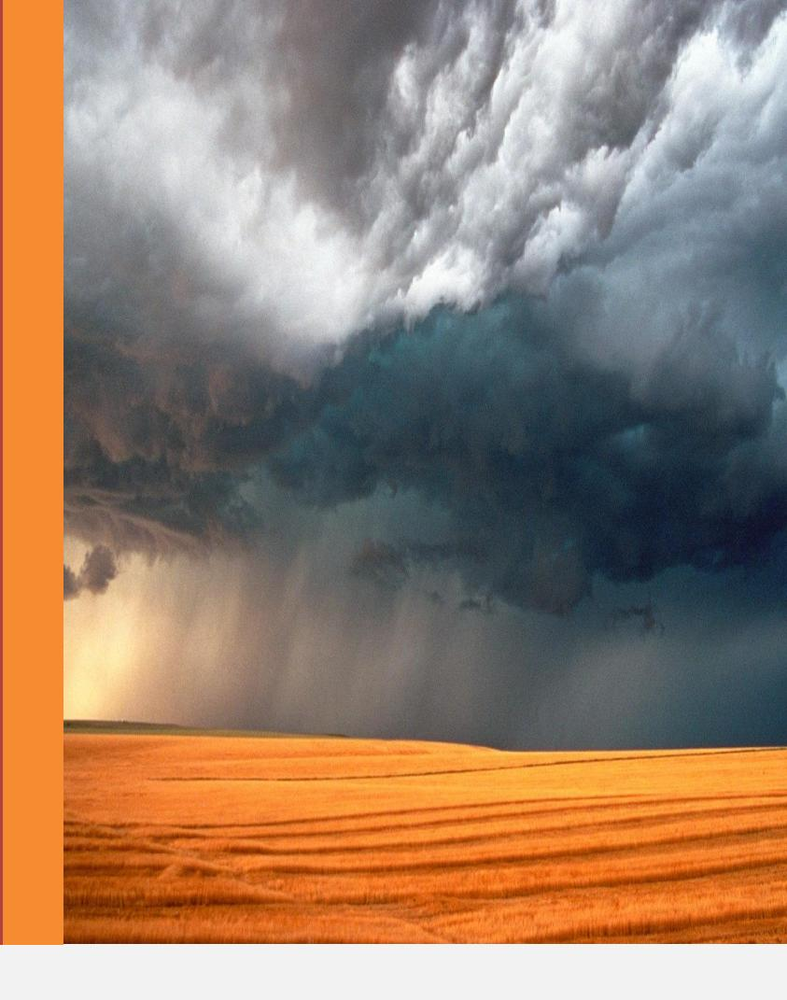

#### Léon Denis

Editora FEB (Federação Espírita Brasileira) www.febnet.org.br

Digitalizada por:

L. Neilmoris

© 2008 – Brasil

www.luzespirita.org

LÉON DENIS

### ÍNDICE

```
Introdução — pag. 7
Primeira Parte – CRENÇAS E NEGAÇÕES
       1 – As Religiões: A doutrina secreta — pag. 11
       2 – A Índia — pag. 17
       3 – O Egito — pag. 24
       4 – A Grécia — pag. 28
       5 – A Gália — pag. 34
       6 – O Cristianismo — pag. 39
       7 – O materialismo e o positivismo — pag. 51
       8 – A crise moral — pag. 58
Segunda Parte – OS GRANDES PROBLEMAS
       9 – O Universo e Deus — pag. 65
       10 – A vida imortal — pag. 76
       11 – A pluralidade das existências — pag. 79
       12 – O alvo da vida — pag. 82
       13 – As provas e a morte — pag. 85
       14 – Objeções — pag. 88
Terceira Parte – O MUNDO INVISÍVEL
       15 – A Natureza e a Ciência — pag. 92
       16 – Matéria e força: princípio único das coisas — pag. 94
       17 – Os fluídos: o Magnetismo — pag. 96
       18 – Fenômenos Espíritas — pag. 99
       19 – Testemunhos científicos — pag. 100
       20 – O Espiritismo na França — pag. 106
       21 – O Perispírito ou Corpo Espiritual — pag. 110
       22 – Os médiuns — pag. 113
       23 – A evolução perispiritual — pag. 116
       24 – Consequências filosóficas e morais — pag. 118
       25 – O Espiritismo e a Ciência — pag. 120
       26 – Perigos do Espiritismo — pag. 122
       27 – Charlatanismo e venalidade — pag. 124
       28 – Utilidade dos estudos psicológicos — pag. 126
```

```
Quarta Parte – ALÉMTÚMULO
       29 – O homem, ser psíquico — pag. 129
       30 – A hora final — pag. 131
       31 – O julgamento — pag. 134
       32 – A vontade e os fluídos — pag. 136
       33 – A vida no espaço — pag. 140
       34 – A erraticidade — pag. 142
       35 – A vida superior — pag. 144
       36 – Os Espíritos inferiores — pag. 150
       37 – O inferno e os demônios — pag. 153
       38 – Ação do homem sobre os Espíritos infelizes — pag. 155
       39 – Justiça, solidariedade, responsabilidade — pag. 157
       40 – Livrearbítrio e providência — pag. 160
       41 – Reencarnação — pag. 162
Quinta Parte – O CAMINHO RETO
       42 – A vida moral — pag. 166
       43 – O dever — pag. 168
       44 – Fé, esperança, consolações — pag. 171
       45 – Orgulho, riqueza e pobreza — pag. 174
       46 – O egoísmo — pag. 178
       47 – A Caridade — pag. 181
       48 – Doçura, paciência, bondade — pag. 185
       49 – O Amor — pag. 188
       50 – Resignação na adversidade — pag. 190
       51 – A Prece — pag. 196
       52 – Trabalho, sobriedade, continência — pag. 201
       53 – O estudo — pag. 204
       54 – A educação — pag. 206
       55 – Questões sociais — pag. 208. 56 – A Lei Moral — pag. 212
Resumo — pag. 214
Conclusão — pag. 216
Apêndice — pag. 219
```

#### Dedicatória:

Aos nobres e grandes Espíritos que me revelaram <sup>o</sup> mistério augusto do destino, <sup>a</sup> lei do progresso na Imortalidade, cujos ensinos consolidaram em mim <sup>o</sup> sentimento da justiça, <sup>o</sup> amor da sabedoria, <sup>o</sup> culto do dever, cujas vozes dissiparam as minhas dúvidas, apaziguaram as minhas inquietações; ás almas generosas que me sustentaram na luta, consolaram na prova, <sup>e</sup> elevaram meu pensamento até às alturas luminosas em que se assenta <sup>a</sup> Verdade, eu dedico estas páginas.

### Introdução

Vi, deitadas em suas mortalhas de pedra ou de areia, as cidades famosas da antigüidade: Cartago, em brancos promontórios, as cidades gregas da Sicília, os arrabaldes de Roma, com osaquedutos partidos e os túmulos abertos, as necrópoles que dormem um sono de vinte séculos, debaixo das cinzas do Vesúvio. Vi os últimos vestígios das cidades longínquas, outrora formigueiros humanos, hoje ruínas desertas, que o sol do Oriente calcina com suas carícias ardentes.

Evoquei as multidões que se agitaram e viveram nesses lugares: vias desfilar, diante do meu pensamento, com as paixões que as consumiram, com seus ódios, seus amores e suas ambições desvanecidas, com seus triunfos e reveses fumaças dissipadas pelo sopro dos tempos. vi os soberanos, chefes de impérios, tiranos ou heróis, cujos nomes foram celebrados pelos fastos da História, mas que o futuro esquecerá.

Passavam como sombras efêmeras, como espectros truanescos que a glória embriaga uma hora, e que o túmulo chama, recebe e devora. E disse comigo mesmo: Eis em que se transformam os grandes povos, as capitais gigantes — algumas pedras amontoadas, colinas silenciosas, sepulturas sombreadas por mirrados vegetais, em cujos ramos o vento da noite murmura suas queixas. A História registrou as vicissitudes de sua existência, suas grandezas passageiras, sua queda final, porém tudo a terra sepultou. Quantos outros cujos nomes mesmos são desconhecidos; quantas civilizações, raças, cidades grandiosas, jazem para sempre sob o lençol profundo das águas, na superfície dos continentes submersos!

E perguntei a mim mesmo: por que essas gerações a se sucederem como camadas de areia que, acarretadas incessantemente pelas ondas, vão cobrir outras camadas que as precederam? Por que esses trabalhos, essas lutas, esses sofrimentos, se tudo deve terminar no sepulcro? Os séculos, esses minutos da eternidade, viram passar nações e reinos, e nada ficou de pé. A esfinge tudo devorou!

Em sua carreira, para onde vai, pois, o homem? Para o nada ou para uma luz desconhecida? A Natureza risonha, eterna, moldura as tristes ruínas dos impérios, com os seus esplendores. Nela nada morre, senão para renascer. Leis profundas, uma ordem imutável, presidem às suas evoluções. Só o homem, com suas obras, terá por destino o nada, o olvido? A impressão produzida pelo espetáculo das cidades mortas, ainda a encontrei mais pungente diante dos frios despojos dos entes que me são caros, daqueles que partilharam a minha vida.

— Um desses a quem amais vai morrer. Inclinado para ele, com o coração opresso, vedes estenderse lentamente, sobre suas feições, a sombra da morte. O foco interior nada mais dá que pálidos e trêmulos lampejos; eilo que se enfraquece ainda, depois se extingue. E agora, tudo o que nesse ser atestava a vida, esses olhos que brilhavam, essa boca que pro feria sons, esses membros que se agitavam, tudo está velado, silencioso, inerte. Nesse leito fúnebre mais não Fui que um cadáver! Qual o homem que a si mesmo não pediu a explicação desse mistério, e que, durante a vigília lúgubre, nesse silenciar solene com a morte, deixou de refletir no que o espera a si próprio? A todos interessa esse problema, porque todos estamos sujeitos à lei.

Convém saber se tudo acaba nessa hora, se mais não é a morte que triste repouso no aniquilamento, ou, ao contrário, o ingresso em outra esfera de sensações. Mas, de todos os lados levantamse problemas. Por toda parte, no vasto teatro do mundo, dizem certos pensadores, reina como soberano o sofrimento; por toda parte, o aguilhão da necessidade e da dor estimula esse galope desenfreado, esse bailado terrível da vida e da morte. De toda parte, levantase o grito angustioso do ser que se precipita no caminho do desconhecido. Para esse, a existência só parece um perpétuo combate: a glória, a riqueza, a beleza, o talento — realezas de um dia! A morte passa, ceifando essas flores brilhantes, para só deixar hastes fanadas.

A morte é o ponto de interrogação ante nós incessantemente colocado, o primeiro tema a que se ligam questões semnúmero, cujo exame faz a preocupação, o desespero dos séculos, a razão de ser de imensa cópia de sistemas filosóficos. Apesar desses esforços do pensamento, a obscuridade tem pesado sobre nós. A nossa época se agita nas trevas e no vácuo, e procura, sem achar, um remédio a seus males. Imensos são os progressos materiais, mas no seio das riquezas acumuladas, podese ainda morrer de privações e de miséria. O homem não é mais feliz nem melhor. No meio dos seus rudes labores, nenhum ideal elevado, nenhuma noção clara do destino o sustém; daí seus desfalecimentos morais, excessos de revoltas. Extinguiuse a fé do passado; o cepticismo, o materialismo, substituíramna, e, ao sopro destes, o fogo das paixões, dos apetites, dos desejos, temse ateado.

Convulsões sociais ameaçamnos.

Às vezes, atormentado pelo espetáculo do mundo e pelas incertezas do futuro, o homem levanta os olhos para o céu, e perguntalhe a verdade. Interroga silenciosamente a Natureza e o seu próprio espírito. Pede à Ciência os seus segredos, à Religião os seus entusiasmos. Mas, a Natureza parecelhe muda, e as respostas dos sábios e dos sacerdotes não satisfazem à sua razão nem ao seu coração. Entretanto, existe uma solução para esses problemas, solução melhor, mais racional e mais consoladora que todas as oferecidas pelas doutrinas e filosofias do dia; tal solução repousa sobre as bases mais sólidas que conceber se possa: o testemunho dos sentidos e a experiência da razão.

No momento mesmo em que o materialismo atingia o seu apogeu, e por toda parte espalhava a ideia do nada, surge uma crença nova apoiada em fatos. Ela oferece ao pensamento um refúgio onde se encontra, afinal, o conhecimento das leis eternas de progresso e de justiça. Um florecimento de ideias que se acreditava mortas, mas que dormitavam apenas, produzse e anuncia uma renovação intelectual e moral. Doutrinas, que foram a alma das civilizações passadas, reaparecem sob

mais desenvolvida forma, e numerosos fenômenos, por muito tempo desdenhados, mas cuja importância enfim é pressentida por certos sábios, vêm oferecerlhe uma base de demonstração e de certeza. As práticas do magnetismo, do hipnotismo, da sugestão; mais ainda, os estudos de Crookes, Russel Wallace, Paul Gibier, etc., sobre as forças psíquicas, fornecem novos dados para a solução do grande problema. Abremse abismos, formas de existência revelamse em centros onde não mais se cuidava de observálos. E, dessas pesquisas, desses estudos, dessas descobertas, nascem uma concepção do mundo e da vida, um conhecimento de leis superiores, uma afirmação da ordem e da justiça universais, apropriados a despertar no coração do homem, com uma fé mais firme e mais esclarecida no futuro, um sentimento profundo dos seus deveres, um afeto real por seus semelhantes, capazes de transformarem a face das sociedades.

É essa doutrina que oferecemos aos pesquisadores de todas as ordens e todas as classes. Ela já tem sido divulgada em numerosos volumes.

Acreditamos nosso dever resumila nestas páginas, sob uma forma diferente, na intenção daqueles que estão cansados de viver como cegos, ignorando se a si mesmos, daqueles que não se satisfazem mais com as obras de uma civilização material e inteiramente superficial, mas que aspiram a uma ordem de coisas mais elevada. É sobretudo para vós, filhos e filhas do povo, para quem a jornada é áspera, a existência difícil, para quem océu é mais negro, mais frio o vento da adversidade; é para vós que este livro foi escrito. Não vos trará ele toda a ciência — que o cérebro humano não poderia conter — porém, será mais um degrau para a verdadeira luz. Provandovos que a vida não é uma ironia da sorte nem o resultado de um acaso estúpido, mas a consequência de uma lei justa e equitativa, abrindovos as perspectivas radiosas do futuro, ele fornecerá um alvo mais nobre às vossas ações, fará luzir um raio de esperança na noite de vossas incertezas, aliviará o fardo de vossas provações, e ensinarvosá a não mais tremer diante da morte. Abri o confiantemente; ledeo com atenção, porque emana de um homem que, acima de tudo, quer o vosso bem.

Entre vós, muitos talvez rejeitem nossas conclusões: um pequeno número somente as aceitará. Que importa! Não vamos em busca de êxitos. Um único móbil inspiranos: o respeito, o amor à verdade. Uma só ambição animanos: quereríamos, quando nosso gasto invólucro voltasse à terra, que o Espírito imortal pudesse dizer a si mesmo: minha passagem pelo mundo não terá sido estéril se contribuí para mitigar uma só dor, para esclarecer uma só inteligência em busca da verdade, para reconfortar uma só alma vacilante e contristada.

#### PRIMEIRA PARTE

### CRENÇAS E NEGAÇÕES

# AS RELIGIÕES: A DOUTRINA SECRETA

Quando se lança um golpe de vista sobre o passado, quando se evoca a recordação das religiões desaparecidas, das crenças extintas, apodera-se de nós uma espécie de vertigem ante o aspecto das sinuosidades percorridas pelo pensamento humano. Lenta é sua marcha. Parece, a princípio, comprazer-se nas criptas sombrias da Índia, nos templos subterrâneos do Egito, nas catacumbas de Roma, na meia-luz das catedrais; parece preferir os lugares escuros à atmosfera pesada das escolas, o silêncio dos claustros às claridades do céu, aos livres espaços, em uma palavra, ao estudo da Natureza.

Um primeiro exame, uma comparação superficial das crenças e das superstições do passado conduz inevitavelmente à dúvida. Mas, levantando-se o véu exterior e brilhante que ocultava às massas os grandes mistérios, penetrando-se nos santuários da Ideia religiosa, achamo-nos em presença de um fato de alcance considerável. As formas materiais, as cerimônias extravagantes dos cultos tinham por fim chocar a Imaginação do povo. Por trás desses véus, as religiões antigas apareciam sob aspecto diverso, revestiam caráter grave e elevado, simultaneamente científico e filosófico. Seu ensino era duplo: exterior e público de um lado, interior e secreto de outro, e, neste último caso, reservado somente aos iniciados. Conseguiuse, não há muito, reconstituir esse ensino secreto, após pacientes estudos e numerosas descobertas epigráficas<sup>1</sup>. Desde então, dissiparam-se a obscuridade e a confusão que reinavam nas questões religiosas; com a luz, fez-se a harmonia. Adquiriu-se a prova de que todos os ensinos religiosos do passado se ligam, porque, em sua base, se encontra uma só e mesma doutrina, transmitida de Idade em Idade a uma série ininterrupta de sábios e pensadores.

Todas as grandes religiões tiveram duas faces, uma aparente, outra oculta. Está nesta o espírito, naquela a forma ou a letra. Debaixo do símbolo material, dissimula-se o sentido profundo. O Bramanismo, na Índia, o Hermetismo, no Egito, o Politeísmo grego, o próprio Cristianismo, em sua origem, apresentam esse duplo aspecto. Julgá-las pela face exterior e vulgar é o mesmo que apreciar o valor moral de um homem pelos trajos. Para conhecê-las, é preciso penetrar o pensamento íntimo que lhes Inspira e motiva a existência; cumpre desprender do selo dos mitos e dogmas o princípio gerador que lhes comunica a força e a vida. Descobre-se, então,

 $<sup>^{1}</sup>$  Ver ESSAIS SUR L'HISTOIRE DES RELLGLONS, por Max Muller; LA MISSION DES JUIFS, por St-Yves d'Alveydre; LES GRANDS INITLÉS, por Ed. Schuré.

a doutrina única, superior, imutável, de que as religiões humanas não são mais que adaptações imperfeitas e transitórias, proporcionadas às necessidades dos tempos e dos meios. Em nossa época, muitos fazem uma concepção do Universo, uma Ideia da verdade, absolutamente exterior e material. A ciência moderna, em suas investigações, tem-se limitado a acumular o maior número de fatos, e, depois, a deduzir dai as suas leis. Obteve, assim, maravilhosos resultados, porém, por tal preço, ficar-lhe-á sempre inacessível o conhecimento dos princípios superiores e das causas primitivas. As próprias causas secundárias escapam-lhe. O domínio invisível da vida é mais vasto do que aquele que é atingido pelos nossos sentidos: lá reinam essas causas de que somente vemos os efeitos.

Na antigüidade tinham outra maneira de ver, e um proceder muito diferente. Os sábios do Oriente e da Grécia não desdenhavam observar a natureza exterior, porém era sobretudo no estudo da alma, de suas potências íntimas, que descobriam os princípios eternos. Para eles, a alma era como um livro em que se inscrevem, em caracteres misteriosos, todas as realidades e todas as leis. Pela concentração de suas faculdades, pelo estudo profundo e meditativo de si mesmos, elevaram-se até à causa sem causa, até ao princípio de que derivam os seres e as coisas. As leis inatas da inteligência explicavam-lhes a harmonia e a ordem da Natureza, assim como o estudo da alma lhes dava a chave dos problemas da vida. A alma, acreditavam, colocada entre dois mundos, o visível e o oculto, o material e o espiritual, observando-os, penetrando em ambos, é o instrumento supremo do conhecimento. Conforme seu grau de adiantamento ou de pureza, reflete, com maior ou menor intensidade, os raios do foco divino. A razão e a consciência não só guiam nossa apreciação e nossos atos, mas também são os mais seguros meios para adquirir-se e possuir-se a verdade.

A tais pesquisas era consagrada a vida inteira dos iniciados. Não se limitavam, como em nossos dias, a preparar a mocidade com estudos prematuros, insuficientes, mal dirigidos, para as lutas e deveres da existência. Os adeptos eram escolhidos, preparados desde a infância para a carreira que deviam preencher, e, depois, levados gradualmente aos píncaros intelectuais, de onde se pode dominar e julgar a vida. Os princípios da ciência secreta eram-lhes comunicados numa proporção relativa ao desenvolvimento das suas inteligências e qualidades morais. A iniciação era uma refundição completa do caráter, um acordar das faculdades latentes da alma. Semente quando tinha sabido extinguir em si o fogo das paixões, comprimir os desejos impuros, orientar os impulsos do seu ser para o Bem e para o Belo, é que o adepto participava dos grandes mistérios. Obtinha, então, certos poderes sobre a Natureza, e comunicava-se com as potências ocultas do Universo.

Não deixam subsistir dúvida alguma sobre tal ponto os testemunhos da História a respeito de Apolônio de Tiana e de Simão, o Mago, bem como os fatos, pretensamente miraculosos, levados a efeito por Moisés e pelo Cristo.

Os iniciados conheciam os segredos das forças fluídicas e magnéticas. Este domínio, pouco familiar aos sábios dos nossos dias, a quem se afiguram inexplicáveis os fenômenos do sonambulismo e da sugestão, no meio dos quais se debatem impotentes em conciliá-los com teorias preconcebidas², esse domínio, a

<sup>&</sup>lt;sup>2</sup> Ver LA SUGGESTION MENTALE, por Ochorowlcz.

ciência oriental dos santuários havia explorado, e estava possuidora de todas as suas chaves. Nele encontrava meios de ação incompreensíveis para o vulgo, mas facilmente explicáveis pelos fenômenos do Espiritismo. Em suas experiências fisiológicas, a ciência contemporânea chegou ao pórtico desse mundo oculto conhecido dos antigos e regido por leis exatas. Ainda bem perto está o dia em que a força dos acontecimentos e o exemplo dos audaciosos constrangêlaão a tal. Reconhecerá, então, que nada há aí de sobrenatural, mas, ao contrário, uma face ignorada da Natureza, uma manifestação das forças sutis, um aspecto novo da vida que enche o Infinito.

Se, do domínio dos fatos, passarmos ao dos princípios, teremos de esboçar desde logo as grandes linhas da doutrina secreta. Ao ver desta, a vida não é mais que a evolução, no tempo e no espaço, do Espírito, única realidade permanente. A matéria é sua expressão inferior, sua forma variável. O Ser por excelência, fonte de todos os seres, é Deus, simultaneamente triplo e uno — essência, substância e vida — em que se resume todo o Universo. Daí o deísmo trinitário que, da Índia e do Egito, passou, desfigurandose, para a doutrina cristã. Esta, dos três elementos do Ser, fez as pessoas. A alma humana, parcela da grande alma, é imortal. Progride e sobe para o seu autor através de existências numerosas, alternativamente terrestres e espirituais, por um aperfeiçoamento continuo. Em suas encarnações, constitui ela o homem, cuja natureza ternária — o corpo, o perispírito e a alma —, centros correspondentes da sensação, sentimento e conhecimento, tornase um microcosmo ou pequeno mundo, imagem reduzida do macrocosmo ou GrandeTodo. Eis por que podemos encontrar Deus no mais profundo do nosso ser, interrogando a nós mesmos na solidão, estudando e desenvolvendo as nossas faculdades latentes, a nossa razão e consciência. Tem duas faces a vida universal: a involução ou descida do Espírito à matéria para a criação individual, e a evolução ou ascensão gradual, na cadeia das existências, para a Unidade divina.

Prendiase a esta filosofia um feixe inteiro de ciências: a Ciência dos Números ou Matemáticas Sagradas, a Teogonia, a Cosmogonia, a Psicologia e a Física. Nelas, os métodos indutivo e experimental combinavamse e serviamse reciprocamente de verificação, formando, assim, um todo imponente, um edifício de proporções harmônicas.

Este ensino abria ao pensamento perspectivas suscetíveis de causarem vertigem aos espíritos mal preparados, e por isso era somente reservado aos fortes. Se, por verem o infinito, as almas débeis ficam perturbadas e desvairadas, as valentes fortificamse e medram. É no conhecimento das leis superiores que estas vão beber a fé esclarecida, a confiança no futuro, a consolação na desgraça. Tal conhecimento produz benevolência para com os fracos, para com todos esses que se agitam ainda nos círculos inferiores da existência, vítimas das paixões e da ignorância; inspira tolerância para com todas as crenças. O iniciado sabia unirse a todos e orar com todos. Honrava Brahma na Índia, Osíris em Mênfis, Júpiter na Olímpia, como pálidas imagens da Potência Suprema, diretora das almas e dos mundos. É assim que a verdadeira religião se eleva acima de todas as crenças e a nenhuma maldiz.

O ensino dos santuários produziu homens realmente prodigiosos pela elevação de vistas e pelo valor das obras realizadas, uma elite de pensadores e de

homens de ação, cujos nomes se encontram em todas as páginas da História. Daí saíram os grandes reformadores, os fundadores de religiões, os ardentes propagandistas: Krishna, Zoroastro, Hermes, Moisés, Pitágoras, Platão e Jesus; todos os que têm posto ao alcance das multidões as verdades sublimes que fazem sua superioridade. Lançaram aos ventos a semente que fecunda as almas, promulgaram a lei moral, imutável, sempre e em toda parte semelhante a si mesma. Mas, não souberam os discípulos guardar intacta a herança dos mestres. Mortos estes, os seus ensinos ficaram desnaturados e desfigurados por alterações sucessivas. A mediocridade dos homens não era apta a perceber as coisas do espírito, e bem depressa as religiões perderam a sua simplicidade e pureza primitivas. As verdades que tinham sido ensinadas foram sufocadas sob os pormenores de uma interpretação grosseira e material.

Abusouse dos símbolos para chocar a imaginação dos crentes, e, muito breve, a ideia máter ficou sepultada e esquecida sob eles. A verdade é comparável às gotas de chuva que oscilam na extremidade de um ramo. Enquanto aí ficam suspensas, brilham como puros diamantes aos raios do Sol; desde, porém, que tocam o chão, confundemse com todas as impurezas. O que nos vem de cima manchase ao contacto terrestre. Até mesmo ao seio dos templos levou o homem as suas concupiscências e misérias morais. Por isso, em cada religião, o erro, este apanágio da Terra, misturase com a verdade, este bem dos céus.

\*

Perguntase algumas vezes se a religião é necessária. A religião (do latim religare, ligar, unir), bem compreendida, deveria ser um laço que prendesse os homens entre si, unindoos por um mesmo pensamento ao princípio superior das coisas. Há na alma um sentimento natural que a arrasta para um ideal de perfeição em que se identificam o Bem e a Justiça. Este sentimento, o mais nobre que poderemos experimentar, se fosse esclarecido pela Ciência, fortificado pela razão, apoiado na liberdade de consciência, viria a ser o móvel de grandes e generosas ações; mas, manchado, falseado, materializado, tornouse, muitas vezes, pelas inquietações da teocracia, um instrumento de dominação egoística.

A religião é necessária e indestrutível porque se baseia na própria natureza do ser humano, do qual ela resume e exprime as aspirações elevadas. É, igualmente, a expressão das leis eternas, e, sob este ponto de vista, tende a confundirse com a filosofia, fazendo com que esta passe do domínio da teoria ao da execução, tornandose vivaz e ativa. Mas, para exercer uma influência salutar, para voltar a ser um incitante de progresso e elevação, a religião deve despojarse dos disfarces com que se revestiu através dos séculos. Não são os seus elementos primordiais que devem desaparecer, mas, sim, as formas exteriores, os mitos obscuros, o culto, as cerimônias. Cumpre evitar confundir coisas tão dessemelhantes. A verdadeira religião é um sentimento; é no coração humano, e não nas formas ou manifestações exteriores, que está o melhor templo do Eterno. A verdadeira religião não poderia ser encerrada dentro de regras e ritos acanhados; não necessita de sacerdotes nem de fórmulas nem de imagens.

Pouco se inquieta com simulacros e modos de adorar; só julga os dogmas por sua influência sobre o aperfeiçoamento das sociedades. Abraça todos os cultos,

todos os sacerdócios, elevase bastante e dizlhes: A Verdade ainda está muito acima!

Entretanto, devese compreender que nem todos os homens se acham em vias de atingir esses píncaros intelectuais. Eis por que a tolerância e a benevolência são coisas que se impõem. Se, por um lado, o dever convidanos a desprender os bons espíritos dos aspectos vulgares da religião, por outro, é preciso nos abstermos de lançar a pedra às almas sofredoras, lacrimosas, incapazes de assimilar noções abstratas, mas que encontram arrimo e conforto na sua cândida fé.

Verificase, porém, que, de dia para dia, diminui o número dos crentes sinceros. A ideia de Deus, outrora simples e grande nas almas, foi desnaturada pelo temor do inferno, e perdeu seu poder. Na impossibilidade de se elevarem até ao absoluto, certos homens acreditaram ser necessário adaptar à sua forma e medida tudo o que queriam conceber. Foi assim que rebaixaram Deus ao nível deles próprios, atribuindolhe as suas paixões e fraquezas, amesquinhando a Natureza e o Universo, e, sob o prisma da ignorância, decompondo em cores diversas os argênteos raios da verdade. As claras noções da religião natural foram obscurecidas a belprazer. A ficção e a fantasia engendraram oerro, e este, preso ao dogma, ergueuse como um obstáculo no meio do caminho. A luz ficou velada para aqueles que se acreditavam seus depositários, e as trevas, com que pretendiam envolver os outros, fizeramse em si próprios e ao seu redor. Os dogmas perverteram o critério religioso, e o interesse de casta falseou o senso moral. Daí um acervo de superstições, de abusos e práticas idólatras, cujo espetáculo lançou tantos homens na negação. A reação, porém, anunciase. As religiões, imobilizadas em seus dogmas como as múmias em suas faixas, agora agonizam, abafadas em seus invólucros materiais, enquanto tudo marcha e evolve em torno delas.

Perderam quase toda a influência sobre os costumes, sobre a vida social, e estão destinadas a perecer. Mas, como todas as coisas, as religiões só morrem para renascer. A ideia que os homens fazem da Verdade modificase e dilata com o decorrer dos tempos. Eis por que as religiões, manifestações temporárias, vistas parciais da eterna Verdade, tendem a transformarse desde que já tenham cumprido a sua tarefa, e não mais correspondam aos progressos e às necessidades da Humanidade. A medida que esta caminha, são precisas novas concepções, um ideal mais elevado, e isso só poderá ser encontrado nas descobertas da Ciência, nas intuições crescentes do pensamento.

Chegamos a uma época da História em que as religiões encanecidas aluem se por suas bases, época em que se prepara uma renovação filosófica e social. O progresso material e intelectual desafia o progresso moral. Na profundeza das almas agitase um mundo de aspirações, que faz esforços por tomar forma e aparecer à vida. O sentimento e a razão, essas duas grandes forças imperecíveis como o Espírito humano, de que são atributos, forças hostis até hoje e que perturbavam a sociedade com os seus conflitos, semeando por toda parte a discórdia, a confusão e o ódio, tendem, finalmente, a se conciliarem. A religião deve perder seu caráter dogmático e sacerdotal para tornarse científica; a ciência libertarseá dos baixios materialistas para esclarecerse com um raio divino. Surgirá uma doutrina, idealista em suas tendências, positiva e experimental em seu método, apoiada sobre fatos inegáveis. Sistemas opostos na aparência, filosofias contraditórias e inimigas, o

#### 16 – Léon Denis

Espiritismo e o Naturalismo, entre outras, acharão, afinal, um terreno de reconciliação. Síntese poderosa, ela abraçará e ligará todas as concepções variadas do mundo e da vida, raios dispersos, faces variadas da Verdade.

Será a ressurreição, sob forma mais ampla e a todos acessível, dessa doutrina que o passado conheceu, será o aparecimento da religião natural que renascerá simples, sem cultos nem altares. Cada pai será sacerdote em sua família, ensinará e dará o exemplo. A religião passará para os atos, para o desejo ardente do bem; o holocausto será o sacrifício de nossas paixões, o aperfeiçoamento do Espírito humano. Tal é a doutrina superior, definitiva, universal, no seio da qual serão absorvidas, como os rios pelo oceano, todas as religiões passageiras, contraditórias, causas freqüentes de dissidência e dilaceração para a Humanidade.

# 2 A ÍNDIA

Dissemos que a doutrina secreta achava-se no fundo de todas as religiões e nos livros sagrados de todos os povos. De onde veio ela? Qual a sua origem? Quais os homens que a conceberam e fizeram depois a sua descrição? As mais antigas escrituras são as que resplandecem nos céus³. Esses mundos estelares que, através das noites calmas, deixam cair serenas claridades, constituem as escrituras eternas e divinas de que fala Dupuis. Os homens têm-nas, sem dúvida, consultado antes de escrever; mas os primeiros livros em que se encontra exposta a grande doutrina são os Vedas. É o molde em que se formou a religião primitiva da Índia, religião inteiramente patriarcal, simples e pura, como uma existência desprovida de paixões, passando vida tranquila e forte ao contacto da natureza esplêndida do Oriente⁴.

Os hinos védicos igualam em grandeza e elevação moral a tudo o que, no decorrer dos tempos, o sentimento poético engendrou de mais belo. Celebram Agni, o fogo, símbolo do Eterno Masculino ou Espírito Criador; Sorna, o licor do sacrificio, símbolo do Eterno Feminino, Alma do Mundo, substância etérea. Em sua união perfeita, esses dois princípios essenciais do Universo constituem o Ser Supremo, Zians ou Deus. O Ser Supremo imola-se a si próprio e divide-se para produzir a vida universal. Assim, o mundo e os seres saídos de Deus voltam a Deus por uma evolução constante. Daí a teoria da queda e da reascensão das almas que se encontra no Oriente. Ao sacrificio do fogo resume-se todo o culto védico. Ao levantar do dia, o chefe de família, pai e sacerdote ao mesmo tempo, acendia a chama sagrada no altar da Terra, e, assim, para o céu azul, subia alegre a prece, a invocação de todos à Forca Única e viva, que está coberta pelo véu transparente da Natureza. Enquanto se cumpre o sacrificio, dizem os Vedas, os Assuras ou Espíritos superiores e os Pitris ou almas dos antepassados cercam os assistentes e se associam às suas preces. Portanto, a crença nos Espíritos remonta às primeiras idades do mundo

Os Vedas afirmam a imortalidade da alma e a reencarnação: "Há uma parte Imortal do homem que é aquela, o Agni, que cumpre aquecer com teus raios,

<sup>&</sup>lt;sup>3</sup> Os signos do Zodíaco.

<sup>&</sup>lt;sup>4</sup> A idade dos Vedas ainda não pôde ser fixada. Souryo-Shiddanto, astrônomo hindu, cujas observações sobre a posição e percurso das estrelas remonta a cinquenta e oito mil anos, fala dos Vedas como obras já veneráveis pela sua antigüidade. (De O ESPIRITISMO OU FAQUIRISMO OCIDENTAL, pelo Dr. Paul Gibier, capítulo V)

#### 18 – Léon Denis

inflamar com teus fogos. — De onde nasceu a alma? Umas vêm para nós e daqui partem, outras partem e tornam a voltar."

Os Vedas são monoteístas; as alegorias que se encontram em cada página apenas dissimulam a imagem da grande Causa primária, cujo nome, cercado de santo respeito, não podia, sob pena de morte, ser pronunciado. As divindades secundárias ou devas personificam os auxiliares inferiores do Ser Supremo, as forças vivas da Natureza e as qualidades morais.

Do ensino dos Vedas decorria toda a organização da sociedade primitiva, o respeito à mulher, o culto dos antepassados, o poder eletivo e patriarcal. Os homens viviam felizes, livres e em paz. Durante a época védica, na vasta solidão dos bosques, nas margens dos rios e lagos, anacoretas ou rishis passavam os dias no retiro. Intérpretes da ciência oculta, da doutrina secreta dos Vedas, eles possuíam já esses misteriosos poderes, transmitidos de século em século, de que gozam ainda os faquires e os jogues. Dessa confraria de solitários saiu o pensamento inovador, o primeiro impulso que fez do Bramanismo a mais colossal das teocracias.

Krishna, educado pelos ascetas no seio das florestas de cedros que coroam os píncaros nevoentos do Himalaia, foi o inspirador das crenças dos hindus. Essa grande figura aparece na História como o primeiro dos reformadores religiosos, dos missionários divinos. Renovou as doutrinas védicas, apoiandose sobre as ideias da Trindade, da imortalidade da alma e de seus renascimentos sucessivos. Selada a obra com o seu próprio sangue, deixou a Terra, legando à Índia essa concepção do Universo e da Vida, esse ideal superior em que ela tem vivido durante milhares de anos.

Sob nomes diversos, pelo mundo espalhouse essa doutrina com todas as migrações de homens, de que foi origem a região da Índia. Essa terra sagrada não é somente a mãe dos povos e das civilizações, é também o foco das maiores inspirações religiosas. Krishna, rodeado por um certo número de discípulos, ia de cidade em cidade espalhar os seus ensinos: "O corpo — dizia ele <sup>5</sup>—, envoltório da alma que ai faz sua morada, é uma coisa finita; porém, a alma que o habita é invisível, imponderável e eterna.

"O destino da alma depois da morte constitui o mistério dos renascimentos. Assim como as profundezas do céu se abrem aos raios dos astros, assim também os recônditos da vida se esclarecem à luz desta verdade.

"Quando o corpo entra em dissolução, se a pureza é que o domina, a alma voa para as regiões desses seres puros que têm o conhecimento do Altíssimo. Mas, se é dominado pela paixão, a alma vem de novo habitar entre aqueles que estão presos às coisas da Terra. Assim, a alma, obscurecida pela matéria e pela ignorância, é novamente atraída para o corpo de seres irracionais.

"Todo renascimento, feliz ou desgraçado, é consequência das obras praticadas nas vidas anteriores.

"Há, porém, um mistério maior ainda. Para atingir a perfeição, cumpre conquistar a ciência da Unidade, que está acima de todos os conhecimentos; é preciso elevarse ao Ser Divino, que está acima da alma e da inteligência. Esse Ser Divino está também em cada um de nós:

<sup>5</sup> BHAGAVADGITÀ.

"Trazes em ti próprio um amigo sublime que não conheces, pois Deus reside no interior de todo homem, porém poucos sabem achálo. Aquele que faz o sacrifício de seus desejos e de suas obras ao Ser de que procedem osprincípios de todas as coisas, obtém por tal sacrifício a perfeição, porque, quem acha em si mesmo sua felicidade, sua alegria, e também sua luz, é um com Deus. Ora, fica sabendo, a alma que encontrou Deus está livre do renascimento e da morte, da velhice e da dor, e bebe a água da imortalidade."

Krishna falava na sua missão e da sua própria natureza em termos sobre os quais convém meditar. Dirigindose aos seus discípulos, dizia: "Tanto eu como vós temos tido vários nascimentos. Os meus só de mim são conhecidos, porém vós nem mesmo os vossos conheceis. Posto que, por minha natureza, eu não esteja sujeito a nascer e a morrer, todas as vezes que no mundo declina a virtude, e que o vício e a injustiça a superam, tornome então visível; assim me mostro, de idade em idade, para salvação do justo, para castigo do mau, e para restabelecimento da verdade.

"Reveleivos os grandes segredos. Não os digais senão àqueles que os podem compreender. Sois os meus eleitos: vedes o alvo, a multidão só descortina uma ponta do caminho." <sup>6</sup>

Por essas palavras a doutrina secreta estava fundada. Apesar das alterações sucessivas que teve de suportar, ela ficará sendo a fonte da vida em que, na sombra e no silêncio, se inspiram todos os grandes pensadores da antiguidade.

A moral de Krishna também era muito pura: "Os males com que afligimos o próximo perseguemnos, assim como a sombra segue o corpo — as obras inspiradas pelo amor dos nossos semelhantes são as que mais pesarão na balança celeste. — Se convives com os bons, teus exemplos serão inúteis; não receeis habitar entre os maus para os reconduzir ao bem. — O homem virtuoso é semelhante a uma árvore gigantesca, cuja sombra benéfica permite frescura e vida às plantas que a cercam."

Sua linguagem elevavase ao sublime quando falava da abnegação e do sacrifício: "O homem de bem deve cair aos golpes dos maus como o sândalo que, ao ser abatido, perfuma o machado que o fere."

Quando os sofistas pediam que explicasse a natureza de Deus, respondia lhes: "Só o infinito e o espaço podem compreender o infinito. Somente Deus pode compreender a Deus."

Dizia ainda: "Nada do que existe pode perecer, porque tudo está contido em Deus. Visto isso, não é alvitre sábio choraremse os vivos ou os mortos, pois nunca todos nós cessaremos de subsistir além da vida presente." <sup>7</sup>

Sobre a comunicação dos Espíritos: "Muito tempo antes de se despojarem de seu envoltório mortal, as almas que só praticaram o bem adquirem a faculdade de conversar com as almas que as precederam na vida espiritual."

É isto o que, ainda em nossos dias, afirmam os brâmanes pela doutrina dos Pitris, mesmo porque, em todos os tempos, a evocação dos mortos tem sido uma das formas da sua liturgia. Tais são os principais pontos dos ensinos de Krishna, que se encontram nos livros sagrados conservados ainda nos santuários do sul do Indostão.

<sup>7</sup> MAHABHÃRATA, trad. H. Fauche.

<sup>6</sup> BHAGAVADGITA, passim.

#### 20 - Léon Denis

A princípio, a organização social da Índia foi calcada pelos brâmanes sobre suas concepções religiosas. Dividiram a sociedade em três classes, segundo o sistema ternário; mas, pouco a pouco, tal organização degenerou em privilégios sacerdotais e aristocráticos. A hereditariedade impôs os seus limites estreitos e rígidos às aspirações de todos. A mulher, livre e honrada nos tempos védicos, tornou-se escrava, e dos filhos só soube fazer escravos, igualmente. A sociedade condensou-se num molde implacável, a decadência da Índia foi a sua consequência inevitável. Petrificado em suas castas e seus dogmas, esse país teve um sono letárgico, imagem da morte, que nem mesmo foi perturbado pelo tumulto das invasões estrangeiras! Acordará ainda? Só o futuro poderá dizê-lo.

Os brâmanes, depois de terem estabelecido a ordem e constituído a sociedade, perderam a Índia por excesso de compressão. Assim também, despiram toda a autoridade moral da doutrina de Krishna, envolvendo-a em formas grosseiras e materiais.

Se considerarmos o Bramanismo somente pelo lado exterior e vulgar, por suas prescrições pueris, cerimonial pomposo, ritos complicados, tábulas e imagens de que é tão pródigo, seremos levados a nele não ver mais que um acervo de superstições. Seria, porém, erro julgá-lo unicamente pelas suas aparências exteriores. No Bramanismo, como em todas as religiões antigas, cumpre distinguir duas coisas. — Uma é o culto e o ensino vulgar, repletos de ficções que cativam o povo, auxiliando a conduzi-lo pelas vias da submissão. A esta ordem de ideias liga-se o dogma da metempsicose ou renascimento das almas culpadas em Corpos de animais, Insetos ou plantas, espantalho destinado a atemorizar os fracos, sistema hábil Imitado pelo Catolicismo quando concebeu os mitos de Satanás, do inferno e dos suplícios eternos. — A outra é o ensino secreto, a grande tradição esotérica que fornece sobre a alma e seus destinos, e sobre a causa Universal, as mais puras e elevadas reflexões. Para conseguir isso, é necessário penetrar-se nos mistérios dos pagodes, folhear os manuscritos que estes encerram e interrogar os brâmanes sábios.

\*

Cerca de seiscentos anos antes da era Cristã, um filho de rei, Çãkyamuni ou o Buda, foi acometido de profunda tristeza e imensa piedade pelos sofrimentos dos homens. A corrupção invadira a Índia, logo depois de alteradas as tradições religiosas, e, em seguida, vieram os abusos da teocracia ávida do poder. Renunciando às grandezas, à vida faustosa o Buda deixa o seu palácio e embrenhase na floresta silenciosa Após longos anos de meditação, reaparece para levar ao mundo asiático senão uma crença nova, ao menos uma outra expressão da Lei.

Segundo o Budismo<sup>8</sup>, está no desejo a causa do mal, da dor, da morte e do renascimento. É o desejo, é a paixão que nos prende às formas materiais, e que desperta em nós mil necessidades sem cessar reverdecentes e nunca saciadas tornando-se assim, outros tantos tiranos. O fim elevado da vida é arrancar a alma aos turbilhões do desejo. Consegue-se isso pela reflexão, austeridade, pelo desprendimento de todas as coisas terrenas, pelo sacrificio do eu, pela isenção do cativeiro egoísta da personalidade. A ignorância é o mal soberano de que decorrem o

 $<sup>^{\</sup>bf 8}$  LE BOUDDHISME, por Leon de Rosny; LA SCIENCE DES RELIGIONS, por Burnouf.

sofrimento e a miséria; o principal meio para se melhorar a vida no presente e no futuro é adquirir-se o Conhecimento. O Conhecimento compreende a ciência da natureza visível e invisível, o estudo do homem e dos princípios das coisas. Estes são absolutos e eternos.

O mundo, saído por sua própria atividade de um estado uniforme, está numa evolução continua. Os seres, descidos do Grande-Todo a fim de operarem o problema da Perfeição, inseparável do estado de liberdade e, por conseguinte, do movimento e do progresso, tendem sempre a voltar ao Bem perfeito. Não penetram no mundo da forma senão para trabalharem no complemento da sua obra de aperfeiçoamento e elevação. Podem realizar isso pela Ciência, ou Upanishacl, e completá-lo pelo Amor, ou Purana. A Ciência e o Amor são dois fatores essenciais do Universo. Enquanto não adquire o amor, o ser está condenado a prosseguir na série das reencarnações terrestres. Sob a Influência de tal doutrina, o instinto egoísta vê estreitar-se pouco a pouco o seu circulo de ação. O ser aprende a abraçar num mesmo amor tudo o que vive e respira; e isto nada mais é que um dos degraus da sua evolução, pois esta deve conduzi-lo a só amar o eterno princípio de que emana todo o amor, e para onde todo ele deve necessariamente voltar. Esse estado é o do Nirvana

Essa expressão, diversamente comentada, tem causado muitos equívocos.

Em conformidade com a doutrina secreta do Budismo<sup>9</sup>, o Nirvana não é, como ensina a Igreja do Sul e o Grã-Sacerdote do Ceilão, a perda da individualidade e o esvaecimento do ser no nada, mas sim a conquista, pela alma, da perfeição, e a libertação definitiva das transmigrações e dos renascimentos no seio das humanidades. Cada qual executa o seu próprio destino. A vida presente, com suas alegrias e dores, não é senão a consequência das boas ou más ações operadas livremente pelo ser nas existências anteriores.

O presente explica-se pelo passado, não só para o mundo tomado em seu conjunto, como também para cada um dos seres que o compõem. Designa-se por Carma toda a soma deméritos ou de deméritos adquiridos pelo ser. O Carma é para este, em todos os Instantes da sua evolução, o ponto de partida do futuro, o motor de toda a justiça distributiva: "Em Buda<sup>10</sup> uno-me à dor de todos os meus irmãos, e entretanto sorrio e sinto-me contente porque vejo que a liberdade existe. Sabei, ó vós que sofreis; mostro-vos a verdade; tudo o que somos é resultante do que fomos no passado. Tudo é fundado sobre nossos pensamentos; tudo é obra dos próprios pensamentos. Se as palavras e ações de um homem obedecem a um pensamento puro, a liberdade segue-o como uma sombra. O ódio jamais foi apaziguado pelo ódio, pois não é vencido senão pelo amor. Assim como a chuva passa através de uma casa mal coberta, assim a paixão atravessa um espírito pouco refletido. Pela reflexão, moderação e domínio de si próprio, o homem transforma-se numa rocha que nenhuma tempestade pode abater. O homem colhe aquilo que semeou. Eis a doutrina do Carma."

A maior parte das religiões recomenda-nos fazer o bem em vista de uma recompensa de além-túmulo. Está aí um móbil egoísta e mercenário que não se

-

<sup>9</sup> LE POUDDHISME ÊSOTÊRIQUE, por Sinnet.

<sup>10</sup> DHAMMAPADA.

encontra do mesmo modo no Budismo. É necessário praticar o bem, diz Léon de Rosny<sup>11</sup>, porque o bem é o fim supremo da Natureza. É conformando-se às exigências dessa lei que se adquire a única satisfação verdadeira, a mais bela que pode apreciar o ser desprendido dos entraves da forma e das atrações do desejo, causas contínuas de decepção e de sofrimento.

A compaixão do Budismo, sua caridade, estende-se a todos os seres.

Segundo ele, todos são destinados ao Nirvana. E, por seres, devem entender-se os animais, os vegetais e mesmo os corpos inorgânicos. Todas as formas da vida se encadeiam, de acordo com a lei grandiosa da evolução e do transformismo. Em parte alguma do Universo deixa de existir vida. A morte não é senão uma ilusão, um dos agentes da vida que exige um renovamento continuo e transformações incessantes. O inferno, para os iniciados na doutrina, não é outra coisa senão o remorso e a ausência do amor. O purgatório está em toda parte onde se encontra a forma e onde evoluciona a matéria. Está em nosso globo, ao mesmo tempo em que nas profundezas do firmamento estrelado.

O Buda e seus discípulos praticavam o Diana, ou a contemplação, o êxtase. Durante esse estado, o Espírito destaca-se e comunica-se com as almas que deixaram a Terra. 12

O Budismo esotérico ou vulgar, repelido de todos os lados da Índia no século VI, após lutas sangrentas provocadas pelos brâmanes, sofreu vicissitudes diversas e numerosas transformações. Um dos seus ramos ou Igreja, a do Sul, em algumas das suas interpretações, parece inclinar-se para o ateísmo e materialismo. A do Tibé conservou-se deísta e espiritualista. O Budismo também se tornou a religião do império mais vasto do mundo: a China. Seus fiéis adeptos compõem, hoje, a terca parte da população do globo; mas, em todos os meios onde ele se espalhou, do Ural ao Japão, foram veladas e alteradas as tradições primitivas. Nele, como em qualquer outra doutrina, as formas materiais do culto abafaram as altas aspirações do pensamento. Os ritos, as cerimônias supersticiosas, as fórmulas vãs, as oferendas, as preces sonoras, substituíram o ensino moral e a prática das virtudes<sup>13</sup>. Entretanto, os principais ensinamentos do Buda foram conservados nos Sutras<sup>14</sup>. Sábios, herdeiros da ciência e dos poderes dos antigos ascetas, possuem também, dizem<sup>15</sup>, a doutrina secreta na sua integridade. Esses estabeleceram suas moradas longe das multidões humanas, sobre os planaltos das montanhas, de onde os campos da Índia apenas se divisam vagos e longínquos como num sonho. É na atmosfera pura e calma das solidões que habitam os Mãhãtmas. Possuindo segredos que lhes permitem desafiar a dor e a morte, passam os dias na meditação, esperando a hora problemática em que o estado moral da Humanidade torne possível a divulgação dos seus poderes extraordinários. Como, porém, nenhum fato bastante autêntico tem vindo até hoje confirmar essas citações, ainda fica por provar a existência dos Mãhãtmas.

Há vinte anos que grandes esforços foram empregados para espalhar a doutrina búdica no Ocidente. A raça latina, porém, ávida de movimento, de luz e

<sup>&</sup>lt;sup>11</sup> LA MORALE DU BOUDDHISME.

<sup>&</sup>lt;sup>12</sup> L'AME ET SES MANIFESTATIONS À TRAVERS I'HISTOIRE". por Eug. Bonnemère.

<sup>13</sup> REVUE DES DEUX-MOFLDES, 15 de março de 1876, artigo de G. Bousquet.

<sup>&</sup>lt;sup>14</sup> LE LAUTA VISTARA, trad. Foucaux: LE LOTUS DE LA BONNE LOL, trad. Burnout.

<sup>15</sup> LE BOUDDHISME ESOTÉRIQUE, por Sinnet.

liberdade, parece pouco disposta a assimilar-se a essa religião de renunciamento, de que os povos orientais fizeram uma doutrina de aniquilamento voluntário e de prostração intelectual. O Budismo, na Europa, apenas tem permanecido no domínio de alguns homens de letras, que honram o esoterismo tibetano. Este, em certos pontos, abre ao Espírito humano perspectivas estranhas. A teoria dos dias e das noites de Brahma — Manvantara e Pralaya — que é uma renovação das antigas religiões da Índia, parece que está em muita contradição com a ideia do Nirvana. De qualquer modo, esses períodos imensos de difusão e concentração, durante os quais a grande causa primordial absorve todos os seres, permanece só, imóvel, adormecida sobre os mundos dissolvidos, atraem o pensamento numa espécie de vertigem. A teoria dos sete princípios constitutivos do homem e dos sete planetas 16, sobre os quais corre a roda da vida num movimento ascensional, também constitui pontos originais e sujeitos a exame.

Uma coisa domina este ensino: é a lei de caridade proclamada pelo Buda — um dos mais poderosos apelos ao bem que tem ecoado neste mundo; — mas, segundo a expressão de Léon de Rosny<sup>17</sup>, "essa lei calma e pura, porque nada traz em seu apoio, ficou ininteligível para a maioria dos homens, visto lhes revoltar os apetites e não prometer a espécie de salário que querem ganhar".

O Budismo, apesar das suas manchas e sombras, nem por isso deixa de ser uma das maiores concepções religiosas das que têm aparecido neste mundo, uma doutrina toda de amor e igualdade, uma reação poderosa contra a distinção de castas que foi estabelecida pelos brâmanes, doutrina que, em certos pontos, oferece analogias importantes com o Evangelho de Jesus de Nazaré.

<sup>16</sup> Por que sete? Só em nosso sistema solar contam-se oito planetas principais e as perturbações observadas em Netuno fazem supor que existe ainda outro para além daquele == Nota da Editora — E realmente já foi descoberto Plutão.

<sup>&</sup>lt;sup>17</sup> LA MORALE DU BOUDDHISME.

# 3 O EGITO

As portas do deserto erguem-se os templos, os pilonos e as pirâmides, florestas de pedra debaixo de um céu de fogo. As esfinges, retraídas e sonhadoras, contemplam a planície, e as necrópoles, talhadas na rocha, abrem seus sólios profundos à margem do rio silencioso. É o Egito, terra estranha, livro venerável, no qual o homem moderno apenas começa a soletrar o mistério das idades, dos povos e das religiões. <sup>18</sup>

A Índia, diz a maior parte dos orientalistas, comunicou ao Egito a sua civilização e a sua fé; outros, não menos eruditos, afirmam que, em época remota, já a terra de Ísis possuía suas próprias tradições<sup>19</sup>. Estas são a herança de uma raça extinta, a vermelha, que ocupava todo o continente austral, e que foi aniquilada por lutas formidáveis contra os brancos e por cataclismos geológicos. A Esfinge de Gizé, anterior em vários milhares de anos à grande pirâmide<sup>20</sup>, e levantada pelos vermelhos no ponto em que o Nilo se juntava então ao mar<sup>21</sup>, é um dos raros monumentos que esses tempos remotos nos legaram.

A leitura das estrelas<sup>22</sup>, a dos papiros encontrados nos túmulos, permite reconstituir a história do Egito, ao mesmo tempo em que essa antiga doutrina do Verbo-Luz, divindade de tríplice natureza, simultaneamente inteligência, força e matéria: espírito, alma e corpo, que oferece uma analogia perfeita com a filosofia da Índia. Aqui, como lá, encontra-se, debaixo da grosseira forma cultual, o mesmo pensamento oculto. A alma do Egito, o segredo da sua vitalidade, o do seu papel histórico, é a doutrina oculta dos seus sacerdotes, cuidadosamente velada sob os mistérios de Ísis e Osíris, e experimentalmente analisada, no fundo dos templos, por Iniciados de todas as classes e de todos os países.

Sob formas austeras, os princípios dessa doutrina eram expressos pelos livros sagrados de Hermes, que constituíam uma vasta enciclopédia. Ali se encontravam classificados os conhecimentos humanos, mas nem todos os livros chegaram até nós. A ciência religiosa do Egito foi-nos restituída sobretudo pela

<sup>&</sup>lt;sup>18</sup> Ver as obras de François Lenormant e Maspéro.

<sup>19</sup> Maneton atribui aos templos egípcios uma tradição de trinta mil anos.

<sup>&</sup>lt;sup>20</sup> Um manuscrito da quarta dinastia (4000 anos a.C.) refere que a Esfinge, enterrada nas areias e olvidada desde séculos, foi encontrada fortuitamente nessa época. (HISTOLRE D'ORIENT, por Lenormant)

<sup>&</sup>lt;sup>21</sup> O delta atual foi formado pelas aluviões sucessivas depositadas pelo Nilo.

<sup>&</sup>lt;sup>22</sup> Colunas herméticas.

leitura dos hieróglifos. Os templos são igualmente livros, e pode dizer-se que na terra dos faraós as pedras têm voz.

Um dos grandes sábios modernos, Champollion, descobriu três espécies de escrita nos manuscritos e sobre os templos egípcios<sup>23</sup>. Por aí ficou confirmada a opinião dos antigos, isto é, que os sacerdotes empregavam três classes de caracteres: os primeiros, demóticos, eram simples e claros; os segundos, hieráticos, tinham um sentido simbólico e figurado; os outros eram hieróglifos. É o que Heráclito exprimia pelos termos de falante, significante e ocultante.

Os hieróglifos tinham um triplo sentido e não podiam ser decifrados sem chave. A esses sinais aplicava-se a lei da analogia que rege os mundos: natural, humano e divino, e que permite exprimir os três aspectos de todas as coisas por combinações de números e figuras, que reproduzem a simetria harmoniosa e a unidade do Universo. É assim que, num mesmo sinal, o adepto lia, ao mesmo tempo, os princípios, as causas e os efeitos, e essa linguagem tinha para ele extraordinário valor. Saído de todas as classes da sociedade, mesmo das mais ínfimas, o sacerdote era o verdadeiro senhor do Egito; os reis, por ele escolhidos e iniciados, só governavam a nação a titulo de mandatários. Altas concepções, uma profunda sabedoria, presidiam aos destinos desse país. No meio do mundo bárbaro, entre a Assíria feroz, apaixonada, e a África selvagem, a terra dos faraós era como uma ilha açoitada pelas ondas em que se conservavam as puras doutrinas, a ciência secreta do mundo antigo.

Os sábios, os pensadores, os diretores de povos, gregos, hebreus, fenícios, etruscos, iam beber nessa fonte. Por intermédio deles, o pensamento religioso derramava-se dos santuários de Ísis sobre todas as praias do Mediterrâneo, fazendo despontar civilizações diversas, dessemelhantes mesmo, conforme o caráter dos povos que as recebiam, tornando-se monoteísta, na Judéia, com Moisés, politeísta, na Grécia, com Orfeu, porém uniforme em seu princípio oculto, em sua essência misteriosa.

O culto popular de Ísis e de Osíris não era senão uma brilhante miragem oferecida à multidão. Debaixo da pompa dos espetáculos e das cerimônias públicas, ocultava-se o verdadeiro ensino dos pequenos e grandes mistérios. A iniciação era cercada de numerosos obstáculos e de reais perigos. As provas físicas e morais eram longas e múltiplas. Exigia-se o juramento de sigilo, e a menor indiscrição era punida com a morte. Essa temível disciplina dava forma e autoridade incomparáveis à religião secreta e à iniciação. À medida que o adepto avançava em seu curso, descortinavam-se-lhe os véus, fazia-se mais brilhante a luz, tornavam-se vivos e animados os símbolos.

A Esfinge, cabeça de mulher em corpo de touro, com garras de leão e asas de águia, era a imagem do ser humano emergindo das profundezas da animalidade para atingir a sua nova condição. O grande enigma era o homem, trazendo em si os traços sensíveis da sua origem, resumindo todos os elementos e todas as forças da natureza inferior.

Deuses extravagantes com cabeça de pássaros, de mamíferos, de serpentes, eram outros símbolos da Vida, em suas múltiplas manifestações.

-

<sup>&</sup>lt;sup>23</sup> L'EGYPTE SOUS LE PHARAONS, por Champollion.

#### 26 – Léon Denis

Osíris, o deus solar, e Ísis, a grande Natureza, eram celebrados por toda parte; mas, acima deles, havia um Deus inominado, de que só se falava em voz baixa e com timidez.

Antes de tudo, o neófito aprendia a conhecerse. O hierofante falavalhe assim: "Oh! Alma cega, armate com o facho dos mistérios, e, na noite terrestre, descobrirás teu dúplice luminoso, tua alma celeste. Segue esse gênio divino e que ele seja teu guia, porque tem a chave das tuas existências passadas e futuras."

No fim de suas provas, fatigado pelas emoções, tendo dez vezes encarado a morte, o iniciado via aproximarse dele uma imagem de mulher, trazendo um rolo de papiros.

"Sou tua irmã invisível, dizia ela, sou tua alma divina, e isto é o livro da tua vida. Ele encerra as páginas cheias das tuas existências passadas e as páginas brancas das tuas vidas futuras. Um dia as desenrolarei todas diante de ti. Agora me conheces. Chamame e eu virei."

Enfim, na varanda do templo, debaixo do céu estrelado, diante de Mênfis ou Tebas adormecidas, o sacerdote contava ao adepto a visão de Hermes, transmitida vocalmente de pontífice a pontífice e gravada em sinais hieroglíficos nas abóbadas das criptas subterrâneas.

Um dia, Hermes viu o espaço, os mundos e a vida, que em todos os lugares se expandia. A voz da luz que enchia o infinito reveloulhe o divino mistério: "A luz que viste é a Inteligência Divina que contêm todas as coisas sob seu poder e encerra os moldes de todos os seres.

"As trevas são o mundo material em que vivem os homens da Terra.

"O fogo que brota das profundezas é o Verbo Divino: Deus é o Pai, o Verbo é o Filho, sua união faz a Vida.

"O destino do Espírito humano tem duas fases: cativeiro na matéria, ascensão na luz. As almas são filhas do céu, e a viagem que fazem é uma prova. Na encarnação perdem a reminiscência de sua origem celeste. Cativas pela matéria, embriagadas pela vida, elas se precipitam como uma chuva de fogo com estremecimentos de volúpia, através da região do sofrimento, do amor e da morte, até à prisão terrestre em que tu mesmo gemes, e em que a vida divina parecete um sonho vão.

"As almas inferiores e más ficam presas à Terra por múltiplos renascimentos, porém asalmas virtuosas sobem voando para as esferas superiores, onde recobram a vista das coisas divinas. Impregnamse com alucidez da consciência esclarecida pela dor, com a energia da vontade adquirida pela luta. Tornamse luminosas, porque possuem odivino em si próprias e irradiamno em seus atos. Reanima pois teu coração, ó Hermes, e tranquiliza teu espírito obscurecido pela contemplação desses vôos de almas subindo a escala das esferas que conduz ao Pai, onde tudo se acaba, onde tudo começa eternamente. E as sete esferas disseram juntas: Sabedoria! Amor! Justiça! Beleza! Esplendor! Ciência! Imortalidade!". <sup>24</sup>

O pontífice acrescentava: "Medita sobre esta visão. Ela encerra o segredo de todas as coisas. Quanto mais souberes compreendêla, tanto mais verás se

<sup>24</sup> Ver PIMANDER. o mais autentico dos livros de Hermes Trimegisto.

alargarem os seus limites, porque governa a mesma lei orgânica os mundos todos. Entretanto, o véu do mistério cobre a grande verdade, pois o conhecimento total desta só pode ser revelado àqueles que atravessarem as mesmas provas que nós. É preciso medir a verdade segundo as inteligências, velála aos fracos porque os tornaria loucos, ocultála aos maus que dela fariam arma de destruição. A ciência será tua força, a fé tua espada, o silêncio teu escudo."

A ciência dos sacerdotes do Egito ultrapassava em bastantes pontos a ciência atual. Conheciam o Magnetismo, o Sonambulismo, curavam pelo sono provocado e praticavam largamente a sugestão. É o que eles chamavam — Magia. <sup>25</sup>

O alvo mais elevado a que um iniciado podia aspirar era a conquista desses poderes, cujo emblema era a coroa dos magos.

"Sabei, diziamlhe, o que significa esta coroa. Tua vontade, que se une a Deus para manifestar a verdade e operar a justiça, participa, já nesta vida, da potência divina sobre os seres e sobre as coisas, recompensa eterna dos espíritos livres"

"O gênio do Egito foi prostrado pela onda das Invasões. A escola de Alexandria colheu algumas das suas parcelas, que transmitiu ao Cristianismo nascente. Antes disto, porém, os iniciados gregos tinham feito penetrar as doutrinas herméticas na Hélade. É aí que vamos encontrálas.

<sup>25</sup> Diodoro da Sicilia e Estrabão referem que os sacerdotes do antigo Egito sabiam provocar a clarividência com um fim terapêutico. Galien menciona um templo perto de Mênfis, célebre por curas hipnóticas.

### 4 A GRÉCIA

Entre os povos de iniciativa, nenhum há cuja missão se manifeste com maior brilho do que o da Hélade. A Grécia iniciou a Europa em todos os esplendores do belo. De sua mão aberta saiu a, civilização ocidental, e o seu gênio de vinte séculos atrás ainda hoje se irradia sobre as nações. Por isso é que, apesar de seus desmembramentos, de suas lutas intestinas, de sua queda final, ela tem sido admirada em todas as épocas.

A Grécia soube traduzir, em linguagem clara, as belezas obscuras da sabedoria oriental. Exprimiuas a princípio com oadjutório dessas duas harmonias celestes que tornou humanas: a Música e a. Poesia. Orfeu e Homero foram os primeiros que fizeram ouvir seus acordes à terra embevecida. Mais tarde, esse ritmo, essa harmonia que o gênio nascente da Grécia havia introduzido na palavra e no canto, Pitágoras, o iniciado dos templos egípcios, observouos por toda parte do Universo, na marcha dos astros que se movem, futuras moradas da Humanidade, no seio dos espaços, na concordância dos três mundos, natural, humano e divino, que se sustentam, se equilibram, se completam, para produzirem a vida em sua corrente ascensional e em sua espiral infinita. Dessa visão estupenda decorria para ele a ideia de uma tríplice iniciação, pela qual o homem, conhecedor dos princípios eternos, aprendia, depurandose, a libertarse dos males terrestres e a elevarse para a perfeição. Daí, um sistema de educação e de reforma a que Pitágoras deixou o seu nome, e que tantos sábios e heróis produziu. Enfim, Sócrates e Platão, popularizando os mesmos princípios, derramandoos em círculo mais lato, inauguraram o reinado da ciência franca, que veio substituir o ensino secreto.

Tal foi o papel representado pela Grécia na história da evolução do pensamento. Em todos os tempos, a iniciação exerceu uma influência capital sobre os destinos desse país. Não é nas flutuações políticas, agitadas nessa raça inconstante e impressionável, que se devem procurar as mais altas manifestações do gênio helênico. A iniciação não tinha seu foco na sombria e brutal Esparta, nem na brilhante e frívola Atenas, mas, sim, em Delfos, em Olímpia, em Elêusis, refúgios sagrados da pura doutrina. Era ali que, pela celebração dos mistérios, ela se revelava em toda a sua pujança. Ali, pensadores, poetas e artistas iam colher o ensino oculto, que depois traduziam à multidão em imagens vivas e em versos inflamados. Acima das cidades turbulentas, sempre prontos a se dilacerarem, acima das oscilações políticas, passando alternativamente da aristocracia à democracia e ao reinado dos tiranos, um poder supremo dominava a Grécia: o tribunal dos Anfitriões, que tinha

Delfos por sede, e que se compunha de iniciados de grau superior. Por si só, ele salvara a Hélade nas horas de perigo, impondo silêncio às rivalidades de Esparta e de Atenas.

Já no tempo de Orfeu os templos possuíam a ciência secreta. "Escuta dizia o mestre ao neófito <sup>26</sup> —, escuta as verdades que convém ocultar à multidão, e que fazem a força dos santuários. Deus é um, e sempre semelhante a si mesmo; porém, os deuses são inumeráveis e diversos, porque a divindade é eterna e infinita. Os maiores são as aluías dos astros, etc.

"Entraste com o coração puro no seio dos Mistérios. Chegou a hora suprema em que te vou fazer penetrar até às fontes da vida e da luz. Os que não levantam o véu espesso que esconde aos olhos dos homens as maravilhas invisíveis não se tornarão filhos dos Deuses."

Aos místicos <sup>27</sup> e aos iniciados: "Vinde gozar, vós que tendes sofrido; vinde repousar, vós que tendes lutado. Pelos sofrimentos passados, pelo esforço que vos conduz, vencereis, e, se acreditais nas palavras divinas, já vencestes, porque, depois do longo circuito das existências tenebrosas, saireis, enfim, do círculo doloroso das gerações, e, como uma só alma, vos encontrareis na luz de Dionisos. <sup>28</sup>

"Amai, porque tudo ama; amai, porém, a luz e não as trevas. Durante a vossa viagem tende sempre em mira esse alvo. Quando as almas voltam ao espaço, trazem, como hediondas manchas, todas as faltas da sua vida estampadas no corpo etéreo... E, para apagálas, cumpre que expiem e voltem à Terra. Entretanto, os puros, os fortes, vão para o sol de Dionisos."

\*

Domina o grupo dos filósofos gregos uma imponente figura. É Pitágoras, esse filho de Iônia que melhor soube coordenar e pôr em evidência as doutrinas secretas do Oriente, e melhor soube fazer delas uma vasta síntese, que ao mesmo tempo abraçasse a moral, a ciência e a religião. A sua Academia de Crotona foi uma escola admirável de iniciação laica, e sua obra, o prelúdio desse grande movimento de ideias que, com Platão e Jesus, iam agitar as camadas profundas da sociedade antiga, impelindo suas torrentes até às extremidades do continente.

Pitágoras havia estudado durante trinta anos no Egito. Aos seus vastos conhecimentos juntava uma intuição maravilhosa, sem a qual nem sempre bastam a observação e o raciocínio para descobrir a verdade. Graças a tais qualidades, pôde levantar o magnífico monumento da ciência esotérica, cujas linhas essenciais não podemos deixar de aqui traçar:

"A essência em si escapa ao homem — dizia a doutrina pitagórica <sup>29</sup> —, pois ele só pode conhecer as coisas deste mundo, em que o finito se combina com o infinito. Como conhecêlas? Há entre ele e as coisas uma harmonia, uma relação, um princípio comum, e esse princípio é dado a tudo pelo Uno que, com a essência, fornece também a sua medida e inteligibilidade.

manifesta eternamente no mundo. <sup>29</sup> Ed. Schuré, LES GRANDS INLTIÉS — Pythagore, pág. 329.

<sup>26</sup> Hinos órficos. <sup>27</sup> Os que começavam a iniciação. <sup>28</sup> Segundo <sup>a</sup> expressão de Pitágoras, Apolo <sup>e</sup> Dionisos são duas revelações do Verbo de Deus, que se

"Vosso ser, vossa alma é um pequeno universo, mas está cheio de tempestades e de discórdias. Trata-se de realizar aí a unidade na harmonia. Somente então descerá Deus até vossa consciência, participareis assim do seu poder, e da vossa vontade fareis a pedra da ladeira, o altar de Hestia, o trono de Júpiter."

Os pitagóricos chamavam Espírito ou inteligência à parte ativa e imortal do ser humano. A alma era para eles o Espírito envolvido em seu corpo fluídico e etéreo. O destino da Psique, a alma humana, sua queda e cativeiro na carne, seus sofrimentos e lutas, sua reascensão gradual, seu triunfo sobre as paixões e sua volta final à luz, tudo isto constituía o drama da vida, representado nos Mistérios de Elêusis como sendo o ensino por excelência.

Segundo Pitágoras<sup>36</sup>, a evolução material dos mundos e a evolução espiritual das almas são paralelas, concordantes, e explicam-se uma pela outra. A grande alma, espalhada na Natureza, anima a substância que vibra sob seu impulso, e produz todas as formas e todos os seres. Os seres conscientes, por seus longos esforços, desprendem-se da matéria, que dominam e governam a seu turno, libertam-se e aperfeiçoam-se através de existências inumeráveis. Assim, o invisível explica o visível, e o desenvolvimento das criações materiais é a manifestação do Espírito Divino.

Procurando-se nos tratados de Física dos antigos a opinião deles sobre a estrutura do Universo, enfrentam-se dados grosseiros e atrasados; esses não são, porém, mais que alegorias. O ensino secreto dava, sobre as leis do Universo, noções muito mais elevadas. Diz-nos Aristóteles que os pitagóricos conheciam o movimento da Terra em torno do Sol. A ideia da rotação terrestre veio a Copérnico pela leitura de uma passagem de Cícero, que lhe ensinou ter Hicetas, discípulo de Pitágoras, falado do movimento diurno do globo. No terceiro grau de iniciação aprendia-se o duplo movimento da Terra.

Como os sacerdotes do Egito, seus mestres, Pitàgoras sabia que os planetas nasceram do Sol, em torno do qual giram, e que cada estrela é um sol iluminando outros mundos, e que compõe, com seu cortejo de esferas, outros tantos sistemas siderais, outros tantos universos regidos pelas mesmas leis que o nosso. Essas noções, porém, jamais eram confiadas ao papel; constituíam o ensino oral comunicado sob sigilo. O vulgo não as compreenderia; considerá-las-ia como contrárias à mitologia, e, por conseguinte, sacrílegas.<sup>31</sup>

A ciência secreta também ensinava que um fluído imponderável se estende por toda parte, e tudo penetra. Agente sutil, sob a ação da vontade ele se modifica, se transforma, se rarefaz e se condensa segundo a potência e elevação das almas que o empregam, tecendo com essa substância o seu vestuário astral. É o traço de união entre o Espírito e a matéria, tudo gravando-se nele, refletindo-se como imagens em um espelho, sejam pensamentos ou acontecimentos. Pelas propriedades deste fluído, pela ação que a vontade sobre ele exerce, explicam-se os fenômenos da sugestão e da transmissão do pensamento. Os antigos chamavam-lhe, por alegoria, véu misterioso de Ísis ou manto de Cibele, que envolve tudo o que existe. Esse mesmo

<sup>&</sup>lt;sup>30</sup> Ver VERS DORÉS, DE PITÁGORAS, tradução Ollvet; PYTHAGORE ET LA PHILOSOPHIE PYTHAGORICIENRIE, por Chalgnet.

<sup>31</sup> LES GRANDS INITIÉS — Pythagore, Ed. Schuré.

fluído serve de veículo de comunicação entre o visível e o invisível, entre os homens e as almas desencarnadas.

A ciência do mundo invisível constituía um dos ramos mais importantes do ensino reservado. Por ela se havia sabido deduzir, do conjunto dos fenômenos, a lei das relações que unem o mundo terrestre ao mundo dos Espíritos; desenvolviamse com método as faculdades transcendentais da alma humana, tornando possível a leitura do pensamento e a vista a distância. Os fatos de clarividência e de adivinhação, produzidos pelas sibilas e pitonisas, oráculos dos templos gregos, são atestados pela História. Muitos espíritos fortes os consideram apócrifos. Sem dúvida, cumpre levar em conta a exageração e a lenda; mas, as recentes descobertas da psicologia experimental têmnos demonstrado que nesse domínio havia alguma coisa mais do que vã superstição, e convidamnos a estudar mais atentamente um conjunto de fatos que, na antigüidade, repousava sobre princípios fixos e fazia parte de uma ciência profunda e grandiosa.

Em geral, não se encontram essas faculdades senão em seres de pureza e elevação de sentimento extraordinária; exigem preparo longo e minucioso. Os oráculos referidos por Heródoto, a propósito de Creso e da batalha de Salamina, provam que Delfos possuiu pessoas assim dotadas. Mais tarde, imiscuíramse abusos nessa prática. A raridade das pessoas assim felizmente dotadas tornou os sacerdotes menos escrupulosos na sua escolha.

Corrompeuse e caiu em desuso a ciência adivinhatôria. Segundo Plutarco, a desaparição dessa ciência foi considerada por toda a sociedade antiga como uma grande desgraça.

Toda a Grécia acreditava na intervenção dos Espíritos em coisas humanas. Sócrates tinha o seu daimon ou Gênio familiar. Exaltados pela convicção de que potências invisíveis animavam seus esforços, os gregos, em Maratona e Salanitna, repeliram pelas armas a terrível invasão dos persas. Em Maratona, os atenienses acreditaram ver dois guerreiros, brilhantes de luz, combaterem em suas fileiras. Dez anos mais tarde, Pítia, sacerdotisa de Apolo, sob a inspiração dum Espírito, indicou a Temístocles, do alto da sua trípode, os meios de salvar a Grécia. Se Xerxes caísse vencedor, os asiáticos bárbaros apoderarseiam de toda a Hélade, abafando o seu gênio criador, fazendo recuar, dois mil anos talvez, o desabrochar da ideal beleza do pensamento.

Os gregos, com um punhado de homens, derrotaram o imenso exército asiático, e, conscientes do socorro oculto que os assistia, rendiam suas homenagens a PalasAteneu, divindade tutelar, símbolo da potência espiritual, nessa sublime rocha da Acrópole, moldurada pelo mar brilhante e pelas linhas grandiosas do Pentéllco e do Himeto.

Para a difusão dessas ideias muito havia contribuído a participação nos Mistérios, pois desenvolvia nos iniciados o sentimento do invisível, que, então, sob formas diversas, se espalhava entre o povo. Na Grécia, no Egito e na Índia, consistiam os Mistérios em uma mesma coisa: o conhecimento do segredo da morte, a revelação das vidas sucessivas e a comunicação com o mundo oculto. Esse ensino, essas práticas, produziam nas almas impressões profundas; Infundiamlhes uma paz, uma serenidade, uma força moral incomparáveis.

Sófocles chama aos Mistérios "esperança da morte", e Aristófanes diz que passavam uma vida mais santa e pura os que neles tomavam parte. Recusava-se a admitir os conspiradores, os perjuros e os debochados. Porfiro escreveu: "Nossa alma, no momento da morte, deve achar-se como durante os Mistérios, Isto é, isenta de paixão, de cólera e de ócio."

Pelos seguintes termos, Plutarco afirma que, nesse mesmo estado, conversava-se com as almas dos defuntos: "Na maior parte das vezes, intervinham nos Mistérios excelentes Espíritos, embora, em algumas outras, procurassem os perversos ali se introduzirem."

Proclo também acrescenta:<sup>32</sup> "Em todos os Mistérios, os deuses (aqui, significa esta palavra todas as ordens de espíritos) mostram-se de muitas maneiras, aparecem sob grande variedade de figuras e revestem a forma humana."

A doutrina esotérica era um laço de união entre O filósofo e o padre. Eis o que explica a sua harmonia em comum e a ação medíocre que o sacerdócio teve na civilização helênica. Essa doutrina ensinava os homens a dominarem as suas paixões, e desenvolvia neles a vontade e a intuição. Por um exercício progressivo, os adeptos de grau superior conseguiam penetrar todos os segredos da Natureza, dirigir à vontade as forças em ação no mundo, produzir fenômenos de aparição sobrenatural, mas que, entretanto, eram simplesmente a manifestação natural das leis desconhecidas pelo vulgo.

Sócrates e, mais tarde, Platão continuaram na Ática a obra de Pitágoras. Sócrates não quis jamais fazer-se iniciar, porque preferia a liberdade de ensinar a toda gente as verdades que a sua razão lhe havia feito descobrir. Depois da morte deste, Platão transportou-se ao Egito e ali foi admitido nos Mistérios. Voltando a conferenciar com os pitagóricos, fundou, então, a sua academia. Mas, a sua qualidade de iniciado não mais lhe permitia falar livremente, e, nas suas obras, a grande doutrina aparece um tanto velada. Não obstante Isso, encontram-se no Fedon e no Banquete a teoria das emigrações da alma e suas reencarnações, assim como a das relações entre os vivos e os mortos. Conhece-se, igualmente, a cena alegórica que Platão colocou no fim da sua República. Um gênio tira, de sobre os joelhos das Parcas, os destinos, as diversas condições humanas, e exclama: "Almas divinas! entrai em corpos mortais; ide começar uma nova carreira. Eis aqui todos os destinos da vida. Escolhei livremente; a escolha é irrevogável. Se for má, não acuseis por isso a Deus."

Essas crenças tinham penetrado no mundo romano, pois Cícero a elas se refere, no SONHO DE CIPIÃO (capítulo III), bem como Ovídio, nas suas METAMORFOSES (capítulo XV). No sexto livro da ENEIDA, de Virgílio, vê-se que Enéias encontra nos Campos Elíseos seu pai Anquises, e aprende deste a lei dos renascimentos. Todos os grandes autores latinos dizem que Gênios familiares assistem e inspiram os homens de talento<sup>33</sup>. Lucano, Tácito, Apuleio, e bem assim Filóstrato, o grego, em suas obras falam frequentemente de sonhos, aparições e evocações de mortos.

<sup>32</sup> Comentários de LA RÉPUBLIQUE de Platão.

<sup>&</sup>lt;sup>33</sup> DE UNIVERS, 2, Maury 87, por Clcero; DE GEN. SOCRAT", por Apulelo; Hist, 1, 20, capítulo 6, pág. 287, por A. Marcellin.

\*

Em resumo, a doutrina secreta, mãe das religiões e das filosofias, reveste aparências diversas no correr das idades, mas sua base permanece imutável em toda parte. Nascida simultaneamente na Índia e no Egito, passa dai para o Ocidente com a onda das migrações. Encontramo-la em todos os países ocupados pelos celtas. Oculta na Grécia pelos Mistérios, ela se revela no ensino de mestres tais como Pitágoras e Platão, debaixo de formas cheias de sedução e poesia. Os mitos pagãos são como um véu de ouro que esconde em suas dobras as linhas puras da sabedoria délfica. A escola de Alexandria recolhe os seus princípios e infunde-os no sangue jovem e impetuoso do Cristianismo. Já o Evangelho, como a abóbada das florestas sob um sol brilhante, era iluminado pela ciência esotérica dos essênios, outro ramo dos iniciados. A palavra do Cristo havia bebido nessa fonte de água viva e inesgotável as suas imagens variadas e os seus encantos poderosos<sup>34</sup>.

Assim é que, por toda parte, através da sucessão dos tempos e do rasto dos povos, se afirmam a existência e a perpetuidade de um ensino secreto que se encontra idêntico no fundo de todas as grandes concepções religiosas ou filosóficas. Os sábios, os pensadores, os profetas dos templos e dos países mais diversos, nele acharam a inspiração e a energia que fazem empreender grandes coisas e transformar almas e sociedades, impelindo-as para a frente na estrada evolutiva do progresso.

Há aí como que uma grande corrente espiritual que se desenrola misteriosamente nas profundezas da História, e parece sair desse mundo invisível que nos domina, nos envolve, e onde vivem e atuam ainda os grandes Espíritos que têm servido de guias à Humanidade, e que jamais cessaram de com ela comunicarse.

<sup>&</sup>lt;sup>34</sup> Ver Nota Especiais à 10<sup>a</sup> edição, de 1977, no fim do volume.

# 5 A GÁLIA

A Gália conheceu a grande doutrina; possuiu-a sob uma forma poderosa e original; soube dela tirar consequências que escaparam aos outros países. "Há três unidades primitivas — diziam os druidas —, Deus, a Luz, e a Liberdade."

Quando a Índia já andava dividida em castas estacionárias, em limites infranqueáveis, as instituições gaulesas tinham por bases a igualdade de todos, a comunidade de bens e o direito eleitoral. Nenhum dos outros povos da Europa teve, no mesmo grau, o sentimento profundo da imortalidade, da justiça e da liberdade.

É com veneração que devemos estudar as tendências filosóficas da Gália, porque aí encontraremos, fortemente denunciadas, todas as qualidades e também todos os defeitos de uma grande raça. Nada é mais digno de atenção e de respeito do que a doutrina dos druidas, os quais não eram bárbaros como se acreditou erradamente durante séculos.

Por muito tempo, só conhecemos os gauleses pelos autores latinos e pelos escritores católicos. Mas, essas fontes devem, a justo título, ser suspeitas, pois esses autores tinham interesse direto em desacreditá-los e em desfigurar suas crenças. César escreveu os Comentários com evidente intenção de se exaltar aos olhos da posteridade. Polião e Suetônlo confessam que nessa obra abundam inexatidões e erros voluntários. Os cristãos só vêem nos druidas homens sanguinários e supersticiosos; em seu culto somente encontram práticas grosseiras. Entretanto, certos padres da Igreja — Cirilo, Clemente de Alexandria e Orígenes distinguem com cuidado os druidas da multidão dos idólatras, e conferem-lhes o titulo de filósofos. Entre os autores antigos, Lucano, Horácio e Florus consideravam a raça gaulesa como depositária dos mistérios do nascimento e da morte.

Os progressos dos estudos célticos<sup>35</sup>, a publicação das Tríades e dos cânticos bárdicos<sup>36</sup> permitem-nos encontrar, em fontes seguras, uma justa apreciação de tais crenças. A filosofia dos druidas, reconstituída em toda a sua amplidão, conforma-se com a doutrina secreta do Oriente e com as aspirações dos espiritualistas modernos, pois, como estes, também afirma as existências

<sup>&</sup>lt;sup>35</sup> PHLLOSOPHLE GAULOISE, por Gatlen Arnoult; HLSTOLRE DE FRANCE, por Henrl Martln; BIBLLOTHÊQUE DE GENÊVE, por Adolphe Plctet; IMMORTALLTÉ, por Altred Dumesnhl; L'ESPRIT DE LA GAULE, por Jean Reynaud.

<sup>36</sup> Cyfrinach Beirdd Inys Prydaln: MYSTÊRES DES BARDES DE L'LIE DE BRETAGNE, trad. Edward Williams, 1794.

progressivas da alma na escala dos mundos. Essa doutrina viril inspirava aos gauleses uma coragem indomável, uma intrepidez tal que eles caminhavam para a morte como para uma festa. Enquanto os romanos se cobriam de bronze e ferro, os gauleses despiam as vestes e combatiam a peito nu. Orgulhavamse das suas feridas, e consideravam cobardia usarse de astúcia na guerra. Daí os seus repetidos reveses e a sua queda final. Tão grande era a certeza das vidas futuras que emprestavam dinheiro na expectativa de que seriam reembolsados em outros mundos. Os despojos dos guerreiros mortos, diziam, não são mais que invólucros gastos. Como indignos de atenção, eles os abandonavam no campo da batalha, o que era uma grande surpresa para os seus inimigos.

Os gauleses não conheciam o inferno, e, por isso, Lucano, no canto primeiro da Farsália, os louva com osseguintes termos: "Para nós, as almas não se sepultam nos sombrios reinos do Érebo, mas sim voam a animar outros corpos em novos mundos. A morte não é senão o termo de uma vida. Felizes esses povos que não se arreceiam no momento supremo da vida; daí o seu heroísmo no meio de sangrentos combates, e o seu desprezo pela morte."

Os gauleses eram castos, hospitaleiros e fiéis à fé jurada.

Na instituição dos druidas encontraremos a mais alta expressão do gênio da Gália. Os druidas não constituíam um corpo sacerdotal, pois seus títulos equivaliam ao sábio, sapiente. Aqueles que os possuíam tinham a liberdade de escolher a sua tarefa. Alguns, sob o nome de eubages, presidiam às cerimônias do culto, porém, o maior número consagravase à educação da mocidade, ao exercício da justiça, ao estudo das ciências e da poesia. A influência política dos druidas era grande e tendia a realizar a unidade da Gália.

No pais dos Carnutos haviam instituído uma assembléia anual, em que se reuniam osdeputados das repúblicas gaulesas, e em que se discutiam asquestões importantes, os graves interesses da pátria. Os druidas eram escolhidos por eleição e tinham de passar por um preparo de iniciação que exigia vinte anos de estudos. Praticavase o culto debaixo da copa dos bosques. Os símbolos eram todos tomados da Natureza. O templo era a floresta secular de colunas inumeráveis, e sob zimbórios de verdura, onde os raios de sol penetravam com suas flechas de ouro, para irem derramarse sobre a relva em mil tons de sombra e luz. Os murmúrios do vento, o frêmito das folhas, produziam em tudo acentos misteriosos, que impressionavam a alma e a levavam à meditação. A árvore sagrada, o carvalho, era o emblema do poder divino; o visco, sempre verde, era o da Imortalidade. Por altar, tinham montões de pedra bruta. "Toda pedra lavrada é pedra profanada", diziam esses austeros pensadores. Em seus santuários jamais se encontrava objeto algum saído da mão dos homens.

Tinham horror aos ídolos e às formas pueris do culto romano.

A fim de que os seus princípios não fossem desnaturados ou materializados por imagens, os druidas proibiam as artes plásticas e mesmo o ensino escrito. Confiavam somente à memória dos bardos e dos iniciados o segredo da sua doutrina. Daí resultou a penúria de documentos relativos a tal época.

Os sacrifícios humanos, tão reprovados aos gauleses, mais não eram, na maior parte, do que execução da justiça. Os druidas, simultaneamente magistrados e executores, ofereciam os criminosos em holocausto à Potência suprema. Cinco anos

distanciavam a sentença da execução; nos tempos de calamidade, vítimas voluntárias também se entregavam em expiação.

Impacientes de reuniremse com osseus antepassados nos mundos felizes, de se elevarem para os círculos superiores, os gauleses subiam prazenteiramente para a pedra do sacrifício, e recebiam a morte no meio de um cântico de alegria. Mas no tempo de César já haviam caído em desuso essas imolações. Teutatés, Esus, Gwyon eram, no panteão gaulês, a personificação da força, da luz e do espírito, mas, acima de todas as coisas, pairava a potência infinita, que os gauleses adoravam junto das pedras sagradas, no majestoso silêncio das florestas. Os druidas ensinavam a unidade de Deus.

Segundo as Tríades, a alma gerase no seio do abismo — anoufn; aí reveste as formas rudimentares da vida; só adquire a consciência e a liberdade depois de ter estado por muito tempo imersa nos baixos instintos. Eis o que a tal respeito diz o cântico do bardo Taliesino, célebre em toda a Gália: "Existindo, desde toda a antiguidade, no meio dos vastos oceanos, não nasci de um paie de uma mãe, mas das formas elementares da Natureza, dos ramos da bétula, do fruto das florestas, das flores das montanhas. Brinquei à noite, dormi pela aurora: fui víbora no lago, águia nas nuvens, lince nas selvas. Depois, eleito por Gwyon (Espírito divino), pelo Sábio dos sábios, adquiri a imortalidade. Bastante tempo decorreu, e depois fui pastor. Vagueei longamente pela Terra antes de me tornar hábil na ciência. Enfim, brilhei entre os chefes superiores. Revestido dos hábitos sagrados, empunhei a taça dos sacrifícios. Vivi em cem mundos; agiteime em cem círculos." <sup>37</sup>

A alma, em sua peregrinação imensa, diziam os druidas, percorre três círculos, aos quais correspondem três estados sucessivos. No anouln sofre o jugo da matéria; é o período animal. Penetra depois no abred, círculo das migrações que povoam osmundos de expiação e de provas; a Terra é um desses mundos, e a alma se encarna bastantes vezes em sua superfície. A custa de uma luta incessante, desprendese das influências corpóreas e deixa o circulo das encarnações para atingir gwynftd, circulo dos mundos venturosos ou da felicidade. Aí se abrem os horizontes encantadores da espiritualidade. Ainda mais acima se desenrolam as profundezas do ceugant, círculo do infinito que encerra todos os outros e que só pertence a Deus. Longe de se aproximar do Panteísmo, como a maior parte das doutrinas orientais, o druidismo afastase dele por uma concepção inteiramente diferente sobre a Divindade. A sua concepção sobre a vida também não é menos notável. Segundo as Tríades, nenhum seré joguete da fatalidade, nem favorito de uma graça caprichosa, visto preparar e edificar por si próprio os seus destinos. O seu alvo não é a pesquisa de satisfações efêmeras, mas sim a elevação pelo sacrifício e pelo dever cumprido. A existência é um campo de batalha onde o braço conquista seus postos. Tal doutrina exaltava as qualidades heróicas e depurava os costumes. Estava tão longe das puerilidades místicas quanto da avidez ilusória da teoria do nada.

Entretanto, parece terse afastado da verdade em certo ponto: foi quando estabeleceu <sup>38</sup> que a alma culpada, perseverando no mal, pode perder o fruto de seus trabalhos e recair nos graus Inferiores da vida, donde lhe será necessário recomeçar

<sup>37</sup> BARDDAS, cad. Goddeu.

<sup>38</sup> TRÍADES BARDLQUES, nº 26, publicadas pela escola céltica de Glamorgan.

sua longa e dolorosa ascensão. Mas, ajuntam as Tríades, a perda da memória lhe permite recomeçar a luta, sem ter, por obstáculos, o remorso e as irritações do passado. No Gwynftd, recupera, com todas as recordações, a unidade da sua vidas reata os fragmentos esparsos pela sucessão dos tempos.

Os druidas possuíam conhecimentos cosmológicos muito extensos. Sabiam que o nosso planeta rola no espaço, levado em seu curso ao redor do Sol. É o que ressalta deste outro canto de Taliesino, chamado O Cântico do Mundo: <sup>39</sup> "Perguntarei aos bardos, e por que os bardos não responderão? Perguntarei o que sustenta o mundo; porque, privado de apoio, este globo não se desloca. Que lhe poderia servir de apoio?

"Grande viajor é o mundo! Correndo sempre e sem repouso, nunca se desvia da sua linha, e quão admirável é a forma dessa órbita para que jamais se escape dela."

O próprio César, tão pouco versado nessas matérias, diz-nos que os druidas ensinavam muitas coisas sobre a forma e a dimensão da Terra, sobre o movimento dos astros, sobre as montanhas e os vales da Lua. Dizem que o Universo, eterno e imutável em seu conjunto, se transforma incessantemente em suas partes; que a vida o anima por uma circulação Infinita, e espalha-se por todos os pontos. Desprovidos dos meios de observação de que dispõe a ciência moderna, pergunta-se: onde foram os gauleses aprender tais noções?

Os druidas comunicavam-se com o mundo invisível; mil testemunhas o atestam. Nos recintos de pedra evocavam os mortos. As druidesas e os bardos proferiam oráculos. Vários autores referem que Vercingétorix entretinha-se, debaixo das ramagens sombrias dos bosques, com as almas dos heróis mortos em serviço da pátria. Antes de sublevar a Gália contra César, foi para a ilha de Sem, antiga residência das druidesas, e aí, ao esfuziar dos raios<sup>40</sup>, apareceu-lhe um Gênio que predisse sua derrota e seu martírio. A comemoração dos mortos é de iniciativa gaulesa. No dia primeiro de novembro celebrava-se a festa dos Espíritos, não nos cemitérios — os gauleses não honravam os cadáveres —, mas sim em cada habitação, onde os bardos e os videntes evocavam as almas dos defuntos. No entender deles, os bosques e as charnecas eram povoados por Espíritos errantes. Os Duz e os Korrigans eram almas em procura de novas encarnações.

O ensino dos druidas adaptava-se, na ordem política e social, a instituições conforme à justiça. Os gauleses, sabendo que eram animados por um mesmo princípio, chamados todos aos mesmos destinos, sentiam-se iguais e livres. Em cada república gaulesa, os chefes eram oportunamente eleitos pelo povo reunido. A lei céltica punia, com o suplício do fogo, os ambiciosos e os pretendentes à coroa. As mulheres tomavam parte nos conselhos, exerciam funções sacerdotais, eram videntes e profetas. Dispunham de si mesmas e escolhiam seus esposos. A propriedade era coletiva, pertencendo todo o território à república. Por forma alguma era entre eles reconhecido o direito hereditário: a eleição decidia tudo.

A longa ocupação romana, depois a Invasão dos francos e a Introdução do feudalismo, fizeram esquecer essas verdadeiras tradições nacionais. Mas, também

40 HLSTOIRE NATIONALE DES GAULOIS, por Bosc e Bonnemère.

<sup>&</sup>lt;sup>39</sup> BARDDAS, cad. Goddeu.

veio o dia em que o velho sangue gaulês se agitou nas veias do povo; em seu torvelinho a Revolução derrocou estas duas importações estrangeiras: a teocracia de Roma e a monarquia Implantada pelos francos. A velha Gália encontrouse inteira na França de 1789.

Uma coisa capital faltavalhe, entretanto: a ideia da solidariedade. O druidismo fortificava nas almas o sentimento do direito e da liberdade; mas, se os gauleses se sabiam iguais, nem por isso se sentiam bastante irmãos. Daí, essa falta de unidade que perdeu a Gália. Curvada sob uma opressão de vinte séculos, purificada pela desgraça, esclarecida por luzes novas, tornouse por excelência a nação una, indivisível. A lei da caridade e do amor, a melhor que o Cristianismo lhe fez conhecer, veio completar o ensino dos druidas e formar uma síntese filosófica e moral cheia de grandeza.

\*

Do seio da Idade Média, como uma ressurreição do espírito da Gália, erguese uma figura brilhante. Desde os primeiros séculos da nossa era, Joana d'Arc fora anunciada por uma profecia do Bardo Myrdwyn ou Merlin. É debaixo do carvalho das fadas, perto da mesa de pedra, que ela ouve muitas vezes "suas vozes". É cristã piedosa, mas acima da Igreja terrestre coloca a Igreja eterna, "a do alto", a única a que se submete em todas as coisas. <sup>41</sup>

Nenhum testemunho da intervenção dos Espíritos na vida dos povos é comparável à história, tocante da Virgem de Domrémy. Em fins do século 15, agonizava a França sob o jugo férreo dos ingleses. Com oauxílio de uma jovem, uma criança de dezoito anos, as potências invisíveis reanimam um povo desmoralizado, despertam opatriotismo extinto, inflamam a resistência e salvam a França da morte.

Joana jamais procedeu sem consultar "suas vozes", e, quer nos campos de batalha, quer perante os juízes, elas sempre lhe Inspiraram palavras e atos sublimes. Um só momento, na prisão em Ruão, essas vozes parecem abandonála. Foi então que, acabrunhada pelo sofrimento, consentiu em abjurar. Desde que os Espíritos se afastam, tornase mulher; fraquejada, submetese. Depois, as vozes fazemse ouvir de novo, e então ela levanta logo a cabeça diante dos juízes: "A voz me disse que era traição abjurar. A verdade é que Deus ma enviou; o que fiz está bemfeito."

Sagrada pelos seus martírios dolorosos, Joana tornouse um exemplo sublime de sacrifício, um objeto de admiração, um profundo ensino para todos os homens.

<sup>41</sup> PROCÈS DE RÉHABILITATION DE LA PUCELLE (segundo os documentos da Escola de Chartes)

### 6 O CRISTIANISMO

Conforme a História, é no deserto que ostensivamente aparece a crença no Deus único, a ideiamãe de onde devia sair o Cristianismo. Através das solidões pedregosas do Sinai, Moisés, o iniciado do Egito, guiava para a terra prometida o povo por cujo intermédio o pensamento monoteísta, até então confinado nos Mistérios, ia entrar no grande movimento religioso e espalharse pelo mundo.

Ao povo de Israel coube um papel considerável. Sua história é como um traço de união que liga o Oriente ao Ocidente, a ciência secreta dos templos à religião vulgarizada. Apesar das suas desordens e das suas máculas, a despeito desse sombrio exclusivismo que é uma das faces do seu caráter, ele tem omérito de haver adotado, até enraizarse em si, esse dogma da unidade de Deus, cujas consequências ultrapassaram as suas vistas, preparando a fusão dos povos em uma família universal, debaixo de um mesmo Pai e sob uma só Lei.

Essa perspectiva, grandiosa e extensa, somente foi reconhecida ou pressentida pelos profetas que precederam a vinda do Cristo. Mas esse ideal oculto, prosseguindo, transformado pelo Filho de Maria, dele recebeu radiante esplendor, também comunicado às nações pagãs pelos seus discípulos. A dispersão dos judeus ainda mais auxiliou a sua difusão. Segundo sua marcha através das civilizações decaídas e das vicissitudes dos tempos, ele ficará gravado em traços indeléveis na consciência da Humanidade.

Um pouco antes da era atual, à proporção que o poder romano cresce e se estende, vêse a doutrina secreta recuar, perder a sua autoridade. São raros os verdadeiros iniciados. O pensamento se materializa, os espíritos se corrompem. A Índia fica como adormecida num sonho: extinguese a lâmpada dos santuários egípcios, e a Grécia, assenhoreada pelos retóricos e pelos sofistas, insulta os sábios, proscreve os filósofos, profana os Mistérios. Os oráculos ficam mudos. A superstição e a idolatria invadem os templos. E a orgia romana se desencadeia pelo mundo, com suas saturnais, sua luxúria desenfreada, seus inebriamentos bestiais. Do alto do Capitólio, a prostituta saciada domina povos e reis. César, imperador e deus, se entroniza numa apoteose ensanguentada!

Entretanto, nas margens do Mar Morto, alguns homens conservam no recesso a tradição dos profetas e o segredo da pura doutrina. Os essênios, grupo de iniciados cujas colônias se estendem até ao vale do Nilo, abertamente se entregam ao exercício da medicina, porém o seu fim real é mais elevado: consiste em ensinar, a um pequeno número de adeptos, as leis superiores do Universo e da vida. Sua

doutrina é quase idêntica à de Pitágoras. Admitem a preexistência e as vidas sucessivas da alma; prestam a Deus o culto do espírito.

Nos essênios, como entre os sacerdotes de Mênfis, a iniciação é graduada e requer vários anos de preparo. Seus costumes são irrepreensíveis; passam a vida no estudo e na contemplação, longe das agitações políticas, longe dos enredos do sacerdócio ávido e invejoso. <sup>42</sup>

Foi evidentemente entre eles que Jesus passou os anos que precederam o seu apostolado, anos sobre os quais os Evangelhos guardam um silêncio absoluto. Tudo o indica: a identidade dos seus intuitos com os dos essênios, o auxílio que estes lhe prestaram em várias circunstâncias, a hospitalidade gratuita que, a título de adepto, ele recebia, e a fusão final da ordem com os primeiros cristãos, fusão de que saiu o Cristianismo esotérico. <sup>43</sup>

Mas, na falta de iniciação superior, o Cristo possuía uma alma bastante vasta, bem superabundante de luz e de amor, para nela sorver os elementos da sua missão. Jamais a Terra viu passar maior Espírito. Uma serenidade celeste envolvia lhe a fronte. Nele se uniam todas as perfeições para formarem um tipo de pureza Ideal, de inefável bondade. <sup>44</sup>

Há em seu coração imensa piedade pelos humildes, pelos deserdados.

Todas as dores humanas, todos os gemidos, todas as misérias encontram nele um eco. Para acalmar esses males, para secar essas lágrimas, para consolar, para curar, para salvar, ele irá ao sacrifício de a própria vida oferecer em holocausto a fim de reerguer a Humanidade. Quando, pálido, se dirige para o Calvário, e é pregado ao madeiro infamante, encontra ainda em sua agonia a força de orar por seus carrascos, e de pronunciar estas palavras que nenhum impulso de ternura ultrapassará jamais: "Pai, perdoailhes, porque não sabem o que fazem!" Entre os grandes missionários, o Cristo, o primeiro de todos, comunicou às multidões as verdades que até então tinham sido o privilégio de pequeno número. Para ele, o ensino oculto tornavase acessível aos mais humildes, senão pela inteligência ao menos pelo coração, e lhes oferecia esse ensino sob formas que o mundo não tinha conhecido, com uma potência de amor, uma doçura penetrante, uma fé comunicativa, que faziam fundir os gelos do cepticismo, eletrizar os ouvintes e arrastálos após si.

O que ele chamava "pregar o Evangelho do reino dos céus aos simples" era pôr ao alcance de todos o conhecimento da imortalidade e o do Pai comum. Os tesouros intelectuais, que os adeptos avaros só distribuíam com prudência, o Cristo os espalhava pela grande família humana, por esses milhões de seres, curvados sobre a Terra, que nada sabiam do destino e que esperavam, na incerteza e no sofrimento, a palavra nova que os devia consolar e reanimar. Essa palavra, esse ensino, ele distribuiu sem contar, e lhes deu a consagração do seu suplício e da sua morte. A cruz, esse símbolo antigo dos iniciados, que se encontra em todos os templos do Egito e da Índia, tornouse, pelo sacrifício de Jesus, o sinal da elevação da Humanidade, tirada do abismo das trevas e das paixões inferiores, para ter enfim acesso à vida eterna, & vida das almas regeneradas.

<sup>42</sup> GUERRES DES JULFS, 2º, por Joséphe: DE LA VIE CONTEMPLATLVE, por PhIlon. <sup>43</sup> Ver Nota Especial à 10ª edição, de 1977, no fim do volume. <sup>44</sup>

Idem.

O sermão da montanha condensa e resume o ensino popular de Jesus. Aí se mostra a lei moral com todas as suas consequências; nele os homens aprendem que as qualidades brilhantes não fazem sua elevação nem sua felicidade, mas que só poderão isto conseguir pelas virtudes modestas e ocultas — a Humildade, a Bondade, a Caridade: "Bemaventurados os pobres de espírito, porque é para eles <sup>o</sup> reino dos céus <sup>45</sup> . — Bemaventurados os que choram, porque serão consolados. — Bemaventurados os que têm fome de Justiça, porque serão saciados. — Bem aventurados os misericordiosos, porque alcançarão misericórdia. — Bem aventurados os que têm <sup>o</sup> coração puro, porque verão <sup>a</sup> Deus." <sup>46</sup>

Assim se exprime Jesus. Suas palavras patenteiam ao homem perspectivas inesperadas. É no mais recôndito da alma que está a origem das alegrias futuras: "O reino dos céus está dentro de vós!" E cada um consegue realizálo pela subjugação dos sentidos, pelo perdão das injúrias e pelo amor ao próximo.

Para Jesus, no amor encerrase toda a religião e toda a filosofia: "Amai vossos inimigos; fazei bem àqueles que vos perseguem <sup>e</sup> caluniam, <sup>a</sup> fim de que sejais filhos do vosso Pai que está nos céus, que faz com que o Sol tanto se levante para os bons como para os maus; que faz chover sobre os justos <sup>e</sup> injustos. Porque, se só amardes aqueles que vos amam, que recompensa tereis vós?" <sup>47</sup>

Esse amor é Deus mesmo quem nolo exemplifica, pois os seus braços estão sempre abertos ao arrependido. É o que se depreende das parábolas do filho pródigo e da ovelha desgarrada: "Assim vosso Pai que está nos céus não quer que pereça um só de seus filhos."

Não será isto a negação do inferno, cuja ideia se atribuiu a Jesus?

Se o Cristo mostra algum rigor e fala com veemência, é a esses fariseus hipócritas que torcem a lei moral, entregandose às práticas minuciosas de devoção.

A seus olhos é mais louvável o samaritano cismático do que o sacerdote e o levita que desdenham socorrer um ferido. Ele desaprova as manifestações do culto exterior, e levantase contra esses sacerdotes: "Cegos condutores de cegos, homens de rapina <sup>e</sup> de corrupção que, <sup>a</sup> pretexto de longas preces, devoram os bens das viúvas <sup>e</sup> dos órfãos."

Aos devotos que acreditam salvarse pelo jejum e abstinência, diz: "Não é o que entra pela boca que mancha o homem, mas o que dela sai."

Aos partidários de longas orações, responde: "Vosso Pai sabe aquilo de que tendes necessidade, antes que lho peçais."

Jesus condenava o sacerdócio, recomendando aos seus discípulos não escolherem nenhum chefe, nenhum mestre. Seu culto era íntimo, o único digno de espíritos elevados, e a respeito do qual assim se exprime: "Vai chegar <sup>o</sup> tempo em que os verdadeiros crentes adorarão o Pai em espírito e em verdade, porque são estes os adoradores que o Pai procura. Deus é espírito, <sup>e</sup> cumpre que os seus filhos o adorem em espírito e verdade."

<sup>45</sup> Devese entender por esta expressão os espíritos simples e retos. <sup>46</sup> Mateus, 5:38; Lucas, 6:2026. <sup>47</sup> Mateus, 5:4446.

O Cristo só impõe a prática do bem e da fraternidade: "Amai vosso próximo como a vós mesmos, e sede perfeitos assim como vosso Pai celeste é perfeito. Eis toda a lei e os profetas."

Em sua simplicidade eloquente, este preceito revela o flui mais elevado da iniciação — a pesquisa da perfeição, que é, ao mesmo tempo, a do conhecimento e da felicidade. Ao lado desses ensinos que se dirigem aos simples. Jesus também deixou outros, onde a doutrina oculta dos Espíritos é reproduzida em traças de luz<sup>48</sup>. Nem todos podiam subir a tais alturas, e eis por que os tradutores e intérpretes do Evangelho alteraram, através dos séculos, a sua forma e corromperam-lhe o sentido. Apesar das alterações, é fácil reconstituir esse ensino a quem se liberta da superstição da letra para ver as coisas pela razão e pelo espírito. É principalmente no Evangelho de S. João que encontraremos feição ainda mais acentuada: "Há diversas moradas na casa de meu pai. Vou preparar o vosso lugar, e, depois que eu for e tudo houver arranjado, voltarei e vos chamarei a mim, para que onde eu estiver também vos encontreis." 49

A casa do Pai é o céu infinito com os mundos que o povoam e a vida Imensa, prodigiosa, que se espalha na sua superfície. São as inumeráveis estações na nossa jornada, e que somos chamados a conhecer se seguirmos os preceitos de Jesus. Ele descerá até nós para induzir-nos, por exemplo, à conquista dos mundos superiores à Terra.

No Evangelho também se nos depara a afirmação das vidas sucessivas da alma: "Em verdade, se o homem não renascer de novo não poderá entrar no reino de Deus. — O que nasce da carne é carne, o que nasce do espírito, é espírito. — Não vos admireis do que vos digo, pois é necessário nascerdes de novo. — O espírito sopra onde quer e entendeis a sua voz, mas não sabeis donde ela vem, nem para onde vai; também sucede o mesmo com todo homem que nasce do espírito." 50

Quando os seus discípulos lhe interrogam: "Por que dizem os escribas que é preciso primeiro que Elias volte?" Ele responde: "Elias já voltou, porém não o reconheceram." E os discípulos compreendem então que Jesus se referia a João Batista. Ainda em outra ocasião diz o seguinte: "Em verdade, entre todos os filhos de mulher nenhum há maior que João Batista. E se quiserdes entender, é ele mesmo Elias que deve vir. Que ouca aquele que tem ouvidos para ouvir."

O alvo a que tende cada um de nós e a sociedade inteira está claramente indicado. É o reinado do "Filho do homem", do Cristo social, ou, em outros termos, o reinado da Verdade, da Justiça e do Amor. As vistas de Jesus dirigem-se para o futuro, para esses tempos que nos são anunciados. "Enviar-vos-ei o Consolador. — Tinha ainda muitas coisas a dizer-vos, porém ainda não poderíeis compreendê-las. — Ouando vier esse Espírito de Verdade, ele vô-las ensinará e restabelecerá tudo no seu sentido verdadeiro."51

<sup>48</sup> Lê-se no Evangelho de Mateus (13:11 a 13), e no de Marcos (4:10 a 13): "É a vós que foi dado conhecer os mistérios do reino de Deus, mas aos que são de fora tudo se exprime por parábolas." <sup>49</sup> João, 14:2-3.

<sup>50</sup> João, 3:3, 6 e. 8.

<sup>&</sup>lt;sup>51</sup> João, 16:12-13. A Igreja só vê nestas palavras o anúncio do Espírito Santo, descido, algum tempo depois, sobre os apóstolos; mas, se a Humanidade (porque é a ela que se dirige esta profecia) não era então capaz de compreender a verdade, como o poderia ser em poucos meses mais tarde?

Algumas vezes, o Cristo resumia as verdades eternas em imagens grandiosas, em traços brilhantes. Nem sempre os apóstolos o compreendiam, mas ele deixava aos séculos e aos acontecimentos o cuidado de fazer frutificar esses princípios na consciência da Humanidade, como a chuva e o Sol fazem germinar a semente confiada à terra. É nesse sentido que assim se exprimiu: "O céu e a Terra passarão, porém não as minhas palavras."

Jesus dirigia-se, pois, simultaneamente ao espírito e ao coração. Aqueles que não tivessem podido compreender Pitágoras e Platão, sentiam suas almas comoverem-se aos eloquentes apelos do Nazareno. É por aí que a doutrina cristã domina todas as outras. Para atingir a sabedoria, era preciso, nos santuários do Egito e da Grécia, franquear os degraus de uma longa e penosa iniciação, ao passo que pela caridade todos podiam tornar-se bons cristãos e irmãos em Jesus. Mas, com o tempo, as verdades transcendentais se velaram. Aqueles que as possuíam foram suplantados pelos que acreditavam saber, e o dogma material substituiu a pura doutrina. Dilatando-se, o Cristianismo perdeu em valor o que ganhava em extensão.

A ciência profunda de Jesus vinha juntar-se à potência fluídica do iniciado superior, da alma livre do jugo das paixões, cuja vontade domina a matéria e impera sobre as forças sutis da Natureza. O Cristo possuía a dupla vista; seu olhar sondava os pensamentos e as consciências; curava com uma palavra, com um sinal, ou mesmo somente bastando a sua presença. Eflúvios benéficos se lhe escapavam do ser, e à sua ordem os maus espíritos se afastavam.

Comunicava-se facilmente com as potências celestes, e, nas horas de provação, alentava desse modo a força moral que lhe era necessária em sua viagem dolorosa. No Tabor, seus discípulos, deslumbrados, o vêem conversar com Moisés e Elias. É assim mesmo que mais tarde, depois de crucificado, Jesus lhes aparece na Irradiação do seu corpo fluídico<sup>52</sup>, etéreo, desse corpo a que Paulo se refere nos seguintes termos: "Há em cada homem um corpo animal e um corpo espiritual." <sup>53</sup> A existência desse corpo espiritual está demonstrada pelas experiências da psicologia moderna.

Não podem ser postas em dúvida tais aparições, pois explicam por si sós a persistência da ideia cristã. Depois do suplício do Mestre e da dispersão dos discípulos, o Cristianismo estava moralmente morto. Foram, porém, as aparições e as conversas de Jesus que restituíram aos apóstolos sua energia e sua fé.

\*

Negaram certos autores a existência do Cristo, e atribuíram a tradições anteriores ou à imaginação oriental tudo o que a respeito foi escrito. Nesse sentido, produziu-se um movimento de opinião, tendente a reduzir às proporções de lenda as origens do Cristianismo.

<sup>52</sup> Ver Nota Especial à 10<sup>a</sup> edição, de 1977, no fim do volume.

<sup>&</sup>lt;sup>53</sup> 1ª Epístola aos Coríntios, 15:5-8. Nesta epistola, Paulo enumera as aparições do cristo depois da sua morte. Conta seis, uma dessas aos quinhentos "dos quais alguns ainda estão vivos". A última é no caminho de Damasco, fazendo com que Paulo, inimigo encarniçado dos cristãos, se tornasse o mais ardente dos apóstolos.

É verdade que o Novo Testamento contém muitos erros<sup>54</sup>. Vários acontecimentos por ele relatados encontram-se na história de outros povos mais antigos, e certos fatos atribuídos ao Cristo figuram igualmente na vida de Krishna e na de Horus. Mas, também existem outras e numerosas provas da existência de Jesus de Nazaré, provas tanto mais peremptórias quanto foram fornecidas pelos próprios adversários do Cristianismo. Todos os rabinos israelitas reconheciam essa existência, e dela fala o Talmude nos seguintes termos: "Na véspera da páscoa foi Jesus crucificado, por se ter entregue à magia e aos sortilégios."

Tácito e Suetônio mencionam também o suplício de Jesus e o rápido desenvolvimento das ideias cristãs. Plínio, o moço, governador da Bitínia, cinquenta anos mais tarde, explica esse movimento a Trajano, num relatório que foi conservado.

Como admitir, outrossim, que a crença em um mito houvesse bastado para inspirar aos primeiros cristãos tanto entusiasmo, coragem e firmeza em face da morte; que lhes tivesse dado os meios de derribarem o Paganismo, de se apossarem do império romano, e, de século em século, invadirem todas as nações civilizadas? Não é sobre uma ficção que se funda solidamente uma religião que dura vinte séculos, e revoluciona metade do mundo. E, se nos remontarmos da grandeza dos efeitos à força das causas que os produziram, pode-se com certeza dizer que há sempre uma personalidade eminente na origem de uma grande Ideia.

Quanto às teorias que de Jesus fazem uma das três pessoas da Trindade, ou um ser puramente fluídico, uma e outra parecem igualmente pouco fundadas. Pronunciando estas palavras: "De mim se afaste este cálice", Jesus revelou-se homem, sujeito ao temor e aos desfalecimentos. Como nós, sofreu, chorou, e esta fraqueza inteiramente humana, aproximando-nos dele, o faz ainda mais nosso Irmão, tornando seus exemplos e suas virtudes mais admiráveis ainda. <sup>55</sup>

O advento do Cristianismo teve resultados incalculáveis. Trouxe ao mundo a ideia humanitária que os antigos não conheceram em toda a sua plenitude. Tal ideia, encarnada na pessoa de Jesus<sup>56</sup>, penetrou pouco a pouco os espíritos, e hoje se manifesta no Ocidente com todas as consequências sociais que se lhe prendem. A esta ideia, ele acrescentava as da lei moral e da vida eterna, que até ai tinham sido somente do domínio dos sábios e dos pensadores. Desde então, o dever do homem seria preparar por todas as suas obras, por todos os seus atos da vida social e individual, o reinado de Deus, isto é, o do Bem, da Verdade e da Justiça. "Venha a nós o vosso reino, assim na Terra como no céu."

Mas, esse reinado só se pode realizar pelo aperfeiçoamento de todos, pela melhoria constante das almas e das instituições. Essas noções encerram, pois, em si, uma potência ilimitada de desenvolvimento. E não nos devemos admirar que depois de vinte séculos de incubação, de trabalho obscuro, elas comecem apenas a produzir os seus efeitos na ordem social. O Cristianismo continha, no estado virtual, todos os elementos do Socialismo, mas desviou-se deles desde os primeiros séculos, e os princípios verdadeiros, tornando-se desconhecidos pelos seus representantes oficiais, passaram para a consciência dos povos, para a alma desses mesmos que, não se

 $<sup>^{\</sup>bf 54}$  Ver Notas Especiais à  $10^{\rm a}$  edição, de 1977, no fim do volume.

<sup>55</sup> Idem

<sup>&</sup>lt;sup>56</sup> Jesus nomeia-se a si mesmo, por muitas vezes, "filho do homem".

acreditando ou não se dizendo cristãos, trazem inconscientemente em si o ideal sonhado por Jesus.

Não é, pois, na Igreja nem nas instituições do pretenso direito divino, o qual outra coisa não é que o reinado da força, onde se deve procurar a herança do Cristo. Essas, em realidade, não passam de instituições pagãs ou bárbaras. O pensamento de Jesus, agora, só vive na alma do povo. É por seus esforços para elevarse, é por suas aspirações para um estado social mais conforme à Justiça e à Solidariedade, que se revela essa grande corrente humanitária, cuja nascente está no alto do Calvário, e cujas ondas nos arrastam para um futuro que jamais conhecerá as vergonhas do pauperismo, da ignorância ou da guerra.

O Catolicismo desnaturou as belas e puras doutrinas do Evangelho com falsas concepções de salvação pelas indulgências ou graças, de pecado original, de inferno e de redenção. Porém, o Catolicismo, na obra do Cristianismo, não passa em realidade de um elemento parasita, que parece ter tomado à Índia sua organização hierárquica, seus sacramentos e símbolos.

Numerosos concílios têm, em todos os séculos, discutido a Bíblia, modificado os textos, proclamado novos dogmas, afastandose cada vez mais dos preceitos do Cristo. O fausto e a simonia invadiram oculto. A Igreja dominou o mundo pelo terror, pela ameaça com ossuplícios, e no entanto Jesus queria reinar pelo amor e pela caridade. Armou uns povos contra outros, animou e tornou sistemática a perseguição, fez correr rios de sangue. Em vão a Ciência, em sua marcha progressiva, assinalou as contradições que existem entre o ensino católico e a ordem real das coisas; a Igreja não trepidou em maldizêla como invenção de Satanás. Um abismo agora separa as doutrinas romanas da antiga sabedoria dos iniciados, que foi a mãe do Cristianismo. O materialismo aproveitouse deste estado de coisas e implantou em toda parte as suas raízes vivazes.

Por outro lado, sensivelmente se enfraqueceu o sentimento religioso. O dogma não exerce atualmente influência alguma sobre a vida das sociedades.

Fatigada dos embaraços em que a tinham envolvido, a alma humana atirou se para a luz; despedaçou esses frouxos laços para unirse aos grandes espíritos, que não pertencem a uma seita nem a uma raça determinada, mas cujo pensamento alumia e aquece a Humanidade inteira. Livre de qualquer tutela sacerdotal, ela quer, para o futuro, pensar, proceder e viver por si mesma.

Só queremos falar do Catolicismo com moderação. Essa religião, não o esqueçamos, foi a de nossos pais; embalou inumeráveis gerações. A moderação, porém, não exclui o exame. Ora, duma análise séria resulta isto: a Igreja infalível enganouse, tanto na sua concepção física do Universo, como na sua ideia moral da vida humana. A Terra não é o corpo central mais importante do Universo, nem a vida presente é o único teatro das nossas lutas e do nosso progresso. O trabalho não é um castigo, mas sim um meio regenerador pelo qual se fortifica e eleva a Humanidade. O Catolicismo, pela sua falsa ideia da vida, foi conduzido ao ódio do progresso e da civilização, e este sentimento está, sem nenhuma reserva, expresso no último artigo do Syflabus: "Anátema sobre esses que pretendem que o pontífice romano deve reconciliarse com o progresso, o liberalismo e a civilização moderna." O Catolicismo atribui ao Ser Supremo fraquezas iguais às nossas. Faz dele uma espécie de carrasco que vota aos últimos suplícios os seres débeis, obra das suas

mãos. Os homens, criados para a felicidade, sucumbem em multidão às tentações do mal e vão povoar os infernos. Assim, sua impotência iguala sua imprevidência, e Satanás é mais hábil que Deus. Será esse o Pai que Jesus nos faz conhecer, quando nos recomenda, em seu nome, o esquecimento das ofensas; quando nos aconselha dar o bem pelo mal, e nos prega a piedade, o amor, o perdão? O homem compassivo e bom será portanto superior a Deus?

É verdade que, para intentar a salvação do mundo, Deus sacrifica o seu próprio filho, membro da Trindade e parte de si mesmo, o que é cair ainda num erro monstruoso e justificar a alusão de Diderot: "Deus matou Deus para apaziguar Deus."

O Catolicismo, nos tempos de perseguição, escavou bastantes cárceres, ateou muitas fogueiras, inventou torturas inauditas. Porém tudo isso é pouco ao lado da Influência perniciosa que derramou sobre as almas. Não só torturou os corpos, mas também obscureceu as consciências pela superstição, turvou as inteligências pela ideia terrível e sombria de um Deus vingador. Ensinou a abafar as dúvidas, a aniquilar a razão e as mais belas faculdades, a fugir, como de animais ferozes, de todos os que livre e sinceramente procuravam a verdade e a estimular somente aqueles que suportavam omesmo jugo. As cruzadas do Oriente e do Ocidente, os autosdefé e a Inquisição são males menores do que essa tirania secular e do que esse espírito de seita, carolice e intolerância, em cujo meio se velou a inteligência e se falseou o discernimento de centenas de milhões de homens.

Depois, ao lado do ensino errôneo, os abusos semnúmero, as preces e as cerimônias tarifadas, a tabela dos pecados, a confissão, as relíquias, o purgatório, o resgate das almas, enfim, os dogmas da infalibilidade do papa e da Imaculada Conceição, o poder temporal, violação flagrante deste preceito do Deuteronômio (capítulo 18º, versículos 1 e 2): que proíbe aos sacerdotes "possuírem bens da Terra e coparticiparem de qualquer herança, porque o Senhor é que é a sua herança"; tudo isto mostra a distância que separa as concepções católicas dos verdadeiros ensinos do Evangelho.

Contudo, a Igreja fez obra útil. Teve suas épocas de grandeza. Opôs diques à barbaria, cobriu o mundo com instituições de beneficência. Mas, como que petrificada em seus dogmas, ela se imobiliza, enquanto em torno de si tudo caminha e avança; de dia em dia, a Ciência avulta e a razão humana se enriquece.

Nada escapa à lei do progresso, e as religiões são como tudo o mais. Puderam corresponder às necessidades de uma época e de um estado social atrasados, porém, chega o tempo em que, encerradas nas suas fórmulas como num circulo de ferro, devem resignarse a morrer. É a situação do Catolicismo.

Tendo dado à História tudo o que lhe podia oferecer, e tornandose impotente para fecundar o Espírito humano, este o abandona, e, em sua marcha incessante, adiantase para concepções mais vastas e elevadas. Mas, nem por isso perecerá a ideia cristã; esta somente se transformará para reaparecer sob forma nova e mais depurada. Chegará a ocasião em que o Catolicismo, seus dogmas e práticas mais não serão que vagas reminiscências quase apagadas da memória dos homens, como o são para nós os paganismos romano e escandinavo. A grande figura do Crucificado dominará os séculos, e três coisas subsistirão do seu ensino, por serem a

expressão da verdade eterna: a unidade de Deus, a imortalidade da alma e a fraternidade humana.

\*

Apesar das perseguições religiosas, a doutrina secreta perpetuou-se através dos séculos, e o seu vestígio é encontrado em toda a Idade Média. Já os iniciados judaicos, em época remota, a tinham registrado em duas obras célebres: o Zohar e o Scpher-Jésiraft. O seu conjunto forma a Cabala, uma das obras capitais da ciência esotérica.<sup>57</sup>

No Cristianismo primitivo sente-se perfeitamente acentuado o seu cunho. Os primeiros cristãos acreditavam, com efeito, na preexistência e na sobrevivência da alma em outros corpos, como já vimos a propósito das perguntas feitas a Jesus sobre João Batista e Elias, e também da que os apóstolos fizeram relativamente ao cego de nascença, que parecia "ter atraído esta punição por pecados cometidos antes de nascer" <sup>58</sup>. A ideia da reencarnação estava espalhada por tal forma entre o povo judeu, que o historiador Josefo censurou os fariseus do seu tempo, por não admitirem a transmigração das almas senão entre as pessoas de bem<sup>59</sup>. Os cristãos entregavam-se às evocações e comunicavam-se com os Espíritos dos mortos. Encontram-se nos Atos dos Apóstolos numerosas indicações sobre este ponto<sup>60</sup>; S. Paulo, em sua primeira Epístola aos Coríntios, descreve, sob o nome de dons espirituais, todas as espécies de mediunidade<sup>61</sup>. Ele se declara instruído diretamente pelo Espírito de Jesus na verdade evangélica.

Atribuíam-se algumas vezes essas inspirações aos maus Espíritos, aos quais certas pessoas chamavam — espírito de Píton: "Meus bem-amados — dizia João Evangelista —, não acrediteis em qualquer espírito, mas vede se os espíritos são de Deus". 62

Durante vários séculos, estiveram em uso as práticas espíritas.

Quase todos os filósofos de Alexandria, Fílon, Amônio Sakas, Plotino, Porfirio, Arnóbio, se dizem inspirados por gênios superiores; São Gregório, taumaturgo, recebe os símbolos da fé do Espírito de S. João. A escola de Alexandria resplandecia então com a mais viva claridade, pois todas as grandes correntes do pensamento pareciam aí convergir e se confundir. Essa célebre escola havia produzido uma plêiade de espíritos brilhantes que se esforçavam por fundir a filosofia de Pitágoras e de Platão com as tradições da Cabala judaica, e com os princípios do Cristianismo.

Esperavam assim formar uma doutrina definitiva de largas e poderosas perspectivas, uma religião universal e imorredoura. Era esse o sonho de Fílon. Como Sócrates, este grande pensador teve um Espírito familiar que o assistia, inspirava e

\_

<sup>&</sup>lt;sup>57</sup> Ver a importante obra de Ad. Frank, membro do instituto de Franca, sobre a "Cabala".

João, 9:2

<sup>&</sup>lt;sup>59</sup> GUERRES DES JUIFS, por Joséphe, Livro 8°, capitulo 7°.

<sup>60</sup> Atos dos Apóstolos, 8:26; 11: 27-28; 16: 6-7; 21:4.

<sup>61</sup> Os médiuns eram, então, chamados profetas. No texto grego dos Evangelhos, encontra-se quase sempre isolada a palavra "espírito". S. Jerônimo foi o primeiro que a ela acrescentou "santo".

<sup>62 1</sup>ª Epístola a João, 4:1.

fazia escrever durante o sono<sup>63</sup>. Também sucedia o mesmo com Amônius e Plotino, os quais, diz Porfiro, eram inspirados por Gênios, "não os que são chamados demônios, mas sim os que são designados como deuses" <sup>64</sup>. Plotino escreveu um livro sobre os Espíritos familiares.

Como esses filósofos, Jâmblico também era versado na teurgia e comunicava-se com o mundo invisível. De todos os campeões do Cristianismo esotérico, Orígenes é o mais conhecido. Esse homem de gênio, que se tornou um grande filósofo e um santo, estabeleceu nas suas obras<sup>65</sup> que a desigualdade dos seres é consequência dos seus méritos diversos. As únicas penas, conformes à bondade e à justiça divinas, são, diz ele, as penas medicinais, as que têm por efeito a purificação progressiva das almas nas séries das existências, antes de merecerem admissão no céu. Entre os padres da Igreja, muitos participavam dessas opiniões<sup>66</sup> e apoiavam-se nas revelações dos Espíritos aos profetas ou médiuns.<sup>67</sup>

Tertuliano assim se exprime num trecho da sua Apologética: "Se é permitido aos mágicos fazer aparecer fantasmas, evocar as almas dos mortos, obrigar os lábios duma criança a proferir oráculos... se eles têm às suas ordens espíritos mensageiros, pela virtude dos quais as mesas profetizam, quanto maior zelo e solicitude não empregarão esses espíritos poderosos para operarem por conta própria o que executam com auxílio de outrem."

Santo Agostinho, o grande bispo da Hipona, no seu tratado DE CURA PRA MORTAIS, fala das manifestações ocultas e ajunta: "Por que não atribuir esses fatos aos espíritos dos finados, e deixar de acreditar que a divina Providência faz de tudo um uso acertado, para instruir os homens, consolá-los e induzi-los ao bem?" Na sua obra CIDADE DE DEUS<sup>68</sup>, tratando do corpo fluídico, etéreo, suave, que é o invólucro da alma e que conserva a imagem do corpo material, esse padre da Igreja fala das operações teúrgicas, conhecidas sob o nome de Télêtes, que o punham em condições de se comunicar com os Espíritos e os anjos, e de ter visões admiráveis.

Quanto à pluralidade das vidas, afirmada por Orígenes, e que Santo Agostinho parece em certos casos combater, pode-se até dizer que ela está estabelecida no seguinte trecho da obra deste: "Estou convencido de que se achará no Platonismo muitas coisas que não repugnam aos nossos dogmas... A voz de Platão, a mais pura e brilhante que tem havido na filosofía, está inteiramente reproduzida em Platino, e lhe é tão semelhante que parecem contemporâneos; entretanto, há um intervalo de tempo tão grande entre os dois, que o primeiro parece até estar ressuscitado no segundo." <sup>69</sup>

S. Clemente de Alexandria<sup>70</sup> e S. Gregório de Nice exprimem-se no mesmo sentido. Este último expõe que "a alma imortal deve ser melhorada e purificada; se

```
63 DE MIGRAT ABRAHAM, por Philon, pág. 393.
64 DICTION. PHIL. ET HIST., por Bayle, art. Plotin.
65 DE PRINCIPIIS.
66 HISTOIRE DU MANICHÉISME, por Beausobre, capitulo 2°, pág. 595.
67 CONTRÀ CELSE, por Orígenes, págs. 199 e 562.
68 DE CIVIT DEL", Livro 10°, Capítulos 9° e 11°.
69 AUGUSTINI OPERA, capítulo 1°, pág. 294.
70 STROMAT. Livro 8°, Oxford, 1715.
```

ela não o foi na existência terrestre, o aperfeiçoamento se opera nas vidas futuras e subsequentes". <sup>71</sup>

Tais revelações tinhamse tornado outros tantos embaraços à Igreja oficial. Nelas iam os heréticos basear seus argumentos e sua força; abalada se achava a autoridade do sacerdócio. Com a reencarnação, com o resgate das faltas cometidas, pela prova e pelo trabalho na sucessão das vidas, a morte deixava de ser um motivo de terror; cada qual a si mesmo se libertava do purgatório terrestre por seus esforços e progressos, e o sacerdote perdia a razão de ser. Já não podendo a Igreja abrir à vontade as portas do paraíso e do Inferno, via diminuir o seu poder e prestigio. Julgou portanto necessário impor silêncio aos partidários da doutrina secreta, enunciar a toda comunicação com os Espíritos e condenar os ensinos destes como inspirados pelo demônio.

Desde esse dia Satanás foi ganhando cada vez mais importância na religião católica. Tudo o que a esta embaraçava foilhe atribuído. A Igreja declarouse a única profecia viva e permanente, a única intérprete de Deus.

Orígenes e os Gnósticos foram condenados pelo Concílio de Constantinopla (553); a doutrina secreta desapareceu com osprofetas, e a Igreja pôde executar à vontade a sua obra de absolutismo e de imobilização. Viuse então os sacerdotes romanos perderem de vista a luz que Jesus tinha trazido a este mundo, e recaírem na obscuridade. A noite que quiseram para os outros fezse neles mesmos. O templo deixou de ser, como nos tempos antigos, o asilo da verdade. E esta abandonou os altares para buscar um refúgio oculto. Desceu às classes pobres; foi inspirar humildes missionários, apóstolos obscuros que sob o nome do Evangelho de São João procuravam restabelecer, em diferentes pontos da Europa, a simples e pura religião de Jesus, a religião da igualdade e do amor. Porém estas doutrinas foram asfixiadas pela fumaça das fogueiras, ou afogadas em lagos de sangue. Toda a história da Idade Média está cheia dessas tentativas do pensamento, desse despertar imponente, vindo depois as reações do despotismo religioso e monárquico, e períodos de triste silêncio. A ciência sagrada, porem, estava guardada sob diferentes aspectos por diversas ordens secretas. Os Alquimistas, Templários, RosaCruzes e outros lhe conservavam os princípios. Os Templários foram encarniçadamente perseguidos pela Igreja oficial. Esta temia extraordinariamente as escolas secretas e o império que elas exerciam sobre as inteligências. Sob o pretexto de feitiçaria e de pactos com o diabo, as destruía quase todas a feno e fogo.

O Protestantismo é superior ao Catolicismo porque repousa sobre o princípio do livre exame. Sua moral é mais perfeita, e tem o mérito de se aproximar bastante da simplicidade evangélica. Mas a ortodoxia protestante não pode ser considerada como a última palavra da renovação religiosa, pois se apega exclusivamente à "letra que mata", e à bagagem dogmática que em parte conservou.

Apesar dos esforços da teocracia, não se perdeu a doutrina secreta. Por muito tempo ficou velada a todos. Os Concílios e os esbirros do Santo Ofício acreditaram têlas sepultado para sempre, mas, debaixo da pedra que lhe haviam colocado em cima, ela vivia ainda, semelhante à lâmpada sepulcral que arde, solitária, durante a noite.

<sup>71</sup> GRAND DISCOURS CATÉCHÉTIQUE, tomo 3º, capitulo 8º, Edição Morei.

#### 50 – Léon Denis

Mesmo no selo do clero, sempre houve partidários dessas magníficas Ideias de reabilitação pelas provas, da sucessão das vidas e da comunicação com omundo invisível. Alguns têm até ousado elevar as suas vozes. Há meio século (1843), o Sr. de Montal, arcebispo de Chartres, falava nestes termos sobre a preexistência da alma e sobre as reencarnações: "Visto não ser proibido acreditar na preexistência das almas, quem saberá o que em épocas vindouras virá a suceder entre as inteligências?"

O Cardeal Bona (o Fénelon da Itália), na sua obra sobre o discernimento dos espíritos, assim se exprime: "É muito para estranhar que se encontrem homens de bom senso, que tenham ousada negar as aparições e as comunicações das almas com os vivos, ou atribuílas à imaginação transviada, ou ainda às artes do diabo."

### 7 O MATERIALISMO E O POSITIVISMO

Como o oceano, o pensamento tem seu fluxo e refluxo. Quando a Humanidade entra, sob qualquer ponto de vista, no domínio das exagerações, produzse, cedo ou tarde, uma reação vigorosa. Os excessos provocam excessos contrários. Depois dos séculos de submissão e de fé cega, a Humanidade, cansada do sombrio Ideal de Roma, atirouse às teorias do nada. As afirmações temerárias trouxeram negações furiosas. Empenhouse o combate, e o alvião do materialismo fez brecha no edifício católico.

As ideias materialistas ganham terreno. Repelindo os dogmas da Igreja como inacessíveis, grande número de espíritos cultivados desertaram da crença espiritualista e, ao mesmo tempo, da crença em Deus. Afastando as concepções metafísicas, procuraram a verdade na observação direta dos fenômenos, no que se convencionou chamar o método experimental.

Podemse resumir assim asdoutrinas materialistas: "Tudo é matéria. Cada molécula tem suas propriedades inerentes em virtude das quais se formou o Universo com osseres que em si contém. É uma hipótese a ideia de um princípio espiritual governando a matéria, pois esta se governa a si própria por leis fatais, mecânicas. A matéria é eterna, e só ela é eterna. Saídos do pó, voltaremos ao pó. O que chamamos alma, o conjunto das nossas faculdades intelectuais, a consciência, mais não é que uma função do organismo, e esvaise com a morte. "O pensamento é uma secreção do cérebro", disse Carl Vogt, e o mesmo autor acrescenta: "As leis da Natureza são inflexíveis; não conhecem moral nem benevolência."

Se a matéria é tudo, que é pois a matéria? Os próprios materialistas não poderiam dizêlo porque a matéria, desde que é analisada em sua essência íntima, subtraise, escapa e foge como enganadora miragem. Os sólidos transformamse em líquidos, os líquidos em gases; após o estado gasoso vem o estado radiante; depois, por depurações inumeráveis, cada vez mais sutis, a matéria passa ao estado imponderável. Tornase então essa substância etérea que enche o espaço, e de tal sorte tênue que se tomaria pelo vácuo absoluto, se a luz, atravessandoa, não a fizesse vibrar. Os mundos banhamse em suas ondas, como nas de um mar fluídico. Assim, de grau em grau, a matéria se dissipa em poeira invisível. Tudo se resume em força e movimento.

Os corpos, orgânicos ou inorgânicos — diznos a Ciência — minerais, vegetais, animais, homens, mundos, astros, mais não são que agregações de moléculas, as quais são a seu turno compostas de átomos, separados uns dos outros,

em estado de movimento constante e de renovamento perpétuo. O átomo é invisível, mesmo com o auxílio dos mais poderosos microscópios. Apenas pode ser concebido pelo pensamento, de tal sorte extrema é sua pequenez<sup>72</sup>. E essas moléculas, esses átomos, agitam-se, movem-se, circulam, evolucionam em turbilhões incessantes, no meio dos quais a forma dos corpos só se mantém em virtude da lei de atração.

Pode-se, pois, dizer que o mundo é composto de átomos invisíveis, regidos por forças imateriais. A matéria, examinada de perto, esvai-se como fumaça; não tem mais que uma realidade aparente, e base alguma de certeza nos pode oferecer. Realidade permanente, certeza, só há no espírito. Unicamente a este é que o mundo se revela em sua unidade viva, em seu eterno esplendor. Somente este é que pode apreciar e compreender a sua harmonia. É no espírito que o Universo se conhece, se reflete, se possui.

O espírito é mais ainda. É a força oculta, a vontade que governa e dirige a matéria — *Mens agitat molem* — e lhe dá a vida. Todas as moléculas, todos os átomos, dissemos, agitam-se, renovam-se incessantemente. No corpo humano há uma torrente vital comparável ao curso das águas. Cada partícula retirada da circulação é substituída por outras partículas. O próprio cérebro está submetido a estas mudanças, e o nosso corpo inteiro renova-se em alguns meses.

É portanto inexato dizer que o cérebro produz o pensamento, pois ele não passa de um instrumento deste. Através das modificações perpétuas da carne, mantém-se a nossa personalidade, e com ela a nossa memória e a nossa vontade. Há no ser humano uma força inteligente e consciente que regula o movimento harmônico dos átomos materiais de acordo com as necessidades da existência; há um princípio que domina a matéria e lhe sobrevive.

O mesmo sucede com o conjunto das coisas. O mundo material não é senão o aspecto exterior, a aparência móbil, a manifestação de uma realidade substancial e espiritual que nele existe. Assim como o eu humano não está na matéria variável, e sim no espírito, assim o eu do Universo não está no conjunto dos globos e dos astros que o compõem, mas sim na Vontade oculta, na Potência invisível e imaterial que dirige as suas molas secretas e regula a sua evolução.

A ciência materialista só vê um lado das coisas. Em sua impotência para determinar as leis do Universo e da vida, depois de haver proscrito a hipótese, é obrigada, ela também, a sair da sensação, da experiência, e recorrer à hipótese para dar uma explicação das leis naturais. É o que ela faz tomando por base do mundo físico o átomo, que os sentidos não alcançam.

J'ules Soury, um dos mais autorizados escritores materialistas, na análise que fez dos trabalhos de Haeckel, não hesita em confessar esta contradição: "Nada podemos conhecer — diz ele —, da constituição da matéria." Se o mundo fosse somente um composto de matéria, governado pela força cega, isto é, pelo acaso, não se veria essa sucessão regular, contínua, dos mesmos fenômenos, produzindo-se segundo uma ordem estabelecida; não se veria essa adaptação inteligente dos meios aos fins, essa harmonia de leis, forças e proporções, que se manifesta em toda a Natureza. A vida seria um acidente, um fato de exceção e não de ordem geral. Não se poderia explicar essa tendência, esse impulso, que, em todas as Idades do mundo,

<sup>72</sup> A Ciência calculou que um milímetro cúbico de ar respirável encerra cinco milhões de átomos.

desde a aparição dos seres elementares, dirige a corrente vital, em progressos sucessivos, para formas cada vez mais perfeitas. Cega, inconsciente, sem fito, como poderia a matéria se diversificar, se desenvolver sob o plano grandioso, cujas linhas aparecem a qualquer observador atento? Como poderia coordenar seus elementos, suas moléculas, de maneira a formar todas as maravilhas da Natureza, desde as esferas que povoam o espaço infinito até os órgãos do corpo humano; o cérebro, os olhos, o ouvido, até os insetos, até os pássaros, até as flores?

Os progressos da Geologia e da Antropologia pré-histórica lançaram vivas luzes sobre a história do mundo primitivo. Mas foi erradamente que os materialistas acreditaram achar na lei da evolução dos seres um ponto de apoio, um socorro para as suas teorias. Uma coisa essencial se deduz destes estudos. É a certeza de que a força cega em parte nenhuma domina de modo absoluto. Ao contrário, o que triunfa e reina é a inteligência, a vontade, a razão. A força brutal não tem bastado para assegurar a conservação e o desenvolvimento das espécies. Os seres que tomaram posse do globo, e avassalaram a Natureza, não foram os mais fortes, os mais bem armados fisicamente, mas sim os mais bem dotados do ponto de vista intelectual.

Desde a sua origem, o mundo encaminha-se para um estado de coisas cada vez mais elevado. Através dos tempos, afirma-se a lei do progresso nas transformações sucessivas do globo e das quadras da Humanidade. Um alvo se revela no Universo, alvo para o qual tudo tende, tudo evoluciona, seres e coisas; esse alvo é o Bem, é o Melhor. A história da Terra é o mais eloquente testemunho desta verdade. Sem dúvida nos objetarão que a luta, o sofrimento e a morte estão no fundo de tudo. Mas o esforço e a luta são as próprias condições do progresso, e, quanto à morte, ela não é o nada, como provaremos mais adiante, porém a entrada do ser em uma fase nova de evolução. Do estudo da Natureza, e dos anais da história do mundo, um fato capital se destaca; é que, em tudo quanto existe, há uma Causa, e, para conhecer-se essa Causa, é preciso avançar além da matéria, até a essa Lei viva e consciente que nos expuca a ordem do Universo, assim como as experiências da Psicologia moderna nos demonstram o problema da vida.

Julga-se principalmente uma doutrina filosófica por suas consequências morais, pelos efeitos que produz sobre a vida social. Consideradas sob este ponto de vista, as teorias materialistas, baseadas sobre o fatalismo, são incapazes de servir de incentivo à vida moral, de sanção às leis da consciência. A Ideia, inteiramente mecânica, que dão do mundo e da vida, destrói a noção de liberdade e, por conseguinte, a de responsabilidade<sup>73</sup>. Fazem da luta pela vida uma lei inexorável, pela qual os fracos devem sucumbir aos golpes dos fortes, uma lei que bane para sempre da Terra o reinado da paz, da solidariedade e da fraternidade humana. Penetrando os espíritos, tais teorias só podem acarretar, aos infelizes, a indiferença e o egoísmo; aos deserdados, o desespero e a violência, a todos a desmoralização.

Sem dúvida, há materialistas honestos e ateus virtuosos, mas não se dá isto em virtude da aplicação rigorosa das suas doutrinas. Se são assim é apesar de suas opiniões e não por causa delas; é por um Impulso secreto de sua natureza, é porque sua consciência soube resistir a todos os sofismas. Não menos logicamente daí se

<sup>73</sup> Btichner e a sua escola não hesitam em afirmar: — "O homem não é livre, vai para onde seu cérebro o impele." (Ver a sua obra FORÇA E MATÉRIA.)

depreende também que o materialismo, suprimindo o livrearbítrio, fazendo das faculdades intelectuais e das qualidades morais a resultante de combinações químicas, de secreções da substância parda do cérebro, considerando o Gênio como uma neurose, degrada a dignidade humana, e rouba à existência todo o caráter elevado.

Com a convicção de que nada mais há além da vida presente, e que não existe outra justiça superior à dos homens, cada qual pode dizer: Para que lutar e sofrer? Para que a piedade, a coragem, a retidão? Por que nos constrangermos e domarmos nossos apetites e desejos? Se a Humanidade está abandonada a si própria, se em nenhuma parte existe um poder inteligente e eqüitativo que a julgue, a guie e sustente, que socorro pode ela esperar? Que auxílio lhe tornará mais leve o peso das suas provações? Se não há no Universo razão, justiça, amor, nem outra coisa além da força cega prendendo os seres e os mundos ao jugo de uma fatalidade, sem pensamento, sem alma, sem consciência, então o ideal, o bem, a beleza moral são outras tantas ilusões e mentiras. Não é mais aí, porém na realidade bruta; não é mais no dever, mas sim no gozo, que o homem precisa ver o alvo da vida, e, para realizá lo, cumpre passar por cima de toda a sentimentalidade vã. Se viemos do nada para voltar ao nada, se a mesma sorte, o mesmo olvido, espera o criminoso e o homem dedicado; se, conforme as combinações do acaso, uns devem ser exclusivamente votados aos trabalhos, e outros às honras; então, cumpre terse a ousadia de proclamar que a esperança é uma quimera, visto não haver consolação para os aflitos, justiça para as vítimas da sorte. A Humanidade rola, arrastada pelo movimento do planeta, sem fito, sem luz, sem moral, renovandose pelo nascimento e pela morte, dois fenômenos entre os quais o ser se agita e passa, sem deixar outro vestígio mais do que uma faísca na noite.

Sob a influência de tais doutrinas, a consciência só tem que emudecer e dar margem ao instinto brutal; o espírito de cálculo deve suceder ao entusiasmo, e o amor do prazer substituir as generosas aspirações da alma. Então cada um só cuidará de si próprio. O desgosto da vida, o pensamento do suicídio virão perseguir os desgraçados. Os deserdados só terão ódio para os que possuem bens, e, em seu furor, reduzirão a pedaços esta civilização grosseira e material. Mas não, o pensamento e a razão erguemse frementes, e protestam contra essas doutrinas de desolação, afirmando que o homem luta, trabalha e sofre, não, porém, para acabar no nada; dizendo que a matéria não é tudo, que há leis superiores a ela, leis de ordem e de harmonia, e que o Universo não é somente um mecanismo inconsciente.

Se tudo é matéria, qual a causa porque, sendo ela cega, mostra obedecer a leis inteligentes e sábias? Como, desprovida de razão, de sentimento, poderia a matéria produzir seres racionais e sensíveis, capazes de discernir o bem do mal, o justo do injusto? Pois quê! O ente humano é suscetível de amar até ao sacrifício, achase nele gravado o ideal do bem e do belo, e teria saído de um elemento que não possui estas qualidades em nenhum grau? Sentimos, amamos, sofremos, e emanaríamos de uma causa inconsciente e insensível, de uma causa que é surda, inexorável e muda? Seríamos mais perfeitos ou melhores que ela?

Tal raciocínio é um ultraje à lógica. Não se poderia admitir que a parte seja superior ao todo, que a inteligência derive de uma causa ininteligente, que de uma natureza sem intuitos possam sair seres suscetíveis de almejarem um alvo.

Ao contrário, o senso comum diznos que, se a inteligência, se o amor do bem e do belo existem em nós, mister se faz que aí tenham sido colocados por uma causa que os possua em grau superior. E, se em todas as coisas se manifesta a ordem, se um plano se revela no mundo, cumpre também que um pensamento os tenha elaborado, que uma razão os tenha concebido. Mas não insistamos em problemas sobre os quais precisaremos fazer exame mais demorado, e abordemos uma doutrina que com o Materialismo tem numerosos pontos de contacto. Queremos falar do Positivismo.

Mais sutil, ou menos franca que o Materialismo, essa filosofia nada afirma, nada nega. Afastando qualquer estudo metafísico, qualquer investigação das causas primárias, ela estabelece que o homem nada pode saber do princípio das coisas; que, por conseguinte, é supérfluo o estudo do mundo e da vida. Todo o seu método referese à observação dos fatos verificados pelos sentidos, e das leis que o ligam. Só admite a experiência e o cálculo. Mas o vigor deste método teve de dobrarse perante as exigências da Ciência, e o Positivismo, como o Materialismo, apesar do seu horror à hipótese, foi constrangido a admitir teorias não verificáveis pelos sentidos. É assim que raciocina sobre a matéria e a força, cuja natureza íntima lhe é desconhecida; que admite a lei da atração, o sistema astronômico de Laplace, a correlação das forças, coisas estas impossíveis de demonstração experimental. Mais ainda, viuse o fundador do Positivismo, Auguste Comte, depois de ter eliminado todos os problemas religiosos e metafísicos, voltar às qualidades ocultas e misteriosas das coisas, <sup>74</sup> e terminar sua obra estabelecendo o culto da Terra. Este culto tinha suas cerimônias e seus sacerdotes assalariados. É verdade que os positivistas renegaram essas aberrações. Não insistiremos sobre este ponto, nem mesmo sobre a particularidade que apresenta a vida de Littré, sábio eminente, chefe venerado do ateísmo moderno, e que é a de se ter feito batizar em seu leito de morte, depois de haver aceito as visitas frequentes de um sacerdote católico. Tal desmentido, feito por ele aos princípios da sua vida inteira, deve entretanto ser assinalado.

Esses dois exemplos, dados pelos mestres do Positivismo, demonstram a impotência das doutrinas que não se interessam pelas aspirações do ser moral e religioso. Provam que a negação e a indiferença nada fundam; que, apesar de todos os sofismas, chega a hora em que, diante dos mais endurecidos cépticos, erguese o pensamento de alémtúmulo. Todavia, não se pode desconhecer que tenha o Positivismo tido sua razão de ser, e prestado incontestáveis serviços ao Espírito humano, constrangendoo a fortificar mais seus argumentos, a determinar melhor suas teorias, a fazer maiores concessões à demonstração. Os seus fundadores, fatigados das abstrações metafísicas e das discussões de escola, quiseram firmar a Ciência em terreno sólido.

Era porém tão limitada a base por eles escolhida que, ao seu edifício, faltaram simultaneamente amplidão e solidez. Querendo restringir o domínio do pensamento, aniquilaram as mais belas faculdades da alma. Repelindo as ideias sobre o espaço, sobre o infinito, sobre o absoluto, tiraram a certas ciências, às

<sup>74</sup> A tal respeito, vejase ONTOLOGIE, por Durand de Gros (1871), obra notável que refuta as doutrinas positivistas

Matemáticas, à Geometria, à Astronomia, toda a possibilidade de se desenvolverem e progredirem. Com referência a isso, há um fato muito significativo: é no campo da Astronomia Estelar, ciência proscrita por Auguste Comte como sendo do domínio do incognoscível, que as mais belas descobertas têm sido realizadas.

O Positivismo está na impossibilidade de fornecer à consciência uma base moral. Neste mundo, o homem não tem só direitos a exercer, tem também deveres a cumprir; é a condição iniludível de qualquer ordem social. Mas, para preencher os deveres, cumpre conhecêlos; e, como possuir esses conhecimentos sem indagarse o alvo da vida, das origens e dos fins do ser? Como conformarmonos com a regra das coisas, segundo a própria expressão de Littré, se a nós mesmos nos Interdizemos de explorar o domínio do mundo moral e o estudo dos fatos da consciência? Com louvável intuito, certos pensadores, materialistas e positivistas, quiseram instituir o que chamaram a moral independente, isto é, a moral desprendida de qualquer concepção religiosa. Acreditaram achar assim um terreno neutro em que todos os bons espíritos poderiam reunirse. Porém, os materialistas não refletiram que, negando a liberdade, tornavam impotente e vã toda a moral. Teria também sido preciso que, para ser eficaz, a noção do dever fosse aceita por todos, mas poderia essa noção ser apoiada numa teoria mecânica do mundo e da vida?

A moral não pode ser tomada por base, por ponto de partida. Ela é a consequência de princípios, o coroamento de uma concepção filosófica. Eis por que a moral independente ficou sendo uma teoria estéril, uma ilusão generosa, sem influência sobre os costumes.

Com o estudo atento e minucioso da matéria, as escolas positivistas contribuíram para enriquecer certos ramos de conhecimentos humanos, mas perderam de vista o conjunto das coisas e as leis superiores do Universo. Encerrandose no seu domínio exclusivo, imitaram o mineiro que se aprofunda mais e mais nas entranhas da terra, que ai descobre tesouros ocultos, mas que, ao mesmo tempo, perde de vista o grande espetáculo da Natureza que se mostra imponente sob os raios do Sol. Essas escolas nem mesmo têm sido fiéis ao seu programa, porque, depois de terem proclamado o método experimental como o único meio de se conhecer a verdade, deram desmentido a si próprias negando <sup>a</sup> priori toda a espécie de fenômenos, de manifestações psíquicas, que vamos examinar.

Coisa notável, assim como os mais intolerantes homens da Igreja, elas também mostraram os mesmos preceitos e a mesma desdenhosa incredulidade perante esses fatos que vinham aluir as suas teorias. O Positivismo, portanto, não pode ser considerado como a última fase da ciência, porque esta é essencialmente progressiva e sabe completarse avançando. O Positivismo não é senão uma das formas temporárias da evolução filosófica, pois os séculos não sucederam aos séculos, não se acumularam asobras dos sábios e dos filósofos para tudo ficar limitado à teoria do Incognoscível. O pensamento humano avança, desenvolvese e, dia a dia, penetra mais além. O que hoje é desconhecido não o será amanhã. A carreira do Espírito humano não está terminada. Fixarlhe um limite é desconhecer a lei do progresso, é falsear a verdade. Tempo chegará em que todos esses vocábulos: materialista, positivista, espiritualista, perderão sua razão de ser, porque o pensamento estará livre das pelas e barreiras que lhe impõem escolas e sistemas. Quando perscrutamos o fundo das coisas, reconhecemos que matéria e espírito não

passam de meios variáveis e relativos para expressão do que existe unicamente de positivo no Universo, isto é — a força e a vida, que, achandose em estado latente no mineral, se vão desenvolvendo progressivamente do vegetal ao ente humano, e, mesmo acima deste, nos degraus inumeráveis da escala superior.

### 8 A CRISE MORAL

Do exame precedente resulta que dois sistemas contraditórios e inimigos dividem atualmente o mundo do pensamento. Sob esse ponto de vista, a nossa época é de perturbação e transição. A fé religiosa entibiase e as grandes linhas da filosofia do futuro não aparecem senão a uma minoria de pesquisadores.

Certamente, a época em que vivemos é grande pela soma dos progressos realizados. A civilização hodierna, potentemente aparelhada, transformou a face da Terra; aproximou os povos, suprimindo as distâncias. A instrução derramouse, as instituições aprimoraramse. O direito substituiu o privilégio; a liberdade triunfa do espírito de rotina e do princípio de autoridade. Uma grande batalha empenhase entre o passado, que não quer morrer, e o futuro, que faz esforços por vir à vida. Em favor dessa luta, o mundo agitase e marcha; um Impulso irresistível arrastao, e o caminho percorrido, os resultados adquiridos fazemnos pressagiar conquistas mais admiráveis, mais maravilhosas ainda.

Mas, se os progressos, efetuados na ordem física e na ordem intelectual, são notáveis, é, pelo contrário, nulo o adiantamento moral. Neste ponto, o mundo parece antes recuar; as sociedades humanas, febrilmente absorvidas pelas questões políticas, pelas atividades industriais e financeiras, sacrificam os seus interesses morais ao bemestar material. Se a obra da civilização aparecenos sob magníficos aspectos, nem por isso, como todas as coisas humanas, deixa de ter sombras por baixo. Sem dúvida, ela conseguiu, até certo ponto, melhorar as condições da existência, mas multiplicou as necessidades à força de satisfazêlas; aguçando os apetites, os desejos, favoreceu igualmente o sensualismo e aumentou a depravação. O amor do prazer, do luxo, das riquezas tornouse mais e mais ardente. Querse adquirir; querse possuir a todo custo.

Daí essas especulações deprimentes que se ostentam à luz do dia. Daí esse rebaixamento dos caracteres e das consciências, esse culto fervoroso que se presta à fortuna, verdadeiro ídolo, cujos altares substituíram os das divindades derribadas.

A Ciência e a indústria centuplicaram asriquezas da Humanidade, porém tais riquezas só aproveitaram a uma insignificante parte de seus membros. A sorte dos pequenos ficou precária e a fraternidade ocupa maior espaço nos discursos do que nos corações. No meio das cidades opulentas ainda se pode morrer de fome. As fábricas, as aglomerações obreiras tornaramse focos de corrupção física e moral, como se fossem infernos do trabalho. A embriaguez, a prostituição, o deboche por toda parte derramam seus venenos, esgotam a vida em sua fonte e enervam as

gerações, enquanto os jornais à farta semeiam a injúria, a mentira, e, simultaneamente, uma literatura criminosa vai excitando os cérebros e debilitando as almas.

Dia por dia, a desesperança e o suicídio fazem novas devastações. O número de suicídios, que, em 1820, era de 1.500, calculandose só os da França, excede agora a 8.000. Oito mil seres, todos os anos, por falta de energia e de senso moral, desertam das lutas fecundas da vida, e refugiamse no que crêem ser o nada! O número de crimes e delitos triplicou em relação a cinquenta anos. E, entre os condenados, considerável é a proporção dos adolescentes. Devese ver nesse estado de coisas os efeitos do contágio do meio, dos maus exemplos recebidos desde a infância, a falta de firmeza dos pais e a ausência da educação na família? Há tudo isso e mais ainda.

Nossos males provêm de que, apesar do progresso da ciência e do desenvolvimento da instrução, o homem seignora a si próprio. Sabe pouca coisa das leis do Universo, nada sabe das forças que estão em si. O conhecete a ti mesmo, do filósofo grego, ficou, para a imensa maioria dos homens, um apelo estéril. Tanto como há vinte séculos, o ente humano ignora o que é, donde veio, para onde vai, qual o fim real da sua existência. Nenhum ensino veio darlhe a noção exata de seu papel neste mundo, de seus deveres e de seus destinos.

O Espírito humano flutua, indeciso, entre as solicitações de duas potências. De um lado, as religiões, com seu cortei o de erros e superstições, seu espírito de dominação e intolerância, mas também com asconsolações, de que são a origem, e os fracos lampejos que guardam das verdades primordiais. Do outro, a Ciência, materialista em seus princípios como em seus fins, com frias negações e exagerada inclinação para o individualismo, mas também com oprestigio de seus trabalhos e descobertas. E esses dois colossos, a Religião sem provas e a Ciência sem ideal, engalfinhamse, combatemse, sem se poderem vencer, porque cada uma delas corresponde a uma necessidade Imperiosa do homem: uma fala ao coração, a outra dirigese ao espírito e à razão. Em torno de numerosas esperanças e de aspirações derribadas, os sentimentos generosos se enfraquecem, a divisão e o ódio substituem a benevolência e a concórdia.

No meio dessa confusão de ideias, a consciência perdeu sua bússola e sua rota. Ansiosa, caminha ao acaso, e, na incerteza que sobre ela pesa, o bem e o justo se obscurecem. A situação moral dos humildes, de todos esses que se curvam ao fardo da vida, tornouse intolerável entre duas doutrinas que, como perspectiva às suas dores, como termo aos seus males, somente oferecem, uma o nada, a outra um paraíso inacessível ou uma eternidade de suplícios. As consequências desse conflito fazem sentirse por toda parte: na família, no ensino e na sociedade. Tanto a Ciência como a Religião não mais sabem fortalecer as almas nem armálas para os combates da vida. A própria Filosofia, dirigindose somente a algumas inteligências abstratas, abdica a seus direitos sobre a vida social e perde toda a influência.

Como sairá a Humanidade desse estado de crise? Para isso só há um meio: achar um terreno de conciliação onde essas duas forças inimigas, o sentimento e a razão, possam unirse para o bem e salvação de todos. Todo ser humano tem em si essas duas forças, sob cujo império pensa e procede; e tal acordo traz às faculdades o equilíbrio e a harmonia, centuplica os meios de ação e dá à vida a retidão, a unidade

de tendências e de vistas, enquanto as contradições e lutas entre ambos acarretam a desordem. E o que se produz em cada um de nós manifestase na sociedade inteira, causa a perturbação moral de que ela sofre. Para terminar esse conflito, é necessário que a luz se faça aos olhos de todos, grandes e pequenos, ricos e pobres, homens, mulheres e crianças; é preciso que um novo ensino popular venha esclarecer as almas quanto à sua origem, aos seus deveres e destinos.

Tudo está nisso. Só essas soluções podem servir de base a uma educação viril, tornar a Humanidade verdadeiramente forte e livre. Sua importância é capital, tanto para o indivíduo a quem dirigem em sua tarefa cotidiana como para a sociedade, cujas instituições e relações elas regulam. A ideia que o homem faz do Universo, das suas leis, o papel que lhe cabe neste vasto teatro, refletese sobre toda a sua vida e influi em suas determinações. É segundo essa ideia que traça para si um plano de conduta, fixa um alvo e para ele caminha. Por isso procuraríamos em vão esquivarnos a tais problemas, pois eles por si sós se impõem ao nosso espírito, dominamnos, envolvemnos em suas profundezas e formam o eixo de toda a civilização.

Toda vez que uma concepção nova do mundo e da vida penetra o Espírito humano e, aos poucos, se infiltra em todos os meios, a ordem social, as instituições e os costumes ressentemse logo.

As concepções católicas criaram a civilização da Idade Média e modelaram a sociedade feudal, monárquica, autoritária. Então, na Terra como no céu dominava o reinado da graça e do favor. Tais concepções já viveram; porém, hoje, não mais encontram lugar no mundo moderno. Abandonando as velhas crenças, a época presente não soube substituílas. O Positivismo, materialista e ateu, não enxerga na vida mais que passageira combinação da matéria e da força; nas leis do Universo somente vê um mecanismo brutal. Noção alguma de justiça, de solidariedade, de responsabilidade. Daí um afrouxamento geral dos laços sociais. Daí um cepticismo pessimista, um desprezo a qualquer lei e a qualquer autoridade que nos pudesse erguer dos abismos.

As doutrinas materialistas levaram uns ao desânimo outros à recrudescência da cobiça; por toda parte induziram ao culto do ouro e da carne. Sob sua influência, uma geração nasceu desprovida de ideal, sem féno futuro, sem energia para a luta, sem perseverança nos atos, duvidando de si mesma e de todos.

As religiões dogmáticas, conduzindonos à arbitrariedade e ao despotismo, atiramnos, lógica e inevitavelmente, à anarquia, ao niilismo. Eis por que devemos considerála um perigo, uma causa de decadência e de relaxamento.

Acharão talvez excessivas estas expressões e tentarão tacharnos de exagerados. Mas, em talcaso, bastará referirmonos às obras dos materialistas eminentes e citar as suas próprias conclusões. Eis, por exemplo, entre outros, o que escreve o Sr. Jules Soury: <sup>75</sup> "Há alguma coisa de vão e inútil no mundo: é o nascimento, a existência e a morte de inumeráveis parasitas, faunas e floras, que medram como o mofo e agitamse na superfície deste ínfimo planeta. Indiferente em si, necessária em todo o caso, pois existe, a vida desses seres tem por condição a luta encarniçada de uns contra os outros, a violência e a astúcia; o amor, mais amargo

<sup>75</sup> PHILOSOPHTE NATURELLE, pág. 210.

que a morte, parecerá, ao menos a todos os seres conscientes, um sonho sinistro, uma alucinação dolorosa, ao preço da qual o nada seria um bem.

"Mas, se somos todos filhos da Natureza, se esta nos criou e nos deu a vida, por nossa vez somos nós que a temos dotado com todas as qualidades ideais que a embelezam aos nossos olhos; somos nós que tecemos o véu luminoso sob o qual ela nos aparece. Portanto, é realmente obra nossa a eterna ilusão que encanta ou atormenta o coração do homem. No Universo, onde tudo são trevas e silêncio, só ele vela e sofre sobre este planeta, porque talvez somente ele, entre seus irmãos inferiores, medita e pensa. Apenas agora começa a compreender a verdade de tudo que tinha acreditado, de tudo o que amou, o nada da beleza, a impostura da bondade, a ironia de toda a essência humana. Após ter ingenuamente adorado os que julgava seus deuses e seus heróis, quando não tem mais fé nem esperança, eilo sentindo que a própria Natureza lhe falta, pois, como tudo o mais, ela não passava de uma aparência e de um engano."

Também uma escritora materialista, poetisa de grande talento, a Sra Ackermann, não hesitou em usar da seguinte linguagem: "Não direi à Humanidade: Progride! Dirlheei: Morre! Porque nenhum progresso jamais te arrancará às misérias da condição terrestre."

Tais ideias não são compartilhadas somente por alguns escritores. Graças a uma literatura que desonra o belo nome de Naturalismo, por meio de romances, de folhetins semnúmero, essas mesmas noções penetram até aos mais obscuros ambientes.

Vista essa opinião de que o nada é preferível à vida, pode alguém se admirar de que o homem se desgoste da existência e do trabalho? Poderá recusarse a compreender por que o desânimo e a desmoralização se infiltram pouco a pouco nos ânimos? Não, não é com tais doutrinas que se inspirará aos povos a grandeza da alma, a firmeza nos maus dias, a coragem na adversidade! Uma sociedade sem esperança, sem féno futuro, é como um homem perdido no deserto, como uma folha seca que vagueia à feição dos ventos. É bom combater a ignorância e a superstição, mas cumpre substituílas por crenças racionais. Para seguirmos na vida com passo firme, para nos preservarmos dos desfalecimentos e das quedas, é preciso uma convicção robusta, uma fé que nos eleve acima do mundo material: é necessário ver se o alvo e para ele nos encaminharmos. A mais segura arma no combate terrestre é uma consciência reta e esclarecida.

Mas, se nos domina a ideia do nada, se acreditamos que a vida não tem seqüência e que tudo termina com a morte, então, para sermos lógicos, cumpre sobrepor, a qualquer outro sentimento, o cuidado da existência material, o interesse pessoal. Que nos importa um futuro que não devemos conhecer? A que titulo falar nosão de progresso, de reformas, de sacrifícios? Se há para nós somente uma existência efêmera, nada mais nos resta fazer do que aproveitar a hora atual, gozar lhe as alegrias e abandonarlhe os sofrimentos e os deveres! Tais são os raciocínios em que forçosamente terminam asteorias materialistas, raciocínios que ouvimos formular e vemos aplicar todos os dias em nosso círculo.

Que desordens não serão de esperar como consequência dessas doutrinas, no meio de uma civilização rica e já muito desenvolvida no sentido do luxo e dos gozos? Entretanto, nem todo o Ideal está morto. A alma humana tem, ainda, algumas

vezes, o sentimento de sua miséria, da insuficiência da existência presente e da necessidade da sobrevivência. No pensamento do povo uma espécie de intuição subsiste. Iludido durante séculos, o povo tornouse incrédulo a todos os dogmas, mas não é céptico. Vaga e confusamente, crê, aspira à Justiça. E esse culto da saudade, essas manifestações comoventes do 2 de novembro, que Impelem as multidões para junto dos túmulos dos mortos, denotam também um instinto confuso da imortalidade. Não, o povo não é ateu, pois crê na Justiça imanente, como crê na Liberdade, porque a Justiça e a Liberdade existem pelas leis eternas e divinas. Esse sentimento, o maior, o mais belo que se pode achar no fundo da alma, esse sentimento salvarnosá! Para isto, basta fazer compreender a todos que esta noção de Justiça, gravada em nós, é a lei do Universo, que rege todos os seres e todos os mundos, e que, por ela, o Bem deve finalmente triunfar do mal, e a Vida sair da Morte.

Ao mesmo tempo em que aspira à Justiça, busca o ente humano vêla realizada. Procuraa no terreno político como no terreno econômico, no princípio de autoridade. O poder popular começou a estender sobre o mundo uma vasta rede de associações operarias, um agrupamento socialista que abraça todas as nações, e, sob um só estandarte, faz ouvir por toda parte os mesmos apelos, as mesmas reivindicações. Há aí, ninguém se engane, ao mesmo tempo que um espetáculo cheio de ensinamentos para o pensador, uma obra repleta de consequências para o futuro. Inspirada pelas teorias materialistas e ateias, ela se tornaria um instrumento de destruição, porque sua ação resolverseia em tempestades violentas, em resoluções dolorosas.

Contida nos limites da prudência e da moderação, ela muito pode para a felicidade humana. Que um raio de luz desça a esclarecer essas multidões em trabalho; que um Ideal elevado venha reanimar essas massas ávidas de progresso, e, graças a tal benefício, veremos todas as antigas pátrias, todas as velhas formas sociais se dissolverem e se fundirem em um mundo novo, baseado sobre o direito de todos, na solidariedade e na justiça.

\*

A hora presente é de crise e de renovação. O mundo está em fermentação, a corrupção se acresce, a noite estendese, o perigo é grande, mas, por detrás da sombra, vemos a luz, por detrás do perigo, a salvação. Uma sociedade não pode perecer. Se traz em si elementos de decomposição, também possui germes de transformação e de ressurgimento. A decomposição anuncia a morte, mas também precede o renascimento. Pode ser o prelúdio duma outra vida.

De onde virão a luz, a salvação, o reerguimento? Da Igreja, não; porque ela é impotente para regenerar o Espírito humano.

Da Ciência também não, pois esta não se preocupa com oscaracteres nem com as consciências, mas tãosó com o que fere os sentidos; e tudo o que faz grandes os corações, fortes as sociedades, a dedicação, a virtude, a paixão do bem, não podem apreciarse pelos sentidos.

Para levantar o nível moral, para deter a dupla corrente da superstição e do cepticismo, que arrastam igualmente à esterilidade, é preciso uma nova concepção do mundo e da vida que, apoiandose no estudo da Natureza e da consciência, na

observação dos fatos, nos princípios da razão, fixe o alvo da existência e regule a nossa marcha para adiante. O que é preciso é um ensino do qual se deduza um incentivo de aperfeiçoamento, uma sanção moral e uma certeza para o futuro.

Ora, essa concepção e esse ensino existem já e vulgarizamse todos os dias. Por entre as disputas e as divagações das escolas, uma voz fezse ouvir a voz solene dos mortos. Ergueramse, do outro lado do túmulo, mais vivos do que nunca, e, perante suas instruções, descerrouse o véu que nos ocultava a vida futura. O ensino que nos dão vem reconciliar todos os sistemas inimigos, fazendo brotar uma chama nova dos escombros, das cinzas do passado. Na filosofia dos Espíritos encontramos a doutrina oculta que abrange todas as idades. Ela faz reviver esta doutrina debaixo das maiores e das mais puras formas. Reúne os destroços esparsos, cimentaos com uma forte argamassa para reconstituir um monumento grandioso, capaz de abrigar todos os povos, todas as civilizações. Para assegurar a sua duração, assentao sobre a rocha da experiência direta do fato, que se renova sem cessar. E, graças a ela, eis que se desenrola aos olhos de todos, na espiral infinita dos tempos, o drama imenso da vida imortal, com as existências inumeráveis e os progressos incessantes que reserva a cada um de nós na escala colossal dos mundos.

Tal doutrina poderá transformar povos e sociedades, levando claridades a toda parte onde for noite, fazendo fundir ao seu calor o gelo e o egoísmo que houver nas almas, revelando a todos os homens as leis sublimes que os unem nos laços de uma estreita, de uma eterna solidariedade. Estabelecerá conciliação com a paz e a harmonia. Por ela aprenderemos a agir com um mesmo espírito e um mesmo coração. E a Humanidade, consciente de sua força, caminhará com passo mais firme para os seus magnificentes destinos.

É esse ensino que exporemos, em seus princípios essenciais, na segunda parte desta obra, depois do que indicaremos as provas experimentais, os fatos de observação sobre os quais eles repousam.

#### **SEGUNDA PARTE**

### OS GRANDES PROBLEMAS

### 9 O UNIVERSO E DEUS

Acima dos problemas da vida e do destino levantase a questão de Deus.

Se estudamos as leis da Natureza, se procuramos o princípio das verdades morais que a consciência nos revela, se pesquisamos a beleza ideal em que se inspiram todas as artes, em toda parte e sempre, acima e no fundo de tudo, encontramos a ideia de um Ser superior, de um Ser necessário e perfeito, fonte eterna do Bem, do Belo e do Verdadeiro, em que se identificam a Lei, a Justiça e a suprema Razão.

O mundo físico ou moral é governado por leis, e essas leis, estabelecidas segundo um plano, denotam uma inteligência profunda das coisas por elas regidas. Não procedem de uma causa cega: o caos e o acaso não saberiam produzir a ordem e a harmonia. Também não emanam dos homens, pois que, seres passageiros, limitados no tempo e no espaço, não poderiam criar leis permanentes e universais. Para explicálas logicamente, cumpre remontar ao Ser gerador de todas as coisas. Não se poderia conceber a inteligência sem personificála em um ser,mas esse ser não vem adaptarse à cadeia dos seres. É o Pai de todos e a própria origem da vida. Personalidade não deve ser entendida aqui no sentido de um ser com uma forma, porém, sim, como sendo o conjunto das faculdades que constituem um todo consciente. A personalidade, na mais alta acepção da palavra, é a consciência. É assim que Deus é antes a personalidade absoluta, e não um ser que tem uma forma e limites. Deus é infinito e não pode ser individualizado, isto é, separado do mundo, nem subsistir à parte.

Quanto a não se cogitar do estudo da causa primária, como inútil e incognoscível, conforme a expressão dos positivistas, perguntaremos se a um espírito sério é realmente possível comprazerse na ignorância das leis que regulam as condições da sua existência. A indagação de Deus impõese, pois que ela é o estudo da grande Alma, do princípio da vida que anima o Universo e refletese em cada um de nós. Tudo se torna secundário quando se trata do princípio das coisas. A ideia de Deus é inseparável da ideia da Lei, principalmente da Lei moral, e, sem o conhecimento desta, nenhuma sociedade pode viver ou desenvolverse. A crença em um ideal superior de justiça fortifica a consciência e sustenta o homem em suas provações. É a consolação, a esperança daqueles que sofrem, o supremo refúgio dos aflitos, dos abandonados. Como uma aurora, ela ilumina com seus brandos raios a alma dos desgraçados.

Sem dúvida, não se pode demonstrar a existência de Deus por provas diretas e sensíveis. Deus não se manifesta aos sentidos. A divindade ocultouse em um véu misterioso, talvez para nos constranger a procurála, o que é o mais nobre e mais fecundo exercício da nossa faculdade de pensar, e também para nos deixar o mérito de descobrila. Porém, existe em nós uma força, um instinto seguro que para ela nos conduz, afirmandonos sua existência com maior autoridade do que todas as demonstrações e todas as análises.

Em todos os tempos, debaixo de todos os climas — e isto foi a razão de ser de todas as religiões —, sentiu o Espírito humano essa tendência inata que corresponde a uma necessidade do mundo: a propensão de elevarse acima de todas as coisas móveis, perecíveis, que constituem a vida material, acima de tudo o que é vacilante, transitório e que lhe não pode dar uma completa satisfação, para só inclinarse ao que é fixo, permanente, imutável no Universo, a alguma coisa de absoluto e de perfeito, em que Identifique todas as potências intelectuais e morais, e que seja um ponto de apoio no seu caminhar avante. Acha tudo isso em Deus, pois, fora d'Ele, nada pode darnos essa segurança, essa certeza, essa confiança no futuro, sem as quais flutuamos à mercê da dúvida e da paixão.

Objetarnosão, talvez, com o uso funesto que as religiões fizeram da ideia de Deus. Mas, que importam as formas extravagantes que os homens têm emprestado à Divindade? Para nós, mais não são que deuses quiméricos, criados pela razão débil das sociedades, essas formas poéticas, graciosas ou terríveis, apropriadas às inteligências que as conceberam. O pensamento humano, agora mais amadurecido, afastouse dessas velhas formas; esqueceu esses fantasmas e os abusos cometidos em seu nome, a fim de se dirigir com impulso poderoso à Razão eterna, para Deus, Foco Universal da vida e do amor, em que nos sentimos viver, como o pássaro no ar ou o peixe no oceano, e por quem nos sentimos ligados a tudo o que existe, foi e será!

A ideia de que as religiões vieram de Deus apoiavase em uma revelação pretensamente sobrenatural. Ainda hoje admitimos uma revelação das leis superiores, porém racional e progressiva, que ao nosso pensamento se patenteia pela lógica dos fatos e pelo espetáculo do mundo. Essa revelação achase escrita em dois livros sempre abertos perante os nossos olhos: o livro do Universo onde, em caracteres grandiosos, aparecem asobras divinas; o livro da Consciência, no qual estão gravados os preceitos da moral. As instruções dos Espíritos, colhidas em todos os pontos do globo por processos simples e naturais, não fazem mais que confirmá la. É por meio desse duplo ensino que a razão humana se comunica, no seio da Natureza universal, com a razão divina, cujas harmonias e belezas então compreende e aprecia.

\*

Na hora em que se estendem pela Terra o silêncio e a noite, quando tudo repousa nas moradas humanas, se erguemos os nossos olhos para o infinito dos céus, lá veremos inumeráveis luzes disseminadas. Astros radiosos, sóis flamejantes seguidos de seus cortejos de planetas rodopiam aos milhões nas profundezas. Até às mais afastadas regiões, grupos estelares desdobramse como esteiras luminosas. Em

vão, o telescópio sonda os céus, em parte alguma do Universo encontra limites; sempre mundos sucedendo a mundos, e sóis, a sóis; sempre legiões de astros multiplicandose, a ponto de se confundirem em poeira brilhante nos abismos infindáveis do espaço.

Quais as expressões humanas que vos poderiam descrever os maravilhosos diamantes do escrínio celeste? Sirius, vinte vezes maior que o nosso Sol, e este, a seu turno, equivalendo a mais de um milhão de globos terrestres reunidos; Aldebaran, Vega, Prócion, sóis rosados, azuis, escarlates, astros de opala e de safira, sóis que derramais pela extensão os vossos raios multicores, raios que, apesar de uma velocidade de setenta mil léguas por segundo, a nós só chegam depois de centenas e de milhares de anos! E vós, nebulosas longínquas, que produzis sóis, Universos em formação, cintilantes estrelas, apenas perceptíveis, que sois focos gigantescos de calor, luz, eletricidade e vida, mundos brilhantes, esferas imensas, e vós, povos inumeráveis, raças, humanidades siderais que os habitais! Nossa fraca voz tenta, em vão, proclamar a vossa majestade, o vosso esplendor; impotente, ela se cala, enquanto nosso olhar fascinado contempla o desfilar dos astros!

Mas, quando esse olhar abandona os vertiginosos espaços para repousar sobre os mundos vizinhos da Terra, sobre as esferas filhas do Sol, que, como a nossa, gravitam em torno do foco comum, que se observa em sua superfície? Continentes e mares, montes e bancos de gelo acumulados em redor dos pólos. Observamos que esses mundos possuem ar, água, calor, luz, estações, climas, dias, noites, em uma palavra, todas as condições da vida terrestre que nos permitem presumir neles a morada de outras famílias humanas, crer que são habitados, o têm sido, ou o serão em algum dia. Tudo isto, astros resplandecentes, centros de sistemas, planetas secundários, satélites, cometas vagabundos, está suspenso no espaço, agitase, afastase, percorre órbitas determinadas, e é levado em rapidez espantosa através das regiões infinitas da imensidade. Por toda parte, o movimento, a atividade, a vida manifestamse no espetáculo do Universo, povoado de mundos inumeráveis, rolando sem repouso na profundeza dos céus!

Uma lei regula essa circulação formidável: a lei universal da gravitação. Só por si, sustém e faz mover os corpos celestes; ela, só, dirige em torno dos sóis luminosos os planetas obedientes. E essa lei rege tudo na Natureza, desde o átomo até o astro. A mesma força que, sob o nome de atração, retém osmundos em suas órbitas, também, sob o de coesão, grupa as moléculas e preside à formação dos corpos químicos.

Se, depois desse rápido olhar lançado sobre os céus, compararmos a Terra em que habitamos aos poderosos sóis que se baloíçam no éter, esta, ao pé deles, apenas nos aparecerá como um grão de areia, como um átomo flutuando no Infinito. A Terra é um dos menores astros do céu. Entretanto, que harmonia em sua forma, que variedade em seus ornatos! Vede seus continentes recortados; suas penínsulas esguias e engrinaldadas de ilhas; vede seus mares imponentes, seus lagos, suas florestas e seus vegetais, desde o cedro que coroa o cimo das montanhas até a humilde florzinha oculta na verdura; enumerai os seres vivos que a povoam; aves, insetos e plantas, e reconhecereis que cada uma destas coisas é uma obra admirável, uma maravilha de arte e de precisão.

E o corpo humano não é um laboratório vivo, um instrumento cujo mecanismo chega à perfeição? Estudemos nele a circulação do sangue, esse conjunto de válvulas semelhantes às de uma máquina a vapor. Examinemos a estrutura dos olhos, esse aparelho tão complicado que excede tudo o que a indústria do homem pode sonhar; a construção dos ouvidos, tão admiravelmente dispostos para recolher as ondas sonoras; o cérebro, cujas circunvoluções internas se assemelham ao desabrochamento de uma flor.

Consideremos tudo isso; depois, deixando O mundo visível, desçamos mais baixo na escala dos seres, penetremos nesses abismos da vida que o microscópio revelanos; observemos esse formigar de raças e de espécies que confundem o pensamento. Cada gota d'água, cada grão de poeira é um mundo no qual os infinitamente pequenos são governados por leis tão exatas quanto as dos gigantes do espaço. Milhões de infusórios agitamse nas gotas do nosso sangue, nas células dos corpos organizados. A asa da mosca, o menor átomo de matéria são povoados por legiões de parasitas. E todos esses animálculos são providos de aparelhos de movimento, de sistemas nervosos e de órgãos de sensibilidade que os fazem seres completos, armados para a luta e para as necessidades da existência. Até no seio do oceano, nas profundezas de oito mil metros, vivem seres delicados, débeis, fosforescentes, que fabricam luz e têm olhos para vêla. Assim, em todos os meios imagináveis, uma fecundidade ilimitada preside à formação dos seres. A Natureza está em geração perpétua. Assim como a espiga se acha em germe no grão, o carvalho na bolota, a rosa em seu botão, assim também a gênese dos mundos elaborase na profundeza dos céus estrelados. Por toda parte a vida engendra a vida.

De degrau em degrau, de espécies em espécies, num encadeamento, ela elevase dos organismos mais simples, os mais elementares, até ao ser pensante e consciente; em uma palavra, até ao homem.

Uma poderosa unidade rege o mundo. Uma só substância, o éter ou fluído universal, constitui em suas transformações infinitas a inumerável variedade dos corpos. Este elemento vibra sob a ação das forças cósmicas. Conforme a velocidade e o número dessas vibrações, assim se produz o calor, a luz, a eletricidade, ou o fluído magnético. Condensemse tais vibrações, e logo os corpos aparecerão.

E todas essas formas se ligam, todas essas forças se equilibram, consorciamse em perpétuas trocas, numa estreita solidariedade. Do mineral à planta, da planta ao animal e ao homem, do homem aos seres superiores, a apuração da matéria, a ascensão da força e do pensamento produzemse em ritmo harmonioso. Uma lei soberana regula num plano uniforme as manifestações da vida, enquanto um laço invisível une todos os Universos e todas as almas.

Do trabalho dos seres e das coisas depreendese uma aspiração para o Infinito, para o perfeito. Todos os efeitos divergentes na aparência convergem realmente para um mesmo centro, todos os fins coordenamse, formam um conjunto, evolutem para um mesmo alvo. E esse alvo é Deus, centro de toda a atividade, fim derradeiro de todo o pensamento e de todo o amor.

O estudo da Natureza mostranos, em todos os lugares, a ação de uma vontade oculta. Por toda parte a matéria obedece a uma força que a domina, organiza e dirige. Todas as forças cósmicas reduzemse ao movimento, e o movimento é o Ser, é a Vida. O materialismo explica a formação do mundo pela dança cega e

aproximação fortuita dos átomos. Mas viuse alguma vez o arremesso ao acaso das letras do alfabeto produzir um poema? E que poema o da vida universal! Já se viu, de alguma sorte, um amálgama de matérias produzir, por si mesmo, um edifício de proporções imponentes, ou um maquinismo de rodas numerosas e complicadas? Entregue a si mesma, nada pode a matéria. Inconscientes e cegos, os átomos não poderiam tender a um fim. Só se explica a harmonia do mundo pela intervenção de uma vontade. É pela ação das forças sobre a matéria, pela existência de leis sábias e profundas, que tal vontade se manifesta na ordem do Universo.

Objetam muitas vezes que nem tudo na Natureza é harmônico. Se produz maravilhas, dizem, cria também monstros. Por toda parte o mal ladeia o bem. Se a lenta evolução das coisas parece preparar o mundo para tornarse o teatro da vida, cumpre não perder de vista O desperdício das existências e a luta ardente dos seres. Cumpre não esquecer que tempestades, tremores de terra, erupções vulcânicas desolam algumas vezes a Terra, e destroem, em poucos momentos, os trabalhos de várias gerações.

Sim, sem dúvida, há acidentes na obra da Natureza, mas tais acidentes não excluem a ideia da ordem e de um desígnio; ao contrário, apóiam a nossa tese, pois poderíamos perguntar por que nem tudo é acidente.

A apropriação das causas aos efeitos, dos meios aos fins, dos órgãos entre si, sua adaptação às circunstâncias, às condições da vida são manifestas. A indústria da Natureza, análoga em bastantes pontos e superior à do homem, prova a existência de um plano, e a atividade dos elementos que concorrem para a sua realização denota uma causa oculta, infinitamente sábia e poderosa.

A objeção sobre o fato de existirem monstros provém de uma falta de observação. Estes mais não são que germes desviados. Se, ao sair, um homem quebra uma perna, tornase por isso responsável a Natureza ou Deus? Assim também, em consequência de acidente, de desordens sucedidas durante a gestação, os germes podem sofrer desvio no útero materno.

Estamos habituados a datar a vida desde o nascimento, desde a aparição à luz, e, entretanto, ela tem oseu ponto de partida muito mais longe. O argumento arrancado à existência dos flagelos tem por origem uma falsa interpretação do alvo da vida. Não deve esta trazernos somente vantagens; é útil, é necessário que nos apresente também dificuldades, obstáculos. Todos nós nascemos e devemos morrer, e, no entanto, admiramonos de que certos homens morram por acidente! Seres passageiros neste mundo, de onde nada levamos para além, lamentamonos pela perda de bens materiais, de bens que por si sós se teriam perdido em virtude das leis naturais! Esses acontecimentos espantosos, essas catástrofes, esses flagelos trazem consigo um ensino. Lembram que da Natureza não devemos só esperar coisas agradáveis, mas, principalmente, coisas propícias à nossa educação e ao nosso adiantamento; que não estamos neste mundo para gozar e adormecer na quietação, mas para lutar, trabalhar, combater. Demonstram que o homem não foi feito unicamente para a Terra, que deve olhar mais alto, darse às coisas materiais em justos termos, e refletir que seu ser não se destrói com a morte.

A doutrina da evolução não exclui a das causas primárias e das causas finais. A alta ideia que se pode fazer de um ordenador é supôlo formando um

mundo capaz de se desenvolver por suas próprias forças, e não por uma intervenção incessante, por contínuos milagres.

A Ciência, à proporção que se adianta no conhecimento da Natureza, tem conseguido fazer recuar a ideia de Deus, mas esta se engrandece, recuando. O Ser eterno, do ponto de vista teórico, tornou-se tão majestoso como o Deus fantástico da Bíblia. O que a Ciência derruiu para sempre foi a noção de um Deus antropomorfo, feito à imagem do homem, e exterior ao mundo físico.

Porém, a essa noção veio substituir uma outra mais elevada, a de Deus, imanente, sempre presente no seio das coisas. Para nós, a Ideia de Deus não mais exprime hoje a de um ser qualquer, porém, sim, a do Ser que contém todos os seres.

O Universo não é mais essa criação<sup>76</sup>, essa obra tirada do nada de que falam as religiões. É um organismo imenso animado de vida eterna. Assim como o nosso corpo é dirigido por uma vontade central que governa os seus atos e regula os seus movimentos, do mesmo modo que através das modificações da carne nos sentimos viver em uma unidade permanente a que chamamos Alma, Consciência, Eu, assim também o Universo, debaixo de suas formas cambiantes, variadas, múltiplas, refletese, conhece-se, possui-se em uma Unidade viva, em uma Razão consciente, que é Deus.

O Ser supremo não existe fora do mundo, porque este é a sua parte integrante e essencial. Ele é a Unidade central onde vão desabrochar e harmonizar-se todas as relações. É o princípio de solidariedade e de amor, pelo qual todos os seres são irmãos. É o foco de onde se irradiam e se espalham no infinito todas as potências morais: a Sabedoria, a Justiça e a Bondade.

Não há, portanto, criação espontânea, miraculosa; a criação é contínua, sem começo nem fim. O Universo sempre existiu; possui em si o seu princípio de força, de movimento. Traz consigo seu fito. O Universo renova-se incessantemente em suas partes; no conjunto, é eterno. Tudo se transforma, tudo evolute pelo jogo continuo da vida e da morte, mas nada perece.

Enquanto, nos céus, se obscurecem e se extinguem sóis, enquanto mundos envelhecidos desagregam-se e desfazem-se, em outros pontos, sistemas novos elaboram-se, astros se acendem e mundos vêm à luz. De par com a decrepitude e com a morte, humanidades novas desabrocham em eterno renovar.

E, através dos tempos sem-fim e dos espaços sem limites, a obra grandiosa prossegue pelo trabalho de todos os seres, solidários uns com os outros, e em proveito de cada um. O Universo oferece-nos o espetáculo de uma evolução incessante, para a qual todos concorrem, da qual todos participam. A essa obra gigantesca preside um princípio imutável. É a Unidade universal, unidade divina, que abraça, liga, dirige todas as individualidades, todas as atividades particulares, fazendo-as convergir para um fim comum, que é a Perfeição na plenitude da existência.<sup>77</sup>

77 Ele é Um, criação de si próprio, donde todas as coisas saíram; ele está nelas e as desenvolve; nenhum mortal jamais o viu, mas ele a todos observa. (Hinos Órficos.)

\*

<sup>&</sup>lt;sup>76</sup> Segundo Eugène Nus (A LA RECHERCHE DES DESTLNÉES, capítulo XI), o verbo hebreu que traduzimos pela palavra criar significa fazer passar do princípio à essência.

Ao mesmo tempo em que as leis do mundo físico mostramnos a ação de um sublime ordenador, as leis morais, por intermédio da consciência e da razão, falamnos eloqüentemente de um princípio de justiça, de uma providência universal.

O espetáculo da Natureza, o aspecto dos céus, das montanhas, dos mares, apresentam ao nosso espírito a ideia de um Deus oculto no Universo.

A consciência mostrao em nós, ou, antes, dános alguma coisa dele, que é o sentimento do Dever e do Bem; é um ideal moral para onde tendem as faculdades do espírito e do coração. O dever ordena imperiosamente, impõese; sua voz domina todas as potências da alma. Possui uma força que impele os homens até ao sacrifício, até à morte. Por si só, dá à existência sua grandeza e sua dignidade. A voz da consciência é a manifestação em nós de uma Potência superior à matéria, de uma Realidade viva e ativa.

A razão igualmente nos fala de Deus. Os sentidos fazemnos conhecer o mundo material, o mundo dos efeitos; a razão revelanos o mundo das causas. A razão é superior à experiência. Esta verifica os fatos, a razão agrupaos e deduz as suas leis. Por si só, demonstra que, na origem do movimento e da vida, se acha a inteligência; que o menor não pode conter o maior, nem o inconsciente produzir o consciente, fato este que, entretanto, resultaria da concepção de um universo que se ignorasse a si mesmo. A razão descobriu as leis universais antes da experiência; o que esta fez foi tãosomente confirmar as suas previsões e fornecer as provas. Porém, há graus na razão; ela não é igualmente desenvolvida em todos os homens. Daí a desproporção e a variedade de opiniões.

Se o homem soubesse recolherse e estudar a si próprio, se sua alma desviasse toda a sombra que as paixões acumulam, se, rasgando o espesso véu em que o envolvem os preconceitos, a ignorância, os sofismas, descesse ao fundo da sua consciência e da sua razão, acharia aí o princípio de uma vida interior oposta inteiramente à vida externa. Poderia, então, entrar em relação com a Natureza inteira, com o Universo e Deus, e essa vida lhe daria um antegozo daquela que lhe reservam o futuro de alémtúmulo e os mundos superiores. Aí também está o registro misterioso em que todos os seus atos, bons ou maus, ficam Inscritos, em que todos os fatos de sua vida se gravam em caracteres indeléveis, para reaparecerem à hora da morte, como brilhante clarão.

Algumas vezes, uma voz poderosa, um canto grave e severo erguese dessas profundezas do ser, retumba no meio das ocupações frívolas e dos cuidados da nossa vida, a fim de chamarnos ao dever. Infeliz daquele que recusa ouvila! Chegará o tempo em que o remorso ardente lhe ensinará que não se repelem impunemente as advertências da consciência.

Sim, há em cada um de nós fontes ocultas de onde podem brotar ondas de vida e de amor, virtudes, potências Inumeráveis. É aí, é nesse santuário íntimo que cumpre procurar Deus. Deus está em nós, ou, pelo menos, há em nós um reflexo dEle. Ora, o que não existe não poderia ser refletido. As almas refletem Deus como as gotas do orvalho da manhã refletem osfogos do Sol, cada qual segundo o seu brilho e grau de pureza.

É por essa refração, por essa percepção interna, e não pela experiência dos sentidos, que os homens de gênio, os grandes missionários, os profetas conheceram Deus e suas leis, e revelaramnas aos povos da Terra.

\*

Podese levar mais longe do que temos feito a definição de Deus? Definir é limitar. Em face deste grande problema, a fraqueza humana aparece. Deus impõese ao nosso espírito, porém escapa a toda análise. O Ser que enche o tempo e o espaço não será jamais medido por seres limitados pelo tempo e pelo espaço. Querer definir Deus seria circunscrevêlo e quase negálo.

As causas secundárias da vida se explicam, mas a causa primária permanece inacessível em sua Imensidade. Só chegaremos a compreendêla depois de termos atravessado a morte bastantes vezes.

Para resumir, tanto quanto podemos, tudo o que pensamos referente a Deus, diremos que Ele é a Vida, a Razão, a Consciência em sua plenitude. É a causa eternamente operante de tudo o que existe. É a comunhão universal onde cada ser vai sorver a existência, a fim de,em seguida, concorrer, na medida de suas faculdades crescentes e de sua elevação, para a harmonia do conjunto.

Eisnos bem longe do Deus das religiões, do Deus "forte e cioso" que se cerca de coriscos, reclama vítimas sangrentas e pune os réprobos por toda a eternidade. Os deuses antropomórficos passaram. Falase ainda muito de um Deus a quem são atribuídas as fraquezas e as paixões humanas, porém esse Deus vê todos os dias diminuir o seu império.

Até aqui o homem só viu Deus através de seu próprio ser, e a ideia que dele fez variava segundo o contemplava por uma ou outra de suas faculdades. Considerado pelo prisma dos sentidos, Deus é múltiplo; todas as forças da Natureza são deuses; assim nasceu o Politeísmo. Visto pela inteligência, Deus é duplo: espírito e matéria; daí o Dualismo. À razão esclarecida ele aparece triplo: alma, espírito e corpo. Esta concepção deu nascimento às religiões trinitárias da Índia e ao Cristianismo. Percebido pela vontade, faculdade soberana que resume todas as outras, compreendido pela intuição íntima, que é uma propriedade adquirida lentamente, assim como todas as faculdades do gênio, Deus é Uno e Absoluto. Nele se ligam ostrês princípios constitutivos do Universo para formarem uma Unidade viva. Assim se explica a diversidade das religiões e dos sistemas, tanto mais elevados quanto têm sido concebidos por espíritos mais puros e mais esclarecidos. Quando se consideram ascoisas por cima, as oposições de ideias, as religiões e os fatos históricos se explicam e se reconciliam numa síntese superior.

A ideia de Deus, debaixo das formas diversas em que o têm revestido, evolve entre dois escolhos nos quais esbarraram numerosos sistemas. Um é o Panteísmo, que conclui pela absorção final dos seres no grande Todo. Outro é a noção do infinito, que do homem afasta Deus, e por tal sorte que até parece suprimir toda a relação entre ambos. A noção do infinito foi combatida por certos filósofos. Embora incompreensível, não se poderia abandonála, porque reaparece em todas as coisas. Por exemplo: que há de mais sólido do que o edifício das ciências exatas? O número é a sua base. Sem o número não há matemáticas. Ora, é impossível, decorressem mesmo séculos, encontrar o número que exprima a infinidade dos números cuja existência o pensamento nos demonstra. O número é infinito; o mesmo sucede com otempo e com oespaço. Além dos limites do mundo invisível, o pensamento procura outros limites que incessantemente se furtam à sua apreensão.

Uma só filosofia parece ter evitado esse duplo escolho e conseguido aliar princípios opostos na aparência. É a dos druidas gauleses. Assim se exprimiam na tríade 48: <sup>78</sup> "Três necessidades de Deus: ser Infinito em si mesmo, ser finito para com o finito, e estar em relação com cada estado das existências no circulo dos

mundos."Assim, conforme este ensino, ao mesmo tempo simples <sup>e</sup> racional, <sup>o</sup> Ser infinito e Absoluto, por si próprio, fazse relativo e finito com as suas criaturas, desvendandose sem cessar sob aspectos novos, na medida do adiantamento e elevação das almas. Deus está em relação com todos os seres. Penetraos com o seu espírito, abraçaos com o seu amor, para unilos em um laço comum, e assim auxiliálos a realizar seus intentos nobres.

Sua revelação, ou, antes, a educação que Ele dá às humanidades fazse gradual e progressivamente pelo ministério dos grandes Espíritos. A Intervenção providencial está registrada na História por aparições em tempos prescritos, no seio dessas humanidades, pelas manifestações de almas eleitas, encarregadas de introduzirem nelas as inovações, as descobertas que acelerarão os seus progressos, ou de ensinar os princípios de ordem moral necessários à regeneração das sociedades.

O druidismo, em vez da teoria da absorção final dos seres em Deus, tinha a do ceugant, circulo superior que encerrava todos os outros, morada exclusiva do Ser divino. A evolução e o progresso das almas, prosseguindo infinitamente, não podiam ter fim.

\*

Voltemos ao problema do mal, de que só incidentemente tratamos, e que a tantos pensadores tem preocupado.

Por que Deus, causa primária de tudo quanto existe, perguntam os cépticos, permite que no Universo subsista o mal?

Vimos que o mal físico, ou o que é considerado tal, em realidade não é mais que uma ordem de fenômenos naturais. O caráter maléfico destes ficou explicado desde que foi conhecida a verdadeira origem das coisas. A erupção de um vulcão não é mais extraordinária que a ebulição de um vaso cheio d'água. O raio que derriba edifícios e árvores é da mesma natureza que a centelha elétrica, veículo do nosso pensamento. Outro tanto sucede com qualquer fenômeno violento. Resta a dor física. Mas sabese que ela é a consequência da sensibilidade, e isso é já um magnífico conhecimento conquistado pelo ser depois de longos períodos que passou nas formas inferiores da vida. A dor é uma advertência necessária, um estimulante à vontade do homem, pois nos obriga a concentrarmos para refletir, e forçanos a domar as paixões. A dor é o caminho do aperfeiçoamento.

Porém, o mal moral, dirão, o vício, o crime, a ignorância, a vitória do mau e o infortúnio do justo, como explicálos?

Primeiramente, em que ponto de vista se coloca quem pretende julgar estas coisas? Se o homem não vê senão uma partícula do mundo em que habita, se só

<sup>78</sup> TRIADES BARDIQUES, por Cyfrmnach Belrdd Inys Pryddaln.

considera a sua curta passagem pela Terra, como poderá conhecer a ordem eterna e universal? Para avaliar o bem e o mal, o verdadeiro e o falso, o justo e o injusto cumpre nos elevarmos acima dos estreitos limites da vida atual, e considerar o conjunto dos nossos destinos. Então o mal aparece tal como é, como um estado transitório inerente ao nosso mundo, como uma das fases inferiores da evolução dos seres para o Bem. Não é em nosso mundo nem em nossa época que se deve procurar o ideal perfeito, mas na imensidade dos mundos e na eternidade dos tempos.

Entretanto, se seguirmos o aperfeiçoamento contínuo das condições vitais do planeta, a lenta evolução das espécies e das raças através das idades; se considerarmos o homem dos tempos préhistóricos, o antropóide das cavernas, com instintos ferozes, e as condições de sua vida miserável, e, se compararmos depois esse ponto de partida com os resultados obtidos pela civilização atual, veremos claramente a tendência constante dos seres e das coisas para um ideal de perfeição. A própria evidência, mostrandonos que a vida sempre se melhora, se transforma e se enriquece, que o montante do bem aumenta sem cessar e que o dos males diminui, obriganos a reconhecer esse encaminhamento gradual das humanidades para o melhor.

Mesmo pondo em linha de conta os tempos de parada e, algumas vezes, até os retrocessos nesse grande movimento, ninguém deve esquecer que o homem é livre e pode dirigirse à vontade num sentido ou em outro, não sendo possível o seu aperfeiçoamento senão quando a vontade está de acordo com a lei.

O mal, oposição à lei divina, não pode ser obra de Deus; é, portanto, obra do homem, a consequência da sua liberdade. Porém o mal, como a sombra, não tem existência real; é, antes, um efeito de contraste. As trevas se dissipam diante da luz; assim também o mal se evapora logo que o bem aparece. Em uma palavra, o mal é a ausência do bem.

Dizse algumas vezes que Deus bem poderia ter criado as almas perfeitas, para assim lhes poupar as vicissitudes e os males da vida terrestre. Sem nos ocuparmos de saber se Deus poderia formar seres semelhantes a si, responderemos que, se assim fosse, a vida e a atividade universais, a variedade, o trabalho, o progresso não mais teriam um fito, e o mundo ficaria preso em sua imóvel perfeição. Ora, a magnífica evolução dos seres através dos tempos, a atividade das almas e dos mundos, elevandose para o Absoluto, não é preferível a um repouso insípido e eterno? Um bem que não se tem merecido nem conquistado será mesmo um bem? E aquele que o obtivesse sem esforço poderia ao menos apreciar o seu valor?

Diante da vasta perspectiva de nossas existências, cada uma das quais é um combate para a luz, diante dessa ascensão prodigiosa do ser, elevandose de círculos em círculos para o Perfeito, o problema do mal desaparece.

Sair das baixas regiões da matéria e ascender todos os degraus da imensa hierarquia dos Espíritos, libertarse do jugo das paixões e conquistar uma a uma todas as virtudes, todas as ciências tal é o fim para o qual a Providência formou as almas e dispôs os mundos, teatros predestinados a lutas e trabalhos.

Acreditemos nela e bendigamola! Acreditemos nessa Providência generosa, que tudo fez para o nosso bem; lembremonos de que, se parecem existir lacunas em sua obra, essas só provêm da nossa Ignorância e da insuficiência da nossa razão. Acreditemos em Deus, grande espírito da Justiça no Universo.

Tenhamos confiança em sua sabedoria, que reserva compensações a todos os sofrimentos, alegria a todas as dores, e avancemos de coração firme para os destinos que Ele nos escolheu.

É belo, é consolador e doce poder caminhar na vida com a fronte levantada para os céus, sabendo que, mesmo nas tempestades, no seio das mais cruéis provas, no fundo dos cárceres, como à beira dos abismos, uma Providência, uma lei divina paira sobre nós, rege os nossos atos, e que, de nossas lutas, de nossas torturas, de nossas lágrimas, fez sair a nossa própria glória e a nossa felicidade. É aí, nesses pensamentos, que está toda a força do homem de bem!

## 10 A VIDA IMORTAL

O estudo do Universo conduz-nos ao estudo da alma, à investigação do princípio que nos anima e dirige-nos os atos.

Já o dissemos: a inteligência não pode provir da matéria. A Fisiologia ensina-nos que as diferentes partes do corpo humano renovam-se em um lapso de tempo que não vai além de alguns meses. Sob a ação de duas grandes correntes vitais, produz-se em nós uma troca perpétua de moléculas. Aquelas que desaparecem do organismo são substituídas, uma a uma, por outras, provenientes da alimentação. Desde as substâncias moles do cérebro até as partes mais duras da estrutura óssea, tudo em nosso ser físico está submetido a continuas mutações. O corpo dissolve-se, e, numerosas vezes durante a vida, reforma-se. Entretanto, apesar dessas transformações constantes, através das modificações do corpo material, ficamos sempre a mesma pessoa. A matéria do cérebro pode renovar-se, mas o pensamento é sempre idêntico a si mesmo, e com ele subsiste a memória, a recordação de um passado de que não participou o corpo atual. Há, pois, em nós um princípio distinto da matéria, uma força indivisível que persiste e se mantém entre essas perpétuas substituições.

Sabemos que, por si mesma, não pode a matéria organizar-se e produzir a vida. Desprovida de unidade, ela desagrega-se e divide-se ao infinito. Em nós, ao contrário, todas as faculdades, todas as potências intelectuais e morais grupam-se em uma unidade central que as abraça, liga, e esclarece, e esta unidade é a consciência, a personalidade, o Eu, ou, por outra, a Alma. A alma é o princípio da vida, a causa da sensação; é a força invisível, indissolúvel que rege o nosso organismo e mantém o acordo entre todas as partes do nosso ser<sup>79</sup>. Nada de comum têm as faculdades da alma com a matéria. A inteligência, a razão, o discernimento, a vontade, não poderiam ser confundidos com o sangue das nossas veias, ou com a carne do nosso corpo.

O mesmo sucede com a consciência, esse privilégio que temos para medir os nossos atos, para discernir o bem do mal. Essa linguagem íntima, que se dirige a todo homem, ao mais humilde ou ao mais elevado, essa voz cujos murmúrios podem perturbar o estrondo das maiores glórias nada tem de material.

<sup>79</sup> Isto por meio de um fluído vital que lhe serve de veículo para a transmissão de suas ordens aos órgãos. Voltaremos mais adiante a esse terceiro elemento chamado "perispírito", que sobrevive à morte e que acompanha a alma em suas peregrinações.

Correntes contrárias agitamse em nós. Os apetites, os desejos ardentes chocamse de encontro à razão e ao sentimento do dever. Ora, se mais não fôssemos do que matéria, não conheceríamos essas lutas, esses combates; e entregarnos íamos, sem mágoa, sem remorsos, às nossas tendências naturais. Mas, ao contrário, a nossa vontade está em conflito freqüente com osnossos instintos. Por meio dela podemos escapar às influências da matéria, domála, transformála em instrumento dócil. Não se têm visto homens nascidos nas mais precárias condições vencerem todos os obstáculos, a pobreza, as enfermidades, os defeitos e chegarem à primeira classe por seus esforços enérgicos e perseverantes? Não se vê a superioridade da alma sobre o corpo afirmarse, de maneira ainda mais positiva, no espetáculo dos grandes sacrifícios e das dedicações históricas? Ninguém ignora como os mártires do dever, da verdade revelada prematuramente, como todos aqueles que, pelo bem da Humanidade, têm sido perseguidos, supliciados, levados ao patíbulo, puderam, no meio das torturas, às portas da morte, dominar a matéria e, em nome de uma grande causa, impor silêncio aos gritos da carne dilacerada!

Se mais não houvesse em nós que matéria, não veríamos, quando o corpo está mergulhado no sono, o Espírito continuar a viver e agir sem auxílio algum dos nossos cinco sentidos, e assim mostrar que uma atividade incessante é a condição própria da sua natureza. A lucidez magnética, a visão a distância sem o socorro dos olhos, a previsão de fatos, a penetração do pensamento são outras tantas provas evidentes da existência da alma.

Assim, pois, fraco ou poderoso, Ignorante ou esclarecido, somos um Espírito; regemos este corpo que mais não é, sob nossa direção, do que um servidor, um simples instrumento. Esse Espírito que somos é livre e perfectível, por conseguinte, responsável. Pode, à vontade, melhorarse, transformarse e inclinarse para o bem.

Confuso em uns, luminoso em outros, um ideal esclarece o caminho.

Quanto mais elevado é esse ideal tanto mais úteis e gloriosas são as obras que inspira. Feliz a alma que, em sua marcha, é sustentada por um nobre entusiasmo: amor da verdade e da Justiça, amor da pátria e da Humanidade! Sua ascensão será rápida, sua passagem por este mundo deixará traços profundos, sulcos de onde colherá uma messe bendita.

\*

Estabelecida a existência da alma, o problema da imortalidade impõese desde logo. É essa uma questão da maior importância, porque a imortalidade é a única sanção que se oferece à lei moral, a única concepção que satisfaz as nossas ideias de Justiça e responde às mais altas esperanças da Humanidade.

Se como entidade espiritual nos mantemos e persistimos através do perpétuo renovamento das moléculas e transformações do nosso corpo material, a desassociação e o desaparecimento final também não poderiam atingirnos em nossa existência.

Vimos que coisa alguma se aniquila no Universo. Quando a Química nos ensina que nenhum átomo se perde, quando a Física nos demonstra que nenhuma força se dissipa, como acreditar que esta unidade prodigiosa em que se resumem

#### 78 – Léon Denis

todas as potências intelectuais, que este eu consciente, em que a vida se desprende das cadeias da fatalidade, possa dissolverse e aniquilarse? Não só a lógica e a moral, mas também os próprios fatos — como estabeleceremos adiante — fatos de ordem sensível, simultaneamente fisiológicos e psíquicos, tudo concorre, mostrando a persistência do ser consciente depois da morte, para nos provar que além do túmulo a alma se encontra qual ela própria se fez por seus atos e trabalhos, no curso da existência terrestre.

Se a morte fosse a última palavra de todas as coisas, se os nossos destinos se limitassem a esta vida fugitiva, teríamos aspirações para um estado melhor, de que nada, na Terra, nada do que é matéria pode darnos a Ideia? Teríamos essa sede de conhecer, de saber, que coisa alguma pode saciar? Se tudo cessasse no túmulo, por que essas necessidades, esses sonhos, essas tendências inexplicáveis? Esse grito poderoso do ser humano, que retumba através dos séculos, essas esperanças Infinitas, esses impulsos Irresistíveis para o progresso e para a luz mais não seriam, pois, que atributos de uma sombra passageira, de uma agregação de moléculas apenas formadas e logo esvaídas? Que será então a vida terrestre, tão curta que, mesmo em sua maior duração, não nos permite atingir os limites da Ciência; tão cheia de impotência, de amargor, de desilusão que nela nada nos satisfaz inteiramente; onde, depois de acreditar termos conseguido o objeto de nossos desejos insaciáveis, nos deixamos arrastar para um alvo, sempre cada vez mais longínquo, mais inacessível? A persistência que temos em perseguir, apesar das decepções, um ideal que não é deste mundo, uma felicidade que nos foge sempre é uma indicação firme de que há mais alguma coisa além da vida presente. A Natureza não poderia dar ao ser aspirações, esperanças Irrealizáveis. As necessidades Infinitas da alma reclamam forçosamente uma vida sem limites.

### 11 A PLURALIDADE DAS EXISTÊNCIAS

Sob que forma se desenvolve a vida imortal, e que é na realidade a vida da alma? Para responder a tais perguntas, cumpre ir à origem e examinar em seu conjunto o problema das existências.

Sabemos que, em nosso globo, a vida aparece primeiramente sob os mais simples, os mais elementares aspectos, para elevarse, por uma progressão constante, de formas em formas, de espécies em espécies, até ao tipo humano, coroamento da criação terrestre. Pouco a pouco, desenvolvemse e depuramse os organismos, aumenta a sensibilidade. Lentamente, a vida libertase dos liames da matéria; o instinto cego dá lugar à inteligência e à razão. Teria cada alma percorrido esse caminho medonho, essa escala de evolução progressiva, cujos primeiros degraus afundamse num abismo tenebroso? Antes de adquirir a consciência e a liberdade, antes de se possuir na plenitude de sua vontade, teria ela animado os organismos rudimentares, revestido as formas Inferiores da vida? Em uma palavra: teria passado pela animalidade? O estudo do caráter humano, ainda com o cunho da bestialidade, levanos a supor isso.

O sentimento da justiça absoluta diznos também que o animal, tanto quanto o homem, não deve viver e sofrer para o nada. Uma cadeia ascendente e continua liga todas as criações, o mineral ao vegetal, o vegetal ao animal, e este ao ente humano. Ligaos duplamente, ao material como ao espiritual. Não sendo a vida mais que uma manifestação do espírito, traduzida pelo movimento, essas duas formas de evolução são paralelas e solidárias.

A alma elaborase no seio dos organismos rudimentares. No animal está apenas em estado embrionário; no homem, adquire o conhecimento, e não mais pode retrogradar. Porém, em todos os graus ela prepara e conforma o seu invólucro. As formas sucessivas que reveste são a expressão do seu valor próprio. A situação que ocupa na escala dos seres está em relação direta com o seu estado de adiantamento. Não se deve acusar Deus por ter criado formas horrendas e desproporcionadas. Os seres não podem ter outras aparências que não sejam as resultantes das suas tendências e dos hábitos contraídos.

Acontece que almas, atingindo o estado humano, escolhem corpos débeis e sofredores para adquirirem as qualidades que devem favorecer a sua elevação; porém, na Natureza Inferior nenhuma escolha poderiam praticar e o ser recai forçosamente sob o império das atrações que em si desenvolveu. Essa explicação pode ser verificada por qualquer observador atento. Nos animais domésticos as

diferenças de caráter são apreciáveis, e até os de certas espécies parecem mais adiantados que outros. Alguns possuem qualidades que se aproximam sensivelmente das da Humanidade, sendo suscetíveis de afeição e devotamento. Como a matéria é Incapaz de amar e sentir, forçoso é que se admita neles a existência de uma alma em estado embrionário.

Nada há, aliás, maior, mais justo, mais conforme a lei do progresso, do que essa ascensão das almas operandose por escalas inumeráveis, em cujo percurso elas próprias se formam: pouco a pouco se libertam dos instintos grosseiros e despedaçam a sua couraça de egoísmo para penetrarem nos domínios da razão, do amor, liberdade. É soberanamente justo que a mesma aprendizagem chegue a todos, e que nenhum ser alcance o estado superior sem ter adquirido aptidões novas.

No dia em que a alma, libertandose das formas animais e chegando ao estado humano, conquistar a sua autonomia, a sua responsabilidade moral, e compreender O dever, nem por isso atinge o seu fim ou termina a sua evolução. Longe de acabar, agora é que começa a sua obra real; novas tarefas chamamna. As lutas do passado nada são ao lado das que o futuro lhe reserva. Os seus renascimentos em corpos carnais sucederseão. De cada vez, ela continuará, com órgãos rejuvenescidos, a obra do aperfeiçoamento interrompida pela morte, a fim de prosseguir e mais avançar. Eterna viajora, a alma deve subir, assim, de esfera em esfera, para o Bem, para a Razão infinita, alcançar novos níveis, aprimorarse sem cessar em ciência, em critério, em virtude.

Cada uma das existências terrestres mais não é que um episódio da vida imortal. Alma nenhuma poderia em tão pouco tempo despirse de todos os vícios, de todos os erros, de todos os apetites vulgares, que são outros tantos vestígios das suas vidas desaparecidas, outras tantas provas da sua origem.

Calculando o tempo que foi preciso à Humanidade, desde a sua aparição no globo, para chegar ao estado da civilização, compreenderemos que, para realizar os seus destinos, para subir de claridades em claridades até ao absoluto, até ao divino, a alma necessita de períodos sem limites, de vidas sempre novas, sempre renascentes.

Só a pluralidade das existências pode explicar a diversidade dos caracteres, a variedade das aptidões, a desproporção das qualidades morais, enfim, todas as desigualdades que ferem a nossa vista. Fora dessa lei, indagarseIa inutilmente por que certos homens possuem talento, sentimentos nobres, aspirações elevadas, enquanto muitos outros só tiveram em partilha tolice, paixões vis e Instintos grosseiros.

Que pensar de um Deus que, estabelecendo uma só vida corporal, nos houvesse dotado tão desigualmente, e, do selvagem ao civilizado, tivesse reservado aos homens bens tão desproporcionados e tão diferente nível moral? Se não fosse a lei das reencarnações, a iniqüidade governaria o mundo.

A influência dos meios, a hereditariedade, as diferenças de educação não bastam para explicar essas anomalias. Vemos os membros de uma mesma família, semelhantes pela carne e pelo sangue, educados nos mesmos princípios, diferençaremse em bastantes pontos. Homens excelentes têm tido monstros por filhos. Marco Aurélio, por exemplo, foi o genitor de Cômodo; personagens célebres e estimadas têm descendido de pais obscuros, destituídos de valor moral.

Se para nós tudo começasse com avida atual, como explicar tanta diversidade nas inteligências, tantos graus na virtude e no vício, tantas variedades nas situações humanas? Um mistério impenetrável pairaria sobre esses gênios precoces, sobre esses Espíritos prodigiosos que, desde a infância, penetram com ardor as veredas da arte e das ciências, ao passo que tantos jovens empalidecem no estudo e ficam medíocres, apesar dos seus esforços.

Todas essas obscuridades se dissipam perante a doutrina das existências múltiplas. Os seres que se distinguem pelo seu poder intelectual ou por suas virtudes têm vivido mais, trabalhado mais, adquirido experiência e aptidões maiores.

O progresso e a elevação das almas dependem unicamente de seus trabalhos, da energia por elas desenvolvida no combate da vida. Umas lutam com coragem e rapidamente franqueiam os graus que as separam da vida superior, enquanto outras imobilizamSe durante séculos em existências ociosas e estéreis. Porém, essas desigualdades, resultantes dos feitos do passado, podem serresgatadas e niveladas nas vidas futuras. Em resumo, o ser se forma a si próprio pelo desenvolvimento gradual das forças que estão consigo. Inconsciente ao princípio, sua vida vai ganhando inteligência e tornase consciente logo que chega à condição humana e entra na posse de si mesmo.

Aí a sua liberdade ainda é limitada pela ação das leis naturais que intervêm para assegurar a sua conservação. O livrearbítrio e o fatalismo assim se equilibram e moderamse um pelo outro. A liberdade e, por conseguinte, a responsabilidade são sempre proporcionais ao adiantamento do ser.

Eis a única solução racional do problema. Através da sucessão dos tempos, na superfície de milhares de mundos, as nossas existências desenrolamSe, passam, renovamse, e, em cada uma delas, desaparece um pouco do mal que está em nós; as nossas almas fortificamse, depuramse, penetram mais intimamente nos caminhos sagrados, até que, livres das encarnações dolorosas, tenham adquirido, por seus méritos, acesso aos círculos superiores, onde eternamente irradiarão em beleza, sabedoria, poder e amor!

### 12 O ALVO DA VIDA

Por esses dados, em torno de nós se estabelece a ordem; o nosso caminho se esclarece; mais distinto se mostra o alvo da vida. Sabemos o que somos e para onde vamos.

Desde então não devemos mais procurar satisfações materiais, porém trabalhar com ardor pelo nosso adiantamento. O supremo alvo é a perfeição; o caminho que para lá conduz é o progresso. Estrada longa que se percorre passo a passo. À proporção que se avança, parece que o alvo longínquo recua, mas, em cada passo que dá, o ser recolhe o fruto de seus trabalhos, enriquece a sua experiência e desenvolve as suas faculdades. Nossos destinos são idênticos. Não há privilegiados nem deserdados. Todos percorrem amesma vasta carreira e, através de mil obstáculos, todos são chamados a realizar os mesmos fins. Somos livres, é verdade, livres para acelerar ou para afrouxar a nossa marcha, livres para mergulhar em gozos grosseiros, para nos retardarmos durante vidas inteiras nas regiões inferiores; mas, cedo ou tarde, acorda o sentimento do dever, vem a dor sacudirnos a apatia, e, forçosamente, prosseguiremos a jornada.

Entre as almas só há diferenças de graus, diferenças que lhes é lícito transpor no futuro. Usando do livrearbítrio, nem todos havemos caminhado com o mesmo passo, e isso explica a desigualdade intelectual e moral dos homens; mas todos, filhos do mesmo Pai, nos devemos aproximar d'Ele na sucessão das existências, para formar com os nossos semelhantes uma só família, a grande família dos bons Espíritos que povoam oUniverso. Estão banidas do mundo as ideias de paraíso e de inferno eterno. Nesta imensa oficina, só vemos seres elevandose por seus próprios esforços ao seio da harmonia universal. Cada qual conquista a sua situação pelos próprios atos, cujas consequências recaem sobre si mesmo, ligamno e prendem. Quando a vida é entregue às paixões e fica estéril para o bem, o ser se abate; a sua situação se apouca. Para lavar manchas e vícios, deverá reencarnar nos mundos de provas e ali purificarse pelo sofrimento. Cumprida a purificação, sua evolução recomeça. Não há provações eternas, mas sim reparações proporcionadas às faltas cometidas. Não temos outro juiz nem outro carrasco a não ser a nossa consciência, pois essa consciência, assim que se desprende das sombras materiais, tornase um julgador terrível. Na ordem moral como na física só há efeitos e causas, que são regidos por uma lei soberana, imutável, infalível. Esta lei regula todas as vidas. O que, em nossa ignorância, chamamos injustiça da sorte não é senão a

reparação do passado. O destino humano é um pagamento do débito contraído entre nós mesmos e para com essa lei.

A vida atual é a consequência direta, inevitável das nossas vidas passadas, assim como a nossa vida futura será a resultante das nossas ações presentes, da nossa maneira de viver. Vindo animar um corpo novo, a alma traz consigo, em cada renascimento, a bagagem das suas qualidades e dos seus defeitos, todos os tesouros acumulados pela obra do passado. Assim, na série das vidas, construímos por nossas próprias mãos o nosso ser moral, edificamos o nosso futuro, preparamos o meio em que devemos renascer, o lugar que devemos ocupar.

Pela lei da reencarnação, a soberana justiça reina sobre os mundos. Cada ser, chegando a possuirse em sua razão e em sua consciência, tornase o artífice dos próprios destinos. Constrói ou desmancha, à vontade, as cadeias que o prendem à matéria. Os males, as situações dolorosas que certos homens sofrem, explicamse pela ação desta lei. Toda vida culpada deve ser resgatada. Chegará a hora em que as almas orgulhosas renascerão em condições humildes e servis, em que o ocioso deve aceitar penosos labores. Aquele que fez sofrer sofrerá a seu turno.

Porém, a alma não está para sempre ligada a esta Terra obscura. Depois de ter adquirido as qualidades necessárias, deixaa e vai para mundos mais elevados. Percorre o campo dos espaços, semeado de esferas e de sóis. Serlheá arranjado um lugar no seio das humanidades que os povoam. E, progredindo ainda nesses novos meios, ela, sem cessar, aumentará a sua riqueza moral e o seu saber. Depois de um número incalculável de vidas, de mortes, de renascimentos, de quedas e de ascensões, liberta das reencarnações, gozará vida celeste, tomará parte no governo dos seres e das coisas, contribuindo com suas obras para a harmonia universal e para a execução do plano divino.

Tal é o mistério de psique — a alma humana —, mistério admirável entre todos. A alma traz gravada em si mesma a lei dos seus destinos. Aprender a soletrar os seus preceitos, aprender a decifrar esse enigma, eis a verdadeira ciência da vida. Cada farrapo arrancado ao céu da ignorância que a cobre, cada faísca que adquire do foco supremo, cada conquista sobre si mesma, sobre suas paixões, sobre seus instintos egoísticos permitelhe uma alegria pura, uma satisfação íntima, tanto mais viva quanto maior for o trabalho executado.

Eis aí o céu prometido aos nossos esforços. O céu não está longe de nós, mas, sim, conosco. Felicidades íntimas ou remorsos pungentes, o homem traz, nas profundezas do ser, a própria grandeza ou a miséria conseqüente dos seus atos. As vozes harmoniosas ou severas que em si percebe são as intérpretes fiéis da grande lei, tanto mais potentes e imperiosas quanto mais elevado ele estiver na escala dos aperfeiçoamentos infinitos. A alma é um mundo em que se confundem ainda sombras e claridades, mundo cujo estudo atento faznos cair de surpresa em surpresa. Em seus recônditos todas as potências estão em germe, esperando a hora da fecundação para se desdobrarem em feixes de luz. À medida que ela se purifica, suas percepções aumentam. Tudo o que nos encanta em seu estado presente, os dons do talento, os fulgores do gênio, tudo isso nada é, comparado ao que um dia adquirirá, quando tiver atingido as supremas altitudes espirituais.

Já possui imensos recursos ocultos, sentidos íntimos, variados e sutis, fontes de vivas impressões, mas o pesado e grosseiro invólucro embaraçalhe quase

#### 84 – Léon Denis

sempre o exercício. Somente algumas almas eleitas, destacadas por antecipação das coisas terrestres, depuradas pelo sacrifício, sentem as primícias desse mundo; todavia, não encontram palavras para descrever as sensações que as enlevam, e os homens, em sua ignorância da verdadeira natureza da alma e das suas potências latentes, os homens têm escarnecido disso que julgam ilusões e quimeras.

### 13 AS PROVAS E A MORTE

Estabelecido o alvo da existência, mais alto que a fortuna, mais elevado que a felicidade, uma inteira revolução produzse em nossos intuitos.

O Universo é uma arena em que a alma luta pelo seu engrandecimento, e este só é obtido por seus trabalhos, sacrifícios e sofrimentos. A dor, física ou moral, é um meio poderoso de desenvolvimento e de progresso. As provas auxiliamnos a conhecer, a dominar as nossas paixões e a amarmos realmente os outros. No curso que fasemos, o que devemos procurar adquirir é a ciência e o amor alternadamente. Quanto mais soubermos, mais amaremos e mais nos elevaremos. A fim de podermos combater e vencer o sofrimento, cumpre estudarmos as causas que o produzem, e, com oconhecimento dos seus efeitos e a submissão às suas leis, despertar em nós uma simpatia profunda para com aqueles que o suportam. A dor é a purificação suprema, é a escola em que se aprendem a paciência, a resignação e todos os deveres austeros. É a fornalha onde se funde o egoísmo, em que se dissolve o orgulho. Algumas vezes, nas horas sombrias, a alma submetida à prova revoltase, renega a Deus e sua justiça; depois, passada a tormenta, quando se examina a si mesma, vê que esse mal aparente era um bem; reconhece que a dor tornoua melhor, mais acessível à piedade, mais caritativa para com os desgraçados.

Todos os males da vida concorrem para o nosso aperfeiçoamento. Pela dor, pela prova, pela humilhação, pelas enfermidades, pelos reveses o melhor desprende se lentamente do pior. Eis por que neste mundo há mais sofrimento que alegria. A prova retempera os caracteres, apura os sentimentos, doma as almas fogosas ou altivas.

A dor física também tem sua utilidade; desata quimicamente os laços que prendem o Espírito à carne; libertao dos fluídos grosseiros que o retêm nas regiões inferiores e que o envolvem, mesmo depois da morte. Essa ação explica, em certos casos, as curtas existências das crianças mortas com pouca idade. Essas almas puderam adquirir na Terra o saber e a virtude necessários para subirem mais alto; como um resto de materialidade impedisse ainda o seu vôo, elas vieram terminar, pelo sofrimento, a sua completa depuração.

Não imitemos esses que maldizem a dor e que, nas suas imprecações contra a vida, recusam admitir que o sofrimento seja um bem. Desejariam levar uma existência a gosto, toda de bemestar e de repouso, sem compreenderem que o bem adquirido sem esforço não tem nenhum valor e que, para apreciar a felicidade, é necessário saberse quanto ela custa. O sofrimento é o instrumento de toda elevação,

é o único meio de nos arrancarmos à indiferença, à volúpia. É quem esculpe nossa alma, quem lhe dá mais pura forma, beleza mais perfeita.

A prova é um remédio infalível para a nossa inexperiência. A Providência procede para conosco como mãe precavida para com seu filho. Quando resistimos aos seus apelos, quando recusamos seguirlhe os conselhos, ela deixanos sofrer decepções e reveses, sabendo que a adversidade é a melhor escola da prudência.

Tal o destino do maior número neste mundo. Debaixo de um céu algumas vezes sulcado de raios, é preciso seguir o caminho árduo, com ospés dilacerados pelas pedras e pelos espinhos. Um Espírito de vestes lutuosas guia os nossos passos; é a dor santa que devemos abençoar, porque só ela sacode e desprendenos o ser das futilidades com que este gosta de paramentarse, tornao apto a sentir o que é verdadeiramente nobre e belo.

\*

Sob o efeito desses ensinos, a que se reduz a ideia da morte? Perde todo o caráter assustador. A morte mais não é que uma transformação necessária e uma renovação, pois nada perece realmente. A morte é só aparente; somente muda a forma exterior; o princípio da vida, a alma, fica em sua unidade permanente, indestrutível. Esta se acha, além do túmulo, na plenitude de suas faculdades, com todas as aquisições com que se enriqueceu durante as suas existências terrestres: luzes, aspirações, virtudes e potências. Eis ai os bens imperecíveis a que se refere o Evangelho, quando diz: "Os vermes e a ferrugem não os consumirão nem os ladrões os furtarão." São as únicas riquezas que poderemos levar conosco e utilizar na vida futura.

A morte e a reencarnação que se lhe segue, em um tempo dado, são duas condições essenciais do progresso. Rompendo os hábitos acanhados que havíamos contraído, elas colocamnos em meios diferentes; obrigam a adaptarmonos às mil faces da ordem social, e universal. Quando chega o declínio da vida, quando nossa existência, semelhante à página de um livro, vai voltarse para dar lugar a uma página branca e nova, aquele que for sensato consulta o seu passado e revê os seus atos. Feliz quem nessa hora puder dizer: meus dias foram bem preenchidos! Feliz aquele que aceitou as suas provas com resignação e suportouas com coragem! Esses, macerando a alma, deixaram expelir tudo o que nela havia de amargor e fel.

Rememorando na consciência as suas tribulações, bendirão os sofrimentos que suportaram, e, com a paz íntima, verão sem receio aproximarse o momento da morte. Digamos adeus às teorias que fazem da morte a porta do nada, ou o prelúdio de castigos Intermináveis. Adeus sombrios fantasmas da Teologia, dogmas medonhos, sentenças inexoráveis, suplícios infernais! Chegou a vez da esperança e da vida eterna! Não mais há negrejantes trevas, porém, sim, luz deslumbrante que surge dos túmulos.

Já vistes a borboleta de asas multicores despir a informe crisálida, esse invólucro repugnante, no qual, como lagarta, se arrastava pelo solo? Já a vistes solta, livre, voejar ao calor do Sol, no meio do perfume das flores? Não há imagem mais fiel para o fenômeno da morte. O homem também está numa crisálida que a morte decompõe. O corpo humano, vestimenta de carne, volta ao grande monturo; o nosso

despojo miserável entra no laboratório da Natureza; mas, o Espírito, depois de completar a sua obra, lançase a uma vida mais elevada, para essa vida espiritual que sucede à vida corpórea, como o dia sucede à noite. Assim sedistingue cada uma das nossas encarnações.

Firmes nestes princípios, não mais temeremos a morte. Como os gauleses, ousaremos encarála sem terror. Não mais haverá motivo para receio, para lágrimas, cerimônias sinistras e cantos lúgubres. Os nossos funerais tornarseão uma festa pela qual celebraremos a libertação da alma, sua volta à verdadeira pátria.

A morte é uma grande reveladora. Nas horas de provação, quando as sombras nos rodeiam, perguntamos algumas vezes: Por que nasci eu? Por que não fiquei mergulhado lá na profunda noite, onde não se sente, onde não se sofre, onde só se dorme o eterno sono? E, nessas horas de dúvida e de angústia, uma voz vem até nós e diznos: Sofre para te engrandeceres, para te depurares! Fica sabendo que teu destino é grande. Esta terra fria não é teu sepulcro. Os mundos que brilham no âmbito dos céus são tuas moradas futuras, a herança que Deus te reserva. Tu és para sempre cidadão do Universo; pertences aos séculos passados como aos futuros, e, na hora atual, preparas a tua elevação. Suporta, pois, com calma, os males por ti mesmo escolhidos. Semeia na dor e nas lágrimas o grão que reverdecerá em tuas próximas vidas. Semeia também para os outros assim como semearam para ti! Ser imortal, caminha com passo firme sobre a vereda escarpada até às alturas de onde o futuro te aparecerá sem véu! A ascensão é rude, e o suor inundará muitas vezes o teu rosto, mas, no cimo, verás brilhar a grande luz, verás despontar no horizonte o Sol da Verdade e da Justiça!

A voz que assim nos fala é a voz dos mortos, é a voz das almas queridas que nos precederam no país da verdadeira vida. Bem longe de dormirem nos túmulos, elas velam por nós. Do pórtico do invisível vêemnos e sorriem para nós. Adorável e divino mistério! Comunicamse conosco e dizem: Basta de dúvidas estéreis; trabalhai e amai. Um dia,preenchida a vossa tarefa, a morte reunirnosá.

### 14 OBJEÇÕES

É assim que muitas questões insolúveis para as outras escolas são resolvidas pela doutrina das vidas sucessivas. As fortíssimas objeções com que o cepticismo e o materialismo têm feito brechas no edifício teológico — o mal, a dor, a desigualdade dos méritos e das condições humanas, a injustiça aparente da sorte: todos esses tropeços se desvanecem perante a Doutrina dos Espíritos.

Entretanto, uma dificuldade subsiste, uma forte objeção erguese contra ela. Se já vivemos no espaço, dizem, se outras vidas precederam ao nascimento, por que de tal perdemos a recordação?

Esta objeção, de aparência irrespondível, é fácil de ser destruída. A memória das coisas que viveram, dos atos que se cumpriram, não é condição necessária da existência. Ninguém se lembra do tempo passado no ventre materno ou mesmo no berço. Poucos homens conservam a memória das impressões e dos atos da primeira infância. Entretanto, essas são partes integrantes da nossa existência atual. Pela manhã, ao acordarmos, perdemos a recordação da maior parte de nossos sonhos, embora, no momento, eles nos tenham parecido outras tantas realidades. Só nos restam sensações grosseiras e confusas, que o Espírito experimenta quando recai sob a influência material. Os dias e as noites são como as nossas vidas terrestres e espirituais, e o sono parece tão inexplicável quanto a morte. O sono e a morte transportamnos, alternadamente, para meios distintos e para condições diferentes, o que não impede à nossa identidade de manterse e persistir através desses estados

variados.No sono magnético, <sup>o</sup> Espírito, desprendido do corpo, recordase de coisas que esquecerá ao volver à carne, cujo encadeamento, não obstante, ele tornará a apanhar, recobrando a lucidez. Esse estado de sono provocado desenvolve nos sonâmbulos aptidões especiais que, em vigília, desaparecem, abafadas, aniquiladas pelo invólucro corpóreo. Nessas diversas condições, o ser físico parece possuir dois estados de consciência, duas fases alternadas de existências que se encadeiam e se envolvem uma na outra. O esquecimento, como espessa cortina, separa o sono do estado de vigília, assim como divide cada vida terrestre das existências anteriores e da vida dos céus.

Se as impressões que a alma sente durante o decurso da vida atual, no estado de desprendimento completo, seja pelo sono natural ou pelo sono provocado, não podem sertransmitidas ao cérebro, devese compreender que as recordações de uma vida anterior sêlo iam mais dificilmente ainda. O cérebro não pode receber e

armazenar senão as impressões comunicadas pela alma em estado de cativeiro na matéria. A memória só saberia reproduzir o que ele tem registrado.

Em cada renascimento, o organismo cerebral constitui para nós uma espécie de livro novo, sobre o qual se gravam as sensações e as imagens.

Voltando à carne, a alma perde a memória de quanto viu e executou no estado de liberdade, e só tornará a lembrarse de tudo quando abandonar de novo a sua prisão temporária.

O esquecimento do passado é a condição indispensável de toda prova e de todo progresso. O nosso passado guarda suas manchas e nódoas. Percorrendo a série dos tempos, atravessando as idades de brutalidade, devemos ter acumulado bastantes faltas, bastantes iniqüidades. Libertos apenas ontem da barbaria, o peso dessas recordações seria acabrunhador para nós. A vida terrestre é, algumas vezes, difícil de suportar; ainda mais o seria se, ao cortejo dos nossos males atuais, acrescesse a memória dos sofrimentos ou das vergonhas passadas.

A recordação de nossas vidas anteriores não estaria também ligada à do passado dos outros?

Subindo a cadeia de nossas existências, o entrecho de nossa própria história, encontraríamos o vestígio das ações de nossos semelhantes. As inimizades perpetuarseIam; as rivalidades, os ódios e as discórdias agravarseIam de vida em vida, de século em século. Os nossos inimigos, as nossas vítimas de outrora, reconhecernosiam e estariam a perseguirnos com sua vingança.

Bom é que o véu do esquecimento nos oculte uns aos outros, e que, apagando momentaneamente de nossa memória penosas recordações, nos livre de um remorso incessante. O conhecimento das nossas faltas e suas consequências, erguendose diante de nós como ameaça medonha e perpétua, paralisaria os nossos esforços tornaria estéril e insuportável a nossa vida.

Sem oesquecimento, os grandes culpados, os criminosos célebres estariam marcados a ferro em brasa por toda a eternidade. Vemos os condenados da justiça humana, depois de sofrida a pena, serem perseguidos pela desconfiança universal, repelidos com horror por uma sociedade que lhes recusa lugar em seu seio, e assim muitas vezes os atira ao exército do mal.

Que seria se os crimes do passado longínquo se desenhassem aos olhos de todos? Quase todos temos necessidade de perdão e de esquecimento. A sombra que oculta as nossas fraquezas e misérias confortanos o ser, tornandonos menos penosa a reparação. Depois de termos bebido as águas do Letes, renascemos mais alegremente para uma vida nova e desvanecemse os fantasmas do passado. Transportandose para um meio diferente, despertamos para outras sensações, abremsenos outras influências, abandonamos com mais facilidade os erros e os hábitos que outrora nos retardaram a marcha.

Renascendo sob a forma de criança, a alma culpada encontra em torno de si o auxílio e a ternura necessários à sua elevação. Ninguém cuida em reconhecer nesse ser fraco e encantador o Espírito vicioso que vem resgatar um passado de faltas.

Entretanto, para certos homens esse passado não está absolutamente apagado. Um sentimento confuso do que foram jaz no fundo de sua consciência. É a origem das Intuições, das Ideias Inatas, das recordações vagas e dos pressentimentos misteriosos, como eco enfraquecido dos tempos decorridos. Consultando essas

#### 90 – Léon Denis

impressões, estudandose a si mesmos com atenção, não seria impossível reconstituir esse passado, se não em suas minúcias, ao menos em seus traços principais.

Porém, no termo de cada existência, essas recordações longínquas ressuscitam em tropel e saem da sombra. Avançamos passo a passo, tateando na vida; vem a morte e tudo se esclarece. O passado explica o presente, e o futuro Iluminase mais claramente. Cada alma, voltando à vida espiritual, recobra a plenitude das suas faculdades. Para ela começa, então, um período de exame, de repouso, de recolhimento, durante o qual se julga a si mesma e avalia o caminho percorrido. Recebe opiniões e conselhos de Espíritos mais adiantados. Guiada por eles, tomará resoluções viris, e, na ocasião propícia, escolhendo um meio favorável, baixará a um novo corpo, a fim de se melhorar pelo trabalho e pelo sofrimento.

Voltando à carne, a alma perderá ainda a memória das suas vidas anteriores, e bem assim a recordação da vida espiritual, a única verdadeiramente livre e completa, perto da qual a morada terrestre lhe pareceria medonha. Longa será a luta, penosos os esforços necessários para recuperar a consciência de si mesma e as suas potências ocultas; porém, conservará sempre a Intuição, o sentimento vago das resoluções tomadas antes de renascer.

#### TERCEIRA PARTE

### O MUNDO INVISÍVEL

### 15 A NATUREZA E A CIÊNCIA

Expusemos, nas páginas precedentes, os princípios essenciais da filosofia das existências sucessivas. Apoiados sobre a mais rigorosa lógica, tais princípios esclarecem o nosso futuro, e resolvem numerosos problemas até aqui não explicados.

Entretanto, podem objetarnos que essas doutrinas, por mais lógicas e racionais que pareçam, não passam de simples hipóteses, meras especulações, e que como tais devem sertratadas. A nossa época, fatigada dos devaneios da imaginação, das teorias e dos sistemas preconcebidos, propendeu para o cepticismo. Diante de qualquer afirmação reclama provas. Não lhe basta o mais lógico raciocínio. Precisa de fatos sensíveis, diretamente observados, para dissipar as suas dúvidas. Tais dúvidas se explicam: são a consequência fatal do abuso das lendas, das ficções, das doutrinas errôneas com que durante séculos se embalou a Humanidade. De crédulo que era, o homem, instruindose, tornouse céptico, e cada teoria nova é acolhida com desconfiança, senão com hostilidade.

Não nos lastimemos desse estado de espírito, que não é, em suma, senão homenagem inconsciente prestada à verdade pelo pensamento humano. Com isso, a filosofia das existências sucessivas só tem a ganhar, porque, longe de ser mais um sistema fantasista, apóiase num conjunto imponente de fatos, estabelecidos por provas experimentais e por testemunhos universais. A tais fatos é que consagraremos a terceira parte desta obra.

O progresso da Ciência, em suas escalas inumeráveis, é comparável a uma ascensão em país de altas montanhas. À medida que o viajante galga as árduas encostas, o horizonte se lhe alarga, os pormenores do plano inferior se confundem em vasto conjunto, enquanto novas perspectivas se desvendam ao longe. Quanto mais sobe, tanto maior amplidão e majestade adquire o espetáculo. Assim a Ciência, em seu progresso Incessante, descobre, a cada passo, domínios ignorados.

Todos sabem quão limitados são os nossos sentidos materiais, como é restrito o campo que estes abraçam. Além das cores e dos raios percebidos por nossa vista, há outras cores, outros raios, cuja existência é demonstrada pelas reações químicas. Do mesmo modo, o ouvido só percebe as ondas sonoras entre dois extremos, além dos quais as vibrações sonoras, muito agudas ou muito graves, nenhuma influência exercem sobre o nervo auditivo. Se a nossa força visual não tivesse sido aumentada pelas descobertas da óptica, que saberíamos do Universo na hora presente? Não só ignoraríamos a existência dos longínquos impérios do éter,

onde sóis sucedem a sóis, onde a matéria cósmica, em suas eternas gestações, faz surgir astros por milhares, como também nada saberíamos ainda dos mundos mais vizinhos à Terra.

Gradualmente e de Idade em Idade, temse estendido o campo de observação. Graças à invenção do telescópio, o homem tem podido explorar os céus e comparar o nosso mesquinho globo com as esferas gigantescas do espaço.

Mais recentemente, a invenção do microscópio abriunos outro infinito.

Por toda parte, em torno de nós, nos ares, nas águas, invisíveis a nossos fracos olhos, miríades de seres pululam e agitamse em turbilhões espantosos. Tornouse possível o estudo da constituição molecular dos corpos. Chegouse a reconhecer que os glóbulos do sangue, os tecidos e as células do corpo humano são povoados de parasitas animados, de infusórios, em detrimento dos quais vivem ainda outros parasitas. Ninguém pode dizer onde termina o fluxo da vida!

A Ciência progride, engrandecese, e o pensamento por ela alentado sobe a novos horizontes. Mas quão leve se apresenta a bagagem dos nossos conhecimentos, quando a comparamos com o que nos resta ainda a aprender! O Espírito humano tem limites, a Natureza não. Com o que ignoramos das leis universais, diz Faraday, poderseia criar o mundo. Os nossos sentidos grosseiros permitem que vivamos no meio de um oceano de maravilhas, sem mesmo suspeitarmos delas, como cegos banhados em catadupas de luz.

### 16 MATÉRIA E FORÇA: PRINCÍPIO ÚNICO DAS

#### COISAS

Até aqui a matéria só era conhecida sob os três estados: sólido, líquido e gasoso. Crookes, o sábio físico inglês, procurando fazer o vácuo em tubos de vidro, descobriu um quarto estado, a que chamou radiante. Os átomos, restituídos à liberdade pela rarefação, entregamse, nesse vácuo relativo, a movimentos vibratórios de uma rapidez, de uma violência incalculável. Inflamamse e produzem efeitos de luz, radiações elétricas que permitem explicar a maior parte dos fenômenos cósmicos.

Condensada em graus diversos sob seus primeiros aspectos, a matéria perde, no estado radiante, várias propriedades: densidade, forma, cor, peso; mas, neste novo domínio, parece estar, de maneira muito mais íntima, unida à força. Este quarto estado será o último que a matéria pode revestir? Não, sem dúvida, porque podemos Imaginar muitos outros ou entrever pelo pensamento um estado fluídico e sutil, tão superior ao radiante quanto este ao gasoso, e o estado líquido ao sólido. A Ciência do futuro, explorando essas profundezas, encontrará a solução dos problemas maravilhosos da unidade de substância e das forças diretoras do

Universo.A unidade de substância já <sup>é</sup> prevista, admitida pela maior parte dos sábios. A matéria, nós o dissemos, parece ser, em seu princípio, um fluído de sutileza, de elasticidade infinitas, cujas inumeráveis combinações dão origem a todos os corpos. Invisível, imperceptível, impalpável, este fluído, em sua essência primordial, torna se, por transições sucessivas, ponderável e chega a produzir, por condensação poderosa, os corpos duros, opacos e pesados que constituem ocaráter da matéria terrestre. Esta condensação é, porém, transitória, e a matéria, tornando a subir a escala de suas transformações, facilmente se desagregará e voltará ao seu estado fluídico primitivo. Eis por que a existência dos mundos é passageira. Saídos dos oceanos do éter, aí tornam a mergulhar e a dissolverse, depois de percorrido o seu ciclo de vida.

Pode afirmarse que, na Natureza, tudo converge para a unidade. A análise espectral revela a identidade dos elementos constitutivos do Universo, desde o mais humilde satélite até o sol mais gigantesco. O deslocamento dos corpos celestes mostra a unidade das leis mecânicas. O estudo dos fenômenos materiais, como uma cadeia infinita, conduznos, gradativamente, à concepção de uma substância única,

etérea, universal, e de uma força Igualmente única, princípio de movimento, da qual a eletricidade, a luz e o calor não são mais que variedades, modalidades, formas diversas. <sup>80</sup>

É assim que, em sua marcha paralela, a Química, a Física e a Mecânica verificam cada vez mais a coordenação misteriosa das coisas. O Espírito humano encaminhase com lentidão, algumas vezes mesmo inconscientemente, para o conhecimento de um princípio único fundamental, em que se unam a substância, a força e o pensamento, de uma potência cuja grandeza e majestade o encherão algum dia de surpresa e admiração.

<sup>80</sup> Eis o que diz Berthelot (ORIGINES DE LA CHIMIE, pág. 320): "Da mesma forma que os quatro elementos dos antigos, os fluídos elétrico, magnético, calorífero e luminoso, que se admitiam há meio século, já hoje, em sua substância, não oferecem base de discriminação, pois está reconhecido, pelos progressos da Ciência, que todos eles se reduzem a um só elemento: o éter. Entretanto, o éter dos físicos e o átomo dos químicos também a seu turno são decomponíveis para darem lugar a concepções mais elevadas, que tendem a explicar tudo somente pelos fenômenos do movimento." Segundo G. Le Bon (L'EVOLUTION DE LA MATIÉRE; L'EVOLUTION DES FORCES), a matéria e a força mais não são que dois aspectos da mesma substância. A matéria é a força condensada; a força, a matéria dissociada.

### 17 OS FLUÍDOS: O MAGNETISMO

Esse mundo dos fluídos, que se entrevê além do estado radiante, reserva bastantes surpresas e descobertas à Ciência. Inumeráveis são as variedades de formas que a matéria, tornandose sutil, pode revestir para as necessidades de uma vida superior.

Já muitos observadores sabem que, fora das nossas percepções, além do véu opaco que nossa espessa constituição apresenta, existe um outro mundo, não mais o dos infinitamente pequenos, porém um Universo fluídico completamente povoado de multidões invisíveis.

Seres sobrehumanos, mas não sobrenaturais, vivem junto de nós, testemunhas mudas dos nossos atos, e só manifestando a sua existência em condições determinadas, sob a ação de leis naturais, exatas, rigorosas. Importa penetrar o segredo dessas leis, porque, de seu conhecimento, decorrerá para o homem a posse de forças consideráveis, cuja utilização prática pode transformar a face da Terra e a ordem das sociedades. É esse o domínio da Psicologia experimental; outros diriam, o das ciências ocultas. Essas ciências são tão velhas quanto o mundo. Já falamos dos prodígios efetuados nos lugares sagrados da Índia, do Egito e da Grécia. Não está em nosso programa nos estendermos demasiado sobre esta ordem de fatos, mas há uma questão conexa que não devemos deixar passar em silêncio: é a do Magnetismo.

O Magnetismo, estudado e praticado secretamente em todas as épocas da História, vulgarizouse sobretudo nos fins do século XVIII. As academias ainda o encaram como suspeito, e foi sob o novo nome de Hipnotismo que os mestres da Ciência resolveramse a admitilo, um século depois do seu aparecimento.

"O Hipnotismo —, diz o Sr. de Rochas <sup>81</sup> — , até hoje estudado só oficialmente, não é senão o vestíbulo de vasto e maravilhoso edifício, já em grande parte explorado pelos antigos investigadores."

Infelizmente, os sábios oficiais — quase todos médicos — que se ocupam do Magnetismo ou, como eles próprios o dizem, de Hipnotismo, só fazem as suas experiências, geralmente, sobre passivos doentes, sobre internos de hospitais. A irritação nervosa e as afecções mórbidas desses passivos só permitem obter fenômenos incoerentes, incompletos. Certos sábios parecem recear que o estudo desses mesmos fenômenos, obtidos em condições normais, forneça a prova da

<sup>81</sup> LES ÉTATS PROFONDS DE L'HYPNOSE, pelo Coronel de Rochas, pág. 75.

existência do princípio anímico no homem. É pelo menos o que resulta dos comentários do Dr. Charcot, cuja competência ninguém certamente negará. "O Hipnotismo — diz ele —, é um mundo no qual se encontram fatos palpáveis, materiais, grosseiros, que acompanham sempre a Psicologia, ao lado de outros fatos absolutamente extraordinários, inexplicáveis até hoje, que não correspondem a nenhuma lei fisiológica, e friteiramente estranhos, surpreendentes. Ocupo-me dos primeiros e deixo de lado os segundos."

Assim, os mais célebres médicos confessam que essa questão ainda está para eles cheia de obscuridade. Em suas pesquisas, limitam-se a observações superficiais, desdenhando os fatos que poderiam conduzi-los diretamente à Solução do problema. A ciência materialista hesita em aventurar-se no terreno da Psicologia experimental, pois sente que ali se acharia em presença das forças psíquicas, da alma enfim, cuja existência tem negado com tanta tenacidade.

Seja como for, o Magnetismo, repelido pelas corporações sábias, começa sob outro nome a atrair-lhes a atenção. Os resultados seriam, porém, muito mais fecundos se, ao invés de operarem sobre histéricos, experimentassem sobre indivíduos sãos e válidos. O sono magnético desenvolve, nos passivos lúcidos, faculdades novas, um poder incalculável de percepção. O mais notável fenômeno é a visão a grande distância, sem o auxílio dos olhos. Um sonâmbulo pode orientar-se durante a noite, ler e escrever com os olhos fechados, entregar-se aos mais delicados e complicados trabalhos. Outros vêem no interior do corpo humano, discernem seus males e causas, lêem o pensamento no cérebro<sup>82</sup>, penetram, sem o concurso dos sentidos, nos mais recônditos domínios, e até no vestíbulo do outro mundo. Sondam os mistérios da vida fluídica, entram em relação com os seres invisíveis, transmitemnos seus conselhos, seus ensinos. Mais adiante voltaremos a este ponto, porém desde iá podemos considerar como estabelecido o fato que decorre dos estudos, das experiências de Puységur, Deleuze, du Potet e de seus inumeráveis discípulos. Isto é. que o sono magnético, imobilizando o corpo, aniquilando os sentidos, restitui à liberdade o ser psíquico, centuplica-lhe os meios íntimos de percepção, e o faz entrar num mundo vedado aos seres corpóreos, mundo cujas belezas e leis nos descreve.

E esse ser psíquico que, no sono, vive, pensa, age fora do corpo, que afirma sua personalidade independente por um modo especial de apreciação, por conhecimentos superiores aos que possuía no estado de vigília, que será senão a própria alma, não mais uma resultante das forças vitais dos órgãos, porém uma

<sup>82</sup> O sujeito vê as células cerebrais vibrarem sob a influência do pensamento e compara-as a estrelas que se dilatam e se contraem sucessivamente. (LES ÉTATS PROFONDS DE L'HYPNOSE pelo Coronel de Rochas, diretor da Escola Politécnica de Paris.) A respeito, o professor Th. Flournoy, da Universidade de Genêve, escrevia: "Basta consultar a literatura médica mais recente para encontrar, sob a pena de autores insuspeitos de misticismo, exemplos de vista interna. De uma parte, temos psiquiatras franceses que acabam de publicar alguns casos de alienados que apresentaram, poucos dias antes de seu fim, um melhoramento tão súbito quão inexplicável, ao mesmo tempo que o pressentimento de sua morte próxima. De outra parte, há o caso de sonâmbulos que têm a visão clara de suas vísceras, às vezes abrangendo mesmo a sua estrutura íntima; este fato vem, pela primeira vez, transpor os limites da Ciência sob o nome de autoscopia interna ou autorepresentado do organismo. E, por uma divertida Ironia da sorte, essa novidade vem apoiada por aqueles que se reconhecem defensores de uma escola que pretende rejeitar toda explicação psicológica desses fatos." (ARCHIVES DE PSYCHOLOGIE, agosto, 1903)

causa livre, uma vontade ativa, desprendida momentaneamente de sua prisão, pairando sobre a natureza inteira e gozando a integridade de suas faculdades inatas?

Assim, pois, os fenômenos magnéticos tornam evidente não só a existência da alma, mas também a sua imortalidade; porque, se, durante a existência corpórea, essa alma se desliga do seu grosseiro Invólucro, vive e pensa fora dele, com mais forte razão achará na morte a plenitude de uma liberdade.

A ciência do Magnetismo não só nos leva a crer na existência da alma, mas também nos dá a posse de maravilhosos recursos. A ação dos fluídos sobre o corpo humano é considerável; suas propriedades são múltiplas, variadas. Fatos numerosos têm provado que, com o seu auxílio, se podem aliviar os sofrimentos mais cruéis. Os grandes missionários não curavam pela aposição das mãos? Eis todo o segredo dos seus supostos milagres. Os fluídos, obedecendo a uma poderosa vontade, a um ardente desejo de fazer o bem, penetram os organismos debilitados e suas moléculas benéficas, substituindo as que estão doentes, restituem gradualmente a saúde aos enfermos, o vigor aos valetudinários.

Objetam que uma legião de charlatães, para explorar o Magnetismo, abusa da credulidade e da ignorância do público, exornandose com um poder imaginário. Mas, isso é uma consequência inevitável do estado de inferioridade moral da Humanidade.

Uma coisa nos consola desses fatos contristadores: é a certeza de que todo homem animado de simpatia profunda pelos deserdados, de verdadeiro amor pelos que sofrem pode aliviar seus semelhantes por uma prática sincera e esclarecida do Magnetismo.

### 18 FENÔMENOS ESPÍRITAS

Entre todas as provas de que existe no homem um princípio espiritual sobrevivente ao corpo as mais frisantes são fornecidas pelo fenômeno do espiritualismo experimental ou Espiritismo.

Os fenômenos espíritas, considerados, a princípio, como puro charlatanismo, entraram no domínio da observação rigorosa e, se certos sábios ainda os desdenham, rejeitam enegam, outros, não menos eminentes, os estudam, verificando sua importância e realidade. Na América e em todas as nações da Europa, sociedades psicológicas fazem disso o objeto constante de seus estudos.

Tais fenômenos, já o vimos, produziramse em todos os tempos. Outrora, estavam envolvidos em mistério e só eram conhecidos por pequeno número de pesquisadores. Hoje, universalizamse, produzemse com uma persistência e uma variedade de formas que confundem a Ciência moderna.

Newton disse: "É loucura acreditar que se conhecem todas as coisas, e é sabedoria estudar sempre." Não só todos os sábios, mas também todos os homens sensatos têm o dever de estudar esses fatos que nos patenteiam uma face ignorada da Natureza, de remontar às causas e de deduzir as suas leis.

Esse exame só pode fortificar a razão e servir ao progresso, destruindo a superstição em sua origem, porque a superstição está sempre pronta a apoderarse dos fenômenos desprezados pela Ciência, a desfigurálos e atribuirlhes caráter sobrenatural ou miraculoso.

A maior parte das pessoas que desdenham estas questões ou que, tendoas estudado, o fizeram superficialmente, sem método, sem espírito de coerência, acusa os espíritas de interpretarem mal os fenômenos, ou, pelo menos, de deduzirem conclusões prematuras. A esses adversários do Espiritismo responderemos que já é alguma coisa ganha o fato de eles se apegarem à interpretação dos fenômenos e não à sua realidade. Efetivamente, os fenômenos verificamse e não se discutem. A sua realidade é atestada, como vamos ver, por homens do mais elevado caráter, por sábios de alta competência, de nome aureolado por seus trabalhos e descobertas. Mas, não é preciso ser sábio de primeira ordem para averiguar a existência de fenômenos que, caindo debaixo dos sentidos, são, portanto, sempre verificáveis. Qualquer pessoa, com alguma perseverança e sagacidade, colocandose nas condições necessárias, poderá observar esses fatos e formar sobre eles uma opinião esclarecida.

### 19

### TESTEMUNHOS CIENTÍFICOS

Foi no seio da grande Confederação americana, em 1850, que, pela primeira vez, as manifestações espíritas atraíram aatenção pública. Pancadas faziamse ouvir em vários aposentos, móveis deslocavamse sob a ação de uma força invisível, mesas agitavamse e feriam ruidosamente o solo. Tendo um dos espectadores tido a ideia de combinar as letras do alfabeto com o número de pancadas, estabeleceuse uma espécie de telegrafia espiritual e a força oculta pôde conversar com os assistentes. Disse ser a alma de uma pessoa conhecida que tinha vivido no país, entrou em minudências muito exatas sobre a sua identidade, vida e morte, e relatou particularidades que dissiparam todas as dúvidas. Outras almas foram evocadas e responderam com a mesma precisão. Todas se diziam revestidas de um corpo fluídico, invisível aos nossos sentidos, porém que não deixava de ser material. Rapidamente, multiplicaramse as manifestações, que, pouco a pouco, se foram estendendo por todos os Estados da União. De tal sorte preocuparam a opinião, que certos sábios, acreditando ver nelas uma causa de perturbação para a razão e paz pública, resolveram observálas de perto, a fim de demonstrarem o seu absurdo. Foi assim que o juiz Edmonds, Presidente do Supremo Tribunal de Nova York e Presidente do Senado, e o professor de Química, Mapes, da Academia Nacional, foram levados a se pronunciarem sobre a realidade e o caráter dos fenômenos espíritas. Suas conclusões, formuladas depois de rigoroso exame, constam em obras importantes, e por elas está declarado que tais fenômenos eram reais e que só podiam ser atribuídos à ação dos Espíritos.

Propagouse o movimento a tal ponto que, em 1852, foi dirigida ao Congresso em Washington uma petição assinada por quinze mil pessoas, a fim de se obter a proclamação oficial da realidade dos fenômenos.

Um sábio célebre, Robert Hare, professor na Universidade da Pensilvânia, tomou francamente o partido dos espíritas, publicando, sob o titulo: EZPERIMENTAL INVESTIGATIONS OF THE SPIRITUAL MANIFESTATZONS, uma obra que fez sensação, e na qual estabeleceu cientificamente a intervenção dos

Espíritos.Robert Dale Owen, sábio <sup>e</sup> escritor notável, também se ligou <sup>a</sup> esse movimento de opinião, e escreveu várias obras para o favorecer, entre as quais a que teve por título: FOOTFALLS ON THE BOUNDARY OF ANOTHER WORLD (Investidas às fronteiras de um outro mundo, 1877), conseguindo um êxito considerável.

Segundo Russel Wallace, o Modern Spiritualism conta hoje, nos Estados Unidos, onze milhões de adeptos, representados por uma imprensa numerosa (22 jornais ou revistas), cujo órgão principal é o Banner of Light, de Boston.

\*

Na Inglaterra, porém, é que as manifestações espíritas foram submetidas à análise mais metódica. Numerosos sábios ingleses têm estudado os fenômenos da mesa com uma atenção perseverante e minuciosa, e é deles que nos vêm osmais formais testemunhos.

Em 1869, a Sociedade Dialética de Londres, uma das mais autorizadas agremiações científicas, nomeou uma Comissão de trinta e três membros, sábios, literatos, prelados, magistrados, entre os quais Sir John Lubbock, da Royal Society, Henry Lewes, hábil fisiologista, Huxler, Wallace, Crookes, etc., para examinar e "aniquilar para sempre" esses fenômenos espíritas, que, dizia a moção, "são somente produto da imaginação". Depois de dezoito meses de experiências e de estudos, a Comissão, em seu relatório, reconheceu a realidade dos fenômenos e concluiu em favor do Espiritismo.

Na enumeração dos fatos observados, o relatório não só demonstra as pancadas e os movimentos da mesa, mas também menciona "aparições de mãos e de formas que, não pertencendo a nenhum ente humano, pareciam vivas por sua ação e mobilidade. Essas mãos eram algumas vezes tocadas e seguradas pelos assistentes, convencidos de que elas não eram o resultado de uma impostura ou de uma ilusão".

Um dos trinta e três, A. Russel Wallace, colaborador de Darwin, e, depois da morte deste, o mais eminente representante do evolucionismo, prosseguiu suas investigações e consignou os seus resultados numa obra de grande êxito: MIRACLES AND MODERN SPLRITUALISM. Falando dos fenômenos, exprimese nestes termos: "Quando me entreguei a essas experiências, era fundamentalmente materialista. Não havia em minha mente concepção alguma de existência espiritual. Contudo, os fatos são obstinados; venceram e obrigaramme a aceitálos muito tempo antes que eu pudesse admitir a sua explicação espiritual. Esta veio sob a Influência constante de fatos sucessivos que não podiam ser afastados nem explicados de nenhuma outra

maneira."Entre os sábios ingleses cujos testemunhos públicos podem ser invocados em favor da manifestação dos Espíritos, também citaremos Stainton Moses (mais conhecido por Oxon), professor da Faculdade de Oxford, que sobre estas matérias publicou um livro intitulado SPZRIT IDENTITY, e uma outra obra denominada PSYCHOGRAPHY <sup>83</sup> , onde trata principalmente dos fenômenos de escrita direta; Warley, engenheirochefe dos telégrafos, inventor do condensador elétrico; Sergent Cox, jurisconsulto; A. de Morgan, presidente da Sociedade Matemática de Londres, que afirma claramente as suas crenças na obra: FROM MATTER TO SPIRIT; o professor Challis, da Universidade de Cambridge; os Drs. Charbers, Janies Oully, G. Sexton, etc. Além de todos estes nomes, justamente estimados, há um outro, maior e mais ilustre, que vem juntarse à lista dos partidários e defensores do Espiritismo; é

<sup>83</sup> ENSINOS ESPIRITUALLSTAS, livro muito recomendável pela sua elevação moral.

o de Wilhiam Crookes, membro da Royal Soclety (Academia de Ciências da Inglaterra).

Não há ciência que não deva uma descoberta ou um progresso a esse Espírito sagaz. Os trabalhos de Crookes sobre o ouro e a prata, sua aplicação do sódio ao processo de amalgamação são utilizados em todas as oficinas metalúrgicas da América e da Austrália. Com o auxílio do heliômetro do Observatório de Greenwich, foi ele o primeiro que pôde fotografar os corpos celestes; as suas reproduções da Lua são célebres. Seus estudos sobre os fenômenos da luz polarizada, sobre a espectroscopia não são menos conhecidos. Crookes descobriu também o tálio. Todos esses trabalhos, porém, são excedidos por sua magnífica descoberta do quarto estado da matéria, descoberta que lhe assegura um lugar no panteão da Inglaterra, ao lado de Newton e de Herschell, e um outro mais admirável ainda na memória dos homens.

William Crookes entregouse, durante dez anos, ao estudo das manifestações espíritas e, para verificálas cientificamente, construiu instrumentos de precisão e delicadeza inauditas. Com o auxílio de um médium notável, a jovem Florence Cook, e de outros sábios tão rigorosamente metódicos como ele, operava em seu próprio laboratório, cercado de aparelhos elétricos, que teriam tornado impossível ou mortal qualquer tentativa de fraude. Em sua obra: REAEARCHES IN THE PHENOMENA AT SPIRITUAUSM <sup>84</sup> , Crookes analisa as diversas espécies de fenômenos observados: movimentos de corpos pesados, execução de peças musicais sem contacto humano, aparições de mãos em plena luz, aparições de formas e de figuras, etc. Durante vários meses, o Espírito de uma jovem e graciosa mulher, chamada Katie King, mostrouse, todas as noites, aos olhos dos investigadores, revestindo, por alguns instantes, as aparências de um corpo humano provido de órgãos e de sentidos, conversando com Crookes, com sua esposa e com os assistentes, submetendose a todas as experiências exigidas, deixandose tocar, auscultar, fotografar, após o que se esvaia como tênue névoa. Essas curiosas manifestações estão longamente relatadas na obra referida, de William Crookes.

A Society por Psychical Research, outra agremiação de sábios, entregase, há dez anos, a investigações profundas sobre os fenômenos de aparições. Várias centenas de casos foram descobertos por ela, consignados na sua revista, denominada PROCEEDINGS e numa obra especial: PHANTAMS OF THE LIVING, dos Drs. Myers, Gurney e Podmore, que explicam tais fenômenos pela telepatia ou transmissão do pensamento entre os seres humanos. Quase todos esses fenômenos sucederamse no momento da morte de pessoas que, em certas ocasiões, se reproduziram nas ditas aparições. Uma leitura atenciosa dos PROCEEDINGS não permite que aceitemos, para um grande número de casos, as diferentes explicações dadas por esses doutores, como sendo tais fenômenos o produto da ação mental a distância ou da alucinação, nem mesmo é razoável admitirse o caráter subjetivo que, em geral, lhes atribuem.

A objetividade, a realidade desses fatos ressalta dos próprios termos dos PROCEEDINGS e dos testemunhos recolhidos durante as Investigações: "As aparições têm, em certos casos, impressionado os animais; ao seu aspecto, cães

<sup>84</sup> FATOS ESPÍRITAS. Edição da FEB. — (Nota da Tradução)

bravios são tomados pelo terror, ocultam-se e fogem; cavalos passam apressadamente, trêmulos por todo o corpo, cobrem-se de suor ou recusam-se a avançar." <sup>85</sup>

"Algumas aparições deram lugar a impressões auditivas, táteis e visuais. Fantasmas, em diversos andares de uma casa, foram vistos sucessivamente por diversas testemunhas." <sup>86</sup>

Na obra PHANTAMS OF THE LIVING estão referidos muitos efeitos físicos que foram produzidos, tais como ruídos, pancadas, abertura de portas, deslocamento de objetos, etc.; aí também foram mencionadas vozes predizendo os acontecimentos<sup>87</sup>. Certas aparições também puderam ser fotografadas.<sup>88</sup>

Na Alemanha, os mesmos testemunhos da existência dos Espíritos e de suas manifestações decorrem dos trabalhos do astrônomo Zōllner, dos professores Ulricl, Weber, Fechner, da Universidade de Leipzig; Carl du Prel, de Munique. Esses sábios, cépticos todos, a princípio, e igualmente animados do desejo de desmascarar o que consideravam trapaças vulgares, foram constrangidos, pelo respeito à verdade, a proclamar a realidade dos fatos observados.<sup>89</sup>

\*

O movimento espírita estendeu-se aos países latinos. A Espanha possui, em cada uma das suas principais cidades, uma sociedade e um jornal de estudos psíquicos. A agremiação mais importante é o Centro Barcelonês, ao qual está ligada a União Escolar Espiritista, cujo órgão é a Revista de Estudos Psicológicos. Uma federação reúne todos os grupos e círculos da Catalunha, em número superior a cem. O seu presidente é o visconde Torres-Solanot, escritor e experimentador distinto.

Na Itália também se produziram manifestações importantes em favor do Espiritismo. Depois das experiências do professor Ercole Chiaia, de Nápoles, realizadas com a médium Eusápia Paladino, aí se travaram debates apaixonados, que têm agitado o mundo sábio. Esse investigador reproduziu todos os fenômenos notáveis do Espiritismo: transportes, materializações, levitações, etc., aos quais também se devem adicionar as impressões de pés e mãos e fisionomias em parafina derretida, assim obtidas em recipientes isolados de todo e qualquer contacto humano

A publicidade que se deu a esses fatos provocou uma crítica vivaz da parte do professor Lombroso, criminalista e antropologista célebre. Oferecendo-se o Sr. Chiaia para produzir novamente os mesmos fenômenos, realizaram-se então, em fins do ano 1891, várias sessões na própria casa de Lombroso, em Nápoles. Este, auxiliado por outros professores, os Srs. Tamburini, Virgilio, Blancht, Vlzioli, da

<sup>85</sup> PROCEEDINGS, pág. 151.

<sup>86</sup> Idem, págs. 102 e 107.

<sup>87</sup> PHANTASMS OF THE LIVING, págs. 102 e 149. PROCEEDINGS, pág. 305.

ANNALES DES SCLENCES PSYCHIQUES, págs. 356 e 361.

<sup>&</sup>lt;sup>89</sup> Ler WISSENSCHAFTLICHE ABHANDIUNGEN, por Zöllner. Idem, O DESCONHECIDO, por Camille Flammarion. — (N. T.)

Universidade de Nápoles, pôde assim verificar a realidade dos fatos espíritas, que depois se tornou pública. <sup>90</sup>

Em carta publicada ulteriormente<sup>91</sup>, o professor Lombroso menciona as experiências realizadas pelos Drs. Barth e Defiosa, durante as quais o primeiro destes viu seu pai, já falecido, que então o abraçou duas vezes. Em outra sessão, o banqueiro Kirsch viu aparecer uma pessoa sua afeiçoada, morta havia vinte anos, e que lhe falou em francês, língua desconhecida do médium. O professor Lombroso tentou explicar todos os fenômenos espíritas pela "exteriorização da força psíquica do médium", porém não demonstrou como essa teoria poderia a eles adaptar-se.

Desde então, em 18 de novembro de 1892, L'Italia dei Popolo, jornal político em Milão, publicou um suplemento especial em que se vêem as atas das dezessete sessões efetuadas nessa cidade, em casa do Sr. Finzi, com a presença da mesma médium Eusápia Paladino. Esses documentos estão assinados pelos seguintes sábios eminentes de diversos países: Schiaparelli, diretor do Observatório Astronômico de Milão; Alezander Aksakol, conselheiro de Estado da Rússia, diretor da revista Psychische Studten, de Leipzig; Carl du Prel, de Munique; Angelo Brofferio, professor de Filosofia; Gérosa, professor de Física na Escola Superior de Agricultura, em Portici; Ermacora e G. Finzi, doutores em Física; Charles Richet, professor na Faculdade de Medicina de Paris, diretor da Revue Scientifique: Lombroso, professor da Faculdade de Medicina de Turim. Essas atas mencionam a produção dos seguintes fenômenos, observados em plena luz: "Movimentos mecânicos, que não podem ser explicados pelo contacto das mãos; levantamento completo da mesa; movimentos mecânicos com o contacto indireto das mãos da médium, exercido de forma a tornar impossível qualquer ação desta, movimentos espontâneos de objetos à distância, sem nenhum contacto com as pessoas presentes; movimentos da mesa também sem contacto; movimentos dos bracos de uma balança; pancadas e reproduções de sons na mesa."

Fenômenos obtidos na obscuridade, estando os pés e as mãos da médium constantemente seguros por duas das pessoas presentes: "Transporte de diversos objetos, sem contacto, tais como: cadeiras, Instrumentos de música, etc.; impressão de dedos sobre papel enegrecido por carvão; modelamento de dedos na argila; aparições de mãos sobre um fundo luminoso; aparições de luzes fosforescentes; levantamento da médium para cima da mesa; mudanças de cadeiras com as pessoas que as ocupavam; sensação de apalpadelas."

Enfim, à meia-luz: "Aparições de mãos humanas e vivas sobre a cabeça da médium; contacto de uma figura humana barbuda."

Nas suas conclusões, os referidos experimentadores estabelecem que, devido às precauções tomadas, não era possível nenhuma fraude. Do conjunto dos fenômenos observados, dizem eles, depreende-se a vitória de uma verdade que injustamente muitos têm querido tornar impopular.

<sup>90</sup> Ver a obra O FENÔMENO ESPÍRITA, testemunho de sábios, por Gabriel Delanne, pág. 235.

<sup>91</sup> Idem, pág. 238.

No Brasil, em Portugal, nos Açores, na Austrália, nas Repúblicas do Rio da Prata e do Pacifico, no México, em Porto Rico e Cuba, o Espiritismo também setem desenvolvido extraordinariamente, devido Isso, em grande parte, à boa aceitação que ele encontra na consciência dos povos e aos fatos que se produzem.

Em todos esses países há centros e revistas ou jornais espíritas que se encarregam de propagar esta consoladora doutrina, entre as quais podemos mencionar, como mais antigos, o Reformador, órgão da Federação Espírita Brasileira, com sede no Rio de Janeiro, a Revista Espírita de La Habana, órgão da Sociedade La Reencarnación, em Havana, e a revista Constancia, órgão da Sociedade Espírita Constância, de Buenos Aires.

# 20 O ESPIRITISMO NA FRANÇA

Na França não há tantos sábios espíritas como na Inglaterra, pois os seus homens de ciência, mais talvez do que em qualquer outro país, têm testemunhado indiferença ou reserva proposital a respeito das manifestações psíquicas. Vêem-se, entretanto, belas exceções. Assinalamos somente Camille Flammarion, cujo estilo encantador popularizou a ciência dos mundos, e Babinet, membro do Instituto. Estes dois sábios fizeram ato de adesão ao Espiritismo; o primeiro, por seu discurso pronunciado no túmulo de Allan Kardec; o segundo, por uma carta ao Dr. Feytaud (1867), carta que se tornou pública, e na qual fez conhecer sua intenção de expor ao público os fenômenos incríveis de que foi testemunha, e cuja realidade pensa poder demonstrar, decidido como está a ir avante. A sua morte, porém, impediu a execução desse projeto.

Mais recentemente, um jovem sábio, de grande futuro, o Dr. Paul Gibier, discípulo favorito de Pasteur e diretor do Instituto Anti-Rábico de Nova York, publicou duas obras: O ESPIRITISMO OU FAQUIRISMO OCIDENTAL (Paris, 1887) e ANÁLISE DAS COISAS (1889)<sup>92</sup>, nas quais estuda conscienciosamente e afirma, com coragem, a existência dos mesmos fatos.

O Dr. Gibier, com o auxílio do médium Slade, estudou, de modo muito especial, o curioso fenômeno da escrita direta sobre a lousa, ao qual consagrou trinta e três sessões. Lousas duplas, fornecidas pelo experimentador, foram seladas, uma posta sobre a outra, e assim se obtiveram, no seu interior, numerosas comunicações em várias línguas. "Temos observado estes fenômenos — escreve ele<sup>93</sup> —, tantas vezes e sob formas tão variadas que, se fosse privado nos reportarmos aos nossos sentidos para demonstrar casos tão especiais, renegaríamos o que na vida comum se apresenta todos os dias aos nossos olhos."

É, porém, no mundo das letras e das artes que encontraremos numerosos partidários ou defensores dos fenômenos espíritas e das doutrinas que lhes são correlativas. Entre outros escritores que se pronunciaram neste sentido, citaremos: Eugêne Nus, o autor das obras: GRANDS MYSTÊRES e CHOSES DE L'ÂUTRE MONDE; Vacquerie, que, a respeito deste ponto, expôs suas opiniões nas MIETTES DE L'HISTOIRE; Victor Hugo, Maurice Lachâtre, Théophile Gauthier, Victorien Sardou, O. Fauvety, Ch. Lomon, Eugêne Bonnemêre, etc.

<sup>92</sup> Traduzidas e editadas em português pela FEB. — (N. T.)

<sup>93</sup> O ESPIRITISMO OU FAQUIRISMO OCIDENTAL, pág. 340.

É quase sempre fora das academias que as experiências espíritas na França têm sido tentadas, e, sem dúvida, disso provêm a pouca atenção que se lhes tem prestado. De 1850 a 1860, estavam em moda as mesas giratórias; a predileção era geral, nenhuma festa, nenhuma reunião íntima terminava sem alguns exercidos deste gênero. Mas, entre a multidão das pessoas que tomavam parte nessas reuniões e que se divertiam com o fenômeno quantas teriam entrevisto suas consequências, do ponto de vista cientifico e moral, e a Importância das soluções que ele trazia à Humanidade? Cansaram de propor questões banais aos Espíritos. A moda das mesas, como qualquer outra, passou, e, depois de certo processo ruidoso, o Espiritismo caiu em descrédito.

Mas, à falta de sábios oficiais, observadores dos fenômenos, a França possuía um homem que devia representar um papel considerável, universal, no advento do Espiritismo.

Allan Kardec, depois de ter, durante dez anos, estudado pelo método positivo, com razão esclarecida e paciência infatigável, as experiências feitas em Paris; depois de ter recolhido os testemunhos e documentos que de todos os pontos do globo lhe chegaram, coordenou esse conjunto de fatos, deduziu os princípios gerais e compôs um corpo de doutrina, contido em cinco volumes, cujo êxito foi tal que alguns ultrapassaram hoje a quadragésima edição, a saber: O LIVRO DOS ESPÍRITOS ou parte filosófica, O LIVRO DOS MÉDIUNS ou parte experimental, O EVANGELHO SEGUNDO O ESPIRITISMO ou parte moral, O CÉU E O INFERNO ou parte analítica e A GÊNESE ou parte científica.

Allan Kardec fundou a REVUE SPIRITE, de Paris, que se tornou o órgão, o traço de união dos espíritas do mundo inteiro, e na qual se poderá acompanhar a evolução lenta e progressiva desta revelação moral e filosófica.

A obra de Allan Kardec é, portanto, o resumo dos ensinos comunicados aos homens pelos Espíritos, em um número considerável de grupos espalhados por todos os pontos da Terra, e durante um período de vinte anos. Essas comunicações nada têm de sobrenaturais, porque os Espíritos são seres semelhantes a nós que vivemos na Terra e, em sua maior parte, a ela voltarão, submetidos, como nós, às leis da Natureza e revestidos de um corpo, mais sutil é verdade, mais etéreo do que o nosso, porém perceptível aos sentidos humanos em condições determinadas.

Allan Kardec, como escritor, mostrouse de uma clareza perfeita e de uma lógica rigorosa. Todas as suas apreciações repousam sobre fatos observados, atestados por milhares de testemunhas. Apelou para a Filosofia, e esta desceu das alturas abstratas em que pairava, fezse simples, popular, acessível a todos. Despida das suas formas envelhecidas, posta ao alcance das mais humildes inteligências, ela demonstra a persistência da vida de alémtúmulo, e assim traz esperança, consolação e luz àqueles que sofrem.

A doutrina de Allan Kardec, nascida — não será demasiado repetilo — da observação metódica, da experiência rigorosa, não se torna um sistema definitivo, imutável, fora e acima das conquistas futuras da Ciência. Resultado combinado de conhecimentos dos dois mundos, de duas humanidades penetrandose uma na outra, ambas, porém, imperfeitas e a caminho da verdade, do desconhecido, a Doutrina dos Espíritos transformase, sem cessar, pelo trabalho e pelo progresso, e, embora

#### 108 - Léon Denis

superior a todos os sistemas, a todas as filosofias do passado, acha-se aberta às retificações, aos esclarecimentos do futuro.

Depois da morte de Allan Kardec, o Espiritismo fez uma evolução considerável, assimilando o fruto de vinte e cinco anos de trabalhos. A descoberta da matéria radiante, as análises dos sábios ingleses e americanos sobre os fluídos, sobre os invólucros perispirituais ou formas revestidas pelos Espíritos em suas aparições. todos esses progressos abriram ao Espiritismo um novo horizonte. Graças a esses estudos, o Espiritismo penetrou a natureza íntima do mundo fluídico, e, para o futuro, pode, com armas iguais, lutar contra seus adversários nesse terreno da Ciência que se lhe tornou familiar. O Congresso Espírita e Espiritualista Internacional, reunido em Paris, no mês de setembro de 1889, demonstrou toda a vitalidade da doutrina que acreditavam sepultada debaixo dos sarcasmos e das zombarias. Quinhentos delegados, vindos de todos os pontos do mundo, assistiram às suas sessões, noventa e cinco revistas e jornais ai estiveram representados. Homens de grande saber e de alta posição, médicos, magistrados, professores e mesmo sacerdotes, pertencentes às mais diversas nacionalidades — franceses, espanhóis, italianos, belgas, suícos, russos, alemães, suecos, etc. —, todos tomaram parte nos debates.

Os membros das diversas doutrinas representadas nesse Congresso: espíritas, teosofistas, cabalistas, swedenborguianos, em perfeita união, afirmaram, por unanimidade de votos, os dois princípios seguintes:

1º — Persistência do Eu consciente depois da morte, ou seja, a imortalidade da alma. 2º — Relação entre os vivos e os mortos. 94

O Congresso Espírita de 1889, despertando a atenção pública, estimulou o espírito de exame e provocou um conjunto de estudos e experiências científicas. Charles Richet e o Coronel de Rochas fundaram, em Paris, uma sociedade de investigações psíquicas, cujo primeiro cuidado foi estabelecer um exame sobre os fenômenos de aparição e sobre todos os fatos da psicologia oculta observados na França. Uma revista especial, os ANNALES DES SCIENCES PSYCHIQUES, dirigida pelo Dr. Dariex, dá conta não só desses trabalhos, mas também dos que são realizados pelas sociedades estrangeiras análogas.

O Congresso Internacional de Psicologia Experimental, realizado em Londres, no ano de 1892, mostrou que, em pouco tempo, se haviam produzido na Ciência algumas modificações especialmente notáveis sobre o assunto. Charles Richet aborda francamente a questão da nova Psicologia e trata dos fenômenos espíritas: telepatia, dupla vista, etc. Esse eminente professor começa por fazer o seguinte questionário 55: "Existirá essa Psicologia oculta?" E, então, responde: "Para

<sup>94</sup> O Congresso Espírita e Espiritualista Internacional de Paris, 1900, ratificou, por votação unânime, as seguintes declarações: "1) Reconhecimento da existência de Deus, inteligência suprema, causa primeira de todas as coisas; 2) pluralidade dos mundos habitados; 3) imortalidade da alma; 4) sucessividade de suas existências corporais na Terra e noutros globos do espaço; 5) demonstração experimental da sobrevivência da alma humana pela comunicação medianímica com os Espíritos; 6) condições felizes ou infelizes da vida humana, em razão das anteriores experiências da alma — de seus méritos e de seus deméritos —, e dos progressos que ela tem a realizar; 7) perfectibilidade Infinita do ser; e 8) solidariedade e fraternidade universais."

<sup>95</sup> ANNALES DES SCIENCES PSYCHIQUES, dezembro, 1892.

nós isso não é duvidoso, pois efetivamente existe tal Psicologia. Não é possível que tantos homens distintos da Inglaterra, América, França, Alemanha, Itália e outros países, se tenham deixado enganar tão grosseiramente. Eles refletiram e discutiram todas as objeções apresentadas, não encontrando motivo para atribuírem ao acaso ou ao produto de fraude qualquer dos fenômenos observados, visto terem tomado precauções, antes mesmo que outros as houvessem Indicado. Recusome também a acreditar que tais trabalhos tenham sido estéreis ou que esses homens tivessem meditado, experimentado, refletido sobre meras ilusões."

Charles Richet lembra aos membros do Congresso o quanto as academias se têm arrependido de haverem, muitas vezes, negado <sup>a</sup> priori as mais belas descobertas; por isso, elas deviam seragora mais cautelosas a fim de não caírem na mesma falta. Demonstra os resultados proveitosos que, do estudo da nova Psicologia, baseada sobre o método experimental, pode decorrer para a Ciência e para a Filosofia.

### 21 O PERISPÍRITO OU CORPO ESPIRITUAL

Os materialistas, em sua negação da existência da alma, muitas vezes têm apelado para a dificuldade de conceberem um ser privado de forma. Os próprios espiritualistas não sabem explicar como a alma imaterial, imponderável, poderia presidir e unirse estreitamente ao corpo material, de natureza essencialmente diferente. Essas dificuldades encontram solução nas experiências do Espiritismo.

Como precedentemente já o dissemos, a alma está, durante a vida material, assim como depois da morte, revestida constantemente de um envoltório fluídico, mais ou menos sutil e etéreo, que Allan Kardec denominou perispírito ou corpo espiritual. Como participa simultaneamente da alma e do corpo material, o perispírito serve de intermediário a ambos: transmite à alma as impressões dos sentidos e comunica ao corpo as vontades do Espírito. No momento da morte, destacase da matéria tangível, abandona o corpo às decomposições do túmulo; porém, inseparável da alma, conserva a forma exterior da personalidade desta. O perispírito é, pois, um organismo fluídico; é a forma preexistente e sobrevivente do ser humano, sobre a qual se modela o envoltório carnal, como uma veste dupla e Invisível, constituída de matéria quintessenciada, que atravessa todos os corpos por mais impenetráveis que estes nos pareçam.

A matéria grosseira, incessantemente renovada pela circulação vital, não é a parte estável e permanente do homem. É perispírito o que garante a manutenção da estrutura humana e dos traços fisionômicos, e isto em todas as épocas da vida, desde o nascimento até à morte. Exerce, assim, a ação de uma forma, de um molde contrátil e expansível sobre o qual as moléculas vão incorporarse.

Esse corpo fluídico não é, entretanto, imutável; depurase e enobrecese com a alma; seguea através das suas inumeráveis encarnações; com ela sobe os degraus da escada hierárquica, tornase cada vez mais diáfano e brilhante para, em algum dia, resplandecer com essa luz radiante de que falam as Bíblias (antigas) e os testemunhos da História a respeito de certas aparições. É no cérebro desse corpo espiritual que os conhecimentos se armazenam e se imprimem em linhas fosforescentes, e é sobre essas linhas que, na reencarnação, se modela e forma o cérebro da criança. Assim, o intelecto e o moral do Espírito, longe de se perderem, capitalizamse e se acrescem com as existências deste. Daí as aptidões extraordinárias que trazem, ao nascer, certos seres precoces, particularmente favorecidos.

A elevação dos sentimentos, a pureza da vida, os nobres impulsos para o bem epara o ideal, as provações e os sofrimentos pacientemente suportados, depuram pouco a pouco as moléculas perispiríticas, desenvolvem e multiplicam as suas vibrações. Como uma ação química, eles consomem aspartículas grosseiras e só deixam subsistir as mais sutis, as mais delicadas.

Por efeito inverso, os apetites materiais, as paixões baixas e vulgares reagem sobre o perispírito e o tornam mais pesado, denso e escuro. A atração dos globos inferiores, como a Terra, exercese de modo irresistível sobre esses organismos espirituais, que, em parte, conservam asnecessidades do corpo e não podem satisfazêlas. As encarnações dos Espíritos que sentem tais necessidades sucedemse rapidamente, até que o progresso pelo sofrimento venha atenuar suas paixões, subtraílos às influências terrestres e abrirlhes o acesso de mundos

melhores.Estreita correlação liga os três elementos constitutivos do ser. Quanto mais elevado é o Espírito, tanto mais sutil, leve e brilhante é o perispírito, tanto mais isento de paixões e moderado em seus apetites ou desejos é o corpo. A nobreza e a dignidade da alma refletemse sobre o perispírito, tornandoo mais harmonioso nas formas e mais etéreo; revelamse até sobre o próprio corpo: a face então se ilumina com o reflexo de uma chama interior.

É pelas correntes magnéticas que o perispírito se comunica com a alma. É pelos fluídos nervosos que ele está ligado ao corpo. Esses fluídos, posto que invisíveis, são vínculos poderosos que o prendem à matéria, do nascimento à morte, e mesmo, nos sensuais, assim o conservam, até à dissolução do organismo. A agonia representa a soma de esforços realizados pelo perispírito a fim de se desprender dos laços carnais.

O fluído nervoso ou vital, de que o perispírito é a origem, exerce um papel considerável na economia orgânica. Sua existência e seu modo de ação podem explicar bastantes problemas patológicos. Ao mesmo tempo agente de transmissão das sensações externas e das impressões íntimas, ele é comparável ao fio telegráfico, transmissor do pensamento, e que é percorrido por uma dupla corrente.

A existência do perispírito era conhecida dos antigos. Pelas palavras — Ochema e Férouer, os filósofos gregos e orientais designavam oinvólucro da alma "lúcido, etéreo, aromático". Segundo os persas, assim que chega a hora da reencarnação, o Férouer atrai e condensa em torno de si as moléculas materiais que são necessárias à constituição do corpo, e, pela morte deste, as restitui aos elementos que, em outros meios, devem formar novos Invólucros carnais. O Cristianismo também conserva vestígios dessa crença. S. Paulo, em sua primeira Epístola aos Coríntios, exprimese nos seguintes termos: "O homem está na Terra com um corpo animal e ressuscitará com um corpo espiritual. Assim como tem um corpo animal, também possui um corpo espiritual."

Embora em diversas épocas tenha sido afirmada a existência do perispírito, foi ao Espiritismo que coube determinar o seu papel exato e a sua natureza. Graças às experiências de Crookes e de outros sábios ingleses, sabemos que o perispírito é o instrumento com cujo auxílio se executam todos os fenômenos do Magnetismo e do Espiritismo. Esse organismo espiritual, semelhante ao corpo material, é um verdadeiro reservatório de fluídos, que a alma põe em ação pela sua vontade. É ele

#### 112 – Léon Denis

que, no sono natural como no sono provocado, se desprende da matéria, transporta se a distâncias consideráveis e, na escuridão da noite como na claridade do dia, vê, percebe e observa coisas que o corpo não poderia conhecer por si.

O perispírito tem, portanto, sentidos análogos aos do corpo, porém muito mais poderosos e elevados. Ele tudo vê pela luz espiritual, diferente da luz dos astros, e que os sentidos materiais não podem perceber, embora esteja espalhada em todo o Universo.

A permanência do corpo fluídico, antes como depois da morte, explica também ofenômeno das aparições ou materializações de Espíritos. O perispírito, na vida livre do espaço, possui virtualmente todas as forças que constituem o organismo humano, mas nem sempre as põe em ação. Desde que o Espírito se acha nas condições requeridas, isto é, desde que pode retirar do médium a matéria fluídica e a força vital necessárias, ele as assimila e reveste, pouco a pouco, as aparências do corpo terrestre. A corrente vital circula, então, e, sob a ação do fluído que recebe, as moléculas físicas coordenamse segundo o plano do organismo, plano de que o perispírito reproduz os traços principais. Logo que o corpo humano fica reconstituído, o seu organismo entra em funções.

As fotografias e os moldes obtidos em parafina mostramnos que esse novo corpo é idêntico ao que o Espírito animava na Terra; mas essa vida só pode ser temporária e passageira, porque é anormal, e os elementos que a produzem, após uma curta condensação, voltam às fontes donde foram emanados.

### 22 OS MÉDIUNS

As faculdades do perispírito, seus meios de percepção e de desprendimento, por maior desenvolvimento que tenham em certas pessoas, não podem, entretanto, exercerse em sua plenitude durante o período da encarnação, Isto é, durante a vida terrestre. O perispírito achase então estreitamente ligado ao corpo. Prisioneiro neste invólucro espesso e obscuro, não pode daí se afastar senão em certos momentos e em condições particulares. Seus recursos ficam em estado latente, porque somos impotentes para os pôr em ação. Daí a fraqueza de nossa memória, que não pode remontarse ao Início de nossas vidas passadas. Restituída à vida espiritual, a alma reassume completo poder sobre si mesma e o perispírito recobra a plenitude de suas faculdades. Desde então, pode agir convenientemente sobre os fluídos, Impressionar os organismos e os cérebros humanos. Nisso é que consiste o segredo das manifestações espíritas. Um magnetizador exerce poderosa ação sobre o seu passivo ou sonâmbulo, provoca seu desprendimento, suspende sua vida material. Assim também osEspíritos ou almas desencarnadas podem, pela vontade, dirigir correntes magnéticas sobre os seres humanos, influenciar seus órgãos e, por seu intermédio, comunicarse com outros habitantes da Terra. Os seres especialmente caracterizados pela delicadeza e sensibilidade do seu sistema nervoso à manifestação dos Espíritos têm o nome de médiuns. Suas aptidões são múltiplas e variadas.

Aqueles cuja vista atravessa o nevoeiro opaco que nos oculta aos mundos etéreos e que, por um vislumbre, chegam a entrever alguma coisa da vida celeste são designados por sensitivos ou por clarividentes. Alguns até possuem a faculdade de ver os Espíritos, de ouvir deles a revelação das leis superiores.

Todos somos médiuns, é verdade; porém, em graus bem diferentes. Muitos o são e ignoramno; mas não há homem sobre quem deixe de atuar a influência boa ou má dos Espíritos. Vivemos no meio de uma multidão invisível que assiste, silenciosa, atenta, às minudências de nossa existência; participa, pelo pensamento, de nossos trabalhos, de nossas alegrias e de nossas penas.Nessa multidão ocupa lugar a maior parte daqueles que encontramos na Terra, e de quem seguimos até ao campo fúnebre os pobres e cansados despojos.

Parentes, amigos, Indiferentes, inimigos... subsistem todos e são arrastados pela atração dos hábitos e das recordações para os lugares e para os homens a quem conheceram. Essa multidão invisível influencianos, observanos, inspiranos, aconselhanos e, mesmo, em certos casos, perseguenos e obsidianos com seu ódio e sua vingança.

Todos os escritores conhecem esses momentos de inspiração, em que o pensamento se ilumina com claridades Inesperadas, em que as ideias deslizam, como uma corrente, debaixo da pena. Quem de nós, nas ocasiões de tristeza, de acabrunhamento, de desespero, não se sentiu algumas vezes reanimado, reconfortado por uma ação misteriosa e íntima? E os descobridores, os guias do progresso, todos esses que lutam por engrandecer o domínio e o poder da Humanidade, não têm sido todos eles beneficiados com osocorro Invisível que os nossos antepassados lhes trazem nas horas decisivas? Os escritores subitamente Inspirados, os descobridores repentinamente esclarecidos são outros tantos médiuns Intuitivos e Inconscientes. Em certas pessoas, a faculdade de comunicarse com os Espíritos reveste uma forma mais clara, mais acentuada. Alguns médiuns sentem a mão arrastada por uma força estranha e cobrem o papel de conselhos, avisos e ensinos variados. Outros, ricos em fluído vital, vêem as mesas se agitarem debaixo de seus dedos e obtêm, por meio de pancadas tangidas nesses móveis, comunicações mais lentas, porém mais nítidas e apropriadas a convencer os incrédulos. Ainda outros, mergulhados no sono magnético pela influência dos Espíritos, abandonam a direção de seus órgãos a esses hóspedes invisíveis, que deles se utilizam para conversar com os encarnados como no tempo de sua vida corpórea. Nada mais estranho e mais frisante do que ver desfilar sucessivamente no corpo delgado e delicado de uma senhora, e até de uma mocinha, as personalidades mais diversas, o Espírito dum defunto qualquer, dum padre, duma criada, dum artista, revelandose por atitudes características, pela linguagem que lhes era familiar durante a existência terrena.

Mas que dizer, quando são Espíritos conhecidos e amados dos assistentes, que vêm afirmar sua presença e sua imortalidade, prodigalizar exortações e animações àqueles que deixaram após si no árduo caminho da vida, mostrar a todos o alvo supremo? Quem descreverá as efusões, os transportes, as lágrimas daqueles a quem um pai, uma mãe, uma mulher amada vem, de alémtúmulo, consolar, reanimar com sua afeição e seus conselhos? Certos médiuns facilitam, por sua presença, o fenômeno das aparições, ou, antes, segundo uma expressão nova, das materializações de Espíritos. Estes últimos tiram ao perispírito do médium uma certa quantidade de fluído, assimilamno pela vontade e assim condensam seu próprio envoltório, até tornálo visível e, algumas vezes, tangível.

Alguns médiuns servem também de intermediários aos Espíritos para transmitirem aos doentes e valetudinários eflúvios magnéticos que aliviam e, algumas vezes, curam esses infelizes. É uma das mais belas e úteis formas da mediunidade.

Digamos ainda que uma multidão de sensações inexplicadas provém da ação oculta dos Espíritos. Por exemplo, os pressentimentos que nos advertem de uma desgraça, da perda de um seramado são causados pelas correntes fluídicas que os desencarnados projetam sobre aqueles a quem estimam. O organismo sente esses eflúvios, mas raras vezes o pensamento humano trata de examinálos. Há, entretanto, no estudo e na prática das faculdades mediúnicas, uma fonte de ensinos

elevados.Erradamente se consideraria <sup>a</sup> faculdade mediúnica como privilégio ou favor. Cada um de nós, já o dissemos, traz em si os rudimentos de uma

mediunidade, que se pode desenvolver, exercitandoa. A vontade, nisso como em tantas outras coisas, desempenha um papel considerável. As aptidões de certos médiuns célebres explicamse pela natureza particularmente maleável, elástica de seu organismo fluídico, que, assim, se presta admiravelmente à ação dos Espíritos. Sabendo que a alma, por seus esforços e tendências, fabrica e modifica, em todo ou em parte, o seu organismo, através dos séculos, não veremos na mediunidade daqueles que a possuem senão a consequência natural dos seus próprios trabalhos operados em vidas anteriores.

Em geral, a sensibilidade fluídica do ser é proporcional a seu grau de pureza e de adiantamento moral. <sup>96</sup> Quase todos os grandes missionários, os reformadores, os fundadores de religiões eram poderosos médiuns, em comunhão constante com os seres Invisíveis, cujas inspirações recebiam. Sua vida Inteira é um testemunho da existência do mundo dos Espíritos e de suas relações com a Humanidade terrestre.

Assim se explicam — levando em conta exagerações e legendas numerosos fatos qualificados de maravilhosos e sobrenaturais. A existência do perispírito e as leis da mediunidade indicamnos os meios pelos quais se exerce, através das idades, a ação dos Espíritos sobre os homens. A Egéria de Numa, os sonhos de Ciplão, os Gênios familiares de Sócrates, de Tasso, de Jerônimo Cardan, as vozes de Joana d'Arc, os Inspirados de Cévennes, a vidente de Prêvorst, mil outros fatos análogos, considerados à luz do espiritualismo moderno, perdem, aos olhos do pensador, todo o caráter de sobrenatural e de misterioso.

É, entretanto, por esses fatos que se revela a grande lei da solidariedade que une a Humanidade terrestre às humanidades do espaço. Livres dos laços da matéria, os Espíritos superiores podem erguer o véu espesso que ocultava as grandes verdades. As leis eternas aparecem desprendidas da obscuridade com que neste mundo as envolvem os sofismas e os miseráveis Interesses pessoais.

Animadas do ardente desejo de cooperarem ainda para o movimento ascensional dos seres, essas grandes almas tornam a descer até nós e põemse em relação com aqueles de entre os seres humanos cujas constituições sensitivas e nervosas habilitam a preencher o papel de médiuns. Por seus ensinos e salutares conselhos, trabalham, com oauxílio desses intermediários, para o progresso moral das sociedades terrestres.

<sup>96</sup> Há exceções a esta regra. Nem todos os médiuns devem as suas faculdades a uma vida pura e exemplar.

### 23 A EVOLUÇÃO PERISPIRITUAL

As relações seculares entre os Espíritos e os homens, confirmadas, explicadas pelas recentes experiências do Espiritismo, demonstram a sobrevivência do ser sob uma forma fluídica mais perfeita. Essa forma indestrutível, companheira e serva da alma, testemunho de suas lutas e de seus sofrimentos, participa de suas peregrinações, elevase e purificase com ela. Gerado nos últimos degraus da animalidade, o ser perispiritual sobe lentamente a escala das espécies, impregnando se dos instintos das feras, das astúcias dos felinos, e também das qualidades, das tendências generosas dos animais superiores. Até então mais não é que um ser rudimentar, um esboço incompleto. Chegando à Humanidade, começa a ter sentimentos mais elevados; o espírito irradia com maior vigor e o perispírito iluminase com claridades novas. De vidas em vidas, à proporção que as faculdades se dilatam, que as aspirações se depuram, que o campo dos conhecimentos se alarga, ele se enriquece com sentidos novos. Como a borboleta que sai da crisálida, assim também ocorpo espiritual desprendese de seus andrajos de carne, sempre que uma encarnação termina. A alma, inteira e livre, retoma posse de si mesma e, considerando, em seu aspecto esplêndido ou miserável, o manto fluídico que a cobre, verifica seu próprio estado de adiantamento.

Como o carvalho que guarda em si os sinais de seus desenvolvimentos anuais, assim também o perispírito conserva, sob suas aparências presentes, os vestígios das vidas anteriores, dos estados sucessivamente percorridos. Esses vestígios repousam em nós muitas vezes esquecidos; porém, desde que a alma os evoca, desperta a sua recordação, eles reaparecem, com outras tantas testemunhas, balizando o caminho longa e penosamente percorrido.

Os Espíritos atrasados têm envoltórios Impregnados de fluídos materiais. Sentem ainda depois da morte as impressões e as necessidades da vida terrestre. A fome, o frio e a dor subsistem entre aqueles que são mais grosseiros. Seu organismo fluídico, obscurecido pelas paixões, só pode vibrar fracamente, e, portanto, suas percepções são mais restritas. Nada sabem da vida do espaço. Em si e ao seu redor tudo são trevas. A alma pura, livre das atrações bestiais, conforma um perispírito semelhante a si própria. Quanto mais sutil for esse perispírito, tanto maior força expenderá, tanto mais se dilatarão suas percepções. Participa de meios de existência de que apenas podemos fazer uma ideia; Inebriase dos gozos da vida superior, das magníficas harmonias do infinito. Tal é a tarefa e a recompensa do Espírito humano. Por seus longos trabalhos, ele deve criar para si novos sentidos, de uma delicadeza e

de uma força sem limites; domar as paixões brutais, transformar esse espesso invólucro numa forma diáfana, resplandecente de luz; eis a obra destinada a todos em geral, e em que todos necessitam prosseguir, através de degraus inumeráveis, na perspectiva maravilhosa que os mundos oferecem.

### 24 CONSEQUÊNCIAS FILOSÓFICAS E MORAIS

Os fatos espíritas são ricos em consequências filosóficas e morais. Trazem a solução, tão clara como completa, dos maiores problemas suscitados, através dos séculos, pelos sábios e pelos pensadores de todos os países: o problema da nossa natureza íntima, tão misteriosa, tão pouco conhecida, e o problema dos nossos destinos. A imortalidade, que até então não passava de uma esperança, de uma intuição da alma, de aspiração vaga e incerta para um estado melhor, a imortalidade, de agora em diante, está provada; bem assim a comunhão dos vivos com aqueles a quem julgavam mortos, o que é sua consequência lógica. Não mais é possível a dúvida. O homem é imortal. A morte é mera transformação. Desse fato e do ensino dos Espíritos deduzse ainda a certeza da pluralidade de nossas existências terrestres. Essa evolução do ser através de suas vidas renovadas, sendo ele próprio o edificador do seu futuro, construindose todos os dias a si mesmo, por seus atos, quer no selo do abismo quer no desabrochamento das humanidades felizes, essa identidade de todos, nas origens como nos fins, esse aperfeiçoamento gradual, fruto do cumprimento de deveres no trabalho e nas provações, tudo isso nos mostra os princípios eternos de justiça, de ordem, de progresso que reinam nos mundos, regulando o destino das almas, segundo leis sábias, profundas, universais.

O Espiritismo é, pois, simultaneamente, uma filosofia moral e uma ciência positiva. Ao mesmo tempo, pode satisfazer ao coração e à razão. Apresentouse ao mundo no momento preciso, quando as concepções religiosas do passado se deslocavam de suas bases, quando a Humanidade, tendo perdido a fé ingênua dos velhos tempos, corroída pelo cepticismo, errava no vácuo, sem bússola, e, tateando como cega, procurava o caminho. O evento do Espiritismo é, ninguém se engane, um dos maiores acontecimentos da história do mundo. Há dezoito séculos, sobre as ruínas do Paganismo agonizante, no seio de uma sociedade corrompida, o Cristianismo, pela voz dos mais humildes e dos mais desprezados, trazia, com moral e fé novas, a revelação de dois princípios até ai ignorados pelas multidões: a caridade e a fraternidade humana. Assim hoje, em face das doutrinas religiosas enfraquecidas, petrificadas pelo interesse material, impotentes para esclarecer o Espírito humano, ergueuse uma filosofia racional, trazendo em si o germe de uma transformação social, um meio de regenerar a Humanidade, de libertála dos elementos de decomposição que a esterilizam e enodoam. Vem oferecer uma base sólida à fé, uma sanção à moral, um estimulante à virtude. Faz do progresso o alvo da vida e a lei superior do Universo.

Acaba com o reinado do favoritismo, do arbitrário e da superstição, mostrando na elevação dos seres o resultado de seus próprios esforços.

Ensinando que uma igualdade absoluta e uma solidariedade íntima ligam os homens através das suas vidas coletivas, ela golpeia vigorosamente o orgulho e o egoísmo, esses dois monstros que, até então, nada havia podido domar ou submeter.

### 25 O ESPIRITISMO E A CIÊNCIA

Os fenômenos do Espiritismo, tão importantes por seus resultados científicos e suas consequências morais, não têm sido, entretanto, acolhidos com todo o interesse que merecem. A generalidade do público, depois de uma predileção passageira, recaiu na indiferença. Mesmo entre os homens da Ciência, muitos, que nada tinham estudado, nada observado pessoalmente, desdenhando os testemunhos dos experimentadores, declaravam impossíveis e absurdas as manifestações. Já o dissemos, o homem, tantas vezes enganado, tornouse céptico e desconfiado. Entretanto, esse acolhimento pode parecer estranho, ao menos por parte de sábios, cuja missão, é de suporse, consiste em estudar todos os fenômenos e em procurar suas causas e leis.

Mas, Isso não surpreenderá aqueles que conhecem a natureza humana e lembramse das lições da História.

A novidade vem inquietar porque destrói teorias já afeiçoadas, velhos sistemas edificados com muita dificuldade; derriba situações obtidas e perturba comodidades, por necessitar de pesquisas e de observações para as quais já não há mais gosto. O filósofo alemão E. Hartmann muito bem disse, em sua obra sobre o Espiritismo: "Os representantes oficiais da Ciência recusamse a queimar os dedos com essas coisas, seja porque, em consequência de sua convicção atual sobre a infalibilidade da Ciência, se acreditem autorizados a decretar a priori o que é possível e o que é impossível, seja, simplesmente, porque não tenham nenhum desejo de trocar estudos especiais por outros que lhes são menos familiares."

Os sábios são efetivamente homens, e, como todos os homens, têm suas fraquezas e suas prevenções. É preciso um verdadeiro heroísmo para acolher com imparcialidade fatos que vêm impor formal desmentido aos trabalhos de uma existência inteira, abalar uma celebridade laboriosamente conquistada. Como todas as grandes descobertas, o Espiritismo devia receber o batismo das humilhações e da prova. Quase todas as ideias novas, particularmente as mais fecundas, têm sido escarnecidas, insultadas em seu aparecimento, rejeitadas como utopias. As descobertas do vapor e da eletricidade e mesmo o estabelecimento de estradas de ferro foram, por muito tempo, qualificados de mentiras e de quimeras. A Academia de Medicina de Paris rejeitava, a princípio, a teoria de Harvey sobre a circulação do sangue, como repelia mais tarde o Magnetismo. E, enquanto essa academia declarava que o Magnetismo não existia, a Academia de Viena proscrevia o seu uso como perigoso. Com que zombarias os sábios não saudaram, em época mais recente,

as descobertas de Boucher de Perthes, o criador da antropologia préhistórica, ciência hoje consagrada, e que derrama tão vivas luzes sobre a origem das sociedades humanas!

Todos os que têm querido libertar a Humanidade da sua ignorância, revelar os segredos das forças naturais ou das leis morais, todos esses viram erguerse diante de si um calvário, e têm sido embebidos com fel e ultrajes. Galileu esteve preso; Giordano Bruno foi queimado; Jesus, crucificado; Watt, Fulton e Papin foram injuriados; Salomão de Caus ficou encarcerado entre loucos. Hoje, não se prende, não se queima, nem mais se proscreve por crime de opinião, porém o sarcasmo e a ironia são ainda formas de opressão. Por causa da coligação das classes sacerdotais e sábias, certas ideias têm necessitado de uma vitalidade inaudita para se desenvolverem. Mas, as ideias, como os homens, engrandecemse na dor. Cedo ou tarde, a verdade triunfa das Infalibilidades conjuradas!

Depois de evocadas essas penosas recordações, depois de conjeturarmos sobre as indecisões sucessivas do pensamento, lembrandonos do acolhimento feito, no passado, a ideias, a descobertas que, centuplicando o poder do homem, asseguraram seu triunfo sobre a natureza cega; depois de termos traçado as reações do espírito de rotina, erguendose contra os inovadores, não haverá fundamentos para pedir aos detratores cio Espiritismo um pouco de paciência e de reflexão, antes de condenarem sem exame, não diremos ideias, especulações gratuitas do pensamento, mas fatos, fatos de observação e de experiência?

Cada passo que se Imprime à frente lembra ao homem seu pouco saber. As nossas conquistas científicas não são mais que esboços provisórios, superiores à ciência dos nossos pais, mas que serão substituídas por novas descobertas e novos conhecimentos. O tempo presente não é senão uma estação na grande viagem da Humanidade, um ponto na história das gerações.

A utopia de ontem tornase a realidade de amanhã. O homem pode gloriar se de ter contribuído para aumentar a bagagem Intelectual do passado. Ninguém deve jamais dizer: o que ignoro ficará sempre oculto. Comparemos o modesto domínio da Ciência com o Infinito das coisas, com os campos ilimitados do desconhecido, que ainda nos resta explorar. Essa comparação ensinarnosá a sermos mais circunspectos em nossas apreciações.

### 26 PERIGOS DO ESPIRITISMO

Querendo certos experimentadores do Espiritismo, com o intuito de verificação, fixar as condições de produção dos fenômenos, acumular os obstáculos e as exigências, nenhum resultado satisfatório obtiveram, e, desde então, tornaram se hostis a essa ordem de fatos.

Devemos lembrar que as manifestações dos Espíritos não poderiam ser assemelhadas às experiências de Física e de Química.

Ainda assim, estão estas submetidas a regras fixas, fora das quais todo resultado é impossível. Nas comunicações espíritas, achamonos diante não mais de forças cegas, porém de seres inteligentes, dotados de vontade e de liberdade, que, não raro, lêem em nós, discernem nossas intenções malévolas e, se são de ordem elevada, cuidam pouco de se prestarem às nossas fantasias.

O estudo do mundo invisível exige muita prudência e perseverança.

Somente ao fim de muitos anos de reflexão e de observação é que se adquire o conhecimento da vida, é que se aprende a julgar os homens, a discernir o seu caráter, a resguardarse dos embustes de que está semeado o mundo.

Mais difícil ainda de obter é o conhecimento da Humanidade invisível que nos cerca e paira acima de nós. O Espírito desencarnado achase, além da morte, tal como ele próprio se fez durante sua estada neste mundo. Nem melhor nem pior. Para domar uma paixão, corrigir uma falta, atenuar um vicio é, algumas vezes, necessária mais de uma existência. Daí resulta que, na multidão dos Espíritos, os caracteres sérios e refletidos estão, como na Terra, em minoria, e os Espíritos levianos, amantes de coisas pueris e vãs, formam numerosas legiões. O mundo invisível é, pois, em mais vasta escala, a reprodução do mundo terrestre. Lá, como aqui, a verdade e a Ciência não são partilha de todos. A superioridade Intelectual e moral só se obtêm por um trabalho lento e contínuo, pela acumulação de progressos realizados no curso de longa série de séculos.

Sabemos, entretanto, que esse mundo oculto reage constantemente sobre o mundo corpóreo. Os mortos influenciam osvivos, os guiam e inspiram à vontade. Os Espíritos atraemse em razão de suas afinidades. Os que despiram asvestes carnais assistem osque ainda estão com elas. Estimulamnos no caminho do bem; porém, mais vezes ainda, nos impelem ao do mal.

Os Espíritos superiores só se manifestam nos casos em que sua presença é útil e pode facilitar o nosso melhoramento. Fogem das reuniões bulhentas e só se dirigem a homens animados de intenções puras. Pouco lhes convêm as nossas

regiões obscuras. Desde que podem, voltam para os meios menos carregados de fluídos grosseiros, mas, apesar da distância, não cessam de velar pelos seus protegidos.

Os Espíritos Inferiores, incapazes de aspirações elevadas, comprazemse em nossa atmosfera. Mesclamse em nossa vida e, preocupados unicamente com o que cativava seu pensamento durante a existência corpórea, participam dos prazeres e trabalhos daqueles a quem se sentem unidos por analogias de caráter ou de hábitos. Algumas vezes mesmo, dominam e subjugam as pessoas fracas que não sabem resistir às suas influências. Em certos casos, seu império tornase tal que podem impelir suas vítimas ao crime e à loucura. É nesses casos de obsessão e possessão, mais comuns do que se pensa, que encontramos a explicação de numerosos fatos relatados pela História.

Há perigo para quem se entrega sem reservas às experimentações espíritas. O homem de coração reto, de razão esclarecida e madura, pode daí recolher consolações inefáveis e preciosos ensinos. Mas aquele que só fosse inspirado pelo interesse material ou que só visse nesses fatos um divertimento frívolo tornarseia fatalmente o objeto de uma infinidade de mistificações, joguete de Espíritos pérfidos que, lisonjeando suas inclinações, seduzindoo por brilhantes promessas, captariam sua confiança, para, depois, acabrunhálo com decepções e zombarias.

É, portanto, necessária uma grande prudência para se entrar em relação com o mundo invisível. O bem e o mal, a verdade e o erro nele se misturam, e, para distinguilos, cumpre passar todas as revelações, todos os ensinos pelo crivo de um julgamento severo. Nesse terreno ninguém deve aventurarse senão passo a passo, tendo nas mãos o facho da razão. Para expelir as más influências, para afastar a horda dos Espíritos levianos ou maléficos, basta tornarse senhor de si mesmo, jamais abdicar o direito de verificação e de exame; é bastante procurar, acima de tudo, os meios de se aperfeiçoar no conhecimento das leis superiores e na prática das virtudes. Aquele cuja vida for reta, e que procure a verdade com o coração sincero, nenhum perigo tem a temer. Os Espíritos de luz distinguem, vêem suas intenções, e assistemno. Os Espíritos enganadores e mentirosos afastamse do justo, como um exército diante de uma cidadela bem defendida. Os obsessores atacam de preferência os homens levianos que descuram das questões morais e que em tudo procuram o prazer ou o interesse.

Laços cuja origem remonta às existências anteriores unem quase sempre os obsidiados aos seus perseguidores invisíveis. A morte não apaga as nossas faltas nem nos livra dos inimigos. Nossas Iniqüidades recaem, através dos séculos, sobre nós mesmos, e aqueles que as sofreram perseguemnos, às vezes, com seu ódio e vingança, de alémtúmulo. Assim o permite a justiça soberana. Tudo se resgata, tudo se expia. O que, nos casos de obsessão e de possessão, parece anormal, iníquo muitas vezes não é senão a consequência das espoliações e das infâmias praticadas no obscuro passado.

### 27 CHARLATANISMO E VENALIDADE

Não é a perfídia dos Espíritos malévolos o único escolho que o Espiritismo encontra em seu caminho; outros perigos ameaçamno, e estes vêm dos homens. O charlatanismo e a venalidade podem invadir e arruinar as novas doutrinas, como invadiram e arruinaram a maior parte das crenças que se têm sucedido neste mundo. Produtos espontâneos e mórbidos de um meio impuro, eles desenvolvemse e espalhamse quase por toda parte. A ignorância da maioria do povo favorece e alimenta essa fonte de abusos. Muitos falsos médiuns, muitos exploradores de todos os graus têm já procurado no Espiritismo um meio de fazer dinheiro. O Magnetismo, nós o vemos, também não está ao abrigo desses industriais, e talvez daí se derive uma das causas que, por tanto tempo, afastaram ossábios do estudo dos fenômenos. Mas, devese compreender que a existência de produtos falsificados não confere a ninguém o direito de negar a dos produtos naturais. Por que pelotiqueiros se intitulam físicos, concluise que as ciências físicas são indignas de atenção e de exame? A fraude e a mentira são consequências inevitáveis da inferioridade das sociedades humanas. Sempre à espreita das ocasiões de viverem àcusta da credulidade, eles se insinuam por toda parte, nodoam as melhores causas, comprometem osmais sagrados princípios. Inteiramente de temer é essa tendência de alguns para mercadejarem com a mediunidade, para criarem em si uma situação material, com o auxílio de faculdades reais, mas de caráter variável. Sendo a produção dos fenômenos devida à ação livre dos Espíritos, não se poderia contar com uma Intervenção permanente e regular de sua parte. Espíritos elevados não se poderiam prestar a fins interesseiros, e o menos que se deve temer em tal caso é cair sob a influência de Espíritos frívolos e gracejadores. Na ausência de fenômenos reais, tendência fatal impelirá o médium retribuído a simulálos.

Introduzir, nesta ordem de ideias, a questão de dinheiro, é comprometer lhes o valor moral, O amor do ouro corrompe os mais sublimes ensinos. O Catolicismo perdeu sua autoridade sobre as almas desde que os discípulos do Evangelho se converteram em sectários de Pluto. Se o Espiritismo se tornasse mercenário, se as provas que fornece da imortalidade, se as consolações que concede mais não fossem que objeto de explorações, sua influência ficaria, por isso mesmo, enfraquecida, e o progresso por ele trazido à Humanidade em vez de rápido e geral, só seria muito lento e inteiramente individual.

A ignorância não é um flagelo menor. Muitos desses que se entregam às manifestações, desprovidos de noções exatas, pouco esclarecidos sobre as questões

de fluídos, de perispírito, de mediunidade, confundem e desnaturam todas as coisas por falsas interpretações; lançam, depois, verdadeiro descrédito sobre tais estudos, fazendo conceber aos incrédulos que neles só há ilusões e quimeras. Mas a ignorância é difícil de vencer; os erros e os abusos que engendra têm muitas vezes mais Império do que a verdade e a razão. Não há um princípio, uma doutrina que não tenha sido desnaturada, nenhuma verdade que não tenha sido falsificada, obscurecida a belprazer.

Apesar dos preconceitos e da ignorância, apesar das hostilidades conjuradas, o Espiritismo, nascido ontem, já tem dado passos de gigante. Há quarenta anos balbuciava suas primeiras palavras; eilo agora derramado sobre todos os pontos do globo. Hoje se contam por milhões os seus adeptos, entre os quais muitos são os mais incontestados mestres de Ciência. Tais progressos denotam uma vitalidade sem precedentes, e, diante de fatos tão evidentes, não é mais possível a ignorância. Verdade é que, se examinarmos de perto o estado do Espiritismo, notaremos em seu seio não só o germe dos abusos já assinalados, mas também causas de divisão, de rivalidades, de opiniões e de dissidências. Em vez da união e da harmonia, encontramse, muitas vezes, antagonismos e lutas intestinas. Já o Cristo dizia, há dezenove séculos: "Não vim trazer a paz, mas a divisão." Assim tem sempre sucedido neste mundo. Ao contacto das fraquezas humanas, qualquer ensino se torna em origem de disputas e de conflitos.

Podemos deplorar esse estado de coisas, mas consolemonos em pensar que, a despeito das controvérsias e das rivalidades, a ideiamãe desenvolvese e prossegue em sua marcha. Os homens, instrumentos de um dia, passam; suas paixões, seus interesseS, todas essas coisas fugitivas e vãs desaparecem com eles; porém, a verdade, centelha divina que são, transformase em luminar, cresce, sobe incessantemente e, tornandose astro esplendoroso, Inundará um dia, com suas luzes, esta Humanidade hesitante e retardada.

### 28 UTILIDADE DOS ESTUDOS PSICOLÓGICOS

O caráter essencialmente racional que o Espiritismo revestiu torna pueris as acusações de empirismo e de sobrenaturalismo que muitas vezes lhe dirigem. Não seria demasiado insistir sobre este ponto. A realidade das manifestações espíritas repousa, já o vimos, sobre testemunhos inegáveis de homens cuja competência é reconhecida. Devidamente verificados os efeitos, preciso foi procurar a causa, e, se esses sábios afirmaram havêla achado na intervenção dos Espíritos é porque a natureza dos fenômenos não permitiu outra explicação plausível. Não se segue daí, porém, que eles devam ser classificados no domínio do sobrenatural, pois nada seria mais contrário ao bom senso. O sobrenatural não existe nem poderia existir. Tudo no Universo é regulado por leis.

Demonstrar a existência de um fenômeno é colocálo na ordem permanente das coisas, é submetêlo à lei natural. No meio deste Universo em que tudo, seres e coisas, se encadeia e se liga em estreita solidariedade, em profunda e sublime harmonia, não há motivo para o milagre nem para o sobrenatural. Leis tão rigorosas, tão inflexíveis como as que governam a matéria, regem omundo invisível. Para conhecer o seu admirável funcionamento só há um meio: estudar.

Apesar das dificuldades que apresenta, não há estudo mais fecundo que esse do mundo dos Espíritos. Abre ao pensamento perspectivas inexploradas, ensina a nos conhecermos, a penetrarmos os recônditos do nosso ser, a analisarmos as sensações, a medirmos as faculdades, e, em seguida, a melhor regularmos o seu exercício. É esta, por excelência, a ciência da vida da alma, não só em seu estado terrestre, mas também em suas transformações sucessivas através do tempo e do espaço.

O Espiritismo experimental pode tornarse um meio de conciliação, um traço de união entre estes dois sistemas inimigos: o espiritualismo metafísico e o materialismo, que, há tantos séculos, se combatem e se dilaceram sem resultado algum. Adota os princípios do primeiro, faz em ambos a luz e fornecelhes uma base de certeza; satisfaz ao segundo, procedendo conforme os métodos científicos, mostrando, no perispírito, corpo fluídico semimaterial, a causa de numerosos fenômenos físicos e biológicos. Ainda mais: traz a síntese filosófica e a concepção moral de que estava desprovida a Ciência, sem as quais ficava esta sem ação sobre a vida social.

A Ciência, ou, antes, as ciências ocupavamse principalmente com o estudo parcial e fragmentário da Natureza. Os progressos da Física, da Química, da

Zoologia são imensos, os trabalhos realizados, dignos de admiração; mas, nenhum deles tem seqüência, coesão ou unidade. Conhecendo somente um lado da vida, o exterior, o mais grosseiro, e querendo, sobre estes Insuficientes dados, regular o jogo das leis universais, a ciência atual, lacônica e insípida classificação de fatos materiais, limitase a uma teoria do mundo, puramente mecânica, Inconciliável à Ideia de justiça, pois, em suas consequências lógicas, chega à conclusão de que, na Natureza, a força é o único direito.

Eis por que a Ciência ficou impotente para exercer influência moralizadora e salutar. Privada até aqui de qualquer ponto de vista sintético, ela não havia podido fazer jorrar dos trabalhos acumulados essa concepção superior da vida, que deve fixar os destinos do homem, traçar seus deveres e fornecerlhe um princípio de melhoramento individual e social.

Essa concepção nova, que coordena os conhecimentos particulares, solidariza seus elementos esparsos e comunicalhes unidade, harmonia; essa lei indispensável à vida e ao progresso das sociedades, tudo isso é trazido pelo Espiritismo à Ciência, com a síntese filosófica que deve centuplicar o seu poder.

É grande a missão do Espiritismo, são incalculáveis as suas consequências morais. Data somente de ontem, entretanto, que tesouros de consolação e esperança já não espalhou pelo mundo! Quantos corações contristados, frios, não aqueceu ou reconfortou! Quantos desesperados retidos sobre o declive do suicídio! O ensino desta doutrina, sendo bem compreendido, pode acalmar as mais vivas aflições, comprimir as mais fogosas paixões, despertar a todos a força da alma e a coragem na adversidade.

O Espiritismo é, pois, uma poderosa síntese das leis físicas e morais do Universo e, simultaneamente, um meio de regeneração e de adiantamento; infelizmente, pouquíssimas pessoas se Interessam por esse estudo. A vida da maioria delas é uma carreira frenética para os bens ilusórios. Apressase, receiase perder o tempo com coisas que se consideram supérfluas: perdese realmente o tempo, entregandose ao que é passageiro e efêmero. O homem, em sua cegueira, desdenha aquilo que o faria viver feliz, tanto quanto se pode ser neste mundo, satisfazendo o bem e criando em torno de si uma atmosfera de paz e de recolhimento.

#### QUARTA PARTE

### ALÉM-TÚMULO

### 29 O HOMEM: SER PSÍQUICO

O homem, já o vimos, é um ser complexo. Nele se combinam três elementos para formar uma unidade viva, a saber: O corpo, envoltório material temporário, que abandonamos na morte como vestuário usado; O perispírito, Invólucro fluídico permanente, invisível aos nossos sentidos naturais, que acompanha a alma em sua evolução infinita, e com ela se melhora e purifica; A alma, princípio Inteligente, centro da força, foco da consciência e da personalidade.

Estes três elementos — matéria, fluído, inteligência — estreitamente ligados em nós para constituírem a vida, encontramse na base da ordem universal, da qual são as substâncias fundamentais, os termos componentes. Fazem do homem uma miniatura do Universo, um microcosmo submetido às mesmas leis e encerrando as mesmas potências que este. Podese crer que o conhecimento perfeito do nosso ser conduzirnosia, por analogia, à compreensão das leis superiores do Universo; mas o conhecimento absoluto do homem escapa ainda aos mais adiantados.

A alma, desprendida do corpo material e revestida do seu invólucro sutil, constitui o Espírito, ser fluídico, de forma humana, liberto das necessidades terrestres, invisível e impalpável em seu estado normal. O Espírito não é mais que um homem desencarnado. Todos tornaremos a ser Espíritos. A morte restituinos à vida do espaço; o nascimento faznos voltar ao mundo material, para recomeçar o combate da existência, a luta necessária ao nosso adiantamento. O corpo pode ser comparado à armadura com que o guerreiro se reveste antes da batalha e que abandona quando esta acaba.

Estabelecida, experimentalmente, a imortalidade pelas manifestações espíritas, resta determinar em que condições o Espírito prossegue a sua vida depois da morte, que situação lhe caberá no espaço. É o que exporemos nesta parte de nossa obra, inspirandonos em trabalhos anteriores e em inumeráveis comunicações de Espíritos que, em todos os pontos do globo, nos têm iniciado nas alegrias e nas penas da existência de alémtúmulo.

Esse demonstrativo não será, pois, o resultado de uma teoria da imaginação, a consequência de hipóteses mais ou menos plausíveis, porém, sim, o fruto das instruções dadas pelos Espíritos. Graças a eles, a vida futura, até então cheia de obscuridade e de incerteza para o homem, se esclarece e desenvolve como um quadro Imenso. Tornase, portanto, uma realidade: todos podemos ver, pelo exemplo dos que nos precederam, as situações respectivas que nos reservam nossas fraquezas ou nossos méritos. O alcance dessa revelação é considerável, porque imprime a

#### 130 – Léon Denis

nossos atos um impulso novo. Nas situações diversas que competem aos Espíritos, segundo o seu valor, vemos a aplicação da lei de justiça. Esta não mais é contestável. Por molas secretas, por uma disposição simples e sublime das coisas, ela regula tudo no Universo; esta certeza, satisfazendonos a razão, torna mais suportáveis os males da vida e fortificanos a fé no futuro.

### 30 A HORA FINAL

Que se passa no momento da morte e como se desprende o Espírito da sua prisão material? Que impressões, que sensações o esperam nessa ocasião temerosa? É isso o que interessa a todos conhecer, porque todos cumprem essa jornada. A vida fogenos a todo instante: nenhum de nós escapará à morte.

Ora, o que todas as religiões e filosofias nos deixaram ignorar os Espíritos, em multidão, nolo vêm ensinar. Dizemnos que as sensações que precedem e se seguem à morte são infinitamente variadas e dependentes sobretudo do caráter, dos méritos, da elevação moral do Espírito que abandona a Terra. A separação é quase sempre lenta, e o desprendimento da alma operase gradualmente. Começa, algumas vezes, muito tempo antes da morte, e só se completa quando ficam rotos os últimos laços fluídicos que unem o perispírito ao corpo. A impressão sentida pela alma revelase penosa e prolongada quando esses laços são mais fortes e numerosos. Causa permanente da sensação e da vida, a alma experimenta todas as comoções, todos os despedaçamentos do corpo material.

Dolorosa, cheia de angústias para uns, a morte não é, para outros, senão um sono agradável seguido de um despertar silencioso. O desprendimento é fácil para aquele que previamente se desligou das coisas deste mundo, para aquele que aspira aos bens espirituais e que cumpriu os seus deveres. Há, ao contrário, luta, agonia prolongada no Espírito preso à Terra, que só conheceu os gozos materiais e deixou de prepararse para essa viagem.

Entretanto, em todos os casos, a separação da alma e do corpo é seguida de um tempo de perturbação, fugitivo para o Espírito justo e bom, que desde cedo despertou ante todos os esplendores da vida celeste; muito longo, a ponto de abranger anos inteiros, para as almas culpadas, impregnadas de fluídos grosseiros. Grande número destas últimas crê permanecer na vida corpórea, muito tempo mesmo depois da morte. Para estas, o perispírito é um segundo corpo carnal, submetido aos mesmos hábitos e, algumas vezes, às mesmas sensações físicas como durante a vida terrena.

Outros Espíritos de ordem inferior se acham mergulhados em uma noite profunda, em um completo Insulamento no seio das trevas. Sobre eles pesa a Incerteza, o terror. Os criminosos são atormentados pela visão terrível e incessante das suas vítimas.

A hora da separação é cruel para o Espírito que só acredita no nada. Agarra se como desesperado a esta vida que lhe foge; no supremo momento insinuaselhe a

dúvida; vê um mundo temível abrirse para abismálo, e quer, então, retardar a queda. Daí, uma luta terrível entre a matéria, que se esvai, e a alma, que teima em reter o corpo miserável. Algumas vezes, ela fica presa até à decomposição completa, sentindo mesmo, segundo a expressão de um Espírito, "os vermes lhe corroerem as carnes".

Pacífica, resignada, alegre mesmo, é a morte do justo, a partida da alma que, tendo muito lutado e sofrido, deixa a Terra confiante no futuro. Para esta, a morte é a libertação, o fim das provas. Os laços enfraquecidos que a ligam à matéria, destacamse docemente; sua perturbação não passa de leve entorpecimento, algo semelhante ao sono. Deixando sua residência corpórea, o Espírito, purificado pela dor e pelo sofrimento, vê sua existência passada recuar, afastarse pouco a pouco com seus amargores e ilusões; depois, dissiparse como as brumas que a aurora encontra estendidas sobre o solo e que a claridade do dia faz desaparecer. O Espírito achase, então, como que suspenso entre duas sensações: a das coisas materiais que se apagam e a da vida nova que se lhe desenha à frente. Entrevê essa vida como através de um véu, cheia de encanto misterioso, temida e desejada ao mesmo tempo. Após, expandese a luz, não mais a luz solar que nos é conhecida, porém uma luz espiritual, radiante, por toda parte disseminada. Pouco a pouco o inunda, penetrao, e, com ela,um tanto de vigor, de remoçamento e de serenidade. O Espírito mergulha nesse banho reparador. Aí se despoja de suas incertezas e de seus temores. Depois, seu olhar destacase da Terra, dos seres lacrimosos que cercam seu leito mortuário, e dirigese para as alturas. Divisa os céus Imensos e outros seres amados, amigos de outrora, mais jovens, mais vivos, mais belos que vêm recebêlo, guiálo no seio dos espaços. Com eles caminha e sobe às regiões etéreas que seu grau de depuração permite atingir. Cessa, então, sua perturbação, despertam faculdades novas, começa o seu destino feliz.

A entrada em uma vida nova traz impressões tão variadas quanto o permite a posição moral dos Espíritos. Aqueles — e o número é grande — cujas existências se desenrolam indecisas, sem faltas graves nem méritos assinalados, achamse, a princípio, mergulhados em um estado de torpor, em um acabrunhamento profundo; depois, um choque vem sacudirlhes o ser. O Espírito sai, lentamente, de seu invólucro: como uma espada da bainha; recobra a liberdade, porém, hesitante, tímido, não se atreve a utilizála ainda, ficando cerceado pelo temor e pelo hábito aos laços em que viveu. Continua a sofrer e a chorar com os entes que o estimaram em vida. Assim corre o tempo, sem ele o medir; depois de muito, outros Espíritos auxiliamno com seus conselhos, ajudando a dissipar sua perturbação, a libertálo das últimas cadeias terrestres e a eleválo para ambientes menos obscuros.

Em geral, o desprendimento da alma é menos penoso depois de uma longa moléstia, pois o efeito desta é desligar pouco a pouco os laços carnais. As mortes súbitas, violentas, sobrevindo quando a vida orgânica está em sua plenitude, produzem sobre a alma um despedaçamento doloroso e lançamna em prolongada perturbação. Os suicidas são vítimas de sensações horríveis. Experimentam, durante anos, as angústias do último momento e reconhecem, com espanto, que não trocaram seus sofrimentos terrestres senão por outros ainda mais vivazes.

O conhecimento do futuro espiritual, o estudo das leis que presidem à desencarnação são de grande importância como preparativos à morte. Podem

suavizar os nossos últimos momentos e proporcionarnos fácil desprendimento, permitindo mais depressa nos reconhecermos no mundo novo que se nos desvenda.

### 31 O JULGAMENTO

Uma lei tão simples em seus princípios quanto admirável em seus efeitos preside à classificação das almas no espaço.

Quanto mais sutis e rarefeitas são as moléculas constitutivas do perispírito tanto mais rápida é a desencarnação, tanto mais vastos são os horizontes que se rasgam ao Espírito. Devido ao seu peso fluídico e às suas afinidades, ele se eleva para os grupos espirituais que lhe são similares. Sua natureza e seu grau de depuração determinamlhe nível e classe no meio que lhe é próprio. Com alguma exatidão temse comparado a situação dos Espíritos no espaço à dos balões cheios de gases de densidades diferentes que, em virtude de seus pesos específicos, se elevam a alturas diversas. Mas, cumpre que nos apressemos em acrescentar que o Espírito é dotado de liberdade e, portanto, não estando imobilizado em nenhum ponto, pode, dentro de certos limites, deslocarse e percorrer os páramos etéreos. Pode, em qualquer tempo, modificar suas tendências, transformarse pelo trabalho ou pela prova, e, conseguintemente, elevarse à vontade na escala dos seres.

É, pois, uma lei natural, análoga às leis da atração e da gravidade, a que fixa a sorte das almas depois da morte. O Espírito impuro, acabrunhado pela densidade de seus fluídos materiais, confinase nas camadas inferiores da atmosfera, enquanto a alma virtuosa, de envoltório depurado e sutil, arremessase, alegre, rápida como o pensamento, pelo azul infinito. É também em si mesmo — e não fora de si, é em sua própria consciência que o Espírito encontra sua recompensa ou seu castigo. Ele é seu próprio juiz. Caído o vestuário de carne, a luz penetrao e sua alma aparece nua, deixando ver o quadro vivo de seus atos, de suas vontades, de seus desejos. Momento solene, exame cheio de angústia e, muitas vezes, de desilusão. As recordações despertam em tropel e a vida inteira desenrolase com seu cortejo de faltas, de fraquezas, de misérias. Da infância à morte, tudo, pensamentos, palavras, ações, tudo sai da sombra, reaparece à luz, animase e revive. O ser contemplase a si mesmo, revê, uma a uma, através dos tempos, suas existências passadas, suas quedas, suas ascensões, suas fases inumeráveis. Conta os estágios franqueados, mede o caminho percorrido, compara o bem e o mal realizados. Do fundo do passado obscuro, surgem, a seu apelo, como outros tantos fantasmas, as formas que revestiu através das vidas sucessivas.

Em uma visão clara, sua recordação abraça as longas perspectivas das idades decorridas; evoca as cenas sanguinolentas, apaixonadas, dolorosas, as dedicações e os crimes; reconhece a causa dos processos executados, das expiações

sofridas, o motivo da sua posição atual. Vê a correlação que existe, unindo suas vidas passadas aos anéis de uma longa cadeia desenrolandose pelos séculos. Para si, o passado explica o presente e este deixa prever o futuro. Eis para o Espírito a hora da verdadeira tortura moral. Essa evocação do passado trazlhe a sentença temível, a increpação da sua própria consciência, espécie de julgamento de Deus. Por mais lacerante que seja, esse exame é necessário porque pode ser o ponto de partida de resoluções salutares e da reabilitação.

O grau de depuração do Espírito, a posição que ocupa no espaço representam a soma de seus progressos realizados e dão a medida do seu valor moral. É nisto que consiste a sentença infalível que lhe decide a sorte, sem apelo. Harmonia profunda! Simplicidade maravilhosa que as instituições humanas não poderiam reproduzir; o princípio de afinidade regula todas as coisas e fixa a cada qual o seu lugar. Nada de julgamento, nada de tribunal, apenas existe a lei imutável executandose por si própria, pelo jogo natural das forças espirituais e segundo o emprego que delas faz a alma livre e responsável.

Todo pensamento tem uma forma, e essa forma, criada pela vontade, fotografase em nós como em um espelho onde as imagens se gravam por si mesmas. Nosso envoltório fluídico reflete e guarda, como em um registro, todos os fatos da nossa existência. Esse registro está fechado durante a vida, porque a carne é a espessa capa que nos oculta o seu conteúdo. Mas, por ocasião da morte, ele abrese repentinamente e as suas páginas distendemse aos nossos olhos.

O Espírito desencarnado traz, portanto, em si, visível para todos, seu céu ou seu inferno. A prova irrecusável da sua elevação ou da sua inferioridade está inscrita em seu corpo fluídico. Testemunhas benévolas ou terríveis, as nossas obras, os nossos desígnios justificamnos ou acusamnos, sem que coisa alguma possa fazer calar as suas vozes. Daí o suplício do mau que, acreditando estarem os seus pérfidos desejos, os seus atos culpáveis profundamente ocultos, os vê, então, brotar aos olhos de todos; daí os seus remorsos quando, sem cessar, repassam diante de si os anos ociosos e estéreis, as horas impregnadas no deboche e no crime, assim como as vítimas lacrimosas, sacrificadas a seus instintos brutais. Daí também a felicidade do Espírito elevado, que consagrou toda a sua vida a ajudar e a consolar seus irmãos.

Para distrairse dos cuidados, das preocupações morais, o homem tem o trabalho, o estudo, o sono. Para o Espírito não há mais esses recursos. Desprendido dos laços corporais, achase incessantemente em face do quadro fiel e vivo do seu passado. Assim, os amargores e pesares contínuos, que então decorrem, despertam lhe, na maior parte dos casos, o desejo de, em breve, tomar um corpo carnal para combater, sofrer e resgatar esse passado acusador.

## 32 A VONTADE E OS FLUÍDOS

Os ensinos que dos Espíritos recebemos a respeito de suas condições depois da morte fazem-nos melhor compreender as regras segundo as quais se transforma e progride o perispírito ou corpo fluídico.

Assim, como já em outra parte indicamos<sup>97</sup>, a mesma força que leva o ser, em sua evolução através dos séculos, a criar, para as suas necessidades e tendências, os órgãos precisos ao seu desenvolvimento; por uma ação análoga e paralela, também o Incita a aperfeiçoar suas faculdades, a criar para si novos meios de manifestar-se, apropriados a seu estado fluídico, intelectual e moral.

O invólucro fluídico do ser depura-se, ilumina-se ou obscurece-se, segundo a natureza elevada ou grosseira dos pensamentos em si refletidos. Qualquer ato, qualquer pensamento repercute e grava-se no perispírito. Daí as consequências inevitáveis para a situação da própria alma, embora esta seja sempre senhora de modificar o seu estado pela ação continua que exerce sobre seu invólucro.

A vontade é a faculdade soberana da alma, a força espiritual por excelência, e pode mesmo dizer-se que é a essência da sua personalidade. Seu poder sobre os fluídos é acrescido com a elevação do Espírito. No meio terrestre, seus efeitos sobre a matéria são limitados, porque o homem se ignora e não sabe utilizar-se das forças que estão em si; porém, nos mundos mais adiantados, o ser humano, que já tem aprendido a querer, impera sobre a natureza Inteira, dirige facilmente os fluídos, produz fenômenos, metamorfoses que vão até ao prodígio. No espaço e nesses mundos, a matéria apresenta-se sob estados fluídicos de que apenas podemos ter uma ideia vaga. Assim como na Terra certas combinações químicas se produzem unicamente sob a influência da luz, assim também, nesses meios, os fluídos não se unem nem se ligam senão por um ato da vontade dos seres superiores.

Entretanto, a ação da vontade sobre a matéria entrou no domínio da experiência científica, graças ao estudo dos fenômenos magnéticos, feito por numerosos fisiologistas sob as denominações de hipnotismo e de sugestão mental. Já se têm visto experimentadores, por um ato direto da vontade, fazerem aparecer chagas e estigmas sobre o corpo de certos indivíduos, fazerem daí correr sangue ou humores e, em seguida, operarem o curativo por uma volição contrária. Assim, a vontade humana destrói e repara a bel-prazer os tecidos vivos; pode também modificar as substâncias materiais a ponto de comunicar-lhes propriedades novas,

\_

<sup>97 &</sup>quot;A Evolução Perispiritual", capítulo 13.

provocando a ebriedade com água simples, etc. Atua mesmo sobre os fluídos e cria objetos, corpos, que os hipnotizados vêem, sentem, tocam, e que, para eles, têm uma existência positiva e obedecem a todas as leis da óptica. É isso o que resulta das pesquisas e dos trabalhos dos Drs. Charcot, Dumontpeilier, Liébault, Bernheim, dos professores Liégeois, Delbffiuf, etc., cujas demonstrações podem ser lidas em todas as revistas médicas.

Ora, se a vontade exerce tal influência sobre a matéria bruta e sobre os fluídos rudimentares, tanto melhor se compreenderá seu império sobre o perispírito e os progressos ou as desordens que nele determina, segundo a natureza de sua ação, tanto no curso da vida como após a desencarnação.

Todo ato da vontade, já o dissemos, reveste uma forma, uma aparência fluídica, que se grava no invólucro perispirítico. Tornase evidente que, se esses atos fossem inspirados por paixões materiais, sua forma seria material e grosseira. As moléculas perispirituais, impregnadas, saturadas dessas formas, dessas imagens, materializamse ao seu contacto, espessamse cada vez mais, aproximamse, condensamse. Desde que as mesmas causas se reproduzam, os mesmos efeitos acumulamse, a condensação acelerase, os sentidos enfraquecemse e atrofiamse, as vibrações diminuem de força e reduzemse. Por ocasião da morte achase o Espírito envolvido por fluídos opacos e pesados que não mais deixam passar as impressões do mundo exterior e tornamse para a alma uma prisão e um túmulo. Esse é o castigo preparado pelo próprio Espírito; essa situação é obra sua e somente cessa quando aspirações mais elevadas, o arrependimento, a vontade de melhorar, vêm romper a cadeia material que o enjaula.

Efetivamente, se as paixões baixas e materiais perturbam, obscurecem o organismo fluídico, os pensamentos generosos, em um sentido oposto, as ações nobres apuram e dilatam asmoléculas perispiríticas. Sabemos que as propriedades da matéria aumentam com seu grau de pureza. As experiências de William Crookes demonstraram que a rarefação dos átomos produz o estado radiante. A matéria, sob este aspecto sutil, Inflamase, tornase luminosa, Imponderável. O mesmo sucede com a substância perispiritual, pois esta é ainda matéria, porém em grau mais quintessenciado. Rarefazendose, ganha sutileza e sensibilidade; seu poder de irradiação e sua energia aumentam proporcionalmente e permitemlhe que escape às atrações terrestres. O Espírito adquire, então, sentidos novos, com cujo auxílio poderá penetrar em meios mais puros, comunicarse com seres mais etéreos. Essas faculdades, esses sentidos, que franqueiam oacesso das regiões felizes, podem ser conquistados e desenvolvidos por qualquer alma humana, visto todas possuírem os seus germes imperecíveis. As nossas vidas sucessivas, cheias de trabalhos e de esforços, têm por alvo fazer desabrochar em nós essas faculdades. Já neste mundo as vemos despontar em certos indivíduos que, por seu intermédio, entram em relações com o mundo oculto. Os médiuns em geral estão neste caso. Sem dúvida, o seu número aumentará com oprogresso moral e a difusão da verdade. Podese prever que, um dia, a grande maioria dos entes humanos será apta a receber diretamente os ensinos desses seres Invisíveis cuja existência ainda ontem negava.

Essa evolução paralela entre a matéria e o Espírito, pela qual o ser conquista seus órgãos, suas faculdades; pela qual se constrói a si mesmo e se aperfeiçoa sem cessar, mostranos ainda a solidariedade que liga as forças

universais, o mundo das almas e o mundo dos corpos. Mostra-nos principalmente riquezas, inesgotáveis recursos que o ser pode criar por um uso metódico e perseverante da vontade, pois esta é a força suprema, é a própria alma exercendo seu império sobre as potências inferiores.

Para regular o nosso adiantamento, preparar o nosso futuro, fortificarmonos ou nos rebaixarmos, é bastante fazer uso da vontade. Não há acaso nem fatalidade, mas, sim, forças e leis. Utilizar, governar umas, observar outras, eis o segredo de toda a grandeza e elevação. Os resultados produzidos entre nós pela vontade perturbam a imaginação dos mundanos e provocam a admiração dos sábios<sup>98</sup>. Tudo isso é, entretanto, pouca coisa ao lado dos efeitos obtidos nesses meios superiores em que, por determinação do Espírito, todas as forças se combinam e entram em ação. E se, nessa ordem de ideias, elevássemos ainda mais o nosso pensamento, não chegaríamos, por analogia, a entrever como a vontade divina, atuando sobre a matéria cósmica, pode formar sóis, traçar as órbitas do mundo, criar os universos?

Sim, tudo pode a vontade exercida no sentido do bem e de acordo com as leis naturais. Muito também pode para o mal. Nossos maus pensamentos, nossos desejos impuros, nossos atos culpáveis, corrompem, por neles se refletirem os fluídos que nos rodeiam, e o contacto destes produz mal-estar e impressões desagradáveis nas pessoas que de nós se aproximam, pois todo organismo sofre a influência dos fluídos ambientes. Do mesmo modo, sentimentos de ordem elevada, pensamentos de amor, exortações calorosas vão penetrar os seres que nos cercam, sustentá-los e vivificá-los. Assim se explica o império exercido sobre as multidões pelos grandes missionários e pelas almas eminentes. Embora os maus também assim possam exercer a sua influência funesta, podemos sempre conjurar esta última por volições em sentido inverso e através de resistência enérgica da nossa vontade.

Um conhecimento mais completo das potências da alma e da sua aplicação deverá modificar totalmente as nossas tendências e os nossos atos. Sabendo que todos os fatos da nossa vida se inscrevem conosco, testemunham pró ou contra nós, dirigiremos a cada um deles uma atenção mais escrupulosa. Esforçar-nos-emos desde então por desenvolver os nossos recursos latentes e por agir por nosso intermédio sobre os fluídos espalhados no espaço, de modo a depurá-los, a transformá-los para o bem de todos, a criar em torno de nós uma atmosfera límpida e pura, inacessível aos fluídos viciados. O Espírito que não age, que se deixa levar pelas influências materiais, fica débil e incapaz de perceber as sensações delicadas da vida espiritual. Acha-se em uma inércia completa depois da morte; as perspectivas do espaço não oferecem a seus sentidos velados senão a obscuridade e o vácuo. O Espírito ativo, preocupado em exercer suas faculdades por um uso constante, adquire forças novas; sua vista abrange horizontes mais vastos, e o círculo de suas relações alarga-se gradualmente.

O pensamento, utilizado como força magnética, poderia reparar inúmeras desordens, destruir muitas chagas sociais. Projetando, resoluta e freqüentemente, nossa vontade sobre os perversos, sobre os desgarrados, poderíamos consolar,

<sup>&</sup>lt;sup>98</sup> A ordem de um magnetizador para que se realize um ato qualquer em certo tempo dado grava-se na memória do sonâmbulo, e, no dia e hora fixados, essa ordem executa-se fiel e automaticamente.

convencer, aliviar, curar. Por esse exercício obterseiam não só resultados extraordinários para o melhoramento da espécie, mas também se poderia dar ao pensamento uma acuidade, uma força de penetração incalculáveis.

Graças a uma combinação íntima dos bons fluídos, sorvidos no reservatório ilimitado da Natureza, conseguese, com a assistência dos Espíritos invisíveis, restabelecer a saúde comprometida, restituir a esperança e a energia dos desesperados. Podese mesmo, por um impulso regular e perseverante da vontade, agir a distância sobre os incrédulos, sobre os cépticos e sobre os maus, abalar a sua obstinação, atenuar seu ódio, fazer penetrar um raio de verdade no entendimento dos mais hostis. Eis aí uma forma ignorada da sugestão mental, dessa potência invisível de que se servem a torto e a direito, mas que, utilizada no sentido do bem, transformaria o estado moral das sociedades.

A vontade, exercendose fluidicamente, desafia toda vigilância e todas as opressões. Opera na sombra e no silêncio, franqueia todos os obstáculos, penetra todos os meios. Mas, para que produza efeitos totais, é mister uma ação enérgica, poderosos impulsos, uma paciência que não esmoreça. Assim como uma gota d'água cava lentamente a mais dura pedra, assim também um pensamento incessante e generoso acaba por se insinuar no espírito mais refratário.

A vontade insulada pode muito para o bem dos homens, mas que não seria de esperar de uma associação de pensamentos elevados, de um agrupamento de todas as vontades livres? As forças intelectuais, hoje divergentes, esterilizamse e anulamse reciprocamente. Daí vêm aperturbação e a incoerência das ideias modernas; mas, desde que o Espírito humano, reconhecendo sua força, agrupe as vontades esparsas em um feixe comum a flui de convergilas para o Bem, para o Belo, para o Verdadeiro, nesse dia a Humanidade avançará ousadamente para as culminâncias eternas, e a face do mundo será renovada!

### 33 A VIDA NO ESPAÇO

Segundo as diferentes doutrinas religiosas, a Terra é o centro do Universo e o céu estendese como abóbada sobre nós. É na sua parte superior, dizem, que está a morada dos bemaventurados; o inferno, habitação dos condenados, prolonga suas sombrias galerias nas próprias entranhas do globo. A ciência moderna, de acordo com o ensino dos Espíritos, mostrandonos o Universo semeado de inumeráveis mundos habitados, deu golpe mortal nessas teorias.

O céu está por toda parte; por toda parte, o incomensurável, o insondável, o infinito; por toda parte, um fervilhamento de sóis e de esferas, entre as quais o nosso planeta é apenas mesquinha parcela. No meio dos espaços não existem moradas circunscritas para as almas. Tanto mais livres quanto mais puras forem, estas percorrem a imensidade e vão para onde as levam suas afinidades e simpatias. Os Espíritos inferiores, sobrecarregados pela densidade de seus fluídos, ficam ligados ao mundo onde viveram, circulando em sua atmosfera ou envolvendose entre os seres humanos.

As alegrias e as percepções do Espírito não procedem do meio que ele ocupa, mas de suas disposições pessoais e dos progressos realizados. Embora com o perispírito opaco e envolto em trevas, o Espírito atrasado pode encontrarse com a alma radiante cujo invólucro sutil se presta às delicadas sensações, às mais extensas vibrações. Cada um traz em si sua glória ou sua miséria.

A condição dos Espíritos na vida de alémtúmulo, sua elevação, sua felicidade, tudo depende da respectiva faculdade de sentir e de perceber, que é sempre proporcional ao seu grau evolutivo. Aqui mesmo, na Terra, vemos os gozos intelectuais aumentarem com a cultura do espírito. As obras literárias e artísticas, as belezas da civilização, as concepções sublimes do gênio humano são incompreensíveis ao selvagem e também a muitos dos nossos concidadãos. Assim, os Espíritos de ordem inferior, como cegos no meio da natureza resplandecente, ou como surdos em um concerto, permanecem Indiferentes e insensíveis diante das maravilhas do infinito.

Esses Espíritos, envolvidos em fluídos espessos, sofrem as leis da atração e são inclinados para a matéria. Sob a Influência dos apetites grosseiros, as moléculas do seu corpo fluídico fechamse às percepções externas e os tornam escravos das mesmas forças naturais que governam a Humanidade.

Não há que insistir neste fato, porque ele é o fundamento da ordem e da justiça universais.

As almas colocamse e agrupamse no espaço segundo o grau de pureza do seu respectivo invólucro; a condição do Espírito está em relação direta com a sua constituição fluídica, que é a própria obra, a resultante do seu passado e de todos os seus trabalhos. Determinando a sua própria situação, acham, depois, a recompensa que. merecem. Enquanto a alma purificada percorre a vasta e fulgente amplidão, repousa à vontade sobre os mundos e quase não vê limites ao seu vôo, o Espírito impuro não pode afastarse da vizinhança dos globos materiais.

Entre esses estados extremos, numerosos graus permitem que Espíritos similares se agrupem e constituam verdadeiras sociedades do invisível. A comunhão de sentimentos, a harmonia de pensamentos, a identidade de gostos, de vistas, de aspirações, aproximam e unem essas almas, de modo a formarem grandes famílias.

Sem fadigas, a vida do Espírito adiantado é essencialmente ativa. As distâncias não existem para ele, pois se transporta com a rapidez do pensamento. Seu invólucro, semelhante a tênue vapor, adquiriu tal sutileza que o torna invisível aos Espíritos inferiores. Vê, ouve, sente, percebe não mais pelos órgãos materiais que se interpõem entre nós e a Natureza, mas, sim, diretamente, sem intermediário, por todas as partes do seu ser. Suas percepções, por isso mesmo, são muito mais precisas e aumentadas que as nossas. O Espírito elevado desliza, por assim dizer, no seio de um oceano de sensações deliciosas. Constante variedade de quadros apresentaselhe à vista, harmonias suaves acalentamno e encantam; para ele, as cores são perfume, são sons. Entretanto, por mais agradáveis que sejam essas impressões, pode subtrairse a elas, e, se lhe aprouver, recolherseá, envolvendose num véu fluídico e insulandose no seio dos espaços.

O Espírito adiantado está liberto de todas as necessidades materiais. Para ele, não têm razão de ser a nutrição e o sono. Ao abandonar a Terra, deixa para sempre os vãos cuidados, os sobressaltos, todas as quimeras que envenenam a existência corpórea. Os Espíritos inferiores levam consigo para além do túmulo os hábitos, as necessidades, as preocupações materiais. Não podendo elevarse acima da atmosfera terrestre, voltam a compartilhar a vida dos entes humanos, intrometem se nas suas lutas, trabalhos e prazeres. Suas paixões, seus desejos, sempre vivazes e aguçados pelo permanente contacto da Humanidade, os acabrunham; a impossibilidade de os satisfazerem tornase para eles causa de constantes torturas.

Os Espíritos não precisam da palavra para se fazerem compreender. O pensamento, refletindose no perispírito como imagem em espelho, permitelhes permutarem suas ideias sem esforço, com uma rapidez vertiginosa. O Espírito elevado pode ler no cérebro do homem e conhecer os seus secretos desígnios. Nada lhe é oculto. Perscruta todos os mistérios da Natureza, pode explorar à vontade as entranhas do globo, o fundo dos oceanos, e assim apreciar os destroços das civilizações submersas. Atravessa os corpos por mais densos que sejam e vê abrirse diante de si os domínios impenetráveis à Humanidade.

### 34 A ERRATICIDADE

Enquanto as almas desprendidas das influências terrenas se constituem em grupos simpáticos, cujos membros se amam, se compreendem, vivem em perfeita igualdade, em completa felicidade, os Espíritos que ainda não puderam domar as suas paixões levam uma vida errante, desordenada, e que, sem lhes trazer sofrimentos, deixaos, contudo, mergulhados na incerteza e na inquietação. É a isso que se chama erraticidade; é a condição da maioria dos Espíritos que viveram na Terra, nem bons nem maus, porém ainda fracos e muito inclinados às coisas

materiais.Encontramse na erraticidade multidões imensas, sempre agitadas, sempre em busca de um estado melhor, que lhes foge. Numerosos Espíritos aí flutuam indecisos entre o justo e o injusto, entre a verdade e o erro, entre a sombra e a luz. Outros estão sepultados no insulamento, na obscuridade, na tristeza, sempre à procura de uma benevolência, de uma simpatia que podem encontrar.

A ignorância, o egoísmo, os vícios de toda espécie reinam ainda na erraticidade, onde a matéria exerce sempre sua influência. O bem e o mal aí se chocam. É de alguma sorte o vestíbulo dos espaços luminosos, dos mundos melhores. Todos aí passam e se demoram, mas para depois se elevarem. O ensino dos Espíritos sobre a vida de alémtúmulo faznos saber que no espaço não há lugar algum destinado à contemplação estéril, à beatitude ociosa. Todas as regiões do espaço estão povoadas por Espíritos laboriosos. Por toda parte, bandos, enxames de almas sobem, descem, agitamse no meio da luz ou na região das trevas. Em certos pontos, vêse grande número de ouvintes recebendo instruções de Espíritos adiantados; em outros, formamse grupos para festejarem osrecémvindos. Aqui, Espíritos combinam os fluídos, infundemlhes mil formas, mil coloridos maravilhosos, preparamnos para os delicados fins a que foram destinados pelos Espíritos superiores; ali, ajuntamentos sombrios, perturbados, reúnemse ao redor dos globos e os acompanham em suas revoluções, influindo, assim, inconscientemente, sobre os elementos atmosféricos. Espíritos luminosos, mais velozes que o relâmpago, rompem essas massas para levarem socorro e consolação aos desgraçados que os imploram. Cada um tem oseu papel e concorre para a grande obra, na medida de seu mérito e de seu adiantamento. O Universo inteiro evolute. Como os mundos, os Espíritos prosseguem seu curso eterno, arrastados para um estado superior, entregues a ocupações diversas. Progressos a realizar, ciência a adquirir, dor a sufocar, remorsos a acalmar, amor, expiação, devotamento, sacrifício,

todas essas forças, todas essas coisas os estimulam, os aguilhoam, os precipitam na obra; e, nessa imensidade sem limites, reinam incessantemente o movimento e a vida. A imobilidade e a inação é o retrocesso, é a morte. Sob o impulso da grande lei, seres e mundos, almas e sóis, tudo gravita e movese na órbita gigantesca traçada pela vontade divina.

### 35 A VIDA SUPERIOR

A alma virtuosa, depois de haver vencido suas paixões, depois de abandonar o corpo, miserável instrumento de dor e de glória, vai, através da imensidade, juntarse às suas irmãs do espaço. Atraída por uma força irresistível, ela percorre regiões onde tudo é harmonia e esplendor; mas a linguagem humana é muito pobre para descrever o que aí se passa.

Entretanto, que alívio, que deliciosa alegria então experimenta, sentindo quebrada a pesada cadeia que a retinha à Terra, podendo abraçar a imensidão, mergulhar no espaço sem limites, livrarse além dos mundos. Não mais tem um corpo enfermo, sofredor e pesado como uma barra de chumbo; não mais terá fardo material para arrastar penosamente. Desembaraçada de suas cadeias, entra a irradiar e embriagase de espaço e de liberdade. A fealdade terrena e a decrepitude deram lugar a um corpo fluídico de aparência graciosa e de formas ideais, diáfano e brilhante. Ai encontra aqueles a quem amou na Terra, que a precederam na nova vida e agora parecem esperála.

Então, comunicase livremente com todos, suas expansões são repletas de felicidade, embora ainda um pouco anuviadas por tristes reminiscências da Terra e pela comparação da hora presente com um passado cheio de lágrimas. Outros Espíritos que perdera de vista em sua última encarnação, mas que se tinham tornado seus afeiçoados por provas suportadas em comum no decurso das Idades, vêm também juntarse aos primeiros. Todos os que compartilharam seus bons ou maus dias, todos os que com ela se engrandeceram, lutaram, choraram e sofreram correrão ao seu encontro, e sua memória, despertandose desde então, ocasionará explosões de felicidade e venturas que a pena não sabe descrever.

Como resumir as impressões da vida radiante que se abre ao Espírito? A veste grosseira, o manto pesado que lhe constrangia os sentidos íntimos, despedaçandose subitamente, tornam centuplicadas as suas percepções. O horizonte se lhe alarga e não tem mais limites. O infinito incomensurável, luminoso, desdobra se às suas vistas com suas ofuscantes maravilhas, com seus milhões de sóis, focos multicores, safiras e esmeraldas, jóias enormes, derramadas no azul e seguidas de seus suntuosos cortejos de esferas. Esses sóis, que aparecem aos homens como simples lampadários, o Espírito os contempla em sua real e colossal grandeza; vêos mais poderosos que o luminar do nosso planeta; reconhece a força de atração que os prende, e distingue ainda, em longínquas profundezas, os astros maravilhosos que presidem àsevoluções. Todos esses fachos gigantescos, ele os vê em movimento,

gravitando, prosseguindo seu curso vagabundo, entrecruzandose, como globos de fogo lançados no vácuo pela mão de um invisível jogador. Nós, perturbados sem cessar por vãos rumores, pelo confuso sussurro da colmeia humana, não podemos conceber a calma solene, o majestoso silêncio dos espaços, que enche a alma de um sentimento augusto, de um assombro que toca as raias do pavor.

Mas o Espírito puro e bom é inacessível ao temor. Esse infinito, frio e silencioso para os Espíritos inferiores, animase logo para ele e o faz ouvir sua voz poderosa. Livre da matéria, a alma percebe, aos poucos, as vibrações melodiosas do éter, as delicadas harmonias que descem das regiões celestes e compreende o ritmo imponente das esferas.

Esse cântico dos mundos, essas vozes do infinito que soam no silêncio ela os saboreia até se sentir arrebatar. Recolhida, inebriada, cheia de um sentimento grave e religioso, banhase nas ondas do éter, contempla as profundezas siderais, as legiões de Espíritos, sombras ligeiras que flutuam e se agitam em esteiras de luz. Assiste à gênese dos mundos, vê a vida despertarse e crescer na sua superfície, segue o desenvolvimento das humanidades que os povoam e, nesse grande espetáculo, verifica que em toda parte do Universo a atividade, o movimento e a vida ligamse à ordem.

Qualquer que seja seu adiantamento, o Espírito que acaba de deixar a Terra não pode aspirar a viver indefinidamente dessa vida superior. Adstrito à reencarnação, essa vida não lhe é senão um tempo de repouso: uma compensação aos seus males, uma recompensa aos seus méritos. Apenas aí vai retemperarse e fortificarse para as lutas futuras. Porém, nas vidas que o esperam não terá mais as angústias e os cuidados da existência terrestre. O Espírito elevado é destinado a renascer em planetas mais bem dotados que o nosso. A escala grandiosa dos mundos tem inúmeros graus, dispostos para a ascensão progressiva das almas, que os devem transpor cada um por sua vez.

Nas esferas superiores à Terra o império da matéria é menor. Os males por esta originados atenuamse, à medida que o ser se eleva e acabam por desaparecer. Lá, o ser humano não mais se arrasta penosamente sob a ação de pesada atmosfera; deslocase de um lugar para outro com muita facilidade. As necessidades corpóreas são quase nulas e os trabalhos rudes, desconhecidos. Mais longa que a nossa, a existência aí se passa no estudo, na participação das obras de uma civilização aperfeiçoada, tendo por base a mais pura moral, o respeito aos direitos de todos, a amizade e a fraternidade. As guerras, as epidemias e os flagelos não têm acesso e os grosseiros interesses, causa das nossas ambições, não mais dividem os povos. Esses dados sobre as condições de habitabilidade dos mundos são confirmados pela Ciência. Pela espectroscopia já se conseguiu analisar os seus elementos constitutivos; já se pesou a sua massa, calculando seu poder de atração. A Astronomia nos mostra as estações do ano, variando de duração e Intensidade, segundo a inclinação dos globos sobre sua órbita, e ensinanos que Saturno tem a densidade do pau "bordo", Júpiter quase a da água, e que sobre Marte o peso dos corpos é menos de metade que na Terra. Ora, sendo a organização dos seres vivos a resultante das forças em ação sobre cada mundo, vemos que variedades de formas se originam desses fatos, que diferenças devem produzirse nas manifestações da vida sobre os campos inumeráveis do espaço.

Chegará afinal um dia em que o Espírito, depois de haver percorrido o ciclo de suas existências terrestres, depois de se haver purificado através dos mundos, por seus renascimentos e migrações, vê terminar a série de suas encarnações e abrirse a vida espiritual, definitivamente, a verdadeira vida da alma, donde o mal, as trevas e o erro estão banidos para sempre. A calma, a serenidade e a segurança profunda substituem os desgostos e as inquietações de outrora. A alma chegou ao término de suas provações, não mais terá sofrimento. Com que emoção rememora os fatos de sua vida, esparsos na sucessão dos tempos, sua longa ascensão, a conquista de seus méritos e de sua elevação! Que ensinamento nessa marcha grandiosa, no percurso da qual se constitui e se afirma a unidade de sua natureza, de sua personalidade imortal!

Compara os desassossegos de outras épocas, os cuidados e as dores do passado, com as aventuras do presente, e saboreiaas a longos tragos. Que inebriamento o de sentirse viver no meio de Espíritos esclarecidos, pacientes e atenciosos; unirselhes pelos laços de inalterável afeto; participar das suas aspirações, ocupações e gozos; serse compreendido, sustentado, amado por todos, livre das necessidades e da morte, na fruição de uma mocidade sobre a qual os séculos não fazem mossa! Depois, vai estudar, admirar, glorificar a obra infinita, aprofundar ainda os mistérios divinos; vai reconhecer por toda parte a beleza e a bondade celeste; identificarse e saciarse com elas; acompanhar os Gênios superiores em seus trabalhos, em suas missões; compreender que chegará um dia a igualálos; que subirá ainda mais e que a esperam, sempre e sempre, novas alegrias, novos trabalhos, novos progressos: tal é a vida eterna, magnífica, a vida do espírito purificado pelo sofrimento.

\*

Os céus elevados são a pátria da beleza Ideal e perfeita em que todas as artes bebem a inspiração. Os Espíritos eminentes possuem em grau superior o sentimento do belo. Este é a fonte dos mais puros gozos, e todos sabem realizálo em seus trabalhos, diante dos quais empalidecem as obrasprimas da Terra. Cada vez que uma nova manifestação do gênio se produz sobre o mundo, cada vez que a arte se nos revela sob uma forma aperfeiçoada, pode dizerse que um Espírito descido das altas esferas tomou corpo na Terra para iniciar os homens nos esplendores da beleza eterna. Para a alma superior, a arte, sob seus múltiplos aspectos, é uma prece, uma homenagem prestada ao Princípio de todas as coisas.

O Espírito, pelo poder de sua vontade, opera sobre os fluídos do espaço, os combina, dispondoos a seu gosto, dálhes as cores e as formas que convêm ao seu fim. É por meio desses fluídos que se executam obras que desafiam toda comparação e toda análise. Construções aéreas, de cores brilhantes, de zimbórios resplendentes: sítios Imensos onde se reúnem em conselho os delegados do Universo; templos de vastas proporções de onde se elevam acordes de uma harmonia divina; quadros variados, luminosos: reproduções de vidas humanas, vidas de fé e de sacrifício, apostolados dolorosos, dramas do Infinito. Como descrever magnificências que os próprios Espíritos se declaram impotentes para exprimir no vocabulário humano?

É nessas moradas fluídicas que se ostentam as pompas das festas espirituais. Os Espíritos puros, ofuscantes de luz, agrupamse em famílias. Seu brilho e as cores variadas de seus invólucros permitem medir a sua elevação, determinarlhes os atributos. Suaves e encantadores concertos, comparados aos quais os da Terra não são mais que ruídos discordantes; por cenários têm eles o espaço infinito, o espetáculo maravilhoso dos mundos que rolam na Imensidão, unindo suas notas às vozes celestes, ao hino universal que sobe a Deus.

Todos esses Espíritos, associados em falanges inumeráveis, conhecemse e amamse. Os laços de família, os afetos que os uniam na vida material, quebrados pela morte, ai se reconstituem para sempre. Destacamse dos diversos pontos do espaço e dos mundos superiores para comunicarem mutuamente os resultados de suas missões, de seus trabalhos, para se felicitarem pelos êxitos obtidos e coadjuvaremse uns aos outros nas empresas difíceis. Nenhum pensamento oculto, nenhum sentimento de inveja tem ingresso nessas almas delicadas. O amor, a confiança e a sinceridade presidem a essas reuniões onde todos recolhem as instruções dos mensageiros divinos, onde se aceitam as tarefas que contribuem para eleválos ainda mais. Uns seguem a observar o progresso e o desenvolvimento dos globos; outros encarnam nos diversos mundos para cumprir missões de devotamento, para instruir os homens na moral e na Ciência; outros ainda, os Espíritosguias ou protetores, ligamse a alguma alma encarnada, a sustentam no rude caminho da existência, conduzemna do nascimento à morte, durante muitas vidas sucessivas, vindo acolhêla no termo de cada uma delas, quando entra no mundo invisível. Em todos os graus da hierarquia espiritual, as almas têm um papel a executar na obra imensa do progresso e concorrem para a realização das leis superiores.

Quanto mais o Espírito se purifica, mais intensa, mais ardente nele se torna a necessidade de amar, de atrair para a sua luz e para a sua felicidade, para a morada em que não se conhece a dor, tudo o que sofre, tudo o que luta e se agita nas baixas camadas da existência.

Quando um desses Espíritos adota um de seus irmãos atrasados e tornase seu protetor, seu guia, com que solicitude afetuosa lhe sustenta os passos, com que alegria contempla os seus progressos e com quanta dor vê as quedas que não pôde evitar! Assim como a criança descida do berço ensaia seus primeiros passos sob os olhares enternecidos da sua carinhosa mãe, assim também, sob a égide Invisível de seu pai espiritual, o Espírito é assistido nos combates da vida terrestre.

Todos temos um desses Gênios tutelares que nos inspira nas horas difíceis e dirigenos pelo bom caminho. Daí a poética tradição cristã do anjo da guarda.

Não há concepção mais grata e consoladora. Saber que temos um amigo fiel e sempre disposto a socorrernos, de perto como de longe, influenciandonos a grandes distâncias ou conservandose junto de nós nas provações; saber que ele nos aconselha por intuição e nos aquece com o seu amor, eis uma fonte inapreciável de força moral. O pensamento de que testemunhas benévolas e invisíveis vêem todos os nossos atos, regozijandose ou entristecendose, deve inspirarnos mais sabedoria e circunspecção. É por essa proteção oculta que se fortificam os laços de solidariedade que ligam o mundo celeste à Terra, o Espírito livre ao homem, Espírito prisioneiro da carne, É por essa assistência contínua que se criam, de um a outro lado, as

simpatias profundas, as amizades duradouras e desinteressadas. O amor que anima o Espírito elevado vai pouco a pouco se estendendo a todos os seres sem cessar, revertendo tudo para Deus, pai das almas, foco de todas as potências efetivas.

\*

Falamos da hierarquia.

Há, com efeito, uma entre os Espíritos, mas a sua base única é a virtude e as qualidades conquistadas pelo trabalho e pelo sofrimento. Sabemos que todos os Espíritos são Iguais em princípio e destinados ao mesmo fim, diferindo somente no grau de adiantamento. Os graus da hierarquia espiritual começam no seio da vida animal e estendemse até alturas inacessíveis às nossas concepções atuais. É uma graduação inumerável de potências, de luzes, de virtude, aumentando sempre da base ao vértice, caso haja ai vértice. É a espiral gigantesca do progresso desenrolandose até ao infinito, e cujas três grandes fases — vida material, vida espiritual e vida celeste —, reagindo reciprocamente, formam um todo que constitui o campo de evolução dos seres, a lendária escada de Jacob. Sobre essa escada imensa todos os seres são ligados por laços invisíveis, cada um sustentado e atraído por outro mais elevado. As almas superiores, que se manifestam aos homens, não parecem dotadas de todas as perfeições e, entretanto, essas, pelas suas qualidades, apenas atestam a, existência de seres que lhes estão colocados tão acima quanto eles o estão de nós. Os graus se sucedem e se perdem em profundezas cheias de mistério. A veste fluídica denuncia a superioridade do Espírito; é como um invólucro formado pelos méritos e qualidades adquiridas na sucessão de suas existências. Opaca e sombria na alma inferior, seu alvor aumenta de acordo com os progressos realizados. Tornase a alma cada vez mais pura. Brilhante no Espírito elevado, ofusca nas almas superiores. Todo Espírito é um foco de luz, velado por longo tempo, comprimido, invisível, mas que se descobre com o seu valor moral, cresce lentamente, aumentando em penetração e intensidade.

No começo, é como o fogo escondido sob cinzas, que se revela por fracas claridades, e, depois, ainda por uma chama tímida e vacilante. Um dia, tornarseá a auréola que se ativa, estende e rodeia, completamente, o Espírito que, então, resplandece como um sol ou como esses astros errantes que percorrem osabismos celestes, arrastando sua longa cauda de luz. Para obter esse esplendor, é necessário o mérito, filho de trabalhos longos, de obras fecundas, adquirido em um número de existências que se nos afigura a eternidade.

Subindo mais para as culminâncias que o pensamento não pode medir sem vertigem, não se chegaria a entrever por uma intuição o que é Deus, alma do Universo, prodigioso centro de luz? A visão direta de Deus, dizem, só pode ser sustentada pelos grandes Espíritos. A luz divina exprime a glória, o poder, a majestade do Eterno, e, por si própria, é a visão da verdade. Poucas almas, porém, podem contemplála sem véu, precisando haver uma pureza absoluta para se lhe suportar o deslumbramento esmagador.

A vida terrena suspende as propriedades Irradiantes do Espírito. Durante o seu curso, a luz da alma se acha oculta sob a carne, como lâmpada acesa no fundo de um sepulcro.

Entretanto, em nós mesmos podemos verificar a sua existência; as nossas boas ações, os nossos rasgos de generosidade alimentamna e avivam. Uma multidão inteira pode sentir o calor comunicativo de uma alma entusiástica. Em nossos momentos de expansão, de caridade e amor sentimos como que uma chama ou um raio emanando do nosso ser. É por essa luz íntima que se distinguem os oradores, os heróis, os apóstolos. É ela que inflama os auditórios, arrasta os povos e os faz realizarem grandes cometimentos. As forças espirituais revelamse então aos olhos de todos e mostram oque se pode obter das potências psíquicas, postas em ação pela paixão do bem e do justo. A força da alma é superior a todas as forças materiais; é a própria luz: poderia levantar um mundo.

Possamos nós alimentarte com boas obras, avivarte a chama, transformar te num grande facho que esclareça e aqueça tudo o que se aproximar de ti, um fanal para guiar os Espíritos cépticos, errantes nas trevas, ó foco amoroso!

Tentamos dar uma ideia do que é a vida celeste definitiva, conforme o ensino dos Espíritos. Ela é o fim para o qual evolvem todas as almas, o meio em que todos os sonhos e projetos realizamse, em que todas as aspirações satisfazemSe, o lugar onde as esperanças malogradas, as afeições desprezadas, os impulsos comprimidos pela vida material encontramse em liberdade. Aí, as simpatias, as ternuras, as atrações puras unemse e fundemse num amor imenso, que liga todos os Espíritos e os faz viverem em comunhão perpétua, no seio da grande harmonia.

Para atingir, porém, a tais alturas, quase divinas, é preciso deixar sobre as vertentes que a elas conduzem os apetites, as paixões, os desejos; é necessário serse dilacerado pelos espinhos da matéria e purificado pela dor. É preciso adquirir a doçura, a resignação e a fé, aprender a sofrer sem murmurar, a chorar em silêncio, a desprezar os bens e as alegrias efêmeras do mundo e elevar suas aspirações aos bens que jamais findam. É indispensável deixar nas sepulturas terrestres muitos despojos deformados pelas privações, ter passado muitos trabalhos, suportado sem queixume humilhações e desprezos, sentir os golpes do mal, o peso do insulamento e da tristeza, ter esgotado, muitas vezes, o cálice profundo e amargo. Só o sofrimento, desenvolvendo as forças viris da alma, robustecea para a luta e para a sua ascensão, amadurece e apura os sentimentos, abre as portas da bemaventurança.

Espírito imortal, encarnado ou livre!... Se queres transpor com rapidez a escala árdua e magnífica dos mundos, alcançar as regiões etéreas, atira para longe tudo o que torna arrastados os teus passos e pode obstarte o vôo. Deixa à Terra o que à Terra pertence, e só aspira aos tesouros eternos; trabalha, ora a Deus, consola, auxilia, ama, oh! Ama até ao sacrifício, cumpre o teu dever a qualquer preço, mesmo que percas a vida... Só assim semearás o germe da tua felicidade futura.

### 36 OS ESPÍRITOS INFERIORES

O Espírito puro traz em si próprio sua luz e sua felicidade, que o seguem por toda parte e lhe Integram o ser. Assim também o Espírito culpado consigo arrasta a própria noite, seu castigo, seu opróbrio. Pelo fato de não serem materiais, não deixam de ser ardentes os sofrimentos das almas perversas. O inferno é mais Que um lugar quimérico um produto de imaginação, um espantalho talvez necessário para conter os povos na Infância, porém que, neste sentido, nada tem de real. É completamente outro o ensino dos Espíritos sobre os tormentos da vida futura; ai não figuram hipóteses.

Esses sofrimentos, com efeito, sãonos descritos por aqueles mesmos que os suportam, assim como outros vêm patentearnos a sua ventura. Nada é imposto por uma Vontade arbitrária; nenhuma sentença é pronunciada o Espírito sofre as consequências naturais de seus atos, que, recaindo sobre ele próprio, o glorifica ou acabrunham. O ser padece na vida de alémtúmulo não só pelo mal que fez, mas também por sua inação e fraqueza. Enfim, essa vida é obra sua: tal qual ele a produziu. O sofrimento é inerente ao estado de imperfeição, mas atenuase com o progresso e desaparece quando o Espírito vence a matéria.

A punição do Espírito mau continua não só na vida espiritual, mas, ainda, nas encarnações sucessivas que o levam a mundos inferiores, onde a existência é precária e a dor reina soberanamente; mundos que podemos qualificar de infernos.

A Terra, em certos pontos de vista, deve entrar nessa categoria. Ao redor desses orbes, galés rolando na imensidade, flutuam legiões sombrias de Espíritos Imperfeitos, esperando a hora da reencarnação.

Vimos quanto é penosa, prolongada, cheia de perturbação e angústia, a fase do desprendimento corporal para o Espírito entregue às más paixões. A ilusão da vida terrena prossegue para ele durante anos. Incapaz de compreender o seu estado e de quebrar os laços que o tolhem, nunca elevando sua inteligência e seu sentimento além do círculo estreito de sua existência, continua a viver, como antes da morte, escravizado aos seus hábitos, às suas inclinações, indignandose porque seus companheiros parecem não mais vêlo nem ouvilo, errante, triste, sem rumo, sem esperança, nos lugares que lhe foram familiares. São as almas penadas, cuja presença já de há muito se tem suspeitado em certas residências, e cuja realidade é demonstrada diariamente por muitas e ruidosas manifestações.

A situação do Espírito depois da morte é resultante das aspirações e gostos que ele desenvolveu em si. Aquele que concentrou todas as suas alegrias, toda a sua

ventura nas coisas deste mundo, nos bens terrestres, sofre cruelmente desde que disso se vê privado. Cada paixão tem em si mesmo a sua punição. O Espírito que não soube libertarse dos apetites grosseiros e dos desejos brutais tornase destes um joguete, um escravo. Seu suplício é estar atormentado por eles sem os poder saciar.

Pungente é a desolação do avarento, que vê dispersarse o ouro e os bens que amontoou. A estes se apega apesar de tudo, entregue a uma terrível ansiedade, a transportes de indescritível furor.

Igualmente digna de piedade é a situação dos grandes orgulhosos, dos que abusaram da fortuna e de seus títulos, só pensando na glória e no bemestar, desprezando os pequenos, oprimindo os fracos. Para eles não mais existem os cortesãos servis, a criadagem desvelada, os palácios, os costumes suntuosos. Privados de tudo o que lhes fazia a grandeza na Terra, a solidão e o abandono esperamno no espaço. Se as massas novamente os seguem é para lhes confundir o orgulho e acabrunhálos de zombarias.

Mais tremenda ainda é a condição dos Espíritos cruéis e rapaces, dos criminosos de qualquer espécie que sejam, dos que fizeram correr sangue ou calcaram a justiça aos pés. Os lamentos de suas vítimas, as maldições das viúvas e dos órfãos soam aos seus ouvidos durante um tempo que se lhes afigura a eternidade. Sombras irônicas e ameaçadoras os rodeiam eos perseguem sem

descanso.Não pode haver para eles um retiro assaz profundo <sup>e</sup> oculto; em vão, procuram o repouso e o esquecimento.

A entrada numa vida obscura, a miséria, o abatimento, a escravidão somente lhes poderão atenuar os males. Nada iguala a vergonha, o terror da alma que, diante de si, vê elevarse sem cessar as suas existências culpadas, as cenas de assassínios e de espoliação, pois se sente descoberta, penetrada por uma luz que faz reviver as suas mais secretas recordações. A lembrança, esse aguilhão incandescente, a queima e despedaça. Quando se experimenta esse sofrimento, devemos compreender e louvar a Providência Divina, que, nolo poupando durante a vida terrena, nos dá assim, com a calma de espírito, uma liberdade maior de ação, para trabalharmos em nosso aperfeiçoamento.

Os egoístas, os homens exclusivamente preocupados com seus prazeres e interesses, preparam também um penoso futuro. Só tendo amado a si próprios, não tendo ajudado, consolado, aliviado pessoa alguma, do mesmo modo não encontram nem simpatias nem auxílios nem socorro nessa nova vida.

Insulados, abandonados, para eles o tempo corre uniforme, monótono e lento. Experimentam triste enfado, uma Incerteza cheia de angústias. O arrependimento de haverem perdido tantas horas, desprezado uma existência, o ódio dos interesses miseráveis que os absorveram, tudo isso devora e consome essas almas. Sofrem na erraticidade até que um pensamento caridoso os toque e luza em sua noite como um ralo de esperança; até que, pelos conselhos de um Espírito, rompam, por sua vontade, a rede fluídica que os envolve e decidamse a entrar em melhor caminho.

A situação dos suicidas tem analogia com a dos criminosos; muitas vezes, é ainda pior. O suicídio é uma covardia, um crime cujas consequências são terríveis. Segundo a expressão de um Espírito, o suicida não foge ao sofrimento senão para

encontrar a tortura. Cada um de nós tem deveres, uma missão a cumprir na Terra, provas a suportar para nosso próprio bem e elevação. Procurar subtrairse, libertarse dos males terrestres antes do tempo marcado é violar a lei natural, e cada atentado contra essa lei traz para o culpado uma violenta reação. O suicídio não põe termo aos sofrimentos físicos nem morais. O Espírito fica ligado a esse corpo carnal que esperava destruir; experimenta, lentamente, todas as fases de sua decomposição; as sensações dolorosas multiplicamse, em vez de diminuírem. Longe de abreviar sua prova, ele a prolonga indefinidamente; seu malestar, sua perturbação persistem por muito tempo depois da destruição do invólucro carnal. Deverá enfrentar novamente as provas às quais supunha poder escapar com a morte e que foram geradas pelo seu passado. Terá de suportálas em piores condições, refazer, passo a passo, o caminho semeado de obstáculos, e para Isso sofrerá uma encarnação mais penosa ainda que aquela à qual pretendeu fugir.

São espantosas as torturas dos que acabam de ser supliciados, e as descrições que delas nos fazem certos assassinos célebres podem comover os corações mais duros, mostrando à justiça humana os tristes efeitos da pena de morte. A maioria desses infelizes achase entregue a uma excitação aguda, a sensações atrozes que os tornam furiosos. O horror de seus crimes, a visão de suas vítimas, que parecem perseguilos e trespassálos como uma espada, alucinações e sonhos horrendos, tal é a sorte que os aguarda.

Muitos, buscando um derivativo a seus males, lançamse aos encarnados de tendências semelhantes e os impelem ao crime. Outros, devorados pelo fogo inextinguível dos remorsos, procuram, sem tréguas, um refúgio que não podem encontrar. Sob seus passos, ao seu redor, por toda parte, eles julgam ver cadáveres, figuras ameaçadoras e lagos de sangue.

Os Espíritos maus sobre os quais recai o peso acabrunhador de suas faltas não podem prever o futuro; nada sabem das leis superiores. Os fluídos que os envolvem privamnos de toda relação com os Espíritos elevados que queiram arrancálos à sua inércia, às suas inclinações, pois isso lhes é difícil por causa de sua natureza grosseira, quase material, e do limitado campo de suas percepções; resulta daí uma ignorância completa da própria sorte e uma tendência para acreditarem que são eternos os seus sofrimentos. Alguns, imbuídos ainda de prejuízos católicos, supõem e dizem viver no inferno. Devorados pela inveja e pelo ódio, muitos, a fim de se distraírem de suas aflições, procuram oshomens fracos e inclinados ao mal. Apegamse a eles e insuflamlhes funestas aspirações. Destes excessos, porém, advêmlhes, pouco a pouco, novos sofrimentos. A reação do mal causado prendeos numa rede de fluídos mais sombrios. As trevas se fazem mais completas; um círculo estreito formase e à sua frente levantase o dilema da reencarnação penosa,

dolorosa.Mais calmos são aqueles <sup>a</sup> quem o arrependimento tocou e que, resignados, vêem chegar o tempo das provas ou estão resolvidos a satisfazer a eterna justiça. O remorso, como uma pálida claridade, esclarece vagamente sua alma, permite que os bons Espíritos falem ao seu entendimento, animandoos e aconselhandoos.

### 37 O INFERNO E OS DEMÔNIOS

Baseandose nos casos de obsessão, nas manifestações ruidosas dos Espíritos frívolos e zombeteiros, a Igreja entendeu dever atribuir aos demônios todos os fenômenos do Espiritismo e condenálos como inúteis ou perigosos.

Antes de refutar essa interpretação, convém lembrar que o Catolicismo acolheu do mesmo modo todas as grandes descobertas, todos os progressos consideráveis que assinalam os fastos da História. Raras são as conquistas científicas que não foram julgadas como obras diabólicas. Era, pois, de esperar que fossem repelidas pelo poder sacerdotal as instruções dos Espíritos que o vinham aluir.

O mundo invisível, já o dissemos, é um véu espesso que cobre a Humanidade. Os Espíritos são apenas almas, mais ou menos perfeitas, entes humanos desencarnados, e nossas relações com eles devem ser reguladas com tanta reserva e prudência quanto na convivência com os nossos semelhantes.

Ver no Espiritismo somente manifestações de Espíritos inferiores equivale a notar na Humanidade unicamente o mal. O ensino dos Espíritos elevados tem aclarado o caminho da vida, resolvido os obscuros problemas do futuro, fortificado a fé vacilante, restabelecido a justiça sobre bases inabaláveis. Graças a eles, uma multidão de incrédulos e de ateus tem sido levada a crer em Deus e na imortalidade: homens ignorantes e viciosos são atraídos, aos milhares, para o bem e para a

verdade.Será isso obra do demônio? Seria Satanás, se com efeito existisse, tão cego que trabalhasse em detrimento dos seus interesses?

É necessária alguma perspicácia para distinguir a natureza dos Espíritos e conhecer, em nossas relações com eles, a parte que se deve conservar ou rejeitar. Jesus disse: "conhecese <sup>a</sup> árvore pelo seu fruto". A linguagem e as Instruções dos Espíritos elevados são sempre impregnadas de dignidade, de sabedoria e de caridade; visam ao progresso moral do homem e desprendemse de tudo que é

material.As comunicações dos Espíritos atrasados pecam pelas qualidades contrárias; abundam em contradições e tratam, geralmente, de assuntos vulgares, sem alcance moral. Os Espíritos levianos ou inferiores entregamse, de preferência, às manifestações físicas.

O Espiritismo traz à Humanidade um ensino proporcional às suas necessidades intelectuais; vem restabelecer em sua primitiva pureza, explicar, completar a doutrina do Evangelho; arrancála ao Espírito de especulação, aos

#### 154 – Léon Denis

interesses de classes, restituirlhe sua verdadeira missão e sua influência sobre as almas; por isso ele é considerado com espanto por todos aqueles a quem vai perturbar o sossego e enfraquecer a autoridade.

Com ocorrer dos tempos, a doutrina do Cristo tem sido alterada e, hoje, apenas exerce uma ação enfraquecida, insuficiente, sobre os costumes e caracteres. Agora, o Espiritismo vem tomar e prosseguir a tarefa confiada ao Cristianismo. É aos Espíritos que cabe, de então em diante, a missão de restabelecer todas as coisas, de penetrar nos meios mais humildes como nos mais esclarecidos, e de, em legiões inumeráveis, trabalhar para a regeneração das sociedades humanas. A teoria dos demônios e do inferno eterno não mais pode ser admitida por nenhum homem sensato. Satanás é, simplesmente, um mito. Criatura alguma é votada eternamente ao mal.

### 38 AÇÃO DO HOMEM SOBRE OS ESPÍRITOS INFELIZES

A nossa indiferença para com asmanifestações espíritas não nos privaria somente do conhecimento do futuro de alémtúmulo, pois nos desviaria também da possibilidade de agir sobre os Espíritos infelizes, de amenizarlhes a sorte, tornando lhes mais fácil a reparação de suas faltas. Os Espíritos atrasados, tendo mais afinidade com os homens do que com os Espíritos puros, em virtude de sua constituição fluídica ainda grosseira, são, por isso mesmo, mais acessíveis à nossa influência. Entrando em comunicação com eles, podemos preencher uma generosa missão, instruílos, moralizálos e, ao mesmo tempo, melhorarmos, sanearmos o meio fluídico em que todos vivemos.

Os Espíritos sofredores ouvem o nosso apelo e as nossas evocações. Os nossos pensamentos, simpáticos, envolvendoOS como uma corrente elétrica e atraindoos a nós, permitem que conversemos com eles por meio dos médiuns. O mesmo dáse com as almas que deixam este mundo. As nossas evocações despertam a atenção dos Espíritos e facultamlhe o desapego corpóreo; as nossas preces ardentes são como um jato luminoso que os esclarece e vivifica. Élhes agradável perceber que não estão abandonados a si próprios na Imensidade, que há ainda na Terra seres que se interessam pela sua sorte e desejam a sua felicidade. E, quando mesmo esta não possa ser alcançada por preces, contudo elas não deixam de ser salutares, arrancandoos ao desespero, dandolhes as forças fluídicas necessárias para lutarem contra as influências perniciosas e ajudandoos a subirem mais alto.

Não devemos, entretanto, esquecer que as relações com os Espíritos inferiores exigem uma certa segurança de vistas, de tato e de energia; daí os bons efeitos que se podem esperar. É preciso uma verdadeira superioridade moral para dominar tais Espíritos, para reprimir os seus desmandos e dirigilos ao caminho reto; e essa superioridade não se adquire senão por uma vida isenta de paixões materiais, pois, em tal caso, os fluídos depurados do evocador atuam eficazmente sobre os fluídos dos Espíritos atrasados. Além disso, é necessário um conhecimento prático do mundo invisível para nos podermos guiar com segurança no meio das contradições e dos erros que pululam nas comunicações dos Espíritos levianos. Em consequência da sua natureza imperfeita, eles só possuem conhecimentos muito restritos; vêem e julgam as coisas diferentemente; muitos conservam asopiniões e os preconceitos da vida terrena. O critério e a clarividência tornamse, portanto, indispensáveis a quem se dirigir nesse dédalo.

#### 156 – Léon Denis

O estudo dos fenômenos espíritas e as relações com o mundo invisível apresentam muitas dificuldades e, mesmo, perigos ao homem ignorante e frívolo, que pouco se tenha preocupado com o lado moral da questão. Aquele que, descuidandose de estudar a ciência e a filosofia dos Espíritos, penetra bruscamente no domínio do Invisível, entregandose, sem reserva, às suas manifestações, desde logo se acha em contacto com milhares de seres cujos atos e palavras ele não tem meio algum de aferir. Sua ignorância entregáloá desarmado à Influência deles, pois a sua vontade vacilante, Indecisa, não poderá resistir às sugestões de que se fez alvo. Fraco, apaixonado, sua imperfeição faz com que atraia Espíritos Iguais a si, que o assediam sem omenor escrúpulo de enganar. Nada sabendo sobre as leis morais, insulado no seio de um mundo onde a alucinação e a realidade confundemse, terá tudo a temer: a mentira, a Ironia, a obsessão.

A princípio, foi considerável a parte que os Espíritos inferiores tomaram nas manifestações, e isso tinha sua razão de ser. Em um meio material como o nosso, só as manifestações ruidosas, os fenômenos de ordem física poderiam impressionar os homens e arrancálos à Indiferença por tudo que não diga respeito aos seus interesses imediatos. É isso que justifica o predomínio das mesas giratórias, das pancadas, das pedradas, etc. Esses fenômenos vulgares, produzidos por Espíritos submetidos à Influência da matéria, eram apropriados às exigências da causa e ao estado mental daqueles de quem se queria despertar a atenção. Não se os deverá atribuir aos Espíritos superiores, pois estes só se manifestaram ulteriormente e por processos menos grosseiros, sobretudo com o auxílio de médiuns escreventes, auditivos e sonambúlicos.

Depois dos fatos materiais, que se dirigiam aos sentidos, os Espíritos têm falado à inteligência, aos sentimentos e à razão. Esse aperfeiçoamento gradual dos meios de comunicação mostranos os grandes recursos de que dispõem ospoderes invisíveis, as combinações profundas e variadas que sabem pôr em jogo para estimular o homem no caminho do progresso e no conhecimento dos seus destinos.

### 39 JUSTIÇA, SOLIDARIEDADE, RESPONSABILIDADE

Tanto no moral como no físico, tudo se encadeia e liga no Universo. Na ordem dos fatos, desde o mais simples ao mais complexo, tudo é regulado por uma lei; cada efeito se prende a uma causa e cada causa engendra um efeito que lhe é Idêntico. Daí, no domínio moral, o princípio de justiça, a sanção do bem e do mal, a lei distributiva, que dá a cada um segundo as suas obras.

Assim como as nuvens formadas pela vaporização solar se resolvem fatalmente em chuva, assim também asconsequências dos atos praticados recaem inevitavelmente sobre seus autores. Cada um desses atos, cada uma das volições do nosso pensamento, segundo a força que os impulsiona, executa sua evolução e volta com osseus efeitos, bons ou maus, para a fonte que os produziu. O mal, do mesmo modo que o bem, torna ao seu ponto de partida em razão da afinidade de sua substância. Há faltas que produzem seus efeitos mesmo no curso da vida terrena. Outras, mais graves, só fazem sentir suas consequências na vida espiritual e, muitas vezes até, nas encarnações ulteriores.

A pena de talião nada tem de absoluto, mas não é menos verdade que as paixões e malefícios do ser humano produzem resultados, sempre idênticos, aos quais ele não pode subtrairse, O orgulhoso prepara para si um futuro de humilhações, o egoísta cria o vácuo ou a indiferença, e duras privações esperam os sensuais. É a punição inevitável, o remédio eficaz que deve curar o mal em sua origem. Tal lei cumprirseá por si própria, sem haver necessidade de alguém constituirse algoz dos seus semelhantes.

O arrependimento, em ardente apelo à misericórdia divina, pondonos em comunicação com aspotências superiores, devem emprestarnos a força necessária para percorrermos a via dolorosa, o caminho de provas delineado pelo nosso passado; porém, nada, a não ser a expiação, apagará as nossas faltas. Só o sofrimento, esse grande educador, poderá reabilitarnos.

A lei de justiça não é mais que o funcionamento da ordem moral universal, as penas e os castigos representam a reação da Natureza ultrajada e violentada em seus princípios eternos. As forças do Universo são solidárias, repercutem e vibram unissonamente. Toda potência moral reage sobre aquele que a infringir e proporcionalmente ao seu modo de ação. Deus não fere a pessoa alguma; apenas deixa ao tempo o cuidado de fazer dimanar os efeitos de suas causas.

O homem é, portanto, o seu próprio juiz, porque, segundo o uso ou o abuso de sua liberdade, tornase feliz ou desditoso. Às vezes, o resultado de seus atos faz

se esperar. Vemos neste mundo criminosos calcarem sua consciência, zombarem das leis, viverem e morrerem cercados de respeito, ao mesmo tempo que pessoas honestas são perseguidas pela adversidade e pela calúnia! Daí, a necessidade das vidas futuras, em cujo percurso o princípio de justiça encontra a sua aplicação e onde o estado moral do ser encontra o seu equilíbrio. Sem esse complemento necessário, não haveria motivo para a existência atual, e quase todos os nossos atos ficariam sem punição.

Realmente, a ignorância é o mal soberano donde procedem todos os outros. Se o homem visse distintamente a consequência do seu modo de proceder, sua conduta seria outra. Conhecendo a lei moral e sua aplicação mevitável, não mais tentaria transgredila, do mesmo modo que nada faz por oporse à gravitação natural dos corpos ou a outra qualquer lei física.

Essas Ideias novas ainda mais fortalecem oslaços que nos unem à grande família das almas. Encarnadas ou desencarnadas, todas as almas são Irmãs.

Geradas pela grande mãe, a Natureza, e por seu pai comum, que é Deus, elas perseguem destinos análogos, devendose todas um mútuo auxílio. Por vezes, protegidas e protetoras, coadjuvamse na marcha do progresso, e, pelos serviços prestados, pelas provas passadas em comum, fazem desabrochar em si os sentimentos de fraternidade e de amor, que são uma das condições da vida superior, uma das modalidades da existência feliz.

Os laços que nos prendem aos irmãos do espaço ligamnos mais estreitamente ainda aos habitantes da Terra. Todos os homens, desde o mais selvagem até o mais civilizado, são Espíritos semelhantes pela origem e pelo fim que têm de atingir. Em seu conjunto, constituem uma sociedade, cujos membros são solidários e na qual cada um trabalhando pelo seu melhoramento particular participa do progresso e do bem geral. A lei de justiça, não sendo mais que a resultante dos atos, o encadeamento dos efeitos e das causas, explicanos por que tantos males afligem a Humanidade. A história da Terra é uma urdidura de homicídios e de iniqüidade. Ora, todos esses séculos ensangüentados, todas essas existências de desordens reúnemse na vida presente como afluentes no leito de um rio. Os Espíritos que compõem a sociedade atual nada mais são que homens de outrora, que vieram sofrer as consequências de suas vidas anteriores, com as responsabilidades daí provenientes. Formada de tais elementos, como poderia a Humanidade viver feliz? As gerações são solidárias através dos tempos; vapores de suas paixões envolvemnas e seguemnas até ficarem completamente purificadas. Essa consideração faznos sentir mais intensamente ainda a necessidade de melhorar o meio social, esclarecendo os nossos semelhantes sobre a causa dos males comuns e criando em torno de nós, por esforços coletivos, uma atmosfera mais sã e pura. Enfim, o homem deve aprender a medir o alcance de seus atos, a extensão de sua responsabilidade, a sacudir essa indiferença que fecunda as misérias sociais e envenena moralmente este planeta, onde talvez tenha de renascer muitas vezes. É necessário que um influxo renovador se estenda sobre os povos e produza essas convicções onde se originam asvontades firmes e inabaláveis. É preciso também todos saberem que o império do mal não é eterno, que a justiça não é uma palavra vã, pois ela governa os mundos e, sob o seu nível poderoso, todas as almas se curvam na vida futura, todas as resistências e rebeliões se anulam.

Da ideia superior de justiça dimanam, portanto, a igualdade, a solidariedade e a responsabilidade dos seres. Esses princípios unemse e fundemse em um todo, em uma lei única que domina e rege o Universo inteiro: o progresso na liberdade. Essa harmonia, essa coordenação poderosa das leis e das coisas não dará da vida e dos destinos humanos uma ideia maior e mais consoladora que as concepções niilistas ou do nada? Nessa Imensidade, onde tudo é regido por leis sábias e profundas, onde a eqüidade se mostra mesmo nos menores detalhes, onde nenhum ato útil fica sem proveito, nenhuma falta sem castigo, nenhum sofrimento sem compensação, o ser sentese ligado a tudo que vive. Trabalhando para si e para todos, desenvolve livremente suas forças, vê aumentarem suas luzes e multiplicarem sua felicidade.

Comparemse essas perspectivas com as Insípidas teorias materialistas, com esse universo horrível onde os seres se agitam, sofrem e passam, sem afeições, sem rumo, sem esperança, percorrendo vidas efêmeras, como pálidas sombras, saídas do nada, para sumiremse na noite e no silêncio eterno. Digam qual dessas concepções oferece mais possibilidades de sustentar o homem em suas dores, de modificar seu caráter, e de arrastálo para os altos cimos!

### 40 LIVREARBÍTRIO E PROVIDÊNCIA

A questão do livrearbítrio é uma das que mais têm preocupado filósofos e teólogos. Conciliar a vontade, a liberdade do homem com o exercício das leis naturais e a vontade divina, afiguravase tanto mais difícil quanto a fatalidade cega parecia, aos olhos de muitos, pesar sobre o destino humano. O ensino dos Espíritos veio elucidar esse problema. A fatalidade aparente, que semeia males pelo caminho da vida, não é mais que a consequência do nosso passado, que um efeito voltado sobre a sua causa; é o complemento do programa que aceitamos antes de renascer, atendendo assim aos conselhos dos nossos guias espirituais, para nosso maior bem e

elevação.Nas camadas inferiores da criação <sup>a</sup> alma ainda não se conhece. Só <sup>o</sup> instinto, espécie de fatalidade, a conduz, e só nos seus tipos mais evoluídos é que aparecem, como o despontar da aurora, os primeiros rudimentos das faculdades do homem. Entrando na Humanidade, a alma desperta para a liberdade moral. Seu discernimento e sua consciência desenvolvemse cada vez mais à proporção que percorre essa nova e Imensa jornada. Colocada entre o bem e o mal, compara e escolhe livremente. Esclarecida por suas decepções e seus sofrimentos, é no seio das provas que obtém a experiência e firma a sua estrutura moral.

Dotada de consciência e de liberdade, a alma humana não pode recair na vida Inferior, animal. Suas encarnações sucedemse na escala dos mundos até que ela tenha adquirido os três bens imorredouros, alvo de seus longos trabalhos: a Sabedoria, a Ciência e o Amor, cuja posse libertaa, para sempre, dos renascimentos e da morte, franqueandolhe o acesso à vida celeste. Pelo uso do seu livrearbítrio, a alma fixa o próprio destino, prepara as suas alegrias ou dores. Jamais, porém, no curso de sua marcha — na provação amargurada ou no seio da luta ardente das paixões —, lhe será negado o socorro divino. Nunca deve esmorecer, pois, por mais indigna que se julgue; desde que em si desperta a vontade de voltar ao bom caminho, à estrada sagrada, a Providência darlheá auxílio e proteção.

A Providência é o espírito superior, é o anjo velando sobre o infortúnio, é o consolador Invisível, cujas inspirações reaquecem o coração gelado pelo desespero, cujos fluídos vivificantes sustentam o viajor prostrado pela fadiga; é o farol aceso no meio da noite, para a salvação dos que erram sobre o mar tempestuoso da vida. A Providência é, ainda, principalmente, o amor divino derramandose a flux sobre suas criaturas. Que solicitude, que previdência nesse amor! Não foi para a alma somente, para modelar a sua vida e servir de cenário aos seus progressos, que ela suspendeu

os mundos no espaço, inflamou os sóis, preparou os continentes e formou os mares? Só para a alma toda essa grande obra foi executada, só para ela é que forças naturais combinamse e universos desabrocham no seio das nebulosas.

A alma é criada para a felicidade, mas, para poder apreciar essa felicidade, para conhecerlhe o justo valor, deve conquistála por si própria e, para isso, precisa desenvolver as potências encerradas em seu íntimo. Sua liberdade de ação e sua responsabilidade aumentam com a própria elevação, porque, quanto mais se esclarece, mais pode e deve conformar o exercido de suas forças pessoais com as leis que regem o Universo.

A liberdade do ser se exerce, portanto, dentro de um circulo limitado: de um lado, pelas exigências da lei natural, que não pode sofrer alteração alguma e mesmo nenhum desarranjo na ordem do mundo; de outro, por seu próprio passado, cujas consequências lhe refluem através dos tempos, até à completa reparação. Em caso algum oexercício da liberdade humana pode obstar à execução dos planos divinos; do contrário, a ordem das coisas seria a cada Instante perturbada. Acima de nossas percepções limitadas e variáveis, a ordem imutável do Universo prossegue e mantêmse. Quase sempre julgamos um mal aquilo que para nós é o verdadeiro bem. Se a ordem natural das coisas tivesse de amoldarse aos nossos desejos, que horríveis alterações daí não resultariam?

O primeiro uso que o homem fizesse da liberdade absoluta seria para afastar de si as causas de sofrimento e para se assegurar, desde logo, uma vida de felicidade. Ora, se há males que a inteligência humana tem odever de conjurar, de destruir — por exemplo, os que são provenientes da condição terrestre —, outros há, inerentes à nossa natureza moral, que somente dor e compressão podem vencer; tais são os vícios. Nestes casos, tornase a dor uma escola, ou, antes, um remédio indispensável: as provas sofridas não são mais que distribuição eqüitativa da justiça infalível. Portanto, é a Ignorância dos fins a que Deus visa que nos faz recriminar a ordem do mundo e suas leis.

Criticamolas porque desconhecemos o modo por que se cumprem.

O destino é resultante, através de vidas sucessivas, de nossas próprias ações e livres resoluções.

No estado de Espírito, quando somos mais esclarecidos sobre as nossa Imperfeições e estamos preocupados com osmeios de atenuálas, aceitamos a vida material sob forma e condições que mais nos parecem apropriadas a esse cometimento. Os fenômenos do hipnotismo e da sugestão mental explicamnos o que sucede em tal caso, sob a influência dos nossos protetores espirituais.

No estado de sonambulismo, a alma, sob a sugestão do magnetizador, obrigase a executar tal ou qual ato em um tempo dado. Voltando ao estado de vigília sem haver conservado aparentemente recordação alguma desse compromisso, ela executa, sem discrepância de um ponto, tudo o que havia prometido. Do mesmo modo, o homem não parece ter guardado memória das resoluções tomadas antes de renascer; mas, chegando a ocasião, colocarseá ele à frente dos acontecimentos premeditados, a fim de executar a parte que lhe compete e que se torna necessária ao seu progresso e à observância da Inevitável lei.

### 41 REENCARNAÇÃO

Não terminaremos este estudo da vida no espaço sem indicar, de modo sumário, por que regras se efetua a reencarnação.

Todas as almas que não puderam libertarse das influências terrestres devem renascer neste mundo para trabalharem em seu melhoramento; é o caso da imensa maioria. Como as outras fases da vida dos seres, a reencarnação está sujeita a leis imutáveis. O grau de pureza do perispírito, a afinidade molecular que determina a classificação dos Espíritos no espaço fixam as condições da reencarnação. Os semelhantes atraemse. É em virtude desse fato, dessa lei de atração e de harmonia que os Espíritos da mesma ordem, de caracteres e tendências análogas aproximam se, seguemse durante múltiplas existências, encarnando conjuntamente e constituindo famílias homogêneas.

Quando chega a ocasião de reencarnar, o Espírito sentese arrastado por uma força Irresistível, por uma misteriosa afinidade, para o meio que lhe convém. É um momento terrível, de angústia, mais formidável que o da morte, pois esta não passa de libertação dos laços carnais, de uma entrada em vida mais livre, mais intensa, enquanto a reencarnação, pelo contrário, é a perda dessa vida de liberdade, é um apoucamento de si mesmo, a passagem dos claros espaços para a região obscura, a descida para um abismo de sangue, de lama, de miséria, onde o ser vai ficar sujeito a necessidades tirânicas e inumeráveis. Por isso é mais penoso, mais doloroso renascer que morrer; e o desgosto, o terror, o abatimento profundo do Espírito, ao entrar neste mundo tenebroso, são fáceis de conceberse.

A reencarnação realizase por aproximação graduada, por assimilação das moléculas materiais ao perispírito, o qual se reduz, se condensa, tornandose progressivamente mais pesado, até que, por adjunção suficiente de matéria, constitui um invólucro carnal, um corpo humano.

O perispírito tornase, portanto, um molde fluídico, elástico, que calca sua forma sobre a matéria. Daí dimanam as condições fisiológicas do renascimento. As qualidades ou defeitos do molde reaparecem no corpo físico, que não é, na maioria dos casos, senão imperfeita e grosseira cópia do perispírito.

Desde que começa a assimilação molecular que deve produzir o corpo, o Espírito fica perturbado; um torpor, uma espécie de abatimento invademno aos poucos. Suas faculdades vãose velando uma após outra, a memória desaparece, a consciência fica adormecida, e o Espírito como que é sepultado em opressiva crisálida.

Entrando na vida terrestre, a alma, durante um longo período, tem de preparar esse organismo novo, de adaptálo às funções necessárias. Somente depois de vinte ou trinta anos de esforços instintivos é que recupera o uso de suas faculdades, embora limitadas ainda pela ação da matéria; e, então, poderá prosseguir, com alguma segurança, a travessia perigosa da existência.

O homem mundano chora e lamentase à beira dos túmulos, essas portas abertas sobre o infinito. Se estivesse familiarizado com as leis divinas, era sobre os berços que ele deveria gemer. O vagido do recémnascido não será um lamento do Espírito, diante das tristes perspectivas da vida?

As leis inflexíveis da Natureza, ou, antes, os efeitos resultantes do passado, decidem da reencarnação. O Espírito inferior, ignorante dessas leis, pouco cuidadoso de seu futuro, sofre maquinalmente a sua sorte e vem tomar o seu lugar na Terra sob o impulso de uma força que nem mesmo procura conhecer.

O Espírito adiantado Inspirase nos exemplos que o cercam na vida fluídica, recolhe os avisos de seus guias espirituais, pesa as condições boas ou más de sua reaparição neste mundo, prevê os obstáculos, as dificuldades da jornada, traça o seu programa e toma fortes resoluções com o propósito de executálas. Só volta à carne quando está seguro do apoio dos invisíveis, que o devem auxiliar em sua nova tarefa. Neste caso, o Espírito não mais sofre exclusivamente o peso da fatalidade. Sua escolha pode exercerse em certos limites, de modo a acelerar sua marcha. Por isso, o Espírito esclarecido dá preferência a uma existência laboriosa, a uma vida de luta e abnegação.

Sabe que, graças a ela, seu avançamento será rápido. A Terra é o verdadeiro purgatório. É preciso renascer e sofrer para despojarse dos últimos vestígios da animalidade, para apagar as faltas e os crimes do passado. Daí as enfermidades cruéis, as longas e dolorosas moléstias, o idiotismo, a perda da razão.

O abuso das altas faculdades, o orgulho e o egoísmo expiamse pelo renascimento em organismos incompletos, em corpos disformes e sofredores.

O Espírito aceita essa imolação passageira, porque, a seus olhos, ela é o preço da reabilitação, o único meio de adquirir a modéstia, a humildade; concordam em privarse momentaneamente dos talentos, dos conhecimentos que fizeram sua glória, e desce a um corpo impotente, dotado de órgãos defeituosos, para tornarse um objeto de compaixão e de zombaria. Respeitemos os idiotas, os enfermos, os loucos. Que a dor seja sagrada para nós! Nesses sepulcros de carne um Espírito vela, sofre, e, em sua tessitura íntima, tem consciência de sua miséria, de sua abjeção. Tememos, por nossos excessos, merecerlhes a sorte. Mas, esses dons da inteligência, que ela abandona para humilharse, a alma os achará depois da morte, porque são propriedade sua, e jamais perderá o que adquiriu por seus esforços. Reencontrálosá e, com eles, as qualidades, as virtudes novas colhidas no sacrifício, e que farão sua coroa de luz no seio dos espaços.

Assim, tudo se apaga, tudo se resgata. Os pensamentos, os desejos criminosos têm sua repercussão na vida fluídica, mas as faltas consumadas na carne precisam ser expiadas da carne. Todas as nossas existências são correlatas; o bem e o mal refletemse através dos tempos. Se embusteiros e perversos parecem muitas vezes terminar suas vidas na abundância e na paz, fiquemos certos de que a hora da justiça soará e que recairão sobre eles os sofrimentos de que foram a causa. Resigna

#### 164 – Léon Denis

te, pois, ó homem, e suporta com coragem asprovas inevitáveis, porém fecundas, que suprimem nódoas e preparamte um futuro melhor. Imita o lavrador, que sempre caminha para a frente, curvado sob um sol ardente ou crestado pela geada, e cujos suores regam o solo, o solo que, como o teu coração, é sulcado pela charrua destorroadora, mas do qual brotará o trigo dourado que fará a tua felicidade. Evita os desfalecimentos, porque te reconduzirão ao jugo da matéria, fazendote contrair novas dívidas que pesariam em tuas vidas futuras. Sê bom, sê virtuoso, a fim de não te deixares apanhar pela temível engrenagem que se chama consequência dos atos. Foge aos prazeres aviltantes, às discórdias e às vãs agitações da multidão. Não é nas discussões estéreis, nas rivalidades, na cobiça das honras e bens de fortuna que encontrarás a sabedoria, o contentamento de ti próprio; mas, sim, no trabalho, na prática da caridade, na meditação, no estudo concentrado em face da Natureza, esse livro admirável que tem a assinatura de Deus.

### QUINTA PARTE

### O CAMINHO RETO

### 42 A VIDA MORAL

Gravados em si todo ser humano traz os rudimentos da lei moral. É neste mundo mesmo que ela recebe um começo de sanção. Qualquer ato bom acarreta para o seu autor uma satisfação íntima, uma espécie de ampliação da alma; as más ações, pelo contrário, trazem, muitas vezes, amargores e desgostos em sua passagem. Mas essa sanção, tão variável segundo os indivíduos, é muito vaga, muito Insuficiente do ponto de vista da justiça absoluta. Eis por que as religiões transferiram para a vida futura, para as penas e recompensas que ela nos reserva, a sanção capital de nossos atos. Ora, tais dados, carecendo de base positiva, foram postos em dúvida pela maioria das massas, pois, embora tivessem eles exercido uma séria Influência sobre as sociedades da Idade Média, já agora não bastam para desviar o homem dos caminhos da sensualidade.

Antes do drama do Gólgota, Jesus havia anunciado aos homens outro consolador, o Espírito de Verdade, que devia restabelecer e completar o seu ensino. Esse Espírito de Verdade veio e falou à Terra; por toda parte fez ouvir a sua voz. Dezoito séculos depois da morte do Cristo, havendose derramado pelo mundo a liberdade de palavra e de pensamento, tendo a Ciência sondado os céus, desenvolvendose a inteligência humana, a hora foi julgada favorável. Legiões de Espíritos vieram ensinar a seus irmãos da Terra a lei do progresso infinito e realizar a promessa de Jesus, restaurando a sua doutrina, comentando as suas parábolas.

O Espiritismo dános a chave do Evangelho e explica seu sentido obscuro ou oculto. Mais ainda: traznos a moral superior, a moral definitiva, cuja grandeza e beleza revelam sua origem sobrehumana. Para que a verdade se espalhe simultaneamente por todos os povos, para que ninguém a possa desnaturar, destruir, não é mais um homem, não é mais um grupo de apóstolos que se encarrega de fazê la conhecida da Humanidade. As vozes dos Espíritos proclamamna sobre todos os pontos do mundo civilizado e, graças a esse caráter universal, permanente, essa revelação desafia todas as hostilidades, todas as inquisições. Podese destruir o ensino de um homem, falsificar, aniquilar suas obras, mas quem poderá atingir e repelir os habitantes do espaço? Estes aplanarão todas as dificuldades e levarão a preciosa semente até às mais escuras regiões. Daí a potência, a rapidez de expansão do Espiritismo, sua superioridade sobre todas as doutrinas que o precederam e que lhe prepararam a vinda.

Assim, pois, a moral espírita edificase sobre os testemunhos de milhões de almas que, em todos os lugares, vêm, pela interferência dos médiuns, revelar a vida

de alémtúmulo, descrever suas próprias sensações, suas alegrias, suas dores. A moral independente, essa que os materialistas tentaram edificar, vacila, ao sabor dos ventos, por falta de base. A moral das religiões, como incentivo, adstringeSe sobretudo ao terror, ao receio dos castigos infernais: sentimento falso, que só pode rebaixar e deprimir. A filosofia dos Espíritos vem oferecer à Humanidade uma sanção moral consideravelmente elevada, um ideal eminente, nobre e generoso. Não há mais suplícios eternos; a consequência dos atos recai sobre o próprio ser que os pratica.

O Espírito encontrase em todos os lugares tal como ele mesmo se fez. Se violenta a lei moral, obscurece sua consciência e suas faculdades, materializase, agrilhoase com suas próprias mãos. Mas, atendendo à lei do bem, dominando as paixões brutais, fica aliviado e vaise aproximando dos mundos felizes. Sob tais aspectos, a lei moral impõese como obrigação a todos os que não descuram dos seus próprios destinos. Daí a necessidade de uma higiene d'alma que se aplique a todos os nossos atos e conserve nossas forças espirituais em estado de equilíbrio e harmonia. Se convém submetermos o corpo, este invólucro mortal, este instrumento perecível, às prescrições da lei física que o mantêm em função, urge desde já vigiarmos o estado dessa alma que somos nós, como eu indestrutível e de cuja condição depende a nossa sorte futura. O Espiritismo fornecenos os elementos para essa higiene da alma.

O conhecimento do porquê da existência é de consequências incalculáveis para o melhoramento e a elevação do homem. Quem sabe onde vai pisa firme e imprime a seus atos um impulso vigoroso.

As doutrinas negativistas obscurecem a vida e conduzem, logicamente, ao sensualismo e à desordem. As religiões, fazendo da existência uma obra de salvação pessoal, muito problemática, consideramna de um ponto de vista egoísta e

acanhado.Com <sup>a</sup> filosofia dos Espíritos, modificase, alargase <sup>a</sup> perspectiva. <sup>O</sup> que nos cumpre procurar já não é a felicidade terrestre, pois neste mundo a felicidade não passa de uma quimera, mas, sim, a melhoria contínua. O meio de a realizarmos é a observação da lei moral em todas as suas formas.

Com esse ideal, a sociedade é indestrutível: desafia todas as vicissitudes, todos os acontecimentos. Avigorase nos infortúnios e encontra sempre meios para, no seio da adversidade, superarse a si mesma. Privada de ideal, acalentada pelos sofismas dos sensualistas, a sociedade só poderá esperar o enfraquecimento; sua fé no progresso e na justiça extinguese com sua noção de virilidade; muito em breve, será um corpo sem alma e, fatalmente, tornarseá vítima dos seus inimigos.

Ditoso quem, nesta vida cheia de trevas e embustes, caminha corajosamente para o fim almejado, para o ideal que descortina, que conhece e do qual está certo. Ditoso quem, inspirado em boas obras, se sente impelido por um sopro do Altíssimo. Os prazeres sãolhe indiferentes; as tentações da carne, as miragens enganosas da fortuna não mais dispõem de ascendência sobre ele. Viajor em marcha, só aspira ao seu alvo, e para ele se lança!

### 43 O DEVER

O dever é o conjunto das prescrições da lei moral, a regra pela qual o homem deve conduzirse nas relações com seus semelhantes e com o Universo inteiro. Figura nobre e santa, o dever paira acima da Humanidade, inspira os grandes sacrifícios, os puros devotamentos, os grandes entusiasmos. Risonho para uns, temível para outros, inflexível sempre, erguese perante nós, apontando a escadaria do progresso, cujos degraus se perdem em alturas incomensuráveis.

O dever não é idêntico para todos; varia segundo nossa condição e saber.

Quanto mais nos elevamos tanto mais a nossos olhos ele adquire grandeza, majestade, extensão. Seu culto é sempre agradável ao virtuoso, e a submissão às suas leis é fértil em alegrias íntimas, inigualáveis.

Por mais obscura que seja a condição do homem, por mais humilde que pareça a sua sorte, o dever dominalhe e enobrece a vida, esclarece a razão, fortifica a alma. Ele nos traz essa calma interior, essa serenidade de espírito, mais preciosa que todos os bens da Terra e que podemos experimentar no próprio seio das provações e dos reveses. Não depende de nós desviar os acontecimentos, porque o nosso destino deve seguir os seus trâmites rigorosos; mas sempre podemos, mesmo através de tempestades, firmar essa paz de consciência, esse contentamento íntimo que o cumprimento do dever acarreta.

Todos os Espíritos superiores têm profundamente enraizado em si o sentimento do dever; é sem esforços que seguem a própria rota. É por uma tendência natural, resultante dos progressos adquiridos, que se afastam das coisas vis e orientam os impulsos do ser para o bem. O dever tornase, então, uma obrigação de todos os momentos, a condição imprescindível da existência, um poder ao qual nos sentimos indissoluvelmente ligados para a vida e para a morte.

O dever oferece múltiplas formas: há o dever para conosco, que consiste em nos respeitarmos, em nos governarmos com sabedoria, em não querermos, em não realizarmos senão o que for útil, digno e belo; há o dever profissional, que exige o cumprimento consciencioso das obrigações de nossos encargos; há o dever social, que nos convida a amar os homens, a trabalhar por eles, a servir fielmente ao nosso país e à Humanidade; há o dever para com Deus... O dever não tem limites. Sempre podemos melhorar. É, aliás, na imolação de si própria que a criatura encontra o mais seguro meio de se engrandecer e de se depurar.

A honestidade é a essência do homem moral; é desgraçado aquele que daí se afastar. O homem honesto faz o bem pelo bem, sem procurar aprovação nem

recompensa. Desconhecendo o ódio, a vingança, esquece as ofensas e perdoa aos seus Inimigos. É benévolo para com todos, protetor para com os humildes. Em cada ser humano vê um irmão, seja qual for seu país, seja qual for sua fé. Tolerante, ele sabe respeitar as crenças sinceras, desculpa as faltas dos outros, sabe realçarlhes as qualidades; jamais é maledicente. Usa com moderação dos bens que a vida lhe concede, consagraos ao melhoramento social e, quando na pobreza, de ninguém tem Inveja ou ciúme.

A honestidade perante o mundo nem sempre é honestidade de acordo com as leis divinas. A opinião pública, é certo, tem seu valor; torna mais suave a prática do bem, mas não devemos considerála infalível. Sem dúvida que o sábio não a desdenha; mas, quando é injusta ou insuficiente, ele também sabe caminhar avante e calcula o seu dever por uma medida mais exata. O mérito e a virtude são algumas vezes desconhecidos na Terra; as apreciações da sociedade quase sempre são influenciadas por paixões e interesses materiais.

Antes de tudo, o homem honesto busca o julgamento e o aplauso da sua própria consciência.

Aquele que soube compreender todo o alcance moral do ensino dos Espíritos tem do dever uma concepção ainda mais elevada. Está ciente de que a responsabilidade é correlativa ao saber, que a posse dos segredos de alémtúmulo Impõelhe a obrigação de trabalhar com energia para o seu próprio melhoramento e para o de seus irmãos.

As vozes dos Espíritos têm feito vibrar ecos em si, têm despertado forças que jazem entorpecidas na maior parte dos homens e que o impelem poderosamente na sua marcha ascensional. Tornase o ludíbrio dos maus, porque um nobre ideal o anima e atormenta ao mesmo tempo; mas, ainda assim, ele não o trocaria por todos os tesouros de um império. A prática da caridade então lhe é fácil; ensinao a desenvolver sua sensibilidade e suas qualidades afetivas. Compassivo e bom, ele sente todos os males da Humanidade, quer derramar por seus companheiros de infortúnio as esperanças que o sustêm, desejaria enxugar todas as lágrimas, curar todas as feridas, extinguir todas as dores.

\*

A prática constante do dever levanos ao aperfeiçoamento. Para apressálo, convém que estudemos primeiramente a nós mesmos, com atenção, e submetamos os nossos atos a um exame escrupuloso, porque ninguém pode remediar o mal sem antes o conhecer.

Podemos estudarnos em outros homens. Se algum vício, algum defeito terrível em outrem nos impressiona, procuremos ver com cuidado se existe em nós germe idêntico; e, se o descobrirmos, empenhemonos pelo arrancar.

Consideremos nossa alma pela sua realidade, isto é, como obra admirável, porém imperfeita e que, por isso mesmo, temos o dever de embelezar e ornar incessantemente. Esse sentimento da nossa imperfeição tornarnosá mais modestos, afastará de nós a presunção, a tola vaidade. Submetamonos a uma disciplina rigorosa. Assim como ao arbusto se dá a forma e a direção convenientes, assim também devemos regular as tendências do nosso ser moral. O hábito do bem

#### 170 – Léon Denis

facilita a sua prática. Só os primeiros esforços são penosos; por isso, e antes de tudo, aprendamos a dominarnos.

As primeiras impressões são fugitivas e volúveis; a vontade é o fundo sólido da alma. Saibamos governar a nossa vontade, assenhorearnos dessas Impressões, e jamais nos deixemos dominar por elas.

O homem não deve isolarse de seus semelhantes. Convém, entretanto, escolher suas relações, seus amigos, empenharse por viver num meio honesto e puro, onde só reinem boas influências.

Evitemos as conversas frívolas, os assuntos ociosos, que conduzem à maledicência. Digamos sempre a verdade, quaisquer possam ser os resultados. Retemperemonos freqüentemente no estudo e no recolhimento, porque assim a alma encontra novas forças e novas luzes. Possamos dizer, ao fim de cada dia: Fiz hoje obra útil, alcancei alguma vantagem sobre mim mesmo, assisti, consolei desgraçados, esclareci meus Irmãos, trabalhei por tornálos melhores; tenho cumprido o meu dever!

### 44 FÉ, ESPERANÇA, CONSOLAÇÕES

A fé é a confiança da criatura em seus destinos, é o sentimento que a eleva à infinita Potestade, é a certeza de estar no caminho que vai ter à verdade. A fé cega é como farol cujo vermelho clarão não pode traspassar o nevoeiro; a fé esclarecida é foco elétrico que ilumina com brilhante luz a estrada a percorrer. Ninguém adquire essa fé sem ter passado pelas tribulações da dúvida, sem ter padecido as angústias que embaraçam o caminho dos investigadores.

Muitos param em esmorecida indecisão e flutuam longo tempo entre opostas correntezas. Feliz quem crê, sabe, vê e caminha firme. A fé então é profunda, inabalável, e habilitao a superar os maiores obstáculos. Foi neste sentido que se disse que a fé transporta montanhas, pois, como tais, podem ser consideradas as dificuldades que os inovadores encontram no seu caminho, ou seja, as paixões, a ignorância, os preconceitos e o interesse material.

Geralmente se considera a fé como mera crença em certos dogmas religiosos, aceitos sem exame. Mas a verdadeira fé está na convicção que nos anima e nos arrebata para os ideais elevados. Há a fé em si próprio, em uma obra material qualquer, a fé política, a fé na pátria. Para o artista, para o pensador, a fé é o sentimento do ideal, é a visão do sublime fanal aceso pela mão divina nos alcantis eternos, a fim de guiar a Humanidade ao Bem e à Verdade.

É cega a fé religiosa que anula a razão e se submete ao juízo dos outros, que aceita um corpo de doutrina verdadeiro ou falso, e dele se torna totalmente cativa. Na sua Impaciência e nos seus excessos, a fé cega recorre facilmente à perfídia, à subjugação, conduzindo ao fanatismo. Ainda sob este aspecto, é a fé um poderoso incentivo, pois tem ensinado os homens a se humilharem e a sofrerem. Pervertida pelo espírito de domínio, tem sido a causa de muitos crimes, mas, em suas consequências funestas, também deixa transparecer suas grandes vantagens.

Ora, se a fé cega pôde produzir tais efeitos, que não realizará a fé esclarecida pela razão, a fé que julga, discerne e compreende? Certos teólogos exortamnos a desprezar a razão, a renegála, a rebatêla. Deveremos por isso repudiála, mesmo quando ela nos mostra o bem e o belo? Esses teólogos alegam os erros em que a razão caiu e parecem, lamentavelmente, esquecer que foi a razão que descobriu esses erros e ajudounos a corrigilos.

A razão é uma faculdade superior, destinada a esclarecernos sobre todas as coisas. Como todas as outras faculdades, desenvolvese e engrandece pelo exercício. A razão humana é um reflexo da Razão eterna. É Deus em nós, disse São Paulo.

Desconhecerlhe o valor e a utilidade é menosprezar a natureza humana, é ultrajar a própria Divindade. Querer substituir a razão pela fé é ignorar que ambas são solidárias e inseparáveis, que se consolidam e vivificam uma à outra. A união de ambas abre ao pensamento um campo mais vasto: harmoniza as nossas faculdades e traznos a paz interna.

A fé é mãe dos nobres sentimentos e dos grandes feitos. O homem profundamente firme e convicto é Imperturbável diante do perigo, do mesmo modo que nas tribulações. Superior às lisonjas, às seduções, às ameaças, ao bramir das paixões, ele ouve uma voz ressoar nas profundezas da sua consciência, instigandoo à luta, encorajandoo nos momentos perigosos. Para produzir tais resultados, necessita a fé repousar na base sólida que lhe oferecem o livre exame e a liberdade de pensamento. Em vez de dogmas e mistérios, cumprelhe reconhecer tãosomente princípios decorrentes da observação direta, do estudo das leis naturais. Tal é o caráter da fé espírita.

A filosofia dos Espíritos vem oferecernos uma fé racional e, por isso mesmo, robusta, O conhecimento do mundo invisível, a confiança numa lei superior de justiça e progresso imprime a essa fé um duplo caráter de calma e segurança.

Efetivamente, que poderemos temer, quando sabemos que a alma é imortal e quando, após os cuidados e consumições da vida, além da noite sombria em que tudo parece afundarse, vemos despontar a suave claridade dos dias infindáveis?

Essencializados da ideia de que esta vida não é mais que um instante no conjunto da existência integral, suportaremos, com paciência, os males inevitáveis que ela engendra. A perspectiva dos tempos que se nos abrem darnosá o poder de dominar as mesquinharias presentes e de nos colocarmos acima dos vaivéns da fortuna. Assim, sentirnosemos mais livres e mais bem armados para a luta.

O espírita conhece e compreende a causa de seus males; sabe que todo sofrimento é legítimo e aceitao sem murmurar; sabe que a morte nada aniquila, que os nossos sentimentos perduram na vida de alémtúmulo e que todos os que se amaram na Terra tornam a encontrarse, libertos de todas as misérias, longe desta lutuosa morada; conhece que só há separação para os maus. Dessas crenças resultamlhe consolações que os indiferentes e os cépticos ignoram. Se, de uma extremidade a outra do mundo, todas as almas comungassem nessa fé poderosa, assistiríamos à maior transformação moral que a História jamais registrou. Mas essa fé, poucos ainda a possuem, O Espírito de Verdade tem falado à Terra, mas insignificante número o tem ouvido atentamente. Entre os filhos dos homens, não são os poderosos os que o escutam, e, sim, os humildes, os pequenos, os deserdados, todos os que têm sede de esperança. Os grandes e os afortunados têm rejeitado os seus ensinos, como há dezenove séculos repeliram o próprio Cristo. Os membros do clero e as associações sábias coligaramse contra esse "desmanchaprazeres", que vinha comprometer os interesses, o repouso e derruirlhes as afirmações. Poucos homens têm a coragem de se desdizerem e de confessarem que se enganaram. O orgulho escravizaos totalmente! Preferem combater toda a vida esta verdade ameaçadora que vai arrasar suas obras efêmeras. Outros, muito secretamente, reconhecem a beleza, a magnitude desta doutrina, mas se atemorizam ante suas exigências morais. Agarrados aos prazeres, almejando viver a seu gosto, Indiferentes à existência futura, afastam de seus pensamentos tudo quanto poderia induzilos a

repudiar hábitos que, embora reconheçam como perniciosos, não deixam de ser afagados. Que amargas decepções irão colher por causa dessas loucas evasivas!

A nossa sociedade, absorvida completamente pelas especulações, pouco se preocupa com o ensino moral. Inúmeras opiniões contraditórias chocamse; no meio desse confuso turbilhão da vida, o homem poucas vezes se detém para refletir.

Mas todo ânimo sincero, que procura a fé e a verdade, há de encontrála na revelação nova. Um influxo celeste estenderseá sobre ele a fim de guiálo para esse sol nascente, que um dia Iluminará a Humanidade Inteira.

### 45 ORGULHO, RIQUEZA E POBREZA

De todos os males o orgulho é o mais temível, pois deixa em sua passagem o germe de quase todos os vícios. É uma hidra monstruosa, sempre a procriar e cuja prole é bastante numerosa. Desde que penetra as almas, como se fossem praças conquistadas, ele de tudo se assenhoreia, instalase à vontade e fortificase até se tornar inexpugnável.

Ai de quem se deixou apanhar pelo orgulho! Melhor fora ter deixado arrancar do próprio peito o coração do que deixálo insinuarse. Não poderá libertar se desse tirano senão a preço de terríveis lutas, depois de dolorosas provações e de muitas existências obscuras, depois de bastantes insultos e humilhações, porque nisso somente é que está o remédio eficaz para os males que o orgulho engendra.

Este cancro é o maior flagelo da Humanidade. Dele procedem todos os transtornos da vida social, as rivalidades das classes e dos povos, as intrigas, o ódio, a guerra. Inspirador de loucas ambições, o orgulho tem coberto de sangue e ruínas este mundo, e é ainda ele que origina os nossos padecimentos de alémtúmulo, pois seus efeitos ultrapassam a morte e alcançam nossos destinos longínquos. O orgulho não nos desvia somente do amor de nossos semelhantes, pois também nos estorva todo aperfeiçoamento, engodandonos com a superestima nosso valor ou cegando nos sobre os nossos defeitos. Só o exame rigoroso de nossos atos e pensamentos pode induzirnos a frutuosa reforma. E como se submeterá o orgulhoso a esse exame? De todos os homens ele é quem menos se conhece. Enfatuado e presumido, coisa alguma pode desenganálo, porque evita o quanto serviria para esclarecêlo, aborreceo a contradição e só se compras no convívio dos aduladores.

Assim como o verme estraga um belo fruto, assim oorgulho corrompe as obras mais meritórias. Não raro as torna nocivas a quem as pratica, pois todo o bem realizado com ostentação e com secreto desejo de aplausos e lauréis depõe contra o próprio autor. Na vida espiritual, as intenções, as causas ocultas que nos inspiraram reaparecem como testemunhas; acabrunham o orgulhoso e fazem desaparecerlhe os ilusórios méritos.

O orgulho encobrenos toda a verdade. Para estudar frutuosamente o Universo e suas leis, é necessário, antes de tudo, a simplicidade, a sinceridade, a Inteireza do coração e do espírito, virtudes estas desconhecidas ao orgulhoso. Élhe insuportável que tantos entes e tantas coisas o tornem subalterno. Para si, nada existe além daquilo que está ao seu alcance; tampouco admite que seu saber e sua compreensão sejam limitados.

O homem simples, humilde em sentimentos, rico em qualidades morais, embora seja inferior em faculdades, apossarseá mais depressa da verdade do que o soberbo ou presunçoso da ciência terrestre que se revolta contra a lei que o rebaixa e derrui o seu prestigio.

O ensino dos Espíritos patenteianos a triste situação dos orgulhosos na vida de alémtúmulo. Os humildes e pequenos deste mundo achamse ai exaltados; os soberbos e os vaidosos aí são apoucados e humilhados. É que uns levaram consigo o que constitui a verdadeira supremacia: as virtudes, as qualidades adquiridas pelo sofrimento; ao passo que outros tiveram de largar, no momento da morte, todos os seus títulos, todos os bens de fortuna e seu vão saber, tudo o que neste mundo lhes formava a glória; e sua felicidade esvaiuse como fumo. Chegam ao espaço pobres, esbulhados; e este súbito desnudamento, contrastando com o passado esplendor, desconsolaos e sobremodo os mortifica. Avistam, então, na luz, esses a quem haviam desprezado e pisoteado aqui na Terra. O mesmo terá de suceder nas reencarnações futuras. O orgulho e a voraz ambição não se podem abater e suprimir senão por meio de existências atribuladas, de trabalho e de renúncia, no decorrer das quais a alma orgulhosa reflete, reconhece a sua fraqueza e, pouco a pouco, vaise permeando a melhores sentimentos.

Com um pouco de reflexão e sensatez evitaríamos esses males. Por que consentir que o orgulho nos invada e domine, quando apenas basta refletir sobre o pouco que somos? Será o corpo, os nossos adornos físicos que nos inspiram a vaidade? A beleza é de pouca duração; uma só enfermidade pode destruíla. Dia por dia, o tempo tudo consome e, dentro em pouco, só ruínas restarão: o corpo tornarse á então algo repugnante. Será a nossa superioridade sobre a Natureza? Se o mais poderoso, o mais bem dotado de nós, for transportado pelos elementos desencadeados; se se achar insulado e exposto às cóleras do oceano; se estiver no meio dos furores do vento, das ondas ou dos fogos subterrâneos, toda a sua fraqueza então se patenteará!

Assim, todas as distinções sociais, os títulos e as vantagens da fortuna medemse pelo seu justo valor. Todos são iguais diante do perigo, do sofrimento e da morte. Todos os homens, desde o mais altamente colocado até o mais miserável, são construídos da mesma argila. Revestidos de andrajos ou de suntuosos hábitos, os seus corpos são animados por Espíritos da mesma origem e todos reunirseão na vida futura. Aí somente o valor moral é que os distingue. O que tiver sido grande na Terra pode tornarse um dos últimos no espaço; o mendigo, talvez, aí, venha a revestir uma brilhante roupagem. Não desprezemos, pois, a ninguém. Não sejamos vaidosos com osfavores e vantagens que fenecem, pois não podemos saber o que nos está. Reservado para o dia seguinte.

\*

Se Jesus prometeu aos humildes e aos pequenos a entrada nos reinos celestes, é porque a riqueza e o poder engendram, muitíssimas vezes, o orgulho; no entanto, uma vida laboriosa e obscura é o tônico mais eficaz para o progresso moral. No cumprimento dos deveres cotidianos o trabalhador é menos assediado pelas tentações, pelos desejos e ruins paixões; pode entregarse à meditação, desvendar

sua consciência; o homem mundano, ao contrário, fica absorvido pelas ocupações frívolas, pela especulação e pelo prazer.

Tantos e tão fortes são os vínculos com que a riqueza nos prende à Terra que a morte nem sempre consegue quebrálos a fim de nos libertar. Daí as angústias que o rico sofre na vida futura. É, portanto, fácil de compreender que, efetivamente, nada nos pertence nesta Terra. Esses bens que tanto prezamos só aparentemente nos pertencem. Centenas, ou, por outra, milhares de homens antes de nós supuseram possuílos; milhares de outros depois de nós acalentarseão com essas mesmas ilusões, mas todos têm de abandonálos cedo ou tarde. O próprio corpo humano é um empréstimo da Natureza, e ela sabe perfeitamente nolo retomar quando lhe convém. As únicas aquisições duráveis são as de ordem Intelectual e moral.

Da paixão pelos bens materiais surgem quase sempre a inveja e o ciúme. Desde que esses males se implantem em nós, podemos considerarnos sem repouso e sem paz. A vida tornase um tormento perpétuo. Os felizes sucessos e a opulência alheia excitam ardentes cobiças no invejoso, inspiramlhe a febre abrasadora da ganância. O seu alvo é suplantar os outros, é adquirir riquezas que nem mesmo sabe fruir. Haverá existência mais lastimável? Não será um suplício de todos os instantes o correrse atrás de venturas quiméricas, o entregarse a futilidades que geram o desespero quando se esvaem?

Entretanto, a riqueza por si só não é um grande mal; tornase boa ou ruim, conforme a utilidade que lhe damos. O necessário é que não inspire nem orgulho nem Insensibilidade moral. É preciso que sejamos senhores da fortuna e não seus escravos, e que mostremos que lhe somos superiores, desinteressados e generosos. Em tais condições, essa provação tão arriscada tornase fácil de suportar. Assim, ela não entibia os caracteres, não desperta essa sensualidade quase inseparável do bem estar.

A prosperidade é perigosa por causa das tentações, da fascinação que exerce sobre os espíritos. Entretanto, pode tornarse origem de um grande bem, quando regulada com critério e moderação.

Com a riqueza podemos contribuir para o progresso intelectual da Humanidade, para a melhoria das sociedades, criando instituições de beneficência ou escolas, fazendo que os deserdados participem das descobertas da Ciência e das revelações do belo em todas as suas formas. Mas a riqueza deve também assistir aqueles que lutam contra as necessidades, que imploram trabalho e socorro. Consagrar esses recursos à satisfação exclusiva da vaidade e dos sentidos é perder uma existência, é criar por si mesmo penosos obstáculos.

O rico deverá prestar contas do depósito que lhe foi confiado para o bem de todos. Quando a lei Inexorável e o grito da consciência se erguerem contra ele, nesse novo mundo, onde o ouro não tem mais influência, que responderá à acusação de haver desviado, em seu único proveito, aquilo com que devia apaziguar a fome e os sofrimentos alheios? Inevitavelmente, ficará envergonhado e confuso.

Quando um Espírito não se julga suficientemente prevenido contra as seduções da riqueza, deverá afastarse dessa prova perigosa, dar preferência a uma vida simples, que o isole das vertigens da fortuna e da grandeza. Se, apesar de tudo, a sorte do destino designálo a ocupar uma posição elevada neste mundo, ele não deverá regozijarse, pois, desde então, são muito maiores as suas responsabilidades e

os seus compromissos. Mas também não deve lastimarse, no caso de ser colocado entre as classes inferiores da sociedade. A tarefa dos humildes é a mais meritória; são estes os que suportam todo o peso da civilização, é do seu trabalho que a Humanidade vive e se alimenta. O pobre deve ser sagrado para todos, porque foi nessa condição que Jesus quis nascer e morrer; da pobreza também saíram Epicteto, Francisco de Assis, Miguelangelo, Vicente de Paulo, e tantos outros grandes Espíritos que viveram neste mundo. Eles sabiam que o trabalho, as privações e o sofrimento desenvolvem asforças viris da alma e que a prosperidade aniquilaas. Pelo desprendimento das coisas humanas, uns acharam asantificação, outros encontraram a potência que caracteriza o Gênio.

A pobreza ensina a nos compadecermos dos males alheios e, fazendonos melhor compreendêlos, unenos a todos os que sofrem; dá valor a mil coisas indiferentes aos que são felizes. Quem desconhece tais princípios, fica sempre ignorando um dos lados mais sensíveis da vida.

Não invejemos os ricos, cujo aparente esplendor oculta muitas misérias morais. Não esqueçamos de que sob o cilício da pobreza ocultamse as virtudes mais sublimes, a abnegação, o espírito de sacrifício. Não esqueçamos jamais que é pelo trabalho, pelo sofrimento e pela imolação contínua dos pequenos que as sociedades vivem, protegemse e renovamse.

### 46 O EGOISMO

O egoísmo é Irmão do orgulho e procede das mesmas causas. É uma das mais terríveis enfermidades da alma, é o maior obstáculo ao melhoramento social. Por si só ele neutraliza e torna estéreis quase todos os esforços que o homem faz para atingir o bem. Por isso, a preocupação constante de todos os amigos do progresso, de todos os servidores da justiça deve ser a de combatêlo. O egoísmo é a persistência em nós desse individualismo feroz que caracteriza o animal, como vestígio do estado de inferioridade pelo qual todos já passamos. Mas, antes de tudo, o homem é um ser social. Está destinado a viver com osseus semelhantes; nada pode fazer sem o concurso destes. Abandonado a si mesmo, ficaria impotente para satisfazer suas necessidades, para desenvolver suas qualidades.

Depois de Deus, é à sociedade que ele deve todos os benefícios da existência, todos os proventos da civilização. De tudo aproveita, mas precisamente esse gozo, essa participação dos frutos da obra comum lhe Impõe também odever de cooperar nela. Estreita solidariedade ligao a esta sociedade, como parte integrante e mutuante. Permanecer inativo, improdutivo, inútil, quando todos trabalham, seria ultraje à lei moral e quase um roubo; seria o mesmo que lucrar com o trabalho alheio ou recusar restituir um empréstimo que se tomou.

Como parte integrante da sociedade, o que o atingir também atinge a todos. É por essa compreensão dos laços sociais, da lei de solidariedade que se mede o egoísmo que está em nós. Aquele que souber viver em seus semelhantes e por seus semelhantes não temerá os ataques do egoísmo. Nada fará sem primeiro saber se aquilo que produz é bom ou mau para os que o rodeiam, sem indagar, com antecedência, se os seus atos são prejudiciais ou proveitosos à sociedade que integra. Se parecerem vantajosos para si só e prejudiciais para os outros, sabe que em realidade eles são maus para todos, e por isso se abstém escrupulosamente.

A avareza é uma das mais repugnantes formas do egoísmo, pois demonstra a baixeza da alma que, monopolizando as riquezas necessárias ao bem comum, nem mesmo sabe delas aproveitarse. O avarento, pelo seu amor do ouro, pelo seu ardente desejo de adquirir, empobrece os semelhantes e tornase também indigente; pois, ainda maior que essa prosperidade aparente, acumulada sem vantagem para pessoa alguma, é a pobreza que lhe fica, por ser tão lastimável como a do maior dos desgraçados e merecer a reprovação de todos.

Nenhum sentimento elevado, coisa alguma do que constitui a nobreza da criatura pode germinar na alma de um avarento. A inveja e a cupidez que o

atormentam sentenciamlhe uma existência penosa, um futuro mais miserável ainda. Nada lhe Iguala o desespero, quando vê, de alémtúmulo, seus tesouros serem repartidos ou dispersados.

Vós que procurais a paz do coração, fugi desse mal repugnante e desprezível. Mas, não caiais no excesso contrário. Não desperdiceis coisa alguma. Sabei usar de vossos recursos com critério e moderação.

O egoísmo traz em si o seu próprio castigo. O egoísta só vê a sua pessoa no mundo, é indiferente a tudo o que lhe for estranho. Por Isso são cheias de aborrecimento as horas de sua vida. Encontra o vácuo por toda parte, na existência terrestre assim como depois da morte, porque, homens ou Espíritos, todos lhe fogem.

Aquele que, pelo contrário, aproveitandose do trabalho já encetado por outros, sabe cooperar, na medida de suas forças, para a obra social, e vive em comunhão com seus semelhantes, fazendoos compartilhar de suas faculdades e de seus bens, ou espalhando ao seu redor tudo o que tem de bom em si, esse se sente mais feliz. Está consciente de ter obedecido à lei e sabe que é um membro útil à sociedade. Interessalhe tudo o que se realiza no mundo, tudo o que é grande e belo sensibilizao e comove; sua alma vibra em harmonia com todos os espíritos esclarecidos e generosos; o aborrecimento e o desânimo não têm nele acesso.

Nosso papel não é, pois, o da abstenção, mas, sim, o de pugnar continuamente pela causa do bem e da verdade. Não é sentado nem deitado que nos cumpre contemplar o espetáculo da vida humana em suas perpétuas renovações: é de pé, como campeão ou como soldado, pronto a participar de todos os grandes trabalhos, a penetrar em novos caminhos, a fecundar o patrimônio comum da Humanidade.

Embora se encontre em todas as classes sociais, o egoísmo é mais apanágio do rico que do pobre. Muitíssimas vezes a prosperidade esfria o coração; no entanto, o infortúnio, fazendo conhecer o peso da dor, ensinanos a compartilhar dos males alheios. O rico saberá ao menos a preço de que trabalhos, de que duros labores se obtêm as mil coisas necessárias ao seu luxo?

Jamais nos sentemos a uma mesa bem servida sem primeiro pensar naqueles que passam fome. Tal pensamento tornarnosá sóbrios, comedidos em apetites e gostos.

Meditemos nos milhões de homens curvados sob os ardores do estio ou debaixo de duras intempéries e que, em troca de deficiente salário, retiram do solo os produtos que alimentam nossos festins e ornam nossas moradas.

Lembremonos de que, para iluminar os nossos lares com resplandecente luz ou para fazer brotar chama benfeitora em nossas cozinhas, homens, nossos semelhantes, capazes como nós de amar, de sentir, trabalham nas entranhas da terra, longe do céu azul ou do alegre sol, e, de picareta em punho, levam toda a vida a perfurar a espessa crosta deste planeta. Saibamos que, para ornar os salões com espelhos, com cristais brilhantes, para produzir os inumeráveis objetos que constituem o nosso bemestar, outros homens, aos milhares, semelhantes ao demônio em volta de uma fogueira, passam sua vida no calor calcinante das grandes fornalhas das fundições, privados de ar, extenuados, consumidos antes do tempo, só tendo por perspectiva uma velhice achacosa e desamparada. Sim, saibamolo, todo

#### 180 – Léon Denis

esse conforto de que gozamos com indiferença é comprado com o suplicio dos humildes e com o esmagamento dos fracos. Que esse pensamento se grave em nós, que nos siga e nos obsidie; como uma espada de fogo, ele enxotará o egoísmo dos nossos corações e forçarnosá a consagrar nossos bens, lazeres e faculdades à melhoria da sorte dessas criaturas.

Não haverá paz entre os homens, não haverá segurança, felicidade social enquanto o egoísmo não for vencido, enquanto não desaparecerem os privilégios, essas perniciosas desigualdades, a fim de cada um participar. Pela medida de seus méritos e de seu trabalho, do bemestar de todos. Não pode haver paz nem harmonia sem justiça. Enquanto o egoísmo de uns se nutrir dos sofrimentos e das lágrimas de outros, enquanto as exigências do eu sufocarem a voz do dever, o ódio perpetuarse á sobre a Terra, as lutas de interesse dividirão os ânimos, tempestades surgirão no seio das sociedades.

Graças, porém, ao conhecimento do nosso futuro, a ideia de solidariedade acabará por prevalecer. A lei da reencarnação, a necessidade de renascer em condições modestas, servirão como aguilhões a estimular o egoísta. Diante dessas perspectivas, o sentimento exagerado da personalidade atenuarseá para dar lugar a uma noção mais exata da situação e papel do homem no Universo. Sabendonos ligados a todas as almas, solidários no seu adiantamento e felicidade, Interessarnos emos com ardor pela sua condição, pelos seus progressos, pelos seus trabalhos.

E, à medida que esse sentimento se estender pelo mundo, as instituições, as relações sociais melhorarão, a fraternidade, essa palavra repetida banalmente por tantos lábios, descerá aos corações e tornarseá uma realidade. Então nos sentiremos viver nos outros, para fruir de suas alegrias e sofrer de seus males. Não mais haverá queixume sem eco, uma só dor sem consolação. A grande família humana, forte, pacifica e unida, adiantarseá com passo rápido para os seus belos destinos.

### 47 A CARIDADE

Ao encontro das religiões exclusivistas, que tomaram por preceito: Fora da Igreja não há salvação, como se, pelo seu ponto de vista puramente humano, pudessem decidir da sorte dos seres na vida futura, Allan Kardec colocou as seguintes palavras no frontispício das suas obras: Fora da caridade não há salvação. Efetivamente, os Espíritos ensinamnos que a caridade é a virtude por excelência e que só ela nos dá a chave dos destinos elevados. "É necessário amar os homens", assim repetem eles as palavras em que o Cristo havia condensado todos os mandamentos da lei mosaica. Mas, objetam, os homens não se amam. Muita maldade aninhase neles, e a caridade é bem difícil de praticar a seu favor. Se assim os julgamos, não será porque nos é mais agradável considerar unicamente o lado mau de seu caráter, de seus defeitos, paixões e fraquezas, esquecendo, muitas vezes, que disso também não estamos isentos, e que, se eles têm necessidade da nossa caridade, nós não precisamos menos da sua indulgência?

Entretanto, não é só o mal que reina no mundo. Há no homem também boas qualidades e virtudes, mas há, sobretudo, sofrimentos. Se desejarmos ser caritativos, como devemos sêlo em nosso próprio interesse e no da ordem social, não deveremos inclinarnos a apreciações sobre os nossos semelhantes, à maledicência, à difamação; não deveremos ver no homem mais que um companheiro de provas ou um irmão na luta pela vida, Vejamos os males que ele sofre em todas as classes da sociedade. Quem não oculta um queixume, um desgosto no fundo da própria alma; quem não suporta o peso das mágoas, das amarguras? Se nos colocássemos neste ponto de vista para considerar o próximo, em breve nossa malquerença transformar seia em simpatia.

Ouvemse, por exemplo, muitas vezes, recriminações contra a grosseria e as paixões brutais das classes operárias, contra a avidez e as reivindicações de certos homens do povo. Refletese então maduramente sobre a triste educação recebida, sobre os maus exemplos que os rodearam desde a infância? A carestia da vida, as necessidades imperiosas de cada dia impõemlhes uma tarefa pesada e absorvente. Nenhum descanso, nenhum tempo existe para esclarecerlhes a inteligência. São lhes desconhecidas as doçuras do estudo, os gozos da arte. Que sabem eles sobre as leis morais, sobre o seu próprio destino, sobre o mecanismo do Universo? Poucos raios consoladores se projetam nessas trevas. Para esses, a luta terrível contra a necessidade é de todos os instantes. A crise, a enfermidade e a negra miséria os ameaçam, os inquietam sem cessar. Qual o caráter que não se exasperaria no meio

de tantos males? Para suportálos com resignação é preciso um verdadeiro estoicismo, uma força d'alma tanto mais extraordinária quanto mais instintiva for. Em vez de atirar pedras contra esses infortunados, empenhemonos em aliviar seus males; em enxugar suas lágrimas, em trabalhar com ardor para que neste mundo se faça uma distribuição mais eqüitativa dos bens materiais e dos tesouros do pensamento. Ainda não se conhece suficientemente o valor que podem tersobre esses infelizes uma palavra animadora, um sinal de interesse, um cordial aperto de mão. Os vícios do pobre desgostamnos e, entretanto, que desculpa ele não merece por causa da sua miséria! Mas, em vez de desculpálos, fazemos por Ignorar suas virtudes, que são muito mais admiráveis pelo simples fato de surgirem do lodaçal.

Quantas dedicações obscuras entre esses pobres! Quantas lutas heróicas e perseverantes contra a adversidade! Meditemos sobre as inumeráveis famílias que medram sem apoio, sem socorro; pensemos em tantas crianças privadas do necessário, em todas essas criaturas que tiritam de frio e fome dentro de úmidos e sombrios albergues ou nas mansardas desoladas. Quantos encargos para a mulher do povo, para a mãe de família em tais condições, assim que o inverno cobre a terra, quando a lareira está sem fogo, a mesa sem alimentos e o leito gelado, com farrapos substituindo o cobertor vendido ou hipotecado em troca de um bocado de pão! Seu sacrifício não será de todos os momentos? E, no entanto, seu pobre coração comove se à vista das dores do próximo! Não deveria o ocioso opulento envergonharse de ostentar riquezas no meio de tantos sofrimentos? Que responsabilidade esmagadora para ele, se, no seio da sua abundância, esquece esses a quem oprime!

Sem dúvida, muitas coisas repugnantes, muitas imundícies misturamse às cenas da vida dessas criaturas. Queixumes e blasfêmias, embriaguez e alcovitice, crianças desapiedadas e pais cruéis, todas essas deformidades aí se confundem; mas, ainda assim, sob esse exterior repelente, é sempre a alma humana que sofre, a alma nossa irmã, cada vez mais digna de interesse e de afeição.

Arrancála desse pântano lodoso, reaquecêla, esclarecêla, fazendoa subir de degrau em degrau a escada da reabilitação, eis a grande tarefa! Tudo se purifica ao fogo da caridade. Era esse logo que abrasava o Cristo, Vicente de Paulo, Fénelon e muitos outros. Era no seu Imenso amor pelos fracos e desamparados que também se encontrava a origem da sua abnegação sublime.

Sucede o mesmo com todos os que têm a faculdade de muito amar e de muito sofrer. Para eles, a dor é como que uma iniciação na arte de consolar e aliviar os outros. Sabem elevarse acima dos seus próprios males para só verem os de seus semelhantes e para procurar remediálos. Daí, os grandes exemplos dessas almas eminentes que, assediadas por tormentos, por agonia dolorosa, encontram ainda os meios de curar as feridas dos que se deixam vencer no combate da vida.

A caridade, porém, tem outras formas pelas quais se exerce, independente da solicitude pelos desgraçados. A caridade material ou a beneficência podem aplicarse a certo número dos nossos semelhantes, sob a forma de socorro, apoio e animação. A caridade moral deve abranger todos os que participam da nossa existência neste mundo. Não mais consiste em esmolas, porém, sim, numa benevolência que deve envolver todos os homens, desde o mais bem dotado em virtude até o mais criminoso, e bem assim regular as nossas relações com eles.

A verdadeira caridade é paciente e indulgente. Não se ofende nem desdenha pessoa alguma; é tolerante e, mesmo procurando dissuadir, o faz sempre com doçura, sem maltratar, sem atacar ideias enraizadas.

Esta virtude, porém, é rara. Um certo fundo de egoísmo levanos, muitas vezes, a observar, a criticar os defeitos do próximo, sem primeiro repararmos nos nossos próprios. Existindo em nós tanta podridão, empregamos ainda a nossa sagacidade em fazer sobressair as qualidades ruins dos nossos semelhantes. Por Isso não há verdadeira superioridade moral, sem caridade e modéstia. Não temos o direito de condenar nos outros as faltas a que nós mesmos estamos expostos; e, embora a elevação moral já nos tenha isentado dessas fraquezas, devemos lembrar nos de que tempo houve quando nos debatíamos contra a paixão e o vicio.

Há poucos homens que não tenham maus hábitos a corrigir, Impulsos caprichosos a modificar. Lembremonos de que seremos julgados com a mesma medida de que nos servirmos para com osnossos semelhantes. As opiniões que formamos sobre eles são quase sempre reflexo da nossa própria natureza. Sejamos mais prontos a escusar do que a censurar. Muitas vezes nos arrependemos de um julgamento precipitado. Evitemos, portanto, qualquer apreciação pelo lado mau.

Nada é mais funesto para o futuro da alma do que as más intenções, do que essa maledicência Incessante que alimenta a maior parte das conversas.

O eco das nossas palavras repercute na vida futura, a atmosfera dos nossos pensamentos malignos forma uma espécie de nuvem em que o Espírito é envolvido e obumbrado. Abstenhamonos dessas criticas, dessas apreciações dolosas, dessas palavras zombeteiras que envenenam o futuro. Acautelemonos da maledicência como de uma peste; retenhamos em nossos lábios qualquer palavra mordaz que esteja prestes a ser proferida, porque de tudo Isso depende a nossa felicidade.

\*

O homem caridoso faz o bem ocultamente; e, enquanto este encobre as suas boas ações, o vaidoso proclama o pouco que faz. "Que a mão esquerda ignore o que faz a direita", disse Jesus. "Aquele que fizer o bem com ostentação já recebeu a sua recompensa."

Beneficiar ocultamente, ser Indiferente aos louvores humanos, é mostrar uma verdadeira elevação de caráter, é colocarse acima dos julgamentos de um mundo transitório e procurar a justificação dos seus atos na vida que não acaba.

Nessas condições, a ingratidão e a Injustiça não podem atingir aquele que fora caritativo. Ele faz o bem porque é do seu dever e sem esperar nenhuma recompensa. Não procura auferir vantagens; deixa à lei o cuidado de fazer decorrer as consequências dos seus atos, ou, antes, nem pensa nisso. É generoso sem cálculo. Para tornarse agradável aos outros, sabe privarse do que lhe é necessário, plenamente convencido de que não terá nenhum mérito dispondo do que for

supérfluo.Eis por que <sup>o</sup> óbolo do pobre, o denário da viúva, <sup>o</sup> pedaço de pão que <sup>o</sup> proletário divide com seu companheiro de infortúnio têm mais valor que as larguezas do rico. Há mil maneiras de nos tornarmos úteis, de irmos em socorro dos nossos irmãos. O pobre, em sua parcimônia, pode ainda ir em auxílio de outro mais

necessitado do que ele. Nem sempre o ouro seca todas as lágrimas ou cura todas as feridas. Há males sobre os quais uma amizade sincera, uma ardente simpatia ou uma afeição operam melhor que todas as riquezas.

Sejamos generosos com esses que têm sucumbido na luta das paixões e foram desviados para o mal, sejamos liberais com os pecadores, com oscriminosos e endurecidos. Porventura sabemos quais as fases cruéis por que eles passaram, quais os sofrimentos que suportaram antes de falir? Teriam essas almas o conhecimento das leis superiores como sustentáculo na hora do perigo? Ignorantes, irresolutas, agitadas pelo sopro da desgraça, poderiam elas resistir e vencer? Lembremonos de que a responsabilidade é proporcional ao saber e que muito será pedido àquele que já possui o conhecimento da verdade. Sejamos piedosos para com os que são pequenos, débeis ou aflitos, para com esses a quem sangram as feridas da alma ou do corpo. Procuremos os ambientes onde as dores fervilham, os corações se partem, onde as existências se esterilizam no desespero e no esquecimento. Desçamos aos abismos da miséria, a fim de levar consolações animadoras, palavras que reconfortem, exortações que vivifiquem, a fim de fazer luzir a esperança, esse sol dos infelizes. Esforcemonos por arrancar daí alguma vítima, por purificála, salvála do mal, abrirlhe uma via honrosa. Só pelo devotamento e pela afeição encurtaremos as distâncias e preveniremos os cataclismos sociais, extinguindo o ódio que transborda do coração dos deserdados.

Tudo o que fizermos pelos nossos irmãos gravarseá no grande livro fluídico, cujas páginas se expandem através do espaço, páginas luminosas onde se inscrevem nossos atos, nossos sentimentos, nossos pensamentos. E esses créditos sernosão regiamente pagos nas existências futuras.

Nada fica perdido ou esquecido. Os laços que unem as almas na extensão dos tempos são tecidos com os benefícios do passado. A sabedoria eterna tudo dispôs para bem das criaturas. As boas obras realizadas neste mundo tornamse, para aquele que as produziu, fonte de infinitos gozos no futuro.

A perfeição do homem resumese a duas palavras: Caridade e Verdade. A caridade é a virtude por excelência, pois sua essência é divina. Irradia sobre os mundos, reanima as almas como um olhar, como um sorriso do Eterno. Ela se avantaja a tudo, ao sábio e ao próprio gênio, porque nestes ainda há alguma coisa de orgulho, e às vezes são contestados ou mesmo desprezados. A caridade, porém, sempre doce e benevolente, reanima os corações mais endurecidos e desarma os Espíritos mais perversos, inundandoos com o amor.

### 48 DOÇURA, PACIÊNCIA, BONDADE

Se o orgulho é o germe de uma multidão de vícios, a caridade produz muitas virtudes. Desta derivam a paciência, a doçura, a prudência. Ao homem caridoso é fácil ser paciente e afável, perdoar as ofensas que lhe fazem. A misericórdia é companheira da bondade. Para uma alma elevada, o ódio e a vingança são desconhecidos. Paira acima dos mesquinhos rancores, é do alto que observa as coisas. Compreende que os agravos humanos são provenientes da ignorância e por isso não se considera ultrajada nem guarda ressentimentos. Sabe que perdoando, esquecendo as afrontas do próximo aniquila todo. germe de inimizade, afasta todo motivo de discórdia futura, tanto na Terra como no espaço.

A caridade, a mansuetude e o perdão das injúrias tornamnos invulneráveis, insensíveis às vilanias e às perfídias: promovem nosso desprendimento progressivo das vaidades terrestres e habituamnos a elevar nossas vistas para as coisas que não possam ser atingidas pela decepção.

Perdoar é o dever da alma que aspira à felicidade. Quantas vezes nós mesmos temos necessidade desse perdão? Quantas vezes não o temos pedido? Perdoemos a fim de sermos perdoados, porque não poderíamos obter aquilo que recusamos aos outros. Se desejamos vingarnos, que Isso se faça com boas ações. Desarmamos o nosso inimigo desde que lhe retribuímos o mal com o bem. Seu ódio transformarseá em espanto e o espanto, em admiração. Despertandolhe a consciência obscurecida, tal lição pode produzirlhe uma Impressão profunda. Por esse modo, talvez tenhamos, pelo esclarecimento, arrancado uma alma à perversidade.

O único mal que devemos salientar e combater é o que se projeta sobre a sociedade. Quando esse se apresenta sob a forma de hipocrisia, simulação ou embuste, devemos desmascarálo, porque outras pessoas poderiam sofrêlo; mas será bom guardarmos silêncio quanto ao mal que atinge nossos únicos interesses ou nosso amorpróprio.

A vingança, sob todas as suas formas, o duelo, a guerra, são vestígios da selvageria, herança de um mundo bárbaro e atrasado. Aquele que entreviu o encadeamento grandioso das leis superiores, do princípio de justiça cujos efeitos se repercutem através das idades, esse poderá pensar em vingarse? Vingarse é cometer duas faltas, dois crimes de uma só vez; é tornarse tão culpado quanto o ofensor. Quando nos atingirem o ultraje ou a injustiça, imponhamos silêncio à nossa dignidade ofendida, pensemos nesses a quem, num passado obscuro, nós mesmos

lesamos, afrontamos, espoliamos, e suportemos então a injúria presente como uma reparação. Não percamos de vista o alvo da existência que tais acidentes poderiam fazernos olvidar. Não abandonemos a estrada firme e reta; não deixemos que a paixão nos faça escorregar pelos declives perigosos que poderiam conduzirnos à bestialidade; encaminhemonos com ânimo robustecido. A vingança é uma loucura que nos faria perder o fruto de muitos progressos, recuar pelo caminho percorrido.

Algum dia, quando houvermos deixado a Terra, talvez abençoemos esses que foram inflexíveis e intolerantes para conosco, que nos despojaram e nos cumularam de desgostos; abençoálosemos porque das suas iniquidades surgiu nossa felicidade espiritual. Acreditavam fazer o mal e, entretanto, facilitaram, nosso adiantamento, nossa elevação, fornecendonos a ocasião de sofrer sem murmurar, de perdoar e de esquecer.

A paciência é a qualidade que nos ensina a suportar com calma todas as impertinências. Consiste em extinguirmos toda sensação, tornandonos indiferentes, inertes para as coisas mundanas, procurando nos horizontes futuros as consolações que nos levam a considerar fúteis e secundárias todas as tribulações da vida material.

A paciência conduz à benevolência. Como se fossem espelhos, as almas reenviamnos o reflexo dos sentimentos que nos inspiram. A simpatia produz o amor; a sobranceria origina a rispidez.

Aprendamos a repreender com doçura e, quando for necessário, aprendamos a discutir sem excitação, a julgar todas as coisas com benevolência e moderação. Prefiramos os colóquios úteis, as questões sérias, elevadas; fujamos às dissertações frívolas e bem assim de tudo o que apaixona e exalta.

Acautelemonos da cólera, que é o despertar de todos os instintos selvagens amortecidos pelo progresso e pela civilização, ou, mesmo, uma reminiscência de nossas vidas obscuras. Em todos os homens ainda subsiste uma parte de animalidade que deve ser por nós dominada à força de energia, se não quisermos ser submetidos, assenhoreados por ela. Quando nos encolerizamos, esses instintos adormecidos despertam e o homem tornase fera. Então, desaparece toda a dignidade, todo o raciocínio, todo o respeito a si próprio. A cólera ceganos, faznos perder a consciência dos atos e, em seus furores, pode Induzirnos ao crime.

Está no caráter do homem prudente o possuirse sempre a si mesmo, e a cólera é um indício de pouca sociabilidade e muito atraso. Aquele que for suscetível de exaltarse, deverá velar com cuidado as suas impressões, abafar em si o sentimento de personalidade, evitar fazer ou resolver qualquer coisa quando estiver sob o império dessa terrível paixão.

Esforcemonos por adquirir a bondade, qualidade inefável, auréola da velhice, a bondade, doce foco onde se reaquecem todas as criaturas e cuja posse vale essa homenagem de sentimentos oferecida pelos humildes e pelos pequenos aos seus guias e protetores. A indulgência, a simpatia e a bondade apaziguam oshomens, congregandoos, dispondoos a atender confiantes aos bons conselhos; no entanto, a severidade dissuadeos e afugenta. A bondade permitenos uma espécie de autoridade moral sobre as almas, oferecenos mais probabilidade de comovêlas, de reconduzilas ao bom caminho. Façamos, pois, dessa virtude um archote com o auxílio do qual levaremos luz às inteligências mais obscuras, tarefa delicada, mas

| que<br>se<br>tornará<br>fácil<br>com<br>um<br>sentimento profundo<br>de<br>solidariedade,<br>com<br>um<br>pouco |  |
|-----------------------------------------------------------------------------------------------------------------|--|
| de<br>amor<br>por<br>nossos<br>irmãos.                                                                          |  |

### 49 O AMOR

O amor é a celeste atração das almas e dos mundos, a potência divina que liga os Universos, governaos e fecunda; o amor é o olhar de Deus!

Não se designe com tal nome a ardente paixão que atiça os desejos carnais. Esta não passa de uma imagem, de um grosseiro simulacro do amor.

O amor é o sentimento superior em que se fundem e se harmonizam todas as qualidades do coração; é o coroamento das virtudes humanas, da doçura, da caridade, da bondade; é a manifestação na alma de uma força que nos eleva acima da matéria, até alturas divinas, unindo todos os seres e despertando em nós a felicidade íntima, que se afasta extraordinariamente de todas as volúpias terrestres.

Amar é sentirse viver em todos e por todos, é consagrarse ao sacrifício, até à morte, em benefício de uma causa ou de um ser.Se quiserdes saber o que é amar, considerai os grandes vultos da Humanidade e, acima de todos, o Cristo, o amor encarnado, o Cristo, para quem oamor era toda a moral e toda a religião. Não disse ele: "Amai os vossos inimigos"?

Por essas palavras, o Cristo não exige da nossa parte uma afeição que nos seja impossível, mas sim a ausência de todo ódio, de todo desejo de vingança, uma disposição sincera para ajudar nos momentos precisos aqueles que nos atribulam, estendendolhes um pouco de auxílio.

Uma espécie de misantropia, de lassidão moral por vezes afasta do resto da Humanidade os bons Espíritos. É necessário reagir contra essa tendência para o insulamento; devemos considerar tudo o que há de grande e belo no ser humano, devemos recordarnos de todos os sinais de afeto, de todos os atos benévolos de que temos sido objeto. Que poderá ser o homem separado dos seus semelhantes, privado da família e da pátria? Um ente inútil e desgraçado.

Suas faculdades estiolamse, suas forças se enfraquecem, a tristeza Invade o. Não se pode progredir isoladamente. É Imprescindível viver com os outros homens, ver neles companheiros necessários, O bom humor constitui a saúde da alma. Deixemos o nosso coração abrirse às impressões sãs e fortes. Amemos para sermos amados!

Se nossa simpatia deve abranger a todos os que nos rodeiam, seres e coisas, a tudo o que nos ajuda a viver e mesmo a todos os membros desconhecidos da grande família humana, que amor profundo, inalterável, não devemos aos nossos genitores: ao pai, cuja solicitude manteve a nossa infância, que por muito tempo trabalhou em aplanar a rude vereda da nossa vida; à mãe, que nos acalentou e nos

reaqueceu em seu seio, que velou com ansiedade os nossos primeiros passos e as nossas primeiras dores! Com que carinhosa dedicação não deveremos rodearlhes a velhice, reconhecerlhes o afeto e os cuidados assíduos!

A pátria também devemos o nosso concurso e o nosso sacrifício. Ela recolhe e transmite a herança de numerosas gerações que trabalharam e sofreram para edificar uma civilização de que recebemos os benefícios ao nascer. Como guarda dos tesouros intelectuais acumulados pelas idades, ela vela pela sua conservação, pelo seu desenvolvimento; e, como mãe generosa, os distribui por todos os seus filhos. Esse patrimônio sagrado, ciências e artes, leis, instituições, ordem e liberdade, todo esse acervo produzido pelo pensamento e pelas mãos dos homens, tudo o que constitui a riqueza, a grandeza, o gênio da nação, é compartilhado por todos. Saibamos cumprir os nossos deveres para com a pátria na medida das vantagens que auferimoa. Sem ela, sem essa civilização que ela nos lega, não seríamos mais que selvagens.

Veneremos a memória desses que têm contribuído com suas vigílias e com seus esforços para reunir e aumentar essa herança; veneremos a memória dos heróis que têm defendido a pátria nas ocasiões criticas, de todos esses que têm, até à hora da morte, proclamado a verdade, servido à justiça, e que nos transmitiram, tingidas pelo seu sangue, as liberdades, os progressos que agora gozamos.

\*

O amor, profundo como o mar, infinito como o céu, abraça todas as

criaturas.Deus <sup>é</sup> <sup>o</sup> seu foco. Assim como <sup>o</sup> Sol se projeta, sem exclusões, sobre todas as coisas e reaquece a natureza inteira, assim também o amor divino vivifica todas as almas; seus raios, penetrando através das trevas do nosso egoísmo, vão iluminar com trêmulos clarões os recônditos de cada coração humano. Todos os seres foram criados para amar. As partículas da sua moral, os germes do bem que em si repousam, fecundados pelo foco supremo, expandirseão algum dia, florescerão até que todos sejam reunidos numa única comunhão do amor, numa só fraternidade

universal.Quem quer que sejais, vós que ledes estas páginas, sabei que nos encontraremos algum dia, quer neste mundo, nas existências vindouras, quer em esfera mais elevada ou na imensidade dos espaços; sabei que somos destinados a nos influenciarmos no sentido do bem, a nos ajudarmos na ascensão comum. Filhos de Deus, membros da grande família dos Espíritos, marcados na fronte com o sinal da imortalidade, todos somos irmãos e estamos destinados a conhecermonos, a unirmonos na santa harmonia das leis e das coisas, longe das paixões e das grandezas ilusórias da Terra.

Enquanto esperamos esse dia, que meu pensamento se estenda sobre vós como testemunho de terna simpatia; que ele vos ampare nas dúvidas, vos console nas dores, vos conforte nos desfalecimentos, e que se junte ao vosso próprio pensamento para pedir ao Pai comum que nos auxilie a conquistar um futuro melhor.

### 50 RESIGNAÇÃO NA ADVERSIDADE

O sofrimento é lei em nosso mundo. Em todas as condições, em todas as Idades, sob todos os climas, o homem tem padecido, a Humanidade tem derramado lágrimas. Apesar dos progressos sociais, milhões de seres gravitam ainda sob o jugo da dor. As classes elevadas também não têm sido isentas desses males. Entre os Espíritos cultivados as impressões são mais dolorosas, porque a sensibilidade está mais esmerada, mais apurada. O rico, assim como o pobre, sofre material e moralmente. De todos os pontos do globo o clamor humano sobe ao espaço.

Mesmo no seio da abundância, um sentimento de desânimo, uma vaga tristeza apoderase por vezes das almas delicadas. Sentem que neste mundo é Irrealizável a felicidade e que, aqui, apenas se pode perceber dela um pálido reflexo. O Espírito aspira a vidas e mundos melhores; uma espécie de intuição dizlhe que na Terra não existe tudo. Para o homem que segue a filosofia dos Espíritos, essa vaga intuição transformase em absoluta certeza. Sabe onde vai, conhece o porquê dos seus males, qual a causa do sofrimento. Além das sombras e das angústias da Terra, entrevê a aurora de uma nova vida. Para apreciar os bens e os males da existência, para saber em que consiste a verdadeira desgraça, em que consiste a felicidade, é necessário nos elevarmos acima do círculo acanhado da vida terrena, O conhecimento do futuro e da sorte que nos aguarda permite medir as consequências dos nossos atos e sua influência sobre os tempos vindouros.

Observada sob este ponto de vista, a desgraça, para o ser humano, já não é mais o sofrimento, a perda dos entes que lhe são caros, as privações, a miséria; a desgraça será então tudo o que manchar, tudo o que aniquilar o adiantamento, tudo o que lhe for um obstáculo. A desgraça, para aquele que só observar os tempos presentes, pode ser a pobreza, as enfermidades, a moléstia. Para o Espírito que paira no alto, ela será o amor do prazer, o orgulho, a vida Inútil e culposa. Não se pode julgar uma coisa sem se ver tudo o que dela decorre, e eis por que ninguém pode compreender a vida sem conhecer o seu alvo e as leis morais. As provações, purificando a alma, preparam sua ascensão e felicidade; no entanto, as alegrias deste mundo, as riquezas, as paixões entibiamna e atiramna para uma outra vida de amargas decepções. Assim, aquele que é oprimido pela adversidade pode esperar e erguer um olhar confiante para o céu; desde que resgata a sua dívida, conquista a liberdade; porém, esse que se compras na sensualidade constrói a sua própria prisão, acumula novas responsabilidades que pesarão extraordinariamente sobre as suas vidas futuras.

A dor, sob suas múltiplas formas, é o remédio supremo para as imperfeições, para as enfermidades da alma. Sem ela não é possível a cura. Assim como as moléstias orgânicas são muitas vezes resultantes dos nossos excessos, assim também as provas morais que nos atingem são consequentes das nossas faltas passadas. Cedo ou tarde, essas faltas recairão sobre nós com suas deduções lógicas. É a lei de justiça, de equilíbrio moral. Saibamos aceitar os seus efeitos como se fossem remédios amargos, operações dolorosas que devem restituir a saúde, a agilidade ao nosso corpo. Embora sejamos acabrunhados pelos desgostos, pelas humilhações e pela ruína, devemos sempre suportálos com paciência. O lavrador rasga o seio da terra para daí fazer brotar a messe dourada. Assim a nossa alma, depois de desbastada, também se tornará exuberante em frutos morais.

Pela ação da dor, larga tudo o que é impuro e mau, todos os apetites grosseiros, vícios e paixões, tudo o que vem da terra e deve para ela voltar. A adversidade é uma grande escola, um campo fértil em transformações. Sob seu influxo, as paixões más convertemse pouco a pouco em paixões generosas, em amor do bem. Nada fica perdido. Mas, essa transformação é lenta e dificultosa, pois só pode ser operada pelo sofrimento, pela luta constante contra o mal, pelo nosso próprio sacrifício. Graças a estes, a alma adquire a experiência e a sabedoria. Os seus frutos verdes e amargos convertemse, sob a ação regeneradora da prova, sob os raios do Sol divino, em frutos doces, aromáticos, amadurecidos, que devem ser colhidos em mundos superiores.

A ignorância das leis universais faznos ter aversão aos nossos males. Se compreendêssemos quanto esses males são necessários ao nosso adiantamento, se soubéssemos saboreálos em seu amargor, não mais nos pareceriam um fardo. Porém, todos odiamos a dor e só apreciamos a sua utilidade quando deixamos o mundo onde se exerce o seu império. Ela faz jorrar de nós tesouros de piedade, de carinho e afeição. Esses que não a têm conhecido estão sem méritos; sua alma foi preparada muito superficialmente. Nesses, coisa alguma está enraizada: nem o sentimento nem a razão. Visto não terem passado pelo sofrimento, permanecem indiferentes, Insensíveis aos males alheios.

Em nossa cegueira, estamos quase sempre prontos a amaldiçoar as nossas vidas obscuras, monótonas e dolorosas; mas, quando elevamos nossa vista acima dos horizontes limitados da Terra, quando discernimos o verdadeiro motivo das existências, compreendemos que todas elas são preciosas, indispensáveis para domar os espíritos orgulhosos, para nos submeter a essa disciplina moral, sem o que não há progresso algum.

Livres em nossas ações, isentos de males, de cuidados. deixarnosíamos impulsionar pelo sopro das paixões, deixarnosíamos arrebatar pelo temperamento. Longe de trabalharmos pela nossa melhoria, nada mais faríamos do que amontoar faltas novas sobre as faltas passadas; no entanto, comprimidos pelo sofrimento, em existências humildes, habituamonos à paciência, ao raciocínio, adquirimos essa calma de pensamento indispensável àquele que quiser ouvir a voz da razão.

É no crisol da dor que se depuram asgrandes almas. Às vezes, sob nossa vista, anjos de bondade vêm tragar o cálice de amargura, como exemplificação aos que são assustados pelos tormentos da paixão. A prova é uma reparação necessária, aceita com conhecimento de causa por muitos dentre nós. Oxalá assim pensemos

nos momentos de desânimo, e que o espetáculo dos males suportados com essas grandes resignações nos dê a força de conservarmonos fiéis aos nossos próprios compromissos, às resoluções viria que tomamos antes de encarnar.

A nova fé resolveu o grande problema da depuração pela dor. As vozes dos Espíritos animamnos nas ocasiões criticas. Esses mesmos que suportaram todas as agonias da existência terrestre dizemnos hoje: "Padeci, e só os sofrimentos é que me tornaram feliz. Resgataram muitos anos de luxo e de ociosidade. A dor levoume a meditar, a orar e, no meio dos inebriamentos do prazer, jamais a reflexão salutar deixou de penetrar minha alma, jamais a prece deixou de ser balbuciada pelos meus lábios. Abençoadas sejam as minhas provações, pois finalmente elas me abriram o caminho que conduz à sabedoria e à verdade." <sup>99</sup>

Eis a obra do sofrimento! Não será essa a maior de todas as obras que se efetuam na Humanidade? Ela se executa em silêncio, secretamente, porém osseus resultados são incalculáveis. Desprendendo a alma de tudo o que é vil, material e transitório elevaa, impulsandoa para o futuro, para os mundos que são a sua herança. Falame de Deus e das leis eternas. Certamente, é belo ter um fim glorioso, morrer jovem, lutando por seu país. A História registrará o nome dos heróis, e as gerações renderão à sua memória um justo tributo de admiração. Mas, uma longa vida de dores, de males suportados pacientemente, é muito mais fecunda para o adiantamento do Espírito. Sem dúvida que a História não falará então a vosso respeito. Todas essas vidas obscuras e mudas, existências de luta silenciosa e de recolhimento, tombam no olvido, mas, esses que as enfrentaram encontram na luz espiritual a recompensa. Só a dor pode abrandar o nosso coração, avivar os fogos da nossa alma. É o cinzel que lhe dá proporções harmônicas, que lhe apura os contornos e a faz resplandecer em sua perfeita beleza. Uma obra de sacrifício, lenta, contínua, produz maiores efeitos que um ato sublime, porém insulado.

Consolaivos, pois, vós todos que sofreis, esquecidos na sombra de males cruéis, e vós que sois desprezados por causa da vossa ignorância e das vossas faculdades acanhadas. Sabeis que entre vós se acham Espíritos eminentes, que abandonaram por algum tempo as suas faculdades brilhantes, aptidões e talentos, e quiseram reencarnar como ignorantes para se humilharem. Muitas inteligências estão veladas pela expiação, mas, no momento da morte, esses véus cairão, deixando eclipsados os orgulhosos que antes as desdenhavam. Não devemos desprezar pessoa alguma. Sob humildes e disformes aparências, mesmo entre os idiotas e os loucos, grandes Espíritos ocultos na matéria expiam um passado tenebroso.

Oh! Vidas simples e dolorosas, embebidas de lágrimas, santificadas pelo dever; vidas de lutas e de renúncia, existências de sacrifício para a família, para os fracos, para os pequenos, mais meritórias que as dedicações célebres, vós sois outros tantos degraus que conduzem a alma à felicidade. É a vós, é às humilhações, é aos obstáculos de que estais semeadas que a alma deve sua pureza, sua força, sua grandeza. Vós somente, nas angústias de cada dia, nas imolações da matéria, conferis à alma a paciência, a resolução, a constância, todas as sublimidades da virtude, para então se obter essa coroa, essa auréola esplêndida, prometida no espaço para a fronte dos que sofrem, lutam e vencem!

<sup>99</sup> Comunicação mediúnica recebida pelo autor.

\*

Se há prova cruel, essa é a perda dos entes amados; é quando, um após outro, os vemos desaparecer, levados pela morte, é quando a solidão se faz pouco a pouco em torno de nós, cheia de silêncio e trevas. É quando a velhice, gelada, muda, se adianta e vai colocando o sinal em nossa fronte, amortecendo os nossos olhos, enrijando os nossos músculos, curvandonos ao seu peso, é quando vem, em seguida, a tristeza, o desgosto de tudo e uma grande sensação de fadiga, uma necessidade de repouso, uma espécie de sede do nada. Oh! nessa hora atribulada, nesse crepúsculo da vida, como se rejuvenesce e reconforta o lampadário que brilha na alma do crente, a fé no futuro infinito, nas novas vidas renascentes, a fé na Justiça, na suprema Bondade!

Essas partidas de todos os que nos são caros são outros tantos avisos solenes; arrancamnos do egoísmo, mostramnos a puerilidade das nossas preocupações materiais, das nossas ambições terrestres, e convidam a nos prepararmos para essa grande viagem.

A perda de uma mãe é Irreparável. Quanto vácuo em nós, ao nosso redor, assim que essa amiga, a melhor, a mais antiga e mais certa de todas, desce ao túmulo; assim que esses olhos, que nos contemplaram com amor, se fecham para sempre; assim que esses lábios, que tantas vezes repousaram sobre nossa fronte, se esfriam! O amor de uma mãe não será o que há de mais puro, de mais desinteressado? Não será como que um reflexo da bondade de Deus?

A morte dos filhos também é fonte de amargos dissabores. Um pai, uma mãe não poderiam, sem grande mágoa, ver desaparecer o objeto da sua afeição. É nessas ocasiões que a filosofia dos Espíritos é de grande auxílio. Aos nossos pesares, à nossa dor de ver essas existências promissoras tão cedo interrompidas ela responde que a morte prematura é, muitas vezes, um bem para o Espírito que parte e se acha livre dos perigos e das seduções da Terra. Essa vida tão curta — para nós Inexplicável mistério — tinha sua razão de ser. A alma confiada aos nossos cuidados, às nossas caricias veio para completar a obra que deixara inacabada em encarnação anterior. Não vemos as coisas senão pelo prisma humano, e daí resultam os erros. A passagem desses entes sobre a Terra ternosá sido útil, fazendo brotar do nosso coração essas santas emoções da paternidade, esses sentimentos delicados que nos eram desconhecidos, porém que, produzindo o enternecimento, nos tornarão melhores. Ela formará laços assaz poderosos que nos liguem a esse mundo invisível, onde todos nos deveremos reunir... É nisso que consiste a beleza da doutrina dos Espíritos. Assim, esses seres não estão perdidos para nós.

Deixamnos por um instante, mas, finalmente, deveremos juntarnos a eles. Mas, que digo eu, a nossa separação só é aparente. Essas almas, esses filhos, essa mãe bemamada estão perto de nós. Seus fluídos, seus pensamentos envolvemnos; seu amor protegenos. Podemos mesmo comunicarnos com eles, recebermos suas animações, seus conselhos. Sua afeição para conosco não ficou desvanecida, pois a morte tornoua mais profunda, mais esclarecida. Eles exortamnos a desviar para longe essa tristeza vã, essas mágoas estéreis, cujo espetáculo os torna infelizes. Suplicamnos que trabalhemos com coragem e perseverança para o nosso

melhoramento, a fim de tornarmos a encontrálos, de nos reunirmos a eles na vida espiritual.

\*

É um dever lutar contra a adversidade. Abandonarnos, deixarnos levar pela preguiça, sofrer sem reagir os males da vida seria uma covardia. Mas, quando os nossos esforços se tornam supérfluos, quando tudo é inevitável, chega então o momento de apelarmos à resignação. Nenhum poder seria capaz de desviar de nós as consequências do passado. Revoltarnos contra a lei moral seria tão insensato como o querermos resistir às leis de extensão e gravidade. Um louco pode procurar lutar contra a ordem imutável das coisas, mas o espírito sensato acha na provação os meios de retemperar, de fortificar as suas qualidades viris. A alma Intrépida aceita os males do destino, mas, pelo pensamento, elevase acima deles e dai faz um degrau para atingir a virtude.

As aflições mais cruéis, as mais profundas, quando são aceitas com essa submissão, que é o consentimento da razão e do coração, indicam, geralmente, o término dos nossos males, o pagamento da última fração do nosso débito. É o momento decisivo em que nos cumpre permanecer firmes, fazendo apelo a toda a nossa resolução, a toda a nossa energia moral, a fim de sairmos vitoriosos da prova e recolhermos os benefícios que ela nos oferece. Muitas vezes, nos momentos críticos, o pensamento da morte vem visitarnos.

Não é repreensível o solicitar a morte, ela, porém, só é realmente desejável quando se triunfa de todas as paixões. Para que desejar a morte, quando, não estando ainda curados os nossos vícios, precisamos novamente voltar para nos purificarmos em penosas encarnações? Nossas faltas são como túnica de Nesso apegada ao nosso ser, e de que somente nos poderemos desembaraçar pelo arrependimento e pela

expiação.A dor reina sempre como soberana sobre <sup>o</sup> mundo; todavia, um exame atento mostranos com que sabedoria e previdência a vontade divina regulou os seus efeitos. Gradativamente, a Natureza encaminhase para uma ordem de coisas menos terrível, menos violenta. Nas primeiras idades do nosso planeta, a dor era a única escola, o único aguilhão para os seres. Mas, pouco a pouco, atenuase o sofrimento; males medonhos — a peste, a lepra, a fome — desaparecem. Já os tempos em que vivemos são menos ásperos do que os do passado. O homem domou os elementos, reduziu as distâncias, conquistou a Terra. A escravidão não mais existe. Tudo evolve, tudo progride. Lentamente, mas com segurança, o mundo e a própria Natureza aprimoramse. Tenhamos confiança na potência diretora do Universo. Nosso espírito acanhado não poderia julgar o conjunto dos meios de que ela se serve. Só Deus tem noção exata dessa cadência rítmica, dessa alternativa necessária da vida e da morte, da noite e do dia, da alegria e da dor, de que se destacam, finalmente, a felicidade e o aperfeiçoamento das suas criaturas. Deixemoslhe, pois, o cuidado de fixar a hora da nossa partida e esperemola sem desejála e sem temê la.

Enfim, o ciclo das provas está percorrido; o justo sente que o termo está próximo. As coisas da Terra empalidecem pouco a pouco aos seus olhos. O Sol

parecelhe suave, as flores, sem cor, o caminho, mais desbastado. Cheio de confiança, vê aproximarse a morte. Não será ela a calma após a tempestade, o porto depois de travessia procelosa?

Como é grande o espetáculo oferecido à alma resignada que se apresta para deixar a Terra após uma vida dolorosa! Atira um último olhar sobre seu passado; revê, numa espécie de penumbra, os desprezos suportados, as lágrimas concentradas, os gemidos abafados, os sofrimentos corajosamente sustentados. Docemente, sente se desprender dos laços que a prendiam a este mundo. Vai abandonar seu corpo de lama, deixar para bem longe todas as podridões materiais. Que poderia temer? Não deu ela provas de abnegação, não sacrificou seus interesses à verdade, ao dever? Não esgotou, até o fim, o cálice purificador?

Também vê o que a espera. As imagens fluídicas dos seus atos de sacrifício e de renúncia, seus pensamentos generosos, tudo a precedeu, assinalando, como balizas brilhantes, a estrada da sua ascensão. São esses os tesouros da vida nova. Ela distingue tudo isso e seu olhar elevase ainda mais alto, lá, onde ninguém vai senão com a luz na fronte, o amor e a fé no coração.

Perante esse espetáculo, uma alegria celeste penetraa; quase lastima não ter sofrido por mais tempo. Uma derradeira prece, uma espécie de grito de alegria irrompe das profundezas do seu ser e sobe ao Pai e ao seu Mestre bemamados. Os ecos no espaço perpetuam esse grito de liberdade, ao qual se juntam os cânticos dos Espíritos felizes que, em multidão, se apressam a recebêla.

### 51 A PRECE

A prece deve ser uma expansão íntima da alma para com Deus, um colóquio solitário, uma meditação sempre útil, muitas vezes fecunda. É, por excelência, o refúgio dos aflitos, dos corações magoados. Nas horas de acabrunhamento, de pesar íntimo e de desespero, quem não achou na prece a calma, o reconforto e o alivio a seus males? Um diálogo misterioso se estabelece entre a alma sofredora e a potência evocada. A alma expõe suas angústias, seus desânimos; implora socorro, apoio, Indulgência. E, então, no santuário da consciência, uma voz secreta responde: é a voz d'Aquele donde dimana toda a força para as lutas deste mundo, todo o bálsamo para as nossas feridas, toda a luz para as nossas incertezas. E essa voz consola, reanima, persuade; traznos a coragem, a submissão, a resignação estóicas. E, então, erguemonos menos tristes, menos atormentados; um raio de sol divino luziu em nossa alma, fez despontar nela a esperança.

Há homens que desdenham a prece, que a consideram banal e ridícula. Esses jamais oraram, ou, talvez, nunca tenham sabido orar. Ah! Sem dúvida, se só se trata de padrenossos proferidos sem convicção, de responsos tão vãos quanto Intermináveis, de todas essas orações classificadas e numeradas que os lábios balbuciam, mas nas quais o coração não toma parte, podese compreender tais críticas; porém, nisso não consiste a prece. A prece é uma elevação acima de todas as coisas terrestres, um ardente apelo às potências superiores, um Impulso, um vôo para as regiões que não são perturbadas pelos murmúrios, pelas agitações do mundo material, e onde o ser bebe as Inspirações que lhe são necessárias. Quanto maior for seu alcance, tanto mais sincero é seu apelo, tanto mais distintas e esclarecidas se revelam as harmonias, as vozes, as belezas dos mundos superiores. É como que uma janela que se abre para o Invisível, para o infinito, e pela qual ela percebe mil impressões consoladoras e sublimes. Impregnase, embriagase e retemperase nessas impressões, como num banho fluídico e regenerador.

Nos colóquios da alma com a Potência Suprema a linguagem não deve ser preparada ou organizada com antecedência; sobretudo, não deve ser uma fórmula, cujo tamanho é proporcional ao seu importe monetário, pois isso seria uma profanação e quase um sacrilégio. A linguagem da prece deve variar segundo as necessidades, segundo o estado do Espírito humano. É um grito, um lamento, uma efusão, um cântico de amor, um manifesto de adoração, ou um exame de seus atos, um Inventário moral que se faz sob a vista de Deus, ou ainda um simples pensamento, uma lembrança, um olhar erguido para o céu.

Não há horas para a prece. Sem dúvida, é conveniente elevarse o coração a Deus no começo e no fim do dia. Mas, se não vos sentirdes motivados, não oreis; é melhor não fazer nenhuma prece do que orar somente com os lábios. Em compensação, quando sentirdes vossa alma enternecida, agitada por um sentimento profundo, pelo espetáculo do infinito, deveis fazer a prece, mesmo que seja à beira dos oceanos, sob a claridade do dia, ou debaixo da cúpula brilhante das noites; no meio dos campos e dos bosques sombreados, no silêncio das florestas, pouco importa; é grande e boa toda causa que, produzindo lágrimas em nossos olhos ou dobrando os nossos joelhos, faz também emergir em nosso coração um hino de amor, um brado de admiração para com a Potência Eterna que guia os nossos passos por entre os abismos.

Seria um erro julgar que tudo podemos obter pela prece, que sua eficácia Implique em desviar as provações inerentes à vida. A lei de imutável justiça não se curva aos nossos caprichos. Os males que desejaríamos afastar de nós são, muitas vezes, a condição necessária do nosso progresso. Se fossem suprimidos, o efeito disso seria tornar estéril a nossa vida. De outro modo, como poderia Deus atender a todos os desejos que os homens exprimem nas suas preces? A maior parte destes seria incapaz de discernir o que convém, o que é proveitoso. Alguns pedem a fortuna, ignorando que esta, dando um vasto campo às suas paixões, seria uma desgraça para eles.

Na prece que diariamente dirige ao Eterno, o sábio não pede que o seu destino seja feliz; não deseja que a dor, as decepções, os revezes lhe sejam afastados. Não! O que ele implora é o conhecimento da Lei para poder melhor cumprila; o que ele solicita é o auxílio do Altíssimo, o socorro dos Espíritos benévolos, a fim de suportar dignamente os maus dias. E os bons Espíritos respondem ao seu apelo. Não procuram desviar o curso da justiça ou entravar a execução dos decretos divinos. Sensíveis aos sofrimentos humanos, que conheceram e suportaram, eles trazem a seus irmãos da Terra a inspiração que os sustém contra as influências materiais; favorecem esses nobres e salutares pensamentos, esses Impulsos do coração que, levandoos para altas regiões, os libertam das tentações e das armadilhas da carne. A prece do sábio, feita com recolhimento profundo, isolada de toda preocupação egoísta, desperta essa Intuição do dever, esse superior sentimento do verdadeiro, do bem e do justo, que o guiam através das dificuldades da existência e o mantêm em comunicação íntima com a grande harmonia universal.

Mas, a Potência Soberana não só representa a justiça; é também a bondade, imensa, infinita e caritativa. Ora, por que não obteríamos por nossas preces tudo o que a bondade pode conciliar com a justiça? Podemos pedir apoio e socorro nas ocasiões de angústia, mas somente Deus pode saber o que é mais conveniente para nós e, na falta daquilo que lhe pedimos, enviarnosá proteção fluídica e resignação.

\*

Logo que uma pedra fende as águas, vêselhes a superfície vibrar em ondulações concêntricas. Assim também o fluído universal vibra pelas nossas preces e pelos nossos pensamentos, com a diferença de que as vibrações das águas são limitadas, enquanto as do fluído universal se sucedem ao infinito.

#### 198 - Léon Denis

Todos os seres, todos os mundos estão banhados nesse elemento, assim como nós o estamos na atmosfera terrestre. Daí resulta que o nosso pensamento, quando é atuado por grande força de impulsão, por uma vontade perseverante, vai impressionar as almas a distâncias incalculáveis. Uma corrente fluídica se estabelece entre umas e outras e permite que os Espíritos elevados nos Influenciem e respondam aos nossos chamados, mesmo que estejam nas profundezas do espaço.

Também sucede o mesmo com todas as almas sofredoras. A prece opera nelas qual magnetização a distância. Penetra através dos fluídos espessos e sombrios que envolvem os Espíritos infelizes; atenua suas mágoas e tristezas.

É a flecha luminosa, a flecha de ouro rasgando as trevas. É a vibração harmônica que dilata e faz rejubilar-se a alma oprimida. Quanta consolação para esses Espíritos ao sentirem que não estão abandonados, quando vêem seres humanos interessando-se ainda por sua sorte! Sons, alternativamente poderosos e ternos, elevam-se como um cântico na extensão e repercutem com tanto maior intensidade quanto mais amorosa for a alma donde emanam.

Chegam até eles, comovem-nos e penetram profundamente. Essa voz longínqua e amiga dá-lhes a paz, a esperança e a coragem. Se pudéssemos avaliar o efeito produzido por uma prece ardente, por uma vontade generosa e enérgica sobre os desgraçados, os nossos votos seriam muitas vezes a favor dos deserdados, dos abandonados do espaço, desses em quem ninguém pensa e que estão mergulhados em sombrio desânimo.

Orar pelos Espíritos infelizes, orar com compaixão, com amor, é uma das mais eficazes formas de caridade. Todos podem exercê-la, todos podem facilitar o desprendimento das almas, abreviar o tempo da perturbação por que elas passam depois da morte, atuando por um impulso caloroso do pensamento, por uma lembrança benévola e afetuosa. A prece facilita a desagregação corporal, ajuda o Espírito a libertar-se dos fluídos grosseiros que o ligam à matéria. Sob a Influência das ondulações magnéticas projetadas por uma vontade poderosa, o torpor cessa, o Espírito se reconhece e assenhoreia-se de si próprio.

A prece por outrem, pelos nossos parentes, pelos Infortunados e enfermos, quando feita com sentimentos sinceros e ardente fé, pode também produzir efeitos salutares. Mesmo quando as leis do destino lhe sejam um obstáculo, quando a provação deva ser cumprida até ao fim, a prece não é inútil. Os fluídos benéficos que traz em si acumulam-se para, no momento da morte, recaírem sobre o perispírito do ser amado.

"Reuni-vos para orar", disse o apóstolo<sup>100</sup>. A prece feita em comum é um feixe de vontades, de pensamentos, raios, harmonias e perfumes que se dirige mais poderosamente ao seu alvo. Pode adquirir uma força irresistível, uma força capaz de agitar, de abalar as massas fluídicas. Que alavanca poderosa para a alma entusiasta, que dá ao seu impulso tudo quanto há de grandioso, de puro e de elevado em si! Nesse estado, seus pensamentos irrompem como corrente impetuosa, de abundantes e potentes eflúvios. Tem-se visto, algumas vezes, a alma em prece desprender-se do corpo e, inebriada pelo êxtase, seguir o pensamento fervoroso que se projetou como seu precursor através do infinito. O homem traz em si um motor incomparável, de

<sup>100</sup> Atos dos Apóstolos, 12:12

que apenas sabe tirar medíocre proveito. Entretanto, para fazêlo agir bastam duas coisas: a fé e a vontade.

Considerada sob tais aspectos, a prece perde todo o caráter místico. O seu alvo não é mais a obtenção de uma graça, de um favor, mas, sim, a elevação da alma e o relacionamento desta com aspotências superiores, fluídicas e morais. A prece é o pensamento inclinado para o bem, é o fio luminoso que liga os mundos obscuros aos mundos divinos, os Espíritos encarnados às almas livres e radiantes. Desdenhá la seria desprezar a única força que nos arranca ao conflito das paixões e dos interesses, que nos transporta acima das coisas transitórias e nos une ao que é fixo, permanente e imutável no Universo. Em vez de repelirmos a prece, por causa dos abusos ridículos e odiosos de que foi objeto, não será melhor nos utilizarmos dela com critério e medida? É com recolhimento e sinceridade, é com sentimento que se deve orar. Evitemos as fórmulas banais usadas em certos meios. Nessas espécies de exercícios espirituais, apenas a nossa boca se move, pois a alma conservase muda. No fim de cada dia, antes de nos entregarmos ao repouso, perscrutemos a nós mesmos, examinemos cuidadosamente as nossas ações. Saibamos condenar o que for mau, a fim de o evitarmos, e louvemos o que houvermos feito de bom e útil. Solicitemos da Sabedoria Suprema que nos ajude a realizar em nós e ao nosso redor a beleza moral e perfeita. Longe das coisas mundanas, elevemos os nossos pensamentos. Que nossa alma se eleve, alegre e amorosa, para o Eterno. Ela descerá então dessas alturas com tesouros de paciência e de coragem, que tornarão fácil o cumprimento dos seus deveres e da sua tarefa de aperfeiçoamento.

E se, em nossa incapacidade para exprimir os sentimentos, é absolutamente necessário um texto, uma fórmula, digamos: "Meu Deus, vós que sois grande, que sois tudo, deixai cair sobre mim, humilde, sobre mim, eu que não existo senão pela vossa vontade, um raio de divina luz. Fazei que, penetrado do vosso amor, me seja fácil fazer o bem e que eu tenha aversão ao mal; que, animado pelo desejo de vos agradar, meu espírito vença os obstáculos que se opõem à vitória da verdade sobre o erro, da fraternidade sobre o egoísmo; fazei que, em cada companheiro de provações, eu veja um irmão, assim como vedes um filho em cada um dos seres que de vós emanam e para vós devem voltar. Daime o amor do trabalho, que é o dever de todos sobre a Terra, e, com oauxílio do archote que colocaste ao meu alcance, esclareceime sobre as imperfeições que retardam meu adiantamento nesta vida e na vindoura." <sup>101</sup>

Unamos nossas vozes às do infinito. Tudo ora, tudo celebra a alegria de viver, desde o átomo que se agita na Lua até o astro Imenso que flutua no éter.

A adoração dos seres forma um concerto prodigioso que se expande no espaço e sobe a Deus. É a saudação dos filhos ao Pai, é a homenagem prestada pelas criaturas ao Criador. Interrogai a Natureza no esplendor dos dias de sol, na calma das noites estreladas. Escutai as grandes vozes dos oceanos, os murmúrios que se elevam do seio dos desertos e da profundeza dos bosques, os acentos misteriosos que se desprendem da folhagem, repercutem nos desfiladeiros solitários, sobem as planícies, os vales, franqueiam as alturas e espalhamse pelo Universo. Por toda

<sup>101</sup> Prece inédita, ditada, com oauxílio de uma mesa, pelo Espírito Jerônimo de Praga, a um grupo de operários.

#### 200 - Léon Denis

parte, em todos os lugares, concentrando-vos, ouvireis o cântico admirável que a Terra dirige à Grande Alma. Mais solene ainda é a prece dos mundos, o canto suave e profundo que faz vibrar a Imensidade e cuja significação sublime somente os Espíritos elevados podem compreender.

### 52 TRABALHO, SOBRIEDADE, CONTINÊNCIA

O trabalho é uma lei para as humanidades planetárias, assim como para as sociedades do espaço. Desde o ser mais rudimentar até os Espíritos angélicos que velam pelos destinos dos mundos, cada um executa sua obra, sua parte, no grande concerto universal.

Penoso e grosseiro para os seres inferiores, o trabalho suavizase à medida que o Espírito se purifica. Tornase uma fonte de gozos para o Espírito adiantado, insensível às atrações materiais, exclusivamente ocupado com estudos elevados.

É pelo trabalho que o homem doma as forças cegas da Natureza e preserva se da miséria; é por ele que as civilizações se formam, que o bemestar e a Ciência se difundem.

O trabalho é a honra, é a dignidade do ser humano. O ocioso que se aproveita, sem nada produzir, do trabalho dos outros não passa de um parasita. Quando o homem está ocupado com sua tarefa, as paixões aquietamse. A ociosidade, pelo contrário, instigaas, abrindolhes um vasto campo de ação. O trabalho é também um grande consolador, é um preservativo salutar contra as nossas aflições, contra as nossas tristezas. Acalma as angústias do nosso espírito e fecunda a nossa inteligência. Não há dor moral, decepções ou reveses que não encontrem nele um alívio; não há vicissitudes que resistam à sua ação prolongada. O trabalho é sempre um refúgio seguro na prova, um verdadeiro amigo na tribulação. Não produz o desgosto da vida. Mas quão digna de piedade é a situação daquele a quem as enfermidades condenam à imobilidade, à inação! E quando esse ser experimenta a grandeza, a santidade do trabalho, quando, acima do seu interesse próprio, vê o interesse geral, o bem de todos e nisso também quer cooperar, eis então uma das mais cruéis provas que podem estar reservadas ao ser vivente.

Tal é, no espaço, a situação do Espírito que faltou aos seus deveres e desperdiçou a sua vida. Compreendendo muito tarde a nobreza do trabalho e a vileza da ociosidade, sofre por não poder então realizar o que sua alma concebe e deseja.

O trabalho é a comunhão dos seres. Por ele nos aproximamos uns dos outros, aprendemos a auxiliarmonos, a unirmonos; daí à fraternidade só há um passo. A antigüidade romana havia desonrado o trabalho, fazendo dele uma condição de escravatura. Disso resultou sua esterilidade moral, sua corrupção, suas insípidas doutrinas.

A época atual tem uma concepção da vida muito diferente. Encontrase já satisfação no trabalho fecundo e regenerador. A filosofia dos Espíritos reforça ainda

mais essa concepção, indicandonos na lei do trabalho o germe de todos os progressos, de todos os aperfeiçoamentos, mostrandonos que a ação dessa lei estendese à universalidade dos seres e dos mundos. Eis por que estávamos autorizados a dizer: Despertai, á vós todos que deixais dormitar as vossas faculdades e as vossas forças latentes! Levantaivos e mãos à obra!

Trabalhai, fecundai a terra, fazei ecoar nas oficinas o ruído cadenciado dos martelos e os silvos do vapor. Agitaivos na colmeia imensa. Vossa tarefa é grande e santa. Vosso trabalho é a vida, é a glória, é a paz da Humanidade.

Obreiros do pensamento, perscrutai os grandes problemas, estudai a Natureza, propagai a Ciência, espalhai por toda parte tudo o que consola, anima e fortifica. Que de uma extremidade a outra do mundo, unidos na obra gigantesca, cada um de nós se esforce a fim de contribuir para enriquecer o domínio material, intelectual e moral da Humanidade!

\*

A primeira condição para se conservar a alma livre, a inteligência sã, a razão lúcida é a de ser sóbrio e casto. Os excessos de alimentação perturbamnos o organismo e as faculdades; a embriaguez faznos perder toda a dignidade e toda a moderação. O seu uso continuo produz uma série de moléstias, de enfermidades, que acarretam uma velhice miserável.

Dar ao corpo o que lhe é necessário, a fim de tornálo servidor útil e não tirano, tal é a regra do homem criterioso. Reduzir a soma das necessidades materiais, comprimir os sentidos, domar os apetites vis é libertarse do jugo das forças Inferiores, é preparar a emancipação do Espírito. Ter poucas necessidades é também uma das formas da riqueza.

A sobriedade e a continência caminham juntas. Os prazeres da carne enfraquecemnos, enervamnos, desviamnos da sabedoria. A volúpia é como um abismo onde o homem vê soçobrar todas as suas qualidades morais.

Longe de nos satisfazer, atiça os nossos desejos. Desde que a deixamos penetrar em nosso seio, ela invadenos, absorvenos e, como uma vaga, extingue tudo quanto há de bom e generoso em nós. Modesta visitante ao princípio, acaba por dominarnos, por se apossar de nós completamente.

Evitai os prazeres corruptores em que a juventude se estiola, em que a vida se desseca e altera. Escolhei em momento oportuno uma companheira e sedelhe fiel. Constituí uma família. A família é o estado natural de uma existência honesta e regular. O amor da esposa, a afeição dos filhos, a sã atmosfera do lar são preservativos soberanos contra as paixões. No meio dessas criaturas que nos são caras e vêem em nós seu principal arrimo, o sentimento de nossas responsabilidades se engrandece; nossa dignidade e nossa circunspeção acentuamse; compreendemos melhor os nossos deveres e, nas alegrias que essa vida concedenos, colhemos as forças que nos tornam suave o seu cumprimento. Como ousar cometer atos que fariam envergonharnos sob o olhar da esposa e dos filhos? Aprender a dirigir os outros é aprender a dirigirse a si próprio, a tornarse prudente e criterioso, a afastar tudo o que pode mancharnos a existência.

É condenável o viver insulado. Dar, porém, nossa vida aos outros, sentirmonos reviver em criaturas de que soubemos fazer pessoas úteis, servidores zelosos para a causa do bem e da verdade, morrermos depois de deixar cimentado um sentimento profundo do dever, um conhecimento amplo dos destinos é uma nobre tarefa.

Se há uma exceção a essa regra, esta será em favor daqueles que, acima da família, colocam a Humanidade e que, para melhor servila, para executar em seu proveito alguma missão maior ainda, quiseram afrontar sozinhos os perigos da vida, galgar solitários a vereda árdua, consagrar todos os seus instantes, todas as suas faculdades, toda a sua alma a uma causa que muitos ignoram, mas que eles jamais perderam de vista.

A sobriedade, a continência, a luta contra as seduções dos sentidos não são, como pretendem osmundanos, uma infração às leis morais, um amesquinhamento da vida; ao contrário, elas despertam em quem as observa e executa uma percepção profunda das leis superiores, uma intuição precisa do futuro. O voluptuoso, separado pela morte de tudo o que amava, consomese em vãos desejos. Freqüenta as casas de deboche, busca os lugares que lhe recordam omodo de vida na Terra e, assim, prendese cada vez mais a cadeias materiais, afastase da fonte dos puros gozos e votase à bestialidade, às trevas.

Atirarse às volúpias carnais é privarse por muito tempo da paz que usufruem osEspíritos elevados. Essa paz somente pode ser adquirida pela pureza. Não se observa isso desde a vida presente? As nossas paixões e os nossos desejos produzem imagens, fantasmas que nos perseguem até no sono e perturbam as nossas reflexões. Mas, longe dos prazeres enganosos, o Espírito bom concentrase, retemperase e abrese às sensações delicadas. Os seus pensamentos elevamse ao infinito. Desligado com antecedência das concupiscências ínfimas, abandona sem pesar o seu corpo exausto.

Meditemos muitas vezes e ponhamos em prática o provérbio oriental: Sê puro para seres feliz e para seres forte!

### 53 O ESTUDO

O estudo é a fonte de ternos e puros gozos; libertanos das preocupações vulgares e faznos esquecer as tribulações da vida. O livro é um amigo sincero que nos dá bons augúrios nas horas felizes, bem como nas ocasiões criticas. Referimo nos ao livro sério, útil, que instrui, consola, anima, e não ao livro frívolo, que diverte e, muitas vezes, desmoraliza. Ainda não nos compenetramos bem do verdadeiro caráter do bom livro. É como uma voz que nos fala através dos tempos, relatando nos os trabalhos, as lutas, as descobertas daqueles que nos precederam no caminho da vida e que, em nosso proveito, aplanaram as dificuldades.

Não será grande felicidade o podermos neste mundo comunicar pelo pensamento com osEspíritos eminentes de todos os séculos e de todos os países? Eles puseram no livro a melhor parte da sua inteligência e do seu coração. Conduzemnos pela mão, através dos dédalos da História; guiamnos para as altas regiões da Ciência, das Artes e da Literatura. Ao contacto dessas obras que constituem omais precioso dos bens da Humanidade, compulsando esses arquivos sagrados, sentimonos engrandecer, sentimonos satisfeitos por pertencermos a raças que produziram tais gênios. A irradiação do seu pensamento estendese sobre nossas almas, reaquecendonos e exaltandonos.

Saibamos escolher bons livros e habituemonos a viver no meio deles, em relação constante com osEspíritos elevados. Rejeitemos com objetivismo as obras pérfidas, escritas para lisonjear as paixões vis. Acautelemonos dessa literatura relaxada, fruto do sensualismo, que deixa em sua passagem acorrupção e a imoralidade.

A maior parte dos homens pretende amar o estudo, e objeta que lhe falta tempo para se entregar a ele. Mas, quantos nessa maioria consagram noites Inteiras ao jogo, às conversações ociosas? Alguns replicam que os livros custam caro; entretanto, em prazeres fúteis e de mau gosto, despendem mais dinheiro do que o necessário para a aquisição de uma rica coleção de obras. Além disso, o estudo da Natureza, o mais eficaz, o mais confortável de todos, nada custa.

A ciência humana é falível e variável; a Natureza não. Esta nunca se desmente. Nas horas de incerteza e de desânimo voltemonos para ela. Como uma mãe, a Natureza então nos acolherá, sorrirá para nós, acalentarnosá em seu seio. Irá falarnos em linguagem simples e terna, na qual a verdade está despida de atavios e de fórmulas; porém, essa linguagem pacifica, poucos sabem escutála e compreender. O homem leva consigo, mesmo no fundo das solidões, essas paixões,

essas agitações internas, cujos ruídos abafam o ensino íntimo da Natureza. Para discernir a revelação imanente no seio das coisas, é necessário impor silêncio às quimeras do mundo, a essas opiniões turbulentas, que perturbam a paz dentro e ao redor de nós. Então, todos os ecos da vida política e social calarseão, a alma perscrutará a si própria, evocará o sentimento da Natureza, das leis eternas, a fim de comunicarse com a Razão Suprema.

O estudo da Natureza terrestre eleva e fortifica o pensamento; mas, que dizer das perspectivas celestes?

Quando a noite tranquila desvenda o seu zimbório estrelado, quando os astros começam a desfilar, quando aparecem as multidões planetárias e as nebulosas perdidas no seio dos espaços, uma claridade trêmula, difusa desce sobre nós, uma misteriosa Influência envolvenos, um sentimento profundamente religioso Invade nos. Como as vãs preocupações sossegam nessa hora! Como a sensação do desconhecido nos penetra, subjuganos e faznos dobrar os joelhos! Que muda adoração se nos eleva então do ser!

A Terra, frágil esquife, voga nos campos da imensidade. Impulsionada pelo Sol poderoso, ela foge. Por toda parte ao seu redor, o espaço; por toda parte, belas profundezas que ninguém pode sondar sem vertigem. Por toda parte, também, a distâncias enormes, mundos, depois mundos ainda, ilhas flutuantes, embaladas nas ondas do éter. O olhar recusase a contálas, mas o nosso espírito consideraas com respeito, com amor. Suas sutis irradiações atraemno.

Enorme Júpiter! E tu, Saturno, rodeado por uma faixa luminosa e coroado por oito luas de ouro; sóis gigantes de fogos multicores, esferas inumeráveis nós vos saudamos do fundo do abismo! Mundos que brilhais sobre nossas cabeças, que maravilhas encobris vós? Quereríamos conhecervos, saber quais os povos, quais as cidades estranhas, quais civilizações se desenvolvem sobre vossos vastos flancos! Um instinto secreto diznos que em vós reside a felicidade, inutilmente procurada aqui na Terra.

Mas, por que duvidar e temer? Esses mundos são a nossa herança. Somos destinados a percorrêlos, a habitálos. Visitaremos esses arquipélagos estelares e penetraremos seus mistérios. Nenhum obstáculo jamais deterá o nosso curso, os nossos impulsos e progressos, se soubermos conformar nossa vontade às leis divinas e conquistar pelos nossos atos a plenitude da vida, com os celestes gozos que lhe são inerentes.

### 54 A EDUCAÇÃO

É pela educação que as gerações se transformam e aperfeiçoam. Para uma sociedade nova é necessário homens novos. Por isso, a educação desde a infância é de importância capital.

Não basta ensinar à criança os elementos da Ciência. Aprender a governar se, a conduzirse como ser consciente e racional, é tão necessário como saber ler, escrever e contar: é entrar na vida armado não só para a luta material, mas, principalmente, para a luta moral. É nisso em que menos se tem cuidado. Prestase mais atenção em desenvolver as faculdades e os lados brilhantes da criança, do que as suas virtudes. Na escola, como na família, há muita negligência em esclarecêla sobre os seus deveres e sobre o seu destino. Portanto, desprovida de princípios elevados, Ignorando o alvo da existência, ela, no dia em que entra na vida pública, entregase a todas as ciladas, a todos os arrebatamentos da paixão, num meio sensual e corrompido.

Mesmo no ensino secundário, aplicamse a atulhar o cérebro dos estudantes com um acervo indigesto de noções e fatos, de datas e nomes, tudo em detrimento da educação moral. A moral da escola, desprovida de sanção efetiva, sem ideal verdadeiro, é estéril e incapaz de reformar a sociedade.

Mais pueril ainda é o ensino dado pelos estabelecimentos religiosos, onde a criança é apossada pelo fanatismo e pela superstição, não adquirindo senão Ideias falsas sobre a vida presente e a futura. Uma boa educação é, raras vezes, obra de um mestre. Para despertar na criança as primeiras aspirações ao bem, para corrigir um caráter difícil, é preciso às vezes a perseverança, a firmeza, uma ternura de que somente o coração de um paiou de uma mãe pode ser suscetível. Se os pais não conseguem corrigir os filhos, como é que poderia fazêlo o mestre que tem um grande número de discípulos a dirigir? Essa tarefa, entretanto, não é tão difícil quanto se pensa, pois não exige uma ciência profunda. Pequenos e grandes podem preenchêla, desde que se compenetrem do alvo elevado e das consequências da educação. Sobretudo, é preciso nos lembrarmos de que esses Espíritos vêm coabitar conosco para que os ajudemos a vencer os seus defeitos e os preparemos para os deveres da vida. Com o matrimônio, aceitamos a missão de os dirigir; cumpramola, pois, com amor, mas com amor isento de fraqueza, porque a afeição demasiada está cheia de perigos. Estudemos, desde o berço, as tendências que a criança trouxe das suas existências anteriores, apliquemonos a desenvolver as boas, a aniquilar as más. Não lhe devemos dar muitas alegrias, pois é necessário habituála desde logo à

desilusão, para que possa compreender que a vida terrestre é árdua e que não deve contar senão consigo mesma, com seu trabalho, único meio de obter a sua independência e dignidade. Não tentemos desviar dela a ação das leis eternas. Há obstáculos no caminho de cada um de nós; só o critério ensinará a removêlos.

Não confieis vossos filhos a outrem, desde que não sejais a isso absolutamente coagidos. A educação não deve ser mercenária. Que importa a uma ama que tal criança fale ou caminhe antes da outra? Ela não tem nem o interesse nem o amor maternal. Mas, que alegria para uma mãe ao ver o seu querubim dar os primeiros passos! Nenhuma fadiga, nenhum trabalho detémna.

Ama! Procedei da mesma forma para com a alma dos vossos filhos. Tende ainda mais solicitude para com essa do que pelo corpo. O corpo consumirseá em breve e será sepultado; no entanto, a alma imortal, resplandecendo pelos cuidados com que foi tratada, pelos méritos adquiridos, pelos progressos realizados, viverá através dos tempos para vos abençoar e amar.

A educação, baseada numa concepção exata da vida, transformaria a face do mundo. Suponhamos cada família iniciada nas crenças espiritualistas sancionadas pelos fatos e Incutindoas aos filhos, ao mesmo tempo em que a escola laica lhes ensinasse os princípios da Ciência e as maravilhas do Universo: uma rápida transformação social operarseia então sob a força dessa dupla corrente.

Todas as chagas morais são provenientes da má educação. Reformála, colocála sobre novas bases traria à Humanidade consequências inestimáveis.

Instruamos a juventude, esclareçamos sua inteligência, mas, antes de tudo, falemos ao seu coração, ensinemoslhe a despojarse das suas imperfeições. Lembremonos de que a sabedoria por excelência consiste em nos tornarmos melhores.

### 55 QUESTÕES SOCIAIS

As questões sociais preocupam vivamente a nossa época. Vêse, não sem espanto, que os progressos da civilização, o aumento enorme dos agentes produtivos e da riqueza, o desenvolvimento da instrução não têm podido extinguir o pauperismo nem curar os males do maior número. Entretanto, os sentimentos generosos e humanitários não desapareceram. No coração dos povos aninhamse instintivas aspirações para a justiça e bem assim anseios vagos de uma vida melhor. Compreendese geralmente que é necessária uma divisão mais eqüitativa dos bens da Terra. Daí mil teorias, mil sistemas diversos, tendentes a melhorar a situação das classes pobres, a assegurar a cada um osmeios do estritamente necessário. Mas, a aplicação desses sistemas exige da parte de uns muita paciência e habilidade; da parte de outros, um espírito de abnegação que lhes é absolutamente essencial. Em vez dessa mútua benevolência que, aproximando os homens, lhes permitiria estudar em comum e resolver os mais graves problemas, é com violência e ameaças nos lábios que o proletário reclama seu lugar no banquete social; é com acrimônia que o rico se confina no seu egoísmo e recusa abandonar aos famintos as menores migalhas da sua fortuna. Assim, um abismo abrese; as desavenças, as cobiças, os

furores acumulamse de dia em dia.O estado de guerra ou de paz armada que pesa sobre <sup>o</sup> mundo alimenta esses sentimentos hostis. Os governos e as nações dão funestos exemplos e assumem grandes responsabilidades, desenvolvendo instintos belicosos em detrimento das obras pacíficas e fecundas. A paixão pela guerra traz tantas ruínas morais quantos destroços materiais. Desperta, atiça as paixões brutais e inspira o desprezo pela vida. Após todas as grandes lutas que têm ensangüentado a Terra, podese observar um rebaixamento sensível do nível moral, um recuo para a barbaria. Como se poderiam reconciliar umas classes com outras, apaziguar as más paixões, resolver os problemas difíceis da vida comum, quando tudo nos convida à luta e quando as forças vivas das nações são canalizadas à destruição? Essa política homicida é uma vergonha para a civilização, e os povos devem antes de tudo esforçarse por lhe pôr um termo, reclamando sonoramente o direito de viver na paz e no trabalho.

Entre os sistemas preconizados pelos socialistas, a fim de obterem uma organização prática do trabalho e uma criteriosa distribuição dos bens materiais, os mais conhecidos são a cooperação e a associação operária; alguns há que vão até ao comunismo. Mas, até à época presente, a aplicação parcial desses sistemas só tem produzido resultados Insignificantes. É verdade que, para viverem associados, para

participarem duma obra em que se unam e se fundam interesses numerosos, seriam precisas qualidades raras.

A causa do mal e o seu remédio estão, muitas vezes, onde não são procurados, e por isso é em vão que muitos se têm esforçado por criar combinações engenhosas. Sistemas sucedem a sistemas, instituições dão lugar a instituições, mas o homem permanece desgraçado, porque se conserva mau. A causa do mal está em nós, em nossas paixões e em nossos erros. Eis o que se deve transformar. Para melhorar a sociedade é preciso melhorar o individuo; é necessário o conhecimento das leis superiores de progresso e de solidariedade, a revelação da nossa natureza e dos nossos destinos, e isso somente pode ser obtido pela filosofia dos Espíritos.

Talvez haja quem não admita essa ideia. Acreditar que o Espiritismo possa influenciar sobre a vida dos povos, facilitar a solução dos problemas sociais é ainda muito incompreensível para as ideias da época. Mas, por pouco que se reflita, seremos forçados a reconhecer que as crenças têm uma Influência considerável sobre a forma das sociedades.

Na Idade Média, a sociedade era a Imagem fieldas concepções católicas. A sociedade moderna, sob a Inspiração do materialismo, vê apenas no Universo a concorrência vital, a luta dos seres, luta ardente, na qual todos os apetites estão em liberdade. Tende a fazer do mundo atual a máquina formidável e cega que tritura as existências, e onde o indivíduo não passa de partícula, ínfima e transitória, saída do nada para, em breve, a ele voltar. Mas, quanta mudança nesse ponto de vista, logo que o novo Ideal vem esclarecernos o ser e regularnos a conduta! Convencido de que esta vida é um meio de depuração e de progresso, que não está isolada de outras existências, ricos ou pobres, todos ligarão menos importância aos interesses do presente. Em virtude de estar estabelecido que cada ser humano deve renascer muitas vezes sobre este mundo, passar por todas as condições sociais, sendo as existências obscuras e dolorosas então as mais numerosas e a riqueza mal empregada acarretando gravosas responsabilidades, todo homem compreenderá que, trabalhando em benefício da sorte dos humildes, dos pequenos, dos deserdados trabalhará para si próprio, pois lhe será preciso voltar à Terra e haverá nove probabilidades sobre dez de renascer pobre.

Graças a essa revelação, a fraternidade e a solidariedade impõemse; os privilégios, os favores, os títulos perdem sua razão de ser. A nobreza dos atos e dos pensamentos substitui a dos pergaminhos.

Assim concebida, a questão social mudaria de aspecto; as concessões entre classes tornarseiam fáceis e veríamos cessar todo o antagonismo entre o capital e o trabalho. Conhecida a verdade, compreenderseia que os interesses de uns são os interesses de todos e que ninguém deve estar sob a pressão de outros. Daí a justiça distributiva, sob cuja ação não mais haveria ódios nem rivalidades selvagens, porém, sim, uma confiança mútua, a estima e a afeição recíprocas; em uma palavra, a realização da lei de fraternidade, que se tornará a única regra entre os homens. Tal é o remédio que o ensino dos Espíritos traz à sociedade. Se algumas parcelas da verdade, ocultas sob dogmas obscuros e incompreensíveis, puderam, outrora, suscitar tantas ações generosas, que não se deverá esperar de uma concepção do mundo e da vida apoiada em fatos, pela qual o homem se sente ligado a todos os

seres, destinado, como eles, a elevarse progressivamente para a perfeição, sob o impulso de leis sábias e profundas!

Esse Ideal confortará as almas, conduzindoas, pela fé, ao entusiasmo, e fará germinar por toda parte obras de devotamento, de solidariedade, de amor, que, contribuindo para a edificação de uma nova sociedade, sobrepujarão os atos mais sublimes da antigüidade.

A questão social não abrange somente as relações das classes entre si, abrange também a mulher de todas as ordens, a mulher, essa grande sacrificada, à qual seria eqüitativo restituirse os direitos naturais, uma situação digna, para que a família se torne mais forte, mais moralizada e mais unida. A mulher é a alma do lar, é quem representa os elementos dóceis e pacíficos na Humanidade. Libertada do jugo da superstição, se ela pudesse fazer ouvir sua voz nos conselhos dos povos, se a sua influência pudesse fazerse sentir, veríamos, em breve, desaparecer o flagelo da guerra.

A filosofia dos Espíritos, ensinandonos que o corpo não passa de uma forma tomada por empréstimo, que o princípio da vida reside na alma e que a alma não tem sexo, estabelece a igualdade absoluta entre o homem e a mulher, sob o ponto de vista dos méritos. Os espíritas conferem à mulher uma grande parte nas suas reuniões e nos seus trabalhos. Nesse meio ela ocupa uma situação preponderante, porque é de entre elas que saem os melhores médiuns. A delicadeza do seu sistema nervoso tornaa mais apta a exercer essa missão.

Os Espíritos afirmam que, encarnando de preferência no sexo feminino, se elevam mais rapidamente de vidas em vidas para a perfeição, pois, como mulher, adquirem mais facilmente estas virtudes soberanas: a paciência, a doçura, a bondade. Se a razão parece predominar no homem, na mulher o coração é mais vasto e mais

profundo.A situação da mulher na sociedade é, geralmente, escurecida e, muitas vezes, escravizada; por isso, ela é mais elevada na vida espiritual, porque, quanto mais um ser é humilhado e sacrificado neste mundo, tanto maior mérito conquista perante a justiça eterna.

Esse argumento, contudo, não pode ser invocado por aqueles que pretendem manter em tutela a mulher. Seria absurdo tirar pretexto dos gozos futuros para perpetuar as iniquidades sociais. Nosso dever é trabalhar na medida das nossas forças, para realizar na Terra os desígnios da Providência.

Ora, a educação e o engrandecimento da mulher, a extinção do pauperismo, da Ignorância e da guerra, a fusão das classes na solidariedade, o aperfeiçoamento humano, todas essas reformas fazem parte do plano divino, que não é outra coisa senão a própria lei de progresso.

Entretanto, não percamos de vista uma coisa: a indefectível lei não pode conceder ao ente humano senão a felicidade individualmente merecida. A pobreza, sobre mundos como o nosso, não poderia desaparecer completamente, porque é condição necessária ao Espírito que deve purificarse pelo trabalho e pelo sofrimento. A pobreza é a escola da paciência e da resignação, assim como a riqueza é a prova da caridade e da abnegação.

Nossas instituições podem mudar de forma, não nos libertarão, porém, dos males inerentes à nossa natureza atrasada. A felicidade dos homens não depende das

mudanças políticas, das revoluções nem de nenhuma modificação exterior da sociedade. Enquanto esta estiver corrompida, as suas instituições igualmente o estarão, sejam quais forem asalterações operadas pelos acontecimentos. O único remédio consiste nessa transformação moral, cujos meios os ensinos superiores fornecemnos. Que a Humanidade consagre a essa tarefa um pouco do ardor apaixonado que dispensa à política; que arranque do seu coração todo o germe do mal, e os grandes problemas sociais serão dentro em pouco resolvidos.

### 56 A LEI MORAL

Nas páginas precedentes expusemos tudo o que colhemos do ensino dos Espíritos relativamente à lei moral. É nessa revelação que reside a verdadeira grandeza do Espiritismo, Os fenômenos espíritas são um prólogo da lei moral. Embora muito imperfeitamente, comparemolos à casca revestindo o fruto: inseparáveis em sua gestação, têm, entretanto, um valor muito diferente.

O estudo científico deve conduzir ao estudo filosófico, que é coroado pelo conhecimento dessa moral, na qual se completam, se esclarecem e fundem todos os sistemas moralistas do passado, a fim de constituírem a moral única, superior, universal, fonte de toda a sabedoria e de toda a virtude, mas cuja experiência e prática só se adquirem depois de numerosas existências. A posse, a compreensão da lei moral é o que há de mais necessário e de mais precioso para a alma. Permite medir os nossos recursos Internos, regular o seu exercício, dispôlos para o nosso bem. As nossas paixões são forças perigosas, quando lhes estamos escravizados; úteis e benfeitoras, quando sabemos dirigilas; subjugálas é ser grande; deixarse dominar por elas é ser pequeno e miserável.

Leitor, se queres libertarte dos males terrestres, escapar às reencarnações dolorosas, grava em ti essa lei moral e praticaa. Fase que a grande voz do dever abafe os murmúrios das tuas paixões. Dá o que for Indispensável ao homem material, ser efêmero que se esvairá na morte. Cultiva com cuidado o ser espiritual, que viverá para sempre. Desprendete das coisas perecíveis; honras, riquezas, prazeres mundanos, tudo isso é fumo; o bem, o belo, o verdadeiro somente é que são eternos!

Conserva tua alma sem máculas, tua consciência sem remorsos. Todo pensamento, todo ato mau atrai as impurezas mundanas; todo Impulso, todo esforço para o bem centuplica as tuas forças e farteá comunicar com as potências superiores. Desenvolve em ti a vida espiritual, que te fará entrar em relação com o mundo invisível e com a natureza inteira. Consiste nisso a fonte do verdadeiro poder, e, ao mesmo tempo, a dos gozos e das sensações delicadas, que irão aumentando à medida que as sensações da vida exterior se enfraquecerem com a idade e com o desprendimento das coisas terrestres.

Nas horas de recolhimento, escuta a harmonia que se eleva das profundezas do teu ser, como eco dos mundos sonhados, entrevistos, e que fala de grandes lutas morais e de nobres ações. Nessas sensações íntimas, nessas inspirações,

| desconhecidas<br>dos<br>sensuais<br>e<br>dos<br>maus,<br>reconhece<br>o<br>prelúdio<br>da<br>vida       | livre<br>dos |
|---------------------------------------------------------------------------------------------------------|--------------|
| espaços<br>e<br>um<br>prelibar das<br>felicidades<br>reservadas<br>ao<br>Espírito<br>justo,<br>bom<br>e | valoroso.    |

### RESUMO

Para melhor esclarecer este estudo, resumiremos, aqui, os princípios essenciais da filosofia dos Espíritos.

- 1º Uma inteligência divina rege os mundos. Nela, identificase a Lei, lei imanente, eterna, reguladora, à qual seres e coisas estão submetidos.
- 2º Assim como o homem, sob seu invólucro material, continuamente renovado, conserva sua identidade espiritual, esse eu indestrutível, essa consciência em que se reconhece e se possui, assim também oUniverso, sob suas aparências mutáveis, se possui e se reflete numa unidade central que é o seu Eu. O Eu do Universo é Deus, lei viva, unidade suprema onde confinam e se harmonizam todas as relações, foco imenso de luz e de perfeição donde irradiam ese expandem, por todas as humanidades, Justiça, Sabedoria, Amor!
- 3º No Universo, tudo evolve e tende para um estado superior. Tudo se transforma e se aperfeiçoa. Do seio dos abismos a vida elevase, a princípio confusa, indecisa, animando formas inumeráveis cada vez mais per feitas, depois desabrocha no ser humano, adquire então consciência, razão, vontade, e constitui a alma ou Espírito.
- IV A alma é imortal. Coroamento e síntese das potências inferiores da Natureza, ela contém em germe todas as faculdades superiores, está destinada a desenvolvêlas pelos seus trabalhos e esforços, encarnando em mundos materiais, e tende a elevar se, através de vidas sucessivas, de degrau em degrau, para a perfeição. A alma tem dois invólucros: um, temporário, o corpo terrestre, instrumento de luta e de prova, que se desagrega no momento da morte; o outro, permanente, corpo fluídico, que lhe é inseparável e que progride e se depura com ela.
- V A vida terrestre é uma escola, um meio de educação e de aperfeiçoamento pelo trabalho, pelo estudo e pelo sofrimento. Não há nem felicidade nem mal eternos. A recompensa ou o castigo consistem na extensão ou no encurtamento das nossas faculdades, do nosso campo de percepção, resultante do bom ou mau uso que houvermos feito do nosso livrearbítrio, e das aspirações ou tendências que houvermos em nós desenvolvido. Livre e responsável, a alma traz em si a lei dos seus destinos; prepara, no presente, as alegrias ou as dores do futuro. A vida atual é

a consequência, a herança das nossas vidas precedentes e a condição das que se lhe devem seguir. O Espírito se esclarece, se engrandece em potência intelectual e moral, à medida do trajeto efetuado e da impulsão dada a seus atos para o bem e para a verdade.

VI — Uma estreita solidariedade une todos os Espíritos, idênticos na sua origem e nos seus fins, diferentes somente por sua situação transitória, uns no estado livre, no espaço; outros, revestidos de um invólucro perecível, mas passando alternadamente de um estado a outro, não sendo a morte mais que uma fase de repouso entre duas existências terrestres. Gerados por Deus, seu Pai comum, todos os Espíritos são irmãos e formam uma imensa família. Uma comunhão perpétua e de constantes relações liga os mortos aos vivos.

VII — Os Espíritos classificamse no espaço em virtude da densidade do seu corpo fluídico, correlativa ao seu grau de adiantamento e de depuração. Sua situação é determinada por leis exatas; essas leis exercem no domínio moral uma ação análoga à que as leis de atração e de gravidade executam na ordem material. Os Espíritos culpados e maus são envolvidos em espessa atmosfera fluídica, que os arrasta para mundos inferiores, onde devem encarnar para se despojarem das suas imperfeições. A alma virtuosa, revestida de um corpo sutil, etéreo, participa das sensações da vida espiritual e elevase para mundos felizes onde a matéria tem menos império; onde reinam a harmonia e a bemaventurança. A alma, na sua vida superior e perfeita, colabora com Deus, coopera na formação dos mundos, dirigelhes a evolução, vela pelo progresso das humanidades, pela execução das leis eternas.

VIII — O bem é a lei suprema do Universo e o alvo da elevação dos seres. O mal não tem vida própria; é apenas um efeito de contraste. O mal é o estado de inferioridade, a situação transitória por onde passam todos os seres na sua missão para um estado melhor.

IX — Como a educação da alma é o objetivo da vida, importa resumir os seus preceitos em palavras: Comprimir necessidades grosseiras, os apetites materiais; aumentar tudo quanto for Intelectual e elevado; lutar, combater, sofrer pelo bem dos homens e dos mundos; iniciar seus semelhantes nos esplendores do Verdadeiro e do Belo; amar a verdade, a benevolência, tal é o segredo da felicidade no futuro, tal e o Dever!

### CONCLUSÃO

Em todos os tempos, luzeiros da verdade têm baixado à Humanidade; todas as religiões têm tido o seu quinhão, mas as paixões e os interesses materiais bem depressa velaram, desnaturaram seus ensinos; o dogmatismo, a opressão religiosa, os abusos de toda espécie levaram o homem à indiferença e ao cepticismo. O materialismo espalhouse por toda parte, afrouxando os caracteres, alterando as consciências.

Mas, a voz dos Espíritos, a voz dos mortos fezse ouvir: a Verdade surgiu novamente da sombra, mais bela, mais brilhante que nunca. A voz disse: Morre para renasceres, para te engrandeceres, para te elevares pela luta e pelo sofrimento! A morte não é mais um motivo de terror, pois, atrás dela, vemos a ressurreição! Assim nasceu o Espiritismo. Conjuntamente ciência experimental, filosofia e moral, ele traznos uma concepção geral do mundo dos fatos e das causas, concepção mais vasta, mais esclarecida, mais completa que todas as que a precederam.

O Espiritismo esclarece o passado, ilumina as antigas doutrinas espiritualistas e liga sistemas aparentemente contraditórios. Abre perspectivas novas à Humanidade.

Iniciandoa nos mistérios da vida futura e do mundo invisível, mostralhe sua verdadeira situação no Universo; fazlhe conhecer sua dupla natureza corporal e espiritual — e descortinalhe horizontes infinitos. De todos os sistemas, este é o único que fornece a prova real da sobrevivência do ser e indica os meios de nos correspondermos com aqueles a quem chamamos, Impropriamente, mortos. Por ele podemos ainda conversar com esses que amamos sobre a Terra e que acreditávamos perdidos para sempre; podemos receber seus ensinamentos, seus conselhos, aprendendo a desenvolver, pelo exercício, esses meios de comunicação.

O Espiritismo revelanos a lei moral, traça o nosso modo de conduta e tende a aproximar os homens pela fraternidade, solidariedade e comunhão de vistas. Indica a todos um alvo mais digno e mais elevado que o perseguido até então. Traz consigo o novo objetivo da prece, uma necessidade de amar, de trabalhar pelo benefício alheio, de enobrecernos a inteligência e o coração. A doutrina dos Espíritos, nascida em meado do Século XIX, já se espalhou por toda a superfície do globo. Muitos preconceitos, interesses e erros retardamlhe ainda a marcha, mas esta pode esperar, pois o futuro lhe pertence. É forte, paciente, tolerante e respeita a vontade dos homens. É progressiva e vive da ciência e da liberdade. É

desinteressada e não tem outra ambição que não seja a de fazer os homens felizes, tornandoos melhores.

Traz a todos a calma, a confiança, a firmeza na prova. Muitas religiões, muitas filosofias se têm sucedido através das idades; jamais, porém, a Humanidade ouviu tão poderosas solicitações para o bem; jamais conheceu doutrina mais racional, mais confortante, mais moralizadora. Com a sua vinda, as aspirações Incertas, as vagas esperanças desapareceram. Não mais se trata dos sonhos de um misticismo doentio, nem dos mitos gerados pelas crenças supersticiosas; é a própria realidade que se revela, é a afirmação viril das almas que deixaram a Terra e que se comunicam conosco. Vitoriosas da morte, pairam na luz, acima do mundo, que seguem e guiam por entre as suas perpétuas transformações. Esclarecidos por elas, conscientes do nosso dever e dos nossos destinos, avancemos resolutamente no caminho traçado. Não é mais o círculo estreito, sombrio, insulado que a maior parte dos homens acreditava ver; para nós, esse circulo distendese a ponto de abraçar o passado e o futuro, ligandoos ao presente para formar uma unidade permanente, indissolúvel. Nada perece. A vida apenas muda de formas. O túmulo conduznos ao berço, mas, tanto de um como de outro lado, elevamse vozes que nos recordam a imortalidade.

Perpetuidade da vida, solidariedade eterna das gerações, justiça, igualdade, ascensão e progresso para todos, tais são os princípios da nova fé, e esses princípios apóiamse no inabalável método experimental.

Podem os adversários desta doutrina oferecer coisa melhor à Humanidade?

Podem, com mais eficiência, acalmarlhe as angústias, curarlhe as chagas, concederlhe esperanças mais doces e convicções mais fortes? Se podem, que o digam, que forneçam a prova de suas asserções. Mas, se persistem em opor afirmações desmentidas pelos fatos, se, em substituição, apenas oferecem o inferno ou o nada, estamos no direito de repelir com energia seus anátemas e sofismas.

\*

Vinde saciarvos nesta fonte celeste, vós todos que sofreis, vós todos que tendes sede da verdade. Ela verterá em vossa alma o frescor e a regeneração. Vivificados por ela, sustentareis mais animadamente os combates da existência; sabereis viver e morrer dignamente.

Observai com assiduidade os fenômenos sobre os quais repousam estes ensinos, mas não façais deles um divertimento. Refleti que é muito sério o fato de nos comunicarmos com os mortos, de receber deles a solução dos grandes problemas. Considerai que esses fenômenos vão suscitar maior revolução moral do que as que têm sido registradas pela História, abrindo a todos os povos a perspectiva Ignorada das vidas futuras. Aquilo que, para milhares de gerações, para a imensa maioria dos homens que nos precederam tinha sido uma hipótese, tornase, agora, uma realidade. Tal revelação tem direito à vossa atenção e ao vosso respeito. Utilizaia somente com critério, para vosso bem e dos vossos semelhantes.

Nessas condições, os Espíritos elevados assistirvosão; mas, se vos servirdes do Espiritismo para frivolidades, sabei que vos tomareis presa inevitável dos Espíritos enganadores, vítima dos seus embustes e das suas mistificações.

#### 218 – Léon Denis

E tu, meu irmão, meu amigo, que recebeste estas verdades no teu coração e que lhes conheces o valor, permitame um derradeiro apelo, uma última exortação.

Lembrate de que a vida é curta. Enquanto ela durar, esforçate por adquirir o que vieste procurar neste mundo: o verdadeiro aperfeiçoamento. Possa teu ser espiritual daqui sair melhor e mais puro do que quando entrou! Acautelate das armadilhas da carne; reflete que a Terra é um campo de batalha onde a alma é a todo momento assaltada pela matéria e pelos sentidos. Luta corajosamente contra as paixões vis; luta pelo espírito e pelo coração; corrige teus defeitos, adoça teu caráter, fortifica tua vontade. Elevate, pelo pensamento, acima das vulgaridades terrestres; dilata as tuas aspirações sobre o céu luminoso.

Lembrate de que tudo o que for material é efêmero. As gerações passam como vagas do mar, os impérios esboroamse, os próprios mundos perecem, os sóis extinguemse; tudo foge, tudo se dissipa. Mas há duas coisas que vêm de Deus e que são imutáveis como Ele, duas coisas que resplandecem acima da miragem das glórias mundanas: são a Sabedoria e a Virtude. Conquistaas por teus esforços e, alcançandoas, elevarteás acima do que é passageiro e transitório, para só gozares o que é eterno.

### APÊNDICE

(À 10ª edição, em língua portuguesa, da obra DEPOIS DA MORTE, de Léon Denis, lançada pelo Departamento Editorial da FEB, no Rio de Janeiro, RJ, em 1977.)

Em algumas páginas deste importante trabalho de Léon Denis, de popularização do Espiritismo, foram colocadas notas de rodapé remissivas a estas Notas Especiais, à guisa de subsídios elucidativos às pesquisas que foram feitas pelos leitores e estudiosos dos temas abordados pelo esclarecido autor de tantas e tão belas obras da literatura espírita francesa.

\*

Notas de rodapé nº 34 <sup>e</sup> 43:

"Pelo gênero de vida que levavam (essênios ou esseus), assemelhavamse muito aos primeiros cristãos, e os princípios da moral que professavam induziram muitas pessoas a supor que Jesus, antes de dar começo à sua missão, lhes pertencera à comunidade. Ê certo que ele há de têla conhecido, mas nada prova que se lhe houvesse filiado, sendo, pois, hipotético tudo quanto a esse respeito se escreveu."

#### Allan Kardec

O EVANGELHO SEGUNDO O ESPIRITISMO, introdução, parágrafo 3º — Notícias Históricas.

\*

"O Cristo e os essênios — Muitos séculos depois da sua exemplificação incompreendida, há quem o veja entre os essênios, aprendendo as suas doutrinas antes do. seu messianismo de amor e de redenção. As próprias esferas mais próximas da Terra, que pela força das circunstâncias se acercam mais das controvérsias dos homens que do sincero aprendizado dos espíritos estudiosos e desprendidos do orbe, refletem as opiniões contraditórias da Humanidade a respeito do Salvador de todas as criaturas.

"O Mestre, porém, não obstante a elevada cultura das escolas essênias, não necessitou da sua contribuição. Desde os seus primeiros dias, na Terra, mostrouse tal qual era, com a superioridade que o planeta lhe conheceu desde os tempos longínquos do princípio."

#### Emmanuel

(psicografia de Francisco Cândido Xavier), A CAMINHO DA LUZ — História da Civilização à luz do Espiritismo — capítulo 12º, Editora FEB.

\*

Notas de rodapé nº 44 <sup>e</sup> 55:

"Antes de tudo, precisamos compreender que Jesus não foi um filósofo e nem poderá ser classificado entre os valores propriamente humanos, tendose em conta os valores divinos de sua hierarquia espiritual, na direção das coletividades

terrícolas."Enviado de Deus, ele foi <sup>a</sup> representação do Pai junto do rebanho de filhos transviados do seu amor e da sua sabedoria, cuja tutela lhe foi confiada nas ordenações sagradas da vida no Infinito."

#### Emmanuel

(psicografia de Francisco Cândido Xavier), O CONSOLADOR, resposta (parte) à pergunta nº 283, editora FEB.

\*

Notas de rodapé nº 52 <sup>e</sup> 55:

"A dor material é um fenômeno como o dos fogos de artifício, em face dos legítimos valores espirituais.

"Homens do mundo, que morreram por uma ideia, muitas vezes não chegaram a experimentar a dor física, sentindo apenas a amargura da incompreensão do seu ideal.

"Imaginai, pois, o Cristo, que se sacrificou pela Humanidade inteira, e chegareis a contemplálo na imensidão da sua dor espiritual, augusta e indefinível para a nossa apreciação restrita e singela.

"De modo algum poderíamos fazer um estudo psicológico de Jesus, estabelecendo dados comparativos entre o Senhor e o homem.

"(...) A dor espiritual, grande demais para ser compreendida, não constituiu o ponto essencial da sua perfeita renúncia pelos homens?

"Nesse particular, contudo, as criaturas humanas prosseguirão discutindo, como as crianças que somente admitem a realidade da vida de um adulto, quando se lhes fornece o conhecimento tomando para imagens o cabedal imediato dos seus brinquedos."

#### Emmanuel

(psicografia de Francisco Cândido Xavier), O CONSOLADOR, resposta (parte) à pergunta nº 287, editora FEB.

\*

Nota de rodapé nº 54:

"No Cristianismo encontramse todas as verdades; são de origem humana os erros que nele se enraizaram."

#### Allan Kardec

O EVANGELHO SEGUNDO O ESPIRITISMO, capítulo 6º — O Cristo Consolador; Advento do Espírito de Verdade (comunicação de O Espírito de Verdade, Paris, 1860).

\*

"A grafia original dos Evangelhos já representa, em si mesma, a própria tradução do ensino de Jesus, considerandose que essa tarefa foi delegada aos seus

apóstolos."\*(...) consideramos que, em todas as traduções dos ensinamentos do Mestre Divino, tornase imprescindível separar da letra o espírito."

#### Emmanuel

(psicografia de Francisco Cândido Xavier), O CONSOLADOR, resposta (parte) à pergunta nº 321, editora FEB.

– Fim –

www.luzespirita.org