# O Grande Enigma

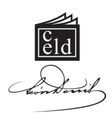

#### Outras obras do autor editadas pelo CELD:

- *• Depois da Morte*
- *• Espíritos e Médiuns*
- *• No Invisível*
- *• O Além e a Sobrevivência do Ser*
- *• O Espiritismo e o Clero Católico*
- *• O Espiritismo na Arte*
- *• O Gênio Céltico e o Mundo Invisível*
- *• O Mundo Invisível e a Guerra*
- *• O Porquê da Vida*
- *• O Progresso*
- *• Socialismo e Espiritismo*
- *• O Problema do Ser e do Destino.*

#### CIP - Brasil - CATALOGAÇÃO NA FONTE SINDICATO NACIONAL DOS EDITORES DE LIVROS, RJ.

#### Denis, Léon, 1846-1927 D459g

3.ed.

O Grande Enigma: Deus e o Universo / Léon Denis; tradução de Maria Lucia Alcantara de Carvalho. — Rio de Janeiro: CELD, 2011.

296p.; 21 cm ISBN 978-85-7297-412-7

- 1. Espiritismo. 2. Universo Interpretações espíritas.
- 3. Natureza Interpretações espíritas. 4. Vida Interpretações espíritas. I. Título.

CDU: 133.9 CDU: 133.9 08-1753. CDD: 133.9 CDU: 133.9

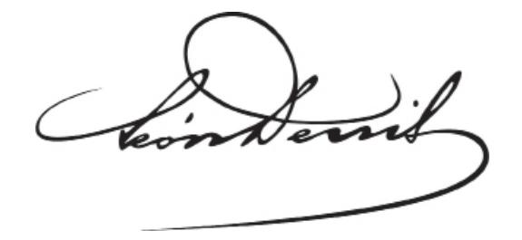

# O Grande Enigma

Deus e o Universo

3a Edição

Tradução de Maria Lucia Alcantara de Carvalho

> CELD Rio de Janeiro, 2011

#### **O GRANDE ENIGMA. DEUS E O UNIVERSO**

Léon Denis

Título do original francês: *La Grande Énigme. Dieu et l'Univers*

1a Edição: outubro de 2003;

1a tiragem, do 1o ao 3o milheiro.

2a Edição: junho de 2008; 1a tiragem, do 1o ao 2o milheiro.

Abril de 2010;

2a tiragem, 3o milheiro.

3a Edição: julho de 2011; tiragem, do 4o ao 7o milheiro.

#### L2200902

*Tradução e revisão de originais:* Maria Lucia Alcantara de Carvalho

*Revisão:*

Elizabeth Paiva, Barbara Santos e Teresa Cunha

1a

*Capa e diagramação:* Rogério Mota

*Composição:*

Luiz de Almeida Jr. e Márcio de Almeida

*Arte-final:*

Márcio de Almeida

Para pedidos de livros, dirija-se ao Centro Espírita Léon Denis (Distribuidora)

Rua João Vicente, 1.445, Bento Ribeiro, Rio de Janeiro, RJ. CEP 21610-210

**Telefax (21) 2452-7700 / (21) 2452-7801**

E-mail: grafica@leondenis.com.br Site: www.leondenis.com.br

Centro Espírita Léon Denis Rua Abílio dos Santos, 137, Bento Ribeiro, Rio de Janeiro, RJ. CEP 21331-290 CNPJ 27.291.931/0001-89

IE 82.209.980

**Tel. (21) 2452-1846**

E-mail: editora@celd.org.br Site: www.celd.org.br

Remessa via Correios e transportadora.

Todo produto desta edição é destinado à manutenção das obras sociais do Centro Espírita Léon Denis.

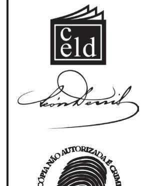

**ASSOCIAÇÃO BRASILEIRA DE DIREITOS REPROGRÁFICOS**

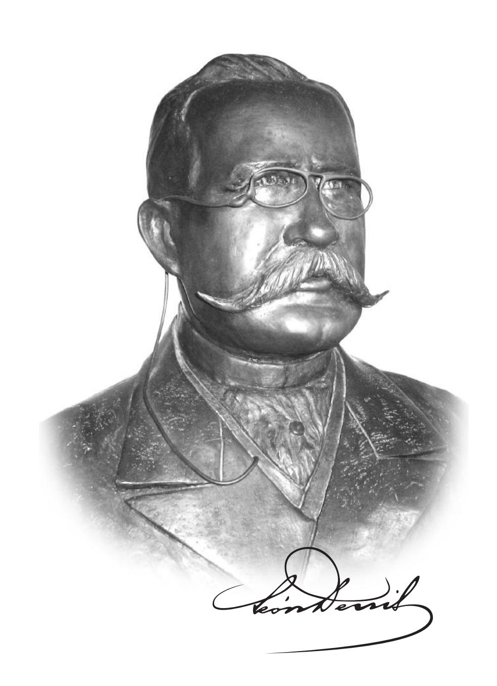

#### LEON DENIS

#### LA

# GRANDE ÉNIGME

#### DIEU & L'UNIVERS

SUIVI D'UNE SYNTHÈSE SPIRITUALISTE
DOCTRINALE ET PRATIQUE
SOUS FORME DE DIALOGUE

TROISIÈME MILLE

PARIS
LIBRAIRIE DES SCIENCES PSYCHIQUES
42, RUE SAINT-JACQUES, 42

1911

#### **LÉON DENIS**

0

## **GRANDE ENIGMA**

#### **DEUS E O UNIVERSO**

SEGUIDO DE UMA SÍNTESE ESPIRITUALISTA DOUTRINÁRIA E PRÁTICA SOB FORMA DE DIÁLOGO

TERCEIRO MILHEIRO

PARIS LIVRARIA DAS CIÊNCIAS PSÍQUICAS

**RUA SAINT-JACQUES, 42** 

1911

#### **Sumário**

| Ao Leitor                                                     | 11       |
|---------------------------------------------------------------|----------|
| PRIMEIRA PAR TE – Deus e o Universo                     | 15       |
| I. O Grande Enigma                                            | 17       |
| II. Unidade Substancial do Universo                           | 29       |
| III. Solidariedade; comunhão universal                        | 37       |
| IV. As Harmonias do Espaço                                 | 49       |
| V. Necessidade da Ideia de Deus                               | 61       |
| VI. As Leis Universais                                        | 67       |
| VII. A Ideia de Deus e a Experimentação Psíquica           | 77       |
| VIII. Ação de Deus no mundo e na História                     | 87       |
| IX. Objeções e Contradições                                   | 99       |
| SEGUNDA PAR TE – O Livro da Natureza                       | 107      |
| X. O Céu Estrelado                                            | 109      |
| XI. A Floresta                                                | 113      |
| XII. O Mar                                                    | 125      |
| XIII. A Montanha (Impressões de Viagem)                       | 133      |
| XIV. Elevação                                                 | 153      |
| TERCEIRA PAR TE – A Lei Circular. A Missão do Século XX | 165      |
| XV. A Lei Circular. A Vida – As Idades da Vida – A Morte      |  167. |
| XVI. A Missão do Século XX                                 | 195      |

| Not  | as Complement | ares                                                                                  | 207 |
|------|---------------|---------------------------------------------------------------------------------------|-----|
|      |               | 1. Sobre a Necessidade de um Motor Inicial para Explicar os Movimentos Planetários | 209 |
|      |               | 2. Sobre as Forças Desconhecidas                                                      | 213 |
|      |               | 3. Sobre a Música das Esferas                                                         | 215 |
|      |               | 4. Sobre o Espiritualismo Experimental ou Espiritismo                                 | 217 |
|      |               | 5. Sobre os Fenômenos Espíritas                                                       | 231 |
|      |               | 6. Sobre o Papel dos Médiuns nas Manifestações                                        | 239 |
| QUAR | TA PAR        | TE – Síntese Doutrinária e Prática do                                                 |     |
|      |               | Espiritualismo sob Forma de Diálogo e de Catecismo                                 | 245 |
|      |               | Introdução                                                                            | 247 |
|      | I.            | Do Homem                                                                              | 249 |
|      | II.           | Da Reencarnação                                                                    | 253 |
|      | III.          | O Lugar da Reencarnação                                                               | 256 |
|      | IV.           | Origem da Vida na Terra                                                            | 261 |
|      | V.            | Os Espíritos. Deus                                                                    | 263 |
|      | VI. A         | Doutrina do Espiritismo                                                            | 268 |

VIII. Consolações. Estética: o Belo, o Verdadeiro, o Bem ........ 285

#### **Ao Leitor**

Nas horas difíceis da vida, nos dias de tristeza e de acabrunhamento, abre este livro! Eco das vozes do Alto, ele te dará coragem; inspirar-te-á a paciência, a submissão às leis eternas!

Onde e como pensei em escrevê-lo? Era uma tarde de inverno, uma tarde de passeio na costa azulada da Provence.1

O Sol se punha no mar pacífico. Seus raios de ouro, deslizando sobre a vaga adormecida, iluminavam com tons ardentes o topo das rochas e dos promontórios; enquanto o delgado crescente lunar subia no céu sem-nuvens. Um grande silêncio se fazia, envolvendo todas as coisas. Solitário, um sino longínquo, lentamente, badalava o ângelus. Pensativo, eu ouvia os ruídos abafados, os rumores apenas perceptíveis das cidades de inverno em festa, e as vozes que cantavam em minha alma.

1 **Provence:** região do sul da França (Provence-Côte d'Azur) que agrupa os seguintes departamentos: Alpes-de-Haute-Provence, Hautes-Alpes, Alpes-Maritimes, Bouches-du-Rhône, Var, Vaucluse. (Nota da Tradutora, suas notas sequentes conterão apenas as iniciais **N.T.**)

#### **Ao Leitor**

Pensava na indiferença dos humanos que se embriagam de prazer para melhor esquecer o objetivo da vida, seus imperiosos deveres, suas pesadas responsabilidades. O mar acalentador, o Espaço que, pouco a pouco, se constelava de estrelas, os odores penetrantes dos mirtos e dos pinheiros, as harmonias distantes na calma da tarde, tudo contribuía para derramar em mim e em torno de mim um encanto sutil, íntimo e profundo.

E a voz me disse: Publica um livro que nós te inspiraremos, um pequeno livro que resuma tudo o que a alma humana deva conhecer para se orientar no seu caminho; publica um livro que demonstre a todos que a vida não é uma coisa vã, de que se possa usar com leviandade, mas uma luta para conquista do céu, uma obra elevada e grave de edificação, de aperfeiçoamento, uma obra que leis augustas e equitativas regem, acima das quais plana a eterna Justiça, temperada pelo Amor.

> \* \* \*

A Justiça! Se há nesse mundo uma carência, uma necessidade imperiosa para todos aqueles que sofrem, cuja alma está dilacerada, esta não está na necessidade de crer, de saber que a justiça não é uma palavra vazia, que há em algum lugar compensações para todas as dores, uma sanção para todos os deveres, uma consolação para todos os males?

Ora, essa justiça absoluta, soberana, quaisquer que sejam nossas opiniões políticas e nossas visões sociais, é preciso reconhecê-lo bem, não é de nosso mundo. As instituições humanas não a comportam.

E embora chegássemos a nos corrigir, a melhorar essas instituições e, por conseguinte, atenuar muitos males, diminuir a soma das desigualdades e das misérias humanas, há causas de aflição, enfermidades cruéis e inatas contra as quais seremos sempre impotentes: a perda da saúde, da visão, da razão, a separação dos seres amados e todo o imenso cortejo dos sofrimentos morais, tanto mais vivos quanto mais sensível é o homem e a civilização mais apurada.

Apesar de todos os melhoramentos sociais, não conseguiremos jamais que o bem e o mal encontrem nesse mundo sua sanção integral. Se há uma justiça absoluta, integral, ela só pode estar no Além! Mas quem nos provará que este Além não é um mito, uma ilusão, uma quimera? As religiões, as filosofias passaram; elas desdobraram sobre a alma humana o manto rico de suas concepções e de suas esperanças. Entretanto, a dúvida permaneceu no fundo da alma. Uma crítica minuciosa e sábia passou pelo crivo de todas as teorias de outrora. E desse conjunto majestoso, restaram apenas ruínas.

Mas, então, em todos os pontos do globo, fenômenos psíquicos se produziram. Variados, contínuos, inumeráveis, traziam a prova da existência de um mundo espiritual, invisível, regido por princípios rigorosos, tão imutáveis quanto os da matéria, mundo que guarda nas suas profundezas o segredo de nossas origens e de nossos destinos.2 Uma nova ciência nasceu, baseada nas experiências, nas investigações e nos testemunhos de sábios eminentes; através dela, uma comunicação estabeleceu-se com esse mundo invisível que nos cerca, e uma revelação poderosa goteja sobre a Humanidade como uma onda pura e regeneradora.

> \* \* \*

Ver Léon Denis*, No Invisível: Espiritismo e Mediunidade* e *Cristianismo e Espiritismo: Provas Experimentais da Sobrevivência.* (Nota do Autor, outras notas semelhantes conterão apenas as iniciais **N.A.**)

#### **Ao Leitor**

Nunca, talvez, no decorrer de sua História, a França tenha sentido mais profundamente a oportunidade de uma nova orientação moral. As religiões, dizemos, perderam muito de seu prestígio, e os frutos envenenados do materialismo se mostram por toda a parte. Ao lado do egoísmo e da sensualidade de uns, expõem-se a brutalidade e as cobiças dos outros. Os atos de violência, os assassínios e os suicídios se multiplicam. As greves revestem um caráter cada vez mais trágico. É a luta das classes, o desencadeamento dos apetites e dos furores. A voz popular sobe e reclama; o ódio dos pequenos para com aqueles que possuem e gozam, tende a passar do domínio das teorias para o dos fatos. As práticas bárbaras, destruidoras de qualquer civilização, penetram nos costumes operários. Saqueiamse usinas; quebram-se as máquinas, "sabota-se" o maquinário industrial. Esse estado de coisas, agravando-se, nos levaria diretamente à guerra civil e à selvageria.

Tais são os resultados de uma falsa educação nacional. Há séculos, nem a escola nem a Igreja ensinaram ao povo o que ele mais necessidade tem de conhecer: o porquê da existência, a lei do destino com o verdadeiro sentido dos deveres e das responsabilidades que a ele se ligam. Daí, de toda a parte, tanto de cima quanto de baixo, a desordem das inteligências e das consciências, a confusão de todas as coisas, a desmoralização, a anarquia. Estamos ameaçados de falência social.

Será preciso descer até ao fundo do abismo das misérias públicas, para ver o erro cometido e compreender que é necessário buscar, acima de tudo, o raio de luz que clareia a grande marcha humana na estrada sinuosa, através dos lamaçais e das rochas desmoronadas?

Novembro de 1910.

## **Primeira Parte Deus e o Universo**

#### **O Grande Enigma**

Há um objetivo, há uma lei no Universo?

Ou esse Universo é apenas um abismo onde o pensamento se perde, por falta de ponto de apoio, em que ele gira sobre si mesmo como uma folha morta ao sopro do vento?

Há uma força, uma esperança, uma certeza que possa nos elevar acima de nós mesmos na direção de um objetivo superior, na direção de um princípio, um ser em quem se identifiquem o bem, a verdade, a sabedoria; ou não haveria em nós e em torno de nós senão dúvida, incerteza e trevas?

O homem, o pensador, sonda com o olhar a vasta amplidão. Interroga as profundezas do céu. Nele busca a solução de dois grandes problemas: o problema do mundo, o problema da vida. Considera este majestoso Universo, no qual ele se sente como que mergulhado. Segue com os olhos o curso dos gigantes do Espaço, sóis da noite, terríveis focos cuja luz percorre as mornas imensidades. Interroga esses astros, esses mundos inumeráveis, mas eles passam, mudos, prosseguindo seu caminho para um objetivo que ninguém conhece. Um

#### **Capítulo I**

silêncio esmagador plana sobre o abismo, envolve o homem, torna esse Universo mais solene ainda.3

Entretanto, duas coisas nos aparecem à primeira vista nesse Universo: a matéria e o movimento, a substância e a força. Os mundos são formados de matéria, e essa matéria, inerte por si mesma, se move. Quem, pois, a faz mover-se? Que força é esta que a anima? Primeiro problema. Mas o homem, do infinito, chama sua atenção sobre si mesmo. Essa matéria e essa força universais, ele as encontra em si e, com elas, um terceiro elemento, com o auxílio do qual ele conheceu, viu, mediu os outros: a Inteligência.

Todavia, a inteligência humana não é, em si mesma, sua própria causa. Se o homem fosse sua própria causa, poderia manter e conservar o poder da vida que está nele; enquanto que esse poder, sujeito a variações, a fraquezas, escapa à sua vontade.

> \* \* \*

Se a inteligência está no homem, ela deve se encontrar nesse Universo do qual ele é parte integrante. O que existe na parte, deve se encontrar no todo. A matéria é apenas a vestimenta, a forma sensível e mutável, revestida pela vida; um cadáver não pensa, nem se move. A força é um simples agente chamado para manter as funções vitais. É pois, a inteligência que governa os mundos e rege o Universo.

Essa inteligência se manifesta através de leis, leis sábias e profundas, ordenadoras e conservadoras do Universo.

Todas as pesquisas, todos os trabalhos da Ciência Contemporânea concorrem para demonstrar a ação das leis naturais,

Esse silêncio é relativo e resulta unicamente da imperfeição de nossos sentidos. (**N.A.**)

que uma Lei suprema religa, abarca, para constituir a harmonia universal. Através dessa Lei, uma Inteligência Soberana se revela como a Razão mesma das coisas, Razão consciente, Unidade universal para onde convergem, se ligam e se fundem todas as relações, onde todos os seres vêm haurir a força, a luz e a vida; Ser absoluto e perfeito, fundamento imutável e fonte eterna de toda a ciência, de toda a verdade, de toda a sabedoria, de todo o amor.

> \* \* \*

Entretanto, algumas objeções são de se prever. Podem me dizer, por exemplo: as teorias sobre a matéria, a força e a inteligência, tais como as formulavam antigamente as escolas científicas e filosóficas, tiveram seu tempo. Concepções novas as substituem. A Física atual nos demonstra que a matéria se dissocia pela análise, se converte em centros de forças, e que a força se reabsorve no éter universal.

Sim, certamente, os sistemas envelhecem e passam; as fórmulas se gastam; mas a ideia eterna reaparece sob formas sempre novas e mais ricas. Materialismo e Espiritualismo são aspectos transitórios do conhecimento. Nem a matéria, nem o espírito são o que pensavam as escolas de outrora, e talvez a matéria, o pensamento e a vida estejam ligados por laços estreitos, que começamos a entrever.

No entanto, certos fatos subsistem e outros problemas se impõem. A matéria e a força se reabsorvem no éter; mas o que é o éter? É, dizem-nos, a matéria-prima, o *substratum* definitivo de todos os movimentos. O próprio éter é atravessado por movimentos inumeráveis: radiações luminosas e caloríficas, correntes de eletricidade e de magnetismo. Ora, é preciso que esses movimentos sejam regulados de certa forma.

#### **Capítulo I**

A força engendra o movimento, mas a força não é a lei. Cega e sem-guia, ela não poderia produzir a ordem e a harmonia no Universo. Estas são, todavia, manifestas. No topo da escala das forças, aparece a energia mental, a vontade, a inteligência que constrói as formas e fixa as leis.4

A inércia, dir-nos-ão ainda, é apenas relativa, já que a matéria é energia concentrada. Na realidade, todas as partículas constitutivas de um corpo se movem. Todavia, a energia armazenada nesses corpos só pode entrar em potência de ação se a matéria componente estiver dissociada. Não é o caso dos planetas, cujos elementos representam a matéria no seu último grau de concentração. Seus movimentos não podem se explicar por uma força interna, mas somente através da intervenção de uma energia externa.

#### A inércia, diz G. Le Bon:5

é a resistência, de causa desconhecida, que os corpos opõem ao movimento ou mudança de movimento. Ela é suscetível de ser medida, e é essa medida que se define pelo termo de massa. A massa é, pois, a medida da inércia da matéria, seu coeficiente de resistência ao movimento.

Desde Pitágoras até Claude Bernard, todos os pensadores afirmam que a matéria é desprovida de espontaneidade. Qualquer tentativa de emprestar à substância inerte uma espontaneidade capaz de organizar e explicar a força, fracassou.

4 G. Le Bon, apesar de suas reticências (*A Evolução da Matéria*), é obrigado a reconhecer: "Todas estas operações tão precisas, tão admiravelmente adaptadas a um objetivo, são dirigidas por forças que se conduzem exatamente como se possuíssem uma clarividência muito superior à razão. O que elas executam a cada instante está muito acima de tudo o que pode realizar a Ciência mais avançada. (**N.A.**)

5 *Revista Científica*, 17 de outubro de 1903. (**N.A.**)

É preciso, pois, retornar à necessidade de um primeiro motor transcendente para explicar o sistema do mundo. A mecânica celeste não se explica por si mesma, e a existência de um motor inicial se impõe. A nebulosa primitiva, mãe do Sol e dos planetas, era animada por um movimento giratório. Mas quem lhe imprimira esse movimento? Respondemos sem hesitar: Deus!6

Somente a Ciência Contemporânea é que nos revela Deus, o Ser Universal? O homem interroga a história da Terra. Evoca a lembrança das multidões mortas, gerações que repousam sob a poeira dos séculos. Interroga a fé crédula dos simples e a fé raciocinada dos sábios, e por toda a parte, acima das opiniões contraditórias e das disputas de escolas, acima das rivalidades de castas, de interesses e de paixões, por toda a parte ele vê os impulsos, as aspirações do pensamento humano na direção da Grande Causa que vela, augusta e silenciosa, sob o véu misterioso das coisas.

Em todos os tempos e em todos os meios, o lamento humano sobe para esse espírito divino, para essa Alma do Mundo que se honra sob nomes diversos, mas que, sob tantas denominações: Providência, Grande Arquiteto, Ser Supremo, Pai Celeste, é sempre o Centro, a Lei, a Razão Universal, em quem o mundo se conhece, se possui, encontra sua consciência e seu eu.

E é assim que acima desse incessante fluxo e refluxo de elementos passageiros e mutáveis, acima dessa variedade, dessa diversidade infinita dos seres e das coisas, que constituem o domínio da Natureza e da vida, o pensamento encontra no Universo esse princípio fixo, imutável, essa Unidade

6 *V*er Nota Complementar 1, no fim do livro. (**N.A.**)

#### **Capítulo I**

consciente, em que se unem a essência e a substância, fonte primeira de todas as consciências e de todas as formas. Pois consciência e forma, essência e substância, não podem existir uma sem a outra. Elas se unem para constituir essa Unidade Viva, esse Ser absoluto e necessário, fonte de todos os seres, que nós chamamos Deus.

Mas a linguagem humana é impotente para exprimir a ideia do Ser Infinito. Desde que nos servimos de nomes e de termos, limitamos o que é sem-limites. Todas as definições são insuficientes e, numa certa medida, induzem a erro. Entretanto, o pensamento, para expressar-se, tem necessidade de termos. O menos afastado da realidade é aquele pelo qual os sacerdotes do Egito designavam Deus: *Eu sou*, isto é, sou o Ser por excelência, absoluto, eterno, de quem emanam todos os seres.

> \* \* \*

Um mal-entendido secular divide sobre estas questões as escolas filosóficas. O materialismo não via no Universo senão a substância e a força. Ele parecia ignorar os estados quintessenciados, as transformações infinitas da matéria. O Espiritualismo não vê ainda em Deus senão o princípio espiritual. Considera como imaterial tudo o que não passa pelos nossos sentidos. Ambos se enganam. O mal-entendido que os separa não cessará senão quando os materialistas virem no seu princípio e os espiritualistas no seu Deus a fonte dos três elementos: substância, força, inteligência, cuja união constitui a vida universal.

Para isso, basta compreender duas coisas: se admitimos que a substância está fora de Deus, Deus não é infinito, e, já que a consciência existe no mundo atual, é preciso evidentemente que ela se encontre no que foi o Princípio deste mundo.

Mas a Ciência, após ter-se atrasado durante meio século nos desertos do materialismo e do positivismo, depois de ter-lhe reconhecido a esterilidade, a Ciência atual modificou sua orientação. Em todos os domínios: Física, Química, Biologia, Psicologia, ela se encaminha, hoje, com um passo decidido na direção dessa grande unidade que se entrevê no fundo de tudo. Por toda a parte ela reconhece a unidade de substância, a unidade de forças, a unidade de leis. Atrás de toda substância que se move, encontra-se a força, e a força é apenas a projeção do pensamento, da vontade na substância. A criação eterna, a eterna renovação dos seres e das coisas é somente a projeção constante do pensamento divino no Universo.

Pouco a pouco, levanta-se o véu; o homem começa a entrever a grandiosa evolução da vida na superfície dos mundos. Vê a correlação das forças e a adaptação das formas e dos órgãos em todos os meios. Sabe que a vida se desenvolve, se transforma e se depura à medida que ela percorre sua espiral imensa. Compreende que tudo está regulado em vista de um objetivo, que é o aperfeiçoamento contínuo do ser e o crescimento nele da soma do bem e do belo.

Mesmo neste mundo, ele pode seguir essa lei majestosa do progresso através de todo o lento trabalho da Natureza, desde as formas mais inferiores do ser, desde a célula verde flutuando no seio das águas, até o homem consciente em quem a unidade da vida se afirma, e acima dele, de degrau em degrau, até o Infinito. E essa ascensão só se compreende, só se explica através da existência de um princípio universal, de uma energia incessante, eterna, que penetra toda a Natureza; é ela quem regula e estimula essa evolução colossal dos seres e dos mundos em direção ao melhor, em direção ao bem.

#### **Capítulo I**

Deus, tal qual o concebemos, não é pois o Deus do panteísmo oriental, que se confunde com o Universo nem o Deus antropomórfico, monarca do céu, exterior ao mundo, de que nos falam as religiões do Ocidente. Deus é manifestado pelo Universo que dele é a sua representação sensível, mas com ele não se confunde. Assim como em nós a unidade consciente, a alma, o eu, persiste em meio às modificações incessantes da matéria corporal, assim, no meio das transformações do Universo e da incessante renovação de suas partes, subsiste o Ser imutável que é a alma, a consciência, o eu que a anima, comunica-lhe o movimento e a vida.

E esse grande Ser, absoluto, eterno, que conhece nossas necessidades, ouve nossos apelos, nossas preces, que é sensível às nossas dores, é como o imenso foco em que todos os seres, pela comunhão do pensamento e do sentimento, vêm haurir as forças, os socorros, as inspirações necessárias para guiá-los nos caminhos do destino, para sustentá-los nas suas lutas, consolá-los nas suas misérias, levantá-los nas suas fraquezas e suas quedas.

> \* \* \*

Não procures Deus nos templos de pedra e de mármore, ó homem que quer conhecê-lo, mas no templo eterno da Natureza, no espetáculo dos mundos que percorrem o Infinito, nos esplendores da vida que se desabrocha na sua superfície, na visão dos horizontes variados: planícies, vales, montanhas e mares, que tua morada terrestre te oferece. Por toda a parte, à luz do dia ou sob o manto constelado das noites, à beira dos oceanos tumultuosos como na solidão das florestas, se souberes recolher-te, ouvirás as vozes da Natureza e os sutis ensinamentos que ela murmura ao ouvido daqueles que frequentam seus refúgios e estudam seus mistérios.

A Terra flutua sem-ruído na imensidão. Essa massa de dez mil léguas de circunferência desliza sobre ondas do éter como um pássaro no Espaço, como um mosquito na luz. Nada denuncia sua marcha imponente. Nenhum rangido de rodas, nenhum murmúrio de vagas sob seus flancos. Silenciosa, ela passa, rola entre suas irmãs do céu. Toda a potente máquina do Universo se agita; os milhões de sóis e de mundos que a compõem, mundos junto dos quais o nosso é apenas uma criança, todos se deslocam, se entrecruzam, prosseguem suas revoluções com velocidades apavorantes, sem que nenhum som, nenhum choque venha trair a ação desse aparelho gigantesco. O Universo permanece calmo. É o equilíbrio absoluto; é a majestade de um poder misterioso, de uma inteligência que não se impõe, que se esconde no seio das coisas, mas cuja presença revela-se ao pensamento e ao coração, e que atrai o pesquisador como o abismo.

Se a Terra evoluísse com ruído; se o mecanismo do mundo se restabelecesse com tumulto, os homens, apavorados, se curvariam e acreditariam. Mas, não! A obra formidável executa-se sem-esforços. Globos e sóis flutuam no Infinito, tão ligeiros quanto plumas sob a brisa. Avante, sempre avante! A ronda das esferas desenvolve-se, guiada por uma potência invisível.

A vontade que dirige o Universo dissimula-se a todos os olhares. As coisas estão dispostas de maneira que ninguém seja obrigado a nelas crer. Se a ordem e a harmonia do Cosmo não bastam para convencer o homem, ele é livre. Nada constrange o cético para ir a Deus.

Acontece o mesmo com as coisas morais. Nossas existências se desenvolvem e os acontecimentos se sucedem semligação aparente. Porém, a imanente justiça plana do alto, sobre nós, e regula nossos destinos segundo um princípio

#### **Capítulo I**

inelutável, pelo qual tudo se encadeia numa série de causas e de efeitos. Seu conjunto constitui uma harmonia que o espírito liberto de preconceitos, esclarecido por um raio de sabedoria, descobre e admira.

O que sabemos do Universo? Nosso olho apenas percebe um domínio restrito do império das coisas. Somente os corpos materiais, semelhantes a nós, o afetam. A matéria sutil e difusa nos escapa.7 Vemos apenas o que há de mais grosseiro à nossa volta. Todos os mundos fluídicos, todos os círculos onde a vida superior se agita, a vida radiosa, escapam aos olhares humanos. Nós não distinguimos senão os mundos opacos e pesados que se movem nos céus. O Espaço que os separa parece-nos vazio. Por toda a parte, abismos profundos parecem se abrir. Erro! O Universo está cheio. Entre essas moradas materiais, no intervalo desses mundos planetários, prisões ou presídios que flutuam no Espaço, outros domínios da vida se estendem, vida espiritual, vida gloriosa, que nossos sentidos espessos não podem perceber, pois, sob suas irradiações, eles se quebrariam como um vidro ao choque de uma pedra.

A Natureza sábia limitou nossas percepções e nossas sensações. É de degrau em degrau que ela nos conduz no caminho do saber. É lentamente, etapas por etapas, vidas após vidas, que ela nos leva ao conhecimento do Universo, seja visível, seja oculto. O ser gravita um a um os degraus da escada gigantesca que conduz a Deus. E cada um desses degraus representa para ele uma longa série de séculos.

Se os mundos celestes nos surgissem subitamente, semvéus, em toda a sua glória, ficaríamos ofuscados, enceguecidos. Mas, nossos sentidos externos foram medidos e limitados. Eles

7 Atualmente não conhecemos e não podemos conhecer, na sua essência, nem o espírito nem a matéria. (**N.A.**)

aumentam e se apuram à medida que o ser se eleva na escala das existências e dos aperfeiçoamentos. Acontece o mesmo com o conhecimento, com a posse das leis morais. O Universo se desvenda aos nossos olhos à medida que a nossa capacidade de compreender-lhe as leis se desenvolve e aumenta. Lenta é a incubação das almas sob a luz divina.

> \* \* \*

É a ti, ó Potência Suprema! Qualquer que seja o nome que te deem e por mais imperfeitamente que sejas compreendida; é a ti, fonte eterna da vida, da beleza, da harmonia, que se elevam nossas aspirações, nossa confiança, nosso amor!

Onde estás? Em que céus profundos, misteriosos, estás escondido? Quantas almas acreditaram que bastaria, para te encontrar, o deixar a Terra! Mas permaneces invisível no mundo espiritual como no mundo terrestre, invisível para aqueles que ainda não adquiriram a pureza suficiente para refletir teus divinos raios.

Entretanto, tudo revela e manifesta tua presença. Tudo o que na Natureza e na Humanidade, canta e celebra o amor, a beleza, a perfeição, tudo que vive e respira é uma mensagem de Deus. As forças grandiosas que animam o Universo proclamam a realidade da Inteligência Divina; ao lado delas, a majestade de Deus se manifesta na História, pela ação das grandes almas que, semelhantes a ondas imensas, trazem às margens terrestres todas as potências da obra de sabedoria e de amor.

E Deus também está em cada um de nós, no templo vivo da consciência. É aí que está o lugar sagrado, o santuário onde se esconde a centelha divina.

#### **Capítulo I**

Ó homens! aprendam a descer em si mesmos, a pesquisar nos recantos mais íntimos do seu ser; interroguem-se no silêncio e no refúgio. E aprenderão a se conhecer, a conhecer em vocês a potência oculta. É ela que eleva e faz resplandecer no fundo de nossas consciências as santas imagens do bem, da verdade, da justiça, e é honrando essas imagens divinas, rendendo-lhes um culto de cada dia, que essa consciência ainda obscura se purifica e se esclarece. Pouco a pouco, a luz aumenta em nós. Como a aurora sucede à noite, como gradualmente, de uma maneira insensível, as sombras dão lugar ao brilho do dia, assim, a alma se ilumina com as irradiações desse foco que está nela, e que faz eclodir no nosso pensamento e no nosso coração, formas sempre novas, sempre inesgotáveis de verdade e de beleza. E essa luz é também uma harmonia penetrante, uma voz que canta na alma do poeta, do escritor, do profeta, que os inspira e lhes dita as grandes e fortes obras pelas quais eles trabalham para a elevação da Humanidade. Mas apenas esses sentem estas coisas porque, tendo dominado a matéria, tornaram-se dignos dessa comunhão sublime através de esforços seculares, aqueles cujo senso íntimo abriu-se para as impressões profundas e conhece o sopro poderoso que atiça as inspirações do gênio, o sopro que passa sobre as frontes pensativas e faz estremecer os envoltórios humanos.

#### **Unidade Substancial do Universo**

O Universo é um, embora triplo na aparência. Espírito, força e matéria parecem não ser senão modos, os três estados de uma substância imutável em seu princípio, variável ao infinito em suas manifestações.

O Universo vive e respira, animado por duas correntes poderosas: absorção e difusão. Através dessa expansão, através desse sopro imenso, Deus, o Ser dos seres, a Alma do Universo, cria. Através do seu amor, ele atrai para si. As vibrações do seu pensamento e da sua vontade, fontes primeiras de todas as forças cósmicas, movem o Universo e engendram a vida.

A matéria, dizemos, é apenas um modo, uma forma passageira da substância universal. Escapa à análise e desaparece sob a objetiva dos microscópios, para se transformar em radiações sutis. Não tem existência própria; as filosofias, que a tomam por base repousam sobre uma aparência, sobre uma espécie de ilusão.8

8 "A matéria, disse W. Crookes, não é senão um modo do movimento." (*Proc. Roy. Soc. no 205.*) (**N.A.**)

#### **Capítulo II**

A unidade do Universo, por muito tempo negada ou incompreendida, começa a ser entrevista pela Ciência. Há uns vinte anos, W. Crookes, no decorrer de estudos sobre as materializações dos espíritos, descobria o quarto estado da matéria, o estado radiante, e essa descoberta, pelas suas consequências, iria abalar todas as velhas teorias clássicas. Estas estabeleciam distinção entre a matéria e a força. Sabemos agora que todas as duas se confundem. Sob a ação do calor, a matéria mais grosseira se transforma em fluidos; depois, os fluidos se reduzem, por sua vez, num elemento mais sutil que escapa aos nossos sentidos. Toda matéria pode se reduzir em força e toda força se condensa em matéria, percorrendo assim, um círculo incessante.9

As experiências de *Sir* W. Crookes foram seguidas, confirmadas por uma legião de investigadores. O mais célebre, Roentgen, chamou de raios X as irradiações emanadas das ampolas de vidro; eles têm a propriedade de atravessar a maioria dos corpos opacos, e permitem perceber e fotografar o invisível.

Pouco depois, o Sr. Becquerel demonstrava as propriedades de certos metais de emitirem irradiações obscuras que penetram a matéria mais densa, como os raios Roentgen, e impressionam as placas fotográficas através das lâminas metálicas.

O *radium*, descoberto pelo Sr. Curie, produz calor e luz, de uma maneira contínua, sem se esgotar de forma sensível. Os corpos sujeitos à sua ação tornam-se, eles próprios, radiantes. Embora a quantidade de energia irradiada por esse metal fosse considerável, a perda de substância material que

9 "Toda a matéria, disse Crookes, tornará a passar pelo estado etéreo de onde ela provém." ( Discurso no Congresso de Química de Berlim, 1903.) (**N.A.**)

#### **Unidade Substancial do Universo**

a ele corresponde é quase nula. W. Crookes calculou que uma centena de anos eram necessárias para a dissociação de um grama de *radium*. 10

Muito mais. As engenhosas descobertas do Sr. Gustave Le Bon11 provaram que as irradiações são uma propriedade geral de todos os corpos. A matéria pode dissociar indefinidamente; ela não é senão a energia condensada. Assim, a teoria do átomo invisível, que há dois mil anos servia de base à Física e à Química, desmorona-se e, com ela, as distinções clássicas entre o ponderável e o imponderável.12 A soberania da matéria, que se dizia absoluta, eterna, termina.

É preciso, pois, reconhecer que, o Universo não é tal como parecia aos nossos fracos sentidos. O mundo físico não constitui senão uma ínfima parte dele. Fora do círculo de nossas percepções, existe uma infinidade de forças e de formas sutis que a Ciência ignorou até aqui. O domínio do invisível é muito mais vasto e mais rico que o do mundo visível.

Em sua análise dos elementos que constituem o Universo, a Ciência errou durante séculos, e agora é-lhe necessário destruir o que penosamente edificou. O dogma científico da unidade irredutível do átomo, desmoronando-se, arrasta com ele todas as teorias materialistas. A existência dos fluidos, afirmada pelos espíritas há cinquenta anos — o que lhes valeu tantas zombarias da parte dos sábios oficiais — essa existência, a experiência o estabelece, de agora em diante, de uma maneira rigorosa.

10 Ver G. Le Bon, *Revista Científica*, de 24 de outubro de 1903*.* (**N.A.**)

11 Ver *Revista Científica*, de 17, 24 e 31 de outubro de 1903. (**N.A.**)

12 Há séculos afirmava-se e defendia-se a teoria dos átomos sem dela nada saber. Berthelot a qualifica de "romance engenhoso e sutil". (Berthelot, *a Síntese Química*, 1876.) Daí se vê, diz Le Bon, que certos dogmas científicos não têm mais consistência do que as divindades das épocas antigas. (**N.A.**)

#### **Capítulo II**

Os seres vivos, eles também, emitem irradiações de naturezas diferentes. Eflúvios humanos, variando de forma e de intensidade sob a ação da vontade, impregnam as chapas com sua luz misteriosa. Esses influxos, ora nervosos, ora psíquicos, conhecidos há muito tempo pelos magnetizadores e pelos espíritas, mas negados pela Ciência, os fisiologistas, hoje, constatam a realidade deles de uma maneira irrecusável. Daí, encontrou-se o princípio da telepatia. As volições do pensamento, as projeções da vontade se transmitem através do Espaço, como as vibrações do som e as ondulações da luz, e vão impregnar organismos simpáticos ao do manifestante. As almas afins pelo pensamento e pelo sentimento podem trocar seus eflúvios, a qualquer distância, da mesma forma que os astros trocam, através dos abismos do Espaço, seus raios trêmulos. Descobrimos ainda aí o segredo das simpatias ardentes ou das repulsões invencíveis que certos homens experimentam uns pelos outros, à primeira vista.

A maioria dos problemas psicológicos: sugestão, comunicação a distância, ações e reações ocultas, visão através de obstáculos, encontrarão aí a sua explicação. Ainda estamos apenas na aurora do verdadeiro conhecimento. Mas o campo das pesquisas está amplamente aberto, e a Ciência vai caminhar de conquista em conquista num caminho cheio de surpresas. O mundo invisível se revela como a própria base do Universo, como a fonte eterna das energias físicas e vitais que animam o Cosmo.

Assim, cai o principal argumento daqueles que negavam a possibilidade da existência dos espíritos. Eles não podiam conceber a vida invisível, por falta de um *substratum*, de uma substância que escapa aos nossos sentidos. Ora, encontramos ao mesmo tempo, no mundo dos imponderáveis, os

#### **Unidade Substancial do Universo**

elementos constitutivos da vida desses seres e as forças que lhes são necessárias para manifestar suas existências.

Os fenômenos espíritas de todas as ordens se explicam pelo fato de que um gasto considerável e constante de energia pode se produzir sem-desperdício aparente de matéria. Os aportes, a desagregação e a reconstituição espontânea de objetos em quartos fechados; os casos de levitação, a passagem dos espíritos através dos corpos sólidos, suas aparições e suas materializações, que provocaram tanto espanto, suscitaram tantas zombarias, tudo isso torna fácil admitir e compreender, desde que se conheça o jogo das forças e dos elementos em ação nesses fenômenos. Essa dissociação da matéria, da qual fala o Sr. G. Le Bon, e que o homem é ainda impotente para produzir, os espíritos delas possuem há muito tempo as regras e as leis.

A aplicação dos raios X na fotografia não explica também o fenômeno da dupla vista dos médiuns e o da fotografia espírita? Com efeito, se as chapas podem ser influenciadas por raios obscuros, através das irradiações de matéria imponderável que penetram os corpos opacos, com mais forte razão os fluidos quintessenciados de que se compõe o envoltório dos espíritos podem, em certas condições, impressionar a retina dos videntes, aparelho mais delicado e mais complexo do que a placa de vidro.

É assim que o Espiritismo se fortifica cada dia pela complementação de argumentos extraídos das descobertas da Ciência, e que terminarão por abalar os céticos mais endurecidos.

> \* \* \*

A grande querela secular que dividia as escolas filosóficas reduz-se, então, a uma questão de palavras. Nas experiências em

#### **Capítulo II**

que *Sir* W. Crookes tomou a iniciativa, a matéria se funde, o átomo se dissipa; no seu lugar, aparece a energia. A substância é um Proteu13 que reveste mil formas inesperadas. Os gases, que se considerava como permanentes, se liquefazem; o ar se decompõe em elementos bem mais numerosos do que a Ciência de ontem ensinava; a radioatividade, isto é, a aptidão dos corpos para se desagregar emitindo eflúvios análogos aos raios catódicos, revela-se como um fato universal. Toda uma revolução efetua-se nos domínios da Física e da Química. Por toda a parte, em torno de nós, vemos abrirem-se fontes de energia, de imensos reservatórios de forças, bem superiores em poder a tudo o que se conhecia até aqui.14 A Ciência se encaminha pouco a pouco para a grande síntese unitária, que é a lei fundamental da Natureza. Suas mais recentes descobertas têm um alcance incalculável, neste sentido é que elas demonstram experimentalmente o grande princípio constitutivo do Universo: unidade das forças, unidade das leis. O encadeamento prodigioso das forças e dos seres precisa-se e se completa. Constata- -se que existe uma continuidade absoluta, não somente entre todos os estados da matéria, mais ainda entre estes e os diferentes estados da força.15

13 **Proteu:** (da mitologia grega) deus marinho que havia recebido de Posêidon, seu pai, o dom da profecia. Ele mudava de forma à vontade. (**N.T.**, segundo o *Dicionário Petit Larousse.*)

14 Ver Nota Complementar 2, no final do livro. (**N.A.**)

15 &quot;Os produtos da dissociação dos átomos, diz G. Le Bon, constituem uma substância intermediária pelas suas propriedades entre os corpos ponderáveis e o éter imponderável, quer dizer, entre dois mundos profundamente separados até aqui." (*Revista Científica*, de 17 de outubro de 1903.)

&quot;As observações precedentes, diz ainda este eminente químico, parecem bem provar que os diferentes corpos simples derivariam de uma matéria única. Esta matéria primitiva seria produzida por uma condensação do éter." (*Revista Científica*, 24 de outubro de 1903.) (**N.A.**)

#### **Unidade Substancial do Universo**

A energia parece ser a substância única, universal. No estado compacto, ela reveste as aparências que nomeamos matéria sólida, líquida, gasosa; sob uma forma mais sutil, ela constitui os fenômenos de luz, calor, eletricidade, magnetismo, afinidade química. Estudando a ação da vontade sobre os eflúvios e as irradiações, poderíamos, talvez, entrever o ponto, o cume onde a força se intelectualiza, onde a lei se manifesta, onde o Pensamento se transforma em vida.

Pois tudo se religa e se encadeia no Universo. Tudo está regulado através das leis de quantidade, de medida, de harmonia. As manifestações mais elevadas da energia se confinam na inteligência. A força se torna atração; a atração se torna amor. Tudo se resume num poder único e primordial, motor eterno e universal, ao qual se deu nomes diversos e que não é outra coisa senão o Pensamento, a Vontade Divina. Suas vibrações animam o Infinito. Todos os seres, todos os mundos banhados no oceano das irradiações que emanam do inesgotável foco.

Consciente de sua ignorância e de sua fraqueza, o homem fica confuso diante dessa unidade formidável que abarca todas as coisas e traz consigo a vida das Humanidades. Mas, ao mesmo tempo, o estudo do Universo abre-lhe recursos profundos de prazeres e emoções. Apesar da nossa imperfeição intelectual, o pouco que entrevemos das leis universais nos encanta, pois, no Poder ordenador das leis e dos mundos, pressentimos Deus e, daí, adquirimos a certeza de que o Bem, o Belo, a Harmonia perfeita reinam acima de tudo.

#### **Solidariedade; comunhão universal**

Deus é o espírito de sabedoria, de amor e de vida, o poder infinito que governa o mundo. O homem é finito, mas tem a intuição do infinito. O princípio espiritual que traz em si incita-o a perscrutar problemas que ultrapassam os limites atuais de seu entendimento. Seu espírito, prisioneiro na carne, dele se desliga, às vezes, e eleva-se aos domínios superiores do pensamento, de onde lhe vêm estas elevadas aspirações, muito frequentemente seguidas de recaídas na matéria. Daí tantas pesquisas, ensaios e erros, a tal ponto que seria impossível distinguir a verdade no amontoado dos sistemas e das superstições que o trabalho das eras acumularam, se as potências invisíveis não viessem iluminar nesse caos.

Cada alma é irradiação da grande alma universal, uma centelha emanada do foco eterno. Nós, porém, ignoramos a nós mesmos, e esta ignorância é a causa de nossa fraqueza e de todos os nossos males.

Estamos unidos a Deus na relação estreita que liga a causa ao efeito, e somos tão necessários à sua existência quanto ele

#### **Capítulo III**

é necessário à nossa. Deus, Espírito Universal, manifesta-se na Natureza, e o homem é, na Terra, a mais elevada expressão da Natureza. Somos a obra e a expressão de Deus, que é a fonte do bem. Mas esse bem, nós o possuímos somente em estado de gérmen, e nossa tarefa é de desenvolvê-lo. Nossas vidas sucessivas, nossa ascensão na espiral infinita das existências, não têm outro objetivo.

Tudo está escrito no fundo da alma em caracteres misteriosos: o passado, de onde emergimos e que devemos aprender a sondar; o futuro, para o qual evoluímos, futuro que edificaremos nós próprios como um monumento maravilhoso, feito de pensamentos elevados, de nobres ações, de devotamentos e de sacrifícios.

A obra que a cada um de nós cabe realizar resume-se em três palavras: saber, crer, querer; quer dizer: saber que temos em nós recursos incalculáveis; crer na eficácia de nossa ação sobre os dois mundos, o da matéria e o do espírito; querer o bem dirigindo nossos pensamentos para o que é belo e grande, conformando nossas ações às leis eternas do trabalho, da justiça e do amor.

Saídas de Deus, todas as almas são irmãs; todos os filhos da raça humana estão unidos através de laços estreitos de fraternidade e solidariedade. Assim, os progressos de um de nós são sentidos por todos, assim como o rebaixamento de um único afeta o conjunto.

Da paternidade de Deus decorre a fraternidade humana; todas as relações que nos unem, prendem-se a este fato. Deus, pai das almas, deve ser considerado como o Ser consciente por excelência, e não, como uma abstração. Mas aqueles que possuem uma consciência reta e estão esclarecidos por

#### **Solidariedade; Comunhão Universal**

um raio do Alto, reconhecem Deus e o servem na Humanidade que é sua filha e sua obra.

Quando o homem chegou ao conhecimento de sua verdadeira natureza e de sua unidade com Deus, quando essa noção entrou em sua razão e no seu coração, ele se elevou até a verdade suprema; ele domina do Alto as vicissitudes terrestres; encontrou a força que "soergue as montanhas", que o torna vencedor na luta contra as paixões, faz menosprezar as decepções e a morte. Ele efetuou o que o vulgo chama prodígios. Pela sua vontade, pela sua fé, ele submete, governa a substância; ele rompe as fatalidades da matéria; torna-se quase um deus para os outros homens. Vários, em suas passagens neste mundo, chegaram a essas elevações de vistas; apenas o Cristo disso compenetrou-se, ao ponto de ousar dizer à face de todos: "Eu e meu Pai somos um; ele está em mim e eu estou nele".

Essas palavras não se aplicavam, todavia, apenas a ele; elas são verdadeiras para a Humanidade inteira. O Cristo sabia que todo homem deve chegar à compreensão de sua natureza íntima, e é nesse sentido que ele dizia aos seus discípulos: "Vós sois todos deuses".16 Ele poderia ter acrescentado: deuses em processo!

É a ignorância da nossa própria natureza e das forças divinas que dormem em nós, é a ideia insuficiente que fazemos de nosso papel e das leis do destino, que nos submetem às influências inferiores, ao que nós chamamos o mal. Na realidade, trata-se aí apenas da falta de desenvolvimento. O estado de ignorância não é um mal em si mesmo; é apenas uma das formas, uma das condições necessárias da lei de evolução. Nossa inteligência não está madura; nossa razão, criança, tropeça

16 João, 10:34. (**N.A.**)

#### **Capítulo III**

nos acidentes do caminho; daí o erro, as falhas, as provas, a dor. Mas todas essas coisas serão um bem, se as considerarmos como tantos meios de educação e de elevação. A alma deve atravessá-las para chegar à concepção das verdades superiores, à posse da parte de glória e de luz que fará dela uma eleita do céu, uma expressão perfeita do Poder e do Amor infinitos. Cada ser possui os rudimentos de uma inteligência que atingirá o gênio, e ele tem a imensidade dos tempos para desenvolvêla. Cada vida terrestre é uma escola, a escola primária da eternidade.

Na lenta ascensão que conduz o ser para Deus, o que buscamos antes de tudo, é a felicidade, a ventura. Entretanto, no seu estado de ignorância, o homem não saberia atingir esses bens, pois ele os procura quase sempre onde eles não estão, na região das miragens e das quimeras, e isso por meio de processos cuja falsidade não lhe aparece senão após muitas decepções e sofrimentos. São esses sofrimentos que nos esclarecem; nossas dores são lições austeras; elas nos ensinam que a verdadeira felicidade não está nas coisas da matéria, passageiras e mutáveis, mas na perfeição moral. Nossos erros e nossas faltas repetidas, as fatais consequências que arrastam, terminam por nos dar a experiência, e esta nos conduz à sabedoria, quer dizer, ao conhecimento inato, à intuição da verdade. Tendo chegado a esse terreno sólido, o homem sentirá o laço que o une a Deus e ele avançará com um passo mais seguro, de etapas em etapas, para a grande luz que não se apaga jamais.

Todos os seres estão ligados uns aos outros e se influenciam reciprocamente. O Universo inteiro está submetido à lei da solidariedade.

#### **Solidariedade; Comunhão Universal**

Os mundos perdidos nas profundezas do éter, os astros que, entrecruzam seus raios prateados, conhecem-se e se respondem. Uma força a que nós nomeamos atração os une através dos abismos do Espaço.

Assim, na escala da vida, todas as almas estão unidas por relações múltiplas. A solidariedade que as une está fundamentada na identidade de sua natureza, na igualdade de seus sofrimentos através dos tempos, na similitude de seus destinos e de seus fins.

Como os astros dos céus, todas essas almas se atraem. A matéria exerce sobre o espírito seus poderes misteriosos. Assim como Prometeu17 sobre sua rocha, ela o acorrenta aos mundos obscuros. A alma humana sente todas as atrações da vida inferior; ao mesmo tempo, percebe o apelo da vida elevada.

Nessa laboriosa e penosa evolução que arrasta os seres, há um fato consolador sobre o qual é bom insistir: é que em todos os graus de sua ascensão, a alma é atraída, auxiliada, socorrida pelas Entidades Superiores. Todos os espíritos em marcha são ajudados pelos seus irmãos mais adiantados e devem auxiliar, por sua vez, aqueles que estão colocados abaixo deles.

Cada individualidade forma como um anel da grande corrente dos seres. A solidariedade que os une pode bem restringir um pouco a liberdade de cada um deles, mas se essa liberdade é limitada em extensão, ela não o é em intensidade. Por mais limitada que seja a ação do anel, um só de seus impulsos pode agitar toda a corrente.

17 **Prometeu:** (da mitologia grega) deus ou gênio do Fogo, filho do Titã Japet e irmão de Atlas. Segundo a mitologia clássica é o iniciador da primeira civilização humana. Após ter criado o homem do limo da terra, roubou o fogo do céu para poder animá-lo. Por isso, foi punido por Zeus, sendo acorrentado no Cáucaso, onde uma águia vinha devorar-lhe o fígado que sempre se renovava. (**N.T.**)

#### **Capítulo III**

É uma coisa maravilhosa essa fecundação constante do mundo inferior pelo mundo superior. Daí vem todas as intuições geniais, as inspirações profundas, as revelações grandiosas. Em todos os tempos, o pensamento elevado irradiou no cérebro humano. Deus, na sua equidade, não recusou seu socorro nem sua luz a nenhuma raça, a nenhum povo. Enviou a todos guias, missionários, profetas. A verdade é uma e eterna; penetra na Humanidade através de irradiações sucessivas, à medida que nosso entendimento se torna mais apto para assimilá-la.

Cada nova revelação é uma continuação da antiga. Aí está o caráter do Espiritualismo Moderno, que traz um ensinamento, um conhecimento mais completo do papel do ser humano, uma revelação dos poderes nele ocultos e também de suas relações íntimas com o pensamento superior e divino.

O homem, espírito encarnado, esquecera seu verdadeiro papel. Sepultado na matéria, ele perdia de vista os grandes horizontes de seu destino; ele desdenhava os meios de desenvolver seus recursos latentes, de se tornar mais feliz, tornando-se melhor. A nova revelação vem lembrar-lhe todas essas coisas. Ela vem sacudir as almas adormecidas, estimular sua marcha, provocar sua elevação. Ela clareia os recantos obscuros de nosso ser, nos fala de nossas origens e de nossos fins, explica-nos o passado pelo presente e nos abre um porvir que estamos livres para fazer grande ou miserável, conforme nossos atos.

> \* \* \*

A alma humana não pode, realmente, progredir senão na vida coletiva, trabalhando em proveito de todos. Uma das consequências dessa solidariedade que nos liga, é que a visão dos sofrimentos de uns perturba e altera a serenidade dos outros.

#### **Solidariedade; Comunhão Universal**

Também é a preocupação constante dos espíritos elevados, de ir levar às regiões sombrias, às almas atrasadas nos caminhos da paixão e do erro, as irradiações do seu pensamento e os impulsos de seu amor. Nenhuma alma pode se perder; se todas sofreram, todas serão salvas. No meio de suas provações dolorosas, a piedade e a afeição de suas irmãs as abraçam e as arrastam para Deus.

Como compreender, com efeito, que os espíritos radiosos possam esquecer aqueles que amaram outrora, aqueles que partilharam suas alegrias, seus cuidados e ainda sofrem nas sendas terrestres? O lamento daqueles que sofrem, daqueles que o destino ainda arrasta para os mundos atrasados, chega até eles e suscita sua compaixão generosa. Quando um desses apelos atravessa o Espaço, eles deixam as moradas etéreas para derramar os tesouros de sua caridade nos campos dos mundos materiais. Como as vibrações da luz, os impulsos de seu amor se propagam na imensidão, levando a consolação aos corações entristecidos, derramando sobre as chagas humanas o bálsamo da esperança.

Às vezes, também, durante o sono, as almas terrestres, atraídas pelas suas irmãs mais velhas, lançam-se com força para as alturas do Espaço para impregnar-se dos fluidos vivificantes da pátria eterna. Ali, espíritos amigos as cercam, as exortam, as reconfortam, acalmam suas angústias; depois, apagando pouco a pouco a luz em torno de si, a fim de que as recordações pungentes da separação não as oprima, eles as reconduzem às fronteiras dos mundos inferiores. Seu despertar é melancólico, porém suave; e, embora esquecidas de sua estada passageira nas regiões elevadas, elas se sentem reconfortadas e retomam mais alegremente as cargas de sua existência neste mundo.

\* \* \*

Nas almas evoluídas, o sentimento da solidariedade torna-se bastante intenso para se transformar em comunhão perpétua com todos os seres e com Deus.

A alma pura comunga com a Natureza inteira; ela se embriaga com os esplendores da obra infinita. Tudo: os astros do céu, as flores do prado, a canção do riacho, a variedade das paisagens terrestres, os horizontes longínquos do mar, a serenidade dos Espaços, tudo lhe fala uma linguagem harmoniosa. Em todas essas coisas visíveis, a alma atenta descobre uma manifestação do pensamento invisível que anima o Cosmo. Este reveste para ela um aspecto surpreendente. Torna-se o teatro da vida e da comunhão universais, comunhão dos seres uns com os outros e de todos os seres com Deus, seu Pai.

Não há distância para as almas que se simpatizam. Assim como os mundos trocam suas irradiações através das profundezas estreladas, as almas que se amam se comunicam em conjunto através do pensamento. O Universo é animado por uma vida poderosa; vibra como uma harpa sob a ação divina. As irradiações do pensamento o percorrem em todos os sentidos; transmitem as mensagens do espírito ao espírito através da vasta imensidão. Esse Universo que Deus povoou com inteligências, a fim de que elas o conheçam, o amem e cumpram a sua lei, ele o preenche com sua presença, ilumina-o com sua luz e o aquece com o seu amor.

A prece é a expressão mais elevada dessa comunhão das almas. Considerada sob esse aspecto, ela perde toda a analogia com as fórmulas banais, os recitativos monótonos em uso, para se tornar um impulso do coração, um ato da vontade pelo qual o espírito desvencilha-se das servidões da matéria,

#### **Solidariedade; Comunhão Universal**

das vulgaridades terrestres para penetrar nas leis, nos mistérios da Potência Infinita e a ela se submete em todas as coisas: "Pedi e recebereis"! Tomada neste sentido, a prece é o ato mais importante da vida; é a aspiração ardente do ser humano que sente sua pequenez e sua miséria, e procura, nem que seja por um instante, colocar as vibrações do seu pensamento em harmonia com a eterna sinfonia. É a obra da meditação que, no recolhimento e no silêncio, eleva a alma até essas alturas celestes onde ela se acresce de forças, impregna-se das irradiações da luz e do amor divinos. Mas quão poucos sabem orar! As religiões nos fizeram desaprender a prece, transformando-a em exercício ocioso, às vezes, ridículo.

Sob a influência do Novo Espiritualismo, a prece tornar-se-á mais nobre e mais digna; será feita com mais respeito para com a Potência Suprema, com mais fé, confiança e sinceridade, num completo desligamento das coisas materiais. Todas as nossas ansiedades e as nossas incertezas cessarão quando tivermos compreendido que a vida é uma comunhão universal, e que Deus e todos os seus filhos vivem essa vida em conjunto. Então, a prece se tornará a linguagem de todos, a irradiação da alma que, nos seus impulsos, abala o dinamismo espiritual e divino. Seus benefícios se estenderão sobre todos os seres e, particularmente, sobre aqueles que sofrem, sobre os ignorados da Terra e do Espaço. Ela irá até aqueles em quem ninguém pensa e que jazem na sombra, na tristeza e no esquecimento, diante de um passado acusador. Ela despertará neles novas aspirações; fortificará seu coração e seu pensamento. Pois a ação da prece não tem limites, não mais do que as forças e os poderes que ela põe em movimento para o bem dos outros.

A prece, é verdade, nada pode modificar nas leis imutáveis, ela não poderia, de forma alguma, modificar nossos destinos; seu papel é o de nos proporcionar socorros e luzes

#### **Capítulo III**

que nos tornem mais fácil a execução de nossa tarefa terrestre. A prece fervorosa escancara as portas da alma e, através dessas aberturas, os raios de força, as irradiações do foco eterno penetram em nós e nos vivificam.

Trabalhar com um sentimento elevado, perseguindo um objetivo útil e generoso, ainda é orar. O trabalho é a prece ativa desses milhões de homens que lutam e penam na Terra, em proveito da Humanidade.

A vida do homem de bem é uma prece contínua, uma comunhão perpétua com seus semelhantes e com Deus. Ele não precisa mais de palavras nem de formas exteriores para exprimir sua fé: ela se exprime através de todos os seus atos e de todos os seus pensamentos. Ele respira, ele se movimenta sem-esforço, numa atmosfera fluídica pura, cheio de ternura para com os infelizes, cheio de bem querer para com toda a Humanidade. Esta comunhão constante torna-se para ele uma necessidade, uma segunda natureza. É graças a ela que todos os espíritos eleitos se mantêm nas alturas sublimes da inspiração e do gênio.

Os que vivem uma vida egoística e material, cuja compreensão não está aberta às influências do Alto, estes não podem saber que impressões indizíveis proporciona essa comunhão da alma com o divino.

É ela, essa união estreita de nossas vontades com a Vontade Suprema, que devem se esforçar para realizar todos aqueles que, vendo a espécie humana deslizar nas vertentes da decadência moral, procuram os meios de deter sua queda. Não há ascensão possível, não há arrastamento para o bem se, de tempos em tempos, o homem não se voltar para o seu Criador e seu Pai, para expor-lhe suas fraquezas, suas incertezas, suas misérias, para pedir-lhe os socorros espirituais indispensáveis

#### **Solidariedade; Comunhão Universal**

à sua elevação. E quanto mais essa confissão, mais essa comunhão íntima com Deus for frequente, sincera, profunda, mais a alma se purifica e se emenda. Sob o olhar de Deus, ela examina, expõe suas intenções, seus sentimentos, seus desejos; passa em revista todos os seus atos e, com essa intuição que lhe vem do Alto, julga o que é bom ou mau, o que é preciso destruir ou cultivar. Compreende, então, que tudo o que vem do "eu" deve ser rebaixado para dar lugar à abnegação, ao altruísmo; que, no sacrifício de si mesmo, o ser encontra o mais poderoso meio de elevação, porque quanto mais ele se doa, mais ele cresce. Deste sacrifício, faz a lei de sua vida, lei que ela imprime no mais profundo do seu ser em traços de luz para que todas as suas ações sejam marcadas pela sua empreitada.

> \* \* \*

De pé sobre a Terra, meu sustentáculo, minha nutriz e minha mãe, elevo o meu olhar para o Infinito, sinto-me envolvido na imensa comunhão da vida; os eflúvios da Alma Universal penetram em mim e fazem vibrar meu pensamento e meu coração; forças poderosas me sustentam, avivam em mim a existência. Por toda a parte onde minha vista se estende, por toda a parte onde minha inteligência alcança, vejo, distingo, contemplo a grande harmonia que rege os seres e, através de caminhos diversos, guia-os para um objetivo único e sublime. Por toda a parte, vejo irradiar a Bondade, o Amor, a Justiça!

Ó meu Deus! Ó meu Pai! fonte de toda a sabedoria e de todo o amor, espírito supremo cujo nome é Luz, ofereço-te minhas louvações e minhas aspirações! Que elas subam a ti como perfume de flores, como os odores inebriantes dos bosques sobem para o céu. Ajuda-me a avançar no caminho sagrado do conhecimento, para uma compreensão mais elevada de

#### **Capítulo III**

tuas leis, a fim de que se desenvolva em mim mais simpatia, mais amor pela grande família humana. Pois sei que através do meu aperfeiçoamento moral, através da realização, da aplicação ativa em torno de mim e em proveito de todos, da caridade e da bondade, aproximar-me-ei de ti e merecerei conhecer-te melhor, comunicar-me mais intimamente contigo na grande harmonia dos seres e das coisas. Ajuda-me a libertar-me da vida material, a compreender, a sentir o que é a vida superior, a vida infinita. Dissipa a escuridão que me envolve; deposita em minha alma uma centelha desse fogo divino que reaquece e abrasa os espíritos das esferas celestes. Que tua luz suave e, com ela, os sentimentos de concórdia e de paz se espalhem sobre todos os seres!

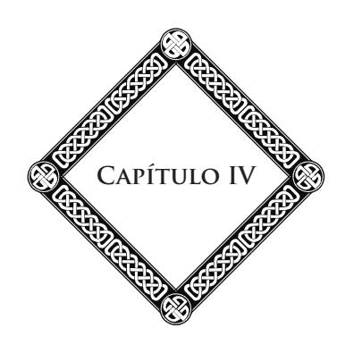

#### **As Harmonias do Espaço**

Uma das impressões que nos causa, à noite, a observação dos céus é a de um majestoso silêncio; porém este silêncio é apenas aparente; resulta da impotência de nossos órgãos. Para os seres melhor aquinhoados, dotados de sentidos abertos aos ruídos sutis do Infinito, todos os mundos vibram, cantam, palpitam, e suas vibrações, casadas, formam um imenso concerto.

Essa lei das grandes harmonias celestes, podemos observá-la na nossa própria família solar.

Sabe-se que a ordem de sucessão dos planetas no Espaço é regulada por uma lei de progressão, dita *lei de Bode*. 18 As distâncias dobram, de planeta a planeta, a partir do Sol. Cada grupo de satélites obedece à mesma lei. Ora, esse modo de progressão tem um princípio e um sentido. Este princípio se liga, ao mesmo tempo, às leis do número e da medida, às matemáticas e à c.19

18 **Johann Elert Bode:** astrônomo alemão (1747-1826). Indicou o meio (lei de Bode) de calcular aproximadamente as distâncias relativas dos planetas ao Sol (1778). (Nota da Editora, as suas próximas notas conterão apenas as iniciais **N.E.**)

19 Ver Azbel, *Harmonia dos Mundos*. (**N.A.**)

#### **Capítulo IV**

As distâncias planetárias são reguladas segundo a ordem normal da progressão harmônica; elas exprimem a própria ordem das vibrações desses planetas e as harmonias planetárias, calculadas conforme essas regras, proporcionam um acorde perfeito. Poder-se-ia comparar o sistema solar a uma imensa harpa cujos planetas representam as cordas. Seria possível, diz Azbel, "reduzindo a progressão das distâncias planetárias às cordas sonoras, construir um instrumento completo e absolutamente afinado".20

No fundo — e aí está a maravilha — a lei que rege as relações do som, da luz, do calor, é a mesma que rege o movimento, a formação e o equilíbrio das esferas, ao mesmo tempo que regula suas distâncias. Essa lei é ao mesmo tempo a dos números, das formas e das ideias. É a lei da harmonia por excelência: é o pensamento, é a ação divina entrevista!

A palavra humana é bem pobre; ela é insuficiente para expressar os mistérios adoráveis da harmonia eterna. A partitura musical pode apenas fornecer-lhe a síntese, comunicar-lhe a impressão estética. A música, língua divina, exprime o ritmo dos números, das linhas, das formas, dos movimentos. É através dela que as profundezas se animam e vibram. Ela preenche com suas ondas o edifício colossal do Universo, templo augusto onde ressoa o hino da vida infinita.

Pitágoras e Platão acreditavam já perceberem a "música das esferas". Ora, o que era apenas intuição torna-se um fato, e amanhã, será uma verdade absoluta, demonstrada.

Não existem, desde as exceções à regra universal de harmonia, elas próprias, até os desvios aparentes dos planetas que não se expliquem e não sejam temas de admiração. Elas

20 Id., Ibid. (**N.A.**)

constituem espécies de "diálogos de vibrações tão aproximadas quanto possível do uníssono" e apresentam um encantamento estético a mais nesse prodígio de beleza que é o Universo.21

Um exemplo, dos mais chocantes, é o dos pequenos planetas, ditos telescópicos, que evoluem entre Marte e Júpiter, em número de mais de 520, ocupando um espaço inteiro de oitava, dividido em outros tantos graus; donde a probabilidade que esse conjunto de mundículos não constitua, como se acreditou, um universo de ruínas, porém o laboratório de vários mundos em formação, mundos cujo estudo do céu nos dirá a gênese futura.

As grandes relações harmônicas que regulam a situação respectiva dos planetas de nosso sistema solar são em número de quatro. Elas encontram sua aplicação:

Em primeiro lugar: do Sol até Mercúrio; nesse ponto também as forças harmônicas estão em trabalho; esboçam-se novos planetas.

Depois, de Mercúrio a Marte. É a região dos pequenos planetas, onde se move nossa Terra; ela aí faz o papel de dominante local, com uma tendência de afastar-se do Sol para se aproximar das harmonias planetárias superiores. Marte, componente deste grupo, e que podemos distinguir no telescópio os continentes, os mares, os canais gigantescos, todo o aparelho de uma civilização anterior à nossa, Marte, embora menor, é mais equilibrado que nossa morada.

Os 500 planetas telescópicos constituem, em seguida, um intervalo de transição; eles formam como um colar de pérolas celestes religando o grupo de planetas inferiores à imponente cadeia dos grandes planetas, de Júpiter a Netuno, e

21 Ver Nota Complementar 3, no final do livro. (**N.A.**)

#### **Capítulo IV**

além. Esta corrente forma a quarta relação harmônica, com notas decrescentes, como o volume das esferas gigantes que a compõem. Nesse grupo, Júpiter tem o papel de dominante; os dois modos, maior e menor, nele se combinam.

"Como na inversão harmônica do som, diz Azbel:22

é através de uma progressão constante que o grupo antigo de Netuno a Júpiter afirma a formação de seus volumes. O caos de corpúsculos telescópicos, que se segue, deteve bruscamente essa progressão. Júpiter ficou lá, como um segundo sol, no limiar dos dois sistemas. Dos papéis de oitava e de segunda dominante, passou ao de tônica secundária e relativa, para exprimir o caráter do papel especial, evidentemente menor e relativo, com relação àquele do Sol, que ele ia preencher, enquanto que jovens formações se dispunham aquém, afastando-o pouco a pouco, ele e os mundos que ele tem de agora em diante em tutela, do astro do qual é o filho mais robusto.

Com efeito, ele é robusto, e bem imponente no seu percurso, esse Júpiter colossal, que gosto de contemplar na calma das noites de verão, mil e duzentas vezes maior que nosso globo, escoltado pelos seus cinco satélites,23 dos quais um, Ganimedes, tem o volume de um planeta. De pé no plano de sua órbita, de maneira a poder desfrutar de uma igualdade perpétua de temperatura sob todas as latitudes, com dias e noites sempre uniformes em sua duração, ele é, além disso, composto de elementos de uma densidade quatro vezes menor que os de nossa maciça morada, o que permite entrever, para os seres

22 Azbel, *Harmonia dos Mundos.* (**N.A.**)

23 Ver nota de rodapé 41, do livro *A Gênese*, de Allan Kardec, CELD. (**N.E.**)

que habitam ou habitarão Júpiter, facilidades de locomoção, possibilidades de vida aérea que devem dele fazer uma estada de predileção. Que teatro magnífico da vida! que cena de encantamento e de sonho esse astro gigante!

Mais estranho, mais maravilhoso ainda é Saturno, cujo aspecto é tão impressionante ao telescópio; Saturno,24 igual a oitocentos globos terrestres amontoados, com seu imenso diadema em forma de anel e seus oito satélites, entre os quais Titã, iguala-se em dimensão ao próprio Marte.

Saturno, com o rico cortejo que o acompanha na sua lenta revolução através do Espaço, constitui, ele próprio, um verdadeiro universo, imagem reduzida do sistema solar. É um mundo de trabalho e de pensamento, de ciência e de arte, onde as manifestações da inteligência e da vida se desenvolvem sob formas de uma variedade e de uma riqueza inimagináveis. Sua estética é sábia e complicada; o sentimento do belo tornou-se aí mais sutil e mais profundo através dos movimentos alternados, os eclipses dos satélites e dos anéis, todos os jogos de sombra, de luz, de cores, em que os matizes se fundem em gradações desconhecidas do olho dos terráqueos, e também através dos acordes harmônicos, tão emocionantes em suas conclusões analógicas com as do universo solar inteiro!

Em seguida, nas fronteiras do império do Sol, vêm Urano e Netuno, planetas misteriosos e magníficos, cujo volume iguala quase uma centena de globos terrestres reunidos. A nota harmônica de Netuno seria: "o culminante acorde geral, o cume do acorde maior de todo o sistema". Depois, são outros planetas distantes, sentinelas perdidas do nosso agrupamento

24 Ver nota de rodapé 67, do livro *A Gênese*, de Allan Kardec, CELD. (**N.E.**)

#### **Capítulo IV**

celeste, ainda desapercebidos, porém pressentidos e até calculados, segundo as influências que exercem sobre os confins do nosso sistema, longa corrente que nos prende a outras famílias de mundos.

Mais distante se desenrola imenso oceano estelar, abismo de luz e harmonia, cujas ondas melodiosas envolvem todas as partes e embalam nosso universo solar, esse universo tão vasto para nós, tão minguado com relação ao Além. É a região do desconhecido, do mistério, que atrai sem cessar nosso pensamento e que este é impotente para medir, para definir, com seus milhões de sóis de todas as grandezas, de todas as potências, seus astros duplos, múltiplos, coloridos, assustadores focos que iluminam as profundezas, derramando em ondas a luz, o calor, a energia, e que velocidades formidáveis conduzem na imensidão, com seus cortejos de mundos, terras do céu, invisíveis, porém suspeitadas, e as famílias humanas que as habitam, os povos e as cidades, as civilizações grandiosas das quais são o teatro.

Por toda a parte as maravilhas se sucedem às maravilhas: grupos de sóis animados por colorações estranhas, arquipélagos de astros, cometas desenfreados, errando na noite de seu afélio,25 focos que morrem e que se acendem de repente e flamejam no fundo do abismo, pálidas nebulosas de formas fantásticas, fantasmas luminosos cujas irradiações, diz-nos Herschel, colocam à nossa frente dois milhões de anos, formidáveis gêneses do Universo, berços e túmulos da vida universal, vozes do passado, promessas do futuro, esplendores do Infinito!

E todos esses mundos unem suas vibrações numa melodia poderosa. A alma, liberada dos laços terrestres e tendo chegado a essas alturas, ouve a voz profunda dos céus eternos!

25 **Afélio:** o ponto da órbita de um planeta em que a distância ao Sol é a maior possível. (**N.T.**, conforme o *Novo Dicionário Aurélio da Língua Portuguesa.*)

\* \* \*

No seu conjunto, as relações harmônicas que regulam as distâncias planetárias representam exatamente, como o estabeleceu Azbel,26 a extensão do nosso teclado sonoro. As relações de oitava, ou potências harmônicas, são idênticas às das distâncias e à lei dos movimentos. Nosso sistema solar representa uma espécie de edifício de oito andares, quer dizer, oito oitavas, com uma escada formada por 320 degraus ou ondas harmônicas, sobre a qual os planetas se encontram colocados, ocupando "patamares indicados pela harmonia de um acorde perfeito múltiplo".

As dissonâncias são apenas aparentes ou passageiras. O acorde se encontra no fundo de tudo. As regras da nossa harmonia musical parecem ser somente uma consequência, uma aplicação bem imperfeita da lei de harmonia soberana que preside à marcha dos mundos. Podemos, pois, crer logicamente que a melodia das esferas seria inteligível para nosso espírito, se nossos sentidos pudessem perceber as ondas sonoras que preenchem o Espaço.27

A regra geral, por ser absoluta, não é, entretanto, estreita e rígida. Em certos casos, como no de Netuno, a harmonia relativa parece afastar-se do princípio, nunca, todavia,

26 Azbel, *Harmonia dos Mundos.* (**N.A.**)

27 "O Sr. Émile Chizat, diz Azbel (*A Música no Espaço*), constata que o jogo do órgão chamado de 'vozes celestes' não é outra coisa senão a aplicação musical intuitiva do papel importante 'das ideias de estrela'. É provável que manifestações sinfônicas serão feitas ulteriormente, sobre esse assunto, que poderiam reservar para o público impressões inesperadas. Pudessem elas apenas auxiliar a reconduzir nossas músicas 'terrestres' que se desgarram das noções um pouco mais elevadas e reais do sacerdócio da harmonia, que deveriam preencher entre nós." (**N.A.**)

#### **Capítulo IV**

de maneira a sair dele. O estudo dos movimentos planetários deles fornece a demonstração evidente.

Nessa ordem de estudos, mais do que em qualquer outro, vemos manifestar-se, na sua imponente grandeza, a lei do Belo e do Perfeito que rege o Universo. Mal nossa atenção se volta para as imensidades siderais, logo a sensação de estética se torna intensa. Essa sensação vai crescer ainda e aumentar à medida que se precisarem as regras de harmonia universal, à medida que para nós se levantar o véu que nos oculta os esplendores celestes.

Por toda a parte, encontraremos essa concordância que encanta e emociona. Nesse domínio, nenhuma dessas discordâncias, dessas decepções, tão frequentes no seio da Humanidade. Por toda a parte, se manifesta essa potência de beleza que leva ao Infinito suas combinações, abraçando numa mesma unidade todas as leis, em todos os sentidos: Aritmética, Geometria, estética.28

O Universo é um poema sublime do qual começamos apenas a soletrar o primeiro canto. Dele apreendemos apenas algumas notas, alguns murmúrios longínquos e enfraquecidos, e já essas primeiras letras do maravilhoso alfabeto musical nos enche de entusiasmo. O que será quando, tornados mais dignos de interpretar a divina linguagem, percebermos, compreendermos as grandes harmonias do Espaço, o acorde infinito na variedade infinita, o cântico cantado por esses milhões de astros que, na diversidade prodigiosa de seus volumes e de seus movimentos, afinam suas vibrações para uma sinfonia eterna?

28 Nos cálculos harmônicos, diz Azbel (*Harmonia dos Mundos*), o sentido de quantidade do Número encontra-se sempre esclarecido e completado pelo sentido da Nota, quer dizer, pelo sentido da qualidade harmônica que o Número comporta. (**N.A.**)

Mas, perguntar-se-á, essa música celeste, essa voz dos céus profundos, o que ela diz?

Essa linguagem ritmada é o Verbo por excelência, aquele pelo qual todos os mundos e os seres superiores se comunicam entre si, chamando-se através das distâncias; pelo qual nos comunicaremos um dia com as outras famílias humanas que povoam o Espaço estrelado.

É, no próprio princípio das vibrações que servem para traduzir o pensamento, a telegrafia universal, veículo da ideia em todas as regiões do Universo, através do qual as almas elevadas procedem a perpétuos intercâmbios, a efusões de Ciência, de sabedoria e de amor, entretendo-se de um astro a outro com suas obras comuns, com objetivo a atingir, com progressos a realizar.

É ainda o hino que os mundos cantam a Deus, cada qual na sua vez, canto de alegria, adoração, lamento, prece; é a grande voz das esferas, a suprema harmonia dos seres e das coisas, o grito de amor que eternamente sobe em direção à Inteligência ordenadora dos universos.

Quando, pois, saberemos desligar nossos pensamentos das banalidades quotidianas e elevá-los em direção aos cumes? Quando saberemos penetrar nesses mistérios do céu e compreender que cada descoberta realizada, cada conquista perseguida nesse caminho de luz e de beleza, contribui para enobrecer nosso espírito, para engrandecer nossa vida moral, e nos proporciona alegrias superiores a todas aquelas da matéria?

Quando, pois, compreenderemos que é lá, nesse Universo Esplêndido, que nosso próprio destino se desenrola, e que estudá-lo é estudar o próprio meio onde somos chamados a reviver, a evoluir sem cessar, penetrando-nos cada vez mais com as harmonias que o preenchem? Que por toda a parte a

#### **Capítulo IV**

vida se desabrocha em florações de almas? Que o Espaço está povoado de sociedades sem-conta às quais o ser humano está ligado através das leis de sua natureza e de seu futuro?

Ah! como são lamentáveis aqueles que desviam seus olhares desses espetáculos e seu espírito desses problemas! pois não há estudo mais impressionante, mais emocionante, não há revelação mais elevada de Ciência e de Arte, não há lição mais sublime.

Não, o segredo de nossa felicidade, de nosso poder, de nosso futuro não está nas coisas passageiras desse mundo; está nos ensinamentos do Alto e do Além. E os educadores da Humanidade são bem inconscientes ou bem culpados, que não pensam em elevar as almas para os cimos onde resplandece a verdadeira luz.

Se a dúvida e a incerteza nos sitiam, se a vida nos parece pesada, se tateamos na noite à procura do objetivo, se o pessimismo e a tristeza nos invadem, não acusemos senão a nós mesmos, pois o grande livro infinito lá está, aberto sob nossos olhos, com suas páginas magníficas no qual cada palavra é um grupo de astros, cada letra um sol, o grande livro em que devemos aprender a ler o ensinamento sublime. A verdade lá está, escrita em letras de ouro e de flama; ela chama, ela solicita nosso olhar, verdade, realidade mais bela que todas as lendas e todas as ficções.

É ela que nos fala da vida imperecível da alma, suas vidas renascentes na espiral dos mundos, as etapas inumeráveis na estrada radiosa, a perseguição do eterno bem na duração infinita, a escalada dos céus na conquista da consciência plena, a alegria de viver sempre, para sempre amar, para se elevar sempre, adquirir sempre novas potencialidades, virtudes mais elevadas, percepções mais vastas. E acima de tudo, a visão, a

#### **As Harmonias do Espaço**

compreensão, a posse da Eterna Beleza, a felicidade de penetrar-lhe as leis, de associar-se mais estreitamente à obra divina e à evolução das Humanidades.

Pois desses magníficos estudos, a ideia de Deus sobressai mais majestosa, mais serena. A ciência das harmonias celestes é como o pedestal grandioso sobre o qual se eleva a augusta figura, Beleza Soberana cujo brilho, muito ofuscante para nossos olhos fracos, permanece ainda velado, mas irradia suavemente através da escuridão que a envolve.

Ideia de Deus, centro inefável para onde convergem e se fundem, numa síntese sem-limites, todas as ciências, todas as artes, todas as verdades superiores, tu és a primeira e a última palavra das coisas presentes ou passadas; tu és a própria Lei, a única causa de todas as coisas, a união absoluta, fundamental, do Bem e do Belo, que o pensamento reclama, que a consciência exige e em que a alma humana encontra sua razão de ser e a fonte inesgotável de suas forças, de suas luzes, de suas inspirações!

#### **Nota da Tradutora:**

• Acrescentamos à presente edição, o seguinte trecho constante da edição revista e aumentada de 1921:

Pitágoras e Platão diziam ouvir a "música das esferas". No sonho de Cipião, que Cícero relata em uma das mais belas páginas que a Antiguidade nos legou, aquele que dorme se entretém com as almas de seu pai Paul-Émile e de seu avô Cipião, o africano; ele contempla com eles as maravilhas celestes e o seguinte diálogo se estabelece:

"Então, que harmonia tão poderosa e tão suave é essa que me penetra? Pergunta Cipião.

— É a harmonia que, formada por intervalos desiguais, porém combinados, segundo uma justa proporção, resulta da impulsão e do movimento das esferas, e que, fundindo os tons graves e os tons agudos

#### **Capítulo IV**

em comum acordo, faz de todas essas notas tão variadas, um melodioso concerto. Movimentos tão grandiosos não podem se efetuar em silêncio", responde-lhe seu avô.

Quase todos os compositores de gênio que ilustraram a arte musical, tais como os Bach, os Beethoven, os Mozart, etc., declararam que percebiam harmonias bem superiores a tudo o que se pode imaginar e que lhes era impossível transcrever. Beethoven, enquanto compunha, estava fora de si, maravilhado, numa espécie de êxtase, e escrevia, febrilmente, tentando em vão reproduzir essa música celeste que o embriagava.

#### **Necessidade da Ideia de Deus**

Nos capítulos precedentes, demonstramos a necessidade da ideia de Deus. Ela se afirma e se impõe fora e acima de todos os sistemas, de todas as filosofias, de todas as crenças. Por isso, é livre de todo vínculo com uma religião qualquer que nos consagramos a esse estudo, na absoluta independência de nosso pensamento e de nossa consciência. Pois Deus é maior que todas as teorias e todos os sistemas. Eis por que não poderia ser atingido nem diminuído pelos erros e as faltas que os homens cometeram em seu nome. Deus plana acima de tudo.

Deus está acima de todas as denominações, e se o chamamos Deus, é por falta de um nome maior, como o disse Victor Hugo.

A questão de Deus é o mais grave de todos os problemas suspensos sobre nossas cabeças e cuja solução liga-se de uma maneira estreita, imperiosa, ao problema do ser humano e de seu destino, ao problema da vida individual e da vida social.

O conhecimento da verdade sobre Deus, sobre o mundo e sobre a vida é o que há de mais essencial, de mais necessário, pois é ele que nos sustenta, nos inspira e nos dirige,

#### **Capítulo V**

mesmo à nossa revelia. E essa verdade não é inacessível, como nós o veremos; ela é simples e clara; ela está ao alcance de todos. Basta procurá-la sem-preconceitos, sem tomar partido, com o auxílio da consciência e da razão.

Não relembraremos aqui as teorias, os sistemas inumeráveis que as religiões e as escolas filosóficas elevaram através dos séculos. Pouco nos importam hoje as disputas, as cóleras, as vãs agitações do passado.

Para elucidar um tal assunto, temos agora recursos mais elevados que os do pensamento humano; temos o ensino daqueles que deixaram a Terra, a apreciação das almas que, tendo transposto o túmulo, fazem-nos ouvir, do seio do mundo invisível, seus avisos, seus apelos, suas exortações.

É verdade que nem todos os espíritos estão igualmente aptos para tratar dessas questões. Há espíritos de além-túmulo como há homens. Nem todos são igualmente desenvolvidos; nem todos chegaram ao mesmo grau de evolução. Daí, as contradições, as diferenças de visão. Porém, acima da multidão das almas obscuras, ignorantes, atrasadas, há espíritos eminentes, que desceram das altas esferas para esclarecer e guiar a Humanidade.

Ora, o que dizem esses espíritos sobre a questão de Deus?

A existência da Potência Suprema é afirmada por todos os espíritos elevados. Aqueles dentre nós que estudaram o Espiritismo filosófico sabem que todos os grandes espíritos, todos aqueles cujos ensinos reconfortaram nossas almas, suavizaram nossas misérias, sustentaram nossas falhas, são unânimes em afirmar, em proclamar, em reconhecer a elevada Inteligência que governa os seres e os mundos. Eles dizem

#### **Necessidade da Ideia de Deus**

que essa Inteligência se revela mais brilhante e mais sublime à medida que se sobe os degraus da vida espiritual.

Acontece o mesmo com escritores e filósofos espíritas, desde Allan Kardec até os nossos dias. Todos afirmam a existência de uma causa eterna no Universo.

*"Não há efeito sem-causa"*, disse Allan Kardec, *"e todo efeito inteligente tem forçosamente uma causa inteligente."* Eis o princípio sobre o qual repousa o Espiritismo inteiro. Este princípio, quando o aplicamos às manifestações de além-túmulo, demonstra a existência dos espíritos. Aplicado ao estudo do mundo e das leis universais, demonstra a existência de uma causa inteligente no Universo. É por que a existência de Deus constitui um dos pontos essenciais do ensino espírita. Acrescento que ele é inseparável do restante desse ensino, porque, nesse último, tudo se liga, se coordena, e se encadeia. Que não nos falem de dogmas! O Espiritismo não os comporta. Ele nada impõe; ele ensina. Todo ensino tem seus princípios. A ideia de Deus é um dos princípios fundamentais do Espiritismo.

Às vezes, nos dizem: De que adianta ocupar-se com essa questão de Deus? A existência de Deus não pode ser provada! Ou ainda: a existência de Deus ou sua não existência não tem influência na vida das massas, na vida da Humanidade. Ocupemo-nos de algo mais prático; não percamos nosso tempo com vãs dissertações, com discussões metafísicas.

Pois bem! que agrade ou não àqueles que usam esta linguagem, repetirei que a questão de Deus é a questão suprema, a questão vital por excelência; responderei que o homem não pode desinteressar-se dela, porque o homem é um ser. O homem vive, e importa-lhe saber qual é a fonte, qual é a causa, qual é a lei da vida. A opinião que se tem da causa, da lei do

#### **Capítulo V**

Universo, essa opinião, queira ele ou não, saiba ele ou não, reflete-se nos seus atos, em toda sua vida pública ou privada.

Qualquer que seja a ignorância do homem a respeito das leis superiores, na realidade, é conforme a ideia que ele faz dessas leis, por mais vaga e confusa que possa ser, é de acordo com ela que ele age. Essa opinião sobre Deus, sobre o mundo, sobre a vida — notem que esses três temas são inseparáveis — essa opinião, as sociedades humanas dela vivem e por ela morrem! É ela que divide a Humanidade em dois campos. E veem-se por toda a parte famílias em desacordo, em desunião intelectual, porque há vários sistemas a respeito de Deus: o padre tendo inculcado um à mulher; o professor tendo ensinado o outro ao homem, quando não lhe sugeriu a ideia do *nada*.

Aliás essas disputas, essas contradições se explicam. Elas têm sua razão de ser. É preciso lembrar que nem todas as inteligências chegaram ao mesmo ponto de evolução; que nem todos podem ver e compreender da mesma maneira e em todos os sentidos. Daí, tantas opiniões, crenças diversas. A possibilidade que temos de compreender, de julgar, de discernir não se desenvolve em nós senão lentamente, de séculos em séculos, de existências em existências. Nosso conhecimento, nossa compreensão das coisas, completa-se e se clareia à medida que nos elevamos na escala imensa dos renascimentos. Todo o mundo sabe: aquele que está colocado ao pé da montanha não pode ver o que contempla aquele que chegou ao cume. Porém, prosseguindo sua ascensão, um chegará a ver as mesmas coisas que o outro. Acontece o mesmo com o espírito na sua ascensão gradual. O Universo só se desvenda para ele pouco a pouco, à medida que sua capacidade de compreender-lhe as leis se desenvolve e aumenta.

#### **Necessidade da Ideia de Deus**

Daí vêm os sistemas, as escolas filosóficas e religiosas que respondem aos diferentes graus de adiantamento dos espíritos que aí se classificam e, frequentemente, se confinam.

#### **As Leis Universais**

Repitamo-lo, todos os trabalhos científicos efetuados há meio século nos demonstram a existência e a ação das leis naturais. Estas leis estão religadas por uma lei superior que as abarca todas, regula-as e as conduz à unidade, à ordem, à harmonia. É através dessas leis, sábias e profundas, ordenadoras e organizadoras do Universo, que a Inteligência Suprema se revela.

Certos sábios censuram, é verdade, que as leis universais são cegas. Mas como leis cegas poderiam dirigir a marcha dos mundos no Espaço, regular todos os fenômenos, todas as manifestações da vida, e isso com uma precisão admirável? Se as leis são cegas, diremos, evidentemente devem agir ao acaso. Mas o acaso é a falta de direção, a ausência de qualquer inteligência atuante. Ele é inconciliável com a noção de ordem e de harmonia.

A ideia de Lei parece-nos, pois, inseparável da ideia de Inteligência. A Lei é a manifestação de uma inteligência, porque é a obra de um pensamento. Unicamente, este pôde dispor, agenciar todas as coisas no Universo. E o pensamento

#### **Capítulo VI**

não pode se produzir sem a existência de um ser que dele é o gerador.

Não há lei possível fora e sem o concurso da inteligência, da vontade que a dirige. De outra forma a lei seria cega, como o dizem os materialistas, mas, então, ela iria ao acaso, à deriva. Seria, exatamente, como um homem que quisesse seguir uma estrada sem o socorro da visão e que cairia num fosso ao final de alguns passos. Desse modo, nos é permitido afirmar que uma lei que fosse cega não seria mais uma lei.

Acabamos de ver que as pesquisas da Ciência demonstram a existência das leis universais. Todos os dias, a Ciência avança, frequentemente contra sua vontade, é verdade, porém, ela avança, enfim, pouco a pouco para essa grande unidade que entrevemos no fundo das coisas.

Não há, desde os positivistas até os próprios materialistas, que não sejam arrastados por este movimento de ideias. Eles se encaminham, sem disso se aperceberem, para esta concepção grandiosa que reúne todas as forças, todas as leis do Universo. Com efeito, poderíamos estabelecer que Auguste Comte, Littré, o doutor Robinet, toda a escola positivista, consagram-se a essas questões com as mais flagrantes contradições. Eles rejeitam a ideia do absoluto, a de uma causa geradora, e proclamam, e até provam que "a matéria é apenas a manifestação sensível de um princípio universal". Segundo eles, "todas as ciências se superpõem e terminam por se reunir numa generalidade suprema, que coloca o selo na sua unidade". Segundo Burnouf, "a Ciência está próxima de atingir uma teoria, cuja fórmula geral constataria a unidade da substância, a invariabilidade da vida e sua união indissolúvel com o pensamento".

Ora, o que é, pois, essa trilogia da substância, da vida e do pensamento, esta "generalidade suprema, esta lei universal, este princípio único", que presidem todos os fenômenos da Natureza, todas as metamorfoses, todos os atos da vida, todas as inspirações do espírito? O que é, portanto, esse centro no qual se resume e se confunde tudo o que é, tudo o que vive, tudo o que pensa? O que é, senão o absoluto, senão o próprio Deus!

É verdade que obstina-se em recusar a inteligência e a consciência a esse absoluto, a essa causa suprema, mas restará sempre explicar como uma causa ininteligente, cega, inconsciente, pôde produzir todas as magnificências do Cosmo, todos os esplendores da inteligência, da luz e da vida, sem saber que o fazia. Como, sem-consciência nem vontade, sem-reflexão nem julgamento, pôde produzir seres que refletem, desejam, julgam, que são dotados de consciência e de razão?

Tudo vem de Deus e volta para ele. Um fluido mais sutil que o éter emana do pensamento Criador. Esse fluido, muito quintessenciado para ser apreendido pela nossa compreensão, em consequência de combinações sucessivas, tornou-se éter. Do éter saíram todas as formas graduadas da matéria e da vida. Chegadas ao último ponto da descida, a substância e a vida remontam o ciclo imenso das evoluções.

Nós o vimos, a ordem e a majestade do Universo não se revelam somente no movimento dos astros, na marcha dos mundos; elas se revelam também de uma maneira imponente na evolução e no desenvolvimento da vida na superfície desses mundos. Hoje, pode-se estabelecer que a vida se desenvolve, se transforma e se afina segundo um plano preconcebido; ela se aperfeiçoa à medida que percorre sua estrada imensa. Começa-se a compreender que tudo é regulado em vista de um objetivo, e esse objetivo é a progressão do ser; é o crescimento contínuo e a realização nele, de formas sempre mais perfeitas de beleza, de sabedoria, de moralidade.

#### **Capítulo VI**

Pode-se observar em torno de nós essa lei majestosa do progresso através de todo o lento trabalho da Natureza: desde as formas mais inferiores, desde os infinitamente pequenos, os infusórios flutuando nas águas, elevando-se de degrau em degrau na escala das espécies, até ao homem. O instinto torna-se sensibilidade, inteligência, consciência, razão. Também sabemos que essa ascensão não se detém aí. Graças aos ensinamentos do Além, aprendemos que ela prossegue através dos mundos invisíveis, sob formas cada vez mais sutis; ela prossegue de potências em potências, de glórias em glórias até ao infinito, até Deus. E essa ascensão grandiosa da vida só se explica através da existência de uma vontade, de uma causa inteligente, de uma energia incessante, que penetra, envolve toda a Natureza; é ela que regula e estimula essa evolução colossal da vida através do Bem, do Belo, do Perfeito!

Acontece o mesmo no domínio moral. Nossas existências se sucedem e se desdobram através dos séculos. Os acontecimentos prosseguem sem que vejamos o laço que os religa. Mas a justiça imanente plana sobre todas as coisas. Fixa nossa sorte segundo uma lei, segundo um princípio infalível. Pensamentos, palavras, ações, tudo se encadeia, tudo está religado através de uma série de causas e de efeitos que é como a trama de nossos destinos.29

Insistamos nesse ponto: é graças à revelação dos espíritos que a Lei de justiça nos apareceu com esse caráter imponente, com suas vastas consequências e o encadeamento prodigioso das coisas que ela domina e rege.

> \* \* \*

29 Ver Léon Denis, *O Problema do Ser e do Destino*, cap. 19. (**N.A.**)

Quando se estuda o problema da vida futura, quando se examina a situação do espírito após a morte — e aí está o objeto capital das pesquisas psíquicas — encontra-se na presença de um fato considerável, grande em consequências morais. Constata-se um estado de coisas que é regulado por uma lei de equilíbrio e de harmonia.

Assim que a alma transpõe a morte, desde que desperta no mundo dos espíritos, o quadro de suas vidas passadas desenrola-se pouco a pouco à sua visão. Existe nela como um espelho que reflete fielmente todos os atos efetuados, para acusá-la ou glorificá-la. Não há distração, não há fugas possíveis. O espírito é obrigado a contemplar a si mesmo, primeiro, para se reconhecer ou para sofrer, e, mais tarde, para se preparar para uma outra vida de progresso ou de reparação. Donde, para o maior número, o remorso, a vergonha e o sofrimento!

Os ensinamentos de além-túmulo nos fazem aprender que nada se perde, nem o bem, nem o mal, mas que tudo se grava, se repara, se resgata por meio de outras existências terrestres, difíceis e dolorosas.

Aprendemos, igualmente, que nenhum esforço fica perdido e que nenhum sofrimento é inútil. O dever não é uma palavra vã, e o Bem reina sem-partilha acima de tudo. Cada um de nós constrói dia após dia, hora a hora, frequentemente sem o saber, seu próprio futuro. A sorte a que nos submetemos na vida atual foi preparada pelas nossas ações anteriores; assim também, edificamos no presente as condições de nossa existência futura. Daí, para o sábio, a resignação ao que há de inevitável na vida atual; daí também um estimulante poderoso para agir, devotar-se, preparar para si um destino melhor.

Aqueles que sabem disso não ficarão cheios de temor imaginando o que espera a sociedade atual, cujos pensamentos, as

#### **Capítulo VI**

tendências, os atos são muito frequentemente inspirados pelo egoísmo ou pelas más paixões, a sociedade atual que acumula, assim, acima dela nuvens fluídicas sombrias que trazem a tempestade nos seus flancos?

Como não ficaríamos apavorados na presença de tantos desfalecimentos morais, diante de tantas corrupções que se ostentam, apavorados, constatando que o sentimento do bem ocupa tão pouco lugar em certas consciências, apavorados, enfim, de encontrar, no fundo de tantas almas humanas, o abatimento, a desmoralização, o desencorajamento, o desgosto da vida?

E se sentimos isso, como hesitaríamos em afirmar, à frente de todos, em fazer conhecer a todos essa lei de justiça, que os ensinamentos do Além nos mostram tão grande, tão imponente, essa lei que se executa por si mesma, sem-tribunal e sem-julgamento, mas da qual nenhum de nossos atos escapa, lei que revela uma inteligência diretora do mundo moral, lei viva, razão consciente do Universo, fonte de toda vida, de toda a luz, de toda perfeição!

Eis o que é Deus. Quando essa ideia de Deus tiver penetrado no ensino e, daí, nos espíritos e nas consciências, compreender-se-á que o princípio de justiça não é outra coisa senão o instrumento admirável pelo qual a Causa Suprema reconduz tudo à ordem e à harmonia, e sentir-se-á que a ideia de Deus é indispensável às sociedades modernas, que se abatem e perecem moralmente, porque, não compreendendo mais Deus, não podem se regenerar. Então, todos os pensamentos, todas as consciências se voltarão para esse foco moral, para essa fonte de eterna justiça que é Deus, e ver-se-á mudar a face do mundo!

A justiça não é apenas de origem social, como a revolução de 1789 procurou estabelecer. Ela vem de mais Alto; ela é de origem divina. Se os homens são iguais diante da lei humana, é porque são iguais diante da lei eterna.

E é também porque saímos todos de uma mesma fonte de inteligência e de consciência, que somos todos irmãos, solidários uns com os outros, unidos nos nossos destinos imortais. Pois a solidariedade e a fraternidade dos seres só são possíveis se eles se sentem religados a um mesmo centro comum.

Somos os filhos de um mesmo Pai, porque a alma humana é uma emanação da alma divina, uma centelha do pensamento eterno.

> \* \* \*

Tudo nos fala de Deus, o visível e o invisível. A inteligência o discerne; a razão e a consciência o proclamam.

Mas o homem não é apenas razão e consciência; ele é também amor. O que caracteriza o ser humano, acima de tudo, é o sentimento, é o coração. O sentimento é privilégio da alma; é através dele que ela se prende ao que é bom, belo e grande, a tudo o que merece sua confiança e pode ser seu sustentáculo na dúvida, sua consolação na desgraça. Ora, todos esses modos de sentir e de conceber nos revelam igualmente Deus, pois a bondade, a beleza, a verdade só se encontram no ser humano no estado parcial, limitado, incompleto. A bondade, a beleza, a verdade só podem existir na condição de encontrar seu princípio, sua plenitude, sua fonte num ser que as possui em estado superior, no estado infinito.

A ideia de Deus se impõe a nós através de todas as faculdades do nosso espírito, ao mesmo tempo que ela fala aos nossos olhos através de todos os esplendores do Universo. A inteligência suprema revela-se como a causa eterna, onde

#### **Capítulo VI**

todos os seres vêm haurir a força, a luz e a vida. Aí está o espírito divino, o espírito poderoso que honramos, sob tantas qualificações diferentes; mas que, sob todos esses nomes, é sempre o centro, a lei viva, a razão pela qual os seres e os mundos sentem-se viver, pela qual eles se conhecem, se renovam e se elevam.

Deus nos fala através de todas as vozes do Infinito. Ele nos fala, não numa bíblia escrita há séculos, porém numa bíblia que se escreve todos os dias, com esses caracteres majestosos que se chamam oceano, mares, montanhas e astros do céu; através de todas as harmonias suaves e graves que sobem do seio da Terra ou descem dos Espaços etéreos. Ele nos fala ainda no santuário do nosso ser, nas horas de silêncio e de meditação. Quando os ruídos discordantes da vida material se calam, então, a voz interior, a grande voz desperta, se faz ouvir. Essa voz sai das profundezas da consciência e nos fala de dever, de progresso, de ascensão. Há em nós um refúgio íntimo, como uma fonte profunda de onde podem jorrar ondas de vida, de amor, de virtude, de luz. Aí se manifesta esse reflexo, esse gérmen divino, escondido em toda alma humana.

É por isso que a alma humana é o mais belo testemunho que se eleva em favor da existência de Deus: ela é um reflexo da alma divina. Contém, em si mesma, em estado de embriões, todas as potências, e seu papel, seu destino consiste em valorizá-las no decorrer de suas existências inumeráveis, nas suas transmigrações através dos tempos e dos mundos.

O ser humano, dotado de razão, é responsável; ele é suscetível de se conhecer, e tem o dever de governar a si mesmo. Como o disse João, o Evangelista: "A razão humana é essa verdadeira luz que clareia todo homem que vem a esse mundo". (João, I: 9.) A razão humana, dissemos, é uma centelha da razão divina. É elevando-se novamente à sua fonte, é comunicando-se com a Razão Absoluta, eterna, que ela descobre a verdade, compreende a lei e a ordem universais. Assim, digo a todos: Ó homens! filhos da Luz, ó meus irmãos! Lembremo- -nos de nossa origem; lembremo-nos do objetivo durante a viagem da vida! Desliguemo-nos das coisas que passam; fixemo-nos às que permanecem!

Não há dois princípios no mundo: o Bem e o Mal. O Mal é apenas um reflexo de contraste, o que a noite é para o dia. Ele não tem existência própria. O Mal é o estado de inferioridade e ignorância do ser em via de evolução. Os primeiros degraus da escada imensa representam o que chamamos o mal; porém à medida que o ser se eleva, realiza o bem em si e em torno de si. Por outro lado, o mal se atenua, depois se dissipa. O Mal, o dissemos, é apenas a ausência do Bem. Se ele parece dominar ainda em nosso planeta, é porque este é um dos primeiros anéis da corrente, uma estada de almas elementares que estreiam na rude senda do conhecimento, ou então de almas culpadas, em via de reparação. Nos mundos mais adiantados, o bem desabrocha e, de degrau em degrau, termina por reinar sem-divisão.

O Bem é indefinível por si mesmo. Defini-lo seria amesquinhá-lo. É preciso considerá-lo, não na sua natureza, mas nas suas manifestações.

Acima das essências, das formas e das ideias, plana o princípio do Belo e do Bem, último termo que sejamos capazes de atingir através do pensamento, sem todavia abarcá-lo. Ele está na nossa imperfeição de não poder apreender a realidade última das coisas; mas a sensibilidade, a inteligência e o conhecimento têm em nós tantos pontos de apoio, que permitem à alma libertar-se do seu estado de inferioridade e de incerteza,

#### **Capítulo VI**

e se convencer de que tudo no Universo, as forças e os seres, tudo é regido pelo Bem e pelo Belo. A ordem e a majestade do mundo, ordem física e ordem moral, justiça, liberdade, moralidade, tudo repousa nas leis eternas, e não há leis eternas sem um Princípio Superior, sem uma Razão Primeira, causa de toda lei. Desse modo, o ser humano, não mais que a sociedade, não pode crescer e progredir sem a ideia de Deus, isto é, semjustiça, sem-liberdade, sem-respeito de si mesmo, sem-amor, pois Deus, que representa a perfeição, é a última palavra, a suprema garantia de tudo o que constitui a beleza, a grandeza da vida, de tudo o que faz o poder e a harmonia do Universo!

#### **A Ideia de Deus e a Experimentação Psíquica**

Até aqui, no nosso estudo da questão de Deus, mantivemo-nos no terreno dos princípios. Nesse domínio, a ideia de Deus nos surge como a base da doutrina espiritualista. Vejamos, agora, se ela não é de uma importância igual no domínio dos fatos, na ordem experimental.30

À primeira vista, pode parecer estranho ouvir dizer que a ideia de Deus representaria um papel útil no estudo experimental, na observação dos fatos espíritas.

Notemos, primeiramente, que há tendência, da parte de alguns grupos, de dar ao Espiritismo um caráter sobretudo experimental, de se prender exclusivamente ao estudo dos fenômenos, de negligenciar o que tem um caráter filosófico; tendência de rejeitar tudo o que pode lembrar, por pouco que seja, as doutrinas do passado, para se isolar no terreno científico. Nesses meios, contenta-se em afastar a crença e a afirmação de Deus como supérfluas, como sendo, no mínimo,

30 Ver notas complementares 4, 5 e 6 no final do livro. (**N.A.**)

#### **Capítulo VII**

de uma demonstração impossível. Pensa-se, assim, atrair os homens de ciência, os positivistas, os livre-pensadores, todos aqueles que experimentam uma espécie de aversão pelo sentimento religioso, por tudo o que tem uma aparência mística ou doutrinal.

Por outro lado, gostaríamos de fazer do Espiritismo um ensino filosófico e moral, baseado nos fatos, um ensino suscetível de substituir as doutrinas envelhecidas, os sistemas antiquados, e de dar satisfação às almas numerosas que buscam, antes de tudo, consolações para suas dores; uma filosofia simples, popular, que as repouse das tristezas da vida.

Tanto de um lado quanto do outro, há multidões a satisfazer; muito mais de um lado, que do outro, pois a multidão daqueles que lutam e sofrem ultrapassa, em grande número, a dos homens de estudo.

Para sustentar essas duas teses, vemos tanto de uma parte quanto de outra, homens sinceros e convictos, cujas qualidades nos apraz homenagear. Por quem deveria optar? em que sentido convém orientar o Espiritismo para assegurar a sua evolução? O resultado de nossas pesquisas e de nossas observações nos leva a reconhecer que a grandeza do Espiritismo, a influência que ele exerce sobre as massas provém, sobretudo, de sua doutrina; os fatos são apenas as fundações sobre as quais apoia-se o edifício. Certamente! as fundações representam um papel essencial em todo edifício; mas não é nas fundações, isto é, nas construções subterrâneas, que o pensamento e a consciência podem encontrar um abrigo.

Aos nossos olhos, a missão real do Espiritismo não é somente a de esclarecer as inteligências através de um conhecimento mais preciso e mais completo das leis físicas do mundo; ela consiste, sobretudo, em desenvolver a vida moral

#### **A Ideia de Deus e a Experimentação Psíquica**

nos homens, a vida moral que o materialismo e o sensualismo muito diminuíram. Elevar os caracteres e fortificar as consciências, tal é a tarefa capital do Espiritismo. Nesse ponto de vista, ele pode ser um remédio eficaz para os males que sitiam a sociedade contemporânea, um remédio para esse crescimento inusitado do egoísmo e das paixões, que nos empurram para os abismos.

Cremos dever exprimir aqui nossa inteira convicção: não é fazendo do Espiritismo apenas uma ciência positiva, experimental; não é eliminando dele o que há de elevado, o que arrasta o pensamento acima dos horizontes estreitos, isto é, a ideia de Deus, o uso da prece, que facilitaremos sua tarefa; ao contrário, torná-lo-íamos estéril, sem-ação sobre o progresso das massas.

Certamente! ninguém melhor do que nós admira as conquistas da Ciência; sempre gostamos de fazer justiça aos esforços corajosos dos sábios que a cada dia fazem recuar os limites do desconhecido. Mas a Ciência não é tudo. Ela contribuiu, sem-dúvida, para esclarecer a Humanidade; entretanto, ela sempre se mostrou impotente para torná-la mais feliz e melhor.

A grandeza do espírito humano não consiste apenas no conhecimento; ela está também no ideal elevado. Não é a Ciência, é o sentimento, a fé, o entusiasmo que fizeram Joana d'Arc, 1789,31 e todas as grandes epopeias da História.

Os enviados do Alto, os grandes predestinados, os videntes, os profetas não escolheram como móvel a Ciência; eles escolheram a crença. Não golpearam os cérebros; tocaram os corações. Todos vieram para impulsionar as nações para Deus.

31 Referência aos acontecimentos de 1789 — a Revolução Francesa. (**N.T.**)

#### **Capítulo VII**

O que é feito da Ciência do passado? As ondas do esquecimento a fizeram submergir como farão submergir a do nosso tempo. O que será dos métodos, das teorias daqui a vinte séculos? Os nomes dos grandes missionários, ao contrário, sobreviveram através dos tempos. O que sobrevive a tudo, no desastre das civilizações, é o que eleva a alma humana acima de si mesma, para um objetivo sublime, para Deus!

Há uma outra coisa ainda. Mesmo nos isolando no terreno do estudo experimental, existe uma consideração capital na qual devemos nos inspirar. É a natureza das relações que existem entre os homens e o mundo dos espíritos; é o estudo das condições a cumprir para tirar dessas relações os melhores efeitos.

Tão logo abordamos esses fenômenos, somos golpeados pela composição desse mundo invisível que nos cerca, pelo caráter dessas multidões de espíritos que nos envolvem e procuram incessantemente pôr-se em relação com os homens. Em torno do nosso planeta atrasado, uma vida poderosa flutua, invisível, onde dominam os espíritos levianos e zombeteiros, aos quais se misturam espíritos perversos e malfeitores. Há aí muitos apaixonados, viciosos, criminosos. Deixaram a Terra, com a alma cheia de ódio, o pensamento alterado pela vingança; esperam, na sombra, o momento propício para satisfazer seus rancores, seus furores, na dependência dos experimentadores imprudentes e imprevidentes que, sem-precaução, semreserva, escancaram as vias que fazem comunicar nosso mundo e o dos espíritos.

É desse meio que nos vêm as mistificações inumeráveis, as enganações audaciosas, as manobras que os espíritas experimentados conhecem bem, manobras pérfidas, que, em certos casos, conduzem os médiuns à obsessão, à possessão, à

#### **A Ideia de Deus e a Experimentação Psíquica**

perda de suas mais belas faculdades. A tal ponto que alguns críticos, fazendo a listagem das vítimas desses fatos, enumerando todos os abusos que decorrem de uma prática inconsiderada e frívola do Espiritismo, questionaram se não haveria aí uma fonte de perigos, de misérias, uma nova causa de decadência para a Humanidade.32

Muito felizmente, ao lado do mal está o remédio. Para nos liberarmos das más influências, existe um recurso supremo. Possuímos um meio poderoso para afastar os espíritos do abismo e fazer do Espiritismo um elemento de regeneração, um sustentáculo, um reconforto. Esse recurso, esse preservativo, é a prece, é o pensamento dirigido para Deus! O pensamento de Deus é como uma luz que dissipa a sombra e afasta os espíritos trevosos, é uma arma que afasta os espíritos malfeitores e nos preserva de suas emboscadas. A prece, quando é ardente, improvisada, e não uma recitação monótona, tem um poder dinâmico e magnético considerável;33 ela atrai os espíritos elevados e nos assegura sua proteção. Graças a eles, podemos, então, nos comunicar com aqueles a quem amamos na Terra, aqueles que foram a carne de nossa carne, o sangue do nosso sangue e que, do seio dos Espaços, estendem para nós os seus braços.

Constatamos muitas vezes na nossa já longa carreira de experimentador: quando numa reunião espírita, todos os pensamentos e as vontades se unem num impulso poderoso, numa convicção profunda, quando sobem para Deus, através de uma prece, o socorro jamais falta. Todas essas vontades reunidas

32 Ver J. Maxwell, *Fenômenos Psíquicos*. Léon Denis, *No Invisível*, cap. 22. Ver, também, *Relatório do Congresso Espírita de Bruxelas*, 1910. (**N.A.**)

33 Disso obtivemos a prova objetiva por meio das chapas fotográficas. No estado de prece, através do contato dos dedos, conseguimos impregnar as placas de radiações muito mais ativas, de eflúvios mais intensos do que no estado normal. (**N.A.**)

#### **Capítulo VII**

constituem um feixe de forças, uma arma segura contra o mal. Ao apelo que se eleva ao céu, há sempre algum espírito de elite que responde. Esse espírito protetor, através de um convite do Alto, vem dirigir nossos trabalhos, afastar os espíritos inferiores; ele deixa somente intervir aqueles cujas manifestações são úteis para si mesmos ou para os encarnados.

Há aí um princípio infalível. Com o pensamento purificado e a elevação para Deus, o Espiritismo experimental pode ser uma luz, uma força moral, uma fonte de consolações. Sem elas, é a incerteza, a porta aberta a todas as armadilhas do invisível. É uma entrada oferecida a todas as influências, a todos os sopros do abismo, a esses sopros de ódio, a essas tempestades do mal que passam sobre a Humanidade como trombas d'água e a cobrem de desordem e de ruínas.

Sim, é bom, é necessário abrir caminhos para se comunicar com o mundo dos espíritos, mas, antes de tudo, é preciso evitar que essas estradas sirvam aos nossos inimigos para nos invadir. Lembremo-nos de que, no mundo invisível, há muitos elementos impuros. Abrir-lhes uma entrada seria derramar sobre a Terra males inumeráveis; seria abandonar aos espíritos perversos uma multidão de almas fracas e desarmadas. Para entrar em relação com as potências superiores, com os espíritos esclarecidos, é preciso a vontade e a fé, o desinteresse absoluto e a elevação dos pensamentos. Fora dessas condições, o experimentador seria o joguete dos espíritos levianos. "Aquele que se assemelha, se une",34 diz o provérbio. Com efeito, a lei das afinidades rege o mundo das almas como o dos corpos.

Há, portanto, necessidade, do ponto de vista teórico como do ponto de vista prático, necessidade do ponto de vista

34 &quot;Semelhante atrai semelhante." (**N.T.**)

#### **A Ideia de Deus e a Experimentação Psíquica**

do progresso do Espiritismo, de desenvolver o senso moral, de apegar-se às crenças fortes, aos princípios superiores, necessidade de não se abusar das evocações, de não entrar em comunicação com os espíritos senão em condições de recolhimento e de paz moral.

O Espiritismo foi dado ao homem como um meio de se esclarecer, de se melhorar, de adquirir as qualidades indispensáveis para sua evolução. Se destruíssemos nas almas ou se apenas negligenciássemos a ideia de Deus e as aspirações elevadas, o Espiritismo poderia se tornar uma coisa perigosa. É por isso que não hesitamos em dizer que o abandonar-se às práticas espíritas sem depurar seus pensamentos, sem fortificálos através da fé e da prece, seria efetuar uma obra funesta, cuja responsabilidade poderia recair pesadamente sobre seus autores.

> \* \* \*

Chegamos, agora, a um ponto particularmente delicado da questão. Censura-se, às vezes, aos espíritas de não viverem sempre em harmonia com seus princípios; fazem-lhes observar que neles o sensualismo, os apetites materiais, o amor pelo lucro ocupam um lugar frequentemente considerável. Censuram-nos, sobretudo, as divisões intestinas, as rivalidades de grupos e de pessoas, que são um obstáculo tão grande à organização das forças espíritas e à sua marcha adiante.

Não nos convém insistir nesses propósitos; não queremos pronunciar aqui nenhum julgamento desfavorável a ninguém. Que nos permitam apenas observar que não seria reduzindo o Espiritismo ao papel de simples ciência de observação que se conseguiria compensar, atenuar essas fraquezas. Ao contrário, só se faria agravá-las. O Espiritismo exclusiva-

#### **Capítulo VII**

mente experimental não teria a autoridade nem o poder moral necessários para religar as almas. Alguns creem ver no esquecimento da ideia de Deus uma medida proveitosa para o Espiritismo. Diremos que é a insuficiência atual dessa noção e, ao mesmo tempo, a insuficiência dos nobres sentimentos e das elevadas aspirações que ocasionam a falta de coesão e criam as dificuldades de organização do Espiritismo. Com efeito, é preciso observar uma coisa: quando a ideia de Deus se enfraquece numa alma, a noção do "eu", quer dizer, da personalidade, logo aumenta; ela cresce ao ponto de se tornar tirânica e absorvente. Uma dessas noções só aumenta e se fortifica em detrimento da outra. Quem não adora a Deus, disse um pensador, adora-se a si mesmo!

O que é bom para os meios de experimentação espírita, é bom para a sociedade inteira. A ideia de Deus — nós a demonstramos — liga-se estreitamente à ideia de lei como a de dever e de sacrifício. A ideia de Deus liga-se a todas as noções indispensáveis à ordem, à harmonia, à elevação dos seres e das sociedades. É por isso que, quando a ideia de Deus declina, todas essas outras noções se enfraquecem; elas se dissipam pouco a pouco, para dar lugar ao personalismo, à presunção, ao ódio a qualquer autoridade, a qualquer direção, a qualquer lei superior. E é assim que, pouco a pouco, de degrau em degrau, chega-se a esse estado social que se traduz através de uma divisa célebre, divisa que ouvimos ressoar de todas as partes: *Nem Deus, nem Senhor!*

Abusou-se tanto da ideia de Deus através dos séculos; torturou-se, imolou-se em seu nome, tantas vítimas inocentes; em nome de Deus, regou-se tanto o mundo com sangue humano, que o homem moderno dele se desviou. Tememos muito que a responsabilidade desse estado de coisas recaia sobre aqueles que fizeram do Deus de bondade e de eterna misericórdia, um

#### **A Ideia de Deus e a Experimentação Psíquica**

Deus de vingança e de terror. Porém, não nos cabe estabelecer as responsabilidades. Nosso objetivo é muito mais o de procurar um terreno de conciliação e de reconciliação, onde todos os bons espíritos pudessem se reunir.

Seja como for, os homens modernos, na grande maioria, não querem mais suportar acima deles nem Deus, nem lei, nem constrangimento; eles não querem mais compreender que a liberdade sem a sabedoria e sem a razão é impraticável. A liberdade sem a virtude leva ao desregramento, e o desregramento chega à corrupção, ao abatimento dos caracteres e das consciências, numa palavra, à anarquia. Só quando tivermos atravessado novas e mais rudes provas é que consentiremos em refletir. Então, a verdade mostrar-se-á, e a grande palavra de Voltaire se confirmará sob nossos olhos: "O ateísmo e o fanatismo são dois polos de um mundo de confusão e de horror"! (*História de Jenni.*)

É verdade que nos falam muito de altruísmo, que se chama também amor da Humanidade, e pretende-se que esse sentimento deva ser suficiente. Mas como faremos do amor pela Humanidade uma coisa vivida, realizada, quando não se chega nem mesmo, não direi a se amar, mas apenas a se suportar uns aos outros? Para agruparem os sentimentos e as aspirações, é preciso um ideal poderoso. Pois bem! Esse ideal, vocês não o encontrarão no ser humano, terminado, limitado; vocês não o encontrarão nas coisas desse mundo, todas passageiras e transitórias. Ele só existe no Ser infinito, eterno. Só ele é bastante vasto para recolher, absorver todos os impulsos, todas as forças, todas as aspirações da alma humana, para aquecê-los e fecundá-los. Esse ideal é Deus!

Mas, o que é o ideal? É a perfeição. Sendo Deus a perfeição realizada é, ao mesmo tempo, o ideal real, o ideal vivo!

#### **Ação de Deus no Mundo e na História**

Deus, foco de inteligência e de amor, é tão indispensável à vida interior, quanto o sol à vida física!

Deus é o sol das almas. É dele que emana essa força, ao mesmo tempo, energia, pensamento, luz, que anima e vivifica todos os seres. Quando se pretende que a ideia de Deus é inútil, indiferente, tanto valeria dizer que o Sol é inútil, indiferente à Natureza e à vida.

Pela comunhão de pensamento, pela elevação da alma a Deus, ele se produz como uma penetração contínua, uma fecundação moral do ser, um desabrochar gradual das potências nele escondidas, pois essas potências, pensamento e sentimento, não podem despertar, crescer senão através de altas aspirações, através dos impulsos de nosso coração. Fora disso, todas essas forças latentes adormecem em nós; permanecem inertes, adormecidas!

Falemos da prece. Expliquemos ainda essa palavra. A prece é a forma, a expressão mais poderosa da comunhão universal. Ela não é, aos nossos olhos, o que tantas pessoas

#### **Capítulo VIII**

supõem: uma recitação banal, um exercício monótono e frequentemente repetido. Não! Através da verdadeira prece, a prece improvisada, a que não comporta fórmulas, a alma atirase em direção às regiões superiores; ela aí haure forças, luzes; ela aí encontra um sustentáculo que aqueles que menosprezam Deus e a comunhão com ele não podem conhecer nem compreender. Orar, é voltar-se para o Ser eterno, é expor-lhe nossos pensamentos e nossas ações, para submetê-los à sua lei e fazer da sua vontade a regra de nossa vida; é obter, por isso mesmo, a paz do coração, a satisfação da consciência, numa palavra, esse bem interior que é o maior, o mais imperecível de todos os bens!

Diremos, pois, que menosprezar, negligenciar a crença em Deus e a comunhão de pensamentos que a ele se liga, a comunhão com a Alma do Universo, com esse foco de onde irradiam para sempre a inteligência e o amor, isto seria, ao mesmo tempo, desconhecer o que há de maior, e desdenhar as potências interiores que fazem nossa verdadeira riqueza. Isto seria pisotear sobre nossa própria felicidade, tudo o que pode fazer nossa elevação, nossa glória, nossa felicidade.

O homem que desconhece Deus, não quer saber que forças, que recursos, que socorros vêm dele, da comunhão com ele, este é comparável a um indigente que mora ao lado de palácios cheios de tesouros, e corre o risco de morrer de miséria diante da porta que lhe está aberta e por onde tudo o convida a entrar.

Às vezes, ouvem-se alguns profanos dizer: "Eu não preciso de Deus"! Palavra triste e deplorável, palavra orgulhosa daqueles que, sem Deus, não seriam nada, não teriam jamais existido. Ó cegueira do espírito humano, cem vezes pior que a do corpo! Nunca ouviram a flor dizer: Não preciso de sol.

#### **Ação de Deus no Mundo e na História**

Ouviram a criança dizer: Não preciso de pai; o cego: Não preciso de luz.

Depois, nós o sabemos, Deus não é somente a luz das almas; ele é também o amor! E o amor é a força das forças. O amor triunfa sobre todas as potências brutais. Lembremo-nos de que se a ideia cristã venceu o mundo antigo, se ela triunfou sobre a potência romana, a força das armas, o gládio dos Césares, foi através do amor! Ela venceu através dessas palavras: "Felizes aqueles que têm a brandura, pois possuirão a Terra"!

E, com efeito, não há homem, por mais duro, por mais cruel que seja, que não fique desarmado contra vós, se este homem estiver convencido de que quereis o seu bem, sua felicidade, que o quereis de uma maneira real e desinteressada.

O amor é todo-poderoso; ele é o calor que faz fundirem os gelos do ceticismo, do ódio, do furor, o calor que vivifica as almas entorpecidas, mas prontas para eclodir e para se dilatar sob esse raio de amor.

Observem-no: são as forças sutis e invisíveis que são as rainhas do mundo, senhoras da Natureza. Vejam a eletricidade! Não pesa nada e parece não ser nada, e, entretanto, a eletricidade é uma força maravilhosa; ela volatiza os metais e decompõe todos os corpos. O mesmo se dá com o magnetismo, que pode paralisar o braço de um gigante. Assim também, o amor pode dominar a força e reduzi-la; pode transformar a alma humana, princípio da vida em nós, sede das forças do pensamento. Eis por que Deus, sendo o foco universal, é também o poder supremo.

Se compreendêssemos a que alturas, a que grandes e nobres tarefas nosso espírito pode atingir através de uma compreensão profunda da obra divina, através de uma penetração

#### **Capítulo VIII**

do pensamento de Deus em nós, seríamos transportados de admiração.

Há homens que creem que prosseguindo nossa ascensão espiritual, terminaríamos por perder a existência, para nos anular no Ser Supremo. Aí está um erro grave; pois, ao contrário, assim como a razão o indica e como o confirmam todos os grandes espíritos, quanto mais nos desenvolvemos em inteligência e em moralidade, mais se afirma nossa personalidade. O ser pode estender-se e irradiar; pode crescer em percepção, em sensação, em sabedoria, em amor, sem por isso deixar de ser ele mesmo.

Não o vemos através dos espíritos elevados que são personalidades poderosas? E, nós mesmos, não sentimos que quanto mais amamos, mais nos tornamos suscetíveis de amar; que quanto melhor compreendemos, mais nos sentimos capazes de sentir e de compreender?

Estar unido a Deus, é experimentar de novo, é realizar o pensamento de Deus. Mas esse poder de sentir, essa possibilidade de ação do espírito, não o destrói. Apenas pode engrandecê-lo. E quando chega a certos graus de ascensão, a alma se torna, por sua vez, uma das potências, uma das forças ativas do Universo; ela se torna um dos agentes de Deus na obra eterna, pois sua colaboração estende-se incessantemente. Seu papel é o de transmitir as vontades divinas aos seres que estão abaixo dele, atrair para si, para sua luz, para o seu amor, tudo o que se agita, luta e sofre nos mundos inferiores. Ela não se contenta nem mesmo com uma ação oculta. Às vezes, ela se encarna, toma um corpo e torna-se um desses missionários que passam como meteoros na noite dos séculos.

Há outras teorias que consistem em crer que quando, em consequência de suas peregrinações, a alma chegou à

#### **Ação de Deus no Mundo e na História**

perfeição absoluta, a Deus, após uma longa estada no seio das beatitudes celestes, ela desce de novo ao abismo material, no mundo da forma, ao mais baixo degrau da escala dos seres, para recomeçar a lenta, penosa e dolorosa ascensão que acaba de efetuar.

Essa teoria não é mais admissível do que a outra; para aceitá-la, seria preciso abstrair-se da noção do infinito. Ora, essa noção se impõe, embora ela escape a qualquer análise. Basta refletir um pouco, para compreender que a alma pode prosseguir sua marcha ascendente e aproximar-se do apogeu, sem jamais atingi-lo. Deus é o Infinito! É o absoluto! E nós não seremos jamais com relação a ele, apesar dos nossos progressos, senão seres finitos, relativos, limitados.

O ser pode, portanto, evoluir, crescer incessantemente, sem nunca realizar a perfeição absoluta.

Isto parece difícil de compreender, e, todavia, o que há de mais simples? Deixem-nos escolher um exemplo ao alcance de todos, um exemplo matemático. Tomai uma unidade — e a unidade é um pouco a imagem do ser — vós colocais a unidade e a ela acrescentais a maior fração que encontrardes. Vós vos aproximareis do algarismo 2, porém nunca o atingireis.

Nós, homens, encerrados na carne, temos dificuldade em fazer uma ideia do papel do espírito, que leva consigo todas as potências, todas as forças do Universo, todas as belezas, os esplendores da vida celeste, e os faz irradiar sobre o mundo. Porém, o que podemos e devemos compreender, é que esses espíritos poderosos, esses missionários, esses agentes de Deus foram, como nós, homens de carne, cheios de fraquezas e de misérias; se atingiram essas alturas, é pelas suas pesquisas e seus estudos, pela aplicação da lei divina a todos os seus atos. Ora, o que eles fizeram, cada um de nós pode fazê-lo. Todos

#### **Capítulo VIII**

temos em nós germens de uma potência e de uma grandeza iguais à sua potência, à sua grandeza. Todos temos os mesmos destinos esplêndidos; todos temos o mesmo futuro grandioso, e depende apenas de nós realizá-lo através de nossas existências inumeráveis.

Graças aos estudos psíquicos, aos fenômenos telepáticos, estamos pelo menos aptos a compreender, desde agora, que nossas faculdades não estão limitadas aos nossos sentidos. Nosso espírito pode irradiar além do nosso corpo; pode receber as influências dos mundos superiores, as impressões do pensamento divino. O apelo do pensamento humano é ouvido pelo pensamento divino; a alma, rompendo as fatalidades da carne, pode lançar-se na direção desse mundo espiritual que é sua herança, seu domínio futuro. Eis por que é preciso que cada um se torne seu próprio médium, e aprenda a se comunicar com o mundo superior do espírito.

Este poder foi até aqui o privilégio de alguns iniciados. Hoje, é preciso que todos o adquiram, e que qualquer homem chegue a apoderar-se, a compreender as manifestações do pensamento superior. Ele pode aí chegar através de uma vida pura e sem-mácula, e através de um treinamento gradual de suas faculdades.

> \* \* \*

A ação de Deus se revela no Universo, tanto no mundo físico quanto no mundo moral; não há um único ser que não seja objeto de sua solicitude. Nós a vimos manifestar-se nessa lei majestosa do progresso que preside à evolução dos seres e das coisas e os leva para um estado sempre mais perfeito. Esta ação mostra-se igualmente na história dos povos. Pode-se seguir através dos tempos essa marcha grandiosa, esse impulso

#### **Ação de Deus no Mundo e na História**

da Humanidade para o Bem, para o Melhor. Sem-dúvida, há nesta marcha secular muitas fraquezas e recuos, muitas horas tristes e sombrias, porém é preciso não esquecer que o homem é livre em suas ações. Seus males são quase sempre a consequência de seus erros, de seu estado de inferioridade.

Não é uma escolha providencial que designa os homens destinados a trazer as grandes inovações, as descobertas que contribuem para o desenvolvimento das civilizações? Essas descobertas se encadeiam; elas aparecem umas após as outras, de uma maneira metódica, regular, à medida que podem enxertar-se com sucesso nos progressos anteriores.

O que demonstra, de uma forma brilhante, a intervenção de Deus na História, é a aparição nos tempos desejados, nas horas solenes, desses grandes missionários, que vêm estender a mão aos homens e recolocá-los no caminho perdido, ensinando a lei moral, a fraternidade, o amor de seus semelhantes, dando-lhes o grande exemplo do sacrifício de si mesmo pela causa de todos.

Haverá algo mais imponente do que esse papel dos enviados divinos? Eles vêm, caminham no meio dos povos. Em vão, os sarcasmos e as zombarias chovem sobre eles. Em vão, o desprezo, o sofrimento os aguardam. Eles caminham sempre! Em vão, elevam-se em torno deles cadafalsos, forcas. Acendem-se as fogueiras. Eles vão, a fronte elevada, a alma serena. Qual é, pois, o segredo de sua força? Quem, portanto, impulsiona-os para adiante?

Acima das sombras da matéria e das vulgaridades da vida, mais alto que a Terra, mais alto que a Humanidade, eles veem resplandecer esse foco eterno, do qual um raio os ilumina e lhes dá a coragem de enfrentar todas as dores, todos os suplícios. Eles contemplaram a verdade sem-véus, e daí em

#### **Capítulo VIII**

diante, não têm outra preocupação senão difundir, colocar ao alcance das multidões o conhecimento das grandes leis que regem as almas e os mundos!

Todos esses espíritos poderosos declararam vir em nome de Deus e para executar a sua vontade. Jesus o afirma, frequentemente: "Foi meu Pai, diz ele, que me enviou". E Joana d'Arc não é menos precisa: "Venho da parte de Deus, para livrar a França dos ingleses".

No meio da noite medonha do século XV, nesse abismo de misérias e de dores onde soçobravam a vida e a honra de uma grande nação, o que Joana trazia para a França traída, vencida, agonizante? Seria um socorro material, soldados, um exército? Não, o que ela trazia, era a fé, a fé em si mesma, a fé no futuro da França, a fé em Deus! "Venho da parte do Rei do céu, ela dizia, e trago-vos os socorros do céu." E com essa fé, a França se reergueu; escapou da destruição, da morte!

Hoje, acontece o mesmo! Só há um remédio, seja para esse ceticismo zombeteiro, seja para esse desencorajamento, para essa desesperança que nos invadem de todas as partes. Só há um remédio para esse abatimento do pensamento e da consciência, para esse desgosto da vida, que se traduzem por tantos suicídios. Esse remédio é a fé em nós mesmos, nos nossos destinos imortais, a fé nessa Potência Suprema que nunca abandona aqueles que nela colocaram sua confiança.

O único meio de salvar a sociedade em perigo, e que ameaça estragar-se na anarquia, é elevar os pensamentos e os corações, todas as aspirações da alma humana para essa Potência Infinita que é Deus; é unir nossa vontade à sua e nos penetrar de sua lei: aí está o segredo de toda a força, de toda elevação!

E ficaremos completamente surpresos e maravilhados, avançando nesse caminho esquecido, de reconhecer, de descobrir

#### **Ação de Deus no Mundo e na História**

que Deus não é uma abstração metafísica, um vago ideal perdido nas profundezas do sonho, um ideal que não existe, como o dizem Vacherot e Renan, senão quando nele pensamos! Não, Deus é um Ser vivo, sensível, consciente, Deus é uma realidade atuante. Deus é nosso Pai, nosso guia, nosso consolador, nosso melhor amigo; por menos que lhe enderecemos nossos apelos e que lhe abramos nosso coração, ele nos esclarecerá com a sua luz, nos aquecerá com seu amor; espalhará sobre nós sua Alma imensa, sua Alma rica de todas as perfeições; através dele e apenas nele, nós nos sentiremos verdadeiramente irmãos; através dele nós nos sentiremos felizes, e fora dele só encontraremos obscuridade, incerteza, decepção, dor e miséria moral! Eis o socorro que Joana trazia à França, o socorro que o Espiritualismo Moderno traz à Humanidade!

Pode-se dizer que o pensamento de Deus irradia sobre a História e sobre o mundo; ele tem inspirado as gerações em sua marcha, tem sustentado, tem elevado milhões de almas desoladas. Ele tem sido a força, a esperança suprema, o último apoio dos aflitos, dos espoliados, dos sacrificados, de quase todos aqueles que, através dos tempos, têm sofrido da injustiça, da maldade dos homens e dos golpes da adversidade!

Se evocardes a lembrança das gerações que se têm sucedido sobre a Terra, por toda a parte, vereis os olhares dos homens voltados para essa luz que nada poderá apagar nem diminuir!

É por isso que nós vos dizemos: Meus irmãos, recolhei-vos no silêncio de vossas moradas; elevai frequentemente para Deus os impulsos dos vossos pensamentos e dos vossos corações, exponhai-lhe vossas necessidades, vossas fraquezas, vossas misérias, e, nas horas difíceis, nos momentos solenes da vida, dirigi-lhe o apelo supremo. Então, no mais íntimo do

#### **Capítulo VIII**

vosso ser, ouvireis como uma voz vos responder, consolar-vos, socorrer-vos. Essa voz vos penetrará como uma emoção profunda; fará, talvez, brotar vossas lágrimas, vós, porém, levantar-vos-eis fortificados, reconfortados.

Aprendei a orar do mais profundo de vossa alma, e não mais da ponta dos lábios; aprendei a entrar em comunhão com vosso Pai; a receber esses ensinamentos misteriosos, reservados não aos sábios e aos poderosos, mas às almas puras, aos corações sinceros.

Quando quiserdes encontrar um refúgio contra as tristezas e as decepções da Terra, lembrai-vos de que só há um meio: elevar vosso pensamento para essas regiões puras de luz divina, onde as influências grosseiras do nosso mundo não penetram. Os rumores das paixões, o conflito dos interesses não chegam até lá. Tendo chegado a essas regiões, o espírito se desliga de suas preocupações inferiores, de todas as coisas mesquinhas de nossa existência; ele plana acima da tempestade humana, mais alto que os ruídos discordantes da luta pela vida, pela riqueza e honras vãs, mais alto que todas essas coisas efêmeras e mutantes que nos prendem aos mundos materiais. No Alto, o espírito se esclarece, embriaga-se dos esplendores da verdade e da luz. Ele vê, compreende as leis do seu destino.

Diante das largas perspectivas da imortalidade, diante do espetáculo dos progressos e das ascensões que nos aguardam na escala dos mundos, o que se tornam para nós as misérias da vida atual, as vicissitudes do tempo presente?

Aquele que tem no seu pensamento e no seu coração essa fé ardente, essa confiança absoluta no futuro, essa certeza que o eleva, este está bem encouraçado contra a dor. Ficará invulnerável no meio das provações. Aí está o segredo de qualquer força, de qualquer bravura, o segredo dos inovadores, dos

#### **Ação de Deus no Mundo e na História**

mártires, de todos aqueles que, através dos séculos, têm dado sua vida por uma grande causa; de todos aqueles que, no meio das torturas, sob a mão do carrasco, enquanto seus ossos e sua carne, esmagados pela roda ou pelo cavalete, não eram senão uma lama sanguinolenta, encontravam ainda a força para dominar seus sofrimentos e afirmar a divina Justiça; daqueles que, sobre o cadafalso como sobre a fogueira, já viviam por antecipação da vida gloriosa, imperecível do espírito!

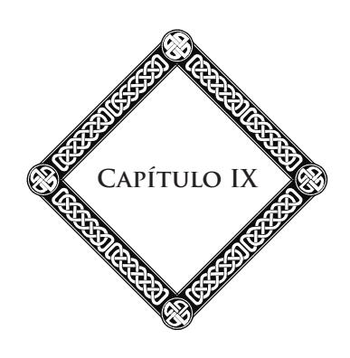

#### **Objeções e Contradições**

Sendo o problema divino o mais vasto, o mais profundo dos problemas, já que abarca todos os outros, criou teorias, sistemas sem-número, que correspondem a tantos graus de compreensão humana, quanto a etapas do pensamento na sua marcha para o Absoluto.

Neste domínio, as contradições são férteis. Cada religião explica Deus à sua maneira; cada teoria o descreve a seu modo. Resulta disso tudo uma confusão, um caos inextricável. Quantas formas variadas da ideia de Deus, desde o fetiche do negro até o *Parabrahm* dos hindus, até o *Ato Puro* de São Tomás! Dessa confusão os ateus tiraram argumentos para negar a existência de Deus; os positivistas, para o declararem "incognoscível".

Como remediar essa desordem? Como escapar dessas contradições? Da maneira mais simples. Basta elevar-se acima das teorias e dos sistemas, bastante alto para religá-los no seu conjunto e pelo que eles têm de comum. Basta elevar-se até a grande Causa, na qual tudo se resume e se explica.

#### **Capítulo IX**

A estreiteza de visões desnaturou, comprometeu a ideia de Deus. Suprimamos as barreiras, os cárceres, os sistemas fechados que se contradizem, se excluem, se combatem, para substituí-los pelas visões largas das concepções superiores. Em certas alturas, a Ciência, a Filosofia e a Religião, até então divididas, opostas, hostis, sob suas formas inferiores, unem-se e se fundem numa síntese poderosa, que é a do Espiritualismo Moderno.

Assim efetua-se a lei de evolução das ideias. Após a tese, tivemos a antítese. Tocamos a síntese, que resumirá todas as formas e as crenças, e será a glória do século XX, tê-la estabelecido e formulado.

> \* \* \*

Examinemos rapidamente as objeções mais comuns. A mais frequente é a que consiste em dizer: se Deus existe, se ele é, como o pretendem, Bondade, Justiça, Amor, por que o mal e o sofrimento reinam como senhores em torno de nós? Deus é bom, e milhões de pobres seres sofrem em sua alma e em sua carne. Tudo é dor e dilaceração na vida das multidões. A iniquidade é soberana em nosso globo, e a luta ardente pela existência nele faz, a cada dia, vítimas sem-número.

Assim como o demonstramos em outra parte,35 o sofrimento é um poderoso meio de educação para as almas. Ele desenvolve a sensibilidade, que já é, por si mesma, um acréscimo de vida. Às vezes, ele é uma das formas de vida, um corretivo para os nossos atos anteriores ou longínquos.

35 Ver *Depois da Morte*, 2a parte; *O Problema do Ser e do Destino*, caps. 18 e 19. (**N.A.**)

#### **Objeções e Contradições**

O mal é apenas a consequência da imperfeição humana. Se Deus tivesse feito seres perfeitos, o mal não existiria. Mas, então, o Universo seria congelado, imobilizado na sua monótona perfeição. A magnífica ascensão das almas através do Infinito seria suprimida, de imediato. Nada mais a conquistar; nada mais a desejar! Ora, o que seria uma perfeição semméritos, sem-esforços para obtê-la? Teria um preço qualquer apenas aos nossos olhos?

Em resumo, o mal é apenas o Menos evoluindo para o Mais, o inferior para o superior, a alma para Deus.

Deus nos fez livres: daí, o mal, fase transitória de nossa ascensão. A liberdade é a condição necessária da variedade na unidade universal. Sem ela, a monotonia teria feito um Universo insuportável. Deus nos deu a liberdade com essa impulsão da vida inicial pela qual o ser evoluirá, pelo seu próprio esforço, através dos Espaços e dos tempos sem-limites, na escala das vidas sucessivas, na superfície dos mundos que povoam a imensidão.

Emanamos de Deus como nossos pensamentos emanam do nosso espírito, sem fracioná-lo, sem diminuí-lo. Livres e responsáveis, nós nos tornamos senhores e artesãos de nossos destinos. Mas, para desenvolver os germens e as forças que estão em nós, a luta é necessária, a luta contra a matéria, contra as paixões, contra tudo o que chamamos o mal. Essa luta é dolorosa e os fracassos são numerosos. Entretanto, pouco a pouco, adquire-se a experiência, a vontade se tempera, o bem se desliga do mal. Chega uma hora em que a alma triunfa das influências inferiores, redime-se e se eleva pela expiação e a purificação, até a vida bem-aventurada. Então, ela compreende, admira a sabedoria e a providência de Deus, que, fazendo dela o árbitro de seus próprios destinos, dispôs todas as coisas

#### **Capítulo IX**

de maneira a destacar a maior soma de felicidade final para cada um de nós.

A condição atual de qualquer alma é o resultado justo de suas existências passadas. Assim também, nossa existência presente cria, dia após dia, através de nossos atos livres, a sorte a que nós nos submeteremos no futuro.

> \* \* \*

Outras objeções se apresentam. Há uma que não podemos negligenciar, pois ela constitui uma das questões capitais da Filosofia. Perguntam-nos: Deus é um Ser pessoal, ou é o Ser universal, infinito? Ele não pode ser os dois, pois, diz-se, essas concepções são diferentes e mutuamente se excluem. Daí, os dois grandes sistemas sobre Deus: o deísmo e o panteísmo. Na realidade, essa contradição é apenas uma falha óptica do espírito humano, que não sabe compreender nem a personalidade nem o Infinito.

A personalidade verdadeira é o "eu", a inteligência, a vontade, a consciência. Nada impede de concebê-la semlimites, quer dizer, infinita. Sendo Deus a perfeição, não pode ser limitado. Assim se conciliam duas noções contraditórias na aparência.

Outra coisa: Deus é incognoscível, como o dizem os positivistas e, dentre eles, Berthelot? É ele o abismo dos gnósticos, a Ísis velada dos templos do Egito, o temível e misterioso Santo dos Santos dos hebreus; ou, então, Deus pode ser conhecido?

A resposta é fácil: Deus é incognoscível na sua essência, nas suas profundezas íntimas, mas esse se revela através de toda a sua obra, no grande livro aberto sob nossos olhos e no fundo de nós mesmos.

#### **Objeções e Contradições**

Insiste-se ainda: vós nos dissestes que o objetivo essencial da vida, de todas as nossas vidas era entrar, cada vez mais na comunhão universal, para melhor amar e melhor servir a Deus em seus desígnios. Deus, não podendo ser conhecido em sua plenitude, como poder-se-ia amar e servir ao desconhecido?

Sem-dúvida, replicaremos, não podemos conhecer Deus na sua essência; porém nós o conhecemos através de suas leis admiráveis, através do plano que traçou para todas as existências, e no qual brilham sua sabedoria e sua justiça. Para amar a Deus, não é necessário separá-lo de sua obra, é preciso vê-lo na sua universalidade, na onda de vida e de amor que ele derrama sobre todas as coisas. Deus não é o desconhecido, ele é apenas o invisível.

A alma, o pensamento, o bem, a beleza moral são igualmente invisíveis. E, todavia, não devemos amá-los? E amálos, não é ainda amar a Deus, que deles é a fonte, já que ele é, ao mesmo tempo, o pensamento supremo, a beleza perfeita, o bem absoluto!

Nós não compreendemos, em sua essência, nenhum desses princípios. Entretanto, sabemos que eles existem, e que não podemos escapar de sua influência, e nos dispensar de lhes prestar um culto. Se amarmos apenas o que conhecemos e compreendemos com plenitude, o que amaríamos, limitados como o somos atualmente, às fronteiras estreitas de nossa compreensão terrestre!

Àqueles que reclamam absolutamente uma definição, poderíamos dizer que Deus é o espírito puro, a ideia, o pensamento puro. Mas a ideia pura, na sua essência, não pode ser formulada sem por isso ser logo diminuída, alterada. Toda fórmula é uma prisão. Encerrado no cárcere da palavra, o pensamento

#### **Capítulo IX**

perde sua irradiação, seu brilho, quando não perde seu sentido verdadeiro e extenso. Empobrecido, deformado, ele se torna, assim, sujeito à crítica e vê dissipar-se o que havia de mais convincente em si mesmo.

Na vida do Espaço, o pensamento é uma imagem brilhante. Comparado ao pensamento expresso através de palavras humanas, ele é o que seria uma jovem resplandecente de vida e de beleza, comparada à mesma jovem deitada num caixão, sob as formas rígidas e geladas da morte.

Entretanto, apesar de nossa impotência em expressá-lo na sua extensão, a ideia de Deus se impõe, dissemos, já que ela é indispensável à nossa vida. Acabamos de ver que o Bem, o Verdadeiro, o Belo, nos escapam em sua essência, porque eles são de natureza divina. Nossa própria inteligência, ela própria, é incompreensível para nós, precisamente porque ela encerra uma parcela divina que a dota de faculdades augustas. E somente quando penetrarmos o mistério da alma humana é que chegaremos, um dia, a resolver o enigma do Ser infinito.

Deus está em nós e nós estamos nele. Deus é o grande foco de vida e de amor do qual cada alma é uma centelha, ou melhor, um pequeno foco ainda obscuro e velado, que contém em estado embrionário todas as potências. A tal ponto que se soubéssemos tudo que há em nós e que obras grandiosas podemos realizar, transformaríamos o mundo; nós o elevaríamos, de um salto, no caminho imenso do progresso.

Para nos conhecermos, é preciso, portanto, estudar Deus, pois tudo o que está em Deus, está em nós, pelo menos em estado de gérmen. Deus é o espírito universal que se exprime e se manifesta na Natureza, e o homem é a expressão mais alta da Natureza.

#### **Objeções e Contradições**

Todos os homens devem chegar a essa compreensão de sua natureza superior; pois é a ignorância dessa natureza e dos recursos que dormem em nós que é a causa de todas as nossas provações, de nossas fraquezas e de nossas quedas.

É por isso que diremos a todos: Elevemo-nos acima das querelas de escola, acima das discussões e das polêmicas vãs. Elevemo-nos bastante alto para compreender que somos outra coisa a mais do que uma roda na máquina cega do mundo: somos os filhos de Deus, e, como tais, estreitamente ligados a ele e à sua obra, destinados a um objetivo imenso, perto do qual todo o resto se torna secundário; esse objetivo é a entrada na santa harmonia dos seres e das coisas, que só se realiza em Deus e por Deus!

Elevemo-nos até lá, e sentiremos o poder que está em nós; compreenderemos o papel a que fomos chamados a representar na obra do progresso eterno. Lembremo-nos de que somos espíritos imortais. As coisas da Terra são para nós um degrau, um meio de educação, de transformação. Podemos perder neste mundo todos os nossos bens terrestres. O que importa? O que é preciso, antes de tudo, é crescer, é arrancar de sua ganga grosseira esse espírito divino, esse deus interior que está em todo o homem, a fonte de sua grandeza, de sua felicidade vindoura. Eis o objetivo supremo da vida!

Concluímos: Deus é a grande Alma do Universo, o foco de onde emana toda a vida, toda a luz moral. Vocês não podem mais passar sem Deus, assim como a Terra e todos os seres que vivem na sua superfície não podem passar sem o foco solar. Se, de repente, o sol se apagar, o que acontecerá? Nosso planeta rolará no vazio dos Espaços, transportando no seu curso, sua Humanidade para sempre adormecida no seu sepulcro de gelo. Todas as coisas estarão mortas, o globo será apenas uma imensa

#### **Capítulo IX**

necrópole. Um silêncio morno reinará sobre as grandes cidades adormecidas no seu último sono.

Pois bem! Deus é o Sol das almas. Apaguem a ideia de Deus, e logo a noite moral se fará sobre o mundo. É precisamente porque a ideia de Deus é falseada, desnaturada por uns, rejeitada, desconhecida por muitos outros, que a Humanidade atual erra no meio das tempestades, sem-piloto, sem-bússola, sem-guia, presa da desordem, abandonada a todas as aflições.

Reerguer, ampliar a ideia de Deus, desembaraçá-la das escórias com que as religiões e os sistemas a têm envolvido, tal é o papel do Espiritualismo Moderno!

Se tantos homens são ainda incapazes de ver e de compreender a harmonia suprema das leis, dos seres e das coisas, é que sua alma ainda não entrou em comunicação com Deus através do seu senso íntimo, isto é, com esses pensamentos divinos que clareiam o Universo e são a luz imperecível do mundo.

Terminando, perguntamo-nos se conseguimos dar um resumo da ideia de Deus. A linguagem humana é muito fraca, muito seca e muito fria para tratar de assunto semelhante. Somente a própria harmonia, a grande sinfonia das esferas, a voz do Infinito poderiam oferecer e expressar a lei universal. Há coisas tão profundas que apenas se sentem e não se descrevem. Só Deus, no seu amor sem-limites, pode revelar-nos o sentido oculto. E é o que fará, se na nossa fé, no nosso impulso para a verdade, soubermos apresentar àquele que sonda as dobras mais misteriosas das consciências, uma alma capaz de compreender, um coração digno de amá-lo!

## **Segunda Parte O Livro da Natureza**

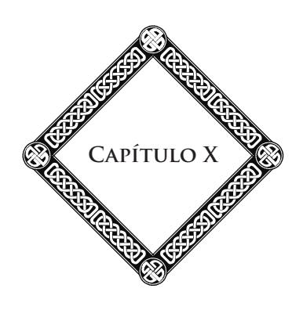

#### **O Céu Estrelado**

Um livro grandioso, dissemos, está aberto sob nossos olhos, e qualquer observador paciente pode nele ler a palavra do enigma, o segredo da vida eterna.

Nele se vê que uma Vontade dispôs a ordem majestosa na qual se agitam todos os destinos, movem-se todas as existências, palpitam todos os espíritos e todos os corações.

Ó alma! aprende, primeiramente, a suprema lição que desce dos Espaços sobre as frontes inquietas. O Sol escondeuse no horizonte; seus últimos clarões de púrpura tingem ainda o céu; uma luz branda indica que, além, um astro velou-se aos nossos olhos. A noite estende acima de nossas cabeças sua cúpula constelada de estrelas. Nosso pensamento se recolhe e busca o segredo das coisas. Voltemo-nos para o oriente. A Via Láctea desenrola como uma faixa imensa suas miríades de estrelas, tão comprimidas, tão longínquas que parecem formar uma massa contínua. Por toda a parte, à medida que a noite se torna mais negra, outras estrelas aparecem, outras chamas se acendem como lâmpadas suspensas no santuário divino. Através das profundezas insondáveis, esses mundos permutam

#### **Capítulo X**

seus raios prateados; eles nos impressionam a distância e nos falam uma linguagem muda.

Eles não brilham com o mesmo esplendor, e a potente *Sirius* não pode ser comparada à longínqua Capela. Suas vibrações levaram séculos para chegar até nós, e cada um de seus raios é como um canto, uma melodia, uma voz penetrante. Esses cantos se resumem assim: "Nós, também, somos focos de vida, de sofrimento e de evolução. Almas, aos milhares, efetuam em nós destinos semelhantes aos vossos".

Entretanto, nem todos possuem a mesma linguagem, pois uns são estadas de paz e de felicidade, e outros, mundos de luta, de expiação, de reparação pela dor. Uns parecem dizer: "Eu te conheci, alma humana, alma terrestre; eu te conheci e rever-te-ei! Outrora, abriguei-te em meu seio e retornarás para mim. Aguardo-te para guiar, por tua vez, os seres que se agitam na minha superfície"!

E depois, mais distante ainda, essa estrela que parece perdida no fundo dos abismos do céu e cuja luz trêmula é apenas perceptível, essa estrela nos dirá: Sei que passarás por terras que formam meu cortejo e que inundo com meus raios; sei que aí sofrerás e te tornarás melhor. Apressa-te na tua ascensão. Serei e já sou, para contigo, uma amiga, pois teus pensamentos subiram em minha direção, até mim teu apelo chegou, tua interrogação, tua prece a Deus.

Assim, todas as estrelas nos cantam seu poema de vida e de amor, todas nos fazem ouvir uma evocação poderosa do passado ou do porvir. Elas são as "moradas" de nosso Pai, as etapas, as soberbas balizas das estradas do Infinito, e nós por aí passaremos, aí viveremos todos para, um dia, entrarmos na luz eterna e divina.

Espaços e mundos! Que maravilhas nos reservais? Imensidões siderais, profundezas sem-limites, dais a impressão da majestade divina. Em vós, por toda a parte e sempre, estão a harmonia, o esplendor, a beleza! Diante de vós, todos os orgulhos caem, todas as glórias vãs se dissipam. Aqui, percorrendo suas órbitas imensas, estão astros de fogo junto dos quais nosso Sol é apenas uma pálida tocha. Cada um deles arrasta atrás de si um imponente cortejo de esferas, que são outros tantos teatros da evolução. Lá, como na Terra, seres sensíveis vivem, amam, choram. Suas provações e suas lutas comuns criam entre eles laços de afeição que crescerão pouco a pouco. E é assim que as almas começam a sentir os primeiros eflúvios desse amor, que Deus quer fazer com que todos conheçam. Mais distante, no abismo insondável, movem-se mundos maravilhosos, habitados por almas puras que conheceram o sofrimento, o sacrifício, e chegaram ao topo da perfeição; almas que contemplam Deus na sua glória e vão, sem jamais se cansarem, de astros em astros, de sistemas em sistemas, levar os apelos divinos. Elas já têm em si alguma coisa desse Infinito que se confunde com a eternidade.

Todas essas estrelas parecem nos sorrir, como amigas esquecidas. Seus mistérios nos atraem. Sentimos que elas são a herança que Deus nos reserva. Mais tarde, nos séculos futuros, conheceremos essas maravilhas que nosso pensamento apenas faz aflorar. Percorreremos esse Infinito que a palavra não pode descrever numa língua limitada. Sem-dúvida, há, nessa ascensão, degraus tão numerosos que não podemos contá-los; mas nossos guias nos ajudarão a subi-los, ensinando-nos a soletrar as letras de ouro e de fogo, a divina linguagem da luz e do amor. Então, o tempo não terá mais medida para nós. As distâncias não existirão mais. Não pensaremos mais nos caminhos obscuros, tortuosos, escarpados, que tivermos seguido no

#### **Capítulo X**

passado, e aspiraremos às alegrias serenas dos seres que nos tiverem precedido e que traçam, através de jatos de luz, nossa estrada sem-fim. Os mundos em que tivermos vivido terão se dissipado; eles não serão mais do que poeira e detritos, porém guardaremos a deliciosa impressão das felicidades colhidas nas suas superfícies, efusões do coração que começaram a nos unir a outras almas irmãs. Conservaremos a cara e dolorosa lembrança dos males partilhados, e não seremos mais separados daqueles que temos amado, pois os laços entre as almas são como os que existem entre as estrelas. Através dos séculos e dos lugares celestes, subiremos juntos para Deus, o grande foco de amor que atrai todas as criaturas!

#### **A Floresta**

Ó alma humana! desce novamente à Terra, recolhe-te; vira as páginas do grande livro aberto a todos os olhares; lê nas camadas do solo em que pisas, a história da lenta formação dos mundos, a ação das forças imensas que preparam o globo para a vida das sociedades.

Depois, ouve! Ouve as harmonias da Natureza, os ruídos misteriosos das florestas, os ecos dos montes e dos vales, o hino que a torrente murmura no silêncio da noite. Por toda a parte ecoa o canto dos seres e das coisas, a vida ruidosa, o lamento das almas que já sofrem como nós, e fazem esforço para se desligarem da ganga material que as abraça.

> \* \* \*

A floresta desdobra até o horizonte longínquo suas massas de verdura que estremecem sob a brisa e ondulam de colinas em colinas. Através das espessas folhagens, a luz se derrama em cascatas louras sobre os troncos de árvores e sobre os musgos; os sopros do vento brincam nas ramagens. O outono acrescenta a esses encantamentos, a sinfonia das cores,

#### **Capítulo XI**

desde o verde amarelado até o vermelho vivo e ao ouro puro; matiza e desbota as matas, mancha de ocre as castanheiras, de púrpura as faias, debulha as urzes róseas das clareiras.

Penetremos sob a folhagem. À medida que se avança, a floresta nos envolve com seus eflúvios e seu mistério. Perfumes fecundos sobem do solo; as plantas exalam um aroma sutil. Um poderoso magnetismo escapa das árvores gigantes, penetra-nos e nos embriaga. Lá longe, raios dourados caem numa clareira e fazem brilhar os troncos das bétulas como se fossem as colunas de um templo. Mais distante, florestas espessas elevam-se, cortadas em linha reta por uma aleia que se alonga a perder de vista, seus arcos de verdura, semelhantes às abóbadas de catedral. De toda parte abrem-se refúgios de sombra e de silêncio, solidões profundas que inspiram uma espécie de comoção. Aí se caminha sob trevas espessas, crivadas de gotas de sol.

Aqui, um faial venerável arredonda nos flancos de uma colina suas cúpulas cheias de folhas. Lá, carvalhos inclinam sobre o espelho de uma lagoa suas espessas folhagens. Uma árvore secular, patriarca dos bosques, respeitada pelo machado e que três ou quatro homens não poderiam abraçar, eleva-se, isolada, alta como uma igreja. O raio a tem visitado com frequência; mas não fez senão quebrar seus galhos, deixando-a toda vez de pé, altiva e protetora. Seu pé se enche de raízes monstruosas, macias de musgo, e coleópteros, semelhantes a pedras preciosas, correm sobre a sua casca enrugada.

Numa triste solidão, pinheiros mostram suas hastes avermelhadas e seus galhos torcidos em forma de lira. Será um capricho da Natureza? O pinheiro é a árvore musical por excelência. Suas finas e flexíveis agulhas se balançam ao vento em lamentosas melodias; seus ramos cantores estão cheios de carícias e de sussurros.

Como é bom perambular sob a sombra silenciosa e trêmula dos grandes bosques, ao longo do límpido riacho e veredas confusas traçadas pelos cabritos! Como é suave estenderse sobre os veludos dos musgos ou sobre os tapetes dos fetos,36 na base de alguma rocha granítica, para seguir com os olhos o curso dos escaravelhos dourados sobre as ervas, pequenos lagartos sobre a pedra e aguçar o ouvido para os alegres gorjeios dos pássaros! Um mundo invisível se agita e murmura em torno de nós: concerto dos infinitamente pequenos, embalando o repouso da terra. Insetos, em miríades, fazem sua ronda num raio de luz, enquanto que do cume de uma faia preta, uma toutinegra se esganiça em trinados de pérolas. Aqui, tudo é alegria de viver e metamorfose fecunda!

No seio de um bosque, dentre os rochedos jorra uma fonte; ela se derrama sobre um leito de calhaus, entre as campainhas e as campânulas, as hortelãs selvagens e as salvas. Da pia esculpida por suas águas, onde os abelheiros37 vêm beber, a onda cristalina se escoa, gota a gota, e suavemente tagarela. Um grande pinheiro ensombreia e protege a pequena concha. O vento agita suas agulhas, enquanto a fonte murmura sua cantilena. Um raio de sol, deslizando pelos ramos, vem colocar mil reflexos cintilantes sobre a límpida toalha. No ar, libélulas dançam e brincam; bonitas moscas multicores zumbem no cálice das flores.

Na paisagem tranquila, a água corrente e tagarela é um símbolo de nossa vida, que surge das profundezas obscuras do passado e foge, sem nunca se deter, na direção do oceano

36 **Feto:** gênero de planta, semelhante às samambaias, que cresce nos terrenos arenosos e nos bosques. (**N.E.**, conforme o *Dicionário Lello Universal*, vol. II.)

37 **Abelheiro:** ave migradora, de plumagem brilhante, e que se nutre de abelhas e outros insetos; ocorre no Sul da Europa. (**N.E.**, conforme o *Novo Dicionário Aurélio da Língua Portuguesa*.)

#### **Capítulo XI**

dos destinos, onde Deus a conduz através das tarefas sempre mais elevadas, sempre novas. Pequena fonte, pequeno riacho, amigos dos filósofos e dos pensadores, vós me falais da outra margem, para a qual eu me encaminho a cada segundo, e me lembrais de que tudo, em torno de nós, é lição, ensinamento para quem sabe ver, escutar, compreender a linguagem dos seres e das coisas!

Mas, de repente, o vento violento se levanta; um sopro poderoso passa pela floresta, que vibra como um órgão imenso. Semelhante a uma maré de esmeralda, o grande fluxo vegetal enche-se pouco a pouco, ondula, murmura. Um coro invisível anima a solidão cruel. Os troncos gigantescos se torcem com longos gemidos. Clamores sobem da floresta espessa; diríamos movimentos de carroças ou de exércitos que se entrechocam.

O caminho escala um planalto e serpenteia através de um bosque de castanheiros. Essas árvores centenárias tremem ao vento. Inclinando seus galhos pesadamente carregados, parecem dizer ao homem: Pega meus frutos nos quais destilei o suco de minha medula; pega meus galhos mortos, que, no inverno, aquecerão teu lar. Pega, mas não sejas ingrato, nem indiferente, pois toda a Natureza trabalha por ti. Não sejas ingrato, senão as provas, as rudes lições da adversidade fatalmente virão enternecer teu coração, arrancar-te cedo ou tarde da tua negligência, das tuas dúvidas, dos teus erros e orientar teu pensamento para a compreensão da grande Lei!

A impressão logo muda e se suaviza. O vento cessou. A charneca sucedeu à floresta; os juncos, as lavandas, as giestas38

38 **Giestas:** planta ornamental, arbustiva, da família das leguminosas, subfamília papilionácea (*Spartium junceum*), de folhas pouco numerosas e flores amarelas, de cheiro agradável. (**N.E.**, conforme o *Novo Dicionário Aurélio da Língua Portuguesa.*)

dão lugar à augusta assembleia dos bosques. Numa elevação do solo, um alto monólito se ergue, no centro de um círculo de pedras cobertas de musgos, umas ainda de pé, as outras jazendo na relva, contando a história das raças milenares, seus sonhos, suas tradições, suas crenças. O espetáculo dessas pedras enigmáticas nos mergulha de novo no abismo dos tempos. Daí vem a melancolia das coisas desaparecidas, enquanto que, em torno de nós, a Natureza nos dá a sensação de uma juventude eterna.

Nas encostas, abrem-se valezinhos, cavam-se barrancos. Sob moitas densas e cheirosas, surgem fontes, puras, frescas; seu murmúrio enche o vale. O dia declina. Através das gargantas, num golfo azulado, o sol projeta reflexos de púrpura e de ouro. Clarões de incêndio iluminam nos confins dos bosques. Atrás de nós, sob os fogos do poente, a grande floresta dominial desdobra suas árvores gigantes, suas matas densas, toda a suntuosa e cintilante vestimenta com a qual o outono a adornou. Os raios oblíquos do Sol deslizam entre as colunatas e vão clarear as solidões longínquas. Fazem delas sobressair as folhagens multicores: avermelhados variados, dourados ruivos, vermelhos brilhantes, cromos e lacas; tudo se ilumina, tudo flameja numa espécie de apoteose. Diante desse cenário feérico que me ofusca, na paz da tarde, meu pensamento se exalta. Eleva-se e sobe em direção à Causa de tantas maravilhas, para glorificá-la!

> \* \* \*

Tudo, na floresta, é encantamento, seja na primavera, quando as seivas poderosas enchem suas mil artérias e quando os jovens rebentos enverdecem à porfia, seja no outono, quando a decora com tintas ardentes, de cores prestigiosas, seja até

#### **Capítulo XI**

mesmo quando o inverno a transforma num mágico palácio de cristal, quando as ramagens escuras vergam-se sob a neve ou se transformam em pingentes de diamantes, modificando cada pinheiro em árvore de Natal.

A floresta não é somente um maravilhoso espetáculo; é ainda um ensinamento perpétuo. Incessantemente, ela nos fala das regras fortes, dos princípios augustos que regem toda vida e presidem à renovação dos seres e das estações. Aos tumultuosos, aos agitados, ela oferece seus refúgios profundos, propícios à reflexão. Aos impacientes, ávidos de gozo, ela diz que nada é durável senão aquilo que custa trabalho e tempo para germinar, para sair da sombra e subir na direção do céu. Aos violentos, aos impulsivos, ela opõe a visão de sua lenta evolução. Derrama a calma nas almas enfebrecidas. Simpática às alegrias, compassiva com as dores humanas, ela pensa os corações machucados, consola, repousa, comunica a todos as forças obscuras, as energias escondidas no seu seio. A lenda de Anteu39 é sempre aplicável aos feridos da existência, a todos aqueles que consomem suas faculdades, suas potências vitais nas ásperas lutas desse mundo. Basta-lhes retomar o contato com a Natureza para encontrar, na virtude secreta que dela emana, recursos ilimitados.

E que analogias, que lições em todas as coisas! A bolota, sob seu envoltório modesto, contém não somente todo um carvalho no seu desabrochar majestoso, mas toda uma floresta. O grão, mais minúsculo ainda, encerra, no seu galante berço, toda a flor com sua graça, suas cores, seus perfumes. Assim também, a alma humana possui em gérmen todo

39 **Anteu:** (da mitologia) — gigante, filho de Posêidon e de Gaia. Héracles o sufocou sustentando-o no ar, pois ele retomava forças toda vez que tocava a Terra, da qual tinha saído. (**N.T.**)

o desenvolvimento de suas faculdades, de suas potências vindouras. Se não tivéssemos sob os olhos o espetáculo das metamorfoses vegetais, nós nos recusaríamos a nele crer. As fases de evolução das almas no seu curso infinito nos escapam, e não podemos compreender atualmente todo o esplendor de seu porvir. Temos, todavia, um exemplo na pessoa desses gênios que passaram através da história como um deslumbramento, deixando atrás de si obras imperecíveis. Tais são as alturas a que se podem elevar as almas mais atrasadas na escala das vidas inumeráveis, com o auxílio desses dois fatores essenciais: o tempo e o trabalho!

Assim, a Natureza nos mostra em tudo a beleza da vida, o preço do esforço paciente e corajoso, e a imagem de nossos destinos sem-fim. Ela nos diz que tudo está no seu lugar no Universo; mas, também, que tudo evolui, se transforma, almas e coisas. A morte é apenas aparente; aos mornos invernos sucedem as renovações primaveris, cheias de seivas e de promessas. A lei de nossa existência não é diferente daquela das estações. Após os dias ensolarados do verão, vem o inverno da velhice, e, com ele, a esperança dos renascimentos e de uma nova juventude. A Natureza, como nós, ama e sofre. Por toda a parte, sob a onda de amor que transborda no Universo, encontra-se a corrente da dor, mas esta é salutar, já que afinando a sensibilidade do ser, nele desperta qualidades latentes de emoção, de ternura, e lhe proporciona, assim, um acréscimo de vida.

> \* \* \*

A floresta é o adorno da terra e a verdadeira conservadora do globo. Sem ela, o solo, arrastado pelas chuvas, retornaria rápido aos abismos do mar imenso. Ela retém as

#### **Capítulo XI**

generosas gotas da tempestade nos seus tapetes de musgos, no emaranhado de suas raízes; economiza-as para as fontes e as devolve, pouco a pouco, transformadas, tornadas fertilizantes e não devastadoras. Por toda a parte onde as árvores desaparecem, a terra se empobrece, perde sua beleza. Gradualmente, vêm a monotonia, a aridez, depois, a morte. Regeneradora por excelência, a respiração de suas milhares de folhas40 destila o ar e purifica a atmosfera.

Do ponto de vista psíquico, nós o vimos, o papel da floresta não é menos considerável. Ela foi sempre o asilo do pensamento recolhido e sonhador. Quantas obras delicadas e fortes foram meditadas na sombra fresca e mutável, na paz de suas poderosas e fraternas ramagens! Quem quer que possua uma alma de artista, de escritor, de poeta, poderá haurir nessa fonte viva e bastante plena, a inspiração fecunda.

Com seu ritmo majestoso, a floresta embalou a infância das religiões. A arquitetura sagrada, nas suas mais altivas audácias, apenas fez copiá-la. As naves góticas de nossas catedrais não são outra coisa senão a imitação, através da pedra, das mil colunatas e das abóbadas imponentes dos bosques? A voz dos órgãos, não é a agitação do vento, que, conforme a hora, suspira nos canaviais ou faz gemer os grandes pinheiros? A floresta serviu de modelo às manifestações mais elevadas da ideia religiosa no seu desabrochar estético. Nas primeiras idades, ela cobria quase toda a superfície do globo. Nada de impressionante para nossos pais, como a antiga e profunda floresta dos gauleses, na sua grandeza misteriosa, com seus santuários naturais, onde se efetuavam os ritos sagrados, seus refúgios, às vezes, cheios de horror, quando os roncos da

40 Uma bétula, diz O. Reclus, agita, por si só, duzentas mil folhas, e um outro gigante tropical, um milhão. (**N.A.**)

tempestade faziam ressoar os ecos dos bosques e que, do seio das moitas espessas, subia o grito das feras; cheias de encanto e de poesia, quando, retornada a calma, o céu azul e a clara luz reapareciam através dos ramos e que o canto dos pássaros celebrava a festa eterna da vida.

De século em século, a alma céltica guardou a forte marca da floresta primitiva e o amor de seus santuários, estadas dos espíritos tutelares que Vercingétorix e Joana d'Arc honraram, dos quais ouviram, na verde solidão, as vozes inspiradoras.

O espírito céltico é ávido de claridade e de espaço, apaixonado pela liberdade; possui uma intuição profunda das coisas da alma que reclamam uma revelação direta, uma comunhão pessoal com a Natureza visível e invisível. É por isso que ele permanecerá sempre em oposição à Igreja Romana, desconfiada dessa Natureza, e cuja doutrina é toda de compressão e de autoridade. Os druidas e os bardos lhe foram rebeldes. Apesar da conquista romana e das invasões bárbaras que facilitaram a expansão do cristianismo, a alma céltica, por uma espécie de instinto, sempre se sentiu a herdeira de uma fé mais ampla e mais livre que a de Roma.

É em vão que os monges procurarão lhe impor a ideia de ascetismo e de renúncia, a submissão aos dogmas rígidos, a uma concepção lúgubre da morte e do Além; o espírito céltico, na sua sede ardente de saber, de viver e de agir, escapará desse círculo estreito.

A ideia fundamental do druidismo é a evolução, a ideia de progresso e de desenvolvimento na liberdade. Essa ideia é emprestada, numa certa medida, à Natureza e completada pela revelação. Com efeito, a impressão geral que sobressai do espetáculo do mundo é um sentimento de harmonia, uma noção

#### **Capítulo XI**

de encadeamento, uma ideia de objetivo e de lei, isto é, de relações eternas dos seres e das coisas. A concepção evolutiva se destaca do estudo dessas leis. Há uma direção, uma finalidade na evolução, e essa direção traz o conjunto das vidas, através das gradações insensíveis e seculares, para um estado sempre melhor.

O cristianismo, ou melhor, o catolicismo, afastou essa ideia, mas a ciência nova a ela nos reconduz. Primeiramente, ela espiritualiza a matéria, reduzindo-a a centros de forças. Ela nos mostra o sistema nervoso, complicando-se cada vez mais na escala dos seres para chegar ao homem. As espécies ferozes tendem a desaparecer diante da superioridade humana. Com o desenvolvimento do cérebro, o pensamento triunfa. A consciência efetua sua ascensão paralela. Há uma aproximação entre as leis morais e as certezas físicas e biológicas. A ordem que se manifesta nos dois domínios chega a conclusões análogas: a Natureza é plástica como a consciência, móvel como ela, e sofre a influência do Espírito Divino.

Sendo essa evolução a lei central do Universo, o principal papel da ordem social é de facilitá-la a todos os seus membros. A vida é, portanto, boa, útil e fecunda. Diante das perspectivas infinitas que ela nos abre, todos os sentimentos deprimentes: pessimismo, dúvida, tristeza, desespero se dissipam para dar lugar às aspirações imortais, à esperança imperecível.

É esse gênio de nossa raça, sobrenadando na onda das invasões, sobrevivendo a todas as vicissitudes da História, reaparecendo sob vinte formas diversas, após períodos de eclipse e de silêncio, que explica a grande missão e a irradiação da França na obra da civilização. Mais do que qualquer outra raça, os celtas, cujas origens se perdem no longínquo vertiginoso das idades, os celtas se aproximam, pelo instinto

hereditário, do mundo das causas e das fontes da vida. Tanto na Ciência quanto na Filosofia, eles conseguiram muitas vezes conduzir o pensamento desgarrado do sentimento da Natureza e de suas leis reveladoras, a uma concepção mais clara de seus princípios eternos. Se o entusiasmo e a fé célticos pudessem se apagar, haveria menos luz e alegria no mundo, menos impulsos apaixonados para a verdade e o bem. Há mais de um século, o materialismo alemão entenebreceu o pensamento, paralisou seu voo; podemos constatar por toda a parte, em torno de nós, os resultados funestos de sua influência. Porém, eis que o gênio céltico reaparece sob a forma do Espiritualismo Moderno, para iluminar de novo a alma humana na sua ascensão; ele oferece a todos aqueles cujos lábios estão ressecados pelo áspero vento da vida, a taça da esperança e da imortalidade.

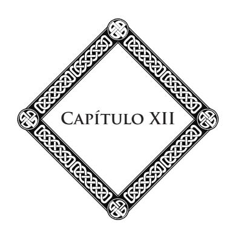

#### **O Mar**

Do convés do navio que me conduz, contemplo a imensidão das águas. Até os confins do firmamento, o mar expõe sua toalha móvel, cintilante, sob as luzes do dia. Nenhuma nuvem; nenhum sopro. O sol do Midi41 acende fugitivos relâmpagos na crista das vagas. Sobre esse vasto espelho, sua luz brinca em matizes delicados, em arrepios mutantes. Ela envolve as ilhas, os cabos e as praias com uma claridade ligeira; suaviza o horizonte, nele idealiza as perspectivas longínquas. Os raros passageiros fazem a sesta; o convés está deserto. O silêncio só é perturbado pelo ruído da hélice e pelo canto da vaga, que molemente acaricia os flancos do navio. Por toda a parte, em torno de nós, reina uma paz profunda. Em parte alguma senti uma impressão tão repousante. É como uma quietude, uma serenidade, um desligamento de tudo, o esquecimento das miseráveis agitações humanas, uma dilatação da alma, uma espécie de volúpia de viver e de saber que viveremos sempre, a sensação de ser imperecível como esse Infinito da Terra e do céu.

41 **Midi:** o Sul da França. (**N.T.**)

#### **Capítulo XII**

As costas douradas da Provence parecem fugir; a proa do navio a vapor, orientada para a África, fende as águas azuis. O Mediterrâneo é encantador, sob seu céu azul; mas todos os mares têm seu prestígio, sua beleza, seja nos seus dias de cólera e ímpeto de fúria, com a comovente fascinação de suas ondas espumantes, seja nas horas de calma, com o esplendor de seus pores do sol. Seus horizontes, sem-limites, levam a alma à contemplação das coisas eternas e aos sonhos divinos. Quase todos os marinheiros são idealistas e crentes.

> \* \* \*

Nossas margens da França são voltadas para a direção de dois mares. O Mediterrâneo é belo pela harmonia de seus contornos, a limpidez de sua atmosfera, a riqueza de seu colorido. O oceano é imponente, tanto nos seus tumultos, quanto nos seus recolhimentos, com suas grandes vagas que varrem as praias de areia e cascalho, duas vezes por dia, seu céu agitado, frequentemente escurecido, e seu grande sopro purificador. É, sobretudo, do alto dos promontórios armoricanos que o oceano é majestoso de se ver nas suas horas de irritação, quando a onda bate com força estourando sobre os recifes, ruge nas suas enseadas profundas e secretas, ou rola como um raio na sombra das cavernas cavadas na rocha. O lamento do mar tem algo de penetrante, de solene, que torna a solidão mais triste, mais impressionante. Os gritos dos maçaricos-reais, das gaivotas, dos albatrozes, que voam, rodopiando no meio da tempestade, aumentam a desolação da cena. Toda a costa fica branca de espuma. Sob os pés do observador, o solo treme a cada golpe surdo da onda.

Do cabo da Chèvre, do Raz de Sein, da ponta de Penmarch, o espetáculo tem o mesmo caráter de grandeza épica e selvagem. Por toda a parte, montes de rochas enegrecidas prolongam o continente assim como tantos fragmentos arrancados da ossatura do globo pelo furor das águas. Longas linhas de detritos se alongam, testemunhando combates seculares que a onda trava contra o áspero granito. É um caos formidável, em que os elementos desencadeados turbilhonam e se arrojam sobre a terra, que geme sob esses esforços redobrados.

> \* \* \*

O mar acalmou-se; o vento apaziguou-se. A noite desceu, e as cintilações das estrelas iluminam-se no azul profundo do céu. Os faróis, em eclipses, brilham, clareando as estradas do largo. O silêncio se faz, perturbado apenas pela grande melopeia do oceano, que se eleva, lenta, grave, contínua, semelhante a uma salmodia ou a uma encantação. O que ela diz? Como todas as harmonias da Natureza, ela fala da Causa suprema, da obra imensa e divina. Ela nos lembra como o homem é pequeno pela sua forma material, diante da majestade das águas e do céu; como é grande pela sua alma, que pode abarcar todas as coisas, saborear-lhe as belezas, resgatar-lhe os ensinamentos.

Que homem não experimentou esse sentimento misterioso que nos retém, contemplativo e sonhador, diante dos espetáculos do mar? Em alguns, segundo o grau de evolução, uma espécie de estupor admirativo, misturado ao temor; em outros, é uma comunhão íntima e muda que os invade inteiramente.

Cada elemento manifesta, à sua maneira, os segredos de sua vida profunda. A alma humana, através de seus sentidos interiores, percebe essa linguagem. As coisas tendem para nós, sem nem sempre nos atingir. Nossa alma vai em direção às

#### **Capítulo XII**

coisas, sem conseguir penetrá-las completamente, porém dela se aproxima o bastante para sentir o parentesco que nos une. Daí, entre a Natureza e nós, laços, relações múltiplas e ocultas. Essa fusão com a alma universal se traduz por uma embriaguez de vida que nos penetra através de todos os poros, embriaguez que a palavra não poderia exprimir. O mar, como a floresta, como a montanha, age sobre nossa vida psíquica, sobre nossos sentimentos e nossos pensamentos, e através dessa comunhão íntima, a dualidade da matéria e do espírito cessa um instante, para se fundir na grande unidade que tudo gerou. Nós nos sentimos associados às forças imensas do Universo, destinados como elas, porém, de uma outra maneira, a desempenhar um papel neste vasto teatro.

> \* \* \*

O mar é um grande regenerador. Sem ele, a terra seria estéril, infecunda; no seu seio elaboram-se as chuvas benéficas; todo o sistema de irrigação do globo nele tem origem. Sua efusão de vida é sem-limites. Essa grande força salutar, embora áspera e selvagem, corrige, atenua nossas fraquezas físicas e morais. Pelo perigo perpétuo que apresenta, o mar é uma escola de heroísmo. Ele comunica ao homem suas energias; dá ao seu pensamento, ao seu caráter, esse jeito sério, recolhido, essa marca particular de calma e de gravidade que caracteriza as populações costeiras. Com esses sopros vivificantes, tempera, ao mesmo tempo, os corpos e as vontades; proporciona a resistência e o vigor. Ele também tem seus fiéis, seus amantes, seus devotos. Apesar de suas cóleras, suas revoltas, apesar dos seus perigos constantes, aqueles que durante longo tempo o usaram não podem mais dele se separar; permanecem a ele ligados por todas as fibras do seu ser.

O vasto mar é para nós uma imagem de poder, de extensão, de duração. Todos aqueles que o têm descrito, compararam o globo a um organismo vivo; dizem perceber-lhe, em alguns dias de verão, as pulsações. O fluxo, o refluxo são sua respiração. Durante a noite, ouvindo, ao longe, o ruído monótono da vaga, tive, com frequência, essa impressão de que o oceano respira como um Leviatã42 adormecido.

Suas grandes correntes fazem irradiar até às extremidades do mundo o calor e a eletricidade. Há, em nosso planeta, dois centros intensos de vida: Java e o mar das Antilhas, cercados por dois círculos de vulcões, focos formidáveis de vitalidade e de atividade submarina. Dois rios enormes deles desembocam, semelhantes a aortas, e vão aquecer o hemisfério boreal. Maury43 os chamou de "duas vias lácteas do mar". Outras correntes secundárias vão fecundar o Oceano Índico, banhando a vasta rede de ilhas, de recifes e bancos onde o trabalho dos pólipos estabelece os fundamentos de um futuro continente.

Se o mar tem pulsações, ele tem também seus espasmos, suas convulsões. Entretanto, sua verdadeira personalidade não se revela nos seus acidentes ou nas crises de sua superfície: as tempestades mais violentas não agitam senão uma parte muito fraca de sua massa líquida. Para conhecê-lo, é preciso estudá-lo nas suas misteriosas profundezas. Lá, nas profundidades de oito mil metros, se agita uma vida obscura, estranha, iluminada por fenômenos de fosforescência que clareiam com luzes fantásticas a noite silenciosa do abismo.

42 **Leviatã:** monstro aquático da mitologia fenícia, mencionado na *Bíblia* (*Livro de Jó*). (**N.T.**, conforme o *Nouveau Dictionnaire Petit Larousse.*)

43 **Maury, Matthew Fontaine:** oceanógrafo americano (1806-1873). Um dos fundadores da Oceanologia Moderna e da Meteorologia Marítima. (**N.T.**, conforme o *Nouveau Dictionnaire Petit Larousse.*)

#### **Capítulo XII**

Seres luminosos aí pululam. Quando são atraídos à superfície, brilham por um instante em rastros de fogo, em feixes cintilantes, mas para logo se apagarem. Suas formas são infinitamente variadas; apresentam os aspectos, as cores mais inesperadas: rosáceas de catedral, terços de pérolas e de coral, lustres de cristal em ricos candelabros, estrelas marinhas tingidas de verde, de púrpura e de azul. Essa aparição fugitiva é um deslumbramento; ela nos dá uma ideia enfraquecida das maravilhas que encerram as criptas secretas do mar. Depois, são vegetações de encantamento, fucos gigantes, nácares, diversidade de cores brilhantes, florestas de corais, gorgônias e íris, todo um mundo singular, primeiro despertar da vida, esforço de um pensamento que aspira à luz. Quantos mistérios no fundo dessas trevas! Quantos continentes tragados, cidades outrora florescentes, jazem também sob o sudário das grandes águas!

Este foi o cadinho gigantesco em que se elaboraram as primeiras manifestações da vida. Ainda hoje, é a mãe, a nutriz fecunda através da qual se desenvolvem as existências prodigiosas, a seiva transbordante da qual nada, nem a raiva destrutiva do homem, nem as causas reunidas de mortalidade, de luta, de guerra entre as espécies, nada pode diminuir a intensidade. O poder de reprodução de algumas famílias é tal que, sem as forças que a combatem e lhe atenuam os efeitos, o mar ter-se-ia, desde há muito tempo, se transformado em uma massa sólida.

Os arenques vagueiam em cardumes inumeráveis, em torrentes de fecundidade.44 Cada um deles traz, em média,

44 Perto do Havre, um pescador, diz Michelet, encontrou, um dia, oitocentos mil deles nas suas redes. Num porto da Escócia, encheram, numa noite, onze mil barris deles. Cem mil pescadores vivem unicamente da pesca dos bacalhaus*.* (**N.A.**)

cinquenta mil ovos, e cada ovo multiplica-se, por sua vez, por cinquenta mil. O bacalhau, que se empanzina de arenques, tem nove milhões de ovos, o terço do seu peso, e gera nove meses em doze. O esturjão, que devora o bacalhau, não é menos prolífico. No seu ardor de reproduzir, eles três, teriam conseguido entulhar o oceano, sem os elementos de morte que vêm restabelecer o equilíbrio. Por aí, a imolação se torna benéfica, pois sem o combate a que as espécies se abandonam, a harmonia seria rompida e a vida pereceria através dos seus próprios excessos.

Para o mundo dos mares, a obra essencial é amar e multiplicar! Quando se examina a água salgada no microscópio, em algumas regiões, ela apresenta quantidades assustadoras de ovos, de germens, de infusórios. O oceano é comparável a uma imensa cuba sempre em fermentação de existências, sempre em trabalho de criação. A morte aí gera a vida: sobre os detritos orgânicos dos seres destruídos, outros organismos aparecem e se desenvolvem, incessantemente!

#### **A Montanha (Impressões de Viagem)**

Em alguns pontos de nossas costas, o mar e a montanha se juntam, enfrentam-se. Eles se opõem um ao outro; este, a variedade de suas formas na imobilidade silenciosa; aquele, o ruído, o movimento incessante na uniformidade. De um lado, a agitação sem-trégua; do outro, a calma majestosa.

A Natureza se diverte com estes contrastes. Os montes, ora ásperos e nus, ora enfeitados de verdura, elevam-se acima dos vales profundos e dos vastos horizontes do mar; sítios graciosos ou austeros enquadram a toalha azul dos lagos. Acima de todas as coisas, o Espaço se desenrola, e, no meio dos céus, os astros prosseguem seu curso eterno.

A obra é variada nas suas menores minúcias; porém, dos elementos diversos que a compõem destaca-se uma poderosa harmonia, onde a arte do divino autor se revela. Acontece o mesmo no domínio moral. Existem almas inumeráveis, com aptidões infinitamente variadas: almas ternas ou brilhantes, nobres ou vulgares, tristes ou alegres, almas de fé, almas de dúvida, almas de gelo, almas de fogo! Todas parecem se misturar, se confundir na imensa arena da vida. Dessas

#### **Capítulo XIII**

aparentes discordâncias, dessas atrações, desses contrastes provêm as lutas, os conflitos, os ódios, os amores loucos, as felicidades inebriantes, as dores agudas. Mas, desse bracejar contínuo, uma mistura se produz; perpétuas trocas se efetuam; uma ordem crescente se destaca. Os fragmentos das rochas, as pedras arrastadas pela torrente, transformam-se, com o tempo, em seixos redondos e polidos. Acontece o mesmo com as almas: chocadas, roladas pelo rio das existências, de degraus em degraus, de vidas em vidas, elas se encaminham na senda das perfeições.

> \* \* \*

A França é admiravelmente dotada no que diz respeito a montanhas. Estas cobrem um terço de sua superfície e, conforme as latitudes, segundo a intensidade da luz que banha seus cumes, elas oferecem aspectos, colorações de uma diversidade maravilhosa.

No nordeste, os Vosges, com suas rochas de arenito vermelho penetrando o solo, os velhos burgos suspensos como ninhos de águia na altura das nuvens e os sombrios pinheirais que atapetam seus flancos.

No centro, o grande maciço vulcânico de Auvergne, com suas crateras invadidas pelas águas e suas longas *cheires*45 ou correntes de lavas, espalhadas na base das montanhas. Ao sul, é a morna e fantástica região de Causses, suas gargantas estreitas, suas falésias vermelhas, seus precipícios, seus rios subterrâneos.

45 **Cheire:** palavra regional de Auvergne retomada na linguagem dos geógrafos; do latim popular *carium*, *caria*, rocha, pedra, palavra de origem pré-latina que designa uma torrente de lava. (**N.T.**, conforme o *Nouveau Dictionnaire Etymologique et Historique — Larousse.*)

Como moldura para esse quadro vasto, uma série de montes se escalona da Franche-Comté ao Béarn. São as cadeias do Jura; Alpes da Savoie, de Dauphiné e da Provence, as costas ensolaradas do mar azul, o Estérel e as Cévennes. Enfim, a alta muralha dos Pyrénées com seus picos dentados, seus circos sublimes, suas românticas solidões.

Todas essas montanhas da França me são familiares. Eu as tenho percorrido com muita frequência. Posso dizer que isso foi uma das raras felicidades da minha vida, saborear-lhe as inebriantes belezas. A montanha é meu templo! Ali, sentimo-nos longe das vulgaridades desse mundo, mais perto do céu, mais perto de Deus!

Com o imprevisto de suas mudanças à vista e o desdobramento de suas maravilhas: cumes nevados, geleiras deslumbrantes, escarpamentos formidáveis, grutas, barrancos umbrosos, pastagens, lagos, torrentes, cascatas, a montanha é uma fonte inesgotável de impressões fortes, de sensações elevadas, de ensinamentos fecundos.

Como é bom, na fresca aurora, inteiramente impregnada de aromas penetrantes da noite, escalar as vertentes, com o grande cajado pontudo na mão, a mochila de provisões sobre o ombro! Em torno de vós, tudo está calmo; a terra exala essa paz serena que retempera os corações e os penetra com uma alegria íntima. A vereda é tão graciosa em seus contornos, a floresta tão cheia de sombra e de misteriosa suavidade! À medida que subis, a perspectiva se alarga, soberbas escarpas se abrem ao longe nas planícies. As cidadezinhas mostram suas manchas brancas na verdura, entre as colheitas, as charnecas e os bosques. A água das lagoas e dos rios reflete a luz como o aço polido.

#### **Capítulo XIII**

Logo, a vegetação se faz mais rara; a senda se torna mais abrupta; se atravanca de troncos de árvores e de blocos desmoronados. Por toda a parte, aparecem as florzinhas das altitudes: a arnica de flores amarelas, os rododendros, as saxífragas, as íris azuis e brancas. Aromas balsâmicos flutuam no ar. Por toda a parte, águas que jorram das fontes límpidas. Seu murmúrio enche a montanha com uma doce sinfonia.

Estendido sobre o musgo, quantas horas passei a escutar a tagarelice cristalina das fontes entre os rochedos, e a voz da torrente que se eleva no grande silêncio! Tudo se idealiza nessas alturas. Os apelos longínquos e os cantos melancólicos dos pastores, os ruídos de sininhos dos rebanhos, o ronco das águas subterrâneas, o lamento do vento nas lárices, tudo se torna melodia. Porém, eis a tempestade: à sua voz poderosa, tudo se cala!...

Amo tudo da montanha: seus dias ensolarados, cheios de eflúvios e de raios, e suas noites serenas sob os milhões de estrelas que cintilam com maior força e parecem mais próximas de vós. Amo até suas tempestades e os clarões do raio sobre os cimos.

A tormenta passou. A Natureza retomou seu ar de festa. Por toda a parte, ecoa o chichiar dos gafanhotos e o guizalhar dos grilos. Insetos de todas as formas, de todas as cores manifestam, à sua maneira, sua alegria de viver, de inebriar-se de ar e de luz. Mais abaixo, na floresta profunda, na floresta encantada, o concerto dos seres e das coisas, que domina a voz do vento nas ramagens: cantos de pássaros, zumbidos de insetos, melopeia dos riachos, das fontes e das cascatinhas, tudo isso vos encanta, vos envolve com uma beleza indefinível e irresistível.

Retomemos nossa caminhada. Ainda alguns esforços; ofegantes, atingireis o cume. Porém, que compensação para vossa fadiga! Um panorama imenso se desdobra, um cenário incomparável se revela, subitamente, espetáculo que ofusca o olhar e enche a alma de uma religiosa emoção.

Cimos, depois ainda cimos se elevam na glória da aurora. No fundo do horizonte, picos solenes se alinham, inteiramente brancos de neve, com suas geleiras que o sol faz brilhar como toalhas de prata. Entre seus enormes picos arredondados cavam-se desfiladeiros selvagens onde se abrem vales suaves. Na direção do Norte, a cadeia se rebaixa em ondulações flexíveis e dá lugar à planície sem-fim. Os últimos contrafortes estão cobertos de bosques bonitos, de pradarias frescas, de cidadezinhas pitorescas. Além, o desdobramento sem-limites do tapete verde e dourado dos campos, dos prados, das searas, das urzes, um tabuleiro de culturas, uma variedade de tons, de cores que se fundem em um longínquo vaporoso. Mais distante ainda, o mar imenso resplandece sob o Infinito azul.

O tempo passa, rápido, nessas altitudes. Logo, é preciso pensar no retorno. Lentamente, o sol declina; os vales se enchem de sombra. As silhuetas negras dos grandes picos já se elevam no céu puro onde se acendem os fogos estelares. A voz da torrente se eleva, mais alto e mais grave, na paz da tarde. Os rebanhos retornam, reunidos pelos pastores, sob o olhar vigilante dos cães. Os sinos badalam, argênteos, convidando ao repouso, ao sono. As luzes se apagam, uma a uma, no vale. E minha alma, embalada pelas harmonias da montanha, dirige uma ardente homenagem ao Deus poderoso, ao Deus criador!

\*

#### **Capítulo XIII**

Jovens que me ledes, meu pensamento vai até vós com um impulso fraterno para vos dizer: Aprendei a amar a montanha. É o livro por excelência, diante do qual qualquer livro humano é pequeno. Folheando suas páginas grandiosas, mil belezas escondidas vos aparecerão, mil revelações que não suspeitáveis. Recolhereis alegrias preciosas que enriquecerão a alma, depurando-a. Aprendei a ver, a ler, a ouvir. Ampliai vossos olhos e vossos corações com essas paisagens agrestes ou encantadoras. Penetrai-lhes a graça e a força, a severidade e a doçura. Alternadamente, a árvore antiga e venerável, a torrente tagarela, o cume altaneiro vos dirão lições sublimes, que permanecerão gravadas para sempre na vossa memória e embalarão, mais tarde, com suaves recordações os dias tristes e escurecidos do vosso declínio. Sabei compreender sua linguagem. Suas vozes unidas compõem o hino de adoração que os seres e as coisas cantam ao Eterno.

A montanha é uma bíblia, dizíamos, cujas páginas apresentam um sentido oculto, um sentido profundo. Nas suas camadas rochosas, dobradas, contornadas pelos levantamentos plutônicos, podereis ler a gênese do globo, as grandes epopeias da história do mundo antes da aparição do homem. Os movimentos da crosta terrestre, escritos em torno de vós, em caracteres formidáveis, vos mostrarão a ação das forças combinadas criando nossa morada comum. Depois, será o lento trabalho das águas, gota a gota, cavando os círculos e as gargantas, esculpindo os colossos de granito. Finalmente, virá o estudo da flora e da fauna em sua diversidade sem-limite.

Os impulsos eruptivos, as correntes resfriadas, os pórfiros gigantes vos dirão os esforços da massa abrasada sustentando as cadeias em jatos agudos ou em cúpula arredondada. Os vulcões são os orifícios respiratórios da Terra. Abaixo, sente-se muito bem a circulação violenta, o impulso de seiva e de vida que, sem esses exutórios, abalariam o solo, quebrariam a crosta planetária. As fontes quentes vos demonstram que as entranhas do globo exalam ainda a vida ardente, fervente, prestes a jorrar, e que a ação do enorme e tenebroso ciclope permanece sempre possível.

Do foco central, do fundo do abismo, sobem à superfície as forças expansivas que transformam os elementos, liquefazem-nos, carregam-nos de eletricidades desconhecidas, no seu impulso para o Sol, cujas radiações os solicitam e os atraem através do Espaço.

É o laboratório prodigioso onde se elabora a grande obra, a preparação do vasto teatro onde se representarão os dramas da vida.

Para todos aqueles que sabem amá-la, compreendê-la, a montanha é uma longa e profunda iniciação.

> \* \* \*

A flor se abre às carícias do sol e às lágrimas do orvalho: assim também, a alma desabrocha sob a influência radiosa da grande Natureza. Sob essas impressões poderosas, tudo nela comove e vibra. Ela ora, e sua prece é um grito de reconhecimento e de amor. Da prece, ela passa à contemplação, essa forma superior do pensamento por onde se infunde misteriosamente em nós o sentimento augusto, o sentimento divino da obra universal.

Porém, a contemplação não basta. A verdadeira vida é a ação; a lei nos impõe a luta e a provação. Apenas através dela adquirimos méritos. Nossos deveres, nossa tarefa quotidiana nos absorvem, nos retêm distante das fontes puras do pensamento. É por isso que é bom, é salutar, voltar-se de tempos em

#### **Capítulo XIII**

tempos para a Natureza, para haurir nela forças e inspirações. Quem quer que a desconheça ou a ignore, por isso sofre, é diminuído. Àqueles que a amam, ela comunica, em compensação, o socorro moral, o viático necessário para caminhar através das rochas e das brumas da vida para o objetivo supremo, luminoso, longínquo.

Assim como o mar, e mais ainda que ele, a montanha é apaziguadora, fortificadora. Ela possui um princípio regenerador que devolve a calma aos neuróticos, a saúde aos degenerados, um meio de restabelecimento vital para a débil Humanidade.

Na montanha, as agitações febris, as preocupações da vida factícia, sufocante das cidades, se dissipam para dar lugar a um modo de existência mais simples, mais natural. A altitude é uma escola de energia para aqueles que a cidade não enfraqueceu bastante. As vastas perspectivas aguçam o olhar. Os pulmões se dilatam com o ar puro dos cumes. Os obstáculos estimulam nossos esforços; a ascensão, a escalada nos dão músculos de aço. Ao mesmo tempo que as forças físicas se desdobram, as potências intelectuais se reconstituem, as vontades se retemperam. Habituamo-nos a agir, a vencer, a desprezar a morte.

Pois a montanha tem seus perigos. Suas sendas são escarpadas, seus precipícios assustadores. A vertigem nos espreita nessas alturas. O vento aí é áspero em certos dias, e o raio ribomba frequentemente. Ou então, são as brumas repentinas que vos envolvem e vos escondem o perigo. Às vezes, é preciso caminhar sobre estreitas cornijas, entre o abismo e a avalancha, evitar as fendas escancaradas das geleiras, descer os declives escorregadios que terminam em sorvedouros. No decorrer de minhas excursões, frequentemente ouvi roncar, de eco em eco, o pesado trovão das quedas de pedras ou de massas de neve. Em igual recanto selvagem dos montes, em igual barranco desolado vós vos encontrareis, de repente, na presença de cruzes que marcam o lugar em que vários viajantes pereceram.

Em compensação, há também, lá no alto, todos os enlevos, as harmonias da luz, e encantamentos que as planícies não conhecem. Aí se percebe a sinfonia universal e misteriosa dos ruídos, dos perfumes, das cores, a suave e íntima música das brisas e das águas. Experimenta-se melhor aí a melancolia das tardes, quando o aroma dos prados e dos bosques, do seio dos vales, sobe até aos cumes. Então, a alma do homem rompe os laços que a encarceram à carne, e plana no éter sutil. Experimenta êxtases quase divinos.

Não é sem-razão que os fatos mais consideráveis da história religiosa efetuaram-se nos cumes. O Mérou, o Gaya,46 o Sinai, o Nebo, o Tabor, o Calvário são os altares soberbos de onde sobe, com um impulso poderoso, a prece dos grandes iniciadores.

Nas almas de elite, a majestade dos grandes espetáculos desperta os sentidos íntimos, as faculdades psíquicas, e a comunhão com o Invisível se estabelece. Porém, em graus diversos, quase todos nós ressentimos essa influência. Nesses momentos, o que há de artificial ou de vulgar na nossa existência, se dissipa para dar lugar a impressões sobre-humanas. É como uma clareira que se abre no meio de nossas trevas, através das fumaças negras que habitualmente nos escondem o céu e asfixiam ao longo do tempo as belas inteligências. Num instante, entrevemos o mundo superior, celeste, infinito. Então,

46 Montanha da Índia onde Buda recebeu sua revelação. (**N.A.**)

#### **Capítulo XIII**

as irradiações do pensamento divino descem como um orvalho sobre a alma maravilhada.

Longe dos preconceitos e das rotinas sociais, a alma se desabrocha livremente. Ela reencontra seu próprio gênio: o *awen* dos druidas. Suas seguras intuições lhe dizem que todos os sistemas são estéreis e que, apenas a grande mãe Natureza, o grande livro vivo pode nos ensinar a verdade, a beleza perfeita. Nas horas de recolhimento profundo, seja quando o sol lança a prodigalidade de sua púrpura sobre a assembleia dos montes, seja quando a lua espalha sua luz prateada no meio do formidável silêncio, uma conversa solene se estabelece entre a alma e Deus.

Essas grandes paragens da vida são indispensáveis para nos retemperarmos, nos reconhecermos, nos dominarmos, ver o objetivo supremo e nos orientarmos, com passo seguro, na direção desse objetivo. Então, como os profetas, descemos de novo dos cimos, engrandecidos, iluminados por uma claridade interior.

> \* \* \*

Aos apelos do meu pensamento, as recordações despertam em multidão. É nos Pyrénées, uma ascensão ao pico do Ger, perto de Eaux-Bonnes. Para atingir a plataforma rochosa, espécie de mirante que constitui o cume, é preciso atravessar escancarando as pernas uma aresta aguda como uma lâmina de navalha, de cinquenta metros de comprimento, acima de um vertiginoso abismo de dois mil pés! Mas, de lá, que vista! Toda a cadeia central se desdobra, desde os montes Maudits até o pico de Anie, cujo negro cume emerge de um mar de nuvens como uma ilha no seio do oceano.

A atmosfera é tão pura, tão límpida que se distinguem os contornos dos montes mais longínquos. O Vignemale, Néouvielle, o grupo dos grandes picos do Bigorre, com suas finas arestas, suas coroas de gelo, suas neves imaculadas, elevam-se como brancos fantasmas sob a luz ardente do Midi. Graças à transparência do ar, picos espanhóis, situados a mais de cem quilômetros, mostram-se com tanta nitidez que se acreditaria estarem bem próximos.

Eu os revejo como se fosse ontem, esses cimos grandiosos dominando linhas de cristas que se sucedem até o fundo do horizonte: o enorme Baleïtous, e além, numa chanfradura, o sombrio Mont-Perdu. Mais perto de nós, as formas familiares do Monné, do Gabizos, os pilones do Marboré, o Taillon, a brecha de Roland, velhos conhecidos que saúdo de longe com prazer.

Uma serenidade inalterável envolve essa assembleia de gigantes, congelada num conciliábulo eterno. No primeiro plano, o pico granítico de Ossau, solitário e selvagem, continua seu sonho de cem séculos.

Lá embaixo, esses cumes avermelhados que se repartem na direção do sul pertencem à vertente espanhola, áspera, devorada pelo Sol, mas tão rica de coloridos. Dessa vertente, explorei várias vezes os círculos selvagens, tão pouco conhecidos e de um difícil acesso, as *gargantas*, sorvedouros de onde saltam as cascatas, onde resmungam torrentes invisíveis que cavaram um leito subterrâneo no meio de um caos infernal. E quantas sendas, talhadas em cornija, no flanco das paredes a pique! Sob vossos pés abre-se o abismo, a várias centenas de metros; sobre vossas cabeças, o abutre, de apetite voraz, ronda descrevendo grandes círculos. Entre essas cristas retalhadas alonga-se o Bramatuero, corredor sinistro, cortado de nevadas

#### **Capítulo XIII**

e de lagos congelados, onde um padre italiano, seguindo para Lourdes, foi assassinado alguns dias antes de minha passagem. Mais distante, escondido no fundo de um círculo em funil, com paredes abruptas e desnudas, Panticosa, estação termal espanhola. O panorama é desolado; por toda a parte, do fundo das gargantas, eleva-se o ribombar das águas, semelhante aos rumores de uma tropa em marcha ou ao movimento surdo dos carros.

Retornemos ao pico do Ger. Sobre a geleira vizinha, meu guia me faz observar um ponto negro, imóvel, que tomo por uma rocha. Porém, com seus gritos, o objeto se desloca, move-se, escapole rapidamente. Era uma camurça.47 Os gritos do guia despertaram os ecos da montanha. De todas as ondulações do solo, barrancos selvagens, gargantas estreitas, saem milhares de vozes. Diríamos uma legião de duendes, de gnomos, de espíritos zombadores. O efeito é surpreendente.

Lancemos um último e longo olhar sobre esse panorama esplêndido. Sob a cúpula azulada, as altas montanhas se colorem de tintas fundidas, de uma pureza, de uma riqueza incomparáveis. O sol do Midi espalha sobre elas uma profusão de claridade, uma cintilação de luz dourada, que aumenta ainda o prestígio de suas formas fantásticas e atormentadas. Todo um mundo de torres, de agulhas, de picos denteados, de cúpulas, de pequenos campanários, de pirâmides, se eleva sob o céu, emaranhado gigantesco de linhas, ora rudes e discordantes, ora arredondadas pelo lento trabalho das águas. Depois, daqui e dali, no intervalo, altas pastagens verdejantes, entremeadas de currais de onde sobem finos fios de fumaça azulada, as florestas densas que cercam a fronteira, na direção de Gabas, cascatas

47 **Camurça:** mamífero caprino (*Rupicapra rupicapra*); facilmente domesticável, de cornos verticais que terminam em báculos virados para trás, corpo forte e pesado, pescoço curto e membros robustos. (**N.E.**, conforme o *Novo Dicionário Aurélio da Língua Portuguesa.*)

cintilantes, lagos tranquilos, prados risonhos e planaltos gelados, mornos desertos de cascalhos e de detritos, ruínas de montanhas desmoronadas.

Diante desse espetáculo, todas as impressões se fundem na sensação da imensidão. É um esplendor de formas, de aspectos, de cores que não se pode descrever com as pálidas palavras de uma linguagem terrestre. O homem se reconhece bem pequeno; todas as suas obras lhe parecem efêmeras e miseráveis diante desses colossos. Que estes se agitem apenas, e, com um sacudir de ombros, todo o trabalho humano se desmorona, desaparece. Porém, a alma cresce pelo pensamento. Um mundo de intuições e de sonhos se desperta nela. Ela sente que esses espetáculos são uma simples prelibação das maravilhas que o destino lhe reserva na sua ascensão eterna, de orbes em orbes, na sucessão dos tempos e dos mundos siderais.

O Universo inteiro se reflete em nós como num espelho. O mundo invisível, por uma transição insensível, se religa ao mundo visível. Acima reina a lei de harmonia que rege a ambos. E a alma, em sua contemplação, projetada para fora de si mesma, exteriorizada, de alguma forma, os penetra e os abraça. Num instante, ela sentiu passar por si o grande arrepio do Infinito, ela comungou com o pensamento supremo; compreendeu que este criou os mundos apenas para servir de degraus para ascensões do espírito.

> \* \* \*

Numa tarde de julho, no decorrer de um passeio solitário nos arredores de Eaux-Bonnes, perdera-me na montanha arborizada do Gourzy. Tendo chegado a noite, e tendo se tornado impossível o retorno através das sendas escarpadas que eu havia seguido, tive de resignar-me a esperar o amanhecer

#### **Capítulo XIII**

sobre um leito de relva improvisado. Essa noite deixou em minha memória uma lembrança cheia de encanto e de penetrante poesia. Que impressões recolhidas! Eu ouvia os guinchos, os apelos dos hóspedes dos bosques: a raposa, o galo das charnecas, o grande mocho das montanhas, de grito quase humano. A vida rodava em torno de mim, misteriosa; percebia-lhe os rumores, as palpitações ligeiras.

Numa touceira, a alguma distância, uma iluminação estranha chama a minha atenção. Aproximo-me: era uma assembleia de vaga-lumes. Suas pequenas lanternas verdes constelam as sarças, enquanto que no céu outras luminárias mais poderosas resplandecem acima de minha cabeça. Pude seguir com os olhos, durante esta noite, todo o desfile do exército celeste. Depois, com a marcha imponente das estrelas, o surgimento da lua, cuja claridade trêmula desliza através da folhagem e vem brincar entre os musgos e os fetos. Nenhum pensamento de temor perturba minha alma. Sinto-me cercado de protetores invisíveis, invadido por uma espécie de beatitude inexprimível. A grande voz da torrente ressoa no silêncio da noite, entretendo-me com coisas graves e profundas. O que ela diz? Ela fala da aspiração para o divino; ela canta a imortalidade, a participação de todos os seres, conforme suas possibilidades, na obra imensa, na poderosa harmonia do mundo. Ela diz:

> Observa meu curso; é a imagem do teu destino. Agora, eu fujo, torrente impetuosa, entre os blocos atormentados. Minha onda rola em cascatas ou se quebra em espuma; porém, mais tarde, tornar-me-ei o largo rio, cortado de ilhas, que correrá, calmo, imponente, através da esmeralda dos prados, sob a opala do céu.

Eis o que diz a voz solene, soberba de grandeza e de eloquência, enquanto contemplo os céus.

No alto, outros problemas me atraem. Para onde vão esses mundos inumeráveis? Em virtude de que força eles se movem, se buscam no seio do insondável abismo? Sempre, no fundo de tudo, surge o pensamento de Deus, energia eterna, eterno amor! A mão que dirige os astros na imensidão aí escreveu um nome em letras de fogo, um único nome! Todos esses mundos conhecem sua estrada, sua missão sagrada; nelas prosseguem infalivelmente. Eles sabem que representam um papel no plano divino e a ele se associam estreitamente. Todo o segredo da Natureza aí está. Os mares, as florestas, as montanhas não dizem outra coisa. A Via Láctea que desenrola, através do Espaço, sua poeira de mundos, os cedros gigantes que estendem seus longos galhos acima dos precipícios, a flor que se pasma sob os beijos do Sol, tudo nos murmura: É dele que devemos ser; é por ele que vivemos e morremos!

Sim, é ali o santuário onde a alma se abre e desabrocha para a visão do grande céu e de Deus, que nele criou a ordem e a sublime beleza. É ali o templo da religião eterna e viva, cuja lei inelutável está escrita na fronte das noites estreladas e nas profundezas da consciência humana.

Mas, eis a aurora, o majestoso levantar do Sol sobre os cimos longínquos. Assim como uma esfera de metal avermelhada, o astro rei sobe no horizonte. Primeiramente, os cumes denteados dos picos flamejam na luz renascente, e, assim como a noite, na véspera, subira rapidamente em torno de mim, a sombra desce com rapidez semelhante. Como se um véu fosse rasgado, todas as minúcias da floresta, as altas folhagens, as escarpas abruptas das rochas, as sinuosidades da senda se clareiam. Surpreendente prestígio da cor! Num instante, tudo se anima, freme, palpita; o céu e a terra vibram com longo estremecimento. Acima da garganta estreita onde canta a torrente, a silhueta negra do pico de Ossau desenha-se nitidamente.

#### **Capítulo XIII**

E retomo o caminho do hotel, bendizendo as circunstâncias que me haviam permitido gozar tais espetáculos.

> \* \* \*

Outras impressões me aguardavam nos Alpes. Poderse-ia dizer, com razão, que os Pyrénées, através de suas formas esbeltas, altas, elegantes, representam o tipo feminino da montanha. Eles têm, frequentemente, o encanto e a graça da mulher. Um véu ligeiro adorna suas frontes soberbas. De outras vezes, os jogos de luz as transfiguram, fazem delas montanhasfadas.

Os Alpes, com suas formas maciças, sua ossatura poderosa, lembram muito mais o tipo masculino. Eles simbolizam a força, a dureza, a grandeza austera; parecem os limites gigantescos que marcam as fronteiras do tempo e da eternidade.

Quando, pela primeira vez, contempla-se o Mont Blanc, esse gigante solitário cujo pico domina a Europa, sentese como que esmagado diante dessa brancura imensa semelhante a um sudário. Com efeito, sua aparência é a da morte. E, todavia, sob seu espesso manto de gelo, esconde-se uma vida sempre ativa, quente, fulgurante, que se manifesta e se expande através das fontes borbulhantes de Saint-Gervais.

Acrescentem as cinquenta léguas de geleiras que coroam os Alpes, seus vastos reservatórios subterrâneos que dão nascimento aos maiores rios do Ocidente, derramando a fecundidade sobre tantas planícies, e tereis um resumo dessa formidável cadeia.

No maciço do Oisans, a sensação não é menos viva do que no Mont Blanc. Do mirante da Tête de Maye, vê-se elevarse toda uma floresta de picos e de agulhas, todo um rendado de granito. No dia em que aí subi, as geleiras resplandeciam, fundindo lentamente sob os ardores do Sol; de toda a parte, corriam as torrentes e as cascatas. O rolar das águas, engolfandose sob o solo, produzia um ruído surdo que variava de hora em hora, segundo o volume da massa líquida. Em torno de mim, o deserto; tão longe quanto a vista pode alcançar, nenhum ser humano. O silêncio impressionante dos cumes me envolve. Ouve-se apenas o rumor das águas e o lamento do vento que agita as ervas e as florzinhas alpestres. Uma flora maravilhosa esparrama-se sobre essas alturas. Eis a *edelweiss*48 e a *égrinette* de haste frágil. Campânulas balançam seus graciosos sininhos. Mais distante, é a genciana azul, bordada de preto, tão altaneira na sua atitude; a soberba anêmona amarela, tão pesquisada pelos botânicos. Depois, é a dafne, a orquídea, a digital, vinte espécies cujos nomes ignoro; numa palavra, todo um pequeno mundo vegetal se desabrocha sob esse céu de fogo. O ar dele embalsama.

Barrando o horizonte, o Meije, esse terrível "comedor de homens", mostra seus contrafortes poderosos, que ultrapassa um diadema de neve e de gelo. O Pelvoux, o Barre des Écrins, outros cumes ainda, elevam-se como uma família de titãs arrumados em semicírculo.

> \* \* \*

Eis-nos na Grande Chartreuse. Passei vários dias nesse asilo de paz e de recolhimento. Explorei-lhe os acessos, passeando sob as abóbadas sombrias da floresta que o encerra, ouvindo a canção das torrentes, os grandes órgãos dos ventos

48 **Edelweiss:** planta típica dos Alpes e dos Pyrénées. Foi introduzida no Brasil por colonos suíços nas regiões de maior altitude, principalmente do Estado do Rio de Janeiro. (**N.E.**, conforme a *Grande Enciclopédia Larousse Cultural.*)

#### **Capítulo XIII**

nas ramagens, os apelos longínquos dos pastores e dos lenhadores. Os sons do sino do monastério chegavam-me na asa da brisa; suas vibrações, em ondas sonoras, iam morrer e renascer, depois de se perderem no fundo das gargantas e sobre as vertentes da montanha. De todos os lados, a visão é limitada por grandes cumes calvos, ásperos, nus, batidos pelas tempestades. Mas o pensamento do Absoluto, do Infinito envolve esses montes, e o olhar de Deus paira sobre todas as coisas.

No grande silêncio do claustro, o relógio soa lentamente as horas. Quantas almas sacudidas pelas tempestades da vida vieram procurar ali o repouso e o esquecimento! Essa mística cristã que as atraía tem profundezas de abismo que fascinam. Sem-dúvida, ela se perde em muitos pontos e se afasta das realidades invisíveis. Cria, no cérebro do crente, todo um mundo de ilusões, de quimeras supersticiosas impostas pela tirania dos dogmatistas. Entretanto, ela não é sem-beleza. Nas épocas de ferro e de sangue, a vida monástica era o único refúgio para uma alma delicada e estudiosa. Mesmo nos tempos modernos, ela podia ser, numa certa medida, um meio de treinamento para as coisas superiores, uma preparação para o Além. É por isso que, desse santuário alpestre, irradiavam sobre toda a região benéficas influências. Desde então, os monges desapareceram, a Chartreuse foi abandonada; o sítio perdeu seu prestígio religioso.

Da tribuna reservada aos visitantes, assisti ao ofício da meia-noite. Três fracas luzes, espaçadas na nave da capela, rompem sozinhas a escuridão profunda. Os habitantes da Chartreuse chegam, um a um, munidos de uma pequena lanterna, e ganham suas cadeiras. Os salmos começam, invocações, gritos de apelo de almas em aflição: *Deus in adjutorium meum intende!..*. "Meu Deus, vinde em meu socorro! Senhor, apressai-vos, eu sucumbo!"

Essa lamentação do velho Jó, que atravessou os séculos, parece resumir toda a dor humana. É o lamento dos corações partidos, de todos aqueles que se desligam dessa Terra de provações, onde não veem mais do que desesperança, abandono, exílio, para procurar no seio do Pai ajuda e consolação.

Esses monges austeros, que deixam sua cama dura para se unir em pensamento à Humanidade sofredora, esses cantos de uma tristeza pungente, que ecoam na hora em que tudo repousa, isso é emocionante.

Os salmos se sucedem num ritmo lento, grave, solene. Dessas notas melancólicas, às vezes monótonas, solta-se, de tempos em tempos, um grito de amor, verdadeira flor da alma que, desse oceano de misérias humanas, sobe até ao céu para implorar ao Criador. Depois, as frases dos salmos se apagam. Na penumbra, das cadeiras do coral, os religiosos prosternados parecem mergulhados numa meditação profunda. Enfim, manifesta-se o último apelo de Davi na sua penitência, soluço último da Humanidade aflita, que um raio de esperança clareia e aquece: *De profundis clamavi ad te, Domine, exaudi vocem meam*. "Das profundezas da minha dor, gritei por ti, Senhor, atende minha prece!"

> \* \* \*

O cemitério do convento é de aspecto lúgubre. Nenhuma laje, nenhuma inscrição marca as sepulturas. Na fossa escancarada, deposita-se, simplesmente, o corpo do monge, revestido com seu burel e fixado numa prancha, sem-caixão; depois, recobrem-no de terra. Nenhum outro sinal, senão o de uma cruz, designa a sepultura desse passageiro da vida, desse hóspede do silêncio, do qual ninguém, salvo o prior, saberá seu verdadeiro nome!

#### **Capítulo XIII**

Será a primeira vez que percorro esses longos corredores e esses claustros solitários? Não! Quando sondo meu passado, sinto estremecer em mim a misteriosa corrente que religa minha personalidade atual a essa dos séculos decorridos. Sei que, entre os despojos que ali jazem, nesse cemitério, há um que meu espírito animou. Possuo um temível privilégio, o de conhecer minhas existências passadas. Uma delas terminou nesses lugares. Após os vinte anos de lutas da época napoleônica, nas quais o destino me havia lançado, cansado de tudo, enojado pela visão do sangue e da fumaça de tantas batalhas, aqui vim buscar a paz profunda. Na série de nossas vidas sucessivas, uma existência monástica pode ser útil, se ela nos ensina o desprendimento das coisas mundanas, a concentração do pensamento, a austeridade dos costumes. No claustro, o espírito libera-se das sugestões materiais e abre-se para as visões divinas!

Seria bom que todas as almas descidas à carne conservassem a lembrança de suas anterioridades? Não penso assim. Deus agiu sabiamente velando aos nossos olhos, pelo menos durante a difícil passagem da vida terrestre, as cenas trágicas, as quedas, os erros funestos de nossa própria história. Nosso presente é por isso aliviado, a tarefa atual tornada mais fácil. Será sempre prematuro, quando do nosso retorno ao Espaço, virmos levantar-se diante de nós os fantasmas acusadores. Sem-dúvida, muitos nada têm a temer de semelhante. Que a paz esteja nos seus espíritos! Quanto a mim, sei de uma coisa: quando deixar a Terra para retornar ao Além, as vozes do passado despertarão e gritarão contra mim, pois fui um culpado, e o sangue enrubesceu minhas mãos. Porém, as almas que pude esclarecer e consolar nessa vida levantar-se-ão também, espero, para rogar em meu favor, e o julgamento supremo será, por isso, igualmente atenuado.

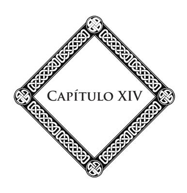

#### **Elevação**

Espírito, alma, tu que percorres estas páginas, de onde vens e para onde vais? Sobes do fundo do abismo e escalas os degraus inumeráveis da escada da vida. Vais na direção das moradas eternas onde a grande Lei nos chama e para onde a mão de Deus nos conduz. Vais na direção da Luz, da Sabedoria, da Beleza!

Contempla e medita! Por toda a parte, obras belas e poderosas solicitam tua atenção. No seu estudo, haurirás, com a coragem e confiança, o sentimento justo do teu valor e de teu futuro. Os homens não se odeiam, não se desprezam senão porque ignoram a ordem magnífica pela qual estão todos estreitamente unidos.

Tua estrada é imensa; mas o objetivo ultrapassa em esplendor tudo o que podes conceber. Agora, pareces bem pequeno no meio do colossal Universo; porém, és grande pelo pensamento, grande pelos teus destinos imortais.

Trabalha, ama e ora! Cultiva tua inteligência e teu coração! Desenvolve tua consciência; torna-a mais vasta, mais sensível. Cada vida é um cadinho fecundo, de onde deves sair

#### **Capítulo XIV**

purificado, pronto para missões futuras, maduro para tarefas sempre mais nobres e maiores. Assim, de esfera em esfera, de círculo em círculo, prosseguirás tua carreira, adquirindo forças e faculdades novas, unido aos seres que amaste, que viveram e reviverão contigo.

Evoluirás em comum na espiral das existências, no seio de maravilhas insuspeitadas, pois o Universo, como tu mesmo, desenvolve-se pelo trabalho e expande suas metamorfoses vivas, oferecendo alegrias, satisfações sempre crescentes, sempre renovadas, às aspirações, aos desejos puros do espírito!

Nas horas de hesitação, volta-te para a Natureza: é a grande inspiradora, o templo augusto onde, sob seus véus misteriosos, o Deus escondido fala ao coração do sábio, ao espírito do pensador. Observa o firmamento profundo: os astros que o povoam são as etapas de tua longa peregrinação, as estações do grande caminho onde teu destino te conduz.

Vem! elevemos nossas almas; plana um instante comigo, pelo pensamento, entre os sóis e os mundos! Mais alto, sempre mais alto, no éter insondável! Lá embaixo, a Terra é apenas um ponto na vasta imensidão. Diante de nós e acima de nós, os astros se multiplicam. Por toda a parte, esferas de ouro, fogos de esmeraldas, de safira, de ametista e de turquesa, descrevem seus movimentos ritmados. Um astro enorme vaga em nossa direção, arrastando cem mundos planetários na sua órbita, cem mundos que evoluem em curvas sábias. Apenas entrevisto, ei-lo que já foge, prosseguindo seu curso, ele e seu cortejo esplêndido.49 Depois deles, apresentam-se sóis de cores

49 As estrelas, cujo afastamento faz parecer imóveis, movem-se em todos os sentidos, em virtude de leis pouco conhecidas. Movimentos formidáveis conduz cada foco sideral no turbilhão infinito. Nosso sistema solar voa com grande rapidez na direção da constelação de Hércules e supera em 65.000 anos uma distância igual àquela que nos separa da estrela mais próxima de nós, α do Centauro.

diferentes, agrupados numa mesma atmosfera luminosa que os envolve como uma faixa de glória.

E sempre, os sistemas sucedem aos sistemas, paraísos ou prisões flutuantes, mundos mágicos, drapeados de azul, de ouro e de luz. Mais longe, os cometas errantes, as pálidas nebulosas das quais cada átomo é um sol no berço.50 Sabe de uma coisa: todos esses mundos são as moradas de outras sociedades de almas. Até as estrelas longínquas cujos clarões trêmulos levam milhares de anos para chegar até nós, por toda a parte, a família humana estende seu império; por toda a parte temos irmãos celestes. Todas essas moradas, estamos destinados a

Nosso astro central é apenas um dos mais modestos sóis: Canopus o ultrapassa mais de 10.000 vezes em brilho, Arcturus em 8.000. Visto de sua superfície, nosso foco ofuscante seria um ponto imperceptível. (**N.A.**) (Ver *A Gênese*, cap. 6, CELD. (**N.E.**))

50 *S*egundo as observações telescópicas e a fotografia celeste, a Ciência estabelece que nosso Universo se compõe de um bilhão de estrelas. Camille Flammarion crê que esse Universo não é único. Nada, diz ele, prova que esse bilhão existe, único, no Infinito e que, por exemplo, não há um segundo, um terceiro, um quarto, e cem e mil universos semelhantes aos outros. Esses universos podem ser separados por Espaços absolutamente vazios, desprovidos de éter e, por conseguinte, invisíveis uns aos outros. Parece até que já conhecíamos estrelas que não pertencem ao nosso Universo sideral. Podemos citar, por exemplo, com Newcombe, a estrela 1.830 do catálogo de Groombridge, a mais rápida cujo movimento foi determinado. Avaliam-no em 320.000 metros por segundo, e a força atrativa de nosso Universo inteiro não pode ter determinado essa velocidade. Segundo toda probabilidade, essa estrela vem de fora e atravessa nosso Universo como um projétil. Pode-se dizer o mesmo da 9.352 do catálogo de Lacaille e até de Arcturus, a quarta em grandeza das estrelas visíveis, e de µ de Cassiopeia. (Conferência, agosto de 1906.)

Acrescentemos que as potencialidades da Natureza são sem-limites, na extensão como na duração. A luz, que ultrapassa 300.000 quilômetros por segundo, leva 20.000 anos para atravessar a Via Láctea, formigueiro de estrelas da qual fazemos parte. Essas famílias ou nebulosas são inumeráveis e todos os dias descobremse novas, por exemplo, a segunda de Órion, cuja extensão apavora a imaginação. Vivemos no seio de um absoluto sem-limites, sem-começo e sem-fim. (**N.A.**) (Ver nota de rodapé 49. (**N.E.**))

#### **Capítulo XIV**

conhecê-las, a desfrutar delas. Reviveremos nessas terras do Espaço, em corpos novos, a fim de aí adquirir forças, conhecimentos, méritos maiores, e nos elevar ainda mais alto na nossa viagem perpétua.

Tantos mundos, tantas escolas para a alma; quantos campos de evolução para cultivar nosso entendimento e, ao mesmo tempo, construir para nós organismos fluídicos cada vez mais delicados, depurados, brilhantes. Após as lutas, os tormentos, os reveses de mil existências árduas, após as provações e as dores dos ciclos planetários, virão os séculos de felicidade nesses astros felizes cujas claridades suaves projetam até nós raios de paz e de alegria. Depois, as missões benditas, os nobres apostolados, a tarefa almejada para provocar o despertamento, a eclosão das almas adormecidas, para auxiliar, por nossa vez, nossas irmãs mais jovens nas suas peregrinações através das regiões materiais.

Enfim, atingiremos as sublimes profundezas, o céu de êxtase onde vibra, mais poderoso, mais melodioso, o pensamento divino, onde o tempo e a distância se dissipam, onde a luz e o amor unem suas irradiações, onde a Causa das causas, em sua fecundidade incessante, gera para sempre a vida eterna e a eterna beleza!

Em nossos dias, o céu não pode mais ser o que foi por tão longo tempo para a ciência humana, isto é, um Espaço vazio, morno e deserto. O Infinito se transforma e se anima. O círculo de nossa vida se alarga em todos os sentidos. Nós nos sentimos religados a esse Universo por mil laços. Sua vida é a nossa; sua história é nossa história. Fontes desconhecidas de sensação, de meditação se abrem. O futuro toma aos nossos olhos um caráter completamente diferente. Uma impressão profunda nos invade ao pensar em destinos tão amplos. Para sempre, estamos unidos a tudo o que vive, ama e sofre. De todos os pontos do Espaço, de todos esses astros que brilham na imensidão, partem vozes que nos chamam, as vozes dos nossos irmãos mais velhos, e essas vozes nos dizem: Caminha, caminha, eleva-te pelo trabalho; faze o bem; cumpre o dever. Vem até nós que, como tu, penamos, lutamos, sofremos nos mundos da matéria. Vem prosseguir conosco tua ascensão para Deus!

> \* \* \*

Dos Espaços majestosos, levemos de novo nossos olhares para a Terra. Apesar de suas proporções modestas, ela tem, nós o sabemos, seus encantos, sua beleza. Cada sítio tem sua poesia, cada paisagem sua expressão, cada valezinho seu sentido particular. A variedade é tão grande nos prados de nosso mundo quanto nos campos estrelados.

O verão, é o sorriso de Deus! Nada é mais suave, mais embriagador do que a apoteose de um belo dia em que tudo é carícia, doçura, luz. A florzinha escondida na erva, o peixe que desliza entre as águas fazendo espelhar ao Sol suas escamas de prata, o pássaro que trina suas notas do alto dos galhos, o murmúrio das fontes, a canção misteriosa dos choupos e dos olmeiros, o perfume selvagem das samambaias, tudo isso embala o pensamento, satisfaz o coração. Longe das cidades, encontra-se a calma profunda que penetra a alma, repousa-a das lutas e das decepções da vida. Somente, então, compreende-se a verdade dessas grandes palavras: "O ruído é dos homens, o silêncio é de Deus!"

A contemplação, a meditação provocam o despertamento das faculdades psíquicas, e, através delas, todo um mundo invisível abre-se às nossas percepções. Tentei, no decorrer

#### **Capítulo XIV**

dessa obra, exprimir as sensações experimentadas do alto dos cumes ou à beira-mar, descrever o encanto dos crepúsculos e das auroras, a serenidade dos campos sob o real esplendor do Sol, o prodigioso poema das noites estreladas, a magia dos luares, o enigma das águas e dos bosques. Há momentos de êxtase onde a alma se lança para fora de seu envoltório e abarca o infinito, horas de intuição e de entusiasmo onde o influxo divino nos invade como uma onda irresistível, onde o pensamento supremo vibra e palpita em nós, onde brilha, por um instante, a centelha do gênio. Essas horas inesquecíveis, eu as vivi algumas vezes, e, em cada uma delas, acreditei na visita, na penetração do espírito. Devo-lhes a inspiração das minhas mais belas páginas e dos meus melhores discursos.

Aquele que se recolhe no silêncio e na solidão, diante dos espetáculos do mar ou das montanhas, sente nascer, elevar, crescer em si mesmo imagens, pensamentos, harmonias que o arrebatam, encantam, consolam das misérias e abremlhe as perspectivas da vida superior. Compreende, então, que o pensamento de Deus nos envolve e nos penetra quando, longe das torpezas sociais, sabemos abrir-lhe nossas almas e nossos corações.

> \* \* \*

Certamente, poderiam nos fazer muitas objeções. Por exemplo, disseram-nos: Fazeis sobressair as belezas da Natureza, mas não mostrais as fealdades. Ela não tem apenas sorrisos e carícias: tem também suas revoltas, suas cóleras, seus furores. Não falais dos monstros nem dos flagelos que a desornam. Que utilidade encontrais na existência dos animais predadores, dos répteis, das plantas venenosas? Por que as convulsões do solo, as catástrofes, as epidemias, todos os males que engendram o sofrimento humano?

Ser-nos-á fácil responder. O belo, diremos, necessita dos contrastes. Todos os artistas, pensadores, escritores de valor, o sabem. E quando constatamos que, no conjunto dos mundos, a Terra ocupa um lugar dos mais inferiores, que ela é, antes de tudo, para os espíritos jovens, uma escola, uma estada de lutas, de provação e, às vezes, de reparação, como se espantar de que ela não seja dotada de todas as vantagens que possuem os mundos superiores!

Os perigos, os obstáculos, as dificuldades de todas as espécies são fatores essenciais ao progresso, tantos aguilhões que estimulam o homem no seu caminho, quantas causas que o constrangem a observar, a esforçar-se, a se tornar previdente, comedido em seus atos. É na alternância obrigatória do prazer e da dor que está o princípio da educação das almas. Daí, a necessidade para os seres, dos mais rudimentares aos mais desenvolvidos, de lutar e de sofrer. O progresso não poderia se realizar sem o equilíbrio indispensável dos sentimentos opostos, alegrias e penas, que se alternam no ritmo grandioso da vida. Mas é sobretudo a dor, física e moral, que forma nossa experiência: a sabedoria humana é o seu prêmio.

Quanto aos movimentos sísmicos, às tempestades, às inundações, observemos que eles têm suas leis. Essas leis, basta conhecê-las para prever-lhes e atenuar-lhes os efeitos. Quando se estudam os fenômenos da Natureza e quando o pensamento penetra no fundo das coisas, ele reconhece o seguinte: o que é um mal, na aparência, é, na realidade, um bem.51 A grandeza do espírito humano consiste em elevar-se da confusão, do caos das contingências à concepção da ordem geral. Ele pode, então, se sentir em segurança no meio dos perigos do mundo, porque compreendeu as grandes leis que, à custa de alguns

51 Ver *Depois da Morte*, cap. 9. (**N.A.**)

#### **Capítulo XIV**

acidentes, asseguram o equilíbrio da vida e a salvação das raças humanas.

O homem em quem o sentido profundo, o sentido das coisas divinas não está desperto, o cético, numa palavra, quaisquer que sejam sua inteligência e seu saber em outras matérias, recusa-se a admitir essas coisas. Seria tão supérfluo insistir junto a ele, quanto a explicar a um cego de nascença os crepúsculos ou as auroras, os jogos de luz sobre as águas ou sobre as geleiras. Ser-lhe-á necessário, forçosamente, os choques da adversidade, o concurso das circunstâncias dolorosas que o colocarão em contato direto com seu destino e lhe farão sentir, ao mesmo tempo que a utilidade do sofrimento, essas noções de sacrifício e esperança pelas quais a vida toma seu sentido real e elevado.

Somente, então, ele poderá penetrar o grande mistério do Universo e compreender que tudo tem sua razão de ser, que a dor tem seu papel e que podemos tirar bom partido de tudo, da prova, da doença e até da morte, já que tudo, segundo o uso que fazemos, pode concorrer para o nosso adiantamento, para a nossa melhoria moral. Desde então, a confiança e a fé o ajudarão a suportar, pacientemente, o inevitável, a abolir o desgosto presente, a sofrer em paz. O conhecimento da Lei trará para ele a certeza dos dias melhores e do futuro sem-fim.

A partir desse momento, sua vida, por mais terna, banal, incolor que seja, iluminar-se-á com um raio de luz e de poesia, pois a poesia mais verdadeira é feita da ressonância íntima da sinfonia eterna em nós, e da concordância de nossos pensamentos, de nossos sentimentos e de nossos atos com a regra de nosso destino.

\*

\* \*

Falando como o fizemos no decorrer dessas páginas, seremos, sem-dúvida, acusados de misticismo por alguns. Mas todos aqueles cuja sensibilidade e julgamento foram despertados, desenvolvidos sob o golpe das provações e das lutas da existência, saberão nos compreender.

Alguns espíritos terra a terra são inclinados a tratar como místicos, alucinados, visionários, todos aqueles cujas percepções ultrapassam o círculo limitado de seus pensamentos habituais. Creem-se pessoas muito positivas e muito práticas, quando, na realidade, as almas evoluídas, libertas dos preconceitos e das paixões, desdenhosas dos pequenos interesses materiais, têm apenas a intuição das grandes e elevadas realidades da vida, dessas realidades superiores que, na penumbra entretecida pelas convenções, pelas rotinas e todo o quotidiano da existência social, escapam ainda do comum dos homens.

Em resumo, a Natureza e a alma são irmãs, com esta diferença de que uma evolui invariavelmente, segundo um plano estabelecido e que a outra traça, ela própria, numa página em branco, as grandes linhas de seu destino. Elas são irmãs, pois todas duas provêm de uma mesma causa eterna e mil laços as unem. É o que explica o império da Natureza sobre nós. Ela age sobre as almas sensíveis, como um magnetizador sobre o indivíduo, provocando o desligamento do espírito da sua crisálida de carne. Então, na plenitude de suas faculdades psíquicas, a alma percebe um mundo superior e divino que escapa à maioria das inteligências.

Não nos esqueçamos jamais disso: tudo o que se situa nos sentidos físicos, tudo o que é devido ao domínio material, é passageiro, submetido à destruição, à morte. As realidades profundas, eternas, pertencem ao mundo das causas, ao domínio do invisível. Nós mesmos pertencemos a esse mundo pela parte imperecível do nosso ser.

#### **Capítulo XIV**

Eis que, pouco a pouco, a experimentação psíquica e as descobertas que delas decorrem propagam-se e se estendem. O conhecimento do duplo fluídico do homem, sua ação a distância antes e depois do falecimento, a aplicação das forças magnéticas, a entrada em cena das potências invisíveis vêm demonstrar a qualquer observador atento que o mundo dos sentidos é apenas uma pobre e obscura prisão, comparada ao domínio imenso e radioso aberto ao espírito.52

Os sentidos interiores e as faculdades profundas da alma dormem ainda na maioria dos homens, que ignoram suas riquezas ocultas, seus poderes latentes. É por isso que seus atos carecem de base, de ponto de apoio. Daí, tantas fraquezas e desfalecimentos. Porém a hora do despertar está próxima. O homem aprenderá a conhecer sua alma, a extensão de seus poderes e de seus atributos: desde então, a separação e a morte deixarão de existir para ele; a maior parte das misérias que nos sitiam desaparecerão. Nossos amigos do Espaço virão mais facilmente nos visitar, corresponder-se conosco. Uma comunhão íntima se estabelecerá entre o céu e a Terra, e a Humanidade entrará numa fase mais elevada e mais bela de seus gloriosos destinos.

Antes de fechar este livro, com minha vista enfraquecida pelo trabalho, lanço ainda um olhar para esses céus que me atraem e sobre essa Natureza que eu amo. Saúdo os mundos que serão, mais tarde, nossa recompensa: Júpiter, *Sirius*, Órion, as Plêiades e essas miríades de focos, cujos raios trêmulos derramaram tantas vezes em minha alma ansiosa, a paz serena e as inefáveis consolações.

52 Ver Notas Complementares 4, 5, 6. Ver também: *No Invisível* e *O Problema do Ser e do Destino.* (**N.A.**)

Depois, do Espaço, levo de volta meu olhar para essa Terra que foi meu berço e será meu túmulo. Ó Terra! planeta, nossa mãe, campo de nossos labores comuns, de nossos progressos, de nossos sofrimentos, onde, lentamente, através da obscuridade das idades, minha consciência eclodiu com a consciência da Humanidade, tu flutuas no Infinito, embalada pelos sopros divinos; espalhas em torno de ti as vibrações poderosas da vida que se agita sobre teus flancos. Dir-se-ia uma harmonia confusa feita de rumores e de vagidos, uma harmonia que sobe do seio dos mares e dos continentes, dos vales e das florestas, dos rios e dos bosques, e à qual se mistura o lamento humano: murmúrio das paixões, vozes de dor, ruídos do trabalho e cantos das festas, gritos de furor e choques de exércitos. Às vezes, também, notas calmas e graves dominam esses rumores: a melodia humana substitui as harmonias da Natureza e o ruído das forças em ação; o cântico da alma, liberta das servidões inferiores, saúda a luz. Um canto de esperança sobe para Deus como um hosana, uma prece.

É tua alma, ó Terra! que desperta e faz esforços para sair dessa ganga obscura, para misturar sua irradiação e sua voz às irradiações e às harmonias dos mundos siderais. É tua alma que canta a aurora renascente de sua Humanidade; pois esta desperta, por sua vez, sai de sua noite material, do abismo de suas origens. A alma da Humanidade, que é a da Terra, busca-se, aprende a se conhecer, a penetrar sua razão de ser; pressente seus grandes destinos; quer realizá-los.

Prossegue teu curso, Terra que amo! Muitas vezes meu espírito já hauriu nos teus elementos as formas necessárias à sua evolução. Durante séculos, ignorante e bárbaro, percorri tuas sendas, tuas florestas, vaguei nos teus oceanos, nada sabendo das coisas essenciais, nem do objetivo a atingir.

#### **Capítulo XIV**

Mas eis que, tendo chegado ao entardecer da vida, nessa hora crepuscular, em que uma nova etapa termina, em que as sombras sobem à porfia e cobrem todas as coisas com seu véu melancólico, considero o caminho percorrido; depois, dirijo meu olhar para adiante na direção da passagem que vai se abrir para mim no Além e suas claridades eternas.

Nessa hora em que minha alma se desliga, pouco a pouco de teus entraves, ó Terra! e se apressa para deixar-te, ela compreende o objetivo e a lei da vida. Consciente de teu papel e do meu, reconhecida pelos teus benefícios, sabendo por que sou, por que ajo e como é preciso agir, eu te bendigo, ó Terra! por todas as alegrias e todas as dores, pelas provações salutares que me proporcionaste, pois em tudo o que te devo: sensações, emoções, prazeres, sofrimentos, reconheço os instrumentos de minha educação, de minha elevação. Eu te bendigo e te amo, feliz, quando te deixar, pensando em retornar mais tarde, numa nova existência, para trabalhar ainda, sofrer, aperfeiçoar-me contigo, contribuir pelos meus esforços ao teu progresso e ao dos meus irmãos, que são também teus filhos.

#### **Terceira Parte**

#### **A Lei Circular. A Missão do Século XX**

#### **A Lei Circular A Vida | As Idades da Vida | A Morte**

A lei circular preside todos os movimentos do mundo; ela rege as evoluções da Natureza, as da História e da Humanidade. Cada ser gravita num círculo, cada vida descreve um circuito, toda a história humana se divide em ciclos.

Os dias, as horas, os anos, os séculos rolam na órbita do Espaço e do tempo e renascem, pois o seu objetivo, se há um, é precisamente o de retornar ao seu princípio. Os ventos, as nuvens, as águas, as flores, a luz seguem a mesma lei. Os ventos retornam sobre suas órbitas enlaçadas para as cavernas misteriosas de onde eles procedem.

O vapor eleva-se para as alturas; forma as nuvens, verdadeiros oceanos suspensos sobre nossas cabeças. As nuvens que planam, mares imensos e móveis, fundem-se em chuvas e tornam-se novamente os rios, os riachos que já foram. Assim, o Reno, o Ródano, o Danúbio, o Volga têm rolado acima de nossas cabeças antes de correr aos nossos pés. É, portanto, a lei, a lei da Natureza e a da Humanidade. Todo ser já existiu; ele renasce e sobe, evolui, assim, numa espiral cujas órbitas

#### **Capítulo XV**

vão aumentando cada vez mais, e é por isso que a História toma um caráter cada vez mais universal: é o *corso i ricorso* de que fala o filósofo italiano Vico.53

Esses princípios, uma vez colocados, eu gostaria de consagrar essa meditação para estudar as idades da vida humana: a juventude, a idade madura, a velhice, à luz dessa grande lei, e a morte como coroamento e como apoteose. Desses estudos sairá o grande princípio espiritualista da reencarnação, o único que explica o mistério do ser e de seu destino.

É preciso renascer, é a lei comum do destino humano que também evolui num círculo cujo centro é Deus.

"Ninguém, dizia Jesus a Nicodemos, ninguém verá o reino de Deus, isto é, não compreenderá a lei de seu destino se não renascer da água e do espírito."

A reencarnação é claramente expressa nessas palavras, e Jesus repreende Nicodemos: "de ser Mestre em Israel e ignorar essas coisas".

Dentre nossos mestres contemporâneos, quantos merecem a mesma repreensão! Há tantas pessoas que se contentam com a noção superficial da vida e nunca são tentadas a olhar em profundidade! É tão fácil negar as coisas para se exonerar do dever e do trabalho de estudá-las e de compreendê-las!

O positivismo nunca aborda o problema da origem, nem o dos fins; ele se contenta com o momento presente e o explora da melhor forma. Muitos homens, mesmo inteligentes, fazem como ele. De seu lado, o católico se limita a crer naquilo

53 **Giambattista Vico:** historiador e filósofo italiano, nascido em Nápoles (1668-1744). Seus *Princípios da Filosofia da História* (1725) distinguem, na história de cada povo, três idades: a idade divina, a idade heroica e a idade humana. (**N.T.**, conforme o *Dictionnaire Le Petit Larousse Illustré.)*

que ensina a Igreja, que coloca um mistério no início e no final da vida e, no meio, alguns milagres; e quando essas duas palavras foram pronunciadas: milagre, mistério! Inclinaram-se, calaram-se e acreditaram.

Por outro lado, durante longo tempo, os universitários acreditaram apenas nos dados da experimentação. Para eles, tudo o que não figurasse nos seus programas não tinha valor. Jamais os ídolos de Bacon54 tiveram tantos oradores. A Ciência oficial, também, há cinquenta anos pouco tem contribuído com o progresso para o pensamento moderno.

Todavia, o médico dos nossos dias, tão preso há algum tempo aos sistemas materialistas da Escola, começa a sacudir o jugo; e é das fileiras da Medicina atual que saem os doutores mais autorizados e melhor informados do Espiritualismo.

A próxima geração será mais feliz e melhor dotada ainda. Cresce uma geração que não depende de pedagogo algum e que somente se instrui na grande Escola da Natureza e da consciência íntima.

Esta será a juventude verdadeiramente livre, isto é, independente de qualquer educação factícia, de qualquer método empírico e convencional. Ela ouve as verdadeiras vozes; a voz interior, a voz subliminal do ser, a que explica o homem ao homem e resolve, tão claramente quanto é possível fazê-lo, o teorema do destino.

54 **Francis Bacon:** barão Verulam, chanceler da Inglaterra sob o império de Jacques I e filósofo, nascido em Londres (1561-1626). Foi um dos criadores do método experimental escrevendo seu *Instauratio Magna*. Torna a pesquisa científica independente de autoridade e do método dedutivo. Estabelece uma classificação metódica das Ciências e, no *Novum Organum*, uma teoria da indução. (**N.T.**, conforme o *Dictionnaire Le Petit Larousse Illustré*.)

#### **Capítulo XV**

É para essa juventude de amanhã que escrevo estas páginas; eu as dedico aos "iniciados" e aos "esclarecidos", àqueles que, segundo as palavras do Mestre, têm olhos para ver e ouvidos para ouvir.

Retornemos, portanto, à lei circular da vida e do destino, isto é, à doutrina da reencarnação.

Resumiremos brevemente a exposição científica, pois nosso objetivo aqui não é absolutamente fazer um trabalho dogmático, mas unicamente nos abandonar a efusões platônicas sobre a vida, suas fases, sobre o destino e sobre a morte que, aparentemente, o termina, para lhe permitir retomar o seu curso.

> \* \* \*

**O Nascimento** — A união da alma e do corpo começa na concepção e só se completa no momento do nascimento. E o envoltório fluídico é que prende o espírito ao gérmen; essa união vai se estreitando sempre mais, até o momento em que está completa, isto é, quando a criança vê a luz do dia. No intervalo entre a concepção até o nascimento, as faculdades da alma são pouco a pouco anuladas pelo poder, sempre crescente, da força vital recebida dos geradores, que diminui o movimento vibratório do perispírito até o momento em que o espírito da criança se torne completamente inconsciente. Essa diminuição vibratória do movimento fluídico leva à perda da lembrança das vidas anteriores da qual falaremos em breve.

O espírito da criança dormita, portanto, no seu envoltório material e, à medida que o momento do nascimento se aproxima, suas ideias se apagam, assim como o conhecimento do passado, do qual ele não tem mais consciência, logo que tenha visto a luz do dia. Isto acontecerá quando, pela desmaterialização final ou pelas influências profundas da exteriorização na hipnose, a alma retomar seu movimento vibratório, ela reencontrará seu passado e o mundo adormecido de suas lembranças. Eis a verdadeira gênese da vida humana. As aquisições do passado estão latentes em cada alma; as faculdades não estão destruídas; elas têm raízes no inconsciente e são tanto mais aparentes quanto mais tiverem progredido anteriormente e capitalizado mais conhecimentos, impressões, imagens, saber e experiência. É o que constitui "o caráter" de cada indivíduo vivo e lhe dá as aptidões originais proporcionais ao seu grau de evolução.

Portanto, a criança retém de seus pais apenas uma coisa: a força vital, à qual é preciso acrescentar alguns elementos hereditários. No momento de sua encarnação, o perispírito se une, molécula a molécula, à matéria do gérmen. Nesse gérmen, que deve constituir mais tarde o indivíduo, reside uma potência inicial que resulta da soma dos elementos de vida do pai e da mãe, no momento da geração. Esse gérmen encerra uma energia potencial mais ou menos grande que, transformandose em energia ativa durante o período total da vida, determina o grau de longevidade do ser.

É, portanto, sob a influência dessa força vital emanada dos geradores, que eles próprios a recebem dos ancestrais, que o perispírito desenvolve suas propriedades funcionais. Assim, o duplo fluídico reproduz sob a forma de movimento o traço indelével de todos os estados da alma, desde o seu primeiro nascimento; por outro lado, o gérmen material recebe a marca de todos os estados sucessivos do perispírito: há aí um paralelismo vital absolutamente lógico e harmonioso. O perispírito se torna, assim, o regulador e o suporte da energia vital modificada pela hereditariedade. É por aí que se forma o tipo individual de cada um de nós. Ele não é outra coisa

#### **Capítulo XV**

senão o "mediador plástico" do filósofo escocês Woodsworth, a tessitura fluídica permanente através da qual passa a torrente de matéria fluente que destrói e reconstrói, incessantemente, o organismo vivo. É a armadura invisível que sustenta interiormente a estátua humana.

O perispírito é o princípio de identidade física e moral que mantém, indefectível, no meio das vicissitudes do ser móvel e mutante, o princípio do *eu* consciente. A memória que nos assegura a certeza íntima de nossa identidade pessoal é a irradiação reflexa desse perispírito.

Tal é a origem de nossa vida.

Na realidade, somos unicamente filhos de nós mesmos. Os fatos aí estão para confirmar essa asserção. Os filósofos do século XVIII, com seu sistema da alma comparada a uma tábua rasa sobre a qual ainda nada está escrito, estão, portanto, enganados. Os doutores do generacionismo estariam mais próximos da verdade; todavia, eles exageraram o alcance de sua doutrina, assim como suas conclusões.

Cada encarnação perispiritual traz, certamente, modalidades novas para a alma da criança que reedita sua vida, porém ela já encontra seu terreno cultivado para isso. Platão tinha razão quando dizia: "Aprender, é recordar-se".

Assim se explicam os fenômenos ilustres e a fisiologia dos grandes gênios dos quais fala a História; a ciência dominante de Pic de la Mirandola;55 a intuição de Pascal,

55 **Pic de la Mirandola** — Giovanni Pico della Mirandola — (1463- 1494): humanista italiano, nascido no Castelo da Mirandola (ducado de Ferrara); distingue-se pela extensão dos seus conhecimentos e sua precocidade, ao mesmo tempo que pela audácia de suas teses em Filosofia e em Teologia: ele queria provar a convergência de todos os sistemas filosóficos e religiosos para o Cristianismo. (**N.T.**, conforme o *Dictionnaire Le Petit Larousse Illustré.*)

reconstituindo aos treze anos os teoremas de Euclides, e Mozart, compondo com a idade de doze anos uma de suas obras mais célebres.

Entretanto, pode acontecer, ao contrário, que as leis da hereditariedade entravem a manifestação do gênio, pois o espírito molda seu corpo, porém ele apenas pode se servir dos elementos postos à sua disposição por essa hereditariedade.

O que acabamos de dizer basta, no momento, para justificar cientificamente a doutrina luminosa das vidas sucessivas.

Responderemos em poucas palavras à objeção daqueles que não param de repetir que se nossas vidas fossem múltiplas, conservaríamos delas pelo menos uma vaga lembrança.

Vimos mais acima como e por que se perde, no momento do nascimento, a memória de nosso passado. Esse eclipse parcial e momentâneo de nossas existências anteriores é absolutamente necessário para conservar intacta, nesse mundo, nossa liberdade plena. Se nós nos lembrássemos muito facilmente, haveria confusão na ordem lógica e fatal do destino; e o Mestre não disse no seu Evangelho: "Infeliz daquele que, tendo colocado a mão na charrua, olhe para trás"?

Para traçar um sulco reto e seguro, é preciso olhar adiante e fixar unicamente o futuro. Todavia, a obliteração do passado não é nem absoluta, nem definitiva. O perispírito, que registrou todos os nossos conhecimentos, todas as nossas sensações, todos os nossos atos, desperta; sob a influência do hipnotismo, as vozes profundas do passado se fazem ouvir. Nós nos assemelhamos às árvores milenares de nossas florestas. Seus anos estão inscritos nos círculos concêntricos de sua casca secular; assim, cada idade de nossas existências sucessivas deixa uma zona inalterável sobre o perispírito, que retraça fielmente as nuanças, as mais imperceptíveis de nosso passado

#### **Capítulo XV**

e os atos, os mais aparentemente apagados de nossa vida mental e de nossa consciência.

Porém, é sobretudo na hora da morte que o perispírito, no momento de se desligar, sente despertar na memória as visões adormecidas das existências passadas. A experiência de cada dia o atesta. Ouvimos dizer, através de um médico amigo, que na sua juventude, estando a ponto de se afogar, no momento em que começava a asfixia, todos os quadros de sua vida desenrolaram-se diante de seu pensamento em *sucessão retrógrada*, com detalhes precisos e acompanhados de um sentimento de bem ou de mal, em cada um dos atos de sua vida inteira. Era o julgamento espiritual que começava. Esse julgamento, sabe-se, não é outro senão o balanço instantâneo de nossa consciência, que faz com que pronunciemos diante de nós mesmos o veredicto que fixa nossa sorte no novo mundo em que ingressamos.

Agora que conhecemos a lei da existência, a doutrina científica da encarnação, será mais fácil para nós compreendermos as vicissitudes de nossa viagem terrestre, as idades pelas quais passamos e o papel que cada etapa da vida humana vem desempenhar na economia harmoniosa de seu conjunto. Assim, a juventude, a idade madura, a velhice nos aparecerão sob seu verdadeiro aspecto; com essa elevada luz do Espiritualismo, saberemos melhor apreciá-las e compreendê-las.

Morrer para reviver, reviver para morrer e para viver ainda, tal é a lei única e universal. O nascimento e a morte são, portanto, apenas os pórticos luminosos ou obscuros sob os quais é preciso que passemos para entrar no templo do nosso destino.

Coisa estranha! Essa ciência profunda da origem das coisas, essa gênese do ser, essa lei do destino, a Antiguidade as conhecia, as compreendia infinitamente melhor do que nós. O que apenas começamos a restabelecer e provar cientificamente, a Grécia, o Egito, o Oriente o sabiam pela via da intuição e da iniciação.

Era o fundo dos mistérios isíacos (relativo a Ísis) e os de Elêusis, espécie de representação dramática da reencarnação das almas, de sua entrada no Hades, de sua depuração e de sua transmigração sucessivas. Essas festas duravam três dias e traduziam numa trilogia comovente todo o mistério desse mundo e o do Além. No final dessas iniciações solenes, os sábios eram sagrados para toda a vida, e os povos a quem se servia somente a parte simbólica e hieróglifa dessas verdades esotéricas, pressentiram-nas sob a casca do símbolo e guardavam, assim, o verdadeiro sentido da vida. Atualmente, este sentido, nós o perdemos. O Cristianismo primitivo, o de Jesus e dos apóstolos, ainda o possuía. A partir do dia em que o espírito grego, na sua sutileza, criou a *Teologia*, o sentido esotérico desapareceu e a virtude secreta dos ritos hieráticos evaporouse como a virtude de um sal insípido. A escolástica sufocou a primeira revelação sob suas montanhas de silogismos e argumentações ilusórias e sofisticadas.

A mitologia pagã tinha, no mais elevado grau, a inteligência das origens e a noção da gênese vital. Sob a forma de mitos poéticos transpirava a verdade iniciática como sob a casca da árvore se revela a seiva de vida.

> \* \* \*

É à luz do Espiritualismo que quero estudar as diversas fases da vida humana, ligando-as e comparando-as às estações alternadas que se sucedem no tempo.

#### **Capítulo XV**

Como Maurice de Guérin, esse esclarecido, esse iniciado, morto ainda jovem, assim como todos aqueles que "são amados dos deuses", queríamos poder, nós também, "penetrar os elementos interiores das coisas, remontar os raios das estrelas, e a corrente dos rios, e a da vida, até no seio dos mistérios de sua geração; ser admitido, enfim, pela grande Natureza, a mais retirada de suas divinas moradas, isto é, ao ponto de partida da vida universal. Lá, surpreenderíamos, certamente, a causa primeira do movimento e ouviríamos o primeiro canto dos seres na sua frescura matinal."

Esses dons intuitivos são, em alguns homens, uma das formas mais elevadas da mediunidade, pois pode-se dizer que a mediunidade, una no seu princípio e multiforme nas suas manifestações, é a verdadeira iniciação íntima, a língua misteriosa que o mundo superior faz ouvir à alma e ao pensamento daqueles que elegeu para seus correspondentes neste mundo.

Portanto, meditemos a essa luz e nas suas disposições, sobre o mistério da vida humana e sobre as harmonias secretas que presidem a essas fases sucessivas e às diferentes idades, verdadeiras estações da alma, que dão, cada uma a seu turno, suas flores, seus frutos.

Os poetas cantaram a *juventude* com a opulência de seus dons, o brilho de suas cores, os impulsos de sua força, o encanto de sua graça e de sua beleza...

"A juventude é semelhante às florestas, diz ainda Maurice de Guérin, no seu imortal *Centauro*, às florestas verdejantes, atormentadas pelos ventos; ela agita de todos os lados as ricas dádivas da vida; sempre algum murmúrio profundo faz ruído na sua folhagem."

A imagem é bela, bela sobretudo pela justeza e verdade.

O que caracteriza a juventude é a opulência, a plenitude de vida, a superabundância das coisas, o impulso para o futuro. O devotamento, a necessidade de amar, de se comunicar, caracteriza esse período da vida em que a alma, novamente ligada a um corpo cujos elementos são novos e poderosos, sente-se capaz de empreender uma vasta carreira e promete a si mesma grandes esperanças.

A juventude tem uma importância capital porque é a primeira orientação na direção do destino. Nela, o esquecimento do passado é total; ele não existe mais e todas as suas potências estão voltadas para o futuro. Eis por que todos os moralistas, todos os educadores concentraram sua experiência e seus esforços sobre esse prefácio da vida humana, do qual dependerá o livro inteiro. "A esperança da colheita está na semente", dizia Leibnitz; a promessa dos frutos está igualmente contida no sorriso das flores.

O Cristianismo monacal e medieval falseou completamente a noção da vida e da educação. Preconizando a feiúra física e o desprezo pelo corpo, ele não compreendeu que a alma molda o seu corpo, como Deus forma a alma, e que o corpo deve trazer a assinatura de ambos, a qual não pode e não deve ser senão a assinatura da Beleza. Enquanto nosso século ou o século que se seguirá não tiver corrigido esse erro, nada terá feito para o verdadeiro progresso do mundo. Embelezai os corpos se quiserdes sanear as almas e aplainar o caminho do destino. Não esqueçais, ó futuros educadores dos povos, que a fealdade é um elemento mórbido.

É preciso, portanto, refazer completamente a educação da juventude, se quisermos acelerar as vitórias e os progressos do século vindouro. É preciso que tudo em torno dela, homens e coisas, artes, ciências, Literatura, tudo lhe fale de grandeza, de nobreza, de força, de glória, de beleza.

#### **Capítulo XV**

Quando a juventude antiga ia concorrer anualmente nas festas gloriosas de Olímpia, desde que tivesse colocado o pé na cidade célebre, era tomada pela magia fascinante da Beleza. Os edifícios, com sua impecável simetria, o Fórum, com suas soberbas estátuas que representavam, ora a beleza de Hércules e ora a de Apolo, o concurso religioso do povo, a majestade dos templos, a harmoniosa organização da festa, as coroas de mirto e de louro que já exaltavam o orgulho da vitória, tudo clamava aos jovens efebos vindos das extremidades da Ática, para lutar no estádio: "Ó homens jovens, sede belos, sede grandes, sede felizes, sede fortes"! Um pouco mais distante, no santuário de Olímpia, o Júpiter de Fídias, irradiando imortal beleza, consagrava, através de seu gesto divino, essa lição solene e harmoniosa das coisas.

É preciso ressuscitar essa disciplina da Antiguidade sagrada, se quisermos reformar a juventude e a força da Humanidade.

Tudo repousa, atualmente, na Ciência oficial como método, na democracia como princípio social. Eis precisamente que ambas estão ameaçadas. A ciência materialista se dissipa na dissecação e na análise; ela decompõe em vez de criar e disseca em vez de agir. Por outro lado, a democracia, nas suas obras vivas, já traz germens de decadência. Ela preconiza a mediocridade em todos os gêneros; ela proscreve o gênio e desconfia da força, e o século XX começou com esse balanço intelectual e moral, impotente e doloroso. O erro foi o de tomar a Ciência por um ideal e a democracia por um fim, enquanto que as duas são apenas meios.

A juventude de amanhã deverá reagir vigorosamente contra essas duas idolatrias — a de hoje, já começa. — Há entre nossos jovens alguns espíritos de elite, iniciados, esclarecidos da primeira hora que abrem a estrada e preparam o êxodo e a

marcha do espírito para o futuro. São os espiritualistas de valor, os que sabem que lá onde sopra o espírito está a verdadeira liberdade. A juventude livre, isto é, liberada do entrave das falsas disciplinas, a juventude que se interroga e ausculta a si mesma, que ouve suas vozes íntimas e procura compreender o seu destino, estudando o mistério e a lei da evolução, será a divisa da nova legião.

Será o reino "do espírito" ao qual aspiram as almas amantes das alturas. Certamente, o objetivo ainda está distante de ser alcançado; será preciso pulverizar muitos ídolos cujo pedestal é rebelde ao martelo do demolidor; entretanto, tudo nos orienta na direção desse fim entrevisto pelos pensadores, além dos horizontes de nossa era; uma força para aí nos impulsiona como um vento largo impulsiona um barquinho, e nós esperamos, antes de morrer, poder saudar de longe a terra prometida, que o sol futuro iluminará com sua glória matinal e com suas fecundas claridades.

> \* \* \*

A *idade madura* é, na realidade, a idade de ouro da vida, pois é a época da colheita, o *messidor*56 em que a maturação se opera, no coração, no espírito, em todo o ser. As exuberâncias da juventude são clareadas como as aléas, como as clareiras que o lenhador traçou na opulência da floresta. As ilusões, os sonhos brilhantes dissiparam-se. Sob a bruma dourada que outrora recobria as coisas, veem-se surgir as linhas graves, as formas austeras da realidade. Aqueles que nos cercam não têm mais na fronte a auréola poética que nossa imaginação criadora lhes havia colocado, o próprio amor nos tem revelado

56 **Messidor**: décimo mês do calendário republicano, na França. (**N.T.**)

#### **Capítulo XV**

alguns de seus desfalecimentos, talvez até traições; finalmente, a virtude nos provou que ela é, às vezes, apenas uma palavra. Nesse período da vida, um grande perigo ameaça a maioria dos homens: é o ceticismo. Infeliz daquele que se deixa invadir por essa larva malsã que neutraliza todas as forças da maturidade! É então, por outro lado, que é preciso recobrar e despertar em si o santo entusiasmo da juventude. Felizes os homens cujo coração guardou a fé dos primeiros dias!

Certamente, a idade madura é menos poética, menos primaveril que a adolescência; as flores caíram com seus coloridos e seus perfumes, os frutos, porém, começam a surgir nas extremidades da alma como nos galhos de uma árvore.

Na juventude, sente-se crescer; no meio da vida, sente-se amadurecer e é uma das mais nobres e mais produtivas etapas da evolução humana. A idade madura é, por excelência, o período de plenitude; é o rio que corre pleno e derrama no prado a riqueza e a fecundidade.

Nas almas evoluídas, ricas pelo capital acumulado em vidas anteriores, as grandes obras se escrevem ou se esboçam na juventude; o gênio é adolescente, se podemos nos exprimir dessa forma. A maioria dos grandes homens da História têm sentido, desde a sua primeira juventude, subir no horizonte do pensamento a estrela que devia, um dia, iluminar sua glória e sua imortalidade. Cristóvão Colombo era ainda criança quando o assombravam as visões do Novo Mundo; Rafael era imortal antes de ter atingido a segunda juventude. Milton tinha doze anos quando germinou, no seu pensamento, a primeira ideia do *Paraíso Perdido*. Mas, para a maioria dos homens pois o gênio é a exceção — apenas o talento é a regra comum. É na maturidade da vida, no meio da floresta, como se exprime Dante, que se realizam os grandes pensamentos, como as grandes obras. A arte da vida também consiste em preparar a idade madura, como o lavrador prepara, às pressas, a colheita.

Seria preciso poder fazer durar longo tempo, muito tempo, esse período medieval de nossa existência em que a vida perispiritual está no seu ponto culminante, possui todo seu poder radiante e vibratório; e para isso, é necessário conservar-lhe o maior tempo possível um alimento essencial de ação e de trabalho: um sangue puro, um sistema nervoso disciplinado, um corpo vigoroso e são: esse *mens sana in corpore sano*57 do qual fala o sábio e que é apenas o equilíbrio perfeito da vida física, intelectual e moral.

Compreende-se, então, quanto a harmonia e a ordem do ser humano são coisas difíceis de organizar e de conquistar. Quantas juventudes brilhantes e cheias de promessas caíram como flores em abril!

O grande inimigo da idade madura, como da vida inteira, é o egoísmo. O homem se diminui, se mata pela necessidade de gozar. As paixões carnais e cerebrais consomem o homem através dos dois extremos, se assim se pode dizer: elas esvaziam o âmago do cérebro e do coração. O sangue não se revigora bastante rápido para retardar a velhice; e é assim que, mais rápido do que deve, a morte chega. Portanto, é preciso se dar, para poder retomar — o sacrifício é um elemento conservador, e aquele, diz o Mestre, que toma muito cuidado em guardar sua vida, compromete-a, por isso mesmo e a perde: — "Não há ninguém que viva tanto tempo na Terra quanto aquele que está sempre pronto para morrer". "Eles te chamam, tu foges, diz o poeta à morte; quero viver, tu vens!"

57 Mente sã em corpo são. (**N.T.**)

#### **Capítulo XV**

A idade madura é o verão de nossa existência terrestre; como a estação ardente, ela é feita de ardores, cheia de luz; o nascer do dia está na manhã; o pôr do sol radioso e as noites, suntuosamente clareadas pelas estrelas. Sente-se aí feliz de viver, tem-se consciência de sua força e dela sabe se servir. É, então, que o homem atinge física e moralmente o ponto culminante da Beleza. Pois há uma beleza da idade madura; e é a verdadeira. Um dos nossos erros, é o de crer que a beleza única da juventude é senhora da vida; falta, portanto, a essa seu elemento principal, que é a força, resultante do equilíbrio geral e harmonioso do ser.

A idade madura é a idade da vitória; a adolescência revela a rosa e o mirto, a maturidade da vida reserva para si os louros. O trabalho, a inspiração, o amor se reúnem para lhe trançar suas coroas: é a hora solene em que os troféus vêm se colocar aos seus pés.

Todas as divindades favoráveis lhe sorriem e a secundam; a fortuna viril e o gênio tutelar da pátria convidam-na a sacrificar em seus altares.

A *velhice* é o outono da vida; no seu último declínio, ela está no inverno. Só de pronunciar essa palavra, velhice, já se sente o frio que sobe até o coração; a velhice, segundo a estimativa comum dos homens, é a decrepitude, a ruína; ela recapitula todas as tristezas, todos os males, todas as dores da vida; é o prelúdio melancólico e desolado do adeus final.

Há aí um erro grave. Primeiramente, em regra geral, nenhuma fase da vida humana é inteiramente deserdada dos dons da Natureza, ainda menos das bênçãos de Deus. Por que a última etapa de nossa existência, a que precede imediatamente o coroamento do destino, seria mais desolada que as outras? Isto seria uma contradição — e não poderia existir na obra divina — nela tudo é harmonia, como na viva composição de um concerto impecável. Ao contrário, a velhice é bela, ela é grande, ela é santa; e vamos estudá-la um instante, à luz pura e serena do Espiritualismo.

Cícero escreveu um tratado eloquente sobre a velhice. Certamente, encontramos nessas páginas célebres algo do gênio harmonioso desse grande homem; entretanto, é uma obra puramente filosófica e que apenas contém visões frias, uma resignação estéril e puras abstrações.

É preciso colocá-la sob um outro ponto de vista para compreender e para admirar esse epílogo augusto da existência terrestre.

A velhice recapitula todo o livro da vida, resume os dons das outras épocas da existência, sem delas ter as ilusões, nem as paixões, nem os erros. O ancião viu o nada de tudo o que ele deixa; entreviu a certeza de tudo o que virá, é um vidente. Ele sabe, crê, vê, espera. Em torno de sua fronte, coroada por uma branca cabeleira como a faixinha hierática dos antigos pontífices, paira uma majestade inteiramente sacerdotal. À falta dos reis, em alguns povos, eram os anciãos que governavam.

A velhice é ainda, e apesar de tudo, uma das belezas da vida, e, certamente, uma de suas harmonias mais elevadas.

Frequentemente, dizem: que belo ancião! Se a velhice não tivesse sua estética particular, por que essa exclamação?

Entretanto, é preciso não esquecer que em nossa época, como já dizia Chateaubriand, "há muitos velhos e poucos anciãos" — o que não é a mesma coisa. O ancião, com efeito, é bom; é indulgente, ama e encoraja a juventude, seu coração não envelheceu, enquanto que os velhos são ciumentos, malévolos e

#### **Capítulo XV**

severos; e se novas gerações não têm mais pelos antepassados o culto de outrora, não será precisamente porque os velhos perderam a elevada serenidade, a amável benevolência que fazia, antigamente, a poesia dos lares antigos? A velhice é santa, é pura como a primeira infância; é por isso que ela se aproxima de Deus e que vê mais claro e mais longe nas profundezas do Infinito.

Na realidade, ela é um início de desmaterialização. A insônia, que é a característica comum dessa idade, é a prova material disso. A velhice se assemelha a uma vigília prolongada, a vigília da eternidade, e o ancião é como a sentinela avançada na extrema fronteira da vida; ele já tem um pé na terra prometida e vê a outra margem e a segunda vertente do destino. Daí essas "ausências estranhas", essas distrações prolongadas, que tomamos por um enfraquecimento mental e que, na realidade, são apenas explorações momentâneas no Além, isto é, fenômenos de expatriação passageira. Eis o que nem sempre se compreende. A velhice, têm-se dito com frequência: é a tarde da vida, é a noite. A tarde da vida, é verdade; mas há tardes tão belas e poentes que têm reflexos de apoteose! É a noite: é verdade ainda, mas a noite é tão bela com seu ornamento de constelações! Como a noite, a velhice tem suas Vias Lácteas, suas estradas brancas e luminosas, reflexo esplêndido de uma longa vida repleta de virtude, de bondade, de honra!

A velhice é visitada pelos espíritos do invisível; ela tem iluminações instintivas; um dom maravilhoso de adivinhação e de profecia; ela é a mediunidade permanente e seus oráculos são o eco da voz de Deus. Eis por que as bênçãos do ancião são duas vezes santas; devem-se guardar no coração as últimas palavras do ancião que morre, como o eco longínquo de uma voz amada por Deus e respeitada pelos homens.

A velhice, quando é digna e pura, assemelha-se ao nono livro da sibila que, por si só, vale o preço de todos os outros, porque ele os recapitula e, resumindo todo o destino humano, anula os outros livros.

Prossigamos nossa meditação sobre a velhice e estudemos o trabalho interior que nela se executa. "De todas as histórias, diz-se, a mais bela, é a das almas." E isso é verdade. É bonito penetrar nesse mundo interior e aí surpreender as leis do pensamento, os movimentos secretos do amor.

A alma do ancião é uma cripta misteriosa, clareada pela aurora inicial do sol do outro mundo. Assim como as iniciações antigas se efetuavam nas salas profundas das Pirâmides, longe do olhar e do ruído dos mortais distraídos e inconscientes, é, paralelamente, na cripta subterrânea da velhice que se cumprem as iniciações sagradas que preparam para as revelações da morte.

As transformações, ou melhor, as transfigurações operadas nas faculdades da alma pela velhice são admiráveis. Esse trabalho interior resume-se numa única palavra: simplicidade. A velhice é eminentemente simplificadora de todas as coisas. Primeiramente, ela simplifica o lado material da vida; suprime todas as necessidades factícias, as mil necessidades artificiais que a juventude e a idade madura criaram para nós, e que fizeram de nossa existência complicada, uma verdadeira escravidão, uma servidão, uma tirania. Nós o dissemos mais acima: é um início de espiritualização.

O mesmo trabalho de simplificação se efetua na inteligência. As coisas adquiridas tornam-se mais transparentes; no fundo de cada palavra encontra-se a ideia; no fundo de cada ideia entrevemos Deus.

#### **Capítulo XV**

O ancião tem uma faculdade preciosa: a de esquecer. Tudo o que foi fútil, inútil na sua vida, apaga-se; ele apenas guarda na sua memória, como no fundo de um cadinho, o que foi substancial.

A fronte do ancião nada mais tem da atitude altiva e provocadora da juventude e da idade viril; ele se enverga sob o peso do pensamento como uma espiga madura.

O ancião curva sua cabeça e a inclina sobre seu coração. Ele se aplica em converter em amor tudo o que nele resta de faculdades, de vigor e de lembranças. A velhice não é, portanto, uma decadência: ela é realmente um progresso; uma marcha adiante na direção do termo: a esse título, é uma das bênçãos do Céu.

> \* \* \*

A velhice é o prefácio da morte; é o que a torna santa como a vigília solene que faziam os iniciados antigos antes de levantar o véu que cobria os mistérios. A morte é, pois, uma iniciação.

Todas as religiões, todas as filosofias tentaram explicar a morte; bem poucas conservaram-lhe seu verdadeiro caráter. O Cristianismo divinizou-a; seus santos a encararam nobremente, seus poetas cantaram-na como uma libertação. Todavia, os santos do catolicismo nela viram somente a exoneração das servidões da carne, o resgate do pecado, e, por causa disso mesmo, os ritos funerários da liturgia católica espalham uma espécie de terror sobre esse epílogo, tão natural, entretanto, da existência terrestre.

A morte é simplesmente um segundo nascimento; deixamos esse mundo da mesma maneira que aí entramos, conforme a ordem da mesma lei.

Algum tempo antes da morte, um trabalho silencioso se efetua. A desmaterialização já começou. Através de alguns sinais, podemos constatá-la, se aqueles que cercam o moribundo não estiverem distraídos pelas coisas externas. A doença desempenha aqui um papel considerável. Ela termina em alguns meses, em algumas semanas, talvez em alguns dias, o que o lento trabalho da idade havia preparado: é a obra de "dissolução" da qual fala o Apóstolo Paulo. Essa palavra "dissolução" é muito significativa; ela indica claramente que o organismo se desagrega e que o perispírito se "desliga" do resto da carne com a qual ele estava envolvido.

O que acontece nesse momento supremo que todas as línguas chamam "a agonia", isto é, o último combate? Pressentem-no, adivinham-no. Um grande poeta traduziu, ao morrer, esse instante solene através desses versos:

*É aqui o combate do dia e da noite*.

Com efeito, a alma entrou num estado crepuscular; ela está no limite extremo, na fronteira dos dois mundos e visitada pelas visões iniciais daquele no qual ela vai entrar. O mundo que ela deixa envia-lhe os fantasmas da lembrança, e todo um cortejo de espíritos chega até ele do lado da aurora.

Nunca se morre sozinho, da mesma forma que nunca se nasce sozinho. Os invisíveis que temos conhecido, amado, assistido neste mundo, vêm auxiliar o moribundo a se desembaraçar das últimas correntes do cativeiro terrestre.

Nessa hora solene, as faculdades aumentam, a alma, meio desligada, se dilata; ela começa a entrar na sua atmosfera natural, a retomar sua vida vibratória normal, e é por isso que, nesse instante, revelam-se em alguns moribundos fenômenos curiosos de mediunidade. A *Bíblia* está repleta dessas revelações supremas. A morte do patriarca Jacó é o tipo perfeito da

#### **Capítulo XV**

desmaterialização e de suas leis. Seus doze filhos estão reunidos em torno de seu leito, como uma coroa funerária viva. O ancião se recolhe, e após ter recapitulado seu passado, suas lembranças, ele profetiza a cada um deles o futuro de sua família e de sua raça. Sua visão se estende mais distante ainda; ele percebe na extremidade dos tempos aquele que deve, um dia, recapitular toda a mediunidade secular do velho Israel: o Messias, e ele o mostra como o último rebento de sua raça, aquele que resumirá toda a glória da posteridade de Jacó. Nenhum faraó, com seu orgulho, morreu com tanta grandeza quanto esse ancião obscuro e ignorado que expirava num canto da terra de Gessen.

Retornemos ao próprio ato da morte. A desmaterialização efetuou-se, o perispírito se desprende do envoltório carnal, que vive ainda algumas horas, talvez alguns dias, uma vida puramente vegetativa. Assim, os estados sucessivos da personalidade humana se desenrolam na ordem inversa daquele que presidiu ao nascimento. A vida vegetativa que havia começado no seio materno se extingue dessa vez, a última; a vida intelectual e a vida sensitiva são as duas primeiras que partem.

O que acontece, então? O espírito, isto é, a alma e seu envoltório fluídico, e, consequentemente, o *eu*, carrega a última impressão moral e física que o atingiu na Terra; ele o guarda durante um tempo mais ou menos prolongado, segundo seu grau de evolução. É por isso que é importante envolver a agonia dos moribundos com palavras suaves e santas, com pensamentos elevados, pois são esses últimos ruídos, esses últimos gestos, essas últimas imagens que se imprimem nas folhas do livro subliminal da consciência; é a última linha que lerá o morto desde sua entrada no Além, ou melhor, desde que tiver consciência do seu novo modo de ser.

A morte é, portanto, na realidade, uma passagem; é uma transição e uma translação. Se devíamos tomar emprestado à vida moderna uma imagem, nós a compararíamos de bom grado a um túnel. Com efeito, a alma avança no desfile da morte mais ou menos lentamente, conforme o grau de desmaterialização e de espiritualidade.

As almas superiores, que sempre viveram nas altas esferas do pensamento e da virtude, atravessam essa obscuridade com a rapidez do trem expresso que desemboca num instante na plena luz do vale; mas é o privilégio de um número pequeno de espíritos evoluídos; são os eleitos e os sábios.

Não falaremos aqui dos criminosos, dos seres animalizados, dos instintos grosseiros, que viveram, ou melhor, vegetaram toda uma existência nos baixios do vício ou no esgoto do crime. Para esses, é a noite, e a noite cheia de pesadelos terríveis. Todavia, temos dificuldade em acreditar que as fronteiras do Além e a passagem do tempo para a vida errática estejam povoadas desses seres apavorantes que os ocultistas nomeiam de elementais. É preciso aí ver apenas símbolos e imagens, reflexos das paixões, dos vícios, dos crimes que os perversos cometeram neste mundo. Encaremos aqui apenas as vidas comuns, as existências que seguem, tranquilamente, as fases lógicas de seu destino. É a condição comum da maioria dos mortais.

A alma entrou na galeria sombria: ela aí permanece na obscuridade, ou melhor, numa penumbra próxima da luz. É o crepúsculo do Além. Os poetas descreveram com muita felicidade esse estado, esse meio-dia, esse claro-escuro do mundo extraterrestre.

Aqui, as analogias entre o nascimento e a morte são chocantes. A criança permanece várias semanas antes de fixar

#### **Capítulo XV**

a luz e de tomar consciência do que a cerca. Seus olhos ainda não se abriram, não mais do que a irradiação do seu pensamento.

Assim, o recém-nascido no mundo invisível, permanece, ele também, algum tempo antes de tomar consciência de seu modo de ser e de seu destino. Ele ouve simultaneamente os murmúrios longínquos ou próximos dos dois mundos: entrevê movimentos e gestos que não saberia precisar, nem definir. Tendo entrado pela metade na quarta dimensão, perde a noção precisa da terceira, na qual ele havia, até então, sempre evoluído. Ele não se dá conta nem da quantidade, nem do número, nem do espaço, nem do tempo, uma vez que seus sentidos que, como tantos instrumentos de óptica, ajudavam-no a calcular, a medir, a pesar, fecharam-se de repente como uma porta condenada para sempre. Que estranho estado é o dessa alma que tateia, como cega, no caminho do Além! e, todavia, esse estado é real.

Nesse momento, as influências magnéticas da prece, da recordação, do amor podem desempenhar um papel considerável e apressar o advento das claridades reveladoras que vão iluminar essa consciência ainda adormecida, essa alma "em dificuldade" com seu destino. A prece, nesse caso, é uma verdadeira evocação, é o grito de apelo à alma indecisa e flutuante. Eis por que o esquecimento dos mortos, a negligência de seu culto são culpáveis e nos merecem, mais tarde, esquecimentos semelhantes.

Entretanto, esse período de transição, essa parada no túnel da morte são absolutamente necessários, como preparação para a visão da luz que deve suceder à obscuridade. É necessário que os sentidos psíquicos gradualmente se adaptem em proporção ao novo foco que vai esclarecê-los. Uma passagem súbita, sem nenhuma transição, dessa vida à outra, seria

um deslumbramento que produziria uma perturbação prolongada. *Natura non facit saltus*, 58 diz o grande Linné; essa lei rege, paralelamente, as etapas progressivas do desprendimento espiritual.

É preciso que a visão da alma se engrandeça, que o pássaro da noite, que não pode fixar o despertar da aurora, fortaleça sua pupila ocular e possa, como a águia, encarar o sol com um olhar intrépido. Esse trabalho de preparação se efetua progressivamente, durante sua parada mais ou menos prolongada no túnel que precede a vida errática, propriamente dita; pouco a pouco a luz se faz; primeiramente, muito pálida, como a aurora inicial que se levanta sobre a crista dos montes, depois, à aurora sucede a aurora, desta vez, a alma entrevê o mundo novo em que habita; ela se vê e se compreende, graças a uma luz sutil que a penetra em toda a sua essência.

Gradualmente, todo o seu destino, com suas vidas anteriores e, sobretudo, com a noção consciente e reflexa da última, vai se revelar como num clichê cinematográfico vibratório e animado. O espírito, então, compreende o que é, onde ele está, o que ele vale.

Por um instinto infalível, as almas vão para esfera proporcional ao seu grau de evolução, à sua faculdade de iluminação, à sua aptidão atual de perfectibilidade. As afinidades fluídicas as conduzem, como uma brisa suave, porém imperiosa, que impulsiona um bote, na direção de outras almas similares, com as quais elas vão se unir numa espécie de amizade, de parentesco magnético; e, assim, a vida, uma vida verdadeiramente social, mas de um grau superior, se reconstitui, absolutamente como outrora, na Terra, pois a alma humana não

58 **Carl von Linné:** (Ráshult 1707 – Uppsala 1778), naturalista sueco autor da frase "A Natureza não dá saltos". (**N. T.**)

#### **Capítulo XV**

poderia renunciar à sua natureza. Sua estrutura íntima, sua faculdade de irradiação lhe impõem a sociedade que ela merece.

No Além, as famílias, os grupos de almas, os círculos de espíritos se reformam, conforme as leis de afinidade e de simpatia.

O purgatório é visitado pelos anjos, dizem os místicos teólogos. O mundo errático é visitado, dirigido, harmonizado pelos espíritos superiores, diremos nós.

Neste mundo, entre os eleitos do gênio, da santidade e da glória, houve e haverá sempre iniciadores. São predestinados, missionários, que receberam como tarefa fazer avançar o mundo na verdade e na justiça, ao preço de seus esforços, de suas lágrimas e, algumas vezes, de seu sangue.

As altas missões da alma não cessam nunca. Os espíritos sublimes, que têm instruído e melhorado seus semelhantes na Terra, continuam num mundo superior, num quadro mais vasto, seu apostolado de luz e sua redenção de amor.

É assim, como o dizíamos no início dessas páginas, que a História recomeça eternamente e se torna cada vez mais universal. A lei circular que preside o eterno progresso dos Estados e dos mundos desenrola-se sem cessar nas esferas e em orbes, cada vez mais engrandecidos; tudo recomeça no Alto, em virtude da mesma lei que tudo faz evoluir no inferior. Todo o segredo do Universo aí está.

As almas que têm consciência de ter perdido sua última existência, compreendem a necessidade de reencarnar e para isso se preparam. Tudo se agita, tudo se move nessas esferas sempre em vibração e em movimento. É a atividade incessante, ininterrupta, progressiva, eterna.

O trabalho dos povos na Terra nada é em comparação com esse labor harmonioso do Invisível. No Alto, nenhum entrave material, nenhum obstáculo carnal detém os impulsos, desencoraja ou enfraquece o voo. Nenhuma hesitação, nenhuma ansiedade, nenhuma incerteza. A alma vê o objetivo, conhece os meios, ela se precipita no sentido em que deve atingi-lo. Quem nos descreverá a harmonia dessas inteligências puras, o esforço dessas vontades retas, o impulso desses amores mais fortes que a morte?

Que língua poderá jamais repetir a comunhão sublime e fraterna desses espíritos que mantêm entre si diálogos ardentes como a luz, sutis como os perfumes, em que cada vibração magnética tem seu eco na própria alma de Deus? Assim é a vida celeste; assim é a vida eterna, e são essas perspectivas que a morte abre, indefinidamente, diante de nós! Ó homem, compreende, portanto, teu destino, sê orgulhoso e feliz de viver; não blasfeme a lei de amor e de beleza que traça diante de ti caminhos tão simples e tão radiosos! Aceita a vida tal qual ela é, com suas fases, suas alternativas, suas vicissitudes; ela é apenas o prefácio, o prelúdio de uma vida mais elevada, em que planarás como a águia na imensidão, após ter penosamente rastejado num mundo material e imperfeito.

Portanto, não é absolutamente com um hino fúnebre que é preciso acolher a morte, mas através de um canto de vida; pois não é o astro da noite que se levanta, cruel, mas é bem a estrela radiosa da verdadeira manhã.

Canta, ó alma, o hino triunfal, o hosana do novo século, no qual tudo vai nascer para destinos mais gloriosos. Sobe sempre mais alto na pirâmide infinita de luz; e como o herói da lenda do *Excelsior*, vai plantar tua tenda sobre os Tabores radiosos do Incomensurável, do Eterno!

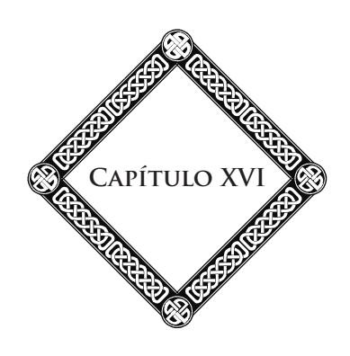

#### **A Missão do Século XX**

Quando se lança um olhar rápido sobre o conjunto da História, esse verdadeiro livro do destino dos povos, parece que cada século tem um papel especial a preencher.

O século XX parece ter uma vocação superior a de todos os outros.

Na sua primeira metade, ele assiste ao desmoronamento de tudo o que constituiu o passado. Na sua segunda metade, ele colocará os alicerces do mundo futuro, feito de beleza, de luz, de justiça, que nossos contemporâneos saúdam como uma miragem longínqua desse novo mundo do pensamento e da Ciência, que nós pressentimos como Cristóvão Colombo pressentiu os indícios de um continente desconhecido.

A transição não se faz sem-abalos, sem-choques violentos. O espetáculo das decomposições que se produzem seria lamentável, se não soubéssemos que às grandes ruínas sucedem as grandes ressurreições.

A História, com efeito, somente apaga para escrever, o pensamento somente destrói para reconstruir: é a lei de evolução, a marcha lógica da Humanidade.

\* \* \*

Assistimos ao desmoronamento das religiões, ou melhor, dos ritos e das formas de culto; pois a religião, no seu princípio, isto é, o impulso da alma na direção do Infinito, a aspiração das inteligências para o ideal divino, a religião é indestrutível como a verdade, inesgotável como o amor, inalterável como a beleza.

O que deve perecer e tende a desaparecer, a cada dia, são as velhas fórmulas dogmáticas, os farisaísmos antigos, as disciplinas desgastadas. É todo o aparelho sacerdotal e o culto dos ídolos.

A religião católica, em particular, se abate sob o peso de suas faltas seculares.

A Igreja romana, há muito tempo, não é mais senão um poder político. Seus pontífices têm desprezado sua missão, seus padres perderam o sentido da iniciação profunda e sagrada dos primeiros cristãos.

Assim, acentuou-se pela abolição da concordata e pela atitude do papa no decorrer da última guerra, a ruptura entre a Igreja e a sociedade moderna, a cisão entre o espírito de Roma e o do século.

> \* \* \*

Assistimos, igualmente, ao desmoronamento da Ciência, não da Ciência verdadeira como o pretendia o Sr. Brunetière, pois essa não pode perecer — é uma trabalhadora que nunca se declara falida — mas da ciência materialista, a que tem dominado o mundo durante mais de cem anos.

#### **A Missão do Século XX**

Há meio século, Ernest Renan publicava um livro sobre o *Futuro da Ciência*, livro habilmente concebido, que teve certa voga. Ele aí profetizava o desaparecimento, em breve espaço de tempo, do mistério que, sob formas diversas, se coloca como um desafio ao pensamento humano. O mistério tem subsistido... Ele até se multiplicou, graças à descoberta recente da radioatividade dos corpos e ao desenvolvimento dos fenômenos psíquicos.

Outros exemplos farão ver até que ponto a Ciência oficial, proclamando suas vitórias sobre a matéria, tem-se mostrado impotente para resolver as grandes questões que têm distraído a alma humana e suas faculdades.

Nos seus *Enigmas do Universo*, Haeckel escreveu: "Enquanto o enigma da substância que recapitula todos os outros enigmas, não for resolvido, nada se terá feito para a satisfação do espírito humano".

Henri Poincaré, um dos mestres da Ciência moderna, que a morte golpeou no meio dos seus trabalhos, demonstrava numa de suas últimas obras que a Ciência é apenas ainda uma hipótese e ele confessava que *todas as leis da Física estão por revisar*.

O Sr. d'Arsonval manteve quase a mesma linguagem nos seus cursos no Collège de France.

Vejamos, agora, o que dizia sobre esse mesmo assunto William James, reitor da Universidade Harvard, nas últimas páginas de seu belo livro: *A Experiência Religiosa*. Ele declara não poder "sem ouvir uma admoestação interior" colocar-se numa atitude de homem de ciência, crendo que nada existe fora da sensação e das leis da matéria. E algumas linhas mais adiante:

#### **Capítulo XVI**

Qualquer experiência humana, na sua realidade viva, me impulsiona irresistivelmente para sair dos estreitos limites em que a Ciência pretende nos encerrar. O mundo real é constituído de outra forma, bem mais rico e mais complexo que o da Ciência.

É precisamente esse mundo real, o mundo psíquico, que a maioria de nossos sábios não querem conhecer; em vez de estudar, como o deveriam, a vida nas suas altas manifestações, eles se perdem na análise infinitesimal; eles não veem, por assim dizer, senão a poeira das coisas e das ideias.

Sempre faltaram à Ciência oficial a independência e a liberdade. Primeiramente, ela se desviou, submetendo-se, servilmente, à autoridade da Igreja; em seguida, enfeudandose nas doutrinas materialistas do século XVIII, e logo depois, ao panteísmo germânico. Finalmente, há quase um século, ela se tornou o satélite do positivismo, essa doutrina incompleta, que sistematicamente se desinteressa do maior problema que o espírito humano quer e deve resolver, o de sua origem e de seu destino. Ela se limita a arrastar pelo mundo suas fórmulas secas e banais, semelhante à "Vitória aptera", que, desprovida de asas, via-se condenada a se arrastar, sem poder lançar-se na direção dos cimos.

A Ciência cética havia colocado a lei do número na base de tudo. Desde então, a vida tinha se tornado uma espécie de álgebra com uma ou várias incógnitas. Era ir no sentido contrário da Natureza; pois o homem existe para criar e não para decompor; para agir e não unicamente para analisar. Esse sistema negativo havia tornado estéreis os trabalhos de nossos sábios, e é assim que desde há muito tempo, vimos, pouco a pouco, apagar-se sob nossos olhos os caracteres e as consciências, a arte, o ideal e a beleza.

#### **A Missão do Século XX**

Com efeito, a Ciência desconheceu a lei da estética, consagrando o naturalismo que disseca a vida, ao invés de desenvolvê-la. Em moral, ela tem preconizado o determinismo, que coloca como princípio a impotência do esforço e a renúncia à ação. Na ordem social, o esmigalhamento ao infinito dos poderes e das responsabilidades produz, por momentos, um estado de coisas que confina à desordem e à confusão.

A Ciência tinha missão de construir uma sociedade sobre novas bases; ela destruiu sem nada edificar. Perdendo de vista os grandes cumes, os grandes focos do pensamento, a Ciência cética resfriou o coração humano. Ela destruiu o ideal elevado que poetiza a vida, torna-a suportável. É por isso que as gerações que surgem parecem desabusadas e reclamam outra coisa.

O problema político não oferece menos gravidade. Sob o impulso dos acontecimentos, a maioria das instituições monárquicas desmoronaram-se, e a democracia triunfante se dissipa sobre suas ruínas, mas no seu seio uma crise intensa maltrata. Os elementos de anarquia crescem e se estendem. A sorte da Ciência materialista e a do socialismo atual são correlatas; eles se inspiram nos mesmos métodos e mesmas fórmulas.

É preciso convir, a democracia socialista dos dias atuais encontra-se em desacordo com o princípio mesmo da Revolução. Esta era essencialmente individualista; queria dar a cada um a livre iniciativa de seus atos pessoais. O regime atual age diferentemente, ele tende a nivelar todas as individualidades fortes e a passar, logicamente, da legalidade de direito à legalidade de fato; ele vai ao coletivismo, isto é, à negação da pessoa humana e a sua absorção no todo social. Não é o "Estadismo" que nos desembaraçaria das mediocridades; ao contrário, ele seria, por natureza, o seu protetor. Também não é pela regulamentação do trabalho pela coletividade que dará

#### **Capítulo XVI**

ao proletariado a felicidade que os utopistas do dia fazem espelhar aos seus olhos.

Os homens são iguais, dir-se-á. No seu sentido histórico restrito, a fórmula pode parecer exata; mas não se poderia tratar aqui de uma igualdade real, absoluta. Se os homens são iguais em direitos, eles serão sempre desiguais em inteligência, em faculdades, em moralidade. Afirmar o contrário, seria negar a lei de evolução, que, naturalmente, não age com a mesma eficácia sobre todos os indivíduos.

O *homem livre sobre a Terra livre!* Assim será o ideal social do futuro. Porém, é preciso levar em conta a necessidade preliminar de um outro fator, a Fraternidade, que somente pela harmonia, pode dar equilíbrio à liberdade.

Os séculos têm fugido, desde a idade heroica dos primeiros cristãos, em que estes vendiam o que possuíam para que os apóstolos distribuíssem o prêmio entre todos, segundo as necessidades de cada um. Esse princípio de verdadeira felicidade, lembrado por Mably aos homens da Revolução, onde o encontrarão? Não é nos costumes atuais, que caracteriza o egoísmo; ele está nas aspirações da alma humana, nesse movimento que agita os povos de um extremo ao outro da Terra; ele está no longínquo das idades futuras!...

Acabamos de passar em revista as ruínas que o século XX já viu se produzir. Vamos falar, agora, das renovações que ele prepara e que efetuará.

É sempre na ordem intelectual que as grandes renovações começam. As ideias precedem e preparam os fatos. É a lógica da História e a lei do progresso humano.

#### **A Missão do Século XX**

O abuso dos métodos e dos procedimentos da análise estão prestes a nos perder. Por conseguinte, são as grandes sínteses, as concepções de conjunto que é preciso preparar. Eis que um novo ponto de vista se estabelece sobre todas as coisas. Para aplicar métodos novos, é preciso homens novos. Para a Ciência livre de amanhã, é preciso espíritos livres.

Enquanto os homens dessa geração, submetidos às disciplinas da Igreja ou da Universidade, não tiverem desaparecido, poderemos apenas esboçar a obra de redenção do espírito humano. A Igreja com suas confissões, a Universidade com seus exames têm falseado os voos da alma e oprimido os impulsos do pensamento. Os corações, as inteligências se dobraram sobre si mesmas; mas ninguém teve o tempo nem o espaço necessário para sentir e viver plenamente. Todavia, o trabalho de renovação se prepara. O século XIX e o início do século XX viram surgir os precursores. Os gênios não tardarão a vir.

Em cada época da História conta-se um certo número de espíritos que pertencem mais ao século seguinte do que ao século em que vivem e, por isso mesmo, assemelham-se a desclassificados superiores, a seres estranhos, inquietantes para seus contemporâneos.

Shakespeare escreveu: "Os grandes acontecimentos projetam diante de si sua sombra antes que sua presença abale o Universo".

Ora, os precursores viram essa sombra grandiosa desenhar-se no seu caminho com formas móveis e poderosas; eles pressentiram as coisas e adivinharam as leis. Aí está o sinal de sua eleição intelectual e de sua vocação; mas ali está também a razão de seu isolamento, de seu abandono, de seus sofrimentos no meio da multidão que não podia compreendê-los.

#### **Capítulo XVI**

Surgiram acontecimentos na sua grandeza trágica. Durante mais de quatro anos os povos se chocaram em abalos formidáveis. A guerra prosseguiu sua obra de ruína e de morte, mas, ao mesmo tempo, ela varreu muitos erros, ilusões e quimeras. Sob o sopro da tempestade, as nuvens se rasgaram, um canto azul do céu apareceu.

O século XIX foi o século da matéria; o século XX será o século do espírito. O século XIX, escrutando a Natureza, nele fez surgir energias desconhecidas; o século XX nos revelará forças espirituais, superiores a tudo o que o homem sonhou, e o estudo dessas forças nos conduzirá à solução do problema da vida e da morte. Os precursores são grandes diante da História! São eles que clareiam a marcha da Humanidade sobre a longa estrada de seus destinos. Eles se assemelham aos corredores do estádio antigo do qual fala Lucrécio e que passam de mão em mão a chama sagrada da inspiração. Sem eles, as renovações intelectuais do mundo não encontrariam nem os caminhos abertos, nem os espíritos preparados. Entre eles, citamos atualmente: Allan Kardec, Jean Reynaud, Flammarion, Victor Hugo, Crookes, Myers, Lodge, etc.

O livro de Myers sobre *A Personalidade Humana* termina com uma bela síntese espiritualista. O autor demonstra que é preciso, primeiramente, explicar o homem ao próprio homem. Aprender, ele diz, a conhecer o homem leva ao conhecimento de Deus e do Universo. É o que já havia recomendado o poeta inglês Pope no seu *Ensaio sobre o Homem*.

As gerações, porém, passam e sempre esse estudo essencial do homem interior é negligenciado.

O século XIX consagrou incalculáveis recursos, imensos labores ao estudo do Universo material; ele estendeu, prodigiosamente, o campo de suas observações e de suas experiências; mas o mundo ainda ignora a constituição íntima do ser humano e as leis do seu destino.

Por conseguinte, nossos legisladores encontram-se na impossibilidade de governar. Com efeito, como dirigir os homens, administrar um povo, quando se ignora, ou se finge ignorar o princípio da vida? Daí partiu o mal-estar do qual sofre, hoje, o nosso país.

O formidável problema do trabalho, com suas múltiplas dificuldades, não tem outra origem senão esse erro capital. Não se quis ver na pessoa humana senão um corpo a nutrir e a explorar, e, partindo daí, apenas se preocuparam com suas necessidades materiais. A luta pela vida tornou-se tão brutal quanto ela era nos tempos bárbaros.

O mal é grande e não é com sistemas empíricos que o curaremos. Não será nem no socialismo sob sua forma atual, nem no coletivismo que encontraremos os remédios.

É preciso procurar, primeiramente, as causas e atacálas. Ora, estas são, por assim dizer, constitucionais ao homem. São seus erros que é preciso corrigir, suas paixões que é preciso combater, agindo menos sobre a massa do que sobre o indivíduo. Com efeito, é ele que devemos esclarecer, emendar; é preciso cultivar e desenvolver o homem interior em cada personalidade viva, se quisermos passar do reino da matéria para o reino do espírito.

Para a Ciência nova, é preciso homens que conheçam a fundo as leis superiores do Universo, o princípio da vida imortal e a grande lei de evolução, que é uma lei de amor e não uma lei de bronze, como o disse Haeckel.

Existe uma doutrina, ao mesmo tempo, velha como o mundo e jovem como o futuro porque é eterna, sendo a

#### **Capítulo XVI**

verdade; uma doutrina que resume todas as noções fundamentais da vida e do destino: é o *Espiritismo*, do qual o livro de Myers, citado mais acima, é apenas o comentário científico.

O Espiritismo faz erupção no mundo; ele transborda por toda a parte.

Qual a sociedade sábia, a revista semanal, o jornal cotidiano, que não se ocupa com seus fenômenos, com suas manifestações, seja para negá-los, criticá-los ou combatê-los?

O Espiritismo, é a questão da hora presente, o problema universal. Não é mais possível permanecer indiferente diante dele!... E é precisamente porque essa invasão espiritual preenche os dois mundos e preocupa o pensamento humano, que acreditamos dever insistir nos deveres que nos incumbem diante dessa nova fé, dessa Ciência jovem e forte que oferece provas irrefutáveis da vida após a morte e contém em gérmen todas as ressurreições do futuro!...

Terminando, lembremos o caráter essencial do Espiritualismo Moderno. Não é um sistema novo que vem se juntar a outros sistemas, nem um conjunto de teorias vãs. É um ato solene do drama da evolução humana que começa, uma revelação que ilumina, ao mesmo tempo, as profundezas do passado e as do futuro, que faz surgir da poeira dos séculos as crenças adormecidas, anima-as com uma nova chama e as faz reviver, completando-as.

É um sopro poderoso que desce dos Espaços e corre sobre o mundo, sob sua ação, todas as grandes verdades despertam. Majestosas, elas emergem da obscuridade das eras, para desempenhar o papel que o pensamento divino lhes assinala. As grandes coisas se fortalecem no recolhimento e no silêncio. No esquecimento aparente dos séculos, elas haurem energias

#### **A Missão do Século XX**

novas. Dobram-se sobre si mesmas e se preparam para as tarefas futuras.

Acima das ruínas dos templos, civilizações extintas e impérios desmoronados, acima do fluxo e do refluxo das marés humanas, uma voz poderosa se eleva; e essa voz exclama: *Os tempos são vindos, os tempos são chegados!*

Das profundezas estreladas, os espíritos descem em legiões à Terra, para combater o combate da luz contra as trevas. Não são mais os homens, não são mais os sábios, os filósofos que trazem uma nova doutrina. São os gênios do Espaço que vêm entre nós e sopram ao nosso pensamento os ensinamentos chamados para regenerar o mundo. São os espíritos de Deus! Todos aqueles que possuem o dom de clarividência os percebem, planando acima de nós, misturando-se aos nossos trabalhos, lutando ao nosso lado para o resgate e a ascensão da alma humana.

Preparam-se grandes coisas. Que os trabalhadores do pensamento se elevem, se quiserem participar da missão oferecida por Deus a todos aqueles que amam e servem à verdade.

#### **Notas Complementares**

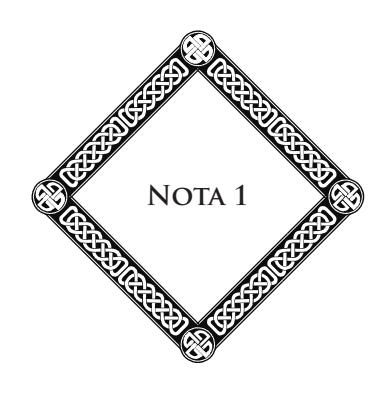

#### **Sobre a Necessidade de um Motor Inicial para Explicar os Movimentos Planetários**

A esse respeito, o professor Sr. Bulliot escreve na *Revue du Bien*:

> Forçosamente, dizia Aristóteles, todos os seres que compõem a Natureza se dividem, a priori, em três categorias: os que recebem o movimento sem dá-lo; aqueles que o recebem e o transmitem a outros corpos, permanecendo como simples agentes de transmissão; finalmente, as fontes primeiras do movimento, que dão de sua plenitude sem nada receber do exterior. A necessidade de buscar fora dos corpos a fonte primeira dos movimentos que os animam, é evidente na hipótese estritamente mecânica de Descartes, segundo a qual os corpos privados de qualquer atividade própria, permanecem absolutamente passivos, abandonados que estão aos impulsos do exterior. Porém, qualquer que seja a hipótese que se faça sobre a natureza íntima da matéria, basta para justificar a necessidade de recorrer a um primeiro motor, encontrar nos corpos um

movimento ou uma classe de movimentos que não se explica pelas forças comuns.

Ora, essa classe de movimentos encontra-se realizada nas revoluções dos planetas, que gravitam em torno do Sol, centro do sistema. Esse movimento de translação, quase circular ou elíptico, deve-se ao concurso de duas forças: uma força de gravidade, que tende, incessantemente, a fazer os planetas caírem sobre o Sol, seguindo a vertical, e uma força centrífuga, que tende a lançá-los ao longe, em linha reta, seguindo a tangente à órbita. Ora, de onde vem essa força centrífuga? Unicamente de um impulso primitivo, dado de uma vez por todas ao planeta, na origem de suas revoluções, através de uma causa estranha. Esse impulso é, sobre todos os pontos, análogo àquele que uma criança comunica a uma pedra, fazendo-a retornar rapidamente com o auxílio de uma atiradeira. Nenhuma força natural poderia dar-lhe razão. Assim, Newton não hesita em pronunciar essa grande frase, no final dos seus Princípios Matemáticos da Filosofia Natural: "O mundo não se explica pelas leis da Mecânica". Num impulso entusiasta, sua grande alma se lança na direção daquele, único, que pôde, com sua mão poderosa, lançar os mundos sobre a tangente de sua órbita. Nunca a Ciência humana, nunca a inteligência do homem se elevaram mais alto do que nesta página célebre, digno coroamento desse livro grandioso.

Com Kant e Laplace, a Astronomia dá um novo passo adiante. Ela estabelece a hipótese de uma vasta nebulosa animada por um poderoso movimento de rotação sobre si mesma. Em consequência desse movimento, os planetas

#### **Sobre a Necessidade de um Motor Inicial...**

se destacam um a um, como por si mesmos, da massa comum, cuja parte central dará, finalmente, nascimento ao Sol. Desde então, parece que tudo mudou e que a ideia de Deus se torna estranha à Astronomia. Laplace não pronuncia uma única vez esse nome. Mas, no estrito ponto de vista da explicação dos fatos, esse silêncio está fundamentado? De maneira alguma. A questão permaneceu para nós exatamente como era para Newton. Depois, como antes da hipótese da nebulosa, o problema é o mesmo. Se nada dá equilíbrio à gravidade, sempre presente e sempre atuante, os planetas caem; eles se precipitam em linha reta para o Sol. Ou melhor, nada vem destacá-los da nebulosa comum. O movimento giratório desta pode somente fornecer a força centrífuga indispensável. E, então, coloca-se de novo, e nos mesmos termos, o grande problema inelutável que, em vão, tentava-se passar em silêncio: De onde vem o movimento giratório que dá equilíbrio à gravidade?

Somente Kant ousou responder: da gravidade e das forças repulsivas desenvolvidas pelos choques interatômicos. Kant não era matemático, e ele o demonstra muito bem aqui. Em virtude até do princípio de igualdade da ação e da reação, as moléculas, após o choque, desenvolvem a mesma força viva numa direção que, na direção contrária, da esquerda para direita, quanto da direita para a esquerda. Elas são incapazes, por conseguinte, de engendrar na nebulosa a menor rotação de conjunto.

Imóvel, no início, a nebulosa permanecerá eternamente imóvel e, por falta de força viva, os planetas não se formarão. Se, com efeito, eles se destacaram da massa central, é que esta girava em torno de si mesma, e se ela girava, é que a mesma potência criadora que evocava ostensivamente Newton, tinha-lhe impresso esse movimento ao formá-la.

Astrônomos do Observatório de Paris, interrogados, os Srs. Wolf e Puiseux, não tiveram dificuldade alguma para reconhecê-lo: "A hipótese invocada por Kant, conclui o Sr. Puiseux, deve ser vista como inoperante". "É necessário um primeiro motor", escreve o Sr. Wolf. (É também a opinião de Camille Flammarion, consignada em suas obras.)

E, no fundo, implicitamente, Laplace, talvez não diga a mesma coisa; pois, se ele não nomeia Deus com todas as letras, fala de uma nebulosa em estado de rotação e, reiteradas vezes, escreve que, no seu movimento de conjunto, a soma dos arcos descritos pelas suas moléculas em torno do eixo é necessariamente nula. Portanto, ele também se reconhecia, como Newton, incapaz de explicar os movimentos do sistema solar pelas únicas leis da Mecânica.

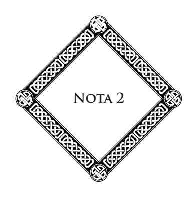

#### **Sobre as Forças Desconhecidas**

Eis o que diz sobre esse importante assunto o Sr. G. Le Bon:

> Retornando às causas da emissão de eflúvios que podem se desprender de todos os corpos com uma rapidez vertiginosa, constataríamos a existência de uma energia intra-atômica, desconhecida até hoje e que ultrapassa, todavia, todas as forças conhecidas pela sua colossal grandeza. Não sabemos ainda liberá-la senão em quantidade bastante fraca; porém, do cálculo dessa quantidade podese deduzir que, se fosse possível desprender completamente toda a energia contida num grama de uma matéria qualquer, ela poderia produzir um trabalho igual àquele obtido pela combustão de vários milhões de toneladas de carvão. A matéria nos aparece como um reservatório enorme de energia. A constatação da existência dessa força nova, ignorada durante tão longo tempo, apesar da sua formidável grandeza, nos revelará imediatamente a fonte tão misteriosa ainda da energia manifestada pelos corpos durante sua radioatividade.

> > (*Revista Científica*, 17 de outubro de 1903.)

**213**

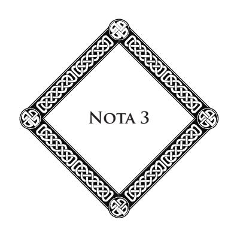

#### **Sobre a Música das Esferas**

A vibração solar, diz Azbel (*Harmonia dos Mundos*), projeta os desabrochamentos esféricos das harmonias de sua fundamental através do Espaço, não somente sob a forma aparente de planetas invisíveis, mas em princípio e, essencialmente, sob a expressão etérea de ondas harmônicas, segundo a progressão regular 1, 2, 3, 4, 5, 6, 7, 8, 9, 10, etc. É através das correntes diretas dessas ondas que os corpos planetários se dirigem diretamente, e através das correntes circulares — espécies de ondulações de vagas formadas nos nós do encontro das ondas compostas sucessivas — que esses corpos, ao mesmo tempo, se dirigem complexamente em torno da vibração mestra. Entretanto, os corpos planetários estão submetidos às multiplicidades de suas estéticas particulares de volume, massa ou densidade, além daquelas das revoluções elípticas, etc., que se conjugam para modificar mais ou menos seus itinerários teóricos. Donde vias consequentes aparecem, primeiro, como desvios, mas cujo cálculo estético permite, aqui, perceber o caráter harmônico ao lado do caráter matemático simples.

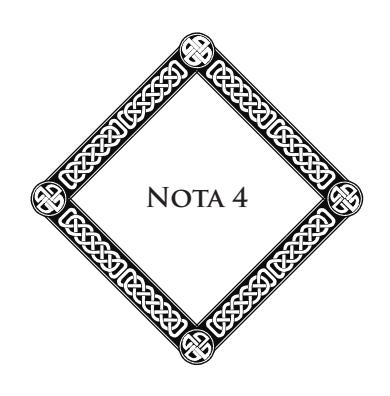

#### **Sobre o Espiritualismo Experimental ou Espiritismo**

O Espiritismo chama mais do que nunca a atenção pública. Há, frequentemente, casos de casas assombradas, de fenômenos ocultos, de aparições, de materializações de espíritos. A Ciência, a Literatura, o teatro, a imprensa nele se misturam alternadamente, e as experiências do Instituto Psíquico, as revelações do grande publicista inglês W. Stead, o testamento de William James, as pesquisas abertas por algumas folhas parisienses dão a essa questão um caráter de atualidade constante.

Examinemos, portanto, esse problema e pesquisemos por que esse Espiritismo, que se tem tão frequentemente enterrado, reaparece, incessantemente, e vê aumentar a cada dia o número de seus partidários.

Não está aí uma coisa estranha? Jamais, talvez, na História, algo de semelhante se tenha produzido. Nunca se tinha visto um conjunto de fatos, considerados, primeiramente, como impossíveis, cuja ideia não despertava, no pensamento da maioria dos homens, senão a antipatia, a desconfiança, o desdém, que eram alvo da hostilidade de várias instituições seculares, terminar por se impor à atenção e mesmo à convicção de homens instruídos, competentes, autorizados pelas suas funções e seu caráter. E esses homens, a princípio céticos, através dos seus estudos, suas pesquisas, suas experiências, acabaram por reconhecer e afirmar a realidade desses fenômenos.

O ilustre sábio inglês, W. Crookes, conhecido no mundo inteiro por sua descoberta da matéria radiante, e que, durante três anos, obtém, em sua casa, materializações do Espírito Katie King, em condições de controle rigoroso, dizia, falando dessas manifestações: "Não digo que isto é possível, digo: isto é".

Oliver Lodge, reitor da Universidade de Birmingham, membro da Academia Real, escrevia: "Fui, pessoalmente, levado à certeza da existência futura, através das provas que repousam sobre uma base puramente científica".

Fredrich Myers, o professor de Cambridge, que o Congresso Oficial Internacional de Psicologia de Paris, em 1900, havia eleito presidente de honra, no seu belo livro: *A Personalidade Humana*, chega a essa conclusão, de que vozes e mensagens nos retornam do além-túmulo. Falando da médium Sra. Thomson, ele escreve: "Creio que a maioria dessas mensagens vêm de espíritos que se servem temporariamente do organismo dos médiuns para no-las dar".

O célebre professor Lombroso, de Turim, declarava na *Lettura*: "Os casos de casas mal-assombradas, nas quais, durante anos, se reproduziram aparições ou ruídos que concordavam com a narrativa de mortes trágicas, e observadas fora da presença de médiuns, demandam em favor da ação dos falecidos". — "Trata-se, frequentemente, de casas desabitadas,

#### **Sobre o Espiritualismo Experimental...**

onde esses fenômenos se produzem, às vezes, durante várias gerações e até durante séculos".59

O Sr. Boutroux, o filósofo bem conhecido, em brilhantes conferências, disserta sobre os espíritos, as comunicações medianímicas, e assegura que "a porta subliminal está aberta por onde o divino pode entrar na alma humana." "Às vezes, ele diz, as revelações espíritas são tão estranhas que parece que o indivíduo está em comunicação com seres diferentes daqueles que lhe são normalmente acessíveis."60

William James, reitor da Universidade Harvard, em Nova Iorque, o eminente psicólogo que acaba de morrer, afirmava a verossimilhança das comunicações dos defuntos, no seu estudo, publicado em 1909 nos *Proceedings*, a respeito de seu amigo falecido, Hodgson, que vinha entretê-lo por intermédio da Sra. Piper. Ele escrevia que "esses fenômenos dão a impressão irresistível de que é realmente a personalidade de Hodgson com sua característica própria, e que os sentimentos dos assistentes eram de que conversavam com o verdadeiro Hodgson."61

É na América que encontramos o foco do Espiritismo, ou Espiritualismo Moderno. Na realidade, os fenômenos de além-túmulo encontram-se na base de todas as grandes doutrinas do passado. Em quase todos os tempos, as relações uniram o mundo invisível ao mundo dos vivos. Porém, na Índia, no Egito e na Grécia, esse estudo era o privilégio de um pequeno número de pesquisadores e iniciados; os resultados eram cuidadosamente mantidos ocultos.

59 Ver *Anais das Ciências Psíquicas*, fevereiro de 1908. (**N.A.**)

60 *Anais das Ciências Psíquicas*, 1/16 de junho de 1910. (**N.A.**)

61 *Revista Científica e Moral*, outubro de 1910*.* (**N.A.**)

Para tornar esse estudo acessível a todos, para tornar conhecidas as verdadeiras leis que regem o mundo invisível, para ensinar aos homens a ver nesses fenômenos, não mais uma ordem sobrenatural de coisas, mas um domínio ignorado da Natureza e da vida, era necessário o imenso trabalho dos séculos, todas as descobertas da Ciência, todas as conquistas do espírito humano sobre a matéria. Era preciso que o homem conhecesse seu verdadeiro lugar no Universo, que ele aprendesse a medir a fragilidade dos seus sentidos, sua impotência para explorar, por si mesmo e sem-auxílio, todos os domínios da Natureza viva.

A Ciência, através de suas invenções, atenuou essa imperfeição de nossos órgãos. O telescópio abriu ao nosso olhar os abismos do Espaço; o microscópio revelou-nos o infinitamente pequeno. A vida nos apareceu de toda a parte, no mundo dos infusórios como na superfície dos globos gigantes que rolam nas profundezas do céu. A Física descobriu as leis que regulam a transformação das forças, a conservação da energia e aquelas que mantêm o equilíbrio dos mundos. A radioatividade dos corpos revelou a existência de potências ignoradas e incalculáveis: raios X, ondas hertzianas, radiações de toda natureza e de todos os graus. A Química nos fez conhecer as combinações da substância. O vapor e a eletricidade vieram revolucionar a face do globo, facilitar as relações dos povos e as manifestações do pensamento, a fim de que a ideia irradie e se propague em todos os pontos da esfera terrestre.

Hoje, o estudo do mundo invisível vem completar esta magnífica ascensão do pensamento e da Ciência. O problema do Além se eleva diante do espírito humano com poder e autoridade.

Por volta do final do século XIX, o homem, decepcionado com todas as teorias contraditórias, com todos os sistemas

#### **Sobre o Espiritualismo Experimental...**

incompletos com os quais quiseram nutrir seu pensamento, deixava-se levar pela dúvida; ele perdia cada vez mais a noção da vida futura. Foi, então, que o mundo invisível veio até ele e o perseguiu até dentro de suas moradas. Através de meios diversos, os mortos se manifestaram aos vivos. As vozes do Além falaram. Os mistérios dos santuários orientais, os fenômenos ocultos da Idade Média, após um longo silêncio, renovaram-se; nasceu o Espiritismo.

Foi além dos mares, num mundo jovem, rico em energia vital, em expansão ardente, menos sujeito que a velha Europa ao espírito de rotina e aos preconceitos do passado, que se produziram as primeiras manifestações do Espiritualismo Moderno. Dali elas se espalharam sobre o globo inteiro. Essa escolha era profundamente judiciosa. AAmérica livre era o meio mais propício a uma obra de difusão e de renovação. Assim é que, hoje, contam-se ali vinte milhões de "modernos espiritualistas."

Porém, tanto de um lado do Atlântico quanto de outro, embora com intensidades diversas, as fases de progresso da ideia espírita foram as mesmas.

Sobre os dois continentes, o estudo do magnetismo e dos fluidos preparara certos espíritos para a observação do mundo invisível.

Primeiramente, fatos estranhos se produziram de todos os lados, fatos sobre os quais não se ousava falar senão em voz baixa, na intimidade. Depois, pouco a pouco, o tom se elevou. Homens de talento, sábios, cujos nomes são garantias de honorabilidade e de sinceridade, ousaram falar bem alto desses fatos e afirmá-los. Tratou-se da questão do hipnotismo, da sugestão; depois vieram a telepatia, os casos de levitação e todos os fenômenos do Espiritismo.

Mesas se agitaram numa louca ronda; objetos se deslocavam sem-contato, pancadas ecoavam nas paredes e nos móveis. Todo um conjunto de fatos se produzia, manifestações vulgares na aparência, mas perfeitamente adaptadas às exigências do meio terrestre, ao estado de espírito positivo e cético das sociedades modernas.

O fenômeno falava aos sentidos, pois os sentidos são como as aberturas por onde o fato penetrará até o entendimento. As impressões produzidas sobre o organismo despertam a surpresa, provocam a pesquisa, conduzem à convicção. Daí, o encadeamento dos fatos, a marcha ascendente dos fenômenos.

Com efeito, após uma primeira fase material e grosseira, as manifestações revestiram um novo aspecto. As batidas se regularizaram e se tornaram um modo de comunicação inteligente e consciente; a escrita automática se propagou. A possibilidade de relações entre o mundo visível e o mundo invisível apareceu como um fato imenso, tumultuando as ideias recebidas, abalando os ensinamentos habituais, mas abrindo sobre a vida futura uma porta que o homem hesitava ainda em transpor, maravilhado que estava perante as perspectivas que diante dele se abriam.

Ao mesmo tempo que se propagava, o Espiritismo via se elevarem contra ele numerosas oposições. Como todas as ideias novas, ele teve que enfrentar o desprezo, a calúnia, a perseguição moral. Como a ideia cristã em seus primórdios, ele foi sobrecarregado de amarguras e de injúrias. É sempre assim. Quando novos aspectos da verdade aparecem aos homens, é sempre o espanto, a desconfiança, a hostilidade que eles provocam.

Isso é fácil de compreender. A Humanidade esgotou as velhas formas do pensamento e da crença, e, quando formas

#### **Sobre o Espiritualismo Experimental...**

inesperadas da verdade se revelam, elas parecem pouco responder ao ideal antigo que está enfraquecido, mas não morto. Assim, é necessário um longo período de exame, de reflexão, de incubação, para que a ideia nova abra seu caminho na opinião. Daí as lutas, as incertezas, os sofrimentos da primeira hora.

Escarneceram muito das formas que revestia o Novo Espiritualismo. As potências invisíveis que velam pela Humanidade são melhores juízes que nós, relativamente aos meios de ação e de treinamento que convém adotar, segundo os tempos e os lugares, para conduzir o homem ao sentimento de seu papel e de seus destinos, e isso sem entravar seu livre-arbítrio. Pois aí está o essencial: é preciso que a liberdade do homem permaneça íntegra.

A Vontade superior sabe acomodar às necessidades de uma época e de uma raça as forças novas da eterna revelação. Ela suscita, no seio das sociedades, dos pensadores, dos experimentadores, dos sábios, que indicarão o caminho a seguir e assentarão as primeiras estacas. Sua obra desenvolve-se lentamente. Fracos e insensíveis, primeiro, são os resultados, mas a ideia penetra pouco a pouco nas inteligências. O movimento, por ser imperceptível, às vezes não o é senão mais seguro e mais profundo.

Em nossa época, a Ciência tornara-se a senhora soberana, a diretora do movimento intelectual. Cansada das especulações metafísicas e dos dogmas religiosos, a Humanidade reclamava provas sensíveis, bases sólidas sobre as quais ela pudesse assentar suas convicções. Ela se apegava ao estudo experimental, à observação dos fatos, como a uma prancha de salvação. Daí, o grande crédito dos homens de Ciência no momento em que estamos. É por isso que a revelação tomou um caráter científico. Foi através dos fatos materiais que se despertou a atenção dos homens, tendo se tornado, eles próprios, materiais.

Os fenômenos misteriosos que se encontram disseminados na história do passado renovaram-se e se multiplicaram em torno de nós; sucederam-se numa ordem progressiva, que parece indicar um plano preconcebido, a execução de um pensamento, de uma vontade.

Com efeito, à medida que o Novo Espiritualismo ganhava terreno, os fenômenos se transformavam. As manifestações grosseiras do início se afinavam, revestiam um caráter mais elevado. Médiuns recebiam, através da escrita, de uma maneira mecânica ou intuitiva, mensagens, inspirações de origem estranha. Instrumentos de música tocavam por si mesmos. Ouviam-se vozes e cantos; melodias penetrantes pareciam descer do céu e perturbavam os mais incrédulos. A escrita direta se produzia no interior de ardósias justapostas e lacradas. Fenômenos de incorporação permitiam aos defuntos tomarem posse do organismo de um indivíduo adormecido e conversarem com aqueles que os tinham conhecido na Terra. Gradualmente, e como consequência de um desenvolvimento calculado, os médiuns videntes, falantes, curadores apareciam.

Enfim, os habitantes do Espaço, revestindo envoltórios temporários, vinham misturar-se aos humanos, vivendo, por um instante, sua vida material e terrestre, deixando-se ver, tocar, fotografar, fornecendo impressões de suas mãos, de seus rostos, e dissipando-se, em seguida, para retomar sua vida etérea.

É assim que, há meio século, todo um encadeamento de fatos se produziu, desde os mais inferiores e mais vulgares até os mais sutis, segundo o grau de elevação das Inteligências que intervêm; toda uma ordem de manifestações desenrolouse sob o olhar dos observadores atentos.

#### **Sobre o Espiritualismo Experimental...**

Desse modo, apesar das dificuldades de experimentação, apesar dos casos de embuste e os modos de exploração dos quais esses fenômenos foram, algumas vezes, o pretexto; a apreensão e a desconfiança foram atenuadas pouco a pouco; o número dos examinadores foi aumentando.

Há cinquenta anos, e em todos os países, o fenômeno espírita foi objeto de frequentes pesquisas empreendidas e dirigidas por comissões científicas. Sábios céticos, professores célebres, pertencentes a todas as grandes universidades do mundo, submeteram esses fatos a um exame rigoroso e aprofundado. Sua intenção, primeiro, era esclarecer sobre o que eles acreditavam ser o resultado do embuste ou de alucinações. Mas quase todos, de incrédulos que eram, após anos de estudos conscienciosos e após experimentação persistente, abandonaram, lembremo-lo, suas prevenções e se inclinaram diante da realidade dos fatos.

As manifestações espíritas, constatadas por milhares em todos os pontos do globo, demonstraram que um mundo invisível agita-se em torno de nós, ou no meio dos Espaços, um mundo onde vivem, em estado fluídico, aqueles que nos precederam na Terra, que aqui lutaram e sofreram, e constituem, para além da morte, uma segunda Humanidade.

O Novo Espiritualismo se apresenta, hoje, com um cortejo de provas e um conjunto de testemunhos tão imponente que a dúvida não é mais possível para os pesquisadores de boa-fé. É o que exprimia, nesses termos, o professor Chalis, da Universidade de Cambridge.

> Os atestados foram tão abundantes e tão perfeitos, os testemunhos vieram de tantas fontes independentes umas das outras e de um número tão enorme de testemunhos, que é preciso, ou admitir as manifestações tais como as

representam, ou renunciar à possibilidade de certificar qualquer fato que seja, através de uma declaração humana.

Dessa maneira, o movimento de propagação acentuou-se cada vez mais. No momento presente, assistimos a um verdadeiro desabrochar da ideia espírita. A crença no mundo invisível espalhou-se sobre toda a superfície da Terra. Por toda a parte, o Espiritismo tem suas sociedades de experimentação, seus divulgadores, seus jornais.62

Se a Filosofia, nas suas especulações mais audaciosas, pudera se elevar à concepção de um outro modo de existência após a morte do corpo, a ciência humana, todavia, não havia ainda chegado, experimentalmente, à certeza do fato em si mesmo. O mérito do Espiritismo é, pois, o de nos fornecer essas bases experimentais, provando a comunicação possível, em condições determinadas, dos vivos com Inteligências que habitaram entre nós, antes de passar para o domínio da vida invisível. Essas almas puderam oferecer, em certos casos, a demonstração de sua identidade e de seu estado de consciência.

Para citar apenas um exemplo entre mil, o doutor Richard Hodgson, falecido em dezembro de 1906, comunicou-se, desde então, com seu amigo J. Hyslop, professor da Universidade de Columbia, que entrou em minuciosos detalhes a respeito das experiências e dos trabalhos da Sociedade das Pesquisas Psíquicas, da qual ele foi presidente pela seção americana. Ele explica como seria necessário conduzi-las, e, através desses detalhes, ele prova, plenamente, sua identidade.

Essas comunicações são transmitidas por intermédio de diferentes médiuns, que não se conheciam, e elas se confirmam, umas pelas outras. Nelas se reconhecem as palavras e as frases familiares ao comunicante durante sua vida.

62 Extraído de *Cristianismo e Espiritismo*. (**N.A.**)

#### **Sobre o Espiritualismo Experimental...**

\*

\* \*

Se os primórdios do Espiritismo foram difíceis, se a sua marcha foi lenta, cheia de obstáculos, há uma dezena de anos, ele conquistou o direito de cidadania. Tornou-se uma verdadeira ciência e, ao mesmo tempo, um corpo de doutrina, uma filosofia geral da vida e do destino, baseada sobre um conjunto imponente de fatos, de provas experimentais, aos quais vêm se juntar, a cada dia, novos fatos. Essa ciência, essa doutrina nos demonstra, cada vez mais, a realidade de um mundo invisível, incomensurável, povoado de seres vivos que haviam até aqui escapado aos nossos sentidos, e eis que novos horizontes se abrem; as perspectivas de nosso destino se alargam. Nós próprios, pertencemos por uma parte de nosso ser — a mais importante — a esse mundo invisível que se revela a cada dia aos observadores atentos. Os casos telepáticos, os fenômenos de desdobramento, de exteriorização dos vivos, as aparições a distância, tantas vezes relatadas por F. Myers, C. Flammarion, Ch. Richet, doutor Dariex, doutor Maxwell, etc., seriam destes a demonstração experimental. Os processos verbais da Sociedade de Pesquisas Psíquicas de Londres são ricos em fatos desse gênero.

Os espíritas acreditam que essa parte invisível, imponderável de nossa individualidade, sede inalterável de nossas faculdades, de nosso "eu" consciente, numa palavra, daquilo que os crentes de todas as religiões chamaram a alma, sobrevive à morte. Ela prossegue, através do tempo e do Espaço, sua evolução para estados sempre melhores, sempre mais iluminados pelos raios da justiça, da verdade, da eterna beleza. Essa alma, esse "eu" consciente, tem como envoltório indestrutível, como veículo, um corpo fluídico, esboço do corpo humano, formado de matéria sutil, radiante, invisível, sobre a qual a morte não tem nenhuma ação.

Aqui, nós nos encontramos na presença de uma teoria, de uma concepção suscetível de reconciliar as doutrinas materialista e espiritualista, durante tanto tempo em luta, sem poderem se colocar em movimento, nem se destruírem reciprocamente. A alma não seria mais uma vaga abstração, porém um centro de força e de vida, inseparável de sua forma sutil, imponderável, embora material ainda. Há aí uma base positiva para as esperanças e para as aspirações elevadas da Humanidade. Tudo não termina com essa vida: o ser, perfectível para sempre, recolhe no seu estado psíquico, incessantemente aprimorado, o fruto dos trabalhos, das obras, dos sacrifícios de todas as existências.

O lamento doloroso, o grito de apelo que sobe para o céu das profundezas da Humanidade, não ficam sem-resposta. Aqueles que viveram entre nós e prosseguem no Espaço, sob formas mais etéreas, sua evolução infinita, estes não se desinteressam dos nossos sofrimentos e de nossas lágrimas. Dos cumes da vida universal descem, incessantemente, sobre a Terra, correntes de forças e de inspiração. Daí vêm os clarões do gênio; daí, os sopros poderosos que passam sobre as multidões, nas horas decisivas; daí, o reconforto para aqueles que se dobram sob o pesado fardo da existência.

Um laço misterioso religa o visível ao invisível. Nosso destino se desenrola na corrente grandiosa dos mundos. Ele se traduz pelos acréscimos graduais de vida, de inteligência, de sensibilidade.

Mas o estudo do universo oculto não acontece semdificuldades. Lá, como aqui, o bem e o mal, a verdade e o erro se misturam, conforme o grau de evolução dos espíritos com

#### **Sobre o Espiritualismo Experimental...**

os quais entramos em relação. Daí, a necessidade de abordar o terreno da experimentação com uma extrema prudência, após estudos teóricos preliminares. O Espiritismo é a ciência que regula essas relações. Ele nos ensina a conhecer, a atrair, a utilizar as forças benfazejas do mundo invisível, a afastar as más influências dele e, ao mesmo tempo, a desenvolver as potências ocultas, as faculdades ignoradas que dormem no fundo de todo ser humano.

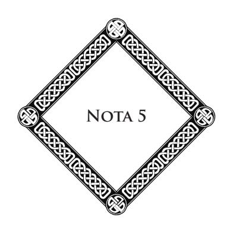

#### **Sobre os Fenômenos Espíritas**

O Sr. Gustave Le Bon tomara, em 1908, a iniciativa de uma proposta que parecia peremptória: um prêmio de dois mil francos era oferecido ao médium que, em plena luz, produziria, diante de um comitê competente, um fenômeno de levitação.

Por que estipular a plena luz, já que é notório que esse fenômeno só é, normalmente, possível com uma luz atenuada, a luz forte exercendo uma ação dissolvente sobre a força psíquica?

Vejamos, amigos do bom senso, o que diríeis de um fotógrafo amador que exigiria, para admitir a fotografia, que esta se produzisse em plena luz, enquanto que, até aqui, o fenômeno requer a obscuridade absoluta do quarto escuro?

Observemos que a obscuridade completa não é absolutamente necessária para as levitações; uma luz vermelha enfraquecida será suficiente para eliminar qualquer procedimento e qualquer suposição de fraude. Aliás, quantos outros fenômenos naturais comuns exigem uma luz muito branda ou então, a obscuridade?

O sábio imparcial observa a lei, a *norma* de um fenômeno, mas se abstém, sobretudo, de pretender impor à sua produção condições antecipadas.

Os fatos de levantamento sem-contato, de levitação de móveis e de pessoas, moldes de mãos e de rostos, foram observados em condições que desafiam quaisquer críticas, pelos sábios franceses e estrangeiros.

Foram feitas fotografias, o que responde, de uma maneira bem clara, à objeção da sugestão. A placa fotográfica não está sujeita à alucinação!

Muito numerosas são as experiências dirigidas de uma maneira rigorosamente científica; citemos, por exemplo, as do professor Bottazzi, diretor do Instituto de Psicologia da Universidade de Nápoles, em maio de 1907, assistido pelo professor Cardarelli, senador, e outros sábios.

Como, evidentemente, os sentidos podem se enganar, serve-se de aparelhos gravadores, que permitem estabelecer não somente a realidade, a objetividade do fenômeno, mas até o gráfico da força física em ação.

Eis, notadamente, as medidas tomadas pelo grupo de sábios designados mais acima, sendo médium Eusapia Palladino:

À extremidade da sala, atrás de uma cortina, dispõe-se, com antecedência, sobre uma mesa:

- 1o ) Um cilindro coberto com papel fumê, que pode se mover em torno de um eixo.
  - 2o ) Uma balança de pesar cartas.
  - 3o ) Um metrônomo elétrico Zimmermann.

#### **Sobre os Fenômenos Espíritas**

- 4o ) Uma tecla telegráfica, ligada a um outro sinal elétrico.
- 5o ) Um interruptor de borracha, ligado por meio de um longo tubo através da parede, com um manômetro de mercúrio situado no quarto contíguo.

Eis aqui, não é, uma filigrana de precauções tomadas pelos sábios pesquisadores supracitados, precauções que, verdadeiramente, deviam assegurá-los de que não estavam absolutamente enganados. Pois bem! foi nessas condições que todos os aparelhos designados foram impressionados a distância, estando as mãos de Eusapia seguras por dois dos experimentadores, e todos os assistentes formando, em torno dela, um círculo.

Há vinte anos, Eusapia já operava em Milão, nas seguintes circunstâncias:

O *Italia del Popolo*, de Milão, publicava, na data de 18 de novembro de 1892, um suplemento especial contendo os processos verbais de dezessete sessões realizadas nessa cidade. Este documento é assinado pelos seguintes nomes: Schiaparelli, diretor do Observatório Astronômico de Milão; Aksakof, conselheiro de Estado russo; Brofferio, Gerosa, professores na Universidade; Ermacora e G. Finzi, doutores em Física; Charles Richet, professor na Faculdade de Medicina de Paris, diretor da *Revista Científica*; Lombroso, professor na Faculdade de Medicina de Turim.

Esses relatórios constatam a produção dos seguintes fenômenos, obtidos na obscuridade, estando os pés e as mãos da médium constantemente seguros por dois assistentes:

> Transporte de objetos diversos sem-contato: cadeiras, instrumentos musicais, etc.; impressões digitais sobre um

papel escurecido; marcas de dedos na argila; aparições de mãos sobre um fundo luminoso; aparições de luzes fosforescentes; levantamento da médium sobre a mesa; deslocamento de cadeiras com as pessoas que as ocupam; toques experimentados pelos assistentes.

Nas suas conclusões, os experimentadores supracitados estabelecem que em razão das precauções tomadas, nenhuma fraude seria possível.

"Do conjunto dos fenômenos observados, dizem, destaca-se *o triunfo de uma verdade que, injustamente, tornou-se impopular.*"

Que esplendor de linguagem poderia igualar o valor convincente desse estilo claro e conciso?

A esses testemunhos, poder-se-ia acrescentar centenas de outros, de igual valor. Seriam nulos aos olhos de nossos contraditores, e seria, pois, necessário recomeçar as experiências a cada nova exigência?

As sessões de Eusapia comportam muitos outros fenômenos mais importantes ainda.

O professor C. Lombroso diz o seguinte no *Arena* (fevereiro de 1908):

> Depois do transporte de um objeto muito pesado, Eusapia, num estado de transe, me diz: "Por que perdes teu tempo com essas bagatelas? Sou capaz de te fazer ver tua mãe; mas é preciso que penses nela fortemente".

> Impelido por essa promessa, após uma meia hora de sessão, fui tomado pelo desejo intenso de vê-la efetuarse, e a mesa pareceu dar seu consentimento, com seus movimentos habituais de levantamentos sucessivos, de

#### **Sobre os Fenômenos Espíritas**

acordo com meu pensamento íntimo. De repente, numa semiobscuridade, apenas com a luz vermelha, vi surgir uma forma um pouco envergada, como era a da minha mãe, coberta com um véu, que contornou a mesa para chegar até mim, murmurando palavras que várias pessoas ouviram, mas que minha surdez relativa não me permitiu captar.

Como, sob o impacto de uma viva emoção, eu suplicava para que as repetisse, ela me disse: *"Cesare, fiol mio"!*, depois, afastando seus véus, deu-me um beijo.

Lombroso lembra, em seguida, as comunicações escritas ou faladas em línguas estrangeiras, as revelações de fatos desconhecidos tanto da médium quanto dos assistentes, e os fatos de telepatia.

Finalmente, para terminar, transportemo-nos para a Inglaterra, onde o fantasma de Katie King foi fotografado pelo *Sir* W. Crookes, o que destrói qualquer hipótese de sugestão.

Num discurso pronunciado em 30 de janeiro de 1908, na Sociedade de Pesquisas Psíquicas de Londres, *Sir* Oliver Lodge, reitor da Universidade de Birmingham e membro da Academia das Ciências (*Royal Society*), fala das mensagens obtidas por alguns médiuns por meio da escrita automática:

> Os comunicantes compreenderam tão bem quanto nós a necessidade das provas de identidade, e fizeram todos os seus esforços para satisfazer essa exigência racional. Alguns dentre nós pensam que eles aí chegaram, outros ainda duvidam. Sou um daqueles que, desejando obter novas provas, pensam todavia que um grande passo foi dado e que é legítimo admitir esses momentos de intercâmbios lúcidos com as pessoas falecidas que, nos

melhores casos, vêm trazer uma nova massa de argumentos, como se fizesse dessa hipótese a melhor hipótese de trabalho.

Com efeito, achamos que os saudosos Gurney, Hodgson, Myers63 e outros menos conhecidos, parecem pôr-se em comunicação constante conosco, com a ideia bem estabelecida e expressa de nos demonstrar, pacientemente, sua identidade e de nos oferecer o controle recíproco de médiuns desconhecidos uns dos outros.

A *cross-correspondance*, isto é, a recepção por um médium de uma parte da comunicação e a outra parte por um outro médium, cada uma dessas partes não podendo ser compreendida sem o auxílio da outra, é uma boa prova de que uma mesma inteligência age sobre os dois médiuns mecânicos. Se, por outro lado, a mensagem traz a característica de uma pessoa falecida e é por isso aceita por pessoas que não a conheciam intimamente, pode-se ver aí a prova da persistência da atividade intelectual dessa pessoa. Se, enfim, obtemos dela um trecho de crítica literária, que é eminentemente sua maneira de escrever, e não poderia vir de indivíduos comuns, então, declaro que uma tal prova, absolutamente chocante, tende a tomar a característica de crucial. Tais são as espécies de provas que a Sociedade *pode comunicar quanto a este ponto*.

As fronteiras entre os dois estados, o presente e o futuro, tendem a se apagar. Assim como no meio do estrondo das águas e dos ruídos diversos, durante a escavação de um túnel, ouvimos, de vez em quando, o ruído dos

63 Membros falecidos da P.R.S. (**N.A.**)

#### **Sobre os Fenômenos Espíritas**

escavadores que vêm até nós do lado oposto, assim também, de tempos a tempos, ouvimos golpes de picaretas de nossos companheiros que passaram para o Além.

A todos esses testemunhos, acrescentarei meu testemunho pessoal. Trinta anos de rigorosa experimentação, efetuada em meios diversos, com numerosos indivíduos, demonstraram-me que, se os fenômenos ditos psíquicos se explicam, em parte, pela exteriorização de forças que emanam dos vivos, um número importante desses fatos apenas encontram explicação na intervenção de entidades invisíveis. Estas, não são outras senão os espíritos de defuntos; eles subsistem sob uma forma sutil, imponderável, cujos elementos pertencem à matéria quintessenciada.

A explicação espírita é, pois, a única que responde de uma forma completa à realidade dos fenômenos considerados sob seus múltiplos aspectos. Eles nos oferecem a prova de que um oceano de vida invisível nos cerca, nos envolve, e que, no Além, o ser humano se encontra na plenitude de suas faculdades e de sua consciência.

#### **Sobre o Papel dos Médiuns nas Manifestações**

No *Écho du Merveilleux* de outubro de 1910, o Sr. Jules Bois apresenta a seguinte proposição: "A necessidade constante de um médium e essa lei de que o fato metapsíquico provém dele, efetua-se nele e através dele".

O Sr. Jules Bois não exclui a intervenção possível de causas mais profundas, mas seja a autossugestão, sugestão ou intervenção de forças estranhas, sempre, a meu ver, o veículo é o ser humano vivo.

Esta proposição, para ser exata, em muitos casos, não deve ser generalizada. O professor Lombroso, após uma minuciosa pesquisa sobre os fenômenos de obsessão, disse (ver *Anais das Ciências Psíquicas*, de fevereiro de 1908):

> Nas casas mal-assombradas, onde se veem moverem-se, de repente, vertiginosamente, garrafas, mesas, cadeiras, etc., ninguém quererá falar de influências de médium, já que se trata, frequentemente, de casas desabitadas, onde esses fenômenos se produzem, às vezes, durante várias gerações.

Assim como os senhores Jules Bois e G. Le Bon, Lombroso havia procurado, durante longo tempo a causa dos fenômenos espíritas no próprio médium e atribuía essas manifestações à ação das forças emanadas do indivíduo.

Mas um grande número de fatos observados por ele, no decorrer de novas experiências, vieram infirmar essa hipótese e demonstrar-lhe a insuficiência...

Primeiramente, aconteceu a simultaneidade de certos fenômenos no decorrer das sessões: não era possível admitir que a força psíquica do médium pudesse não somente se transformar, ao mesmo tempo e, no mesmo instante, em força motriz e em força sensorial, mas agir ainda, ao mesmo tempo, em várias direções diferentes e para finalidades distintas.

Há, em seguida, fatos que se produzem contra a vontade do médium, contra a vontade dos assistentes e até contra a da entidade que opera... Pode, pois, intervir nos fenômenos espíritas uma vontade que não encontra sua origem em nenhum dos organismos humanos reunidos numa sala...

No fenômeno do transe, veem-se manifestar energias motoras e inteligentes que são estranhas, superiores e desproporcionais às energias do médium.

A levitação completa do médium, por exemplo, não pode ser explicada pela ação de uma força proveniente do próprio indivíduo que se eleva acima do solo. O centro de gravidade de um corpo, com efeito, não pode se deslocar no espaço, se uma força externa não age sobre esse corpo.

Eis o que diz a esse respeito o doutor Venzano (ver *Anais das Ciências Psíquicas*, 1 de fevereiro de 1908):

> Numa sessão em Milão, quando Eusapia se encontrava no auge do transe, vimos aparecer, à direita, eu e aqueles

#### **Sobre o Papel dos Médiuns nas Manifestações**

que me cercavam, uma forma de mulher, muito querida, que me disse uma palavra confusa: "Tesouro", me pareceu. No centro, encontrava-se Eusapia, adormecida perto de mim, e, acima, a cortina se encheu várias vezes; ao mesmo tempo, à esquerda, uma mesa se agitava no escritório e, de lá, um pequeno objeto era transportado para a mesa do centro.

"Em Gênova, o doutor Imoda observou que, enquanto um fantasma tirava da mão e entregava de novo uma pena ao Sr. Becker, um outro fantasma se apoiava sobre ele, Imoda."

"Uma outra vez, enquanto eu era acariciado por um fantasma, a Princesa Ruspoli sentia tocar a cabeça por uma mão, e Imoda sentia sua mão ser apertada por uma outra mão."

Não se pode acreditar que a força psíquica de um médium possa agir, ao mesmo tempo, em três direções diferentes. Como concentrar uma ação bastante forte, para obter fenômenos plásticos, em três pontos separados?

A mesma observação se aplica aos fenômenos da escrita direta. Um dia, em Orange, bem ao meio-dia, em pleno verão, enquanto do lado de fora toda vida parecia suspensa e só se ouviam o canto das cigarras e os lamentos do vento, estava eu sentado perto de uma mesa, na casa de um dos meus amigos, vendedor de novidades, com duas outras pessoas, ocupadas em escrever e debruçadas sobre seu trabalho; vi descer no vazio, acima da minha cabeça, um pedaço de papel que parecia sair do teto e veio, lentamente, cair sobre meu chapéu, colocado sobre a mesa, perto de mim. Duas linhas com uma fina caligrafia, dois versos aí estavam traçados. Eles continham uma advertência, uma predição concernente a mim e que realizou-se depois. Estou convencido de que as duas pessoas presentes nada tinham a ver com esse fenômeno, que não poderia se explicar pela sugestão, nem pela subconsciência.

Fiel ao método experimental, apresentarei ainda alguns fatos que estabelecem a realidade das intervenções estranhas e que oferecem indicações sobre sua natureza e sua identidade. Os fatos, com efeito, parecem-me muito mais eloquentes do que todos os comentários.

Eis a reprodução de um processo verbal que tenho nas mãos:

> Em 13 de janeiro de 1899, doze pessoas tinham-se reunido na casa do Sr. David, na Praça dos Corps-Saints, 9, em Avignon, para sua sessão semanal de Espiritismo.

> Após um momento de recolhimento, viu-se a médium, Sra. Gallas, em estado de transe, voltar-se para o lado do Sr. Abade Grimaud e falar-lhe na linguagem dos sinais empregados por alguns surdos-mudos. Sua volubilidade mímica era tal que foi pedido ao espírito que se comunicasse mais lentamente, o que fez prontamente. Por uma precaução da qual se apreciará a importância, o Sr. Abade Grimaud apenas fez enunciar as letras à medida que sua transmissão era feita pela médium. Como cada letra isolada não significa nada, era impossível, mesmo que se quisesse, interpretar o pensamento do espírito; e foi somente no final da comunicação que ela foi conhecida, tendo sido feita a leitura por um dos dois membros do grupo encarregado de transcrever os caracteres.

> Além disso, a médium empregou um duplo método: o que enuncia todas as letras de uma palavra, para indicarlhe a ortografia, única forma sensível para os olhos, e a que enuncia a articulação, sem levar em conta a forma gráfica, método cujo inventor é o Sr. Fourcade e que está

#### **Sobre o Papel dos Médiuns nas Manifestações**

em uso apenas na instituição dos surdos-mudos de Avignon. Esses detalhes são fornecidos pelo Abade Grimaud, diretor e fundador do estabelecimento.

A comunicação relativa à obra de alta filantropia à qual devotou-se o Abade Grimaud, estava assinada: Irmão Fourcade, falecido em Caen. *Nenhum dos assistentes, com exceção do venerável eclesiástico, conheceu nem pôde conhecer o autor dessa comunicação, nem seu método, embora ele tenha passado algum tempo em Avignon, há trinta anos.*

Assinaram: os membros do grupo que assistiram a essa sessão: Toursier, diretor do Banco da França, aposentado; Roussel, regente do 58o ; Domenach, tenente do 58o ; David, negociante; Brémond, Canuel, as senhoras Toursier, Roussel, David e Brémond.

Ao processo verbal juntou-se o seguinte atestado:

Eu, abaixo-assinado, Grimaud, padre, diretor-fundador da instituição dos enfermos da palavra, surdos-mudos, gagos e crianças anormais, em Avignon, certifico a exatidão absoluta de tudo o que é relatado acima. Devo declarar, a bem da verdade, que estava longe de esperar semelhante manifestação, da qual compreendo toda a importância, do ponto de vista da realidade do Espiritismo, do qual sou adepto fervoroso, não tenho dificuldade alguma de declará-lo publicamente.

> Avignon, 17 de abril de 1899. Assinado: Grimaud, padre.

Para citar, além disso, a aparição fotografada de um *boers*, 64 relatada por W. Stead, o grande publicista inglês. Esse *boers*, chamado Piet Botha, era absolutamente desconhecido por ele e foi reconhecido mais tarde por vários delegados da África do Sul, vindos à Inglaterra (ver *Revista* de 15 de janeiro de 1909).

Acrescentemos os seguintes fatos: o caso de Blanche Abercrombie, citado por Myers em *Personalidade Humana* e que não se pode explicar nem pela sugestão, nem pela subconsciência; há até o caso relatado pelo doutor Funch (*Anais* de 7 de janeiro de 1907) e do caso *Evangélidès*, mensagem obtida de um defunto, do qual ninguém na assistência sabia do falecimento, através da Srta. Laura, filha do grande juiz Edmonds, em língua grega moderna, desconhecida da médium (*Anais das Ciências Psíquicas*, junho de 1907); o caso de escrita direta do doutor Roman Uricz, médico-chefe do hospital de Bialy-Kamien, relatado com detalhes no meu livro *Cristianismo e Espiritismo*.

64 **Boers:** colonos da África Meridional, de origem neerlandesa, que se estabeleceram no Transvaal e no Orange. Foram vencidos em 1902 pelos ingleses depois de dois anos e meio de lutas renhidas. (**N.E.**, conforme o *Dicionário Koogan Larousse.*)

# **Quarta Parte Síntese Doutrinária e Prática do Espiritualismo sob Forma de Diálogo e de Catecismo**

#### **Introdução**

Esta síntese, ou melhor, este catecismo espiritualista, tem apenas um mérito: o de ser concebido e disposto conforme a ordem natural das ideias. O espírito humano, com efeito, deve submeter a regras sua marcha progressiva e seus procedimentos lógicos. Está na sua natureza não se elevar para uma verdade secundária, senão quando assimilou a primeira, e percorrer, assim, toda a corrente dos princípios, sem dela omitir um único elo.

De tal forma que, as verdades primeiras não necessitam, para serem compreendidas, daquelas que as seguem. É o erro cometido pela maioria dos homens superiores, autores de livros elementares, de aplicar-lhes o método científico que preside suas concepções e seus estudos pessoais. Segundo eles, como as verdades mais complexas abarcam todas as outras, é por elas que é necessário começar. Esse procedimento é, evidentemente, científico, uma vez que a Ciência consiste em partir de uma verdade composta, para chegar a uma verdade mais simples e mais elementar. Entretanto, aí não está, absolutamente, o procedimento natural, nem a marcha instintiva da razão.

É por isso que, destinando essa modesta obra a crianças e adultos ainda não iniciados no Espiritualismo Doutrinário e Experimental, preferimos começar por esse problema objetivo que a criança toca, por assim dizer, com o dedo: O que é o homem?

Os outros catecismos, feitos por teólogos ou filósofos, começam comumente por esta pergunta: O que é Deus? É mais solene, porém muito menos prático.

É infinitamente mais lógico iniciar pelas verdades elementares, as que se encontram no nível das mais humildes inteligências, para se elevar, gradualmente, até a noção de Deus e às verdades superiores, que são como um reflexo do Poder Supremo.

Assim, o alpinista inicia sua caminhada ao pé da montanha, interrogando as flores e os musgos que tapeteiam as primeiras inclinações, depois, à medida que ele sobe, vê o céu se aproximar, o horizonte se alargar, e termina por atingir os cimos que a neve recobre com a sua brancura imaculada. Assim, aqueles que lerem este livro, cujos inícios são simples, à medida que virarem suas páginas chegarão, eles também, às regiões mais altas e terminarão por atingir os picos transcendentes da metafísica eterna.

Quisemos compor esse trabalho segundo o velho método dialogado, através de perguntas e respostas. É a forma, a mais popular e a mais apropriada para o espírito das crianças, embora esse livro, dissemos nós, seja feito também para as pessoas de todas as idades, pois o homem permanece sempre criança, isto é, ignorante diante dos problemas augustos.

Os catecismos têm uma vantagem: eles permitem unir a simplicidade da forma à majestade das doutrinas. Eles são, ao mesmo tempo, o humilde riacho onde a pomba vem beber

e o lago profundo onde a águia das grandes altitudes se dessedenta e vem mirar nas águas com um olhar que fixa, impassível, o sol.

Em nossa opinião, faltava-nos um livro assim. A Doutrina esparsa nos grupos, difusa nas revelações medianímicas de todos os graus e de qualquer natureza, tinha necessidade de ser, de alguma forma, reunida, recapitulada com simplicidade, brevidade, clareza. O espírito sopra onde quer, quando quer, de acordo com as correntes divinas da inspiração: é a lei de todas as revelações superiores feitas aos homens. Cabe àqueles reunir, condensar essas verdades fragmentárias, esses raios dispersos e com eles refazer a síntese luminosa, o encadeamento harmonioso. Foi o que tentamos realizar.

Consintam os espíritos mais velhos e benfeitores, que inspiraram esse trabalho, iluminar a inteligência daqueles que o lerão! Possa Deus dele retirar alguma glória, e as almas retas, pesquisadoras de verdade, nele encontrar um pouco dessas luzes que esclarecem o grande mistério do destino e nos tornam mais aptos para cumpri-lo, fazendo-nos mais resignados e melhores.

#### **I – Do Homem**

- 1) O que é você?
- R.: Sou um homem.65
- 2) O que é um homem?

R.: Um ser composto de uma alma e de um corpo, isto é, de espírito e de carne.

65 Uma jovem, uma mulher responderão: "Sou um ser humano"*.* (**N.A.**)

- 3) O que é, portanto, a alma?
- R.: É o princípio de vida em nós. A alma do homem é um espírito encarnado na matéria; é o princípio da inteligência, da vontade, do amor, o foco da consciência e da personalidade.
  - 4) O que é o corpo?
- R.: O corpo é um envoltório de carne, composto de elementos materiais, sujeito à mudança, à dissolução, à morte.
  - 5) O corpo é, portanto, inferior à alma?
  - R.: Sim, já que ele é apenas sua vestimenta.
- 6) É preciso, portanto, desprezar o corpo, já que ele é tão inferior à alma?
- R.: De modo algum. Nada é desprezível. O corpo é o instrumento do qual a alma necessita para edificar o seu destino; o operário não deve desprezar o instrumento com o qual ele ganha e constrói sua vida.
  - 7) Como a alma está unida ao corpo, o espírito à carne?
- R.: Por meio de um elemento intermediário chamado corpo fluídico ou *perispírito*, que participa, ao mesmo tempo, da alma e do corpo, do espírito e da carne, e os une, de alguma forma, um ou outro.
  - 8) O que quer dizer a palavra: *perispírito*?
- R.: Essa palavra quer dizer: que está em torno do espírito. Assim como o fruto está envolvido com um envoltório muito fino chamado perisperma, o espírito está envolvido com um corpo muito sutil chamado *perispírito*.

- 9) Como pode o perispírito unir a carne ao espírito?
- R.: Penetrando-os e lhes permitindo penetrarem-se um no outro. O perispírito comunica-se com a alma através das correntes magnéticas, e com o corpo por meio do fluido vital e do sistema nervoso que lhe serve, de alguma forma, de transmissor.
- 10) O homem é, portanto, na realidade composto de três elementos constitutivos?
- R.: Sim. Esses três elementos são: o corpo, o espírito, o perispírito.
- 11) Quando e onde se inicia essa união da alma e do corpo?
- R.: No momento da concepção, e ela se torna definitiva e completa no momento do nascimento.
- 12) A alma está encerrada no corpo, ou então, é o corpo que está contido na alma?
- R.: Nem um, nem outro. A alma, que é o espírito, não pode ser encerrada num corpo; ela irradia para fora como a luz através do cristal da lâmpada. Nenhum corpo pode mantê-la materialmente cativa; ela pode exteriorizar-se.
- 13) Todavia, não existe um ponto preciso do corpo onde a alma parece particularmente ligada?
- R.: Alguns sábios acreditaram nisso, porque eles confundiram a alma com o fluido vital. A alma é *indivisível*, portanto, ela está inteirinha por todo o nosso corpo; mas sua ação se faz mais particularmente sentir no cérebro, quando se pensa; no coração, quando se sofre e quando se ama.

- 14) A alma se separa do perispírito quando ela se separa do corpo?
- R.: Nunca. O perispírito é sua vestimenta fluídica indispensável. O perispírito precede a vida presente e sobrevive à morte. É ele que permite aos espíritos desencarnados materializarem-se, isto é, aparecer para os vivos, falar-lhes, como acontece, às vezes, nas reuniões espíritas.
- 15) O perispírito é, portanto, um corpo fluídico semelhante ao nosso corpo material?
- R.: Sim, é um organismo fluídico completo; é o corpo verdadeiro, a verdadeira forma humana, a que não muda na sua essência. Nosso corpo material se renova a todo instante; seus átomos se sucedem e se reformam; nosso rosto se transforma com a idade; o corpo fluídico, esse, não se modifica materialmente; ele é nossa verdadeira fisionomia espiritual, o princípio permanente de nossa identidade e de nossa estabilidade pessoal.
  - 16) Onde estava a alma antes de encarnar num corpo?
- R.: No Espaço; o Espaço é o lugar dos espíritos; como o mundo terrestre é o lugar dos corpos.
  - 17) Onde, pois, o perispírito tomou seu fluido?
- R.: No fluido universal, isto é, na força primordial, etérea: cada mundo tem seu fluido especial, retirado do fluido universal; cada espírito tem seu fluido pessoal, em harmonia com o do mundo em que ele habita e com seu próprio estado de adiantamento.

#### 18) O que é o Espaço?

R.: É a imensidão, isto é, o Infinito onde se movem os mundos, a esfera sem-limites que o nosso pensamento limitado não pode conceber, nem definir.

#### **II – Da Reencarnação**

- 19) Por que o espírito que está no Espaço encarna num corpo?
- R.: Porque é a lei de sua natureza, a condição necessária de seus progressos e de seu destino. A vida material, com suas dificuldades, necessita o esforço, e o esforço desenvolve nossas potências latentes e nossas faculdades em gérmen.
  - 20) O espírito encarna apenas uma única vez?
- R.: Não, ele encarna tantas vezes quantas forem necessárias para atingir a plenitude de seu ser e de sua felicidade.
- 21) Mas, para atingir esse objetivo, a pluralidade das existências é, portanto, necessária?
- R.: Sim, pois a vida do espírito é uma educação progressiva que supõe uma longa série de trabalhos a realizar e de etapas a percorrer.
- 22) Uma única existência humana, quando ela é muito boa e muito longa, não poderia ser suficiente para o destino de um espírito?
- R.: Não. O espírito não pode progredir, reparar, senão renovando várias vezes suas existências em condições diferentes, em épocas variadas, em meios diversos. Cada uma de suas

reencarnações permite-lhe apurar sua sensibilidade, aperfeiçoar suas faculdades intelectuais e morais.

- 23) Dissestes que o espírito reencarna para reparar: é porque ele fez o mal nas suas vidas precedentes?
- R.: Sim. O espírito fez o mal porque não fez todo o bem que devia efetuar. Há aí uma lacuna que é necessário preencher.
  - 24) O que é o mal?
- R.: É a ausência do bem, como o falso é a negação do verdadeiro, a noite, a ausência de luz. O mal não tem existência positiva; ele é negativo por natureza. Fazer o bem, é aumentar o ser em nós; omiti-lo, é diminui-lo.
- 25) Como as reencarnações nos permitem reparar as existências falhas?
- R.: Da mesma forma que o operário que recomeça sua tarefa que ele fez mal, assim, o espírito que falhou na sua vida a refaz.
  - 26) Temos provas da reencarnação dos espíritos?
- R.: Sim. Primeiramente, aquelas que os próprios espíritos nos trazem nas suas revelações; em seguida, as aptidões inatas de cada indivíduo, que determinam sua vocação e lhe traçam, nesse mundo, as grandes linhas de sua vida. Daí as diferenças materiais, intelectuais e morais que distinguem os homens entre si na Terra e explicam as desigualdades sociais.
- 27) A doutrina da reencarnação é uma descoberta recente do espírito humano?
- R.: De forma alguma. A Humanidade sempre acreditou nela; toda a Antiguidade a professou; os grandes Iniciados a

ensinaram ao mundo, e o próprio Jesus faz alusão a ela no seu Evangelho.

- 28) Já que vivemos várias vezes, como é que não guardamos lembrança alguma de nossas vidas passadas?
- R.: Deus não o permite, porque nossa liberdade seria diminuída pela influência da lembrança de nosso passado. "Aquele que coloca a mão na charrua, se quiser traçar bem o seu sulco, não deve olhar para trás."
- 29) Através de que fenômeno o esquecimento de nossas vidas anteriores se produz, assim, em nós?
- R.: No momento em que o espírito reencarna, isto é, volta para um corpo; à medida que nele penetra, suas faculdades se velam uma após a outra: a memória se apaga e a consciência adormece. No momento da morte, é o fenômeno contrário que se produz. À medida que o espírito desencarna, as faculdades liberam-se uma após a outra, a memória se revela, a consciência desperta. Todas as vidas anteriores vêm, pouco a pouco, ligar-se a esta que o espírito acaba de deixar.
- 30) Não existe algum meio de provocar, momentaneamente, a lembrança das vidas antigas?
- R.: Sim, pela hipnose ou sono artificial em diversos graus. Sábios contemporâneos fizeram e ainda fazem, todos os dias, experiências concludentes que provam a realidade das existências anteriores.
  - 31) Como se fazem essas experiências?
- R.: Quando um experimentador consciencioso e instruído encontra um sensitivo apto a suportar sua influência magnética, ele o adormece. Graças a esse sono, a vida presente é

momentaneamente suspensa: então, a recordação das vidas anteriores, adormecida nas profundezas da consciência, desperta, e o sensitivo, hipnotizado, revê e conta todo o seu passado. Livros inteiros foram escritos sobre essas revelações preciosas que nos fazem conhecer as leis do destino.

- 32) É necessário que a vida presente seja suspensa, adormecida, para que as vidas anteriores se revelem?
- R.: Sim. Como é necessário que o Sol se deite para que as estrelas, escondidas nas profundezas da noite, apareçam aos nossos olhos.

#### **III – O Lugar da Reencarnação**

- 33) Onde o espírito reencarna?
- R.: Por toda a parte no Universo. Todos os mundos estão destinados a receber a vida sob suas formas variadas e em todos os seus graus.
  - 34) Por que reencarnamos na Terra?
- R.: Porque a Terra, sendo um mundo regido pela lei do trabalho e do sofrimento, é um lugar propício ao adiantamento e ao progresso do espírito no estado inferior.
  - 35) O que é a Terra?
- R.: É um dos mundos inumeráveis que povoam o Espaço; um dos menores em volume, já que tem apenas dez mil léguas de circunferência, porém grande, mesmo assim, pelos destinos que aí se cumprem.

#### 36) A Terra está imóvel no Espaço?

R.: Acreditou-se nisso por longo tempo, porém o sábio e infortunado Galileu provou que ela gira em torno do Sol. O Sol é 1.400.000 vezes maior que a Terra e dela está separado por 37 milhões de léguas.

- 37) Como a Terra efetua sua revolução em torno do Sol?
- R.: Num período de 365 dias e 6 horas, o que constitui o ano; com uma rapidez de 7 léguas por segundo, mais ou menos 660.000 léguas por dia. Ao mesmo tempo que ela se move em torno do Sol, a Terra gira sobre si mesma em 24 horas, o que faz um dia, e com uma rapidez de 6 léguas por minuto.
- 38) Como a Terra e os outros globos se mantêm, assim, no Espaço, isto é, no vácuo, sem sair da órbita que percorrem?
- R.: Através de uma força irresistível que se chama a força de atração. O Sol atrai a Terra e os sete outros planetas: Mercúrio, Vênus, Marte, Júpiter, Saturno, Urano, Netuno, como o ímã atrai o ferro. Todos os outros globos atraem-se também uns aos outros e se mantêm no Espaço em razão de seus volumes e da distância que os separa. Os maiores atraem os menores. Cada estrela é um sol; os sóis, por sua vez, são atraídos por outros mais poderosos, e arrastados, assim, com seus planetas e seus satélites, na imensidão sem-limites. É o movimento perpétuo na eterna harmonia que constitui o equilíbrio universal.
- 39) Esses milhões de globos, que gravitam, assim, na imensidão, são habitados?
- R.: Uns o são, os outros o foram ou o serão um dia; é o que se chama de vida universal.

- 40) Esses mundos são habitados por seres superiores, iguais ou inferiores aos homens?
- R.: A Ciência atual não pode ainda responder a essa pergunta; porém, conforme as revelações dos espíritos, sabemos que os planetas vizinhos da Terra são habitados. Marte, por exemplo, por seres um pouco superiores a nós; Vênus, ao contrário, por seres inferiores. O Sol é uma estada de espíritos sublimes, que atingiram os mais altos cumes da evolução e, do alto desse astro, como de um trono de luz, fazem irradiar seu pensamento e sua ação sobre os outros mundos por meio das transmissões fluídicas e magnéticas.
- 41) Todavia, alguns sábios acham que a Terra é o único globo que reúne as condições físicas necessárias à vida, e, por conseguinte, o único habitado?
- R.: Todos os globos que rolam no Espaço têm sua estrutura particular e suas condições físicas diferentes umas das outras. A vida em cada um desses mundos se adapta a essas condições. Calculando as distâncias dos planetas entre si, sua massa e sua força de atração, demonstrou-se que suas condições físicas variam, conforme sua posição no sistema solar, e segundo sua inclinação sobre seus respectivos eixos. Pôde-se calcular, assim, que *Saturno*, por exemplo, tem a mesma densidade que a madeira da árvore bordo; que *Júpiter* tem quase a da água; que, em *Marte*, a gravidade dos corpos é menos do que a metade sobre a Terra, etc. Conclusão: as leis físicas variam sobre cada um desses globos, e as leis da vida neles estão em relação com as de sua natureza íntima.
- 42) Poder-se-ia classificar esses diferentes planetas e distinguir os mundos, segundo o grau de vida que neles se manifesta e segundo o valor dos seres que os habitam?

- R.: Sim. Os espíritos têm nos revelado que há *cinco classes* entre os mundos habitados ou habitáveis que flutuam no Espaço. São eles: primeiro, os mundos *rudimentares* ou *primitivos*; segundo, os mundos *expiatórios*; terceiro, os mundos *regeneradores*; quarto os mundos *felizes*; por último, os mundos *celestes* ou *divinos*.
- 43) O que se entende por *mundos rudimentares* ou *primitivos*?
- R.: As moradas das almas novas. A vida, ali, é simplesmente inicial. São esses mundos inferiores que as antigas religiões nomeiam: *Inferi*, os Infernos.
  - 44) Que são os *mundos expiatórios*?
- R.: Aqueles em que o bem e o mal estão em luta perpétua, onde a verdade e o erro estão incessantemente em conflito, mas onde, na realidade, a soma do mal leva a melhor sobre a do bem, aguardando que este tenha a última palavra da luta.
  - 45) Que entendeis por *mundos regeneradores*?
- R.: São mundos de regeneração pela verdade e a justiça, assim será a Terra quando os homens aí forem mais esclarecidos, mais justos e melhores.
  - 46) Quem habita os *mundos felizes*?
- R.: Espíritos que já realizaram uma grande parte de sua evolução, e que vivem entre si na harmonia da fraternidade e do amor.
  - 47) O que são, afinal, os *mundos celestes* ou *divinos*?
- R.: É a morada dos espíritos mais elevados e dos mais puros. De lá partem os missionários espirituais que Deus envia

para levar suas mensagens e suas vontades em todo o Universo. Esses mundos sublimes representam os paraísos ou eliseus dos quais falam as religiões e que celebram todos os poetas da Humanidade.

- 48) A que classe desses mundos pertence a nossa Terra?
- R.: Aos mundos expiatórios.
- 49) Quem o prova?
- R.: As leis físicas que a regem e as condições de vida dos seres que a habitam.
  - 50) Como assim?
- R.: A Terra está profundamente inclinada sobre seu eixo; por isso, está sujeita a variações perpétuas que ocasionam bruscas mudanças de temperatura. A diferença das estações e dos climas e as perturbações atmosféricas fazem da vida humana um combate perpétuo contra a Natureza, a doença e a morte. Tudo isso indica que a Terra é, por excelência, o planeta da expiação, do trabalho e da dor.
- 51) Mas os outros globos não se encontram nas mesmas condições físicas, e seu lugar não é o mesmo no mundo sideral?
- R.: De forma alguma; nenhum desses globos tem o mesmo peso, nem o mesmo volume e não está colocado à mesma distância do Sol que o aquece e clareia. Nenhum tem também a mesma inclinação sobre seu eixo: *Júpiter*, por exemplo, é de uma fixidez e de um equilíbrio inalteráveis; reina na sua superfície uma temperatura sempre igual.
- 52) Pode-se dizer que na Terra, como em todo mundo expiatório, a soma do mal leva a melhor sobre o bem?

- R.: Não há dúvida disso. A mais simples experiência da vida basta para constatá-lo. A História nos mostra como foram necessários séculos para permitir que a Humanidade atingisse o grau de civilização relativa a que chegou. Apesar disso, não se pode negar que o erro aí obscureça ainda muitas inteligências; que o vício oprima a virtude; que a força prepondere sobre o direito; que o egoísmo sufoque o amor. Tomar parte nessa luta, viver nessa sociedade perturbada, sendo frequentemente a vítima e o mártir: é nisso que consistem o mérito e o progresso para os espíritos encarnados na Terra.
- 53) O que fazer, então, e como utilizar nossa vida, nesse mundo, para ser um dia mais feliz?
- R.: Fazer o bem e aproveitar nossa estada na Terra para progredir, fazendo os outros progredirem, de tal forma que não sejamos mais obrigados a aqui retornar, senão como missionário, como guia da Humanidade.

#### **IV – Origem da Vida na Terra**

- 54) A Terra sempre foi a morada dos espíritos encarnados, isto é, dos homens?
- R.: Não. A Terra foi, primeiramente, uma massa de fogo, flutuando no Espaço. Após ter se resfriado, tornou-se habitável; a vida aí apareceu por etapas. Os três reinos da Natureza, os minerais, os vegetais, os animais, aí se manifestaram em três longos períodos de distância, com intervalos de várias centenas de séculos; depois o espírito aí incorpora na carne, e o homem aparece, resumindo no seu ser todas as vidas graduais da criação, reunindo na sua pessoa, através de uma união admirável, a alma, centelha divina, com o corpo que vem do animal.

- 55) Pode-se acreditar que o homem teve o animal como ancestral?
- R.: Nosso orgulho repugna a acreditar nisso. A origem do homem permanece ainda misteriosa; talvez não seja bom que esse mistério seja esclarecido. Em todo caso, não é proibido pensar que nosso espírito, antes de chegar ao grau de evolução do período humano, não tenha, de alguma forma, tentado a vida nas regiões inferiores da criação. Isto é, conforme as leis de progresso da Natureza. Por outro lado, é certo que vendo o estado rudimentar de algumas raças selvagens, e mesmo tal retorno de bestialidade no homem civilizado, estaríamos no direito de acreditar que o animal foi o prefácio vivo do gênero humano.
  - 56) O homem constitui um reino à parte na criação?
- R.: Absolutamente. Se, pelo seu corpo, o homem guarda uma espécie de parentesco com o animal, pela ligação de um espírito consciente à sua carne, o homem constitui um reino específico na Terra. Ele é o resumo vivo dos reinos que o precederam; único, na Natureza, ele é capaz de conhecer Deus, de ter a noção do Infinito e a intuição da imortalidade, prova de sua aptidão para a sobrevivência.
- 57) A espécie humana começou na Terra através de um único casal, como o dizem as religiões e a Mitologia?
- R.: Não. As raças humanas nasceram em vários pontos do globo terrestre, simultaneamente ou sucessivamente; daí sua diversidade.
- 58) Adão não foi, portanto, o único ancestral do gênero humano?
- R.: Adão é o nome de um homem que sobreviveu aos cataclismos que perturbaram a mocidade do mundo; ele se

tornou a cepa de uma das raças que, hoje, o povoam. A *Bíblia* conservou sua história e a dos seus descendentes; mas Adão é apenas um fragmento das Humanidades primitivas; talvez até um mito, isto é, uma alegoria que simboliza as primeiras idades da História.

- 59) É certo que haja várias raças de homens? As diferenças que as separam não são simplesmente devidas a influências superficiais, tais como o clima, a hereditariedade, etc.?
- R.: Não se pode negar que existe entre as raças humanas diferenças constitucionais profundas; as do cérebro e do ângulo facial, por exemplo, que são como as medidas de sua evolução. Por outro lado, existem tipos intermediários que supõem cruzamentos de raças; e esses cruzamentos de raças implicam, necessariamente, sua diversidade.
- 60) Mas, então, se os homens não descendem todos de um primeiro casal, eles não são todos irmãos?
- R.: Todos os homens são irmãos *em Deus*, o que é uma fraternidade infinitamente superior. Além disso, todos são parentes, nesse sentido, de que eles têm a unidade de natureza e os destinos comuns. Todos são *um* pelo espírito que encarna em cada um deles e procede de Deus.

#### **V – Os Espíritos. Deus**

- 61) O que é o espírito?
- R.: É uma substância imaterial, indivisível, imortal, princípio inteligente do Universo.
  - 62) Podemos ver e compreender o espírito?

R.: Não. Sua natureza íntima nos é desconhecida; nesse mundo, não conhecemos absolutamente a essência dos seres nem das coisas; mas nós o chamamos de espírito em oposição à matéria.

#### 63) O que são os espíritos?

R.: São os seres inteligentes, que vivem uma vida pessoal e consciente, destinados a progredir infinitamente para o Verdadeiro, o Belo, o Bem eternos.

#### 64) Há várias classes de espíritos?

R.: Sim. Há, primeiramente, o *Espírito Puro* que é Deus; há os espíritos que vivem livres no Espaço; e, finalmente, os espíritos encarnados, isto é, as almas revestidas com um corpo material, que habitam na Terra e em outros mundos.

#### 65) Que é Deus?

R.: É o espírito puro, incriado, eterno, causa inicial e ordenadora do Universo.

#### 66) Pode-se definir Deus?

R.: Deus é indefinível. Definir é limitar: ora, Deus é infinito; ele é o círculo eterno cujo centro está em toda a parte e a circunferência, em parte alguma.

- 67) Não se pode, portanto, jamais penetrar a natureza íntima de Deus?
- R.: Jamais! Deus é como o Sol; se nós o olharmos de frente, ele nos cega; se o olharmos no seu raio, ele nos clareia.

- 68) Pode-se provar a existência de Deus?
- R.: De uma maneira direta e sensível, não; pois ele não é percebido pelos sentidos.
- 69) Todavia, o Universo não prova a existência de Deus?
- R.: Sim, porém ele não o mostra. Deus se esconde sob o véu transparente das coisas como para nos forçar a buscá-lo e nos proporcionar a alegria de descobri-lo.
  - 70) Onde está Deus?
- R.: Por toda a parte, uma vez que seu Ser Infinito não pode ser circunscrito em lugar algum.
  - 71) O homem não traz em si a ideia de Deus?
- R.: Sim, a ideia de Deus está no fundo da consciência humana, como as estrelas no fundo da noite. De todas as provas de sua existência, esta é a mais segura e a melhor, porque ela é inata na alma como um reflexo da verdade eterna.
  - 72) Deus é único no Infinito?
- R.: Sim, Deus é único; já que existe apenas um Deus; mas ele não está solitário, pois a vida universal nele evolui, através dele e em torno dele.
  - 73) Os espíritos estão, portanto, em torno de Deus?
- R.: Sim. Deus é o lugar dos espíritos, isto é, o foco eterno de luz e de amor no qual vêm se iluminar todas as Inteligências.

- 74) Como vivem os espíritos no Espaço?
- R.: Os espíritos superiores vivem de uma vida puramente fluídica, isto é, desligada da matéria na proporção de seu grau de adiantamento espiritual; os espíritos inferiores, ainda entorpecidos pelo peso de sua materialidade, erram nas esferas mais baixas aguardando que seu desligamento completo se realize.
- 75) Um espírito desencarnado pode, pois, estar ainda preso à matéria?
- R.: Sim, pois o perispírito permanece impregnado dos fluidos espessos que o impedem de subir novamente no Espaço, como a asa de um pássaro, que se arrastou na lama, o impede de se elevar para o céu.
  - 76) Como vivem os espíritos inferiores?
- R.: Uma vida inquieta e atormentada; percorrem semobjetivo as regiões crepusculares da erraticidade sem poder compreender seu estado, nem encontrar seu caminho; é o que chamamos de almas penadas.
  - 77) Os espíritos inferiores são nocivos?
- R.: Alguns o são; e suas más influências sobre os homens deram lugar à crença nos demônios.
  - 78) Então, os demônios não existem?
- R.: Não. Há maus espíritos, mas os demônios, isto é, os espíritos eternamente maus, não existem; nem o mal, nem os maus podem ser eternos.
- 79) Os maus espíritos podem, portanto, exercer uma influência sobre os homens?

- R.: Sim, sobre os homens maus que os invocam ou sobre os homens fracos que se entregam a eles; daí, os fenômenos tão frequentes da possessão e da obsessão.
- 80) Como os homens podem entrar em relação com os maus espíritos?
- R.: Por meio dos fluidos e em virtude da lei de afinidade espiritual: "Semelhante atrai semelhante".
  - 81) Há várias classes de espíritos maus?
- R.: Sim. Há espíritos simplesmente *inferiores*, tais como os espíritos levianos, imperfeitos, zombeteiros, que nossos pais chamavam de *duendes*, os *brincalhões*, que se divertem com travessuras de toda espécie; depois, há os espíritos perversos, que conduzem os homens ao mal pelo prazer de fazer o mal; e aqueles que, como os *espíritos batedores*, vivem comumente nas casas mal-assombradas.
  - 82) Mas há também bons espíritos?
- R.: Sim, e é o maior número. A Antiguidade os chamava bons gênios; a religião os chama anjos guardiães; os espíritas os conhecem sob o nome de espíritos familiares ou espíritos protetores.
- 83) Cada homem tem um espírito protetor ligado à sua pessoa?
- R.: Comumente temos vários. São pais, amigos que conhecemos ou amamos; ou ainda, espíritos cuja missão consiste em proteger os homens, a guiá-los no caminho do Bem, e que se adiantam eles próprios, trabalhando para o adiantamento dos outros.

- 84) Os homens, nesse mundo, e os espíritos, no outro, trabalham, portanto, em comum acordo?
- R.: Certamente, tudo se mantém e se encadeia no Universo. Os corpos, através de suas irradiações, agem uns sobre os outros; acontece o mesmo no domínio dos espíritos. Tudo o que os homens fazem de bem, de belo, de grande na Terra, lhes é inspirado por influências invisíveis; é através dessa lei de solidariedade moral que Deus governa o Universo.
- 85) Assim, a história humana é ditada pelo mundo invisível?
- R.: Sim; Deus a dita, os espíritos a traduzem, e os homens a fazem. Toda a filosofia dos séculos está encerrada nestes três termos. Porém, é preciso levar em conta a liberdade humana que, frequentemente, entrava as visões do Alto. Daí vêm as contradições aparentes da História.

#### **VI – A Doutrina do Espiritismo**

- 86) Como se chama o conjunto dos ensinos que acabamos de expor?
- R.: O conjunto desses ensinos se chama Espiritismo, ou Espiritualismo Experimental.
  - 87) O que significa essa palavra: Espiritismo?
- R.: Ela significa Ciência do espírito ou Ensino dos espíritos, pois são os próprios espíritos que no-lo revelaram.
  - 88) Por que Espiritualismo Experimental?
- R.: Porque essa doutrina repousa sobre fatos positivos, controlados pela experimentação científica.

- 89) O Espiritismo é uma ciência ou uma crença?
- R.: O Espiritismo é, ao mesmo tempo, uma ciência positiva, uma filosofia, uma doutrina social; é também uma crença, mas baseada na ciência experimental.
- 90) É uma ciência, uma filosofia, uma doutrina, uma crença nova?
- R.: De modo algum; é a ciência integral, a filosofia humana, a doutrina universal. Ela é antiga e nova como a Verdade, que é eterna.
  - 91) Provai que o Espiritismo é uma ciência.
- R.: O Espiritismo é uma ciência porque repousa sobre princípios positivos de onde se podem tirar deduções científicas incontestáveis.

Além disso, ele é a própria razão da Ciência, pois a ciência que não esclarece o homem sobre sua natureza íntima e sobre seu destino, é apenas uma ciência incompleta e estéril, como o positivismo.

Ora, o Espiritismo é a Ciência completa do homem; ela lhe indica sua verdadeira natureza, seu princípio fundamental, seu destino final, e por conseguinte, esforça-se, dando-lhe toda a luz sobre a vida, para torná-lo mais feliz e melhor.

- 92) Quais são as provas científicas atuais do Espiritismo?
- R.: As provas atuais do Espiritismo são as descobertas recentes da radioatividade de todos os corpos e de todos os seres, a hipnose, o magnetismo, os fenômenos múltiplos da telepatia, do desdobramento, os fantasmas dos vivos e dos

defuntos, numa palavra, todo o conjunto dos fenômenos da ordem psíquica.

As descobertas futuras, das quais estas são apenas o prefácio, darão ao Espiritismo Experimental uma consagração definitiva.

- 93) Já que o Espiritismo é uma ciência positiva, por que ele encontra tanta contradição, hostilidade até entre os sábios?
- R.: O Espiritismo só é combatido, em geral, pelos sábios oficiais, precisamente porque ele é uma revolução da ciência oficial. Os sábios livres e independentes são todos, ao contrário, favoráveis ao Espiritismo e vêm a cada dia engrossar nossas fileiras.
- O Espiritismo Experimental foi reconhecido de utilidade pública; numerosos Institutos Psíquicos foram criados nos grandes centros intelectuais da Europa e do Novo Mundo. A Ciência, liberada dos métodos ultrapassados e das rotinas seculares, será, num futuro próximo, inteiramente espiritualista.
- 94) Como o Espiritismo, que é uma ciência, é ao mesmo tempo, uma filosofia e uma moral?
- R.: Porque o Espiritismo é uma ciência eminentemente prática, que ensina aos homens as duas grandes virtudes sobre as quais repousa toda a moral humana: a justiça e a solidariedade; isto é, o progresso na ordem e no amor.
  - 95) O Cristianismo não explica essa moral?
- R.: Sim. É a moral universal escrita, em todos os tempos, na consciência humana. Jesus a ensinou ao mundo há vinte séculos, mas os sacerdócios e os teólogos a desnaturaram e

alteraram através de acréscimos interesseiros ou de interpretações sutis. O Espiritismo lhe restitui sua pureza primeira, a apoia em provas sensíveis e a apresenta ao gênero humano com toda a amplidão que convém à sua evolução presente e aos seus progressos futuros.

- 96) Todavia, toda moral requer uma sanção, isto é, uma recompensa para o bem, um castigo para o mal?
- R.: A recompensa do bem efetuado, é o próprio bem, como o castigo do mal cometido, é a consciência de tê-lo feito com premeditação; donde o remorso. O espírito humano é para consigo mesmo o seu próprio remunerador ou seu justiceiro. Deus não pune nem recompensa ninguém. Uma lei imutável, uma justiça imanente presidem a ordem do Universo como as ações dos homens. Todo ato efetuado encerra suas consequências. Deus deixa ao tempo o cuidado de realizá-las.
  - 97) Não há, portanto, nem céu nem inferno?
- R.: O céu ou o inferno estão na consciência de cada um de nós; toda alma traz em si sua alegria ou sua dor, sua glória ou sua miséria, segundo seus méritos ou seus deméritos.
- 98) Então, por que fazer o bem e evitar o mal, se não somos nem recompensados por um com o céu, nem punidos pelo outro com o inferno?
- R.: É preciso fazer o bem e evitar o mal, não com o objetivo egoísta de uma recompensa, nem com o temor servil de um castigo, mas unicamente porque é a lei do nosso destino e a condição necessária para o nosso adiantamento. O progresso dos seres é o resultado de seu esforço individual; assim desaparecem o dogma injurioso da graça e a teoria fatalista da predestinação.

- 99) Como formulareis a lei do destino?
- R.: Cada um de nossos atos, bom ou mau, dissemos, recai sobre nós. A vida presente, feliz ou infeliz, é a resultante de nossas obras passadas e a preparação de nossas vidas futuras. Nós recolhemos, matematicamente, através dos séculos, o que semeamos. A lembrança de nossas vidas anteriores se apaga quando do retorno da alma à carne; mas o passado subsiste nas profundezas do ser. Essa lembrança se recobra com a morte e mesmo durante a vida, quando a alma se desliga do corpo material, nos diferentes estados do sono. Então, o encadeamento de nossas vidas e, por conseguinte, o das causas e dos efeitos que os regem, se reconstituem. A realização nelas de uma lei soberana de justiça torna-se evidente para nós.66
- 100) Acabamos de ver que o Espiritismo é uma ciência positiva e uma filosofia moral: como, além disso, é uma doutrina social?
- R.: Porque o Espiritismo, bem compreendido e bem praticado, torna o indivíduo melhor, e que é unicamente pelo melhoramento do indivíduo que se pode obter o da sociedade.
  - 101) Como o Espiritismo torna o indivíduo melhor?
- R.: Dando-lhe a verdadeira noção da vida e, portanto, a de seu destino; isto é, fazendo a educação moral do homem individual e do homem social.
- 102) Porém, a Sociologia e o socialismo modernos não fazem a mesma coisa?
- R.: Infelizmente, eles fazem o contrário. O socialismo atual não vê na existência presente senão o que ele chama de "a concorrência vital", isto é, a luta pela vida.

66 Ver Léon Denis, *O Problema do Ser e do Destino*, 2a parte*.* (**N.A.**)

Essa teoria é perigosa porque consagra o materialismo, excita os apetites, desencadeia as cobiças, legitima todos os atentados e conduz à anarquia. Ela visa apenas o bem-estar material, isto é, a vida do corpo, e não leva absolutamente em conta o destino imortal do espírito.

- 103) Como a Doutrina Espírita corrige esse erro do socialismo?
- R.: O Espiritismo demonstra ao homem que sua vida presente é apenas um elo da longa corrente de suas existências. Por consequência, ele deve considerá-la, sobretudo, sob seu ponto de vista real, o da educação da alma, e não pelas vantagens materiais que ela nos oferece; estas só podem, se delas abusamos, retardar nosso adiantamento e nossa verdadeira felicidade.

Esta única consideração já não é um dos melhores argumentos em favor da moderação dos apetites e a mais segura de nossas previdências sociais?

- 104) Como o Espiritismo compreende a solidariedade humana?
- R.: Na sua noção mais elevada e mais ampla. Cada homem devendo renascer, um dia, para reparar suas faltas ou aperfeiçoar sua vida nesta mesma Terra, que é o campo de batalha de suas lutas e o terreno de seus labores, não tem ele todo o interesse de aí fazer o bem em torno de si, de amar seus semelhantes, de servi-los, para preparar para si um retorno feliz neste mundo de provas? O homem compreende, graças aos ensinos do Espiritismo, que ele trabalha para si mesmo, devotando-se a todos: é o princípio da verdadeira solidariedade pelo sacrifício individual, de onde resulta o benefício coletivo. Se esta doutrina fosse compreendida e conscienciosamente

aplicada, durante apenas vinte e quatro horas na Terra, o problema social estaria definitivamente resolvido.

105) Não seria isso um sonho, uma dessas utopias acariciadas pelos espíritos quiméricos, mas impossível de realizar?

R.: Os fatos aí estão para provar a possibilidade de realizar essa doutrina social. Existem na Bélgica e na França grupos espíritas de operários, e sobretudo de mineiros, que funcionam há dez ou vinte anos. Todos os domingos, eles se reúnem para ouvir os ensinos dos espíritos protetores e as comunicações do Além. Cada um desses humildes trabalhadores toma para si o evangelho dos invisíveis. Alguns se curaram completamente de suas paixões e se corrigiram de seus vícios; todos são consolados, instruídos, reconfortados e se tornaram melhores. Esses homens, outrora incultos e grosseiros, estão agora esclarecidos sobre os problemas do destino e da vida eterna. As vozes do Além-túmulo, as de seus amigos, de seus parentes, lhes ensinaram mais do que os sermões do padre ou as declamações do sofista e do reitor.

Um dia, e esse dia não tardará a vir, essas comunicações do mundo invisível se tornarão a religião dos povos e a da Humanidade; um novo princípio de educação social será revelado ao mundo, e a paz, a justiça, a fraternidade reinarão entre os homens.

#### **VII – Prática Experimental**

106) O que é praticar o Espiritismo?

R.: Praticar o Espiritismo, é: primeiro, invocar os espíritos e colocar-se em relação com o mundo invisível; segundo,

frequentar assiduamente as reuniões espíritas; terceiro, desenvolver os dons de mediunidade que estão em gérmen em cada um de nós.

- 107) O que é invocar os espíritos?
- R.: É dirigir a eles preces e pedir-lhes luz, inspiração, auxílio e proteção.
  - 108) A prece é, pois, ouvida no mundo invisível?
- R.: A prece é um impulso da alma que traça um caminho fluídico no Espaço; ela pode atingir os espíritos mais elevados e chegar a Deus.
  - 109) Qual a melhor das preces?
- R.: Toda prece é boa quando é uma elevação da alma e um apelo sincero do coração.
  - 110) O que é uma reunião espírita?
- R.: É um grupo composto de várias pessoas unidas pela comunhão dos pensamentos, a afinidade dos fluidos e a concordância das vontades.
- 111) Como deve ser composta uma verdadeira reunião espírita?
- R.: De um grupo de pesquisadores esclarecidos, de um presidente, de um ou de vários médiuns, sob a proteção dos bons espíritos.
  - 112) Onde devem acontecer essas reuniões?
- R.: Não importa onde, pois o espírito se manifesta onde quer; mas de preferência num local recolhido, pois os bons espíritos não gostam de se manifestar na confusão.

- 113) Deve-se reunir de dia ou de noite?
- R.: Tanto de dia, quanto de noite, segundo os próprios espíritos o tiverem decidido; todavia a noite é mais propícia para as comunicações com o mundo invisível.

#### 114) Por que isso?

- R.: Porque a atmosfera noturna é mais calma; a atividade do dia não intercepta mais as correntes das ondas magnéticas; nessas condições, é mais fácil traçar o caminho fluídico entre esse mundo e o Além. É, aliás, o que significa o provérbio antigo: "O dia é dos homens, a noite pertence aos deuses", isto é, aos espíritos.
- 115) Todas as reuniões espíritas são testemunhas das mesmas revelações e dos mesmos fenômenos?
- R.: Não, cada reunião tem seu caráter, cada grupo sua fisionomia. Tudo depende da elevação dos espíritos que se comunicam, das disposições íntimas dos assistentes e, sobretudo, do valor dos *médiuns*.
  - 116) O que quer dizer a palavra *médium*?
- R.: Significa intermediário, isto é, que ocupa o meio entre os membros do grupo e os espíritos que se comunicam.
  - 117) O que é necessário para ser um bom médium?
- R.: É preciso reunir algumas condições ou qualidades psíquicas, intelectuais e morais.
- 118) Quais são as qualidades psíquicas de um bom médium?
- R.: Primeiramente e antes de tudo, o equilíbrio psíquico e moral; em seguida, uma proporção de fluido magnético

suficiente para permitir aos espíritos se manifestarem ou se materializarem.

- 119) Quais são as qualidades intelectuais de um bom médium?
- R.: É desejável que o médium seja inteligente e instruído. O valor das comunicações é proporcional ao valor intelectual do médium. Como um grande artista gosta de se servir de um bom instrumento, assim um espírito superior escolhe, de preferência, um médium digno dele e apto a servi-lo.
- 120) Um espírito superior não pode suprir a incapacidade do médium?
- R.: Isso acontece algumas vezes; mas não é a regra geral. O médium empresta suas faculdades ao espírito para permitir-lhe comunicar seu pensamento e seus ensinamentos, é fácil compreender que quanto mais suas faculdades forem aprimoradas, melhor o espírito poderá delas se servir.
  - 121) Por que o médium deve ter qualidades morais?
- R.: Porque um médium imoral ou vicioso só pode atrair maus espíritos, o que é sempre perigoso.
- 122) Mas, então, como se poderá distinguir a parte do médium e a parte do espírito nas comunicações?
- R.: Com efeito, isso requer uma grande experiência dos fenômenos psíquicos; entretanto, acontece sempre no momento em que a comunicação atinge uma amplitude e reveste um caráter que ultrapassa os meios pessoais e as possibilidades do médium; é por essa marca que se reconhece a ação direta do espírito.

- 123) É no estado de vigília que o médium pode servir de intermediário com o mundo invisível?
- R.: Os fenômenos de primeira ordem, as comunicações superiores exigem comumente o estado de sonambulismo ou de hipnose, em todos os graus, isto é, desde a exteriorização parcial até o desligamento completo. Esse estado facilita o *transe*67 e torna possível o fenômeno tão notável da incorporação, pelo qual o espírito entra, momentaneamente, na personalidade do médium, psiquicamente ausente, como um estranho numa casa desabitada.
- 124) A que ordem pertencem esses fenômenos da mediunidade?
- R.: À ordem chamada *psíquica*, isto é, *espiritual*. É preciso não esquecer que as leis do Universo são toda harmonia, e que, consequentemente, nós que somos espíritos, não podemos nos comunicar com o mundo dos espíritos, senão através dos sentidos do espírito. Esse sexto sentido, que completa a natureza humana, é a percepção espiritual, isto é, a mediunidade.
- 125) A mediunidade não é, portanto, uma descoberta recente?
- R.: Não mais do que a alma, da qual ela é uma manifestação. Ela faz parte integrante da natureza humana; é o sinal de nossa superioridade, já que ela prova nossa afinidade com o mundo invisível e divino.
  - 126) A mediunidade foi praticada no passado?
- R.: Sim, graças a ela, a Antiguidade, muito mais do que os tempos modernos, esteve em comunhão com o mundo invisível.

67 Ver Léon Denis, *No Invisível*. Espiritismo e Mediunidade, cap. XIX. (**N.A.**)

O Egito, a Gália, a Grécia, Roma, o povo judeu, conheceram a mediunidade. A pítia, as sibilas, as druidesas da Ilha de Sein, os profetas hebreus, os grandes teurgos68 de Alexandria, como Apolônio de Tiana, foram médiuns célebres. O próprio Cristo não foi senão o médium de Deus — intermediário entre o céu e a Terra; chamam-no, ainda hoje, *o mediador*.

127) Todavia, a Igreja Católica repudia, violentamente, essa explicação da missão de Jesus?

R.: Sim, porque ela perdeu o sentido de sua iniciação primeira. Entretanto, é do fato espírita do Pentecostes que saiu a Igreja primitiva, pela efusão do Espírito de Jesus sobre os apóstolos. Os primeiros cristãos formavam grupos espíritas, dos quais São Paulo foi o legislador. Basta ler algumas passagens de suas epístolas, principalmente aquela dirigida aos *Coríntios*, para ver como funcionavam esses grupos e quais eram as diferentes espécies de mediunidade dos cristãos desse tempo.

Nem o Evangelho de Jesus, nem os primórdios da Igreja podem ser compreendidos sem os dados do Espiritismo.69

128) Dissestes que era preciso cultivar e desenvolver a mediunidade, como se pode fazer isso?

R.: Como todas as faculdades da alma, a mediunidade é perfectível. Desenvolvem-na pelo exercício, pelo treinamento, pela experimentação. Mas, para isso, é preciso deixar-se dirigir pelos próprios espíritos; pois são eles que preparam e

68 **Teurgo:** indivíduo, entre alguns filósofos neoplatônicos, que invocava o poder mágico dos deuses, que realizava milagres. (**N.E.**, conforme o *Dicionário Houaiss da Língua Portuguesa*.)

69 Ver Léon Denis, *Cristianismo e Espiritismo.* (**N.A.**)

formam seus médiuns, como um mestre sábio forma o operário que deve auxiliá-lo e servi-lo.

- 129) O exercício da mediunidade é perigoso?
- R.: Como de todas as coisas, quando delas se abusa ou quando não se sabe bem como delas se servir.
  - 130) Como se pode abusar da mediunidade?
  - R.: Isso pode acontecer de várias maneiras:
- 1o ) Quando dela se serve com muita frequência, o que pode ser nocivo à saúde. Um médium é um vivo e precioso reservatório de forças psíquicas; essas forças, porém, não são inesgotáveis. É preciso, pois, cessar as experiências, desde os primeiros sintomas de fadiga, e distanciar as reuniões de maneira a deixar ao médium o tempo para reconstituir sua provisão fluídica. Os próprios espíritos são os primeiros a poupar seu médium e a adverti-lo logo que a força psíquica começa a se esgotar.
- 2o ) Abusa-se igualmente da mediunidade quando a fazem servir para divertimentos frívolos e para a pura curiosidade do espírito humano.

O médium paga algumas vezes muito caro essa fantasia temerária; ele se expõe à obsessão e à possessão dos maus espíritos. Não se deve abusar dos dons de Deus, sem que seja severamente punido.

O médium, em regra geral, nunca deve experimentar sozinho.

131) Como os médiuns podem prevenir esses perigos?

R.: Preparando-se para suas funções como para um ministério sagrado, pela invocação, o recolhimento e a prece.

O iniciado nos mistérios antigos tinha um ritual; ele não se entregava à evocação, senão após ter-se preparado pela abstinência e a meditação, na solidão. A lei não mudou absolutamente; quem quer que queira ir além, se expõe a reais inconvenientes.

- 132) Num grupo espírita, os membros assistentes têm igualmente alguns deveres a cumprir?
- R.: Sim. E o primeiro de todos, é o de se unir pela afinidade simpática dos fluidos e a concordância unânime das vontades.

Uma única vontade discordante ou hostil neutraliza o fluido coletivo e pode impedir a comunicação. Não se deve jamais introduzir um elemento novo, sem ter pedido, previamente, a opinião do espírito protetor do grupo, pois apenas ele julgará as afinidades fluídicas do recém-chegado.

- 133) Se os assistentes forem movidos por um simples sentimento de curiosidade ou de ceticismo, o que acontecerá?
- R.: Os assistentes têm a sociedade dos espíritos que merecem. Se eles são levianos, terão espíritos levianos e mistificadores; se são corruptos, terão espíritos impuros e perversos, cujo contato, mesmo momentâneo, nunca é inofensivo.
- 134) Os grupos espíritas devem ser limitados quanto ao número das pessoas que os compõem?
- R.: Não, não de uma maneira absolutamente matemática; mas, em regra geral, os grupos menos numerosos são os mais unidos e, por conseguinte, os melhores.

#### 135) Por quê?

R.: Porque, se já é difícil harmonizar os fluidos de cinco ou seis pessoas com os do espírito, isso ainda é mais difícil quando os membros são mais numerosos. É bom não ser menos de três e não mais de doze. Acrescentemos que é preferível reunir-se tanto quanto possível no mesmo lugar, nos mesmos dias e à mesma hora. Estes hábitos regulares favorecem sensivelmente a influência e a ação dos espíritos.

#### 136) Quantas espécies de mediunidades existem?

R.: É difícil classificá-las, porque é impossível limitar os dons do Alto. "O espírito sopra onde quer, quando e como quer."

Todavia, distinguem-se, assim, as formas ou as manifestações da mediunidade: a tiptologia, isto é, as pancadas, as mesas falantes; os fenômenos de levitação, que são como o *abc* do Espiritismo Experimental. A maioria das mediunidades começa por aí.

A escrita automática ou direta, quer dizer, os caracteres traçados por mãos invisíveis ou pelos médiuns sob o impulso dos espíritos; o fenômeno de incorporação, que acontece quando um espírito vem, momentaneamente, apoderar-se do organismo do médium adormecido e substituir-se, de alguma forma, pela sua personalidade; isso pressupõe o sono magnético profundo.

Finalmente, há as aparições ou materializações de espíritos em todos os graus; algumas podem ser pegas instantaneamente pela fotografia.

Há outras formas de mediunidade; por exemplo, a mediunidade vidente ou auditiva, que percebe os seres, os ruídos e as harmonias do mundo invisível; a mediunidade curadora

ou curativa, que cura pelo simples toque os enfermos, ou os diagnostica no interior do corpo pela dupla vista. Há ainda a glossolalia ou o dom das línguas; ela permite ao médium, no estado de sonambulismo, falar, escrever, compreender línguas mortas ou vivas que ele ignora no estado de vigília, etc.

- 137) Mas o charlatanismo, a simulação, a velhacaria não desempenham um papel considerável na prática do Espiritismo?
- R.: Sim, sem-dúvida, isso acontece, às vezes. Qual é a ciência que não tem seus charlatães e seus exploradores? Qual é a religião que não foi corrompida e desonrada pelos seus falsos milagres, seus falsos profetas, seus maus padres ou suas superstições? Isso prova que é próprio da natureza humana; e uma das marcas de sua fraqueza é de tudo abusar, mesmo das coisas mais sagradas, e de tudo profanar, mesmo os mais nobres dons que recebeu de Deus.
- 138) A prática do Espiritismo não leva também, algumas vezes, ao suicídio ou à loucura?
- R.: De forma alguma. Se algumas vezes se produziram alguns casos de exaltação, é preciso observar que a Ciência e a Religião, que são duas coisas necessárias e muito elevadas, têm, elas também, no decorrer dos séculos, uma, feito arruinar muitos cérebros; a outra, produzido casos de loucura religiosa e cometido crimes odiosos. Todavia, não é uma razão para renunciar à religião que produziu grandes almas, nem à ciência que produziu grandes espíritos. Seria ilógico e injusto não ver as coisas elevadas, senão através de seus pequenos e maus lados.

Do fato de que o cérebro humano nem sempre pode suportar o peso de certas revelações, não se pode concluir

senão uma única coisa: é que o invisível não tem limites e que o homem é muito limitado diante do Infinito!

- 139) Que pensar do papel do demônio nas manifestações espíritas?
- R.: O demônio não existe e não pode existir, pois, se existisse, Deus não existiria; um exclui, essencialmente, o outro.

#### 140) Como assim?

R.: Se o demônio é eterno como Deus, há dois seres eternos. Ora, a coexistência de duas eternidades é impossível; ela seria uma contradição na ordem metafísica. Esses dois deuses, um do bem, o outro do mal, relembram a teoria oriental dos dois princípios, é uma reminiscência do dualismo maniqueísta.

Se, ao contrário, o demônio é a criatura de Deus, Deus se torna responsável diante da Humanidade por todo o mal que o demônio fez e fará, ainda, eternamente. É a mais sangrenta injúria que se possa fazer a Deus, uma vez que se nega sua justiça e sua bondade.

Há maus espíritos, nós o dissemos mais acima, que impulsionam para o mal o homem inclinado a entregar-se a ele; mas o demônio, considerado como a personificação individual do mal, não existe.

- 141) Entretanto, a Igreja ensina e afirma o caráter satânico de algumas manifestações espíritas?
- R.: A Igreja só tem uma única palavra para explicar o que ela não compreende: Satã.

No decorrer dos séculos, a Igreja sempre atribuiu a Satã todas as descobertas, todos os progressos, todas as invenções

do gênio, desde a do vapor até as das estradas de ferro e da eletricidade.

Faz parte de sua lógica habitual e do seu caráter dizer que os fenômenos do magnetismo e as revelações espíritas são a obra de Satã. Todavia, apesar dos anátemas da Igreja, a Ciência progride, a inteligência do homem evolui e o Espiritismo se tornará a fé universal do futuro.

142) Então, o Espiritismo é a religião do futuro?

R.: Ele é, antes, o futuro da religião. O Espiritismo, como o seu nome o indica, é a forma mais elevada e mais científica do Espiritualismo. Ele é, ao mesmo tempo, nós o vimos, uma ciência positiva, uma filosofia moral, uma solução social. A todos esses títulos, ele responde admiravelmente às exigências do pensamento moderno, às necessidades do coração humano, às aspirações elevadas da alma. Os progressos do futuro confirmarão, cada dia mais, seus ensinos e sua doutrina; nós podemos afirmar, portanto, que o Espiritismo é o *Credo* futuro da Humanidade.

#### **VIII – Consolações. Estética: o Belo, o Verdadeiro, o Bem.**

- 143) Como ciência, o Espiritismo dirige-se à razão; mas como ele se dirige ao coração humano?
- R.: Primeiro, consolando-o na provação; segundo, fazendo-o amar a vida, a Natureza, o Universo, como uma obra solidária e harmoniosa toda impregnada de amor, de poesia, de beleza.
- 144) Como o Espiritismo consola o homem nas suas provas?

- R.: Fazendo-o compreender que o sofrimento é uma educação necessária ao seu destino; que ele engrandece a alma, forma o discernimento, tempera o caráter, aprimora as sensações e inspira o nobre sentimento da piedade, pelo qual nos assemelhamos mais a Deus.
- 145) Aí estão consolações que se dirigem à razão, porém as verdadeiras dores do coração, tais como a perda daqueles que amamos, de uma mãe, de um filho, de um amigo, etc., não são, absolutamente, dores inconsoláveis?
- R.: Não existem dores inconsoláveis. São precisamente essas que o Espiritismo melhor consola, já que, graças ao seu ensino e às suas práticas, sentimos em torno de nós a presença de nossos mortos bem-amados. Seu fluido nos envolve; eles nos falam; às vezes, se deixam ver e até fotografar. A fé religiosa dá apenas a esperança: o Espiritismo dá a certeza e faz tocar a realidade.
  - 146) O Espiritismo nega, portanto, a morte?
- R.: Não, porém a liberta dos terrores e temores, cujos preconceitos a cercam. O Espiritismo nos faz amar a vida e nos ensina a não temer a morte.
  - 147) Como o Espiritismo faz amar a vida?
- R.: Apresentando-a como uma das etapas necessárias de nosso destino. Além disso, ele nos faz compreender como a existência humana, apesar de sua duração e suas aparências efêmeras, liga-se ao plano geral da evolução, do amor e da beleza que constitui o Universo.
- 148) Como a vida humana se liga ao plano geral do Universo?

- R.: Como a parte se liga ao todo; como o detalhe faz parte do conjunto. O Universo é o oceano eterno de vida; a existência humana dele procede como de seu princípio e a ele retorna como a seu fim.
  - 149) Não é a isso que se chama o panteísmo?
- R.: De forma alguma; pois o ser humano, isto é, o espírito encarnado ou desencarnado, guarda sua personalidade e sua identidade na vida universal, como algumas correntes que circulam no oceano sem nele misturar suas águas.
- 150) Se a vida humana não existisse, faltaria, portanto, alguma coisa no Universo?
- R.: Certamente, pois o homem nele resume todas as vidas dos diversos reinos da Natureza; as do mineral, da planta, do animal, e as completa pela consciência e pela liberdade. A vida humana é o fenômeno consciente da Natureza.
  - 151) A Natureza é, portanto, eterna?
- R.: A Natureza é o efeito; a única causa eterna: é Deus.
  - 152) Deus é, portanto, o autor da Natureza?
- R.: Sim; por toda a parte nós encontramos seu poder, sua inteligência, seu amor e o reflexo de sua beleza.
  - 153) A Natureza é, pois, o reflexo de Deus?
- R.: Sim. A Natureza é um transparente sob o qual se descobre Deus; cada um dos fenômenos da Natureza é o símbolo de um pensamento divino, e cada ser, animado ou inanimado, retraça, exprime uma de suas perfeições.

- 154) Como se dá que tão poucos homens vejam a Natureza dessa maneira?
- R.: Porque o maior número dos homens olham essas coisas com um olhar cansado pelo hábito ou falseado pela paixão. O homem que guardou a juventude do coração e a pureza do olhar, vê a Natureza e a vida na verdadeira luz. É neste sentido que Jesus disse: "Felizes os que têm puros os corações porque verão Deus"; e ainda: "Se vosso olhar for simples, todo o vosso corpo será iluminado".
- 155) Mas essa maneira de compreender a Natureza não é exclusivamente mística, já que a Ciência moderna nela vê apenas um fenômeno puramente material?
- R.: É precisamente o erro da Ciência contemporânea de ver na Natureza apenas o fenômeno material; e é também sua punição de não poder, por causa disso, apreender nem a lei da Natureza, nem a vida profunda dos seres que ela encerra. O espírita, como seu nome o indica, interroga em tudo e por toda a parte "o espírito" das coisas; e é o espírito que lhe responde e o instrui.
- 156) Assim, o espírita está em comunhão mais íntima com a Natureza?
- R.: Certamente; aí está a verdadeira comunhão universal. No meio da Natureza, o espírita nunca está só. O mundo dos espíritos o cerca; uma proteção invisível o envolve; por toda a parte, ele descobre um mistério e ouve vozes. Sente que um amor imenso reside no fundo de toda a vida; que cada ser repete um canto do grande poema, e traz a sua nota particular para o concerto universal.

- 157) Dissestes que o Espiritismo tinha também uma estética especial, isto é, uma concepção da Beleza?
- R.: É a estética única; a única adequada à razão universal: a estética espiritualista.
  - 158) O que é a estética?
  - R.: É a ciência das leis da beleza.
  - 159) O que é a beleza?
  - R.: É o que agrada ao espírito e encanta os olhos.
- 160) Por que o que é belo é o que agrada ao espírito e aos olhos?
- R.: Porque o belo é conforme a Natureza, como a Natureza, por sua vez, é conforme à ideia divina, que dela é o modelo eterno.
  - 161) A Natureza é, portanto, a expressão da beleza?
- R.: Sim. A Natureza é o primeiro fato estético que se impõe ao nosso pensamento e aos nossos olhares. Ela é a regra impecável, o modelo no qual as artes haurirão sempre à medida de sua inspiração.
  - 162) Como o homem exprime a beleza da Natureza?
  - R.: Através das artes.
  - 163) O que são as artes?
- R.: As artes são a expressão material dos três elementos que constituem a beleza: isto é, a ideia, a forma e a vida.
- 164) Onde o artista haure a ideia, ou melhor, o ideal de suas obras?

- R.: Na contemplação interior de uma beleza incriada, entrevista como uma miragem da beleza eterna, que é Deus, visto nas suas obras. É essa visão interna que se chama: concepção do gênio ou inspiração.
- 165) O artista não deve, portanto, simplesmente imitar a Natureza?
- R.: Sim, mas ele não deve ser o copista fiel dela, como o pretende a escola dita realista. Ele deve apenas tomar-lhe emprestado as formas sensíveis, os sinais materiais necessários para dar corpo ao ideal que nele está. Quanto mais um artista se aproxima do ideal, mais ele exprime o real; assim como, quanto mais nos aproximamos de uma alma, melhor possuímos e conhecemos o homem inteiro.
- 166) Que diferença há entre as Artes, as Ciências e a Indústria?
- R.: Aí estão três formas da atividade humana, que têm, cada uma, seu objetivo particular, mas que se solidarizam pela unidade do fim a que devem atingir.

A indústria tem por objeto o útil, sob todas as suas formas: ofícios, invenções, descobertas, etc.; a Ciência tem por objeto as leis que regem a essência das coisas e dos seres, isto é, o verdadeiro; as artes têm por objeto o belo, que é o esplendor do verdadeiro, isto é, a irradiação do ser no Universo.

- 167) O verdadeiro e o belo não devem se unir para constituir o bem?
- R.: Evidentemente, o verdadeiro, o belo, o bem são uma única e mesma coisa; são as três facetas de um único e mesmo diamante: o verdadeiro que é a Ciência, o belo que é a Arte devem se resumir no bem que é o Amor.

- "Toda Ciência, disse um pensador, que não nos leva a amar é uma Ciência estéril, traindo-se a si mesma."
  - 168) Tudo deve, portanto, resumir-se no amor?
- R.: Sim. O amor é o princípio e o fim das coisas; tudo procede dele; tudo deve a ele retornar. É a lei do progresso para os povos; é a condição do adiantamento para o indivíduo. Toda a lei do destino está encerrada nesta palavra.
- 169) Como o amor é a lei do progresso para os povos?
- R.: Como Deus fez os grãos de areia para viverem unidos na mesma margem, os grãos de trigo para se abraçarem na mesma espiga, e as uvas no mesmo cacho, assim fez os homens para viverem unidos na família, depois, na cidade, na pátria, e, finalmente, na Humanidade. É a condição essencial da civilização.
- 170) Ele entra, portanto, no plano do amor, isto é, no plano de Deus, de que todos os homens sejam irmãos e de que todos os povos se unam, um dia, na fraternidade universal?
- R.: Sim. É a lei do amor de tudo reconduzir à unidade, isto é, à imagem e à semelhança de Deus, que é um.
- 171) Essa noção do amor humanitário não destrói a noção de patriotismo?
- R.: De forma alguma, ela porém a explica e a modifica, segundo a própria lei da Natureza e dos progressos da História.
  - 172) Como assim?
- R.: A lei da Natureza e a da História requerem que o círculo do amor se alargue progressivamente, no decorrer dos

séculos. A Humanidade, em cada uma de suas etapas, o homem, em cada uma de suas existências, se aprimoram e se dilatam cada vez mais. É para amar cada vez mais que os homens e os povos estão submetidos à lei inelutável das reencarnações neste mundo e nos outros mundos do Espaço. A vida individual e a vida coletiva evoluem em ciclos: o primeiro, é a família; o segundo, a cidade; o terceiro, a pátria; o quarto, a Humanidade; o último, o Universo.

- 173) A que ciclo da história humana chegamos atualmente?
- R.: Ao ciclo de transição entre o amor da pátria e o do gênero humano.
- 174) Assim, o patriotismo está condenado a desaparecer?
- R.: Na sua noção exclusiva e invejosa, sim; na sua noção histórica e íntima, não!
  - 175) Que entendeis por isso?

R.: Há um patriotismo estreito e feroz que é o egoísmo dos povos. Este deve perecer. Pelo fato de um homem viver aquém da fronteira, e um outro além, não se segue que eles devem se odiar, lutar e se matar. Há, porém, um patriotismo que cada homem traz no seu coração, que é feito de emoções íntimas, de alegrias e de dores comuns, de lembranças sagradas; este não perecerá jamais; ele faz parte integrante da consciência humana. Entretanto, essa noção íntima se dilata e se engrandece com o progresso da vida, a supressão das distâncias que separam os povos, o caráter internacional das relações que os reúnem. Um dia, esse patriotismo será absorvido pela Humanidade inteira; a verdadeira pátria estará por toda a parte

onde o homem pode nascer, amar e morrer. A difusão do Espiritismo auxiliará nessa transformação.

- 176) E após o amor da Humanidade, será o amor universal?
- R.: Sim. O pensamento e o amor seguem a mesma lei. Assim como o progresso do pensamento humano consiste em abarcar horizontes cada vez mais vastos, e que o gênio do homem pode ser adequado ao Universo, desse modo o coração humano também deve se dilatar, alargar-se indefinidamente pelo crescimento do amor.

É através dessa lei que o homem se aproxima de Deus. Nós não somos feitos "à sua imagem e semelhança" senão pela faculdade que possui nosso espírito de abranger todo o Universo num único e mesmo impulso de amor.

- 177) Não estamos ainda bem longe de realizar esse ideal de amor e de bondade universais?
- R.: Coletivamente, sim; individualmente, não! Atualmente existe na Terra almas que chegaram a um tal grau de evolução que suas aspirações são mais vastas e maiores do que no mundo onde elas vivem. Seus sacrifícios, seus exemplos, seus atos de amor são a maior força do gênero humano. É através dessas almas sublimes que Deus prepara as grandes transformações morais do futuro.
- 178) Podemos esperar que, um dia, a Humanidade coletiva atinja esse ideal de amor e de bondade, que é apenas o quinhão de algumas almas de elite?
- R.: Sim, seja nesse mundo, seja em outros. É a lei dos mundos que eles também devem subir na luz e no amor, ao mesmo tempo que os espíritos encarnados, na sua superfície.

- 179) Assim, os mundos habitados evoluem também no amor universal?
- R.: Sim. Assim como os sóis inumeráveis são levados, com seus cortejos de planetas, para um centro irresistível que os atrai, do mesmo modo as almas e os mundos gravitam em torno do Sol Eterno, da Inteligência Suprema: Deus.

Essa ascensão, essa subida do Universo para os cumes, constitui o progresso ilimitado na luz, no movimento, na atividade, na alegria serena. É a vida eterna na acepção plena da palavra, que resume todo o destino dos seres, toda a História dos povos, toda a evolução universal.

> **Nota da Editora:** Ver no livro *Léon Denis, o Apóstolo do Espiritismo. Sua Vida, Sua Obra,* CELD, o relato de Gaston Luce sobre esta Síntese Doutrinária.

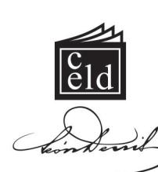

Produção Gráfica: Departamento Editorial do

#### **CENTRO ESPÍRITA LÉON DENIS**

Rua João Vicente, 1.445, Bento Ribeiro Rio de Janeiro, RJ. CEP 21610-210 Telefax (21) 2452-7700 Site: http://www.leondenis.com.br E-mail: grafica@leondenis.com.br