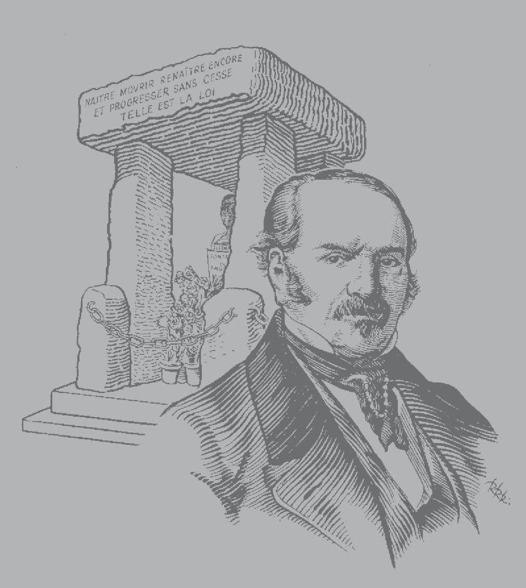
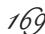
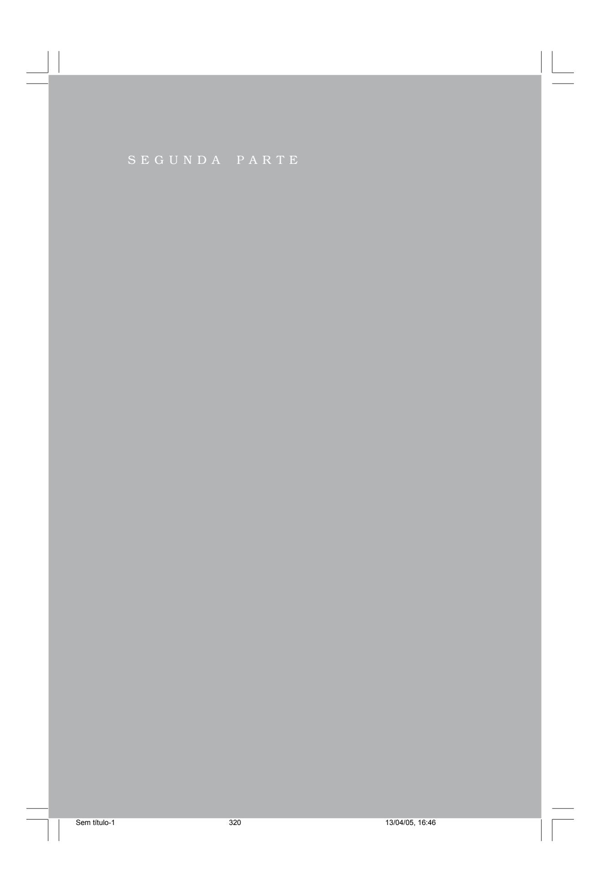
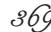

## *Obras Póstumas*

Sem título-1 1 13/04/05, 16:46

# *Obras Pós*

*É preciso propagar a Moral e a Verdade. MUMS*

Sem título-1 2 13/04/05, 16:46

#### ALLAN KARDEC

# *s Póstumas*

FEDERAÇÃO ESPÍRITA BRASILEIRA Departamento Editorial e Gráfico Rua Souza Valente, 17 20941-040 – Rio de Janeiro-RJ – Brasil

Sem título-1 3 13/04/05, 16:46

ALLAN KARDEC 3 DE OUTUBRO DE 1804 • 31 DE MARÇO DE 1869

Sem título-1 4 13/04/05, 16:46

### *Sumário*

| Nota da editora 11                                                                |  |
|-----------------------------------------------------------------------------------|--|
| Biografia de Allan Kardec 13                                                      |  |
| Discurso pronunciado junto ao túmulo de Allan Kardec por Camille Flammarion 25 |  |
| PRIMEIRA PARTE                                                                    |  |
| Profissão de fé espírita raciocinada                                              |  |
| I. Deus 39                                                                        |  |
| II. A Alma 41                                                                     |  |
| III. Criação 44                                                                   |  |
| Manifestações dos Espíritos                                                       |  |
| Caráter e conseqüências religiosas das                                            |  |
| manifestações dos Espíritos 51                                                    |  |
| I. O perispírito como princípio das manifestações 56                              |  |
| II. Manifestações visuais 58                                                      |  |
| III. Transfiguração. Invisibilidade 62                                            |  |
| IV. Emancipação da alma 64                                                        |  |
| V. Aparição de pessoas vivas. Bicorporeidade 70                                   |  |
| VI. Dos médiuns 71                                                                |  |
| VII. Da obsessão e da possessão 84                                                |  |

Sem título-1 5 13/04/05, 16:46

#### *6* OBRAS PÓSTUMAS

| Dos homens duplos e das aparições de pessoas vivas 93                                                                                                                                                                                                                                                                                                                                                                        |
|------------------------------------------------------------------------------------------------------------------------------------------------------------------------------------------------------------------------------------------------------------------------------------------------------------------------------------------------------------------------------------------------------------------------------|
| Controvérsias sobre a idéia da existência de seres intermediários entre o homem e Deus 105                                                                                                                                                                                                                                                                                                                                |
| Causa e natureza da clarividência sonambúlica Explicação do fenômeno da lucidez 115                                                                                                                                                                                                                                                                                                                                       |
| A segunda vista Conhecimento do futuro. Previsões 121                                                                                                                                                                                                                                                                                                                                                                     |
| Introdução ao estudo da fotografia e da telegrafia do pensamento 131                                                                                                                                                                                                                                                                                                                                                      |
| Fotografia e telegrafia do pensamento 139                                                                                                                                                                                                                                                                                                                                                                                    |
| Estudo sobre a natureza do Cristo 147                                                                                                                                                                                                                                                                                                                                                                                        |
| I. Fontes das provas sobre a natureza do Cristo 147 II. Os milagres provam a divindade do Cristo? 150 III. As palavras de Jesus provam a sua divindade? 154 IV. Palavras de Jesus depois de sua morte 167 V. Dupla natureza de Jesus 169 VI. Opinião dos Apóstolos 171 VII. Predição dos profetas, com relação a Jesus 177 VIII. O Verbo se fez carne 179 IX. O Filho de Deus e o Filho do homem 182 |
| Influência perniciosa das idéias materialistas Sobre as artes em geral; a regeneração delas por meio do                                                                                                                                                                                                                                                                                                                   |
| Espiritismo 189 Teoria da beleza 197                                                                                                                                                                                                                                                                                                                                                                                      |
|                                                                                                                                                                                                                                                                                                                                                                                                                              |
| A música celeste 211                                                                                                                                                                                                                                                                                                                                                                                                         |
| Música espírita 217                                                                                                                                                                                                                                                                                                                                                                                                          |
| O caminho da vida 229                                                                                                                                                                                                                                                                                                                                                                                                        |
| As cinco alternativas da Humanidade 237                                                                                                                                                                                                                                                                                                                                                                                      |
| I. Doutrina materialista 238 II. Doutrina panteísta 241                                                                                                                                                                                                                                                                                                                                                                   |

| III. Doutrina deísta 241                                                         |  |
|----------------------------------------------------------------------------------|--|
| IV. Doutrina dogmática 243                                                       |  |
| V. Doutrina espírita 244                                                         |  |
| A morte espiritual 247                                                           |  |
| A vida futura 255                                                                |  |
| Questões e problemas As expiações coletivas 265                               |  |
| O egoísmo e o orgulho Suas causas, seus efeitos e os meios de destruí-los 277 |  |
| Liberdade, igualdade, fraternidade 287                                           |  |
| As aristocracias 293                                                             |  |
| Os desertores 301                                                                |  |
| Ligeira resposta aos detratores do Espiritismo 313                               |  |
| SEGUNDA PARTE                                                                    |  |
| Extratos, in extenso, do livro das Previsões concernentes ao Espiritismo 321  |  |
| A minha primeira iniciação no Espiritismo 323                                    |  |
| Meu Espírito protetor, 11 de dezembro de 1855 331                                |  |
| Meu Guia espiritual, 25 de março de 1856 333                                     |  |
| Primeira revelação da minha missão, 30 de abril de 1856 337                      |  |
| Minha missão, 7 de maio de 1856 338                                              |  |
| Acontecimentos, 7 de maio de 1856 339                                            |  |
| Acontecimentos, 12 de maio de 1856 340                                           |  |
| O Livro dos Espíritos, 10 de junho de 1856 341                                   |  |
| Minha missão, 12 de junho de 1856 342                                            |  |
| O Livro dos Espíritos, 17 de junho de 1856 346                                   |  |
| O Livro dos Espíritos, 11 de setembro de 1856 348                                |  |

#### *8* OBRAS PÓSTUMAS

| A tiara espiritual, 6 de maio de 1857 349                                                     |  |
|-----------------------------------------------------------------------------------------------|--|
| Primeira notícia de uma nova encarnação, 17 de janeiro de 1857 354                         |  |
| A Revista Espírita, 15 de novembro de 1857 356                                                |  |
| Fundaçãoda Sociedade Espírita de Paris, 1º de abril de 1858 357                            |  |
| Duração dos meus trabalhos, 24 de janeiro de 1860 359                                         |  |
| Acontecimentos. Papado, 28 de janeiro de 1860 360                                             |  |
| Minha missão, 12 de abril de 1860 361                                                         |  |
| Futuro do Espiritismo, 15 de abril de 1860 362                                                |  |
| Minha volta, 10 de junho de 1860 363                                                          |  |
| Auto-de-fé em Barcelona. Apreensão dos livros, 21 de setembro de 1861 364                  |  |
| Auto-de-fé em Barcelona, 9 de outubro de 1861 366                                             |  |
| Meu sucessor, 22 de dezembro de 1861 369                                                      |  |
| Imitação do Evangelho, Ségur, 9 de agosto de 1863 371                                         |  |
| A Igreja, Paris, 30 de setembro de 1863 375                                                   |  |
| Vida de Jesus por Renan, Paris, 14 de outubro de 1863 377                                     |  |
| Precursores da tempestade, Paris, 30 de janeiro de 1866 378                                   |  |
| A nova geração, Lião, 30 de janeiro de 1866 380                                               |  |
| Instrução relativa à saúde do Sr. Allan Kardec, Paris, 23 de abril de 1866 384             |  |
| Regeneração da Humanidade, Paris, 25 de abril de 1866 388                                     |  |
| Marcha gradativa do Espiritismo. Dissidências e obstáculos, Paris, 27 de abril de 1866 396 |  |
| Publicações espíritas, 16 de agosto de 1867 398                                               |  |
| Acontecimentos, 16 de agosto de 1867 399                                                      |  |

Sem título-1 8 13/04/05, 16:46

|                | Minha nova obra sobre a Gênese, Ségur, 9 de setembro de 1867 401                                                                                                                                                    |  |
|----------------|------------------------------------------------------------------------------------------------------------------------------------------------------------------------------------------------------------------------|--|
|                | A Gênese, 22 de fevereiro de 1868 402                                                                                                                                                                                  |  |
|                | Acontecimentos, Paris, 23 de fevereiro de 1868 403                                                                                                                                                                     |  |
|                | Meus trabalhos pessoais. Conselhos diversos, Paris, 4 de julho de 1868 404                                                                                                                                          |  |
|                | Fora da caridade não há salvação 407                                                                                                                                                                                   |  |
|                | Projeto — 1868 409                                                                                                                                                                                                     |  |
|                | Estabelecimento central 411 Ensino espírita 412 Publicidade 413 Viagens 413                                                                                                                                   |  |
|                | Constituição do Espiritismo Exposição de motivos 415                                                                                                                                                                |  |
|                | I. Considerações preliminares 415 II. Dos cismas 418 III. O chefe do Espiritismo 422 IV. Comissão central 427 V. Instituições acessórias e complementares da                                               |  |
|                | comissão central 434 VI. Amplitude de ação da comissão central 436 VII. Os estatutos constitutivos 438 VIII. Do programa das crenças 442 IX. Vias e meios 448 X. Allan Kardec e a nova constituição 451 |  |
| Credo espírita | Preâmbulo 461                                                                                                                                                                                                          |  |
|                | Princípios fundamentais da Doutrina Espírita, reconhecidos como verdades inconcussas 468                                                                                                                            |  |
|                | Apêndice 471                                                                                                                                                                                                           |  |

Sem título-1 10 13/04/05, 16:46

### *Nota da editora*

A tradução desta obra, devemo-la ao saudoso presidente da Federação Espírita Brasileira – Dr. Guillon Ribeiro, engenheiro civil, poliglota e vernaculista.

Ruy Barbosa, em seu discurso pronunciado na sessão de 14 de outubro de 1903 (Anais do Senado Federal, vol. II, pág. 717), em se referindo ao seu trabalho de revisão do Projeto do Código Civil, trabalho monumental que resultou na *Réplica,* e que lhe imortalizou o nome como filólogo e purista da língua, disse:

> *"Devo, entretanto, Sr. Presidente, desempenhar-me de um dever de consciência* – *registrar e agradecer da tribuna do Senado a colaboração preciosa do Sr. Doutor Guillon Ribeiro, que me acompanhou nesse trabalho com a maior inteligência, não limitando os seus serviços à parte material do comum dos revisores, mas, muitas vezes, suprindo até a desatenções e negligências minhas."*

Sem título-1 11 13/04/05, 16:46

Como vemos, Guillon Ribeiro recebeu, aos vinte e oito anos de idade, o maior prêmio, o maior elogio a que poderia aspirar um escritor, e a Federação Espírita Brasileira, vinte anos depois, consagrou-lhe o nome, aprovando unanimemente as suas impecáveis traduções de Kardec.

Jornalista emérito, Guillon Ribeiro foi redator do *Jornal do Commercio* e colaborador dos maiores jornais da época. Exerceu, durante anos, o cargo de Diretor-Geral da Secretaria do Senado e foi diretor da Federação Espírita Brasileira, no decurso de 26 anos consecutivos, tendo traduzido, ainda, *O Livro dos Espíritos, O Evangelho segundo o Espiritismo, O Livro dos Médiuns, A Gênese* e *Obras Póstumas,* todos de Kardec.

### *Biografia de Allan Kardec*

É ainda sob o guante da dor profunda que nos causou a prematura partida do fundador da Doutrina Espírita, que nos abalançamos a uma tarefa, simples e fácil para suas mãos sábias e experientes, mas cujo peso e gravidade nos esmagariam, se não contássemos com o auxílio eficaz dos bons Espíritos e com a indulgência dos nossos leitores.

Quem, dentre nós, poderia, sem ser tachado de presunçoso, lisonjear-se de possuir o espírito de método e organização de que se mostram iluminados todos os trabalhos do mestre? Só a sua pujante inteligência podia concentrar tantos materiais diversos, triturá-los e transformá-los, para os espalhar em seguida, como orvalho benfazejo, sobre as almas desejosas de conhecer e de amar.

Incisivo, conciso, profundo, sabia agradar e fazer compreendido numa linguagem simples e elevada ao mesmo tempo, tão distanciada do estilo familiar, quanto das obscuridades da metafísica.

Multiplicando-se incessantemente, pudera até agora bastar a tudo. Entretanto, o cotidiano alargamento de suas relações e o contínuo desenvolvimento do Espiritismo lhe faziam sentir a necessidade de reunir em torno de si alguns auxiliares inteligentes e preparava simultaneamente a nova organização da Doutrina e de seus labores, quando nos deixou, para ir, num mundo melhor, receber a sanção da missão que desempenhara e coletar elementos para uma nova obra de devotamento e sacrifício.

Era sozinho!... Chamar-nos-emos **legião** e, por muito fracos e inexperientes que sejamos, nutrimos a convicção íntima de que nos conservaremos à altura da situação, se, partindo dos princípios estabelecidos e de incontestável evidência, nos consagrarmos a executar, tanto quanto nos seja possível e de acordo com as necessidades do momento, os projetos que ele pretendia realizar no futuro.

Enquanto nos mantivermos nas suas pegadas e todos os de boa vontade se unirem, num esforço comum pelo progresso e pela regeneração intelectual e moral da Humanidade, conosco estará o Espírito do grande filósofo e nos secundará com a sua influência poderosa. Dado lhe seja suprir à nossa insuficiência e nos possamos mostrar dignos do seu concurso, dedicando-nos à obra com a mesma abnegação e a mesma sinceridade que ele, embora sem tanta ciência e inteligência.

Em sua bandeira, inscrevera o mestre estas palavras: **Trabalho, solidariedade, tolerância**. Sejamos, como ele, infatigáveis; sejamos, acordemente com os seus anseios, tolerantes e solidários e não temamos seguir-lhe o exemplo, reconsiderando, quantas vezes forem precisas, os princípios ainda controvertidos. Tentemos avançar, antes com segurança e certeza, do que com rapidez, e não ficarão infrutíferos os nossos esforços, se, como estamos persuadidos, e seremos os primeiros a dar disso exemplo, cada um cuidar de cumprir o seu dever, pondo de lado todas as questões pessoais, a fim de contribuir para o bem geral.

Sob auspícios mais favoráveis não poderíamos entrar na nova fase que se abre para o Espiritismo, do que dando a conhecer aos nossos leitores, num rápido escorço, o que foi, durante toda a sua vida, o homem íntegro e honrado, o sábio inteligente e fecundo, cuja memória se transmitirá aos séculos vindouros com a auréola dos benfeitores da Humanidade.

Nascido em Lião, a 3 de outubro de 1804, de uma família antiga que se distinguiu na magistratura e na advocacia, Allan Kardec (**Hippolyte Léon Denizard Rivail**) não seguiu essas carreiras. Desde a primeira juventude, sentiu-se inclinado ao estudo das ciências e da filosofia.

Educado na Escola de Pestalozzi, em Yverdun (Suíça), tornou-se um dos mais eminentes discípulos desse célebre professor e um dos zelosos propagandistas do seu sistema de educação, que tão grande influência exerceu sobre a reforma do ensino na França e na Alemanha.

Dotado de notável inteligência e atraído para o ensino, pelo seu caráter e pelas suas aptidões especiais, já aos catorze anos ensinava o que sabia àqueles dos seus condiscípulos que haviam aprendido menos do que ele. Foi nessa escola que lhe desabrocharam as idéias que mais tarde o colocariam na classe dos homens progressistas e dos livre-pensadores.

Nascido sob a religião católica, mas educado num país protestante, os atos de intolerância que por isso teve de suportar, no tocante a essa circunstância, cedo o levaram a conceber a idéia de uma reforma religiosa, na qual trabalhou em silêncio durante longos anos com o intuito de alcançar a unificação das crenças. Faltava-lhe, porém, o elemento indispensável à solução desse grande problema.

O Espiritismo veio, a seu tempo, imprimir-lhe especial direção aos trabalhos.

Concluídos seus estudos, voltou para a França. Conhecendo a fundo a língua alemã, traduzia para a Alemanha diferentes obras de educação e de moral e, o que é muito característico, as obras de Fénelon, que o tinham seduzido de modo particular.

Era membro de várias sociedades sábias, entre outras, da Academia Real de Arras, que, em o concurso de 1831, lhe premiou uma notável memória sobre a seguinte questão: **Qual o sistema de estudos mais de harmonia com as necessidades da época?**

De 1835 a 1840, fundou, em sua casa, à rua de Sèvres, cursos gratuitos de Química, Física, Anatomia comparada, Astronomia, etc., empresa digna de encômios em todos os tempos, mas, sobretudo, numa época em que só um número muito reduzido de inteligências ousava enveredar por esse caminho.

Preocupado sempre com o tornar atraentes e interessantes os sistemas de educação, inventou, ao mesmo tempo, um método engenhoso de ensinar a contar e um quadro mnemônico da História de França, tendo por objetivo fixar na memória as datas dos acontecimentos de maior relevo e as descobertas que iluminaram cada reinado.

Sem título-1 16 13/04/05, 16:46

Entre as suas numerosas obras de educação, citaremos as seguintes: *Plano proposto para melhoramento da Instrução pública* (1828); *Curso prático e teórico de Aritmética*, segundo o método de Pestalozzi, para uso dos professores e das mães de família (1824); *Gramática francesa clássica* (1831); *Manual dos exames para os títulos de capacidade*; *Soluções racionais das questões e problemas de Aritmética e de Geometria* (1846); Catecismo gramatical da língua francesa (1848); *Programa dos cursos usuais de Química, Física, Astronomia, Fisiologia*, que ele professava no Liceu Polimático; *Ditados normais dos exames da Municipalidade e da Sorbona*, seguidos de *Ditados especiais sobre as dificuldades ortográficas* (1849), obra muito apreciada na época do seu aparecimento e da qual ainda recentemente eram tiradas novas edições.

Antes que o Espiritismo lhe popularizasse o pseudônimo de Allan Kardec, já ele se ilustrara, como se vê, por meio de trabalhos de natureza muito diferente, porém tendo todos, como objetivo, esclarecer as massas e prendê-las melhor às respectivas famílias e países.

"Pelo ano de 18551, posta em foco a questão das manifestações dos Espíritos, Allan Kardec se entregou a observações perseverantes sobre esse fenômeno, cogitando principalmente de lhe deduzir as conseqüências filosóficas. Entreviu, desde logo, o princípio de novas leis naturais: as que regem as relações entre o mundo visível e o mundo invisível. Reconheceu, na ação deste último, uma das forças da Natureza, cujo conhecimento, haveria de lançar luz

1 Ver pp. 265/6. *Nota da Editora (FEB*) à 14ª edição em 1975.

sobre uma imensidade de problemas tidos por insolúveis, e lhe compreendeu o alcance, do ponto de vista religioso.

"Suas obras principais sobre esta matéria são: *O Livro dos Espíritos*, referente à parte filosófica, e cuja primeira edição apareceu a 18 de abril de 1857; *O Livro dos Médiuns*, relativo à parte experimental e científica (janeiro de 1861); *O Evangelho segundo o Espiritismo*, concernente à parte moral (abril de 1864); *O Céu e o Inferno*, ou *A justiça de Deus segundo o Espiritismo* (agosto de 1865); *A Gênese*, *os Milagres e as Predições* (janeiro de 1868); a *Revista Espírita*, jornal de estudos psicológicos, periódico mensal começado a 1º de janeiro de 1858. Fundou em Paris, a 1º de abril de 1858, a primeira Sociedade espírita regularmente constituída, sob a denominação de **Sociedade Parisiense de Estudos Espíritas**, cujo fim exclusivo era o estudo de quanto possa contribuir para o progresso da nova ciência. Allan Kardec se defendeu, com inteiro fundamento, de coisa alguma haver escrito debaixo da influência de idéias preconcebidas ou sistemáticas. Homem de caráter frio e calmo, observou os fatos e de suas observações deduziu as leis que os regem. Foi o primeiro a apresentar a teoria relativa a tais fatos e a formar com eles um corpo de doutrina, metódico e regular.

"Demonstrando que os fatos erroneamente qualificados de sobrenaturais se acham submetidos a leis, ele os incluiu na ordem dos fenômenos da Natureza, destruindo assim o último refúgio do maravilhoso e um dos elementos da superstição.

"Durante os primeiros anos em que se tratou de fenômenos espíritas, estes constituíram antes objeto de curiosida-

Sem título-1 18 13/04/05, 16:46

de, do que de meditações sérias. *O Livro dos Espíritos* fez que o assunto fosse considerado sob aspecto muito diverso. Abandonaram-se as mesas girantes, que tinham sido apenas um prelúdio, e começou-se a atentar na doutrina, que abrange todas as questões de interesse para a Humanidade.

"Data do aparecimento de *O Livro dos Espíritos* a fundação do Espiritismo que, até então, só contara com elementos esparsos, sem coordenação, e cujo alcance nem toda gente pudera apreender. A partir daquele momento, a doutrina prendeu a atenção de homens sérios e tomou rápido desenvolvimento. Em poucos anos, aquelas idéias conquistaram numerosos aderentes em todas as camadas sociais e em todos os países. Esse êxito sem precedentes decorreu sem dúvida da simpatia que tais idéias despertaram, mas também é devido, em grande parte, à clareza com que foram expostas e que é um dos característicos dos escritos de Allan Kardec.

"Evitando as fórmulas abstratas da Metafísica, ele soube fazer que todos o lessem sem fadiga, condição essencial à vulgarização de uma idéia. Sobre todos os pontos controversos, sua argumentação, de cerrada lógica, poucas ensanchas oferece à refutação e predispõe à convicção. As provas materiais que o Espiritismo apresenta da existência da alma e da vida futura tendem a destruir as idéias materialistas e panteístas. Um dos princípios mais fecundos dessa doutrina e que deriva do precedente é o da **pluralidade das existências**, já entrevisto por uma multidão de filósofos antigos e modernos e, nestes últimos tempos, por João Reynaud, Carlos Fourier, Eugênio Sue e outros. Conservara-se, todavia, em estado de hipótese e de sistema, enquanto o Espiritismo lhe demonstra a realidade e prova que nesse princípio reside um dos atributos essenciais da Humanidade. Dele promana a explicação de todas as aparentes anomalias da vida humana, de todas as desigualdades intelectuais, morais e sociais, facultando ao homem saber donde vem, para onde vai, para que fim se acha na Terra e por que aí sofre.

"As idéias inatas se explicam pelos conhecimentos adquiridos nas vidas anteriores; a marcha dos povos e da Humanidade, pela ação dos homens dos tempos idos e que revivem, depois de terem progredido; as simpatias e antipatias, pela natureza das relações anteriores. Essas relações, que religam a grande família humana de todas as épocas, dão por base, aos grandes princípios de fraternidade, de igualdade, de liberdade e de solidariedade universal, as próprias leis da Natureza e não mais uma simples teoria.

"Em vez do postulado: **Fora da Igreja não há salvação**, que alimenta a separação e a animosidade entre as diferentes seitas religiosas e que há feito correr tanto sangue, o Espiritismo tem como divisa: **Fora da Caridade não há salvação**, isto é, a igualdade entre os homens perante Deus, a tolerância, a liberdade de consciência e a benevolência mútua.

"Em vez da **fé cega**, que anula a liberdade de pensar, ele diz: **Não há fé inabalável, senão a que pode encarar face a face a razão, em todas as épocas da Humanidade. À fé, uma base se faz necessária e essa base é a inteligência perfeita daquilo em que se tem de crer. Para crer,** **não basta ver, é preciso, sobretudo, compreender. A fé cega já não é para este século. É precisamente ao dogma da fé cega que se deve o ser hoje tão grande o número de incrédulos, porque ela quer impor-se e exige a abolição de uma das mais preciosas faculdades do homem: o raciocínio e o livre-arbítrio.***"* (*O Evangelho segundo o Espiritismo*.)

Trabalhador infatigável, sempre o primeiro a tomar da obra e o último a deixá-la, Allan Kardec sucumbiu, a 31 de março de 1869, quando se preparava para uma mudança de local, imposta pela extensão considerável de suas múltiplas ocupações. Diversas obras que ele estava quase a terminar, ou que aguardavam oportunidade para vir a lume, demonstrarão um dia, ainda mais, a extensão e o poder das suas concepções.

Morreu conforme viveu: trabalhando. Sofria, desde longos anos, de uma enfermidade do coração, que só podia ser combatida por meio do repouso intelectual e pequena atividade material. Consagrado, porém, todo inteiro à sua obra, recusava-se a tudo o que pudesse absorver um só que fosse de seus instantes, à custa das suas ocupações prediletas. Deu-se com ele o que se dá com todas as almas de forte têmpera: a lâmina gastou a bainha.

O corpo se lhe entorpecia e se recusava aos serviços que o Espírito lhe reclamava, enquanto este último, cada vez mais vivo, mais enérgico, mais fecundo, ia sempre alargando o círculo de sua atividade.

Nessa luta desigual não podia a matéria resistir eternamente. Acabou sendo vencida: rompeu-se o aneurisma e Allan Kardec caiu fulminado. Um homem houve de menos na Terra; mas, um grande nome tomava lugar entre os que ilustraram este século; um grande Espírito fora retemperar-se no Infinito, onde todos os que ele consolara e esclarecera lhe aguardavam impacientes a volta!

"A morte, dizia, faz pouco tempo, redobra os seus golpes nas fileiras ilustres!... A quem virá ela agora libertar?"

Ele foi, como tantos outros, recobrar-se no Espaço, procurar elementos novos para restaurar o seu organismo gasto por uma vida de incessantes labores. Partiu com os que serão os fanais da nova geração, para voltar em breve com eles a continuar e acabar a obra deixada em delicadas mãos.

O homem já aqui não está; a alma, porém, permanecerá entre nós. Será um protetor seguro, uma luz a mais, um trabalhador incansável que as falanges do Espaço conquistaram. Como na Terra, sem ferir a quem quer que seja, ele fará que cada um lhe ouça os conselhos oportunos; abrandará o zelo prematuro dos ardorosos, amparará os sinceros e os desinteressados e estimulará os mornos. Vê agora e sabe tudo o que ainda há pouco previa! Já não está sujeito às incertezas, nem aos desfalecimentos e nos fará partilhar da sua convicção, fazendo-nos tocar com o dedo a meta, apontando-nos o caminho, naquela linguagem clara, precisa, que o tornou aureolado nos anais literários.

Já não existe o homem, repetimo-lo. Entretanto, Allan Kardec é imortal e a sua memória, seus trabalhos, seu Espírito estarão sempre com os que empunharem forte e vigorosamente o estandarte que ele soube sempre fazer respeitado.

Uma individualidade pujante constituiu a obra. Era o guia e o fanal de todos. Na Terra, a obra substituirá o obreiro. Os crentes não se congregarão em torno de Allan Kardec; congregar-se-ão em torno do Espiritismo, tal como ele o estruturou e, com os seus conselhos, sua influência, avançaremos, a passos firmes, para as fases ditosas prometidas à Humanidade regenerada.

(*Revista Espírita*, maio de 1869.)

Sem título-1 23 13/04/05, 16:46

Sem título-1 24 13/04/05, 16:46

## *Discurso pronunciado junto ao túmulo de Allan Kardec*

Por

*Camille Flammarion*

#### Senhores:

Aceitando com deferência o convite simpático dos amigos do pensador laborioso cujo corpo terreno jaz agora aos nossos pés, vem-me à mente um dia sombrio do mês de dezembro de 1865, em que pronunciei palavras de supremo adeus junto à tumba do fundador da Livraria Acadêmica, do honrado Didier, que, como editor, foi colaborador convicto de Allan Kardec, na publicação das obras fundamentais de uma doutrina que lhe era cara. Também ele morreu subitamente, como se o céu houvesse querido poupar a esses dois Espíritos íntegros o embaraço fisiológico de sair desta vida por via diferente da comumente seguida. A mesma reflexão se aplica à morte do nosso ex-colega Jobard, de Bruxelas.

Hoje, maior ainda é a minha tarefa, porquanto eu desejara figurar à mente dos que me ouvem e à das milhões de criaturas que na Europa inteira e no Novo Mundo se têm ocupado com o problema ainda misterioso dos fenômenos chamados espíritas; — eu quisera, digo, poder figurar-lhes o interesse científico e o porvir filosófico do estudo desses fenômenos, ao qual se hão consagrado, como ninguém ignora, homens eminentes dentre os nossos contemporâneos. Estimaria fazer-lhes entrever os horizontes desconhecidos que a mente humana verá rasgar-se diante de si, à medida que ela ampliar o conhecimento positivo das forças naturais que em torno de nós atuam; mostrar-lhes que essas comprovações constituem o mais eficaz antídoto para a lepra do ateísmo, de que parece atacada, principalmente, a nossa época de transição; dar, enfim, aqui, testemunho público do eminente serviço que o autor de *O Livro dos Espíritos* prestou à filosofia, **chamando a atenção e provocando discussões** sobre fatos que até então pertenciam ao domínio mórbido e funesto das superstições religiosas.

Seria, com efeito, um ato importante firmar aqui, junto deste túmulo eloqüente, que o metódico exame dos fenômenos erroneamente qualificados de supranormais, longe de renovar o espírito de superstição e de enfraquecer a energia da razão, ao contrário, afasta os erros e as ilusões da ignorância e **serve melhor ao progresso**, do que as negações ilegítimas dos que não querem dar-se ao trabalho de ver.

Mas, este não é lugar apropriado a estabelecer uma arena às discussões desrespeitosas. Deixemos apenas que das nossas mentes desçam, sobre a face impassível do homem ora estendido diante de nós, testemunhos de afeição e sentimentos de pesar, que lhe permaneçam ao derredor em seu túmulo, qual embalsamamento do coração! E, pois que sabemos que sua alma eterna sobrevive a estes despojos mortais, do mesmo modo que a eles preexistiu; pois que sabemos que laços indestrutíveis unem o nosso mundo visível ao mundo invisível; pois que esta alma existe hoje tão bem como há três dias e que não é impossível se ache atualmente na minha presença; digamos-lhe que não quisemos se desvanecesse a sua imagem terrena encerrada no sepulcro, sem unanimemente rendermos homenagem a seus trabalhos e à sua memória, sem pagar um tributo de reconhecimento à sua encarnação terrena, tão útil e tão dignamente preenchida.

Traçarei, primeiro, num esboço rápido, as linhas principais da sua carreira literária.

Morto na idade de 65 anos, Allan Kardec consagrara a primeira parte de sua vida a escrever obras clássicas, elementares, destinadas, sobretudo, ao uso dos educadores da mocidade. Quando, pelo ano de 18551, as manifestações, novas na aparência, das mesas girantes, das pancadas sem causa ostensiva, dos movimentos insólitos de objetos e móveis começaram a prender a atenção pública, determinando mesmo, nos de imaginação aventureira, uma espécie de febre, devida à novidade de tais experiências, Allan Kardec, estudando ao mesmo tempo o magnetismo e seus singulares efeitos, acompanhou com a maior paciência e clarividência judiciosa as experimentações e as tentativas numerosas que então se faziam em Paris.

Recolheu e pôs em ordem os resultados conseguidos dessa longa observação e com eles compôs o corpo de dou-

Sem título-1 27 13/04/05, 16:46

1 Ver pp. 265/6. *Nota da Editora (FEB*) à 14ª edição, em 1975.

trina que publicou em 1857, na primeira edição de *O Livro dos Espíritos*. Todos sabeis que êxito alcançou essa obra, na França e no estrangeiro. Havendo atingido a 16ª edição, tem espalhado em todas as classes esse corpo de doutrina elementar que, na sua essência, não é absolutamente novo, porquanto a escola de Pitágoras, na Grécia, e a dos druidas, em a nossa pobre1 Gália, ensinavam os seus princípios fundamentais, mas que agora reveste uma forma de verdadeira atualidade, pelo corresponder aos fenômenos.

Depois dessa primeira obra apareceram, sucessivamente*, O Livro dos Médiuns*, ou *Espiritismo experimental*; *— O que é o Espiritismo?* ou resumo sob a forma de perguntas e respostas; *— O Evangelho segundo o Espiritismo*; — *O Céu e o Inferno*; *— A Gênese*. A morte o surpreendeu no momento em que, com a sua infatigável atividade, trabalhava noutra sobre as relações entre o Magnetismo e o Espiritismo.

Pela *Revista Espírita* e pela Sociedade de Paris, cujo presidente ele era, se constituíra, de certo modo, o centro a que tudo ia ter, o traço de união de todos os experimentadores. Faz alguns meses, sentindo próximo o seu fim, preparou as condições de vitalidade de tais estudos para depois de sua morte e instituiu a Comissão Central que lhe sucede.

Suscitou rivalidades; fez escola de feição um pouco pessoal, havendo ainda alguns dissídios entre os "espiritualistas" e os "espíritas". Doravante, Senhores (tal, pelo menos, o voto que formulam os amigos da verdade),

Sem título-1 28 13/04/05, 16:46

1 Na *Revue Spirite*, maio-1869, p.139, está **própria** (propre). *Nota da Editora (FEB)* à 14ª edicão, em 1975.

devemos unir-nos todos por uma solidariedade fraterna, pelos mesmos esforços em prol da elucidação do problema, pelo desejo geral e impessoal do verdadeiro e do bem.

Disseram, Senhores, do digno amigo a quem rendemos hoje as derradeiras homenagens, que ele não era o que se chama **um sábio**, que não fora, primeiro, físico, naturalista, ou astrônomo e que preferira constituir um corpo de doutrina moral, antes de haver submetido à discussão científica a realidade e a natureza dos fenômenos.

Talvez, Senhores, se deva preferir que as coisas tenham começado assim. Nem sempre se deve recusar valor ao sentimento. Quantos corações já foram consolados por esta crença religiosa! Quantas lágrimas hão secado! Quantas consciências se abriram às irradiações da beleza espiritual! Nem toda a gente é ditosa neste mundo. Muitas afeições aí são despedaçadas! Muitas almas têm adormecido no cepticismo! Então, nada é o haver trazido ao espiritualismo tantos seres que flutuavam na dúvida e que já não amavam a vida, nem a vida física, nem a intelectual?

Fora Allan Kardec um homem de ciência e de certo não houvera podido prestar este primeiro serviço e dilatá-lo até muito longe, como um convite a todos os corações. Ele, porém, era o que eu denominarei simplesmente "o bom-senso encarnado". Razão reta e judiciosa, aplicava sem cessar à sua obra permanente as indicações íntimas do senso comum. Não era essa uma qualidade somenos, na ordem de coisas com que nos ocupamos. Era, ao contrário, pode-se afirmá-lo, a primeira de todas e a mais preciosa, sem a qual a obra não teria podido tornar-se popular, nem lançar pelo mundo suas raízes imensas. A maioria dos que se têm dado a estes estudos lembram-se de que na mocidade, ou

Sem título-1 29 13/04/05, 16:46

em certas circunstâncias, foram testemunhas de manifestações inexplicadas. Poucas são as famílias que não contem na sua história provas desta natureza. O ponto de partida era aplicar-lhes a razão firme do simples bom-senso e examiná-las segundo os princípios do método positivo.

Conforme o seu próprio organizador previu, esse estudo, que foi lento e difícil, tem que entrar agora num período científico. Os fenômenos físicos, sobre os quais a princípio não se insistia, hão de tornar-se objeto da crítica experimental, a que devemos a glória dos progressos modernos e as maravilhas da eletricidade e do vapor. Esse método tem de tomar os fenômenos de ordem misteriosa a que assistimos para os dissecar, medir e definir.

Porque, meus Senhores, o Espiritismo não é uma religião, mas uma ciência, da qual apenas conhecemos o **abecê**. Passou o tempo dos dogmas. A Natureza abrange o Universo, e o próprio Deus, feito outrora à imagem do homem, a moderna Metafísica não o pode considerar senão como **um espírito na Natureza**. O sobrenatural não existe. As manifestações obtidas com o auxílio dos médiuns, como as do magnetismo e do sonambulismo, **são de ordem natural** e devem ser severamente submetidas à verificação da experiência. Não há milagres. Assistimos ao alvorecer de uma ciência desconhecida. Quem poderá prever a que conseqüências conduzirá, no mundo do pensamento, o estudo positivo desta nova psicologia?

Doravante, o mundo é regido pela ciência e, Senhores, não virá fora de propósito, neste discurso fúnebre, assinalar-lhe a obra atual e as induções novas que ela nos patenteia, precisamente do ponto de vista das nossas pesquisas.

Em nenhuma época da História a Ciência desdobrou, ante o olhar espantado do homem, tão grandiosos horizontes. Sabemos agora que a **Terra é um astro** e que a **nossa vida atual se completa no céu**. Pela análise da luz, conhecemos os elementos que ardem no Sol e nas estrelas, a milhões e trilhões de léguas do nosso observatório terrestre. Por meio do cálculo, possuímos a história do céu e da Terra, assim no passado longínquo, como no futuro, passado e futuro que não existem para as leis imutáveis. Pela observação, temos pesado as terras celestes que gravitam na amplidão. O globo em que nos encontramos tornou-se um átomo estelar que voa no espaço dentro das profundezas infinitas e a nossa própria existência neste globo se tornou uma fração infinitesimal da nossa eterna vida. Mas, o que, com razão, nos pode tocar ainda mais vivamente é esse surpreendente resultado dos trabalhos físicos realizados nestes últimos anos: que **vivemos em meio de um mundo invisível**, a atuar incessantemente em torno de nós.

Sim, Senhores, é esta, para nós, uma revelação imensa. Contemplai, por exemplo, a luz que a esta hora o Sol brilhante espalha na atmosfera; contemplai esse azul tão suave da abóbada celeste; notai os eflúvios deste ar tépido, que nos vem acariciar as faces; admirai estes monumentos e esta terra. Pois bem: conquanto tenhamos escancarados os olhos, não vemos o que aqui se passa! Sobre cem raios emanados do Sol, apenas um terço deles é acessível à nossa vista, quer diretamente, quer refletidos por todos os corpos; os dois terços restantes existem e atuam à volta de nós, mas de maneira invisível, embora real. São quentes, sem nos serem luminosos e são, no entanto, muito mais

Sem título-1 31 13/04/05, 16:46

ativos do que os que nos impressionam, porquanto são eles que atraem as flores para o lado do Sol, que produzem todas as ações químicas1 e também que elevam, sob forma igualmente invisível, o vapor d'água na atmosfera para formar as nuvens, exercendo assim, sem cessar, em torno de nós, de maneira oculta e silenciosa, uma ação colossal, mecanicamente equiparável ao trabalho de muitos bilhões de cavalos!

Se nos são invisíveis os raios caloríficos e os raios químicos que constantemente atuam na Natureza, é porque os primeiros não nos ferem com bastante rapidez a retina e porque os segundos a ferem com rapidez excessiva. Os nossos olhos somente vêem as coisas entre dois limites, aquém e além dos quais nada enxergam. Pode comparar-se o nosso organismo terreno a uma harpa de duas cordas, que são o nervo óptico e o nervo auditivo. Certa espécie de movimentos põe em vibração a primeira e outra espécie de movimentos faz vibrar a segunda: nisto se resume **toda a sensação humana**, mais restrita neste ponto do que a de alguns seres vivos, de alguns insetos, por exemplo, que possuem mais delicadas essas mesmas cordas da visão e da audição.

Ora, em a Natureza, existem realmente, não dois, porém dez, cem, mil espécies de movimentos. A ciência física nos ensina, portanto, que vivemos, assim, dentro de um

Sem título-1 32 13/04/05, 16:46

1 A nossa retina é insensível a esses raios; mas, há substâncias que os **vêem**, como, por exemplo, o iodo e os sais de prata. Fotografado o espectro solar químico, que o nosso olhar não percebe, nenhuma imagem visível jamais apresenta a chapa fotográfica ao sair da câmara escura, se bem **exista** nela uma, pois que certa operação química a faz aparecer.

mundo que nos é invisível, nada tendo de impossível que seres (também invisíveis para nós) vivam igualmente na Terra, com uma ordem de sensações absolutamente diversa da das nossas e sem que lhes possamos apreciar a presença, a menos que se nos manifestem por fatos que caibam na ordem das nossas sensações.

Diante de verdades tais, que apenas se entreabrem, quão absurda e sem valor se revela a negação *a priori*! Quando se compara o pouco que sabemos e a exigüidade da nossa esfera de percepção com a quantidade do que existe, não se pode deixar de concluir que nada sabemos, que tudo estamos por saber. Com que direito, então, proferiremos a palavra **impossível**, em presença de fatos que testemunhávamos, sem, todavia, lhes podermos descobrir a causa única?

A Ciência nos faculta perspectivas tão autorizadas quanto as precedentes, sobre os fenômenos da vida e da morte e sobre a força que nos anima. Basta observemos a circulação das existências.

Tudo são meras metamorfoses. Arrastados em seu curso eterno, os átomos constitutivos da matéria passam incessantemente de um corpo a outro, do animal à planta, da planta à atmosfera, da atmosfera ao homem, e o nosso próprio corpo, enquanto nos dura a vida, muda continuamente de substância constitutiva, do mesmo modo que a chama, que só brilha por meio dos elementos que de contínuo se renovam. E, quando a alma desfere o vôo, esse mesmo corpo já tantas vezes transformado durante a vida, restitui definitivamente à Natureza todas as moléculas, para não mais as retomar. O dogma inadmissível da ressurreição da

Sem título-1 33 13/04/05, 16:46

carne se acha substituído pela elevada doutrina da transmigração das almas.

O Sol de abril irradia nos céus e nos inunda com o seu primeiro rocio calorífico. Já as campinas despertam, já os primeiros rebentos se entreabrem, já a primavera refloresce, o azul-celeste sorri e a ressurreição se opera. Entretanto, esta vida nova é formada pela morte e apenas ruínas cobre! Donde vem a seiva destas árvores que reverdecem nos campos dos mortos? Donde vem esta umidade que lhe nutre as raízes? Donde vêm todos os elementos que farão apareçam, sob as carícias de maio, as silenciosas florinhas e os pássaros canoros? — Da morte!... Senhores... destes cadáveres sepultados na noite sinistra dos túmulos!... Lei suprema da Natureza, o corpo material não passa de transitório agregado de partículas que absolutamente não lhe pertencem e que a alma grupou, segundo o seu próprio tipo, a fim de criar para si órgãos que a ponham em relação com o nosso mundo físico. E, enquanto o nosso corpo assim se renova, peça por peça, mediante a perpétua troca das matérias; enquanto que um dia ele cai, massa inerte, para não mais se reerguer, o nosso espírito, ser pessoal, conservou constantemente a sua indestrutível **identidade**, reinou soberanamente sobre a matéria de que se revestira, estabelecendo, por meio desse fato perene e universal, a sua personalidade independente, sua essência espiritual não sujeita ao império do espaço e do tempo, sua grandeza individual, sua **imortalidade**.

Em que consiste o mistério da vida? Por que laços a alma se prende ao organismo? Por efeito de que desatamento se lhe escapa? Sob que forma e em que condições existe ela

Sem título-1 34 13/04/05, 16:46

após a morte? Que lembrança, que afeições conserva? Como se manifesta? — Eis aí, meus Senhores, problemas que longe se acham de estar resolvidos e que, em seu conjunto, constituirão a ciência psicológica do futuro. Certos homens podem negar a existência mesma da alma, como a de Deus; podem afirmar que não existe a verdade moral, que não há na Natureza leis inteligentes e que nós, espiritualistas, somos vítimas de imensa ilusão. Podem outros, contrariamente, declarar que conhecem, por especial privilégio, a essência da alma humana, a forma do Ser supremo, o estado da vida futura e tratar-nos de ateus, porque a nossa razão se nega a adotar a fé que eles alardeiam.

Uns e outros, Senhores, não impedirão que estejamos aqui em presença dos maiores problemas, que nos interessemos por estas coisas (que de modo nenhum nos são estranhas) e que tenhamos o direito de aplicar o método experimental da ciência contemporânea à pesquisa da verdade.

Pelo estudo positivo dos efeitos é que se remonta à apreciação das causas. Na ordem dos estudos que se grupam sob a denominação de "Espiritismo", **os fatos existem**; mas, ninguém lhes conhece o modo de produção. Eles existem tanto quanto os fenômenos elétricos, luminosos, calóricos; porém, Senhores, nós não conhecemos nem a Biologia, nem a Fisiologia. Que é o corpo humano? que é o cérebro? qual a ação absoluta da alma? Ignoramo-lo. Igualmente ignoramos a essência da eletricidade, a essência da luz. Prudente é, pois, que observemos sem parcialidade todos esses fatos e tentemos determinar-lhes as causas, que talvez sejam de espécies diversas e mais numerosas do que o tenhamos suposto até agora.

Sem título-1 35 13/04/05, 16:46

Que os que têm a vista restringida pelo orgulho ou pelo preconceito não compreendam absolutamente os anseios de nossas mentes ávidas de conhecer e lancem sobre este gênero de estudos seus sarcasmos ou anátemas, pouco importa. Colocamos mais alto as nossas contemplações!... Foste o primeiro, oh! mestre e amigo! foste o primeiro a dar, desde o princípio da minha carreira astronômica, testemunho de viva simpatia às minhas deduções relativas à existência das humanidades celestes, pois, tomando do livro sobre a **Pluralidade dos mundos habitados**, o puseste imediatamente na base do edifício doutrinário com que sonhavas. Muito amiúde conversávamos sobre essa vida celeste tão misteriosa; agora, oh! alma, sabes, por visão direta, em que consiste a vida espiritual a que voltaremos e que esquecemos durante a existência na Terra.

Voltaste a esse mundo donde viemos e colhes o fruto de teus estudos terrestres. Aos nossos pés dorme o teu envoltório, extinguiu-se o teu cérebro, fecharam-se-te os olhos para não mais se abrirem, não mais ouvida será a tua palavra... Sabemos que todos havemos de mergulhar nesse mesmo último sono, de volver a essa mesma inércia, a esse mesmo pó. Mas, não é nesse envoltório que pomos a nossa glória e a nossa esperança. Tomba o corpo, a alma permanece e retorna ao Espaço. Encontrar-nos-emos num mundo melhor e no céu imenso onde usaremos das nossas mais preciosas faculdades, onde continuaremos os estudos para cujo desenvolvimento a Terra é teatro por demais acanhado.

É-nos mais grato saber esta verdade, do que acreditar que jazes todo inteiro nesse cadáver e que tua alma se haja aniquilado com a cessação do funcionamento de um órgão. A imortalidade é a luz da vida, como este refulgente Sol é a luz da Natureza.

Até à vista, meu caro Allan Kardec, até à vista!

Sem título-1 37 13/04/05, 16:46

#### PRIMEIRA PARTE

**PROFISSÃO DE FÉ ESPÍRITA RACIOCINADA**

**MANIFESTAÇÕES DOS ESPÍRITOS**

**DOS HOMENS DUPLOS E DAS APARIÇÕES DE PESSOAS VIVAS**

**CONTROVÉRSIAS SOBRE A IDÉIA DA EXISTÊNCIA DE SERES INTERMEDIÁRIOS ENTRE O HOMEM E DEUS**

**CAUSA E NATUREZA DA CLARIVIDÊNCIA SONAMBÚLICA**

**A SEGUNDA VISTA**

**INTRODUÇÃO AO ESTUDO DA FOTOGRAFIA E DA TELEGRAFIA DO PENSAMENTO**

**FOTOGRAFIA E TELEGRAFIA DO PENSAMENTO**

**ESTUDO SOBRE A NATUREZA DO CRISTO**

**INFLUÊNCIA PERNICIOSA DAS IDÉIAS MATERIALISTAS**

**TEORIA DA BELEZA**

**A MÚSICA CELESTE**

**MÚSICA ESPÍRITA**

**O CAMINHO DA VIDA**

**AS CINCO ALTERNATIVAS DA HUMANIDADE**

**A MORTE ESPIRITUAL**

**A VIDA FUTURA**

**QUESTÕES E PROBLEMAS**

**O EGOÍSMO E O ORGULHO**

**LIBERDADE, IGUALDADE, FRATERNIDADE**

**AS ARISTOCRACIAS**

**OS DESERTORES**

**LIGEIRA RESPOSTA AOS DETRATORES DO ESPIRITISMO**

## *Profissão de fé espírita raciocinada*

#### **§ I — DEUS**

#### **1. Há um Deus, inteligência suprema, causa primária de todas as coisas.**

A prova da existência de Deus temo-la neste axioma: **Não há efeito sem causa**. Vemos constantemente uma imensidade de efeitos, cuja causa não está na Humanidade, pois que a Humanidade é impotente para produzi-los, ou, sequer, para os explicar. A causa está acima da Humanidade. É a essa causa que se chama**Deus, Jeová, Alá, Brama, Fo-Hi, Grande Espírito**, etc.

Tais efeitos absolutamente não se produzem ao acaso, fortuitamente e em desordem. Desde a organização do mais pequenino inseto e da mais insignificante semente, até a lei que rege os mundos que circulam no Espaço, tudo atesta uma idéia diretora, uma combinação, uma previdência, uma solicitude que ultrapassam todas as combinações humanas. A causa é, pois, soberanamente inteligente.

#### **2.****Deus é eterno, imutável, imaterial, único, onipotente, soberanamente justo e bom.**

Deus é **eterno**. Se tivesse tido começo, alguma coisa houvera existido antes dele, ou ele teria saído do nada, ou, então, um ser anterior o teria criado. É assim que, degrau a degrau, remontamos ao infinito na eternidade.

É **imutável**. Se estivesse sujeito à mudança, nenhuma estabilidade teriam as leis que regem o Universo.

É **imaterial**. Sua natureza difere de tudo o a que chamamos matéria, pois, do contrário, ele estaria sujeito às flutuações e transformações da matéria e, então, já não seria imutável.

É **único**. Se houvesse muitos Deuses, haveria muitas vontades e, nesse caso, não haveria unidade de vistas, nem unidade de poder na ordenação do Universo.

É **onipotente**, porque é **único**. Se ele não dispusesse de poder soberano, alguma coisa ou alguém haveria mais poderoso do que ele; não teria feito todas as coisas e as que ele não houvesse feito seriam obra de outro Deus.

É **soberanamente justo e bom**. A sabedoria providencial das leis divinas se revela nas mais mínimas coisas como nas maiores e essa sabedoria não permite se duvide nem da sua justiça, nem da sua bondade.

#### **3. Deus é infinito em todas as suas perfeições***.*

Se supuséssemos imperfeito um só dos atributos de Deus, se lhe tirássemos a menor parcela de **eternidade**,

Sem título-1 40 13/04/05, 16:46

de **imutabilidade**, de **imaterialidade**, de **unidade**, de **onipotência**, de **justiça** e de **bondade**, poderíamos imaginar um ser que possuísse o que lhe faltasse, e esse ser, mais perfeito do que ele, é que seria Deus.

#### **§ II — A ALMA**

#### **4. Há no homem um princípio inteligente a que se chama** ALMA **ou** ESPÍRITO, **independente da matéria, e que lhe dá o senso moral e a faculdade de pensar.**

Se o pensamento fosse propriedade da matéria teríamos a matéria bruta a pensar. Ora, como ninguém nunca viu a matéria inerte dotada de faculdades intelectuais; como, quando o corpo morre, não mais pensa, forçoso é se conclua que a alma independe da matéria e que os órgãos não passam de instrumentos com que o homem manifesta seu pensamento.

#### **5. As doutrinas materialistas são incompatíveis com a moral e subversivas da ordem social.**

Se, conforme pretendem os materialistas, o pensamento fosse segregado pelo cérebro, como a bílis o é pelo fígado, seguir-se-ia que, morto o corpo, a inteligência do homem e todas as suas qualidades morais recairiam no nada; que os nossos parentes, os amigos e todos quantos houvessem tido a nossa afeição estariam irremissivelmente perdidos; que o homem de gênio careceria de mérito, pois que somente ao acaso da sua organização seria devedor das faculdades transcendentes que revela; que entre o imbecil e o sábio apenas haveria a diferença de mais ou menos substância cerebral.

Sem título-1 41 13/04/05, 16:46

As conseqüências dessa doutrina seriam que, nada podendo esperar para depois desta vida, nenhum interesse teria o homem em fazer o bem; que muito natural seria procurasse ele a maior soma possível de gozos, mesmo à custa dos outros; que o sentimento mais racional seria o egoísmo; que aquele que fosse persistentemente desgraçado na Terra, nada de melhor teria a fazer, do que se matar, porquanto, destinado a mergulhar no nada, isso não lhe seria nem pior, nem melhor, ao passo que de tal forma abreviaria seus sofrimentos.

A doutrina materialista é, pois, a sanção do egoísmo, origem de todos os vícios; a negação da caridade — origem de todas as virtudes e base da ordem social — e seria ainda, a justificação do suicídio.

#### **6. O Espiritismo prova a existência da alma.**

Provam a existência da alma os atos inteligentes do homem, por isso que eles hão de ter uma causa inteligente e não uma causa inerte. Que ela independe da matéria está demonstrado de modo patente pelos fenômenos espíritas que a mostram agindo por si mesma e o está, sobretudo, pelo seu insulamento **durante a vida**, o que lhe permite manifestar-se, pensar e agir sem o corpo.

Pode-se dizer que, se a química separou os elementos da água; se, dessa maneira, pôs a descoberto as propriedades desses elementos e se pode, à sua vontade, fazer e desfazer um corpo composto, o Espiritismo, igualmente, pode isolar os dois elementos constitutivos do homem: **o Espírito e a matéria, a alma e o corpo**, separá-los e reuni-los à vontade, o que não deixa dúvida sobre a independência de uma e outro.

#### **7. A alma do homem sobrevive ao corpo e conserva a sua individualidade após a morte deste.**

Se a alma não sobrevivesse ao corpo, o homem só teria por perspectiva o nada, do mesmo modo que se a faculdade de pensar fosse produto da matéria. Se não conservasse a sua individualidade, isto é, se se dissolvesse no reservatório comum chamado o **grande todo**, como as gotas d'água no Oceano, seria igualmente, para o homem, o nada do pensamento e as conseqüências seriam absolutamente as mesmas que se não houvesse alma.

A sobrevivência desta à morte do corpo está provada de maneira irrecusável e até certo ponto palpável, pelas comunicações espíritas. Sua individualidade é demonstrada pelo caráter e pelas qualidades peculiares a cada um. Essas qualidades, que distinguem umas das outras as almas, lhes constituem a personalidade. Se as almas se confundissem num todo comum, uniformes seriam as suas qualidades.

Além dessas provas inteligentes, há também a prova material das manifestações visuais, ou aparições, tão freqüentes e autênticas, que não é lícito pô-las em dúvida.

#### **8. A alma do homem é ditosa ou desgraçada depois da morte, conforme haja feito o bem ou o mal durante a vida.**

Em se admitindo um Deus soberanamente justo, não se pode admitir que as almas tenham todas a mesma sorte. Se a posição futura do criminoso houvesse de ser a mesma que a do homem virtuoso, excluída estaria toda a utilidade da prática do bem. Ora, supor que Deus não faz diferença entre o que

Sem título-1 43 13/04/05, 16:46

pratica o bem e o que pratica o mal fora negar-lhe a justiça. Nem sempre recebendo punição o mal e recompensa o bem, durante a vida terrenal, deve-se concluir daí que a justiça será feita depois, sem o que Deus não seria justo.

As penas e os gozos futuros estão, ao demais, provados pelas comunicações que os homens podem estabelecer com as almas dos que aqui viveram e que vêm descrever o estado em que se encontram, ditoso ou infeliz, a natureza de suas alegrias ou de seus sofrimentos e enumerar-lhes as causas.

#### **9. Deus, alma, sobrevivência e individualidade da alma após a morte do corpo, penas e recompensas futuras constituem os princípios fundamentais de todas as religiões.**

O Espiritismo junta às provas morais desses princípios as provas materiais dos fatos e da experimentação e corta cerce os sofismas do materialismo. Em presença dos fatos, cessa toda razão de ser da incredulidade. É assim que o Espiritismo restitui a fé aos que a tenham perdido e dissipa as dúvidas dos incrédulos.

#### **§ III — CRIAÇÃO**

#### **10. Deus é o Criador de todas as coisas***.*

Esta proposição é corolário da prova da existência de Deus (nº 1).

#### **11. O princípio das coisas reside nos arcanos de Deus***.*

Tudo diz que Deus é o autor de todas as coisas, mas como e quando as criou ele? A matéria existe, como ele, de

Sem título-1 44 13/04/05, 16:46

toda a eternidade? Ignoramo-lo. Acerca de tudo o que ele não julgou conveniente revelar-nos, apenas se podem erguer sistemas mais ou menos prováveis. Dos efeitos que observamos, podemos remontar a algumas causas. Há, porém, um limite que não nos é possível transpor. Querer ir além é, simultaneamente, perder tempo e cair em erro.

#### **12. O homem tem por guia, na pesquisa do desconhecido, os atributos de Deus.**

Para a investigação dos mistérios que nos é permitido sondar por meio do raciocínio, há um critério certo, um guia infalível: os atributos de Deus.

Desde que se admite que Deus é **eterno, imutável, bom**; que é infinito nas suas perfeições, toda doutrina ou teoria, científica ou religiosa, que tenda a lhe tirar qualquer parcela de um só dos seus atributos, será necessariamente falsa, pois que tende à negação da divindade mesma.

#### **13. Os mundos materiais tiveram começo e terão fim.**

Quer a matéria exista de toda a eternidade, como Deus, quer tenha sido criada numa época qualquer, é evidente, segundo o que se passa cotidianamente às nossas vistas, que são temporárias as transformações da matéria e que dessas transformações resultam diferentes corpos, que incessantemente nascem e se destroem.

Como produtos que são da aglomeração e da transformação da matéria, os diversos mundos hão de ter tido, como todos os corpos materiais, começo e terão fim, na conformidade de leis que desconhecemos. Pode a Ciência, até certo

Sem título-1 45 13/04/05, 16:46

#### *46* OBRAS PÓSTUMAS

ponto, formular as leis que lhes presidiram à formação e remontar ao estado primitivo deles. Toda teoria filosófica em contradição com os fatos que a Ciência comprova é necessariamente falsa, a menos que prove estar em erro a Ciência.

- **14.** Criando os mundos materiais, também criou Deus seres inteligentes a que damos o nome de Espíritos.
- **15.** Desconhecemos a origem e o modo de criação dos Espíritos; apenas sabemos que eles são criados simples e ignorantes, isto é, sem ciência e sem conhecimento do bem e do mal, porém perfectíveis e com igual aptidão para tudo adquirirem e tudo conhecerem, com o tempo. A princípio, eles se encontram numa espécie de infância, carentes de vontade própria e sem consciência perfeita de sua existência.
- **16.** À medida que o Espírito se distancia do ponto de partida, desenvolvem-se-lhe as idéias, como na criança, e, com as idéias, o livre-arbítrio, isto é, a liberdade de fazer ou não fazer, de seguir este ou aquele caminho para seu adiantamento, o que é um dos atributos essenciais do Espírito.
- **17.** O objetivo final de todos os Espíritos consiste em alcançar a perfeição de que é suscetível a criatura. O resultado dessa perfeição está no gozo da suprema felicidade que lhe é conseqüente e a que chegam mais ou menos rapidamente, conforme o uso que fazem do livre-arbítrio.
- **18.** Os Espíritos são os agentes da potência divina; constituem a força inteligente da Natureza e concorrem para a execução dos desígnios do Criador, tendo em vista a manu-

Sem título-1 46 13/04/05, 16:46

tenção da harmonia geral do Universo e das leis imutáveis que regem a criação.

**19.** Para colaborarem, como agentes da potência divina na obra dos mundos materiais, os Espíritos revestem transitoriamente um corpo material.

Os Espíritos encarnados constituem a Humanidade. A alma do homem é um Espírito encarnado.

- **20.** A vida espiritual é a vida normal do Espírito: é eterna; a vida corporal é transitória e passageira: não é mais do que um instante na eternidade.
- **21.** A encarnação dos Espíritos está nas leis da Natureza; é necessária ao adiantamento deles e à execução das obras de Deus. Pelo trabalho, que a existência corpórea lhes impõe, eles aperfeiçoam a inteligência e adquirem, cumprindo a lei de Deus, os méritos que os conduzirão à felicidade eterna.

Daí resulta que, concorrendo para a obra geral da criação, os Espíritos trabalham pelo seu próprio progresso.

- **22.** O aperfeiçoamento do Espírito é fruto do seu próprio labor; ele avança na razão da sua maior ou menor atividade ou da sua boa vontade em adquirir as qualidades que lhe falecem.
- **23.** Não podendo o Espírito, numa só existência, adquirir todas as qualidades morais e intelectuais que hão de conduzi-lo à meta, ele chega a essa aquisição por meio

Sem título-1 47 13/04/05, 16:46

de uma série de existências, em cada uma das quais dá alguns passos para a frente na senda do progresso e se escoima de algumas imperfeições.

- **24.** Para cada nova existência, o Espírito traz o que ganhou em inteligência e em moralidade nas suas existências pretéritas, assim como os germens das imperfeições de que ainda se não expungiu.
- **25.** Quando um Espírito empregou mal uma existência, isto é, quando nenhum progresso realizou na senda do bem, essa existência lhe resulta sem proveito, ele tem que a recomeçar em condições mais ou menos penosas, por efeito da sua negligência ou má vontade.
- **26.** Devendo o Espírito, em cada existência corpórea, adquirir alguma coisa no sentido do bem e despojar-se de alguma coisa no sentido do mal, segue-se que, após certo número de encarnações, ele se acha depurado e alcança o estado de puro Espírito.
- **27.** É indeterminado o número das existências corpóreas; depende da vontade do Espírito reduzir esse número, trabalhando ativamente pelo seu progresso moral.
- **28.** No intervalo das existências corpóreas, o Espírito é errante e vive a vida espiritual. A erraticidade carece de duração determinada.
- **29.** Quando, num mundo, os Espíritos têm realizado a soma de progresso que o estado desse mundo lhe faculta efetuar,

Sem título-1 48 13/04/05, 16:46

#### PROFISSÃO DE FÉ ESPÍRITA RACIOCINADA *49*

deixam-no e passam a encarnar noutro mais adiantado, onde entesouram novos conhecimentos e assim por diante, até que, de nenhuma utilidade mais lhe sendo a encarnação em corpos materiais, entram a viver exclusivamente a vida espiritual, em que também progridem noutro sentido e por outros meios. Galgando o ponto culminante do progresso, gozam da felicidade suprema. Admitidos nos Conselhos do Onipotente, identificam-se com o pensamento deste e se tornam seus mensageiros, seus ministros diretos para o governo dos mundos, tendo sob suas ordens os outros Espíritos ainda em diferentes graus de adiantamento.

#### **CARÁTER E CONSEQÜÊNCIAS RELIGIOSAS DAS MANIFESTAÇÕES DOS ESPÍRITOS**

**1.** As almas ou Espíritos dos que aqui viveram constituem o mundo invisível que povoa o espaço e no meio do qual vivemos. Daí resulta que, desde que há homens, há Espíritos e que, se estes últimos têm o poder de manifestar-se, devem tê-lo tido em todas as épocas. É o que comprovam a história e as religiões de todos os povos. Entretanto, nestes últimos tempos, as manifestações dos Espíritos assumiram grande desenvolvimento e tomaram um caráter mais acentuado de autenticidade, porque estava nos desígnios da Providência pôr termo à praga da incredulidade e do materialismo, por meio de provas evidentes, permitindo que os que deixaram a Terra viessem atestar sua existência e revelar-nos a situação ditosa ou infeliz em que se encontravam.

**2.** Vivendo o mundo visível em meio do mundo invisível, com o qual se acha em contacto perpétuo, segue-se que eles reagem incessantemente um sobre o outro, reação que constitui a origem de uma imensidade de fenômenos, que foram considerados sobrenaturais, por se não lhes conhecer a causa.

A ação do mundo invisível sobre o mundo visível e reciprocamente é uma das leis, uma das forças da Natureza, tão necessária à harmonia universal, quanto a lei de atração. Se ela cessasse, a harmonia estaria perturbada, conforme sucede num maquinismo, donde se suprima uma peça. Derivando de uma lei da natureza semelhante ação, nada têm, evidentemente, de sobrenaturais os fenômenos que ela opera. Pareciam tais, porque desconhecida era a causa que os produzia. O mesmo se deu com alguns efeitos da eletricidade, da luz, etc.

**3.** Todas as religiões têm por base a existência de Deus e por fim o futuro do homem depois da morte. Esse futuro, que é de capital interesse para a criatura, se acha necessariamente ligado à existência do mundo invisível, pelo que o conhecimento desse mundo há constituído, desde todos os tempos, objeto de suas pesquisas e preocupações. A atenção do homem foi naturalmente atraída pelos fenômenos que tendem a provar a existência daquele mundo e nenhuns houve jamais tão concludentes, como os das manifestações dos Espíritos por meio das quais os próprios habitantes de tal mundo revelaram suas existências. Por isso foi que esses fenômenos se tornaram básicos para a maior parte dos dogmas de todas as religiões.

**4.** Tendo instintivamente a intuição de uma potência superior, o homem foi sempre levado, em todos os tempos, a atribuir à ação **direta** dessa potência os fenômenos cuja causa lhe era desconhecida e que passavam, a seus olhos, por prodígios e efeitos sobrenaturais. Os incrédulos consideram essa tendência uma conseqüência da predileção que tem o homem pelo maravilhoso; não procuram, porém, a origem desse amor do maravilhoso. Ela, no entanto, reside muito simplesmente na intuição mal definida de uma ordem de coisas extracorpóreas. Com o progresso da Ciência e o conhecimento das leis da Natureza, esses fenômenos passaram pouco a pouco do domínio do maravilhoso para o dos efeitos naturais, de sorte que o que outrora parecia sobrenatural já não o é hoje e o que ainda o é hoje não mais o será amanhã.

Os fenômenos decorrentes da manifestação dos Espíritos forneceram, pela sua natureza mesma, larga contribuição aos fatos reputados maravilhosos. Tempo, contudo, viria em que, conhecida a lei que os rege, eles entrariam, como os outros, na ordem dos fatos naturais. Esse tempo chegou e o Espiritismo, dando a conhecer essa lei, apresentou a chave para a interpretação da maior parte das passagens incompreendidas das Escrituras sagradas que a isso aludem e dos fatos tidos por miraculosos.

**5.** O caráter do fato miraculoso é ser insólito e excepcional; é uma derrogação das leis da Natureza. Desde, pois, que um fenômeno se reproduz em condições idênticas, segue-se que está submetido a uma lei e, então, já não é miraculoso. Pode essa lei ser desconhecida, mas, por isso, não é menos real a sua existência. O tempo se encarregará de revelá-la.

Sem título-1 53 13/04/05, 16:46

O movimento do Sol, ou, melhor, da Terra, sustado por Josué, seria um verdadeiro milagre, porquanto implicaria a derrogação manifesta da lei que rege o movimento dos astros. Mas, se o fato pudesse reproduzir-se em dadas condições, é que estaria sujeito a uma lei e deixaria, conseguintemente, de ser milagre.

**6.** É errôneo assustar-se a Igreja com o fato de restringir- se o círculo dos fatos miraculosos, porquanto Deus prova melhor o seu poder e a sua grandeza por meio do admirável conjunto de suas leis, do que por algumas infrações dessas mesmas leis. E tanto mais errôneo é o seu temor, quanto ela atribui ao demônio o poder de operar prodígios, donde resultaria que, podendo interromper o curso das leis divinas, o demônio seria tão poderoso quanto Deus. Ousar dizer que o Espírito do mal pode suspender o curso das leis de Deus é blasfêmia e sacrilégio.

Longe de perder qualquer coisa de sua autoridade por passarem os fatos qualificados de milagrosos à ordem dos fatos naturais, a religião somente pode ganhar com isso; primeiramente, porque, se um fato é tido falsamente por miraculoso, há aí um erro e a religião somente pode perder, se se apoiar num erro, sobretudo se se obstinasse em considerar milagre o que não o seja; em segundo lugar, porque, não admitindo a possibilidade dos milagres, muitas pessoas negam os fatos qualificados de milagrosos, negando, conseguintemente, a religião que em tais fatos se estriba. Se, ao contrário, a possibilidade dos mesmos fatos for demonstrada como efeitos das leis naturais, já não haverá cabimento para que alguém os repila, nem repila a religião que os proclame.

**7.** Nenhuma crença religiosa, por lhes ser contrária, pode infirmar os fatos que a Ciência comprova de modo peremptório. Não pode a religião deixar de ganhar em autoridade acompanhando o progresso dos conhecimentos científicos, como não pode deixar de perder, se se conservar retardatária, ou a protestar contra esses mesmos conhecimentos em nome dos seus dogmas, visto que nenhum dogma poderá prevalecer contra as leis da Natureza, ou anulá-las. Um dogma que se funde na negação de uma lei da Natureza não pode exprimir a verdade.

O Espiritismo, que se funda no conhecimento de leis até agora incompreendidas, não vem destruir os fatos religiosos, porém sancioná-los, dando-lhes uma explicação racional. Vem destruir apenas as falsas conseqüências que deles foram deduzidas, em virtude da ignorância daquelas leis, ou de as terem interpretado erradamente.

**8.** A ignorância das leis da Natureza, com o levar o homem a procurar causas fantásticas para fenômenos que ele não compreende, é a origem das idéias supersticiosas, algumas das quais são devidas aos fenômenos espíritas mal compreendidos. O conhecimento das leis que regem os fenômenos destrói essas idéias supersticiosas, encaminhando as coisas para a realidade e demonstrando, com relação a elas, o limite do possível e do impossível.

Sem título-1 55 13/04/05, 16:46

#### **§ I — O PERISPÍRITO COMO PRINCÍPIO DAS MANIFESTAÇÕES**

- **9.** Os Espíritos, como já foi dito, têm um corpo fluídico, a que se dá o nome de **perispírito**. Sua substância é haurida do fluido universal ou cósmico, que o forma e alimenta, como o ar forma e alimenta o corpo material do homem. O perispírito é mais ou menos etéreo, conforme os mundos e o grau de depuração do Espírito. Nos mundos e nos Espíritos inferiores, ele é de natureza mais grosseira e se aproxima muito da matéria bruta.
- **10.** Durante a encarnação, o Espírito conserva o seu perispírito, sendo-lhe o corpo apenas um segundo envoltório mais grosseiro, mais resistente, apropriado aos fenômenos a que tem de prestar-se e do qual o Espírito se despoja por ocasião da morte.

O perispírito serve de intermediário ao Espírito e ao corpo. É o órgão de transmissão de todas as sensações. Relativamente às que vêm do exterior, pode-se dizer que o corpo recebe a impressão; o perispírito a transmite e o Espírito, que é o ser sensível e inteligente, a recebe. Quando o ato é de iniciativa do Espírito, pode dizer-se que o Espírito quer, o perispírito transmite e o corpo executa.

**11.** O perispírito não se acha encerrado nos limites do corpo, como numa caixa. Pela sua natureza fluídica, ele é expansível, irradia para o exterior e forma, em torno do corpo, uma espécie de atmosfera que o pensamento e a força da vontade podem dilatar mais ou menos. Daí se segue que pessoas há que, sem estarem em contacto corpo-

Sem título-1 56 13/04/05, 16:46

ral, podem achar-se em contacto pelos seus perispíritos e permutar a seu mau grado impressões e, algumas vezes, pensamentos, por meio da intuição.

- **12.** Sendo um dos elementos constitutivos do homem, o perispírito desempenha importante papel em todos os fenômenos psicológicos e, até certo ponto, nos fenômenos fisiológicos e patológicos. Quando as ciências médicas tiverem na devida conta o elemento espiritual na economia do ser, terão dado grande passo e horizontes inteiramente novos se lhes patentearão. As causas de muitas moléstias serão a esse tempo descobertas e encontrados poderosos meios de combatê-las.
- **13.** Por meio do perispírito é que os Espíritos atuam sobre a matéria inerte e produzem os diversos fenômenos mediúnicos. Sua natureza etérea não é que a isso obstaria, pois se sabe que os mais poderosos motores se nos deparam nos fluidos mais rarefeitos e nos mais imponderáveis. Não há, pois, motivo de espanto quando, com essa alavanca, os Espíritos produzem certos efeitos físicos, tais como pancadas e ruídos de toda espécie, levantamento, transporte ou lançamento de objetos. Para explicarem-se esses fatos, não há porque recorrer ao maravilhoso, nem ao sobrenatural.
- **14.** Atuando sobre a matéria, podem os Espíritos manifestar-se de muitas maneiras diferentes: por efeitos físicos, quais os ruídos e a movimentação de objetos; pela transmissão do pensamento, pela visão, pela audição, pela palavra, pelo tato, pela escrita, pelo desenho, pela música,

Sem título-1 57 13/04/05, 16:46

etc. Numa palavra, por todos os meios que sirvam a pô-los em comunicação com os homens.

**15.** Podem ser espontâneas ou provocadas as manifestações dos Espíritos. As primeiras dão-se inopinadamente e de improviso. Produzem-se, muitas vezes, entre pessoas de todo estranhas às idéias espíritas. Nalguns casos e sob o império de certas circunstâncias, pode a vontade provocar as manifestações, sob a influência de pessoas dotadas, para tal efeito, de faculdades especiais.

As manifestações espontâneas sempre se produziram, em todas as épocas e em todos os países. Sem dúvida, já na antigüidade se conhecia o meio de as provocar; mas, esse meio constituía privilégio de certas castas que somente a raros iniciados o revelavam, sob condições rigorosas, escondendo-o ao vulgo, a fim de o dominar pelo prestígio de um poder oculto. Ele, contudo, se perpetuou, através das idades até aos nossos dias, entre alguns indivíduos, mas quase sempre desfigurado pela superstição, ou de mistura com as práticas ridículas da magia, o que contribuiu para o desacreditar. Nada mais fora até então senão germens lançados aqui e ali. A Providência reservara para a nossa época o conhecimento completo e a vulgarização desses fenômenos, para os expurgar das ligas impuras e torná-los úteis ao melhoramento da Humanidade, madura agora para os compreender e lhes tirar as conseqüências.

#### **§ II — MANIFESTAÇÕES VISUAIS**

**16.** Por sua natureza e em seu estado normal, o perispírito é invisível, tendo isso de comum com uma imensidade de

Sem título-1 58 13/04/05, 16:46

fluidos que sabemos existir, mas que nunca vimos. Pode também, como alguns fluidos, sofrer modificações que o tornam perceptível à vista, quer por uma espécie de condensação, quer por uma mudança na disposição molecular. Pode mesmo adquirir as propriedades de um corpo sólido e tangível e retomar instantaneamente seu estado etéreo e invisível. É possível fazer-se idéia desse efeito pelo que acontece com o vapor, que passa do estado de invisibilidade ao estado brumoso, depois ao líquido, em seguida ao sólido e vice-versa.

Esses diferentes estados do perispírito resultam da vontade do Espírito e não de uma causa física exterior, como se dá com os gases. Quando um Espírito aparece, é que ele põe seu perispírito no estado próprio a torná-lo visível. Entretanto, nem sempre basta a vontade para fazê-lo visível: é preciso, para que se opere a modificação do perispírito, o concurso de umas tantas circunstâncias que dele independem. É, preciso, ao demais, que ao Espírito seja permitido fazer-se visível a tal pessoa, permissão que nem sempre lhe é concedida, ou somente o é em determinadas circunstâncias, por motivos que nos escapam. (Veja-se: *O Livro dos Médiuns*, 2ª Parte, capítulo VI.)

Outra propriedade do perispírito, peculiar essa à sua natureza etérea, é a **penetrabilidade**. Matéria nenhuma lhe opõe obstáculo; ele as atravessa todas, como a luz atravessa os corpos transparentes. Daí vem que não há como impedir que os Espíritos entrem num recinto inteiramente fechado. Eles visitam o preso no seu cárcere tão facilmente como visitam a um que está no campo a trabalhar.

#### *60* OBRAS PÓSTUMAS

**17.** As manifestações visuais ocorrem ordinariamente durante o sono, por meio dos sonhos: são as **visões**. As **aparições** propriamente ditas dão-se no estado de vigília, estando aqueles que as percebem no gozo pleno de suas faculdades e da liberdade de usar delas. Apresentam-se, em geral, sob forma vaporosa e diáfana, algumas vezes vaga e imprecisa. Freqüentemente, não passam, à primeira vista, de um clarão esbranquiçado, cujos contornos pouco a pouco se acentuam. Doutras vezes, as formas se apresentam nitidamente desenhadas, distinguindo-se os menores traços do rosto, ao ponto de poder-se descrevê-lo com precisão. Os ademanes e o aspecto assemelham-se aos que o Espírito tinha quando vivo.

**18.** Podendo assumir todas as aparências, o Espírito se apresenta debaixo daquela que mais reconhecível o possa tornar, se o quiser. É assim que, embora como Espírito nenhuma enfermidade corpórea lhe reste, ele se mostrará estropiado, coxo, ferido com cicatrizes, se isso for necessário a lhe comprovar a identidade. O mesmo se observa com relação ao traje. O dos Espíritos que nada conservam das fraquezas terrenas, aquele de ordinário consta de amplos panos flutuantes e de uma cabeleira ondulante e graciosa.

Amiúde os Espíritos se apresentam com os atributos característicos de sua elevação, como: uma auréola, asas os que podem ser considerados anjos, resplandecente aspecto luminoso, enquanto que outros trajam as que recordam suas ocupações terrestres. Assim, um guerreiro aparecerá com a sua armadura, um sábio com livros, um assassino com um punhal, etc. A figura dos Espíritos superiores é bela, nobre e serena; os mais inferiores têm qual-

Sem título-1 60 13/04/05, 16:46

quer coisa de feroz e bestial e, por vezes, ainda mostram vestígios dos crimes que cometeram ou dos suplícios por que passaram, sendo-lhes essas aparências uma realidade, isto é, julgam-se quais aparecem, o que é para eles um castigo.

**19.** O Espírito que quer ou pode realizar uma aparição toma por vezes uma forma ainda mais precisa, de semelhança perfeita com um sólido corpo humano, de sorte a causar ilusão completa e dar a crer que está ali um ser corpóreo.

Nalguns casos e dadas certas circunstâncias, a tangibilidade pode tornar-se real, isto é, pode-se tocar, apalpar a aparição, senti-la resistente como um corpo vivo e com o calor que se observa neste, o que não impede que ela se desvaneça com a rapidez do relâmpago. Pode, pois, uma pessoa estar em presença de um Espírito, trocar com ele palavras e gestos ordinários e supor que se trata de um simples mortal, sem suspeitar sequer que tem diante de si um Espírito.

**20.** Qualquer que seja o aspecto sob que se apresente um Espírito, ainda que sob forma tangível, pode ele, no instante em que isso se dê, somente ser visível para algumas pessoas. Pode, pois, numa reunião, mostrar-se, apenas, a um ou a diversos dos que nela estejam. De dois indivíduos que se achem lado a lado, pode acontecer que um o veja e toque e o outro nem o veja, nem o sinta.

O fenômeno da aparição a uma só pessoa, entre muitas que se encontrem reunidas, explica-se por ser necessária, para que ele se produza, uma combinação do fluido

Sem título-1 61 13/04/05, 16:46

perispiritual do Espírito com o da pessoa. E, para que isso se dê, é preciso que haja entre esses fluidos uma espécie de afinidade que permita a combinação. Se o Espírito não encontra a necessária aptidão orgânica, o fenômeno da aparição não pode reproduzir-se; se existe a aptidão, o Espírito tem a liberdade de aproveitá-la ou não. Daí resulta que, se duas pessoas igualmente dotadas quanto a essa aptidão se encontram juntas, pode o Espírito operar a combinação fluídica apenas com aquela das duas a quem ele queira mostrar-se. Se não a operar com a outra, esta não o verá. É como se se tratasse de dois indivíduos cujos olhos estivessem vendados: se um terceiro quiser mostrar-se a um dos dois apenas, somente dos olhos desse retirará a venda. A um, porém, que fosse cego, nada adiantaria a retirada da venda: ele, por isso, não adquiriria a faculdade de ver.

**21.** São muito raras as aparições tangíveis, sendo, no entanto, freqüentes as vaporosas. São-no, sobretudo, no momento da morte. O Espírito que se libertou como que tem pressa de ir rever seus parentes e amigos, quiçá para avisá-los de que acaba de deixar a Terra e dizer-lhes que continua a viver. Recorra cada um às suas lembranças e verificará que muitos fatos autênticos desse gênero, aos quais não foi dada a devida atenção, ocorreram, não somente à noite, mas em pleno dia e em completo estado de vigília.

#### **§ III — TRANSFIGURAÇÃO. INVISIBILIDADE**

**22.** O perispírito das pessoas vivas goza das mesmas propriedades que o dos Espíritos. Como já foi dito, o daquelas não se acha confinado no corpo: irradia e forma em torno

Sem título-1 62 13/04/05, 16:46

deste uma espécie de atmosfera fluídica. Ora, pode suceder que, em certos casos e dadas as mesmas circunstâncias, ele sofra uma transformação análoga à já descrita: a forma real e material do corpo se desvanece sob aquela camada fluídica, se assim nos podemos exprimir, e toma por momentos uma aparência inteiramente diversa, mesmo a de outra pessoa ou a do Espírito que combina seus fluidos com os do indivíduo, podendo também dar a um semblante feio um aspecto bonito e radioso. Tal o fenômeno que se designa pelo nome de "transfiguração", bastante freqüente e que se produz, principalmente, quando as circunstâncias ocorrentes provocam mais abundante expansão de fluido.

O fenômeno da transfiguração pode operar-se com intensidades muito diferentes, conforme o grau de depuração do perispírito, grau que sempre corresponde ao da elevação moral do Espírito. Cinge-se às vezes a uma simples mudança no aspecto geral da fisionomia, enquanto que doutras vezes dá ao perispírito uma aparência luminosa e esplêndida.

A forma material pode conseguintemente desaparecer sob o fluido perispirítico, sem que se faça para isso necessário que o fluido assuma outro aspecto. Por vezes, apenas oculta um corpo inerte ou vivo, tornando-o invisível para uma ou para muitas pessoas, como o faria uma camada de vapor.

Tomamos as coisas atuais unicamente como termos de comparação, sem pretendermos uma analogia absoluta, que não existe.

**23.** Estes fenômenos talvez pareçam singulares, mas somente por não se conhecerem ainda as propriedades do fluido perispirítico. Este é, para nós, um novo corpo, que há de possuir propriedades novas e que não se podem estudar senão pelos processos ordinários da Ciência, mas que não deixam, por isso, de ser propriedades naturais, só tendo de maravilhosa a novidade.

#### **§ IV — EMANCIPAÇÃO DA ALMA**

**24.** Durante o sono, apenas o corpo repousa; o Espírito, esse não dorme; aproveita-se do repouso do primeiro e dos momentos em que a sua presença não é necessária para atuar isoladamente e ir aonde quiser, no gozo então da sua liberdade e da plenitude das suas faculdades. Durante a encarnação, o Espírito jamais se acha completamente separado do corpo; qualquer que seja a distância a que se transporte, conserva-se preso sempre àquele por um laço fluídico que serve para fazê-lo voltar à prisão corpórea, desde que a sua presença ali se torne necessária. Esse laço só a morte o rompe.

"Durante o sono, a alma se liberta parcialmente do corpo. Quando dormimos, ficamos, temporariamente, no estado em que nos acharemos de maneira definitiva após a morte. Os Espíritos que depois da morte de seus corpos se desligaram da matéria, tiveram sonos inteligentes; aqueles, quando dormem, juntam-se à sociedade de outros seres que lhes são superiores; viajam, conversam e se instruem com eles, trabalham mesmo em obras que, quando morrem, acham inteiramente acabadas. Isto deve ensinar-vos a não temer a morte, pois que morreis todos os dias, como o disse um santo.

"Assim é com relação aos Espíritos elevados. Quanto à massa geral dos homens que, por ocasião da morte, têm de passar por aquela perturbação, por aquela incerteza de que eles próprios vos hão falado, esses vão ou a mundos inferiores à Terra, aonde os chamam antigas afeições, ou em busca de prazeres ainda mais degradantes, talvez, do que os de sua predileção neste mundo. Vão à cata de doutrinas ainda mais vis, mais ignóbeis, mais nocivas do que as que entre vós professam. O que gera na Terra a simpatia é apenas o fato de que o Espírito, ao despertar, se sente vinculado, pelo coração, àqueles em cuja companhia acaba de passar oito ou nove horas de ventura ou de prazer. Por outro lado, o que também explica essas invencíveis antipatias que uma criatura às vezes experimenta é que ela sente, dentro do seu coração, que os que lhe são antipáticos possuem uma consciência diversa da sua, pois que ela os conhece sem jamais os ter visto. É também o que explica a indiferença, que nasce da circunstância de não nos interessar o granjeio de novos amigos, quando sabemos que outros contamos que nos amam e nos querem. Numa palavra: o sono influi mais do que supondes na vossa vida.

"Por meio do sono, os Espíritos encarnados estão sempre em relação com o mundo dos Espíritos e é isso o que faz que os Espíritos superiores consintam, sem grande repugnância, em encarnar entre vós. Deus quer que, enquanto se achem em contacto com o vício, eles possam ir retemperar-se na fonte do bem, para não suceder que também venham a falir, quando o que lhes cabe é instruir os outros. O sono é a porta que Deus lhes abriu para irem ter com seus amigos do céu; é o recreio após o trabalho, enquanto aguardam a grande libertação, a libertação final que os restituirá ao meio que lhes é próprio.

"O sonho é a lembrança do que o Espírito viu durante o sono. Notai, porém, que nem sempre sonhais, pois que nem sempre vos lembrais do que vistes, ou de tudo o que vistes. É que a vossa alma não se acha em todo o desenvolvimento de suas faculdades; não é, muitas vezes, mais do que a lembrança da perturbação que experimenta à partida ou à volta, à qual se junta a do que fizestes ou do que vos preocupa no estado de vigília. Se assim não fosse, como explicaríeis os sonhos absurdos, que tanto os mais sábios, como os mais simples têm? Também os maus Espíritos se servem dos sonhos para atormentar as almas fracas ou pusilânimes.

"A incoerência dos sonhos ainda se explica pelas lacunas resultantes da recordação incompleta do que durante eles foi visto. Dá-se então o que se daria com uma narrativa da qual se truncassem frases ao acaso: reunidos, os fragmentos que restassem nenhuma significação racional apresentariam.

"Em suma, dentro em pouco vereis desenvolver-se outra espécie de sonhos, tão antigos como os que conheceis, mas que ainda ignorais. O sonho de Joana d'Arc, o sonho de Jacob, os sonhos dos profetas judeus e de alguns adivinhos indianos são lembranças que a alma, inteiramente desprendida do corpo, conserva dessa outra vida de que eu ainda não há muito vos falava." (*O Livro dos Espíritos*, Parte 2ª, cap. VIII.)

Sem título-1 66 13/04/05, 16:46

**25.** A independência e a emancipação da alma se manifestam, de maneira evidente, sobretudo no fenômeno do sonambulismo natural e magnético, na catalepsia e na letargia. A lucidez sonambúlica não é senão a faculdade, que a alma tem, de ver e sentir sem o concurso dos órgãos materiais. É um de seus atributos essa faculdade e reside em todo o seu ser, não passando os órgãos do corpo de estreitos canais por onde lhe chegam certas percepções. A visão a distância, que alguns sonâmbulos possuem, provém de um deslocamento da alma, que então vê o que se passa nos lugares a que se transporta. Em suas peregrinações, ela se acha sempre revestida do seu perispírito, agente de suas sensações, mas que nunca se desliga completamente do corpo, como já ficou dito. O afastamento da alma produz a inércia do corpo, que às vezes parece sem vida.

**26.** Esse afastamento ou desprendimento pode também operar-se, em graus diversos, no estado de vigília. Mas, então, jamais o corpo goza inteiramente da sua atividade normal; há sempre uma certa absorção, um alheamento mais ou menos completo das coisas terrestres. O corpo não dorme, caminha, age, mas os olhos olham sem ver, dando a compreender que a alma está algures. Como no sonambulismo, ela vê as coisas distantes; tem percepções e sensações que desconhecemos; às vezes, tem a presciência de alguns acontecimentos futuros pela ligação que percebe existir entre eles e os fatos presentes. Penetrando no mundo invisível, vê os Espíritos com quem lhe é possível entabular conversação e cujos pensamentos lhe é dado transmitir.

#### *68* OBRAS PÓSTUMAS

À sua volta ao estado normal, de ordinário sobrevém o esquecimento do que se passou. Algumas vezes, porém, ela conserva uma lembrança mais ou menos vaga do ocorrido, como se tivesse tido um sonho.

- **27.** Não raro, a emancipação da alma amortece tanto as sensações físicas, que chega a produzir verdadeira insensibilidade que, nos momentos de exaltação, lhe possibilita suportar com indiferença as mais vivas dores. Provém essa insensibilidade do desprendimento do perispírito, agente transmissor das sensações corporais. Ausente, o Espírito não sente as feridas feitas no corpo.
- **28.** Em sua manifestação mais simples, a faculdade que a alma tem de emancipar-se produz o que se denomina o devaneio em vigília. A algumas pessoas, essa emancipação também dá a presciência, que se traduz pelos pressentimentos; em grau mais avançado de desprendimento, produz o fenômeno conhecido pelo nome de "segunda vista", "vista dupla", ou "sonambulismo vígil".
- **29.** O **êxtase** é a emancipação da alma no grau máximo. "No sonho e no sonambulismo, a alma erra pelos mundos terrestres; no êxtase, penetra num mundo desconhecido, no mundo dos Espíritos etéreos, com os quais entra em comunicação, sem, todavia, poder ultrapassar certos limites, que ela não poderia transpor sem quebrar totalmente os laços que a prendem ao corpo. Cercam-na um brilho resplandecente e desusado fulgor, elevam-na harmonias que na Terra se desconhecem, invade-a indefinível bem-estar; dado lhe é gozar antecipadamente da beatitude celeste e

bem se pode dizer que põe um pé no limiar da eternidade. No êxtase, é quase completo o aniquilamento do corpo; já não resta, por assim dizer, senão a vida orgânica e percebe-se que a alma lhe está presa apenas por um fio, que mais um pequeno esforço faria partir-se." (*O Livro dos Espíritos*, nº 455.)

**30.** Como em nenhum dos outros graus de emancipação da alma, o êxtase não é isento de erros, pelo que as revelações dos extáticos longe estão de exprimir sempre a verdade absoluta. A razão disso reside na imperfeição do espírito humano; somente quando ele há, chegado ao cume da escala pode julgar das coisas lucidamente; antes não lhe é dado ver tudo, nem tudo compreender. Se, após o fenômeno da morte, quando o desprendimento é completo, ele nem sempre vê com justeza; se muitos há que se conservam imbuídos dos prejuízos da vida, que não compreendem as coisas do mundo visível, onde se encontram, com mais forte razão o mesmo há de suceder com o Espírito ainda retido na carne.

Há por vezes, nos extáticos, mais exaltação que verdadeira lucidez, ou, melhor, a exaltação lhes prejudica a lucidez, razão por que suas revelações são com freqüência mistura de verdades e erros, de coisas sublimes e outras ridículas. Também Espíritos inferiores se aproveitam dessa exaltação, que é sempre uma causa de fraqueza quando não há quem saiba governá-la, para dominar o extático, e, para conseguirem seus fins, assumem aos olhos deste **aparências** que o aferram às suas idéias e preconceitos, de modo que suas visões e revelações não vêm a ser mais do que reflexos de suas crenças. É um escolho a que só escapam os Espíritos de ordem elevada, escolho diante do qual o observador deve manter-se em guarda.

Sem título-1 69 13/04/05, 16:46

**31.** Pessoas há cujo perispírito se identifica de tal maneira com o corpo, que só com extrema dificuldade se opera o desprendimento da alma, mesmo por ocasião da morte; são, em geral, as que viveram mais para a matéria; são também aquelas para as quais a morte é mais penosa, mais cheia de angústias, mais longa e dolorosa a agonia. Outras há, porém, cujas almas, ao contrário, se acham presas ao corpo por liames tão frágeis, que a separação se efetua sem abalos, com a maior facilidade e freqüentemente antes que se dê a morte do corpo. Ao aproximar-se-lhes o termo da vida, essas almas entrevêem o mundo onde vão penetrar e pelo qual aspiram no momento da libertação completa.

#### **§ V — APARIÇÃO DE PESSOAS VIVAS. BICORPOREIDADE**

**32.** A faculdade, que a alma possui, de emancipar-se e de desprender-se do corpo durante a vida pode dar lugar a fenômenos análogos aos que os Espíritos desencarnados produzem. Enquanto o corpo se acha mergulhado em sono, o Espírito, transportando-se a diversos lugares, pode tornar-se visível e aparecer sob forma vaporosa, quer em sonho, quer em estado de vigília. Pode igualmente apresentar-se sob forma tangível, ou, pelo menos, com uma aparência tão idêntica à realidade, que possível se torna a muitas pessoas estar com a verdade, ao afirmarem tê-lo visto ao mesmo tempo em dois pontos diversos. Ele, com efeito, estava em ambos, mas apenas num se achava o corpo verdadeiro, achando-se no outro o Espírito. Foi este fenômeno, aliás muito raro, que deu origem à crença nos homens duplos e que se denomina de **bicorporeidade**.

Por muito extraordinário que seja, tal fenômeno, como todos os outros, se compreende na ordem dos fenômenos naturais, pois que decorre das propriedades de perispírito e de uma lei natural.

#### **§ VI — DOS MÉDIUNS**

**33.** Médiuns são pessoas aptas a sentir a influência dos Espíritos e a transmitir os pensamentos destes.

Toda pessoa que, num grau qualquer, experimente a influência dos Espíritos é, por esse simples fato, médium. Essa faculdade é inerente ao homem e, por conseguinte, não constitui privilégio exclusivo, donde se segue que poucos são os que não possuam um rudimento de tal faculdade. Pode-se, pois, dizer que toda gente, mais ou menos, é médium. Contudo, segundo o uso, esse qualificativo só se aplica àqueles em quem a faculdade mediúnica se manifesta por efeitos ostensivos, de certa intensidade.

**34.** O fluido perispirítico é o agente de todos os fenômenos espíritas, que só se podem produzir pela ação recíproca dos fluidos que emitem o médium e o Espírito. O desenvolvimento da faculdade mediúnica depende da natureza mais ou menos expansiva do perispírito do médium e da maior ou menor facilidade da sua assimilação pelo dos Espíritos; depende, portanto, do organismo e pode ser desenvolvida quando exista o princípio; não pode, porém, ser adquirida quando o princípio não exista. A predisposição mediúnica independe do sexo, da idade e do temperamento. Há médiuns em todas as categorias de indivíduos, desde a mais tenra idade, até a mais avançada.

- **35.** As relações entre os Espíritos e os médiuns se estabelecem por meio dos respectivos perispíritos, dependendo a facilidade dessas relações do grau de afinidade existente entre os dois fluidos. Alguns há que se combinam facilmente, enquanto outros se repelem, donde se segue que não basta ser médium para que uma pessoa se comunique indistintamente com todos os Espíritos. Há médiuns que só com certos Espíritos podem comunicar-se ou com Espíritos de certas categorias, e outros que não o podem a não ser pela transmissão do pensamento, sem qualquer manifestação exterior.
- **36.** Por meio da combinação dos fluidos perispiríticos o Espírito, por assim dizer, se identifica com a pessoa que ele deseja influenciar; não só lhe transmite o seu pensamento, como também chega a exercer sobre ela uma influência física, fazê-la agir ou falar à sua vontade, obrigá-la a dizer o que ele queira, servir-se, numa palavra, dos órgãos do médium, como se seus próprios fossem. Pode, enfim, neutralizar a ação do próprio Espírito da pessoa influenciada e paralisar-lhe o livre-arbítrio. Os bons Espíritos se servem dessa influência para o bem, e os maus para o mal.
- **37.** Podem os Espíritos manifestar-se de uma infinidade de maneiras, mas não o podem senão com a condição de acharem uma pessoa apta a receber e transmitir impressões deste ou daquele gênero, segundo as aptidões que possua. Ora, como não há nenhuma que possua no mesmo grau todas as aptidões, resulta que umas obtêm efeitos que a outras são impossíveis. Dessa diversidade de aptidões decorre que há diferentes espécies de médiuns.

**38.** Nem sempre é necessária a intervenção da vontade do médium. O Espírito que quer manifestar-se procura o indivíduo apto a receber-lhe a impressão e dele se serve, muitas vezes a seu mau grado. Outras pessoas, ao contrário, conscientes de suas faculdades, podem provocar certas manifestações. Daí duas categorias de médiuns: **médiuns inconscientes** e **médiuns facultativos**.

No caso dos primeiros, a iniciativa é dos Espíritos; no segundo, é dos médiuns.

**39.** Os **médiuns facultativos** só se encontram entre pessoas que têm conhecimento mais ou menos completo dos meios de comunicação com os Espíritos, o que lhes possibilita servir-se, por vontade própria, de suas faculdades; os **médiuns inconscientes**, ao contrário, existem entre as que nenhuma idéia fazem do Espiritismo, nem dos Espíritos, até mesmo entre as mais incrédulas e que servem de instrumento, sem o saberem e sem o quererem. Os fenômenos espíritas de todos os gêneros podem operar-se por influência destes últimos, que sempre existiram, em todas as épocas e no seio de todos os povos. A ignorância e a credulidade lhes atribuíram um poder sobrenatural e, conforme os tempos e os lugares, fizeram deles santos, feiticeiros, loucos ou visionários. O Espiritismo mostra que com eles apenas se dá a manifestação espontânea de uma faculdade natural.

**40.** Entre as diferentes espécies de médiuns, distinguem-se principalmente: os **de efeitos físicos**; os **sensitivos** ou **impressivos**; os **audientes, falantes, videntes, inspirados,**

Sem título-1 73 13/04/05, 16:46

**sonambúlicos, curadores, escreventes** ou **psicógrafos**. Aqui unicamente trataremos das espécies essenciais.1

- **41. Médiuns de efeitos físicos** São os mais aptos, especialmente, à produção de fenômenos materiais, como o movimento de corpos inertes, os ruídos, a deslocação, o levantamento e a translação de objetos, etc. Estes fenômenos podem ser espontâneos ou provocados. Em todos os casos, exigem o concurso voluntário ou involuntário de médiuns dotados de faculdades especiais. Em geral, têm por agentes Espíritos de ordem inferior, uma vez que os espíritos elevados só se preocupam com comunicações inteligentes e instrutivas.
- **42. Médiuns sensitivos ou impressivos** Dá-se esta denominação às pessoas suscetíveis de pressentir a presença dos Espíritos, por impressão vaga, um como ligeiro atrito em todos os membros, fato que não logram explicar. Tal sutileza pode essa faculdade adquirir, que aquele que a possui reconhece, pela impressão que experimenta, não só a natureza, boa ou má, do Espírito que lhe está ao lado, mas também a sua individualidade, como o cego reconhece instintivamente a aproximação de tal ou tal pessoa. Um Espírito bom causa sempre uma impressão branda e agradável; a de um Espírito mau, ao contrário, é penosa, aflitiva e desagradável: há um como cheiro de impureza.
- **43. Médiuns audientes** Esses ouvem os Espíritos; é, algumas vezes, como se escutassem uma voz interna que lhes

Sem título-1 74 13/04/05, 16:46

1 Para esclarecimentos completos, consulte-se *O Livro dos Médiuns.*

ressoasse no foro íntimo; doutras vezes é uma voz exterior, clara e distinta, qual a de uma pessoa viva. Os médiuns audientes também podem conversar com os Espíritos. Quando se habituam a comunicar-se com certos Espíritos, eles os reconhecem imediatamente pelo som da voz. Aquele que não é médium audiente pode comunicar-se com um Espírito por via de um médium audiente que lhe transmite as palavras.

**44. Médiuns falantes** — Os médiuns audientes, que nada mais fazem do que transmitir o que ouvem, não são propriamente **médiuns falantes**, os quais, as mais das vezes, nada ouvem. Com eles, o Espírito atua sobre os órgãos da palavra, como atuam sobre a mão dos médiuns escreventes. Querendo comunicar-se, o Espírito se serve do órgão que acha mais maleável: de um, utiliza-se da mão, de outro da palavra, de um terceiro da audição. Em geral, o médium falante se exprime sem ter consciência do que diz e diz amiúde coisas inteiramente fora do âmbito de suas idéias habituais, de seus conhecimentos e, até, fora do alcance da sua inteligência. Não é raro verem-se pessoas iletradas e de inteligência vulgar expressar-se, em tais momentos, com verdadeira eloqüência e tratar, com incontestável superioridade, de questões sobre as quais seriam incapazes de emitir, no estado ordinário, uma opinião.

Se bem esteja perfeitamente acordado quando exerce a sua faculdade, raro é que o médium falante guarde lembrança do que disse. Nem sempre, porém, é integral a sua passividade. Alguns há que têm intuição do que dizem, no próprio instante em que proferem as palavras.

Estas, no médium falante, são o instrumento de que se serve o Espírito com quem uma pessoa estranha pode entrar em comunicação, do mesmo modo que o pode fazer com o concurso de um médium audiente. Entre o médium falante e o médium audiente, há a diferença de que este fala voluntariamente para repetir o que ouve, ao passo que o outro fala involuntariamente.

**45. Médiuns videntes** — Dá-se esta qualificação às pessoas que, em estado normal e perfeitamente despertas, gozam da faculdade de ver os Espíritos. A possibilidade de vê-los em sonho resulta, sem contestação, de uma espécie de mediunidade, mas não são médiuns videntes, propriamente ditos. Expusemos a teoria deste fenômeno no capítulo: "Visões e Aparições" de *O Livro dos Médiuns*.

São muito freqüentes as aparições dos Espíritos às pessoas que os amaram, ou os conheceram na Terra. Conquanto os que costumam tê-las possam ser considerados médiuns videntes, esta denominação, em regra, só é dada aos que gozam, de modo mais ou menos permanente, da faculdade de ver quase que todos os Espíritos. Nesse número, há os que apenas vêem os Espíritos que são evocados e que eles conseguem descrever com minuciosa exatidão. Descrevem-lhes os gestos com todos os pormenores, os traços fisionômicos, o vestuário e até os sentimentos de que parecem animados. Há outros em quem essa faculdade revela caráter ainda mais geral: são os que vêem toda a população espírita ambiente a movimentar-se, como se tratasse, poder-se-ia dizer, de seus negócios. Esses médiuns nunca estão sós; cerca-os sempre uma sociedade a cuja

Sem título-1 76 13/04/05, 16:46

escolha podem proceder, livremente, porquanto podem, pela ação da vontade própria, afastar os Espíritos que lhes não convenha ter próximos de si, ou atrair os que lhes são simpáticos.

**46. Médiuns sonambúlicos** — Pode-se considerar o sonambulismo como uma variedade da faculdade mediúnica ou, antes, são duas ordens de fenômenos que freqüentemente se encontram ligados. O sonâmbulo age sob a influência do seu próprio Espírito; sua própria alma é que, em momentos de emancipação, vê, ouve e percebe além dos limites dos sentidos. O que ele exprime haure-o de si mesmo; suas idéias são, em geral, mais justas do que no estado normal, mais extensos os seus conhecimentos, porque livre se lhe acha a alma. Em suma, ele vive antecipadamente a vida dos Espíritos. O médium, ao contrário, é instrumento de uma inteligência estranha; é passivo e o que diz não vem do seu próprio eu.

Em resumo: o sonâmbulo externa seus próprios pensamentos e o médium exprime os de outrem. Mas, o Espírito que se comunica com um médium qualquer também pode comunicar-se com um sonambúlico. É até freqüente o estado de emancipação da alma, durante o sonambulismo, tornar mais fácil essa comunicação. Muitos sonâmbulos vêem perfeitamente os Espíritos e os descrevem com tanta precisão, como os médiuns videntes; podem conversar com eles e transmitir-nos seus pensamentos; se o que dizem está fora do âmbito de seus conhecimentos pessoais, é que outros Espíritos lho sugerem.

**47. Médiuns inspirados** — Nestes médiuns, muito menos aparentes são do que nos outros os sinais exteriores da

Sem título-1 77 13/04/05, 16:46

mediunidade; é toda intelectual e moral a ação que os Espíritos exercem sobre eles e se revela nas menores circunstâncias da vida, como nas maiores concepções. Sobretudo debaixo desse aspecto é que se pode dizer que todos são médiuns, porquanto ninguém há que não tenha Espíritos protetores e familiares a empregar todos os esforços por lhe sugerir salutares idéias. No inspirado, difícil muitas vezes se torna distinguir as idéias que lhe são próprias do que lhe é sugerido. A espontaneidade é principalmente o que caracteriza esta última.

Nos grandes trabalhos da inteligência é onde mais se evidencia a inspiração. Os homens de gênio, de todas as categorias, artistas, sábios, literatos, oradores, são sem dúvida Espíritos adiantados, capazes, por si mesmos, de compreender e conhecer grandes coisas; ora, precisamente porque são considerados capazes, é que os Espíritos que visam à execução de certos trabalhos lhes sugerem as idéias necessárias, de sorte que na maioria dos casos eles são **médiuns sem o saberem**. Têm, contudo, vaga intuição de uma assistência estranha, porquanto aquele que apela para a inspiração nada mais faz do que uma evocação. Se não esperasse ser atendido, por que exclamaria, como tão amiúde sucede: Meu bom gênio, vem em meu auxílio!

**48. Médiuns de pressentimentos** — Pessoas há que, em dadas circunstâncias, têm uma imprecisa intuição das coisas futuras. Essa intuição pode provir de uma espécie de dupla vista, que faculta se entrevejam as conseqüências das coisas presentes; mas, doutras vezes, resulta de co-

Sem título-1 78 13/04/05, 16:46

municações ocultas, que fazem de tais pessoas uma variedade dos **médiuns inspirados**.

**49. Médiuns proféticos** — É igualmente uma variedade dos médiuns inspirados. Recebem, com a permissão de Deus e com mais precisão do que os médiuns de pressentimentos, a revelação das coisas futuras, de interesse geral, que eles recebem o encargo de tornar conhecidas aos homens, para lhes servir de ensinamento.

De certo modo, o pressentimento é dado à maioria dos homens, para uso pessoal deles; o dom de profecia, ao contrário, é excepcional e implica a idéia de uma missão na Terra.

Todavia, se há verdadeiros profetas, maior é o número dos falsos, que tomam os devaneios da sua imaginação como revelações, quando não são velhacos que por ambição se fazem passar como profetas.

O profeta verdadeiro é **um homem de bem, inspirado por Deus**; pode ser reconhecido pelas suas palavras e pelas suas ações. Não é possível que Deus se sirva da boca do mentiroso para ensinar a verdade. (*O Livro dos Espíritos*, nº 624.)

**50. Médiuns escreventes ou psicógrafos** — Essa denominação é dada às pessoas que escrevem sob a influência dos Espíritos. Assim como um Espírito pode atuar sobre os órgãos vocais de um médium falante e fazê-lo pronunciar palavras, também pode servir-se da sua mão para fazê-lo escrever. A mediunidade psicográfica apresenta três variedades bem distintas: os médiuns **mecânicos**, os **intuitivos** e os **semimecânicos**.

Sem título-1 79 13/04/05, 16:46

Com o **médium mecânico**, o Espírito lhe atua diretamente sobre a mão, impulsionando-a. O que caracteriza este gênero de mediunidade é a inconsciência absoluta, por parte do médium, do que sua mão escreve. O movimento desta independe da vontade do escrevente; movimenta-se sem interrupção, a despeito do médium, enquanto o Espírito tem alguma coisa a dizer, e pára desde que este último haja concluído.

Com o **médium intuitivo**, à transmissão do pensamento serve de intermediário o Espírito do médium. O outro Espírito, nesse caso, não atua sobre a mão para movê-la, atua sobre a alma, identificando-se com ela e imprimindo-lhe sua vontade e suas idéias. A alma recebe o pensamento do Espírito comunicante e o transcreve. Nesta situação, o médium escreve voluntariamente e tem consciência do que escreve, embora não grafe seus próprios pensamentos.

Torna-se freqüentemente difícil distinguir o pensamento do médium do que lhe é sugerido, o que leva **muitos médiuns deste gênero a duvidar da sua faculdade**. Podem reconhecer-se os pensamentos sugeridos pelo fato de não serem nunca preconcebidos; eles surgem à proporção que o médium vai escrevendo e não raro são opostos à idéia que este previamente concebera. Podem mesmo estar fora dos conhecimentos e da capacidade do médium.

Há grande analogia entre a mediunidade intuitiva e a inspiração; a diferença consiste em que a primeira se restringe quase sempre a questões de atualidade e pode aplicar-se ao que esteja fora das capacidades intelectuais do médium; por intuição pode este último tratar de um assunto que lhe seja completamente estranho. A inspiração se estende por um campo mais vasto e geralmente vem em auxílio das capacidades e das preocupações do Espírito encarnado. Os traços da mediunidade são, de regra, menos evidentes.

O médium **semimecânico**, ou **semi-intuitivo** participa dos outros dois gêneros. No médium puramente mecânico, o movimento da mão independe da sua vontade; no médium intuitivo, o movimento é voluntário e facultativo. O médium semimecânico sente na mão uma impulsão dada mau grado seu, mas ao mesmo tempo tem consciência do que escreve, à medida que as palavras se formam. Com o primeiro, o pensamento vem depois do ato de escrever; com o segundo, precede-o; com o terceiro, acompanha-o.

**51.** Não sendo o médium mais do que um instrumento que recebe e transmite o pensamento de um Espírito estranho, que obedece à impulsão mecânica que lhe é dada, nada há que ele não possa fazer fora do campo de seus conhecimentos, se possui a maleabilidade e a aptidão mediúnica necessárias. Assim é que há médiuns **desenhistas, pintores, músicos, versejadores**, embora estranhos às artes do desenho, da pintura, da música e da poesia; médiuns iletrados, que escrevem sem saber ler, nem escrever; médiuns **polígrafos**, que reproduzem escritas de diversos gêneros e, algumas vezes, com perfeita exatidão, a que o Espírito tinha quando encarnado; médiuns **poliglotas**, que escrevem ou falam em línguas que lhes são desconhecidas, etc.

**52. Médiuns curadores** — Consiste a mediunidade desta espécie na faculdade que certas pessoas possuem de curar pelo simples contacto, pela imposição das mãos, pelo olhar, por um gesto, mesmo sem o concurso de qualquer medica-

Sem título-1 81 13/04/05, 16:46

mento. Semelhante faculdade incontestavelmente tem o seu princípio na força magnética; difere desta, entretanto, pela energia e instantaneidade da ação ao passo que as curas magnéticas exigem um tratamento metódico, mais ou menos longo. Todos os magnetizadores são mais ou menos aptos a curar, se sabem proceder convenientemente; dispõem da ciência que adquiriram. Nos médiuns curadores, a faculdade é espontânea e alguns a possuem sem nunca ter ouvido falar de magnetismo.

A faculdade de curar pela imposição das mãos deriva evidentemente de uma força excepcional de expansão, mas diversas causas concorrem para aumentá-la, entre as quais são de colocar-se, na primeira linha: a pureza dos sentimentos, o desinteresse, a benevolência, o desejo ardente de proporcionar alívio, a prece fervorosa e a confiança em Deus; numa palavra: todas as qualidades morais. A força magnética é puramente orgânica; pode, como a força muscular, ser partilha de toda gente, mesmo do homem perverso; mas, só o homem de bem se serve dela exclusivamente para o bem, sem idéias ocultas de interesse pessoal, nem de satisfação de orgulho ou de vaidade. Mais depurado, o seu fluido possui propriedades benfazejas e reparadoras, que não pode ter o do homem vicioso ou interesseiro.

Todo efeito mediúnico, como já foi dito, resulta da combinação dos fluidos que emitem um Espírito e um médium. Pela sua conjugação esses fluidos adquirem propriedades novas, que separadamente não teriam, ou, pelo menos, não teriam no mesmo grau. A prece, que é uma verdadeira evocação, atrai os bons Espíritos sempre solícitos em secundar os esforços do homem bem-intencionado; o fluido benéfico dos primeiros se casa facilmente com o do segundo, ao passo que o do homem vicioso se junta ao dos maus Espíritos que o cercam.

O homem de bem, que não dispusesse da força fluídica, pouca coisa conseguiria fazer por si mesmo, só lhe restando apelar para a assistência dos Espíritos bons, pois quase nula seria a sua ação pessoal; uma grande força fluídica, aliada à maior soma possível de qualidades morais, pode operar, em matéria de curas, verdadeiros prodígios.

- **53.** A ação fluídica, ao demais, é poderosamente secundada pela confiança do doente, e Deus quase sempre lhe recompensa a fé, concedendo-lhe o bom êxito.
- **54.** Somente a superstição pode emprestar qualquer virtude a certas palavras e unicamente Espíritos ignorantes ou mentirosos podem alimentar semelhantes idéias, prescrevendo fórmulas. Pode, entretanto, acontecer que, para pessoas pouco esclarecidas e incapazes de compreender as coisas puramente espirituais, o uso de uma fórmula de prece ou de determinada prática contribua a lhes infundir confiança. Nesse caso, porém, não é na fórmula que está a eficácia e sim na fé que aumentou com a idéia ligada ao emprego da fórmula.
- **55.** Não se devem confundir os **médiuns curadores** com os **médiuns receitistas**, que são simples médiuns escreventes, cuja especialidade consiste em servirem mais facilmente de intérpretes aos Espíritos para as prescrições médicas;

Sem título-1 83 13/04/05, 16:46

absolutamente mais não fazem que transmitir o pensamento do Espírito, sem exercerem, de si mesmos, nenhuma innfluência.

#### **§ VII — DA OBSESSÃO E DA POSSESSÃO**

**56.** A obsessão consiste no domínio que os maus Espíritos assumem sobre certas pessoas, com o objetivo de as escravizar e submeter à vontade deles, pelo prazer que experimentam em fazer o mal.

Quando um Espírito, bom ou mau, quer atuar sobre um indivíduo, envolve-o, por assim dizer, no seu perispírito, como se fora um manto. Interpenetrando-se os fluidos, os pensamentos e as vontades dos dois se confundem e o Espírito, então, se serve do corpo do indivíduo, como se fosse seu, fazendo-o agir à sua vontade, falar, escrever, desenhar, quais os médiuns. Se o Espírito é bom, sua atuação é suave, benfazeja, não impele o indivíduo senão à prática de atos bons; se é mau, força-o a ações más. Se é perverso e malfazejo, aperta-o como numa teia, paralisa-lhe até a vontade e mesmo o juízo, que ele abafa com o seu fluido, como se abafa o fogo sob uma camada d'água. Fá-lo pensar, falar, agir em seu lugar, impele-o, a seu mau grado, a atos extravagantes ou ridículos; magnetiza-o, em suma, lança-o num estado de catalepsia moral e o indivíduo se torna um instrumento da sua vontade. Tal a origem da obsessão, da fascinação e da subjugação que se produzem em graus muito diversos de integridade. À subjugação, quando no paroxismo, é que vulgarmente dão o nome de **possessão**. É de notar-se que, nesse estado, o indivíduo tem muitas vezes consciência de que o que faz é ridículo, mas é forçado a fazê-lo, tal como se um homem mais vigoroso do que ele o obrigasse a mover, contra a vontade, os braços, as pernas e a língua.

**57.** Pois que os Espíritos existiram em todos os tempos, também desde todos os tempos representaram o mesmo papel, porque esse papel é da natureza e a prova está no grande número que sempre houve de pessoas obsidiadas, ou possessas, se o preferirem, antes que se falasse de Espíritos, ou que, nos dias atuais, se ouvisse falar de Espiritismo, nem de médiuns. É, pois, espontânea a ação dos Espíritos, bons ou maus; a destes produz uma imensidade de perturbações na economia moral e mesmo física, perturbações que, por ignorância da verdadeira causa, atribuíam a causas errôneas. Os Espíritos maus são inimigos invisíveis, tanto mais perigosos, quanto da ação deles não se suspeitava. Desmascarando-os, o Espiritismo revela uma nova causa de certos males da Humanidade. Conhecida a causa, não mais se procurará combater o mal por meios que já se sabem inúteis; procurar-se-ão outros mais eficazes. Ora, que foi o que fez se descobrisse aquela causa? A mediunidade. Foi pela mediunidade que esses inimigos ocultos traíram a sua presença; ela foi para eles o que o microscópio foi para os infinitamente pequenos: revelou todo um mundo. O Espiritismo não atraiu os maus Espíritos: desvendou-os e forneceu os meios de se lhes paralisar a ação e, por conseguinte, de afastá-los. Não foi ele quem trouxe o mal, visto que o mal existe desde todos os tempos; ele, ao contrário, dá remédio ao mal, apontando-lhe a causa. Uma vez reconhecida a ação do mundo invisível, ter-se-á a explicação de um sem-número de fenômenos incompreendidos e a Ciência, enriquecida com o conhecimento dessa nova lei, verá abrir-se diante de si novos horizontes. **Quando chegará ela a isso? Quando deixar de professar o materialismo**, porquanto o materialismo lhe detém o vôo, opondo-lhe intransponível barreira.

**58.** Pois que há Espíritos maus que obsidiam e Espíritos bons que protegem, perguntam muitos se os primeiros são mais poderosos do que os segundos.

Não é que o bom Espírito seja mais fraco; o médium é que não tem força bastante para alijar de si o manto que lhe atiraram em cima, para se desprender dos braços que o enlaçam e nos quais, cumpre dizê-lo, às vezes se compraz. Neste caso, compreende-se que o bom Espírito não possa levar vantagem, pois que o outro é preferido. Admitamos, porém, que a vítima deseje desembaraçar-se do envoltório fluídico que penetra o seu, como a umidade penetra as roupas. Esse desejo nem sempre bastará. A própria vontade nem sempre é suficiente.

Trata-se de lutar contra um adversário. Ora, quando dois homens lutam corpo a corpo, aquele que dispõe de mais fortes músculos é que abate o outro. Com um Espírito tem-se de lutar, não corpo a corpo, mas Espírito a Espírito e é ainda o mais forte que triunfa. Aqui, a força reside na autoridade que se possa exercer sobre o obsessor e essa autoridade está subordinada à superioridade moral. Esta é como o Sol que dissipa o nevoeiro pela potencialidade dos seus raios. Esforçar-se por ser bom, por se tornar melhor

Sem título-1 86 13/04/05, 16:46

se já é bom, por purificar-se de suas imperfeições, por, numa palavra, elevar-se moralmente o mais possível, tal o meio de o encarnado adquirir o poder de mandar sobre os Espíritos inferiores, para os afastar. De outro modo estes zombarão das suas injunções. (*O Livro dos Médiuns*, nos 252 e 279.)

Entretanto, objetar-se-á, por que os Espíritos protetores não lhes ordenam que se retirem? Sem dúvida, podem fazê-lo e algumas vezes o fazem. Mas, permitindo a luta, deixam ao atacado o mérito da vitória. Se consentem que se debatam criaturas que, sob certos aspectos, têm seus merecimentos, é para lhes experimentar a perseverança e para levá-las a adquirir **mais força** no campo do bem. A luta é uma espécie de **ginástica moral**.

Muitas pessoas prefeririam certamente outra receita mais fácil para repelirem os maus Espíritos: por exemplo, algumas palavras que se proferissem, ou alguns sinais que se fizessem, o que seria mais simples do que corrigir-se alguém de seus defeitos. Sentimos muito; porém, nenhum meio eficaz conhecemos de **vencer-se um inimigo, senão o fazer-se mais forte que ele**. Quando estamos doentes, temos que resignar-nos a tomar um medicamento, por muito amargo que seja; mas, também, se tivermos tido a coragem de bebê-lo, como nos sentimos bem e fortes! Temos pois que nos persuadir de que não há, para alcançarmos aquele resultado, nem palavras sacramentais, nem fórmulas, nem talismãs, nem sinais materiais quaisquer. De tudo isso riem-se os maus Espíritos e não raro se comprazem em indicar alguns, tendo sempre o cuidado de afirmá-los infalíveis, para melhormente captarem a confiança daqueles a quem

Sem título-1 87 13/04/05, 16:46

querem iludir, porque, então, estes, confiantes nas virtudes do processo aconselhado, se entregam sem receio.

Antes de pretender, quem quer que seja, domar um Espírito mau, precisa cuidar de domar-se a si mesmo. De todos os meios de adquirir-se força para chegar a isso, o mais eficiente é a vontade secundada pela prece, a prece do coração, entenda-se, e não a de palavras, das quais a boca participa mais do que o pensamento. Precisamos pedir ao nosso anjo guardião e aos bons Espíritos que nos assistam na luta; não basta, porém, lhes peçamos que afastem o Espírito mau; devemos lembrar-nos desta máxima: **ajuda-te a ti mesmo e o céu te ajudará** e rogar-lhes, sobretudo, a força que nos falta para vencermos os nossos maus pendores, que são, para nós, piores que os maus Espíritos, porquanto são esses pendores que os atraem, como a podridão atrai as aves de rapina. Orando também pelo Espírito obsessor, retribuir-lhe-emos com o bem o mal que nos queira e nos mostraremos melhores do que ele, o que já é uma superioridade. Com perseverança, acaba-se as mais das vezes por induzi-lo à posse de melhores sentimentos e a transformá-lo de perseguidor em amigo grato.

Em resumo: a prece fervorosa e os esforços sérios que a criatura faça por melhorar-se constituem os únicos meios de ela afastar os maus Espíritos, que reconhecem como seus senhores aqueles que praticam o bem, enquanto que as fórmulas lhes provocam o riso, do mesmo modo que a cólera e a impaciência os excitam. Precisa o perseguido cansá-los, demonstrando-se mais paciente do que eles.

Por vezes acontece que a subjugação avulta até ao ponto de paralisar a vontade do obsidiado, do qual nenhum con-

curso sério se pode esperar. Aí, principalmente, é que a intervenção de terceiros se torna necessária, quer por meio da prece, quer pela ação magnética. Mas, também a força dessa intervenção depende do ascendente moral que os interventores possam ter sobre os Espíritos; se não valerem mais do que estes, improfícua será a ação que desenvolvam. A ação magnética, no caso, tem por efeito introduzir no fluido do obsidiado um fluido melhor e eliminar o do mau Espírito. Ao operar, deve o magnetizador objetivar duplo fim: o de opor a uma força moral outra força moral e produzir sobre o paciente uma espécie de reação química, para nos servirmos de uma comparação material, expelindo um fluido com o auxílio de outro fluido. Dessa forma, não só opera um desprendimento salutar, como igualmente fortalece os órgãos enfraquecidos por longa e vigorosa constrição. Compreende-se, em suma, que o poder da ação fluídica está na razão direta não somente da energia da vontade, mas, sobretudo, da qualidade do fluido introduzido e, segundo o que deixamos dito, que essa qualidade depende da instrução e das qualidades morais do magnetizador. Daí se segue que um magnetizador ordinário, que atuasse maquinalmente, apenas por magnetizar, fraco ou nenhum efeito produziria. É de toda a necessidade um magnetizador **espírita**, que atue com conhecimento de causa, com a intenção de obter, não o sonambulismo ou uma cura orgânica, porém, os resultados que vimos de descrever. É, além disso, evidente que uma ação magnética dirigida neste sentido não pode deixar de ser muito proveitosa nos casos de obsessão ordinária, porque, então, se o magnetizador tem a auxiliá-lo a vontade do obsidiado, o Espírito se vê combatido por dois adversários em lugar de um.

Cumpre também dizer que amiúde se atribuem aos Espíritos maldades de que eles são inocentes. Alguns estados doentios e certas aberrações que se lançam à conta de uma causa oculta, derivam do Espírito do próprio indivíduo. As contrariedades que de ordinário cada um concentra em si mesmo, principalmente os desgostos amorosos, dão lugar, com freqüência, a atos excêntricos, que fora errôneo considerar-se fruto da obsessão. O homem não raramente é o obsessor de si mesmo.

Acrescentemos, por fim, que algumas obsessões tenazes, sobretudo em pessoas de mérito, fazem às vezes parte das provações a que essas pessoas estão sujeitas. Acontece mesmo que a obsessão, quando simples, é uma tarefa imposta ao obsidiado, qual a de trabalhar pela regeneração do obsessor, como um pai pela de um filho vicioso. (Para maiores particularidades, veja-se *O Livro dos Médiuns*.)

Em geral, a prece é poderoso meio auxiliar da libertação dos obsidiados; nunca, porém, a prece só de palavras, dita com indiferença e como uma fórmula banal, será eficaz em semelhante caso. Faz-se mister uma prece ardente, que seja ao mesmo tempo uma como magnetização mental. Pelo pensamento, pode-se encaminhar para o paciente uma corrente fluídica salutar, cuja potência guarda relação com a intenção. A prece, pois, não tem apenas por efeito invocar um auxílio estranho, mas exercer uma ação fluídica. O que uma pessoa, só, não pode fazer, podem-no, quase sempre, muitas pessoas unidas pela intenção numa prece coletiva e reiterada, visto que o número aumenta a potencialidade da ação.

**59.** A experiência comprova a ineficácia do exorcismo, nos casos de possessão, e provado está que quase sempre au-

Sem título-1 90 13/04/05, 16:46

menta o mal, em vez de atenuá-lo. A razão se encontra em que a influência está toda no ascendente moral exercido sobre os maus Espíritos e não num ato exterior, na virtude das palavras e dos gestos. O exorcismo consiste em cerimônias e fórmulas de que zombam os maus Espíritos que, entretanto, cedem à autoridade moral que se lhes impõe. Eles vêem que os querem dominar por meios impotentes, que pensam intimidá-los por um vão aparato e, então, se empenham em mostrar-se os mais fortes e para isso redobram de esforços. São quais cavalos espantadiços que dão em terra com o cavaleiro inábil e que obedecem quando topam com um que os governa. Ora, aqui, quem realmente manda é o homem de coração mais puro, porque é a ele que os bons Espíritos de preferência atendem.

- **60.** O que pode um Espírito fazer com um indivíduo, podem-no muitos Espíritos com muitos indivíduos simultaneamente e dar à obsessão caráter epidêmico. Uma nuvem de maus Espíritos invade uma localidade e aí se manifestam de diversas maneiras. Foi uma epidemia desse gênero que se abateu sobre a Judéia ao tempo do Cristo. Ora, o Cristo, pela sua imensa superioridade moral, tinha sobre os demônios ou maus Espíritos tal autoridade, que bastava lhes ordenasse que se retirassem para que eles o fizessem e, para isso, não empregava fórmulas nem gestos ou sinais.
- **61.** O Espiritismo se funda na observação dos fatos que resultam das relações entre o mundo visível e o mundo invisível. Estando na ordem dos da natureza, esses fatos se produziram em todas as épocas e abundam principalmente nos livros sagrados de todas as religiões, pois que serviram de base à maioria das crenças. Por não os terem os homens

Sem título-1 91 13/04/05, 16:46

#### *92* OBRAS PÓSTUMAS

compreendido, é que a Bíblia e os Evangelhos apresentam tantas passagens obscuras e que foram interpretadas em sentidos diferentes. O Espiritismo traz a chave que lhes facilitará a inteligência.

Sem título-1 92 13/04/05, 16:46

## *Dos homens duplos e das aparições de pessoas vivas*

É fato hoje comprovado e perfeitamente explicado que o Espírito, isolando-se de um corpo vivo, pode, com auxílio do seu envoltório fluido-perispirítico, aparecer em lugar diferente do em que está o corpo material. Até ao presente, porém, a teoria, de acordo com a experiência, parece demonstrar que essa separação somente durante o sono se dá, ou, pelo menos, durante a inatividade dos sentidos corpóreos. Se são exatos, os fatos seguintes provam que ela igualmente se produz no estado de vigília. Extraímo-las da obra alemã: *Os Fenômenos Místicos da Vida Humana*, por Maximiliano Perty, professor da Universidade de Berne, publicada em 1861. (Leipzig e Heidelberg).

**1.** "Um camponês proprietário foi visto, pelo seu cocheiro, na cavalariça, com o olhar dirigido para os animais, no momento mesmo em que estava a comungar na igreja.

Sem título-1 93 13/04/05, 16:46

Narrando o fato, mais tarde, ao seu pastor, perguntou-lhe este em que pensava ele no momento da comunhão. — Para dizer a verdade, respondeu o camponês, pensava nos meus animais. — Aí está explicada a sua aparição, replicou o eclesiástico."

Estava com a verdade o pastor, porquanto, sendo o pensamento atributo essencial do Espírito, tem este que se achar onde se ache o seu pensamento. A questão é saber se, no estado de vigília, pode o desprendimento do perispírito ser suficientemente grande para produzir uma aparição, o que implicaria um como desdobramento do Espírito, uma de cujas partes animaria o corpo fluídico e a outra o corpo material. Nada terá isto de impossível, se considerarmos que, quando o pensamento se concentra num ponto distante, o corpo apenas atua maquinalmente, por efeito de uma espécie de impulsão mecânica, o que se verifica, sobretudo, com as pessoas distraídas. A vida espiritual acompanha o Espírito. É, pois, provável que o homem de quem se trata haja tido, naquele momento, uma distração forte e que os seus animais o preocupavam mais do que a comunhão.

Este outro fato é da mesma categoria; apresenta, porém, uma particularidade mais notável:

**2.** "O juiz de cantão, J..., em Fr... mandou certo dia seu amanuense a uma aldeia dos arredores. Passado algum tempo, ele o viu entrar de novo, tomar de um livro no armário e folheá-lo. Perguntou-lhe bruscamente por que ainda não fora onde o mandara. A essas palavras, o amanuense desapareceu. O livro cai no chão e o juiz o coloca em cima

Sem título-1 94 13/04/05, 16:46

de uma mesa, aberto como caíra. À tarde, de regresso o amanuense, o juiz o interrogou sobre se lhe acontecera alguma coisa em caminho, se tinha voltado à sala onde naquele momento se achavam. — Não, respondeu o amanuense; fiz a viagem na companhia de um amigo; ao atravessarmos a floresta, pusemo-nos a discutir acerca de uma planta que encontráramos e eu lhe disse que, se estivesse em casa, fácil me seria mostrar-lhe uma página de Lineu que me daria razão.

Era justamente esse o livro que ficara aberto na página indicada."

Por muito extraordinário que pareça o fato, não se poderia tachá-lo de materialmente impossível, por isso que ainda longe estamos de conhecer todos os fenômenos da vida espiritual. Contudo, faz-se mister a confirmação. Num caso desses, seria preciso comprovar, de maneira positiva, o estado do corpo no momento da aparição. Até prova em contrário, duvidamos de que o fato seja possível, desde que o corpo se ache em atividade inteligente.

Os que seguem bem mais extraordinários são e francamente confessamos que nos inspiram dúvidas ainda maiores. Compreende-se facilmente que a aparição do Espírito de uma pessoa viva seja vista por uma terceira pessoa, porém não que um indivíduo possa ver a sua própria aparição, principalmente nas condições abaixo referidas.

**3.** "O Secretário do governo, Triptis, em Weimar, indo à Chancelaria, em busca de um maço de documentos de que muito precisava, deparou lá consigo, já sentado na sua cadeira habitual e tendo diante de si os documentos. Assus-

Sem título-1 95 13/04/05, 16:46

#### *96* OBRAS PÓSTUMAS

tado, volta para casa e manda seu empregado com ordem de apanhar os documentos que se achavam no lugar do costume. O empregado vai e igualmente vê o patrão sentado na sua cadeira."

- **4.** "Becker, professor de matemáticas em Rostok, estava à mesa com alguns amigos, entre os quais surge uma questão teológica. Becker vai à sua biblioteca em busca de uma obra que decidiria a questão e deu consigo assentado no lugar costumeiro. Olhando por cima dos ombros do seu outro eu, verifica que este lhe aponta a seguinte passagem da Bíblia, num volume aberto: 'Arranja tua casa, pois tens de morrer.' Volta para junto de seus amigos que em vão se esforçam por lhe demonstrar que era loucura ligar a menor importância àquela visão. — **Ele morreu no dia seguinte**."
- **5.** "Hoppack, autor da obra: **Materiais para o Estudo da Psicologia**, diz que o padre Steinmetz, com visitas em casa, estando no seu quarto, se viu a si próprio em seu jardim, no lugar que lhe era preferido. Apontando para si mesmo e depois para o seu semelhante, disse: 'Aqui está Steinmetz, o mortal; lá está o imortal'."
- **6.** "F..., da cidade de Z..., que foi juiz mais tarde, achando-se, quando moço, em vilegiatura no campo, uma filha da casa lhe pediu fosse buscar ao seu quarto um guarda-sol. Ele foi e viu a moça sentada à sua mesa de trabalho, porém mais pálida do que quando a deixara. Olhava para a frente. F..., apesar do medo de que foi presa, apanhou o guarda-sol, que estava ao lado dela, e o levou. Vendo-o de semblante transtornado, disse-lhe a moça: Confesse que viu alguma

coisa, que me viu no quarto. Não se aflija, não estou para morrer. Sou dupla (em alemão: *Doppelgaenger*, que quer dizer, literalmente: alguém que anda duplo). Em pensamento, eu estava junto do meu trabalho e já muitas vezes dei com a minha imagem ao meu lado. Nada fazemos uma à outra."

- **7.** "O conde... e as sentinelas pretenderam ter visto uma noite a imperatriz Elisabeth da Rússia, sentada em seu trono, na sala onde este se erguia, em trajes de grande gala, estando ela deitada e a dormir no seu aposento. A dama de honra, que se achava de serviço, convencida do fato, foi despertá-la. A imperatriz se dirigiu também para a sala do trono e viu lá a sua imagem. Ordenou a uma sentinela que fizesse fogo; imediatamente desapareceu a imagem. A imperatriz morreu três meses depois."
- **8.** "Um estudante, chamado Elger, tornou-se muito melancólico, depois de se ter visto a si mesmo com o costume vermelho que habitualmente usava. Nunca via o seu rosto, mas apenas os contornos de uma forma vaporosa que se lhe assemelhava e sempre ao cair da tarde ou ao luar. Via a imagem no lugar onde estivera por longo tempo a estudar."
- **9.** "Uma governanta francesa, Emília Sagée, perdeu dezenove vezes esse cargo, porque aparecia por toda parte **em duplo**. As moças de um pensionato em Neuwelke, na Livônia, viram-na algumas vezes no salão ou no jardim, ao mesmo tempo que, em realidade, ela se achava algures. Doutras vezes, viam, diante do quadro-negro, duas senhoritas Sagée, uma ao lado da outra, exatamente iguais, fazendo os mes-

Sem título-1 97 13/04/05, 16:46

mos movimentos, com a única diferença de que só a verdadeira Sagée tinha na mão um pedaço de giz, com que escrevia no quadro."

A obra do Sr. Perty contém grande número de fatos deste gênero. É de notar-se que, em todos os casos citados, o princípio inteligente se mostra do mesmo modo ativo nos dois indivíduos e, até, mais ativo no ser material, quando o contrário é que deveria dar-se. Mas, o que nos parece radicalmente impossível é que haja antagonismo, divergência de idéias, de pensamentos e de sentimentos nos dois seres. Entretanto, essa divergência é manifesta, sobretudo, no fato nº 4, em o qual um previne o outro de sua morte, e no nº 7, em que a imperatriz manda fazer fogo contra o seu outro eu.

Admitindo-se a divisão do perispírito e uma força fluídica suficiente a manter a atividade normal no corpo; supondo-se também a divisão do princípio inteligente, ou uma irradiação sua capaz de animar os dois seres e de lhe facultar uma espécie de ubiqüidade, esse princípio, que é uno, tem que se conservar idêntico; não poderia, pois, haver, de um lado, uma vontade que não existisse do outro, a menos se admita que haja Espíritos gêmeos, como há corpos gêmeos, isto é, que dois Espíritos se identifiquem para encarnar num só corpo, o que não é concebível.

Se, em todas essas histórias fantásticas, alguma coisa há que se deva guardar, também há muito que repudiar, havendo ainda a parte pertencente à lenda. Longe de nos induzir a aceitá-las cegamente, o Espiritismo nos ajuda a separar o verdadeiro do falso, o possível do impossível, mediante leis que nos revela, concernentes à constituição e ao papel do elemento espiritual. Não nos apressemos, todavia,

Sem título-1 98 13/04/05, 16:46

em rejeitar *a priori* tudo o que não compreendemos, porque muito distante estamos de conhecer todas as leis e porque a natureza ainda nos não patenteou todos os seus segredos. O mundo invisível é um campo ainda novo de observações e seríamos presunçosos se pretendêssemos haver sondado todas as suas profundezas, quando incessantemente novas maravilhas se ostentam aos nossos olhos. Entretanto, há fatos cuja impossibilidade material a lógica e as leis conhecidas demonstram. Tal, por exemplo, o que vem relatado na *Revista Espírita* de fevereiro de 1859, à pág. 41, sob a epígrafe: "Meu amigo Hermann". Trata-se de um jovem alemão da alta roda, delicado, atencioso, de bom caráter, que, todas as tardes, ao pôr-do-sol, caía em estado de morte aparente, durante o qual seu Espírito despertava nos antípodas, na Austrália, em o corpo de um bandido que acabava sendo enforcado.

O simples bom-senso demonstra que, admitida como possível essa dualidade corpórea, o mesmo Espírito não pode ser, alternativamente, um homem honesto, durante o dia, num corpo e, à noite, um bandido, noutro corpo. Quem diga que o Espiritismo acredita em tais histórias prova que não o conhece, pois que, ao contrário, ele fornece os meios de evidenciar a absurdidade delas. Mas, ao mesmo tempo que demonstra o erro de uma crença, prova que muitas vezes essa crença repousa num princípio verdadeiro, desfigurado ou exagerado pela superstição. Cumpre se destaque o fruto da casca que o envolve.

Que contos ridículos se não engendraram sobre o raio, antes que se conhecesse a lei da eletricidade! Outro tanto se dá no que concerne às relações do mundo visível com o

Sem título-1 99 13/04/05, 16:46

mundo invisível. Tornando conhecida a lei que preside a essas relações, o Espiritismo as coloca no terreno da realidade. Esta realidade, porém, ainda é excessiva para os que não admitem nem almas, nem mundo invisível. Ao ver desses, é superstição tudo o que sai dos limites do mundo visível e tangível. Tal a razão por que achincalham o Espiritismo.

*NOTA* — A questão, muito interessante, dos *homens duplos* e a dos *agêneres*, que àquela se liga intimamente, até agora a ciência espírita as relegou para segundo plano, à falta de documentos para completa elucidação de uma e outra. Essas manifestações, por muito singulares que sejam, por incríveis que pareçam à primeira vista, sancionadas pelas narrativas dos mais sérios historiadores da antigüidade e da Idade Média, confirmadas por fatos recentes, anteriores ao advento do Espiritismo, ou contemporâneos, de modo nenhum podem ser postas em dúvida. *O Livro dos Médiuns*, no artigo intitulado: *Visitas espirituais entre pessoas vivas*, e a *Revista Espírita*, em muitas passagens, confirmam a realidade de tais manifestações de forma absolutamente incontestável. De um confronto e de um exame aprofundado de todos esses fatos, talvez ressaltasse uma solução pelo menos parcial da questão e a eliminação de algumas das dificuldades que parecem envolvê-la.

Muito gratos ficaríamos àqueles dos nossos correspondentes que se dignassem de fazer dessa questão um estudo especial, quer pessoalmente, quer por intermédio dos Espíritos, e de nos comunicarem o resultado de suas pesquisas, no interesse, bem entendido, da difusão da verdade.

Percorrendo rapidamente os anos anteriores da *Revista* e considerando os fatos assinalados e as teorias enunciadas para explicá-los, chegamos à conclusão de que talvez conviesse separar os fenômenos em duas categorias bem distintas, o que permitiria se lhes dessem explicações diferentes e se demonstrasse que são mais aparentes do que reais as impossibilidades que se levantam contra a aceitação pura e simples dos mesmos fenômenos. (Vejam-se a respeito os artigos da *Revista Espírita* de janeiro de 1859, o *Duende de Baiona*; fevereiro de 1859, *Os Agêneres* e *Meu Amigo* Hermann; maio de 1859, *O laço entre o Espírito e o corpo*; novembro de 1859, *A Alma Errante*; janeiro de 1860*, O Espírito de um Lado e o Corpo do Outro*; março de 1860, *Estudo sobre o Espírito das Pessoas Vivas*; *O Dr. V... e a Senhorita S*...; abril de 1860, *O Fabricante de São Petersburgo*; *Aparições tangíveis*; novembro de 1860, *História de Maria d'Agréda*; julho de 1861, *Uma Aparição Providencial*, etc., etc.)

A faculdade de expansão dos fluidos perispiríticos já está sobejamente demonstrada pelas mais dolorosas operações cirúrgicas realizadas em doentes adormecidos, quer pelo clorofórmio e o éter, quer pelo magnetismo animal. Não raro, com efeito, estes últimos conversam de coisas agradáveis com os assistentes, ou se transportam para longe, em Espírito, enquanto o corpo se retorce com todas as aparências de estar experimentando as mais horríveis torturas. A máquina humana, imobilizada no todo ou em parte, é retalhada pelo escalpelo brutal do cirurgião, os músculos se agitam, crispam-se os nervos e transmitem a sensação ao aparelho *cérebro-espinhal*; mas, a alma, que é quem, no estado normal, sente a dor e a manifesta exteriormente, afastada, por alguns momentos, do corpo sujeito à operação, dominada por outras idéias, por outras ações, só muito surdamente é avisada

Sem título-1 101 13/04/05, 16:46

do que se passa no seu envoltório mortal e se conserva perfeitamente insensível. Quantas vezes não se têm visto soldados gravemente feridos, absorvidos pelo ardor do combate, a perder sangue e forças, combaterem por muito tempo ainda, sem se aperceberem de seus ferimentos? Um homem vivamente preocupado, recebe um golpe violento sem sentir coisa alguma, e só quando cessa a abstração da sua inteligência, reconhece tê-lo atingido a sensação dolorosa que experimenta. A quem não aconteceu ainda, durante uma profunda contenção do Espírito, passar pelo meio de uma multidão tumultuosa e ululante, sem nada ver, nem ouvir, embora o nervo óptico e o aparelho auditivo hajam percebido e transmitido à alma as sensações?

Pelos casos que precedem e por uma imensidade de fatos que seria ocioso reproduzir aqui, mas que a todos é possível conhecer e apreciar, torna-se fora de dúvida que o corpo pode desempenhar suas funções orgânicas, estando longe o Espírito, levado por preocupações de outra ordem. Indefinidamente expansível, conservando ao corpo a elasticidade e a atividade necessárias à sua existência, o perispírito acompanha constantemente o Espírito durante a sua prolongada viagem pelo mundo ideal.

Se, ao demais, considerarmos a propriedade, muito conhecida, que ele possui, de condensar-se, propriedade que lhe permite tornar-se visível sob aparências corpóreas aos médiuns videntes e, embora mais raramente, a quem quer que se ache presente no lugar para onde o Espírito se haja transportado, não poderemos pôr em dúvida a possibilidade do fenômeno da ubiqüidade.

Temos, pois, como demonstrado que uma pessoa viva pode aparecer simultaneamente em dois lugares afastados um do outro: num, com o seu corpo real; no outro, com o seu perispírito momentaneamente condensado sob a aparência de suas formas materiais. Entretanto, de acordo nisto, como sempre, com Allan Kardec, não podemos admitir a ubiqüidade, senão quando reconhecemos identidade perfeita nos modos por que se comporta o ser aparente. Tais, por exemplo, os fatos anteriormente citados, nos 1 e 2. Quanto aos fatos que se seguem a esses e que consideramos inexplicáveis, se lhes aplicamos a teoria da ubiqüidade, logo nos parecem, senão indiscutíveis, pelo menos admissíveis, desde que considerados de outro ponto de vista.

Nenhum dos nossos leitores ignora que os Espíritos desencarnados têm a faculdade de mostrar-se, sob aparência material, em certas circunstâncias e, em particular, aos médiuns videntes. Contudo, em bom número de casos, tais como os das aparições visíveis e tangíveis para uma multidão, ou para umas tantas pessoas, evidente se faz que a percepção da aparição não é devida à faculdade mediúnica dos assistentes, mas à realidade da aparência corpórea do Espírito e, nessa circunstância, como nos casos de ubiqüidade, essa aparência corpórea resulta da condensação do aparelho perispirítico. Ora, se, as mais das vezes, os Espíritos, para se tornarem reconhecíveis, se apresentam tais quais eram em vida, com as vestes que habitualmente usavam, impossível não há de ser que se apresentem vestidos de modo diferente, ou mesmo sob aspectos quaisquer, como, por exemplo, o *Duende de Baiona*, que aparecia ora sob a sua forma pessoal, ora com a figura de um irmão seu, já igualmente morto, ora sob o aspecto de pessoas vivas e até presentes. O Espírito tinha o cuidado de fazer lhe reconhecessem a identidade, sem embargo das várias formas sob que se apresentava. Nada, porém, teria ele feito, se não fosse evidente que as testemunhas da manifestação estavam persuadidas de que assistiam a um fenômeno de ubiqüidade.

Se, considerando como um precedente esse fato, que absolutamente não é único, procurarmos explicar os de nos 3, 4, 5, 6,

Sem título-1 103 13/04/05, 16:46

7, 8 e 9, talvez se nos torne possível aceitar-lhes a realidade, ao passo que, admitida a ubiqüidade, a incompatibilidade das idéias, o antagonismo dos sentimentos e a atividade do organismo das duas partes não nos permitem considerá-los possíveis.

No fato nº 4 se, em vez de imaginarmos o professor Becker em presença do seu sósia, admitirmos que ele tinha diante de si um Espírito que lhe aparecia com o seu aspecto, deixa de haver qualquer antagonismo e o fenômeno entra no domínio do possível. O mesmo se dá com o fato nº 7. Não se compreende que Elisabeth da Rússia haja mandado atirar sobre a sua própria imagem, mas admite-se perfeitamente que o haja feito contra um Espírito que tomara a sua aparência para mistificá-la. Alguns Espíritos tomam às vezes nomes de empréstimo e adotam o estilo e as formas de dizer de outro, para alcançarem a confiança dos médiuns e conseguirem penetrar nos grupos. Que haveria de impossível que a um Espírito orgulhoso aprouvesse tomar a forma da imperatriz Elisabeth e sentar-se no seu trono, a fim de dar vã satisfação aos seus sonhos ambiciosos? O mesmo se pode dizer com relação a outros fatos.

Esta explicação damo-la apenas pelo que possa valer. Não passa, para nós, de uma suposição bastante plausível; não é a solução real do problema. Mas, qual a apresentamos, ela nos parece de natureza a esclarecer a questão, de atrair para esta as luzes da discussão e da refutação. A esse título é que a submetemos aos nossos leitores. Possam as reflexões que provoque, as meditações a que abra ensejo cooperar para a elucidação de um problema que apenas esfloramos, deixando que outros mais dignos de o fazerem dissipem a obscuridade que ainda a envolvem.

*Nota da Redação*\*

\* Da Editora francesa. *Nota da Editora (FEB*) à 13ª edição.

## Controvérsias sobre a idéia da existência de seres intermediários entre o homem e Deus

N., 4 de fevereiro de 1867.

#### Caro Mestre:

Algum tempo já faz que não dou sinal de vida. Muito ocupado sempre, durante a minha estada em Lião, não pude ter conhecimento tão perfeito, quanto desejara, do estado atual da doutrina, neste grande centro. A uma única reunião espírita assisti. Entretanto, cheguei a comprovar que, neste meio, a primitiva fé continua sendo qual deve ser nos corações verdadeiramente sinceros.

Em diversos outros Centros do Meio-dia, ouvi discutirem a seguinte opinião externada por alguns magnetizadores: que muitos fenômenos, **ditos espíritas**, são simples efeitos de sonambulismo e que o Espiritismo mais não fez do que se substituir ao magnetismo, ou, antes, do que lhe substituir ridiculamente o nome. É, como vedes, um novo ataque dirigido contra a mediunidade. Assim, segundo essas

Sem título-1 105 13/04/05, 16:46

pessoas, tudo o que escrevem os médiuns resulta das faculdades da alma encarnada; é esta quem, desprendendo-se momentaneamente, lê o pensamento das pessoas presentes; é ela quem vê, a distância, e prevê os acontecimentos; quem, por meio de um fluido magnético-espiritual, agita, levanta, derriba mesas, ouve os sons, etc. Tudo, em suma, assentaria na essência anímica, sem a intervenção de seres puramente espirituais.

Direis que não vos dou nenhuma novidade. Eu mesmo, com efeito, tenho ouvido, desde alguns anos, a sustentação dessa tese por parte de alguns magnetizadores. Agora, porém, procuram implantar essas idéias que, a meu ver, são contrárias à verdade. É sempre errôneo cair nos extremos e tanto exagero há em tudo atribuir-se ao Magnetismo, quanto haveria, da parte dos espíritas, em negarem as leis do Magnetismo. Não se poderiam arrebatar à matéria as leis magnéticas, como não se poderiam arrebatar ao Espírito as leis puramente espirituais.

Onde acaba o poder da alma sobre os corpos? Qual a parte dessa força inteligente nos fenômenos do Magnetismo? Qual a do organismo? Aí estão questões de muito interesse, questões graves para a Filosofia, como para a Medicina.

Aguardando a solução desses problemas, citar-vos-ei algumas passagens de Charpignon, o doutor de Orléans, partidário da transmissão do pensamento. Vereis que ele se reconhece impotente para demonstrar que, **na visão propriamente dita**, a causa reside na extensão do **simpático orgânico**, como o pretendem muitos autores.

Diz, à pág. 289:

"Acadêmicos, duplicai o trabalho dos vossos candidatos; moralistas, promulgai leis para a sociedade, para o mundo, esse mundo que de tudo ri, que quer os seus gozos, desprezando as leis de Deus e os direitos do homem e que zomba dos vossos esforços, porque tem a seu serviço uma força de que não suspeitais e que deixastes crescesse de tal maneira, que não sois senhores de contê-la."

#### À pág. 323:

"Compreendemos muito bem, até aqui, o modo de transmissão do pensamento, mas somos incapazes de compreender, por meio dessas leis de simpatia harmônica, o sistema pelo qual o homem forma em si mesmo tal ou tal pensamento, tal ou tal imagem, e a solicitação de objetos exteriores. Isso está fora das propriedades do organismo e a psicologia, achando nessa faculdade rememorativa ou **criadora**, conforme o desejo do homem, alguma coisa de antagônico com as propriedades do organismo, fá-la depender de um ser substancial, diferente da matéria. Começamos, então, a encontrar, no fenômeno do pensamento, algumas lacunas entre a capacidade das leis fisiológicas do organismo e o resultado obtido. O rudimento do fenômeno, se assim nos podemos exprimir, é bem fisiológico, mas a sua extensão, verdadeiramente prodigiosa, não o é. E, aqui, necessário se torna admitir que o homem goza de uma faculdade que não pertence a nenhum dos dois elementos materiais de que, até ao presente, o temos visto composto. O observador de boa-fé reconhecerá, pois, **uma terceira** parte que entrará na composição do homem, parte que começa a se lhe revelar, do ponto de vista da psicologia magnética, por meio de caracteres novos, e que se relacionam com o que os filósofos atribuem à alma.

"A existência, porém, da alma se encontra mais fortemente demonstrada pelo estudo de algumas outras faculdades do sonambulismo magnético. Assim, a visão a distância, quando completa e nitidamente destacada da transmissão do pensamento, não poderia, segundo a nossa maneira de ver, explicar-se pela extensão do simpático orgânico."

Depois, à pág. 330:

"Tínhamos, como se vê, grandes motivos para avançar que o **estudo** dos fenômenos magnéticos guarda fortes relações com a filosofia e a psicologia. Assinalamos um **trabalho** a ser feito e a fazê-lo convidamos os homens da especialidade."

Nas páginas seguintes, trata dos seres imateriais e de suas possíveis relações com as nossas individualidades.

Pág. 349:

"Para nós, é fora de dúvida e precisamente por motivo das leis psicológicas que esboçamos neste trabalho, que **a alma humana pode ser esclarecida** diretamente, ou por Deus, ou por uma outra inteligência. Cremos que essa comunicação sobrenatural pode dar-se, assim no estado normal, como no estado extático, seja espontâneo, seja artificial."

Pág. 351:

"Mas, insistimos em dizer que a previsão natural no homem é limitada e não poderia ser tão precisa, tão cons-

Sem título-1 108 13/04/05, 16:46

tante e tão amplamente exposta, como as previsões feitas pelos profetas sagrados, ou por homens que tinham a inspirá-los uma inteligência superior à alma humana."

Pág. 391:

"A Ciência e a crença no mundo sobrenatural são dois termos antagônicos; mas, apressamo-nos a dizê-lo, são-no em conseqüência das exagerações que surgiram dos dois lados. É possível, ao nosso parecer, que a Ciência e a lei façam aliança; então, o espírito humano se achará no nível da sua perfectibilidade terrestre."

Pág. 396:

"O Antigo, tanto quanto o Novo Testamento, assim como os anais de todos os povos, estão cheios de fatos que não se podem explicar, a não ser pela ação de **seres superiores** ao homem. Aliás, os estudos de Antropologia, de Metafísica e de Ontologia provam a realidade da existência de **seres imateriais** entre o homem e Deus e a possibilidade de eles influírem sobre a espécie humana."

Agora, a opinião de uma das principais autoridades em Magnetismo, sobre a existência de seres fora da Humanidade. Extraímo-la da correspondência de Deleuze com o Dr. Billot:

"O único fenômeno que parece comprovar a comunicação com os seres imateriais são as aparições, das quais há muitos exemplos. Como estou convencido da imortalidade da alma, não encontro razões para negar a possibilidade da aparição das pessoas que, tendo deixado esta vida,

Sem título-1 109 13/04/05, 16:46

**se preocupam com os que aqui lhes foram caros** e vêm apresentar-se-lhes, para lhes darem salutares conselhos."

O Dr. Ordinaire, de Mâcon, outra autoridade na matéria, assim se exprime:

"O fogo sagrado, a influência secreta (de Boileau), a inspiração, não provêm, pois, de tal ou tal contextura, como o pretendem os frenologistas, mas de uma alma poética, **em relação com um Gênio ainda mais poético**. O mesmo com relação à música, à pintura, etc. Essas inteligências superiores não seriam almas desprendidas da matéria e que se elevam gradualmente, à medida que se depuram, até à grande, à universal inteligência que as abrange todas, até Deus? Não tomariam lugar as nossas almas, **após diversas migrações**, entre esses seres materiais?"

"Do que precede, diz o mesmo autor, concluímos: que o estudo da alma ainda está na infância; que, existindo, do pólipo ao homem, uma série de inteligências e sendo certo que nada em a Natureza se interrompe bruscamente, é racional que exista, do homem a Deus, outra série de inteligências. O homem é o elo que liga as inteligências inferiores, associadas à matéria, às inteligências superiores, imateriais. Do homem a Deus desdobra-se uma série semelhante à que vai do pólipo ao homem, isto é, uma série de seres etéreos, mais ou menos perfeitos, no gozo de especialidades diversas, com empregos e funções variadas.

"Que essas inteligências superiores se revelam tangivelmente no sonambulismo artificial;

"Que essas inteligências têm relações íntimas com as nossas almas;

Sem título-1 110 13/04/05, 16:46

"Que a essas inteligências **é que devemos os remorsos**, quando praticamos o mal, e o contentamento, quando praticamos uma boa ação;

"Que a essas inteligências é que os homens superiores devem as boas inspirações;

"Que a essas inteligências é que os extáticos devem a faculdade de prever o futuro e de anunciar acontecimentos porvindouros;

"Enfim, que, para atuar sobre essas inteligências e torná- -las propícias, ação poderosa têm **a virtude e a prece**."

*NOTA* — A opinião de tais homens, e eles não são os únicos, tem decerto um valor que ninguém poderia contestar; porém, nunca passaria de uma opinião mais ou menos racional, se a observação não a confirmasse. O Espiritismo está todo nas idéias que acabamos de citar; apenas, ele as completa por meio de observações especiais e as coordena, imprimindo-lhes a sanção da experiência.

Os que se obstinam em negar a existência do mundo espiritual, sem poderem, contudo, negar os fatos, se esfalfam por lhes encontrar a causa exclusivamente no mundo corpóreo. Mas, uma teoria, para ser verdadeira, tem que explicar todos os fatos a que diz respeito; um único fato contraditório a destrói, porquanto não há exceções nas leis da Natureza. Foi o que aconteceu à maioria das que no princípio se imaginaram para explicar os fenômenos espíritas. Quase todas caíram, uma a uma, diante de fatos que elas não abrangiam. Depois de haverem experimentado, sem resultado algum, todos os sistemas, forçoso se tornou volverem às teorias espíritas, como as mais concludentes, porque, não tendo

Sem título-1 111 13/04/05, 16:46

sido formuladas prematuramente e sobre observações feitas à pressa, abrangem todas as variedades, todos os matizes dos fenômenos. O que fez fossem aceitas tão rapidamente pela maioria das gentes foi que cada um achou nelas a solução completa e satisfatória para o que inutilmente procuram resolver por outras vias.

Entretanto, muitos ainda as repelem, o que é comum a todas as grandes idéias novas que mudam os hábitos e as crenças, as quais todas esbarraram durante longo tempo em contraditores obstinados, mesmo entre os homens mais esclarecidos. Um dia, porém, chega em que o que é verdadeiro sobreleva o que é falso e todos se admiram da oposição que lhe moveram, tão natural parece o que fora repelido. O mesmo se dará com o Espiritismo, sendo de notar-se que de todas as grandes idéias que hão revolucionado o mundo, nenhuma conquistou em tão pouco tempo tão grande número de adeptos em todos os países e em todas as camadas sociais. Tal a razão por que os espíritas, cuja fé não é cega, antes se funda na observação, não se preocupam nem com os seus contraditores, nem com os que lhes partilham das idéias. Eles ponderam que, ressaltando das próprias leis da Natureza, em vez de basear-se numa derrogação dessas leis, não pode a Doutrina deixar de prevalecer, desde que essas leis sejam reconhecidas.

Como todos sabem, não é nova a idéia da existência de seres intermediários entre Deus e o homem. Em geral, porém, toda gente supunha que esses seres constituíam uma criação à parte. As religiões os designaram pelos nomes de anjos e demônios, os pagãos lhes chamavam deuses. Provando que tais seres não são senão as almas dos homens em diferentes graus da escala espiritual, o Espiritismo reintegra a criação na unidade grandiosa que é a essência mesma das leis divinas. Em vez de uma imensidade de criações estacionárias, que implicariam, da parte da Divindade, capricho ou parcialidade, ele mostra haver uma única, essencialmente progressiva, sem privilégio para qualquer criatura, elevando-se cada individualidade do estado de embrião ao de desenvolvimento completo, como o gérmen que da semente se eleva ao estado de árvore. O Espiritismo, pois, revela a unidade, a harmonia e a justiça na Criação. Segundo ele, os demônios são as almas atrasadas, ainda prenhes dos vícios da Humanidade; os anjos são essas mesmas almas depuradas e desmaterializadas; entre esses dois pontos extremos, a multidão das almas nos diferentes graus da escala progressiva. Estabelece desse modo a solidariedade entre o mundo espiritual e o mundo corpóreo.

Quanto à questão proposta: — "Nos fenômenos espíritas ou sonambúlicos, qual o limite onde cessa a ação própria da alma e começa a dos Espíritos?" — diremos que semelhante limite não existe, ou, melhor, que nada tem de absoluto. Desde que não há espécies distintas, que a alma é apenas um Espírito encarnado, e o Espírito apenas uma alma desprendida dos liames terrenos; que uma e outro são um mesmo ser em meios diferentes, as faculdades e aptidões têm que ser as mesmas. O sonambulismo é um estado transitório entre a encarnação e a desencarnação, um estado de desprendimento parcial, um pé antecipadamente posto no mundo espiritual.

A alma encarnada, ou, se o preferirem o próprio Espírito do sonâmbulo ou do médium, pode, portanto, fazer quase o que fará a alma desencarnada e até mais, se for mais adiantado, com a única diferença, todavia, de que, estando mais livre pelo seu desprendimento completo, a alma tem percepções especiais inerentes ao seu estado.

É por vezes muito difícil distinguir, num dado efeito, o que provém diretamente da alma do médium do que promana de uma

Sem título-1 113 13/04/05, 16:46

causa estranha, porque com freqüência as duas ações se confundem e convalidam. É assim que nas curas por imposição das mãos, o Espírito do médium pode atuar por si só, ou com a assistência de outro Espírito; que a inspiração poética ou artística pode ter dupla origem. Mas, do fato de ser difícil fazer-se uma distinção como essa não se segue seja ela impossível. Não raro, a dualidade é evidente e, em todos os casos, quase sempre ressalta de atenta observação.

Sem título-1 114 13/04/05, 16:46

## *Causa e natureza da clarividência sonambúlica*

#### **EXPLICAÇÃO DO FENÔMENO DA LUCIDEZ**

Sendo de natureza diversa das que ocorrem no estado de vigília, as percepções que se verificam no estado sonambúlico não podem ser transmitidas pelos mesmos órgãos. É sabido que neste caso a visão não se efetua por meio dos olhos que, aliás, se conservam, em geral, fechados e que até podem ser abrigados dos raios luminosos, de maneira a afastar todo motivo de suspeita. Ao demais, a visão a distância e através dos corpos opacos exclui a possibilidade do uso dos órgãos ordinários da vista. Forçoso é, pois, se admita que no estado de sonambulismo um sentido novo se desenvolve, como sede de faculdades e de percepções novas, que desconhecemos e das quais não nos podemos aperceber, senão por analogia e pelo raciocínio. Bem se vê que nada de impossível há nisso; mas, qual a sede desse novo sentido? Não é fácil determiná-la com exati-

Sem título-1 115 13/04/05, 16:46

dão. Nem mesmo os sonâmbulos fornecem a tal respeito qualquer indicação precisa. Uns há que, para verem melhor, aplicam os objetos sobre o epigastro, outros sobre a fronte, outros no occipital. O sentido de que se trata não parece, portanto, circunscrito a um lugar determinado; é, todavia, certo que a sua maior atividade reside nos centros nervosos. O que é positivo é que o sonâmbulo vê. Por onde e como? É o que nem ele mesmo pode explicar.

Notemos, porém, que, no estado sonambúlico, os fenômenos da visão e as sensações que o acompanham são essencialmente diferentes do que se passa no estado ordinário, pelo que não nos serviremos do termo **ver**, senão por comparação e por nos faltar naturalmente um com que designemos uma coisa desconhecida. Um povo composto de cegos de nascença certo careceria de uma palavra para designar **a luz** e referiria as sensações que ela produz a alguma das que lhe fossem familiares por lhes estar ele sujeito.

Alguém procurava explicar a um cego a impressão viva e deslumbrante da luz sobre os olhos. **Compreendo**, disse ele*,* **é como o som de uma trombeta**. Outro, um pouco mais prosaico sem dúvida, ao qual queriam fazer que compreendesse a emissão dos raios luminosos em feixes ou cores, respondeu: **Ah! sim, é como um pão de açúcar**. Estamos nas mesmas condições, relativamente à lucidez sonambúlica: somos verdadeiros cegos e, do mesmo modo que estes últimos com relação à luz, comparamo-la ao que tem mais analogia com a nossa faculdade visual. Mas, se quisermos estabelecer uma analogia absoluta entre essas duas faculdades e julgar de uma pela outra, forçosamente nos enganaremos, como os dois cegos que acabamos de citar. É esse o erro de quase todos os que procuram pretensamente convencer-se pela experiência: intentam submeter a clarividência sonambúlica às mesmas provas que a vista ordinária, sem ponderarem que entre elas a única relação existente é a do nome que lhes damos. Daí, como os resultados nem sempre lhes correspondem à expectativa, acham mais simples negar.

Se procedermos por analogia, diremos que o fluido magnético, disseminado por toda a Natureza e cujos focos principais parece que são os corpos animados, é o veículo da clarividência sonambúlica, como o fluido luminoso é o veículo das imagens que a nossa faculdade visual percebe. Ora, assim como o fluido luminoso torna transparentes corpos que ele atravessa livremente, o fluido magnético, penetrando todos os corpos sem exceção, torna inexistentes os corpos opacos para os sonâmbulos. Tal a explicação mais simples e mais material da lucidez, falando do nosso ponto de vista. Temo-la como certa, porquanto o fluido magnético incontestavelmente desempenha importante papel nesse fenômeno; ela, entretanto, não poderia elucidar todos os fatos. Há outra que os abrange todos; mas, para expô-la, fazem-se indispensáveis algumas explicações preliminares.

Na visão a distância, o sonâmbulo não distingue um objeto ao longe, como o faríamos nós com o auxílio de uma luneta*.* **Não é que o objeto, por uma ilusão de ótica, se aproxime dele**, ELE É QUE SE APROXIMA DO OBJETO. O sonâmbulo vê o objeto exatamente como se este se achasse a seu lado; vê-se a si mesmo no lugar que ele observa; numa palavra: transporta-se para esse lugar. Seu corpo, no momento, parece extinto, a palavra lhe sai mais surda, o som da sua voz apresenta qualquer coisa de singular; a vida animal também parece que se lhe extingue; a vida espiritual está toda no lugar aonde o transporta o seu próprio pensamento: somente a matéria permanece onde estava. Há pois uma certa porção do ser que se lhe separa do corpo e se transporta instantaneamente através do espaço, conduzida pelo pensamento e pela vontade. Evidentemente, é imaterial essa porção; a não ser assim, produziria alguns dos efeitos que a matéria produz. É a essa parcela de nós mesmos que chamamos: **a alma**.

É a alma que confere ao sonâmbulo as maravilhosas faculdades de que ele goza. A alma é quem, dadas certas circunstâncias, se manifesta, isolando-se em parte e temporariamente do seu invólucro corpóreo. Para quem quer que haja observado com atenção os fenômenos do sonambulismo em toda a sua pureza, é patente a existência da alma, tornando-se-lhe uma insensatez demonstrada até à evidência a idéia de que tudo em nós acaba com a vida animal. Pode-se, pois, dizer com alguma razão que o magnetismo e o materialismo são incompatíveis. Se alguns magnetizadores se afastam desta regra e professam as doutrinas materialistas, é sem dúvida que se hão cingido a um estudo muito superficial dos fenômenos físicos do Magnetismo e não procuram seriamente a solução do problema da visão a distância. Como quer que seja, nunca vimos um único **sonâmbulo** que não se mostrasse penetrado de profundo sentimento religioso, **fossem quais fossem suas opiniões no estado vígil**.

Voltemos à teoria da lucidez. Sendo a alma o princípio básico das faculdades do sonâmbulo, necessariamente nela é que reside a clarividência e não nesta ou naquela parte circunscrita do corpo material. Essa a razão por que o sonâmbulo não pode indicar o órgão dessa faculdade, como designaria os olhos, se se tratasse da visão exterior. Ele vê por todo o seu ser moral, isto é, por toda a sua alma, visto que a clarividência é um dos atributos de todas as partes da alma, como a luz é um dos atributos de todas as partes do fósforo. Onde quer, pois, que a alma possa penetrar, há clarividência; essa a causa da lucidez dos sonâmbulos através de todos os corpos, sob os mais espessos envoltórios e a todas as distâncias.

Uma objeção, como é natural, se apresenta a esse sistema e apressamo-nos a responder a ela. Se as faculdades sonambúlicas são as mesmas da alma desprendida da matéria, por que não são constantes essas faculdades? Por que alguns sonâmbulos são mais lúcidos do que outros? Por que, num mesmo indivíduo, a lucidez é variável? Concebe-se a imperfeição física de um órgão; mas não se concebe a da alma.

Esta se acha presa ao corpo por laços misteriosos que não nos fora dado conhecer antes que o Espiritismo houvesse demonstrado a existência e o papel do perispírito. Tendo sido esta questão tratada de modo especial na *Revista Espírita* e nas obras fundamentais da doutrina, não nos estenderemos aqui sobre ela, limitando-nos a dizer que é pelos nossos órgãos materiais que a alma se manifesta ao exterior. Em nosso estado normal, essas manifestações ficam naturalmente subordinadas à imperfeição do instrumento, do mesmo modo que o melhor artífice não pode fazer obra perfeita com utensílios ruins. Assim, por muito admirável que seja a estrutura do nosso corpo, qualquer que tenha sido a providência da Natureza, com relação ao nosso organismo, para o exercício das funções vitais, acima desses órgãos sujeitos a todas as perturbações da matéria, há a sutileza da nossa alma. Enquanto, pois, ela se conserva presa ao corpo, sofre-lhe os entraves e as vicissitudes.

O fluido magnético não é a alma; é um liame, um intermediário entre a alma e o corpo. Atuando mais ou menos sobre a matéria é que ele torna mais ou menos livre a alma, donde a diversidade das faculdades sonambúlicas. O sonâmbulo é o homem despojado apenas de uma parte das suas vestiduras e cujos movimentos são embaraçados pelo que lhe resta dessas vestiduras.

Somente quando tem alijado de si os últimos restos da ganga terrena, como a borboleta que abandona a sua crisálida, encontra-se a alma na plenitude de si mesma e goza de liberdade completa no uso de suas faculdades. Se houvesse um magnetizador bastante poderoso para dar liberdade absoluta à alma, romper-se-ia o liame terrestre e a morte imediata se seguiria. O sonambulismo, portanto, fez que puséssemos o pé na vida futura; ergueu uma ponta do véu sob que se ocultam as verdades que o Espiritismo nos faz hoje entrever. Não na conheceremos, todavia, em sua essência, senão quando nos houvermos desembaraçado por completo da cobertura material que neste mundo a obscurece.

## *A segunda vista*

#### **CONHECIMENTO DO FUTURO. PREVISÕES**

Desde que no estado sonambúlico as manifestações da alma se tornam, de certo modo, ostensivas, fora absurdo supor que no estado normal ela se ache confinada, de modo absoluto, em seu envoltório, como o caramujo em sua concha. Não é de maneira alguma a influência magnética que a desenvolve; essa influência nada mais faz do que a tornar patente pela ação que exerce sobre os órgãos corporais. Ora, nem sempre o estado sonambúlico é condição indispensável a essa manifestação. As faculdades que se revelam nesse estado desenvolvem-se algumas vezes espontaneamente, no estado normal, em certos indivíduos. Resulta-lhes daí a faculdade de verem as coisas distantes, por onde quer que a alma estenda sua ação; vêem, se podemos servir-nos desta expressão, através da vista ordinária; e os quadros que descrevem, os fatos que narram se lhes apresentam como efeitos de uma miragem. É o fenômeno a que se dá o nome de **segunda vista**. No sonambulismo, a clarividência deriva da mesma causa; a diferença está em que, nesse estado, ela é isolada, independe da vista corporal, ao passo que é simultânea nos que dessa faculdade são dotados em estado de vigília.

Quase nunca é permanente a segunda vista. Em geral, o fenômeno se produz espontaneamente, em dados momentos, sem ser por efeito da vontade, e provoca uma espécie de crise que, algumas vezes, modifica sensivelmente o estado físico. O indivíduo parece olhar sem ver; toda a sua fisionomia reflete uma como exaltação.

É de notar-se que as pessoas dotadas dessa faculdade não suspeitam possuí-la. Ela se lhes afigura natural, como a de ver com os olhos. Consideram-na um atributo de seu ser e nunca uma coisa excepcional. Cumpre acrescentar que muito amiúde o esquecimento se segue a essa lucidez passageira, cuja lembrança, cada vez mais imprecisa, acaba por desvanecer-se como a de um sonho.

Há infinitos graus na potencialidade da segunda vista, desde a sensação confusa, até a percepção tão nítida quanto no sonambulismo. Há carência de um termo para designar-se esse estado especial e, sobretudo, os indivíduos suscetíveis de experimentá-lo. Tem-se empregado a palavra **vidente**, que, embora não exprima com exatidão a idéia, adotaremos até nova ordem, em falta de outra melhor.

Se agora confrontarmos os fenômenos de segunda vista com os da clarividência sonambúlica, compreenderemos que o vidente possa perceber coisas que lhe estejam fora do alcance da visão ordinária, do mesmo modo que o sonâmbulo vê, a distância, acompanha o curso dos acontecimentos, aprecia-lhes a tendência e, em certos casos, lhes prevê o desenlace.

Esse dom da segunda vista é que, em estado rudimentar, dá a certas pessoas o tato, a perspicácia, uma espécie de segurança aos atos, o que se pode com justeza denominar: golpe de vista moral. Mais desenvolvido, ele acorda os pressentimentos, ainda mais desenvolvido, faz ver acontecimentos que já se realizaram, ou que estão prestes a realizar-se; finalmente, quando chega ao apogeu, é o êxtase vígil.

Como já dissemos, o fenômeno da segunda vista é quase sempre natural e espontâneo; parece, entretanto, que se produz com mais freqüência sob o império de determinadas circunstâncias. Os tempos de crise, de calamidades, de grandes emoções, tudo, enfim, que sobreexcita o moral, que provoca o desenvolvimento. Dir-se-ia que a Providência, diante de perigos iminentes, multiplica em torno das criaturas a faculdade de prevê-los.

Videntes sempre os houve em todos os tempos e em todas as nações, parecendo, no entanto, que alguns povos são mais naturalmente predispostos a tê-los. Dizem que na Escócia é muito comum o dom da segunda vista. Não se lhe nota a existência entre a gente do campo e os que habitam nas montanhas.

Os videntes têm sido diversamente considerados, conforme os tempos, os costumes e o grau de civilização. Para os cépticos, eles não passam de cérebros desarranjados, de alucinados; as seitas religiosas os arvoraram em profetas, sibilas, oráculos; nos séculos de superstição e ignorância,

Sem título-1 123 13/04/05, 16:46

eram feiticeiros e acabavam nas fogueiras. Para o homem sensato, que acredita no poder infinito da Natureza e na bondade inesgotável do Criador, a dupla vista é uma faculdade inerente à espécie humana, por meio da qual Deus nos revela a existência da nossa essência espiritual. Quem não reconheceria um dom dessa natureza em Joana d'Arc e em toda uma multidão de outras personagens que a história qualifica de inspiradas?

Muito se tem falado de pessoas que, deitando as cartas, disseram coisas de surpreendente verdade. De modo nenhum pretendemos fazer-nos apologista dos ledores da "buena-dicha" que exploram a credulidade dos espíritos fracos e cuja linguagem ambígua se presta a todas as combinações de uma imaginação abalada; mas, não é de todo impossível que certas pessoas, fazendo disso um ofício, tenham o dom da segunda vista, mesmo mau grado seu. Sendo assim, as cartas, entre as suas mãos, não passam de um meio, de um pretexto, de uma base de conversação. Elas falam de acordo com o que vêem e não com o que indicam as cartas para as quais apenas olham.

O mesmo se dá com outros meios de adivinhação, tais como as linhas da mão, a clara de ovo e outros símbolos místicos. Os sinais das mãos talvez tenham mais valor do que todos os outros meios, não por si mesmos, mas porque, tomando e palpando a mão do consultante, o pretenso adivinho, se é dotado de dupla vista, estabelece relação mais direta com aquele, como se verifica nas consultas sonambúlicas.

Podem incluir-se os médiuns videntes na categoria das pessoas que possuem a dupla vista. Com efeito, do mesmo modo que estas últimas, aqueles julgam ver com os olhos, mas, na realidade, a alma é que vê e por essa razão é que eles vêem tão bem com os olhos abertos como com os olhos fechados. Segue-se, necessariamente, que um cego poderia ser médium vidente, tanto quanto um que tenha perfeita a vista. Constituiria estudo interessante indagar se essa faculdade é mais freqüente nos cegos. Somos levado a crê-lo, dado que, como se pode verificar experimentalmente, a privação de comunicar-se com o meio exterior, por falta de certos sentidos, confere em geral poder maior à faculdade de abstração da alma e, conseqüentemente, maior desenvolvimento ao sentido íntimo pelo qual ela se põe em relação com o mundo espiritual.

Podem, pois, os médiuns videntes ser identificados às pessoas que gozam da vista espiritual; mas, seria porventura demasiado considerar essas pessoas como médiuns, porquanto a mediunidade se caracteriza unicamente pela intervenção dos Espíritos, não se podendo ter como ato mediúnico o que alguém faz por si mesmo. Aquele que possui a vista espiritual vê pelo seu próprio Espírito, não sendo de necessidade, para o surto da sua faculdade, o concurso de um Espírito estranho.

Isto posto, examinemos até que ponto a faculdade da dupla vista pode permitir se descubram coisas ocultas e se penetre no futuro.

Desde todos os tempos, os homens hão querido conhecer o futuro e volumes se poderiam escrever sobre os meios que a superstição inventou para erguer o véu que encobre o nosso destino. Muito sábia foi a Natureza no-lo ocultando. Cada um de nós tem a sua missão providencial

Sem título-1 125 13/04/05, 16:46

na grande colmeia humana e concorre para a obra comum na sua esfera de atividade. Se soubéssemos de antemão o fim de cada coisa, é fora de dúvida que a harmonia geral ficaria perturbada. A segurança de um porvir ditoso tiraria ao homem toda a atividade, pois que nenhum esforço precisaria ele empregar para alcançar o objetivo que sempre colima: o seu bem-estar. Paralisar-se-iam todas as forças físicas e morais. As mesmas conseqüências produziria a certeza da infelicidade, em virtude do desânimo que ganharia a criatura. Ninguém se disporia a lutar contra a sentença definitiva do destino. O conhecimento absoluto do futuro seria, portanto, um presente funesto, que nos conduziria ao dogma da fatalidade, o mais perigoso de todos, o mais antipático ao desenvolvimento das idéias. A incerteza quanto ao momento do nosso fim neste mundo é que nos faz trabalhar até ao último batimento do nosso coração. O viajante levado por um veículo se entrega ao movimento que o fará chegar ao ponto demandado, sem pensar em lhe impor qualquer desvio, por estar certo da sua impotência para consegui-lo. O mesmo se daria com o homem que conhecesse o seu destino irrevogável. Se os videntes pudessem infringir essa lei da Providência, igualar-se-iam à Divindade. Por isso mesmo, não é essa a missão que lhes cabe.

No fenômeno da dupla vista, por se achar a alma parcialmente liberta do envoltório material, que lhe limita as faculdades, não há duração, nem distância; visto que lhe é dado abranger o espaço e o tempo, tudo se lhe confunde no presente. Livre dos entraves da carne, ela julga dos efeitos e das causas melhor do que nós, que não podemos fazer outro tanto; vê as conseqüências das coisas presentes e pode levar-nos a pressenti-las. É neste sentido que se deve entender o dom de presciência atribuído aos videntes. Suas previsões resultam de ter a alma consciência mais nítida do que existe e não de uma predição de coisas fortuitas, sem ligação com o presente. É por dedução lógica do conhecido que ela chega ao desconhecido, dependente muitas vezes da nossa maneira de proceder. Quando um perigo nos ameaça, se somos avisados, ficamos em condições de tentar tudo o que seja preciso para evitá-lo, cabendo-nos a liberdade de fazê-lo ou não.

Em tal caso, o vidente tem diante de si um perigo que se nos acha oculto; ele o assinala, indica o meio de afastá-lo, pois de outro modo o acontecimento segue o seu curso.

Suponhamos que uma carruagem enveredou por uma estrada que vai dar num precipício que o condutor não pode perceber. É evidente que, se nada ocorrer que a desvie, ela ali se precipitará. Suponhamos também que um homem colocado de maneira a divisar a estrada em toda a sua extensão, vendo o perigo que corre o viajante, consegue avisá-lo a tempo de ele se desviar. O perigo estará conjurado. Da sua posição, dominando o espaço, o observador vê o que o viajante, cuja visão os acidentes do terreno circunscrevem, não logra divisar. Pode ele ver se uma causa fortuita obstará à queda do outro; conhece então, previamente, o que se dará e prediz o acontecimento.

Imaginemos que esse homem, do alto de uma montanha, divise ao longe, pela estrada, uma tropa inimiga dirigindo-se para uma aldeia a que pretende atear fogo. Fácil lhe será, levados em conta o espaço e a velocidade, prever quando a tropa chegará. Se, então, descendo à aldeia, disser apenas: **A tal hora a aldeia será incendiada**, caso o

Sem título-1 127 13/04/05, 16:46

fato ocorrer, ele passará, aos olhos da multidão ignorante, por adivinho, feiticeiro; entretanto, apenas viu o que os outros não podiam ver e deduziu, do que vira, as conseqüências.

Ora, o vidente, como esse homem, apreende e acompanha o curso dos acontecimentos; não lhes prevê o resultado porque possua o dom de adivinhar: ele o vê e, desde então, pode dizer-vos se estais no bom caminho, indicar-vos outro melhor e anunciar o que se vos deparará no extremo do que seguis. É, para vós, o fio de Ariadne, mostrando a saída do labirinto.

Como se vê, longe está isso da predição propriamente dita, conforme a entendemos na acepção vulgar do termo. Nada foi tirado ao livre-arbítrio do homem, que conserva sempre a liberdade de agir ou não, de evitar ou deixar que os acontecimentos se dêem, por sua vontade, ou por sua inércia; indica-se-lhe um meio de chegar ao fim, cabendo-lhe utilizá-lo. Supô-lo submetido a uma fatalidade inexorável, com relação aos menores acontecimentos da vida, é despojá-lo do seu mais belo atributo: a inteligência; é assimilá-lo ao bruto. O vidente, pois, não é um adivinho; é um ser que percebe o que não vemos; é, para nós, o cão do cego. Nada nisto há, portanto, que se contraponha aos desígnios da Providência quanto ao segredo de nosso destino; é ela própria quem nos dá um guia.

Tal o ponto de vista donde se deve considerar o conhecimento do futuro, por parte das pessoas dotadas de dupla vista. Se fosse fortuito esse futuro, se dependesse do a que se chama acaso, se nenhuma ligação tivesse com as circunstâncias presentes, nenhuma clarividência poderia penetrá-lo e nenhuma certeza, nesse caso, ofereceria qualquer previsão. O vidente (referimo-nos ao que verdadeiramente o é), o vidente sério e não o charlatão que simula sê-lo, o verdadeiro vidente, não diz o que o vulgo denomina "buena-dicha"; ele apenas prevê as conseqüências que decorrerão do presente; nada mais e já é muito.

Quantos erros, quantos passos em falso, quantas tentativas inúteis não evitaríamos, se tivéssemos sempre um guia seguro a nos esclarecer; quantos homens se acham deslocados na vida, por não se haverem lançado no caminho que a Natureza lhes traçara às faculdades! Quantos sofrem malogros por terem seguido os conselhos de uma obstinação irrefletida! Uma pessoa houvera podido dizer-lhes: "Não empreendais isso, porque as vossas faculdades intelectuais são insuficientes, porque não convém ao vosso caráter, nem à vossa constituição física, ou, ainda, porque não sereis secundados, como fora preciso; ou, então, porque vos enganais sobre o alcance do que pretendeis e topareis com este embaraço que não prevedes." Noutras circunstâncias, ter-lhes-ia dito: "Sair-vos-eis bem de tal empreendimento, se vos conduzirdes desta ou daquela maneira; se evitardes dar tal passo que não pode comprometer-vos." Sondando as disposições e os caracteres, poderia dizer: "Desconfiai de tal armadilha que vos querem preparar", acrescentando, em seguida: "Estais prevenidos, fiz o que me cumpria; mostrei-vos o perigo; se sucumbirdes, não acuseis a sorte, nem a fatalidade, nem a Providência; acusai-vos unicamente a vós mesmos. Que pode fazer o médico, quando o doente não lhe dá atenção aos conselhos?"

Sem título-1 130 13/04/05, 16:46

## *Introdução ao estudo da fotografia e da telegrafia do pensamento*

É fato incontestável a ação fisiológica de indivíduo a indivíduo, com ou sem contacto. Semelhante ação evidentemente só pode ser exercida por um agente intermediário, do qual são reservatório o nosso corpo, os nossos olhos e os nossos dedos, principais órgãos de emissão e de direção. Esse agente invisível é necessariamente um fluido. Quais a sua natureza e a sua essência? Quais as suas propriedades íntimas? Será um fluido especial, ou uma modificação da eletricidade, ou de algum outro fluido conhecido? Não será antes o a que hoje damos o nome de fluido cósmico, quando se acha esparso na atmosfera, e fluido perispirítico, quando individualizado?

Esta questão, aliás, é secundária.

O fluido perispirítico é imponderável, como a luz, a eletricidade e o calórico. É-nos invisível, no nosso estado normal, e somente por seus efeitos se revela.

Sem título-1 131 13/04/05, 16:46

Torna-se, porém, visível a quem se ache no estado de sonambulismo lúcido e, mesmo, no estado de vigília, às pessoas dotadas de dupla vista. No estado de emissão, ele se apresenta sob a forma de feixes luminosos, muito semelhante à luz elétrica difundida no vácuo. A isso, em suma, se limita a sua analogia com este último fluido, porquanto não produz, pelo menos ostensivamente, nenhum dos fenômenos físicos que conhecemos. No estado ordinário, denota matizes diversos, conforme os indivíduos que o emitem: ora vermelho fraco, ora azulado, ou acinzentado, qual ligeira bruma. As mais das vezes, espalha sobre os corpos circunjacentes uma coloração amarelada, mais ou menos forte.

Sobre essa questão, são idênticos os relatos dos sonâmbulos e dos videntes. Teremos ainda ocasião de tratar disso, quando falarmos das qualidades que ao fluido imprimem o móvel que o põe em movimento e o adiantamento do indivíduo que o emite.

Nenhum corpo lhe opõe obstáculo; ele os penetra e atravessa todos. Até agora nenhum se conhece que seja capaz de o isolar. Somente a vontade lhe pode ampliar ou restringir a ação. A vontade, com efeito, é o seu mais poderoso princípio. Pela vontade, dirigem-se-lhe os eflúvios através do espaço, saturam-se dele alguns objetos, ou faz-se que ele se retire dos lugares onde superabunda. Digamos, de passagem, que é neste princípio que se funda a força magnética. Parece, enfim, que ele é o veículo da vista psíquica, como o fluido luminoso o é da vista ordinária.

O fluido cósmico, conquanto emane de uma fonte universal, se individualiza, por assim dizer, em cada ser e

#### INTRODUÇÃO AO ESTUDO DA FOTOGRAFIA *133* E DA TELEGRAFIA DO PENSAMENTO

adquire propriedades características, que permitem distingui-lo de todos os outros. Nem mesmo a morte apaga esses caracteres de individualização, que persistem por longos anos após a cessação da vida, coisa de que já hemos podido convencer-nos. Cada um de nós tem, pois, o seu fluido próprio, que o envolve e acompanha em todos os movimentos, como a atmosfera acompanha cada planeta. É muito variável a extensão da irradiação dessas atmosferas individuais. Achando-se o Espírito em estado de absoluto repouso, pode essa irradiação ficar circunscrita nos limites de alguns passos; mas, atuando a vontade, pode alcançar distâncias infinitas. A vontade como que dilata o fluido, do mesmo modo que o calor dilata os gases. As diferentes atmosferas individuais se entrecruzam e misturam, sem jamais se confundirem, exatamente como as ondas sonoras que se conservam distintas, a despeito da imensidade de sons que simultaneamente abalam o ar. Pode-se, por conseguinte, dizer que cada indivíduo é centro de uma onda fluídica, cuja extensão se acha em relação com a força da vontade, do mesmo modo que cada ponto vibrante é centro de uma onda sonora, cuja extensão está na razão propulsora do fluido, como o choque é a causa de vibração do ar e propulsora das ondas sonoras.

Das qualidades peculiares a cada fluido resulta uma espécie de harmonia ou desacordo entre eles, uma tendência a se unirem ou evitarem, uma atração ou repulsão, numa palavra: as simpatias ou antipatias que se experimentam, muitas vezes sem manifestas causas determinantes. Se nos colocamos na esfera de atividade de um indivíduo, a sua presença não raro se nos revela pela impressão agradável

Sem título-1 133 13/04/05, 16:46

ou desagradável que nos produz o seu fluido. Se estamos entre pessoas de cujos sentimentos não partilhamos, cujos fluidos não se harmonizam com os nossos, penosa reação entra a oprimir-nos e sentimo-nos ali como nota dissonante num concerto! Se, ao contrário, muitos indivíduos se acham reunidos em comunhão de vistas e de intenções, os sentimentos de cada um se exaltam na proporção mesma da massa das forças atuantes. Quem não conhece a força de arrastamento que domina as aglomerações onde há homogeneidade de pensamentos e de vontades? Ninguém pode imaginar a quantas influências estamos assim submetidos, à nossa revelia.

Não podem essas influências ser a causa determinante de certas idéias, dessas idéias que em dado momento se nos tornam comuns e a outras pessoas, desses pressentimentos que nos levam a dizer: paira alguma coisa no ar, pressagiando tal ou tal acontecimento? Enfim, certas sensações indefiníveis de bem-estar ou de mal-estar moral, de alegria ou tristeza, não serão efeitos da reação do meio fluídico em que nos encontramos, dos eflúvios simpáticos ou antipáticos que recebemos e que nos envolvem como as emanações de um corpo odorífico? Não podemos pronunciar-nos afirmativamente, de modo absoluto, sobre essas questões, mas é forçoso convir, pelo menos, em que a teoria do fluido cósmico, individualizado em cada ser sob o nome de fluido perispirítico, abre um campo inteiramente novo para a solução de uma imensidade de problemas até agora insolúveis.

Em seu movimento de translação, cada um de nós leva consigo a sua atmosfera fluídica, como o caracol leva a sua

#### INTRODUÇÃO AO ESTUDO DA FOTOGRAFIA *135* E DA TELEGRAFIA DO PENSAMENTO

concha; esse fluido, porém, deixa vestígios da sua passagem; deixa um como sulco luminoso, inacessível aos nossos sentidos, no estado de vigília, mas que serve para que os sonâmbulos, os videntes e os Espíritos desencarnados reconstituam os fatos ocorridos e examinem os móveis que os ocasionaram.

Toda ação física ou moral, patente ou oculta, de um ser sobre si mesmo, ou sobre outro, pressupõe, de um lado, uma força atuante e, de outro, uma sensibilidade passiva. Em todas as coisas, duas forças iguais se neutralizam e a fraqueza cede à força. Ora, não sendo todos os homens dotados da mesma energia fluídica, ou, por outra, não tendo o fluido perispirítico, em todos, a mesma potência ativa, explicado fica por que, nuns, essa potência é quase irresistível, ao passo que, noutros, é nula; por que algumas pessoas são muito acessíveis à sua ação, enquanto que outras lhe são refratárias.

Essa superioridade e essa inferioridade relativas dependem evidentemente do organismo; mas, fora erro acreditar-se que estão na razão direta da força ou da fraqueza física. A experiência prova que os homens mais robustos às vezes sofrem as influências fluídicas mais facilmente do que outros de constituição muito mais delicada, ao passo que com freqüência se descobrem entre estes últimos uma força que a frágil aparência deles não permitiria se suspeitasse. De muitas formas se pode explicar essa diversidade no modo de agir.

O poder fluídico aplicado à ação recíproca dos homens uns sobre os outros, isto é, ao Magnetismo, pode depender: 1º da quantidade de fluido que cada um possua; 2º da

Sem título-1 135 13/04/05, 16:46

natureza intrínseca do fluido de cada um, abstração feita da quantidade; 3º do grau de energia da força impulsiva; porventura, até, dessas três causas reunidas. Na primeira hipótese, aquele que tem mais fluido dá-lo-ia ao que tem menos, recebendo-o deste em menor quantidade. Haveria nesse caso analogia perfeita com a permuta de calórico entre dois corpos que se colocam em equilíbrio de temperatura. Qualquer que seja a causa daquela diferença, podemos aperceber-nos do efeito que ela produz, imaginando três pessoas cujo poder representaremos pelos números 10, 5 e 1. O 10 agirá sobre o 5 e sobre o 1, porém mais energicamente sobre o 1 do que sobre o 5; este atuará sobre o 1 mas será impotente para atuar sobre o 10; o 1, finalmente, não atuará sobre nenhum dos dois outros. Será essa talvez a razão por que certos pacientes são sensíveis à ação de tal magnetizador e insensíveis à de tal outro.

Pode-se também, até certo ponto, explicar esse fenômeno, apoiado nas considerações precedentes. Dissemos, com efeito, que os fluidos individuais são simpáticos ou antipáticos, uns com relação aos outros. Ora, não poderia dar-se que a ação recíproca de dois indivíduos estivesse na razão da simpatia dos fluidos, isto é, da tendência destes a se confundirem por uma espécie de harmonia, como as ondas sonoras produzidas pelos corpos vibrantes? Indubitavelmente essa harmonia ou simpatia dos fluidos é uma condição, ainda que não indispensável em absoluto, pelo menos muito preponderante, e quando há desacordo ou antipatia, a ação não pode deixar de ser fraca, ou, até, nula. Este sistema explica bem as condições prévias da ação; mas, não diz de que lado está a força e, admitindo-o, somos forçados a recorrer à nossa primeira suposição.

#### INTRODUÇÃO AO ESTUDO DA FOTOGRAFIA *137* E DA TELEGRAFIA DO PENSAMENTO

Em suma, que o fenômeno se dê por uma ou outra dessas causas, isso não leva a nenhuma conseqüência. O fato existe; é o essencial. Os da luz se explicam igualmente pela teoria da emissão e pela das ondulações; os da eletricidade, pelos fluidos positivo e negativo, vítreo e resinoso.

Em próximo estudo, apoiando-nos nas considerações que temos expendido, procuraremos definir o que entendemos por fotografia e telegrafia do pensamento.

Sem título-1 137 13/04/05, 16:46

Sem título-1 138 13/04/05, 16:46

## *Fotografia e telegrafia do pensamento*

A fotografia e a telegrafia do pensamento são questões até agora pouco explanadas. Como todas as que não apresentam ligação com as leis que, por sua essência, devem ser universalmente difundidas, foram relegadas para segundo plano, não obstante serem de capital importância e poderem os elementos que elas contêm concorrer para a elucidação de muitos problemas que ainda se acham sem solução.

Quando um artista de talento executa um quadro, obra magistral a que consagrou todo o gênio que progressivamente adquiriu, dá primeiramente os traços gerais, de sorte que se compreenda, desde o esboço, todo o partido que espera tirar dali. Só depois de haver elaborado minuciosamente o seu plano geral é que entra nas minúcias; e, embora a este último trabalho deva, talvez, dispensar maiores cuidados do que àquele outro, tal não lhe seria possível, se

Sem título-1 139 13/04/05, 16:46

não houvera esboçado antes o seu quadro. O mesmo sucede em Espiritismo. As leis fundamentais, os princípios gerais, cujas raízes existem no espírito de todo ser criado, foram elaborados desde a origem. Todas as outras questões, quaisquer que sejam, dependem das primeiras. Por isso é que, durante certo tempo, forçoso se torna pôr de lado o estudo dessas questões.

Com efeito, poder-se-ia logicamente falar de fotografia e de telegrafia do pensamento, antes de estar demonstrada a existência da alma que manobra os elementos fluídicos e a dos fluidos que permitem se estabeleçam relações entre duas almas distintas? Ainda hoje, talvez, mal começamos a estar suficientemente esclarecidos para a elaboração de tão vastos problemas! Entretanto, não se acharão deslocadas aqui algumas considerações de natureza a preparar as bases para um estudo mais completo.

Limitado em suas idéias e aspirações, tendo circunscritos os seus horizontes, o homem precisa concretar todas as coisas e pôr-lhes etiquetas, a fim de guardar delas apreciável lembrança e basear seus futuros estudos nos dados que haja reunido. Pelo sentido da vista foi que lhe vieram as primeiras noções do conhecimento. Foi a imagem de um objeto que lhe ensinou a existência desse objeto. Quando conheceu muitos objetos, tirou deduções das impressões diferentes que eles lhe produziam no íntimo do ser, fixou na inteligência a quintessência deles por meio do fenômeno da memória. Ora, que é a memória, senão um espécie de álbum mais ou menos volumoso, que se folheia para encontrar de novo as idéias apagadas e reconstituir os acontecimentos que se foram? Esse álbum tem marcas nos pontos capitais. De alguns fatos o indivíduo imediatamente se recorda; para recordar-se de outros, é-lhe necessário folhear por longo tempo o álbum.

A memória é como um livro! Aquele em que lemos algumas passagens facilmente no-las apresenta aos olhos; as folhas virgens ou raramente perlustradas têm que ser folheadas uma a uma, para que consigamos reconstituir um fato sobre o qual pouco tenhamos demorado a atenção.

Quando o Espírito encarnado se lembra, sua memória lhe apresenta, de certo modo, a fotografia do fato que ele procura. Em geral, os encarnados que o cercam nada vêem; o álbum se acha em lugar inacessível ao olhar deles; mas, os Espíritos o vêem e folheiam conosco. Em dadas circunstâncias, podem mesmo, deliberadamente, ajudar a nossa pesquisa, ou perturbá-la.

O que se produz de um encarnado para um desencarnado também se verifica do desencarnado para o vidente. Quando se evoca a lembrança de certos fatos da existência de um Espírito, apresenta-se-lhe a fotografia desses fatos; e o vidente, cuja situação espiritual é análoga à do Espírito livre, vê como ele e, até, em determinadas circunstâncias, vê o que o Espírito não vê por si mesmo, tal como um desencarnado pode folhear a memória de um encarnado, sem que este tenha disso consciência e lembrar-lhe fatos de há muito esquecidos. Quanto aos pensamentos abstratos, por isso mesmo que existem, tomam corpo para impressionar o cérebro; têm de agir naturalmente sobre este e, de certo modo, gravar-se nele. Ainda neste caso, como no primeiro, parece perfeita a semelhança entre os fatos da terra e os do espaço.

Sem título-1 141 13/04/05, 16:46

Já tendo sido o fenômeno da fotografia do pensamento objeto de algumas reflexões nossas na *Revista*, para maior clareza reproduziremos alguns trechos do artigo em que o assunto foi tratado e que completaremos com outras observações novas.

Sendo os fluidos o veículo do pensamento, este atua sobre aqueles como o som atua sobre o ar; eles nos trazem o pensamento como o ar nos traz o som. Pode-se, pois, dizer, com verdade, que há ondas nos fluidos e radiações de pensamento, que se cruzam sem se confundirem, como há, no ar, ondas e radiações sonoras.

Ainda mais; criando **imagens fluídicas**, o pensamento se reflete no envoltório perispirítico como num espelho, ou, então, como essas imagens de objetos terrestres que se refletem nos vapores do ar tomando aí um corpo e, de certo modo, **fotografando-se**. Se um homem, por exemplo, tiver a idéia de matar alguém, embora seu corpo material se conserve impassível, seu corpo fluídico é acionado por essa idéia e a reproduz com todos os matizes. Ele executa fluidicamente o gesto, o ato que o indivíduo premeditou. Seu pensamento cria a imagem da vítima e a cena inteira se desenha, como num quadro, tal qual lhe está na mente.

É, assim que os mais secretos movimentos da alma repercutem no invólucro fluídico. É assim que uma alma pode ler noutra alma como num livro e ver o que não é perceptível aos olhos corporais. Estes vêem as impressões interiores que se refletem nos traços fisionômicos: a cólera, a alegria, a tristeza; a alma, porém, vê nos traços da alma os pensamentos que não se exteriorizam.

Entretanto, se, vendo a intenção, pode a alma pressentir a execução do ato que lhe será a conseqüência, não pode, contudo, determinar o momento em que ele será executado, nem lhe precisar os pormenores, nem mesmo afirmar que ele se realize, porque ulteriores circunstâncias podem modificar os planos concebidos e mudar as disposições. Ela não pode ver o que ainda não está no pensamento; o que vê é a preocupação ocasional ou habitual do indivíduo, seus desejos, seus projetos, suas intenções boas ou más. Daí os erros nas previsões de alguns videntes.

Quando um acontecimento está subordinado ao livre-arbítrio de um homem, eles apenas podem pressentir-lhe a probabilidade, de acordo com o pensamento que vêem; mas, não podem afirmar que se dará de tal forma, ou em tal momento. A maior ou menor exatidão nas previsões depende, além disso, da extensão e da clareza da vista psíquica. Nalguns indivíduos, desencarnados ou encarnados, limita-se a um ponto ou é difusa, ao passo que noutros é nítida e abrange todo o conjunto dos pensamentos e das vontades que hajam de concorrer para a realização de um fato. Mas, acima de tudo, há sempre a vontade superior que pode, em sua sabedoria, permitir uma revelação ou impedi-la. Neste último caso, um véu impenetrável é lançado sobre a mais perspicaz vista psíquica. (Veja, em *A Gênese*, o capítulo sobre a **Presciência**.)

A teoria das criações fluídicas e, por conseguinte, da fotografia do pensamento, é uma conquista do moderno Espiritismo e pode, doravante, considerar-se como firmada em princípio, ressalvadas as aplicações de minúcias, que hão de resultar da observação. Este fenômeno é incontes-

Sem título-1 143 13/04/05, 16:46

tavelmente a origem das visões fantásticas e desempenha grande papel em certos sonhos.

Quem na Terra sabe de que maneira se estabeleceram os primeiros meios de comunicação do pensamento? Como foram inventados ou, antes, descobertos, dado que nada se inventa, pois que tudo existe em estado latente, cabendo aos homens apenas os meios de pôr em ação as forças que a Natureza lhes oferece? Quem sabe quanto tempo foi necessário para que os homens usassem da palavra de modo perfeitamente inteligível?

Aquele que soltou o primeiro grito inarticulado tinha sem dúvida uma certa consciência do que queria exprimir, mas os a quem ele se dirigiu nada a princípio compreenderam. Só ao cabo de longo lapso de tempo se verificou a existência de palavras convencionadas, depois a de frases abreviadas e, por fim, discursos inteiros. Quantos milhares de anos não foram necessários para que a Humanidade chegasse ao ponto em que hoje se encontra! Cada progresso nos modos de comunicação, nas relações entre os homens, foi sempre assinalado por uma melhora no estado social dos seres. À medida que as relações de indivíduo a indivíduo se tornam mais estreitas, mais regulares, a necessidade se faz sentir de uma nova e mais rápida forma de linguagem, mais apropriada a pôr os homens em comunicação instantânea e universalmente uns com os outros. Por que não teria cabimento no mundo moral, de encarnado a encarnado, por meio da telegrafia humana, o que ocorre no mundo físico, por meio da telegrafia elétrica? Por que as relações ocultas que ligam, de maneira mais ou menos consciente, os pensamentos dos homens e dos Espíritos, por meio da telegrafia espiritual, não se generalizariam entre os homens, de modo consciente?

A telegrafia humana! Aí está uma coisa de molde certamente a provocar o riso dos que se negam a admitir o que não caia sob os sentidos materiais. Mas, que importam as zombarias dos presunçosos? As suas negações, por mais que eles as multipliquem, não obstarão a que as leis naturais sigam seu curso, nem a que se encontrem novas aplicações dessas leis, à medida que a inteligência humana se ache em estado de lhes experimentar os efeitos.

O homem exerce ação direta sobre as coisas, assim como sobre as pessoas que o cercam. Freqüentemente, uma pessoa de quem se faz pouco caso a exerce decisiva sobre outras de reputação muito superior. Isto decorre de que na Terra se vêem muito mais máscaras do que semblantes e de que aí o olhar tem a obscurecê-lo a vaidade, o interesse pessoal e todas as paixões más. A experiência demonstra que se pode atuar sobre o espírito dos homens, à revelia deles. Um pensamento superior, **fortemente pensado**, permita-se-nos a expressão, pode, pois, conforme a sua força e a sua elevação, tocar de perto ou de longe homens que nenhuma idéia fazem da maneira por que ele lhes chega, do mesmo modo que muitas vezes aquele que o emite não faz idéia do efeito produzido pela sua emissão. É esse um jogo constante das inteligências humanas e da ação recíproca de umas sobre as outras. Juntai-lhe a das inteligências dos desencarnados e imaginai, se o conseguirdes, o poder incalculável dessa força composta de tantas forças reunidas.

Sem título-1 145 13/04/05, 16:46

Se se pudesse suspeitar do imenso mecanismo que o pensamento aciona e dos efeitos que ele produz de um indivíduo a outro, de um grupo de seres a outro grupo e, afinal, da ação universal dos pensamentos das criaturas umas sobre as outras, o homem ficaria assombrado! Sentir-se-ia aniquilado diante dessa infinidade de pormenores, diante dessas inúmeras redes ligadas entre si por uma potente vontade e atuando harmonicamente para alcançar um único objetivo: o progresso universal.

Pela telegrafia do pensamento, ele apreciará em todo o seu valor a lei da solidariedade, ponderando que não há um pensamento, seja criminoso, seja virtuoso, ou de outro gênero, que não tenha ação real sobre o conjunto dos pensamentos humanos e sobre cada um deles. Se o egoísmo o levava a desconhecer as conseqüências, para outrem, de um pensamento perverso, pessoalmente seu, por esse mesmo egoísmo ele se verá induzido a ter bons pensamentos, para elevar o nível moral da generalidade das criaturas, atentando nas conseqüências que sobre si mesmo produziria um mau pensamento de outrem.

Que serão, senão conseqüência da telegrafia do pensamento, esses choques misteriosos que nos advertem da alegria ou do sofrimento de um ente caro, que se acha longe de nós? Não é a um fenômeno do mesmo gênero que devemos os sentimentos de simpatia ou de repulsão que nos arrastam para certos Espíritos e nos afastam de outros?

## *Estudo sobre a natureza do Cristo*

#### **§ I — FONTES DAS PROVAS SOBRE A NATUREZA DO CRISTO**

A questão da natureza do Cristo foi debatida desde os primeiros séculos do Cristianismo e pode-se dizer que ainda não se acha solucionada, pois que continua a ser objeto de discussão. Foi a divergência das opiniões sobre este ponto que deu origem à maioria das seitas que dividiram a Igreja há dezoito séculos, sendo de notar-se que todos os chefes dessas seitas foram bispos ou membros titulados do clero. Eram, por conseguinte, homens esclarecidos, muitos deles escritores de talento, abalizados na ciência teológica, que não achavam concludentes as razões invocadas a favor do dogma da divindade do Cristo. Entretanto, como hoje, as opiniões se firmaram mais sobre abstrações do que sobre fatos. Sobretudo, o que se procurou foi saber o que o dogma continha de plausível, ou de irracional, deixando-se, geralmente, de um lado e de outro, de assinalar os fatos capazes de lançar sobre a questão uma luz decisiva.

Mas, onde encontrar esses fatos, senão nos atos e nas palavras de Jesus?

Nada tendo Ele escrito, seus únicos historiadores foram os apóstolos que, tampouco escreveram coisa alguma quando o Cristo ainda vivia. Nenhum historiador profano, seu contemporâneo, havendo falado a seu respeito nenhum documento mais existe, além dos Evangelhos, sobre a sua vida e a sua doutrina. Aí somente é que se há de procurar a chave do problema. Todos os escritos posteriores, sem exclusão dos de S. Paulo, são apenas, e não podem deixar de ser, simples comentários ou apreciações, reflexos de opiniões pessoais, muitas vezes contraditórias, que, em caso algum, poderiam ter a autoridade da narrativa dos que receberam diretamente do Mestre as instruções.

Sobre esta questão, como sobre as de todos os dogmas, em geral, o acordo entre os Pais da Igreja e outros escritores sacros não seria de invocar-se como argumento preponderante, nem como prova irrecusável a favor da opinião de uns e outros, uma vez que nenhum deles citou um só fato, fora do Evangelho, concernente a Jesus; que nenhum deles descobriu documentos novos que seus predecessores desconhecessem.

Os autores sacros nada mais conseguiram do que girar dentro do mesmo círculo, produzindo apreciações pessoais, deduzindo corolários acordemente com seus pontos de vista, comentando sob novas formas e com maior ou menor desenvolvimento as opiniões contrárias às suas. Pertencendo ao mesmo partido, tiveram todos de escrever no

Sem título-1 148 13/04/05, 16:46

mesmo sentido, senão nos mesmos termos, sob pena de serem declarados heréticos, como o foram Orígenes e tantos mais. Naturalmente, a Igreja só incluiu no número dos seus Pais os escritores ortodoxos, do seu ponto de vista; somente exalçou, santificou e colecionou aqueles que lhe tomaram a defesa, ao passo que repudiou os outros e lhes destruiu quanto pôde os escritos. Nada, pois, de concludente exprime o acordo dos Pais da Igreja, visto que formam uma unanimidade arranjada a dedo, mediante a eliminação dos elementos contrários. Se se fizesse um confronto de tudo que foi escrito pró e contra, difícil se tornaria dizer para que lado se inclinaria a balança.

Isto nada tira ao mérito pessoal dos sustentadores da ortodoxia, nem ao valor que demonstraram como escritores e homens conscienciosos. Sendo advogados de uma mesma causa e defendendo-a com incontestável talento, haviam forçosamente de adotar as mesmas conclusões. Longe de intentarmos apontá-los no que quer que fosse, apenas quisemos refutar o valor das conseqüências que se pretende tirar do acordo de suas opiniões.

No exame, que vamos fazer, da questão da divindade do Cristo, pondo de lado as sutilezas da escolástica, que unicamente serviram para tudo embaralhar sem esclarecer coisa alguma, apoiar-nos-emos exclusivamente nos fatos que ressaltam do texto do Evangelho e que, examinados friamente, conscienciosamente e sem espírito de partido, superabundantemente facultam todos os meios de convicção que se possam desejar.

Ora, entre esses fatos, outros não há mais preponderantes, nem mais concludentes, do que as próprias pala-

Sem título-1 149 13/04/05, 16:46

vras do Cristo, palavras que ninguém poderá refutar, sem infirmar a veracidade dos apóstolos. Pode-se interpretar de diferentes maneiras uma parábola, uma alegoria; mas, afirmações precisas, sem ambigüidades, repetidas cem vezes, não poderiam ter duplo sentido. Ninguém pode pretender saber melhor do que Jesus o que ele quis dizer, como ninguém pode pretender estar mais bem informado do que ele sobre a sua própria natureza. Desde que ele comenta suas palavras e as explica para evitar todo equívoco, é a ele que devemos recorrer, a menos lhe neguemos a superioridade que lhe é atribuída e nos sobreponhamos à sua própria inteligência. Se ele foi obscuro em certos pontos, por usar de linguagem figurada, no que concerne à sua pessoa não há equívoco possível. Antes de examinar as palavras, vejamos os atos.

#### **§ II — OS MILAGRES PROVAM A DIVINDADE DO CRISTO?**

Segundo a Igreja, a divindade do Cristo está firmada pelos milagres, que testemunham um poder sobrenatural. Esta consideração pode ter tido certo peso numa época em que o maravilhoso era aceito sem exame; hoje, porém, que a Ciência levou suas investigações até às leis da Natureza, há mais incrédulos do que crentes nos milagres, para cujo descrédito não contribuíram pouco o abuso das imitações fraudulentas e a exploração que dessas imitações se há feito. A fé nos milagres foi destruída pelo próprio uso que deles fizeram, donde resultou que muitas pessoas consideram agora os do Evangelho como puramente lendários.

A própria Igreja, aliás, tira aos milagres todo o alcance como prova da divindade do Cristo, declarando que o demônio os pode operar tão prodigiosos quanto aqueles outros. Se tal poder tem o demônio, evidente se torna que os fatos desse gênero carecem em absoluto de caráter exclusivamente divino. Se ele pode fazer coisas espantosas, capazes até de iludir os eleitos, como poderão simples mortais distinguir os bons milagres dos maus? Não será de temer que, observando fatos similares, confundam Deus e Satanás?

Dar a Jesus semelhante rival em habilidade é grande desazo; mas, em matéria de contradições e de inconseqüências, não se consideravam as coisas com muita atenção numa época em que para os fiéis seria um caso de consciência o pensarem por si mesmos e discutirem o menor artigo que se lhes impusesse à crença. Não se contava então com o progresso e ninguém cuidava de que pudesse ter fim o reinado da fé cega e ingênua, reinado cômodo, qual o do bel-prazer. O papel tão preponderante que a Igreja se obstinou em atribuir ao demônio produziu conseqüências desastrosas para a fé, à medida que os homens se foram sentindo capazes de ver com seus próprios olhos. Depois de ter sido explorado com êxito durante algum tempo, ele se tornou o alvião posto no velho edifício das crenças e uma das causas da incredulidade. Pode dizer-se que a Igreja, com o tomá-lo por auxiliar indispensável, alimentou em seu seio aquele que se voltaria contra ela e lhe minaria os fundamentos.

Outra consideração não menos grave é a de que os fatos milagrosos não constituem privilégio exclusivo da religião cristã. Não há, com efeito, religião alguma, idólatra

Sem título-1 151 13/04/05, 16:46

ou pagã, que não tenha seus milagres tão maravilhosos e tão autênticos para os respectivos adeptos, quanto os do Cristianismo. E a Igreja se privou do direito de os contestar, desde que atribuiu às potências infernais o poder de os operar.

No sentido teológico, o caráter essencial do milagre é o de ser uma exceção aberta nas leis da Natureza, o que, conseguintemente, o torna inexplicável mediante essas mesmas leis. Deixa de ser milagre um fato, desde que possa explicar-se e que se ache ligado a uma causa conhecida. Desse modo foi que as descobertas da Ciência colocaram no domínio do natural muitos efeitos que eram qualificados de prodígios, enquanto se lhes desconheciam as causas. Mais tarde, o conhecimento do princípio espiritual, da ação dos fluidos sobre a economia geral, do mundo invisível dentro do qual vivemos, das faculdades da alma, da existência e das propriedades do perispírito, facultou a explicação dos fenômenos de ordem psíquica, provando que esses fenômenos não constituem, mais do que os outros, derrogações das leis da Natureza, que, ao contrário, decorrem quase sempre de aplicações destas leis. Todos os efeitos do magnetismo, do sonambulismo, do êxtase, da dupla vista, do hipnotismo, da catalepsia, da anestesia, da transmissão do pensamento, a presciência, as curas instantâneas, as possessões, as obsessões, as aparições e transfigurações, etc., que formam a quase totalidade dos milagres do Evangelho, pertencem àquela categoria de fenômenos.

Sabe-se agora que tais efeitos resultam de especiais aptidões e disposições psicológicas; que se hão produzido em todos os tempos e no seio de todos os povos e que foram considerados sobrenaturais pela mesma razão que todos aqueles cuja causa não se percebia. Isto explica por que todas as religiões tiveram seus milagres, que mais não são que fatos naturais, quase sempre, porém, ampliados até ao absurdo pela credulidade e reduzidos agora ao seu justo valor pelos conhecimentos atuais, que permitem se destaque deles a parte devida à lenda.

A possibilidade da maioria dos fatos que o Evangelho cita como operados por Jesus se acha hoje completamente demonstrada pelo Magnetismo e pelo Espiritismo, como fenômenos naturais. Pois que eles se produzem às nossas vistas, quer espontaneamente, quer quando provocados, nada há de anormal em que Jesus possuísse faculdades idênticas às dos nossos magnetizadores, curadores, sonâmbulos, videntes, médiuns, etc. Do momento em que essas mesmas faculdades se encontram, em diferentes graus, numa multidão de indivíduos que nada têm de divino, até em heréticos e idólatras, elas não implicam, de maneira alguma, a existência de uma natureza sobre-humana.

Se o próprio Jesus qualifica de **milagres** os seus atos, é que nisto, como em muitas outras coisas, lhe cumpria apropriar sua linguagem aos conhecimentos dos seus contemporâneos. Como poderiam estes apreender os matizes de uma palavra que ainda hoje nem todos compreendem? Para o vulgo, eram milagres as coisas extraordinárias que ele fazia e que pareciam sobrenaturais, naquele tempo e mesmo muito tempo depois. Ele não podia dar-lhes outro nome. Fato digno de nota é que se serviu dessa denominação para atestar a missão que recebera de Deus, segundo suas próprias expressões, porém nunca se prevaleceu dos milagres para se apresentar como possuidor do poder divino.1

Importa, pois, se risquem os milagres do rol das provas sobre que se pretende fundar a divindade da pessoa do Cristo. Vejamos agora se as encontramos em suas palavras.

#### **§ III — AS PALAVRAS DE JESUS PROVAM A SUA DIVINDADE?**

Dirigindo-se a alguns de seus discípulos que disputavam para saber qual dentre eles era o maior, disse-lhes ele, chamando para junto de si uma criança:

"Quem quer que me receba, recebe *aquele que me enviou*, porquanto aquele que for o menor entre todos vós será o maior de todos." (S. Lucas, 9:48.)

"Quem quer que receba em meu nome a uma criancinha como esta, a mim me recebe; e aquele que me recebe não me recebe a mim, mas recebe *aquele que me enviou*." (S. Marcos, 9:37.)

"Jesus lhes disse então: Se Deus fosse vosso Pai, vós me amaríeis, porque foi de Deus que saí e *foi de sua parte que vim; pois, não vim de mim mesmo*, foi ele que me enviou." (S. João, 8:42.)

"Jesus então lhes disse: Ainda estou convosco por um pouco de tempo e vou em seguida *para aquele que me enviou*." (S. João, 7:33.)

Sem título-1 154 13/04/05, 16:46

1 Para completo desenvolvimento da questão dos milagres, veja-se *A Gênese segundo o Espiritismo*, caps. XIII e seguintes, onde se acham explicados, por meio das leis naturais, todos os milagres do Evangelho.

"Aquele que vos ouve a mim me ouve; aquele que vos despreza a mim me despreza; e *aquele que me despreza, despreza aquele que me enviou*." (S. Lucas, 10:16.)

O dogma da divindade de Jesus se baseou na igualdade absoluta entre a sua pessoa e Deus, pois que ele próprio é Deus. É este um artigo de fé. Ora, estas palavras, que Jesus tantas vezes repetiu: **Aquele que me enviou**, não só comprovam uma dualidade de pessoas, mas também, como já o dissemos, excluem a igualdade absoluta entre elas, porquanto aquele que é enviado necessariamente está **subordinado** ao que envia. Com o obedecer, aquele pratica um ato de **submissão**. Um embaixador, falando do seu soberano, dirá: **Meu senhor, aquele que me envia**; mas, se quem vem é o soberano em pessoa, falará em seu próprio nome e não dirá: **Aquele que me enviou**, visto que ele não pode enviar-se a si mesmo. Jesus o disse em termos categóricos: **Não vim de mim mesmo; foi ele quem me enviou**.

Estas palavras*:* **Aquele que me despreza, despreza aquele que me enviou**, não implicam absolutamente a igualdade, nem, ainda menos, a identidade. Em todos os tempos, o insulto a um embaixador foi considerado como feito ao próprio soberano. Os apóstolos tinham a palavra de Jesus, como este a de Deus. Quando ele lhes diz: **Aquele que vos ouve a mim me ouve**, certamente não queria dizer que seus apóstolos e ele fossem uma só e a mesma pessoa, igual em todas as coisas.

A dualidade das pessoas, assim como o estado secundário e de subordinação de Jesus com relação a Deus, ressaltam, ao demais, sem equívoco possível, das seguintes passagens:

Sem título-1 155 13/04/05, 16:46

"Fostes vós que permanecestes sempre firmes comigo nas minhas tentações. — Eis por que vos preparo o Reino*, como meu Pai mo preparou*, a fim de que comais e bebais à minha mesa no meu reino e que estejais sentados em tronos, para julgar as doze tribos de Israel." (S. Lucas, 22:28 a 30.)

"De mim digo o que *vi junto de meu Pai*; e vós, vós fazeis o que ouvistes de vosso pai." (S. João, 8:38.)

"Ao mesmo tempo, apareceu uma nuvem que os cobriu e dessa nuvem saiu uma voz que fez se ouvissem estas palavras: *Este é meu filho bem-amado; escutai-o.*" (Transfiguração: S. Marcos, 9:7.)

"Ora, quando o filho do homem vier em sua majestade, acompanhado de todos os anjos, assentar-se-á no trono de sua glória; e, achando-se reunidas todas as nações, separará umas das outras, como o pastor separa as ovelhas dos bodes; — colocará as ovelhas à sua direita e os bodes à sua esquerda. — Então, o Rei dirá aos que estiverem à sua direita: *Vinde, vós que fostes abençoados por meu Pai*, possuir o reino que vos foi preparado desde o começo do mundo." (S. Mateus, 25:31 a 34.)

"Aquele que me confessar e me reconhecer diante dos homens, eu também o reconhecerei e confessarei diante de meu Pai que está nos céus; — aquele que me renunciar diante dos homens, também *eu mesmo o renunciarei diante de meu Pai que está nos céus*." (S. Mateus, 10:32 e 33.)

"Ora, eu vos declaro que aquele que me confessar e me reconhecer perante os homens, *o filho do homem também o reconhecerá perante os anjos de Deus*; — mas, se algum me repudiar perante os homens*, eu também o repudiarei perante os anjos de Deus*." (S. Lucas, 12:8 e 9.)

Sem título-1 156 13/04/05, 16:46

"Pois, se alguém se envergonhar de mim e das minhas palavras, desse também se envergonhará o Filho do homem, quando estiver na sua glória e *na de seu Pai e dos santos anjos*." (S. Lucas, 9:26.)

Nestas duas últimas passagens parece mesmo que Jesus coloca acima de si os santos anjos componentes do tribunal celeste, perante o qual seria ele o defensor dos bons e o acusador dos maus.

"Mas, pelo que respeita a vos sentardes à minha direita ou à minha esquerda, *não me compete a mim vo-lo conceder*; isso será *para aqueles a quem meu Pai o tenha preparado*." (S. Mateus, 20:23.)

"Ora, estando reunidos os fariseus, Jesus lhes fez esta pergunta: Que vos parece do Cristo? De quem é ele filho? Eles responderam: De David. — Como é então, retrucou ele, que David lhe chama em espírito seu senhor, nestes termos: O Senhor disse a meu Senhor: Senta-te à minha direita, até que eu reduza teus inimigos a te servirem de escabelo para os pés? *— Ora, se David lhe chama seu senhor, como é ele seu filho*? (S. Mateus, 22:41 a 45.)

"Mas, ensinando no templo, Jesus lhes disse: Como é, que os escribas dizem que o Cristo é filho de David, uma vez que o próprio David diz a seu Senhor: Senta-te à minha direita, até que eu haja reduzido teus inimigos a te servirem de escabelo para os pés? — Pois, se o próprio David lhe chama seu Senhor, como é ele seu filho?" (S. Marcos, 12:35 a 37; S. Lucas, 20:41 a 44.)

Por essas palavras, Jesus consagra o princípio da diferença hierárquica que existe entre o Pai e o Filho. Ele podia ser filho de David por filiação corporal, como descendente

Sem título-1 157 13/04/05, 16:46

de sua raça e foi por isso que teve o cuidado de acrescentar: Como lhe chama ele **em espírito** seu Senhor? Se há uma diferença hierárquica entre o pai e o filho, Jesus, como filho de Deus, não pode ser igual a Deus.

Ele confirma esta interpretação e reconhece a sua inferioridade com relação a Deus, em termos que não deixam lugar a dúvidas.

"Ouvistes o que foi dito: 'Eu me vou e volto a vós. Se me amásseis, rejubilaríeis, pois que vou para meu Pai, *porque meu Pai* É MAIOR DO QUE EU'." (S. João, 14:28.)

"Aproxima-se então um mancebo e lhe diz: Bom Mestre, que bem devo fazer para alcançar a vida eterna?" Jesus lhe respondeu: "Por que me chamas bom? *"Não há senão somente Deus que é bom*. Se queres entrar na vida*, guarda os mandamentos*." (S. Mateus, 19:16 e 17; S. Marcos, 10:17 e 18; S. Lucas, 18:18 e 19.)

Não só Jesus não se deu, em nenhuma circunstância, por igual a Deus, como, neste passo, afirma positivamente o contrário: considera-se inferior a Deus em bondade. Ora, declarar que Deus lhe está acima, pelo poder e pelas qualidades morais, é dizer que ele não é Deus. As passagens que seguem apóiam as que citamos e também são bastante explícitas.

*"Não tenho falado por mim mesmo; meu Pai, que me enviou, foi quem me prescreveu, por mandamento seu, o que devo dizer e como devo falar*; — e sei que o seu mandamento é a vida eterna; o que, pois, eu digo é segundo o que meu Pai *me ordenou que o diga*." (S. João, 12:49 e 50.)

"Jesus lhes respondeu: *Minha doutrina não é minha, mas daquele que me enviou.* — Aquele que quiser fazer a vontade de

Sem título-1 158 13/04/05, 16:46

Deus reconhecerá se a minha doutrina é dele, ou se falo por mim mesmo. — Aquele que fala por impulso próprio procura a sua própria glória, mas o que, procura a glória daquele que o enviou é veraz, não há nele injustiça." (S. João, 7:16 a 18.)

"Aquele que não me ama não guarda a minha palavra*, e a palavra que tendes ouvido não é minha, mas de meu Pai que me enviou.*" (S. João, 14:24.)

"Não credes que estou em meu Pai e que meu Pai está em mim? O que vos digo não o digo de mim mesmo; meu Pai que mora em mim, faz ele próprio as obras que eu faço." (S. João, 14:10.)

"O céu e a terra passarão, mas as minhas palavras não passarão. — Pelo que respeita ao dia e à hora, ninguém o sabe, nem os anjos que estão no céu, *nem mesmo o Filho*, mas somente *o Pai*." (S. Marcos, 13:32; S. Mateus, 24:35 e 36.)

"Jesus então lhes disse: Quando houverdes elevado ao alto o Filho do homem, conhecereis o que eu sou, porquanto *nada faço de mim mesmo; mas, digo o que meu Pai me ensinou*; e aquele que me enviou está comigo e não, me deixou só, porque *faço sempre o que lhe é agradável*." (S. João, 8:28 e 29.)

"Desci do céu, não para fazer a minha vontade, mas para fazer **a vontade daquele que me enviou**." (S. João, 6:38.)

*"Nada posso fazer de mim mesmo*. Julgo segundo ouço e o meu juízo é justo, *porque não procuro satisfazer à minha vontade, mas à vontade daquele que me enviou.*" (S. João, 5:30.)

"Mas, de mim, tenho um testemunho maior que o de João, porquanto as obras que *meu Pai me deu o poder de fazer*, as obras, digo, que eu faço dão testemunho de mim, que foi meu Pai que me enviou." (S. João, 5:36.)

Sem título-1 159 13/04/05, 16:46

"Mas, agora procurais dar-me morte, a mim que vos tenho dito a verdade *que aprendi* de Deus; é o que Abraão não fez." (S. João, 8:40.)

Desde que ele **nada diz de si mesmo**; que a doutrina que prega **não é sua**, que ela lhe veio de Deus, que lhe ordenou viesse dá-la a conhecer; que não faz senão o que Deus lhe deu o **poder de fazer**; que a verdade que ensina **ele a aprendeu de Deus**, a cuja vontade se acha sujeito, é que ele não é Deus, mas, apenas, seu enviado, seu messias e seu subordinado.

Fora-lhe impossível recusar, de maneira mais positiva, qualquer assimilação sua a Deus, nem determinar o seu papel principal em termos mais precisos. Não há nos trechos acima pensamentos ocultos sob o véu da alegoria, que só à força de interpretações se possam descobrir. São pensamentos expressos em seu sentido próprio, sem ambigüidade.

Se objetarem que Deus, por não ter querido dar-se a conhecer na pessoa de Jesus, provocou uma ilusão acerca da sua individualidade, poder-se-ia perguntar em que se funda semelhante opinião, quem tem autoridade para lhe sondar o fundo do pensamento e para lhe dar às palavras um sentido contrário ao que elas exprimem. Pois que, em vida de Jesus, ninguém o considerava como sendo Deus; que todos, ao contrário, o consideravam um messias, se ele não quisesse que o conhecessem qual era, bastar-lhe-ia nada dizer. Das suas afirmações espontâneas, deve-se concluir que ele não era Deus, ou que, se o era, voluntariamente e sem utilidade, fez uma afirmação falsa.

É de notar-se que S. João, o Evangelista sobre cuja autoridade mais buscaram apoiar-se os instituidores do dogma da divindade do Cristo, é precisamente o que oferece os mais numerosos e mais positivos argumentos em contrário. É do que pode convencer-se qualquer pessoa, lendo as passagens seguintes, que nada acrescentam, é certo, às provas já citadas, mas as corroboram porque de tais passagens ressalta evidente a **dualidade** e a *desigualdade das duas entidades*:

"Por esse motivo, os judeus perseguiam a Jesus e queriam matá-lo, isto é, porque fizera tais coisas em dia de sábado. — Mas, Jesus lhes disse: '*Meu Pai obra até ao presente e eu também obro*'." (S. João, 5:16 e 17.)

"Porquanto o Pai a ninguém julga; mas deu ao Filho *todo o poder* de julgar, a fim de que todos honrem ao Filho, como honram ao Pai. Aquele que não honra ao Filho, não honra ao Pai *que o enviou*."

"Em verdade, em verdade, digo-vos que aquele que ouve a minha palavra e crê naquele que *me enviou* tem a vida eterna e não cai na condenação; antes, já passou da morte à vida."

"Em verdade, em verdade, digo-vos que a hora vem, e ela já veio, em que os mortos ouvirão a voz do Filho de Deus e os que a escutarem viverão; pois, assim como o Pai tem a vida em si mesmo, também deu ao Filho ter a vida em si mesmo — e lhe *deu o poder de julgar*, porque ele é o Filho do homem." (S. João, 5:22 a 27.)

"E o Pai que me enviou há dado, ele próprio, testemunho de mim. *Nunca jamais lhe ouvistes a voz*, nem vistes a face. — E a sua palavra não permanecerá em vós porque não credes *no que ele enviou*." (S. João, 5:37 e 38.)

Sem título-1 161 13/04/05, 16:46

"Quando eu julgasse, o meu julgamento seria digno de fé, porquanto *não estou só*; meu Pai que me enviou está, comigo." (S. João, 8:16.)

"Havendo Jesus dito estas coisas, elevou os olhos ao céu e disse: 'Meu Pai, a hora é vinda; glorifica a teu Filho, a fim de que teu Filho te glorifique. — *Como lhe deste poder* sobre todos os homens, a fim de que ele dê a vida eterna a todos os que lhe deste. — Ora a vida eterna consiste em te conhecer a *ti que és* O ÚNICO DEUS *verdadeiro e a Jesus-Cristo que tu enviaste*.

"Eu te tenho glorificado na terra; *acabei* a obra de que me encarregaste. — E tu, meu Pai, glorifica-me, pois, agora também em ti mesmo dessa glória que tive em ti antes que o mundo fosse.

"Dentro em pouco já não estarei no mundo; mas, quanto a eles, estão ainda no mundo, e *eu regresso a ti*. Pai santo, conservo em teu nome os que me deste, a fim de que eles sejam como nós'."

"Dei-lhes a *tua palavra* e o mundo os odiou, porque eles não são do mundo, como eu próprio não sou do mundo."

"Santifica-os na verdade. A tua palavra é a verdade mesma. — Assim como *me enviaste* ao mundo, também eu os enviei ao mundo — e me santifico a mim mesmo por eles, a fim de que também eles sejam santificados na verdade."

"Não peço apenas por eles, mas também pelos que em mim hão de crer pela palavra deles; — a fim de que estejam todos unidos, como tu, meu Pai, estás em mim e eu em ti; que eles, do mesmo modo, sejam um em nós*, a fim de que o mundo creia que tu me enviaste*."

"Meu Pai, desejo que, lá onde eu estou, os que tu me deste também estejam comigo, a fim de que contemplem a minha

Sem título-1 162 13/04/05, 16:46

glória, glória que *me deste*, porque *me amaste antes da criação do mundo*."

"Pai justo, o mundo não te há conhecido; eu, porém, te tenho conhecido; e estes conheceram que *tu me enviaste*. — Fiz que eles conhecessem o teu nome, e ainda farei que o conheçam, *a fim de que o amor com que me tens amado* esteja neles e eu próprio neles esteja." (S. João, 17:1 a 5, 11 a 14, 17 a 26. *Prece de Jesus*.)

"É por isto que meu Pai me ama, porque deixo a vida para a retomar. — Ninguém ma arrebata; sou eu que a deixo de mim mesmo; tenho o poder de a deixar e tenho o poder de a retomar*. É o mandamento que recebi do meu Pai*." (S. João, 10:17 e 18.)

"Tiraram a pedra e Jesus, erguendo os olhos para o céu, disse estas palavras: *Meu Pai, rendo-te graças por me haveres exalçado*. — Eu, de mim, sabia que tu me exalçarias sempre; mas, digo isto para esta gente que me cerca, a fim de que creia que *foste tu que me enviaste*." (S. João, 11:41 e 42. *Morte de Lázaro*.)

"Não mais vos falarei, porquanto o príncipe do mundo vai vir, *embora nada haja em mim que lhe pertença*, mas para que o mundo conheça que amo a meu Pai e que *faço o que meu Pai me ordena*." (S. João, 14:30 e 31.)

"Se guardardes os meus mandamentos, permanecereis no meu amor, como eu, *que tenho guardado os mandamentos de meu Pai*, permaneço no seu amor." (S. João, 15:10.)

"Então, soltando grande brado, Jesus disse: Meu Pai*, às tuas mãos entrego o meu ser*. E, tendo pronunciado essas palavras, expirou." (S. Lucas, 23:46.)

Se Jesus, ao morrer, entrega sua alma às mãos de Deus, é que ele tinha uma alma distinta de Deus, submissa a Deus*.* **Logo, ele não era Deus.**

Sem título-1 163 13/04/05, 16:46

As palavras que se seguem indiciam, da parte de Jesus, certa fraqueza humana, certa apreensão quanto aos sofrimentos e à morte que lhe vão ser infligidos, o que contrasta com a natureza divina que lhe atribuem. Elas, porém, demonstram, ao mesmo tempo, uma submissão de inferior para superior.

"Então, chegou Jesus a um lugar chamado Getsêmani e disse a seus discípulos: 'Sentai-vos aqui, enquanto vou ali orar.' — E, tendo levado consigo Pedro e os dois filhos de Zebedeu, *começou a entristecer-se e a estar em grande aflição*. — Disse- -lhes então: *Minha alma se acha em mortal tristeza*; ficai aqui e velai comigo. — E, indo para um pouco mais longe, prosternou- -se com o rosto em terra e orou dizendo: *Meu Pai, se for possível, faze de mim se afaste este cálice*; entretanto, não seja como eu quero, mas *como tu queiras.* — Veio em seguida ter com os seus discípulos e, achando-os adormecidos, disse a Pedro: Pois quê! não pudestes velar uma hora comigo? — Vigiai e orai, a fim de não cairdes em tentação. O Espírito é pronto, mas a carne é fraca. — Foi-se de novo, para orar segunda vez, dizendo: *Meu Pai, se este cálice não pode passar, sem que eu o beba, faça-se a tua vontade*." (S. Mateus, 26:36 a 42. *Jesus no Jardim das Oliveiras*.)

 "Então, disse-lhes: Minha alma está numa tristeza de morte; ficai aqui e velai. — E, tendo-se afastado um pouco, prosternouse em terra, rogando que, se fosse possível*, aquela hora se afastasse dele*. — Dizia: Abba, meu Pai*, tudo te é possível, transporta para longe de mim este cálice*; mas, que se faça a tua vontade e não a minha." (S. Marcos, 14:34 a 36.)

"Em chegando àquele lugar, disse-lhes: Orai, a fim de não sucumbirdes à tentação. — E, tendo-se afastado deles cerca de

Sem título-1 164 13/04/05, 16:46

um arremesso de pedra, ajoelhou-se, dizendo: Meu Pai, *se quiseres, afasta de mim este cálice*; entretanto, não se faça *a minha vontade, mas a tua*. — Então, apareceu-lhe um anjo do céu a fortalecê-lo. — Havendo entrado em agonia, redobrava suas preces. — Veio-lhe um suor de gotas de sangue, que corria até ao chão." (S. Lucas, 22:40 a 44.)

"Pela hora nona, soltou Jesus um grande brado, dizendo: Eli! Eli! Lamma Sabachtani? que quer dizer: *Meu Deus! Meu Deus! por que me abandonaste?"* (S. Mateus, 27:46.)

"E, pela hora nona, lançou Jesus um grande brado, dizendo: *Meu Deus*, *Meu Deus! por que me abandonaste?*" (S. Marcos, 15:34.)

As passagens que vamos transcrever poderiam deixar alguma dúvida e dar ensejo a crer-se numa identificação de Deus com a pessoa de Jesus; mas, além de que não poderiam prevalecer contra os termos precisos das que precedem, trazem consigo a devida retificação.

"Perguntaram-lhe: Quem és tu então? Jesus lhes respondeu: *Sou o princípio de todas as coisas*, eu que vos falo. — Tenho muitas coisas a dizer-vos; *mas, aquele que me enviou* é verdadeiro e eu não digo senão o que dele aprendi." (S. João, 8:25 e 26.)

"O que meu Pai me deu é maior do que todas as coisas e ninguém o pode arrebatar das mãos de meu Pai*. Meu Pai e eu somos um*." (S. João, 10:29 e 30.)

Quer isto dizer que seu Pai e ele são **um pelo pensamento**, pois que ele exprime **o pensamento** de Deus, pois que tem **a palavra** de Deus.

"Então, os judeus tomaram de pedras para lapidá-lo. — Jesus lhes disse: Muitas obras boas tenho feito diante de vós*,*

Sem título-1 165 13/04/05, 16:46

*pelo poder de meu Pai*. Por qual delas quereis lapidar-me? — Os judeus lhe responderam: Não é por nenhuma boa obra que te lapidamos; mas, por causa da tua blasfêmia, porque, sendo homem, tu te fazes Deus. — Jesus lhes replicou: Não está escrito na vossa lei: *Tenho dito que sois Deuses?* — Ora, se ela chama deuses àqueles a quem a palavra de Deus era dirigida e não podendo a Escritura ser destruída, como dizeis que blasfemo, eu a quem meu Pai santificou e enviou ao mundo, porque disse que sou filho de Deus? — Se não faço as obras de meu Pai, não me creiais; se, porém, as faço, quando não queirais crer em mim, crede nas minhas obras, a fim de saberdes e crerdes que meu Pai está em mim e eu nele." (S. João, 10:31 a 38.)

Noutro capítulo, dirigindo-se a seus discípulos, diz:

"Nesse dia, reconhecereis que *estou em meu Pai e vós em mim e eu em vós."* (S. João, 14:20.)

Destas palavras, não há concluir-se que Deus e Jesus são uma **única** entidade, pois, de outro modo, também se teria de concluir, das mesmas palavras, que os apóstolos e Deus eram **um**.

#### **§ IV — PALAVRAS DE JESUS DEPOIS DE SUA MORTE**

"Jesus lhe respondeu: Não me toques, porquanto ainda não subi a meu Pai; vai, porém, ter com *meus irmãos e dize-lhes de minha parte*: *Subo a meu Pai e vosso Pai*, *a* MEU DEUS *e vosso Deus."* (S. João, 20:17. *Aparição a Maria Madalena*.)

"Mas, aproximando-se, Jesus lhes falou assim: Todo o poder *me foi dado* no céu e na terra." (S. Mateus, 28:18. *Aparição aos Apóstolos*.)

Sem título-1 166 13/04/05, 16:46

"Ora, sois testemunhas destas coisas. — Vou enviar-vos *o dom de meu Pai*, que vos foi prometido." (S. Lucas, 24:48 e 49. *Aparição aos Apóstolos*.)

Tudo, pois, nas palavras de Jesus, quer as que ele disse em vida, quer as de depois de sua morte, acusa uma dualidade de entidades perfeitamente distintas, assim como o profundo sentimento da sua inferioridade e da sua subordinação em face do Ente supremo. Pela sua insistência em afirmá-lo espontaneamente, sem a isso ser constrangido ou provocado por quem quer que fosse, parece ter querido protestar de antemão contra o papel que, segundo a sua previsão, lhe seria atribuído. Se houvesse guardado silêncio sobre a sua personalidade, o campo teria ficado aberto a todas as suposições, como a todos os sistemas. A precisão, porém, da sua linguagem afasta todas as incertezas.

Que autoridade maior se pode pretender, do que a das suas próprias palavras? Quando ele diz categoricamente: eu sou ou não sou isto ou aquilo, quem ousaria arrogar-se o direito de desmenti-lo, embora para colocá-lo mais alto do que ele a si mesmo se coloca? Quem pode racionalmente pretender estar mais esclarecido do que ele sobre a sua própria natureza? Que interpretações podem prevalecer contra afirmações tão formais e multiplicadas como estas:

"Não vim de mim mesmo, mas aquele que me enviou é o único Deus verdadeiro. — Foi de sua parte que vim. — Digo o que vi junto a meu Pai. — Não me cabe a mim vo-lo conceder; isso será para aqueles a quem meu Pai o preparou. — Vou para meu Pai, porque meu Pai é maior do que eu. — Por que me chamas bom? Bom não há senão somente Deus. — Não tenho falado por mim mesmo; meu Pai, que me enviou, foi quem me prescreveu,

Sem título-1 167 13/04/05, 16:46

por mandamento seu, o que devo dizer. — A doutrina que prego não é minha, mas daquele que me enviou. — A palavra que tendes ouvido não é minha, mas de meu Pai que me enviou. — Nada faço de mim mesmo; digo unicamente o que meu Pai me ensinou. — Nada posso fazer de mim mesmo. — Não cuido de fazer a minha vontade, mas a vontade daquele que me enviou. — Tenho-vos dito a verdade que aprendi de Deus. — Meu alimento é fazer a vontade daquele que me enviou. — Tu que és o único Deus verdadeiro e Jesus-Cristo a quem enviaste. — Meu Pai, nas tuas mãos entrego a minha alma. — Meu Pai, se for possível, faze que de mim se afaste este cálice. — Subo para meu Pai e vosso Pai, para meu Deus e vosso Deus".

Quando se lêem tais palavras, fica-se a perguntar como há podido vir, sequer, à mente de alguém a idéia de atribuir-lhes sentido diametralmente oposto ao que elas exprimem tão claramente, de conceber uma identificação completa, de **natureza** e de **poder**, entre o Senhor e aquele que se declara seu servidor. Neste grande processo, que dura há quase quinze séculos, quais as peças de convicção? Os Evangelhos — não há outras —, os quais, no ponto em litígio, não dão lugar a qualquer equívoco. A documentos autênticos, que não se podem contestar, sem argüir de falsa a veracidade dos evangelistas e do próprio Jesus, documentos que se apóiam em testemunhos oculares, que é que contrapõem? Uma doutrina teórica puramente especulativa, nascida, três séculos mais tarde, de uma polêmica travada sobre a natureza abstrata do Verbo, doutrina essa rigorosamente combatida durante muitos séculos e que só prevaleceu pela pressão de um poder civil absoluto.

#### **§ V — DUPLA NATUREZA DE JESUS**

Poder-se-ia objetar que, em virtude da dupla natureza de Jesus, suas palavras exprimiam seu sentir como homem e não como Deus. Sem, neste momento, examinarmos por que encadeamento de circunstâncias chegaram, muito mais tarde, à hipótese dessa dupla natureza, admitamo-la, por um instante, e vejamos se, em vez de elucidar a questão, ela não a complica ainda mais, ao ponto de torná-la insolúvel.

O que, em Jesus, haveria de humano era o corpo, a parte material. Deste ponto de vista, compreende-se que ele haja podido sofrer e tenha mesmo sofrido como homem. A alma, o Espírito, a mente, numa palavra, a parte espiritual do Ser é o que haveria nele de divino. Se ele sentia e sofria como homem, como Deus é que pensaria e falaria. Falava como homem ou como Deus? Eis uma questão importante, pela autoridade excepcional dos seus ensinamentos. Se falava como homem, suas palavras são passíveis de controvérsia; se falava como Deus, são indiscutíveis e temos de aceitá-las e de com elas conformar-nos, sob pena de deserção e de heresia. O mais ortodoxo será aquele que mais se aproximar delas.

Dir-se-á que, sob o seu envoltório corporal, Jesus não tinha consciência da sua natureza divina? Mas, se fosse assim, ele não teria, sequer, **pensado como Deus**, sua natureza divina houvera permanecido em estado latente; só a natureza humana teria presidido à sua missão, aos seus atos morais, como aos seus atos materiais. É, pois, impossível abstrair-se da sua natureza divina durante a sua vida, sem se lhe enfraquecer a autoridade.

Sem título-1 169 13/04/05, 16:46

Mas, se ele falou como **Deus**, por que esse incessante protesto contra a sua natureza divina que, em tal caso, ele não podia ignorar? Ter-se-ia então enganado, o que seria pouco divino, ou teria cientemente enganado o mundo, o que ainda o seria menos. Parece-nos difícil sair desse dilema.

Se se admitir que falou ora como homem, ora como Deus, a questão se complica, pela impossibilidade de distinguir-se o que vinha do homem e o que procedia de Deus.

Dado que ele tivesse motivos para dissimular sua verdadeira natureza durante a missão que desempenhava, o meio mais simples teria sido não falar dela, ou exprimir-se, como o fez noutras circunstâncias, de modo vago e parabólico, sobre os pontos cujo conhecimento estava reservado ao futuro. Ora, este não é aqui o caso, pois que as palavras acima nenhuma ambigüidade apresentam.

Enfim, se, apesar de todas estas considerações, ainda se pudesse supor que, quando vivo, ele ignorava a sua verdadeira natureza, outro tanto já não se pode admitir se desse, depois da sua ressurreição, visto que, quando aparece a seus discípulos, já não é o homem quem fala, é o Espírito desprendido da matéria, que já havia de ter recobrado a plenitude de suas faculdades espirituais e a consciência do seu estado normal, da sua identificação com a divindade. Entretanto, foi então que disse: **Subo para meu Pai e vosso Pai, para o meu Deus e vosso Deus!**

A subordinação de Jesus é ainda indicada pela sua qualidade mesma de mediador, que implica a existência de uma pessoa distinta. É ele quem intercede junto a seu Pai; quem se oferece em sacrifício para remissão dos pecadores. Ora, se ele é o próprio Deus, ou se fosse **em tudo** igual a este, não precisaria interceder, porquanto ninguém intercede junto a si mesmo.

#### **§ VI — OPINIÃO DOS APÓSTOLOS**

Até aqui, apoiamo-nos exclusivamente nas palavras do Cristo, como único elemento peremptório de convicção, porque, fora daí, somente há opiniões pessoais.

De todas essas opiniões, as de maior valor são, incontestavelmente, as dos apóstolos, uma vez que estes o assistiram em sua missão e uma vez também que, se ele lhes houvesse dado instruções secretas, respeito à sua natureza, alguns traços dessas instruções se descobririam nos escritos deles. Tendo vivido na sua intimidade, melhor do que ninguém haviam eles de conhecê-lo. Vejamos, pois, de que maneira o consideraram.

"Oh! israelitas, escutai as palavras que vos vou dizer: Sabeis que *Jesus de Nazaré foi um homem que Deus tornou célebre entre vós*, pelas maravilhas, prodígios e milagres que o mesmo Deus fez por seu intermédio no meio de vós. — Entretanto, vós o crucificastes e lhe destes morte pelas mãos dos maus, tendo-vos ele sido entregue *por ordem expressa da vontade de Deus* e por decreto da sua presciência. — Mas, Deus o ressuscitou, detendo as dores do inferno, por impossível que ele aí permanecesse. — Porque David disse em seu nome: Eu tinha o Senhor presente sempre diante de mim, a fim de que eu não fosse abalado. — É por isso que o meu coração se rejubilou, que a minha língua

Sem título-1 171 13/04/05, 16:46

cantou cânticos de alegria e que a minha carne mesma repousará em esperança; — porque não deixareis minha alma no inferno e não permitireis que o vosso Santo experimente a corrupção. — Vós me fizestes conhecer o caminho da vida e me enchereis da alegria que dá a vista do vosso semblante." (*Atos dos Apóstolos*, 2:22 a 28. Prédica de S. Pedro.)

"Depois então que foi elevado pelo poder de Deus e que recebeu o cumprimento da promessa que *o Pai lhe fizera de enviar o Santo Espírito*, ele espalhou esse Espírito Santo que agora vedes e ouvis; — porquanto David não subiu ao céu. — Ora, ele próprio disse: *O Senhor disse a meu Senhor*: senta-te à minha direita até que eu haja reduzido teus inimigos a te servirem de escabelo. — Que, pois, toda a Casa de Israel saiba, com absoluta certeza*, que Deus fez Senhor e Cristo a esse Jesus que vós crucificastes.*" (*Atos dos Apóstolos*, 2:33 a 36. Prédica de S. Pedro.)

"Moisés disse a nossos pais: o Senhor vosso Deus *vos suscitará dentre os vossos irmãos um profeta como eu*. Escutai-o em tudo o que ele disser. — Quem não escutar esse profeta será exterminado do meio do povo.

"Foi por vós primeiramente que *Deus suscitou seu Filho* e vo-lo enviou para vos abençoar, a fim de que cada um se convertesse da sua má vida." (*Atos dos Apóstolos*, 3:22, 23 e 26. Prédica de S. Pedro.)

"Declaramos a todos vós e a todo o povo de Israel que é pelo nome de Nosso Senhor *Jesus-Cristo de Nazaré*, a quem crucificastes e que *Deus ressuscitou dentre os mortos*; é por ele que este homem está agora curado, como o vedes, diante de vós." (*Atos dos Apóstolos*, 4:10. Prédica de S. Pedro.)

"Os reis da terra se levantaram e os príncipes se uniram contra o *Senhor* e contra *o seu Cristo*. — Herodes e Pôncio Pilatos com os Gentios e o povo de Israel verdadeiramente se conluiaram contra o vosso santo *Filho Jesus*, a quem consagrastes por vossa unção, para fazer tudo o que o vosso poder e o vosso conselho haviam ordenado que fosse feito." (*Atos dos Apóstolos*, 4:26 a 28. Prece dos Apóstolos.)

"Pedro e os outros apóstolos responderam: Cumpre obedecer antes a Deus do que aos homens. — O Deus de nossos pais *ressuscitou a Jesus que vós fizestes morrer pendurando-o no madeiro. — Foi a ele que Deus elevou pela sua destra*, como sendo o príncipe e o salvador, para dar a Israel a graça da penitência e a remissão dos pecados." (*Atos dos Apóstolos*, 5:29 a 31. Resposta dos Apóstolos ao sumo-sacerdote.)

"Foi esse Moisés que disse aos filhos de Israel: Deus vos suscitará dentre os vossos irmãos *um profeta como eu*, escutai-o.

"Mas, o Altíssimo não habita em templos feitos pelas mãos dos homens, segundo esta palavra do profeta: — O céu é meu trono e a terra meu escabelo. Que casa me edificareis, diz o Senhor? e qual poderia ser o lugar de meu repouso?" (*Atos dos Apóstolos*, 7:37, 48 e 49. Discurso de Estêvão.)

"Mas, estando Estêvão cheio do Espírito Santo e elevando os olhos ao céu, viu a glória de Deus e a *Jesus que estava de pé à direita de Deus*, e disse: Vejo abertos os céus e o *Filho do homem* que está de pé *à direita de Deus.*

"Então, lançando grandes brados e tapando os ouvidos, todos juntos se lançaram sobre ele; e, tendo-o arrastado para fora

Sem título-1 173 13/04/05, 16:46

dos muros da cidade, o lapidaram; e as testemunhas, tomando-lhe as vestes, as puseram aos pés de um mancebo chamado Saulo (mais tarde Paulo). — Enquanto o lapidavam, Estêvão invocava a Jesus, dizendo: Senhor Jesus, *recebe meu Espírito*." (*Atos dos Apóstolos*, 7:55 a 58. Martírio de Estêvão.)

Estas citações comprovam claramente o caráter que os apóstolos atribuíam a Jesus. A idéia exclusiva que ressalta desses textos é a da sua subordinação a Deus, da constante supremacia de Deus, sem que coisa alguma aí revele *um pensamento de assimilação qualquer, de natureza e de poder*. Para eles, Jesus era um *homem profeta*, escolhido e abençoado por Deus. Não foi, pois, entre os apóstolos que teve origem a crença na divindade de Jesus. S. Paulo, que não conheceu a Jesus, mas que, de ardoroso perseguidor, se tornou o mais zeloso e o mais eloqüente discípulo da nova fé e cujos escritos prepararam os primeiros formulários da religião cristã, não é menos explícito a respeito. Há nele o mesmo sentimento de dois seres distintos e da supremacia do Pai sobre o Filho.

"Paulo, servidor de Jesus-Cristo, apóstolo da vocação divina, escolhido e destinado a anunciar o evangelho de Deus — que ele antes prometera por seus profetas nas escrituras santas  *no tocante a seu filho, que lhe nasceu, segundo a carne, do sangue e da raça de David*; — que foi predestinado a ser filho de Deus, num soberano poder, segundo o Espírito de santidade, pela ressurreição dentre os mortos; no tocante, digo, a Jesus-Cristo, nosso Senhor; — por quem recebemos a graça do apostolado, para fazer que obedeçam à fé todas as nações pela virtude do seu nome; — no rol das quais também estais vós, como tendo sido chamados por Jesus-Cristo; — a vós que estais em Roma, que sois queridos de Deus e chamados a ser santos; *que Deus, nosso Pai*, *e Jesus-Cristo, nosso Senhor, vos dêem a graça e a paz."* (*Aos Romanos*, 1:1 a 7.)

"Estando assim justificados pela fé, tenhamos a paz *com Deus por Jesus-Cristo*, nosso Senhor.

"Porque, quando ainda estávamos nos langores do pecado, Jesus-Cristo morreu por ímpios como nós, no tempo *destinado por Deus.*

"Jesus-Cristo não deixou de morrer por nós no tempo *destinado por Deus*. Assim, estando agora justificados pelo seu sangue, seremos, com mais forte razão, isentados *por ele da cólera de Deus.*

"E não somente fomos reconciliados, como até nos glorificamos *em Deus por Jesus-Cristo*, nosso Senhor, por quem obtivemos essa reconciliação.

"Se muitos morreram pelo pecado de um só, a misericórdia e o dom de Deus se derramaram, com mais forte razão, mais abundantemente sobre muitos pela graça *de um só homem, que é Jesus-Cristo.*" (*Aos Romanos*, 5:1, 6, 9, 11, 15, 17.)

"Se somos filhos, somos também herdeiros, HERDEIROS *de Deus* e CO-HERDEIROS *de Jesus-Cristo*, contanto, porém, que soframos com ele." (*Aos Romanos*, 8:17.)

"Se confessais de boca que Jesus-Cristo é o Senhor e se credes de coração que *Deus o ressuscitou dentre os mortos*, sereis salvos." (*Aos Romanos*, 10:9.)

"Em seguida virá a consumação de todas as coisas*, quando ele houver entregue o seu reino a Deus e Pai* e houver destruído todo império, toda dominação, todo poder — porquanto Jesus-Cristo

Sem título-1 175 13/04/05, 16:46

#### *176* OBRAS PÓSTUMAS

tem de reinar, até que seu Pai haja posto sob seus pés todos os seus inimigos. — Ora, a morte será o último inimigo a ser destruído, pois a Escritura diz que Deus tudo lhe pôs debaixo dos pés e tudo lhe sujeitou, sendo indubitável que daí se deve *excetuar aquele que submeteu todas as coisas*. — Quando, pois, todas as coisas estiverem submetidas ao Filho, *então o Filho estará, ele mesmo, submetido àquele que lhe terá submetido todas as coisas*, a fim de que Deus seja tudo em todos." (*I aos Coríntios*, 15:24 a 28.)

"Mas, vemos que Jesus, que fora tornado, por um pouco de tempo, inferior aos anjos, foi coroado de glória e de honras, devido à morte que ele sofreu; Deus em sua bondade, tendo querido que ele morresse por todos — por ser ele bem digno de Deus, para quem e por quem são todas as coisas, quis que, por querer conduzir à glória muitos filhos, ele consumasse e *aperfeiçoasse pelo sofrimento* aquele que havia de ser o chefe e o autor da salvação deles.

"Assim, o que santifica e os que são santificados *vêm* todos de um mesmo princípio; por isso é que ele não se vexa de lhes chamar *irmãos* — dizendo: Anunciarei o teu nome aos meus irmãos; entoar-te-ei louvores no meio *da assembléia do teu povo*. — E, algures: porei nele a minha confiança. E, noutro lugar: eis-me aqui com *os filhos que Deus me deu*.

"Eis por que necessário se tornou que ele fosse em tudo semelhante a seus irmãos, para ser, *diante de Deus*, um pontífice compassivo e fiel em seu ministério, a fim de expiar os pecados do povo. — Pois, é das penas e dos sofrimentos mesmos, pelos quais foi tentado e experimentado, que ele tira a virtude e a força de socorrer os que também são tentados." (*Aos Hebreus*, 2:9 a 13, 17 e 18.)

"Portanto, meus santos irmãos, vós que tendes parte na vocação celeste, considerai a Jesus, que é *o apóstolo e o pontífice* da religião que professamos; — que é fiel *àquele que o estabeleceu nesse cargo*, como Moisés lhe foi fiel em toda a sua casa; — porquanto ele *foi julgado* digno de uma glória tanto maior do que a de Moisés, quanto aquele que edificou a casa é mais estimável do que a própria casa; visto não haver casa que não tenha sido construída por alguém. Ora, aquele que é o arquiteto *e o criador de todas as coisas é Deus."* (*Aos Hebreus*, 3:1 a 4.)

#### **§ VII — PREDIÇÃO DOS PROFETAS, COM RELAÇÃO A JESUS**

Além das afirmações de Jesus e da opinião dos apóstolos, há um testemunho cujo valor os crentes mais ortodoxos não poderiam contestar, pois que o apontam constantemente como artigo de fé: é o do próprio Deus, isto é, o dos profetas falando por inspiração e anunciando a vinda do Messias. Ora, aqui vão as passagens da Bíblia consideradas como predição desse grande acontecimento.

"Eu o vejo, porém não agora; olho-o, porém não de perto; uma estrela proveio de Jacob e um cetro se elevou de Israel e traspassará os chefes de Moab e destruirá todos os filhos de Seth." (*Números*, 24:17.)

"Eu lhes suscitarei um profeta, como tu, *dentre seus irmãos* e porei na sua boca as minhas palavras *e ele dirá o que eu lhe houver ordenado*. E dar-se-á que àquele que não escutar as palavras *que ele houver dito em meu nome*, a esse pedirei contas." (*Deuteronômio*, 18:18 e 19.)

Sem título-1 177 13/04/05, 16:46

"Acontecerá, pois, quando chegarem os dias de te ires com teus pais, que farei levantar-se a tua posteridade depois de ti, *um de teus filhos*, e estabelecerei o seu reino. Ele me construirá uma casa e eu firmarei o seu trono para sempre. *Ser-lhe-ei pai e ele me será filho* e dele não retirarei a minha misericórdia, como a retirei daquele que foi antes de ti, e o estabelecerei na minha casa e no meu reino para sempre e seu trono se afirmará para sempre." (*Paralipômenos*, 17:11 a 14.)

"Eis por que o Senhor mesmo vos dará um sinal: uma virgem ficará grávida e parirá um filho e ele se chamará Emmanuel." (Isaías, 7:14.)

"Pois o menino nos nasceu, o Filho nos foi dado e o império foi posto sobre seus ombros e chamar-se-lhe-á, seu nome, o Admirável, o Conselheiro, o Deus forte, o Poderoso, o Pai da Eternidade, o Príncipe da paz." (Isaías, 9:5.)

 "Aqui está *meu servidor*, eu o sustentarei; *é meu eleito, minha alma pôs nele sua afeição*; *nele pus o meu Espírito*; ele exercerá a justiça entre as nações.

"Ele absolutamente não se retirará, nem se precipitará, até que eu haja estabelecido a justiça na terra e os seres se submeterão à sua lei." (Isaías, 42:1 a 4.)

 "Ele gozará do trabalho de sua alma e dele se fartará; *e meu servo* justo a muitos justificará, pelo conhecimento que terão dele e ele próprio lhes arrebatará as iniqüidades." (Isaías, 53:11.)

 "Rejubila-te ao extremo, filha de Sião; solta gritos de júbilo, filha de Jerusalém! Eis que o teu rei a ti virá, justo e salvador humilde e montado num jumento, sobre o potro de uma jumenta. E eu farei desaparecer os carros de guerra de Efraim e os cavalos de Jerusalém e o arco do combate também desaparecerá e o rei

Sem título-1 178 13/04/05, 16:46

falará de paz às nações. E sua dominação se estenderá de um mar a outro mar e do rio aos extremos da terra." (Zacarias, 9:9 e 10.)

"E ele (o Cristo) se manterá e governará pela força do Eterno e com a magnificência do nome do *Eterno seu Deus*. E eles voltarão e agora ele será glorificado até às extremidades da terra e será ele quem fará a paz." (Miquéias, 5:4.)

A distinção entre Deus e seu futuro enviado se acha aí caracterizada do modo mais formal. Deus o designa por **seu servidor**, conseguintemente por seu subordinado. Nada há, em suas palavras, que implique a idéia de igualdade de poder, nem de consubstancialidade entre os dois seres. Ter-se-ia Deus enganado e teriam visto com mais exatidão do que ele os homens que vieram **três séculos** depois de Jesus-Cristo? Tal parece ser a pretensão deles.

#### **§ VIII — O VERBO SE FEZ CARNE**

"No princípio era o Verbo e o Verbo estava com Deus e o Verbo era Deus. — Ele estava no princípio com Deus. — Todas as coisas foram feitas por ele e nada do que foi feito o foi sem ele. — Nele estava a vida e a vida era a luz dos homens. — E a luz brilhou nas trevas e as trevas não a compreenderam.

"Houve um homem enviado de Deus, que se chamava João. — Ele veio para servir de testemunha, para dar testemunho da luz, a fim de que todos cressem por ele. — Ele não era a luz, mas veio para dar testemunho daquele que era a luz.

"Aquele era a verdadeira luz que ilumina todo homem que vem a este mundo, e o mundo foi feito por ele, e o mundo não o conheceu. — Ele veio à sua casa e os seus não o receberam. —

Sem título-1 179 13/04/05, 16:46

Mas, ele deu a todos que o receberam o poder de se tornarem filhos de Deus, àqueles que crêem no seu nome, os quais não nasceram do sangue, nem da vontade da carne, nem da vontade do homem, mas de Deus mesmo.

"E o Verbo foi feito carne e habitou entre nós e vimos a sua glória, qual a que o Filho único havia de receber do Pai; e ele, digo, habitou entre nós, cheio de graça e de verdade." (S. João, 1:1 a 14.)

Esta passagem dos Evangelhos é a única que, à primeira vista, parece encerrar implicitamente uma idéia de identificação entre Deus e a pessoa de Jesus; é também a que serviu de base, mais tarde, à controvérsia a tal respeito. A questão da divindade de Jesus surgiu gradativamente; nasceu das discussões levantadas a propósito das interpretações que alguns deram às palavras **Verbo** e **Filho**. Só no quarto século uma parte da Igreja a adotou, em princípio. Semelhante dogma resultou, pois, de decisão dos homens e não de uma revelação divina.

É de notar-se, antes de tudo, que as palavras acima citadas são de João e não de Jesus e que, ainda quando se admita que não tenham sido alteradas, elas não exprimem, na realidade, mais que uma opinião pessoal, uma indução, em que se depara com o misticismo habitual da sua linguagem; não poderiam, pois, prevalecer contra as reiteradas afirmações do próprio Jesus.

Mesmo, porém, aceitando-as tais quais são, elas não resolvem de modo algum a questão no sentido da divindade, porquanto se aplicariam igualmente a Jesus, criatura de Deus.

Com efeito, o **Verbo** é Deus, porque é a palavra de Deus. Tendo recebido diretamente de Deus a palavra, com a missão de a revelar aos homens, ele a assimilou. A palavra divina, de que se penetrara, encarnou nele; ele a trouxe consigo ao nascer e assim é que João pôde com razão dizer: **O Verbo foi feito carne e habitou entre nós**. Jesus podia, pois, ter sido encarregado de transmitir a palavra de Deus, sem ser o próprio Deus, como um embaixador transmite as palavras do seu soberano, sem ser o soberano. Segundo o dogma da divindade, é Deus quem fala; na outra hipótese, ele fala pela boca do seu enviado, o que nada tira à autoridade das suas palavras.

Mas, quem autoriza esta suposição, de preferência a outra? A única autoridade competente para decidir a questão é a das próprias palavras de Jesus, quando diz: **"Não tenho falado por mim mesmo; aquele que me enviou foi quem me prescreveu, por seu mandamento, o que tenho de dizer. — A doutrina que prego não é minha, mas daquele que me enviou; a palavra que tendes ouvido não é palavra minha, mas de meu Pai que me enviou."** A ninguém fora possível exprimir-se com mais clareza e precisão.

A qualidade de **Messias** ou **enviado**, que lhe é atribuída em todo o curso dos Evangelhos, implica uma posição subordinada com relação àquele que ordena; o que obedece não pode ser igual ao que manda. João caracteriza esta posição secundária e, por conseguinte, estabelece a dualidade de entidades, quando diz: **E vimos a sua glória, tal como o Filho único devia recebê-la do Pai**, visto que aquele que recebe não pode ser o que dá e aquele que dá a glória não pode ser o igual daquele que a recebe. Se Jesus é Deus, possui a glória por si mesmo e não a espera de ninguém; se Deus e Jesus são um único ser sob dois nomes diferentes, entre eles não poderia existir supremacia, nem subordinação. Ora, não havendo paridade absoluta de posições, segue-se que são dois seres distintos.

A qualificação de **Messias divino** não exprime que haja mais igualdade entre o mandatário e o mandante, do que a de **enviado real** entre um rei e seu representante.

Jesus era um messias divino pelo duplo motivo de que de Deus é que tinha a sua missão e de que suas perfeições o punham em relação direta com Deus.

#### **§ IX — O FILHO DE DEUS E O FILHO DO HOMEM**

O título de **Filho de Deus**, longe de implicar igualdade, é, muito ao contrário, indício de uma submissão. Ora, ninguém é submetido a si mesmo, mas a alguém.

Para que Jesus fosse, em absoluto, igual a Deus, fora preciso que ele existisse, como Deus, de toda a eternidade, isto é, que fosse **incriado**. Ora, o dogma diz que Deus o **gerou** desde toda a eternidade; mas quem diz **gerou** diz **criou**. Fosse ou não desde toda a eternidade, ele não deixa por isso de ser uma criatura e de estar, como tal, subordinada ao seu Criador. É a idéia que implicitamente se contém no termo **Filho**.

Nasceu Jesus no tempo? Ou, por outra: houve um tempo, na eternidade passada, em que ele não existia? ou é ele coeterno com o Pai? Tais as sutilezas sobre que disputaram durante séculos. Em que autoridade se apóia a doutrina da coeternidade, que passou ao estado de dogma? Na opinião dos homens que a engendraram. Mas, esses homens em que autoridade fundaram semelhante opinião? Não foi na de Jesus, pois que este se declara subordinado; não foi na dos profetas que o anunciam como o enviado e o servo de Deus. Em que documentos desconhecidos, mais autênticos do que os Evangelhos, encontraram eles tal doutrina? Parece que só na consciência e na superioridade de suas próprias luzes.

Deixemos, pois, essas discussões vãs, que a nada conduzem e cuja própria solução, fosse esta possível, não tornaria melhores os homens. Digamos que Jesus é **Filho de Deus**, como todas as criaturas, que ele chama a Deus Pai, como nós aprendemos a tratá-lo de **nosso Pai**. É o **Filho bem-amado de Deus**, porque, tendo alcançado a perfeição, que aproxima de Deus a criatura, possui toda a confiança e toda a afeição de Deus. Ele se diz **Filho único**, não porque seja o único ser que haja chegado à perfeição, mas porque era o único predestinado a desempenhar aquela missão na Terra.

Se pode parecer que a qualificação de **Filho de Deus** apóia a doutrina da divindade, o mesmo já não se dá com a de **Filho do homem**, que também Jesus deu a si mesmo, em sua missão, e que constituiu objeto de muitos comentários.

Para lhe compreendermos o verdadeiro sentido, temos que remontar à Bíblia, onde a encontramos dada pelo próprio Deus ao profeta Ezequiel.

"Tal a imagem do Senhor, que me foi apresentada. Ao ver aquelas coisas, caí de rosto em terra e ouvi uma voz que me falou assim: *Filho do homem*, tem-te de pé e eu falarei contigo. — E,

Sem título-1 183 13/04/05, 16:46

tendo-me falado dessa maneira, o Espírito entrou em mim e me firmou nos pés e ouvi que me falava, dizendo: *Filho do homem*, envio-te aos filhos de Israel, a um povo apóstata, que se retirou de mim. Violaram até hoje, eles e seus pais, a aliança que eu com eles fizera." (Ezequiel, 2:1 a 3.)

"Filho do homem, eis que eles te prepararam grilhões; acorrentar-te-ão e dali não sairás." (*Idem*, 3:25.)

"O Senhor me dirigiu então a palavra, dizendo: — E tu, Filho do homem, ouve o que diz o Senhor Deus à terra de Israel: o fim vem; vem esse fim nos quatro cantos da terra." (*Idem*, 7:1 e 2.)

"No décimo dia do décimo mês do nono ano, o Senhor me dirigiu a palavra, dizendo: — Filho do homem, marca bem este dia em que o rei de Babilônia reuniu suas tropas diante de Jerusalém." (*Idem*, 24:1 e 2.)

"Disse-me ainda o Senhor estas palavras: — Filho do homem, vou ferir-vos com uma chaga e tirar-vos o que há de mais agradável aos vossos olhos; mas, não me fareis lamentações fúnebres; não chorareis e lágrimas não vos correrão pelas faces. — Gemereis em segredo e não vos enlutareis, como se faz pelos mortos; a vossa coroa se conservará presa à vossa cabeça e tereis nos pés as vossas sandálias; não cobrireis o vosso rosto e não comereis as viandas que se dão aos que se acham de luto. — Falei então pela manhã ao povo e à tarde minha mulher morreu. No dia seguinte, fiz o que Deus me ordenara." (*Idem*, 24:15 a 18.)

"O Senhor ainda me falou e disse: — Filho do homem, profetiza com referência aos pastores de Israel; profetiza e dize aos pastores: Eis o que diz o Senhor Deus: Ai dos pastores de Israel que se apascentam a si mesmos; os pastores não apascentam seus rebanhos?" (*Idem*, 34:1 e 2.)

"Então, eu o ouvi que me falava, dentro da casa; e o homem que me estava próximo disse: — Filho do homem, está aqui o lugar do meu trono, o lugar onde porei meus pés e onde ficarei para sempre no meio dos filhos de Israel e a casa de Israel não profanará mais o meu santo nome no futuro, nem eles, nem seus reis, com as suas idolatrias, com os sepulcros de seus reis, nem com as nobres descendências." (*Idem*, 43:6 e 7.)

"Porque, Deus não ameaça como o homem e não entra em furor como o *Filho do homem*." (Judith, 8:15.)

É evidente que a qualificação de **Filho do homem** quer aqui dizer: **que nasceu do homem**, por oposição ao que está fora da Humanidade. A última citação, tirada do livro de Judith, não permite dúvida quanto ao significado da expressão, usada em sentido muito literal. Deus somente assim designa a Ezequiel, certamente para lhe lembrar que, malgrado ao dom de profecia que lhe fora concedido, ele não deixava de pertencer à Humanidade e a fim de que não se considerasse de natureza excepcional.

Jesus dá a si mesmo essa qualificação com persistência notável, pois só em circunstâncias muito raras ele se diz **Filho de Deus**. Em sua boca, não pode ter ela outra significação, que não lembrar que também ele pertence à Humanidade, identificando-se desse modo aos profetas que o precederam e aos quais se comparou, aludindo à sua morte, quando disse: **Jerusalém, que matas os profetas!** A insistência com que ele se designa por filho do homem parece um protesto antecipado contra a qualidade que, segundo previa, lhe seria dada mais tarde, a fim de ficar bem determinado que essa qualidade não saíra de seus lábios.

É de notar-se que, durante essa interminável polêmica que apaixonou os homens por longa série de séculos e que ainda continua, que acendeu fogueiras e fez correr rios de sangue, o que se discutia era uma abstração, a natureza de Jesus, da qual se fizera a pedra angular do edifício, embora deste não falassem e hajam olvidado uma coisa, a que o Cristo disse ser *toda a lei e os profetas*: o amor de Deus e do próximo e a caridade, que ele estabeleceu como condição expressa da salvação. Aferraram-se à questão da afinidade de Jesus com Deus e emudeceram com relação às virtudes que ele recomendou e exemplificou.

O próprio Deus ficou apagado, ante a exaltação da personalidade do Cristo. No símbolo de Nicéia, diz-se apenas: Cremos num só Deus, etc. Mas, como é esse Deus? Nenhuma menção ali há dos seus atributos essenciais: a soberana bondade e a soberana justiça. É que estas palavras teriam sido a condenação dos dogmas que consagram a sua parcialidade para com certas criaturas, a sua inexorabilidade, o seu ciúme, a sua cólera, o seu espírito de vindita, e com que justificaram as crueldades cometidas em seu nome.

Se o símbolo de Nicéia, que se tornou o fundamento da fé católica, estava conforme ao espírito do Cristo, por que o anátema com que ele termina? Não está aí uma prova de que ele é obra da paixão dos homens? A que se deve, aliás, a sua adoção? À pressão do imperador Constantino, que dele fez uma questão mais política, do que religiosa. Sem sua ordem, o concílio de Nicéia não se houvera realizado; sem a intimidação que ele exerceu, é mais que provável que o arianismo levasse a melhor. Tudo, pois, dependeu da autoridade soberana de um homem, que não pertence à Igreja, que reconheceu, mais tarde, o erro político que cometera e que inutilmente procurou voltar atrás, conciliando os partidos. Unicamente daquela autoridade dependeu não haver arianos em vez de católicos e de não ser hoje o arianismo a ortodoxia e o catolicismo a heresia.

Após dezoito séculos de lutas e disputas vãs, no curso das quais foi posta inteiramente de lado a parte mais essencial do ensino do Cristo, a única que podia garantir a paz para a Humanidade, toda gente se acha cansada dessas discussões estéreis, que só a perturbações conduziram, gerando a incredulidade, e cujo objeto já não satisfaz à razão.

A opinião geral manifesta hoje uma tendência acentuada a voltar às idéias fundamentais da Igreja primitiva e à parte moral dos ensinamentos do Cristo, por ser a única que pode tornar melhores os homens. Essa é clara, positiva e não pode abrir ensejo a nenhuma controvérsia. Se, desde o princípio, a Igreja houvesse tomado esse caminho, seria agora onipotente em vez de estar em declínio. Houvera congregado a imensa maioria dos homens, em lugar de ter sido esfacelada pelas facções.

Quando marcharem sob essa bandeira, os homens se darão as mãos fraternalmente, em vez de se anatematizarem e amaldiçoarem, por questões que quase nunca compreendem.

Aquela tendência da opinião é sinal de que chegou o momento de ser levada a questão para o verdadeiro terreno.

Sem título-1 187 13/04/05, 16:46

Sem título-1 188 13/04/05, 16:46

## *Influência perniciosa das idéias materialistas*

#### **SOBRE AS ARTES EM GERAL; A REGENERAÇÃO DELAS POR MEIO DO ESPIRITISMO**

Lê-se na seção "correio de Paris", do *Mundo Ilustrado*, de 19 de dezembro de 1868:

"Carmouche escreveu mais de duzentas comédias e 'vaudevilles' e, quando muito, o nosso tempo apenas lhe conhecerá o nome. É que a glória dramática, que tantas cobiças desperta, é terrivelmente fugaz. A menos que um autor haja produzido excepcionais obras-primas, condenado se acha a ver o seu nome cair no esquecimento, logo que ele deixe de estar na brecha. Mesmo durante a luta, a maioria lhe ignora a existência. Com efeito, o público, quando lê o cartaz, apenas atenta no título da peça; pouco lhe importa o nome de quem a escreveu. Tente o leitor lembrar-se de quem escreveu tal ou tal obra encantadora, cuja lembrança lhe ficou. Quase sempre se encontrará na impossibilidade de declinar esse nome. E quanto mais avançarmos, tanto mais assim será, pois que **as preocupações de ordem material cada vez mais se sobrepõem aos cuidados artísticos**.

"Precisamente a esse propósito, Carmouche contava uma anedota típica. Conversando, dizia, com o meu alfarrabista, acerca do seu comerciozinho, ele se manifestava assim: 'Isto não vai mal, meu senhor, mas modifica-se; os artigos que se vendem já não são os mesmos de antes. Outrora, quando me surgia um rapaz de 18 anos, nove vezes em dez era à procura de um dicionário de rimas; hoje, é para me pedir um manual das operações da Bolsa'."

As preocupações de ordem material se sobrepõem aos cuidados artísticos; mas, como não ser assim, quando os maiores esforços se fazem para concentrar todos os pensamentos do homem na vida carnal e para destruir nele toda esperança, toda aspiração que ultrapasse essa existência? É lógica, inevitável semelhante conseqüência para aquele que nada vê fora do círculo estreito da efêmera vida presente. Quando a criatura nada percebe atrás de si, nada adiante de si, nada acima de si, em que pode ela concentrar seus pensamentos senão no ponto onde se encontra? O que há de sublime na arte é a poesia do ideal, que nos transporta para fora da esfera acanhada de nossas atividades. Mas, o ideal paira exatamente nessa região extramaterial onde só se penetra pelo pensamento; que a vista corporal não pode varar, mas que a imaginação concebe. Ora, que inspiração pode o Espírito haurir da idéia do nada?

O pintor que unicamente houvesse visto o céu brumoso, as estepes áridas e monótonas da Sibéria e que julgasse estar ali todo o Universo, poderia conceber e descrever o brilho e a riqueza de tons da natureza tropical? Como querereis que os vossos artistas e os vossos poetas vos transportem a regiões que eles não vêem com os olhos da alma, que não compreendem e nas quais nem mesmo crêem?

O Espírito somente pode identificar-se com o que sabe ou crê ser a verdade e essa verdade, embora de ordem moral, se lhe torna uma realidade que tanto melhor ele exprime, quanto melhor a sente. Se à inteligência da coisa junta a flexibilidade do talento, faz que suas próprias impressões se transmitam às almas dos outros. Mas, que impressões pode provocar nos outros aquele que não as tem?

Para o materialista, a realidade é a Terra; seu corpo é tudo, pois que, além dele, nada mais há, visto que a sua própria mente se extingue com a desorganização da matéria, como o fogo com o combustível. Não pode, portanto, com a linguagem da arte, exprimir senão o que vê e sente. Ora, se ele só vê e sente a matéria tangível, unicamente isso lhe é possível exprimir. Nada pode haurir de onde apenas vê o vazio. Se se aventura por um mundo que desconhece, entra aí como cego e, malgrado aos esforços que empregue para elevar-se ao diapasão do idealismo, fica no terra-a-terra, como um pássaro sem asas.

A decadência das artes, neste século, resultou inevitavelmente da concentração dos pensamentos sobre as coisas materiais, concentração essa que, a seu turno, é o resultado da ausência de toda crença, de toda fé na espiritualidade do ser. O século apenas colhe o que semeou. **Quem semeia pedras não pode colher frutas**. As artes não sairão do torpor em que jazem, senão por meio de uma reação no sentido das idéias espiritualistas.

Como poderiam o pintor, o poeta, o literato, o músico ligar seus nomes a obras duráveis, quando, em sua maioria, eles próprios não crêem no futuro de seus trabalhos; quando não se apercebem de que a lei do progresso, força invencível que arrasta os Universos pela estrada do infinito, lhes pede mais do que descoradas cópias das criações magistrais dos artistas dos tempos idos! Toda gente se lembra dos Fídias, dos Apeles, dos Rafaéis, dos Miguéis Ângelos, luminosos faróis que se destacam da obscuridade dos séculos transcorridos, como fúlgidas estrelas em meio de profundas trevas; mas, quem se lembrará de notar o claror de uma lâmpada a lutar contra o brilho do Sol de um dia de verão?

O mundo caminhou a passos gigantescos desde os tempos históricos; os filósofos dos povos primitivos gradualmente se transformaram. As artes que se apóiam nas filosofias que lhes são a consagração idealizada, também tiveram que se modificar e transformar. É matematicamente certo dizer-se que, sem crença, as artes carecem de vitalidade e que toda transformação filosófica acarreta necessariamente uma transformação artística paralela.

Em todas as épocas de transformação, as artes periclitam, porque a crença em que se estribam não basta às aspirações engrandecidas da Humanidade e porque, não estando ainda adotadas pela grande maioria dos homens os novos princípios, os artistas não ousam explorar, senão de modo hesitante, a mina desconhecida que se lhes abre sob os passos.

Durante as épocas primitivas, em que os homens unicamente conheciam a vida material, em que a Filosofia divinizava a natureza, a Arte buscou, antes de tudo, a perfeição da forma. A beleza corporal era, então, a qualidade capital; a arte se aplicou em a reproduzir e idealizar. Mais tarde, a Filosofia enveredou por nova senda; os homens, progredindo, reconheceram que acima da matéria havia uma potência criadora e organizadora, que recompensava os bons, punia os maus e fazia da caridade uma lei. Um mundo novo, o mundo moral se edificou sobre as ruínas do mundo antigo. Dessa transformação nasceu uma arte nova que fez palpitasse a alma sob a forma e junto à percepção plástica a expressão de sentimentos que os antigos desconheceram.

A idéia viveu sob a matéria; mas revestiu as formas severas da Filosofia em que a arte se inspirava. Às tragédias de Ésquilo, aos mármores de Milo, sucederam as descrições e as pinturas das torturas físicas e morais dos réprobos. A arte se elevou; revestiu caráter grandioso e sublime, porém ainda sombrio. Ela está toda, com efeito, na pintura do inferno e do céu da Idade Média, na de sofrimentos eternos, ou de uma beatitude muito distante, colocada tão alto, que nos parece quase inacessível; é talvez por isso que ela nos toca tão pouco, quando a vemos reproduzida na tela ou no mármore.

Também hoje, ninguém ousaria contestá-lo, o mundo está num período de transição, solicitado violentamente por hábitos obsoletos, crenças precárias do passado e verdades novas, que lhe são progressivamente desvendadas.

Sem título-1 193 13/04/05, 16:46

Assim como a arte cristã sucedeu à arte pagã, transformando-a, a arte espírita será o complemento e a transformação da arte cristã. O Espiritismo, efetivamente, nos mostra o porvir sob uma luz nova e mais ao nosso alcance. Por ele, a felicidade está mais perto de nós, está ao nosso lado, nos Espíritos que nos cercam e que jamais deixaram de estar em relação conosco. A morada dos eleitos, a dos condenados já não se acham insuladas; há incessante solidariedade entre o céu e a Terra, entre todos os mundos de todos os Universos; a ventura consiste no amor mútuo de todas as criaturas que chegam à perfeição e numa constante atividade, com o objetivo de instruir e conduzir àquela mesma perfeição os que se tornaram retardatários. O inferno está no próprio coração do culpado, que tem nos remorsos o seu castigo, não mais, todavia, eterno, e ao mau, que toma o caminho do arrependimento, se depara de novo a esperança, sublime consolação dos desgraçados.

Que inesgotáveis fontes de inspiração para a arte! Que obras-primas de todos os gêneros as novas idéias suscitarão, pela reprodução das cenas tão multiplicadas e várias da vida espírita! Em vez de representar despojos frios e inanimados, ver-se-á uma mãe tendo ao lado a filha querida em sua forma radiosa e etérea; a vítima a perdoar ao seu algoz; o criminoso a fugir em vão ao espetáculo, de contínuo renascente, de suas ações culposas! o insulamento do egoísta e do orgulhoso, em meio da multidão; a perturbação do Espírito que volve à vida espiritual, etc., etc. E, se o artista quiser elevar-se acima da esfera terrestre, aos mundos superiores, verdadeiros Edens onde os Espíritos adiantados gozam da felicidade que conquistaram, ou, se desejar reproduzir alguns aspectos dos mundos inferiores, verdadeiros infernos onde reinam soberanamente as paixões, que cenas emocionantes, que quadros palpitantes de interesse se lhe depararão!

Sem dúvida, o Espiritismo abre à arte um campo inteiramente novo, imenso e ainda inexplorado. Quando o artista houver de reproduzir com convicção o mundo espírita, haurirá nessa fonte as mais sublimes inspirações e seu nome viverá nos séculos vindouros, **porque, às preocupações de ordem material e efêmeras da vida presente, sobreporá o estado da vida futura e eterna da alma.**

Sem título-1 195 13/04/05, 16:46

Sem título-1 196 13/04/05, 16:46

## *Teoria da beleza*

Será a beleza coisa convencional e relativa a cada tipo? O que, para certos povos, constitui a beleza, não será, para outros, horrenda fealdade? Os negros se consideram mais belos que os brancos e vice-versa. Nesse conflito de gostos, haverá uma beleza absoluta? Em que consiste ela? Somos, realmente, mais belos do que os hotentotes e os cafres? Por quê?

Esta questão que, à primeira vista, parece estranha ao objeto dos nossos estudos, a eles, no entanto, se prende de modo direto e entende com o futuro mesmo da Humanidade. Ela nos foi sugerida, assim como a sua solução, pela seguinte passagem de um livro muito interessante e muito instrutivo, intitulado: *As Revoluções Inevitáveis no Globo e na Humanidade*, de Carlos Richard.

O autor combate a opinião dos que sustentam a degenerescência física do homem, desde os tempos primiti-

Sem título-1 197 13/04/05, 16:46

vos; refuta vitoriosamente a crença na existência de uma primitiva raça de gigantes e empreende provar que, do ponto de vista físico e do talhe, os homens de hoje valem os antigos, se é que não os ultrapassam.

Tratando da beleza das formas, exprime-se ele assim, nas páginas 41 e seguintes:

"Pelo que toca à beleza do rosto, à graça da fisionomia, ao conjunto que constitui a estética do corpo, ainda é mais fácil de comprovar-se a melhoria operada.

"Basta, para isso, que se lance um olhar sobre os tipos que as medalhas e as estátuas antigas nos transmitiram intactas através dos séculos.

"A iconografia de Visconti e o museu do Conde de Clarol são, entre muitas outras, duas fontes donde com facilidade se podem tirar variados elementos para este interessante estudo.

"O que mais solicita a atenção nesse conjunto de figuras é a rudeza dos traços, **a animalidade da expressão***,* **a crueza do olhar**. O observador sente, com involuntário frêmito, que tem diante de si gente que o cortaria em pedaços, para dá-los de comer às suas moréias, como o fazia Polion, rico apreciador de boas iguarias, cidadão de Roma e familiar de Augusto.

"O primeiro Brutus (Lucius Junius), o que mandou cortar a cabeça a seus filhos e assistiu a sangue-frio ao suplício de ambos, assemelha-se a uma fera. Seu perfil sinistro tem da águia e do mocho o que esses dois carniceiros do ar apresentam de mais feroz. Vendo-o, ninguém pode duvidar de que haja merecido a ignominiosa honra que a

Sem título-1 198 13/04/05, 16:46

História lhe conferiu. Assim como matou os dois filhos, também teria estrangulado a própria mãe, pelo mesmo motivo.

"O segundo Brutus (Marcus), que apunhalou César, seu pai adotivo, precisamente na hora em que este mais contava com o seu reconhecimento e o seu amor, lembra, pelos traços, um asno fanático; não mostra, sequer, a beleza sinistra que o artista descobre muitas vezes, essa energia extremada que impele ao crime.

"Cícero, o orador brilhante, escritor espiritual e profundo, que deixou tão grande recordação da sua passagem por este mundo, tem um rosto acachapado e vulgar, que certamente tornava muito menos agradável vê-lo, do que ouvi-lo.

"Júlio César, o grande, o incomparável vencedor, o herói dos massacres, que deu entrada no reino das sombras com um cortejo de dois milhões de almas por ele previamente despachadas para lá, era tão feio como o seu predecessor, mas de outro gênero. Seu rosto magro e ossudo, posto sobre um pescoço comprido e enfeado por um 'gogó' saliente, parecia- se mais com um grande Gilles1 do que com um grande guerreiro.

 "Galba, Vespasiano, Nerva, Caracala, Alexandre Severo, Balbino, não eram apenas feios, mas horrendos. É com dificuldade que, nesse museu dos antigos tipos da nossa espécie, o observador logra descobrir, aqui ou ali, algumas figuras que possam merecer um olhar de simpatia.

Sem título-1 199 13/04/05, 16:46

1 Espécie de **Pierrot** parvo e poltrão que Watteau representou num quadro notavél ( Louvre) – **Apud** "Petit Larousse Illustré". **Nota da Editora**, à 13ª edição, em 1973.

"As de Cipião o Africano, de Pompeu, de Cômodo, de Heliogábalo, de Antinoo o pequeno de Adriano, são desse reduzido número. Sem serem belos, no sentido moderno da palavra, essas figuras são, entretanto, regulares e de agradável aspecto.

"As mulheres não são melhor tratadas do que os homens e dão ensejo às mesmas notas. Lívia, filha de Augusto, tem o perfil pontudo de uma fuinha; Agripina faz medo e Messalina, como que para desconcertar a Cabanis e Lavater, parece uma gordanchuda serviçal, mais amante de sopas suculentas, do que de outra coisa.

"Os gregos, é preciso dizê-lo, são, em geral, menos mal talhados que os romanos. As figuras de Temístocles e de Milcíades, entre outros, podem comparar-se aos mais belos tipos modernos. Mas Alcibíades, o avô longínquo dos nossos Richelieu e dos nossos Lauzun, cujas façanhas galantes, por si sós, enchem a crônica de Atenas, tinha, como Messalina, muito pouco do físico que corresponderia às suas atividades. Ao ver-lhe os traços solenes e a fronte grave, quem quer que seja o tomaria antes por um jurisconsulto agarrado a um texto de lei, do que pelo audacioso conquistador, que foi, de mulheres, que se fazia exilar em Esparta, unicamente para enganar o pobre rei Ágis e, depois, vangloriar-se de ter sido amante de uma rainha.

"Sem embargo da pequena vantagem que, quanto a esse ponto, se possa conceder aos gregos sobre os romanos, quem se der ao trabalho de comparar esses velhos tipos com os do nosso tempo, reconhecerá sem esforço que nesse sentido, como em todos os outros, houve progresso. Apenas, convém não esquecer, nessa comparação, que aqui se trata de classes privilegiadas, sempre mais belas do que as outras e que, por conseguinte, os tipos modernos que se hajam de contrapor aos antigos deverão ser escolhidos nos salões e não nas pocilgas. É que a pobreza, ah! em todos os tempos e sob todos os aspectos, jamais foi bela e não o é, precisamente, para nos envergonhar e forçar-nos a um dia nos libertarmos dela.

"Não quero, pois, dizer, longe disso, que a fealdade haja desaparecido inteiramente das nossas frontes e que a marca divina se acha afinal posta em todas as máscaras que velam uma alma. Longe de mim avançar uma afirmação que muito facilmente poderia ser contestada por toda gente. A minha pretensão se limita a verificar que, num período de dois mil anos, **coisa tão pouca para uma humanidade que tanto tem de viver**, a fisionomia da espécie melhorou de maneira já sensível.

"Creio, além disso, que as mais belas figuras da antigüidade são inferiores às que podemos diariamente admirar em nossas reuniões públicas, em nossas festas e até no trânsito das ruas. Se não fosse o receio de ofender certas modéstias e também o de excitar certos ciúmes, confirmaria a evidência do fato com algumas centenas de exemplos conhecidos de todos, no mundo contemporâneo.

"Os oradores do passado enchem constantemente a boca com a famosa Vênus de Médicis, que lhes parece o ideal da beleza feminina, sem se aperceberem de que essa mesma Vênus passeia todos os domingos pelas avenidas d'Arles, em mais de cinqüenta exemplares, e poucas serão as nossas cidades, sobretudo do Sul, que não possuam algumas...

Sem título-1 201 13/04/05, 16:46

"...Em tudo o que vimos de dizer, limitamo-nos a comparar o nosso tipo atual com o dos povos que nos precederam de apenas alguns milhares de anos. Se, porém, remontarmos mais longe através das idades, penetrando nas camadas terrestres onde dormem os despojos das primeiras raças que habitaram o nosso globo, a vantagem a nosso favor se tornará de tal modo sensível que qualquer negação a esse propósito se desvanecerá por si mesma.

 "Sob aquela influência teológica que deteve Copérnico e Tycho Brahe, que perseguiu Galileu e que, nestes tempos mais próximos, obscureceu por um instante o gênio do próprio Cuvier, a Ciência hesitava em sondar os mistérios das épocas antediluvianas. A narrativa bíblica, admitida ao pé da letra, no mais estreito sentido, parecia haver dito a última palavra acerca da nossa origem e dos séculos que nos separam dela. Mas, a verdade, impiedosa nos seus acrescentamentos, acabou rompendo a veste de ferro em que a queriam aprisionar para sempre e pondo a nu formas até então ocultas.

"O homem que vivia, antes do dilúvio, em companhia dos mastodontes, do urso das cavernas e de outros grandes mamíferos hoje desaparecidos, o homem fóssil, numa palavra, por tão longo tempo negado, foi encontrado afinal, ficando fora de dúvida a sua existência. Os recentes trabalhos dos geólogos, particularmente os de Boucher de Perthes1, de Filippi e de Lyell, permitem se apreciem os caracteres físicos desse venerável avô do gênero humano.

1 Vejam-se as duas obras sábias de Boucher de Perthes: *Do Homem antediluviano e de suas obras*; e *Dos utensílios de pedra*.

Ora, a despeito dos contos imaginados pelos poetas, sobre a beleza originária; malgrado ao respeito que lhe é devido, como chefe antigo da nossa raça, a Ciência é obrigada a atestar que ele era de prodigiosa fealdade.

"Seu ângulo facial não passava de 70o; suas mandíbulas, de considerável volume, eram armadas de dentes longos e salientes; tinha fugidia a fronte e as têmporas achatadas, o nariz esborrachado, largas as narinas. Em resumo, esse venerável pai devia assemelhar-se bem mais a um orangotango, do que aos seus afastados filhos de hoje; a tal ponto que, se não lhe houvessem achado ao lado as achas de sílex que fabricara e, em alguns casos, animais que ainda apresentavam traços das feridas causadas por essas armas informes, fora de duvidar-se do papel que ele desempenhava na nossa filiação terrestre. Não somente sabia fabricar achas de sílex, como também clavas e pontas de dardos, da mesma matéria.

"A galantaria antediluviana chegava mesmo a confeccionar braceletes e colares de pedrinhas arredondadas para adorno, naqueles tempos longínquos, dos braços e pescoços do sexo encantador, que depois se tornou muito mais exigente, como todos podem testemunhar.

"Não sei o que a respeito pensarão as elegantes dos nossos dias, cujas espáduas cintilam de diamantes; quanto a mim, confesso-o, não me posso forrar a uma emoção profunda, ao pensar nesse primeiro esforço que o homem, **mal diferenciado do bruto**, fez para agradar à sua companheira, pobre e nua como ele, no seio de uma natureza inóspita, sobre a qual a sua raça há de reinar um dia. Oh! distanciados avós! se já sabíeis amar, com as vossas faces

Sem título-1 203 13/04/05, 16:46

rudimentares, como poderíamos nós duvidar da vossa paternidade, ante esse sinal divino da nossa espécie?

"É, pois, manifesto que aqueles humanos informes são nossos pais, uma vez que nos deixaram traços da sua inteligência e do seu amor, atributos essenciais que nos separam da besta. Podemos, então, examinando-os atentamente, despojados das aluviões que os cobrem, medir, como a compasso, o progresso físico que a nossa espécie realizou, desde o seu aparecimento na Terra. Ora, esse progresso, que, faz pouco, podia ser contestado pelo espírito de sistema e pelos prejuízos de educação, assume tal evidência que não há mais como deixar de o reconhecer e proclamar.

"Alguns milhares de anos podiam permitir dúvidas, algumas centenas de séculos as dissipam irrevogavelmente...

"...Quão jovens e recentes somos em todas as coisas! Ainda ignoramos o nosso lugar e o nosso caminho na imensidade do Universo e ousamos negar progressos que, por falta de tempo, ainda não puderam ser reconhecidos. Crianças que somos, tenhamos um pouco de paciência e os séculos, aproximando-nos da meta, nos revelarão esplendores que, no seu afastamento, escapam aos nossos olhos apenas entreabertos.

"Mas, desde já, proclamemos em altas vozes, pois que a Ciência no-lo permite, o fato capital e consolador do progresso lento, mas seguro, do nosso tipo físico, rumo a esse ideal que os grandes artistas entreviram, graças às inspirações que o céu lhes envia, revelando-lhes seus segredos. O ideal não é produto ilusório da imaginação, um sonho fugitivo destinado a dar, de tempos a tempos, compensação às nossas misérias. É um fim assinado por Deus aos nossos aperfeiçoamentos, fim infinito, porque só o infinito, em todos os casos, pode satisfazer ao nosso espírito e oferecer-lhe uma carreira digna dele."

Destas judiciosas observações, resulta que a forma dos corpos se modificou **em sentido determinado** e segundo uma lei, à medida que o ser moral se desenvolveu; que a forma exterior está em relação constante com o instinto e os apetites do ser moral; que, quanto mais seus instintos se aproximam da animalidade, tanto mais a forma igualmente dela se aproxima; enfim, que, à medida que os instintos materiais se depuram e dão lugar a sentimentos morais, o envoltório material, que já não se destina à satisfação de necessidades grosseiras, toma formas cada vez menos pesadas, mais delicadas, de harmonia com a elevação e a delicadeza das idéias. A perfeição da forma é, assim, conseqüência da perfeição do Espírito: donde se pode concluir que o ideal da forma há de ser a que revestem os Espíritos em estado de pureza, a com que sonham os poetas e os verdadeiros artistas, porque penetram, pelo pensamento, nos mundos superiores.

Diz-se, de há muito, que o semblante é o espelho da alma. Esta verdade, que se tornou axioma, explica o fato vulgar de desaparecerem certas fealdades sob o reflexo das qualidades morais do Espírito e o de, muito amiúde, se preferir uma pessoa feia, dotada de eminentes qualidades, a outra que apenas possui a beleza plástica. É que semelhante fealdade consiste unicamente em irregularidades de forma, mas sem excluir a finura dos traços, necessária à expressão dos sentimentos delicados.

Do que precede se pode concluir que a beleza real consiste na forma que mais afastada se apresenta da animalidade e que melhor reflete a superioridade intelectual e moral do Espírito, que é o ser principal. Influindo o moral, como influi, sobre o físico, que ele apropria às suas necessidades físicas e morais, segue-se: 1º que o tipo da beleza consiste na forma mais própria à expressão das mais altas qualidades morais e intelectuais; 2º que, à medida que o homem se elevar moralmente, seu envoltório se irá avizinhando do ideal da beleza, que é a beleza angélica.

O negro pode ser belo para o negro, como um gato é belo para um gato; mas, não é belo em sentido absoluto, porque seus traços grosseiros, seus lábios espessos acusam a materialidade dos instintos; podem exprimir as paixões violentas, mas não podem prestar-se a evidenciar os delicados matizes do sentimento, nem as modulações de um espírito fino.

Daí o podermos, sem fatuidade, creio, dizer-nos mais belos do que os negros e os hotentotes. Mas, também pode ser que, para as gerações futuras, melhoradas, sejamos o que são os hotentotes com relação a nós. E quem sabe se, quando encontrarem os nossos fósseis, elas não os tomarão pelos de alguma espécie de animais.

Lido que foi na Sociedade de Paris, este artigo se tornou objeto de grande número de comunicações, apresentando todas as mesmas conclusões. Transcreveremos apenas as duas seguintes, por serem as mais desenvolvidas:

Sem título-1 206 13/04/05, 16:46

Paris, 4 de fevereiro de 1869.

(Médium: *Sra. Malet*)

Ponderastes com acerto que a fonte primária de toda bondade e de toda inteligência é também a fonte de toda beleza. — O amor gera a beleza de todas as coisas, sendo, ele próprio, a perfeição. — O Espírito tem por dever adquirir essa perfeição, que é a sua essência e o seu destino. Ele tem que se aproximar, por seu trabalho, da inteligência soberana e da bondade infinita; tem, pois, também que revestir a forma cada vez mais perfeita, que caracteriza os seres perfeitos.

Se, nas vossas sociedades infelizes, no vosso globo ainda mal equilibrado, a espécie humana está tão longe dessa beleza física, é porque a beleza moral ainda está em começo de desenvolvimento. A conexão entre essas duas belezas é fato certo, lógico e do qual já neste mundo a alma tem a intuição. Com efeito, sabeis todos quão penoso é o aspecto de uma encantadora fisionomia, cujo encanto, porém, o caráter desmente. Se ouvis falar de uma pessoa de mérito comprovado, logo lhe atribuís os mais simpáticos traços e ficais dolorosamente impressionados, quando verificais que a realidade desmente as vossas previsões.

Que concluir daí, senão que, como todas as coisas que o futuro guarda de reserva, a alma tem a presciência da beleza, à medida que a Humanidade progride e se aproxima do seu tipo divino. Não busqueis tirar, da aparente decadência em que se acha a raça mais adiantada deste globo, argumentos contrários a essa afirmação. Sim, é verdade que a espécie parece degenerar, abastardar-se; sobre vós se abatem as enfermidades antes da velhice; mesmo a infância sofre as moléstias que habitualmente só se manifestam noutra idade da vida. É isso, no entanto, simples transição. A vossa época é má; ela acaba e gera: acaba um período doloroso e gera uma época de regeneração física, de adiantamento moral, de progresso intelectual. A nova raça, de que já falei, terá mais faculdades, mais recursos para os serviços do espírito; será maior, mais forte, mais bela. Desde o princípio, pôr-se-á de harmonia com as riquezas da Criação que a vossa raça, descuidosa e fatigada, desdenha ou ignora. Ter-lhe-eis feito grandes coisas, das quais ela aproveitará, avançando pela estrada das descobertas e dos aperfeiçoamentos, com um ardor febril cujo poder desconheceis.

Mais adiantados também em bondade, os vossos descendentes farão desta infeliz terra o que não haveis sabido fazer: um mundo ditoso, onde o pobre não será repelido, nem desprezado, mas socorrido por vastas e liberais instituições. Já desponta a aurora dessas idéias; chega-nos, por momentos, a claridade delas.

Amigos, eis afinal o dia em que a luz brilhará na Terra obscura e miserável, em que a raça será boa e bela, de acordo com o grau de adiantamento que haja alcançado, em que o sinal posto na fronte do homem já não será o da reprovação, mas um sinal de alegria e de esperança. Então, os Espíritos adiantados virão, em multidões, tomar lugar entre os colonos deste globo; estarão em maioria e tudo lhes cederá ao passo. Far-se-á a renovação e a face do globo será mudada, porquanto essa raça será grande e poderosa e o momento em que ela vier assinalará o começo dos tempos venturosos.

*Pamphile*

Paris, 4 de fevereiro de 1869.

A beleza, do ponto de vista puramente humano, é uma questão muito discutível e muito discutida. Para a apreciarmos bem, precisamos estudá-la como amador desinteressado. Aquele que estiver sob o encantamento não pode ter voz no capítulo. Também entra em linha de conta o gosto de cada um, nas apreciações que se fazem.

Belo, realmente belo só é o que o é sempre e para todos; e essa beleza eterna, infinita, é a manifestação divina em seus aspectos incessantemente variados; é Deus em suas obras e nas suas leis! Eis aí a única beleza absoluta. É a harmonia das harmonias e tem direito ao título de absoluta, porque nada de mais belo se pode conceber.

Quanto ao que se convencionou chamar belo e que é verdadeiramente digno desse título, não deve ser considerado senão como coisa essencialmente relativa, porquanto sempre se pode conceber alguma coisa mais bela, mais perfeita. Somente uma beleza existe e uma única perfeição: Deus. Fora dele, tudo o que adornarmos com esses atributos não passa de pálido reflexo do belo único, de um aspecto harmonioso das mil e uma harmonias da Criação.

Há tantas harmonias, quantos objetos criados, quantas belezas típicas, por conseguinte, determinando o ponto culminante da perfeição que qualquer das subdivisões do elemento animado pode alcançar. — A pedra é bela e bela de modos diversos. — Cada espécie mineral tem suas harmonias e o elemento que reúne todas as harmonias da espécie possui a maior soma de beleza que a espécie possa alcançar.

A flor tem suas harmonias; também ela pode possuí-las todas ou insulanamente e ser diferentemente bela, mas somente será bela quando as harmonias que concorrem para a sua criação se acharem harmonicamente fusionadas. — Dois tipos de beleza podem produzir, por fusão, um ser híbrido, informe, de aspecto repulsivo. — Há então cacofonia! Todas as vibrações, insuladamente, eram harmônicas, mas a diferença de tonalidade entre elas produziu um desacordo, ao encontrarem-se as ondas vibrantes; *daí o monstro!*

Descendo a escala criada, cada tipo animal dá lugar às mesmas observações e a ferocidade, a manha, até a inveja poderão dar origem a belezas especiais, se estiver sem mistura o princípio que determina a forma. A harmonia, mesmo no mal, produz o belo. Há o belo satânico e o belo angélico; a beleza enérgica e a beleza resignada.

Cada sentimento, cada feixe de sentimentos, contanto que seja harmônico, produz um particular tipo de beleza, cujos aspectos humanos são todos, não degenerescências, mas esboços. É, pois, certo dizermos, não que somos mais belos, porém que nos aproximamos cada vez mais da beleza real, à medida que nos elevamos para a perfeição.

Todos os tipos se unem harmonicamente no perfeito. Daí o ser este o belo absoluto. — Nós que progredimos possuímos apenas uma beleza relativa, debilitada e combatida pelos elementos desarmônicos da nossa natureza.

*Lavater*

## *A música celeste*

Certo dia, numa reunião familiar, o chefe da família lera uma passagem de *O Livro dos Espíritos* concernente à música celeste. Uma de suas filhas, boa musicista, pôs-se a dizer consigo mesma: Mas não há música no mundo invisível! Parecia-lhe isso impossível; entretanto, não externou seu pensamento. Na noite do mesmo dia, escreveu ela espontaneamente a comunicação seguinte:

"Esta manhã, minha filha, teu pai te leu uma passagem de *O Livro dos Espíritos*. Tratava-se de música e tu aprendeste que a do céu é muito mais bela do que a da terra. Os Espíritos acham-na muito superior à vossa. Tudo isto é verdade; no entanto, dizias intimamente: Como poderia Bellini vir dar-me conselhos e ouvir a minha música? Foi provavelmente algum Espírito leviano e farsista. (Alusão aos conselhos que o Espírito Bellini às vezes lhe dava sobre música.) Enganas-te, minha filha. Quando os Espíri-

Sem título-1 211 13/04/05, 16:46

tos tomam sob a sua proteção um encarnado, o objetivo que colimam é fazê-lo adiantar-se.

"Assim, Bellini já não acha bela a sua música, porque não a pode comparar à do Espaço; mas, vendo a tua aplicação e o teu amor a essa arte, se te dá conselhos, é por sincera satisfação. Ele deseja que o teu professor seja recompensado de todo o seu esforço. Achando suas composições muito infantis, em face das sublimes harmonias do mundo invisível, ele aprecia o teu talento, que se pode qualificar de grande aí nesse mundo. Acredita, minha filha, os sons dos vossos instrumentos, as vossas mais belas vozes não poderiam dar-vos a menor idéia da música celeste e da sua suave harmonia."

Passados alguns instantes, disse a moça: "Papai, papai, vou adormecer, vou cair." Logo se lançou numa poltrona, exclamando: "Oh! papai, papai, que música deliciosa!... Desperta-me, senão eu me vou."

Não sabendo os assistentes, aterrorizados, como fazer para despertá-la, disse ela: "Água, água."

Com efeito, algumas gotas que lhe salpicaram no rosto deram pronto resultado. Atordoada a princípio, voltou lentamente a si, sem a mínima consciência do que se passara.

Ainda na mesma noite, achando-se só, o pai da donzela recebeu do Espírito S. Luiz a explicação seguinte:

"Quando lias à tua filha a passagem de *O Livro dos Espíritos* referente à música celeste, ela se conservava em dúvida; não compreendia que no mundo espiritual pudesse haver música. Eis por que depois eu lhe disse que era verdade. Não tendo a minha afirmativa podido persuadi-la,

Sem título-1 212 13/04/05, 16:46

Deus permitiu que, para convencer-se, ela caísse em sono sonambúlico. Então, desprendendo-se do corpo adormecido, seu Espírito se lançou pelo Espaço e foi admitido nas regiões etéreas, onde ficou em êxtase produzido pela impressão da harmonia celeste. Por isso foi que exclamou: "Que música! que música!" Sentindo-se, porém, transportada a regiões cada vez mais elevadas do mundo espiritual, pediu que a despertassem, indicando o meio de o conseguirem: com água.

"Tudo se faz pela vontade de Deus. O Espírito de tua filha não mais duvidará. Embora, despertado, não guarde lembrança nítida do que se passou, seu Espírito sabe agora onde está a verdade.

"Agradecei a Deus os favores de que cumula esta criança. Agradecei-lhe o dignar-se fazer-vos conhecer cada vez mais a sua onipotência e a sua bondade. Que suas bênçãos se derramem sobre vós e sobre este médium, ditoso entre mil!"

*NOTA* — Perguntar-se-á talvez que convicção pode ter resultado para aquela moça do que lhe foi dado ouvir, uma vez que de nada se lembra. Se, no estado de vigília, os pormenores se lhe apagaram da memória, seu Espírito se recorda. Ficou-lhe uma intuição, bastante para lhe modificar as idéias. Ao invés de fazer-lhes oposição, ela aceitará sem dificuldade as explicações que lhe foram dadas, porque as compreenderá e intuitivamente as reconhecerá de acordo com o seu sentimento íntimo.

O que se passou neste fato isolado, pelo espaço de alguns minutos, durante a breve excursão que o Espírito da moça realizou pelo mundo espiritual, é análogo ao que se dá no intervalo de

Sem título-1 213 13/04/05, 16:46

uma existência a outra, quando o Espírito que encarna possui luzes sobre um assunto qualquer. Ele se apropria sem dificuldade de todas as idéias referentes a esse assunto, se bem que, como homem, não se recorde da maneira por que as adquiriu. Ao contrário, as idéias, para cuja assimilação ainda não se acha maduro, dificilmente lhe entram no cérebro.

Assim se explica a facilidade com que certas pessoas assimilam as idéias espíritas. Em tais pessoas, essas idéias nada mais fazem que despertar as que já elas possuíam. As criaturas a que nos referimos são espíritas de nascença, como outros são poetas, músicos ou matemáticos. Logo às primeiras palavras, compreendem e não necessitam de fatos materiais para se convencerem. É, não há duvidar, um sinal de adiantamento moral e de desenvolvimento espiritual.

Na comunicação acima se lê: "Agradecei a Deus os favores de que cumula esta criança; que suas bênçãos desçam sobre este médium, ditoso entre mil!" Poder-se-ia supor que estas palavras indicam a concessão de um favor, uma preferência, um privilégio, quando o Espiritismo ensina que, sendo Deus soberanamente justo, nenhuma de suas criaturas é privilegiada e que ele não facilita o caminho mais a uns do que a outros. Sem nenhuma dúvida a mesma senda está aberta a todos, mas nem todos a percorrem com a mesma rapidez e com o mesmo resultado; nem todos aproveitam igualmente das instruções que recebem. O Espírito da moça em questão, embora jovem como encarnado, já com certeza muito vivera e progredira bastante.

Os bons Espíritos, achando-a dócil aos seus ensinamentos, se comprazem em instruí-la, como faz o professor ao aluno em quem descobre boas disposições. É nesse sentido que o médium é ditoso entre muitos outros que, para seu adiantamento moral,

Sem título-1 214 13/04/05, 16:46

#### A MÚSICA CELESTE *215*

nenhum fruto colhem da mediunidade de que são dotados. Não há, pois, neste caso, nem favor, nem privilégio; unicamente uma recompensa. Se o seu Espírito deixasse de ser digno dela, dentro em pouco teria afastado de si seus bons Guias e se veria cercado de uma multidão de Espíritos maus.

Sem título-1 215 13/04/05, 16:46

Sem título-1 216 13/04/05, 16:46

## *Música espírita*

Recentemente, na sede da Sociedade Espírita de Paris, o presidente me deu a honra de pedir a minha opinião sobre o estado atual da música e sobre as modificações que lhe poderiam advir por influência das crenças espíritas. Se de pronto não cedi a esse apelo benévolo e simpático, foi, crede-o, meus senhores, por uma causa de ordem superior.

Os músicos são homens como os outros, mais homens, talvez, e, nessas condições, falíveis e sujeitos a pecar. Nunca estive isento de fraquezas e, se Deus me fez longa a vida, a fim de que eu tivesse tempo de me arrepender, a embriaguez do êxito, a complacência dos amigos e as lisonjas dos cortejadores muitas vezes me tiraram o meio de efetivar esse arrependimento. Um maestro é uma potência neste mundo, onde o prazer desempenha tão importante papel. Àquele cuja arte consiste em deleitar os ouvidos e enternecer os corações muitas ciladas se lhe armam diante dos passos, nas quais cai o infeliz. Ele se inebria da ebriez dos outros; os aplausos lhe tapam as ouças e ei-lo a caminhar direto para o abismo, sem procurar um ponto de apoio para resistir ao arrastamento.

Entretanto, sem embargo dos meus erros, eu depositava fé em Deus; eu cria na alma que vibrava em mim e, libertando-se da gaiola sonora, ela presto se reconheceu em meio das harmonias da criação e confundiu sua prece com as que se elevam da natureza ao infinito, da criação ao Ser incriado!...

Sou feliz pelo sentimento que a minha vinda ao seio dos espíritas provocou, porque foi a simpatia que o determinou, e, se a princípio só a curiosidade me atraiu, é ao meu reconhecimento que devereis a explanação do tema que me propuseram.

Eu ali estava, pronto a falar, supondo tudo saber, quando, abatido o meu orgulho, a minha ignorância se me patenteou. Fiquei mudo e a escutar. Voltei, instruí-me e, quando às palavras de verdade, ditas pelos vossos mentores, se juntaram a reflexão e a meditação, disse eu de mim para comigo:

O grande maestro Rossini, o criador de tantas obras- -primas segundo os homens, nada mais fez, ah! do que debulhar algumas das pérolas menos perfeitas do escrínio musical criado pelo Mestre dos mestres. Rossini reuniu notas, compôs melodias, bebeu da taça que contém todas as harmonias, roubou algumas centelhas ao fogo sagrado, mas, esse fogo sagrado nem ele, nem outros o criaram! — Nada inventamos: copiamos do grande livro da Natureza e a multidão aplaude, quando não apresentamos por demais deformada a partitura.

Uma dissertação sobre a música celeste! Quem poderia de tal coisa encarregar-se? Que Espírito sobre-humano poderia fazer vibrar a matéria em uníssono com essa arte encantadora? Que cérebro humano, que Espírito encarnado poderia apanhar-lhe os matizes infinitamente variados? Quem possui a esse ponto o sentimento da harmonia?... Não, o homem não está feito em tais condições!... Mais tarde!... muito mais tarde!...

Por agora, virei, talvez dentro em pouco, satisfazer ao vosso desejo e dar-vos a minha apreciação sobre o estado atual da música e dizer-vos das transformações, dos progressos que o Espiritismo poderá fazer que ela experimente. — Hoje, é ainda muitíssimo cedo. O assunto é vasto, já o estudei, mas ele ainda me excede. Quando dele me houver assenhoreado, se isso for possível, ou, melhor, quando eu haja entrevisto tanto quanto o estado de meu espírito me permitir, eu vos satisfarei. Um pouco mais de tempo. Se somente um músico pode falar da música do futuro, deve fazê-lo como mestre e Rossini não quer falar dela como um escolar.

*Rossini*

(Médium: *Desliens*)

Foi explicado o silêncio que guardei sobre a questão que o Mestre da Doutrina Espírita me propôs. Era conveniente que, antes de entrar em tão difícil assunto, eu me concentrasse, reunisse as minhas lembranças e condensasse os elementos que me estavam ao alcance. Não me cabia estudar a música, tinha apenas de classificar com método os argumentos, a fim de apresentar um resumo capaz de dar idéia da minha concepção da harmonia. Esse trabalho, que não fiz sem dificuldade, se acha concluído e estou pronto a submetê-lo à apreciação dos espíritas.

A harmonia é difícil de definir-se; muitas vezes, confundem-na com a música, com os sons, como resultante de um arranjo de notas e das vibrações dos instrumentos que reproduzem esse arranjo. Mas, não é isso a harmonia, do mesmo modo que a chama não é a luz. A chama resulta da combinação de dois gases: é tangível; a luz que ela projeta é um efeito dessa combinação e não a própria chama: não é tangível. Aqui, o efeito é superior à causa. O mesmo se dá com a harmonia; ela resulta de um arranjo musical, é um efeito igualmente superior à causa. Esta é brutal e tangível; o efeito é sutil e intangível.

Pode-se conceber a luz sem chama e compreender a harmonia sem música. A alma é apta a perceber a harmonia, excluído todo o concurso de instrumentação, como é apta a ver a luz sem o concurso de combinações materiais. A luz é um sentido íntimo que a alma possui: quanto mais desenvolvido ele, tanto melhor percebe ela a luz. A harmonia é igualmente um sentido íntimo da alma, que a percebe em relação com o desenvolvimento desse sentido. Fora do mundo material, isto é, fora das causas tangíveis, a luz e a harmonia são de essência divina. A posse de uma e outra está na razão dos esforços empregados para adquiri-las. Se comparo a luz e a harmonia, é para me fazer mais bem compreendido e também porque esses dois sublimes gozos da alma são filhos de Deus e, portanto, irmãos.

É tão complexa a harmonia do Espaço, tem tantos graus que eu conheço e muitos outros mais que se me conservam ocultos no éter infinito, que aquele que se acha colocado a uma certa altura de percepções é como que tomado de espanto ao contemplar essas diversas harmonias, que constituiriam, se reunidas, a mais insuportável cacofonia; enquanto que, ao contrário, percebidas separadamente, constituem a harmonia particular a cada grau. Nos graus inferiores, essas harmonias são elementares e grosseiras; levam ao êxtase, nos graus superiores. Tal harmonia, que choca um Espírito de percepções sutis, encanta um outro de percepções grosseiras e, quando é dado ao Espírito inferior deleitar-se com os encantos das harmonias superiores, o êxtase o arrebata e a prece lhe penetra o íntimo. O encantamento o transporta às elevadas esferas do mundo moral; ele entra a viver uma vida superior à sua e assim desejara continuar a viver para sempre. Mas, desde que a harmonia deixe de penetrá-lo, ele desperta, ou, se o preferirem, adormece. Em todo caso, volta à realidade da sua situação e, dos lamentos que lhe escapam por haver descido, se exala uma prece ao Eterno, a pedir-lhe forças para de novo subir. Aí tem ele um grande motivo de emulação.

Não tentarei explicar os efeitos musicais que o Espírito produz atuando sobre o éter; o que é certo é que o Espírito produz os sons que queira e que não pode querer o que não sabe. Assim, pois, aquele que compreende muito, que tem em si a harmonia, que se acha dela saturado, que goza do seu sentido íntimo, desse nada impalpável, dessa abstração que é a concepção da harmonia, atua quando quer sobre o fluido universal que, instrumento fiel, reproduz o que ele concebe e deseja. O éter vibra sob a ação da vontade do Espírito; a harmonia, que este último traz em si, concretiza-se, por assim dizer; evola-se, doce e suave, como o perfume da violeta, ou ruge como a tempestade, ou estala como o raio, ou solta queixumes como a brisa. É rápida qual relâmpago, ou lenta como a neblina; tem os despedaçamentos de um soluço, ou é contínua como a relva; é precipitada qual catarata, ou calma como um lago; murmura como um regato, ou ronca como uma torrente. Ora apresenta a rudeza agreste das montanhas, ora a frescura de um oásis; é alternativamente triste e melancólica como a noite, leda e jovial como o dia; caprichosa como a criança, consoladora como uma mãe e protetora como um pai; desordenada como a paixão, límpida como o amor e grandiosa como a Natureza. Quando chega a este último terreno, confunde-se com a prece, glorifica a Deus e leva ao arroubamento aquele mesmo que a produz, ou a concebe.

Oh! comparação! comparação! Por que havemos de ser obrigados a servir-nos de ti! Por que havemos de dobrar-nos à necessidade degradante de buscar, de tomar de empréstimo à natureza tangível imagens grosseiras, para fazermos compreensível a sublime harmonia em que o Espírito se deleita! E, a despeito das comparações, não se consegue dar idéia dessa abstração, sentimento quando causa, sensação quando se torna efeito.

O Espírito que tem o sentimento da harmonia é como o Espírito que tem a riqueza intelectual: um e outro gozam constantemente da propriedade inalienável que granjearam. O Espírito inteligente, que ensina a sua ciência aos que ignoram, experimenta a ventura de ensinar, porque sabe que torna felizes aqueles a quem instrui; o Espírito que faz ressoar no éter os acordes da harmonia que traz em si experimenta a felicidade de ver satisfeitos os que o escutam.

A harmonia, a ciência e a virtude são as três grandes concepções do Espírito: a primeira o arrebata, a segunda o esclarece, a terceira o eleva. Possuídas em toda a plenitude, elas se confundem e constituem a pureza. Oh! Espíritos puros que as possuís! descei às nossas trevas e iluminai a nossa caminhada. Mostrai-nos a estrada que tomastes, a fim de que sigamos as vossas pegadas!

Quando penso que esses Espíritos, cuja existência mal posso compreender, são seres finitos, átomos, em face do eterno Senhor do Universo, a minha razão se confunde ao cogitar da grandeza de Deus e da bem-aventurança infinita, de que ele goza em si mesmo, pelo só fato de ser infinita a sua pureza, pois que tudo o que a criatura adquire não é mais que uma parcela do que emana do Criador. Ora, se a parcela chega a fascinar pela vontade, a cativar e a deslumbrar pela suavidade, a resplandecer pela virtude, que não produzirá a fonte eterna e infinita donde provém a criatura? Se o Espírito, ser criado, chega a extrair da sua pureza tanta felicidade, que idéia se há de ter da que o Criador tira da sua pureza absoluta? Problema eterno!

O compositor que concebe a harmonia a traduz na grosseira linguagem chamada música; concreta a sua idéia e a escreve. O artista aprende a forma e escolhe o instrumento que lhe permita exprimir a idéia. Acionado pelo instrumento, o ar a transporta ao ouvido do ouvinte e o ouvido a transmite à alma. Mas, o compositor foi impotente para expressar inteiramente a harmonia que concebera, por fal-

Sem título-1 223 13/04/05, 16:46

ta de uma língua apropriada. O executante, a seu turno, não compreendeu toda a idéia escrita e o instrumento indócil de que ele se serve não lhe permite traduzir tudo o que haja compreendido. O ouvido é afetado pelo ar grosseiro que o cerca e a alma, enfim, recebe, por um órgão rebelde, a horrível tradução da idéia desabrochada na alma do maestro. Essa idéia era o seu sentimento íntimo. Embora desvirtuada pelos agentes da instrumentação e da percepção, ela sempre causa sensações nos que a ouvem traduzida; essas sensações são a harmonia.

A música as produziu; elas são efeito da música. Esta é posta a serviço do sentimento para ocasionar a sensação. O sentimento, na composição, é a harmonia; a sensação, no ouvinte, é também a harmonia, com a diferença de que é concebida por um e recebida pelo outro. A música é o **médium** da harmonia; ela a recebe e a dá, como o refletor é o **médium** da luz, como tu és o **médium** dos Espíritos. Transmite-a mais ou menos deformada, conforme seja bem ou mal executada, do mesmo modo que o refletor envia mais ou menos bem a luz, conforme seja mais ou menos brilhante e polido, do mesmo modo que o médium exprime mais ou menos bem os pensamentos dos Espíritos, conforme seja mais ou menos maleável.

Agora, que a harmonia está bem compreendida na sua significação, que se sabe ser ela concebida pela alma e transmitida à alma, compreender-se-á a diferença que existe entre a harmonia da Terra e a do Espaço.

Na Terra, tudo é grosseiro: o instrumento de tradução e o instrumento de percepção. Entre nós, tudo é sutil: vós tendes o ar, nós temos o éter; tendes um órgão que obstrui e vela; nós temos a percepção direta. Entre vós, o autor é traduzido; entre nós, ele opera sem intermediário e numa língua que exprime todas as concepções. Entretanto, essas harmonias têm a mesma fonte de origem, como a luz da Lua tem a mesma fonte de origem que a do Sol; a harmonia da Terra não é mais do que reflexo da harmonia do Espaço.

É tão indefinível a harmonia, quanto a felicidade, o temor, a cólera. É um sentimento. Só a pode compreender quem a possui e só a possui quem a tenha adquirido. O homem jovial não pode explicar a sua jovialidade; o que é timorato não pode explicar a sua timidez; podem expor os fatos que esses sentimentos provocam, defini-los, descrevê-los; mas, os sentimentos, esses se conservam inexplicados. O fato que a um causa alegria, nada a outro produzirá; o objeto que ocasiona o temor em um determinará a coragem noutro. As mesmas causas geram efeitos contrários; em física isto não existe, em metafísica existe. Existe, porque o sentimento é propriedade da alma e as almas diferem de sensibilidade entre si, de impressionabilidade, de liberdade.

A música, que é a causa segunda da harmonia percebida, penetra e transporta a um, deixando frio e indiferente a outro. É que o primeiro se acha em estado de receber a impressão que a harmonia produz, ao passo que o segundo se acha em estado oposto; ele ouve o ar que vibra, mas não compreende a idéia lhe que ele traz. Este chega a entediar-se e a adormecer, enquanto que aquele outro se entusiasma e chora. Evidentemente, o homem que goza as delícias da harmonia é muito mais elevado, mais depurado, do que aquele em quem ela não logra penetrar; sua alma, mais apta a sentir, desprende-se mais facilmente e a harmonia lhe auxilia o desprendimento; transporta-a e lhe permite ver melhor o mundo moral. Deve-se concluir daí que a música é essencialmente moralizadora, uma vez que traz a harmonia às almas e que a harmonia as eleva e engrandece.

Toda gente reconhece a influência da música sobre a alma e sobre o seu progresso. Mas, a razão dessa influência é em geral ignorada. Sua explicação está toda neste fato: que a harmonia coloca a alma sob o poder de um sentimento que a desmaterializa. Este sentimento existe em certo grau, mas desenvolve-se sob a ação de um sentimento similar mais elevado. Aquele que esteja desprovido de tal sentimento é conduzido gradativamente a adquiri-lo: acaba deixando-se penetrar por ele e arrastar ao mundo ideal, onde esquece, por instantes, os prazeres inferiores que prefere à divina harmonia.

Agora, se considerarmos que a harmonia sai do concerto do Espírito, deduziremos que a música exerce salutar influência sobre a alma e a alma que a concebe também exerce influência sobre a música. A alma virtuosa, que nutre a paixão do bem, do belo, do grandioso e que adquiriu harmonia, produzirá obras-primas capazes de penetrar as mais endurecidas almas de comovê-las. Se o compositor é terra-a-terra, como poderá exprimir a virtude de que desdenha, o belo que ignora e o grandioso que não compreende? Suas composições refletirão seus gostos sensuais, sua leviandade, sua negligência. Serão ora licenciosas, ora obscenas, ora cômicas, ora burlescas; comunicarão aos ouvintes os sentimentos que exprimirem e os perverterão, em vez de melhorá-los.

O Espiritismo, com o moralizar os homens, exercerá, pois, grande influência sobre a música. Produzirá mais compositores virtuosos, que transfundirão suas virtudes ao fazerem ouvidas suas composições.

Rir-se-á menos; chorar-se-á mais; a hilaridade cederá lugar à emoção, a fealdade à beleza e o cômico à grandiosidade.

Por outro lado, os ouvintes que o Espiritismo dispuser a receber facilmente a harmonia gozarão, ouvindo a música séria, de verdadeiro encanto; desprezarão a música frívola e licenciosa, que seduz as massas. Quando o grotesco e o obsceno forem varridos pelo belo e pelo bem, desaparecerão os compositores daquela ordem, porquanto, sem ouvintes, nada ganharão, e é para ganhar que eles se emporcalham.

Oh! sim, o Espiritismo terá influência sobre a música! Como poderia não ser assim? Seu advento transformará a arte, depurando-a. Sua origem é divina, sua força o levará a toda parte onde haja homens para amar, para elevar-se e para compreender. Ele se tornará o ideal e o objetivo dos artistas. Pintores, escultores, compositores, poetas irão buscar nele suas inspirações e ele lhas fornecerá, porque é rico, é inesgotável.

O Espírito do maestro Rossini voltará, numa nova existência, a continuar a arte que ele considera a primeira de todas. O Espiritismo será seu símbolo e o inspirador de suas composições.

*Rossini*

(Médium: *Nivart*)

Sem título-1 228 13/04/05, 16:46

## *O caminho da vida*

A questão da pluralidade das existências há desde longo tempo preocupado os filósofos e mais de um reconheceu na anterioridade da alma a única solução possível para os mais importantes problemas da psicologia. Sem esse princípio, eles se encontraram detidos a cada passo, encurralados num beco sem saída, donde somente puderam escapar com o auxílio da pluralidade das existências.

A maior objeção que podem fazer a essa teoria é a da ausência de lembranças das existências anteriores. Com efeito, uma sucessão de existências inconscientes umas das outras; deixar um corpo para tomar outro sem a memória do passado equivaleria ao nada, visto que seria o nada quanto ao pensamento; seria uma multiplicidade de novos pontos de partida, sem ligação entre si; seria a ruptura incessante de todas as afeições que fazem o encanto da vida presente, a mais doce e consoladora esperança do futuro; seria, afinal, a negação de toda a responsabilidade moral. Semelhante doutrina seria tão inadmissível e tão incompatível com a justiça divina, quanto a de uma única existência com a perspectiva de uma eternidade de penas por algumas faltas temporárias. Compreende-se então que os que formam semelhante idéia da reencarnação a repilam; mas, não é assim que o Espiritismo no-la apresenta.

A existência espiritual da alma, diz ele, é a sua existência normal, com indefinida lembrança retrospectiva. As existências corpóreas são apenas intervalos, curtas estações na existência espiritual, sendo a soma de todas as estações apenas uma parcela mínima da existência normal, absolutamente como se, numa viagem de muitos anos, de tempos a tempos o viajor parasse durante algumas horas. Embora pareça que, durante as existências corporais, há solução de continuidade, por ausência de lembrança, a ligação efetivamente se estabelece no curso da vida espiritual, que não sofre interrupção. A solução de continuidade, realmente, só existe para a vida corpórea exterior e de relação, e a ausência, aí, da lembrança prova a sabedoria da Providência que assim evitou fosse o homem por demais desviado da vida real, onde ele tem deveres a cumprir; mas, quando o corpo se acha em repouso, durante o sono, a alma levanta o vôo parcialmente e restabelece-se então a cadeia interrompida apenas durante a vigília.

A isto ainda se pode opor uma objeção, perguntando que proveito pode o homem tirar de suas existências anteriores, para melhorar-se, dado que ele não se lembra das faltas que haja cometido. O Espiritismo responde, primeiro, que a lembrança de existências desgraçadas, juntando-se às misérias da vida presente, ainda mais penosa tornaria esta última. Desse modo, poupou Deus às suas criaturas um acréscimo de sofrimentos. Se assim não fosse, qual não seria a nossa humilhação, ao pensarmos no que já fôramos! Para o nosso melhoramento, aquela recordação seria inútil. Durante cada existência, sempre damos alguns passos para a frente, adquirimos algumas qualidades e nos despojamos de algumas imperfeições. Cada uma de tais existências é, portanto, um novo ponto de partida, em que somos qual nos houvermos feito, em que nos tomamos pelo que somos, sem nos preocuparmos com o que tenhamos sido. Se, numa existência anterior, fomos antropófagos, que importa isso, desde que já não o somos? Se tivemos um defeito qualquer, de que já não conservamos vestígio, aí está uma conta saldada, de que não mais nos cumpre cogitar. Suponhamos que, ao contrário, se trate de um defeito apenas meio corrigido: o restante ficará para a vida seguinte e a corrigi-lo é do que nesta devemos cuidar.

Tomemos um exemplo: um homem foi assassino e ladrão, e foi punido, quer na vida corpórea, quer na vida espiritual; ele se arrepende e corrige do primeiro pendor, porém, não do segundo. Na existência seguinte, será apenas ladrão, talvez um grande ladrão, porém, não mais assassino. Mais um passo para diante e já não será mais que um ladrão obscuro; pouco mais tarde já não roubará, mas poderá ter a veleidade de roubar, que a sua consciência neutralizará. Depois, um derradeiro esforço e, havendo desaparecido todo vestígio da enfermidade moral, será um modelo de probidade. Que lhe importa então o que ele foi? A lembrança de ter acabado no cadafalso não seria uma tortura e uma humilhação constantes?

Sem título-1 231 13/04/05, 16:46

Aplicai este raciocínio a todos os vícios, a todos os desvios, e podereis ver como a alma se melhora, passando e tornando a passar pelos cadinhos da encarnação. Não terá sido Deus mais justo com o tornar o homem árbitro da sua própria sorte, pelos esforços que empregue por se melhorar, do que se fizesse que sua alma nascesse ao mesmo tempo que seu corpo e o condenasse a tormentos perpétuos por erros passageiros, sem lhe conceder meios de purificar-se de suas imperfeições? Pela pluralidade das existências, nas suas mãos está o seu futuro. Se ele gasta longo tempo a se melhorar, sofre as conseqüências dessa maneira de proceder: é a suprema justiça; a esperança, porém, jamais lhe é interdita.

A seguinte comparação é de molde a tornar compreensíveis as peripécias da vida da alma:

Suponhamos uma estrada longa, em cuja extensão se encontram, de distância em distância, mas com intervalos desiguais, florestas que se tem de atravessar e, à entrada de cada uma, a estrada, larga e magnífica, se interrompe, para só continuar à saída. O viajor segue por essa estrada e penetra na primeira floresta. Aí, porém, não dá com caminho aberto; depara-se-lhe, ao contrário, um dédalo inextricável em que ele se perde. A claridade do Sol há desaparecido sob a espessa ramagem das árvores. Ele vagueia, sem saber para onde se dirige. Afinal, depois de inauditas fadigas, chega aos confins da floresta, mas extenuado, dilacerado pelos espinhos, machucado pelos pedrouços. Lá, descobre de novo a estrada e prossegue a sua jornada, procurando curar-se das feridas.

Mais adiante, segunda floresta se lhe antolha, onde o esperam as mesmas dificuldades. Mas, ele já possui um pouco de experiência e dela sai menos contundido. Noutra, topa com um lenhador que lhe indica a direção que deve seguir para se não transviar. A cada nova travessia, aumenta a sua habilidade, de maneira que transpõe cada vez mais facilmente os obstáculos. Certo de que à saída encontrará de novo a boa estrada, firma-se nessa certeza; depois, já sabe orientar-se para achá-la com mais facilidade. A estrada finaliza no cume de uma montanha altíssima, donde ele descortina todo o caminho que percorreu desde o ponto de partida. Vê também as diferentes florestas que atravessou e se lembra das vicissitudes por que passou, mas essa lembrança não lhe é penosa, porque chegou ao termo da caminhada. É qual velho soldado que, na calma do lar doméstico, recorda as batalhas a que assistiu. Aquelas florestas que pontilhavam a estrada lhe são como que pontos negros sobre uma fita branca e ele diz a si mesmo: "Quando eu estava naquelas florestas, nas primeiras, sobretudo, como me pareciam longas de atravessar! Figurava-se-me que nunca chegaria ao fim; tudo ao meu derredor me parecia gigantesco e intransponível. E quando penso que, sem aquele bondoso lenhador que me pôs no bom caminho, talvez eu ainda lá estivesse! Agora, que contemplo essas mesmas florestas do ponto onde me acho, como se me apresentam pequeninas! Afigura-se-me que de um passo teria podido transpô-las; ainda mais, a minha vista as penetra e lhes distingo os menores detalhes; percebo até os passos em falso que dei."

Diz-lhe então um ancião: — "Meu filho, eis-te chegado ao termo da viagem; mas, um repouso indefinido causar-te-á tédio mortal e tu te porias a ter saudades das vicissitudes que experimentaste e que te davam atividade

Sem título-1 233 13/04/05, 16:46

aos membros e ao Espírito. Vês daqui grande número de viajantes na estrada que percorreste e que, como tu, correm o risco de transviar-se; tens experiência, nada mais temas: vai-lhes ao encontro e procura com teus conselhos guiá-los, a fim de que cheguem depressa."

— Irei com alegria, replica o nosso homem; entretanto, pergunto: por que não há uma estrada direta desde o ponto de partida até aqui? Isso forraria aos viajantes o terem de atravessar aquelas abomináveis florestas.

— Meu filho, retruca o ancião, atenta bem e verás que muitos evitam a travessia de algumas delas: são os que, tendo adquirido mais de pronto a experiência necessária, sabem tomar um caminho mais direto e mais curto para chegarem aqui. Essa experiência, porém, é fruto do trabalho que as primeiras travessias lhes impuseram, de sorte que eles aqui aportam em virtude do mérito próprio. Que é o que saberias, se por lá não houvesses passado? A atividade que houveste de desenvolver, os recursos de imaginação que precisaste empregar para abrir caminho aumentaram os teus conhecimentos e desenvolveram a tua inteligência. Sem que tal se desse, serias tão noviço quanto o eras à partida. Ao demais, procurando safar-te dos tropeços, contribuíste para o melhoramento das florestas que atravessaste. O que fizeste foi pouca coisa, imperceptível mesmo; pensa, contudo, nos milhares de viajores que fazem outro tanto e que, trabalhando para si mesmos, trabalham, sem o perceberem, para o bem comum. Não é justo que recebam o salário de suas penas no repouso de que gozam aqui? Que direito lhes caberia a esse repouso, se nada houvessem feito?

- Meu pai, responde o viajor, numa das florestas, encontrei um homem que me disse: "Na orla há um imenso abismo a ser transposto de um salto; mas, de mil, apenas um só o consegue; todos os outros lhe caem no fundo, numa fornalha ardente e ficam perdidos sem remissão. Esse abismo eu não o vi."
- Meu filho, é que ele não existe, pois, do contrário, seria uma cilada abominável, armada a todos os que para cá se dirigem. Bem sei que lhes cabe vencer dificuldades, mas igualmente sei que cedo ou tarde as vencerão. Se eu houvera criado impossibilidades para um só que fosse, sabendo que esse sucumbiria, teria praticado uma crueldade, que avultaria imenso, se atingisse a maioria dos viajores. Esse abismo é uma alegoria, cuja explicação vais receber. Olha para a estrada e observa os intervalos das florestas. Entre os viajantes, alguns vês que caminham com passo lento e semblante jovial; vê aqueles amigos, que se tinham perdido de vista nos labirintos da floresta, como se sentem ditosos, por se haverem de novo encontrado ao deixarem-na. Mas, a par deles, outros há que se arrastam penosamente; estão estropiados e imploram a compaixão dos que passam, pois que sofrem atrozmente das feridas de que, por culpa própria, se cobriram, atravessando os espinheiros. Curar-se-ão, no entanto, e isso lhes constituirá uma lição da qual tirarão proveito na floresta seguinte, donde sairão menos machucados. O abismo simboliza os males que eles experimentam e, dizendo que de mil apenas um o transpõe, aquele homem teve razão, porquanto enorme é o número dos imprudentes; errou, porém, quando disse que aquele que ali cair não mais sairá. Para chegar a mim, o que tombou encontra sempre uma saída. Vai, meu filho, vai mos-

Sem título-1 235 13/04/05, 16:46

trar essa saída aos que estão no fundo do abismo; vai amparar os feridos que se arrastam pela estrada e mostrar o caminho aos que se embrenharam pelas florestas.

A estrada é a imagem da vida espiritual da alma e em cujo percurso esta é mais ou menos feliz. As florestas são as existências corpóreas, em que ela trabalha pelo seu adiantamento, ao mesmo tempo que na obra geral. O caminheiro que chega ao fim e que volta para ajudar os que vêm atrasados figura os anjos guardiães, os missionários de Deus, que se sentem venturosos em vê-lo, como, também, no desdobrarem suas atividades para fazer o bem e obedecer ao supremo Senhor.

## *As cinco alternativas da humanidade*

Bem poucos homens vivem despreocupados do dia seguinte. Ora, se cada um se inquieta pelo que virá após o dia que está transcorrendo, com mais forte razão é natural se preocupe com o que haverá depois do grande dia da vida, pois já não se trata de alguns instantes, mas da eternidade. Viveremos ou não viveremos, findo esse grande dia? Não há meio-termo; é uma questão de vida e de morte; é a suprema alternativa!...

Se interrogarmos o sentimento íntimo da quase universalidade dos homens, todos responderão: "Viveremos." Essa esperança constitui uma consolação. Entretanto, uma pequena minoria se esforça, sobretudo de algum tempo para cá, por lhes provar que não viverão. Fez prosélitos essa escola, força é confessá-lo, e principalmente entre os que, temendo a responsabilidade do futuro, acham mais cômodo gozar sem constrangimento do presente, sem se perturbarem com a perspectiva das conseqüências. Essa, porém, é a opinião de uma pequena minoria.

Se havemos de viver, como viveremos? Em que condições viremos a encontrar-nos? Aqui, os sistemas variam, de acordo com as idéias religiosas e filosóficas. Podem, no entanto, reduzir-se a cinco todas as capitais alternativas, que passamos a sumariar, a fim de que se torne mais fácil a comparação e cada um possa escolher a que lhe pareça mais racional e melhor corresponda às suas aspirações pessoais e às exigências da sociedade. As cinco alternativas são as que resultam das doutrinas do **materialismo**, do **panteísmo**, do *deísmo*, do *dogmatismo* e do **Espiritismo**.

#### **§ I — DOUTRINA MATERIALISTA**

A inteligência do homem é uma propriedade da matéria; nasce e morre com o organismo. O homem **nada é antes, nem depois** da vida corporal.

**Conseqüências.** Sendo o homem apenas matéria, os gozos materiais são as únicas coisas reais e desejáveis; as afeições morais carecem de futuro; os laços morais a morte os quebra sem remissão e para as misérias da vida não há compensação; o suicídio vem a ser o fim racional e lógico da existência, quando não se pode esperar atenuação para os sofrimentos; inútil qualquer constrangimento para vencer os maus pendores; viver cada um para si o melhor possível, enquanto aqui estiver; estupidez vexar-se e sacrificar o repouso, o bem-estar por causa de outros, isto é, por causa de seres que a seu turno serão aniquilados e que ninguém tornará a ver; deveres sociais sem fundamento, o bem e o mal meras convenções; por freio social unicamente a força material da lei civil.

*NOTA* — Não será talvez inútil lembrar aqui, aos nossos leitores, algumas passagens de um artigo que publicamos sobre o materialismo, na *Revista* de agosto de 1868.

"O materialismo, dizíamos, estadeando-se, como jamais o fizera em época nenhuma, apresentando-se como regulador supremo dos destinos morais da Humanidade, teve por efeito aterrorizar as massas pelas conseqüências inevitáveis das suas doutrinas com relação à ordem social. Por isso mesmo, provocou, em favor das idéias espiritualistas, enérgica reação, que lhe há de provar quão longe ele está de possuir simpatias tão gerais quanto supõe e que singularmente se ilude se espera impor um dia suas leis ao mundo.

"Certamente as crenças espiritualistas do passado não satisfazem a este século: já não estão ao nível intelectual da nossa geração; por muitos pontos, acham-se em contradição com os dados positivos da Ciência; deixam no espírito idéias incompatíveis com a necessidade do positivo que predomina na sociedade moderna; cometem, além disso, o erro de se imporem por meio da fé cega e de proscreverem o livre-exame; daí, sem nenhuma dúvida, o desenvolvimento da incredulidade na maioria das criaturas. É de toda a evidência que, se os homens fossem alimentados, desde a infância, com idéias de natureza a serem mais tarde confirmadas pela razão, não haveria incrédulos. Quantos, reconduzidos pelo Espiritismo à crença, nos hão dito: "Se sempre nos houvessem apresentado Deus, a alma e a vida futura de maneira racional, jamais houvéramos duvidado."

Sem título-1 239 13/04/05, 16:46

"Do fato de a um princípio dar-se má ou falsa aplicação, seguir-se-á que se deva rejeitá-lo? Ocorre com as coisas espirituais o que se verifica com a legislação e com todas as instituições sociais. Faz-se mister apropriá-las aos tempos, sob pena de sucumbirem. Mas, em vez de apresentar alguma coisa melhor que o velho espiritualismo, o materialismo preferiu suprimir tudo, o que o dispensava de pesquisar e lhe parecia mais cômodo àqueles a quem a idéia de Deus e do futuro importuna. Que se deveria pensar de um médico que, achando não ser bastante substancioso o regímen de um convalescente, lhe prescrevesse não comer absolutamente nada?

"O que causa espanto na maioria dos materialistas da escola moderna é o espírito de intolerância levado aos últimos limites, quando ao mesmo tempo reclamam incessantemente o direito à liberdade de consciência!...

"...Há, neste momento, em certo partido, um levantar de broquéis contra as idéias espiritualistas em geral, nas quais, naturalmente, as do Espiritismo se acham envolvidas. O que esse partido quer não é um Deus melhor e mais justo, é o Deus matéria, menos embaraçoso, porque não se lhe tem de prestar contas. Ninguém contesta ao mencionado partido o direito de ter sua opinião, de discutir as opiniões contrárias; mas, o que não se lhe poderia conceder é a pretensão, singular, pelo menos, em homens que se dão como apóstolos da liberdade, de impedirem que os outros creiam a seu modo e discutam as doutrinas de que eles não partilham. Intolerância por intolerância, uma não vale mais do que a outra..."

#### **§ II — DOUTRINA PANTEÍSTA**

O princípio inteligente, ou alma, independente da matéria, é extraído, ao nascer, do todo universal; individualiza-se em cada ser durante a vida e volta, por efeito da morte, à massa comum, como as gotas de chuva ao oceano.

**Conseqüências.** Sem individualidade e sem consciência de si mesmo, o ser é como se não existisse. As conseqüências morais desta doutrina são exatamente as mesmas que as da doutrina materialista.

*NOTA* — Certo número de panteístas admitem que a alma, tirada, ao nascer, do todo universal, conserva a sua individualidade por tempo indefinido e somente volta à massa depois de haver chegado aos últimos degraus da perfeição. As conseqüências desta variedade de crença são absolutamente as mesmas que as da doutrina panteísta propriamente dita, pois de todo inútil é que alguém se dê ao trabalho de adquirir alguns conhecimentos, cuja consciência terá de perder, pelo aniquilar-se após um tempo relativamente curto. Se a alma, em geral, se nega a admitir semelhante concepção, quão mais penosamente não haveria ela de sentir-se chocada, ponderando que o instante em que alcançasse o conhecimento e a perfeição supremos seria o em que se veria condenada a perder o fruto de todos os seus labores, perdendo a sua individualidade.

#### **§ III — DOUTRINA DEÍSTA**

O deísmo compreende duas categorias bem distintas de crentes: os **deístas independentes** e os **deístas providencialistas**.

Sem título-1 241 13/04/05, 16:46

Os primeiros crêem em Deus; admitem todos os seus atributos como criador. Deus, dizem eles, estabeleceu as leis gerais que regem o Universo; mas, uma vez estabelecidas, essas leis funcionam por si sós e aquele que as promulgou de mais nada se ocupa. As criaturas fazem o que querem ou o que podem, sem que ele se inquiete. Não há providência; não se ocupando Deus conosco, nada temos que lhe agradecer, nem que lhe pedir.

Os que negam qualquer intervenção providencial na vida do homem são como crianças que se julgam muito ajuizadas para se libertarem da tutela, dos conselhos e da proteção de seus pais, ou que pensam não deverem estes ocupar-se mais com eles, desde que os puseram no mundo.

Sob o pretexto de glorificarem a Deus, demasiado grande, dizem, para se abaixar até às suas criaturas, fazem dele um grande egoísta e o rebaixam até ao nível dos animais que abandonam suas crias à Natureza.

Essa crença é resultado do orgulho; é sempre a idéia de que estamos submetidos a um poder superior que fere o amor-próprio e do qual procuram eximir-se. Enquanto uns negam absolutamente esse poder, outros consentem em reconhecer-lhe a existência, embora condenando-a à nulidade.

Há uma diferença essencial entre o **deísta independente**, do qual acabamos de falar, e o **deísta providencialista**. Este último, com efeito, crê não só na existência e no poder criador de Deus, na origem das coisas, como também crê na sua intervenção incessante na criação e a ele ora, mas não admite o culto exterior e o dogmatismo atual.

#### **§ IV — DOUTRINA DOGMÁTICA**

A alma, independente da matéria, é criada por ocasião do nascimento do ser; sobrevive e conserva a individualidade após a morte; desde esse momento, tem irrevogavelmente determinada a sua sorte; nulos lhe são quaisquer progressos ulteriores; ela será, pois, por toda a eternidade, intelectual e moralmente, o que era durante a vida. Sendo os maus condenados a castigos perpétuos e irremissíveis no inferno, completamente inútil lhes resulta todo arrependimento; parece assim que Deus se nega a conceder-lhes a possibilidade de repararem o mal que fizeram. Os bons são recompensados com a visão de Deus e a contemplação perene no céu. Os casos que possam merecer o céu ou o inferno, por toda a eternidade, são deixados à decisão e ao juízo de homens falíveis, aos quais é dada a faculdade de absolver ou condenar.

(*NOTA* — Se a esta proposição final objetassem que Deus julga em última instância, poder-se-ia perguntar que valor tem a decisão proferida pelos homens, uma vez que ela pode ser infirmada.)

Separação definitiva e absoluta dos condenados e dos eleitos. Inutilidade dos socorros morais e das consolações para os condenados. Criação de anjos ou almas privilegiadas, isentas de todo trabalho para chegarem à perfeição, etc., etc.

**Conseqüências.** Esta doutrina deixa sem solução os graves problemas seguintes:

1º Donde vêm as disposições inatas, intelectuais e morais, que fazem com que os homens nasçam bons ou maus, inteligentes ou idiotas?

Sem título-1 243 13/04/05, 16:46

- 2º Qual a sorte das crianças que morrem em tenra idade? Por que vão elas para uma vida bem-aventurada, sem o trabalho a que os outros ficam sujeitos durante longos anos? Por que são recompensadas sem terem podido fazer o bem, ou são privadas de uma felicidade perfeita, sem terem feito o mal?
- 3º Qual a sorte dos cretinos e dos idiotas que não têm consciência de seus atos?
- 4º Onde a justiça das misérias e das enfermidades de nascença, uma vez que não resultam de nenhum ato da vida presente?
- 5º Qual a sorte dos selvagens e de todos os que forçosamente morrem no estado de inferioridade moral em que foram colocados pela natureza mesma, se não lhes é dado progredirem ulteriormente?
- 6º Por que cria Deus umas almas mais favorecidas do que outras?
- 7º Por que chama ele a si prematuramente os que teriam podido melhorar-se, se vivessem mais tempo, visto que não lhes é permitido progredirem depois da morte?
- 8º Por que criou Deus anjos em estado de perfeição sem trabalho, ao passo que outras criaturas são submetidas às mais rudes provações em que têm maiores probabilidades de sucumbir, do que de sair vitoriosas, etc., etc.?

#### **§ 5º — DOUTRINA ESPÍRITA**

O princípio inteligente independe da matéria. A alma individual preexiste e sobrevive ao corpo. O ponto de parti-

Sem título-1 244 13/04/05, 16:46

da ou de origem é o mesmo para todas as almas, sem exceção; todas são criadas simples e ignorantes e sujeitas a progresso indefinido. Nada de criaturas privilegiadas e mais favorecidas do que outras. Os anjos são seres que chegaram à perfeição, depois de haverem passado, como todas as outras criaturas, por todos os graus da inferioridade. As almas ou Espíritos progridem mais ou menos rapidamente, mediante o uso do livre-arbítrio, pelo trabalho e pela boa vontade.

A vida espiritual é a vida normal; a vida corpórea é uma fase temporária da vida do Espírito, que durante ela se reveste de um envoltório material, de que se despe por ocasião da morte.

O Espírito progride no estado corporal e no estado espiritual. O estado corpóreo é necessário ao Espírito, até que haja galgado um certo grau de perfeição. Ele aí se desenvolve pelo trabalho a que é submetido pelas suas próprias necessidades e adquire conhecimentos práticos especiais. Sendo insuficiente uma só existência corporal para que adquira todas as perfeições, retoma um corpo tantas vezes quantas lhe forem necessárias e de cada vez encarna com o progresso que haja realizado em suas existências precedentes e na vida espiritual. Quando, num mundo, alcança tudo o que aí pode obter, deixa-o para ir a outros mundos, intelectual e moralmente mais adiantados, cada vez menos materiais, e assim por diante, até à perfeição de que é suscetível a criatura.

O estado ditoso ou inditoso dos Espíritos é inerente ao adiantamento moral deles; a punição que sofrem é conseqüência do seu endurecimento no mal, de sorte que, com o

Sem título-1 245 13/04/05, 16:46

perseverarem no mal, eles se punem a si mesmos; mas, a porta do arrependimento nunca se lhes fecha e eles podem, desde que o queiram, volver ao caminho do bem e efetuar, com o tempo, todos os progressos.

As crianças que morrem em tenra idade podem ser Espíritos mais ou menos adiantados, porquanto já tiveram outras existências em que ou praticaram o bem ou cometeram ações más. A morte não os livra das provas que hajam de sofrer e, em tempo oportuno, eles voltam a uma nova existência na Terra, ou em mundos superiores, conforme o grau de elevação que tenham atingido.

A alma dos cretinos e dos idiotas é da mesma natureza que a de qualquer outro encarnado; possuem, muitas vezes, grande inteligência; sofrem pela deficiência dos meios de que dispõem para entrar em relação com os seus companheiros de existência, como os mudos sofrem por não poderem falar. É que abusaram da inteligência em existências pretéritas e aceitaram voluntariamente a situação de impotência para usar dela, a fim de expiarem o mal que praticaram, etc., etc.

## *A morte espiritual*

A questão da **morte espiritual** é um dos novos princípios que assinalam os progressos da ciência espírita. A maneira por que foi apresentada em certa teoria pessoal determinou, no primeiro momento, a sua rejeição, porque parecia implicar o aniquilamento, em dado tempo, do **eu** individual e assimilar as transformações da alma às da matéria, cujos elementos se desagregam para formar novos corpos. Os seres ditosos e aperfeiçoados seriam, na realidade, novos seres, o que é inadmissível. A eqüidade das penas e dos gozos futuros só se evidencia com a perpetuidade dos seres ascendendo a escala do progresso e depurando-se pelo trabalho e pelos esforços da vontade própria.

Tais as conseqüências que se podiam tirar, *a priori*, daquela teoria. Entretanto, devemos convir em que ela não foi apresentada com a empáfia de um orgulhoso que pretendesse impor o seu sistema. Disse modestamente o autor que apenas desejava lançar uma idéia no terreno da discussão, dado que dessa idéia poderia surgir uma verdade nova.

Ao parecer dos nossos eminentes guias espirituais, ele teria pecado menos quanto ao fundo, do que quanto à forma, que se prestou a uma falsa interpretação. Isso nos determina a estudar seriamente a questão. É o que tentaremos fazer, baseando-nos na observação dos fatos que ressaltam da situação do Espírito, em duas épocas, para ele, capitais: a da sua descida à vida corpórea e a do seu regresso à vida espiritual.

Por ocasião da morte corpórea, o Espírito entra em perturbação e perde a consciência de si mesmo, de sorte que jamais testemunha o último suspiro do seu corpo. Pouco a pouco a perturbação se dissipa e o Espírito se recobra, como um homem que desperta de profundo sono. Sua primeira sensação é a de estar livre do fardo carnal; segue-se o espanto, ao reparar no novo meio em que se encontra. Acha-se na situação de um a quem se cloroformiza para uma amputação e que, ainda adormecido, é levado para outro lugar. Ao acordar, ele se sente livre do membro que o fazia sofrer; muitas vezes, procura-o, surpreendido de não mais o possuir. Do mesmo modo, o Espírito, no primeiro momento, procura o corpo que tinha; descobre-o a seu lado; reconhece que é o seu e espanta-se de estar dele separado e só gradativamente se apercebe da sua nova situação.

Nesse fenômeno, apenas se operou uma mudança de situação material. Quanto ao moral, o Espírito é exatamente o que era algumas horas antes; por nenhuma modificação sensível passou; suas faculdades, suas idéias, seus gostos,

Sem título-1 248 13/04/05, 16:46

seus pendores, seu caráter são os mesmos e as transformações que possa experimentar só gradativamente se operarão, pela influência do que o cerca. Em resumo, unicamente para o corpo houve morte; para o Espírito, apenas sono houve.

Na reencarnação, as coisas se passam de outra maneira.

No momento da concepção do corpo que se lhe destina, o Espírito é apanhado por uma corrente fluídica que, semelhante a uma rede, o toma e aproxima da sua nova morada. Desde então, ele pertence ao corpo, como este lhe pertencerá até que morra. Todavia, a união completa, o apossamento real somente se verifica por ocasião do nascimento.

Desde o instante da concepção, a perturbação ganha o Espírito; suas idéias se tornam confusas; suas faculdades se somem; a perturbação cresce à medida que os liames se apertam; torna-se completo nas últimas fases da gestação, de sorte que o Espírito não aprecia o ato de nascimento do seu corpo, como não aprecia o da morte deste; nenhuma consciência tem, nem de um, nem de outro.

Desde que a criança respira, a perturbação começa a dissipar-se, as idéias voltam pouco a pouco, mas em condições diversas das verificadas quando da morte do corpo.

No ato da reencarnação, as faculdades do Espírito não ficam apenas entorpecidas por uma espécie de sono momentâneo, conforme se dá quando do regresso à vida espiritual; todas, sem exceção, passam ao estado de **latência**. A vida corpórea tem por fim desenvolvê-las mediante o exer-

Sem título-1 249 13/04/05, 16:46

cício, mas nem todas se podem desenvolver simultaneamente, porque o exercício de uma poderia prejudicar o de outra, ao passo que, por meio do desenvolvimento sucessivo, umas se firmam nas outras. Convém, pois, que algumas fiquem em repouso, enquanto outras aumentam. Esta a razão por que, na sua nova existência, pode o Espírito apresentar-se sob aspecto muito diferente, sobretudo se pouco adiantado for, do que tinha na existência precedente.

Num, a faculdade musical, por exemplo, será mais ativa; ele conceberá, perceberá e, portanto, fará tudo o que for necessário ao desenvolvimento dessa faculdade; noutra existência, tocará a vez à pintura, às ciências exatas, à poesia, etc. Enquanto estas novas faculdades se exercitarem, a da música estará latente, mas conservando o progresso que realizou. Resulta daí que quem foi artista numa existência, poderá ser um sábio, um homem de estado, ou um estrategista noutra, sendo nulo do ponto de vista artístico e reciprocamente.

O estado latente das faculdades na reencarnação explica o esquecimento das existências precedentes, enquanto que, por ocasião da morte, achando-se as faculdades em estado de sono pouco durável, a lembrança da vida que acaba de transcorrer é completa, ao despertar o Espírito na vida espiritual.

As faculdades que se manifestam estão naturalmente em relação com a posição que o Espírito tem de ocupar no mundo e com as provas que haja escolhido. Entretanto, acontece muitas vezes que os preconceitos sociais o desloquem, o que faz que certas pessoas estejam intelectual e moralmente acima ou abaixo da posição que ocupam. Esse deslocamento, pelos entraves que acarreta, faz parte das provas; cessará com o progresso. Numa ordem social avançada, tudo se regula de acordo com a lógica das leis naturais e aquele que apenas tiver aptidão para fabricar sapatos não será, por direito de nascimento, chamado a governar os povos.

Voltemos à criança. Até ao nascer, todas as faculdades se lhe encontram em estado latente, nenhuma consciência de si mesmo tem o Espírito. As que devam desenvolver-se não desabrocham de súbito no ato de nascer; o desenvolvimento delas acompanha o dos órgãos que terão de servir para as suas manifestações; por meio da atividade íntima em que se põem, elas impulsionam o desenvolvimento dos órgãos que lhes correspondem, do mesmo modo que o broto, ao nascer, força a casca da árvore. Daí resulta que, na primeira infância, o Espírito não goza em plenitude de nenhuma de suas faculdades, não só como encarnado, mas também como Espírito livre. Ele é verdadeiramente infantil, como o corpo a que se acha ligado, sem, contudo, estar neste comprimido penosamente. A não ser assim, Deus houvera feito da encarnação um suplício para todos os Espíritos, bons ou maus.

O mesmo, porém, não acontece com o idiota ou o cretino.Nestes, não se tendo os órgãos desenvolvido paralelamente às faculdades, o Espírito acaba por achar-se na posição de um homem preso por laços que lhe tiram a liberdade dos movimentos. Tal a razão por que se pode evocar o espírito de um idiota e obter respostas sensatas, ao passo que o de uma criança de muito pouca idade, ou que ainda não veio à luz, é incapaz de responder.

Sem título-1 251 13/04/05, 16:46

Todas as faculdades, todas as aptidões se encontram em gérmen no Espírito, desde a sua criação, mas em estado rudimentar, como todos os órgãos no primeiro filete do feto informe, como todas as partes da árvore na semente. O selvagem que mais tarde se tornará homem civilizado possui, pois, em si os germens que, um dia, farão dele um sábio, um grande artista, ou um grande filósofo.

À medida que esses germens chegam à maturidade, a Providência lhes dá, **para a vida terrestre**, um corpo apropriado às suas novas aptidões. É assim que o cérebro de um europeu é organizado de modo mais completo, provido de maior número de teclas, do que o do selvagem. **Para a vida espiritual**, dá-lhes um corpo fluídico, ou perispírito, mais sutil e impressionável por novas sensações. À proporção que o Espírito se engrandece, a natureza o provê dos instrumentos que lhe são necessários.

No sentido de desorganização, de desagregação das partes, de dispersão dos elementos, não há morte, senão para o invólucro material e o invólucro fluídico; mas, quanto à alma, ou Espírito, esse não pode morrer para progredir; de outro modo, ele perderia a sua individualidade, o que equivaleria ao nada. No sentido de transformação, regeneração, pode dizer-se que o Espírito morre a cada encarnação, para ressuscitar com atributos novos, sem deixar de ser o **eu** que era. Tal, por exemplo, um camponês que enriquece e se torna importante senhor. Trocou a choupana por um palácio, as roupas modestas por vestuários de brocado. Todos os seus hábitos mudaram, seus gostos, sua linguagem, até o seu caráter. Numa palavra, o camponês morreu, enterrou as vestes de grosseiro estofo, para renascer homem de sociedade, sendo sempre, no entanto, o mesmo indivíduo, porém transformado.

Cada existência corpórea é, pois, para o Espírito, um meio de progredir mais ou menos sensivelmente. De volta ao mundo dos Espíritos, leva para lá novas idéias; um horizonte moral mais dilatado; percepções mais agudas, mais delicadas. Vê e compreende o que antes não via, nem compreendia; sua visão que, a princípio, não ia além da última existência que tivera, passa a abranger sucessivamente as suas existências pretéritas, como o homem que sobe uma montanha e para quem o nevoeiro se vai dissipando, abrange com o olhar um horizonte cada vez mais vasto.

A cada novo estágio na erraticidade, novas maravilhas do mundo invisível se desdobram diante do seu olhar, porque, em cada um desses estágios, um véu se rasga. Ao mesmo tempo, seu envoltório fluídico se depura; torna-se mais leve, mais brilhante e mais tarde resplandecerá. É quase um novo Espírito; é o camponês desbastado e transformado. Morreu o Espírito velho, mas o **eu** é sempre o mesmo.

É assim, cremos, que convém se entenda a morte espiritual.

Sem título-1 253 13/04/05, 16:46

Sem título-1 254 13/04/05, 16:46

## *A vida futura*

A vida futura já deixou de ser um problema. É um fato apurado pela razão e pela demonstração para a quase totalidade dos homens, porquanto os que a negam formam ínfima minoria, sem embargo do ruído que tentam fazer. Não é, pois, a sua realidade o que nos propomos demonstrar aqui. Fora repetir-nos, sem acrescentarmos coisa alguma à convicção geral. Admitido que está o princípio, como primícias, o a que nos propomos é examinar-lhe a influência sobre a ordem social e a moralização, segundo a maneira por que é encarada.

As conseqüências do princípio contrário, isto é, do nadismo, já são por demais conhecidas e bastante compreendidas, para que se torne necessário desenvolvê-las de novo. Apenas diremos que, se estivesse demonstrada a inexistência da vida futura, nenhum outro fim teria a vida presente, senão o da manutenção de um corpo que, amanhã, dentro de uma hora, poderá deixar de existir, ficando tudo, nesse caso, inteiramente acabado. A conseqüência lógica de semelhante condição para a Humanidade seria concentrarem-se todos os pensamentos na incrementação dos gozos materiais, sem atenção aos prejuízos de outrem. Por que, então, haveria alguém de suportar privações, de impor-se sacrifícios? Por que haveria de constranger-se para se melhorar, para se corrigir de defeitos? Seria também a absoluta inutilidade do remorso, do arrependimento, uma vez que nada se deveria esperar. Seria, afinal, a consagração do egoísmo e da máxima: **O mundo pertence aos mais fortes e aos mais espertos**. Sem a vida futura, a moral não passa de mero constrangimento, de um código convencional, arbitrariamente imposto; nenhuma raiz teria ela no coração. Uma sociedade fundada em tal crença só teria por elo, a prender-lhe os membros, a força e bem depressa cairia em dissolução.

Não se objete que, entre os negadores da vida futura, há pessoas honestas, incapazes de cientemente causar dano a quem quer que seja e suscetíveis dos maiores devotamentos. Digamos, antes de tudo, que, entre muitos incrédulos, a negação do porvir é mais fanfarronada, jactância, orgulho de passarem por espíritos fortes, do que resultado de uma convicção absoluta. No foro íntimo de suas consciências, há uma dúvida a importuná-los, pelo que procuram eles atordoar-se. Não é, porém, sem dissimulação que pronunciam o terrível nada, que os priva do fruto de todos os trabalhos da inteligência e despedaça para sempre as mais caras afeições. Muitos dos que mais forte deblateram são os primeiros a tremer ante a idéia do desconhecido; por isso mesmo, quando se lhes aproxima o momento fatal de entrarem nesse desconhecido, bem poucos são os que adormecem, no derradeiro sono, na firme persuasão de que não despertarão algures, visto que a Natureza jamais abdica dos seus direitos.

Afirmamos, pois, que, na maioria dos incrédulos, a incredulidade é muito relativa, isto é, que, não lhes estando satisfeita a razão, nem com os dogmas, nem com as crenças religiosas, e nada tendo encontrado, em parte alguma, com que enchessem o vazio que se lhes fizera no íntimo, eles concluíram que nada há e edificaram sistemas com que justificassem a negação. Não são, conseguintemente, incrédulos, senão por falta de coisa melhor. Os absolutamente incrédulos são raríssimos, se é que existem.

Uma latente e inconsciente intuição do futuro é, portanto, capaz de deter grande número deles no declive do mal e uma imensidade de atos se poderiam citar, mesmo da parte dos mais endurecidos, testificantes da existência desse sentimento secreto que os domina, a seu mau grado.

Cumpre também dizer que, seja qual for o grau da incredulidade, o respeito humano é o que torna reservadas as pessoas de certa condição social. A posição que ocupam os obriga a uma linha de proceder muito discreta; temem acima de tudo a desconsideração e o desdém que, fazendo-os perder, por decaírem da categoria em que se encontram, as atenções do mundo, os privariam dos gozos de que desfrutam; se carecem de um fundo de virtudes, pelo menos têm destas o verniz. Mas, aos que nenhuma razão se apresenta para se preocuparem com a opinião dos outros, aos que zombam do "que dirão", e não há contestar que esses formam a maioria, que freio se pode impor ao transbordamento das paixões brutais e dos apetites grosseiros? Em que base assentar a teoria do bem e do mal, a necessidade de eles reformarem seus maus pendores, o dever de respeitarem o que pertence aos outros, quando eles próprios nada possuem? Qual pode ser o estímulo à honradez, para criaturas a quem se haja persuadido que não passam de simples animais? A lei, respondem, aí está para contê-los; mas, a lei não é um código de moral que toque o coração; é uma força cuja ação eles suportam e que iludem, se o podem. Se lhe caem sob o guante, isso é por eles tido como resultado de má sorte ou de inabilidade, a que tratam de remediar na primeira ocasião.

Os que pretendem que os incrédulos têm mais mérito em fazer o bem, por não esperarem nenhuma recompensa numa vida futura, em que não crêem, se valem de um sofisma igualmente mal fundado. Também os crentes dizem que é pouco meritório o bem praticado com vistas em vantagens que possam colher. Vão mesmo mais longe, porquanto se acham persuadidos de que o mérito pode ser completamente anulado, tal o móvel que determine a ação. A perspectiva da vida futura não exclui o desinteresse nas boas obras, porque a ventura que elas proporcionam está, antes de tudo, subordinada ao grau de adiantamento moral do indivíduo. Ora, os orgulhosos e os ambiciosos se contam entre os menos aquinhoados. Mas, os incrédulos que praticam o bem são tão desinteressados como o pretendem? Será que, nada esperando do outro mundo também deste nada esperem? O amor-próprio não tem no caso a sua parte? Serão eles insensíveis aos aplausos dos homens? Se tal acontecesse, estariam num grau de perfeição rara e não cremos haja muitos que a tanto sejam induzidos unicamente pelo culto da matéria.

Objeção mais séria é esta: Se a crença na vida futura é um elemento moralizador, como é que aqueles a quem se prega isso desde que vêm ao mundo são igualmente tão maus?

Primeiramente, quem nos diz que sem isso não seriam piores? Não há duvidar, desde que se considerem os resultados inevitáveis da popularização do nadismo. Não se comprova, ao contrário, observando-se as diferentes graduações da Humanidade, desde a selvajaria até a civilização, que o progresso intelectual e moral vai à frente, produzindo o abrandamento dos costumes e uma concepção mais racional da vida futura? Essa concepção, no entanto, por muito imperfeita, ainda não pode exercer a influência que necessariamente terá, à medida que for mais bem compreendida e que se adquiram noções mais exatas sobre o futuro que nos está reservado.

Por muito sólida que seja a crença na imortalidade, o homem não se preocupa com a sua alma, senão de um ponto de vista místico. A vida futura, definida com extrema falta de clareza, só muito vagamente o impressiona; não passa de um objetivo que se perde muito ao longe e não um meio, porque a sorte lhe está irrevogavelmente assinada e em parte alguma lha apresentam como progressiva, donde se conclui que aquilo que formos, ao sair daqui, sê-lo-emos por toda a eternidade. Aliás, o quadro que traçam da vida futura, as condições determinantes da felicidade ou da desventura que lá se experimentam, longe estão, sobretudo num século de exame, como o nosso, de satisfazer completamente à razão. Acresce que ela não se prende muito diretamente à vida terrestre, nenhuma solidariedade havendo entre as duas, mas, antes, um abismo, de maneira que aquele que se preocupa principalmente com uma das duas quase sempre perde a outra de vista.

Sob o império da fé cega, essa crença abstrata bastara às inspirações dos homens que, então, se deixavam conduzir. Hoje, porém, sob o reinado do livre-exame, eles querem conduzir-se por si mesmos, ver com seus próprios olhos e compreender. Aquelas vagas noções da vida futura já não estão à altura das novas idéias e já não correspondem às necessidades que o progresso criou. Com o desenvolvimento das idéias, tudo tem que progredir em torno do homem, porque tudo se liga, tudo é solidário em a Natureza: ciências, crenças, cultos, legislações, meios de ação. O movimento para a frente é irresistível, porque é lei da existência dos seres. O que quer que fique para trás, abaixo do nível social, é posto de lado, como vestuário que se tornou imprestável e, finalmente, arrastado pela onda que se avoluma.

O mesmo acontece com as idéias pueris sobre a vida futura, com que os nossos pais se contentavam; persistir hoje em impô-las seria propagar a incredulidade. Para que a opinião geral a aceite e para que ela exerça sua ação moralizadora, a vida futura tem que ser apresentada sob o aspecto de coisa positiva, de certo modo tangível e capaz de suportar qualquer exame, satisfazendo à razão, sem nada deixar na sombra. No momento em que a precariedade das noções sobre o porvir abria a porta à dúvida e à incredulidade, novos meios de investigação foram conferidos ao homem, para penetrar esse mistério e fazer-lhe compreender a vida futura na sua realidade, em seu positivismo, nas suas relações íntimas com a vida corpórea.

Por que, em geral, se cuida tão pouco da vida futura? Trata-se, no entanto, de uma atualidade, pois que todos os dias milhares de homens partem para esse destino desconhecido. Tendo cada um de nós de partir por sua vez e podendo a hora da partida soar de um momento para outro, parece natural que todos se preocupem com o que sucederá. Por que não se dá isso? Precisamente porque é desconhecido o destino e porque, até ao presente, ninguém tinha meio de conhecê-lo. A Ciência, inexorável, o desalojou dos lugares onde o tinham limitado. Está ele perto? Está longe? Acha-se perdido no infinito? As filosofias de antanho nada respondem, porque nada sabem a respeito. Diz-se então: "Será o que for." Indiferença.

Ensinam-nos que seremos felizes ou infelizes, conforme houvermos vivido bem ou mal. Mas, isso é tão vago! Em que consistem essa felicidade e essa infelicidade? O quadro que de uma e outra nos traçam tão em desacordo está com a idéia que fazemos da justiça de Deus, tão cheio de contradições, de inconseqüências, de impossibilidades radicais, que involuntariamente a dúvida se apresenta, senão a incredulidade absoluta. Ao demais, pondera-se que os que se enganaram com relação aos lugares indicados para moradas futuras também podem ter sido induzidos em erro, quanto às condições que estatuem para a felicidade e para o sofrimento. Aliás, como seremos nesse outro mundo? Seremos seres concretos ou abstratos? Teremos uma forma ou uma aparência? Se nada de material tivermos, como poderemos experimentar sofrimentos materiais? Se os ditosos nada tiverem que fazer, a ociosidade perpétua, em vez de uma recompensa, será um suplício, a menos que se admita o Nirvana do budismo, que não é mais desejável do que aquela ociosidade.

O homem não se preocupará com a vida futura, senão quando vir nela um fim claro e positivamente definido, uma situação lógica, em correspondência com todas as suas aspirações, que resolva todas as dificuldades do presente e em que não se lhe depare coisa alguma que a razão não possa admitir. Se ele se preocupa com o dia seguinte, é porque a vida do dia seguinte se liga intimamente à vida do dia anterior; uma e outra são solidárias; ele sabe que do que fizer hoje depende a sua posição amanhã e que do que fizer amanhã dependerá a sua posição no dia imediato e assim por diante.

Tal tem de ser para ele a vida futura, quando esta não mais se achar perdida nas nebulosidades da abstração e for uma atualidade palpável, complemento necessário da vida presente, **uma das fases** da vida geral, como os dias são fases da vida corporal. Quando vir o presente reagir sobre o futuro, pela força das coisas, e, sobretudo, quando compreender a **reação do futuro sobre o presente**; quando, em suma, verificar que o passado, o presente e o futuro se encadeiam por inflexível necessidade, como o ontem, o hoje e o amanhã na vida atual, oh! então suas idéias mudarão completamente, porque ele verá na vida futura não só um fim, como também um meio; não um efeito distante, mas atual. Então, igualmente, essa crença exercerá sem

#### A VIDA FUTURA *263*

dúvida, e por uma conseqüência toda natural, ação preponderante sobre o estado social e sobre a moralização da Humanidade.

Tal o ponto de vista donde o Espiritismo nos faz considerar a vida futura.

Sem título-1 264 13/04/05, 16:46

## Q*uestões e problemas*

#### **AS EXPIAÇÕES COLETIVAS**

QUESTÃO — *O Espiritismo explica perfeitamente a causa dos sofrimentos individuais, como conseqüências imediatas das faltas cometidas na existência precedente, ou como expiação do passado; mas, uma vez que cada um só é responsável pelas suas próprias faltas, não se explicam satisfatoriamente as desgraças coletivas que atingem as aglomerações de indivíduos, às vezes, uma família inteira, toda uma cidade, toda uma nação, toda uma raça, e que se abatem tanto sobre os bons, como sobre os maus, assim sobre os inocentes, como sobre os culpados.*

**Resposta.** — Todas as leis que regem o Universo, sejam físicas ou morais, materiais ou intelectuais, foram descobertas, estudadas, compreendidas, partindo-se do estudo da individualidade e do da família para o de todo o conjunto, generalizando-as gradualmente e comprovando-se-lhes a universalidade dos resultados.

Outro tanto se verifica hoje com relação às leis que o estudo do Espiritismo dá a conhecer. Podem aplicar-se, sem medo de errar, as leis que regem o indivíduo à família, à nação, às raças, ao conjunto dos habitantes dos mundos, os quais formam individualidades coletivas. Há as faltas do indivíduo, as da família, as da nação; e cada uma, qualquer que seja o seu caráter, se expia em virtude da mesma lei. O algoz, relativamente à sua vítima, quer indo a encontrar-se em sua presença no espaço, quer vivendo em contacto com ela numa ou em muitas existências sucessivas, até à reparação do mal praticado. O mesmo sucede quando se trata de crimes cometidos solidariamente por um certo número de pessoas. As expiações também são solidárias o que não suprime a expiação simultânea das faltas individuais.

Três caracteres há em todo homem: o do indivíduo, do ser em si mesmo; o de membro da família e, finalmente, o de cidadão. Sob cada uma dessas três faces pode ele ser criminoso e virtuoso, isto é, pode ser virtuoso como pai de família, ao mesmo tempo que criminoso como cidadão e reciprocamente. Daí as situações especiais que para si cria nas suas sucessivas existências.

Salvo alguma exceção, pode-se admitir como regra geral que todos aqueles que numa existência vêm a estar reunidos por uma tarefa comum já viveram juntos para trabalhar com o mesmo objetivo e ainda reunidos se acharão no futuro, até que hajam atingido a meta, isto é, expiado o passado, ou desempenhado a missão que aceitaram.

Graças ao Espiritismo, compreendeis agora a justiça das provações que não decorrem dos atos da vida presente, porque reconheceis que elas são o resgate das dívidas do passado. Por que não haveria de ser assim com relação às provas coletivas? Dizeis que os infortúnios de ordem geral alcançam assim o inocente, como o culpado; mas, não sabeis que o inocente de hoje pode ser o culpado de ontem? Quer ele seja atingido individualmente, quer coletivamente, é que o mereceu. Depois, como já o dissemos, há as faltas do indivíduo e as do cidadão; a expiação de umas não isenta da expiação das outras, pois que toda dívida tem que ser paga até à última moeda. As virtudes da vida privada diferem das da vida pública. Um, que é excelente cidadão, pode ser péssimo pai de família; outro, que é bom pai de família, probo e honesto em seus negócios, pode ser mau cidadão, ter soprado o fogo da discórdia, oprimido o fraco, manchado as mãos em crimes de lesa-sociedade. Essas faltas coletivas é que são expiadas coletivamente pelos indivíduos que para elas concorreram, os quais se encontram de novo reunidos, para sofrerem juntos a **pena de talião**, ou para terem ensejo de reparar o mal que praticaram, demonstrando devotamento à causa pública, socorrendo e assistindo aqueles a quem outrora maltrataram. Assim, o que é incompreensível, inconciliável com a justiça de Deus, se torna claro e lógico mediante o conhecimento dessa lei.

A solidariedade, portanto, que é o verdadeiro laço social, não o é apenas para o presente; estende-se ao passado e ao futuro, pois que as mesmas individualidades se reuniram, reúnem e reunirão, para subir juntas a escala do progresso, auxiliando-se mutuamente. Eis aí o que o Espiritismo faz compreensível, por meio da eqüitativa lei da reencarnação e da continuidade das relações entre os mesmos seres.

*Clélia Duplantier*

*NOTA* — Conquanto se subordine aos conhecidos princípios de responsabilidade pelo passado e da continuidade das relações entre os Espíritos, esta comunicação encerra uma idéia de certo modo nova e de grande importância. A distinção que estabelece entre a responsabilidade decorrente das faltas individuais ou coletivas, das da vida privada e da vida pública, explica certos fatos ainda mal conhecidos e mostra de maneira mais precisa a solidariedade existente entre os seres e entre as gerações.

Assim, muitas vezes um indivíduo renasce na mesma família, ou, pelo menos, os membros de uma família renascem juntos para constituir uma família nova noutra posição social, a fim de apertarem os laços de afeição entre si, ou reparar agravos recíprocos. Por considerações de ordem mais geral, a criatura renasce no mesmo meio, na mesma nação, na mesma raça, quer por simpatia, quer para continuar, com os elementos já elaborados, estudos começados, para se aperfeiçoar, prosseguir trabalhos encetados e que a brevidade da vida não lhe permitiu acabar. A reencarnação no mesmo meio é a causa determinante do caráter distintivo dos povos e das raças. Embora melhorando-se, os indivíduos conservam o matiz primário, até que o progresso os haja completamente transformado.

Os franceses de hoje são, pois, os do século passado, os da Idade Média, os dos tempos druídicos; são os exatores e as vítimas do feudalismo; os que submeteram outros povos e os que trabalharam pela emancipação deles, que se encontram na França transformada, onde uns expiam, na humilhação, o seu orgulho de raça e onde outros gozam o fruto de seus labores. Quando se consideram todos os crimes desses tempos em que a vida dos homens e a honra das famílias em nenhuma conta eram tidas, em que o fanatismo acendia fogueiras em honra da divindade; quando se pensa em todos os abusos de poder, em todas as injustiças que se cometiam com desprezo dos mais sagrados direitos, quem pode estar certo de não haver participado mais ou menos de tudo isso e admirar-se de assistir a grandes e terríveis expiações coletivas?

Mas, dessas convulsões sociais uma melhora sempre resulta; os Espíritos se esclarecem pela experiência; o infortúnio é o estimulante que os impele a procurar um remédio para o mal; na erraticidade, refletem, tomam novas resoluções e, quando voltam, fazem coisa melhor. É assim que, de geração em geração, o progresso se efetua.

Não se pode duvidar de que haja famílias, cidades, nações, raças culpadas, porque, dominadas por instintos de orgulho, de egoísmo, de ambição, de cupidez, enveredam por mau caminho e fazem coletivamente o que um indivíduo faz insuladamente. Uma família se enriquece à custa de outra; um povo subjuga outro povo, levando-lhe a desolação e a ruína; uma raça se esforça por aniquilar outra raça. Essa a razão por que há famílias, povos e raças sobre os quais desce a **pena de talião**.

"Quem matou com a espada perecerá pela espada", são palavras do Cristo, palavras que se podem traduzir assim: Aquele que fez correr sangue verá o seu também derramado; aquele que levou o facho do incêndio ao que era de outrem, verá o incêndio ateado no que lhe pertence; aquele que despojou será despojado; aquele que escraviza e maltrata o fraco será a seu turno escravizado e maltratado, quer se trate de um indivíduo, quer de uma nação, ou de uma raça, porque os membros de uma individualidade coletiva são solidários assim no bem como no mal que em comum praticaram.

Ao passo que o Espiritismo dilata o campo da solidariedade, o materialismo o restringe às mesquinhas proporções da efêmera

Sem título-1 269 13/04/05, 16:46

existência do homem, fazendo da mesma solidariedade um dever social sem raízes, sem outra sanção além da boa vontade e do interesse pessoal do momento. É uma simples teoria, simples máxima filosófica, cuja prática nada há que a imponha. Para o Espiritismo, a solidariedade é um fato que assenta numa lei universal da Natureza, que liga todos os seres do passado, do presente e do futuro e a cujas conseqüências ninguém pode subtrair-se. É esta uma coisa que todo homem pode compreender, por menos instruído que seja.

Quando todos os homens compreenderem o Espiritismo, compreenderão também a verdadeira solidariedade e, conseguintemente, a verdadeira fraternidade. Uma e outra então deixarão de ser simples deveres circunstanciais, que cada um prega as mais das vezes no seu próprio interesse e não no de outrem. O reinado da solidariedade e da fraternidade será forçosamente o da justiça para todos e o da justiça será o da paz e da harmonia entre os indivíduos, as famílias, os povos e as raças. Virá esse reinado? Duvidar do seu advento seria negar o progresso. Se compararmos a sociedade atual, nas nações civilizadas, com o que era na Idade Média, reconheceremos grande a diferença. Ora, se os homens avançaram até aqui, por que haveriam de parar? Observando-se o percurso que eles hão feito apenas de um século para cá, poder-se-á avaliar o que farão daqui a mais outro século.

As convulsões sociais são revoltas dos Espíritos encarnados contra o mal que os acicata, índice de suas aspirações a esse reino de justiça pelo qual anseiam, sem, todavia, se aperceberem claramente do que querem e dos meios de consegui-lo. Por isso é que se movimentam, agitam, tudo subvertem a torto e a direito, criam sistemas, propõem remédios mais ou menos utópicos, cometem mesmo injustiças sem conta, por espírito, ao que dizem, de justiça, esperando que desse movimento saia, porventura, alguma coisa. Mais tarde, definirão melhor suas aspirações e o caminho se lhes aclarará.

Quem quer que desça ao âmago dos princípios do Espiritismo filosófico, que considere os horizontes que ele desvenda, as idéias a que dá origem e os sentimentos que desenvolve, não duvidará da parte preponderante que há de ter na regeneração, pois que, precisamente e pela força das coisas, ele conduz ao objetivo a que a Humanidade aspira: ao reino da justiça, pela extinção dos abusos que lhe hão obstado ao progresso e pela moralização das massas. Se os que sonham com a restauração do passado não entendessem assim, não se aferrariam tanto a esse sonho; deixá-lo-iam morrer tranqüilamente, como há sucedido a muitas utopias. Isto, por si só, devera dar que pensar a certos zombadores, fazendo-os ponderar que talvez haja aí alguma coisa mais séria do que imaginam. Mas, há pessoas que de tudo riem, que ririam mesmo de Deus, se o vissem na Terra. Também há os que têm medo de que aos seus olhos se apresente a alma que se obstinam em negar.

Qualquer que seja a influência que um dia o Espiritismo chegue a exercer sobre as sociedades, não se suponha que ele venha a substituir uma aristocracia por outra, nem a impor leis; primeiramente, porque, proclamando o direito absoluto à liberdade de consciência e do livre-exame em matéria de fé, quer, como crença, ser livremente aceito, por convicção e não por meio de constrangimento. Pela sua natureza, não pode, nem deve exercer nenhuma pressão. Proscrevendo a fé cega, quer ser compreendido. Para ele, absolutamente não há mistérios, mas uma fé racional, que se baseia em fatos e que deseja a luz. Não repudia nenhuma descoberta da Ciência, dado que a Ciência é a coletânea das leis da Natureza e que, sendo de Deus essas leis, repudiar a Ciência fora repudiar a obra de Deus.

Em segundo lugar, estando a ação do Espiritismo no seu poder moralizador, não pode ele assumir nenhuma forma autocrática, porque então faria o que condena. Sua influência será preponderante, pelas modificações que trará às idéias, às opiniões, aos caracteres, aos costumes dos homens e às relações sociais. E maior será essa influência, pela circunstância de não ser imposta. Forte como filosofia, o Espiritismo só teria que perder, neste século de raciocínio, se se transformasse em poder temporal. Não será ele, portanto, que fará as instituições do mundo regenerado; os homens é que as farão, sob o império das idéias de justiça, de caridade, de fraternidade e de solidariedade, mais bem compreendidas, graças ao Espiritismo.

Essencialmente positivo em suas crenças, ele repele todo misticismo, desde que não se estenda esta denominação, como o fazem os que em nada crêem, à crença em Deus, na alma e na vida futura. Induz, é certo, os homens a se ocuparem seriamente com a vida espiritual, mas porque essa é a vida normal, sendo nela que se têm de cumprir os nossos destinos, pois que a vida terrestre é transitória, passageira. Pelas provas que apresenta da realidade da vida espiritual, ensina aos homens a não atribuírem mais que relativa importância às coisas deste mundo, dando-lhes assim força e coragem para suportar com paciência as vicissitudes da vida terrena. Ensina-lhes que, morrendo, não deixam para sempre este mundo; que podem a ele voltar, a fim de aperfeiçoarem sua educação intelectual e moral, a menos que já estejam bastante adiantados para merecerem passar a um mundo melhor; que os trabalhos e progressos que realizem, ou para cuja realização contribuam, lhes aproveitarão, concorrendo para que melhorada se lhes torne a posição futura. Mostra-lhes dessa forma que é de todo o interesse deles não o desprezarem. Se lhes repugna voltar aqui, uma vez que possuem o livre-arbítrio, deles depende o fazerem o que é necessário a se tornarem habitantes de outros orbes; mas, que não se iludam sobre as condições que devem preencher para merecerem uma mudança de residência! Não será por meio de algumas fórmulas, expressas em palavras ou atos, que o conseguirão, sim por efeito de uma reforma séria e radical de suas imperfeições, modificando-se, despojando-se das paixões más, adquirindo dia a dia novas qualidades, ensinando a todos, pelo exemplo, a linha de proceder que levará solidariamente todos os homens à ventura, pela fraternidade, pela tolerância, pelo amor.

A Humanidade se compõe de personalidades, que constituem as existências individuais, e das gerações, que constituem as existências coletivas. Umas e outras avançam na senda do progresso, por variadas fases de provações que, portanto, são individuais para as pessoas e coletivas para as gerações. Do mesmo modo que, para o encarnado, cada existência é um passo à frente, cada geração marca um grau de progresso para o conjunto. É irresistível esse progresso do conjunto e arrasta as massas, ao mesmo tempo que modifica e transforma em instrumento de regeneração os erros e prejuízos de um passado que tem de desaparecer. Ora, como as gerações se compõem dos indivíduos que já viveram nas gerações precedentes, segue-se que o progresso delas é a resultante do progresso dos indivíduos.

Mas, quem demonstrará, poderão dizer, a existência de solidariedade entre a geração atual e as que a precederam, ou entre ela e as que lhe sucederão? Como se poderia provar que eu já vivi na Idade Média, por exemplo, e que voltarei a tomar parte nos acontecimentos que se produzirão na sucessão dos tempos?

Nas obras fundamentais da Doutrina e na *Revista*, o princípio da pluralidade das existências já foi exaustivamente demonstrado, para que ainda nos detivéssemos aqui a demonstrá-lo. Nos fatos da vida cotidiana fervilham provas e uma demonstração quase matemática. Limitamo-nos, pois, a concitar os pensadores a que atentem nas provas morais que decorrem do raciocínio e da indução.

Será, porventura, necessário vejamos uma coisa, para que nela acreditemos? Observando efeitos, não se pode adquirir a certeza material da causa?

Afora a da experiência, a única senda legítima que se abre para essa investigação consiste em remontar do efeito à causa. A justiça nos oferece notabilíssimo exemplo desse princípio, quando empreende descobrir os *indícios* dos meios que serviram à perpetração de um crime, as *intenções* que se agregam à culpabilidade do malfeitor. Este não foi apanhado em flagrante e, contudo, é condenado por esses indícios.

A Ciência, que pretende caminhar tão-só pela via da experiência, afirma todos os dias princípios que mais não são do que induções das causas por meio unicamente da observação dos efeitos.

Em geologia, determina-se a idade das montanhas. Porventura assistiram os geólogos ao surto delas? Viram formar-se as camadas de sedimento que lhes determinam a idade?

Os conhecimentos astronômicos, físicos e químicos permitem se avaliem o peso dos planetas, suas densidades, seus volumes, a velocidade que os anima, a natureza dos elementos que os compõem; entretanto, os sábios não fizeram experiências diretas e é à analogia e à indução que devemos tão belas e preciosas descobertas.

Os homens de antanho, baseados nos testemunhos de seus sentidos, afirmavam ser o Sol que gira em torno da Terra. No entanto, esse testemunho os enganava e prevaleceu o raciocínio.

Sem título-1 274 13/04/05, 16:46

O mesmo se dará com os princípios que o Espiritismo sustenta, desde que se disponham a estudá-los, sem prevenções, e, então, a Humanidade entrará, real e rapidamente, numa era de progresso e de regeneração, porque, já não se sentindo isolados entre dois abismos, o desconhecido do passado e a incerteza do porvir, os indivíduos trabalharão com energia por aperfeiçoar e multiplicar os elementos da felicidade que tem de ser obra deles, porque reconhecerão que não é devida ao acaso a posição que ocupam no mundo e que eles próprios gozarão, no futuro e em melhores condições, do fruto de seus labores e de suas vigílias. É que o Espiritismo lhes ensinará que, se as faltas coletivamente cometidas são expiadas solidariamente, os progressos realizados em comum são igualmente solidários, princípio em virtude do qual desaparecerão as dissensões de raças, de famílias e de indivíduos e a Humanidade, livre das faixas da infância, avançará, célere e virilmente, para a conquista de seus verdadeiros destinos.

Sem título-1 276 13/04/05, 16:46

## *O egoísmo e o orgulho*

#### **SUAS CAUSAS, SEUS EFEITOS E OS MEIOS DE DESTRUÍ-LOS**

É bem sabido que a maior parte das misérias da vida tem origem no egoísmo dos homens. Desde que cada um pensa em si antes de pensar nos outros e cogita antes de tudo de satisfazer aos seus desejos, cada um naturalmente cuida de proporcionar a si mesmo essa satisfação, a todo custo, e sacrifica sem escrúpulo os interesses alheios, assim nas mais insignificantes coisas, como nas maiores, tanto de ordem moral, quanto de ordem material. Daí todos os antagonismos sociais, todas as lutas, todos os conflitos e todas as misérias, visto que cada um só trata de despojar o seu próximo.

O egoísmo, por sua vez, se origina do orgulho. A exaltação da personalidade leva o homem a considerar-se acima dos outros. Julgando-se com direitos superiores, melindra-se com o que quer que, a seu ver, constitua ofensa a seus direitos. A importância que, por orgulho, atribui à sua pessoa, naturalmente o torna egoísta.

O egoísmo e o orgulho nascem de um sentimento natural: o instinto de conservação. Todos os instintos têm sua razão de ser e sua utilidade, porquanto Deus nada pode ter feito inútil. Ele não criou o mal; o homem é quem o produz, abusando dos dons de Deus, em virtude do seu livre-arbítrio. Contido em justos limites, aquele sentimento é bom em si mesmo. A exageração é o que o torna mau e pernicioso. O mesmo acontece com todas as paixões que o homem freqüentemente desvia do seu objetivo providencial. Ele não foi criado egoísta, nem orgulhoso por Deus, que o criou simples e ignorante; o homem é que se fez egoísta e orgulhoso, exagerando o instinto que Deus lhe outorgou para sua conservação.

Não podem os homens ser felizes, se não viverem em paz, isto é, se não os animar um sentimento de benevolência, de indulgência e de condescendência recíprocas; numa palavra: enquanto procurarem esmagar-se uns aos outros. A caridade e a fraternidade resumem todas as condições e todos os deveres sociais; uma e outra, porém, pressupõem a abnegação. Ora, a abnegação é incompatível com o egoísmo e o orgulho; logo, com esses vícios, não é possível a verdadeira fraternidade, nem, por conseguinte, igualdade, nem liberdade, dado que o egoísta e o orgulhoso querem tudo para si.

Eles serão sempre os vermes roedores de todas as instituições progressistas; enquanto dominarem, ruirão aos seus golpes os mais generosos sistemas sociais, os mais sabiamente combinados. É belo, sem dúvida, proclamar-se o reinado da fraternidade, mas, para que fazê-lo, se uma causa destrutiva existe? É edificar em terreno movediço; o mesmo fora decretar a saúde numa região malsã. Em tal região, para que os homens passem bem, não bastará se mandem médicos, pois que estes morrerão como os outros; insta destruir as causas da insalubridade. Para que os homens vivam na Terra como irmãos, não basta se lhes dêem lições de moral; importa destruir as causas de antagonismo, atacar a raiz do mal: o orgulho e o egoísmo.

Essa a chaga sobre a qual deve concentrar-se toda a atenção dos que desejem seriamente o bem da Humanidade. Enquanto subsistir semelhante obstáculo, eles verão paralisados todos os seus esforços, não só por uma resistência de inércia, como também por uma força ativa que trabalhará incessantemente no sentido de destruir a obra que empreendam, por isso que toda idéia grande, generosa e emancipadora arruína as pretensões pessoais.

Impossível, dir-se-á, destruir o orgulho e o egoísmo, porque são vícios inerentes à espécie humana. Se fosse assim, houvéramos de desesperar de todo progresso moral; entretanto, desde que se considere o homem nas diferentes épocas transcorridas, não há negar que evidente progresso se efetuou. Ora, se ele progrediu, ainda naturalmente progredirá. Por outro lado, não se encontrará homem nenhum sem orgulho, nem egoísmo? Não se vêem, ao contrário, criaturas de índole generosa, em quem parecem inatos os sentimentos do amor ao próximo, da humildade, do devotamento e da abnegação? O número delas, positivamente, é menor do que o dos egoístas; se assim não fosse, não seriam estes últimos os fautores da lei. Há muito mais criaturas dessas do que se pensa e, se parecem tão pouco numerosas, é porque o orgulho se põe em evidência, ao passo que a virtude modesta se conserva na obscuridade.

Se, portanto, o orgulho e o egoísmo se contassem entre as condições necessárias da Humanidade, como a da alimentação para sustento da vida, não haveria exceções. O ponto essencial, pois, é conseguir que a exceção passe a constituir regra; para isso, trata-se, antes de tudo, de destruir as causas que produzem e entretêm o mal.

Dessas causas, a principal reside evidentemente na idéia falsa que o homem faz da sua natureza, do seu passado e do seu futuro. Por não saber donde vem, ele se crê mais do que é; e não sabendo para onde vai, concentra na vida terrena todo o seu pensar; acha-a tão agradável, quanto possível; anseia por todas as satisfações, por todos os gozos; essa a razão por que atropela sem escrúpulo o seu semelhante, se este lhe opõe alguma dificuldade. Mas, para isso, é preciso que ele predomine; a igualdade daria, a outros, direitos que ele só quer para si; a fraternidade lhe imporia sacrifícios em detrimento do seu bem-estar; a liberdade também ele só a quer para si e somente a concede aos outros quando não lhe fira de modo algum as prerrogativas. Alimentando todos as mesmas pretensões, têm resultado os perpétuos conflitos que os levam a pagar bem caro os raros gozos que logram obter.

Identifique-se o homem com a vida futura e completamente mudará a sua maneira de ver, como a do indivíduo que apenas por poucas horas haja de permanecer numa habitação má e que sabe que, ao sair, terá outra, magnífica, para o resto de seus dias.

A importância da vida presente, tão triste, tão curta, tão efêmera, se apaga, para ele, ante o esplendor do futuro infinito que se lhe desdobra às vistas. A conseqüência natural e lógica dessa certeza é sacrificar o homem um presente fugidio a um porvir duradouro, ao passo que antes ele tudo sacrificava ao presente. Tomando por objetivo a vida futura, pouco lhe importa estar um pouco mais ou um pouco menos nesta outra; os interesses mundanos passam a ser o acessório, em vez de ser o principal; ele trabalha no presente com o fito de assegurar a sua posição no futuro, tanto mais quando sabe em que condições poderá ser feliz.

Pelo que toca aos interesses terrenos, podem os humanos criar-lhe obstáculos: ele tem que os afastar e se torna egoísta pela força mesma das coisas. Se lançar os olhos para o alto, para uma felicidade a que ninguém pode obstar, interesse nenhum se lhe deparará em oprimir a quem quer que seja e o egoísmo se lhe torna carente de objeto. Todavia, restará o estimulante do orgulho.

A causa do orgulho está na crença, em que o homem se firma, da sua superioridade individual. Ainda aí se faz sentir a influência da concentração dos pensamentos sobre a vida corpórea. Naquele que nada vê adiante de si, atrás de si, nem acima de si, o sentimento da personalidade sobrepuja e o orgulho fica sem contrapeso.

A incredulidade não só carece de meios para combater o orgulho, como o estimula e lhe dá razão, negando a existência de um poder superior à Humanidade. O incrédulo apenas crê em si mesmo; é, pois, natural que tenha orgu-

Sem título-1 281 13/04/05, 16:46

lho. Enquanto que, nos golpes que o atingem, unicamente vê uma obra do acaso e se ergue para combatê-la, aquele que tem fé percebe a mão de Deus e se submete. Crer em Deus e na vida futura é, conseguintemente, a primeira condição para moderar o orgulho; porém, não basta. Juntamente com o futuro, é necessário ver o passado, para fazer idéia exata do presente.

Para que o orgulhoso deixe de crer na sua superioridade, cumpre se lhe prove que ele não é mais do que os outros e que estes são tanto quanto ele; que a igualdade é um fato e não apenas uma bela teoria filosófica; que estas verdades ressaltam da preexistência da alma e da reencarnação.

Sem a preexistência da alma, o homem é induzido a acreditar que Deus, dado creia em Deus, lhe conferiu vantagens excepcionais; quando não crê em Deus, rende graças ao acaso e ao seu próprio mérito. Iniciando-o na vida anterior da alma, a preexistência lhe ensina a distinguir, da vida corporal, transitória, a vida espiritual, infinita; ele fica sabendo que as almas saem todas iguais das mãos do Criador; que todas têm o mesmo ponto de partida e a mesma finalidade, que todas hão de alcançar, em mais ou menos tempo, conforme os esforços que empreguem; que ele próprio não chegou a ser o que é, senão depois de haver, por longo tempo e penosamente, vegetado, como os outros, nos degraus inferiores da evolução; que, entre os mais atrasados e os mais adiantados, não há senão uma questão de tempo; que as vantagens do nascimento são puramente corpóreas e independem do Espírito; que o simples proletário pode, noutra existência, nascer num trono e o maior potentado renascer proletário.

Se levar em conta unicamente a vida planetária, ele vê apenas as desigualdades sociais do momento, que são as que o impressionam; se, porém, deitar os olhos sobre o conjunto da vida do Espírito, sobre o passado e o futuro, desde o ponto de partida até o de chegada, aquelas desigualdades se somem e ele reconhece que Deus nenhuma vantagem concedeu a qualquer de seus filhos em prejuízo dos outros; que deu parte igual a todos e não achanou o caminho mais para uns do que para outros; que o que se apresenta menos adiantado do que ele na Terra pode tomar-lhe a dianteira, se trabalhar mais do que ele por aperfeiçoar-se; reconhecerá, finalmente, que, nenhum chegando ao termo senão por seus esforços, o princípio da **igualdade** é um princípio de justiça e uma lei da Natureza, perante a qual cai o orgulho do privilégio.

Provando que os Espíritos podem renascer em diferentes condições sociais, quer por expiação, quer por provação, a reencarnação ensina que, naquele a quem tratamos com desdém, pode estar um que foi nosso superior ou nosso igual noutra existência, um amigo ou um parente. Se o soubesse, o que com ele se defronta o trataria com atenções, mas, nesse caso, nenhum mérito teria; por outro lado, se soubesse que o seu amigo atual foi seu inimigo, seu servo ou seu **escravo**, sem dúvida o repeliria. Ora, não quis Deus que fosse assim, pelo que lançou um véu sobre o passado. Deste modo, o homem é levado a ver, em todos, irmãos seus e seus iguais, donde uma base natural para a **fraternidade**; sabendo que pode ser tratado como haja tratado os outros, a **caridade** se lhe torna um dever e uma necessidade fundados na própria Natureza.

Jesus assentou o princípio da caridade, da igualdade e da fraternidade, fazendo dele uma condição expressa para a salvação; mas, estava reservado à terceira manifestação da vontade de Deus, ao Espiritismo, pelo conhecimento que faculta da vida espiritual, pelos novos horizontes que desvenda e pelas leis que revela, sancionar esse princípio, provando que ele não encerra uma simples doutrina moral, mas uma lei da Natureza que o homem tem o máximo interesse em praticar. Ora, ele a praticará desde que, deixando de encarar o presente como o começo e o fim, compreenda a solidariedade que existe entre o presente, o passado e o futuro. No campo imenso do infinito, que o Espiritismo lhe faz entrever, anula-se a sua importância capital e ele percebe que, por si só, nada vale e nada é; que todos têm necessidade uns dos outros e que uns não são mais do que os outros: duplo golpe, no seu egoísmo e no seu orgulho.

Mas, para isso, é-lhe necessária a fé, sem a qual permanecerá na rotina do presente, não a fé cega, que foge à luz, restringe as idéias e, em conseqüência, alimenta o egoísmo. É-lhe necessária a fé inteligente, racional, que procura a claridade e não as trevas, que ousadamente rasga o véu dos mistérios e alarga o horizonte. Essa fé, elemento básico de todo progresso, é que o Espiritismo lhe proporciona, fé robusta, porque assente na experiência e nos fatos, porque lhe fornece provas palpáveis da imortalidade da sua alma, lhe mostra donde ele vem, para onde vai e por que está na Terra e, finalmente, lhe firma as idéias, ainda incertas, sobre o seu passado e sobre o seu futuro.

Uma vez que haja entrado decisivamente por esse caminho, já não tendo o que os incite, o egoísmo e o orgulho se extinguirão pouco a pouco, por falta de objetivo e de alimento, e todas as relações sociais se modificarão sob o influxo da caridade e da fraternidade bem compreendidas.

Poderá isso dar-se por efeito de brusca mudança? Não, fora impossível: nada se opera bruscamente em a Natureza; jamais a saúde volta de súbito a um enfermo; entre a enfermidade e a saúde, há sempre a convalescença. Não pode o homem mudar instantaneamente o seu ponto de vista e volver da Terra para o céu o olhar; o infinito o confunde e deslumbra; ele precisa de tempo para assimilar as novas idéias.

O Espiritismo é, sem contradita, o mais poderoso elemento de moralização, porque mina pela base o egoísmo e o orgulho, facultando um ponto de apoio à moral. Há feito milagres de conversão; é certo que ainda são apenas curas individuais e não raro parciais. O que, porém, ele há produzido com relação a indivíduos constitui penhor do que produzirá um dia sobre as massas. Não lhe é possível arrancar de um só golpe as ervas daninhas. Ele dá a fé e a fé é a boa semente, mas mister se faz que ela tenha tempo de germinar e de frutificar, razão por que nem todos os espíritas já são perfeitos.

Ele tomou o homem em meio da vida, no fogo das paixões, em plena força dos preconceitos e se, em tais circunstâncias, operou prodígios, que não será quando o tomar ao nascer, ainda virgem de todas as impressões malsãs; quando a criatura sugar com o leite a caridade e tiver a fraternidade a embalá-lo; quando, enfim, toda uma geração for educada e alimentada com idéias que a razão, desenvolvendo-se, fortalecerá, em vez de falsear? Sob o domí-

Sem título-1 285 13/04/05, 16:46

#### *286* OBRAS PÓSTUMAS

nio destas idéias, a cimentarem a fé comum a todos, não mais esbarrando o progresso no egoísmo e no orgulho, as instituições se reformarão por si mesmas e a Humanidade avançará rapidamente para os destinos que lhe estão prometidos na Terra, aguardando os do céu.

Sem título-1 286 13/04/05, 16:46

## *Liberdade, igualdade, fraternidade*

**Liberdade, igualdade, fraternidade.** Estas três palavras constituem, por si sós, o programa de toda uma ordem social que realizaria o mais absoluto progresso da Humanidade, se os princípios que elas exprimem pudessem receber integral aplicação. Vejamos quais os obstáculos que, no estado atual da sociedade, se lhes opõem e, ao lado do mal, procuremos o remédio.

A fraternidade, na rigorosa acepção do termo, resume todos os deveres dos homens, uns para com os outros. Significa: devotamento, abnegação, tolerância, benevolência, indulgência. É, por excelência, a caridade evangélica e a aplicação da máxima: "Proceder para com os outros, como quereríamos que os outros procedessem para conosco." O oposto do **egoísmo**. A fraternidade diz: "Um por todos e todos por um." O egoísmo diz: "Cada um por si." Sendo estas duas qualidades a negação uma da outra, tão impos-

Sem título-1 287 13/04/05, 16:46

sível é que um egoísta proceda fraternalmente para com os seus semelhantes, quanto a um avarento ser generoso, quanto a um indivíduo de pequena estatura atingir a de um outro alto. Ora, sendo o egoísmo a chaga dominante da sociedade, enquanto ele reinar soberanamente, impossível será o reinado da fraternidade verdadeira. Cada um a quererá em seu proveito; não quererá, porém, praticá-la em proveito dos outros, ou, se o fizer, será depois de se certificar de que não perderá coisa alguma.

Considerada do ponto de vista da sua importância para a realização da felicidade social, a fraternidade está na primeira linha: é a base. Sem ela, não poderiam existir a igualdade, nem a liberdade séria. A igualdade decorre da fraternidade e a liberdade é conseqüência das duas outras.

Com efeito, suponhamos uma sociedade de homens bastante desinteressados, bastante bons e benévolos para viverem fraternalmente, sem haver entre eles nem privilégios, nem direitos excepcionais, pois de outro modo não haveria fraternidade. Tratar a alguém de irmão é tratá-lo de igual para igual; é querer quem assim o trate, para ele, o que para si próprio quereria. Num povo de irmãos, a igualdade será a conseqüência de seus sentimentos, da maneira de procederem, e se estabelecerá pela força mesma das coisas. Qual, porém, o inimigo da igualdade? O orgulho, que faz queira o homem ter em toda parte a primazia e o domínio, que vive de privilégios e exceções, poderá suportar a igualdade social, mas não a fundará nunca e na primeira ocasião a desmantelará. Ora, sendo também o orgulho uma das chagas da sociedade, enquanto não for banido, oporá obstáculo à verdadeira igualdade.

A liberdade, dissemo-lo, é filha da fraternidade e da igualdade. Falamos da liberdade legal e não da liberdade natural, que, de direito, é imprescritível para toda criatura humana, desde o selvagem até o civilizado. Os homens que vivam como irmãos, com direitos iguais, animados do sentimento de benevolência recíproca, praticarão entre si a justiça, não procurarão causar danos uns aos outros e nada, por conseguinte, terão que temer uns dos outros. A liberdade nenhum perigo oferecerá, porque ninguém pensará em abusar dela em prejuízo de seus semelhantes. Mas, como poderiam o egoísmo, que tudo quer para si, e o orgulho, que incessantemente quer dominar, dar a mão à liberdade que os destronaria? O egoísmo e o orgulho são, pois, os inimigos da liberdade, como o são da igualdade e da fraternidade.

A liberdade pressupõe confiança mútua. Ora, não pode haver confiança entre pessoas dominadas pelo sentimento exclusivista da personalidade. Não podendo cada uma satisfazer-se a si própria senão à custa de outrem, todas estarão constantemente em guarda umas contra as outras. Sempre receosas de perderem o a que chamam seus direitos, a dominação constitui a condição mesma da existência de todas, pelo que armarão continuamente ciladas à liberdade e a coarctarão quanto puderem.

Aqueles três princípios são, pois, conforme acima dissemos, solidários entre si e se prestam mútuo apoio; sem a reunião deles o edifício social não estaria completo. O da fraternidade não pode ser praticado em toda a pureza, com exclusão dos dois outros, porquanto, sem a igualdade e a liberdade, não há verdadeira fraternidade. A liberdade sem

Sem título-1 289 13/04/05, 16:46

a fraternidade é rédea solta a todas as más paixões, que desde então ficam sem freio; com a fraternidade, o homem nenhum mau uso faz da sua liberdade: é a ordem; sem a fraternidade, usa da liberdade para dar curso a todas as suas torpezas: é a anarquia, a licença. Por isso é que as nações mais livres se vêem obrigadas a criar restrições à liberdade. A igualdade, sem a fraternidade, conduz aos mesmos resultados, visto que a igualdade reclama a liberdade; sob o pretexto de igualdade, o pequeno rebaixa o grande, para lhe tomar o lugar, e se torna tirano por sua vez; tudo se reduz a um deslocamento de despotismo.

Seguir-se-á daí que, enquanto os homens não se acharem imbuídos do sentimento de fraternidade, será necessário tê-los em servidão? Dar-se-á sejam inaptas as instituições fundadas sobre os princípios de igualdade e de liberdade? Semelhante opinião fora mais que errônea; seria absurda. Ninguém espera que uma criança se ache com o seu crescimento completo para lhe ensinar a andar. Quem, ao demais, os tem sob tutela? Serão homens de idéias elevadas e generosas, guiados pelo amor do progresso? Serão homens que se aproveitem da submissão dos seus inferiores para lhes desenvolver o senso moral e elevá-los pouco a pouco à condição de homens livres? Não; são, em sua maioria, homens ciosos do seu poder, a cuja ambição e cupidez outros homens servem de instrumentos mais inteligentes do que animais e que, então, em vez de emancipá-los, os conservam, por todo o tempo que for possível, subjugados e na ignorância.

Mas, esta ordem de coisas muda de si mesma, pelo poder irresistível do progresso. A reação é não raro violenta e tanto mais terrível, enquanto o sentimento da fraternidade, imprudentemente sufocado, não logra interpor o seu poder moderador; a luta se empenha entre os que querem tomar e os que querem reter; daí um conflito que se prolonga às vezes por séculos. Afinal, um equilíbrio fictício se estabelece; há qualquer coisa de melhor. Sente-se, porém, que as bases sociais não estão sólidas; a cada passo o solo treme, por isso que ainda não reinam a liberdade e a igualdade, sob a égide da fraternidade, porque o orgulho e o egoísmo continuam empenhados em fazer se malogrem os esforços dos homens de bem.

Todos vós que sonhais com essa idade de ouro para a Humanidade trabalhai, antes de tudo, na construção da base do edifício, sem pensardes em lhe colocar a cúpula; ponde-lhe nas primeiras fiadas a fraternidade na sua mais pura acepção. Mas, para isso, não basta decretá-la e inscrevê-la numa bandeira; faz-se mister que ela esteja no coração dos homens e não se muda o coração dos homens por meio de ordenações. Do mesmo modo que para fazer que um campo frutifique, é necessário se lhe arranquem os pedrouços e os tocos, aqui também é preciso trabalhar sem descanso por extirpar o vírus do orgulho e do egoísmo, pois que aí se encontra a causa de todo o mal, o obstáculo real ao reinado do bem. Eliminai das leis, das instituições, das religiões, da educação até os últimos vestígios dos tempos de barbárie e de privilégios, bem como todas as causas que alimentam e desenvolvem esses eternos obstáculos ao verdadeiro progresso, os quais, por assim dizer, bebemos com o leite e aspiramos por todos os poros na atmosfera social. Somente então os homens compreenderão os deveres e os benefícios da fraternidade e também se firmarão por si mesmos, sem abalos, nem perigos, os princípios complementares, os da igualdade e da liberdade.

Será possível a destruição do orgulho e do egoísmo? Responderemos alto e terminantemente: SIM. Do contrário, forçoso seria determinar um ponto de parada ao progresso da Humanidade. Que o homem cresce em inteligência, é fato incontestável; terá ele chegado ao ponto culminante, além do qual não possa ir? Quem ousaria sustentar tão absurda tese? Progride ele em moralidade? Para responder a esta questão, basta se comparem as épocas de um mesmo país. Por que teria ele atingido o limite do progresso moral e não o do progresso intelectual? Sua aspiração por uma melhor ordem de coisas é indício da possibilidade de alcançá-la. Aos que são progressistas cabe acelerar esse movimento por meio do estudo e da utilização dos meios mais eficientes.

## *As aristocracias*

**Aristocracia** vem do grego **aristos**, o melhor, e **kratos**, poder. Aristocracia, pois, em sua acepção literal, significa: **poder dos melhores**. Há-se de convir em que o sentido primitivo tem sido por vezes singularmente deturpado; mas, vejamos que influência o Espiritismo pode exercer na sua aplicação. Para esse efeito, tomemos as coisas no ponto de partida e acompanhemo-las através das idades, a fim de deduzirmos daí o que acontecerá mais tarde.

Em nenhum tempo, nem no seio de nenhum povo, os homens, em sociedade, hão podido prescindir de chefes; com estes deparamos nas tribos mais selvagens. Decorre isto de que, em razão da diversidade das aptidões e dos caracteres inerentes à espécie humana, há por toda parte homens incapazes, que precisam ser dirigidos, homens fracos que reclamam proteção, paixões que exigem repressão. Daí a necessidade imperiosa de uma autoridade. É sabido que, nas sociedades primitivas, essa autoridade foi conferida aos chefes de família, aos antigos, aos anciãos; numa palavra: aos patriarcas. Essa a primeira de todas as aristocracias.

Tornando-se numerosas as sociedades, a autoridade patriarcal veio a ficar impotente em certas circunstâncias. As querelas entre povoações vizinhas deram lugar a combates; fez-se mister, para dirigi-las, não mais os velhos, porém homens fortes, vigorosos e inteligentes; daí os chefes militares. Vitoriosos, estes chefes foram investidos da autoridade, esperando os seus comandados que com a valentia deles estariam garantidos contra os ataques dos inimigos. Muitos, abusando da posição a que tinham sido elevados, se apossavam dela por si mesmos. Depois, os vencedores passaram a impor-se aos vencidos, ou os reduziram à escravidão. Daí a autoridade da força bruta, que foi a segunda aristocracia.

Os fortes, com os bens que possuíam, transmitiriam muito naturalmente a seus filhos a autoridade de que desfrutavam; e os fracos, nada ousando dizer, se habituaram pouco a pouco a ter esses filhos por herdeiros dos direitos que os pais haviam conquistado e a considerá-los seus superiores. Veio assim a divisão da sociedade em duas classes: a dos superiores e a dos inferiores, a dos que mandam e a dos que obedecem. Estabeleceu-se de tal modo a aristocracia do nascimento, que tão poderosa e preponderante se tornou, quanto a da força, visto que, se não tinha por si a força, como nos primeiros tempos, em que importava fizesse cada um o sacrifício da sua pessoa, dispunha de uma força mercenária. Na posse de todo o poder, ela naturalmente se arrogou todos os privilégios.

Para conservação destes, era necessário lhes dessem o prestígio da legalidade; ela então fez leis em seu próprio proveito, o que lhe era fácil, pois que ninguém mais as fazia. Como isto, entretanto, não bastasse, juntou aos privilégios o prestígio do direito divino, para torná-los respeitáveis e invioláveis. A fim de lhes assegurar o respeito das classes submetidas, que cada vez mais numerosas se faziam e mais difíceis de ser contidas, mesmo pela força, um único meio havia: impedi-las de ver claro, isto é, conservá-las na ignorância.

Se a classe superior houvesse podido manter a classe inferior sem se ocupar com coisa alguma, tê-la-ia governado facilmente durante ainda longo tempo; mas, como a segunda fosse obrigada a trabalhar para viver, e trabalhar tanto mais quanto mais premida se achava, resultou que a necessidade de encontrar incessantemente novos recursos, de lutar contra uma concorrência invasora, de procurar novos mercados para os produtos, lhe desenvolveu a inteligência e fez com que as próprias causas, de que os da classe superior se serviam para trazê-la sujeita, a esclarecessem. Não se patenteia aí o dedo da Providência?

A classe submetida viu com clareza as coisas; viu a fraca consistência que lhe opunham e, sentindo-se forte pelo número, aboliu os privilégios e proclamou a igualdade perante a lei. Este princípio, no seio de alguns povos, marcou o fim do reinado da aristocracia de nascimento, que passou a ser apenas nominal e honorífica, porquanto já não confere direitos legais.

Elevou-se então uma nova potência, a do dinheiro, porque com dinheiro se dispõe dos homens e das coisas.

Sem título-1 295 13/04/05, 16:46

Era um sol nascente e diante do qual todos se inclinaram, como outrora se curvavam diante de um brasão. O que não se concedia ao título, concedia-se à riqueza e a riqueza teve igualmente seus privilégios. Logo, porém, se aperceberam de que, para conseguir a riqueza, certa dose de inteligência era necessária, não sendo necessária muita para herdá-la, e de que os descendentes são quase sempre mais hábeis em a consumir, do que em ganhá-la, de que os próprios meios de enriquecimento nem sempre são irreprocháveis, donde resultou ir o dinheiro perdendo pouco a pouco o seu prestígio moral e tender essa potência a ser substituída por outra, por uma aristocracia mais justa: a da inteligência, diante da qual todos podem curvar-se, sem se envilecerem, porque ela pertence tanto ao pobre quanto ao rico.

Será a última? Será a mais alta expressão da Humanidade civilizada? Não.

A inteligência nem sempre constitui penhor de moralidade e o homem mais inteligente pode fazer péssimo uso de suas faculdades. Doutro lado, a moralidade, isolada, pode, muita vez, ser incapaz. A reunião dessas duas faculdades, *inteligência* e *moralidade*, é, pois, necessária a criar uma preponderância legítima, a que a massa se submeterá cegamente, porque lhe inspirará plena confiança, pelas suas luzes e pela sua justiça.

Será essa a última aristocracia, a que se apresentará como conseqüência, ou, antes, como sinal do advento do reinado do bem na Terra. Ela se erguerá muito naturalmente pela força mesma das coisas. Quando os homens de tal categoria forem bastante numerosos para formarem uma maioria imponente, a massa lhes confiará seus interesses.

Como vimos, todas as aristocracias tiveram sua razão de ser; nasceram do estado da Humanidade; assim há de acontecer com o que se tornará uma necessidade. Todas preencheram ou preencherão seu tempo, conforme os países, porque nenhuma teve por base o princípio moral; só este princípio pode constituir uma supremacia durável, porque terá a animá-la sentimentos de justiça e caridade. A essa aristocracia chamaremos: **aristocracia intelecto-moral**.

Mas, semelhante estado de coisas será possível com o egoísmo, o orgulho, a cupidez que reinam soberanos na Terra? Responderemos terminantemente: sim, não só é possível, como se implantará, por ser inevitável.

Já hoje a inteligência domina; é soberana, ninguém o pode contestar. É tão verdade isto, que já se vê o homem do povo chegar aos cargos de primeira ordem. Essa aristocracia não será mais justa, mais lógica, mais racional, do que a da força bruta, do nascimento, ou do dinheiro? Por que, então, seria impossível que se lhe juntasse a moralidade? — Porque, dizem os pessimistas, o mal domina sobre a Terra. — Quem ousará dizer que o bem nunca o sobrepujará? Os costumes e, por conseguinte, as instituições sociais, não valem cem vezes mais hoje do que na Idade Média? Cada século não se assinala por um progresso? Por que, então, a Humanidade pararia, quando ainda tem tanto que fazer? Por instinto natural, os homens procuram o seu bem-estar; se não o acharem completo no reino da inteligência, procurá-lo-ão algures, e onde poderão encontrá-lo, senão no reino da moralidade? Para isso, torna-se preciso que a moralidade sobrepuje numericamente. Não há contestar que muitíssimo se tem que fazer; mas, ainda uma vez, fora tola pretensão dizer-se que a Humanidade chegou ao apogeu, quando é vista a avançar continuamente pela senda do progresso.

Digamos, antes de tudo, que os bons, na Terra, não são absolutamente tão raros como se julga; os maus são numerosos, é infelizmente verdade; o que, porém, faz pareçam eles ainda mais numerosos é que têm mais audácia e sentem que essa audácia lhes é indispensável ao bom êxito. De tal modo, entretanto, compreendem a preponderância do bem, que, não podendo praticá-lo, com ele se mascaram.

Os bons, ao contrário, não fazem alarde das suas boas qualidades; não se põem em evidência, donde o parecerem tão pouco numerosos. Pesquisai, no entanto, os atos íntimos praticados sem ostentação e, em todas as camadas sociais, deparareis com criaturas de natureza boa e leal em número bastante a vos tranqüilizar o coração, de maneira a não desesperardes da Humanidade. Depois, cumpre também dizê-lo, entre os maus, muitos há que apenas o são por arrastamento e que se tornariam bons, desde que submetidos a uma influência boa. Admitamos que, em 100 indivíduos, haja 25 bons e 75 maus; destes últimos, 50 se contam que o são por fraqueza e que seriam bons, se observassem bons exemplos e, sobretudo, se tivessem sido bem encaminhados desde a infância; dos 25 maus, nem todos serão incorrigíveis.

No estado atual das coisas, os maus estão em maioria e ditam a lei aos bons. Suponhamos que uma circunstância qualquer opere a conversão de 50 porcento deles: os bons ficarão em maioria e a seu turno ditarão a lei; dos 25 outros, francamente maus, muitos sofrerão a influência daqueles, restando apenas alguns incorrigíveis sem preponderância.

Tomemos um exemplo, para ilustrar o que acabamos de dizer: Há povos no seio dos quais o assassínio e o roubo são a normalidade, constituindo exceção o bem. Nos povos mais adiantados e mais bem governados da Europa, o crime é a exceção; acuado pelas leis, ele nenhuma influência exerce sobre a sociedade. O que nesses povos ainda predomina são os vícios de caráter: o orgulho, o egoísmo, a cupidez com seus cortejos.

Por que, progredindo esses povos, os vícios não se tornariam a exceção, como o são hoje os crimes, ao passo que os povos inferiores galgariam o nosso nível? Negar a possibilidade dessa marcha ascendente fora negar o progresso.

Certamente, chegar a tal estado de coisas não pode ser obra de um dia, mas, se há uma causa capaz de apressar-lhe o advento, essa causa é, sem nenhuma dúvida, o Espiritismo. Fator, por excelência, da fraternidade humana, por mostrar que as provas da vida atual são a conseqüência lógica e racional dos atos praticados nas existências anteriores, por fazer de cada homem o artífice voluntário da sua própria felicidade, a vulgarização universal do Espiritismo dará em resultado, necessariamente, uma elevação sensível do nível moral da atualidade.

Apenas elaborados e coordenados, já os princípios gerais da nossa filosofia hão congregado, em imponente comunhão de idéias, milhões de adeptos espalhados por toda a Terra.

Sem título-1 299 13/04/05, 16:46

Os progressos realizados pela sua influência, as transformações individuais e locais que eles têm provocado em menos de quinze anos, permitem apreciemos as modificações imensas e radicais que operarão no futuro.

Mas, se, graças ao desenvolvimento e à aceitação geral dos ensinos dos Espíritos, o nível moral da Humanidade tende constantemente a elevar-se, singularmente se iludiria quem supusesse que a moralidade preponderará sobre a inteligência. O Espiritismo, com efeito, não quer que o aceitem cegamente; reclama a discussão e a luz.

"Em vez da fé cega, que aniquila a liberdade de pensar, diz ele: **Não há fé inabalável, senão a que possa encarar face a face a razão, em todas as épocas da Humanidade. A fé necessita de base e esta base consiste na inteligência perfeita daquilo em que se haja de crer. Para crer, não basta ver, é, sobretudo, preciso compreender***."*(*O Evangelho segundo o Espiritismo*.) Com bom direito, pois, podemos considerar o Espiritismo como um dos mais fortes precursores da aristocracia do futuro, isto é*,* **da aristocracia intelecto-moral**.

## *Os desertores*

Se é certo que todas as grandes idéias contam apóstolos fervorosos e dedicados, não menos certo é que mesmo as melhores dentre elas têm seus desertores. O Espiritismo não podia escapar aos efeitos da fraqueza humana. Ele também teve os seus e a esse respeito não serão inúteis algumas observações.

Nos primeiros tempos, muitos se equivocaram sobre a natureza e os fins do Espiritismo e não lhe perceberam o alcance. Antes de tudo mais, excitou a curiosidade; muitos eram os que não viam nas manifestações espíritas mais do que simples objeto de diversão; divertiram-se com os Espíritos, enquanto estes quiseram diverti-los. Constituíam um passatempo, muitas vezes complementar das reuniões familiares.

Esta maneira por que a princípio a coisa se apresentou foi uma tática hábil dos Espíritos. Sob a forma de divertimento, a idéia penetrou por toda parte e semeou germens, sem espavorir as consciências timoratas. Brincaram com a criança, mas a criança tinha de crescer.

Quando aos Espíritos facetos sucederam os Espíritos sérios, moralizadores; quando o Espiritismo se tornou ciência, filosofia, as pessoas superficiais deixaram de achá-lo divertido; para os que se preocupam sobretudo com a vida material, era um censor importuno e embaraçoso, pelo que não poucos o puseram de lado. Não há que deplorar a existência desses desertores, porquanto as criaturas frívolas não passam de pobres auxiliares, seja no que for. Todavia, essa primeira fase não se pode considerar tempo perdido. Graças àquele disfarce, a idéia se popularizou cem vezes mais do que se houvera, desde o primeiro momento, revestido severa forma, e daqueles meios levianos e displicentes saíram graves pensadores.

Postos em moda pelo atrativo da curiosidade, constituindo um engodo, os fenômenos tentaram a cupidez dos que andam à cata do que surge como novidade, na esperança de encontrar aí uma porta aberta. As manifestações pareceram coisa maravilhosamente explorável e não faltou quem pensasse em fazer delas um auxiliar de seus negócios; para outros, eram uma variante da arte da adivinhação, um processo, talvez mais seguro do que a cartomancia, a quiromancia, a borra de café, etc., etc., para se conhecer o futuro e descobrir coisas ocultas, uma vez que, segundo a opinião então corrente, os Espíritos tudo sabiam.

Vendo, afinal, essas pessoas que a especulação lhes escapava dentre os dedos e dava em mistificação, que os Espíritos não vinham ajudá-las a enriquecer, nem lhes indicar números que seriam premiados nas loterias, ou revelar-lhes a boa sorte, ou levá-las a descobrir tesouros, ou a receber heranças, nem ainda facultar-lhes uma invenção frutuosa de que tirassem patente, suprir-lhes em suma a ignorância e dispensá-las do trabalho intelectual e material, os Espíritos para nada serviam e suas manifestações não passavam de ilusões. Tanto essas pessoas deferiram louvores ao Espiritismo, durante todo o tempo em que esperaram auferir dele algum proveito, quanto o denegriram desde que chegou a decepção. Mais de um dos críticos que o vituperam tê-lo-iam elevado às nuvens, se ele houvesse feito que descobrissem um tio rico na América, ou que ganhassem na Bolsa. Das categorias dos desertores, é essa a mais numerosa; mas, compreende-se que os que a formam não podem ser qualificados de espíritas.

Também essa fase apresentou sua utilidade. Mostrando o que não se devia esperar do concurso dos Espíritos, ela deu a conhecer o objetivo sério do Espiritismo e depurou a doutrina. Sabem os Espíritos que as lições da experiência são as mais proveitosas; se, logo de começo, eles dissessem: Não peçais isto ou aquilo, porque nada conseguires, ninguém mais lhes daria crédito. Essa a razão por que deixaram que as coisas tomassem o rumo que tomaram: foi para que da observação ressaltasse a verdade. As decepções desanimaram os exploradores e contribuíram para que o número deles diminuísse. Eram parasitos de que elas, as decepções, livraram o Espiritismo, e não adeptos sinceros.

Alguns indivíduos, mais perspicazes do que outros, entreviram o homem na criança que acabava de nascer e temeram-na, como Herodes temeu o menino Jesus. Não se atrevendo a atacar de frente o Espiritismo, esses indivíduos incitaram agentes com o encargo de o abraçarem para asfixiá-lo; agentes que se mascaram para em toda parte se intrometerem, para suscitarem habilmente a desafeição nos centros e espalharem, dentro destes, com furtiva mão, o veneno da calúnia, acendendo, ao mesmo tempo, o facho da discórdia, inspirando atos comprometedores, tentando desencaminhar a doutrina, a fim de torná-la ridícula ou odiosa e simular em seguida defecções.

Outros ainda são mais habilidosos: pregando a união, semeiam a separação; destramente levantam questões irritantes e ferinas; despertam o ciúme da preponderância entre os diferentes grupos; deleitar-se-iam, vendo-os apedrejar-se e erguer bandeira contra bandeira, a propósito de algumas divergências de opiniões sobre certas questões de forma ou de fundo, as mais das vezes provocadas intencionalmente. Todas as doutrinas têm tido seus Judas; o Espiritismo não poderia deixar de ter os seus e eles ainda não lhe faltaram.

Esses são espíritas de contrabando, mas que também foram de alguma utilidade: ensinaram ao verdadeiro espírita a ser prudente, circunspecto e a não se fiar nas aparências.

Por princípio, deve-se desconfiar dos entusiasmos demasiado febris: são quase sempre fogo de palha, ou simulacros, ardores ocasionais, que suprem com a abundância de palavras a falta de atos. A verdadeira convicção é calma, refletida, motivada; revela-se, como a verdadeira coragem, pelos fatos, isto é, pela firmeza, pela perseverança e, sobretudo, pela abnegação. O desinteresse moral e material é a legítima pedra de toque da sinceridade.

Tem esta um cunho *sui generis;* exterioriza-se por matizes muitas vezes mais fáceis de ser compreendidos do que definidos; é sentida por efeito dessa transmissão do pensamento, cuja lei o Espiritismo regulou, sem que a falsidade chegue nunca a simulá-la completamente, visto não lhe ser possível mudar a natureza das correntes fluídicas que projeta de si. Ela, a sinceridade, considera erro dar troco à baixa e servil lisonja, que somente seduz as almas orgulhosas, lisonja por meio da qual precisamente a falsidade se trai para com as almas elevadas.

Jamais pode o gelo imitar o calor.

Se passarmos à categoria dos espíritas propriamente ditos, ainda aí depararemos com certas fraquezas humanas, das quais a doutrina não triunfa imediatamente. As mais difíceis de vencer-se são o egoísmo e o orgulho, as duas paixões originárias do homem. Entre os adeptos convictos, não há deserções, na lídima acepção do termo, visto como aquele que desertasse, por motivo de interesse ou qualquer outro, nunca teria sido sinceramente espírita; pode, entretanto, haver desfalecimentos. Pode dar-se que a coragem e a perseverança fraqueiem diante de uma decepção, de uma ambição frustrada, de uma preeminência não alcançada, de uma ferida no amor-próprio, de uma prova difícil. Há o recuo ante o sacrifício do bem-estar, ante o receio de comprometer os interesses materiais, ante o medo do "que dirão?"; há o ser-se abatido por uma mistificação, tendo como conseqüência, não o afastamento, mas o esfriamento; há o querer viver para si e não para os outros, o beneficiar-se da crença, mas sob a condição de que isso nada custe.

Sem dúvida, podem os que assim procedem ser crentes, mas, sem contestação, crentes egoístas, nos quais a fé não ateou o fogo sagrado do devotamento e da abnegação; às suas almas custa o desprenderem-se da matéria. Fazem nominalmente número, porém não há contar com eles.

Todos os outros são espíritas que em verdade merecem esse qualificativo. Aceitam por si mesmos todas as conseqüências da doutrina e são reconhecíveis pelos esforços que empregam por melhorar-se. Sem desprezarem, além dos limites do razoável, os interesses materiais, estes são, para eles, o acessório e não o principal; não consideram a vida terrena senão como travessia mais ou menos penosa; estão certos de que do emprego útil ou inútil que lhe derem depende o futuro; têm por mesquinhos os gozos que ela proporciona, em face do objetivo esplêndido que entrevêm no além; não se intimidam com os obstáculos com que topem no caminho; vêem nas vicissitudes e decepções provas que não lhes causam desânimo, porque sabem que o repouso será o prêmio do trabalho. Daí vem que não se verificam entre eles deserções, nem falências.

Por isso mesmo, os bons Espíritos protegem manifestamente os que lutam com coragem e perseverança, aqueles cujo devotamente é sincero e sem idéias preconcebidas; ajudam-nos a vencer os obstáculos e suavizam as provas que não possam evitar-lhes, ao passo que, não menos manifestamente, abandonam os que se afastam deles e sacrificam a causa da verdade às suas ambições pessoais.

Deveremos incluir também entre os desertores do Espiritismo os que se retiram porque a nossa maneira de ver não lhes satisfaz; os que, por acharem muito lento ou muito rápido o nosso método, pretendem alcançar mais depressa e em melhores condições a meta a que visamos? Certamente que não, se têm por guia a sinceridade e o desejo de propagar a verdade. — Sim, se seus esforços tendem unicamente a se porem eles em evidência e a chamar sobre si a atenção pública, para satisfação do amor-próprio e de interesses pessoais!...

Tendes um modo de ver diferente do nosso, não simpatizais com os princípios que admitimos! Nada prova que estais mais próximos da verdade do que nós. Pode-se divergir de opinião em matéria de ciência; investigai do vosso lado, como nós investigamos do nosso; o futuro dará a ver qual de nós está em erro ou com a razão. Não pretendemos ser os únicos a reunir as condições fora das quais não são possíveis estudos sérios e úteis; o que temos feito podem outros, sem dúvida, fazer. Que os homens inteligentes se agreguem a nós, ou se congreguem longe de nós, pouco importa!... Se os centros de estudos se multiplicarem, tanto melhor; será um sinal de incontestável progresso, que aplaudiremos com todas as nossas forças.

Quanto às rivalidades, às tentativas que façam por nos suplantarem, temos um meio infalível de não as temer. Trabalhamos para compreender, por enriquecer a nossa inteligência e o nosso coração; lutamos com os outros, mas lutamos com caridade e abnegação. O amor do próximo inscrito em nosso estandarte é a nossa divisa; a pesquisa da verdade, venha donde vier, o nosso único objetivo. Com tais sentimentos, enfrentamos a zombaria dos nossos adversários e as tentativas dos nossos competidores. Se nos enganarmos, não teremos o tolo amor-próprio que nos leve a obstinar-nos em idéias falsas; há, porém, princípios acerca dos quais podemos todos estar seguros de nos não enganarmos nunca: o amor do bem, a abnegação, a proscrição de todo sentimento de inveja e de ciúme. Estes princípios são os nossos; vemos neles os laços que prenderão todos os homens de bem, qualquer que seja a divergência de suas opiniões. Somente o egoísmo e a má-fé erguem entre eles barreiras intransponíveis.

Mas, qual será a conseqüência de semelhante estado de coisas? Indubitavelmente, o proceder dos falsos irmãos poderá de momento acarretar algumas perturbações parciais, pelo que todos os esforços devem ser empregados para levá- -los ao malogro, tanto quanto possível; essas perturbações, porém, pouco tempo necessariamente durarão e não poderão ser prejudiciais ao futuro: primeiro, porque são simples manobras de oposição, fadadas a cair pela força mesma das coisas; depois, digam o que disserem, ou façam o que fizerem, ninguém seria capaz de privar a doutrina do seu caráter distintivo, da sua filosofia racional e lógica, da sua moral consoladora e regeneradora. Hoje, estão lançadas de forma inabalável as bases do Espiritismo; os livros escritos sem equívoco e postos ao alcance de todas as inteligências serão sempre a expressão clara e exata do ensino dos Espíritos e o transmitirão intacto aos que nos sucederem.

Insta não perder de vista que estamos num momento de transição e que nenhuma transição se opera sem conflito. Ninguém, pois, deve espantar-se de que certas paixões se agitem, por efeito de ambições malogradas, de interesses feridos, de pretensões frustradas. Pouco a pouco, porém, tudo isso se extingue, a febre se abranda, os homens passam e as novas idéias permanecem. Espíritas, se quereis ser invencíveis, sede benévolos e caridosos; o bem é uma couraça contra a qual sempre se quebrarão as manobras da malevolência!...

Nada, pois, temamos: o futuro nos pertence. Deixemos que os nossos adversários se debatam, apertados pela verdade que os ofusca; qualquer oposição é impotente contra a evidência, que inevitavelmente triunfa pela força mesma das coisas. É uma questão de tempo a vulgarização universal do Espiritismo e neste século o tempo marcha a passo de gigante, sob a impulsão do progresso.

*Allan Kardec*

*NOTA* — Como complemento deste artigo, publicamos uma instrução que sobre o mesmo assunto Allan Kardec deu, logo que voltou ao mundo dos Espíritos. Pareceu-nos interessante, para os nossos leitores, juntar às páginas eloqüentes e viris que se acabam de ler a opinião atual do organizador por excelência da nossa filosofia.

\*

"Quando eu me achava corporalmente entre vós, disse muitas vezes que havia de fazer aí uma história do Espiritismo, que não seria destituída de interesse. É este, ainda agora, o meu parecer e os elementos que eu reunira para esse fim poderão servir um dia à realização da minha idéia. É que eu, com efeito, me encontrava mais bem colocado do que qualquer outro para apreciar o curioso espetáculo que

Sem título-1 309 13/04/05, 16:46

a descoberta e a vulgarização de uma grande verdade provocara. Pressentia outrora, hoje sei, que ordem maravilhosa e que harmonia inconcebível presidem à concentração de todos os documentos destinados a dar nascimento à nova obra. A benevolência, a boa vontade, o devotamento absoluto de uns; a má-fé, a hipocrisia, as maldosas manobras de outros, tudo concorre para garantir a estabilidade do edifício que se eleva. Nas mãos das potestades superiores, que presidem a todos os progressos, as resistências inconscientes ou simuladas, os ataques visando semear o descrédito e o ridículo, se tornam elementos de elaboração.

Que não têm feito! Que é o que não têm posto em ação para asfixiar no berço a criança!

A princípio o charlatanismo e a superstição quiseram, ora um, ora outra, apoderar-se dos nossos princípios, a fim de os explorarem em proveito próprio; todos os raios da imprensa se projetaram contra nós; chasquearam das coisas mais respeitáveis; atribuíram aos Espíritos do mal os ensinos dos Espíritos mais dignos da admiração e da veneração universais; entretanto, todos esses esforços conjugados mais não conseguiram, senão proclamar a impotência dos nossos adversários.

É dentro dessa luta incessante contra os preconceitos firmados, contra erros acreditados, que se aprende a conhecer os homens. Eu sabia, ao consagrar-me à obra da minha predileção, que me expunha ao ódio, à inveja e ao ciúme dos outros. O caminho se achava inçado de dificuldades que de contínuo se renovavam. Nada podendo contra a doutrina, atiravam-se ao homem; mas, por esse lado, eu me sentia forte, porque renunciara à minha personalidade. Que me importavam os esforços da calúnia; a minha consciência e a grandeza do objetivo me faziam esquecer de boa vontade as urzes e os espinhos da estrada. Os testemunhos de simpatia e de estima, que recebi dos que me souberam apreciar, constituíram a mais estimável recompensa que eu jamais ambicionara. Mas, ah! quantas vezes teria sucumbido ao peso da minha tarefa, se a afeição e o reconhecimento de muitos não me houvessem feito olvidar a ingratidão e a injustiça de alguns, porquanto, se os ataques contra mim dirigidos sempre me encontraram insensível, penosamente magoado me sentia, devo dizê-lo, todas as vezes que descobria falsos amigos entre aqueles com quem mais contava.

Se é justo censurar os que hão tentado explorar o Espiritismo ou desnaturá-lo em seus escritos, sem o terem previamente estudado, quão mais culpados não são os que, depois de lhe haverem assimilado todos os princípios, não contentes de se lhe apartarem do seio, contra ele voltaram todos os seus esforços! É, sobretudo, para os desertores dessa categoria que devemos implorar a misericórdia divina, pois que apagaram voluntariamente o facho que os iluminava e com o qual podiam esclarecer os outros. Eles, por isso, logo perdem a proteção dos bons Espíritos e, conforme a triste experiência que temos feito, bem depressa chegam, de queda em queda, às mais críticas situações!

Desde que voltei para o mundo dos Espíritos, tornei a ver alguns desses infelizes! Arrependem-se agora; lamentam a inação em que ficaram e a má-vontade de que deram prova, sem lograrem, todavia, recuperar o tempo perdido!... Tornarão em breve à Terra, com o firme propósito de con-

Sem título-1 311 13/04/05, 16:46

correrem ativamente para o progresso e se verão ainda em luta com as tendências antigas, até que definitivamente triunfem.

Fora de crer que os espíritas de hoje, esclarecidos por esses exemplos, evitariam cair nos mesmos erros. Assim, porém, não é. Ainda por longo tempo haverá irmãos falsos e amigos desassisados; mas, tal como seus irmãos mais velhos, não conseguirão fazer que o Espiritismo saia da sua diretriz. Embora causem algumas perturbações momentâneas e puramente locais, nem por isso a doutrina periclitará. Ao contrário, os espíritas transviados bem depressa reconhecerão o erro em que incidiram e virão colaborar com maior ardor na obra por um instante abandonada e, atuando de acordo com os Espíritos superiores que dirigem as transformações humanitárias, caminharão a passo rápido para os ditosos tempos prometidos à Humanidade regenerada.

*Allan Kardec*1

Paris, novembro de 1869."

Sem título-1 312 13/04/05, 16:46

1 Espírito. *Nota da Editora (FEB).*

## *Ligeira resposta aos detratores do Espiritismo*

É imprescritível o direito de exame e de crítica e o Espiritismo não alimenta a pretensão de subtrair-se ao exame e à crítica como não tem a de satisfazer a toda gente. Cada um é, pois, livre de o aprovar ou rejeitar; mas, para isso, necessário se faz discuti-lo com conhecimento de causa. Ora, a crítica tem por demais provado que lhe ignora os mais elementares princípios, fazendo-o dizer precisamente o contrário do que ele diz, atribuindo-lhe o que ele desaprova, confundindo-o com as imitações grosseiras e burlescas do charlatanismo, enfim, apresentando, como regra de todos, as excentricidades de alguns indivíduos. Também por demais a malignidade há querido torná-lo responsável por atos repreensíveis ou ridículos, nos quais o seu nome foi envolvido incidentemente, e disso se aproveita como arma contra ele.

Antes de imputar a uma doutrina a culpa de incitar a um ato condenável qualquer, a razão e a eqüidade exigem

Sem título-1 313 13/04/05, 16:46

que se examine se essa doutrina contém máximas que justifiquem semelhante ato.

Para conhecer-se a parte de responsabilidade que, em dada circunstância, caiba ao Espiritismo, há um meio muito simples: proceder **de boa-fé** a uma perquirição, não entre os adversários, mas na própria fonte, do que ele aprova e do que condena. Isso é tanto mais fácil, quanto ele não tem segredos; seus ensinos são patentes e quem quer que seja pode verificá-los.

Assim, se os livros da Doutrina Espírita condenam explícita e formalmente um ato justamente reprovável; se, ao contrário, só encerram instruções de natureza a orientar para o bem, segue-se que não foi neles que um indivíduo culpado de malefícios se inspirou, ainda mesmo que os possua.

O Espiritismo não é solidário com aqueles a quem apraza dizerem-se espíritas, do mesmo modo que a Medicina não o é com os que a exploram, nem a sã religião com os abusos e até crimes que se cometam em seu nome. Ele não reconhece como seus adeptos senão os que lhe praticam os ensinos, isto é, que trabalham por melhorar-se moralmente, esforçando-se por vencer os maus pendores, por ser menos egoístas e menos orgulhosos, mais brandos, mais humildes, mais caridosos para com o próximo, mais moderados em tudo, porque é essa a característica do verdadeiro espírita.

Esta breve nota não tem por objeto refutar todas as falsas alegações que se lançam contra o Espiritismo, nem lhe desenvolver e provar todos os princípios, nem, ainda menos, tentar converter a esses princípios os que professem opiniões contrárias; mas, apenas, dizer, em poucas palavras, o que ele é e o que não é, o que admite e o que desaprova.

As crenças que propugna, as tendências que manifesta e o fim a que visa se resumem nas proposições seguintes:

1º O **elemento espiritual** e o **elemento material** são os dois princípios, as duas forças vivas da Natureza, as quais se completam uma a outra e reagem incessantemente uma sobre a outra, indispensáveis ambas ao funcionamento do mecanismo do Universo.

Da ação recíproca desses dois princípios se originam fenômenos que cada um deles, isoladamente, não tem possibilidade de explicar.

À Ciência, propriamente dita, cabe a missão especial de estudar as leis da matéria.

- O Espiritismo tem por objeto o estudo do **elemento espiritual** em suas relações com o elemento material e aponta na união desses dois princípios a razão de uma imensidade de fatos até então inexplicados.
- O Espiritismo caminha ao lado da Ciência, no campo da matéria: admite todas as verdades que a Ciência comprova; mas, não se detém onde esta última pára: prossegue nas suas pesquisas pelo campo da espiritualidade.
- 2º Sendo o elemento espiritual um estado ativo da Natureza, os fenômenos em que ele intervém estão submetidos a leis e são por isso mesmo tão naturais quanto os que derivam da matéria neutra.

Alguns de tais fenômenos foram reputados **sobrenaturais**, apenas por ignorância das leis que os regem. Em

Sem título-1 315 13/04/05, 16:46

virtude desse princípio, o Espiritismo não admite o caráter de maravilhoso atribuído a certos fatos, embora lhes reconheça a realidade ou a possibilidade. Não há, para ele, milagres, no sentido de derrogação das leis naturais, donde se segue que os espíritas não fazem milagres e que é impróprio o qualificativo de taumaturgos que umas tantas pessoas lhes dão.

O conhecimento das leis que regem o princípio espiritual prende-se de modo direto à questão do passado e do futuro do homem. Cinge-se a sua vida à existência atual? Ao entrar neste mundo, vem ele do nada e volta para o nada ao deixá-lo? Já viveu e ainda viverá? **Como viverá e em que condições?** Numa palavra: donde vem ele e para onde vai? Por que está na Terra e por que sofre aí? Tais as questões que cada um faz a si mesmo, porque são para toda gente de capital interesse e às quais ainda nenhuma doutrina deu solução racional. A que lhe dá o Espiritismo, baseada em fatos, por satisfazer às exigências da lógica e da mais rigorosa justiça, constitui uma das causas principais da rapidez de sua propagação.

O Espiritismo não é uma concepção pessoal, nem o resultado de um sistema preconcebido. É a resultante de milhares de observações feitas sobre todos os pontos do globo e que convergiram para um centro que os coligiu e coordenou. Todos os seus princípios constitutivos, sem exceção de nenhum, são deduzidos da experiência. Esta precedeu sempre a teoria.

Assim, desde o começo, o Espiritismo lançou raízes por toda parte. A História nenhum exemplo oferece de uma doutrina filosófica ou religiosa que, em dez anos, tenha con-

Sem título-1 316 13/04/05, 16:46

quistado tão grande número de adeptos. Entretanto, não empregou, para se fazer conhecido, nenhum dos meios vulgarmente em uso; propagou-se por si mesmo, pelas simpatias que inspirou.

Outro fato não menos constante é que, em nenhum país, a sua doutrina não surgiu das ínfimas camadas sociais; em todos os lugares ela se propagou de cima para baixo na escala da sociedade e ainda é nas classes esclarecidas que se acha quase exclusivamente espalhada, constituindo insignificante minoria, no seio de seus adeptos, as pessoas iletradas.

Verifica-se também que a disseminação do Espiritismo seguiu, desde os seus primórdios, marcha sempre ascendente, a despeito de tudo quanto fizeram seus adversários para entravá-la e para lhe desfigurar o caráter, com o fito de desacreditá-lo na opinião pública. É mesmo de notar-se que tudo o que hão tentado com esse propósito lhe favoreceu a difusão; o arruído que provocaram por ocasião do seu advento fez que viessem a conhecê-lo muitas pessoas que antes nunca ouviram falar dele; quanto mais procuraram denegri-lo ou ridiculizá-lo, tanto mais despertaram a curiosidade geral, e, como todo exame só lhe pode ser proveitoso, o resultado foi que seus opositores se constituíram, sem o quererem, ardorosos propagandistas seus. Se as diatribes nenhum prejuízo lhe acarretaram, é que os que o estudaram em suas legítimas fontes o reconheceram muito diverso do que o tinham figurado.

Nas lutas que precisou sustentar, os imparciais lhe testificaram a moderação; ele nunca usou de represálias

Sem título-1 317 13/04/05, 16:46

com os seus adversários, nem respondeu com injúrias às injúrias.

O Espiritismo é uma doutrina filosófica de efeitos religiosos, como qualquer filosofia espiritualista, pelo que forçosamente vai ter às bases fundamentais de todas as religiões: Deus, a alma e a vida futura. Mas, não é uma religião constituída, visto que não tem culto, nem rito, nem templos e que, entre seus adeptos, nenhum tomou, nem recebeu o título de sacerdote ou de sumo-sacerdote. Estes qualificativos são de pura invenção da crítica.

É-se espírita pelo só fato de simpatizar com os princípios da doutrina e por conformar com esses princípios o proceder. Trata-se de uma opinião como qualquer outra, que todos têm o direito de professar, como têm o de ser judeus, católicos, protestantes, simonistas, voltairiano, cartesiano, deísta e, até, materialista.

O Espiritismo proclama a liberdade de consciência como direito natural; reclama-a para os seus adeptos, do mesmo modo que para toda a gente. Respeita todas as convicções sinceras e faz questão da reciprocidade.

Da liberdade de consciência decorre o direito de **livre- -exame** em matéria de fé. O Espiritismo combate a fé cega, porque ela impõe ao homem que abdique da sua própria razão; considera sem raiz toda fé imposta, donde o inscrever entre suas máximas: **Não é inabalável, senão a fé que pode encarar de frente a razão em todas as épocas da Humanidade.**

Coerente com seus princípios, o Espiritismo não se impõe a quem quer que seja; quer ser aceito livremente e

Sem título-1 318 13/04/05, 16:46

por efeito de convicção. Expõe suas doutrinas e acolhe os que voluntariamente o procuram.

Não cuida de afastar pessoa alguma das suas convicções religiosas; não se dirige aos que possuem uma fé e a quem essa fé basta; dirige-se aos que, insatisfeitos com o que se lhes dá, pedem alguma coisa melhor.

Sem título-1 319 13/04/05, 16:46

#### SEGUNDA PARTE

Extratos, *inextenso*, do livro das

**CONCERNENTES AO ESPIRITISMO**

*Previsões*

*manuscrito composto com especial cuidado por Allan Kardec e do qual nenhum capítulo fora ainda publicado.*

Sem título-1 322 13/04/05, 16:46

## *A minha primeira iniciação no Espiritismo*

Foi em 1854 que pela primeira vez ouvi falar das mesas girantes. Encontrei um dia o magnetizador, Senhor Fortier, a quem eu conhecia desde muito tempo e que me disse: Já sabe da singular propriedade que se acaba de descobrir no Magnetismo? Parece que já não são somente as pessoas que se podem magnetizar, mas também as mesas, conseguindo-se que elas girem e caminhem à vontade. — "É, com efeito, muito singular, respondi; mas, a rigor, isso não me parece radicalmente impossível. O fluido magnético, que é uma espécie de eletricidade, pode perfeitamente atuar sobre os corpos inertes e fazer que eles se movam." Os relatos, que os jornais publicaram, de experiências feitas em Nantes, em Marselha e em algumas outras cidades, não permitiam dúvidas acerca da realidade do fenômeno.

Algum tempo depois, encontrei-me novamente com o Sr. Fortier, que me disse: Temos uma coisa muito mais extraordinária; não só se consegue que uma mesa se mova, magnetizando-a, como também que fale. Interrogada, ela responde. — Isto agora, repliquei-lhe, é outra questão. Só acreditarei quando o vir e quando me provarem que uma mesa tem cérebro para pensar, nervos para sentir e que possa tornar-se sonâmbula. Até lá, permita que eu não veja no caso mais do que um conto para fazer-nos dormir em pé.

Era lógico este raciocínio: eu concebia o movimento por efeito de uma força mecânica, mas, ignorando a causa e a lei do fenômeno, afigurava-se-me absurdo atribuir-se inteligência a uma coisa puramente material. Achava-me na posição dos incrédulos atuais, que negam porque apenas vêem um fato que não compreendem. Há 50 anos, se a alguém dissessem, pura e simplesmente, que se podia transmitir um despacho telegráfico a 500 léguas e receber a resposta dentro de uma hora, esse alguém se riria e não teriam faltado excelentes razões científicas para provar que semelhante coisa era materialmente impossível. Hoje, quando já se conhece a lei da eletricidade, isso a ninguém espanta, nem sequer ao camponês. O mesmo se dá com todos os fenômenos espíritas. Para quem quer que não conheça a lei que os rege, eles parecem sobrenaturais, maravilhosos e, por conseguinte, impossíveis e ridículos. Uma vez conhecida a lei, desaparece a maravilha, o fato deixa de ter o que repugne à razão, porque se prende à possibilidade de ele produzir-se.

Eu estava, pois, diante de um fato inexplicado, aparentemente contrário às leis da Natureza e que a minha razão repelia. Ainda nada vira, nem observara; as experiências, realizadas em presença de pessoas honradas e dignas de fé, confirmavam a minha opinião, quanto à possibilidade do efeito puramente material; a idéia, porém, de uma mesa **falante** ainda não me entrara na mente.

No ano seguinte, estávamos em começo de 1855, encontrei-me com o Sr. Carlotti, amigo de 25 anos, que me falou daqueles fenômenos durante cerca de uma hora, com o entusiasmo que consagrava a todas as idéias novas. Ele era corso, de temperamento ardoroso e enérgico e eu sempre lhe apreciara as qualidades que distinguem uma grande e bela alma, porém desconfiava da sua exaltação. Foi o primeiro que me falou na intervenção dos Espíritos e me contou tantas coisas surpreendentes que, longe de me convencer, aumentou-me as dúvidas. Um dia, o senhor será dos nossos, concluiu. Não direi que não, respondi-lhe; veremos isso mais tarde.

Passado algum tempo, pelo mês de maio de 1855, fui à casa da sonâmbula Sra. Roger, em companhia do Sr. Fortier, seu magnetizador. Lá encontrei o Sr. Pâtier e a Sra. Plainemaison, que daqueles fenômenos me falaram no mesmo sentido em que o Sr. Carlotti se pronunciara, mas em tom muito diverso. O Sr. Pâtier era funcionário público, já de certa idade, muito instruído, de caráter grave, frio e calmo; sua linguagem pausada, isenta de todo entusiasmo, produziu em mim viva impressão e, quando me convidou a assistir às experiências que se realizavam em casa da Sra. Plainemaison, à rua Grange-Batelière, 18, aceitei imediatamente. A reunião foi marcada para terça-feira1 de maio às oito horas da noite.

Foi aí que, pela primeira vez, presenciei o fenômeno das mesas que giravam, saltavam e corriam em condições tais que não deixavam lugar para qualquer dúvida. Assisti então a alguns ensaios, muito imperfeitos, de escrita mediúnica numa ardósia, com o auxílio de uma cesta. Minhas idéias estavam longe de precisar-se, mas havia ali um fato que necessariamente decorria de uma causa. Eu entrevia, naquelas aparentes futilidades, no passatempo que faziam daqueles fenômenos, qualquer coisa de sério, como que a revelação de uma nova lei, que tomei a mim estudar a fundo.

Bem depressa, ocasião se me ofereceu de observar mais atentamente os fatos, como ainda o não fizera. Numa das reuniões da Sra. Plainemaison, travei conhecimento com a família Baudin, que residia então à rua Rochechouart. O Sr. Baudin me convidou para assistir às sessões hebdomadárias que se realizavam em sua casa e às quais me tornei desde logo muito assíduo.

Eram bastante numerosas essas reuniões; além dos freqüentadores habituais, admitiam-se todos os que solicitavam permissão para assistir a elas. Os médiuns eram as duas senhoritas Baudin, que escreviam numa ardósia com o auxílio de uma cesta, chamada **carrapeta** e que se encontra descrita em *O Livro dos Médiuns*. Esse processo, que exige o concurso de duas pessoas, exclui toda possibilidade de intromissão das idéias do médium. Aí, tive ensejo de ver

1 A data ficou em branco no manuscrito.

comunicações contínuas e respostas a perguntas formuladas, algumas vezes, até, a perguntas mentais, que acusavam, de modo evidente, a intervenção de uma inteligência estranha.

Eram geralmente frívolos os assuntos tratados. Os assistentes se ocupavam, principalmente, de coisas respeitantes à vida material, ao futuro, numa palavra, de coisas que nada tinham de realmente sério; a curiosidade e o divertimento eram os móveis capitais de todos. Dava o nome de Zéfiro o Espírito que costumava manifestar-se, nome perfeitamente acorde com o seu caráter e com o da reunião. Entretanto, era muito bom e se dissera protetor da família. Se com freqüência fazia rir, também sabia, quando preciso, dar ponderados conselhos e manejar, se ensejo se apresentava, o epigrama, espirituoso e mordaz. Relacionamo-nos de pronto e ele me ofereceu constantes provas de grande simpatia. Não era um **Espírito** muito adiantado, porém, mais tarde, assistido por Espíritos superiores, me auxiliou nos meus trabalhos. Depois, disse que tinha de reencarnar e dele não mais ouvi falar.

Foi nessas reuniões que comecei os meus estudos sérios de Espiritismo, menos, ainda, por meio de revelações, do que de observações. Apliquei a essa nova ciência, como o fizera até então, o método experimental; nunca elaborei teorias preconcebidas; observava cuidadosamente, comparava, deduzia conseqüências; dos efeitos procurava remontar às causas, por dedução e pelo encadeamento lógico dos fatos, não admitindo por válida uma explicação, senão quando resolvia todas as dificuldades da questão. Foi assim que procedi sempre em meus trabalhos anteriores, desde a idade de 15 a 16 anos. Compreendi, antes de tudo, a gravidade da exploração que ia empreender; percebi, naqueles fenômenos, a chave do problema tão obscuro e tão controvertido do passado e do futuro da Humanidade, a solução que eu procurara em toda a minha vida. Era, em suma, toda uma revolução nas idéias e nas crenças; fazia-se mister, portanto, andar com a maior circunspeção e não levianamente; ser positivista e não idealista, para não me deixar iludir.

Um dos primeiros resultados que colhi das minhas observações foi que os Espíritos, nada mais sendo do que as almas dos homens, não possuíam nem a plena sabedoria, nem a ciência integral; que o saber de que dispunham se circunscrevia ao grau, que haviam alcançado, de adiantamento, e que a opinião deles só tinha o valor de uma opinião pessoal. Reconhecida desde o princípio, esta verdade me preservou do grave escolho de crer na infalibilidade dos Espíritos e me impediu de formular teorias prematuras, tendo por base o que fora dito por um ou alguns deles.

O simples fato da comunicação com os Espíritos, dissessem eles o que dissessem, provava a existência do mundo invisível ambiente. Já era um ponto essencial, um imenso campo aberto às nossas explorações, a chave de inúmeros fenômenos até então inexplicados. O segundo ponto, não menos importante, era que aquela comunicação permitia se conhecessem o estado desse mundo, seus costumes, se assim nos podemos exprimir. Vi logo que cada Espírito, em virtude da sua posição pessoal e de seus conhecimentos, me desvendava uma face daquele mundo, do mesmo modo que se chega a conhecer o estado de um país, interrogando habitantes seus de todas as classes, não podendo um só, individualmente, informar-nos de tudo. Compete ao observador formar o conjunto, por meio dos documentos colhidos de diferentes lados, colecionados, coordenados e comparados uns com outros. Conduzi-me, pois, com os Espíritos, como houvera feito com homens. Para mim, eles foram, do menor ao maior, meios de me informar e não **reveladores predestinados**.

Tais as disposições com que empreendi meus estudos e neles prossegui sempre. Observar, comparar e julgar, essa a regra que constantemente segui.

Até ali, as sessões em casa do Sr. Baudin nenhum fim determinado tinham tido. Tentei lá obter a resolução dos problemas que me interessavam, do ponto de vista da Filosofia, da Psicologia e da natureza do mundo invisível. Levava para cada sessão uma série de questões preparadas e metodicamente dispostas. Eram sempre respondidas com precisão, profundeza e lógica. A partir de então, as sessões assumiram caráter muito diverso. Entre os assistentes contavam-se pessoas sérias, que tomaram por elas vivo interesse e, se me acontecia faltar, ficavam sem saberem o que fazer. As perguntas fúteis haviam perdido, para a maioria, todo atrativo. Eu, a princípio, cuidara apenas de instruir-me; mais tarde, quando vi que aquilo constituía um todo e ganhava as proporções de uma doutrina, tive a idéia de publicar os ensinos recebidos, para instrução de toda a gente. Foram aquelas mesmas questões que, sucessivamente desenvolvidas e completadas, constituíram a base de *O Livro dos Espíritos.*

No ano seguinte, em 1856, freqüentei ao mesmo tempo as reuniões espíritas que se celebravam à rua Tiquetone,

Sem título-1 329 13/04/05, 16:46

em casa do Sr. Roustan e Srta. Japhet, sonâmbula. Eram sérias essas reuniões e se realizavam com ordem. As comunicações eram transmitidas por intermédio da Srta. Japhet, médium, com auxílio da cesta de bico.

Estava concluído, em grande parte, o meu trabalho e tinha as proporções de um livro. Eu, porém, fazia questão de submetê-lo ao exame de outros Espíritos, com o auxílio de diferentes médiuns. Lembrei-me de fazer dele objeto de estudo nas reuniões do Sr. Roustan. Ao cabo de algumas sessões, disseram os Espíritos que preferiam revê-lo na intimidade e marcaram para tal efeito certos dias nos quais eu trabalharia em particular com a Srta. Japhet, a fim de fazê-lo com mais calma e também de evitar as indiscrições e os comentários prematuros do público.

Não me contentei, entretanto, com essa verificação; os Espíritos assim mo haviam recomendado. Tendo-me as circunstâncias posto em relação com outros médiuns, sempre que se apresentava ocasião eu a aproveitava para propor algumas das questões que me pareciam mais espinhosas. Foi assim que mais de dez médiuns prestaram concurso a esse trabalho. Da comparação e da fusão de todas as respostas, coordenadas, classificadas e muitas vezes retocadas no silêncio da meditação, foi que elaborei a primeira edição de *O Livro dos Espíritos*, entregue à publicidade em 18 de abril de 1857.

Pelos fins desse mesmo ano, as duas Srtas. Baudin se casaram; as reuniões cessaram e a família se dispersou. Mas, então, já as minhas relações começavam a dilatar-se e os Espíritos me multiplicaram os meios de instrução, tendo em vista meus ulteriores trabalhos.

#### 11 de dezembro de 1855

*(Em casa do Sr. Baudin; médium: Sra. Baudin)*

#### **MEU ESPÍRITO PROTETOR**

*Pergunta* (Ao Espírito Z.) — No mundo dos Espíritos algum haverá que seja para mim um bom gênio?

R*esposta* — Sim.

- *P.* Será o Espírito de algum parente, ou de algum amigo?
- *R.* Nem uma coisa, nem outra.
- *P.* Quem foi ele na Terra?
- *R.* Um homem justo de muita sabedoria.
- *P.* Que devo fazer, para lhe granjear a benevolência?
- *R.* Todo o bem possível.
- *P.* Por que sinais poderei reconhecer a sua intervenção?
- *R*.— Pela satisfação que experimentarás.
- *P.* Terei algum meio de o invocar e qual esse meio?
- *R.* Ter fé viva e chamá-lo com instância.
- *P.* Reconhecê-lo-ei, depois da minha morte, no mundo dos Espíritos?
- *R*.— Sobre isso não pode haver dúvida; será ele quem virá receber-te e felicitar-te, se houveres desempenhado bem a tua tarefa.
- *NOTA* Vê-se, por estas perguntas, que eu era ainda muito noviço acerca das coisas do mundo espiritual.
- *P.* O Espírito de minha mãe me vem visitar algumas vezes?

Sem título-1 331 13/04/05, 16:46

- *R*.— Vem e te protege quanto lhe é possível.
- *P.* Vejo-a freqüentemente em sonho. Será uma lembrança e um efeito da minha imaginação?
- *R*.— Não; é mesmo ela que te aparece; deves compreendê-lo pela emoção que sentes.
- *NOTA* Isto é perfeitamente exato. Quando minha mãe me aparecia em sonho, eu experimentava uma emoção indescritível, o que o médium não podia saber.
- *P.* Quando, faz algum tempo, evocamos S. e lhe perguntamos se poderia ser o gênio protetor de um de nós, ele respondeu: "Mostre-se um de vós digno disso, e estarei com esse; Z. vo-lo dirá." Julgas que eu poderei merecer esse favor?
- *R*.— Se o quiseres.
- *P.* Que me é necessário para isso?
- *R.* Fazer todo o bem que possas e suportar com coragem as penas da vida.
- *P.* Pela natureza da minha inteligência, terei aptidão para penetrar, tanto quanto ao homem for permitido fazê-lo, as grandes verdades acerca do nosso destino futuro?
- *R*.— Sim, tens a aptidão necessária, mas o resultado dependerá da tua perseverança no trabalho.
- *P.* Poderei concorrer para a propagação dessas verdades?
- *R.* Sem dúvida.
- *P.* Por que meios?
- *R.* Sabê-lo-ás mais tarde; enquanto esperas, trabalha.

#### 25 de março de 1856

*(Em casa do Sr. Baudin; médium: Srta. Baudin)*

#### **MEU GUIA ESPIRITUAL**

Morava eu, por essa época, na rua dos Mártires, nos 8, no segundo andar, ao fundo. Uma noite, estando no meu gabinete a trabalhar, pequenas pancadas se fizeram ouvir na parede que me separava do aposento vizinho. A princípio, nenhuma atenção lhes dei; como, porém, elas se repetissem mais fortes, mudando de lugar, procedi a uma exploração minuciosa dos dois lados da parede, escutei para verificar se provinham do outro pavimento e nada descobri. O que havia de singular era que, de cada vez que eu me punha a investigar, o ruído cessava, para recomeçar logo que eu retomava o trabalho. Minha mulher entrou da rua por volta das dez horas; veio ao meu gabinete e, ouvindo as pancadas, me perguntou o que era. Não sei, respondi-lhe, há uma hora que isto dura. Investigamos juntos, sem melhor êxito. O ruído continuou até à meia-noite, quando fui deitar-me.

No dia seguinte, como houvesse sessão em casa do Sr. Baudin, narrei o fato e pedi que mo explicassem.

*Pergunta —* Ouvistes, sem dúvida, o relato que acabo de fazer; poderíeis dizer-me qual a causa daquelas pancadas que se fizeram ouvir com tanta persistência?

*Resposta —* Era o teu Espírito familiar.

*P.* — Com que fim foi ele bater daquele modo?

*R*. — Queria comunicar-se contigo.

*P. —* Poderíeis dizer-me quem é ele?

- *R.* Podes perguntar-lhe a ele mesmo, pois que está aqui.
- *NOTA* Nessa época, ainda se não fazia distinção nenhuma entre as diversas categorias de Espíritos simpáticos. Dava-se-lhes a todos a denominação de Espíritos familiares.
- *P.* Meu Espírito familiar, quem quer que tu sejas, agradeço-te o me teres vindo visitar. Consentirás em dizer-me quem és?
- *R.* Para ti, chamar-me-ei A Verdade e todos os meses, aqui, durante um quarto de hora, estarei à tua disposição.
- *P.* Ontem, quando bateste, estando eu a trabalhar, tinhas alguma coisa de particular a dizer-me?
- *R*. O que eu tinha a dizer-te era sobre o trabalho a que te aplicavas; desagradava-me o que escrevias e quis fazer que o abandonasses.
- *NOTA* O que eu estava escrevendo dizia respeito, precisamente, aos estudos que empreendera acerca dos Espíritos e de suas manifestações.
- *P.* A tua desaprovação era referente ao capítulo que eu escrevia ou ao conjunto do trabalho?
- *R*. Ao capítulo de ontem; submeto-o ao teu juízo; se o releres, reconhecerás tuas faltas e as corrigirás.
- *P.* Eu mesmo não me sentia satisfeito com esse capítulo e o refiz hoje. Está melhor?
- *R*. Está melhor, mas ainda não satisfaz. Relê da 3ª a 30ª linha e com um grave erro depararás.
- *P.* Rasguei o que escrevera ontem.
- *R.* Não importa! Isso não impediu que a falta continuasse. Relê e verás.

Sem título-1 334 13/04/05, 16:46

- *P.* O nome **Verdade**, que adotaste, constitui uma alusão à verdade que eu procuro?
- *R.* Talvez; pelo menos, é um guia que te protegerá e ajudará.
- *P.* Poderei evocar-te em minha casa?
- *R.* Sim, para te assistir pelo pensamento; mas, para respostas escritas em tua casa, só daqui a muito tempo poderás obtê-las.
- *NOTA* Com efeito, durante cerca de um ano, nenhuma comunicação escrita obtive em minha casa e sempre que ali se encontrava um médium, com quem eu esperava conseguir qualquer coisa, uma circunstância imprevista a isso se opunha. Somente fora de minha casa lograva eu receber comunicações.
- *P.* Poderias vir mais amiúde e não apenas de mês em mês?
- *R*. Sim, mas não prometo senão uma vez mensalmente, até nova ordem.
- *P.* Terás animado na Terra alguma personagem conhecida?
- *R*. Já te disse que, **para ti**, sou **a Verdade**; isto, **para ti**, quer dizer discrição; nada mais saberás a respeito.
- *NOTA* À noite, de regresso a casa, dei-me pressa em reler o que escrevera. Quer no papel que eu lançara à cesta, quer em nova cópia que fizera, se me deparou, na 30ª linha, um erro grave, que me espantei de haver cometido. Desde então, nenhuma outra manifestação do mesmo gênero das anteriores se produziu. Tendo-se tornado desnecessárias, por se acharem estabelecidas as minhas relações com o meu Espírito protetor, elas cessaram. O intervalo

Sem título-1 335 13/04/05, 16:46

de um mês, que ele assinara para suas comunicações, só raramente foi mantido, no princípio. Mais tarde, deixou de o ser, em absoluto. Fora sem dúvida um aviso de que eu tinha de trabalhar por mim mesmo e para não estar constantemente a recorrer ao seu auxílio diante da menor dificuldade.

#### 9 de abril de 1856

*(Em casa do Sr. Baudin; médium: Srta. Baudin)*

*Pergunta* (à Verdade) — Criticaste outro dia o trabalho que eu havia feito e tiveste razão. Reli-o e encontrei na 30ª linha um erro contra o qual protestaste por meio das pancadas que me fizeste ouvir. Isso me levou a descobrir outros defeitos e a refazer o trabalho. Estás agora satisfeito?

*Resposta —* Acho-o melhor, mas aconselho-te que esperes um mês para divulgá-lo.

- *P.* Que queres dizer, falando em divulgá-lo? Não tenho, bem sabes, a intenção de publicá-lo já, se é que o haja de publicar.
- *R.* Quero dizer: mostrá-lo a terceiros. Busca um pretexto para recusar isso aos que te pedirem para vê-lo. Daqui até lá melhorarás o trabalho. Faço-te esta recomendação para te poupar à crítica; precato o teu amor-próprio.
- *P.* Disseste que serás para mim um guia, que me ajudará e protegerá. Compreendo essa proteção e o seu objetivo, dentro de certa ordem de coisas; mas, poderias dizer-me se essa proteção também alcança as coisas materiais da vida?
- *R*. Nesse mundo, a vida material é muito de ter-se em conta; não te ajudar a viver seria não te amar.

*NOTA —* A proteção desse Espírito, cuja superioridade eu então estava longe de imaginar, jamais, de fato, me faltou. A sua solicitude e a dos bons Espíritos que agiam sob suas ordens, se manifestou em todas as circunstâncias da minha vida, quer a me remover dificuldades materiais, quer a me facilitar a execução dos meus trabalhos, quer, enfim, a me preservar dos efeitos da malignidade dos meus antagonistas, que foram sempre reduzidos à impotência. Se as tribulações inerentes à missão que me cumpria desempenhar não me puderam ser evitadas, foram sempre suavizadas e largamente compensadas por muitas satisfações morais gratíssimas.

#### 30 de abril de 1856

*(Em casa do Sr. Roustan; médium: Srta. Japhet)*

#### **PRIMEIRA REVELAÇÃO DA MINHA MISSÃO**

Eu assistia, desde algum tempo, às sessões que se realizavam em casa do Sr. Roustan e começara aí a revisão do meu trabalho, que posteriormente formaria *O Livro dos Espíritos*. (Veja-se a Introdução.) Numa dessas sessões, muito íntima, a que, apenas assistiam sete ou oito pessoas, falavam estas de diferentes coisas relativas aos acontecimentos capazes de acarretar uma transformação social, quando o médium, tomando da cesta, espontaneamente escreveu isto:

"Quando o bordão soar, abandoná-lo-eis; apenas aliviareis o vosso semelhante; individualmente o magnetizareis, a fim de curá-lo. Depois, cada um no posto que lhe foi preparado, porque de tudo se fará mister, pois que tudo será destruído, ao menos temporariamente. Dei-

Sem título-1 337 13/04/05, 16:46

xará de haver religião e uma se fará necessária, mas verdadeira, grande, bela e digna do Criador... Seus primeiros alicerces já foram colocados... Quanto a ti, Rivail, a tua missão é aí. (Livre, a cesta se voltou rapidamente para o meu lado, como o teria feito uma pessoa que me apontasse com o dedo.) A ti, M..., a espada que não fere, porém mata; contra tudo o que é, serás tu o primeiro a vir. Ele, Rivail, virá em segundo lugar: é o obreiro que reconstrói o que foi demolido."

*NOTA —* Foi essa a primeira revelação positiva da minha missão e confesso que, quando vi a cesta voltar-se bruscamente para o meu lado e designar-me nominativamente, não me pude forrar a certa emoção.

O Sr. M..., que assistia àquela reunião, era um moço de opiniões radicalíssimas, envolvido nos negócios políticos e obrigado a não se colocar muito em evidência. Acreditando que se tratava de uma próxima subversão, aprestou-se a tomar parte nela e a combinar planos de reforma. Era, aliás, homem brando e inofensivo.

#### 7 de maio de 1856

*(Em casa do Sr. Roustan; médium: Srta. Japhet)*

#### **MINHA MISSÃO**

*Pergunta* (a Hahnemann) — Outro dia, disseram-me os Espíritos que eu tinha uma importante missão a cumprir e me indicaram o seu objeto. Desejaria saber se confirmas isso.

*Resposta —* Sim e, se observares as tuas aspirações e tendências e o objeto quase constante das tuas meditações, não te surpreenderás com o que te foi dito. Tens que cumprir aquilo com que sonhas desde longo tempo. É preciso que nisso trabalhes ativamente, para estares pronto, pois mais próximo do que pensas vem o dia.

*P.* — Para desempenhar essa missão tal como a concebo, são-me necessários meios de execução que ainda não se acham ao meu alcance.

*R.* — Deixa que a Providência faça a sua obra e serás satisfeito.

#### **ACONTECIMENTOS**

*Pergunta —* A comunicação há dias dada faz presumir, ao que parece, acontecimentos muito graves. Poderás dar-nos algumas explicações a respeito?

*Resposta —* Não podemos precisar os fatos. O que podemos dizer é que haverá muitas ruínas e desolações, pois são chegados os tempos preditos de uma renovação da Humanidade.

- *P.* Quem causará essas ruínas? Será um cataclismo?
- *R.* Nenhum cataclismo de ordem material haverá, como o entendeis, mas flagelos de toda espécie assolarão as nações; a guerra dizimará os povos; as instituições vetustas se abismarão em ondas de sangue. Faz-se mister que o velho mundo se esboroe, para que uma nova era se abra ao progresso.
- *P.* A guerra não se circunscreverá então a uma região?
- *R.* Não, abrangerá a Terra.

Sem título-1 339 13/04/05, 16:46

- *P.* Nada, entretanto, neste momento, parece pressagiar uma tempestade próxima.
- *R.* As coisas estão por fio de teia de aranha, meio partido.
- *P.* Poder-se-á, sem indiscrição, perguntar donde partirá a primeira centelha?
- *R.*  Da Itália.

#### 12 de maio de 1856

*(Sessão pessoal em casa do Sr. Baudin)*

#### **ACONTECIMENTOS**

*Pergunta* (à Verdade) — Que pensas de M...? É homem que venha a influir nos acontecimentos?

*Resposta —* Muito ruído. Ele tem boas idéias; é homem de ação, mas não é uma cabeça.

- *P.* Dever-se-á tomar ao pé da letra o que foi dito, isto é, que lhe cabe o papel de destruir o que existe?
- *R*. Não; pretendeu-se apenas personificar nele o partido cujas idéias ele representa.
- *P.* Posso manter com ele relações de amizade?
- *R.* Por enquanto, não; correrias perigos inúteis.
- *P.* Dispondo de um médium, diz M... que lhe determinaram a marcha dos acontecimentos, para, por assim dizer, uma data fixa. Será verdade?
- *R.* Sim, determinaram-lhe épocas, mas foram Espíritos levianos que lhe responderam, Espíritos que não sabem mais do que ele e que lhe exploram a exaltação. Sabes que

Sem título-1 340 13/04/05, 16:46

não devemos precisar as coisas futuras. Os acontecimentos pressentidos certamente se darão em tempo próximo, mas que não pode ser determinado.

*P.* — Disseram os Espíritos que os tempos são chegados em que tais coisas têm de acontecer: em que sentido se devem tomar essas palavras?

*R. —* Em se tratando de coisas de tanta gravidade, que são alguns anos a mais ou a menos? Elas nunca ocorrem bruscamente, como o chispar de um raio; são longamente preparadas por acontecimentos parciais que lhes servem como que de precursores, quais os rumores surdos que precedem a erupção de um vulcão. Pode-se, pois, dizer que os tempos são chegados, sem que isso signifique que as coisas sucederão amanhã. Significa unicamente que vos achais no período em que se verificarão.

*P.* — Confirmas o que foi dito, isto é, que não haverá cataclismos?

*R.* — Sem dúvida, não tendes que temer nem um dilúvio, nem o abrasamento do vosso planeta, nem outros fatos desse gênero, porquanto não se pode denominar cataclismos a perturbações locais que se têm produzido em todas as épocas. Apenas haverá um cataclismo de natureza moral, de que os homens serão os instrumentos.

Sem título-1 341 13/04/05, 16:46

#### 10 de junho de 1856

*(Em casa do Sr. Roustan; médium: Srta. Japhet)*

#### **O LIVRO DOS ESPÍRITOS**

*Pergunta* (a Hahnemann) — Pois que dentro em breve teremos acabado a primeira parte do livro, lembrei-me de que, para andarmos mais depressa, eu poderia pedir a B... que me ajudasse, como médium; que achas?

*Resposta —* Acho que será melhor não te servires dele. — Por quê? — Porque a verdade não pode ser interpretada pela mentira.

*P.* — Mesmo que o Espírito familiar de B... seja afeito à mentira, isso não obstaria a que um bom Espírito se comunicasse pelo médium, desde que se não evocasse outro Espírito.

*R.* — Sim, mas aqui o médium secunda o Espírito e, quando o Espírito é velhaco, ele se presta a auxiliá-lo. Aristo, seu intérprete e B... acabarão mal.

*NOTA —* B..., bem moço, era um médium escrevente muito maleável, mas assistido por um Espírito muito orgulhoso e arrogante, que dava o nome de Aristo e que lhe lisonjeava o amor-próprio. As previsões de Hahnemann se realizaram. O moço, julgando ter na sua faculdade um meio de enriquecer, já atendendo a consultas médicas, já realizando inventos e descobertas produtivas, somente colheu decepções e mistificações. Passado algum tempo, ninguém mais ouviu falar dele.

#### 12 de junho de 1856

*(Em casa do Sr. C...; médium: Srta. Aline C...)*

#### **MINHA MISSÃO**

*Pergunta* (à Verdade) — Bom Espírito, eu desejara saber o que pensas da missão que alguns Espíritos me assinaram. Dize-me, peço-te, se é uma prova para o meu amor-próprio. Tenho, como sabes, o maior desejo de contribuir para a propagação da verdade, mas, do papel de simples trabalhador ao de missionário em chefe, a distância é grande e não percebo o que possa justificar em mim graça tal, de preferência a tantos outros que possuem talento e qualidades de que não disponho.

*Resposta —* Confirmo o que te foi dito, mas recomendo- -te muita discrição, se quiseres sair-te bem. Tomarás mais tarde conhecimento de coisas que te explicarão o que ora te surpreende. Não esqueças que podes triunfar, como podes falir. Neste último caso, outro te substituiria, porquanto os desígnios de Deus não assentam na cabeça de um homem. Nunca, pois, fales da tua missão; seria a maneira de a fazeres malograr-se. Ela somente pode justificar-se pela obra realizada e tu ainda nada fizeste. Se a cumprires, os homens saberão reconhecê-lo, cedo ou tarde, visto que pelos frutos é que se verifica a qualidade da árvore.

*P.* — Nenhum desejo tenho certamente de me vangloriar de uma missão na qual dificilmente creio. Se estou destinado a servir de instrumento aos desígnios da Providência, que ela disponha de mim. Nesse caso, reclamo a tua assistência e a dos bons Espíritos, no sentido de me ajudarem e ampararem na minha tarefa.

*R.* — A nossa assistência não te faltará, mas será inútil se, de teu lado, não fizeres o que for necessário. Tens o teu livre-arbítrio, do qual podes usar como o entenderes. Nenhum homem é constrangido a fazer coisa alguma.

*P.* — Que causas poderiam determinar o meu malogro? Seria a insuficiência das minhas capacidades?

*R.* — Não; mas, a missão dos reformadores é prenhe de escolhos e perigos. Previno-te de que é rude a tua, porquanto se trata de abalar e transformar o mundo inteiro. Não suponhas que te baste publicar um livro, dois livros, dez livros, para em seguida ficares tranqüilamente em casa. Tens que expor a tua pessoa. Suscitarás contra ti ódios terríveis; inimigos encarniçados se conjurarão para tua perda; ver-te-ás a braços com a malevolência, com a calúnia, com a traição mesma dos que te parecerão os mais dedicados; as tuas melhores instruções serão desprezadas e falseadas; por mais de uma vez sucumbirás sob o peso da fadiga; numa palavra: terás de sustentar uma luta quase contínua, com sacrifício de teu repouso, da tua tranqüilidade, da tua saúde e até da tua vida, pois, sem isso, viverias muito mais tempo. Ora bem! não poucos recuam quando, em vez de uma estrada florida, só vêem sob os passos urzes, pedras agudas e serpentes. Para tais missões, não basta a inteligência. Faz-se mister, primeiramente, para agradar a Deus, humildade, modéstia e desinteresse, visto que Ele abate os orgulhosos, os presunçosos e os ambiciosos. Para lutar contra os homens, são indispensáveis coragem, perseverança e inabalável firmeza. Também são de necessidade prudência e tato, a fim de conduzir as coisas de modo conveniente e não lhes comprometer o êxito com palavras ou medidas intempestivas. Exigem-se, por fim, devotamento, abnegação e disposição a todos os sacrifícios.

Vês, assim, que a tua missão está subordinada a condições que dependem de ti.

*Espírito Verdade*

*Eu* — Espírito Verdade, agradeço os teus sábios conselhos. Aceito tudo, sem restrição e sem idéia preconcebida.

Senhor! pois que te dignaste lançar os olhos sobre mim para cumprimento dos teus desígnios, faça-se a tua vontade! Está nas tuas mãos a minha vida; dispõe do teu servo. Reconheço a minha fraqueza diante de tão grande tarefa; a minha boa vontade não desfalecerá, as forças, porém, talvez me traiam. Supre à minha deficiência; dá-me as forças físicas e morais que me forem necessárias. Ampara-me nos momentos difíceis e, com o teu auxílio e dos teus celestes mensageiros, tudo envidarei para corresponder aos teus desígnios.

*NOTA —* Escrevo esta nota a 1º de janeiro de 1867, dez anos e meio depois que me foi dada a comunicação acima e atesto que ela se realizou em todos os pontos, pois experimentei todas as vicissitudes que me foram preditas. Andei em luta com o ódio de inimigos encarniçados, com a injúria, a calúnia, a inveja e o ciúme; libelos infames se publicaram contra mim; as minhas melhores instruções foram falseadas; traíram-me aqueles em quem eu mais confiança depositava, pagaram-me com a ingratidão aqueles a quem prestei serviços. A Sociedade de Paris se constituiu foco de contínuas intrigas urdidas contra mim por aqueles mesmos que se declaravam a meu favor e que, de boa fisionomia na minha presença, pelas costas me golpeavam. Disseram que os que se me conservavam fiéis estavam à minha soldada e que eu

Sem título-1 345 13/04/05, 16:46

lhes pagava com o dinheiro que ganhava do Espiritismo. Nunca mais me foi dado saber o que é o repouso; mais de uma vez sucumbi ao excesso de trabalho, tive abalada a saúde e comprometida a existência.

Graças, porém, à proteção e assistência dos bons Espíritos que incessantemente me deram manifestas provas de solicitude, tenho a ventura de reconhecer que nunca senti o menor desfalecimento ou desânimo e que prossegui, sempre com o mesmo ardor, no desempenho da minha tarefa, sem me preocupar com a maldade de que era objeto. Segundo a comunicação do Espírito de Verdade, eu tinha de contar com tudo isso e tudo se verificou.

Mas, também, a par dessas vicissitudes, que de satisfações experimentei, vendo a obra crescer de maneira tão prodigiosa! Com que compensações deliciosas foram pagas as minhas tribulações! Que de bênçãos e de provas de real simpatia recebi da parte de muitos aflitos a quem a Doutrina consolou! Este resultado não mo anunciou o Espírito de Verdade que, sem dúvida intencionalmente, apenas me mostrara as dificuldades do caminho. Qual não seria, pois, a minha ingratidão, se me queixasse! Se dissesse que há uma compensação entre o bem e o mal, não estaria com a verdade, porquanto o bem, refiro-me às satisfações morais, sobrelevaram de muito o mal. Quando me sobrevinha uma decepção, uma contrariedade qualquer, eu me elevava pelo pensamento acima da Humanidade e me colocava antecipadamente na região dos Espíritos e desse ponto culminante, donde divisava o da minha chegada, as misérias da vida deslizavam por sobre mim sem me atingirem. Tão habitual se me tornara esse modo de proceder, que os gritos dos maus jamais me perturbaram.

#### 17 de junho de 1856

*(Em casa do Sr. Baudin; médium: Srta. Baudin)*

#### **O LIVRO DOS ESPÍRITOS**

*Pergunta* (à Ver*d*ade) — Uma parte da obra foi revista, quererás ter a bondade de dizer o que dela pensas?

*Resposta* — O que foi revisto está bem; mas, quando a obra estiver acabada, deverás tornar a revê-la, a fim de ampliá-la em certos pontos e abreviá-la noutros.

*P.* — Entendes que deva ser publicada antes que os acontecimentos preditos se tenham realizado?

*R.* — Uma parte, sim; tudo não, pois, afirmo-te, vamos ter capítulos muito espinhosos. Por muito importante que seja esse primeiro trabalho, **ele não é, de certo modo, mais do que uma introdução**. Assumirá proporções que longe estás agora de suspeitar. Tu mesmo compreenderás que certas partes só muito mais tarde e gradualmente poderão ser dadas a lume, à medida que as novas idéias se desenvolverem e enraizarem. Dar tudo de uma vez fora imprudente. Importa dar tempo a que a opinião se forme. Toparás com alguns impacientes que procurarão empurrar-te para diante: não lhes dês ouvidos. Vê, observa, sonda o terreno, dispõe-te a esperar e faze como o general cauteloso que não ataca, senão quando chega o momento favorável.

*NOTA — (Escrita em janeiro de 1867) —* Na época em que essa comunicação foi dada, eu apenas tinha em vista *O Livro dos Espíritos* e longe estava, como disse o Espírito, de imaginar as proporções que tomaria o conjunto do trabalho. Os acontecimentos preditos só decorridos muitos anos teriam de verificar-se, tanto que neste momento ainda não se deram. As obras que até agora apareceram foram publicadas sucessivamente e eu fui induzido a elaborá-las, *à medida que as novas idéias se desenvolveram*. Das que restam por fazer, a mais importante, a que se poderá considerar a cúpula do edifício e que, com efeito, encerra *os capítulos mais espinhosos*, não poderia ser publicada, sem prejuízo, antes do período dos desastres. Eu, então, um único livro via e não compreendia que esse pudesse cindir-se, enquanto que o Espírito aludia aos que teriam de seguir-se e cuja publicação prematura apresentaria inconvenientes.

"Dispõe-te a esperar, disse o Espírito; não dês ouvidos aos impacientes que procurem empurrar-te para diante." Os impacientes não faltaram e, se eu os escutara, teria atirado o navio em cheio nos arrecifes. Coisa estranha! ao passo que uns me incitavam a andar mais depressa, outros me acusavam de não ir tão devagar quanto devia. Não dei ouvidos nem a uns, nem a outros, tomando sempre por bússola a marcha das idéias.

De que confiança no futuro não me enchia eu, à proporção que via realizar-se o que fora predito e que comprovava a profundeza e a sabedoria das instruções dos meus protetores invisíveis!

#### 11 de setembro de 1856

*(Em casa do Sr. Baudin; médium: Srta. Baudin)*

#### **O LIVRO DOS ESPÍRITOS**

Depois de haver eu procedido à leitura de alguns capítulos de *O Livro dos Espíritos*, concernentes às leis morais, o médium espontaneamente escreveu:

Sem título-1 348 13/04/05, 16:46

"Compreendeste bem o objetivo do teu trabalho. O plano está bem concebido. Estamos satisfeitos contigo. Continua; mas, lembra-te, sobretudo quando a obra se achar concluída, de que te recomendamos que a mandes imprimir e propagar. É de utilidade geral. Estamos satisfeitos e nunca te abandonaremos. Crê em Deus e avante."

*Muitos Espíritos*

6 de maio de 1857

*(Em casa da Sra. de Cardone)*

#### **A TIARA ESPIRITUAL**

Eu tivera ocasião de conhecer a Sra. de Cardone nas sessões do Sr. Roustan. Alguém me disse, creio que foi o Sr. Carlotti, que ela possuía notável talento para ler nas mãos. Nunca acreditei que as linhas da mão tenham uma significação qualquer, mas sempre acreditei que, para certas pessoas dotadas de uma espécie de segunda vista, podia isso constituir meio de estabelecerem uma relação que lhes permitisse, como aos sonâmbulos, dizer algumas vezes coisas verdadeiras. Os sinais da mão nada mais são, nesse caso, do que um pretexto, um meio de fixar a atenção, de desenvolver a lucidez, como o são as cartas, a borra de café, os espelhos ditos mágicos, para os indivíduos que dispõem dessa faculdade. A experiência me confirmou de novo a justeza dessa opinião. Seja como for, aquela senhora, tendo-me convidado a ir visitá-la, acedi ao seu convite e eis aqui um resumo do que ela me disse:

"Nascestes com grande abundância de recursos e de meios intelectuais... extraordinária força de raciocínio... Formou-se o vosso gosto; governado pela cabeça, moderais a inspiração pelo raciocínio; subordinais o instinto, a paixão, a intuição ao método, à teoria. Tivestes sempre pendor para as ciências morais... Amor da verdade absoluta... Amor da Arte definida.

"Tem número, medida e cadência o vosso estilo; mas, por vezes, trocaríeis um pouco da sua precisão por uma certa poesia.

"Como filósofo idealista, estivestes sujeito à opinião de outrem; como filósofo crente, experimentais agora a necessidade de formar seita.

"Benevolência judiciosa; necessidade imperiosa de aliviar, de socorrer, de consolar; necessidade de independência.

"Muito demoradamente vos corrigis da subitânea impulsão do vosso humor.

"Éreis singularmente apto para a missão que vos está confiada, porquanto o vosso feitio é mais para vos tornardes o centro de imensos desenvolvimentos, do que capaz de trabalhos insulados... Vossos olhos têm o olhar do pensamento.

"Vejo aqui o sinal da **tiara espiritua**l... É bem pronunciado... Vede." (Olhei e nada vi de particular.)

Que entendeis, perguntei-lhe, por **tiara espiritual**? Querereis dizer que serei papa? Se tal houvesse de acontecer, não seria decerto nesta existência.

*Resposta —* Deveis notar que eu disse **tiara espiritua**l, o que significa: **autoridade moral** e **religiosa** e não soberania efetiva."

Reproduzi pura e simplesmente as palavras daquela senhora, por ela mesma transcritas. Não me compete julgar se são exatas sobre todos os pontos. Algumas, reconheço-as verdadeiras, porque estão de acordo com o meu caráter e com as disposições do meu espírito.

Há, porém, uma passagem evidentemente errônea, a em que ela diz, a propósito do meu estilo, que eu às vezes trocaria algo da minha precisão por um pouco de poesia. Nenhum instinto poético existe em mim; o que procuro, acima de tudo, o que me agrada, o que aprecio nos outros é a clareza, a limpidez, a precisão e, longe de sacrificar esta à poesia, o que se me poderia reprochar fora o sacrificar o sentimento poético à sequidão da forma positiva. Preferi sempre o que fala à inteligência ao que apenas fala à imaginação.

Quanto à **tiara espiritual***, O Livro dos Espírito* acabava de aparecer; a Doutrina estava em seus primórdios e não podia ainda prejulgar dos resultados que ulteriormente daria. Nenhuma importância, pois, liguei a essa revelação e me limitei a anotá-la a título informativo.

No ano seguinte a Sra. de Cardone deixou Paris e não tornei a vê-la, senão oito anos depois, em 1866, quando as coisas já tinham caminhado bastante. Disse-me ela: Lembra-se da minha predição acerca da **tiara espiritual**? Aí a tem realizada. — Como realizada? Que eu o saiba, não me acho no trono de S. Pedro. — Não, decerto; mas, também, não foi isso o que lhe anunciei. O senhor não é, de fato, o chefe da Doutrina, reconhecido pelos espíritas do mundo inteiro? Não são os seus escritos que fazem lei? Não se contam por milhões os seus correligionários? Em matéria de Espiritismo, haverá alguém cujo nome tenha mais autoridade do que o seu? Os títulos de sumo-sacerdote, de pontífice, mesmo de papa, não lhe são dados espontaneamente? São-no, sobretudo, pelos seus adversários e por ironia, bem o sei, mas nem por isso o fato deixa de indicar de que gênero é a influência que eles lhe reconhecem, porque pressentem qual o papel que lhe cabe. Assim, esses títulos lhe ficarão.

Em suma, o senhor conquistou, sem a buscar, uma posição moral que ninguém lhe pode tirar, dado que, sejam quais forem os trabalhos que se elaborem depois dos seus, ou concomitantemente com eles, o senhor será sempre o proclamado fundador da Doutrina. Logo, em realidade, está com a **tiara espiritual**, isto é, com a supremacia moral. Reconheça, portanto, que eu disse a verdade.

Acredita agora, mais um pouco, nos sinais das mãos? — Menos que nunca e estou convencido de que, se a senhora viu alguma coisa, não foi na minha mão, mas no seu próprio espírito e vou prová-lo.

Admito que nas mãos, como nos pés, nos braços e nas outras partes do corpo, existem certos sinais fisiognomônicos; mas, cada órgão apresenta sinais particulares, conforme o uso a que é sujeito e conforme as suas relações com o pensamento. Os sinais das mãos não podem ser os mesmos que os dos pés, dos braços, da boca, dos olhos, etc.

Quanto ao pregueado da palma das mãos, a maior ou menor acentuação que apresentam resulta da natureza da pele e da maior ou menor quantidade de tecido celular. Como essas partes em nenhuma correlação fisiológica estão com os órgãos das faculdades intelectuais e morais, não podem ser a expressão dessas faculdades. Mesmo admitindo-se que haja essa correlação, elas poderiam fornecer indicações sobre o estado atual do indivíduo, mas não poderiam constituir sinais de presságios de coisas futuras, nem de acontecimentos passados e independentes da vontade do mesmo indivíduo. Na primeira hipótese, eu, a rigor, compreenderia que, com o auxílio de tais lineamentos, se pudesse dizer que uma pessoa possui esta ou aquela aptidão, este ou aquele pendor; o mais vulgar bom-senso, porém, repeliria a idéia de que se possa ver ali se ela foi casada ou não, quantas vezes e o número de filhos que teve, se é viúva ou não, e outras coisas semelhantes, como o pretende a maioria dos quiromantes.

Entre as linhas das mãos, há uma que toda gente conhece e que representa bem um M. Se é bastante acentuada, pressagia, dizem, uma vida infeliz (*malheureuse*); porém, a palavra *malheur* (infelicidade) é francesa e ninguém se lembra de que, nas outras línguas, a palavra que a essa corresponde não começa pela mesma letra, donde se segue que a linha em questão deveria apresentar formas diferentes, de acordo com as línguas dos povos.

Quanto à **tiara espiritual***,* é, evidentemente, uma coisa especial, excepcional e, até certo ponto, individual e eu estou convencido de que a senhora não encontrou essa expressão no vocabulário de nenhum tratado de quiromancia. Como então lhe veio ela à mente? Pela intuição, pela inspiração, por essa espécie de presciência peculiar à dupla vista de que muitas pessoas são dotadas sem o suspeitarem. Sua atenção estava concentrada nos lineamentos da mão, a senhora fixou o pensamento num sinal em que outra pessoa teria visto coisa muito diversa, ou a que a senhora mesmo atribuiria significação diferente, se se tratasse de outro indivíduo.

#### 17 de janeiro de 1857

*(Em casa do Sr. Baudin; médium: Srta. Baudin)*

#### **PRIMEIRA NOTÍCIA DE UMA NOVA ENCARNAÇÃO**

O Espírito prometera escrever-me uma carta por ocasião da entrada do ano. Tinha, dizia, qualquer coisa de particular a me dizer. Havendo-lha eu pedido numa das reuniões ordinárias, respondeu que a daria na intimidade ao médium, para que este ma transmitisse. É esta a carta:

"Caro amigo, não te quis escrever terça-feira última diante de toda a gente, porque há certas coisas que só particularmente se podem dizer.

"Eu queria, primeiramente, falar-te da tua obra, a que mandaste imprimir. (*O Livro dos Espíritos* entrara para o prelo.) Não te afadigues tanto, da manhã à noite; passarás melhor e a obra nada perderá por esperar.

"Segundo o que vejo, és muito capaz de levar a bom termo a tua empresa e tens que fazer grandes coisas. Nada, porém, de exagero em coisa alguma. Observa e aprecia tudo judiciosa e friamente. Não te deixes arrastar pelos entusiastas, nem pelos muito apressados. Mede todos os teus passos, a fim de chegares ao fim com segurança. Não creias em mais do que aquilo que vejas; não desvies a atenção de tudo o que te pareça incompreensível; virás a saber a respeito mais do que qualquer outro, porque os assuntos de estudo serão postos sob as tuas vistas.

"Mas, ah! a verdade não será conhecida de todos, nem crida, senão daqui a muito tempo! Nessa existência não verás mais do que a aurora do êxito da tua obra. Terás que voltar, **reencarnado noutro corpo**, para completar o que houveres começado e, então, dada te será a satisfação de ver em plena frutificação a semente que houveres espalhado pela Terra.

"Surgirão invejosos e ciosos que procurarão infamar-te e fazer-te oposição: não desanimes; não te preocupes com o que digam ou façam contra ti; prossegue em tua obra; trabalha sempre pelo progresso da Humanidade, que serás amparado pelos bons Espíritos, enquanto perseverares no bom caminho.

'Lembras-te de que, há um ano, prometi a minha amizade aos que, durante o ano, tivessem tido um proceder sempre correto? Pois bem! declaro que és um dos que escolhi entre todos."

Teu amigo que te quer e protege. — **Z**.

*NOTA —* Já tive ocasião de dizer que Z. não era um Espírito superior, porém muito bom e muito benfazejo. Talvez fosse mais adiantado do que o deixava supor o nome que tomara. Legitimavam essa suposição o caráter sério e a sabedoria de suas comunicações, conforme as circunstâncias. Sob a capa daquele nome, ele se permitia usar de uma linguagem familiar apropriada ao meio onde se manifestava e dizer, como freqüentemente sucedia, duras verdades, sob a forma leve do epigrama. Como quer que seja, dele guardei sempre grata recordação e muito reconheci-

Sem título-1 355 13/04/05, 16:46

mento pelas boas advertências que sempre me deu e pelo devotamento que me testemunhou. Desapareceu com a dispersão da família Baudin, dizendo que em breve reencarnaria.

#### 15 de novembro de 1857

*(Em casa do Sr. Dufaux; médium: Sra. E. Dufaux)*

#### **A REVISTA ESPÍRITA**

*Pergunta —* Tenho a intenção de publicar um jornal espírita: julgais que o conseguirei e me aconselhais a fazê-lo? A pessoa a quem me dirigi, Sr. Tiedeman, não parece resolvida a me prestar o seu concurso pecuniário.

*Resposta —* Consegui-lo-ás, com perseverança. A idéia é boa; preciso se faz, porém, deixá-la amadurecer mais.

- *P.* Temo que outros me tomem a dianteira.
- *R.* Importa andar depressa.
- *P.* Não quero outra coisa, mas falta-me tempo. Tenho dois empregos que me são necessários, como o sabeis. Desejara renunciar a eles, a fim de me consagrar inteiramente à minha tarefa, sem outras preocupações.
- *R.* Por enquanto, não deves abandonar coisa alguma; há sempre tempo para tudo; move-te e conseguirás.
- *P.* Devo agir sem o concurso do Sr. Tiedeman?
- *R. —* Age com ou sem o seu concurso; não te consumas por sua causa. Podes prescindir dele.
- *P.* Eu pretendia publicar um primeiro número como ensaio, a fim de lançar o jornal e marcar data, e continuar mais tarde, se for possível. Que vos parece?

Sem título-1 356 13/04/05, 16:46

*R. —* A idéia é boa, mas um só número não bastará; entretanto, é conveniente e mesmo necessário, para abrir caminho. Será preciso que lhe dispenses muito cuidado, a fim de assentares as bases de um bom êxito durável. A apresentá-lo defeituoso, melhor será nada fazer, porquanto a primeira impressão pode decidir do seu futuro. De começo, deves cuidar de satisfazer à curiosidade; reunir o sério ao agradável: o sério para atrair os homens de Ciência, o agradável para deleitar o vulgo. Esta parte é essencial, porém a outra é mais importante, visto que sem ela o jornal careceria de fundamento sólido. Em suma, é preciso evitar a monotonia por meio da variedade, congregar a instrução sólida ao interesse que, para os trabalhos ulteriores, será poderoso auxiliar.

*NOTA —* Apressei-me a redigir o primeiro número e fi-lo circular a 1º de janeiro de 1858, sem haver dito nada a quem quer que fosse. Não tinha um único assinante e nenhum fornecedor de fundos. Publiquei-o correndo eu, exclusivamente, todos os riscos e não tive de que me arrepender, porquanto o resultado ultrapassou a minha expectativa. A partir daquela data, os números se sucederam sem interrupção e, como previa o Espírito, esse jornal se tornou um poderoso auxiliar meu. Reconheci mais tarde que fora para mim uma felicidade não ter tido quem me fornecesse fundos, pois assim me conservara mais livre, ao passo que outro interessado houvera querido talvez impor-me suas idéias e sua vontade e criar-me embaraços. Sozinho, eu não tinha que prestar contas a ninguém, embora, pelo que respeitava ao trabalho, me fosse pesada a tarefa.

#### 1º de abril de 1858

#### **FUNDAÇÃO DA SOCIEDADE ESPÍRITA DE PARIS**

Se bem não haja aqui nenhum caso de previsão, menciono, para conservá-lo em lembrança, o da fundação da Sociedade, por motivo do papel que ela representou na marcha do Espiritismo e das comunicações a que deu lugar.

Havia cerca de seis meses, eu realizava, em minha casa, à rua dos Mártires, uma reunião com alguns adeptos, às terças-feiras. A Srta. E. Dufaux era a médium principal. Conquanto o local não comportasse mais de 15 ou 20 pessoas, até 30 lá se juntavam às vezes. Apresentavam grande interesse tais reuniões, pelo caráter sério de que se revestiam e pelas questões que ali se tratavam. Lá não raro compareciam príncipes estrangeiros e outras personagens de alta distinção.

Nada cômoda pela sua disposição, a sala onde nos reuníamos se tornou em breve muito acanhada. Alguns dos freqüentadores deliberaram cotizar-se para alugar uma que mais conviesse. Mas, então, fazia-se necessária uma autorização legal, a fim de se evitar que a autoridade nos fosse perturbar. O Sr. Dufaux, que se dava pessoalmente com o Prefeito de Polícia, encarregou-se de tratar do caso. A autorização também dependia do Ministro do Interior. Coube então ao general X..., que era, sem que ninguém o soubesse, simpático às nossas idéias, embora sem as conhecer inteiramente, obter a autorização. Esta, graças à sua influência, pôde ser concedida em quinze dias, quando, de ordinário, leva três meses para ser dada.

A Sociedade ficou, em conseqüência, legalmente constituída e passamos a reunir-nos todas as terças-feiras no compartimento que ela alugara, no Palais Royal, galeria de Valois. Aí esteve um ano, de 1º de abril de 1858 a 1º de abril de 1859. Não tendo permanecido lá por mais tempo, entrou a reunir-se às sextas-feiras num dos salões do restaurante Douix, no mesmo Palais Royal, galeria Montpensier, de 1º de abril de 1859 a 1º de abril de 1860, época em que se instalou num local seu, à rua e passagem Sant'Ana, 59.

Formada a princípio de elementos pouco homogêneos e de pessoas de boa vontade, que eram aceitas com facilidade um tanto excessiva, a Sociedade se viu sujeita a muitas vicissitudes, que não foram dos menores percalços da minha tarefa.

#### 24 de janeiro de 1860

*(Em casa do Sr. Forbes; médium: Sra. Forbes)*

#### **DURAÇÃO DOS MEUS TRABALHOS**

Segundo a minha maneira de apreciar as coisas, calculava eu que ainda me faltavam cerca de dez anos para conclusão dos meus trabalhos; mas, a ninguém falara disso. Achei-me, pois, muito surpreendido, ao receber de um dos meus correspondentes de Limoges uma comunicação dada espontaneamente, em que o Espírito, falando de meus trabalhos, dizia que dez anos se passariam antes que eu os terminasse.

*Pergunta* (à Verdade) — Como é que um Espírito, comunicando-se em Limoges, onde nunca fui, pôde dizer precisamente o que eu pensava acerca da duração dos meus trabalhos?

Sem título-1 359 13/04/05, 16:46

*Resposta —* Nós sabemos o que te resta a fazer e, por conseguinte, o tempo aproximado de que precisas para acabar a tua tarefa. É, portanto, muito natural que alguns Espíritos o tenham dito em Limoges e algures, para darem uma idéia da amplitude da coisa, pelo trabalho que exige.

Entretanto, não é absoluto o prazo de dez anos; pode ser prolongado por alguns mais, em virtude de circunstâncias imprevistas e independentes da tua vontade.

*NOTA — (Escrita em dezembro de 1866) —* Tenho publicado quatro volumes substanciosos, sem falar de coisas acessórias. Os Espíritos instam para que eu publique *A Gênese* em 1867, antes das perturbações. Durante o período da grande perturbação terei de trabalhar nos livros complementares da Doutrina, que não poderão aparecer senão depois da forte tormenta e para os quais me são precisos de três a quatro anos. Isso nos leva, o mais cedo, a 1870, isto é, em torno de 10 anos.

#### 28 de janeiro de 1860

*(Em casa do Sr. Solichon; médium: Srta. Solichon)*

#### **ACONTECIMENTOS. PAPADO**

*Pergunta* (ao Espírito Ch.) — Foste embaixador em Roma e a esse tempo predisseste a queda do governo papal. Que pensas hoje a esse respeito?

*Resposta —* Creio que se aproxima o tempo em que a minha profecia se cumprirá, porém, não sem grandes dores. Tudo se complica; exacerbam-se as paixões e uma coisa que se poderia fazer sem comoção, empolgou a todos, e de tal maneira que a cristandade inteira será abalada.

*P. —* Consentirias em dar-nos a tua opinião sobre o poder temporal do Papa?

Sem título-1 360 13/04/05, 16:46

- *R.* Penso que o poder temporal do Papa não é necessário à sua grandeza, nem ao seu poder moral; ao contrário, quanto menos súditos ele contar, mais venerado será. Aquele que é o representante de Deus na Terra está colocado muito alto para não precisar do realce do poder terreno. Dirigir a Terra espiritualmente, tal a missão do pai dos cristãos.
- *P. —* Achas que o Papa e o Sacro Colégio, mais bem esclarecidos, farão tudo por evitar o cisma e a guerra intestina, embora seja apenas moral?
- *R.* Não o creio; todos esses homens são obstinados, ignorantes, habituados a todos os gozos profanos; necessitam de dinheiro para satisfazê-los e recearão que a nova ordem de coisas não permita que o ganhem suficientemente. Por isso levam tudo ao extremo, pouco se incomodando com o que venha a acontecer, por demasiadamente cegos para compreenderem as conseqüências da sua maneira de proceder.
- *P.* Nesse conflito não será de temer-se que a infeliz Itália sucumba e seja posta sob o cetro da Áustria?
- *R. —* Não, é impossível. A Itália sairá vitoriosa da luta e a liberdade raiará para essa terra gloriosa. Ela nos salvou da barbárie, foi nossa mestra em tudo o que a inteligência tem de mais nobre e de mais elevado. Não recairá absolutamente sob o jugo dos que a rebaixaram.

#### 12 de abril de 1860

*(Em casa do Sr. Dehau; médium: Sr. Crozet)* (Comunicação espontânea obtida na minha ausência)

#### **MINHA MISSÃO**

Pela sua firmeza e perseverança, o vosso Presidente desmanchou os projetos dos que procuravam destruir-lhe

Sem título-1 361 13/04/05, 16:46

o crédito e arruinar a Sociedade, na esperança de desfecharem na Doutrina um golpe fatal. Honra lhe seja! Fique ele certo de que estamos a seu lado e que os Espíritos de sabedoria se sentirão felizes por poderem assisti-lo em sua missão. Quantos desejariam desempenhar a sombra dessa missão, para receberem a sombra dos benefícios que decorrem dela!

Ela, porém, é perigosa e, para cumpri-la, são necessárias uma fé e uma vontade inabaláveis, assim como abnegação e coragem para afrontar as injúrias, os sarcasmos, as decepções e não se alterar com a lama que a inveja e a calúnia atirem. Nessa posição, o menos que pode acontecer a quem a ocupa é ser tratado de louco e de charlatão. Deixai que falem, deixai que pensem livremente: tudo, exceto a felicidade eterna, dura pouco. Tudo vos será levado em conta e ficai sabendo que, para ser-se feliz, é preciso que se haja contribuído para a felicidade dos pobres seres de que Deus povoou a vossa terra. Permaneça, pois, tranqüila e serena a vossa consciência: é o precursor da felicidade celeste.

#### 15 de abril de 1860

*(Marselha; médium: Sr. Jorge Genouillat)* (Comunicação transmitida pelo Sr. Brion Dorgeval)

#### **FUTURO DO ESPIRITISMO**

O Espiritismo é chamado a desempenhar imenso papel na Terra. Ele reformará a legislação ainda tão freqüentemente contrária às leis divinas; retificará os erros da História; restaurará a religião do Cristo, que se tornou, nas mãos dos padres, objeto de comércio e de tráfico vil; instituirá a verdadeira religião, a religião natural, a que parte do coração e vai diretamente a Deus, sem se deter nas franjas de uma sotaina, ou nos degraus de um altar. Extinguirá para sempre o ateísmo e o materialismo, aos quais alguns homens foram levados pelos incessantes abusos dos que se dizem ministros de Deus, pregam a caridade com uma espada em cada mão, sacrificam às suas ambições e ao espírito de dominação os mais sagrados direitos da Humanidade.

*Um Espírito*

#### 10 de junho de 1860

*(Em minha casa; médium: Sra. Schmidt)*

#### **MINHA VOLTA**

*Pergunta* (à Verdade) — Acabo de receber de Marselha uma carta em que se me diz que, no seminário dessa cidade, estão estudando seriamente o Espiritismo e *O Livro dos Espíritos*. Que se deve augurar desse fato? Será que o clero toma a coisa a peito?

*Resposta —* Não podes duvidar disso. Ele a toma muito a peito, porque lhe prevê as conseqüências e grandes são as suas apreensões. Principalmente a parte esclarecida do clero estuda o Espiritismo mais do que o supões; não creias, porém, que seja por simpatia; ao contrário, é à procura de meios para combatê-lo e eu te asseguro que rude será a guerra que lhe fará. Não te incomodes; continua a obrar com prudência e circunspeção; tem-te em guarda contra as ciladas que te armarão; evita cuidadosamente em tuas palavras e nos teus escritos tudo o que possa fornecer armas contra ti.

Sem título-1 363 13/04/05, 16:46

Prossegue em teu caminho sem temor; ele está juncado de espinhos, mas eu te afirmo que terás grandes satisfações, antes de voltares para junto de nós "por um pouco".

*P.* — Que queres dizer por essas palavras: "por um pouco"?

*R.* — Não permanecerás longo tempo entre nós. Terás que volver à Terra para concluir a tua missão, que não podes terminar nesta existência. Se fosse possível, absolutamente não sairias daí; mas, é preciso que se cumpra a lei da Natureza. Ausentar-te-ás por alguns anos e, quando voltares, será em condições que te permitam trabalhar desde cedo. Entretanto, há trabalhos que convém os acabes antes de partires; por isso, dar-te-emos o tempo que for necessário a concluí-los.

*NOTA —* Calculando aproximadamente a duração dos trabalhos que ainda tenho de fazer e levando em conta o tempo da minha ausência e os anos da infância e da juventude, até à idade em que um homem pode desempenhar no mundo um papel, a minha volta deverá ser forçosamente no fim deste século ou no princípio do outro.

#### 21 de setembro de 1861

*(Em minha casa; médium: Sr. d'A...,)*

#### **AUTO-DE-FÉ EM BARCELONA. APREENSÃO DOS LIVROS**

A pedido do Sr. Lachâtre, então residente em Barcelona, eu lhe enviara certa quantidade de *O Livro dos Espíritos*, de *O Livro dos Médiuns*, das coleções da *Revista Espírita*, além de diversas obras e brochuras espíritas, perfazendo um total de cerca de 300 volumes. A expedição da encomenda

Sem título-1 364 13/04/05, 16:46

fora regularmente feita pelo seu correspondente em Paris, num caixão que continha outras mercadorias e sem a menor infração da legalidade. À chegada dos livros, fizeram que o destinatário pagasse os direitos de entrada, mas, antes de os entregarem, houve que ser entregue uma relação das obras ao bispo, pois, naquele país, a polícia de livraria competia à autoridade eclesiástica. O bispo se achava então em Madri. Ao regressar, tomando conhecimento da relação dos livros, ordenou que eles fossem apreendidos e queimados em praça pública pela mão do carrasco. A execução da sentença foi marcada para 9 de outubro de 1861.

Se se houvesse tentado introduzir aquelas obras como contrabando, a autoridade espanhola teria o direito de dispor delas à sua vontade; mas, desde que absolutamente não havia fraude, nem surpresa, como o provava o pagamento espontâneo dos direitos, fora de rigorosa justiça que se ordenasse a reexportação dos volumes, uma vez que não convinha se lhes admitisse a entrada. Ficaram, porém, sem resultado as reclamações apresentadas por intermédio do Cônsul francês em Barcelona. O Sr. Lachâtre me perguntou se valeria a pena recorrer à autoridade superior. Opinei por que se deixasse consumar o ato arbitrário; entendi, porém, acertado ouvir a opinião do meu guia espiritual.

*Pergunta* (à Verdade) — Não ignoras, sem dúvida, o que acaba de passar-se em Barcelona, com algumas obras espíritas. Quererás ter a bondade de dizer-me se convirá prosseguir na reclamação para restituição delas?

*Resposta —* Por direito, podes reclamá-las e conseguirias que te fossem restituídas, se te dirigisses ao Ministro de Estrangeiros da França. Mas, ao meu parecer, desse

Sem título-1 365 13/04/05, 16:46

auto-de-fé resultará maior bem do que o que adviria da leitura de alguns volumes. A perda material nada é, a par da repercussão que semelhante fato produzirá em favor da Doutrina. Deves compreender quanto uma perseguição tão ridícula, quanto atrasada, poderá fazer a bem do progresso do Espiritismo na Espanha. A queima dos livros determinará uma grande expansão das idéias espíritas e uma procura febricitante das obras dessa doutrina. As idéias se disseminarão lá com maior rapidez e as obras serão procuradas com maior avidez, desde que as tenham queimado. Tudo vai bem.

*P. —* Convirá que eu escreva a respeito um artigo para o próximo número da *Revista*?

*R.* — Espera o auto-de-fé.

#### 9 de outubro de 1861

#### **AUTO-DE-FÉ EM BARCELONA**

Esta data ficará assinalada nos anais do Espiritismo, por motivo do auto-de-fé praticado com os livros espíritas em Barcelona. Eis aqui um extrato da ata da execução:

"Neste dia, nove de outubro de mil oitocentos e sessenta e um, às dez horas e meia da manhã, na esplanada da cidade de Barcelona, no local onde são executados os criminosos condenados ao derradeiro suplício e por ordem do bispo desta cidade, foram queimados trezentos volumes e brochuras sobre o Espiritismo, a saber: *O Livro dos Espíritos,* por Allan Kardec, etc."

Os principais jornais da Espanha deram conta minuciosa do fato, que os órgãos da imprensa liberal do país muito justamente profligaram. É de notar-se que na França

Sem título-1 366 13/04/05, 16:46

os periódicos liberais se limitaram a mencioná-lo sem comentários. O próprio *Século*, tão ardoroso em estigmatizar os abusos do poder e os menores atos de intolerância do clero, não achou uma palavra de reprovação para esse ato digno da Idade Média. Alguns jornais da pequena imprensa acharam mesmo no caso motivo para risota. Pondo de parte o que diz respeito à crença, havia ali uma questão de princípio, de direito internacional, que interessava a todo o mundo, sobre a qual não teriam tão levianamente guardado silêncio, se se tratasse de certas outras obras. Eles não se furtam de censuras, quando está em causa a simples exigência de uma estampilha para venda de um livro materialista; ora, o restaurar a Inquisição as suas fogueiras com a solenidade de outrora, às portas da França, apresentava bem maior gravidade. Por que, então, semelhante indiferença? É que estava em jogo uma doutrina a cujos progressos a incredulidade assiste com pavor. Reivindicar justiça para ela fora consagrar-lhe o direito à proteção da autoridade e aumentar-lhe o crédito. Seja como for, o auto-de-fé em Barcelona não deixou de produzir o esperado efeito, pela repercussão que teve na Espanha, onde contribuiu fortemente para propagar as idéias espíritas. (Veja-se a *Revista Espírita* de novembro de 1861, pág. 321.)

O acontecimento abriu ensejo a muitas comunicações da parte dos Espíritos. A que se segue foi dada espontaneamente na Sociedade de Paris, a 19 de outubro, quando regressei de Bordéus.

"Fazia-se mister alguma coisa que chocasse com violência certos Espíritos encarnados, para que se decidissem a ocupar-se com essa grande doutrina, que há de regenerar o mundo. Nada, para isto, se faz inutilmente na Terra e nós que inspiramos o auto-de-fé em Barcelona, bem sabía-

Sem título-1 367 13/04/05, 16:46

mos que, procedendo assim, forçávamos um grande passo para frente. Esse fato brutal, inaudito nos tempos atuais, se consumou tendo por fim chamar a atenção dos jornalistas que se mantinham indiferentes diante dá agitação profunda que abalava as cidades e os centros espíritas. Eles deixavam que falassem e fizessem o que bem entendessem; mas, obstinavam-se em passar por surdos e respondiam com o mutismo ao desejo de propaganda dos adeptos do Espiritismo. De bom ou mau grado, hoje falam dele; uns, comprovando o histórico do fato de Barcelona; outros, desmentindo-o, ensejaram uma polêmica que dará volta ao mundo, de grande proveito para o Espiritismo. Essa a razão por que a retaguarda da Inquisição fez hoje o seu último auto-de-fé. É que assim o quisemos."

#### *Um Espírito*1

*NOTA —* De Barcelona enviaram-me uma aquarela feita *in loco* por um artista distinto, representando a cena do auto-de-fé. Mandei fazer do quadro uma redução fotográfica. Possuo também um pouco de cinza apanhada na fogueira, onde se encontram fragmentos ainda legíveis de folhas queimadas. Conservei-os numa urna de cristal.2

Sem título-1 368 13/04/05, 16:46

1 Segundo a *Revue Spirite*, novembro-1861, p. 325, a mensagem seria de Saint Dominique (São Domingos). **Nota da Editora (FEB)** à 14ª edição, em 1975.

2 A Livraria espírita ainda os conserva. Nota da Editora (FEB) à 13ª edição, em 1973: Zêus Wantuil, no artigo "centenário de um auto- -de-fé", em *Reformador* de 1961, pp. 217/21, informa que a urna foi destruída pelos nazistas na 2ª Grande Guerra.

#### 22 de dezembro de 1861

*(Em minha casa: comunicação particular; médium: Sr. d'A...)*

#### **MEU SUCESSOR**

Tendo uma conversação com os Espíritos levado a falar do meu sucessor na direção do Espiritismo, formulei a questão seguinte:

*Pergunta —* Entre os adeptos, muitos há que se preocupam com o que virá a ser do Espiritismo depois de mim e perguntam quem me substituirá quando eu partir, uma vez que não se vê aparecer ninguém, de modo notório, para lhe tomar as rédeas.

Respondo que não nutro a pretensão de ser indispensável; que Deus é extremamente sábio para não fazer que uma doutrina destinada a regenerar o mundo assente sobre a vida de um homem; que, ao demais, sempre me avisaram que a minha tarefa é a de constituir a Doutrina e que para isso tempo necessário me será concedido. A do meu sucessor será, pois, mais fácil, porquanto já achará traçado o caminho, bastando que o siga. Entretanto, se os Espíritos julgassem oportuno dizer-me a respeito alguma coisa de mais positivo, eu muito grato lhes ficaria.

*Resposta —* Tudo isso é rigorosamente exato — eis o que se nos permite dizer-te a mais.

Tens razão em afirmar que não és indispensável; só o és ao ver dos homens, porque era necessário que o trabalho de organização se concentrasse nas mãos de um só, para que houvesse unidade; não o és, porém, aos olhos de Deus. Foste escolhido e por isso é que te vês só; mas, não és, como, aliás, bem o sabes, a única entidade capaz de

Sem título-1 369 13/04/05, 16:46

desempenhar essa missão. Se o seu desempenho se interrompesse por uma causa qualquer, não faltariam a Deus outros que te substituíssem. Assim, aconteça o que acontecer, o Espiritismo não periclitará.

Enquanto o trabalho de elaboração não estiver concluído, é, pois, necessário sejas o único em evidência: fazia-se mister uma bandeira em torno da qual pudessem as gentes agrupar-se. Era preciso que te considerassem indispensável, para que a obra que te sair das mãos tenha mais autoridade no presente e no futuro; era preciso mesmo que temessem pelas conseqüências da tua partida.

Se aquele que te há de substituir fosse designado de antemão, a obra, ainda não acabada, poderia sofrer entraves; formar-se-iam contra ti oposições suscitadas pelo ciúme; discuti-lo-iam, antes que ele desse provas de si; os inimigos da Doutrina procurariam barrar-lhe o caminho, resultando daí cismas e separações. Ele, portanto, se revelará, quando chegar o momento.

Sua tarefa será assim facilitada, porque, como dizes, o caminho estará todo traçado; se ele daí se afastasse, perder- -se-ia a si próprio, como já se perderam os que hão querido atravessar-se na estrada. A referida tarefa, porém, será mais penosa noutro sentido, visto que ele terá de sustentar lutas mais rudes. A ti te incumbe o encargo da concepção, a ele o da execução, pelo que terá de ser homem de energia e de ação. Admira aqui a sabedoria de Deus na escolha de seus mandatários: tu possuis as qualidades que eram necessárias ao trabalho que tens de realizar, porém não possuis as que serão necessárias ao teu sucessor. Tu precisas da calma, da tranqüilidade do escritor que amadurece as idéias no silêncio da meditação; ele precisará da força do capitão que comanda um navio segundo as regras da Ciência. Exonerado do trabalho de criação da obra sob cujo peso teu corpo sucumbirá, ele terá mais liberdade para aplicar todas as suas faculdades ao desenvolvimento e à consolidação do edifício.

*P.* — Poderás dizer-me se a escolha do meu sucessor já está feita?

*R.* — Está, sem o estar, dado que o homem, dispondo do livre-arbítrio, pode no último momento recuar diante da tarefa que ele próprio elegeu. É também indispensável que dê provas de si, de capacidade, de devotamento, de desinteresse e de abnegação. Se se deixasse levar apenas pela ambição e pelo desejo de primar, seria certamente posto de lado.

*P.* — Freqüentemente se há dito que muitos Espíritos encarnariam para ajudar o movimento.

*R.* — Sem dúvida, muitos Espíritos terão essa missão, mas cada um na sua especialidade, para agir, pela sua posição, sobre tal ou tal parte na sociedade. Todos se revelarão por suas obras e nenhum por qualquer pretensão à supremacia.

Ségur, 9 de agosto de 1863

*(Médium: Sr. d'A...)*

#### **IMITAÇÃO DO EVANGELHO**

*NOTA —* Eu a ninguém dera ciência do assunto do livro em que estava trabalhando. Conservara-lhe de tal modo em segredo o título, que o editor, Sr. Didier, só o conheceu quando da impressão. Esse título foi, a princípio: *Imitação do Evangelho*. Mais tar-

Sem título-1 371 13/04/05, 16:46

de, por efeito de reiteradas observações do mesmo Sr. Didier e de algumas outras pessoas, mudei-o para o de *O Evangelho segundo o Espiritism*o. Assim, as reflexões contidas nas comunicações seguintes não podem ser tidas como fruto de idéias preconcebidas do médium.

*Pergunta —* Que pensais da nova obra em que trabalho neste momento?

*Resposta —* Esse livro de doutrina terá considerável influência, pois que explanas questões capitais, e não só o mundo religioso encontrará nele as máximas que lhe são necessárias, como também a vida prática das nações haurirá dele instruções excelentes. Fizeste bem enfrentando as questões de alta moral prática, do ponto de vista dos interesses gerais, dos interesses sociais e dos interesses religiosos. A dúvida tem que ser destruída; a terra e suas populações civilizadas estão prontas; já de há muito os teus amigos de além-túmulo as arrotearam; lança, pois, a semente que te confiamos, porque é tempo de que a Terra gravite na ordem irradiante das esferas e que saia, afinal, da penumbra e dos nevoeiros intelectuais. Acaba a tua obra e conta com a proteção do teu guia, guia de todos nós, e com o auxílio devotado dos Espíritos que te são mais fiéis e em cujo número digna-te de me incluir sempre.

#### *P.* — Que dirá o clero?

*R.* — O clero gritará — heresia, porque verá que atacas decisivamente as penas eternas e outros pontos sobre os quais ele baseia a sua influência e o seu crédito. Gritará tanto mais, quanto se sentirá muito mais ferido do que com a publicação de *O Livro dos Espírito*s, cujos dados principais, a rigor, poderia aceitar. Agora, porém, tu entraste por um novo caminho, no qual não poderá ele acompanhar-te. O anátema secreto se tornará oficial e os espíritas serão repelidos, como o foram os judeus e os pagãos, pela Igreja Romana. Em compensação, os espíritas verão aumentar-se-lhes o número, em virtude dessa espécie de perseguição, sobretudo com o qualificarem, os padres, de demoníaca uma doutrina cuja moralidade esplenderá como um raio de Sol pela publicação mesma do teu novo livro e dos que se seguirão.

Aproxima-se a hora em que te será necessário apresentar o Espiritismo qual ele é, mostrando a todos onde se encontra a verdadeira doutrina ensinada pelo Cristo. Aproxima-se a hora em que, à face do céu e da Terra, terás de proclamar que o Espiritismo é a única tradição verdadeiramente cristã e a única instituição verdadeiramente divina e humana. Ao te escolherem, os Espíritos conheciam a solidez das tuas convicções e sabiam que a tua fé, qual muro de aço, resistiria a todos os ataques.

Entretanto, amigo, se a tua coragem ainda não desfaleceu sob a tarefa tão pesada que aceitaste, fica sabendo que foste feliz até ao presente, mas que é chegada a hora das dificuldades. Sim, caro Mestre, prepara-se a grande batalha; o fanatismo e a intolerância, exacerbados pelo bom êxito da tua propaganda, vão atacar-te e aos teus com armas envenenadas. Prepara-te para a luta. Tenho, porém, fé em ti, como tu tens fé em nós, e sei que a tua fé é das que transportam montanhas e fazem caminhar por sobre as águas. Coragem, pois, e que a tua obra se complete. Conta conosco e conta sobretudo com a grande alma do Mestre de todos nós, que te protege de modo muito particular.

#### Paris, 14 de setembro de 1863

*NOTA —* Eu solicitara para mim uma comunicação sobre um assunto qualquer e pedira que ela me fosse enviada para o meu retiro de Sainte-Adresse.

"Quero falar-te de Paris, embora isso não me pareça de manifesta utilidade, uma vez que as minhas vozes íntimas se fazem ouvir em torno de ti e que teu cérebro percebe as nossas inspirações, com uma facilidade de que nem tu mesmo suspeitas. Nossa ação, principalmente a do *Espírito de Verdade*, é constante ao teu derredor e tal que não a podes negar. Assim sendo, não entrarei em detalhes ociosos a respeito do plano de tua obra, plano que, segundo meus conselhos ocultos, modificaste tão ampla e completamente. Compreendes agora por que precisávamos ter-te sob as mãos, livre de toda preocupação outra, que não a da Doutrina. Uma obra como a que elaboramos de comum acordo necessita de recolhimento e de insulamento sagrado. Tenho vivo interesse pelo teu trabalho, que é um passo considerável para a frente e abre, afinal, ao Espiritismo a estrada larga das aplicações proveitosas, a bem da sociedade. Com esta obra, o edifício começa a libertar-se dos andaimes e já se lhe pode ver a cúpula a desenhar-se no horizonte. Continua, pois, sem impaciência e sem fadiga; o monumento estará pronto na hora determinada.

"Já tratamos contigo das questões incidentes do momento, isto é, das questões religiosas. O Espírito de Verdade te falou das rebeliões que já se levantam na hora presente. São necessárias essas hostilidades para manter desperta a atenção dos homens, que tão facilmente se deixam desviar de um assunto sério. Aos soldados que combatem pela causa, incessantemente se juntarão combatentes novos, cujas palavras e escritos hão de causar sensação e levarão a perturbação e a confusão às fileiras dos adversários.

"Adeus, caro companheiro de antanho, discípulo fiel da verdade, que continua através da vida a obra a que outrora, diante do Espírito que te ama e a quem venero, juramos consagrar as nossas forças e as nossas existências, até que ela se achasse concluída. Saúdo-te."

*OBSERVAÇÃO* — O plano da obra fora, de fato, completamente modificado, o que sem dúvida o médium não podia saber, pois que ele estava em Paris e eu em Sainte-Adresse. Tampouco podia saber que o Espírito de Verdade me falara da atitude de revolta do Bispo de Argélia e outros. Todas essas circunstâncias eram bem urdidas para me comprovar que os Espíritos tomavam parte em meus trabalhos. (Ver o APÊNDICE no final da obra, pp. 471 e seguintes. *Nota da Editora — FEB* — à 15a edição, em 1975.)

Paris, 30 de setembro de 1863

*(Médium: Sr. d'A...)*

#### **A IGREJA**

Eis-te de volta, meu amigo, e não perdeste o teu tempo. À obra ainda, pois não deves deixar se enferruge a tua bigorna. Forja, forja armas bem temperadas; repousa do trabalho feito, empreendendo trabalhos mais difíceis. Todos os elementos serão postos ao teu alcance, à medida que for necessário.

É chegada a hora em que a Igreja tem de prestar contas do depósito que lhe foi confiado, da maneira por que pratica os ensinos do Cristo, do uso que fez da sua autoridade, enfim, do estado de incredulidade a que levou os espíritos. A hora é vinda em que ela tem de dar a César o que é de César e de assumir a responsabilidade de todos os

Sem título-1 375 13/04/05, 16:46

seus atos. Deus a julgou, e a reconheceu inapta, daqui por diante, para a missão de progresso que incumbe a toda autoridade espiritual. Somente por meio de uma transformação absoluta lhe seria possível viver; mas, resignar-se-á ela a essa transformação? Não, pois que, então, já não seria a Igreja; para assimilar as verdades e as descobertas da Ciência, teria de renunciar aos dogmas que lhe servem de fundamentos; para volver à prática rigorosa dos preceitos do Evangelho, teria de renunciar ao poder, à dominação, de trocar o fausto e a púrpura pela simplicidade e a humildade apostólicas. Ela se acha nesta alternativa: ou se suicida, transformando-se; ou sucumbe nas garras do progresso, se permanecer estacionária.

Aliás, Roma já se mostra cheia de ansiedade e na Cidade Eterna se sabe, por inegáveis revelações, que a Doutrina Espírita causará dor viva ao papado, porque na Itália se prepara rigorosamente o cisma. Não é, pois, de espantar o encarniçamento com que o clero se lança ao combate contra o Espiritismo, impelido pelo instinto de conservação. Ele, porém, já verificou que suas armas se embotam contra essa potência que surge; seus argumentos não têm podido resistir à lógica inflexível; só lhe resta o demônio, mísero auxiliar seu no século XIX.

Ao demais, a luta está aberta entre a Igreja e o progresso, mais do que entre ela e o Espiritismo. Ela é batida em toda a linha pelo progresso geral das idéias e sucumbirá sob os seus golpes, como tudo quanto sai fora do seu nível. A marcha rápida das coisas há de fazer-vos pressentir que o desenlace não demorará muito tempo. A própria Igreja parece compelida fatalmente a precipitá-lo.

*Espírito de E*.

#### Paris, 14 de outubro de 1863

*(Médium: Sr. d'A...)* (Sobre o futuro de diferentes publicações)

#### **VIDA DE JESUS POR RENAN**

*Pergunta* (a Erasto) — Que efeito produzirá a "Vida de Jesus", de Renan?

*Resposta* — Enorme efeito. Grande será a repercussão no clero, porque esse livro derroca os próprios fundamentos do edifício em que ele se abriga há dezoito séculos. Não se trata de um livro irrepreensível, longe disso, porque reflete uma opinião exclusiva, que se circunscreve no círculo acanhado da vida material. Todavia, Renan não é materialista, mas pertence a essa escola que, se não nega o princípio espiritual, também não lhe atribui nenhum papel efetivo e direto no encaminhamento das coisas do mundo. Ele é desses cegos inteligentes que explicam a seu modo o que não podem ver; que, não compreendendo o mecanismo da visão a distância, imaginam que só tocando-a se pode conhecer uma coisa. Por isso é que reduziu o Cristo às proporções do mais vulgar dos homens, negando-lhe todas as faculdades que constituem atributos do Espírito livre e independente da matéria.

Entretanto, a par de erros capitais, sobretudo no que concerne à espiritualidade, o livro contém observações muito justas, que até aqui haviam escapado aos comentadores e que, de certo ponto de vista, lhe dão grande alcance. Seu autor se inclui nessa legião de Espíritos encarnados que se podem classificar como demolidores do velho mundo, tendo por missão nivelar o terreno sobre o qual se edificará um mundo novo mais racional. Quis Deus que um escritor, justamente conceituado entre os homens, do ponto de vista do talento, viesse projetar luz sobre algumas questões obscuras e eivadas de preconceitos seculares, a fim de predispor os Espíritos às novas crenças. Sem o suspeitar, Renan achanou o caminho para o Espiritismo.

Paris, 30 de janeiro de 1866

*(Grupo do Sr. Golovine; médium: Sr. L...)*

#### **PRECURSORES DA TEMPESTADE**

Permiti que um antigo dignitário da Táurida abençoe vossos dois filhos. Possam eles, sob a égide das respectivas mães, tornar-se inteligentes em tudo e ser para vós causa de reais satisfações! Desejo que sejam espíritos convictos, isto é, de tal modo se saturem da idéia de outras vidas, dos princípios de fraternidade, de caridade e de solidariedade, que os acontecimentos, que se precipitarão quando eles estiverem em idade de consciência e de razão, não os espantem, nem lhes enfraqueçam a confiança na justiça divina, em meio das provas por que tem a Humanidade de passar.

Por vezes, surpreende-vos o azedume com que os vossos adversários vos atacam. Segundo eles, sois loucos, alucinados, tomais a ficção pela realidade, ressuscitais o diabo e todos os erros da Idade Média.

Sabeis que responder a todos os ataques seria travar uma polêmica sem resultado. O vosso silêncio prova a vossa força e, se não lhes derdes ocasião de retrucar, acabarão calando-se.

O imprevisto é o que mais podeis temer. Se se desse uma mudança de governo, no sentido do mais intolerante ultramontanismo, certamente seríeis perseguidos, escarnecidos, condenados, expatriados. Mas, os acontecimentos, mais fortes que as maquinações em surdina, preparam no horizonte político um temporal bastante violento e, quando a tempestade estalar, tratai de estar bem abrigados, de ser bem fortes e muito desinteressados. Haverá ruínas, invasões, delimitações de fronteiras e, desse naufrágio imenso, que virá da Europa, da Ásia, da América, somente escaparão, ficai sabendo, as almas temperadas, os espíritos esclarecidos, tudo o que for justiça, lealdade, honra, solidariedade.

São perfeitas as vossas sociedades, tais quais se acham organizadas? Tendes aos milhões os vossos párias; a miséria enche incessantemente as vossas prisões, os vossos lupanares, e abastece os cadafalsos. A Alemanha assiste, como em todos os tempos, à emigração de seus habitantes às centenas de milhares, o que não faz honra aos seus governos; o Papa, príncipe temporal, espalha o erro pelo mundo, em vez do *Espírito de Verdade*, de que ele se constituiu o emblema artificial. Por toda parte a inveja. Vejo interesses que se combatem e nenhum esforço pelo erguimento do ignorante. Os governos, minados por princípios egoístas, pensam em fortificar-se contra a maré que sobe, maré que é a consciência humana, que afinal se insurge, após séculos de expectativa, contra a minoria que explora as forças vivas das nacionalidades.

Nacionalidades! Que a Rússia não encontre terrível escolho, um Cabo das Tormentas, nessa palavra. Bem-ama-

Sem título-1 379 13/04/05, 16:46

do país, não esqueçam os teus homens de Estado que a grandeza de uma nação não consiste em ter fronteiras indefinidas, muitas províncias e poucas aldeias, algumas grandes cidades num oceano de ignorância, imensas planícies, desertas, estéreis, inclementes como a inveja, como tudo o que é falso e emite sons falsos. Pouco importa que o Sol não se esconda sobre as vossas conquistas, nem por isso haverá menos deserdados, menos ranger de dentes, todo um inferno ameaçador e de fauces escancaradas como a imensidade.

As nações, como os governos, têm o livre-arbítrio; como as simples individualidades, elas sabem dirigir-se pelo amor, pela união, pela concórdia. Entretanto, fornecerão à tempestade anunciada elementos elétricos apropriados a melhor as destruir e desagregar.

*Inocente*

Em vida, arcebispo da Táurida

Lião, 30 de janeiro de 1866

*(Grupo Villon; médium: Sr. G...)*

#### **A NOVA GERAÇÃO**

A Terra freme de alegria; aproxima-se o dia do Senhor; todos os que entre nós estão à frente disputam porfiadamente por entrar na liça. Já o Espírito de algumas valorosas almas encarnadas agitam seus corpos até quase despedaçá-los. A carne interdita não sabe o que há de pensar, desconhecido fogo a devora. Elas serão libertadas, porque chegaram os tempos. Uma eternidade está a ponto de expirar, uma eternidade gloriosa vai despontar em breve e Deus conta seus filhos.

O reinado do ouro cederá lugar a um reinado mais puro; o pensamento será dentro em pouco soberano e os Espíritos de escol, que hão vindo desde remotas eras iluminar os séculos em que viveram e servir de balizas aos séculos vindouros, encarnarão entre vós. Que digo? Muitos se acham encarnados. A sábia palavra deles será uma chama destruidora, que causará devastações irreparáveis no seio dos velhos abusos. Quantos prejuízos antigos vão desmoronar em bloco, quando o Espírito, como uma acha de duplo gume, vier decepá-los pelos fundamentos.

Sim, os pais do progresso do espírito humano deixaram, uns, as suas moradas radiosas; outros, grandes trabalhos, em que a felicidade se junta ao prazer de instruir-se, para retomarem o bastão de peregrinos, que apenas haviam deposto no limiar do templo da Ciência, e daqui a pouco, dos quatro cantos do globo, os sábios oficiais ouvirão, apavorados, jovens imberbes a lhes retorquir, numa linguagem profunda, aos argumentos que eles julgavam irrefutáveis. O sorriso zombeteiro já não constituirá um escudo que valha e, sob pena de desmoralização, forçoso será responder. Então, o círculo vicioso em que se metem os mestres da vã filosofia mostrar-se-á completamente, porquanto os novos campeões levam consigo não só um facho, que é a inteligência desimpedida dos véus grosseiros, senão também muitos dentre eles gozarão desse estado particular, que é privilégio das grandes almas, como Jesus, e que dá o poder de curar e de operar essas maravilhas chamadas milagres. Diante dos fatos materiais, em que o Espírito se mostra tão superior à matéria, como negar os Espíritos? O materialismo será abatido em seus discursos por uma palavra mais eloqüente do que a sua e pelo fato patente, positivo e averiguado por todos, visto que grandes e pequenos, novos Tomés, poderão tocar com o dedo.

O velho mundo carcomido estala por toda parte; o velho mundo acaba e com ele todos esses velhos dogmas, que só reluzem ainda pelo dourado que os cobre. Espíritos valorosos, cabe-vos a tarefa de raspar esse ouro falso. Para trás, vós que em vão quereis escorar o velho ídolo. Atingido de todos os lados, ele vai ruir e vos arrastará na sua queda.

Para trás, todos vós negadores do progresso; para trás, com as vossas crenças de uma época que se foi. Por que negais o progresso e vos esforçais por detê-lo? É que, desejando sobrepujar, sobrepujar ainda e sempre, condensastes o vosso pensamento em artigos de fé, clamando para a Humanidade: "Serás sempre criança e nós que temos a iluminação do alto, estamos destinados a conduzir-te."

Mas, já tendes visto ficar-vos nas mãos as andadeiras da infância; e a criança salta diante de vós e ainda negais que ela possa caminhar sozinha! Será chicoteando-a com as andadeiras destinadas a sustentá-la que provareis a autoridade dos vossos argumentos? Não, e bem o sentis; mas, é tão agradável, a quem se diz infalível, crer que os outros ainda depositam fé nessa infalibilidade, em que nem vós mesmos acreditais!

Ah! que de gemidos não se soltam no santuário! É aí que, prestando-se ouvido atento, se escutam os cochichos dolorosos. Que dizeis, então, pobres obstinados? Que a mão de Deus se abate sobre a sua Igreja? Que por toda parte a imprensa livre vos ataca e pulveriza os vossos argumentos? Onde estará o novo Crisóstomo, cuja potente palavra reduzirá a nada esse dilúvio de raciocinadores? Em vão o esperais; nada mais podem as vossas mais vigorosas e mais conceituadas penas. Elas se obstinam em agarrar-se ao passado que se vai, quando a nova geração, num impulso irresistível que a impele para a frente, exclama: Não, nada de passado; a nós o futuro; nova aurora se ergue e é para lá que tendem as nossas aspirações!

Avante! diz ela; alargai a estrada, os irmãos nos seguem. Ide com a onda que nos arrasta; necessitamos do movimento, que é vida, ao passo que vós nos apresentais a imobilidade, que é a morte. Os vossos santos mártires absolutamente não estão mortos, para que lhes imobilizeis o presente. Eles entreviram a nossa época e se lançaram à morte como à estrada que havia de conduzi-los lá. A cada época o seu gênio. Queremos lançar-nos à vida, porquanto os séculos vindouros, que divisamos, têm horror à morte.

Eis aí, meus amigos, o que os valorosos Espíritos que presentemente encarnam vão tornar compreensível. Este século não terminará sem que muitos destroços junquem o solo. A guerra mortífera e fratricida desaparecerá em breve diante da discussão; o espírito substituirá a força brutal. Depois que todas essas almas generosas houverem combatido, voltarão ao vosso mundo espiritual, para receberem a coroa do vencedor.

Aí está a meta, meus amigos. Por demais aguerridos são os campeões, para que seja duvidoso o êxito. Deus escolheu a nata dos seus combatentes e a vitória é alcançada para a Humanidade.

Sem título-1 383 13/04/05, 16:46

Rejubilai-vos, pois, todos vós que aspirais à felicidade e que desejais participem dela os vossos irmãos, como vós mesmos: o dia chegou! A Terra trepida de alegria, porquanto vai assistir ao começo do reinado da paz que o Cristo, o divino Mestre, prometeu, reinado cujos fundamentos ele desceu a assentar.

*Um Espírito*

#### Paris, 23 de abril de 1866

(Comunicação particular; médium: Sr. D...)

#### **INSTRUÇÃO RELATIVA À SAÚDE DO SR. ALLAN KARDEC**

Enfraquecendo-se diariamente a saúde do Sr. Allan Kardec, em conseqüência de trabalhos excessivos, superiores às suas forças, vejo-me na necessidade de repetir, novamente, o que já lhe dissera tantas vezes:

"Precisas de repouso; as forças humanas têm limites que o desejo de que o ensino progrida te leva muitas vezes a ultrapassar. Estás errado, porquanto, procedendo assim, não apressarás a marcha da Doutrina, mas arruinarás a tua saúde e te colocarás na impossibilidade material de acabar a tarefa que vieste desempenhar neste mundo. A tua enfermidade atual não é mais do que resultado de um dispêndio incessante de forças vitais, sem dar tempo a que se efetue a reparação necessária, e a um aquecimento do sangue produzido pela falta absoluta de repouso. Sem dúvida, nós te sustentamos, porém sob a condição de que não desfaças o que fizermos. De que serve correr? Não te dissemos já muitas vezes que cada coisa virá a seu tempo e que os Espíritos prepostos ao movimento das idéias sabem fazer que surjam circunstâncias favoráveis, em soando o momento de agir?

Quando se faz preciso que todo espírita concentre suas forças para a luta, pensas que seja do teu dever esgotar as tuas? Não. Em tudo tens que dar o exemplo e teu lugar é na estacada, no momento do perigo. Que farias lá, se, por enfraquecimento, o teu corpo não mais permitisse que teu espírito se utilizasse das armas que a experiência e a revelação te puseram nas mãos? — Ouve-me: deixa para mais tarde as grandes obras destinadas a completar a que está esboçada nas tuas primeiras publicações; teus trabalhos ordinários e algumas pequenas brochuras de urgência bastam para te absorver o tempo e devem constituir os únicos objetos das tuas preocupações atuais.

Não te falo apenas em meu nome; sou aqui o delegado de todos os Espíritos que tão poderosamente têm contribuído para a propagação do ensino, mediante suas sábias instruções. Eles te dizem, por meu intermédio, que esse atraso, que consideras prejudicial ao futuro da doutrina, é uma medida necessária, de mais de um ponto de vista, quer porque certas questões ainda não se acham completamente elucidadas, quer para preparar os Espíritos a melhor assimilá-las. É necessário que outros tenham limpado o terreno, que se ache provada a insustentabilidade de certas teorias e que maior vácuo se haja produzido. Numa palavra: o momento não é oportuno; poupa-te, portanto; quando for tempo, indispensável te será todo o vigor de corpo e de espírito. Até aqui, o Espiritismo foi alvo de muitas diatribes, levantou muitas tempestades. Julgas, porém, que toda essa agitação esteja abrandada, que todos os ódios se tenham acalmado e tornado impotentes? Desilude-te, o cadinho depurador ainda não expeliu todas as impurezas; o porvir lhe reserva outras provas e as últimas crises não serão as menos penosas e difíceis de suportar.

Sei que a tua situação particular te impõe uma imensidade de trabalhos secundários que te consomem a maior parte do tempo. Os pedidos de toda espécie chovem sobre ti e tu te julgas no dever de atendê-los quanto possível. Farei aqui o que não ousarias fazer por ti próprio: dirigindo-me à generalidade dos espíritas, pedir-lhes-ei, no interesse mesmo do Espiritismo, que te evitem toda sobrecarga de trabalho, capaz de consumir instantes que deves consagrar quase exclusivamente à terminação da obra. Se a tua correspondência algo sofrer com isso, em compensação o ensino ganhará.

Às vezes, necessário se torna sacrificar as satisfações individuais ao interesse geral. É uma medida urgente que todos os adeptos sinceros saberão compreender e aprovar.

A volumosa, correspondência que recebes é para ti um precioso acervo de documentos e informações; ela te esclarece sobre a verdadeira marcha e os progressos reais da Doutrina; é um termômetro imparcial; proporciona-te, além disso, satisfações morais que por mais de uma vez te têm sustentado a coragem, mostrando-te a adesão que encontram tuas idéias, em todos os pontos do globo. Sob esse aspecto, a superabundância é um bem e não um inconveniente, mas com a condição de te auxiliar os trabalhos e não de os embaraçar, criando-te um acréscimo de ocupações."

*Dr. Demeure*

Bom Dr. Demeure, agradeço os seus ponderados conselhos. Graças à resolução que tomei de enviar, salvo casos excepcionais, a correspondência habitual a um substituto, ela agora sofre menos e no futuro nada sofrerá; mas, que hei de fazer da que se acha acumulada, mais de quinhentas cartas, a qual, a despeito de toda a minha boa vontade, não posso chegar a pôr em dia?

*Resposta* — É preciso, como se diz em linguagem comercial, lançá-las em bloco à conta de lucros e perdas.Noticiando esta providência pela *Revista*, os teus correspondentes saberão o que fazer; compreender-lhe-ão a necessidade e a considerarão justificada pelos conselhos que acabamos de dar. Repito, seria impossível que as coisas continuassem como têm ido. Tudo com isso sofreria: a tua saúde e a Doutrina. Convém, quando necessário, saber fazer os sacrifícios indispensáveis. Tranqüilizado, doravante, sobre este ponto, poderás entregar-te mais livremente aos teus trabalhos ordinários. Eis o que te aconselha aquele que será sempre teu amigo dedicado.

#### *Demeure*

Cedendo a tão sábio conselho, pedimos àqueles dos nossos correspondentes com os quais estávamos desde longo tempo em atraso, que aceitassem as nossas escusas e a manifestação do nosso pesar, por não termos podido responder pormenorizadamente, como desejáramos, às suas atenciosas cartas e que se dignassem de receber, coletivamente, a expressão dos nossos sentimentos fraternais.

#### Paris, 25 de abril de 1866

*(Resumo das comunicações dadas pelas Sras. M... e T... em estado sonambúlico)*

#### **REGENERAÇÃO DA HUMANIDADE**

Precipitam-se com rapidez os acontecimentos, pelo que já não vos dizemos, como outrora: "Aproximam-se os tempos." Agora, dizemos: "Os tempos são chegados." Não suponhais que as nossas palavras se referem a um novo dilúvio, nem a um cataclismo, nem a um revolvimento geral. Revoluções parciais do globo se hão produzido em todas as épocas e ainda se produzem, porque decorrem da sua constituição, mas não representam os sinais dos tempos.

Entretanto, tudo o que está predito no Evangelho tem de cumprir-se e neste momento se cumpre, conforme o reconhecereis mais tarde. Não tomeis, porém, os sinais anunciados, senão como figuras, que precisam ser compreendidas segundo o espírito e não segundo a letra. Todas as **Escrituras** encerram grandes verdades sob o véu da alegoria e, por se terem apegado à letra, é que os comentadores se transviaram. Faltou-lhes a chave para lhes compreenderem o verdadeiro sentido. Essa chave está nas descobertas da Ciência e nas leis do mundo invisível, que o Espiritismo vem revelar. Daqui em diante, com o auxílio desses novos conhecimentos, o que era obscuro se tornará claro e inteligível.

Tudo segue a ordem natural das coisas e as leis imutáveis de Deus não serão subvertidas. Não vereis milagres, nem prodígios, nem fatos sobrenaturais, no sentido vulgarmente dado a essas palavras.

Sem título-1 388 13/04/05, 16:46

Não olheis para o céu em busca dos sinais precursores, porquanto nenhum vereis, e os que vo-los anunciarem estarão a enganar-vos. Olhai em torno de vós, entre os homens: aí é que os descobrireis.

Não sentis que um como vento sopra sobre a Terra e agita todos os Espíritos? O mundo se acha na expectativa e como que presa de um vago pressentimento de que a tempestade se aproxima.

Não acrediteis, porém, no fim do mundo material. A Terra tem progredido, desde a sua transformação; tem ainda que progredir e não que ser destruída. A Humanidade, entretanto, chegou a um dos períodos de sua transformação e o mundo terreno vai elevar-se na hierarquia dos mundos.

O que se prepara não é, pois, o fim do mundo material, mas o fim do mundo moral. É o velho mundo, o mundo dos preconceitos, do orgulho, do egoísmo e do fanatismo que se esboroa. Cada dia leva consigo alguns destroços. Tudo dele acabará com a geração que se vai e a geração nova erguerá o novo edifício, que as gerações seguintes consolidarão e completarão.

De mundo de expiação, a Terra se mudará um dia em mundo ditoso e habitá-lo será uma recompensa, em vez de ser uma punição. O reinado do bem sucederá ao reinado do mal.

Para que na Terra sejam felizes os homens, preciso se faz que somente a povoem Espíritos bons, encarnados e desencarnados, que unicamente ao bem aspirem. Como já chegou esse tempo, uma grande emigração neste momento se opera entre os que a habitam. Os que praticam o mal

Sem título-1 389 13/04/05, 16:46

pelo mal, **alheios** ao sentimento do bem, dela se verão excluídos, porque lhe acarretariam novamente perturbações e confusões que constituiriam obstáculo ao progresso. Irão expiar o seu endurecimento em mundos inferiores, aos quais levarão os conhecimentos que adquiriram, tendo por missão fazê-los adiantar-se. Substituí-los-ão na Terra Espíritos melhores que farão reinem entre si a justiça, a paz, a fraternidade.

A Terra, dissemo-lo, não será transformada por um cataclismo que aniquile de súbito uma geração. A atual desaparecerá gradualmente e a nova lhe sucederá do mesmo modo, sem que haja mudança na ordem natural das coisas. Tudo, pois, exteriormente, se passará como de costume, com uma única diferença, embora capital: a de que uma parte dos Espíritos que nela encarnam não mais encarnarão. Em cada criança que nasça, em lugar de um Espírito atrasado e propenso ao mal, encarnará um Espírito mais adiantado e propenso ao bem. Trata-se, portanto, muito menos de uma nova geração corporal, do que de uma nova geração de Espíritos. Assim, desapontados ficarão os que contem que a transformação resulte de efeitos sobrenaturais e maravilhosos.

A época atual é a da transição; os elementos das duas gerações se confundem. Colocados no ponto intermédio, assistis à partida de uma e à chegada da outra, e cada uma já se assinala no mundo pelos caracteres que lhe são próprios.

As duas gerações que sucedem uma à outra têm idéias e modos de ver inteiramente opostos. Pela natureza das disposições morais, porém, sobretudo pelas disposições **intuitivas** e **inatas**, torna-se fácil distinguir à qual das duas pertence cada indivíduo.

Tendo de fundar a era do progresso moral, a nova geração se distingue por uma inteligência e uma razão, em geral, precoces, juntas ao sentimento **inato** do bem e das crenças espiritualistas, o que é sinal indubitável de certo grau de adiantamento anterior. Não se comporá tão-só de Espíritos eminentemente superiores, mas de Espíritos que, já tendo progredido, estão predispostos a assimilar as idéias progressistas e aptos a secundar o movimento regenerador.

O que, ao contrário, distingue os Espíritos atrasados é, primeiramente, a revolta contra Deus, pela negação da Providência e de qualquer poder acima da Humanidade; depois, pela propensão **instintiva** para as paixões degradantes, para os sentimentos antifraternais do orgulho, do ódio, do ciúme, da cupidez, enfim, a predominância de apego a tudo o que é material.

Desses vícios é que a Terra tem de ser expurgada pelo afastamento dos que recalcitram em emendar-se, visto que são incompatíveis com o reino da fraternidade e os homens de bem sofreriam sempre com o contacto dessas criaturas. Livre deles a Terra, os outros caminharão desembaraçadamente para o futuro melhor, que lhes está reservado neste mundo, em recompensa de seus esforços e da sua perseverança, enquanto uma depuração ainda mais completa não lhes abre o pórtico dos mundos superiores.

Com referência a essa emigração de Espíritos, ninguém pretenda que todos os Espíritos retardatários serão expulsos da Terra e relegados para mundos inferiores. Muitos,

Sem título-1 391 13/04/05, 16:46

ao contrário, aí hão de voltar, porque muitos cederão ao império das circunstâncias e do exemplo; neles, a casca está mais estragada do que o cerne. Uma vez subtraídos à influência da matéria e dos prejuízos do mundo corporal, eles, em sua maioria, verão as coisas de maneira inteiramente diversa da que as viam quando vivos, conforme os numerosos casos que já tendes apreciado. Para isso, terão a ajudá-los os Espíritos bons, que por eles se interessam e que se esforçam por esclarecê-los e por lhes mostrar que errado era o caminho que trilhavam. Pelas vossas preces e exortações, podeis contribuir muito para que se melhorem, porque há perpétua solidariedade entre os mortos e os vivos.

Aqueles, conseguintemente, poderão voltar e se sentirão felizes, porque isso lhes será uma recompensa. Que importa o que tenham sido e feito, se animados de melhores sentimentos se encontram? Longe de se mostrarem hostis à sociedade, serão seus auxiliares úteis, porquanto pertencerão à geração nova.

Não haverá, pois, exclusão definitiva, senão dos Espíritos substancialmente rebeldes, daqueles que o orgulho e o egoísmo, mais do que a ignorância, tornaram surdos aos apelos do bem e da razão. Esses mesmos, porém, não estarão votados a perene inferioridade. Dia virá em que repudiarão o passado e abrirão os olhos para a luz.

Assim, orai por esses endurecidos, a fim de que se emendem enquanto ainda é tempo, visto que se aproxima o dia da expiação.

Infelizmente, a maioria, desconhecendo a voz de Deus, persistirá na sua cegueira e a resistência que virá a opor mascarará, por meio de terríveis lutas, o fim do reinado dos que a constituem. Desvairados, correrão à sua própria perda; provocarão destruições que darão origem a um sem- -número de flagelos e de calamidades, de sorte que, sem o quererem, apressarão o advento da era de renovação.

E, como se não se operasse com bastante rapidez a destruição, os suicídios se multiplicarão em proporções inauditas, até entre as crianças. A loucura jamais terá atingido tão grande quantidade de homens que, antes mesmo de morrerem, estarão riscados do número dos vivos. São esses os verdadeiros sinais dos tempos e tudo isso se cumprirá pelo encadeamento das circunstâncias, como já o dissemos, sem que haja a mais ligeira derrogação das leis da Natureza.

Contudo, através da escura nuvem que vos envolve e em cujo seio ronca a tempestade, já podeis ver despontando os primeiros raios da era nova. A fraternidade lança seus fundamentos em todos os pontos do globo e os povos estendem uns aos outros as mãos; a barbárie se familiariza no contacto com a civilização; os preconceitos de raças e de seitas, que causaram o derramamento de ondas de sangue, se vão extinguindo; o fanatismo, a intolerância perdem terreno, ao passo que a liberdade de consciência se introduz nos costumes e se torna um direito. Por toda parte fermentam as idéias; percebe-se o mal e experimentam-se remédios para debelá-lo, mas muitos caminham sem bússola e se perdem em utopias. O mundo se acha empenhado num imenso trabalho de gestação que já dura há um século; nesse trabalho, ainda confuso, nota-se, todavia, que predomina a tendência para determinado fim: o da unidade e da uniformidade, que predispõem à confraternização.

Também aí tendes sinais dos tempos. Mas, enquanto que os outros são os das agonias do passado, estes últimos são os primeiros vagidos da criança que nasce, os precursores da aurora que o próximo século verá despontar, pois que então a geração nova estará em toda a sua pujança. Tanto a fisionomia do século dezenove difere da do décimo oitavo, sob certos pontos de vista, quanto a do vigésimo diferirá da do século dezenove, sob outros pontos de vista.

A fé **inata** será um dos caracteres distintivos da nova geração, não a fé exclusiva e cega que divide os homens, mas a fé raciocinada, que esclarece e fortifica, que os une e confunde num sentimento comum de amor a Deus e ao próximo. Com a geração que se extingue desaparecerão os últimos vestígios da incredulidade e do fanatismo, igualmente contrários ao progresso moral e social.

O Espiritismo é a senda que conduz à renovação, porque destrói os dois maiores obstáculos que se opõem a essa renovação: a incredulidade e o fanatismo; porque faculta uma fé sólida e esclarecida; desenvolve todos os sentimentos e todas as idéias que correspondem aos modos de ver da nova geração, pelo que, no coração dos representantes desta, ele se achará inato e em estado de intuição. Assim, pois, a era nova vê-lo-á engrandecer-se e prosperar pela força mesma das coisas. Tornar-se-á a base de todas as crenças, o ponto de apoio de todas as instituições.

Mas, daqui até lá, que de lutas terá ainda de sustentar contra os seus dois maiores inimigos: a incredulidade e o fanatismo que — coisa singular! — se dão as mãos para abatê-lo. É que os dois lhe pressentem o futuro e, em conseqüência, a ruína de ambos. Essa a razão por que o temem; já o vêem erguendo, sobre os destroços do velho mundo egoísta, a bandeira em torno da qual se reunirão todos os povos. Na divina máxima: **Fora da caridade não há salvação,** eles lêem a sua própria condenação, porquanto essa máxima é o símbolo da nova aliança fraternal proclamada pelo Cristo. Ela se lhes apresenta como as palavras fatais do festim de Baltazar. Entretanto, deveriam bendizer essa máxima, porquanto os defende de todas as represálias da parte dos que os perseguem. Tal, porém, não se dá: uma força cega os impele a rejeitar a única coisa capaz de salvá-los.

Que poderão contra o ascendente da opinião que os repudia? O Espiritismo sairá triunfante da luta, ficai certos, porquanto ele está nas leis da Natureza, não podendo, por isso mesmo, perecer. Observai a multiplicidade de meios por que a idéia se espalha e penetra em toda parte; crede que esses meios não são fortuitos, mas providenciais. O que, à primeira vista, devera ser-lhe prejudicial é exatamente o que lhe auxilia a propagação.

Dentro em breve, surgirão campeões que em voz alta se proclamarão tais, entre os de maior consideração e mais acreditados, os quais, com a autoridade de seus nomes e de seus exemplos o apoiarão, impondo silêncio aos que o detratem, pois ninguém ousará tratá-los de loucos. Esses homens o estudam em silêncio e aparecerão quando for chegado o momento oportuno. Até lá, bom é se conservem afastados.

Dentro em pouco, também vereis as artes se acercarem dele, como de uma mina riquíssima, e traduzirem os pensamentos e os horizontes que ele patenteia, por meio da pintura, da música, da poesia e da literatura. Já se vos disse que haverá um dia a arte espírita, como houve a arte

Sem título-1 395 13/04/05, 16:46

#### *396* OBRAS PÓSTUMAS

pagã e a arte cristã. É uma grande verdade, pois os maiores gênios se inspirarão nele. Em breve, vereis os primeiros esboços da arte espírita, que mais tarde ocupará o lugar que lhe compete.

Espíritas, o futuro é vosso e de todos os homens de coração e devotados. Não vos assustem os obstáculos, porquanto nenhum há que possa embaraçar os desígnios da Providência. Trabalhai sem descanso e agradecei a Deus o ter-vos colocado na vanguarda da nova falange. É um posto de honra que vós mesmos solicitastes e do qual é preciso vos mostreis dignos pela vossa coragem, pela vossa perseverança e pelo vosso devotamento. Felizes dos que sucumbirem nessa luta contra a força; a vergonha, ao contrário, esperará, no mundo dos Espíritos, os que sucumbirem por fraqueza ou pusilanimidade. As lutas, aliás, são necessárias para fortalecer a alma; o contacto com o mal faz que melhor se apreciem as vantagens do bem. Sem as lutas, que estimulam as faculdades, o Espírito se entregaria a uma despreocupação funesta ao seu adiantamento. As lutas contra os elementos desenvolvem as forças físicas e a inteligência; as lutas contra o mal desenvolvem as forças morais.

#### Paris, 27 de abril de 1866

*(Em casa do Sr. Leymarie; médium: Sr. L...)*

#### **MARCHA GRADATIVA DO ESPIRITISMO. DISSIDÊNCIAS E OBSTÁCULOS**

Caros condiscípulos, o que é verdade tem que ser; nada pode opor-se à irradiação de uma verdade; às vezes, podem encobri-la, torturá-la e fazer com ela o que fazem os teredens

Sem título-1 396 13/04/05, 16:46

nos diques holandeses; mas, uma verdade não assenta sobre estacarias: ela percorre o espaço; está no ar ambiente e, se foi possível cegarem uma geração, há sempre novas encarnações, há recrutas da erraticidade que trazem germens fecundos, e outros elementos, e que sabem atrair a si todas as grandes coisas desconhecidas.

Não vos apresseis, amigos. Muitos dentre vós desejariam ir a vapor e, nestes tempos de eletricidade, correr tanto quanto esta. Esquecidos das leis da Natureza, quereriam andar mais depressa do que o tempo. Refleti, porém, e vereis quão sábio é Deus em tudo. Os elementos que constituem o vosso planeta sofreram longa e laboriosa elaboração; antes que pudésseis existir, foi preciso que tudo se constituísse de acordo com a aptidão dos vossos órgãos. A matéria, os minerais, fundidos e refundidos, os gases, os vegetais, pouco a pouco se harmonizaram e condensaram, a fim de permitirem que surgísseis na Terra. É a eterna lei do trabalho, que nunca cessou de reger os seres inorgânicos, como os seres inteligentes.

O Espiritismo não pode fugir a essa lei, à lei da elaboração. Plantado num solo ingrato, forçoso é que o cerquem as ervas más e os maus frutos. Mas, também, todos os dias o terreno é desbravado, os maus ramos são arrancados ou cortados; o campo se destorroa insensivelmente e, quando o viajante, fatigado das lutas da vida, encontrar a fartura e a paz à sombra de um fresco oásis, se dessedentará e enxugará o suor, nesse reino lenta e sabiamente preparado. Aí o rei é Deus, o dispensador generoso, o igualitário judicioso, que bem sabe ser doloroso, mas fecundo, o trajeto que o viajor seguirá; penoso, mas necessário. O Espírito formado na escola do trabalho dela sai mais forte e mais apto para as grandes coisas. Aos que desfalecem, ele diz: coragem e, como suprema esperança, lhes deixa entrever, mesmo aos mais ingratos, um ponto de chegada, ponto salutar, caminho assinalado pelas reencarnações.

Ride das declamações vãs; deixai que falem os dissidentes, que berrem os que não podem consolar-se de não serem os primeiros; todo esse arruído não impedirá que o Espiritismo prossiga imperturbavelmente o seu caminho. Ele é uma verdade e, qual rio, toda verdade tem que seguir seu curso.

#### 16 de agosto de 1867

*(Sociedade de Paris; médium: Sr. M..., em estado sonambúlico)*

#### **PUBLICAÇÕES ESPÍRITAS**

*NOTA* — O Sr. L... acabava de anunciar que se propunha a fazer obras espíritas para vendê-las a preços fabulosamente reduzidos. Foi a esse respeito que o Sr. Morin disse o que segue, em sono sonambúlico:

"Os espíritas já são hoje numerosos, mas muitos ainda não compreendem o alcance eminentemente moralizador e emancipador do Espiritismo. O núcleo que sempre seguiu a boa estrada continua a sua marcha lenta, mas segura; afasta-se de todos os propósitos preconcebidos e pouco se ocupa com os que vão ficando pelo caminho.

Infelizmente, mesmo entre os que formam esse núcleo fiel, há os que tudo acham magnífico, assim da parte dos outros, como da deles próprios e, facilmente, benevolamente, se deixam levar pelas aparências e vão tolamente prender-se no visco de seus

Sem título-1 398 13/04/05, 16:46

inimigos, de uma personalidade que diz despojar-se, dar seu sangue, seus bens, sua inteligência pelo triunfo completo da idéia. Pois bem! relede a comunicação (comunicação que L... acabava de escrever) e vereis que, da parte de certos indivíduos, tais sacrifícios não podem ser feitos sem segundas intenções.

Importa desconfiar das dedicações e das generosidades de ostentação, como da veracidade de pessoas que dizem não mentir nunca.

Pretender dar uma coisa a preços impossíveis, sem prejuízo, é ocultar especulação. Fazer ainda mais: dar de graça a título de excesso de zelo, a título de brinde, todos os elementos de uma doutrina sublime é o cúmulo da hipocrisia. Espíritas, tomai cuidado!"

#### 16 de agosto de 1867

*(Sociedade de Paris; médium: Sr. D...)*

#### **ACONTECIMENTOS**

A sociedade em geral, ou, a bem dizer, a reunião de seres, tanto encarnados como desencarnados, que compõem a população flutuante de um mundo, numa palavra — a Humanidade —, mais não é que uma grande criança coletiva que, como todo ser dotado de vida, passa por todas as fases que se sucedem em cada um, desde o nascimento até a mais avançada idade. Do mesmo modo que o desenvolvimento do indivíduo é acompanhado de certas perturbações físicas e intelectuais, peculiares, particularmente, a determinados períodos da vida, também a Humanidade tem suas crises de crescimento, seus transtornos morais e intelectuais. Atravessais uma dessas grandes épocas, que en-

Sem título-1 399 13/04/05, 16:46

cerram um período e dão começo a outro. Participando simultaneamente das coisas do passado e das do futuro, dos sistemas que ruem e das verdades que se fundam, tende o cuidado, meus amigos, de colocar-vos do lado da solidez, da progressividade e da lógica, se não quiserdes ser arrastados ao sabor das ondas; tende o de abandonar palácios suntuosos na aparência, mas vacilantes em suas bases e que não tardarão a sepultar nas suas ruínas os infelizes que insensatamente não quiserem deles sair, a despeito dos avisos de toda sorte que lhes são prodigalizados.

Todas as frontes se anuviam e a calma aparente de que gozais apenas serve para acumular maior quantidade de elementos destruidores.

Algumas vezes, antes da tempestade que destrói os frutos dos suores de um ano, surgem precursores que permitem se tomem as precauções necessárias a evitar, tanto quanto possível, as devastações. Desta vez, assim não será. Parecerá que o céu, depois de estar sombreado, se aclara; as nuvens fugirão; em seguida, de súbito, todos os furores, por longo tempo comprimidos, se desencadearão com inaudita violência.

Ai dos que não hajam preparado para si um abrigo! Ai dos fanfarrões que forem ao encontro do perigo com o braço desarmado e o peito descoberto! Ai dos que afrontarem o perigo empunhando a taça! Que terrível decepção os espera! A taça que empunham não lhes chegará aos lábios, antes que eles sejam atingidos!

À obra, pois, espíritas, e não esqueçais que todos deveis ter prudência e previdência. Tendes um escudo, sabei servir-vos dele. Tendes uma âncora de salvação, não a desprezeis.

Ségur, 9 de setembro de 1867

*(Sessão íntima; médium: Sr. D...)*

#### **MINHA NOVA OBRA SOBRE A GÊNESE**

(Comunicação espontânea)

Primeiro, duas palavras com relação à obra em preparo. Como já o temos dito muitas vezes, urge pô-la em execução sem demora e apressar-lhe quanto possível a publicação. É preciso que a primeira impressão já se tenha produzido nos espíritos, quando estalar o conflito europeu. Se ela tardasse, os acontecimentos brutais poderiam desviar das obras puramente filosóficas a atenção geral; e como essa obra se destina a desempenhar um papel na elaboração em curso, necessário se torna não deixe de ser apresentada em tempo oportuno. Entretanto, não conviria, por isso, restringir-lhe os desenvolvimentos. Dá-lhe toda a amplitude desejável; cada uma das suas menores partes tem peso na balança da ação e, numa época tão decisiva como esta, nada se deve desprezar, quer na ordem material, quer na ordem moral.

Pessoalmente, estou satisfeito com o trabalho, mas a minha opinião pouco vale, a par da satisfação daqueles a quem ela transformará. O que, sobretudo, me alegra são as conseqüências que produzirá sobre as massas, tanto no espaço, quanto na Terra.

*Pergunta* — Se nenhum contratempo sobrevier, a obra poderá aparecer em dezembro. Prevês obstáculos?

*Resposta* — Não prevejo dificuldades intransponíveis. A tua saúde seria a principal; por isso é que te aconselhamos

Sem título-1 401 13/04/05, 16:46

incessantemente que não te descuides dela. Quanto a obstáculos exteriores, nenhum pressinto de natureza séria.

*Dr. D...*

#### 22 de fevereiro de 1868

*(Comunicação particular; médium: Sr. D...)*

#### **A GÊNESE**

Em seguida a uma comunicação em que o Dr. Demeure me deu conselhos muito sábios sobre modificações a serem feitas no livro *A Gênese*, para a sua reedição, da qual ele me concitava a cuidar sem demora, eu lhe disse:

A venda, até aqui tão rápida, sem dúvida esfriará; foi um efeito do primeiro momento. Creio bem que a quarta e a quinta edições custarão mais a esgotar-se. Todavia, como é preciso certo tempo para a revisão e a reimpressão, cumpre que eu não esteja desprevenido. Poderias dizer-me de quanto tempo, mais ou menos, disponho para tratar disso.

*Resposta* — É um trabalho sério essa revisão e eu te aconselho que não tardes muito a começá-lo. Será melhor que o tenhas pronto antecipadamente, do que ficarem à tua espera. Contudo, não te apresses demais. Sem embargo da aparente contradição das minhas palavras, tu decerto me compreendes. Põe-te desde já a trabalhar, porém não lhe consagres excessivo tempo. Faze-o com o devido vagar; as idéias se te apresentarão mais claras e o teu corpo lucrará, fatigando-se menos.

Deves, entretanto, contar com um esgotamento rápido dos volumes. Quando nós te dizíamos que esse livro seria

Sem título-1 402 13/04/05, 16:46

um grande êxito entre os que tens tido, referíamo-nos simultaneamente a êxito filosófico e material. Como vês, eram justas as nossas previsões. Importa estejas pronto para qualquer momento; as coisas se passarão com maior rapidez do que supões.

*NOTA* — Numa comunicação de 18 de dezembro, fora dito: *Será, certamente, um grande êxito entre os teus êxitos*. É notável que, com o intervalo de dois meses, outro Espírito repita exatamente as mesmas palavras, dizendo: *Quando nós te dizíamos*, etc. Essa palavra *nós* prova que os Espíritos agem de acordo e que, às vezes, um só fala por muitos.

#### Paris, 23 de fevereiro de 1868

*(Comunicação íntima dada ao Sr. C..., médium)*

#### **ACONTECIMENTOS**

Ocupa-te desde já com o trabalho que tens esboçado sobre os meios de seres um dia útil aos teus irmãos em crença e de servires à causa da Doutrina, porque será possível que os acontecimentos que se desenrolarão não te deixem lazeres bastantes para te consagrares ao referido trabalho.

Esses próprios acontecimentos darão lugar a fases durante as quais o pensamento humano poderá produzir-se com absoluta liberdade. Nesses momentos, os cérebros em delírio, baldos de qualquer orientação sã, gerarão enormidades tais, que a notícia do próximo aparecimento da besta do apocalipse a ninguém espantaria e passaria despercebida. A imprensa vomitará todas as loucuras humanas, até se esgotarem as paixões a que ela terá dado nascimento.

Sem título-1 403 13/04/05, 16:46

Semelhante época será favorável aos espíritas. Eles se arregimentarão, prepararão seus materiais e suas armas. Ninguém pensará em molestá-los, por isso que eles a ninguém causarão embaraço. Serão os únicos discípulos do Espírito, os outros serão discípulos da matéria.

#### Paris, 4 de julho de 1868

*(Médium: Sr. D...)*

#### **MEUS TRABALHOS PESSOAIS. CONSELHOS DIVERSOS**

Vão em bom andamento os teus trabalhos particulares; prossegue na reimpressão da tua última obra; faze a tua tábua geral para o fim do ano; é coisa de utilidade e, quanto ao mais, descansa em nós.

Está apenas em começo a impulsão que *A Gênese* produziu e muitos elementos, abalados por ela, se colocarão, dentro em pouco, sob a tua bandeira. Outras obras sérias também aparecerão, para acabar de esclarecer o juízo humano sobre a nova doutrina.

Aprovo igualmente a publicação das cartas de Lavater. É uma coisa pequenina, mas destinada a produzir grandes efeitos. Em suma, o ano será fecundo para todos os amigos do progresso racional e liberal.

Também estou de inteiro acordo em que publiques o resumo que pretendes fazer sob a forma de catecismo ou manual, mas acho que o deves esmiuçar cuidadosamente. Quando estiveres para dá-lo à publicidade, não esqueças de me consultar sobre o título; terei talvez uma boa indicação a te oferecer e cujos termos dependerão dos acontecimentos já verificados.

Sem título-1 404 13/04/05, 16:46

Ao te aconselharmos ultimamente que não levasses muito tempo para remodelar *A Gênese,* dissemos que terias de fazer-lhe acréscimos em diversos pontos, a fim de preencheres algumas lacunas e de condensares, aqui e ali, a matéria, a fim de não tornares mais extenso o volume.

Não foram perdidas as nossas observações e muito nos alegrará o colaborarmos na remodelação dessa obra, como nos alegrou o termos contribuído para a sua execução.

Recomendo-te hoje que revejas com atenção sobretudo os primeiros capítulos, cujas idéias são todas excelentes, que nada contêm que não seja verdadeiro, mas algumas de cujas expressões poderiam prestar-se a interpretaçòes errôneas.Salvo essas retificações, que te aconselho a não deixares de lado, porque os antagonistas se lançam às palavras, quando não podem atacar as idéias, nada mais preciso indicar-te sobre o assunto. Aconselho, entretanto, que não percas tempo; é preferível que os volumes esperem pelo público, do que este por eles. Nada deprecia mais uma obra do que a interrupção da sua venda. Impacientado por não poder satisfazer aos pedidos que recebe, o editor, a quem assim escapam ocasiões de vender o livro, se desinteressa das obras do autor imprevidente. O público se cansa de esperar e a má impressão que daí resulta custa a apagar-se.

Por outro lado, não é mau que gozes de uma certa liberdade de espírito para acudir às eventualidades que possam surgir ao teu derredor e para dispensares teus cuidados a estudos particulares que, segundo os acontecimentos, podem ser suscitados atualmente ou relegados para tempos mais propícios.

Sem título-1 405 13/04/05, 16:46

#### *406* OBRAS PÓSTUMAS

Tem-te, pois, pronto para tudo; desembaraça-te de todos os óbices, quer para te consagrares a um trabalho especial, se a tranqüilidade geral o permite, quer para estares preparado a qualquer acontecimento, se complicações imprevistas vierem tornar necessária, de tua parte, uma determinação súbita. O ano próximo começará em breve; é preciso, pois, que, pelos fins deste, dês a última demão à primeira parte da obra espírita, a fim de teres livre o campo para a conclusão da tarefa que concerne ao futuro.

Sem título-1 406 13/04/05, 16:46

## *Fora da caridade não há salvação*

Estes princípios, para mim, não existem apenas em teoria, pois que os ponho em prática; faço tanto bem quanto o permite a minha posição; presto serviços quando posso; os pobres nunca foram repelidos de minha porta, ou tratados com dureza; foram recebidos sempre, a qualquer hora, com a mesma benevolência; jamais me queixei dos passos que hei dado para fazer um benefício; pais de família têm saído da prisão, graças aos meus esforços. Certamente, não me cabe inventariar o bem que já pude fazer; mas, do momento em que parecem esquecer tudo, é-me lícito, creio, trazer à lembrança que a minha consciência me diz que nunca fiz mal a ninguém, que hei praticado todo o bem que esteve ao meu alcance, e isto, repito-o, sem me preocupar com a opinião de quem quer que seja.

A esse respeito trago tranqüila a consciência; e a ingratidão com que me hajam pago em mais de uma ocasião

Sem título-1 407 13/04/05, 16:46

não constituirá motivo para que eu deixe de praticá-lo. A ingratidão é uma das imperfeições da Humanidade e, como nenhum de nós está isento de censuras, é preciso desculpar os outros, para que nos desculpem, de sorte a podermos dizer como Jesus-Cristo: "atire a primeira pedra aquele que estiver sem pecado". Continuarei, pois, a fazer todo o bem que me seja possível, mesmo aos meus inimigos, porquanto o ódio não me cega. Sempre lhes estenderei as mãos, para tirá-los de um precipício, se se oferecer oportunidade.

Eis como entendo a caridade cristã. Compreendo uma religião que nos prescreve retribuamos o mal com o bem e, com mais forte razão, que retribuamos o bem com o bem. Nunca, entretanto, compreenderia a que nos prescrevesse que paguemos o mal com o mal.

> *(Pensamentos íntimos de Allan Kardec, num documento achado entre os seus papéis.)*

Sem título-1 408 13/04/05, 16:46

*Projeto – 1868*

Um dos maiores obstáculos capazes de retardar a propagação da Doutrina seria a falta de unidade. O único meio de evitá-la, senão quanto ao presente, pelo menos quanto ao futuro, é formulá-la em todas as suas partes e até nos mais mínimos detalhes, com tanta precisão e clareza, que impossível se torne qualquer interpretação divergente.

Se a doutrina do Cristo deu lugar a tantas controvérsias, se ainda agora tão malcompreendida se acha e tão diversamente praticada, é isso devido a que o Cristo se limitou a um ensinamento oral e a que seus próprios apóstolos apenas transmitiram princípios gerais, que cada um interpretou de acordo com suas idéias ou interesses. Se ele houvesse formulado a organização da Igreja cristã com a precisão de uma lei ou de um regulamento, é incontestável que houvera evitado a maior parte dos cismas e das querelas reli-

Sem título-1 409 13/04/05, 16:46

giosas, assim como a exploração que foi feita da religião, em proveito das ambições pessoais. Resultou que, se o Cristianismo constituiu, para alguns homens esclarecidos, uma causa de séria reforma moral, não foi e ainda não é para muitos senão objeto de uma crença cega e fanática, resultado que, em grande número de criaturas, gerou a dúvida e a incredulidade absoluta.

Somente o Espiritismo, bem entendido e bem compreendido, pode remediar esse estado de coisas e tornar-se, conforme disseram os Espíritos, a grande alavanca da transformação da Humanidade. A experiência deve esclarecer-nos sobre o caminho a seguir. Mostrando-nos os inconvenientes do passado, ela nos diz claramente que o único meio de serem evitados no futuro consiste em assentar o Espiritismo sobre as bases sólidas de uma doutrina positiva que nada deixe ao arbítrio das interpretações. As dissidências que possam surgir se fundirão por si mesmas na unidade principal que se estabeleceria sobre as bases mais racionais, desde que essas bases sejam claras e não vagamente definidas. Também ressalta destas considerações que essa marcha, dirigida com prudência, representa o mais poderoso meio de luta contra os antagonistas da Doutrina Espírita. Todos os sofismas quebrar-se-ão de encontro a princípios aos quais a sã razão nada acharia para opor.

Dois elementos hão de concorrer para o progresso do Espiritismo: o estabelecimento teórico da Doutrina e os meios de a popularizar. O desenvolvimento cada dia maior, que ela toma, multiplica as nossas relações, que somente tendem a ampliar-se, pelo impulso que lhe darão a nova edição de *O Livro dos Espíritos* e a publicidade que se fará a esse propósito.

Para utilizarmos de maneira proveitosa essas relações, se, depois de constituída a teoria, eu tivesse de concorrer para sua instalação, necessário seria que, além da publicação de minhas obras, dispusesse de meios para exercer uma ação mais direta. Ora, creio fora conveniente que aquele que fundou a teoria pudesse ao mesmo tempo impulsioná-la, porque então haveria mais unidade. Sob esse aspecto, a Sociedade tem necessariamente que exercer grande influência, conforme o disseram os próprios Espíritos; sua ação, porém, não será, em realidade, eficiente, senão quando ela servir de centro e de ponto de ligação donde parta um ensinamento preponderante sobre a opinião pública. Para isso, faz-se mister uma organização mais forte e elementos que ela não possui. No século em que estamos e tendo-se em vista o estado dos nossos costumes, os recursos financeiros são o grande motor de todas as coisas, quando empregados com discernimento. Na hipótese de que esses recursos, de um modo ou doutro, me viessem às mãos, eis o plano que eu seguiria e cuja execução seria proporcional à importância dos meios e subordinada aos conselhos dos Espíritos.

#### **ESTABELECIMENTO CENTRAL**

O mais urgente seria prover a Sociedade de um local convenientemente situado e disposto para as reuniões e recepções. Sem lhe dar um luxo desnecessário e, ao demais, sem cabimento, precisaria que nada aí denotasse penúria, mas apresentasse um aspecto tal, que as pessoas de distinção pudessem estar lá sem se considerarem muito diminuídas. Além do alojamento particular onde eu habitasse, deveria possuir:

Sem título-1 411 13/04/05, 16:46

- 1º Uma grande sala para as sessões da Sociedade e para as grandes reuniões;
  - 2º Um salão de recepção;
- 3º Um compartimento destinado às evocações íntimas, espécie de santuário, que não seria profanado por nenhuma ocupação estranha;
- 4º Um escritório para a *Revista*, os arquivos e os negócios da Sociedade.

Tudo isso disposto e preparado de maneira cômoda e condizente com a sua destinação.

Criar-se-ia uma biblioteca composta de todas as obras e escritos periódicos franceses e estrangeiros, antigos e modernos, relacionados com o Espiritismo.

O salão de recepção estaria aberto todos os dias e a certas horas, para os membros da Sociedade, que aí poderiam conferenciar livremente, ler os jornais e consultar os arquivos e a biblioteca. Os adeptos estrangeiros, de passagem por Paris, seriam aí recebidos, desde que fossem apresentados por um sócio.

Estabelecer-se-ia correspondência regular com os diferentes centros da França e do estrangeiro.

Haveria um empregado secretário e um auxiliar de escritório.

#### **ENSINO ESPÍRITA**

Um curso regular de Espiritismo seria professado com o fim de desenvolver os princípios da Ciência e de difundir

Sem título-1 412 13/04/05, 16:46

o gosto pelos estudos sérios. Esse curso teria a vantagem de fundar a unidade de princípios, de fazer adeptos esclarecidos, capazes de espalhar as idéias espíritas e de desenvolver grande número de médiuns. Considero esse curso como de natureza a exercer capital influência sobre o futuro do Espiritismo e sobre suas conseqüências.

#### **PUBLICIDADE**

Dar-se-ia maior desenvolvimento à *Revista*, quer aumentando-se-lhe o número de páginas, quer tornando- -se-lhe mais freqüente a publicação. Agregar-se-lhe-ia um redator remunerado.

Uma publicidade em larga escala, feita nos jornais de maior circulação, levaria ao mundo inteiro, até às localidades mais distantes, o conhecimento das idéias espíritas, despertaria o desejo de aprofundá-las e, multiplicando-lhes os adeptos, imporia silêncio aos detratores, que logo teriam de ceder, diante do ascendente da opinião geral.

#### **VIAGENS**

Dois ou três meses do ano seriam consagrados a viagens, em visita aos diferentes centros e a lhes imprimir boa direção.

Se os recursos o permitissem, instituir-se-ia uma caixa para custear as despesas de viagem de certo número de missionários, esclarecidos e talentosos, que seriam encarregados de espalhar a Doutrina.

Uma organização completa e a assistência de auxiliares remunerados, com os quais eu pudesse contar, libertando-me de uma imensidade de ocupações e

Sem título-1 413 13/04/05, 16:46

preocupações, me dariam o lazer necessário para ativar os trabalhos que ainda me restam por fazer e aos quais o atual estado das coisas não permite que eu me consagre tão assiduamente como fora preciso, por me faltar materialmente o tempo e por não serem suficientes para tanto as minhas forças físicas.

Se porventura me estivesse reservado realizar este projeto, em cuja execução eu teria de me haver com a mesma prudência de que usei no passado, indubitavelmente alguns anos bastariam para fazer que a Doutrina avançasse de alguns séculos.

\*

A Constituição do Espiritismo, Allan Kardec a inseriu na *Revista* de dezembro de 1868, mas sem os comentários que lhe acrescentou antes de morrer e que reproduzimos textualmente. A morte corpórea o deteve, quando se preparava para formular os **Princípios fundamentais da Doutrina Espírita reconhecidos como verdades definitivas**, o que os nossos leitores certamente lamentarão, como nós, porquanto esses princípios teriam completado aquela constituição por meio de apreciações lógicas e judiciosas. É o último manuscrito do Mestre e nós o lemos com profundo respeito.

## *Constituição do Espiritismo*

#### **EXPOSIÇÃO DE MOTIVOS**

#### **§ I — CONSIDERAÇÕES PRELIMINARES**

O Espiritismo teve, como todas as coisas, o seu período de gestação e, enquanto todas as questões, principais e acessórias, que dele derivam não se acharem resolvidas, somente pode dar resultados incompletos. Entreviu-se-lhe a finalidade, pressentiram-se-lhe as conseqüências, mas apenas de modo vago. Da incerteza sobre pontos ainda não determinados haviam forçosamente de nascer divergências sobre a maneira de os considerar; a unificação tinha que ser obra do tempo e se efetuou gradualmente à medida que os princípios se foram elucidando. Unicamente quando tiver desenvolvido todas as partes em que se desdobra é que a Doutrina formará um todo harmônico e só então se poderá julgar do que é o Espiritismo.

Enquanto ele não passava de uma opinião filosófica, não podia contar, da parte de seus adeptos, senão com a simpatia natural que a comunhão de idéias produz; nenhum laço sério podia existir entre eles, por falta de um programa claramente traçado. Esta, evidentemente, a causa fundamental da débil coesão e da instabilidade dos grupos e sociedades que logo se formaram. Por isso mesmo, constantemente procuramos, e com todas as nossas forças, afastar os espíritas do propósito de fundarem prematuramente qualquer instituição especial com base na Doutrina, antes que esta assentasse em alicerces sólidos. Fora exporem-se a fracassos inevitáveis, cujo efeito teria sido desastroso, pela impressão que produziriam no público e pelo desânimo em que lançariam os adeptos. Semelhantes fracassos talvez retardassem de um século o progresso definitivo da Doutrina, a cuja impotência se imputaria um insucesso devido, na realidade, à imprevidência. Por não saberem esperar, a fim de chegarem no momento exato, os muito apressados e os impacientes, em todos os tempos, hão comprometido as melhores causas.1

Não se deve pedir às coisas senão o que elas podem dar, à medida que se vão pondo em estado de produzir. Não se pode exigir de uma criança o que se pode esperar de um adulto, nem de uma árvore que acaba de ser plantada o que ela dará quando estiver em toda a sua pujança. O Espiritismo, em via de elaboração, somente resultados individuais podia dar; os resultados coletivos e gerais serão

1 Veja-se, para maiores desenvolvimentos sobre a questão das instituições espíritas, a *Revista Espírita* de julho de 1866, pág. 193.

fruto do Espiritismo completo, que sucessivamente se desenvolverá.

Se bem não haja ele dito ainda sua última palavra sobre todos os pontos, aproxima-se do seu complemento e soou a hora de se lhe oferecer uma base forte e durável, suscetível, contudo, de receber todos os desenvolvimentos que as circunstâncias ulteriores comportem e que ofereça toda a segurança aos que inquiram quem lhe tomará as rédeas, depois daquele que lhe dirigiu os primeiros passos.

A Doutrina é, sem dúvida, imperecível, porque repousa nas leis da Natureza e porque, melhor do que qualquer outra, corresponde às legítimas aspirações dos homens. Entretanto, a sua difusão e a sua instalação definitiva podem ser adiantadas ou retardadas por circunstâncias várias, algumas das quais subordinadas à marcha geral das coisas, outras inerentes à própria doutrina, à sua constituição e à sua organização.

Conquanto a questão de substância seja preponderante em tudo e acabe sempre por prevalecer, a questão de forma tem aqui importância capital; poderia mesmo sobrepujar momentaneamente e suscitar embaraços e atrasos, conforme a maneira por que fosse resolvida.

Houvéramos, pois, feito coisa incompleta e deixado grandes dificuldades para o futuro, se não prevíssemos as que podem surgir. Com o intuito de evitá-las foi que elaboramos um plano de organização, pondo em jogo a experiência do passado, a fim de evitar os escolhos contra que se chocaram a maioria das doutrinas que apareceram no mundo.

Sem título-1 417 13/04/05, 16:47

O plano aqui exposto concebemo-lo há longo tempo, porque sempre nos preocupamos com o futuro do Espiritismo. Fazemo-lo pressentir, em diversas ocasiões, vagamente, é certo, mas o bastante para mostrar que não é esta, hoje, uma concepção nova e que, trabalhando na parte teórica da obra, não nos descuidávamos do lado prático.

#### **§ II — DOS CISMAS**

Uma questão que desde logo se apresenta é a dos cismas que poderão nascer no seio da Doutrina. Estará preservado deles o Espiritismo?

Não, certamente, porque terá, sobretudo no começo, de lutar contra as idéias pessoais, sempre absolutas, tenazes, refratárias a se amalgamarem com as idéias dos demais; e contra a ambição dos que, a despeito de tudo, se empenham por ligar seus nomes a uma inovação qualquer; dos que criam novidades só para poderem dizer que não pensam ou agem como os outros, pois lhes sofre o amor-próprio por ocuparem uma posição secundária.

Se, porém, o Espiritismo não pode escapar às fraquezas humanas, com as quais se tem de contar sempre, pode todavia neutralizar-lhes as conseqüências e isto é o essencial.

É de notar-se que os vários sistemas divergentes, surgidos na origem do Espiritismo, sobre a maneira de explicarem-se os fatos, foram desaparecendo à medida que a Doutrina se completou por meio da observação e de uma teoria racional. Hoje, raros partidários ainda contam esses

Sem título-1 418 13/04/05, 16:47

primitivos sistemas. É este um fato notório, do qual se pode concluir que as últimas divergências se apagarão com a elucidação integral de todas as partes da Doutrina. Mas, haverá sempre os dissidentes, de ânimo prevenido e interessados, por um motivo ou outro, a constituir bando à parte. Contra a pretensão desses é que cumpre se premunam os demais.

Para assegurar-se, no futuro, a unidade, uma condição se faz indispensável: que todas as partes do conjunto da Doutrina sejam determinadas com precisão e clareza, sem que coisa alguma fique imprecisa. Para isso, procedemos de maneira que os nossos escritos não se prestem a interpretações contraditórias e cuidaremos de que assim aconteça sempre. Quando for dito peremptoriamente e sem ambigüidade que dois e dois são quatro, ninguém poderá pretender que se quis dizer que dois e dois fazem cinco.

Conseguintemente, seitas poderão formar-se ao lado da Doutrina, seitas que não lhe adotem os princípios ou todos os princípios, porém não dentro da Doutrina, por efeito de interpretação dos textos, como tantas se formaram sobre o sentido das próprias palavras do Evangelho. É este um primeiro ponto de capital importância.

O segundo ponto está em não se sair do âmbito das idéias práticas. Se é certo que a utopia da véspera se torna muitas vezes a verdade do dia seguinte, deixemos que o dia seguinte realize a utopia da véspera, porém não atravanquemos a Doutrina de princípios que possam ser considerados quiméricos e fazer que a repilam os homens positivos.

Sem título-1 419 13/04/05, 16:47

O terceiro ponto, enfim, é inerente ao caráter essencialmente progressivo da Doutrina. Pelo fato de ela não se embalar com sonhos irrealizáveis, não se segue que se imobilize no presente. Apoiada tão-só nas leis da Natureza, não pode variar mais do que estas leis; mas, se uma nova lei for descoberta, tem ela que se pôr de acordo com essa lei. Não lhe cabe fechar a porta a nenhum progresso, sob pena de se suicidar. Assimilando todas as idéias reconhecidamente justas, de qualquer ordem que sejam, físicas ou metafísicas, ela jamais será ultrapassada, constituindo isso uma das principais garantias da sua perpetuidade.

Se, portanto, uma seita se formar à ilharga do Espiritismo, fundada ou não em seus princípios, de duas uma: ou essa seita estará com a verdade, ou não estará; se não estiver, cairá por si mesma, sob o ascendente da razão e do senso comum, como já sucedeu a tantas outras, através dos séculos; se suas idéias forem acertadas, mesmo que com relação a um único ponto, a Doutrina, que apenas procura o bem e o verdadeiro onde quer que se encontrem, as assimilará, de sorte que, em vez de ser absorvida, absorverá.

Se alguns de seus adeptos vierem a afastar-se, é que se acreditarão capazes de fazer coisa melhor; se realmente fizerem algo melhor, ela se esforçará por fazer outro tanto; se fizerem coisa má, deixará que a façam, certa de que, cedo ou tarde, o bem sobrepuja o mal e o que é verdadeiro predomina sobre o que é falso. Esta a única luta em que se empenhará.

Acrescentemos que a tolerância, fruto da caridade, que constitui a base da Doutrina Espírita, lhe impõe como um dever respeitar todas as crenças. Querendo ser aceita livremente, por convicção e não por constrangimento, proclamando a liberdade de consciência um direito natural imprescritível, diz: **Se tenho razão, todos acabarão por pensar como eu; se estou em erro, acabarei por pensar como os outros**. Em virtude destes princípios, não atirando pedras a ninguém, ela nenhum pretexto dará para represálias e deixará aos dissidentes toda a responsabilidade de suas palavras e de seus atos.

Não será, pois, invariável o programa da Doutrina, senão com referência aos princípios que hoje tenham passado à condição de verdades comprovadas. Com relação aos outros, não os admitirá, como há feito sempre, senão a título de hipóteses, até que sejam confirmados. Se lhe demonstrarem que está em erro acerca de um ponto, ela se modificará nesse ponto.

A verdade absoluta é eterna e, por isso mesmo, invariável. Mas, quem poderá lisonjear-se de possuí-la toda? No estado de imperfeição em que se acham os nossos conhecimentos, o que hoje nos parece falso pode amanhã ser reconhecido como verdadeiro, em conseqüência da descoberta de novas leis, e isso tanto na ordem moral, quanto na ordem física. Contra essa eventualidade, a Doutrina nunca deverá estar desprevenida. O princípio progressivo, que ela inscreve no seu código, será a salvaguarda da sua perenidade e a sua unidade se manterá, exatamente porque ela não assenta no princípio da imobilidade.

Esta, longe de ser uma força, se torna causa de fraqueza e de ruína, para quem não acompanha o movimento geral; quebra a unidade, porque os que querem avançar se

Sem título-1 421 13/04/05, 16:47

separam dos que persistem em ficar atrás. Mas, acompanhando o movimento progressivo, cumpre fazê-lo com prudência e evitar ir de cabeça baixa ao encontro dos devaneios da utopia e dos sistemas; cumpre fazê-lo a tempo, nem muito cedo, nem muito tarde, e com conhecimento de causa.

Indiscutivelmente uma doutrina assente sobre tais bases tem que ser forte, em realidade, capaz de desafiar qualquer concorrência e de anular as pretensões dos seus competidores.

Aliás, a experiência já comprovou o acerto desta previsão. Tendo marchado sempre por esse caminho desde a sua origem, a Doutrina avança constantemente, mas sem precipitação, verificando sempre se é sólido o terreno onde pisa e medindo seus passos pelo estado da opinião. Há feito como o navegante que não prossegue sem ter na mão a sonda e sem consultar os ventos.

#### **§ III — O CHEFE DO ESPIRITISMO**

Mas quem será encarregado de manter o Espiritismo nessa senda? Quem terá o lazer e a perseverança necessários a se consagrar ao trabalho incessante que essa tarefa exige? Se o Espiritismo for entregue a si mesmo, sem guia, não será de temer que se desvie da sua rota? e que a malevolência, com a qual ainda estará por longo tempo em luta, não procure desfigurar-lhe o Espírito? É essa, com efeito, uma questão vital e cuja solução se reveste do maior interesse para o futuro da Doutrina.

A necessidade de uma direção central superior, guarda vigilante da unidade progressiva e dos interesses gerais da Doutrina, é tão evidente, que já causa inquietação o não ser visto, a surgir no horizonte, o seu condutor. Compreende-se que, sem uma autoridade moral, capaz de centralizar os trabalhos, os estudos e as observações, de dar a impulsão, de estimular os zelos, de defender os fracos, de sustentar os ânimos vacilantes, de ajudar com os conselhos da experiência, de fixar a opinião sobre os pontos incertos, o Espiritismo correria o risco de caminhar ao léu. Não somente essa direção é necessária, como também preciso se faz que preencha condições de força e de estabilidade suficientes para afrontar as tempestades.

Os que nenhuma autoridade admitem não compreendem os verdadeiros interesses da Doutrina. Se alguns pensam poder dispensar toda direção, a maioria, os que não se crêem infalíveis e não depositam confiança absoluta em suas próprias luzes, se sentem necessitados de um ponto de apoio, de um guia, ainda que apenas para ajudá-los a caminhar com segurança. (Veja-se, na *Revista* de abril de 1866, pág. 111: "O Espiritismo Independente".)

Reconhecida a necessidade de uma direção, de quem receberá poderes o chefe para exercê-la? Será ele aclamado pela universalidade dos adeptos? É coisa impraticável. Se se impuser por sua própria autoridade, uns o aceitarão, enquanto que outros o recusarão, e podem surgir vinte pretendentes, levantando bandeira contra bandeira. Fora ao mesmo tempo o despotismo e a anarquia. Semelhante ato seria próprio de um ambicioso e ninguém conviria menos do que um ambicioso, por isso mesmo orgulhoso, para chefiar uma doutrina que se baseia na abnegação, no devotamento, no desinteresse, na humildade. Colocado fora do princípio fundamental da Doutrina, outra coisa não poderia fazer, senão falsear-lhe o espírito. É o que inevitavelmente se daria, se de antemão se não adotassem medidas eficazes a prevenir esse inconveniente.

Admitamos, no entanto, houvesse um homem com todas as qualidades necessárias ao desempenho do seu mandato e que, por uma senda qualquer, chegasse à direção suprema. Os homens se sucedem e não se assemelham; depois de um bom, poderia vir um mau. Com o indivíduo, pode mudar o espírito da direção; sem maus desígnios, pode ele ter modos de ver mais ou menos justos; se entender de fazer que prevaleçam suas idéias pessoais, pode levar a Doutrina a transviar-se, suscitar dissidências e as mesmas dificuldades se renovarão a cada mudança. É preciso não esquecer que o Espiritismo ainda não está na plenitude da sua força. Do ponto de vista da organização, é uma criança que mal começa a andar. Insta, pois, sobretudo no princípio, premuni-lo contra os obstáculos do caminho.

Mas, dir-se-á, não virá estar à frente do Espiritismo um dos Espíritos que, segundo foi anunciado, tem que tomar parte na obra de regeneração? É provável; todavia, como esses Espíritos não trarão na fronte um sinal para serem reconhecidos; como não se farão reconhecer como tais pela maioria, senão depois de terem morrido, conformemente ao que houverem produzido durante a vida; como, ao demais, não serão perpétuos, mister se torna prever todas as eventualidades.

É sabido que eles terão uma missão multíplice; que serão de todos os graus da escala espiritual e se encontra-

Sem título-1 424 13/04/05, 16:47

rão nos diversos ramos da economia social, onde cada um exercerá influência a favor das novas idéias, conforme a particularidade da sua posição; que todos, pois, trabalharão pelo ascendente da Doutrina, aqui e ali, uns como chefes de Estado, outros como legistas, outros como magistrados, sábios, literatos, oradores, industriais, etc.; que cada um dará provas de si onde lhe caiba exercer sua atividade, desde o proletário até o soberano, **sem que qualquer coisa os distinga do comum dos homens, a não serem suas obras**. Se a um deles couber tomar parte na direção, é provável que seja posto providencialmente na posição apropriada a fazê-lo chegar lá pelos meios legais que forem adotados; circunstâncias aparentemente fortuitas até lá o conduzirão, sem que de sua parte haja desígnio premeditado, sem mesmo ter ele consciência de sua missão. (*Revista Espírita*: "Os messias do Espiritismo", fevereiro-março de 1868, páginas 45 e 65.)

Em tal caso, o pior de todos os chefes seria o que se desse por eleito de Deus. Como não é racional se admita que Deus confie tais missões a ambiciosos ou a orgulhosos, as virtudes características de um verdadeiro messias têm que ser, antes de tudo, a simplicidade, a humildade, a modéstia, numa palavra, o mais completo desinteresse material e moral. Ora, a só pretensão de ser um messias constituiria a negação dessas qualidades essenciais; provaria, naquele que se prevalecesse de semelhante título, ou tola presunção, em havendo boa-fé, ou insigne impostura.

Não faltarão intrigantes, pseudo-espíritas, que queiram elevar-se por orgulho, ambição ou cupidez; outros que estadeiem pretensas revelações com o auxílio das quais procurem salientar-se e fascinar as imaginações por de-

Sem título-1 425 13/04/05, 16:47

mais crédulas. É também de prever que, sob falsas aparências, indivíduos haja que tentem apoderar-se do leme, com a idéia preconcebida de fazerem soçobrar o navio, desviando-o da sua rota. O navio não soçobrará, mas poderia sofrer prejudiciais atrasos que se devem evitar.

São esses, sem contestação, os maiores escolhos de que o Espiritismo precisa preservar-se. Quanto maior consistência ele adquirir, tanto mais ciladas lhe armarão seus adversários. É, portanto, dever de todos os espíritas sinceros anular as manobras da intriga que se possam urdir, assim nos pequenos, como nos grandes centros. Deverão eles, em primeiro lugar, repudiar, do modo mais absoluto, todo aquele que por si mesmo se apresente qual messias, quer como chefe do Espiritismo, quer como simples apóstolo da Doutrina. Pelo fruto é que se conhece a árvore; espere-se, pois, que a árvore dê seu fruto, para decidir se ela é boa e veja-se também se os frutos têm sabor. (*O Evangelho segundo o Espiritismo*, cap. XXI, nº 9: "Caracteres do verdadeiro profeta".)

Houve quem propusesse que os candidatos fossem designados pelos próprios Espíritos em cada grupo ou sociedade espírita. Além de que este meio não obviaria a todos os inconvenientes, apresentaria outros, peculiares a semelhante modo de proceder, que a experiência já demonstrou e que fora supérfluo lembrar aqui. Não se deve perder de vista que a missão dos Espíritos consiste em nos instruir, para que nos melhoremos, porém não em se sobreporem ao nosso livre-arbítrio. Eles nos sugerem idéias, ajudam com seus conselhos, principalmente no que concerne às questões morais, mas deixam ao nosso raciocínio o encargo da execução das coisas materiais, encargo a que não lhes cabe poupar-nos. Contentem-se os homens com o serem assistidos e protegidos por Espíritos bons; não descarreguem, porém, sobre eles, a responsabilidade que incumbe ao encarnado.

Esse meio, aliás, suscitaria maiores embaraços do que se poderia supor, pela dificuldade de fazer-se que todos os grupos participassem de semelhante eleição. Seria uma complicação nas rodagens e estas tanto menos suscetíveis se mostrarão de desarranjar-se, quanto mais simplificadas forem.

O problema é, pois, o de constituir-se uma direção central em condições, de força e estabilidade, que a ponham ao abrigo de todas as flutuações; que correspondam a todas as necessidades da causa e oponham intransponível barreira às tramas da intriga e da ambição. Tal o objetivo do plano de que vamos dar um rápido esboço.

#### **§ IV — COMISSÃO CENTRAL**

Durante o período de elaboração, a direção do Espiritismo teve que ser individual; era necessário que todos os elementos constitutivos da Doutrina, saídos, no estado de embriões, de uma multidão de focos, se dirigissem para um centro comum, a fim de serem aí examinados e cotejados, de sorte que um só pensamento presidisse à coordenação deles, a fim de estabelecer-se a unidade no conjunto e a harmonia entre todas as partes. Se não fosse assim, a Doutrina se teria assemelhado a um mecanismo cujas rodas não se engrenam com precisão umas nas outras.

Sem título-1 427 13/04/05, 16:47

Já o temos dito, por ser verdade incontestável, hoje claramente demonstrada: a Doutrina não podia sair, de um único centro, completamente estruturada, da mesma maneira que toda a ciência astronômica não poderia sair, inteiramente constituída, de um único observatório. Qualquer centro que tentasse erguê-la exclusivamente sobre as suas observações faria coisa incompleta e se acharia, com relação a uma infinidade de pontos, em contradição com os outros. Se mil centros quisessem fazer cada um a sua doutrina, não haveria duas iguais em todos os pontos. Se estivessem de acordo quanto aos fundamentos, difeririam inevitavelmente quanto à forma. Ora, como há muita gente que atenta mais na forma do que na substância, tantas seriam as seitas quantas as formas diferentes. Somente do conjunto e da comparação de todos os resultados parciais podia resultar a unidade. Por isso é que era necessária a concentração dos trabalhos. (*A Gênese*, cap. I: "Caráter da revelação espírita", nos 51 e seguintes.)

Mas, o que era de vantagem por um certo tempo mais tarde se tornaria inconveniente. Hoje, que o trabalho de elaboração se acha concluído, no que concerne às questões fundamentais; que estabelecidos se encontram os princípios gerais da Ciência, a direção, de individual que houve de ser em começo, tem que se tornar coletiva, primeiramente, porque um momento há de vir em que o seu peso excederá as forças de um homem e, em segundo lugar, porque maior garantia apresenta um conjunto de indivíduos, a cada um dos quais caiba apenas um voto e que nada podem sem o concurso mútuo, do que um só indivíduo, capaz de abusar da sua autoridade e de querer que predominem as suas idéias pessoais.

Em vez de um chefe único, a direção será confiada a uma **comissão central** permanente, cuja organização e atribuições se definam de maneira a não dar azo ao arbítrio. Essa comissão se comporá, no máximo, de doze membros titulares, que deverão, para tal efeito, preencher certas condições indispensáveis, e de igual número de conselheiros. Ela se completará a si mesma, segundo regras igualmente determinadas, à medida que em seu seio se derem vagas por falecimentos ou por outras causas. Uma disposição especial estabelecerá o modo por que serão nomeados os doze primeiros.

A comissão nomeará o seu presidente por um ano.

Puramente administrativa será a autoridade do presidente. Ele dirigirá as deliberações da comissão, velará pela execução dos trabalhos e pelo expediente; mas, fora das atribuições que os estatutos constitutivos lhe conferirem, nenhuma decisão poderá tomar sem o concurso da comissão. Portanto, não haverá possibilidade de abusos, nem alimentos para a ambição, nem pretextos para intrigas ou ciúmes, nem supremacia chocante.

A comissão central será, pois, a cabeça, o verdadeiro chefe do Espiritismo, chefe coletivo, que nada poderá sem o assentimento da maioria. Suficientemente numeroso para se esclarecer por meio da discussão, não o será bastante para que haja confusão.

A autoridade da comissão central será temperada e seus atos fiscalizados pelos congressos ou assembléias gerais, de que adiante falaremos.

Sem título-1 429 13/04/05, 16:47

Para a comunidade dos adeptos, a aprovação ou a desaprovação, o consentimento ou a recusa, as decisões, em suma, de um corpo constituído, representando opinião coletiva, forçosamente terão uma autoridade que jamais teriam, se emanassem de um só indivíduo, que apenas representa uma opinião pessoal. É freqüente uma pessoa rejeitar a opinião de outra, por entender que se humilharia, caso se submetesse a essa opinião, e acatar sem dificuldades a de muitos.

Fica bem entendido que aqui se trata de autoridade moral, no que respeita à interpretação e aplicação dos princípios da Doutrina, e não de um poder disciplinar qualquer. Essa autoridade será, em matéria de Espiritismo, o que é a de uma academia, em matéria de Ciência.

Para o público estranho, um corpo constituído tem maior ascendente e preponderância; contra os adversários, sobretudo, apresenta uma força de resistência e dispõe de meios de ação com que um indivíduo não poderia contar; aquele luta com vantagens infinitamente maiores. Uma individualidade está sujeita a ser atacada e aniquilada; o mesmo já não se dá com uma entidade coletiva.

Semelhante entidade oferece garantias de estabilidade, que não existe, quando tudo recai sobre uma cabeça única. Desde que o indivíduo se ache impedido por uma causa qualquer, tudo fica paralisado. A entidade coletiva, ao contrário, se perpetua incessantemente. Embora perca um ou vários de seus membros, nada periclita.

A dificuldade, dirão, consistirá em reunir, de modo permanente, doze pessoas que estejam sempre de acordo.

O essencial é que sejam acordes no tocante aos princípios fundamentais. Ora, isso constituirá uma condição absoluta para que sejam admitidas à direção, como para a de todos os que desta hajam de participar. Sobre as questões pendentes de detalhes, pouco importa que divirjam, porquanto a opinião da maioria é que prevalecerá. Àquele cuja maneira de ver for acertada, não faltarão razões boas com que a justifique. Se algum, contrariado por não conseguir que suas idéias predominem, se retirar, nem por isso deixariam as coisas de seguir o seu curso e motivo não haveria para se lhe deplorar a saída, pois que teria dado prova de uma suscetibilidade orgulhosa, pouco espírita, e que poderia tornar-se origem de perturbações.

A causa mais comum de separatividade entre co-interessados é o conflito de interesses e a possibilidade de uns suplantarem os outros, em proveito próprio. Esta causa não pode existir, do momento em que o prejuízo de um em nada aproveitará aos outros; desde que todos são solidários e somente podem perder, em vez de ganhar, com a desunião. É esta uma questão de minúcia prevista na organização.

Admitamos que entre os membros da comissão haja um irmão falso, um traidor, que os inimigos da causa tenham ganho para si: que logrará ele fazer, não dispondo senão do seu voto nas decisões? Suponhamos que, por impossível, toda a comissão enverede por mau caminho: aí estarão os congressos para reconduzi-la à ordem.

A fiscalização dos atos da administração pertencerá aos congressos, que poderão decretar a censura ou uma

Sem título-1 431 13/04/05, 16:47

acusação contra a comissão central, por infração do seu mandato, por violação dos princípios estabelecidos, ou por medidas prejudiciais à Doutrina. Por isso é que se apelará da comissão para o congresso, nas circunstâncias em que se julgue que a responsabilidade da primeira está gravemente comprometida.

Sendo os congressos um freio para a comissão, na aprovação deles haure esta última novas forças. É assim que o chefe coletivo depende, em definitivo, da opinião geral e não pode, sem risco para si próprio, afastar-se do caminho reto.

Serão estas as atribuições principais da comissão central:

1º Cuidar dos interesses da Doutrina e da sua propagação; manter-lhe a utilidade, pela conservação da integridade dos princípios firmados; prover ao desenvolvimento de suas conseqüências;

2º O estudo dos novos princípios, suscetíveis de entrar no corpo da Doutrina;1

3º A concentração, em seu poder, de todos os documentos e informações que interessem ao Espiritismo;

#### 4º A correspondência;

5º A manutenção, a consolidação e a extensão dos laços de fraternidade entre os adeptos e as sociedades particulares dos diversos países;

Sem título-1 432 13/04/05, 16:47

1 *Nota da Editora: —* Kardec parecia prever que muitos dos seus discípulos tenderiam para o estacionamento.

6º A direção da *Revista*, que será o jornal oficial do Espiritismo e à qual se poderá juntar outra publicação periódica;

7º O exame e apreciação das obras, dos artigos de jornais e de todos os escritos que interessem à Doutrina: a refutação dos ataques, se aparecerem;

8º A publicação das obras fundamentais da Doutrina, nas condições mais favoráveis à sua vulgarização; a elaboração e publicação das de que daremos o plano e que não teremos tempo de executar em nossa atual existência; a animação de que precisem as publicações que sejam de proveito para a causa;

9º A fundação e conservação da biblioteca, dos arquivos e do museu;

10º A administração da caixa de socorros, do dispensário e do retiro;

11º A administração dos negócios materiais;

12º A direção das sessões da Sociedade;

13º O ensino oral;

14º As visitas e instruções às reuniões e sociedades particulares que se colocarem sob o seu patrocínio;

15º A convocação dos congressos e assembléias gerais.

Estas atribuições os membros da comissão as distribuirão entre si, conforme a especialidade de cada um, sendo eles, se for preciso, assistidos por certo número de auxiliares ou de simples empregados.

Sem título-1 433 13/04/05, 16:47

#### **§ V — INSTITUIÇÕES ACESSÓRIAS E COMPLEMENTARES DA COMISSÃO CENTRAL**

Muitas instituições complementares serão anexadas à comissão central, como dependências locais, à medida que as circunstâncias o permitirem, a saber:

1º Uma **biblioteca**, onde se encontrem reunidas todas as obras que interessem ao Espiritismo e que possam ser consultadas no local, ou cedidas para leitura fora;

2º Um **museu**, onde se achem colecionadas as primeiras obras-de-arte espírita, os trabalhos mediúnicos mais notáveis, os retratos dos adeptos a quem a causa muito deva pelo devotamento que lhe tenham demonstrado, os dos homens a quem o Espiritismo renda homenagens, embora estranhos à Doutrina, como benfeitores da Humanidade, grandes gênios missionários do progresso, etc.

3º Um **dispensário** destinado às consultas médicas **gratuitas** e ao tratamento de certas afecções, sob a direção de um médico diplomado;

4º Uma caixa de socorros e de previdência em condições práticas;

5º Um asilo;

6º Uma sociedade de adeptos, que celebre sessões regulares.

Sem entrar num exame prematuro a respeito, convém dizer algumas palavras acerca de dois artigos, com relação aos quais poderão dar-se equívocos.

Sem título-1 434 13/04/05, 16:47

A criação de uma caixa geral de socorros é impraticável e apresentaria sérios inconvenientes, como já o demonstramos em artigo especial. (*Revista* de julho de 1866, pág. 193.) A comissão não deve, pois, tomar um caminho que teria de abandonar ao cabo de pouco tempo, nem empreender coisa alguma que não esteja certa de poder realizar. Ela precisa ser positiva e não se embalar em ilusões quiméricas. Esse o meio de caminhar longo tempo e com segurança. Para isso, cumpre-lhe ficar sempre dentro dos limites do possível.

A caixa de socorros a criar-se não pode e não deve ser mais do que uma instituição local, de ação circunscrita e cuja prudente organização sirva de modelo às do mesmo gênero que as sociedades particulares venham a criar. Pela sua multiplicidade é que elas prestarão serviços eficazes e não pela centralização dos meios de ação.

Será alimentada: 1º pelas parcelas, que se lhe destinem, tiradas da renda da caixa geral do Espiritismo; 2º pelos donativos especiais que lhe forem feitos. Ela capitalizará as somas que receber, de maneira a constituir para si um rendimento. Com essa renda é que prestará os socorros temporários ou vitalícios e cumprirá as obrigações do seu mandato, estipuladas no regulamento da sua constituição.

O projeto de um asilo, na acepção completa do termo, não poderá ter execução logo de começo, pelos capitais que reclamaria semelhante fundação e, ao demais, porque é preciso dar à administração tempo de se firmar e de atuar com regularidade, antes de complicar suas atribuições com empreendimentos que possam malograr-se. Fora imprudên-

Sem título-1 435 13/04/05, 16:47

cia tentar muitas coisas, antes de estar certa de dispor dos meios de execução. É o que facilmente se compreenderá, desde que se pense em todos os pormenores inerentes a estabelecimentos desse gênero. Convém, sem dúvida, alimentar boas intenções, mas, antes de tudo, mister se faz poder realizá-las.

#### **§ VI — AMPLITUDE DE AÇÃO DA COMISSÃO CENTRAL**

No princípio, um centro de elaboração das idéias espíritas se formou por si mesmo, sem desígnio premeditado, pela força das coisas, mas sem nenhum caráter oficial. Ele era necessário, porquanto, se não existira, qual seria o ponto de ligação dos espíritas disseminados por diferentes países? Não podendo comunicar suas idéias, suas impressões, suas observações a todos os outros centros particulares, esparsos a seu turno e não raro sem consistência, ficariam insulados, com o que a difusão da Doutrina sofreria. Era, pois, indispensável um ponto de concentração, donde tudo se irradiasse. O desenvolvimento das idéias espíritas, longe de tornar inútil esse centro, ainda melhor fará sentir a sua necessidade, porque tanto maior será a dos espíritas se aproximarem e formarem feixe, quanto mais considerável for o número deles. A constituição do Espiritismo, regularizando o estado das coisas, terá por efeito fazê-lo produzir maiores vantagens e preencher as lacunas que apresente. O centro que essa organização criará não será uma individualidade, mas um foco de atividade coletiva, atuando no interesse geral e onde se apaga toda autoridade pessoal.

Mas, qual será a amplitude do círculo de atividade desse centro? Destinar-se-á a reger o mundo e a tornar-se árbi-

Sem título-1 436 13/04/05, 16:47

tro universal da verdade? Alimentar semelhante pretensão fora compreender mal o espírito do Espiritismo que, pela razão mesma de proclamar os princípios do livre-exame e da liberdade de consciência, repele a idéia de arvorar-se em autocracia; logo que o fizesse, teria enveredado por uma senda fatal.

O Espiritismo sustenta princípios que, por se fundarem nas leis da Natureza e não em abstrações metafísicas, tendem a tornar-se, e um dia certamente o serão, os da universalidade dos homens; todos os aceitarão, porque encontrarão neles verdades palpáveis e demonstradas, como aceitaram a teoria do movimento da Terra; mas, pretender-se que o Espiritismo chegue a estar, por toda parte, organizado da mesma forma; que os espíritas do mundo inteiro se sujeitarão a um regime uniforme, a uma mesma forma de proceder; que terão de esperar lhes venha de um ponto fixo a luz, ponto em que deverão fixar os olhos, fora utopia tão absurda como a de pretender-se que todos os povos da Terra formem um dia uma única nação, governada por um só chefe, regida pelo mesmo código de leis e submetida aos mesmos usos. Há, é certo, leis gerais que podem ser comuns a todos os povos, mas que sempre, quanto às minúcias da aplicação e da forma, serão apropriadas aos costumes, aos caracteres, aos climas de cada um.

Outro tanto se dará com o Espiritismo organizado. Os espíritas do mundo todo terão princípios comuns, que os ligarão à grande família pelo sagrado laço da fraternidade, mas cujas aplicações variarão segundo as regiões, sem que, por isso, a unidade fundamental se rompa; sem que se formem seitas dissidentes a atirar pedras e lançar anátemas umas às outras, o que seria absolutamente antiespírita.

Sem título-1 437 13/04/05, 16:47

Poderão, pois, formar-se, e inevitavelmente se formarão, centros gerais em diferentes países, ligados apenas pela comunidade da crença e pela solidariedade moral, sem subordinação de uns aos outros, sem que o da França, por exemplo, nutra a pretensão de impor-se aos espíritas americanos e vice-versa.

É perfeitamente justa a comparação, de que acima nos valemos, com os observatórios. Há-os em diferentes pontos do globo; todos, seja qual for a nação a que pertençam, se fundam em princípios gerais firmados pela Astronomia, o que, entretanto, não os torna tributários uns dos outros. Cada um regula como entende os respectivos trabalhos. Permutam suas observações e cada um se utiliza da Ciência e das descobertas dos outros. Assim acontecerá com os centros gerais do Espiritismo; serão os observatórios do mundo invisível, que permutarão entre si o que obtiverem de bom e de aplicável aos costumes dos países onde funcionarem, uma vez que o objetivo que eles colimam é o bem da Humanidade e não a satisfação de ambições pessoais. O Espiritismo é uma questão de fundo; prender-se à forma seria puerilidade indigna da grandeza do assunto. Daí vem que os centros que se acharem penetrados do verdadeiro espírito do Espiritismo deverão estender as mãos uns aos outros, fraternalmente, e unir-se para combater os inimigos comuns: a incredulidade e o fanatismo.

#### **§ VII — OS ESTATUTOS CONSTITUTIVOS**

A redação dos estatutos constitutivos deve preceder a toda execução. Se for confiada a uma assembléia, preciso é

Sem título-1 438 13/04/05, 16:47

que antecipadamente se determinem as condições que devam preencher os que sejam encarregados do trabalho. A falta de base prévia, a divergência de pontos de vista, possivelmente as pretensões individuais, sem falar das intrigas dos adversários, poderiam produzir dissídios. Trabalho de tão grande alcance não pode improvisar-se; demanda longa elaboração, conhecimento das necessidades reais da Doutrina, conhecimento esse adquirido por meio da experiência e de sérias meditações. Para que haja unidade de vistas, harmonia e coordenação de todas as partes do conjunto, tem ele que promanar da iniciativa individual, ressalvada a possibilidade de receber mais tarde a sanção dos interessados. De princípio, porém, será necessária uma regra, um rumo traçado, um objetivo determinado. Estabelecida a regra, caminha-se com segurança, sem tateamentos, nem hesitações.

Todavia, como a ninguém é dado possuir a luz universal, nem fazer perfeito o que quer que seja; como um homem pode equivocar-se acerca de suas próprias idéias, enquanto que outros podem ver o que ele não vê; como seria abusiva a pretensão de quem quisesse impor-se por qualquer título, os estatutos serão submetidos à revisão do congresso que haja de reunir-se mais proximamente, o qual poderá fazer-lhe as retificações que pareçam convenientes.

Mas, uma constituição, por muito boa que seja, não poderia ser perpétua. O que é bom para certa época pode tornar-se deficiente em época posterior. As necessidades variam com as épocas e com o desenvolvimento das idéias. Se não se quiser que com o tempo ela caia em desuso, ou que venha a ser postergada pelas idéias progressistas, será necessário caminhe com essas idéias. Dá-se com as doutri-

Sem título-1 439 13/04/05, 16:47

nas filosóficas e com as sociedades particulares o que acontece em política e em religião: acompanhar ou não o movimento propulsivo é uma questão de vida ou de morte. No caso de que aqui se trata, fora grave erro acorrentar o futuro por meio de uma regra que se declarasse inflexível.

Não menos grave erro seria introduzir com muita freqüência, na constituição orgânica, modificações que acabariam por privá-la de estabilidade. Faz-se mister proceder com ponderação e circunspeção. Só uma experiência de certa duração pode permitir se julgue da utilidade real das modificações. Ora, quem pode em tal caso ser juiz? Não será um único homem, que geralmente só do seu ponto de vista vê as coisas; tampouco será o autor do trabalho primitivo, porque poderá ser demasiado complacente na apreciação da sua obra. Serão os próprios interessados, porque experimentam de modo direto e permanente os efeitos da instituição e podem perceber por onde ela peca.

A revisão dos estatutos constitutivos se fará pelos **congressos ordinários**, transformados para esse efeito em **congressos orgânicos**, em determinadas épocas, e assim se prosseguirá indefinidamente, de maneira a conservá-los, sem interrupção, ao nível das necessidades e do progresso das idéias, ainda que a mil anos daqui.

Sendo periódicas e conhecidas antecipadamente as épocas de revisão, não haverá cabimento para se fazerem apelos, nem convocações especiais. A revisão constituirá não apenas um direito, mas também um dever do congresso da época indicada; inscrever-se-á, de antemão, na sua ordem do dia, de sorte que não estará subordinada à boa vontade de quem quer que seja e ninguém poderá arrogar-se o direito de decidir, firmado na sua autoridade particular, se a revisão é ou não oportuna. Se, depois de lidos os estatutos, o congresso julgar desnecessária qualquer modificação, declará-los-á mantidos na íntegra.

Sendo forçosamente limitado o número dos membros dos congressos, atenta a impossibilidade material de reunir neles todos os interessados, para que os que se reúnam não fiquem privados das luzes dos ausentes, todos estes poderão, qualquer que seja o lugar do mundo onde se encontrem, enviar à comissão central, no intervalo de dois congressos orgânicos, suas observações, que serão postas em ordem do dia do congresso vindouro.

Nenhum movimento apreciável das idéias se esboça em período menor do que um quarto de século. De vinte cinco em vinte cinco anos, pois, é que a constituição orgânica do Espiritismo será submetida à revisão. Sem ser demasiado longo, esse lapso de tempo é suficiente a permitir se apreciem as necessidades novas e não se causem perturbações por efeito de modificações muito freqüentes.

Contudo, como nos primeiros anos é que se verificará o maior trabalho de elaboração; é que o movimento a operar-se nessa ocasião pode fazer surjam necessidades imprevistas, até que a sociedade haja firmado seus passos; e é que importa se aproveitem, sem grande demora, as lições da experiência, mais aproximadas serão as épocas de revisão, porém sempre determinadas previamente, até ao fim do século atual. No intervalo dos trinta primeiros anos, a constituição se terá completado e retificado suficientemente, para gozar de relativa estabilidade. Então é que, sem inconveniente, poderão começar os períodos de vinte cinco anos.

Sem título-1 441 13/04/05, 16:47

Desta maneira, a obra individual primitiva, que abrira o caminho, se tornará obra coletiva de todos os interessados, com as vantagens inerentes a esses dois modos, sem os seus inconvenientes. Ela se modificará sob o império das idéias progressivas e da experiência, mas sem abalos, sem precipitações, porque obedecerá ao princípio estabelecido na própria constituição.

#### **§ VIII — DO PROGRAMA DAS CRENÇAS**

A condição absoluta de vitalidade para toda reunião ou associação, qualquer que seja o seu objetivo, é a homogeneidade, isto é, a unidade de vistas, de princípios e de sentimentos, a tendência para um mesmo fim determinado, numa palavra: a comunhão de idéias. Todas as vezes que alguns homens se congregam em nome de uma idéia vaga jamais chegam a entender-se, porque cada um apreende essa idéia de maneira diferente. Toda reunião formada de elementos heterogêneos traz em si os germens da sua dissolução, porque se compõe de interesses divergentes, materiais, ou de amor-próprio, tendentes a fins diversos que se entrechocam e rarissimamente se mostram dispostos a fazer concessões ao interesse comum, ou mesmo à razão; que suportam a opinião da maioria, se outra coisa não lhes é possível, mas que nunca se aliam francamente.

Assim foi sempre, até ao advento do Espiritismo. Formado gradativamente, como todas as ciências, em conseqüência de observações sucessivas, sua aceitação tem ganho pouco a pouco maior amplitude. O qualificativo de espírita, aplicado sucessivamente a todos os graus de crença, comporta uma infinidade de matizes, desde o da simples crença nas manifestações, até as mais altas deduções morais e filosóficas; desde aquele que, detendo-se na superfície, não vê nas manifestações mais do que um passatempo, até aquele que procura a concordância dos seus princípios com as leis universais e a aplicação dos mesmos princípios aos interesses gerais da Humanidade; enfim, desde aquele que não vê nas manifestações senão um meio de exploração em proveito próprio, até o que haure delas elementos para seu próprio melhoramento moral.

Dizer-se alguém espírita, mesmo espírita convicto, não indica, pois, de modo algum, a medida da crença, essa palavra exprime muito, com relação a uns, e muito pouco, relativamente a outros. Uma assembléia para a qual se convocassem todos os que se dizem espíritas apresentaria um amálgama de opiniões divergentes, que não poderiam assimilar-se reciprocamente, e nada de sério chegaria a realizar, sem falar dos interessados a suscitarem no seu seio as discussões a que ela abrisse ensejo.

Essa falta de precisão, inevitável no começo e durante o período de elaboração, há freqüentemente causado equívocos lamentáveis, fazendo se atribuísse à Doutrina o que não passava de abuso ou transviamento. Pela falsa aplicação que diariamente se faz do qualificativo de espírita, é que a crítica, pouco inquirindo do fundo das coisas e ainda menos do lado sério do Espiritismo, encontrou nele matéria para zombarias. Diga-se espírita um indivíduo, ou pretenda fazer Espiritismo como os prestidigitadores pretendem fazer física, embora seja um saltimbanco, e logo se considera representante da Doutrina. Uma distinção, é certo, se tem feito entre os bons e os maus, os verdadeiros e os

Sem título-1 443 13/04/05, 16:47

falsos espíritas, os espíritas mais ou menos esclarecidos, mais ou menos convencidos, os espíritas de coração, etc. Mas, essas designações, sempre vagas, nada de autêntico revelam, nada que os caracterize, quando não se conhecem os indivíduos e ainda não se teve ocasião de os julgar por suas obras.

Pode-se, pois, ser enganado pelas aparências, donde resulta que a qualificação de espírita, não comportando mais que uma aplicação falha, não constitui recomendação absoluta e essa incerteza lança nos espíritas uma espécie de desconfiança, que impede se estabeleça entre os adeptos um laço sério de confraternização.

Hoje, quando nenhuma dúvida mais se legitima sobre os pontos fundamentais da Doutrina, nem sobre os deveres que tocam a todos os adeptos sérios, a qualidade de espírita pode ter um caráter definido, de que antes carecia. É possível estabelecer-se um formulário de profissão de fé e a adesão, por escrito, a esse programa será testemunho autêntico da maneira de considerar o Espiritismo. Essa adesão, comprovando a unidade dos princípios, será, além do mais, o laço que unirá os adeptos numa grande família, sem distinção de nacionalidades, sob o império de uma mesma fé, de uma comunhão de pensamentos, de modos de ver e de aspirações. A crença no Espiritismo já não será simples aquiescência, muitas vezes parcial, a uma idéia vaga, porém uma adesão motivada, feita com conhecimento de causa e comprovada por um título oficial, deferido ao aderente. Para evitar os inconvenientes da falta de precisão, quanto ao qualificativo de espírita, os signatários da profissão de fé tomarão o título de **espíritas professos**.

Assentando numa base precisa e definida, essa qualificação a nenhum equívoco dá lugar, permitindo que os adeptos que professem os mesmos princípios e caminhem pela mesma senda se reconheçam, sem outra formalidade mais do que a declaração de sua qualidade e, se for preciso, a apresentação do seu título.

Um formulário de profissão de fé, circunstanciado e claramente expresso será o caminho traçado; o título de **espírita professo** será a palavra de ligação.

Mas, perguntar-se-á, esse título constituirá garantia bastante contra os de sinceridade duvidosa?

É impossível obter-se garantia absoluta contra a má- -fé, porquanto pessoas há que tratam com descaso os atos mais solenes; convenhamos, todavia, em que essa garantia vale mais do que qualquer outra que não exista. Aliás, aquele que, sem escrúpulos, se faz passar pelo que não é — quando a questão é só de palavras que voam —, muitas vezes recua diante de uma afirmação escrita, que deixa vestígios e que lhe pode ser apresentada no caso de ele afastar-se do caminho reto. Se, entretanto, alguns haja que não se deixem deter por essa consideração, mínimo seria o número deles e nenhuma influência teriam. Ao demais, essa hipótese estará prevista nos estatutos, que lhe consagrarão um dispositivo especial.

Tal providência inevitavelmente afastará das reuniões sérias as pessoas que aí não estariam em seus devidos lugares. Se ela tivesse por efeito o afastamento de alguns espíritas de boa-fé, estes seriam dos que não se acham bastante senhores de si mesmos, para se declararem tais, ou dos timoratos, que temem pôr-se em evidência, ou, ainda,

Sem título-1 445 13/04/05, 16:47

dos que jamais são os primeiros a pronunciar-se, em quaisquer circunstâncias, antes de verem que rumo tomam as coisas. Com o tempo, uns se esclarecerão de modo mais completo e os outros tomarão coragem. Nem uns, nem outros, no entanto, poderão contar-se entre os firmes defensores da causa. Quanto àqueles cuja ausência fora verdadeiramente de lamentar, será pequeno o número deles e diminuirá continuamente.

Nada sendo perfeito neste mundo, as melhores coisas têm seus inconvenientes. Se se houvesse de rejeitar tudo o que não esteja isento de inconveniências, nada se admitiria. Em tudo se faz preciso contrapesar as vantagens e desvantagens. Ora, é por demais evidente que, aqui, as primeiras sobrepujam as segundas.

Que nem todos os que se qualificam de espíritas se submeterão à constituição, é certo; por isso mesmo, ela existirá apenas para os que a aceitarem livremente e voluntariamente, porquanto não nutrirá a pretensão de impor-se a quem quer que seja.

Uma vez que o Espiritismo não é compreendido da mesma forma por toda a gente, a constituição apela para os que o encaram do seu ponto de vista, com o objetivo de lhe dar apoio, quando se achem isolados, e de fortalecer os laços da grande família pela unidade da crença. Mas, fiel ao princípio de liberdade de consciência, que a Doutrina proclama como direito natural, ela respeitará todas as convicções sinceras e não anatematizará os que sustentem idéias diferentes das suas, nem deixará de aproveitar as luzes que possam brilhar fora do seu seio.

O essencial é, portanto, conhecer os que seguem a mesma trilha. Mas, como sabê-lo com exatidão? É mate-

Sem título-1 446 13/04/05, 16:47

rialmente impossível consegui-lo por meio de interrogatórios individuais, acrescendo que ninguém pode ser investido do direito de perscrutar as consciências. O único meio, o mais simples, o mais legal, seria estabelecer um formulário de princípios, resumindo o estado dos conhecimentos atuais que ressaltam da observação e que têm a sancioná-los o ensino geral dos Espíritos, ensino a que cada um é livre de aderir ou não. A adesão escrita é uma profissão de fé, que dispensa qualquer outra investigação, deixando a cada um inteira liberdade.

Conseguintemente, a constituição do Espiritismo tem como complemento necessário, no que concerne à crença, um programa de princípios definidos, sem o qual seria obra sem alcance e sem futuro. Este programa, fruto da experiência adquirida, será o marco indicador do caminho. Para perlustrá-lo com segurança, a par da constituição orgânica, faz-se necessária uma constituição da fé, um **credo**, se o preferirem, que seja o ponto de referência de todos os adeptos.

Contudo, nem esse programa, nem a constituição orgânica podem ou devem acorrentar o futuro, sob pena de sucumbirem, cedo ou tarde, sob as coações do progresso. Fundado de acordo com o estado presente dos conhecimentos, tem ele que se modificar e completar à medida que novas observações lhe demonstrarem as deficiências ou os defeitos. As modificações, entretanto, não lhe devem ser introduzidas levianamente, nem com precipitação. Hão de ser obra dos congressos orgânicos que, à revisão periódica dos estatutos constitutivos, acrescentará a do formulário dos princípios.

Marchando constantemente de harmonia com o progresso, constituição e credo subsistirão na sucessão dos tempos.

#### **§ IX — VIAS E MEIOS**

É de lastimar, sem dúvida, que tenhamos de entrar em considerações de ordem material, para alcançarmos um objetivo todo espiritual. Cumpre, porém, observemos que a espiritualidade mesma da obra se prende à questão da Humanidade terrena e do seu bem-estar; que já não se trata somente da emissão de algumas idéias filosóficas, mas de fundar alguma coisa de positivo e de durável. Imaginar que ainda estamos nos tempos em que alguns apóstolos podiam pôr-se a caminho com um bastão de viagem, sem cogitarem de saber onde pousariam, nem do que comeriam, fora alimentar uma ilusão que bem depressa amarga decepção destruiria. Para alguém fazer qualquer coisa de sério, tem que se submeter às necessidades impostas pelos costumes da época em que vive e essas necessidades são muito diversas das dos tempos da vida patriarcal. O próprio interesse do Espiritismo exige, pois, que se apreciem os meios de ação, para não ser forçoso parar a meio do caminho. Apreciemo-los, portanto, uma vez que estamos num século em que é preciso calcular tudo.

São em grande número, como se vê, as atribuições da comissão central, para necessitarem de uma verdadeira administração. Tendo cada um de seus membros funções ativas e assíduas, se apenas a constituíssem homens de boa vontade, os trabalhos seriam prejudicados, porquanto

Sem título-1 448 13/04/05, 16:47

ninguém teria o direito de censurar os negligentes. Para regularidade dos trabalhos e normalidade do expediente, necessário se torna contar com homens de cuja assiduidade se possa estar certo e que não considerem suas funções como simples atos de comprazer. De quanto mais independência eles forem senhores, pelos seus recursos pessoais, tanto menos se deixarão prender por ocupações quaisquer; se não dispuserem de tempo, não poderão consagrá-lo àquelas funções. Importa, pois, que sejam retribuídos, assim como o pessoal administrativo. A Doutrina com isso ganhará em força, em estabilidade, em pontualidade, do mesmo passo que constituirá um meio de prestar serviços a pessoas que dela necessitem.

Ponto essencial, na economia de toda administração previdente, é que sua existência não dependa de produtos eventuais que possam fazer falta, mas de recursos certos, regulares, de maneira que sua marcha, aconteça o que acontecer, não seja embaraçada. Insta, pois, que as pessoas que forem chamadas a lhe prestar concurso, não se sintam inquietas pelo futuro que as aguarde. Ora, a experiência demonstra que se devem considerar essencialmente aleatórios os recursos que apenas tenham por base o produto de cotas ou contribuições, sempre facultativas, quaisquer que sejam os compromissos contraídos, e de cobrança sempre difícil. Assentar despesas permanentes e regulares sobre recursos eventuais, implicaria falta de previdência, que mais tarde se haveria de deplorar. Menos graves são, sem dúvida, as conseqüências, quando se trate de fundações temporárias, destinadas a durar quanto possam; aqui, porém, é uma questão de futuro. A sorte de uma administração como esta não pode ficar subordinada aos azares de um negócio comercial; precisa ser, desde o seu início, senão tão florescente, pelo menos tão estável quanto o será daqui a um século.

Em tal caso, a mais vulgar prudência manda se capitalizem, de forma inalienável, os recursos, à proporção que vão sendo obtidos, a fim de constituir-se uma renda perpétua, a coberto de todas as eventualidades. Regulando a administração a sua despesa pela renda que aufira, não pode a sua existência, em nenhum caso, achar-se comprometida, pois que disporá sempre de meios para funcionar. Pode, no começo, organizar-se em menor escala; o número de membros da comissão poderá ser limitado provisoriamente a cinco ou seis, o pessoal e os gastos administrativos reduzidos ao mínimo possível, sem prejuízo do desenvolvimento dos recursos.

A preparar o caminho para essa instalação é que consagramos até agora o fruto dos nossos trabalhos, conforme dissemos acima. Se os nossos recursos pessoais não nos permitem fazer mais, temos, pelo menos, a satisfação de haver colocado a primeira pedra.

Figuremos então que, de um modo ou doutro, a comissão central, em dado tempo, esteja em condições de funcionar, o que pressupõe uma renda de 25 a 30.000 francos. Restringindo, em começo, as suas despesas, os recursos de toda espécie de que disponha, em capitais e produtos eventuais, constituirão a **Caixa Geral do Espiritismo**, que será objeto de uma contabilidade rigorosa. Reguladas as despesas obrigatórias, o excedente da renda irá aumentar o capital comum. Proporcionalmente, com os recursos desse capital é que a comissão proverá às diversas despesas proveitosas ao desenvolvimento da Doutrina, sem que jamais faça dele aplicação pessoal, nem fonte de especulação para qualquer de seus membros. Ao demais, o emprego dos fundos e escrituração serão submetidos à verificação de comissários especiais, designados, para esse efeito, pelos congressos ou assembléias gerais.

A comissão terá por um de seus primeiros cuidados ocupar-se com as publicações, desde que seja possível, sem esperar que o possa fazer com o auxílio das rendas. Os fundos a isso destinados não serão, em realidade, mais que um adiantamento, pois que voltarão à caixa, em virtude da venda das obras, cujo produto reverterá ao capital comum. É um negócio de administração.

#### **§ X — ALLAN KARDEC E A NOVA CONSTITUIÇÃO**

Como prelúdio da nova constituição do Espiritismo, que ele elaborava, e a externação da sua maneira de ver com referência à sua posição pessoal, têm perfeito cabimento neste preâmbulo as considerações que passamos a reproduzir, extraídas da exposição que, a propósito da Caixa do Espiritismo, ele fez à Sociedade de Paris, em 5 de maio de 1865.

"Muito se há falado dos proventos que eu retirava das minhas obras. Certamente, nenhuma pessoa séria acredita nos meus milhões, a despeito da afirmação dos que diziam saber de boa fonte que eu mantinha um trem principesco, carruagens a quatro e que em minha casa se andava por cima de tapetes d'Aubusson. (*Revista* de junho de 1862, pág. 179.) Além disso, não obstante o que disse o autor de uma brochura que conheceis, provando, por meio de cálculos hiperbólicos, que o meu orçamento de receita ultrapas-

Sem título-1 451 13/04/05, 16:47

sa a lista civil do mais poderoso soberano da Europa, porquanto, só na França, vinte milhões de espíritas são meus tributários (*Revista* de julho de 1863, pág. 175), há um fato mais autêntico do que os seus cálculos, isto é: que eu nada nunca pedi a ninguém, que nunca ninguém me deu nada para mim pessoalmente; numa palavra: **que não vivo a expensas de quem quer que seja**, pois que, das somas que voluntariamente se me confiaram no interesse do Espiritismo, nenhuma parcela foi desviada em meu proveito.1

"As minhas imensas riquezas proviriam, pois, das minhas obras espíritas. Conquanto essas obras tenham alcançado inesperado êxito, quem quer que esteja um pouco iniciado em negócios de livraria sabe que não é com livros filosóficos que se ganham milhões em cinco ou seis anos, quando sobre as vendas não se tem mais do que os direitos de autor, que não passam de alguns cêntimos por exemplar. Mas, avultado ou mínimo, sendo esse lucro fruto do meu trabalho, ninguém tem o direito de se imiscuir no emprego que lhe dou.

"Comercialmente falando, estou na posição de qualquer homem que colha o fruto de seu trabalho; corro os azares de todo escritor que tanto pode ser bem-sucedido, como pode sofrer um malogro.

"Quem quer que tenha visto a nossa habitação outrora e a veja hoje poderá atestar que nada mudou na nossa maneira de viver, depois que entrei a ocupar-me com o Espi-

Sem título-1 452 13/04/05, 16:47

1 Essas somas se elevavam naquela época ao total de 14.100 francos, cujo emprego, a favor exclusivamente da Doutrina, se acha justificado pelas contas.

ritismo; ela é agora absolutamente tão simples quanto o era antigamente. É portanto, manifesto que meus lucros, quaisquer que tenham sido, não deram para nos proporcionar os gozos do luxo. Que se segue daí?

" Tirando-me da obscuridade, o Espiritismo me lançou num novo rumo; em pouco tempo, vi-me arrastado por um movimento que me achava longe de prever. Quando concebi a idéia de *O Livro dos Espíritos*, era minha intenção não me pôr de modo algum em evidência e permanecer desconhecido; mas, para logo ultrapassados os limites que eu imaginara, isso não me foi possível; tive de renunciar ao meu gosto pelo insulamento, sob pena de abdicar da obra empreendida e que crescia de dia para dia; foi-me preciso ceder à impulsão e tomar-lhe as rédeas. À proporção que ela se desenvolvia, mais vasto horizonte se desdobrava diante de mim e lhe distanciava os lindes. Compreendi então a imensidade da minha tarefa e a importância do trabalho que me restava fazer para completá-la. As dificuldades e os obstáculos, longe de me atemorizarem, redobraram as minhas energias. Divisei o fim objetivado e resolvi atingi-lo, com a assistência dos bons Espíritos. Sentia que não tinha tempo a perder e não perdi, nem em visitas inúteis, nem em cerimônias estéreis. Foi a obra de minha vida. Dei-lhe todo o meu tempo, sacrifiquei-lhe o meu repouso, a minha saúde, porque diante de mim o futuro estava escrito em letras irrecusáveis.

"Sem me afastar do meu gênero de vida, nem por isso essa posição excepcional deixou de criar-me necessidades a que só os meus recursos pessoais, muito limitados, não me permitiam prover. Seria difícil a outrem imaginar a

Sem título-1 453 13/04/05, 16:47

multiplicidade das despesas que aquela posição acarreta e que, sem ela, eu teria evitado.

"Pois bem! senhores, o que me proporcionou suprimento aos meus recursos foi o produto das minhas obras. Digo-o com satisfação, foi com o meu próprio trabalho, com o fruto das minhas vigílias que provi, em sua maior parte pelo menos, às necessidades materiais da instalação da Doutrina. Levei assim uma larga contribuição à **Caixa do Espiritismo**; os que ajudam a propagação das obras não poderão, conseguintemente, dizer que trabalham para me enriquecer, porque o produto da venda de todo livro, de toda assinatura da *Revista* redunda em proveito da Doutrina e não do indivíduo.

"Mas, prover ao presente não era tudo; importava também pensar no futuro e preparar uma fundação que, depois de mim, pudesse auxiliar aquele que me substituísse na grande tarefa que terá de desempenhar. Essa fundação, a cujo respeito ainda devo guardar silêncio, se prende à propriedade que possuo e é em vista disso que aplico, em melhorá-la, uma parte do que ganho. Como estou longe dos milhões com que me gratificaram, duvido muito que, sem embargo das minhas economias, os meus recursos me permitam jamais dar a essa fundação o complemento que eu desejara ela tivesse, ainda em minha vida. Uma vez, porém, que a sua realização está nos desígnios dos meus guias espirituais, se eu próprio não o fizer, é provável que, um dia ou outro, isso se fará. Enquanto aguardo, vou elaborando os planos a que ela obedecerá.

"Longe de mim, senhores, a idéia de me envaidecer, ainda que de leve, com o que acabo de expor-vos. Foi necessária a pertinácia de certas diatribes, para que eu me decidisse, embora a contragosto, a quebrar o silêncio acerca de alguns fatos que me concernem. Mais tarde, todos aqueles que à malignidade aprouve desnaturar serão evidenciados, por meio de documentos autênticos. Ainda não chegou a oportunidade para essas explicações. A única coisa que por enquanto me importava era que ficásseis esclarecidos com relação ao destino dos fundos que a Providência faz que passem pelas minhas mãos, qualquer que seja a proveniência deles. Não me considero mais do que um depositário, até mesmo do que ganho; portanto, com mais forte razão, daquilo que me é confiado.

"Perguntou-me alguém certo dia, sem curiosidade, bem entendido, por mero interesse pela coisa em si, o que eu faria de um milhão de francos, se o tivesse. Respondi-lhe que, presentemente, o emprego dessa soma teria de ser totalmente diverso do que houvera sido no princípio. Outrora, eu com ela teria feito a propaganda, mediante larga publicidade; agora, reconheço que isso seria inútil, pois que os nossos adversários se encarregaram de custeá-la. Não me pondo então à disposição grandes recursos, os Espíritos quiseram provar que o Espiritismo devia seus triunfos à sua própria força.

"Hoje, ampliado como está o horizonte e quando, sobretudo, o futuro se desdobrou, são de ordem muito diferente as necessidades que se fazem sentir. Um capital, como o figurado, teria emprego mais útil. Sem entrar em pormenores que seriam prematuros, direi apenas que uma parte se destinaria a converter a minha propriedade numa casa especial de retiro espírita, cujos habitantes colheriam os

Sem título-1 455 13/04/05, 16:47

benefícios da nossa doutrina moral; outra a constituir uma renda inalienável, destinada: 1º a manter o estabelecimento; 2º a assegurar uma existência independente àquele que me sucedesse e aos que o ajudassem no desempenho da sua missão; 3º a atender às necessidades correntes do Espiritismo, sem os riscos de auxílios eventuais, como sou obrigado a fazer, pois que a maior parte de seus recursos decorrem do meu trabalho, que terá termo.

"Aí está o que eu faria; mas, se tal satisfação não me é dada, sei que, de um modo ou de outro, os Espíritos que dirigem o movimento proverão a todas as necessidades em tempo oportuno. Por isso, de forma nenhuma me inquieto e só me ocupo com o que, para mim, é o essencial: o acabamento dos trabalhos que me restam por terminar."

\*

Ao que ele então dizia, acrescentou recentemente Allan Kardec:

Quando a comissão estiver organizada, dela faremos parte como simples membro seu, dando-lhe a nossa colaboração, sem reivindicar, para nós, nem supremacia, nem título, nem qualquer privilégio.

Embora membro ativo da comissão, não pesaremos de forma alguma no seu orçamento, nem por honorários, nem por despesas de viagens, nem por qualquer outra causa. Se nunca a ninguém nada pedimos para nós, ainda menos o faríamos nesta circunstância. Nosso tempo, nossa vida, todas as nossas forças físicas e intelectuais pertencem à Doutrina. Declaramos, pois, formalmente, que nenhuma

Sem título-1 456 13/04/05, 16:47

parcela dos recursos de que dispuser a comissão será desviada em proveito nosso.

Dar-lhe-emos, ao contrário, a nossa contribuição:

1º abrindo mão, em seu favor, do que produzam as nossas obras, feitas e por fazer;

2º doando-lhe valores mobiliários e imobiliários.

Em se achando organizado o Espiritismo pela constituição da comissão central, nossas obras se tornarão propriedade do Espiritismo, na pessoa dessa mesma comissão, que as gerirá e cuidará da publicação delas, pelos meios mais apropriados a popularizá-las. Ela também deverá cuidar de que sejam traduzidas nas principais línguas estrangeiras.

A *Revista* foi, até agora, e não podia deixar de ser, uma obra pessoal, visto que fazia parte das nossas obras doutrinárias, constituindo os anais do Espiritismo. Por seu intermédio é que todos os princípios novos foram elaborados e entregues ao estudo. Era, pois, necessário que conservasse seu caráter individual, para que se estabelecesse a unidade.

Fomos, por diversas vezes, solicitados a fazê-la circular mais amiúde; por muito lisonjeiro, porém, que nos fosse esse desejo, não pudemos atendê-lo, primeiramente, porque o tempo material não nos consentia esse acréscimo de trabalho e, em segundo lugar, porque importava não perdesse ela o seu caráter essencial, que não é o de um jornal propriamente dito.

Hoje, que a nossa obra pessoal se aproxima do seu termo, as necessidades já não são as mesmas; a *Revista* se tornará, como as nossas outras obras, feitas e por fazer,

Sem título-1 457 13/04/05, 16:47

propriedade coletiva da comissão, que lhe tomará a direção, para maior vantagem do Espiritismo, sem que, por isso, renunciemos a lhe prestar a nossa colaboração.

Para completar a obra doutrinária, falta-nos publicar vários trabalhos, que não formam a parte menos difícil, nem menos penosa. Conquanto já disponhamos de todos os elementos para os executar e o programa de cada um esteja traçado até o último capítulo, poderíamos dispensar-lhes mais acurada atenção e ativá-los, se, por instituída a comissão central, estivéssemos livres de outros cuidados que nos absorvem grande parte do tempo.

\*

O primeiro período do Espiritismo foi consagrado ao estudo dos princípios e das leis, que em seu conjunto tinham de constituir a Doutrina; numa palavra: a preparar os materiais, ao mesmo tempo que à vulgarização da idéia. Foi o do plantio da semente que, semelhante à da parábola do Evangelho, não frutificaria igualmente por toda parte. A criança cresceu; tornou-se adulto e chegado é o momento em que, amparado por adeptos sinceros e devotados, tem que avançar para o objetivo que lhe está posto, sem ser obstado pelos retardatários.

Mas, como fazer essa seleção? Quem ousaria assumir a responsabilidade de um julgamento a incidir sobre as consciências individuais? O melhor seria que a seleção se fizesse por si mesma e o meio era bem simples: bastava desfraldar um estandarte e dizer — sigam-no os que o adotem.

Tomando a iniciativa da constituição do Espiritismo, usamos de um direito comum, o que todo homem tem de

Sem título-1 458 13/04/05, 16:47

completar, como o entender, a obra que haja começado e de ser juiz da oportunidade. Desde o instante em que cada um é livre de aderir ou não a essa obra, ninguém se pode queixar de sofrer uma pressão arbitrária. Criamos a palavra **Espiritismo**, para atender às necessidades da causa; temos, pois, o direito de lhe determinar as aplicações e de definir as qualidades e as crenças do verdadeiro espírita*.* (*Revista Espírita*, de abril de 1866, pág. 111.)

Depois de tudo o que fica dito, facilmente se compreenderá quão impossível e prematuro fora estabelecer essa constituição logo no princípio. Se a Doutrina Espírita se houvera formado em conjunto, como toda concepção pessoal, teria sido completada desde o primeiro dia e, então, nada mais simples do que constituí-la. Mas, tendo ela surgido gradualmente, em conseqüência de aquisições sucessivas, a sua constituição teria congregado todos os amantes de novidades; em breve, porém, estaria abandonado pelos que não lhe aceitassem todas as conseqüências.

Entretanto, alguns porventura dirão: não estais assim provocando uma cisão entre os adeptos? Abrindo dois campos, não enfraqueceis a falange?

Nem todos os que se dizem espíritas pensam do mesmo modo sobre todos os pontos; a divisão existe, de fato, e é muito mais prejudicial, porque pode acontecer que não se saiba se, num espírita, está um aliado ou um antagonista. O que faz a força é a universalidade: ora, uma união franca não poderia existir entre pessoas interessadas, moral ou materialmente, em não seguir o mesmo caminho e que não objetivam o mesmo fim. Dez homens unidos por um pensamento comum são mais fortes do que cem que não se enten-

Sem título-1 459 13/04/05, 16:47

dam. Em tal caso, a miscelânea de vistas divergentes tira a força de coesão entre os que desejariam andar juntos, exatamente como um líquido que, infiltrando-se num corpo, ergue obstáculo à agregação das moléculas desse corpo.

Se a constituição tem por efeito diminuir momentaneamente o número aparente dos espíritas, terá, por outro lado, como conseqüência, dar mais força aos que caminharem de comum acordo para a realização do grande objetivo humanitário que o Espiritismo há de alcançar. Eles se conhecerão e se estenderão mutuamente as mãos, de um extremo a outro do mundo.

Terá, além disso, por efeito opor barreira às ambições que, se se impusessem, tentariam desviá-lo em proveito próprio. Tudo está calculado, visando esse resultado, pela supressão de toda autocracia ou supremacia pessoal.

Sem título-1 460 13/04/05, 16:47

## *Credo espírita*

#### **PREÂMBULO**

Os males da Humanidade provêm da imperfeição dos homens; pelos seus vícios é que eles se prejudicam uns aos outros. Enquanto forem viciosos, serão infelizes, porque a luta dos interesses gerará constantes misérias.

Sem dúvida, boas leis contribuem para melhorar o estado social, mas são impotentes para tornar venturosa a Humanidade, porque mais não fazem do que comprimir as paixões ruins, sem as eliminar. Em segundo lugar, porque são mais repressivas do que moralizadoras e só reprimem os mais salientes atos maus, sem lhes destruir as causas. Aliás, a bondade das leis guarda relação com a bondade dos homens; enquanto estes se conservarem dominados pelo orgulho e pelo egoísmo, farão leis em benefício de suas ambições pessoais. A lei civil apenas modifica a superfície; somente a lei moral pode penetrar o foro íntimo da consciência e reformá-lo.

Reconhecido, pois, que o atrito oriundo do contacto dos vícios é que faz infortunados os homens, o único remédio para seus males está em se melhorarem eles moralmente. Uma vez que nas imperfeições se encontra a causa dos males, a felicidade aumentará na proporção em que as imperfeições diminuírem.

Por melhor que seja uma instituição social, sendo maus os homens, eles a falsearão e lhe desfigurarão o espírito para a explorarem em proveito próprio. Quando os homens forem bons, organizarão boas instituições, que serão duráveis, porque todos terão interesse em conservá-las.

A questão social não tem, pois, por ponto de partida a forma de tal ou qual instituição; ela está toda no melhoramento moral dos indivíduos e das massas. Aí é que se acha o princípio, a verdadeira chave da felicidade do gênero humano, porque então os homens não mais cogitarão de se prejudicarem reciprocamente. Não basta se cubra de verniz a corrupção, é indispensável extirpar a corrupção.

O princípio do melhoramento está na natureza das crenças, porque estas constituem o móvel das ações e modificam os sentimentos. Também está nas idéias inculcadas desde a infância e que se identificam com o Espírito; está ainda nas idéias que o desenvolvimento ulterior da inteligência e da razão podem fortalecer, nunca destruir. É pela educação, mais do que pela instrução, que se transformará a Humanidade.

O homem que se esforça seriamente por se melhorar assegura para si a felicidade, já nesta vida. Além da satisfação que proporciona à sua consciência, ele se isenta das misérias materiais e morais, que são a conseqüência inevitável das suas imperfeições. Terá calma, porque as vicissitudes só de leve o roçarão. Gozará de saúde, porque não estragará o seu corpo com os excessos. Será rico, porque rico é sempre todo aquele que sabe contentar-se com o necessário. Terá a paz do espírito, porque não experimentará necessidades fictícias, nem será atormentado pela sede das honrarias e do supérfluo, pela febre da ambição, da inveja e do ciúme. Indulgente para com as imperfeições alheias, menos sofrimentos lhe causarão elas, que, antes, lhe inspirarão piedade e não cólera. Evitando tudo o que possa prejudicar o seu próximo, por palavras e por atos, procurando, ao invés, fazer tudo o que possa ser útil e agradável aos outros, ninguém sofrerá com o seu contacto.

Garante a sua felicidade na vida futura, porque, quanto mais ele se depurar, tanto mais se elevará na hierarquia dos seres inteligentes e cedo abandonará esta terra de provações, por mundos superiores, porquanto o mal que haja reparado nesta vida não terá que o reparar em outras existências; porquanto, na erraticidade, só encontrará seres amigos e simpáticos e não será atormentado pela visão incessante dos que contra ele tenham motivos de queixa.

Vivam juntos alguns homens, animados desses sentimentos, e serão tão felizes quanto o comporta a nossa terra. Ganhem assim, passo a passo, esses sentimentos todo um povo, toda uma raça, toda a Humanidade e o nosso globo tomará lugar entre os mundos ditosos.

Será isto uma utopia, uma quimera? Sê-lo-á para aquele que não crê no progresso da alma; não o será, para aquele que crê na sua perfectibilidade indefinita.

O progresso geral é a resultante de todos os progressos individuais; mas, o progresso individual não consiste apenas no desenvolvimento da inteligência, na aquisição de alguns conhecimentos. Nisso mais não há do que uma parte do progresso, que não conduz necessariamente ao bem, pois que há homens que usam mal do seu saber. O progresso consiste, sobretudo, no melhoramento moral, na depuração do Espírito, na extirpação dos maus germens que em nós existem. Esse o verdadeiro progresso, o único que pode garantir a felicidade ao gênero humano, por ser o oposto mesmo do mal. Muito mal pode fazer o homem de inteligência mais cultivada; aquele que se houver adiantado moralmente só o bem fará. É, pois, do interesse de todos o progresso moral da Humanidade.

Mas, que importam a melhora e a felicidade das gerações futuras, àquele que acredita que tudo se acaba com a vida? Que interesse tem ele em se aperfeiçoar, em se constranger, em domar suas paixões inferiores, em se privar do que quer que seja a benefício de outrem? Nenhum. A própria lógica lhe diz que seu interesse está em gozar depressa e por todos os meios possíveis, visto que amanhã, talvez, ele nada mais será.

A doutrina do nadismo é a paralisia do progresso humano, porque circunscreve as vistas do homem ao imperceptível ponto da presente existência; porque lhe restringe as idéias e as concentra forçosamente na vida material. Com essa doutrina, o homem nada sendo antes, nem depois,

Sem título-1 464 13/04/05, 16:47

cessando com a vida todas as relações sociais, a solidariedade é vã palavra, a fraternidade uma teoria sem base, a abnegação em favor de outrem mero embuste, o egoísmo, com a sua máxima — cada um por si, um direito natural; a vingança, um ato de razão; a felicidade, privilégio do mais forte e dos mais astuciosos; o suicídio, o fim lógico daquele que, baldo de recursos e de expedientes, nada mais espera e não pode safar-se do tremedal. Uma sociedade fundada sobre o nadismo traria em si o gérmen de sua próxima dissolução.

Outros, porém, são os sentimentos daquele que tem fé no futuro; que sabe que nada do que adquiriu em saber e em moralidade lhe estará perdido; que o trabalho de hoje dará seus frutos amanhã; que ele próprio fará parte das gerações porvindouras, mais adiantadas e mais ditosas. Sabe que, trabalhando para os outros, trabalha para si mesmo. Sua visão não se detém na Terra, abrange a infinidade dos mundos que lhe servirão um dia de morada; entrevê o glorioso lugar que lhe caberá, como o de todos os seres que alcançam a perfeição.

Com a fé na vida futura, dilata-se-lhe o círculo das idéias; o porvir lhe pertence; o progresso pessoal tem um fim, uma utilidade **real**. Da continuidade das relações entre os homens nasce a solidariedade; a fraternidade se funda numa lei da Natureza e no interesse de todos.

A crença na vida futura é, pois, elemento de progresso, porque estimula o Espírito; somente ela pode dar ao homem coragem nas suas provas, porque lhe fornece a razão de ser dessas provas, perseverança na luta contra o mal, porque lhe assina um objetivo. A formar essa crença no

Sem título-1 465 13/04/05, 16:47

espírito das massas é, portanto, o em que devem aplicar-se os que a possuem.

Entretanto, ela é inata no homem. Todas as religiões a proclamam. Por que, então, não deu, até hoje, os resultados que se deviam esperar? É que, em geral, a apresentam em condições que a razão não pode aceitar. Conforme a pintam, ela rompe todas as relações com o presente; desde que tenha deixado a Terra, a criatura se torna estranha à Humanidade: nenhuma solidariedade existe entre os mortos e os vivos; o progresso é puramente individual; cada um, trabalhando para o futuro, unicamente para si trabalha, só em si pensa e isso mesmo para uma finalidade vaga, que nada tem de definido, nada de positivo, sobre que o pensamento se firme com segurança; enfim, porque é mais uma esperança que uma certeza material. Daí resulta, para uns, a indiferença, para outros, uma exaltação mística que, isolando da Terra o homem, é essencialmente prejudicial ao progresso real da Humanidade, porquanto negligencia os cuidados que reclama o progresso material, para o qual a Natureza lhe impõe o dever de contribuir.

Todavia, por muito incompletos que sejam os resultados, não deixam de ser efetivos. Quantos homens não se sentiram encorajados e sustentados na senda do bem por essa vaga esperança! Quantos não se detiveram no declive do mal, pelo temor de comprometer o seu futuro! Quantas virtudes nobres essa crença não desenvolveu! Não desdenhemos as crenças do passado, por imperfeitas que sejam, quando conduzem ao bem: elas estavam em correspondência com o grau de adiantamento da Humanidade.

Mas, tendo progredido, a Humanidade reclama crenças em harmonia com as novas idéias. Se os elementos da

Sem título-1 466 13/04/05, 16:47

fé permanecem estacionários e ficam distanciados pelo espírito, perdem toda influência; e o bem que hajam produzido, em certo tempo, não pode prosseguir, porque aqueles elementos já não se acham à altura das circunstâncias.

Para que a doutrina da vida futura doravante dê os frutos que se devem esperar, é preciso, antes de tudo, que satisfaça completamente à razão; que corresponda à idéia que se faz da sabedoria, da justiça e da bondade de Deus; que não possa ser desmentida de modo algum pela Ciência. É preciso que a vida futura não deixe no espírito nem dúvida, nem incerteza; que seja tão positiva quanto a vida presente, que é a sua continuação, do mesmo modo que o amanhã é a continuação do dia anterior. É necessário seja vista, compreendida e, por assim dizer, tocada com o dedo. Faz-se mister, enfim, que seja evidente a solidariedade entre o passado, o presente e o futuro, através das diversas existências.

Tal a idéia que da vida futura apresenta o Espiritismo. O que a essa idéia dá força é que ela absolutamente não é uma concepção humana com o mérito apenas de ser mais racional, sem contudo oferecer mais certeza do que as outras. É o resultado de estudos feitos sobre os testemunhos oferecidos por Espíritos de diferentes categorias, nas suas manifestações, que permitiram se explorasse a vida extracorpórea em todas as suas fases, desde o extremo superior ao extremo inferior da escala dos seres. As peripécias da vida futura, por conseguinte, já não constituem uma simples teoria, ou uma hipótese mais ou menos provável: decorrem de observações. São os habitantes do mundo invisível que vêm, eles próprios, descrever os seus respectivos estados e há situações que a mais fecunda imaginação não conceberia, se não fossem patenteadas aos olhos do observador.

Ministrando a prova material da existência e da imortalidade da alma, iniciando-nos em os mistérios do nascimento, da morte, da vida futura, da vida universal, tornando-nos palpáveis as inevitáveis conseqüências do bem e do mal, a Doutrina Espírita, melhor do que qualquer outra, põe em relevo a necessidade da melhoria individual. Por meio dela, sabe o homem donde vem, para onde vai, por que está na Terra; o bem tem um objetivo, uma utilidade prática. Ela não se limita a preparar o homem para o futuro, forma-o também para o presente, para a sociedade. Melhorando-se moralmente, os homens prepararão na Terra o reinado da paz e da fraternidade.

A Doutrina Espírita é assim o mais poderoso elemento de moralização, por se dirigir simultaneamente ao coração, à inteligência e ao interesse pessoal bem compreendido.

Por sua mesma essência, o Espiritismo participa de todos os ramos dos conhecimentos físicos, metafísicos e morais. São inúmeras as questões que ele envolve, as quais, no entanto, podem resumir-se nos pontos seguintes que, considerados verdades inconcussas, formam o programa das crenças espíritas.

#### **PRINCÍPIOS FUNDAMENTAIS DA DOUTRINA ESPÍRITA, RECONHECIDOS COMO VERDADES INCONCUSSAS**

A morte corpórea de Allan Kardec interrompeu as *Obras Póstumas* desse eminente Espírito. Este volume termina

Sem título-1 468 13/04/05, 16:47

com um ponto de interrogação e muitos leitores desejariam vê-lo respondido logicamente, como o sabia fazer o douto professor em matéria de Espiritismo. Sem dúvida, assim deveria ser.

No Congresso espírita e espiritualista internacional de 1890, declararam seus membros que, desde 1869, estudos perseverantes haviam revelado coisas novas e que, segundo o ensinamento preconizado por Allan Kardec, alguns dos princípios do Espiritismo, sobre os quais o mestre baseava seu ensino, tinham de ser revistos e postos de acordo com os progressos da Ciência, em geral, nos últimos 20 anos.

Essa corrente de idéias, comum aos membros daquele Congresso, vindos de todas as partes da Terra, provou que um volume novo precisava ser elaborado, para conjugar o ensino de Allan Kardec com o que nos proporciona constantemente a pesquisa da verdade.

Essa será a obra da **Comissão de propaganda**. Muito contamos com os bons conselhos dos irmãos que no Congresso demonstraram a sua competência acerca das mais altas questões filosóficas, para auxiliarem a Comissão nessa elaboração de um trabalho coletivo e incessantemente progressivo. Esse volume terá por sua vez que ser revisto, quando um novo Congresso assim o decidir.

"A Ciência, disse Allan Kardec, tem por finalidade constituir a verdadeira gênese, segundo as leis da Natureza.

"As descobertas da Ciência, longe de rebaixá-lo, glorificam a Deus. Elas somente destroem o que os homens construíram sobre as idéias falsas que hão feito de Deus.

Sem título-1 469 13/04/05, 16:47

"O Espiritismo, avançando com o progresso, jamais será ultrapassado, porque, se novas descobertas lhe demonstrarem que está em erro acerca de um ponto, ele se modificará nesse ponto; se uma verdade nova se revelar, ele a aceitará." (*A Gênese*, cap. I — Caráter da Revelação Espírita.)

*P.- G. Leymarie*

Sem título-1 470 13/04/05, 16:47

(À 15ª Edição *Obras Póstumas*, da FEB, em 1975.)

Entre os "Extratos, *in extenso*, do *Livro das Previsões Concernentes ao Espiritismo* — manuscrito composto com especial cuidado por Allan Kardec e do qual nenhum capítulo fora ainda publicado", incluídos em *Obras Póstumas* — coletânea de escritos do Codificador da Doutrina dos Espíritos, elaborada e editada em Paris, no ano de 1890, por P.-G. Leymarie — não figura o documento de 20 de outubro de 1863, estampado em *Reformador* de 1975, páginas 219 e 220.

O mestre Allan Kardec, se houvesse decidido inseri-lo no *Livro das Previsões Concernentes ao Espiritismo*, tê-lo-ia, por certo, localizado logo após a OBSERVAÇÃO à NOTA, de 14-9-1863, colocada em seguimento às perguntas e respostas subordinadas à epígrafe **Imitação do Evangelho** (ver páginas 307 a 310). Pierre-Gaétan Leymarie, por sua vez, na dupla qualidade de organizador e editor da mencionada

Sem título-1 471 13/04/05, 16:47

coletânea, cremos, não deixaria de juntá-lo às obras póstumas, em vinculação direta com o tema aludido, caso houvera dele tomado conhecimento antes de 1890, hipótese esta altamente improvável.

Mas, a forma adequada de anexar a *Obras Póstumas*, depois de tanto tempo, aquele documento, é a que ora adotamos, através de apêndice ao livro, com **nota remissiva** no lugar próprio.

#### **"UM CASO DE SEGUNDA VISTA**

#### **PÁGINA INÉDITA DE ALLAN KARDEC (\*)**

*NOTA DA REDAÇÃO* — Empreendendo pesquisas em velhos documentos que pertenceram à Sociedade Espírita fundada por Allan Kardec, encontramos esta página, alusiva a um caso de segunda vista, página essa escrita, de fio a pavio, pelas mãos do mestre. Apressamo-nos, assim, em reproduzi-la.

#### IMITAÇÃO DO EVANGELHO

#### **FENÔMENO DE CLARIVIDÊNCIA**

Paris, 20 de outubro de 1863

A Senhorita V..., natural de Lyon, é dotada de uma notável segunda vista, conseguindo

Sem título-1 472 13/04/05, 16:47

\* *Nota da Direção da FEB* — No curso da pesquisa que vimos realizando a respeito de Allan Kardec, reunindo dados para uma série de artigos que começamos a publicar, em 1974, no *Reformador,*

APÊNDICE *473*

não só ver os Espíritos no estado normal, sem que esteja sonambulizada, como também observar, com grande precisão, os fatos que se desenrolam a distância.

Uma vez em Paris, onde veio passar alguns dias, deliberou visitar-me, na Rua Sainte-Anne, tendo encontrado minha esposa, vez que — desde meu retorno de Sainte-Adresse — me havia eu retirado para Ségur, a fim de, com mais tranqüilidade, trabalhar em minha obra sobre o Evangelho. Nosso encontro foi impossível, em vista de ter a Senhorita empreendido viagem de regresso ainda naquela tarde. Mas, durante a conversa com minha esposa diz-lhe esta:

deparou-se-nos a página, ora transcrita, estampada na *Revue Spirite* de lº-11-1904 — 47º ano —, até então inédita.

Sugerimos aos nossos leitores o exame, a propósito do assunto de que se ocupava o Codificador, em Ségur — **Imitação do Evangelho** (posteriormente, como o conhecemos hoje, *O Evangelho segundo o Espiritismo*) —, das págs. 307 a 310 de *Obras Póstumas* (15ª edição da FEB, 1975), as quais contêm considerações dos Espíritos e de Allan Kardec sobre o aspecto religioso do Espiritismo, a influência do novo livro na opinião pública e a reação clerical, que, daí em diante, seria severíssima. O mestre, segundo lhe diziam do Alto, teria de, brevemente, "**apresentar o Espiritismo qual ele é, mostrando a todos onde se encontra a verdadeira doutrina ensinada pelo Cristo**". Na pág. 309, por exemplo, Kardec analisa uma comunicação que lhe fora dirigida de Paris, versando sobre a mesma matéria: "**Com esta obra, o edifício começa a libertar-se dos andaimes, e já se lhe pode ver a cúpula a desenhar-se no horizonte.**" (Os grifos são nossos.)

Sem título-1 473 13/04/05, 16:47

— "Uma vez que não podereis avistar-vos com meu marido, o que ele muito lamentará, não poderíeis transportar-vos em Espírito até onde se encontra, e vê-lo?"

Por um instante, recolheu-se a Senhorita, e disse:

— "Sim, vejo-o; acha-se num aposento muito iluminado, no pavimento térreo; há ali três janelas... Oh!... e como tudo é alegre! A casa é circundada por jardins... por toda parte árvores e flores... Tudo respira a calma e tranqüilidade... Ele está sentado, próximo a uma janela, trabalhando... Está cercado por uma multidão de Espíritos que lhe conservam a boa saúde... alguns há que parecem muito elevados, e o inspiram; um deles especialmente parece ser superior a todos os demais, sendo-lhes objeto de deferências.

*Pergunta* — Acaso percebeis a natureza do trabalho de que meu marido se ocupa?

*Resposta* — Um momento... Vejo um Espírito que segura um livro de grandes proporções... abre-o e mostra-me o que se acha escrito... leio-o: *Evangelho*.

*OBSERVAÇÃO* — Com efeito, trabalhava eu em meu livro sobre os Evangelhos, e cujo título constitui-se ainda em segredo para todos. A Senhorita V... não poderia conhecê-lo. Quanto

Sem título-1 474 13/04/05, 16:47

APÊNDICE *475*

à minha esposa, ignorava ela se, naquele momento, me ocupava disso ou de outro qualquer assunto. Nada, conseqüentemente, podia influenciar o pensamento da clarividente. A descrição dos recantos é, além do mais, precisa, sendo de ressaltar que ela jamais viu esses lugares. A peça onde me instalara está provida de exatamente três janelas, o que não é comum, e, de todos os lados, confina com os jardins. Minha esposa ignorava estivesse eu nesse cômodo, que é o salão. Poderia, com muito maior probabilidade, supor-me no escritório. Todas as circunstâncias comungam na prova de que, em realidade, a Senhorita V... a tudo presenciava, não sendo joguete da própria imaginação. Tal fato constitui-se, para mim, numa prova do interesse que os Espíritos tinham por esse trabalho, bem como da assistência que a mim dispensam e a minhas atividades.

*Allan Kardec*."

\*

Em seguida à transcrição do documento, em língua portuguesa, a Federação Espírita Brasileira, por seu Departamento Editorial, entrega aos espíritas, mediante reprodução fotomecânica, as páginas 661 e 662 da *Revue Spirite* de 1904, contendo, na íntegra, o texto original francês de "UN FAIT DE SECONDE VUE" (*Page inédite d'Allan Kardec*):

Sem título-1 475 13/04/05, 16:47

#### JOURNAL DES ÉTUDES PSYCHOLOGIQUES

martyrs des causes humanitaires, ces Instructeurs qui, dans les sanctuaires de la Grèce, de l'Egypte et de l'Asie, ont accumulé d'inépuisables\*trésors de sciences occultes et développé en eux les plus hautes facultés de connaissance et de clairvoyance qu'il soit donné aux hommes de notre race de posséder dans leur plein épanouissement.

La α clause » d'autre part, que nous impose la Loi de justice, consiste en ce fait que l'homme, seul maître de ses destinées, héritier de ses mérites et de ses démérites, ne peut récolter que ce qu'il a semé au cours de ses vies antérieures ou dans sa vie actuelle. Il faut que dans le compte courant de son Karma, chaque dette soit annulée par une expiation adéquate. Tout se paie et l'homme seul peut, par un solde complémentaire, se libérer de son passé.

C'est lui-même qui devient ainsi son propre rédempteur, sans intervention étrangère qui ne saurait exister. En tout état de cause, donc, toute
misère présente, toute souffrance physique ou morale, sont le résultat de
fautes antérieures. Aujourd'hui est le liquidateur d'hier, si bien que c'est\nen toute justice — en dépit de nos protestations et de nos révoltes — que nous
apurons notre compte débiteur. Tout est juste, nous affirme-t-on et c'est en
vertu de cette déclaration, qu'il nous sera possible, dans chacune de nos
réincarnations, de rétablir l'ordre, dans le désordre apparent dont s'inquiétent ou se scandalisent tant d'âmes désemparées.

Dans un prochain article, seront données quelques autres preuves de l'ab-solue nécessité de la réincarnation.

ED. GRIMARD.

(A suivre.)

#### UN FAIT DE SECONDE VUE

(Page inédite d'Allan Kardec.)

En faisant des recherches dans de vieux papiers ayant appartenu à la Société spirite fondée par Allan Kardec, nous avons découvert cette page, concernant un fait de seçonde vue, et entièrement écrite de la main du maître. Nous nous empressons de la reproduire. (N. de la R.)

Imitation de l'Evangile Phénomène de médiumnité voyante

Paris, 20 octobre 1863.

Mile V..., de Lyon, est douée d'une seconde vue remarquable; elle voit non seulement les Esprits sans être en somnambulisme, et dans l'état normal,

Sem título-1 476 13/04/05, 16:47

#### REVUE SPIRITE

mais elle voit les choses à distance avec une grande précision. Etant venue passer quelques jours à Paris, elle vint me voir rue Sainte-Anne et ne trouva que ma femme ; j'étais, depuis mon retour de Sainte-Adresse, retiré à Ségur pour travailler plus tranquillement à mon ouvrage sur l'Evangile ; comme elle repartait le soir même, elle ne put venir m'y trouver. Ma femme lui dit : α Puisque vous ne pouvez aller le voir, ce qu'il regrettera beaucoup, pourriez-vous vous y transporter en Esprit, et le voir d'ici ? ν — Elle se recueillit un instant, et dit :

α Oui, je le vois ; il est dans une chambre au rez-de-chaussée, très claire ; il y a trois fenêtres... Oh comme c'est gai !... la maison est entourée de jar-dins... tout est calme et tranquille... on ne voit que des arbres et des fleurs... Il est assis, près d'une fenêtre et travaille... Il est entouré d'une foule d'Esprits qui l'entretiennent de ce qu'il fait... dans le nombre il y en a qui paraissent très supérieurs et qui l'inspirent... l'un d'eux, surtout, paraît être audessus de tous les autres parce qu'il est l'objet de leur déférences.

Dem. — Voyez-vous la nature du travail dont s'occupé mon mari? — Rép. — Attendez... Je vois un Esprit qui tient un grand livre... il l'ouvre et me montre ce qui est écrit... je lis : Evangile.

Remarque. — C'était, en effet, à mon livre des Evangiles que je travaillais et dont le titre était encore un secret pour tout le monde. Mlle V... ne pouvait donc le savoir ; quant à ma femme, elle ignorait si, à ce moment, je travaillais à cela ou à autre chose ; rien, par conséquent, ne pouvait influencer la pensée de cette demoiselle. La description des lieux, qu'elle n'avait jamais vus, était en outre parfaitement exacte ; la pièce où j'étais a effectivement trois fenêtres, ce qui n'est pas ordinaire, et donne de tous côtés sur des jardins. Ma femme ignorait que je fusse dans cette pièce, qui est le salon ; elle pouvait plutôt me supposer dans mon cabinet de travail. Toutes les circonstances étaient donc réunies pour prouver que Mlle V... voyait réellement, et n'était pas le jouet de son imagination. Ce fut aussi, pour moi, une nouvelle preuve de l'intérêt que les Esprits prenaient à cet ouvrage, et de leur assistance dans mes travaux.

ÁLLAN KARDEC.

Sem título-1 477 13/04/05, 16:47

\_\_\_\_\_ | Sem título-1 478 13/04/05, 16:47