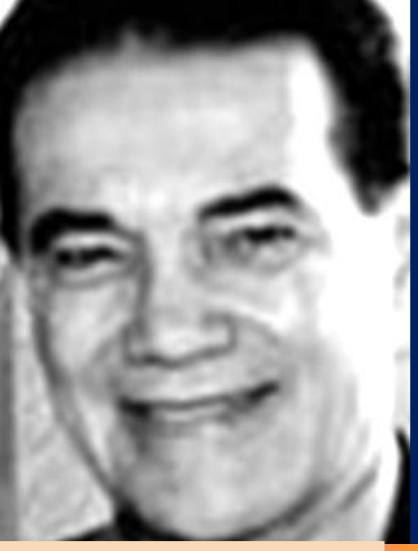

DIVALDO FRANCO

PELO ESPÍRITO:

JOANNA DE ÂNGELIS

Homem Integral

### O HOMEM INTEGRAL

Ditada pelo Espírito: Joanna de Ângelis (primeira edição lançada em 1990)

Psicografada por:

Divaldo Pereira Franco

Digitalizada por:

L. Neilmoris

© 2008 – Brasil

www.luzespirita.org

# O Homem Integral

Ditada por: JOANNA DE ÂNGELIS

Psicografada por: DIVALDO PEREIRA FRANCO

### ÍNDICE

### O Homem Integral – pág. 6

### Primeira Parte – FATORES DE PERTURBAÇÃO

- 1 Fatores de perturbação pág. 9
- 2 A rotina pág. 11
- 3 A ansiedade pág. 14
- 4 Medo pág. 17
- 5 Solidão pág. 20
- 6 Liberdade pág. 23

### Segunda Parte – ESTRANHOS RUMOS, SEGUROS ROTEIROS

- 7 Homensaparência pág. 27
- 8 Fobia social pág. 29
- 9 Ódio e suicídio pág. 31
- 10 Mitos pág. 34

### Terceira Parte – A BUSCA DA REALIDADE

- 11 Autodescobrimento pág. 27
- 12 Consciência ética pág. 41
- 13 Religião e religiosidade pág. 44

### Quarta Parte – O HOMEM EM BUSCA DO ÊXITO

- 14 Insegurança e crises pág. 48
- 15 Conflitos degenerativos da sociedade pág. 50
- 16 O primeiro lugar e o homem indispensável pág. 55

### Quinta Parte – DOENÇAS CONTEMPORÂNEAS

- 17 O conceito de saúde pág. 6 pág. 59
- 18 Os comportamentos neuróticos pág. 61
- 19 Doenças físicas e mentais pág. 64
- 20 A tragédia do cotidiano pág. 66
- 21 O homem moderno pág. 68

### Sexta Parte – MATURIDADE PSICOLÓGICA

- 22 Mecanismos de evasão pág. 71
- 23 O problema do espaço pág. 74
- 24 A reconquista da identidade pág. 76
- 25 Ter e ser pág. 79
- 26 Observador, observação e observado pág. 81
- 27 O devir psicológico pág. 83

### Sétima Parte – PLENIFICAÇÃO INTERIOR

- 28 Problemas sexuais pág. 87
- 29 Relacionamentos perturbadores pág. 90
- 30 Manutenção de propósitos pág. 92
- 31 Leis cármicas e felicidade pág. 94

### Oitava Parte – O HOMEM PERANTE A CONSCIÊNCIA

- 32 Nascimento da consciência pág. 97
- 33 Os sofrimentos humanos pág. 99
- 34 Recursos para a liberação dos sofrimentos pág. 101
- 35 Meditação e ação pág. 103

### Nona Parte – O FUTURO DO HOMEM

- 36 A morte e seu problema pág. 107
- 37 A controvertida comunicação dos Espíritos pág. 110
- 38 O modelo organizador biológico pág. 113
- 39 A reencarnação pág. 115

### O Homem Integral

As enciclopédias definem ohomem como um "animal racional, moral e social, mamífero, bípede, bímano, capaz de linguagem articulada, que ocupa o primeiro lugar na escala zoológica; ser humano..."

O momento mais eloquente do seu processo evolutivo deuse quando adquiriu a consciência para discernir o bem do mal, a verdade da impostura, o certo do errado, prosseguindo na marcha ascensional que o conduzirá às culminâncias da angelitude.

Estudado largamente através dos séculos, Pitágoras afirmava que ele (o homem) é a medida de todas as coisas, enquanto Sócrates elucidava ser o objeto mais direto da preocupação filosófica.

Durante o estoicismo e o neoplatonismo houve uma preocupação para que ocorresse a "dissolução do homem em a Natureza", mesmo aí revelando a grande preocupação de ambas as escolas com este ser admirável.

Na conceituação cristã ele "transcende o mundo", em uma dimensão totalmente diferente desta.

Já o racionalismo o considera, desde Descartes, como o "ser pensante por excelência, como a razão que compreende e explica o mundo e a si mesma."

No espiritualismo idealista o "espírito tem a primazia em tudo que se relaciona com omundo e a vida humana", enquanto que para o materialismo o "espírito não é mais que uma forma de atividade da matéria que, em determinada fase de sua evolução, de formas simples para outras mais complexas, adquiriu consciência..."

Mivart, o célebre naturalista inglês, analisando, psicologicamente, o homem, esclarece que ele "difere dos outros animais pelas características da abstração, da percepção intelectual, da consciência de si mesmo, da reflexão, da memória racional, do julgamento, da síntese e indução intelectual, do raciocínio, da intuição intelectual, das emoções e sentimentos superiores, da linguagem racional, do verdadeiro poder de vontade."

Sócrates e Platão estabeleceram que o homem era o resultado do ser ou Espírito imortal e do não ser ou sua matéria que, unidos, lhe facultavam o processo de evolução.

Os filósofos atomistas reduziamno ao capricho das partículas que, em se desarticulando, aniquilavamse através do fenômeno biológico da morte.

Jesus, superando todos os limites do conhecimento, fezse o biótipo do Homem Integral, por haver desenvolvido todas as aptidões herdadas de Deus, na condição de ser mais perfeito de que se tem notícia. Toda a Sua vida é modelar,

tornandose o exemplo a ser seguido, para o logro da plenitude, de quem deseja libertação real.

A Filosofia, mediante as suas diversas escolas, tem procurado oferecer ao homem caminhos que o felicitem em contínuas tentativas de interpretar a vida e entendêlo.

A Psicologia, que inicialmente se confundia com a estrutura filosófica, de passo em passo libertouse de seu jugo e, buscando estudar a psique, alcançou, na atualidade, expressão de relevo para a compreensão do homem, dos seus problemas e seus desafios psicológicos.

A multiplicidade de tendências ora vigentes, nessa área, comprova o interesse dos estudiosos desta e de outras disciplinas do conhecimento, buscando a libertação do indivíduo em relação aos desafios e dificuldades que o afligem.

Algo recentemente (1966) surgiu, nos Estados Unidos, a quarta força em Psicologia, que é a Transpessoal, ampliando o campo de investigação além do Behaviorismo, da Psicanálise e da Psicologia Humanista, fornecendo mais amplos esclarecimentos sobre o homem integral... Os seus pioneiros vieram dos quadros da Psicologia Humanista, facultando a introdução de alguns ensinamentos e experiências orientais, graças aos quais abrem espaços para uma visão espiritualista do ser humano em maior profundidade.

O Espiritismo, por sua vez, sintetizando diversas correntes de pensamento psicológico e estudando o homem na sua condição de Espírito eterno, apresenta a proposta de um comportamento filosófico idealista, imortalista, auxiliandoo na equação dos seus problemas, sem violência e com base na reencarnação, apontando lhe os rumos felizes que deve seguir.

Na presente Obra fazemos um estudo de diversos fatores de perturbação psicológica, procurando oferecer terapias de fácil aplicação, fundamentadas na análise do homem à luz do Evangelho e do Espiritismo, de forma a auxiliálo no equilíbrio e no amadurecimento emocional, tendo sempre como ser ideal Jesus, o Homem Integral de todos os tempos.

Embora reconheçamos singela a nossa contribuição, esperamos de alguma forma auxiliar aqueles que nos leiam com real desejo de renovação e de aquisição de saúde psicológica, consciente de havermos feito o máximo ao nosso alcance, neste grave momento da Humanidade.

Joanna de Ângelis Salvador, 20 de fevereiro de 1990.

### PRIMEIRA PARTE

### FATORES DE PERTURBAÇÃO

### 1 Fatores de perturbação

A segunda metade do Século XIX transcorre numa Eurásia sacudida pelas contínuas calamidades guerreiras, que se sucedem, truanescas, dizimando vidas e povos.

As admiráveis conquistas da Ciência que se apóia na Tecnologia, não logram harmonizar o homem belicoso e insatisfeito, que se deixa dominar pela vaga do materialismoutilitarista, que o transforma num amontoado orgânico que pensa, a caminho de aniquilamento no túmulo.

Possuir, dominar e gozar por um momento, são a meta a que se atira, desarvorado.

Mal se encerra a guerra da Criméia, em 1856, e já se inquietam os exércitos para a hecatombe francoprussiana, cujos efeitos estouram em 1914, envolvendo o imenso continente na loucura selvagem que ameaça de consumição a tudo e a todos. O Armistício, assinado em nome da paz, fomentou o explodir da Segunda Guerra Mundial, que sacudiu o Orbe em seus quadrantes.

Somandose efeitos a novas causas, surge a Guerra Fria, que se expande pelo sudeste asiático em contínuos conflitos lamentáveis, em nome de ideologias alienígenas, disfarçadas de interesses nacionais, nos quais, os armamentos superados são utilizados, abrindo espaços nos depósitos para outros mais sofisticados e destrutivos...

Abremse chagas purulentas que aturdem o pensamento, dores inomináveis rasgam ossentimentos asselvajando os indivíduos. O medo e o cinismo dãose as mãos em conciliábulo irreconciliável.

A Guerra dos seis dias, entre árabes e judeus, abre sulcos profundos na economia mundial, erguendo o deus petróleo a uma condição jamais esperada.

Os holocaustos sucedemse.

Os crimes hediondos em nome da liberdade se acumulam e os tribunais de justiça os apóiam.

O homem é reduzido à ínfima condição no "apartheid", nas lutas de classes, na ingestão e uso de alcoólicos e drogas alucinógenas como abismo de fuga para a loucura e o suicídio.

Movimentos filosóficos absurdos arregimentam as mentes jovens e desiludidas em nome do Nadaísmo, do Existencialismo, do Hippieísmo e de comportamentos extravagantes mais recentes, mais agressivos, mais primários, mais violentos.

O homem moderno estertora, enquanto viaja em naves superconfortáveis fora da atmosfera e dentro dela, vencendo as distâncias, interpretando os desafios e enigmas cósmicos.

A sonda investigadora penetra o âmago da vida microscópica e abre todo um universo para informações e esclarecimentos salvadores.

Há esperança para terríveis enfermidades que destruíram gerações, enquanto surgem novas doenças totalmente perturbadoras.

A perplexidade domina as paisagens humanas.

A gritante miséria econômica e o agressivo abandono social fazem das cidades hodiernas o palco para o crime, no qual a criatura vale o que conduz, perdendo os bens materiais e a vida em circunstâncias inimagináveis.

Há uma psicosfera de temor asfixiante enquanto emerge do imo do homem a indiferença pela ordem, pelos valores éticos, pela existência corporal.

Desumanizase o indivíduo, entregandose ao pavor, ou gerandoo, ou indiferente a ele.

Os distúrbios de comportamento aumentam e o despautério desgoverna.

Uma imediata, urgente reação emocional, cultural, religiosa, psicológica, surge, e o homem voltará a identificarse consigo mesmo.

A sua identidade cósmica é o primeiro passo a dar, abrindose ao amor, que gera confiança, que arranca da negação e o irisa de luz, de beleza, de esperança.

A grande noite que constringe é, também, o início da alvorada que surge.

Neste homem atribulado dos nossos dias, a Divindade deposita a confiança em favor de uma renovação para um mundo melhor e uma sociedade mais feliz.

Buscar os valores que lhe dormem soterrados no íntimo é a razão de sua existência corporal, no momento.

Encontrarse com a vida, enfrentála e triunfar, eis o seu fanal.

### 2 A rotina

A natural transformação social, decorrente dos efeitos da ciência aliada à tecnologia a partir do Século XIX, impôs que o individualismo competitivo pós renascentista cedesse lugar ao coletivismo industrial e comunitário da atualidade.

A cisão decorrente do pensamento cartesiano, na dicotomia do corpo e da alma, ensejou uma radical mudança nos hábitos da sociedade, dando surgimento a uma série de conflitos que irrompem na personalidade humana e conduzem a alienações perturbadoras.

Antes, os tabus e as superstições geravam comportamentos extravagantes, e a falsa moral mascarava os erros que se tornavam fatores de desagregação da personalidade, a serviço da hipocrisia refinada.

A mudança de hábitos, no entanto, se liberou o homem de algumas fobias e mecanismos de evasão perniciosos, impôs outros padrões comportamentais de massificação, nos quais surgem novos ídolos e mitos devoradores, que respondem por equivalentes fenômenos de desequilíbrio.

Houve troca de conduta, mas não de renovação saudável na forma de encararse a vida e de vivêla.

De um lado, a ciência em constante progresso, não se fazendo acompanhar por um correspondente desenvolvimento éticoespiritual, candidatase a conduzir o homem ao niilismo, ao conceito de aniquilamento.

Noutro sentido, o contubérnio subjacente, apresenta um elenco exasperador de áreas conflitantes nas guerras e ameaças de guerras que se sucedem, nas variações da economia, nos volumosos bolsões de miséria de vária ordem, empurrando o homem para a ansiedade, a insegurança, a suspeição contumaz, a

violência.A fim de fugir à luta desigual — o homem contra a máquina — os mecanismos responsáveis pela segurança emocional levam oindivíduo, que não se encoraja ao competitivismo doentio, à acomodação, igualmente enferma, como forma de sobrevivência no báratro em que se encontra, receando ser vencido, esmagado ou consumido pela massa crescente ou pelo desespero avassalador.

Estabelece algumas poucas metas, que conquista com relativa facilidade, passando a uma existência rotineira e neurotizante, que culmina por matarlhe o entusiasmo de viver, os estímulos para enfrentar desafios novos.

Rotina é como ferrugem na engrenagem de preciosa maquinaria, que a corrói e arrebenta.

Disfarçada como segurança, emperra o carro do progresso social e automatiza a mente, que cede o campo do raciocínio ao mesmismo cansador,

deprimente. O homem repete a ação de ontem com igual intensidade hoje; trabalha no mesmo labor e recompõe idênticos passos; mantém asmesmas desinteressantes conversações: retorna ao lar ou busca os repetidos espairecimentos: bar, clube, televisão, jornal, sexo, com frenético receio da solidão, até alcançar a aposentadoria..

Nesse ínterim, realiza férias programadas, visita lugares que o desagradam, porém reúnese a outros grupos igualmente tediosos e, quando chega ao denominado período do gozorepouso, deixase arrastar pela inutilidade agradável, vitimado por problemas cardíacos, que resultam das pressões largamente sustentadas ou por neuroses que a monotonia engendra.

O homem éum mamífero biossocial, construído para experiências e iniciativas constantes, renovadoras. A sua vida é resultado de bilhões de anos de transformações celulares, sob o comando do Espírito, que elaborou equipamentos orgânicos e psíquicos para as respostas evolutivas que a futura perfeição lhe exige.

O trabalho constituilhe estímulo aos valores que lhe dormem latentes, aguardando despertamento, ampliação, desdobramento.

Deixando que esse potencial permaneça inativo por indolência ou rotina, a frustração emocional entorpece os sentimentos do ser ou levao à violência, ao crime, como processo de libertação da masmorra que ele mesmo construiu, nela encarcerandose.

Subitamente, qual correnteza contida que arrebenta a barragem, rompe os limites do habitual e dá vazão aos conflitos, aos instintos agressivos, tombando em processos alucinados de desequilíbrios e choque.

Nesse sentido, os suportes morais e espirituais contribuem para a mudança da rotina, abrindo espaços mentais e emocionais para o idealismo do amor ao próximo, da solidariedade, dos serviços de enobrecimento humano.

O homem se deve renovar incessantemente, alterando para melhor os hábitos e atividades, motivandose para o aprimoramento íntimo, com consequente movimentação das forças que fomentam o progresso pessoal e comunitário, a benefício da sociedade em geral.

Face a esse esforço e empenho, o homem interior sobrepõese ao exterior, social, trabalhado pelos atavismos das repressões e castrações, propondo conceitos mais dignos de convivência humana, em consonância com asambições espirituais que lhe passam a comandar as disposições íntimas.

O excesso de tecnologia, que aparentemente resolveria os problemas humanos, engendrou novos dramas e conflitos comportamentais, na rotina degradante, que necessitam ser reexaminados para posterior correção.

O individualismo, que deu ênfase ao enganoso conceito do homem de ferro e da mulher boneca, objeto de luxo e de inutilidade, cedeu lugar ao coletivismo consumista, sem identidade, em que os valores obedecem a novos padrões de crítica e de aceitação para os triunfos imediatos sob os altos preços da destruição do indivíduo como pessoa racional e livre.

A liberdade custa um alto preço e deve ser conquistada na grande luta que se trava no cotidiano.

Liberdade de ser e atuar, de ter respeitados os seus valores e opções de discernir e aplicar, considerando, naturalmente, os códigos éticos e sociais, sem a

submissão acomodada e indiferente aos padrões de conveniência dos grupos dominantes.

A escala de interesses, apequenando o homem, brindao com prêmios que foram estabelecidos pelo sistema desumano, sem participação do indivíduo como célula viva e pensante do conjunto geral.

Como profilaxia e terapêutica eficaz, existem os desafios propostos por Jesus, que são de grande utilidade, induzindo a criatura a dar passos mais largos e audaciosos do que aqueles que levam na direção dos breves objetivos da existência apenas material.

A desenvoltura das propostas evangélicas facilita a ruptura da rotina, dando saudável dinâmica para uma vida integral em favor do homemespírito eterno e não apenas da máquina humana pensante a caminho do túmulo, da dissolução, do esquecimento.

### 3 A ansiedade

Não se deixando vitimar pela rotina, o homem tende, às vezes, a assumir um comportamento ansioso que o desgasta, dando origem a processos enfermiços que o consomem.

A ansiedade é uma das características mais habituais da conduta contemporânea.

Impulsionado ao competitivismo da sobrevivência e esmagado pelos fatores constringentes de uma sociedade eticamente egoísta, predomina a insegurança no mundo emocional das criaturas.

As constantes alterações da Bolsa de Valores, a compressão dos gastos, a correria pela aquisição de recursos e a disputa de cargos e funções bem remunerados geram, de um lado, a insegurança individual e coletiva. Por outro, as ameaças de guerras constantes, a prepotência de governos inescrupulosos e chefes de atividades arbitrários quão ditadores; os anúncios e estardalhaços sobre enfermidades devastadoras; os comunicados sobre os danos perpetrados contra a ecologia prenunciando tragédias iminentes; a catalogação de crimes e violências aterradoras respondem pela inquietação e pelo medo que grassam em todos os meios sociais, como constante ameaça contra o ser e o seu grupo, levandoos a permanente ansiedade que deflui das incertezas da vida.

Passando, de uma aparente segurança, que era concedida pelos padrões individualistas do Século XIX, no apogeu da industrialização, para o período eletrônico, a robotização ameaça milhões de empregados, que temem a perda de suas atividades remuneradas, ao tempo em que o coletivismo, igualando os homens nas aparências sociais, nos costumes e nos hábitos, alija os estímulos de luta, neles instalando a incerteza, a necessidade de encontrarse sempre na expectativa de notícias funestas, desagradáveis, perturbadoras.

Esvaziados de idealismo e comprimidos no sistema em que todos fazem a mesma coisa, assumem iguais composturas, passando de uma para outra pauta de compromisso com ansiedade crescente.

A preocupação de parecer triunfador, de responder de forma semelhante aos demais, de ser bem recebido e considerado é responsável pela desumanização do indivíduo, que se torna um elemento complementar no grupamento social, sem identidade, nem individualidade.

Tendo como modelo personalidades extravagantes, que ditam modas e comportamento exóticos, ou liderado por ídolos da violência, como da astúcia dourada, o descobrimento dos limites pessoais gera inquietação e conflitos que mal disfarçam a contínua ansiedade humana.

A ansiedade tem manifestações e limites naturais, perfeitamente aceitáveis. Quando se aguarda uma notícia, uma presença, uma resposta, uma conclusão, é perfeitamente compreensível uma atitude de equilibrada expectativa.

Ao extrapolar para os distúrbios respiratórios, o colapso periférico, a sudorese, a perturbação gástrica, a insônia, o clima de ansiedade tornase um estado patológico a caminho da somatização física em graves danos para a vida.

O grande desafio contemporâneo para o homem é o seu autodescobrimento. Não apenas identificação das suas necessidades, mas, principalmente, da sua realidade emocional, das suas aspirações legítimas e reações diante das ocorrências do cotidiano.

Mediante o aprofundamento das descobertas íntimas, alterase a escala de valores e surgem novos significados para a sua luta, que contribuem para a tranquilidade e a autoconfiança.

Não há, em realidade, segurança enquanto se transita no corpo físico.

A organização mais saudável durante um período, debilitase em outro, assim como os melhores equipamentos orgânicos e psíquicos sofrem natural desgaste e consumição, dando lugar às enfermidades e à morte, que também é fenômeno da vida.

A ansiedade trabalha contra a estabilidade do corpo e da emoção.

A análise cuidadosa da existência planetária e das suas finalidades proporciona a vivência salutar da oportunidade orgânica, sem oapego mórbido ao corpo nem o medo de perdêlo.

Os ideais espiritualistas, o conhecimento da sobrevivência à morte física tranqüilizam o homem, fazendo que considere a transitoriedade do corpo e a perenidade da vida, da qual ninguém seeximirá.

Apegado aos conflitos da competição humana ou deixandose vencer pela acomodação, o homem desviase da finalidade essencial da existência terrena, que se resume na aplicação do tempo para a aquisição dos recursos eternos, propiciadores da beleza, da paz, da perfeição.

O pandemônio gerado pelo excesso de tecnologia e de conforto material nas chamadas classes superiores, com absoluta indiferença pela humanidade dos guetos e favelas, em promiscuidade assustadora, revela a falência da cultura e da ética estribada no imediatismo materialista com o seu arrogante desprezo pelo espiritualismo.

Certamente, ao fanatismo e proibição espiritualista de caráter medieval, que ocultavam as feridas morais dos homens, sob o disfarce da hipocrisia, o surgimento avassalador da onda de cinismo materialista seria inevitável. No entanto, o abuso da falsa cultura desnaturada, que pretendeu solucionar os problemas humanos de profundidade como reparava os desajustes das engrenagens das máquinas que construiu, resultou na correria alucinada para lugar nenhum e pela conquista de coisas mortas, incapazes de minimizar a saudade, de preencher a solidão, de acalmar a ansiedade, de evitar a dor, a doença e a morte...

Magnatas, embora triunfantes, proíbem que se pronuncie o nome da morte diante deles. Capitães de monopólios recusamse a sair à rua, para evitarem contágio de enfermidades, e alguns impõem, para viver, ambientes assepsiados, tentando driblar o processo de degeneração celular.

Ases da beleza cercamse de jovens, receando a velhice, e utilizamse de estimulantes para preservarem o corpo, aplicandose massagens, exercícios, cirurgias plásticas, musculação e, não obstante, acompanham a degeneração física e mental, ansiosos, desventurados.

Propalandose que as conquistas morais fazem parte das instituições vencidas — matrimônio, família, lar — os apaniguados da loucura crêem que aplicam, na velha doença das proibições passadas, uma terapêutica ideal. E olvidam se que o exagero de medicamento utilizado em uma doença, gera danos maiores do que aqueles que eram sofridos.

A sociedade atual sofre a terapia desordenada que usou na enfermidade antiga do homem, que ora se revela mais debilitado do que antes.

São válidas, para este momento de ansiedade, de insatisfação, de tormento, as lições do Cristo sobre o amor ao próximo, a solidariedade fraternal, a compaixão, ao lado da oração, geradora de energias otimistas e da fé, propiciadora de equilíbrio e paz, para uma vida realmente feliz, que baste ao homem conforme se apresente, sem as disputas conflitantes do passado, nem a acomodação coletivista do presente.

### 4 Medo

Decorrente dos referidos fatores sociológicos, das pressões psicológicas, dos impositivos econômicos, o medo assalta o homem, empurrandoo para a violência irracional ou amargurandoo em profundos abismos de depressão. Num contexto social injusto, a insegurança engendra muitos mecanismos de evasão da realidade, que dilaceram o comportamento humano, anulando, por fim, as aspirações de beleza, de idealismo, de afetividade da criatura.

Encarcerandose, cada vez mais, nos receios justificáveis do relacionamento instável com as demais pessoas, surgem as ilhas individuais e grupais para onde fogem os indivíduos, na expectativa de equilibraremse, sobrevivendo ao tumulto e à agressividade, assumindo, sem daremse conta, um comportamento alienado, que termina por apresentarse igualmente patológico.

As precauções para resguardarse, poupar a família aos dissabores dos delinquentes, mantendo os haveres em lugares quase inexpugnáveis, fazem o homem emparedarse no lar ou aglomerarse em clubes com pessoal selecionado, perdendo a identidade em relação a si mesmo, ao seu próximo e consumindose em conflitos individualistas, a caminho dos desequilíbrios de grave porte.

Os valores da nossa sociedade encontramse em xeque, porque são transitórios.

Há uma momentânea alteração de conteúdo, com a conseqüente perda de significado.

A nova geração perdeu a confiança nas afirmações do passado e deseja viver novas experiências ao preço da alucinação, como forma escapista de superar as pressões que sofre, impondo diferentes experiências.

No âmago das suas violações e protestos, do vilipêndio aos conceitos anteriores vige o medo que atormenta e submete às suas sombras espessas.

A quantidade expressiva de atemorizados trabalha a qualidade do receio de cada um, que cresce assustadoramente, comprimindo a personalidade, até que esta se libere em desregramento agressivo, como forma de escapar à constrição.

Quem, porém, não consiga seguir a correnteza da nova ordem, fica afogado no rio volumoso, perde o respeito por si mesmo, alienase e sucumbe.

Na luta furiosa, as festas ruidosas, as extravagâncias de conduta, os desperdícios de moedas e o exibicionismo com que algumas pessoas pensam vencer os medos íntimos, apenas se transformam em lâminas baças de vidro pelas quais observam a vida sempre distorcida, face à óptica incorreta que se permitem. São atitudes patológicas decorrentes da fragilidade emocional para enfrentar os desafios externos e internos.

A consumação da sociedade moderna é a história da desídia do homem em si mesmo, enlanguescido pelos excessos ou esfogueado pelos desejos absurdos.

Adaptandose às sombras dominadoras da insensatez, negligencia o sentido ético gerador da paz.

A anarquia então impera, numa volúpia destrutiva, tentando apagar as memórias do ontem, enquanto implanta a tirania do desconcerto.

Os seus vultos expressivos são imaturos e alucinados, em cuja rebelião pairam o oportunismo e a avidez.

Procedentes dos guetos morais, querem reverter a ordem que os apavora, revolucionando com atrevimento, face ao insólito, o comportamento vigente.

Os antigos ídolos, que condenaram a década de 20 e 30 como a da "geração perdida", produziram a atual "era da insegurança", na qual malograram as profecias exageradamente otimistas dos apaniguados do prazer em exaustão, fabricando os superhomens da mídia que, em análise última, são mais frágeis do que os seus adoradores, pois que não passam de heróis da frustração.

Guindados às posições de liderança, descambaram, esses novos condutores, em lamentáveis desditas, consumidos pelas drogas, vencidos pelas enfermidades ainda não controladas, pelos suicídios discretos ou espetaculares.

A alucinação generalizada certamente aumenta o medo nos temperamentos frágeis, nas constituições emocionais de pouca resistência, de começo, no indivíduo, depois, na sociedade.

Esta é uma sociedade amedrontada.

As gerações anteriores também cultivaram os seus medos de origem atávica e de receios ocasionais.

O excesso de tecnicismo com a correspondente ausência de solidariedade humana produziram a avalanche dos receios.

A superpopulação tomando os espaços e a tecnologia reduzindo as distâncias arrebataram a fictícia segurança individual, que os grupos passaram a controlar, e as conseqüências da insânia que cresce são imprevistas.

Urge uma revisão de conceitos, uma mudança de conduta, um reestudo da coragem para a imediata aplicação no organismo social e individual necrosado.

Todavia, é no cerne do ser — o Espírito — que se encontram ascausas matrizes desse inimigo rude da vida, que é o medo.

Os fenômenos fóbicos procedem das experiências passadas reencarnações fracassadas —, nas quais a culpa não foi liberada, face ao crime haver permanecido oculto, ou dissimulado, ou não justiçado, transferindose a consciência faltosa para posterior regularização.

Ocorrências de grande impacto negativo, pavores, urdiduras perversas, homicídios programados com requintes de crueldade, traições infames sob disfarces de sorrisos produziram a atual consciência de culpa, de que padecem muitos atemorizados de hoje, no interrelacionamento pessoal.

Outrossim, catalépticos sepultados vivos, que despertaram na tumba e vieram a falecer depois, por falta de oxigênio, reencarnamse vitimados pelas profundas claustrofobias, vivendo em precárias condições de sanidade mental.

O medo é fator dissolvente na organização psíquica do homem, predispondoo, por somatização, a enfermidades diversas que aguardam correta diagnose e específica terapêutica.

À medida que a consciência se expande e o indivíduo se abriga na fé religiosa racional, na certeza da sua imortalidade, ele se liberta, se agiganta, recupera a identidade e humanizase definitivamente, vencendo o medo e os seus sequazes, sejam de ontem ou de agora.

### 5 Solidão

Espectro cruel que se origina nas paisagens do medo, a solidão é, na atualidade, um dos mais graves problemas que desafiam a cultura e o homem.

A necessidade de relacionamento humano, como mecanismo de afirmação pessoal, tem gerado vários distúrbios de comportamento, nas pessoas tímidas, nos indivíduos sensíveis e em todos quantos enfrentam problemas para um intercâmbio de idéias, uma abertura emocional, uma convivência saudável.

Enxameiam, por isso mesmo, na sociedade, os solitários por livre opção e aqueloutros que se consideram marginalizados ou são deixados à distância pelas conveniências dos grupos.

A sociedade competitiva dispõe de pouco tempo para a cordialidade desinteressada, para deterse em labores a benefício de outrem.

O atropelamento pela oportunidade do triunfo impede que o indivíduo, como unidade essencial do grupo, receba consideração e respeito ou conceda ao próximo este apoio que gostaria de fruir.

A mídia exalta os triunfadores de agora, fazendo o panegírico dos grupos vitoriosos e esquecendo com facilidade os heróis de ontem, ao mesmo tempo em que sepulta os valores do idealismo, sob a retumbante cobertura da insensatez e do oportunismo.

O homem, no entanto, sem ideal, mumificase. O ideal élhe de vital importância, como o ar que respira.

O sucesso social não exige, necessariamente, os valores intelectomorais, nem o vitalismo das idéias superiores, antes cobra os louros das circunstâncias favoráveis e se apóia na bem urdida promoção de mercado, para vender imagens e ilusões breves, continuamente substituídas, graças à rapidez com que devora as suas estrelas.

Quem, portanto, não se vê projetado no caleidoscópio mágico do mundo fantástico, considerase fracassado e recua para a solidão, em atitude de fuga de uma realidade mentirosa, trabalhada em estúdios artificiais.

Parece muito importante, no comportamento social, receber e ser recebido, como forma de triunfo, e o medo de não ser lembrado nas rodas bem sucedidas, leva o homem a estados de amarga solidão, de desprezo por si mesmo.

O homem faz questão de ser visto, de estar cercado de bulha, de sorrisos embora sem profundidade afetiva, sem ocalor sincero das amizades, nessas áreas, sempre superficiais e interesseiras. O medo de ser deixado em plano secundário, de não ter para onde ir, com quem conversar, significaria ser desconsiderado, atirado à solidão.

Há uma terrível preocupação para ser visto, fotografado, comentando, vendendo saúde, felicidade, mesmo que fictícia.

A conquista desse triunfo e a falta dele produzem solidão.

O irreal, que esconde o caráter legítimo e as lídimas aspirações do ser, conduz à psiconeurose de autodestruição.

A ausência do aplauso amargura, face ao conceito falso em torno do que se considera, habitualmente como triunfo.

Há terrível ânsia para serse amado, não para conquistar o amor e amar, porém para ser objeto de prazer, mascarado de afetividade. Dessa forma, no entanto, a pessoa se desama, não se torna amável nem amada realmente.

Campeia, assim, o "medo da solidão", numa demonstração caótica de instabilidade emocional do homem, que parece haver perdido o rumo, o equilíbrio.

O silêncio, o isolamento espontâneo são muito saudáveis para o indivíduo, podendo permitirlhe reflexão, estudo, autoaprimoramento, revisão de conceitos perante a vida e a paz interior.

O sucesso, decantado como forma de felicidade, é, talvez, um dos maiores responsáveis pela solidão profunda.

Os campeões de bilheteria nos shows, nas rádios, televisões e cinemas, os astros invejados, os reis dos esportes, dos negócios cercamse de fanáticos e apaixonados, sem que se vejam livres da solidão.

Suicídios espetaculares, quedas escabrosas nos porões dos vícios e dos tóxicos comprovam quanto eles são tristes e solitários. Eles sabem que o amor, com que os cercam, traz, apenas, apelos de promoção pessoal dos mesmos que os envolvem, e receiam os novos competidores que lhes ameaçam os tronos, impondo lhes terríveis ansiedades e inseguranças, que procuram esconder no álcool, nos estimulantes e nos derivativos que os mantêm sorridentes, quando gostariam de chorar, quão inatingidos, quanto se sentem fracos e humanos.

A neurose da solidão é doença contemporânea, que ameaça o homem distraído pela conquista dos valores de pequena monta, porque transitórios.

Resolvendose por afeiçoarse aos ideais de engrandecimento humano, por contribuir com a hora vazia em favor dos enfermos e idosos, das crianças em abandono e dos animais, sua vida adquiriria cor e utilidade, enriquecendose de um companheirismo digno, em cujo interesse alargarseia a esfera dos objetivos que motivam as experiências vivenciais e inoculam coragem para enfrentarse, aceitando os desafios naturais.

O homem solitário, todo aquele que se diz em solidão, exceto nos casos patológicos, é alguém que se receia encontrar, que evita descobrirse, conhecerse, assim ocultando a sua identidade na aparência de infeliz, de incompreendido e abandonado.

A velha conceituação de que todo aquele que tem amigos não passa necessidades, constitui uma forma desonesta de estimar, ocultando o utilitarismo subreptício, quando o prazer da afeição em si mesma deve ser a meta a alcançarse no interrelacionamento humano, com vista à satisfação de amar.

O medo da solidão, portanto, deve ceder lugar, à confiança nos próprios valores, mesmo que de pequenos conteúdos, porém significativos para quem os possui.

Jesus, o Psicoterapeuta Excelente, ao sugerir o "amor ao próximo como a si mesmo" após o "amor a Deus" como a mais importante conquista do homem, conclamao a amarse, a valorizarse, a conhecerse de modo a plenificarse com o que é e tem, multiplicando esses recursos em implementos de vida eterna, em saudável companheirismo, sem a preocupação de receber resposta equivalente.

O homem solidário, jamais se encontra solitário.

O egoísta, em contrapartida, nunca está solícito, por isto, sempre atormentado.

Possivelmente, o homem que caminha a sós se encontre mais sem solidão, do que outros que, no tumulto, inseguros, estão cercados, mimados, padecendo disputas, todavia sem paz nem féinterior.

A fé no futuro, a luta por conseguir a paz íntima — eis os recursos mais valiosos para vencerse a solidão, saindo do arcabouço egoísta e ambicioso para a realização edificante onde quer que se esteja.

### 6 Liberdade

As pressões constantes geradoras de medo, não raro extrapolam em forma de violência propondo a liberdade.

Sentindose coarctado nos movimentos, o animal reage à prisão e debatese até à exaustão, na tentativa de libertarse. Da mesma forma, o homem, sofrendo limites, aspira pela amplidão de horizontes e luta pela sua independência.

É perfeitamente normal o empenho do cidadão em favor da sua libertação total, passo esse valioso na conquista de si mesmo. Todavia, pouco esclarecido e vitimado pelas compressões que o alucinam, utilizase dos instrumentos da rebeldia, desencadeando lutas e violência para lograr o que aspira como condição fundamental de felicidade.

A violência, porém, jamais oferece a liberdade real.

Arranca o indivíduo da opressão política, arrebentalhe as injunções caóticas impostas pela sociedade injusta, favoreceo com terras e objetos, salários e haveres.

Isto, porém, não é a liberdade, no seu sentido profundo.

São conquistas de natureza diferente, nas áreas das necessidades dos grupos e aglomerados humanos, longe de ser a meta de plenitude, talvez constituindo um meio que faculte a realização do próximo passo, que é o do autodescobrimento.

A violência retém, porém não doa, já que sempre abre perspectivas para futuros embates sob a ação de maiores crueldades.

As guerras, que se sucedem, apóiamse nos tratados de paz mal formulados, quando a violência selou, com sujeição, o destino da nação ou do povo submetido...

O instinto de rebeldia faz parte da psique humana.

A criança que se obstina usando a negativa, afirma a sua identidade, exteriorizando o anseio inconsciente de ser livre. Porque carece de responsabilidade, não pode entender o que tal significa.

Somente mediante a responsabilidade, o homem se liberta, sem tornarse libertino ou insensato.

A sociedade, que fala em nome das pessoas de sucesso, estabelece que a liberdade é o direito de fazer o que a cada qual apraz, sem darse conta de que essa liberação da vontade, termina por interditar o direito dos outros, fomentando as lutas individuais, dos que se sentem impedidos, espocando nas violências de grupos e classes, cujos direitos se encontram dilapidados.

Se cada indivíduo agir conforme achar melhor, considerandose liberado, essa atitude trabalha em favor da anarquia, responsável por desmandos sem limites.

Em nome da liberdade, atuam desonestamente os vendedores das paixões ignóbeis, que espalham o bafio criminoso das mercadorias do prazer e da loucura.

A denominada liberação sexual, sem a correspondente maturidade emocional e dignidade espiritual, rebaixou as fontes genésicas a paul venenoso, no qual, as expressões aberrantes assumem cidadania, inspirando os comportamentos alienados e favorecendo a contaminação das enfermidades degenerativas e destruidoras da existência corporal. Ao mesmo tempo, faculta o aborto delituoso, a promiscuidade moral, reconduzindo o homem a um estágio de primarismo dantes não vivenciado.

A liberdade de expressão, aos emocionalmente desajustados, tem permitido que a morbidez e o choque se revelem com mais naturalidade do que a cultura e a educação, por enxamearem mais os aventureiros, com asexceções compreensíveis, do que os indivíduos conscientes e responsáveis.

A liberdade é um direito que se consolida, na razão direta em que o homem se autodescobre e se conscientiza, podendo identificar os próprios valores, que deve aplicar de forma edificante, respeitando a natureza e tudo quanto nela existe.

A agressão ecológica, em forma de violência cruel contra as forças mantenedoras da vida, demonstra que o homem, em nome da sua liberdade, destrói, mutila, mata e matase, por fim, por não saber usála conforme seria de desejar.

A liberdade começa no pensamento, como forma de aspiração do bom, do belo, do ideal que são tudo quanto fomenta a vida e a sustenta, dá vida e a mantém.

Qualquer comportamento que coage, reprimes viola é adversário da

liberdade.Examinando o magno problema da liberdade, Jesus sintetizou os meios de conseguila, na busca da verdade, única opção para tornar o homem realmente livre.

A verdade, em síntese, que é Deus — e não a verdade conveniente de cada um, que é a forma doentia de projetar a própria sombra, de impor a sua imagem, de submeter à sua, a vontade alheia — constitui meta prioritária.

Deus, porém, está dentro de todos nós, e é necessário imergir na Sua busca, de modo que O exteriorizemos sobranceiro e tranquilizador.

As conquistas externas atulham as casas e os cofres de coisas, sem tornálos lares nem recipientes de luz, destituídos de significado, quando nos momentos magnos das grandes dores, dos fortes dissabores, da morte, que chegam a todos...

A liberdade, que se encerra no túmulo, é utópica, mentirosa.

Livre, é o Espírito que se domina e se conquista. movimentandose com sabedoria por toda parte, idealista e amoroso, superando as injunções pressionadoras e amesquinhantes.

Gandhi fezse o protótipo da liberdade, mesmo quando nas várias vezes em que esteve encarcerado, informando que "não tinha mensagem a dar. A minha mensagem é a minha vida."

Antes dele, Sócrates permaneceu em liberdade, embora na prisão e na morte que lhe adveio depois.

E Cristo, cuja mensagem é o amor que liberta, prossegue ensinando a eficiente maneira de conquistar a liberdade.

Nenhuma pressão de fora pode levar à falta de liberdade, quando se conseguir ser lúcido e responsável interiormente, portanto, livre.

Não se justifica, deste modo, o medo da liberdade, como efeito dos fatores extrínsecos, que as situações políticas, sociais e econômicas estabelecem como forma espúria de fazer que sobrevivam as suas instituições, subjugando aqueles que vencem. O homem que as edifica, dáse conta, um dia, que dominando povos, grupos, classes ou pessoas também não é livre, escravo, ele próprio, daqueles que submete aos seus caprichos, mas lhe roubam a opção de viver em liberdade.

Não há liberdade quando se mente, engana, impõe e atraiçoa.

A liberdade é uma atitude perante a vida.

Assim, portanto, só há liberdade quando se ama conscientemente.

#### **SEGUNDA PARTE**

## ESTRANHOS RUMOS, SEGUROS ROTEIROS

### 7 Homensaparência

A falta de uma consciência idealista, na qual predomina o bem geral sem os impulsos egoístas que trabalham em favor do imediatismo, torna difícil a realização da liberdade.

Para lográla até a plenitude, fazse mister um seguro conhecimento interior do homem, das suas aspirações e metas, bem como os instrumentos de trabalho com os quais pretende movimentarse.

Ignorando as reações pessoais sempre imprevisíveis, facilmente ele tomba nas ciladas da violência ou entregase à depressão, quando surgem dificuldades e as respostas ao seu esforço não correspondem ao anelado.

Incapaz de controlarse, mantendo uma atitude criativa e otimista, mesmo em face dos dissabores, a liberdade se lhe transforma em uma conquista vazia, cuja finalidade é permitirlhe extravasar os impulsos primitivos e as paixões agressivas, em atentado cruel contra aquilo que pretende: o anseio de ser livre.

O homem livre, sonha e trabalha, confia e persevera, semeando, em tempo próprio, a feliz colheita porvindoura.

Não se pode conseguir de um para outro momento a liberdade, nem a herdar das gerações passadas. Cada indivíduo a conquista lentamente, acumulando experiências que amadurecem o discernimento e a razão de que se utiliza no momento de vivenciála.

Ela começa na escolha de si próprio, conforme o enunciado cristão do "amar ao próximo como a si mesmo" se ama, por quanto não existindo este sentimento pessoal de respeito à própria individualidade, que propõe os limites dos direitos na medida dos deveres executados, não se pode esperar consideração aos valores alheios, com a conseqüente liberdade dos outros indivíduos.

Esse amor a si mesmo ergue o homem aos patamares superiores da vida que a sua consciência idealista descortina e o seu esforço produz. Meta a meta, ele ascende, fazendo opções mais audaciosas no campo do belo, do útil, do humano, deixando pegadas indicadoras para os indecisos da retaguarda. Sua personalidade se ilumina de esperança e a sua conduta se permeia de paz.

Lentamente, são retiradas as aparências do conveniente social, do agradável estatuído, do conforme desejado, para que a legítima identidade apareça e o homem se torne o que realmente é.

É claro que nos referimos às expressões de engrandecimento que, normalmente, permanecem enclausuradas no íntimo sem oportunidade de exteriorizarse, soterradas, às vezes, sob sucessivas camadas de medo, de indiferença, de acomodação.

Muitos homens temem ser conhecidos nos seus sentimentos éticos, nos seus esforços de saudável idealismo, tachados, esses valores, pelos pigmeus morais, encarcerados no exclusivismo das suas paixões, como sentimentalismos, pieguices, fraquezas de caráter.

Confundem coragem com impulsividade e força com expressões do poder, da dominação.

Porque vivem sem liberdade, desdenham os homens livres.

Na consciência profunda está ínsita a verdadeira liberdade, que deve ser buscada mediante o mergulho no âmago do ser e a reflexão demorada, propiciadora do autoconhecimento. Em realidade o homem é livre e nasceu para preservar este estado. Não tem limites a conquista da liberdade, porquanto ele pode, embora não deva, optar por preservar ou não o corpo, através do suicídio espetacular ou escamoteado, na recusa consciente ou não de continuar a viver.

Não se decidindo, porém, em preservar esse atributo, sustentando ou melhorando as estruturas psicológicas, sofre os efeitos do relacionamento social pressionador, e tomba nos meandros da turbulência dos dias que vive.

Esvaziados de objetivos elevados, os movimentos dos grupos sociais como dos indivíduos proporcionam a anarquia, que se mascara de liberdade, destacandose a violência de um lado e o conformismo de outro, sem um relacionamento saudável entre as criaturas. Dissimulamse os sentimentos para se apresentarem bem, conforme o figurino vigente, detestandose fraternalmente e vivendo a competição frenética e desgastante para cada qual alcançar a supremacia no grupo, agradando o ego atormentado.Apesar de acumularem haveres pregando o existencialismo comportamental, esses vitoriosos permanecem vazios, sem ideal, sem consciência ética, mumificados nas ambições e presos aos desejos que nunca satisfazem.

Desencadeiase um distúrbio no conjunto social, que afeta o homem, por sua vez perturbando mais o grupo, em círculo vicioso, no qual a causa, gerando efeitos, estes se tornam novas causas de tribulação. Reverter o sistema injusto e desgastante, no qual se mede e valoriza o homem pelo que tem, e não pelo que é, em razão do que pode, não do que faz, é o compromisso de todo aquele que é livre.

A desordenada preocupação por adquirir, a qualquer preço, equipamentos, veículos, objetos da propaganda alucinada; a ansiedade para ser bemvisto e acatado no meio social; o tormento para vestirse de acordo com a moda exigente; a inquietação para estar bem informado sobre os temas sem profundidade de cada momento transtornam oequilíbrio emocional da criatura, arrojandoa aos abismos da perda da identidade, à desestruturação pessoal, à confusão de valores.

Homensaparência, tornamse quase todos. Calmos ou não, fortes ou fracos, ricos ou pobres enxameiam num contexto confuso, sem liberdade, no entanto, em regime político e social de liberdade, atulhados de ferramentas de trabalho como de lazer, desmotivados e automatistas, sem rumo. Prosseguem, avançando — ou caminhando em círculo? — desnorteados na grande horizontal das conquistas de fora, temendo a verticalidade da interiorização realmente libertadora.

### 8 Fobia social

Pressionado pelas constrições de vária ordem, exceção feita aos fenômenos patológicos, na área da personalidade, o indivíduo tímido, desistindo de reagir, assume comportamentos fóbicos.

Neuroses e psicoses se lhe manifestam, atormentandoo e gerandolhe um clima de pesadelo onde quer que se encontre.

A liberdade, que lhe é de fundamental importância para a vida, perde o seu significado externo, face às prisões sem paredes que são erguidas, nelas encarcerandose.

Da melancolia profunda ele passa à ansiedade, com alternâncias de insatisfação e tentativas de autodestruição, e da desconfiança sistemática tomba, por falta de resistências morais, diante dos insucessos banais da existência. Nem mesmo o êxito nos negócios, na vida social e familiar, consegue minimizarlhe o desequilíbrio que, muitas vezes, aumenta, em razão de já não lhe sendo necessário fazer maiores esforços para conseguir, considerase sem finalidade que justifique prosseguir.

Os estados fóbicos desgastamlhe os nervos e conduzemno às depressões profundas. São vários estes fenômenos no comportamento humano.

Surge, porém, no momento, um que se generaliza, a pouco e pouco, o denominado como fobia social, graças ao qual, o indivíduo começa a detestar o convívio com as demais pessoas, retraindose, isolandose.

A princípio, apresentase como forma de malestar, depois, como insegurança, quando o homem é conduzido a enfrentar um grupo social ou o público que lhe aguarda a presença, a palavra.

O grau de ansiedade fogelhe ao controle, estabelecendo conflitos psicológicos perturbadores.

A ansiedade comedida é fenômeno perfeitamente natural, resultante da expectativa ante o inusitado, face ao trabalho a ser desenvolvido, diante da ação que deve ser aplicada como investimento de conquista, sem que isto provoque desarmonia interior com reflexos físicos negativos.

Quando, então, se revela, desencadeada por problemas de somenos importância, produzindo taquicardias, sudorese álgida, tremores contínuos, estão ultrapassados os limites do equilíbrio, tornandose patológica.

A fobia social impede uma leitura em voz alta, uma assinatura diante de alguém que acompanhe o gesto, segurar um talher para uma refeição, pegar um vaso com líquido sem o entornar... O paciente, nesses casos, tem a impressão de que está

sob severa observação e análise dos outros, passando a detestar as presenças estranhas até os familiares e amigos mais íntimos.

Em algumas circunstâncias, quando o processo se encontra em instalação, a concentração e o esforço para superar o impedimento auxiliamno, facultandoo somente relaxarse e adquirir naturalidade após constatar que ninguém oobserva, perdendo, assim, o prazer do diálogo, face à tensão gerada pelo problema.

A tendência natural do portador de fobia social é fugir, ocultarse malbaratando o dom da existência, vitimado pela ansiedade e pelo medo.

O homem é o único animal ético existente.

Para adquirir a condição de uma consciência ética é convidado a desafios contínuos, graças aos quais discerne o bem do mal, o belo do feio, o lógico do absurdo, imprimindose um comportamento que corresponda ao seu grau de compreensão existencial.

Aprofundandose no exame dos valores, distingueos, passando a viver conforme os padrões que estabelece como indispensáveis às metas que persegue, porquanto pretende constituirlhe a felicidade.

A fim de lograr o domínio desses legítimos valores, aplica outra das suas características essenciais, que é o de ser um animal biossocial.

A vida de relação com os demais indivíduos élhe essencial ao progresso ético.

Isolado, asselvajase ou entregase a uma submissão indiferente, perniciosa. As imposições do relacionamento social exterior, sem profundidade emocional, respondem por esta explosão fóbica, face à ausência de segurança afetiva entre os indivíduos e à competição que grassa, desenfreada, fazendo que se veja sempre, no atual amigo, o potencial usurpador da sua função, o possível inimigo de amanhã.

Tal desconfiança arma as pessoas de suspeição, levandoas a uma conduta artificial, mediante a qual se devem apresentar como bem estruturadas emocionalmente, superiores às vicissitudes, capazes de enfrentar riscos, indiferentes às agressões do meio, porque seguras das suas reservas de forças morais.

Gerando instabilidade entre o que demonstram e aquilo que são realmente, surge o pavor de serem vencidas, deixadas à margem, desconsideradas. O mecanismo de fuga da luta sem quartel apresentaselhes como alternativa saudável, por pouparlhes esforços que lhes parecem inúteis, desde que não se sentem inclinadas a usar dos mesmos métodos de que se crêem vítimas.

Simultaneamente, as atividades trepidantes e as festas ruidosas mais afastam os amigos, que dizem não dispor de tempo para o intercâmbio fraternal, a assistência cordial, receosos, por sua vez, de igualmente tombarem, vitimados pelo mesmo mal que os ronda, implacável.

Nestas circunstâncias, mentes desencarnadas, deprimentes, se associam aos pacientes, complicandolhes o quadro e empurrandoos para as psicoses profundas, irreversíveis.

A desumanização do homem, que se submete aos caprichos do momento dourado das ilusões, conspira contra ele próprio e o seu próximo, tornando esta a geração do medo, a sociedade sem destino.

### 9 Ódio e suicídio

Herdeiro de si mesmo, carregando, no inconsciente, as experiências transatas, o homem não foge aos atavismos que o jungem ao primitivismo, embora as claridades arrebatadoras do futuro chamandoo para as grandes conquistas.

Liberarse do forte cipoal das paixões animalizantes para os logros da razão é o grande desafio que tem pela frente. Onde quer que vá, encontrase consigo mesmo. A sua evolução socioantropológica é a história das contínuas lutas, em que o artista — o Espírito — arranca do bloco grotesco — a matéria — as expressões de beleza e grandiosidade que lhe dormem imanentes.

Os mitos de todos os povos, na história das artes, das filosofias e das religiões, apresentam a luta contínua do ser libertandose da argamassa celular, arrebentando algemas para firmarse na liberdade que passa a usar, agressivamente, no começo, até converterse em um estado de consciência ética plenificador, carregado de paz. Em cada mito do passado surge o homem em luta contra forças soberanas que o punem, o esmagam, o dominam. Gerado o conceito da desobediência, o reflexo da punição assoma dominador, reduzindo o calceta a uma posição ínfima, contra a qual não se pode levantar, sequer justificar a fragilidade.

Essa incapacidade de enfrentar o imponderável — as forças desgovernadas e prepotentes — mais tarde se apresenta camuflada em forma de rebelião inconsciente contra a existência física, contra a vida em si mesma. Obrigado mais a temer esses opressores, do que a os amar, compelido a negociar a felicidade mediante oferendas e cultos, extravagantes ou não, sentese coibido na sua liberdade de ser, então rebelandose e passando a uma atitude formal em prejuízo da real, a um comportamento social e religioso conveniente ao invés de ideal, vivendo fenômenos neuróticos que o deprimem ou o exaltam, como efeitos naturais de sua rebelião íntima.

Ao mesmo tempo, procurando deter os instintos agressivos nele jacentes, sem os saber canalizar, sofre reações psicológicas que lhe perturbam o sistema emocional. O ressentimento — que é uma manifestação da impotência agressiva não exteriorizada — convertese em travo de amargura, a tornar insuportável a convivência com aqueles contra os quais se volta.

Antegozando o desforço — que é a realização íntima da fraqueza, da covardia moral — dá guarida ao ódio que o combure, tornando a sua existência como a do outro em um verdadeiro inferno.

O ódio é o filho predileto da selvageria que permanece em a natureza humana. Irracional, ele trabalha pela destruição de seu oponente, real ou imaginário, não cessando, mesmo após a derrota daquele.

Quando não pode descarregar as energias em descontrole contra o opositor, voltase contra si mesmo articulando mecanismos de autodestruição, graças aos quais se vinga da sociedade que nele vige.

Os danos que o ódio proporciona ao psiquismo, por destrambelhar a delicada maquinaria que exterioriza o pensamento e mantém a harmonia do ser, tornamse de difícil catalogação.

Simultaneamente, advêm reações orgânicas que se refletem nas funções hepáticas, digestivas, circulatórias, dando origem a futuros processos cancerígenos, cardíacos, cerebrais...

A irradiação do ódio é portadora de carga destrutiva que, não raro, corrói as engrenagens do emissor como alcança aquele contra quem vai direcionada, caso este sintonize em faixa de equivalência vibratória.

Lixo do inconsciente, o ódio extravasa todo o conteúdo de paixões mesquinhas, representativas do primarismo evolutivo e cultural.

Algumas escolas, na área da psicologia, preconizam como terapia, a liberação da agressividade, do ódio, dos recalques e castrações, mediante a permissão do vocabulário chulo, das diatribes nas sessões de grupo, das acusações recíprocas, pretendendo o enfraquecimento das tensões, ao mesmo tempo a conquista da autorealização, da segurança pessoal.

Sem discutirmos a validade ou não da experiência, o homem é pássaro cativo fadado a grandes vôos; ser equipado com recursos superiores, que viaja do instinto para a razão, desta para a intuição e, por fim, para a sua fatalidade plena, que é a perfeição.

Uma psicologia baseada em terapêutica de agressão e libertação de instintos, evitando as pressões que coarctam os anseios humanos, certamente atinge os primeiros propósitos, sem erguer o paciente às cumeadas da realização interior, da identificação e vivência dos valores de alta monta, que dão cor, objetivo e paz à existência.

Assumir a inferioridade, o desmando, a alucinação é extravasálos, nunca sanar o mal, libertarse dele por desnecessário.

Se não é recomendável para as referidas escolas, a repressão, pelos males que proporciona, menos será liberar alguns, aos outros agredindo, graças aos falsos direitos que tais pacientes requeiram para si, arremetendo contra os direitos alheios.

A sociedade, considerada como castradora, marcha para terapias que canalizem de forma positiva as forças humanas, suavizando as pressões, eliminando as tensões através de programas de solidariedade, recreio e serviços compatíveis com a clientela que a constitui.

O ódio pressiona o homem que se frustra, levandoo ao suicídio. Tem origens remotas e próximas.

Nas patologias depressivas, há muito fenômeno de ódio embutido no enfermo sem que ele se dê conta.A indiferença pela vida, o temor de enfrentar situações novas, o pessimismo disfarçam mágoas, ressentimentos, iras não digeridas, ódios que ressumam como desgosto de viver e anseio por interromper o ciclo existencial.

Falhando a terapia profunda de soerguimento do enfermo, o suicídio é o próximo passo, seja através da negação de viver ou do gesto covarde de encerrar a

atividade física. Todos os indivíduos experimentam limites de alguma procedência. Os extrovertidos conquistadores ocultam, às vezes, largos lances de timidez, solidão e desconfiança, que têm dificuldade em superar.

Suas reuniões ruidosas são mais mecanismos de fuga do que recursos de espairecimento e lazer. Os alcoólicos que usam, as músicas ensurdecedoras que os aturdem, encarregamse de mantêlos mais solitários na confusão do que solidários uns com os outros. As gargalhadas, que são esgares festivos, substituem ossorrisos de bemestar, de satisfação e humor, levandoos de um para outro lugar nenhum, embora se movimentem por cidades, clubes e reuniões diversos. O ser humano deve ter a capacidade de discernimento para eleger os valores compatíveis com as necessidades reais que lhe são inerentes.

Descobrir a sua realidade e crescer dentro dela, aumentando a capacidade de ser saudável, eis a função da inteligência individual e coletiva, posta a benefício da vida.

As transformações propõem incertezas, que devem ser enfrentadas naturalmente, como as oposições e os adversários encarados na condição de ocorrências normais do processo de crescimento, sem ressentimentos, nem ódios ou fugas para o suicídio.

O homem que progride cada dia, ascende, não sendo atingido pelas famas dos problematizados que o não podem acompanhar, por enquanto, no processo de crescimento.

Alcançado o acume desejado, este indivíduo está em condições de descer sem diminuirse, a fim de erguer aquele que permanece na retaguarda.

Ora, para alcançarse qualquer meta e, em especial, a da paz, tornase necessário um planejamento, que deflui da autoconsciência, da consciência ética, da consciência do conhecimento e do amor,

O planejamento precede a ação e desempenha papel fundamental na vida do homem.

Somente uma atitude saudável e uma emoção equilibrada, sem vestígios de ódio, desejo de desforço, podem planejar para o bem, o êxito, a felicidade.

### 10 Mitos

A história do homem é a conseqüência dos mitos e crendices que ele elaborou para a sobrevivência, para o seu pensamento ético.

Medos e ansiedades, aspirações e sofrimentos estereotipamse em fórmulas e formas mitológicas que lhe refletem o estágio evolutivo, em alguns deles perfeitamente consentâneos com as suas conquistas contemporâneas.

As concepções indianas lendárias, as tradições templárias dos povos orientais, recuperam as suas formulações nas tragédias gregas, excelentes repositórios dos conflitos humanos, que a mitologia expõe, ora com poesia, em momentos outros com formas grotescas de dramas cruéis.

A vingança de Zeus contra Prometeu, condenado à punição eterna, atado a um rochedo, no qual, um abutre lhe devorava o fígado durante o dia e este se refazia à noite para que o suplício jamais cessasse, humaniza o deus vingador e despeitado, porque o ser, que ele criara, ao descobrir o fogo, adquirira o poder de iluminar a Terra, tornandose uma quase divindade. O ciúme e a paixão humana cegaram o deus, que se enfureceu.

O criador desejava que o seu gerado fosse sempre um inocente, ignorante, dependente, sem consciência ética, sem discernimento, a fim de que pudesse, o todo poderoso, nele comprazerse.

A desobediência, ingênua e curiosa do ser criado, trouxelhe o ignóbil, inconcebível e imerecido castigo, caracterizando a falência do seu gerador.

Com pequenas variações vemos a mesma representação em outros povos e doutrinas de conteúdo infantil, que se não dão conta ou não querem encontrar o significado real da vida, a sua representação profunda, castigando aqueles que lhe desobedecem e preferem a idade adulta da razão, abandonando a infância.

O pensamento cartesiano, com oseu "senso prático", deulhes o primeiro golpe e lentamente decretou a morte dos mitos e das crenças.

Se, de um lado, favoreceu ao homem que abandonasse a tradição dos feiticeiros, dos bichospapões, das cegonhas trazendo bebês, eliminou também as fadas madrinhas, os gênios bons, os anjosdaguarda. E quando já se acreditava na morte dos mitos, considerandose as mentes adultas liberadas deles, eis que a tecnologia e a mídia criaram outros hodiernos: os superhomens, os Heman, os invasores marcianos, os homens invisíveis, gerando personagens consideradas extraordinárias para o combate contra o mal sem trégua em nome do bem incessante.

Concomitantemente, a robótica abriu espaços para que a imaginação ampliasse o campo mitológico e as máquinas eletrônicas, na condição de

simuladores, produzissem novos heróis e ases vencedores no contínuo campeonato das competições humanas.

O exacerbar do entusiasmo tornou a ficção uma realidade próxima, permitindo que os jovens modernos confundam as suas possibilidades limitadas com as remotas conquistas da fantasia.

Imitam os heróis das histórias em quadrinhos, tomam posturas semelhantes aos líderes de bilheteria, no teatro, no rádio, no cinema, na televisão e chegam a crerse imortais físicos, corpos indestrutíveis ou recuperáveis pelos engenhos da biônica, igualmente fabricantes de seres imbatíveis.

Retornase, de certo modo, ao período em que os deuses desciam à Terra, humanizandose, e os magos com habilidades místicas resolviam quaisquer dificuldades, dando margem a uma cultura superficial e vandálica de funestos resultados éticos.

A violência, que irrompe, desastrosa, arma os novos Rambos com equipamentos de vingança em nome da justiça, enfrentando as forças do mal que se apresentam numa sociedade injusta, promovendo lutas lamentáveis, sem controle.

As experiências pessoais, resultado das conquistas éticas, cedem lugar aos modelos fabricados pela imaginação fértil, que descamba para o grotesco, fomentado o pavor, ironizando os valores dignos e desprezando as Instituições.

A falência do individualismo industrial, a decadência do coletivismo socialista deram lugar a novas formas de afirmação, nas quais o inconsciente projeta os seus mitos e assenhoreiase da realidade, confundindoa com a ilusão.

As virtudes apresentamse fora de moda e a felicidade surge na condição de desprezo pelo aceito e considerado, instituindo a extravagância — novo mito como modelo de autorealização, desde que choque e agrida o convívio social.

O perdido "jardim do Éden" da mitologia bíblica reaparece na grande satisfação do "fruto do pecado", transformando a punição em prazer e desafiando, mediante a contínua desobediência, o Implacável que lhe castigou o despertar da consciência.

Na sucessão de desmandos propiciados pelos mitos contemporâneos, toma corpo a saudade da paz — inocência representativa do bem — e a experiência, demonstrando a inevitabilidade dos fenômenos biológicos do desgaste do cansaço, do envelhecimento e da morte, propicia uma revisão cultural com amadurecimento das vivências, induzindo o ser a uma nova busca da escala de valores realmente representativos das aspirações nobres da vida.

A solidão e a ansiedade que os mitos mascaram, mas não equacionam, rompem a couraça de indiferença do homem pela sua profunda identidade, levando o a um amadurecimento em que o grupo social dele necessita para sobreviver, tanto quanto lhe é importante, favorecendoo com um intercâmbio de emoções e ações plenificadoras.

Os mitos, logo mais, cederão lugar a realidades que já se apresentam, no início, como símbolos de uma nova conquista desafiadora e que se incorporarão, a pouco e pouco, ao cotidiano, ensinando disciplina, controle, respeito por si mesmo, aos outros, às autoridades, que no homem se fazem indispensáveis para a feliz coexistência pacífica.

### TERCEIRA PARTE

### A BUSCA DA REALIDADE

### 11 Autodescobrimento

O esforço para a aquisição da experiência da própria identidade humanizada leva o indivíduo ao processo valioso do autodescobrimento. Enquanto empreende a tarefa do trabalho para a aquisição dos valores de consumo isolase, sem contribuir eficazmente para o bemestar do grupo social, no qual se movimenta.

Os seus empreendimentos levamno a uma negação da comunidade a benefício pessoal, esperando recuperar esta dívida, quando os favores da fortuna e da projeção lhe facultarem o desfrutar do prazer, da aposentadoria regalada. As suas preocupações giram em torno do imediatismo, da ambição do triunfo sem resposta de paz interior. A sociedade, por sua vez, ignorao, pressentindo nele um usurpador.

De alguma forma é levado ao competitivismo individualista, criando um clima desagradável. A sua ascensão será possível mediante a queda de outrem, mesmo que o não deseje. Tornase, assim, um adversário natural. O seu produto vende na razão direta em que aumentam as necessidades dos outros e a sua prosperidade se erige como conseqüência da contribuição dos demais. Não cessam as suas atividades na luta pelo ganhapão.

Naturalmente, esse comportamento passa a exigir, depois de algum tempo, que o indivíduo se associe a outro, formando uma empresa maior ou um clube de recreação, ignorandose interiormente e buscando, sem cessar, as aquisições de fora. A ansiedade, o medo, a solidão íntima tornamselhe habituais, uma de cada vez, ou simultaneamente, desgastandoo, amargurandoo.

O homem, pela necessidade de afirmarse no empreendimento a que se vincula, busca atingir o máximo, aspira por ser o número um e lograo, às vezes.

A marcha inexorável do tempo, porém, diminuilhe as resistências, solapandolhe a competitividade, sendo substituído pelos novos competidores que o deixam à margem. Mesmo que ele haja alcançado o máximo, os sócios atuais consideramno ultrapassado, prejudicial à Organização por falta de atualidade e os filhos concedemlhe postos honrosos, recreações douradas, lucros, desde que não interfira nos negócios... Ocorrelhe a inevitável descoberta sobre a sua inutilidade, isto produzindolhe choque emocional, angústia ou agressividade sistemática, em mecanismo de defesa do que supõe pertencerlhe.

O homem, realmente não se conhece. Identifica e persegue metas exteriores.

Camufla os sentimentos enquanto se esfalfa na realização pessoal, sem uma correspondente identificação íntima.

A experiência, em qualquer caso, é um meio propiciador para o autoconhecimento, em razão das descobertas que enseja àquele que tem a mente

aberta aos valores morais, internos. Ela demonstra a pouca significação de muitas conquistas materiais, econômicas e sociais diante da inexorabilidade da morte, da injunção das enfermidades, especialmente as de natureza irreversível, dos golpes afetivos, por defrontarse desestruturado, sem as resistências necessárias para suportar as vicissitudes que a todos surpreendem.

O homem possui admiráveis recursos interiores não explorados, que lhe dormem em potencial, aguardando o desenvolvimento. A sua conquista facultalhe o autodescobrimento, o encontro com a sua realidade legítima e, por efeito, com as suas aspirações reais, aquelas que se convertem em suporte de resistência para a vida, equipandoo com os bens inesgotáveis do espírito.

Necessário recorrer a alguns valores éticos morais, a coragem para decifrar se, a confiança no êxito, o amor como manifestação elevada, a verdade que está acima dos caprichos seitistas e grupais, que o pode acalmar sem o acomodar, tranquilizálo sem o desmotivar para a continuação das buscas.

Conseguida a primeira meta, uma nova se lhe apresenta, e continuamente, por considerarse o infinito da sabedoria e da Vida.

É do agrado de algumas personalidades neuróticas, fugirem de si mesmas, ignoraremse ou não saberem dos acontecimentos, a fim de não sofrerem. Ledo engano! A fuga aturde, a ignorância amedronta, o desconhecido produz ansiedade, sendo, todos estes, estados de sofrimento.

O parto produz dor, e recompensa com bemestar, ensejando vida.

O autodescobrimento é também um processo de parto, impondo a coragem para o acontecimento que libera.

Examinar as possibilidades com decisão e enfrentálas sem mecanismos desculpistas ou de escape, constitui o passo inicial.

Édipo, na tragédia de Sófocles, deseja conhecer a própria origem. Levado mais pela curiosidade do que pela coragem, ao ser informado que era filho do rei Laio, a quem matara, casandose com Jocasta, sua mãe, desequilibrase e arranca os olhos. Cegandose, foge à sua realidade, ao autodescobrimento e perdese, incapaz de superar a dura verdade.

A verdade é o encontro com o fato que deve ser digerido, de modo a retificar o processo, quando danoso, ou prosseguir vitalizandoo, para que se o amplie a benefício geral.

Ignorandose, o homem semantém inseguro. Evitando aceitar a sua origem tomba no fracasso, na desdita.

Ademais, a origem do homem é de procedência divina. Remontar aos pródromos da sua razão com serena decisão de descobrirse, deve serlhe um fator de estímulo ao tentame. O reforço de coragem para levantarse, quando caía, o ânimo de prosseguir, se surgem conspirações emocionais que o intimidam, fazem parte de seu programa de enriquecimento interior.

O autoencontro enseja satisfações estimuladoras, saudáveis. Esse esforço deve ser acompanhado pela inevitável confiança no êxito, porquanto é ambição natural do ser pensante investir para ganhar, esforçarse para colher resultados bons.

Certamente, não vem prematuramente o triunfo, nem se torna necessário. Há ocasião para semear, empreender, e momento outro para colher, ter resposta. O

que se não deve temer é o atraso dos resultados, perder o estímulo porque os frutos não se apresentam ou ainda não trazem o agradável sabor esperado.

Repetir o tentame com a lógica dos bons efeitos, conservar o entusiasmo, são meios eficazes para identificar as próprias possibilidades, sempre maiores quanto mais aplicadas.

Ao lado do recurso da confiança no êxito, aprofundase o sentimento de amor, de interesse humano, de participação no grupo social, com resultado em forma de respeito por si mesmo, de afeição à própria pessoa como ser importante que é no conjunto geral.

Discutese muito, na atualidade, a questão das conquistas éticas e morais, intentandose explicar que a falta de sentimento e de amor responde pelos desatinos que aturdem a sociedade.

Têm razão, aqueles que pensam desta forma. Todavia, parecenos que a causa mais profunda do problema se encontra na dificuldade do discernimento em torno dos valores humanos, O questionamento a respeito do que é essencial e do que é secundário inverteu a ordem das aspirações, confundindo os sentimentos e transformando a busca das sensações em realização fundamental, relegandose a plano inferior as expressões da emoção elevada, na qual, o belo, o ético, o nobre se expressam em forma de amor, que não embrutece nem violenta.

A experiência do amor é essencial ao autodescobrimento, pois que, somente através dele se rompem as couraças do ego, do primitivismo, predominante ainda em a natureza humana. O amor se expande como força cocriadora, estimulando todas as expressões e formas de vida. Possuidor de vitalidade, multiplicaa naquele que o desenvolve quanto na pessoa a quem se dirige. Energia viva, pulsante, é o próprio hálito da Vida a sustentála. A sua aquisição exige um bem direcionado esforço que deflui de uma ação mental equilibrada.

Na incessante busca da unidade, ora pela ciência que tenta chegar à Causalidade Universal, ou através do mergulho no insondável do ser, podemos afirmar que os equipamentos que proporcionaram a desintegração do átomo, complexos e sofisticados, foram conseguidos com menor esforço, em nosso ponto de vista, do que a força interior necessária para a implosão do ego, em que busque a

plenitude.A formidanda energia detectada no átomo, propiciadora do progresso, serviu, no começo, para a guerra, e ainda constitui ameaça destruidora, porque aqueles que a penetraram, não realizaram uma equivalente aquisição no sentimento, no amor, que os levaria a pensar mais na humanidade do que em si e nos seus.

Amar tornase um hábito edificante, que leva à renúncia sem frustração, ao respeito sem submissão humilhante, à compreensão dinâmica, por revelarse uma experiência de alta magnitude, sempre melhor para quem oexterioriza e dele se nutre.

Na realização do cometimento afetivo surge o desafio da verdade, que é a meta seguinte.

Ninguém deterá a verdade, nem a terá absoluta. Não nos referimos somente à verdade dos fatos que a ciência comprova, mas àquela que os torne verazes: verdade como veracidade, que depende do grau de amadurecimento da pessoa e da sua coragem para assumila.

Quando se trata de uma verdade científica, ela depende, para ser aceita, da honestidade de quem a apresenta, dos seus valores morais. Indispensável, para tanto, a probidade de quem a revela, não sendo apenas fruto da cultura ou do intelecto, porém, de uma alta sensibilidade para percebêla. Defrontamola em pessoas humildes culturalmente, mas probas, escasseando em indivíduos letrados, porém hábeis na arte de sofismar.

A verdade faculta ao homem o valor de recomeçar inúmeras vezes a experiência equivocada até acertála.

Errase tanto por ignorância como pela rebeldia. Na ignorância, mesmo assim, há sempre uma intuição do que é verdadeiro, face à presença íntima de Deus no homem. A rebeldia gera a má fé, o que levou Nietzsche a afirmar com certo azedume: "Errar é covardia!", face à opção cômoda de quem elege o agradável do momento, sem o esforço da coragem para lutar pelo que é certo e verdadeiro.

A aquisição da verdade amadurece o homem, que a elege e habituase à sua força libertadora, pois que, somente há liberdade real, se esta decorre daquela que o torna humilde e forte, aberto a novas conquistas e a níveis superiores de entendimento.

### 12 Consciência ética

O homem é o único "animal ético" que existe. Não obstante, um exame da sociedade, nas suas variadas épocas, devido à agressividade bélica, à indiferença pela vida, à barbárie de que dá mostras em inúmeras ocasiões, nos demonstre o contrário. Somente ele pode apresentar uma "consciência criativa", pensar em termos de abstrações como a beleza, a bondade, a esperança, e cultivar ideais de enobrecimento. Essa consciência ética nele existe em potencial, aguardando que seja desenvolvida mediante e após o autodescobrimento, a aquisição de valores que lhe proporcionem o senso de liberdade para eleger as experiências que lhe cabem vivenciar.

Atavicamente receoso, experimenta conflitos que o atormentam, dificultandolhe discernir entre o certo e o errado, o bem e o mal, o bom e o pernicioso. Ainda dominado pelo egocentrismo da infância, de que não se libertou, pensa que o mundo existe para que ele o desfrute, e as pessoas a fim de que o sirvam, disputando e tomando, à força, o que supõe pertencerlhe por direito

ancestral.Diversos caminhos, porém, deverá ele percorrer para que a autoconsciência lhe descortine as aquisições ética indispensáveis: a afirmação de si mesmo, a introspecção, o amadurecimento psicológico e a autovalorização entre outros...

O "negarse a si mesmo" do Evangelho, que faculta a personalidades patológicas o mergulho no abandono do corpo e da vida, em reação cruel, destituído de objetivo libertador, aqui aparece como mecanismo de fuga da realidade, medo de enfrentar a sociedade e de lutar para conseguir o seu "lugar ao Sol", como membro atuante e útil da humanidade, que necessita crescer graças à sua ajuda. Este conceito cristão mantém assuas raízes na necessidade de "negarse" ao ego prepotente e dominador, a vassalagem do próximo, em favor das suas paixões, a fim de seguir o Cristo, aqui significando a verdade que liberta.

O desprezo a si mesmo, literalmente considerado, constitui reação de ódio e ressentimento pela vida e pela humanidade, mortificando o corpo ante a impossibilidade de flagiciar a sociedade.

O homem que se afirma pela ação bem direcionada, conquista resistência para perseverar na busca das metas que estabelece, amadurecendo a consciência ética de responsabilidade e dever, o que o credencia a logros mais audaciosos.

Ele rompe as algemas da timidez, saindo do calabouço da preocupação, às vezes, patológica, de parecer bem, de ser tido como pessoa realizada ou de viver fugindo do contato social. Ou, pelo contrário, canaliza a agressividade, a impetuosidade de que se vê possuído para superar os impulsos ansiosos, aprendendo

a conviver com oequilíbrio e em grupo, no qual há respeito entre os seus membros, sem dominadores nem dominados.

Consegue o senso de planejamento das suas ações, criando um ritmo de trabalho que o não exaure no excesso, nem o amolenta na ociosidade, participando do esforço geral para o seu e o progresso da comunidade. Adquire um conceito lógico de tempo e oportunidade para a realização dos seus empreendimentos, confiando com tranqüilidade no resultado dos esforços dispendidos.

Mediante a autoconsciência, aplica de maneira salutar as experiências passadas, sem saudosismo, sem ressentimentos, planejando as novas com um bem delineado programa que resulta do processamento dos dados já vividos e adicionados às expectativas em pauta a viver.

Por sua vez, o fenômeno da autoconsciência consiste no conhecimento lógico do que fazer e como executálo, sem concederlhe demasiada importância, que se transforme numa obsessão, pela minudência de detalhes e face ao excesso de cuidados, correndo o risco do lamentável perfeccionismo. Ele resulta de uma forma de dilatação do que se sabe, de uma consciência vigilante e lúcida do que se realiza, expandindo a vida e, como efeito, graças ao dinamismo adquirido, sentirse liberado de tensões, fora de conflitos. Esta conquista de si mesmo enseja maior soma de realizações, mais amplo campo de criatividade, mais espontaneidade.

A introspecção ajudao, por ser o processo de conduzir a atenção para dentro, para a análise das possibilidades íntimas, para a reflexão do conteúdo emocional e a meditação que lhe desenvolva as forças latentes. Desse modo, não pode afastar o homem para lugares especiais, ou favorecer comportamentos exóticos, desligandose do mundo objetivo e caindo em alienação.

Vivendose no mundo, tornase inevitável vencerlhe os impositivos negativos, tempestuosos das pressões esmagadoras. Diante dos seus desafios, enfrentálos com natural disposição de luta, não alterando o comportamento, nem o deixando estiolarse.

E muito comum a atitude apressada de viverse emocionalmente acontecimentos futuros que certamente não se darão, ou que ocorrerão de forma diversa da que a ansiedade estabelece. As impressões do futuro, como conseqüência de tal conduta, antecipamse, afligindo, sem que o indivíduo viva as realidades do presente, confortadoras.

Para esta conduta ansiosa Jesus recomendava que "a cada dia baste a sua aflição", favorecendo o ser com oequilíbrio para manterse diante de cada hora e fruíla conforme se apresente.

A introspecção cria o clima de segurança emocional para a realização de cada ação de uma vez e a vivência de cada minuto no seu tempo próprio. Ajuda a manter a calma e a valorizar a sucessão das horas. O homem introspectivo, todavia, não se identifica pela carranca, pela severidade do olhar, pela distância da realidade, tampouco pela falsa superioridade em relação às outras pessoas.

Tais posturas são formalistas, que denunciam preocupação com oexterior sem contribuição íntimotransformadora. Antes, surge com peculiar luminosidade na face e no olhar, comedido ou atuando conforme o momento, porem sem perturbarse ou perturbar, transmitindo serenidade, confiança e vigor. A introspecção tornase um ato saudável, não um vício ou evasão da realidade.

À medida que o homem se penetra, mais amadurece psicologicamente, saindo da proteção fictícia em que se esconde — dependência da mãe, da infância, do medo, da ansiedade, do ódio e do ressentimento, da solidão — para assumir a sua identidade, a sua humanidade.

As ações humanistas são o passo que desvela a consciência ética no indivíduo que já não se contenta com a experiência do prazer pessoal, egoísta, dandose conta das necessidades que lhe vigem em volta, aguardando a sua contribuição.

Nesse sentido, a sua humanidade se dilata, por perceber que a felicidade é um estado de bemestar que se irradia, alcançando outros indivíduos ao invés de recolherse em detrimento do próximo. Qual uma luz, expandese em todas as direções, sem perder a plenitude do centro de onde se agiganta. Ampliaselhe, desta forma, o senso da responsabilidade pela vida em todas as suas expressões, tornando o um ser humano ético, que é agente do progresso, das edificações beneficentes e

culturais.A perseguição da inveja não o perturba, tampouco a bajulação da indignidade o sensibiliza.

Paira nele uma compreensão dos reais valores, que o propele a avançar sem timidez, sem pressa, sem temor. A sua se transforma em uma existência útil para o meio social, tornandose parte ativa da comunidade que passa a servir, sem autoritarismo nem prejuízo emocional para si mesmo ou para o grupo.

A consciência ética é a conquista da iluminação, da lucidez intelectomoral, do dever solidário e humano. Ela proporciona uma criatividade construtiva ilimitada, que conduz à santificação, na fé e na religião; ao heroísmo, na luta cotidiana e nas batalhas profissionais; ao apogeu, na arte, na ciência, na filosofia, pelo empenho que enseja em favor de uma plena identificação com o ideal esposado.

São Vicente de Paulo, Nietzsche, Allan Kardec, Freud, Schweitzer, Cézanne são exemplos diversos de homens que adquiriram um estado de consciência ética aplicada em favor da humanidade.

### 13 Religião e religiosidade

No caleidoscópio do comportamento humano há, quase sempre, uma grande preocupação por mais parecer do que ser, dando origem aos homens espelhos, aqueles que, não tendo identidade própria, refletem os modismos, as imposições, as opiniões alheias. Eles se tornam o que agrada às pessoas com quem convivem, o ambiente que no seu comportamento neurótico se instala. Adotase uma fórmula religiosa sem que se viva de forma equânime dentro dos cânones da religião. É a experiência da religião sem religiosidade, da aparência social sem o correspondente emocional que trabalha em favor da autorealização, O conceito de Deus se perde na complexidade das fórmulas vazias do culto externo, e a manifestação da fé íntima desaparece diante das expressões ruidosas, destituídas dos componentes espirituais da meditação, da reflexão, da entrega. Disso resulta uma vida esvaziada de esperança, sem convicção de profundidade, sem madureza espiritual. A religião se destina ao conforto moral e à preservação dos valores espirituais do homem, demitizando a morte e abrindolhe as portas aparentemente indevassáveis à percepção humana.

Desvelar os segredos da vida de ultratumba, demonstrarlhe o prosseguimento das aspirações e valores humanos, ora noutra dimensão dentro da mesma realidade da vida, é a finalidade precípua da religião. Ao invés da proibição castradora e do dogmatismo irracional, agressivo à liberdade de pensamento e de opção, a religião deve favorecer a investigação em torno dos fundamentos existenciais, das origens do ser e do destino humano, ao lado dos equipamentos da ciência, igualmente interessada em aprofundar as sondas das pesquisas sobre o mundo, o homem e a vida.

A fim de que esse objetivo seja alcançado, fazse indispensável a coragem de romper com a tradição — rebelarse contra a mãe religião — libertandose das fórmulas, para encontrar a forma da mais perfeita identificação com aprópria consciência geradora de paz. Tornarse autêntico é uma decisão definidora que precede a resolução de crescer para darse. O desafio consiste na coragem da análise de conteúdo da religião, assim como da lógica, da racionalidade das suas teses e propostas. Somente, desta forma, haverá um relacionamento criativo entre o crente e a fé, a religiosidade emocional e a religião.

Essa busca preserva a liberdade íntima do homem perante a vida, facultandolhe um incessante crescimento, que lhe dará a capacidade para distinguir o em que acredita e por que em tal crê, sustentando as próprias forças na imensa satisfação dos seus descobrimentos e nas possibilidades que lhe surgem de ampliar essas conquistas.

Já não se torna, então, importante a religião, formal e circunspecta, fechada e sombria, mas a religiosidade interior que aproxima o indivíduo de Deus em toda a Sua plenitude: no homem, no animal, no vegetal, em a natureza, nas formas viventes ou não, através de um interrelacionamento integrador que o plenifica e o liberta da ansiedade, da solidão, do medo. As suas aspirações não se fazem atormentadoras; não mais surge a solidão como abandono e desamor, e diluise o medo ante uma religiosidade que impregna a vida com esperança, alegria e fé. O germe divino cresce no interior do homem eexpandese, permitindo que se compreenda o conceito paulino, que ele já não vivia, "mas o Cristo" nele vivia.

A personalidade conflitante no jogo dos interesses da sociedade cede lugar à individualidade eterna e tranqüila, não mais em disputa primária de ambições e sim em realizações nas quais se movimenta. Os outros camuflam a sua realidade e vivem conforme os padrões, às vezes detestados, que lhes são apresentados ou impostos pela sua sociedade. O grupo social, porém, rejeitaos, por sabêlos inautênticos, no entanto os aplaude, porque eles não incomodam os seus membros, fazendoos mesmistas, iguais, despersonalizados, desestruturados. Por falta de uma consciência objetiva — conhecimento dos seus valores pessoais, controle das várias funções do seu organismo físico e emocional, definição positiva de atitudes perante a vida —, não têm a coragem ética de ser autênticos, padecendo conflitos a respeito do senso de responsabilidade e de liberdade, característico do amadurecimento, que se poderá denominar como uma virtude de longo curso. Não se trata da coragem de arrostar conseqüências pela própria temeridade, mas do valor para enfrentarse a si mesmo, gerando um relacionamento saudável com as demais pessoas, repetindo com entusiasmo a experiência malsucedida, sem ataduras de remorso ou lamentação pelo fracasso. E saber retirar do insucesso os resultados positivos, que se podem transformar em alavancas para futuros empreendimentos, nos quais a decisão de insistir e realizar assumem altos níveis éticos, que se tornam desafios no curso do processo evolutivo.

Para que o ânimo robusto possa conduzir às lutas exteriores, fazse necessária a autoconquista, que torna o indivíduo justo, equilibrado, sem a característica ansiedade neurótica, reveladora do medo do futuro, da solidão, das dificuldades que surgem. É preciso que o homem se arrisque, se aventure, mesmo que esta decisão o faça ansioso quanto ao seu desempenho, aos resultados.

Ninguém pode superar a ansiedade natural, que faz parte da realidade humana, desde que não extrapole os limites, passando a conflito neurótico.

Por atavismo ancestral o homem nasce vinculado a uma crença religiosa, cujas raízes se fixam no comportamento dos primitivos habitantes da Terra. Do medo decorrente das forças desorganizadas das eras primeiras da vida, surgiram as diferentes formas de apaziguar a fúria dos seus responsáveis, mediante os cultos que se transformariam em religiões com as suas variadas cerimônias, cada vez mais complexas e sofisticadas. Das manifestações primárias com sacrifícios humanos, até as expressões metafísicas, toda uma herança psicológica e sociológica se transferiu através das gerações, produzindo um natural sentimento religioso que permanece em a natureza humana.

Ao lado disso, considerandose a origem espiritual do indivíduo e a Força Criadora do Universo, nele permanece o germe de religiosidade aguardando campo

fecundo para desabrochar. Expressase, esse conteúdo intelectomoral, em forma de culto à arte, à ciência, à filosofia, à religião, numa busca de afirmaçãointegração da sua na Consciência Cósmica. A força primitiva e criadora, nele existente como uma fagulha, possui o potencial de uma estrela que se expandirá com aspossibilidades que lhe sejam facultadas. Bem direcionada, sua luz vencerá toda a sombra e se transformará na energia vitalizadora para o crescimento dos seus valores intrínsecos, no desdobramento da sua fatalidade, que são a vitória sobre si mesmo, a relativa perfeição que ainda não tem capacidade de apreender. Na execução do programa religioso, a maioria das pessoas age por convencionalismo e conveniência, sem a coragem de assumir as suas convicções, receosas da rejeição do grupo.

Adotam fórmulas do agrado geral, que foram úteis em determinados períodos do processo histórico e evolutivo da sociedade e, não obstante descubram novas expressões de fé e consolação, receiam ser consideradas alienadas, caso assumam as propostas novas que lhes parecem corretas, mas não usuais, e sim de profundidade. Afirmou um monge medieval que todo aquele que vive morrendo, quando morre não morre", porque o desapego, o despojar das paixões em cada morrer diário, libertao, desde já, até que, quando lhe advém a morte, ele se encontra perfeitamente livre, portanto, não morto, equivalente a vivo.

A religiosidade é uma conquista que ultrapassa a adoção de uma religião; uma realização interior lúcida, que independe do formalismo, mas que apenas se consegue através da coragem de o homem emergir da rotina e encontrar a própria identidade.

### **QUARTA PARTE**

## O HOMEM EM BUSCA DO ÊXITO

### 14 Insegurança e crises

Esboroamse, sob os camartelos das revoluções hodiernas, os edifícios da tradição ultramontana, cedendo lugar às apressadas construções do desequilíbrio, sem memória ancestral, sem alicerce cultural.

Ruem, diante dos abalos da ciência tecnológica, o empirismo passadista e as obras da arbitrária dominação totalitária, substituídos pelo alucinar das novas maquinações de aventureiros desalmados, perseguindo suas ambições imediatistas a prejuízo da sociedade, do indivíduo.

A política desgovernada exibe os seus corifeus, que se fazem triunfadores de um dia, logo passando ao anonimato, repletos de gozos e valores perecíveis, a intoxicarse nos vapores dos vícios e das perversões em que falecem osúltimos ideais que ainda possuíam.

Os direitos humanos decantados em toda parte sofrem o vilipêndio daqueles que os deveriam defender, em razão do desrespeito que apresentam diante das leis por eles mesmos elaboradas, em desprezo flagrante às Instituições que se comprometeram socorrer, por descrédito de si próprios.

A anarquia substitui a ordem e as transformações sociais apressadas não têm tempo de ser assimiladas, porque substituídas pelos modismos que se multiplicam em velocidade ciclópica.

Velhos dogmas, nascidos e cultivados no caldo da ignorância, são esquecidos e nascem as idéias liberais revolucionárias, que instigam o homem fraco contra o seu irmão mais forte gerando ódios, quando deveriam amansar o lobo ameaçador, a fim de que, pacificado, pudesse beber na mesma fonte com o cordeiro sedento, que lhe receberia proteção dignificadora.

As circunstâncias externas do interrelacionamento das criaturas, fenômeno consequente ao desequilíbrio do indivíduo, engendram no contexto hodierno a insegurança, que fomenta as crises.

Sucedemse, desse modo, as crises de autoridade, de respeito, de honradez, de valores éticomorais, e a desumanização da criatura assoma nos painéis do comportamento, insensibilizandoa pelo amolentamento emocional ou exacerbação, na volúpia do prazer e da violência conduzidos pelas ambições desmedidas.

As crises respondem pela desconfiança das pessoas, umas em relação às outras, pelo rearmamento belicoso de uns indivíduos contra os outros, pela agressividade automática e atrevida.

A queda do respeito que todos se devem, respeito este sem castração nem temor, estimula a indisciplina que começa na educação das gerações novas, relegadas a plano secundário, em que se cuidam de oferecer coisas, em mecanismos

sórdidos de chantagem emocional, evitandose dar amor, presença, companheirismo e orientação saudável.

A crise de autoridade responde pela corrupção em todas as áreas, sob a cobertura daqueles que deveriam zelar pelos bens públicos e administrálos em favor da comunidade, pois que, para tal se candidataram aos postos de comando, sendo remunerados pelos contribuintes para este fim.

Como efeito, os maus exemplos favorecem a desonestidade, discreta e pública, dos membros esfacelados do organismo social enfermo, preparando os bolsões de miséria econômica, moral, com todos os ingredientes para a rebelião criminosa, o assalto a mão armada, o apropriamento indébito dos bens alheios, a insegurança geral. O que se nega em compromisso de direito, é tomado em mancomunação da força com o ódio.

Mesmo os valores espirituais do homem se apresentam em crise de pastores, e amigos, capazes de exercerem o ministério da fé religiosa com serenidade, sem separativismo, com amor, sem discórdia na grei, com fraternidade, sem disputas da primazia, sem estrelismo.

Nas várias escolas de fé espocam a rebelião, as disputas lamentáveis, a maledicência ácida ou o distanciamento formando quistos perigosos no corpo comunitário.

### 15 Conflitos degenerativos da sociedade

O homem apresentase doente, e a sociedade, que lhe é o corpo grupal, encontrase desestruturada em padecimento total.

As crises gerais, que procedem da insegurança individual, são, por sua vez, responsáveis por mais altas e expressivas somas de desconforto, insatisfação, instabilidade emocional do homem, formando um círculo vicioso que se repete, sem aparente possibilidade de arrebentar as cadeias fortes que o constituem.

Vitimado por sucessivos choques desde o momento do parto, quando o ser é expulso do claustro materno, onde se encontrava em segurança, este enfrenta, desequipado, inumeráveis desafios que não logra superar. Chegando a idade adulta, eilo receoso, desestruturado para enfrentar a maquinaria insensível dos dias contemporâneos, em que a eletrônica e a robótica são conduzidas, porém, avançam, tomando o controle da situação e, lentamente, reduzindoo a observador das respostas e imposições digitadas, apertando ou desligando controles e submetendo se aos resultados preestabelecidos, sem emoção, sem participação pessoal nos dados recolhidos.

Noutras circunstâncias, ou em estado fetal, experimenta os choques geradores de insegurança, no comportamento da gestante revoltada diante da maternidade não desejada e até mesmo odiada.

O jogo de reações nervosas, as vibrações deletérias da revolta contra o ser em formação, atingemlhe os delicados mecanismos psíquicos, desarmonizando os núcleos geradores do futuro equilíbrio, sob as chuvas de raios destruidores, que os afetam irreversivelmente.

O que o amor poderia realizar posteriormente e a educação lograr em forma de psicoterapia, ficam, à margem, sob os cuidados de pessoas remuneradas, sem envolvimento emocional ou interesse pessoal, produzindo marcas profundas de abandono e solidão, que ressurgirão como traumas danosos no desenvolvimento da personalidade.

A par dos fatores sóciomesológicos, outras razões são preponderantes na área do comportamento inseguro, que são aquelas que procedem das reencarnações anteriores, malogradas ou assinaladas pelos golpes violentos que foram aplicados pelo Espírito em desconcerto moral, ou que os padeceu nas rudes pugnas existenciais.

Assinalando com rigor a manifestação da afetividade tranquila ou desconfiada, aquelas impressões são arquivadas no inconsciente profundo, graças

aos mecanismos sutis do perispírito. O homem é um ser inacabado, que a atual existência deverá colaborar para o aperfeiçoamento a que se encontra destinado.

Faltandolhe os recursos favoráveis ao ajustamento, tornase uma peça mal colocada ou inadaptada na complexidade da vida social, somando à sua a insegurança dos outros membros, assim favorecendo as crises individuais e

coletivas.Por desinformação ou fruto de um contexto imediatista consumista, elaborouse a tese de que a segurança pessoal é o resultado do ter, que se manifesta pelo poder e recebe a resposta na forma de parecer. Todos os mecanismos responsáveis pelo homem e sua sobrevivência se estribam nessas propostas falsas, formando uma sociedade de forma, sem profundidade, de apresentação, sem estrutura psicológica nem equilíbrio moral.

Trabalhando somente no exterior, relegase, a plano secundário ou a nenhum, o sentido ético do ser humano, da sua realidade intrínseca, das suas possibilidades futuras, jacentes nele mesmo.

O homem deve ser educado para conviver consigo próprio, com a sua solidão, com os seus momentâneos limites e ansiedades, administrandoos em proveito pessoal, de modo a poder compartir emoções e repartilas, distribuir conquistas, ceder espaços, quando convidado à participação em outras vidas, ou pessoas outras vierem envolverse na sua área emocional.

Desacostumado à convivência psíquica consciente com osseus problemas, mascarase com as fantasias da aparência e da posse, fracassando nos momentos em que se deve enfrentar, refletido em outrem que o observa com os mesmos conflitos e inseguranças. As uniões fraternais então se desarticulam, as afetivas se convertem em guerras surdas, o matrimônio naufraga, o relacionamento social sucumbe disfarçado nos encontros da balbúrdia, da extravagância, dos exageros alcoólicos, tóxicos, orgíacos, em mecanismos de fuga da realidade de cada um.

A educação, a psicoterapia, a metodologia da convivência humana devem estruturarse em uma consciência de ser, antes de ter; de ser, ao invés de poder, de ser, embora sem a preocupação de parecer Os valores externos são incapazes de resolver as crises internas, aliás, não poucas vezes, desencadeandoas.

O que o homem é, suas realizações íntimas, sua capacidade de compreenderse, às pessoas e ao mundo, sua riqueza emocional e idealística, estruturamno para os embates, que fazem parte do seu modus vivendi e operandi, neste processo incessante de crescimento e cristificação.

A coragem para os enfrentamentos, sem violência ou recuos, capacitao para os logros transformadores do ambiente social, que deslocará para o passado a ocorrência das crises de comportamento, iniciandose a era de construção ideal e de reconstrução ética, jamais vivida antes na sua legitimidade.

Os conceitos do poder e da força estão presentes na sistemática governança dos povos.

Sempre os militares governaram mais do que os filosóficos, e o poder sempre esteve por mais tempo nas mãos dos violentos do que na sabedoria dos pacíficos, gerando as guerras exteriores, porque os seus apaniguados viviam em constantes guerras íntimas, inseguros, aguardando a traição dos fracos que,

bajuladores, os rodeavam, e a audácia dos mais fortes, que lhes ambicionavam o poderio, terminando, quase todos, vítimas das suas nefastas urdiduras.

A segurança íntima conseguida mediante o autodescobrimento, a humanização e a finalidade nobre que se deve imprimir à vida são fatores decisivos para a eliminação das crises, porquanto, afinal, a descrença que campeia e o desconcerto que se generaliza são defluentes do homem moderno que se encontra em crise momentânea, vitimado pela insegurança que o aturde.

Conflitos degenerativos da sociedade A crise de credibilidade, de confiança, de amor instaura o estado conflitivo da personalidade que perde o roteiro, incapaz de definir o que é correto ou não, qual a forma de comportamento mais compatível com aépoca e, ao mesmo tempo, favorável ao seu bemestar, anquilosando pessoas refratárias ao progresso nas idéias superadas ou produzindo grupos rebeldes fadados à destruição, que se entregam à desordem, à contracultura, buscando sempre chocar, agredir.

Os grupos opostos se afastam, se armam e se agridem.

O homem ainda não aprendeu a ser solidário quando não concorda, preferindo ser solitário, ser opositor. Certamente, a renovação é lei da vida. A poda faculta o ressurgimento do vegetal.

O fogo purifica os metais, permitindolhes a moldagem. A argila submete se ao oleiro. A vida social é resultado das alterações sofridas pelo homem, seu elemento essencial.

É necessário, portanto, que se dê a transformação, a evolução dos conceitos, o engrandecimento dos valores. Para tal fim, às vezes, é preciso que ocorra a demolição das estratificações, do arcaico, do ultrapassado. Lamentavelmente, porém, nesta ação demolidora, a revolta contra o passado, pretendendo apagar os vestígios do antigo, vailhe até as raízes, buscando extirpálas. O homem e a sociedade, sem raízes não sobrevivem.

No começo, o paganismo grecoromano era uma bela doutrina, rica de símbolos e significados, caracterizando o processo psicológico da evolução histórica do homem. O abuso, mais tarde, fêlo degenerar e a Doutrina cristã se apresentou na forma de um corretivo eficaz, oportuno. A dosagem exagerada, porém, terminou por causar danos inesperados, no largo período da noite medieval, da qual algumas religiões contemporâneas ainda padecem os efeitos negativos.

O mesmo vem acontecendo com a sociedade que, para livrarse das teias da hipocrisia, da hediondez, dos preconceitos, da vilania, da prepotência, elaborou os códigos da liberdade, da igualdade, da fraternidade, em lutas sangrentas, ainda não considerados além das formulações teóricas e referências bombásticas, sem repercussão real no organismo das comunidades humanas em sofrimento.

As recentes reações culturais contra a autenticidade da conduta têm produzido mais males que resultados positivos. Em nome da evolução, sucedemse as revoluções destrutivas que não oferecem nada capaz de preencher os espaços vazios que causam.

A insatisfação do indivíduo fustiga e perturba o grupo no qual ele se localiza, sendo expulso pela reação geral ou tornandose um câncer em processo metastático. Facilmente o pessimista e o colérico contaminam os desalentos, passandolhes o morbo do desânimo ou o fogo da irritação, a prejuízo geral.

Armamse querelas desnecessárias, alterase a filosofia dos partidos existentes, que se transferem para a agressividade, as acusações descabidas, sem trabalho à vista para a retificação dos erros, a reabilitação moral dos caídos, para o bemestar coletivo.

Cada pequeno grupo dentro do grupo maior, sem consenso, busca atrapalhar a ação do adversário, mesmo quando benéfica, porque deseja demonstrar lhe a falência, movido pelos interesses personalistas, em detrimento do processo de estabilidade e crescimento de todos.

O personalismo se agiganta, as paixões servis se revelam, o idealismo cede lugar à vileza moral.

A predominância do egoísmo em a natureza humana fazse responsável pelo caos em volta, no qual os conflitos degenerativos da sociedade campeiam.

Surgem as plataformas frágeis em favor do grupo desde que sob o comando e a alternativa única do ególatra, que alicia outros semelhantes, que se lhe acercam, igualmente ansiosos por sucessos que não merecem, mas que pleiteiam. Inseguros, incapazes de competir a céu aberto, honestamente, aguardam na furna da própria pequenez, por motivos verdadeiros ou não, para incendiarem o campo de ação alheia, longe dos objetivos nobres, porém reflexos dos seus estados íntimos conflituosos.

Não se tornam adversários leais, porque a inveja, antes, os fizera inimigos ocultos que aguardavam ensejo para desvelaremse.

Face às distonias pessoais de que são portadores, decantam a necessidade do progresso da sociedade e bloqueiamno com a astúcia, a desarticulação de programas eficientes, antes de testados, atacandoos vilmente e aos seus portadores, a quem ferem pessoalmente, pela total impossibilidade de permanecerem no campo ideológico, já que não possuem idealismo.

Estimulam adissensão, porque os seus conflitos não os auxiliam a cooperar, entretanto, os motivam a competir. Não podem trabalhar a favor, porque os seus estímulos somente funcionam quando se opõem.

Em razão da insegurança pessoal desconfiam dos sentimentos alheios e provocam distúrbios que se originam em suspeitas injustificáveis, a soldo do prazer mórbido que os assinala.

O conflito íntimo é matriz cancerígena no organismo humano em constante ameaça ao grupo social.

Cabe ao homem em conflito revestirse de coragem, resolvendose pelo trabalho de identificação das possibilidades que dispõe, ora soterradas nos porões da personalidade assustada.

Sentindose incapaz de enfrentarse, a busca de alguém capacitado a apontarlhe o rumo e ajudálo a percorrêlo é tão urgente quão indispensável. Inúmeras terapias estão ao seu alcance, entre os técnicos da área especializada, assim como as da Psicologia Transpessoal apresentandolhe a intercorrência de fatores paranormais e da Psicologia Espírita, aclarandoo com asluzes defluentes dos fenômenos obsessivos geradores dos problemas degenerativos no indivíduo e na sociedade.

O conglomerado social, por sua vez, tem odever de auxiliar o homem em conflito, de ajudálo a administrar as suas fobias, ansiedades, traumas, e mesmo o de

socorrêlo nas expressões avançadas quando padecendo psicopatologias diversas, em ética de sobrevivência do grupo, pois que, do contrário, através do alijamento de cada membro, quando vier a ocorrência se desarticulará o mecanismo de sustentação da grei.

A sociedade deve responder pelos elementos que a constituem, pelos conflitos que produz, assim como assume as glórias e conquistas dos felizardos que a compõem.

Os conflitos degenerativos da sociedade tendem a desaparecer, especialmente quando o homem, em se encontrando consigo mesmo, harmonize o seu cosmo individual (micro), colaborando para o equilíbrio do universo social (macro), no qual se movimenta.

### 16 O primeiro lugar e o homem indispensável

Na área dos conflitos psicológicos a competição surge, quase sempre, como estímulo, a fim de fortalecer a combalida personalidade do indivíduo que, carente de criatividade, apegase às experiências exitosas que outros realizaram, para imporse e, assim, enfrentar as próprias dificuldades, escamoteandoas com o esforço que se aplica na conquista do que considera meta de triunfo.

Ambicionando a realização pessoal e temendo o insucesso que, afinal, é um desafio à resistência moral e à sua perseverança no ideal, prefere disputar as funções e cargos à frente, sem qualquer escrúpulo, em luta titânica, na qual se desgasta, esperando compensações externas, monetárias e de promoção social, assim massageando o ego, ambicioso e frágil.

O homem que age desta forma, está sempre um passo atrás da sua vítima provável, que de nada suspeita e ajudao, estimulao até padecerlhe a injunção ousada quão lamentável.

Por sua vez, o triunfador não se apercebe que no degrau deixado vago, já alguém assoma utilizandose dos mesmos artifícios ou mascarandoos com os olhos postos no seu trono passageiro.

A competição saudável, em forma de concorrência, fomenta o progresso, multiplica as opções, abre espaços para todos que, criativos, propõem variações do mesmo produto, novidades, idéias originais, renovação de mercado.

De outra forma, as personalidades conflituosas, arquitetando planos de segurança, apegamse ao trabalho que realizam, às empresas onde laboram, crendo se indispensáveis, responsáveis pelo primeiro lugar que conseguiram com sacrifício, e transferemse, psicologicamente, para a sua Entidade. Somente se sentem felizes e compensadas quando discutem o seu trabalho, a sua execução, a sua importância. O lar, a família, o repouso, as férias se descobrem, porque não preenchem asfalsas necessidades do ego exacerbado. Respiram o clima de preocupação do trabalho em toda parte e vivem em função dele.

Sentem otriunfo após os anos de lutas exaustivas, e informam que, a sua saída seria uma tragédia, um caos para a organização, já que são pessoaschave, molasmestras, sem as quais nada funciona, ou se tal se dá é precariamente.

Não percebem que o tempo escoa na ampulheta das horas, os métodos de ação se renovam, o cansaço os vence, a vitalidade diminui e, no degrau, imediatamente inferior, já está o competidor, jovem ambicioso aguardando,

disputando, aprendendo a sua técnica e mais bem equipado do que ele, em condições de substituílo com vantagens. A sua cegueira não lhes permite enxergar.

Quando o observam, deprimemse, revoltamse contra os limites orgânicos inexoráveis, utilizandose de artifícios para prosseguirem.

Dãose conta que passaram aser constrangimento no trabalho, que pensavam pertencerlhes, lamentandose, queixando "que deram a vida e agora colhem ingratidão". Certamente, os homens indispensáveis doaram a vida como fuga de si mesmos e ofereceramna a um ser sem alma, sem coração, que apenas objetiva lucros, portanto, insensível, impessoal... Ali, os filhos substituem ospais, expulsamnos, jovialmente, sob a alegação de que estes merecem o justo repouso, as viagens de férias que nunca tiveram; aposentamnos. Livram a Empresa deles, de sua dominação, não mais condizente com ostempos modernos. Eles foram bons e úteis no começo, não mais agora, quando começam a emperrar a máquina do progresso, a impedirem, por inadaptação óbvia, o curso do crescimento e desenvolvimento da entidade...

Assim, chega o momento da realidade para o homem que ocupa o primeiro lugar, o indispensável. É convidado a solicitar a aposentadoria, quando não é jubilado sem maior consideração.

Surpreso, dizse em condições de prosseguir. Afirma que ainda é jovem; quer trabalhar; dispõe de saúde... O silêncio constrangedor adverteo que não há mais outra alternativa. Ele foi usado como peça de engrenagem empresarial que, desgastada, deve ser substituída de imediato a benefício geral. Oportunamente, a benefício da organização, ele tomara a mesma atitude em relação a outros funcionários, que foram afastados.

A amargura dominao, o ressentimento enfureceo e a frustração, longamente adiada, assoma e o conduz à depressão. As interrogações sucedemse. "E agora? Que fazer da vida, do tempo?"

Como não cultivou outros valores, outros interesses, arrojase ao fosso da autodestruição, egoisticamente, esquecido dos familiares e amigos, afinal, aos quais nunca deu maior importância nem valorização. Afastase mais do convívio social e, não raro, suicidase, direta ou indiretamente.

A empresa não lhe sente a falta, prossegue em funcionamento.

Somente quem realizou uma boa estrutura de personalidade, enfrenta com razoável tranqüilidade o choque de tal natureza, para o qual se preparou, antevendo o futuro e programandose para enfrentálo, transferindose de uma ação para outra, de uma empresa para um ideal, de uma máquina para um grupamento humano respirável, emotivo, pensante.

Ninguém é indispensável em lugar nenhum. O primeiro de agora será dispensável amanhã, assim como o último de hoje, possivelmente, estará no comando no futuro. A morte, a cada momento, demonstrao.

A polivalência das aspirações é reflexo de normalidade, de equilíbrio comportamental, de harmonia da personalidade, convidando o homem a buscar sempre e mais.

A desincumbência do dever refletelhe o valor moral e a nobreza da sua consciência. Segurar as rédeas da dominação em suas mãos fortes, denota insegurança íntima, crise de conduta. O homem tem odever de abraçar ideais de

enobrecimento pessoal e grupal, participar, envolverse emocionalmente, fazerse presente na comunidade, como complemento da sua conduta existencial.

A criatura terrena está em viagem pela Terra, e todo trânsito, por mais demorado, sempre termina. Ninguém se engane e não engane a outros. Uma auto análise cuidadosa, uma reflexão periódica a respeito dos valores reais e aparentes, a meditação sobre os objetivos da vida concedem pautas e medidas para a harmonia, para o êxito real do ser.

A finalidade da existência corporal é a conquista dos valores eternos, e o êxito consiste em lograr o equilíbrio entre o que se pensa ter e o que se é realmente, adquirindo a estabilidade emocional para permanecer o mesmo, na alegria como na tristeza, na saúde conforme na enfermidade, no triunfo qual sucede no fracasso. Quem consiga a ponderação para discernir o caminho, e o percorra com tranqüilidade, terá começado a busca do êxito que, logo mais, culminará com alegria.

### **QUINTA PARTE**

### DOENÇAS CONTEMPORÂNEAS

### 17 O conceito de saúde

Lexicamente, "saúde é o estado do que é são, do que tem as funções orgânicas regulares."

A Organização Mundial de Saúde elucida que a falta de doença não significa necessariamente um estado de saúde, antes, porém, esta resulta da harmonia de três fatores essenciais, a saber: bemestar psicológico, equilíbrio orgânico e satisfação econômica, assim contribuindo para uma situação saudável do

indivíduo.Num período de transição e mudança brusca da escala dos valores convencionais, com a inevitável irrupção dos excessos geradores da anarquia, a saúde tende a ceder espaço a conflitos emocionais, desordens orgânicas e dificuldades econômicas, propiciando o surgimento de patologias complexas no homem.

A sociedade enferma perturbao, e este, desajustado, piora o estado geral do grupo.

O sentido de dignidade pessoal, nesta situação, é substituído pela astúcia e pelo prazer, proporcionando distonias emocionais que facultam a instalação de enfermidades orgânicas de variada procedência.

Abstraindose destas últimas, aquelas que são originadas por germes, bacilos, vírus e traumatismos, multiplicamse as de ordem psicológica, que se avolumam nos dias atuais.

O homem teima por ignorarse. Assume atitudes contraditórias, vivendo comportamentos estranhos. Prefere deixar que os acontecimentos tenham curso, às vezes, desastroso, a conduzilos de forma consciente.

Os dias se sucedem, sem que ele dêse conta das suas responsabilidades ou frua dos seus benefícios em uma atitude lúcida, perfeitamente compatível com as conquistas contemporâneas.

Surpreendido, no entanto, pela doença e pela morte, desperta assustado, sem haver vivido, estranhandose a si mesmo e descobrindo tardiamente que não se conhecia. Foi um estranho, durante toda a existência, inclusive, a ele próprio.

A saúde, entretanto, fálo participativo, membro atuante do grupo social, desperto e responsável na luta com que se enriquece de beleza e alegria, assumindo posições de vigor e segurança íntima, que lhe constituem prêmio ao esforço desenvolvido.

A falta de saúde, que se generaliza, conduz a mente lúcida a um diagnóstico pessimista, o que não significa ser desesperador. Em tal situação, por falta de outra

alternativa, o homem enfrenta a dificuldade, por ser pensante, e altera o quadro, impulsionado ao avanço, a aceitar os desafios.

Deixa de fugir da sua realidade, descobrese e trabalha para alcançar etapas mais lúcidas no seu desenvolvimento emocional, pessoal.

Quem se resolve, porém, pela submissão autodestrutiva, não merece o envolvimento respeitoso de que todos são credores diante dos combatentes, porquanto, deixando de investir esforços, abandona a sua dignidade de ser humano e prefere o esfacelamento das suas possibilidades como sendo o seu agradável estado de saúde, certamente patológico.

A saúde produz para o bem epara o progresso da sociedade, sem compaixão pelos mecanismos de evasão e pieguismos comportamentais vigentes. Realizadora, propele a vida para as suas cumeadas e vitórias, sem parada nas baixadas desanimadoras.

### 18

### Os comportamentos neuróticos

Produtos do inconsciente profundo, a se manifestarem como comportamentos neuróticos, os fatores psicogênicos têm suas raízes na conduta do próprio paciente em reencarnações passadas, nas quais se desarmonizou interiormente.

Fosse mediante conflitos de consciência ou resultados de ações ignóbeis, os mecanismos propiciadores de reabilitação íntima imprimem no inconsciente atual as matrizes que se exteriorizam como dissociações e fragmentações da personalidade, alucinações, neuroses e psicoses.

Ínsitas no indivíduo, essas causas endógenas se associam às outras, de natureza exógena, tornandose desagregadoras da individualidade vitimada pelas pressões que experimenta. As pressões de qualquer natureza são decisivas para estabelecer o clima comportamental da criatura.

Por formação antropológica, em luta renhida contra os fatores compressivos e adversários, o homem aspira pela liberdade. Todos os seus esforços convergem para uma atitude, uma atuação, um movimento, livres de empeços, de detenções, de aprisionamento.

As pressões que lhe limitam os espaços emocionais e físicos aturdemno, dando margem a evasões, agressividade, disfarces e violências, através dos quais tenta escamotear o seu estado real. Isto, quando não tomba na depressão, no pessimismo.

Vivendo sob estímulos, facultaos à sociedade, que progride e age conforme as energias que os constituem.

Quando estes estímulos são emuladores à felicidade, eis o homem atuante e encorajado, trabalhando pelo progresso próprio e geral, mediante um comportamento otimista. No sentido oposto, quase nunca se motiva à reação, para ascender aos sentimentos ideais que promovem a vida, libertandose das constrições naturalmente transitórias.

Equivocado quanto aos referenciais da existência, deixase imbuir pelas sensações da posse, do prazer fugidio, caindo em depressões, seja pela constituição psicológica fragmentária ou porque estabelece como condição de triunfo a aquisição das coisas que se podem amealhar e perdem o valor, quando se não possui o essencial, que é a capacidade de administrálas, não se lhes submetendo ao jugo

enganoso.Assim, apresentamse os que se crêem infelizes porque não têm e os que se fazem desditosos porque tendo, não se contentam face à ausência da plenitude interior. O mito da ambição do rei Midas, que tudo quanto tocava se convertia em

ouro, causa da sua felicidade e desgraça, tem atualidade no comportamento neurótico dos possuidorespossuídos.

A experiência, no entanto, fazendo a pessoa aprofundarse na consciência dos valores, alteralhe o campo de compreensão, favorecendo o entesouramento do equilíbrio. Todavia, tal ocorrência é resultado da luta que deve ser travada sem cessar.

Assim, a saúde psicológica decorre da autoconsciência, da libertação íntima e da visão correta que se deve manter a respeito da vida, das suas necessidades éticas, emocionais e humanas.

O comportamento neurótico, assustador e predominante na sociedade consumista, procura esconder o desajuste e as fobias do homem contemporâneo, que se afunda em mecanismos patológicos.

Receando ser ele mesmo, tornase pessoaespelho a refletir as conveniências dos outros, ou homemparede a reagir contra todas as vibrações que lhe são dirigidas, antes de as examinar.

"Agredir antes, evitando ser agredido" é a filosofia dos fracos, fechandose no círculo apertado dos receios e da não aceitação dos outros, forma neurótica de ocultar a não aceitação de si mesmo.

São raros aqueles que preferem ser homenspontes, colocados entre extremos para ajudarem, facilitarem o trânsito, socorrerem nos abismos existenciais...

O espírito de competição neurotizante vigente e estabelecido como fomentador das riquezas, deve ceder lugar ao de cooperação, responsável pela solidariedade e pela paz, humanizando a sociedade e tornando a pessoa bem identificada.

Competir não é negativo, desde que tenha por meta progredir, e não vencer os outros; porém, superarse cada vez mais, desenvolvendo capacidades latentes e novas na individualidade.

Competir, todavia, para derrubar quem está à frente, em cima, é atitude neurótica, inconformista, invejosa, que abre brecha àquele que vem atrás e repetirá a façanha em relação ao aparente vencedor atual. Tal atitude responde pela insegurança que domina em todas as áreas do relacionamento social.

Da mesma forma, deixarse viver sem aventurarse, no bom sentido do termo, como se transitasse em um sonho cujos acontecimentos inevitáveis se dão sem qualquer ingerência da pessoa, é uma atitude patológica, irracional, em se considerando a capacidade de discernimento e a de realização que caracteriza a criatura humana.

O homemação de equilíbrio gera os fatores do próprio desenvolvimento, abandonando o conformismo neurótico, a fim de comandar o destino sempre maleável a injunções novas e motivadoras.

Os seres humanos têm assuas matrizes em a natureza, com a qual devem manter um relacionamento saudável, ao invés de evitála. Sendo partes integrantes da mesma, não se devem alienar, antes buscarlhe a cooperação e auxiliála num intercâmbio de energias vigorosas, com oque sairão da gaiola particular onde se ocultam e se acautelam.

Há personalidades neuróticas que a temem, receosas de serem absorvidas pela sua grandiosidade e dando às suas expressões — céus, montanhas, mares, florestas, etc. — determinados tipos de projeções humanas, poderosas e devoradoras. Assim, anulamna, matandoa no seu consciente através da negação da sua necessidade.

Os comportamentos neuróticos são desgastantes, extrapolando os limites das resistências orgânicas, que passam a somatizálos, abrindo campo para várias enfermidades que poderiam ser evitadas.

### 19

### Doenças físicas e mentais

A expressiva soma de atividades físicas e mentais atesta que o homem é um ser inacabado. A sua estrutura orgânica aprimorada nos milênios da evolução antropológica, ainda padece a fragilidade dos elementos que a constituem.

Vulnerável a transformações degenerativas, é tecido que reveste o psiquismo e que através dos seus neurônios cerebrais se exterioriza, afirmandolhe a preexistência consciencial, independente das moléculas que constituem a aparelhagem material.

A consciência, na sua realidade, é fator extrafísico, não produzido pelo cérebro, pois que possui os elementos que se consubstanciam na forma que lhe torna necessária à exteriorização.

Essa energia pensante, preexistente e sobrevivente ao corpo, evolve através das experiências reencarnacionistas, que lhe constituem processo de aquisição de conhecimentos e sentimentos, até lograr a sabedoria. Como conseqüência, fazse herdeira de si mesma, utilizandose dos recursos que amealha e deve investir para mais avançados logros, etapa a etapa.

Em razão disso, podemos repetir que somente "há doenças, porque há doentes", isto é, a doença é um efeito de distúrbios profundos no campo da energia pensante ou Espírito.

As suas resistências ou carências orgânicas resultam dos processos da organização molecular dos equipamentos de que se serve, produzidos pela ação da necessidade pensante.

O psicossoma organiza o soma necessário à viagem, breve no tempo, para a individualidade espiritual.

As doenças orgânicas se instalam em decorrência das necessidades cármicas que lhe são inerentes, convocando o ser a reflexões e reformulações morais proporcionadoras do reequilíbrio.

Nas patologias congênitas, o psicossoma impõe os fatores cármicos modeladores necessários à evolução, sob impositivos que impedem, pelos limites de injunções difíceis, a reincidência no fracasso moral.

Assim considerando, à medida que a Ciência se equipa e soluciona patologias graves, criando terapias preventivas e proporcionando recursos curativos de valor, surgem novas doenças, que passam a constituirse tremendos desafios. Isto se dá, porque, à evolução tecnológica e científica da sociedade não se apresenta, em igual correspondência, o mecanismo de conquistas morais.

O homem conquista o exterior e perdese interiormente. Avança na horizontal do progresso técnico sem o logro da vertical ética. No inevitável conflito

que se estabelece — comodidade e prazer, sem harmonia interna nem plenitude desconecta os centros de equilíbrio e abrese favoravelmente a agentes agressores novos, aos quais dá vida e que lhe desorganizam os arquipélagos celulares.

Outrossim, as tensões, frustrações, vícios, ansiedades, fobias facultam as distonias psíquicas que são somatizadas aos problemas orgânicos ou estes e suas sequelas dão surgimento aos tormentos mentais e emocionais.

Todo equipamento para funcionar em harmonia com ajustamento, para as finalidades a que se destina, exige perfeita eficiência de todas as peças que o compõem.

Da mesma forma, a maquinaria orgânica depende dos fluxos e refluxos da energia psíquica e esta, por sua vez, das respostas das diversas peças que aciona. Nessa interdependência, a vibração mental do homem élhe propiciadora de equilíbrio ou distonia, conscientemente ou não.

Sabendo canalizarlhe a corrente vibratória, organiza e submete os implementos físicos ao seu comando, produzindo efeitos de saúde, por largo período, não indefinidamente, face à precariedade dos elementos construídos para o uso transitório.

As doenças contemporâneas, substituindo algumas antigas e somandose a outras não debeladas ainda, enquadramse no esquema do comportamento evolutivo do ser, no seu processo de harmonização interior, de deificação.

Na sua essência, a energia pensante possui os recursos divinos que deve exteriorizar. Para tanto, à semelhança de uma semente, somente quando submetida à germinação faculta a eclosão dos seus extraordinários elementos, até então adormecidos ou mortos. A morte da forma desatalhe a vida latente.

A mente equilibrada comandará o corpo em harmonia e, nesse intercâmbio, surgirá a saúde ideal.

### 20

### A tragédia do cotidiano

Os conteúdos psicológicos do homem hodierno são de aturdimento, instabilidade emocional, insegurança pessoal, levandoo à perda do senso trágico. Desestruturados pelos choques comportamentais e esmagados pelo volume das informações impossíveis de serem digeridas, as massas eliminam arquétipos ou os transferem para indivíduos imaturos portadores de fragilidade psicológica, aterrandoos, soterrandoos, na avalanche das necessidades mescladas com os conflitos existenciais.

Simultaneamente, desaparecem osmitos ancestrais individuais e a cultura devoradora investe contra os outros, os coletivos, deixando as criaturas desprotegidas das suas crenças, dos seus apoios psicológicos.

A fé cega substituída pela ditadura da razão, destruiu ou substituiu os mitos nos quais se sustentavam oshomens, apresentando outros, igualmente frágeis, que novamente sofrem a agressão dos valores contemporâneos.

A consciência coletiva, herdeira do choque dos opostos, do ser e do não ser, da coragem e do medo, do homem e da mulher, não sobrevive sem a segurança mítica.

Os seus arquétipos, multimilenarmente estruturados na convicção mitológica, alternam a forma de sobrevivência, transferindose os mitos deificados, porém sobreviventes, na sua profundidade psicológica, a todos os golpes mortais que lhe foram desferidos através dos tempos.

Ressuscitam, não obstante, disfarçados em novos modelos, porém, ainda dominadores, prometendo glórias e castigos, prazeres e frustrações aos seus apaniguados, conforme o culto que deles recebam.

Assim, ao lado da violência que se espraia dominadora, vicejam religiões apressadas, salvadoras, na sua ingenuidade mítica, arrastando multidões desprevenidas e sem esclarecimento que, fracassadas, no contubérnio social, ali se refugiam, cultuando o paraíso eterno que lhes está reservado como prêmio ao sofrimento e ao desprezo de que se sentem objeto pela cultura consumista e desalmada.

A autorealização pelo fanatismo mantém os bolsões da miséria sócio econômica, por não trabalhar o idealismo latente no homem, a fim de que transforme os processos geradores da desgraça atual em realização pessoal e felicidade, na Terra, mesmo.

De certa maneira, o arrebanhar das multidões para as crenças salvadoras diminui, de alguma forma, o volume da violência, que irrompe, paralelamente,

porquanto, sem omito da salvação pela fé, toda essa potencialidade seria canalizada na direção da agressividade destruidora.

A agressividade salvacionista a que dá lugar, embora os prejuízos éticos e sociais que engendra, acalma os conteúdos psicológicos desviando os sujeitos dos crimes que poderiam cometer.

O mito da violência, por sua vez, nascido nos porões do submundo da miséria sócioeconômicomoral e graças à eclosão das drogas em uso abusivo, engendra o símbolo da força, do poder, do estrelismo, no campeonato da aventura e da bravata, exibindo as heranças atávicas da animalidade primitiva ainda predominante no homem.

Tomase pela força o que deveria ser dado pela fraternidade, através do equilíbrio da justiça social e dos deveres humanos, em solidário empenho pela promoção dos indivíduos, dignos de todos os direitos à vida que apenas alguns desfrutam.

A tragédia do cotidiano se apresenta nas mil faces da violência que se mescla ao comportamento geral, muitas vezes disfarçandose até em formas de submissão rebelde e humildadehumilhante, que descarregam suas frustrações adquiridas ao lado dos mais fortes, no dorso desprotegido dos mais fracos.

Os conteúdos psicológicos, mantenedores do equilíbrio, fragmentamse ao choque do cotidiano agitado e desestruturam o homem que se asselvaja, ou foge para a furna sombria da alienação, considerandose incapaz de enfrentar a convivência difícil do grupo social, igualmente superficial, interesseiro, despreparado para a conjuntura vigente.

Graças a isso, os indivíduos fracassam ou enfermam, atritam ou debandam enquanto os crédulos ressuscitam osmitos das velhas crendices de males feitos, de perseguições da inveja, do ciúme e do despeito, ou arregimentam argumentos destituídos de lógica para explicarem as ocorrências malsucedidas, danosas...

Certamente, sucedem tais perseguições; buscase o malfazer; campeiam as paixões inferiores que são pertinentes ao homem, ainda em estágio infantil da sua evolução, sem que seja mau.

A sua aparente maldade resulta dos instintos agressivos ainda não superados, que lhe predominam em a natureza animal, em detrimento da sua natureza espiritual.

Em toda e qualquer tragédia do cotidiano, ressaltam os componentes psicológicos encarregados da desestruturação do homem, nesse processo de individuação para adquirir uma consciência equilibrada, capaz de proporcionarlhe paz, saúde, realização interior, gerando, no grupo social, o equilíbrio entre os contrários e a satisfação real da convivência não competitiva, no entanto cooperativa.

### 21 O homem moderno

Buscando enganar a sua realidade mediante a própria fantasia, o homem moderno procura a projeção da imagem sem o apoio da consciência. Evita a reflexão esclarecedora, que pode desalgemar dos problemas, e permanece em contínuas tentativas de negarse, mascarando a sua individualidade. O ego exerce predominância no seu comportamento e estereotipa fantasias que projeta no espelho da imaginação.

Irrealizado, porque fugindo do enfrentamento com o seu eu, transferese de aspirações e cuidados a cada novidade que depara pelo caminho. Não dispõe de decisão para desmascarar o ego, por temer petrificarse de horror, qual se aquele fosse uma nova Medusa, que Perseu, e apenas ele, venceu, somente porque a fez contemplarse no escudo espelhado que lhe dera Atena...

Obviamente, esse espelho representa a consciência lúcida, que descobre e separa objetivamente o que é real daquilo que apenas parece. Nesse sentido, o ego que vive e reincide nos conteúdos inconscientes, necessita de conscientizarse, desidentificandose dos seus resíduos emergentes.

O homem vive na área das percepções concretas e, ao mesmo tempo, das

abstratas.A cultura da arte faz que ele se porte, ora como observador, ora como observado e ainda o observador que se observa, a fim de poder transformar os complexos ou conflitos inconscientes em conhecimentos que possa conduzir, senhor da sua realidade, dos seus atos.

Sua meta é poder sair da agitação, na qual se desgoverna, para observarse, a distância, evitando o sofrimento macerador.

A este ato chamaremos a separação necessária entre o sujeito e o objeto, através da qual se observam osacontecimentos sem ossofrer de forma dilacerante, modificando o estado de ânimo angustiante para uma simples expressão do conhecimento, mediante a transferência da realidade que jaz no espírito para o exterior das formas e da emoção.

A reflexão constitui um admirável instrumento para o logro, apoiandose na cultura e na realização artística, social, solidária, que desvela os mananciais de sentimento e de consciência humanos.

Jogado em um mundo exterior agressivo, no qual predominam a luta pela sobrevivência do corpo e a manutenção do status, o homem acumula conteúdos psíquicos não descartáveis nem digeríveis, avançando, apressado, para o stress, as neuroses, as alienações.

Acumula coisas e valores que não pode usar e teme perder, ampliando o campo do querer, mais pelo receio de possuir de forma insuficiente, sem darse conta da necessidade de viver bem consigo mesmo, com a família e os amigos, participando das maravilhosas concessões da vida que lhe estão ao alcance.

A mensagem de Jesus é uma oportuna advertência para essa busca insana, quando Ele recomenda que "não se ande, pois, ansioso pelo dia de amanhã, porque o dia de amanhã a si mesmo trará seu cuidado; ao dia bastam os seus próprios males.

Comedirse, agir com sensatez e tranqüilidade, confiar nos próprios valores e nas possibilidades latentes são regras que vão ficando esquecidas, a prejuízo da harmonia pessoal dos indivíduos.

Os interesses competitivos postos em jogo, a aflição por vencer os outros, o sobreporse às demais pessoas desarticularam as propostas da vitória do homem sobre si mesmo, da sua realização interior, da sua harmonia diante dos problemas que enfrenta. As linhas do comportamento alteradas, induzindo ao exterior, devem agora ser revisadas, sugerindo a conduta para o conhecimento dos valores reais, a redescoberta do sentido ético da existência, a busca da sua imortalidade.

Quando o homem moderno passar a considerar a própria imortalidade em face da experiência fugaz do soma, empreenderá a viagem plenificadora de trabalhar pelos projetos duradouros em detrimento das ilusões temporárias, observando o futuro e vivendoo desde já, empenhado no programa da sua conscientização espiritual. Nele se insculpirá , então, o modelo da realização em um ser integral, destituído do medo da vida e da morte, da sombra e da luz, do transitório e do permanente, da aparência e da realidade.

### **SEXTA PARTE**

### MATURIDADE PSICOLÓGICA

### 22 Mecanismos de evasão

A larga infância psicológica das criaturas é dos mais graves problemas, na área do comportamento humano.

Habituada, a criança, a ter as suas necessidades e anseios resolvidos, imaturamente, pelos adultos — pais, educadores, familiares, amigos — ou atendidos pela violência do clã e da sociedade, negase a crescer, evitando as responsabilidades que enfrentará.

No primeiro caso, porque tudo lhe chega às mãos de forma fácil, dilata o período infantil, acreditando que a vida não passa de um joguete e o seu estágio egocêntrico deve permanecer, embora a mudança de identidade biológica, de que mal se dá conta.

Mimada, acomodase a exigir e ter, recusandose o esforço bem dirigido para a construção de uma personalidade equilibrado, capaz de enfrentar os desafios da vida, que lhe chegam, a pouco e pouco.

Acreditandose credora de todos os direitos, cria mecanismos inconscientes de evasão dos deveres, reagindo a eles pelas mais variadas como ridículas formas de atitude, nas quais demonstra a prevalência do período infantil.

No segundo caso, sentindose defraudada pelo que lhe foi oferecido com má vontade e azedume ou sistematicamente negado, a criança se transfere de uma para outra faixa etária, sem abandonar as seqüelas da sua castração, buscando realizar os desejos sufocados, mas, vivos, quando lhe surja a oportunidade.

Em ambos acontecimentos, o desenvolvimento emocional não corresponde ao físico e ao intelectual, que não são afetados pelos fenômenos psicológicos da imaturidade.

Excepcionalmente, pode suceder que o alargamento do período infantil, por privação dos sentimentos e pelas angústias, produza distúrbios na saúde física como na mental, gerando dilacerações profundas, difíceis de sanadas.

Na generalidade, porém, o que sucede são as apresentações de adulto susceptível, medroso, instável, ciumento, que não superou a crise da infância, nela permanecendo sob conflitos lastimáveis.

As figuras domésticas representadas pelo pai e pela mãe permanecem em atividade emocional, no inconsciente, resolvendo os problemas ou atemorizando o indivíduo, que se refugia em mecanismos desculpistas para não lutar, mantendose distante de tudo quanto possa gerar decisão, envolvimento responsável, enfrentamento.

Fugindo das situações que exigem definição, parte para as formulações e comportamentos parasitas, buscando nas pessoas que considera fortes e são elegidas

como seus heróis ou seus superiores, porquanto, tudo que elas empreendem se apresenta coroado de êxito.

Não se dá conta da luta que travam, das renúncias e sacrifícios que se impõem. Esta parte, não lhe interessa, ficando propositadamente ignorada.

Como efeito crescelhe a área dos conflitos da personalidade, com predominância da autocompaixão, num esforço egoísta de receber carinho e assistência, sem a consciência da necessidade de retribuição.

Não lhe amadurecendo os sentimentos da solidariedade e do dever, crêse merecedor de tudo, em detrimento do esforço de ser útil ao próximo e à comunidade, esquecendose das falsas necessidades para tornarse elemento de produção em favor do bem geral.

Instável emocionalmente, ama como fuga, buscando apoio, e transfere para a pessoa querida as responsabilidades e preocupações que lhe são pertinentes, tornando o vínculo afetivo insuportável para o eleito.

Outras vezes, a imaturidade psicológica reage pela forma de violência, de agressividade, decorrentes dos caprichos infantis que a vida, no relacionamento social, não pode atender.

Uma peculiar insensibilidade emocional domina o indivíduo, que se desloca, por evasão psicológica, do ambiente e das pessoas com quem convive, poupandose a aflições e somente considerando os próprios problemas, que o comovem, ante a frieza que exterioriza quando em relação aos sofrimentos do

próximo.O homem nasceu para a autorealização, e faz parte do grupo social no qual se encontra, a fim de promovêlo crescendo com ele. Os problemas devem constituirlhe meio de desenvolvimento, em razão de seremlhe estímulosdesafios, sem osquais o tédio se lhe instalaria nos painéis da atividade, desmotivandoo para a luta.

Desse modo, são parte integrante da estruturação mental e emocional, responsáveis pelos esforços do próximo e do grupo em conjunto, para a sobrevivência de todos. O solitário é prejuízo e dano na economia social, perturbando a coletividade.

Fatores que precedem ao berço, presentes na historiografia do homem, decorrentes das suas existências anteriores, situamno, no curso dos renascimentos, em lares e junto aos pais de quem necessita, a fim de superar as dívidas, desenvolver os recursos que lhe são inerentes e lhe estão adormecidos, dando campo à fraternidade que deve viger em todos os seus atos.

Assim, cumprelhe libertarse da infância psicológica, mediante as terapias competentes, que o desalgemam dos condicionamentos perniciosos, ao mesmo tempo trabalhandolhe a vontade, para assumir as responsabilidades que fazem parte de cada período do desenvolvimento físico e intelectual da vida.

Partindo de decisões mais simples, o exercício de ações responsáveis, nas quais o insucesso faz parte dos empreendimentos, o homem deve evitar os mecanismos de evasão, assim como as justificativas sem sentido, tais: não tenho culpa, não estou acostumado, nada comigo dá certo, aí ocultando a sua realidade de aprendiz, para evitar as outras tentativas que certamente se farão coroar de êxitos.

A experiência do triunfo é lograda através de sucessivos eilos. O acerto, nos primeiros tentames, não significa a segurança de continuados resultados

positivos.Em todas as áreas do comportamento estão presentes a glória e o fracasso, como expressões do mesmo empreendimento.

A fixação de qualquer aprendizagem dáse mediante as tentativas frustradas ou não. Assim, vencer o desafio é esforço que resulta da perseverança, da repetição, sem enfado nem cansaço.

Toda fuga psicológica contribui para a manutenção do medo da realidade, não levando a lugar algum. Mediante sua usança, aumentam os receios de luta, complicamse os mecanismos de subestima pessoal e desconsideração pelos próprios valores.

O homem, no entanto, possui recursos inesgotáveis que estão ao alcance do esforço pessoal.

Aquele que se demora somente na contemplação do que deve fazer, porém, não se anima a realizálo, perde excelente oportunidade de desvendarse, desenvolvendo as capacidades adormecidas que o podem brindar com segurança e realização interior.

Todo o esforço a ser envidado, em favor da libertação dos mecanismos de fuga, contribui para apressar o equilíbrio emocional, o amadurecimento psicológico, de modo a assumir a sua humanidade, que é a característica definidora do indivíduo: sua memória, seus valores, seus atos, seu pensamento.

A fuga, portanto, consciente ou não, no comportamento psicológico, deve ser abolida, por incondizente com a lei do progresso, sob a qual todas as pessoas se encontram submetidas pela fatalidade da evolução.

### 23 O problema do espaço

O espaço é de vital importância para a movimentação dos seres, especialmente do homem. Experiências de laboratório demonstram que, em uma área circunscrita, na qual convivem bem alguns exemplares de ratos, à medida que aumenta o seu número, neles se manifesta a agressividade, até o momento em que, tornandose mínimo o espaço para a movimentação, os roedores lutam, dominados por violenta ferocidade que os leva a dizimarse.

Graças a isto, nas cidades e lugares outros superpopulosos, o respeito pela criatura e à propriedade desaparece, aumentando, progressivamente, a violência e o crime, que se dão as mãos, em explosões de sandices inimagináveis.

A diminuição do espaço retira a liberdade, restringindoa, na razão do volume daqueles que o ocupam, o que dá margem à promiscuidade no relacionamento das pessoas, com o conseqüente desrespeito entre elas mesmas.

Inconscientemente, a preservação do espaço se torna um direito de propriedade, que adquire valores crescentes em relação à sua escassez e localização.

O homem, como qualquer outro animal, luta com todas as forças e por todos os meios para a manutenção da sua posse, a dominação do espaço adquirido e, às vezes, pelo que gostaria de possuir, tombando nas ambições desmedidas, na

ganância.No relacionamento social, cada indivíduo é cioso dos seus direitos, do seu espaço físico e mental, da sua integridade, da sua intimidade, zelando pela independência de ação e conduta nestas áreas comportamentais.

Quando os sentimentos afetivos irrompem eele deseja repartir a sua liberdade com a pessoa amada, naturalmente espera compartir dos valores que ela possui, numa substituição automática daquilo que irá ceder. Tratase de uma concessãorecepção, gerando uma ação cooperativista.

A princípio, o encantamento ou a paixão substitui a razão, quebrando um hábito arraigado, sem chance de preenchêlo por um novo, que exige um período de consciente adaptação para uma convivência agradável, emocionalmente retributiva.

Apesar disso, ficam determinados bolsões que não podem ou não devem ser violados, constituindo os remanescentes da liberdade de cada um, o reino inconquistado pelo alienígena.

Nos relacionamentos das pessoas imaturas, os espaços são, de imediato, tomados e preenchidos, tornando a convivência asfixiante, insuportável, logo passam as explosões do desejo ou os artifícios da novidade.

Surgem, nesse período, as discussões por motivos fúteis, que escamoteiam as causas reais, nascendo as mágoas e rancores que separam os indivíduos e, às vezes, os arruínam.

Nas afeições das pessoas amadurecidas psicologicamente, não há predominância de uma vontade sobre a do outro, porém, um bom entrosamento que sugere a eleição da sugestão melhor, sem que ocorra a governança de uma por outra vida, que a submetendo aos seus caprichos comprimea, estimulando as reações de malquerença silenciosa que explodirá, intempestivamente, em luta calamitosa.

Por isto mesmo, o afeto conquista sem seimpor, deixando livres os espaços emocionais, que substituem os físicos cedidos, ampliandose os limites da confiança, que permite o trânsito tranqüilo na sua e na área do ser amado, que lhe não obstaculiza o acesso, o que é, evidentemente, de natureza recíproca.

O homem ou a mulher de personalidade infantil deseja o espaço do outro, sem querer ceder aquele que acredita seu. Quando consegue, limita a movimentação do afeto, a quem deseja subjugar por hábeis maneiras diversas, escondendo a insegurança que é responsável pela ambição atormentada. Se não logra, parte para o jogo dos caprichos, que termina em incompatibilidade de temperamentos, disfarçando as suas reações neuróticas.

A vida feliz é um dar, um incessante receber.

Toda doação gratifica, e nela, embutida, está a satisfação da oferta, que é uma forma de gratulação. Aquele que se recusa a distribuição padece a hipertrofia da emoção retribuída e experimenta carência, mesmo estando na posse do excesso.

Somente doa, cede, quem tem eé livre, interiormente amadurecido,

realizado.Assim, mesmo quando não recebe de volta e parece haver perdido o investimento, prossegue pleno, porquanto, somente se perde o que não se tem, que é a posse da usura e não o valor que pode ser multiplicado.

A pessoa se deve acostumar com o seu espaço, liberandose da propriedade total sobre ele e adaptandose, mentalmente, à idéia de repartilo com outrem, mantendo porém, integral, a sua liberdade íntima, cujos horizontes são ilimitados.

Ademais, deve considerar que os espaços físicos são transitórios, em razão da precariedade da própria vida material, que se interrompe com a morte, transferindo o ser para outra dimensão, na qual os limites tempo e espaço passam a ter outras significações.

### 24

### A reconquista da identidade

A imaturidade psicológica do homem levao a anular a própria identidade, face aos receios em relação às lutas e ao mundo nas suas características agressivas.

A timidez confundeo, fazendo que os complexos de inferioridade lhe aflorem, afastandoo do grupo social ou propelindoo à tomada de posições que lhe permitam imporse aos demais. A violência latente se lhe desvela, disfarçando os medos que lhe são habituais.

Ocultando a identidade, mascarase com personalidades temporárias que considera ideais — cada uma a seu turno — e que são copiadas dos comportamentos de pessoas que lhe parecem bem, que triunfaram, que são tidas como modelares, na ação positiva ou negativa, aquelas que quebraram a rotina e que, de alguma forma, fizeramse amadas ou temidas.

Gestos e maneirismos, trajes e ideologias são copiados, assumindolhes o comportamento, no qual se exibe e consome, até passar a outros modelos em voga que lhe despertem o interesse.

Na superficialidade da encenação, asfixiase, mais se conflitando em razão da postura insustentável que se vê obrigado a manter.

Como efeito do desequilíbrio, passa a fingir em outras áreas, evitando a atitude leal e aberta, mas, sempre sinuosa, que lhe constitui o artificialismo com que

se reveste.Vulnerável aos acontecimentos do cotidiano, sem identidade, é pessoa de difícil relacionamento, vez que tem a preocupação de agradar, não sendo coerente com asua realidade interior e, mutilandose psicologicamente, abandona, sem escrúpulos, os compromissos, as situações e as amizades que, de momento, lhe pareçam desinteressantes ou perturbadoras...

A falta de identidade cria o indivíduo sem face, dissimulador, com loquacidade que obscurece as suas reais impressões, sustentando condicionamentos cínicos para a sobrevivência da representação.

Cada criatura é a soma das próprias experiências culturais, sociais, intelectuais, morais e religiosas. O seu arquétipo é caracterizado pelas suas vivências, não sendo igual ao de outrem. A sua identidade é, portanto, a individualidade real, modeladora da sua vida, usufrutuária dos seus atos e realizações.

No variado caleidoscópio das individualidades, surge o grupo social das afinidades e interesses, das aspirações e trocas, da convivência compartilhada.

Os destaques são aquelas de temperamento mais vigoroso de que o grupo necessita, na condição de líderes naturais, de expressões mais elevadas, que servem

de meta para os que se encontram na retaguarda. Nenhum contrasenso ou prejuízo em tal exceção.

A generalidade é o resultado dos biótipos de nível equivalente, sem que sejam pessoas iguais, que não as existem, porém, com uma boa média de realizações semelhantes.

Em razão do processo reencarnatório, alguns indivíduos recomeçam a existência física sob injunções conflitantes, que devem enfrentar, sem fugir aos objetivos que a Vida a todos destina.

Como cada um é a sua realidade, ninguém melhor ou pior, face à sua

tipologia.Existem os mais e os menos dotados, com maior ou menor soma de títulos, de valores, porém, nenhum sem osequipamentos hábeis para o crescimento, para alcançar o ideal desafiador que luz à frente.

É um dever emocional assumir a sua identidade, conhecerse e deixarse

conhecer.Certamente, não nos referimos à necessidade de o indivíduo viver as suas deficiências, impondoas ao grupo social no que se encontra... Porém, não escamotear os próprios limites e anseios ainda não logrados, mantendo falsas posturas de sustentação impossível, é o compromisso existencial que leva a um equilibrado amadurecimento emocional.

Afinal, todos os indivíduos se encontram, na Terra, em processo de

evolução.Conseguida uma etapa, outra se lhe apresenta como o próximo passo. A satisfação, a parada no patamar conquistado leva ao tédio, ao cansaço da vida.

Aventurarse, no bom e profundo sentido da palavra, é a estimulação de valores, revelação dos conteúdos íntimos, proposta de experiência nova. A ansiedade e a incerteza decorrentes do tentame fazem parte dos projetos da futura estabilidade psicológica, do armazenamento dos dados que cooperam para uma vida estável, realizadora e feliz.

Os insucessos e preocupações durante a empresa tornamse inevitáveis e são eles que dão a verdadeira dimensão do que significa lutar, competir, estar vivo, ter uma identidade a sustentar.

Deste modo, o indivíduo tem o dever de enfrentarse, de descobrir qual é a sua identidade e, acima de tudo, aceitarse.

A aceitação faz parte do amadurecimento íntimo, no qual os inestimáveis bens da vida assomam à consciência, que passa a utilizálos com sabedoria, engrandecendose na razão direta que os multiplica.

A sociedade é constituída por pessoas de gostos e ideais diferentes, de estruturas psicológicas diversas, que se harmonizam em favor do todo. Das aparentes divergências surge o equilíbrio possível para uma vida saudável em grupo, no qual uns aos outros se ajudam, favorecendo o progresso comunitário.

O descobrirse que a própria identidade é única, especial, em decorrência de muitos fatores, favorece a manutenção do bemestar íntimo, impedindo fugas atormentantes e inúteis.

Quem foge da sua realidade, neurotizase, padecendo estados oníricos de pesadelos, que passam à área da consciência, em forma de ameaças de desditas por acontecer, com o mundo mental povoado de fantasmas que não consegue diluir.

Aceitandose como se é, possuise estímulos para autoaprimorarse, superando os limites e desajustes por educação, disciplina e lutas empreendidas em favor de conquistas mais expressivas.

Somente através da aceitação da sua identidade, sem disfarces, o homem, por fim, adquire o amadurecimento psicológico que o capacita para uma existência ideal, libertadora.

A própria identidade é a vida manifestada em cada ser.

### 25 Ter e ser

A psicologia sociológica do passado recomendava a posse como forma de segurança. A felicidade era medida em razão dos haveres acumulados, e a tranquilidade se apresentava como sendo a falta de preocupação em relação ao presente como ao futuro.

Aguardar uma velhice descansada, sem problemas financeiros, impunhase como a grande meta a conquistar.

A escala de valores mantinha como patamar mais elevado a fortuna endinheirada, como se a vida se restringisse a negócios, à compra e venda de coisas, de favores, de posições.

Mesmo as religiões, preconizando a renúncia ao mundo e aos bens terrenos, reverenciavam ospoderosos, os ricos, enquanto se adornavam de requintes, e seus templos se transformavam em verdadeiros bazares, palácios e museus frios, nos quais a solidariedade e o amor passavam desconhecidos.

A felicidade se apresentava possível, desde que se pudesse comprála. Todos os programas traziam como impositivo prioritário o prestígio social decorrente da posse financeira ou do poder político.

Cunhouse o conceito irônico de que o dinheiro não dá felicidade, porém ajuda a conseguila. Ninguém o contesta; no entanto, ele não é tudo.

O imediatismo substituiu os valores legítimos da vida, e houve uma natural subestima pelos códigos éticos e morais, as conquistas intelectuais, as virtudes, por parecerem de somenos importância.

Não se excogitava, então, averiguar se as pessoas poderosas e possuidoras de coisas eram realmente felizes, ou se apenas fingiam sêlo.

Não se indagava a respeito das reais ambições dos seres, e o quanto dariam para despojarse de tudo, a fim de serem outrem ou fazerem o que lhes aprazia e não o que se lhes impunham.

Embora os avanços da Psicologia profunda, na atualidade, ainda permanecem alguns bolsões de imposição para que o homem tenha, sem a preocupação com o que ele seja.

O prolongamento da idade infantil, em mecanismos escapistas da personalidade, faz que a existência permaneça como um jogo, e os bens, como as pessoas, tornemse brinquedos nas mãos dos seus possuidores.

Os homens, entretanto, não são marionetes de fácil manipulação. Cada indivíduo tem as suas próprias aspirações e metas, não podendo ser movido, pelo prazer insano ou com bons propósitos que sejam, por outras pessoas.

Esses atavismos infantis não absorvidos pela idade adulta, impedindo o amadurecimento psicológico encarregado do discernimento, são igualmente responsáveis pela insegurança que leva o indivíduo a amontoar coisas e a cuidar do ego, em detrimento da sua identidade integral. Sem que se dê conta, desumanizase e passa à categoria de semideus, desvelando os caprichos infantis, irresponsáveis, que se impõem, satisfazendo as frustrações.

O amadurecimento psicológico equipa o homem de resistências contra os fatores negativos da existência, as ciladas do relacionamento social, as dificuldades do cotidiano.

A vida são todas as ocorrências, agradáveis ou não, que trabalham pelo progresso, em cuja correnteza todos navegam na busca do porto da realização.

Importante, desse modo, é manterse o equilíbrio entre ser e exteriorizar o que se é, sem conflito comportamental, eliminando os estados de tensão resultantes da insatisfação ou do comodismo, assim, realizandose, interior e exteriormente.

Nesta luta entre o ego artificial, arquetípico, e o eu real, eterno e evolutivo, os conteúdos éticomorais da vida têm prevalência, devendo ser incorporados à conduta que os automatiza, não mais gerando áreas psicológicas resistentes à auto realização, e liberandoas para um estado de plenitude relativa, naturalmente, em razão da transitoriedade da existência física.

É óbvio que não fazemos a apologia da escassez ou da miséria, na busca da realização pessoal. Tampouco, propomos o desdém à posse, levando a mente a ilhas onde se homiziam o despeito e a falsa autosuficiência.

A posse é uma necessidade para atender objetivos próprios, que não são únicos nem exclusivos. Os recursos amoedados, o poder político ou social são mecanismos de progresso, de satisfação, enquanto conduzidos pelo homem, qual locomotiva a movimentar os canos que se lhe submetem. Quando se inverte a situação, o iminente desastre está à vista.

Os recursos são para o homem utilizálos, ao invés deste se lhes tornar servil, arrastado pelos famanazes dos interesses subalternos que, de auxiliares da pessoa de destaque, passam àcondição de controladores das circunstâncias, aprisionando nas suas hábeis manobras aquele que parece conduzilas...

Não é a posse que o envilece. Ela facultalhe o desabrochar dos valores inatos à personalidade, e os recalques, os conflitos em predominância assomam, prevalecendolhe no comportamento.

Eis aí a importância do amadurecimento psicológico do indivíduo, que lhe proporciona os meios de gerir os recursos, sem selhes submeter aos impositivos.

Quando se tem a sabedoria de administrar os valores de qualquer natureza, a benefício da vida e da coletividade, não apenas se possui, sobretudo se se é livre, nunca possuído pelas enganosas engrenagens dos metais preciosos, dos títulos de negociação, dos documentos de consagração e propriedade, todos, afinal, perecíveis, que mudam de mão, que são fáceis de perderse, destruirse, queimarse...

A integridade e a segurança defluem do que se é, jamais do que se tem.

### 26 Observador, observação e observado

Anteriormente, pareciam existir três posturas na situação de um observador: a pessoa, o objeto e o ato. Separados, a pessoa se abstraía do todo para observar; o objeto se apresentava a distância, sob observação; a atitude afastava o observador.

Esses limites tornavamse dificuldades para um comportamento unitário, concorde com as circunstâncias, afastando sempre o indivíduo dos acontecimentos e, de certo modo, isentandoo das responsabilidades.

As complexidades do destino, da sorte, do berço e outras preponderavam como mecanismos de justificação do êxito ou do fracasso de cada um.

O homem se apresentava, então, dissociado da vida, afastado do universo, fora das ocorrências, como um serà parte dos fatos.

A pouco e pouco, ele se deu conta de que a unidade se encontra presente no conjunto, que por sua vez se faz unitário, assim como a onda é o mar, embora o mar não seja a onda.

Permanecem, em tal postura, os critérios da individualidade pessoal, não obstante a sua integração no todo.

O olho que observa é, ao mesmo tempo, o olho observado, responsável pela observação.

A criatura já não se isola da harmonia geral ou do coletivo, a fim de observar, sem que, por sua vez, não seja observada.

A observação faz parte da vida que, de igual modo, depende do indivíduo observador.

Na inteireza da unidade, todos os agentes que a constituem são portadores do mesmo grau de responsabilidade, a benefício do conjunto. Não há como transferirse para outrem a tarefa que lhe diz respeito.

O excesso de esforço em um, enfraqueceo, a favor, negativo, da ociosidade de outro, que se debilita por falta de movimentação.

Tal compreensão do mecanismo existencial deflui de uma capacidade maior de amadurecimento psicológico do homem, que já não se compadece da própria fraqueza, porém busca fortalecerse; tampouco se considera inferior em relação aos demais, por saberse detentor de energias equivalentes.

O seu é o mesmo campo de luta, no qual todos se encontram com idênticas responsabilidades, evitando marginalizarse. Se o faz, tem consciência que está conspirando contra o equilíbrio geral e que ficará a sós, desde que o todo se refará mesmo sem ele,criando e assumindo nova forma.

Mergulhado na harmonia geral, o homem deve contribuir conscientemente para mantêla, observandoa e com ela se identificando, observado e em sintonia, diante do conjunto que também o envolve no ato de observar.

### 27 O devir psicológico

Por largo tempo houve uma preocupação, na área psicológica, para encontrarse as raízes dos problemas do homem, o seu passado próximo — vida pré natal, infância e juventude a fim de os equacionar.

A grande e contínua busca produzia, não raro, um desesperado anseio para a compreensão dos fenômenos castradores e restritivos da existência, no dealbar dela mesma.

Interpretações apressadas, comumente, tentavam liberar os pacientes dos seus conflitos, atirando as responsabilidades da sua gênese aos pais desequipados, uns superprotetores, outros agressivos, que, na sua ignorância afetiva, desencadeavam os complexos variados e tormentosos.

Tratavase de uma forma simplista de desviar o problema de uma para outra área, sem a real superação ou equação do mesmo.

Os pacientes, esclarecidos indevidamente, adquiriam ressentimentos contra os responsáveis aparentes pelas suas aflições, transferindose de postura patológica.

Em reação, na busca do que passavam a considerar como liberdade, independência daqueles agentes castradores, inibidores, faziamse bulhentos, assumindo atitudes desafiadoras, na suposição de que esta seria uma forma de afirmação da personalidade, de autorealização. E o ressentimento inicial contra os pais, os familiares e educadores crescia, transferindose, automaticamente, para a sociedade como um todo.

A conscientização dos fenômenos neuróticos não deve engendrar vítimas novas, contra as quais sejam atiradas todas as responsabilidades. Isto impede o amadurecimento psicológico do paciente, que assume uma posição injusta de deserdado da sociedade, aí se refugiando para justificar todos os seus insucessos.

Sem dúvida, desde o momento da vida extrauterina, há um grande choque na formação psicológica do bebê, ao qual se adicionam outros inumeráveis, decorrentes da educação deficiente no lar e no grupamento social. O mundo, com as suas complexidades estabelecidas e para ele impenetráveis, apresentase agressivo e odiento, exigindolhe alto suprimento de habilidades para escaparlhe ao que considera suas ciladas.

Nessas circunstâncias adversas para a formação psicológica do homem, devemos convir que as suas causas precedem a existências anteriores, que formaram as estruturas da individualidade ora reencarnada, responsáveis pelas resistências ou fragilidades dos componentes emocionais. No mesmo clã e sob as mesmas condições, as pessoas as enfrentam de forma diversa, desvelando, nas suas reações, a constituição de cada uma, que antecede ao fenômeno da concepção fetal.

A moderna visão psicológica, embora respeitando as injunções do passado atual, busca desenvolver as possibilidades latentes do homem, o seu viraser, centralizando a sua interpretação nos seus recursos inexplorados. Há, nele, todo um universo a conquistar e ampliar, liberando as inibições e conflitos, diante dos novos desafios que acenam com a autorealização e o amadurecimento íntimo.

De etapa a etapa, ele avança conquistando as terras novas da vida e da experiência, que se sobrepõem aos alicerces fragmentários da infância, substituindo os vagarosamente.

O devir psicológico é mais importante do que o seu passado nebuloso, que o sol da razão consciente se encarregara de clarear, sem ilhas de sombra doentia na personalidade.

Extraordinariamente, em alguns casos de psicoses e neuroses, de dificuldades no interrelacionamento pessoal, de inibições sexuais e frustrações, podese recorrer a uma viagem consciente ao passado, a fim de encontrarse a matriz cármica e aplicarlhe a terapia especializada, capaz de conscientizar o paciente e ajudálo na superação do fator perturbante. Mesmo assim, a experiência terapêutica exige os recursos técnicos e as pessoas especializadas para o tentame, evitandose apressadas conclusões falsas e o mergulho em climas obsessivos que impõem mais cuidadosa análise e tratamento adequado.

A questão, pela sua gravidade, exige siso e cuidados especiais.

A nova psicologia profunda pretende desvendar as incógnitas das várias patologias que afetam o comportamento psicológico do homem, utilizandose de uma nova linguagem e desenvolvendo os recursos da sua evolução ainda não excogitados.

Por enquanto, o indivíduo não se conhece, apresentandose como se fora uma máquina com as suas complicadas funções, que busca automatizar.

É indispensável, assim, que tome consciência de si o que lhe independe da inteligência, da atividade de natureza mental.

A consciência expressase em uma atitude perante a vida, um desvendar de si mesmo, de quem se é, de onde se encontra, analisando, depois, o que se sabe e quanto se ignora, equipandose de lucidez que não permite mecanismos de evasão da realidade. Não finge que sabe, quando ignora; tampouco aparenta desconhecer, se sabe. Tratase, portanto, de uma tomada de conhecimento lógico.

Esses momentos de consciência impõem exercício, até que sejam aceitos como natural manifestação de comportamento. Para tanto, devem ser considerados os diversos critérios de duração, de frequência e de largueza, como de discernimento.

Por quanto tempo se permanece consciente, em estado de identificação?

Quantas vezes o fenômeno se repete e de que o indivíduo está consciente?

Factível estabelecerse uma programação saudável.

No painel existencial, no qual nada é fixo e tudo muda, tornase inadiável a busca da consciência atual sem asfixações do passado, de modo a multiplicar os estímulos para o futuro que chegará.

Destacase aí, a necessidade do equilíbrio, que segundo Pedro Ouspenski, é "como aprender a nadar". A dificuldade inicial cede então lugar à realização plena.

O homem amargurado, que se faz vítima dos conflitos, deve aprender a resolver os desafios do momento, despreocupandose das ocorrências traumáticas e gerando novas oportunidades. As suas propostas para amanhã começam agora, não aguardando que o tempo chegue, porque é ele quem passará pelas horas e chegará àquela dimensão a que denomina futuro.

A estrutura psicológica social — soma de todas as experiências culturais, históricas, políticas, religiosas — exerce uma função compressiva no comportamento do homem, que se deve libertar mediante o amadurecimento pessoal, que elimina o medo, a ira, a ambição, característicos das heranças atávicas, e se programa dentro das próprias possibilidades inexploradas.

A consciência do viraser proporciona uma mente aberta, com capacidade para considerar com clareza e saúde todos os fatos da existência, comportandose de maneira tranquila, com possibilidades de conquistar o infinito.

### **SÉTIMA PARTE**

### PLENIFICAÇÃO INTERIOR

### 28 Problemas sexuais

Herança animal predominante em a natureza humana, o instinto de reprodução da espécie exerce um papel de fundamental importância no comportamento dos seres. Funcionando por impulsos orgânicos nos irracionais, expressase como manifestação propiciatória à fecundação nos ciclos orgânicos, periódicos, em ritmos equilibrados de vida.

No homem, face ao uso, que nem sempre obedece à finalidade precípua da perpetuação das formas, experimenta agressões e desvios que o desnaturam, tornandose, o sexo, fator de desditas e problemas da mais variada expressão.

Face à sensação de prazer que lhe é inata, a fim de atrair os parceiros para a comunhão reprodutora, tornase fonte de tormentos que delineiam o futuro da criatura.

Considerandose a força do impulso sexual, no comportamento psicológico do homem, as disjunções orgânicas, a configuração anatômica e o temperamento emocional tornamse de valor preponderante na vida, no interrelacionamento pessoal, na atitude existencial de cada qual.

A sua carga compressiva, no entanto, transferese de uma para outra existência corporal, facultando um uso disciplinado, corretor, em injunções específicas, que por falta de esclarecimento leva o indivíduo a uma ampla gama de psicopatologias destrutivas na área da personalidade.

Com muita razão, Alice Bailey afirmava, diante dos fenômenos de alienação mental, que eles podem ser "...de natureza psicológica, hereditários por contatos coletivos e cármicos". Introduzia, então, o conceito cármico, na condição de fator desencadeante das enfermidades a expressarse nas manifestações da libido, de relevante importância nos estudos freudianos.

O conceito, em torno do qual o homem é um animal sexual, peca, porém, pelo exagero.

Naturalmente, as heranças atávicas impõemlhe a força do instinto sobre a razão, levandoo a estados ansiosos como depressivos. Todavia, a necessidade do amor élhe superior. Por falta de uma equilibrada compreensão da afetividade, deriva para as falazes sensações do desejo, em detrimento das compensações da emoção.

Mais difícil se apresenta um saudável relacionamento afetivo do que o intercurso apressado da explosão sexual, no qual o instinto se expressa, deixando, não poucas vezes, frustração emocional.

Passados os rápidos momentos da comunhão física, e já se manifestam a insatisfação, o arrependimento, os conflitos perturbadores...

A falta de esclarecimento, no passado, em torno das funções do sexo, os mistérios e a ignorância com que o vestiram, desnaturaramno.

A denominada revolução sexual dos últimos tempos, igualmente, ao demitizálo, abriu espaços de promiscuidade para os excessivos mitos do prazer, com a conseqüente desvalorização da pessoa, que se tornou objeto, instrumento de troca, indivíduo descartável, fora de qualquer consideração, respeito ou dignidade.

A sociedade contemporânea sofre, agora os efeitos da liberação sem disciplina, através da qual a criatura vive a serviço do sexo, e não este para o ser inteligente, que o deve conduzir com finalidades definidas e tranquilizadoras.

As aberrações se apresentam, neste momento, com cidadania funcional, levando os seus pacientes a patologias graves que alucinam, matam e os levam a

matarse.A consciência deve dirigir a conduta sexual de cada indivíduo, que lhe assumirá as conseqüências naturais.

Da mesma forma que uma educação castradora é responsável por inúmeros conflitos, a liberativa em excesso abre comportas para abusos injustificáveis e de lamentáveis efeitos no psiquismo profundo.

A vida se mantém sob padrões de ordem, onde quer que se manifeste. Não há, aí, exceção para o comportamento do homem. Por esta razão, o uso indevido de qualquer função produz distúrbios, desajustes, carências, que somente a educação do hábito consegue harmonizar.

Afinal, o homem não é apenas um feixe de sensações, mas, também, de emoções, que pode e deve canalizar para objetivos que o promovam, nos quais centralize os seus interesses, motivandoo a esforços que serão compensados pelos resultados benéficos.

Exclusão feita aos portadores de enfermidades mentais a se refletirem na conduta sexual, o pensamento é portador de insuspeitável influência, no que tange a uma salutar ou desequilibrada ação genésica o mesmo fenômeno ocorre nas mais diferentes manifestações da vida humana.

Mediante o seu cultivo, eles se exteriorizam no comportamento de forma equivalente.

A vida, portanto, saudável, na área do sexo, decorre da educação mental, da canalização correta das energias, da ação física pelo trabalho, pelos desportos, pelas conversações edificantes que proporcionam resistência contra os derivativos, auxiliando o indivíduo na eleição de atitudes que proporcionam bemestar onde quer que se encontre.

As ambições malconduzidas, toda frustração decorrente do querer e não poder realizar, dão nascimento ao conflito. O conflito, por sua vez, quando não equacionado pela tranqüila aceitação do fato, sobrepondo a identidade real ao ego dominador e insaciável, termina por gerar neuroses. Estas, sustentadas pela insatisfação, transmudamse em paranóia de catastróficos resultados na personalidade.

Considerado na sua função real e normal, o sexo é santuário da vida, e não paul de intoxicação e morte.

Estimulado pelo amor, que lhe tem ascendência emocional, propicia as mais altas expressões da beleza, da harmonia, da realização pessoal; acalma, encoraja para a vida, tornandose um dínamo gerador de alegrias.

Os problemas sexuais se enraízam no espírito, que se aturde com o desregramento que impõe ao corpo, exaurindo as glândulas genésicas e exteriorizandose em funções incorretas, que se fazem psicopatologias graves, a empurrar a sua vítima para os abismos da sombra, da perversidade e do crime.

A liberação das distonias sexuais, mais perturbam o ser, que se transfere de uma para outra sensação com sede crescente, mergulhando na promiscuidade, por desrespeito e desprezo a si mesmo e, por extensão, aos outros. A sua é uma óptica desfocada, pela qual passa a ver o mundo e as demais pessoas na condição de portadoras dos seus mesmos problemas, só que mascaradas ou susceptíveis de viverem aquela conduta, quando não deseja impor a sua postura especial como regra geral para a sociedade.

Sob conflito psicológico, o portador de problema sexual, ou de outra natureza, não se aceita, fugindo para outros comportamentos dissimuladores; ou quando se conscientiza e resolvese por vivêlo, assume feição chocante, agressiva, como uma forma de enfrentar os demais, de maneira antinatural, demonstrando que não o digeriu nem o assimilou.

Toda exibição oculta um conflito de timidez ou inconformação, de carência ou incapacidade.

Uma terapia psicológica bem cuidada atenua o problema sexual, cabendo ao paciente fazer uma tranqüila autoanálise, que lhe faculte viver em harmonia com a sua realidade interna, nem sempre compatível com a sua manifestação externa.

Não basta satisfazer o sexo — toda fome e sede, de momento, saciadas, retornam, em ocasião própria — mas, harmonizarse, emocionalmente, vivendo em paz de consciência, embora com alguma fome perfeitamente suportável, ao invés do constante conflito da insatisfação decorrente da imaginação fértil, que programa prazeres contínuos e elege companhias impossíveis de conseguidas em qualquer faixa sexual que se estagie.

Ninguém se sente pleno, no mundo, acreditandose haver logrado tudo quanto desejava.

A aspiração natural e calma para atingir um próximo patamar, fazse estímulo para o progresso do indivíduo e da sociedade.

Os problemas sexuais, por isto mesmo, devem ser enfrentados sem hipocrisia, nem cinismo, fora de padrões estereotipados por falsa moralidade, tampouco levados à conta de pequeno significado. São dificuldades e, como tais, merecem consideração, tempo e ação especializada.

### 29

### Relacionamentos perturbadores

Os indivíduos de temperamento neurótico, tornamse incapazes de manter um relacionamento estável. Pela própria constituição psicológica, são perturbadores de afetividade obsessiva e, porque inseguros, são desconfiados, ciumentos, por conseqüência depressivos ou capazes de inesperadas irrupções de agressividade.

Os conflitos de que são portadores os levam a uma atitude isolacionista, resultado da insatisfação e constante irritabilidade contra tudo e todos. Crêem não merecer o amor de outrem e, se tal acontece, assumem o estranho comportamento de acreditar que os outros não lhes merecem a afeição, podendo traílos ou abandoná los na primeira oportunidade. Quando se vinculam, fazemse absorventes, castradores, exigindo que os seus afetos vivam em caráter de exclusividade para eles. São, desse modo, relacionamentos perturbadores, egocêntricos.

O amor é uma conquista do espírito maduro, psicologicamente equilibrado; usina de forças para manter os equipamentos emocionais em funcionamento harmônico. E uma forma de negação de si mesmo em autodoação plenificadora.

Não se escora em suspeitas, nem exigências infantis; elimina o ciúme e a ambição de posse, proporcionando inefável bemestar ao ser amado que, descomprometido com o dever de retribuição, também ama. Quando, por acaso, não correspondido, não se magoa nem seirrita, compreendendo que o seu e o objetivo de doarse, e não de exigir. Permite a liberdade ao outro, que a si mesmo se faculta, sem carga de ansiedade ou de compulsão.

Quando estas características estão ausentes, o amor é uma palavra que veste a memória condicionada da sociedade, em torno dos desejos lúbricos, e não do real sentimento que ele representa.

Esse relacionamento perturbador faz da outra pessoa um objeto possuído, por sua vez, igualmente possuidor, gerando a desumanização de ambos.

Ao dizerse meu amigo, minha esposa, meu filho, meu companheiro, meu dinheiro, a posse está presente e a submissão do possuído é manifesta sem resistência, evitando conflitos no possuidor, não obstante, em conflito aquele que se deixa possuir, até o momento da indiferença, por saturação, desinteresse, ou da reação, do rompimento, transformandose o afetoposse em animosidade, em ódio.

Necessária uma nova conduta e para isto a psicologia profunda se torna o estudo de uma nova linguagem libertadora.

A palavra é um símbolo que veste a idéia; por sua vez, formulação de pensamento, que se torna uma memória acumulada e retorna quando se deseja vesti lo.

A memória da sociedade adicionou conceitos sobre o amor e o relacionamento, estabelecendo sinais que os caracterizam, sem que auscultasse as suas estruturas psicológicas despidas de símbolos.

O homem deve comprometerse ao autodescobrimento, para ser feliz, identificando seus defeitos e suas boas qualidades, sem autopunição, sem autojulgamento, sem autocondenação.

Pescálos, no mundo íntimo, e eliminar aqueles que lhe constituem motivos de conflitos, deve serlhe a meta... Não se sentir feliz ou desventurado, porém empenharse por atenuar as manifestações primitivas de agressividade e posse, desenvolvendo os valores que o equipem de harmonia, vivendo bem cada momento, sem projetos propiciadores de conflitos em relação ao futuro ou programas de reparação do passado.

Simplesmente deve renovarse sempre para melhor, agindo com correção, sem consciência de culpa, sem autocompaixão, sem ansiedade. Viver o tempo com dimensão atemporal, em entrega, em confiança, em paz. Podese dizer que, no amor, quando alguém se identifica com apessoa a quem supõe amar, esta, apenas, realizando um ato de prolongamento de si mesmo, portanto, amandose, e não à outra pessoa. Esta identificação se baseia na memória do prazer e da dor, das alegrias e dos insucessos, portanto, amando o passado e as suas concessões, e não a pessoa em si, neste momento, como é.

É habitual dizerse: "— Amo, porque ela (ou ele) tem compartido da minha vida, das minhas lutas; ajudoume, sofreu ao meu lado, etc."

O sentimento que predomina aí é o de gratidão, e gratidão, infelizmente, não é amor, é reconhecimento que deve retribuir, compensar, quando em verdade, o amor é só doação.

Imprescindível, assim, uma nova linguagem que rompa com o atavismo, com a memória da sociedade, acumulada de símbolos, falsos uns, e inadequados outros.

Os relacionamentos humanos tornamse, portanto, perturbadores, desastrosos, por falta de maturidade psicológica do homem, em razão, também, dos seus conflitos, das suas obsessões e ansiedades.

Graças ao autoconhecimento ele adquire confiança, e os seus conflitos cedem lugar ao amor, que se transforma em núcleo gerador de alegria com alta carga de energia vitalizadora.

O amor, porém, entre duas ou mais pessoas somente será pleno, se elas estiverem no mesmo nível.

A solução, para os relacionamentos perturbadores, não é a separação, como supõem muitos.

Rompendose com alguém, não pode o indivíduo crerse livre para um outro tentame, que lhe resultaria feliz, porquanto o problema não é a da relação em si, mas do seu estado íntimo, psicológico. Para tanto, como forma de equacionamento, só a adoção do amor com toda a sua estrutura renovadora, saudável, de plenificação, consegue o êxito almejado, porquanto, para onde ou para quem o indivíduo se transfira, conduzirá toda a sua memória social, o seu comportamento e o que é. Desse modo, transferirse não resolve problemas. Antes, deve solucionarse para trasladarse, se for o caso, depois.

### 30 Manutenção de propósitos

O homem é um ser muito complexo. Somatório das suas experiências passadas tem, no inconsciente, um completo arquivo da raça, da cultura, das tradições que lhe influem no comportamento.

Por outro lado, a educação, os hábitos, os fenômenos psicológicos e fisiológicos estão a alterálo a cada momento.

Do acúmulo destes valores resultamlhe as aspirações, as tendências e anseios, seus conflitos, ansiedades e realizações.

O inconsciente, como efeito, está sempre a ditarlhe o que fazer e o que a realizar, inclinandoo numa ou noutra direção. Todavia, o mecanismo essencial da Vida impulsionao para o progresso, para a evolução, mediante os programas de autoburilamento, de orientação, de trabalho...

O resultado natural deste processo é uma mente confusa, buscando claridade; são problemas psicológicos, aguardando solução.

Tornaselhe imperiosa a adoção de propósitos para saber o motivo da confusão mental e entender os problemas, antes que tentar solucionálos superficialmente, deixando em aberto novas dificuldades deles decorrentes.

A solução de agora pode satisfazêlo por momentos, porém se não são entendidos, eles retornam por outro processo, permanecendo na condição de conflitos a resolver.

Para que se mantenha o propósito de entendimento de si mesmo e da Vida, fazse necessário um percebimento integral de cada fato, sem julgamento, sem compaixão, sem acusação.

Examinálo com imparcialidade, na sua condição de fato que é, com uma mente inocente, sem passado, sem futuro, apenas presente, mediante uma honesta compreensão, é a forma segura de o entender, portanto, de o perceber e digerilo convenientemente, sem dar margem a novos comprometimentos. Sem tal experiência se está tentando burlar a mente, qual se deseje saber por palavras o que se passa em algum lugar, sem interesse de irse lá, de conhecerse pessoalmente.

Esta é uma conduta de quem somente busca informação sem interesse pelo conhecimento real, desde que se nega ao esforço do deslocamento até o lugar em pauta.

O entendimento de si mesmo, a fim de encontrar as raízes dos problemas, para extirpálos, exige uma energia permanente, um propósito perseverante, mantidos com inteireza moral e psicológica. Em caso contrário, desejamse apenas, informações verbais, sem mais profundas conseqüências.

Todos os problemas existentes no homem, dele mesmo procedem, das suas complexidades, da dominação do seu ego.

Normalmente, em razão do próprio passado, as tentativas de manter os propósitos de autoconhecimento, sem acumulação de dados especulativos, mas de real identificação de si mesmo, redundam em insucesso pela falta de perseverança, pelo desânimo diante das dificuldades do começo da empresa e pelo desinteresse de libertarse dos conflitos.

O homem sequeixa que o autoconhecimento exige despesa de energia face ao desgaste que o esforço provoca. Talvez não seja necessária uma luta como a que se trava em outras atividades. A manutenção dos conflitos produz muito mais consumpção de forças. Basta uma atitude de desvalorização dos problemas, como quem deixa cair um fardo simplesmente, ao invés de empenharse por atirálo fora.

A manutenção dos propósitos de renovação e de autoaprimoramento é resultado de uma aceitação normal e de todo momento, da necessidade de autodescobrirse, morrendo para as constrições e ansiedades, os medos e rotinas do cotidiano. Desta ação consciente, de que se impregna, o homem se plenifica interiormente, sem neurose ou outros quaisquer fenômenos psicóticos, perturbadores da personalidade e da vida.

### 31

### Leis cármicas e felicidade

Nas experiências psicológicas de amadurecimento da personalidade, na busca da plenitude, a incerteza é indispensável, pois que ela fomenta o crescimento, o progresso, significando insatisfação pelo já conseguido.

A certeza significaria, neste sentido, a cessação de motivos e experiências, que são sempre renovadores, facultando a ampliação dos horizontes do ser e da vida.

Graças à incerteza, que não representa falta de fé, os erros são mais facilmente reparáveis e os êxitos mais significativos. Ela ajuda na libertação, pois que a presença do apego, no sentimento, gera a dor, a angústia. Este último, que funciona como posse algumas vezes, como sensação de segurança e proteção noutras ocasiões, desperta o medo da perda, da solidão, do abandono.

A verdadeira solidão — a mente estar livre, descomprometida, observando sem discutir, sem julgar — é um estado de virtude — nem memória conflitante do passado, nem desespero pelo futuro não delineado — geradora de energia, de

coragem.Normalmente, o medo da solidão é o fantasma do estar sozinho, sem ninguém a quem submeter ou a quem submeterse.

A insegurança porque se está a sós assusta, como se a presença de outra pessoa pudesse evitar os fenômenos automáticos de transformação interna do ser fisiológica e psicologicamente — impedindo os acontecimentos desagradáveis ou a morte.

É necessário que o homem aprenda a viver com a sua solidão — ele que é um cosmo miniaturizado, girando sob a influência de outros sistemas à sua volta com o seu silêncio criativo, sem tagarelice, liberandose da consciência de culpa, que lhe vem do passado.

Destinado à liberdade plena, encontrase encurralado pelas lembranças arquivadas nos painéis do inconsciente — sua memória perispiritual — que lhe põem algemas em forma de ansiedade, de fobias, de conflitos.

Mesmo quando os fatores da vida se lhe apresentam tranqüilizadores, evadese do presente sob suspeitas injustificáveis de que não merece a felicidade, refugiandose no possível surgimento de inesperados sofrimentos.

A felicidade relativa é possível e se encontra ao alcance de todos os indivíduos, desde que haja neles a aceitação dos acontecimentos conforme se apresentam. Nem exigências de sonhos fantásticos, que não se corporificam em realidade, tampouco o hábito pessimista de mesclar a luz da alegria com as sombras densas dos desajustes emocionais.

As heranças do passado espiritual ressumam em manifestações cármicas, que devem ser enfrentadas naturalmente por fazerem parte da vida, elementos essenciais que são constitutivos da existência.

Como decorrência de uma vida anterior dissoluta, surgem osconflitos, as castrações, os tormentos atuais, da mesma forma, como efeito do uso adequado das funções se apresentam as bênçãos de plenificação.

As leis cármicas, que são o resultado das ações meritórias ou comprometedoras de cada indivíduo, geram, na economia evolutiva de cada um, efeitos correspondentes, estabelecendo a ponderabilidade da Divina Justiça, presente em todos os fenômenos da Natureza e da Criação.

O fatalismo cármico da evolução é a felicidade humana, quando o ser, depurado e livre, sentirse perfeitamente integrado na Consciência Cósmica.

A sua marcha, embora as aparências dissonantes de alegria e tristeza, de saúde e doença, está incursa no processo das conquistas que lhe cumpre realizar, passo a passo, com dignidade e com iguais condições delegadas aos seus semelhantes, sem protecionismos vis ou punições cerceadoras Indevidas, que formaram os arquétipos de privilégio e recusa latentes em muitos.

A resolução para ser feliz rompe as amarras de um carma negativo, face ao ensejo de conquistar mérito através das ações benéficas e construtivas, objetivando a si mesmo, o próximo e a sociedade.

Nenhum impedimento na vida à felicidade.

Uma resignação dinâmica ante o infortúnio — a naturalidade para enfrentar o insucesso negandose a que interfiram no estado de bemestar íntimo, que independe de fatores externos — realiza a primeira fase do estágio feliz.

O amadurecimento psicológico, a visão correta e otimista da existência são essenciais para adquirirse a felicidade possível.

Na sofreguidão da posse, o homem supõe que o apego às coisas, a disponibilidade de recursos, a ausência de problemas são os fatores básicos da felicidade e, para tanto, se empenha com desespero.

Ao desfrutar deles, porém, dáse conta que não se encontra ditoso, embora confortado, porque é no seu mundo íntimo, de satisfação e lucidez em torno das finalidades da vida, que estão os valores da plenitude.

As leis cármicas são a resposta para que alguns indivíduos fruam hoje o que a outros falta, ao mesmo tempo são a esperança para aqueles que lutam e anelam, acenandolhes a Possibilidade próxima de aquisição dos elementos que felicitam.

Idear a felicidade sem apego e insistir para conseguila; trabalhar as aspirações íntimas, harmonizandoas com os limites do equilíbrio; digerir as ocorrências desagradáveis como parte do processo; manterse vigilante, sem tensões nem receios e se dará o amadurecimento psicológico, liberativo dos carmas de insucesso, abrindo espaço para o autoencontro, a paz plenificadora.

### **OITAVA PARTE**

## O HOMEM PERANTE A CONSCIÊNCIA

### 32

### Nascimento da consciência

Antropológica e historicamente, a sobrevivência equilibrada do homem e da sociedade tem estado sempre vinculada à idéia de um mito central, no qual se haurem os valores éticos de sustentação das suas atividades e do seu equilíbrio.

Toda vez em que fatores adversos interferem nos mitos humanos, desacreditando aquele que sintetiza as suas aspirações, os homens se encaminham para o caos e se agridem e se perturbam, parecendo haver perdido o rumo.

Passada a tempestade, os seus remanescentes, não destruídos in totum, emergem, dando surgimento a uma nova ideação, e um mito criativo aparece preenchendo a lacuna deixada pelo anterior.

No estado atual da sociedade existe a carência de um mito predominante, que aglutine todas as mentes, sobre elas derramando as suas benesses e confortando as.

A perda do mito expõe os conteúdos psíquicos, que alteram os objetivos das suas necessidades, fazendoos mergulhar no vazio ou no desinteresse, no prazer ou na alucinação do poder.

Em seconsiderando que nenhum desses objetivos plenifica o indivíduo, ele passa a disputar a necessidade abrangente do despertar da consciência, interpretando os mitos menores nele jacentes.

Jung, em uma análise profunda, estabeleceu que "a existência só é real quando é consciente para alguém", afirmando a necessidade que o Criador possui em relação ao homem consciente. Oportunamente, voltou a esclarecer que "a tarefa do homem é (...) conscientizarse dos conteúdos que pressionam para cima, vindos do inconsciente". Esse despertar e crescimento da consciência, ainda segundo o eminente psicanalista, termina por afetarlhe também o inconsciente.

É obvio que, se os conteúdos psíquicos emergentes formam a consciência, as contribuições atuais desta se irão incorporar ao inconsciente que surgirá mais tarde. Deste modo, o nascimento da consciência se opera mediante a conjunção dos contrários, como decorrência de uma variada gama de conteúdos psíquicos, que formam as impressões arquetípicas ao fazerem contato com o ego, dando surgimento à sua substância psíquica e tornando todo esse trabalho um processo de individuação.

Daí surgem osdiscernimentos entre as coisas opostas, o eu e o nãoeu, o ego e o inconsciente, o sujeito e o objeto, a própria pessoa e a outra. Dando campo aos conflitos, este sentimento que enfrenta e contesta tornase uma forma altamente criativa de luta, cuja vitória proporciona satisfação, ampliação e aprimoramento da vida.

Sem essa dualidade dos opostos, que leva à reflexão, no processo de individuação, não há aumento real de consciência, que somente se opera entrando em contato com os opostos e os absorvendo.

A consciência, do ponto de vista filosófico, é "um atributo altamente desenvolvido na espécie humana e que se caracteriza por uma oposição básica, essencial. E o atributo pelo qual o homem toma em relação ao mundo — bem como aos denominados estados interiores e subjetivos — a distância em que se cria a possibilidade de níveis mais altos de integração...

Por sua vez, declara, ainda, Jung. a consciência é "a relação dos conteúdos psíquicos com o ego, na medida em que essa relação é percebida como tal, pelo ego". E conclui que "as relações com oego que não são percebidas como tal são inconscientes". Estabelece, ademais, a diferença entre consciência e psique, que esta última "representa a totalidade dos conteúdos psíquicos" e como esses conteúdos, na sua totalidade, não estão vinculados no ego, tais não são consciência.

Nos mitos centrais de todos os povos, os opostos formaram a essência das suas crenças, dos seus conteúdos psíquicos geradores da consciência.

Encontramolos nas religiões da antigüidade oriental e, particularmente, no mito da Criação, no qual, os conflitos da treva e da luz, do bem e do mal são relevantes. O Zoroastrismo também oressuscitou e, mais tarde, a alquimia facultou o surgimento da Pedra Filosofal como mediadora dos opostos, do Santo Gral, como depósito que compõe as bases da consciência humana, a se avolumar através dos tempos, dando, desde o início, a idéia das suas várias expressões, tais: a consciência moral, a consciência de fé, a consciência do dever, de justiça, de paz, de amor...

Os equipamentos constitutivos da consciência sutilizamse, e adquirem mais amplas percepções que facultam o desenvolvimento emocional e ético do homem, auxiliandoo na liberação de conflitos.

As heranças atávicas, que se convertem em arquétipos, no inconsciente individual e coletivo dizem respeito às realidades do Espírito, em si mesmo responsável pelos resíduos psíquicos, que se transformam nos conteúdos preponderantes para a formação da consciência.

O homem deve adquirir o conhecimento para elevarse do ser bruto, tornandose o sujeito detentor da consciência. Não lhe bastará conhecer, mas também, viver a experiência de ser o objeto conhecido. Não somente conhecer de fora para dentro, porém, vivenciar o que é conhecido, incorporandoo à sua

realidade.Enquanto o ego conhece, o outro passa a ser um objeto detido, conhecido, o que não plenifica. Esta satisfação advém quando o ego, passando pela vivência do que conhece, tornase, por sua vez, conhecido pelo outro, que também tem a função de sujeito conhecedor. O ego adquire, desse modo, a consciência autêntica, no momento em que é sujeito que conhece o objeto conhecido.

Indispensável, nesse jogo do conhecer sendo conhecido, que se não crie uma dependência em relação à pessoa que conhece. A vida saudável é a que decorre da liberdade consciente, capaz de enfrentar os obstáculos e dificuldades que se apresentam no relacionamento humano e na própria individualidade. Esta é a meta que a consciência almeja.

### 33

### Os sofrimentos humanos

Buda considerou a vida como uma forma de sofrimento e que a sua finalidade era, exclusivamente, encontrar a maneira de libertarse dele. Para o budismo, a vida é constituída de misérias que geram osofrimento; por sua vez, o sofrimento é causado pelos desejos insatisfeitos ou pelas emoções perturbadoras e (o sofrimento) deixará de existir se forem eliminados os desejos, sendo necessário, para tanto, uma conduta moderada, e a entrega à meditação em torno das aspirações elevadas do ser.

A fim de transmitir adequadamente suas lições, o príncipe Gautama utilizouse de parábolas, conforme fez Jesus mais tarde.

O fundamento essencial dos seus ensinos se encontra na Lei do carma, graças à qual o homem é o construtor de sua desdita ou felicidade, mediante o comportamento adotado no período da sua existência corporal. Em uma etapa, a aprendizagem equipao para a próxima, sendo que a soma das experiências e ações positivas anula aquelas que lhe constituem débito propiciador de sofrimento.

O sofrimento se apresenta, na criatura humana, como uma enfermidade, que necessita de tratamento conveniente, em que se invistam todos os valores ao alcance, pela primazia de lograrse o bemestar e o equilíbrio fisiopsíquico.

Deste modo, o sofrimento pode decorrer do desgosto orgânico ou mental que é um processo degenerativo do instrumento material do homem. As doenças campeiam, e a receptividade daqueles que se encontram incursos nos códigos da Justiça Divina sofremnas, mediante as coarctações danosas dos mecanismos genéticos, ou por contaminação posterior, escassez alimentar, traumatismos físicos e psicológicos, num emaranhado de causas próximas, decorrentes dos compromissos negativos do passado mais remoto.

Noutro caso, o sofrimento resulta da transitoriedade da própria vida física e da fragilidade de todos os bens que proporcionam prazer por um momento, convertendose em razão de preocupação, de arrependimento, de amargura.

A busca do prazer é inata, instintiva, e o homem se lhe aferra na condição de meta prioritária.

Não raro, ao conseguilo, frui da satisfação momentânea e, por insatisfação psicológica, propõese a prolongálo indefinidamente, sofrendo ante a impossibilidade de o manter, pelas alterações naturais que se derivam da impermanência de tudo, pela saturação e, finalmente, pela perda de objetivo após conseguido o anelo.

Por fim, surge o sofrimento dos condicionamentos de ordem física e mental.

Os hábitos arraigados constituem uma segunda natureza, com prevalência na conduta psicológica do homem. As alterações e transformações produzem sofrimento, pela necessidade de ajustamento, pelo esforço da adaptação, e os altibaixos da emoção que tende a reagir às mudanças que se devem operar na

conduta.Encontrado o sofrimento, o homem tem o dever de identificar as suas causas, que procedem dos atos degenerativos próximos ou remotos, referentes às suas reencarnações. Ao lado daqueles que ressumam das dívidas cármicas, estão os decorrentes das suas emoções desequilibradas, que têm nascentes no egoísmo, no apego, na imaturidade psicológica. Dentre outros, apresentamse em plano de destaque, o medo, o ciúme, a ira, que explodem facilmente engendrando sofrimento.

Chega o momento de buscarse a cessação deles, qual ocorre com as enfermidades que devem ser tratadas com carinho, porém com disciplina. De um lado, é imprescindível irse às causas, a fim de fazêlas parar, ao mesmo tempo evitar novos fatores desencadeantes. Conhecidas as origens, mais fáceis se tornam as terapias que, aplicadas convenientemente, resultam favoráveis ao clima de saúde e de bemestar.

O esforço empreendido para o término do sofrimento, apresentase em etapas que se vão incorporando ao diaadia do indivíduo cioso da sua necessidade de paz.

Impõeselhe o trabalho de condicionar a mente à necessidade da harmonia, recorrendo à meditação em torno das finalidades altruísticas da vida, disciplinando a vontade, exercitando a tranqüilidade diante dos acontecimentos que não podem ser evitados, das ocorrências denominadas tragédias, das quais pode retirar excelentes resultados para o comportamento e a autorealização. O processo da cessação do sofrimento dáse, ainda, através do sofrimento que propicia satisfação pela certeza que advém de se estar liberando da sua áspera constrição.

Enfrentar, portanto, o sofrimento, sem válvulas psicológicas escapistas, é uma atitude saudável, muito distante da distonia masoquista habitual. Também resulta de uma disposição consciente para o homem enfrentarse desnudado, com uma visão otimista em torno do futuro por conquistar.

Realmente, o sofrimento faz parte do mecanismo da evolução na Terra. Nos reinos vegetal e animal ele se encontra na embrionária percepção das plantas, que sofrem as agressões e hostilidades do meio, as contaminações e processos degenerativos. Entre os animais, desde os menos expressivos até os mais avançados biologicamente, o sofrimento se manifesta na sensibilidade nervosa, como forma de produzir novos e mais perfeitos biótipos, em constante adaptação e harmonia das formas do psiquismo neles latente.

A superação do sofrimento é, sem dúvida, o grave desafio da existência humana, que a todos cumpre conseguir.

### 34

### Recursos para a liberação dos sofrimentos

A coragem é fator decisivo para o bem do indivíduo na sua historiografia psicológica. Para haurila, basta o interesse consciente e duradouro em favor da aquisição da felicidade, que se deve tornar a meta essencial da sua existência.

Inexistente esta necessidade tampouco há sofrimento, porque, a ausência das aspirações nobres resulta da morte dos ideais, provocada pela indiferença da vida, em uma psicopatologia grave.

O sofrimento, em si mesmo, é fonte motivadora para as lutas de crescimento emocional e amadurecimento da personalidade, que passa a compreender a existência de maneira menos sonhadora e mais condizente com a sua

realidade.Os jogos e ilusões da idade infantil, superados, dão ensejo a uma integração consciente do indivíduo no grupo social no qual se encontra, fomentando o esforço pelo bem dos demais, por saberse membro valioso e entender, por experiência pessoal, os gravames que a dor proporciona. Inobstante esta experiência lúcida, sabe que o esforço a envidar para liberarse dos sofrimentos é, por sua vez, conquista da inteligência e do sentimento postos a serviço da sua realização pessoal e comunitária.

Na maior parte dos métodos, a vontade do paciente prevalece como fator de alta importância.

Excetuandose os referidos sofrimentos por sofrimentos, e mesmo em grande parte deles, a reflexão bem direcionada gera uma psicosfera de paz, renovadora, que o envolve e alimenta, levando à liberação deles.

Relacionemos algumas fases da terapia liberativa:

a) Considerar todos os indivíduos como dignos de ser amados e tomar por modelo alguém que o ama e se lhe dedica, por isto mesmo, credor de receber todo o afeto. Este sentimento, sem apego nem interesse gerador de emoções perturbadoras, desarma o indivíduo de suspeitas, de ansiedades e medos, ao mesmo tempo dirimindo as incompreensões de outrem e desarticulando quaisquer planos infelizes. Uma visão favorável sobre alguém dilui as nuvens densas que lhe obscurecem a personalidade, facultando um relacionamento positivo. A nãoreação à agressividade do outro desmantelalhe a couraça de prepotência, na qual se oculta. Se a resposta é otimista e sem azedume, conquistao para um intercâmbio útil, ampliandolhe o círculo de expressões afetivas. Logo, este sentimento contribui para anular os efeitos do sofrimento moral e dissipar algumas, senão todas as suas causas perturbadoras. O ato de ver bem asdemais pessoas, tornase um hábito terapêutico preventivo, em relação às agressões do meio ambiente, dos companheiros, constituindo um

encorajamento para a luta libertadora. O cultivo, a expansão de idéias e conceitos edificantes apagam o incêndio ateado pelo pessimismo da maledicência, da inveja, da calúnia, tornando respirável a atmosfera social do grupo onde o homem se localiza.

- b) Identificar e estimular os traços de bondade do caráter alheio. Não há solo, por mais sáfaro, que, tratado, não permita o vicejar de plantas. Em todo sentimento existem terras férteis para a bondade, mesmo quando cobertas por caliça e pedregulhos. Um trabalho, breve que seja, afastando o impedimento, e logo esplendem osrecursos próprios para a sementeira da esperança. Os indivíduos que se notabilizavam pela maldade na vida privada e no seu círculo social, revelavamse bondosos e gentis tornandose amados pela família e pelo grupo, mesmo conhecendolhes as atrocidades em que eram exímios. A maldade sistemática, a impiedade, o temperamento hostil revelam aspersonalidades psicopatas que, antes, necessitam de ajuda, ao invés de reproche. A bondade, neles latente, aguarda o momento de manifestarse e predominar, mudandolhes o comportamento. Com tal atitude, a de identificar a bondade, tornase possível a superação do sofrimento, como quer que se apresente, especialmente o que tem procedência moral.
- c) Aplicar a compaixão quando agredido. Uma reação de pesar, ante o ato infeliz, produz um efeito positivo no agressor. Proporciona o equilíbrio à vítima, que não desce à faixa vibratória violenta em que o outro se demora. Impede a sintonia com a cólera e seus famanazes, impossibilitando a instalação de enfermidades nervosas e distúrbios gastrointestinais e outros, face à não absorção de energias deletérias. A compaixão dinâmica, aquela que vai além da piedade buscando ajudar o infrator, expressa bondade e se enriquece de paixão participativa, que levanta o caído, embora seja ele o perturbador. Essa conduta impede que se instale o sofrimento na criatura.
- d) O amor deve ser uma constante na existência do homem. Há em tudo e em todos os seres a presença do Amor. Em um lugar revelase como ordem, noutro beleza e, sucessivamente, harmonia, renovação, progresso, vida, convocando à reflexão. O amor é o antídoto mais eficaz contra quaisquer males. Age nas causas e altera as manifestações, mudando a estrutura dos conteúdos negativos quando estes se exteriorizam. Revelase no instinto e predomina durante o período da razão, responsabilizandose pela plenificação da criatura. O amor instaura a paz e irradia a confiança, promove a nãoviolência e estabelece a fraternidade que une e solidariza os homens, uns com os outros, anulando as distância e as suspeitas. É o mais poderoso vínculo com a Causa Geradora da Vida. É o motor que conduz à ação bondosa, desdobrando o sentimento de generosidade, ao mesmo tempo estimulando à paciência. Graças à sua ação, a pessoa doa, realizando o gesto de generosa oferta de coisas, até o momento em que é levado àautodoação, ao sacrifício com naturalidade.

O amor é o rio onde se afogam os sofrimentos, pela impossibilidade de sobrenadarem nas fortes correntezas dos seus impulsos benéficos. Sem ele a vida perderia o sentido, a significação. Puro, expressa, ao lado da sabedoria, a mais relevante conquista humana.

### 35 Meditação e ação

O autodescobrimento é o clímax de experiências do conhecimento e da emoção, através de uma equilibrada vivência.

Para conseguilo, fazse indispensável o empenho com que o homem se aplique na tarefa que o possibilita. É certo que o tentame se reveste inicialmente de várias dificuldades aparentes, todas passíveis de superadas.

A realização de qualquer atividade nova se apresenta complexa pelo inusitado da sua própria constituição. Não há, todavia, nada, com que o indivíduo não se acostume. Demais, tudo aquilo que se torna habitual revestese de facilidade.

Assim, a busca de si mesmo, para a liberação de conflitos, amadurecimento psicológico, afirmação da personalidade, resulta de uma consciente disposição para meditar, evitando o emprego de largos períodos que se transformam em ato constrangedor e aborrecido.

A meditação deve ser, inicialmente, breve e gratificante, da qual se retorne com a agradável sensação de que o tempo foi insuficiente, o que predispõe o candidato a uma sua dilatação.

Através de uma concentração analítica, o neófito examina as suas carências e problemas, os seus defeitos e as soluções de que poderá dispor para aplicarse.

Não se trata de uma gincana mental, mas de uma sincera observação de si mesmo, dos recursos ao alcance e dos temores, condicionamentos, emoções perturbadoras que lhe são habituais. Estudando um problema de cada vez, surge a clara solução como proposta liberativa que deve ser aplicada sem pressa, com naturalidade.

A sua repetição sistemática, sem solução de continuidade, uma ou duas vezes ao dia, cria uma harmonia interior capaz de resistir às investidas externas sem perturbarse, por mais fortes que se apresentem.

Após a meditação analítica, descobrindo as áreas frágeis da personalidade e os pontos nevrálgicos da conduta, o exercício de absorção de forças mentais e morais tornaselhe o antídoto eficiente, que predispõe ao bemestar, encorajando ante as inevitáveis lutas e vicissitudes do viver cotidiano.

As empresas do diaadia fazemse fenômenos existenciais que não assustam, porque o indivíduo conhece as suas possibilidades de enfrentamento e realização, aceitando umas, e de outras declinando, sem aturdimentos emocionais, nem apegos perturbadores.

Sucessivamente passa do estado de análise para o de tranquilidade, deixando a reflexão e experimentando a harmonia, sem discussão intelectiva, como quem se embriaga da beleza de uma paisagem, de uma agradável recordação, da

audição de uma página musical, de um enlevo, nos quais apenas frui, sem questionamento, sem raciocinar. Fruir é banharse por fora e penetrarse por dentro, simplesmente, desfrutando.

Passado um regular período de alguns anos, por exemplo, a avaliação patenteará os resultados.

Quais as conquistas obtidas? De que se libertou? Quantas aquisições de instrumentação para o equilíbrio? Estas questões se revestem de magna significação, por atestarem o progresso emocional logrado, dispondo a mais amplos experimentos.

A meditação, portanto, não deve ser um dever imposto, porém, um prazer conquistado.

Sem a claridade interior para enfrentar os desafios pessoais, o indivíduo transfereos de uma para outra circunstância, somando frustrações que se convertem em traumas inconscientes a perturbarem a inteireza da personalidade.

A meditação, no caso em pauta, abre lugar à ação, sendo, ela mesma, uma ação da vontade, a caminho da movimentação de recursos úteis para quem a utiliza e, por extensão, para as demais pessoas.

O homem, que se autodescobre, fazse indulgente e as suas se tornam ações de benevolência, beneficência, amor. O seu espaço íntimo se expande e alcança o próximo, que alberga na área do seu interesse, modificando para melhor a convivência e a estrutura psicológica do seu grupo social.

A ação consolida as disposições comportamentais do indivíduo, ora impregnado pelo idealismo de crescimento emocional, sem perturbações, e social, sem conflitos de relacionamento.

Em razão da sua identidade transparente, passa a compreender os dilemas e dificuldades dos outros, cooperando a benefício geral e fazendose mola propulsionadora do progresso comum.

A ação é o coroamento das disposições íntimas, a materialização do pensamento nas expressões da forma. Aquela que resulta da meditação é proba, e tem como objetivos imediatos a transformação do ambiente e do homem, ensejando lhes recursos que facultam a evolução e a paz.

Assim, o ato de meditar deve ser sucedido pela experiência do viveragir, porquanto será inútil a mais excelente terapia teórica ao paciente que se recusa, ou não se resolve aplicála na sua enfermidade.

Tal procedimento, a ação bem vivenciada, faz que o homem se sinta satisfeito consigo mesmo, o que lhe faculta espontânea alegria de viver, conhecendose e amadurecendo psicologicamente para a existência.

Caracterizam a conduta de um homem que medita e age, uma mente bondosa e um coração afável. Vencendo as suas más inclinações adquire sabedoria para a bondade, evitando as paixões consumidoras. Assim, fazse pacífico e produtivo, não se aborrecendo, nem brigando, antes harmonizando tudo e todos ao seu redor.

Essa transformação processase lentamente, e ele se dá conta só após vencidas as etapas da incerteza e do treinamento.

A ação gentil coroalhe o esforço, nunca lhe permitindo a presença da amargura, do ódio, do ressentimento e dos seus sequazes...

Uma das diferenças entre quem medita e aquele que o não faz, é a atitude mental mediante a qual cada um enfrenta os problemas. O primeiro age com paciência ante a dificuldade e o segundo reage com desesperação.

Assim, o importante e essencial é dominar a mente, adquirindo o hábito de ser bom.

### **NONA PARTE**

### O FUTURO DO HOMEM

### 36 A morte e seu problema

Fatalidade biológica, a morte é fenômeno habitual da vida. Na engrenagem molecular, associamse e desagregamse partículas, transformandose através do impositivo que as constitui, face à finalidade específica de cada uma. Por efeito, o mesmo ocorre com o corpo, no que resulta o fenômeno conhecido como morte.

Desinformado quanto aos mecanismos da forma e da funcionalidade orgânica, desestruturado psicologicamente, o homem teme a morte, em razão do atavismo representativo do fim da vida, da consumpção do ser.

Em variadas culturas primitivas e contemporâneas, para fugirse à realidade desta inevitável ocorrência, foram criados cerimoniais e cultos religiosos que pretendem diminuir o infausto acontecimento, escamoteandoo, ao tempo em que se adorna o morto de esperança quanto à sobrevivência.

Em muitas sociedades do passado, era comum colocarse entre os dentes dos falecidos uma moeda de ouro, para recompensar o barqueiro encarregado de conduzilo à outra margem do rio da Vida. Na Grécia, particularmente, este uso se tornou normal, objetivando compensar a avareza de Caronte, que ameaçava deixar vagando os nãopagantes, quando da travessia do rio Estige, segundo a sua Mitologia.

Modernamente, repetindo o embalsamamento em que se notabilizaram os egípcios, nas Casas dos Mortos, buscase embelezar os defuntos para que dêem a impressão de vida e bemestar, assim liberando os vivos dos temores e das reminiscências amargas. Todavia, por mais se mascare a verdade, chega o momento em que todos a enfrentam sem escapismo, convidados a vivenciála.

A morte é um fenômeno ínsito da vida, que não pode ser desconsiderado. Neuroses e psicoses graves se estabelecem no indivíduo em razão do medo da morte, paradoxalmente, nas expressões maníacodepressivas, levando o paciente a suicidarse ante o temor de a aguardar.

Numa análise psicológica profunda, o homem teme a morte, porque receia a vida. Transfere, inconscientemente, o pavor da existência física para o da destruição ou transformação dos implementos que a constituem. Acostumado a evadirse das responsabilidades, mediante os mecanismos desculpistas, o inexorável acontecimento da morte se lhe torna um desafio que gostaria de não defrontar, por consciência, quiçá, de culpa, passando a detestar esse enfrentamento.

Para fugir, mergulha na embriaguez dos sentidos consumidores e das emoções perturbadoras, abreviando o tempo pelo desgaste das energias mantenedoras do corpo físico.

O homem, acreditandose previdente e ambicioso, aplica o tempo na preparação do futuro e na preservação do presente. Entretanto, poderia e deveria investir parte dele na reflexão do fenômeno da morte, de modo a considerálo natural e aguardálo com tranqüila disposição emocional. Nem o desejando ou, sequer, evitando driblálo.

A educação que se lhe ministra desde cedo, face ao mesmo atavismo apavorante da morte, é centrada no prazer nas delícias do ego, nas vantagens que pode retirar do corpo, sem a correspondente análise de temporalidade e fragilidade de que se revestem. Graças a essa inadvertência espocamlhe os conflitos, as fobias, a insegurança.

Um momento diário de análise, em torno da vida física, predispõe a criatura a projetar o pensamento para mais além do portal de cinza e de lama em que se deteriora a organização somática.

Tudo, no mundo físico, é impermanente, e tal impermanência pode ser vista sob duas formas: a exterior ou grosseira, e a interior ou sutil.

Nada é sempre igual, embora a aparência que preserva nos períodos de tempo diferentes. Por isto mesmo, tudo se encontra em incessante alteração no campo das micropartículas até o instante em que a forma se modifica — fase sutil de impermanência. Um objeto que se arrebenta e um corpo, vegetal, animal e humano, que morre, passam pela fase da transição exterior grosseira para uma outra estrutura, experimentando a morte.

A morte, todavia, não elimina o continunz da consciência, após a disjunção cadavérica.

Se, desde cedo, criase o hábito da meditação a respeito da consciência sobrevivente, independente do corpo, a morte perde o seu efeito tabu de aniquiladora, odienta destruidora do ideal, do ser, da vida.

O tradicional enigma do que acontece após a morte deve ser de interesse relevante para o homem que, meditando, encontra o caminho para decifrálo.

Deixarse arrastar pelo pavor ou não lhe dar qualquer importância constituem comportamentos alienantes.

A curiosidade pelo desconhecido, a tendência de investigar os fenômenos novos são atrações para a mente perquiridora, que encontra recursos hábeis para os cometimentos.

A intuição da vida, o instinto de preservação da existência, as experiências psíquicas do passado e parapsicológicas do presente atestam que a morte é um veículo de transferência do ser energético pensante, de uma fase ou estágio vibratório para outro, sem expressiva alteração estrutural da sua psicologia. Assim, morrese como se vive, com os mesmos conteúdos psicológicos que são os alicerces (inconsciência) do eu racional (consciência).

Nesta panorâmica da vida (no corpo) e da morte (do corpo) ressalta um fator decisivo no comportamento humano: o apego à matéria, com as consequentes emoções perturbadoras e extratos do comportamento contaminados, jacentes na personalidade.

Sob um ponto de vista, a manifestação do instinto de conservação é valiosa, por limitar os tresvarios do homem que, diante de qualquer vicissitude, apelaria para o suicídio, qual acontece com certos psicopatas. De certo modo, frenado,

inconscientemente, enfrenta os problemas e superaos com a ação eficiente do seu esforço dirigido corretamente.

Por outro lado, os esclarecimentos religiosos, embora a multiplicidade dos seus enfoques, demonstrando que a morte é período de transição entre duas fases da vida, contribuem para demitizar o pavor do aniquilamento.

Definitivamente, as experiências psíquicas, parapsicológicas e mediúnicas, provocadas ou naturais, têm trazido importante contribuição para equacionar o problema da morte, dando sentido à existência.

Conscientizandose, o homem, da continuidade do ser pensante após as transformações do corpo através da morte da forma, alteramselhe, totalmente, os conceitos sobre a vida e a sua conduta no transcurso da experiência orgânica.

De qualquer forma, reservar espaços mentais para o desapego das coisas, das pessoas e das posições, analisando a inevitabilidade da morte, que obriga o indivíduo a tudo deixar, é uma terapia saudável e necessária para um trânsito feliz pelo mundo objetivo.

### 37

### A controvertida comunicação dos Espíritos

O anseio inconsciente pela sobrevivência do ser consciente à morte física abre as portas da percepção psíquica, facultando o devassar das sombras do além. Já não aspira o homem sorver a água do Letes para o esquecimento, porém sondar o que ocorre na sua outra margem. E é de lá que têm vindo inesgotáveis informações, notícias, desafios novos, todos demonstrando a indestrutibilidade da vida, a sua causalidade e seu finalismo inevitável.

Das civilizações antigas às modernas, desde as culturas mais primitivas até as mais bem equipadas de conhecimento e tecnologia, as tumbas descerram as suas lajes para, rompendo o enganoso silêncio e o falso repouso dos falecidos, apresentarem suas vozes e ações.

Por mais se dilatem os arquétipos jungianos até às suas nascentes, estratificadoras, a sobrevivência os precede, porque foram aqueles que atravessaram a fronteira, que vieram para elucidar a ocorrência mortuária, falando sobre a imortalidade a que retornaram.

As suas lições ensejaram o surgimento da fé religiosa, dos cultos — mesmo os mais extravagantes — de algumas filosofias e se consubstanciaram nos desafios às modernas ciências parapsicológicas, psicobiofísicas, psicotrônicas. ainda não superando a Doutrina Espírita, apresentada por Allan Kardec, resultado de acuradas observações e experimentos de laboratório, provando a sobrevivência do ser à sua disjunção cadavérica.

É inerente à estrutura da vida a sua indestrutibilidade, graças à qual somente há transformações e nunca aniquilamento.

Partindose deste princípio de imanência, a consciência não se extingue por ocasião da desorganização cerebral. Independente dela, tornaa instrumento pelo qual se expressa, mas, não indispensável à sua existência.

Os fenômenos de ectoplasmia, vidência, psicofonia, psicografia e os mais hodiernamente estudados pela Metaciência. que se utiliza de complexos aparelhos — spiricon, vidicom — atestam a continuação e independência do Espírito à morte

do corpo.Examinadas com cuidado inúmeras hipóteses para explicálos, a única a resistir a todo cepticismo, pelos fatos que engloba, é a da imortalidade da alma com a sua conseqüente comunicabilidade.

Além dos produzidos pelo psiquismo humano, ressaltam aqueles que têm gênese nos seres de outras dimensões, que se fazem identificar de forma exaustiva e

clara, não deixando outra alternativa exceto a sua realidade transcendental, de seres independentes e desencarnados.

Neste capítulo se enquadram diversas psicopatias, cujas gêneses resultam de influências espirituais mediante as quais se abre o campo das obsessões, igualmente conhecidas desde priscas eras com outras denominações. Esta influência detetéria dos mortos sobre os vivos tem o seu reverso na que se opera graças à interferência dos anjos, dos serafins, dos santos, dos guias espirituais e familiares de inegáveis benefícios para a criatura humana, inclusive, na área da preservação e recuperação da saúde.

Cunhouse, como efeito imediato, o brocardo que assevera que "os mortos conduzem os vivos", tal a ingerência que têm aqueles no comportamento destes.

Eliminandose, porém, o exagero, o intercâmbio psíquico e físico se dá com mais frequência entre eles do que supõem os desinformados. E isto constitui bela página do Livro da Vida, facultando ao ser pensante a compreensão e certeza da sua eternidade, bem como ensejando atender as excelentes possibilidades de crescimento desalienante e a perspectiva de plenitude, fora das conturbações e dos desajustes que ocorrem no processo de seu amadurecimento psicológico e de seu autodescobrimento.

A transitoriedade assume a sua preponderância apenas enquanto vige a existência corporal de grande significação para estruturar a sobrevivência feliz, delineando as atividades futuras a ressurgirem como culpacastigo, tranquilidade prêmio, que governam e estatuem os destinos humanos.

A consciência, não se aniquilando através da morte, aprimorase mediante experiências extrafísicas, que lhe dilatam o campo de aquisição de recursos capazes de elucidar os enigmas da genialidade e da demência, da lucidez e da idiotia congênitos.

Este interrelacionamento entre o homem e os Espíritos desenvolvelhe os sentidos extrafísicos, proporcionandolhe um desdobramento paranormal, no qual a mediunidade lhe propicia uma vivência real nas duas esferas vibratórias onde a vida se apresenta.

Portador dessa percepção, embora habitualmente embotada, agigantaselhe a área de sensibilidade psíquica ao educála, como se lhe entorpece e turbam outros campos mentais, se a desconsidera ou se não dá conta da sua existência.

O complexo homem é de natureza transcendental, corporificandose na forma física e dissociandose através da morte, sem surgir de um para outro momento ao acaso ou desintegrarse sob o capricho de uma fatalidade nefasta, destruidora.

A Psicologia profunda vai às raízes deste ser resgatandoo do lodo da terra e erguendoo da lama do sepulcro, para concederlhe a dignidade que merece no concerto universal, como parte integrante do mesmo.

A única forma de demonstrar e confirmar a imortalidade da alma é mediante a sua comunicabilidade, o que oferece consolações e esperanças inimagináveis, por outro lado facultando ao ser humano lutar com estoicismo graças à meta que o aguarda à frente, enquanto a consumpção, além de desnaturar a vida, retiralhe todo o sentido, o significado, em razão da sua brevidade, isto sem nos referirmos aos desenlaces precoces, aos natimortos...

A vida vem aplicando milhões de anos no seu aperfeiçoamento e complexidades, não se podendo evolar ao capricho da desoxigenação cerebral.

Com esta certeza esmaece o pavor da morte, desarticulase a neurose disto advinda, abrindo um leque de perspectivas positivas para o bemestar durante a existência física, prelúdio da espiritual para onde se ruma inexoravelmente. Os planos agora já não se limitam nas balizas próximas impeditivas, antes se dilatam encorajadores, no prosseguimento da evolução.

Deste modo, as controvérsias sobre a sobrevivência vão cedendo lugar à afirmação da vida, especialmente agora, quando se desdobram as terapias alternativas na área da saúde, que recorrem às memórias do passado, aos substratos da mente precedente ao corpo, mediante as quais o continuum da consciência não sofre interrupção com a morte orgânica nem surge com o seu renascimento.

A vida predomina, prevalece em toda parte, sempre e vitoriosa.

### 38

### O modelo organizador biológico

O homem é, deste modo, um conjunto de elementos que se ajustam e interpenetram, a fim de condensarse em uma estrutura biológica, assim formado pelo Espírito — ser eterno, preexistente e sobrevivente ao corpo somático —, o perispírito — também chamado modelo organizador biológico, que é o "princípio intermediário, substância semimaterial que serve de primeiro envoltório ao Espírito e liga a alma ao corpo. Tais, num fruto, o germe, o perisperma e a casca"(\*) — e o corpo — que é o envoltório material.

Estes elementos mantêm um interrelacionamento profundo com os respectivos planos do Universo.

O perispírito, também denominado corpo astral, é constituído de vários tipos de fluidos (energia) ou de matéria hiperfísica, sendo o laço que une o Espírito ao corpo somático.

Multimilenarmente conhecido, atravessou a História sob denominações variadas. Hipócrates, por exemplo, chamavao Enormon, enquanto Plotino o identificava como Corpo Aéreo ou Ígneo. Tertuliano o indicava como Corpo Vital da Alma, Orígenes como Aura, quiçá inspirados no apóstolo Paulo que o referia como Corpo Espiritual e Corpo Incorruptível. No Vedanta ele aparece como ManontayaKosha e no Budismo Esotérico é designado por Kainarupa. Os egípcios diziamno Ka e o Zend Avesta apontao por Baodhas, a Cabala hebraica por Rouach. É o Eidôlon do Tradicionalismo grego, o miago dos latinos, o Khi dos chineses, o Corpo sutil e etéreo de Aristóteles... Confúcio igualmente o identificou, chamandoo Corpo Aeriforme e Leibnitz qualificouo de Corpo fluídico... As variadas épocas da Humanidade defrontaramno e por outras denominações ele passou a ser aceito.

De importância máxima no complexo humano, é o moderno Modelo organizador biológico, que se encarrega de plasmar no corpo físico as necessidades morais evolutivas, através dos genes e cromossomos, pois que, indestrutível, eteriza se e se purifica durante os processos reencarnatórios elevados.

Podese dizer, que ele é o esboço, o modelo, a forma em que se desenvolve o corpo físico. E na sua intimidade energética que se agregam ascélulas, que se modelam osórgãos, proporcionandolhes o funcionamento. Nele se expressam as manifestações da vida, durante o corpo físico e depois, por facultar o intercâmbio de natureza espiritual. É o condutor da energia que estabelece a duração da vida física, bem como e responsável pela memória das existências passadas que arquiva nas telas sutis do inconsciente atual, facultando lampejos ou recordações esporádicas das existências já vividas.

O filósofo escocês Woodsworth estudandoo, disse que éo Mediador plástico "através do qual passa a torrente de matéria fluente que destrói e reconstrói incessantemente o organismo vivo."

Na sua estrutura de energia se localizam os distúrbios nervosos, que se transferem para o campo biológico e que procedem dos compromissos negativos das reencarnações passadas.

Igualmente ele responde pelas doenças congênitas, em razão das distonias morais que conduz de uma para outra vida. Por isso mesmo, tratase de um organismo vivo e pulsante, sendo constituído por trilhões de corpos unicelulares rarefeitos, muito sensíveis, que imprimem nas suas intrincadas peças as atividades morais do Espírito, assinalandoas nos órgãos correspondentes quando das futuras reencarnações.

Veículo sutil e organizador, é o encarregado de fixar no organismo os traumas emocionais como as aspirações da beleza, da arte, da cultura, plasmando nos sentimentos as tendências e as possibilidades de realizálas.

Graças à sua interpenetração nas moléculas que constituem o corpo, exterioriza, através deste, os fenômenos emocionais — carmas —, positivos ou não, que procedem do passado do indivíduo e se impõem como mecanismos necessários à evolução.

Comandado pelo Espírito mediante automatismos nas faixas menos evoluídas da Vida, pode ser dirigido conscientemente, desde que se encontre liberado dos impositivos dos resgates dolorosos, no processo da aprendizagem compulsória.

Quanto mais o homem se espiritualiza, domando as más inclinações e canalizando as forças para as aspirações de enobrecimento e sublimação, mais sutis são as suas possibilidades plasmadoras, dando gênese a corpos sadios, emocional e moralmente, em razão do agente causal estar liberado das aflições e limites purificadores.

O amadurecimento psicológico proporciona ao indivíduo utilizarse das aquisições morais, mentais e culturais para estimularlhe os núcleos fomentadores de vida, alterando sempre para melhor a própria estrutura física e psíquica pelo irradiar de energias saudáveis, reconstruindo o organismo e utilizandoo com sabedoria para fruir da paz e da alegria de viver.

### 39 A reencarnação

Destituída de finalidade seria a vida que se diluísse na tumba, como efeito do fenômeno da morte. Diante de todas as transformações que se operam nos campos da realidade objetiva, como das alterações que se processam na área da energia, seria utópico pensarse que a fatalidade do existir é o aniquilamento.

Embora as disjunções moleculares e as modificações na forma, tudo se apresenta em contínuo viraser, num intérmino desintegrarse — reintegrandose que oferece, à Vida, um sentido de eternidade, além e antes do tempo, conforme as limitadas dimensões que lhe conferimos.

Nesse sentido, especificamente, o complexo humano apresentase através de faixas de movimentação instável, qual ocorre com o corpo; em mecanismos de sutilização, o perispírito; e de aprimoramento, quando se trata do Espírito, este último, aliás, inquestionavelmente imortal.

A aquisição da consciência é o resultado de um processo incessante, através do qual o psiquismo se agiganta desde o sono, na força aglutinadora das moléculas, no mineral; à sensibilidade, no vegetal; ao instinto, no animal; e à inteligência, à razão, no homem. Nesta jornada automática, funcionam as inapeláveis Leis da Evolução, em a Natureza, defluentes da Criação.

Chegando ao patamar humano, esse psiquismo, de início rudimentarmente pensante, atravessa inúmeras experiências pessoais, que o tornam herdeiro de si mesmo, em um encadeamento de aprendizagens pelo mergulho no corpo e abandono dele, toda vez que se rompam os liames que retêm a individualidade.

Este processo de renascimentos, que os gregos denominavam de palingenésico, constitui um avançado sistema de crescimento intelectomoral, fomentador da felicidade.

Graças a ele, a existência humana se reveste de dignidade e de relevantes objetivos que não podem ser interrompidos. Toda vez que surge um impedimento, que se opera um transtorno ou sucede uma aparente cessação, a oportunidade ressurge e o recomeço se estabelece, facultando ao aprendiz o crescimento que parecia terminado.

Face a este mecanismo, os fenômenos psicológicos apresentamse em encadeamentos naturais, e elucidamse inumeráveis patologias psíquicas e físicas, distúrbios de comportamento, diferenças emocionais, intelectuais e variados acontecimentos, nas áreas sociológica, econômica, antropológica, ética, etc.

O processamento da aquisição intelectual fazse ao largo das experiências de aprendizagem, mediante as quais o Eu consciente adiciona conteúdos culturais,

ao mesmo tempo que desenvolve as aptidões jacentes, para as diversas categorias da técnica, da arte, da ética, num incessante aprimoramento de valores.

A anterioridade do Espírito ao corpo, brindalhe maior soma de conhecimentos do que os apresentados pelos principiantes no desiderato físico.

A genialidade de que uns indivíduos são portadores, em detrimento dos limites que se fazem presentes em outros seres do mesmo gene, demonstra que os psiquismos aí expressos diferem em capacidade e lucidez.

Embora herdeiro dos caracteres da raça — aparência, morfologia, cabelos, olhos, etc. —, os valores psicológicos, intelectomorais não são transmissíveis pelos genes e cromossomos, antes, são atributos da individualidade eterna, que transfere de uma para outra existência corporal o somatório das suas conquistas salutares ou perturbadoras.

Não há como negarse a influência genética na evolução do ser, os impositivos do meio, dos costumes e dos hábitos, entretanto, impende observar que o corpo reproduz o corpo, não a mente, a consciência, que só o Espírito exterioriza. A introdução do conceito reencarnacionista na Psicologia dálhe dimensão invulgar, esclarecimento das dificuldades na argumentação em torno do Inconsciente, dos arquétipos, individual e coletivo, estudando o homem em toda a sua complexidade profunda e, mediante a identificação do seu passado, facultandolhe o descobrimento e utilização das suas possibilidades, do seu viraser.

Nos alicerces do Inconsciente profundo encontramse os extratos das memórias pretéritas, ditando comportamentos atuais, que somente uma análise regressiva consegue detectar, eliminando os conteúdos perturbadores, que respondem por várias alienações mentais.

No capítulo dos impulsos e compulsões psicológicas, o passado espiritual exerce uma predominância irrefreável, que leva aos grandes rasgos do devotamento e da abnegação, quanto à delinqüência, à agressividade, à multiplicidade de personificações parasitárias, mesmo excluindose a hipótese das obsessões.

Na imensa panorâmica dos distúrbios mentais, especialmente nas esquizofrenias, destacamse as interferências constritoras dos desencarnados que se estribam nas leis da cobrança pessoal, certamente injustificáveis, para desforçarse dos sofrimentos que lhes foram anteriormente infligidos, em outras existências, pelas vítimas atuais.

Diante das ocorrências do déjà vu, os remanescentes reencarnacionistas estabelecem parâmetros sutis de lembranças que retornam à consciência atual como lampejos e clichês de evocações, ressumando dos conteúdos da inconsciência — ou da memória extracerebral, do perispírito — oferecendo possibilidades de identificação de pessoas, acontecimentos, lugares e narrativas já vividos, já conhecidos, antes experimentados... Desfilam, então, os fenômenos psicológicos das simpatias e das antipatias, dos amores alucinantes e dos ódios devoradores, que ressurgem dos arquivos da memória anterior ante o estímulo externo de qualquer natureza, que os desencadeiam, tais: um encontro ou reencontro; uma associação de idéias — a atual revelando a passada — uma dissensão ou um diálogo; qualquer elemento que constitua ponte de ligação entre o hoje e o ontem.

Excetuandose os conflitos que têm sua psicogênese na vida atual, a expressiva maioria deles procede das jornadas infelizes do ser eterno, herdeiro de si

mesmo, que transfere as fobias, insatisfações, consciência de culpa, complexos, dramas pessoais, de uma para outra reencarnação através de automatismos psicológicos, responsáveis pelo equilíbrio das Leis que governam a Vida.

Diante de tais acontecimentos, considerandose os fenômenos místicos, as ocorrências paranormais. os êxtases naturais e os provocados, aos quais a Psicologia organicista dava gêneses patológicas, nasceu, mais ou menos recentemente, a denominada quarta força em Psicologia — sucedendo (ou completando) o Behaviorismo, a Psicanálise e a Psicologia Humanista —, que é a Escola Transpessoal. Entretanto, já no começo do século, Burcke, desejando enquadrar em uma só denominação estes e outros eventos psicológicos, cunhou o conceito de consciência cósmico, a fim de os situar em um só capítulo, tornandose, de alguma forma, pioneiro, na área da Psicologia Transpessoal, que abrange, entre outras, as percepções extrasensoriais, além da área da consciência.

Nesta conceituação, a morte é fenômeno biológico a transferir o ser de uma para outra realidade, sem consumpção da vida.

O ser humano, diante da visão nova e transpessoal, deixa de ser a massa, apenas celular, para tornarse um complexo com predominância do princípio eterno. A decisiva contribuição dos seus pioneiros, entre os quais, Maslow, Assagioli com asua Psicossíntese —, Sutich, Wilber, Grof e outros, oferece excelentes recursos para a psicoterapia, liberando a maioria dos pacientes dos seus conflitos e problemas que desestruturam a personalidade.

Neste admirável amálgama da integração dos mais importantes Insights das Doutrinas psicológicas do Ocidente com as Tradições Esotéricas do Oriente, agigantase o Espiritismo, pioneiro de uma Psicologia Espiritualista dedicada ao conhecimento do homem integral, na sua valiosa complexidade — Espírito, perispírito e matéria — ampliando os horizontes da vida orgânica, a se desdobrarem além do túmulo e antes do corpo, com infinitas possibilidades de progresso, no rumo da perfeição.

www.luzespirita.org