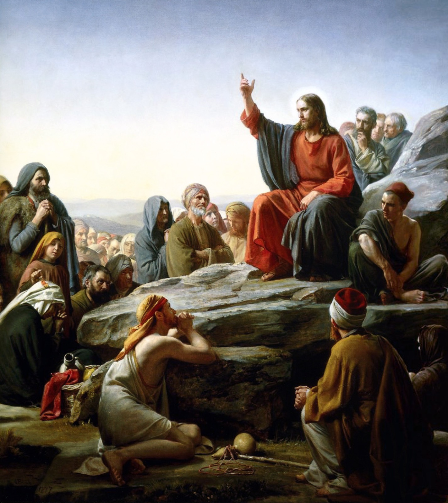
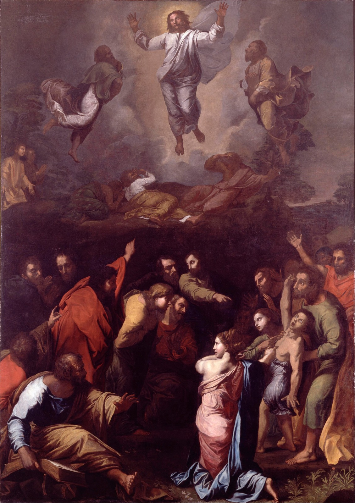
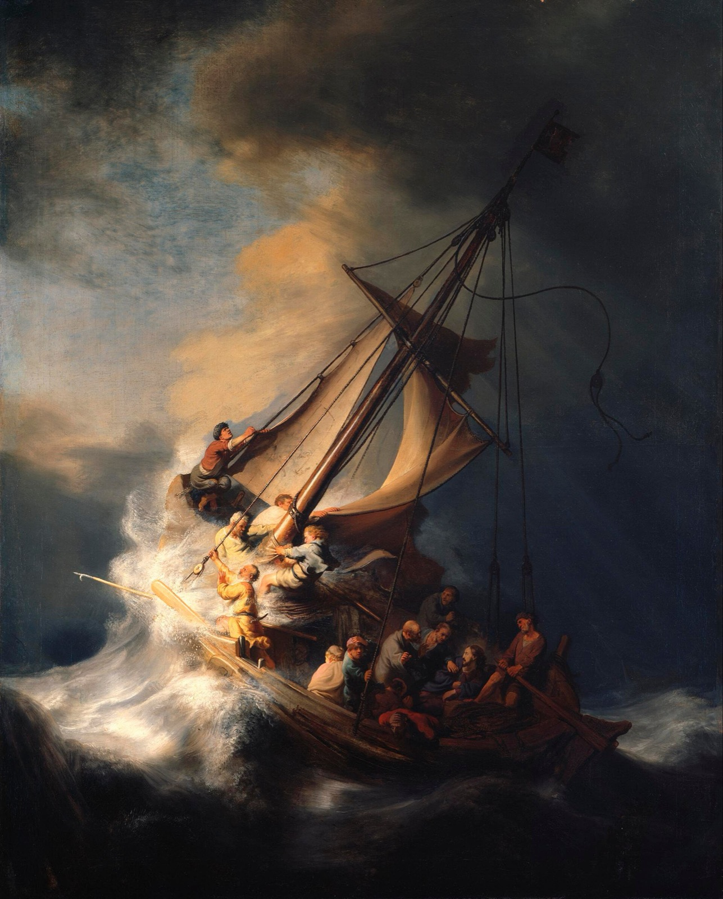
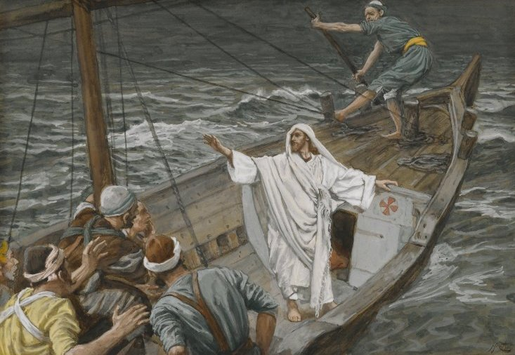

<!-- slides: origem=wiki/aprofundamentos/bem-e-mal-sofrer-ese-v-18.md -->
<!-- slides: apoio=wiki/aprofundamentos/o-mal-e-o-remedio-ese-v-19.md -->
<!-- slides: dossie=reports/palestra/bem-e-mal-sofrer-ese-v-18-19-2026-09-27-2151/dossie.md -->
<!-- slides: arco=reports/palestra/bem-e-mal-sofrer-ese-v-18-19-2026-09-27-2151/arco-revisado.md -->

# Bem e mal sofrer

**O Evangelho Segundo o Espiritismo · cap. V, itens 18–19**

Allan Kardec

Gabriel Mendonça · 01/10/2026 · C E Discípulos de Jesus

---

<!-- _footer: 'Carl Bloch, O Sermão da Montanha (1877). Domínio público, via Wikimedia Commons' -->

<!-- _class: quote -->

## O Sermão da Montanha

> Traziam-lhe todos os que padeciam, acometidos de várias enfermidades e tormentos (...). E seguia-o uma grande multidão (...). E Jesus, vendo a multidão, subiu a um monte (...).

**S. Mateus, 4:24-25; 5:1**

---

<!-- _class: quote -->

> Bem-aventurados os que choram, pois que serão consolados.

**O Evangelho Segundo o Espiritismo, cap. V, item 1 (S. Mateus, 5:4)**

> Deus vos recusa consolações, desde que vos falte coragem.

**O Evangelho Segundo o Espiritismo, cap. V, item 18 (Lacordaire)**

---

<!-- _class: pergunta -->

## Qual é, afinal, a condição do consolo que Jesus prometeu?

*A promessa aos que choram (cap. V, item 1) e a coragem que Lacordaire exige (cap. V, item 18)*

---

<!-- _class: section -->

## Música

### Bem-aventurados os aflitos

*Marielza Tiscate*

---

<!-- _class: letra -->

Se não podes ter um lugar sequer
Pra descansar o coração
Se em meio a tanta gente, não te deixa a solidão
Chora a tua alma, todos pensam que sorris
Cantam os teus lábios, falas da coragem,
Mas por dentro és infeliz

Se ninguém percebe as lágrimas que ocultas
Bem atrás do teu olhar
Se dentre os homens, a ninguém puderes
Tua dor confessar

Olha, vê quantas estrelas,
É pra lá que tu vais
Num recanto do universo...
Ah! vais encontrar a paz

"Bem-aventurados os aflitos" — Marielza Tiscate

---

<!-- _class: section -->

## Parte 1

### Se a dor bastasse, ninguém ficaria sem consolo

---

<!-- _class: quote -->

> Bem-aventurados os que choram, pois que serão consolados. — Bem-aventurados os famintos e os sequiosos de justiça, pois que serão saciados. — Bem-aventurados os que sofrem perseguição pela justiça, pois que é deles o reino dos céus.

**O Evangelho Segundo o Espiritismo, cap. V, item 1 (S. Mateus, 5:4, 6 e 10)**

---

<!-- _class: quote -->

> Somente na vida futura podem efetivar-se as compensações que Jesus promete aos aflitos da Terra. Sem a certeza do futuro, estas máximas seriam um contrassenso; mais ainda: seriam um engodo.

**O Evangelho Segundo o Espiritismo, cap. V, item 3**

---

<!-- _class: pergunta -->

## Se todos choram, o que distingue quem é consolado?

*"quer ocupem tronos, quer jazam sobre a palha" — ESE, cap. V, item 18*

---

<!-- _class: quote -->

> Quando o Cristo disse: "Bem-aventurados os aflitos, o reino dos céus lhes pertence", não se referia de modo geral aos que sofrem, visto que sofrem todos os que se encontram na Terra, quer ocupem tronos, quer jazam sobre a palha. Mas, ah! poucos sofrem bem; poucos compreendem que somente as provas bem suportadas podem conduzi-los ao reino de Deus.

**O Evangelho Segundo o Espiritismo, cap. V, item 18 (Lacordaire)**

---

<!-- _class: section -->

## Parte 2

### O desânimo fecha a porta por dentro

---

<!-- _class: pergunta -->

## Por que o desânimo seria uma falta?

*"O desânimo é uma falta." — ESE, cap. V, item 18*

---

<!-- _class: quote -->

> O desânimo é uma falta. Deus vos recusa consolações, desde que vos falte coragem. A prece é um apoio para a alma; contudo, não basta: é preciso tenha por base uma fé viva na bondade de Deus. Ele já muitas vezes vos disse que não coloca fardos pesados em ombros fracos. O fardo é proporcionado às forças, como a recompensa o será à resignação e à coragem.

**O Evangelho Segundo o Espiritismo, cap. V, item 18 (Lacordaire)**

---

<!-- _class: quote -->

> (...) cai no desânimo e, como o corpo lhe sofre a influência, toma-vos a lassidão, o abatimento, uma espécie de apatia, e vos julgais infelizes.
>
> Crede-me, resisti com energia a essas impressões que vos enfraquecem a vontade. (...) sede fortes e corajosos para os suportar. Afrontai-os resolutos.

**O Evangelho Segundo o Espiritismo, cap. V, item 25 (François de Genève)**

---

<!-- _class: pergunta -->

## Se o fardo é proporcional, de onde vem o peso a mais?

*"O fardo é proporcionado às forças" — ESE, cap. V, item 18*

---

<!-- _class: quote -->

> Entre essas faltas, cumpre se coloque na primeira fiada a carência de submissão à vontade de Deus. Logo, se murmurarmos nas aflições, se não as aceitarmos com resignação e como algo que devemos ter merecido, se acusarmos a Deus de ser injusto, nova dívida contraímos, que nos faz perder o fruto que devíamos colher do sofrimento.

**O Evangelho Segundo o Espiritismo, cap. V, item 12**

---

<!-- _class: pergunta -->

## Resignar-se, então, é cruzar os braços?

*"se não as aceitarmos com resignação" — ESE, cap. V, item 12*

---

<!-- _class: quote -->

> É lícito, àquele que se afoga, cuidar de salvar-se? Àquele em quem um espinho entrou, retirá-lo? Ao que está doente, chamar o médico? (...) O mérito consiste em sofrer, sem murmurar, as consequências dos males que lhe não seja possível evitar, em perseverar na luta, em se não desesperar, se não é bem-sucedido; nunca, porém, numa negligência, que seria mais preguiça do que virtude.

**O Evangelho Segundo o Espiritismo, cap. V, item 26 (Um anjo guardião)**

---

<!-- _class: quote -->

> Alegrai-vos, quando Deus vos enviar para a luta. Não consiste esta no fogo da batalha, mas nos amargores da vida, onde, às vezes, de mais coragem se há mister do que num combate sangrento (...). Quando vos advenha uma causa de sofrimento ou de contrariedade, sobreponde-vos a ela, e, quando houverdes conseguido dominar os ímpetos da impaciência, da cólera, ou do desespero, dizei, de vós para convosco, cheio de justa satisfação: "Fui o mais forte."

**O Evangelho Segundo o Espiritismo, cap. V, item 18 (Lacordaire)**

---

<!-- _class: quote -->

> *Bem-aventurados os aflitos* pode então traduzir-se assim: Bem-aventurados os que têm ocasião de provar sua fé, sua firmeza, sua perseverança e sua submissão à vontade de Deus, porque terão centuplicada a alegria que lhes falta na Terra, porque depois do labor virá o repouso.

**O Evangelho Segundo o Espiritismo, cap. V, item 18 (Lacordaire)**

---

## Sofrer bem é

- **coragem**, não desânimo
- **fé viva**, não prece isolada
- **resignação ativa**, não murmuração

*ESE, cap. V, itens 18 e 26*

---

<!-- _class: section -->

## Parte 3

### Por que agora murmurar?

---

<!-- _class: pergunta -->

## Será a Terra um lugar de gozo, um paraíso de delícias?

*Santo Agostinho — ESE, cap. V, item 19*

---

<!-- _class: quote -->

> Houvésseis de chorar e sofrer a vida inteira, que seria isso, a par da eterna glória reservada ao que tenha sofrido a prova com fé, amor e resignação? Buscai consolações para os vossos males no porvir que Deus vos prepara e procurai-lhe a causa no passado.

**O Evangelho Segundo o Espiritismo, cap. V, item 19 (Santo Agostinho)**

---

<!-- _class: quote -->

> Como desencarnados, quando pairáveis no espaço, escolhestes as vossas provas, julgando-vos bastante fortes para as suportar. Por que agora murmurar?

**O Evangelho Segundo o Espiritismo, cap. V, item 19 (Santo Agostinho)**

---

## O Livro dos Espíritos, q. 258.

Quando na erraticidade, antes de começar nova existência corporal, tem o Espírito consciência e previsão do que lhe sucederá no curso da vida terrena?

---

<!-- _class: quote -->

> Ele próprio escolhe o gênero de provas por que há de passar, e nisso consiste o seu livre-arbítrio.

**O Livro dos Espíritos, q. 258.**

---

## O Livro dos Espíritos, q. 259.

Do fato de pertencer ao Espírito a escolha do gênero de provas que deva sofrer, seguir-se-á que todas as tribulações que experimentamos na vida nós as previmos e escolhemos?

---

<!-- _class: quote -->

> Todas, não, porque não escolhestes e previstes tudo o que vos sucede no mundo, até às mínimas coisas. Escolhestes apenas o gênero das provações. As particularidades são a consequência da posição em que vos achais e, muitas vezes, das vossas próprias ações. (...) Previstos só são os fatos principais, os que influem no destino.

**O Livro dos Espíritos, q. 259.**

---

## O Livro dos Espíritos, q. 262a.

Quando o Espírito goza do livre-arbítrio, a escolha da existência corporal dependerá sempre exclusivamente de sua vontade, ou essa existência lhe pode ser imposta, como expiação, pela vontade de Deus?

---

<!-- _class: quote -->

> Deus sabe esperar, não apressa a expiação. Todavia, pode impor certa existência a um Espírito, quando este, pela sua inferioridade ou má vontade, não se mostra apto a compreender o que lhe seria mais benéfico, e quando vê que tal existência servirá para a purificação e o progresso do Espírito, ao mesmo tempo que lhe sirva de expiação.

**O Livro dos Espíritos, q. 262a.**

---

## O Livro dos Espíritos, q. 920.

Pode o homem gozar de completa felicidade na Terra?

---

<!-- _class: quote -->

> Não, pois a vida lhe foi dada como prova ou expiação. Dele, porém, depende a suavização de seus males e o ser tão feliz quanto possível na Terra.

**O Livro dos Espíritos, q. 920.**

---

<!-- _class: section -->

## Pausa para conversa

### Perguntas que costumam surgir

---

<!-- _class: pergunta -->

## Se escolhi minha prova, a culpa de sofrer é minha?

*"Escolhestes apenas o gênero das provações." — O Livro dos Espíritos, q. 259*

<!--
A escolha é do gênero, não do detalhe (LE, q. 259). Nem toda existência é escolhida com lucidez: pode ser imposta (LE, q. 262a). O item 6 do cap. V fala da causa anterior, não da escolha. Nunca repetir o erro dos amigos de Jó: quem sofre não é culpado aos olhos de quem vê de longe. E nem toda dor é resgate: "provas ou expiações" (LE, q. 946).
-->

---

<!-- _class: pergunta -->

## Aceitar com resignação não é desistir de lutar?

*"É lícito, àquele que se afoga, cuidar de salvar-se?" — ESE, cap. V, item 26*

<!--
Não. O mérito é sofrer sem murmurar o que "não seja possível evitar" e "perseverar na luta"; a omissão "seria mais preguiça do que virtude" (ESE, cap. V, item 26). Tratar-se, mudar de vida e buscar saída fazem parte do bem sofrer.
-->

---

<!-- _class: pergunta -->

## Só ter fé resolve, sem médico e sem terapia?

*"não assiste, porém, os que tudo esperam de um socorro estranho" — ESE, cap. XXVII, item 7*

<!--
Não. Deus "assiste os que se ajudam a si mesmos (...); não assiste, porém, os que tudo esperam de um socorro estranho, sem fazer uso das faculdades que possui". O que a prece garante "sempre" é "a coragem, a paciência e a resignação" (ESE, cap. XXVII, item 7). Emmanuel: "O comprimido ajuda, a injeção melhora" (Emmanuel / Chico Xavier, Fonte Viva, cap. 86).
-->

---

<!-- _class: pergunta -->

## Então não posso reclamar nem da injustiça dos outros?

*"se acusarmos a Deus de ser injusto" — ESE, cap. V, item 12*

<!--
A murmuração condenada é contra Deus: "se acusarmos a Deus de ser injusto, nova dívida contraímos" (ESE, cap. V, item 12). Aceitar a própria prova é diferente de se omitir diante da injustiça que atinge o próximo, que a caridade manda combater. Resignação pessoal não chama a injustiça de justa.
-->

---

<!-- _class: pergunta -->

## "Deus vos recusa consolações" — Deus é mesmo bom?

*"Deus consola os humildes e dá força aos aflitos que lha pedem" — ESE, cap. VI, item 8*

<!--
Não é castigo. "Deus consola os humildes e dá força aos aflitos que lha pedem" (ESE, cap. VI, item 8). O desânimo fecha a porta por dentro; o consolo continua oferecido. E o fardo "é proporcionado às forças" (ESE, cap. V, item 18).
-->

---

<!-- _class: section -->

## Parte 4

### O remédio: a fé

---

<!-- _class: pergunta -->

## Por que não pudemos nós outros expulsar esse demônio?

*Os discípulos a Jesus — ESE, cap. XIX, item 1 (S. Mateus, 17:19)*

---

<!-- _footer: 'Rafael, A Transfiguração (1516-1520). Domínio público, via Wikimedia Commons' -->

<!-- _class: quote -->

> Respondeu-lhes Jesus: Por causa da vossa incredulidade. Pois em verdade vos digo, se tivésseis a fé do tamanho de um grão de mostarda, diríeis a esta montanha: Transporta-te daí para ali, e ela se transportaria, e nada vos seria impossível.

**ESE, cap. XIX, item 1 (S. Mateus, 17:14-20)**

---

<!-- _class: quote -->

> Que remédio, então, prescrever aos atacados de obsessões cruéis e de cruciantes males? Só um é infalível: a fé, o apelo ao Céu. (...) A fé é o remédio seguro do sofrimento; mostra sempre os horizontes do infinito diante dos quais se esvaem os poucos dias brumosos do presente.

**O Evangelho Segundo o Espiritismo, cap. V, item 19 (Santo Agostinho)**

---

<!-- _class: pergunta -->

## Quem duvida é imediatamente punido — punido por quem?

*"aquele que duvida um instante da sua eficácia é imediatamente punido, porque logo sente as pungitivas angústias da aflição" — ESE, cap. V, item 19*

---

<!-- _class: quote -->

> Todos os sofrimentos: misérias, decepções, dores físicas, perda de seres amados, encontram consolação em a fé no futuro, em a confiança na justiça de Deus (...). Sobre aquele que, ao contrário, nada espera após esta vida, ou que simplesmente duvida, as aflições caem com todo o seu peso e nenhuma esperança lhe mitiga o amargor.

**O Evangelho Segundo o Espiritismo, cap. VI, item 2**

---

<!-- _class: quote -->

> A fé robusta dá a perseverança, a energia e os recursos que fazem se vençam os obstáculos, assim nas pequenas coisas, que nas grandes.

**O Evangelho Segundo o Espiritismo, cap. XIX, item 2**

> A fé sincera e verdadeira é sempre calma; faculta a paciência que sabe esperar (...).

**O Evangelho Segundo o Espiritismo, cap. XIX, item 3**

---

<!-- _class: quote -->

> Para ser proveitosa, a fé tem de ser ativa; não deve entorpecer-se. (...) Não admitais a fé sem comprovação, cega filha da cegueira.

**O Evangelho Segundo o Espiritismo, cap. XIX, item 11 (José, Espírito protetor)**

---

<!-- _class: quote -->

> Àquele que se acha no interior de uma cidade, tudo lhe parece grande (...). Suba ele, porém, a uma montanha, e logo bem pequenos lhe parecerão homens e coisas.

**O Evangelho Segundo o Espiritismo, cap. II, item 5**

> As vicissitudes e tribulações dessa vida não passam de incidentes que ele suporta com paciência, por sabê-las de curta duração (...).

**O Evangelho Segundo o Espiritismo, cap. II, item 5**

---

<!-- _footer: 'Rembrandt, A Tempestade no Mar da Galileia (1633). Domínio público, via Wikimedia Commons' -->

<!-- _class: quote -->

> (...) sobreveio uma tempestade de vento no lago, e enchiam-se de água, estando em perigo. E, chegando-se a ele, o despertaram, dizendo: Mestre, Mestre, perecemos.

**S. Lucas, 8:23-24**

---

<!-- _footer: 'James Tissot, Jesus acalmando a tempestade (1886-1894). Domínio público, via Wikimedia Commons' -->

<!-- _class: pergunta -->

## Onde está a vossa fé?

*Jesus, depois de acalmar o vento — S. Lucas, 8:25*

---

## A fé dá

- **coragem**
- **paciência**
- **perseverança**

*ESE, cap. V, item 18; cap. XIX, itens 2-3*

---

<!-- _class: section -->

## Para meditar

### Joseph Maître: a mesma cegueira, duas respostas

*O Céu e o Inferno, 2ª parte, cap. VIII*

<!--
PLANO B: usar só se sobrar tempo (+5 min).
1ª vida: "Blasfemei contra Deus, reneguei-o, acusei-o (...)", e suicídio.
2ª vida: "Voltei aqui com a fé inata, por isso não murmurei mais contra ele, e aceitei minha dupla enfermidade com resignação (...)".
Pausar na blasfêmia; virar com "voltei aqui com a fé inata". Fechar com "Expiei, preciso reparar agora": o bem sofrer é porta, não ponto de chegada.
-->

---

<!-- _class: section -->

## Síntese

### O que fazer para ser consolado?

---

1. Todos sofrem, mas poucos sofrem bem *(cap. V, item 18)*
2. A condição: **coragem → consolo** *(cap. V, item 18)*
3. Murmurar fecha a porta *(cap. V, itens 12 e 19)*
4. O remédio: **fé → coragem** *(cap. V, item 19)*

*O Evangelho Segundo o Espiritismo*

---

<!-- _class: quote -->

> Ditosos os que sofrem e choram! Alegres estejam suas almas, porque Deus as cumulará de bem-aventuranças.

**O Evangelho Segundo o Espiritismo, cap. V, item 19 (Santo Agostinho)**

---

<!-- _class: section -->

## Música

### Jesus contigo

*Luiz Pedro Silva Paulo · letra: soneto "No Livro d'Alma", de Auta de Souza (Espírito)*

---

<!-- _class: letra -->

Se tens fé, não te aflija a noite escura.
Ao coração que a lágrima domina
Ele estende, amoroso, a mão divina
E abre as portas da paz, risonha e pura;

Alivia a aspereza da amargura
E sobre as trevas de miséria e ruína
Acende nova estrela matutina
Na esperança sublime que perdura.

Se a crença viva te dirige os passos
Sob a carícia de celestes braços,
Receberás o pão, a luz, o abrigo...

Ama a cruz que te ampara e regenera
E, envolvendo-te em santa primavera,
O Mestre Amado seguirá contigo.

"Jesus contigo" — Luiz Pedro Silva Paulo · soneto "No Livro d'Alma", de Auta de Souza (Espírito)
