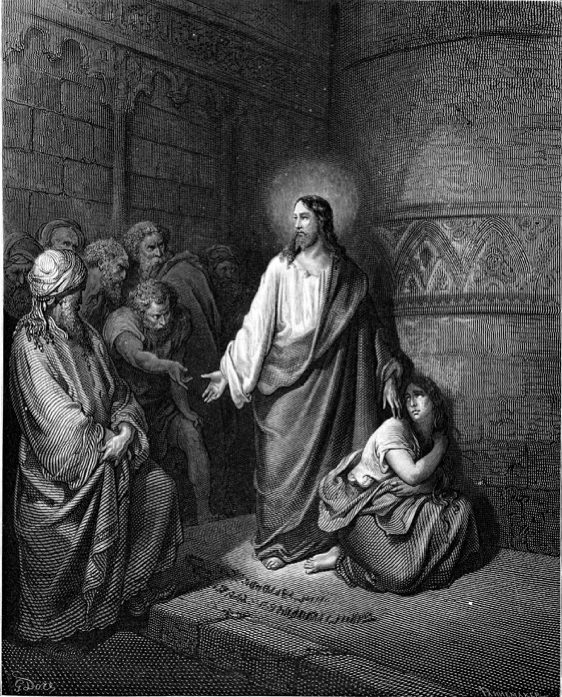
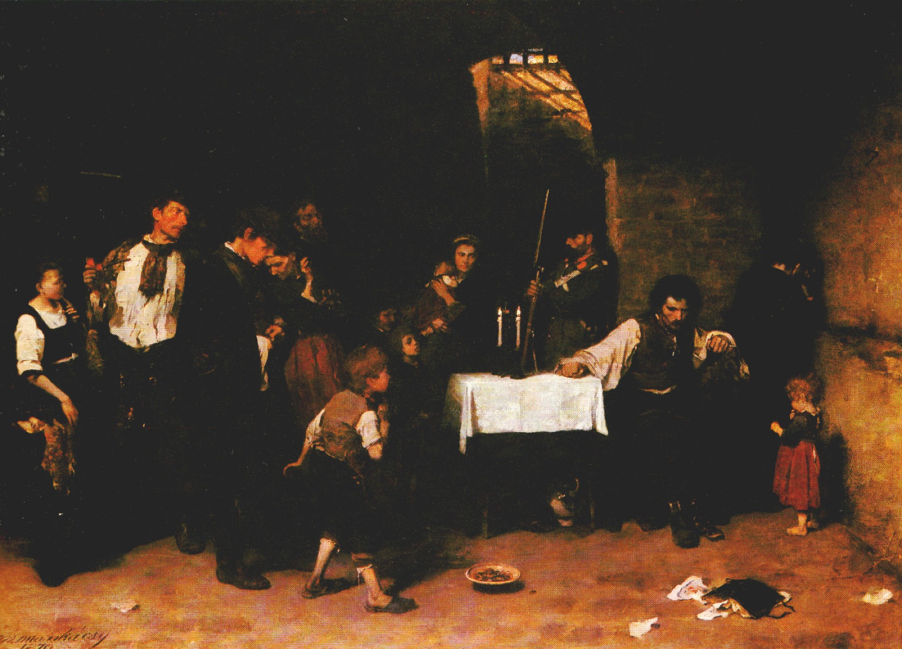
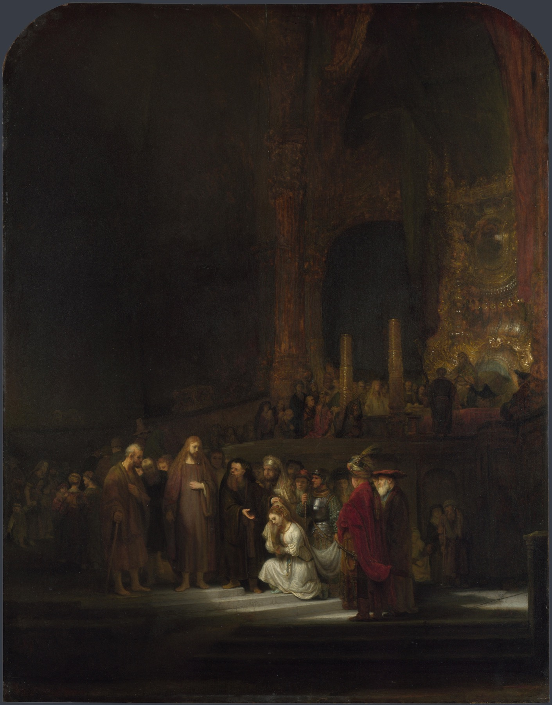

# "Atire a primeira pedra": a indulgência não é fraqueza, é justiça

**O Evangelho Segundo o Espiritismo · cap. X**

Gabriel Mendonça · 20/06/2026 · Templo Espírita Seareiros

---

<!-- _class: pergunta -->

## Diante da adúltera, os acusadores se retiraram "afastando-se primeiro os velhos". Por que os mais velhos foram os primeiros a largar a pedra?

*O Evangelho Segundo o Espiritismo, cap. X, item 12 (S. João, 8:9)*

---

<!-- _class: section -->

## Parte 1

### "Indulgência é fazer vista grossa"?

---

A quinta bem-aventurança do Sermão da Montanha abre o tema — e nela a recompensa já está inscrita na própria conduta:

<!-- _class: quote -->

> Bem-aventurados os que são misericordiosos, porque obterão misericórdia.

**O Evangelho Segundo o Espiritismo, cap. X, item 1 (S. Mateus, 5:7)**

---

<!-- _class: quote -->

> A misericórdia é o complemento da brandura (...). Ela consiste no esquecimento e no perdão das ofensas. (...) Com que direito reclamaria ele o perdão de suas próprias faltas, se não perdoa as dos outros? Jesus nos ensina que a misericórdia não deve ter limites (...).

**O Evangelho Segundo o Espiritismo, cap. X, item 4**

---

<!-- _class: pergunta -->

## Se a misericórdia é "o esquecimento e o perdão das ofensas, sem limites", não seria pregar que tudo se releva — que o indulgente é o frouxo que tudo desculpa?

---

<!-- _class: section -->

## Parte 2

### A correção de Jesus: indulgência é dever, porque dela todos precisamos

---

<!-- _class: quote -->

> "Esta mulher acaba de ser surpreendida em adultério; ora, Moisés, pela lei, ordena que se lapidem as adúlteras. (...)" — [Jesus] se levantou e disse: "Aquele dentre vós que estiver sem pecado, atire a primeira pedra." (...) ouvindo-o falar daquele modo, se retiraram, um após outro, afastando-se primeiro os velhos.

**O Evangelho Segundo o Espiritismo, cap. X, item 12 (S. João, 8:3–11)**

---

Jesus não relativizou o erro — disse à mulher "vai-te e não tornes a pecar". Mas desarmou quem acusava. E Kardec extrai daí o coração do tema:

<!-- _class: quote -->

> "Atire-lhe a primeira pedra aquele que estiver isento de pecado", disse Jesus. Essa sentença faz da indulgência um dever para nós outros, porque ninguém há que não necessite, para si próprio, de indulgência. (...) a letra mata e o espírito vivifica. (...) a autoridade para censurar está na razão direta da autoridade moral daquele que censura.

**O Evangelho Segundo o Espiritismo, cap. X, item 13**

---

## O Livro dos Espíritos, q. 886

Qual o verdadeiro sentido da palavra caridade, como a entendia Jesus?

---

<!-- _class: quote -->

> Benevolência para com todos, indulgência para as imperfeições dos outros, perdão das ofensas. (...) Ela nos prescreve a indulgência, porque de indulgência precisamos nós mesmos.

**O Livro dos Espíritos, q. 886 (Resposta dos Espíritos)**

---

<!-- _class: pergunta -->

## Se "de indulgência precisamos nós mesmos", a indulgência é apenas não julgar — ou ela me pede algo positivo diante do erro do outro?

---

<!-- _class: section -->

## Parte 3

### "Severos para convosco, indulgentes para com os outros"

---

O Espírito José dá a definição mais completa do tema no capítulo — e o lema da palestra:

<!-- _class: quote -->

> A indulgência não vê os defeitos de outrem, ou, se os vê, evita falar deles (...). Sede, pois, severos para convosco, indulgentes para com os outros. (...) a indulgência atrai, acalma, ergue, ao passo que o rigor desanima, afasta e irrita.

**O Evangelho Segundo o Espiritismo, cap. X, item 16 (José, Espírito protetor)**

---

<!-- _class: pergunta -->

## O lema inverte o nosso hábito: somos severos com os outros e indulgentes conosco. O que muda na minha vida quando troco a direção dessa severidade?

---

<!-- _class: section -->

## Parte 4

### Indulgência não é conivência nem perdão fingido

---

Ser indulgente não é calar diante do erro. Repreender, com medida, continua dever:

<!-- _class: quote -->

> Ninguém sendo perfeito, seguir-se-á que ninguém tem o direito de repreender o seu próximo? Certamente que não (...). Mas (...) deveis fazê-lo com moderação, para um fim útil, e não (...) pelo prazer de denegrir. (...) a censura que alguém faça a outrem deve ao mesmo tempo dirigi-la a si próprio.

**O Evangelho Segundo o Espiritismo, cap. X, item 19 (S. Luís)**

---

E o perdão de fachada, que guarda rancor por dentro, não conta diante de Deus:

<!-- _class: quote -->

> Há o perdão dos lábios e o perdão do coração. (...) o perdão verdadeiro, o perdão cristão é aquele que lança um véu sobre o passado; esse o único que vos será levado em conta, visto que Deus não se satisfaz com as aparências.

**O Evangelho Segundo o Espiritismo, cap. X, item 15 (Paulo, apóstolo)**

---

<!-- _class: section -->

## Parte 5

### O alcance espiritual: indulgência e obsessão

---

Aqui o Espiritismo aprofunda a leitura evangélica: o rancor não saldado não morre com o corpo.

<!-- _class: quote -->

> Na prática do perdão (...) não há somente um efeito moral: há também um efeito material. (...) Nesse fato reside a causa da maioria dos casos de obsessão (...). Quando Jesus recomenda que nos reconciliemos o mais cedo possível com o nosso adversário (...) é, principalmente, para que elas se não perpetuem nas existências futuras.

**O Evangelho Segundo o Espiritismo, cap. X, item 6**

---

<!-- _class: quote -->

> Amar os inimigos é perdoar-lhes e lhes retribuir o mal com o bem. Aquele que assim procede se torna superior aos seus inimigos, ao passo que abaixo deles se coloca quem procura tomar vingança.

**O Livro dos Espíritos, q. 887**

---

<!-- _class: pergunta -->

## Quem de fato sai ganhando na indulgência: o ofensor perdoado, ou aquele que perdoa?

---

<!-- _class: section -->

## Para meditar

---

## Lemaire

*O Céu e o Inferno, 2ª parte, cap. VI — "Criminosos arrependidos"*

O criminoso que, no além, vê as próprias vítimas em paz — e ainda as odeia.

O rancor não pune quem o recebe: pune quem o guarda.

---

<!-- _class: section -->

## Síntese

---

## Síntese

- "Atire a primeira pedra" **não** relativiza o erro — faz da indulgência um **dever** de quem também precisa dela (cap. X, item 13).
- A indulgência é o **avesso do nosso hábito**: "severos para convosco, indulgentes para com os outros" — virtude ativa que ergue, não omissão que cala (item 16).
- **Não é laxismo**: repreender com moderação e fim útil continua dever (item 19); o perdão dos lábios que guarda rancor não conta diante de Deus (item 15).

---

## Síntese

- O alcance é **espiritual**: o rancor não saldado é raiz da maioria das obsessões e se perpetua em outras vidas (cap. X, item 6).
- Por isso "**obterão misericórdia**" não é prêmio arbitrário, mas **lei de causa e efeito**: de indulgência precisamos nós mesmos (O Livro dos Espíritos, q. 886).

---

## Esta semana

Antes de apontar a falta de alguém, a pergunta de Kardec: *o que reclamo de indulgência para mim, já concedo ao próximo?*

E a resolução de Simeão, para fechar cada dia:

> Nada tenho contra o meu próximo.

**O Evangelho Segundo o Espiritismo, cap. X, item 14 (Simeão)**
