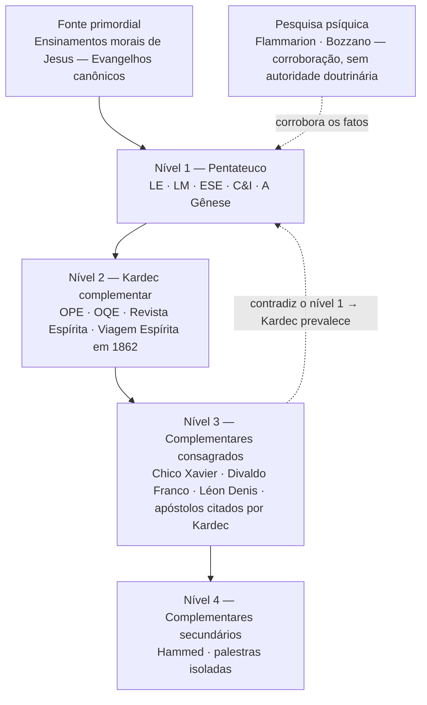

# Hierarquia de autoridade

## Pergunta motivadora

Como se estrutura a hierarquia de fontes da wiki IsAbel? Que peso cada nível carrega, por quê, e como se resolve um conflito entre eles? Em particular: onde os quatro Evangelhos canônicos e os escritos apostólicos devem se encaixar, considerando que Jesus é o modelo mais perfeito oferecido por Deus à Humanidade, mas que seus ensinamentos foram transmitidos por meio de alegorias e textos historicamente mediados?

---

## A hierarquia — visão geral

| Posição | Fontes | Critério de uso |
|---------|--------|-----------------|
| **Fonte primordial** | Ensinamentos morais de Jesus (Evangelhos canônicos) | Fundação sobre a qual Kardec construiu o ESE. Sempre lidos à luz do Pentateuco. |
| **1 — Pentateuco** | LE, LM, ESE, C&I, Gênese | Base inamovível da codificação. Critério final de toda questão doutrinária. |
| **2 — Kardec complementar** | OPE, OQE, Revista Espírita, Viagem Espírita em 1862 | Mesma autoridade intelectual (Kardec), mas status editorial distinto — obras introdutórias, inacabadas ou periódicas. |
| **3 — Complementares consagrados** | Chico Xavier, Divaldo Franco, Léon Denis, Gabriel Delanne, Yvonne Pereira, Cairbar Schutel, Martins Peralva, Eurípedes Barsanulfo; os Espíritos Emmanuel, André Luiz, Joanna de Ângelis e Bezerra de Menezes; os escritos apostólicos (Paulo, Pedro, João, Tiago), seletivamente citados por Kardec | Aprofundam, ilustram e expandem a Doutrina; prevalecem quando não contradizem o Pentateuco. |
| **4 — Complementares secundários** | Hammed / Francisco do Espírito Santo Neto, palestras isoladas e outros autores alinhados à codificação | Úteis para aplicação e ilustração; citados com consciência de que não têm o peso do nível 3. |
| **Pesquisa psíquica** | Camille Flammarion, Ernesto Bozzano e demais pesquisadores da fenomenologia | Corroboração experimental dos fenômenos, **sem** autoridade doutrinária. |
| **Fora de escopo** | Umbanda, Candomblé, Ramatís, teosofia, antroposofia, rosacruzes, ocultismo, New Age, neoespiritismo que relativiza o Pentateuco | Não ingerir sem confirmação explícita do usuário. |

**Regra de ouro:** quando nível 2, 3 ou 4 contradiz o nível 1, Kardec prevalece. A divergência é registrada, nunca apagada.

O diagrama abaixo resume a escala; a fundamentação de cada nível está nas seções seguintes.

---

## Descrição de cada nível

### Fonte primordial — Ensinamentos morais de Jesus

#### 1. Jesus está acima da hierarquia — sua moral é a própria fundação

Kardec é inequívoco:

> "Qual o tipo mais perfeito que Deus já ofereceu ao homem para lhe servir de guia e modelo? — Jesus." (LE, q. 625)

> "Para o homem, Jesus constitui o tipo da perfeição moral a que a humanidade pode aspirar na Terra. Deus no-lo oferece como o mais perfeito modelo, e a doutrina que ensinou é a expressão mais pura da lei do Senhor, porque o espírito divino o animava, e porque foi o ser mais puro de quantos têm aparecido na Terra." (LE, q. 625, comentário)

O ESE inteiro é construído sobre as máximas e parábolas de Jesus. Cada capítulo parte de um trecho evangélico, comentado por Kardec com o auxílio de comunicações de Espíritos superiores. Nesse sentido, **os ensinamentos morais de Jesus não são "um nível" da hierarquia — são a matéria-prima do nível 1**. Kardec não inventou a moral espírita; extraiu-a dos Evangelhos e explicou-a à luz da razão e das comunicações dos Espíritos superiores.

#### 2. Mas os textos evangélicos não são o mesmo que os ensinamentos de Jesus

Kardec distingue claramente entre:

- **O que Jesus ensinou** — moral sublime, permanente, universal
- **O texto que chegou a nós** — escrito décadas depois, por transmissão oral, com alegorias deliberadas, interpolações e adições humanas

No ESE (cap. XXIV), Kardec explica *por que Jesus fala por parábolas*, citando Mateus 13:10–15: "É porque, a vós outros, foi dado conhecer os mistérios do reino dos céus; mas, a eles, isso não lhes foi dado." (ESE, cap. XXIV, item 3). Jesus **propositalmente** velou parte dos ensinamentos porque a Humanidade não estava madura para recebê-los em toda a sua clareza.

Léon Denis desenvolve esse ponto com rigor em *Cristianismo e Espiritismo* (caps. I–IV). Denis examina a origem e transmissão dos Evangelhos, mostrando que Jesus ensinava em dois níveis: parábolas para as multidões e ensino reservado para os discípulos. A "doutrina secreta" incluía a reencarnação — demonstrada pelo diálogo com Nicodemos ("Se um homem não nascer de novo…", João 3:3) e pela identificação de João Batista com Elias (Mateus 17:10–13).

Denis também mostra que os textos evangélicos passaram por décadas de transmissão oral, contêm interpolações dos copistas, e os concílios selecionaram quais textos eram "canônicos" por critérios políticos, não espirituais (caps. I–II, notas 1–3).

#### 3. O Espiritismo é a chave interpretativa dos Evangelhos — não o contrário

Kardec define o Espiritismo como o Consolador prometido por Jesus (João 14:16–17), que vem dar **o entendimento racional** do que o Cristo ensinou por alegorias:

> "Assim como o Cristo disse: “Não vim destruir a lei, porém cumpri-la”, também o Espiritismo diz: “Não venho destruir a lei cristã, mas dar-lhe execução.”" (ESE, cap. I, item 7)

A promessa do Consolador é retomada em *A Gênese* (cap. XVII, seção "Anunciação do Consolador"), onde Kardec identifica o Consolador com a revelação espírita.

A relação é precisa: o Pentateuco **interpreta** os Evangelhos, e não os Evangelhos que controlam o Pentateuco. Quando um trecho evangélico parece contradizer Kardec, a pergunta correta não é "Kardec errou?", mas sim: **essa é mesmo a palavra de Jesus, ou é adição humana, alegoria mal compreendida ou interpolação?**

É o que Kardec demonstra nas *Obras Póstumas* ("Estudo sobre a natureza do Cristo"), ao examinar sistematicamente os textos evangélicos e concluir que: os milagres são fenômenos naturais explicáveis pelos fluidos; as palavras de Jesus afirmam sistematicamente sua subordinação ao Pai; e o dogma da divindade resulta de decisão dos homens no Concílio de Nicéia, não de revelação divina (OPE, §II–IX).

#### 4. A analogia do sol e do telescópio

**Os ensinamentos de Jesus são o sol; o Pentateuco é o telescópio que nos permite olhar para ele sem nos cegar.**

Não se coloca o sol "abaixo" do telescópio, mas também não se olha para ele sem o instrumento. Na prática:

- Quando uma passagem evangélica já foi interpretada por Kardec no Pentateuco, essa interpretação **é** nível 1. Ex.: "Nascer de novo" (João 3:3) = reencarnação (ESE, cap. IV).
- Quando uma passagem evangélica **não** foi abordada por Kardec, ela pode ser consultada, mas com consciência de que se trata de alegoria e texto historicamente mediado — e deve ser interpretada à luz dos princípios gerais da codificação.

#### 5. Os escritos apostólicos — Paulo, Pedro, João, Tiago

Os apóstolos ocupam posição distinta da de Jesus. Foram seus discípulos e transmissores, mas também foram intérpretes — e toda interpretação carrega a marca do intérprete. O próprio Kardec traça a distinção:

> "Todos os escritos posteriores, sem exclusão dos de S. Paulo, são apenas, e não podem deixar de ser, simples comentários ou apreciações, reflexos de opiniões pessoais, muitas vezes contraditórias, que, em caso algum, poderiam ter a autoridade da narrativa dos que receberam diretamente do Mestre as instruções." (OPE, "Estudo sobre a natureza do Cristo", §I)

#### Paulo

Kardec cita Paulo seletivamente no Pentateuco:

- **O hino à caridade** (1 Coríntios 13:1–7, 13) — citado no ESE, cap. XV ("Fora da caridade não há salvação"), como expressão máxima do ensinamento do Cristo sobre o amor.
- **A subordinação do Cristo ao Pai** (1 Coríntios 15:28: "O Filho estará, ele mesmo, submetido àquele que lhe terá submetido todas as coisas") — citado nas OPE, "Natureza do Cristo", §VI, como prova de que os apóstolos tratavam Jesus como enviado de Deus, não como Deus.

Erasto, comunicante frequente do ESE e do LM, é identificado como "discípulo de São Paulo" (LM, 2ª parte, cap. XXXI) — o que indica reconhecimento de Paulo como missionário legítimo do Cristo.

Contudo, Paulo também introduziu elementos teológicos próprios que não aparecem na codificação: a justificação pela fé (Romanos 3:28), o corpo místico do Cristo (1 Coríntios 12), a centralidade da ressurreição como prova da fé (1 Coríntios 15:17). Kardec nunca lhe deu a mesma estatura que dá a Jesus.

#### João

O Evangelho de João é a principal fonte da promessa do Consolador (João 14:16–17, 26; 16:7–13), pedra angular da tese das Três Revelações (ESE, cap. I; Gênese, cap. XVII). As epístolas de João também são citadas: "Meus bem-amados, não creais em qualquer Espírito; experimentai se os Espíritos são de Deus" (1 João 4:1) abre o ESE, cap. XXI, item 6, e é central para o discernimento mediúnico.

#### Pedro e Tiago

Pedro aparece no Pentateuco sobretudo como personagem das narrativas evangélicas, não como autor de epístolas comentadas por Kardec. A Epístola de Tiago não é citada no Pentateuco; sua tese de que a fé sem obras é morta (Tiago 2:17) converge com a primazia da caridade no ESE (cap. XV), mas é consultada como nível 3, não como texto que Kardec tenha interpretado.

#### 6. A posição de Léon Denis sobre o Cristianismo primitivo

Denis dedica toda a sua obra *Cristianismo e Espiritismo* (1898) à demonstração de que **o Cristianismo primitivo era essencialmente espírita**. Os primeiros cristãos se comunicavam com os Espíritos dos mortos; o "dom de profecia" era a mediunidade; as aparições de Jesus após a morte são fenômenos mediúnicos naturais (caps. V–VI).

Denis mostra que a supressão do profetismo pela Igreja a partir do séc. III marcou a ruptura com o Cristianismo autêntico. Para Denis, os dogmas — Trindade, pecado original, penas eternas, infalibilidade papal — são construções humanas dos concílios, contrárias ao ensino de Jesus e à razão (caps. VI–VII).

Essa análise reforça o princípio de que os textos do Novo Testamento requerem uma leitura criteriosa: é preciso separar o ensinamento original de Jesus das camadas de interpretação humana que se acumularam sobre ele ao longo dos séculos.

---

### Nível 1 — O Pentateuco de Kardec

O Pentateuco é a **base inamovível** da codificação espírita: cinco obras publicadas por Allan Kardec entre 1857 e 1868, cada qual abordando uma dimensão da Doutrina. Juntas, formam um corpo coerente que cobre filosofia, ciência e moral.

O próprio Kardec definiu o critério de validade que sustenta essas obras: a **concordância universal do ensino dos Espíritos**. Não é a opinião de um Espírito isolado que faz doutrina, mas o ensino confirmado por múltiplos Espíritos, através de múltiplos médiuns, em múltiplos lugares:

> "A doutrina espírita há resultado do ensino coletivo e concordante dos Espíritos." (Gênese, epígrafe)

> "Generalidade e concordância no ensino, esse o caráter essencial da doutrina, a condição mesma da sua existência [...]" (Gênese, Introdução)

Esse critério metodológico — que diferencia o Espiritismo de toda revelação anterior — está na origem da autoridade normativa do Pentateuco.

#### *O Livro dos Espíritos* (LE, 1857/1860)

Marco fundador. 1.019 questões feitas aos Espíritos, com respostas ditadas por eles e comentários de Kardec. Cobre: existência de Deus, elementos do Universo, princípio vital, natureza e destino dos Espíritos, encarnação e reencarnação, as dez leis morais, livre-arbítrio, penas e gozos futuros.

> "Os princípios da doutrina espírita sobre a imortalidade da alma, a natureza dos Espíritos e suas relações com os homens, as leis morais, a vida presente, a vida futura e o porvir da humanidade — segundo os ensinos dados por Espíritos superiores." (LE, subtítulo)

É a obra que define Jesus como "o tipo mais perfeito que Deus tem oferecido ao homem" (LE, q. 625) e que estabelece Deus como "a inteligência suprema, causa primária de todas as coisas" (LE, q. 1).

Ver [[wiki/obras/livro-dos-espiritos]].

#### *O Livro dos Médiuns* (LM, 1861)

Guia prático do Espiritismo experimental. Duas partes: noções preliminares (4 capítulos) e manifestações espíritas (32 capítulos), da teoria das manifestações à prática da comunicação mediúnica. Define os tipos de médiuns, as condições das evocações, os critérios de identidade dos Espíritos, os perigos da fascinação e da obsessão, e as regras para a condução de grupos.

> "De muitas dificuldades se mostra içada a prática do Espiritismo e nem sempre isenta de inconvenientes a que só o estudo sério e completo pode obviar." (LM, Introdução)

Estabelece o método: observação, experimentação e exame crítico racional (LM, 1ª parte, cap. III). O sobrenatural não existe — "Nada há de sobrenatural neste fato" (LM, 1ª parte, cap. II, item 7).

Ver [[wiki/obras/livro-dos-mediuns]].

#### *O Evangelho Segundo o Espiritismo* (ESE, 1864)

A moral evangélica à luz espírita. 28 capítulos, cada qual partindo de uma máxima ou parábola de Jesus comentada por Kardec com o auxílio de comunicações de Espíritos superiores. Trata exclusivamente da parte moral do Evangelho — não aborda fenômenos mediúnicos nem ciência.

A Introdução classifica os ensinamentos do Cristo em cinco categorias e apresenta as três revelações progressivas: Moisés (lei do temor), Cristo (lei do amor), Espiritismo (lei da razão e da fé esclarecida). É a obra que mais diretamente incorpora os Evangelhos canônicos, servindo como **a leitura espírita autorizada dos ensinamentos morais de Jesus**.

Ver [[wiki/obras/evangelho-segundo-o-espiritismo]].

#### *O Céu e o Inferno* (C&I, 1865)

Justiça divina segundo o Espiritismo. 2 partes: a primeira (11 capítulos) refuta doutrinariamente as penas eternas, desmaterializa o céu e o inferno, e demonstra que anjos e demônios são Espíritos em diferentes graus de progresso; a segunda (8 capítulos) apresenta dezenas de relatos de Espíritos evocados — felizes, sofredores, suicidas, criminosos arrependidos, endurecidos — como demonstração empírica dos princípios expostos.

> "Se Deus é perfeito, a condenação eterna não existe; se ela existe, Deus não é perfeito." (C&I, 1ª parte, cap. VI, item 15)

Estabelece o código penal da vida futura em 33 princípios e a tríade arrependimento–expiação–reparação (C&I, 1ª parte, cap. VII).

Ver [[wiki/obras/ceu-e-inferno]].

#### *A Gênese* (Gênese, 1868)

Última obra do Pentateuco. 18 capítulos em três partes: a Gênese (cosmogonia, geologia, gênese orgânica e espiritual), os Milagres (teoria dos fluidos, explicação natural dos prodígios evangélicos) e as Predições (sinais dos tempos, geração nova, transição planetária).

> "Deus prova a sua grandeza e o seu poder pela imutabilidade das suas leis e não pela ab-rogação delas." (Gênese, epígrafe)

Introduz o fluido cósmico universal como substância primitiva única (cap. VI), a raça adâmica como colônia espiritual migrada de outro mundo (cap. XI), e a promessa do Consolador identificada com o Espiritismo (cap. XVII).

Ver [[wiki/obras/genese]].

---

### Nível 2 — Kardec complementar

Obras de Allan Kardec que **não integram o Pentateuco** mas carregam a mesma autoridade intelectual do codificador. A distinção é editorial e funcional, não de qualidade: são obras introdutórias, periódicas, póstumas ou inacabadas.

#### *Obras Póstumas* (OPE, 1890)

Coletânea de textos inéditos e inacabados de Kardec, organizada postumamente por P.-G. Leymarie. Inclui a Profissão de fé raciocinada, o extenso estudo sobre a natureza do Cristo (9 seções), as cinco alternativas da Humanidade, o conceito de morte espiritual, o relato autobiográfico da iniciação de Kardec, o Livro das Previsões e o projeto inacabado de Constituição do Espiritismo.

Embora contenha material de primeira linha (o estudo sobre a natureza do Cristo é um dos textos mais analíticos de Kardec), seu status póstumo e inacabado a situa no nível 2: Kardec não a revisou para publicação final.

Ver [[wiki/obras/obras-postumas]].

#### *O Que é o Espiritismo* (OQE, 1859)

Obra introdutória em três capítulos com diálogos fictícios (um crítico, um cético e um padre), seguidos de noções elementares e respostas a problemas. Traz as duas definições canônicas do Espiritismo:

> "O Espiritismo é, ao mesmo tempo, uma ciência de observação e uma doutrina filosófica." (OQE, Preâmbulo)

> "O Espiritismo é a ciência que trata da natureza, origem e destino dos Espíritos, bem como de suas relações com o mundo corporal." (OQE, Preâmbulo)

Nível 2 porque é obra de divulgação que sintetiza o Pentateuco, sem acrescentar doutrina nova.

Ver [[wiki/obras/o-que-e-o-espiritismo]].

#### *Revista Espírita* (RE, 1858–1869)

Periódico mensal fundado e dirigido por Kardec ao longo de 12 anos. Registro vivo do desenvolvimento da Doutrina: relatos de fenômenos, comunicações mediúnicas, correspondência, refutações, artigos doutrinários. É fonte riquíssima de contexto e de posições de Kardec sobre questões específicas, mas seu caráter jornalístico e cronológico a distingue das obras sistematizadas do Pentateuco.

#### *Viagem Espírita em 1862*

Relato da terceira turnê de Kardec pela França. Contém discursos nas reuniões gerais de Lyon e Bordeaux, instruções particulares aos grupos e um modelo de regulamento. Fonte de referência para organização de grupos espíritas e para o conceito de verdadeiro espírita, mas de escopo circunscrito.

Ver [[wiki/obras/viagem-espirita-em-1862]].

---

### Nível 3 — Complementares consagrados

Autores e Espíritos comunicantes cujas obras **aprofundam, ilustram e expandem** a Doutrina Espírita em alinhamento com a codificação. Prevalecem quando não contradizem o Pentateuco; quando contradizem, Kardec prevalece e a divergência é registrada em [[wiki/divergencias/index|Divergências]], com as duas posições citadas.

#### Critério de inclusão

Um autor ou Espírito comunicante entra neste nível quando:
- Suas obras demonstram fidelidade aos princípios da codificação de Kardec.
- São reconhecidos pelo movimento espírita como continuadores legítimos da obra de Kardec.
- Acrescentam detalhes, exemplos, aplicações práticas ou aprofundamentos que o Pentateuco não cobre — sem contradizer seus fundamentos.

#### Autores e Espíritos comunicantes

- **Léon Denis** (1846–1927) — filósofo espírita francês, considerado o "apóstolo do Espiritismo". Continuador direto de Kardec. Obras na wiki: *Depois da Morte*, *Cristianismo e Espiritismo*, *O Problema do Ser e do Destino*, *O Grande Enigma*. Ver [[wiki/personalidades/leon-denis]].
- **Chico Xavier** (1910–2002) — médium psicógrafo brasileiro, mais de 400 obras. Canal de Emmanuel, André Luiz e dezenas de outros Espíritos. Ver [[wiki/personalidades/chico-xavier]].
- **Emmanuel** — guia espiritual de Chico Xavier. Autor espiritual de *A Caminho da Luz*, *O Consolador*, entre outros. Ver [[wiki/personalidades/emmanuel]].
- **Divaldo Franco** (1927–2025) — médium, orador, cofundador da Mansão do Caminho. Canal de Joanna de Ângelis e outros. Ver [[wiki/personalidades/divaldo-franco]].
- **André Luiz** — autor espiritual da série aberta por *Nosso Lar* (1944), pela mediunidade de Chico Xavier (algumas obras com Waldo Vieira). Ver [[wiki/personalidades/andre-luiz]].
- **Joanna de Ângelis** — autora espiritual da série psicológica recebida por Divaldo Franco. Ver [[wiki/personalidades/joanna-de-angelis]].
- **Bezerra de Menezes** (1831–1900) — médico e dirigente da FEB; depois da desencarnação, comunicante por vários médiuns. Ver [[wiki/personalidades/bezerra-de-menezes]].
- **Yvonne Pereira** (1900–1984) — médium de [[wiki/obras/memorias-de-um-suicida|*Memórias de um Suicida*]]. Ver [[wiki/personalidades/yvonne-pereira]].
- **Martins Peralva** (1909–1992) — didata do estudo em grupo (*Estudando a Mediunidade*, *Estudando o Evangelho*) e sistematizador da obra de Emmanuel. Ver [[wiki/personalidades/martins-peralva]].
- **Gabriel Delanne**, **Cairbar Schutel** e **Eurípedes Barsanulfo** — e outros alinhados à codificação.

> [!note] Waldo Vieira
> As obras psicografadas por Waldo Vieira em parceria com Chico Xavier são acolhidas na wiki, com curadoria seletiva. Waldo Vieira, porém, **não** é classificado no nível 3; quando uma dessas obras diverge do Pentateuco, a divergência é registrada de forma factual. Ver [[wiki/personalidades/waldo-vieira]].

#### Escritos apostólicos (Paulo, Pedro, João, Tiago)

Os apóstolos de Jesus ocupam posição particular dentro do nível 3. Foram discípulos e transmissores do Cristo, mas também foram intérpretes — e toda interpretação carrega a marca do intérprete. Kardec os citou seletivamente: utilizou-os quando reforçam os princípios da codificação, sem lhes conferir a mesma estatura que confere a Jesus.

A análise detalhada de cada apóstolo encontra-se na seção "Fonte primordial", item 5 desta página.

---

### Nível 4 — Complementares secundários

Autores alinhados à codificação, mas sem o reconhecimento consolidado nem a extensão de obra que caracterizam o nível 3. Entram aqui:

- **Hammed / Francisco do Espírito Santo Neto** — reflexões de psicologia aplicada ancoradas em questões de *O Livro dos Espíritos* (ex.: [[wiki/obras/as-dores-da-alma|*As Dores da Alma*]]). Ver [[wiki/personalidades/hammed]] e [[wiki/personalidades/francisco-do-espirito-santo-neto]].
- **Palestras isoladas** — exposições transcritas de oradores espíritas, úteis como ilustração e para o preparo de palestras.

O critério é o mesmo que Kardec aplica ao ensino dos Espíritos: o que não passou pela concordância geral é, quando muito, opinião pessoal — "Doutra forma, não seria mais do que a doutrina *de um Espírito* e apenas teria o valor de uma opinião pessoal." (Gênese, Introdução). Uma página citada no nível 4 deve deixar visível a natureza da fonte, e nenhuma afirmação doutrinária se apoia apenas nela.

---

### Pesquisa psíquica — corroboração, sem autoridade doutrinária

Pesquisadores da fenomenologia mediúnica — [[wiki/personalidades/camille-flammarion|Camille Flammarion]], Ernesto Bozzano, [[wiki/personalidades/charles-richet|Charles Richet]] e outros — ocupam um lugar à parte. Não estão abaixo do nível 4: estão **fora da escala doutrinária**. Seu valor é o do fato observado, não o do ensino.

O próprio Kardec abriu esse espaço ao definir o Espiritismo como ciência de observação, que não teme a pesquisa:

> "O Espiritismo, pois, não estabelece como princípio absoluto senão o que se acha evidentemente demonstrado, ou o que ressalta logicamente da observação." (Gênese, cap. I, item 55)

Na prática:

- Um relato experimental pode **corroborar** um princípio já estabelecido pelo Pentateuco (sobrevivência, comunicabilidade, perispírito).
- Ele **não funda** princípio novo nem arbitra questão moral; as interpretações teóricas do pesquisador — Richet, por exemplo, estudou os fenômenos sem aderir à interpretação espírita — valem como opinião dele, não como doutrina.

---

### Fora de escopo

Fontes que **não são ingeridas na wiki sem confirmação explícita do usuário**:

- **Umbanda, Candomblé** — tradições afro-brasileiras com cosmologia e ritualística próprias, distintas da codificação de Kardec.
- **Ramatís** — entidade cuja mediunidade (Hercílio Maes) mistura elementos teosóficos e orientalistas que divergem significativamente do Pentateuco.
- **Teosofia, antroposofia, rosacruzes, ocultismo** — correntes espiritualistas com pressupostos e métodos distintos dos do Espiritismo codificado.
- **New Age** — movimento eclético sem base doutrinária definida.
- **Neoespiritismo que relativiza o Pentateuco** — correntes que se autodenominam espíritas mas que descartam ou reinterpretam livremente as obras de Kardec.

A exclusão não implica juízo de valor sobre essas tradições — apenas delimita o escopo desta wiki, que é a Doutrina Espírita codificada por Allan Kardec.

---

## Conclusão

### Regras práticas

1. **Passagem evangélica interpretada por Kardec** → a interpretação de Kardec é nível 1.
2. **Passagem evangélica não abordada por Kardec** → pode ser consultada, mas interpretada pelos princípios gerais da codificação, com consciência de que se trata de alegoria e texto historicamente mediado.
3. **Escrito apostólico citado por Kardec** → tem o peso do contexto em que Kardec o utilizou.
4. **Escrito apostólico não citado por Kardec** → nível 3, consultado com cautela, verificando alinhamento com o Pentateuco.
5. **Em caso de aparente contradição entre Evangelho e Pentateuco** → investigar se o trecho é alegoria, interpolação ou tradução problemática antes de concluir divergência.
6. **Complementar (nível 2, 3 ou 4) que contradiz o Pentateuco** → Kardec prevalece; a divergência é registrada com as duas posições citadas, nunca apagada.
7. **Fonte de nível 4** → pode ilustrar e aplicar, mas nenhuma afirmação doutrinária se apoia só nela.
8. **Pesquisa psíquica** → corrobora fatos; não funda doutrina nem arbitra questão moral.

## Páginas referenciadas

### Obras do Pentateuco (nível 1)
- [[wiki/obras/livro-dos-espiritos]] — obra fundadora (1857/1860), 1.019 questões
- [[wiki/obras/livro-dos-mediuns]] — guia prático do Espiritismo experimental (1861)
- [[wiki/obras/evangelho-segundo-o-espiritismo]] — a moral de Jesus comentada por Kardec (1864)
- [[wiki/obras/ceu-e-inferno]] — justiça divina, penas futuras (1865)
- [[wiki/obras/genese]] — Gênese, milagres e predições (1868)

### Kardec complementar (nível 2)
- [[wiki/obras/obras-postumas]] — coletânea póstuma (1890), inclui "Estudo sobre a natureza do Cristo"
- [[wiki/obras/o-que-e-o-espiritismo]] — introdução em diálogos (1859)
- [[wiki/obras/viagem-espirita-em-1862]] — turnê de Kardec pela França

### Complementares consagrados (nível 3)
- [[wiki/obras/cristianismo-e-espiritismo]] — Léon Denis, análise do Cristianismo primitivo e dos Evangelhos

### Complementares secundários (nível 4) e pesquisa psíquica
- [[wiki/personalidades/hammed]] — exemplo de nível 4
- [[wiki/personalidades/camille-flammarion]] — pesquisa psíquica e adesão ao quadro espírita
- [[wiki/personalidades/charles-richet]] — pesquisa psíquica sem adesão à interpretação espírita
- [[wiki/divergencias/index]] — registro das divergências entre complementares e o Pentateuco

### Entidades e conceitos
- [[wiki/personalidades/jesus]] — tipo da perfeição moral (LE, q. 625)
- [[wiki/questoes/jesus-tipo-mais-perfeito]] — Q&A direta sobre LE, q. 625, ancorando esta hierarquia.
- [[wiki/personalidades/allan-kardec]] — codificador
- [[wiki/personalidades/leon-denis]] — continuador de Kardec
- [[wiki/personalidades/emmanuel]] — guia espiritual de Chico Xavier
- [[wiki/personalidades/chico-xavier]] — médium psicógrafo
- [[wiki/personalidades/divaldo-franco]] — médium e orador
- [[wiki/personalidades/erasto]] — discípulo de S. Paulo, comunicante no ESE e LM
- [[wiki/conceitos/tres-revelacoes]] — Moisés, Cristo e Espiritismo (ESE, cap. I)

### Meta-wiki
- [[wiki/sinteses/estatisticas-da-wiki]] — métricas de cobertura da wiki, inclusive do Pentateuco.

## Fontes

- KARDEC, Allan. *O Livro dos Espíritos*. Trad. Guillon Ribeiro. Rio de Janeiro: FEB. Introdução, itens I–XVII (método); q. 1 (Deus); q. 625 (Jesus como modelo); q. 886 (caridade segundo Jesus).
- KARDEC, Allan. *O Livro dos Médiuns*. Trad. Guillon Ribeiro. Rio de Janeiro: FEB. Introdução; 1ª parte, cap. II (sobrenatural), cap. III (método); 2ª parte, cap. XXXI (Erasto).
- KARDEC, Allan. *O Evangelho Segundo o Espiritismo*. Trad. Guillon Ribeiro. Rio de Janeiro: FEB. Introdução; cap. I, item 7 (três revelações; "não venho destruir a lei cristã"); cap. IV (reencarnação no Evangelho); cap. XV (caridade, Paulo); cap. XXI, item 6 (1 João 4:1); cap. XXIV, item 3 (por que Jesus fala por parábolas).
- KARDEC, Allan. *O Céu e o Inferno*. Trad. Guillon Ribeiro. Rio de Janeiro: FEB. 1ª parte, cap. VI (penas eternas); cap. VII (código penal da vida futura).
- KARDEC, Allan. *A Gênese*. Trad. Guillon Ribeiro. Rio de Janeiro: FEB. Epígrafes; Introdução (concordância universal); cap. I, item 55 (caráter progressivo e científico); cap. VI (fluido cósmico); cap. XI (raça adâmica); cap. XV (natureza de Jesus); cap. XVII (Consolador).
- KARDEC, Allan. *Obras Póstumas*. Trad. Guillon Ribeiro. Rio de Janeiro: FEB. "Estudo sobre a natureza do Cristo", §I–IX (§I: autoridade dos escritos apostólicos; §VI: opinião dos apóstolos).
- KARDEC, Allan. *O Que é o Espiritismo*. Trad. Guillon Ribeiro. Rio de Janeiro: FEB. Preâmbulo (definições do Espiritismo).
- DENIS, Léon. *Cristianismo e Espiritismo* (*Christianisme et Spiritisme*). Trad. Albertina Escudeiro Sêco. 2ª ed. Rio de Janeiro: CELD, 2012. Caps. I–VII (Evangelhos, doutrina secreta, dogmas); caps. IX–X (Terceira Revelação).
